 
<!--BEGIN_DATA
{
    "create_date": "2025-03-31 11:26", 
    "modify_date": "2025-03-31 11:26", 
    "is_top": "0", 
    "summary": "Steam2024年度概况", 
    "tags": "Game", 
    "file_name": "Steam2024年度概况.md"
}
END_DATA-->

#### 
原文出处：<a href='https://www.gamersky.com/zhuanti/steam2024/' target='blank'>Steam2024年度概况</a>

对于国外玩家和厂商来说，2024是不太平的一年，不仅缺乏足够有影响力的大作，并且大厂上市的3A项目也频频在销量上折戟，或者身陷舆论的风口浪尖不能自拔。

然而对于国内玩家和厂商来说，2024将成为中国游戏史上里程碑式的一年，《黑神话：悟空》的发售不仅实现了国产3A游戏几十年来零的突破，并且以三天卖出千万份、首
月突破两千万的势头刷新了业界对于国内买断制单机游戏的市场认知、打开了国产3A游戏市场，掀起了一场席卷整个社会的“黑神话”热潮。

得益于《黑神话：悟空》和国区玩家的助攻，Steam作为全球最重要的PC端游戏分发平台，在这个欧美游戏整体青黄不接的年份也得以创下了许多新纪录。

## Steam2024现状综述

2024年，Steam上线新游超过1.9万个，同时在线峰值增长至约3932万人，即将突破4000万大关。结合公开数据测算，Steam 2024年的月活用户约
为1.89亿，相较去年增长了3900万左右。由最新Steam公布的简中用户占比29.95%亦可以得出，2024年国区的月活用户约为5673万，较去年增长了约
1873万，同比增长了49.2%，净增长量约为Steam2024年全球用户增长量的近一半，涨势非常惊人。

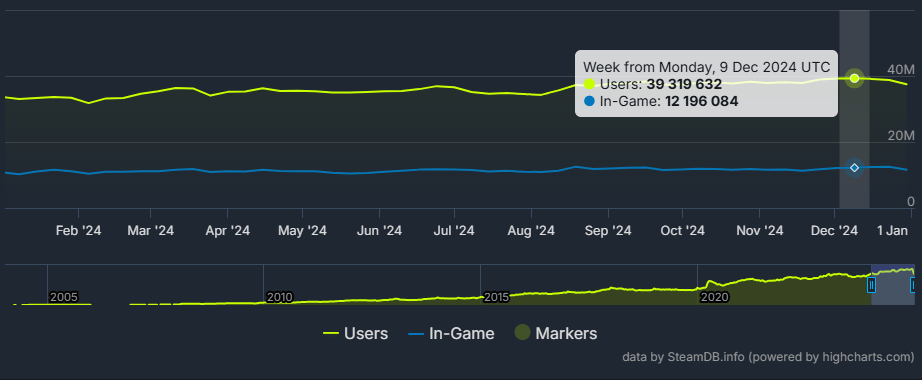

在热度方面，《黑神话：悟空》作为Steam平台2024年度最火新品的位置也是当仁不让，它和《幻兽帕鲁》分别以240万和210万的峰值在线人数与本年度其他产品
拉开了巨大的断层，考虑到去年的Steam顶流《博德之门3》和《霍格沃茨：遗产》的峰值在线也不过80万人左右，足可见这两个现象级爆款产品在市场上的恐怖支配力。

除开两位两百万量级的带头大哥之外，本年度的第二梯队内部差距并不是很大，本年内发售的实时服务型游戏在其中占据了很大比例，年末的《流放之路2》《漫威争锋》与更早
的《王权与自由》《第一后裔》和《地狱潜兵2》等产品瓜分了前十名中剩余的绝大多数席位。

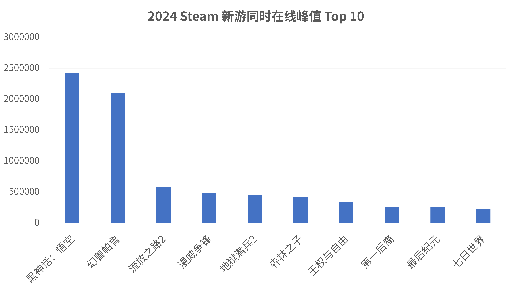

值得一提的是，本年度国产游戏中的头号明星《黑神话：悟空》与网易旗下的《漫威争锋》和《七日世界》加起来共占据了Steam 2024年热度榜前十名中的三个席位。
而欧美和日本的传统3A大厂已经被挤出了前十，只剩下《战锤40K：星际战士2》和卡普空的《龙之信条2》《龙珠2：电光炸裂》等少数游戏还维持在前20的行列。

从IP的角度来看，2024年热度榜前20中有12个是新IP，它们大多都来自于传统欧美游戏大厂以外的多家独立工作室。似乎在大厂们抱着手中的老IP精耕细作的同时
，也有更多独立工作室积攒了自立门户的实力。

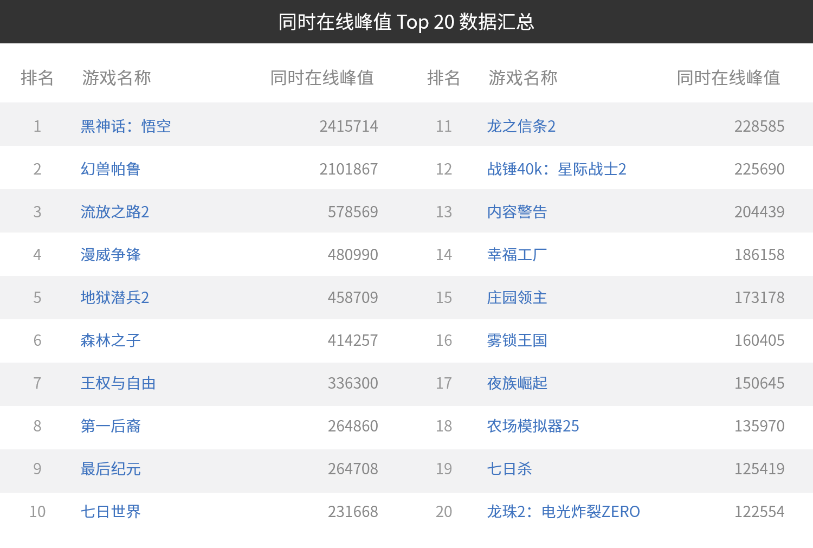

这份榜单也一定程度上反应了2024年游戏产业的风向：一方面中国、韩国和东北欧的多家厂商成为后起之秀在2024年高歌猛进；另一方面欧美老牌3A厂商却在面临裁员
、成本失控、销量和玩家口碑上的多重挑战。

至少从2024年Steam平台的数据来看，大量国区玩家的涌入已经开始逐步改变Steam原有的用户结构，虽然距离撼动欧美日在游戏产业的话语权还有相当距离，但在
爆款产品已经打开市场的之后，国内玩家作为一个急速成长中的新兴市场，不仅对于国外厂商来说愈发重要，也成为了国内开发者们用游戏进行文化输出的坚强后盾。

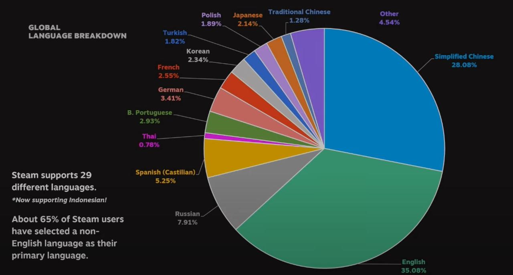

在2024年早些时候Steam工作人员公布的数据中，简中用户占比已经达到了28%

## Steam 2024销售概况

不久前，Steam公布了其每年一度的销量梯度榜。按照惯例，Steam官方不会给出当年的销售额及具体排名，而是以毛收入划分成白金级（Top1-
12）、黄金级（Top13-24）、白银级（Top25-50）和青铜级（Top51-
100）等不同级别。为方面大家查阅，我们将Steam平台2024年销售前50的游戏名单整理如下。

注：以下排名不分先后

白金级

《DOTA2》《CS2》《APEX》《艾尔登法环》《命运2》《战锤40K：星际战士2》《使命召唤：黑色行动6》《绝地潜兵2》《博德之门3》《幻兽帕鲁》《黑神
话：悟空》《PUBG》

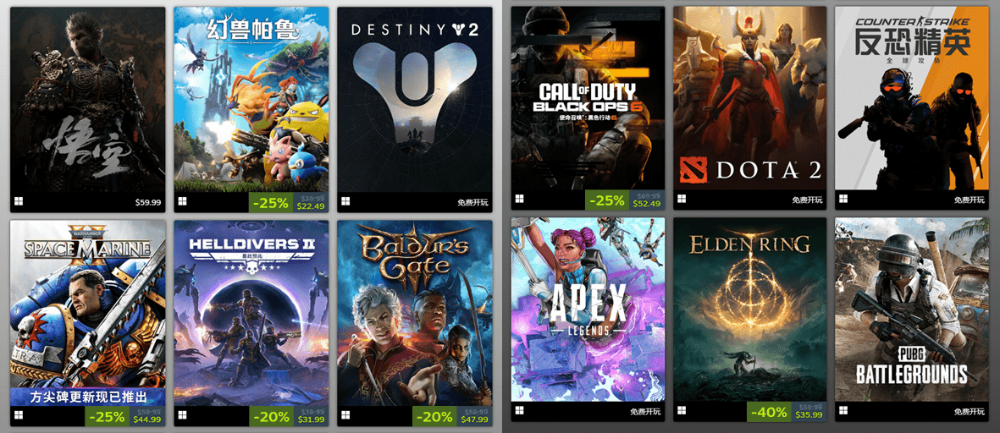

黄金级

《EA Sports FC 25》《战争雷霆》《第一后裔》《星际战甲》《雾锁王国》《王权与自由》《EA Sports FC
24》《赛博朋克2077》《永劫无间》《黎明杀机》《龙珠2：电光炸裂 ZERO 》《流放之路2》

白银级

《上古卷轴OL》《对马岛之魂 导剪版》《使命召唤 战区》《游戏王决斗大师》《龙之信条2》《碧蓝幻想Relink》《失落方舟》《荒野大镖客：救赎2》《致命公司
》《使命召唤：现代战争》《GTA5》《辐射76》《极限竞速：地平线5》《星露谷物语》《腐蚀》《暗黑破坏神4》《最终幻想14》《霍格沃茨：遗产》《极限竞速：地
平线4》《铁拳8》《七日世界》《庄园领主》《彩虹六号：围攻》《灰区战争》《潜行者：切尔诺贝利之心》《最后纪元》

对比去年，这份榜单没有太大的结构性变化，白金级和黄金级（销量前24）榜单中有11款是2024年发售的新游（其中有5款持续运营型新游）、9款老牌持续运营游戏、
4款经典老游戏。新游的数量有所提升，从7款增长至了11款，老牌持续运营游戏和经典老游戏各自都减少了2款。

在2024年的几款强势新游的发力下，老牌持续运营游戏和经典老游戏在具体名次上有减员和些许变动，但大多数仍然是那些被市场检验过的知名IP。这一方面再次验证了头
部产品在Steam平台上长尾收入的持续性，另一方面也导致了新游被经典游戏持续挤压、难以突围的无奈现状。

Steam的公开数据也证明了这一点，虽然开发者们2024年在平台上发布的游戏数量已经增长到了1.9万份，但玩家群体新游的游戏时长仅占总量的15%，过去1-
7年发行的游戏占比47%，而发行超过8年的游戏则占比37%。可见“等等党”在Steam社区中是一种相当普遍的现象。

这种玩家习惯的形成原因是多方面的，其一来源于新游首发时的不确定性，例如游戏刚发售时普遍存在的优化和BUG问题往往需要一段时间才能逐渐解决；其二，Steam频
繁促销的销售策略也对玩家普遍的观望态度有着很大影响。很多Steam平台上的3A大作会在发售一年左右的时间段进行大力促销，有时打出的折扣甚至高达5折以上。

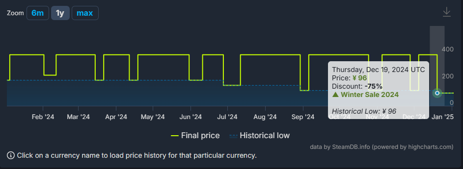

去年发售的《霍格沃茨：遗产》，到2024年冬促打出了-75%的史低价

也就是说虽然Steam每年都能诞生出一批一鸣惊人的黑马，但实际上每款新游都需要与同期那些参与促销的经典游戏，甚至是3A大作竞争玩家的游戏时间，只有极少数质量
和内容过硬的幸运儿能够从这片红海中脱颖而出，因此即便是小体量低成本的独立游戏，也不能忽视上线节点的宣发工作。

在大厂的3A大作和明星独立游戏出尽风头的背后，是数量逐年攀升、竞争愈发激烈，质量却良莠不齐的众多小体量独立游戏，在那些频繁促销的经典大作的阴影下，它们突围的
压力仍然很大。

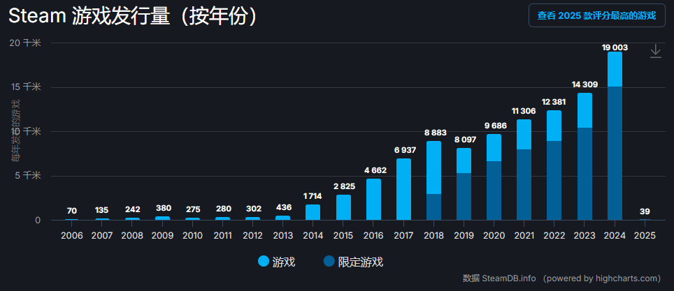

## Steam国区2024销售概况

对于国产游戏而言，2024毋庸置疑是创造奇迹的一年，可惜这些繁荣只属于《黑神话：悟空》《漫威争锋》等几个头部产品。虽然2024年有着《黑神话：悟空》这样划时
代意义的重量级产品，但在数量上，当前Steam平台的国产游戏生态仍然以独立游戏为主，整体上非常弱势。

如果我们以业界经常用于估算销量的评论数作为指标，观察2024年发布的国产游戏，会发现只有14款迈过了一万条评论的大关。除去其中免费游玩的实时服务型游戏之外仅
剩9款，且《黑神话：悟空》与其他买断制游戏有着断崖般的巨大差距，《饿殍：明末千里行》《灵魂面甲》和2024年结束EA的《苍翼：混沌效应》等是为数不多知名度较
高、销量尚可，能在2024年杀出一条血路的独立游戏。

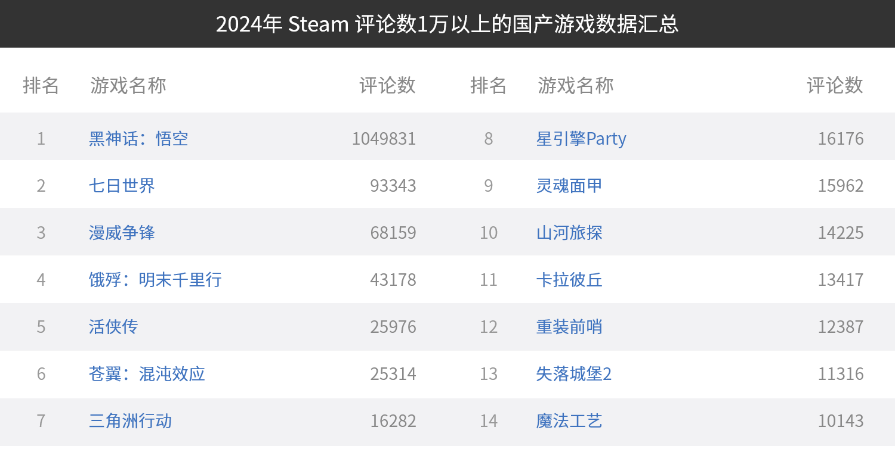

与诞生了《猛兽派对》《完蛋！我被美女包围了》《火山的女儿》等众多黑马的2023年相比，2024年Steam上架的国产独立游戏整体疲软，无论是游戏阵容还是社区
话题度都大不如前。可见虽然《黑神话：悟空》创下268元的国产买断制游戏最高定价，并在这个基础上实现了数千万的销量。但对于国产游戏，尤其是买断制游戏而言，这仅
仅是个新的开始，Steam平台上国产游戏相对低定价低销量的现状仍然需要时间和更多质量过硬的产品来改变。

在销量层面，2024年我们照例总结了数据库中国区用户库存的新作保有量Top12，以对比Steam新游销量榜中的白金级。

注：以下排名均不分先后

国区新作保有量Top12

《黑神话：悟空》《幻兽帕鲁》《七日杀》《漫威争锋》《骗子酒吧》《七日世界》《链在一起》《森林之子》《小丑牌》《饿殍：明末千里行》《绝地潜兵2》《活侠传》

Steam全球新作销量白金级

《潜行者：切尔诺贝利之心》《EA Sports FC
25》《庄园领主》《幻兽帕鲁》《龙之信条2》《黑神话：悟空》《使命召唤：黑色行动6》《绝地潜兵2》《NBA 2K 25》《流放之路2》《龙珠2：电光炸裂
ZERO 》《战锤40K：星际战士2》

很明显，国区玩家更青睐于购买低价独立游戏的消费倾向没有本质变化，玩家只愿意为少数现象级3A大作支付200元以上的高价，并且更愿意尝试那些几十元的小体量游戏，
而在这些低价独立游戏中，国区玩家似乎更青睐带有合作要素的产品。

即便是在《黑神话：悟空》引爆国内玩家之后，业界已经有不少厂商开始向3A游戏发力，但由于Steam平台上国产游戏长期以小成本独立游戏为主，大体量优质国产游戏供
给不足，所以玩家在消费上非常谨慎，如何建立厂商与玩家之间的信任，激活国区用户的消费能力，是《黑神话：悟空》后继者们在营销和宣发时不得不面对的问题。

## Steam 2024年硬件现状

在硬件层面，虽然2024年整体数据与前一年没有太大变动，但2024年的数据中也有着不少细微的变化。根据Steam的数据统计显示，截至2024年12月，Win
11已经取代了Win10系统，成为了Steam玩家主流的操作系统。

Steam玩家最常使用的屏幕分辨率1920×1080，最主流的系统内存和总硬盘空间分别是16G和超过1TB，而使用最多的显卡则为NVIDIA GeForce
RTX 3060。

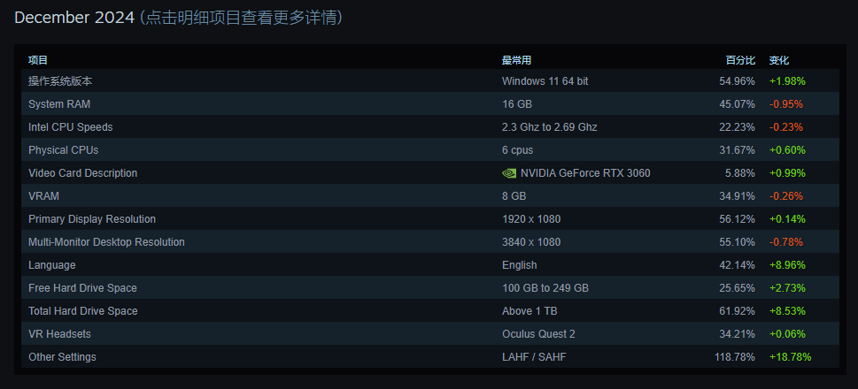

同时，在NVIDIA 50系显卡上市之前，许多用户的首选显卡并不是最新的40系显卡，而是问世多年的3060显卡。

总体来说，在新世代的硬件尚未问世的2024年，大多数用户似乎并没有为自己更换设备的打算，而更多的持一种观望的态度。

比如在使用率排行前十的显卡里，以RTX4060为代表的40系显卡，以合计13.81%的使用率占比最高，而曾经待在前十的1050Ti、1660SUPER也随着
40系显卡的逐步应用而退出了使用率的前十。

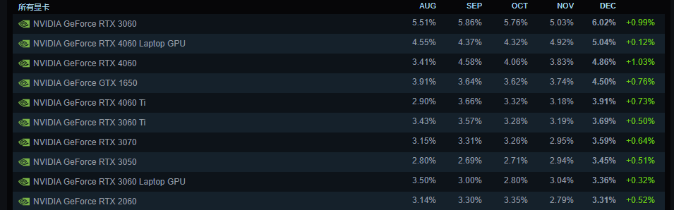

此外，30系及以上的移动端显卡使用率也有了大幅的提升。RTX4060笔记本版GPU的使用率不仅超越了自己的桌面版，同时还成为了目前使用率仅次于RTX3060
的显卡，而30系及以上的移动端显卡的整体使用率也已经到达了近15%，相比于去年呈现出了一定上升的趋势。

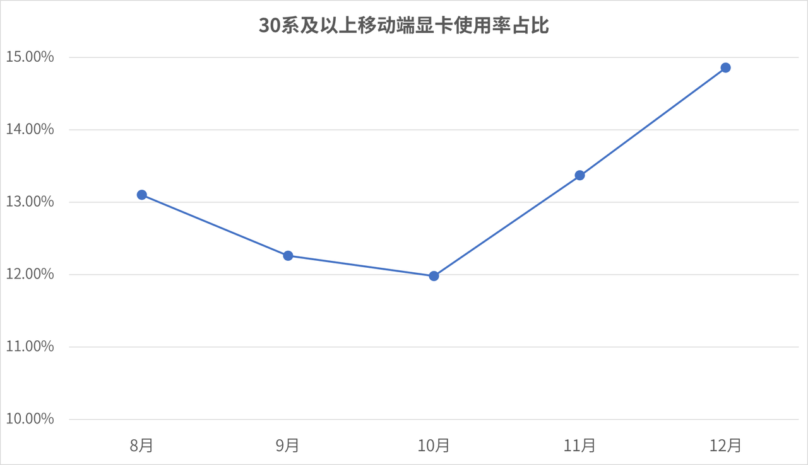

2024年，我们对Steam公开的显卡使用情况进行了粗略的性能分级，以RTX3070Ti和GTX1060这两张分别代表了中、低端性能“天花板”的显卡为界，对
Steam玩家的显卡使用进行高、中、低的层级划分。

其中，性能低于GTX1060以下（包含GTX1060）的显卡为低端显卡；性能处于GTX1060到RTX3070Ti（包含RTX3070Ti）之间的显卡是中端
显卡，而性能高于RTX3070Ti的显卡则为高端显卡。

将一些无关数据排除后，我们便能得到一些有趣的结果，比方说在所有Steam玩家中，选择中端显卡的人数占比为63.6%，选择高端和低端显卡的玩家则分别占据了16
.8%和19.6%的规模。

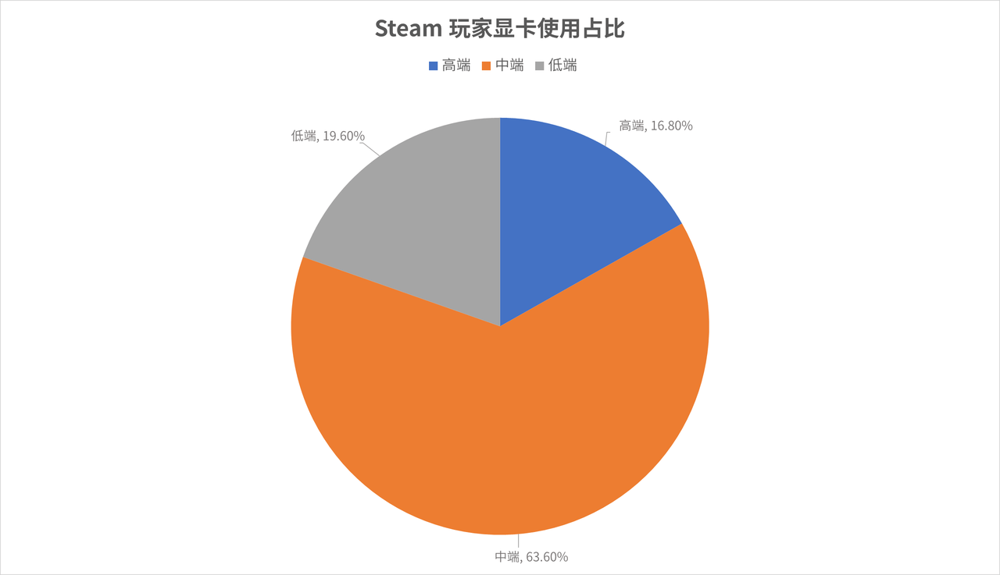

中端显卡当中，使用以RTX3060显卡为代表的30系N卡的玩家最多，占比为39.37%。而随着40系N卡的迭代，使用10系N卡的玩家已经只占中端显卡玩家中的
13%。不过就算如此，它的使用规模也仍要比中端A卡玩家7.91%的规模要大。

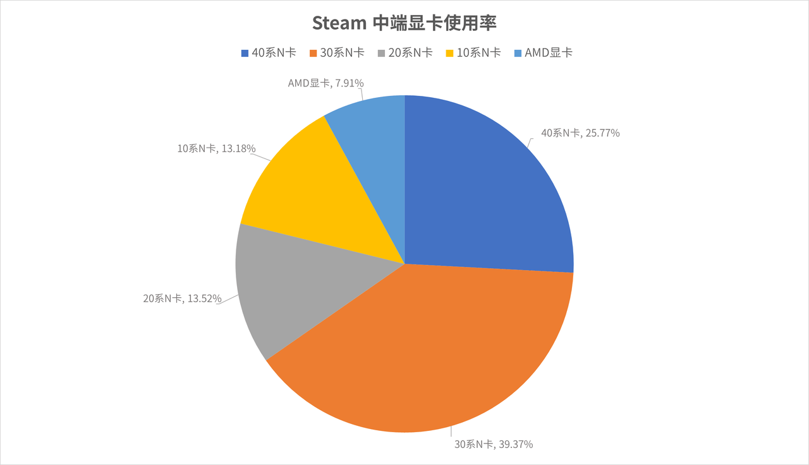

低端显卡方面，除了GTX1050、1060、1650等老显卡外，使用Intel自带的核显进行游戏的玩家也有着相当的数量。不过考虑到Steam平台上有着许多对
配置要求极低的独立游戏，这种现状也可以理解，从侧面上来说，这也是Steam平台低门槛的另一种体现。

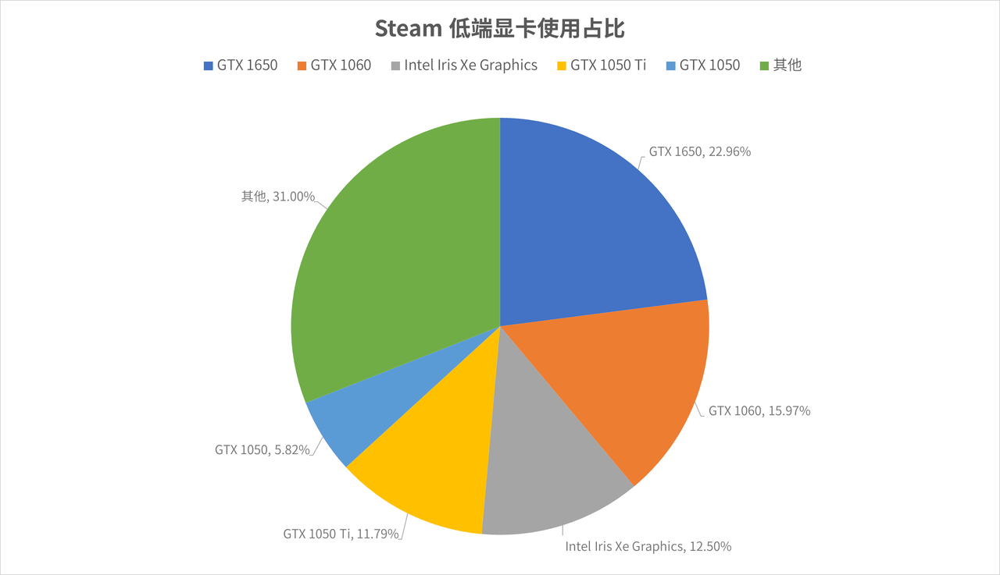

而在SteamDeck方面，即便当今市面上的同类竞品越来越多，V社却似乎并不急于在硬件方面的更新迭代。在2023年11月发售了更换屏幕、续航增强的OLED款
后，SteamDeck几乎就陷入了沉寂，并没有任何新的动作。

除了硬件本身的开发周期外，V社对SteamDeck的谨慎态度也是关键，在对外采访中，V社设计师曾表示：“我们已经明确表示不会每年更新一代产品。没有理由这样做
。坦率地说，从我们的角度来看，这对顾客是不公平的，推出仅有小幅改进的新机型并不合理。”

而对于SteamDeck2，V社则是计划在技术出现重大突破，且不影响电池性能的前提下才会推出。换句话说，尽管SteamDeck2这个项目确实在研发，但V社要
在一个合适的时机进行发售，而不是在竞品的压力下仓促上阵。

## Steam 2024年政策解读

2024年，Steam通过一系列政策，进一步巩固了自己作为全球最大数字游戏分销平台的地位。我们将继续对2024年的新政策进行分析与解读，望能对厂商及业界工作
者有所帮助。

### 5.1 新版家庭共享功能

早在2013年，Steam就开通了家庭共享功能，允许将自己账户的游戏库借给他人使用。然而，随着时代的变迁，这一功能使用繁琐、限制颇多的弊病也逐渐体现。用户需
要在自己电脑上登录对方Steam账号手动授权，且如果作为库所有者的对方正在游玩，那么自己就无法启动对方库中的任何一款游戏。

2024年3月，Steam宣布在测试版中推出新版家庭共享，并于后续9月更新到了正式版中。新家庭共享便利度很高，只需接受邀请就能加入，组成一个最多6人的共享游
戏库。成员之间没有旧版的库限制，可以同时自由使用游戏，而共同拥有的游戏会被按份计算，只要份数足够，那么多人也可以同时游玩同一个游戏。此外，他人拥有的DLC也
可以被共享，而无需其他成员拥有游戏本体。

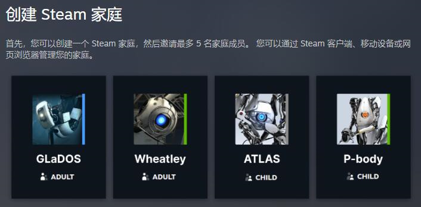

不过对于那些需要关联第三方账户的游戏，Steam也无法跳过厂商自己的平台进行家庭共享。例如《纪元1800》《刺客信条：英灵殿》等大多数育碧游戏，以及包括《双
人成行》《EA SPORT FC 25》在内的EA游戏都在此列。

这一措施在利好玩家的同时，也对开发者们造成了一些潜在的风险。新版家庭共享大幅增加了用户间游戏的流动性，让多人仅买一份游戏轮流游玩成为了可能，在新游发售时可能
会降低用户的购买意愿，进而影响到厂商的销量。

当然Steam也为厂商提供了应对的手段。在新版家庭共享推出后，游戏商店页的官方TAG中增加了一项“家庭共享”，而厂商可以随时选择是否要为某款游戏关闭这一功能
。目前大多数游戏都暂未关闭共享功能，但也有少数个例，比如《魔女之泉R》自发售时就不支持家庭共享，并明确在商店页写明了“为了控制盗版传播，游戏现阶段关闭了家庭
共享功能”。

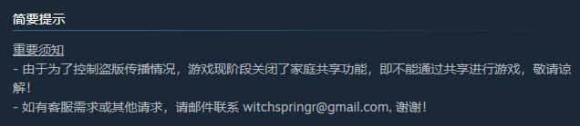

从玩家评测和用户口碑看，《魔女之泉R》的做法并未因关闭家庭共享而激起激起玩家的抗议。但现阶段采取这一做法的个案数量过少，所以新家庭共享对游戏销量会产生多大的
影响，以及厂商是否应该关闭家庭共享功能等问题，还有待未来进一步观察和研究。

### 5.2 数字产品购买声明更新

在2023年末，育碧宣布Steam上《飙酷车神》将于2024年3月下架并关闭服务器，所有购买游戏的玩家将无法再次游玩。此事激起了大量玩家的愤怒情绪，不少购买
了游戏的玩家要求维护自己的合法权益。

此事的发酵引起了国外有关部门对数字游戏所有权问题的重视，在2024年9月，美国加利福尼亚州签署了一项新法律，旨在规范数字内容销售平台的用语，确保消费者在购买
时清楚了解他们获得的是临时的使用许可证，而非永久所有权。

尽管这项法律要到2025年才正式生效，但V社随后也密切跟进，调整了Steam在购买游戏时的提示，突出显示了“购买数字产品将获得该产品在Steam上的许可。”
一句，并附上了相关协议的链接。

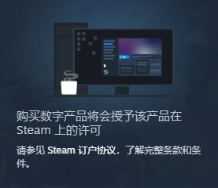

对于厂商而言，在有了Steam的相关声明更新，以及《飙酷车神》《星鸣特攻》等游戏下架且不再提供服务的先例后，或许也能让用户更加理性地看待“停服”这一事件，避
免对厂商整体口碑造成更大影响。

### 5.3 对季票内容的支持与规范

2024年11月，V社在Steamwork文献库调整了对于季票的政策规范，限定厂商必须列出季票中DLC的具体发行日期，并详细说明每个DLC中所包括的内容，并
且要至少包括一个已经推出的DLC。因特殊原因取消的DLC需要向玩家退款，如果要延期DLC的话，仅有一次机会重新安排，但不得延后超过三个月，否则V社可能采取强
制措施，包括下架季票并向玩家退款。

现如今季票作为一种消费模式已经相当普遍，但部分游戏由于公司内部问题，使季票内容出现延期乃至取消的状况也并不罕见。其中最为人熟知的无疑是《最终幻想15》的案例
，2018年游戏总监田畑端自Square Enix离职，同时开发团队也难以为继，宣布取消了预定推出的阿拉妮雅篇、露娜篇和诺克提斯篇等DLC。此事让众多购买了
季票的玩家认为自身权益受损，不仅对玩家社区造成了重创，也使Square Enix的品牌形象受损。

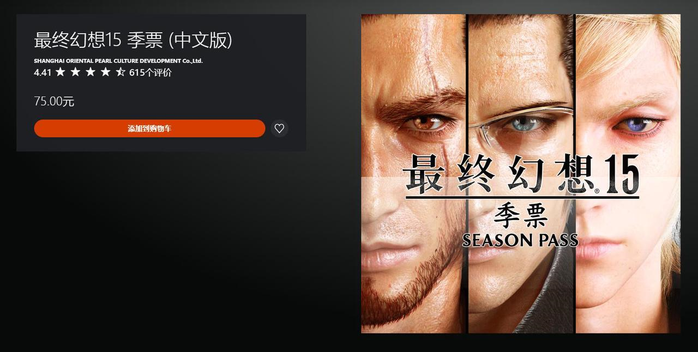

因此，Steam的新季票政策对于玩家来说，无疑使他们的知情权与利益都进一步得到了确保。但对于厂商而言，则需要更明确的内部管理和项目表，来确保游戏的DLC能够
按时按量推出。

### 5.4 试玩Demo的相关改动

2024年7月，Steam对游戏试玩版进行了“超级”更新，旨在让它成为更强大、更灵活的营销工具。

试玩版如今拥有了独立的商店页面，不再像过去那样仅占据游戏商店页中的一个小区块。并且Steam在主页上的“新品与热门商品”等榜单中，新增了一个“免费游戏”选项
卡，用来专门展示试玩版及免费游戏，相当于为试玩版提供了额外的曝光。

而玩家也能在试玩版中留下评测，这也让每年Steam新品节的重要性进一步增加，它不仅能够在短时间内为试玩版积累大量的曝光以及愿望单添加数，也能让厂商从试玩版页
面更直接接受到玩家的相关反馈，从而进一步打磨游戏品质。

但玩家们的评测也可能是一把双刃剑。大量好评能为游戏提供更多的知名度，但过多差评也可能让游戏在发售前就积累不必要的负面口碑。因此，厂商需要推出质量更高的试玩版
来规避可能的风险，而这也可能会影响具体的市场推广策略。

### 5.5 结语

除了上述所分析的政策外，本年度Steam还对商店页面进行了许多零碎的改动。诸如商店页新增了QQ、B站等国内的社媒跳转按钮、禁止开发商使用链接在商店页为其他游
戏/商店打广告、要求内核级反作弊工具的工具在商店页注明等内容，在方便厂商进行用户转化的同时对于Steam商店的规则进行了进一步完善。

总之，2024年Steam上的政策演变，继续强调了V社对用户权益保护的重视、对数字内容的深化管理、以及在平台功能优化上的进一步努力。这让Steam得以巩固了
在游戏发行平台上的领先地位，有利于其继续从用户与厂商等方面收获良好的口碑。

## 2024 Steam国区用户画像

正如我们之前提到的，2024年Steam国区用户月活数激增，从去年的3800万增长至约5673万，体量扩充了近一半，而游民星空数据库收录的Steam付费用户
结构变化也非常直观地体现出了这一点。

2023年，Steam库存价值2000元以下的国区用户规模为36%，2024年这一比例则迅速膨胀至62%，很明显是由大量新注册用户涌进Steam导致的。而其
他梯度的用户除了总体占比被挤压外，整体规模没有太大变动，且各层级实际观测到的数据变动与预测值误差均在5%以内。

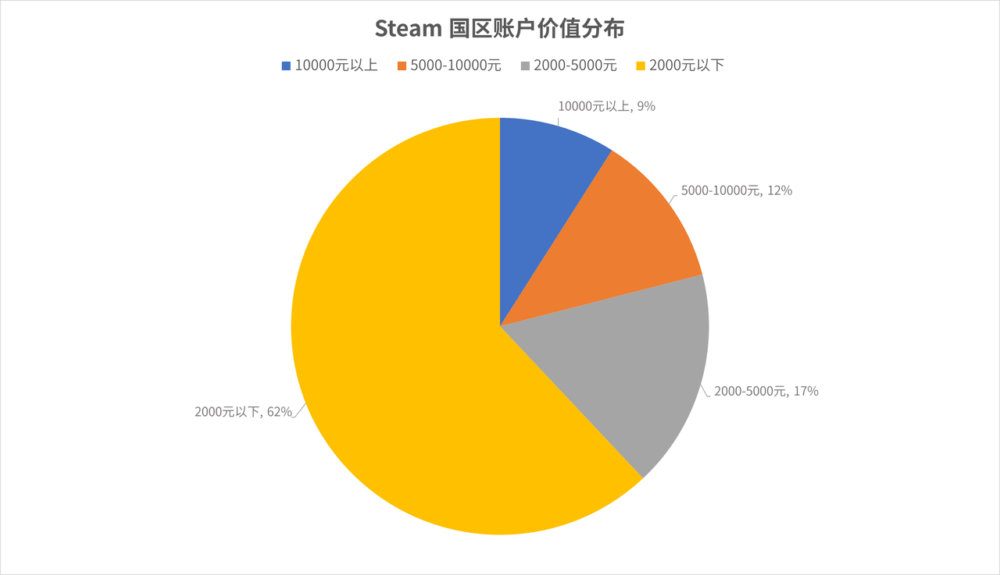

同样根据游民星空数据库的统计，去年上架Steam的众多产品中，国区用户入库最多的游戏毫无疑问是2024年的爆款《黑神话：悟空》。很明显，虽然黑神话268元的
售价创下了国产买断式游戏的新高，但同样破纪录的销售规模证明了国区用户虽然对价格相当敏感，但并不妨碍他们成为一个极具购买力的消费群体。

在刷新了国内资本和厂商对于3A游戏市场前景的认知同时，销量口碑双丰收的黑神话也为后来者开了个好头，国内玩家逐渐开始对“国产游戏”重新建立信心，中国传统文化题
材搭配上顶尖的3A游戏制作规格成为了新的行业风口，而国产单机游戏能否从一个爆款游戏拓展成一个有市场号召力的品类和赛道，取决于未来的游戏能否把握住这个机遇，用
出色的品质延续黑神话带给玩家和市场的信心。

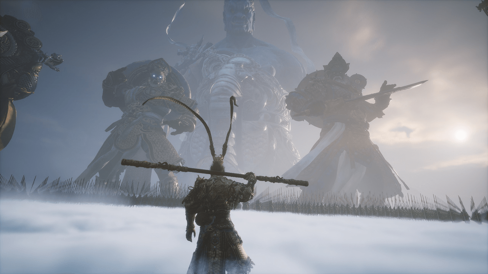

而除了黑神话这个爆款3A之外，国区玩家的消费仍然偏向于购买《幻兽帕鲁》《骗子酒馆》等价格相对较低的精品独立游戏。Steam全球销量靠前的《龙之信条2》和《战
锤40K：星际战士2》等3A游戏在国区表现比较乏力，这一方面是因为欧美、日本的传统3A游戏大厂在2024年整体疲软；另一方面这些IP的影响力在国内相对有限，
很难与去年《霍格沃茨：遗产》这样的顶级IP相提并论。

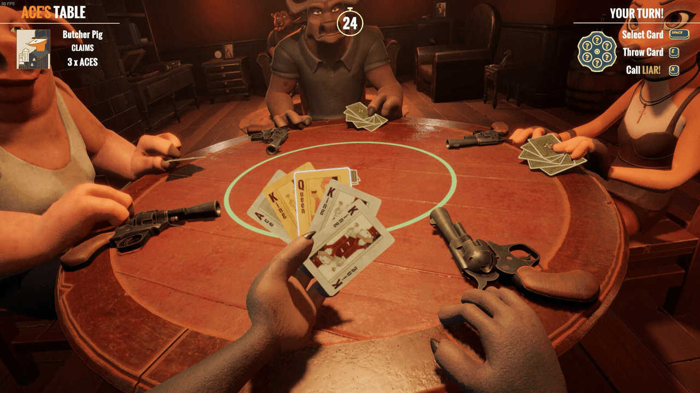

同时，我们总结并比对了2024年Steam畅销新游和国区畅销新游出现最频繁的TAG，以探究国区玩家最新的消费偏好。

注：以下排名不分先后

Steam全球畅销新游TAG前10：

动作/多人/合作/冒险/角色扮演/模拟/3D/玩家对战/开放世界/策略

国区畅销新游TAG前10：

生存/多人/合作/开放世界/射击/制作/动作/剧情丰富/基地建设/角色扮演

对比两份TAG榜单，国区玩家2024年对于有着生存、开放世界要素的SOC游戏消费相对集中，这很大程度上是多家厂商在供给侧集中发力而出现的繁荣。去年年初的现象
级游戏《幻兽帕鲁》产生的带动作用自不必说，并且这个赛道在2024年还有《森林之子》《七日杀》等往年的知名独立游戏结束了EA测试、更新大量游戏内容，再次吸引了
相当数量的新玩家。

同时，我们也可以看出含有多人合作玩法的游戏无论在国区还是全球都很受欢迎，这可能是多方面因素导致的。一方面，与去年青黄不接的3A游戏不同，2024年Steam
平台的实时服务型游戏诞生了不少新爆款，其中《漫威争锋》和《七日世界》等国产游戏也在这股大潮下分得了一杯羹。

另一方面，多人游戏不仅有利于用“老带新”的方式持续拉新，通过玩家在游戏中的社交持续带动销量；并且这类游戏非常适应当下利用直播平台进行宣传的推广模式，满足了主
播群体通过内部联动持续拉抬人气的核心需求。因此哪怕不刻意进行营销推广，只要能够带来足够的节目效果，也会有一批当红主播进行义务宣传。近两年《致命公司》《猛兽派
对》《骗子酒馆》和《链在一起》等许多以多人合作为核心的独立游戏就明显吃到了这方面的红利。

对于想要以小博大的独立游戏工作室来说，多人合作游戏有着能够低成本获得曝光，甚至是知名主播站台的推广优势，这多多少少能够在一定程度上弥补独立游戏宣发困难的先天
不足，成了近年来相对容易出圈的理想赛道。

综合2024全年Steam国区的销售状况而言，国区玩家在《黑神话：悟空》上爆发出的惊人消费力是个足以让我们刷新认知的惊喜，这种单个爆款撬动了国区玩家以至于整
个Steam用户结构版图的盛况远远超出了预期。

但在国区用户体量疯狂扩张的另一面，玩家们“重仓个别爆款3A，广泛持有低价独游”的消费习惯没有质的改变，用户体量的增加虽然的确提振了市场，但单个玩家的消费能力
仍然有待提升。尤其是2024年众多厂商集中宣布立项的单机游戏距离最终上市仍然需要至少三到五年的时间，这期间Steam国区用户是否会流失、急剧扩张的市场是否会
因为优质游戏供给不足而快速萎缩都有着相当大的不确定性。

换言之，Steam国区未来能否维持2024年的盛况，影响着黑神话爆火后集中上马的诸多国产单机项目未来的生死。因此先行一步即将在2025年上市的《昭和米国物语
》《明末：渊虚之羽》，以及备受期待的《影之刃零》等产品能否将黑神话开创的“黄金时代”延续下去，可能决定了国产单机游戏未来几年的前途命运。

正因为黑神话给后来者留下了一个天胡开局，国产游戏迎来了一个前所未有的机会进行技术迭代和产业升级、追赶欧美头部3A大厂，所以后来者能否接好这一棒才显得尤为重要
。

踏平坎坷成大道，斗罢艰险又出发。如今的国产游戏，又站在了一个新的转折点上。

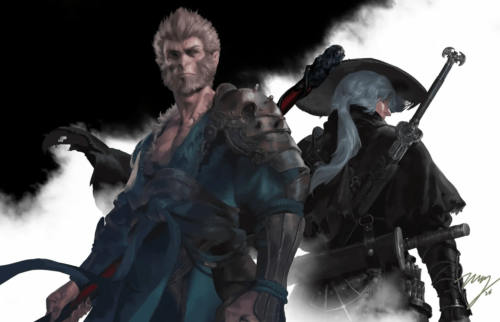

《黑神话：悟空》深度拆解

## 《黑神话：悟空》开发历程

谈及2024年的国产游戏行业，《黑神话：悟空》是绝对绕不开的一页。

从项目曝光开始，每一次露脸，它就聚焦着国内游戏行业和万千玩家的目光。而在发售后，无论是其商业成绩，还是在社交平台的话题度，亦或是主流媒体上的频繁曝光，《黑神
话：悟空》都创造了历史，在国产单机历史上留下了浓墨重彩的一笔。

从最初立项到正式发售，《黑神话：悟空》的开发历程会给行业在探索3A单机游戏的道路，带来什么样的宝贵的经验教训，它的奇迹能否在其他后来者身上复现？为了探讨这些
问题，我们有必要回顾一下《黑神话：悟空》的开发历程。

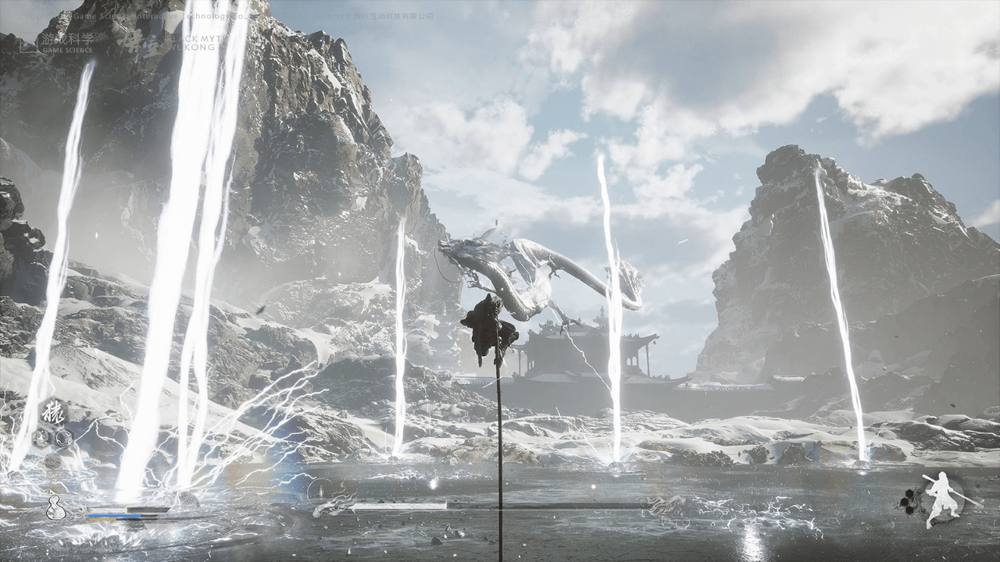

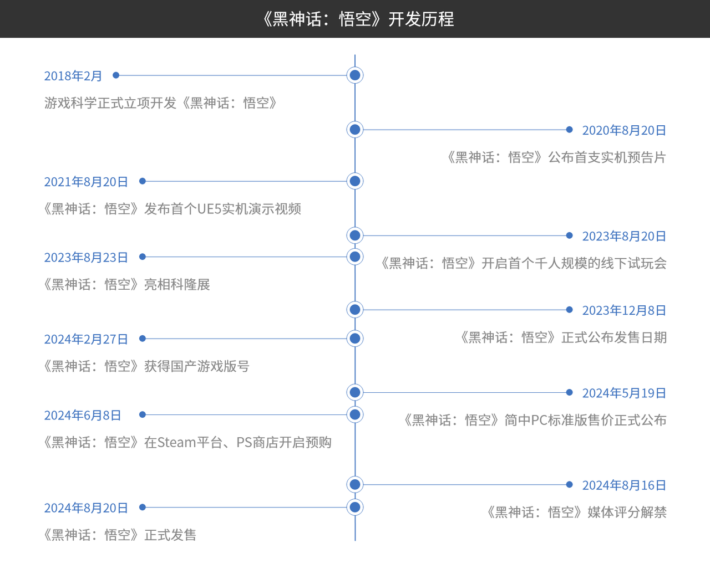

2018年年初，春节刚刚过去，开工不久的游戏科学迎来了一场合伙人会议。在会上，冯骥等人除了确定了公司未来的发展方向之外，还将“做一款单机游戏”的计划提上了日
程。

他们最初的想法只是“分成两个团队，一个团队做手游，抽调五六个人准备做一款单机游戏”。经过后续讨论后，冯骥等人最终将产品的项目品类定为动作游戏，并以西游背景为
题材，内部代号为《Black Myth One》，也就是现在的《黑神话：悟空》。

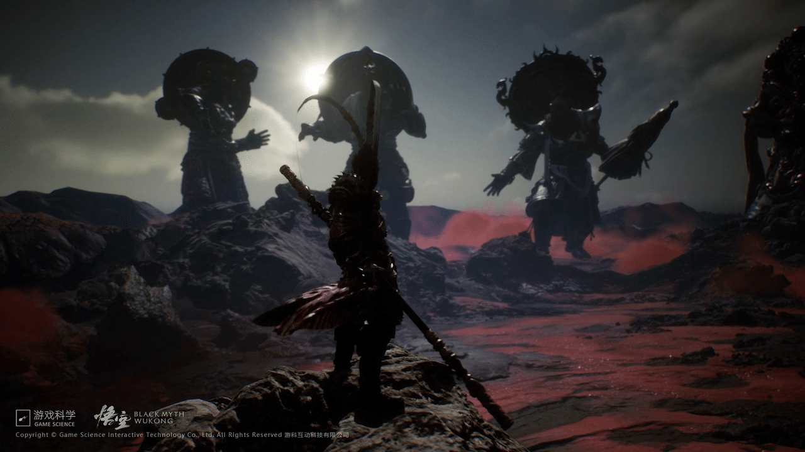

至于游戏科学为什么选择在这个节点做一款单机动作游戏，我们并不得知。

也许Steam国区用户数量已经成为第一，国内单机市场可能大有可为给了他们勇气。也或许是媒体采访时，冯骥口中的以“跪着的方式”也不一定能赚到钱，还是想做打动自
己的事。也可能是杨奇不止一次在微博提及的来自十来年前的小小心愿，他们都想要弥补《斗战神》的遗憾。

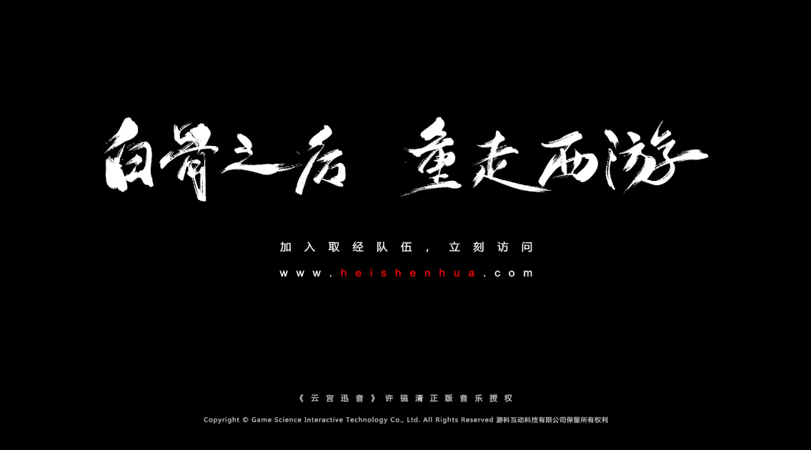

总之，一切都归于了冯骥的那句“未竟亦可为”。在《黑神话：悟空》亮相2024年的夏日游戏节后，冯骥用“试试吧”总结了游戏的开发历程，其中有一段这样写到：

我们现在在做的事情，是我们自己作为用户同样理解、认可、喜爱的吗？

我们现在面临的挑战，世界上有其他人做过吗？即便没人做过，我们能不能做？

如果以上回答都是肯定的，那当然就值得试试。

但可以肯定的是，估计冯骥等人也没有想到，这个放在行业内毫不起眼的决定，却犹如蝴蝶扇动了翅膀，会对后来的中国游戏业产生了深远的影响。

### 1.1 未竟亦可为

两年后的8月20日，游戏科学正式公布了《黑神话：悟空》的首个实机预告。

其实预告片还未发布时，冯骥的想法是播放量“能有50万就不错了”，杨奇则要乐观一点，放出了300万的“豪言壮语”。按照他俩的说法，这则预告本打算就是为了招点人
，没想过会引起多么大的轰动。但后来发生的事则完全超出了他们的预期。

视频发布后的一个小时，播放量就已经冲破了冯骥期望的50万，之后更是如坐火箭般蹭蹭上涨；杨奇的微博每次刷新都会冒出一堆新的评论，一个上午转发量便达到了10W+
；无数玩家、媒体纷纷涌进游戏官网，结果让冯骥在一天之内充值了两次官网流量。而截止到目前，视频播放量已经超过了冯骥最初预计的120倍。

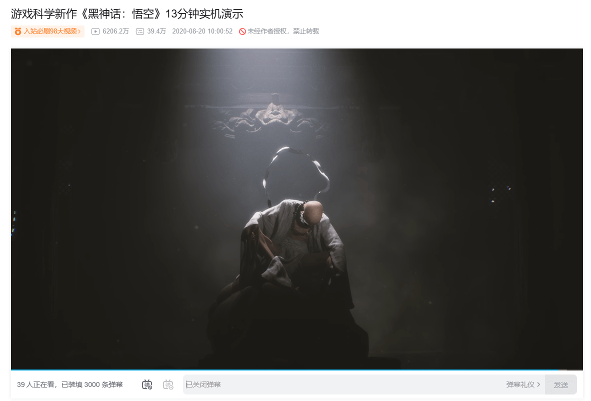

除了国内，《黑神话：悟空》的风也刮到了大洋彼岸，吸引了许多外国玩家。最终这支实机PV成了2020年IGN用户观看次数第二多的预告片。这虽然不是中国的单机游戏
第一次走出去，但绝对是最为火爆的一次。

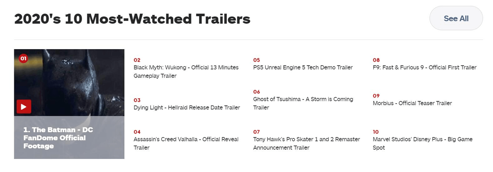

不过对于游戏科学而言，《黑神话：悟空》大火带来的绝不是惊喜，实机预告带来的超高热度为游戏科学增添了许多困扰。网络上谣言四起，核心成员离职、内部争斗……许多媒
体捕风捉影，最终逼得主创杨奇不得已发微博澄清；热情的玩家跑到杭州造访工作室，冯骥等人只能摆上谢绝参观的牌子；各大公司猎头纷纷展开了“撬墙角”行动，五花八门的
商务合作更是接踵而至。

这份突如其来的流量让项目组全体成员诚惶诚恐，预告片发布的当天下午，游戏科学内部便举行了一次全员大会来人为降温。后来，当有人问及项目首爆的感受时，冯骥用了“战
战兢兢，如履薄冰 ”来形容当时的心情。

而为了控制玩家们的预期，游戏科学也选择了主动闭麦。除了每年8月20日与春节的“保留节目”之外，《黑神话：悟空》鲜有发声。

在玩家的期待下，时间就这样来到了2021年。

在这一年里，游戏科学发生了两件大事：他们接受了腾讯的投资，并宣布《黑神话：悟空》换成了UE5（虚幻引擎5）开发。这两则消息引起不小的震动，玩家社区中有人因换
了UE5而欢喜，但更多的还是弥漫着对腾讯投资的质疑。

2021年的8月20日，就在万千玩家的翘首以盼中，《黑神话：悟空》如约而至，带来了一则长达12分钟的UE5实机视频。除了Epic的官方演示，这是第一支有着战
斗场景的UE5实机演示。演示里所展现的足以让人惊叹：流畅的动作、赏心悦目的美术、真实的光影效果、雪地里细腻的踩踏痕迹……尤其是中国龙的惊艳出场，引起了海内外
玩家的广泛讨论。

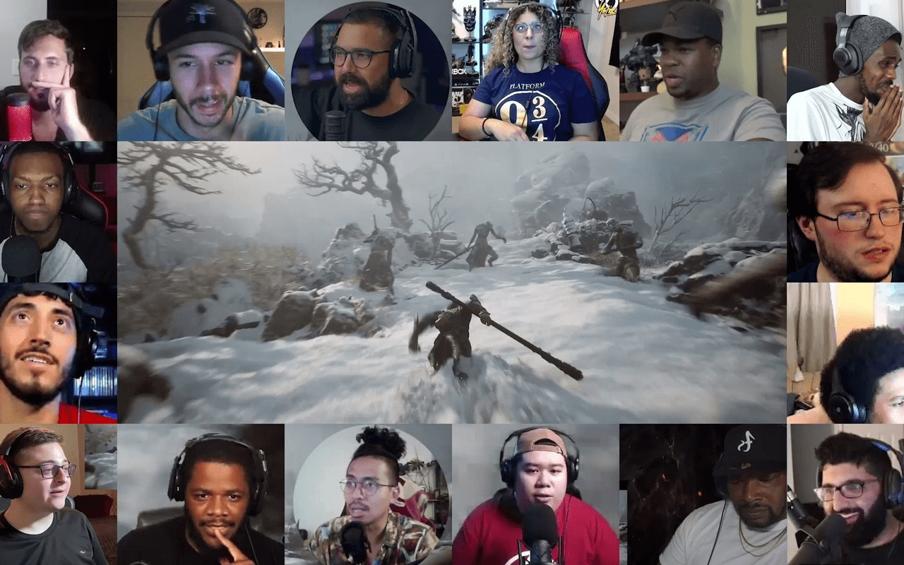

但同时，依旧热烈的反响更加深了游戏科学的担忧。冯骥在微博发文：“视频集锦，莫要轻信。蒙君垂目，砥砺前行”。为此，他们还特意在当年的春节短片中放上了BUG合集
，来控制玩家的预期，希望借此能够让玩家们明白《黑神话：悟空》仍有很多不足。

又是一年的8月20日，这次游戏科学出乎意料地公布了一段实机剧情片段，这样一转文戏的操作让许多人摸不着头脑。由于与之前的两个预告有着鲜明的对比，让许多满怀期待
的玩家第一次有了“实物与图片不符”的落差感。

毕竟，过往两个实机演示过于美好，让《黑神话：悟空》更像是一个不可触及的美梦。正因为这个剧情预告，许多人意识到《黑神话：悟空》并不是完美无瑕的，这也恰恰证明了
《黑神话：悟空》有着落地的可能。

整个2023，无疑是《黑神话：悟空》在宣发上最为关键的一年。8月20日，《黑神话：悟空》开放了首次线下试玩，正面回应了外界三年以来的期待。按照冯骥的说法，他
们“想尽力试一次，把现阶段的工作成果，直接交给大家亲身感受，毫不掩饰，毫无保留。”

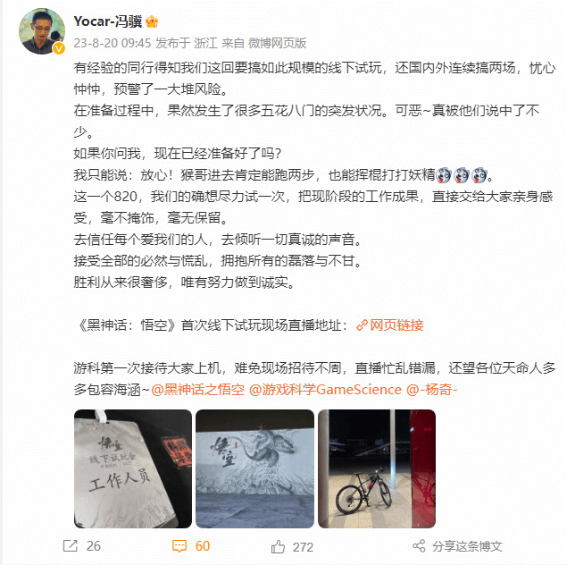

这场史无前例的千人规模的试玩会，成了游戏圈最为关注的事件之一。与之相关的话题，在中文互联网上迅速发酵，不仅登上了微博热搜，Bilibili热搜榜的前三名也都
被《黑神话：悟空》占据。

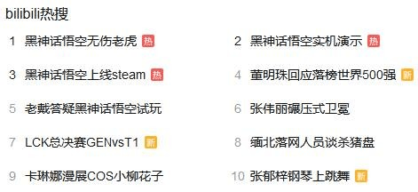

紧接着，《黑神话：悟空》亮相8月23日的科隆展，并公布了全新的宣传视频。科隆展首日，这则预告就力压《赛博朋克2077》资料片“往日之影”，《使命召唤20》等
国外热门游戏，成为了当天播放量最高的宣传视频，给了外国玩家一点小小的中国震撼。

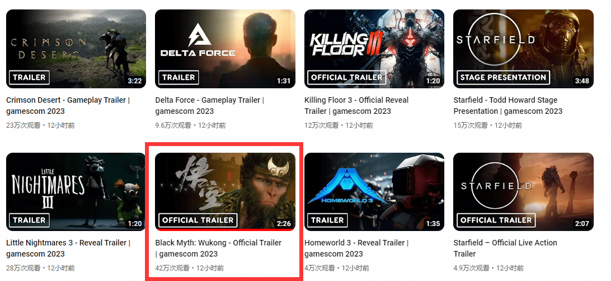

玩家们对于《黑神话：悟空》的热情可不只体现在互联网上。本次展会游戏科学提供了近50台试玩机器，排队依旧火爆，媒体日大约需要等待1个小时，公众日则变成了2小时
起步，高峰时段的排队时间甚至能达到5小时。

年末的TGA 2023颁奖典礼上，再次出现了《黑神话：悟空》的身影。这次，游戏科学带来了一段将近3分钟的实机预告，并正式公布了游戏的发售日期——2024年8
月20日。至此，已经等待了三年的玩家们终于有了确切的盼头。

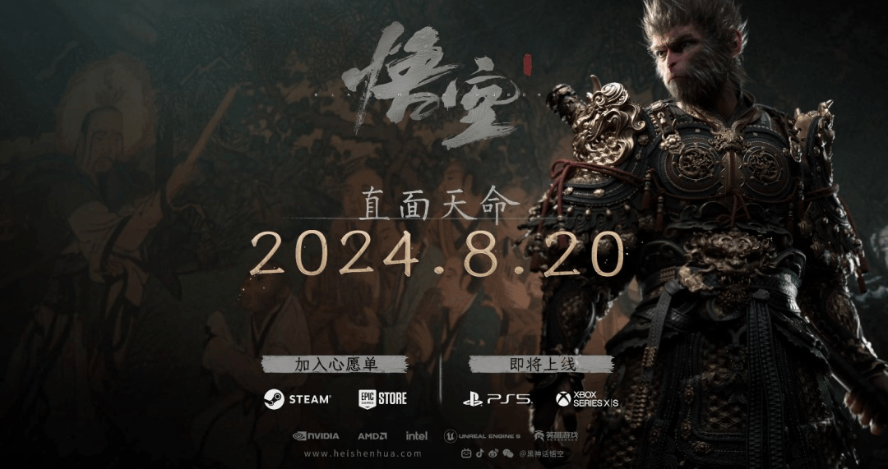

发售日期的公布也将《黑神话：悟空》的人气拉到了顶峰，在短短两个月内，《黑神话：悟空》吸引了各方目光。先是露脸央视2023年的彩蛋回顾、获得中国驻意大利大使馆
的官方安利，又在春节登上陕西卫视春晚，最后超越《空洞骑士：丝之歌》，正式登上了Steam“最受期待游戏”榜单的榜首。

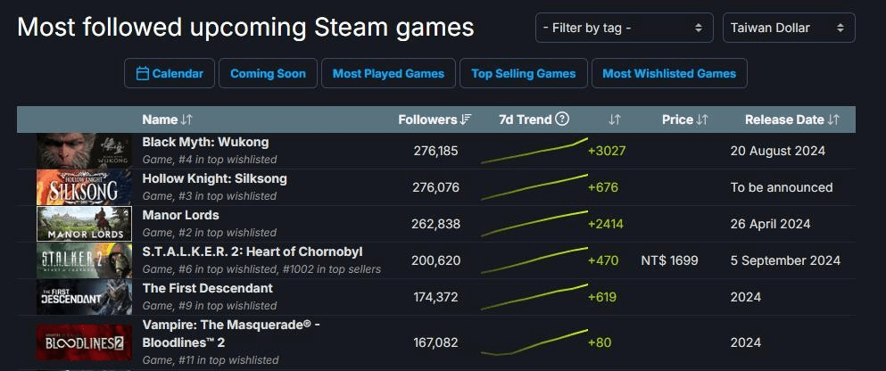

2024年2月27日，《黑神话：悟空》如愿拿到了国产游戏的版号，而这个消息也迅速登上热搜。在此之后，游戏正式进入了宣发期，官方一改往日的低调，开始活跃在大众
视野当中。

3月，英伟达发布《黑神话：悟空》全景光线追踪+DLSS 3.5宣传片，展示了多个开启光追时的实机战斗、游戏场景。4月宣布与海信联动，联名电视开启预售。5月，
《黑神话：悟空》的主美杨奇在海外社交平台发文：游戏已经进入最后阶段。也正是在同一时间，《黑神话：悟空》开启了大规模的海外宣发。

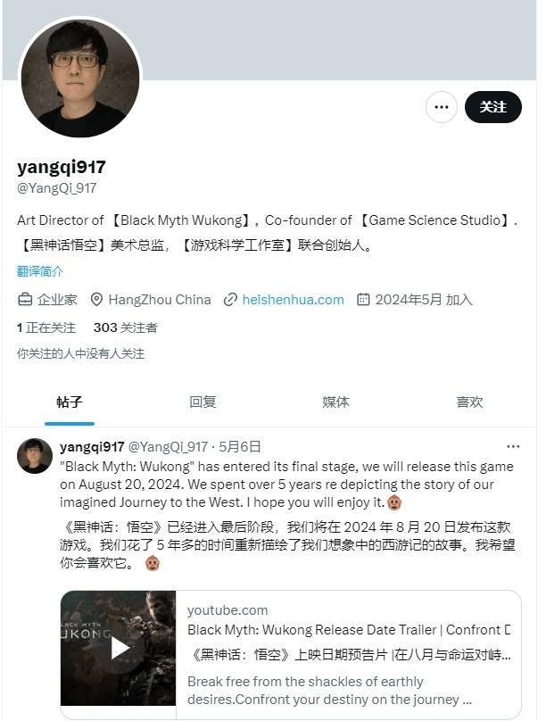

5月和6月，《黑神话：悟空》先后在Wegame游戏之夜、夏日游戏节上公布了简体中文PC标准版和PlayStation、Steam的港服售价，并同步开启预售。
游戏正式开启预售后，不仅在Steam平台火速登顶畅销榜，也超越《空洞骑士：丝之歌》，拿到了Steam愿望单排行榜的榜首。

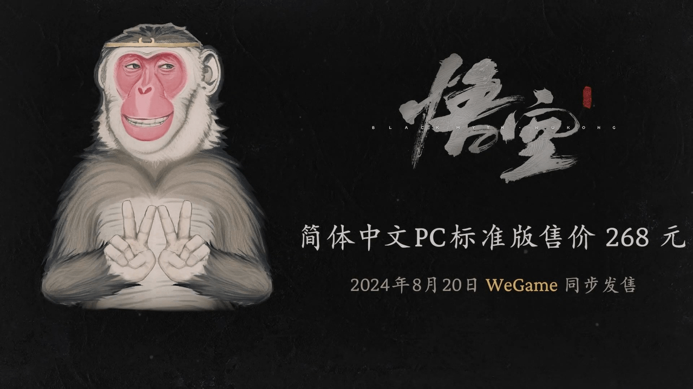

同样是6月，《黑神话：悟空》邀请国内外媒体和KOL参与了最后一次线下封闭试玩。此次试玩展示了一个完整的关卡，游戏的综合素质也引得国内外的多数媒体纷纷称赞。而
这样的评价无疑给等待许久的玩家吃了一颗定心丸。

8月6日，《黑神话：悟空》官方宣布游戏正式版已经开发完成，并于两天后公布了最终版预告。从第一支实机预告到第一次线下试玩，再到终于临近发售。从最初的惊喜，到各
种各样的质疑风波，再到如今的梦想照进现实，四年的等待令许多玩家感慨不已。

就如同我们曾经在线下试玩里所说的那样：

四年前的8月20日，当一只金蝉扇动翅膀振起的微风，随着一行“以下内容为实机操作录制，早期版本不代表最终品质”的小字撩拨动观众的心弦时，也许所有人都想不到，这
款看起来像是天方夜谭的游戏，真能一步一个脚印走到临近发售的今天。

至此，许多人都在等待着一个结果——那只猴子究竟能不能到达灵山。

### 1.2 九九八十一，难满功成

对于游戏科学和玩家来说，在这四年的开发历程并不是只有支持的声音。

从首个预告公布伊始，部分西方媒体就性别歧视、多元化等“政治正确”内容，针对游戏科学发表了一系列不客观评价。谁都没有想到的是，这场“莫须有”的风波会一直伴随《
黑神话：悟空》直到发售以后。

2023年，某海外知名媒体发布的一篇名为「《黑神话悟空》开发者的性别歧视历史如何使其“西行之路”变得复杂」的文章引起了轩然大波。冯骥多年前的冒犯性言论、游戏
科学以往不恰当的招聘广告被当作黑料挖出，矛头直指《黑神话：悟空》阻碍了电子游戏的“多元化”发展。但在许多国外玩家看来，这只是某些媒体以“出于恶意，以最不宽容
的方式翻译了这些帖子”。

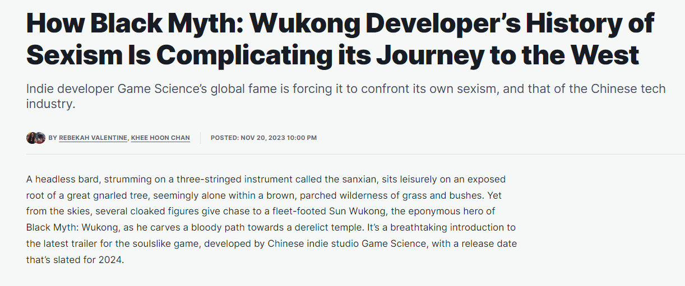

距离游戏发售还有两个月时，有博主发文爆料《黑神话：悟空》的开发团队遭到国外政治正确公司SweetBaby Inc 勒索700万美元（约合5109万人民币）。
无独有偶，在临近发售的媒体线下试玩结束后，某海外知名媒体在其发布的游戏前瞻里再次谈到了游戏科学曾经的“性别歧视”和“不当言论”。

尽管SweetBaby Inc勒索事件的真假还有待考证，但却让被迫站在“政治正确”对立面的《黑神话：悟空》在海外的热度如同乘风大鹏一般，扶摇直上九万里。

SweetBaby Inc 与部分海外媒体的所作所为让被“多样化”折磨已久的玩家形成了“统一战线”，他们借助《黑神话：悟空》反对LGBT+对于电子游戏行业的
强行渗透。于是，支持《黑神话：悟空》与游戏科学的声音响彻在了Youtube、Reddit等各大海外平台，其中也包含了许多游戏领域的KOL以及部分海外媒体为《
黑神话：悟空》发声。甚至某些狂热粉丝已经喊出了“要用生命守护这位蜘蛛精（四妹）”的口号。

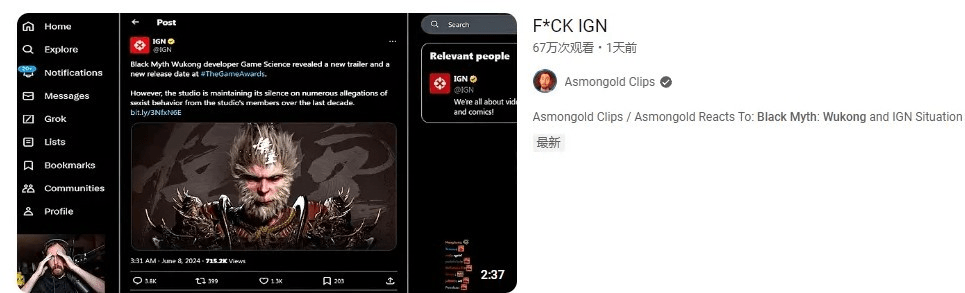

某博主的一句“F*CK IGN”直接在一天之内引来了近70万人围观

到了《黑神话：悟空》媒体评分解禁的日子，多家海外媒体又将游戏科学的性别歧视风波纳入了游戏的评分标准，因此出现了许多有失公正的评价。

例如有媒体因“缺乏多样性和包容性与此前开发商发表的厌女言论相呼应”，而认为游戏科学对女性玩家不屑一顾，最终只给游戏打出三星。而这也在社区内引起了玩家们的抗议
。有玩家认为，以“缺乏多样性和包容性”的理由降低了《黑神话：悟空》的评分完全是莫须有的罪名，没有任何参考价值。

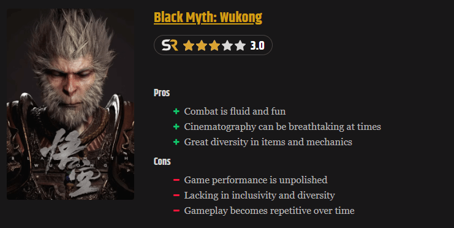

海内外玩家恼火的原因其实不难理解。有学者指出：在当今高度政治化的环境中，《黑神话：悟空》中没有明显的政治元素或信息，这可能是它在海外取得成功的一个重要原因。

南华早报的一篇关于《黑神话：悟空》分析报告认为，随着全球采用“更加前卫的意识形态”，开发商已经很难忽视受众对性别和取向等元素的“高度关注”。最直接的体现就是
越来越多的“女性玩家”要求游戏开发者在设计过程中在游戏文化层面更加关注不同的受众。但对于大多数真正的消费者而言，他们显然不会关心一款电子游戏是否缺乏所谓的“
文化敏感性”。

而与部分海外媒体的唱衰评价形成鲜明对比的，是《黑神话：悟空》发售后欣欣向荣的商业成绩和玩家口碑。

Steam平台好评如潮（96%的好评率）、用户评测数量达105万条，在被标记为“好评如潮”的游戏里仅次于《泰拉瑞亚》和《盖瑞模组》。最高240万人的同时在线
、发售3天全平台销量破千万、首周销量达到2000w、有超过30%的销量来自海外……这样的成绩出自一个首次试水3A的中国游戏工作室，足以称得上是商业奇迹。

最为关键的还是，《黑神话：悟空》成功后带来的品牌辐射，在商业模式层面引发行业对于“单机游戏+品牌”的合作模式的思考。

无论是与瑞幸咖啡、联想、比亚迪等各领域大品牌推出的跨界联名产品销量上涨，还是2024年三季度《黑神话：悟空》带动山西国家级旅游度假区住宿预订增长近两倍的事迹
，都在一定程度上证明了电子游戏也能凭借其影响力，实现的品牌效应，带动消费增长。

事实上，在手游行业，热门的产品与实体品牌的展开线下联动已经十分常见，而在单机游戏领域，受限于玩家群体规模和买断制的特性限制，很难像服务型游戏那样持续地利用品
牌效应。不过，有了《黑神话：悟空》的珠玉在前，或许在未来，与有着一定热度的单机游戏的跨界合作也会成为一种更加有效的营销策略。

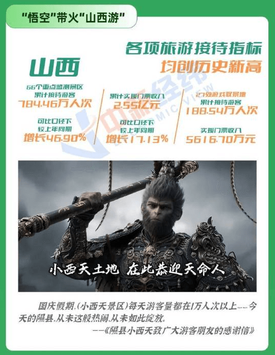

在社交平台上，《黑神话：悟空》则完全成了一个全民关注的热点事件。

新华社、央视网等国内各大主流媒体集中曝光，屡次登上数个官方媒体黄金时段的新闻报道……这样豪华的待遇实属业内首次。甚至在外交部的例行记者会和新闻联播上，都出现
了《黑神话：悟空》的身影。

而从玩家角度来看，自《黑神话：悟空》发售以来，游戏一直持续保持着相当高的讨论度。以知乎为例，在发售初期，知乎平台每天至少诞生五个与《黑神话：悟空》相关的热榜
内容，涵盖了游戏剧情、攻略、古建筑、美术视觉、古诗词、佛教元素等十多种内容。

此外，据不完全统计，截止到11月底，相关话题的线上讨论量达到了惊人的43.6亿次，在游戏发售首周内，几大海外社媒的用户互动量便已经近亿。截止至成稿前，在短视
频平台抖音上，《黑神话：悟空》相关话题下视频的总播放量已经达到了595亿次。

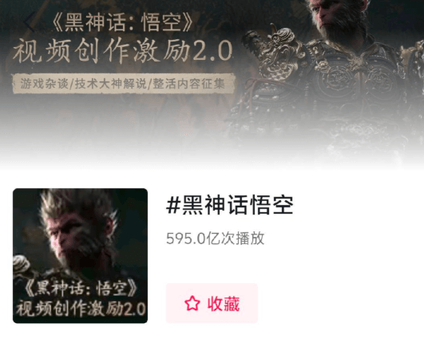

### 1.3 我们需要更多的“悟空”

以当下行业视角剖析，《黑神话：悟空》的火爆出圈，更像是一场天时、地利、人和的必然事件。从2020年亮相伊始，这款游戏就被许多玩家寄予了“拯救中国单机游戏”的
期望。

但很遗憾，“改变中国单机市场”的历史使命并不是一款《黑神话：悟空》所能承载的。必须要承认的是，即便是我们有着最大的单一游戏市场，即便是有了《黑神话：悟空》这
样不输海外一线游戏工作室水准的产品，但国产单机的发展仍然是一条充满困难的漫漫取经路。

工业化技术的积淀、玩家消费和游戏习惯，乃至游戏文化的土壤，都不是一蹴而就所能“迭代升级”的。如此看来，《黑神话：悟空》的最大意义，还是为国内游戏业树立了一个
可借鉴、可复制的标杆案例，也让整个行业看到了做3A单机其实也能有抵达灵山的希望，让部分人有勇气踏出西行道路的第一步。

而那个宏大的历史使命，需要的是厂商在漫长的试错过程里，不断累积的游戏工业化和项目管控能力，还需要的是在开发者不断生产优秀内容的基础上，玩家群体在潜移默化间所
改变的消费观和游戏习惯。

一切正如那句：“踏上取经路，比抵达灵山更重要”。

## 《黑神话：悟空》产业分析

2024年，引发现象级轰动的《黑神话：悟空》不负众望地坐稳了“国产3A”游戏的头把交椅。许多年来，由于全行业向网游、手游的倾斜，以至于国产游戏被人认为和3A
赛道没有交集，但《黑神话：悟空》无疑在这一领域实现了历史性的破局。

作为先行者，《黑神话：悟空》自然顺理成章地成为了某种标杆，而它从零开始搭建3A管线时蹚出的道路，也为后来者指出了实现产业升级的方向。

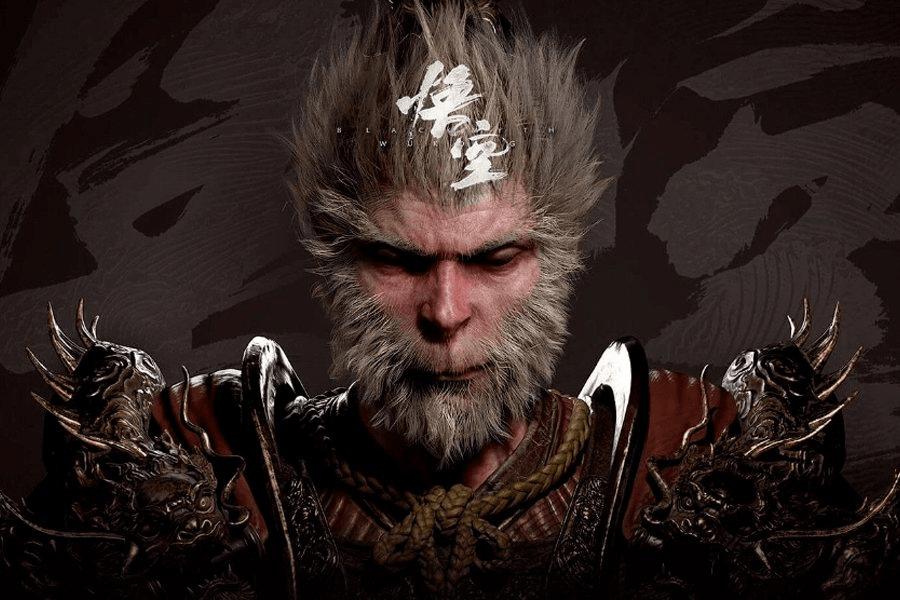

### 2.1 产业升级的阵痛

众所周知，《黑神话：悟空》使用的游戏引擎是“虚幻5”，这种通用的商业引擎非常适合《黑神话：悟空》这样“摸着石头过河”的项目，但在开始制作之前，游戏科学的员工
则更熟悉Cocos和Unity，对虚幻的学习还要重新开始。

其实，虚幻引擎对中国游戏业界来说并不陌生。在“虚幻3”崭露头角的时期，它在国内的游戏圈子中就代表了高品质的游戏画面，常被许多网游产品用来做宣传噱头。但在后来
，其较高的开发难度和电脑配置要求使其逐渐失去了在国产网游中的竞争力；但对于开发3A游戏的厂商以及它们面向的受众来说，克服这两项弱点并不是什么大问题，因此虚幻
反而靠着开放性和通用性，以及极高的画面表现力，成为了3A赛道下的佼佼者。

早在2020年，使用虚幻引擎的开发者数量就已经超过千万，业界已经形成了成熟的开发生态，在交流经验、外包合作、美术素材筹备等各个方面都极大地降低了开发游戏的门
槛，哪怕对曾经“嫌弃”过虚幻的国内厂商来说，培养或者招揽相关的技术人才也不是什么难事。

甚至可以说正是因为有了虚幻引擎，《黑神话：悟空》才能以现在这样的品质问世，这也可以说是一种“站在巨人的肩膀上”，不过从另一个角度来说，游戏科学似乎也没得选，
当下白手起家搭建一个高画质的3A游戏项目，虚幻几乎是唯一的选择。

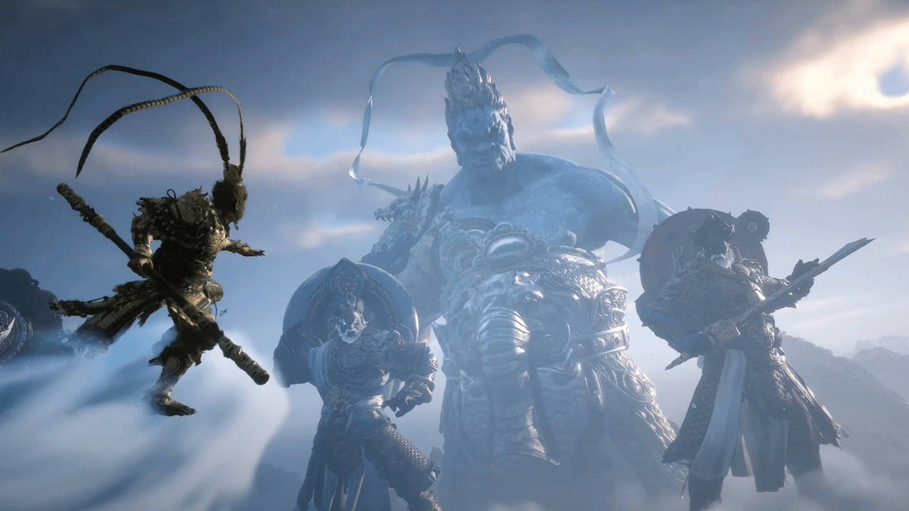

事实上，《黑神话：悟空》使用“虚幻5”曾被外界评估为是一种具有风险的行为。在游戏科学宣布《黑神话：悟空》将从“虚幻4”转到“虚幻5”时，彼时的“虚幻5”对许
多人来说仍然是一个以实验为主的“未来产品”，市场上并没有太多的成熟产品。对游戏科学这样一个初出茅庐的虚幻学员来说，玩家们害怕他们无法驾驭虚幻而让游戏成品糟糕
。现在，游戏已经发售，我们也终于盖棺定论地说，即便和成熟的国外厂商仍然有差距，但游戏科学做得已经很不错了。

因为 “虚幻5”对现阶段的主机和中低端PC其实都不是很友好，它的两项看家本领Nanite动态多边形技术和Lumen全局光照效果，虽然让《黑神话：悟空》的画面
展现出划时代的优秀表现，但也需要付出昂贵的性能代价。从成品的状况来说，《黑神话：悟空》哪怕是在较差的PC上仍然能调节出一个可以畅快游玩的帧数、照顾到尽可能多
的玩家，这在近几年许多3A游戏都逐渐提高最低配置要求的当下非常难得，也是对玩家相当有诚意的事情。

而和成熟厂商的差距则主要体现在一些“不成文的行业惯例”方面，主要的成因仍然是经验不足，比如PC平台上锐化滤镜发生的问题就是如此。

可能是出于游戏科学美术团队的开发习惯，他们给游戏添加的锐化效果有点过于激进，导致不只是物体，包括游戏中色彩相差较大的单个像素也被着重强调，造成了很明显的颗粒
感，类似于相片中的“噪点”。再加上《黑神话：悟空》本身要依赖升采样技术补充帧数，致使画面的渲染分辨率本就不高，二者综合起来形成了一种奇怪的画面观感。

之所以使用锐化，本意是为了解决各种模糊效果导致图形轮廓不清晰的问题。因为在现代游戏的渲染管线中，经常依赖各种模糊来实现“遮瑕”的功能，例如“动态模糊”“时间
性抗锯齿”等。但模糊常常会让画面看起来像是蒙了一层雾，这时开发者就会通过锐化来“中和”这种雾蒙蒙的效果。

在这个问题上，业内许多游戏厂商给出的解决方案是：要么提供一个相对保守的锐化效果，宁可模糊也要避免噪点；要么提供一个可以调节的选项供玩家自主选择。它在技术上并
不难解决，只不过《黑神话：悟空》在上市时并没有考虑到这一点。

同时，PS5版《黑神话：悟空》的许多栽跟头都与电视机刷新率有关。比如在平衡模式下，游戏会选择用60Hz输出锁定45帧的游戏视频，由于二者直接没有成整数倍的关
系，从而最终产生“深一脚浅一脚”的卡顿问题。修复这些问题同样不难，在去年12月发布的补丁中，它们已经被尽数解决，但这也实实在在地体现出了游戏科学在主机领域的
经验不足。

这些问题几乎都属于那种不实践就意识不到的细节，但如果深入游戏科学的开发经历，就会发现从零开始搭建3A管线需要解决的技术细节实在多如牛毛，而这些暴露出来的问题
只是其中的漏网之鱼。

比如在游戏中，玩家给土地庙上香时，无论玩家在土地庙的哪个方向按下互动按钮，角色都会自己小步走到土地庙的正前方，方便衔接制作好的上香动作。这是3A游戏开发中一
项被称为“Motion Matching”的概念，它是一种程序自动生成过渡动画的技术，旨在让两个动画之间的衔接更加自然顺畅，而且过程全部基于程序自动化完成。

这在国外的3A游戏中早已屡见不鲜，许多国外大厂在这个问题上早就建立了一套自己的解决方案，但对于游戏科学来说，他们需要从头学习“Motion
Matching”的技术原理，再自己做技术攻关。而类似的问题，必然也会频繁发生在《黑神话：悟空》的后来者身上。

值得一提的是，“虚幻5.4”刚刚在去年早些时候给游戏中加入了“Motion
Matching”功能，因此至少在这个问题上，国内的游戏开发者不用再从零开始进行技术攻关了。

在国产游戏产业升级的过程中，这种技术积累上的空白大面积存在于行业里。只不过这些细节问题在过去以网游和手游为主的环境下长期并不为人所关注，因此这种现象并不止发
生在3A游戏里。

在去年的二次元游戏圈子里，曾经围绕游戏中角色各种不自然的上下楼梯动画发生过一次规模不小的讨论，进而在二游厂商中引发了一场技术革新，各大厂商都争先恐后地用上了
各种3A游戏中处理角色行走动画的技术，优化了自家角色上下楼梯的动作表现，实现了一次小规模的技术升级。

以上这些例子，与其说反映了技术能力上的差距，倒不如说更多反映的是国产游戏在产业升级上面临着理念上的更新换代。而3A游戏之所以被玩家和行业所认可，成为“游戏产
业冠冕上的明珠”，不仅是因为它应用着最尖端的图形技术，也在于其对于各种琐碎而繁复的技术细节进行了事无巨细的打磨，这些无疑都是国内以网游和手游为主的大环境所一
直忽略的。因此在国产3A这条赛道上，我们还有很多功课要补。

但从另一个角度来说，一旦这种游戏开发理念有所改变，那技术差距并不是不可追赶的。一方面，随着商业游戏引擎的发展，一定会有越来越多的新兴技术变得简单易用；而另一
方面，许多问题并非在技术难度上有多么高不可攀，只要我们意识到了问题的存在，国内的开发者也完全能做出自己的解决方案。

### 2.2 有关“自研引擎”的讨论

既然《黑神话：悟空》能成功一部分的原因是因为站在虚幻5这个巨人肩膀上，那么从完全国产化的角度来考虑，国产3A游戏有必要自研引擎吗？

很明显，这个问题不能一概而论。虚幻的优势和劣势都很明显，但它毕竟是个相对成熟的商用引擎，而自研引擎的上下限差距极大，并且许多都是厂商为了解决游戏开发中的一些
特殊需求而研发的。在当前这个时机，国内3A市场刚刚起步，厂商没有必要承担这么大的风险。追赶上虚幻现有的技术水平并非一朝一夕之事，而现在，能让更多的从业者参与
3A这片增量市场，把蛋糕做大更加重要，所以至少在未来的几年之内，新上马的国产3A游戏大概率都会将成熟的商用引擎作为第一选择。

放眼全球，虚幻近几年也动摇了国外游戏开发组对自研引擎的积极性，《巫师4》没有选择自家的“RED引擎”而转向虚幻、“人中之龙工作室”已经开始尝试转向“虚幻5”
、《女神异闻录》系列也开始通过在“虚幻5”上重制旧的作品适应新环境。在可以预见的未来，这种趋势还会持续。

近日，CDPR前开发人员Bart Wronski在推特上透露了为何新作会放弃已经用了十几年的发展很成熟的REDengine引擎。Bart
Wronski表示，原因是CDPR每次开发一款新游戏的时候，都会重新写引擎，但始终无法达到想要的效果，最后引擎还无法维护、使用，所以找了一个靠谱的引擎。

——游民星空新闻《<巫师>新作改用虚幻5原因曝光：重写自家引擎太麻烦》

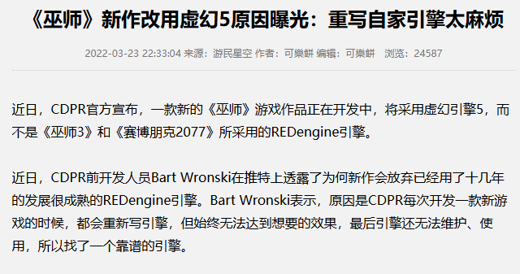

话虽如此，自研引擎仍然也有着不可忽视的优势。以不久前发售的《夺宝奇兵：古老之圈》为例，这款游戏采用迭代后的新版“idTech
7”引擎，同样加入了类似Lumen的软件全局光照功能，但因为制作组对画面效果有着更加宽广的调整空间，这使得游戏在画质依旧优秀的前提下，能够在Xbox
Series X|S上都以稳定的60帧运行，且分辨率并无太大的损失。

由于外界很难通过公开渠道去评估“仅供内部使用”的自研引擎，因此在过去的很长一段时期里，头部的自研引擎的最大优势往往不一定是“易用性”而是技术壁垒。很多时候，
它们代表着一家公司的独家图形/动画/物理效果技术，是难以逾越的护城河，帮助旗下的产品鹤立鸡群。但一个自研引擎也有着自己的局限性，它需要匹配产品的开发节奏，厂
商很难在一款游戏进入全面开发以后进行引擎上的更改，而更新换代不及时也会影响到一款游戏引擎与时俱进的步伐。

这就给商业引擎留出了弯道超车的机会，毕竟他们会有更多的专业人士负责更新维护，并从全球的开发者社区吸取经验，可以极大地缩短新兴图形技术从诞生到运用的中间时间。
而且毫无疑问，这种差距存在于游戏引擎的各个部分，自研引擎和商业引擎的差距应该会越来越大。

因此，是选择现在开始奋起直追，还是直接“拥抱未来”，二者的利弊鲜明，没有人能给出一个确切的答案。

### 2.3 不可忽视的软实力

在谈论《黑神话：悟空》时，我们常常过于强调它在技术上的突破，使用了多么前沿的图形技术，但不可忽视的是，这些尖端技术仍然是开发者手中的工具，它们可以在一定程度
上提高游戏的下限，而真正决定了一款3A游戏上限的，仍然是开发团队在游戏设计、艺术风格上的软实力。而且，3A游戏比任何其他端游、手游市场都更加注重游戏的“艺术
性”，这点在《黑神话：悟空》身上展现得淋漓尽致。

《黑神话：悟空》在艺术表达上有着一套成熟且自成一派的美学体系，无论是在角色的外观、动作，还是游戏的布景、过场动画，包括章节间的2D动画、背景音乐以及游戏菜单
的音效，所有的细节都被有机地整合在一起。《黑神话：悟空》没有模仿某种特定的美术风格，而是对自己的审美有足够的自信，任由团队中或合作伙伴的艺术家自行发挥。

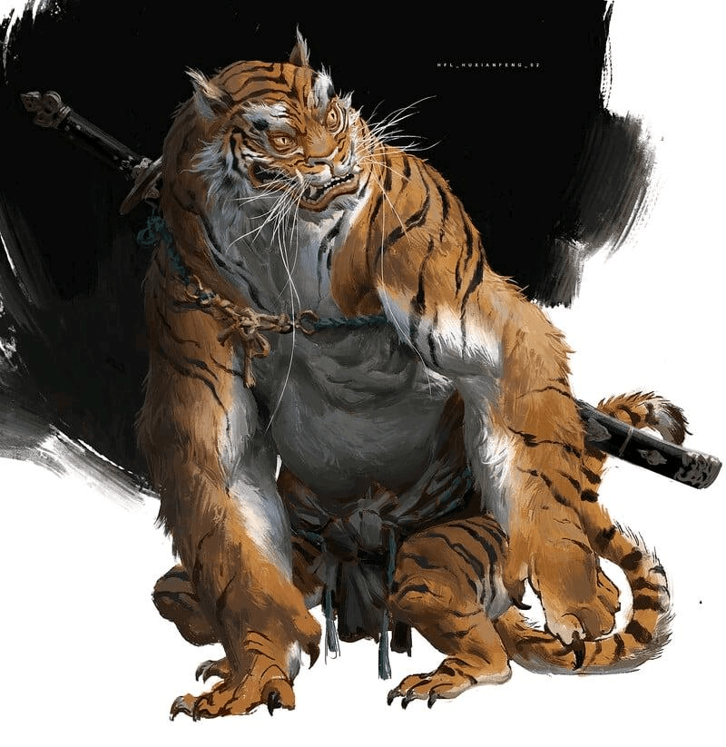

在当今国内的游戏圈里，如何形成自己的风格是一道比技术攻关更困难的附加题。一来，长期以网游和手游为主的国产游戏并不靠游戏的艺术性来赚取玩家口碑，艺术性在整个产
业中甚至没什么话语权，因此想要让追赶上国际水平并不是一件容易的事；二来，想要让艺术家的自我表达符合广大玩家的口味也并非易事，甚至可能是一种风险。

但令人欣喜的是，当我们翻看《黑神话：悟空》最后的工作人员名单时，我们可以看到大量的外包合作公司，这些公司并非真正“不食人间烟火”的艺术家，其中也有大量参与手
游、网游项目的美术资源工作室。至少从人才的角度来说，我们在技术上不缺能做出好3A的人，欠缺的不过是时间和经验；但在以游戏为载体尝试更加先锋的艺术表达，可能更
需要的是那些能够提纲挈领的人物来引领方向、整合资源。而之所以说游戏科学给国产3A立下了一个水准很高的标杆，就是因为它在风格化和艺术性这道“高难度附加题”上交
出了一份优秀的答卷。

《黑神话：悟空》的美术，如今在最受关注的就是引入了现实取景与实地扫描，这几乎是《黑神话：悟空》能够形成破圈效应最大的功臣之一，但在媒体的传播下，目前互联网上
对它对游戏美术的促进作用是有所夸张的。

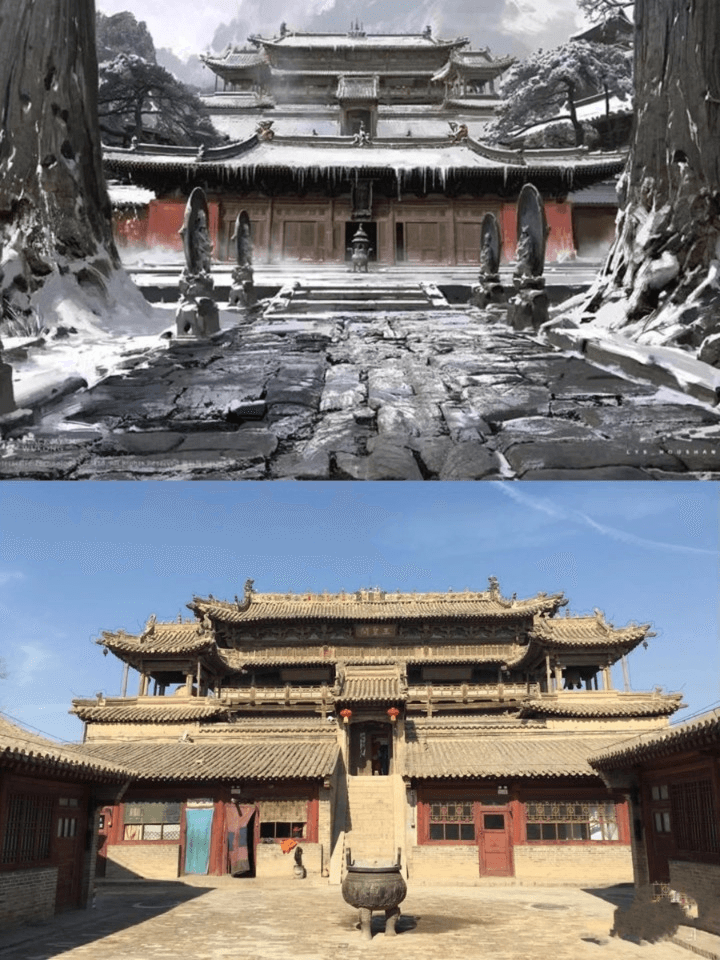

一方面，运用实景扫描给游戏中增添景物是一个相当常规的工作流程，你可以在许多游戏项目中都见到大量的运用。另一方面，游戏科学的美术资产并非直接照搬现实，而是精心
选择和加工之后的结果。

游戏中完全照搬实景的，要么是经幢、吊钟、药瓶这样的单个物件，要么是地图的远景背景。游戏关卡中最大的建筑集群“小雷音寺”更多的是拼接和再创造的产物；与“黄眉”
战斗的场景，其背后的悬塑场景和现实相比也有大量的改造和艺术加工。究其根本，美术工种在游戏制作中的主观能动性仍然不可或缺，因为完全照搬现实并非适合电子游戏的表
达方式，这游戏科学也是一种对玩家体验负责的严谨态度。

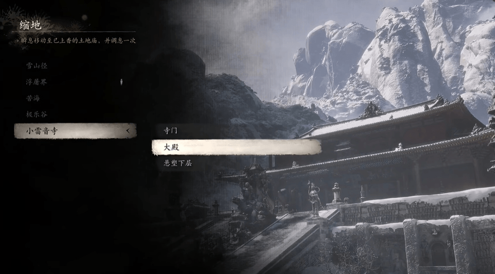

小雷音寺大殿并不是中国传统古建筑，制作组为其增添了大量的额外装饰，以展示其宏伟

其实长久以来，电子游戏的图形发展都只有一个目标——接近现实，在统一目标的指引下，无论哪一家的图形引擎都免不了殊途同归。

然而照搬现实并不是一项完美的解决方案，一款游戏想要在美术上给人留下深刻的印象，那就必然要展现超出现实的美感。现实只是风格，美术追求的是超越现实的美，游戏科学
认识到了这种追求，这对《黑神话：悟空》、对初出茅庐的中国3A游戏来说，都意义重大。

### 2.4 真诚，是最强的宣发武器

2020年8月，《黑神话：悟空》发布了第一支实机演示视频，此时的《黑神话：悟空》还并未正式进入传统意义上的宣发期，为了招人而发布的影片完全就是不加掩饰的实机
演示，尽管制作人冯骥说这是为了“诚实一点”和“给内行人看”，但这个给内行看的“诚实”，偏偏是玩家们最需要的。

直到游戏上市前，玩家的社区都在讨论“黑神话会不会暴死”，即便用实机演示覆盖了几乎所有宣发节点之后，仍然有不少的玩家心存疑虑，在3A这个赛道上，中国玩家和国产
厂商之间的信任早已被透支。

或许也正是基于这样的原因，游戏科学在整个产品上市前的宣发期内都显得相当克制。实机演示和精彩画面的混剪量大管饱，甚至组织了线下试玩活动并全程直播，但对于游戏系
统的解释，游戏内容的承诺并不常见，做足了“免责声明”和“预期管理”。不过，也正是因为这种宣传上的克制，使得每年发布消息的8月20日仿佛成了游戏科学和玩家们的
约定之日，形成了意想不到的传播效应。

2020年8月放出的实机预告

在这场信任的战争中，游戏科学选择用来标定玩家期望的锚点，是其使用了常规3A游戏的标准定价。

所谓“标准售价”，是业界约定俗成的3A游戏售价，国际上一般是60或70美元，在Steam国区可能会在198元/268元/328元等几个档位浮动（具体视厂商的
对国区的定价策略而定）。在买断制游戏领域，国产游戏很少有人敢给出超过100元的售价，这一方面是因为之前的游戏的体量和制作规格并不高，另一方面由于玩家长期对厂
商抱着怀疑态度，就算是对比同样体量的海外游戏，中国的单机游戏的定价也普遍偏低，走低价、讨好玩家的路线。

因此游戏科学给出268元/70美元的定价，是国产买断制游戏在Steam平台从主打性价比的廉价市场向高端市场的跨越。而对于玩家来说，这个售价代表着游戏科学清晰
地表明了《黑神话：悟空》的目标就是3A游戏，同时他们有自信保证游戏质量对得起这个售价。虽然游戏科学并未公开地做出类似解读，甚至不愿意使用3A游戏这个模糊的分
类来定义自己，但玩家们会将这一定价视为对游戏制作规格和品质的保证。

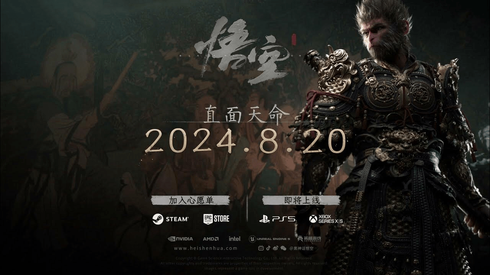

从最初的曝光，到最终发售，《黑神话：悟空》始终都和8.20这个日期绑定

游戏科学作为“第一个吃螃蟹的人”，剑指3A品质本身就是最好的宣传，在发售前的最后一两年里，《黑神话：悟空》早已不缺关注度，只是任何举动都有媒体和粉丝进行自发
传播，对游戏科学来说维护好现有的形象直到游戏发售，可以说是比加大宣传更重要的事情。因此“但行好事，莫问前程”恐怕是最好的选择。

在《黑神话：悟空》的成功之后，其他正在酝酿3A游戏的许多工作室很明显也了解这个赛道在营销上与传统端游手游的区别，任何有点资质能成为“村里下一个大学生”的项目
都尽量围绕实机定制宣发，多做少说，给玩家塑造符合产品实际的期待，这与此前以大厂主导的浮夸宣发形成鲜明的对比。

值得一提的是，在这一阵风向的转变中，有一个“撞枪口”的反面案例——《燕云十六声》。作为一款大厂出品、接近3A游戏项目，其在早期宣发时着重强调了游戏中贴近3A
的部分，希望通过标榜自己与3A游戏类似的制作实力来换取玩家的关注。

《燕云十六声》在宣发上的投入完全不是《黑神话：悟空》能够比肩的，其在流量渠道、视频网站KOL的投放，都明显是传统大厂宣发的路数。但在成品即将上线前后，晚于《
黑神话：悟空》发售的《燕云十六声》遭到了强烈的舆论反噬。

一边是“新瓶装旧酒”，有些创新但仍然延续了传统开放世界玩法的网游，靠着售卖战令、时装、坐骑盈利；而另一边则是线性流程，集合优质美术表达、叙事野心的传统买断制
3A，二者之间的落差让《燕云十六声》显得十分尴尬。

厂商们对买断制3A能否收回成本的担忧是可以理解的，不过类似的游戏项目在此之后或许要换一个方法来做推广，至少在产品实力不足的时候硬蹭3A的标签大概率会适得其反
。

回顾《黑神话：悟空》，有人说它就像是石头里蹦出的孙悟空，横空出世，大闹天宫，但在此之前这块石头也曾在花果山上经受风吹雨打、吸取日月光华。中国的游戏市场长久以
来确实以网游、手游为主不假，但在不断地推陈出新中，我们的开发者已经具备了开发3A游戏的能力，我们的艺术家也具有优秀的艺术才华，缺的是踏上取经路的勇气，甚至是
相信取经路存在的勇气。

现在，《黑神话：悟空》证明了，西天就在那里，路就在脚下。

## 《黑神话：悟空》社会、文化影响

《黑神话：悟空》成功对中国游戏行业的意义，并不止于第一款获得商业成功的国产3A。它一方面为我们展现出了一款游戏，能以正面姿态在游戏之外的领域爆发大范围讨论，
得到官方媒体的背书和社会上的广泛好评。同时也为我们展现出了这种破圈式的讨论，能为游戏的销量和影响力注入多大的能力。

因此，对这股热潮原爆点的追溯和分析很有必要，已经取得真经的先行者，也许就能为后来者们，找到一条通往爆款的捷径。

### 3.1 席卷全社会的热潮

《黑神话：悟空》出圈的前提，是游戏的顺利过审。

自《黑神话：悟空》公布起，玩家社区除了对游戏最终完成度、销量的猜测和讨论之外，还有许多争论围绕《黑神话：悟空》能否顺利过审展开。在“第一款国产3A”出现之前
，玩家和从业者面对的不仅是开发能力和市场规模的未知，还有官方态度的暧昧。

在《黑神话：悟空》之前，国产游戏并没有3A级别游戏送审的先例。前有腾讯精心引进的《怪物猎人：世界》在Wegame上线四天后便匆匆下架的先例，后有持续长达一年
多的版号寒冬。至今各大主机的国行商店中的3A大作也寥寥无几。审核尺度的不确定，加上魔改西游的题材以及标题“黑神话”暗示的，一个基调更黑暗的故事。都让人有足够
的理由对《黑神话：悟空》能否过审抱有疑虑的态度。

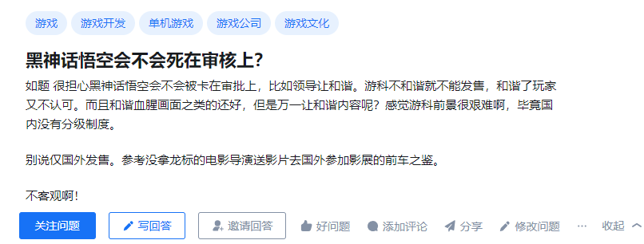

然而，《黑神话：悟空》过审的顺利，却大大超越了许多人的预期——在23年TGA上公布了发售日后，仅仅三个月（2024年2月）就拿到了版号。

根据游戏的宣传周期和爆料推断，游戏内容开发完成大概在2023年底到24年初，对于时长不确定的送审流程来说，可以称得上相当顺利了。在最终版本中，也没有许多人担
心的大规模和谐，几乎是把游戏原汁原味地端到了玩家面前。

《黑神话：悟空》的送审和出版工作，由浙江出版传媒进行。在游戏过审后，浙版传媒发布了题为《从国产网游<黑神话：悟空>
版号获批说起》的文章。并在其中提到了《黑神话：悟空》能快速过审的原因和影响——

《黑神话：悟空》的快速过审，就像是得到了官方的“优秀游戏”奖章，不仅将为这款游戏本身带来商业上成功的可能，也为其他国产游戏提供了信心，显示了政府对高质量国产
游戏的支持。

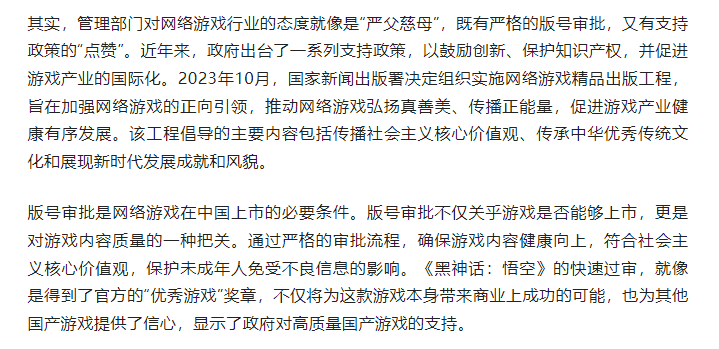

《从国产网游<黑神话：悟空>版号获批说起》部分内容

过审最直观的好处就是，让《黑神话：悟空》避免了在没有版号的情况下通过Steam在国内发售的灰色地带，可以毫无顾虑地在国内通过各种渠道进行大规模宣传。

这种支持的来源，在官方文件中也有迹可循。去年10月，国家新闻出版署下发了“实施网络游戏精品出版工程”的通知。其中提到了工程展开的五个方向——传播社会主义核心
价值观、传承中华优秀传统文化、展现新时代发展成就和风貌、促进科技创新和新技术应用、具有国际市场潜力。而《黑神话：悟空》几乎同时满足了这五个方面。

另一个可能被忽视的点在于——《黑神话：悟空》买断制的性质，在一定程度上避免了以往围绕网络游戏经常出现的，诱导氪金导致未成年人错误消费观念的负面讨论，也能让官
方在将其作为正面案例宣传时，减小对这些负面影响的顾虑。

正因如此，在《黑神话：悟空》的开发过程中，处处都能看到政府部门参与的痕迹。早在2019年，杭州政府就将游戏科学引入了官方创建的，以电竞、动漫、网游等产业为核
心的数字文化产业园区“E创小镇”，并为其提供了2022年度杭州市动漫游戏专项资金支持。杭州政府甚至会安排人员，为游科送饭上门，并为其家人提供医疗服务，确保主
创人员能专注于游戏开发。

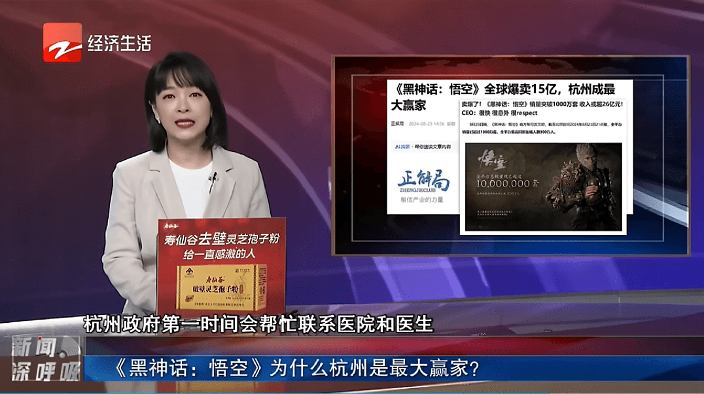

而这些方向，恰恰也是官方宣传《黑神话：悟空》时的侧重点。在《黑神话：悟空》发售前后 ，中央电视台、人民日报、新华社等官方媒体，都对《黑神话：悟空》进行了全方
位报道。其内容大都集中在以下几方面——在技术上达到了国际水准、重新诠释并向海外玩家展现中国文化、对线下文旅产业的带动。在新华社和央视新闻的采访中，也多次提到
了游戏这种媒介所承载的文化价值，以及如何通过玩法、声效、美术体现这种价值。这在某种层面可以视为央媒对“精品网络游戏”这一概念的具体诠释。

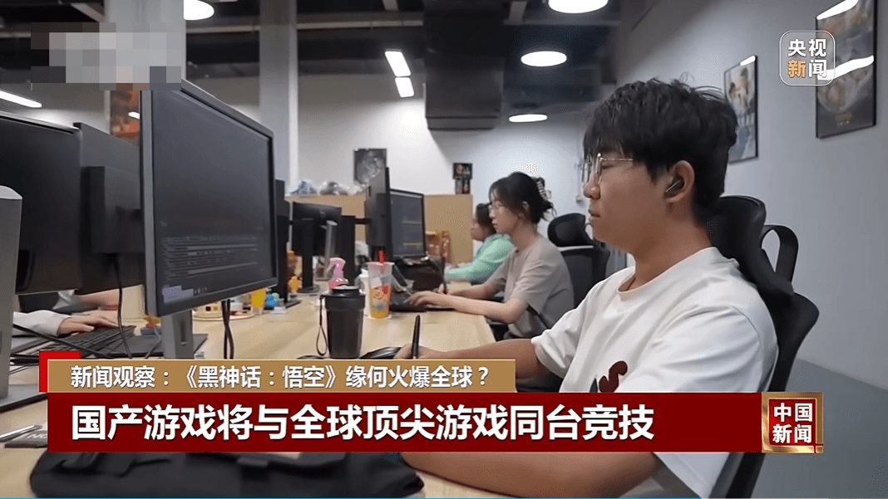

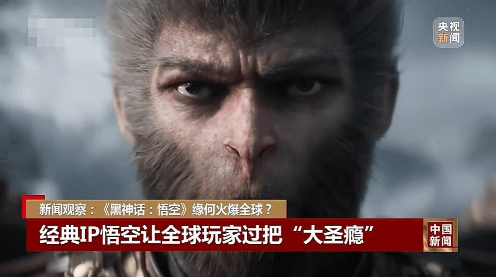

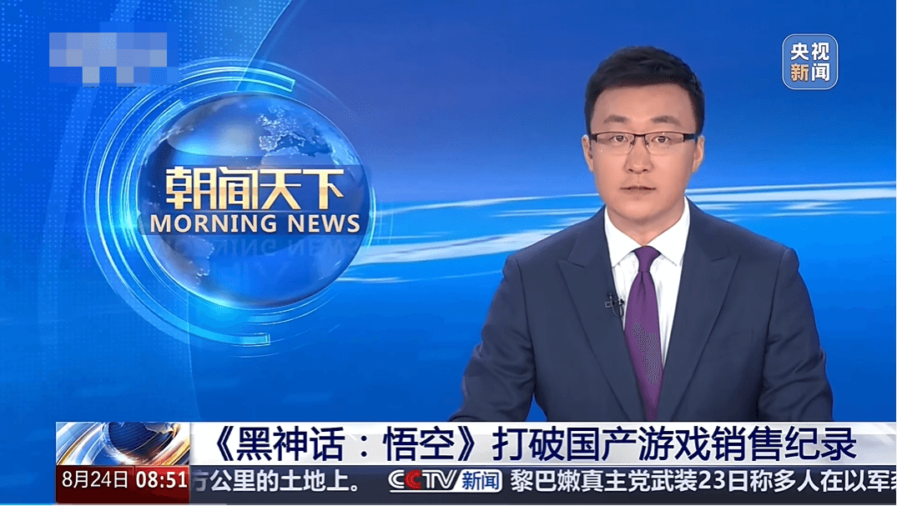

部分有关《黑神话：悟空》的报道

在2024年12月20日，《黑神话：悟空》历史性地登上了新闻联播，冯骥向总理进行了有关《黑神话：悟空》的报告。在报道中，《黑神话：悟空》被称为“重点科研项目
”。这不仅是其影响力的证明，更可以看作政府部门释放出的明确信号——针对高质量的“精品网络游戏”，国家层面将给予有别于之前传统端游、手游的巨大支持和帮助。有了
《黑神话：悟空》的先例，后来者们在满足相应要求的前提下，便可以获得一个优秀的营商环境，在开发、审核、宣发过程中获得极大的优势。

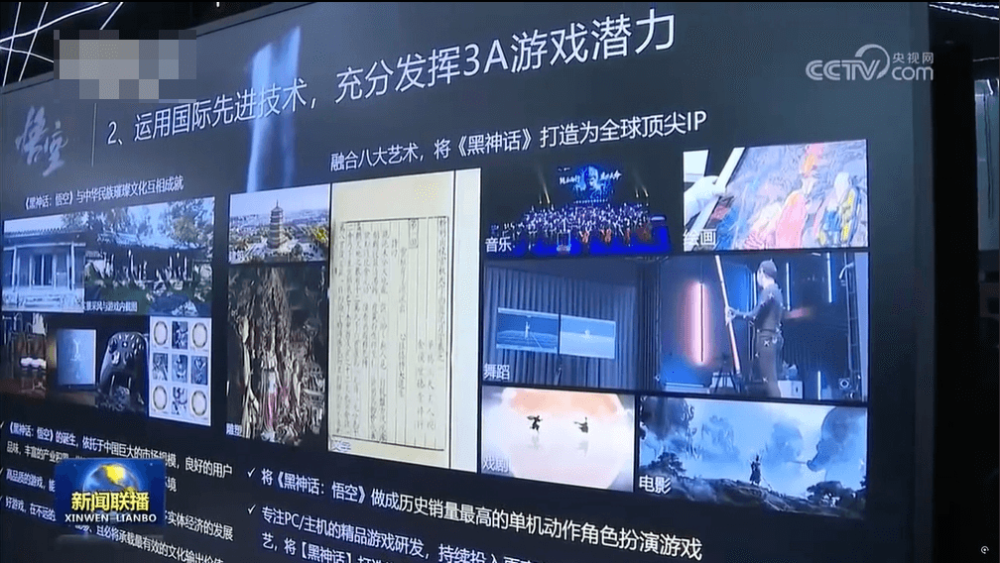

对于经历了游戏机禁令和版号寒冬的中国游戏行业来说，这是历史上首次有游戏获得了国家层面的支持和背书。在可预见的未来，只要游戏产业能持续稳定地输出高质量的游戏，
并继续对文化以及实体经济进行推动，游戏产业便会更加受到自上而下的重视，在良性循环的支持下走上发展的快车道。

在《黑神话：悟空》之前，官方媒体的确偶有针对游戏的正面报道。但却远没有像《黑神话：悟空》这样，几乎亲自下场宣传的巨大力度。游戏发售后不久，包括《四川观察》《
江西新闻》《1818黄金眼》在内的地方和传统媒体，都用官号直播起了《黑神话：悟空》。外交部发言人不仅在发售时称赞《黑神话：悟空》“体现了中国文化的吸引力”，
在斩获TGA最佳动作游戏后更是直接进行了祝贺，可以说给足了这“第一个大学生”牌面。这种亲自下场支持的态度，也在游戏上市初期吸引了更广泛的社会大众群体的目光。

官方媒体的大力背书，成为了《黑神话：悟空》影响力破圈的临门一脚。截至12月19日，在抖音上仅“黑神话悟空”一个Tag，就有306万人参与，获得了585.3亿
次播放。与之相比的是，《艾尔登法环》的播放量为76.6亿；《赛博朋克2077》为53.3亿次；《塞尔达传说：王国之泪》和《塞尔达传说：荒野之息》的播放量分别
为23.9亿和13.5亿。

而在微博上，游戏上线首周，有关黑神话的热搜就有283条，有16条更是登顶了热搜。相比其他年度游戏级别的热门3A，《黑神话：悟空》的传播影响力达到了十倍乃至数
十倍的级别。

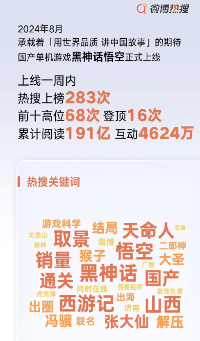

疯狂攀升的热度，最终溢出了屏幕，造就了一场线下狂欢。《黑神话：悟空》在构建场景时实地扫描过的线下景点，几乎都迎来了游客和收入的大幅增长。其中取景地最多的山西
成为了最大的赢家。

根据山西文旅等部门的数据，受《黑神话：悟空》影响力带动，2024年前三季度“山西旅游”词条资讯指数较去年同期增长3178%。全省共接待国内游客3.18亿人次
，同比增长13.88%；旅游总花费2761.52亿元，同比增长25.91%。国庆假日期间，全省共接待国内游客，可比口径下，较上年同期增长84.99%；游客旅
游总花费226.87亿元，可比口径下，较上年同期增长101.85%。

为了接住这波泼天的流量，各个景区和地方政府也纷纷和《黑神话：悟空》开启了深度联动。包括花果山、火焰山、灵岩寺、张家界等景区，都推出了“通关《黑神话：悟空》即
可免费游玩”的活动。除此之外，山西文旅也推出了可供玩家集章打卡的通关文牒，并在B站、抖音等平台推出了“跟着悟空游山西”系列视频。在为文旅宣传的同时，也进一步
推动了《黑神话：悟空》线上与线下的热度。

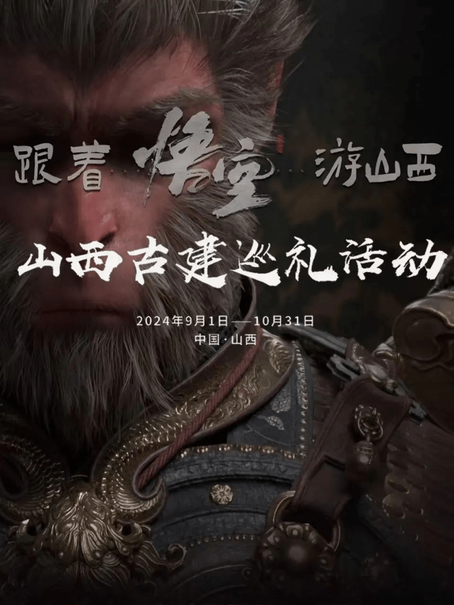

### 3.2 为什么是《黑神话：悟空》？

一款销量和讨论度足以称得上爆款的3A游戏，要么有着出类拔萃的质量，要么有着足以掀起讨论的话题。这样的游戏虽然稀少，但几乎每年都能诞生出几款。而以往的3A爆款
往往出自欧美厂商，在国内引起的讨论也主要局限于玩家群体内部，没有一个像《黑神话：悟空》这样，讨论的声浪能突破圈层，形成贯通玩家与非玩家、官方与民间、线上与线
下的海啸。

这种影响力对销量的促进作用是显而易见的。在国内，愿意持续为3A游戏消费的核心玩家数量相对固定。据拉瑞安的发行总监透露，《博德之门3》的中国玩家占比约为37%
，结合游戏的销量可以推算出，游戏在国区的销量大约为500-
600万份；根据《艾尔登法环》《赛博朋克2077》等3A大作Steam中文评论占比和小黑盒等国内平台数据可以推算出，这几款销量2000万-
3000万的3A游戏，中国玩家的占比普遍在20%-30%左右。销量在1000万-
2000万之间的《只狼》等作品则可以达到将近50%。由此也可以推算出这些游戏的国区销量大概在500-
700万份之间。在某种程度上，这也代表了国内有购买3A游戏习惯玩家的大致数量。

而《黑神话：悟空》Steam平台上中国的玩家的占比达到了惊人的74.9%，根据国外数据分析公司VG Insights的数据，截至2024年12月初，《黑神话
：悟空》的Steam销量已经超过2300万份。仅Steam一个平台，就有超过1700万的销量来自中国玩家。这意味着有将近1000万没有3A游戏消费习惯的玩家
，因为各种原因购买了《黑神话：悟空》。

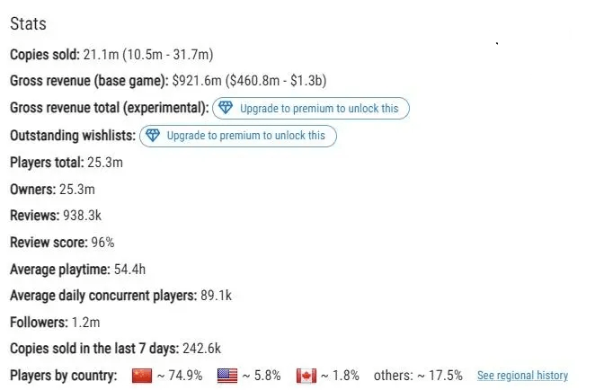

国外数据分析网站 Gamalytic 的统计

《黑神话：悟空》出圈最直接的原因，自然是“村里第一个大学生”带来的话题度。无论在官方宣传还是民间传播，它都是最显眼的标签。在逆全球化和中国在各个领域寻求突破
的趋势下，同时在技术和文化传播上开创新标杆的《黑神话：悟空》，自然成为了“文化出海”的代表。

而这也成为了《黑神话：悟空》一件牢不可破的袈裟。包括《原神》在内的一众例子已经证明，只要游戏质量合格，文化输出会成为让影响力成倍放大的辐射器。因为其承载的，
是群众朴素的民族情绪和爱国情感。

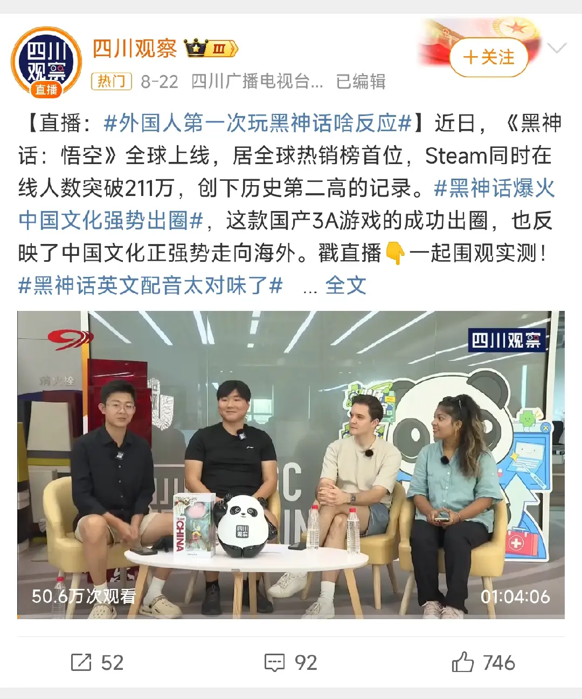

在这个过程中，《黑神话：悟空》在题材和表现力上的优势，也使其影响力飞速扩散。选择人们耳熟能详的《西游记》进行改编，降低了其在非玩家群体中的传播门槛。很多不玩
游戏的人，也能轻易地在游戏中认出二郎神、黄眉等角色。这些熟悉的元素就会成为他们认识这款游戏的桥梁，继而被游戏出色的美术和演出吸引。

而出色的美术和演出，恰好是最适合通过剪辑和短视频等形式，在各大平台传播的。抖音有关“黑神话悟空”的话题下，和游戏有关的热门视频很多都是以“国产3A”为为主题
，以游戏中的Boss战、过场动画和宣传片的混剪作为内容。魔性又让人印象深刻的陕北说书、棍花和各种连招、开场乘筋斗云冲向四大天王的大场面。构成了一个个充满中国
文化符号的“高光时刻”，带来了最为直观的视听冲击。人们无需了解游戏的玩法和剧情，也能从中认识到这款游戏的特别之处。它们与文化输出的标签一起，打破了许多人对游
戏“玩物丧志”的刻板印象，塑造了一个相对积极的舆论环境。

在此之上，《黑神话：悟空》丰富的内容，延伸出了无数可供发掘的热点。除了常规的攻略内容和操作集锦外，对陕北说书的介绍、对游戏中文物和场景的考据、对彩蛋的发掘、
官方的报道与反应。对非核心玩家来说，任意一条内容，都可能燃起他们的兴趣，进而转化为游戏的销量。

《黑神话：悟空》对线下文旅产业的带动，则让游戏的热度不再是销量、数据、热搜中的无根之萍。《黑神话：悟空》在构建场景时采用的实地扫描，不仅在一定程度上节约了美
术成本，也为玩家们“圣地巡礼”提供了线下支点。而无论是基于从众心理还是景区的宣传活动，都会吸引更多非游戏玩家前往这些地点游览。这些热闹的场景，反过来又会进一
步提升游戏的话题度。人山人海的场面，比抽象的销售数字更能引起人们对这款游戏影响力的感知。对文旅经济实实在在的提振，也会让地方文旅部门更重视游戏带来的作用。线
上线下的联动又会反过来进一步印证游戏的影响力，形成互相促进的作用。

### 3.3 屏幕之外：游戏与文旅产业该如何结合

在全球经济下行的形势下，文旅成为了许多地方政府部门，尤其是工商业不发达地区重要的收入来源与增长点。然而，对于这些本身并非旅游热门地点的地区来说，像淄博烧烤、
哈尔滨小土豆这样的“泼天流量”，有相当大的偶然性，地方有关部门自然会抓住一切机会进行宣传。

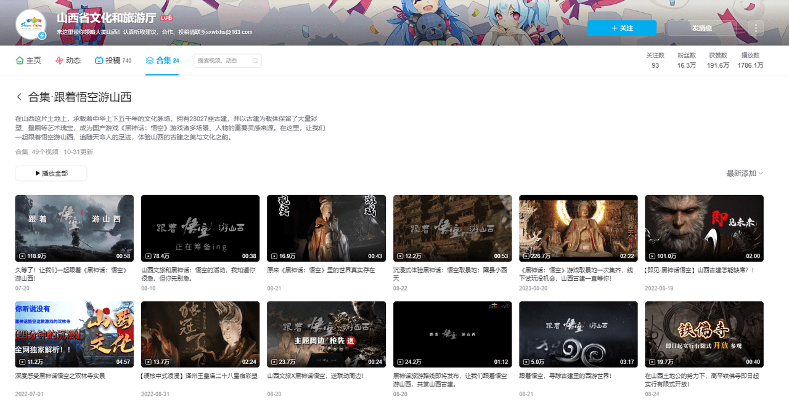

实际上，《黑神话：悟空》并非是第一个游戏和线下文旅产业结合的案例。在此之前，有许多国产游戏都尝试过与文旅进行联动。仅在2023年，就有超过30款游戏进行过类
似活动。

我们可以发现，过去游戏与线下文旅的联动，虽然方式多样，但并没能和游戏本身的内容深度绑定。这些游戏的题材、内容基本都和联动对象没有直接联系。在游戏中加入某个传
统服饰皮肤，把某个场景变成现实中的景点、推出联动周边。这些都更像是一种表面联动，并没能完全发挥游戏作为文化产品的优势。所以，这些联动内容很难像《黑神话：悟空
》这样形成一种大规模宣传效应或社会现象。

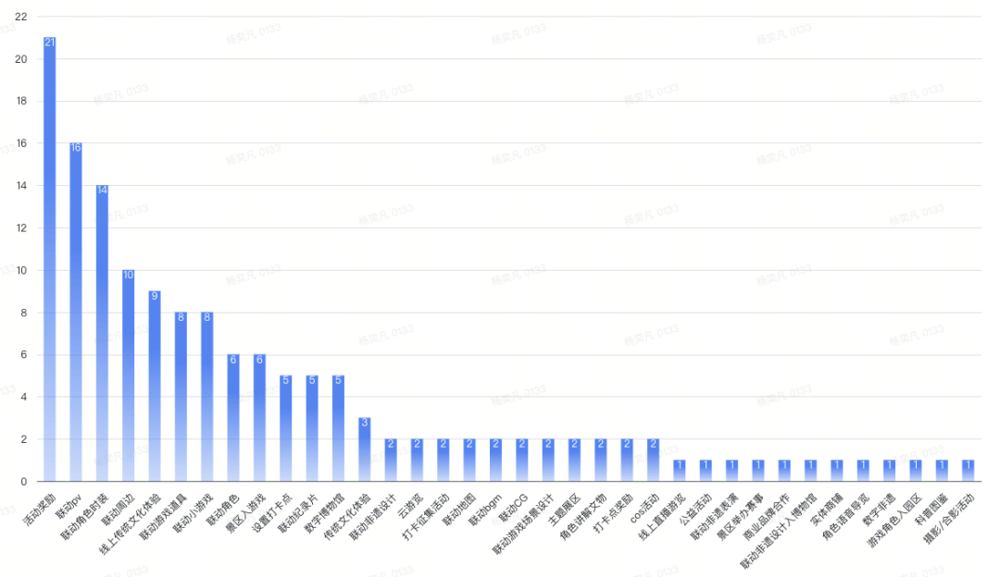

2023年游戏文旅联动采用的36类联动形式的频次统计，图源“光辇研究院”公众号

对玩家来说，游戏与其他文化产品最大的区别就是极强的沉浸感与互动感。一款游戏能让玩家穿梭于过去未来，以不同的视角感受某些地标的魅力。玩家在游戏中获得的沉浸感与
情感体验，自然就会转移到线下，这也是“圣地巡礼”这种行为的原动力。

一些具有文化地标性的景点，本身也有可能成为游戏的重要噱头，这一点在有“旅游模拟器”之称的《刺客信条》系列中尤为突出，这种虚拟与现实的结合不仅能吸引更多玩家，
进而带动游戏销量，同时对当地的旅游产业也有着一定促进作用。如果类似的模式可以在国产游戏中开枝散叶，无论是对于游戏开发者还是地方政府部门来说，这都称得上是一个
双赢的结果。

即使在国外，通过游戏来带动线下文旅经济的方式也屡见不鲜。例如《对马岛之魂》发售之后，当地政府火速上线了相关网站，并在提供的线下旅游指南中专门加入了“《对马岛
之魂》景点打卡地图”。在游戏中出现的神社原型被台风摧毁后，政府在许多粉丝的助力下众筹了超过2000万日元的修复资金。

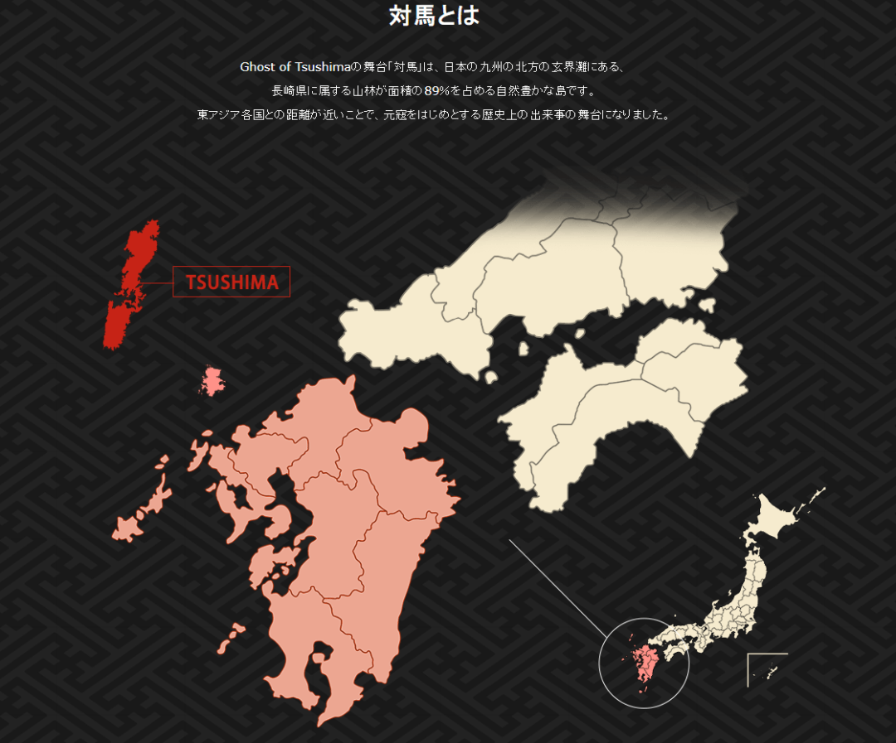

在海外，游戏与旅游业紧密结合所能爆发出的能量，已经促使许多游戏和线下景点形成了线上线下双向奔赴的结果，比如东京的诸多地标之于《女神异闻录5》、歌舞伎町之于《
如龙》。而这些案例，也为国产游戏展示了更多可能性。

目前看来，这些”玩家圣地”巡礼相对频繁的游戏，几乎大都是历史与都市背景的产品。尤其历史题材在这个领域对于国产游戏来说，无疑是一座无尽的宝库。

当然，无论是游戏产业还是文旅产业，都已经对三国这样大众的题材进行了比较充分的开发，因此也有着一定的门槛，后来者可能先要像《黑神话：悟空》之于西游记那样，凭借
一定程度的改编和原创形成自己的IP；或者挖掘类似于对马岛之战这样相对小众，但又有很多内涵和解读空间的历史事件。中华文明丰富的历史文化，无疑也有着足够的多样性
和丰富度来支持一大批类似的作品。

### 3.4 新的蓝海

在很多人眼中，《黑神话：悟空》的成功是占尽天时地利人和，无法复制的奇迹。其现象级的表现，在电子游戏史上都是浓墨重彩的一笔。但我们仍可以沿着天命人踏出的取经路
，寻得几条可供后来者们参考的路线。

对一款游戏来说，质量是成功的基础。《黑神话：悟空》证明了中国的游戏产业和市场已经足以孕育出千万销量、年度游戏级别的3A大作。国产游戏的开发能力，也已经在许多
层面追赶上了国际一线厂商的水平。

但《黑神话：悟空》是一款完美的游戏吗？自然不是。它的火爆为我们展现了一条区别于顶级3A的路径。——不需要做出一个六边形战士，但一定要在视觉、剧情、题材等层面
，有至少一到两个足够有特色、或在技术设计上有突破的领域。木桶的长板可以弥补短板，提高游戏能触及的上限。

就拿《黑神话：悟空》来说，游戏发售后对《黑神话：悟空》缺点的讨论，大多集中在空气墙、地图设计缺乏打磨、剧情不够完整连贯等方面。但对非核心玩家群体来说，这些缺
点并不影响游戏给他们带来的惊艳。而《黑神话：悟空》最为出色的场景美术和对Boss战的打磨，恰恰是许多人评判游戏内容量和卖相的重要甚至是最重要标准。

当然，为游戏打造出一块长板并不能一劳永逸。许多成绩不错的国产游戏，都有着相当突出的优缺点。但想要达成大范围的破圈讨论，从而反向带动游戏的影响力与销量。则需要
将这些长板，转换成符合当下互联网传播逻辑的爆点。换句话说，玩家需要能在几分钟甚至几十秒的短视频里，捕捉到游戏最精华的部分。

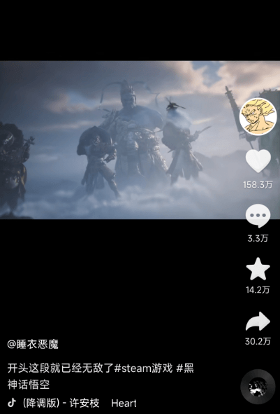

短视频等媒介对游戏传播的重要性越来越高

除此之外，《黑神话：悟空》的成功也证明，一款在质量上足以承载玩家民族情绪和爱国热情的游戏，便有可能收获远超预期的回报。只是想要承载这种情感和期望，只靠中国元
素的是远远不够的。像《仙剑奇侠传》这样的国产单机，本身就有着纯正的中国风。但却并没能引起《黑神话：悟空》这样大范围的轰动。

究其原因，玩家想看到的，是游戏用能和全球一线水平掰手腕的技术力，和中国本土题材形成的化学反应。换句话说，在国产游戏的市场环境下，如果一款国产3A能名副其实地
在制作规格上达到欧美大作的水准，很可能获得《师父》《真三国无双》等外来者不能企及的事半功倍效果。这是国产厂商拥有的独特优势，也是国内玩家尚未被满足的巨大蓝海
。

国产单机游戏热潮：下一个爆款在哪里？

## 后“黑神话”时代

《黑神话：悟空》的成功，如今我们已经不需要赘述了。无论是3天破千万的销量，还是压倒性的好评，都让其成为2024年当之无愧的最强爆款。黑神话的成功，不单单是国
产单机游戏的一次胜利，在其背后，更是有改变国产单机游戏市场格局的非凡意义。

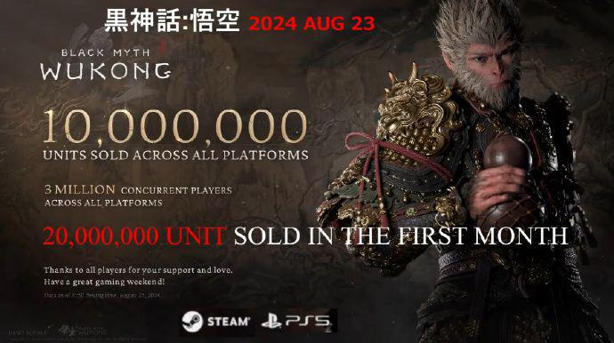

### 1.1 一针恰到好处的“强心剂”

2024年国内游戏市场实际销售收入3257.83亿元，同比增长7.53%，再创新高。游戏用户规模6.74亿人，同比增长0.94%，亦为历史新高点。如果从整体
的涨幅与数据上来看，整体的收入与用户规模，呈现放缓的趋势，尤其是自研游戏领域，国内市场实际收入同比增长只有1.70%。

在这种环境之下，有两项数据格外突出，其一是在除移动、网页以及客户端游戏之外，所谓的“其他游戏”，从去年的1.67%大幅增至2024年的4.59%。另一个则是
主机游戏市场，其实际销售收入44.88亿元，同比增长55.13%。

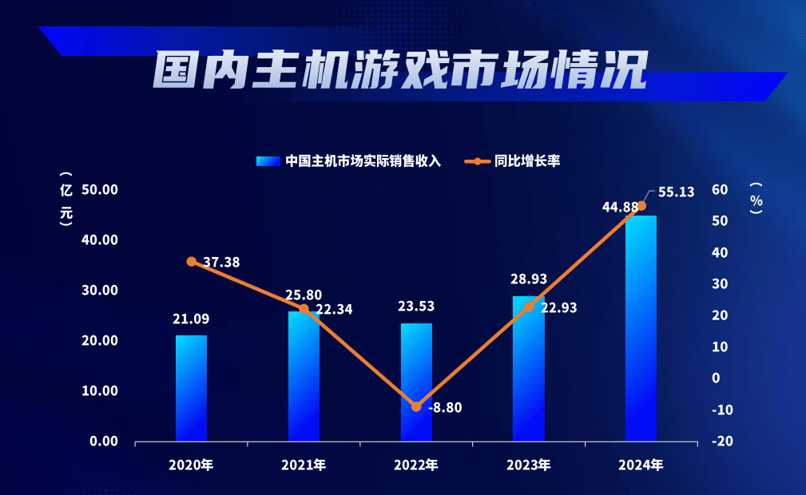

在疯涨的数字背后，黑神话居功至伟。

3-
4亿的成本，收获了超70亿的回报，这种“以小博大”的收入，刺激着国内的单机游戏资本市场。一时间众人将目光聚焦在国产单机游戏领域，试图培养出第二个“村里的大学
生”。

这种稳中向好的国产单机市场环境，是无数游戏人此前想都不敢想的。

自千禧年带来的互联网浪潮，掀翻了90年代的国产黄金时代之后，国内的单机市场环境可谓是一言难尽。挺过了一波又一波的“寒冬”，直到近几年，单机市场才逐渐开始有复
苏的迹象。诸多怀揣着梦想的制作人，得以开始逐梦之旅。

《太吾绘卷》《中国式家长》《逸剑风云决》，国产单机游戏也开始诞生一些有名气的作品。但受限于各式条件，大多数制作人会选择一条稳重求胜的道路——独立游戏。相对小
的工作室规模，相对低的制作成本，带来了更大的容错空间。较低的售价区间，让更多玩家愿意试错，也更容易催生出爆款。

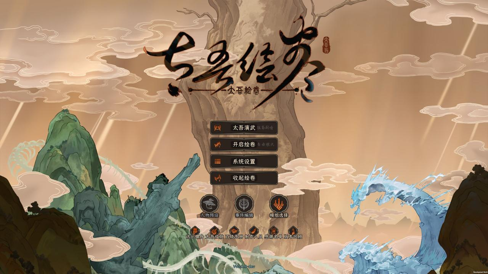

放眼过去曾经取得一定成绩的国产独立游戏，其背后的工作室时常有大厂的支持，但它们的资源和人力可能比其他草根出身的独游工作室没有本质上的区别。大厂有时愿意花一些
资源去赌一个爆款的诞生，但也仅此而已。在行业下行的大环境下，这些迟迟看不到回报的项目大概率就是降本增效的首要对象。

几乎没有人像杨奇和冯骥他们一样，直接选择梭哈。毕竟有梦想是好事，但“活下来”，或许才是很多中小型游戏工作室的第一要务。在这样的环境之下，3A游戏又要从何谈起
，一招错满盘输的案例，简直不要太多。

这更让黑神话的成功显得弥足珍贵，它不仅是国产3A的第一个世界级爆款，更重要的是带给背后资本的信心。

整个黑神话的研发过程中，最大的牌的资本介入无疑是腾讯。黑神话的成功，也毫无疑问将在一定程度上，影响腾讯对于游戏的投资倾向。毕竟依照大厂的投资惯性，只要国产3
A这条路能够跑通，且有出色的回报比，后期投资一些有潜力的项目，几乎已经是板上钉钉的事。

更何况近些年，腾讯一直在挖掘游戏圈中有潜力的苗子，包括每年都在办的GWB（腾讯独立游戏大奖赛），都是对于国产单机的投资与扶持。

至于另一个投资者英雄游戏（英雄互娱），本就在游戏领域投资多年，其老板吴旦更是眼光毒辣，早在2017年，就投给了游科第一笔6000万的资金。凭借着近几年投资了
不少爆款项目，他本人更是被米哈游创始人兼总裁刘伟，称为过去五年中国游戏最强投资人，没有之一。以黑神话目前的表现，英雄游戏也赚得盆满钵满，后续也似乎没有理由脱
离投资国产单机这条赛道。

资本逐利，这句话基本上没有任何问题。有人做第一个吃螃蟹的人，押宝之后赢得了满堂彩，那自然就会有跟风入局的下一批人。无论最终是输是赢，国产单机总归是有了更多试
错机会和更多的希望。

### 1.2 最好的时代终于来了？

黑神话的成功，让不少与国产单机游戏相关的产业，也受到了资本的关注，那些与它合作过的公司就成为了最直接的获益者，比如为游戏提供了动捕支持的“上海降世网络”。

这家成立于2017年的公司，最早的主营业务是手K（手动调节关键帧）动画。在2019年，降世收到了游戏A股世纪华通40%的占股投资。可即便如此，在2020年，
降世整个公司也只有不到20人的规模。好在团队规模不大，但成员基本都是从业经验丰富的圈内人。降世的创始人李阳一，更是曾任职于EA、腾讯等知名公司。在成立初期，
降世就曾和《天涯明月刀》《逆水寒》《永劫无间》等游戏，进行过合作。

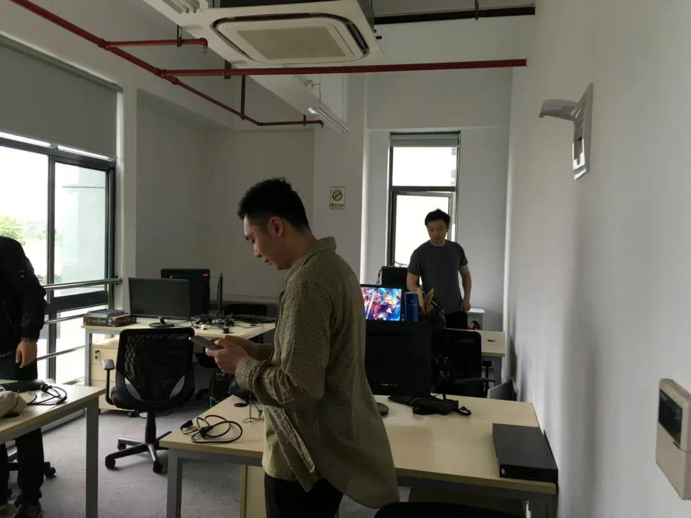

但从没有一个项目，能像《黑神话：悟空》一样，进行长达4年的深度合作。在和游戏科学合作期间，他们完成了动捕棚的搭建，开始了3D动效全流程的道路。在黑神话爆火之
后，一些项目主动找上海降世，希望能进行合作，李阳一也尝试着，和一些高等院校联系，尝试着挖掘更多行业人才。

这无疑是一个好的开始，有更多资本关注，催生出更多的人才缺口。人才缺口，势必会让更多高校，愿意培养相关领域的人才。如果能彻底跑通这一链路，形成完整的行业闭环，
对于整个国产单机，乃至整个国产游戏的技术发展，都有着深远影响与意义。

上海降世并不是个例，在和黑神话的合作中，有不少圈内人也再度打响了自己的品牌知名度。

齿轮映画、大火鸟文化、狼烟动画，这些业内顶尖的工作室，在黑神话爆火之前，也曾参与过诸多知名项目。但这些名头，更多是在业内传播。黑神话的破圈效应，让更多圈外人
，也能看到这些名字。这无疑是一种良性刺激，也在以一种潜移默化的方式，扩大着相应的市场。

从一纸禁令到如今逐渐回暖，国内单机市场已经渐渐拥有了能孕育出3A游戏的土壤。黑神话的成功，标志着技术管线与市场规模的逐渐成熟，也让不少怀揣着梦想的制作人，再
次燃起希望。

### 1.3 国产单机游戏的下一棒

如果说黑神话是村里的第一个大学生，那第二个“准大学生”，一定是《影之刃零》。作为在单机领域深耕多年的制作人，梁其伟和他的灵游坊早年间凭借着《雨血》系列名声大
噪。

《影之刃零》在此前曾放出过试玩，无论是流畅度的表现，还是颇为硬核的战斗体验，亦或者是多样化武器的设定，都获得了国内外玩家与媒体的一致好评。无论从哪个角度来看
，《影之刃零》目前都是黑神话后，最有可能成为下一个全球爆款的国产游戏。

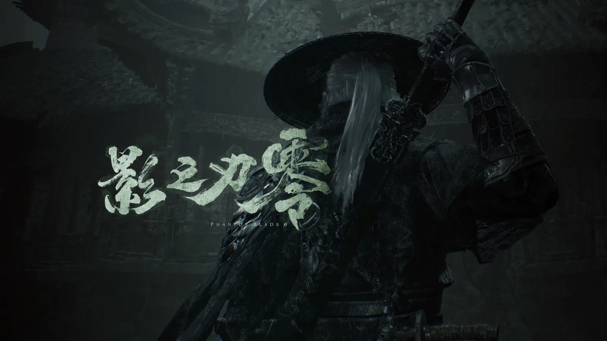

像梁其伟一样的制作人并不少，除了《影之刃零》外，《昭和米国物语》也是万众瞩目的潜在爆款。和前面这位准大学生不同，《昭和米国无语》更像是玩家们口中那个“村里第
一个 gai溜子”。

该游戏与《影之刃零》一样，早在几年前就已经立项宣发，并非眼看黑神话席卷全球的热度，一拍脑门想出来的跟风之作。游戏大胆地虚构了一个日本占领美国的倒反天罡剧本，
辅以花样百出的梗，以及八九十年代老物件的回忆杀，用抽象把游戏带到了一个不一样的高度。

《昭和米国物语》的两部宣发视频，一经发布立刻爆火，在B站都突破了500万的播放量。和影之刃与黑神话这种“严肃向”的3A不同，这款游戏似乎提供了另一种解法，不
去过分追求画面，而是从玩法和题材方面突围，主打一个性价比，以创意取胜。

如果把3A的定义泛化，去看待更广阔的国产游戏阵营，《明末：渊虚之羽》和《代号：锦衣卫》，也是有希望的国产选手，只不过相较于前面两位，它们目前的问题都相当明显
。《明末：渊虚之羽》更像是搭好了架子，贴好了一张张绚丽的宣传海报，至于是不是真能上演“拿人”的作品，有待时间的考证。至于锦衣卫则是另一个极端，上来就是大段实
机演示，但无论是动作连贯性，还是角色建模等方面，都有待优化。

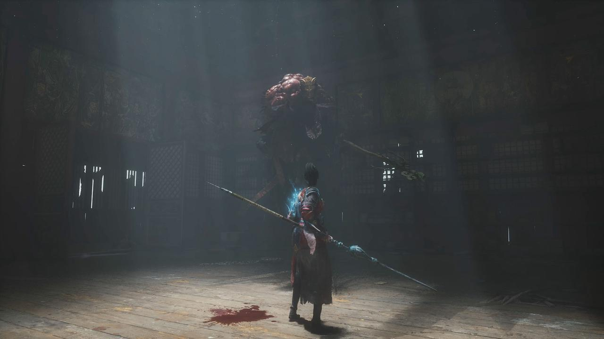

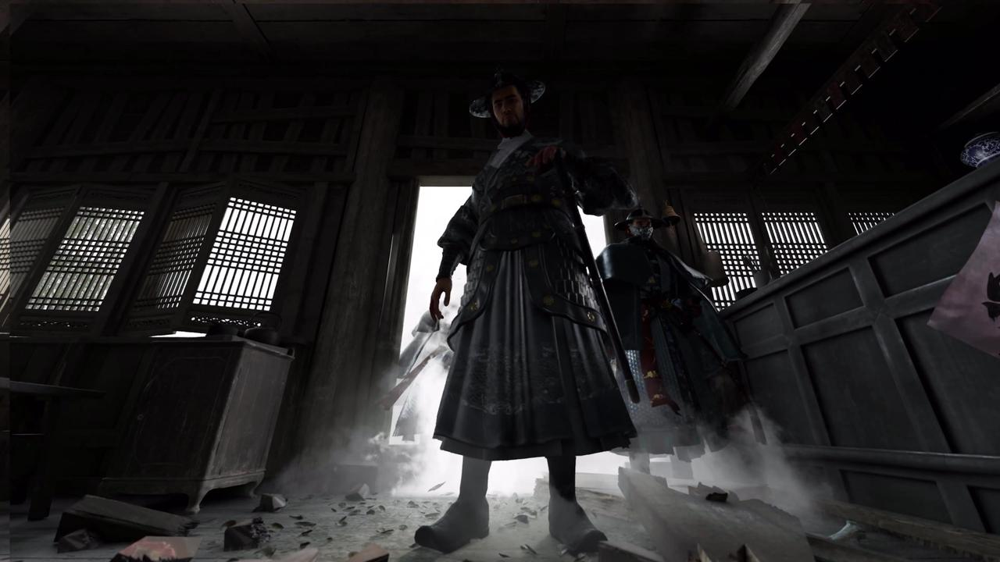

这样未来可期的项目，正在《黑神话：悟空》的影响下不断涌现出来，即便它们没有成为全球知名的爆款，但只要产品能够平稳落地，就已经足以为唤醒国产单机游戏市场，再添
上一份力。

想实现国产游戏崛起的梦想也好，单纯看中国产单机的市场利益也罢，黑神话的出现，无疑吸引了更多资本介入，带来了更多的可能。国产单机的高塔，也终于打下了一块坚固的
基石。

接下来，我们将对这批重点产品的现状和前景进行多角度分析，因为这座塔能够修多高，上面又有怎样的风景，都需要《黑神话：悟空》下一棒的接力者们共同塑造。

## 梁其伟与身负众望的《影之刃零》

黑神话更像是打开了一扇窗，让无数人窥得了国产单机市场潜力的冰山一角。随后，不少后继者涌入了这个赛道，这其中，最受关注的，自然就是梁其伟手中的《影之刃零》。凭
借着暗黑朋克的武侠风格，流畅如电影般的战斗，以及国内外多次线下试玩得到的广泛好评，许多玩家和业界人士认为它很可能是国产3A游戏的下一个爆款。

很明显，以国内需要从零开始搭建3A生产管线的现状与常规游戏开发流程来说，《影之刃零》早在黑神话发售之前就已经入局3A赛道，这种远见让它成为了玩家和媒体口中的
“村里第二个大学生”。而它之所以能够早早立项开发抢占先机，要从制作人梁其伟和“影之刃”的前身《雨血》说起。

### 2.1 “神作”的诞生

“天雨血，鬼夜哭”。

古龙《天涯·明月·刀》中的台词，触动了一位清华大学建筑系的高材生。

从小爱好绘画和故事的梁其伟，在接触到了rpgmaker这一软件之后，产生了一个大胆的想法，为什么不让自己的故事，以游戏的形式展现给世人？

梁其伟开始摸索游戏之道，可彼时的他小看了游戏的工作量，手绘动画和无休止的BUG调整，让满腔的热情在三个月内就烟消云散。但即便是爱好变成了折磨，这个项目也没有
停下脚步，在2007年春节前后，梁其伟完成了游戏的初版，取名《雨血：死镇》。

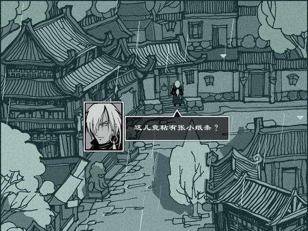

梁其伟强迫自己清除游戏开发的记忆，用玩家的身份去体验游戏，这款游戏虽然充满BUG，依然让他成就感满满。但游戏的开发的代价是惨痛的，他因此挂了一科，失去了保送
本系研究生的资格。

他只能将游戏开发进度暂缓，努力攻读，成功考进了耶鲁大学建筑系。留学期间，他制作的游戏，让同学们感到无比震撼。或许没多少人知道他叫梁其伟，但不少校友都知道，有
一名中国留学生，做了一款很酷的游戏，虽然他们看不懂中文。

时间来到2010年，梁其伟终于完成了《雨血：死镇》，甚至开发了《雨血2：烨城》的第一章，他将这些内容打包，直接丢到了VeryCD上。仅仅一天时间，游戏就获得
了10万的下载量，最终在各个平台，收获了超过400万的下载。

无数玩家将其称为“艺术”，《雨血：死镇》出道便迎来巅峰。

虽然游戏的手绘风格相当简陋，但梁其伟用类古龙的风格，构筑了一个充满江湖气息，兼具黑暗色彩的武侠世界。错综复杂的人物关系，神秘的组织与盘根错节的线索，配合多线
化的叙事，让雨血挖了一个足够大的坑，为之后《影之刃》的出现，夯下了坚实的底座。

这样的成绩很显然已经超出了梁其伟的预料，《雨血2：烨城》的开发，自然也被提上了日程。不同于死镇的闭门造车，烨城的开发，有了更多业内人的帮助，同时发行工作，也
交给了Gamebar（网元圣唐）来负责。在众人的合力打造下，烨城几乎将rpgmaker的性能，压榨到了极限。

游戏大放异彩，再次被无数玩家推上神坛。

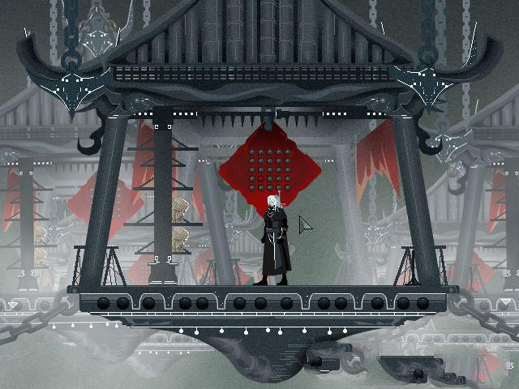

同年，梁其伟成立了自己的游戏公司“灵游坊”，并开始着手《雨血前传：蜃楼》的开发。或许他也没有意识到，这将是灵游坊第一款，也是最后一款单机游戏。

由于rpgmaker的局限性，蜃楼的开发选择了Unity这一成熟的商业引擎。横版卷轴的战斗，奠定了这一系列的后续风格。同时更强的表现力，也让游戏的战斗焕然一
新。相比于前两作，游戏的中心内容有向战斗偏移的倾向。

对此玩家们的意见颇为不同，有人认为这丢失了雨血的“魂”，前作那种古龙风格的剧情故事才应该是最大的卖点。但也有人看好这一改变，更爽快有趣的战斗，无疑让沉浸感大
大增加。

无论有何争议，蜃楼依然是成功了，30元的数字版和99元的实体版，总共卖出了几十万套，但梁其伟却在担心另一个问题，一个关乎雨血系列存亡的问题。

他们要怎么“活下去”。

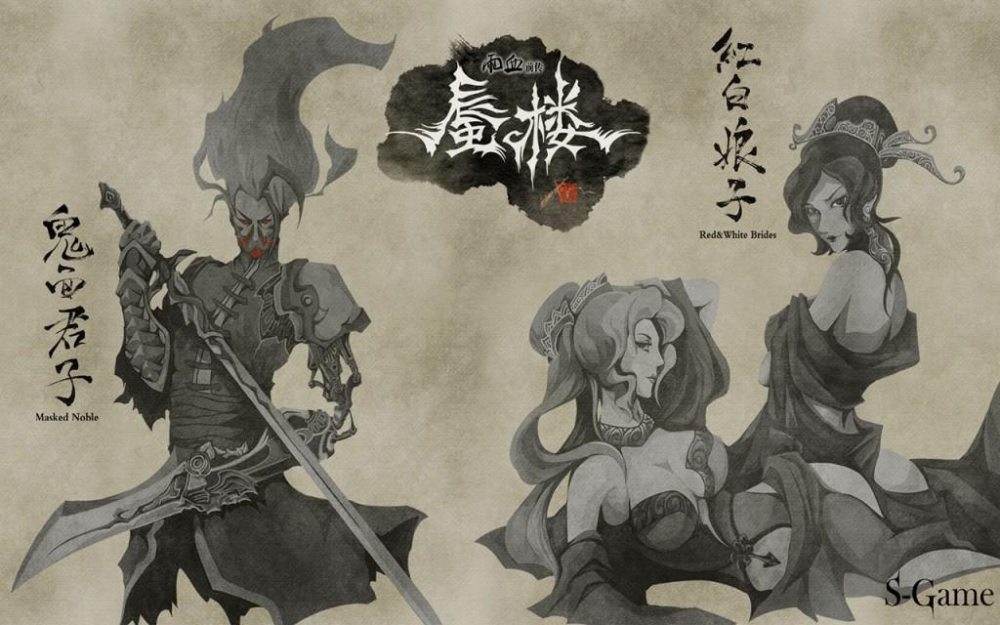

### 2.2 顺遂的商业化之路

在成立了公司之后，一切开销都在几何式增长，蜃楼商业化的成功，并没有让灵游坊得到发展，支出比的微妙平衡，让其在两年的时间里，几乎就是原地踏步。梁其伟要做出选择
了，是继续追逐梦想，还是向更多的商业化妥协。

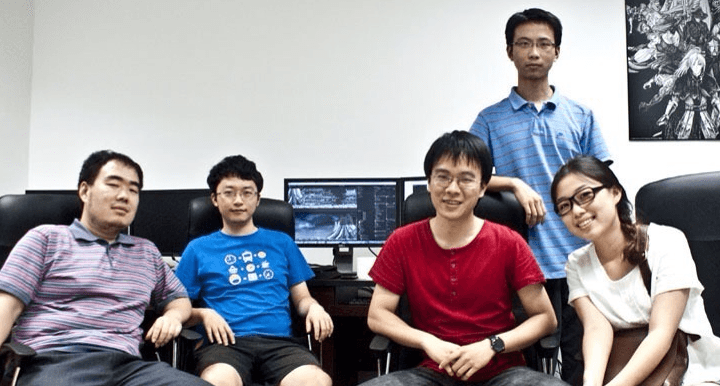

随着《影之刃》的出现，答案非常明显，他选择了后者。

毕竟从当时游戏市场的大环境来看，如果一味地死咬着梦想，最终只能走向解散，成为一代玩家口中惋惜的“传奇”这个Bad Ending。

有了网易的鼎力支持，雨血系列成功完成了向《影之刃》的转变，单月破千万的流水，足见其商业化的成功。与此同时，灵游坊规模急速膨胀，短时间内员工从十几人暴涨到了7
0人。

但玩家们并不买账，曾经他们眼中国产单机的希望之神，如今已经彻底“堕落”，这在一定程度上影响了《影之刃》的评价。如果单看基础素质，《影之刃》绝对属于硬实力的一
线梯队。继承自雨血的剧情与设定，有策略深度的技能链设计，出色的画面表现力，让其在一众手游中，显得格外亮眼。

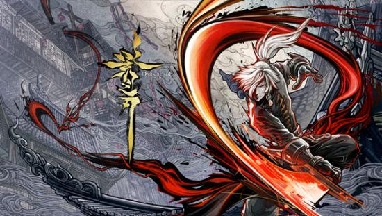

成也雨血，败也雨血。正因为是雨血系列的延伸，《影之刃》才会被玩家们用更高的要求审视。

既然选择了商业化，《影之刃》开足了马力，在商业化的道路上高速奔驰。后续推出的《影之刃2》与《影之刃3》，虽然都在继承雨血的经典元素，但也在不断地试探商业化的
底线，以至于到了第三代的影之刃，已经几乎把能氪金的元素，在游戏里统统拉满。

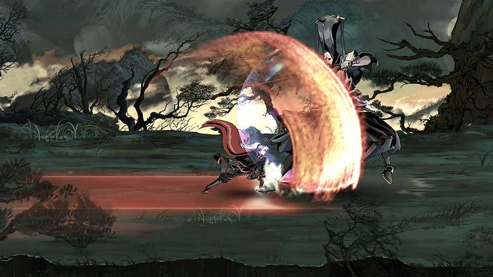

在很多人看来，梁其伟似乎背离了最初的理想，那片武侠朋克的江湖，也变得不再纯粹，哪有什么国产游戏的希望，只不过又是一个圈钱的IP罢了。

从雨血到《影之刃》，虽然已经逐渐的商业化，口碑直线下滑，但世界观构筑却得到了传承与拓展。

一本记载着超前智慧的“天书残册”，一项能批量制作武林高手的杀气改造技术，秘密到无人知晓的“组织”，让武林大规模动荡的“天岭惨案”。随着作品的更新迭代，越来越
多埋下的扣子被一一解开，同时引出了新的谜题，雨血或者说是影之刃的故事，一直没能画上句号。

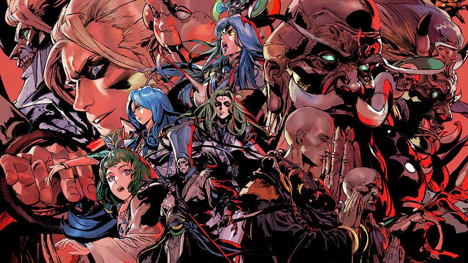

梁其伟当然知道玩家们的批判，但在他看来，他的选择问题不大。如果自己坚持“独立制作人”的傲骨，坚持继续制作雨血的初心，最好的结果，也无非是灵游坊还是当初成立时
的规模，或者它也会成为游戏历史上，诸多昙花一现的工作室中的一员。

### 2.3 有梦想的人不会一直做手游

2020年，梁其伟看到了一个重返单机游戏的机会：一只猴子的视频，直接刷爆了整个游戏圈。

或许谁也没有想到，仅仅是一个13分钟的实机演示，24小时播放量破千万，2天B站官方账号涨粉100万。视频直接实现多领域破圈，上热搜更是那几天的家常便饭。在B
站视频的评论区，各路KOL与官方账号纷纷下场，不止硬件外设、游戏工作室，小米有品以及中国国家地理频道，这些非圈内人，也纷纷下场表示祝贺。

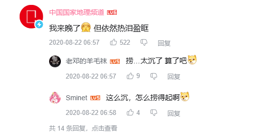

至于游戏圈，更是如过年了一般，处处透露着一种久旱逢甘霖的畅快感。无数的媒体都对黑神话寄予厚望，毫不吝惜自己的赞美之词。根据一部预告片，就断言游戏是国产之星，
种种期待与鼓励都足以证明，国内的玩家们太需要一款质量够硬，能作为扛鼎之作的国产单机了。

后面的故事大家都知道，黑神话从曝光到上架的这几年，就如同爽文故事的男主一样，出道即巅峰，赚了个盆满钵满的同时，让自己成为游戏历史上一块永远的丰碑。

或许是受到了黑神话的激励，亦或许是看到了国产单机游戏的市场前景，在黑神话曝光第一个实机视频的次年，灵游坊宣布，开启全新的单机项目《影之刃零》。

一封公开信，唤醒了玩家们尘封的记忆。《影之刃零》不但已经在开发中，并且还获得了腾讯的数亿元投资。

消息曝光后，不少玩家的态度并不积极，毕竟3代影之刃越来越重的商业化，已经将灵游坊在玩家中的信誉消耗殆尽。直到经过2年的沉淀后，2023年PS发布会上，《影之
刃零》放出了首支实机PV。

它仍然是经典的武侠朋克风格，构筑了传说中的武侠世界“影境”。玩家在游戏中将扮演一位生命即将到达尽头的孤独侠客——魂，在生命仅存的时间里，挑战各路武林高手和怪
物，解开背后谜团的同时，找回自己的本心。

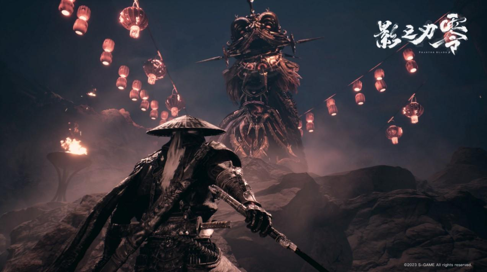

游戏沿用了雨血和影之刃系列的世界观，一批老熟人在PV中纷纷亮相。流畅的武侠招式动作，与爽快的战斗观感，无不让玩家们惊呼，曾经的灵游坊又回来了。而且从放出的P
V中，可以看出游戏的完成度相对较高，早已脱离了刚建文件夹的阶段。

但也有不少玩家质疑，这所谓的实机画面，不过是画出来的一张新饼。

面对这些质疑，灵游坊随后宣布，游戏采用买断制，并直接开启了多次线下试玩。夏日游戏节、Bilibili World、CJ、科隆游戏展、东京电玩展，这些国内外的
大型游戏展会上，都出现了《影之刃零》的身影。来线下试玩的，除了热情的玩家们，还有吉田修平、虚渊玄这样的业内大咖。

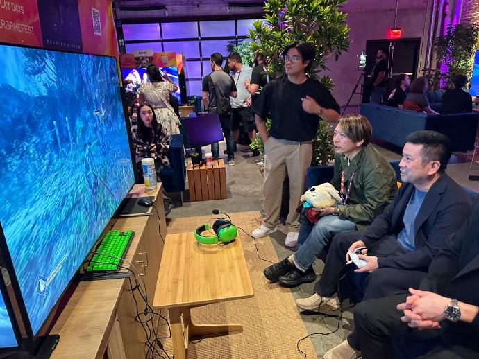

自己画饼自己圆，虽然只是特定关卡的试玩Demo，但也足够让不少玩家们重新拾起对于梁其伟和灵游坊的信心。国内外的玩家们与专业游戏人，都对试玩报以称赞。

玩家们对《影之刃零》抱有信心和期待也不难理解，一来影之刃这个IP也有数十年的沉淀，无论是世界观还是故事，都已经搭好了足够的框架，并且经过了市场验证。即便是以
商业化为目的的几代《影之刃》，在剧情故事的塑造与美术方面，也是相当惊艳。

再者说，梁其伟和灵游坊经过了多年的游戏开发，无论是技术管线，还是整体运作，都已经相当成熟。本就是以动作游戏起家的灵游坊，此次的开发也没有完全脱离自己的“舒适
圈”，以往种种的经验，多多少少可以在新作中得到复用。和那些半路出家以及跟风蹭热度的工作室不同，灵游坊毕竟在武侠品类上耕耘多年，为转战3A打下了深厚的基础。

但说到底，上述只是《影之刃零》有潜力成为一款合格3A的入围门槛。最终还是线下试玩体现出的内容和玩法，给玩家们吃了最后一颗定心丸。

除了暗黑武侠朋克的视觉风格，流畅爽快的武侠风体验，也抓到了不少玩家的眼球。制作人梁其伟坦言，这种偏港式电影风格的武侠动作，正是游戏的精髓所在，他希望在游戏的
操作与对战中，展现出正宗的中国功夫攻防哲学。

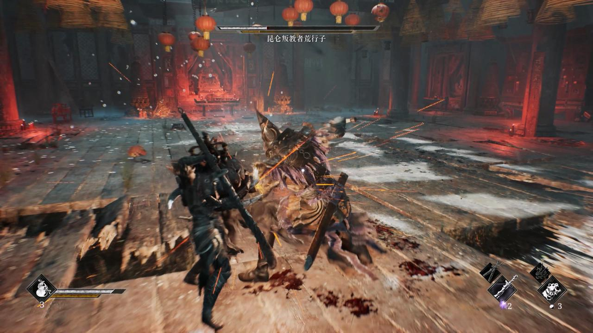

梁其伟曾说过，《影之刃零》是一款能让大多数玩家“爽”起来的游戏。得益于不同的难度选择，低难度下，玩家们可以尽情贪刀，享受武侠电影般的战斗体验。但在极难的模式
下，游戏的难度会陡然上升，不过这并非是粗暴的拉高数值，而是直接改变了怪物的出招逻辑。

极难状态下的BOSS，引入了类似AI的深度智能学习，摒弃了传统的战技复读，而是结合当前局面，选择最合适的行动，甚至还会使用假动作，来实现“平A骗大招”的类人
化操作。

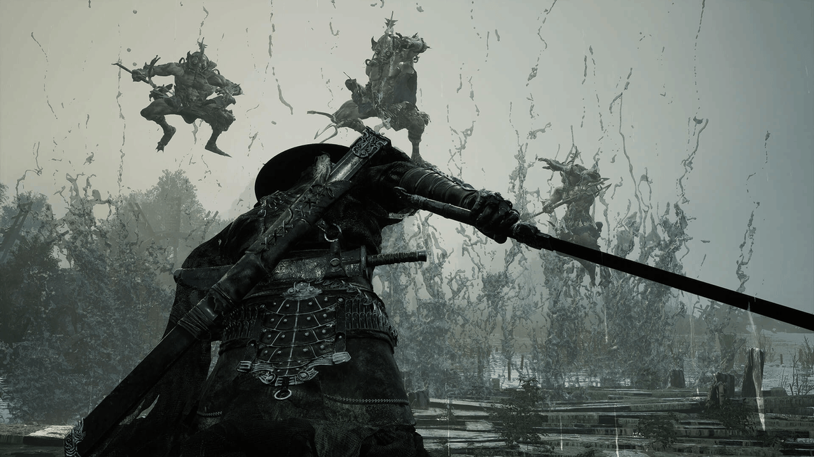

玩家们的背板无效，容错空间更低。就像是一场格斗游戏，BOSS并非是单纯的读指令，而是像个真人操控的玩家，和玩家们来一场公平的较量。帧数、立回、差合等概念，让
整个战斗的刺激感更强。

如今训练出一个能够战胜人类的AI已经不是新鲜事，但将之应用在游戏中则需要把握好AI强弱的分寸。因为并非每一个玩家都喜欢将战斗变成一场挑战极限的高强度竞技。所
以虽然相对于固定模式复读出招的敌人，AI的加入的确能让怪物更具备挑战性，带来与众不同的玩法。但如何把握AI的实力，将之打磨成良好的游戏体验，或许是《影之刃零
》要好好考虑的。

### 2.4 从“零”开始

无论从哪方面来看，《影之刃零》都具备了成为顶级3A该有的潜力。

“并不是说中国的所有开发商在这个时候才决定一起制作主机游戏，而是从一开始我们就想开发。只是在这个时候，条件成熟了，大家都能达到这样的质量了”

《影之刃零》的美术总监Michael，曾在采访中这样说道。

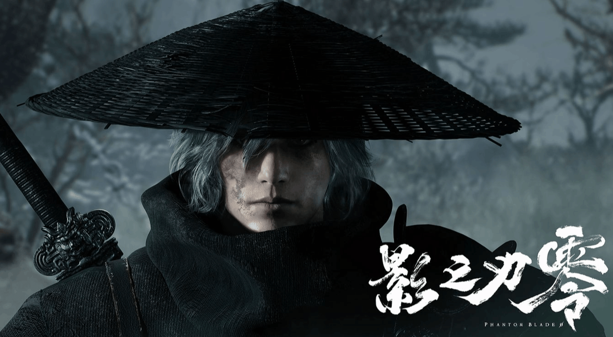

最近几年，国内单机游戏形式，的确是稳中向好。黑神话的表现，更是一针强心剂，成为了国内市场潜力的证明。《影之刃零》就目前的状态来看，很可能成为“村里的第二个大
学生”。

梁其伟和他的武侠梦还在继续，希望《影之刃零》，只是国产游戏崛起的开始…

## 《昭和米国物语》的“野路子”

在“国产3A”元年之后，人们对下一款《黑神话：悟空》有着异乎寻常的期待。 而时隔两年多再次发声的《昭和米国物语》，则为我们展示了另一条可能的路——有着足够有
吸引力的创意，也可以给游戏收获不输3A的话题度。对于中小型厂商来说，《昭和米国物语》将会是一个相当典型的范例。对它的拆解与分析，也能在一定程度上指明这条创意
先行之路的方向。

### 3.1 文化反刍的胜利

和一眼就能看出优秀的《黑神话：悟空》不同，《昭和米国物语》的制作规格和画面表现都平平无奇，看上去甚至有点像PS3时代的作品：粗糙的人物建模、站桩式的剧情对话
，许多方面都透露着一股廉价的气息。充满血浆与暴力溢出屏幕的B级片题材，更是限制了自己的受众范围，为获得游戏版号增添了不少困难。

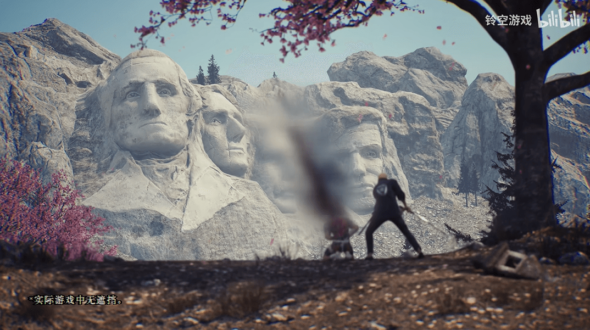

但就是这款卖相看起来平平无奇，也未曾在玩家面前反复刷存在感的游戏，却实打实地创造了国产游戏的又一个奇迹。虽然游戏一共只公布了两部宣传片，但每部宣传片都轻松地
在国内外斩获了数百万播放和上万条评论。这两部片子就像投入水中的两块巨石。泛起了一阵阵久久不能消散的涟漪。

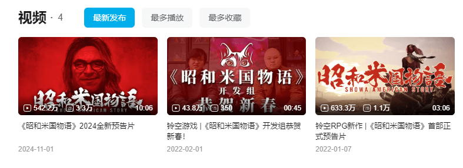

与《黑神话：悟空》《影之刃零》等高规格国产3A不同的是，《昭和米国物语》的关注度，几乎都源自其优秀的创意而非技术或画面。它向我们展示了，一个小团队，如何通过
创意让一款本该小众的游戏获得远超其质量的关注。

《昭和米国物语》的核心创意，用一句话就能概括——日本反向殖民美国。凭借这个充满噱头的概念，铃空游戏就构造出了一个与现实世界充满反差和戏剧冲突、但又有着千丝万
缕联系的世界。在这个世界中，日本的经济泡沫没有破灭，反而持续繁荣了下去，最终把美国变成了自己经济与文化的殖民地。

在宣传片中，《昭和米国物语》对两个国家的文化符号，进行了一波倒反天罡的互换。游戏让自由女神像穿上和服、在金门大桥上挂上浅草寺门口的灯笼、让一个人坐在总统山前
切腹自尽、在白宫前种满樱花。这些极具反差感的要素，无疑是游戏最吸引人眼球的地方。

除此之外，《昭和米国物语》还在宣传片中塞入了无数上世纪八九十年代的流行文化符号。在《红日》的旋律中，包括日本的动漫、影视、音乐，以及一代人在这些文化浸润下的
日常，堆起了宣传片的每一秒。充满噱头与喜剧感的世界观、在传播过程中几经变形，再反向输出的文化，都引起了国内外玩家的强烈兴趣。

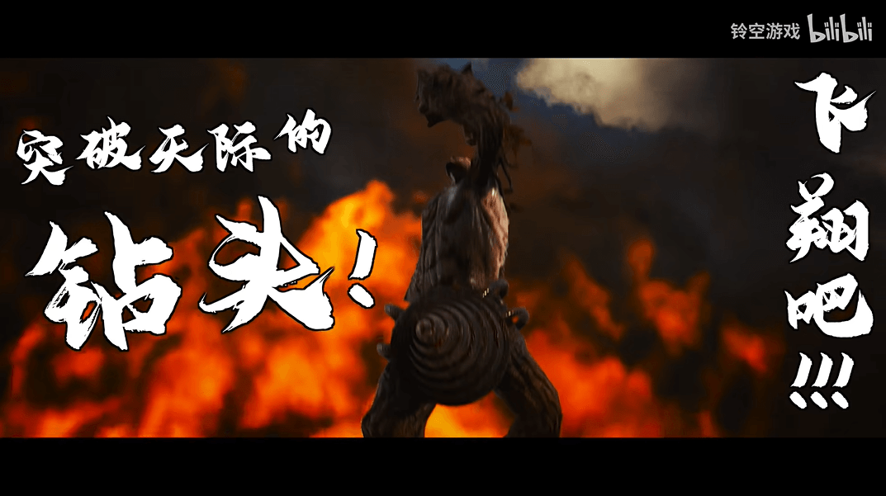

在采访中，主创罗翔宇透露这些元素几乎没有经过考证，全部取自脑海中对这些文化的“刻板印象”。这种有意为之的偏差，反而能让玩家从这些熟悉的元素中体验到新奇的感觉
。在熟悉与陌生之间，《昭和米国物语》为玩家们提供了一种近似梦核般的猎奇体验。这不仅是开启玩家怀旧情怀的钥匙，也形成了一种独特的美学，让这个荒诞的架空世界显得
更加有趣。

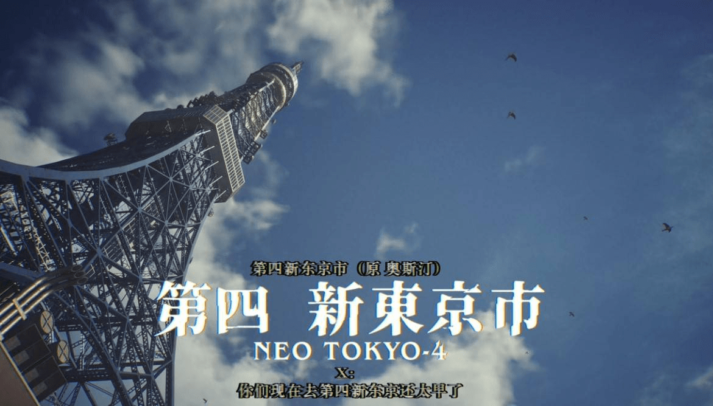

这种出奇制胜的脑洞和创意不仅在国内受到了广泛关注，还吸引了海内外玩家的目光。许多外网博主对着加起来不到十五分钟的宣传片逐帧分析。反复考据各种元素的出处和彩蛋
。国外玩家也展现出了对这款特立独行的游戏表现出了浓厚的兴趣。两部宣传片在Youtube上收获了上百万的播放，无数国外的游戏主播观看宣传片并对其脑洞表示惊叹。
而他们的反应又变成了Reaction视频进一步在海内外传播。

国外主播的Reaction视频获得了上百万的播放量

至此，《昭和米国物语》已经拥有了引爆海内外互联网的所有条件。不可否认的是，游戏有些“取巧”的题材和创意，是其能获得超高关注度的核心。而在当下互联网的传播逻辑
中，一个爆点或者说噱头，是一款游戏热度成几何倍数放大的必要条件。即使强如《博德之门3》，最初能够出圈很大程度上也要归功于那支可以和熊发生特殊关系的宣传片。

《昭和米国物语》可以说是小成本制作团队以小博大的成功典型。在玩法之外，游戏通过出色的创意确立了自己在市场上的稀缺性。也因此以相对低的技术门槛，收获了远超其制
作规格的关注。在游戏后续的推广和发售之前，《昭和米国物语》已经有了一个相当不错的开局。

当然，现在的《昭和米国物语》还远没有达到提前开香槟的程度。最明显的挑战就是，玩梗和彩蛋堆叠式的预告片虽然获得了很多关注，但对于具体玩法、养成模式等更加核心的
游戏系统并没有太多公开，这对于一款2025年内上架的游戏来说，宣发节奏可能有些慢了。如果上市后游戏在底层玩法这些基本功上出了问题，大众对游戏的高度期待很有可
能成为反噬游戏口碑的回旋镖。

### 3.2 制作人中心制

无论游戏最终的销量如何，《昭和米国物语》都又一次证明了创意在游戏开发中的重要性，以及它为游戏宣发带来的远超许多游戏开发者想象的效果。

只不过优秀的创意可遇而不可求。像任天堂那样，用高昂的成本和庞大的团队持续生产创意的做法即便对于大厂来说也很难模仿。但对于雄心勃勃且卧虎藏龙的众多国内游戏开发
者来说，有一个足够有趣的创意只是个前提，如何让创意落地，转化成有市场潜力的产品才是更重要的问题。《昭和米国物语》独特的开发模式，也许可以帮我们窥见一款优秀的
创意型游戏，是如何在一个小型团队中诞生的。

和国内以及欧美大多数工作室流水线协作开发的模式不同，《昭和米国物语》是一款由个别开发者主导的制作人游戏，这种模式常见于PS2时代及之后一段时间内的日本工作室
。它强调制作人的绝对核心地位，团队其他成员往往在游戏的大方向和设计层面没有太多话语权，他们的工作更像是帮助制作人把他想要的游戏制作出来。

在这种模式下产出的游戏，往往带有制作人的个人烙印，因而具有极强的个性。最终成品的质量也高度依赖制作人的能力和想法。但对于以创意为核心的游戏来说，这种开发模式
相当契合中小型团队。因为创意本身就经常带有创作者的个人色彩，在大厂很容易因为风格过于浓郁而难以立项，或者因为高昂的营利目标而妥协。但在以制作人中心制推进的游
戏中，它们往往能凭借制作人的意志强力推行下去。也就更容易产生一些剑走偏锋和独树一帜的作品。

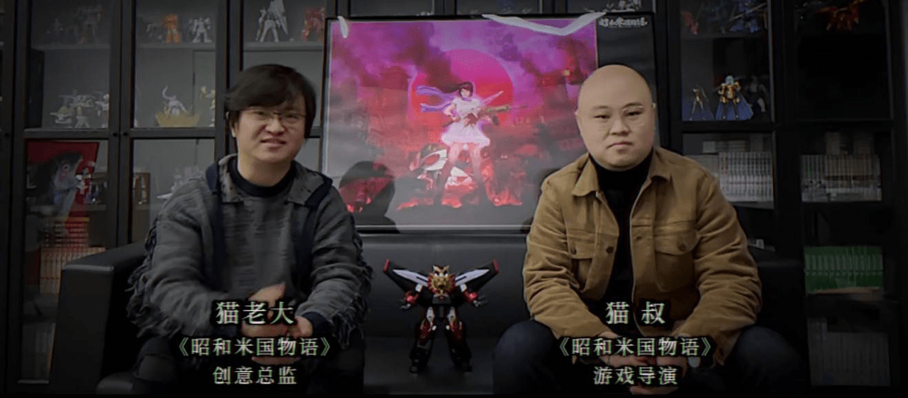

主创猫老大在游戏的创作中有着绝对的核心地位

除了制作人主导的开发模式外，《昭和米国物语》在具体的开发流程上也与很多游戏不同。虽然《昭和米国物语》是一款成本上亿元的中体量作品。但铃空游戏的开发人员规模却
只有30人左右，他们在开发过程中大规模使用了外包来填充游戏内容和美术资源，核心员工则更专注于设计管理等更偏向于顶层设计的工作。

这种开发模式同样常见于日本工作室。它的好处是可以让成员专注于构建游戏的世界观等核心设计，不会被具体的开发工作所干扰。所有堆量等琐碎的工作都可以交给外包去做，
也更能保证游戏开发的连贯，以及核心设计前后的一致性。但开发进度往往也受制于外包团队的水平与效率，同样具有一定风险和不确定性。

虽然这种古典的开发模式，在当下越来越工业化的开发流程下已经逐渐消失。但对《昭和米国物语》这样成本不及3A，又以创意为核心的游戏来说，无疑是一条相当合适的道路
。

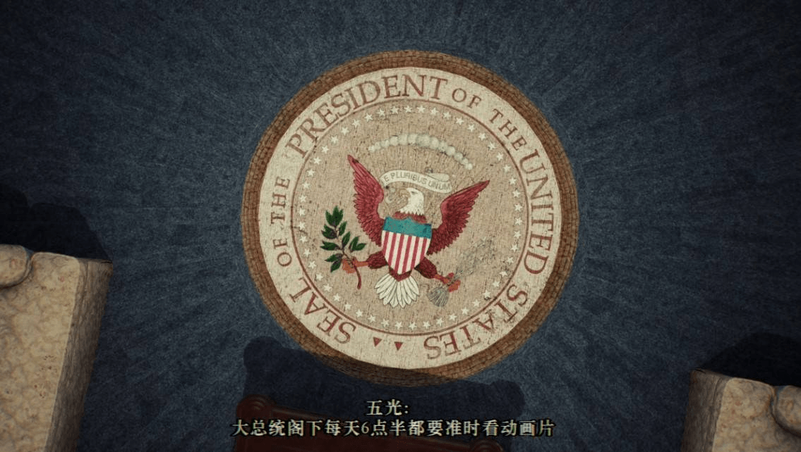

### 3.3 适合国产游戏现状的2A游戏

如果说《黑神话：悟空》代表着中国3A迈出的第一步，那《昭和米国物语》为我们展现了2A游戏复兴的可能。

所谓2A游戏，往往指制作成本和体量介于3A与独立游戏之间、画面较为精美，开发成本普遍在2000万-
4000万美元，定价在40美元左右，体量中等，玩法和概念相比3A大作有更多创新空间的游戏。

而《昭和米国物语》，就是一款2A游戏的典型。主创罗翔宇曾在采访中透露，游戏的最终成本不超过2000万美元，虽然够不上3A的成本，但也远超许多独立游戏。根据过
往类似体量的作品，以及《黑神话：悟空》的定价来看，《昭和米国物语》的国区定价可能会在128-
198之间。在这个区间下，销量达到百万级别，才能算是一个还不错的成绩。如果游戏能在销量上获得成功，无论最终定价多少，都有可能成为后来者的重要参考。

虽然已经有了《黑神话：悟空》的成功，但国产3A的生存环境仍然相当脆弱。无论是高昂的开发成本和周期，还是玩家与厂商之间尚未完全建立的信任。都让下一个《黑神话：
悟空》的归处更不确定。将国产游戏的希望完全寄托于高成本高风险的3A大作，未必就是一件好事。相比于一步到位直接做出一款3A，2A游戏无疑更适应当下国产游戏缺乏
技术积累的现状。

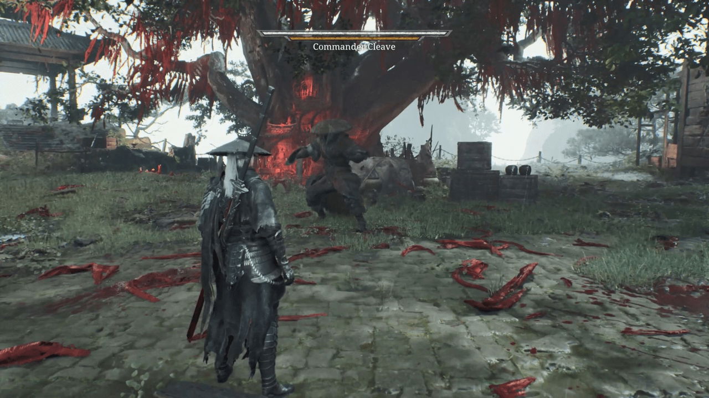

在3A大作之外，独立游戏是国产游戏正百花齐放的领域。但相比欧美等游戏产业发达、人才积累深厚的地区，国产独游在整体数量和质量上仍然有着不小的差距，并且还受到游
戏体量、开发管线，以及审核与版号带来的分销渠道和周期的限制。

因此，居于二者之间的2A游戏，成为了填补二者之间空白的最佳选择。对投资商和大中型公司来说，相较于风险更大的3A和开盲盒一样大海捞针的独立游戏。2A游戏提供了
一个开发成本不会过高，但卖相和受众又比独立游戏好不少的平衡。

在画面决定玩家第一印象的背景下，2A游戏更容易造就较好的前期口碑和期待值。相较独立游戏更偏向工业化的流程，也为中小型厂商搭建成熟的开发管线、积累人才与开发技
术提供了比独立游戏更好的机会。

2A游戏相比3A较小的开发和试错成本，让厂商可以在堆料之外，在玩法创意和题材上进行更多尝试。而这些尝试，也许就能成为一个新IP诞生的契机。并且打通一条相比从
零开始，更稳妥地通向顶尖厂商的道路。即使这款游戏销量没有那么出色，但它也可以凭借质量与口碑，完成2A到3A的升级与蜕变。

无论《昭和米国物语》最终能否获得成功，它都为国产游戏提供了一个突围的方向。

在开发模式上，它证明了2A这种在世界范围内已经逐渐衰落的开发类型，仍然可以在国内成为承载创意型产品的绝佳土壤。其独特的开发模式，也为许多体量与能力不足的中小
型厂商，一条直奔3A之外的发展路径。

在题材上，它将成为“中国故事不一定要将中国的故事”的最佳诠释。后来者们对“文化输出”的理解，也许就会从“传统文化元素”输出，变为“价值观输出”。视角的转变可
以拓宽中国游戏人的眼界，证明并不是只有中国题材的游戏，才能得到国内玩家的认可。国产游戏不必拘泥于本土题材，其他国家的历史文化题材甚至西幻，都有可能在中国游戏
人的手中碰撞出完全不同的火花。

就像法国人做出《师父》，美国人做出《对马岛之魂》一样，铃空游戏的《昭和米国物语》也许能在国产游戏出海上，走出一条全新的路。

## 国产单机游戏井喷前夜

正当各大厂商目睹了黑神话的爆火纷纷盯上单机游戏这条新赛道时，目前已经有好几款先知先觉、起步够早的作品将要抵达终点。或许他们的制作规模和玩家社区中的讨论热度并
没有《影之刃零》和《昭和米国物语》那么高，却依然凭借着画风、题材亦或是扎实的玩法，承接着海内外玩家们对于中国游戏的热切期待。

### 4.1 灵泽科技的答案

《明末：渊虚之羽》作为一款早在2019年便已立项了的游戏，与一众纷至沓来的后来者相比显然在开发进度有一定先发优势，官宣即将在2025年上线，最新的实机演示在
B站有着七百多万播放，堪称万众瞩目，然而该作在2021年正式亮相之时，却伴随着不小的争议。

平心而论，首次亮相的《明末：渊虚之羽》并非全无亮点，既融入了三星堆、金沙等真实历史遗址，又与《山海经》里“羽人国、不死民”等历史神话典故相结合，构造出了一个
市面上少见的架空明朝历史克苏鲁题材。

但在当时的诸多玩家看来，官方所放出的这段实机演示槽点实在太多，人物动作僵硬、主角是“网红脸”不说，而且整个游戏都给人一种在刻意模仿《黑暗之魂》以及《只狼：影
逝二度》的味道。

在这些负面意见上，当时的国内外玩家基本达成了一致，这直接导致彼时有关“抄袭缝合怪”和“制作不用心”的言论甚嚣尘上，《明末：渊虚之羽》一度被这些批判声淹没。

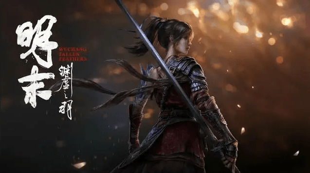

然而，作为游戏开发团队的灵泽科技虽然保持了沉默，但他们并没有放弃这款游戏。在悄然打磨三年后，2024年他们带着已经脱胎换骨的《明末：渊虚之羽》杀了回来，至少
从实机演示来看，此时游戏的完成度高了不少。

和之前相比，它改善了玩家们曾提出的诸多不足，先是在画面效果上获得了长足的提升，而后又针对人物面部进行了重新制作，使得女主看起来更加坚韧勇毅，观感不再那么突兀
了。

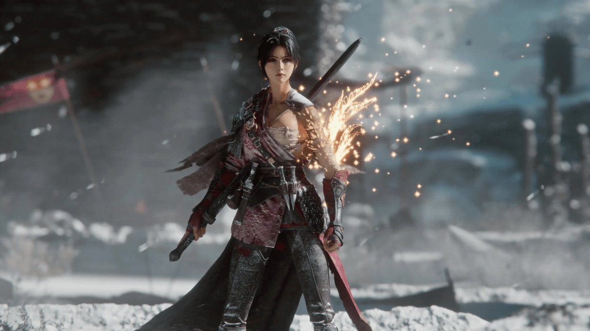

除此之外，游戏还利用动捕技术来打造动作系统，就实机演示来看整套动作体现得较为流畅，这其实都已经可以反映出游戏的核心玩法已经打磨得比较扎实了。

最为重要的是，制作组明显已经走出了模仿宫崎英高的老路，在视觉上形成了一套更有特色和辨识度的美术风格，再加上游戏那架空明朝历史搭配克苏鲁风格的诡异世界设定在大
型单机市场上并不多见，因此新实机一经上线就在玩家社区实现了口碑反转。

如果结合该作首发XGP，以及该作在Xbox发布会上亮相等相关信息来推测，这三年间微软很可能给予了灵泽科技一定的技术支持，帮助其完成了这次“改头换面”。

《明末：渊虚之羽》最终能不能创造佳话，目前谁也没法下一个定论，但游戏质量越来越好总归是玩家们所希望看到的。希望该作在2025年发售后，能以一个更加具有竞争力
的姿态出现在大家眼前。

### 4.2 深耕多年的的“中国之星”

面对中国这个全球第二大游戏市场，索尼自2016年就成立了“中国之星”计划，致力于给中国本土的游戏制作人提供资金、技术和发行上的支持。在此之前，该计划催生出了
《暗影火炬城》《纪元：变异》《暗夜长梦》等诸多相对成功的独立游戏。

在受到索尼帮扶的国产独立游戏里，于2014年由制作人杨冰单独开发，2016年释出首支预告引起轰动的魔幻题材半开放世界ARPG《失落之魂》是当时为数不多有着3
A潜质的项目，它也算是整个中国市场上最早被索尼重点投资并帮扶的大型游戏之一。

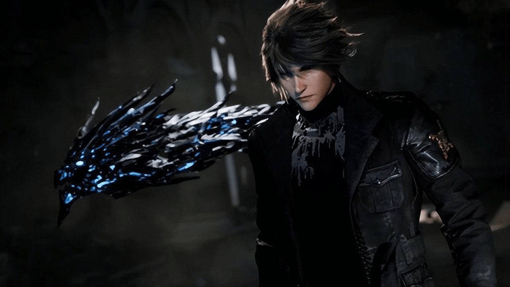

该作相比绝大多数国产3A项目都起步要早，甚至早于《黑神话：悟空》的首个预告片，当时一度被国内玩家寄予“国产鬼泣”的厚望，但可惜受限于制作团队规模而逐渐归于沉
寂。就目前该作逐步放出的实机演示来看，开发团队已然将虚幻5引擎那强大的视觉表现力利用得很好，无论是宏观的场景搭建还是微观的角色技能设计，都将那个科技、剑术与
魔法相互交融的奇幻世界很好地表现了出来。

在2024年年末的PlayStation中国10周年庆典上，《失落之魂》也公布了最新PV，并宣布将在2025年内同步登陆PS5与PC平台。

这也意味着，这个“先发而后至”的作品即将结束它那长达近十年的开发周期，像这样一款跳脱了架空古代背景，选用奇幻现实题材的作品究竟能否如愿以偿地在市场上收获好评
，其实仍是一个需要它来亲身验证的问题。

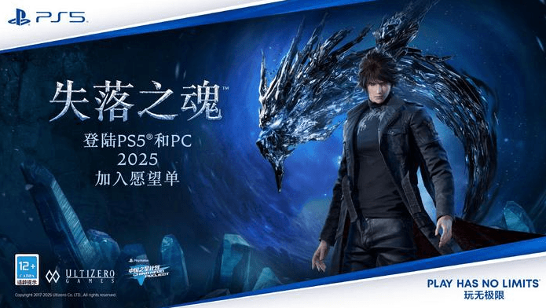

另一个值得我们注意的现象是，相比起前两期那以独立游戏为主的索尼中国之星计划，如今正在进行的第三期里3A大作的比重明显的增加了，这其中，由成都苍墨开发的武侠题
材ARPG《代号：锦衣卫》，可以算是相对具有代表性的一个。

作为一款最初仅有六人打造的游戏，该作在2022年发布的实机Demo视频引起了各方面的大量关注，很快便获得了上海英澈网络的投资，2024年在加入了索尼中国之星
计划第三期后，马上在ChinaJoy上开放了线下试玩。

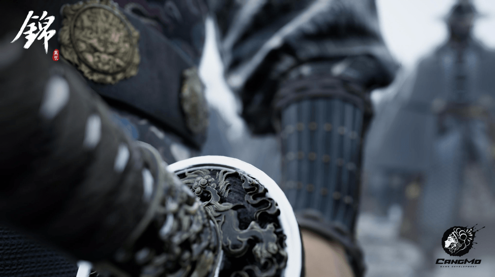

从目前放出的消息和试玩表现来看，游戏的骑马、暗杀、轻功等玩法模块已经拥有了一定的完成度，最为关键的战斗玩法部分也已日臻完善，其中敌人之间也会互相战斗的复杂交
战逻辑更是引人瞩目，其综合质量和两年前的Demo不可同日而语。

由于3A游戏所需的开发成本和独立游戏并非一个量级，所以我们可以推测索尼很有可能会顺应市场变化，加大对这些大作的扶持力度。如此一来一则可能会对索尼那不断让步的
限时独占策略带来更多的支持，亦可进一步扩大其在中国市场上的影响力；二则也能为如今那大作略显贫瘠，定位尴尬的PSN国行商店注入几分新的活力。

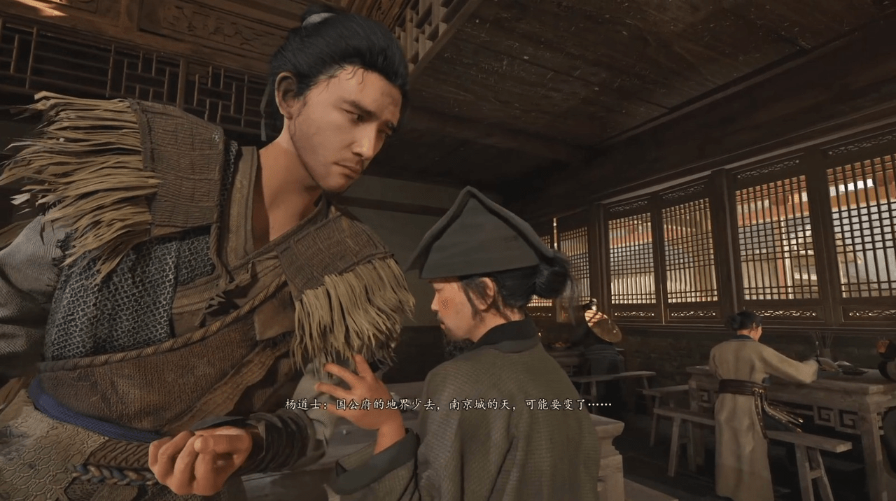

### 4.3 百舸争流

除了这些起步较早，或者受到了传统大厂扶持的国产3A外，实际上目前国内还有多款亮相不久的游戏正在开发中。

2024年1月，独立游戏开发团队Runmeng制作的国产黑暗武侠动作游戏《乂闻录：轮回》首爆，这款融合了中国传统文化元素的硬核武侠动作游戏因其亮眼的动作系统
而被玩家们称为“国产《只狼》”，在承载了大量期望的同时也于7月获得了双端版号。

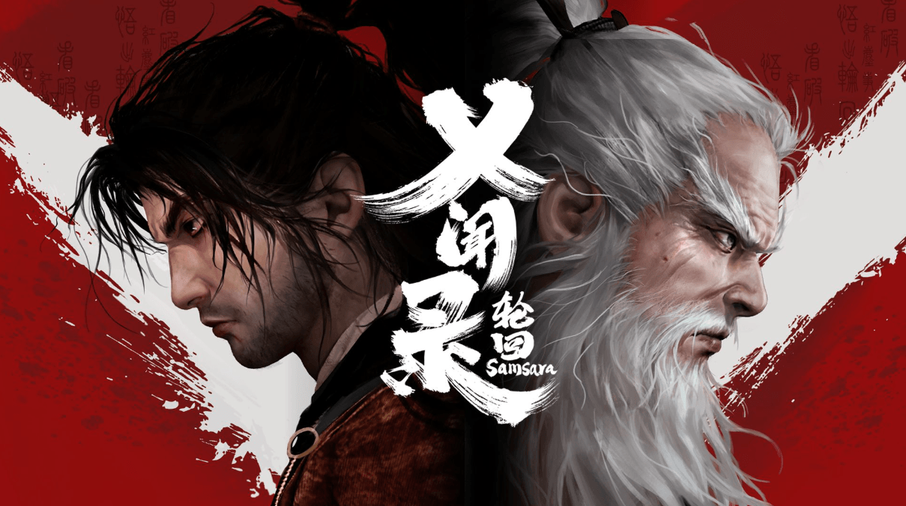

2024年7月，由知名游戏外包公司维塔士制作的第一人称动作潜行游戏《唐传奇：琵琶行》公布。作为他们的第一款原创IP，该作以唐代诗人白居易诗作《琵琶行》为灵感
，特邀唐文化专家西安旅游研究院执行院长邵振宇老师指导，画面风格和玩法都有独特之处。

其实不仅是上述这几款游戏，2024年《达巴：水痕之地》《猿公剑：白猿觉醒》等多款国产游戏公布，而《百面千相》《古剑奇谭四》等许多有着大厂背景的追赶者也早已官
宣，受篇幅所限再次就不一一枚举了。目前这些上马不久的项目公开信息不多，评估它们的前景为时尚早，但越来越多的厂商和资本的入局，无疑是玩家和从业者们都喜闻乐见的
。

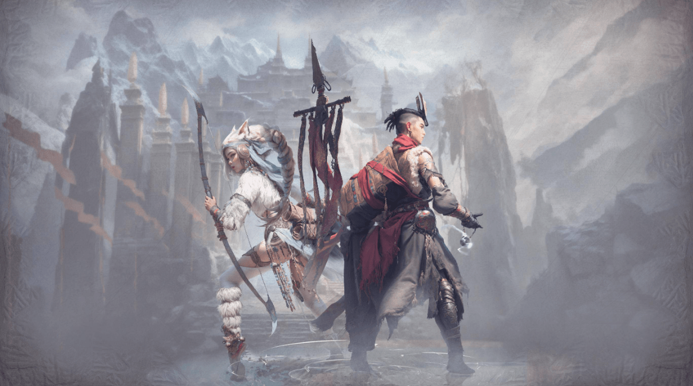

《达巴：水痕之地》同样也是索尼中国之星计划中的一员

世上本没有路，走的人多了，也便成了路。现如今，中国单机游戏市场正在发生剧变，当《黑神话：悟空》证明了这套行之有效的商业模式确有巨大的效能后，在可以预见的未来
也将陆续有第二款、第三款以及更多有3A潜质的国产游戏陆续上市，接受市场和玩家们的检验。

《黑神话：悟空》的爆火给起步中的国产3A游戏产业注入了一针强心剂，但要想最终形成一个成熟、稳定的市场，仅仅靠一个爆款是远远不够的。无论是国产3A未来的走向，
还是投资者和市场对国产3A这个品类的信心，仍然取决于后来者的市场表现，例如已经官宣将在2025年发售的《明末：渊虚之羽》和《失落之魂》。

有人说这些后来者很可能无法复现《黑神话：悟空》发售时的奇迹，但一个成熟的市场必然不可能只有叫好又叫座的头部产品，甚至《黑神话：悟空》自己作为3A游戏也有许多
稚嫩和不成熟的地方，国内玩家也表现出了充分的包容。因此只要这些后来者在在题材、玩法以及美术风格多元化等方向做出自己的特色，相信市场和玩家自然会给出相应的回报
。

正在被多元化运动撕裂的游戏产业

## 游戏产业中的DEI综述

几十年来，名为“多元、公平与包容”的DEI文化逐渐在欧美社会中扩散，而在最近十年间，游戏业中因为DEI问题引发的争议和冲突也愈发频繁。

但若要考究起来，却也不难发现相关元素其实很早就和玩家们见面了，尤其《辐射》《质量效应》和《龙腾世纪》这类RPG游戏里便有着不少同性恋等元素，而诸如《模拟人生
》等游戏里也早就有不少多元化性向的内容，至于以黑人等少数族裔为主角的游戏，更是早早便出现在了大众视野中。

不过，在DEI尚未成为一种欧美社会中被着重强调的政治议题之前，玩家社区对于曾经那些所谓的“DEI内容”并没有太多敌意。但从2010年代前后开始，游戏中的DE
I要素变得愈加刻意和生硬，媒体、厂商与玩家就DEI问题上的摩擦也不断增加。

### 1.1 在游戏业生根发芽的DEI文化

这些DEI与玩家冲突中，一个标志性事件就是2014年左右的“玩家门”风波。名为Zoe Quinn的独立游戏制作人被爆出通过情色交易拿到各大媒体的游戏推荐与好
评，这种游戏媒体与厂商、开发者之间上不得台面的裙带关系引起了玩家们对其作品的抵制，事件也在玩家同制作人与媒体的相互拉扯中愈演愈烈。而在事态扩大后，诸如卫报等
业外媒体与女权主义活动家也纷纷下场指责玩家们攻击Zoe与相关人员的行为是“反女权”，称游戏业是“极右翼”势力的温床，日后在游戏业兴风作浪的女权主义评论家An
ita Sarkeesian便借此事件一炮走红。

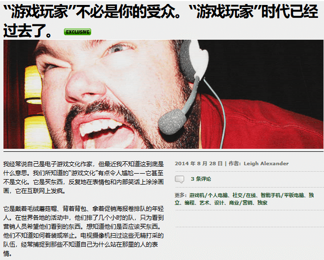

老实说，Zoe和Anita并不是第一个在游戏业搞“进步”的人，但毫无疑问的是，她们大大促进了“进步文化”在游戏界的传播。自玩家门事件开始，更多的女性主义、D
EI人士出现并开始改造游戏业，相关运动也愈发活跃，名为“多元、公平与包容”（简称DEI）的价值观渐渐成了欧美游戏业的一门显学。

后来，一系列游戏圈内部的职场性骚扰丑闻、弥漫于社区中的价值观大战愈发显眼，乃至到如今游戏行业被非二元性别、少数族裔等一系列政治议题裹挟，各大厂商也纷纷组建各
自的DEI部门，诸如Sweet Baby
Inc这样的DEI咨询公司也纷纷出现，相关DEI要素也渐渐喧宾夺主严重影响着玩家们的游戏体验，DEI文化也就这样走向了玩家舆论的对立面。

DEI这杆大旗之下，是过去欧美文化界中的左派人士一直倡导的进步主义价值观，几十年间的各类运动下来，这些价值观成为了欧美社会难以动摇的政治正确，并塑造了如今最
近几年我们看到的欧美文化产业。

具体到电子游戏上，相关组织也给出了在游戏业推进DEI文化的“正当”理由。从他们列出的数据上来说，游戏产业（开发者与玩家）中诸如女性、残疾人，以及非二元性别人
群这类“少数人群”的比例正在增加，他们渴求在游戏中能看到代表着自身群体的形象，希望自己能在游戏中被认可和尊重。

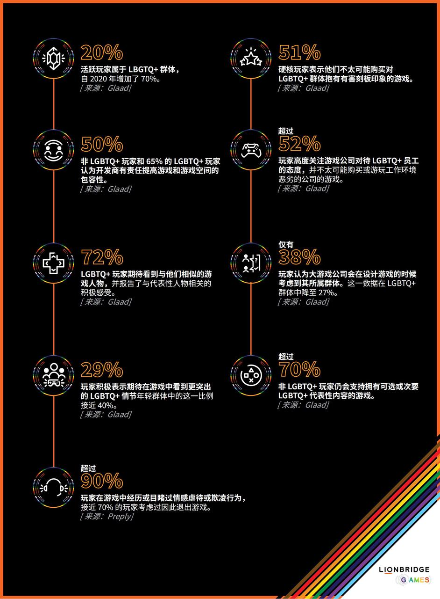

本图源于Lionbridge Games（主要业务为游戏本地化与测试服务）的DEI报告文章

但除此之外，业界选择DEI还有着更为深层的理由，比如最关键的便是投资问题。欧美的一些投资集团在近些年推出了名为“环境、社会与治理”（简称ESG）的投资策略。
而在ESG投资策略中，DEI也成为了其中重要的投资指标。换句话来说，DEI成了追加投资的一大考核标准，若是相关DEI举措不够，那么厂商便无法得到更高的投资等
级，乃至难以拿到投资。

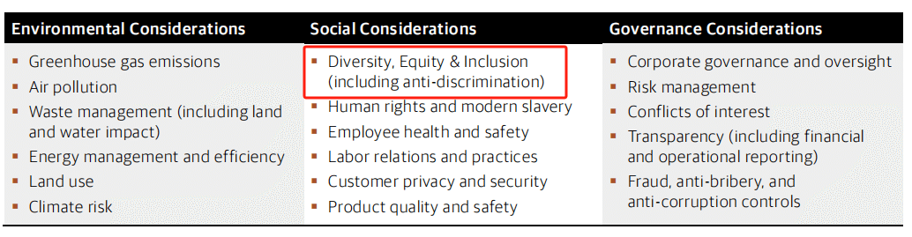

黑石集团ESG的投资规划中，“多元、公平与包容（包含反歧视）”成为一条明确的投资指标

而这样的投资策略，自然也催生了DEI咨询行业的高速发展。截至2023年，全领域内的DEI咨询产业总产值已达972亿美元，而根据相关机构与个人估计，该行业的总
产值会在2031年前保持3%的增长率，并将在2031年左右突破1300亿美元。

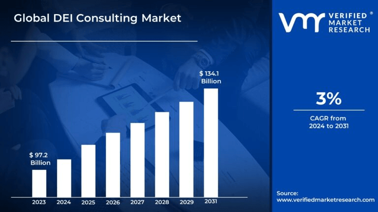

（相关数据来源于“Verified Market Research”）

由此看来，DEI在游戏业中得以做大，少不了这个从上到下的利益链条。但就2024年的游戏市场表现来看，这份利益链条似乎没法为游戏厂商增加多少实际销量，光是在2
024年就有多款带有大量DEI元素的作品相继爆雷，而在目前玩家社区中反DEI活动愈演愈烈的情况下，DEI不仅很难成为收益，反而在部分付费群体中成为了游戏营销
中的“负资产”。

只是，虽然DEI如今对销量的影响是显而易见的，但如今的厂商也很难放弃DEI。历经多年来的“觉醒”与改造，不少大厂内部的DEI氛围已然船大难调头，多年来的相关
政策很难一夜间消失，更不用说到现在为止相关的ESG投资标准仍在，DEI仍然是欧美政治正确的一部分，它也在事实上得到了部分业内人士，尤其是游戏媒体的大力支持，
面对投资人与媒体舆论，厂商们自然更是骑虎难下。

### 1.2 DEI文化背后的风险与机遇

正如前文所言，早期的DEI元素其实并没有让人如此介意。真正让玩家们感到不满的，是DEI元素大幅挤占游戏内容，乃至在审美上挑战了广大玩家的审美底线与基本价值观
，而在这一基础上，一些打着DEI旗号的游戏甚至不算是一款合格的游戏，比如《星鸣特攻》哪怕抛开它的DEI外壳，本质上也很难说是一款好玩的游戏，而经历了近年来的
诸多矛盾之后，许多玩家们也早就对业界其他作品中那过量的DEI元素积怨已久，针对此类作品的批评与不满与日俱增。

最终，在2024年三月，一位巴西玩家在Steam上发起了创建了名为“Sweet Baby Inc
Detected”的Steam鉴赏家频道，其初衷旨在抵制市面上那些同“Sweet Baby Inc”这类DEI机构合作过的游戏。此账号在建立不久后便受到DE
I人士的大量攻击与举报，但这却反而为其赢得了更多玩家的支持。玩家社区中的反对DEI声浪愈演愈烈，诸如《星鸣特工》、《无名九使：觉醒》、《自杀小队》等掺杂着大
量DEI元素的游戏纷纷受到抵制，并于最终暴死或翻车。而在未来，这股反DEI的抵抗情绪或许会越来越大，而玩家、厂商和游戏媒体的三方角力还会一直持续下去甚至愈演
愈烈。

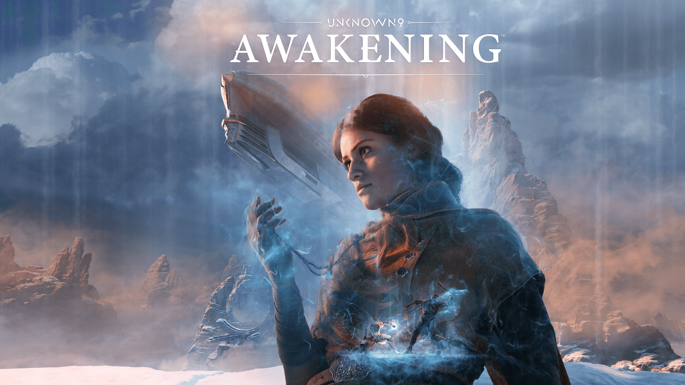

当然，对国内厂商来说，想要出海尤其出海至欧美市场，DEI可能是一趟难以躲开的浑水，正如2024年原神5.0纳塔版本就曾因文化考据的原因闹了场节奏，许多国外玩
家指责米哈游以非洲和美洲文化为背景但却有太多黑人以外的角色，乃至出现了配音演员罢演等情况。虽然就目前国内玩家社区对待DEI的态度而言，国内厂商基本不会冒着巨
大的舆论风险在游戏中加入DEI相关元素，但当产品走向海外市场进行大规模宣发活动时，也需要注意海外媒体平台上不同舆论环境可能导致的相关舆情风险。

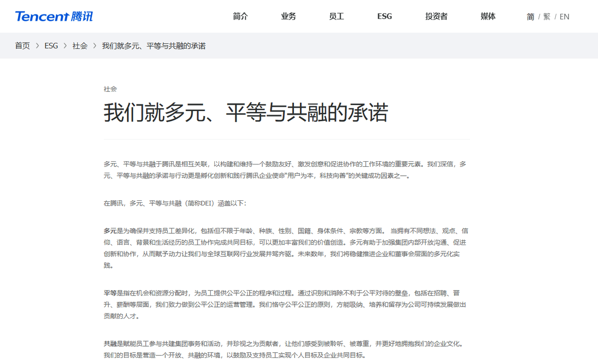

腾讯也推进了相关DEI内容

不过，2024年《黑神话：悟空》、以及韩国的《剑星》在海外能够积攒如今的口碑和热度，也离不开相关媒体与DEI人士的反向助攻，这也似乎提醒着非欧美地区的厂商这
场DEI运动的另一面。许多国内厂商本身并没有多少欧美游戏圈里的DEI包袱，相比于身处于政治正确环境之中的欧美厂商，中国游戏公司在这个问题上拥有更多选择权。因
此在如今反DEI运动愈演愈烈的情况下，妥善利用好当下游戏圈内核心消费群体同DEI文化的矛盾拉拢国外用户，对不受欧美政治正确影响的国内厂商而言也可以看做是一种
机会。

## 《星鸣特攻》，一场历史级别的投资爆雷

当国内的玩家与从业者还沉浸在《黑神话：悟空》所带来的震撼时，索尼的新作《星鸣特攻》也在同一个档期悄然发售。

在新闻和宣传资料里，《星鸣特攻》应该是一款主打长线服务，售价40美元的PVP游戏。它由前Bungie与动视老兵组成，后被索尼收购的第一方工作室Firewal
k开发，该项目耗费了近8年的时间与近2亿美元的成本。

从制作团队构成来看，创造《星鸣特攻》的工作室Firewalk由Bungie前老大哈罗德·瑞恩（Harold
Ryan）一手创建，其中不少成员还是参与过《命运》《光环》《Apex 英雄》《使命召唤》等知名项目的老员工。

同时，《星鸣特攻》里的许多元素都是经过市场成功范例验证的。比如说它的题材和美术风格很容易让人联想到漫威的《银河护卫队》，而这类美漫画风的游戏在市场上有着相当
数量的受众；以角色技能为特色的团队英雄射击玩法，在市面上也有着诸如《守望先锋》《APEX》《无畏契约》等成功作品。从产业角度来看，在这款游戏真正上市前，似乎
没有人会把它与“暴死”两个字联系在一起。

但实际的情况大家也都知道了：《星鸣特攻》的玩家在线峰值创下了697人的“惊人记录”，这个数值甚至不到其B测时2388人的三分之一。至于用户口碑，《星鸣特攻》
更是得到了一边倒的差评，从首次发布角色设计开始，这款游戏几乎就一直深陷于“LGBT”的批评旋涡当中久久无法自拔。

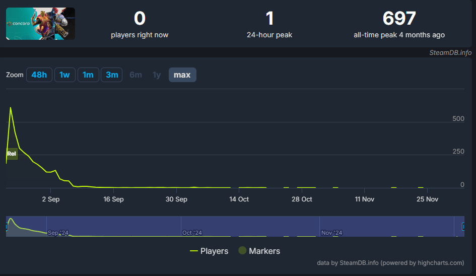

对于这么一款耗资如此巨大，却几乎无人问津的游戏，索尼在挣扎了两个星期却毫无起色后，只得在9月3日宣布《星鸣特攻》将于9月6日正式停服的消息。

对于《星鸣特攻》的失败，索尼集团总裁十时裕树给股东们的回答是“组织内部的单打独斗现象也影响了开发和销售的顺畅度”，同时“公司需要在用户测试、内部评估等环节设
置更多的‘关卡’，并提前进行这些评估。”

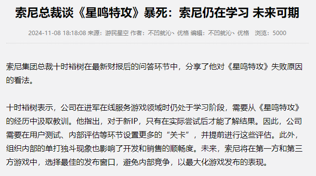

在索尼的回答里，《星鸣特攻》的失败主要源于工作室内部的沟通问题与疏于审查。但从玩家社区的舆论来看，无论是角色设计、游戏玩法还是数值平衡，《星鸣特攻》几乎挑不
出什么优点，甚至都称不上一款合格的游戏。

至于为什么玩家与索尼之间的认知差距会如此之大，究竟谁要为《星鸣特攻》的暴死负责，我们还是得从游戏本身开始说起。

首曝后的当天，《星鸣特攻》的宣传片就收获了近1.4万的“踩”

### 2.1 《星鸣特攻》的原罪

作为一个游戏，《星鸣特攻》最大的问题恰恰出在其糟糕的用户体验上。这款游戏不仅玩法高度同质化，系统表现缺乏打磨，其过度追求“LGBTQ+”的角色设计更是在游戏
首曝后就引来了大量的负面舆论。

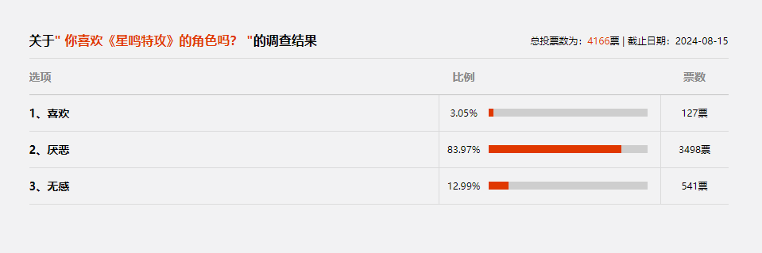

可以说“不好玩”是《星鸣特攻》的原罪，在玩法上，它只有几个诸如占点、“抢狗牌”等射击游戏中司空见惯的模式，并且体验远不如市面上的同类产品。至于英雄射击部分，
它也就只是粗暴地将诸如《无畏契约》《使命召唤》《守望先锋》等游戏的技能、射击、枪械系统进行“缝合”，而没有对数值与体验进行调优与打磨。

譬如为了鼓励玩家们根据场面灵活更换阵容，《星鸣特攻》特地设计了“小队加成”的奖励机制，每当玩家使用一个新职业，都会给你提供一个持续一整局的BUFF。但实际上
，就算你把所有职业都换一遍，这些BUFF所提供的增益幅度也都十分之低，你甚至都可以忽略不计。

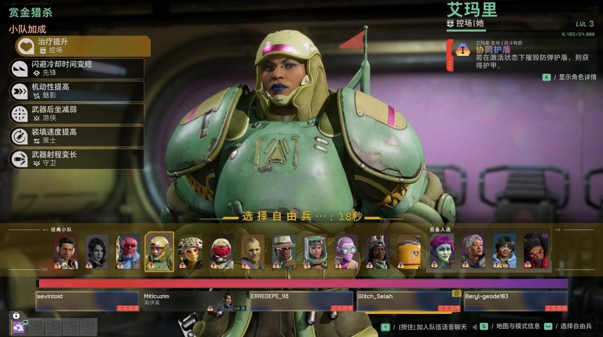

而游戏中唯一的狙击手角色“瓦尔”则更是体现数值崩坏的“有力竞争者”：她的狙击枪只能单发，但是在每次射击后并不会自动装弹，而是需要手动关镜之后才能按R键进行装
填。此外，其单发射击的伤害数值过低，就算是爆头也无法击杀游戏中的脆皮角色。

这二者的结合让这个角色的使用手感极其之差，如果不能配合队友一枪解决掉敌人，狙击枪的别扭装填会让她难以在对手的攻击下存活，但不合理的数值又让“一枪毙命”成为了
不可能的任务……

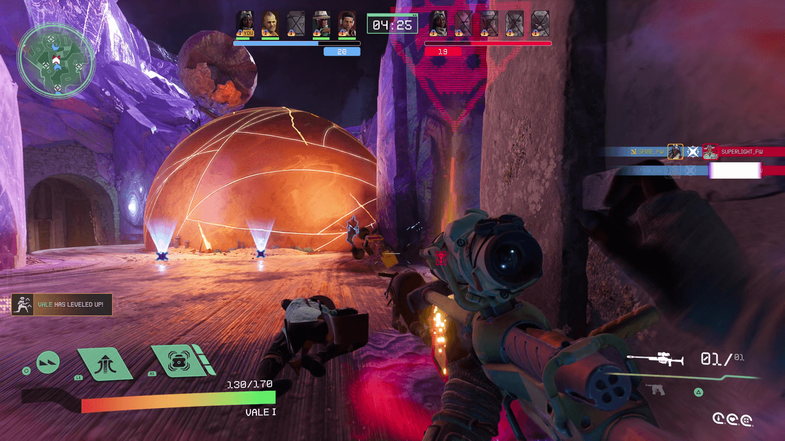

当然，《星鸣特攻》的问题还不止于此。在经历过两次测试的情况下，这款游戏的正式版依然还有着画面优化差、网络连接不稳、游戏内奖励敷衍、职业间不平衡等问题。这在进
一步放大负面体验的同时，也让玩家们很难拥有持续游玩下去的动力，而这对于一款强调DAU的多人在线游戏来说几乎是致命的。

当然，如果《星鸣特攻》只是不好玩，那这款游戏最多也就只会获得一个“鸡肋”的评价，成为无数失败者中的一个。而它如今能够被玩家们如此口诛笔伐，泛滥的DEI元素也
同样“居功至伟”。

### 2.2 DEI是如何毁掉《星鸣特攻》的

如果要用一个词来概括《星鸣特攻》在角色设计上的特点，“刻板”绝对恰如其分。

游戏中有着许多非人类角色，也能看到亚裔、黑人等在西方被划为少数群体的英雄，同时，这些五花八门的人物大多都有着几个诸如非二元性别、性取向不定等属于“LGBT”
的标签。

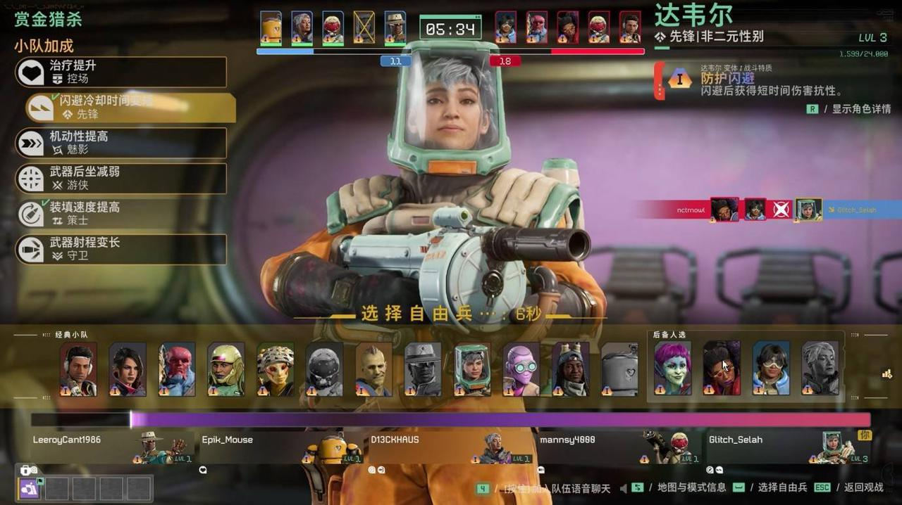

除了刻意打标签，《星鸣特攻》的角色也都缺乏足够的宣传与剧情，这也让玩家们难以对形成认知，留下好印象。于是，大家并没有记住这些角色的出身、设定或者背景故事，而
只记住了自己的所见所得——背离了主流审美的角色形象，以及刻意在游戏里强调“LGBT”的行为。

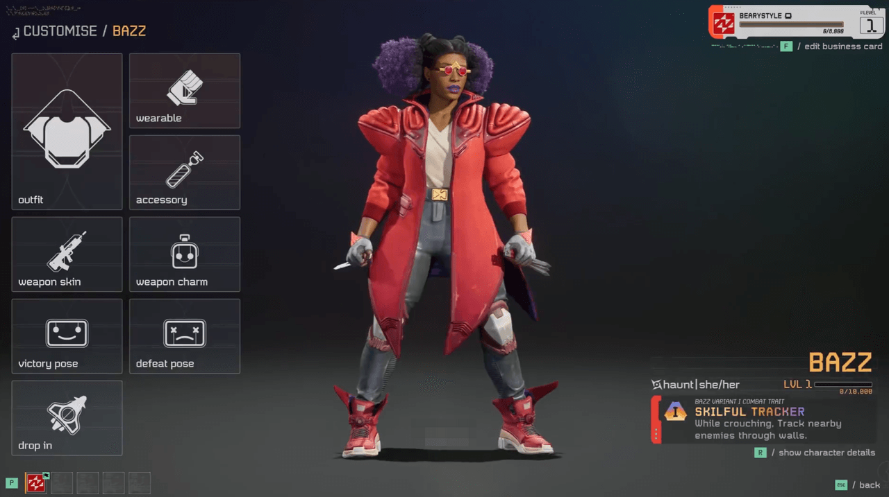

然而将DEI内容体现在角色设计上只是表象，要想了解它是如何让这个让150人制作团队花费近五年时间，把2亿美元级别的投资变成一朵巨大的烟花，就不得不提到Fir
ewalk独特的管理模式和文化氛围了。

Firewalk由前Bungie老大哈罗德·瑞恩（Harold Ryan）创立，是同属于他名下“ProbablyMonster”（下文简称为PM）公司中的工
作室之一。瑞恩独创了一套符合他理想的公司架构，这个PM公司既不是传统的开发商，也不是发行商，而是由一种类似于“创业孵化基地”的模式组成：旗下工作室只需要负责
游戏开发，而母公司则会负责工作室组建、建立团队文化、人才培养、创意开发、资金、人员配备、行政和技术需求等其他大多数事务。

哈罗德·瑞恩（Harold Ryan）

为了实现这一愿景，PM在与媒体口中的“主流发行商”签约获得5000万美元开发预算之外，还拿到了由达拉斯牛仔队老板杰里·琼斯(Jerry Jones)
、著名房地产投资人约翰·戈夫(John
Goff)以及路德金资本管理公司（LKCM）共同投资的1800万美元，而这个数字在随后的三年里逐渐膨胀到了2.5亿美元。

在LKCM的官网上，PM是它们在游戏行业唯一的投资案例

乍看起来，瑞恩的想法似乎十分贴心。而在实际运作中，瑞恩的所谓“新模式”和传统游戏公司的研发-
发行分离或研运一体的模式不同，PM公司不仅把控了旗下工作室的外部支持渠道，像是人员招聘、内部文化等对工作室自主性极其敏感的事物也在母公司控制之下。

这样的结构下，PM公司的决策层显然完全把控了工作室的风向，如果这些人不出岔子，能对员工做出正向引导那自然很理想。但从他们的言论与实际结果来看，PM公司走上的
是一条不归路。

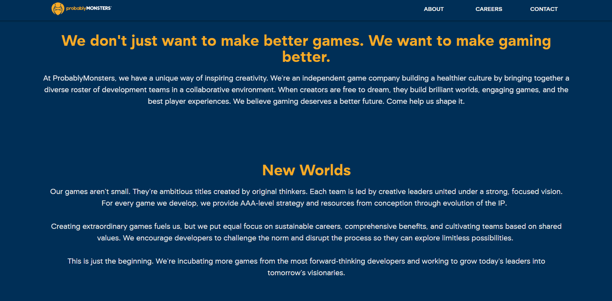

“对于我们开发的每一款游戏，我们都提供3A级的策略和资源，实现从构思到IP的演变。”

在瑞恩最初的构思中，他希望指导团队建立正确的文化，并就工作场所的价值观和期望进行良好的沟通，这些工作室会以“以人为本”为文化基础，走的是“可持续发展”路线，
并同时“多元化和包容性”上有着不错的表现。而在IGN的采访中，PM公司的执行制片人埃琳娜·西格曼则解释得更加具体：“从成立之初，我们就建立了一个多元化和包容
性的内部团队，我们不仅关注工作室的组成，还关注游戏的内容，并将其真正融入其中。”

但当DEI的元素进一步深入，开始影响到Firewalk对游戏的实际开发后，整个工作室似乎就开始“变味”了。

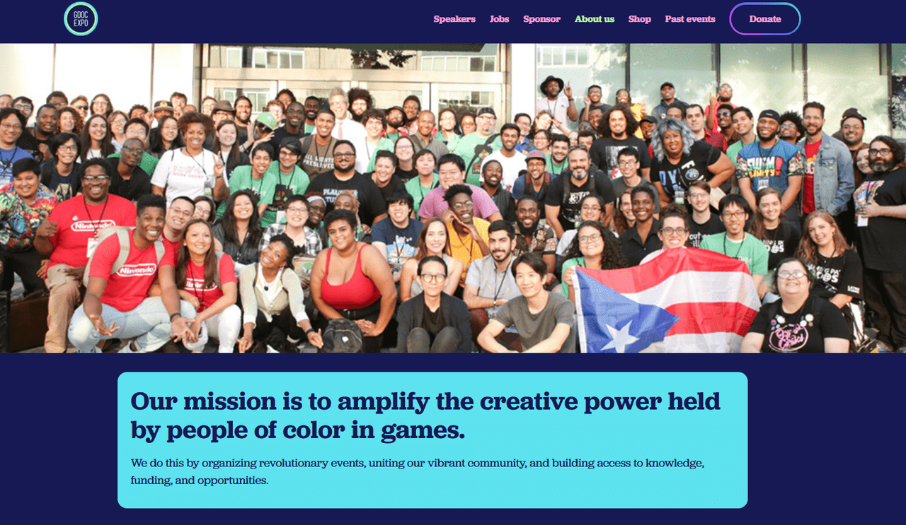

通过工作室的员工，PM公司还资助了一个为有色人种开发者提供工作机会与资金支持的Game Devs of Color的组织

在前索尼测试部员工Smash JT的多次爆料中，Firewalk内部不仅DEI风潮盛行，同时还形成了一种强制“觉醒”的有毒文化。比如说，在招聘与筛选阶段，工
作室会以应聘者的价值观是否支持DEI作为核心标准，如果任何员工在工作时试图说出或传达任何可能被理解为“保守观点”的内容，那么此人就会被HR部门迅速解雇或列入
黑名单。

此外，爆料还引用了多个Firewalk员工的言论作为例子，来说明Firewalk某些管理层的傲慢与不重视玩家意见。比如说Firewalk的概念艺术家“Ima
gineAmanda”（X账号昵称）就在公开场合指责与嘲笑其他不支持DEI的同行，当《星鸣特攻》的反响并不好时，她非但没有反思游戏本身的缺陷，反而把这一切都
推到了所谓“政治仇恨团体”的头上。

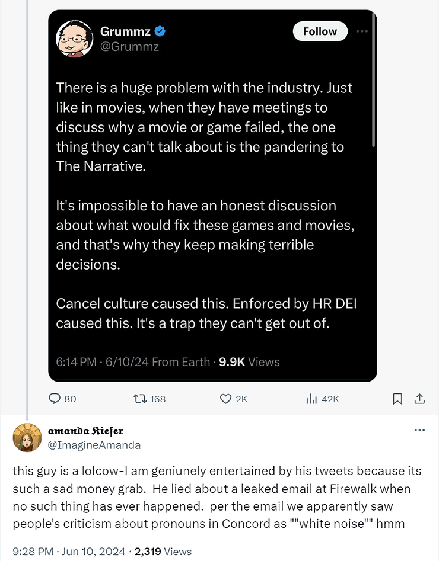

她曾公开嘲笑暴雪前制作人马克·科恩 (Mark Kern) 对DEI的反对声是“白噪音”

尽管Smash JT的许多推论都是源引自自己的“未公开信息源”，我们无法百分百证实他的说法，但Firewalk领导层的支持、工作室成员的明牌支持DEI的言论
在社交媒体和业内新闻中随处可见。DEI的风潮的盛行不仅干扰到了《星鸣特攻》的角色设计，更是进一步影响到了Firewalk的本职工作。

在这样的氛围下，开发者的精力显然已经被拐到了DEI上，而不是游戏的开发、测试与调优。PM公司的管理层没有为工作室指明正确的方向，而Firewalk的成员醉心
于DEI，对游戏测试与正式发售时的种种问题不上心，《星鸣特攻》自然也就成为了一个既不好玩，更不叫座的“电子垃圾”。

### 2.3 “冤大头”索尼？

从与Firewalk签约开始，索尼的投入几乎从未间断，但到了游戏首曝、测试直至发售的阶段，索尼却收缩了宣发的力度，只是自顾自地只在官号上发内容，完全变成了一
只将头埋在沙子里的鸵鸟，对外界的声音充耳不闻。

站在玩家角度，从开发、首曝到测试，再到发售，这个看上去就问题重重的项目有着许多次改变甚至叫停的机会。但索尼却宁愿让这款游戏发售，也不愿意做出什么改变，难道玩
家们都看得到，作为大厂的索尼就看不到？

《星鸣特攻》的内容路线图，游戏本来计划每两个月更新一个赛季

想要理解索尼的行为与动机，不妨从另外的角度来看待。当年《守望先锋》的爆火，既为厂商们打开了一个需求上的缺口，也展现了长线服务型游戏在营收方面的巨大潜力，而作
为一个专注于单机游戏领域的厂商，当时的索尼在长线服务型的IP的储备几乎是空白一片。于是，在长线多人项目上，索尼展现出了相当程度的“大气”，甚至是急切。

除了让自家的失眠组、顽皮狗等第一方工作室开发多人项目外，索尼还积极收购其他工作室来开疆扩土。2022年1月，索尼收购了Bungie，随后在3月又收购了由著名
游戏制作人杰德·雷蒙德创办的Haven
Studios。在索尼对外的报道中，这些行为都被称之为“延续对在线服务和多人游戏投资”的一部分，而之后对Firewalk的收购行为也同样如此。

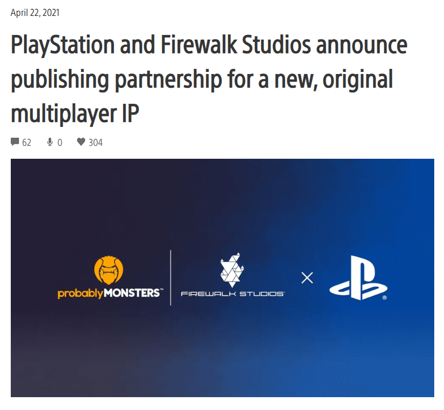

不过，尽管索尼对多人游戏的态度十分坚决，但对旗下的工作室来说，调转方向去做一个从未涉足过的游戏类型可不是件容易的事情。在最多的时候，索尼内部同时开发的长线服
务型游戏多达十几款，但这些项目大多都由于各种原因而被迫停摆，迄今为止真正上市，并且取得不错成绩的就只有《绝地潜兵2》这一款第三方作品。

换句话说，在这个连顽皮狗、失眠组都折戟的领域，《星鸣特攻》被索尼寄予了厚望。它的定位不仅仅只是一个多人在线游戏这么简单，它很可能肩负着为索尼开拓新市场的重要
使命。在某些外媒的报道中，《星鸣特攻》在索尼内部甚至被视作“PlayStation的未来”，是一部与《星球大战》同级别的产品。

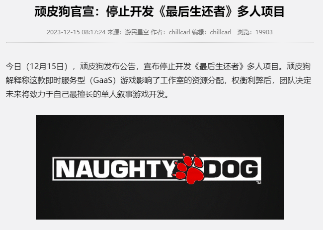

如此看来，我们也就不难理解《星鸣特攻》的开发历程，以及索尼的种种前后矛盾行为了：发售前，《星鸣特攻》在《最后生还者》《漫威蜘蛛侠》等大IP多人项目被砍的同时
，获得了内部的支持，登上了索尼的PS发布会。而到了测试环节，游戏存在的多种弊病得以暴露，之前的投入成为了一笔巨大的沉没成本，因此我们才会看到《星鸣特攻》想要
以优化不足、数值混乱的状态强行上市来回收成本，同时还在收缩宣发规模试图“止损”的诡异景象。

除了顶着明星制作人、老兵团队、长线服务IP、英雄射击、DEI元素等“正确BUFF”的因素外，《星鸣特攻》这个之所以能在索尼手里走这么远、问世，公司内部的“强
力支持”可能才是关键。也许对这个游戏巨头来说， 《星鸣特攻》所暴露出的的问题，可能不只是表面上“缺乏内部评估”那么简单。

在某些爆料中，SIE2024年新上任的CEO赫尔曼·赫尔斯特被指对《星鸣特攻》有着极度的偏心

考虑到索尼早就在《战神：诸神黄昏》《最后生还者2》等自家第一方大作里加入DEI相关的内容，或许在索尼的视角里，DEI还会被认为这是一个对玩家有吸引力的元素，
因此索尼接受充满了DEI元素的《星鸣特攻》本身并不让人意外。

问题在于，是什么让索尼这样经验老到的游戏大厂无视正常的测试与QA流程、跳过上市前的种种调试与纠错，最终将如此严重的开发问题暴露在玩家面前？

索尼究竟为什么打破正常的游戏开发流程，我们不得而知，但如此低级的失误不应该发生在索尼这个业界巨头身上，这是所谓的市场调研的问题、决策层误判，又或是单纯地受到
DEI价值观的影响所无法解释的。无论这个原因究竟是什么，《星鸣特攻》的教训都应该得到索尼内部足够的重视。

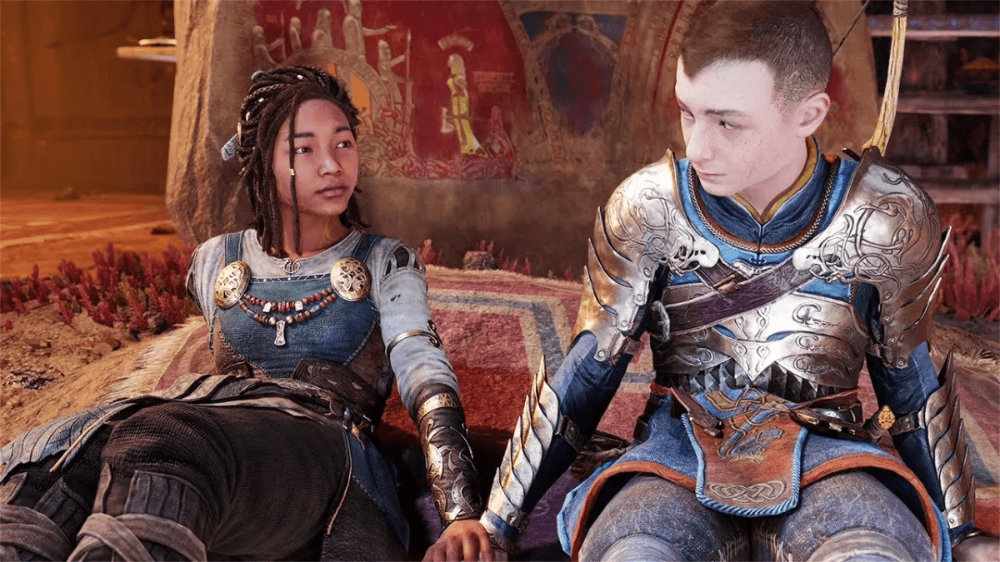

当年的《战神：诸神黄昏》就因为女角色安格尔波达而引发了大量的讨论

总之，对大多数玩家来说，《星鸣特攻》的暴死就是Firewalk硬要搞DEI元素的结果。但在复盘了《星鸣特攻》整个项目的开发历程后，我们不难发现，这款游戏的问
题是多方面的。强硬控制下属的PM公司，被DEI风潮影响到正常游戏开发的Firewalk工作室，以及缺乏评估、错误接盘《星鸣特攻》的索尼都难辞其咎。而DEI元
素的泛滥，只是这一系列问题中最显眼，最让玩家们讨厌的那个罢了。

《星鸣特攻》的背后，不仅是关于DEI元素的争议，更是一场关于游戏开发理念、市场定位和玩家需求的深刻反思。而从这个角度来说，《星鸣特攻》的暴死，也算是为整个游
戏行业做出了一份贡献了。

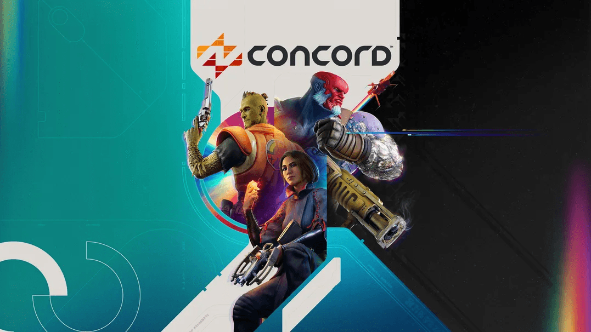

## 是DEI毁了育碧吗？ 

自从前些年押注NFT和web3后声音寥寥，执行“去公式化”战略又效果甚微之后，育碧这个来自法国的游戏巨头2024年可谓是多灾多难。

按照育碧原本的计划，他们2024年将有三款3A大作问世，似乎要打造一个属于他们的游戏大年，然而随着《阿凡达：潘多拉边境》的销量爆冷，《星球大战：亡命之徒》口
碑不佳，《刺客信条：影》又因为陷入舆论漩涡而跳票，育碧的2024年的3A几乎遭遇了全军覆没。

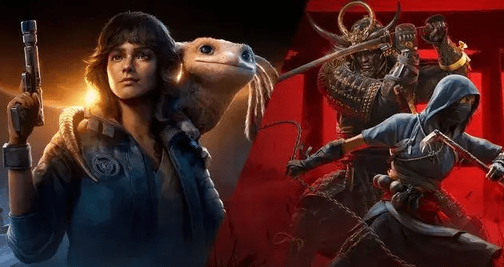

至于他们的实时服务型游戏，情况同样也不容乐观。按照育碧首席执行官Yves Guillemot的说法，《不羁联盟》的表现未能达到他们的预期进度。而被Yves
Guillemot称为“4A”级游戏的《碧海黑帆》，即便是将那些可以免费试玩8小时的用户算进去，首发玩家数量也只有85万，如今游戏在 Steam 上仅有不到
300 人在游玩。

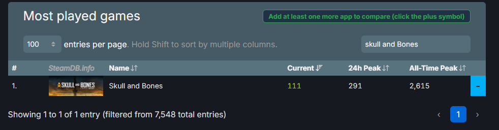

游戏接连失利的影响，直接反映到了实际收入上，根据近期育碧官方所发布的财报来看，他们在2024财年的第二财季销售额为3.484亿欧元，同比下降了令人震惊的36
%。而根据tech4gamers报道，育碧游戏在发行方面的困境导致公司股价曾在一天之内暴跌逾13%，至9.89欧元。其股价在过去几个月中一直处于下滑趋势，一
度降至近10年来的最低点。

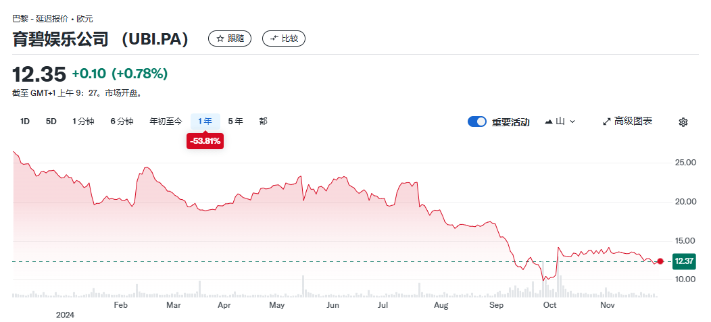

### 3.1 生病的巨人

说到导致育碧身陷窘境的原因，过度推行LGBT+等多元文化导致的内部管理混乱是个很难绕过的问题。作为最早在内部推行这类文化的公司，育碧和DEI的捆绑极深，甚至
如今玩家千夫所指的Sweet Baby团体首席执行官KimBelair和首席运营官David Bédard均出身于育碧。

站在这一角度看，育碧能在近年来化身急先锋，引领席卷整个游戏业界的DEI浪潮，并做出一大批因角色过于“正确”而饱受诟病的游戏，倒也不是件让人十分难以理解的事情
。

当然，这些被DEI所深度影响了的游戏作品，只是整个问题的表象而已，而表象之下所掩盖的病灶远远不止于此。

育碧这些年来扩张的势头极其之快，目前全球所有工作室加起来员工超过了2万名，这个数字相当于动视暴雪的整整一倍，但真正作为开发人员的也就只有8000人而已。尽管
我们没有明确的数据表明，在2万名员工中DEI群体在其中占比多少，但从此前那个旨在“为行业中的女性和非二元性别人士提供指导机会”以及“不接受男性”的“在育碧发
展”计划不难看出，育碧确实在这方面给他们开了绿灯。

根据曾采访过一批育碧内部员工的外网KOL Legendary Drops爆料，随着这些人士的大量涌入，育碧内部的开发环境渐渐发生了变化。由于育碧对于多元化的
奉行和对所谓“歧视”的零容忍政策，员工们频繁因为日常工作生活中的琐碎言论“冒犯”或“骚扰”了其他人而受到人力资源部的约谈，这种工作环境极大打击了员工的积极性
和工作热情，许多员工甚至高管都曾因此离职。

Legendary Drops同样还表示，为了避免对多元化群体形成潜在的“冒犯”，所谓的“安全化内容”也几乎成为了目前育碧开发游戏的纲领，他们甚至特意指出像
《神秘海域》或《博德之门3》里那种漂亮的角色设计将不会被内部通过，因为漂亮、性感的角色在多元化群体中经常被视为一种冒犯，而《星球大战：亡命之徒》的女主形象变
丑，就是这一纲领的最直接的体现。

遗憾的是，育碧接受玩家群体的反馈是有选择性的，它非常重视多元化玩家群体的诉求并将之落实在游戏里，但对于此举在玩家群体中引起的反对声，育碧内部会将其视为“部分
有毒玩家的极端言论”视而不见。对此，育碧2024年泄露的一份内部备忘录很好地印证了这一点，这份备忘录中明确提到：

“作为我们日常工作的一部分，我们很自豪能够代表社会中存在的多样性和包容性。代表性是我们DNA的一部分，无论外部压力或影响如何，都将保持这种方式。”

“鉴于目前网络上这一话题(多元化和包容政策)的两极分化，我们认为很难进行尊重和建设性的对话。在这种情况下，我们要求你不要互动或参与这些对话，因为这可能会使你
自己、我们的团队和我们的行业同行的情况恶化。”

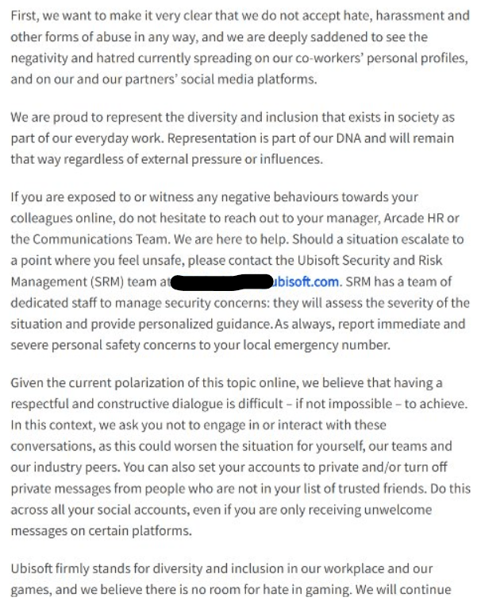

育碧遭泄露的内部备忘录内容

臃肿低效的体制、闭目塞听的做法，加上对“正确”的一味追求，诸多因素共同叠加起来，使得整个育碧都处在一个巨大的“幻景”之中，游戏开发自然就成为了件盲人骑瞎马的
事情，翻车只是时间上的问题。

更糟糕的是，育碧现在还深陷集体罢工的泥沼，早在2024年2月，育碧就已遭遇过一次罢工，当时有数百名法国员工参与其中，共同表达对公司薪酬待遇的不满。而在202
4年9月，育碧又出台了一项最新规定，希望员工每周至少三天在办公室工作，这一决策将影响那些完全远程工作的人。

根据游戏媒体GamesIndustry方面的消息，育碧巴塞罗那工会正在与CGT组织合作，对育碧公司强制员工重返办公室政策提起诉讼，要求管理层取消这一政策，并
签署一份集体协议以确保员工远程办公的权利。工会代表表示，育碧管理层
“出乎意料且没有做出适当解释”就决定员工必须重返办公室，且办公室没有能力同时容纳所有远程工作人员。

紧接着，10月份法国700多名育碧员工便参加了为期三天的罢工，以回应类似的返回办公室的要求。育碧米兰员工紧随其后，举行了为期一天的罢工，声援法国方面的同事们
。

现如今，随着丑闻缠身、股价暴跌、员工罢工和股东问责一起袭来，育碧才大梦方醒般地想要改变这一切，将还未发售便已山雨欲来风满楼的《刺客信条：影》跳票到了明年，慌
慌张张地开启了补救工作。

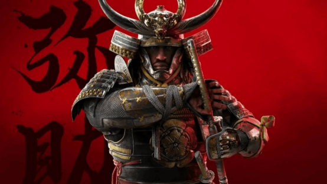

然而病灶根深蒂固，在这样的情况下想要补救并不容易，况且留给育碧的时间已经不多了。

根据目前的公开信息显示，育碧的非国际财报准则净负债为11亿欧元，国际财报准则净负债为14亿欧元，相比上年的8.8亿欧元大幅增加，这表明育碧没有产生足够的收入
来抵消其借款。再加上现金储备减少（目前为9.32亿欧元），该公司的财务状况岌岌可危。

雪上加霜的是，育碧的股票表现更是惨不忍睹。其股价持续走低，与五年前相比下跌了近80%，目前交易价为12.30欧元，是育碧历史上的最低点之一，这反映出投资者对
该公司的信心正在减弱。

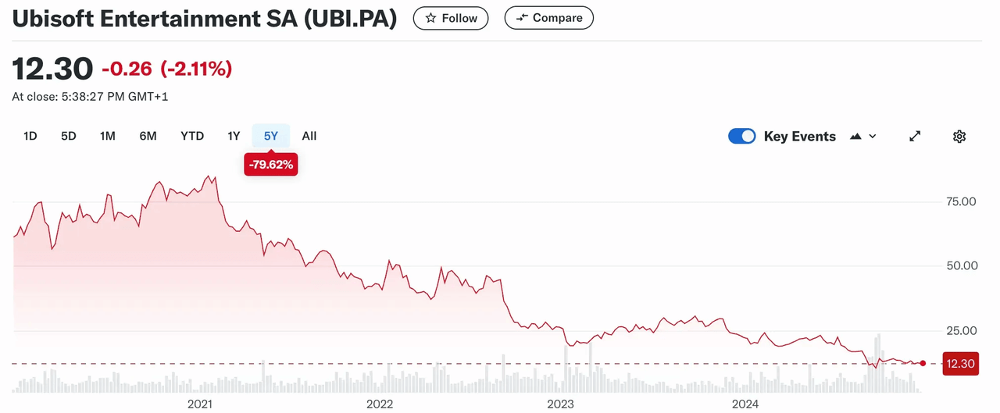

据That Park Place深入研究育碧财报后得出的结论，认为该公司可能会在2025年面临破产。尽管也有消息称，部分股东有意推动育碧将自己出售给私募公司
或持有育碧10%股份的腾讯，但接盘后优化冗余的体制就得付出巨额的遣散费，必须得将这部分成本纳入考量之中。

甚至有外媒指出，对于与育碧绯闻频传的腾讯来说，更明智的做法是等待育碧宣布破产，而不是承担其巨额债务，并在拍卖中收购育碧的IP。腾讯真正感兴趣的是这些IP，而
不是育碧的企业文化。

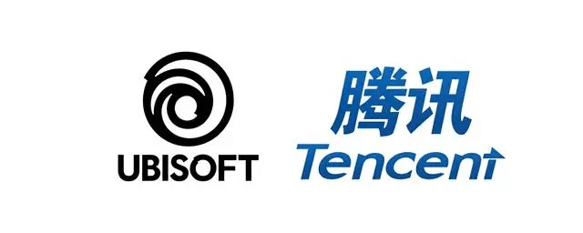

所以对于育碧来说，在落得一个破产的结局之前，他们确实也只有拼命拯救当下还未发售的项目这一条路可以走，寄希望能再出来一两个相对成功的游戏，来让财务数据和口碑都
变得好看一些，并借此为自己争取到一个更好的结局。

### 3.2 主犯与帮凶

很明显，DEI所带来的影响已经在育碧内部蔓延开来，这使得现在的他们可谓是举步维艰，但我们也不应当将所有的问题全都归结于此，其实长线战略的不清晰同样是导致这一
切的帮凶。

除了开头所提到的在NFT和web3和两个无底洞上花掉了大量的时间和金钱外，育碧在立项和开发方面也显得有些草率了。据消息人士称，在2021年到2022年这个时
间段里，他们在《超猎都市》上线后爆冷失利的情况下，还在同时开发大约十几款大逃杀游戏，从结果上来看最终问世的寥寥无几，几乎都是像《幽灵行动：前线》《细胞分裂：
猎手》那般胎死腹中。

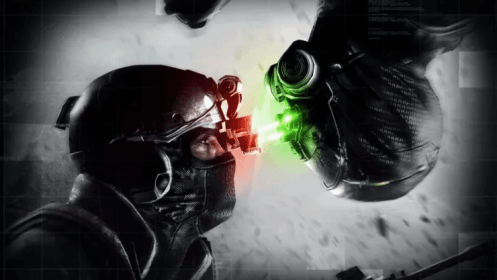

在大逃杀上倾注心血却收获寥寥后，近年育碧又选择押注射击游戏，包括《全境封锁：烽火战地》以及《孤岛惊魂》新作在内的多部作品正在开发之中，现在我们靠着碎片式的消
息当然无法得知这些游戏的整体质量和开发进度究竟如何，但他们的上线日期恐怕也是遥遥无期。

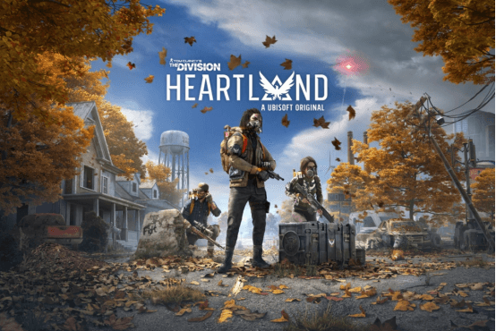

不难发现，或许是因为前些年“去公式化”战略的影响，育碧最引以为傲的工业化管线如今也受到了影响，人员流动所导致的项目目标不断变更，直接导致了游戏各种延期，开发
人员陷入迷茫。

这其中最为明显的一个例子就是《碧海黑帆》，截止到2024年2月游戏上线，这款游戏一共经历了六次公开跳票，开发时间长达十年，制作成本预估达到了6.5亿至8亿美
元，可游戏最终呈现出的质量只能算是差强人意，无论是玩家还是媒体口碑都相当一般，收回成本几乎成了天方夜谭。

虽说育碧并非所有的游戏都像《碧海黑帆》和《超越善恶2》这般打十多年的持久战，但多数项目普遍面临着类似的问题，因此在率先冲锋的《不羁联盟》战果寥寥的情况下，那
一大批预计将在2025~2027这个时间上线的游戏，就很难不让人担心它们是否会胎死腹中了。

即便很多人都不希望看到育碧逐渐走向没落，但现如今内外交困的情况使他们的前方障碍重重，即便是乐观主义者也很难找到一条可以快速脱困的路径，回炉重造的《刺客信条：
影》可能已经被育碧视为了最后的救命稻草。如果它没能改变市场和资本对育碧未来的悲观情绪，那么或许在不久的将来，育碧会用自己身上的惨痛教训，为业界敲响又一个警钟
。

## 传统游戏媒体与玩家的分裂

在2024年，玩家和许多权威媒体间的冲突愈演愈烈。无论从年初围绕《剑星》女主角过度“性化”这一问题，到年中有关《黑神话：悟空》的诸多争议，再到两者围绕《星鸣
特攻》《自杀小队》以及SBI组织等DEI相关话题的交锋，这些媒体与玩家之间的裂隙越来越大乃至走向对立，其本身的专业性与公信力也因此受到了不小的质疑。

但其实针对这一现象，不仅玩家们怨声载道，这些媒体自己也都对这一问题为自己做过辩护。

可惜无论双方在舆论场上有着怎样的说辞，一个事实仍然摆在那里：媒体和玩家间的关系肉眼可见地愈发割裂，这般现状便不禁想让人发出疑问——媒体与玩家间的关系，何以至
此？

这位名为Alanah Pearce的前IGN编辑就曾回应过玩家对媒体评分的质疑

### 4.1 当不成“第四权”的游戏媒体

从根本上说，媒体和玩家之间的立场和利益并不一致，游戏媒体不可能完全摆脱厂商所施加的影响。一方面，厂商会通过礼物、免费旅游、独家消息、抢先评测权等好处来拉拢媒
体；另一方面，不服从这套游戏规则的人便会受到打压，尤其对小媒体而言，惹怒厂商意味着失去一部分信息来源，从而热点事件和游戏的报导上陷入被动。

在这一问题上较为典型的是Jeff Gerstmann事件。他曾是GameSpot的游戏编辑，在某个游戏的评测中，他给出了一个不太理想的“平庸”评分，不久后，
他被GameSpot解雇，很多人认为这次解雇是被游戏发行商Eidos Interactive施加压力的结果。在当时，GameSpot曾极力否认这一指控，但在
几年后的2012年，随着更多的消息披露，诸如福布斯等媒体也透露了该事件与当时GameSpot受到了发行商的层层施压有关，阴谋论就此成了真。

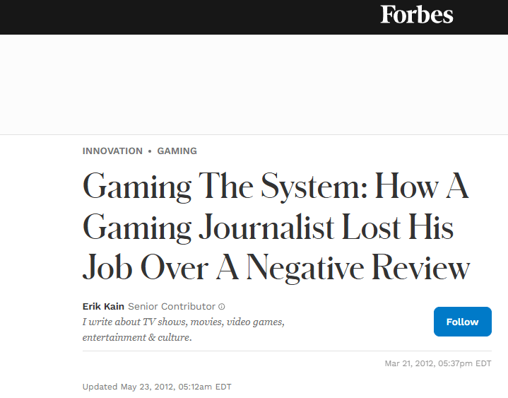

福布斯杂志对这一事件曾进行过报道

也是在2012年，来自Eurogamer的Robert Florence曾发表过文章描写这些腐败现象，直言媒体就是厂商们的公关工具。没过多久，他便被Euro
gamer解雇，而他文章中引用的例子则在后来成了被广为流传的“多乐滋门”，这一事件来源于当时的VGA主持人Geoff
Keighley双眼无神地坐在一堆零食和促销广告旁边介绍游戏，这样的“经典构图”也被视为了游戏媒体的悲哀——困囿于商业之中，游梦于利益之间。

不过，媒体与厂商间的关系并非一边倒的单方面施压，厂商的游戏产品也需要媒体评价来背书。有消息指出，一些发行商和游戏开发人员的业绩与奖金一方面取决于游戏销售额，
但在另一方面也取决于游戏在MetaCritic这一媒体评分聚合平台上的评分表现，而这些评分有时还会影响诸如动视、Take
Two这类大厂的股价。除此之外，厂商们有时也会选择请一些媒体来进行内部测评（他们称为Mock
Review，即模拟测评），一些厂商会直接根据测评结果决定项目去留。

因此游戏媒体与厂商的纠葛相当复杂，二者既相互依存也相互制衡，使得媒体们得以在一定程度上保留了自己的独立性。

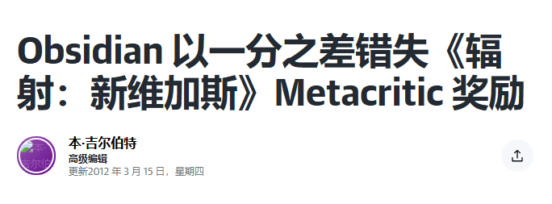

曾有媒体报道黑曜石工作室曾因《辐射：新维加斯》没能在MC上达到85分而失去奖金，后来制作人否认了此事，但这也能够帮助我们理解媒体评分对厂商的影响

在厂商眼中游戏媒体最本质的能力，就是其聚集、整合和吸引各类玩家时产生的流量，这是媒介的立身之本。

在游戏行业方兴未艾的年代，各类游戏杂志几乎成为了玩家们了解新游戏资讯、游戏攻略等信息的唯一渠道，不同类型、不同喜好的玩家都需要通过这些媒介和平台来了解相关信
息。哪怕在杂志等传统媒体式微、视频和网站媒体兴起的年代，这种对玩家的聚合能力仍然是游戏媒体赖以生存的源泉，也是各路媒体的核心竞争力与价值所在。

一方面，流量是媒体最重要的变现渠道，厂商的投放、相关的商务合作皆以此为准绳；另一方面，它也是媒体与厂商博弈时的重要筹码，乃至于成为其独立性的根本保证，正如比
起收入渠道单一或者不稳定、影响力有限的小媒体，IGN这类头部媒体有时更可以不必在乎某一家厂商的看法，甚至可以反过来对厂商施加影响。在此基础上，许多头部媒体也
得以保留自身的立场与价值倾向性。

正如卫报、华盛顿邮报等新闻媒体一样，诸如IGN、Kotaku等游戏媒体在很多问题上有着独立于厂商之外的立场与价值判断，他们也常常会基于这些立场而发表一些针对
性文章来对业界施加媒体影响力。比如在2018年左右，一篇来自Kotaku的文章详细揭露了Rockstar的加班文化与工作环境问题，这篇报道在一定程度上促使R
ockstar改变了公司内部问题，并在其后几年里改革了自身的工作文化。

这篇由前Kotaku编辑Jason Schreier所撰写的文章令Rockstar不得不迫于压力改革内部的工作文化

因此，在最近十几年间欧美文化界政治正确大行其道的情况下，这些媒体也都不约而同地拥抱了当前欧美流行的DEI文化，这便是近期媒体与玩家间的立场割裂最集中的体现。
尤其在2024年，光是Kotaku自己便化身“DEI”文化的马前卒，从年初到年末通过数篇为DEI文化“正名”的辩护文章同玩家社区发生直接冲突。

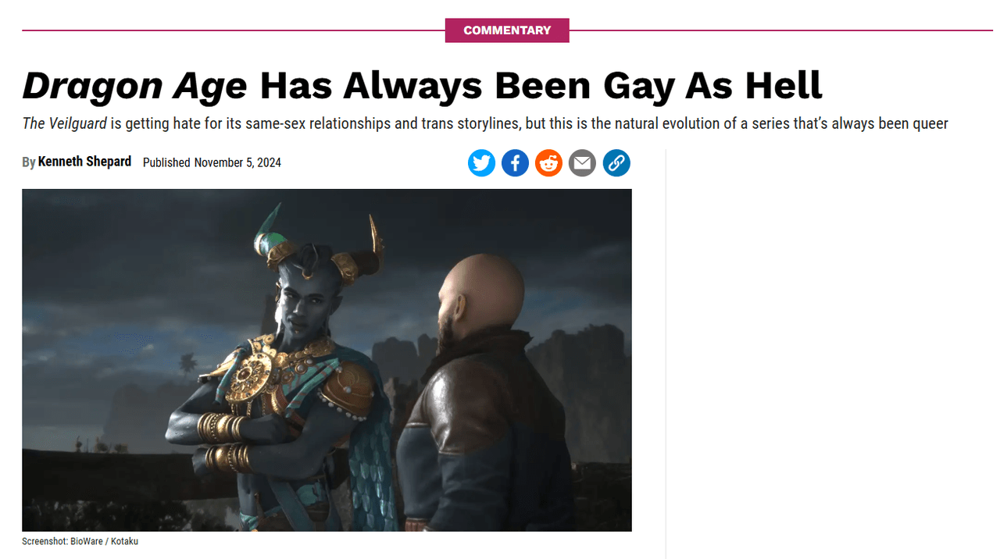

《龙腾世纪：影障守护者》刚刚发售时，Kotaku对游戏中DEI元素的辩护就曾引起了玩家的强烈不满

不少从业人士称，玩家对媒体的不满是出于他们对专业人士的厌恶，并用金钱交易等指控来合理化这份不满。之前在《最后生还者：第二部分》媒体与玩家口碑割裂这一问题上，
前IGN编辑Alanah Pearce便表示媒体并没有收钱，评测编辑是发自内心地认为这游戏值得一个满分。在她看来，相关从业人士往往持着一种超越玩家的“专业眼
光”去审视这些游戏，这经常导致媒体与玩家意见的不一致，但有关收钱的指控则完全是天方夜谭，她还强调“相比于厂商，媒体往往更在乎玩家。”

尽管口头上的辩解与交锋并不能根除行业中真实存在的裙带关系和利益联系，但在媒体与玩家社区矛盾日渐扩大的当下，无论是玩家还是媒体编辑，两方各自都有着一套逻辑自洽
的说辞。

### 4.2 如何重新看待游戏媒体？

不可否认的是，即便面临着越来越多的矛盾与质疑，这类老牌游戏媒体的影响力和地位并不会很快消退。哪怕这份“权威媒体”的名单或许会在玩家的抵制下有所变动，但它们的
生态位和影响力仍将继续存在。

除此之外，游戏媒体也往往会为用户提供更全面、更稳定的游戏资讯与行业分析服务，其独家消息、抢先评测等内容也让玩家和厂商很难找到合适的替代品，因此把持着信息渠道
的他们仍然是玩家们在购买游戏、向他人和朋友宣传游戏时的一大重要参考来源。而多年来的经营所留下的基本盘也让这些媒体有着很多自媒体博主所不及的用户触达率，厂商仍
需要重视针对这些媒体的买量投放方案，从而让产品能够得到有效的曝光，并凭借这些媒体的影响力与地位获得它们的背书。

然而需要强调的是，在当前媒体与玩家群体在某些问题上严重割裂的情况下，游戏厂商需要注意到来自这些媒体的反馈是否还能真正代表玩家与消费者。比如《黑神话：悟空》和
《龙腾世纪：影障守护者》都出现了媒体评价与玩家、市场反馈截然不同甚至相互矛盾的情况，而只关注媒体评价很可能会导致误判和错误决策。因此在如今，媒体不应再是厂商
了解玩家反馈的唯一渠道。

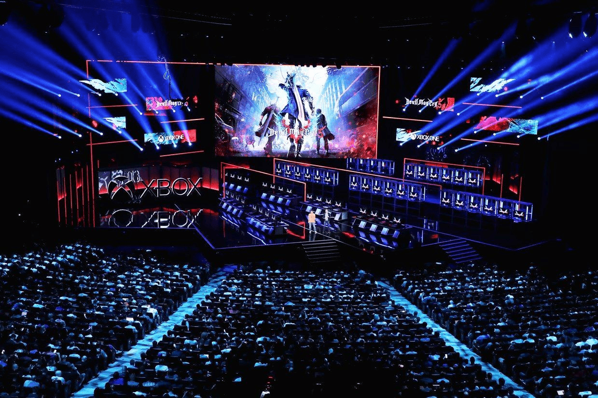

当然不可否认的是，以Youtuber、社交平台博主、B站UP主为主的新媒体势力也的确对权威媒体造成了冲击。这些自媒体往往更能捕捉到玩家社区的风向，他们生产的
内容也更顺应玩家们的情绪，看上去更接地气，甚至很多时候他们还会充当玩家们的嘴替去抨击游戏业的种种乱象，乃至成为诸如“反政治正确”这类玩家运动的主导与核心。更
重要的是，这类博主通常深耕某一垂直领域，这也意味着针对该类自媒体博主的投放宣发有时更能精确触达目标受众，宣发效率也会更高。

而其中缘由也不难想象。随着各类自媒体的兴起，玩家们也有了更多的信息渠道，媒体想要单方面对玩家与用户施加影响越来越难。同时，在当前媒体与玩家群体的割裂乃至对立
下，越来越多的玩家不再将游戏媒体当作唯一的资讯来源渠道，媒体“聚合”玩家的能力正在受到挤压，而媒体的权威也因着当下两者的对立与割裂饱受质疑，这两者都造就了媒
体影响力的衰退。尽管媒体仍然有着诸如“独家内容”、“深度分析”等短时间难以被取代的功能，但对厂商来说，媒体影响力的消退也令其需要重新评估这些老牌媒体是否还有
当年那么“权威”。

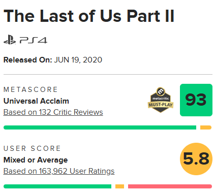

在2024年，这些游戏媒体本身的价值观与立场倾向已经让一些厂商受到了不公正的对待，较为典型的例子便是《剑星》与《黑神话：悟空》相关争议，两者各自因为“角色过
于性化”与“工作室对女性的不当言论”受到了这些大媒体的负面评价，乃至PC gamer等媒体对《黑神话：悟空》进行详细评测时，还会在文章中有意插入此类负面报道
，尽管没有证据直接证明这样的报道对游戏销量与玩家口碑产生实际影响，但可以预见的是，与媒体观念相左的厂商很可能会在游戏的海外宣发遇到一定的麻烦。

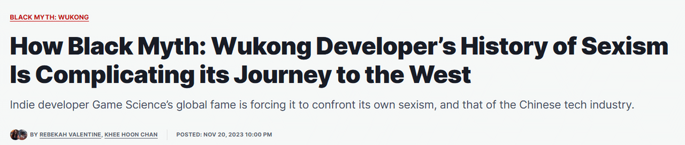

事到如今，虽说玩家对这些媒体赖以生存的“专业性”产生了诸多质疑，但对厂商和整个业界来说，这类媒体的地位与影响力尚在。

尤其在自媒体兴起后，权威媒体越来越难受到玩家们的认可，尽管部分媒体从业人员认为这种“脱离群众”的行径是自身专业性与独特艺术眼光的体现，但说到底，游戏行业的基
础仍然是身为消费者的玩家，近些年来媒体评价与实际销量越来越大的割裂也在很大程度上为整个行业敲响了警钟。

而对厂商来说，自媒体的兴起令厂商在游戏宣发领域的选择更加多样，尽管权威媒体的影响力和背书不容忽视，但更多元的宣发渠道显然为厂商，尤其是进军出海市场的中国厂商
和其他小工作室提供了更多机会。只不过，想让游戏在市场上真正收获认可，比起媒体的背书，厂商对游戏质量的打磨仍然是决定销量的根本。

2024年Steam热点事件

## AI在游戏产业中的现状与展望

提到2024年Steam上的黑马游戏，那绝不会少了《幻兽帕鲁》的一席之地。它销售近2000万份，一举创下了Steam在线人数榜的历史第二，直到半年后才被《黑
神话：悟空》超越。

然而，《幻兽帕鲁》同时也因疑似使用AI陷入到了大量争议中。人们普遍难以相信PocketPair这个鲜为人知的小公司，仅凭40人的团队就能做出如此大规模、有着
上百种幻兽的世界。许多玩家和业内人士都质疑《幻兽帕鲁》中的角色形象与《宝可梦》过于相似，仿佛是用AI缝合而成，而制作公司的一些发言似乎也进一步佐证了这种观点
——大部分帕鲁都由一个应届生完成，她的工作效率超过常人4-5倍……

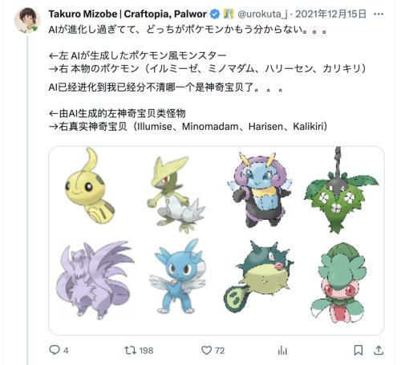

即便《幻兽帕鲁》浑身上下都充满了AI洗稿的嫌疑，但追查起来却很难坐实这项指控。在2021年的早期开发视频中就已经出现了许多疑似“AI缝合”的帕鲁形象，但当时
的AI技术并未成熟到这一地步，而这一时点也同样早于工作效率4-5倍的“天才少女”的入职时间。

而最具代表意义的是，2024年9月，任天堂发布了一则简短的声明，正式对PocketPair公司发起了诉讼，要求支付经济赔偿并将《幻兽帕鲁》下架。在这份诉状中
，任天堂法务团队这次针对的并非与美术形象直接相关的著作权，而是在专利权上发难。这意味着诉讼焦点并非在于帕鲁设计这类的美术资产，而是向怪物扔球来捕捉它们之类的
游戏机制。后来《幻兽帕鲁》确实在后续更新中针对有关这项专利内容做出修改，移除了游戏中投掷精灵球的召唤机制，这起诉讼的前景仍不明朗。

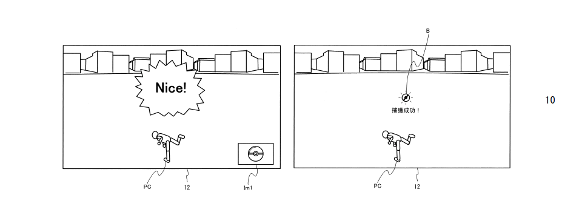

任天堂精灵球相关专利的示意图

虽然我们无从得知《幻兽帕鲁》是否真正使用了AI创作，但在这场风波中，AI进入游戏行业带来的各种可能性得到了公众和开发者们的广泛讨论。时至今日，AI所生成的内
容与真人创作相比已经越来越难以用肉眼鉴别，而它的高效率、低成本，也给了开发者们以小博大的可能。

当AI生成大规模用于游戏工业之后，是否会出现第二、第三个复制《幻兽帕鲁》奇迹的爆款？未来的游戏市场是否会被各种AI游戏所挤占？种种令人兴奋或恐惧的猜测，都标
志着AI技术正在让游戏行业发生着翻天覆地的变化。

### 1.1 从ChatGpt开始的AI热潮

这场影响持续至今的AI革命，始于2022年ChatGPT的一鸣惊人。与传统AI相比，GPT的大语言模型无论在理解、生成能力上都有着质的突破，而更加友好的接口
，则让它迅速被应用于编程、写作、翻译等多个领域。人们也开始意识到，如果有AI的帮助，那么生产力水准将可以被大幅提高。

于是，其他科技公司也迅速投入到了这场AI军备竞赛。谷歌推出了Gemini，微软则将GPT技术集成到Copilot、Bing等产品中，而以MidJourney
为代表的一系列生成式AI，更是颠覆了人们一直以来对AI的认知。AI作图、AI换脸、AI配音……许多原本依靠人工的行业都发生了剧变，而其中自然也包括游戏领域。

专注Stable Diffusion的AIGC社区Civitai

Steam平台上有AI参与的游戏由来已久。早在2022年9月初，Steam就上线了一款名叫《This Girl Does Not Exist》的拼图游戏，它
在美术、文本、配音等方面全部使用AI进行制作。但在之后，随着AI热潮的演进，版权纠纷的问题日益突出。因为生成式AI需要通过大量的图像数据来进行训练，其中就可
能包含了许多未经授权的艺术家作品，而训练好的AI可以借此模仿这些艺术家的风格生成全新的作品，对创作者的生存空间形成了极大的挤压。

因此Steam也在之后收紧了对AI的审查政策。在2023年，不少开发者都因为使用了AI生成的美术资产，或是因为在游戏内加入了OpenAI的接口，而在审查中被
Steam驳回，甚至永久禁止上架该游戏。

直到2024年1月，V社才终于正式发布了对AI的监管政策。提交游戏时，开发者需要填写新的内容调查表格，描述在游戏中是如何使用AI的。而所披露的大部分信息，都
会显示在游戏的Steam商店页上，确保玩家在购买时的知情权。

公告原文：

首先，我们将会更新开发者们在向 Steam 提交游戏时填写的内容调查。 内容调查现在会包括全新的 AI
内容披露部分，开发者需要在其中描述在游戏开发和运行的过程中是如何运用 AI 技术的。 这里将 AI 的使用划分为两个大类：

预生成内容：在游戏开发过程中借助 AI 工具生成的内容（艺术作品/代码/音效等）。 在《Steam 分销协议》中，各位曾向 Valve
承诺自己的游戏不会包含非法或侵权内容，且游戏将与营销材料保持一致。 我们在发行前的审核过程中，将会评估游戏中的 AI 生成内容，所采取的条件与评估所有非
AI 生成内容完全一致——其中一项便是检查游戏是否符合上述承诺。

实时生成内容：在游戏运行过程中借助 AI 工具生成的内容。
除了须遵循与预生成内容一样的规则外，此类内容还须满足一项额外条件：在内容调查中，各位需要告知我们你对 AI
技术采取了哪些保护措施，以确保其不会生成非法内容。

Valve 将会在游戏发行前使用这一披露的信息来对游戏进行审核。 我们也会将你披露的大部分信息包含在游戏的 Steam
商店页面上，以便让顾客了解该游戏是如何使用 AI 技术的。

另外，我们还将在 Steam 上推出一套全新系统，让玩家可以举报游戏内违法的实时生成 AI 内容。 当玩家认为自己遇到了本应被适当的 AI
生成内容保护措施拦截的内容时，便可通过游戏内 Steam 界面轻松地进行举报。

基于我们对 AI 领域形式与风险的进一步理解，以及与使用 AI 的游戏开发者及 AI 工具创造者的交流，我们做出了今天的种种调整。
有了这些调整，我们将能够以更加开放的态度对待使用 AI 技术的游戏在 Steam 上的发行。 通过实时生成 AI
创建的仅限成人的色情游戏是唯一的例外，目前我们无法允许这类内容的发行。

在官方给AI确立了边界以后，Steam平台上AI参与的游戏数量便开始飞速增长，据Game
Developer统计，Steam公告发布后短短三个月时间，使用AI生成内容的游戏就已经达到了1000款左右。

然而，Steam在对于政策的表态和实际执行上仍存在一定的落差。对于那些隐瞒了其中含有AI内容的游戏，官方并不能做到在审核时准确无误地判别并施加监管，尤其是一
些持续运营类的游戏。例如2024年末，运营已有数年的《KARDS \-
二战卡牌游戏》就因为新卡面作图出现了“六指”等疑似AI创作的状况，遭到了玩家社区的集体冲击。后经官方自查确系外包团队使用AI，此事便也在官方道歉中不了了之。

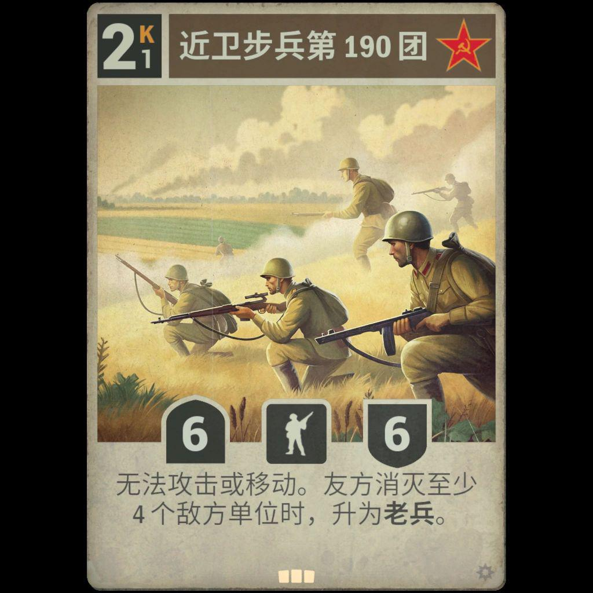

当AI创作已经发展到几能乱真的地步，以至于出现玩家猜忌厂商的“狼人杀”局面，无疑是一种悲哀。时至今日，Steam在公告中所宣称针对AI的举报系统仍未上线，而
商店页中的举报页面也并没有违规使用AI的相关选项。因此尽管当前政策已经初步成型，但目前也只能起到某种类似于免责声明的效果，Steam对AI的管控层面仍需进一
步完善，才能避免平台走到乱象丛生的境地，让玩家、厂商等方面均从中受益。

### 1.2 AI游戏在Steam平台的现状

Steam的AI政策公布至今，目前受益最大的是资金人力有限的小体量独立游戏。AIGC能大幅减少独立游戏的开支、提高创作效率，从而缩短开发周期，避免陷入到财务
困境的泥潭当中。而AI技术在游戏中的应用，也能让独立开发者的巧思有更多发挥的余地，探索前人未曾尝试过的领域与玩法。

按照V社在公告中对AI使用方式的划分，在开发游戏的过程中，AI对独立开发者的帮助可以大体分为两种：预生成内容与实时生成内容。

预生成内容主要包括美术、音频等素材。以Midjourney、Stable Diffusion为首的文生图软件，在经由良好的调校下可以达到近似于高水平创作者的
地步；而Suno、AIVA则可以根据用户提示创造出音乐，Lovo.ai、Replica Studios能生成AI创作的配音，其平台之多已经让人眼花缭乱。

《梅卡妮可》制作组Loser/s的新作《It was a human.》是2024年独立游戏中一个使用了AIGC内容的典范。这部视觉小说作品在科幻与迷幻相结
合的世界观下，营造出了优秀的猎奇诡异氛围，而由AI生成的背景图既精细又充满不可名状之感，既利用了AI天马行空的联想能力，又防止了像许多AIGC游戏一样容易出
现绘图漏洞的问题。

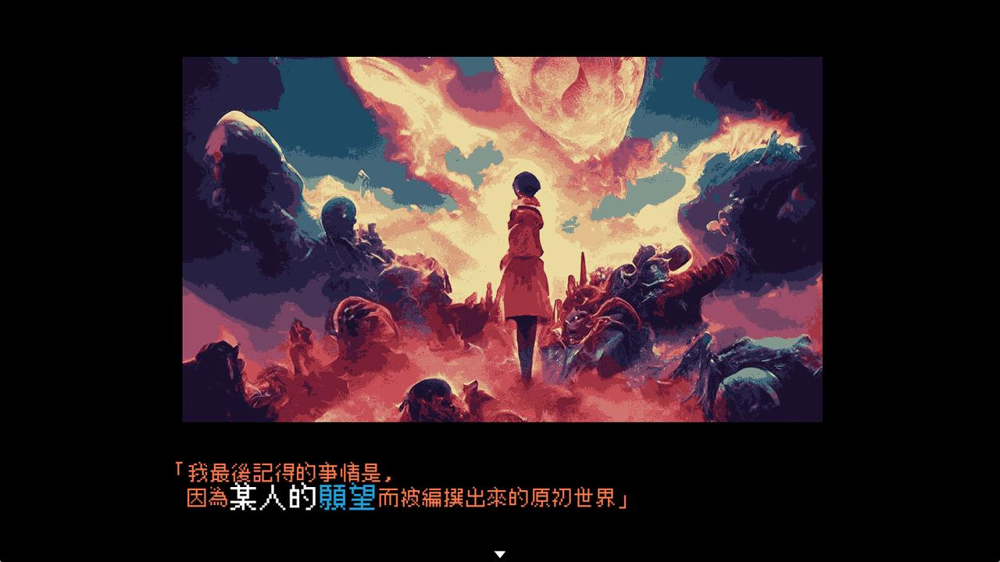

而在音频领域里让人印象最为深刻的，当然是2024年的现象级作品《沙威玛传奇》了。它使用AI为游戏提供了中文音频，尽管文本充满了机翻感，却起到了意外的魔性效果
，在视频平台上成为了名梗，以至于收获了大量的相关二创形成了病毒式传播。尽管《沙威玛传奇》因为AI“弄巧成拙”所获得的成功似乎多少让人有些意外，但也证明了玩家
们对AI配音的接受度可能会比预想中高——当出现逻辑不通的语句时，玩家不一定会将之视为一种负面体验，甚至会更倾向于感到有趣。

至于实时生成内容，则多用于和AI进行即时问答的部分。开发者们需要将游戏中玩家输入的结果返回给ChatGPT、Bard等大语言模型，然后将给定限制条件的输出内
容返回给玩家。

比如在《心跳AI审讯游戏》中，玩家需要在7次提问中击穿嫌疑人的心理防线让他自己认罪，而玩家输入的结果都将通过OpenAI的接口反馈给ChatGPT，由它来做
出回答。从玩法角度上来看，这种提问方式拥有极高的自由度，但实际上AI并不能完全代入到开发者预设好的角色中，依靠逻辑的循循善诱式对话效果很差，反而是威胁、编造
虚假证据之类的手段更能让AI感到压迫感。因此游戏中完全依靠AI问答进行的系统，可能还有很长的路要走。

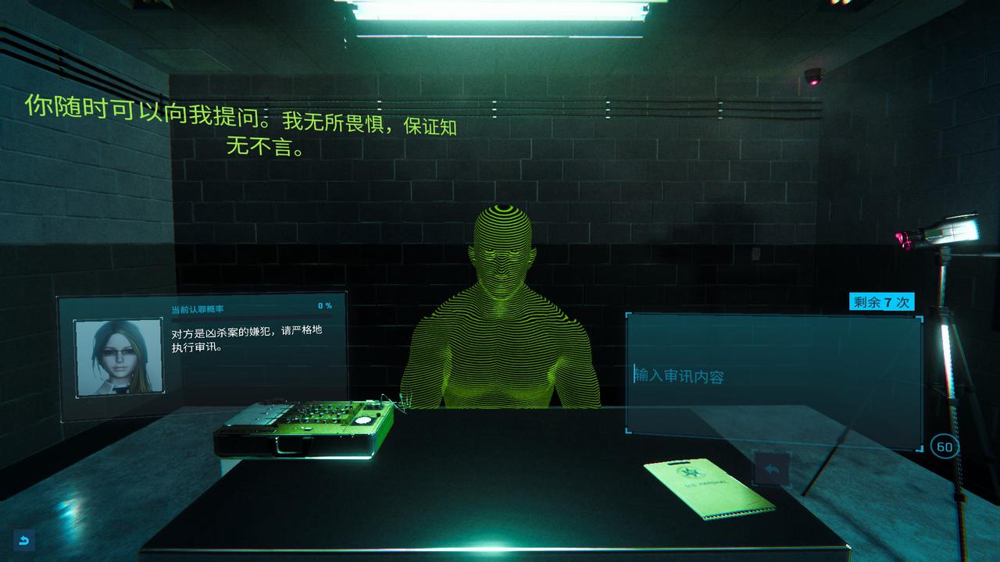

但如果退一步，使用NLP技术让大语言模型来解析玩家的提问，并从提前准备好的语料库里匹配答案的话，结果就变得可控了许多。国产游戏《海龟蘑菇汤》就是采用了这种思
路，由AI来担任主持人回答玩家的提问，让玩家从类似“一个只穿内裤的男孩死在人行道上，手里拿着一把雨伞”这种预设的谜面开始，逐渐通过推理和猜测来还原完整的事件
真相，实现了“一个人也能玩的海龟汤游戏”。

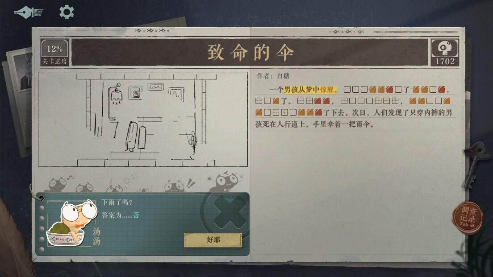

相比预生成来说，目前AI实时生成在游戏中的应用还存在着许多限制。例如很多游戏要求玩家保持联网游玩，每次调用Token都需要收取额外费用。所以这方面的应用仍存
在着许多优化空间，比如《海龟蘑菇汤》选择将玩家提问过的问题记录下来，减少使用NLP的频率，从而降低了游戏的Token费用。

值得一提的是，曾制作过独立游戏《暗影火炬城》的国内厂商钛核网络近日也公布了他们在AI领域的成果。通过与英伟达合作，钛核网络在新作《代号：动物朋克》中实现了离
线AI生成技术，并且通过视频演示了用语音改变玩家载具涂装的过程。

由于目前多数大厂暂未下场，Steam上对AI相关内容积极试水的开发商依然停留在小体量独立游戏的领域里，且游戏质量普遍算不上出众，除了像《沙威玛传奇》这样阴差
阳错造就的“奇迹”外，基本没有哪款游戏能拥有足够的热度。如果没有大厂直接下场AI游戏，或许要等到明年甚至更久，这一领域才能涌现出更多足够完善和成熟的产品。

### 1.3 AI技术的未来展望

从大趋势来看，AI赋能游戏开发的一大方向，就是逐渐打破程序语言的门槛，让不会编程的人也有了创作游戏的可能。

2024年年初，初创手游公司Cosmic Lounge的CEO就曾在业内活动上分享过自家借助AI打造的puzzle engine，能让设计师使用无代码工具直
接生成大量设计。AI不仅能帮助策划来测试关卡，反映游戏的难度与平衡性，甚至能直接由AI生成大量关卡，然后再让设计师从中挑选自己满意的。

Puzzle Engine显著加速了不同类型的新益智游戏机制和可视化的原型设计

而文生工具的进一步发展，则让用户有了直接生成游戏场景的可能。比如谷歌的生成工具Genie已经于2024年末迭代到了2代，它只需要一张图片或一段文字，就能创造
出一个逼真的3D世界，并允许用户在其中互动，例如控制角色移动、跳跃、与物体交互等等。对于开发者来说，这可以帮助他们很快制作出一个表达游戏概念的Demo，也能
更快地进行测试、迭代。

此外，谷歌的GameNGen也在开发当中，它作为一款由AI驱动的游戏引擎，能够让开发者无需编写代码，就能根据现有的部分继续创造出可玩的游戏及交互环境。与之类
似的还有正在进行封闭测试的Jabali，它旨在消除复杂的代码给人在开发过程中带来的阻碍，借助生成式AI让开发经验不足的新手也能成功做出游戏。

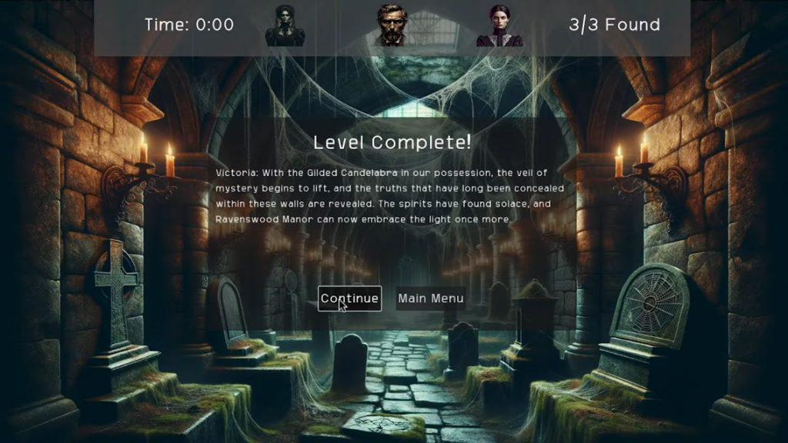

Jabali生成的游戏

虽然目前AI仍然很难在游戏开发中起到自主创作的作用，但随着AI工具的迅猛发展，或许在遥远的未来，可能会出现完全由AI打造的创作平台。届时的游戏界，制作游戏的
成本将被无限降低，人们只要有属于自己的创意就能将它转变成一款游戏。

### 1.4 生长与阻力

目前欧美对于AI的监管仍然停留在“使用AI时要确保用户的知情权”的程度，在态度上与Steam平台没有本质区别。例如欧盟2024年正式通过的《人工智能法案》中
，情绪识别和生成类AI被归类成了有限风险，需要履行透明度义务，确保用户获知并防止误导。

相比于各国政府的监管，使用和发展AI的阻力更多在于游戏行业内部，AI的发展可能会取代一部分美术、编剧的工作，造成他们的失业风险。美国演员工会SAG·AFTR
A的配音、动捕等工作人员就在2024年为反对AI滥用而罢工，影响堪比2023年的好莱坞编剧罢工事件，波及公司包括动视暴雪、EA、失眠组、Take
two等多家厂商。

在这场罢工事件中，第一个站出来聘用美国演员工会人员、接受他们“将AI当作创意工具，而非完全替代人力”的诉求的，是位于洛杉矶的腾讯光子LA工作室。这也代表了一
些厂商重视人才、更加节制性使用AI的态度。例如Cygames的母公司Cyber Agent也表示，会合法合规地使用AI来进一步增强开发者的创作力，并要求所有
使用AI的员工都需要阅读公司内部的指南并参与测试。像育碧的Ghostwriter工具也更倾向于为编剧提供更多选择，减少工作量，而非取代他们。

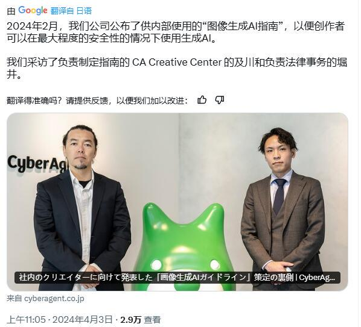

Cyber Agent发布对于AI的应用指南

但也有一些公司对新技术采取了更为激进的态度，比如蓝洞的母公司KRAFTON就宣布未来要更多使用AI替代人工，大量使用AI机器人进行自动化的游戏设计，乃至于配
音演员也使用TTS类的AI予以代替，并曾计划在2024年发布4款AI游戏。又或者是曾经雄心勃勃进军3A市场的Netflix，也毅然决然选择了砍掉3A工作室与
众多知名制作人，并投入到AI游戏的热潮中。米哈游创始人蔡浩宇似乎也是这一观点的支持者。他认为未来的游戏业只会存在顶尖天才与业余爱好者两种人，而那些普通的开发
者们或许只能考虑转行。

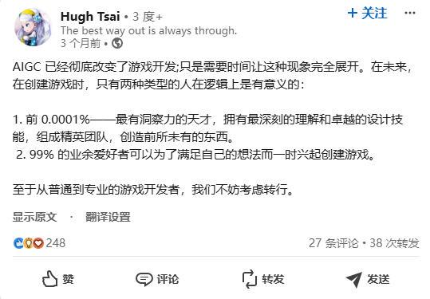

无论如何，AI如今已经成为了先进生产力的代名词，而游戏行业对于AI技术的态度一直都偏向包容，也不乏诸多走在技术前沿的探索者。面对AI这片炙手可热的蓝海领域，
最先能打通AI与游戏间融合最后一公里的公司，自然可以获得难以估量的商业前景。无论是如今积极尝试用AI降本增效的游戏大厂，研发AI生成游戏的科技巨头，还是探索
它将如何拓展游戏玩法的开发者，都有可能给游戏产业带来新的革命。

但另一方面，玩家、内容创作者乃至于部分游戏从业者对于一部分AI技术，尤其是AI绘画领域，都仍处在抗拒甚至抵制的立场上，使用AI普遍被视为敷衍、低劣的代名词，
而对于部分看重角色立绘的二游则更是可能会为企业招致不必要的舆论风险。因此，如何在使用AI时做到技术、舆论、伦理等多方面的平衡，对于各大游戏公司来说，还需要在
未来的实践中进一步摸索。

## 登陆Steam后的索尼为何屡屡碰壁？

在愈加乏善可陈的“主机大战”里，索尼依然取得了当下的领先地位；但若是他们和自己相比，过去的这一年多时间里，索尼过得并不算太好。

根据索尼集团2024年11月8日发布的 2024 财年Q2（7月-9月）财报，PS5 主机销量为 380 万台，上年同期为 490 万台。经计算可知，该季度
PS5 主机销量同比下降 22.45%。

而在游戏方面，尽管《宇宙机器人》出乎很多人意料地拿下了TGA年度游戏大奖，但2024年顽皮狗、圣莫尼卡等一线工作室仍然在沉寂，Sucker
Punch、Bend Studio等二线工作室尚未发力，索尼全年的游戏阵容实在是捉襟见肘，而且在这为数不多的游戏里，《星鸣特攻》《乐高：地平线冒险》等产品的
失利，使得索尼2024年的成绩显得更为难堪。

至于《地狱潜兵2》和《剑星》这两个难得的第三方爆款，一个因为运营问题不时陷入舆论的风口浪尖，一个又因为背离西方的多元文化价值观而遭遇了额外审查，都不算太过顺
利。

而从整体发展上来看，索尼之前放弃永久独占，将大量游戏引入PC端的政策在营收上取得了一定成果，但接连登陆Steam的主机大作并没有给索尼带来玩家们的叫好，反倒
引起了不少争议。

### 2.1 屡次跌入深坑

就2024年而言，索尼接连将《漫威蜘蛛侠：迈尔斯莫拉莱斯》《最后生还者：第一部》《瑞奇与叮当：时空跳转》《对马岛之魂：导演剪辑版》《战神：诸神黄昏》以及《地
平线》两部曲等一干颇具体量的知名大作搬上了Steam平台，阵容不可谓不豪华。且《乐高：地平线大冒险》《绝地潜兵2》等与索尼关系匪浅的游戏，还选择了同步登陆的
PC的策略。

然而，这量大管饱的游戏阵容在登上Steam平台之后，所带来的不全是正面的声音，像《最后生还者：第一部》的移植就因为优化上的糟糕表现，使得这款久负盛名的佳作遭
到了玩家们的怒喷。

负责移植的IronGalaxy工作室搞砸了多款游戏的PC版本

除了类似这种因为外包工作室所招致的无妄之灾外，其实这一年来登陆PC端的PS作品之所以隔三差五就要遭到差评轰炸，更多的原因还是索尼想通过这个机会，来吸引用户注
册PSN账号，扩展自家平台的受众群体。

而2024年初的爆款《绝地潜兵2》，首当其冲成为了玩家倾泻怒火的对象。

索尼对于实时服务型游戏的期待与野心，早已被包括彭博社在内的多家媒体报道过，但无论是开发已久却终遭取消的《最后生还者2》多人模式，还是遭LGBT荼毒而上线暴死
的《星鸣特攻》都让索尼碰了一鼻子灰，也只有与Steam平台同步发售，主打快节奏合作PVE玩法的《绝地潜兵2》，难能可贵的在上线时取得了相当可观的销量和口碑。

很明显，索尼想借《绝地潜兵2》的热度转化一部分PC用户，所以他们在游戏已经运营了三个月，积累了不错的声誉和热度后，决定强制性要求玩家将自己的Steam账户绑
定PSN账户，否则将不能继续进行游戏。

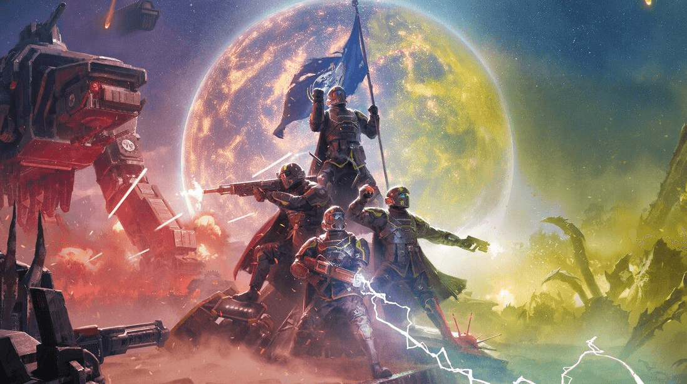

对于用户而言，这类要求Steam玩家强制绑定账号的行为一直很受反感，虽然EA、育碧、Epic有时候也会要求绑定自家平台，但至少他们的平台尚且同属于PC端，而
强制绑定PSN对于那些没有PS主机的玩家来说几乎没有什么好处，只是为游戏的启动增添了额外的麻烦而已。

这次的事件从索尼将《地狱潜兵2》从那些无法绑定PSN账号的国家和地区的Steam市场下架开始，惹怒了的玩家在三天内给《地狱潜兵2》刷了超过30万条差评，直接
将这款游戏的近期评价刷到了“差评如潮”，总体评价则从“特别好评”刷到了“褒贬不一”。

在玩家们近乎疯狂的舆论攻势下，索尼终于出面宣布取消原定的更新，不再强制要求玩家绑定PSN账户了。这次事件也被玩家们视为反抗索尼的一次胜利，而作为《绝地潜兵2
》开发商的Arrowhead也很有幽默感，把因这次事件而导致的Steam差评柱状图做成了玩家角色披风，让玩家可以纪念这一次胜利。

虽然这一事件也让索尼暂时有所让步，但他们却并没有因此而放弃让玩家们绑定PSN账号的计划，在后来发售的《对马岛之魂》PC版时，索尼采用了一种温水煮青蛙的策略，
即“游玩联机内容需绑定PSN账号”。

后来到了《战神：诸神黄昏》登陆PC时，索尼又放开了手脚，强行要求玩家们绑定PSN账号，这也致使这款曾夺得TGA年度最佳游戏的名作遭受了大量差评，最终得到了“
褒贬不一”的评价（当然，该作之所以收获差评，其中也不乏有优化不佳和定价高昂等原因）。

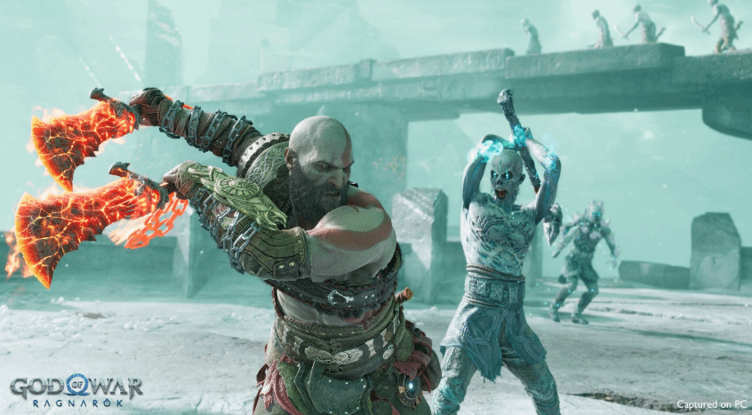

至于国区玩家们抵制绑定PSN的根本原因，除了之前提到的对于很多PC玩家这是个没用的账号外，其实也和PSN在国内的网络表现差有关，特别是像《战神：诸神黄昏》这
类只有单机内容的游戏，玩家们因为它而遭遇的网络错误问题实在是有些闹心。

就目前的迹象来看，索尼明显不打算因为玩家抗议而放弃“引流PSN”的计划，可以预见索尼将来上架Steam的移植大作仍然会强行要求玩家绑定PSN账号，至于这是否
会影响到玩家对于这些游戏的购买意愿，可能还需要时间进行进一步观察。

### 2.2 强扭的瓜不甜？

当然，在索尼看来，他们看重的是Steam平台那庞大的用户数量和惊人的消费能力，而索尼放开独占政策后确实在这上面挣了不少钱。

据VG Insights网站数据分析师援引的数据来看，自2020年以来索尼通过其在Steam上的游戏创造了约8.3亿美元的收入。Steam游戏平台中该公司游
戏的总发行量预计超过2800万份，其中《地狱潜兵2》约为1100万份。

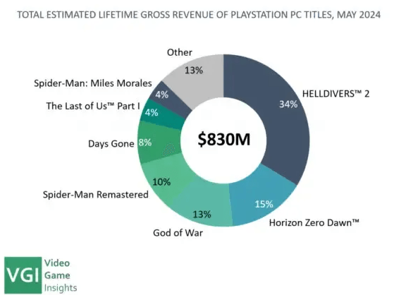

如果我们从单个游戏的视角来看，会更清晰地发现这种收入的明显提升。以《地平线：零之曙光》为例，截至2023年5月，该作的累计销量约为2300万份。而根据VG
Insights的分析，其中370万份(约占总份额的15%)是PC平台销量。分析师估计该游戏在
PlayStation游戏机上的收入约为5亿美元，在电脑上的收入约为1.2亿美元，因此，《地平线：零之曙光》PC 版的发布使得该作的销售收入增加了约25%。

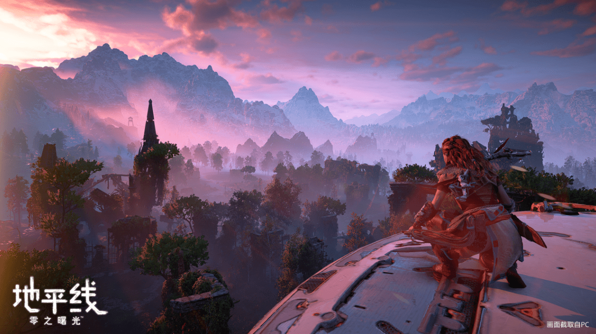

事实证明，让旗下的第一方大作登陆Steam的确是个拓展收入来源的好主意。并且索尼是支持和推动业内“3A大作70美元”号召的厂商之一，他们在Steam上的游戏
定价普遍相对高昂，像《地平线：西之绝境》《瑞奇与叮当：时空跳转》等发售日相对较近的3A，国区定价基本都是414元，即便是像《往日不再》《漫威蜘蛛侠：迈尔斯莫
拉莱斯》这类发售已久的老游戏，售价也都在345元左右。可见虽然索尼已经放弃了主机独占政策，但在定价上仍然有意向普遍偏高的主机靠拢，也防止了主机端用户流向相对
廉价且频繁促销的Steam平台，保证自己的利益。

因此对于那些准备购入或已经购入PS主机的玩家群体而言，以往的独占游戏大量登陆Steam其实并不太会对他们的购机意愿以及品牌忠诚度造成太大的影响，毕竟如今的限
时独占政策依然保证了索尼第一方大作在PS平台有至少一到两年的独占时间，这便保证了现今的PS5主机在家用机市场上，依然在一定程度上保留着核心竞争力。

对于依然坚持着主打大体量3A游戏，将不断拓宽视听体验边界视为己任的索尼而言，逐渐飙升的开发成本已经成为了愈发紧迫的问题，根据微软与美国联邦贸易委员会FTC诉
讼中披露的文件显示，《最后生还者2》和《地平线：西之绝境》的制作成本都超过了2亿美元。

这便意味着，索尼在收回成本和盈利上的难度大幅增加。所以能让这些独占已久的游戏登陆Steam平台发挥余热，并尽其所能的吸引一部分玩家入驻PSN，确实算得上是个
性价比相当高的策略。

## “完蛋”掀起的互动影游热潮，可能真的完蛋了

2023年，《完蛋！我被美女包围了！》（以下简称“完蛋！”）获得了一次出人意料的爆火，成为了去年游戏市场上热度破圈的现象级产品。在性别对立的网络环境下，该游
戏精准命中了男性玩家的心理需求，最终取得了狂卖190万份、8000万元销售额的优异成绩，游戏在Steam上的评价也是几乎自发售起就一直维持在特别好评。

随后，此类一边打着软色情“擦边球”，一边用着类似标题的模仿者层出不穷。营销手段也在《完蛋！》的基础上层层加码，不仅在价格上卷到单价6元的超低售价，还赴日邀请
“老师们”参演以增加噱头，但即便同类竞品如此内卷，也没有人能够再次复刻它的成功，就连《完蛋！》自己的前传也没能掀起什么水花。

### 3.1 类完蛋影游现在真的完蛋了

2024年11月《完蛋！》的首个系列续作《完蛋！前传》正式发售。游戏依旧沿用了前代的第一视角拍摄、真人演出方式，用相似的风格讲述全新的“科幻”故事，但成效不
甚理想。

据数据监测网站SteamDB显示，《完蛋！前传》的最高同时在线人数出现在刚刚发售的时候，约为2300人左右；截至撰稿时共有1400多条评价。但这两个数据和《
完蛋！》正传相差甚远，几乎都有将近30倍的差距。好评率也从正传的92%左右下降至78%。

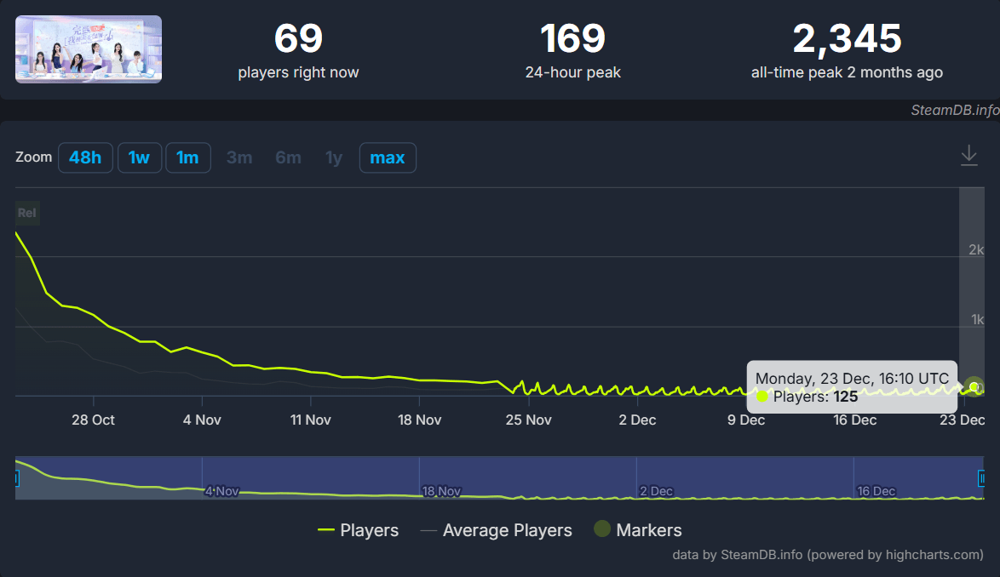

自发售以来《完蛋！前传》的同时在线人数情况（数据来源于SteamDB）

《完蛋！》的正统续作尚且如此，其他的跟风者的状况就更糟糕了。当初以反应迅速著称、在标题上极尽碰瓷的《完蛋！我也能追到美女了！》峰值在线人数只有不到300人，
相比《完蛋！前传》还要低许多许多，且Steam好评率和讨论度都远不如正统《完蛋！》系列。

这里还有许多其他在宣传上出尽风头，最后却成绩惨淡的例子。《我为情狂》一度在宣传时期将邀请日本性感女星三上悠亚作为一大卖点，但在游戏实际上线后，却只有328的
峰值在线人数和390条评论，其中70%的好评率在Steam平台也不算个好成绩。

而主打“走心纯爱”的《自豪！美女全攻略》数据更是离谱，这款游戏尽管有5000多人的峰值同时在线人数，但在线人数下滑速度陡峭到令人质疑，在发售一个月之后就掉到
了500，并在两个月之后迅速“归零”。

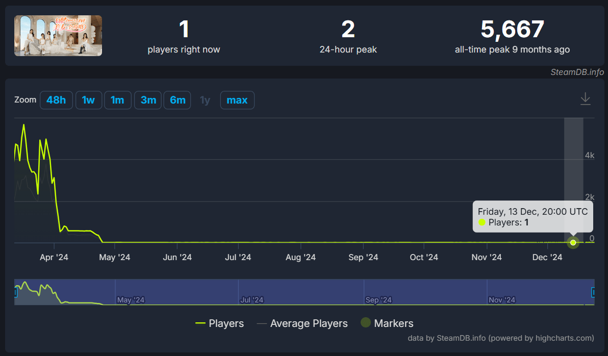

自发售以来《自豪！美女全攻略》的同时在线人数情况

当然，这个圈子内也存在着一些表现尚可的产品，虽然数据比上述几位表现要好，但也不容乐观。出自《隐形守护者》导演之手的《名利游戏》看起来是最正常的一个，不用美女
环绕的封面，不走暴露擦边路线，似乎打算使用优质短剧剧本，做这场“男性情绪价值争夺战”的高端玩家。

而在成品上线之后，即便剧本内的部分情节在玩家社区有争议，但还是获得了86%的好评率，其最终的成绩以2800的峰值在线人数和3500多条的评论收尾，预计销量在
10万份左右。

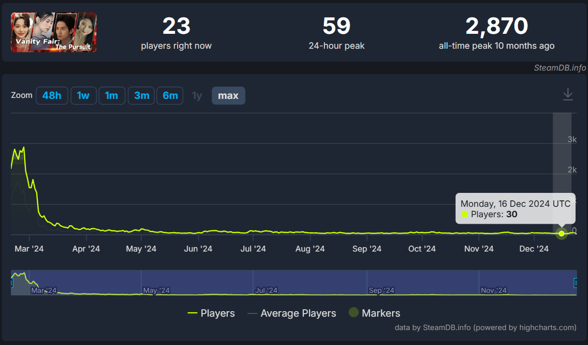

自发售以来《名利游戏》的同时在线人数情况

另一款《美女，请别影响我学习》可能是这个赛道里状况最好的一款，以15000的峰值在线人数和7000条左右的评价，在纸面数据上大概达成了《完蛋！》的1/4，一
些分析机构认为它的销量可能超过了20万份，并且从玩家反馈上来说，《美女，请别影响我学习》的好评率甚至超过了《完蛋！》，这个数据大概就是类《完蛋！》游戏目前最
好的表现了。

从如此夸张的前后对比来看，主打“男性情绪价值”的真人互动影游，在擦边、走心、剧本质量等多个维度挣扎了一年之后，似乎短时间之内是没什么再续荣光的征兆了。

### 3.2 隔行如隔山

在去年，真人互动影游被多方面看好有不少原因，一方面，真人互动影游拓展到“男性情绪价值+擦边”暂且还处于一片蓝海；而另一方面，从短视频/短剧转型而来的从业者又
保障了视频短片的制作流水线将会非常成熟，几方相互照应，完全可以兼顾周期短、来钱快，有着十足的商机。

然而，2024年诸多仿品的折戟，都在暗示着这件事没有那么简单。特别是《完蛋！》的好运气掩盖了这背后的许多问题——比如互动影游究竟更像是游戏还是电影？

至少在Steam平台上，如今这个答案还是游戏。

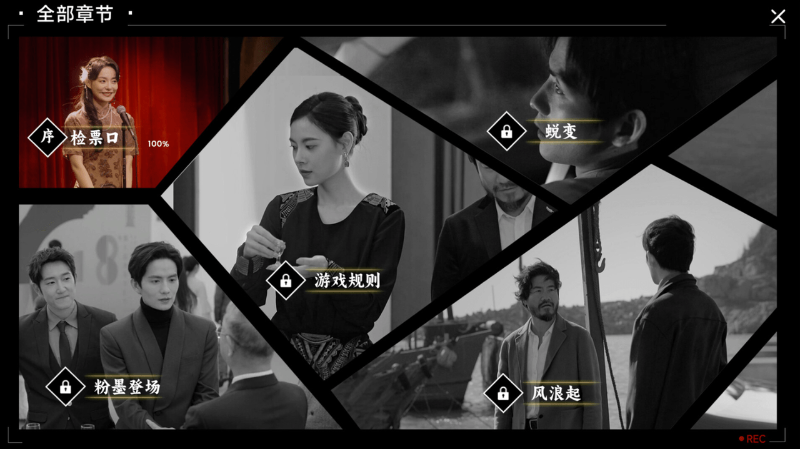

从2024年发售的诸多仿品的“翻车”案例中，不难看出，哪怕是剧本这影视行业分内的工作也存在着相当程度的水土不服。

《完蛋！》本身一个卖点，是其始终都在用第一人称的拍摄方式，摄像机的视角即是玩家的所见所得，这种在游戏行业司空见惯的常态，让许多习惯短剧创作方式的编剧犯难。

比如前面说到引起争议的《名利游戏》，就是因为引入“NTR”剧情而一度引发风波。所谓“NTR”，大致可以理解为主角被其他角色“横刀夺爱”的故事桥段，这本该是一
种在情感类影视作品中常见的情节模板，但对于一款以玩家为主角、且强调个人代入感的游戏来说，这难免会引起玩家的负面体验，而这还只是同类问题中相对容易规避的一个。

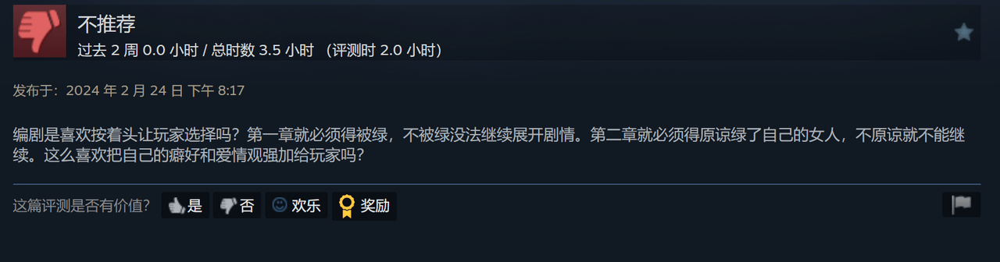

“编剧是喜欢按着头让玩家选择吗？第一章就必须得被绿，不被绿没法继续展开剧情。第二章就必须得原谅绿了自己的女人，不原谅就不能继续。这么喜欢把自己的癖好和爱情观
强加给玩家吗？” ——摘自《名利游戏》Steam差评

事实上，将玩家视角绑定在摄像机上，就一定不可避免地面临需要给玩家多少选择和自由度的问题。在传统的影视剧本中，剧情一般是单向线性的，且所有角色都服务于故事；而
在游戏里，剧情和叙事反而是服务于玩家这个“角色”的游戏体验的，二者的出发点就有质的不同。而当被编剧与玩家的意愿相抵触，玩家发现自己被人所摆布的时候，就会感觉
到不自由。

因此对于出身于短剧的编剧来说，要想习惯游戏的叙事方式、改变固定思维，哪怕是无需深度的剧本创作，要在短期内适应这种节奏，也不是一件简单的事情。

另一方面的问题则来源于游戏与影视剧制作流程上的不同。从成熟的短剧行业来说，编剧、开机、后期的流水线已经非常成熟，但如果想要把成片制成游戏，后期工作的巨量增加
就会暴露出诸多的考虑不周。

在2024年早些时候，有不止一个互动影游的开发人员对媒体坦言“经验不足”，等进入游戏的后期制作环节，把各个片段汇总起来的时候才发现问题所在：多结局剧情分支不
够；成品效果不理想但后期太长无法补拍等。最终的结果就是，互动影视游戏和互联网短剧，看起来如此相近的两个领域，再一次验证了“绝知此事要躬行”的含金量。

如果说这一波真人互动影游和过去的《隐形守护者》等产品有什么本质区别，恐怕就在于“针对男性进行情感按摩”这个卖点被许多从业者简单粗暴地理解成了擦边和直球倒贴，
忽视了对内容和剧本的打磨，把路走窄了。

放眼2024年的类《完蛋！》游戏，一大堆构图雷同的封面和满屏幕的公式化标题，很明显有不少是抱着赚快钱、走捷径的心态入局的，甚至存在着用原先做短剧的素材临时编
辑而成的游戏项目，结果自然在玩法和剧情上都遭受了严厉的批评。

外界原本对这个赛道的看好，是源于短剧这个有着成熟流水线的大众化娱乐产业，对互动影游这个曾经的小众品类有着产能和创意上的碾压级优势。但结果却仿佛回到了15年前
的国产网游圈子，充满了换皮、“微创新”和挂羊头卖狗肉的噱头。目前大多数产品的质量并没有达到足以承接《完蛋！》泼天热度的水平，市场对于这个品类的信心已经被消磨
掉了。

不得不说，从去年的看涨预期，到2024年的规模性滑铁卢，再一次证明了影视与游戏之间仍然存在着较高的行业壁垒，行业内虽然不缺风口快钱，但对从零起步的人们来说，
“到底多快才不会闪到自己的腰？”仍然是一个不透明的黑箱。

对于玩家和整个游戏产业来说，在视频制作成本无限下降的今天，《完蛋！》误打误撞带来的这次机遇，本有可能成为一个新时代的开始，见证一个逐渐沉寂的游戏类型在短视频
时代再次复兴，可惜这个机会现在已经错过了。

## Steam，国产持续运营游戏的重要出海口

2024年，除了《黑神话：悟空》这样的现象级作品外，其余不少国产游戏也在Steam上获得了全球玩家们的广泛关注，诸如腾讯天美的《三角洲行动》、网易旗下的《漫
威争锋》《七日世界》等作品，均赢得了不俗的用户口碑，同时在热度、在线人数等方面取得了亮眼的成绩。在国产游戏多端化已经普及，游戏出海成为大势所趋的环境下，越来
越多的国内大厂已经将Steam视作最重要的海外发行渠道之一。

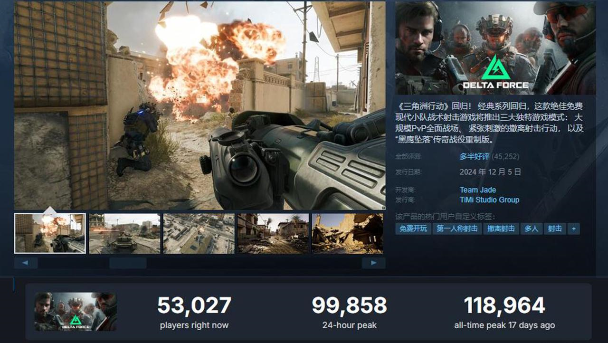

而作为全球最大的数字分销平台，Steam拥有广泛的用户覆盖与强大的分发能力，与那些力求尽可能满足不同类型用户需求，扩大用户群体的多端游戏可谓一拍即合。同时相
比Epic、GOG等PC端上的其他平台，Steam无论在市场份额、用户数量、社区成熟度等层面上都拥有着压倒性的优势。所以，Steam现今已然成为了国产多端服
务向游戏对外的一个重要出海口，在开拓海外市场、扩大用户群体等方面均能提供极大助力。

### 4.1 Steam的独到优势

与同样在游戏市场中占据重要地位的PS、XBOX、NS等平台相比，Steam最显著的优势无疑在于更加简化、便捷的游戏上架流程。厂商只需要支付100美元的认证费
用，完成必要的信息填写，下载Steamworks SDK来对接成就、云存档等功能，创建好商店页面就能向Steam提交上架审核并于通过后发布游戏，其流程即便对
于独立开发者来说也足够简单且易于实行，门槛之低甚至到了大量品质低劣的换皮页游，也会尝试在Steam上“分一杯羹”。

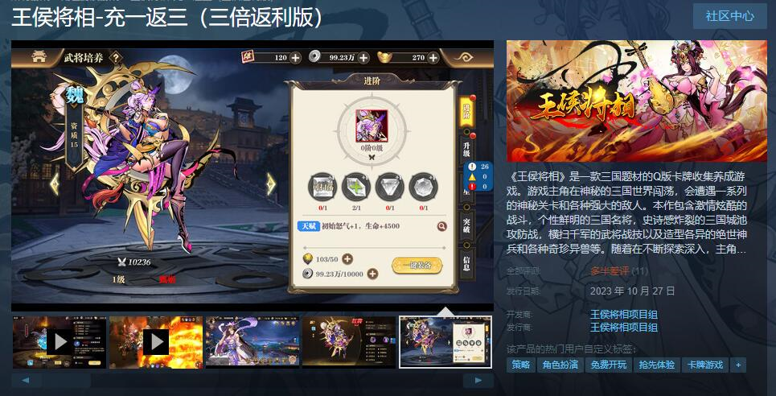

而PS、XBOX等平台，则都需要厂商使用对应开发机，确保游戏能通过各大主机平台的认证测试流畅运行，为此游戏需要调整许多底层机制与操作逻辑，甚至不得不为了兼容
性重构大量代码，过程拖沓而又冗长。而Steam则能让厂商以较低的门槛接触到大量核心付费用户，拥有足以超越众多平台的突出性价比。

其次，在国内市场上线游戏的过程中，政策合规是相当重要的一环。版号审批和内容审查的存在旨在引导行业健康发展并确保作品符合文化与社会价值观，但对厂商来说也的确存
在相当的门槛。为了更灵活地适应市场节奏，确保游戏能按工期及时与玩家见面、回收开发成本，一些厂商会选择先通过Steam平台在海外发布自己的作品。而对于独立游戏
厂商而言这种现象则更为普遍 ，诸如《太吾绘卷》《鬼谷八荒》《大侠立志传》等作品均在国内版号还未获批时，就以抢先体验的形式探索国际市场并验证了创意。

当然厂商在选择发行策略时，也需权衡其中的潜在风险，在当前版号回暖的大环境下，等待版号审批通过后在国内外同步发售并不失为一种更稳妥的选择，例如《沙石镇时光》和
《巴别号漫游指南》等作品就采取了这一策略。

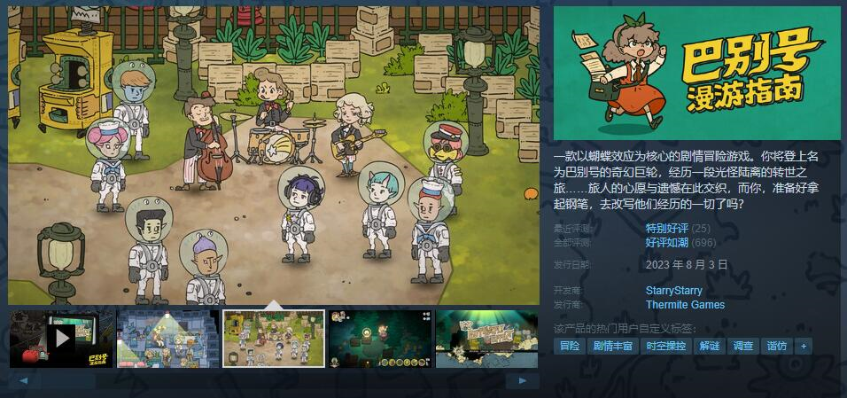

从递交材料到获得版号，《巴别号漫游指南》等待了530天之久

另外，Steam平台本身对于游戏出海也提供了多方面的支持，使它更容易成为厂商在全球化布局中的首选。

Steam商店的覆盖领域遍及全球市场，且支持多语言界面，能让开发者的作品可以更轻松触达到不同地区的玩家，同时它也提供了丰富的盈利模式，包括游戏本体、内购、订
阅制、DLC季票等，为厂商创造了多元化的收入来源，而包括Paypal、银联、Visa、微信支付宝等多样化的支付方式更是让全球玩家都能够轻松完成购买，从而降低
交易门槛。

Steam国区不支持paypal

除此以外，Steamworks后台工具也为厂商提供了强大的数据支持，能够直接分析玩家的购买行为、留存率、活跃度等关键指标，可以帮助厂商更精准地了解玩家需求，
并优化后续开发和运营策略。同时，Steam的评测和社区功能能够让玩家直接与开发者互动，提供真实且快速的反馈，有助于厂商不断改进产品，提升玩家满意度。Stea
m还为游戏提供了相应的市场曝光与活动支持，平台定期举办的大型促销，以及游戏节、新品节等活动，不仅能够帮助游戏在短时间内获得大量关注，从长期来看还能有效持续刺
激游戏销量。

Steam国区不支持paypal

### 4.2 国产游戏的水土不服

Steam社区在缩短玩家与厂商距离的同时，也给玩家提供了更高程度的话语权。而当玩家产生不满时，会更倾向于通过撰写评测等方式向厂商方进行表达与宣泄，体现成商店
页内的大量差评，对于一些玩家群体比较敏感的二游来说，差评轰炸给厂商带来的顾虑尤其严重。

其中的典型案例，无疑是常年占据着Steam差评榜前几名的《崩坏3》与《三国杀》。这两款作品因为多端数据不互通、“过于商业化”等原因，一经上架就遭到了玩家群体
的口诛笔伐。而过高的差评率不仅可能对厂商的声誉造成不利影响，许多开发者们还认为这会降低游戏在Steam上推荐和展示的权重。

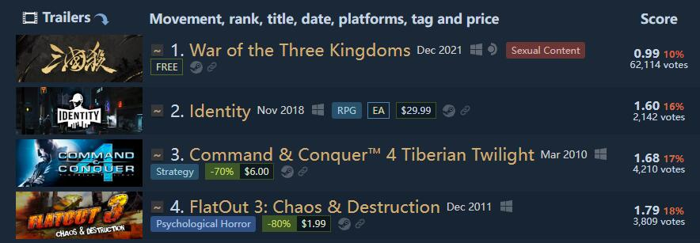

Steamtop250网站的bottom100排行，《三国杀》常年占据差评榜第一

或许也是出于对差评的顾忌，后续登陆Steam的《尘白禁区》《重返未来1999》等二游都选择了锁国区，尽可能只面向海外玩家。不过更深层次的原因，也可能是为了避
免Steam版本分流国内用户，使得游戏总营收因为Steam平台的分成而下降。

当然，一部分国区玩家仍能通过特殊手段入库这两款游戏，它们时至今日在Steam上的好评率均还处于不错的状况，这也为有意登陆Steam的二游厂商们提供了一种可能
的折中方案。

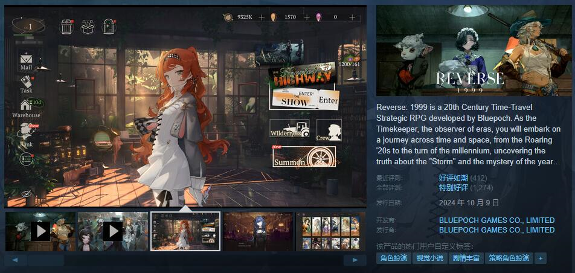

### 4.3 机遇与挑战

现今全球游戏产业趋于低迷，而Steam平台上的许多国产游戏2024年却展现出了强劲的增长势头。随着国内市场的饱和，许多开发者意识到开拓海外市场，尤其是增量市
场，已经成为了必然选择。这一时机恰逢其时，为国产游戏提供了走向全球的良好机遇。

然而，如何在Steam上脱颖而出，依然是所有厂商需要面对的一个问题。要在激烈的市场中取得成功，单靠市场推广、社群构建和本地化服务等方面的努力还并不足够，而最
关键的仍是游戏本身的硬实力。2024年《黑神话：悟空》的成功，便已证明了游戏本身优秀的品质、创新性、用户体验等层面能穿透文化与国界的隔阂，在海外玩家群体中获
得的认同。

与此同时，开发者还需要深刻理解海外不同地区的法律与监管要求，确保游戏在各国能够合规运营。例如，欧盟的《通用数据保护条例》（GDPR）对用户隐私有严格要求，在
收集个人数据时必须获得数据主体的明确同意，且禁止将个人数据随意传输到欧盟以外的国家和地区，除非这些国家提供足够的保护措施。

而美国的《儿童在线隐私保护法》（COPPA）则对涉及未成年玩家的内容做出了明确规定，要求在收集13岁以下儿童的数据时必须获得家长或监护人的同意，并公示会收集
哪些类型的信息，以及如何使用、存储、保护等。

对主打多端服务向的国内厂商而言，开拓国际市场已经成为现下的必然选择，而Steam无疑是出海道路上最具竞争力的平台之一。然而，在拥有流程简洁、形式自由、支持力
度突出等众多优势的同时，Steam也对厂商提出了一些新的风险与挑战，在Steam上日益激烈的竞争中，游戏内容的多样性和深度将成为突围的核心所在。未来开发者如
果能够结合优质内容与精准的市场策略，充分利用Steam平台的多端服务和强大数据支持，无疑将迎来更广阔的全球市场空间。
