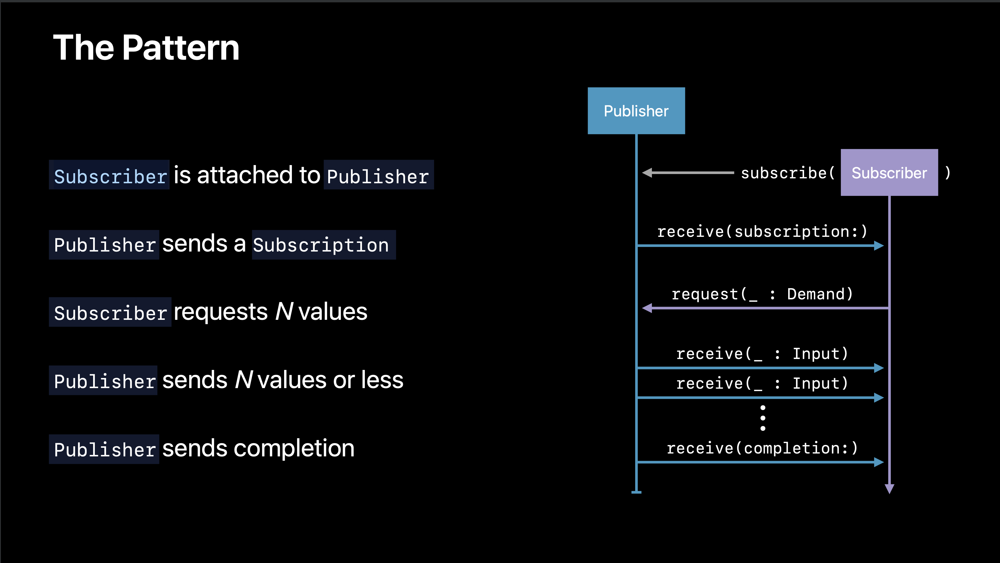
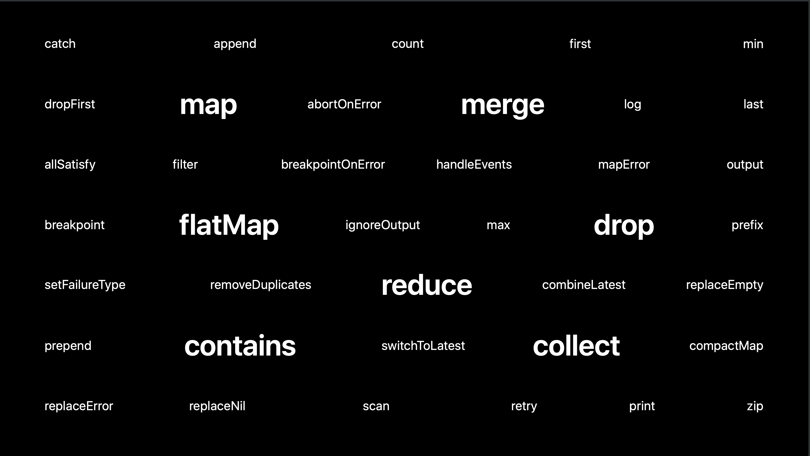
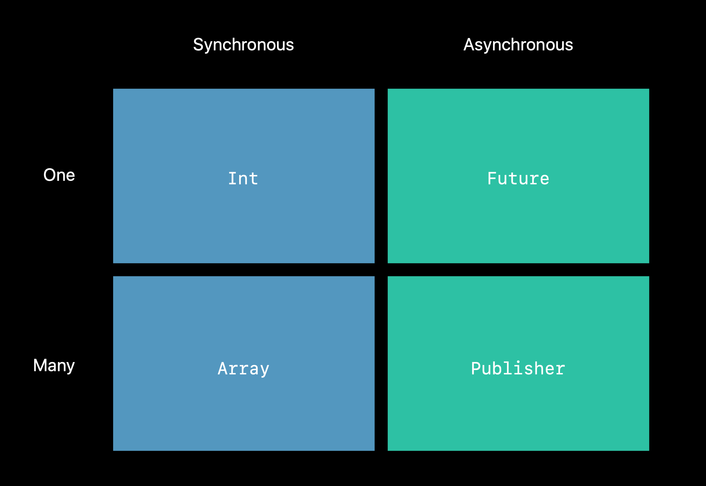
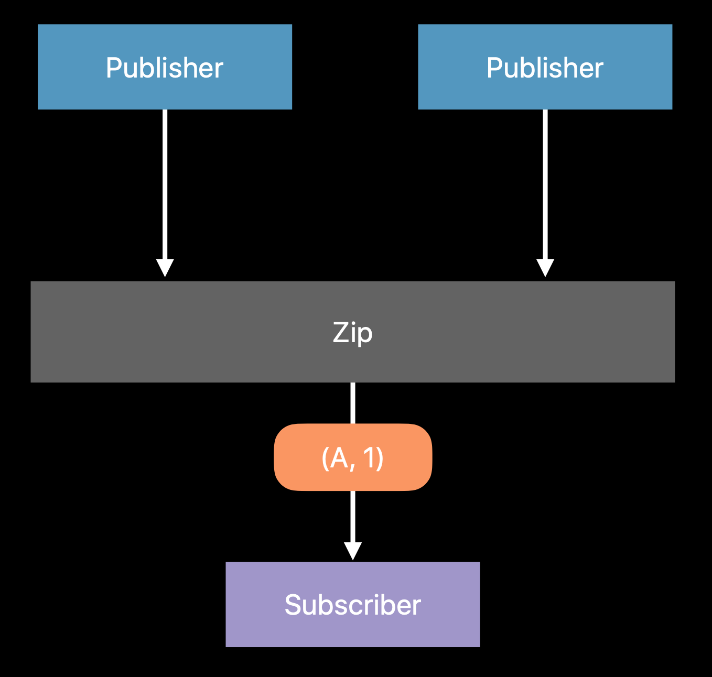
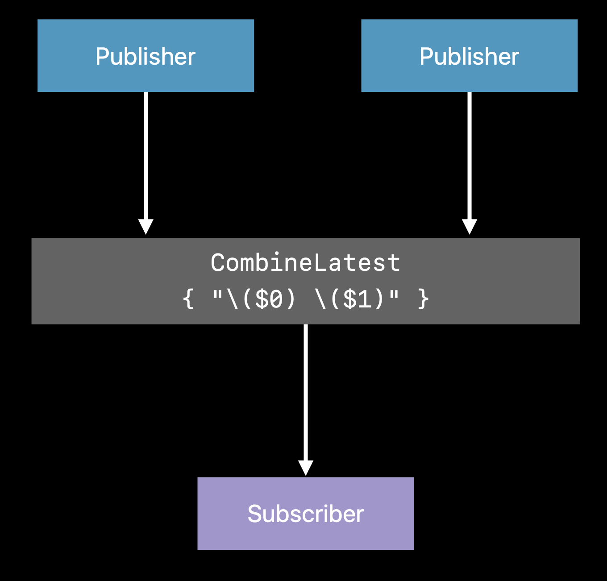
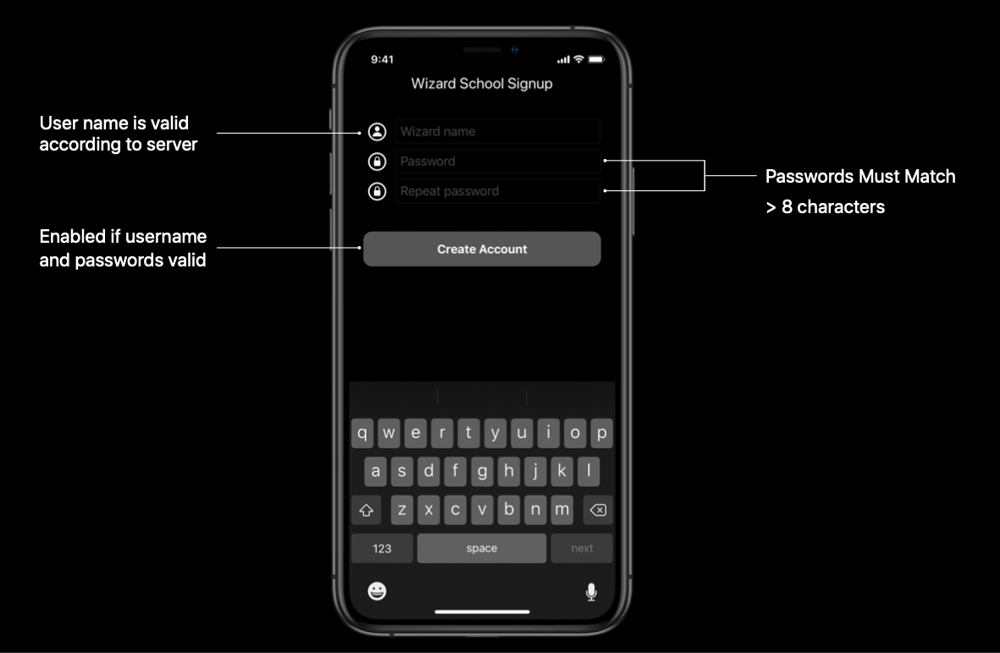
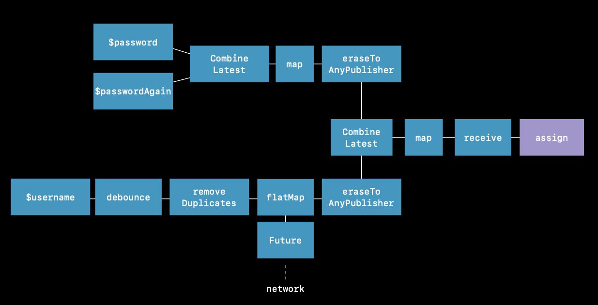

 
<!--BEGIN_DATA
{
    "create_date": "2021-11-26 11:30", 
    "modify_date": "2021-11-26 11:30", 
    "is_top": "0", 
    "summary": "Apple官方异步编程框架：Swift Combine简介<br/>Apple官方异步编程框架：Swift Combine应用", 
    "tags": "Swift", 
    "file_name": "Swift Combine.md"
}
END_DATA-->

#### <p>原文出处：<a href='https://nemocdz.github.io/post/apple-%E5%AE%98%E6%96%B9%E5%BC%82%E6%AD%A5%E7%BC%96%E7%A8%8B%E6%A1%86%E6%9E%B6swift-combine-%E7%AE%80%E4%BB%8B/' target='blank'>Apple官方异步编程框架：Swift Combine简介</a></p>

> WWDC19 Session 722 - [Introducing Combine](https://developer.apple.com/videos/play/wwdc2019/722/)

## 引言

在现代 GUI 编程中，开发者会处理大量事件（包括网络，屏幕输入，系统通知等），根据事件去让界面变化。而对异步事件的处理，会让代码和状态变得复杂。而现有的
Cocoa 框架中，异步编程的接口主要有以下这几种：

   * Target/Action
   * NotificationCenter
   * KVO
   * Callbacks

而在实际情况中，由于不同的第三方库，系统框架，业务代码可能采用不一样的方式处理异步事件，会导致对事件的处理分散且存在差异。苹果为了帮助开发者简化异步编程，发布了 Swift 的异步编程框架 - Combine。

## What is Combine

> "A unified, declarative API for processing values over time"

**统一、声明式、为处理变化的值而生的 API**。

Combine 作用是将异步事件通过组合**事件处理操作符**进行自定义处理。

关注如何处理变化的值，正是响应式编程所考虑的。也可以说，Combine 是一个苹果官方的 Swift **响应式**框架。

> 响应式编程（Reactive Programming）：面向异步数据流的编程思想。业界比较知名的响应式框架是 ReactiveX 系列。Rx 也有 Swift 版本的 RxSwift。

## Combine 特性

由于 Combine 是一个 Swift 编写的框架，所以 Combine 可以受益于 Swift 的一些语言特性。

### 泛型支持

Combine 享受 Swift 泛型带来的便利性。泛型可以帮助开发者提取更多模板代码，这也意味着我们可以让异步操作的代码支持泛型，然后适配到各个种类的异步操作中。

### 类型安全

同样受惠于 Swift，可以让编译器和 Runtime 帮助我们检查类型安全问题。

### 组合优先

Combine 的主要设计理念，使用组合。组合的优点是可以将核心设计得简单又便于理解，但当放在一起使用时，能产生 `1 + 1 > 2` 的效果。

### 请求驱动

> 请求驱动(Request Driven)：基于请求和响应的设计思想，消费者向生产者请求某个事务的变化，当变化时生产者给消费者对应的响应。
>
> 事件驱动(Event Driven)：基于事件通知的设计思想。在事务发生变化时，生产者将通知提交给事件管道进行分发，而不关心谁去消费事件。消费者需要到事件管道中订阅关心的通知。

Combine 是基于请求和响应的设计思想的，这允许你更精准的控制 App 的内存使用和性能。(这一块苹果没有详细解释)

## Combine 核心

Combine 框架有三个核心概念

* 发布者(Publisher)
* 订阅者(Subscriber)
* 操作符(Operator)

### 发布者(Publisher)

发布者在 Combine 框架中是一个协议：

```swift
public protocol Publisher {
    /// 产生的值的类型
    associatedtype Output
    /// 失败的错误类型
    associatedtype Failure : Error
    /// 实现这个方法，将调用 `subscribe(_:)` 订阅的订阅者附加到发布者上
    func receive<S>(subscriber: S) where S : Subscriber, Self.Failure == S.Failure, Self.Output == S.Input
}
extension Publisher {
    /// 将订阅者附加到发布者上，供外部调用，不直接使用 `receive(_:)` 方法
    public func subscribe<S>(_ subscriber: S) where S : Subscriber, Self.Failure == S.Failure, Self.Output == S.Input
}
```    

发布者定义了**如何描述产生的值和错误**，通过定义关联类型 `Output` 和 `Failure` 的实际类型（当发布者不产生错误时，可以使用`Never`）。由于发布者不需要实际产生值和错误，所以我们可以用值类型来定义它，也就是 Swift 里的结构体。发布者提供让订阅者注册的能力，通过实现`receive` 方法。

发布者可以适配到现有的很多异步操作接口中。

官方 Cocoa 框架中 `NotificationCenter` 接口适配发布者的例子（<del>截止至 beta1 版本的 Xcode， 此 API 尚未开放</del>beta2 版本已支持）：

```swift
extension NotificationCenter {
     struct Publisher: Combine.Publisher {
             typealias Output = Notification
             typealias Failure = Never
             init(center: NotificationCenter, name: Notification.Name, object: Any? = nil)
     }
}
```

### 订阅者（Subscriber）

和发布者配对的，就是订阅者。同样的，在 Combine 框架中是一个协议：

```swift
public protocol Subscriber : CustomCombineIdentifierConvertible {
    /// 接受到的值的类型
    associatedtype Input
    /// 可能接受到的错误的类型
    associatedtype Failure : Error
    /// 告诉订阅者，它在发布者上被成功订阅，可以请求值了
    func receive(subscription: Subscription)
    /// 告诉订阅者，发布者产生值了
    func receive(_ input: Self.Input) -> Subscribers.Demand
    /// 告诉订阅者，发布者已经终止产生值了，不管是正常情况还是由于情况
    func receive(completion: Subscribers.Completion<Self.Failure>)
}
```    

订阅者定义了**如何描述接受的值和错误**，类似的，通过定义关联类型 `Input` 和`Failure`。由于订阅者在接受到值之后，经常会影响和修改某些状态，所以我们使用引用类型来定义它，也就是 Swift 里的类类型。

订阅者有三个核心方法：

* 接收到订阅的消息
* 接收到产生的值的消息
* 接收到产生已经终止的消息

> 订阅消息(Subsciption):描述如何控制发布者到订阅者的数据流动，用于表达发布者和订阅者之间的连接。

官方的提供 `Assign` 的订阅者例子（可以在文档中找到更详细的定义）：

```swift     
extension Subscribers {
    final public class Assign<Root, Input> : Subscriber, Cancellable {
        public typealias Failure = Never
        public init(object: Root, keyPath: ReferenceWritableKeyPath<Root, Input>)
		//...
    }
}
```    

### 运算符（Operator）

当有了发布者和订阅者后，它们之间是怎么配合起来运作的呢，如下图所示：



* 首先订阅者通过 `subsribe` 方法附加到发布者上
* 发布者发送一个订阅消息给订阅者，订阅者通过 `receive` 方法响应
* 发布者通过定义在订阅消息中的 `request `方法发送请求需要的值
* 当请求的值产生时，发布者将值发送给订阅者，订阅者通过 `receive` 方法响应
* 最后当发布者终止产生值时，发送完成消息给订阅者，订阅者通过 `receive` 方法响应

看起来一切都配合的很美好，好像这两个概念已经可以实现我们的功能了。当你开开心心敲下这个例子的时候：

```swift
class Foo {
    var name:String
    init(name:String) {
        self.name = name
    }
}

let object = Foo(name:"Test")
let publisher = NotificationCenter.Publisher(center: .default, name: "Send", object: object)
let subsciber = Subscribers.Assign(object: object, keyPath: \.name)
publisher.subscribe(subsciber)
```  

你会发现编译不过，因为 `NotificationCenter` 发布者产生的值类型是 `Notification`，而订阅者需要接受 name 的 `String` 类型。这时候，操作符就应运而生了。

操作符是一个**桥梁**，定义一些便捷的操作，让发布者和订阅者能搭配使用，而这样就可以让发布者和订阅者的耦合程度降低，通用程度变高。而复用的发布者和订阅者可以通过一到多个操作符进行适配。

操作符定义**如何进行值的转换**。操作符是遵循 Publisher 协议的，从上游的发布者订阅值，生成新的发布者，处理后并发送给下游的订阅者。

官方提供的 Map 操作符的例子：

```swift
extension Publishers {
    public struct Map<Upstream, Output> : Publisher where Upstream : Publisher {
        public typealias Failure = Upstream.Failure
        public let upstream: Upstream
        public let transform: (Upstream.Output) -> Output
        public func receive<S>(subscriber: S) where Output == S.Input, S : Subscriber, Upstream.Failure == S.Failure
    }
}
```    

但在一般使用时，我们不直接生成操作符发布者，而是使用官方提供的**声明式操作符 API**。

比如 Map 操作符的方法如下：

```swift
extension Publishers.Map {
    public func map<T>(_ transform: @escaping (Output) -> T) -> Publishers.Map<Upstream, T>
}
```    

Combine 框架中，有以下几类声明式操作符 API：

#### 1. 函数式转换

比如 `map`、`filter`、`reduce` 等函数式思想里的常见的高阶函数的操作符。

#### 2. 列表操作

比如 `first`、`drop`、`append` 等在产生值序列的中使用便捷方法的操作符。

#### 3. 错误处理

比如 `catch`，`retry` 等进行错处理的操作符。

#### 4. 线程/队列行为

比如 `subscribeOn`，`receiveOn` 等对订阅和接受时线程进行指定的操作符。

#### 5. 调度和时间处理

比如 `delay`，`debounce`（去抖动），`throttle`(节流) 等操作符。



## Combine 设计理念 - 组合优先

Combine 的设计理念就是优先是使用**组合**。

如果把 Combine 的思想对应到同步编程里面的概念，就是这样下面的图。



也就是发布者可以使用的操作符，大部分和 Foundation 框架里 Collection 类型的操作符相似，举个例子：我们知道可以对集合类型进行`filter` 操作，那么 Combine 操作符里也有对应的 `filter` 方法。通过方法链（Method Chaning），组合大量的操作符，可以让异步操作更加统一，代码更加整洁。

### 组合多个发布者

有时候，我们希望将一些异步操作汇合，并统一处理响应。组合多个发布者有两种方式：`Zip` 和 `CombineLastest`。

#### Zip



`Zip` 在 Combine 框架里面是一个结构体(同时还有 `Zip3`，`Zip4`，用于更多数量的组合)

```swift
extension Publishers {
    public struct Zip<A, B> : Publisher where A : Publisher, B : Publisher, A.Failure == B.Failure {
        public typealias Output = (A.Output, B.Output)
        public typealias Failure = A.Failure
        public let a: A
        public let b: B
        public init(_ a: A, _ b: B)
        public func receive<S>(subscriber: S) where S : Subscriber, B.Failure == S.Failure, S.Input == (A.Output, B.Output)
    }
}
```

`Zip` 可以通过传入两个发布者进行初始化，要求多个组合的发布者的的错误类型一致，而输出是多个组合的发布者合并起来的元组。`Zip`的意思是，当组合的**每一个**发布者都产生值的时候，才会将值合并成元组发送给订阅者。

#### Combine Lastest



类似的是，`CombineLastest` 在 Combine 框架里面也是一个结构体(同理还有`CombineLatest3`，`CombineLatest4`，用于更多数量的组合)

```swift
extension Publishers {
    public struct CombineLatest<A, B, Output> : Publisher where A : Publisher, B : Publisher, A.Failure == B.Failure {
        public typealias Failure = A.Failure
        public let a: A
        public let b: B
        public let transform: (A.Output, B.Output) -> Output
        public init(_ a: A, _ b: B, transform: @escaping (A.Output, B.Output) -> Output)
        public func receive<S>(subscriber: S) where Output == S.Input, S : Subscriber, B.Failure == S.Failure
    }
}
```    

`CombineLatest` 使用两个发布者加上一个 `transform`的转换闭包(在闭包中将两个产生的值处理并返回)进行初始化(<del>截止目前 beta1 版本的 Xcode，苹果还没将声明公开 init方法，预计可能还会调整，这一部分来自官方幻灯片中的例子，有待订正</del>beta 2 版本已支持)，同样也要求多个组合发布者的错误类型一致，输出是`transform` 闭包里的 `Output` 类型。`CombineLastest` 的意思是，当多个发布者中**任意一个**发布者产生值时，都会执行`transform` 闭包的操作并将结果发送给订阅者。

## 总结

Combine 作为官方出品的响应式框架，无疑是令人惊喜的。整个框架的思想虽然现有的响应式框架(如RxSwift）差不多，但无论是接口上隐藏掉序列，冷热信号等理解难度较大的概念，还是更方便的事件设计，清晰简洁的命名规范，都觉得 Apple 很用心的在打磨这个框架。同时，最具杀伤力的的是，Apple 可以让他和 Cocoa 框架更紧密的结合，打造出类似UIKit+Combine，Foundation+Combine 的官方支持，这也意味着 Combine 有望成为类似 JavaScript 里面 Promise 这样的规范特性。如果你错过了 ReactiveCocoa，也错过了 RxSwift，也没使用过响应式编程，那么我强烈建议你了解一下今年的 Combine 框架。而剩下最大的问题，是国内什么时候能够 iOS 13 Only 和迁移到 Swift 了。

## 延伸阅读

* [Apple 官方异步编程框架：Swift Combine 应用](https://nemocdz.github.io/post/apple-%E5%AE%98%E6%96%B9%E5%BC%82%E6%AD%A5%E7%BC%96%E7%A8%8B%E6%A1%86%E6%9E%B6swift-combine-%E5%BA%94%E7%94%A8/)
* [RXSwift 和 Combine 对应关系速查表](https://github.com/freak4pc/rxswift-to-combine-cheatsheet)
* [WWDC 19 专栏文章目录](https://xiaozhuanlan.com/topic/8362954017)

<hr>


#### <p>原文出处：<a href='https://nemocdz.github.io/post/apple-%E5%AE%98%E6%96%B9%E5%BC%82%E6%AD%A5%E7%BC%96%E7%A8%8B%E6%A1%86%E6%9E%B6swift-combine-%E5%BA%94%E7%94%A8/' target='blank'>Apple官方异步编程框架：Swift Combine应用</a></p>

> WWDC19 Session 721 - [Combine in Practice](https://developer.apple.com/videos/play/wwdc2019/721/)

## 引言

Combine 是 WWDC2019 推出的异步编程框架，在上篇 [文章](https://nemocdz.github.io/post/apple-%E5%AE%98%E6%96%B9%E5%BC%82%E6%AD%A5%E7%BC%96%E7%A8%8B%E6%A1%86%E6%9E%B6swift-combine-%E7%AE%80%E4%BB%8B/) 中，介绍了 Combine 的基本概念。在这篇文章中，着重介绍一些 Combine 的实际应用。

## 发布者（Publisher）

假设有一个 `MagicTrick` 类型的 JSON 数据，这个数据的来源是 `NotificationCenter`，数据会以 `Data`的形式放在 `Notification` 的 `UserInfo` 中。让我们使用 Combine 的发布者来改造这个数据的发送。

```swift
extension Notification.Name{
    static var newTrickDownloaded:Notification.Name {
        return Notification.Name("aa")
    }
}

class MagicTrick:Codable {
    var name:String = ""
}

let trickNamePublisher = NotificationCenter.Publisher(center: .default, name: .newTrickDownloaded)
```

由于 `NotificationCenter` 发布者的 `Output` 类型是 `Notification`，需要类型转换。

### map

这个操作符可以改变发布者的类型。

```swift
let trickNamePublisher = NotificationCenter.Publisher(center: .default, name: .newTrickDownloaded)
    .map{ notification -> Data in
        let userInfo = notification.userInfo
        return userInfo?["data"] as! Data
    }
```

这时候 Output 变成了 `Data` 类型，还不能实际使用。要转换成实际类型，可以用 `Codable` + `JSONDecoder`进行解析，解析时可能会抛出错误，就需要使用 `try` 关键字。

### tryMap

这个操作符允许在转换值的闭包内抛出异常。

```swift
let trickNamePublisher = NotificationCenter.Publisher(center: .default, name: .newTrickDownloaded)
    .map{ notification -> Data in
        let userInfo = notification.userInfo
        return userInfo?["data"] as! Data
    }.tryMap { data -> MagicTrick in
        let decoder = JSONDecoder()
        return try decoder.decode(MagicTrick.self, from: data)
    }
```

### decode

而 Combine 为 `Codable`，还提供了便捷的 `decode` 方法。这个操作符允许传入 `Decodable` 类型和解码器，将解码器支持的上游数据类型解码，发送给下游订阅者。

```swift
let trickNamePublisher = NotificationCenter.Publisher(center: .default, name: .newTrickDownloaded)
    .map{ notification -> Data in
        let userInfo = notification.userInfo
        return userInfo?["data"] as! Data
    }
    .decode(type: MagicTrick.self, decoder: JSONDecoder())
```

接下来应该处理解码过程出现的错误了，因为每一个发布者需要描述了他们产生或者允许的错误类型，所以 Combine中提供了各种各样的错误处理的操作符，对错误做出反应或是从错误中恢复并做一些兜底处理。

### assertNoFailure

这个操作符可以在你确认上游发布者不会产生错误时使用，会将错误类型转为 `Never`，但当错误发生时，将会崩溃。

```swift
let trickNamePublisher = NotificationCenter.Publisher(center: .default, name: .newTrickDownloaded)
    .map{ notification -> Data in
         let userInfo = notification.userInfo
         return userInfo?["data"] as! Data
    }
    .decode(type: MagicTrick.self, decoder: JSONDecoder())
    .assertNoFailure()
```

### catch

这个操作符允许在上游发布者发生错误时，提供一个默认的发布者替换上游的发布者，发送值给下游的订阅者，以便做默认兜底方案。

```swift
let trickNamePublisher = NotificationCenter.Publisher(center: .default, name: .newTrickDownloaded)
    .map{ notification -> Data in
        let userInfo = notification.userInfo
        return userInfo?["data"] as! Data
    }
    .decode(type: MagicTrick.self, decoder: JSONDecoder())
    .catch{ _ in
        return Publishers.Just(MagicTrick())
    }
```

> Just：是一个很简单的发布者，用需要产生的值进行初始化，就会将该值发送一次给下游订阅者并结束。

### flatMap

上面的例子在错误发生后，生成一个 `Just` 的发布者作为上游发布者的替代品，但 `Just` 发布者只会产生一个值就结束了，整个事件流就会结束。但我们需要的是当错误发生时，catch只处理这次错误，但不替换上游的发布者，也就是上游可以继续产生值。为了不影响上游，我们需要一个新的发布者，能将上游的值用新的发布者发送给下游，`catch`只影响这个新的发布者，这个时候就需要 `flatMap` 了。

Combine 里的 `flatMap` 和函数式编程高阶函数里的 `flatMap` 一样，可以将包装的类型进行转换，在这里包装就是发布者，类型就是发布者的 `Input`，也就是说在 `flatMap` 里面可以返回一个新 `Input` 类型的发布者。

```swift
let trickNamePublisher = NotificationCenter.Publisher(center: .default, name: .newTrickDownloaded)
     .map{ notification -> Data in
         let userInfo = notification.userInfo
         return userInfo?["data"] as! Data
     }
     .flatMap{ data in
         return Publishers.Just(data)
             .decode(type: MagicTrick.self, decoder: JSONDecoder())
             .catch{ _ in
                 return Publishers.Just(MagicTrick())
         }
     }
```

上面例子中，每次 `NotificationCenter` 的产生的值都在 `flatMap` 里被生成的 `Just`的发布者并发送，当错误发生时，`catch` 只会替换这个 `Just` 的发布者，而不会影响 `flatMap` 上游的发布者，这样就能保证`catch` 是对每次错误进行处理的了。

### valueForKey

当只需要发送上游发布者的某一个属性的值时，可以使用 `ValueForKey` 操作符，它允许使用 Key Path指定上游的某一个属性。这个操作符的声明式 API 如下（还有对应多个 Key Path 的）：

```swift
public func publisher<T>(for keyPath: KeyPath<Self.Output, T>) -> Publishers.ValueForKey<Self, T>
```

使用例子如下：

```swift
let trickNamePublisher = NotificationCenter.Publisher(center: .default, name: .newTrickDownloaded)
    .map{ notification -> Data in
        let userInfo = notification.userInfo
        return userInfo?["data"] as! Data
    }
    .flatMap{ data in
        return Publishers.Just(data)
            .decode(type: MagicTrick.self, decoder: JSONDecoder())
            .catch{ _ in
                return Publishers.Just(MagicTrick())
        }
    }
    .publisher(for: \.name)
```

当对值的处理完后，我们需要考虑需不需要对发送和接收的调度进行特殊处理。

### debounce

这个操作符作用是去抖动，也就是只关心在某一段时间间隔里最后的消息结果，比如间隔为 1 秒，那么这一秒内多次从上游接受的值只有最后一个会发送给下游。

```swift
 let trickNamePublisher = NotificationCenter.Publisher(center: .default, name: .newTrickDownloaded)
     .map{ notification -> Data in
         let userInfo = notification.userInfo
         return userInfo?["data"] as! Data
     }
     .flatMap{ data in
         return Publishers.Just(data)
             .decode(type: MagicTrick.self, decoder: JSONDecoder())
             .catch{ _ in
                 return Publishers.Just(MagicTrick())
         }
     }
     .debounce(for: 0.5, scheduler: RunLoop.main)
```

### receive(on:)

这个操作符作用是指定订阅者使用哪个调度者里接收值，同理还有 `subscibe(on:)` 用于指定发布者使用哪个调度者发送值。

> 调度者(Scheduler)：定义了什么时候和在哪个上下文中执行，在 Cocoa 框架中，`RunLoop` 和 `DispatchQueue `已经适配了调度者协议，可以很方便的使用

```swift
 let trickNamePublisher = NotificationCenter.Publisher(center: .default, name: .newTrickDownloaded)
     .map{ notification -> Data in
         let userInfo = notification.userInfo
         return userInfo?["data"] as! Data
     }
     .flatMap{ data in
         return Publishers.Just(data)
             .decode(type: MagicTrick.self, decoder: JSONDecoder())
             .catch{ _ in
                 return Publishers.Just(MagicTrick())
         }
     }
     .receive(on: DispatchQueue.main)
```

### @Published

这个注解是一个属性包装器（Property Wrapper），可以方便地为任何属性生成其对应类型的发布者。这个发布者会在属性值发生变化时发送消息。

> 属性包装器(Property Wrapper)：Swift 5.1 的新特性，可以抽象对属性 Set/Get方法的通用逻辑。可以在[提案](https://github.com/apple/swift-evolution/blob/master/proposals/0258-property-wrappers.md)中了解更多。

```swift
 @propertyDelegate public struct Published<Value> : Publisher {
     public typealias Output = Value
     public typealias Failure = Never
     public init(initialValue: Value)
     public func receive<S>(subscriber: S) where Value == S.Input, S : Subscriber, S.Failure == Published<Value>.Failure
     public var value: Value
 }
```

有了这个特性，对已有的代码进行改造接入 Combine 框架就更方便了（截止至 beta2 版本的 Xcode，$ 符号还不能使用）：

```swift
 @Published var foo:String = "test"
 let subscription = $foo.sink {
     print("foo is \($0)")
 }
```

这个关键字其实印证了一点，Combine 和 Swift 语言生态的结合其实是很紧密的，也许将来为了 SwiftUI 和 Combine这种重量级框架更方便使用，Apple 还会接纳更多社区优秀的提案。

### Future

Future 是单次执行的发布者，在闭包中主动产生一个值，之后就结束（和 Javascript 的 Promise，Java 的 Future 类似的设计理念）。初始化闭包会返回一个 excutor 闭包，完成同步/异步操作候，通过主动调用 excutor 闭包（Promise 的 fulfill）将值发送给下游，而在 Combine 框架里这个闭包类型的是 `Promise` 类型，`Promise` 类型其实是`(Result<Output, Failure>) -> Void` 的别名。

```swift
 extension Publishers {
     final public class Future<Output, Failure> : Publisher where Failure : Error {
         public typealias Promise = (Result<Output, Failure>) -> Void
         public init(_ attemptToFulfill: @escaping (@escaping Publishers.Future<Output, Failure>.Promise) -> Void)
         final public func receive<S>(subscriber: S) where Output == S.Input, Failure == S.Failure, S : Subscriber
     }
 }
```

通过 `Future`，可以将任何代码适配 Combine 框架，包括现有的同步，异步代码。

```swift
let trickNamePublisher = NotificationCenter.Publisher(center: .default, name: .newTrickDownloaded)
    .map{ notification -> Data in
        let userInfo = notification.userInfo
        return userInfo?["data"] as! Data
    }
    .flatMap{ data in
        return Publishers.Future { promise in
            DispatchQueue.main.asyncAfter(deadline: .now() + 0.3) {
                promise(.success(data))
            }
        }
    }
```

### AnyPublisher

当我们使用 Combine 框架里的方法来生成发布者时，发布者的实际类型可能千奇百怪，对外暴露或者想进行复用时，内部的实际类型其实是不需要关心的，只需要关心 `Output`和错误的类型就可以了。这个时候，通用类型 `AnyPublisher` 就登场了。Combine 提供了 `eraseToAnyPublisher`方法，可以将各种各样的发布者统一转换为 `AnyPublisher`。同样的，还有`eraseToAnySubscriber`，`eraseToAnySubject` 。

```swift
public struct AnyPublisher<Output, Failure> where Failure : Error {
    @inlinable public init<P>(_ publisher: P) where Output == P.Output, Failure == P.Failure, P : Publisher
    @inlinable public init(_ subscribe: @escaping (AnySubscriber<Output, Failure>) -> Void)
}
```

建议在最后将发布者转换为 `AnyPublisher`。

```swift
let trickNamePublisher = NotificationCenter.Publisher(center: .default, name: .newTrickDownloaded)
    .map{ notification -> Data in
        let userInfo = notification.userInfo
        return userInfo?["data"] as! Data
    }
    .eraseToAnyPublisher()
```

### 总结

发布者有以下的特点

* 用操作符生成每一小部分的发布者，最后组成事件流
* 操作符描述了从当前发布者生成的新发布者
* 值和错误是强类型的，在整个过程中
* 既可以异步产生值，也可以同步产生值
* 可以添加其兼容的订阅者

## 订阅者（Subscriber）

### 规则

1. 只会接收到一次订阅通知
2. 发布者可以产生 0 或多个值，所以订阅者可能收到 0 或多个值
3. 最多只会接收到一个完成通知

#### Assign

这个订阅者提供通过 Key Path 订阅某个类类型对象属性变化的能力。

```swift
let trickNamePublisher = NotificationCenter.Publisher(center: .default, name: .newTrickDownloaded)
    .map{ notification -> Data in
        let userInfo = notification.userInfo
        return userInfo?["data"] as! Data
    }
    .flatMap{ data in
     return Publishers.Just(data)
         .decode(type: MagicTrick.self, decoder: JSONDecoder())
         .catch { _ in
             return Publishers.Just(MagicTrick())
         }
    }
    .publisher(for: \.name)
var test = MagicTrick()
trickNamePublisher.assign(to: \.name, on: test)
```

当接受到通知后，发布者就会改变 test 的 name 属性。

#### Sinks

这个订阅者提供了一个简单的从上游订阅数据的能力，错误类型采用上游的错误类型，使用一个闭包执行接收到值的行为，非常简单方便。

```swift
let trickNamePublisher = ...// 上个例子里的发布者
trickNamePublisher.sink { value in
    print("name is \(value)")
}
```

#### Subject

有一些事物，它们同时承担着发布者和订阅者的角色，既可以发送消息，也可以接收消息。在 Combine 中，这类订阅者就是`Subject`。它虽然是订阅者，却也有和发布者类似的发送值的能力。这可以让我们在数据流的过程中插入值给下游的订阅者。

`Subject` 是一个协议，定义了给下游的订阅者发送值的的方法：

```swift
public protocol Subject : AnyObject, Publisher {
    func send(_ value: Self.Output)
    func send(completion: Subscribers.Completion<Self.Failure>)
}
```

而发布者也有对应的方法可以添加 `Subject`。

```swift
extension Publisher {
    public func subscribe<S>(_ subject: S) -> AnyCancellable where S : Subject, Self.Failure == S.Failure, Self.Output == S.Output
}
```

`Subject` 有下面两种：

##### Passthrough

发送订阅操作发生后，上游发送的值才会发送给下游订阅者。

```swift
let trickNamePublisher = ...// 上个例子里的发布者
let magicWordsSubject = PassthroughSubject<String,Never>()
trickNamePublisher.subscribe(magicWordsSubject)
magicWordsSubject.sink { value in
    print("name is \(value)")
}
magicWordsSubject.send("magic!")
```

##### CurrentValue

在订阅时，会将上游发布者发送的值中最新一个发送给下游订阅者，之后和正常一样进行发送值。

### SwiftUI 中的发布者

在今年发布的重磅框架 SwiftUI 中，底层的数据流也运用了 Combine 框架。SwiftUI 内部已经拥有订阅者，只需要开发者提供发布者用于描述你的数据在何时，如何变化，剩下的更新操作都有框架内部完成。

#### BindableObject

对自定义的数据类型适配，只需要遵循 `BindableObject` 协议，提供发布者具体类型，并提供一个 `didChange`的发布者实例用于在数据改变时能发送消息。

```swift
public protocol BindableObject : AnyObject, DynamicViewProperty, Identifiable, _BindableObjectViewProperty {
    associatedtype PublisherType : Publisher where Self.PublisherType.Failure == Never
    var didChange: Self.PublisherType { get }
}
```

举个例子，当 model 被 set 的时候，就会触发属性观察的 `didSet`，里面调用了 `didChange`发布者进行通知的发送(没有发送具体的值)，这个通知会触发 SwiftUI 内部的 UI 更新流程(类似 React 的 setState)，更多具体细节可以在 [Session 226 - Data Flow Through SwiftUI](https://developer.apple.com/videos/play/wwdc2019/226) 中找到。

```swift
class WizardModel: BindableObject {
    var trick: MagicTrick? { didSet { didChange.send() }  }
    let didChange = PassthroughSubject<Void, Never>()
}
struct TrickView: View {
    @ObjectBinding var model: WizardModel
    var body: some View {
        Text(model.trick?.name ?? "")
    }
}
```

### Cancellation

`Cancellation` 是内置在 Combine 里的一个协议：

```swift
public protocol Cancellable {
    func cancel()
}
```

里面只定义了一个 `cancel` 方法，用于提前结束结束订阅。Combine 里还定义了 `AnyCancellable`，这个类会在 `deinit`时自动执行 `cancel` 方法。

```swift
final public class AnyCancellable : Cancellable {
    public init(_ cancel: @escaping () -> Void)
    public init<C>(_ canceller: C) where C : Cancellable
    final public func cancel()
}
```

### 复杂的例子



假设有一个登录界面，里面需要输入用户名和密码，用户名需要经过服务器的检验，密码需要超过 8个字符且需要和重复密码匹配。用户名和密码都符合要求时，下面的按钮状态将变成可点击状态。用 Combine 来完成这个例子吧！

```swift
// 用注解给属性添加发布者
@Published var password: String = ""
@Published var passwordAgain: String = ""

var valiatedPassword: AnyPublisher<String?, Never> {
    // 合并密码和重复密码发布者，当其中一个产生值时检查密码是否符合要求
    return Publishers.CombineLatest($password, $passwordAgain) { password, passwordAgain in
        guard password == passwordAgain, password.count > 8 else {
            return nil
        }
        return password
    }
    // 可以判断密码是不是太简单，比如 12345678
    .map { $0 == "password1" ? nil : $0}
    // 转换为 AnyPublisher
    .eraseToAnyPublisher()
}

@Published var username: String = ""

// 提交给服务器判断用户名是否合法，网络请求等异步行为
func usernameAvailable(_ username:String, completion:((Bool) -> ())) {
   // ...
}

var validatedUsername: AnyPublisher<String?, Never> {
    // 限制产生值的频率
    return $username.debounce(for: 0.5, scheduler: RunLoop.main)
            // 去重，重复的不需要再次检验
        .removeDuplicates()
            // 转换成新的发布者
        .flatMap { username in
            // 使用 Future 适配已有的异步操作
            return Publishers.Future { promise in
                usernameAvailable(username) { available in
                    promise(.success(available ? username : nil))
                }
            }
        }
            // 转换为 AnyPublisher
        .eraseToAnyPublisher()
}

var validatedCredentials: AnyPublisher<(String,String)?,Never> {
    // 合并检验密码和检验用户名发布者，均有合理值时发送
    return Publishers.CombineLatest(validatedUsername, valiatedPassword) { username, password -> (String, String)? in
        guard let a = username, let b = password else {
            return nil
        }
        return (a, b)
    }
    .eraseToAnyPublisher()
}

var signupButton:UIButton!

// 检查是否有合理的值
var signupButtonStream = validatedCredentials.map{ $0 != nil }
                                                                                        // 指定接收的调度者
                                            .receive(on: RunLoop.main)
                                                                                        // 使用 KVO Assign 订阅者改变 UI 状态
                                            .assign(to: \.isEnabled, on: signupButton)

```

总的来说，就是使用组合，将各种小的功能组合成完整的数据流。



## 总结

Apple 官方对接入 Combine 给了以下一些建议：

* 使用多个自定义发布者将小部分的事情组合起来
* 逐步适配，一点点改造
* 在属性中优先使用 @Published 注解
* 使用 Future 将多个异步回调或者发布者组合起来

> Use Combine Toady

Combine 清晰，易用，还有着苹果爸爸承诺对 Cocoa 框架 buff 加持，为什么不马上试试呢？

## 延伸阅读

* [Apple 官方异步编程框架：Swift Combine 简介](https://nemocdz.github.io/post/apple-%E5%AE%98%E6%96%B9%E5%BC%82%E6%AD%A5%E7%BC%96%E7%A8%8B%E6%A1%86%E6%9E%B6swift-combine-%E7%AE%80%E4%BB%8B/)
* [Combine 的非官方实现](https://github.com/broadwaylamb/OpenCombine)
* [CombineFeedback](https://github.com/sergdort/CombineFeedback)
* [WWDC 19 专栏文章目录](https://xiaozhuanlan.com/topic/8362954017)
