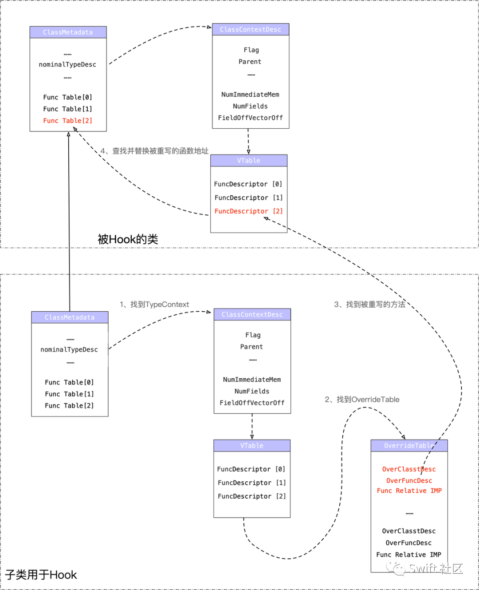

 
<!--BEGIN_DATA
{
    "create_date": "2021-01-22 22:30", 
    "modify_date": "2021-01-22 22:30", 
    "is_top": "0", 
    "summary": "Swift Hook新思路--虚函数表", 
    "tags": "Swift", 
    "file_name": "Swift Hook新思路--虚函数表.md"
}
END_DATA-->

#### <p>原文出处：<a href='https://mp.weixin.qq.com/s/0W7yunC5fA6X35pn06A5AQ' target='blank'>Swift Hook新思路--虚函数表</a></p>

**摘要**：业界对Swift 的 Hook 大多都需要依靠 OC 的消息转发特性来实现，本文从修改  Swift 的虚函数表的角度，介绍了一种新的 Hook 思路。并以此为主线，重点介绍 Swift 的详细结构以及应用。

### 1. 前言

由于历史包袱的原因，目前主流的大型APP基本都是以 Objective-C 为主要开发语言。

但是敏锐的同学应该能发现，从 Swift 的 ABI 稳定以后，各个大厂开始陆续加大对 Swift 的投入。

虽然在短期内 Swift 还难以取代 Objective-C，但是其与 Objective-C 并驾齐驱的趋势是越来越明显，从招聘的角度就即可管中窥豹。

在过去一年的招聘过程中我们总结发现，有相当数量的候选人只掌握 Swift 开发，对Objective-C 开发并不熟悉，而且这部分候选人大多数比较年轻。

另外，以 RealityKit 等新框架为例，其只支持 Swift 不支持 Objective-C。上述种种现象意味着随着时间的推移，如果项目不能很好的支持 Swift 开发，那么招聘成本以及应用创新等一系列问题将会凸显出来。

因此，58 同城在 2020 年 Q4 的时候在集团内发起了跨部门协同项目，从各个层面打造 Objective-C 与 Swift 的混编生态环境——项目代号 ”混天“。

一旦混编生态构建完善，那么很多问题将迎刃而解。

### 2. 原理简述

本文的技术方案仅针对通过虚函数表调用的函数进行 Hook，不涉及直接地址调用和objc_msgSend 的调用的情况。

另外需要注意的是，**Swift Compiler **设置为 **Optimize for speed**（Release默认）则TypeContext的 VTable 的函数地址会清空。

设置为 **Optimize for size** 则 Swfit 可能会转变为直接地址调用。

以上两种配置都会造成方案失效。**因此本文重点在介绍技术细节而非方案推广。**



如果 Swift 通过虚函数表跳表的方式来实现方法调用，那么可以借助修改虚函数表来实现方法替换。即将特定虚函数表的函数地址修改为要替换的函数地址。但是由于虚函数表不包含地址与符号的映射，我们不能像 Objective-C 那样根据函数的名字获取到对应的函数地址，因此修改 Swift 的虚函数是依靠函数索引来实现的。

简单理解就是将虚函数表理解为数组，假设有一个 FuncTable[]，我们修改函数地址只能通过索引值来实现，就像 FuncTable[index] = replaceIMP 。但是这也涉及到一个问题，在版本迭代过程中我们不能保证代码是一层不变的，因此这个版本的第 index 个函数可能是函数 A，下个版本可能第 index 个函数就变成了函数 B。显然这对函数的替换会产生重大影响。

为此，我们通过 Swift 的 OverrideTable 来解决索引变更的问题。在 Swift 的OverrideTable中，每个节点都记录了当前这个函数重写了哪个类的哪个函数，以及重写后函数的函数指针。

因此只要我们能获取到 OverrideTable 也就意味着能获取被重写的函数指针 IMP0 以及重写后的函数指针 IMP1。只要在 FuncTable[]中找到 IMP0 并替换成 IMP1 即可完成方法替换。

接下来将详细介绍Swift的**函数调用、TypeContext、Metadata、VTable、OverrideTable**等细节，以及他们彼此之间有何种关联。为了方便阅读和理解，本文所有代码及运行结果，都是基于 arm64 架构

### 3. Swift 的函数调用

首先我们需要了解 Swift 的函数如何调用的。与 Objective-C 不同，Swift 的函数调用存在三种方式，分别是：基于 Objective-C 的消息机制、基于虚函数表的访问、以及直接地址调用。

#### 3.1 Objective-C 的消息机制

首先我们需要了解在什么情况下 Swift 的函数调用是借助 Objective-C 的消息机制。如果方法通过 @objc dynamic 修饰，那么在编译后将通过 objc_msgSend 的来调用函数。  
假设有如下代码

```swift
class MyTestClass :NSObject {  
    @objc dynamic func helloWorld() {  
        print("call helloWorld() in MyTestClass")  
    }  
}  
    
let myTest = MyTestClass.init()  
myTest.helloWorld()  
```

编译后其对应的汇编为

``` 
    0x1042b8824 <+120>: bl     0x1042b9578               ; type metadata accessor for SwiftDemo.MyTestClass at <compiler-generated>  
    0x1042b8828 <+124>: mov    x20, x0  
    0x1042b882c <+128>: bl     0x1042b8998               ; SwiftDemo.MyTestClass.__allocating_init() -> SwiftDemo.MyTestClass at ViewController.swift:22  
    0x1042b8830 <+132>: stur   x0, [x29, #-0x30]  
    0x1042b8834 <+136>: adrp   x8, 13  
    0x1042b8838 <+140>: ldr    x9, [x8, #0x320]  
    0x1042b883c <+144>: stur   x0, [x29, #-0x58]  
    0x1042b8840 <+148>: mov    x1, x9  
    0x1042b8844 <+152>: str    x8, [sp, #0x60]  
->  0x1042b8848 <+156>: bl     0x1042bce88               ; symbol stub for: objc_msgSend  
    0x1042b884c <+160>: mov    w11, #0x1  
    0x1042b8850 <+164>: mov    x0, x11  
    0x1042b8854 <+168>: ldur   x1, [x29, #-0x48]  
    0x1042b8858 <+172>: bl     0x1042bcd5c               ; symbol stub for:  
```

从上面的汇编代码中我们很容易看出调用了地址为0x1042bce88的objc_msgSend 函数。

#### 3.2 虚函数表的访问

虚函数表的访问也是动态调用的一种形式，只不过是通过访问虚函数表的方式进行调用。  

假设还是上述代码，我们将 @objc dynamic 去掉之后，并且不再继承自 NSObject。

```swift    
class MyTestClass {  
    func helloWorld() {  
        print("call helloWorld() in MyTestClass")  
    }  
}  
    
let myTest = MyTestClass.init()  
myTest.helloWorld()  
```

汇编代码变成了下面这样👇

``` 
    0x1026207ec <+120>: bl     0x102621548               ; type metadata accessor for SwiftDemo.MyTestClass at <compiler-generated>  
    0x1026207f0 <+124>: mov    x20, x0  
    0x1026207f4 <+128>: bl     0x102620984               ; SwiftDemo.MyTestClass.__allocating_init() -> SwiftDemo.MyTestClass at ViewController.swift:22  
    0x1026207f8 <+132>: stur   x0, [x29, #-0x30]  
    0x1026207fc <+136>: ldr    x8, [x0]  
    0x102620800 <+140>: adrp   x9, 8  
    0x102620804 <+144>: ldr    x9, [x9, #0x40]  
    0x102620808 <+148>: ldr    x10, [x9]  
    0x10262080c <+152>: and    x8, x8, x10  
    0x102620810 <+156>: ldr    x8, [x8, #0x50]  
    0x102620814 <+160>: mov    x20, x0  
    0x102620818 <+164>: stur   x0, [x29, #-0x58]  
    0x10262081c <+168>: str    x9, [sp, #0x60]  
->  0x102620820 <+172>: blr    x8  
    0x102620824 <+176>: mov    w11, #0x1  
    0x102620828 <+180>: mov    x0, x11  
```

从上面汇编代码可以看出，经过编译后最终是通过 blr 指令调用了 x8 寄存器中存储的函数。至于 x8 寄存器中的数据从哪里来的，留到后面的章节阐述。

#### 3.3 直接地址调用

假设还是上述代码，我们再将 **Build Setting** 中 **Swift Compiler - Code Generaation** -> **Optimization Level** 修改为 **Optimize for Size[-Osize]**，汇编代码变成了下面这样👇

```
    0x1048c2114 <+40>:  bl     0x1048c24b8               ; type metadata accessor for SwiftDemo.MyTestClass at <compiler-generated>  
    0x1048c2118 <+44>:  add    x1, sp, #0x10             ; =0x10   
    0x1048c211c <+48>:  bl     0x1048c5174               ; symbol stub for: swift_initStackObject  
->  0x1048c2120 <+52>:  bl     0x1048c2388               ; SwiftDemo.MyTestClass.helloWorld() -> () at ViewController.swift:23  
    0x1048c2124 <+56>:  adr    x0, #0xc70c               ; demangling cache variable for type metadata for Swift._ContiguousArrayStorage<Any>  
``` 

这是大家就会发现bl 指令后跟着的是一个常量地址，并且是 **SwiftDemo.MyTestClass.helloWorld()** 的函数地址。

### 4. 思考

既然基于虚函数表的派发形式也是一种动态调用，那么是不是以为着只要我们修改了虚函数表中的函数地址，就实现了函数的替换？

### 5. 基于 TypeContext 的方法交换

在往期文章《从 Mach-O 角度谈谈 Swift 和 OC 的存储差异》我们可以了解到在Mach-O 文件中，可以通过 `__swift5_types`查找到每个 Class 的ClassContextDescriptor，并且可以通过 ClassContextDescriptor 找到当前类对应的虚函数表，并动态调用表中的函数。

**注意：**（在 Swift 中，Class/Struct/Enum 统称为 Type，为了方便起见，我们在文中提到的TypeContext 和 ClassContextDescriptor 都指的是 ClassContextDescriptor）。

首先我们来回顾下 Swift 的类的结构描述，结构体 ClassContextDescriptor 是 Swift 类在`Section64(__TEXT,__const)` 中的存储结构。

```swift
struct ClassContextDescriptor{  
    uint32_t Flag;  
    uint32_t Parent;  
    int32_t  Name;  
    int32_t  AccessFunction;  
    int32_t  FieldDescriptor;  
    int32_t  SuperclassType;  
    uint32_t MetadataNegativeSizeInWords;  
    uint32_t MetadataPositiveSizeInWords;  
    uint32_t NumImmediateMembers;  
    uint32_t NumFields;  
    uint32_t FieldOffsetVectorOffset;  
    <泛型签名> //字节数与泛型的参数和约束数量有关  
    <MaybeAddResilientSuperclass>//有则添加4字节  
    <MaybeAddMetadataInitialization>//有则添加4*3字节  
    VTableList[]//先用4字节存储offset/pointerSize，再用4字节描述数量，随后N个4+4字节描述函数类型及函数地址。  
    OverrideTableList[]//先用4字节描述数量，随后N个4+4+4字节描述当前被重写的类、被重写的函数描述、当前重写函数地址。  
}  
``` 

从上述结构可以看出，ClassContextDescriptor 的长度是不固定的，不同的类 ClassContextDescriptor 的长度可能不同。那么如何才能知道当前这个类是不是泛型？以及是否有 ResilientSuperclass、MetadataInitialization 特征？其实在前一篇文章《从Mach-O 角度谈谈 Swift 和 OC 的存储差异》中已经做了说明，我们可以通过 Flag 的标记位来获取相关信息。  

例如，如果 Flag 的 generic 标记位为 1，则说明是泛型。

```    
|  TypeFlag(16bit)  |  version(8bit) | generic(1bit) | unique(1bit) | unknow (1bi) | Kind(5bit) |  
//判断泛型  
(Flag & 0x80) == 0x80  
```    

那么泛型签名到底能占多少字节呢？Swift 的 GenMeta.cpp 文件中对泛型的存储做了解释，整理总结如下：

``` 
假设有泛型有paramsCount个参数，有requeireCount个约束     
/**  
    16B  =  4B + 4B + 2B + 2B + 2B + 2B  
    addMetadataInstantiationCache -> 4B  
    addMetadataInstantiationPattern -> 4B  
    GenericParamCount -> 2B  
    GenericRequirementCount -> 2B  
    GenericKeyArgumentCount -> 2B  
    GenericExtraArgumentCount -> 2B  
*/  
short pandding = (unsigned)-paramsCount & 3;  
泛型签名字节数 = (16 + paramsCount + pandding + 3 * 4 * (requeireCount) + 4);  
```

因此只要明确了 Flag 各个标记位的含义以及泛型的存储长度规律，那么就能计算出虚函数表 VTable 的位置以及各个函数的字节位置。

了解了泛型的布局以及 VTable 的位置，是不是就意味着能实现函数指针的修改了呢？答案当然是否定的，因为 VTable 存储在 `__TEXT` 段，`__TEXT` 是只读段，我们没办法直接进行修改。不过最终我们通过 remap 的方式修改代码段，将 VTable 中的函数地址进行了修改，然而发现在运行时函数并没有被替换为我们修改的函数。那到底是怎么一回事呢？

### 6. 基于 Metadata的方法交换

上述实验的失败当然是我们的不严谨导致的。在项目一开始我们先研究的是类型存储描述 TypeContext，主要是类的存储描述 ClassContextDescriptor。在找到 VTable 后我们想当然的认为运行时 Swift 是通过访问 ClassContextDescriptor 中的 VTable 进行函数调用的。但是事实并不是这样。

### 7.VTable 函数调用

接下来我们将回答下 **Swift的函数调用** 章节中提的问题，x8 寄存器的函数地址是从哪里来的。还是前文中的 Demo，我们在helloWorld() 函数调用前打断点

```
let myTest = MyTestClass.init()  
->  myTest.helloWorld()  
```

断点停留在 0x100230ab0 处👇

``` 
    0x100230aac <+132>: stur   x0, [x29, #-0x30]  
->  0x100230ab0 <+136>: ldr    x8, [x0]  
    0x100230ab4 <+140>: ldr    x8, [x8, #0x50]  
    0x100230ab8 <+144>: mov    x20, x0  
    0x100230abc <+148>: str    x0, [sp, #0x58]  
    0x100230ac0 <+152>: blr    x8  
```

此时 x0 寄存器中存储的是 myTest 的地址** x0 = 0x0000000280d08ef0**，**ldr x8, [x0] **则是将0x280d08ef0 处存储的数据放入 x8（注意，这里是只将 *myTest 存入 x8，而不是将 0x280d08ef0 存入x8）。单步执行后，通过 **re read** 查看各个寄存器的数据后会发现 x8 存储的是 type metadata 的地址，而不是 TypeContext 的地址。

```
x0 = 0x0000000280d08ef0  
x1 = 0x0000000280d00234  
x2 = 0x0000000000000000  
x3 = 0x00000000000008fd  
x4 = 0x0000000000000010  
x5 = 0x000000016fbd188f  
x6 = 0x00000002801645d0  
x7 = 0x0000000000000000  
x8 = 0x000000010023e708  type metadata for SwiftDemo.MyTestClass  
x9 = 0x0000000000000003  
x10= 0x0000000280d08ef0  
x11= 0x0000000079c00000  
```

经过上步单步执行后，当前程序要做的是 **ldr x8, [x8, #0x50]**，即将 type metadata + 0x50 处的数据存储到x8。这一步就是跳表，也就是说经过这一步后，x8 寄存器中存储的就是 helloWorld() 的地址。

```
    0x100230aac <+132>: stur   x0, [x29, #-0x30]  
    0x100230ab0 <+136>: ldr    x8, [x0]  
->  0x100230ab4 <+140>: ldr    x8, [x8, #0x50]  
    0x100230ab8 <+144>: mov    x20, x0  
    0x100230abc <+148>: str    x0, [sp, #0x58]  
    0x100230ac0 <+152>: blr    x8  
```

那是否真的是这样呢？**ldr x8, [x8, #0x50]** 执行后，我们再次查看 x8，看看寄存器中是否为函数地址👇

``` 
x0 = 0x0000000280d08ef0  
x1 = 0x0000000280d00234  
x2 = 0x0000000000000000  
x3 = 0x00000000000008fd  
x4 = 0x0000000000000010  
x5 = 0x000000016fbd188f  
x6 = 0x00000002801645d0  
x7 = 0x0000000000000000  
x8 = 0x0000000100231090  SwiftDemo`SwiftDemo.MyTestClass.helloWorld() -> () at ViewController.swift:23  
x9 = 0x0000000000000003  
```

结果表明 x8 存储的确实是 helloWorld() 的函数地址。上述实验表明经过跳转0x50 位置后，程序找到了 helloWorld() 函数地址。类的 Metadata 位于__DATA 段，是可读写的。其结构如下：

```swift
struct SwiftClass {  
    NSInteger kind;  
    id superclass;  
    NSInteger reserveword1;  
    NSInteger reserveword2;  
    NSUInteger rodataPointer;  
    UInt32 classFlags;  
    UInt32 instanceAddressPoint;  
    UInt32 instanceSize;  
    UInt16 instanceAlignmentMask;  
    UInt16 runtimeReservedField;  
    UInt32 classObjectSize;  
    UInt32 classObjectAddressPoint;  
    NSInteger nominalTypeDescriptor;  
    NSInteger ivarDestroyer;  
    //func[0]  
    //func[1]  
    //func[2]  
    //func[3]  
    //func[4]  
    //func[5]  
    //func[6]  
    ....  
};  
```

上面的代码在经过0x50 字节的偏移后正好位于 func[0] 的位置。因此要想动态修改函数需要修改Metadata中的数据。

经过试验后发现修改后函数确实是在运行后发生了改变。但是这并没有结束，因为虚函数表与消息发送有所不同，虚函数表中并没有任何函数名和函数地址的映射，我们只能通过偏移来修改函数地址。

比如，我想修改第1个函数，那么我要找到 Meatadata，并修改 0x50 处的 8 字节数据。同理，想要修改第 2 个函数，那么我要修改 0x58 处的 8 字节数据。这就带来一个问题，一旦函数数量或者顺序发生了变更，那么都需要重新进行修正偏移索引。

举例说明下，假设当前 1.0 版本的代码为

```swift
class MyTestClass {  
    func helloWorld() {  
        print("call helloWorld() in MyTestClass")  
    }  
}  
``` 

此时我们对 0x50 处的函数指针进行了修改。当 2.0 版本变更为如下代码时，此时我们的偏移应该修改为 0x58，否则我们的函数替换就发生了错误。

```swift 
class MyTestClass {  
    func sayhi() {  
        print("call sayhi() in MyTestClass")  
    }  
    
    func helloWorld() {  
        print("call helloWorld() in MyTestClass")  
    }  
}  
```

为了解决虚函数变更的问题，我们需要了解下 TypeContext 与 Metadata 的关系。

### 8. TypeContext 与 Metadata 的关系

Metadata 结构中的 nominalTypeDescriptor 指向了 TypeContext，也就是说当我们获取到 Metadata 地址后，偏移 0x40 字节就能获取到当前这个类对应的 TypeContext地址。那么如何通过 TypeContext 找到 Metadata 呢？

我们还是看刚才的那个 Demo，此时我们将断点打到 init() 函数上，我们想了解下 MyTestClass 的 Metadata 到底是哪里来的。

```swift
->  let myTest = MyTestClass.init()  
myTest.helloWorld()  
```

此时展开为汇编我们会发现，程序准备调用一个函数。

```swift 
->  0x1040f0aa0 <+120>: bl     0x1040f16a8               ; type metadata accessor for SwiftDemo.MyTestClass at <compiler-generated>  
    0x1040f0aa4 <+124>: mov    x20, x0  
    0x1040f0aa8 <+128>: bl     0x1040f0c18               ; SwiftDemo.MyTestClass.__allocating_init() -> SwiftDemo.MyTestClass at ViewController.swift:22  
```

在执行 **bl 0x1040f16a8** 指令之前，x0 寄存器为 0。

```swift 
x0 = 0x0000000000000000  
```

此时通过 si 单步调试就会发现跳转到了函数 0x1040f16a8 处，其函数指令较少，如下所示👇

```swift 
SwiftDemo`type metadata accessor for MyTestClass:  
->  0x1040f16a8 <+0>:  stp    x29, x30, [sp, #-0x10]!  
    0x1040f16ac <+4>:  adrp   x8, 13  
    0x1040f16b0 <+8>:  add    x8, x8, #0x6f8            ; =0x6f8   
    0x1040f16b4 <+12>: add    x8, x8, #0x10             ; =0x10   
    0x1040f16b8 <+16>: mov    x0, x8  
    0x1040f16bc <+20>: bl     0x1040f4e68               ; symbol stub for: objc_opt_self  
    0x1040f16c0 <+24>: mov    x8, #0x0  
    0x1040f16c4 <+28>: mov    x1, x8  
    0x1040f16c8 <+32>: ldp    x29, x30, [sp], #0x10  
    0x1040f16cc <+36>: ret  
```

在执行 0x1040f16a8 函数执行完后，x0 寄存器就存储了 MyTestClass 的 Metadata 地址。

```swift 
x0 = 0x00000001047e6708  type metadata for SwiftDemo.MyTestClass  
```

那么这个被标记为 type metadata accessor for SwiftDemo.MyTestClass at <compiler-generated>的函数到底是什么？

在上文介绍的 struct ClassContextDescriptor 貌似有个成员是 AccessFunction，那这个ClassContextDescriptor 中的 AccessFunction 是不是 Metadata 的访问函数呢？这个其实很容易验证。我们再次运行Demo，此时metadata accessor 为 0x1047d96a8，继续执行后Metadata地址为 0x1047e6708。

```
x0 = 0x00000001047e6708  type metadata for SwiftDemo.MyTestClass  
```    

查看 0x1047e6708，继续偏移 0x40 字节后可以得到 Metadata 结构中的 nominalTypeDescriptor 地址 0x1047e6708 + 0x40 = 0x1047e6748。  

查看 0x1047e6748 存储的数据为 0x1047df4a0。

```swift    
(lldb) x 0x1047e6748  
0x1047e6748: a0 f4 7d 04 01 00 00 00 00 00 00 00 00 00 00 00  ..}.............  
0x1047e6758: 90 90 7d 04 01 00 00 00 18 8c 7d 04 01 00 00 00  ..}.......}.....  
```

ClassContextDescriptor 中的 AccessFunction 在第 12 字节处，因此对 0x1047df4a0 + 12 可知 AccessFunction 的位置为 0x1047df4ac。继续查看 0x1047df4ac 存储的数据为

```swift
(lldb) x 0x1047df4ac  
0x1047df4ac: fc a1 ff ff 70 04 00 00 00 00 00 00 02 00 00 00  ....p...........  
0x1047df4bc: 0c 00 00 00 02 00 00 00 00 00 00 00 0a 00 00 00  ................  
```

由于在 ClassContextDescriptor 中，AccessFunction 为相对地址，因此我们做一次地址计算 0x1047df4ac + 0xffffa1fc - 0x10000000 = 0x1047d96a8，与 metadata accessor 0x1047d96a8 相同，这就说明 TypeContext 是通过 AccessFunction 来获取对应的Metadata的地址的。

当然，实际上也会有例外，有时编译器会直接使用缓存的 cache Metadata 的地址，而不再通过 AccessFunction 来获取类的 Metadata。

### 9. 基于 TypeContext 和 Metadata 的方法交换

在了解了 TypeContext 和 Metadata 的关系后，我们就能做一些设想了。在Metadata中虽然存储了函数的地址，但是我们并不知道函数的类型。这里的函数类型指的是函数是普通函数、初始化函数、getter、setter 等。

在 TypeContext 的 VTable 中，method 存储一共是 8 字节，第一个4字节存储的函数的 Flag，第二个4字节存储的函数的相对地址。

```swift
struct SwiftMethod {  
    uint32_t Flag;  
    uint32_t Offset;  
};  
```

通过 Flag 我们很容易知道是否是动态，是否是实例方法，以及函数类型 Kind。

```swift 
|  ExtraDiscriminator(16bit)  |... | Dynamic(1bit) | instanceMethod(1bit) | Kind(4bit) |  
```    

Kind 枚举如下👇

```swift 
typedef NS_ENUM(NSInteger, SwiftMethodKind) {  
    SwiftMethodKindMethod             = 0,     // method  
    SwiftMethodKindInit               = 1,     //init  
    SwiftMethodKindGetter             = 2,     // get  
    SwiftMethodKindSetter             = 3,     // set  
    SwiftMethodKindModify             = 4,     // modify  
    SwiftMethodKindRead               = 5,     // read  
};  
```

从 Swift 的源码中可以很明显的看到，类重写的函数是单独存储的，也就是有单独的OverrideTable。并且 OverrideTable 是存储在VTable 之后。与 VTable 中的 method 结构不同，OverrideTable 中的函数需要 3 个 4 字节描述：

```swift
struct SwiftOverrideMethod {  
    uint32_t OverrideClass;//记录是重写哪个类的函数，指向TypeContext  
    uint32_t OverrideMethod;//记录重写哪个函数，指向SwiftMethod  
    uint32_t Method;//函数相对地址  
};  
```

也就是说 SwiftOverrideMethod 中能够包含两个函数的绑定关系，这种关系与函数的编译顺序和数量无关。

如果 Method 记录用于 Hook 的函数地址，OverrideMethod 作为被Hook的函数，那是不是就意味着无论如何改变虚函数表的顺序及数量，只要 Swift 还是通过跳表的方式进行函数调用，那么我们就无需关注函数变化了。

为了验证可行性，我们写 Demo 测试一下：

```swift
class MyTestClass {  
    func helloWorld() {  
        print("call helloWorld() in MyTestClass")  
    }  
}//作为被Hook类及函数  
    
<--------------------------------------------------->  
    
class HookTestClass: MyTestClass  {  
    override func helloWorld() {  
        print("\n********** call helloWorld() in HookTestClass **********")  
        super.helloWorld()  
        print("********** call helloWorld() in HookTestClass end **********\n")  
    }  
}//通过继承和重写的方式进行Hook  
    
<--------------------------------------------------->  
    
let myTest = MyTestClass.init()  
myTest.helloWorld()  

//do hook  
print("\n------ replace MyTestClass.helloWorld() with   HookTestClass.helloWorld() -------\n")  

WBOCTest.replace(HookTestClass.self);  

//hook 生效  
myTest.helloWorld()  
```

运行后，可以看出 helloWorld() 已经被替换成功👇

```swift 
2021-03-09 17:25:36.321318+0800 SwiftDemo[59714:5168073] _mh_execute_header = 4368482304  
call helloWorld() in MyTestClass  
    
------ replace MyTestClass.helloWorld() with HookTestClass.helloWorld() -------  
    
    
********** call helloWorld() in HookTestClass **********  
call helloWorld() in MyTestClass  
********** call helloWorld() in HookTestClass end **********  
```

### 10. 总结

本文通过介绍 Swift 的虚函数表 Hook 思路，介绍了 Swift Mach-O 的存储结构以及运行时的一些调试技巧。Swift 的 Hook 方案一直是从 Objective-C 转向 Swift 开发的同学比较感兴趣的事情。我们想通过本文向大家介绍关于 Swift更深层的一些内容，至于方案本身也许并不是最重要的，重要的是我们希望是否能够从中 Swift 的二进制中找到更多的应用场景。比如，Swift的调用并不会存储到 classref 中，那如何通过静态扫描知道哪些 Swift 的类或 Struct 被调用了？其实解决方案也是隐含在本文中。
