 
<!--BEGIN_DATA
{
    "create_date": "2022-01-04 20:10", 
    "modify_date": "2022-01-04 20:10", 
    "is_top": "0", 
    "summary": "Swift中的类与结构体", 
    "tags": "Swift", 
    "file_name": "Swift中的类与结构体.md"
}
END_DATA-->

#### <p>原文出处：<a href='https://juejin.cn/post/7051492093889347615' target='blank'>Swift中的类与结构体</a></p>

## 类和结构体的异同

Swift中，类和结构体有许多相似之处，但也有不同。

我们都知道，内存分配可以分为堆区(Heap)和栈区(Stack)。由于栈区内存是连续的，内存的分配和销毁是通过入栈和出栈操作进行的，速度要高于堆区。堆区存储高级数据类型，在数据初始化时，查找没有使用的内存，销毁时再从内存中清除，所以堆区的数据存储不一定是连续的。

类(class)和结构体(struct)在内存分配上是不同的，基本数据类型和结构体默认分配在栈区，而像类这种高级数据类型存储在堆区，且堆区数据存储不是线程安全的，在频繁的数据读写操作时，要进行加锁操作.

**结构体**除了属性的存储更安全、效率更高之外，其函数的派发也更高效。由于结构体不能被继承，也就是结构体的类型被final修饰，其内部函数属于**静态派发**，在编译期就确定了函数的执行地址，其函数的调用通过内联(inline)的方式进行优化，其内存连续，减少了函数的寻址及内存地址的偏移计算，其运行相比于动态派发更加高效。

另外, 引用技术也会对类的使用效率产生消耗，所以在可选的情况下应该尽可能的使用结构体。

结构体都是**值类型**, 当它被指定到常量或者变量，或者被传递给函数时会被拷贝的类型。实际上，Swift 中所有的基本类型：整数，浮点数，布尔量，字符串，数组和字典，还有枚举，都是值类型，并且都以结构体的形式在后台实现。这意味着字符串，数组和字典在它们被赋值到一个新的常量或者变量，亦或者它们本身被传递到一个函数或方法中的时候，其实是传递了值的拷贝。这不同于OC的NSString，NSArray和NSDictionary，他们是类，赋值和传递都是引用。

retain时不可避免要遍历堆,而Swift的堆是通过双向链表实现的,理论上可以减少retain时的遍历,把效率提高一倍,但是还是比不过栈,所以苹果把一些放在堆里的类型改成了值类型.

**值类型存储的是值**，赋值时都是进行**值拷贝**，相互之间不会影响。而**引用类型存储的是对象的内存地址**，赋值时拷贝指针，都是指向同一个对象（内存空间）。

类和结构体的异同:

相同点： 都能定义属性、方法、初始化器； 都能添加extension扩展； 都能遵循协议；

不同点： 类是**引用类型**，存储在堆区；结构体是**值类型**，存储在栈区。 类有继承特性；结构体没有。 类实例可以被多次引用，有引用计数。
类有反初始化器（析构函数）来释放资源。 类型转换允许你在运行检查和解释一个类实例的类型。

### 结构体示例

```swift
struct Book {
    var name: String
    var high: Int
    func turnToPage(page:Int) {
        print("turn to page \(page)")
    }
}

var s = Book(name: "易经", high: 8)
var s1 = s
s1.high = 10
print(s.high, s1.high) // 8 10
```

这段代码中初始化结构体high为18，赋值给s1时拷贝整个结构体，相当于s1是一个新的结构体，修改s1的high为10后，s的age仍然是8，s和s1互不影响。

通过 lldb 调试, 也能够看出 s 和 s1 是不同的结构体. 一个在 0x0000000100008080, 一个在 0x0000000100008098.

```
(lldb) frame variable -L s
0x0000000100008080: (SwiftTest.Book) s = {
0x0000000100008080:   name = "易经"
0x0000000100008090:   high = 8
}
(lldb) frame variable -L s1
0x0000000100008098: (SwiftTest.Book) s1 = {
0x0000000100008098:   name = "易经"
0x00000001000080a8:   high = 10
}
```

#### 类示例

```swift
class Person {
    var age: Int = 22
    var name: String?
    init(_ age: Int, _ name: String) {
        self.age = age
        self.name = name
    }
    func eat(food:String) {
        print("eat \(food)")
    }
    func jump() {
        print("jump")
    }
}

var c = Person(22, "jack")
var c1 = c
c1.age = 30
print(c.age, c1.age) // 30 30
```

如果是类，c1=c的时候拷贝指针，产生了一个新的引用，但都指向同一个对象，修改c1的age为30后，c的age也会变成30。

```
(lldb) frame variable -L c
scalar: (SwiftTest.Person) c = 0x0000000100679af0 {
0x0000000100679b00:   age = 30
0x0000000100679b08:   name = "jack"
}
(lldb) frame variable -L c1
scalar: (SwiftTest.Person) c1 = 0x0000000100679af0 {
0x0000000100679b00:   age = 30
0x0000000100679b08:   name = "jack"
}
(lldb) cat address 0x0000000100679af0
address:0x0000000100679af0, (String) $R1 = "0x100679af0 heap pointer, (0x30 bytes), zone: 0x7fff8076a000"
```

通过lldb调试,发现类的实例 c 和 c1 实际上是同一个对象, 再通过自定义命令 address 可以得出这个对象是在 heap 堆上.

而 c 和 c1 本身是2个不同的指针, 他们里面都存的是 0x0000000100679af0 这个地址.

```
(lldb) po withUnsafePointer(to: &c, {print($0)})
0x0000000100008298
0 elements
(lldb) po withUnsafePointer(to: &c1, {print($0)})
0x00000001000082a0
0 elements
```

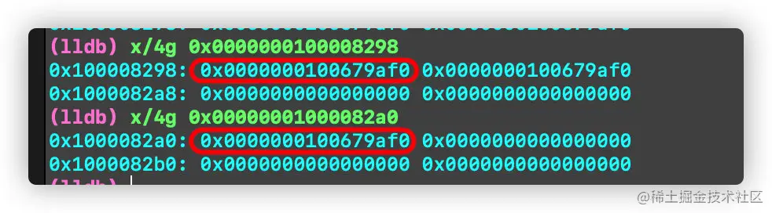

## 编译过程

### clang编译器

OC和C这类语言,会使用 clang 作为编译器前端, 编译成中间语言 IR, 再交给后端 LLVM 生成可执行文件.

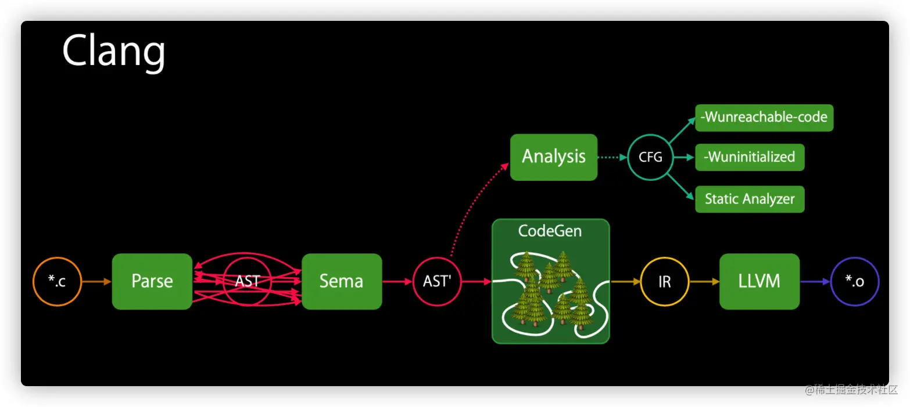

Clang编译过程有以下几个缺点:

  * 源代码与LLVM IR之间有巨大的抽象鸿沟

  * IR不适合源码级别的分析

  * CFG(Control Flow Graph)缺少精准度

  * CFG偏离主道

  * 在CFG和IR降级中会出现重复分析

### Swift编译器

为了解决这些缺点, Swift开发了专属的Swift前端编译器, 其中最关键的就是引入 SIL。

#### SIL

Swift Intermediate Language，Swift高级中间语言，Swift 编译过程引入SIL有以下优点:

  * 完全保留程序的语义
  * 既能进行代码的生成，又能进行代码分析
  * 处在编译管线的主通道 (hot path)
  * 架起桥梁连接源码与LLVM，减少源码与LLVM之间的抽象鸿沟

SIL会对Swift进行高级别的语意分析和优化。像LLVM IR一样，也具有诸如Module，Function和BasicBlock之类的结构。与LLVM IR不同，它具有更丰富的类型系统，有关循环和错误处理的信息仍然保留，并且虚函数表和类型信息以结构化形式保留。它旨在保留Swift的含义，以实现强大的错误检测，内存管理等高级优化。

##### swift编译步骤

Swift前端编译器先把Swift代码转成SIL, 再转成IR.

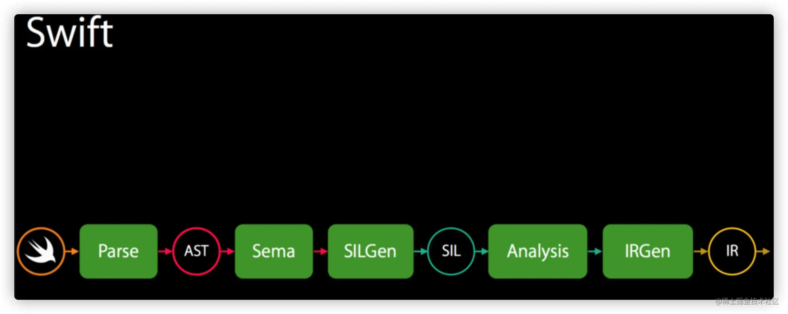

下面是每个步骤对应的命令和解释

```
// 1 Parse: 语法分析组件, 从Swift源码分析输出抽象语法树AST
swiftc main.swift -dump-parse       

// 2 语义分析组件: 对AST进行类型检查，并对其进行类型信息注释
swiftc main.swift -dump-ast     

// 3 SILGen组件: 生成中间体语言，未优化的 raw SIL (生SIL)
// 一系列在 生 SIL上运行的,用于确定优化和诊断合格，对不合格的代码嵌入特定的语言诊断。
// 这些操作一定会执行,即使在`-Onone`选项下也不例外
swiftc main.swift -emit-silgen      

// 4 生成中间体语言（SIL），优化后的
// 一般情况下,是否在正式SIL上运行SIL优化是可选的,这个检测可以提升结果可执行文件的性能.
// 可以通过优化级别来控制,在-Onone模式下不会执行.
swiftc main.swift -emit-sil         

// 5 IRGen会将正式SIL降级为 LLVM IR（.ll文件）
swiftc main.swift -emit-ir              

// 6 LLVM后端优化, 生成LLVM中间体语言 （.bc文件）
swiftc main.swift -emit-bc              

// 7 生成汇编
swiftc main.swift -emit-assembly    

// 8 生成二进制机器码, 编译成可执行.out文件
swiftc -o main.o main.swift             		
```

一般我们在分析 sil 文件的时候，通过下面这条命令把 swift 文件直接转成 sil 文件:

```
swiftc -emit-sil main.swift > main.sil
```

### 类的生命周期

下面分析一下类的创建过程, 如下代码

```swift
class Human {
    var name: String
    init(_ name: String) {
        self.name = name
    }
    func eat(food:String) {
        print("eat \(food)")
    }
}

var h = Human("hali")
```

转成sil, `swiftc -emit-sil main.swift > human.sil`

分析sil文件, 可以看到如下代码, 是 `__allocating_init` 初始化方法

```swift
// Human.__allocating_init(_:)
sil hidden [exact_self_class] @$s4main5HumanCyACSScfC : $@convention(method) (@owned String, @thick Human.Type) -> @owned Human {
// %0 "name"                                      // user: %4
// %1 "$metatype"
bb0(%0 : $String, %1 : $@thick Human.Type):
  %2 = alloc_ref $Human                           // user: %4
  // function_ref Human.init(_:)
  %3 = function_ref @$s4main5HumanCyACSScfc : $@convention(method) (@owned String, @owned Human) -> @owned Human // user: %4
  %4 = apply %3(%0, %2) : $@convention(method) (@owned String, @owned Human) -> @owned Human // user: %5
  return %4 : $Human                              // id: %5
} // end sil function '$s4main5HumanCyACSScfC'

```

接下来在Xcode打上符号断点 `__allocating_init`,

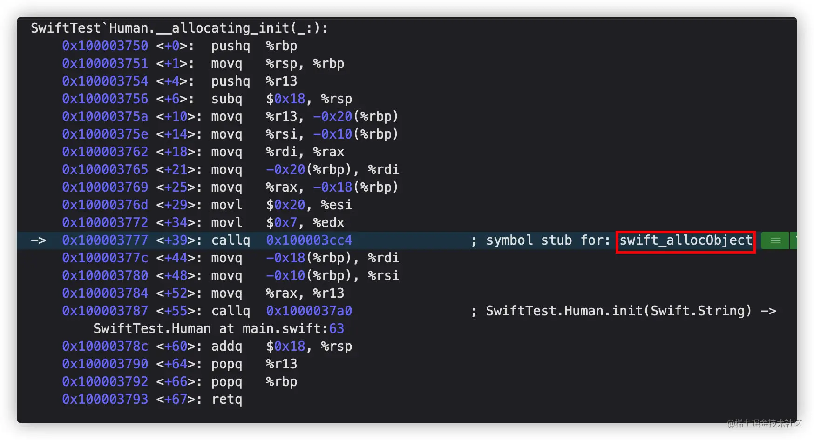

调用的是 `swift_allocObject` 这个方法, 而如果 Human继承自NSObject, 会调用objc的 `objc_allocWithZone` 方法, 走OC的初始化流程.

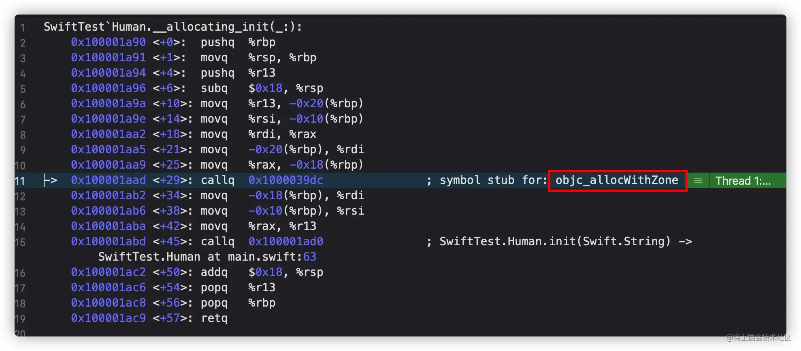

分析[Swift源码](https://link.juejin.cn/?target=https%3A%2F%2Fgithub.com%2Fapple%2Fswift), 搜索 `swift_allocObject`, 定位到 HeapObject.cpp 文件,

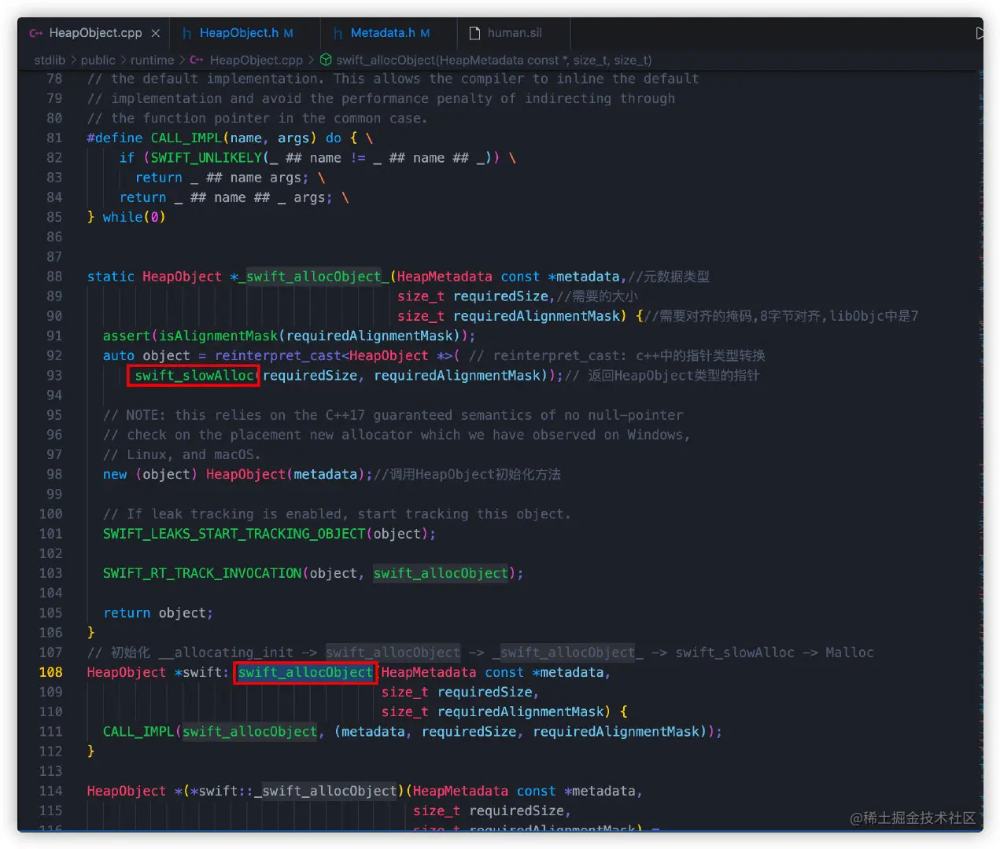

内部调用 `swift_slowAlloc`,

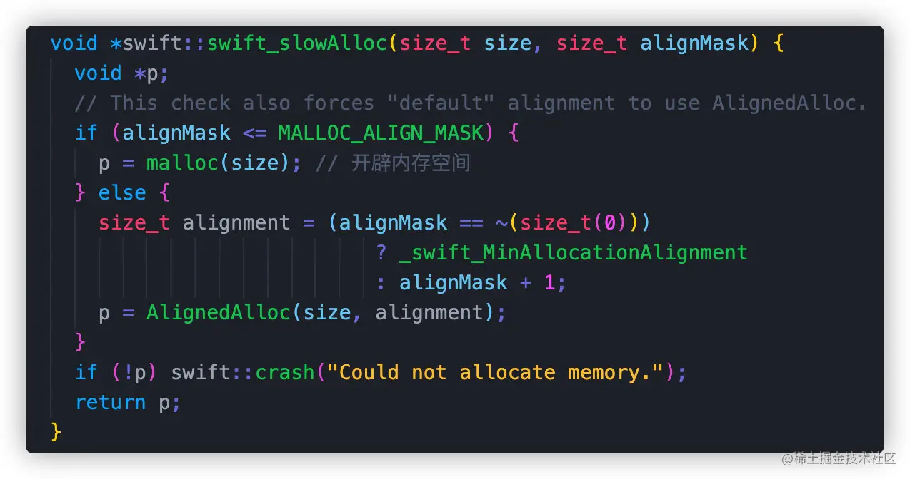

至此, 通过分析 sil, 汇编, 源代码，我们可以得出swift对象的初始化过程如下：

```
__allocating_init -> swift_allocObject -> _swift_allocObject_ -> swift_slowAlloc -> Malloc
```

## 类的内存结构

通过上面的源码, 发现初始化返回的是一个 HeapObject, 它的定义如下:

```cpp
// The members of the HeapObject header that are not shared by a
// standard Objective-C instance
#define SWIFT_HEAPOBJECT_NON_OBJC_MEMBERS       \
  InlineRefCounts refCounts // 

/// The Swift heap-object header.
/// This must match RefCountedStructTy in IRGen.
struct HeapObject {
  /// This is always a valid pointer to a metadata object. 
  HeapMetadata const *metadata; // 8字节

  SWIFT_HEAPOBJECT_NON_OBJC_MEMBERS; //64位的位域信息, 8字节; metadata 和 refCounts 一起构成默认16字节实例对象的内存大小

#ifndef __swift__
    // ......

#endif // __swift__
};
```

`HeapObject`的metadata是一个`HeapMetadata`类型, 本质上是 `TargetHeapMetadata`, 我们可以在源码中找到这个定义

```cpp
using HeapMetadata = TargetHeapMetadata<InProcess>;
```

再点击跳转到 `TargetHeapMetadata`,

```cpp
template <typename Runtime>
struct TargetHeapMetadata : TargetMetadata<Runtime> { //继承自TargetMetadata
  using HeaderType = TargetHeapMetadataHeader<Runtime>;
// 下面是初始化
  TargetHeapMetadata() = default;
  constexpr TargetHeapMetadata(MetadataKind kind) // 纯swift
    : TargetMetadata<Runtime>(kind) {}
#if SWIFT_OBJC_INTEROP //和objc交互
  constexpr TargetHeapMetadata(TargetAnyClassMetadata<Runtime> *isa) //isa
    : TargetMetadata<Runtime>(isa) {}
#endif
};
```

这里可以看到, 如果是纯swift,就会给入 kind, 如果是OC就给入 isa.

再继续点击跳转分析 `TargetHeapMetadata` 的父类 `TargetMetadata`,

```cpp
/// The common structure of all type metadata.
template <typename Runtime>
struct TargetMetadata { // 所有元类类型的最终基类
  using StoredPointer = typename Runtime::StoredPointer;

  /// The basic header type.
  typedef TargetTypeMetadataHeader<Runtime> HeaderType;

  constexpr TargetMetadata()
    : Kind(static_cast<StoredPointer>(MetadataKind::Class)) {}
  constexpr TargetMetadata(MetadataKind Kind)
    : Kind(static_cast<StoredPointer>(Kind)) {}

#if SWIFT_OBJC_INTEROP
protected:
  constexpr TargetMetadata(TargetAnyClassMetadata<Runtime> *isa)
    : Kind(reinterpret_cast<StoredPointer>(isa)) {}
#endif

private:
  /// The kind. Only valid for non-class metadata; getKind() must be used to get
  /// the kind value.
  StoredPointer Kind;//Kind成员变量
public:
    // ......

  /// Get the nominal type descriptor if this metadata describes a nominal type,
  /// or return null if it does not.
  ConstTargetMetadataPointer<Runtime, TargetTypeContextDescriptor>
  getTypeContextDescriptor() const {
    switch (getKind()) { // 根据 kind 区分不同的类
    case MetadataKind::Class: {
      const auto cls = static_cast<const TargetClassMetadata<Runtime> *>(this);//把this强转成TargetClassMetadata类型
      if (!cls->isTypeMetadata())
        return nullptr;
      if (cls->isArtificialSubclass())
        return nullptr;
      return cls->getDescription();
    }
    case MetadataKind::Struct:
    case MetadataKind::Enum:
    case MetadataKind::Optional:
      return static_cast<const TargetValueMetadata<Runtime> *>(this)
          ->Description;
    case MetadataKind::ForeignClass:
      return static_cast<const TargetForeignClassMetadata<Runtime> *>(this)
          ->Description;
    default:
      return nullptr;
    }
  }
    // ......
};
```

`TargetMetadata`就是最终的基类, 其中有个 `Kind` 的成员变量, 它是一个固定值 `0x7FF`.

`TargetMetadata` 中根据 kind 种类强转成其它类型, 所以 这个 `TargetMetadata` 就是所有元类型的基类.

在强转成类的时候, 强转类型是 `TargetClassMetadata`, 点击跳转然后分析它的继承连如下

```cpp
TargetClassMetadata : TargetAnyClassMetadata : TargetHeapMetadata : TargetMetadata
```

通过分析源码, 可以得出关系图

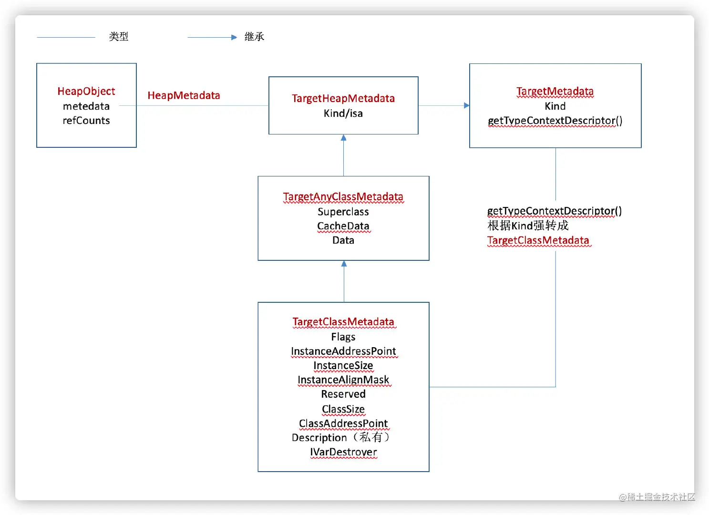

所以综合继承链上的成员变量, 可以得出类的内存结构:

```
struct Metadata {
    var kind: Int
    var superClass: Any.Type
    var cacheData: (Int, Int)
    var data: Int
    var classFlags: Int32
    var instanceAddressPoint: UInt32
    var instanceSize: UInt32
    var instanceAlignmentMask: UInt16
    var reserved: UInt16
    var classSize: UInt32
    var classAddressPoint: UInt32
    var typeDescriptor: UnsafeMutableRawPointer
    var iVarDestroyer: UnsafeRawPointer
}
```

PS: 补充kind种类, 这个是固定值

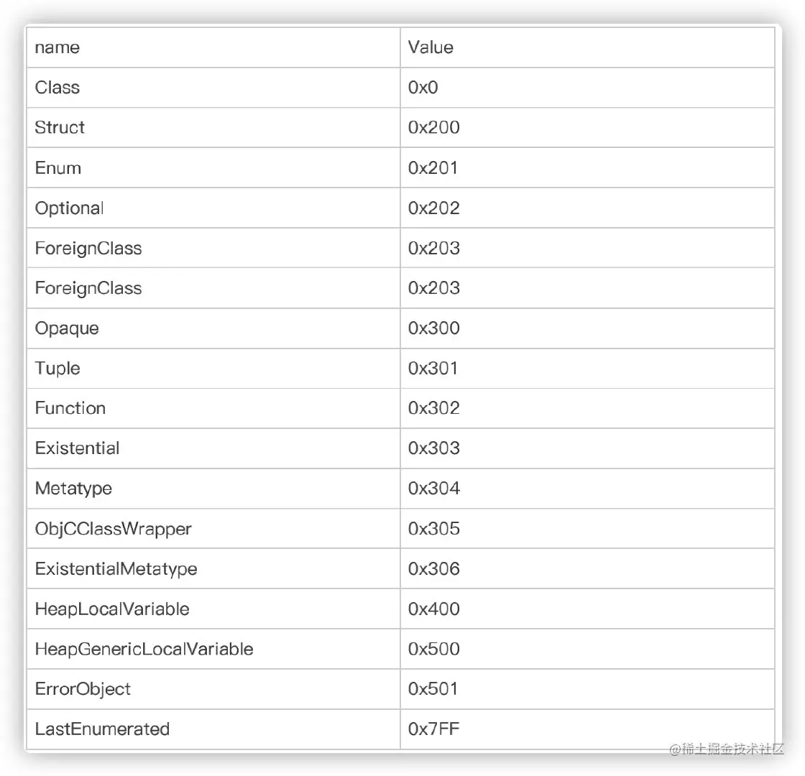

### 通过SIL分析异变方法

Class 和 struct 都可以定义方法，但是默认情况下，**值类型不能被自身修改**，也就意味着struct方法不能修改自身的属性。所以如下的代码就会报错 `Left side of mutating operator isn't mutable: 'self' is immutable`

```
struct Point {
    var x = 0.0, y = 0.0
    func moveBy(x deltaX: Double, y deltaY: Double) {
        self.x += deltaX //Left side of mutating operator isn't mutable: 'self' is immutable
        self.y += deltaY //Left side of mutating operator isn't mutable: 'self' is immutable
    }
}
```

此时在方法前面添加 `mutating` 关键字即可。

```
struct Point {
    var x = 0.0, y = 0.0
    func test() {
        print("test")
    }

    mutating func moveBy(x deltaX: Double, y deltaY: Double) {
        self.x += deltaX
        self.y += deltaY
    }
}
```

什么是 `mutating` ？我们把代码转成 sil 来分析 `swiftc -emit-sil main.swift > main.sil`

```
// Point.test()
sil hidden @$s4main5PointV4testyyF : $@convention(method) (Point) -> () {
// %0 "self"                                      // user: %1
bb0(%0 : $Point):
  debug_value %0 : $Point, let, name "self", argno 1 // id: %1
```

与OC不同，Swift只有1个默认参数self，且作为最后一个参数传入, 默认放在 x0 寄存器。`debug_value` 直接取值，不能被修改。

```
// Point.moveBy(x:y:)
sil hidden @$s4main5PointV6moveBy1x1yySd_SdtF : $@convention(method) (Double, Double, @inout Point) -> () {
// %0 "deltaX"                                    // users: %10, %3
// %1 "deltaY"                                    // users: %20, %4
// %2 "self"                                      // users: %16, %6, %5
bb0(%0 : $Double, %1 : $Double, %2 : $*Point):
  debug_value %0 : $Double, let, name "deltaX", argno 1 // id: %3
  debug_value %1 : $Double, let, name "deltaY", argno 2 // id: %4
  debug_value_addr %2 : $*Point, var, name "self", argno 3 // id: %5
```

比较上面2断sil代码，发现 `mutating` 的方法 moveBy 的默认参数self 多了一个`@inout`修饰，它表示当前参数类型是间接的，传递的是已经初始化过的地址通过下面的 `debug_value_addr` 也可以看出, 取的是`*Point`这个内容的地址，通过指针对self进行修改。

函数定义形参的时候,函数内参数的改变并不会影响外部, 但是在前面加上 **`inout`**关键字就变成一个**输入输出形式参数**,在函数外部这些参数的改变将被保留.

## 方法调度

### Swift函数的3种派发机制

Swift有3种函数派发机制:

  1. **静态派发** (static dispatch)

是在编译期就能确定调用方法的派发方式, Swift中的静态派发直接使用函数地址.

  2. **动态派发** (dynamic dispatch) / 虚函数表派发

动态派发是指编译期无法确定应该调用哪个方法，需要在运行时才能确定方法的调用, 通过虚函数表查找函数地址再调用.

  3. **消息派发** (message dispatch)

使用objc的消息派发机制, objc采用了运行时`objc_msgSend`进行消息派发，所以Objc的一些动态特性在Swift里面也可以被限制的使用。

静态派发相比于动态派发更快，而且静态派发还会进行内联等一些优化，减少函数的寻址过程, 减少内存地址的偏移计算等一系列操作，使函数的执行速度更快，性能更高。

一般情况下, 不同类型的函数调度方式如下

<table><thead><tr><th>类型</th><th>调度方式</th><th>extension</th></tr></thead><tbody><tr><td>值类型</td><td>静态派发</td><td>静态派发</td></tr><tr><td>类</td><td>函数表派发</td><td>静态派发</td></tr><tr><td>NSObject 子类</td><td>函数表派发</td><td>静态派发</td></tr></tbody></table>

### 类函数的动态派发

通过一个案例探究 动态派发/虚函数表派发 表这种方式中, 程序是如何找到函数地址的

```swift
class LGTeacher {
  func teach(){
    print("teach")
  }
  func teach1(){
    print("teach1")
  }
  func teach2(){
    print("teach2")
  }
}
var t = LGTeacher()
t.teach()
```

在程序中, 断点在函数处, 进入汇编代码读取寄存器汇中的值,

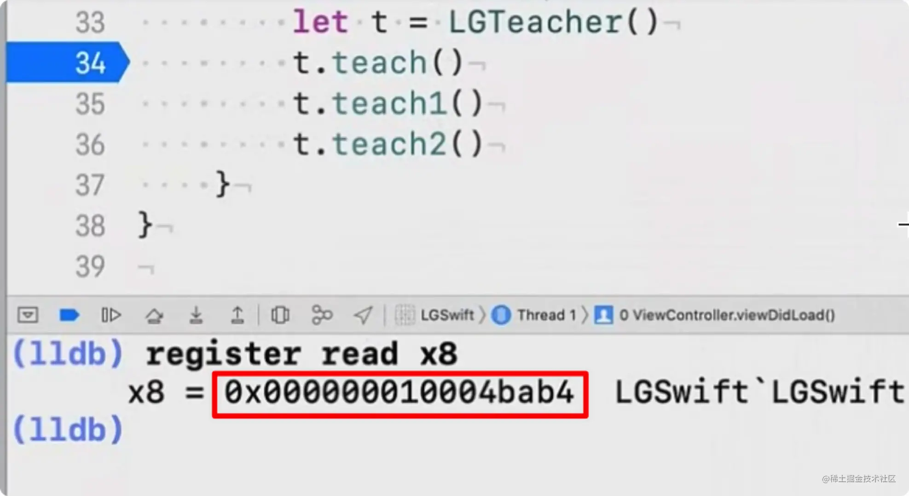

这个 `0x10004bab4` 就是 `teach()` 函数的地址, 下面我们具体探究下中个地址是怎么来的.

#### 源码的解读

一般来讲, Swift会把所有的方法都被存在类的虚表中, 我们可以在 sil 文件中发现这个 vtable.

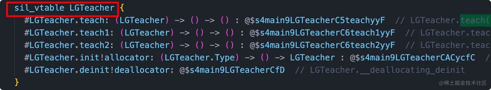

根据之前的分析, 类的结构 TargetClassMetadata 有个属性 `Description`, 这个是Swift类的描述`TargetClassDescriptor`.

```
  // Description is by far the most likely field for a client to try
  // to access directly, so we force access to go through accessors.
private:
  /// An out-of-line Swift-specific description of the type, or null
  /// if this is an artificial subclass.  We currently provide no
  /// supported mechanism for making a non-artificial subclass
  /// dynamically.
  ConstTargetMetadataPointer<Runtime, TargetClassDescriptor> Description;
```

`TargetClassDescriptor` 它的内存结构如下

```
struct TargetClassDescriptor{ 
  var flags: UInt32 
  var parent: UInt32 
  var name: Int32 
  var accessFunctionPointer: Int32 
  var fieldDescriptor: Int32 
  var superClassType: Int32 
  var metadataNegativeSizeInWords: UInt32 
  var metadataPositiveSizeInWords: UInt32 
  var numImmediateMembers: UInt32 
  var numFields: UInt32 
  var fieldOffsetVectorOffset: UInt32 
  var Offset: UInt32 
  var size: UInt32 
  //V-Table 
}
```

在这个描述的开始到vtable之间的属性有 13 ✖️ 4 = 52 字节，后面就是存储方法描述`TargetMethodDescriptor`的vtable 了。

```
struct TargetMethodDescriptor {
  /// Flags describing the method.
  MethodDescriptorFlags Flags; // 4字节, 标识方法的种类, 初始化/getter/setter等等
  /// The method implementation.
  TargetRelativeDirectPointer<Runtime, void> Impl; // 相对地址, Offset 
  // TODO: add method types or anything else needed for reflection.
};
```

`TargetMethodDescriptor` 是对方法的描述, Flags表示方法的种类,占据4个字节, Impl里面并不是真正的方法imp,而是一个相对偏移量，所以需要找到这个 `TargetMethodDescriptor` + 4字节 + 相对偏移量 才能得到方法的真正地址。

#### 可执行文件的解读

在可执行文件中, Class、Struct、Enum 的 Discripter 地址信息一般存在 `_TEXT,_swift5_types` 段.

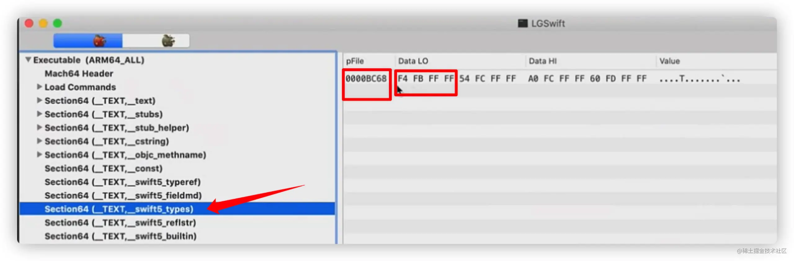

iOS上一般小端模式, 所以我们读到地址信息+偏移量 `0xFFFFFBF4 + 0xBC68 = 0x10000B85C` 得到 `LGTeacherDescription<TargetClassDescriptor>` 在 MachO 中的地址. 虚拟内存的基地址是 `0x100000000`, 所以`B85C` 就是 Description 的偏移量.

找到 B85C,

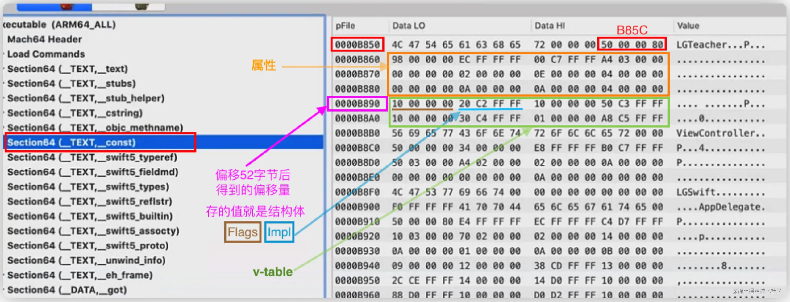

根据 TargetClassDescriptor 的内存结构，从 B85C 往后读 52个字节就是 vtable，对应的偏移量 B890.

vtable是个数组,所以第一个元素 `10 00 00 00 20 C2 FF FF` 是 TargetMethodDescriptor, 再根据TargetMethodDescriptor 的内存结构, 前面4字节是Flags, 后面4字节就是 Impl 的偏移量 Offset `FFFFC220`.

回到程序中，

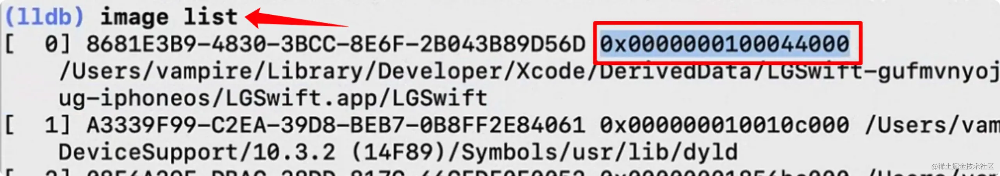

通过 `image list` 输出可执行文件加载的地址，其中第一个就是程序运行首地址，0x100044000 加上 v-table偏移量，就得到v-table在程序运行中的地址，也就是第一个函数 teach() 的 TargetMethodDescriptor的地址 `0x100044000 + 0xB890 = 0x10004F890`

然后加上 Flags 的4字节，`0x10004F890 + 0x4 = 0x10004F894` 得到 Impl,

加上Offset再减去虚拟内存基地址 `0x10004F894 + 0xFFFFC220 - 0x100000000` = `0x10004BAB4`

才得到函数地址 `0x10004BAB4` .

### Struct函数静态派发

```
struct LGTeacher {
  func teach(){
    print("teach")
  }
  func teach1(){
    print("teach1")
  }
  func teach2(){
    print("teach2")
  }
}
var t = LGTeacher()
t.teach()
```

上述案例中改为 Struct, 那么就是直接调用的函数地址, 属于静态派发.

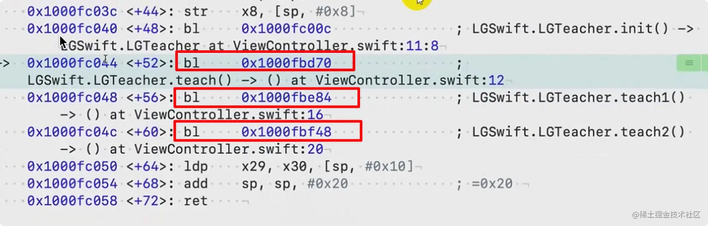

#### extension

不论是 Class 或者 Struct, extension里的函数都是静态派发, 无法在运行时做任何替换和改变, 因为其里面的方法都是在编译期确定好的,程序中以硬编码的方式存在, 不会放在vtable中.

```
extension LGTeacher{
	func teach3(){
    print("teach3")
  }
} 
var t = LGTeacher()
t.teach3()
```

都是直接调用函数地址

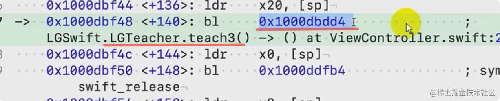

所以, 无法通过 extension 支持多态.

那么为什么 Swift 会把 extension 设计成静态的呢?

OC中子类继承后不重写方法的话是去父类中找方法实现, 但是 Swift类在继承的时候, 是把父类的方法形成一张vtable存在自己身上,这样做也是为了节省方法的查找时间, 如果想让 extension 加到 vtable 中, 并不是直接在子类vtable的最后直接追加就可以的, 需要在子类中记录下父类方法的index,把父类的extension方法插入到子类vtable中父类方法index后相邻的位置,再把子类自己的方法往后移动,这样的一番操作消耗是很大的.

### 关键字最派发方式的影响

不同的函数修饰关键字对派发方式也有这不同的影响

#### final

`final`： 添加了 final 关键字的函数无法被重写/继承，使用静态派发，不会在 vtable 中出现，且对 objc 运行时不可见。

#### dynamic

`dynamic`: 函数均可添加 dynamic 关键字，为非objc类和值类型的函数赋予动态性，但派发方式还是函数表派发。

```
class LGTeacher {
  dynamic func teach(){
    print("teach")
  }
}

extension LGTeacher {
    @_dynamicReplacement(for: teach())
    func teach3() {
        print("teach3")
    }
}

var t = LGTeacher()
t.teach3() // teach3
t.teach()  // teach3
```

如上代码中, `teach()` 函数是函数表派发, 存在 vtable, 并且 `dynamic` 赋予动态性, 与 `@_dynamicReplacement(for: teach())` 关键字配合使用, 把 `teach()`函数的实现改为`teach3()`的实现, 相当于OC中把 `teach()`的SEL对应为`teach3()`的imp, 实现方法的替换.

这个具体的实现是 llvm 编译器处理的, 在中间语言 IR 中, teach() 函数中有2个分支, 一个 original, 一个 forward, 如果我们有替换的函数, 就走 forward 分支.

```
## 转成 IR 中间语言 .ll 文件
swiftc -emit-ir main.swift > dynamic.ll 
```

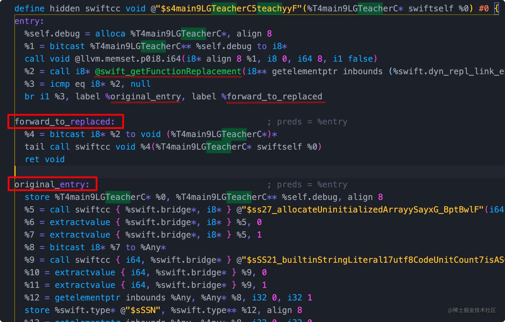

#### @objc

`@objc`： 该关键字可以将Swift函数暴露给Objc运行时，依旧是函数表派发。

#### @objc dynamic

`@objc dynamic`： 消息派发的方式, 和 OC 一样. 实际开发中, Swift 和 OC 交互大多会使用这种方式.

对于纯Swift类, `@objc dynamic` 可以让方法和OC一样使用 Runtime API.

如果需要和OC进行交互, 需要把类继承自 NSObjec.

## 参考资料

* [Swift源码](https://github.com/apple/swift)
* [《Swift高级进阶班》](https://ke.qq.com/course/3202559)
* [apple](https://github.com/apple)
* [类和结构体](https://www.cnswift.org/classes-and-structures#spl)
* [Swift Intermediate Language 初探](https://zhuanlan.zhihu.com/p/101898915)
* [Swift性能高效的原因深入分析](http://www.codebaoku.com/it-swift/it-swift-198322.html)
* [Swift编译器中间码SIL](https://woshiccm.github.io/posts/Swift编译器中间码SIL/#sil简介)
* [Swift的高级中间语言：SIL](https://www.jianshu.com/p/c2880460c6cd)
