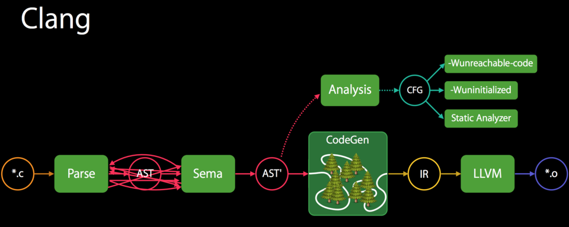
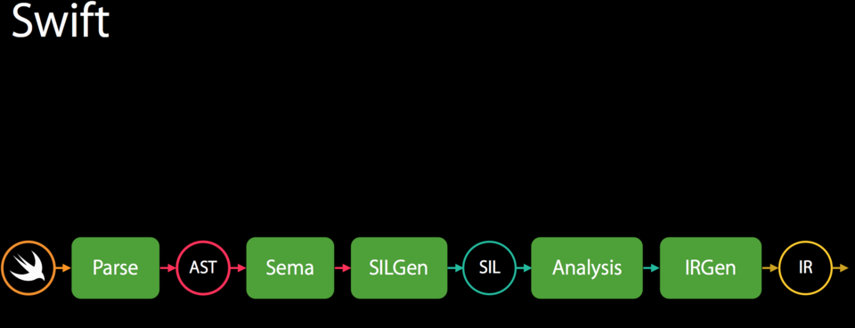

<!--BEGIN_DATA
{
    "create_date": "2020-11-25 15:00", 
    "modify_date": "2020-11-25 15:00", 
    "is_top": "0", 
    "summary": "Swift编译器结构分析<br/>Swift的高级中间语言：SIL", 
    "tags": "Swift、C/C++、iOS", 
    "file_name": "Swift编译器结构分析与SIL高级中间语言.md"
}
END_DATA-->

#### <p>原文出处：<a href='https://www.jianshu.com/p/7c894f9b7b02' target='blank'>Swift编译器结构分析</a></p>

### Swift介绍

Swift是一种高性能的语言，拥有整洁现代的语法。swift可以和C、OC的代码和框架无缝衔接，并且swift默认是内存安全的。 Swift的[代码仓库](https://github.com/apple/swift)包含了Swift编译器和标准库的源码，还有例如用于IDE集成的SourceKit等相关组件。

### Swift编译器

概况来说，Swift编译器负责将Swift源码转成高效的可执行机器码。下面我们对Swift编译器的几个主要组件进行说明。

### 编译器基本知识

#### 构建过程

构建过程分为

* **预处理(pre-process)** 用于导入文件和展开宏.纯文本操作,不考虑语言语法含义
* (狭义的)**编译** 对预处理器的输出进行编译，生成汇编语言(`assemble language`)。一般汇编语言代码的文件扩展名`.s`
* **汇编** 汇编器转为机器语言，这个过程称为汇编(`assemble`),输出为目标文件(object file),一般扩展名为`.o`
* **链接** 目标文件本身不能使用。将目标文件转换为最终可以使用的形式的过程,称为链接(`link`)。可执行文件默认名为`a.out`

### Swift编译器结构

我们下面分析的Swift编译器，负责的流程是上面构建过程中的第二步：（狭义的）**编译**。

Swift的编译器主要组件包含以下几部分：

#### Parsing：语法分析

Swift的语法分析器是一个简单的，对整体通过递归向下的方式进行语法分析的手工编码词法分析器，他是在[lib/Parse](https://github.com/apple/swift/tree/master/lib/Parse)内实现的。该分析器负责生成不包含语义和类型信息的**抽象语法树**，简称`AST`(Abstract Syntax Tree)。这个阶段生成的`AST`也不包含警告和错误的注入。

##### lib/Parse

我们分析一下`lib/Parse`内的文件结构

**文件管理：CMakeLists.txt** 内部包含一个CMakeLists.txt文件和多个以cpp为后缀名的C++文件。 CMakeLists.txt是`CMake`的管理文件，想了解CMake可以在文末查看。CMakeLists.txt内容为
    
```cpp
add_swift_library(swiftParse STATIC
  xxx.cpp
  ...
  LINK_LIBRARIES
  swiftAST
  swiftSyntax
）
```

**源码分析文件：ParseXXX.cpp** 内部的cpp文件是用于对代码进行语法分析的，例如`Lexer.cpp`，`ParseDecl.cpp`，`ParseGeneric.cpp`，`ParseStmt.cpp`等文件，从命名我们就能知道他们的功能是对声明，表达式或者泛型等进行语法分析。 语法分析是将代码逐字分析，通过特定的正则表达式匹配，在词的层面上拆分成多个token，之后生成`AST`,想了解具体的知识可以查看之前整理的[编译器学习](https://www.jianshu.com/nb/16730099)系列，这里不展开细节。

**流程管理文件** 除了用于对源码进行具体分析的文件外，`lib/Parse`内部还包含一些流程控制文件。 通过文件`PersistentParserState.cpp`，`SyntaxParsingCache.cpp`，`SyntaxParsingContext.cpp`的命名和描述我们可以推断他们是用于对语法分析状态进行存储，缓存以及通过编译器不同条件的指令执行或者略过某些步骤的。

##### 语法分析总结

语法分析使用以上的几种文件，对Swift源码进行逐字分析，并且可以通过编译器指令控制分析的流程和细节，词法分析生成的`AST`是不包含语义和类型信息的，也不
包含警告和错误等信息。

#### Senmantic analysis：语义分析

语义分析负责接收语法分析生成的`AST`，并将其转换成格式正确，进行了全面类型检查的`AST`，并且在源码中嵌入警告和错误等信息。这些功能是在[lib/Sema](https://github.com/apple/swift/tree/master/lib/Sema)内实现的。语义分析包含类型推断，确保可以从进行了类型检查的`AST`安全的生成代码。

##### lib/Sema

我们对`lib/Sema`内的结构进行一下分析：

**CMakeLists.txt**

语义分析的CMakeLists.txt内容如下


```cpp
if (SWIFT_FORCE_OPTIMIZED_TYPECHECKER)
  set(EXTRA_TYPECHECKER_FLAGS "FORCE_BUILD_OPTIMIZED")
endif()
​
add_swift_library(swiftSema STATIC
  xxx.cpp
  ...
  LINK_LIBRARIES
  swiftParse
  swiftAST
  swiftSerialization
  ${EXTRA_TYPECHECKER_FLAGS}
)
```

和语法分析不同的是，

  1. 对条件`SWIFT_FORCE_OPTIMIZED_TYPECHECKER`是否进行强制类型检查优化进行了判断，这些条件可以在终端调试时通过指令进行控制，之后我们会在[调试Swift编译器](https://www.jianshu.com/p/e39bd29e84c2)内进行说明。

  2. 链接库为`AST`库，语法分析库和`Serialization`库，以及是否增加额外类型检查的标记

**语义分析文件**

`lib/Sema`内部有大量使用C和C++语言编写的分析类，语义分析因为要进行符合当前语言规则对应的检查，所以相比语法分析，文件量要大很多。

我们进行粗略的归纳，可以划分为：

###### 1. CSxxx.cpp/.h

约束系统的解决文件(solution to constraint system)

###### 2.  xxxDiag.cpp/.h

生成诊断的文件，我们在编译过程中的诊断，用于静态代码检查的诊断都是在语义分析阶段，通过这些诊断类去管理的。

###### 3. CodeSyncxxx.cpp/.h

用于对表达式，声明等各种类型进行语义分析的文件。

###### 4. Constraintxxx.cpp/.h

各种约束类

###### 5. Debugxxx.cpp/.h & Instrumenterxxx.cpp/.h

用于支持调试的类

###### 6. Derivedxxx.cpp/.h

各种协议的隐式派生实现

###### 7. NameBinding.cpp

实现Swift的name binding

###### 8. TypeCheckxxx.cpp/.h

对各种类型进行检查和语义分析，以及检查修正

###### 9. 略

##### 语义分析总结

语义分析生成经过了类型检查的`AST`,嵌入警告和错误，以及进行类型推断。这一阶段将语法分析生成的不带有语义内容的`AST`转换成符合Swift语义规则的`AST`，这些推断和类型检查为后续的优化提供了基础。

#### Clang importer

这个模块用于导入Clang组件[Clang modules](http://clang.llvm.org/docs/Modules.html)，并且将C和Objective-C输出的API对应到正确的Swift API。导入的`AST`的结果也会传递给语义分析。[lib/ClangImporter](https://github.com/apple/swift/tree/master/lib/ClangImporter)内实现的。

##### lib/ClangImporter

我们分析一下lib/ClangImporter内的结构

**CMakeLists.txt**
    
```cpp
set(SWIFT_GYB_FLAGS
  "-DCFDatabaseFile=${SWIFT_SOURCE_DIR}/lib/ClangImporter/CFDatabase.def")
​
add_gyb_target(generated_sorted_cf_database
  SortedCFDatabase.def.gyb)
​
add_swift_library(swiftClangImporter STATIC
  xxx.cpp
  LINK_LIBRARIES
  swiftAST
  swiftParse
)
​
## This property is only set by calls to clang_tablegen. It will not be set on
## standalone builds, so it can always be safely passed.
get_property(CLANG_TABLEGEN_TARGETS GLOBAL PROPERTY CLANG_TABLEGEN_TARGETS)
add_dependencies(swiftClangImporter
  generated_sorted_cf_database
  ${CLANG_TABLEGEN_TARGETS})
```

`GYB`（Generate Your Boilerplate）指模板生成,用于添加数据库模块。

链接库为`swiftAST`和`swiftParse`，`AST`和语法分析。

**工具类**

内容还有使用C和C++语言编写的工具类，用于方便的导入Clang实体提供正式的接口。内部的类有`ImportEnumInfo.cpp/.h`，`ImportName.cpp/.h`，`ImportType.cpp/.h`等，通过查看这些类的内容，我们发现包含`#include "swift/AST/ASTContext.h"`，`#include "clang/AST/ASTContext.h"`等内容。

由此我们可以知道，Swift在使用Objective-C的代码时，通过lib/ClangImporter导入的不是Objective-C的源码，而是OC通过Clang编译器生成的`AST`.

##### Swfit不能使用Objective-C的宏

Swift是不同使用OC的宏的，原因如下：

上面的编译器基本知识说到了，宏的展开是在编译的前一个阶段，预处理阶段进行的。在预处理阶段将宏展开之后，Clang才对代码进行编译。Swift导入的是OC代码通过Clang生成的抽象语法树，OC内的宏是未经处理的代码段，所以Swift不能使用OC的宏。

#### SIL generation：SIL生成

`SIL`(Swift Intermediate Language)，Swift的中间语言是一个Swift特定的用于进一步分析和优化Swift代码的高级的中间语言。

`SIL`的生成阶段将类型检查的`AST`降级为"raw"`SIL`。这些内容是在[lib/SILGen](https://github.com/apple/swift/tree/master/lib/SILGen)内实现的。`SIL`的设计文档为[docs/SIL.rst](https://github.com/apple/swift/blob/master/docs/SIL.rst)。

##### lib/SILGen

分析组件结构：

**CMakeLists.txt**
    
```cpp
add_swift_library(swiftSILGen STATIC
  xxx.cpp
  ...
  LINK_LIBRARIES
  swiftSIL
)
```

链接库只有`swiftSIL`

**生成SIL的工具类**

其他的`SILGenxxx.cpp`是用于生成`SIL`的工具类。

##### SIL详细分析

`SIL`是Swift定制的中间语言，针对Swift进行了大量的优化，使得Swift性能得到提升。`SIL`也是Swift编译器的精髓所在。这一部分内容我们在[SIL详解](https://www.jianshu.com/p/c2880460c6cd)内进行专项说明。

#### SIL guaranteed transformations：确保转换

该模块负责对影响程序准确性的数据流进行额外的诊断，例如使用未初始化的变量。转换的结果是生成"正式"(canonical)`SIL`。这些内容在[lib/Analysis](https://github.com/apple/swift/tree/master/lib/SILOptimizer/Analysis)，[lib/ARC](https://github.com/apple/swift/tree/master/lib/SILOptimizer/ARC)， [lib/LoopTransforms](https://github.com/apple/swift/tree/master/lib/SILOptimizer/LoopTransforms)，[lib/Transforms](https://github.com/apple/swift/tree/master/lib/SILOptimizer/Transforms)内实现。

#### LLVM IR Generation：生成LLVM的中间语言

该模块将`SIL`降级为[LLVM IR](http://llvm.org/docs/LangRef.html)，LLVM的中间语言，使得[LLVM](http://llvm.org/)在此基础上可以进行进一步的优化，并且生成机器码。这些内容是在[lib/IRGen](https://github.com/apple/swift/tree/master/lib/IRGen)内实现的。

## 信息补充

#### Cmake和Ninja介绍

我们这里介绍一下[CMake](https://cmake.org/) 和 [Ninja](https://ninja-build.org/),对它们有个基本的认识.
`CMake`是一个开源,跨平台的用于构建,测试和打包的软件工具.`CMake`使用简单的平台和编译器单独配置文件来控制软件的编译流程,通过生成本地makefiles文件和workspace,之后用于用户选择编译环境.

`Ninja`是一个小而快的构建系统.它和其他构建系统的区别主要有两点: 1.它旨在将输入文件通过高级别的构建系统来生成.2.致力于快速构建,极致的追求速度.`Ninja`意在取代在执行增量构建时非常慢的`Make`.`Make`在处理类似于Google Chrome这种单次就会编译超过30,000个输入文件的大型项目时,速度缓慢会体现的更加明显.Google Chrome是`Ninja`的主要用户,`Ninja`还支持安卓编译,也支持大部分使用LLVM的项目.

## 参考资料

  * [swift docs](https://github.com/apple/swift/tree/master/docs)
  * [swift compiler performance](https://github.com/apple/swift/blob/master/docs/CompilerPerformance.md)
  * [debugging the compiler](https://github.com/apple/swift/blob/master/docs/DebuggingTheCompiler.rst)
  * [Make](https://zh.wikipedia.org/wiki/Make)
  * [Ninja wiki](https://en.wikipedia.org/wiki/Ninja_\(build_system\))
  * [SILHighLevelIR](https://llvm.org/devmtg/2015-10/slides/GroffLattner-SILHighLevelIR.pdf)
  * [CMake](https://cmake.org/)
  * [CMake Tutorial](https://cmake.org/cmake-tutorial/)
  * [nshipster gyb](https://nshipster.com/swift-gyb/)
  * [swift gyb.py](https://github.com/apple/swift/blob/master/utils/gyb.py)

<hr>
#### <p>原文出处：<a href='https://www.jianshu.com/p/c2880460c6cd' target='blank'>Swift的高级中间语言：SIL</a></p>

### 简介

在LLVM的[官方文档](https://llvm.org/devmtg/2015-10/)中对Swift的编译器设计描述如下： Swift编程语言是在LLVM上构建，并且使用LLVM IR和LLVM的后端去生成代码。但是Swift编译器还包含新的高级别的中间语言，称为SIL。SIL会对Swift进行较高级别的语义分析和优化。 我们下面分析一下SIL设计的动机和SIL的应用，包括高级别的语义分析，诊断转换，[去虚拟化](http://blog.llvm.org/2017/03/devirtualization-in-llvm-and-clang.html)，特化，引用计数优化，TBAA([Type Based Alias Analysis](https://llvm.org/docs/LangRef.html))等。并且会在某些流程中加入对SIL和LLVM IR对比。


### SIL介绍

`SIL`是为了实现swift编程语言而设计的,包含高级语义信息的SSA格式的[中间语言](https://zh.wikipedia.org/zh/%E4%B8%AD%E9%96%93%E8%AA%9E%E8%A8%80).`SIL`包含以下功能:

  * 一系列的高级别**优化保障**，用于对运行时和诊断行为提供可预测的底线
  * 对swift语言**数据流分析强制要求**，对不满足强制要求的问题产生诊断。例如变量和结构体必须明确初始化，代码可达性即方法return的检测，switch的覆盖率
  * 确保**高级别优化**。包含retain/release优化，动态方法的去虚拟化([devirtualization](http://blog.llvm.org/2017/03/devirtualization-in-llvm-and-clang.html)，不了解虚函数可以查看之前文章[static vs dynamic dispatch](https://www.jianshu.com/p/e0659093eaac))，闭包内联，内存初始化提升和泛型方法实例 化.
  * 可用于分配"脆弱"**内联**的稳定分配格式，将Swift库组件的**泛型优化**为二进制。

和LLVM IR不同,`SIL`一般是target无关的独立格式的表示,可用于代码分发.但是也可以和LLVM一样表达具体target概念. 如果想查看更多`SIL`的实现和`SIL`通道的开发信息,可以查看[SIL开发手册](https://www.jianshu.com/p/8c3331e9e68a)（原英文文档为[SILProgrammersManual.md](https://github.com/apple/swift/blob/master/docs/SILProgrammersManual.md)）。

我们下面对Clang的Swift编译器的传递流程进行对比：

### 编译流程对比

#### Clang编译器流程



Clang编译流程存在以下问题：

  * 在源码和LLVM IR直接存在非常大的抽象鸿沟
  * IR不适用对源码进行分析和检查 使用了Analysis通过CFG进行分析，分析和代码生成是两部分
  * CFG([控制流图](https://baike.baidu.com/item/CFG))不够精确
  * CFG不是主道（hot path）
  * 在CFG和IR降级中会出现重复分析，做无用功

#### Swift编译器流程

Swift作为一个高级别和安全的语言具有以下特点：

**高级别语言**

  * 通过代码充分的展示语言的特性
  * 支持基于协议的泛型

**安全语言**

  * 充分的数据流检查：未初始化变量，函数返回处理检测，这些项在检测不合格时会产生对应的编译错误
  * 边界和溢出的检测

Swift编译流程图如下：



Swift编译器提供的`SIL`具有以下优势：

  * 对程序语义信息重复表示
  * 可以用于代码生成和分析 Clang不可以
  * 处于编译器的主道
  * 可以连接源码和LLVM的抽象鸿沟

### SIL的设计

#### SIL流程分析

Swift编译器作为高级编译器，具有以下严格的传递流程结构。 **Swift编译器的流程如下**

  * **Parse: 语法分析**组件从Swift源码构成AST
  * **语义分析**组件对AST进行类型检查，并对其进行类型信息注释。
  * **SILGen**组件从AST形成"生的(raw)"SIL
  * 一系列在 _生_ SIL上运行的,用于**确定优化**和**诊断合格**，对不合格的代码嵌入特定的语言诊断。这些操作一定会执行,即使在`-Onone`选项下也不例外。之后产生 _正式(canonical)_ SIL.
  * 一般情况下,是否在正式`SIL`上运行`SIL`优化是可选的,这个检测可以提升结果可执行文件的性能.可以通过优化级别来控制,在`-Onone`模式下不会执行.
  * **IRGen**会将`正式SIL`降级为LLVM IR.
  * LLVM后端提供LLVM优化,执行LLVM代码生成器并产生二进制码.

#### SIL操作流程分析

##### SILGen

`SILGen`遍历Swift进行了类型检查的AST，产生 _raw_ SIL.`SILGen`产生的`SIL`格式具有如下属性:

  * 属性会被加载和存储在可变内存地址,而不是使用严格的[SSA](https://zh.wikipedia.org/wiki/%E9%9D%99%E6%80%81%E5%8D%95%E8%B5%8B%E5%80%BC%E5%BD%A2%E5%BC%8F)(静态单赋值形式:每个变量仅被赋值一次)。这和Clang前端产生的繁重的LLVM IR(例如初始化`alloca`)类似。但是Swift的变量在大多数情况下使用了引用计数器,使得变量可以被retained,release和被闭包引用。
  * 数据流检测。例如明确的内存分配,方法return检查,switch覆盖等.此环节目前不是强制执行的
  * `transparent`函数优化目前未实现.

这些特性会被接下来的**确保优化**和**诊断检查**使用，这两项在 `raw SIL`上一定会运行。

##### 确保优化和诊断检查

在`SILGen`之后,会在`raw SIL`上运行确定顺序的优化。我们并不希望编译器产生的诊断改变编译器的进展，所以这些优化的设计是简单和可预测.

  * **Mandatory inlining: 强制内联**对于[transparent](https://en.wikipedia.org/wiki/Referential_transparency)函数进行内联。

透明函数即，如果一个函数只会受到入参的变化，那么这个函数每次的调用都会是相同的，同样的入参一定会返回一样的返回值，在确定入参的时候，返回值是可预测的。这样的
函数，就可以进行内联优化。

  * **内存提升**实现分为两个优化阶段：

将`alloc_box`结构优化为`alloc_stack`

提升无暴露地址(`non_address-exposed`)的`alloc_stack`说明到SSA注册.

  * **[常数传播](https://zh.wikipedia.org/wiki/%E5%B8%B8%E6%95%B8%E6%8A%98%E7%96%8A): Constant propagation**折叠常量表达,繁殖常量值.如果在计算常量表达式时出现算术溢出,就会产生警告.

  * **返回分析**查证每个方法在每个代码路径只返回一个值,并且不会在定义的末端出现无返回值的错误.如果不需要返回值的函数return了也会报错.

  * **临界拆分: critical edge splitting**不支持任意的基础block参数通过终端进行临界拆分. 在 _Advanced Compiler Design & Implementation_的第13.3章节,第407,408页这样描述临界分裂

> 这个算法的核心作用体现为:流程图中的临界如果在流分析前被拆分的话,会使得运算更近高效. 原文: A key point in the algorithm is that it can be much more effective if the critical edges in the flowgraph have been split before the flow analysis is performed.

如果诊断通道完成后,会产生**规范SIL**.

  * 泛型特化: Generic specialization
  * 在`-Onone`模式下的ARC性能优化.

说完了处理`raw SIL`的特定流程,我们对上面提到的优化通道: `optimization passes`进行下说明.

##### 泛型优化

`SIL`获取语言特定的类型信息,使得无法在LLVM IR实现的高级优化在swift编译器中得以实现.

  * **泛型特化**分析泛型函数的特定调用,并生成新的特定版本的函数.然后将泛型的特定用法全部重写为对应的特定函数的指甲调用. 例如
    

```swift
func min<T: Comparable>(x: T, y: T) -> T {
  return y < x ? y : x
}
```

从普通的泛型展开


```swift
func min<T: Comparable>(x: T, y: T, FTable: FunctionTable) -> T {
  let xCopy = FTable.copy(x)
  let yCopy = FTable.copy(y)
  let m = FTable.lessThan(yCopy, xCopy) ? y : x
  FTable.release(x)
  FTable.release(y)
  return m
}
```

在确定入参类型时,比如Int,可以优化为


```swift
func min<Int>(x: Int, y: Int) -> Int {
  return y < x ? y : x
}
```

从而减少泛型调用的开销

  * **witness和虚函数表的去虚拟化优化**通过给定类型去查找关联的类的虚函数表或者类型的witness表,并将虚函数调用替换为调用函数映射
  * **性能内联**
  * **引用计数优化**
  * **内存提升/优化**
  * **高级领域特定优化**swift编译器对基础的swift类型容器(类似Array或String)实现了高级优化.领域特定优化需要在标准库和优化器之间定义交互.详情可以参考 [:ref:`HighLevelSILOptimizations`](https://github.com/apple/swift/blob/master/docs/SIL.rst#id1)

### SIL语法

`SIL`依赖于swift的类型系统和声明,所以`SIL`语法是swift的延伸.一个`.sil`文件是一个增加了`SIL`定义的swift源文件.swift源文件只会针对声明进行语法分析.swift的`func`方法体(除了嵌套声明)和最高阶的代码会被`SIL`语法分析器忽略.在`.sil`文件中没有隐式import.如果使用`swift`或者`Buildin`标准组件的话必须明确的引入. 以下是一个`.sil`文件的示例


```swift
sil_stage canonical
​
import Swift
​
// 定义用于SIL函数的类型
​
struct Point {
  var x : Double
  var y : Double
}
​
class Button {
  func onClick()
  func onMouseDown()
  func onMouseUp()
}
​
// 定义一个swift函数,函数体会被SIL忽略
func taxicabNorm(_ a:Point) -> Double {
  return a.x + a.y
}
​
// 定义一个SIL函数
// @_T5norms11taxicabNormfT1aV5norms5Point_Sd 是swift函数名taxicabNorm重整之后的命名
sil @_T5norms11taxicabNormfT1aV5norms5Point_Sd : $(Point) -> Double {
bb0(%0 : $Point):
  // func Swift.+(Double, Double) -> Double
  %1 = function_ref @_Tsoi1pfTSdSd_Sd
  %2 = struct_extract %0 : $Point, #Point.x    //萃取Point结构体内的x
  %3 = struct_extract %0 : $Point, #Point.y    ////萃取Point结构体内的y
  %4 = apply %1(%2, %3) : $(Double, Double) -> Double  //冒号前为计算体实现通过引用的展开,冒号后为类型说明
  return %4 : Double  //返回值
}
​
// 定义一个SIL虚函数表,匹配的是动态分派中函数实现的id,这个动态分派是在已知的静态类的类型虚函数表中
sil_vtable Button {
  #Button.onClick!1: @_TC5norms6Button7onClickfS0_FT_T_
  #Button.onMouseDown!1: @_TC5norms6Button11onMouseDownfS0_FT_T_
  #Button.onMouseUp!1: @_TC5norms6Button9onMouseUpfS0_FT_T_
}
```

#### SIL阶段


```swift
decl ::= sil-stage-decl
sil-stage-decl ::= 'sil_stage' sil-stage
​
sil-stage ::= 'raw'
sil-stage ::= 'canonical'
```

基于操作的不同阶段,`SIL`拥有不同的声明.

  * **Raw SIL**, _生的SIL_是通过`SILGen`产生的,并未经过保证优化或者诊断通道.`Raw SIL`可能没有完善结构的SSA图表.可能会包含数据流错误.一些说明可能会以非规范的方式展示,例如无地址的`assign`和`destory_addr`的数值.`Raw SIL`不应该用于本地代码的生成或分发.
  * **Canonical SIL**,规范SIL是在保证优化和诊断之后的`SIL`.数据流错误必须被消除掉,肯定说明也必须被规范化为更简单的形式.性能优化和本地代码是生成都是从这种格式衍生的.包含这种格式`SIL`的组件可以被分发. `SIL`文件通过在顶部声明`sil_stage raw` 或 `sil_stage canonical`来说明当前的操作阶段.一个文件之后出现一种阶段的声明.

#### SIL类型


```swift
sil-type ::= '/pre> '*'? generic-parameter-list? type
```

`SIL`的类型是通过`$`符号进行标记的。`SIL`的类型系统和swift的密切相关.所以`$`之后的类型会根据swift的类型语法进行语法分析。

##### 类型降级: type lowering

swift的正式类型系统,倾向于对大量的类型信息进行抽象概括.但是`SIL`目标是展示更多的实现细节,这个区别也体现在`SIL`的类型系统中.所以把正式类型降级为较低类型的操作称为类型降级。

##### 提取区别:Abstraction Difference

包含未约束类型的通用函数一定会被非直接调用.比如分配充足内存和创建地址指针指向这块地址。如下的泛型函数


```swift
func generateArray<T>(n : Int, generator : () -> T) -> [T]
```

函数`generator`会通过一个隐式指针,指向存储在一个非直接调用的地址中,(可以参考之前[static vs dynamic dispatch](https://www.jianshu.com/p/e0659093eaac)中虚函数表的设计和实现).在处理任意类型值时操作都是一样的.

  * 我们不希望对`generateArray`的每个`T`的类型去产生一个新的拷贝
  * 我们不希望对每个类型进行普遍声明
  * 我们不希望通过`T`的类型动态的去构造对于`genetator`的调用

但是我们也不希望现有的通用系统对我们的非通用代码进行低效处理。例如，我们希望`()->Int`可以直接返回结果。但是`()->Int`是`()->T`的代替(subsitution)，对于`generateArray<Int>`的调用应该向generator传递`()->Int`。所以一个正式类型在通用上下文中的表现可能会因为正式类型的的代替而不同.我们将这种不同成为提取区别.

`SIL`对于类型的提取区别的设计是，在每个级别的代替中，提取数值都可以被使用。

为了可以实现如上设计,泛型实例的正式类型应该一直使用非替换正式类型的提取方式进行降级.例如


```swift
struct Generator<T> {
  var fn : () -> T
}
var intGen : Generator<Int>
```

其中`intGen.fn`拥有代替类型`()->Int`，可以被降级为`@callee_owned () -> Int`，可以直接返回结果.但是如果更恰当的使用非代替方式，`()->T`就会变成`@callee_owned () -> @out Int`

当使用非代替的提取方式进行类型降级时，可以看做将拥有相同构造的类型中的具体类型替换为现有类型,以此来实现类型降级. 对于`g`
的`Generator<(Int, Int) -> Float>`,`g.fn`是使用`()->T`进行降级的，简单理解就是,类型是否是具体类型,如果是,才能进行提取方式进行降级,不然只能产生


```swift
@callee_owned () -> @owned @callee_owned (@in (Int, Int)) -> @out Float.
```

所以提取区别来代替通用函数中类型的标准是:是否是具体类型.`is materializable or not`这个系统具有通过重复代替的方式实现提取方式的属性.所以可以把降级的类型看做提取方式的编码. `SILGen`已经拥有了使用提取方式转换类型的工序. 目前只有函数和元祖类型会通过提取区别进行改变.

#### 合法的SIL类型

`SIL`类型的值应该是这样的:

  * 可被加载的SIL类型,`$T`
  * 合法SIL类型的地址`$*T` 或者如果`T`是一个合法的SIL类型需要满足以下条件 不展开,需要查看[SIL语法](https://github.com/apple/swift/blob/master/docs/SIL.rst#syntax)中的`Legal SIL Types`

类型`T`满足一下条件才是一个合法的_SIL_类型

  * 函数类型符合`SIL`的约束条件
  * metatype可以描述功能
  * 原组的内部元素，类型也是合法的`SIL`类型
  * 可选`Optional<U>`,`U`也是合法类型
  * 非函数，原组，可选类型，metatype,或者l-value类型的合法的Swift类型
  * 包含合法类型的`@box`

注意，在递归条件内的类型，还需要是正式类型。例如泛型内的参数，仍然是Swift类型，而不是`SIL`降级类型。

##### 地址类型

地址类型`$*T`指针指向的是任意引用的值或者`$T`。  
地址不是引用计数指针，不能被retained或released。

##### Box类型

本地变量和非直接的数值类型都是存储在堆上的，`@box T`是一个引用计数类型，指向的是包含了多种`T`的盒子。盒子使用的是Swift的原生引用计数。

##### Metatype类型

`SIL`内的metatype类型必须描述自身表示：

  * `@thin` 意思是不需要内存
  * `@thick` 指存储的是类型的引用或类型子类的引用
  * `@objc` 指存储的是一个OC类对象的表示而不是Swift类型对象。

##### 函数类型

`SIL`中的函数类型和Swift中的函数类型有以下区别：

  * `SIL`函数可能是泛型。例如，通过`function_ref`返回一个泛型函数类型。
  * `SIL`函数可以声明为`@noescape`。`@noescape`函数类型必须是`convention(thin)`或者`@callee_guatanteed`。
  * `SIL`函数类型声明了以下几种处理上下文的情景：
    * `@convention(thin)`不要求上下文。这种类型也可以通过`@noescape`声明。
    * `@callee_guatanteed`会被认为直接参数。也意味着`convention(thick)`。
    * `@callee_owned`上下文值被认为是不拥有的直接参数。也意味着`convention(thick)`。
    * `@convention(block)`上下文值被认为是不拥有的直接参数。
    * 其他函数类型会被描述为`Properties of Types` 和 `Calling Convention`
  * `SIL`函数必须声明参数的协议。非直接的参数类型是`*T`,直接参数类型是`T`
    * `@in`是非直接参数。地址必须是已经初始化的对象，函数负责销毁内部持有的值。
    * `@inout`是非直接参数。内存必须是已经初始化的对象。在函数返回之前，必须保证内存是被初始化的。
  * `SIL`函数需要声明返回值的协议。
    * `@out`是非直接的结果。地址必须是未初始化的对象。

#### VTables


```swift
<pre spellcheck="false" class="md-fences md-end-block ty-contain-cm decl ::= sil-vtable
sil-vtable ::= 'sil_vtable' identifier '{' sil-vtable-entry* '}'
​
sil-vtable-entry ::= sil-decl-ref ':' sil-linkage? sil-function-name
```

`SIL`使用[class_method](https://github.com/apple/swift/blob/2ddc92a51a4c6d216a9b2dc3a2e41e9b592afbdf/docs/SIL.rst#class-method), [super_method](https://github.com/apple/swift/blob/2ddc92a51a4c6d216a9b2dc3a2e41e9b592afbdf/docs/SIL.rst#super-method), [objc_method](https://github.com/apple/swift/blob/2ddc92a51a4c6d216a9b2dc3a2e41e9b592afbdf/docs/SIL.rst#objc-method),和 [objc_super_method](https://github.com/apple/swift/blob/2ddc92a51a4c6d216a9b2dc3a2e41e9b592afbdf/docs/SIL.rst#objc-super-method)来表示类方法的动态分派`dynamic dispatch` [class_method](https://github.com/apple/swift/blob/2ddc92a51a4c6d216a9b2dc3a2e41e9b592afbdf/docs/SIL.rst#class-method) 和 [super_method](https://github.com/apple/swift/blob/2ddc92a51a4c6d216a9b2dc3a2e41e9b592afbdf/docs/SIL.rst#super-method)的实现是通过`sil_vtable`进行追踪的.`sil_vtable`的声明包含一个类的所有方法.


```swift
class A {
  func foo()
  func bar()
  func bas()
}
​
sil @A_foo : $@convention(thin) (@owned A) -> ()
sil @A_bar : $@convention(thin) (@owned A) -> ()
sil @A_bas : $@convention(thin) (@owned A) -> ()
​
sil_vtable A {
  #A.foo!1: @A_foo
  #A.bar!1: @A_bar
  #A.bas!1: @A_bas
}
​
class B : A {
  func bar()
}
​
sil @B_bar : $@convention(thin) (@owned B) -> ()
​
sil_vtable B {
  #A.foo!1: @A_foo
  #A.bar!1: @B_bar
  #A.bas!1: @A_bas
}
​
class C : B {
  func bas()
}
​
sil @C_bas : $@convention(thin) (@owned C) -> ()
​
sil_vtable C {
  #A.foo!1: @A_foo
  #A.bar!1: @B_bar
  #A.bas!1: @C_bas
}
```

swift的AST包含重载关系,可以用于在`SIL`的虚函数表中查找衍生类重载方法. 为了避免`SIL`方法是[thunks](https://en.wikipedia.org/wiki/Thunk_\(programming\)),方法名是连接在原始方法实现之前.

#### Witness Tables


```swift
decl ::= sil-witness-table
sil-witness-table ::= 'sil_witness_table' sil-linkage?
  normal-protocol-conformance '{' sil-witness-entry* '}'
```

`SIL`将通用类型动态分派所需的信息编码为witness表.这些信息用于在生成二进制码时产生运行时分配表(runtime dispatch table).也可以用于对特定通用函数的`SIL`优化.每个明确的一致性声明都会产生witness表.通用类型的所有实例共享一个通用witness表.衍生类会继承基类的witness表.


```swift
protocol-conformance ::= normal-protocol-conformance
protocol-conformance ::= 'inherit' '(' protocol-conformance ')'
protocol-conformance ::= 'specialize' '<' substitution* '>'
  '(' protocol-conformance ')'
protocol-conformance ::= 'dependent'
normal-protocol-conformance ::= identifier ':' identifier 'module' identifier
```

witness的关键在于协议一致性.它是对于具体类型协议一致性的唯一标识.

  * 标准的协议一致性命名了一种协议方法需要遵守的类型.属于该类型或扩展的组件,需要提供遵守协议方法的声明
  * 如果派生类实现了基类遵守的协议,会体现为继承协议一致性,简单引用基类的协议一致性即可.
  * 如果通用类型的实例遵守一个协议,是通过特定遵守的方式去实现的.这种方式向标准一致性提供了用于通用类型的通用参数构建. `witness table`只会直接关联标准一致性.继承和特定一致性是在标准一致性下的间接引用.
    
```swift
sil-witness-entry ::= 'base_protocol' identifier ':' protocol-conformance
sil-witness-entry ::= 'method' sil-decl-ref ':' sil-function-name
sil-witness-entry ::= 'associated_type' identifier
sil-witness-entry ::= 'associated_type_protocol'
  '(' identifier ':' identifier ')' ':' protocol-conformance
```

`witness table`由以下内容构成

  * 基协议项提供的对于协议一致性的引用,可以用于witness协议的继承协议
  * 方法项将协议中要求方法映射为`SIL`中实现了witness类型的方法.每个方法项必须对应witness协议中的要求方法
  * _associate type_关联类型项将必须实现的协议方法中的关联类型映射为符合witness的类型.注意witness类似是一个资源级别的swift类型,不是`SIL`类型(上面分析过`SIL`类型和swift类型的区别).关联类型项必须覆盖witness协议中的所有强制关联项.
  * 关联类型协议项将关联类型中的协议映射为关联类型的协议一致性.

###### witness table作用

swift中的协议是通过结构体实现的,可以支持交互.例如参数,属性都可以是结构体.当将结构体传递给协议参数时,结构体特定的部分可能会丢失(在编译期).协议的witness table就可以发挥作用(在运行时).

#### Default Witness Tables


```swift
decl ::= sil-default-witness-table
sil-default-witness-table ::= 'sil_default_witness_table'
  identifier minimum-witness-table-size
  '{' sil-default-witness-entry* '}'
minimum-witness-table-size ::= integer
```

`SIL`编码要求默认witness table有开放(resilient)的默认实现.包含以下条件

  * 强制方法有默认实现
  * 不是协议中最后一个默认方法或继承的强制方法,都有开放的默认实现.

强制方法的开放的默认实现,存储在协议的元数据中. 默认witness表关键在在自身协议.只有公共可见协议才需要默认witness表.私有协议和内部协议是对外部组件不可见的,所以他们没有增加新的强制方法的开放性问题.


```swift
sil-default-witness-entry ::= 'method' sil-decl-ref ':' sil-function-name
```

默认witness表目前只包含一项内容

  * 方法像,将协议中的要求方法映射到`SIL`中实现了管理所有witness类型的方法.

#### 全局变量

### 数据流错误

数据流错误可能存在于`Raw SIL`中,swift从语义上将那些条件定义为错误,所以他们必须使用诊断通道进行诊断,并且不能存在于规范SIL中.**定义初始化** swift要求所有的本地变量在使用前必须被初始化.在构造函数中,结构体,枚举或类类型的实例变量必须在对象被使用前初始化.**未全面覆盖(unreachable)的控制流** `unreachable`在`raw SIL`中生成,标记错误的控制流.例如对于非`Void`的函数没有返回值,或者`switch`没有完全覆盖所有的条件.这种`dead code`消解的保证,可以避免`unreachable`的基础block,也可以避免方法返回不合法的空类型.

### 运行时错误

一些操作,比如无条件的[检查转换次数](https://github.com/apple/swift/blob/master/docs/SIL.rst#checked-conversions)失败或者编译器`Buildin.trap`.都会引起运行时错误,这种错误会无条件的终止当前操作.如果可以检验运行时错误会发生或者已经发生.只要将它们排列到程序操作之后就可以将这些运行时错误重新安排.例如对于没有确定开始和结尾的for循环代码


```swift
// Given unknown start and end values, this loop may overflow
for var i = unknownStartValue; i != unknownEndValue; ++i {
  ...
}
```

会将内存溢出挂起,产生loop的关联运行时错误,之后检测循环的起始和结束点.只要循环体对于当前的操作没有可见影响即可.

### 未定义的行为

某些操作的错误使用成为未定义行为.例如对于`Buildin.RawPointer`的不可用未检测的类型转换.或者使用低于LLVM说明的编译器内建函数,调用当前LLVM不支持的行为.`SIL`程序中的未定义行为是无意义的,就像C中的未定义行为一样,没有语义对其进行预测.未定义行为不应该被合法的SIL文件触发,但是在`SIL`级别不一定会被检测和证实.

### 调用协议

以下内容讨论swift函数是如何生成`SIL`的.

**swift调用协议 @convention(swift)** swift本地方法默认使用siwft调用协议是. 入参为原组的函数被递归解构为单独的参数,即包含被调用的基础块的入口,也包含调用者的`apply`说明
    
```swift
func foo(_ x:Int, y:Int)
​
sil @foo : $(x:Int, y:Int) -> () {
entry(%x : $Int, %y : $Int):
  ...
}
​
func bar(_ x:Int, y:(Int, Int))
​
sil @bar : $(x:Int, y:(Int, Int)) -> () {
entry(%x : $Int, %y0 : $Int, %y1 : $Int):
  ...
}
​
func call_foo_and_bar() {
  foo(1, 2)
  bar(4, (5, 6))
}
​
sil @call_foo_and_bar : $() -> () {
entry:
  ...
  %foo = function_ref @foo : $(x:Int, y:Int) -> ()
  %foo_result = apply %foo(%1, %2) : $(x:Int, y:Int) -> ()
  ...
  %bar = function_ref @bar : $(x:Int, y:(Int, Int)) -> ()
  %bar_result = apply %bar(%4, %5, %6) : $(x:Int, y:(Int, Int)) -> ()
}
```

调用以繁琐数据类型作为入参和输出值的函数时


```swift
func foo(_ x:Int, y:Float) -> UnicodeScalar
​
foo(x, y)
```

在`SIL`内如下体现


```swift
%foo = constant_ref $(Int, Float) -> UnicodeScalar, @foo
%z = apply %foo(%x, %y) : $(Int, Float) -> UnicodeScalar
```

**swift方法调用协议@convention(method)** 方法调用协议用于独立方法的调用协议.[柯里化](https://zh.wikipedia.org/zh/%E6%9F%AF%E9%87%8C%E5%8C%96)method,使用`self`作为内部和外部参数.如果是非柯里化函数,self会在最后被传入
    
```swift
struct Foo {
  func method(_ x:Int) -> Int {}
}
​
sil @Foo_method_1 : $((x : Int), @inout Foo) -> Int { ... }
```

**witness方法调用协议@convention(witness_method)** witness方法调用协议是用于[witness tables](https://github.com/apple/swift/blob/master/docs/SIL.rst#witness-tables)中的协议witness方法.它几乎等同于方法调用协议,只有对通用类型参数处理方面不同.对于非witness方法来说,机器协议可能会通过方法类型将方法签名进行静态转换.但是因为witness必须在`Self`类型下进行多态分配,所以`Self`相关的元数据必须通过最大化的提取规则传输.

**C调用协议@convention(c)** 在swift的C组件编译器中,C类型会被`SIL`对照到swift类型.C的函数入参和返回值,都会被`SIL`平台调用协议忽略. `SIL`和swift目前都不能调用包含可变参数的C的方法.

**OC调用协议@convention(objc_method)** `SIL`中的OC方法使用规范和ARC内一致.也可以从OC定义中引入属性. 使用`@convention(block)`并不会影响block的引用计数.

在`SIL`中OC方法的self参数是非柯里化的最后一个参数.就像原生swift方法


```swift
@objc class NSString {
  func stringByPaddingToLength(Int) withString(NSString) startingAtIndex(Int)
}
​
sil @NSString_stringByPaddingToLength_withString_startingAtIndex \
  : $((Int, NSString, Int), NSString)
```

IR级别的将`self`作为第一个参数的行为在`SIL`中提取了的.比如现存的`_cmd`方法参数.

### 基于类型的别名分析: type based alias analysis

`SIL`提供了两种类型别名分析(`TBAA`: Type Based Alias Analysis):类TBAA和类型访问TBAA

### 指令集

感兴趣可以自行查看[SIL指令集](https://github.com/apple/swift/blob/2ddc92a51a4c6d216a9b2dc3a2e41e9b592afbdf/docs/SIL.rst#instruction-set)

#### 初始化和销毁

##### alloc_stack


```swift
sil-instruction ::= 'alloc_stack' sil-type (',' debug-var-attr)*
​
%1 = alloc_stack $T
// %1 has type $*T
```

在栈区开辟充分符合`T`类型的内存空间。指令的返回结果是初始化的内存地址。

如果类型的尺寸在运行时才能确定，编译器必须动态初始化内存。所以并不能确保内存一定是初始化在栈区，例如如果是特别大的数值，可能会在堆区初始化，栈区持有指针。

`alloc_stack`标记了值声明周期的开始。在结束时必须使用`dealloc_stack`销毁。

内存不能被retain，如果想初始化可retain的类型，使用`alloc_box`。

**总结**：`alloc_stack`在栈区为值类型开辟内存。不使用引用计数。

##### alloc_box


```swift
sil-instruction ::= 'alloc_box' sil-type (',' debug-var-attr)*
​
%1 = alloc_box $T
//   %1 has type $@box T
```

在堆上开辟足够大的内存来支持各种类型的`T`，以`@box`持有引用计数。这个指令的结果是`@box`的引用计数持有的box，`project_box`是要来过去box内部的值的地址的。

box初始化时引用计数为1，但是内存并不会被初始化。box持有内部的值，在引用计数为0时使用`destory_addr`对内部值进行释放，无法释放box的值
没有被初始化的情况。这时候需要用到`dealloc_box`。

**总结**：`alloc_box`在堆上初始化指针类型的值，并且需要手动管理内存。

##### alloc_box和alloc_stack对比

`alloc_box`和`alloc_stack`最大的区别在于值的生命周期。举例，如果在闭包之外有一个变量声明，在闭包内使用了该变量。变量的值是可以被修改的，所以需要使用`alloc_box`来引用变量。

对于`var`声明的变量，因为可以多次修改它的值，甚至在作用域外也可以修改。所以使用`alloc_box`管理引用计数。

##### 优化：Alloc box to stack

在SILGen阶段，会对闭包内使用变量的情况，通过`alloc_box`进行管理。

在SIL guaranteed transformations阶段，即生成正式SIL的阶段，会对于在闭包内没有进行值修改的变量内存分配进行优化，将`alloc_box`替换为`alloc_stack`。这个功能是在[AllocBoxToStack](https://github.com/apple/swift/blob/master/lib/SILOptimizer/Transforms/AllocBoxToStack.cpp)组件内实现的。内部实现是将堆区不必要的初始化移动到栈区。

### 参考资料

* [Swift intermediate language](https://github.com/apple/swift/blob/master/docs/SIL.rst)
* [devirtualization](http://blog.llvm.org/2017/03/devirtualization-in-llvm-and-clang.html)
* [译:IL2CPP的优化 : Devirtualization](http://m.manew.com/thread-112223-1-1.html)
* [il2cpp optimizations devirtualization原文](https://blogs.unity3d.com/cn/2016/07/26/il2cpp-optimizations-devirtualization/)
* [SSA](https://zh.wikipedia.org/wiki/%E9%9D%99%E6%80%81%E5%8D%95%E8%B5%8B%E5%80%BC%E5%BD%A2%E5%BC%8F)
* [break critical edges](http://llvm.org/doxygen/BreakCriticalEdges_8cpp_source.html)
* [Split some critical edges coming out of indirect branches](https://reviews.llvm.org/D29916)
* [what is it useful to split critical edges](https://cs.stackexchange.com/questions/64724/when-is-it-useful-to-split-critical-edges)
* [swift泛型特化](https://www.jianshu.com/p/aaaa6e1a97ef)
* [常数传播](https://zh.wikipedia.org/wiki/%E5%B8%B8%E6%95%B8%E6%8A%98%E7%96%8A)
* [领域特定优化: domain specific optimizations](https://groups.csail.mit.edu/cag/streamit/talks/pact03tutorial/pact03dsl.pdf)
* [book: domain-specific optimization in automata learning](https://link.springer.com/chapter/10.1007/978-3-540-45069-6_31)
* [柯里化](https://zh.wikipedia.org/zh/%E6%9F%AF%E9%87%8C%E5%8C%96)
* [alias analysis](https://en.wikipedia.org/wiki/Alias_analysis)
* [swift Protocols](https://docs.swift.org/swift-book/LanguageGuide/Protocols.html)
* [SIL Programmers' Manual](https://github.com/apple/swift/blob/master/docs/SILProgrammersManual.md)
* [why dose swift need witness tables](https://softwareengineering.stackexchange.com/questions/331971/why-does-swift-need-witness-tables)
* [llvm doc: SILHightLevelIR](https://llvm.org/devmtg/2015-10/slides/GroffLattner-SILHighLevelIR.pdf)
* [LLVM blog: devirtualization in LLVM and Clang](http://blog.llvm.org/2017/03/devirtualization-in-llvm-and-clang.html)
* [llvm tbaa](https://llvm.org/docs/LangRef.html)
* [tbaa](https://the-ravi-programming-language.readthedocs.io/en/latest/llvm-tbaa.html)
* [SILHighLevelIR video](https://www.youtube.com/watch?v=Ntj8ab-5cvE&index=12&list=PL_R5A0lGi1AA4Lv2bBFSwhgDaHvvpVU21)
* [sil-allocboxtostach](https://www.slideshare.net/kitasuke/sil-allocboxtostack)
* [var vs let in SIL](https://medium.com/swift-in-sil/var-vs-let-in-sil-6476ccccfa02)
* [Swift type in SIL](https://medium.com/swift-in-sil)
* [Swift结构体的循环引用](https://yq.aliyun.com/articles/227458)
* [breaking swift with reference counted structs](http://www.cocoawithlove.com/blog/2016/03/27/on-delete.html)


