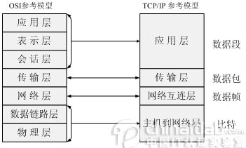
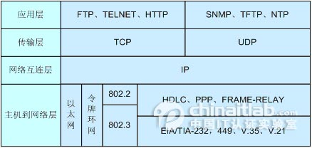
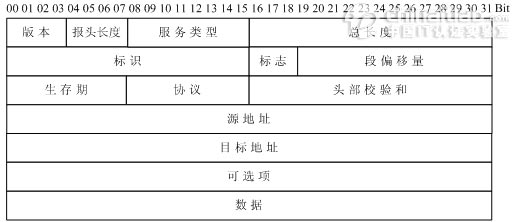
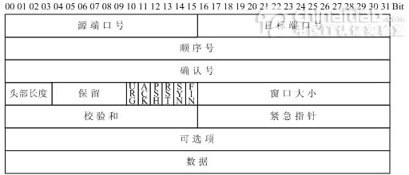
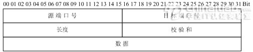
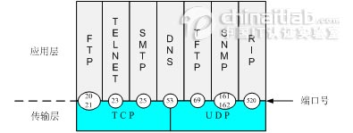
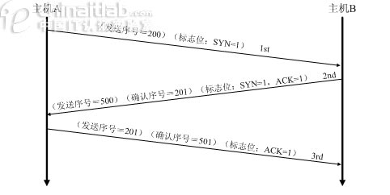
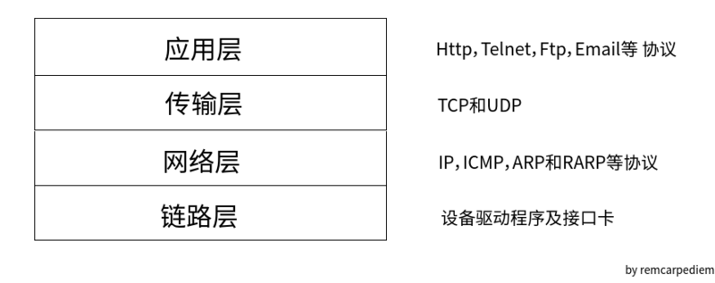
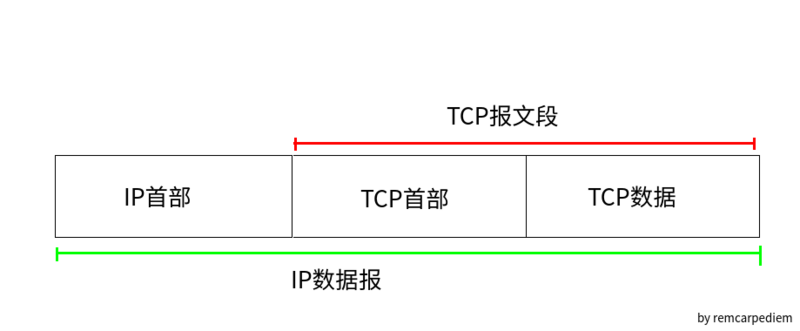
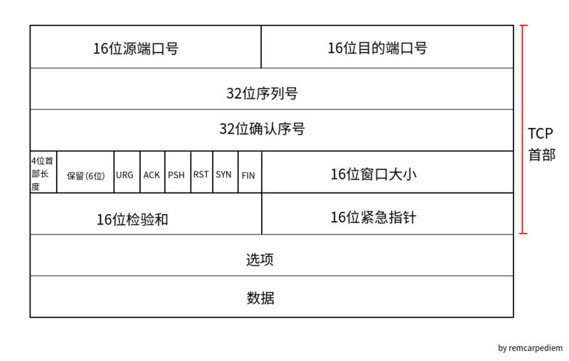

 
<!--BEGIN_DATA
{
    "create_date": "2016-09-02 10:18", 
    "modify_date": "2016-09-02 10:18", 
    "is_top": "0", 
    "summary": "TCP、IP协议", 
    "tags": "Web、网络", 
    "file_name": "TCP、IP协议.md"
}
END_DATA-->

####
原文出处：<a href='http://www.cnblogs.com/BlueTzar/articles/811160.html' target='blank'>TCP/IP四层模型</a>

TCP/IP参考模型  
  
　　ISO制定的OSI参考模型的过于庞大、复杂招致了许多批评。与此对照，由技术人员自己开发的TCP/IP协议栈获得了更为广泛的应用。如图2-1所示，是TCP
/IP参考模型和OSI参考模型的对比示意图。  
  
            图2-1　 TCP/IP参考模型  
  
　　2.1　TCP/IP参考模型的层次结构  
　　TCP/IP协议栈是美国国防部高级研究计划局计算机网（Advanced Research Projects Agency
Network，ARPANET）和其后继因特网使用的参考模型。ARPANET是由美国国防部（U.S．Department of
Defense，DoD）赞助的研究网络。最初，它只连接了美国境内的四所大学。随后的几年中，它通过租用的电话线连接了数百所大学和政府部门
。最终ARPANET发展成为全球规模最大的互连网络-因特网。最初的ARPANET于1990年永久性地关闭。  
　　TCP/IP参考模型分为四个层次：应用层、传输层、网络互连层和主机到网络层。如图2-2所示。  
  
            图2-2　 TCP/IP参考模型的层次结构  
  
　　在TCP/IP参考模型中，去掉了OSI参考模型中的会话层和表示层（这两层的功能被合并到应用层实现）。同时将OSI参考模型中的数据链路层和物理层合并为主机
到网络层。下面，分别介绍各层的主要功能。  
  
　　1、主机到网络层  
　　实际上TCP/IP参考模型没有真正描述这一层的实现，只是要求能够提供给其上层-
网络互连层一个访问接口，以便在其上传递IP分组。由于这一层次未被定义，所以其具体的实现方法将随着网络类型的不同而不同。  
　　2、网络互连层  
　　网络互连层是整个TCP/IP协议栈的核心。它的功能是把分组发往目标网络或主机。同时，为了尽快地发送分组，可能需要沿不同的路径同时进行分组传递。因此，分组
到达的顺序和发送的顺序可能不同，这就需要上层必须对分组进行排序。  
　　网络互连层定义了分组格式和协议，即IP协议（Internet Protocol）。  
　　网络互连层除了需要完成路由的功能外，也可以完成将不同类型的网络（异构网）互连的任务。除此之外，网络互连层还需要完成拥塞控制的功能。  
　　3、传输层  
　　在TCP/IP模型中，传输层的功能是使源端主机和目标端主机上的对等实体可以进行会话。在传输层定义了两种服务质量不同的协议。即：传输控制协议TCP（tra
nsmission control protocol）和用户数据报协议UDP（user datagram protocol）。  
　　TCP协议是一个面向连接的、可靠的协议。它将一台主机发出的字节流无差错地发往互联网上的其他主机。在发送端，它负责把上层传送下来的字节流分成报文段并传递给
下层。在接收端，它负责把收到的报文进行重组后递交给上层。TCP协议还要处理端到端的流量控制，以避免缓慢接收的接收方没有足够的缓冲区接收发送方发送的大量数据。  
　　UDP协议是一个不可靠的、无连接协议，主要适用于不需要对报文进行排序和流量控制的场合。  
　　4、应用层  
　　TCP/IP模型将OSI参考模型中的会话层和表示层的功能合并到应用层实现。  
　　应用层面向不同的网络应用引入了不同的应用层协议。其中，有基于TCP协议的，如文件传输协议（File Transfer
Protocol，FTP）、虚拟终端协议（TELNET）、超文本链接协议（Hyper Text Transfer
Protocol，HTTP），也有基于UDP协议的。  
  
　　2.2　TCP/IP报文格式  
　　1、IP报文格式  
　　IP协议是TCP/IP协议族中最为核心的协议。它提供不可靠、无连接的服务，也即依赖其他层的协议进行差错控制。在局域网环境，IP协议往往被封装在以太网帧中
传送。而所有的TCP、UDP、ICMP、IGMP数据都被封装在IP数据报中传送。如图2-3所示：  
  
            图2-3　 TCP/IP报文封装  
  
　　图2-4是IP头部（报头）格式：（RFC 791）。  
  
            图2-4　 IP头部格式  
  
　　其中：  
　　●版本（Version）字段：占4比特。用来表明IP协议实现的版本号，当前一般为IPv4，即0100。  
　　●报头长度（Internet Header Length，IHL）字段：占4比特。是头部占32比特的数字，包括可选项。普通IP数据报（没有任何选项），该
字段的值是5，即160比特=20字节。此字段最大值为60字节。  
　　●服务类型（Type of Service ，TOS）字段：占8比特。其中前3比特为优先权子字段（Precedence，现已被忽略）。第8比特保留未用。
第4至第7比特分别代表延迟、吞吐量、可靠性和花费。当它们取值为1时分别代表要求最小时延、最大吞吐量、最高可靠性和最小费用。这4比特的服务类型中只能置其中1比
特为1。可以全为0，若全为0则表示一般服务。服务类型字段声明了数据报被网络系统传输时可以被怎样处理。例如：TELNET协议可能要求有最小的延迟，FTP协议（
数据）可能要求有最大吞吐量，SNMP协议可能要求有最高可靠性，NNTP（Network News Transfer Protocol，网络新闻传输协议）可能
要求最小费用，而ICMP协议可能无特殊要求（4比特全为0）。实际上，大部分主机会忽略这个字段，但一些动态路由协议如OSPF（Open Shortest
Path First Protocol）、IS-IS（Intermediate System to Intermediate System
Protocol）可以根据这些字段的值进行路由决策。  
　　●总长度字段：占16比特。指明整个数据报的长度（以字节为单位）。最大长度为65535字节。  
　　●标志字段：占16比特。用来唯一地标识主机发送的每一份数据报。通常每发一份报文，它的值会加1。  
　　●标志位字段：占3比特。标志一份数据报是否要求分段。  
　　●段偏移字段：占13比特。如果一份数据报要求分段的话，此字段指明该段偏移距原始数据报开始的位置。  
　　●生存期（TTL：Time to Live）字段：占8比特。用来设置数据报最多可以经过的路由器数。由发送数据的源主机设置，通常为32、64、128等。每
经过一个路由器，其值减1，直到0时该数据报被丢弃。  
　　●协议字段：占8比特。指明IP层所封装的上层协议类型，如ICMP（1）、IGMP（2） 、TCP（6）、UDP（17）等。  
　　●头部校验和字段：占16比特。内容是根据IP头部计算得到的校验和码。计算方法是：对头部中每个16比特进行二进制反码求和。（和ICMP、IGMP、TCP、
UDP不同，IP不对头部后的数据进行校验）。  
　　●源IP地址、目标IP地址字段：各占32比特。用来标明发送IP数据报文的源主机地址和接收IP报文的目标主机地址。  
　　可选项字段：占32比特。用来定义一些任选项：如记录路径、时间戳等。这些选项很少被使用，同时并不是所有主机和路由器都支持这些选项。可选项字段的长度必须是3
2比特的整数倍，如果不足，必须填充0以达到此长度要求。  
  
　　2、TCP数据段格式  
　　TCP是一种可靠的、面向连接的字节流服务。源主机在传送数据前需要先和目标主机建立连接。然后，在此连接上，被编号的数据段按序收发。同时，要求对每个数据段进
行确认，保证了可靠性。如果在指定的时间内没有收到目标主机对所发数据段的确认，源主机将再次发送该数据段。  
　　如图2-5所示，是TCP头部结构（RFC 793、1323）。  
  
            图2-5　 TCP头部结构　　  
　　●源、目标端口号字段：占16比特。TCP协议通过使用"端口"来标识源端和目标端的应用进程。端口号可以使用0到65535之间的任何数字。在收到服务请求时，
操作系统动态地为客户端的应用程序分配端口号。在服务器端，每种服务在"众所周知的端口"（Well-Know Port）为用户提供服务。  
　　●顺序号字段：占32比特。用来标识从TCP源端向TCP目标端发送的数据字节流，它表示在这个报文段中的第一个数据字节。  
　　●确认号字段：占32比特。只有ACK标志为1时，确认号字段才有效。它包含目标端所期望收到源端的下一个数据字节。  
　　●头部长度字段：占4比特。给出头部占32比特的数目。没有任何选项字段的TCP头部长度为20字节；最多可以有60字节的TCP头部。  
　　●标志位字段（U、A、P、R、S、F）：占6比特。各比特的含义如下：  
　　◆URG：紧急指针（urgent pointer）有效。  
　　◆ACK：确认序号有效。  
　　◆PSH：接收方应该尽快将这个报文段交给应用层。  
　　◆RST：重建连接。  
　　◆SYN：发起一个连接。  
　　◆FIN：释放一个连接。  
　　●窗口大小字段：占16比特。此字段用来进行流量控制。单位为字节数，这个值是本机期望一次接收的字节数。  
　　●TCP校验和字段：占16比特。对整个TCP报文段，即TCP头部和TCP数据进行校验和计算，并由目标端进行验证。  
　　●紧急指针字段：占16比特。它是一个偏移量，和序号字段中的值相加表示紧急数据最后一个字节的序号。  
　　●选项字段：占32比特。可能包括"窗口扩大因子"、"时间戳"等选项。  
  
　　3、UDP数据段格式  
　　UDP是一种不可靠的、无连接的数据报服务。源主机在传送数据前不需要和目标主机建立连接。数据被冠以源、目标端口号等UDP报头字段后直接发往目的主机。这时，
每个数据段的可靠性依靠上层协议来保证。在传送数据较少、较小的情况下，UDP比TCP更加高效。  
　　如图2-6所示，是UDP头部结构（RFC 793、1323）：  
  
　　●源、目标端口号字段：占16比特。作用与TCP数据段中的端口号字段相同，用来标识源端和目标端的应用进程。  
　　●长度字段：占16比特。标明UDP头部和UDP数据的总长度字节。  
　　●校验和字段：占16比特。用来对UDP头部和UDP数据进行校验。和TCP不同的是，对UDP来说，此字段是可选项，而TCP数据段中的校验和字段是必须有的。  
  
　　2.3　套接字  
在每个TCP、UDP数据段中都包含源端口和目标端口字段。有时，我们把一个IP地址和一个端口号合称为一个套接字（Socket），而一个套接字对（Socket
pair）可以唯一地确定互连网络中每个TCP连接的双方（客户IP地址、客户端口号、服务器IP地址、服务器端口号）。  
  
　　如图2-7所示，是常见的一些协议和它们对应的服务端口号。  
  
            图2-7　 常见协议和对应的端口号  
  
　　需要注意的是，不同的应用层协议可能基于不同的传输层协议，如FTP、TELNET、SMTP协议基于可靠的TCP协议。TFTP、SNMP、RIP基于不可靠的
UDP协议。  
　　同时，有些应用层协议占用了两个不同的端口号，如FTP的20、21端口，SNMP的161、162端口。这些应用层协议在不同的端口提供不同的功能。如FTP的
21端口用来侦听用户的连接请求，而20端口用来传送用户的文件数据。再如，SNMP的161端口用于SNMP管理进程获取SNMP代理的数据，而162端口用于SN
MP代理主动向SNMP管理进程发送数据。  
　　还有一些协议使用了传输层的不同协议提供的服务。如DNS协议同时使用了TCP 53端口和UDP
53端口。DNS协议在UDP的53端口提供域名解析服务，在TCP的53端口提供DNS区域文件传输服务。  
  
　　2.4　TCP连接建立、释放时的握手过程  
　　1、TCP建立连接的三次握手过程  
　　TCP会话通过三次握手来初始化。三次握手的目标是使数据段的发送和接收同步。同时也向其他主机表明其一次可接收的数据量（窗口大小），并建立逻辑连接。这三次握
手的过程可以简述如下：  
　　●源主机发送一个同步标志位（SYN）置1的TCP数据段。此段中同时标明初始序号（Initial Sequence
Number，ISN）。ISN是一个随时间变化的随机值。  
　　●目标主机发回确认数据段，此段中的同步标志位（SYN）同样被置1，且确认标志位（ACK）也置1，同时在确认序号字段表明目标主机期待收到源主机下一个数据段
的序号（即表明前一个数据段已收到并且没有错误）。此外，此段中还包含目标主机的段初始序号。  
　　●源主机再回送一个数据段，同样带有递增的发送序号和确认序号。  
　　至此为止，TCP会话的三次握手完成。接下来，源主机和目标主机可以互相收发数据。整个过程可用图2-8表示。  
  
　　2、TCP释放连接的四次握手过程  

####
原文出处：<a href='https://segmentfault.com/a/1190000005680277' target='blank'>TCP/IP详解阅读笔记（一）：TCP协议</a>

前段时间提交了本科毕业论文，这段时间特别空闲，于是希望研究一些基础性的技术，比如网络和编译原理。于是就找来《TCP/IP协议详解》来看，并做一些笔记，记录一下感悟或在重点。  为了节约你的时间，本文主要内容为：

  * TCP/IP协议族

  * TCP和UDP的区别

  * TCP提供可靠性的方式

  * TCP首部格式

####**TCP/IP协议族**

 TCP/IP协议是一组网络传输协议的集合，按照网络模型的不同层次，使用不同的传输协议进行分工合作。TCP/IP的网络参考模型一共有四层，自上而下分别为应用层，传输层，网络层和数据链路层。  
 
 

  * 链路层，有时候也称为数据链路层或网络接口层，通常包括操作系统中的设备驱动程序和计算机中对应的网络接口卡。它们一起处理与电缆（或者其他任何传输媒介）的物理接口细节。

  * 网络层，有时也称为互联网层，处理分组在网络中的活动，例如分组的选路。在TCP/IP协议族中，网络层协议包括IP协议，ICMP协议，以及IGMP协议。

  * 传输层主要为两台主机上的应用程序提供端到端的通信，在TCP/IP协议族中，有两个互不相同的传输协议：TCP（传输控制协议）和UDP（用户数据报协议）。TCP相对安全稳定，但是UDP速度更快。

  * 应用层负责处理特定的应用程序细节。几乎各种不同的TCP/IP实现都会提供下面这些通用的应用程序：

    * Telnet远程登陆

    * FTP文件传输协议

    * SMTP简单邮件传输协议

    * SNMP 简单网络管理协议

####**TCP：传输控制协议**

 TCP和UDP都是传输层的协议，但是二者却有着很多的不同。TCP提供一种**面向连接**的，**可靠**的字节流服务。而UDP是一个简单的**面向数据报文**的传输层协议：进程中的每个输出操作都正好产生一个UDP数据报文，并且组装成一份待发送的IP数据报，而TCP协议中，应用程序产生的全体数据与真正发送的单个
IP数据报可能没有什么联系。UDP也**不提供可靠性保证**。  
 TCP和UDP的主要区别如图所示。

####**TCP提供可靠性的方式**

&ems;与UDP不同的是，TCP提供各种方式来保证数据传输的正确性：

  * 应用数据被分割成TCP认为最合适发送的数据快。这和UDP完全不同，应用程序产生的数据报长度不变。

  * TCP发送一个报文段之后，它启动一个定时器，等待目的端确认收到这个报文段。如果不能及时收到一个确认，将重新发送这个报文。

  * 当TCP收到发自TCP连接另一端的数据，它将发送一个确认。

  * TCP将保持它首部和数据的检验和。这是一个端到端的检验和，目的是检测数据在传输过程中的任何变化。如果收到端的检验和有差别，TCP将丢弃这个报文段。

  * TCP会对收到的数据金喜重排，将收到的数据以正确的顺序交给应用层。

  * TCP的接受端会放弃重复的数据

  * TCP提供流量控制。TCP接受的每一方都有固定大小的缓冲空间。TCP的接受端只允许另一端发送接收端缓冲区所能容纳的数据。

####**TCP的首部**

 TCP数据被封装在一个IP数据报中，如下图所示。

  
 下图显示TCP首部的数据结构。如果不计任何可选字段的话，它通常是20个字节。
 
 

  * 每个TCP端都包含源端和目的端的端口号，用于寻找发送端和接受端应用进程。这两个值加上IP首部的源端IP地址和目的端IP地址唯一确定一个TCP连接。

  * 序号用来标识TCP发端向TCP收端发送的数据字节流，它表示在这个报文段中的第一个字节数据。如果将字节流看作在两个应用程序之间的单向流动，则TCP用序号来对每个字节进行计数。序号是32位的无符号数。

  * 确认序号包含发送确认的一端所期望收到的下一个序号。因此，确认序号应当是上次已经成功收到的数据字节序号+1。只有ACK标志为1时确认序号字段才有效。

  * 首部长度给出TCP首部的字节数目。需要这个值是因为任选字段的长度是可变的。

  * TCP首部中有6个标志位。

    * URG：紧急指针有效标志位，当它被置为1时，紧急指针才有效。

    * ACK：确认序号有效，当它被置为1时，确认序号才有效。

    * PSH：接受方应该尽快将这个报文交给应用层。

    * RST：重建连接。

    * SYN：同步序号用来发起一个新连接。

    * FIN：发端完成发送任务。

  * 窗口大小来进行TCP的流量控制。窗口大小为字节数，起始于确认序号字段指明的值，这个值是接受端期望接受的字节。

  * 检验和覆盖了整个的TCP报文段：TCP首部和TCP数据。这是一个强制性的字段，一定由发端进行计算和存储，并由收端进行检验。

  * 紧急指针是一个正的偏移量，和序号字段中的值相加表示紧急数据最后一个字节的序号。TCP的紧急方式是发送端向另一端发送紧急数据的一种方式。

####
原文出处：<a href='https://segmentfault.com/a/1190000005809887' target='blank'>HTTP、TCP/IP协议与socket之间的区别</a>

#####网络由下往上分为：

  1. 物理层--

  2. 数据链路层--

  3. 网络层--IP协议

  4. 传输层--TCP协议

  5. 会话层--

  6. 表示层和应用层--HTTP协议

#####一.TCP/IP连接

  * 手机能够使用联网功能是因为手机底层实现了TCP/IP协议，可以使手机终端通过无线网络建立TCP连接。TCP协议可以对上层网络提供接口，使上层网络数据的传输建立在“无差别”的网络之上。

  * 建立起一个TCP连接需要经过“三次握手”：

    1. 第一次握手：客户端发送syn包(syn=j)到服务器，并进入SYN_SEND状态，等待服务器确认；

    2. 第二次握手：服务器收到syn包，必须确认客户的SYN（ack=j+1），同时自己也发送一个SYN包（syn=k），即SYN+ACK包，此时服务器进入SYN_RECV状态；

    3. 第三次握手：客户端收到服务器的SYN＋ACK包，向服务器发送确认包ACK(ack=k+1)，此包发送完毕，客户端和服务器进入ESTABLISHED状态，完成三次握手。

  * 握手过程中传送的包里不包含数据，三次握手完毕后，客户端与服务器才正式开始传送数据。理想状态下，TCP连接一旦建立，在通信双方中的任何一方主动关闭连接之前，TCP 连接都将被一直保持下去。断开连接时服务器和客户端均可以主动发起断开TCP连接的请求，断开过程需要经过“四次握手”（过程就不细写了，就是服务器和客户端交互，最终确定断开）.

#####二.HTTP连接

  * HTTP协议即超文本传送协议(Hypertext Transfer Protocol )，是Web联网的基础，也是手机联网常用的协议之一，HTTP协议是建立在TCP协议之上的一种应用。

  * HTTP连接最显著的特点是客户端发送的每次请求都需要服务器回送响应，在请求结束后，会主动释放连接。从建立连接到关闭连接的过程称为“一次连接”。

    1. 在HTTP 1.0中，客户端的每次请求都要求建立一次单独的连接，在处理完本次请求后，就自动释放连接。

    2. 在HTTP 1.1中则可以在一次连接中处理多个请求，并且多个请求可以重叠进行，不需要等待一个请求结束后再发送下一个请求。

  * 由于HTTP在每次请求结束后都会主动释放连接，因此HTTP连接是一种“短连接”，要保持客户端程序的在线状态，需要不断地向服务器发起连接请求。通常的做法是即时不需要获得任何数据，客户端也保持每隔一段固定的时间向服务器发送一次“保持连接”的请求，服务器在收到该请求后对客户端进行回复，表明知道客户端“在线”。若服务器长时间无法收到客户端的请求，则认为客户端“下线”，若客户端长时间无法收到服务器的回复，则认为网络已经断开。

#####三.SOCKET原理

  1. 套接字（socket）概念

    * 套接字（socket）是通信的基石，是支持TCP/IP协议的网络通信的基本操作单元。它是网络通信过程中端点的抽象表示，包含进行网络通信必须的五种信息：连接使用的协议，本地主机的IP地址，本地进程的协议端口，远地主机的IP地址，远地进程的协议端口。

    * 应用层通过传输层进行数据通信时，TCP会遇到同时为多个应用程序进程提供并发服务的问题。多个TCP连接或多个应用程序进程可能需要通过同一个 TCP协议端口传输数据。为了区别不同的应用程序进程和连接，许多计算机操作系统为应用程序与TCP／IP协议交互提供了套接字(Socket)接口。应用层可以和传输层通过Socket接口，区分来自不同应用程序进程或网络连接的通信，实现数据传输的并发服务。

  2. 建立socket连接

  * 建立Socket连接至少需要一对套接字，其中一个运行于客户端，称为ClientSocket ，另一个运行于服务器端，称为ServerSocket 。

  * 套接字之间的连接过程分为三个步骤：服务器监听，客户端请求，连接确认。

    * 服务器监听：服务器端套接字并不定位具体的客户端套接字，而是处于等待连接的状态，实时监控网络状态，等待客户端的连接请求。

    * 客户端请求：指客户端的套接字提出连接请求，要连接的目标是服务器端的套接字。为此，客户端的套接字必须首先描述它要连接的服务器的套接字，指出服务器端套接字的地址和端口号，然后就向服务器端套接字提出连接请求。

    * 连接确认：当服务器端套接字监听到或者说接收到客户端套接字的连接请求时，就响应客户端套接字的请求，建立一个新的线程，把服务器端套接字的描述发给客户端，一旦客户端确认了此描述，双方就正式建立连接。而服务器端套接字继续处于监听状态，继续接收其他客户端套接字的连接请求。

#####四.SOCKET连接与TCP/IP连接

  * 创建Socket连接时，可以指定使用的传输层协议，Socket可以支持不同的传输层协议（TCP或UDP），当使用TCP协议进行连接时，该Socket连接就是一个TCP连接。

  * socket则是对TCP/IP协议的封装和应用（程序员层面上）。也可以说，TPC/IP协议是传输层协议，主要解决数据 如何在网络中传输，而HTTP是应用层协议，主要解决如何包装数据。关于TCP/IP和HTTP协议的关系，网络有一段比较容易理解的介绍：

    * “我们在传输数据时，可以只使用（传输层）TCP/IP协议，但是那样的话，如 果没有应用层，便无法识别数据内容，如果想要使传输的数据有意义，则必须使用到应用层协议，应用层协议有很多，比如HTTP、FTP、TELNET等，也 可以自己定义应用层协议。WEB使用HTTP协议作应用层协议，以封装HTTP文本信息，然后使用TCP/IP做传输层协议将它发到网络上。”

  * 我们平时说的最多的socket是什么呢，实际上socket是对TCP/IP协议的封装，Socket本身并不是协议，而是一个调用接口（API），通过Socket，我们才能使用TCP/IP协议。 实际上，Socket跟TCP/IP协议没有必然的联系。Socket 编程 接口在设计的时候，就希望也能适应其他的网络协议。所以说，Socket的出现，只是使得程序员更方便地使用TCP/IP协议栈而已，是对TCP/IP协议的抽象，从而形成了我们知道的一些最基本的函数接口，比如create、 listen、connect、accept、send、read和write等等。网络有一段关于socket和TCP/IP协议关系的说法比较容易理解：

    * “TCP/IP只是一个协议栈，就像操作系统的运行机制一样，必须要具体实现，同时还要提供对外的操作接口。这个就像操作系统会提供标准的编程接口，比如win32编程接口一样，TCP/IP也要提供可供程序员做网络开发所用的接口，这就是Socket编程接口。”

  * 实际上，传输层的TCP是基于网络层的IP协议的，而应用层的HTTP协议又是基于传输层的TCP协议的，而Socket本身不算是协议，就像上面所说，它只是提供了一个针对TCP或者UDP编程的接口。socket是对端口通信开发的工具,它要更底层一些.

#####五.Socket连接与HTTP连接

  * 由于通常情况下Socket连接就是TCP连接，因此Socket连接一旦建立，通信双方即可开始相互发送数据内容，直到双方连接断开。但在实际网络应用中，客户端到服务器之间的通信往往需要穿越多个中间节点，例如 路由器 、网关、防火墙等，大部分防火墙默认会关闭长时间处于非活跃状态的连接而导致 Socket 连接断连，因此需要通过轮询告诉网络，该连接处于活跃状态。

  * 而HTTP连接使用的是“请求—响应”的方式，不仅在请求时需要先建立连接，而且需要客户端向服务器发出请求后，服务器端才能回复数据。

  * 很多情况下，需要服务器端主动向客户端推送数据，保持客户端与服务器数据的实时与同步。此时若双方建立的是Socket连接，服务器就可以直接将数据传送给客户端；若双方建立的是HTTP连接，则服务器需要等到客户端发送一次请求后才能将数据传回给客户端，因此，客户端定时向服务器端发送连接请求，不仅可以保持在线，同时也是在“询问”服务器是否有新的数据，如果有就将数据传给客户端。

  * http协议是应用层的协义

  * 有个比较形象的描述：HTTP是轿车，提供了封装或者显示数据的具体形式；Socket是发动机，提供了网络通信的能力。

  * 两个计算机之间的交流无非是两个端口之间的数据通信,具体的数据会以什么样的形式展现是以不同的应用层协议来定义的如HTTP、FTP...

 
