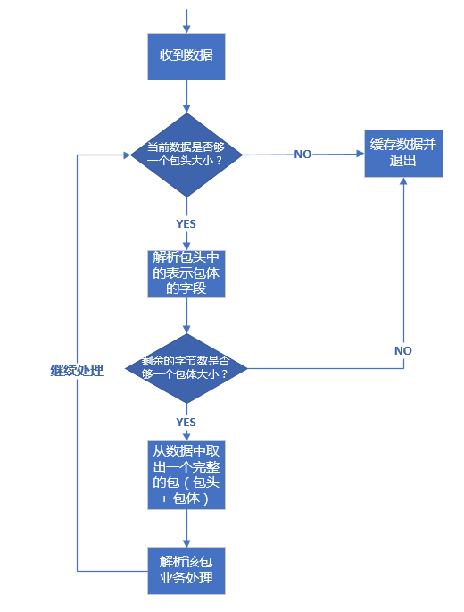
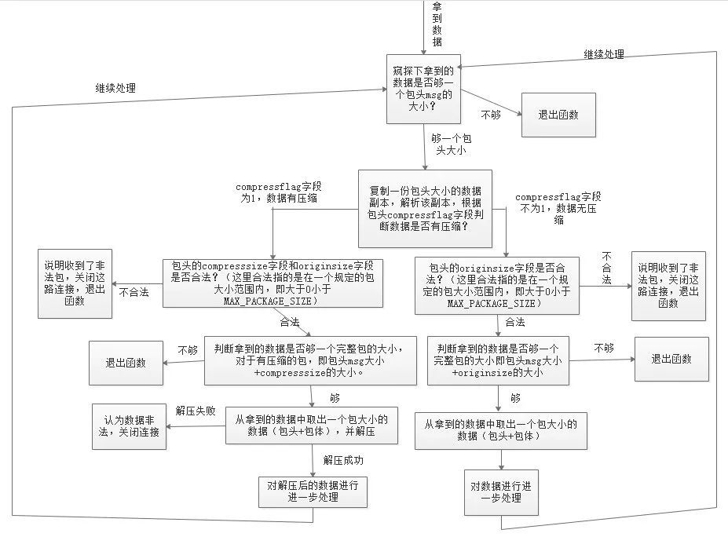

 
<!--BEGIN_DATA
{
    "create_date": "2019-09-22 12:32", 
    "modify_date": "2019-09-22 12:32", 
    "is_top": "0", 
    "summary": "TCP丢包原因及如何解决粘包、半包问题", 
    "tags": "C/C++、网络", 
    "file_name": "TCP丢包原因及如何解决粘包、半包问题.md"
}
END_DATA-->

####
原文出处：<a href='https://www.cnblogs.com/orange1438/p/4693470.html' target='blank'>TCP通信丢包原因总结</a>

今天在公司问老大，公司的项目底层，是使用的TCP，因为可靠，自动断线重连，在底层都实现了，但是我记得TCP也会有掉包的问题，所以这文章就诞生了——关于TCP掉包的问题，TCP是基于不可靠的网络实现可靠的传输，肯定也会存在掉包的情况。

如果通信中发现缺少数据或者丢包，那么，最大的可能在于程序发送的过程或者接收的过程出现问题。

例如服务器给客户端发大量数据，Send的频率很高，那么就有可能在Send时发生错误（原因可能是又多种，可能是程序处理逻辑问题，多线程同步问题，缓冲区溢出问题等等），如果没有对Send失败做处理重发数据，那么客户端收到的数据就会比理论应该收到的少，就会造成丢数据，丢包的现象。

这种现象，其实本质上来说不是丢包，也不是丢数据，只是因为程序处理有错误，导致有些数据没有成功地被socket发送出去。

常用的解决方法如下：拆包、加包头、发送，组合包，如果客户端、服务端掉线，常采用心跳测试。

tcp是一个“流”的协议，一个完整的包可能会被TCP拆分成多个包进行发送，也可能把小的封装成一个大的数据包发送，这就是所谓的TCP粘包和拆包问题。

####粘包、拆包问题说明

假设客户端分别发送数据包D1和D2给服务端，由于服务端一次性读取到的字节数是不确定的，所以可能存在以下4种情况。

* 1.服务端分2次读取到了两个独立的包，分别是D1,D2,没有粘包和拆包；
* 2.服务端一次性接收了两个包，D1和D2粘在一起了，被成为TCP粘包;
* 3.服务端分2次读取到了两个数据包，第一次读取到了完整的D1和D2包的部分内容,第二次读取到了D2包的剩余内容，这被称为拆包；
* 4.服务端分2次读取到了两个数据包，第一次读取到了部分D1，第二次读取D1剩余的部分和完整的D2包；

如果此时服务端TCP接收滑动窗非常小,而数据包D1和D2都很大，很有可能发送第五种可能，即服务端多次才能把D1和D2接收完全，期间多次发生拆包情况。（TCP接收滑动窗：是接收端的大小，随着流量大小而变化，如果我的解释还不明确，请读者自行百度，或者查阅《计算机网络》、《TCP/IP》中TCP的内容）

####**粘包问题的解决策略**

由于底层的TCP无法理解上层的业务逻辑，所以在底层是无法确保数据包不被拆分和重组的，这个问题只能通过上层的应用协议栈设计来解决，根据业界的主流协议的解决方案，归纳如下：

* 1.消息定长，例如每个报文的大小为固定长度200字节,如果不够，空位补空格；
* 2.在包尾增加回车换行符进行分割，例如FTP协议；
* 3.将消息分为消息头和消息体，消息头中包含表示消息总长度（或者消息体长度）的字段，通常设计思路是消息头的第一个字段用int来表示消息的总长度；（我之前linux C开发，就用的这种）。
* 4.更复杂的应用层协议；

####
原文出处：<a href='https://cloud.tencent.com/developer/article/1488162' target='blank'>TCP协议如何解决粘包、半包问题</a>

很多读者从接触网络知识以来，应该听说过这句话：TCP 协议是流式协议。那么这句话到底是什么意思呢？所谓流式协议，即协议的内容是像流水一样的字节流，内容与内容之间没有明确的分界标志，需要我们人为地去给这些协议划分边界。

举个例子，A 与 B 进行 TCP 通信，A 先后给 B 发送了一个 100 字节和 200 字节的数据包，那么 B 是如何收到呢？B 可能先收到 100字节，再收到 200 字节；也可能先收到 50 字节，再收到 250 字节；或者先收到 100 字节，再收到 100 字节，再收到 200 字节；或者先收到20 字节，再收到 20 字节，再收到 60 字节，再收到 100 字节，再收到 50 字节，再收到 50 字节……

不知道读者看出规律没有？规律就是 A 一共给 B 发送了 300 字节，B 可能以一次或者多次任意形式的总数为 300 字节收到。假设 A 给 B 发送的100 字节和 200 字节分别都是一个数据包，对于发送端 A 来说，这个是可以区分的，但是对于 B 来说，如果不人为规定多长为一个数据包，B每次是不知道应该把收到的数据中多少字节作为一个有效的数据包的。而规定每次把多少数据当成一个包就是协议格式规范的内容之一。

经常会有新手写出类似下面这样的代码：

**发送端：**
    
    
    //...省略创建socket，建立连接等部分不相关的逻辑...
    char buf[] = "the quick brown fox jumps over a lazy dog.";
    int n = send(socket, buf, strlen(buf), 0);
    //...省略出错处理逻辑...
    

**接收端：**
    
    
    //省略创建socket，建立连接等部分不相关的逻辑...
    char recvBuf[50] = { 0 };
    int n = recv(socket, recvBuf, 50, 0);
    //省略出错处理逻辑...
    printf("recvBuf: %s", recvBuf);
    

为了专注问题本身的讨论，我这里省略掉了建立连接和部分错误处理的逻辑。上述代码中发送端给接收端发送了一串字符”the quick brown fox jumps over a lazy dog.“，接收端收到后将其打印出来。

类似这样的代码在本机一般会工作的很好，接收端也如期打印出来预料的字符串，但是一放到局域网或者公网环境就出问题了，即接收端可能打印出来字符串并不完整；如果发送端连续多次发送字符串，接收端会打印出来的字符串不完整或出现乱码。不完整的原因很好理解，即对端某次收到的数据小于完整字符串的长度，recvBuf数组开始被清空成 0，收到部分字符串后，该字符串的末尾仍然是 0，printf 函数寻找以 0为结束标志的字符结束输出；乱码的原因是如果某次收入的数据不仅包含一个完整的字符串，还包含下一个字符串部分内容，那么 recvBuf 数组将会被填满，printf 函数输出时仍然会寻找以 0为结束标志的字符结束输出，这样读取的内存就越界了，一直找到为止，而越界后的内存可能是一些不可读字符，显示出来后就乱码了。

我举这个例子希望你明白 能对TCP 协议是流式协议有一个直观的认识。正因为如此，所以我们需要人为地在发送端和接收端规定每一次的字节流边界，以便接收端知道从什么位置取出多少字节来当成一个数据包去解析，这就是我们设计网络通信协议格式的要做的工作之一。

#####**二 如何解决粘包问题**

网络通信程序实际开发中，或者技术面试时，面试官通常会问的比较多的一个问题是：网络通信时，如何解决粘包？

>有的面试官可能会这么问：网络通信时，如何解决粘包、丢包或者包乱序问题？这个问题其实是面试官在考察面试者的网络基础知识，如果是 TCP 协议，在大多数场景下，是不存在丢包和包乱序问题的，TCP 通信是可靠通信方式，TCP 协议栈通过序列号和包重传确认机制保证数据包的有序和一定被正确发到目的地；如果是 UDP 协议，如果不能接受少量丢包，那就要自己在 UDP 的基础上实现类似TCP 这种有序和可靠传输机制了（例如 RTP协议、RUDP 协议）。所以，问题拆解后，只剩下如何解决粘包的问题。

先来解释一下什么是**粘包**，所谓粘包就是连续给对端发送两个或者两个以上的数据包，对端在一次收取中可能收到的数据包大于 1 个，大于 1个，可能是几个（包括一个）包加上某个包的部分，或者干脆就是几个完整的包在一起。当然，也可能收到的数据只是一个包的部分，这种情况一般也叫**半包**。

无论是半包还是粘包问题，其根源是上文介绍中 TCP 协议是流式数据格式。解决问题的思路还是想办法从收到的数据中把包与包的边界给区分出来。那么如何区分呢？目前主要有三种方法：

**固定包长的数据包**

顾名思义，即每个协议包的长度都是固定的。举个例子，例如我们可以规定每个协议包的大小是 64 个字节，每次收满 64个字节，就取出来解析（如果不够，就先存起来）。

这种通信协议的格式简单但灵活性差。如果包内容不足指定的字节数，剩余的空间需要填充特殊的信息，如 \0（如果不填充特殊内容，如何区分包里面的正常内容与填充信息呢？）；如果包内容超过指定字节数，又得分包分片，需要增加额外处理逻辑——在发送端进行分包分片，在接收端重新组装包片（分包和分片内容在接下来会详细介绍）。

**以指定字符（串）为包的结束标志**

这种协议包比较常见，即字节流中遇到特殊的符号值时就认为到一个包的末尾了。例如，我们熟悉的 FTP协议，发邮件的 SMTP协议，一个命令或者一段数据后面加上"\r\n"（即所谓的**CRLF**）表示一个包的结束。对端收到后，每遇到一个”\r\n“就把之前的数据当做一个数据包。

这种协议一般用于一些包含各种命令控制的应用中，其不足之处就是如果协议数据包内容部分需要使用包结束标志字符，就需要对这些字符做转码或者转义操作，以免被接收方错误地当成包结束标志而误解析。

**包头 + 包体格式**

这种格式的包一般分为两部分，即包头和包体，包头是固定大小的，且包头中必须含有一个字段来说明接下来的包体有多大。

例如：

    
    
    struct msg_header
    {
      int32_t bodySize;
      int32_t cmd;
    };
    

这就是一个典型的包头格式，bodySize 指定了这个包的包体是多大。由于包头大小是固定的（这里是 size(int32_t) + sizeof(int32_t) = 8 字节），对端先收取包头大小字节数目（当然，如果不够还是先缓存起来，直到收够为止），然后解析包头，根据包头中指定的包体
大小来收取包体，等包体收够了，就组装成一个完整的包来处理。在有些实现中，包头中的 bodySize可能被另外一个叫 packageSize的字段代替，这个字段的含义是整个包的大小，这个时候，我们只要用 packageSize 减去包头大小（这里是sizeof(msg_header)）就能算出包体的大小，原理同上。

> 在使用大多数网络库时，通常你需要根据协议格式自己给数据包分界和解析，一般的网络库不提供这种功能是出于需要支持不同的协议，由于协议的不确定性，因此没法预先提供具体解包代码。当然，这不是绝对的，也有一些网络库提供了这种功能。在 Java Netty网络框架中，提供了FixedLengthFrameDecoder 类去处理长度是定长的协议包，提供了DelimiterBasedFrameDecoder类去处理按特殊字符作为结束符的协议包，提供 ByteToMessageDecoder 去处理自定义格式的协议包（可用来处理包头 + 包体这种格式的数据包），然而在继承 ByteToMessageDecoder 子类中你需要根据你的协议具体格式重写decode() 方法来对数据包解包。

这三种包格式，希望读者能在理解其原理和优缺点的基础上深入掌握。

#####**三 解包与处理**

在理解了前面介绍的数据包的三种格式后，我们来介绍一下针对上述三种格式的数据包技术上应该如何处理。其处理流程都是一样的，这里我们以**包头 + 包体**这种格式的数据包来说明。处理流程如下：

假设我们的包头格式如下：

    
    
    //强制一字节对齐
    #pragma pack(push, 1)
    //协议头
    struct msg
    {   
        int32_t  bodysize;         //包体大小  
    };
    #pragma pack(pop)
    

那么上面的流程实现代码如下：

    
    
    //包最大字节数限制为10M
    #define MAX_PACKAGE_SIZE    10 * 1024 * 1024
    void ChatSession::OnRead(const std::shared_ptr<TcpConnection>& conn, Buffer* pBuffer, Timestamp receivTime)
    {
        while (true)
        {
            //不够一个包头大小
            if (pBuffer->readableBytes() < (size_t)sizeof(msg))
            {
                //LOGI << "buffer is not enough for a package header, pBuffer->readableBytes()=" << pBuffer->readableBytes() << ", sizeof(msg)=" << sizeof(msg);
                return;
            }
            //取包头信息
            msg header;
            memcpy(&header, pBuffer->peek(), sizeof(msg));
            //包头有错误，立即关闭连接
            if (header.bodysize <= 0 || header.bodysize > MAX_PACKAGE_SIZE)
            {
                //客户端发非法数据包，服务器主动关闭之
                LOGE("Illegal package, bodysize: %lld, close TcpConnection, client: %s", header.bodysize, conn->peerAddress().toIpPort().c_str());
                conn->forceClose();
                return;
            }
            //收到的数据不够一个完整的包
            if (pBuffer->readableBytes() < (size_t)header.bodysize + sizeof(msg))
                return;
            pBuffer->retrieve(sizeof(msg));
            //inbuf用来存放当前要处理的包
            std::string inbuf;
            inbuf.append(pBuffer->peek(), header.bodysize);
            pBuffer->retrieve(header.bodysize);          
            //解包和业务处理
            if (!Process(conn, inbuf.c_str(), inbuf.length()))
            {
                //客户端发非法数据包，服务器主动关闭之
                LOGE("Process package error, close TcpConnection, client: %s", conn->peerAddress().toIpPort().c_str());
                conn->forceClose();
                return;
            }              
        }// end while-loop
    }
    

上述流程代码的处理过程和流程图中是一致的，pBuffer 这里是一个自定义的接收缓冲区，这里的代码，已经将收到的数据放入了这个缓冲区，所以判断当前已收取的字节数目只需要使用这个对象的相应方法即可。上述代码有些细节我需要强调一下：

  * 取包头时，你应该拷贝一份数据包头大小的数据出来，而不是从缓冲区 pBuffer 中直接将数据取出来（即取出来的数据从 pBuffer 中移除），这是因为倘若接下来根据包头中的字段得到包体大小时，如果剩余数据不够一个包体大小，你又得把这个包头数据放回缓冲区。为了避免这种不必要的操作，只有缓冲区数据大小够整个包的大小（代码中：header.bodysize + sizeof(msg)）你才需要把整个包大小的数据从缓冲区移除，这也是这里的 pBuffer->peek() 方法 peek 单词的含义（中文可以翻译成“瞟一眼”或者“偷窥”）。
  * 通过包头得到包体大小时，你一定要对 bodysize 的数值进行校验，我这里要求 bodysize 必须大于 0 且不大于 10 * 1024 * 1024（即 10 M）。当然，实际开发中，你可以根据你自己的需求要决定 bodysize 的上下限（包体大小是 0 字节的包在某些业务场景下是允许的）。记住，一定要判断这个上下限，因为假设这是一个非法的客户端发来的数据，其 bodysize 设置了一个比较大的数值，例如 1 * 1024 * 1024 * 1024（即 1 G），你的逻辑会让你一直缓存该客户端发来的数据，那么很快你的服务器内存将会被耗尽，操作系统在检测到你的进程占用内存达到一定阈值时会杀死你的进程，导致服务不能再正常对外服务。如果你检测了 bodysize 字段的是否满足你设置的上下限，对于非法的 bodysize，直接关闭这路连接即可。这也是服务的一种自我保护措施，避免因为非法数据包带来的损失。
  * 不知道你有没有注意到整个判断包头、包体以及处理包的逻辑放在一个 while 循环里面，这是必要的。如果没有这个 while 循环，当你一次性收到多个包时，你只会处理一个，下次接着处理就需要等到新一批数据来临时再次触发这个逻辑。这样造成的结果就是，对端给你发送了多个请求，你最多只能应答一个，后面的应答得等到对端再次给你发送数据时。这就是对**粘包**逻辑的正确处理。

以上逻辑和代码是最基本的**粘包和半包处理机制**，也就是所谓的**技术上的解包处理逻辑**（业务上的解包处理逻辑后面章节再介绍）。希望读者能理解他们，在理解了他们的基础之上，我们可以给解包拓展很多功能，例如，我们再给我们的协议包增加一个支持压缩的功能，我们的包头变成下面这个样子：

    
    
    #pragma pack(push, 1)
    //协议头
    struct msg
    {
        char     compressflag;     //压缩标志，如果为1，则启用压缩，反之不启用压缩
        int32_t  originsize;       //包体压缩前大小
        int32_t  compresssize;     //包体压缩后大小
        char     reserved[16];       //保留字段，用于将来拓展
    };
    #pragma pack(pop)
    

修改后的代码如下：

    
    
    void ChatSession::OnRead(const std::shared_ptr<TcpConnection>& conn, Buffer* pBuffer, Timestamp receivTime)
    {
        while (true)
        {
            //不够一个包头大小
            if (pBuffer->readableBytes() < (size_t)sizeof(msg))
            {
                //LOGI << "buffer is not enough for a package header, pBuffer->readableBytes()=" << pBuffer->readableBytes() << ", sizeof(msg)=" << sizeof(msg);
                return;
            }
            //取包头信息
            msg header;
            memcpy(&header, pBuffer->peek(), sizeof(msg));
            //数据包压缩过
            if (header.compressflag == PACKAGE_COMPRESSED)
            {
                //包头有错误，立即关闭连接
                if (header.compresssize <= 0 || header.compresssize > MAX_PACKAGE_SIZE ||
                    header.originsize <= 0 || header.originsize > MAX_PACKAGE_SIZE)
                {
                    //客户端发非法数据包，服务器主动关闭之
                    LOGE("Illegal package, compresssize: %lld, originsize: %lld, close TcpConnection, client: %s",  header.compresssize, header.originsize, conn->peerAddress().toIpPort().c_str());
                    conn->forceClose();
                    return;
                }
                //收到的数据不够一个完整的包
                if (pBuffer->readableBytes() < (size_t)header.compresssize + sizeof(msg))
                    return;
                pBuffer->retrieve(sizeof(msg));
                std::string inbuf;
                inbuf.append(pBuffer->peek(), header.compresssize);
                pBuffer->retrieve(header.compresssize);
                std::string destbuf;
                if (!ZlibUtil::UncompressBuf(inbuf, destbuf, header.originsize))
                {
                    LOGE("uncompress error, client: %s", conn->peerAddress().toIpPort().c_str());
                    conn->forceClose();
                    return;
                }
                //业务逻辑处理
                if (!Process(conn, destbuf.c_str(), destbuf.length()))
                {
                    //客户端发非法数据包，服务器主动关闭之
                    LOGE("Process error, close TcpConnection, client: %s", conn->peerAddress().toIpPort().c_str());
                    conn->forceClose();
                    return;
                }
            }
            //数据包未压缩
            else
            {
                //包头有错误，立即关闭连接
                if (header.originsize <= 0 || header.originsize > MAX_PACKAGE_SIZE)
                {
                    //客户端发非法数据包，服务器主动关闭之
                    LOGE("Illegal package, compresssize: %lld, originsize: %lld, close TcpConnection, client: %s", header.compresssize, header.originsize, conn->peerAddress().toIpPort().c_str());
                    conn->forceClose();
                    return;
                }
                //收到的数据不够一个完整的包
                if (pBuffer->readableBytes() < (size_t)header.originsize + sizeof(msg))
                    return;
                pBuffer->retrieve(sizeof(msg));
                std::string inbuf;
                inbuf.append(pBuffer->peek(), header.originsize);
                pBuffer->retrieve(header.originsize);
                //业务逻辑处理
                if (!Process(conn, inbuf.c_str(), inbuf.length()))
                {
                    //客户端发非法数据包，服务器主动关闭之
                    LOGE("Process error, close TcpConnection, client: %s", conn->peerAddress().toIpPort().c_str());
                    conn->forceClose();
                    return;
                }
            }// end else
        }// end while-loop
    }
    

这段代码先根据包头的压缩标志字段判断包体是否有压缩，如果有压缩，则取出包体大小去解压，解压后的数据才是真正的业务数据。整个程序执行流程图如下：

代码中有一个接收缓冲区变量 pBuffer，关于接收缓冲区如何设计，我们将在后面的文章中详细介绍。
