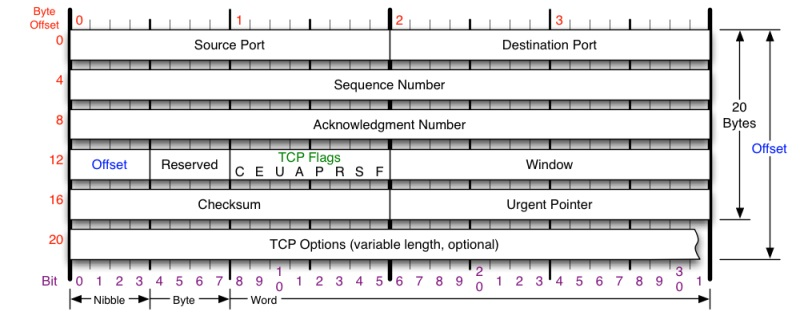
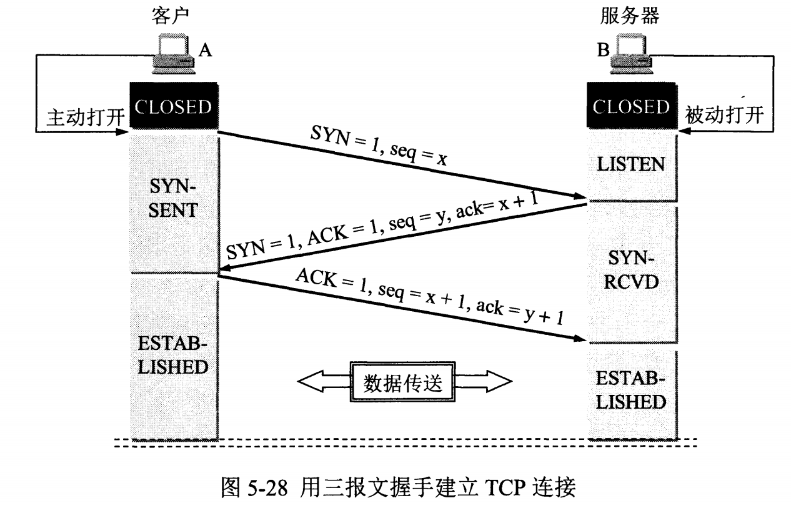
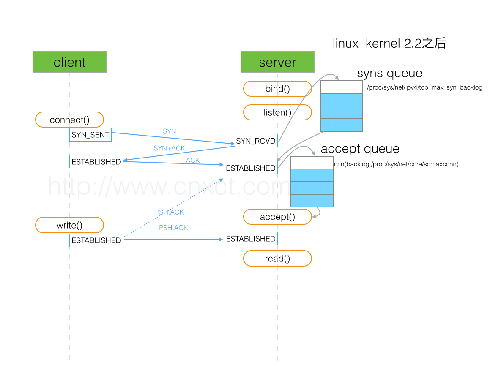
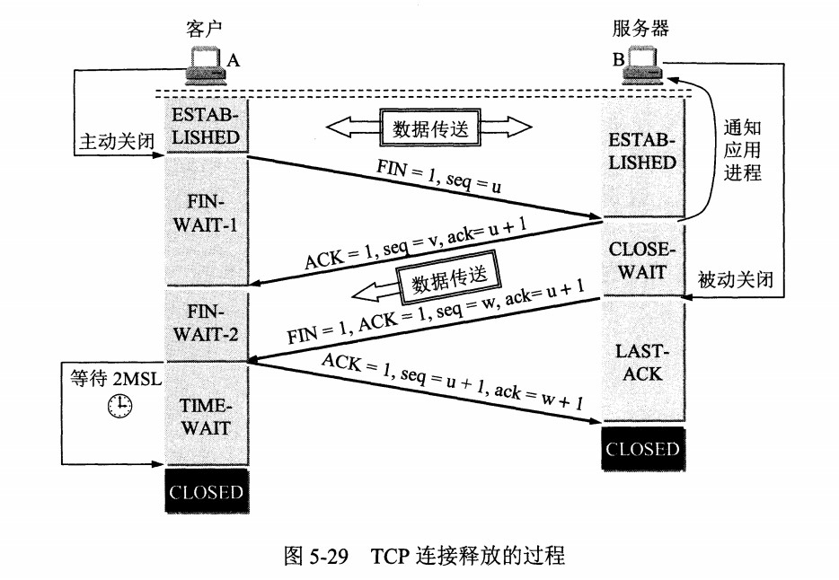
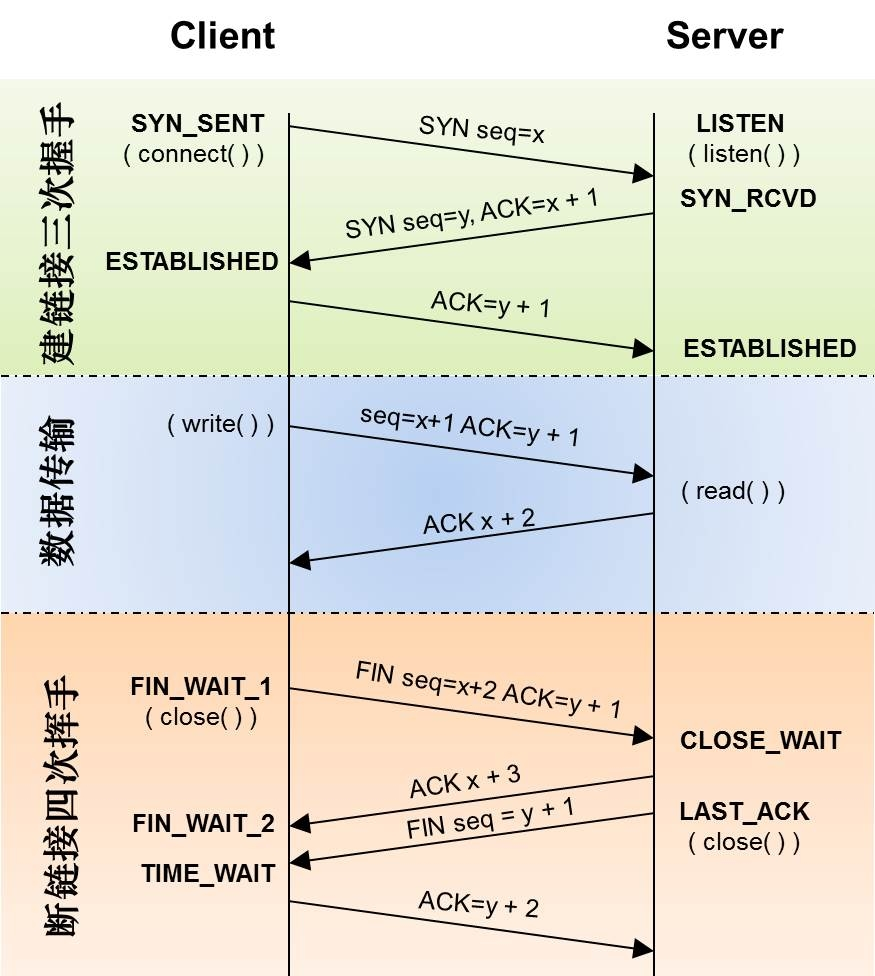
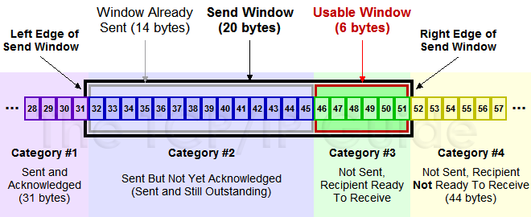
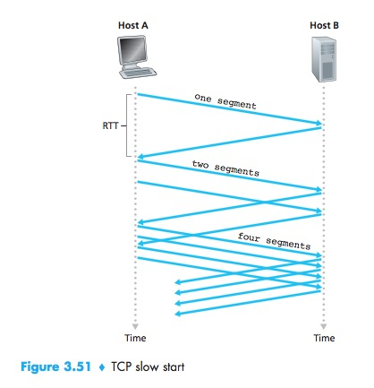
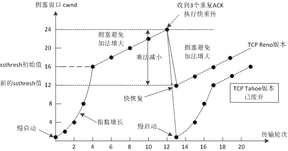
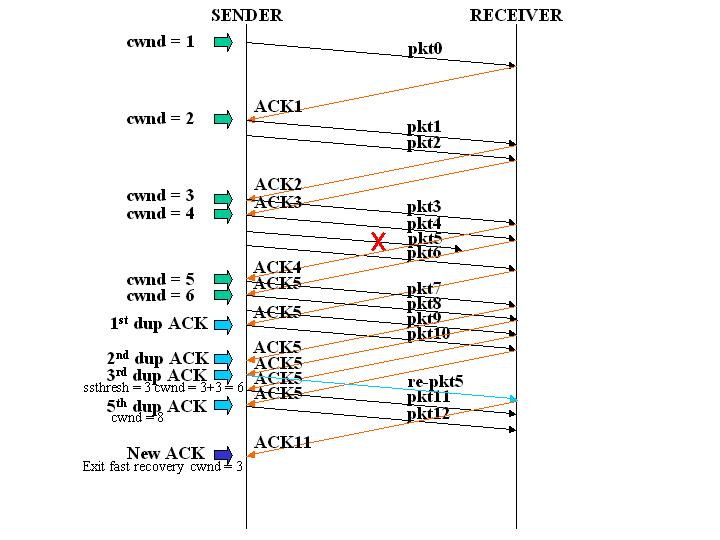
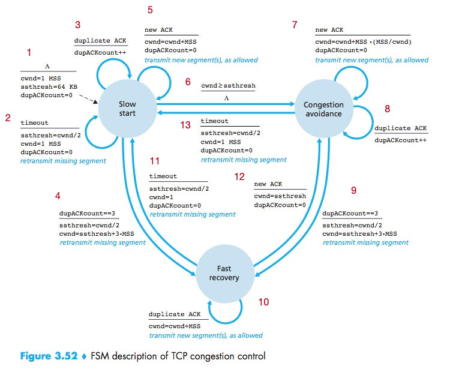

 
<!--BEGIN_DATA
{
    "create_date": "2020-01-07 15:51", 
    "modify_date": "2020-01-07 15:51", 
    "is_top": "0", 
    "summary": "TCP为什么不会被取代与协议笔记及其半连接与完全连接队列", 
    "tags": "网络、C/C++", 
    "file_name": "TCP为什么不会被取代与协议笔记及其半连接与完全连接队列.md"
}
END_DATA-->

 

####<p>原文出处：<a href='https://mp.weixin.qq.com/s?__biz=MzIxMjAzMDA1MQ==&mid=2648946203&idx=1&sn=db1436dd8d94959d599fa247bca54e87&chksm=8f5b5117b82cd8011ec38ef13f17b07aa094bdab28f536d2dacec1339d2e55bca40dfbe56f99&token=408450824&lang=zh_CN#rd' target='blank'>为什么TCP不会被取代</a></p>

“吐槽”TCP的理由几乎都是这几句话：

>TCP 的拥塞控制算法会在丢包时主动降低吞吐量；TCP 的三次握手增加了数据传输的延迟和额外开销；TCP 的累计应答机制导致了数据段的传输；

最后归结为——在弱网络环境下，TCP效率会大幅度下降，所以Google的QUIC才是解放生产力的工具——毕竟人家已经**HTTP 3**了。

###什么是弱网络

弱网络一般是指**Wireless Network**，LTE（4G）、Wifi都属于这种类型的网络。网络是往移动性、无界的方向演进的，受限于接入技术的发展，无线接入面临着覆盖范围、更高带宽的双重考验。可以把这种情况理解为“不稳定的物理链路”，它不像以太网有线接入——通或者不通，而是会出现“带宽”小到无法传输一个包头（通常说的“信号差”）或者直接“物理断开”。**这并不是由于网络传输过程中拥塞、QoS或者服务器端来不及处理引起的，而是由于Wireless Network接入技术本身的技术瓶颈**。

###赌未来

技术只会往**好**的方向发展，Wireless Network目前的技术“终点”是5G。是的，不要以为5G仅仅会代替手机接入，Wifi信号强度的问题也只能通过“蜂窝技术”解决，而目前最先进的蜂窝技术就是5G。简单来说，5G会带来

  1. 通过更高频段、更好的调制解调、更牛逼的天线提供更好的无线接入物理链路；

  2. 通过就边缘节点降低延时；

  3. 通过NFV、云网融合提供更加有效、灵活的组网方式；

如果赌未来，那么未来可能并不存在“弱网络”。所以当看到具有“先见之明的IETF”通过了QUIC成为HTTP3草案的时候我是一脸懵逼的。HTTP2还没有普及，大佬们已经忙着制定HTTP3——而且以他们的学识应该能看到5G肯定会比HTTP2更早成熟，怎么就这么迫不及待的制定HTTP3了呢？后来我想明白了——没有规定说“KPI项目”只能我朝使用，允许咱们“KPI开源”就得允许人家“KPI规范”。Google一直想在网络上有所作为，所以必须“有所作为”。

###解决当下

回答一个问题：**作为应用程序，“你”需要一个什么样的协议？**

  1. 如果你不希望发生丢包那么一定需要确认（ACK）机制；

  2. 如果你希望数据有序，那么你一定需要分配一块“缓冲”，在某个时间段内重组数据包；

按照这个思路想下去，结果一定是——滑动窗口、拥塞算法、ACK机制，所以当你需要一个可靠协议的时候结论一定是TCP协议，当你试图创造一个“新”可靠协议的时候几乎就是在重新发明TCP。最终大家的争论焦点就只能是——ACK的时机、如何设置滑动窗口大小、如何优化RTO之类的问题。至于三次握手，其实根本不是问题重点。从设计上讲是需要“会话”的概念的，况且建立会话的握手过程并不会带来非常明显的网络开销。**现在说的“弱网络”真正要解决的问题是，如果网络几乎无法通讯，应用程序要及时知道并且做出反馈动作（停止网络请求、提示网络无法连接）**以微信为例，在弱网络中，TCP的RTO（重传超时）是动态计算出来的，如果出现网络问题应用并不能很快感知。社交类应用是对“反馈”非常敏感的应用，所以需要做“弱网络优化”。解决这个问题最彻底的办法是修改协议栈，然而——一个应用程序就别瞎琢磨内核的事情了。所以用了一套“工程化”的方式解决这个问题，比如Fast Recovery、HARQ、连接池、合并连接等无所不用其极的方法。

##如果一个协议要取代TCP那么一定是在重新实现TCP

未来的网络是具有更好接入体验、更大带宽、更低延时、更灵活组网方式、更高效通讯的网络，所以如果一个技术要解决的问题域是一个很“猥（狭）琐（隘）”的领域，那么它真的不应该成为“趋势”乃至标准。一个具备生命力的技术应该**提供机制而不是策略**。解决“当下问题”是一种策略，为了混口饭吃逼出来的一些办法而已。


<hr>


####<p>原文出处：<a href='https://www.codedump.info/post/20190227-tcp/' target='blank'>TCP协议笔记</a></p>

* 应用层：通常也称为“七层”，这是大部分服务器工作的层次，如HTTP 服务器等，位于应用层上的信息分组成为报文（message）。识别不同应用层的信息是通过端口号，即不同的端口号提供不同的服务。
* 传输层：通常也称为“四层”，TCP、UDP协议工作在这一层，位于这一层的分组称为报文段（segment）。
* 网络层：通常也称为“三层”，负责将数据包（datagram）从一台主机移动到另一台主机。
* 接口层：通常也称为“二层”，链路层分组称为帧（frame）。

##TCP协议格式



  * 端口号：tcp使用端口号来标记目标和源端口，tcp头中并没有ip地址信息，根据前面的tcp/ip模型，ip地址这是三层做的事情。
  * 序号（Sequence Number）：用于对tcp字节流进行编号，以解决网络包乱序问题。
  * 确认号（Acknowledgement Number）：用于确认接收到的报文段序号，用来解决丢包问题。
  * 窗口：用于通知对端接收窗口大小，用于解决流控问题。
  * TCP标志位，用于控制TCP协议状态机的，包括以下几个： 
    * ACK：只有这个标志位置位时，前面的确认号字段才有效。
    * SYN：在连接建立时用来同步序号。当 SYN=1，ACK=0 时表示这是一个连接请求报文段。若对方同意建立连接，则响应报文中 SYN=1，ACK=1。
    * FIN：用来释放一个连接，当 FIN=1 时，表示此报文段的发送方的数据已发送完毕，并要求释放连接。
    * RST：重置连接，比如向一个不存在监听服务的端口发请求时，就会收到RST包。
  * TCP选项：这部分可选，不属于TCP头部必然存在的部分。 
    * MSS（Maximum Segment Size，最大报文长度）：MSS选项用于在TCP连接建立时，收发双方协商通信时每一个报文段所能承载的最大数据长度。为了达到最佳的传输效能，TCP协议在建立连接的时候通常要协商双方的MSS值，这个值TCP协议在实现的时候往往用MTU值代替（需要减去IP数据包包头的大小20Bytes和TCP数据段的包头20Bytes）所以一般MSS值1460。

##TCP连接的建立和终止

###连接建立



以上图说明建立TCP连接的过程，其中左边的A为客户端，右边的B为服务器：

  * B调用listen系统命令，进入监听状态，等待客户端的连接。
  * A向B发送连接请求报文，其中TCP标志位里SYN=1，ACK=0，选择一个初始的序号x。
  * B收到请求报文，向 A 发送连接确认报文，SYN=1，ACK=1，确认号为 x+1，同时也选择一个初始的序号 y。
  * A 收到 B 的连接确认报文后，还要向 B 发出确认，确认号为 y+1，序号为 x+1。
  * B 收到 A 的确认后，连接建立。

以上就是TCP建立连接的三次握手过程，以上流程还需要补充的是：

  * 对于建链接的3次握手，主要是要初始化Sequence Number 的初始值。通信的双方要互相通知对方自己的初始化的Sequence Number（缩写为ISN：Inital Sequence Number）——所以叫SYN，全称Synchronize Sequence Numbers。也就上图中的 x 和 y。这个号要作为以后的数据通信的序号，以保证应用层接收到的数据不会因为网络上的传输的问题而乱序（TCP会用这个序号来拼接数据）。
  * 第三次握手是为了防止失效的连接请求到达服务器，让服务器错误打开连接。客户端发送的连接请求如果在网络中滞留，那么就会隔很长一段时间才能收到服务器端发回的连接确认。客户端等待一个超时重传时间之后，就会重新请求连接。但是这个滞留的连接请求最后还是会到达服务器，如果不进行三次握手，那么服务器就会打开两个连接。如果有第三次握手，客户端会忽略服务器之后发送的对滞留连接请求的连接确认，不进行第三次握手，因此就不会再次打开连接。

####backlog参数与SYN Flood攻击

listen系统调用中，会传入一个backlog参数，man文档对其的解释是：

>The behavior of the backlog argument on TCP sockets changed with Linux 2.2.  Now it specifies the queue  length  for completely established sockets waiting to be accepted, instead of the number of incomplete connection requests.  The maximum length of the queue for incomplete sockets can be set  using  /proc/sys/net/ipv4/tcp_max_syn_backlog.   When syncookies are enabled there is no logical maximum length and this setting is ignored.  See tcp(7) for more information.
>If the backlog argument is greater than the value in /proc/sys/net/core/somaxconn, then it is silently truncated  to that value;  the  default  value in this file is 128.  In kernels before 2.4.25, this limit was a hard coded value,SOMAXCONN, with the value 128.

以上文字简单的翻译：该参数在Linux 2.2内核版本前后有不同的表现。在2.2版本以后表示的是已经建立起连接等待被接受的队列大小，而在之前则是未完成连接队列长度。未完成连接队列的最大长度由系统参数/proc/sys/net/ipv4/tcp\_max\_syn\_backlog指定。而backlog不得大于系统参数/proc/sys/net/core/somaxconn，该参数的默认值为128。

上面提到的“未完成连接”，其实就是处于SYN-RCVD状态的连接，即只收到了客户端的SYN报文的连接。



Linux服务器内部，会维护一个半连接队列，即处于SYN-RCVD状态的连接都维护在这个队列中。同时还会维护一个完全连接队列，即处于ESTABLISH状态的队列。当连接从SYN-RCVD切换到ESTABLISH状态时，连接将从半连接队列转移到全连接队列中。

半连接队列无法由用户指定，而是由系统参数/proc/sys/net/ipv4/tcp\_max\_syn\_backlog控制。
全连接队列大小取listen系统调用的backlog和系统参数/proc/sys/net/core/somaxconn中的最小值。

当客户端建立连接时，server端给客户端的SYN-ACK回报，由于种种原因客户端一直没有收到，此时连接一直处于半连接状态，既不能算连接成功了也不算连接失败，此时server端需要给客户端重传SYN-ACK报文。但是也有一种可能，即客户端恶意的发送大量SYN报文给服务器，让服务器长期有大量处于半连接状态的连接，耗尽服务器资源。Linux有几个参数用于控制重传SYN-ACK报文重传行为的：

    
    net.ipv4.tcp_synack_retries #内核放弃连接之前发送SYN+ACK包的数量
    
    net.ipv4.tcp_syn_retries #内核放弃建立连接之前发送SYN包的数量

###连接结束



以上图来说明TCP连接释放的过程：

  * A主动关闭连接，向B发送FIN=1的报文，由于A进行了主动关闭，因此进入FIN-WAIT-1状态。
  * B收到FIN=1的报文之后，进入被动关闭状态，即CLOSE-WAIT状态，此时这个TCP连接属于半关闭状态，即A向B的通路被关闭不能再发送数据，但是B还是可以向A发送数据。
  * A收到B针对FIN=1报文的应答之后，从FIN-WAIT-1状态切换到FIN-WAIT-2状态。
  * 当B也需要释放连接时，同样向A发送FIN=1的报文，然后B从CLOSE-WAIT状态切换到LAST-ACK状态。
  * 处于FIN-WAIT-2状态的A收到B的FIN=1报文后，进入TIME-WAIT状态，这个状态将持续2MSL时间，最后切换到CLOSED状态。
  * 处于LAST-ACK状态的B，收到A针对FIN=1报文的应答之后，进入CLOSED状态。

以上就是TCP释放连接的四次挥手过程，以上流程还需要补充：

####四次挥手的原因

TCP连接是全双工的，即一端接收到FIN报时，对端虽然不再能发送数据，但是可以接收数据，所以需要两边都关闭连接才算完全关闭了这条TCP连接。

####TIME-WAIT状态

主动关闭的一方收到对端发出的FIN报之后，就从FIN-WAIT-2状态切换到TIME-WAIT状态了，再等待2MSL时间才再切换到CLOSED状态。这么做的原因在于：

  * 确保被动关闭的一方有足够的时间收到ACK，如果没有收到会触发重传。
  * 有足够的时间，以让该连接不会与后面的连接混在一起。

TIME-WAIT状态如果过多，会占用系统资源。Linux下有几个参数可以调整TIME-WAIT状态时间：

  * net.ipv4.tcp_tw_reuse = 1 表示开启重用。允许将TIME-WAIT sockets重新用于新的TCP连接，默认为0，表示关闭。
  * net.ipv4.tcp_tw_recycle = 1 表示开启TCP连接中TIME-WAIT sockets的快速回收，默认为0，表示关闭。
  * net.ipv4.tcp_max_tw_buckets = 5000表示系统同时保持TIME_WAIT套接字的最大数量，如果超过这个数字，TIME_WAIT套接字将立刻被清除并打印警告信息。默认为180000，改为5000。

然而，从TCP状态转换图可以看出，主动进行关闭的链接才会进入TIME-WAIT状态，所以最好的办法：尽量不要让服务器主动关闭链接，除非一些异常情况，如客户端协议错误、客户端超时等等。

###TCP协议状态机与系统调用的关系

下图给出了TCP协议状态机与系统调用之间的对应关系。



##TCP重传机制

TCP重转涉及到以下几个问题：

  * 如何估算往返时间？只有在正确估算往返时间的前提下，才知道一个TCP包多久没有收到回应算超时。
  * 在已知重传时间的前提下，重传TCP包依赖的其他数据结构和重传算法是如何的？

以下来分别解释TCP重传机制中的几个问题。

###估计往返时间

报文段的样本RTT（sampleRTT）就是从某报文段被发出（即交给IP）到对该报文段的确认（ACK）被收到之间的时间。

大多数TCP的实现仅在某一个时刻做一次SampleRTT的测量，而不是为每个发送的报文段测量一个SampleRTT。这就是说，在任意时刻，仅为一个已发送的但尚未被确认的报文段估计SampleRTT，从而产生一个接近每个RTT的新SampleRTT值。另外,TCP绝不为已被重传的报文段计算SampleRTT，它仅为传输一次的报文段测量SampleRTT。

由于路由器的拥塞和系统负载的变化，SampleRTT也会随之波动。因此，TCP维持一个SampleRTT均值（称为EstimateRTT），一旦获得一个新的SampleRTT值，根据以下公式更新EstimateRTT：


      EstimateRTT = (1 - α) * EstimateRTT + α * SampleRTT

即：新的EstimateRTT值由旧的EstimateRTT值与SampleRTT值加权相加而成。，在RFC 6298中，α参考值是0.125（1/8）。

除了估算RTT之外，还需要测量RTT的变化，RFC 6298定义了RTT偏差DevRTT，用于估算SampleRTT偏离EstimateRTT的程度，公式为：

    
      DevRTT = (1 - β) * DevRTT + β * | SampleRTT - EstimateRTT|

如果SampleRTT波动值较小，那么DevRTT的值就会比较小。β的推荐值为0.25。

###重传时间间隔

有了EstimateRTT和DevRTT值，就可以计算出重传时间间隔。显然，这个值应该大于等于EstimateRTT，否则将造成不必要的重传，但是超时时间也不能比EstimateRTT大太多，否则当报文段丢失时，TCP不能很快重传该报文段，导致数据传输时延时太大。因此要求将超时间隔设为EstimateRTT加上一定余量。当SampleRTT值波动较大时，这个余量应该大些，当波动较小时这个余量应该小一些。因此，DevRTT在这里就派上用场了，公式如下：
    
    
      TimeoutInterval = EstimateRTT + 4 * DevRTT

RFC 6298推荐的TimeoutInterval值为1秒。当出现超时后，TimeoutInterval值将加倍，以免即将被确认的后续报文段过早出现超时。

###可靠数据传输

####简化的算法

先给出一个最简化版本的重传算法，在这里假设发送方不受TCP流量和拥塞控制的限制，来自上层的数据长度小于MSS，且数据传送只在一个方向进行。在这里，发送方只使用超时来恢复报文段的丢失，后面再给出更全面的描述。

TCP发送方有三个与发送和重传相关的主要事件：

  * 从上层应用程序接收数据。此时TCP将数据封装到一个报文段中，并把报文段交给IP。此时，如果定时器没有给其他报文段运行，那么此时就启动重传定时器，该定时器的超时时间是前面计算出来的TimeoutInterval。
  * 超时事件。此时TCP的处理是重传引起超时的报文段来响应超时事件，然后TCP重启定时器。
  * 收到来到接收方的确认报文段（ACK）。当该事件发生时，TCP将ACK的值y与自己的变量SendBase进行比较。TCP的状态变量SendBase是最早未被确认的字节序号（因此SendBase-1是指接收方已正确按序接收到的数据的最后一个字节的序号。）如果y>SendBase，那么该ACK是在确认一个或多个先前未被确认的报文段，因此发送方更新它的SendBase变量；如果当前还有未被确认的报文段，TCP还需要重启定时器。

综上，该简化算法如下处理以上三个事件：

    
```
NextSeqNum = InitialSeqNumber
SendBase = InitialSeqNumber
循环：
  如果是收到了上层应用程序发出的数据：
    使用NextSeqNum创建新的TCP报文
    如果当前TCP重传定时器没有在运行：
      启动TCP重传定时器
    将TCP报文交给IP层
    NextSeqNum = NextSeqNum + length(data)
  如果TCP重传定时器超时：
    重传所有还没有被确认(ACK)的报文中seq最小的那个TCP报文
    启动TCP重传定时器
  如果收到了ACK报文，其中ACK值=y：
    如果 y > SendBase：
      SendBase = y
      如果当前还有没有被ACK的TCP报文：
        启动TCP重传定时器
```

####超时时间加倍

如上所述，每当TCP超时定时器被触发，意味着有TCP报文在指定时间内没有收到ACK，此时TCP会重传最小序号的没有ACK的报文。每次TCP重传时都会将下一次超时时间设置为先前值的两倍，而不是使用当前计算得到的EstimateRTT值。

####快速重传（fast retransmit）

超时触发重传存在的问题之一是超时周期可能相对较长。当一个报文段丢失时，这种长超时周期迫使发送方延迟重传丢失的分组，因而增加了端到端的时延。发送方通常可在超时事件发生之前通过注意所谓冗余ACK来检测丢包情况。

冗余ACK（duplicate ACK）就是再次确认某个报文段的ACK，而发送方之前已经收到对该报文段的ACK。

如果TCP发送方收到相同数据的3个冗余ACK，将以这个做为一个提示，说明跟在这个已被确认过3次的报文段之后的报文已经丢失。一旦收到3个冗余ACK，TCP就执行快速重传（fast retransmit），即在该报文段的定时器过期之前重传丢失的报文段。

有了以上的补充，将前面收到ACK事件的处理修改如下：

    
```
  如果收到了ACK报文，其中ACK值=y：
    如果 y > SendBase：
      SendBase = y
      如果当前还有没有被ACK的TCP报文：
        启动TCP重传定时器
    否则：  // 意味着收到了duplicate ACK
      递增针对y的duplicate ACK计数
      如果该计数 == 3：
        重传seq在y之后的报文
```

##流量控制

TCP为它的应用程序提供了流量控制服务（flow control service），以消除发送方使接收方数据溢出的可能性。

流量控制因此是一种速度匹配服务，即发送方的发送速率与接收方应用程序的读取速率相匹配。

另一种控制发送方速度的方式是拥塞控制（congestion control），但是这两者是不同的：

  * 流量控制基于对端的窗口大小来调整发送方的发送速度。
  * 拥塞控制基于IP网络的速度来调整发送方的发送策略。

下一节分析拥塞控制，这一节分析流量控制。

TCP让发送方维持一个接收窗口（receive window）的变量来提供流量控制。接收窗口用于给发送方一个提示，该接收方还有多少可用的缓存空间。因为TCP是全双工通信，因此在连接两端都各自维护一个接收窗口，通过TCP头的window字段来通知对方本方的接收窗口大小。

###TCP滑动窗口

client和server两端都有自己的协议栈buffer，传输时不可能一直无限量的传输数据下去。此时如何让对端知道自己最多能接收多少数据呢？通过TCP协议头中的window字段来通知对端自己当前的接收窗口大小。

从以上可以看出，TCP协议通过TCP头部的window字段来解决流量控制问题。



如上图中，分成了四个部分，其中黑色框住的部分是滑动窗口：

  * #1：表示已收到ack报文确认的数据。
  * #2：发送出去但是还没有收到对端ACK确认的数据。
  * #3：还没有发送出去的数据。
  * #4：窗口以外的数据。

当收到对端确认一部分数据的ACK之后，滑动窗口将向右边移动，如下图中，收到36的ACK，并且发出了46-51字节的数据之后，滑动窗口变化成了：


以下图为例来解释滑动窗口变化的流程：


  1. client端的可用窗口大小为360字节。client发送140字节数据到server，其中seq=1，length=140；发送之后，client的可用窗口向右移动140字节，窗口总大小还是360字节。
  2. server端的可用窗口大小为360字节。收到client发来的140字节数据之后，server端接收窗口向右移动140字节，但是由于应用程序繁忙，只取出了其中的100字节，因此server在ACK的时候，可用窗口还剩360-100=260字节，ACK=141。
  3. client在接收到server的ACK=141报文之后，发送窗口左边缘向右移动140字节，表示前面发送的140字节server已经接收到了。剩下的260字节，由于server端告知窗口大小为260字节，client调整自己的发送窗口为260字节，表示此时不能发送大于260字节的数据。
  4. client发送180字节，可用窗口变成80（260-189）字节。
  5. server收到client发送的180字节，放入buffer中，这时应用程序还是很繁忙一个字节都没有处理，因此这一次应答回客户端ACK=321（140+180+1），窗口大小为80（260-180）。
  6. client收到server的确认应答，确认了第二次发送的180字节已经被server端收到，于是发送窗口左边缘向 前移动了180字节。
  7. client发送80字节，可用窗口变成0（80-80）。
  8. server收到了80字节，但是这一次应用程序还是一个字节都没有从buffer中取出处理，因此server应答client端ACK=401（140+180+80+1），窗口大小为0（80-80）。
  9. client收到确认包，确认之前发送的80字节已经到达server端。另外server端告知窗口大小为0，因此client无论是否有数据需要发送，都不能发送了。

##拥塞控制

TCP所采用的方法是让每一个发送方根据所感知的网络拥塞程度来限制其能向连接发送流量的速率。这种方法提出了三个问题：

  * 一个TCP发送方如何限制它向其连接发送流量的速率？
  * 一个TCP发送方如何感知从它到目的地之间的路径上存在拥塞呢？
  * 当发送方感受到端到端之间的拥塞时，采用何种算法来改变其发送速率呢？

首先分析TCP发送方如何限制向起连接发送流量的。在发送方的拥塞控制机制中再维护一个变量，即cwnd（congestion window，拥塞窗口），通过它对一个TCP发送方能向网络发送的流量速率进行限制。即：一个发送方中未被确认的数据量不会超过cwnd与rwnd中的最小值：
    

      LastByteSent - LastBtyeAcked <= min(cwnd, rwnd)

接下来讨论如何感知出现了拥塞的。我们将一个TCP发送方的“丢包事件”定义为：要么出现超时，要么收到来自接收方的3次冗余ACK（duplicate ACK）。

拥塞控制有以下几个常用的手段：慢启动、拥塞避免、快速恢复。其中慢启动和拥塞避免是TCP的强制部分，两者的差异在于对收到ACK做出反应时增加cwnd的方式，而快速恢复则是推荐部分，对TCP发送方并非是必需的。

###慢启动（slow start）算法

慢启动算法的思想是：刚建立的连接，根据对端的应答情况慢慢提速，不要一下子发送大量的数据。

慢启动算法维护一个cwnd（Congestion Window）变量，以及一个慢启动阈值变量ssthresh（slow start threshold），算法的逻辑是：

  * 连接建立好之后，cwnd初始为1，表示可以传一个MSS大小的数据。
  * 在每收到一个对新的报文段的确认后，将拥塞窗口递增1。
  * 当cwnd>=ssthresh，拥塞控制算法进入后面将介绍到的“拥塞避免”阶段。

可以看到，慢启动算法通过对对端应答报文的RTT时间探测，来修改cwnd值。而这个修改，在不超过ssthresh的情况下，是指数增长的。



何时结束这种指数增长呢？有如下三种情况：

  * 如果存在一个由超时指示的丢包事件（即拥塞），TCP发送方将cwnd设置为1并重新开始慢启动过程，此时还会将ssthresh设置为cwnd/2。
  * 当cwnd>=ssthresh，进入后面介绍的“拥塞避免”阶段。
  * 如果检测到三个冗余ACK（duplicate ACK），这时TCP进入快速重转并进入快速恢复状态。

###拥塞避免（ Congestion Avoidance）算法

当cwnd>=ssthresh，进入拥塞避免阶段，此时cwnd的增长不再像之前那样是指数增长，而是线性增长。

  * 收到一个ACK时，cwnd = cwnd + 1/cwnd。
  * 当每过一个RTT时，cwnd = cwnd + 1。

###拥塞状态的算法

TCP拥塞控制认为网络丢包是由于网络拥塞造成的，有如下两种判定丢包的方式：

  * 上面提到过的超时重传。
  * 收到三个重复确认ACK包（duplicate ACK）。

超时重传的原理，在上面也简单提到过：在发送一个TCP报文之后，会启动一个计时器，该计时器的超时时间是根据之前预估的几个往返时间RTT相关的参数计算得到的，如果再这个计时器超时之前都没有收到对端的应答，那么就需要重传这个报文。

而如果发送端收到三个以上的重复ACK时，就认为数据已经丢失需要重传，此时会立即重传数据而不是等待前面的超时重传定时器超时，所以被称为“快速重传”。

最早的TCP Tohoe算法是这么处理拥塞状态的，当出现丢包时：

  * 将慢启动阈值ssthresh变成当前cwnd的一半，即：ssthresh = cwnd / 2。
  * cwnd = 1，从而直接回到原来的慢启动状态。

但是由于这个算法过于激进，每次一出现丢包cwnd就变成1，因此后来的TCP Reno算法进行了优化，其优化点在于，在收到三个重复确认ACK时，TCP开启快速重传Fast Retransmit算法：

  * cwnd变成现在的一半，即：cwnd = cwnd / 2。
  * ssthresh设置为缩小后的cwnd大小。
  * 进入快速恢复阶段。

以下图来解释上面三种状态的处理：



上图中，横轴为传输轮次，纵轴为cwnd大小，按照时间顺序，其过程如下：

  * 0-4：为慢启动阶段，在这个时间里，cwnd指数级增长，到时间4时等于初始的ssthresh值，此时进入拥塞避免状态。
  * 4-12：为拥塞避免状态，此时cwnd值线性增长。
  * 12：在时间点12，收到了三个重复ACK值，此时两个不同的拥塞控制算法的处理不同： 
    * TCP Tohoe算法：图中的点线部分，在时间点12，直接将cwnd变成1进入慢启动阶段，这个算法已经废弃。
    * TCP Reno算法：cwnd变成原来的一半，ssthresh变成最新的cwnd值使用快速恢复算法。

这里提到了TCP Reno算法在收到三个重复ACK时，cwnd变成原来的一半并且使用快速恢复算法来处理拥塞，下面就接着分析快速恢复算法。

###快速恢复（fast recovery）

再次说明：该算法只有TCP Reno版本才用，已经被废弃的TCP Tohoe算法并没有这部分。

在进入快速恢复以前，TCP Reno已经做了如下的事情：

  * cwnd = cwnd / 2，即变成原来的一半。
  * ssthresh = cwnd，即ssthresh变成新的cwnd值。

快速恢复算法的逻辑如下：

  * cwnd = cwnd + 3 MSS，加3 MSS的原因是因为收到3个重复的ACK。
  * 重传重复ACK（duplicate ACK）指定的数据包。
  * 如果再收到重复ACK，cwnd递增1。
  * 如果收到新的ACK，表明重传的报文已经收到。此时将cwnd设置为ssthresh值，进入拥塞避免状态。



如上图中：发送端的第五个包丢失，导致发送端收到三个重复的针对第五个包的ACK。此时将ssthresh值设置为当时cwnd的一半，即6/2=3，而cwnd设置为3+3=6。然后重传第五个包。当收到最新的ACK时，即ACK 11，此时将cnwd设置为当前的ssthresh，即3，然后退出快速恢复而进入拥塞避免状态。

###拥塞控制算法的有限状态机

有了前面的解释，理解TCP拥塞控制算法的FSM就容易了：



下面对以上FSM进行简单的总结，每个状态转换箭头都做了数字标记，以数字标记为序来分别做解释：

  1. 这是拥塞控制算法的初始状态： 
    * cwnd = 1 MSS
    * ssthresh = 64KB
    * dupACKCount（重复ACK数量） = 0
    * 此时进入慢启动状态。
  2. 慢启动状态下重传超时，则几个拥塞控制算法变量变为： 
    * ssthresh = cwnd / 2
    * cwnd = 1 MSS
    * dupACKCount = 0
    * 同时重传丢失的报文段。
  3. 收到重复ACK时，递增dupACKCount数量。
  4. 当收到的重复ACK数量为3时，进入快速恢复状态： 
    * ssthresh = cwnd / 2
    * cwnd = ssthresh + 3 MSS
    * 同时重传丢失的报文段。
  5. 在慢启动状态下收到了新的ACK时，每收到一个ACK则递增cwnd一个MSS，即“指数增长”： 
    * cwnd = cwnd + MSS
    * dupACKCount = 0
    * 继续传输新的报文。
  6. 在慢启动状态下，cwnd>=ssthresh值时，进入拥塞避免状态：
  7. 慢启动状态下，每次收到一个ACK报文时，加法递增： 
    * cwnd = cwnd + MSS * (MSS/cwnd)
    * dupACKCount = 0
    * 继续传输新的报文
  8. 收到重复ACK时，递增dupACKCount数量。
  9. 当收到的重复ACK数量为3时，进入快速恢复状态，注意这里的处理跟慢启动状态下收到三个重复ACK的处理是一致的（见状态4）： 
    * ssthresh = cwnd / 2
    * cwnd = ssthresh + 3 MSS
    * 同时重传丢失的报文段。
  10. 快速恢复状态下，收到重复ACK时： 
    * cwnd = cwnd + MSS
    * 传输新的报文段。
  11. 快速恢复状态下重传超时，则几个拥塞控制算法变量变为： 
    * ssthresh = cwnd / 2
    * cwnd = 1
    * dupACKCount = 0
    * 同时重传丢失的报文段。
  12. 在快速恢复状态下收到了新的ACK时： 
    * cwnd = ssthresh
    * dupACKCount = 0

###参考资料

[TCP 的那些事儿（上）](https://coolshell.cn/articles/11564.html)
[TCP拥塞控制算法简介](http://remcarpediem.net/2019/02/27/TCP%E6%8B%A5%E5%A1%9E%E6%8E%A7%E5%88%B6%E7%AE%97%E6%B3%95%E7%AE%80%E4%BB%8B/)
[TCP SOCKET中backlog参数的用途是什么？](https://www.cnxct.com/something-about-phpfpm-s-backlog/)
[tcp的半连接与完全连接队列](https://segmentfault.com/a/1190000008224853)


<hr>

 

####<p>原文出处：<a href='https://segmentfault.com/a/1190000008224853' target='blank'>tcp的半连接与完全连接队列</a></p>

###队列及参数


####server端的半连接队列(syn队列)

在三次握手协议中，服务器维护一个半连接队列，该队列为每个客户端的SYN包开设一个条目(服务端在接收到SYN包的时候，就已经创建了request\_sock结构，存储在半连接队列中)，该条目表明服务器已收到SYN包，并向客户发出确认，正在等待客户的确认包（会进行第二次握手发送SYN＋ACK的包加以确认）。这些条目所标识的连接在服务器处于Syn_RECV状态，当服务器收到客户的确认包时，删除该条目，服务器进入ESTABLISHED状态。  该队列为SYN 队列，长度为 max(64, /proc/sys/net/ipv4/tcp\_max\_syn\_backlog)，在机器的tcp_max_syn_backlog值在/proc/sys/net/ipv4/tcp\_max\_syn\_backlog下配置。

####server端的完全连接队列(accpet队列)

当第三次握手时，当server接收到ACK 报之后， 会进入一个新的叫 accept 的队列，该队列的长度为 min(backlog, somaxconn)，默认情况下，somaxconn 的值为 128，表示最多有 129 的 ESTAB 的连接等待 accept()，而 backlog 的值则应该是由 int listen(int sockfd, int backlog) 中的第二个参数指定，listen 里面的 backlog 可以有我们的应用程序去定义的。

###当Client发送SYN包之后挂了(`syn flood攻击`)

Client发送SYN包给Server后挂了，Server回给Client的SYN-ACK一直没收到Client的ACK确认，这个时候这个连接既没建立起来，也不能算失败。这就需要一个超时时间让Server将这个连接断开，否则这个连接就会一直占用Server的SYN连接队列中的一个位置，大量这样的连接就会将Server的SYN连接队列耗尽，让正常的连接无法得到处理。

目前，Linux下默认会进行5次重发SYN-ACK包，重试的间隔时间从1s开始，下次的重试间隔时间是前一次的双倍，5次的重试时间间隔为1s, 2s, 4s,8s, 16s，总共31s，第5次发出后还要等32s都知道第5次也超时了，所以，总共需要 1s + 2s + 4s+ 8s+ 16s + 32s = 63s，TCP才会把断开这个连接。由于，SYN超时需要63秒，那么就给攻击者一个攻击服务器的机会，攻击者在短时间内发送大量的SYN包给Server(俗称SYN flood 攻击)，用于耗尽Server的SYN队列。对于应对SYN 过多的问题，linux提供了几个TCP参数：tcp\_syncookies、tcp\_synack\_retries、tcp\_max\_syn\_backlog、tcp\_abort\_on\_overflow 来调整应对。

> net.ipv4.tcp\_synack\_retries #内核放弃连接之前发送SYN+ACK包的数量  
net.ipv4.tcp\_syn\_retries #内核放弃建立连接之前发送SYN包的数量
>
> 为了应对SYNflooding（即客户端只发送SYN包发起握手而不回应ACK完成连接建立，填满server端的半连接队列，让它无法处理正常的握手请求），Linux实现了一种称为SYNcookie的机制，通过net.ipv4.tcp\_syncookies控制，设置为1表示开启。简单说SYNcookie就是将连接信息编码在ISN(initialsequencenumber)中返回给客户端，这时server不需要将半连接保存在队列中，而是利用客户端随后发来的ACK带回的ISN还原连接信息，以完成连接的建立，避免了半连接队列被攻击SYN包填满。

###当syn队列满的情况(`tcp_abort_on_overflow`)

对于SYN半连接队列的大小是由（/proc/sys/net/ipv4/tcp\_max\_syn\_backlog）这个内核参数控制的，有些内核似乎也受listen的backlog参数影响，取得是两个值的最小值。当这个队列满了，不开启syncookies的时候，Server会丢弃新来的SYN包，而Client端在多次重发SYN包得不到响应而返回（`connection time out`）错误。但是，当Server端开启了syncookies=1，那么SYN半连接队列就没有逻辑上的最大值了，并且/proc/sys/net/ipv4/tcp\_max\_syn\_backlog设置的值也会被忽略。

> Client端在多次重发SYN包得不到响应而返回`connection time out`错误

查看

    
    netstat -s | grep LISTEN
    4375 SYNs to LISTEN sockets dropped

###当accept队列满的情况

当accept队列满了之后，即使client继续向server发送ACK的包，也会不被响应，此时ListenOverflows+1，同时server通过/proc/sys/net/ipv4/tcp\_abort\_on\_overflow来决定如何返回，0表示直接丢弃该ACK，1表示发送RST通知client；相应的，client则会分别返回`read timeout` 或者 `connection reset by peer`。

> client则会分别返回`read timeout` 或者 `connection reset by peer`

查看
  
    
    root@b5dbe93bcb04:/opt##netstat -s | grep listen
    22438 times the listen queue of a socket overflowed

accept队列满了，对 syn队列也有影响，在代码 net/ipv4/tcp\_ipv4.c ：

    
    int tcp_v4_conn_request(struct sock *sk, struct sk_buff *skb)
    {
        /*tcp_syncookies为2 进行syn cookie
          tcp_syncookies为1 且request队列满了 进行syn cookie处理
          tcp_syncookies为0 且request队列满了 将该syn报文drop掉
        */
        if ((sysctl_tcp_syncookies == 2 ||
             inet_csk_reqsk_queue_is_full(sk)) && !isn) {
            want_cookie = tcp_syn_flood_action(sk, skb, "TCP");
            if (!want_cookie)
                goto drop;
        }
        /* Accept backlog is full. If we have already queued enough
         * of warm entries in syn queue, drop request. 
         */
        if (sk_acceptq_is_full(sk) && inet_csk_reqsk_queue_young(sk) > 1) {
            NET_INC_STATS_BH(sock_net(sk), LINUX_MIB_LISTENOVERFLOWS);
            goto drop;
    }

accept队列大多数情况下会比较小，所以会出现SYN 队列没有满，而ACCEPT队列满了的情况，此时会按照tcp\_aborton\_overflow来决定直接丢弃，还是返回拒绝RST。而如果启用了syncookies，那么syncookies会开启，限制SYN包进入的速度。

>当系统丢弃最后的 ACK，而系统中还有一个 net.ipv4.tcp\_synack\_retries 设置时，Linux 会重新发送 SYN ACK包。而客户端收到多个 SYN ACK 包，则会认为之前的 ACK 丢包了。于是促使客户端再次发送 ACK ，在 accept队列有空闲的时候最终完成连接。若accept队列始终满员，则最终客户端收到 RST 包。

###doc

  * [Linux SYN Backlog and somaxconn](http://www.aikaiyuan.com/7432.html)
  * [TCP/IP协议中backlog参数](http://www.cnblogs.com/Orgliny/p/5780796.html)
  * [TCP SOCKET中backlog参数的用途是什么？](http://www.cnxct.com/something-about-phpfpm-s-backlog/)
  * [了解tcp底层知识](http://ju.outofmemory.cn/entry/234236)
  * [再理解tcp backlog](http://lpbobo.com/2016/06/03/%E5%86%8D%E7%90%86%E8%A7%A3tcp-backlog/)
  * [Linux TCP队列相关参数的总结](https://yq.aliyun.com/articles/4252)
  * [TCP全连接队列和半连接队列已满之后的连接建立过程抓包分析](http://www.cnblogs.com/menghuanbiao/p/5212131.html)
  * [linux、mysql、nginx、tomcat 环境下压力测试的主要调试参数](https://segmentfault.com/a/1190000002700923)
  * [从TCP三次握手说起–浅析TCP协议中的疑难杂症（1）](http://blog.csdn.net/tengxy_cloud/article/details/52329141)
  * [从TCP三次握手说起–浅析TCP协议中的疑难杂症（2）](http://blog.csdn.net/tengxy_cloud/article/details/52329165)
