<!--BEGIN_DATA
{
    "create_date": "2020-12-09 10:02", 
    "modify_date": "2020-12-09 10:02", 
    "is_top": "0", 
    "summary": "40张图带你搞懂TCP和UDP 一文搞定UDP和TCP高频面试题 23个问题TCP疑难杂症全解析", 
    "tags": "网络", 
    "file_name": "TCP和UDP关键问题.md"
}
END_DATA-->

#### 
原文出处：<a href='https://mp.weixin.qq.com/s/vXjYBT214BRo_X3cNZ36GQ' target='blank'>40张图带你搞懂TCP和UDP</a>

### 前言  

这一篇文章是计算机网络连载文章的第四篇，历史文章请阅读

[拿下计网协议后，我就是公园里最靓的仔](http://mp.weixin.qq.com/s?__biz=MzI0ODk2NDIyMQ%3D%3D&chksm=e999f939deee702f2444df83ad9805de8c70fb88b89d299fdf0a82b3463e253f32372963c039&idx=1&mid=2247486507&scene=21&sn=622cc363b34bce54f4953076faa1cad6#wechat_redirect) 

[TCP/IP 基础知识总结](http://mp.weixin.qq.com/s?__biz=MzI0ODk2NDIyMQ%3D%3D&chksm=e999fedadeee77cc6281d1b170bd906b58220d6cd83054bc741821f4167f1f18ceee9ba0e449&idx=1&mid=2247486408&scene=21&sn=c332ae7ae448f3eb98865003ecade589#wechat_redirect)  

[计算机网络基础知识总结](http://mp.weixin.qq.com/s?__biz=MzI0ODk2NDIyMQ%3D%3D&chksm=e999fe30deee772637e1c52fb9001c60e60a772e7adba6701329c81974e76c57bb7b2e570225&idx=1&mid=2247486242&scene=21&sn=fac49b0b79515a5ed6afd4b341aff87b#wechat_redirect)  

那么下面就开始我们本篇文章，文章组织脉络如下

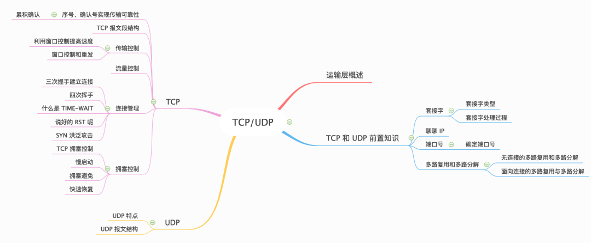

`运输层`位于应用层和网络层之间，是 OSI 分层体系中的第四层，同时也是网络体系结构的重要部分。运输层主要负责网络上的端到端通信。

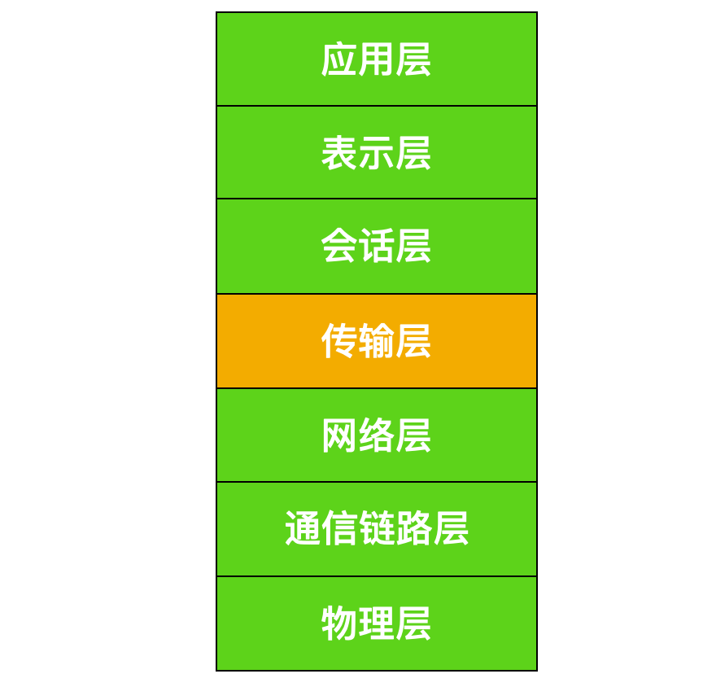

运输层为运行在不同主机上的应用程序之间的通信起着至关重要的作用。下面我们就来一起探讨一下关于运输层的协议部分

### 运输层概述

计算机网络的运输层非常类似于高速公路，高速公路负责把人或者物品从一端运送到另一端，而计算机网络的运输层则负责把报文从一端运输到另一端，这个端指的就是`端系统`。在计算机网络中，任意一个可以交换信息的介质都可以称为端系统，比如手机、网络媒体、电脑、运营商等。

在运输层运输报文的过程中，会遵守一定的协议规范，比如一次传输的数据限制、选择什么样的运输协议等。运输层实现了让两个互不相关的主机进行`逻辑通信`的功能，看起来像是让两个主机相连一样。

运输层协议是在端系统中实现的，而不是在路由器中实现的。路由只是做识别地址并转发的功能。这就比如快递员送快递一样，当然是要由地址的接受人也就是 xxx 号楼xxx 单元 xxx 室的这个人来判断了！

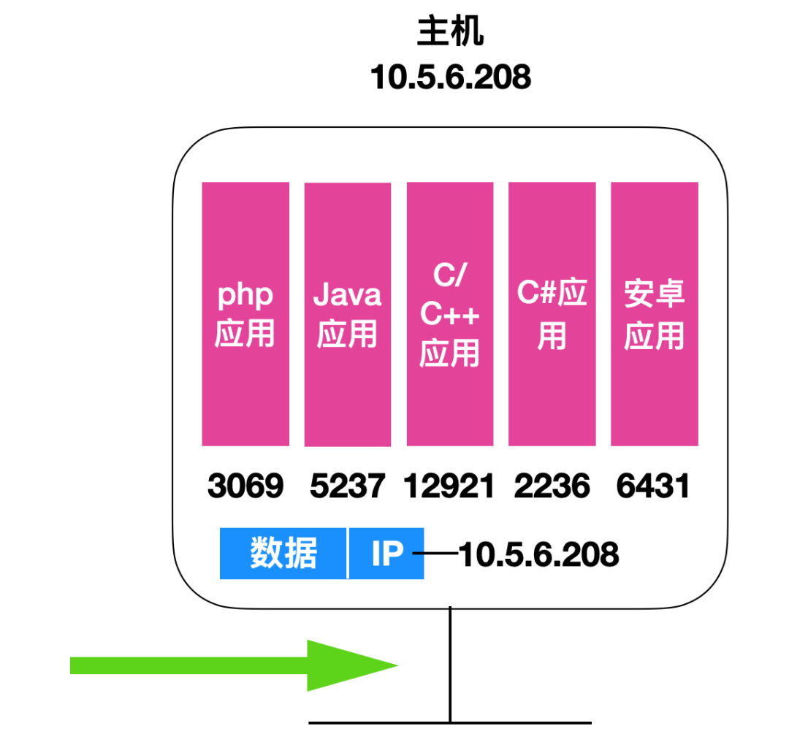

> TCP 如何判断是哪个端口的呢？

还记得数据包的结构吗，这里来回顾一下

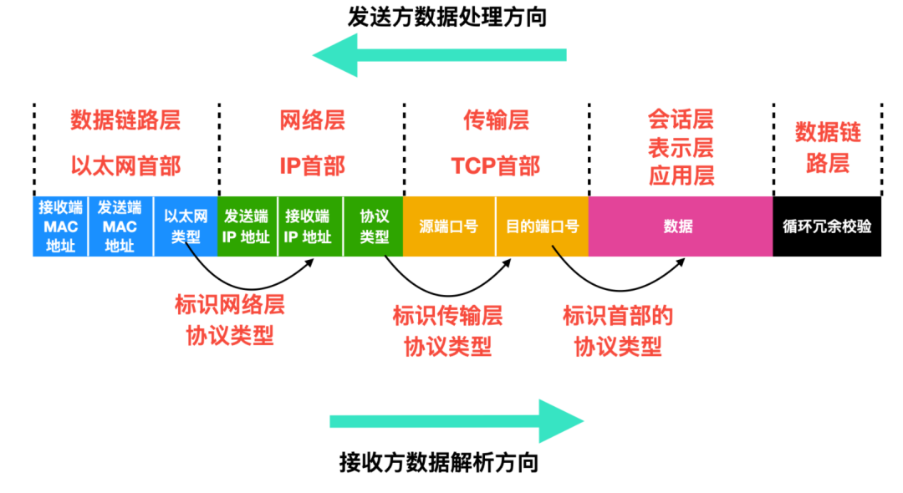

数据包经过每层后，该层协议都会在数据包附上包首部，一个完整的包首部图如上所示。

在数据传输到运输层后，会为其附上 TCP 首部，首部包含着源端口号和目的端口号。

在发送端，运输层将从发送应用程序进程接收到的报文转化成运输层`分组`，分组在计算机网络中也称为`报文段(segment)`。运输层一般会将报文段进行分割，分割成为较小的块，为每一块加上运输层首部并将其向目的地发送。

在发送过程中，可选的运输层协议(也就是交通工具) 主要有 `TCP` 和 `UDP` ，关于这两种运输协议的选择及其特性也是我们着重探讨的重点。

### TCP 和 UDP 前置知识

在 TCP/IP 协议中能够实现传输层功能的，最具代表性的就是 TCP 和 UDP。提起 TCP 和 UDP ，就得先从这两个协议的定义说起。

TCP 叫做`传输控制协议(TCP，Transmission Control Protocol)`，通过名称可以大致知道 TCP 协议有控制传输的功能，主要体现在其可控，可控就表示着可靠，确实是这样的，TCP 为应用层提供了一种**可靠的、面向连接**的服务，它能够将分组可靠的传输到服务端。

UDP 叫做 `用户数据报协议(UDP，User Datagram Protocol)`，通过名称可以知道 UDP把重点放在了数据报上，它为应用层提供了一种无需建立连接就可以直接发送数据报的方法。

> 怎么计算机网络中的术语对一个数据的描述这么多啊？
>
> 在计算机网络中，在不同层之间会有不同的描述。我们上面提到会将运输层的分组称为报文段，除此之外，还会将 TCP 中的分组也称为报文段，然而将 UDP 的分组称为数据报，同时也将网络层的分组称为数据报

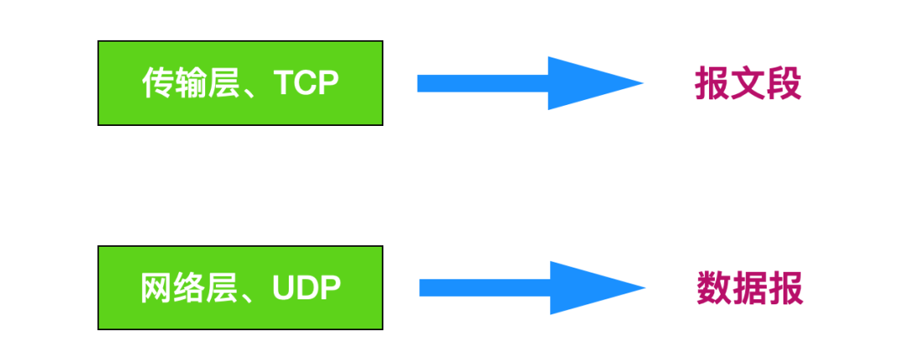

但是为了统一，一般在计算机网络中我们统一称 TCP 和 UDP 的报文为 `报文段`，这个就相当于是约定，到底如何称呼不用过多纠结啦。

#### 套接字

在 TCP 或者 UDP 发送具体的报文信息前，需要先经过一扇 `门`，这个门就是`套接字(socket)`，套接字向上连接着应用层，向下连接着网络层。在操作系统中，操作系统分别为应用和硬件提供了`接口(Application Programming Interface)`。而在计算机网络中，套接字同样是一种接口，它也是有接口 API 的。

使用 TCP 或 UDP 通信时，会广泛用到套接字的 API，使用这套 API 设置 IP 地址、端口号，实现数据的发送和接收。

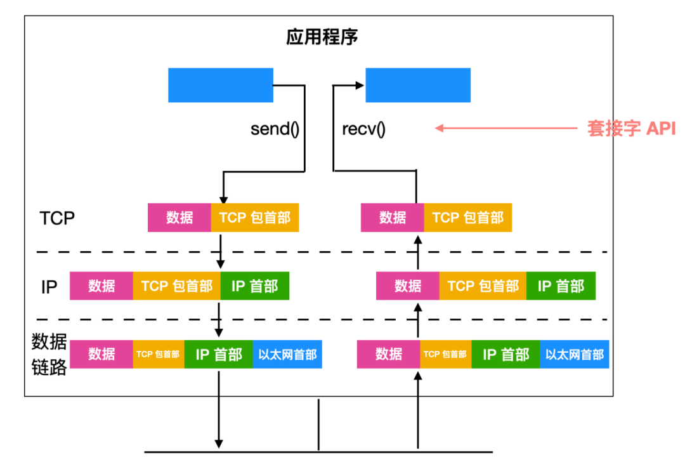

现在我们知道了， Socket 和 TCP/IP 没有必然联系，Socket 的出现只是方便了 TCP/IP 的使用，如何方便使用呢？你可以直接使用下面 Socket API 的这些方法。

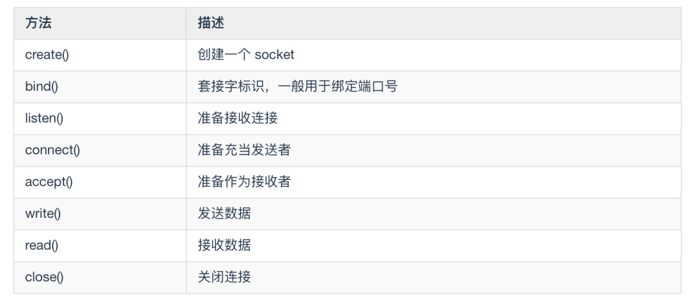

##### 套接字类型

套接字的主要类型有三种，下面我们分别介绍一下

  * `数据报套接字(Datagram sockets)`：数据报套接字提供一种`无连接`的服务，而且并不能保证数据传输的可靠性。数据有可能在传输过程中丢失或出现数据重复，且无法保证顺序地接收到数据。数据报套接字使用`UDP( User DatagramProtocol)协议`进行数据的传输。由于数据报套接字不能保证数据传输的可靠性，对于有可能出现的数据丢失情况，需要在程序中做相应的处理。
  * `流套接字(Stream sockets)`：流套接字用于提供面向连接、可靠的数据传输服务。能够保证数据的可靠性、顺序性。流套接字之所以能够实现可靠的数据服务，原因在于其使用了传输控制协议，即 `TCP(The Transmission Control Protocol)协议`
  * `原始套接字(Raw sockets)`: 原始套接字允许直接发送和接收 IP 数据包，而无需任何特定于协议的传输层格式，原始套接字可以读写内核没有处理过的 IP 数据包。

##### 套接字处理过程

在计算机网络中，要想实现通信，必须至少需要两个端系统，至少需要一对两个套接字才行。下面是套接字的通信过程。

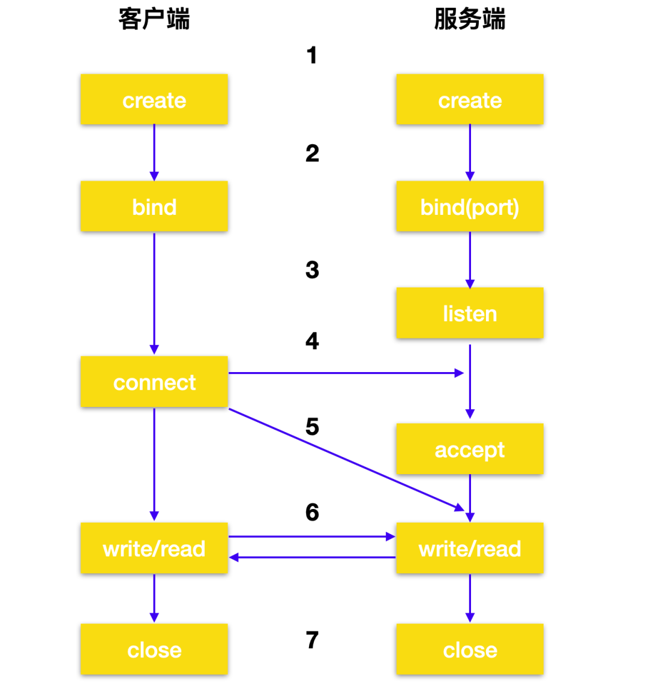

  1. socket 中的 API 用于创建通信链路中的端点，创建完成后，会返回描述该套接字的`套接字描述符`。

> 就像使用文件描述符来访问文件一样，套接字描述符用来访问套接字。

  1. 当应用程序具有套接字描述符后，它可以将唯一的名称绑定在套接字上，服务器必须绑定一个名称才能在网络中访问
  2. 在为服务端分配了 socket 并且将名称使用 bind 绑定到套接字上后，将会调用 listen api。`listen` 表示客户端愿意等待连接的意愿，listen 必须在 accept api 之前调用。
  3. 客户端应用程序在流套接字(基于 TCP)上调用 `connect` 发起与服务器的连接请求。
  4. 服务器应用程序使用`accept`API 接受客户端连接请求，服务器必须先成功调用 bind 和 listen 后，再调用 accept api。
  5. 在流套接字之间建立连接后，客户端和服务器就可以发起 read/write api 调用了。
  6. 当服务器或客户端要停止操作时，就会调用 `close` API 释放套接字获取的所有系统资源。

虽然套接字 API 位于应用程序层和传输层之间的通信模型中，但是套接字 API 不属于通信模型。套接字 API 允许应用程序与传输层和网络层进行交互。

在往下继续聊之前，我们先播放一个小插曲，简单聊一聊 IP。

#### 聊聊 IP

`IP` 是`Internet Protocol（网际互连协议）`的缩写，是 TCP/IP 体系中的`网络层`协议。设计 IP 的初衷主要想解决两类问题

  * 提高网络扩展性：实现大规模网络互联
  * 对应用层和链路层进行解藕，让二者独立发展。

IP 是整个 TCP/IP 协议族的核心，也是构成互联网的基础。为了实现大规模网络的互通互联，IP 更加注重适应性、简洁性和可操作性，并在可靠性做了一定的牺牲。IP 不保证分组的**交付时限和可靠性**，所传送分组有可能出现**丢失、重复、延迟或乱序**等问题。

> 我们知道，TCP 协议的下一层就是 IP 协议层，既然 IP 不可靠，那么如何保证数据能够准确无误地到达呢？

这就涉及到 TCP 传输机制的问题了，我们后面聊到 TCP 的时候再说。

#### 端口号

在聊端口号前，先来聊一聊文件描述以及 socket 和端口号的关系

> 为了方便资源的使用，提高机器的性能、利用率和稳定性等等原因，我们的计算机都有一层软件叫做操作系统，它用于帮我们管理计算机可以使用的资源，当我们的程序要使用一个资源的时候，可以向操作系统申请，再由操作系统为我们的程序分配和管理资源。通常当我们要访问一个内核设备或文件时，程序可以调用系统函数，系统就会为我们打开设备或文件，然后返回一个文件描述符fd（或称为ID，是一个整数），我们要访问该设备或文件，只能通过该文件描述符。可以认为该编号对应着打开的文件或设备。

而当我们的程序要使用网络时，要使用到对应的操作系统内核的操作和网卡设备，所以我们可以向操作系统申请，然后系统会为我们创建一个套接字 Socket，并返回这个Socket 的ID，以后我们的程序要使用网络资源，只要向这个 Socket 的编号 ID 操作即可。而我们的每一个网络通信的进程至少对应着一个 Socket。向 Socket 的 ID 中写数据，相当于向网络发送数据，向 Socket 中读数据，相当于接收数据。而且这些套接字都有唯一标识符——文件描述符 fd。

端口号是 `16` 位的非负整数，它的范围是 0 - 65535 之间，这个范围会分为三种不同的端口号段，由 Internet 号码分配机构 IANA进行分配

  * 周知/标准端口号，它的范围是 0 - 1023
  * 注册端口号，范围是 1024 - 49151
  * 私有端口号，范围是 49152 - 6553

一台计算机上可以运行多个应用程序，当一个报文段到达主机后，应该传输给哪个应用程序呢？你怎么知道这个报文段就是传递给 HTTP 服务器而不是 SSH 服务器的呢？

是凭借端口号吗？当报文到达服务器时，是端口号来区分不同应用程序的，所以应该借助端口号来区分。

举个例子反驳一下 cxuan，假如到达服务器的两条数据都是由 80 端口发出的你该如何区分呢？或者说到达服务器的两条数据端口一样，协议不同，该如何区分呢？

所以仅凭端口号来确定某一条报文显然是不够的。

互联网上一般使用 **源 IP 地址、目标 IP 地址、源端口号、目标端口号** 来进行区分。如果其中的某一项不同，就被认为是不同的报文段。这些也是`多路分解和多路复用` 的基础。

##### 确定端口号

在实际通信之前，需要先确定一下端口号，确定端口号的方法分为两种：

  * 标准既定的端口号

标准既定的端口号是静态分配的，每个程序都会有自己的端口号，每个端口号都有不同的用途。端口号是一个 16 比特的数，其大小在 0 - 65535 之间，0 - 1023 范围内的端口号都是动态分配的既定端口号，例如 HTTP 使用 80 端口来标识，FTP 使用 21 端口来标识，SSH 使用 22 来标识。这类端口号有一个特殊的名字，叫做 `周知端口号(Well-Known Port Number)`。

  * 时序分配的端口号

第二种分配端口号的方式是一种动态分配法，在这种方法下，客户端应用程序可以完全不用自己设置端口号，凭借操作系统进行分配，操作系统可以为每个应用程序分配互不冲突的端口号。这种动态分配端口号的机制即使是同一个客户端发起的 TCP 连接，也能识别不同的连接。

#### 多路复用和多路分解

我们上面聊到了在主机上的每个套接字都会分配一个端口号，当报文段到达主机时，运输层会检查报文段中的目的端口号，并将其定向到相应的套接字，然后报文段中的数据通过套接字进入其所连接的进程。下面我们来聊一下什么是多路复用和多路分解的概念。

多路复用和多路分解分为两种，即`无连接`的多路复用(多路分解)和`面向连接`的多路复用(多路分解)

##### 无连接的多路复用和多路分解

开发人员会编写代码确定端口号是周知端口号还是时序分配的端口号。假如主机 A 中的一个 10637 端口要向主机 B 中的 45438 端口发送数据，运输层采用的是 `UDP` 协议，数据在应用层产生后，会在运输层中加工处理，然后在网络层将数据封装得到 IP 数据报，IP 数据包通过链路层尽力而为的交付给主机 B，然后主机 B 会检查报文段中的端口号判断是哪个套接字的，这一系列的过程如下所示

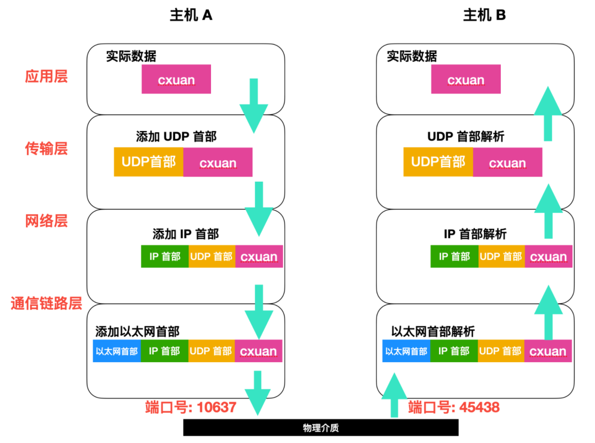

UDP 套接字就是一个二元组，二元组包含目的 IP 地址和目的端口号。

所以，如果两个 UDP 报文段有不同的源 IP 地址和/或相同的源端口号，但是具有相同的目的 IP 地址和目的端口号，那么这两个报文会通过套接字定位到相同的目的进程。

这里思考一个问题，主机 A 给主机 B 发送一个消息，为什么还需要知道源端口号呢？比如我给妹子表达出我对你有点意思的信息，妹子还需要知道这个信息是从我的哪个器官发出的吗？知道是我这个人对你有点意思不就完了？实际上是需要的，因为妹子如果要表达出她对你也有点意思，她是不是可能会亲你一口，那她得知道往哪亲吧？

这就是，在 A 到 B 的报文段中，源端口号会作为 `返回地址` 的一部分，即当 B 需要回发一个报文段给 A 时，B 需要从 A 到 B 中的源端口号取值，如下图所示

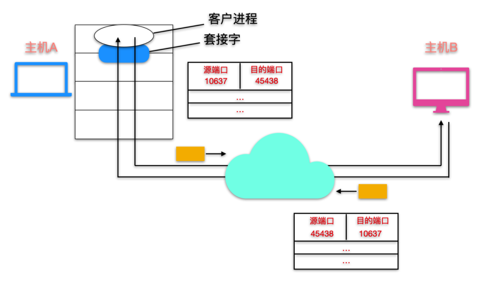

##### 面向连接的多路复用与多路分解

如果说无连接的多路复用和多路分解指的是 UDP 的话，那么面向连接的多路复用与多路分解指的是 TCP 了，TCP 和 UDP 在报文结构上的差别是，UDP 是一个二元组而 TCP 是一个四元组，即**源 IP 地址、目标 IP 地址、源端口号、目标端口号** ，这个我们上面也提到了。当一个 TCP 报文段从网络到达一台主机时，这个主机会根据这四个值拆解到对应的套接字上。

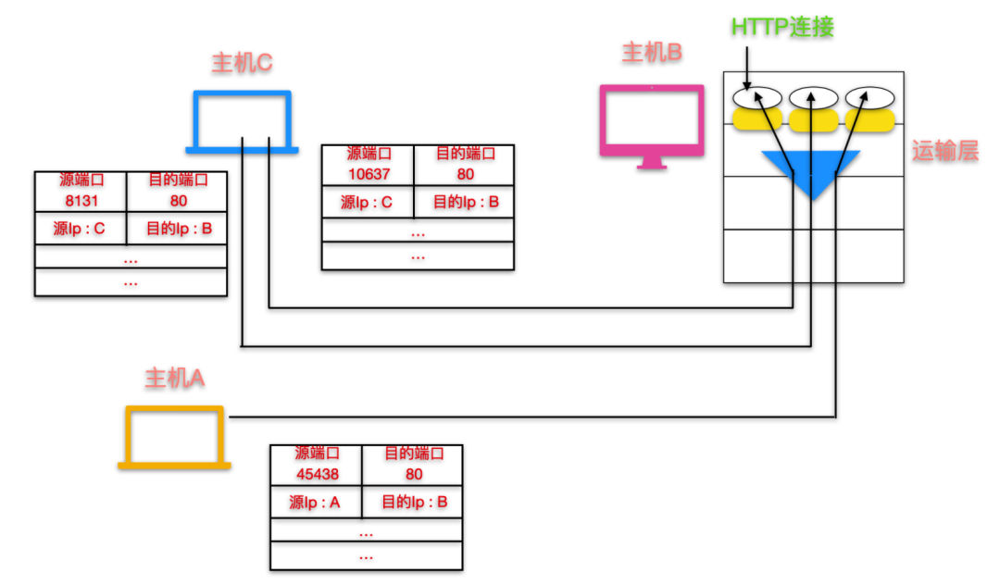

上图显示了面向连接的多路复用和多路分解的过程，图中主机 C 向主机 B 发起了两个 HTTP 请求，主机 A 向主机 C 发起了一个 HTTP 请求，主机 A、B、C 都有自己唯一的 IP 地址，当主机 C 发出 HTTP 请求后，主机 B 能够分解这两个 HTTP 连接，因为主机 C 发出请求的两个源端口号不同，所以对于主机 B 来说，这是两条请求，主机 B 能够进行分解。对于主机 A 和主机 C 来说，这两个主机有不同的 IP 地址，所以对于主机 B 来说，也能够进行分解。

### UDP

终于，我们开始了对 UDP 协议的探讨，淦起！

UDP 的全称是 `用户数据报协议(UDP，User Datagram Protocol)`，UDP 为应用程序提供了一种`无需建立连接`就可以发送封装的 IP 数据包的方法。如果应用程序开发人员选择的是 UDP 而不是 TCP 的话，那么该应用程序相当于就是和 IP 直接打交道的。

从应用程序传递过来的数据，会附加上多路复用/多路分解的源和目的端口号字段，以及其他字段，然后将形成的报文传递给网络层，网络层将运输层报文段封装到 IP数据报中，然后尽力而为的交付给目标主机。最关键的一点就是，使用 UDP 协议在将数据报传递给目标主机时，发送方和接收方的运输层实体间是没有`握手`的。正因为如此，UDP 被称为是`无连接`的协议。

#### UDP 特点

UDP 协议一般作为流媒体应用、语音交流、视频会议所使用的传输层协议，我们大家都知道的 DNS 协议底层也使用了 UDP 协议，这些应用或协议之所以选择 UDP 主要是因为以下这几点

  * `速度快`，采用 UDP 协议时，只要应用进程将数据传给 UDP，UDP 就会将此数据打包进 UDP 报文段并立刻传递给网络层，然后 TCP 有拥塞控制的功能，它会在发送前判断互联网的拥堵情况，如果互联网极度阻塞，那么就会抑制 TCP 的发送方。使用 UDP 的目的就是希望实时性。
  * `无须建立连接`，TCP 在数据传输之前需要经过三次握手的操作，而 UDP 则无须任何准备即可进行数据传输。因此 UDP 没有建立连接的时延。如果使用 TCP 和 UDP 来比喻开发人员：TCP 就是那种凡事都要设计好，没设计不会进行开发的工程师，需要把一切因素考虑在内后再开干！所以非常`靠谱`；而 UDP 就是那种上来直接干干干，接到项目需求马上就开干，也不管设计，也不管技术选型，就是干，这种开发人员非常`不靠谱`，但是适合快速迭代开发，因为可以马上上手！
  * `无连接状态`，TCP 需要在端系统中维护`连接状态`，连接状态包括接收和发送缓存、拥塞控制参数以及序号和确认号的参数，在 UDP 中没有这些参数，也没有发送缓存和接受缓存。因此，某些专门用于某种特定应用的服务器当应用程序运行在 UDP 上，一般能支持更多的活跃用户
  * `分组首部开销小`，每个 TCP 报文段都有 20 字节的首部开销，而 UDP 仅仅只有 8 字节的开销。

> 这里需要注意一点，并不是所有使用 UDP 协议的应用层都是`不可靠`的，应用程序可以自己实现可靠的数据传输，通过增加确认和重传机制。所以使用 UDP 协议最大的特点就是速度快。

#### UDP 报文结构

下面来一起看一下 UDP 的报文结构，每个 UDP 报文分为 UDP 报头和 UDP 数据区两部分。报头由 4 个 16 位长（2 字节）字段组成，分别说明该报文的源端口、目的端口、报文长度和校验值。

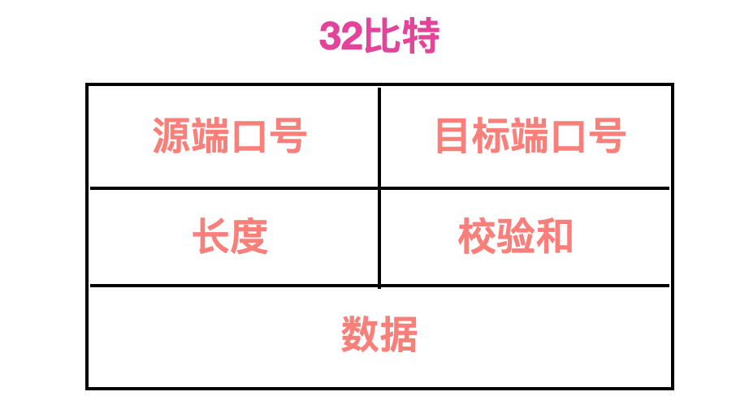

  * `源端口号(Source Port)` :这个字段占据 UDP 报文头的前 16 位，通常包含发送数据报的应用程序所使用的 UDP 端口。接收端的应用程序利用这个字段的值作为发送响应的目的地址。这个字段是可选项，有时不会设置源端口号。没有源端口号就默认为 0 ，通常用于不需要返回消息的通信中。
  * `目标端口号(Destination Port)`: 表示接收端端口，字段长为 16 位
  * `长度(Length)`: 该字段占据 16 位，表示 UDP 数据报长度，包含 UDP 报文头和 UDP 数据长度。因为 UDP 报文头长度是 8 个字节，所以这个值最小为 8，最大长度为 65535 字节。
  * `校验和(Checksum)`：UDP 使用校验和来保证数据安全性，UDP 的校验和也提供了差错检测功能，差错检测用于校验报文段从源到目标主机的过程中，数据的完整性是否发生了改变。发送方的 UDP 对报文段中的 16 比特字的和进行反码运算，求和时遇到的位溢出都会被忽略，比如下面这个例子，三个 16 比特的数字进行相加

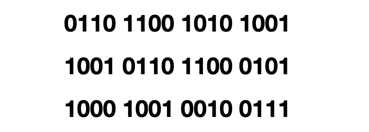

这些 16 比特的前两个和是

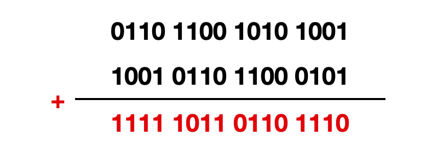

然后再将上面的结果和第三个 16 比特的数进行相加

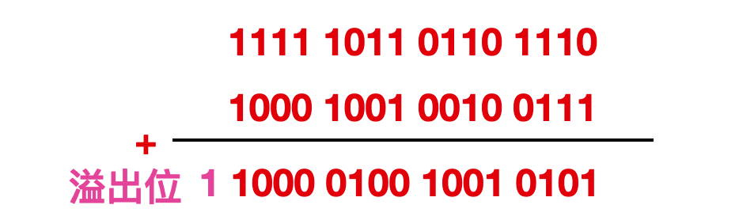

最后一次相加的位会进行溢出，溢出位 1 要被舍弃，然后进行反码运算，反码运算就是将所有的 1 变为 0 ，0 变为 1。因此 **1000 01001001 0101** 的反码就是 **0111 1011 0110 1010**，这就是校验和，如果在接收方，数据没有出现差错，那么全部的 4 个 16 比特的数值进行运算，同时也包括校验和，如果最后结果的值不是 1111 1111 1111 1111 的话，那么就表示传输过程中的数据出现了差错。

> 下面来想一个问题，为什么 UDP 会提供差错检测的功能？

这其实是一种 `端到端` 的设计原则，这个原则说的是**要让传输中各种错误发生的概率降低到一个可以接受的水平**。

> 文件从主机A传到主机B，也就是说AB主机要通信，需要经过三个环节：首先是主机A从磁盘上读取文件并将数据分组成一个个数据包packet,，然后数据包通过连接主机A和主机B的网络传输到主机B，最后是主机B收到数据包并将数据包写入磁盘。在这个看似简单其实很复杂的过程中可能会由于某些原因而影响正常通信。比如：磁盘上文件读写错误、缓冲溢出、内存出错、网络拥挤等等这些因素都有可能导致数据包的出错或者丢失，由此可见用于通信的网络是不可靠的。
>
> 由于实现通信只要经过上述三个环节，那么我们就想是否在其中某个环节上增加一个检错纠错机制来用于对信息进行把关呢？
>
> 网络层肯定不能做这件事，因为网络层的最主要目的是增大数据传输的速率，网络层不需要考虑数据的完整性，数据的完整性和正确性交给端系统去检测就行了，因此在数据传输中，对于网络层只能要求其提供尽可能好的数据传输服务，而不可能寄希望于网络层提供数据完整性的服务。

UDP 不可靠的原因是它虽然提供差错检测的功能，但是**对于差错没有恢复能力更不会有重传机制**。

### TCP

UDP 是一种没有复杂的控制，提供无连接通信服务的一种协议，换句话说，它将部分控制部分交给应用程序去处理，自己只提供作为传输层协议最基本的功能。

而与 UDP 不同的是，同样作为传输层协议，TCP 协议要比 UDP 的功能多很多。

`TCP` 的全称是 `Transmission Control Protocol`，它被称为是一种`面向连接(connection-oriented)`的协议，这是因为一个应用程序开始向另一个应用程序发送数据之前，这两个进程必须先进行`握手`，握手是一个逻辑连接，并不是两个主机之间进行真实的握手。

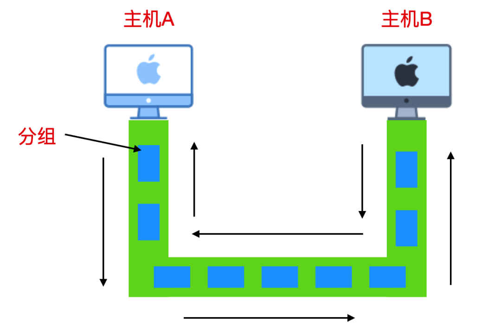

这个连接是指各种设备、线路或者网络中进行通信的两个应用程序为了相互传递消息而专有的、虚拟的通信链路，也叫做虚拟电路。

一旦主机 A 和主机 B 建立了连接，那么进行通信的应用程序只使用这个虚拟的通信线路发送和接收数据就可以保证数据的传输，TCP 协议负责控制连接的建立、断开、保持等工作。

TCP 连接是`全双工服务(full-duplex service)` 的，全双工是什么意思？全双工指的是主机 A 与另外一个主机 B 存在一条 TCP 连接，那么应用程数据就可以从主机 B 流向主机 A 的同时，也从主机 A 流向主机 B。

TCP 只能进行 `点对点(point-to-point)` 连接，那么所谓的`多播`，即一个主机对多个接收方发送消息的情况是不存在的，TCP连接只能连接两个一对主机。

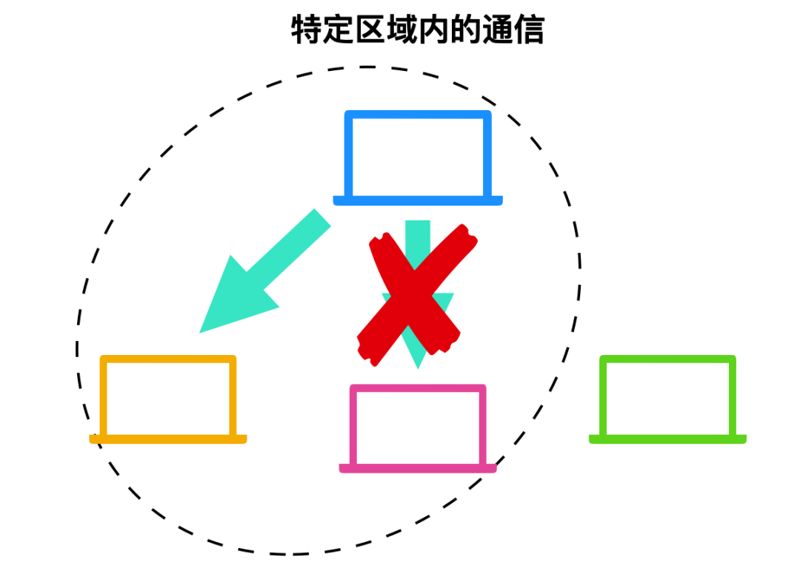

TCP 的连接建立需要经过三次握手，这个我们下面再说。一旦 TCP 连接建立后，主机之间就可以相互发送数据了，客户进程通过套接字传送数据流。数据一旦通过套接字后，它就由客户中运行的 TCP 协议所控制。

TCP 会将数据临时存储到连接的`发送缓存(send buffer)` 中，这个 send buffer 是三次握手之间设置的缓存之一，然后 TCP 在合适的时间将发送缓存中的数据发送到目标主机的接收缓存中，实际上，每一端都会有发送缓存和接收缓存，如下所示

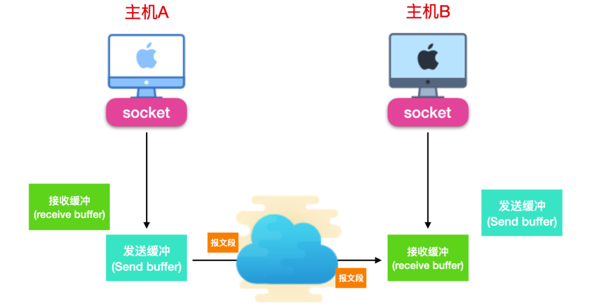

主机之间的发送是以 `报文段(segment)` 进行的，那么什么是 Segement 呢？

TCP 会将要传输的数据流分为多个`块(chunk)`，然后向每个 chunk 中添加 TCP 标头，这样就形成了一个 TCP 段也就是报文段。每一个报文段可以传输的长度是有限的，不能超过`最大数据长度(Maximum Segment Size)`，俗称`MSS`。在报文段向下传输的过程中，会经过链路层，链路层有一个 `Maximum Transmission Unit` ，最大传输单元 MTU，即数据链路层上所能通过最大数据包的大小，最大传输单元通常与通信接口有关。

> 那么 MSS 和 MTU 有啥关系呢？

因为计算机网络是分层考虑的，这个很重要，不同层的称呼不一样，对于传输层来说，称为报文段而对网络层来说就叫做 IP 数据包，所以，**MTU 可以认为是网络层能够传输的最大 IP 数据包，而 MSS（Maximum segment size）可以认为是传输层的概念，也就是 TCP数据包每次能够传输的最大量**。

#### TCP 报文段结构

在简单聊了聊 TCP 连接后，下面我们就来聊一下 TCP 的报文段结构，如下图所示

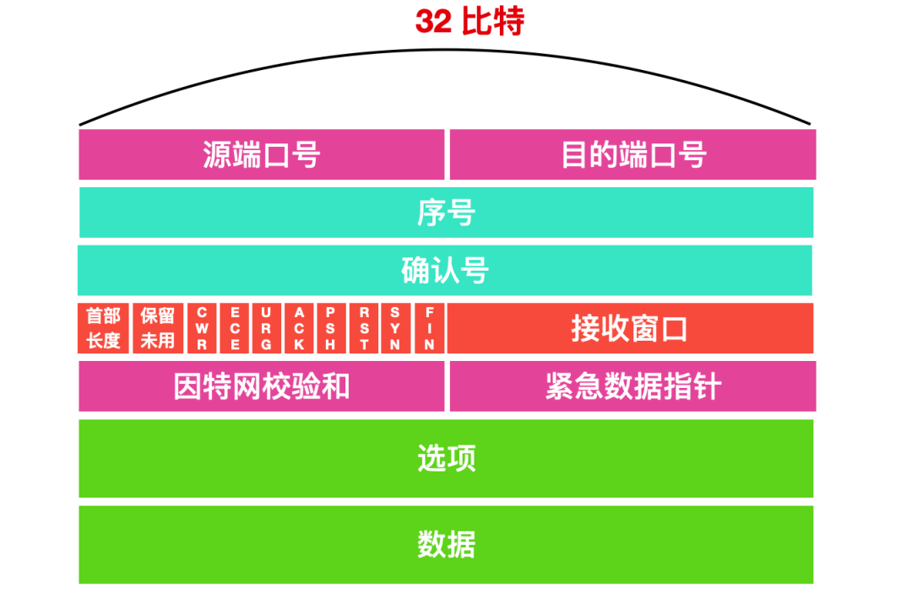

TCP 报文段结构相比 UDP 报文结构多了很多内容。但是前两个 32 比特的字段是一样的。它们是 `源端口号` 和 `目标端口号`，我们知道，这两个字段是用于多路复用和多路分解的。另外，和 UDP 一样，TCP 也包含`校验和(checksum field)`，除此之外，TCP 报文段首部还有下面这些

  * 32 比特的`序号字段(sequence number field)` 和 32 比特的`确认号字段(acknowledgment number field)` 。这些字段被 TCP 发送方和接收方用来实现可靠的数据传输。
  * 4 比特的`首部字段长度字段(header length field)`，这个字段指示了以 32 比特的字为单位的 TCP 首部长度。TCP 首部的长度是可变的，但是通常情况下，选项字段为空，所以 TCP 首部字段的长度是 20 字节。
  * 16 比特的 `接受窗口字段(receive window field)` ，这个字段用于流量控制。它用于指示接收方能够/愿意接受的字节数量
  * 可变的`选项字段(options field)`，这个字段用于发送方和接收方协商最大报文长度，也就是 MSS 时使用
  * 6 比特的 `标志字段(flag field)`， `ACK` 标志用于指示确认字段中的值是有效的，这个报文段包括一个对已被成功接收报文段的确认；`RST`、`SYN`、`FIN` 标志用于连接的建立和关闭；`CWR` 和 `ECE` 用于拥塞控制；`PSH` 标志用于表示立刻将数据交给上层处理；`URG` 标志用来表示数据中存在需要被上层处理的 紧急 数据。紧急数据最后一个字节由 16 比特的`紧急数据指针字段(urgeent data pointer field)` 指出。一般情况下，PSH 和 URG 并没有使用。

TCP 的各种功能和特点都是通过 TCP 报文结构来体现的，在聊完 TCP 报文结构之后，我们下面就来聊一下 TCP 有哪些功能及其特点了。

#### 序号、确认号实现传输可靠性

TCP 报文段首部中两个最重要的字段就是 `序号` 和 `确认号`，这两个字段是 TCP 实现可靠性的基础，那么你肯定好奇如何实现可靠性呢？要了解这一点，首先我们得先知道这两个字段里面存了哪些内容吧？

**一个报文段的序号就是数据流的字节编号** 。因为 TCP 会把数据流分割成为一段一段的字节流，因为字节流本身是有序的，所以每一段的字节编号就是标示是哪一段的字节流。比如，主机 A 要给主机 B 发送一条数据。数据经过应用层产生后会有一串数据流，数据流会经过 TCP 分割，分割的依据就是 MSS，假设数据是 10000 字节，MSS 是 2000 字节，那么 TCP 就会把数据拆分成 0 - 1999 , 2000 - 3999 的段，依次类推。

所以，第一个数据 0 - 1999 的首字节编号就是 0 ，2000 - 3999 的首字节编号就是 2000 。

然后，每个序号都会被填入 TCP 报文段首部的序号字段中。

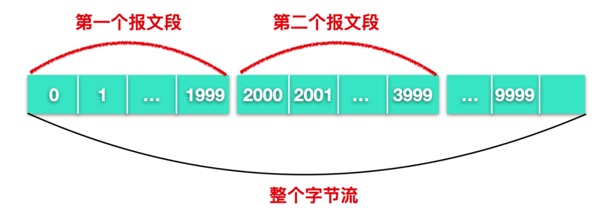

至于确认号的话，会比序号要稍微麻烦一些。这里我们先拓展下几种通信模型。

  * 单工通信：单工数据传输只支持数据在一个方向上传输；在同一时间只有一方能接受或发送信息，不能实现双向通信，比如广播、电视等。
  * 双工通信是一种点对点系统，由两个或者多个在两个方向上相互通信的连接方或者设备组成。双工通信模型有两种：全双工(FDX)和半双工(HDX)
  * 全双工：在全双工系统中，连接双方可以相互通信，一个最常见的例子就是电话通信。全双工通信是两个单工通信方式的结合，它要求发送设备和接收设备都有独立的接收和发送能力。
  * 半双工：在半双工系统中，连接双方可以彼此通信，但不能同时通信，比如对讲机，只有把按钮按住的人才能够讲话，只有一个人讲完话后另外一个人才能讲话。

单工、半双工、全双工通信如下图所示

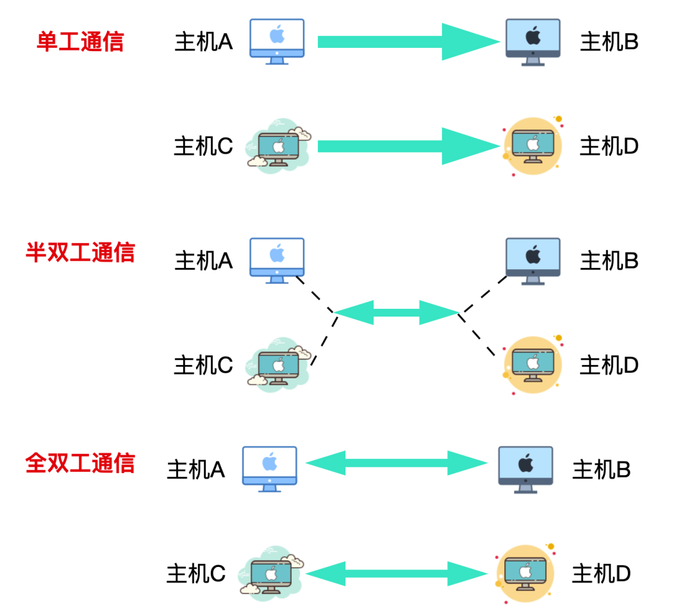

TCP 是一种全双工的通信协议，因此主机 A 在向主机 B 发送消息的过程中，也在接受来自主机 B 的数据。主机 A 填充进报文段的确认号是期望从主机 B 收到的下一字节的序号。稍微有点绕，我们来举个例子看一下。比如主机 A 收到了来自主机 B 发送的编号为 0 - 999 字节的报文段，这个报文段会写入序号中，随后主机 A 期望能够从主机 B 收到 1000 - 剩下的报文段，因此，主机 A 发送到主机 B 的报文段中，它的确认号就是 1000 。

##### 累积确认

这里再举出一个例子，比如主机 A 在发送 0 - 999 报文段后，期望能够接受到 1000 之后的报文段，但是主机 B 却给主机 A 发送了一个 1500 之后的报文段，那么主机 A 是否还会继续进行等待呢？

答案显然是会的，因为 TCP 只会确认流中至第一个丢失字节为止的字节，因为 1500 虽然属于 1000 之后的字节，但是主机 B 没有给主机 A 发送 1000 - 1499 之间的字节，所以主机 A 会继续等待。

在了解完序号和确认号之后，我们下面来聊一下 TCP 的发送过程。下面是一个正常的发送过程

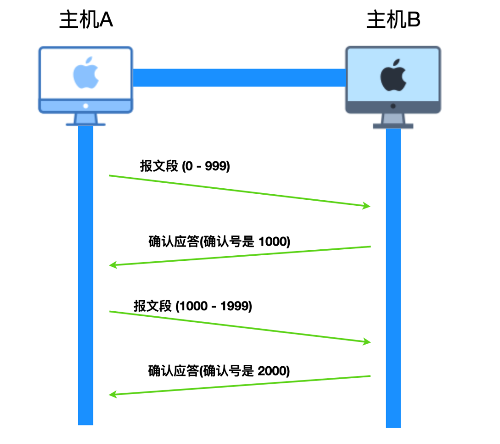

TCP 通过肯定的`确认应答(ACK)` 来实现可靠的数据传输，当主机 A将数据发出之后会等待主机 B 的响应。如果有确认应答(ACK)，说明数据已经成功到达对端。反之，则数据很可能会丢失。

如下图所示，如果在一定时间内主机 A 没有等到确认应答，则认为主机 B 发送的报文段已经丢失，并进行重发。

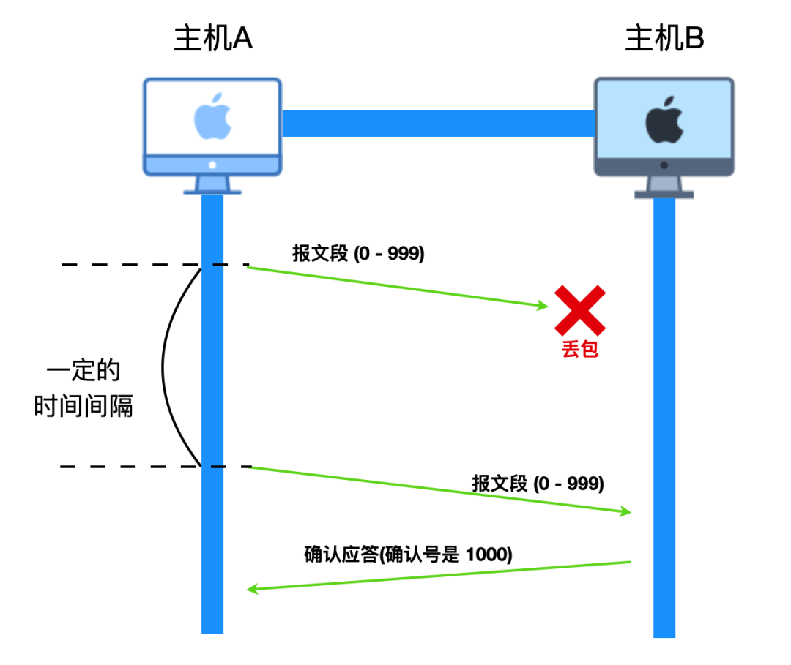

主机 A 给主机 B 的响应可能由于网络抖动等原因无法到达，那么在经过特定的时间间隔后，主机 A 将重新发送报文段。

主机 A 没有收到主机 B 的响应还可能是因为主机 B 在发送给主机 A 的过程中丢失。

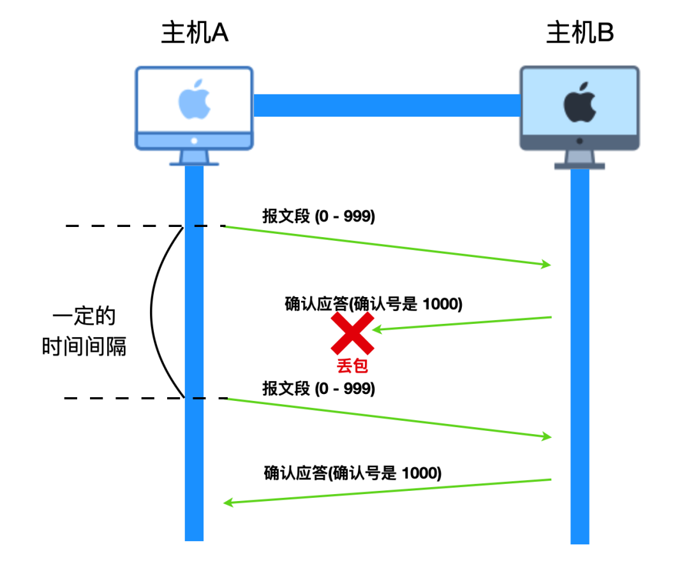

如上图所示，由主机 B 返回的确认应答，由于网络拥堵等原因在传送的过程中丢失，并没有到达主机 A。主机 A 会等待一段时间，如果在这段时间内主机 A 仍没有等到主机 B 的响应，那么主机 A 会重新发送报文段。

那么现在就存在一个问题，如果主机 A 给主机 B 发送了一个报文段后，主机 B 接受到报文段发送响应，此刻由于网络原因，这个报文段并未到达，等到一段时间后主机 A 重新发送报文段，然后此时主机 B 发送的响应在主机 A第二次发送后失序到达主机 A，那么主机 A 应该如何处理呢？

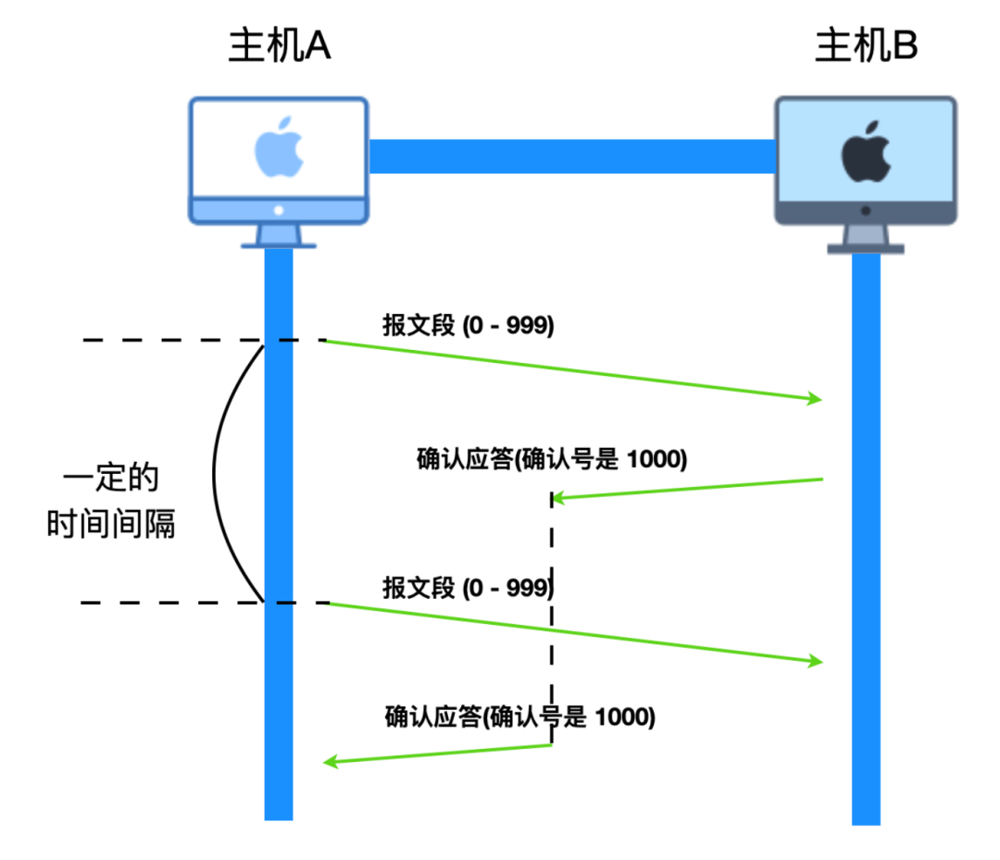

TCP RFC 并未为此做任何规定，也就是说，我们可以自己决定如何处理失序到达的报文段。一般处理方式有两种

  * 接收方立刻丢弃失序的报文段
  * 接收方接受失序到达的报文段，并等待后续的报文段

一般来说通常采取的做法是第二种。

#### 传输控制

##### 利用窗口控制提高速度

前面我们介绍了 TCP 是以数据段的形式进行发送，如果经过一段时间内主机 A 等不到主机 B 的响应，主机 A 就会重新发送报文段，接受到主机 B 的响应，再会继续发送后面的报文段，我们现在看到，这一问一答的形式还存在许多条件，比如响应未收到、等待响应等，那么对崇尚性能的互联网来说，这种形式的性能应该不会很高。

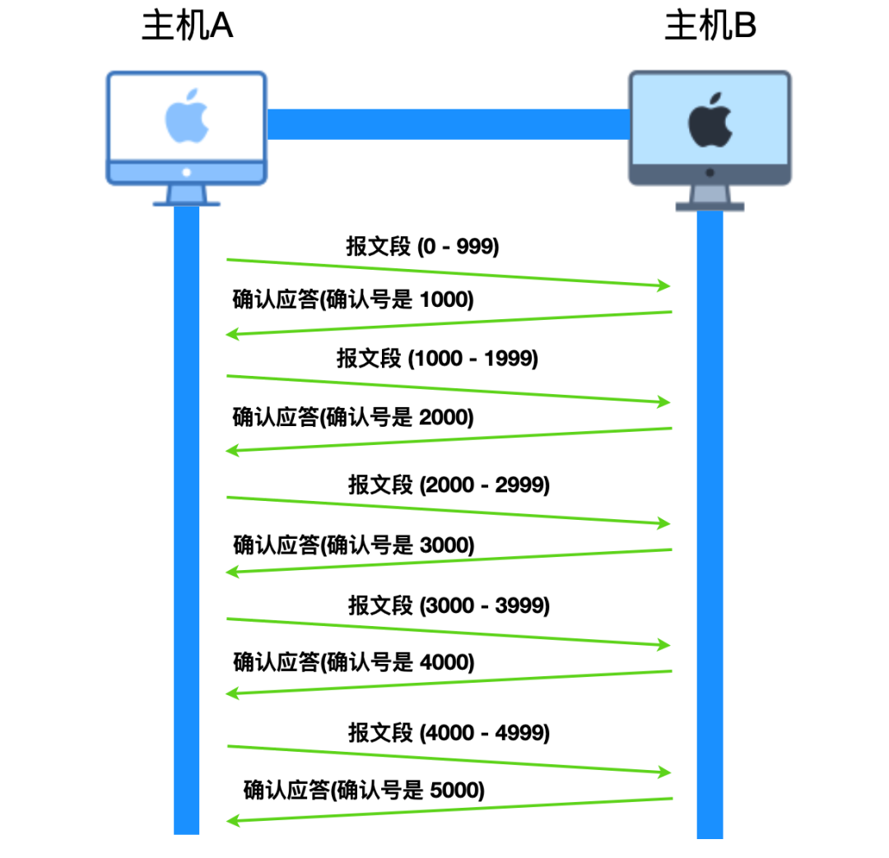

> 那么如何提升性能呢？

为了解决这个问题，TCP 引入了 `窗口` 这个概念，即使在往返时间较长、频次很多的情况下，它也能控制网络性能的下降，听起来很牛批，那它是如何实现的呢？

如下图所示

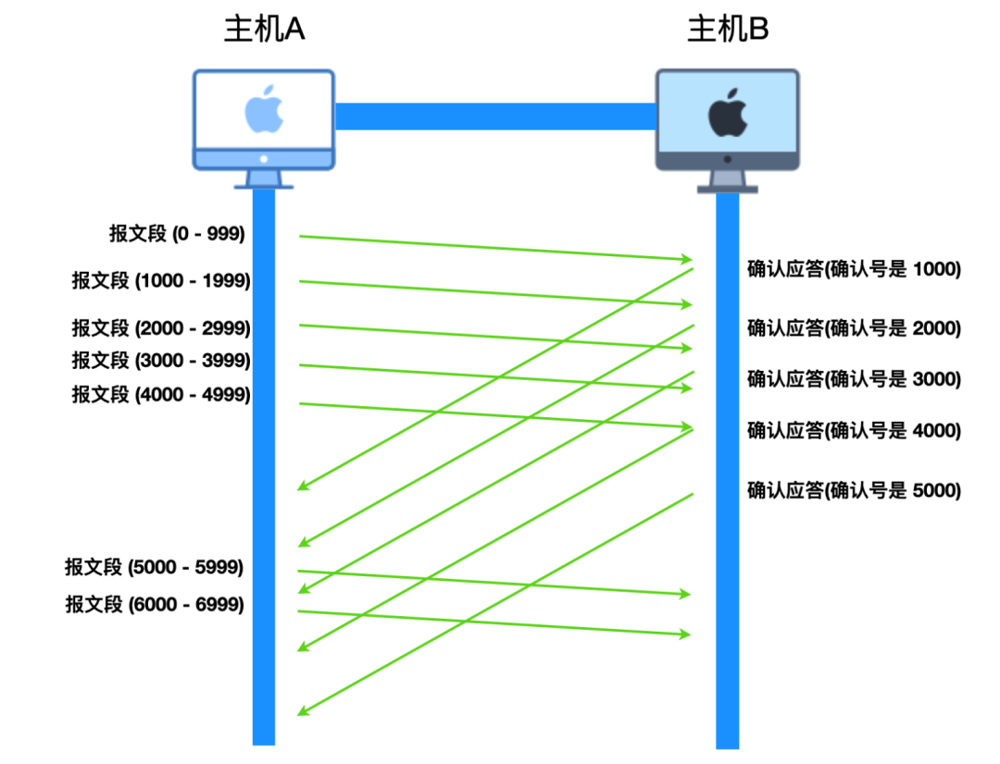

我们之前每次请求发送都是以报文段的形式进行的，引入窗口后，每次请求都可以发送多个报文段，也就是说一个窗口可以发送多个报文段。窗口大小就是指无需等待确认应答就可以继续发送报文段的最大值。

在这个窗口机制中，大量使用了 `缓冲区` ，通过对多个段同时进行确认应答的功能。

如下图所示，发送报文段中高亮部分即是我们提到的窗口，在窗口内，即使没有收到确认应答也可以把请求发送出去。不过，在整个窗口的确认应答没有到达之前，如果部分报文段丢失，那么主机 A 将仍会重传。为此，主机 A 需要设置缓存来保留这些需要重传的报文段，直到收到他们的确认应答。

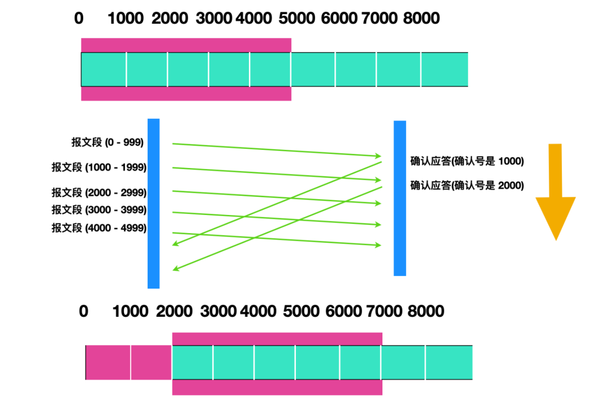

在滑动窗口以外的部分是尚未发送的报文段和已经接受到的报文段，如果报文段已经收到确认则不可进行重发，此时报文段就可以从缓冲区中清除。

在收到确认的情况下，会将窗口滑动到确认应答中确认号的位置，如上图所示，这样可以顺序的将多个段同时发送，用以提高通信性能，这种窗口也叫做`滑动窗口(Sliding window)`。

##### 窗口控制和重发

报文段的发送和接收，必然伴随着报文段的丢失和重发，窗口也是同样如此，如果在窗口中报文段发送过程中出现丢失怎么办？

首先我们先考虑确认应答没有返回的情况。在这种情况下，主机 A 发送的报文段到达主机 B，是不需要再进行重发的。这和单个报文段的发送不一样，如果发送单个报文段，**即使确认应答没有返回，也要进行重发**。

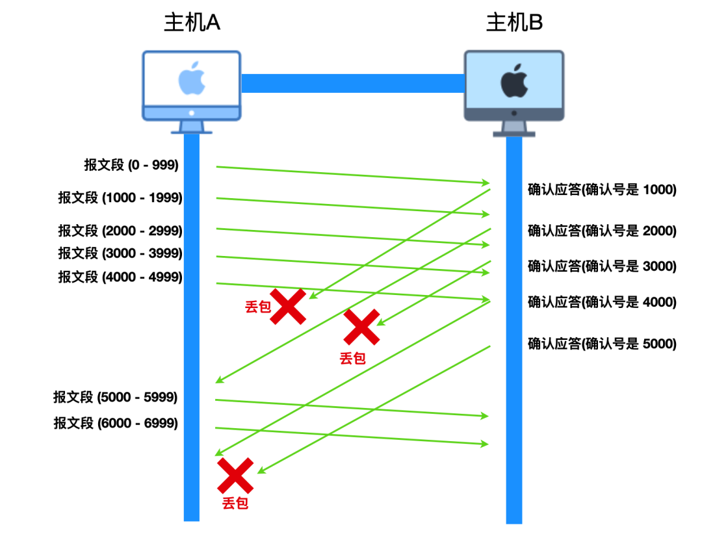

窗口在一定程度上比较大时，即使有少部分确认应答的丢失，也不会重新发送报文段。

我们知道，如果在某个情况下由于发送的报文段丢失，导致接受主机未收到请求，或者主机返回的响应未到达客户端的话，会经过一段时间重传报文。那么在使用窗口的情况下，报文段丢失会怎么样呢？

如下图所示，报文段 0 - 999 丢失后，但是主机 A 并不会等待，主机 A 会继续发送余下的报文段，主机 B 发送的确认应答却一直是1000，同一个确认号的应答报文会被持续不断的返回，如果发送端主机在连续 3 次收到同一个确认应答后，就会将其所对应的数据重发，这种机制要比之前提到的超时重发更加高效，这种机制也被称为 `高速重发控制`。这种重发的确认应答也被称为`冗余 ACK(响应)`。

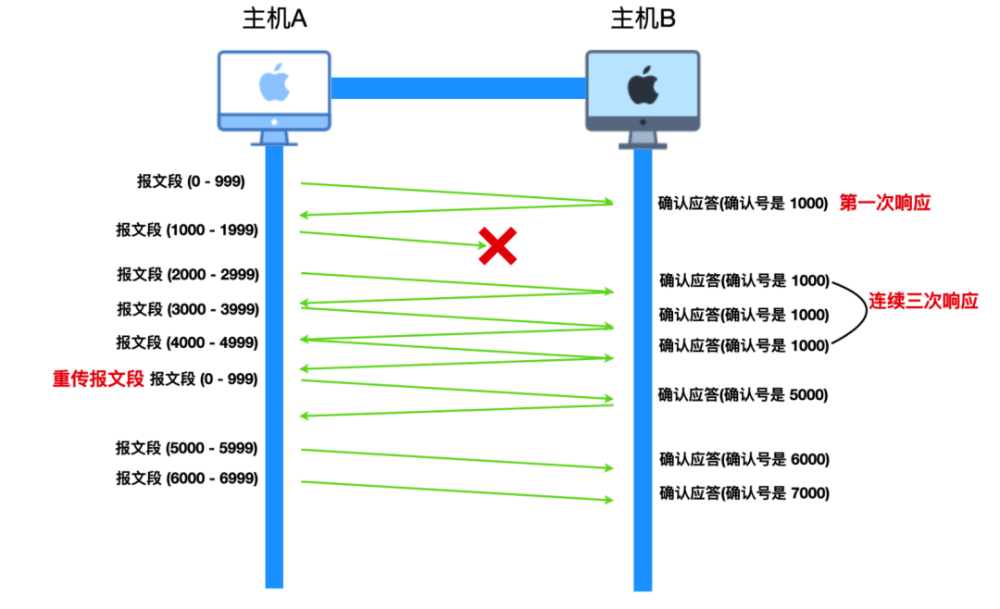

主机 B 在没有接收到自己期望序列号的报文段时，会对之前收到的数据进行确认应答。发送端则一旦收到某个确认应答后，又连续三次收到同样的确认应答，那么就会认为报文段已经丢失。需要进行重发。使用这种机制可以提供更为快速的重发服务。

#### 流量控制

前面聊的是传输控制，下面 cxuan 再和你聊一下 `流量控制`。我们知道，在每个 TCP 连接的一侧主机都会有一个 socket缓冲区，缓冲区会为每个连接设置接收缓存和发送缓存，当 TCP 建立连接后，从应用程序产生的数据就会到达接收方的接收缓冲区中，接收方的应用程序并不一定会马上读取缓冲区的数据，它需要等待操作系统分配时间片。如果此时发送方的应用程序产生数据过快，而接收方读取接受缓冲区的数据相对较慢的话，那么接收方中缓冲区的数据将会`溢出`。

但是还好，TCP 有 `流量控制服务(flow-control service)`用于消除缓冲区溢出的情况。流量控制是一个速度匹配服务，即发送方的发送速率与接受方应用程序的读取速率相匹配。

TCP 通过使用一个 `接收窗口(receive window)`的变量来提供流量控制。接受窗口会给发送方一个指示**到底还有多少可用的缓存空间**。发送端会根据接收端的实际接受能力来控制发送的数据量。

接收端主机向发送端主机通知自己可以接收数据的大小，发送端会发送不超过这个限度的数据，这个大小限度就是窗口大小，还记得 TCP 的首部么，有一个接收窗口，我们上面聊的时候说这个字段用于流量控制。它用于指示接收方能够/愿意接受的字节数量。

> 那么只知道这个字段用于流量控制，那么如何控制呢？

发送端主机会定期发送一个`窗口探测包`，这个包用于探测接收端主机是否还能够接受数据，当接收端的缓冲区一旦面临数据溢出的风险时，窗口大小的值也随之被设置为一个更小的值通知发送端，从而控制数据发送量。

下面是一个流量控制示意图

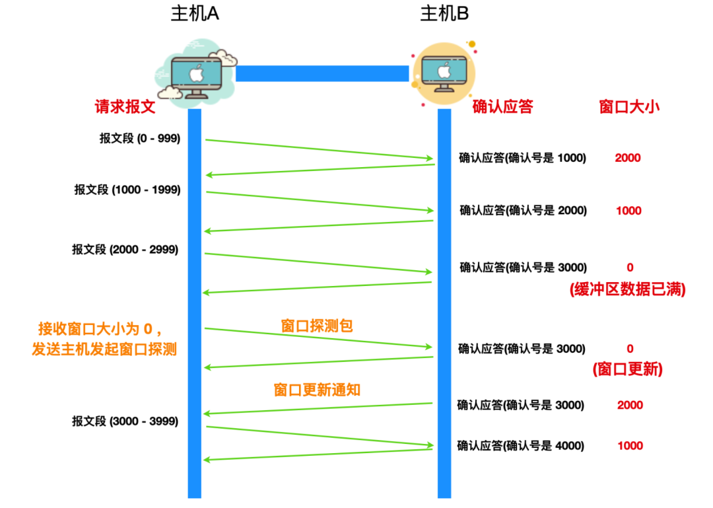

发送端主机根据接收端主机的窗口大小进行流量控制。由此也可以防止发送端主机一次发送过大数据导致接收端主机无法处理。

如上图所示，当主机 B 收到报文段 2000 - 2999 之后缓冲区已满，不得不暂时停止接收数据。然后主机 A 发送窗口探测包，窗口探测包非常小仅仅一个字节。然后主机 B 更新缓冲区接收窗口大小并发送窗口更新通知给主机 A，然后主机 A 再继续发送报文段。

在上面的发送过程中，窗口更新通知可能会丢失，一旦丢失发送端就不会发送数据，所以窗口探测包会随机发送，以避免这种情况发生。

#### 连接管理

在继续介绍下面有意思的特性之前，我们先来把关注点放在 TCP 的`连接管理`上，因为没有 TCP 连接，也就没有后续的一系列 TCP 特性什么事儿了。假设运行在一台主机上的进程想要和另一台主机上的进程建立一条 TCP 连接，那么客户中的 TCP 会使用下面这些步骤与服务器中的 TCP 建立连接。

  * 首先，客户端首先向服务器发送一个特殊的 TCP 报文段。这个报文段首部不包含应用层数据，但是在报文段的首部中有一个 `SYN 标志位` 被置为 1。因此，这个特殊的报文段也可以叫做 SYN 报文段。然后，客户端随机选择一个`初始序列号(client_isn)` ，并将此数字放入初始 TCP SYN 段的序列号字段中，SYN 段又被封装在 IP 数据段中发送给服务器。
  * 一旦包含 IP 数据段到达服务器后，服务端会从 IP 数据段中提取 TCP SYN 段，将 TCP 缓冲区和变量分配给连接，然后给客户端发送一个连接所允许的报文段。这个**连接所允许的报文段**也不包括任何应用层数据。然而，它却包含了三个非常重要的信息。

> 这些缓冲区和变量的分配使 TCP 容易受到称为 SYN 泛洪的拒绝服务攻击。

  * 首先，SYN 比特被置为 1 。
  * 然后，TCP 报文段的首部确认号被设置为 `client_isn + 1`。
  * 最后，服务器选择自己的`初始序号(server_isn)`，并将其放置到 TCP 报文段首部的序号字段中。

如果用大白话解释下就是，我收到了你发起建立连接的 SYN 报文段，这个报文段具有首部字段 client_isn。我同意建立该连接，我自己的初始序号是server_isn。这个允许连接的报文段被称为 `SYNACK 报文段`

  * 第三步，在收到 SYNACK 报文段后，客户端也要为该连接分配缓冲区和变量。客户端主机向服务器发送另外一个报文段，最后一个报文段对服务器发送的响应报文做了确认，确认的标准是客户端发送的数据段中确认号为 server_isn + 1，因为连接已经建立，所以 SYN 比特被置为 0 。以上就是 TCP 建立连接的三次数据段发送过程，也被称为 `三次握手`。

一旦完成这三个步骤，客户和服务器主机就可以相互发送报文段了，在以后的每一个报文段中，SYN 比特都被置为 0 ，整个过程描述如下图所示

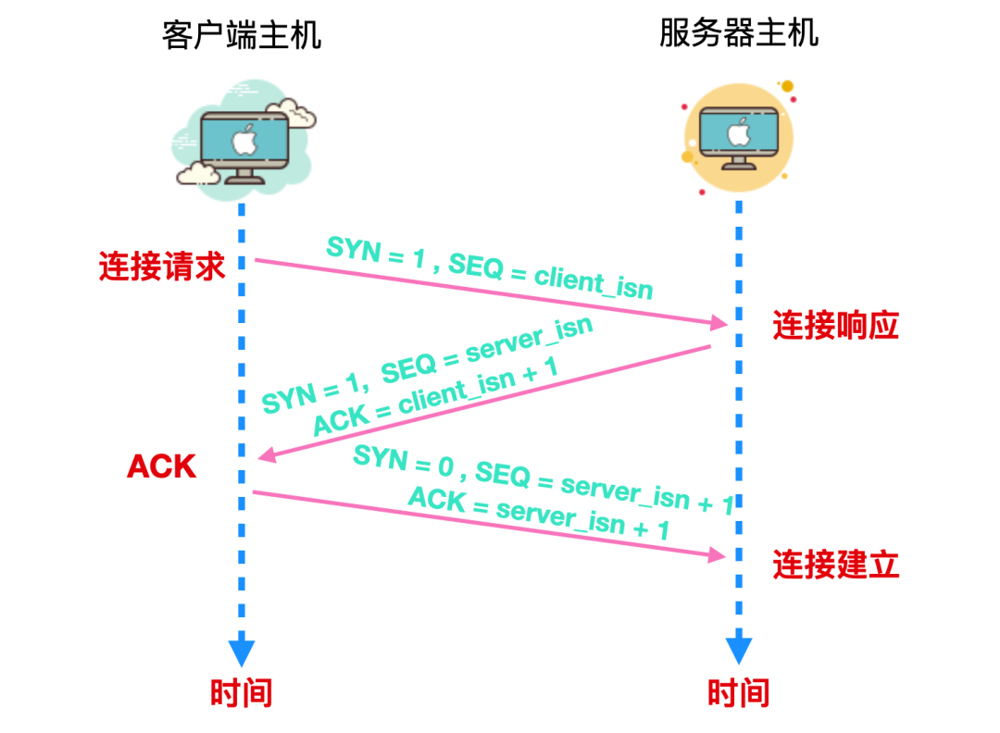

在客户端主机和服务端主机建立连接后，参与一条 TCP 连接的两个进程中的任何一个都能终止 TCP 连接。连接结束后，主机中的缓存和变量将会被释放。假设客户端主机想要终止 TCP 连接，它会经历如下过程

客户应用进程发出一个关闭命令，客户 TCP 向服务器进程发送一个特殊的 TCP 报文段，这个特殊的报文段的首部标志 FIN 被设置为 1

* 当服务器收到这个报文段后，就会向发送方发送一个确认报文段。然后，服务器发送它自己的终止报文段，FIN 位被设置为 1
* 客户端对这个终止报文段进行确认。此时，在两台主机上用于该连接的所有资源都被释放了，如下图所示

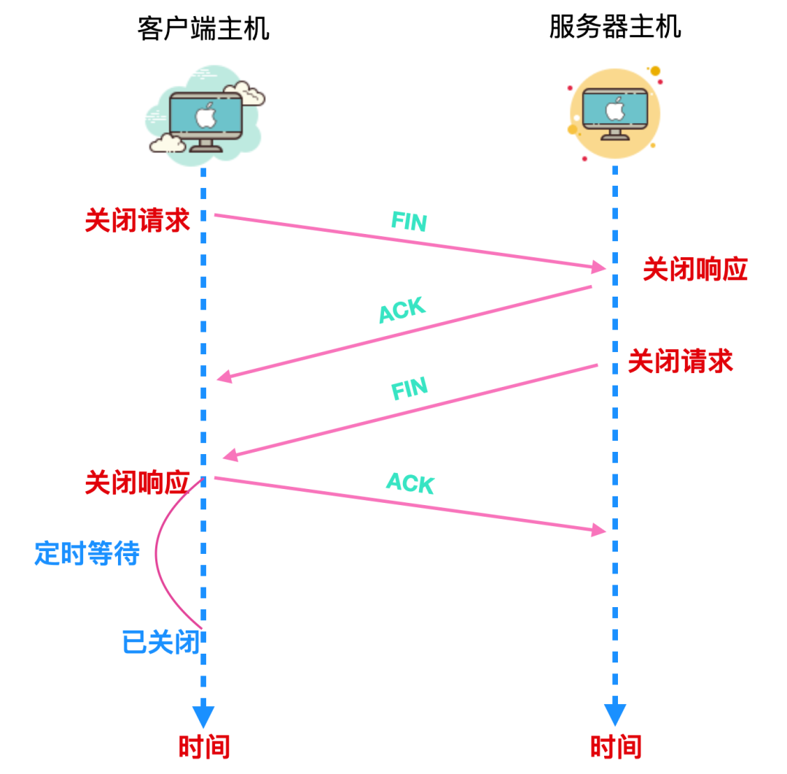

在一个 TCP 连接的生命周期内，运行在每台主机中的 TCP 协议都会在各种 `TCP 状态(TCP State)` 之间进行变化，TCP 的状态主要有**LISTEN、SYN-SEND、SYN-RECEIVED、ESTABLISHED、FIN-WAIT-1、FIN-WAIT-2、CLOSE-WAIT、CLOSING、LAST-ACK、TIME-WAIT 和 CLOSED** 。这些状态的解释如下

  * `LISTEN`: 表示等待任何来自远程 TCP 和端口的连接请求。
  * `SYN-SEND`: 表示发送连接请求后等待匹配的连接请求。
  * `SYN-RECEIVED`: 表示已接收并发送连接请求后等待连接确认，也就是 TCP 三次握手中第二步后服务端的状态
  * `ESTABLISHED`: 表示已经连接已经建立，可以将应用数据发送给其他主机

上面这四种状态是 TCP 三次握手所涉及的。

  * `FIN-WAIT-1`: 表示等待来自远程 TCP 的连接终止请求，或者等待先前发送的连接终止请求的确认。
  * `FIN-WAIT-2`: 表示等待来自远程 TCP 的连接终止请求。
  * `CLOSE-WAIT`: 表示等待本地用户的连接终止请求。
  * `CLOSING`: 表示等待来自远程 TCP 的连接终止请求确认。
  * `LAST-ACK`: 表示等待先前发送给远程 TCP 的连接终止请求的确认（包括对它的连接终止请求的确认）。
  * `TIME-WAIT`: 表示等待足够的时间以确保远程 TCP 收到其连接终止请求的确认。
  * `CLOSED`: 表示连接已经关闭，无连接状态。

上面 7 种状态是 TCP 四次挥手，也就是断开链接所设计的。

TCP 的连接状态会进行各种切换，这些 TCP 连接的切换是根据事件进行的，这些事件由用户调用：**OPEN、SEND、RECEIVE、CLOSE、ABORT 和 STATUS**。涉及到 TCP报文段的标志有 **SYN、ACK、RST 和 FIN** ，当然，还有超时。

我们下面加上 TCP 连接状态后，再来看一下三次握手和四次挥手的过程。

##### 三次握手建立连接

下图画出了 TCP 连接建立的过程。假设图中左端是客户端主机，右端是服务端主机，一开始，两端都处于`CLOSED（关闭）`状态。

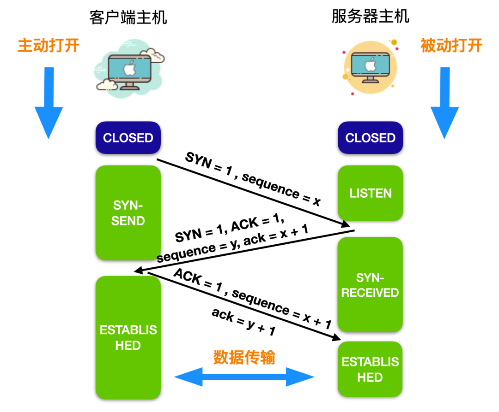

  1. 服务端进程准备好接收来自外部的 TCP 连接，一般情况下是调用 bind、listen、socket 三个函数完成。这种打开方式被认为是 `被动打开(passive open)`。然后服务端进程处于 `LISTEN` 状态，等待客户端连接请求。
  2. 客户端通过 `connect` 发起`主动打开(active open)`，向服务器发出连接请求，请求中首部同步位 SYN = 1，同时选择一个初始序号 sequence ，简写 seq = x。SYN 报文段不允许携带数据，只消耗一个序号。此时，客户端进入 `SYN-SEND` 状态。
  3. 服务器收到客户端连接后，，需要确认客户端的报文段。在确认报文段中，把 SYN 和 ACK 位都置为 1 。确认号是 ack = x + 1，同时也为自己选择一个初始序号 seq = y。请注意，这个报文段也不能携带数据，但同样要消耗掉一个序号。此时，TCP 服务器进入 `SYN-RECEIVED(同步收到)` 状态。
  4. 客户端在收到服务器发出的响应后，还需要给出确认连接。确认连接中的 ACK 置为 1 ，序号为 seq = x + 1，确认号为 ack = y + 1。TCP 规定，这个报文段可以携带数据也可以不携带数据，如果不携带数据，那么下一个数据报文段的序号仍是 seq = x + 1。这时，客户端进入 `ESTABLISHED (已连接)` 状态
  5. 服务器收到客户的确认后，也进入 `ESTABLISHED` 状态。

TCP 建立一个连接需要三个报文段，释放一个连接却需要四个报文段。

##### 四次挥手

数据传输结束后，通信的双方可以释放连接。数据传输结束后的客户端主机和服务端主机都处于 ESTABLISHED 状态，然后进入释放连接的过程。

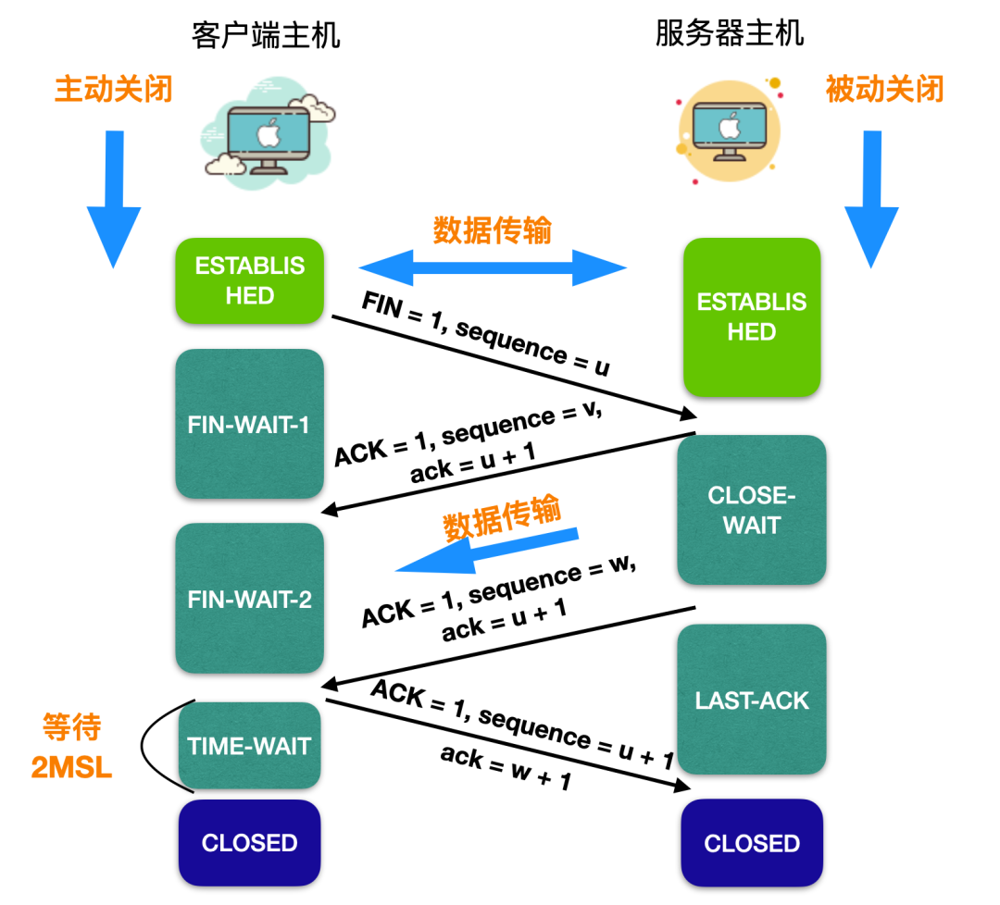

TCP 断开连接需要历经的过程如下

  1. 客户端应用程序发出释放连接的报文段，并停止发送数据，主动关闭 TCP 连接。客户端主机发送释放连接的报文段，报文段中首部 FIN 位置为 1 ，不包含数据，序列号位 seq = u，此时客户端主机进入 `FIN-WAIT-1(终止等待 1)` 阶段。
  2. 服务器主机接受到客户端发出的报文段后，即发出确认应答报文，确认应答报文中 ACK = 1，生成自己的序号位 seq = v，ack = u + 1，然后服务器主机就进入 `CLOSE-WAIT(关闭等待)` 状态，这个时候客户端主机 -> 服务器主机这条方向的连接就释放了，客户端主机没有数据需要发送，此时服务器主机是一种半连接的状态，但是服务器主机仍然可以发送数据。
  3. 客户端主机收到服务端主机的确认应答后，即进入 `FIN-WAIT-2(终止等待2)` 的状态。等待客户端发出连接释放的报文段。
  4. 当服务器主机没有数据发送后，应用进程就会通知 TCP 释放连接。这时服务端主机会发出断开连接的报文段，报文段中 ACK = 1，序列号 seq = w，因为在这之间可能已经发送了一些数据，所以 seq 不一定等于 v + 1。ack = u + 1，在发送完断开请求的报文后，服务端主机就进入了 `LAST-ACK(最后确认)`的阶段。
  5. 客户端收到服务端的断开连接请求后，客户端需要作出响应，客户端发出断开连接的报文段，在报文段中，ACK = 1, 序列号 seq = u + 1，因为客户端从连接开始断开后就没有再发送数据，ack = w + 1，然后进入到 `TIME-WAIT(时间等待)` 状态，请注意，这个时候 TCP 连接还没有释放。必须经过时间等待的设置，也就是 `2MSL` 后，客户端才会进入 `CLOSED` 状态，时间 MSL 叫做`最长报文段寿命（Maximum Segment Lifetime）`。
  6. 服务端主要收到了客户端的断开连接确认后，就会进入 CLOSED 状态。因为服务端结束 TCP 连接时间要比客户端早，而整个连接断开过程需要发送四个报文段，因此释放连接的过程也被称为四次挥手。

##### 什么是 TIME-WAIT

我上面只是简单提到了一下 TIME-WAIT 状态和 2MSL 是啥，下面来聊一下这两个概念。

`MSL` 是 TCP 报文段可以存活或者驻留在网络中的最长时间。RFC 793 定义了 MSL 的时间是两分钟，但是具体的实现还要根据程序员来指定，一些实现采用了 30 秒的这个最大存活时间。

那么为什么要等待 `2MSL` 呢？

主要是因为两个理由

  * 为了保证最后一个响应能够到达服务器，因为在计算机网络中，最后一个 ACK 报文段可能会丢失，从而致使客户端一直处于 `LAST-ACK` 状态等待客户端响应。这时候服务器会重传一次 FINACK 断开连接报文，客户端接收后再重新确认，重启定时器。如果客户端不是 2MSL ，在客户端发送 ACK 后直接关闭的话，如果报文丢失，那么双方主机会无法进入 CLOSED 状态。
  * 还可以防止`已失效`的报文段。客户端在发送最后一个 ACK 之后，再经过经过 2MSL，就可以使本链接持续时间内所产生的所有报文段都从网络中消失。从而保证在关闭连接后不会有还在网络中滞留的报文段去骚扰服务器。

> 这里注意一点：在服务器发送了 FIN-ACK 之后，会立即启动超时重传计时器。客户端在发送最后一个 ACK 之后会立即启动时间等待计时器。

##### 说好的 RST 呢

说好的 `RST`、`SYN`、`FIN` 标志用于连接的建立和关闭，那么 SYN 和 FIN 都现身了，那 RST 呢？也是啊，我们上面探讨的都是一种理想的情况，就是客户端服务器双方都会接受传输报文段的情况，还有一种情况是当主机收到 TCP 报文段后，其 IP 和端口号不匹配的情况。假设客户端主机发送一个请求，而服务器主机经过 IP 和端口号的判断后发现不是给这个服务器的，那么服务器就会发出一个 `RST` 特殊报文段给客户端。

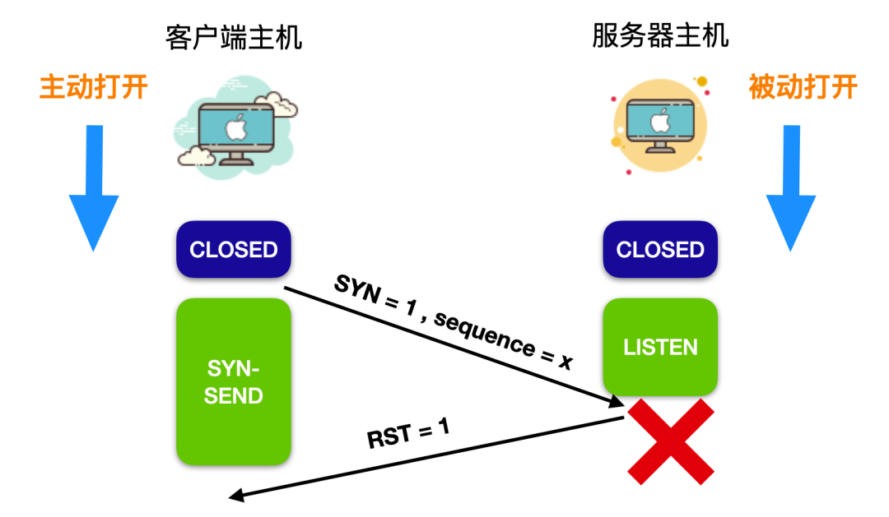

因此，当服务端发送一个 RST 特殊报文段给客户端的时候，它就会告诉客户端没有匹配的套接字连接，请不要再继续发送了。

上面探讨的是 TCP 的情况，那么 UDP 呢？

使用 UDP 作为传输协议后，如果套接字不匹配的话，UDP 主机就会发送一个特殊的 ICMP 数据报。

##### SYN 洪泛攻击

下面我们来讨论一下什么是 SYN 洪泛攻击。

我们在 TCP 的三次握手中已经看到，服务器为了响应一个收到的 SYN，分配并初始化变量连接和缓存，然后服务器发送一个 SYNACK 作为响应，然后等待来自于客户端的 ACK 报文。如果客户端不发送 ACK 来完成最后一步的话，那么这个连接就处在一个挂起的状态，也就是半连接状态。

攻击者通常在这种情况下发送大量的 TCP SYN 报文段，服务端继续响应，但是每个连接都完不成三次握手的步骤。随着 SYN 的不断增加，服务器会不断的为这些半开连接分配资源，导致服务器的连接最终被消耗殆尽。这种攻击也是属于 `Dos` 攻击的一种。

抵御这种攻击的方式是使用 `SYN cookie` ，下面是它的工作流程介绍

  * 当服务器收到一个 SYN 报文段时，它并不知道这个报文段是来自哪里，是来自攻击者主机还是客户端主机(虽然攻击者也是客户端，不过这么说更便于区分) 。因此服务器不会为报文段生成一个半开连接。与此相反，服务器生成一个初始的 TCP 序列号，这个序列号是 SYN 报文段的源和目的 IP 地址与端口号这个四元组构造的一个复杂的散列函数，这个散列函数生成的 TCP 序列号就是 `SYN Cookie`，用于缓存 SYN 请求。然后，服务器会发送带着 SYN Cookie 的 SYNACK 分组。**有一点需要注意的是，服务器不会记忆这个 Cookie 或 SYN 的其他状态信息**。
  * 如果客户端不是攻击者的话，它就会返回一个 ACK 报文段。当服务器收到这个 ACK 后，需要验证这个 ACK 与 SYN 发送的是否相同，验证的标准就是确认字段中的确认号和序列号，源和目的 IP 地址与端口号以及和散列函数的是否一致，散列函数的结果 + 1 是否和 SYNACK 中的确认值相同。(大致是这样，说的不对还请读者纠正) 。如果有兴趣读者可以自行深入了解。如果是合法的，服务器就会生成一个具有套接字的全开连接。
  * 如果客户端没有返回 ACK，即认为是攻击者，那么这样也没关系，服务器没有收到 ACK，不会分配变量和缓存资源，不会对服务器产生危害。

#### 拥塞控制

有了 TCP 的窗口控制后，使计算机网络中两个主机之间不再是以单个数据段的形式发送了，而是能够连续发送大量的数据包。然而，大量数据包同时也伴随着其他问题，比如网络负载、网络拥堵等问题。TCP 为了防止这类问题的出现，使用了 `拥塞控制` 机制，拥塞控制机制会在面临网络拥塞时遏制发送方的数据发送。

拥塞控制主要有两种方法

  * `端到端的拥塞控制`: 因为网络层没有为运输层拥塞控制提供显示支持。所以即使网络中存在拥塞情况，端系统也要通过对网络行为的观察来推断。**TCP 就是使用了端到端的拥塞控制方式**。IP 层不会向端系统提供有关网络拥塞的反馈信息。那么 TCP 如何推断网络拥塞呢？**如果超时或者三次冗余确认就被认为是网络拥塞，TCP 会减小窗口的大小，或者增加往返时延来避免**。
  * `网络辅助的拥塞控制`: 在网络辅助的拥塞控制中，路由器会向发送方提供关于网络中拥塞状态的反馈。这种反馈信息就是一个比特信息，它指示链路中的拥塞情况。

下图描述了这两种拥塞控制方式

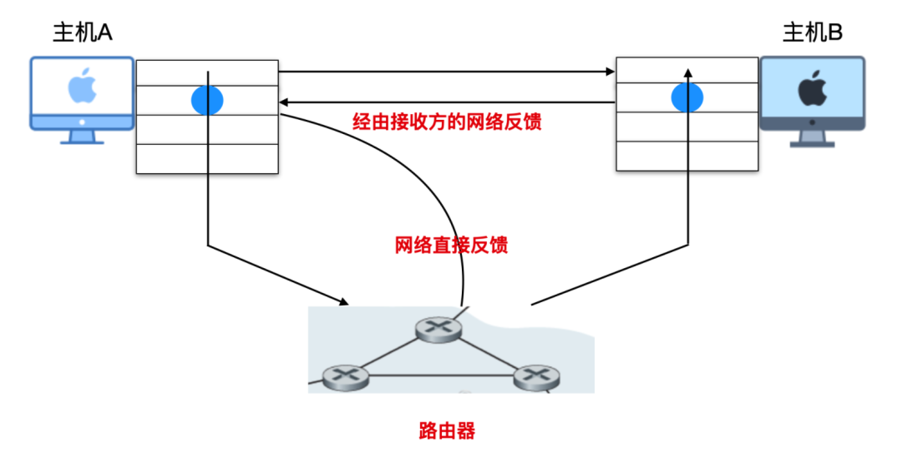

##### TCP 拥塞控制

如果你看到这里，那我就暂定认为你了解了 TCP 实现可靠性的基础了，那就是使用序号和确认号。除此之外，另外一个实现 TCP 可靠性基础的就是 TCP的拥塞控制。如果说

TCP 所采用的方法是让每一个发送方根据所感知到的网络的拥塞程度来限制发出报文段的速率，如果 TCP 发送方感知到没有什么拥塞，则 TCP 发送方会增加发送速率；如果发送方感知沿着路径有阻塞，那么发送方就会降低发送速率。

> 但是这种方法有三个问题
>
>   1. TCP 发送方如何限制它向其他连接发送报文段的速率呢？
>
>   2. 一个 TCP 发送方是如何感知到网络拥塞的呢？
>
>   3. 当发送方感知到端到端的拥塞时，采用何种算法来改变其发送速率呢？

我们先来探讨一下第一个问题，**TCP 发送方如何限制它向其他连接发送报文段的速率呢**？

我们知道 TCP 是由接收缓存、发送缓存和`变量(LastByteRead, rwnd，等)`组成。发送方的 TCP 拥塞控制机制会跟踪一个变量，即`拥塞窗口(congestion window)` 的变量，拥塞窗口表示为 `cwnd`，用于限制 TCP 在接收到 ACK之前可以发送到网络的数据量。而`接收窗口(rwnd)` 是一个用于告诉接收方能够接受的数据量。

一般来说，发送方未确认的数据量不得超过 cwnd 和 rwnd 的最小值，也就是

LastByteSent - LastByteAcked <= min(cwnd,rwnd)

由于每个数据包的往返时间是 RTT，我们假设接收端有足够的缓存空间用于接收数据，我们就不用考虑 rwnd 了，只专注于cwnd，那么，该发送方的发送速率大概是 `cwnd/RTT 字节/秒` 。通过调节 cwnd，发送方因此能调整它向连接发送数据的速率。

**一个 TCP 发送方是如何感知到网络拥塞的呢**？

这个我们上面讨论过，是 TCP 根据超时或者 3 个冗余 ACK 来感知的。

**当发送方感知到端到端的拥塞时，采用何种算法来改变其发送速率呢** ?

这个问题比较复杂，且容我娓娓道来，一般来说，TCP 会遵循下面这几种指导性原则

  * 如果在报文段发送过程中丢失，那就意味着网络拥堵，此时需要适当降低 TCP 发送方的速率。
  * 一个确认报文段指示发送方正在向接收方传递报文段，因此，当对先前未确认报文段的确认到达时，能够增加发送方的速率。为啥呢？因为未确认的报文段到达接收方也就表示着网络不拥堵，能够顺利到达，因此发送方拥塞窗口长度会变大，所以发送速率会变快
  * `带宽探测`，带宽探测说的是 TCP 可以通过调节传输速率来增加/减小 ACK 到达的次数，如果出现丢包事件，就会减小传输速率。因此，为了探测拥塞开始出现的频率， TCP 发送方应该增加它的传输速率。然后慢慢使传输速率降低，进而再次开始探测，看看拥塞开始速率是否发生了变化。

在了解完 TCP 拥塞控制后，下面我们就该聊一下 TCP 的 `拥塞控制算法(TCP congestion control algorithm)`了。TCP 拥塞控制算法主要包含三个部分：慢启动、拥塞避免、快速恢复，下面我们依次来看一下

##### 慢启动

当一条 TCP 开始建立连接时，cwnd 的值就会初始化为一个 MSS 的较小值。这就使得初始发送速率大概是 `MSS/RTT 字节/秒` ，比如要传输1000 字节的数据，RTT 为 200 ms ，那么得到的初始发送速率大概是 40 kb/s 。实际情况下可用带宽要比这个 MSS/RTT 大得多，因此TCP 想要找到最佳的发送速率，可以通过 `慢启动(slow-start)` 的方式，在慢启动的方式中，cwnd 的值会初始化为 1 个 MSS，并且每次传输报文确认后就会增加一个 MSS，cwnd 的值会变为 2 个 MSS，这两个报文段都传输成功后每个报文段 + 1，会变为 4 个MSS，依此类推，每成功一次 cwnd 的值就会翻倍。如下图所示

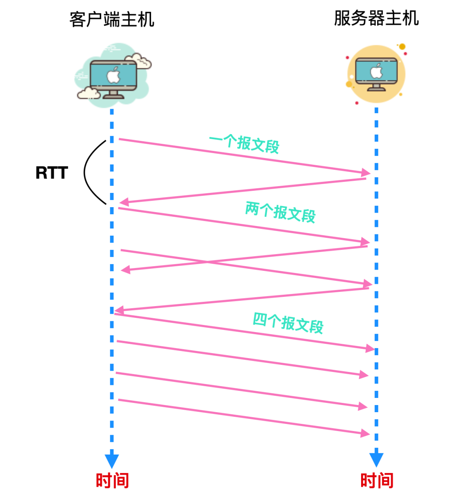

发送速率不可能会一直增长，增长总有结束的时候，那么何时结束呢？慢启动通常会使用下面这几种方式结束发送速率的增长。

  * 如果在慢启动的发送过程出现丢包的情况，那么 TCP 会将发送方的 cwnd 设置为 1 并重新开始慢启动的过程，此时会引入一个 `ssthresh(慢启动阈值)` 的概念，它的初始值就是产生丢包的 cwnd 的值 / 2，即当检测到拥塞时，ssthresh 的值就是窗口值的一半。
  * 第二种方式是直接和 ssthresh 的值相关联，因为当检测到拥塞时，ssthresh 的值就是窗口值的一半，那么当 cwnd > ssthresh 时，每次翻番都可能会出现丢包，所以最好的方式就是 cwnd 的值 = ssthresh ，这样 TCP 就会转为拥塞控制模式，结束慢启动。
  * 慢启动结束的最后一种方式就是如果检测到 3 个冗余 ACK，TCP 就会执行一种快速重传并进入恢复状态。

##### 拥塞避免

当 TCP 进入拥塞控制状态后，cwnd 的值就等于拥塞时值的一半，也就是 ssthresh 的值。所以，无法每次报文段到达后都将 cwnd的值再翻倍。而是采用了一种相对`保守`的方式，每次传输完成后只将 cwnd 的值增加`一个 MSS`，比如收到了 10 个报文段的确认，但是 cwnd的值只增加一个 MSS。这是一种线性增长模式，它也会有增长逾值，它的增长逾值和慢启动一样，如果出现丢包，那么 cwnd 的值就是一个MSS，ssthresh 的值就等于 cwnd 的一半；或者是收到 3 个冗余的 ACK 响应也能停止 MSS 增长。如果 TCP 将 cwnd的值减半后，仍然会收到 3 个冗余 ACK，那么就会将 ssthresh 的值记录为 cwnd 值的一半，进入 `快速恢复` 状态。

##### 快速恢复

在快速恢复中，对于使 TCP 进入快速恢复状态缺失的报文段，对于每个收到的冗余 ACK，cwnd 的值都会增加一个 MSS 。当对丢失报文段的一个 ACK到达时，TCP 在降低 cwnd 后进入拥塞避免状态。如果在拥塞控制状态后出现超时，那么就会迁移到慢启动状态，cwnd 的值被设置为 1 个 MSS，ssthresh 的值设置为 cwnd 的一半。

### 碎碎念

如果你能用心看到这里，我相信你定会有所收获。

这篇文章写的时间很长，图中很多样式和配色都是精挑细选，如果你仔细阅读，可以看到我的用心良苦。

#### 
原文出处：<a href='https://mp.weixin.qq.com/s/6M_iq_8TPtBWgUqAyzjNUw' target='blank'>一文搞定UDP和TCP高频面试题</a>

目录：

* 1、UDP 和 TCP 的特点与区别
* 2、UDP 、TCP 首部格式
* 3、TCP 的三次握手和四次挥手
* 4、TCP 的三次握手（为什么三次？）
* 5、TCP 的四次挥手（为什么四次？）
* 6、TCP 长连接和短连接的区别
* 7、TCP粘包、拆包及解决办法
* 8、TCP 可靠传输
* 9、TCP 滑动窗口
* 10、TCP 流量控制
* 11、TCP 拥塞控制
* 12、提供网络利用率

### 前言

网络层只把分组发送到目的主机，但是真正通信的并不是主机而是主机中的进程。传输层提供了进程间的逻辑通信，传输层向高层用户屏蔽了下面网络层的核心细节，使应用程序看起来像是在两个传输层实体之间有一条端到端的逻辑通信信道。

#### 1、UDP 和 TCP 的特点与区别

**用户数据报协议 UDP（User Datagram Protocol）**

是无连接的，尽最大可能交付，没有拥塞控制，面向报文（对于应用程序传下来的报文不合并也不拆分，只是添加 UDP首部），支持一对一、一对多、多对一和多对多的交互通信。

**传输控制协议 TCP（Transmission Control Protocol）**

是面向连接的，提供可靠交付，有流量控制，拥塞控制，提供全双工通信，面向字节流（把应用层传下来的报文看成字节流，把字节流组织成大小不等的数据块），每一条TCP 连接只能是点对点的（一对一）。

#### 2、UDP 、TCP 首部格式

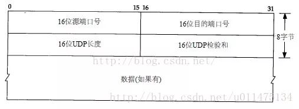

UDP 首部字段只有 8 个字节，包括源端口、目的端口、长度、检验和。12 字节的伪首部是为了计算检验和临时添加的。

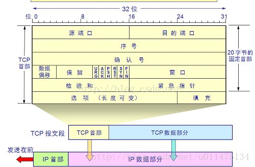

TCP 首部格式比 UDP 复杂。

**序号：**用于对字节流进行编号，例如序号为 301，表示第一个字节的编号为 301，如果携带的数据长度为 100 字节，那么下一个报文段的序号应为 401。

**确认号：**期望收到的下一个报文段的序号。例如 B 正确收到 A 发送来的一个报文段，序号为 501，携带的数据长度为 200 字节，因此 B 期望下一个报文段的序号为 701，B 发送给 A 的确认报文段中确认号就为 701。

**数据偏移：**指的是数据部分距离报文段起始处的偏移量，实际上指的是首部的长度。

**控制位：**八位从左到右分别是 CWR，ECE，URG，ACK，PSH，RST，SYN，FIN。

**CWR：**CWR 标志与后面的 ECE 标志都用于 IP 首部的 ECN 字段，ECE 标志为 1 时，则通知对方已将拥塞窗口缩小；

**ECE：**若其值为 1 则会通知对方，从对方到这边的网络有阻塞。在收到数据包的 IP 首部中 ECN 为 1 时将 TCP 首部中的 ECE 设为 1；

**URG：**该位设为 1，表示包中有需要紧急处理的数据，对于需要紧急处理的数据，与后面的紧急指针有关；

**ACK：**该位设为 1，确认应答的字段有效，TCP规定除了最初建立连接时的 SYN 包之外该位必须设为 1；

**PSH：**该位设为 1，表示需要将收到的数据立刻传给上层应用协议，若设为 0，则先将数据进行缓存；

**RST：**该位设为 1，表示 TCP 连接出现异常必须强制断开连接；

**SYN：**用于建立连接，该位设为 1，表示希望建立连接，并在其序列号的字段进行序列号初值设定；

**FIN：**该位设为 1，表示今后不再有数据发送，希望断开连接。当通信结束希望断开连接时，通信双方的主机之间就可以相互交换 FIN 位置为 1 的 TCP 段。

每个主机又对对方的 FIN 包进行确认应答之后可以断开连接。不过，主机收到 FIN 设置为 1 的 TCP 段之后不必马上回复一个 FIN 包，而是可以等到缓冲区中的所有数据都因为已成功发送而被自动删除之后再发 FIN 包；

**窗口：**窗口值作为接收方让发送方设置其发送窗口的依据。之所以要有这个限制，是因为接收方的数据缓存空间是有限的。

#### 3、什么是 TCP 的三次握手和四次挥手？

TCP 是一种面向连接的单播协议，在发送数据前，通信双方必须在彼此间建立一条连接。所谓的“连接”，其实是客户端和服务器的内存里保存的一份关于对方的信息，如IP 地址、端口号等。

TCP 可以看成是一种字节流，它会处理 IP 层或以下的层的丢包、重复以及错误问题。在连接的建立过程中，双方需要交换一些连接的参数。这些参数可以放在 TCP头部。

TCP 提供了一种可靠、面向连接、字节流、传输层的服务，采用三次握手建立一个连接；采用四次挥手来关闭一个连接。

一个 TCP 连接由一个 4 元组构成，分别是两个 IP 地址和两个端口号。一个TCP连接通常分为三个阶段：启动、数据传输、退出（关闭）。

当 TCP 接收到另一端的数据时，它会发送一个确认，但这个确认不会立即发送，一般会延迟一会（提供网络利用率这部分有讲到）。

ACK 是累积的，一个确认字节号 N 的 ACK 表示所有直到 N 的字节（不包括 N）已经成功被接收了。这样的好处是如果一个 ACK 丢失，很可能后续的ACK 就足以确认前面的报文段了。

**一个完整的 TCP 连接是双向和对称的，数据可以在两个方向上平等地流动。****给上层应用程序提供一种双工服务。****一旦建立了一个连接，这个连接的一个方向上的每个 TCP 报文段都包含了相反方向上的报文段的一个 ACK。**

序列号的作用是使得一个 TCP 接收端可丢弃重复的报文段，记录以杂乱次序到达的报文段。因为 TCP 使用 IP 来传输报文段，而IP不提供重复消除或者保证次序正确的功能。

另一方面，TCP 是一个字节流协议，绝不会以杂乱的次序给上层程序发送数据。因此 TCP接收端会被迫先保持大序列号的数据不交给应用程序，直到缺失的小序列号的报文段被填满。

#### 4、TCP 的三次握手（为什么三次？）

三次握手：

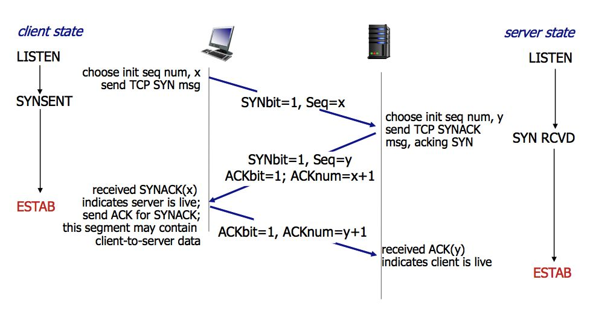

假设 A 为客户端，B 为服务器端。

首先 B 处于 LISTEN（监听）状态，等待客户的连接请求。

  * A 向 B 发送连接请求报文，SYN=1，ACK=0，选择一个初始的序号 x。
  * B 收到连接请求报文，如果同意建立连接，则向 A 发送连接确认报文，SYN=1，ACK=1，确认号为 x+1，同时也选择一个初始的序号 y。
  * A 收到 B 的连接确认报文后，还要向 B 发出确认，确认号为 y+1，序号为 x+1。

B 收到 A 的确认后，连接建立。

**为什么三次？**

1、第三次握手是为了防止失效的连接请求到达服务器，让服务器错误打开连接。

2、换个易于理解的视角来看为什么要 3 次握手。

客户端和服务端通信前要进行连接，“3次握手”的作用就是双方都能明确自己和对方的收、发能力是正常的。

第一次握手：客户端发送网络包，服务端收到了。这样服务端就能得出结论：客户端的发送能力、服务端的接收能力是正常的。

第二次握手：服务端发包，客户端收到了。这样客户端就能得出结论：服务端的接收、发送能力，客户端的接收、发送能力是正常的。从客户端的视角来看，我接到了服务端发送过来的响应数据包，说明服务端接收到了我在第一次握手时发送的网络包，并且成功发送了响应数据包，这就说明，服务端的接收、发送能力正常。而另一方面，我收到了服务端的响应数据包，说明我第一次发送的网络包成功到达服务端，这样，我自己的发送和接收能力也是正常的。

第三次握手：客户端发包，服务端收到了。这样服务端就能得出结论：客户端的接收、发送能力，服务端的发送、接收能力是正常的。第一、二次握手后，服务端并不知道客户端的接收能力以及自己的发送能力是否正常。

而在第三次握手时，服务端收到了客户端对第二次握手作的回应。从服务端的角度，我在第二次握手时的响应数据发送出去了，客户端接收到了。所以，我的发送能力是正常的。而客户端的接收能力也是正常的。

经历了上面的三次握手过程，客户端和服务端都确认了自己的接收、发送能力是正常的。之后就可以正常通信了。

**每次都是接收到数据包的一方可以得到一些结论，发送的一方其实没有任何头绪。我虽然有发包的动作，但是我怎么知道我有没有发出去，而对方有没有接收到呢？**

而从上面的过程可以看到，最少是需要三次握手过程的。两次达不到让双方都得出自己、对方的接收、发送能力都正常的结论。

其实每次收到网络包的一方至少是可以得到：对方的发送、我方的接收是正常的。而每一步都是有关联的，下一次的“响应”是由于第一次的“请求”触发，因此每次握手其实是可以得到额外的结论的。

比如第三次握手时，服务端收到数据包，表明看服务端只能得到客户端的发送能力、服务端的接收能力是正常的，但是结合第二次，说明服务端在第二次发送的响应包，客户端接
收到了，并且作出了响应，从而得到额外的结论：客户端的接收、服务端的发送是正常的。

#### 5、TCP 的四次挥手（为什么四次？）

四次挥手：

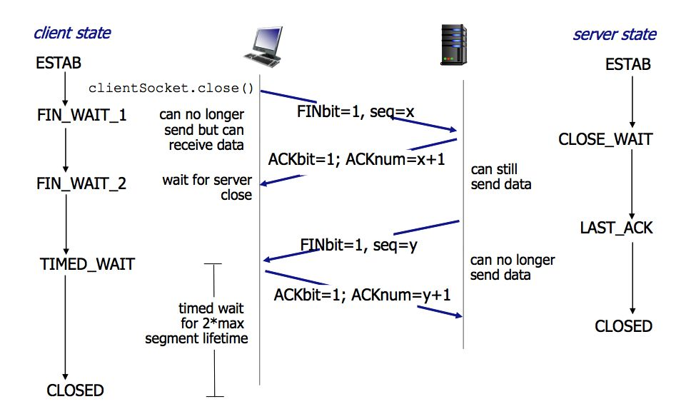

  * 客户端发送一个 FIN 段，并包含一个希望接收者看到的自己当前的序列号 K. 同时还包含一个 ACK 表示确认对方最近一次发过来的数据。
  * 服务端将 K 值加 1 作为 ACK 序号值，表明收到了上一个包。这时上层的应用程序会被告知另一端发起了关闭操作，通常这将引起应用程序发起自己的关闭操作。
  * 服务端发起自己的 FIN 段，ACK=K+1, Seq=L。
  * 客户端确认。进入 TIME-WAIT 状态，等待 2 MSL（最大报文存活时间）后释放连接。ACK=L+1。

**为什么建立连接是三次握手，而关闭连接却是四次挥手呢？**

1、TCP连接是双向传输的对等的模式，就是说双方都可以同时向对方发送或接收数据。当有一方要关闭连接时，会发送指令告知对方，我要关闭连接了。

2、这时对方会回一个ACK，此时一个方向的连接关闭。但是另一个方向仍然可以继续传输数据，也就是说，服务端收到客户端的 FIN 标志，知道客户端想要断开这次连接了，但是，我服务端，我还想发数据呢？我等到发送完了所有的数据后，会发送一个 FIN 段来关闭此方向上的连接。****接收方发送 ACK确认关闭连接。

注意，接收到FIN报文的一方只能回复一个ACK,它是无法马上返回对方一个FIN报文段的，因为结束数据传输的“指令”是上层应用层给出的，我只是一个“搬运工”，我无法了解“上层的意志”。

3、客户端发送了 FIN 连接释放报文之后，服务器收到了这个报文，就进入了 CLOSE-WAIT 状态。这个状态是为了让服务器端发送还未传送完毕的数据，传送完毕之后，服务器会发送 FIN 连接释放报文。

4、因为服务端在 LISTEN 状态下，收到建立连接请求的 SYN 报文后，把 ACK 和 SYN 放在一个报文里发送给客户端。而关闭连接时，当收到对方的FIN 报文时，仅仅表示对方不再发送数据了但是还能接收数据，己方是否现在关闭发送数据通道，需要上层应用来决定，因此，己方 ACK 和 FIN 一般都会分开发。

**TIME_WAIT**

客户端接收到服务器端的 FIN 报文后进入此状态，此时并不是直接进入 CLOSED 状态，还需要等待一个时间计时器设置的时间 2MSL。这么做有两个理由：

  * 确保最后一个确认报文能够到达。如果 B 没收到 A 发送来的确认报文，那么就会重新发送连接释放请求报文，A 等待一段时间就是为了处理这种情况的发生。
  * 等待一段时间是为了让本连接持续时间内所产生的所有报文都从网络中消失，使得下一个新的连接不会出现旧的连接请求报文。

#### 6、TCP 短连接和长连接的区别

**短连接：**Client 向 Server 发送消息，Server 回应 Client，然后一次读写就完成了，这时候双方任何一个都可以发起 close 操作，不过一般都是 Client 先发起 close 操作。短连接一般只会在 Client/Server 间传递一次读写操作。

短连接的优点：管理起来比较简单，建立存在的连接都是有用的连接，不需要额外的控制手段。

**长连接：**Client 与 Server 完成一次读写之后，它们之间的连接并不会主动关闭，后续的读写操作会继续使用这个连接。

在长连接的应用场景下，Client 端一般不会主动关闭它们之间的连接，Client 与 Server 之间的连接如果一直不关闭的话，随着客户端连接越来越多，Server 压力也越来越大，这时候 Server端需要采取一些策略，如关闭一些长时间没有读写事件发生的连接，这样可以避免一些恶意连接导致 Server 端服务受损；如果条件再允许可以以客户端为颗粒度，限制每个客户端的最大长连接数，从而避免某个客户端连累后端的服务。

长连接和短连接的产生在于 Client 和 Server 采取的关闭策略，具体的应用场景采用具体的策略。

#### 7、TCP粘包、拆包及解决办法

**为什么常说 TCP 有粘包和拆包的问题而不说 UDP ？**

由前两节可知，UDP 是基于报文发送的，UDP首部采用了 16bit 来指示 UDP 数据报文的长度，因此在应用层能很好的将不同的数据报文区分开，从而避免粘包和拆包的问题。

而 TCP 是基于字节流的，虽然应用层和 TCP 传输层之间的数据交互是大小不等的数据块，但是 TCP 并没有把这些数据块区分边界，仅仅是一连串没有结构的字节流；另外从 TCP 的帧结构也可以看出，在 TCP 的首部没有表示数据长度的字段，基于上面两点，在使用TCP 传输数据时，才有粘包或者拆包现象发生的可能。

**什么是粘包、拆包？**

假设 Client 向 Server 连续发送了两个数据包，用 packet1 和 packet2 来表示，那么服务端收到的数据可以分为三种情况，现列举如下：

第一种情况，接收端正常收到两个数据包，即没有发生拆包和粘包的现象。

第二种情况，接收端只收到一个数据包，但是这一个数据包中包含了发送端发送的两个数据包的信息，这种现象即为粘包。这种情况由于接收端不知道这两个数据包的界限，所以对于接收端来说很难处理。

第三种情况，这种情况有两种表现形式，如下图。接收端收到了两个数据包，但是这两个数据包要么是不完整的，要么就是多出来一块，这种情况即发生了拆包和粘包。这两种情况如果不加特殊处理，对于接收端同样是不好处理的。

**为什么会发生 TCP 粘包、拆包？**

  * 要发送的数据大于 TCP 发送缓冲区剩余空间大小，将会发生拆包。
  * 待发送数据大于 MSS（最大报文长度），TCP 在传输前将进行拆包。
  * 要发送的数据小于 TCP 发送缓冲区的大小，TCP 将多次写入缓冲区的数据一次发送出去，将会发生粘包。
  * 接收数据端的应用层没有及时读取接收缓冲区中的数据，将发生粘包。

**粘包、拆包解决办法**

由于 TCP 本身是面向字节流的，无法理解上层的业务数据，所以在底层是无法保证数据包不被拆分和重组的，这个问题只能通过上层的应用协议栈设计来解决，根据业界的主流协议的解决方案，归纳如下：

  * **消息定长：**发送端将每个数据包封装为固定长度（不够的可以通过补 0 填充），这样接收端每次接收缓冲区中读取固定长度的数据就自然而然的把每个数据包拆分开来。
  * **设置消息边界：**服务端从网络流中按消息边界分离出消息内容。在包尾增加回车换行符进行分割，例如 FTP 协议。
  * **将消息分为消息头和消息体：**消息头中包含表示消息总长度（或者消息体长度）的字段。
  * 更复杂的应用层协议比如 Netty 中实现的一些协议都对粘包、拆包做了很好的处理。

#### 8、TCP 可靠传输

TCP 使用超时重传来实现可靠传输：如果一个已经发送的报文段在超时时间内没有收到确认，那么就重传这个报文段。

一个报文段从发送再到接收到确认所经过的时间称为往返时间 RTT，加权平均往返时间 RTTs 计算如下：

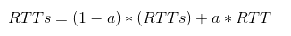

其中，0 ≤ a ＜ 1，RTTs 随着 a 的增加更容易受到 RTT 的影响。超时时间 RTO 应该略大于 RTTs，TCP 使用的超时时间计算如下：

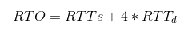

其中 RTTd 为偏差的加权平均值。

#### 9、TCP 滑动窗口

窗口是缓存的一部分，用来暂时存放字节流。发送方和接收方各有一个窗口，接收方通过 TCP报文段中的窗口字段告诉发送方自己的窗口大小，发送方根据这个值和其它信息设置自己的窗口大小。

发送窗口内的字节都允许被发送，接收窗口内的字节都允许被接收。如果发送窗口左部的字节已经发送并且收到了确认，那么就将发送窗口向右滑动一定距离，直到左部第一个字节不是已发送并且已确认的状态；接收窗口的滑动类似，接收窗口左部字节已经发送确认并交付主机，就向右滑动接收窗口。

接收窗口只会对窗口内最后一个按序到达的字节进行确认，例如接收窗口已经收到的字节为 {31, 34, 35}，其中 {31} 按序到达，而 {34, 35}就不是，因此只对字节 31 进行确认。发送方得到一个字节的确认之后，就知道这个字节之前的所有字节都已经被接收。

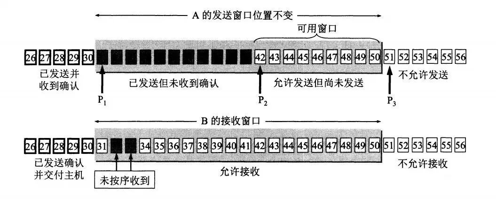

#### 10、TCP 流量控制

流量控制是为了控制发送方发送速率，保证接收方来得及接收。

接收方发送的确认报文中的窗口字段可以用来控制发送方窗口大小，从而影响发送方的发送速率。将窗口字段设置为 0，则发送方不能发送数据。

**实际上，****为了避免此问题的产生，发送端主机会时不时的发送一个叫做窗口探测的数据段**，此数据段仅包含一个字节来获取最新的窗口大小信息。

#### 11、TCP 拥塞控制

如果网络出现拥塞，分组将会丢失，此时发送方会继续重传，从而导致网络拥塞程度更高。因此当出现拥塞时，应当控制发送方的速率。这一点和流量控制很像，但是出发点不同。流量控制是为了让接收方能来得及接收，而拥塞控制是为了降低整个网络的拥塞程度。

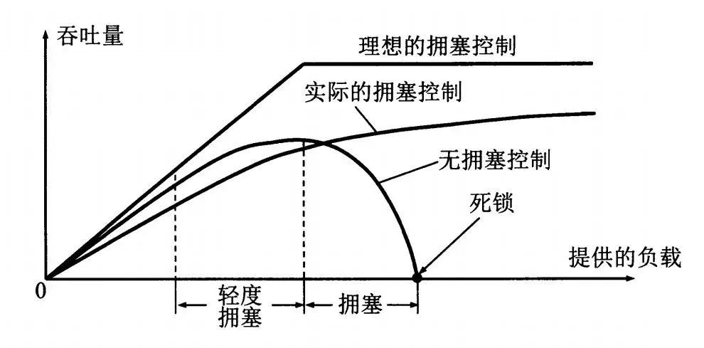

TCP 主要通过四个算法来进行拥塞控制：

**慢开始、拥塞避免、快重传、快恢复。**

发送方需要维护一个叫做拥塞窗口（cwnd）的状态变量，注意拥塞窗口与发送方窗口的区别：拥塞窗口只是一个状态变量，实际决定发送方能发送多少数据的是发送方窗口。

为了便于讨论，做如下假设：

  * 接收方有足够大的接收缓存，因此不会发生流量控制；
  * 虽然 TCP 的窗口基于字节，但是这里设窗口的大小单位为报文段。

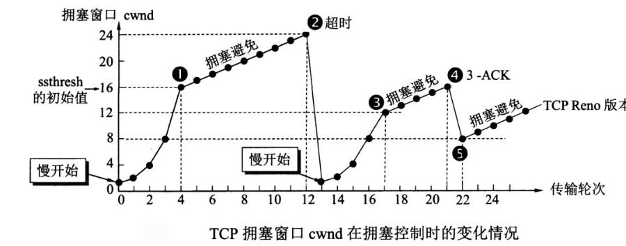

**慢开始与拥塞避免**

发送的最初执行慢开始，令 cwnd = 1，发送方只能发送 1 个报文段；当收到确认后，将 cwnd 加倍，因此之后发送方能够发送的报文段数量为：2、4、8...

注意到慢开始每个轮次都将 cwnd 加倍，这样会让 cwnd增长速度非常快，从而使得发送方发送的速度增长速度过快，网络拥塞的可能性也就更高。设置一个慢开始门限 ssthresh，当 cwnd >= ssthresh时，进入拥塞避免，每个轮次只将 cwnd 加 1。

如果出现了超时，则令 ssthresh = cwnd / 2，然后重新执行慢开始。

**快重传与快恢复**

在接收方，要求每次接收到报文段都应该对最后一个已收到的有序报文段进行确认。例如已经接收到 M1 和 M2，此时收到 M4，应当发送对 M2 的确认。

在发送方，如果收到三个重复确认，那么可以知道下一个报文段丢失，此时执行快重传，立即重传下一个报文段。例如收到三个 M2，则 M3 丢失，立即重传 M3。

在这种情况下，只是丢失个别报文段，而不是网络拥塞。因此执行快恢复，令 ssthresh = cwnd / 2 ，cwnd = ssthresh，注意到此时直接进入拥塞避免。

慢开始和快恢复的快慢指的是 cwnd 的设定值，而不是 cwnd 的增长速率。慢开始 cwnd 设定为 1，而快恢复 cwnd 设定为 ssthresh。

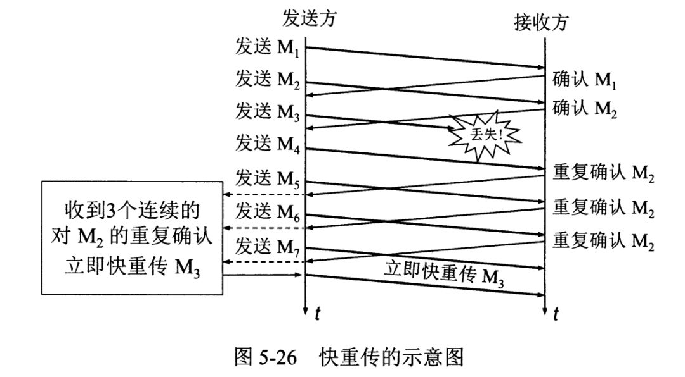  

#### 12、提供网络利用率

##### 1、Nagle 算法

发送端即使还有应该发送的数据，但如果这部分数据很少的话，则进行延迟发送的一种处理机制。具体来说，就是仅在下列任意一种条件下才能发送数据。如果两个条件都不满足
，那么暂时等待一段时间以后再进行数据发送。

  * 已发送的数据都已经收到确认应答。
  * 可以发送最大段长度的数据时。

##### 2、延迟确认应答

接收方收到数据之后可以并不立即返回确认应答，而是延迟一段时间的机制。

  * 在没有收到 2*最大段长度的数据为止不做确认应答。

  * 其他情况下，最大延迟 0.5秒 发送确认应答。

  * TCP 文件传输中，大多数是每两个数据段返回一次确认应答。

##### 3、捎带应答

在一个 TCP包中既发送数据又发送确认应答的一种机制，由此，网络利用率会提高，计算机的负荷也会减轻，但是这种应答必须等到应用处理完数据并将作为回执的数据返回为止。

今天的知识点掌握了吗？不要忘了学而时习之，不亦可乎。  

欢迎留言和我交流~

### 参考：

* [www.cnblogs.com/panchanggui/p/9518735.html](www.cnblogs.com/panchanggui/p/9518735.html)
* [www.cnblogs.com/qcrao-2018/p/10182185.html](www.cnblogs.com/qcrao-2018/p/10182185.html)
* [github.com/CyC2018/CS-Notes/blob/master/docs/notes/](github.com/CyC2018/CS-Notes/blob/master/docs/notes/)

#### 
原文出处：<a href='https://mp.weixin.qq.com/s/cyeeXx7fLZ_ngB-QnMM_TQ' target='blank'>23个问题TCP疑难杂症全解析</a>

> 每个时代，都不会亏待会学习的人。

在进入今天主题之前我先抛几个问题，这篇文章一共提出 23 个问题。

> TCP 握手一定是三次？TCP 挥手一定是四次？
>
> 为什么要有快速重传，超时重传不够用？为什么要有 SACK，为什么要有 D-SACK？
>
> 都知道有滑动窗口，那由于接收方的太忙了滑动窗口降为了 0 怎么办？发送方就永远等着了？
>
> Silly Window 又是什么？
>
> 为什么有滑动窗口流控还需要拥塞控制？
>
> 快速重传一定要依赖三次重复 ACK ？

这篇文章我想**由浅到深地过一遍 TCP，不是生硬的搬出各个知识点，从问题入手，然后从发展、演进的角度来看 TCP**。

起初我在学计算机网络的时候就有非常非常多的疑问，脑子里简直充满了十万个为什么，而网络又非常的复杂，发展了这么多年东西真的太多了，今天我就**大致的浅显地说一说我对 TCP 这些要点的理解**。

好了，废话不多说，开始上正菜。

### TCP 是用来解决什么问题？

TCP 即 Transmission Control Protocol，可以看到是一个传输控制协议，重点就在这个**控制**。

**控制什么？**

控制可靠、按序地传输以及端与端之间的流量控制。够了么？还不够，它需要更加智能，因此还需要加个拥塞控制，需要为整体网络的情况考虑。

这就是**出行你我他，安全靠大家**。

### 为什么要 TCP，IP 层实现控制不行么？

我们知道网络是分层实现的，网络协议的设计就是为了通信，从链路层到 IP 层其实就已经可以完成通信了。

你看链路层不可或缺毕竟咱们电脑都是通过链路相互连接的，然后 IP 充当了地址的功能，所以通过 IP 咱们找到了对方就可以进行通信了。

那加个 TCP 层干啥？IP 层实现控制不就完事了嘛？

之所以要**提取出一个 TCP 层来实现控制是因为 IP 层涉及到的设备更多**，一条数据在网络上传输需要经过很多设备，而设备之间需要靠 IP 来寻址。

假设 IP 层实现了控制，那是不是涉及到的设备都需要关心很多事情？整体传输的效率是不是大打折扣了？

我举个例子，假如 A 要传输给 F 一个积木，但是无法直接传输到，需要经过 B、C、D、E 这几个中转站之手。  

这里有两种情况：

  * 假设 BCDE 都需要关心这个积木搭错了没，都拆开包裹仔细的看看，没问题了再装回去，最终到了 F 的手中。
  * 假设 BCDE 都不关心积木的情况，来啥包裹只管转发就完事了，由最终的 F 自己来检查这个积木答错了没。

你觉得哪种效率高？明显是第二种，转发的设备不需要关心这些事，只管转发就完事！

所以把控制的逻辑独立出来成 TCP 层，让真正的接收端来处理，这样网络整体的传输效率就高了。

### 连接到底是什么？

我们已经知道了为什么需要独立出 TCP 这一层，并且这一层主要是用来干嘛的，接下来就来看看它到底是怎么干的。

我们都知道 TCP 是面向连接的，那这个连接到底是个什么东西？真的是拉了一条线让端与端之间连起来了？

**所谓的连接其实只是双方都维护了一个状态，通过每一次通信来维护状态的变更**，使得看起来好像有一条线关联了对方。

### TCP 协议头

在具体深入之前我们需要先来看看一些 TCP 头的格式，这很基础也很重要。

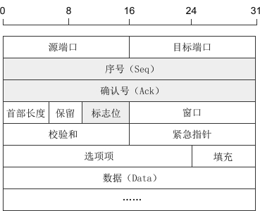

我就不一一解释了，挑重点的说。

首先可以看到 TCP 包只有端口，没有 IP。

Seq 就是 Sequence Number 即序号，它是用来解决乱序问题的。

ACK 就是 Acknowledgement Numer 即确认号，它是用来解决丢包情况的，告诉发送方这个包我收到啦。

标志位就是 TCP flags 用来标记这个包是什么类型的，用来控制 TPC 的状态。

窗口就是滑动窗口，Sliding Window，用来流控。

### 三次握手

明确了协议头的要点之后，我们再来看三次握手。

三次握手真是个老生常谈的问题了，但是真的懂了么？不是浮在表面？能不能延伸出一些点别的？

我们先来看一下熟悉的流程。

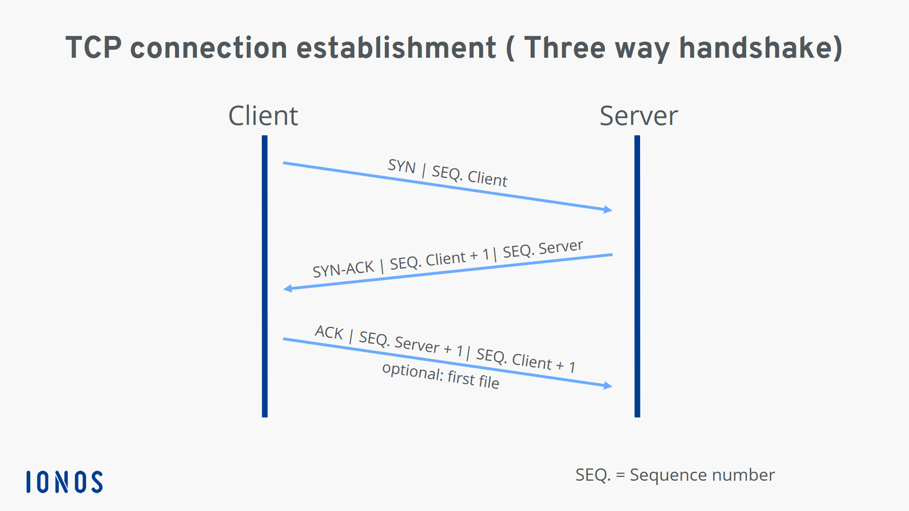

首先为什么要握手，**其实主要就是为了初始化Seq Numer**，SYN 的全称是 Synchronize Sequence Numbers，这个序号是用来保证之后传输数据的顺序性。

你要说是为了测试保证双方发送接收功能都正常，我觉得也没毛病，**不过我认为重点在于同步序号**。

那为什么要三次，就拿我和你这两个角色来说，首先我告诉你我的初始化序号，你听到了和我说你收到了。

然后你告诉我你的初始序号，然后我对你说我收到了。

这好像四次了？如果真的按一来一回就是四次，但是中间一步可以合在一起，就是你和我说你知道了我的初始序号的时候同时将你的初始序号告诉我。

因此四次握手就可以减到三次了。

不过你没有想过这么一种情形，我和你同时开口，一起告诉对方各自的初始序号，然后分别回应收到了，这不就是四次握手了？

我来画个图，清晰一点。

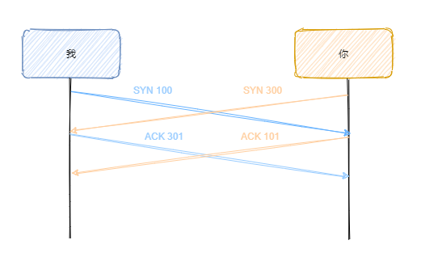

看看是不是四次握手了?不过具体还是得看实现，有些实现可能不允许这种情况出现，但是这不影响我们思考，因为**握手的重点就是同步初始序列号**，这种情况也完成了同步的目标。

### 初始序列号 ISN 的取值

不知道大家有没有想过 ISN 的值要设成什么？代码写死从零开始？

想象一下如果写死一个值，比如 0 ，那么假设已经建立好连接了，client 也发了很多包比如已经第 20 个包了，然后网络断了之后 client 重新，端口号还是之前那个，然后序列号又从 0 开始，此时服务端返回第 20 个包的ack，客户端是不是傻了？

所以 RFC793 中认为 ISN 要和一个假的时钟绑定在一起  

**ISN 每四微秒加一，当超过 2 的 32 次方之后又从 0 开始，要四个半小时左右发生 ISN 回绕**。

所以 ISN 变成一个递增值，真实的实现还需要加一些随机值在里面，防止被不法份子猜到 ISN。

### SYN 超时了怎么处理？

也就是 client 发送 SYN 至 server 然后就挂了，此时 server 发送 SYN+ACK 就一直得不到回复，怎么办？

我脑海中一想到的就是重试，但是不能连续快速重试多次，你想一下，假设 client 掉线了，你总得给它点时间恢复吧，所以呢需要**慢慢重试，阶梯性重试**。

在 Linux 中就是默认重试 5 次，并且就是阶梯性的重试，间隔就是1s、2s、4s、8s、16s，再第五次发出之后还得等 32s 才能知道这次重试的结果，所以说总共等63s 才能断开连接。

### SYN Flood 攻击

你看到没 SYN 超时需要耗费服务端 63s 的时间断开连接，也就说 63s 内服务端需要保持这个资源，所以不法分子就可以构造出大量的 client 向 server 发 SYN 但就是不回 server。

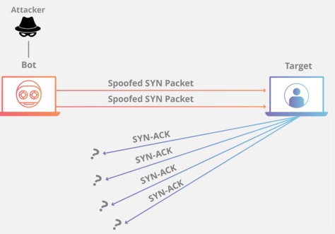

使得 server 的 SYN 队列耗尽，无法处理正常的建连请求。

所以怎么办？

可以开启 tcp_syncookies，那就用不到 SYN 队列了。

SYN 队列满了之后 TCP 根据自己的 ip、端口、然后对方的 ip、端口，对方 SYN 的序号，时间戳等一波操作生成一个特殊的序号（即 cookie）发回去，如果对方是正常的 client 会把这个序号发回来，然后 server 根据这个序号建连。

或者调整 tcp_synack_retries 减少重试的次数，设置 tcp_max_syn_backlog 增加 SYN 队列数，设置 tcp_abort_on_overflow SYN 队列满了直接拒绝连接。

### 为什么要四次挥手？

四次挥手和三次握手成双成对，同样也是 TCP 中的一线明星，让我们重温一下熟悉的图。

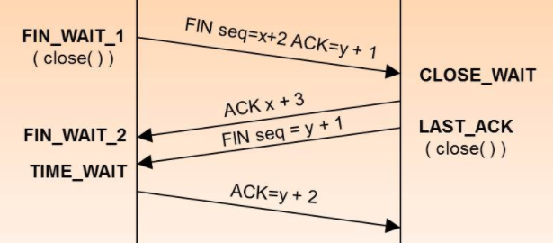

为什么挥手需要四次？**因为 TCP 是全双工协议**，也就是说双方都要关闭，每一方都向对方发送 FIN 和回应 ACK。

就像我对你说我数据发完了，然后你回复好的你收到了。然后你对我说你数据发完了，然后我向你回复我收到了。

所以看起来就是四次。

从图中可以看到主动关闭方的状态是 FIN_WAIT_1 到 FIN_WAIT_2 然后再到 TIME_WAIT，而被动关闭方是 CLOSE_WAIT 到
LAST_ACK。

### 四次挥手状态一定是这样变迁的吗

状态一定是这样变迁的吗？让我们再来看个图。

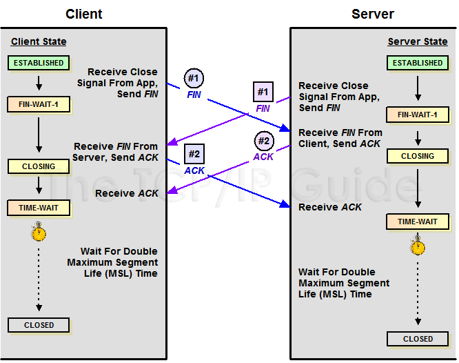

可以看到双方都主动发起断开请求所以各自都是主动发起方，状态会从 FIN_WAIT_1 都进入到 CLOSING 这个过度状态然后再到 TIME_WAIT。

### 挥手一定需要四次吗？

假设 client 已经没有数据发送给 server 了，所以它发送 FIN 给 server 表明自己数据发完了，不再发了，如果这时候 server 还是有数据要发送给 client 那么它就是先回复 ack ，然后继续发送数据。

等 server 数据发送完了之后再向 client 发送 FIN 表明它也发完了，然后等 client 的 ACK 这种情况下就会有四次挥手。

那么假设 client 发送 FIN 给 server 的时候 server 也没数据给 client，那么 server 就可以将 ACK 和它的 FIN 一起发给client ，然后等待 client 的 ACK，这样不就三次挥手了？

### 为什么要有 TIME_WAIT?

断开连接发起方在接受到接受方的 FIN 并回复 ACK 之后并没有直接进入 CLOSED 状态，而是进行了一波等待，等待时间为 2MSL。

MSL 是 Maximum Segment Lifetime，即报文最长生存时间，RFC 793 定义的 MSL 时间是 2 分钟，Linux 实际实现是 30s，那么 2MSL 是一分钟。

**那么为什么要等 2MSL 呢？**

  * 就是怕被动关闭方没有收到最后的 ACK，如果被动方由于网络原因没有到，那么它会再次发送 FIN， 此时如果主动关闭方已经 CLOSED 那就傻了，因此等一会儿。
  * 假设立马断开连接，但是又重用了这个连接，就是五元组完全一致，并且序号还在合适的范围内，虽然概率很低但理论上也有可能，那么新的连接会被已关闭连接链路上的一些残留数据干扰，因此给予一定的时间来处理一些残留数据。

### 等待 2MSL 会产生什么问题？

如果服务器主动关闭大量的连接，那么会出现大量的资源占用，需要等到 2MSL 才会释放资源。

如果是客户端主动关闭大量的连接，那么在 2MSL 里面那些端口都是被占用的，端口只有 65535 个，如果端口耗尽了就无法发起送的连接了，不过我觉得这个概率很低，这么多端口你这是要建立多少个连接？

### 如何解决 2MSL 产生的问题？

**快速回收**，即不等 2MSL 就回收， Linux 的参数是 tcp_tw_recycle，还有 tcp_timestamps 不过默认是打开的。

其实上面我们已经分析过为什么需要等 2MSL，所以如果等待时间果断就是出现上面说的那些问题。

所以不建议开启，而且 Linux 4.12 版本后已经咔擦了这个参数了。

前不久刚有位朋友在群里就提到了这玩意。

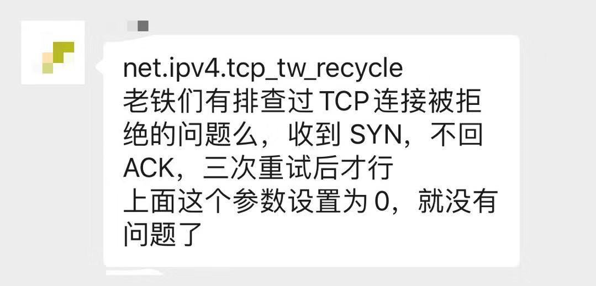

一问果然有 NAT 的身影。

现象就是请求端请求服务器的静态资源偶尔会出现 20-60 秒左右才会有响应的情况，从抓包看请求端连续三个 SYN 都没有回应。

比如你在学校，对外可能就一个公网 IP，然后开启了 tcp_tw_recycle（tcp_timestamps 也是打开的情况下），在 60 秒内对于同源 IP 的连接请求中 timestamp 必须是递增的，不然认为其是过期的数据包就会丢弃。

学校这么多机器，你无法保证时间戳是一致的，因此就会出问题。

所以这玩意不推荐使用。

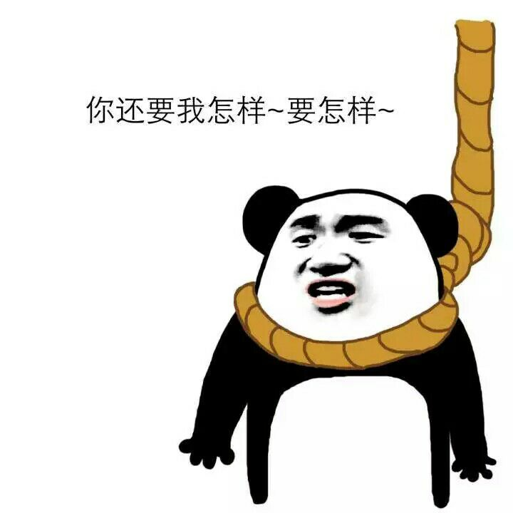

**重用**，即开启 tcp_tw_reuse 当然也是需要 tcp_timestamps 的。

这里有个重点，**tcp_tw_reuse 是用在连接发起方的，而我们的服务端基本上是连接被动接收方**。

tcp_tw_reuse 是发起新连接的时候，可以复用超过 1s 的处于 TIME_WAIT 状态的连接，所以它压根没有减少我们服务端的压力。

**它重用的是发起方处于 TIME_WAIT 的连接**。

这里还有一个 SO_REUSEADDR ，这玩意有人会和 tcp_tw_reuse 混为一谈，首先 tcp_tw_reuse 是内核选项而SO_REUSEADDR 是用户态选项。

然后 SO_REUSEADDR 主要用在你启动服务的时候，如果此时的端口被占用了并且这个连接处于 TIME_WAIT 状态，那么你可以重用这个端口，如果不是 TIME_WAIT，那就是给你个 Address already in use。

所以这两个玩意好像都不行，而且 tcp_tw_reuse 和tcp_tw_recycle，其实是违反 TCP 协议的，说好的等我到天荒地老，你却偷偷放了手？

要么就是调小 MSL 的时间，不过也不太安全，要么调整 tcp_max_tw_buckets 控制 TIME_WAIT 的数量，不过默认值已经很大了 180000，这玩意应该是用来对抗 DDos 攻击的。

所以我给出的建议是**服务端不要主动关闭，把主动关闭方放到客户端**。毕竟咱们服务器是一对很多很多服务，我们的资源比较宝贵。

### 自己攻击自己

还有一个很骚的解决方案，我自己瞎想的，就是自己攻击自己。

Socket 有一个选项叫 IP_TRANSPARENT ，可以绑定一个非本地的地址，然后服务端把建连的 ip 和端口都记下来，比如写入本地某个地方。

然后启动一个服务，假如现在服务端资源很紧俏，那么你就定个时间，过了多久之后就将处于 TIME_WAIT 状态的对方 ip 和端口告诉这个服务。

然后这个服务就利用 IP_TRANSPARENT 伪装成之前的那个 client 向服务端发起一个请求，然后服务端收到会给真的 client 一个 ACK，那 client 都关了已经，说你在搞啥子，于是回了一个 RST，然后服务端就中止了这个连接。

### 超时重传机制是为了解决什么问题？

前面我们提到 TCP 要提供可靠的传输，那么网络又是不稳定的如果传输的包对方没收到却又得保证可靠那么就必须重传。

TCP 的可靠性是靠确认号的，比如我发给你1、2、3、4这4个包，你告诉我你现在要 5 那说明前面四个包你都收到了，就是这么回事儿。

不过这里要注意，SeqNum 和 ACK 都是**以字节数为单位的**，也就是说假设你收到了1、2、4 但是 3 没有收到你不能 ACK 5，如果你回了 5 那么发送方就以为你5之前的都收到了。

所以**只能回复确认最大连续收到包**，也就是 3。

而发送方不清楚 3、4 这两个包到底是还没到呢还是已经丢了，于是发送方需要等待，这等待的时间就比较讲究了。

如果太心急可能 ACK 已经在路上了，你这重传就是浪费资源了，如果太散漫，那么接收方急死了，这死鬼怎么还不发包来，我等的花儿都谢了。

所以这个等待超时重传的时间很关键，怎么搞？聪明的小伙伴可能一下就想到了，你估摸着正常来回一趟时间是多少不就好了，我就等这么长。

这就来回一趟的时间就叫 RTT，即 Round Trip Time，然后根据这个时间制定超时重传的时间 RTO，即 Retransmission Timeout。

不过这里大概只好了 RTO 要参考下 RTT ，但是具体要怎么算？首先肯定是采样，然后一波加权平均得到 RTO。

RFC793 定义的公式如下：

> 1、先采样 RTT  
> 2、SRTT = ( ALPHA * SRTT ) + ((1-ALPHA) * RTT)  
> 3、RTO = min[UBOUND,max[LBOUND,(BETA*SRTT)]]

ALPHA 是一个平滑因子取值在 0.8~0.9之间，UBOUND 就是超时时间上界-1分钟，LBOUND 是下界-1秒钟，BETA 是一个延迟方差因子，取值在 1.3~2.0。

但是还有个问题，RTT 采样的时间用一开始发送数据的时间到收到 ACK 的时间作为样本值还是重传的时间到 ACK 的时间作为样本值？

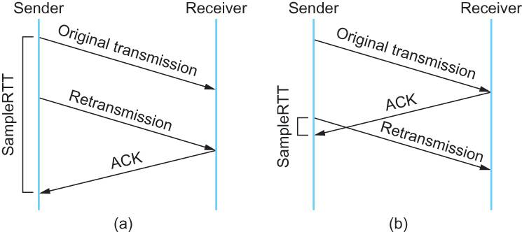

从图中就可以看到，一个时间算长了，一个时间算短了，这有点难，因为你不知道这个 ACK 到底是回复谁的。

所以怎么办？**发生重传的来回我不采样不就好了**，我不知道这次 ACK 到底是回复谁的，我就不管他，我就采样正常的来回。

这就是 Karn / Partridge 算法，不采样重传的RTT。

但是不采样重传会有问题，比如某一时刻网络突然就是很差，你要是不管重传，那么还是按照正常的 RTT 来算 RTO， 那么超时的时间就过短了，于是在网络很差的情况下还疯狂重传加重了网络的负载。

因此 Karn 算法就很粗暴的搞了个发生重传我就将现在的 RTO 翻倍，哼！就是这么简单粗暴。

但是这种平均的计算很容易把一个突然间的大波动，平滑掉，所以又搞了个算法，叫 Jacobson / Karels Algorithm。

它把最新的 RTT 和平滑过的 SRTT 做了波计算得到合适的 RTO，公式我就不贴了，反正我不懂，不懂就不哔哔了。

### 为什么还需要快速重传机制？

超时重传是按时间来驱动的，如果是网络状况真的不好的情况，超时重传没问题，但是如果网络状况好的时候，只是恰巧丢包了，那等这么长时间就没必要。

于是又引入了数据驱动的重传叫快速重传，什么意思呢？就是发送方如果连续三次收到对方相同的确认号，那么马上重传数据。

因为连续收到三次相同 ACK 证明当前网络状况是 ok 的，那么确认是丢包了，于是立马重发，没必要等这么久。

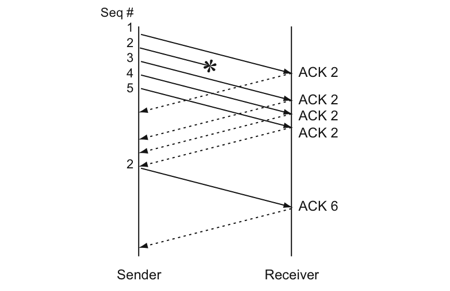

看起来好像挺完美的，但是你有没有想过我发送1、2、3、4这4个包，就 2 对方没收到，1、3、4都收到了，然后不管是超时重传还是快速重传反正对方就回 ACK 2。

这时候要重传 2、3、4 呢还是就 2 呢？

### SACK 的引入是为了解决什么问题？

SACK 即 Selective Acknowledgment，它的引入就是为了解决发送方不知道该重传哪些数据的问题。

我们来看一下下面的图就知道了。

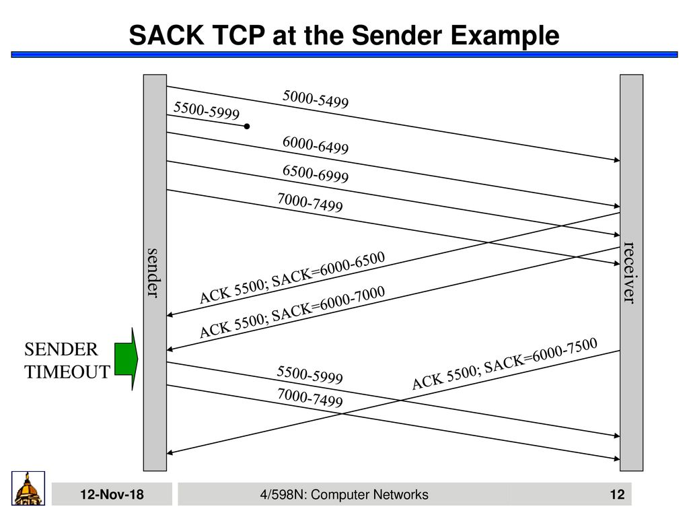

SACK 就是接收方会回传它已经接受到的数据，这样发送方就知道哪一些数据对方已经收到了，所以就可以选择性的发送丢失的数据。

如图，通过 ACK 告知我接下来要 5500 开始的数据，并一直更新 SACK，6000-6500 我收到了，6000-7000的数据我收到了，6000-7500的数据我收到了，发送方很明确的知道，5500-5999 的那一波数据应该是丢了，于是重传。

而且如果数据是多段不连续的， SACK 也可以发送，比如 SACK 0-500,1000-1500，2000-2500。就表明这几段已经收到了。

### D-SACK 又是什么东西？

D-SACK 其实是 SACK 的扩展，它利用 SACK 的第一段来描述重复接受的不连续的数据序号，如果第一段描述的范围被 ACK 覆盖，说明重复了，比如我都 ACK 到6000了你还给我回 SACK 5000-5500 呢？

说白了就是从第一段的反馈来和已经接受到的 ACK 比一比，参数是 tcp_dsack，Linux 2.4 之后默认开启。

那知道重复了有什么用呢？

1、知道重复了说明对方收到刚才那个包了，所以是回来的 ACK 包丢了。  
2、是不是包乱序的，先发的包后到？  
3、是不是自己太着急了，RTO 太小了？  
4、是不是被数据复制了，抢先一步呢？

### 滑动窗口干嘛用？

我们已经知道了 TCP 有序号，并且还有重传，但是这还不够，因为我们不是愣头青，还需要根据情况来控制一下发送速率，因为网络是复杂多变的，有时候就会阻塞住，而有时候又很通畅。

所以发送方需要知道接收方的情况，好控制一下发送的速率，不至于蒙着头一个劲儿的发然后接受方都接受不过来。

因此 TCP 就有个叫滑动窗口的东西来做流量控制，也就是接收方告诉发送方我还能接受多少数据，然后发送方就可以根据这个信息来进行数据的发送。

以下是**发送方维护的窗口**，就是黑色圈起来的。

图中的 #1 是已收到 ACK 的数据，#2 是已经发出去但是还没收到 ACK 的数据，#3 就是在窗口内可以发送但是还没发送的数据。#4
就是还不能发送的数据。

然后此时收到了 36 的 ACK，并且发出了 46-51 的字节，于是窗口向右滑动了。

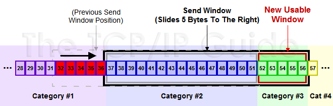

TCP/IP Guide 上还有一张完整的图，画的十分清晰，大家看一下。

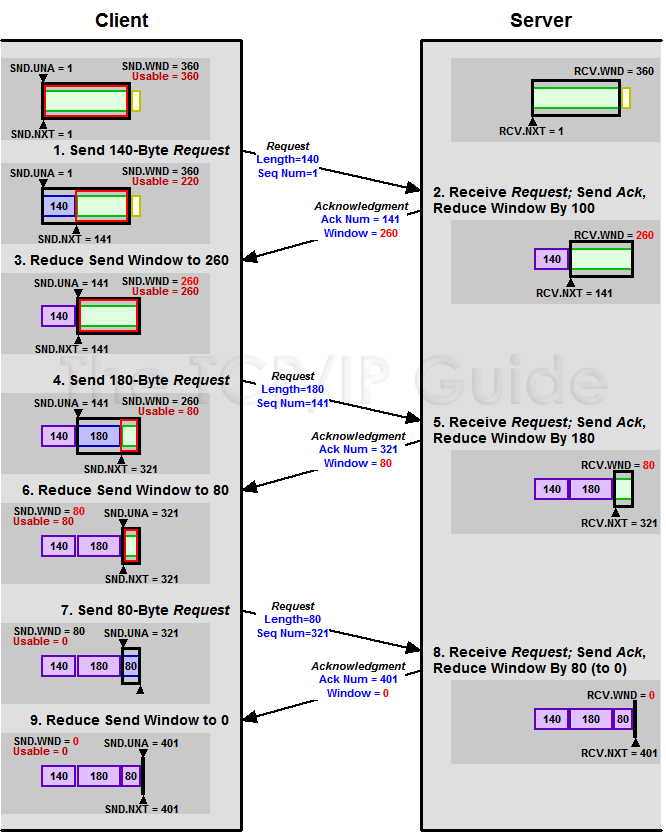

### 如果接收方回复的窗口一直是 0 怎么办？

上文已经说了发送方式根据接收方回应的 window 来控制能发多少数据，如果接收方一直回应 0，那发送方就杵着？

你想一下，发送方发的数据都得到 ACK 了，但是呢回应的窗口都是 0 ，这发送方此时不敢发了啊，那也不能一直等着啊，这 Window 啥时候不变 0 啊？

于是 TCP 有一个 Zero Window Probe 技术，发送方得知窗口是 0 之后，会去探测探测这个接收方到底行不行，也就是发送 ZWP 包给接收方。

具体看实现了，可以发送多次，然后还有间隔时间，多次之后都不行可以直接 RST。

### 假设接收方每次回应窗口都很小怎么办？

你想象一下，如果每次接收方都说我还能收 1 个字节，发送方该不该发？

TCP + IP 头部就 40 个字节了，这传输不划算啊，如果傻傻的一直发这就叫 Silly Window。

那咋办，一想就是发送端等着，等养肥了再发，要么接收端自己自觉点，数据小于一个阈值就告诉发送端窗口此时是 0 算了，也等养肥了再告诉发送端。

发送端等着的方案就是纳格算法，这个算法相信看一下代码就知道了。

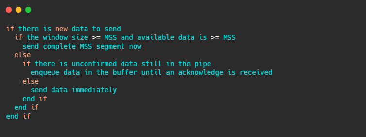

简单的说就是当前能发送的数据和窗口大于等于 MSS 就立即发送，否则再判断一下之前发送的包 ACK 回来没，回来再发，不然就攒数据。

接收端自觉点的方案是 David D Clark’s 方案，如果窗口数据小于某个阈值就告诉发送方窗口 0 别发，等缓过来数据大于等于 MSS 或者接受 buffer 腾出一半空间了再设置正常的 window 值给发送方。

对了提到纳格算法不得不再提一下延迟确认，纳格算法在等待接收方的确认，而开启延迟确认则会延迟发送确认，会等之后的包收到了再一起确认或者等待一段时候真的没了再回 复确认。

这就相互等待了，然后延迟就很大了，两个不可同时开启。

### 已经有滑动窗口了为什么还要拥塞控制？

前面我已经提到了，加了拥塞控制是因为 TCP 不仅仅就管两端之间的情况，还需要知晓一下整体的网络情形，毕竟只有大家都守规矩了道路才会通畅。

前面我们提到了重传，如果不管网络整体的情况，肯定就是对方没给 ACK ，那我就无脑重传。

如果此时网络状况很差，所有的连接都这样无脑重传，是不是网络情况就更差了，更加拥堵了？

然后越拥堵越重传，一直冲冲冲！然后就 GG 了。

所以需要个拥塞控制，来避免这种情况的发送。

### 拥塞控制怎么搞？

主要有以下几个步骤来搞：

1、慢启动，探探路。  
2、拥塞避免，感觉差不多了减速看看  
3、拥塞发生快速重传/恢复

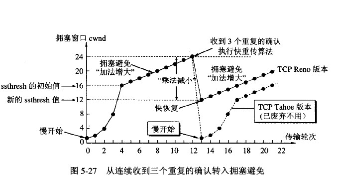

慢启动，就是新司机上路慢慢来，初始化 cwnd（Congestion Window）为 1，然后每收到一个 ACK 就 cwnd++ 并且每过一个 RTT，cwnd = 2*cwnd 。

线性中带着指数，指数中又夹杂着线性增。

然后到了一个阈值，也就是 ssthresh（slow start threshold）的时候就进入了拥塞避免阶段。

这个阶段是每收到一个 ACK 就 cwnd = cwnd + 1/cwnd并且每一个 RTT 就 cwnd++。

可以看到都是线性增。

然后就是一直增，直到开始丢包的情况发生，前面已经分析到重传有两种，一种是超时重传，一种是快速重传。

如果发生超时重传的时候，那说明情况有点糟糕，于是直接把 ssthresh 置为当前 cwnd 的一半，然后 cwnd 直接变为 1，进入慢启动阶段。

如果是快速重传，那么这里有两种实现，一种是 TCP Tahoe ，和超时重传一样的处理。

一种是 TCP Reno，这个实现是把 cwnd = cwnd/2 ，然后把 ssthresh 设置为当前的 cwnd 。

然后进入快速恢复阶段，将 cwnd = cwnd + 3（因为快速重传有三次），**重传 DACK 指定的包**，如果再收到一个DACK则cwnd++，如果收到是正常的 ACK 那么就将 cwnd 设为 ssthresh 大小，进入拥塞避免阶段。

可以看到快速恢复就重传了指定的一个包，那有可能是很多包都丢了，然后其他的包只能等待超时重传，超时重传就会导致 cwnd 减半，多次触发就指数级下降。

所以又搞了个 New Reno，多加了个 New，它是在没有SACK 的情况下改进快速恢复，它会观察重传 DACK 指定的包的响应 ACK 是否是已经发送的最大 ACK，比如你发了1、2、3、4，对方没收到 2，但是 3、4都收到了，于是你重传 2 之后 ACK 肯定是 5，说明就丢了这一个包。

不然就是还有其他包丢了，如果就丢了一个包就是之前的过程一样，如果还有其他包丢了就继续重传，直到 ACK 是全部的之后再退出快速恢复阶段。

简单的说就是一直探测到全部包都收到了再结束这个环节。

还有个 FACK，它是基于 SACK 用来作为重传过程中的拥塞控制，相对于上面的 New Reno 我们就知道它有 SACK 所以不需要一个一个试过去，具体我不展开了。

### 还有哪些拥塞控制算法？

从维基上看有这么多。

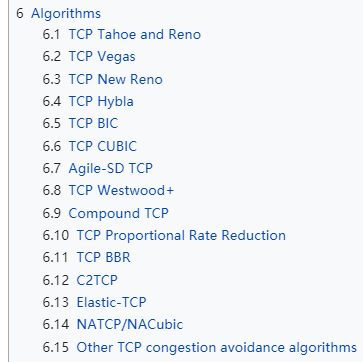

本来我还想哔哔几句了，哔哔了之后又删了，感觉说了和没说一样，**想深入但是实力不允许**，有点惆怅啊。

各位看官自个儿查查吧，或者等我日后修炼有成再来哔哔。

### 总结

说了这么多来总结一下吧。

TCP 是面向连接的，提供可靠、有序的传输并且还提供流控和拥塞控制，单独提取出 TCP 层而不是在 IP层实现是因为 IP 层有更多的设备需要使用，加了复杂的逻辑不划算。

三次握手主要是为了定义初始序列号为了之后的传输打下基础，四次挥手是因为 TCP 是全双工协议，因此双方都得说拜拜。

SYN 超时了就阶梯性重试，如果有 SYN攻击，可以加大半队列数，或减少重试次数，或直接拒绝。

TIME_WAIT 是怕对方没收到最后一个 ACK，然后又发了 FIN 过来，并且也是等待处理网络上残留的数据，怕影响新连接。

TIME_WAIT 不建议设小，或者破坏 TIME_WAIT 机制，如果真想那么可以开启快速回收，或者重用，不过注意受益的对象。

超时重传是为了保证对端一定能收到包，快速重传是为了避免在偶尔丢包的时候需要等待超时这么长时间，SACK 是为了让发送方知道重传哪些。

D-SACK 是为了让发送方知道这次重传的原因是对方真的没收到还是自己太心急了 RTO 整小了，不至于两眼一抹黑。

滑动窗口是为了平衡发送方的发送速率和接收方的接受数率，不至于瞎发，当然还需要注意 Silly Window 的情况，同时还要注意纳格算法和延迟确认不能一起搭配。

而滑动窗口还不够，还得有个拥塞控制，因为**出行你我他，安全靠大家**，TCP 还得跳出来看看关心下当前大局势。

### 最后

至此就差不多了，不过还是有很多很多细节的，TCP 协议太复杂了，这可能是我文章里面图画的最少的一篇了，你看复杂到我图都画不来了哈哈哈。

今天我就说了个皮毛，如有纰漏请赶紧后台联系鞭挞我。

### 巨人的肩膀

* [http://www.tcpipguide.com/](http://www.tcpipguide.com/)
* [https://www.ionos.com/digitalguide/server/know-how/introduction-to-tcp/](https://www.ionos.com/digitalguide/server/know-how/introduction-to-tcp/)
* [https://www.ibm.com/developerworks/cn/linux/l-tcp-sack/](https://www.ibm.com/developerworks/cn/linux/l-tcp-sack/)
* [https://coolshell.cn/articles/11564.html/](https://coolshell.cn/articles/11564.html/)
* [https://tools.ietf.org/html/rfc793](https://tools.ietf.org/html/rfc793)
* [https://nmap.org/book/tcpip-ref.html](https://nmap.org/book/tcpip-ref.html)
