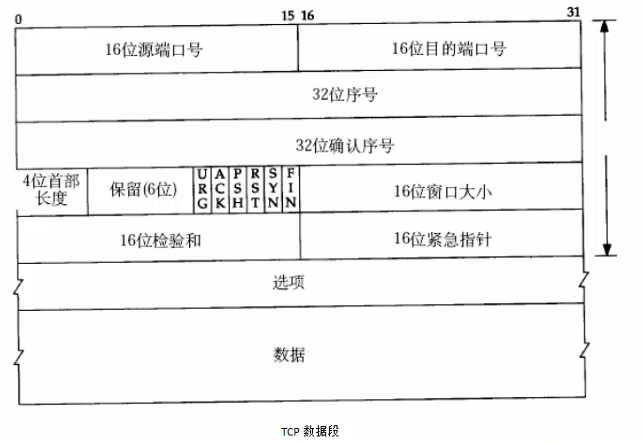
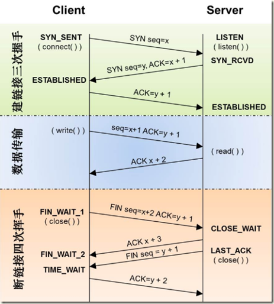
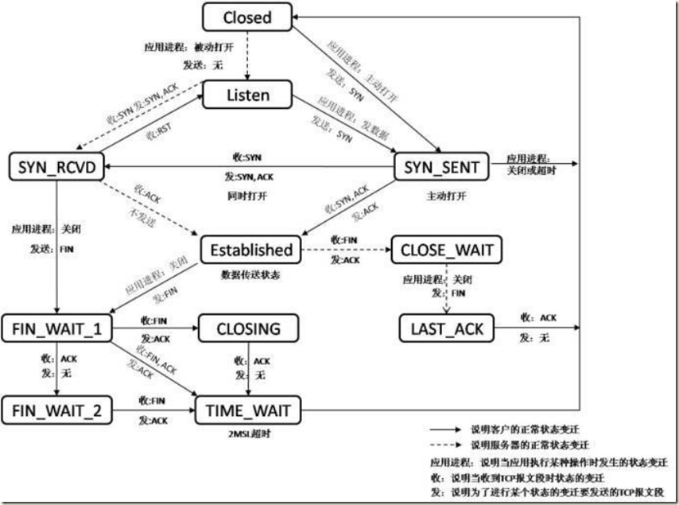
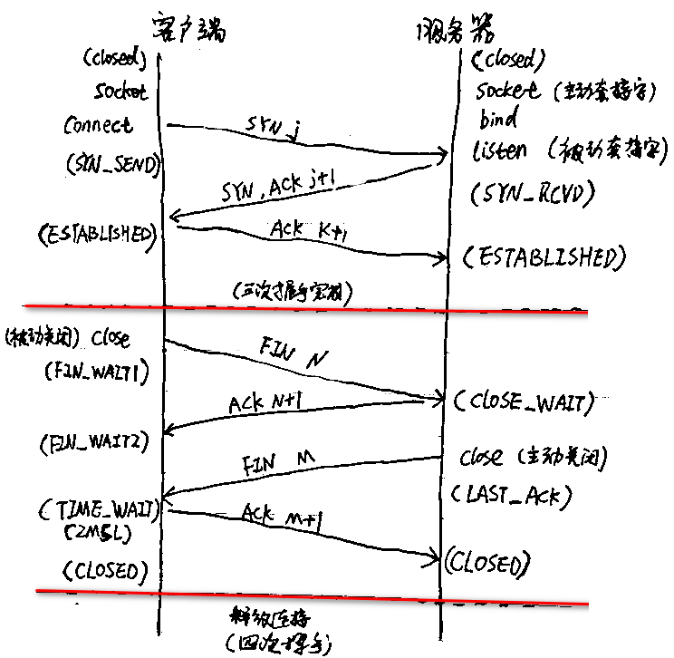

 
<!--BEGIN_DATA
{
    "create_date": "2019-11-22 16:54", 
    "modify_date": "2019-11-22 16:54", 
    "is_top": "0", 
    "summary": "TCP的状态转换", 
    "tags": "网络、C/C++", 
    "file_name": "TCP的状态转换.md"
}
END_DATA-->

####
原文出处：<a href='https://www.cnblogs.com/WindSun/p/11404802.html' target='blank'>TCP的状态转换</a>

###手写的状态转换图

###一、服务端状态变迁：​

服务端创建套接字之后调用listen函数将套接字有一个未连接的主动套接字转换为被动套接字，指示内核应接受指向该套接字的连接请求，套接字状态由CLOSE转换为LISTEN，等待客户端连接。所以服务端是被动接收连接的，服务端会先收到SYN，收到之后会立马发送一个SYN+ACK（同一个报文），此时状态转换到SYN\_RCVD并等待客户端回复ACK，此时套接字处于未完成连接队列中，如果收到ACK状态会转换到ESTABLISHED，套接字处于已完成连接队列中，注意的是未完成连接队列和已完成连接队列之和不能超过listen设置的最大连接个数。这时服务端和客户端可以进行数据交互，客户端接收完数据之后主动close套接字，此时服务端会收到FIN并回复ACK，状态转换到LOSE\_WAIT，当服务端的应用层也close套接字时服务端会发生一个FIN状态转换到LAST\_ACK然后会收到客户端回复的ACK，状态转换到CLOSED。

###二、客户端状态变迁：

客户端创建套接字之后会connect服务器，这时客户端会发送一个SYN到服务器，状态转换到SYN\_SENT并等待服务器的回复，收到服务端的回复SYN+ACK（同一个报文）之后​​​客户端会回复ACK此时状态转换到ESTABLISHED，正常数据交互完成之后客户端会close套接字此时发送一个FIN报文，状态转换到FIN\_WAIT\_1，同时等待服务端的回复，此时有三种情况：

（1）收到服务端的ACK但此时服务端没有关闭套接字。状态转换到了FIN\_WAIT\_2，然后再等待服务端关闭套接字发出的FIN，如果收到则回复ACK，状态转换到TIME\_WAIT状态，等待2MSL超时之后自动转换为CLOSED状态。

​（2）服务端同时也在关闭套接字，此时客户端会收到SYN并发出ACK，状态转换到CLOSING，之后等待服务端回复ACK，若收到ACK则转到TIME\_WAIT状态。

（3）服务器在收到客户端FIN之后立马关闭套接字，此时客户端会收到一个ACK和FIN并发出ACK，状态​转换到TIME\_WAIT状态。

以上提到的是一般正常的情况的TCP状态转换，当然还有很多异常情况这里不再一一描述，值得一提的是​ESTABLISHED状态之后，服务端也可以主动close套接字，转换到FIN\_WAIT\_1状态，此时服务端和客户端的状态转换就正好和上面描述相反了。

####三、同时打开

同时打开时两端几乎在同时发送SYN，并进入SYN\_SENT状态。当某一端收到SYN时，状态变为SYN\_RCVD状态，收到SYN之后发出SYN+ACK，当双方都收到对端发送的SYN+ACK之后，套接字进入ESTABLISHED状态。同时打开链接需要交换4个报文比正常的3次握手多一个，而且双方既是客户端也是服务器，此种情况为双方同时connect对端。

###四、同时关闭

同时关闭时双方都是主动关闭，双方状态变迁一样。以某一方为例：发送一个FIN，进入FIN\_WAIT\_1状态，接收一个FIN​同时发送一个ACK进入CLOSING状态，最后接收到对方回复的ACK进入TIME\_WAIT状态。

###TIME_WAIT

TIME_WAIT 是主动关闭链接时形成的，等待2MSL时间，约4分钟。主要是防止最后一个ACK丢失。 由于TIME\_WAIT的时间会非常长，因此server端应尽量减少主动关闭连接

**存在TIME-WAIT状态有两个理由：**  

    1. 实现终止TCP全双工连接的可靠性  
    2．允许老的重复分节在网络中消逝  
    
第一个理由：  
假设最终的响应ACK丢失，服务器将重发最终的FIN，因此客户必须维护状态信息以允许它重发最终的ACK。如果不维护状态信息，它将响应以RST(另外一个类型的TCP分节)，而服务器则把该分节解释成一个错误。如果TCP打算执行所有必要的工作以彻底终止某个连接上两个方向的数据流（即全双工关闭），那么它必须正确处理连接终止序列四个分节中任何一个分节的丢失情况。本例子也说明执行主动关闭的一端为什么进入TIME\_WAIT状态，因为它可能不得不重发最终的ACK。  

第二个理由：  
我们假设206. 62. 226. 33端口1500和198. 69.10.2端口21之间有一个TCP连接。我们关闭这个连接后，在以后某个时候又重新建立起相同的IP地址和端口之间的TCP连接。后一个连接称为前一个连接的化身(incar-nation)．因为它们的IP地址和端口号都相同。TCP必须防止来自某个连接的老重复分组在连接终止后再现，从而被误解成属于同一连接的化身。要实现这种功能，TCP不能给处于TIME-WAIT状态的连接启动新的化身。既然TIME-WAIT状态的持续时间是2MLS，这就足够让某个方向上的分组最多存活MSL秒即被丢弃，另一个方向上的应答最多存活MSL秒也被丢弃。通过实施这个规则，我们就能保证当成功建立一个TCP连接时，来自该连接先前化身的老重复分组都已在网络中消逝。

###CLOSE_WAIT

CLOSE\_WAIT是被动关闭连接是形成的。根据TCP状态机，服务器端收到客户端发送的FIN，则按照TCP实现发送ACK，因此进入CLOSE\_WAIT状态。
但如果服务器端不执行close()，就不能由CLOSE\_WAIT迁移到LAST\_ACK，则系统中会存在很多CLOSE\_WAIT状态的连接。此时，可能是系统忙
于处理读、写操作，而未将已收到FIN的连接，进行close。此时，recv/read已收到FIN的连接socket，会返回0。

###常见面试题

**【问题1】为什么连接的时候是三次握手，关闭的时候却是四次握手？**

答：因为当Server端收到Client端的SYN连接请求报文后，可以直接发送SYN+ACK报文。其中ACK报文是用来应答的，SYN报文是用来同步的。但是关闭连接时，当Server端收到FIN报文时，很可能并不会立即关闭SOCKET，所以只能先回复一个ACK报文，告诉Client端，"你发的FIN报文我收到了"。只有等到我Server端所有的报文都发送完了，我才能发送FIN报文，因此不能一起发送。故需要四步握手。

**【问题2】为什么TIME_WAIT状态需要经过2MSL(最大报文段生存时间)才能返回到CLOSE状态？**

答：虽然按道理，四个报文都发送完毕，我们可以直接进入CLOSE状态了，但是我们必须假象网络是不可靠的，有可以最后一个ACK丢失。所以TIME\_WAIT状态就是用来重发可能丢失的ACK报文。在Client发送出最后的ACK回复，但该ACK可能丢失。Server如果没有收到ACK，将不断重复发送FIN片段。所以Client不能立即关闭，它必须确认Server接收到了该ACK。Client会在发送出ACK之后进入到TIME\_WAIT状态。Client会设置一个计时器，等待2MSL的时间。如果在该时间内再次收到FIN，那么Client会重发ACK并再次等待2MSL。所谓的2MSL是两倍的MSL(Maximum Segment Lifetime)。MSL指一个片段在网络中最大的存活时间，2MSL就是一个发送和一个回复所需的最大时间。如果直到2MSL，Client都没有再次收到FIN，那么Client推断ACK已经被成功接收，则结束TCP连接。

**【问题3】为什么不能用两次握手进行连接？**

答：3次握手完成两个重要的功能，既要双方做好发送数据的准备工作(双方都知道彼此已准备好)，也要允许双方就初始序列号进行协商，这个序列号在握手过程中被发送和确认。

现在把三次握手改成仅需要两次握手，死锁是可能发生的。作为例子，考虑计算机S和C之间的通信，假定C给S发送一个连接请求分组，S收到了这个分组，并发送了确认应答分组。按照两次握手的协定，S认为连接已经成功地建立了，可以开始发送数据分组。可是，C在S的应答分组在传输中被丢失的情况下，将不知道S是否已准备好，不知道S建立什么样的序列号，C甚至怀疑S是否收到自己的连接请求分组。在这种情况下，C认为连接还未建立成功，将忽略S发来的任何数据分
组，只等待连接确认应答分组。而S在发出的分组超时后，重复发送同样的分组。这样就形成了死锁。

**【问题4】如果已经建立了连接，但是客户端突然出现故障了怎么办？**

TCP还设有一个保活计时器，显然，客户端如果出现故障，服务器不能一直等下去，白白浪费资源。服务器每收到一次客户端的请求后都会重新复位这个计时器，时间通常是设置为2小时，若两小时还没有收到客户端的任何数据，服务器就会发送一个探测报文段，以后每隔75秒钟发送一次。若一连发送10个探测报文仍然没反应，服务器就认为客户端出了故障，接着就关闭连接。

