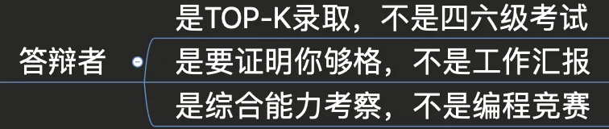
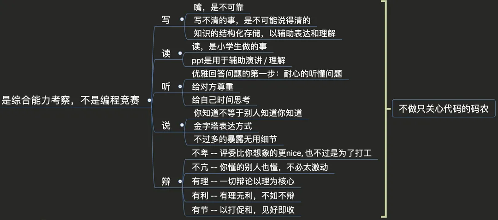
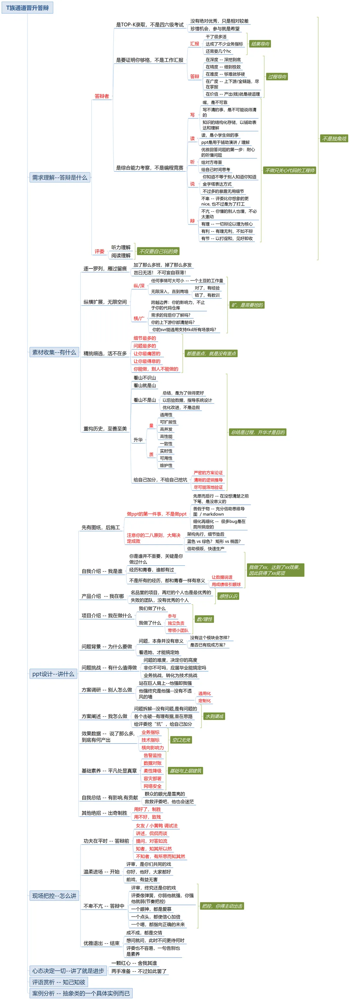

 
<!--BEGIN_DATA
{
    "create_date": "2024-11-25 12:45", 
    "modify_date": "2024-11-25 12:45", 
    "is_top": "0", 
    "summary": "T族通道晋升答辩之【完全解析】", 
    "tags": "其他", 
    "file_name": "T族通道晋升答辩之【完全解析】.md"
}
END_DATA-->

#### 
原文出处：<a href='https://km.woa.com/articles/show/489284' target='blank'>T族通道晋升答辩之【完全解析】</a>

>丨 导语 晋升答辩之于职业生涯，如同吃饭之于人生，只要我们还活着就得进行下去，不管是为了前途，还是为了图钱。既然不得不做，那就应该让过程尽可能轻松愉快一点。为此，本文将结合自己与身边同学的相关经历，对通道答辩的全流程给出个人的所思所想，以供参考，若对大家有所裨益，则不胜荣幸。

## 前言：阅读提示

晋升答辩，是一个关于专业领域的非专业话题， 是我们专业能力的集中体现，也是综合实力的厚积薄发。

本文将按照实际答辩活动的一般开展顺序，对**答辩前，答辩中，答辩后**的各个环节进行逐层剖析，以期改善大家的阅读体验的同时，尽力提供一个**贴近实操**的**行动指南**/个人建议。

全文虽以“T族”为例，但主要内容还是**通用方法论**，欢迎**各族同学**交流讨论。

**主要包括**：

  * 需求理解(**是什么**)

  * 素材的收集(**有什么**)

  * ppt设计(**讲什么**)

  * 现场把控(**怎么讲**)

  * 心态调整(**获得什么**)

  * 其他绝招(**还有什么**)

  * 评语赏析(**评委怎么看**)

  * 案例分析(**别人怎么做**)

其中ppt设计部分，则按照ppt在实际活动中的一般组织顺序进行逐页剖析，以便尽量能**直接翻译为答辩所需材料**。

**本文全部材料来自个人在内部分享的一张XMind脑图(原件见附件)**。

**几点小提示**：

  * 如果你赶着去见女朋友，请直接跳至文末取用即可；

  * 如果你是赶着去修复bug，请直接读取**黑体**即可；

  * 如果你是赶着去写bug，那建议你不妨细细品来；

  * 如果你更喜欢观看视频，请直接跳至文末取用即可；

  * 如果你最喜欢面对面真人秀，请直接跳至[行家平台](https://hangjia.woa.com/blank-main/hangj_main-page/expert-detail?id=4c981257512244f68012872a96528be5&expertId=00090122)

  * 如果是前辈误点进入，你可以就此return了。

## 一 需求理解：答辩是什么

**对需求的理解程度，直接决定了需求完成程度的上限**，因为你不可能赚到你认知范围以外的钱。

  * **答辩，不是你一个人的独角戏**  
不管是"答"，还是"辩"，都说明了这**是一项有多个角色参与的活动**(这是很重要的一点)。很多同学都只关注到了自己，而忘了你的对手/队友——评委。下面将从"答辩者"和"评委"两个角度进行分析——知己知彼，方能早日升级。

### 1.1 需求理解之[答辩者]

#### 1.1.1 是TOP-K录取，不是四六级考试

了解游戏规则，是玩好游戏的第一步。答辩首先是分小组，然后再按照一定的通过比例进行评比，最后取top-K。这也就是说“能否通过，不仅取决于你自己，还得看你同组小伙伴的水平”，当然这也等于告诉你“**参与就可能中奖**”，没有绝对优秀，只是相对较差。**请珍惜每一次答辩的机会，积极备战！**

当然，通过率不是完全固定的，会留给评委一定的发挥空间，因此只要你绝对优秀，指标就不是问题；当然，如果是绝对不及格，也不用担心指标浪费的事了。

#### 1.1.2 是要证明你够格，不是工作汇报

在之前的答辩过程中，发现一个严重的误区：有不少同学的答辩PPT看起来就是一份给老板的汇报材料。究其原因，应该是**对“答辩”和”汇报“这两个需求没有清晰的理解**，或者没有进行明确的对比，导致结果混淆。（当然，不少T8/T9的同学确实没有给老板汇报的经历/机会。这也说明“开卷有益”，多经历点总是好的）。

  * **汇报是什么**  
工作汇报主要是业务指标，而不是技术点。汇报的目的是告诉老板：我干了很多活、达成了很多业务指标、还需要若干人力/机器资源的支持，等等之类。至于技术，如果老板心情不错/兴致正浓，当然也是可以讲讲的。总之：**业务指标为主，技术为辅；技术服务于业务**。  

  * **通道答辩是什么**  
答辩是一道证明题——向评委证明你在**对应的技术通道领域**是足够优秀/够格的。这说明你的举证材料是有范围限制的——必须符合对于领域的要求，因为“**通道”是四周有壁垒的，较为狭窄的，且有相当深度的**（想下隧道就对了）。因此，你所在的通道，在很大程度上决定了你的可选范围。在此限制条件下进行的答辩，当然与前面的汇报有着本质的区别了。答辩是以**技术指标为主，业务为辅；业务指标为通道职级提供论据支持**。

具体而言，通道答辩可以/至少有以下方面的要求：

  * **深度**——深挖到底：这是由“通道”的定义决定的

  * **精度**——细到极致：这是由技术的工种决定的，工匠精神

  * **过程**——有过程&&有结果，才是完美： 这个答辩的“证明”属性决定的，谁会相信没有过程的事情呢

  * **难度**——够难就够硬：这是由通道的“级别”决定的，有难度才有区分度

  * **广度**——上下游/全链路，尽在掌握： 这是由团队作战决定的，只关心自己的一亩三分地是不够的

  * **价值**——产出(钱)就是硬道理： 这是钱大爷的决定的

#### 1.1.3 是综合能力考察，不是编程竞赛

你的Leader一定告诉过你**只会写代码是不够的**。 踏踏实实干活，两耳不闻码外事，这是开发同学的一大优良传统，但也是一大竞争劣势。不少开发同学，日撸代码万行，却羞于/不屑于/不擅长于除代码以外的事，因此而错失诸多良机，比如眼看某同学借助自己的劳动成果而成功打造他的个人影响力，比如某同学因为勤于总结汇报而轻松盖过了作为主程的你...

教训很多，唯有自强。记住：**不做只关心代码的码农**，因为你正在争取的是**高级工程师**。

对于答辩，正是咱工程师综合能力（**听/说/读/写/辩**）集中展现的时候，具体如下图： 

### 1.2 需求理解之[评委]

答辩不是独角戏，因此**在自己玩爽的同时，让评委也玩爽才是关键**。在整个答辩过程中，你和评委有**两重关系——队友 && 对手**。

  * **队友**：在答辩过程中，你和评委都有各自的目标要完成，因此需要两者一起共同推进事情向前进展，该流程的顺利进行，对双方都是有利且必要的。也就是说，**答辩者并非一定处于被动/不利的局面，而是评委同样需要你（的配合）**。  

其实，稍微和评委聊聊就知道：他们也不容易！对于评委，答辩就是一场接一场的 **听力理解 + 阅读理解 + 阅卷评分**。所以，在答辩过程中，首先让评委听懂，然后再让评委不懂(即有难度/深度)。 只有让评委玩爽了，自己才会真的爽。  

  * **对手**：毕竟目标不同，“队友”只不过是相互成全而已。**答辩不是独角戏，但终究还是你的戏，因为演砸了对你影响最大**。因此，不要把场子完全交给评委，而要**主动出击，尽可能将局面向有利于自己的方向引导**（下文在现场把控环节再详述）。

## 二 素材收集：有什么

需求分析清楚之后，终于进入到实际的准备阶段了。最好的素材收集方式是**功在平时，在不知不觉中搞定一切**，如果积累了足够的km文章/团队分享PPT等，接下来就是水到渠成，左右逢源的事了。

在素材收集阶段，通常会遇到**两大问题**：没有拿得出手的项目，即"**无话可说**"，或者项目多而不精，即"**话太多**"。下面对这两大问题给出具体分析。

### 2.1 无话可说

  * 首先要坚信：**加了那么多班，掉了那么多头发，怎么可能无话可说呢**! 当然如果你每天都是早九晚五，那建议尽早return并带我一起飞。

#### 2.1.1 逐一罗列，雁过留痕

我们之所以觉得经历过的生活平淡无比，是因为**随着时间流逝，当初的细节信息逐渐丢失**，最后留下一个苍白无力的躯壳。

因此，你要做的就是使用思维导图等工具，将曾经做过的**所有项目，无论大小，无论难易，统统列举出来**，然后再**反复的回调你的记忆栈，不断的完善所列项目的所有细节**，比如：和谁因为什么事怼过架，某周末为何突然加班扩容，为何服务挂了却没收到告警短信...一切发生过/可能发生的/即将发生的都是有价值的。

**利用一切机会，持续填充你的躯壳**。很多诡异的bug都是在厕所/床上/车上想出来的，**不要放过任何的尝试**。随着细节的不断补充完善，那个苍白无力的躯壳自然也就变得丰腴圆润，秀色可餐了。

#### 2.1.2 纵横扩展，无限空间

如果确实你是个少经历的纯洁少年，那么接下来的"纵横扩展"就是你需要的了。**抬起你高傲的头颅，看看以你为中心的5km范围吧，那都是你的素材收集之处**。

请相信，**你的每一行代码都不应该 / 不会是孤立存在的**，只要你愿意，你就可以沿着你的代码一直走下去，直到硅土。

  * **纵/深扩展**：  
**任何事情可大可小，就看你做到哪一步**，毕竟袁隆平和猿农贫都是种水稻的。你需要做的就是，从你项目中提取若干技术点(高并发、高性能、一致性、实时性、可靠性、维护性、扩展性、通用性、安全性等等），然后**无限深入，直到南墙**。这此过程中，如果对了会获得经验，如果错了会获得教训，而经验/教训总是有极大用处的。在答辩时，你只需要真实的给评委讲述你的故事就足够了。  

  * **横/广扩展**：  
**大胆的去跨越吧，你的影响力，不应该止步于你的代码仓库**。你了解所做需求的背后是什么吗？你的上下游你都清楚吗？服务上线后的效果数据你关心了吗？服务的监控指标你都了如指掌吗？你所用的各种底层组件都还有优化空间吗？架构设计还有更优方案吗？你知道该问题别人怎么解决的吗？..., 如果你都回答上来了，何愁没有素材而无话可说！

### 2.2 话多而不精

**话多不精，那就只不过是废话而已**，或者说，**都是重点，那就是没有重点**。经过上面的系列操作，你的素材库应该已经很丰满了。接下来就是，如何从仓库里**提炼**出使你得心应手的刀枪剑戟呢？

#### 2.2.1 精挑细选，话不在多

如果你觉得自己满身都是金光闪闪，而在多个项目之间犹豫徘徊，那么可以参考这些指标：

  * **细节最多的**：细节越多，说明你了解越清楚，参与越深入，应对评委的挑战自然也就越轻松愉快；  

  * **问题最多的**：问题越多，说明挑战点越多，证明你越优秀，故事讲起来也就越引人入胜；

  * **让你最痛苦的**：越痛苦，说明你爱得越深沉(难度越大)，自然就是最佳的得分项；

  * **让你最得意的**：你得意的，当然是你做得最好的，你讲起来自然也就中气十足；

  * **你能做，而别人不能做的**： 没有绝对优秀，只有相对牛逼， 既然你能为别人之所不能为，那你天然符合答辩top-K的游戏规则。

#### 2.2.2 重构历史，至善至美

当然，如果经过以上各种操作加持后，你还是觉得自己的项目不堪入目的话，那你需要的就是**重构历史**了。

重构第一步是**纠正心态**：**重构不是造假；总结是过程，升华才是目的**。只会说实话的人，不是傻就是有点笨(但绝不坏)。如果能借答辩的机会，回顾过往的自己，从而提升自己，岂不美哉！

之所以可以重构，是因为我们站在今天，已经拿到了足够的后验数据，自然就能够**根据这些后验数据，对过去的项目设计/实现进行优化改良**,做出优于当初的决策，从而形成良性闭环。

对事物的认知都会有**三阶段**：

  * **看山不识山**： 在项目的初期，由于经验不足/调研不充分等原因，自然项目理解不透彻。此时，你站在山前，看到的不过是连绵起伏的曲线；  

  * **看山就是山**： 在项目的实现阶段，随着信息的完善/实操经验的积累，终于理解并实现了项目的各需求点。此时，你已深入山林秘境，见识了花木虫草，沟壑断壁，你高呼："山不过如此"；  

  * **看山不是山**： 在项目上线持续接受用户暴击的日子里，各类问题此起彼伏，你使出十八般武艺，终于统统搞定。到这，也许当初的一个脚本项目，已经长大成一套系统，一套通用平台，一个oteam。此时，你已穿过漫长的密林，踏上开满山花的平原，你禁不住低语："原来山并非仅仅如此，还有阳光雨露，还有飞火流萤"。

经此三阶段，想必你心中已豁然开朗，此时你已在暗自盘算：**下次再做同类项目时，应该怎样/而不会怎样/如何优雅避坑/如何攻城拔寨，而这就正是所谓的升华**。当你拿着这个精心迭代改良的版本去答辩，自然是更胜一筹，因你已**在线下提前为评委的各种挑战备好了最优解**。

至于具体升华的方向， **不管是量(通用性/可扩展性/高并发/高性能...),还是质(一致性/实时性/可用性/维护性...)**，你所见之处皆是机会。

#### 2.2.3 给自己加分，不给自己挖坑

请注意，重构并非高枕无忧。不知者无罪，自作聪明最可悲。重构的目的是给自己加分，而不要给自己挖坑。因此在改良的时候，要有**严密的方案论证**和**清晰的逻辑推导**，并且**尽可能落地验证**，验证得越多，心理也就越有底，成功概率也就越高。

在此过程中切记避免基本的逻辑错误，如果**一件事在理论上是有问题的，那么在实际中就一定会出问题**(如果你发现没有，那一定是实践次数不够多)。我在之前答辩时，看到一同学垂头走出会议室，于是上前了解情况，他说"被评委发现了一个逻辑问题，后面的全凉了"，听完我并没安慰他，因为是真凉了。

## 三 ppt设计：讲什么

到此，进入了写ppt阶段，**"写"是为了后面的"讲"**。写什么，怎么写，直接决定了后面讲什么，怎么讲，讲得怎么样。

### 3.0 先有图纸，后施工

写ppt当然是至关重要的一步，但请你先别急——**做ppt的第一件事，真的不是做ppt**，要时刻注意你的**二八原则，大局决定成败**。先把施工图纸吃透摸熟之后，再去施工，顺便体验下胸有成竹，运筹帷幄的快感。在绘制图纸时，具体有这些点值得注意：

  * **先思而后行**：在没想清楚之前下笔，是没意义的，因为此时写的只不过是bug而已；  

  * **善假于物**：充分借助思维导图等工具，将素材分类、分层整理好，后真的写ppt时，不过是顺手取材，搭搭积木而已；

  * **架构先行，细节垫后**：如果不能给出一张清晰明了的系统架构图，那说明你还没准备好，或者系统太复杂(是真的吗?), 此时再多的细节也无处安放；

  * **借助模版，快速生产**：参考你认可的前辈的ppt吧，基于模版生产，效果和效率通常都还不错；

  * **用实线/虚线?用矩形/椭圆？**：这些事放到最后吧，不要把80%的时间浪费在20%不起眼的事情上。

如果以上的事，你都准备就绪了，接下来只不过是按部就班了 —— **接下来的每个小节，均可直接翻译为一个part的几页ppt**，叙述顺序也是按照一般答辩ppt的组织结构进行的 —— 从‘自我介绍’，到‘方案分析’，到‘自我总结’。

### 3.1 自我介绍：我是谁

开口第一句，自我介绍。**这是必要，而又容易成为废话的一部分**，如果你发现评委都低头不语，那也不要见怪，毕竟你这样的介绍他们已经见得太多了，或许听了也没有任何意义。

经历和青春，谁都有过；可惜不是所有的经历，都和青春一样有意义。 所以这里的重点就是：**如何妙手回春，利用别人口中的废话，使得自己在评委眼前一亮**，这说来也简单，请记住：**你是谁并不重要，关键是你做过什么；甚至你做过什么也不重要，重要的是你做过什么有挑战的/不一样的/有意义的事**"。

  * **避免平铺直叙**：避免平淡无味的最佳方式，**加修饰词**，把"**我做过a/b/c/d**"改成，"**我做过什么样的a并且达到了什么** 我做过什么b并且使得什么  我做过什么样的c并且收获了什么"。例如：把"**我实现了一套实时特征系统**" 改成 "**我实现了一套支持5000亿日流水的实时特征系统，支撑了腾讯看点多端多场景多业务部门的多维实时特征需求**"；  

  * **让数据说话**：**让人信服的最佳方式，拿出数据来**。修饰词，是华丽的，但有时也是虚浮的，所以不要只是说得天花乱坠，却舍不得拿出数据来；  

  * **用成绩吸引眼球**：**尽情亮剑吧，不必羞涩**，答辩之目的就是证明自己。把你的各类硬核奖项，提前展示出来，不要总是隐藏在最后的自己总结里。

### 3.2 产品介绍：我在哪

产品介绍，也就是大背景的介绍，其目的是**以直观/感性的方式**，尽快让评委了解你所做项目的前置背景，同时不要忘了：利用这个轻松愉快的铺垫环节，让评委了解**你的所处位置，你的必要性，你的重要性**。

如果你在名品堂团队，那再差的个人也是优秀的，那恭喜你；如果不幸你的产品被kill了，那也恭喜你：失败的团队，没有优秀的个人。当然，任何事情，横看成岭侧成峰嘛，你能做的就是，**挑出对你有利的角度，去展示你的产品，只讲对你有利的背景**。

### 3.3 项目介绍：我在做什么

项目介绍，就是告诉评委：在上述大背景下，你具体在做什么。该部分的核心就是：**我**，**做**了，**高难度**的项目。

  * **突出主体'我'**：请注意"我们"，等于"们"，而没有"我"。在讲述时，**请大声/明确的告诉评委："我，做了什么"**，而不要低声细语的抹杀自己；  

  * **突出做的深度**：我**参与**了，我**独立负责了**，我**带领团队owner了**...，虽然都是做，但其功劳显然不可同日而语，不要甘当搬砖工；

  * **突出难度**：如果只是一个if/else的问题，谁做的都一样无意义。所以请拿出你的硬核数据/指标吧，**问题有多难，也就证明你有多优秀**。

### 3.4 问题背景：为什么要做

**问题，本身是没有意义的**，毕竟天底下的问题多了去了。

  * **讲清问题的背景，证明必要性**：否则再突出也是无用功。一个常见的误区是：我的服务都在线运行一年了，难道还会是不必要的吗？**存在即合理——是指能解释得通，但不能说明其必要性**。这时你应该想起最简单反证法——如果不做这个件事，就会怎样。  

  * **看透她，才能搞定她**：分析背景的另一个附加好处就是，帮助你梳理思路，以便于更好的解决问题。不了解她的背景，自然不能和她修得共枕眠。

### 3.5 问题挑战：有什么值得做

前面也提到**问题的难度，决定你的高度**,那么如何判断到底有多难，难在哪里呢？

  * **非你不可吗，应届毕业生能搞定吗**：难，总是相对的，所以你只需要环顾四周，看看这事非你不可吗，其他与你同/低职级的同学能搞定吗？**请你真的去问下自己**，如果答案是肯定的，那自然说明这事够难，并且你够优秀；  

  * **业务挑战，转化为技术挑战**: 还记得通道答辩的本质是什么吗？请把业务挑战转化为技术挑战，把uv/pv/dua/ctr/roi...统统转为技术指标，让**业务服务于技术**。

### 3.6 方案调研：别人怎么做

没有足够的方案调研，那就是闭门造车。所以了解清楚别人怎么做的，知己知彼是必要的。方案调研，本质是**师夷长技以制夷**，具体有两方面：

  * **站在巨人肩上，他强即我强**：既然要找垫脚石，自然要尽可能站到最高处，否则就是为难自己了。选对调研的对象，以此实现他强即我强的目的。通常选择业界的top往上，再货比三家也就对了；  

  * **他强终究是他强，但没有不透风的墙**：站到巨人肩上，你也未必就真强了。这里的关键点是：**站上去，并击败他，从此你就可以称雄了**。所以，你需要有击败他的勇气/信念，要坚信：**没有不透风的墙，如果有，那一定是风没找对缝**，因为**揭别人的短，总是容易的**嘛。比如：

  1. 他提供了一套**通用化**方案，那么你可以说“为了通用化，他舍弃了部分定制化的能力，导致不能完全满足你业务场景的需求”；  

  2. 他提供了一套针对其业务场景的**定制化**方案，那么你可以说“他的方案通用性不够，因此不能满足你的业务场景需求”（其实这是一段废话）；  

  3. 水来土掩，兵来将挡。**正/反你都说了，还有什么可愁**。当然，你还需进一步的深入分析，给出具体/确切的理由，从而击败他，自立为王。

### 3.7 方案阐述：我怎么做

这一小节，是整个ppt的核心部分了，但这并不是最难的部分。有了前面的系列准备与铺垫，接下来只不过是逢山开路，遇水搭桥，自然而然，水到渠成。在方案阐述过程中，可以注意：

  * **拆解问题，突出得分点**：没有问题,是有问题的。你可以把一个大的方案拆解成若干相对独立的子问题，**每个子问题对应到若干技术指标，这些指标就是你的得分点**，接下来各个击破即可，如同架构设计，要讲究模块间的解耦。如果你不能清晰合理的进行问题拆解，那可能你对该问题理解还不够透彻，或者这个问题过于简单。  

  * **有理有据，重在思路**：在阐述方案时，首先确保别人能通懂你在说什么，否则都是扯淡了。因此，要注意逻辑推导，有理有据，层层破解，**并且重在问题解决的思路，引导评委跟上你的思维**，**让他们时而为你提眉揪心，时而点头赞许**，如果你看到评委有类似反应，恭喜，你离成功很近了。反之，结果很可能就是：你讲不清道不明，评委一脸愁容  

  * **给评委挖“坑”，给自己加分**：在阐述过程中，不可避免会被评委的提问不定时打断，对此你需要**提前做好备案**：**准备好问题，并准备好答案**。在现场，你只需要按既定方针办即可：**努力引导评委**，让他开心的踏入预埋的"坑"，然后你再真诚的奉献出爬坑的答案。

### 3.8 效果数据: 说了那么多，到底有何产出

在前面已经说过，不要做空口无凭的事，**让人信服的最佳方式：拿出数据来**。具体数据，可以包括多方面的：

  * **技术指标**: 例如服务成功率达到n个9，单机qps达到nw/s,数据存储量达到n个G，支撑了n个团队的m个业务等等之类。贴出相关的monitor/007监控/群消息/邮件信息...等截图即可，这都是铁证。当然，若能**在平时就有意收集整理最好，毕竟不是你想找就都能轻易找到的**；  

  * **业务指标**：最终技术还是得服务于业务，所以，如果是业务相关的项目，也请给出相关业务提升指标，**如果够硬，则有利，否则，也无害**  

  * **横向影响力**：除数据指标外，其他的**任何有利/有力的证据也尽情给出来**，比如：代码开源奖/头条km技术文章/老板的通报表扬邮件/群友的真诚赞许...

### 3.9 基础素养：平凡处显真章

基础素养，也就是基本功，这对于一个高级工程师来说，自然是必不可少的。这是衡量一个工程同学是否靠谱的尺子，毕竟写代码每个开发都会，但基础素养却不是每个人都有的。如果**别人有，你无，那就是减分项**；反之，**你有，别人无，则是加分项**，

因此，一向靠谱的你自然不会忘掉这些点，比如：**告警监控  数据对账  柔性降级  容灾部署  数据安全  用户隐私case跟进**...等等，在**项目全生命周期**可能出现的任何事情，都是值得你关注并告诉评委的。

### 3.10 自我总结：有贡献，有影响，舍你其谁

终于又到了可以轻松愉快的说空话的环节。“自我总结” 和前文的 “自我介绍” 首尾呼应，都是你对自我的价值认知/体现，**做不好，就是废话；做好了，则能加分**，因此，还是要认真对待。

你应该再次想起：答辩的本质：**是评委在做听力理解 + 阅读理解 + 打分排序**。**他们也很难，所以你有义务帮他们一把**，让他们可以更加轻松的做出公平/公正的，且有利于你的评审结果。所以，尽情举证吧，只要是事实，请不要吝啬对自己的肯定和表扬。**救救评委**，你帮了他，他就会帮你。

### 3.11 理论到实际：翻译成ppt

到此，ppt设计部分就大功告成了。共计10+1个小节，按平均每小节翻译成2/3页计算，即可得到20/30页的ppt，完全满足答辩所需了。当然，这里只是尽量提供一个趋近实操的参考方案，具体到线下开展时，还需**多多揣摩，反复打磨**，以铸精品。

## 四 现场把控：怎么讲

现场把控，是一个更加务虚，而又更加考验功底的环节。如果你hold了，即可无形胜有形，**破敌于谈笑间**；反之，如果你任其发展以至失控，则四处受限，寸步难行，唯有空叹息：“**为什么我如此优秀，评委却视而不见?**”因此，此功你不得不练。

### 4.1 答辩前：功夫在平时

**现场把控的第一步，在现场外**。只有在答辩前下足功夫，把一切可能出现的情况都做好预案，并加以反复操练，以至于熟练。**每多一个预案，就是少一个突发事件**，所以不用担心你白下功夫。

  * **如何操练**：请时刻记得**[小黄鸭调试法**](https://zh.wikipedia.org/zh-hans/%E5%B0%8F%E9%BB%84%E9%B8%AD%E8%B0%83%E8%AF%95%E6%B3%95)，此法并非仅仅实用于写代码，当你面对任何的复杂事件时均可使用。至于是小黄鸭/男女朋友/身边同事/上级leader，都是可以的。**不同的对象，恰似不同的女朋友，必然给你不一样的体验(收获)**：

  1. **资深大佬**，可以帮助你发现专业问题，如果能让大佬为你点头，说明你技术实力不错；  

  2. **非专业小白**，可以帮你发现基本的概念/逻辑问题，**把一个高深的专业技术问题，以通俗易懂的方式让非专业小白听懂**，说明你不仅有实力，还有魅力。而**实力+魅力，正式你征服评委的利器**；  

  * **操练到何等程度**：那么怎么知道自己是否已经练习好了(是否已经做好进入现场的相关准备)呢？至少应做到以下几点：  

  1. **讲述，侃侃而谈**：在你独自讲述的时候，能做到侃侃而谈。讲述，是看似最简单，实却最难的部分。简单在于，你可以机械的把ppt从头到尾的**读/背(不是讲)**完，难在于，你念完不等于评委吸收完。所以讲的时候，你**必须关注评委的吸收率，记住你们是队友，你不是在唱独角戏**。 **读/背，是小学生做的事**，你需要的是绘声绘色，抑扬顿挫，引人入胜(详见4.3)。  

  2. **提问，对答如流**：这个点和"讲述"相反——讲述，容易做完，难于做好；对答，若能做完，即可做好。在回答提问时，由于是多个角色同时参与，因此故事情节自然丰富了，并且**一问一答，多个来回，自然能推进故事的向前发展**，也就避免的了讲述时的尴尬。但其**前提是，对于提问你能给出答案来**(这不是现场把控问题，而是准备是否充分的基本问题)。

  3. **知者，知其所以然**: 对于你知道的部分，要能知道其所以然，其深度，当然是越深越好。对于你深知的，你应该**主动引导，争取加分**点。如果你**只知道表皮，实际就等于不知道**，这种点你还是**主动避开为好，不必为难自己。**

  4. **不知者，有所思而知其然**:对于你不知道的部分，你应该主动引导绕道而行。当然，不可能事事如你所愿，当确实遇到你预案之外的情况时，大可不必惊慌失措。此时，你应该**快速思考，并主动交流**，以交流来争取更多辅助信息，同时为自己大脑计算争取时间buffer。如果你能**通过临场思考，从而知其然，进而知其所以然**，恭喜，你此处赢得1分x2；如果，不能成功知其所以然，那么恭喜你，至少你态度积极，不畏挑战，敢于进取，同样值得嘉奖。**利弊只在翻手覆掌之间，全看你是进是退**。

### 4.2 开始：温柔进场

经过数月艰辛/精心的准备，你终于一脚踏入了现场！但，请不要着急，你得温柔以待。在正式开始答辩前，你要珍惜仅有的几分钟过渡时间，让自己熟悉现场/熟悉评委，让评委熟悉你，也让你的屁股熟没有余温的椅子。

具体操作，视情况而定即可，最简单的：**敲门，进入；见面，问好；有空，闲扯淡；没空，谈正事**。总之，不要只关心自己的那几页ppt，而忘了粮食和蔬菜。毕竟，**前戏有益无害**。

### 4.3 答辩中：不卑不亢

此刻，你总算时可以尽情发挥了。有了前面的铺垫，现在你应该抱着享受的态度，享受这难得的分享/探讨的机会，在此过程中希望你能尽快进入状态，体验酣畅淋漓的快感。嗯，一些细节有必要再次交代下：

  * **评委像弹簧，你弱他就强，你强他就弱**：为了确保事件的顺利推进，现场/节奏总是需要有人来掌控的。虽然，答辩不是独角戏，但最终还是你的戏，所以，**把控现场，你得主动出击**，而不是坐等评委来把握。只要你愿意把控，评委自然愿意把现场交给你，然后跟着你的节奏进行，否则你只能是follower；  

  * **一个眼神，都是爱慕**：不要忘了眉目传情，把你真诚的目光适时的投向评委，传达你的期望；同时，打开你的接收器，尽情拥抱评委眼中的爱慕之意。当**有了眼之神交，你会神奇的发现，整个世界瞬间变得温柔善良了**；

  * **一个点头，都使信心加倍**：不要忽视评委的小动作，一个轻微的点头，说明评委**赞同你的观点，并在再鼓励你继续讲下去**，这自然会使得你信心加倍；

  * **一个嗯，都指向正确的未来**：在你滔滔不绝，如大江翻滚的讲述时，你要寻找一些蛛丝马迹，来判断你是否走在一条正确的道路上，并以此形成闭环，**及时的修正你的前行方向**。 **不要只顾自己爽了，评委方爽了才是真的爽**。

在整个过程中，一个**基本原则：不卑不亢**。想办法和评委一起，把这场属于你们共同的二人转，演好唱好。大家都是为了工作，顺利完成，是你们共同的心愿，所以积极/坦然待之即可。

### 4.4 结束：优雅退出

大功告成之际，不要急于转身离开，徒留冰冷的背影给评委。 活都干完了，何不让自己踹口气，坐下来享受一二呢。如果你还有任何关于工作/答辩相关的疑问/意见/建议，请大胆提问吧，此时不问等待何时。**不管成不成，都是交情**，感谢自己的辛勤准备，感谢评委的用心陪考，**一句告别，也是工程师的素养**。

## 五 心态决定一切：讲了就是进步

如前所述，答辩一个排序活动，**没有绝对优秀，只是相对较差**，何况谋事在人，成事在天。因此，调整好心态才是关键，**职业晋升无非是为了让生活更加轻松愉悦而已，而轻松愉悦本质上是由心态决定的**。所以，**切勿舍本逐末**。

## 六 其他绝招：出奇制胜

世间诸事，仁者见仁，智者见智。我所给出的只不过是江湖上常见的一招半式而已，不必受限于此。至于绝招，**用好了，制胜；用不好，致残**。大家自行斟酌取用即可。

## 七 评语赏析：知己知彼

以下分享个人收集的一些真实/原版评语(非常感谢贡献评语的同学)，请各位自行揣摩领悟。其中，个人认为的**关键词  得分点减分点**已用粗体标出，以供参考。

### 7.1 后台-t11-通过

  * 优点：

  1. 老系统迁移方案。通过**多种** profile和改进，接入层性能**优化明显**。

  2. 推动**各个**团队迁移xxx，大**幅提高**速率。

  3. 作为leader，代码工程量还比较大。

  4. 优化的profile数据和图表比较**详尽**。推进xxx研发效能的改进工作**也不错**。  

  * 待改进点：

  1. 老系统往新系统迁移的收益**量化不够**，缺少**数据实证**；

  2. 建议：软件架构方面能**从整体出发**，对于系统的柔性等进行更深入的思考；协同共建，有不满足的BG组件，可以**积极贡献**代码和想法，**避免团队内造轮子**。 

### 7.2 后台-t11-不通过

  * 待改进点：

  1. 方案选择上**思路比较窄**, 没有对其他业务的实现方案做到**足够的了解**, 例如xxx没有充分**调研和分析**。建议加强技术视野, 多找类似业务场景的解决方案**研究和对比**.

  2. 在系统的高性能低成本方面做得不够, 对系统设计的承载能力**掌握略有不足**, xxx的方案陈述中**没有体现出严密的推导**, 显得方案**有待商榷**. 

  3. 系统的技术难点**提炼**不够, 没体现对架构有全面**系统性**的思考, 例如核心指标缺失, 没有方案对比, 没有成本考量.建议**加强数据导向**思维和关注成本.  

### 7.3 后台-t10-通过

  * 优点： 

  1. 对系统的把控比较到位，对xxx优化方案选型、多业务部署方式、请求超时处理等方式**均有合理的方案应对**。

  2. 系统整体架构介绍**比较清楚**，系统面临的问题和解决方案有**比较好的阐述**

  3. 监控和异地容灾、服务降级**都有考虑和落地**，对数据请求量和落地效果**有比较好的分析**

  4. 在xxx策略的通用性和定制性建设上**有很好的灵活性**

  5. 对xxx等业务场景**有比较好的理解**

### 7.4 其他经整合处理的评语

  * 待改进

  1. 对于过载**考虑不够**。对自我的过载保护，**细节处理不够**。

  2. 对xxx等方案**缺乏方案的对比**。建议：对于所负责系统的容错，做更全面梳理。加强方案对比。在细节上做到更优。

  3. 方案选型不够充分，没能解释清楚为什么不使用更成熟的xxx来支撑业务，而是要自己“**造轮子**”； 在xxx选型方面解析的**不是很透彻**

  4. **缺少定量分析过程**，性能优化中优化手段与优化效果没有更细致的分析，缓存命中率与优化效果也没有对应关系，偏“定性”的**模糊表述**比较多。 

  5. 面评ppt**更像一个分享**，对个人工作和**专业技术**的呈现比较少。PPT整体的工作介绍**重点不是很突出**

## 八 案例分析：抽象类的一个具体实例而已

请直接参考[公司的精品集锦](http://km.woa.com/group/696/articles/show/443898?kmref=search&from_page=1&no=1)，本人ppt也侥幸列入其中，欢迎拍砖指正。

## 九 本文材料

本文全部材料来自个人在内部分享的一张Xmind脑图(原件见附件) 

## 十 祝每个答辩人都能摆脱形式，享受过程，收获结果

  * 以上所有观点，仅个人经验总结，并斗胆分享给大家，仅供参考，请各位酌情取用

  * 欢迎一切批评、交流和探讨

  * 关于答辩规则、心态、以及个人认为在准备ppt时几个非常重要的关键点，详见《**[高效搞定通道晋升答辩之【辩证法】](https://km.woa.com/articles/show/573620?kmref=top_1week)** 》

  * 如果你缺少一只小黄鸭，**欢迎找我当面操练切磋：[行家咨询平台](http://hangjia.woa.com/blank-main/hangj_main-page/expert-detail?id=4c981257512244f68012872a96528be5&expertId=00090122)**

  * 如果你更喜欢视频教学，里边请：**[《腾讯大讲堂直播课-高效搞定通道晋升答辩》](https://lexiangla.com/teams/k100144/lives/e158bf5aedc111eb98b872f8fc9a274f?company_from=tencent)**

  * 如果你还想从**构思->设计->演讲**进行系统学习，楼上请：**[【高手在民间】第80期：如何快速搞定一次汇报(从PPT构思到演讲](https://portal.learn.woa.com/training/netcourse/play?course_id=22971&scheme_type=netcourse)**

## 附件

[T族通道晋升答辩之完全解析.xmind](./zip/T族通道晋升答辩之完全解析.xmind)
