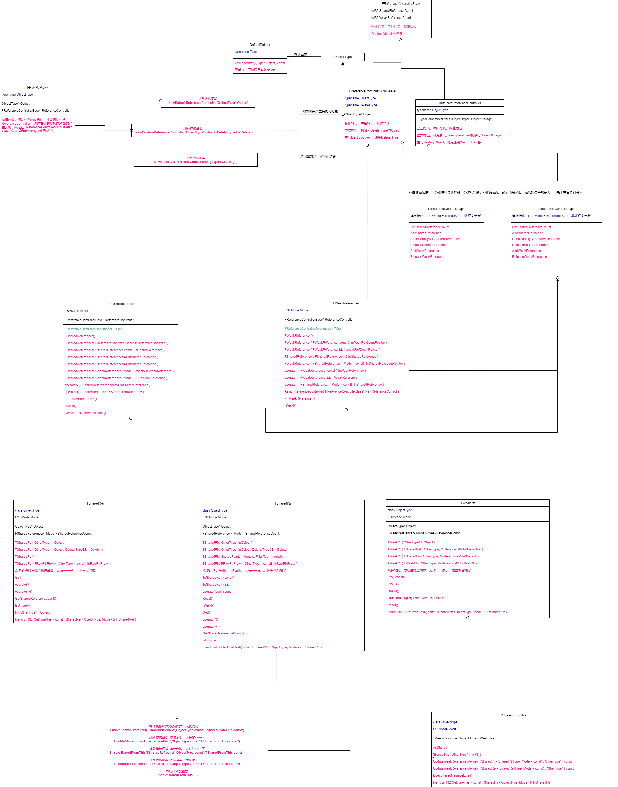

 
<!--BEGIN_DATA
{
    "create_date": "2022-02-01 21:20", 
    "modify_date": "2022-02-01 21:20", 
    "is_top": "0", 
    "summary": "UE4和C++ STL智能指针对比分析", 
    "tags": "C/C++", 
    "file_name": "UE4和C++ STL智能指针对比分析.md"
}
END_DATA-->

#### <p>原文出处：<a href='https://km.woa.com/group/29321/articles/show/507298' target='blank'>UE4和C++ STL智能指针对比分析</a></p>

本文以UE4 4.27中智能指针及微软VS2022下MSVC版STL智能指针的实现作对比，从C++设计与结构层面上分析（涉及C++技术及模板知识偏多，或许有点枯燥）。总的来说两者各有千秋，MVSC版毫无疑问更复杂全面，在写法上技巧性更高，细节更多，比如支持分配器，支持数组，异常等；但UE结合自身量身定制更加轻量化，数据与接口实现分离更加清晰，部分功能支持配置化，使得从顶层看可以隐藏很多具体细节。

## UE4智能指针与STL智能指针对比分析

### 一、 概要

UE4的智能指针有很多种，大体分为两类，一类是专门为UObject设计的，比如TStrongObjectPtr，TWeakObjectPtr，一类是通用的智能指针，比如：TSharedPtr常用的共享智能指针，TSharedRef为UE原创非空共享引用，TWeakPtr弱指针，TSharedFromThis能共享自己的智能指针。文章主要从UE的C++设计与结构层面上分析，主要以UE为主，STL为辅，UE中关键细节设计在第二章节讨论。

先看UE4的智能指针一些特性，当然这不是全部：

  1. 结构设计良好，模块化，耦合度低（会分析）
  2. 防止内存泄漏：就是自动销毁回收资源
  3. 实现了弱引用：在资源销毁时，弱指针会进一步进行检查，能更加安全
  4. 线程安全与否可以通过模板参数配置，非安全版速度更快，默认是非安全版（会分析）
  5. 可消除循环引用，通过弱指针来实现
  6. 开销小，支持const，很好的类型转换、占用空间小。（会分析）
  7. 支持非空智能引用，就是UE原创的TSharedRef（会分析）
  8. 支持自身智能指针，就是TSharedFromThis（会分析）
  9. 和UE内部方法与命名一致
  10. 没有异常处理，没有支持分配器
  11. 对比stl暂不支持数组

文中UE代码源文件：SharedPointer.h与SharedPointerInternals.h，属于UE的基础模板库代码，STL源码我用VS2022的
版本，对应\MSVC\14.30.30704\include\memory文件下。四种智能指针除了TSharedRef为UE原创外，基它在STL标准库中均有
对标的实现，关系如下：

  * `TSharedPtr<---->std::shared_ptr `
  * `TWeakPtr<---->std::weak_ptr`
  * `TSharedFromThis<---->std::enable_shared_from_this`
  * `TUniquePtr<---->std::unique_ptr` 这次就不再单独讨论了

### 二、UE设计结构与STL区别

#### 2.0 UE智能指针总览

个人感觉UE这一点可能没有STL那么多版本迭代与兼容的包袱，也不用细节面面具到，个人感觉模块化与结构化都比较好。数据，操作，接口与继承都不错，部分可以自由的组合。先看一张整体结构图，可能字比较小，请点击放大查看原图 



#### 2.1 计数基类FReferenceControllerBase

智能指针之所以智能，就是对托管的资源引入一个计数器，总体上当发生复制时计数器自动增加一，析构时自动减一;当计数减少到0就释放资源，否则不释放。所以只要把这个计数器管理好，就能做到用户无需显式的释放资源，相比原来手动释放资源更加智能，因此叫作智能指针。

UE的计数器基类FReferenceControllerBase，可以看上面总览图，它处于最上层。它只是计数，里面有两个int32成员：**SharedReferenceCount共享计数器**与**WeakReferenceCount弱指针引用计数器**，并且构造时初始化都为1。这个类**禁拷贝**，并提供DestroyObject释放纯虚接口。

对比STL中的类`_Ref_count_base`，两者设计基本没有区别，计数都是32位的，只是名称不同，同样初始化都为1。同样禁拷贝，只是stl引用delete关键字删除了拷贝相关函数，UE用原始private修饰禁用法。同样提供了destory纯虚接口。

不同之处：**STL把计数器增加、减少，读取直接放到到这个基类中，采用无锁原子化操作，这些操作强制支持多线程（注STL的数据读取并非支持多线程处理）；反观UE就把这块抽象出来了到后面要说的纯操作接口类中，更加模块化，并且是否多线程让用户用模板参数可选，从所周知，非多线程速度更快**，另外STL直接也提供了`_Delete_this`释放自己纯虚接口。

#### 2.2 多种计数派生类

继续看结构图，再向下面，UE提供了两种计数派生类TReferenceControllerWithDeleter和TIntrusiveReferenceController，分别表示带自定义释放器的引用计数器与内存块的引用计数器。而我这边STL看了提供了**十个派生类，对，是十个**版本，毫无疑问UE中这两个STL必然能找到对应，STL主要多了无自定义删除器，自定义内存分配器及支持数组及这几种结构之间组合，如`_Ref_count_obj2`，`_Ref_count_unbounded_array_alloc`，所以复杂的多，毕竟他们是语言专家，供给所有人使用，这也正常。下面继续看UE的派生类

##### 2.2.1 TReferenceControllerWithDeleter

我们主要看UE的，更多的是最常用的TReferenceControllerWithDeleter，STL版本对应`_Ref_count_resource`，就不贴代码了，有兴趣自己跳转看一下。

```cpp
template <typename ObjectType, typename DeleterType>
class TReferenceControllerWithDeleter : private DeleterType, public FReferenceControllerBase
{
    virtual void DestroyObject() override
    {
        (*static_cast<DeleterType*>(this))(Object);
    }
    // 省略其它代码
private:
    ObjectType* Object;
}
```

TReferenceControllerWithDeleter和前面的FReferenceControllerBase不同之处，多了两个模板参数：**ObjectType**表示数据类型，**DeleterType**表示删除器类型，删除器实质算是一个仿函数，内部**重载了()**用来自定义内存释放的处理。成员上多了一个ObjectType*类型指针对象Object，用来存智能指针所指的对象。同样和基类一样，都是要禁止拷贝的。

设计结构上注意**私继承了DeleteType**与公有继承FReferenceControllerBase，构造函数传入的`ObjectType_` 指针与DeleterType型对象并进行初始化;重点重写了DestroyObject虚函数，将this指针强转为DeleterType_指针，并且调用释放器重载()函数，传入指针对象Ojbect，进行内存的释放。

##### 2.2.2 对比STL设计，私有继承好还是组合好？

反现STL中，设计总体差不多，没有私有继承DeleterType，而是将其放到`_Compressed_pair<_Dx, _Resource>`使用了类**组合结构**代替了继承，同样也重写_Destroy，同样也继续调用重载()，还过这里STL版本提供了重载`_Delete_this()`，直接能释放自己，UE给还的更高层次才提供同功能。

> 关于么有私有继承与组合是C++一个比较有争议的话题，个人理解UE这里使用**私有继承才是高水平的体现**，能进行**空基类优化**，还能阻止**向基类参数转换时歧义**，以及避免部分**移动语意时资源交换的不完整性**。但STL的这个pair组合可不是吃素的，内部也挺复杂，我这种菜鸟都能考虑到的点，他们早就能想到了，**其内部也是私有继承，也支持空基类优化**，有兴趣的可以看看源码。所以STL的也没问题，有问题的是我们自己简单写写组合！

##### 2.2.3 TIntrusiveReferenceController

有了2.2.1，2.2.2小节内容，这里就比较容易了。这里STL版本对应`_Ref_count_obj2`，就不贴代码了，有兴趣自己跳转看一下

```cpp
template <typename ObjectType>
class TIntrusiveReferenceController : public FReferenceControllerBase
{
public:
    template <typename... ArgTypes>
    explicit TIntrusiveReferenceController(ArgTypes&&... Args)
    {
        new ((void*)&ObjectStorage) ObjectType(Forward<ArgTypes>(Args)...);
    }
    virtual void DestroyObject() override
    {
        DestructItem((ObjectType*)&ObjectStorage);
    }
    // 省略其它代码
private:
    mutable TTypeCompatibleBytes<ObjectType> ObjectStorage;
};
```

TIntrusiveReferenceController与TReferenceControllerWithDeleter除了保留相同的不可拷贝与复制及继承自FReferenceControllerBase，还是有较大的不同，首先只有一个模板参数，不再可以定制化删除器，走统一流程：DestructItem调用,就是**编译期用模板判断是否可以析构，如果可以调用其析构函数，容器中常用这招**。更大是结构上不同，这里没有保存指针，而是类保留ObjectType对象大小的内存块，这导致本controller类对象通常比较大。

具体来说：成员对象ObjectStorage是个具体的对象而非指针，是UE封装的模板类`TTypeCompatibleBytes<ObjectType>`，**跟踪模板代码实质上就是等同`int8[sizeof(ObjectType)]`大小的内存块**，当然还有考虑对齐，后绪留给我们自己显式的对这块内存初始化。这里等同一份对象准备好了同等内存空间，只是这一步还没有初始化。

构造函数：设计上我们已经有了一块对象大小的内存块，还没有初始化，ObjectType构造函数可能带多个参数或者不带参，设计上要用**C++的可变参及万能引用及完美转发**，由于我们已经有了内存块，设计上直接进行new placement重载加构造函数调用，看上面的代码也是和我们分析一致。

> 对比STL一下，STL并非像UE在内部用模板转来转去显式的构造sizeof(ObjectType)大小内存块。MSVC的团队实现STL代码，不愧是大师级，整些`union {_Wrap<_Ty> _Storage;}`，经过wrap一下,他们宁愿#pragma warning(disable : 4624)压警告，也要采用简洁的炫技之流来代替，我只能说牛X。构造函数实质实一样的，我开了C++20编译，他们写的更加牛，只能膜拜那帮大佬。

#### 2.3 操作接口类FReferenceControllerOps

前面2.1小节提到STL版本对计数基类中的强/弱引用计数是直接放到基类`_Ref_count_base`中了，并且只提供了多线程安全版本。作为对比UE将其抽出，封装成模板类` FReferenceControllerOps`，给定模板参数Mode进行特化。包括`FReferenceControllerOps<ESPMode::ThreadSafe>`多线程安全版本与`FReferenceControllerOps<ESPMode::NotThreadSafe>`非多线程安全版本。两者的实质区别就是读写计数器s数据是否经过原子化封装，比如AtomicRead，InterlockedIncrement，InterlockedCompareExchange，肯定这种支持多线程安全版本会慢一些，但能换来计数的的安全。

从设计来上说FReferenceControllerOps内部没有存储任何的成员，纯属功能接口类，实现都放到静态成员函数中了，这一点UE做的确不错，隔离的比较好，且支持配制，再略调整一点整个类都可以做为模板参数传入了。操作对象`FReferenceControllerBase*`都是函数传过来的基类指针。提供了6个函数

  * 增加共享指针计数
  * 获取共享指针计数
  * 条件增加共享指针计数，条件是这个共享引用至少保留一次计数，如果已经失效的，不再增加
  * 增加弱引用指针计数
  * 释放共享指针对象，条件是共享计数器本次减到0，会调用计数类的DestroyObject()函数，释放托管的资源。**同时尝试释放一次弱引用，如果弱引用计数刚好减到0，回收计数器ReferenceController本身的资源，同STL中2.2.2小节中的`_Delete_this()`**
  * 释放弱引用计数，如果弱引用计数刚好减到0，回收计数器ReferenceController本身的资源，同STL中2.2.2小节中的`_Delete_this()`，这些**ReferenceController一定是在堆上分配的内存**。

#### 2.4 多种辅助模板类及模板函数

##### 2.4.1 生成计数类的模板函数

主要借助模板函数能较好根据传入的参数，推断出参数的类型，无需显式的写出。在函数内部再对模板参进行再组合或变换，生成新的结构，这也是模板编程中常用的技术巧。UE提供了三个模板函数，用来动态生成2.2小节的TReferenceControllerWithDeleter与TIntrusiveReferenceController对象,第二个函数删除器我们可以自己定义，第一人合用默认DefaultDeleter删除器。三个函数内部用new将对象**生成堆内存上，这点非常重要**，一般用于传给某些类的构造函数调用，只不过返回值类型擦除为基类。

```cpp
template <typename ObjectType>
inline FReferenceControllerBase* NewDefaultReferenceController(ObjectType* Object)
{
    return new TReferenceControllerWithDeleter<ObjectType, DefaultDeleter<ObjectType>>(Object, DefaultDeleter<ObjectType>());
}

template <typename ObjectType, typename DeleterType>
inline FReferenceControllerBase* NewCustomReferenceController(ObjectType* Object, DeleterType&& Deleter)
{
    return new TReferenceControllerWithDeleter<ObjectType, typename TRemoveReference<DeleterType>::Type>(Object, Forward<DeleterType>(Deleter));
}

template <typename ObjectType, typename... ArgTypes>
inline TIntrusiveReferenceController<ObjectType>* NewIntrusiveReferenceController(ArgTypes&&... Args)
{
    return new TIntrusiveReferenceController<ObjectType>(Forward<ArgTypes>(Args)...);
}
```

对比STL版本，他们提供了更多，部分直接放到智能指类的私有函数中直接new对象，有的经过模板转来转去，设计的比较复杂。

##### 2.4.2 默认的删除器

这个比较简单，就是重载一下()调用，内部转到系统delete调用。

```cpp
template <typename Type>
struct DefaultDeleter
{
    FORCEINLINE void operator()(Type* Object) const
    {
        delete Object;
    }
};
```

对比一下STL的也提供了名为default_delete默认删除器，核心实质相同，不同的是他们进行了特化，增加了对数组的特化处理`struct default_delete<_Ty[]>`，然后就是一些细节考虑的更多。

##### 2.4.3 原生指针代理FRawPtrProxy

这个比较简单，主要为了配套后面用MakeShareable()函数，隐式的将原生指针转换给UE的智能指针，实际上像TSharedPtr他们也提供了直接原生指针的构造函数重载，加这个重载可能防止有人就想传原生指针，这个好像STL没有完全直接人对应。

> 实质这里我想到的意义就是一些C++深层次考虑，不知道他们是不是这样想的：**当智能指针构造与函数调用连一起时，在编译器优化为先new内存，再调用后绪函数，最后才传到`std::shared_ptr`构造中，第二步函数发生了异常，可能造成非常隐藏的内存泄露，STL推荐使用`std::make_shared`，我个人感觉意思上差不多**,其他大佬有什么见解也可以说一下。  

```cpp
template< class ObjectType >
struct FRawPtrProxy
{
    ObjectType* Object;
    FReferenceControllerBase* ReferenceController;

    FORCEINLINE FRawPtrProxy( ObjectType* InObject )
        : Object             ( InObject )
        , ReferenceController( NewDefaultReferenceController( InObject ) ){}
    template< class Deleter >
    FORCEINLINE FRawPtrProxy( ObjectType* InObject, Deleter&& InDeleter )
        : Object             ( InObject )
        , ReferenceController( NewCustomReferenceController( InObject, Forward< Deleter >( InDeleter ) ) ){}
};
```

实现上就是直接将原生指针保存起来，另外保存一个计数器类，使用实质是TReferenceControllerWithDeleter类型，都是放在构函数中。

##### 2.4.4 辅助生成共享自身指针

UE提供了5个EnableSharedFromThis辅助函数尝试生成共享自己的指针，原理上主要借助模板函数的重载与隐式转换及SFINAE技术，两个是处理TSharedRef共享引用，两个是处理TSharedPtr共享指针，包括带不带const版本，形式差不多，只贴一个代码就行了。最后一个必然能够调到重载函数，什么也不做。

先大致说一下，**如果一个自身指针能支持转换到TSharedFromThis**，那么通过UpdateWeakReferenceInternal从共享引用或共享指针条件的拷贝，生成弱指针引用，完成对自己的引用计数，更加安全。这里实际有点绕人，参见3.4.1小节一步一步具体阐述。

```cpp
template< class SharedRefType, class ObjectType, class OtherType, ESPMode Mode >
FORCEINLINE void EnableSharedFromThis( TSharedRef< SharedRefType, Mode > const* InSharedRef, ObjectType const* InObject, TSharedFromThis< OtherType, Mode > const* InShareable )
{
    if( InShareable != nullptr )
    {
        InShareable->UpdateWeakReferenceInternal( InSharedRef, const_cast< ObjectType* >( InObject ) );
    }
}
FORCEINLINE void EnableSharedFromThis( ... ) { }
```

#### 2.5 核心的FSharedReferencer与FWeakReferencer

这两个类实质是将FReferenceControllerBase与FReferenceControllerOps绑在一起就行了一层封装，前面说过FReferenceControllerBase只负责数据，FReferenceControllerOps只负责操作，这一小节的类就是将两者紧密的取系起来，形成切实有效的逻辑。从上面总体表格中也可以看到和直正智能指针的实现起着承上启下的作用。因为STL没有这样抽象，所以STL没有完全相似的，非要类比的话有个`_Ptr_base`类作为stl智能指针的基类，有那么一点点的接近，并不能等同。不过stl那边是更多是继承思想，这边是组合思想。

##### 2.5.1 FSharedReferencer

`FSharedReferencer<Mode>`用作TSharedRef与TSharedPtr的引用数据实现的根源，控制着托管资源的生命周期控制核心，本身作为成员放到了两个类中，UE这里使用了组合思想，本身模板参数Mode留给用户配置是多线程安全版还是普通快速版。

```cpp
template< ESPMode Mode >
class FSharedReferencer
{
    typedef FReferenceControllerOps<Mode> TOps;
private:
    template< ESPMode OtherMode > friend class FWeakReferencer;
private:
    FReferenceControllerBase* ReferenceController;
}
```

设计上：本身有个成员`FReferenceControllerBase* ReferenceController;`,想一下也知道，这里只是用基类指针来进行类型擦除后的存储，真正对象肯定是2.2小节的派生类。类内部有个操作重定义`typedef FReferenceControllerOps<Mode> TOps;`，这一步前面提到，再进一步更灵活的话，也可以作为模板参数提供。最后就是提供了友元FWeakReferencer，让其也能相到访问。

功能上**非常重要非常重要**： 构造函数肯定提供多种，主要完成指针类型成员ReferenceController的赋值，析构时要尝试释放共享资源。如果没有拷贝时，直接赋值就可以了，但如果是**拷贝就要特别小心处理，这一点是基础**，举出他的几个例子：


  1. const ReferenceController&左引用拷贝构造：直接指针赋值，**如果指针不为空，直接TOps调用增加一次共享指针计数**
  2. FSharedReferencer&& 右引用拷贝构造：直接指针赋值，**不增加计数，并将右引用的指针ReferenceController清空，完成转移控制权**
  3. FWeakReferencer< Mode > const&左引用拷贝构造：直接指针赋值，因为来自弱指针，要充分考虑共享引用。**如果指针不为空，TOps要尝试条件调用，只有引指针的共享引用不为空才增加一次共享指针计数，否则将赋值过的指针也置空，换句话说就是只要还有效的弱指针**
  4. FWeakReferencer< Mode >&& InWeakReference 右引用拷贝构造：直接指针赋值，因为来自弱指针，要充分考虑共享引用。**如果指针不为空，TOps要尝试条件调用，只有引指针的共享引用不为空才增加一次共享指针计数，否则将赋值过的指针也置空，换句话说就是只要还有效的弱指针,处理完后TOps尝试将右引用ReleaseWeakReference释放（不一定能释放），并将右引用指针ReferenceController清空，完成转移控制权**
  5. FSharedReferencer const&左引用赋值构造：设计上首先排除是不是给自己赋值。功能上和拷贝一致，但注意一点，当自身的ReferenceController计数器指针不为空，**一定要调用ReleaseSharedReference释放一次资源**，再进行赋值交换，增加计数，这点同拷贝不同。
  6. FSharedReferencer&& 右引用赋值构造：设计上首先排除是不是给自己赋值。功能上和拷贝一致，**也不增加计数**，但注意一点，当自身的ReferenceController计数器指针不为空，**一定要调用ReleaseSharedReference释放一次资源**。
  7. **析构函数**：当ReferenceController指针不为空，TOps调用ReleaseSharedReference进行资源释放，不为零只是减少一次计数，非常重要
  8. 其它功能函数，IsValid通过指针是否为空判断是否有效;GetSharedReferenceCount通这TOps获取共享计数，IsUnique通过判断是否引用计数为1来判断是否只有一个共享引用。

##### 2.5.2 FWeakReferencer

`FWeakReferencer<Mode>`用作TWeakPtr弱指针引用数据实现的根源，设计和功能上基本等同2.5.1小节的FSharedReferencer，相同的部分就不再累述。

```cpp
template< ESPMode Mode >
class FWeakReferencer
{
    typedef FReferenceControllerOps<Mode> TOps;
private:
    template< ESPMode OtherMode > friend class FSharedReferencer;
private:
    FReferenceControllerBase* ReferenceController;
}
```

不同之处：

  1. 友元为FSharedReferencer，毕竞要相互访问
  2. 拷贝构造函数略不同，大体相同，细节不同，拷贝左引用时**增加弱引用计数**，而非共享引用计数，右引用相同逻辑。
  3. FSharedReferencer< Mode > const&左引用拷贝构造，直接指针赋值，**如果指针不为空，直接TOps调用增加一次弱引用计数**，同时不再提供右值引用版本，因为const T&可以接受右值。
  4. 赋值构造总体没有区别，同样设计上首先排除是不是给自己赋值，当自身的ReferenceController计数器指针不为空，**一定要调用ReleaseWeakReference释放一次资源**，只是这点不同。左值的增加一次**弱引用计数**，否则不处理，再进行赋值交换。
  5. 析构函数：当ReferenceController指针不为空，TOps调用ReleaseWeakReference进行自身释放，不为零只是减少一次弱引用计数
  6. 其它功能函数，IsValid通过指针是否为空判断是否有效，还要加上共享指针计数是否大于0判断

> 对于FSharedReferencer与FWeakReferencer来说，通过C++析构时间，自己调用计数器的资源释放，这样UE真正智能指针TSharedRef与TSharedPtr等上层就无需处理析构函数，显得优雅一点，这是因为逻辑功能抽离的更彻底，放到这层了；相反STL的智能指针`std::shared_ptr`与`std::weak_ptr`都是在自己的析构函数，处理计数的减少及托管资源的释放，抽象与剥离这点UE还是不错的。

至此设计结构都讲完了，如果认真理解，应用层不会有什么难度了。

### 三、UE四种智能指针

这一部分是应用，我们讲的少一点，不然就重复了，背后原理请阅读第二章节，更多示例可以参考UE源文件：**SharedPointerTesting.inl**

#### 3.1 TSharedPtr

```cpp
template< class ObjectType, ESPMode Mode >
class TSharedPtr
{
public:
    template <
        typename OtherType,
        typename = decltype(ImplicitConv<ObjectType*>((OtherType*)nullptr))
    >
    FORCEINLINE TSharedPtr( TSharedPtr< OtherType, Mode > const& InSharedPtr )
        : Object( InSharedPtr.Object )
        , SharedReferenceCount( InSharedPtr.SharedReferenceCount )
    {
    }
private:
    ObjectType* Object;
    SharedPointerInternals::FSharedReferencer< Mode > SharedReferenceCount;
};
```

TSharedPtr设计上

  1. 模板设计，第一个模板参ObjectType参数表示我们要传入类型智能指针对应的类型，第二个模板参数Mode控制是否多线程安全，参考2.3小节内容。
  2. 采用了组合思想，成员上Object存指针数据，SharedReferenceCount成员对象存我们计数（**实质在堆区**）与操作接口类，FSharedReferencer在2.5小节我们重点讲了，是最核心，可以再阅读这一小节。
  3. 相比STL是采用继承`_Ptr_base`，`std::shared_ptr`不存数据，真正功能都是最转到基类中了,不过STL的实现的确更复杂。
  4. UE接口与数据分离比较干净，比如**引用计数，资源释放操作封装在SharedReferenceCount中**，在TSharedPtr这一层没有内部实现细节，封装良好，应用使用时无需关心。前面说过析构函数这里UE这一层都不用单独处理，这一点是优点。
  5. 支持多种构造函数
  6. 支持移动语意
  7. **支持良好的向上的类型转换**。作为底层库基本上构造函数都采用模板参OtherType，利用编译期SFINAE技术，利用模板函数**ImplicitConv**结合decltype对隐式转换判断，体现库设计的严谨与通用性。
  8. 支持原生指针及原生指针转换到RawPtrProxy
  9. 如果这个类派生自TSharedFromThis，对TSharedFromThis类型安全与自身类型安全检查，通过函数重载，支持返回自己的TSharedPtr，**在3.4小节重点讲这个**。
  10. **ToSharedRef支持向TSharedRef类型转换，内部使用IsValid保证非空**
  11. 支持显示bool类型重载，即explicit operator bool
  12. 当**使用Get()函数不进行获取目标时，不进行安全判断，当使用重载*或重载->时，都会利用IsValid()进行安全检查**
  13. Reset()对本自己进行一次减少引用，并将新引用设为空指针对象

#### 3.2 TSharedRef

```cpp
template< class ObjectType, ESPMode Mode >
class TSharedRef
{
public:
    template <
        typename OtherType,
        typename = decltype(ImplicitConv<ObjectType*>((OtherType*)nullptr))
    >
    FORCEINLINE explicit TSharedRef( OtherType* InObject )
        : Object( InObject )
        , SharedReferenceCount( SharedPointerInternals::NewDefaultReferenceController( InObject ) )
    {
        UE_TSHAREDPTR_STATIC_ASSERT_VALID_MODE(ObjectType, Mode)
        Init(InObject);
    }
private:
    ObjectType* Object;
    SharedPointerInternals::FSharedReferencer< Mode > SharedReferenceCount;
};
```

TSharedRef为UE原创，设计上基本等同TSharedPtr，细节不再累述。不过他**保证所引用的对象非空**，核心原因是**生成TSharedRef时**就做`check(InObject != nullptr);`检测，空指针就无法成功，对于使用时，Get(),重载*，重载->都进行了安全检测，不过这里TSharedRef的Get()函数返回的是引用类型，而TSharedPtr返回的指针类型。

因为保证了非空，所以TSharedRef没有了bool类型重载。

#### 3.3 TWeakPtr

```cpp
template< class ObjectType, ESPMode Mode >
class TWeakPtr
{
public:
    template <
        typename OtherType,
        typename = decltype(ImplicitConv<ObjectType*>((OtherType*)nullptr))
    >
    FORCEINLINE TWeakPtr( TSharedRef< OtherType, Mode > const& InSharedRef )
        : Object( InSharedRef.Object )
        , WeakReferenceCount( InSharedRef.SharedReferenceCount )
    {
    }
    FORCEINLINE TSharedPtr< ObjectType, Mode > Pin() const&
    {
        return TSharedPtr< ObjectType, Mode >( *this );
    }
private:
    ObjectType* Object;
    SharedPointerInternals::FWeakReferencer< Mode > WeakReferenceCount;
};
```

有了前面的TSharedRef与TSharedPtr作铺垫，TWeakPtr就经较简单了，结构上跟前面两者基本相同，除去Object指针相同，引用计数与控制换成了`FWeakReferencer< Mode >`型的WeakReferenceCount，其它结构上区别不是很大。

当然构造函数原理差不多，只是有一定限制，**弱指针不能单独使用，要配套TSharedRef，TSharedPtr使用，它的真正计数是计数类中的WeakReferenceCount**。只支持从TSharedRef，TSharedPtr，TWeakPtr三种类型上构造，以及一个空的构造，同时也是支持向上类型转换，这和STL差不多。注意构造时用的WeakReferenceCount，UE这么一封装，要看细节就要回到2.5.2小节的FWeakReferencer，这里不再累述。

注意这里的IsValid()除了指针判断为非空，还要判断其对应的共享计数是否大于0，都满足才有效，否则就是失效的。

Reset()函数，将自己指向空引用，并将原来自己减少一次弱引用，如果弱引用为0，释放原来的计数器。

Pin()函数，将弱引用转为TSharedPtr，因为弱引用不支持直接->访问。这里注意一点，就是原来的共享引用为失效为空时，转换后的TSharedPtr是一个空指针，直接解引用，很可能就会崩溃，如果需要这样处理，请进行安全检测。这里实际由于UE的封装，将转换隐藏了，要回到第二章节2.5.1，FSharedReferencer对传入的FWeakReferencer构造时，会进行共享引用计数判断，大于0才真正赋值。封装深的好处就是使用觉得容易，但想掌握原理还是比较麻烦。

`HasSameObject( const void* InOtherPtr )`这个函数直接提供了和InOtherPtr地址是否相等的判断。

#### 3.4 TSharedFromThis

```cpp
template< class ObjectType, ESPMode Mode >
class TSharedFromThis
{
public:
    TSharedRef< ObjectType, Mode > AsShared()
    {
        TSharedPtr< ObjectType, Mode > SharedThis( WeakThis.Pin() );
        check( SharedThis.Get() == this );
        return MoveTemp( SharedThis ).ToSharedRef();
    }
private:
    mutable TWeakPtr< ObjectType, Mode > WeakThis;  
};
```

TSharedFromThis是返回自己的共享引用的智能指针，实现与功能上基本等同STL的enable_shared_from_this，内部都持一个弱指针，写法上将我们的ObjectType类继承于TSharedFromThis就可以了。

**用法**：上当我们在自己对象已经交给UE的智能指针托管，生命周期由智能指针控制。当我们的**类成员函数处理异步调用**时，如果将this指针传给某个回调函数，延迟一段时间后调用，这段时间内我们对象生命周期结束可能已经回收，调用时很可能就崩溃。所以注册这个回调时，如果用AsShared()函数能拿到自己的智能指针，那就安全了，这样我们有法保证我们对象有效性，这是一个典型的用法。

##### 3.4.1 TSharedFromThis用法原理

以这个简单代码为例FMyClass继承TSharedFromThis为例，MyClass假设在成员函数中的this指针，MyClass->AsShared()便得到共享指针，下面分析详细原理：

```cpp
class FMyClass : public TSharedFromThis< FMyClass>{};
TSharedPtr<FMyClass> TheClassPtr1(new FMyClass());
{
    FMyClass* MyClass = TheClassPtr1.Get();
    TSharedRef<FMyClass> TheClassPtr2(MyClass->AsShared());
}
```

  1. 当new FMyClass()从堆申请内存时，此时基类`TSharedFromThis<FMyClass>`并没有真正给其WeakThis赋值，假设结果为pkRet
  2. 当用pkRet构造`TSharedPtr<FMyClass>`对象时，进入TSharedPtr( OtherType_ InObject )构造函数调用,内部再进行赋值，并从*堆内存上申请出产生TReferenceControllerWithDeleter计数器，此时share与weak计数器都为1

```cpp
template <
typename OtherType,
typename = decltype(ImplicitConv<ObjectType*>((OtherType*)nullptr))
>
FORCEINLINE explicit TSharedPtr( OtherType* InObject )
     : Object( InObject )
     , SharedReferenceCount( SharedPointerInternals::NewDefaultReferenceController( InObject ) )
{
     UE_TSHAREDPTR_STATIC_ASSERT_VALID_MODE(ObjectType, Mode)
     SharedPointerInternals::EnableSharedFromThis( this, InObject, InObject );
}
```

  3. `UE_TSHAREDPTR_STATIC_ASSERT_VALID_MODE`宏，用模板编译期检查是否继承TSharedFromThis线程安全相反的版本，可以忽略
  4. 关键的一步：EnableSharedFromThis()，这是第二章节提到的共有5个重载版本模板函数，我们这里因为继承`TSharedFromThis<FMyClass>`，所以InObject能转换成`TSharedFromThis<FMyClass>`类型指针，同时this指针就是`TSharedPtr<FMyClass>`,因此调用这个版本函数  

```cpp
template< class SharedPtrType, class ObjectType, class OtherType, ESPMode Mode >
FORCEINLINE void EnableSharedFromThis( TSharedPtr< SharedPtrType, Mode >* InSharedPtr, ObjectType const* InObject, TSharedFromThis< OtherType, Mode > const* InShareable )
{
    if( InShareable != nullptr )
    {
         InShareable->UpdateWeakReferenceInternal( InSharedPtr, const_cast< ObjectType* >( InObject ) );
    }
}
```

  5. 显然进一步就到了下面UpdateWeakReferenceInternal调用，WeakThis这时还没初始化为真正有效值，TSharedPtr的临时构造了，此时share与weak计数器为2，1，再进入WeakThis = TSharedPtr的赋值构造函数  

```cpp
template< class SharedPtrType, class OtherType >
FORCEINLINE void UpdateWeakReferenceInternal( TSharedPtr< SharedPtrType, Mode > const* InSharedPtr, OtherType* InObject ) const
{
    if( !WeakThis.IsValid() )
    {
        WeakThis = TSharedPtr< ObjectType, Mode >( *InSharedPtr, InObject );
    }
}
```
  6. 也就是TWeakPtr用TSharePtr赋值构造，进而触发：FWeakReferencer用FSharedReferencer的赋值构造，AssignReferenceController内部会增加一次weak计数，此时share与weak计数器为2，2，  

```cpp
FORCEINLINE FWeakReferencer& operator=( FSharedReferencer< Mode > const& InSharedReference )
{
     AssignReferenceController( InSharedReference.ReferenceController );
     return *this;
}
```

  7. 都结束后，临时的TSharePtr析构，此时share与weak计数器为1，2
  8. 最后MyClass->AsShared()，产生TSharedRef，此时share与weak计数器为2，2，增加了一次计数，就算异步调用，也保证了有效性。

### 四、 结语

到此我们已经全部分析完毕，详细的介绍UE的四种智能指针实现原理，尤其是第二章节，第三章节算是各种指针的特性略作介绍。可能有纰漏，欢迎指证！
