 
<!--BEGIN_DATA
{
    "create_date": "2024-12-30 14:58", 
    "modify_date": "2024-12-30 14:58", 
    "is_top": "0", 
    "summary": "UE反射系统实现解析", 
    "tags": "Game", 
    "file_name": "UE反射系统实现解析.md"
}
END_DATA-->

#### <p>原文出处：<a href='https://km.woa.com/articles/show/587531' target='blank'>UE反射系统实现解析</a></p>

>丨 导语 反射系统作为游戏引擎的基础能力，在游戏开发中扮演着至关重要的角色，它能够支持运行时获取对象的类型信息，以及动态调用对象的属性和方法。本文中，我们将详细解析UE反射系统的代码实现，帮助大家更有效地了解UE的反射机制。

## 1.概念介绍

1982 年 MIT 的 Smith, Brian Cantwell 在他的博士论文中最早提出了程序反射的概念：

既然我们可以构造“有关某个外部世界表示”的计算过程, 并通过它来对那个外部世界进行推理; 那么我们也可以构造能够对自身表示和计算进行推理的计算过程,它包含负责管理有关自身的操作和结构表示的内部过程。

编程语言中的反射是指在运行时检查、访问和修改程序的结构、状态和行为的能力。

它允许程序在运行时动态地获取和操作类型、对象、方法和属性等信息，而不需要在编译时提前知道这些信息。

一般情况下，针对面向对象语言，反射系统需要提供的基础能力大致包含：

  1. 创建实例

    1. 根据类名，创建类对象实例

  2. 访问成员变量

    1. 根据类名，访问所有成员变量的meta数据：名字、类型等

    2. 根据类名与成员名字，访问/修改某类对象的成员变量数据

  3. 调用成员函数

    1. 根据类名，访问所有成员函数的meta数据：名字、参数信息，返回值信息等
    2. 根据类名与函数名字，调用某类对象的成员函数

## 2.piccolo反射系统实现

在真正介绍UE反射实现前，我们先解析另外一款游戏引擎（piccolo）的反射系统实现，既为开拓视野，更旨在建立一个最简单通透的反射系统实现认知。

### 2.1.piccolo引擎介绍

piccolo引擎是一款开源mini版游戏引擎，专为【[GAMES104(现代游戏引擎入门必修课)](https://games104.boomingtech.com/sc/)】课程打造。该引擎的实现宗旨为：提取最简单精炼的思路，实现现代游戏引擎的各类基础功能。

### 2.1.piccolo反射系统实现概览

简单了解下piccolo反射系统的总体实现：

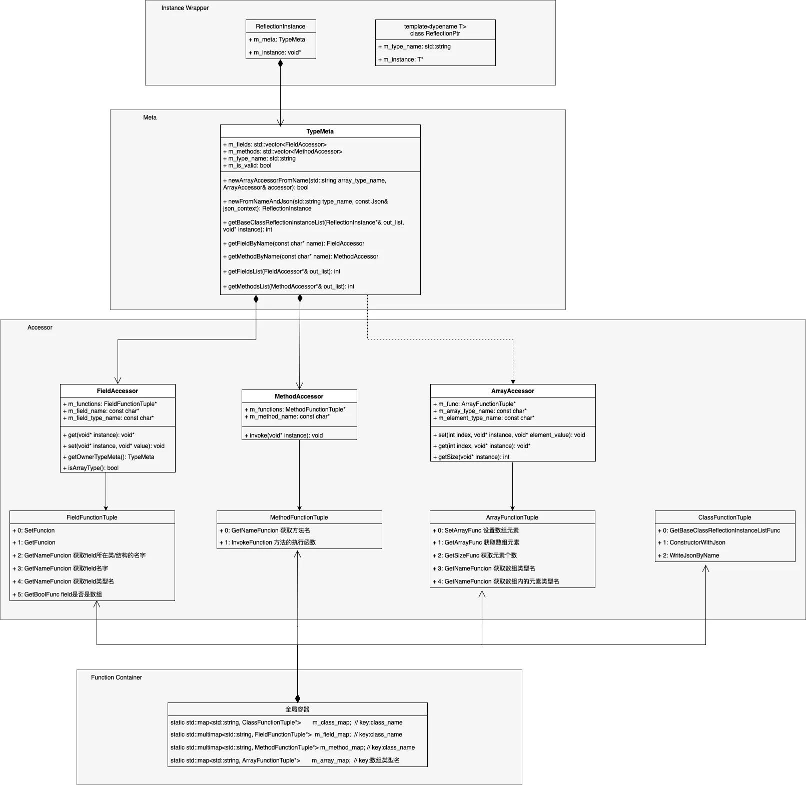

通过上图可以看出：

  1. piccolo反射实现多用组合关系，基本不使用派生关系，整体实现清晰有序。
  2. piccolo反射实现中有着明显的四层结构划分，分别为：
    1. Instance Wrapper层：对于类对象的访问包装，不用过多关注。
    2. Type Meta层：为class结构定义的Meta数据结构，内部包含了class结构中所有fields与methods的accessor。
    3. Accessor层：为class、array、field、mothod定义的操作处理器数据结构。
    4. Function Container层：全局容器，用于存储class、array、field、mothod的操作处理器对象。

上图四层结构中，最核心部分是Accessor层，先对其进行详细介绍。

### 2.2.Accessor层

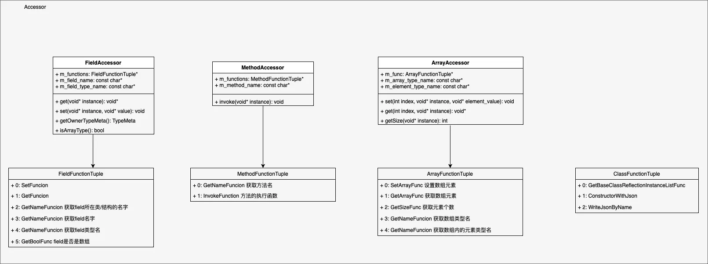

该层中最关键的部分是**FunctionTuple定义：

#### 2.2.1.ClassFunctionTuple

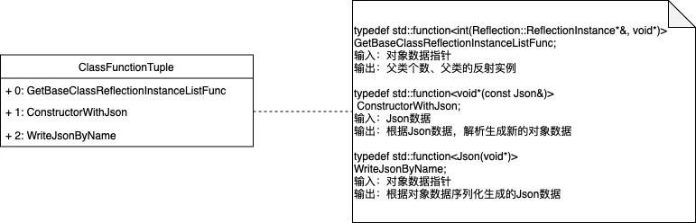

为Class提供能力：

  1. 解析class的派生关系

  2. 对类对象执行序列化与反序列化

#### 2.2.2.ArrayFunctionTuple

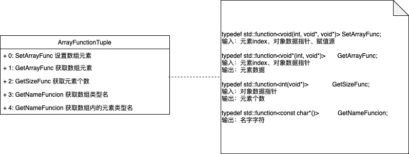

为Array提供能力：

  1. Get/Set Array元素内存数据

  2. 获取Array Size

  3. 获取Array的Meta数据：数组类型名、数组元素的类型名

    1. 示例std::vector<int>

    2. 数组类型名：std::vector<int>

    3. 数组元素的类型名：int

注：可以将Array看做一种特殊的Class，std::vector<int>相当于类名。

#### 2.2.3.FieldFunctionTuple

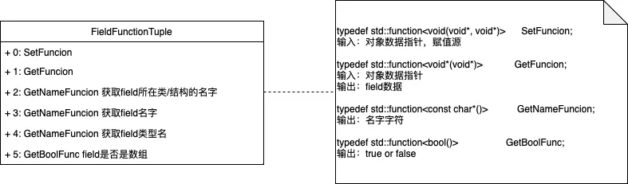

为Field提供能力：

  1. Get/Set Field的内存数据

  2. 获取Field的Meta数据：名字、类型、是否是数组、所在Class的名字

#### 2.2.4.MethodFunctionTuple

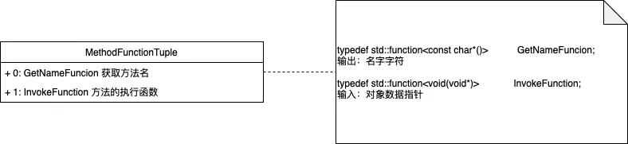

为Method提供能力：

  1. Method调用

注：piccolo拥有一定的demo性质，只支持无传参无返回的方法反射。

#### 2.2.5.示例

```cpp
class XibaTest
{
    public:
        void test() {m_int = 1;}
    public:
        int m_int;
        float m_float;
        std::vector<int> m_int_array;
};
```

对上述class创建反射数据，需要生成如下对象：

1. 一个ClassFunctionTuple对象，内部包含XibaTest的基类获取接口、序列化与反序列化接口  

2. 一个ArrayFunctionTuple对象，内部包含std::vector<int>类型数组的元素访问接口  

3. 三个FieldFunctionTuple对象

  a. FieldFunctionTuple对象for `XibaTest::m_int`，内部包含`m_int`成员访问接口

  b. FieldFunctionTuple对象for `XibaTest::m_float`，内部包含`m_float`成员访问接口

  c. FieldFunctionTuple对象for `XibaTest::m_int_array`，内部包含`m_int_array`成员访问接口

4. 一个MethodFunctionTuple对象，内部包含XibaTest::test()的invoke接口

通过上述的FunctionTuple对象，传入对象指针后，便能够实现对象成员的访问与对象函数的调用。

但此时还缺少对FunctionTuple对象的组织与管理，即如何通过`class_name`获取到为对应class创建的FunctionTuple对象集合。

此时便需要用到Function Container层提供的数据管理功能。

### 2.3.Function Container层

该层通过创建全局容器，用于维护所有FunctionTuple对象：

```cpp
static std::map<std::string, ClassFunctionTuple*>       m_class_map;  // key:class_name
static std::multimap<std::string, FieldFunctionTuple*>  m_field_map;  // key:class_name
static std::multimap<std::string, MethodFunctionTuple*> m_method_map; // key:class_name
static std::map<std::string, ArrayFunctionTuple*>       m_array_map;  // key:数组类型名
```

可以看出，`m_class_map`、`m_field_map`、`m_method_map`都以`class_name`作为key。

于是已知`class_name`后，便能够获取为该class创建的FunctionTuple集合，也即支持了通过`class_name`生成该class的Meta数据（也即TypeMeta）。

### 2.4.Type Meta层

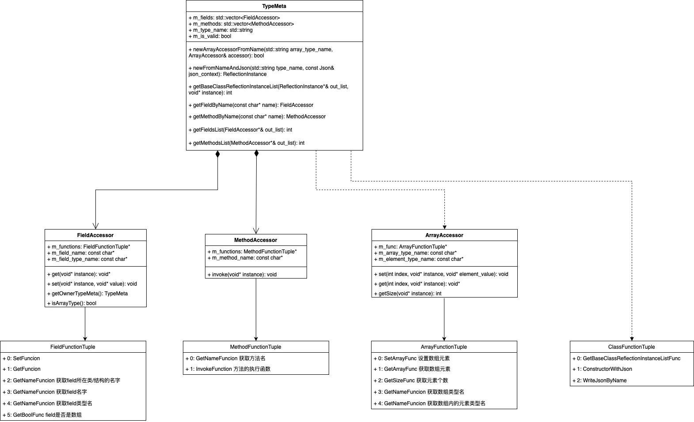

通过TypeMeta对象，便实现了反射所需的基础能力：

  1. 创建实例

  2. 访问成员变量

  3. 调用成员函数

### 2.5.反射信息生成示例

现在我们通过实例来查看具体的FunctionTuple创建与注册流程。

```cpp
// class示例：XibaTest 内部所有fields与methods都需要创建functionTuple
CLASS(XibaTest, Methods, Fields)
{
  REFLECTION_BODY(XibaTest);
public:
  void test() {m_int = 1;}
public:
  int m_int;
  float m_float;
  std::vector<int> m_int_array;
};
```

piccolo专门实现了`meta_parse`工具，用于自动生成反射信息创建&注册逻辑。

创建专属Operator类（以下代码全部由`meta_parse`工具自动生成）：

```cpp
// 为XibaTest创建专属Operator类，内部定义的接口全部为static
class TypeXibaTestOperator{
public:
  static const char* getClassName(){ return "XibaTest";}

  // 实现序列化与反序列化
  static void* constructorWithJson(const Json& json_context){
      XibaTest* ret_instance= new XibaTest;
      Serializer::read(json_context, *ret_instance);
      return ret_instance;
  }

  static Json writeByName(void* instance){
      return Serializer::write(*(XibaTest*)instance);
  }

  // 获取基类数组
  static int getXibaTestBaseClassReflectionInstanceList(ReflectionInstance* &out_list, void* instance){
      int count = 0;
      return count;
  }

  // op function for field：m_int
  static const char* getFieldName_m_int(){ return "m_int";}
  static const char* getFieldTypeName_m_int(){ return "int";}
  static void set_m_int(void* instance, void* field_value){ static_cast<XibaTest*>(instance)->m_int = *static_cast<int*>(field_value);}
  static void* get_m_int(void* instance){ return static_cast<void*>(&(static_cast<XibaTest*>(instance)->m_int));}
  static bool isArray_m_int(){ return false; }
  // op function for field：m_float
  ……
  // op function for field：m_int_array
  ……
  static bool isArray_m_int_array(){ return true; }
  // op function for method：test
  static const char* getMethodName_test(){ return "test";}
  static void invoke_test(void * instance){static_cast<XibaTest*>(instance)->test();}
};

#ifndef ArraystdSSvectorLintROperatorMACRO
#define ArraystdSSvectorLintROperatorMACRO
  // 为std::vector<int>创建专属Operator类，内部定义的接口全部为static
  class ArraystdSSvectorLintROperator{
      public:
          static const char* getArrayTypeName(){ return "std::vector<int>";}
          static const char* getElementTypeName(){ return "int";}
          static int getSize(void* instance){
              //todo: should check validation
              return static_cast<int>(static_cast<std::vector<int>*>(instance)->size());
          }
          static void* get(int index,void* instance){
              //todo: should check validation
              return static_cast<void*>(&((*static_cast<std::vector<int>*>(instance))[index]));
          }
          static void set(int index, void* instance, void* element_value){
              //todo: should check validation
              (*static_cast<std::vector<int>*>(instance))[index] = *static_cast<int*>(element_value);
          }
  };
#endif //ArraystdSSvectorLintROperator 
```

FunctionTuple的生成与注册（以下代码全部由`meta_parse`工具自动生成）：

```cpp
void TypeWrapperRegister_XibaTest(){
  // 创建FieldFunctionTuple for field：m_int
  FieldFunctionTuple* field_function_tuple_m_int=new FieldFunctionTuple(
      &TypeFieldReflectionOparator::TypeXibaTestOperator::set_m_int,
      &TypeFieldReflectionOparator::TypeXibaTestOperator::get_m_int,
      &TypeFieldReflectionOparator::TypeXibaTestOperator::getClassName,
      &TypeFieldReflectionOparator::TypeXibaTestOperator::getFieldName_m_int,
      &TypeFieldReflectionOparator::TypeXibaTestOperator::getFieldTypeName_m_int,
      &TypeFieldReflectionOparator::TypeXibaTestOperator::isArray_m_int);
  // 将刚创建的FieldFunctionTuple对象注册进入全局field容器
  REGISTER_FIELD_TO_MAP("XibaTest", field_function_tuple_m_int);
  // 创建FieldFunctionTuple for field：m_float
  // 将刚创建的FieldFunctionTuple对象注册进入全局field容器
  ……
  // 创建FieldFunctionTuple for field：m_int_array
  // 将刚创建的FieldFunctionTuple对象注册进入全局field容器
  ……
  // 创建MethodFunctionTuple for method：test
  MethodFunctionTuple* method_function_tuple_test=new MethodFunctionTuple(
      &TypeFieldReflectionOparator::TypeXibaTestOperator::getMethodName_test,
      &TypeFieldReflectionOparator::TypeXibaTestOperator::invoke_test);
 // 将刚创建的FieldFunctionTuple对象注册进入全局method容器
  REGISTER_Method_TO_MAP("XibaTest", method_function_tuple_test);
  // 创建ArrayFunctionTuple for array：std::vector<int>
  ArrayFunctionTuple* array_tuple_stdSSvectorLintR = new  ArrayFunctionTuple(
      &ArrayReflectionOperator::ArraystdSSvectorLintROperator::set,
      &ArrayReflectionOperator::ArraystdSSvectorLintROperator::get,
      &ArrayReflectionOperator::ArraystdSSvectorLintROperator::getSize,
      &ArrayReflectionOperator::ArraystdSSvectorLintROperator::getArrayTypeName,
      &ArrayReflectionOperator::ArraystdSSvectorLintROperator::getElementTypeName);
  // 将刚创建的ArrayFunctionTuple对象注册进入全局array容器
  REGISTER_ARRAY_TO_MAP("std::vector<int>", array_tuple_stdSSvectorLintR);
  // 创建ClassFunctionTuple for class：XibaTest
  ClassFunctionTuple* class_function_tuple_XibaTest=new ClassFunctionTuple(
      &TypeFieldReflectionOparator::TypeXibaTestOperator::getXibaTestBaseClassReflectionInstanceList,
      &TypeFieldReflectionOparator::TypeXibaTestOperator::constructorWithJson,
      &TypeFieldReflectionOparator::TypeXibaTestOperator::writeByName);
  // 将刚创建的ClassFunctionTuple对象注册进入全局class容器
  REGISTER_BASE_CLASS_TO_MAP("XibaTest", class_function_tuple_XibaTest);
}
```

### 2.6.反射系统使用示例

```cpp
auto  meta           = Reflection::TypeMeta::newMetaFromName("XibaTest");
  Reflection::FieldAccessor* fields;
  int                        fields_count = meta.getFieldsList(fields);
  for(int i = 0; i < fields_count; ++i)
  {
      LOG_INFO("field_name:{} field_type:{}", fields[i].getFieldName(), fields[i].getFieldTypeName());
  }
  delete[] fields;
  
  Reflection::MethodAccessor* methods;
  size_t                      method_count = meta.getMethodsList(methods);
  for(int i = 0; i < method_count; ++i)
  {
      LOG_INFO("method_name:{}", methods[i].getMethodName());
  }
  delete[] methods;
```

输出内容：

```cpp
[info] field_name:m_int field_type:int
[info] field_name:m_float field_type:float
[info] field_name:m_int_array field_type:std::vector<int>
[info] method_name:test
```

### 2.7.总结

piccolo反射系统的实现呈现出了一种难得的简洁之美。

当然受限于该引擎的demo性质，其中仍然存在一些缺陷，比如不支持带参函数的反射、运行时性能差等等。然而即便整体实现并不完美，但确能让大家一窥反射机制的实现重点。

## 3.UE反射系统实现

### 3.1.前情提要

通过解析piccolo相关代码，可以总结出一个反射系统的实现需要包含如下部分：

  1. Meta定义，包括：

    1. Class/Struct的meta数据定义

    2. Field的meta数据定义

    3. Method的meta数据定义

  2. Meta数据的管理

    1. 建立Class/Struct与Field/Method Meta数据的关联关系

    2. 建立`class_name`与Class Meta数据的关联关系

那么带着这些总结，我们开始UE反射系统的解析之旅。

### 3.2.Struct反射实现

先创建一个最简单的struct示例：

```cpp
USTRUCT()
struct FFGReflectionStructTest
{
  GENERATED_USTRUCT_BODY()

  UPROPERTY()
  int32 TestVal= {4} ;
};
```

首先展开编译有效宏：`GENERATED_USTRUCT_BODY`，此宏定义在自动生成头文件中：generated.h

```cpp
USTRUCT()
struct FFGReflectionStructTest
{
  friend struct Z_Construct_UScriptStruct_FFGReflectionStructTest_Statics; 
  FORTUNEGAME_API static class UScriptStruct* StaticStruct(); // static获取Struct Meta数据
  
  UPROPERTY()
  int32 TestVal;
};
```

宏展开后的代码中定义了StaticStruct();，此接口返回UScriptStruct，也即我们所关注的Struct Meta数据。

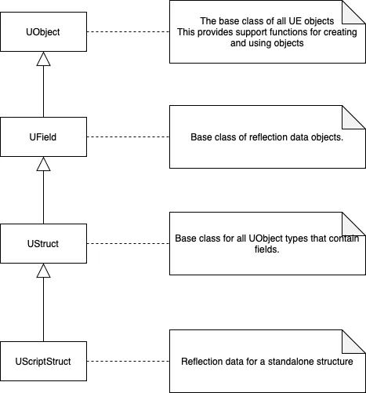

#### 3.2.1.构造UScriptStruct

UE为构造UScriptStruct数据，定义了一套构造参数：FStructParams

```cpp
struct FStructParams
{
	UObject*                          (*OuterFunc)();// 获取struct定义所在的UObject
	UScriptStruct*                    (*SuperFunc)();// 获取父类meta数据
	void*                             (*StructOpsFunc)();/ 支持自定义内存结构下的动态创建与销毁struct能力，实际返回ICppStructOps*，维护有struct的size与align信息
	const char*                         NameUTF8;// struct结构名字
	SIZE_T                              SizeOf; // struct的size
	SIZE_T                              AlignOf;// struct的对齐信息
	const FPropertyParamsBase* const*   PropertyArray;// struct内的成员变量列表，成员通过FPropertyParamsBase进行描述
	int32                               NumProperties;// struct内的成员变量数量
	EObjectFlags                        ObjectFlags;// Flags describing an object instance
	uint32                              StructFlags;  // Flags describing a struct
#if WITH_METADATA
	const FMetaDataPairParam*           MetaDataArray;// 其他meta信息：所在文件路径
	int32                               NumMetaData;	
#endif
};
```

针对上文示例中的FFGReflectionStructTest结构，UE在自动生成的gen.cpp结构中，为FFGReflectionStructTest实例化的FStructParams对象如下：

```cpp
// 为struct内的成员变量TestVal构建PropertyParams 主要信息：成员名字、成员内存偏移、成员内置类型
const UECodeGen_Private::FIntPropertyParams Z_Construct_UScriptStruct_FFGReflectionStructTest_Statics::NewProp_TestVal = { 
    "TestVal", 
    nullptr, 
    (EPropertyFlags)0x0010000000000000, 
    UECodeGen_Private::EPropertyGenFlags::Int, 
    RF_Public|RF_Transient|RF_MarkAsNative, 
    1, 
    nullptr, 
    nullptr, 
    STRUCT_OFFSET(FFGReflectionStructTest, TestVal), 
    METADATA_PARAMS(Z_Construct_UScriptStruct_FFGReflectionStructTest_Statics::NewProp_TestVal_MetaData, 
                    UE_ARRAY_COUNT(Z_Construct_UScriptStruct_FFGReflectionStructTest_Statics::NewProp_TestVal_MetaData))
};

// struct内的成员变量列表，引用上面代码中为成员构建的PropertyParams
const UECodeGen_Private::FPropertyParamsBase* const 
Z_Construct_UScriptStruct_FFGReflectionStructTest_Statics::PropPointers[] = {
	(const UECodeGen_Private::FPropertyParamsBase*)&Z_Construct_UScriptStruct_FFGReflectionStructTest_Statics::NewProp_TestVal,
};

// 为Struct构建FStructParams
const UECodeGen_Private::FStructParams Z_Construct_UScriptStruct_FFGReflectionStructTest_Statics::ReturnStructParams = {
	(UObject* (*)())Z_Construct_UPackage__Script_FortuneGame,// 获取struct所在的package
	nullptr,// 获取父类meta数据											
	&NewStructOps,// 支持自定义内存结构下的动态创建与销毁struct能力，实际返回ICppStructOps*，维护有struct的size与align信息
	"FGReflectionStructTest",// struct结构名字
	sizeof(FFGReflectionStructTest), // struct的size
	alignof(FFGReflectionStructTest), // struct的对齐信息
	Z_Construct_UScriptStruct_FFGReflectionStructTest_Statics::PropPointers,// 上面代码中定义的成员变量列表
	UE_ARRAY_COUNT(Z_Construct_UScriptStruct_FFGReflectionStructTest_Statics::PropPointers),// struct内的成员变量数量
	RF_Public|RF_Transient|RF_MarkAsNative,// Flags describing an object instance
	EStructFlags(0x00000001),// Flags describing a struct
	METADATA_PARAMS(Z_Construct_UScriptStruct_FFGReflectionStructTest_Statics::Struct_MetaDataParams, 
                    UE_ARRAY_COUNT(Z_Construct_UScriptStruct_FFGReflectionStructTest_Statics::Struct_MetaDataParams))// 其他meta信息：所在文件路径
};
```

具体实现中，为Struct构建Meta数据时，除了生成UScriptStruct对象，会为struct中的field生成FProperty对象。

FStructParams所包含的内容，会被赋值到各个不同的结构中：

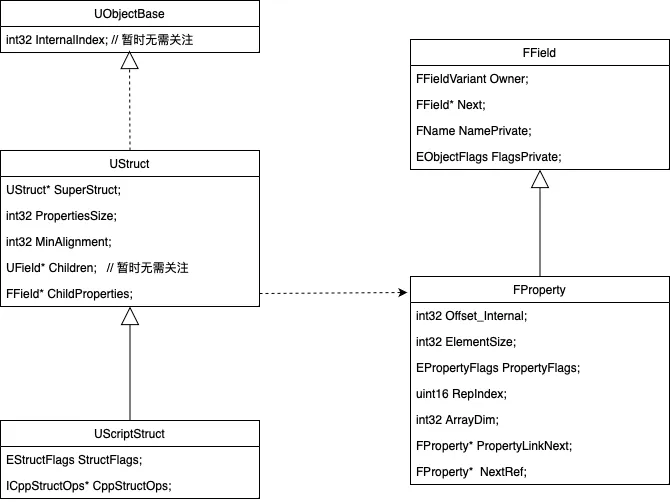

UScriptStruct结构的重要字段解析：

  1. CppStructOps为Struct提供构造接口、序列化接口

  2. ChildProperties维护Struct中首个field的FProperty数据指针

  3. SuperStruct维护父结构的Meta对象指针

FProperty结构的重要字段解析：

  1. ElementSize记录field的内存size

  2. Offset_Internal记录field在所属类型中的地址偏移

  3. Owner记录field的所属类型Meta数据

  4. Next为所属类型维护下一个field的FProperty数据指针

  5. NamePrivate记录field名字

根据UScriptStruct对象中的ChildProperties数据 与 FProperty中的Next数据，便能够拿到Struct中所有fields的FProperty数据。

另外，FProperty提供了接口ContainerPtrToValuePtr，实现功能：传入struct/class对象指针，获取到对应field的内存数据。

```cpp
template<typename ValueType>
FORCEINLINE ValueType* ContainerPtrToValuePtr(void* ContainerPtr, int32 ArrayIndex = 0) const
{
	return (ValueType*)ContainerVoidPtrToValuePtrInternal(ContainerPtr, ArrayIndex);
}
	
FORCEINLINE void* ContainerVoidPtrToValuePtrInternal(void* ContainerPtr, int32 ArrayIndex) const
{
	checkf((ArrayIndex >= 0) && (ArrayIndex < ArrayDim), TEXT("Array index out of bounds: %i from an array of size %i"), ArrayIndex, ArrayDim);
	check(ContainerPtr);

	if (0)
	{
		// in the future, these checks will be tested if the property is NOT relative to a UClass
		check(!GetOwner<UClass>()); // Check we are _not_ calling this on a direct child property of a UClass, you should pass in a UObject* in that case
	}

        // 可以看出，此处就是简单地执行了内存偏移
	return (uint8*)ContainerPtr + Offset_Internal + ElementSize * ArrayIndex;
}
```

通过ContainerPtrToValuePtr接口，便可以方便实现对field的get/set操作。

#### 3.2.2.注册UScriptStruct

回顾3.1的内容：

通过解析piccolo相关代码，可以总结出一个反射系统的实现需要包含如下部分：

Meta定义：Class/Struct的meta数据定义、Field的meta数据定义、Method的meta数据定义

Meta数据的管理：建立Class/Struct与Field/Method Meta数据的关联关系、建立`class_name`与Class Meta数据的关联关系

上文介绍了Struct的Meta定义，现在开始探索Meta数据的管理：

  1. 首先，UScriptStruct已经为内部fields维护了meta数据链表，因此不需要额外建立Struct与Field Meta数据的关联关系

  2. 因此，此节的关注重点在于：建立`struct_name`与UScriptStruct数据的关联关系

**3.2.2.1.全局UObject对象容器**

首先介绍UE的全局容器FUObjectHashTables：

```cpp
class FUObjectHashTables
{
	/** Hash sets */
	TBucketMap<int32> Hash;   // UObject的NameHash值 -> set of UObjectBase* UScriptStruct即继承自UObjectBase
	TMultiMap<int32, uint32> HashOuter;  // UObject的NameHash值+UObject的拥有者指针 -> UObject的UniqueID
 
    ……
}
```

显而易见，将UScriptStruct注册到Hash与HashOuter中，便能够建立`struct_name`与UScriptStruct数据的关联关系。

另外，UE还为所有UObject维护有一个全局容器：FUObjectArray。上面提到了UObject的UniqueID便来自于该容器所提供的元素索引。

```cpp
class COREUOBJECT_API FUObjectArray
{
	typedef FChunkedFixedUObjectArray TUObjectArray;
	
	/** Array of all live objects.											*/
	TUObjectArray ObjObjects;
	
	/** Available object indices.											*/
	TArray<int32> ObjAvailableList;
}
```

FChunkedFixedUObjectArray解析

  * 按块申请连续内存，用于存储FUObjectItem数据

  * 对象池，不提供内存释放功能（因此上层释放FUObjectItem时，会将index存入ObjAvailableList，以供下次复用）

```cpp
struct FUObjectItem
{
	// Pointer to the allocated object
	class UObjectBase* Object;
	// Internal flags
	int32 Flags;
	// UObject Owner Cluster Index
	int32 ClusterRootIndex;	
	// Weak Object Pointer Serial number associated with the object
	int32 SerialNumber;
}

class FChunkedFixedUObjectArray
{
	enum
	{
		NumElementsPerChunk = 64 * 1024,
	};

	/** Primary table to chunks of pointers **/
	FUObjectItem** Objects;
	/** If requested, a contiguous memory where all objects are allocated **/
	FUObjectItem* PreAllocatedObjects;
	/** Maximum number of elements **/
	int32 MaxElements;
	/** Number of elements we currently have **/
	int32 NumElements;
	/** Maximum number of chunks **/
	int32 MaxChunks;
	/** Number of chunks we currently have **/
	int32 NumChunks;
}
```

FChunkedFixedUObjectArray数据结构示意：

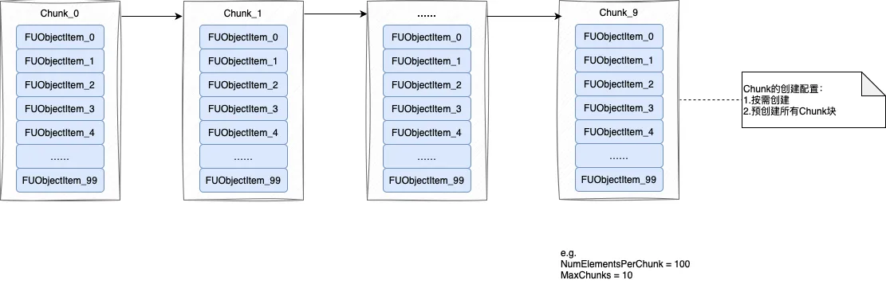

FUObjectArray的作用：

  * 全量管理UObject

  * 为UObject分配internalIndex（即UniqueID），提供接口：通过internalIndex获取到UObject对象

**3.2.2.2.注册机制**

static自动注册机制：UE自动生成的gen.cpp中，通过声明FRegisterCompiledInInfo类型的static变量，实现Meta自动注册。

```cpp
// 声明FRegisterCompiledInInfo类型的static变量
static FRegisterCompiledInInfo Z_CompiledInDeferFile_FID_FortuneGame_Source_FortuneGame_AI_FGReflectionStructTest_h_1075197975(
  TEXT("/Script/FortuneGame"),
  nullptr, 
  0,
  Z_CompiledInDeferFile_FID_FortuneGame_Source_FortuneGame_AI_FGReflectionStructTest_h_Statics::ScriptStructInfo,   
  UE_ARRAY_COUNT(Z_CompiledInDeferFile_FID_FortuneGame_Source_FortuneGame_AI_FGReflectionStructTest_h_Statics::ScriptStructInfo),
  nullptr, 
  0);
	
struct FRegisterCompiledInInfo
{
	template <typename ... Args>
	FRegisterCompiledInInfo(Args&& ... args)
	{
		// 对象构造时执行注册逻辑
		RegisterCompiledInInfo(std::forward<Args>(args)...);
	}
};
```

延迟注册机制：上面代码中RegisterCompiledInInfo只是定义了一个注册任务，真实的Meta数据注册逻辑其实发生在之后的时间片内。（不属于反射重点关注内容，不进行代码展开）

引入延迟注册的目的：多线程加快处理速度。

总结而言，UScriptStruct的生成与注册流程总结如下：

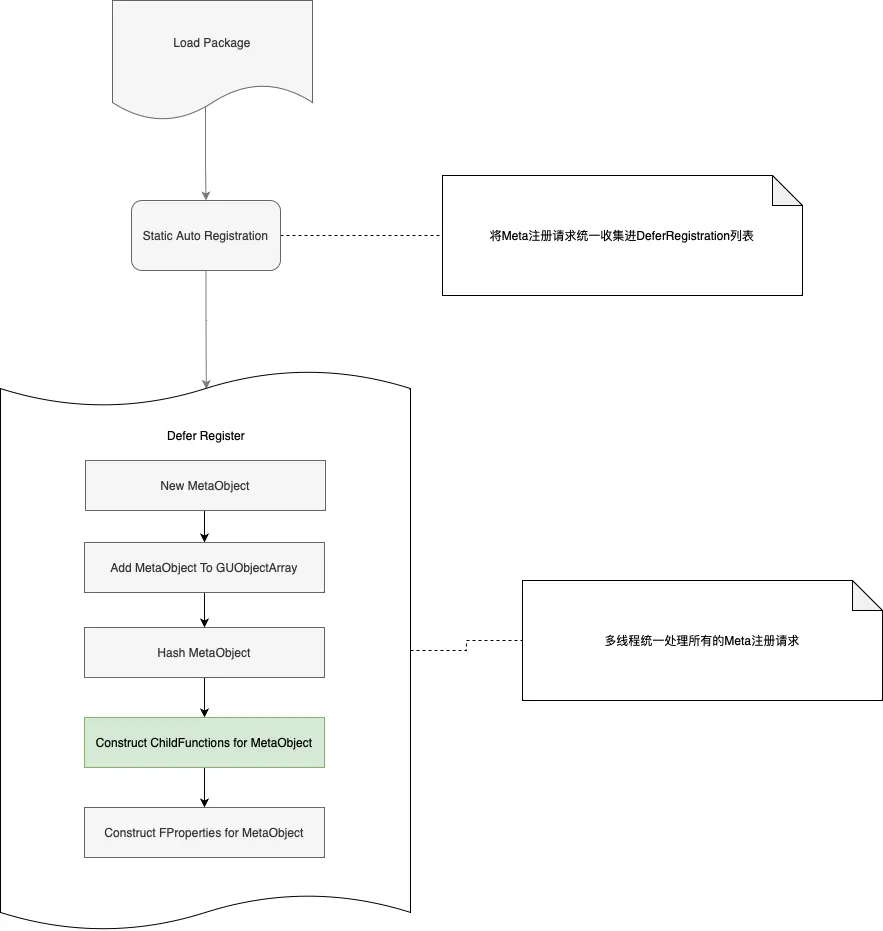

#### 3.2.3.反射应用示例

```cpp
FFGReflectionStructTest StructInstance;

	// 根据名字查找Meta数据
    UScriptStruct* StructObject = FindObject<UScriptStruct>(ANY_PACKAGE, UTF8_TO_TCHAR("FGReflectionStructTest")); // 注意：此处StructName需要去除F前缀
    
	if (StructObject)
    {
        // 根据Meta数据实例化对象
		StructObject->InitializeDefaultValue(reinterpret_cast<uint8*>(&StructInstance));

        // 获取Field信息
		TArray<FProperty*> Fields;
		for (TFieldIterator<FProperty> It(StructObject); It; ++It)
		{
			FProperty* Property = *It;
			FString FieldName = Property->GetName();
			FString FieldType = Property->GetCPPType();
			UE_LOG(LogTemp, Warning, TEXT("Field Name: %s, Field Type: %s"), *FieldName, *FieldType);
		}

        // 根据Field名字 Get/Set Field数据
		FIntProperty *FieldProp = CastField<FIntProperty>(StructObject->FindPropertyByName(TEXT("TestVal")));
		if(FieldProp)
		{
			void* FieldAddr = FieldProp->ContainerPtrToValuePtr<void>(&StructInstance);
			int32 FieldVal = FieldProp->GetPropertyValue(FieldAddr);
			UE_LOG(LogTemp, Warning, TEXT("FieldVal1: %d"), FieldVal);
			FieldProp->SetPropertyValue(FieldAddr, 40);
			UE_LOG(LogTemp, Warning, TEXT("FieldVal2: %d"), StructInstance.TestVal);
		}
    }
```

输出：

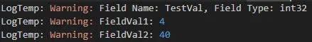

### 3.3.Class反射实现

#### 3.3.1.初探UClass

先创建一个最简单的class示例：

```cpp
UCLASS()
class FORTUNEGAME_API UFGReflectionTest: public UObject
{
  GENERATED_BODY()
public:
  UPROPERTY()
  int32 TestVal;
};
```

展开`GENERATED_BODY`

```cpp
UCLASS()
class FORTUNEGAME_API UFGReflectionTest: public UObject
{
        ……
public: 
// 稍后展开
	DECLARE_CLASS(UFGReflectionTest, UObject, COMPILED_IN_FLAGS(0), CASTCLASS_None, TEXT("/Script/FortuneGame"), NO_API) 
	
	// 序列化相关
	friend FArchive &operator<<( FArchive& Ar, UFGReflectionTest*& Res ) 
	{ 
		return Ar << (UObject*&)Res; 
	} 
	friend void operator<<(FStructuredArchive::FSlot InSlot, UFGReflectionTest*& Res) 
	{ 
		InSlot << (UObject*&)Res; 
	}
	
	// 构造与析构相关，不需要过多关注
	/** Standard constructor, called after all reflected properties have been initialized */ \
	NO_API UFGReflectionTest(const FObjectInitializer& ObjectInitializer = FObjectInitializer::Get()); \
private: \
	/** Private move- and copy-constructors, should never be used */ \
	NO_API UFGReflectionTest(UFGReflectionTest&&); \
	NO_API UFGReflectionTest(const UFGReflectionTest&); \
public: \
	DECLARE_VTABLE_PTR_HELPER_CTOR(NO_API, UFGReflectionTest); \
	DEFINE_VTABLE_PTR_HELPER_CTOR_CALLER(UFGReflectionTest); \
	DEFINE_DEFAULT_OBJECT_INITIALIZER_CONSTRUCTOR_CALL(UFGReflectionTest) \
	NO_API virtual ~UFGReflectionTest();

public:
    UPROPERTY()
    int32 TestVal;
};
```

展开`DECLARE_CLASS`

```cpp
UCLASS()
class FORTUNEGAME_API UFGReflectionTest: public UObject
{
    ……
    
public: 
	// DECLARE_CLASS(UFGReflectionTest, UObject, COMPILED_IN_FLAGS(0), CASTCLASS_None, TEXT("/Script/FortuneGame"), NO_API) 
private: 
    UFGReflectionTest& operator=(UFGReflectionTest&&);        // 禁用赋值操作
    UFGReflectionTest& operator=(const UFGReflectionTest&);   // 禁用赋值操作
	NO_API static UClass* GetPrivateStaticClass(); 			  // 获取Meta数据
public: 
	/** Typedef for the base class ({{ typedef-type }}) */ 
	typedef UObject Super;
	/** Typedef for {{ typedef-type }}. */ 
	typedef UFGReflectionTest ThisClass;
	/** Returns a UClass object representing this class at runtime */ 
	inline static UClass* StaticClass() 
	{ 
		return GetPrivateStaticClass(); 
	} 
	/** Returns the package this class belongs in */ 
	inline static const TCHAR* StaticPackage() 
	{ 
		return TEXT("/Script/FortuneGame"); 
	} 
	/** For internal use only; use StaticConstructObject() to create new objects. */ 
	inline void* operator new(const size_t InSize, EInternal InInternalOnly, UObject* InOuter = (UObject*)GetTransientPackage(), FName InName = NAME_None, EObjectFlags InSetFlags = RF_NoFlags) 
	{ 
		return StaticAllocateObject(StaticClass(), InOuter, InName, InSetFlags); 
	} 
	/** For internal use only; use StaticConstructObject() to create new objects. */ 
	inline void* operator new( const size_t InSize, EInternal* InMem ) 
	{ 
		return (void*)InMem; 
	} 
	/* Eliminate V1062 warning from PVS-Studio while keeping MSVC and Clang happy. */ 
	inline void operator delete(void* InMem) 
	{ 
		::operator delete(InMem); 
	}
	
    ……
public:
    UPROPERTY()
    int32 TestVal;
};
```

可以看出，UE为class定义的Meta数据类型为UClass。

虽然相比struct，class定义中多出很多接口，但在解析UClass反射实现时，这些新增内容可以暂时忽略。

相比struct，class最重要的不同点其实在于：成员函数注册。

**3.3.1.1.FClassParam**

与UStruct类似，UE为构造UClass数据，定义了一套构造参数：FClassParams

```cpp
// UClass需要维护依赖关系
	UObject* (*const Z_Construct_UClass_UFGReflectionTest_Statics::DependentSingletons[])() = {
		(UObject* (*)())Z_Construct_UClass_UObject,
		(UObject* (*)())Z_Construct_UPackage__Script_FortuneGame,
	};
	
	// StaticClass()调用GetPrivateStaticClass()，如果Meta UClass未被创建，则不自动创建
	
	// 相比FStructParams，多了依赖关系，多了functionArray，多了ImplementedInterfaceArray
	struct FClassParams
	{
		UClass*                                   (*ClassNoRegisterFunc)();		// UClass的部分内容构建接口
		const char*                                 ClassConfigNameUTF8;		// name
		const FCppClassTypeInfoStatic*              CppClassInfo;				// 是否为virtual class
		UObject*                           (*const *DependencySingletonFuncArray)();	// 依赖关系
		const FClassFunctionLinkInfo*               FunctionLinkArray;			// 函数列表
		const FPropertyParamsBase* const*           PropertyArray; // 成员列表
		const FImplementedInterfaceParams*          ImplementedInterfaceArray;	// 已实现的接口列表
		int32                                       NumDependencySingletons;
		int32                                       NumFunctions;
		int32                                       NumProperties;
		int32                                       NumImplementedInterfaces;
		uint32                                      ClassFlags; // EClassFlags
#if WITH_METADATA
		const FMetaDataPairParam*                   MetaDataArray;
		int32                                       NumMetaData;
#endif
	};
```

相比FStructParams，FClassParams增加了依赖关系，FunctionLinkArray，ImplementedInterfaceArray。

**3.3.1.2.Meta注册流程**

相比于struct，class进行Meta数据注册时，最明显的变化是新增了ChildFunctions的构造。


#### 3.3.2.构造ChildFunctions

为我们的class示例新增一个简单的UFUNCTION：

```cpp
UCLASS()
class FORTUNEGAME_API UFGReflectionTest: public UObject
{
	GENERATED_BODY()

public:
    UPROPERTY()
    int32 TestVal;

    UFUNCTION()
    int32 TestFunc(int InParam1, int InParam2) {return InParam1 + InParam2;}
};
```

**3.3.2.1.构造static exec函数**

UE生成的代码有了如下部分新增：

```cpp
#define FID_FortuneGame_Source_FortuneGame_AI_FGReflectionTest_h_11_RPC_WRAPPERS \
 \
	DECLARE_FUNCTION(execTestFunc);

// 展开DECLARE_FUNCTION
static void execTestFunc( UObject* Context, FFrame& Stack, RESULT_DECL )

// 对execTestFunc的实现 
void execTestFunc( UObject* Context, FFrame& Stack, RESULT_DECL )
{
		P_GET_PROPERTY(FIntProperty,Z_Param_InParam1);
		P_GET_PROPERTY(FIntProperty,Z_Param_InParam2);
		P_FINISH;
		P_NATIVE_BEGIN;
		*(int32*)Z_Param__Result=P_THIS->TestFunc(Z_Param_InParam1,Z_Param_InParam2);
		P_NATIVE_END;
}

// 展开宏
void execTestFunc( UObject* Context, FFrame& Stack, void*const Z_Param__Result)
{
    int32 Z_Param_InParam1= FIntProperty::GetDefaultPropertyValue();					
	Stack.StepCompiledIn<FIntProperty>(&Z_Param_InParam1);
	int32 Z_Param_InParam2= FIntProperty::GetDefaultPropertyValue();					
	Stack.StepCompiledIn<FIntProperty>(&Z_Param_InParam2);

	*(int32*)Z_Param__Result=P_THIS->TestFunc(Z_Param_InParam1,Z_Param_InParam2);
}
```

很明显，上述代码为TestFunc构造了一个全局static函数，准备传递给function的Meta对象。

**3.3.2.2.构造function的Meta对象**

UE为function定义的Meta数据类型为UFunction

与class/struct类似，UE为构造UFunction数据，定义了一套构造参数：FFunctionParams

```cpp
struct FFunctionParams
{
	UObject*                          (*OuterFunc)();		// 所属class的UClass对象
	UFunction*                        (*SuperFunc)();		// 继承函数的Meta对象
	const char*                         NameUTF8;			// 函数名
	const char*                         OwningClassName;	// 委托相关，暂不关注
	const char*                         DelegateName;		// 委托相关，暂不关注
	SIZE_T                              StructureSize;		// 函数参数结构的size
	const FPropertyParamsBase* const*   PropertyArray;		// 函数参数列表
	int32                               NumProperties;		// 函数参数个数
	EObjectFlags                        ObjectFlags;
	EFunctionFlags                      FunctionFlags;
	uint16                              RPCId;
	uint16                              RPCResponseId;
#if WITH_METADATA
	const FMetaDataPairParam*           MetaDataArray;
	int32                               NumMetaData;
#endif
};
```

UE为上述示例UFGReflectionTest生成的FFunctionParams数据如下：

```cpp
struct Z_Construct_UFunction_UFGReflectionTest_TestFunc_Statics
{
    // 参数数据结构，return值也在该结构中 该结构定义在此的最重要作用，是计算出函数参数所需size
	struct FGReflectionTest_eventTestFunc_Parms
	{
		int32 InParam1;
		int32 InParam2;
		int32 ReturnValue;
	};
	static const UECodeGen_Private::FUnsizedIntPropertyParams NewProp_InParam1;
	static const UECodeGen_Private::FUnsizedIntPropertyParams NewProp_InParam2;
	static const UECodeGen_Private::FIntPropertyParams NewProp_ReturnValue;
	static const UECodeGen_Private::FPropertyParamsBase* const PropPointers[];
#if WITH_METADATA
	static const UECodeGen_Private::FMetaDataPairParam Function_MetaDataParams[];
#endif
	static const UECodeGen_Private::FFunctionParams FuncParams;
};

// 为每一个参数定义的主要内容包括：名字、引用标志、参数在FGReflectionTest_eventTestFunc_Parms结构中的偏移
const UECodeGen_Private::FUnsizedIntPropertyParams Z_Construct_UFunction_UFGReflectionTest_TestFunc_Statics::NewProp_InParam1 = { 
    "InParam1", 
    nullptr, 
    (EPropertyFlags)0x0010000000000080, 
    UECodeGen_Private::EPropertyGenFlags::Int, RF_Public|RF_Transient|RF_MarkAsNative, 
    1, 
    nullptr, 
    nullptr, 
    STRUCT_OFFSET(FGReflectionTest_eventTestFunc_Parms, InParam1), 
    METADATA_PARAMS(nullptr, 0) 
};

const UECodeGen_Private::FUnsizedIntPropertyParams Z_Construct_UFunction_UFGReflectionTest_TestFunc_Statics::NewProp_InParam2 = { 
    "InParam2", 
    nullptr, 
    (EPropertyFlags)0x0010000000000080, 
    UECodeGen_Private::EPropertyGenFlags::Int, RF_Public|RF_Transient|RF_MarkAsNative, 
    1, 
    nullptr, 
    nullptr, 
    STRUCT_OFFSET(FGReflectionTest_eventTestFunc_Parms, InParam2), 
    METADATA_PARAMS(nullptr, 0)
};

const UECodeGen_Private::FIntPropertyParams Z_Construct_UFunction_UFGReflectionTest_TestFunc_Statics::NewProp_ReturnValue = { 
    "ReturnValue", 
    nullptr, 
    (EPropertyFlags)0x0010000000000580, 
    UECodeGen_Private::EPropertyGenFlags::Int, 
    RF_Public|RF_Transient|RF_MarkAsNative, 
    1, 
    nullptr, 
    nullptr, 
    STRUCT_OFFSET(FGReflectionTest_eventTestFunc_Parms, ReturnValue), 
    METADATA_PARAMS(nullptr, 0) 
};

// UFunction会将参数作为属性，将参数维护进入childProperty列表
const UECodeGen_Private::FPropertyParamsBase* const Z_Construct_UFunction_UFGReflectionTest_TestFunc_Statics::PropPointers[] = {
	(const UECodeGen_Private::FPropertyParamsBase*)&Z_Construct_UFunction_UFGReflectionTest_TestFunc_Statics::NewProp_InParam1,
	(const UECodeGen_Private::FPropertyParamsBase*)&Z_Construct_UFunction_UFGReflectionTest_TestFunc_Statics::NewProp_InParam2,
	(const UECodeGen_Private::FPropertyParamsBase*)&Z_Construct_UFunction_UFGReflectionTest_TestFunc_Statics::NewProp_ReturnValue,
};

#if WITH_METADATA
const UECodeGen_Private::FMetaDataPairParam Z_Construct_UFunction_UFGReflectionTest_TestFunc_Statics::Function_MetaDataParams[] = {
	{ "ModuleRelativePath", "AI/FGReflectionTest.h" },
};
#endif

const UECodeGen_Private::FFunctionParams Z_Construct_UFunction_UFGReflectionTest_TestFunc_Statics::FuncParams = { 
    (UObject*(*)())Z_Construct_UClass_UFGReflectionTest, 
    nullptr, 
    "TestFunc", 
    nullptr, 
    nullptr, 
    sizeof(Z_Construct_UFunction_UFGReflectionTest_TestFunc_Statics::FGReflectionTest_eventTestFunc_Parms), 
    Z_Construct_UFunction_UFGReflectionTest_TestFunc_Statics::PropPointers, 
    UE_ARRAY_COUNT(Z_Construct_UFunction_UFGReflectionTest_TestFunc_Statics::PropPointers), 
    RF_Public|RF_Transient|RF_MarkAsNative, (EFunctionFlags)0x00020401, 
    0, 
    0, 
    METADATA_PARAMS(Z_Construct_UFunction_UFGReflectionTest_TestFunc_Statics::Function_MetaDataParams, 
                    UE_ARRAY_COUNT(Z_Construct_UFunction_UFGReflectionTest_TestFunc_Statics::Function_MetaDataParams)) 
};
```

FFunctionParams中的内容，会分散赋值到UFunction与FProperty对象中：

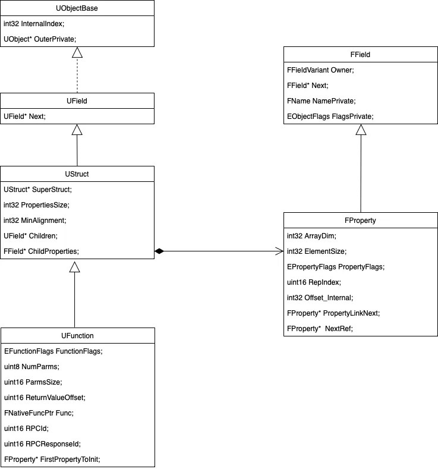

UFunction结构的重要字段解析：

  1. NumParms记录参数个数，包含returnValue

  2. ParmsSize维护参数结构所需的内存size

  3. ReturnValueOffset维护returnValue在参数结构中的偏移

  4. Func维护对应static exec函数的指针

  5. ChildProperties维护第一个参数的FProperty对象指针

FProperty结构的重要字段解析：

  1. ElementSize记录field的内存size

  2. Offset_Internal记录field在所属类型中的地址偏移

  3. Owner记录field的所属类型Meta数据

  4. Next为所属类型维护下一个参数的FProperty数据指针

  5. NamePrivate记录参数名字

根据UFunction对象中的ChildProperties数据 与
FProperty中的Next数据，便能够拿到function中所有参数的FProperty数据。

#### 3.3.3.维护UClass与UFunction的关联关系

重新看回UE为class生成的FClassParams 数据：

```cpp
// class中的UFunction构造列表
const FClassFunctionLinkInfo Z_Construct_UClass_UFGReflectionTest_Statics::FuncInfo[] = {
	{ &Z_Construct_UFunction_UFGReflectionTest_TestFunc, "TestFunc" }, // 1382218509
};

const UECodeGen_Private::FClassParams Z_Construct_UClass_UFGReflectionTest_Statics::ClassParams = {
	&UFGReflectionTest::StaticClass,
	nullptr,
	&StaticCppClassTypeInfo,
	DependentSingletons,
	FuncInfo, // 上面的UFunction构造列表
	Z_Construct_UClass_UFGReflectionTest_Statics::PropPointers,
	nullptr,
	UE_ARRAY_COUNT(DependentSingletons),
	UE_ARRAY_COUNT(FuncInfo), // 上面的UFunction构造列表个数
	UE_ARRAY_COUNT(Z_Construct_UClass_UFGReflectionTest_Statics::PropPointers),
	0,
	0x001000A0u,
	METADATA_PARAMS(Z_Construct_UClass_UFGReflectionTest_Statics::Class_MetaDataParams, UE_ARRAY_COUNT(Z_Construct_UClass_UFGReflectionTest_Statics::Class_MetaDataParams))
};
```

ClassParams 中的FunctionLinkArray被赋值为FuncInfo[] ，然后将生成的UFunction对象绑定到UClass对象上：

```cpp
void UClass::CreateLinkAndAddChildFunctionsToMap(const FClassFunctionLinkInfo* Functions, uint32 NumFunctions)
{
	for (; NumFunctions; --NumFunctions, ++Functions)
	{
		const char* FuncNameUTF8 = Functions->FuncNameUTF8;
		UFunction*  Func         = Functions->CreateFuncPtr();

		Func->Next = Children;
		Children = Func;

		AddFunctionToFunctionMap(Func, FName(UTF8_TO_TCHAR(FuncNameUTF8)));
	}
}
```

FClassParams中的内容，会分散赋值到UClass、UFunction与FProperty对象中：

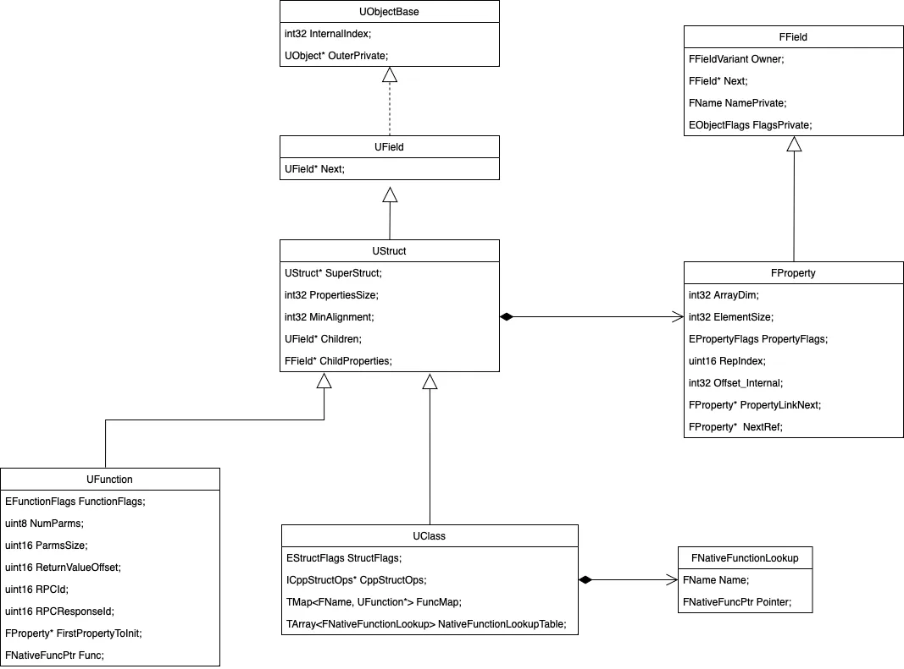

UClass结构的重要字段解析：

  1. FuncMap为class中的所有函数建立name到UFunction*的映射关系

  2. NativeFunctionLookupTable为class中的所有原生函数维护static函数指针列表

  3. ChildProperties维护class中首个field的FProperty数据指针

  4. UField* Children维护首个函数的UFunction数据指针

  5. SuperStruct维护父结构的Meta对象指针

UFunction结构的额外字段解析：

  1. Next为所属类型维护下一个函数的UFunction数据指针

根据UClass对象中的Children数据 与 UFunction中的Next数据，便能够拿到class中所有函数的UFunction数据。

#### 3.3.4.反射应用示例

```cpp
// 通过函数名字调用函数执行
UObject* Object = NewObject<UObject>(GetTransientPackage(), TEXT("UFGReflectionTest")); // 创建一个类实例
UClass* MyClass = FindObject<UClass>(ANY_PACKAGE, UTF8_TO_TCHAR("FGReflectionTest")); 
for (TFieldIterator<UFunction> FunctionIterator(MyClass); FunctionIterator; ++FunctionIterator)
{
    UFunction* Function = *FunctionIterator;
    UE_LOG(LogTemp, Warning, TEXT("Function Name: %s"), *Function->GetName());
}

FName FunctionName = TEXT("TestFunc"); // 要调用的函数名字
UFunction* Function = MyClass->FindFunctionByName(FunctionName);
if (Function)
{
	uint8* AllFunctionParam = static_cast<uint8*>(FMemory_Alloca(Function->ParmsSize));
	FMemory::Memzero(AllFunctionParam, Function->ParmsSize);
	FFrame Frame(nullptr, Function, AllFunctionParam);

	// 设置函数的参数值
	for (TFieldIterator<FProperty> It(Function); It; ++It)
	{
		FProperty* Param = *It;
		if (Param->HasAnyPropertyFlags(CPF_Parm))
		{
			// 根据参数类型设置参数值
			if (Param->GetName() == "InParam1")
			{
				FIntProperty* IntParam = CastField<FIntProperty>(Param);
				int32 ParamValue = 42; // 设置整数参数值
				IntParam->SetPropertyValue_InContainer(Frame.Locals, ParamValue);
			}
			else if (Param->GetName() == "InParam2")
			{
				FIntProperty* IntParam = CastField<FIntProperty>(Param);
				int32 ParamValue = 58; // 设置整数参数值
				IntParam->SetPropertyValue_InContainer(Frame.Locals, ParamValue);
			}
		}
	}

	Object->ProcessEvent(Function, AllFunctionParam);
	UE_LOG(LogTemp, Warning, TEXT("函数返回值为：%d"), *(AllFunctionParam + Function->ReturnValueOffset));
}
```

输出结果：

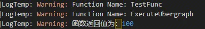

UObject会注册ExecuteUbergraph函数，因此输出函数中会比预想的多出一个。

```cpp
// UObject会默认注册ExecuteUbergraph函数
const FClassFunctionLinkInfo Z_Construct_UClass_UObject_Statics::FuncInfo[] = {
	{ &Z_Construct_UFunction_UObject_ExecuteUbergraph, "ExecuteUbergraph" }, // 3729755051
};
```

#### 3.3.5.引用传参的处理

为我们的class示例新增一个简单的UFUNCTION，里面使用引用传参：

```cpp
UFUNCTION()
int32 TestFuncPlus(int32 &InParam1, int32 &InParam2) {
   InParam1 = InParam2;
   return InParam1;
}
```

UE自动生成的exec函数中，获取参数时换为了`P_GET_PROPERTY_REF`：

```cpp
#define P_GET_PROPERTY_REF(PropertyType, ParamName)												\
	PropertyType::TCppType ParamName##Temp = PropertyType::GetDefaultPropertyValue();			\
	PropertyType::TCppType& ParamName = Stack.StepCompiledInRef<PropertyType, PropertyType::TCppType>(&ParamName##Temp);
	
DEFINE_FUNCTION(UFGReflectionTest::execTestFuncPlus)
{
	P_GET_PROPERTY_REF(FIntProperty,Z_Param_Out_InParam1);
	P_GET_PROPERTY_REF(FIntProperty,Z_Param_Out_InParam2);
	
	*(int32*)Z_Param__Result=P_THIS->TestFuncPlus(Z_Param_Out_InParam1,Z_Param_Out_InParam2);
}
```

代码中Stack.StepCompiledInRef会返回传入参数的数据引用，以此实现反射时对引用传参函数的调用。

### 3.4.Enum反射实现

先创建一个最简单的enum示例：

```cpp
UENUM()
enum class EFGReflectionEnumTest : uint8
{
	Type1,
	Type2,
};
```

生成的代码gen.h

```cpp
// 循环处理宏
#define FOREACH_ENUM_EFGREFLECTIONENUMTEST(op) \
	op(EFGReflectionEnumTest::Type1) \
	op(EFGReflectionEnumTest::Type2) 

enum class EFGReflectionEnumTest : uint8;
template<> struct TIsUEnumClass<EFGReflectionEnumTest> { enum { Value = true }; };
template<> FORTUNEGAME_API UEnum* StaticEnum<EFGReflectionEnumTest>();
```

可以看出，UE为enum定义的Meta数据类型为UEnum。

理所当然，UE为构造UEnum数据，定义了一套构造参数：FEnumParams

```cpp
struct FEnumParams
{
	UObject*                  (*OuterFunc)();		// 获取enum定义所在的UObject
	FText                     (*DisplayNameFunc)(int32);	// 自定义的enum别名输出函数
	const char*                 NameUTF8;			// enum名字
	const char*                 CppTypeUTF8;		// 数据类型名
	const FEnumeratorParam*     EnumeratorParams;	// 枚举值的定义
	int32                       NumEnumerators;		// 枚举值个数
	EObjectFlags                ObjectFlags;
	EEnumFlags                  EnumFlags;
	uint8                       CppForm; // this is of type UEnum::ECppForm
#if WITH_METADATA
	const FMetaDataPairParam*   MetaDataArray;
	int32                       NumMetaData;
#endif
};
```

UE在自动生成的gen.cpp结构中，为EFGReflectionEnumTest 实例化的FEnumParams对象如下：

```cpp
const UECodeGen_Private::FEnumeratorParam Z_Construct_UEnum_FortuneGame_EFGReflectionEnumTest_Statics::Enumerators[] = {
	{ "EFGReflectionEnumTest::Type1", (int64)EFGReflectionEnumTest::Type1 },
	{ "EFGReflectionEnumTest::Type2", (int64)EFGReflectionEnumTest::Type2 },
};
	
const UECodeGen_Private::FEnumParams Z_Construct_UEnum_FortuneGame_EFGReflectionEnumTest_Statics::EnumParams = {
   (UObject*(*)())Z_Construct_UPackage__Script_FortuneGame,
   nullptr,
   "EFGReflectionEnumTest",
   "EFGReflectionEnumTest",
   Z_Construct_UEnum_FortuneGame_EFGReflectionEnumTest_Statics::Enumerators,
   UE_ARRAY_COUNT(Z_Construct_UEnum_FortuneGame_EFGReflectionEnumTest_Statics::Enumerators),
   RF_Public|RF_Transient|RF_MarkAsNative,
   EEnumFlags::None,
   (uint8)UEnum::ECppForm::EnumClass,
   METADATA_PARAMS(Z_Construct_UEnum_FortuneGame_EFGReflectionEnumTest_Statics::Enum_MetaDataParams, UE_ARRAY_COUNT(Z_Construct_UEnum_FortuneGame_EFGReflectionEnumTest_Statics::Enum_MetaDataParams))
};
```

FEnumParams所包含的内容，会被赋值到各个不同的结构中：

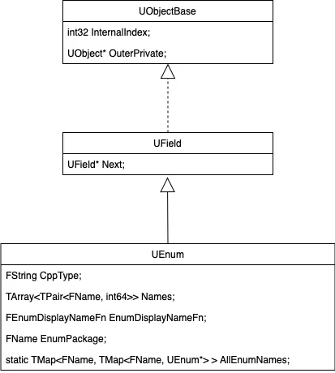

UEnum结构的重要字段解析：

  1. Names维护enum名字与value的映射对

  2. EnumDisplayNameFn维护用户自定义的enum别名输出函数

  3. EnumPackage记录enum定义所在package的名字

  4. AllEnumNames维护全局数据：package内的所有UEnum数据

另外UEnum提供了大量反射相关接口：

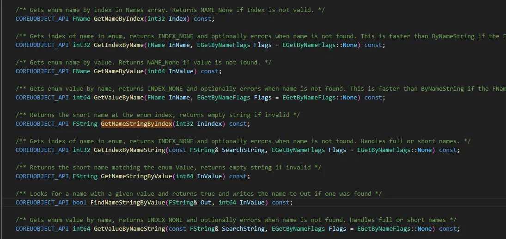

### 3.5.UE反射系统实现概览

根据上述Struct、Class、Enum的反射实现，总结出UE反射系统实现概览图如下：

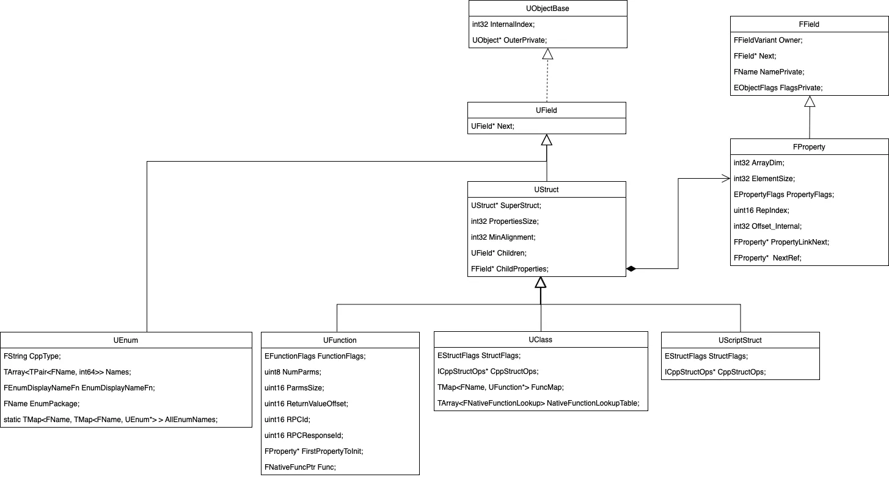

### 3.6.总结

相比于piccolo，UE的反射系统实现复杂得多，不论是结构关系还是功能层次都显得更加晦涩。

但不可否认的是UE为这套反射系统实现了无比完善的功能特性，也为运行性能做了一定的优化实现。

最后，希望这篇文章能对大家理解与使用UE反射系统有所帮助。

## 参考资料

* [GAMES104（现代游戏引擎入门必修课）](https://games104.boomingtech.com/sc/)
* [《InsideUE4》反射实战](https://zhuanlan.zhihu.com/p/61042237)
