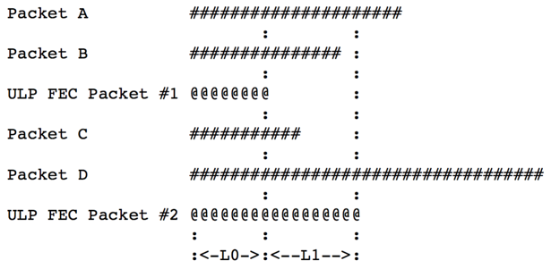
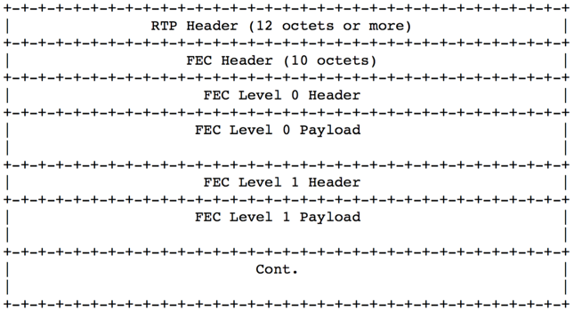
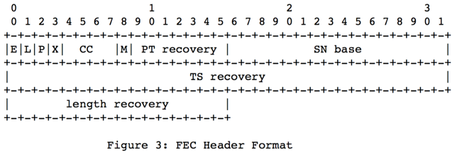
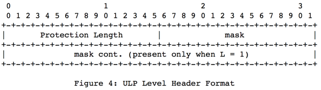
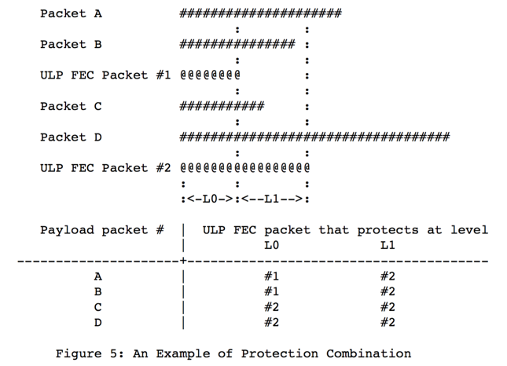
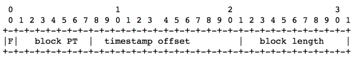
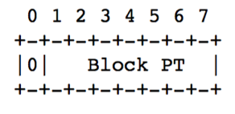
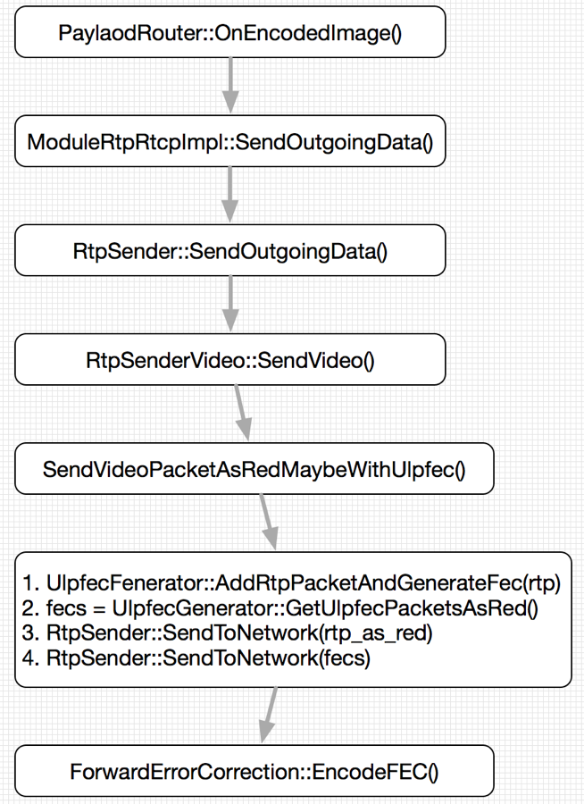
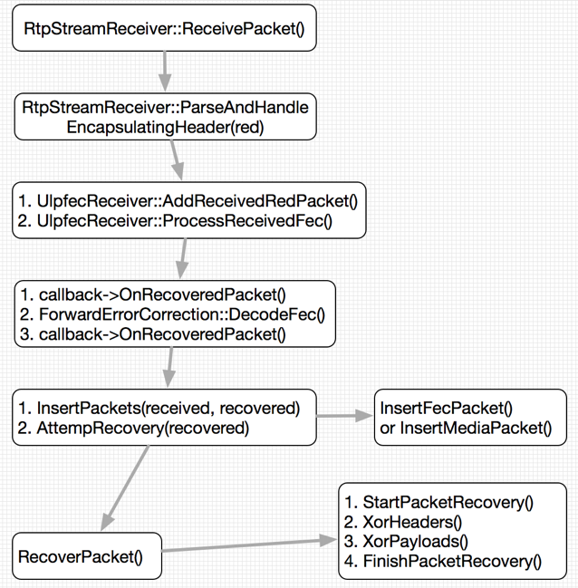

<!--BEGIN_DATA
{
    "create_date": "2020-12-26 21:30", 
    "modify_date": "2020-12-26 21:30", 
    "is_top": "0", 
    "summary": "ULPFEC在WebRTC中的实现", 
    "tags": "WebRTC", 
    "file_name": "ULPFEC在WebRTC中的实现.md"
}
END_DATA-->

#### <p>原文出处：<a href='https://www.jianshu.com/p/06a27ebacec7' target='blank'>ULPFEC在WebRTC中的实现</a></p>

### 1. 前言

在基于IP网络的多媒体通信系统(比如WebRTC)中，网络丢包对多媒体通信质量有非常严重的影响：例如造成视频的马赛克、图像模糊、帧率下降等问题，造成音频的声音失真、噪声干扰、音频中断等问题。这都会严重影响系统的通信质量，造成非常差的用户体验。

WebRTC主要采取两种手段对抗网络丢包：丢包重传(NACK)和前向纠错(FEC)。丢包重传在之前文章中有专门论述[1]，本文集中注意力于FEC。FEC是一种前向纠错技术，发送端将负载数据加上一定的冗余纠错码一起发送，接收端根据接收到的纠错码对数据进行差错检测，如果发现差错，则利用纠错码进行纠错。而ULPFEC(Uneven Level Protection FEC，直译为非均等保护前向纠错)则是WebRTC实现的FEC方案之一，本文深入学习ULPFEC的理论基础和实现细节。

### 2. ULPFEC理论学习

ULPFEC由RFC5109[2]定义，在WebRTC中以RED格式进一步封装在RTP中传输。该标准使用XOR操作基于多个多媒体数据包生成FEC数据包，然后在接收端根据FEC数据包和已接收数据包恢复丢失的数据包。ULPFEC能够针对不同的数据包提供不同的保护级别，从而对重要的数据包提供更多的保护[3]。

#### 2.1 ULPFEC基本概念

ULPFEC数据包中包含发送端需要告知接收端的一些重要信息，包括本FEC数据包所保护的媒体数据、保护级别和每个级别的保护长度。特别地，FEC数据包针对每个保护级别k设置一个偏移量掩码m(k)，如果m(k)的第i位被设置为1，则序列号为N＋i的媒体数据包在本FEC包的第k级别被保护。其中N为基准序列号，在本FEC包中设置。第k级别保护的媒体数据大小由L(k)指示，该值也在FEC包中设置。以上保护长度、偏移量掩码、负载类型和基准序列号能够完全确定生成FEC数据包中的奇偶校验码[2]。

一般来说，FEC是带宽和保护力度的权衡，针对同样的媒体数据，更多的FEC数据包意味着更有力的抗丢包保护，但同时也会消耗更多的带宽。通常情况下，对于媒体数据包，不同部分的重要程度不一样。因此，我们可以针对数据包的不同部分实施不同程度保护（即非均等保护前向纠错），以充分利用带宽资源。更多带宽花费在更重要的数据部分，相反，较少带宽花费在不那么重要的数据部分。媒体数据包根据重要程度划分为若干部分，每个部分就是我们所说的保护级别，每个部分的长度即为保护长度，每个FEC包可携带多个保护级别的奇偶校验码。根据数据包不同部分重要程度进行保护的算法，就是所谓的ULPFEC非均等保护前向纠错。



图1很好说明了ULP的概念：FEC包1在L0级保护数据包A和B，FEC包2在L0级保护数据包C和D，同时在L1级保护数据包A、B、C和D。注意FEC包1和FEC包2的保护数据包集合不一样大，同时保护长度也不一样长。

#### 2.2 ULPFEC报文格式

ULPFEC报文由一个头部和多个保护级别组成，每个保护级别包含级别头部和负载，如图2、3、4所示：



RTP头部只有在FEC报文通过单独数据流发送时才用到，这里的RTP头部格式遵循RFC3550的定义[4]。



FEC头部为10字节，包含内容如下：  
E flag：扩展位，供将来使用，当前设置为0。  
L flag：指示长偏移掩码是否使用，0表示偏移掩码为16位，1表示为48位。  
P/X/CC/M/PT recovery field：由本FEC包所保护的所有媒体数据包的RTP头部的P/X/CC/M/PT flag位经XOR操作后得到。  
SN base：本FEC包所保护的媒体数据包的RTP报文的序列号最小值。  
TS recovery field: 由本FEC包所保护的所有媒体数据包的RTP头部中的Timestamp字段经XOR操作后得到。  
Length recovery field:
由本FEC包所保护的所有媒体数据包的负载长度(包括CSRC、RTP头部扩展、负载和padding的长度之和，以16位无符号网络序表示)经XOR操作后得到。



根据FEC头部中E flag是否设置，FEC级别头部长度为4字节或8字节。Protection length为2字节表示本级别所保护的媒体数据的长度；mask为2字节(如E flag设置则为6字节)表示偏移掩码，指示本级别所保护的媒体数据包的分布情况。

如果偏移掩码的第i位置为1，则表示第N＋i个媒体数据包在本级别中受保护，其中N为FEC头部中的媒体数据基准序列号。

偏移掩码的设置遵循以下规则：

a）媒体数据包在高于0级别的等级中只能被保护一次，但是可以在0级别中被多个FEC包保护，只要这些FEC包在0级别的保护长度相等。  
b）如果媒体数据包在p级别被保护，那么它也必须在p-1级别被保护。注意保护p级别的FEC包和保护p-1级别的FEC包可能不是同一个。  
c）如果FEC包包含p级别保护，那么它也必须包含p-1级别保护。注意p级别保护的数据包可能和p-1级别保护的数据包不是同一个。

规则a）把多重保护限定在0级别，高于0级别的多重保护会减小保护效果并且增大接收端恢复数据的复杂度。规则b）限定媒体数据包受保护的连续性，即不存在中间某段数据不受保护的媒体数据包。规则c）限定FEC数据包保护级别的连续性，即不存在中间某个级别不保护数据的FEC数据包。

下面以图5来简单说明，我们可以看到，FEC包1在0级别保护了数据包A、B，而FEC包2在0级别保护了数据包C、D，同时在1级别保护了数据包A、B、C和D。这都符合上述三条规则。



#### 2.3 ULPFEC报文构造

通过对比RFC3550中RTP头部的定义我们可以发现，FEC头部和RTP头部非常类似：除E/L flag之外，FEC头部前8字节基本上和RTP头部前8字节定义相同，而且其数据也来源于媒体数据包的RTP头部(经XOR运算后得到)。而后两字节length recovery也是对媒体数据RTP负载长度计算得到的。因此，FEC头部就是它所保护的所有RTP报文的头部经XOR计算后得到的。

据此，我们很容易得到FEC头部的构造办法：对于本FEC包保护的所有媒体数据包，针对其RTP头部的前8字节进行XOR运算，最终结果根据格式定义填入到FEC头部中。具体细节在此不展开，详情可参考RFC5109[2]。需要注意的是FEC头部只保护RTP头部的前12字节，对于CSRC和RTPExtentions部分，FEC将其视为RTP负载部分进行保护。

对于保护级别的头部，根据预先确定的本级别保护长度和保护媒体数据集合，分别填入保护长度字段和设置偏移掩码字段。对于保护级别的负载部分，则是由本级别保护的媒体数据包的对应部分进行XOR运算后得到，然后填入负载位置。

#### 2.4 ULPFEC报文发送

ULPFEC报文可采取两种方式发送：1）使用独立的RTP流发送；2）封装在RED报文中随源媒体数据一起发送。WebRTC采用第二种方式。RED(Redundant Coding)是针对RTP负载数据的二次封装，所以叫冗余编码，其定义在RFC2198[5]中。RED有两种数据封装格式：Primary Data Block和Redundant Data Block，分别如图6、图7所示：



F flag：指示本Block后续是否还有其他Block跟随，1表示有，0表示无。  
block PT：本Block 的Payload Type，也即原始RTP负载数据的PT。  
Timestamp offset：本Block相对于原始RTP头部中timestamp的偏移量。  
Block length：本Block的长度。



Primary Data Block表示本Block之后再无Block。

FEC报文在构造之后，会封装为RED格式，然后再进一步封装为RTP报文，最后随其他RTP报文(也已经封装为RED格式)一起发送到网络。在接收端，RTP报文首先根据负载判断为RED报文后，进行解包操作，得到原始RTP/FEC报文，然后继续接下来的流程。

#### 2.5 ULPFEC报文恢复

报文恢复即是报文构造的逆过程，在接收端RTP数据包经过RED解包操作后，得到原始RTP包或者FEC包，前者进一步发送到VCM模块并存储在FEC处理模块，后者则进行丢包检测和数据包恢复工作。FEC包能够在媒体数据包丢失的情况下恢复，丢失的媒体数据包可以部分或全部恢复，这取决于实际的数据包丢失情况。丢失媒体数据包恢复需要两步：

1. 确定恢复丢失媒体数据包所需要的FEC数据包和未丢失媒体数据包的集合，有多种算法可确定这个数据包集合。
2. 重建丢失的媒体数据包，这又包括重建RTP头部和RTP负载。

下面分别描述之。

重建RTP头部。设S是在0级别恢复数据包xi RTP头部所需要的FEC数据包和媒体数据包的集合，则重建xi的RTP头部的过程如下：

1. 对于S中所有的媒体数据包，针对其前10字节执行XOR运算得到媒体比特流M(最后2字节基于数据包长度进行XOR运算)；FEC比特流F则为S中FEC数据包的前10字节。
2. 针对媒体比特流M和FEC比特流F执行XOR运算，得到恢复比特流R。
3. 新建一个标准RTP数据包，其头部长度为12字节。
4. 根据RTP头部和FEC头部的关系，用恢复比特流R填充RTP头部 ，其中RTP头部最后4字节为SSRC已经预先知道，直接填充即可。

重建RTP负载。设S是在n级别恢复数据包xi负载所需要的FEC数据包和媒体数据包的集合，则重建xi的RTP负载的过程如下：

1. 从FEC包中获取n级别的负载数据保护长度Ln。
2. 定义FEC比特流Fn为FEC包在n级别的FEC负载。
3. 根据n级别在FEC包中的位置，可计算得到S中的媒体数据包受本FEC包保护的负载数据段的起始位置，综合所有媒体数据包的负载数据段执行XOR运算，得到媒体比特流Mn。
4. 计算恢复比特流Rn为媒体比特流Fn和FEC比特流Mn的XOR运算结果。
5. 根据当前保护级别n和保护长度Ln，把恢复比特流Rn填充到恢复媒体数据包的相应位置。至此，丢失数据包在当前n保护级别的负载数据得到恢复；

针对每个保护级别都执行上述操作，最终即可恢复整个丢失数据包。

更多ULPFEC报文构造和恢复的例子，可参考RFC5109[2]的第10节。

### 3. ULPFEC在WebRTC中实现

本节在深度分析WebRTC 60 Codebase中ULPFEC的相关代码，总结出其实现算法和细节。下面以Video为例，从FEC报文构建、FEC掩码构造和丢失数据包恢复三个方面分析ULPFEC在WebRTC中的实现。

#### 3.1 ULPFEC报文构建

WebRTC中ULPFEC报文构建的流程如图8所示：



FEC报文构建开始于编码线程编码完一帧数据的后处理，控制流程经PayloadRouter到达RtpSenderVideo::SendVideo()函数。如果当前会话配置了red和ulpfec，则调用SendVideoPacketAsRedMaybeWithUlpfec()，该函数主要做四件事：

1. 把本rtp数据包送入UlpfecGenerator，并尝试构造FEC包；
2. 获取1）构造的FEC包(已经封装为RED包)列表；
3. 把本RTP数据包封装为RED包并发送到网络；
4. 把FEC包列表发送到网络。其中2）构造RED包的过程很简单，按照RFC2198的定义填充字段即可，3）和4）发送RED包到网络也很简单，在此不再过多论述。

接下来重点分析2）的FEC包的构造过程。

步骤2）会触发ForwardErrorCorrection::EncodeFec()函数，该函数流程伪代码如下所示：

```cpp
ForwardErrorCorrection::EncodeFec(media_packets,protection_factor, 
  num_important_packets, use_unequal_protection, fec_mask_type, fec_packets) {
  // step 1, 根据媒体数据包个数和保护因子，确定需要生成的fec数据包个数并初始化。
  int num_fec_packets = NumFecPackets(num_media_packets, protection_factor);
  for (int i = 0; i < num_fec_packets; ++i) {
    memset(generated_fec_packets_[i].data, 0, IP_PACKET_SIZE);
    fec_packets->push_back(&generated_fec_packets_[i]); 
  }
  // step2, 构建fec掩码表，并从中获取构造fec包需要的掩码，存储在packet_mask_中。
  // 这一步是最关键的，packet_masks_决定媒体数据包在FEC包中受保护的分布情况。
  const internal::PacketMaskTable mask_table(fec_mask_type, num_media_packets);
  internal::GeneratePacketMasks(num_media_packets, num_fec_packets,
     num_important_packets, use_unequal_protection,  mask_table, packet_masks_);
  // 步骤3，以packet_masks_和packet_mask_size_，media_packets和num_fec_packets
  // 为输入，生成FEC包集合generated_fec_packets_，包括半成品的头部和成型的负载。
  GenerateFecPayloads(media_packets, num_fec_packets);
  // 步骤4，填充并修正生成生成FEC数据包的头部，这很简单，按照RFC填充即可。 
  FinalizeFecHeaders(num_fec_packets, media_ssrc, seq_num_base);
}
```

FEC构造过程首先会根据输入媒体数据包的个数m和保护因子factor，确定需要生成的FEC包的个数`num_fec = m * factor / 256`，然后初始化这`num_fec`个FEC包。接下来是关键的一步，创建掩码表并获取`num_fec`个FEC包所需要的掩码数据，存储在`packet_masks_`。掩码表是预先定义好的一张三维表格，用以模拟不同情况下媒体数据包在FEC包中的保护分布情况，3.2节会针对该问题进一步分析。

接下来，函数以掩码信息`packet_masks_`，媒体数据包`media_packets`和fec包个数num_fec为输入调用GenerateFecPayloads()函数生成FEC数据包，此时FEC包中的负载部分已经成型，但是FEC头部需要进一步修正，这需要最后一步调用FinalizeFecHeaders()解决。

至此，FEC包的构造过程分析完毕。需要注意的是，WebRTC仅仅使用ULPFEC的Level 0对媒体数据包进行保护，也即FEC包中只有一个FEC Level。另外，在WebRTC内部，保护RTP头部的FEC头部称之为Level 0，而保护RTP负载的FEC Level部分称之为Level 1。这里和FEC5109文档中所定义的稍有不同，需要注意一下。

#### 3.2 ULPFEC掩码表和掩码

根据RFC5109中相关定义可知，一个媒体数据包可以由多个FEC包保护，而一个FEC包也可以多保护多个媒体数据包。假设m个媒体数据包需要n个FEC数据包保护，则可以定义一个二维的m * n零一矩阵来描述媒体数据包在fec包中的保护分布情况：矩阵中元素m[i, j]置1表示第i个媒体数据包需要第j个FEC包保护。

从行角度来看，第i行元素表示第i个FEC包保护的媒体数据包的集合；从列角度讲，第j列元素表示保护第j个媒体数据包的FEC包的集合。由于该矩阵是零一矩阵，因此在存储上可以采用掩码来存储。这个掩码也就是FEC Level Header中所定义的掩码。

那么掩码中的1该如何分布。我们知道，现实世界中网络丢包分为随机丢包和突发丢包两种情况，FEC包需要能够针对这两种情况对媒体数据包进行保护。WebRTC预先构造两个掩码表kPacketMaskRandomTbl和kPacketMaskBurstyTbl，以模拟在随机情况和突发情况下媒体数据包在FEC包中的保护分配情况。假设在随机丢包场景下，对于m * n的情况，我们只需要从kPacketMaskRandomTbl[m][n]就可以获取FEC包所需要的全部掩码，然后该掩码为基础，构造FEC数据包。

根据ULP思想，FEC包可以对媒体数据包集合中的不同数据包实施不同的保护力度。这源于一帧视频数据编码后生成的一系列RTP数据包中，其重要性是不一样的，比如开始几个RTP包的重要性更大一些。因此，WebRTC在构造FEC包的掩码时，有均匀保护和非均匀保护两种策略。

对于均匀保护，所有RTP包的重要性一样，FEC包对他们进行平等的均匀的保护。对于m * n，FEC包使用的掩码即为kPacketMaskRandomTbl[m][n]。对于非均匀保护，RTP包集合被非为重要数据包集合S1和普通数据包集合S2，分配较多个FEC包来保护S1，较少个FEC包保护S2。WebRTC定义了三种模式针对实现非均匀保护：

1. kModeNoOverlay：非叠加保护，保护S1的掩码和S2的掩码相互分离。  
2. kModeOverlay：叠加保护，保护S1的掩码和S2的掩码叠加在一起。  
3. kModeBiasFirstPacket：在均匀保护的基础上，所有FEC包都保护第一个包。

假设保护场景为(m, n)，其中重要数据包为前k个，分配给重要数据包的FEC包个数为t，掩码表为mask_table。则三种场景下最终掩码的确定如下：

1. kModeNoOverlay：mask_table[k][t]和mask_table[m-k][n-t]的移位组合。  
2. kModeOverlay： mask_table[k][t]和mask_table[m][n-t]的拼接。  
3. kModeBiasFirstPacket：mask_table[m][n]，再第一列全部置1。

至此，关于ULPFEC的掩码表和掩码分析完毕。

#### 3.3 ULPFEC报文接收和数据包恢复

ULPFEC报文接收和丢失数据包恢复是ULPFEC报文构造和发送的逆过程，该过程分为三个子过程：

1. 把接收到的RED包进行解包得到RTP包或FEC包。
2. 把RTP／FEC包插入到FEC处理模块的合适列表中。
3. 发起数据包恢复尝试。图9描述这个过程。



RTP数据包首先到达RtpStreamReceiver::ReceivePacket()，判断出该RTP包为RED包后，调用ParseAndHandleEncapsulatingHeader()。该函数主要做了两件事：RED解包和处理包。前者很简单，就是按照RFC2198去掉RED头部，得到纯RTP报文或者FEC报文。后者深入到UlpfecReceiver中进一步处理RTP/FEC报文。

在ProcessReceivedFec()函数中，若接收到的是RTP包，则首先调用callback的OnRecoveredPacket()把RTP包发送到VCM模块，以不耽误解码过程。接下来调用DecodeFec()执行FEC恢复数据包过程。最后，把新恢复的数据包送到VCM模块进行解码。

DecodeFec()函数做两件事情：把数据包插入到合适列表，并发起丢失包恢复过程。FEC包插入到Fec列表，RTP包插入到Media列表。对于FEC包，还要根据其掩码遍历Media列表，把所有本FEC包保护的RTP包挂在自己名下的列表中。对于RTP包，还要根据自己的序列号遍历Fec列表，把本RTP包挂在所有保护自己的FEC包名下的列表中。

接下来是尝试恢复丢失数据包过程AttemptRecovery：对于Fec列表中的每一个FEC包，判断其目前的丢包数：如果未丢包则无需恢复操作，删除本FEC包继续下一个；如果丢包数大于1，则条件还不成熟，跳过本FEC包继续下一个；如果丢包数等于1，则调用RecoveryPacket()恢复一个RTP数据包。然后把该恢复包插入到Media列表中，并根据该RTP包的序列号遍历Fec列表，把该RTP包挂在所有保护自己的FEC包名下的列表中。

最后是真正执行恢复数据包过程的RecoveryPacket()。流程走到这里，所有条件都已经成熟，按照RFC5109的定义按部就班恢复数据包即可：

1. 准备阶段：把本FEC包中的头部数据和payload数据拷贝到recover_packet中作为基准数据。
2. 恢复阶段：针对本FEC包保护的每个已收到RTP包，recover_packet包与之执行XOR操作，结果仍然存储在recover_packet中。全部RTP包执行完XOR操作以后，recover_packet中的负载部分即为待恢复RTP包的负载数据。
3. 收尾阶段：修正recover_packet的RTP头部，得到最终恢复的RTP包。

至此，一个完整的接收端恢复丢失数据包的过程分析完毕。

### 4. 总结

本文首先从理论上学习RFC5109关于ULPFEC的定义，然后深入分析WebRTC源码，学习其ULPFEC的实现细节。通过本次学习，对ULPFEC有深入彻底的理解，为后续学习音视频技术和WebRTC其他模块奠定基础。

### 参考文献

* [WebRTC中丢包重传NACK实现分析](https://www.jianshu.com/p/a7f6ec0c9273)  
* [RTP Payload Format for Generic Forward Error Correction](https://tools.ietf.org/html/rfc5109)  
* [ULPFEC (Uneven Level Protection Forward Error Correction)  ](https://webrtcglossary.com/ulpfec/)  
* [RTP: A Transport Protocol for Real-Time Applications](https://tools.ietf.org/html/rfc3550)
* [RTP Payload for Redundant Audio Data](https://tools.ietf.org/html/rfc2198)
* [前向纠错码(FEC)的RTP荷载格式](http://www.rosoo.net/a/201110/15146.html)

### PS

目前基本看到的FEC编码算法的有parity, Reed-Solomon, Hamming, LDPC, XOR

Current FEC standards lack sufficient flexibility to be usable for many use cases, including RTCWEB:
目前FEC标准中针对很多应用情况，都缺乏足够的伸缩性，包括先前的webRTC版本

> 1. parity, Reed-Solomon, and Hamming codes, 都需要额外的协议支持，也不是RTP格式里涵盖的标注，已经废弃的RFC2733(XOR算法)和RFC3009中定义了一套此协议。
> 2. 最新的RFC5109(XOR算法)定义了ULPFEC，这个是和RTP协议定义实现的。
> 3. RFC6105 RTP Payload Format for 1-D Interleaved Parity。
> 4. RFC 6682 Raptor FEC, 所谓的喷泉编码
> 5. RFC 6865 Reed-Solomon FEC 最新的WebRTC版本中有实现了FLEXFEC

最新的WebRTC版本中有实现了FLEXFEC
RFC5109中定义的ULPFEC以及FLEXFEC

> 有一个OPENFEC开源项目如下编码实现
> * LDPC-Staircase codec
> * Reed-Solomon GF(256) codec
> * 2D parity codec
> * LDPC from file codec
