 
<!--BEGIN_DATA
{
    "create_date": "2024-08-01 13:10", 
    "modify_date": "2024-08-01 13:10", 
    "is_top": "0", 
    "summary": "UTF编码细节全解", 
    "tags": "工具", 
    "file_name": "UTF编码细节全解.md"
}
END_DATA-->

#### <p>原文出处：<a href='https://km.woa.com/articles/show/608458' target='blank'>emoji length 为什么是 2 ? —— UTF 编码细节全解</a></p>

> | 导语 前段时间看了个业务底层库上面有很多魔数，发现一直对 Unicode 的底层细节的认识不够清晰，因此最近集中注意力深入研究并实现 Unicode 最常用的三种编码 UTF-32/16/8 来获得完全同步 —— 本文将从码点介绍 Unicode 字符方案以及 UTF 编码家族相关细节

前段时间看了个业务底层库上面有很多魔数，发现一直对 Unicode 的底层细节的认识不够清晰，因此最近集中注意力深入研究并实现 Unicode
最常用的三种编码 UTF-32/16/8 来获得完全同步 —— 本文将从码点介绍 Unicode 字符方案以及 UTF 编码家族相关细节_长文警告，可能有细节纰漏，欢迎评论区交流_

## 一、Unicode 是什么

Unicode 与众所周知的 ASCII 是同一类的东西，是字符编码的一种方案，可以用来将 `字符实体` 编码到整数空间中，比如 Unicode 里的数字 `0x0041` 对应的是 `'A'` 记作 `U+0041`

截止到 2024，已经有上百亿设备上跑着 Unicode 了，是这个星球上最常见的字符编码方案了，如果哪天发现了外星人需要传点什么东西跟他们做文化交流，完全可以将 Unicode 标准发给他们。

### 1. Unicode 码点 (Code Point)

所谓码点就是我前面提到的那个数字了，Unicode 里的字符实体都有一个唯一的「整数」作为其码点。

在现代浏览器上都支持 Unicode 编码，这意味着你在网页上输入的任意一个字符都对应一个码点:

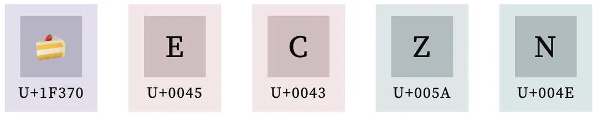

### 2. Unicode 字符编码空间 (uint32)

从 Unicode 规范来看，unicode 码点是一个 4 字节无符号整数，其编码空间相当大，可以达到 uint32 的 2^32，而这么大的容量目前其实只用了一百一十多万而已，而在这 100 多万里面还有很多还没用上，只是先划分出来了。

Unicode 标准组织为了管理上的方便，提出了两种划分这个整数空间的方式，一种是 Unicode 平面划分，一种是 Unicode 区块划分。

### 3. Unicode 平面 (Plane)

将码点的整数空间以 65536 (即 0x0 到 0xFFFF) 的长度来将这个四字节整数分割成不同的区间，在规范里这些区间的学名叫做平面

而这 4 字节整数容量为 2^32 即 4294967296，若以 65536 为区间划分的话刚好也能划分出 65536 个平面，即 0x0000xxxx ~ 0xFFFFxxxx（xxxx 为平面内的偏移）

比如最开头的第一个区间 `U+00000000` 到 `U+0000FFFF` 是第一个平面，叫做 BMP，英文是 Basic Multilingual Plane, 里面包含了最常用的 65536 个字符，而在其中最前面的 128 个码点含义跟 ASCII 编码保持一致，以此来保证能向下兼容 ASCII

再比如，第二个平面是 `U+010000` 到 `U+01FFFF`, 名字是 SMP 平面，英文是 Supplementary Multilingual Plane, 字面意思是多语种辅助平面

目前 Unicode 官方定义了 17 个平面, 即 U+00xxxx 到 U+10xxxx，这个数量其实相对较小（一百多万）因此书写码点的时候通常会将前面的 0 省略掉，比如第一平面 BMP 的范围是: U+0000 到 U+FFFF；又比如蛋糕的 emoji `🍰` 这个字符的码点是 `U+01F370` 因此它位于第二平面 SMP

或许你已经发现了，按 65536 为区间划分的好处了，就是以 16 进制表示的时候，最低 4 位就是平面内的偏移，高位则是平面的序号，比如 U+00xxxx 是第一平面 BMP； U+01xxxx 是第二平面 SMP 以此类推，下面是官方定义的 17 个平面定义，其中 4 号 到 13 号只是分配了但还没用到：

<table><thead><tr><th align="center">平面编号</th><th align="center">码点区间</th><th align="center">英文名</th><th align="center">中文名</th></tr></thead><tbody><tr><td align="center">0 号平面</td><td align="center">U+000000 - U+00FFFF</td><td align="center">BMP: Basic Multilingual Plane</td><td align="center">基本多文种平面</td></tr><tr><td align="center">1 号平面</td><td align="center">U+010000 - U+01FFFF</td><td align="center">SMP: Supplementary Multilingual Plane</td><td align="center">多文种补充平面</td></tr><tr><td align="center">2 号平面</td><td align="center">U+020000 - U+02FFFF</td><td align="center">SIP: Supplementary Ideographic Plane</td><td align="center">表意文字补充平面</td></tr><tr><td align="center">3 号平面</td><td align="center">U+030000 - U+03FFFF</td><td align="center">TIP: Tertiary Ideographic Plane</td><td align="center">表意文字第三平面</td></tr><tr><td align="center">4 号平面 ~ 13 号平面</td><td align="center">U+040000 - U+0DFFFF</td><td align="center">已分配，但尚未使用</td><td align="center">/</td></tr><tr><td align="center">14 号平面</td><td align="center">U+0E0000 - U+0EFFFF</td><td align="center">SSP: Supplementary Special-purpose Plane</td><td align="center">特别用途补充平面</td></tr><tr><td align="center">15 号平面</td><td align="center">U+0F0000 - U+0FFFFF</td><td align="center">PUA-A: Private Use Area-A</td><td align="center">保留作为私人使用区 (A区)</td></tr><tr><td align="center">16 号平面</td><td align="center">U+100000 - U+10FFFF</td><td align="center">PUA-B: Private Use Area-B</td><td align="center">保留作为私人使用区 (B区)</td></tr></tbody></table>

具体平面的完整分配规则可以查看：
[www.unicode.org/road...](https://www.unicode.org/roadmaps/index.html)

### 4. Unicode 区块 (block)

Block 是对 Plane 进一步的划分，比如在 BMP 0x0000~0xFFFF 这个平面中，最开始的 128 位是 ASCII 编码, 从官网给出的 Plane 划分来看，区块就是表格（平面）的这些格子：

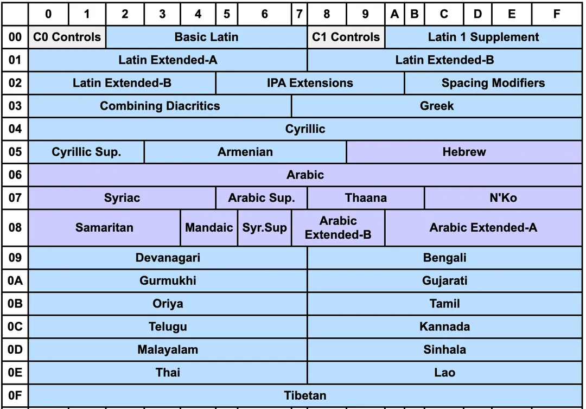

其中最开头的 C0-Controls 加上 Basic Latain 其实就对应了 ASCII 编码，而汉字编码，主要存到 CKJ 区块中等等 —— 总之区块是对平面的再划分，一个平面上可以有很多区块，具体区块可以看 Unicode 官网说明：[www.unicode.org/road...](https://www.unicode.org/roadmaps/bmp/)

#### a) A 区和 B 区？

前面提到的 Unicode 平面里的 15 和 16 号平面是所谓的 A区 和 B区 这两个区间是保留给开发者做私有化定义的，而除了这两个平面外，在第一平面 BMP 内下面这个区块 0xE000 ~ 0xF8FF 也是一样的功能，用来用作 private use 的，共计 6400 个：

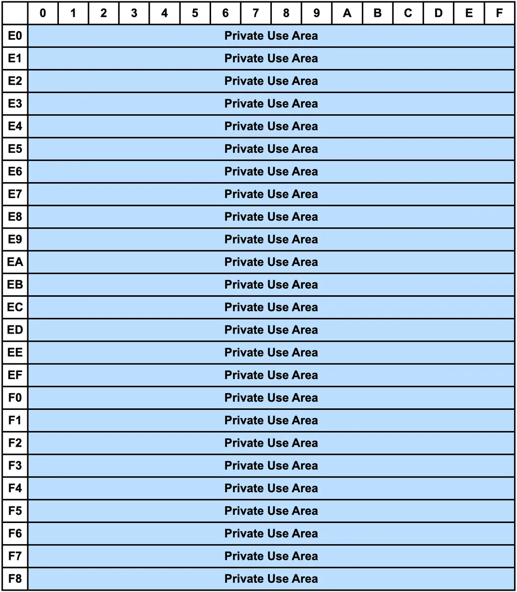

比如苹果系统的一个私有字符「 U+F8FF」就是在上面这个 Block 内的：(F8FF 是上面这个区域的最后一个位置，注意如果你不是苹果系统看不到这个 🍎 字符，苹果系统下 shift+option+k 可以输入这个字符)


### 5. 系统内如何通过码点输入 Unicode ?

mac 下可设置 Unicode 输入法，不过貌似只能输入第一平面的字符。

使用方法：切换到这个输入法后，按住 option 的情况下输入 16 进制码点，松开后就可以输入了，比如 option+2318

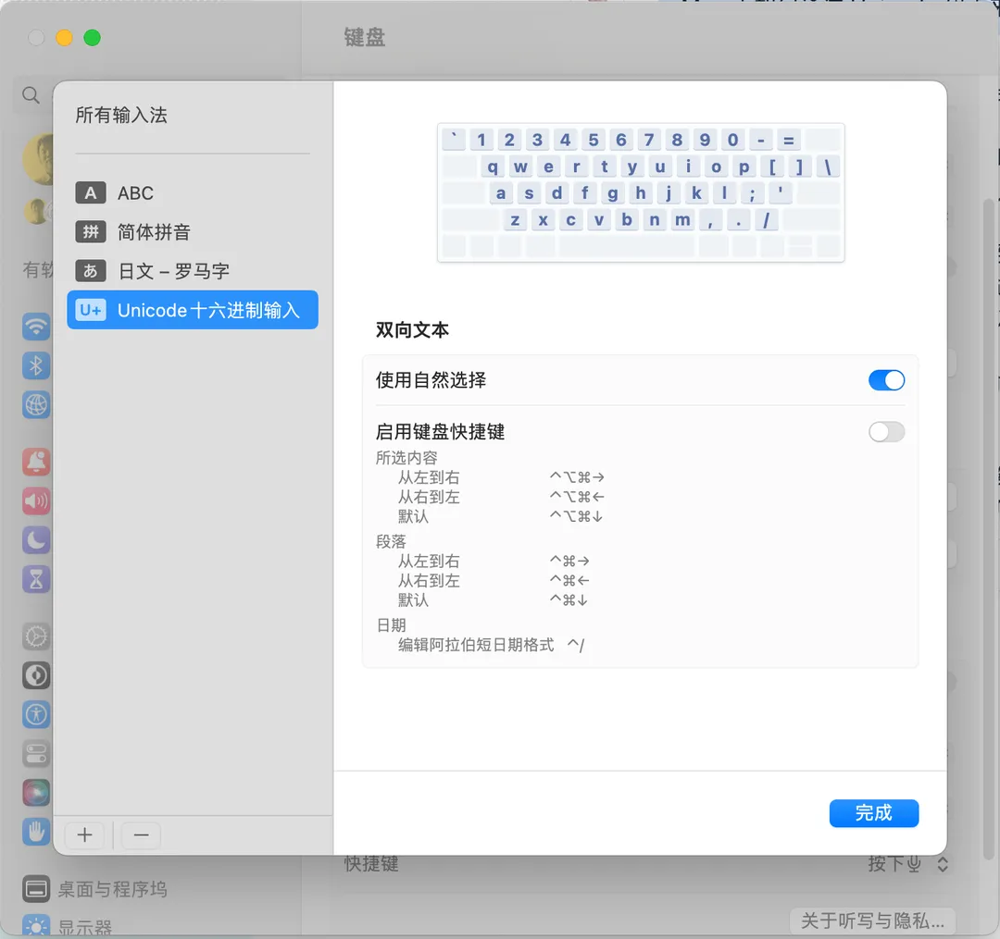

windows 下稍微麻烦一点，具体可以问问 GPT 或者 google 把。

## 二、 UTF 编码

Unicode 规范标准定义了码点和字符实体的映射关系，为了标准化在 `字节流` 中传输/存储这些码点，Unicode 组织提出了 UTF 系列编/解码标准，UTF 全称为 Unicode Transformation Format。

### 1. UTF-32

前面提到过，码点是一个无符号 4 字节整数，因此一个一眼丁真的想法就是直接将码点以 4 字节 uint32 的方式直接编码成字节流 —— 这就是
UTF-32，也是其名字里 32 的得名（32 位 4 字节）

```
　字符    码点      对齐到 4 字节整数
　'H' => U+48   =>  0x00000048
　'e' => U+65   =>  0x00000065
　'l' => U+6C   =>  0x0000006C
　'l' => U+6C   =>  0x0000006C
　'o' => U+6F   =>  0x0000006F
　',' => U+2C   =>  0x0000002C
　' ' => U+20   =>  0x00000020
  '世' => U+4E16 =>  0x00004E16
  '界' => U+754C =>  0x0000754C
```

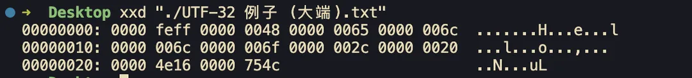

可以这里复制并在新标签页中打开另存为查看效果： （浏览器不支持 a 标签打开 data: 协议 url, 需要读者选中右键新标签页中打开并 ctrl+s 保存到本地查看，浏览器不支持 UTF-32 编码打开是乱码）

```
data:text/plain;charset=UTF-32,%00%00%FE%FF%00%00%00%48%00%00%00%65%00%00%00%6C%00%00%00%6C%00%00%00%6F%00%00%00%2C%00%00%00%20%00%00%4E%16%00%00%75%4C
```

你可能会发现开头的四个字节 `00 00 FE FF` 貌似没有用到，实际这四个字节叫做 UTF BOM (Byte Order Mark) 是用来标记字节序的，此处表明是大端字节序，表示高位字节存储在左边，而如果是 `0xFEFF0000` 则代表是小端存储，此时高 16 位和低 16 位顺序要调转一下，即：

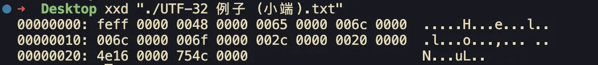

```
data:text/plain;charset=UTF-32,%FE%FF%00%00%00%48%00%00%00%65%00%00%00%6C%00%00%00%6C%00%00%00%6F%00%00%00%2C%00%00%00%20%00%00%4E%16%00%00%75%4C%00%00
```

上述两种字节序都可以下载下来看看，注意 VSCode 目前并不支持 UTF-32 编码, chrome 也不支持因此打开是乱码，只有 ctrl+s 保存到系统里用其他编辑器查看，比如 mac 的话用系统自带的编辑器就行了, vim 也可以

> 看到这里可能很多人会问：FEFF 是随便写的吗？  
—— 涉及到后文的概念，可以先忽略，后文会解答

由于 UTF-32 是一种定长编码，缺点就是比较粗糙造成最终编码体积较大，可以看到前面的例子里编出来的字节流大多数都是 0x00 (gzip 狂喜)

因此它业界并没有被广泛使用，比如 chrome / vscode 这些常用软件都不支持，只有少数软件支持了，比如 VIM / mac 系统自带文本预览等等

而在实际开发场景中用的比较多的是 utf16 和 utf8，现在来看看 utf16 是怎么编码的吧

### 2. UTF-16

考虑到世界上大多数人只使用第一平面，即 0x0000-0xFFFF 共计 65536 个字符 —— 已经足够覆盖大多数场景了，utf16
就是针对这种现象进行编码设计的：

  1. 情况一：第一平面 BMP 内的字符，即 0x000000-0x00FFFF 中的字符直接用 2 字节存储，即直接存储低 16 位即可

  2. 情况二：后续 16 个平面，即 0x010000-0x10FFFF 中的字符使用 4 字节存储

  3. 其他情况：大于 0x10FFFF 的无法使用 UTF-16 进行编码 —— 即 第 18 平面以及之后的平面无法用 UTF-16 进行编码（目前 Unicode 组织只划分了共计 17 个平面，UTF-16 只能编码这 17 个平面内的码点)

那么，当我正在处理一段字节流的时候，比如我读取到 0xABCD，此时要怎么判断读取的这两个字节是对应情况一的两字节还是情况二的四字节的一半呢？ —— 即怎么判断任意两字节 `0x????` 算情况一还是情况二的一半？

这里看似无解，但是 Unicode 标准单独给第一平面挖了一段 Block 来解决这个问题：在第一平面 0x0000 - 0xFFFF 中的 0xD800 - 0xDFFF 这段并没有编码含义，而是保留给 UTF-16 来使用：

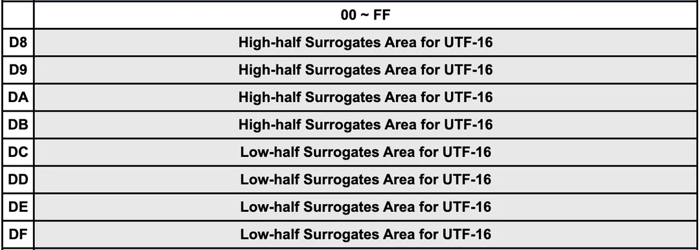

具体来说，在处理情况一两字节两字节地进行读取解析的时候，如果遇到了当前处理的两个字节位于上述区间内的时候，说明此时读取的不是第一平面内的码点，应该按情况二来处理：

  1. 位于 high-half surrogates 中，称为高代理；范围是 0xD800 - 0xDBFF, 换成二进制为 1101100000000000 - 1101101111111111，即以 0b110110 开头的情况为高代理

  2. 位于 low-half surrogates 中，称为低代理；范围是 0xDC00 - 0xDFFF，换成二进制为 1101110000000000 - 1101111111111111，即以 0b110111 开头的情况为低代理

  3. 高低代理中的低 10 位是有效位，一共 20 位将其取出拼接在一起存储为 TMP

  4. UTF-16 标准规定 TMP = 码点 - 0x10000, 即将 TMP 加上 0x10000 即可得到码点 (后面会说为什么要减去 0x10000)

情况二中的 4 个字节分成前后两部分，每个部分各 2 个字节; 其中，前面两个字节的前 6 位二进制固定为 110110 (高代理)，后面两个字节的前 6 位二进制固定为 110111 (低代理), 前后部分各剩余 10 位二进制是码点减去 0x10000 的结果

上面的规则貌似很复杂，这里手把手给一个例子：我将以下面 `🍰 (U+1F370)` 这个 emoji 来说明如何将其码点 0x1F370 编码为 UTF-16 字节流：

```
// ⬇️ 🍰 的 unicode 码点 (0x1F370 的二进制形式)
　  1 11110011 01110000   // ⬅️ 码点不是第一平面，因此应该按情况 2 进行编码，
　- 1 00000000 00000000   // 因此需要先减去 0x10000
　----------------------- // ⬇️ 高代理（两字节） ⬇️ 低代理（两字节）
　    11110011 01110000    1101100000111100  1101111101110000
　    aaaaaabb bbbbbbbb    HHHHHH****aaaaaa  LLLLLLbbbbbbbbbb
　                         将高低代理对写在一起就构成四字节的 utf16
　                         0xD83C 0xDF70
　// ⚠️ 注意:
　// 1. HHHHHH 代表固定的高代理头, 110110 (0xD800 到 0xDBFF)
　//    LLLLLL 代表固定的低代理头, 110111
　// 2. 上述标 a 标 b 的部分其实就对应右边的标 a 标 b 部分,
　//    从低位往左边填充，填完就就填 0 （也就是标星号 * 的那部分）
```

上述例子中标 `*` 的部分实际上就是平面的序号减一，这也说明了为什么要减去 0x10000：避免在高低代理对的 20 位整数空间中重复编码第一平面，而由于最多只能带 20 位，因此大于 0x110000 的码点是不能用 UTF-16 进行编码的。

—— 总之，UTF-16 是通过给第一平面挖洞，空出高低代理区，并在其低 10 位携带有效载荷来进行编码的，也因此情况二最大载荷是 20 位二进制位，限死了只能编码 17 个平面，之后的就不能用 UTF-16 进行编码了，而其中为什么要减去 0x10000 则是因为避免在情况二中重复编码一次情况一

### 3. 实现 UTF-16 编码器

根据前面的讨论来实现 UTF-16 编码器的核心部分: 将给定的一个码点转为对应字节 `number[]` 数组, 比如说:

```
utf16EncodeCodePoint(0x6C38) // 永 (码点为 U+6C38)
// => [0x6C, 0x38]
utf16EncodeCodePoint(0x1F370) // 🍰 (码点为 U+1F370)
// => [0xD8, 0x3C, 0xDF, 0x70]
```

下面贴一个我的实现

```js
/**
  * high-half surrogates 0xD800 0xDBFF
  * low-half surrogates 0xDC00 0xDFFF
  * surrogates 0xD800-0xDFFFF
  * @param codePoint 给定码点
  * @returns 返回二字节或四字节 number[]
  */
export function utf16EncodeCodePoint(codePoint: number): number[] {
  if (codePoint < 0x10000) { // 第一平面 (BMP)
    const byte0 = (codePoint & 0b1111111100000000) >> 8;
    const byte1 = codePoint & 0b0000000011111111;
    return [byte0, byte1];
  }

  if (codePoint > 0x10FFFF) {
    throw new Error('不支持大于 0x10FFFF 的码点')
  }

  // 需要减去 0x10000 避免对第一平面重复编码
  const buf = (codePoint - 0x10000);
  const l10 = (buf & 0b00000000001111111111);
  const h10 = (buf & 0b11111111110000000000) >> 10;
  const h16 = h10 | 0b1101100000000000;
  const l16 = l10 | 0b1101110000000000;

  return [
    (h16 & 0b1111111100000000) >> 8,
    (h16 & 0b0000000011111111),
    (l16 & 0b1111111100000000) >> 8,
    (l16 & 0b0000000011111111),
  ];
}
```

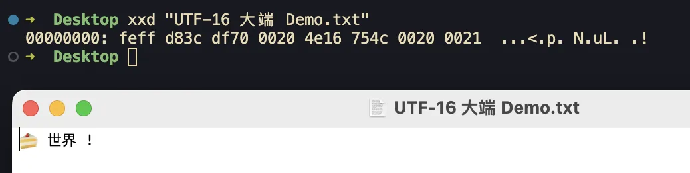

```
data:text/plain;charset=UTF-16,%FE%FF%D8%3C%DF%70%00%20%4E%16%75%4C%00%20%00%21
```

注意，与 UTF-32 类似，UTF-16 也需要指定开头的 BOM，此处开头的 0xFEFF 代表大端存储，此时的编码叫做 `UTF-16 BE` (big-endian) 如果需要小端存储则需要将 BOM 设置为 `0xFFFE` 并把后续高低字节序调转一下 (我的实现都是大端，比较好理解）

比如 `世界` 对应的大端编码 `UTF-16 BE` 为 0xFE, 0xFF 0x4E, 0x16, 0x75, 0x4C 此时其小端编码 `UTF-16 LE` (little-endian) 的结果为:

0xFF, 0xFE, 0x16, 0x4e, 0x4c, 0x75 即:

```
data:text/plain;charset=UTF-16,%FF%FE%16%4E%4C%75
```

### 4. UTF-8

终于来到 UTF-8 了，它是一种变长编码，特点是最小可以一字节使用，在一字节的时候编码规则跟 ASCII 一样，实现了兼容，具体的规则如下

  1. 对于长度为 1 字节的字符，将最高位设置为 0, 其余 7 位设置为 Unicode 码点。值得注意的是, ASCII 字符在 Unicode 字符集中占据了前 128 个码点。也就是说, UTF-8 编码可以向下兼容 ASCII 码, 这意味着我们可以直接使用 UTF-8 来打开年代久远的 ASCII 文本文件。

  2. 对于长度为 n 字节的字符 (n > 1), 将首个字节的高 n 位都设置为 1，第 n+1 位设置为 0；从第二个字节开始，将每个字节的高 2 位都设置为 10；其余所有位用于填充字符的 Unicode 码点。

下面以 `永 (U+6C38)` 字为例：

```
//　     unicode 码点               UTF-8
永    11011000 0111000    11100110 10110000 10111000
　                        ----&*** --****** --******
　                                 10 开头   10 开头   
　      第一个字节开头的 1110 代表总共 3 个字节
　      其后每一个字节的开头都是 10,
　      然后将码点按位填充到标记为 * 的位得到最终结果
　      （有多余的话填 0, 比如上面标记为 & 的就是多余的，需要填 0 对齐字节 8 位）
　      最终转 16 进制后为: 0xE6 0xB0 0xB8 得到结果
```

### 5. 实现 UTF-8 的编解码操作

核心是确定先确定码点对应 UTF-8 字节流总共多少字节来确定第一个字节前缀的 UTF-8 头，然后将码点位填充上去即可，有多的时候填 0，下面给一个我自己的编/解码实现：

```js
/** 将单个码点转为 utf-8 编码 */
export function utf8EncodeCodePoint(codePoint: number): number[] {
  // 0b01111111 及以下的情况跟 ASCII 保持一致，直接返回即可
  if (codePoint <= 0b01111111) {
    return [codePoint]
  }

  // 先将 codePoint 按 0b10 + 6 位的方式隔开成 number[]
  const result: number[] = [];
  for (;;) {
    const _6bit = codePoint & 0b111111;
    const _8bit = 0b10000000 | _6bit;
    result.unshift(_8bit);
    codePoint = codePoint >> 6;
    if (codePoint === 0) break;
  }

  // 处理 `utf 头`
  const header = ((1 << result.length) - 1) << 1;
  const restBits = 8 - 1 - result.length;

  // 判断第一位放不得下 header
  if ((1 << restBits) > (result[0] & 0b111111)) {
    const headerByte = (header << restBits);
    result[0] = (result[0] & 0b111111) | headerByte;
  } else {
    // 放不下则单独开一个字节塞到最前面
    result.unshift(((header + 1) << 1) << (restBits - 1));
  }

  return result;
}
```

下面是解码，即解析 UTF-8 字节流输出码点，是上面的反函数

  
```js
/**
 * 将 arr 当作 utf-8 buffer 进行解码，将其解码位码点数组
 */
export function utf8Decode(arr: ArrayLike<number>) {
  let result: number[] = [];
  let i = 0;
  while (i < arr.length) {
    const firstByte = arr[i];

    // 先扫描 utf 头搞到总长度
    let scanner = 0b10000000;
    let utfLength = 0;
    while (firstByte & scanner) {
      utfLength ++;
      scanner = scanner >> 1;
    }

    // 第一位通过前面的 scanner 就能快速取出其有效的数据位
    let buf = firstByte & (scanner - 1);
    for (let offset = 1; offset < utfLength; offset ++) {
      buf = buf << 6;
      buf = buf | (arr[i + offset] & 0b00111111);
    }

    result.push(buf);
    i = i + utfLength;
  }

  return result;
}
```

写这段代码顿悟的地方：number 类型就是 4 字节 buffer

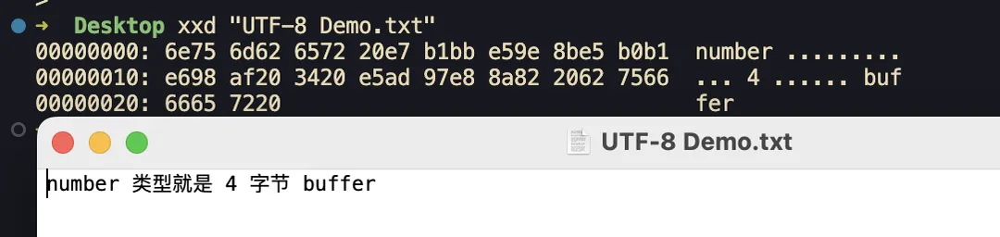

```
data:text/plain;charset=UTF-8,%6E%75%6D%62%65%72%20%E7%B1%BB%E5%9E%8B%E5%B0%B1%E6%98%AF%20%34%20%E5%AD%97%E8%8A%82%20%62%75%66%66%65%72%20
```

## 三、 JavaScript 里的 Unicode

前面看完编码相关，我们现在来看看这些编码在具体 js 里会造成的一些有趣 case

### 1. string 底层是用 UTF-16 进行编码的

JS 里 string 底层是用 UTF-16 编码的，因此可这样验证前面 🍰 U+1F370 的编码结果 0xD83C 和 0xDF70 :

```js
console.log('\uD83C\uDF70');
// 将会输出 '🍰'
```

从这也可以看到，JS 里可以用 `\uXXXX` 的方式来通过 UTF-16 编码流来构造字符串。

### 2. 如何直接用 unicode 码点来构造 string ?

除了直接用 UTF-16 编码流，JS 也可以直接给定码点来构造字符串:

```js
console.log('\u{1F370}');
// U+1F370 是 🍰 的码点, 将会输出 '🍰'
```

### 3. '🍰'.length 为什么是 2 ?

原因：js string 是 UTF-16 编码的，而 🍰 的编码需要走情况 2 来编码，最终结果是 0xD83C 0xDF70，统共 4 字节，而 length 是两字节算一个字符（UTF-16）因此最后 🍰 这类位于第二平面的码点在 js string 里 length 就是 2 了

### 4. split('') 并不能很好的识别 UTF-16 内的字符

.split 并不会识别 UTF-16 高低代理对，因此会出现这个问题：

```js
'🍰 Hello'.split('');
// => ['\uD83C', '\uDF70', ' ', 'H', 'e', 'l', 'l', 'o']
```

可以看到，`🍰` 的高/低代理对被完全拆开了，无法正常显示了，很多场景下不符合预期，此时可以通过下面这两种方式都将 string 按 UTF-16 序进行切割，避免这类问题：

```js
Array.from('🍰 Hello');
// => ['🍰', ' ', 'H', 'e', 'l', 'l', 'o']

[...'🍰 Hello'];
// => ['🍰', ' ', 'H', 'e', 'l', 'l', 'o']
```

当然，也可以手动 for 循环遍历字符串来自己拆（判断码点在不在高低代理区块做下标跳过即可）

### 5. 如何将一段 string 转为码点数组 ?

用前面提到的 Array.from 将字符拆开后再通过 codePointAt 方法取到码点:

```js
Array.from('🍰 🍉').forEach(ch => {
  console.log(`'${ch}'=>U+${ch.codePointAt(0).toString(16)}`);
});
// 将会输出
// '🍰'=>U+1f370
// ' '=>U+20
// '🍉'=>U+1f349
```

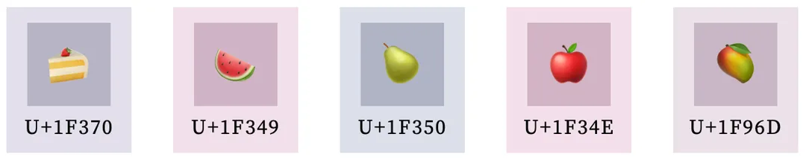

### 6. 利用 html entities 可以通过 Unicode 码点来输入字符

所谓 html entities 就是在 HTML 文件中通过 & 开头来写一些难以输入的字符或者一些转义场景：

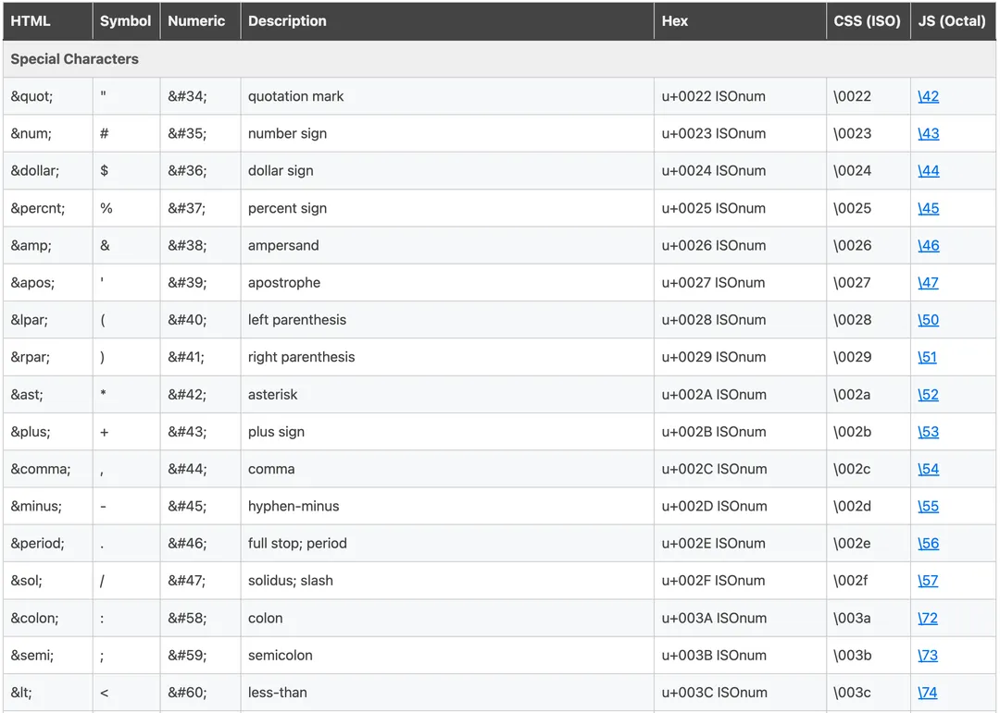

其中 `&#34;` 这样的里面的数字就可以填 Unicode 码点来输入字符（注意需要输入十进制的格式）比如在 km 的 markdown 编辑器就支持这样输入：

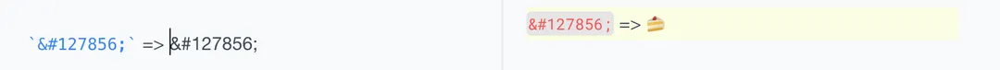

为什么要有 html entities：http content-type 未必是 `text/html; charset=utf-8` 这种情况下要展示汉字之类的字符就不得不这样做了。

## 四、 回头看 Unicode 标准里的五层模型

前面主要讨论了 Unicode 的编码，但是编码部分只是 Unicode 标准的一部分，此处更具体的记录一下 Unicode 的诞生细节：

  1. Unicode 1987 年提出，目的是提供一种统一的字符编码

  2. 标准由 Unicode Consortium（Unicode 组织/联盟）维护，这个联盟的宗旨是让 Unicode 取代其他的编码，成为唯一标准

根据 Unicode 组织的网站上的 Unicode 技术报告 #17 显示，前面我写的那些编码方式只是整个 Unicode 标准一部分而已：[www.unicode.org/repo...](https://www.unicode.org/reports/tr17/tr17-3.html)

根据这份报告，Unicode 标准主要有五个部分构成，或者称为 五层模型:

### 1. ACR: Abstract Character Repertoire (抽象字符表)

> the set of characters to be encoded, e.g., some alphabet or symbol set

就是字符集收录，相当于字典，比如 🍰 就在 ACR 中, 比如我们的汉字也都在 Unicode 字符集中，称为 ACR

### 2. CCS: Coded Character Set (编码字符集)

> a mapping from an abstract character repertoire to a set of non-negative integers

ACR 里每一个字符到码点的映射关系，将这些映射关系放置在 CCS 中，这其实就是 🍰 映射到其码点 U+1F370，定义了所有字符到码点的映射关系

### 3. CEF: Character Encoding Form (字符编码方式)

> a mapping from a set of non-negative integers (from a CCS) to a set of sequences of particular code units of some specified width, such as bytes

定义了码点如何编码为特定的 bit 位宽的「码元」，比如:

  * UTF-32 码元是 32 位，处理的时候 4 字节 4 字节的进行迭代解码

  * UTF-16 码元是 16 位，处理的时候 2 个字节 2 个字节的进行迭代，根据读取的码元区间来判断是走否走高低代理对低 10+10 位作为载荷的编码方式

  * UTF-8 码元是 8 位，读取第一个码元的时候确定需要读多少个码元，读取后统一将载荷拆出来组装/编码

### 4. CES: Character Encoding Scheme (字符编码方案)

> a mapping from a set of sequences of codes units (from one or more CEFs) to a serialized sequence of bytes

这层其实比较薄，就是将码点填充到前面 CEF 所允许那些位里面去，最后输出为 byte 流

  * UTF-32 是直接对齐 4 字节整数

  * UTF-16 靠高低代理对提供的 20 位载荷

  * UTF-8 靠 UTF-8 头指定载荷大小

### 5. TES: Transfer Encoding Syntax (传输编码句法)

> a reversible transform of encoded data. This data may or may not contain textual data

我理解是在传输的过程中检测 UTF 编码的语法机制，比如两个 case：

  * HTML 里指定编码: `<meta charset="utf-8" />`

  * Unicode UTF-32 和 UTF-16 里面出现的 BOM: FEFF0000 来表明大小端的情况也算是

## 五. 现实场景里的 Unicode / UTF

这里写一下我在实现过程中注意到的几个问题，也许日后有机会参与 Unicode 的完全重构的时候再认真考虑一下这几个问题（虽然这个 connecting the dots 绝不可能发生 ....）

### 1. 中文字符码点连续性问题

网上一个关于码点的设计问题：（算是五层模型里 CCS 的问题）

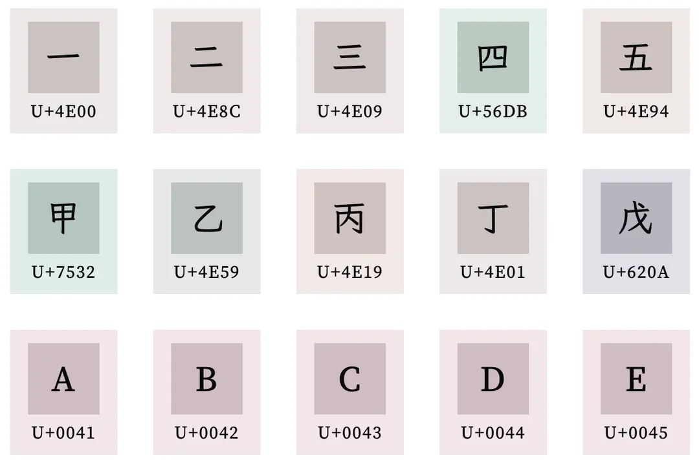

发现了吗？汉字的 `一二三四甲乙丙丁` 在码点上并不是连续的, 而 ABCD 这些就是连续的，不过还好汉语拼音声母 `ㄅBo` `ㄆPo` `ㄇMo` `ㄈFo` `ㄉDe` 或者日语假名 `あa` `いi` `うu` `えe` `おo` 是符合正序排列的

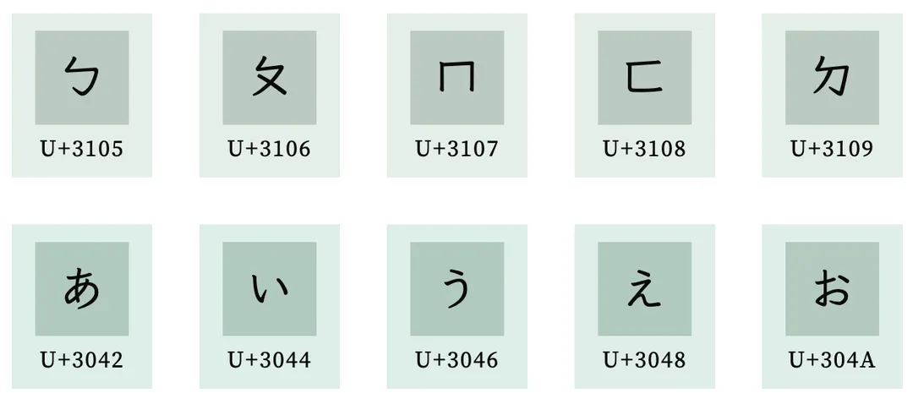

由于码点不是连续的，当你给 markdown 实现一个 list 组件的时候如果需要中文编号的时候写起来就有点蛋疼了，如果是英文 abcd 的话直接加到码点上就可以了，当然这也不是很严重的问题 —— 现在电脑足够快了

### 2. UTF-16 高/低代理打洞的问题

前面的具体讨论中已经清楚，现在的 Unicode BMP 平面定义里单独给 UTF-16 做了高低代理区间的打洞来实现 20 位码点的编码

—— 这个方式实在是太 hack 了，我其实不太喜欢，但是这又是 trade-off 的艺术，UTF-16 其实非常好的兼顾了编码的时间复杂度和空间复杂度

### 3. UTF-24 ？

UTF-16 通过高低代理对的方式编排了 20 位 bits，而这 20 位中高 4 位代表所在的 unicode 平面，低 16 位代表其平面的偏移 —— 总之 20 位足够编排 16 个平面了，如果期望包含全部的 17 个平面，用 21 位就行了，那么在这种情况下为什么没有 UTF-20 或 21 或 UTF-24 的编码方式呢？

—— 这个机制实现起来可能相当复杂，不匹配计算机常用的 char / short / int 这样的字宽场景。

（gzip：多少个 0x00 都无所谓，我会出手）

### 4. 如何在第一个字节区分是 UTF-8 还是 ASCII

由于 UTF-8 是单字节编码，因此它不需要 BOM 来标注字节序，在这种情况下如果是纯英文文档 UTF-8 将跟 ASCII 输出一模一样的结果，而如果其中混入一两个中文：

—— 这种情况下编辑器就不好判断该用哪个编码了, 可能就会出现你在浏览纯英文本的时候碰到一两个乱码这种情况

—— 当然这个问题问的非常愚蠢，因为 Unicode 设计上就是要兼容 ASCII 的，而 UTF-8 又单独针对 ASCII 的字符是直接一字节存储的，换言之 UTF-8 完全能兼容 ASCII 的才对，根本不用区分

—— 更重要的是，现代编辑器谁不支持 UTF-8 ?（此处点草 windows 里的记事本，它默认不是存 UTF 而是看系统语言，中文选的是 gb2312 gbk 或者 win 自己的编码集）

实际 UTF-8 确实可以带一个 BOM，这个 BOM 其实就只是标记了这是一个 UTF-8 文档，比如 VSCode 就支持这种带 BOM 的 utf8 编码:

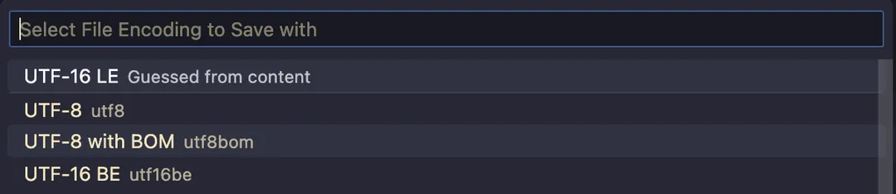

下面我构造了一个带 BOM 的 UTF-8 例子，BOM 头为 0xEF 0xBB 0xBF 可以下载看看：

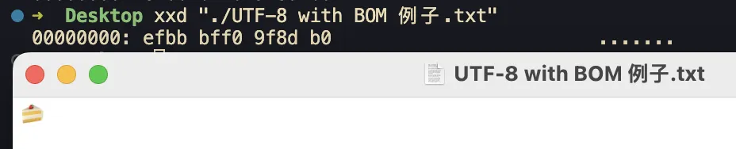

```
data:text/plain;charset=UTF-8,%EF%BB%BF%F0%9F%8D%B0
```

为什么是 0xEF 0xBB 0xBF 呢？ 我们不妨将其当成正常 UTF-8 流进行解析：

```
0xEF => 11101111 (开头 1110 代表一共 3 字节, 低 4 位是有效位: 1111)
0xBB => 10111011 (低 6 位是有效位: 111011)
0xBF => 10111111 (低 6 位是有效位: 111111)
有效载荷拼接后得到 0b1111111011111111
转成十六进制恰好就是 0xFEFF 这恰好也是 UTF32/16 的 BOM
```

换个角度来说，0xEF 0xBB 0xBF 最后会被当成码点 U+FEFF 被编辑器识别，它是真实的字符，只是看不到而已，比如你可以这样构造它:

```
// Node REPL
> str = Buffer.from([0xEF, 0xBB, 0xBF, 0x41]).toString()
// => 显示为 'A'
> console.log(str.length)
// => 2 实际为 '\uFEFFA', 只是显示不出 0xFEFF 了
> console.log(`A`)
// => 1 也就是说「它就在上面那个字符串里」只是没打印出来
```

实际上 0xFEFF 实际它就是一个合法的码点 `U+FEFF`，即所谓的零宽度空格 ZWNBSP:

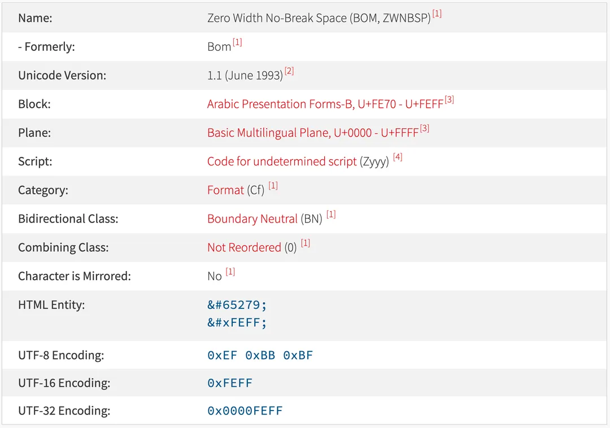

[compart.com/en/unico...](https://compart.com/en/unicode/U+FEFF)

这下懂了吧，在首字节插入 U+FEFF 零宽度空格这种看不到的字符就能区分 ASCII 和 UTF-8 编码啦 —— 这其实也是一种 trade-off 的艺术，单独定义了一个特殊码点用来实现特殊功能

（其实这个码点是从 UCS 编码那边遗留过来的，因为不会有字符选择最后的这几个码点，用来做字节序判断挺合适）

—— 但是这个 BOM 肉眼看不到很多时候会造成一些 f**k case 了，比如你复制文本的时候可能就带上了，但是你肉眼又看不到，读者可以试试复制下吗这两段然后丢到 bash / node-repl / python-repl 啥的地方去跑一下就懂了，简直是 bug 根源：

「复制我看看length」

「复制我看看length」

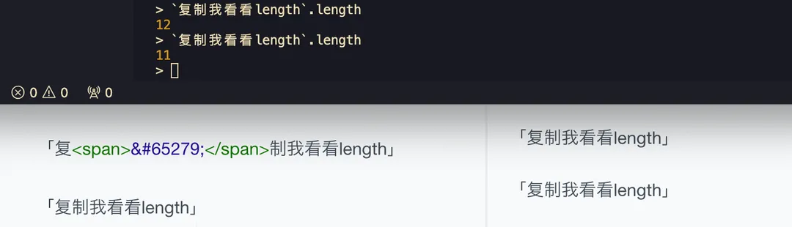

( 65279 就是 FEFF 的十进制格式，可以用 html entities 方式直接写一个 Unicode 字符)

还记得前面 mac unicode 输入法吗？用那个输入法也可以打出零宽度空格 0xfeff 的，即按住 option+FEFF 在松开就可以在输入框内混入这些字符了

总之 <s>整人神器</s> 这应该可以混进密码簿让人怀疑人生了。。。

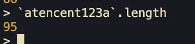

总之很坑， 建议带 BOM 的 utf-8 没事就不要用了，除非你真的在用 windows 的记事本

### 5. 服务端 JSON 里的乱码 string

差不多 4 年前刚来鹅厂在直播业务的时候遇到的一个 case：一个有复杂后端调用链路的接口，不知道从哪里搞来了这段 json nick 是乱码：

```js
// 简化后
"user": {
  age: 11,
  phone: "139********",
  nick: "é£\x9Eç¿\x94ç\x9A\x84ç\x8Cª"
}
```

当时后台查了日志看到这段 nick 应该是 `飞翔的猪` （测试号）是直接透传的，中间没改过 —— 总之锅就是甩到我这了，集中注意力看了下这就是用`其他编码` 打开的效果：

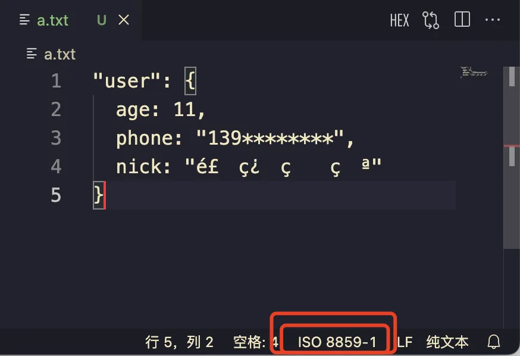 
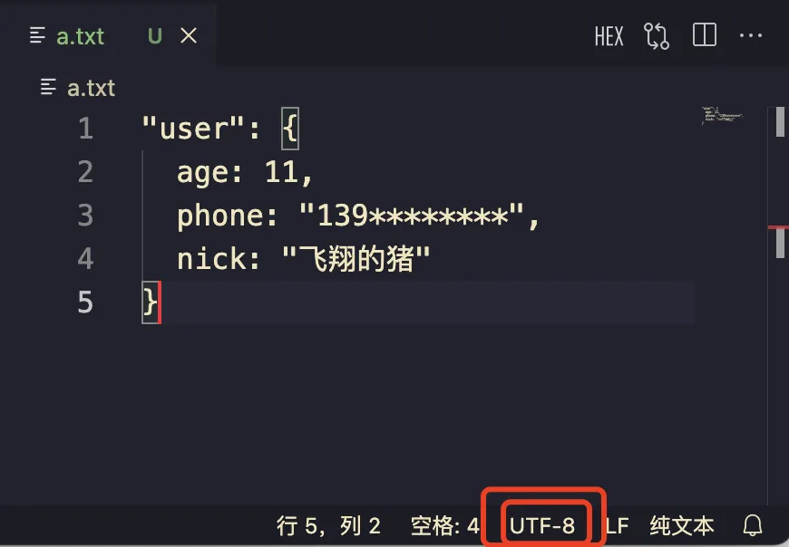

由于目前各种流行编码都能「完全兼容 ASCII」因此在传输的过程中，UTF-8 可能就直接给降级成普通 ASCII 字节流了，这段字节流到后台各种老系统的网关链路里走一走最后到页面 cgi-bin 出来就是这段乱码了 （18 年当时司内各种自研 C++ rpc 框架）

#### a) 如何解决？

这段 nick 不要将其当成 js string，当成 C 里面的 `char[]` 看待就行 —— 即这段 string 是一段线性 bytes buffer 其对应的是 UTF-8 编码字节流:

```js
`é£\x9Eç¿\x94ç\x9A\x84ç\x8Cª`.split('').map(ch => ch.charCodeAt(0))
// => [233, 163, 158, 231, 191, 148, 231, 154, 132, 231, 140, 170]
```

然后通过 decodeComponentURI 即可解码:

```js
`é£\x9Eç¿\x94ç\x9A\x84ç\x8Cª`.split('').map(ch => `%` + ch.charCodeAt(0).toString(16)).join(``)
// => %e9%a3%9e%e7%bf%94%e7%9a%84%e7%8c%aa

decodeURIComponent(`%e9%a3%9e%e7%bf%94%e7%9a%84%e7%8c%aa`)
// => `飞翔的猪`
```

当然，更现代的写法是靠 TextDecoder:

```js
(new TextDecoder()).decode(new Uint8Array([233, 163, 158, 231, 191, 148, 231, 154, 132, 231, 140, 170])
)
// => `飞翔的猪`
```

现在回想起来，这个问题应该是中间某个 cgi 链路转发的时候 Content-Type 没设置 charset 搞错了导致前端最后拿到的是 UTF-8 buffer string 乱码，最好的解决方式应当去改掉这个链路问题，按上述解法等日后链路恢复了就又是 bug 了（虽然是活动页早下线了）

### 6. UTF 字节流传输截断问题

前面提到的 UTF-32/16/8 有时候只传了 1 字节，或者刚好在码元的中间就断开了（tcp reset、机房拔网线、ctrl+c 的时候等等）

此时接收方由于没有收到完整的码元而无法正确解码造成乱码（tcp 是字节流）—— 乱码还是小事，就怕直接把下游整挂了。

#### a) 传输流异常中断的情况

一个挂在 3000 的服务只传了 UTF-8 的第一个字节就断了，结果就是接收方乱码

```js
const http = require('http');

http.createServer((req, res) => {
  res.setHeader('Content-Type', 'text/html; charset=utf-8');
  // 比如只写了一个字节就断了
  res.write(Buffer.from([0xEF]));
  res.end();
}).listen(3000);
```

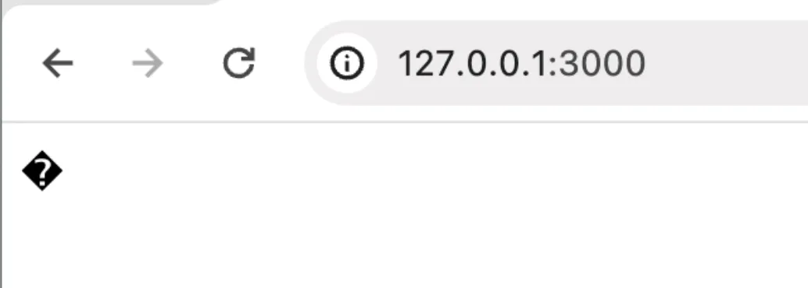

这个 case 虽然比较简单，实际遇到了乱码 bug 如果能想起本文的这个编码流中断 case 那也不错

#### b) stdout buffer 的处理

stdout 也是一段一段的字节流，可能两段输出就断在 UTF-8 的首字节了，具体来说，'永' 这个字可以用 UTF-8 编码为: 0xE6 0xB0 0xB8

当我们监听 stdout 并收集 ondata 输出的时候，有可能不会一步到位，而是在中间截断得到两段 buffer (短文本很难遇到，长文本就经常遇到了)：

```
<Buffer E6>
<Buffer B0 B8>
```

如果此时这样分别给 buffer 处理最后拼接起来就会乱码了：

```
<Buffer E6>.toString() +
<Buffer B0 B8>.toString()
```

我们需要将其 concat 成单个 buffer 后再 toString 这样才没问题。

```js
Buffer.concat([
  <Buffer E6>,
  <Buffer B0 B8>,
]).toString()
```

这个 case 我在一个业务直出场景是遇到过的，当时是调用的是 `buffers.join('')` 来拼接，实际这样就是给每个子元素跑一次 toString 在将其加起来，导致页面偶现首屏一闪乱码（直出水合后就恢复了）

—— 总之，UTF 编码细节在实际开发场景中，尤为重要，稍有不慎那就是 bug 了。

## 六. EOF

好了，这篇长文终于写完了，这里写一下总结：

  * Unicode 编码空间、码点、平面、区块

  * UTF-32: 将码点当成 4 字节 uint32 进行存储

  * UTF-16: 第一平面内的直接用 2 字节存储；后续平面的则通过高低代理对的方式填充 20 位 bits 进行码点的编码，这 20 位里高 4 位是平面编号，低 16 位是在平面内的偏移 —— 也因此要减去 0x10000 来避免对第一平面的重复编码

  * UTF-8: 通过 UTF-8 头的方式控制的变长编码，将编码位提出后提取并拼接有效载荷即可将码点编码进去

  * ASCII: 低 128 位，UTF-8 能完全兼容它

  * JavaScript 里的 UTF-16: 由于编码的原因可能会造成一些有趣的 case

  * Unicode 五层模型: ACR、CCS、CEF、CES、TES

  * Unicode 一些 case 的讨论

当然 Unicode 不只是码点和编码，它上面的字符还自己带有「属性」比如东亚字符宽度 `East_Asian_Width` 这些属性，此外字符编码还跟字体设计密切相关，这个限于篇幅就不在此介绍了

## 参考

* [Unicode 颜文字（emoji）格式和 Go 代码处理](https://cloud.tencent.com/developer/article/1602547)
* [JSON 序列化中的转义和 Unicode 编码](https://cloud.tencent.com/developer/article/1625557)
