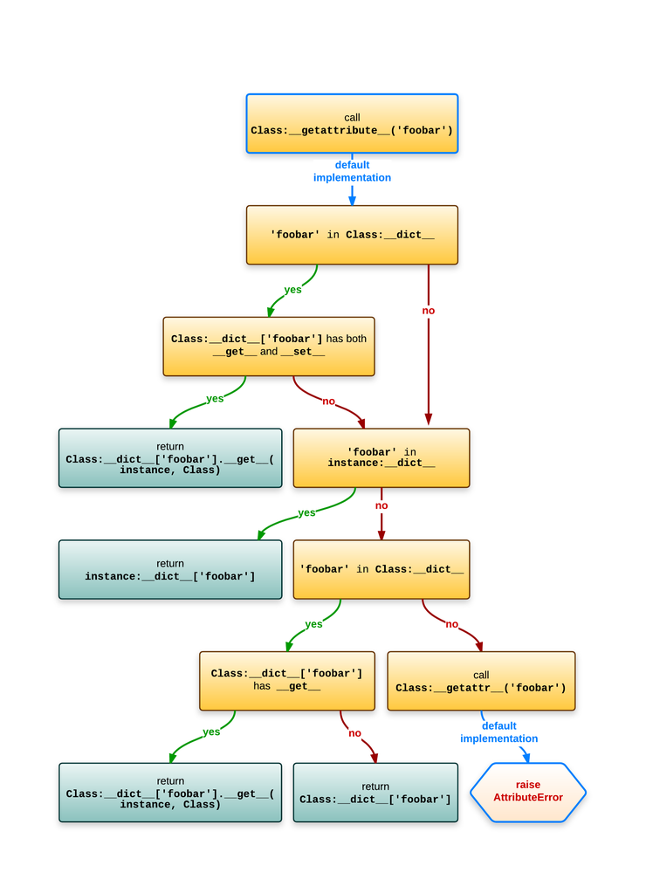
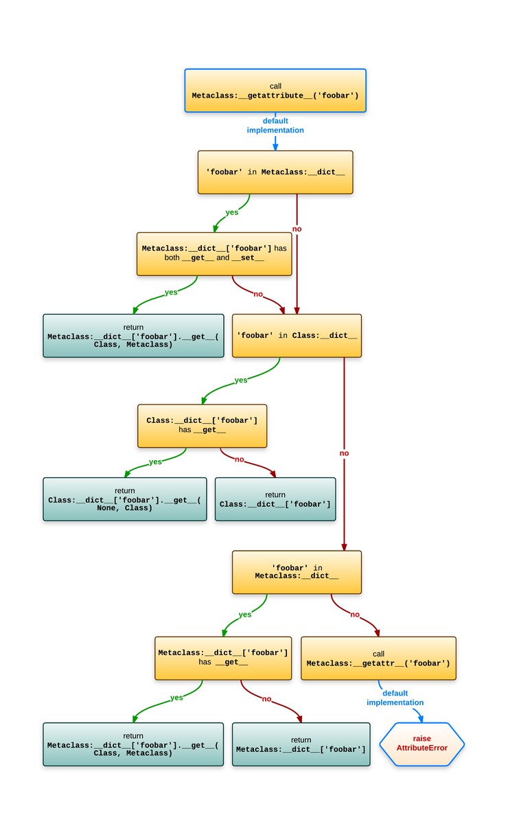
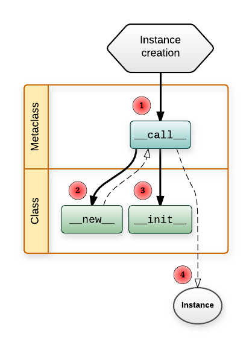
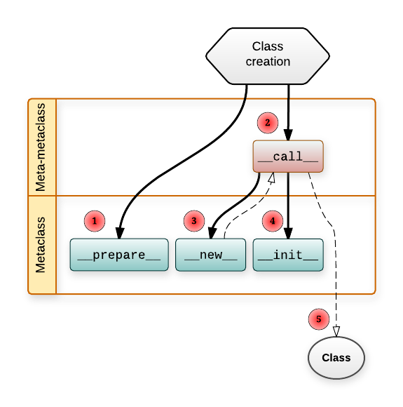

 
<!--BEGIN_DATA
{
    "create_date": "2018-01-03 17:28", 
    "modify_date": "2018-01-03 17:28", 
    "is_top": "0", 
    "summary": "Understanding Python metaclasses", 
    "tags": "Python", 
    "file_name": "Understanding Python metaclasses.md"
}
END_DATA-->

####
原文出处：<a href='https://blog.ionelmc.ro/2015/02/09/understanding-python-metaclasses/' target='blank'>Understanding Python metaclasses</a>

[ionel's codelog](https://blog.ionelmc.ro/)
[🔥](https://blog.ionelmc.ro/presentations/)
[About](https://blog.ionelmc.ro/about/)

##Understanding Python metaclasses

Mon 09 February 2015

None of the existing articles [1] give a comprehensive explanation of how metaclasses work in Python so I'm making my own. Metaclasses are a
controversial topic [2] in Python, many users avoid them and I think this is largely caused by the arbitrary workflow and lookup rules which are not well explained. There are few key concepts that you need to understand to efficiently work with metaclasses.

If you haven't heard of metaclasses at all, they present lots of interesting opportunities for reducing boilerplate and nicer APIs. To make this as brief as possible I'm going to assume the creative types [3] will read this. This means I'm going to skip the whole very subjective “use metaclasses for _this_ but not for _that_” conundrum.

This is written with Python 3 in mind, if there something specific to Python 2 worth mentioning it's going to be in the footnotes [4], in itty-bitty font size :-)

###A quick overview *

A high level explanation is necessary before we get down to the details.

A class is an object, and just like any other object, it's an instance of something: a metaclass. The default metaclass is `type`. Unfortunately, due to backwards compatibility, `type` is a bit confusing: it can also be used as a function that return the class [13] of an object:

    
    
    >>> class Foobar:
    ...     pass
    ...
    >>> type(Foobar)
    <class 'type'>
    >>> foo = Foobar()
    >>> type(foo)
    <class '__main__.Foobar'>
    

If you're familiar with the
[isinstance](https://docs.python.org/3/library/functions.html#isinstance)
builtin then you'll know this:

    
    
    >>> isinstance(foo, Foobar)
    True
    >>> isinstance(Foobar, type)
    True
    

To put this in picture:

But lets go back to making classes ...

####Simple metaclass use *

We can use `type` directly to make a class, without any `class` statement:

    
    
    >>> MyClass = type('MyClass', (), {})
    >>> MyClass
    <class '__main__.MyClass'>
    

The `class` statement isn't just syntactic sugar, it does some extra things, like setting an adequate `__qualname__` and `__doc__` properties or calling `__prepare__`.

We can make a custom metaclass:

    
    
    >>> class Meta(type):
    ...     pass
    

And then we can use it [15]:

    
    
    >>> class Complex(metaclass=Meta):
    ...     pass
    >>> type(Complex)
    <class '__main__.Meta'>
    

Now we got a rough idea of what we'll be dealing with ...

###Magic methods *

One distinctive feature of Python is magic methods: they allow the programmer to override behavior for various operators and behavior of objects. To override the call operator you'd do this:

    
    
    >>> class Funky:
    ...     def __call__(self):
    ...         print("Look at me, I work like a function!")
    >>> f = Funky()
    >>> f()
    Look at me, I work like a function!
    

Metaclasses rely on several magic methods so it's quite useful to know a bit more about them.

####The slots *

When you define a magic method in your class the function will end up as a pointer in a [struct that describes the class](https://docs.python.org/3/c-api/typeobj.html), in addition to the entry
in `__dict__`. That struct [7] has a field for each magic method. For some reason these fields are called _type slots_.

Now there's another feature, implemented via the `__slots__` attribute [17]. A class with `__slots__` will create instances that don't have a `__dict__` (they use a little bit less memory). A side-effect of this is that instances cannot have other fields than what was specified in `__slots__`: if you try to set an unexpected field you'll get an exception.

For the scope of this article when _slots_ are mentioned it will mean the _type slots_, not `__slots__`.

####Object attribute lookup *

Now this is something that's easy to get wrong because of the many slight differences to old-style objects in Python 2. [5]

Assuming `Class` is the class and `instance` is an instance of `Class`,
evaluating `instance.foobar` roughly equates to this:

  * Call the _type slot_ for `Class.__getattribute__` (`tp_getattro`). The default does this: [10]
    * Does `Class.__dict__` have a `foobar` item that is a data descriptor [8]?
      * If yes, return the result of `Class.__dict__['foobar'].__get__(instance, Class)`. [6]
    * Does `instance.__dict__` have a `foobar` item in it?
      * If yes, return `instance.__dict__['foobar']`.
    * Does `Class.__dict__` have a `foobar` item that _is not_ a data descriptor [9]?
      * If yes, return the result of `Class.__dict__['foobar'].__get__(instance, klass)`. [6]
    * Does `Class.__dict__` have a `foobar` item?
      * If yes, return the result of `Class.__dict__['foobar']`.
  * If the attribute still wasn't found, and there's a `Class.__getattr__`, call `Class.__getattr__('foobar')`.

Still not clear? Perhaps a diagram normal attribute lookup helps:

> To avoid creating confusions with the “`.`” operator doing crazy things I've used “`:`” in this diagram to signify the location.

####Class attribute lookup *

Because classes needs to be able support the classmethod and staticmethod properties [6] when you evaluate something like `Class.foobar` the lookup is slightly different than what would happen when you evaluate `instance.foobar`.

Assuming `Class` is an instance of `Metaclass`, evaluating `Class.foobar` roughly equates to this:

  * Call the _type slot_ for `Metaclass.__getattribute__` (`tp_getattro`). The default does this: [11]
    * Does `Metaclass.__dict__` have a `foobar` item that is a data descriptor [8]?
      * If yes, return the result of `Metaclass.__dict__['foobar'].__get__(Class, Metaclass)`. [6]
    * Does `Class.__dict__` have a `foobar` item that is a descriptor (_of any kind_)?
      * If yes, return the result of `Class.__dict__['foobar'].__get__(None, Class)`. [6]
    * Does `Class.__dict__` have a `foobar` item in it?
      * If yes, return `Class.__dict__['foobar']`.
    * Does `Metaclass.__dict__` have a `foobar` item that _is not_ a data descriptor [9]?
      * If yes, return the result of `Metaclass.__dict__['foobar'].__get__(Class, Metaclass)`. [6]
    * Does `Metaclass.__dict__` have any `foobar` item?
      * If yes, return `Metaclass.__dict__['foobar']`.
  * If the attribute still wasn't found, and there's a `Metaclass.__getattr__`, call `Metaclass.__getattr__('foobar')`.

The whole shebang would look like this in a diagram:

> To avoid creating confusions with the “`.`” operator doing crazy things I've used “`:`” in this diagram to signify the location.

####Magic method lookup *

For magic methods the lookup is done on the class, directly in the big struct with the slots: [12]

  * Does the object's class have a slot for that magic method (roughly `object->ob_type->tp_<magicmethod>` in C code)? If yes, use it. If it's `NULL` then the operation is not supported.

> In C internals parlance:

>

>   * `object->ob_type` is the class of the object.

>   * `ob_type->tp_<magicmethod>` is the _type slot_.

This looks much simpler, however, the _type slots_ are filled with wrappers around your functions, so descriptors work as expected: [12]

    
    
    >>> class Magic:
    ...     @property
    ...     def __repr__(self):
    ...         def inner():
    ...             return "It works!"
    ...         return inner
    ...
    >>> repr(Magic())
    'It works!'
    

Thats it. Does that mean there are places that don't follow those rules and lookup the slot differently? Sadly yes, read on ...

####The `__new__` method *

One of the most common point of confusion with both classes and metaclasses is the `__new__` method. It has some very special conventions.

The `__new__` method is the _constructor_ (it returns the new instance) while `__init__` is just a initializer (the instance is _already created_ when `__init__` is called).

Suppose have a class like this: [20]

    
    
    class Foobar:
        def __new__(cls):
            return super().__new__(cls)
    

Now if you recall the previous section, you'd expect that `__new__` would be looked up on the metaclass, but alas, it wouldn't be so useful that way [19] so it's looked up _statically_.

When the `Foobar` class wants this magic method it will be looked up on the same object (the class), not on a upper level like all the other magic methods. This is very important to understand, because both the class and the metaclass can define this method:

  * `Foobar.__new__` is used to create instances of `Foobar`
  * `type.__new__` is used to create the `Foobar` class (an instance of `type` in the example)

####The `__prepare__` method *

This method is called before the `class` body is executed and it must return a dictionary-like object that's used as the local namespace for all the code from the `class` body. It was added in Python 3.0, see
[PEP-3115](https://www.python.org/dev/peps/pep-3115/).

If your `__prepare__` returns an object `x` then this:

    
    
    class Class(metaclass=Meta):
        a = 1
        b = 2
        c = 3
    

Will make the following changes to `x`:

    
    
    x['a'] = 1
    x['b'] = 2
    x['c'] = 3
    

This `x` object needs to look like a dictionary. Note that this `x` object will end up as an argument to `Metaclass.__new__` and if it's not an instance of `dict` you need to convert it before calling `super().__new__`. [21]

Interestingly enough this method doesn't have `__new__`'s special lookup. It appears it doesn't have it's own _type slot_ and it's looked up via the class attribute lookup, if you read back a bit. [6]

###Putting it all together *

To start things off, a diagram of how instances are constructed:

How to read this swim lane diagram:

  * The horizontal lanes is the place where you define the functions.
  * Solid lines mean a function call.
    * A line from `Metaclass.__call__` to `Class.__new__` means `Metaclass.__call__` will call `Class.__new__`.
  * Dashed lines means something is returned.
    * `Class.__new__` returns the instance of `Class`.
    * `Metaclass.__call__` returns whatever `Class.__new__` returned (and if it returned an instance of `Class` it will also call `Class.__init__` on it). [16]
  * The number in the red circle signifies the call order.

Creating a class is quite similar:

Few more notes:

  * `Metaclass.__prepare__` just returns the namespace object (a dictionary-like object as explained before).
  * `Metaclass.__new__` returns the `Class` object.
  * `MetaMetaclass.__call__` returns whatever `Metaclass.__new__` returned (and if it returned an instance of `Metaclass` it will also call `Metaclass.__init__` on it). [16]

So you see, metaclasses allow you to customize almost every part of an object life-cycle.

####Metaclasses are callables *

If you look again at the diagrams, you'll notice that making an instance goes through `Metaclass.__call__`. This means you can use any callable as the metaclass:

    
    
    >>> class Foo(metaclass=print):  ##pointless, but illustrative
    ...     pass
    ...
    Foo () {'__module__': '__main__', '__qualname__': 'Foo'}
    >>> print(Foo)
    None
    

If you use a _function_ as the metaclass then subclasses won't inherit your _function_ metaclass, but the type of whatever that _function_ returned.

####Subclasses inherit the metaclass *

One advantage compared to class decorators is the fact that subclasses inherit the metaclass.

This is a consequence of the fact that `Metaclass(...)` returns an object which usually has `Metaclass` as the `__class__`.

####Restrictions with multiple metaclasses *

In the same tone of classes allowing you to have multiple baseclasses, each one of those baseclasses may have a different metaclass. But with a twist: everything has to be linear - the inheritance _tree_ must have a single _leaf_.

For example, this is not accepted because there would be two _leafs_ (`Meta1` and `Meta2`):

    
    
    >>> class Meta1(type):
    ...     pass
    ...
    >>> class Meta2(type):
    ...     pass
    ...
    >>> class Base1(metaclass=Meta1):
    ...     pass
    ...
    >>> class Base2(metaclass=Meta2):
    ...     pass
    ...
    >>> class Foobar(Base1, Base2):
    ...     pass
    ...
    Traceback (most recent call last):
      File "<stdin>", line 1, in <module>
    TypeError: metaclass conflict: the metaclass of a derived class must be a (non-strict) subclass of the metaclasses of all its bases
    

This will work (and will use the _leaf_ as the metaclass):

    
    
    >>> class Meta(type):
    ...     pass
    ...
    >>> class SubMeta(Meta):
    ...     pass
    ...
    >>> class Base1(metaclass=Meta):
    ...     pass
    ...
    >>> class Base2(metaclass=SubMeta):
    ...     pass
    ...
    >>> class Foobar(Base1, Base2):
    ...     pass
    ...
    >>> type(Foobar)
    <class '__main__.SubMeta'>
    

####The method signatures *

There are still few important details missing, like the method signatures.
Lets look at class and metaclass with all the important stuff implemented.

Note the extra `**kwargs` \- those are the extra _keywords arguments_ you can pass in the `class` statement. [22]

    
    
    >>> class Meta(type):
    ...     @classmethod
    ...     def __prepare__(mcs, name, bases, **kwargs):
    ...         print('  Meta.__prepare__(mcs=%s, name=%r, bases=%s, **%s)' % (
    ...             mcs, name, bases, kwargs
    ...         ))
    ...         return {}
    

As mentioned before, `__prepare__` can return objects that are not `dict` instances, so you need to make sure your `__new__` handles that. [21]

    
    
    ...     def __new__(mcs, name, bases, attrs, **kwargs):
    ...         print('  Meta.__new__(mcs=%s, name=%r, bases=%s, attrs=[%s], **%s)' % (
    ...             mcs, name, bases, ', '.join(attrs), kwargs
    ...         ))
    ...         return super().__new__(mcs, name, bases, attrs)
    

It's uncommon to see `__init__` being implemented in a metaclass because it's not that powerful - the class is already constructed when `__init__` is called. It roughly equates to having a _class decorator_ with the difference that `__init__` would get run when making subclasses, while _class decorators_ are not called for subclasses.

    
    
    ...     def __init__(cls, name, bases, attrs, **kwargs):
    ...         print('  Meta.__init__(cls=%s, name=%r, bases=%s, attrs=[%s], **%s)' % (
    ...             cls, name, bases, ', '.join(attrs), kwargs
    ...         ))
    ...         return super().__init__(name, bases, attrs)
    

The `__call__` method will be called when you make instances of `Class`.

    
    
    ...     def __call__(cls, *args, **kwargs):
    ...         print('  Meta.__call__(cls=%s, args=%s, kwargs=%s)' % (
    ...             cls, args, kwargs
    ...         ))
    ...         return super().__call__(*args, **kwargs)
    ...
    

Using `Meta`, note the `extra=1`: [22]

    
    
    >>> class Class(metaclass=Meta, extra=1):
    ...     def __new__(cls, myarg):
    ...         print('  Class.__new__(cls=%s, myarg=%s)' % (
    ...             cls, myarg
    ...         ))
    ...         return super().__new__(cls)
    ...
    ...     def __init__(self, myarg):
    ...         print('  Class.__init__(self=%s, myarg=%s)' % (
    ...             self, myarg
    ...         ))
    ...         self.myarg = myarg
    ...         return super().__init__()
    ...
    ...     def __str__(self):
    ...         return "<instance of Class; myargs=%s>" % (
    ...             getattr(self, 'myarg', 'MISSING'),
    ...         )
      Meta.__prepare__(mcs=<class '__main__.Meta'>, name='Class', bases=(),
                       **{'extra': 1})
      Meta.__new__(mcs=<class '__main__.Meta'>, name='Class', bases=(),
                   attrs=[__qualname__, __new__, __init__, __str__, __module__],
                   **{'extra': 1})
      Meta.__init__(cls=<class '__main__.Class'>, name='Class', bases=(),
                    attrs=[__qualname__, __new__, __init__, __str__, __module__],
                    **{'extra': 1})
    

Note that `Meta.__call__` is called when we make instance of `Class`:

    
    
    >>> Class(1)
      Meta.__call__(cls=<class '__main__.Class'>, args=(1,), kwargs={})
      Class.__new__(cls=<class '__main__.Class'>, myarg=1)
      Class.__init__(self=<instance of Class; myargs=MISSING>, myarg=1)
    <instance of Class; myargs=1>
    

###Ending notes *

Now that I wrote this all down, it seems there's lots of thing going on, more than I'd like. I also suspect I've missed some significant details :-)

In a future article the practical applications of all this metaclass theory
will be tackled …

[1]

I've read these articles, they are great at piquing the curiosity but they
only introduce the concept of a class factory and skip the much needed details
of when `__call__`, `__new__` or `__init__` are called, what order, and from
which objects.

  * [stackoverflow.com/a/6581949/23658](http://stackoverflow.com/a/6581949/23658)
  * [lgiordani.com/blog/2014/10/14/decorators-and-metaclasses](http://lgiordani.com/blog/2014/10/14/decorators-and-metaclasses/)
  * [jakevdp.github.io/blog/2012/12/01/a-primer-on-python-metaclasses](http://jakevdp.github.io/blog/2012/12/01/a-primer-on-python-metaclasses/)
  * [voidspace.org.uk/python/articles/metaclasses.shtml](http://www.voidspace.org.uk/python/articles/metaclasses.shtml)

These one _do_ briefly mention the details about call order, but I just don't
like the way the articles are organized. Also, no nice diagrams. All in all,
they don't explain it well.

  * [eli.thegreenplace.net/2011/08/14/python-metaclasses-by-example](http://eli.thegreenplace.net/2011/08/14/python-metaclasses-by-example/)
  * [blog.fruiapps.com/2013/03/Yet-another-Python-MetaClass-Tutorial](http://blog.fruiapps.com/2013/03/Yet-another-Python-MetaClass-Tutorial)
  * [agiliq.com/blog/2012/07/metaclass-python](http://agiliq.com/blog/2012/07/metaclass-python/)
  * [stackoverflow.com/q/6966772/23658](http://stackoverflow.com/q/6966772/23658)

I'm not saying they are bad, they just don't resonate in my head.

A notable resource is David Beazley's PyCon 2013 awesome [Python 3
Metaprogramming tutorial](https://www.youtube.com/watch?v=sPiWg5jSoZI), that
you can just watch over and over. However it's still introductory material and
because it's a video, searching for information is quite hard.

There's also [docs.python.org/3/reference/datamodel.html](https://docs.python.
org/3/reference/datamodel.html), which is thorough, but it's easy to get lost
in the trillion of details presented there.

[2]

It can be argued that the problem is the language having all sorts of
unnecessary complications around the object model but that's not an argument
against learning how it works. Take the bad with the good, as they say. You
can't say “don't use metaclasses” just cause you don't like this particular
feature of the language or don't want to spend the time to learn how it works.

[3]

creative type

    

A programmer willing to go out of his comfort zone, learn new things and
challenge common practices.

_(I made that up)_

If you're reading this then you probably want metaclasses. Or at least to
understand them.

[4]

The object model in Python 2 is just terribly bloated. Save yourself the
trouble and use Python 3 :-)

[5]

New-style objects make this especially confusing, because different lookup
rules for magic methods.

[6]

_(1, 2, 3, 4, 5, 6, 7)_

`Class.__dict__` is not a real dict but a special dict proxy that will also
look in all the base classes.

For clarity I've simplified things to `Class.__dict__['foobar']` but in
reality the `__dict__` proxy object is not used, but instead all the logic is
inlined: attributes are looked up on the class of the object in the order of
the [__mro__](https://docs.python.org/3/library/stdtypes.html#class.__mro__)
via [typeobject.c:_PyType_Lookup](https://hg.python.org/cpython/file/v3.4.2/Ob
jects/typeobject.c#l2692) (called from [object.c: _PyObject_GenericGetAttrWith
Dict](https://hg.python.org/cpython/file/v3.4.2/Objects/object.c#l1012)).

Also, in case you dared to read the C code and got suspicious:
`_PyObject_GenericGetAttrWithDict` calls `_PyType_Lookup` quite early, because
it might need to use the data descriptor [8] before checking the instance's
`__dict__`.

[7]

struct

    A struct in the C programming language (and many derivatives) is a complex data type declaration that defines a physically grouped list of variables to be placed under one name in a block of memory, allowing the different variables to be accessed via a single pointer, or the struct declared name which returns the same address.

Source:
[wikipedia](http://en.wikipedia.org/wiki/Struct_%28C_programming_language%29).

[8]

_(1, 2, 3, 4, 5)_ A data descriptor is an object with both a `__get__` and
`__set__` methods. See
[reference](https://docs.python.org/3/reference/datamodel.html#invoking-
descriptors).

[9]

_(1, 2)_

Functions implement `__get__` \- that's how you get the “_bound method_”.
However, functions are _non-data_ descriptors [8].

A normal function:

    
    
    >>> def foo(*args):
    ...     print(args)
    ...
    >>> foo
    <function foo at 0x00000000047AD6A8>
    >>> foo(1)
    (1,)
    

We can turn it into a method:

    
    
    >>> foo.__get__("stuff", None)
    <bound method str.foo of 'stuff'>
    >>> foo.__get__("stuff", None)(1)
    ('stuff', 1)
    

[10]

The the default `__getattribute__` implementation for objects is in [object.c:
slot_tp_getattr_hook](https://hg.python.org/cpython/file/v3.4.2/Objects/typeob
ject.c#l5849). It calls in turn Most of the lookup workflow is implemented in 
[object.c:PyObject_GenericGetAttr](https://hg.python.org/cpython/file/v3.4.2/O
bjects/object.c#l1100) and [object.c: _PyObject_GenericGetAttrWithDict](https:
//hg.python.org/cpython/file/v3.4.2/Objects/object.c#l1012) to do bulk of the
lookup.

[11]

For lookup in types (classes), see: [typeobject.c:type_getattro](https://hg.py
thon.org/cpython/file/v3.4.2/Objects/typeobject.c#l2759) and [typeobject.c:PyT
ype_Type](https://hg.python.org/cpython/file/v3.4.2/Objects/typeobject.c#l3139
).

Make a note of this:

    
    
    >>> class Desc:
    ...     def __init__(self, value):
    ...         self.value = value
    ...
    ...     def __get__(self, instance, owner):
    ...         return "%r from descriptor" % self.value
    ...
    >>> class Foo:
    ...     pass
    ...
    >>> Foo.a = Desc('a')
    >>> Foo.a
    "'a' from descriptor"
    

And that's how `staticmethod` and `classmethod` descriptors work if you try to
access them via class.

Note that `property` (which is also a descriptor) will work differently:

    
    
    >>> Foo.x = property(lambda: "whatever")
    >>> Foo.x
    <property object at 0x0000000003767B88>
    

Looks odd, it's like the descriptor doesn't work there. Why? Because that's
how `property.__get__` works:

    
    
    >>> prop = property(lambda: "whatever")
    >>> prop.__get__(None, 123) is prop
    True
    

Whoa. It just returns itself if there's no instance. And there wouldn't be any
when accessing an attribute via the class.

[12]

_(1, 2)_

In the source you're going to see things like `object->ob_type->tp_call` ([sou
rce](https://hg.python.org/cpython/file/v3.4.2/Objects/abstract.c#l2058)). No
fancy schmancy lookup rules.

In case you were wondering how it works with multiple inheritance, when a
class is created it will copy the slots from its bases, see [type_new](https:/
/hg.python.org/cpython/file/v3.4.2/Objects/typeobject.c#l2129) (which calls [P
yType_Ready](https://hg.python.org/cpython/file/v3.4.2/Objects/typeobject.c#l4
570)). In other words, lookups are precomputed - a stark contrast to how
normal methods are looked up. Descriptors are also handled in that phase, see 
[update_one_slot](https://hg.python.org/cpython/file/v3.4.2/Objects/typeobject
.c#l6402).

All in all, there's an incredible amount of logic necessary to maintain the
slots table. I suspect there are significant performance gains here (compared
to old-style [13] classes that don't have slots).

[13]

_(1, 2)_

There were acute differences between types (classes implemented in C) and
classes (implemented in pure Python) in Python 2 and especially when using
[old-style](https://docs.python.org/2/reference/datamodel.html#new-style-and-
classic-classes) classes but it's more streamlined and consistent now in
Python 3.

In other words, in Python 3 class and type mean the same thing. Or at least in
theory ... 🙈 🙉 🙊 [14]

[14]

Each instance has this `__class__` attribute. Interestingly enough you can
assign to it [18], but then you'll start to notice the limitations and that
builtin types still live in a different world:

    
    
    >>> class Class:
    ...     pass
    ...
    >>> c = Class()
    >>> c.__class__ = int
    Traceback (most recent call last):
      File "<stdin>", line 1, in <module>
    TypeError: __class__ assignment: only for heap types
    

[15]

For Python 2 it would look a bit different:

    
    
    >>> class Complex(object):
    ...     __metaclass__ = Meta
    ...
    >>> type(Complex)
    <class '__main__.Meta'>
    

[16]

_(1, 2)_

From the
[docs](https://docs.python.org/3/reference/datamodel.html#object.__new__):

> If `__new__()` does not return an instance of cls, then the new instance’s
`__init__()` method will not be invoked.

[17]

See: [object.__slots__](https://docs.python.org/3/reference/datamodel.html#obj
ect.__slots__).

Example:

    
    
    >>> class Foobar:
    ...     """
    ...     A class that only allows these attributes: "a", "b" or "c"
    ...     """
    ...     __slots__ = "a", "b", "c"
    ...
    >>> foo = Foobar()
    >>> foo.a = 1
    >>> foo.x = 2
    Traceback (most recent call last):
      File "<stdin>", line 1, in <module>
    AttributeError: 'Foobar' object has no attribute 'x'
    

To sum it up, `__slots__` will change a bit the memory layout of the instance
so it doesn't have a `__dict__` and will make the class have descriptors [8]
for each of the fields. These descriptors will set/get the values into/from an
internal array of fixed size.

[18]

Yeah, you can patch `__class__`. Usually you end up with terrible stuff like
this:

    
    
    >>> class mutable(type):
    ...         pass
    ...
    >>> class typeish(type, metaclass=mutable):
    ...         pass
    ...
    >>> typeish.__class__ = typeish
    >>> type(typeish) is typeish
    True
    

[19]

The `__new__` method was [added in
2.2](https://www.python.org/download/releases/2.2.3/descrintro/#__new__) to
allow subclasses to customize the constructor, in case they subclass builtin
types.

[20]

In Python 2 you need to explicitly pass the class and instance to `super`:

    
    
    class Foobar(object):
        def __new__(cls):
            return super(Foobar, cls).__new__(cls)
    

Because of this extra typing and the fact that `__new__` has it's static
lookup you'll often see code like in practice:

    
    
    class Foobar(object):
        def __new__(cls):
            return object.__new__(cls)
    

[21]

_(1, 2)_

We can have `__prepare__` return an object that implements just `__getitem__`
and `__setitem__`:

    
    
    >>> class DictLike:
    ...     def __init__(self):
    ...         self.data = {}
    ...     def __getitem__(self, name):
    ...         print('__getitem__(%r)' % name)
    ...         return self.data[name]
    ...     def __setitem__(self, name, value):
    ...         print('__setitem__(%r, %r)' % (name, value))
    ...         self.data[name] = value
    >>> class CustomNamespaceMeta(type):
    ...     def __prepare__(name, bases):
    ...         return DictLike()
    ...
    

However, `__new__` will complain about it:

    
    
    >>> class Foobar(metaclass=CustomNamespaceMeta):
    ...     a = 1
    ...     b = 2
    ...
    __getitem__('__name__')
    __getitem__('__module__', '__main__')
    __getitem__('__qualname__', 'Foobar')
    __getitem__('a', 1)
    __getitem__('b', 2)
    Traceback (most recent call last):
      File "<stdin>", line 1, in <module>
    TypeError: type() argument 3 must be dict, not DictLike
    

We must convert it to a real dict (or a subclass of it):

    
    
    >>> class FixedCustomNamespaceMeta(CustomNamespaceMeta):
    ...     def __new__(mcs, name, bases, namespace):
    ...         return super().__new__(mcs, name, bases, namespace.data)
    ...
    

And then everything works as expected:

    
    
    >>> class Foobar(metaclass=FixedCustomNamespaceMeta):
    ...     a = 1
    ...     b = 2
    ...
    __getitem__('__name__')
    __getitem__('__module__', '__main__')
    __getitem__('__qualname__', 'Foobar')
    __getitem__('a', 1)
    __getitem__('b', 2)
    >>> Foobar
    <class '__main__.Foobar'>
    

[22]

_(1, 2)_

In Python 3 you can pass extra _keyword arguments_ to the class statement, see
[docs](https://docs.python.org/3/reference/datamodel.html#customizing-class-
creation).

This feature is not available for Python 2.

This entry was tagged as [python](https://blog.ionelmc.ro/tag/python/)

Similar entries: [Python packaging
pitfalls](https://blog.ionelmc.ro/2014/06/25/python-packaging-pitfalls/),
[Python debugging tools](https://blog.ionelmc.ro/2013/06/05/python-debugging-
tools/), [Comet chat in pylons (with
cogen)](https://blog.ionelmc.ro/2008/04/29/comet-chat-in-pylons-with-cogen/).

Please enable JavaScript to view the [comments powered by
Disqus.](https://disqus.com/?ref_noscript)

* * *

(C) Copyright by [Ionel Cristian Mărieș](https://blog.ionelmc.ro/about/).
Powered by [Pelican](http://pypi.python.org/pypi/pelican/). Theme based on
[flasky](https://github.com/fjavieralba/flasky).

― [Archive](https://blog.ionelmc.ro/archives/)
[Tags](https://blog.ionelmc.ro/tags/)
[RSS](https://blog.ionelmc.ro/feeds/all.atom.xml) ― ―

