 
<!--BEGIN_DATA
{
    "create_date": "2024-01-25 13:00", 
    "modify_date": "2024-01-25 13:00", 
    "is_top": "0", 
    "summary": "Unreal的可靠传输RUDP原理剖析", 
    "tags": "网络", 
    "file_name": "Unreal的可靠传输RUDP原理剖析.md"
}
END_DATA-->

#### <p>原文出处：<a href='https://km.woa.com/articles/show/597057' target='blank'>Unreal的可靠传输RUDP原理剖析</a></p>

## 背景

Unreal Engine（本文示例UE5.2）选择使用RUDP（Reliable UDP）而非TCP或纯UDP，主要是因为RUDP结合了TCP和UDP各自的优点，同时避免了它们的缺点。

  1. TCP提供了可靠的数据传输，但其复杂的流量控制和拥塞控制机制可能导致延迟（latency）和抖动（jitter），这在实时性要求较高的游戏中是不可接受的。

  2. UDP虽然能提供低延迟的数据传输，但它不保证数据的可靠性和顺序性，这可能导致游戏数据丢失或错乱。

  3. RUDP结合了TCP的可靠性和UDP的低延迟，是一种适合实时网络游戏的协议。它在UDP的基础上增加了**数据包确认**和**重传机制**，以提高数据的**可靠性**，同时保持了UDP的低延迟特性。

RUDP在Unreal Engine中实现了可靠的数据传输，包括序列号、确认机制、历史记录、窗口指导、流量控制等维度确保了可靠性,这些机制使得RUDP适用于房间类游戏业务场景，以最精简代码实现引擎可靠性网络传输需求，减少网络延迟影响。

特别提醒: 此文仅学习总结，本人并无线上相关实战经验，理解多有欠缺，也欢迎拍砖指正，一起学习进步。

## 1.RUDP的基础数据结构

### 1.1 通信基础

回顾UE网络框架，主要由NetDriver，Connection，Channel构成。NetDriver（网络驱动）作为一个核心组件，负责管理网络连接和数据传输。它作为发送方和接收方的中介，处理所有的网络通信任务。

作为发送方，NetDriver负责：

  1. 封装和序列化游戏数据：当游戏状态发生变化时，NetDriver将这些变化封装为数据包（bunches），并进行序列化以便网络传输。

  2. 管理网络通道：每个网络连接都由多个通道（channel）组成，每个通道负责一种特定类型的数据传输，如控制信息、游戏对象状态等。NetDriver负责创建和管理这些通道。

  3. 发送数据：NetDriver通过底层的网络协议（UDP）将数据包发送到网络。

作为接收方，NetDriver负责：

  1. 数据接收和解析：NetDriver从网络接收数据包，并进行解析，将其转换为游戏可以理解的数据。

  2. 状态更新：NetDriver根据接收到的数据更新游戏状态，如游戏对象的位置、属性等。

  3. 确认和重传：对于可靠的数据传输，NetDriver负责发送确认消息（Ack），并处理数据包丢失的情况。

其相关的函数调用主入口如下图所示：

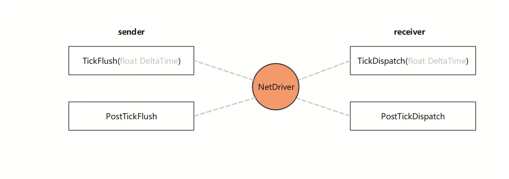  

### 1.2 数据包协议的基本结构

数据包头（Packet Header）: 包含了如数据包长度、序列号等，这些信息用于正确解析和处理数据包;

数据负载（Payload）: 每帧的第一个数据包中包含数据包信息负载；

数据块（Bunches）: 通道中的具体数据单元；

数据包（Packet）: 网络通信的基本单位；

完整的Packet结构图如下：

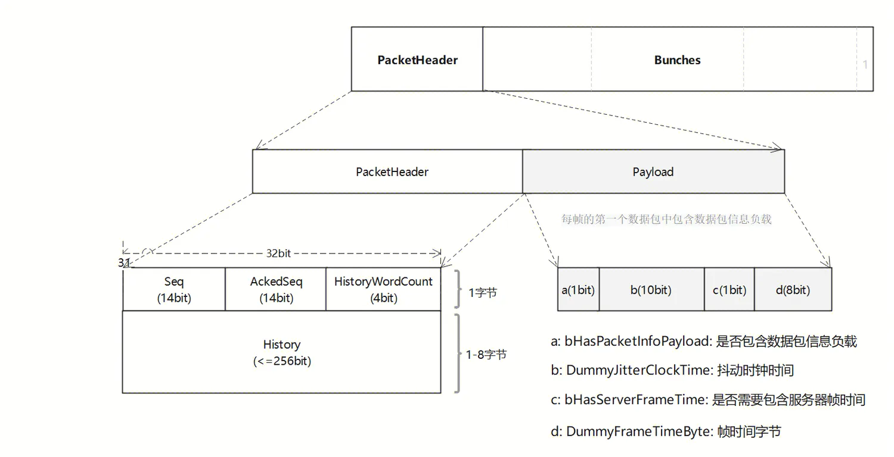  

在这个特定的PacketHeader协议头中，包含以下四个字段：

  1. Seq：发送序列号，只有14位可表示0-16383， TSequenceNumber模版已经封装了支持回绕的处理;

  2. AckedSeq：已确认序列号，位数与Seq一致，表示已收到的Packet序列号;

  3. HistoryWordCount：已收到Packet序列号序列的字节长度，可表示0-7标识History(int32[8])数组长度;

  4. History：已收到Packet序列号序列，最大支持256位用于跟踪已经成功接收的数据包，从而实现可靠的数据传输;

通过Seq和AckedSeq字段可以确保数据包的正确顺序和处理数据包丢失和重复的问题；同时，HistoryWordCount和History字段可以跟踪已经成功接收的数据包，以便在需要时进行重传和错误恢复。

### 1.3 内存数据结构

Connection表示一条连接，server同时与多个client连接，client只与一个server连接。每个同步的Actor有一个或多个Channel传输关于这个Actor的属性数据。FNetPacketNotify 主要用于跟踪和管理网络数据包的状态，以确保数据包的正确传输和处理。  

整体的数据结构大致如下图所示:

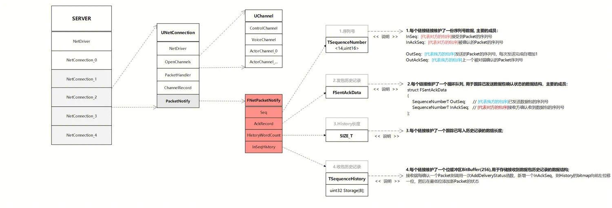

以下是 FNetPacketNotify 的一些关键结构：

  1. 序列号 : 每个链接维护了一份序列号数据, 主要的成员：InSeq/InAckSeq/OutSeq/OutAckSeq;

  2. 发包历史记录: 每个链接维护了一个循环队列, 用于跟踪已发送数据包确认状态的数据结构;

  3. History长度: 每个链接维护了一个跟踪已写入历史记录的数组长度;

  4. 收包历史记录: 每个链接维护了一个位缓冲区BitBuffer(256),用于存储接收到数据包历史记录的数据结构;

## 2.RUDP的实现原理

有了第一章节的基础数据结构的理解，接下来我们将深入其实现原理部分，UE中Rudp是如何实现可靠数据的传输的呢？

### 2.1 可靠的架构

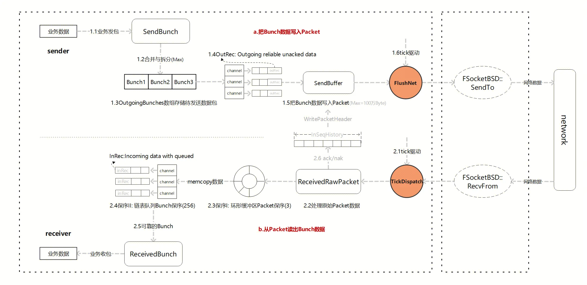  

首先，“可靠”的Bunch数据传输架构如上图所示， 我们先拆分流程，后面章节部分将深入细节解析：

1. **sender**:

1.1 可靠的业务数据Bunch（bReliable=1）发送;

1.2 Bunch根据配置大小进行合并与拆分;

1.3 OutgoingBunches数组存储待发送数据包;

1.4 OutRec: Outgoing reliable unacked data, 未确认的可靠传输数据, 每个channel独立维护;

1.5 把Bunch数据写入Packet, 同时包头PacketHeader附带本次Seq，以及本地收包的History历史记录;

1.6 tick驱动FlushNet网络发包。

2. **receiver**:

2.1 tick驱动接收网络包, 把Packet交给各自Connection来处理;

2.2 处理原始Packet数据, 首先用PacketHandler对数据就行预处理，比如压缩/解压等, 然后创建FBitReader来解析Packet数据;

2.3 保序I: NetConnection连接内部-环形缓冲区Packet保序, 最大缓存包量默认配置3个，当处理乱序Packet时,保留一定乱序Packet缓存能力;

2.4 保序II: Channel通道内部-InRec链表队列Bunch保序, 最大缓存Bunch数量默认配置256个;

2.5 若此时有ParticalBunch分片，依靠正确的顺序合并成完整可靠的Bunch;

2.6 接收方产生Ack和Nak反馈, 缓存至InSeqHistory， 等下一次发送Packet时，把Ack与Nak信息都填充到PacketHeader中AckSeq和History中，实现一个Packet对多个Seq反馈Ack与Nak。

**注意：**"2.3.保序I中Packet序号Seq" 与 "2.4.保序II中Bunch序号ChSequence" 两者区分：

  1. 顺序关联：Packet 的 Seq 序号和 Bunch 的 ChSequence 都表示它们在网络传输中的顺序，用于确保数据在发送和接收方按照正确的顺序处理;

  2. 层级差异：Packet 的 Seq 序号是在网络层级跟踪数据包的顺序，而 Bunch 的 ChSequence 是在UE网络模块层级跟踪可靠数据块的顺序, 每个通道有独立的序号空间;

### 2.2 确认机制

要实现可靠数据的传输，发送方需要知道接收方收到了某些数据，这样才能确定是否要重新发送，就需要Ack机制。UE的Ack机制是Packet层面的，包括Ack与Nak;

Ack表示收到了某个Packet，Nak表示没收到某个Packet，每个被发送的Packet都会有明确的Ack/Nak反馈。

#### 2.2.1 Seq-Ack

Ack确认机制如下图所示，相关数据结构由UNetConnection下FNetPacketNotify统一管理维护，Server端与Client端都各自拥有一份，数据结构相关成员组成：

InSeq：[代表对方的包序]接受到Packet的序列号;

InAckSeq：[代表对方的包序]被确认的Packet的序列号;

OutSeq：[代表我方的包序]发送的Packet的序列号, 每次发送完成自增加1;

OutAckSeq：[代表我方的包序]上一个被对端确认的Packet序列号;

提醒: 以上序列号在发送双方都存在一份，两边状态相互转换，很可能被绕晕，为加强代入感, 用颜色区分标识字段归属， 蓝色：标识我方， 红色：标识对方;

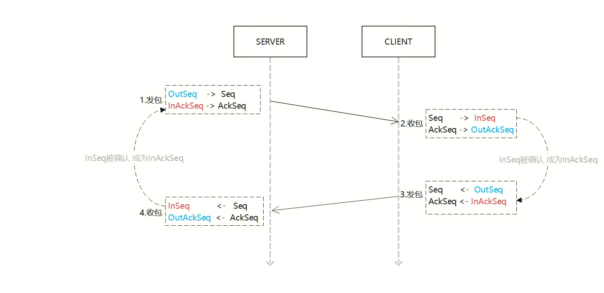  

示意图流程说明：

  1. 发包, 发送方维护OutSeq，代表当前发送的Packet的序列号, 每次发送完成自增加；填充包头(Seq，AckSeq)后请求网络发送；

  2. 收包，接收方解析包头(Seq，AckSeq), 收包成功：协议Seq变成InSeq，包被确认：InSeq成为InAckSeq;

  3. 发包，接收方回包的时候，同时作为发送方，维护OutSeq,代表当前发送的Packet的序列号, 每次发送完成自增加，然后将InAckSeq传递给对方；

  4. 收包，接收方解析包头(Seq，AckSeq), 收包成功：协议AckSeq成为OutAckSeq，包被确认：InSeq成为InAckSeq;

#### 2.2.2 延时ACK

TCP为了充分利用带宽，延时发送ACK（NODELAY都没用），这样超时计算会算出较大 RTT时间，延长了丢包时的判断过程。[KCP](https://github.com/skywind3000/kcp)的ACK是否延迟发送可以调节。与之对比，UE的Rudp的ACK是如何处理的呢？

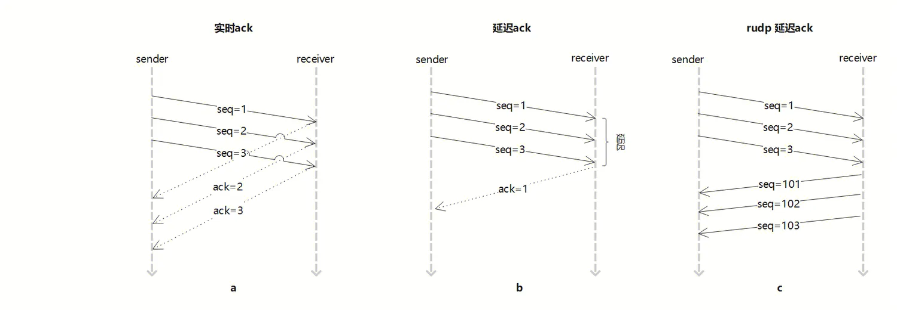  

图a: 实时ACK是指在接收到数据包后立即发送确认信息, 时效性非常高，但是可能会增加网络的负载;

图b: 延时ACK是指在接收到数据包后不是立即发送确认信息，而是等待一段时间一起确认, 这种机制可以减少网络的负载, 但是影响实时性;

图c: 在UE的Rudp代码中，主要由当receiver发送回包时PacketHeader一并带回AckSeq，同时也支持tick驱动的延时ACK作为托底(TimeSensitive)；

### 2.3 顺序保证

作为接收方，需要按照Packet发送的顺序来处理Packet，乱序会导致逻辑错乱。UE处理模式有两种，一种为只处理最新Packet，另一种为Packet开启缓存保序(默认方式):

a) 只处理最新Packet: 实现简单，而且可以尽快处理后面的Packet，缺点为不留网络缓冲余地，容易导致旧Packet重传;

b) Packet开启缓存保序:收到乱序Packet后先放到缓存中(PacketOrderCache为环形缓冲区设计)，减少不必要的重传，等后续正确的序号Packet到达后，按序依次处理。

默认开启PacketOrderCache缓存机制后，ReceivedRawPacket接收原始Packet数据包，主要逻辑为两步:

1）逻辑一：UNetConnection::ReceivedPacket将Packet放入Cache然后直接返回, 具体流程见以下图示：

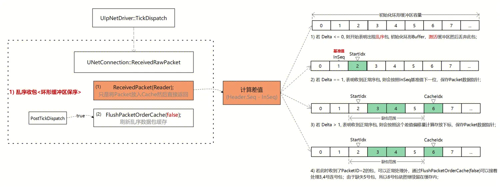  

示意图流程说明：

先计算差值（Delta=Header.Seq - InSeq）, 若：

  1. 若 Delta <= 0, 则开始表明出现乱序包; 初始化PacketOrderCache，激活缓冲区然后丢弃此包；

  2. 若 Delta == 1, 表明收到正常序包, 则会按照InSeq基准值下一位，保存Packet数据指针；

  3. 若 Delta > 1, 表明收到正常序包, 则会按照这个差值偏移量计算存放下标，保存Packet数据指针；

  4. 若此时收到了PacketID=2的包，可以正常处理外，通过FlushPacketOrderCache(false)可以接着处理3,4号连号包；由于缺失5号包，所以6号包依然继续留在缓存内；

2）逻辑二：UNetConnection::FlushPacketOrderCache刷新乱序数据包缓存, 若能找到连续序号包重新调用ReceivedPacket处理逻辑, 具体流程见以下图示：

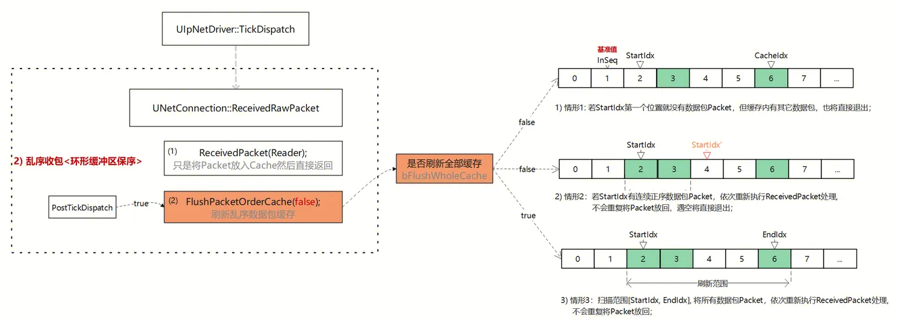  

示意图流程说明：

是否刷新全部缓存bFlushWholeCache, 分两种触发时机，a.每当ReceivedPacket处理一次数据包后调用（false）, b.一帧内结束时PostTickDispatch调用（true）;

  1. 若 bFlushWholeCache=false, 情形1: 若StartIdx第一个位置2就没有数据包Packet，但缓存内有其它数据包3,6，也将直接退出；

  2. 若 bFlushWholeCache=false, 情形2：若StartIdx有连续正序数据包Packet，依次重新执行ReceivedPacket处理, 如当前收到的包序为2，缓存中有包序3，可以继续调用ReceivedPacket连续处理, 遇到4号空时退出；

  3. 若 bFlushWholeCache=true, 情形3：扫描范围[StartIdx, EndIdx], 将所有数据包Packet，依次重新执行ReceivedPacket处理, 处理包序2,3,6; 后续可靠包的缺失部分将在Channel的InRec中继续等待;

### 2.4 数据重传

RUDP协议提供了数据重传机制，以确保数据的可靠传输。当数据包在预期的时间内未被确认或被检测到丢失时，发送方会重新发送该数据包，确保了即使在网络环境不理想的情况下，也能够可靠地传输数据。

具体设计见以下图示：

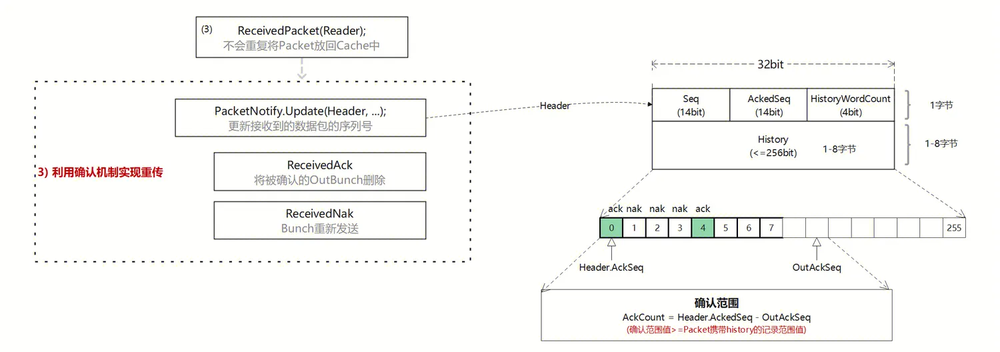  

示意图流程说明：

  1. 当作为接收方，当收到Packet时候，调用UNetConnection::ReceivedPacket，读取Packet内容， 整个函数流程分为：

    1. 首先, 从Packet中获取PacketHeader，包括Seq，AckedSeq， HistoryWordCount，History;

    2. 然后, 开始解析Packet中的Bunch数据，一个Packet可能包含多个Bunch;

    3. 之后, 把Bunch数据直接memcopy到Channel的InRec中，进入UChannel::ReceivedRawBunch函数;

    4. 最后, 合并完整的Bunch；

  2. FNetPacketNotify::Update, 根据收到的Header.AckedSeq - OutAckSeq差值，计算出此次确认范围 ，理论不丢包的情况下Header.AckedSeq=OutAckSeq+1; 

  3. Header.History为256bit 位数组，存储的是对端收包记录，对端收到包标识1，未收到标识0；每收包一次左移一位，最低位（第0位）标识的当前Header.AckSeq的收包状态;

  4. 遍历History，查看哪些Packet被Ack或Nak了，收到ReceivedAck(例如0,4号包)，没收到ReceivedNak(例如1,2,3,5,6,7);

收包反馈：

1) UChannel::ReceivedAck时，将Channel本地维护的Bunch缓存记录从OutRec链表中删除；

2) UChannel::ReceivedNak时，将Channel本地维护的Bunch缓存记录重新发送`Connection->SendRawBunch(*Out, 0)`, 不允许合包；

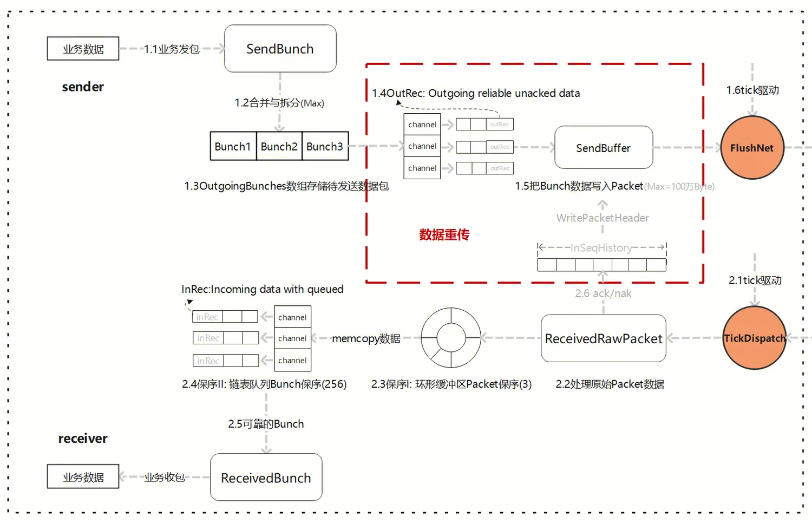  

### 2.5 Histroy列表

通过上一章节，我们发现Packet History它主要用于记录已发送或已接收的数据包的顺序号、状态和其他相关信息,对于确保数据包的正确传输和处理非常重要。

History是一个bit array，表示以AckSeq包为基准（最低位），各偏移位置Seq是Ack或者Nak状态, 数据结构见下图：

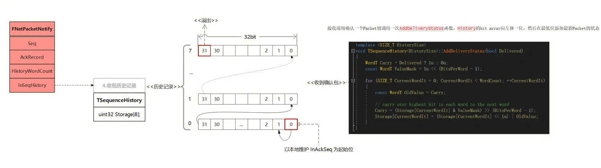  

接收端每确认一个Packet则调用一次AddDeliveryStatus函数，History的bit array向左移一位，然后在最低位添加最新Packet的状态；

History长度设计256位, TSequenceHistory按位封装，可以理解为uint32 Storage[8]数组，第0位始终标识当前的InSeq包的状态。

是否每次PacketHeader打包时都需要把全部History带上呢， 答案肯定不是的；

那么是如何动态计算每次打包History的长度呢?

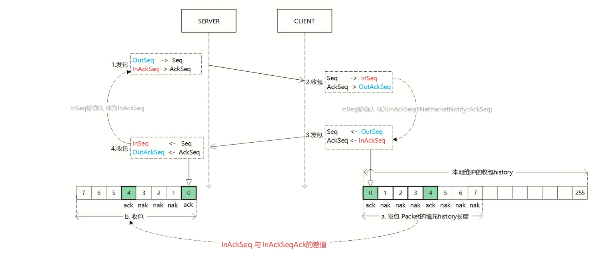  

根据以上有关Seq-Ack机制，结合History的流程说明：

  1. 发包, 发送方维护OutSeq，代表当前发送的Packet的序列号, 每次发送完成自增加；填充包头(Seq，AckSeq)后请求网络发送；

  2. 收包，接收方解析包头(Seq，AckSeq), 收包成功：协议Seq变成InSeq，包被确认：InSeq成为InAckSeq;  **a. InSeq被确认后，AddDeliveryStatus将History位数组向左偏移1位，最低位设置InSeq的数据包的确认状态;**

  3. 发包，接收方回包的时候，同时作为发送方，维护OutSeq, 代表当前发送的Packet的序列号, 每次发送完成自增加，然后将InAckSeq传递给对方；**b.计算InAckSeq 与 InAckSeqAck的差值， 作为History打包长度， 增量发送数据包确认状态;**

  4. 收包，接收方解析包头(Seq，AckSeq), 收包成功：协议AckSeq成为OutAckSeq，包被确认：InSeq成为InAckSeq; **c.接收方收到Ack后，遍历History，查看哪些Packet Seq被Ack或Nak, 若为Nak将走数据重传逻辑；**

此时存在的问题：

  1. 假如AckSeq - OutAckSeq > 256, 丢包数量超了History记录长度，怎么办？  

    a.超出history区间，触发溢出区间的Nak重传流程;  
    b.在history区间内，检测hisotry标识，走Ack/Nak流程;

  2. 在确认Packet包头中History的长度范围时，InAckSeqAck是如何定义的？  
    a.在数据结构章节有定义FSentAckData数组，记录了每次发包映射序号{OutSeq, InAckSeq},发包是在队列头部Push一条记录，收包时队列尾部Pop一条记录；  
    (收包具体Pop数量，依赖于AckCount=Header.AckeSeq - OutAckSeq-1)  

有关定义发包历史FSentAckData数组见下面示意图, InAckSeqAck如何定义继续分析：

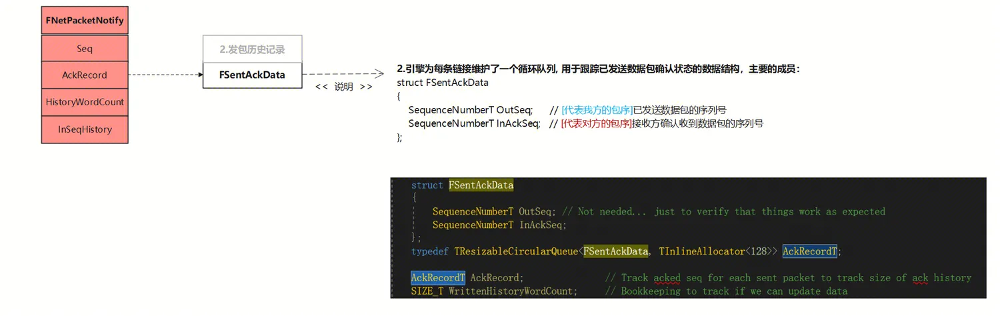  

情形1：每次单发、单收，没有丢包的理想情况下, 发送记录AckRecord数量最大为1，当收到确认包时将Peek该条数据，然后Pop删除:

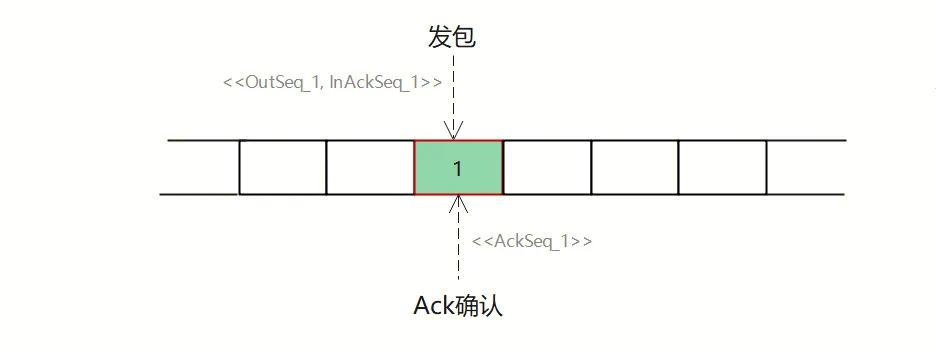  

情形2：连续发包，但是存在中间包缺失:  

a. 若作为发送端发了5个包, 此时发送数组将记录这5条数据 ；  

b. 若作为接受端现只收到5号确认回包，OutAckSeq所指位置目前还是0，此时Pop数量: AckCount=Header.AckSeq - OutAckSeq -1;

c. 获取匹配上的InAckSeq_5值，此值即为InAckSeqAck，这样就计算出了增量History的打包长度了; 然后刷新OutAckSeq为本次Header.AckSeq;

d. 后续receiver遍历history列表后，发现1,2,3,4号包丢失，触发Nak重传逻辑；

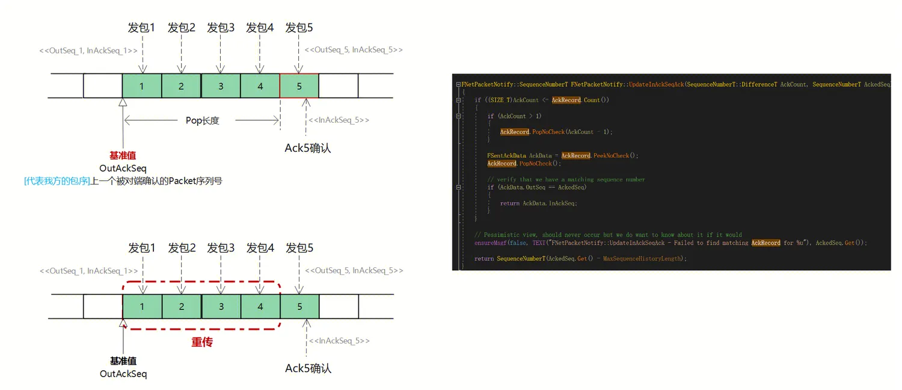  

### 2.6 窗口指导

TCP滑动窗口是一种流量控制机制，用于调整发送方和接收方之间可以同时传输的数据量。滑动窗口的大小可以根据网络状况动态调整，以提高网络传输的效率、降低数据包丢失率，从而实现可靠的数据传输。

虽然RUDP不是TCP，但它在UDP的基础上实现了一些TCP的特性，如窗口，流控等。

#### 2.6.1 发送窗口

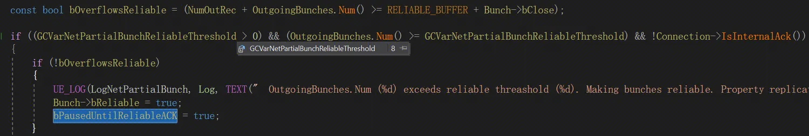  

首先，通过源码我们发现，UChannel::SendBunch内部，有两类窗口指导；

1）当本次要发送的 OutgoingBunches 的数量超了 GCVarNetPartialBunchReliableThreshold (用于设置拆分后的部分 Bunch 的可靠传输阈值), 会暂停复制，直到收到了所有可靠消息的 Ack；

2）当本次要发送的 OutgoingBunches 的数量和没收到Ack包的NumOutRec 数量超过阈值(`RELIABLE_BUFFER=256`)，可靠列表溢出，连接将会关闭;

只有可靠的 Bunch，才会被加入到 OutRec（发送的未确认的可靠消息数据）中，用于收到Nak后重传。

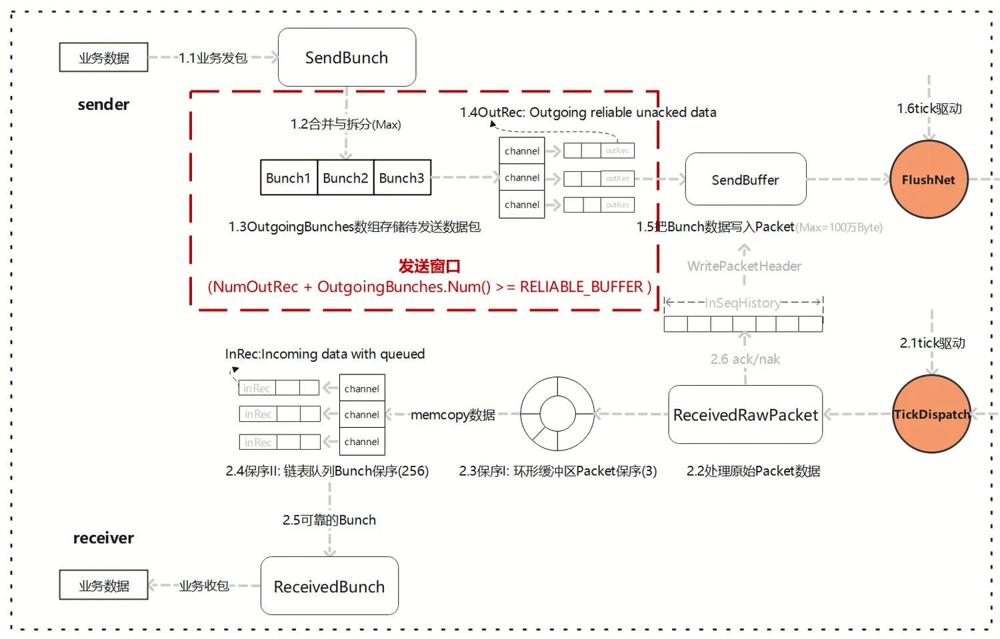  

#### 2.6.2 接收窗口

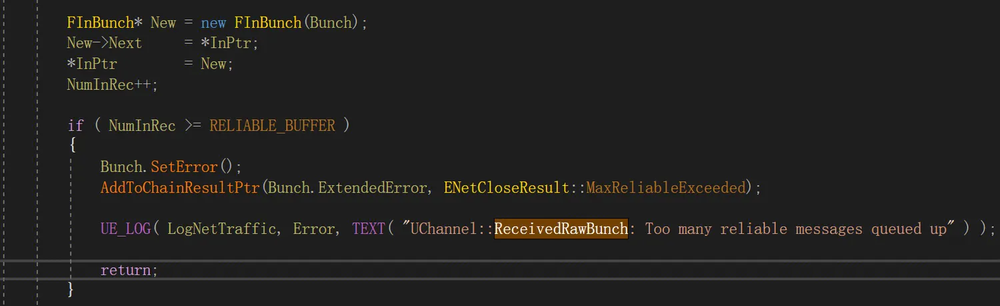  

其次，通过源码我们发现，UChannel::ReceivedRawBunch内部，也有接收窗口指导；

1）当本次要接收的 NumInRec 的数量超了超过阈值(`RELIABLE_BUFFER=256`)，可靠列表溢出，连接不会被关闭，只是本次Bunch设置ERROR， 中断当前执行;

只有可靠的 Bunch，才会被加入到 InRec（已经接收到但尚未处理的可靠消息数据）中, 窗口指导这有助于防止因为接收到过多可靠消息而导致的性能问题或内存溢出。

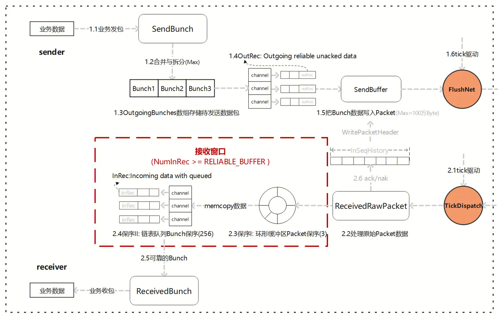  

### 2.7 流量控制

TCP的流量控制是基于滑动窗口机制实现的，发送方会根据接收方的窗口大小来决定发送数据的量，从而避免接收方无法处理太多数据而导致数据丢失或延迟。TCP的流量控制比较稳定，但是由于TCP使用了可靠的数据传输机制，因此在网络拥塞的情况下，TCP的传输速度会逐渐下降。

那么，在RUDP的协议中，也存在类似流量控制的概念， 只是这部分代码并非独立于协议层，而是嵌在了UPlayer/UConnection中；

#### 2.7.1 CurrentNetSpeed

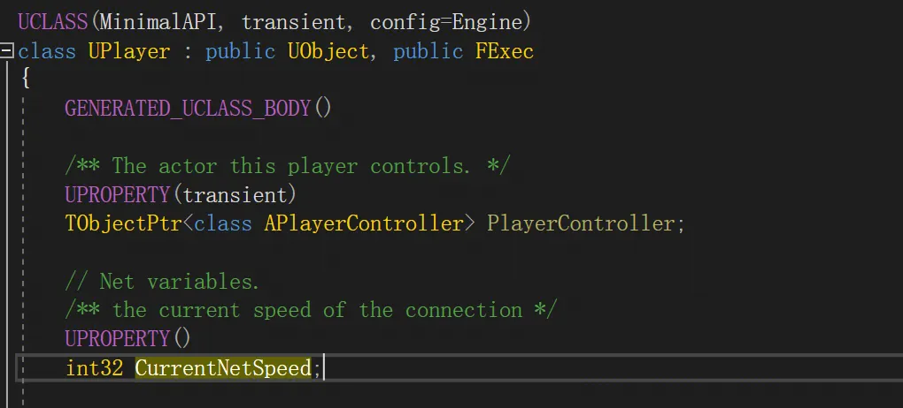  

通过源码我们发现，UPlayer.CurrentNetSpeed用于每个连接的流量控制 (Bytes/s)， 有两处赋值位置：

1） UNetConnection::InitBase初始时, 默认配置获取ConfiguredLanSpeed(局域网)/ConfiguredInternetSpeed(互联网)配置项;

2) UNetConnection::InitConnection初始化连接时，接收对端传入InConnectionSpeed, 适当调整当前连接的网速；

例如Lyra中DefaultEngine.ini配置内容：

```
[/Script/Engine.Player]

ConfiguredInternetSpeed=200000

ConfiguredLanSpeed=200000
```

#### 2.7.2 QueuedBits

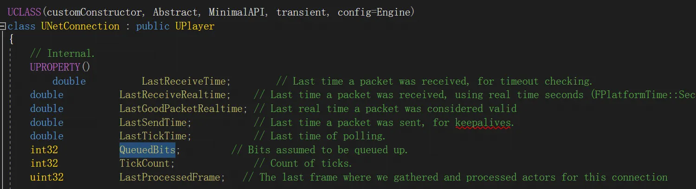  

UNetConnection.QueuedBits变量用于记录当前连接中已经排队等待发送的数据位数, 也表明了可以发送的最大流量;

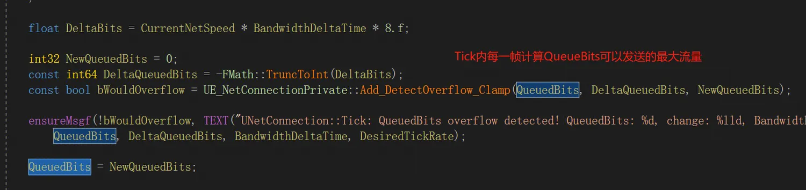  

同时，在UNetConnection::Tick内，每一帧都会动态的计算增量DeltaBits, 然后`Add_DetectOverflow_Clamp(QueuedBits, DeltaQueuedBits, NewQueuedBits)`计算最新的了待发送最大流量。

最终借助UNetConnection::IsNetReady(bool Saturate)，实现网络饱和检测。

### 2.8 RTO计算

TCP超时计算是RTOx2，这样连续丢三次包就变成RTOx8了，十分恐怖，而[KCP](https://github.com/skywind3000/kcp)启动快速模式后不x2，只是x1.5（实验证明1.5这个值相对比较好），提高了传输速度。

但是在UE中RUDP代码中，没有找到相关实现，个人推测是设计者利用确认机制实现重传, 没超时重传的必要。 或者有其它设计考虑，我还没理解的~

## 3.RUDP实现细节备忘

### 3.1 发送Bunch的流程细节

**UChannel::SendBunch**: 主要做的是小Bunch合并，以及大Bunch的拆分，然后对每个单独的Bunch，调用UNetConnection::SendRawBunch函数，写入Packet会记录Bunch所属的PacketId;

**UNetConnection::SendRawBunch**: 当把Bunch数据写入Packet，生成并写入SendBunchHeader, 但是并不会真正网络发送，调用了FlushNet才会网络发送Packet;

**TimeSensitive**：敏感标记，是否立即发送;

**UNetConnection::FlushNet**： 重置TimeSensitive ，并且判断发送缓冲区是否有数据，是否有Ack 包，是否有心跳包，才会去真正发送， 发送后会调用 InitSendBuffer 重置发送缓冲区；

**IsBunchTooLarge**()：限制最大Bunch为65536个字节，UChannel::SendBunch 的时候会先去判断当前 Bunch 的大小是否超出限制;

**MAX_PACKET_SIZE**: 考虑MTU，默认1024个字节;

**MAX_SINGLE_BUNCH_SIZE_BITS**: 单个Bunch大于阈值后，要拆分成多个Bunch，这些Bunch称为PartialBunch分成多个部分进行传输；
    
```cpp
FORCEINLINE int32 GetMaxSingleBunchSizeBits() const
{
    return (MaxPacket * 8) - MAX_BUNCH_HEADER_BITS - MAX_PACKET_TRAILER_BITS - MAX_PACKET_HEADER_BITS - MaxPacketHandlerBits;
}
```

**GCVarNetPartialBunchReliableThreshold**(8): 用于设置拆分后的部分 Bunch 的可靠传输阈值;

**PartialBunch**: 同一个Channel通道，可靠性一样，若没有超过单个 Bunch 的大小限制，可以合并; 同理，若Bunch过大就会拆分成片段，bPartial=1为分包，bPartialInitial =1为首包，bPartialFinal=1为尾包；

**UNetConnection::IsNetReady**：网络饱和检测;  

### 3. 2 接收Bunch的流程细节

**UNetConnection::ReceivedRawPacket**: 处理原始Packet数据, 其中每个进来或者出去的数据包都会在 PacketHandler 中做处理，比如握手，校验，加密，压缩等。

**UNetConnection::ReceivedPacket**: 读取数据包头信息，并根据包头携带的序列号信息和最后一个成功接收到的序列号去判断序列号的增量，正常情况下，所有数据包都会按发出的顺序接收，所有增量会相差1。如果大于1，说明发生了丢包，不会立即处理当前的数据，会把当前的数据包加入队列 PacketOrderCache 中。如果小于1，说明接收到的数据包发生了失序，引擎发送的每一个数据包序列号都是唯一的，不会重用，这种情况下引擎会忽略无效的数据包。

**PacketNotify.Update中更新序列号信息:**

1、根据包头携带的序列号数据计算出当前确认的序列号数量，然后根据 AckRecord 去更新 InAckSeqAck;

2、如果超出数量上限 SequenceHistoryT::Size = 256，则视为收到 Nak;

3、从序列号历史记录（History Storage）中判断是 Ack 还是 Nak，然后调用对应的处理函数;

4、SequenceNumberBits：包序号14位，取值范围[0, 16383], 序号超了后回绕的解决，已经被封装在了TSequenceNumber模版内部，主要判断逻辑被封在这个重载符内：

```cpp
bool operator>(const TSequenceNumber& Other) const
{
    return (Value != Other.Value) && (((Value - Other.Value) & SeqNumberMask) < SeqNumberHalf);
}
```

**ReceivedNak:** 根据history bit array确认丢包状态, ReceivedNak为数据重传的唯一入口, 没有发现超时重传的途径;

**ReceivedAck:** 根据history bit array确认收包状态;

## 小结：

UE的网络模块基于 UDP 协议，并内置了可靠性实现。然而UE的可靠性 UDP 并非作为一个独立的网络层存在，而是与引擎的具体逻辑实现相互交织;

从 UE 的角度来看，这是一个合理的解决方案。在针对房间类游戏的业务场景下，通过最精简的代码实现引擎对可靠性网络传输的需求，可以最大程度地减少网络延迟的影响。
