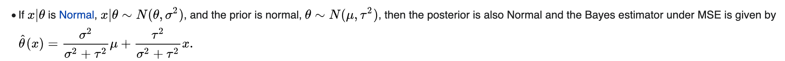
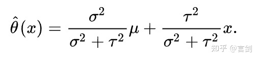
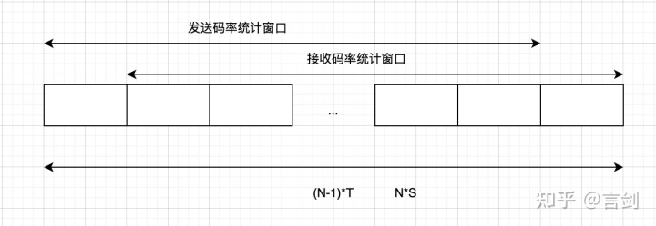

 
<!--BEGIN_DATA
{
    "create_date": "2022-02-26 10:30", 
    "modify_date": "2022-02-26 10:30", 
    "is_top": "0", 
    "summary": "WebRTC GCC代码深度解读(1)BitrateEstimator<br/>WebRTC GCC代码深度解读(2)TCC ACK码率估计<br/>WebRTC GCC代码深度解读(3)AlrDetector<br/>WebRTC GCC代码深度解读(4)基于Loss的带宽估计", 
    "tags": "WebRTC", 
    "file_name": "WebRTC GCC代码深度解读01.md"
}
END_DATA-->

#### <p>原文出处：<a href='https://zhuanlan.zhihu.com/p/489513692' target='blank'>WebRTC GCC代码深度解读(1)BitrateEstimator</a></p>

## 1. 原理解读

`BitrateEstimator`是GCC里面的一个基础类，用于估计TCC ACK的码率。这里采用了贝叶斯估计，大概的估计方法如下：

  * 单个ACK误差太大，需要等到设置的窗口大小才会计算码率，窗口如果太小则计算偏差很大，窗口过大则码率更新太慢，这里初始化为500ms，后续150ms。每个窗口计算得到一个码率，采用多个窗口估计结果。
  * 单个窗口计算的码率有一定不确定性，给与每个结果赋予一定权重，如样本可能比较少或者处于ALR状态，此时给与这个结果更低的权重，避免被拥塞无关的因素影响
  * 最终的结果是基于各个窗口结果的贝叶斯估计  
  
这里使用贝叶斯估计来得到一个相对可靠的结果，这里的先验是之前估计的结果，后验是当前窗口计算的结果，因为先验和后延有相同的分布（都比较符合高斯分布），因此可以转化为一个共轭先验问题：

 Bayes estimators for conjugate priors

因此可以估计先验和后延各自的方差，便可以得到最终的贝叶斯估计！后面我们将结合代码理解这个公式。

## 2. 代码解读

其头文件定义如下：

```cpp
class BitrateEstimator {
 public:
  explicit BitrateEstimator(const WebRtcKeyValueConfig* key_value_config);
  virtual ~BitrateEstimator();

  // 输入收到ACK的时间以及ACK的字节数
  virtual void Update(Timestamp at_time, DataSize amount, bool in_alr);

  // 获取估计的稳定的码率
  virtual absl::optional<DataRate> bitrate() const;

  // 获取当前窗口计算的码率
  absl::optional<DataRate> PeekRate() const;

  // 在某些场景需要码率快速收敛
  virtual void ExpectFastRateChange();

 private:
  // 计算一个窗口内的码率
  float UpdateWindow(int64_t now_ms,
                     int bytes,
                     int rate_window_ms,
                     bool* is_small_sample);
  // 当前窗口内总字节数
  int sum_;

  // 在初始化阶段使用的窗口大小，初始化阶段应该使用较大的窗口，因为是第一个数据!
  FieldTrialConstrained<int> initial_window_ms_;

  // 在非初始化阶段使用的窗口大小
  FieldTrialConstrained<int> noninitial_window_ms_;

  // 当前窗口计算的数据不可靠程度，默认是10，可以理解成样本标准差
  FieldTrialParameter<double> uncertainty_scale_;
  // 当前窗口计算的数据不可靠程度（用于ALR）
  FieldTrialParameter<double> uncertainty_scale_in_alr_;
  // 当前窗口计算的数据不可靠程度（用于小样本）
  FieldTrialParameter<double> small_sample_uncertainty_scale_;

  // 一个窗口内数据量被认为是小样本的阈值，样本太少，会被认为当前估计不可靠
  FieldTrialParameter<DataSize> small_sample_threshold_;
  // 用于控制不确定性的一个参数
  FieldTrialParameter<DataRate> uncertainty_symmetry_cap_;

  // 估计码率的上限
  FieldTrialParameter<DataRate> estimate_floor_;
  // 当前累积的窗口大小
  int64_t current_window_ms_;
  // 计算窗口内码率时，记录前一个ACK的时间
  int64_t prev_time_ms_;

  // 最终得到的估计码率，先验估计
  float bitrate_estimate_kbps_;
  // 估计码率的方差，先验估计的方差
  float bitrate_estimate_var_;
};
```  

实现解读如下：

```cpp
void BitrateEstimator::Update(Timestamp at_time, DataSize amount, bool in_alr) {
  // 窗口的选择：初始化阶段的窗口更大，避免窗口过小得到的结果不可靠
  int rate_window_ms = noninitial_window_ms_.Get();
  // We use a larger window at the beginning to get a more stable sample that
  // we can use to initialize the estimate.
  if (bitrate_estimate_kbps_ < 0.f)
    rate_window_ms = initial_window_ms_.Get();

  // 输入当前数据，按照窗口阈值计算窗口内的码率
  bool is_small_sample = false;
  float bitrate_sample_kbps = UpdateWindow(at_time.ms(), amount.bytes(),
                                           rate_window_ms, &is_small_sample);
  if (bitrate_sample_kbps < 0.0f)
    return;
  if (bitrate_estimate_kbps_ < 0.0f) {
    // 初始化阶段，最终的码率直接使用一个窗口的结果
    // This is the very first sample we get. Use it to initialize the estimate.
    bitrate_estimate_kbps_ = bitrate_sample_kbps;
    return;
  }

  // 对于小样本给与更大的不确定性，避免ALR阶段码率降低太多
  // 同样，如果检测到ALR，也会给与更大的不确定性
  // Optionally use higher uncertainty for very small samples to avoid dropping
  // estimate and for samples obtained in ALR.
  float scale = uncertainty_scale_;
  if (is_small_sample && bitrate_sample_kbps < bitrate_estimate_kbps_) {
    scale = small_sample_uncertainty_scale_;
  } else if (in_alr && bitrate_sample_kbps < bitrate_estimate_kbps_) {
    // Optionally use higher uncertainty for samples obtained during ALR.
    scale = uncertainty_scale_in_alr_;
  }


  // 不确定性的计算：
  // * 小样本、ALR引入不确定性
  // * 当前窗口与估计样本与估计的码率偏差又引入不确定
  // 分母为：估计码率+当前窗口计算码率
  // Define the sample uncertainty as a function of how far away it is from the
  // current estimate. With low values of uncertainty_symmetry_cap_ we add more
  // uncertainty to increases than to decreases. For higher values we approach
  // symmetry.
  float sample_uncertainty =
      scale * std::abs(bitrate_estimate_kbps_ - bitrate_sample_kbps) /
      (bitrate_estimate_kbps_ +
       std::min(bitrate_sample_kbps,
                uncertainty_symmetry_cap_.Get().kbps<float>()));
  // 样本方差
  float sample_var = sample_uncertainty * sample_uncertainty;


  // 码率的贝叶斯估计，使用了共轭先验的公式！
  // Update a bayesian estimate of the rate, weighting it lower if the sample
  // uncertainty is large.
  // The bitrate estimate uncertainty is increased with each update to model
  // that the bitrate changes over time.
  float pred_bitrate_estimate_var = bitrate_estimate_var_ + 5.f;
  bitrate_estimate_kbps_ = (sample_var * bitrate_estimate_kbps_ +
                            pred_bitrate_estimate_var * bitrate_sample_kbps) /
                           (sample_var + pred_bitrate_estimate_var);
  bitrate_estimate_kbps_ =
      std::max(bitrate_estimate_kbps_, estimate_floor_.Get().kbps<float>());
  // 码率方差的更新
  bitrate_estimate_var_ = sample_var * pred_bitrate_estimate_var /
                          (sample_var + pred_bitrate_estimate_var);
  BWE_TEST_LOGGING_PLOT(1, "acknowledged_bitrate", at_time.ms(),
                        bitrate_estimate_kbps_ * 1000);
}

// 输入当前样本，根据设置的窗口阈值计算码率
// 为什么不以实际的时间跨度计算，而是用阈值窗口？而且计算时不包含当前数据？
float BitrateEstimator::UpdateWindow(int64_t now_ms,
                                     int bytes,
                                     int rate_window_ms,
                                     bool* is_small_sample) {
  RTC_DCHECK(is_small_sample != nullptr);
  // 时间环回，重置
  // Reset if time moves backwards.
  if (now_ms < prev_time_ms_) {
    prev_time_ms_ = -1;
    sum_ = 0;
    current_window_ms_ = 0;
  }


  // 更新当前窗口自大小: 当前到窗口自开始计算的时间
  if (prev_time_ms_ >= 0) {
    current_window_ms_ += now_ms - prev_time_ms_;

    // 如果一个ACK超过预期的最大窗口大小，数据不可靠，需要重置
    // Reset if nothing has been received for more than a full window.
    if (now_ms - prev_time_ms_ > rate_window_ms) {
      sum_ = 0;
      current_window_ms_ %= rate_window_ms;
    }
  }
  prev_time_ms_ = now_ms;

  // 当当前计算窗口超过了窗口阈值:
  // 根据窗口内的总字节数，判断当前是否是小样本
  // 并返回窗口内的码率，使用的窗口是阈值窗口，而不是实际窗口，因此剩余的时间还在当前计算窗口内
  float bitrate_sample = -1.0f;
  if (current_window_ms_ >= rate_window_ms) {
    *is_small_sample = sum_ < small_sample_threshold_->bytes();
    bitrate_sample = 8.0f * sum_ / static_cast<float>(rate_window_ms);
    current_window_ms_ -= rate_window_ms;
    sum_ = 0;
  }
  sum_ += bytes;
  return bitrate_sample;
}

absl::optional<DataRate> BitrateEstimator::bitrate() const {
  if (bitrate_estimate_kbps_ < 0.f)
    return absl::nullopt;
  return DataRate::KilobitsPerSec(bitrate_estimate_kbps_);
}

absl::optional<DataRate> BitrateEstimator::PeekRate() const {
  if (current_window_ms_ > 0)
    return DataSize::Bytes(sum_) / TimeDelta::Millis(current_window_ms_);
  return absl::nullopt;
}

// 如果需要码率变化更快，只需要增大码率估计的方差
void BitrateEstimator::ExpectFastRateChange() {
  // By setting the bitrate-estimate variance to a higher value we allow the
  // bitrate to change fast for the next few samples.
  bitrate_estimate_var_ += 200;
}
```

## 3. 总结

注意贝叶斯估计的核心代码：

```cpp
bitrate_estimate_kbps_ = (sample_var * bitrate_estimate_kbps_ +
                            pred_bitrate_estimate_var * bitrate_sample_kbps) /
                           (sample_var + pred_bitrate_estimate_var);
```

其实就是公式：

 高斯分布下的共轭先验公式

先验是之前的估计结果，符合高斯分布，其方差为`pred_bitrate_estimate_var`，后验是当前估计， 其方差为`sample_var`。

样本的方差实际上是用不确定性来衡量的！

看到这里，想必大家对码率估计有比较清楚的了解了，剩下的就是多读读代码了。

<hr>

#### <p>原文出处：<a href='https://zhuanlan.zhihu.com/p/489837272' target='blank'>WebRTC GCC代码深度解读(2)TCC ACK码率估计</a></p>

在基于TCC的拥塞控制中，如何准确估计ACK的码率是一个比较重要的问题。目前在WebRTC提供了两个实现，一个是基于贝叶斯估计，另外一个是更鲁棒的估计方法。下面将介绍这两种方法。

这两个都实现了`AcknowledgedBitrateEstimatorInterface`接口：

```cpp
class AcknowledgedBitrateEstimatorInterface {
 public:
  static std::unique_ptr<AcknowledgedBitrateEstimatorInterface> Create(
      const WebRtcKeyValueConfig* key_value_config);
  virtual ~AcknowledgedBitrateEstimatorInterface();

  virtual void IncomingPacketFeedbackVector(
      const std::vector<PacketResult>& packet_feedback_vector) = 0;
  virtual absl::optional<DataRate> bitrate() const = 0;
  virtual absl::optional<DataRate> PeekRate() const = 0;
  virtual void SetAlr(bool in_alr) = 0;
  virtual void SetAlrEndedTime(Timestamp alr_ended_time) = 0;
};
```

通过配置选择两种估计方式：

```cpp
std::unique_ptr<AcknowledgedBitrateEstimatorInterface>
AcknowledgedBitrateEstimatorInterface::Create(
    const WebRtcKeyValueConfig* key_value_config) {
  RobustThroughputEstimatorSettings simplified_estimator_settings(
      key_value_config);
  if (simplified_estimator_settings.enabled) {
    return std::make_unique<RobustThroughputEstimator>(
        simplified_estimator_settings);
  }
  return std::make_unique<AcknowledgedBitrateEstimator>(key_value_config);
}
```

## 1. 基于贝叶斯估计的ACK码率估计（AcknowledgedBitrateEstimator）

`AcknowledgedBitrateEstimator`是基于贝叶斯估计的结果，使用了`BitrateEstimator`基础类来估计。这个基于类可以看之前写的一篇文章，这里不再赘述：

这个类做了下简单封装，只是在ALR（Application Limit Region）结束后加快收敛（数据不可信）：

```cpp
void AcknowledgedBitrateEstimator::IncomingPacketFeedbackVector(
    const std::vector<PacketResult>& packet_feedback_vector) {
  RTC_DCHECK(std::is_sorted(packet_feedback_vector.begin(),
                            packet_feedback_vector.end(),
                            PacketResult::ReceiveTimeOrder()));
  for (const auto& packet : packet_feedback_vector) {
    /// ALR结束，通过直接修改方差，快速收敛
    if (alr_ended_time_ && packet.sent_packet.send_time > *alr_ended_time_) {
      bitrate_estimator_->ExpectFastRateChange();
      alr_ended_time_.reset();
    }
    DataSize acknowledged_estimate = packet.sent_packet.size;
    acknowledged_estimate += packet.sent_packet.prior_unacked_data;
    bitrate_estimator_->Update(packet.receive_time, acknowledged_estimate,
                               in_alr_);
  }
}
```

## 2. 更鲁棒的ACK码率估计（RobustThroughputEstimator）

这个估计保存了更多的样本，然后基于接收字节数，和窗口时长做更准确的估计。这个估计方法原理上更简单，估计的结果也更加稳定一些。

这里需要关注的细节在于，需要剔除一个包做估计，为什么呢？

举个例子，加入每隔Tms发送一个S字节的报文，收到N个报文后，总字节数NxS_，_然而间隔只(N-1)xT，因此需要剔除掉一个数据。剔除有两个方案：

  * 对于发送来说，最后一个报文不会提供什么信息，因此我们剔除最后一个；对于接受来说，第一个报文没有提供什么信息，我们剔除第一个。
  * 对第一个和最后一个做一个平均作为剔除的字节数。

另外，可能会存在一两个较大的突发延迟，导致总的延迟比较大，我们可以简单地做处理。这里也有两个方案：

  * 替换最大的接收间隔为第二大的接收间隔
  * 替换最大的接收间隔为平均的接收间隔



```cpp
/// 输入TCC Feedback消息，保存到queue中
void RobustThroughputEstimator::IncomingPacketFeedbackVector(
    const std::vector<PacketResult>& packet_feedback_vector) {
  RTC_DCHECK(std::is_sorted(packet_feedback_vector.begin(),
                            packet_feedback_vector.end(),
                            PacketResult::ReceiveTimeOrder()));
  for (const auto& packet : packet_feedback_vector) {
    // Insert the new packet.
    // 使用queue保存TCC ACK
    window_.push_back(packet);
    window_.back().sent_packet.prior_unacked_data =
        window_.back().sent_packet.prior_unacked_data *
        settings_.unacked_weight;
    // In most cases, receive timestamps should already be in order, but in the
    // rare case where feedback packets have been reordered, we do some swaps to
    // ensure that the window is sorted.
    // 排序，并没有做完全的排序！
    for (size_t i = window_.size() - 1;
         i > 0 && window_[i].receive_time < window_[i - 1].receive_time; i--) {
      std::swap(window_[i], window_[i - 1]);
    }
    // Remove old packets.
    // 最多保存500个报文，或者超过20个报文但是窗口超过500ms
    while (window_.size() > settings_.kMaxPackets ||
           (window_.size() > settings_.min_packets &&
            packet.receive_time - window_.front().receive_time >
                settings_.window_duration)) {
      window_.pop_front();
    }
  }
}

absl::optional<DataRate> RobustThroughputEstimator::bitrate() const {
  //  报文太少，低于20不计算
  if (window_.size() < settings_.initial_packets)
    return absl::nullopt;

  // 计算最大和第二的接收时间gap
  TimeDelta largest_recv_gap(TimeDelta::Millis(0));
  TimeDelta second_largest_recv_gap(TimeDelta::Millis(0));
  for (size_t i = 1; i < window_.size(); i++) {
    // Find receive time gaps
    TimeDelta gap = window_[i].receive_time - window_[i - 1].receive_time;
    if (gap > largest_recv_gap) {
      second_largest_recv_gap = largest_recv_gap;
      largest_recv_gap = gap;
    } else if (gap > second_largest_recv_gap) {
      second_largest_recv_gap = gap;
    }
  }

  // 得到窗口内，最大发送时间、最小发送时间，最大接收时间、最小接收时间，总发送字节数
  Timestamp min_send_time = window_[0].sent_packet.send_time;
  Timestamp max_send_time = window_[0].sent_packet.send_time;
  Timestamp min_recv_time = window_[0].receive_time;
  Timestamp max_recv_time = window_[0].receive_time;
  DataSize data_size = DataSize::Bytes(0);
  for (const auto& packet : window_) {
    min_send_time = std::min(min_send_time, packet.sent_packet.send_time);
    max_send_time = std::max(max_send_time, packet.sent_packet.send_time);
    min_recv_time = std::min(min_recv_time, packet.receive_time);
    max_recv_time = std::max(max_recv_time, packet.receive_time);
    data_size += packet.sent_packet.size;
    data_size += packet.sent_packet.prior_unacked_data;
  }

  // 接收字节数 = 发送字节数 - unack字节数

  // 如果每T时间发送大小为S的报文，有N*S字节，但是时间只有(N-1)*T，因此要剔除一个包！
  // 需要去掉一个包的计算！！！否则计算不准确。assume_shared_link控制了如何剔除
  // 为true则剔除首尾的平均，为fasle则发送剔除尾部，接收剔除首部

  // Suppose a packet of size S is sent every T milliseconds.
  // A window of N packets would contain N*S bytes, but the time difference
  // between the first and the last packet would only be (N-1)*T. Thus, we
  // need to remove one packet.
  DataSize recv_size = data_size;
  DataSize send_size = data_size;
  if (settings_.assume_shared_link) {
    // Depending on how the bottleneck queue is implemented, a large packet
    // may delay sending of sebsequent packets, so the delay between packets
    // i and i+1  depends on the size of both packets. In this case we minimize
    // the maximum error by removing half of both the first and last packet
    // size.
    DataSize first_last_average_size =
        (window_.front().sent_packet.size +
         window_.front().sent_packet.prior_unacked_data +
         window_.back().sent_packet.size +
         window_.back().sent_packet.prior_unacked_data) /
        2;
    recv_size -= first_last_average_size;
    send_size -= first_last_average_size;
  } else {
    // In the simpler case where the delay between packets i and i+1 only
    // depends on the size of packet i+1, the first packet doesn't give us
    // any information. Analogously, we assume that the start send time
    // for the last packet doesn't depend on the size of the packet.
    recv_size -= (window_.front().sent_packet.size +
                  window_.front().sent_packet.prior_unacked_data);
    send_size -= (window_.back().sent_packet.size +
                  window_.back().sent_packet.prior_unacked_data);
  }

  // 码率=发送码率和接收码率的最小值（ack码率不可能超过send的码率）
  // reduce_bias:突发的delay会影响结果，因此这个开关控制如何消除这个影响
  // reduce_bias为true，则替换largest_recv_gap为second_largest_recv_gap
  // reduce_bias为false，则替换为平均值
  // Remove the largest gap by replacing it by the second largest gap
  // or the average gap.
  TimeDelta send_duration = max_send_time - min_send_time;
  TimeDelta recv_duration = (max_recv_time - min_recv_time) - largest_recv_gap;
  if (settings_.reduce_bias) {
    recv_duration += second_largest_recv_gap;
  } else {
    recv_duration += recv_duration / (window_.size() - 2);
  }

  // 这里计算发送码率是为了限制ACK码率不超过发送码率
  send_duration = std::max(send_duration, TimeDelta::Millis(1));
  recv_duration = std::max(recv_duration, TimeDelta::Millis(1));
  return std::min(send_size / send_duration, recv_size / recv_duration);
}
```

## 3. 总结

GCC里面的码率估计使用到上面两种方法，一些细节还是值得注意的。一般来说，第二种方法估计的结果更加鲁棒，WebRTC最近引入也是希望用来替换贝叶斯估计，希望能够得到更好的估计结果。

<hr>

#### <p>原文出处：<a href='https://zhuanlan.zhihu.com/p/490479868' target='blank'>WebRTC GCC代码深度解读(3)AlrDetector</a></p>

## 1. 介绍

在介绍ALR检测之前，我们先了解下ALR到底是什么。ALR，即Application Limit Region，即应用本身存在一些受限（非网络带宽导致），会导致发送码率相较于平常有较大降低。突然存在一个较低的发送码率会导致我们的估计带宽存在一些偏差，因此我们需要对这样的一个场景去做检测和区别。一般来说导致ALR的原因如：系统负载比较高，采集/编码帧率降低等等。  
  
ALR的检测也比较简单，根据一段时间内发送的平均码率来判断，当前的码率是否偏离了正常的码率。这个检测使用到了pacing中的IntervalBudget来检测，这是一个漏桶算法，每次发送数据消耗budget，随着时间流逝增加budget，最后通过查看budget剩余比例来判断发送数据量是否足够。关于IntervalBudget原理可以看笔者之前写的一篇文章。
  
下面我们从代码角度来讲解ALR的检测。

## 2. 接口

```cpp
class AlrDetector {
 public:
  /// ...

  // 发送的字节数和发送时间
  void OnBytesSent(size_t bytes_sent, int64_t send_time_ms);

  // Set current estimated bandwidth.
  // 当前的估计带宽，用于和统计的发送码率比较，判断是否处于ALR状态
  void SetEstimatedBitrate(int bitrate_bps);

  // Returns time in milliseconds when the current application-limited region
  // started or empty result if the sender is currently not application-limited.
  // 返回进入ALR的时间
  absl::optional<int64_t> GetApplicationLimitedRegionStartTime() const;

 private:
  // 配置
  const AlrDetectorConfig conf_;
  // 上次发送数据的时间
  absl::optional<int64_t> last_send_time_ms_;
  // 同pacing中的intervalbudget，漏桶算法
  IntervalBudget alr_budget_;
  // ALR开始时间
  absl::optional<int64_t> alr_started_time_ms_;

  RtcEventLog* event_log_;
};
```

## 3. 实现

```cpp
void AlrDetector::OnBytesSent(size_t bytes_sent, int64_t send_time_ms) {
  // 第一次直接返回，记录上次发送时间
  if (!last_send_time_ms_.has_value()) {
    last_send_time_ms_ = send_time_ms;
    // Since the duration for sending the bytes is unknwon, return without
    // updating alr state.
    return;
  }
  // 两次发送的时间间隔，用于累计时间窗口
  int64_t delta_time_ms = send_time_ms - *last_send_time_ms_;
  last_send_time_ms_ = send_time_ms;

  // 采用IntervalBudget方式，发送数据消耗budget，时间流逝增加budget
  alr_budget_.UseBudget(bytes_sent);
  alr_budget_.IncreaseBudget(delta_time_ms);
  bool state_changed = false;

  // 如果当前的发送码率偏低，那么budget剩余比例会比较大，超过阈值则认为进入ALR状态
  if (alr_budget_.budget_ratio() > conf_.start_budget_level_ratio &&
      !alr_started_time_ms_) {
    alr_started_time_ms_.emplace(rtc::TimeMillis());
    state_changed = true;
  } 
  // 如果budget剩余比例非常低，那么则退出ALR状态。
  else if (alr_budget_.budget_ratio() < conf_.stop_budget_level_ratio &&
             alr_started_time_ms_) {
    state_changed = true;
    alr_started_time_ms_.reset();
  }

  // 记录事件日志
  if (event_log_ && state_changed) {
    event_log_->Log(
        std::make_unique<RtcEventAlrState>(alr_started_time_ms_.has_value()));
  }
}

void AlrDetector::SetEstimatedBitrate(int bitrate_bps) {
  RTC_DCHECK(bitrate_bps);
  // 设置估计带宽到IntervalBudget中，用于检测发送数据量是否足够。
  // 这里使用了0.65倍的带宽作为发送码率
  int target_rate_kbps =
      static_cast<double>(bitrate_bps) * conf_.bandwidth_usage_ratio / 1000;
  alr_budget_.set_target_rate_kbps(target_rate_kbps);
}

absl::optional<int64_t> AlrDetector::GetApplicationLimitedRegionStartTime()
    const {
  return alr_started_time_ms_;
}
```
  
```cpp
关于上面检测LAR的几个阈值，默认值可以参考：
struct AlrDetectorConfig {
  double bandwidth_usage_ratio = 0.65;
  double start_budget_level_ratio = 0.80;
  double stop_budget_level_ratio = 0.50;
```

<hr>

#### <p>原文出处：<a href='https://zhuanlan.zhihu.com/p/490481512' target='blank'>WebRTC GCC代码深度解读(4)基于Loss的带宽估计</a></p>

## 1. 简介

GCC里面的默认的基于loss的带宽估计是在`SendSideBandwidthEstimation`这个类里面。由于历史原因，基于丢包的估计在发送端，基于单向延迟的估计在接收端（REMB），因此最开始的代码里面基于丢包的放在SendSideBandwidthEstimation里面了，REMB基于单向延迟的放在remote里面（recvside）。  

然而引入TCC之后，单向延迟的也在发送端（sendside），这个时候只能将基于延迟的放到delaybased bwe相关类里面了（总不能叫recvside吧）。

实际上WebRTC有3个实现，一个是`SendSideBandwidthEstimation`。一个是`LossBasedBandwidthEstimation`， 我们记为v1版本吧；一个是`LossBasedBweV2`，这个我们记为v2版本。V1和V2版本还处于实验阶段。

这一篇，我们先介绍下最初的实现`SendSideBandwidthEstimation`。后面两个版本目前还是在实验阶段，后面会介绍下。

## 2. 原理介绍

核心的原理：

> 2%丢包以下，以1s内最小带宽的1.08倍增加估计带宽；  
> 2%~10%丢包，保持估计带宽不变；  
> 10%以上丢包，newRate = rate * (1 - 0.5*lossRate)。

关于细节，可以看下下面的代码解读。

### 2.1 1s内最小码率统计

历史最小估计码率的维护，这里是获取最近1s内的最低估计码率。下面的函数在每次loss更新的时候调用。作用：在丢包较小需要增加估计带宽的时候，需要按照最近1s最小值的1.08倍去增加。按照最小值去增加，看起来是一个比较保险的做法。

最小码率更新如下：

```cpp
void SendSideBandwidthEstimation::UpdateMinHistory(Timestamp at_time) {
  // Remove old data points from history.
  // Since history precision is in ms, add one so it is able to increase
  // bitrate if it is off by as little as 0.5ms.
  while (!min_bitrate_history_.empty() &&
         at_time - min_bitrate_history_.front().first + TimeDelta::Millis(1) >
             kBweIncreaseInterval) {
    min_bitrate_history_.pop_front();
  }

  // Typical minimum sliding-window algorithm: Pop values higher than current
  // bitrate before pushing it.
  while (!min_bitrate_history_.empty() &&
         current_target_ <= min_bitrate_history_.back().second) {
    min_bitrate_history_.pop_back();
  }

  min_bitrate_history_.push_back(std::make_pair(at_time, current_target_));
}
```

### 2.2 RTT退避功能

在RTT比较高的时候，即使丢包比较小也会进行退避。可选开启功能。基于延迟的估计不是可以去解决的吗，因此这个开关一般都不会开启。  
  
这里的RTT做了一些平滑处理，这里不多介绍了。

```cpp
void SendSideBandwidthEstimation::UpdateEstimate(Timestamp at_time) {
  // RTT过大，需要做退避，可配置开启，默认阈值3s
  if (rtt_backoff_.CorrectedRtt(at_time) > rtt_backoff_.rtt_limit_) {
    // 退避的间隔默认为1s一次
    // 退避到的码率下限为5kbps
    if (at_time - time_last_decrease_ >= rtt_backoff_.drop_interval_ &&
        current_target_ > rtt_backoff_.bandwidth_floor_) {
      time_last_decrease_ = at_time;

      // 每次按照0.8倍退避，退避的下限为5kbps
      DataRate new_bitrate =
          std::max(current_target_ * rtt_backoff_.drop_fraction_,
                   rtt_backoff_.bandwidth_floor_.Get());
      link_capacity_.OnRttBackoff(new_bitrate, at_time);
      UpdateTargetBitrate(new_bitrate, at_time);
      return;
    }
    // TODO(srte): This is likely redundant in most cases.
    ApplyTargetLimits(at_time);
    return;
  }

  ...
}
```

关于RttBasedBackoff这个类不多介绍，这里只介绍下RTT修正的处理。这里用TCC计算的RTT间隔和发包间隔比较，如果发包间隔比较大，则RTT会减小，避免发包少的时候TCC计算的RTT不准的问题。为什么需要做这样的修正？  
  
因为TCC feedback需要累计一定报文或者等超时才会发送，这个延迟会导致TCC计算的RTT不准。因此，可以基于发包间隔来校正。关于这个问题，后面可以开一个专题来讨论下。不得不说，WebRTC对这些细节处理还是很到位的。

```cpp
TimeDelta RttBasedBackoff::CorrectedRtt(Timestamp at_time) const {
  TimeDelta time_since_rtt = at_time - last_propagation_rtt_update_;
  TimeDelta timeout_correction = time_since_rtt;
  // Avoid timeout when no packets are being sent.
  TimeDelta time_since_packet_sent = at_time - last_packet_sent_;
  timeout_correction =
      std::max(time_since_rtt - time_since_packet_sent, TimeDelta::Zero());
  return timeout_correction + last_propagation_rtt_;
}
```

### 2.3 丢包更新

丢包的更新这里没有太多可以介绍的：

```cpp
// 输入丢包个数和收到的包个数，触发基于丢包的带宽估计
void SendSideBandwidthEstimation::UpdatePacketsLost(int64_t packets_lost,
                                                    int64_t number_of_packets,
                                                    Timestamp at_time) {
  // ...
  // 为了确保丢包计算的准确性，需要累计一定的样本
  // 需要累计一定的包(20个)才计算丢包率，否则样本量不足直接返回，到下次样本足够才统计
  // 计算完成丢包后触发估计
  UpdateEstimate(at_time);
  // ...
}
```

### 2.4 估计的核心逻辑

```cpp
void SendSideBandwidthEstimation::UpdateEstimate(Timestamp at_time) {
  // RTT退避，上面已经讲过，这里忽略
  // ...

  // We trust the REMB and/or delay-based estimate during the first 2 seconds if
  // we haven't had any packet loss reported, to allow startup bitrate probing.
  // 在最开始的阶段（前面2s）还没有丢包上报，我们相信REMB以及delay based bwe结果
  if (last_fraction_loss_ == 0 && IsInStartPhase(at_time)) {
    DataRate new_bitrate = current_target_;
    // TODO(srte): We should not allow the new_bitrate to be larger than the
    // receiver limit here.
    // 如果设置了接收端码率限制，那么码率不能低于这个码率
    if (receiver_limit_.IsFinite())
      new_bitrate = std::max(receiver_limit_, new_bitrate);
    // 如果有delay based bwe限制，那么码率不低于这个限制
    if (delay_based_limit_.IsFinite())
      new_bitrate = std::max(delay_based_limit_, new_bitrate);

    // 初始化V1和V2的初始码率（如果有使用功能），暂时不用关注
    if (LossBasedBandwidthEstimatorV1Enabled()) {
      loss_based_bandwidth_estimator_v1_.Initialize(new_bitrate);
    }
    if (LossBasedBandwidthEstimatorV2Enabled()) {
      loss_based_bandwidth_estimator_v2_.SetBandwidthEstimate(new_bitrate);
    }

    // 更新最低码率历史
    if (new_bitrate != current_target_) {
      min_bitrate_history_.clear();
      if (LossBasedBandwidthEstimatorV1Enabled()) {
        min_bitrate_history_.push_back(std::make_pair(at_time, new_bitrate));
      } else {
        min_bitrate_history_.push_back(
            std::make_pair(at_time, current_target_));
      }
      UpdateTargetBitrate(new_bitrate, at_time);
      return;
    }
  }
  // 只保存1s的最小码率历史，并做简单的数据清除
  UpdateMinHistory(at_time);

  // 未上报丢包，则直接返回
  if (last_loss_packet_report_.IsInfinite()) {
    // No feedback received.
    // TODO(srte): This is likely redundant in most cases.
    ApplyTargetLimits(at_time);
    return;
  }

  // V1版本
  if (LossBasedBandwidthEstimatorV1ReadyForUse()) {
    DataRate new_bitrate = loss_based_bandwidth_estimator_v1_.Update(
        at_time, min_bitrate_history_.front().second, delay_based_limit_,
        last_round_trip_time_);
    UpdateTargetBitrate(new_bitrate, at_time);
    return;
  }

  // V2版本
  if (LossBasedBandwidthEstimatorV2ReadyForUse()) {
    DataRate new_bitrate =
        loss_based_bandwidth_estimator_v2_.GetBandwidthEstimate();
    new_bitrate = std::min(new_bitrate, delay_based_limit_);
    UpdateTargetBitrate(new_bitrate, at_time);
    return;
  }

  TimeDelta time_since_loss_packet_report = at_time - last_loss_packet_report_;
  // 距离上次更新不超过6s才认为是有效，否则不处理
  if (time_since_loss_packet_report < 1.2 * kMaxRtcpFeedbackInterval) {
    // We only care about loss above a given bitrate threshold.
    float loss = last_fraction_loss_ / 256.0f;

    // We only make decisions based on loss when the bitrate is above a
    // threshold. This is a crude way of handling loss which is uncorrelated
    // to congestion.
    // 码率低（<0，这个逻辑应该不会生效），或者丢包非常低（2%）
    if (current_target_ < bitrate_threshold_ || loss <= low_loss_threshold_) {
      // Loss < 2%: Increase rate by 8% of the min bitrate in the last
      // kBweIncreaseInterval.
      // Note that by remembering the bitrate over the last second one can
      // rampup up one second faster than if only allowed to start ramping
      // at 8% per second rate now. E.g.:
      //   If sending a constant 100kbps it can rampup immediately to 108kbps
      //   whenever a receiver report is received with lower packet loss.
      //   If instead one would do: current_bitrate_ *= 1.08^(delta time),
      //   it would take over one second since the lower packet loss to achieve
      //   108kbps.
      // 丢包小于2%，码率按照最小码率的1.08倍增加。
      DataRate new_bitrate = DataRate::BitsPerSec(
          min_bitrate_history_.front().second.bps() * 1.08 + 0.5);

      // Add 1 kbps extra, just to make sure that we do not get stuck
      // (gives a little extra increase at low rates, negligible at higher
      // rates).
      // 额外增加1kbps，确保码率低的时候不会增加太慢
      new_bitrate += DataRate::BitsPerSec(1000);

      // 更新估计码率，可能会被一些条件限制
      UpdateTargetBitrate(new_bitrate, at_time);
      return;
    } else if (current_target_ > bitrate_threshold_) {
      if (loss <= high_loss_threshold_) {
        // 2%~10%丢包，不需要做任何处理
        // Loss between 2% - 10%: Do nothing.
      } else {
        // 丢包超过10%需要降低带宽，降低间隔需要超过300ms+RTT
        // Loss > 10%: Limit the rate decreases to once a kBweDecreaseInterval
        // + rtt.
        if (!has_decreased_since_last_fraction_loss_ &&
            (at_time - time_last_decrease_) >=
                (kBweDecreaseInterval + last_round_trip_time_)) {
          time_last_decrease_ = at_time;

          // Reduce rate:
          // 码率降低的方式：（10%的丢包每次降低5%）
          //   newRate = rate * (1 - 0.5*lossRate);
          //   where packetLoss = 256*lossRate;
          DataRate new_bitrate = DataRate::BitsPerSec(
              (current_target_.bps() *
               static_cast<double>(512 - last_fraction_loss_)) /
              512.0);
          has_decreased_since_last_fraction_loss_ = true;
          UpdateTargetBitrate(new_bitrate, at_time);
          return;
        }
      }
    }
  }

  // TODO(srte): This is likely redundant in most cases.
  // UpdateTargetBitrate，做clamp
  ApplyTargetLimits(at_time);
}    
```

UpdateTargetBitrate的实现：

```cpp
void SendSideBandwidthEstimation::UpdateTargetBitrate(DataRate new_bitrate,
                                                      Timestamp at_time) {
  new_bitrate = std::min(new_bitrate, GetUpperLimit());
  if (new_bitrate < min_bitrate_configured_) {
    MaybeLogLowBitrateWarning(new_bitrate, at_time);
    new_bitrate = min_bitrate_configured_;
  }
  current_target_ = new_bitrate;
  MaybeLogLossBasedEvent(at_time);
  link_capacity_.OnRateUpdate(acknowledged_rate_, current_target_, at_time);
}
```

### 2.5 链路能力估计

链路能力是一个更稳定的码率估计，在`GoogCcNetworkController`也被称作是stable_target_rate。在这里并没有直接去使用它，而且在controller中被使用。因为`LinkCapacityTracker`也主要在这里更新，因此这里也介绍一下。  
  
`LinkCapacityTracker`综合了delay based bwe结果以及ACK码率结果，相对来说更可靠，更能反映链路的能力。相比来说更加稳定，但是值也相对较小。它主要使用了ACK的结果，同时使用delay based bwe结果来限制。  
  
输入ACK码率：

```cpp
// ACK码率更新
void LinkCapacityTracker::OnRateUpdate(absl::optional<DataRate> acknowledged,
                                       DataRate target,
                                       Timestamp at_time) {
  if (!acknowledged)
    return;
  DataRate acknowledged_target = std::min(*acknowledged, target);
  // ACK码率比估计的结果要大，则更新估计的码率，要根据当前ACK和上次ACK时间来决定更新系数
  if (acknowledged_target.bps() > capacity_estimate_bps_) {
    TimeDelta delta = at_time - last_link_capacity_update_;
    // 更新间隔越大，aplha越小，当前ACK占比越高
    double alpha = delta.IsFinite() ? exp(-(delta / tracking_rate.Get())) : 0;
    capacity_estimate_bps_ = alpha * capacity_estimate_bps_ +
                             (1 - alpha) * acknowledged_target.bps<double>();
  }
  last_link_capacity_update_ = at_time;
}
```

延迟估计结果用来限制：

```cpp
// 输入基于延迟的估计结果
void LinkCapacityTracker::UpdateDelayBasedEstimate(
    Timestamp at_time,
    DataRate delay_based_bitrate) {
  // 比上次的delay based低的时候才更新估计结果，取小
  if (delay_based_bitrate < last_delay_based_estimate_) {
    capacity_estimate_bps_ =
        std::min(capacity_estimate_bps_, delay_based_bitrate.bps<double>());
    last_link_capacity_update_ = at_time;
  }
  last_delay_based_estimate_ = delay_based_bitrate;
}
```

在RTT高的时候，直接退避到一个值，需要开启RTT退避功能：

```cpp
void LinkCapacityTracker::OnRttBackoff(DataRate backoff_rate,
                                       Timestamp at_time) {
  // RTT增加后，需要做退避，直接退避到backoff_rate
  capacity_estimate_bps_ =
      std::min(capacity_estimate_bps_, backoff_rate.bps<double>());
  last_link_capacity_update_ = at_time;
}
```

## 3. 总结

上面就是WebRTC GCC中基于丢包的带宽估计方法。

