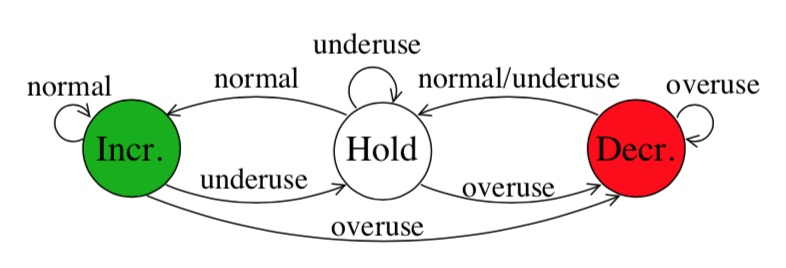
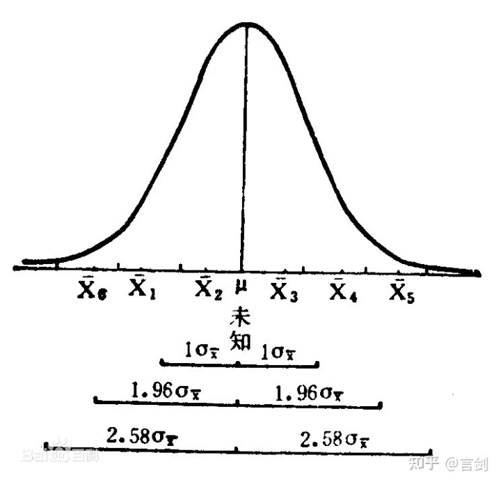
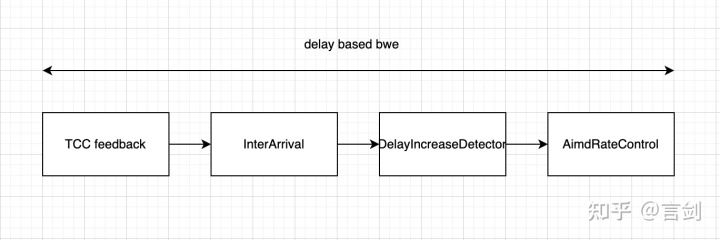

<!--BEGIN_DATA
{
    "create_date": "2022-02-26 17:00", 
    "modify_date": "2022-02-26 17:00", 
    "is_top": "0", 
    "summary": "WebRTC GCC代码深度解读(9)AimdRateControl<br/>WebRTC GCC代码深度解读(10)基于单向延迟的带宽估计<br/>WebRTC GCC代码深度解读(11)Probe:ProbeBitrateEstimator<br/>WebRTC GCC代码深度解读(12)Probe:ProbeController", 
    "tags": "WebRTC", 
    "file_name": "WebRTC GCC代码深度解读03.md"
}
END_DATA-->

#### <p>原文出处：<a href='https://zhuanlan.zhihu.com/p/491775295' target='blank'>WebRTC GCC代码深度解读(9)AimdRateControl</a></p>

## 1. AIMD介绍

AIMD，全称是Additive Increase Multiplicative Decrease，是TCP拥塞控制中的一个方法。在GCC中同样使用到了AIMD，用来控制估计带宽。简单点说，就是在没有拥塞的时候线性增加拥塞窗口，在拥塞的时候指数级减低拥塞窗口。详细可以见wikipedia介绍：

[Additive increase/multiplicative decrease](https://en.wikipedia.org/wiki/Additive_increase/multiplicative_decrease)

AimdRateControl的输入是TrendlineEstimator的输出结果，包含了三个状态：overuse、underuse、normal，输出估计的带宽。

## 2. 源码解读

AimdRateControl根据trendline estimator的输出结果（overuse、underuse、normal）决策当前带宽的增加和降低，总的来说带宽改变遵循AIMD原则：

* 增加分为线性和指数，指数增加用于开始阶段偏离目标带宽很远，此时按照每秒1.08倍增加；线性增加按照每秒一个包增加
* 降低按照指数级降低，每秒降低0.85倍带宽

一些细节可以见下面的代码讲解。

### 2.1 状态机

AimdRateControl存在3个控制状态：Hold、Increase、Decrease，输入包括overusing、underusing、normal。

 AIMD状态机

代码实现如下：

```cpp
void AimdRateControl::ChangeState(const RateControlInput& input,
                                  Timestamp at_time) {
  switch (input.bw_state) {
    case BandwidthUsage::kBwNormal:
    // hold状态下，延迟趋势检测为normal，则需要继续增加估计带宽
      if (rate_control_state_ == RateControlState::kRcHold) {
        time_last_bitrate_change_ = at_time;
        rate_control_state_ = RateControlState::kRcIncrease;
      }
      break;
    case BandwidthUsage::kBwOverusing:
      // 正在降低估计带宽时，延迟趋势检测为overusing，需要继续降低估计带宽
      // decrease一次后会进入hold状态
      if (rate_control_state_ != RateControlState::kRcDecrease) {
        rate_control_state_ = RateControlState::kRcDecrease;
      }
      break;
    case BandwidthUsage::kBwUnderusing:
      // underusing状态需要hold
      rate_control_state_ = RateControlState::kRcHold;
      break;
    default:
      RTC_NOTREACHED();
  }
}
```

### 2.2 增加带宽（线性/指数级）

增加分为线性增加（Additive increase）和指数级增加（multiplicative increase），在还没有达到带宽瓶颈的时候采用指数级增加，用于快速达到目标带宽；一旦达到了瓶颈之后，后续探测需要比较谨慎，因此采用线性方式。下我们我们结合代码来说明两种方式。

> 线性增加的思想是，每RTT+100ms增加一个包大小。

```cpp
DataRate AimdRateControl::AdditiveRateIncrease(Timestamp at_time,
                                               Timestamp last_time) const {
  double time_period_seconds = (at_time - last_time).seconds<double>();
  double data_rate_increase_bps =
      GetNearMaxIncreaseRateBpsPerSecond() * time_period_seconds;
  return DataRate::BitsPerSec(data_rate_increase_bps);
}

// 每秒增加码率
double AimdRateControl::GetNearMaxIncreaseRateBpsPerSecond() const {
  // 按照每秒30帧来计算每一帧的大小
  const TimeDelta kFrameInterval = TimeDelta::Seconds(1) / 30;
  DataSize frame_size = current_bitrate_ * kFrameInterval;

  // 按照每个包1200字节来结算每个包大小
  const DataSize kPacketSize = DataSize::Bytes(1200);
  double packets_per_frame = std::ceil(frame_size / kPacketSize);
  DataSize avg_packet_size = frame_size / packets_per_frame;

  // Approximate the over-use estimator delay to 100 ms.
  // 思想是每RTT+100ms增加一个包
  TimeDelta response_time = rtt_ + TimeDelta::Millis(100);
  // 有个实验是2倍RTT才增加一个包
  if (in_experiment_) response_time = response_time * 2;
  double increase_rate_bps_per_second =
      (avg_packet_size / response_time).bps<double>();

  // 每秒至少增加4000kbps
  double kMinIncreaseRateBpsPerSecond = 4000;
  return std::max(kMinIncreaseRateBpsPerSecond, increase_rate_bps_per_second);
}
```

> 指数级增加思想：每秒按照1.08倍增加，`1.08^(elapse) - 1`，距离上次降低时间越长，增加越多。

```cpp
DataRate AimdRateControl::MultiplicativeRateIncrease(
    Timestamp at_time,
    Timestamp last_time,
    DataRate current_bitrate) const {
  // 第一次alpha为1.08，降低为0.08
  double alpha = 1.08;
  if (last_time.IsFinite()) {
    auto time_since_last_update = at_time - last_time;
    // 非第一次降低，指数函数：距离上次时间越长，alpha越大，降低越多
    alpha = pow(alpha, std::min(time_since_last_update.seconds<double>(), 1.0));
  }

  // 降低的比例为alpha - 1，至少降低1kbps
  DataRate multiplicative_increase =
      std::max(current_bitrate * (alpha - 1.0), DataRate::BitsPerSec(1000));
  return multiplicative_increase;
}
```

### 2.3 降低带宽

降低带宽按照每秒beta倍（默认0.85倍）降低。我们在后面的代码里面详细介绍

### 2.4 link capacity

link capacity，顾名思义，它是用来检测一段时间内链路瓶颈的工具类。考虑到估计存在抖动，在短时间内估计的最小能力可以认为是一个比较保险的链路能力。LinkCapacityEstimator便是用在AIMD中，得到当前链路最小能力的类。  

LinkCapacityEstimator只在每次带宽降低的时候更新，而且按照0.95倍的速度平滑。LinkCapacityEstimator返回了一个上限和下限，分别是加减3倍标准差，为什么选择3？因为3倍标准差，基本上能覆盖99%置信区间。



link capacity在overuse的时候触发更新，因此在初始阶段需要指数级增加带宽，直至出现overuse，此时链路出现瓶颈，当出现瓶颈后探测需要谨慎。当需求带宽不高的时候，可能会探测不到带宽瓶颈，因此link capacity可能没有任何更新。  

当ack码率超过link capacity的上下限后，都需要重置，重新检测链路瓶颈。

### 2.5 AIMD更新

AIMD的增加分为两个阶段，在没有探测到带宽瓶颈的时候指数级增加，在探测到瓶颈后比较谨慎，增加变为线性增加。降低带宽都是指数级降低。

```cpp
DataRate AimdRateControl::Update(const RateControlInput* input,
                                 Timestamp at_time) {
  // 如果5s后还没有初始化码率，则直接使用接收码率作为估计码率
  if (!bitrate_is_initialized_) {
    const TimeDelta kInitializationTime = TimeDelta::Seconds(5);
    if (time_first_throughput_estimate_.IsInfinite()) {
      if (input->estimated_throughput)
        time_first_throughput_estimate_ = at_time;
    } else if (at_time - time_first_throughput_estimate_ >
                   kInitializationTime &&
               input->estimated_throughput) {
      current_bitrate_ = *input->estimated_throughput;
      bitrate_is_initialized_ = true;
    }
  }

  ChangeBitrate(*input, at_time);
  return current_bitrate_;
}
```

核心的逻辑在ChangeBitrate这个函数上：

```cpp
void AimdRateControl::ChangeBitrate(const RateControlInput& input,
                                    Timestamp at_time) {
  // estimated_throughput就是ACK码率
  absl::optional<DataRate> new_bitrate;
  DataRate estimated_throughput =
      input.estimated_throughput.value_or(latest_estimated_throughput_);
  if (input.estimated_throughput)
    latest_estimated_throughput_ = *input.estimated_throughput;

  // An over-use should always trigger us to reduce the bitrate, even though
  // we have not yet established our first estimate. By acting on the over-use,
  // we will end up with a valid estimate.
  // 估计码率没有初始化，此时增加和减少没有什么意义，直接返回。
  if (!bitrate_is_initialized_ &&
      input.bw_state != BandwidthUsage::kBwOverusing)
    return;

  // 状态迁移，见上面介绍
  ChangeState(input, at_time);

  // We limit the new bitrate based on the troughput to avoid unlimited bitrate
  // increases. We allow a bit more lag at very low rates to not too easily get
  // stuck if the encoder produces uneven outputs.
  // 限制最大估计码率为ACK码率的1.5倍，避免没有限制的增加
  // 额外增加10kbps是为了避免在低带宽时增加太慢
  const DataRate troughput_based_limit =
      1.5 * estimated_throughput + DataRate::KilobitsPerSec(10);

  // 根据状态调整带宽
  switch (rate_control_state_) {
    // hold状态，即带宽不变，直接退出
    case RateControlState::kRcHold:
      break;

    case RateControlState::kRcIncrease:
      // ACK码率超过链路上限，超出99%置信区间，当前的链路瓶颈可能变化了，需要重新检测
      if (estimated_throughput > link_capacity_.UpperBound())
        link_capacity_.Reset();

      // Do not increase the delay based estimate in alr since the estimator
      // will not be able to get transport feedback necessary to detect if
      // the new estimate is correct.
      // If we have previously increased above the limit (for instance due to
      // probing), we don't allow further changes.
      // 针对ALR的特殊处理，在ALR状态，因为发送码率很低，因此单向延迟趋势估计不是太准，此时跳过下面逻辑
      if (current_bitrate_ < troughput_based_limit &&
          !(send_side_ && in_alr_ && no_bitrate_increase_in_alr_)) {
        
        // 之前已经估计出链路的瓶颈了（link capacity有结果），此时的增加需要谨慎，因此需要线性增加
        DataRate increased_bitrate = DataRate::MinusInfinity();
        if (link_capacity_.has_estimate()) {
          // The link_capacity estimate is reset if the measured throughput
          // is too far from the estimate. We can therefore assume that our
          // target rate is reasonably close to link capacity and use additive
          // increase.
          DataRate additive_increase =
              AdditiveRateIncrease(at_time, time_last_bitrate_change_);
          increased_bitrate = current_bitrate_ + additive_increase;
        }
        // 压根没有达到链路瓶颈，没有出现过overuse，可以加快速度估计，这是可以1.08倍指数级增加
        else {
          // If we don't have an estimate of the link capacity, use faster ramp
          // up to discover the capacity.
          DataRate multiplicative_increase = MultiplicativeRateIncrease(
              at_time, time_last_bitrate_change_, current_bitrate_);
          increased_bitrate = current_bitrate_ + multiplicative_increase;
        }
        new_bitrate = std::min(increased_bitrate, troughput_based_limit);
      }

      time_last_bitrate_change_ = at_time;
      break;

    case RateControlState::kRcDecrease: {
      DataRate decreased_bitrate = DataRate::PlusInfinity();

      // Set bit rate to something slightly lower than the measured throughput
      // to get rid of any self-induced delay.
      // beta默认0.85，降低按照0.85倍降低，按照吞吐率的0.85倍
      // 如果比当前的估计带宽还要大，那么按照链路能力的0.85倍，链路能力估计较为稳定，也较低
      decreased_bitrate = estimated_throughput * beta_;
      if (decreased_bitrate > current_bitrate_ && !link_capacity_fix_) {
        // TODO(terelius): The link_capacity estimate may be based on old
        // throughput measurements. Relying on them may lead to unnecessary
        // BWE drops.
        if (link_capacity_.has_estimate()) {
          decreased_bitrate = beta_ * link_capacity_.estimate();
        }
      }
      if (estimate_bounded_backoff_ && network_estimate_) {
        decreased_bitrate = std::max(
            decreased_bitrate, network_estimate_->link_capacity_lower * beta_);
      }

      // Avoid increasing the rate when over-using.
      if (decreased_bitrate < current_bitrate_) {
        new_bitrate = decreased_bitrate;
      }

      if (bitrate_is_initialized_ && estimated_throughput < current_bitrate_) {
        if (!new_bitrate.has_value()) {
          last_decrease_ = DataRate::Zero();
        } else {
          last_decrease_ = current_bitrate_ - *new_bitrate;
        }
      }

      // 当前的估计码率低于link capacity下限，即超过99%置信区间，我们对link capacity的准确度标识怀疑
      if (estimated_throughput < link_capacity_.LowerBound()) {
        // The current throughput is far from the estimated link capacity. Clear
        // the estimate to allow an immediate update in OnOveruseDetected.
        link_capacity_.Reset();
      }

      bitrate_is_initialized_ = true;

      // 每次overuse降低带宽的时候更新link capacity
      link_capacity_.OnOveruseDetected(estimated_throughput);
      // Stay on hold until the pipes are cleared.
      // 降低后先进入hold状态
      rate_control_state_ = RateControlState::kRcHold;
      time_last_bitrate_change_ = at_time;
      time_last_bitrate_decrease_ = at_time;
      break;
    }
    default:
      RTC_NOTREACHED();
  }

  // 码率范围做一个限制，见下面说明
  current_bitrate_ = ClampBitrate(new_bitrate.value_or(current_bitrate_));
}

// 限制估计码率，不超过link capacity的上限，不低于配置的最低值
// min_configured_bitrate_是带宽估计的下限
DataRate AimdRateControl::ClampBitrate(DataRate new_bitrate) const {
  if (estimate_bounded_increase_ && network_estimate_) {
    DataRate upper_bound = network_estimate_->link_capacity_upper;
    new_bitrate = std::min(new_bitrate, upper_bound);
  }
  new_bitrate = std::max(new_bitrate, min_configured_bitrate_);
  return new_bitrate;
}
```

## 3. 总结

AIMD的思想相对也比较简单，实际使用过程中主要是一些细节上的注意。

<hr>

#### <p>原文出处：<a href='https://zhuanlan.zhihu.com/p/492035798' target='blank'>WebRTC GCC代码深度解读(10)基于单向延迟的带宽估计</a></p>

## 1. 简介

前面我们有介绍过基于单向延迟的带宽估计的相关工具类，如:

  * 按照包组方式估计包组之间发送接收时间差的工具类：InterArrivalDelta
  * 根据InterArrivalDelta估计单向延迟趋势的：TrendlineEstimator
  * 根据TrendlineEstimator输出的结果估计做AIMD码率控制的：AimdRateControl  

这里我们将基于更全局的类DelayBasedBwe来讲解下怎么把这些类串起来，完成基于延迟的带宽估计。DelayBasedBwe这个类没有太多算法思想，纯粹是上面各个类的调用，本章可以轻松阅读。遇到不清楚的可以再查看前几个类的分析文章。

[言剑：WebRTC GCC代码深度解读(7) ](https://zhuanlan.zhihu.com/p/490528187)

[言剑：WebRTC GCC代码深度解读(8)](https://zhuanlan.zhihu.com/p/490775550)

[言剑：WebRTC GCC代码深度解读(9) )](https://zhuanlan.zhihu.com/p/491775295)

整个`DelayBasedBwe`类流程如下：

 delay based bwe

## 2. 源码讲解

`DelayBasedBwe`这个类是一个组合了多个功能，这里主要介绍下前面没有提到的一些细节。

### 2.1 定义

输出结果定义：

```cpp
struct Result {
  bool updated;   // 带宽是否有更新
  bool probe;     // 是否需要探测带宽
  DataRate target_bitrate = DataRate::Zero(); // 目标带宽
  bool recovered_from_overuse;    // 是否从overuse中恢复
  bool backoff_in_alr;    // 是否因为ALR处于退避状态
};
```

这里有一个`recovered_from_overuse`标志，判断条件是：是否从overuse变为normal：

```cpp
if (prev_detector_state == BandwidthUsage::kBwUnderusing &&
    active_delay_detector_->State() == BandwidthUsage::kBwNormal) {
    recovered_from_overuse = true;
}
```

从下面的类定义，我们可以看到，DelayBasedBwe串联了InterArrivalDelta、TrendlineEstimator、AimdRateControl功能。但是有两套检测器，针对音频和视频分别做了一套，将音频和视频区分开来检测的会更加准确。

```cpp
class DelayBasedBwe {
 public:

  // 输入相关信息，触发带宽估计
  Result IncomingPacketFeedbackVector(
      const TransportPacketsFeedback& msg,  // TCC feedback消息
      absl::optional<DataRate> acked_bitrate, // 从TCC feedback中计算的ACK码率
      absl::optional<DataRate> probe_bitrate, // 需要探测的目标码率
      absl::optional<NetworkStateEstimate> network_estimate,  // 网络状态估计
      bool in_alr);  // 当前是否处于ALR状态
  ...

  // 直接触发overuse，并给定瓶颈带宽
  DataRate TriggerOveruse(Timestamp at_time,
                          absl::optional<DataRate> link_capacity);
 private:
  ...
  // Alternatively, run two separate overuse detectors for audio and video,
  // and fall back to the audio one if we haven't seen a video packet in a
  // while.
  // 这个类里面分别维护了音频和视频的overuse估计，在没有视频的时候可以使用音频的一套参数
  BweSeparateAudioPacketsSettings separate_audio_;
  int64_t audio_packets_since_last_video_;
  Timestamp last_video_packet_recv_time_;

  // 网络状态估计
  NetworkStatePredictor* network_state_predictor_;

  // 视频的InterArrival、DelayIncreaseDetectorInterface（trendline estmator）
  // InterArrivalDelta是从InterArrival复制过来的
  std::unique_ptr<InterArrival> video_inter_arrival_;
  std::unique_ptr<InterArrivalDelta> video_inter_arrival_delta_;
  std::unique_ptr<DelayIncreaseDetectorInterface> video_delay_detector_;

  // 音频的InterArrival、DelayIncreaseDetectorInterface（trendline estmator）
  std::unique_ptr<InterArrival> audio_inter_arrival_;
  std::unique_ptr<InterArrivalDelta> audio_inter_arrival_delta_;
  std::unique_ptr<DelayIncreaseDetectorInterface> audio_delay_detector_;

  // 当前在使用音频还是视频的DelayIncreaseDetectorInterface
  DelayIncreaseDetectorInterface* active_delay_detector_;

  Timestamp last_seen_packet_;
  bool uma_recorded_;

  AimdRateControl rate_control_;    // AIMD控制
  DataRate prev_bitrate_;           // 之前的码率
  bool has_once_detected_overuse_;  // 是否检测到过overuse
  BandwidthUsage prev_state_;       // 之前的带宽使用状态
  const bool use_new_inter_arrival_delta_;  // 是否使用新的inter arrival
  bool alr_limited_backoff_enabled_;        // ALR状态限制退避是否开启
};
```

### 2.2 IncomingPacketFeedback

这个对外接口主要输入TCC feedback，然后输入到其他模块中。

```cpp
void DelayBasedBwe::IncomingPacketFeedback(const PacketResult& packet_feedback,
                                           Timestamp at_time) {
  // Reset if the stream has timed out.
  if (last_seen_packet_.IsInfinite() ||
      at_time - last_seen_packet_ > kStreamTimeOut) {
    // 首次收到tcc feedback或者距离上次收包超过2s，需要重新创建InterArrival、TrendlineEstimator
    ...

    // 默认使用视频的TrendlineEstimator
    active_delay_detector_ = video_delay_detector_.get();
  }
  last_seen_packet_ = at_time;

  // 一般音频报相对于视频包要小很多，而网络设备对于大小不同的包策略不一样
  // 因此这里可以区分音频和视频包，通过separate_audio_.enabled控制
  // 如果是音频报则输入音频的InterArrival、TrendlineEstimator，如果是视频包则使用视频的
  // 如果没有开启，则直接使用视频的InterArrival、TrendlineEstimator

  // 输入数据到InterArrival、TrendlineEstimator
  ...
}
```

### 2.2 MaybeUpdateEstimate

其他的地方都不需要做太多介绍，这个函数需要重点关注下，他是带宽估计的核心。检测到overuse的时候需要注意：

  * 在ALR状态，保持带宽不降低，ACK码率替换为上次的估计码率
  * 如果还没有得到ACK码率，那么需要按照每个RTT降低一半码率方式降低

```cpp
DelayBasedBwe::Result DelayBasedBwe::MaybeUpdateEstimate(
    absl::optional<DataRate> acked_bitrate,
    absl::optional<DataRate> probe_bitrate,
    absl::optional<NetworkStateEstimate> state_estimate,
    bool recovered_from_overuse,
    bool in_alr,
    Timestamp at_time) {
  Result result;

  // Currently overusing the bandwidth.
  if (active_delay_detector_->State() == BandwidthUsage::kBwOverusing) {
    // has_once_detected_overuse_：检测过一次overuse
    // TimeToReduceFurther: 还没有到降低带宽的时间
    // 如果在ALR状态下检测到overuse，此时的ACK码率因为发送数据量较少不能代表实际情况
    // 使用上次的估计带宽作为ACK码率
    if (has_once_detected_overuse_ && in_alr && alr_limited_backoff_enabled_) {
      if (rate_control_.TimeToReduceFurther(at_time, prev_bitrate_)) {
        result.updated =
            UpdateEstimate(at_time, prev_bitrate_, &result.target_bitrate);
        // ALR状态需要继续“hold”
        result.backoff_in_alr = true;
      }
    }
    // 如果存在ACK码率，那么按照实际ACK码率去改变带宽即可
    else if (acked_bitrate &&
               rate_control_.TimeToReduceFurther(at_time, *acked_bitrate)) {
      result.updated =
          UpdateEstimate(at_time, acked_bitrate, &result.target_bitrate);
    }
    // 在还没有检测到ACK码率之前就检测到overuse，每200ms降低50%码率
    else if (!acked_bitrate && rate_control_.ValidEstimate() &&
               rate_control_.InitialTimeToReduceFurther(at_time)) {
      // Overusing before we have a measured acknowledged bitrate. Reduce send
      // rate by 50% every 200 ms.
      // TODO(tschumim): Improve this and/or the acknowledged bitrate estimator
      // so that we (almost) always have a bitrate estimate.
      rate_control_.SetEstimate(rate_control_.LatestEstimate() / 2, at_time);
      result.updated = true;
      result.probe = false;
      result.target_bitrate = rate_control_.LatestEstimate();
    }

    has_once_detected_overuse_ = true;
  } else {
    // 非overuse状态，如果有通过probe探测到带宽，那么则需要设置到AIMD中
    if (probe_bitrate) {
      result.probe = true;
      result.updated = true;
      result.target_bitrate = *probe_bitrate;
      rate_control_.SetEstimate(*probe_bitrate, at_time);
    } else {
      result.updated =
          UpdateEstimate(at_time, acked_bitrate, &result.target_bitrate);
      result.recovered_from_overuse = recovered_from_overuse;
    }
  }

  // 更新prev_bitrate_、prev_state_
  BandwidthUsage detector_state = active_delay_detector_->State();
  if ((result.updated && prev_bitrate_ != result.target_bitrate) ||
      detector_state != prev_state_) {
    DataRate bitrate = result.updated ? result.target_bitrate : prev_bitrate_;

    prev_bitrate_ = bitrate;
    prev_state_ = detector_state;
  }
  return result;
}
```

### 2.3 TimeToReduceFurther in AIMD

`TimeToReduceFurther`，在AIMD里面两次降低带宽需要超过一个RTT（RTT现在在10~200ms），同时ACK码率相对于上次估计码率偏低，这个时候才能继续降低码率。

```cpp
bool AimdRateControl::TimeToReduceFurther(Timestamp at_time,
                                          DataRate estimated_throughput) const {
  const TimeDelta bitrate_reduction_interval =
      rtt_.Clamped(TimeDelta::Millis(10), TimeDelta::Millis(200));
  // 两次带宽改变需要超过200ms
  if (at_time - time_last_bitrate_change_ >= bitrate_reduction_interval) {
    return true;
  }

  /// bitrate_is_initialized_
  if (ValidEstimate()) {
    // TODO(terelius/holmer): Investigate consequences of increasing
    // the threshold to 0.95 * LatestEstimate().
    // ACK码率低于上次估计的50%
    const DataRate threshold = 0.5 * LatestEstimate();
    return estimated_throughput < threshold;
  }
  return false;
}
```

### 2.4 InitialTimeToReduceFurther in AIMD

从上面代码，我们可以看到，如果在初始化阶段，还没有ACK码率，如果遇到了overuse，我们应该降低码率。需不需要等一段时间？AIMD中通过`initial_backoff_interval_`这个配置项来控制。`InitialTimeToReduceFurther`这个函数就是用来判断，初始化阶段是否立即降低码率。

```cpp
bool AimdRateControl::InitialTimeToReduceFurther(Timestamp at_time) const {
  if (!initial_backoff_interval_) {
    // 没有设置interval，那么在初始化阶段一定会退避，遇到overuse就降低码率
    return ValidEstimate() &&
           TimeToReduceFurther(at_time,
                               LatestEstimate() / 2 - DataRate::BitsPerSec(1));
  }
  // TODO(terelius): We could use the RTT (clamped to suitable limits) instead
  // of a fixed bitrate_reduction_interval.
  // 退避需要超过一定间隔
  if (time_last_bitrate_decrease_.IsInfinite() ||
      at_time - time_last_bitrate_decrease_ >= *initial_backoff_interval_) {
    return true;
  }
  return false;
}
```

## 3. 总结

delay based bwe的主要内容在三个工具类里面，这里主要做了一些缝合，还是有一些值得注意的地方。

<hr>

#### <p>原文出处：<a href='https://zhuanlan.zhihu.com/p/493777549' target='blank'>WebRTC GCC代码深度解读(11)Probe:ProbeBitrateEstimator</a></p>

## 1. 简介

通过AIMD方式增加估计带宽的方式比较慢，因此我们可以通过探测方式。在短时间内以目标码率发送数据，如果被ACK的码率达到发送码率的一定比例，那么便认为探测成功，此时链路可用带宽即是我们探测到的带宽。`ProbeBitrateEstimator`这个类便是用来估计发送探测包后ACK的码率。

## 2. 原理介绍

通过probe controller来控制是否发送probe、发送多少个probe等；通过pacing模块来控制发送probe报文，以及码率不够时使用padding补充；接收端通过TCC
feedback来反馈接收到多少数据，通过ProbeBitrateEstimator来估计probe发送以及接收端收到多少数据。  

因此ProbeBitrateEstimator的输入为TCC feedback，输出为估计的码率。

## 3. 源码解读

一次probe会发送多个包，因此，这估计码率的时候需要将这些包聚合起来：

```cpp
struct AggregatedCluster {
    int num_probes = 0;  // 多少次探测
    Timestamp first_send = Timestamp::PlusInfinity();   // 第一次发送时间
    Timestamp last_send = Timestamp::MinusInfinity();   // 最后一次发送时间
    Timestamp first_receive = Timestamp::PlusInfinity();// 第一次接收时间
    Timestamp last_receive = Timestamp::MinusInfinity();// 最后一次接收时间
    DataSize size_last_send = DataSize::Zero();         // 最后一次发送字节数，计算时需要去掉
    DataSize size_first_receive = DataSize::Zero();     // 第一次接收字节数，计算时需要去掉
    DataSize size_total = DataSize::Zero();             // 总发送字节数
};
```

probe码率估计的过程在HandleProbeAndEstimateBitrate这个函数里面：  

根据TCC ACK，计算发送码率和接收码率，取小值为最终的估计码率。处理上有些小细节，如：  

接收到的probe需要达到一定比例才认为probe成功；计算时需要去掉一个包；透过率在一定比例内才认为是合理的。

```cpp
absl::optional<DataRate> ProbeBitrateEstimator::HandleProbeAndEstimateBitrate(
    const PacketResult& packet_feedback) {
  int cluster_id = packet_feedback.sent_packet.pacing_info.probe_cluster_id;
  // 距离这次probe结果如果超过1s就需要删除
  EraseOldClusters(packet_feedback.receive_time);

  AggregatedCluster* cluster = &clusters_[cluster_id];

  if (packet_feedback.sent_packet.send_time < cluster->first_send) {
    cluster->first_send = packet_feedback.sent_packet.send_time;
  }
  if (packet_feedback.sent_packet.send_time > cluster->last_send) {
    cluster->last_send = packet_feedback.sent_packet.send_time;
    cluster->size_last_send = packet_feedback.sent_packet.size;
  }
  if (packet_feedback.receive_time < cluster->first_receive) {
    cluster->first_receive = packet_feedback.receive_time;
    cluster->size_first_receive = packet_feedback.sent_packet.size;
  }
  if (packet_feedback.receive_time > cluster->last_receive) {
    cluster->last_receive = packet_feedback.receive_time;
  }
  cluster->size_total += packet_feedback.sent_packet.size;
  cluster->num_probes += 1;

  // 发送端发送的probe报文，接收端至少需要接收到80%（kMinReceivedProbesRatio）
  int min_probes =
      packet_feedback.sent_packet.pacing_info.probe_cluster_min_probes *
      kMinReceivedProbesRatio;
  // 发送端发送的probe数据量，接收端至少需要接收到80%（kMinReceivedBytesRatio）
  DataSize min_size =
      DataSize::Bytes(
          packet_feedback.sent_packet.pacing_info.probe_cluster_min_bytes) *
      kMinReceivedBytesRatio;
  // 如果接收到probe报文以及数据量没有达到，计算的码率不准确
  if (cluster->num_probes < min_probes || cluster->size_total < min_size)
    return absl::nullopt;

  TimeDelta send_interval = cluster->last_send - cluster->first_send;
  TimeDelta receive_interval = cluster->last_receive - cluster->first_receive;

  // 发送和接收的间隔不能超过1s，否则超时
  if (send_interval <= TimeDelta::Zero() || send_interval > kMaxProbeInterval ||
      receive_interval <= TimeDelta::Zero() ||
      receive_interval > kMaxProbeInterval) {
    return absl::nullopt;
  }
  // Since the `send_interval` does not include the time it takes to actually
  // send the last packet the size of the last sent packet should not be
  // included when calculating the send bitrate.
  // 假设每T时间发送S大小的报文，总发送N个报文，时间为(N-1)*T，数据为N*S，需要去掉一个报文！
  DataSize send_size = cluster->size_total - cluster->size_last_send;
  DataRate send_rate = send_size / send_interval;

  // Since the `receive_interval` does not include the time it takes to
  // actually receive the first packet the size of the first received packet
  // should not be included when calculating the receive bitrate.
  // 同发送端，需要去掉一个报文，发送端需要去掉最后一个，接收端去掉第一个
  DataSize receive_size = cluster->size_total - cluster->size_first_receive;
  DataRate receive_rate = receive_size / receive_interval;

  double ratio = receive_rate / send_rate;

  // 接收数据超过发送数据的2倍，肯定不合理，一般是在1倍左右
  if (ratio > kMaxValidRatio) {
    return absl::nullopt;
  }

  DataRate res = std::min(send_rate, receive_rate);
  // If we're receiving at significantly lower bitrate than we were sending at,
  // it suggests that we've found the true capacity of the link. In this case,
  // set the target bitrate slightly lower to not immediately overuse.
  // kMinRatioForUnsaturatedLink = 0.9，kTargetUtilizationFraction = 0.95
  // 如果接收码率相对发送码率较低，这里会额外增加一点码率，为了恰好能达到链路瓶颈且不会有overuse
  // 这个地方的sendrate一般是我们按照估计带宽发送的，因此可以认为是链路的能力
  // 而probe通常是为了上探带宽，因此这里低于0.9倍发送码率认为是非预期行为，没有达到链路能力
  // 所以这里才会增加一点比例，保证链路能够充分利用（饱和，saturated）
  if (receive_rate < kMinRatioForUnsaturatedLink * send_rate) {
    res = kTargetUtilizationFraction * receive_rate;
  }

  estimated_data_rate_ = res;
  return estimated_data_rate_;
}
```

## 4. 总结

ProbeBitrateEstimator是一个用来根据TCC feedback估计probe码率结果的类。主要还是根据一次probe内的发送和接收数据码率来估计的。

<hr>

#### <p>原文出处：<a href='https://zhuanlan.zhihu.com/p/494050738' target='blank'>WebRTC GCC代码深度解读(12)Probe:ProbeController</a></p>

## 1. 介绍

在一些场景，如初始阶段，或者应用的需求带宽变大过后，如果通过AIMD方式来增加估计带宽，速度较慢。GCC里面提供了另外一个工具，即探测。probe的思想是，在短时间内以目标码率发送数据，如果被ACK的码率达到发送码率的一定比例，那么便认为探测成功，此时链路可用带宽即是我们探测到的带宽。  

ProbeController用于控制是否probe，probe码率是多少；pacing模块的BitrateProber完成probe的发送；ProbeBitrateEstimator完成probe结果的分析，分析probe是否成功以及结果码率。  

probe能够快速地探测到我们需求的带宽，且对网络造成的影响也较小。但是其存在的缺陷也比较明显，因为发送时间不够长，在收到干扰的时候容易失败，在一些抖动场景很容易出现估计过高的问题。

触发探测的条件：

  * 设置最大、最小、初始码率触发探测
  * 网络中断、网络恢复触发探测
  * 设置估计码率触发探测
  * ALR阶段触发探测
  * 外部主动请求探测

## 2. 源码解读

### probe状态

probe存在3个状态，kInit是初始化状态，没有任何probe；kWaitingForProbingResult等待probe结果才能继续后续的probe；kProbingComplete完成probe。

### 接口

```cpp
class ProbeController {
 public:
  // 设置最大码率、最小码率、初始码率
  ABSL_MUST_USE_RESULT std::vector<ProbeClusterConfig> SetBitrates(
      int64_t min_bitrate_bps,
      int64_t start_bitrate_bps,
      int64_t max_bitrate_bps,
      int64_t at_time_ms);

  // The total bitrate, as opposed to the max bitrate, is the sum of the
  // configured bitrates for all active streams.
  // 设置的所有流的总体需求码率，最大码率会根据需求码率调整
  ABSL_MUST_USE_RESULT std::vector<ProbeClusterConfig>
  OnMaxTotalAllocatedBitrate(int64_t max_total_allocated_bitrate,
                             int64_t at_time_ms);

  // 网络路由变化，是否可用
  ABSL_MUST_USE_RESULT std::vector<ProbeClusterConfig> OnNetworkAvailability(
      NetworkAvailability msg);

  // 设置估计的带宽
  ABSL_MUST_USE_RESULT std::vector<ProbeClusterConfig> SetEstimatedBitrate(
      int64_t bitrate_bps,
      int64_t at_time_ms);

  // ALR相关，ALR阶段因为发送数据较少，无法进行有效上探，因此可以开启在ALR阶段探测
  void EnablePeriodicAlrProbing(bool enable);
  void SetAlrStartTimeMs(absl::optional<int64_t> alr_start_time);
  void SetAlrEndedTimeMs(int64_t alr_end_time);

  // 直接请求probe
  ABSL_MUST_USE_RESULT std::vector<ProbeClusterConfig> RequestProbe(
      int64_t at_time_ms);

  // Sets a new maximum probing bitrate, without generating a new probe cluster.
  // 设置最大探测码率，不会触发probe
  void SetMaxBitrate(int64_t max_bitrate_bps);

  // Resets the ProbeController to a state equivalent to as if it was just
  // created EXCEPT for `enable_periodic_alr_probing_`.
  void Reset(int64_t at_time_ms);

  // 定时任务，主要是处理ALR状态下上探的功能
  ABSL_MUST_USE_RESULT std::vector<ProbeClusterConfig> Process(
      int64_t at_time_ms);

 private:
  bool network_available_;  // 网络是否可用
  State state_;     // probe状态
  int64_t min_bitrate_to_probe_further_bps_;    // 后续探测的最小码率
  int64_t time_last_probing_initiated_ms_;      // 上次初始化探测的时间
  int64_t estimated_bitrate_bps_;               // 估计的码率
  int64_t start_bitrate_bps_;                   // 初始化码率
  int64_t max_bitrate_bps_;                     // 最大码率
  int64_t last_bwe_drop_probing_time_ms_;       // 上次码率降低探测时间
  absl::optional<int64_t> alr_start_time_ms_;   // ALR持续时间
  absl::optional<int64_t> alr_end_time_ms_;     // ALR结束时间
  bool enable_periodic_alr_probing_;            // 开启周期ALR探测
  int64_t time_of_last_large_drop_ms_;          // 上次较大降低带宽时间
  int64_t bitrate_before_last_large_drop_bps_;  // 上次剧烈降低的时间
  int64_t max_total_allocated_bitrate_;         // 最大需求带宽

  ...

  int32_t next_probe_cluster_id_ = 1;           // 全局的probe id，自增

  ProbeControllerConfig config_;
};
```

### InitiateProbing，初始化一次探测

我们先看下一个内部接口，ProbeController如何实现probe的呢？InitiateProbing的输入为当前时间、需要探测的多个码率（一般是渐进递增），后续是否需要继续probe。

  * probe存在码率如果超过上限，则后续不需要继续probe（`probe_further=false`）
  * 这里会指定探测需要的包个数，探测时长，探测id等，这些会输入到pacer模块去实际发送probe报文
  * 如果需要继续探测（`probe_further=true`），那么指定下次探测的码率不低于当前最后一次探测的0.7倍，避免没必要的探测。
    
```cpp
std::vector<ProbeClusterConfig> ProbeController::InitiateProbing(
    int64_t now_ms,
    std::vector<int64_t> bitrates_to_probe,
    bool probe_further) {
  int64_t max_probe_bitrate_bps =
      max_bitrate_bps_ > 0 ? max_bitrate_bps_ : kDefaultMaxProbingBitrateBps;

  // 是否需要根据分配码率总和来限制探测码率
  // 因为没有使用那么多码率就没必要探测这么多码率
  if (limit_probes_with_allocateable_rate_ &&
      max_total_allocated_bitrate_ > 0) {
    // If a max allocated bitrate has been configured, allow probing up to 2x
    // that rate. This allows some overhead to account for bursty streams,
    // which otherwise would have to ramp up when the overshoot is already in
    // progress.
    // It also avoids minor quality reduction caused by probes often being
    // received at slightly less than the target probe bitrate.
    max_probe_bitrate_bps =
        std::min(max_probe_bitrate_bps, max_total_allocated_bitrate_ * 2);
  }

  std::vector<ProbeClusterConfig> pending_probes;
  for (int64_t bitrate : bitrates_to_probe) {
    RTC_DCHECK_GT(bitrate, 0);

    // 限制探测的上限，如果已经探测到上限，则不需要继续探测
    if (bitrate > max_probe_bitrate_bps) {
      bitrate = max_probe_bitrate_bps;
      probe_further = false;
    }

    // 生成一次探测，按照bitrate来探测，探测时长为15ms，至少发送5个探测包
    // 设置此次的probe id，每次探测由不同的ID区分。
    ProbeClusterConfig config;
    config.at_time = Timestamp::Millis(now_ms);
    config.target_data_rate =
        DataRate::BitsPerSec(rtc::dchecked_cast<int>(bitrate));
    config.target_duration = TimeDelta::Millis(kMinProbeDurationMs);
    config.target_probe_count = kMinProbePacketsSent;
    config.id = next_probe_cluster_id_;
    next_probe_cluster_id_++;
    MaybeLogProbeClusterCreated(event_log_, config);
    pending_probes.push_back(config);
  }
  time_last_probing_initiated_ms_ = now_ms;

  // 如果还需要继续探测，那么需要设置一个下次探测的最低带宽min_bitrate_to_probe_further_bps_
  // 如果下次低于这个带宽就不需要探测了，因为我们目前已经达到这个带宽
  if (probe_further) {
    state_ = State::kWaitingForProbingResult;
    min_bitrate_to_probe_further_bps_ =
        (*(bitrates_to_probe.end() - 1)) * config_.further_probe_threshold;
  } else {
    state_ = State::kProbingComplete;
    min_bitrate_to_probe_further_bps_ = kExponentialProbingDisabled;
  }
  return pending_probes;
}
```

### 开始阶段的指数级探测

在最开始阶段，我们需要指数级探测，是为了尽快达到目标带宽。探测分为两次，第一次为3倍初始码率，第二次为6倍初始码率：

```cpp
std::vector<ProbeClusterConfig> ProbeController::InitiateExponentialProbing(
    int64_t at_time_ms) {
  // 初始化阶段的探测，为了尽快达到探测码率
  // 分为两次，第一次为3*start_bitrate_bps_，第二次为6*start_bitrate_bps_
  // When probing at 1.8 Mbps ( 6x 300), this represents a threshold of
  // 1.2 Mbps to continue probing.
  std::vector<int64_t> probes = {static_cast<int64_t>(
      config_.first_exponential_probe_scale * start_bitrate_bps_)};
  if (config_.second_exponential_probe_scale) {
    probes.push_back(config_.second_exponential_probe_scale.Value() *
                     start_bitrate_bps_);
  }
  return InitiateProbing(at_time_ms, probes, true);
}
```

### 设置目标码率触发探测

```cpp
std::vector<ProbeClusterConfig> ProbeController::SetBitrates(
    int64_t min_bitrate_bps,
    int64_t start_bitrate_bps,
    int64_t max_bitrate_bps,
    int64_t at_time_ms) {
  if (start_bitrate_bps > 0) {
    start_bitrate_bps_ = start_bitrate_bps;
    estimated_bitrate_bps_ = start_bitrate_bps;
  } else if (start_bitrate_bps_ == 0) {
    start_bitrate_bps_ = min_bitrate_bps;
  }

  // The reason we use the variable `old_max_bitrate_pbs` is because we
  // need to set `max_bitrate_bps_` before we call InitiateProbing.
  int64_t old_max_bitrate_bps = max_bitrate_bps_;
  max_bitrate_bps_ = max_bitrate_bps;

  switch (state_) {
    // 在初始化阶段，需要指数级探测
    case State::kInit:
      if (network_available_)
        return InitiateExponentialProbing(at_time_ms);
      break;

    case State::kWaitingForProbingResult:
      break;

    // 探测结束
    case State::kProbingComplete:
      // If the new max bitrate is higher than both the old max bitrate and the
      // estimate then initiate probing.
      // 设置了一个新的码率，且当前估计的码率还未达到最大，此时探测到设置的这个码率
      if (estimated_bitrate_bps_ != 0 &&
          old_max_bitrate_bps < max_bitrate_bps_ &&
          estimated_bitrate_bps_ < max_bitrate_bps_) {
        // The assumption is that if we jump more than 20% in the bandwidth
        // estimate or if the bandwidth estimate is within 90% of the new
        // max bitrate then the probing attempt was successful.
        // 探测成功的阈值：达到上次码率的1.2倍或者设置的最大码率的0.9倍
        mid_call_probing_succcess_threshold_ =
            std::min(estimated_bitrate_bps_ * 1.2, max_bitrate_bps_ * 0.9);
        mid_call_probing_waiting_for_result_ = true;
        mid_call_probing_bitrate_bps_ = max_bitrate_bps_;

        RTC_HISTOGRAM_COUNTS_10000("WebRTC.BWE.MidCallProbing.Initiated",
                                   max_bitrate_bps_ / 1000);
        
        // 立即探测到max_bitrate_bps_
        return InitiateProbing(at_time_ms, {max_bitrate_bps_}, false);
      }
      break;
  }
  return std::vector<ProbeClusterConfig>();
}
```

### 最大需求带宽更新

当最大需求带宽变化的时候，为了尽快达到目标带宽，可以使用probe快速达到。这里的触发探测仅在ALR状态下才会进行。探测分为两步，第一次为最大需求带宽的一倍，第二为最大需求带宽的两倍。

```cpp
std::vector<ProbeClusterConfig> ProbeController::OnMaxTotalAllocatedBitrate(
    int64_t max_total_allocated_bitrate,
    int64_t at_time_ms) {
  const bool in_alr = alr_start_time_ms_.has_value();
  const bool allow_allocation_probe = in_alr;

  // 当最大需求带宽变化的时候需要触发probe
  if (state_ == State::kProbingComplete &&
      max_total_allocated_bitrate != max_total_allocated_bitrate_ &&
      estimated_bitrate_bps_ != 0 &&
      (max_bitrate_bps_ <= 0 || estimated_bitrate_bps_ < max_bitrate_bps_) &&
      estimated_bitrate_bps_ < max_total_allocated_bitrate &&
      allow_allocation_probe) {
    max_total_allocated_bitrate_ = max_total_allocated_bitrate;

    if (!config_.first_allocation_probe_scale)
      return std::vector<ProbeClusterConfig>();

    // 采用两次上探，第一次为1倍，第二次为2倍
    DataRate first_probe_rate =
        DataRate::BitsPerSec(max_total_allocated_bitrate) *
        config_.first_allocation_probe_scale.Value();
    DataRate probe_cap = config_.allocation_probe_max.Get();
    first_probe_rate = std::min(first_probe_rate, probe_cap);
    
    std::vector<int64_t> probes = {first_probe_rate.bps()};
    if (config_.second_allocation_probe_scale) {
      DataRate second_probe_rate =
          DataRate::BitsPerSec(max_total_allocated_bitrate) *
          config_.second_allocation_probe_scale.Value();
      second_probe_rate = std::min(second_probe_rate, probe_cap);
      if (second_probe_rate > first_probe_rate)
        probes.push_back(second_probe_rate.bps());
    }
    return InitiateProbing(at_time_ms, probes,
                           config_.allocation_allow_further_probing);
  }
  max_total_allocated_bitrate_ = max_total_allocated_bitrate;
  return std::vector<ProbeClusterConfig>();
}
```

### 网络中断/恢复

网络中断后需要直接终止未完成的probe；网络恢复后，且是未做过probe，则需要指数级探测。

```cpp
std::vector<ProbeClusterConfig> ProbeController::OnNetworkAvailability(
    NetworkAvailability msg) {
  network_available_ = msg.network_available;
  // 网络中断，立即结束探测
  if (!network_available_ && state_ == State::kWaitingForProbingResult) {
    state_ = State::kProbingComplete;
    min_bitrate_to_probe_further_bps_ = kExponentialProbingDisabled;
  }
  // 恢复，初始化探测
  if (network_available_ && state_ == State::kInit && start_bitrate_bps_ > 0)
    return InitiateExponentialProbing(msg.at_time.ms());
  return std::vector<ProbeClusterConfig>();
}
```

### 设置估计的码率

  * 如果设置的估计码率超过上次最后一次探测的0.7倍，则需要继续探测
  * 如果估计码率突然降低（上次的0.66倍），记录上次的码率，用于后面的快速恢复

```cpp
std::vector<ProbeClusterConfig> ProbeController::SetEstimatedBitrate(
    int64_t bitrate_bps,
    int64_t at_time_ms) {
  if (mid_call_probing_waiting_for_result_ &&
      bitrate_bps >= mid_call_probing_succcess_threshold_) {
    mid_call_probing_waiting_for_result_ = false;
  }

  // 如果当前正在等待probe结果，且新设置的码率超过上次最后一次探测的0.7倍，则需要继续探测
  std::vector<ProbeClusterConfig> pending_probes;
  if (state_ == State::kWaitingForProbingResult) {
    // Continue probing if probing results indicate channel has greater
    // capacity.
    RTC_LOG(LS_INFO) << "Measured bitrate: " << bitrate_bps
                     << " Minimum to probe further: "
                     << min_bitrate_to_probe_further_bps_;

    if (min_bitrate_to_probe_further_bps_ != kExponentialProbingDisabled &&
        bitrate_bps > min_bitrate_to_probe_further_bps_) {
      pending_probes = InitiateProbing(
          at_time_ms,
          {static_cast<int64_t>(config_.further_exponential_probe_scale *
                                bitrate_bps)},
          true);
    }
  }

  // 如果当前的估计码率较低，需要记录码率降低前的估计码率
  // 记录降低前的码率主要是为了快速回复，下次不需要从最小码率开始探测，而是从这个码率开始
  if (bitrate_bps < kBitrateDropThreshold * estimated_bitrate_bps_) {
    time_of_last_large_drop_ms_ = at_time_ms;
    bitrate_before_last_large_drop_bps_ = estimated_bitrate_bps_;
  }

  estimated_bitrate_bps_ = bitrate_bps;
  return pending_probes;
}
```

### 定时任务处理ALR周期探测、结束探测

在ALR状态下可以周期地上探，以达到需求带宽。

```cpp
std::vector<ProbeClusterConfig> ProbeController::Process(int64_t at_time_ms) {
  // 如果探测超过1s还没有完成，那么探测超时，结束探测
  if (at_time_ms - time_last_probing_initiated_ms_ >
      kMaxWaitingTimeForProbingResultMs) {
    mid_call_probing_waiting_for_result_ = false;

    if (state_ == State::kWaitingForProbingResult) {
      RTC_LOG(LS_INFO) << "kWaitingForProbingResult: timeout";
      state_ = State::kProbingComplete;
      min_bitrate_to_probe_further_bps_ = kExponentialProbingDisabled;
    }
  }

  // 如果开启ALR周期探测，那么需要开始新的一次探测
  // 按照当前估计码率的2倍来探测
  // ALR探测周期为5s
  if (enable_periodic_alr_probing_ && state_ == State::kProbingComplete) {
    // Probe bandwidth periodically when in ALR state.
    if (alr_start_time_ms_ && estimated_bitrate_bps_ > 0) {
      int64_t next_probe_time_ms =
          std::max(*alr_start_time_ms_, time_last_probing_initiated_ms_) +
          config_.alr_probing_interval->ms();
      if (at_time_ms >= next_probe_time_ms) {
        return InitiateProbing(at_time_ms,
                               {static_cast<int64_t>(estimated_bitrate_bps_ *
                                                     config_.alr_probe_scale)},
                               true);
      }
    }
  }
  return std::vector<ProbeClusterConfig>();
}
```

### 主动请求探测

在带宽降低后，快速恢复。

```cpp
std::vector<ProbeClusterConfig> ProbeController::RequestProbe(
    int64_t at_time_ms) {
  // Called once we have returned to normal state after a large drop in
  // estimated bandwidth. The current response is to initiate a single probe
  // session (if not already probing) at the previous bitrate.
  //
  // If the probe session fails, the assumption is that this drop was a
  // real one from a competing flow or a network change.
  bool in_alr = alr_start_time_ms_.has_value();
  bool alr_ended_recently =
      (alr_end_time_ms_.has_value() &&
       at_time_ms - alr_end_time_ms_.value() < kAlrEndedTimeoutMs);
  if (in_alr || alr_ended_recently || in_rapid_recovery_experiment_) {
    if (state_ == State::kProbingComplete) {
      // 按照降低前的带宽0.85倍探测
      uint32_t suggested_probe_bps =
          kProbeFractionAfterDrop * bitrate_before_last_large_drop_bps_;
      // 至少需要ACK 0.95倍探测数据，因为这里的快速恢复本地就存在风险，因此ACK需要严格一些
      uint32_t min_expected_probe_result_bps =
          (1 - kProbeUncertainty) * suggested_probe_bps;

      int64_t time_since_drop_ms = at_time_ms - time_of_last_large_drop_ms_;
      int64_t time_since_probe_ms = at_time_ms - last_bwe_drop_probing_time_ms_;

      // 距离上次带宽降低在5s内，距离上次ALR探测超过5s
      // 需要ACK的码率超过当前的估计码率，否则就没必要开始这次探测
      // 满足上述条件后，就可以以建议的带宽探测。
      if (min_expected_probe_result_bps > estimated_bitrate_bps_ &&
          time_since_drop_ms < kBitrateDropTimeoutMs &&
          time_since_probe_ms > kMinTimeBetweenAlrProbesMs) {
        last_bwe_drop_probing_time_ms_ = at_time_ms;
        return InitiateProbing(at_time_ms, {suggested_probe_bps}, false);
      }
    }
  }
  return std::vector<ProbeClusterConfig>();
}
```

## 3. 总结

probe控制主要就是根据各种状态决策是否需要probe，probe的码率等。

