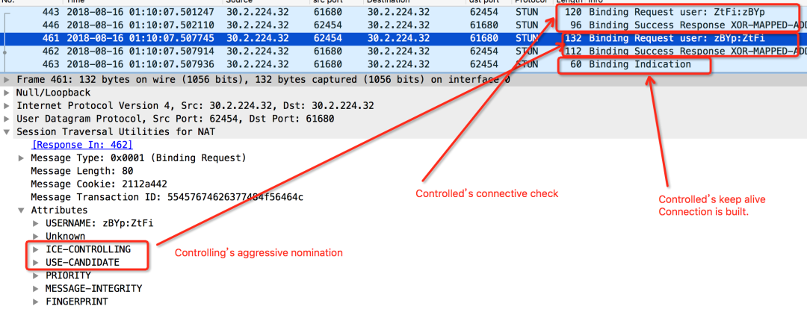
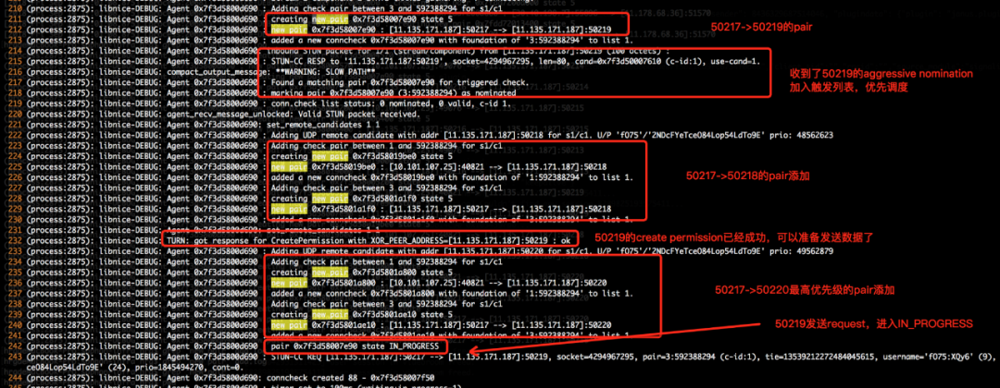
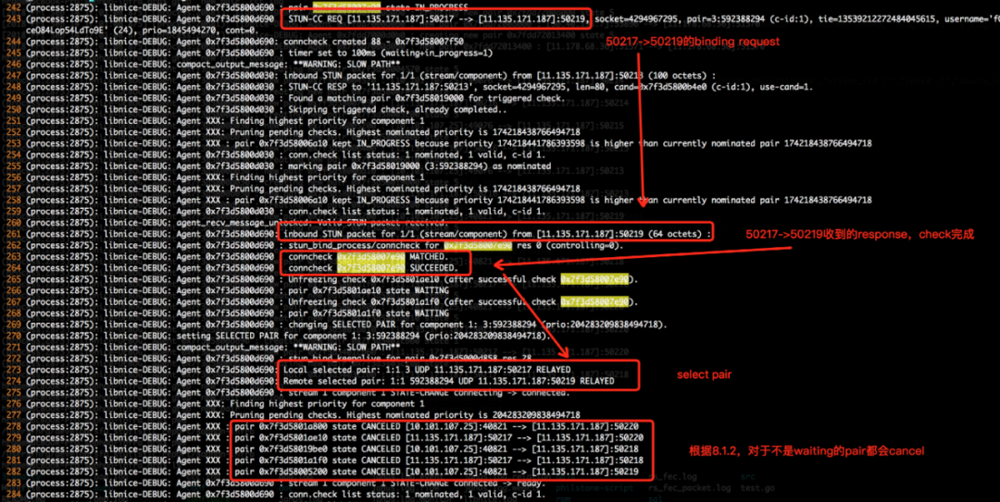

<!--BEGIN_DATA
{
    "create_date": "2020-12-25 11:30", 
    "modify_date": "2020-12-25 11:30", 
    "is_top": "0", 
    "summary": "WebRTC ICE状态与提名处理", 
    "tags": "WebRTC", 
    "file_name": "WebRTC ICE状态与提名处理.md"
}
END_DATA-->

#### <p>原文出处：<a href='https://mp.weixin.qq.com/s/aOtxzItHdl8Cfzt0mUHs0Q' target='blank'>WebRTC ICE状态与提名处理</a></p>

大家都知道奥斯卡有提名，其实在 WebRTC 的 ICE 中也有提名，有常规的提名，也有激进的提名，而且提名的候选人不一定是最优秀的候选人喔，本文就带你一探其中玄妙。文章内容主要描述[RFC 5245](https://tools.ietf.org/html/rfc5245)中ICE 相关的状态和 ICE 提名机制，并结合 libnice(0.14)版本进行分析。

### 1. Scene

分析一个问题时候遇到这样的场景：服务端一个 Candidate，客户端三个不同优先级的 Candidate，但是最后居然选择了一个优先级最低的 Pair。  

服务端有一个 Relay Candidate，端口 50217。  

```
a=candidate:3 1 udp 503316991 11.135.171.187 50217 typ relay raddr 10.101.107.25 rport 40821
```

客户端有三个 Candidate，端口 50218（中间优先级），50219（最低优先级），50220（最高优先级）。  

```
  Candidate 1:candidate:592388294 1 udp 47563391 11.135.171.187 50219 typ relay raddr 0.0.0.0 rport 0 generation 0 ufrag fO75 network-cost 50  
  Candidate 2:candidate:592388294 1 udp 48562623 11.135.171.187 50218 typ relay raddr 0.0.0.0 rport 0 generation 0 ufrag fO75 network-cost 50  
  Candidate 3:candidate:592388294 1 udp 49562879 11.135.171.187 50220 typ relay raddr 0.0.0.0 rport 0 generation 0 ufrag fO75 network-cost 50
```

但是最后选择的却是最低优先级的 Pair，50219。  

``` 
Remote selected pair: 1:1 592388294 UDP 11.135.171.187:50219 RELAYED
```

### 2.Candidate's Foundation


Candidate 的 Foundation: 这里先提一下 Foundation，会涉及到 Frozen 状态。  

对于一条相同的信道，可能有不同的 Candidate，比如 Relay Candidate 被发现的时候，就可以生成一个新的 Server Reflexive 类型的 Candidate，但是他们都是基于相同的本地地址（IP，端口）和协议，则可以认为这些网络是相似的，则他们就会有相同的Foundation。其中 Foundation 在 SDP 中为第一个字段，即下面例子中的'7'。

```
a=candidate:7 1 udp 503316991 11.178.68.36 51571 typ relay raddr 30.40.198.7 rport 55896
```

### 3.ICE States

ICE 主要有以下五种状态，其中前四种是正常的状态，第五种状态 Frozen 涉及到 [ICE Frozen Algorithm](https://tools.ietf.org/html/rfc5245#section-2.4)。

ICE 的五种状态：

  * Waiting: 当连通性检查还没有开始执行的时候（Binding Request 还没发送）。
  * In Progress: 当连通性检查发送了，但是相应检查的事务仍在执行中（Binding Request 已发送）。
  * Successed: 连通性检查执行完成且返回结果成功（Binding Request 已完成）。
  * Failed: 连通性检查执行完成且结果失败（Binding Request 已完成）。
  * Frozen: ，所有 Candidate Pair 初始化完成以后就在这个状态，对于相同的 Foundation（相似的 Candidate），会按照优先级依次选取一个 Pair，Unfreeze，并设置为 Waiting 状态，其他则保持 Frozen。直到选取的 Pair 完成，才会继续 Unfreeze 另一个 Pair。

### 4.ICE Nomination

ICE 有两种提名方式：

#### 1.Regular Nomination

对于常规提名，主要工作流程如下：

```
L                        R
-                        -
STUN request ->             \  L's
<- STUN response  /  check

<- STUN request  \  R's
STUN response ->            /  check

STUN request + flag ->      \  L's
<- STUN response  /  check

Regular Nomination  
```

Controlling 模式下的 Agent 发起 Binding Request，并且收到对端的 Response，同时对端发起的 Connective Check 完成，Controling 一端会再次发出一个携带 `USE_CANDIDATE `标志位的 Binding Request，当Controlled 一端收到了，就接受这次提名。  

#### 2.Aggressive nomination

除了常规提名，还有一种比较激进的提名，常规提名中会新增一次握手。

```
L                        R
-                        -
STUN request + flag ->      \  L's

<- STUN response  /  check
<- STUN request  \  R's
STUN response ->            /  check

Figure 5: Aggressive Nomination
```

Controlling 模式下的 Agent 发起 Binding Request，但是在这个 Binding Request 中会直接携带`USE_CANDIDATE `的标志位，Controlled 模式下的 Agent 收到了以后就接受这次提名。在激进提名模式下，能节约一次握手过程，但是当多个 Pair 同时接受提名时，会根据这些 Pair 各自的优先级进行选择，选择出优先级最高的 Pair 作为实际的信道。  

真实案例：  

### 5.Updating States When Nomination

[原文参考](https://tools.ietf.org/html/rfc5245#section-8.1.2)  

当一个新的提名产生时，会对 ICE 内部状态进行对应的变化。  

当一端的 Binding Request 携带了 Use Candidate 的标志位时，则会产生一次提名（Nomination）。  

不管 Controlling 或者 Controlled 模式下的 Agent，处理提名的状态更新规则建议如下：

  * 如果没有提名的 Pair，则继续进行连通性检查的过程。  
  * 如果至少有一个有效的提名:
    * Agent 必须删除该 Component 下的所有 Waiting 状态和 Frozen 状态的 Pair。  
    * 对于 In Progress 状态下的 Pair，优先级低于当前提名 Pair 优先级的，停止重传（取消）。  
  * 当某一个 Stream 的所有 Compont 都至少拥有一个提名时，且检查仍然在进行时：
    * Agent 必须将该 Stream 标记为已完成。  
    * Agent 可以开始传输媒体流。  
    * Agent 必须持续响应收到的消息。  
    * Agent 必须重传当前仍然在 In Progress 的 Pair（优先级高于当前提名的，不然已经被删除或者取消）。  
  * 当检查列表中的所有 Pair 都完成时:
    * ICE 完成。  
    * Controlling Agent 根据优先级更新 Offer（貌似 WebRTC 没有这一步）。  
  * 当检查列表检查有失败时:
    * 所有 Pair 都失败时，关闭 ICE。
    * 当有某个流的检查成功时，Controlling Agent 移出失败的 Pair，并更新 Offer。
    * 如果有些检查没有完成，则 ICE 继续。

### 6.Scheduling Checks


在描述提名时，还会涉及 ICE 对 Pair 的调度（当有效 Candidate 还在 In Progress 的时候但是其他 Candidate 的 Pair 已经收到 Binding Request）。  

**这里只讨论 Full，先不描述 Lite 模式。**

ICE 的 Checks 分成两种，Ordinary Checks And Triggered Checks。  

  * Ordinary Checks 是常规的 Pair 的检查，表示这些 Pair 的检查是从正常流程中切换过来的状态的检查。  
  * Triggered Check 是被动触发的检查，当这些 Pair 虽然还处在不可以开始检查的状态，但是这时候收到了对端的连通性检查，这时候会对这个 Pair 进行提速，将其直接放入调度列表。

当 ICE 建立一个 Check List （每个 Stream 一个）后，会对每个 Check List 添加一个定时器，当定时器到来时，会进行如下调度：  

**注：这里有点不能理解，整个流程看起来是串行的，激活速度有点慢。**

  * 首先调度 Triggered Check并执行。
  * 若无，调度优先级最高的 Waiting 状态的 Pair，发送 Request，同时将状态置为 In Progress。
  * 若无，则从 Check List中找出优先级最高的 Frozen 状态的 Pair，Unfreeze 之，并发送 Request，状态设置为 In Progress。
  * 若无，终止调度。

### 7. Case Analyzed

简单了解了 ICE 的流程后，我们回归最开始的 Case。  

首先看 Add Candidate，三个 Remote Candidate 添加顺序不同，依次为 50219，50218，50220，注意，此时 50219 收到了对端的 Binding Request，激进提名，携带 `USE_CANDIDATE`，因此很快执行 Create Permission 并完成，这时候可以开始发送 Binding Request 了，属于 Triggered Checks 优先调度，发送 Binding Request，并进入 In Progress 状态。  

**注：这里除了本地 Relay 的 Pair，还有和 Turn 通信的本地 Host 类型的 Candidate。**  

** 

接着在 50219 在其他两个 Create Permission 还没完成时候以迅雷不及掩耳之势完成了 Check，根据 rfc 8.1.2中的描述，对于不是在 In Progress 状态的 Pair，都删除，并不参考其优先级，故最后选择了 50219 这个优先级最低的 Pair。

