<!--BEGIN_DATA
{
    "create_date": "2022-02-16 20:20", 
    "modify_date": "2022-02-16 20:20", 
    "is_top": "0", 
    "summary": "WebRTC QoS方法之Pacer实现<br/>WebRTC QoS方法之视频发送端NACK实现<br/>WebRTC QoS | NACK 格式与发送策略<br/>WebRTC QoS方法之视频接收端NACK实现", 
    "tags": "WebRTC", 
    "file_name": "WebRTC QoS方法.md"
}
END_DATA-->

#### <p>原文出处：<a href='https://mp.weixin.qq.com/s?__biz=MzIzMjY3MjYyOA==&mid=2247506831&idx=1&sn=6a8e456bb904b54843704fc1499c6bf1&chksm=e893c794dfe44e82642aa565c9d6933991f2af2fa79d301b4addf420d3ac04ffb551d4db0d62&scene=178&cur_album_id=1436879410820644867#rd' target='blank'>WebRTC QoS方法之Pacer实现</a></p>

> 本文将解读WebRTC中Pacer算法的实现。WebRTC有两套Pacer算法：TaskQueuePacedSender、PacedSender。本文仅介绍PacedSender的实现。（文章中引用的WebRTC代码基于master，commit：3f412945f05ce1ac372a7dad77d85498d23deaae源码分析）

## 背景介绍

若仅仅发送音频数据，不需要Pacer模块。

  * 一帧音频数据本身不大，不会超过以太网的最大报文长度。一个RTP报文可以搞定，按照打包时长的节奏发送就可以。但视频数据不能按照音频数据的思路发送，一帧视频可能很大，远大于以太网的1500byte，需要分别封装在几个RTP报文中，若这些视频帧RTP报文一起发送到网络上，必然会导致网络瞬间拥塞。产生丢包抖动等异常。

  * 大多数编解码格式下，一帧音频数据长度固定，音频码率持续平稳。码率不会出现忽高忽低现象。但是一帧视频数据长度受内容影响严重。I、P、B帧间的长度相差非常大。直接发送网络波动幅度很大。尤其是WIFI环境下，受限WIFI的调度机制，媒体数据能否平稳发送，对弱网的WiFi环境对通话质量影响很大。


Pacer的目的就是让视频数据按照评估码率均匀的在各个时间片发送出去。如下图所示：


## 实现原理

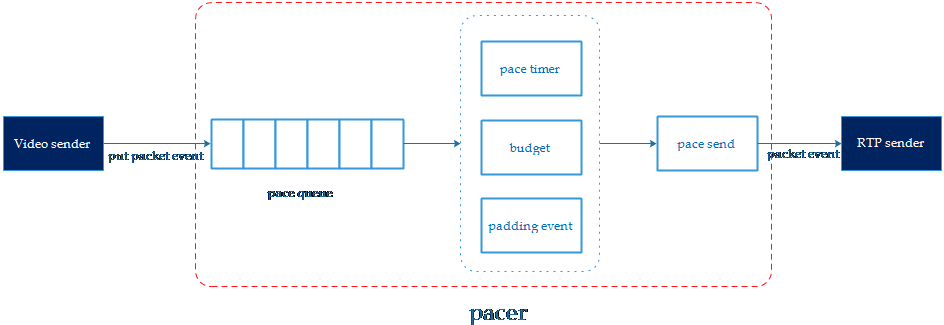  

**设计PACER模块主要解决三个问题：怎么发送报文、什么时候发报文、每次发多少数据量。**

### 1. 怎么发送报文

音频、视频、NACK、FEC、Padding报文都要统一从Pacer模块发送。若不区分报文优先级，势必会对系统延时产生很大影响。

所以音视频编码数据RTP切分打包后，首先将RTP报文存在pace queue队列，并将报文元数据(packet id, size, timestamp,重传标示)送到pacer queue进行排队等待发送，插入队列的元数据会进行优先级排序。  

pace queue是一个基于优先级排序的多维链表，它并不是一个先进先出的fifo，而是一个按优先级排序的list。报文优先级规则是：

  * 优先级高的报文排在fifo的前面，低的排在后面；
  * 首先判断报文的priority等级，等级越小的优先级越高（priority等级根据报文类型进行分类）；
  * 然后判断重发标示，重发的报文比普通报文的优先级更高；
  * 最后是判断视频帧timestamp，越早的视频帧优先级更高。

Pacer每次触发发送事件时先从queue的最前面取出优先级最高的报文进行发送，这样做的目的是让视频在传输的过程中延迟尽量小，重传的报文尽快能到达防止等待卡顿。pace queue还可以设置最大延迟，如果超过最大延迟，会计算queue中数据发送所需要的码率，并且会把这个码率替代target bitrate作为budget参考码率来加速发送。（最大延时详细处理流程会在后文中介绍）

  

根据报文类型确定数据优先级处理函数如下：

```cpp
int GetPriorityForType(RtpPacketMediaType type) {
  // Lower number takes priority over higher.
  switch (type) {
    case RtpPacketMediaType::kAudio:
      // Audio is always prioritized over other packet types.
      return kFirstPriority + 1;
    case RtpPacketMediaType::kRetransmission:
      // Send retransmissions before new media.
      return kFirstPriority + 2;
    case RtpPacketMediaType::kVideo:
    case RtpPacketMediaType::kForwardErrorCorrection:
      // Video has "normal" priority, in the old speak.
      // Send redundancy concurrently to video. If it is delayed it might have a
      // lower chance of being useful.
      return kFirstPriority + 3;
    case RtpPacketMediaType::kPadding:
      // Packets that are in themselves likely useless, only sent to keep the
      // BWE high.
      return kFirstPriority + 4;
  }
  RTC_CHECK_NOTREACHED();
}
```

按照优先级POP数据处理函数如下：

```cpp
bool RoundRobinPacketQueue::QueuedPacket::operator<(
    const RoundRobinPacketQueue::QueuedPacket& other) const {
  if (priority_ != other.priority_)
    return priority_ > other.priority_;
  if (is_retransmission_ != other.is_retransmission_)
    return other.is_retransmission_;

  return enqueue_order_ > other.enqueue_order_;
}
```

### 2. 什么时候发报文


PacingController::ProcessPackets按照PacingController::NextSendTime控制的节奏周期调用。完成PACER平滑发送功能。  

PacingController::NextSendTime在控制发送节奏上，有两种模式kPeriodic、kDynamic。这里先介绍kPeriodic实现方式。kPeriodic模式下，固定每隔5ms调用一次发送报文任务。

```cpp
constexpr TimeDelta kDefaultMinPacketLimit = TimeDelta::Millis(5);
```

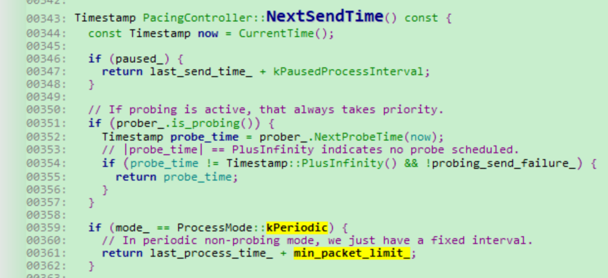

### 3. 每次发多少数据量

PacingController::ProcessPackets被定时触发后，会计算当前时间和上次被调用时间的时间差，然后将时间差参数传入`media_budget_`，`media_budget_`算出当前时间片网络可以发送多少数据，然后从pacer queue当中取出报文元数据进行网络发送。  

`media_budget_`根据评估出来的参考码率计算这次定时事件能发送多少字节的公式如下：

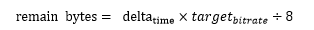

**delta time：**上次检查时间点和这次检查时间点的时间差。**target bitrate：**pacer的参考码率，是由probe模块根据网络探测带宽评估出来的。**`remain_bytes`：**每次触发发包时会减去发送报文的长度size,如果`remain_bytes > 0`，继续从pace queue中取下一个报文进行发送，直到`remain_bytes <=0` 或者 pace queue没有更多的报文。  
如果pacer queue没有更多待发送的报文，但`media_budget_`计算出还可以发送更多的数据，这个时候pacer会进行padding报文补充

### 4. Pacer模块引入延时规避方法

**`max_pacing_delay`：**

Pacer模块定量计算发送网络报文数据量，相当于cache等待发送，必然会引起延迟。为了保证实时性，Pacer模块有个`max_pacing_delay`全局变量，配置最大缓冲发送延时时间上限，若最大缓冲延时大于该值，就要重新调整Pacer模块的目标码率，保证当前数据都能及时发送出去。

`max_pacing_delay`生效流程如下：

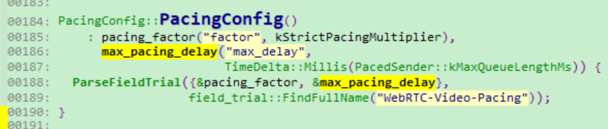

VideoSendStreamImpl::VideoSendStreamImpl配置到transport->SetQueueTimeLimit

```cpp
void PacingController::SetQueueTimeLimit(TimeDelta limit) {  queue_time_limit = limit;}
```

PacingController::ProcessPackets会实时计算当前处理方式会引入的系统延时，当延时大于设定目标上限值，需要及时调整Pacer目标码率，保证Pacer模块引入延时时间可控。

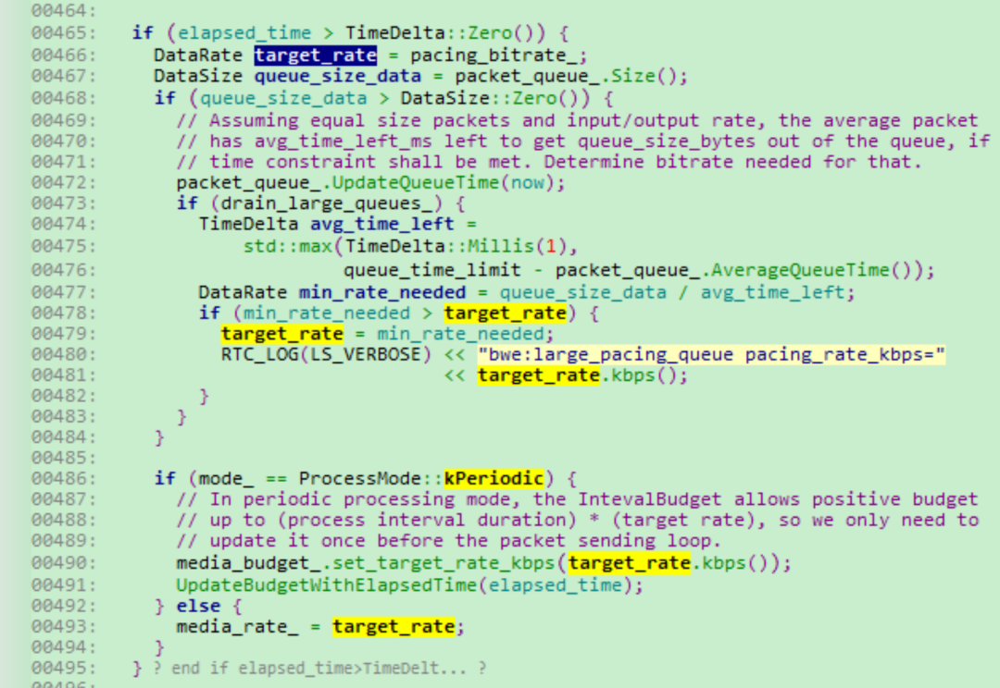  

很明显这仅仅是一个迫不得己的规避方法，实际应用中，这种方法会出现码率梯度上升现象。  

**编码算法码控模块配合：**

Pacer模块实现不复杂，但是要想真正做好Pacer功能，仅仅靠一个Pacer模块是玩不转的，需要与视频编码器的码控模块配合：

  * 首先探测模块配置码率给编码器，编码器一定要保证在可控周期内码率收敛到配置的码率参数值以内，否则会给Pacer模块造成的累计延时越来越大压力；

  * 另外IP帧rate也要在合理范围内。若I帧超大，势必导致关键帧传输延时变大，影响端到端系统延时。

这些参数都要根据自己的实际应用场景进行调优。

## 参考：

[WebRTC的拥塞控制和带宽策略](https://mp.weixin.qq.com/s?__biz=MzU1NTEzOTM5Mw==&mid=2247485966&idx=1&sn=113920ae7c4f908f4576fbcc1484781a&scene=21#wechat_redirect)  

<hr>

#### <p>原文出处：<a href='https://mp.weixin.qq.com/s?__biz=MzIzMjY3MjYyOA==&mid=2247507365&idx=2&sn=3a9e352c567902c3299e090c24c25ec3&chksm=e893c1bedfe448a8ce08ff79b2a33666e44e65a1c9cd662942ed99c09a40ad39cbb733c803d4&scene=178&cur_album_id=1436879410820644867#rd' target='blank'>WebRTC QoS方法之视频发送端NACK实现</a></p>

> 导语 | 本文为大家详细解读一下WebRTC中视频发送端NACK的实现。文章中引用的WebRTC代码基于master，commit：f412945f05ce1ac372a7dad77d85498d23deaae源码分析。

## 概念简介

与NACK对应的是ACK，ACK是到达通知技术。以TCP为例，他可靠因为接收方在收到数据后会给发送方返回一个“已收到数据”的消息（ACK），告诉发送方“我已经收到了”，确保消息的可靠。

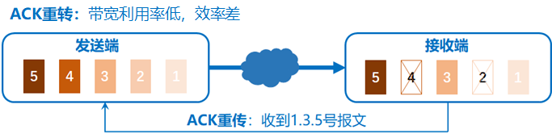  

NACK也是一种通知技术，只是触发通知的条件刚好的ACK相反，在未收到消息时，通知发送方“我未收到消息”，即通知未达。

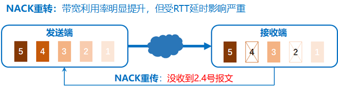  

在rfc4585协议中定义可重传未到达数据的类型有二种：

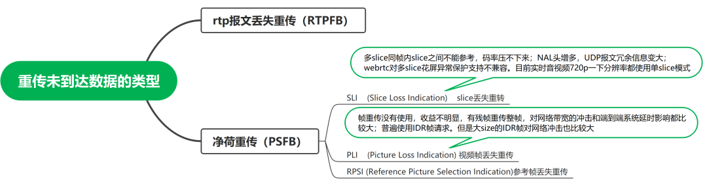  

目前大家普遍使用RTP报文丢失重传，这种方式恢复周期短，相对于另外三种，对带宽影响小。  

本文首先介绍WebRTC发送端NACK实现流程：

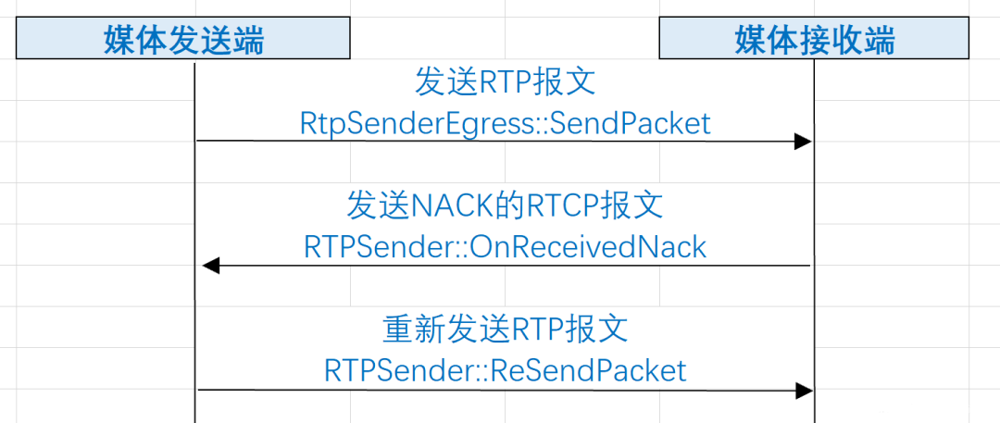  

## 具体实现

**重点流程有三步：**  

### 1. 发送RTP报文，实时存储报文到`packet_history_`队列

```cpp
ProcessThreadImpl::Process->PacedSender::Process    
->PacingController::ProcessPackets
->PacketRouter::SendPacket
->ModuleRtpRtcpImpl2::TrySendPacket
->RtpSenderEgress::SendPacket
```

每次pacer发送报文的时候，都会把媒体报文储存在packet_history_队列。

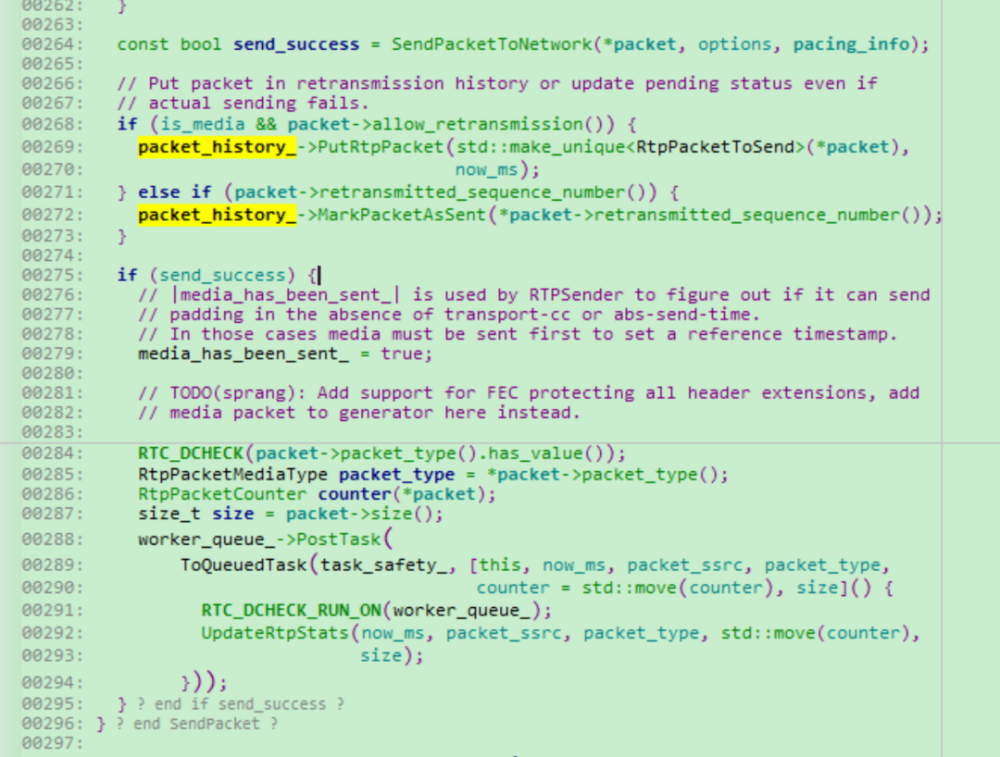  

RtpPacketHistory::PutRtpPacket以SequenceNumber为索引，把rtp保存在packet_history_队列。

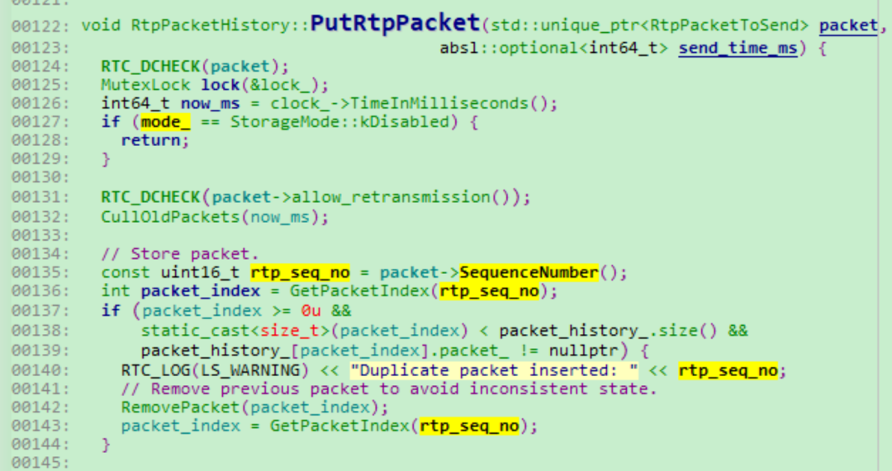  

SetStorePacketsStatus配置队列长度。视频在CreateRtpStreamSenders->SetStorePacketsStatus配置。

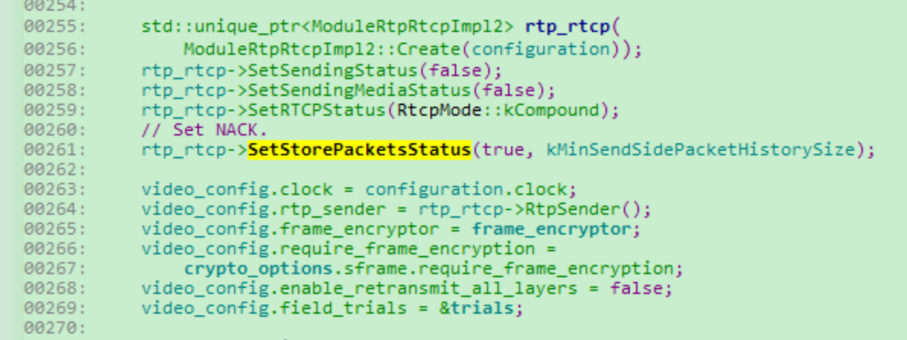  

音频在RegisterSenderCongestionControlObjects->SetStorePacketsStatus配置。

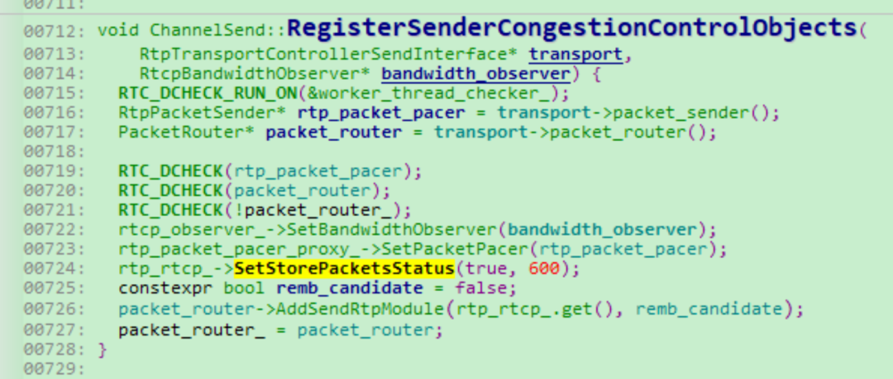  

### 2. 处理接受到的RTCP NACK报文

函数调用关系如下：

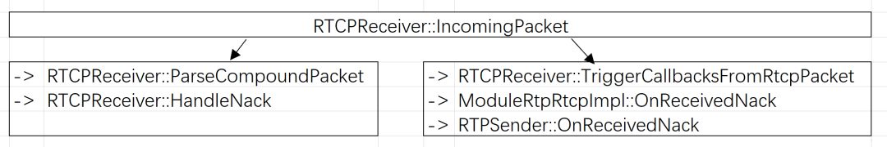  

RTCPReceiver::HandleNack

  * 压栈`packet_information->nack_sequence_numbers`丢包队列

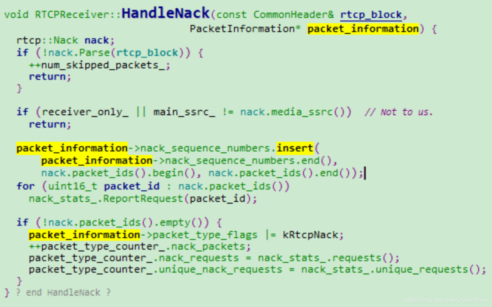  

ModuleRtpRtcpImpl::OnReceivedNack

  * 将RTT延时时间及`nack_sequence_numbers`队列更新到RTPSender::OnReceivedNack

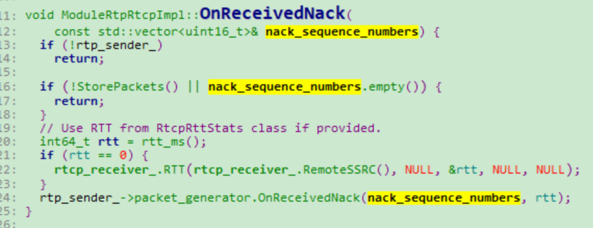  

### 3. 重发NACK反馈的RTP报文

RTPSender::OnReceivedNack  

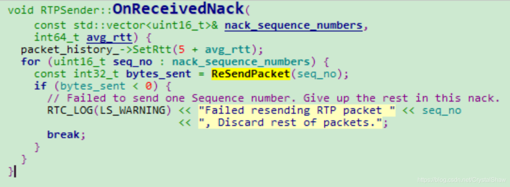  

重发报文这里有3点需要注意：  

**1 ）NackModule2::AddPacketsToNack：决定是否将该报文放入NACK队列。**

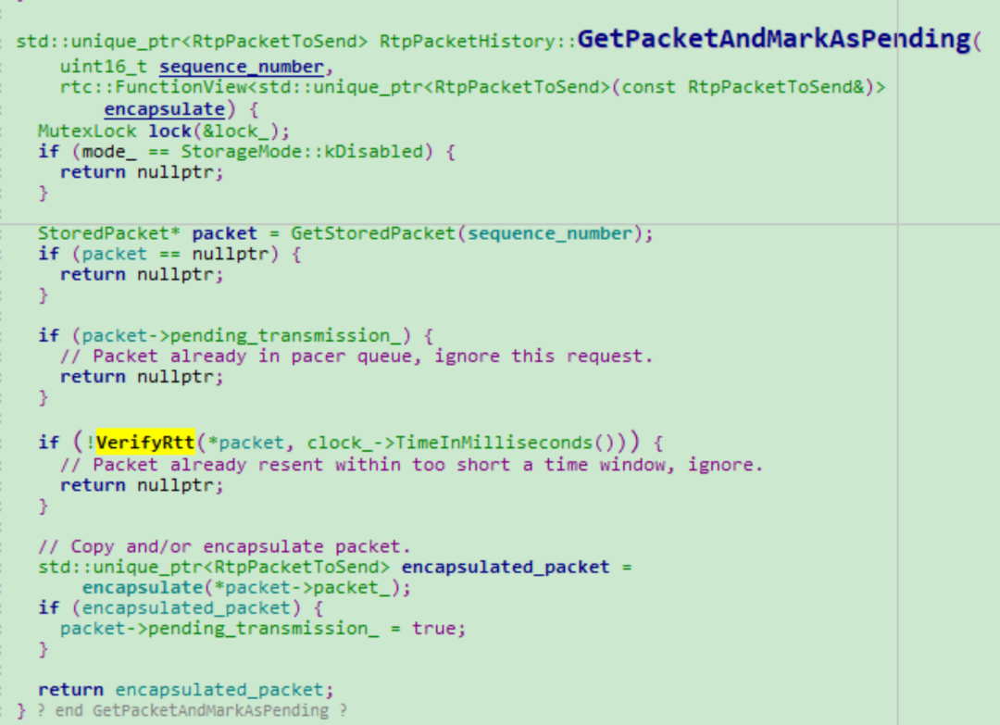  

RtpPacketHistory::VerifyRtt 

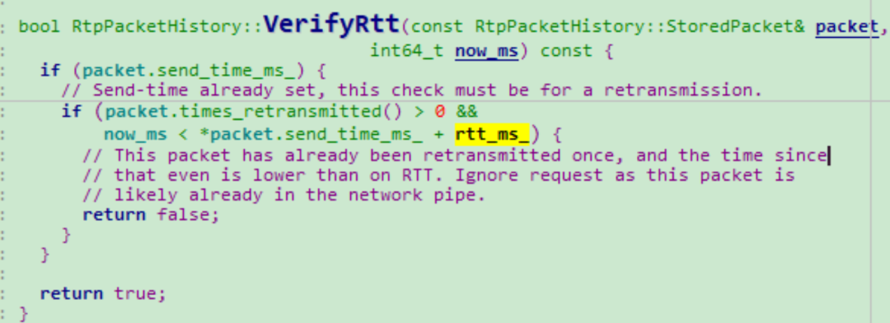  

**2 ）NACK重新发送媒体数据有两种方式：单独RTX通道发送、与媒体数据混在一起发送。**  

两种形式对单纯的NACK抗性影响不太大，但是与媒体数据混在一起发送模式，接收端无法区分是NACK重传报文，还是正常媒体数据，会导致接收端反馈的丢包率低于实际值，影响gcc探测码率，及发送端FEC冗余度配置。所以建议还是以RTX通道单独发送。

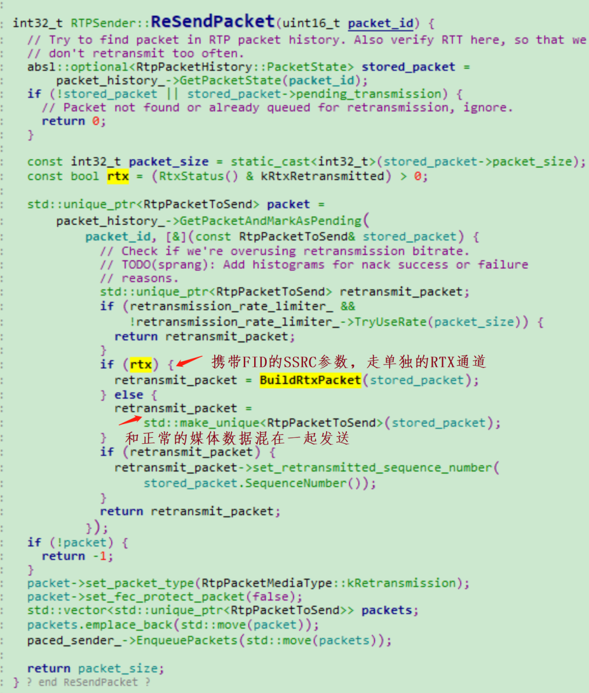  

RTX通道单独发送重传报文，需要配置参数有如下三个：

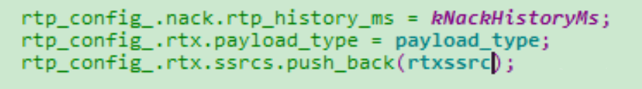  

**3 ）RTPSender::ReSendPacket在将重传数据加入pacer队列，会设置报文优先级，为了保证实时性，NACK重传报文需要按照高优先级重传。**  

优先级配置在`set_packet_type`，发送报文时，会根据kRetransmission获取发送优先级。

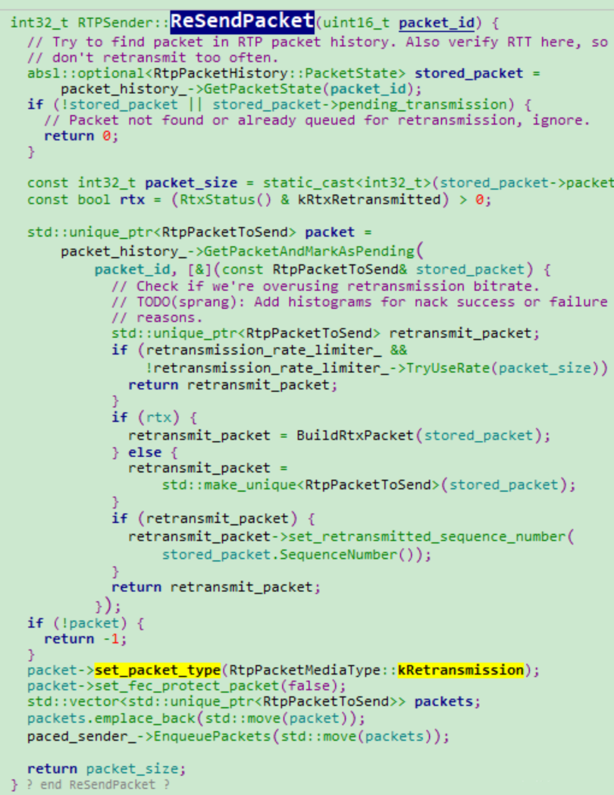  

PacingController::EnqueuePacket

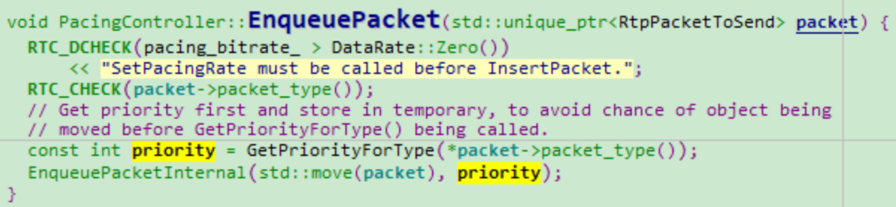  

GetPriorityForType

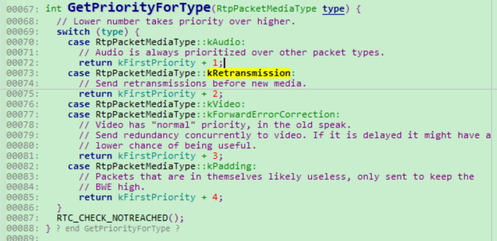  

<hr>

#### <p>原文出处：<a href='https://mp.weixin.qq.com/s?__biz=MzU3MTUyNDUzMA==&mid=2247484047&idx=1&sn=fd67a143efd8c9dfd92811b9e2d50d5d&chksm=fcdf9652cba81f44b29b5e0ab5494334291af57ea604faf98722855eec4962faf79da937fdac&scene=178&cur_album_id=1345116764509929473#rd' target='blank'>WebRTC QoS | NACK 格式与发送策略</a></p>

> 本文是 `WebRTC QoS` 第 _**1**_ 篇

  * 导读
  * 10、20、100、1000、10000
    * 策略 1，10 次
    * 策略 2，20 毫秒
    * 策略 3，100 毫秒
    * 策略 4，1000 个（丢失包数量）
    * 策略 5，10000 个（包号跨度）
    * 小结
  * 源码分析
    * 关键成员变量
    * OnReceivedPacket 函数
    * Process 函数
    * GetNackBatch 函数
    * ClearUpTo 函数
    * 小结
  * NACK FCI （Feedback Control Information）格式
  * 抓包分析

### 导读

NACK 全称为 `Negative Acknowledgment Packet`，是一种对 RTP 数据传输层进行反馈的 RTCP 包，包类型为 205，反馈类型为 1。相对于 TCP 的 ACK 接收确认，NACK 则是未接收确认。

NACK 模块是 WebRTC 对抗弱网的核心 QoS 技术之一，有两种发送模式，一种是基于时间序列的发送模式，一种是基于包序列号的发送模式。

NACK 模块总体的发送策略为：对于每一个因为不连续而被判为丢失的包，首次都是基于序列号**立即发送** nack 包以请求重传，之后则都是基于时间序列，**周期性批量处理** nack_list，并根据距离上次发送的时间间隔是否已经超过一个 rtt 来决定是否发送 nack 包。

我们首先单刀直入 NACK 的核心发送策略，之后再理解源码和 NACK 的格式就会游刃有余。

### 10、20、100、1000、10000

NACK 模块具体的发送策略围绕着 10、20、100、1000、10000 这五个数字展开。

```c++
const int kMaxNackRetries = 10;  
const int kDefaultRttMs = 100;  
const int kProcessIntervalMs = 20;  
const int kMaxNackPackets = 1000;  
const int kMaxPacketAge = 10000;  
```

#### 策略 1，10 次

NACK 模块对同一包号的最大请求次数，超过这个最大次数限制，会把该包号移出 nack_list，放弃对该包的重传请求。

#### 策略 2，20 毫秒

NACK 模块每隔 20 毫秒批量处理 nack_list，获取一批请求包号存储到 nack_batch，生成 nack 包并发送。

不过，nack_list 的处理周期并不是固定的 20ms ，而是基于 20ms 动态变化，接下来的源码分析部分会详细介绍这个点。

#### 策略 3，100 毫秒

NACK 模块默认 rtt 时间，如果距离上次 nack 发送时间不到一个 rtt 时间，那么不会发送 nack 请求。

从发送 nack 请求到接收重传包一般是一个 rtt 的时间，也就是说重传包理论上应该在一个 rtt 时间内到来，超过这个时间还未到来，才会发送 nack 请求。

**注意**，100ms 只是 rtt 的默认值，在实际应用中，**rtt 应该要根据网络状况动态计算**，计算方式有很多种，比如对于接收端来说，可以通过发送 xr 包来计算 rtt。

#### 策略 4，1000 个（丢失包数量）

nack_list 的最大长度，即**本次发送的 nack 包至多可以对 1000 个丢失的包进行重传请求**。

  * 如果丢失的包数量超过 1000，会循环清空 nack_list 中关键帧之前的包，直到其长度小于 1000。也就是说，放弃对关键帧首包之前的包的重传请求，直接而快速的以关键帧首包之后的包号作为重传请求的开始。

举个例子。假设连续收到了包号为 0、981、1182 的三个包，且都为关键帧的首包。当收到包号为 981 的包时，可知丢失了 980 个包，当收到包号为 1182 的包时，丢失的包数量达到 980 + 200，已经超过 1000，这时，需要控制 nack_list 的长度，具体的做法是：

  1. 找到 key_frame_list 第一个关键帧包号 0，对应到 nack_list 1 号包，清空 nack_list 1 号包之前的包，发现 1 号包是起始包，前面没有数据，本次清空操作失败。
  2. 继续找到 key_frame_list 下一个关键帧包号 981，对应到 nack_list 982 号包，清空 nack_list  982 号包之前的包，1 号包到 980 号包被删除，此时 nack_list 长度为 200，小于 1000，结束清空操作。

整个过程如下图所示：

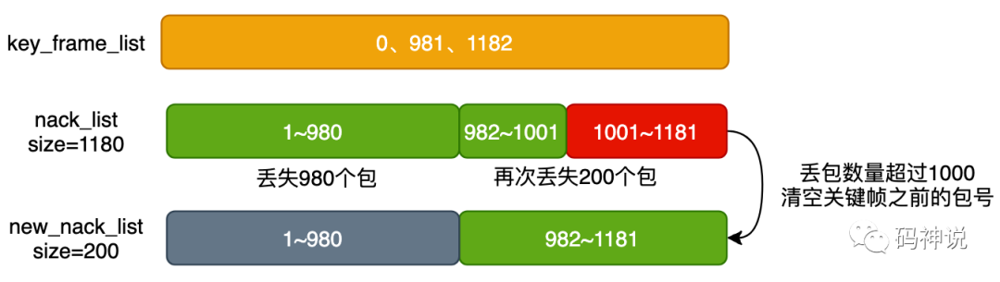

  * 如果经过多轮清空操作，key_frame_list 中已经没有关键帧（无法再去清空 nack_list 中关键帧之前的包），但是此时 nack_list 的长度仍然大于 1000，那么将清空整个 nack_list，放弃所有重传请求，直接请求新的关键帧。

一旦发生这种情况，基本可以说明当前网络环境很差，从而导致大量的丢包。如果继续期待 nack 重传，那么可能会因为长时间等待重传包而导致画面卡顿，或者因为获取不到重传包而导致解码花屏。

因为关键帧可以单独解码出图像，不必参考前后视频帧，所以，为了使解码端能够立刻刷新出新图像，此时采取请求关键帧的方式替代重传数据包，是更加合理且高效的做法。

#### 策略 5，10000 个（包号跨度）

nack_list 中包号的距离不能超过 10000 个包号。即 nack_list 中的包号始终保持 `[cur_seq_num - 10000, cur_seq_num]` 这样的跨度，以保证 nack 请求列表中不会有太老旧的包号。

#### 小结

策略 1 和策略 4 属于 nack 包发送的保护策略，这非常关键，比如有以下两种场景：

  * 场景 1，服务器下行分发链路丢包率过高。

这会导致接收端对一些包的重传请求次数过高，如果不对 nack 请求次数做限制，那么接收端将无限循环发送 nack 请求。

  * 场景 2，服务器上行推流链路出现长时间抖动，恢复后导致接收端 rtp 包号断层。

假如包号断层达到 1 万，那么在抖动恢复的瞬间，接收端会将 1 万个包号全部加入到 nack_list 。这会增加服务器生成 nack 包的负担，而且生成的 nack 包将达到 2.3KB 大小，推流端解析这个包同样也要耗费更多时间。

所以，如果没有 1、4 这两条 nack 保护策略，那么，当拉流用户很多的时候，上述两种场景会给服务器和端带来巨大的 cpu 性能损耗，并会引起 nack 网络风暴。不过，即使有这两条发送保护策略加持，有时还是会产生很多问题，比如下面这种场景。

  * 场景 3，上游服务器上行推流链路丢包，引发下游服务器回源分发链路丢包。

存在这种情况：上游服务器发送 nack 请求后，rtx 重传包还未到来，所以还未中继分发到下游服务器，然而此时下游服务已经收到了下游用户连续的并发的 nack 请求。针对这种场景，则需要对上行推流链路进行数据包排序，只有组成完整的帧才会中继分发到下游服务器，这样就避免了下游用户并发的 nack 请求。

其实，nack 的发送保护策略还有一条：收到一组连续且完整的帧之后，会立即对 nack_list 执行部分清空操作，避免无必要的再次重传请求，接下来的源码分析部分会进一步介绍这个策略。

最后，根据策略 1 和策略 3 的描述，我们可以推断出这样的结论：假设当前网络 rtt 为 100ms，那么 100ms * 10 次，恰好为 1s。也就是说，包在 1s 内还没有重传回来，那么就放弃它。

### 源码分析

基于 WebRTC M71 版本。

    
```c++
class NackModule : public Module {  
public:  
  int OnReceivedPacket(  
    uint16_t seq_num,  
    bool is_keyframe);  
  void Process() override;  
  void ClearUpTo(uint16_t seq_num);  
private:  
  struct NackInfo {  
    NackInfo(uint16_t seq_num,  
      uint16_t send_at_seq_num);  
    uint16_t seq_num;  
    uint16_t send_at_seq_num;  
    int64_t sent_at_time;  
    int retries;  
  };  
  
  NackSender* const nack_sender_;  
  KeyFrameRequestSender* const   
    keyframe_request_sender_;  
  std::map<uint16_t, NackInfo,  
    DescendingSeqNumComp<uint16_t>> nack_list_;  
  std::set<uint16_t,  
    DescendingSeqNumComp<uint16_t>> keyframe_list_;  
  uint16_t newest_seq_num_;  
};  
```

#### 关键成员变量

  * `newest_seq_num_` 表示 nack 模块目前收到的**最新的**包的序列号，这是一个很关键的变量，它的作用主要有两点：
  1. 判断包是否连续，如果不是连续到来的包，则把中间丢失的包号加入到 nack_list。

比如，一组连续包 1 2 3 4 到来后，此时 `newest_seq_num_` 为 4，随后序列号为 7 的包到来，那么 7 号包不是连续到来的包，中间的 5 号和 6 号包会被认为丢失并加入到 nack_list，接着发送对 5 号包和 6 号包的 nack 请求。

  2. 判断是否是重传包或者乱序到来的包，如果是，则将它们从 nack_list 中移出。

此时 `newest_seq_num_` 为 7，假设这样一种场景：5 号包因为 nack 请求重传到来，6 号包因为滞留在网络乱序到来，那么这两个包号会被移出 nack_list。

  * `NackInfo` 是一个关键的数据结构，存储在 nack_list 中，seq_num 代表请求重传的包号，假设有如下两个 `NackInfo` 信息：
    
```c++
nack_info_1 = { 5, 10, -1, 0};  
nack_info_2 = { 6, 6, 123456789, 0};  
```

观察 nack_info_1，我们发现 `sent_at_time` 值为 -1，那么这是一个基于序列号发送的 nack，而且要在当前接收的最新包号`newest_seq_num_` 大于等于 `send_at_seq_num = 10` 时才会发送。

观察 nack_info_2，我们发现，`sent_at_time` 值为 123456789，那么这是一个基于时间序列发送的nack，要将这个参数结合当前 rtt 来决定是否发送重传请求。

  * `keyframe_list_` 和 `nack_list_` 分别存储了收到的关键帧**首包包号**和丢失的包信息， `keyframe_list_`  为 `nack_list_` 大小超过 1000 后的清空逻辑提供服务。

  * `NackSender` 和 `KeyFrameRequestSender` 是真正发送 nack rtcp 包和关键帧请求包（pli 或者 fir）的接口类，用于 NackModule 模块和 JitterBuffer 模块发送 nack 或者关键帧请求，接口分别是 `SendNack ` 和 `RequestKeyFrame`，应用层应该实现这两个接口。

#### OnReceivedPacket 函数

该函数实现了基于包序列号的 nack 发送策略，其判断是否要发送 nack 请求的关键在于包号是否**连续**。

首先，对于重复的包，不做任何处理。

    
```c++
if (seq_num == newest_seq_num_)  
    return 0;  
```

接下来，判断是否是经过 nack 请求后重传到来的包或者滞留在网络中乱序到来的包，如果是则返回对该包的 nack 请求的次数。

其实，这两种场景下到来的包都属于乱序包，都是旧的包，且包号一定小于当前接收到的最新的包号 `newest_seq_num_` 。

    
```c++
if (AheadOf(newest_seq_num_, seq_num)) {  
  // An out of order packet has been received.  
  auto nack_list_it = nack_list_.find(seq_num);  
  int nacks_sent_for_packet = 0;  
  if (nack_list_it != nack_list_.end()) {  
    nacks_sent_for_packet =  
      nack_list_it->second.retries;  
      nack_list_.erase(nack_list_it);  
  }  
  return nacks_sent_for_packet;  
}  
```

关于判断 rtp 包序列号大小（即判断 rtp 包新旧）的算法，在 WebRTC 基础技术 | RTP 包序列号的回绕处理[1]一文中有详细的介绍，这里只不过用 `AheadOf` 函数替代了 `IsNewerSequenceNumber` 函数，内部比较算法是一致的，这里不再赘述。

接下来，判断包的连续性，如果当前包号不连续，则将中间断掉的包号加入到 nack 请求列表，并更新 `newest_seq_num_` 。

    
```c++
AddPacketsToNack(  
  newest_seq_num_ + 1, seq_num);  
newest_seq_num_ = seq_num;  
```

关于 `AddPacketsToNack` 函数的细节，策略 4 已经详细介绍，这里不再赘述。

接下来，判断收到的包是否是**关键帧的第一个包**，如果是，记录其序列号到关键帧列表 `keyframe_list_`。和 nack_list一样，keyframe_list 也要遵循策略 5，即保持序列号的距离不超过 `kMaxPacketAge = 10000`。

    
```c++
if (is_keyframe)  
  keyframe_list_.insert(seq_num);  
      
auto it = keyframe_list_.lower_bound(  
          seq_num - kMaxPacketAge);  
if (it != keyframe_list_.begin())  
  keyframe_list_.erase(keyframe_list_.begin(), it);  
```

追踪关键帧首包包号的目的是为了和策略 4 联动，一旦发现 nack_list 的大小已经超过 1000，那么就要根据关键帧序列号来调整其大小。

最后，批量获取 nack_list 中的包序列号到数组 nack_batch 中，生成并发送 nack 包。

    
```c++
std::vector<uint16_t> nack_batch =  
  GetNackBatch(kSeqNumOnly);  
if (!nack_batch.empty())  
  nack_sender_->SendNack(nack_batch);  
```

#### Process 函数

该函数实现了基于时间周期（20ms）的 nack 发送模式，参考策略 2。具体的处理周期计算方法如下：

    
```c++
next_process_time_ms_ =  
  next_process_time_ms_ +  
  kProcessIntervalMs +  
  (now_ms - next_process_time_ms_) /  
  kProcessIntervalMs * kProcessIntervalMs;  
```

因为 `kProcessIntervalMs = 20ms`，所以上面代码可以写成下面这样：
    
```c++
next_process_time_ms_ =  
  next_process_time_ms_ + 20 +  
  (now_ms - next_process_time_ms_) / 20 * 20;  
```

可知，在固定的 20ms 周期之上又附加了 ((now_ms - next_process_time_ms_) / 20）个 20 毫秒的时间，所以这是一个动态的周期。这么做的原因是为了应对 cpu 繁忙时线程调度滞后的场景，追赶上正常的处理进度。

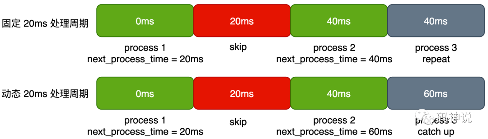

如上图所示，在 0ms 时间点进行第一次处理，并计算出了下一次处理的时间点为 20ms。假设由于 cpu 繁忙，导致线程调度滞后，在 40ms 的时间点才开始第二次处理（显然，原定的 20ms 的处理时间点被跳过），此时需要计算第三次处理的时间点：

  1. 如果按照固定 20ms 处理周期，那么第三次处理的时间点为 20 + 20 = 40ms，这就导致 40ms 的时间点被重复处理，处理进度滞后了 20ms。
  2. 如果按照动态 20ms 处理周期，那么第三次处理的时间点为 20 + 20 + (40-20)/20 * 20 = 60ms，这样不仅避免了在某个时间点重复处理，而且追赶上了正常的处理进度。

这就是动态处理周期的意义所在。其实，WebRTC 的注释已经很好的解释了这么做的原因：

> Also add multiple intervals in case of a skip in time as to not make uneccessary calls to Process in order to **catch up**.

#### GetNackBatch 函数

该函数传入 nack 过滤选项参数，根据时间或者序列号批量获取 nack_list 中的包序列号，并返回存储了这些包号的数组 nack_batch。

    
```c++
while (it != nack_list_.end()) {  
  if (consider_seq_num &&  
    it->second.sent_at_time == -1 &&  
    AheadOrAt(newest_seq_num_,  
    it->second.send_at_seq_num))  
  {  
    nack_batch.emplace_back(it->second.seq_num);  
    ++it->second.retries;  
    it->second.sent_at_time = now_ms;  
    if (it->second.retries >= kMaxNackRetries) {  
      it = nack_list_.erase(it);  
    } else {  
      ++it;  
    }  
    continue;  
  }  
  
  if (consider_timestamp &&  
    it->second.sent_at_time +  
    rtt_ms_ <= now_ms)  
  {  
    nack_batch.emplace_back(it->second.seq_num);  
    ++it->second.retries;  
    it->second.sent_at_time = now_ms;  
    if (it->second.retries >= kMaxNackRetries) {  
      it = nack_list_.erase(it);  
    } else {  
      ++it;  
    }  
    continue;  
  }  
  ++it;  
}  
```

阅读上面的源码可知，对于基于序列号和基于时间序列这两种不同的 nack 发送模式，它们的发送条件如下：

  1. 基于序列号的发送模式。`consider_seq_num = true`，且当前收到的最新包号已经等于或者超过该 nack_info 期望发送时的包号 `send_at_seq_num`。
  2. 基于时间序列的发送模式。`consider_timestamp = true`，且当前时间距上一次发送已经超过一个 rtt 时间。

这两种发送模式具体的处理方式一致：

  1. 将该 nack_info 中请求重传的包号加入到 nack_batch 数组，重传请求次数 +1，更新 nack 发送时间。
  2. 如果重传请求次数大于等于 10 次，删除该包号，放弃重传请求，参考策略 1。

#### ClearUpTo 函数

该函数传入包序列号 `seq_num` 参数，将 nack_list 和 key_frame_list 中 `seq_num` 之前的包全部清空，也就是说对于 `seq_num` 之前的包不再请求重传，同样属于 NACK 模块发送保护策略。

    
```c++
nack_list_.erase(nack_list_.begin(),  
  nack_list_.lower_bound(seq_num));  
keyframe_list_.erase(keyframe_list_.begin(),  
  keyframe_list_.lower_bound(seq_num));  
```

该函数在 WebRTC 中的应用场景是：当接收到一组连续且完整的帧之后，找到最后一帧的最后一个包的 seq_num，执行 `ClearUpTo` 函数。相关的代码可参考 `RtpVideoStreamReceiver::OnCompleteFrame` 函数。

#### 小结

在源码分析这一部分，有的函数我并未具体介绍，比如 `RemovePacketsUntilKeyFrame` 和 `AddPacketsToNack`。您可以结合发送策略部分阅读这部分源码，相信不是什么难事。

另外，关于 `UpdateReorderingStatistics` 和 `WaitNumberOfPackets` 这两个函数，涉及到了 NACK 的延迟发送策略。该策略通过不断更新当前网络环境下的乱序分布直方图，计算 nack 包延迟发送需要等待的包的个数。

比如某次 nack_info 请求的包号为 5，经过延迟发送策略计算，需要等待 2 个包才能发送该 nack 请求，那么对 5 号包的重传请求会在 7 号包到达之后才能发送。

为什么要这么做呢？这是因为，5 号包可能并未真正丢失，只是滞留在网络链路中，可能经过短暂的等待就会到达，这种情况下则不必发送 nack 请求，一定程度上可以降低网络流量消耗。不过，WebRTC 目前并未启用该策略。

### NACK FCI （Feedback Control Information）格式

对于 nack 的发送，并不是每丢一个 rtp 包就发送一个 nack rtcp 请求包，而是将一批丢失的 rtp 包的序列号记录到 nack 包的 FCI 信息中（**将 nack_list 中的 nack_info 打包到 nack_batch，通过 nack_batch 生成 nack 包**），一次 nack 可以请求多个丢失的 rtp 包。那么 nack 包是如何记录多个丢失的包的呢？下面，我们分析一下 NACK 的 FCI 格式。

每一个 nack 包**至少**携带 1 条 FCI 信息，FCI 格式如下：

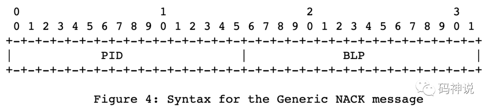

  * PID

Packet ID，2 字节，是丢失的**第一个** RTP 数据包的序列号。

  * BLP

bitmask of following lost packets，16 bits，记录了 PID 之后的 16 个 RTP 数据包的丢失情况。

**比如**，接收端没有收到序列号为 `(PID + i) % 65536` 的 RTP 包，即这个包丢失了，那么 BLP 第 `i` 个 bit 会被置为 1。

**注意**，根据 RFC 4585[2] 的描述：BLP 某个 bit 被置为 1，发送端可以认为接收端丢失了相应的包，但是 BLP 某个位为 0，发送端却并不能得出接收端已经收到相应包的结论，发送端只能认为这个包在这个时刻没有被接收端报告为丢失。

我们把 nack 中一条 FCI 信息看作是一个 item，那么每一个 nack_item 都是 4 字节长度，至多可以表示 17 个丢失的包。假设 mtu = 1212 字节，减去 12 字节头部长度后，1200 字节最大可以表示 300 个 nack_item，即 5100 个**连续**丢失的包。

不过，一次 nack 请求如此多连续的包的情况一般不会发生。首先，根据策略 4，单个 nack 至多可以记录 1000 个丢失的包号。其次，出现这种情况足以说明网络发生了较长时间的抖动，且大于 ice 15 秒的超时时间，还没等到请求 nack，ice 早已断开了连接。

### 抓包分析

看完 NACK 的 FCI 格式，下面我们来实际抓包看一下 nack 包的庐山真面目。注意，抓包前需要把 dtls-srtp 加密关掉，否则 wireshark 无法解析 FCI。

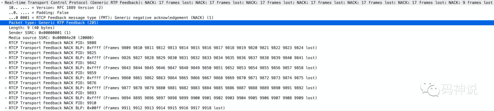

观察上图，可知：

  1. 本次 nack 一共携带了 7 个 nack_item，其中，最后一个 nack_item 丢失了 1 + 8 个包，剩下 6 个 nack_item 丢失了 1 + 16 个包。
  2. 丢失的包号从 9808 到 9918 都是连续的，这是因为我在推流端快速插拔了网线，来模拟连续丢失大量包的网络抖动场景。
  3. 长度字段 length = 9，总长度为 (9+1) * 4 = 40 字节。其中，头部长度 12 字节，7 个 nack_item 总长度为 7 * 4 =  28 字节，加起来恰好为 40 字节。

至此，全文结束，感谢阅读。

#### 参考资料

1. [RTP 包序列号的回绕处理](https://mp.weixin.qq.com/cgi-bin/appmsg?t=media/appmsg_edit&action=edit&type=10&appmsgid=100000263&isMul=1&isSend=0&token=452395595&lang=zh_CN)

2. [Generic NACK](https://tools.ietf.org/html/rfc4585#section-6.2.1)
  
<hr>

#### <p>原文出处：<a href='https://mp.weixin.qq.com/s/01Y-OKR1Idjt0vrPXF1WRA' target='blank'>WebRTC QoS方法之视频接收端NACK实现</a></p>

## 概述

WebRTC接收端触发发送NACK报文有两处：

  1. 接收RTP报文，对序列号进行检测，发现有丢包，立即触发发送NACK报文；
  2. 定时检查`nack_list_`队列，发现丢包满足申请重传条件，立即触发发送NACK报文。

##  函数实现

### 1. 检测丢包触发

核心函数是NackModule2::OnReceivedPacket。

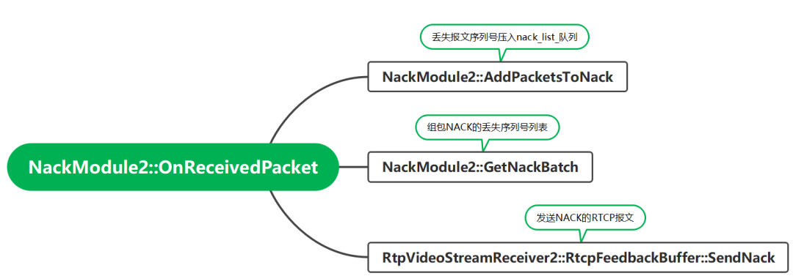

NackModule2::OnReceivedPacket函数在整个网络报文接收线程的调用栈的位置：

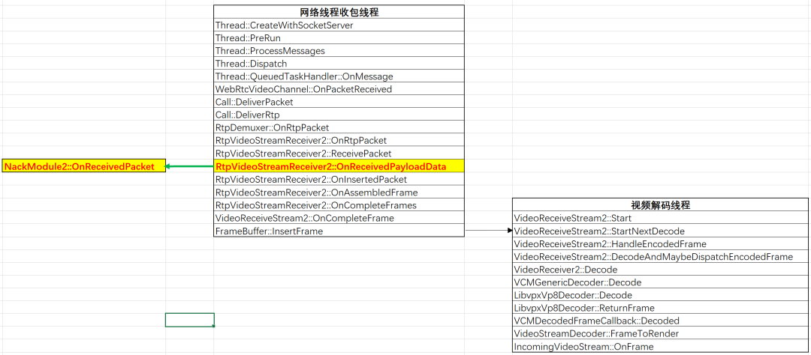

RtpVideoStreamReceiver::OnReceivedPayloadData调用NackModule2::OnReceivedPacket：

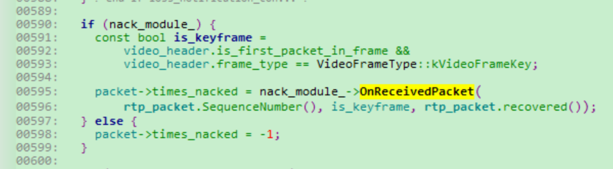

### 2. 定时检查触发

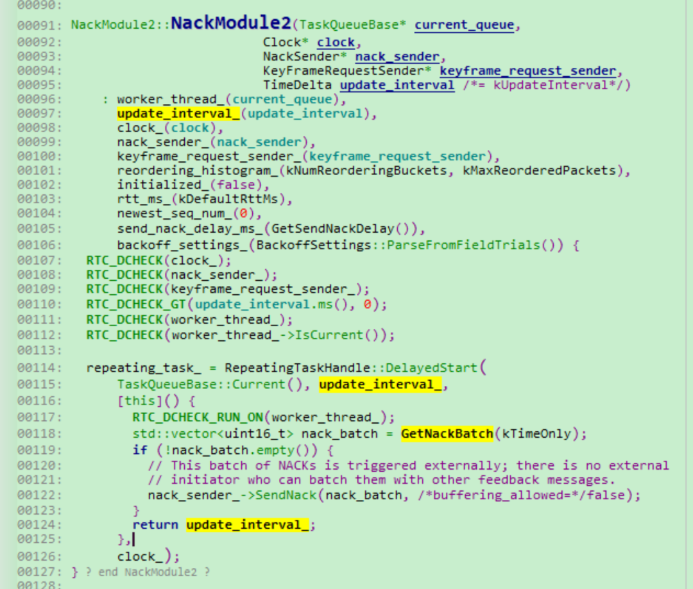

kTimeOnly模式默认周期调度时间是20ms。

```cpp
static constexpr TimeDelta kUpdateInterval = TimeDelta::Millis(20);
```

### 3. 核心函数思想

NackModule2::AddPacketsToNack和NackModule2::GetNackBatch是NACK核心函数。  

**NackModule2::AddPacketsToNack：决定是否将该报文放入NACK队列。**  

```cpp
void NackModule2::AddPacketsToNack(uint16_t seq_num_start,
                                   uint16_t seq_num_end) {
  // Called on worker_thread_.
  // Remove old packets.
  auto it = nack_list_.lower_bound(seq_num_end - kMaxPacketAge);
  nack_list_.erase(nack_list_.begin(), it);

  // If the nack list is too large, remove packets from the nack list until
  // the latest first packet of a keyframe. If the list is still too large,
  // clear it and request a keyframe.
  uint16_t num_new_nacks = ForwardDiff(seq_num_start, seq_num_end);
  if (nack_list_.size() + num_new_nacks > kMaxNackPackets) {
    while (RemovePacketsUntilKeyFrame() &&
           nack_list_.size() + num_new_nacks > kMaxNackPackets) {
    }
    if (nack_list_.size() + num_new_nacks > kMaxNackPackets) {
      nack_list_.clear();
      RTC_LOG(LS_WARNING) << "NACK list full, clearing NACK"
                             " list and requesting keyframe.";
      keyframe_request_sender_->RequestKeyFrame();
      return;
    }
  }
  for (uint16_t seq_num = seq_num_start; seq_num != seq_num_end; ++seq_num) {
    // Do not send nack for packets that are already recovered by FEC or RTX
    if (recovered_list_.find(seq_num) != recovered_list_.end())
      continue;
    NackInfo nack_info(seq_num, seq_num + WaitNumberOfPackets(0.5),
                       clock_->TimeInMilliseconds());
    RTC_DCHECK(nack_list_.find(seq_num) == nack_list_.end());
    nack_list_[seq_num] = nack_info;
  }
}
```

该函数的中心思想是：

  * `nack_list`的最大长度为kMaxNackPackets，即本次发送的nack包至多可以对kMaxNackPackets个丢失的包进行重传请求。如果丢失的包数量超过kMaxNackPackets，会循环清空`nack_list`中关键帧之前的包，直到其长度小于kMaxNackPackets。也就是说，放弃对关键帧首包之前的包的重传请求，直接而快速的以关键帧首包之后的包号作为重传请求的开始；

  * `nack_list`中包号的距离不能超过kMaxPacketAge个包号。即`nack_list`中的包号始终保持 `[cur_seq_num - kMaxPacketAge, cur_seq_num] `这样的跨度，以保证nack请求列表中不会有太老旧的包号。

**NackModule2::GetNackBatch：决定是否发送NACK请求重传该报文，两种触发方式都是调用这个函数。**  

```cpp
std::vector<uint16_t> NackModule2::GetNackBatch(NackFilterOptions options) {
  // Called on worker_thread_.
  bool consider_seq_num = options != kTimeOnly;
  bool consider_timestamp = options != kSeqNumOnly;
  Timestamp now = clock_->CurrentTime();
  std::vector<uint16_t> nack_batch;
  auto it = nack_list_.begin();
  while (it != nack_list_.end()) {
    TimeDelta resend_delay = TimeDelta::Millis(rtt_ms_);
    if (backoff_settings_) {
      resend_delay =
          std::max(resend_delay, backoff_settings_->min_retry_interval);
      if (it->second.retries > 1) {
        TimeDelta exponential_backoff =
            std::min(TimeDelta::Millis(rtt_ms_), backoff_settings_->max_rtt) *
            std::pow(backoff_settings_->base, it->second.retries - 1);
        resend_delay = std::max(resend_delay, exponential_backoff);
      }
    }
    bool delay_timed_out =
        now.ms() - it->second.created_at_time >= send_nack_delay_ms_;
    bool nack_on_rtt_passed =
        now.ms() - it->second.sent_at_time >= resend_delay.ms();
    bool nack_on_seq_num_passed =
        it->second.sent_at_time == -1 &&
        AheadOrAt(newest_seq_num_, it->second.send_at_seq_num);
    if (delay_timed_out && ((consider_seq_num && nack_on_seq_num_passed) ||
                            (consider_timestamp && nack_on_rtt_passed))) {
      nack_batch.emplace_back(it->second.seq_num);
      ++it->second.retries;
      it->second.sent_at_time = now.ms();
      if (it->second.retries >= kMaxNackRetries) {
        RTC_LOG(LS_WARNING) << "Sequence number " << it->second.seq_num
                            << " removed from NACK list due to max retries.";
        it = nack_list_.erase(it);
      } else {
        ++it;
      }
      continue;
    }
    ++it;
  }
  return nack_batch;
}
```

该函数的中心思想是：

  * 因为报文有可能出现乱序抖动情况，不能说检测出丢包就立即重传，需要等待`send_nack_delay_ms_`，当等待时间大于`send_nack_delay_ms_`，申请重传。`send_nack_delay_ms_`是系统初始化时，在GetSendNackDelay()配置。根据实际场景配置合理值。比方说可以牺牲一定带宽保证实时性要求比较高场景，`send_nack_delay_ms_`可以配置成0；
  * 因为NACK产生的延时主要在RTT环路延时上，所以再次重传的时间一定要大于`rtt_ms_`，当两次发送NACK重传请求时间大于`rtt_ms_`时，才会申请再次重传；
  * 视频会议场景对实时性要求很高，当报文一直处于丢包状态，不能持续申请重传，最大重传次数为kMaxNackRetries，超过最大重传次数，放弃该报文。不再重传。使用其他QoS手段进行恢复。

**接收端NACK参数汇总**

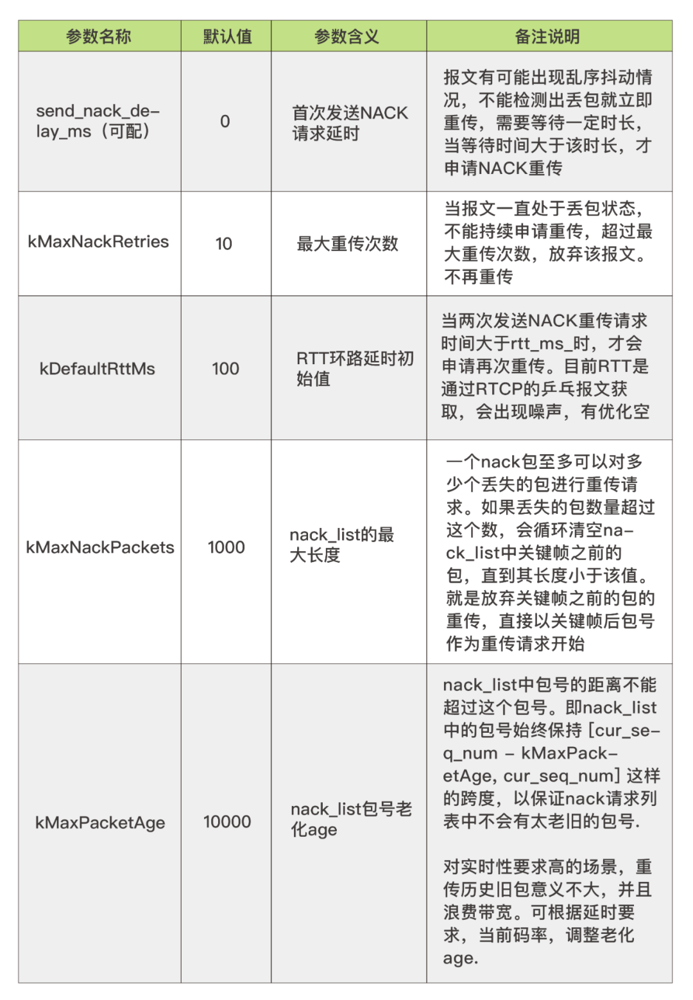
