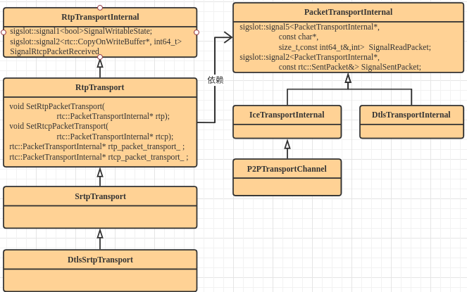
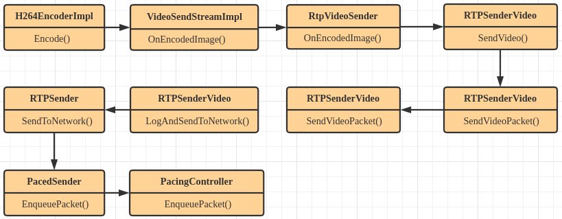
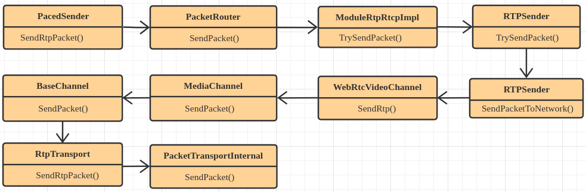
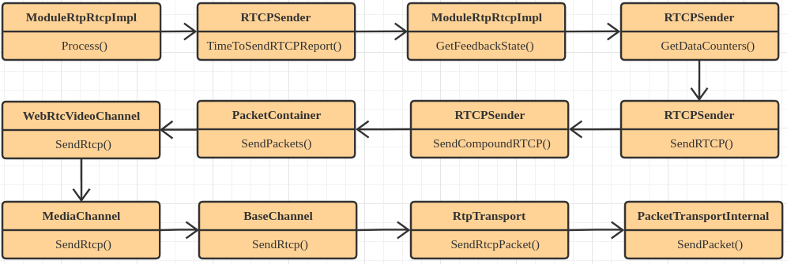
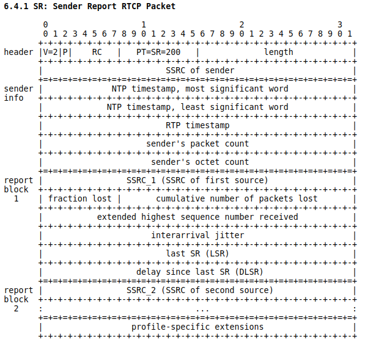
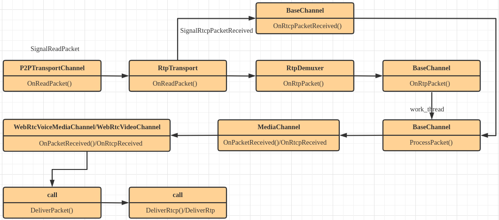
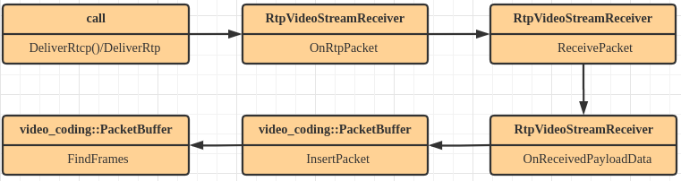
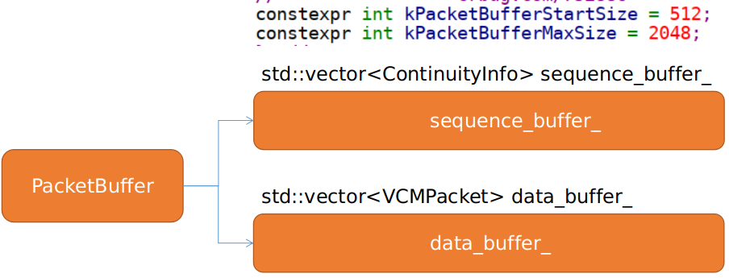
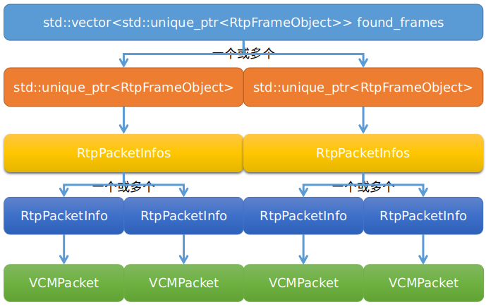
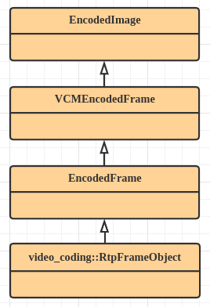

 
<!--BEGIN_DATA
{
    "create_date": "2021-07-10 10:20", 
    "modify_date": "2021-07-10 10:20", 
    "is_top": "0", 
    "summary": "WebRTC RTP/RTCP协议<br/>WebRTC RTP Video数据接收及组包分析", 
    "tags": "WebRTC", 
    "file_name": "WebRTC RTP/RTCP协议与Video数据接收及组包分析.md"
}
END_DATA-->

#### <p>原文出处：<a href='https://www.jianshu.com/p/f13c9b730658' target='blank'>WebRTC RTP/RTCP协议分析</a></p>

## 1 rtp/rtcp通道创建流程 

RtpTransportInternal为webrtc 网络rtp以及rtcp传输层的接口,rtp和rtcp数据经该api层讲数据发送到PacketTransportInternal它们之间的关系如下图:



  * RtpTransportInternal主要供用户拿到rtp数据流后调用,而PacketTransportInternal为底层网络通信层接口
  * RtpTransportInternal的创建时机是在创建PeerConnection的时候通过绑定音频轨和视频轨的时候创建
  * PacketTransportInternal的创建时机是在当通过调用PeerConnection的SetLocalDescription或者SetRemoteDescription的时候创建,也就是握手完成后创建
  * RtpTransportInternal对象中持有PacketTransportInternal对象一个用于发送rtp包一个用于发送rtcp包

### 1.1 Transport的创建


  * 通过SetLocalDescription或者SetRemoteDescription经过一系列的函数回调最终会创建RtpTransportInternal和PacketTransportInternal
  * 首先在MaybeCreateJsepTransport函数中通过CreateIceTransport()创建P2PTransportChannel
  * 其次以P2PTransportChannel为参数创建`rtp_dtls_transport`,同理如果rtp和rtcp不同端口的话还需要创建`rtcp_dtls_transport`
  * 再次以`rtp_dtls_transport`和`rtcp_dtls_transport`为参数调用CreateDtlsSrtpTransport创建`dtls_srtp_transport`,创建完后调用SetDtlsTransports并传入`rtcp_dtls_transport`和`dtls_srtp_transport`将其保存到RtpTransportInternal类中的`rtcp_packet_transport_`和`rtp_packet_transport_`
  * 同时在SetDtlsTransports函数中会调用RtpTransport::SetRtpPacketTransport将RtpTransport类和PacketTransportInternal类中提供的信号进行绑定,这样当PacketTransportInternal从网络连接中获取到数据后经过相应的信号处理即可触发RtpTransport类中的相关函数
  * 最后以上面创建好的各transport为参数构造cricket::JsepTransport并调用SetTransportForMid将以mid为key,以JsepTransport对象为value将其插入到`mid_to_transport_`容器当中,在后续的通信当中根据mid返回使用
  * 经过上面的流程就已经将RtpTransportInternal和PacketTransportInternal关联起来

### 1.2 RtpTransportInternal的初始化

```cpp   
// TODO(steveanton): Perhaps this should be managed by the RtpTransceiver.
#pc/peer_connection.cc
cricket::VideoChannel* PeerConnection::CreateVideoChannel(
    const std::string& mid) {
  RtpTransportInternal* rtp_transport = GetRtpTransport(mid);
  MediaTransportConfig media_transport_config =
      transport_controller_->GetMediaTransportConfig(mid);
  cricket::VideoChannel* video_channel = channel_manager()->CreateVideoChannel(
      call_ptr_, configuration_.media_config, rtp_transport,
      media_transport_config, signaling_thread(), mid, SrtpRequired(),
      GetCryptoOptions(), &ssrc_generator_, video_options_,
      video_bitrate_allocator_factory_.get());
  if (!video_channel) {
    return nullptr;
  }
  video_channel->SignalDtlsSrtpSetupFailure.connect(
      this, &PeerConnection::OnDtlsSrtpSetupFailure);
  video_channel->SignalSentPacket.connect(this,
                                          &PeerConnection::OnSentPacket_w);
  video_channel->SetRtpTransport(rtp_transport);
  return video_channel;
}
```

* 其流程如下:


  * 根据mid从拿RtpTransportInternal实例
  * 通过ChannelManager创建VideoChannel病调用inin_w函数并传入RtpTransportInternal对象
  * 将BaseChannel中定义的SignalSentPacket和PeerConnection::OnSentPacket_w函数进行绑定,当数据发送完后会被调用
  * 通过SetRtpTransport将RtpTransportInternal对象保存到BaseChannel类中供后续rtp/rtcp发送接收以及处理使用
  * 在SetRtpTransport函数中调用ConnectToRtpTransport函数,该函数的核心作用是使用信号机制将BaseChannel和RtpTransportInternal对象定义的信号进行绑定,这样RtpTransportInternal接收到数据流或可以发送流的时候会通过信号机制触发BaseChannel类中的相应回调
  * ConnectToRtpTransport函数的实现如下:
    
```cpp
#pc/channel.cc
bool BaseChannel::ConnectToRtpTransport() {
  RTC_DCHECK(rtp_transport_);
  if (!RegisterRtpDemuxerSink()) {
    return false;
  }
  rtp_transport_->SignalReadyToSend.connect(
      this, &BaseChannel::OnTransportReadyToSend);
  rtp_transport_->SignalRtcpPacketReceived.connect(
      this, &BaseChannel::OnRtcpPacketReceived);
  // TODO(bugs.webrtc.org/9719): Media transport should also be used to provide
  // 'writable' state here.
  rtp_transport_->SignalWritableState.connect(this,
                                              &BaseChannel::OnWritableState);
  rtp_transport_->SignalSentPacket.connect(this,
                                            &BaseChannel::SignalSentPacket_n);
  return true;
}
```    

```cpp 
#pc/rtp_transport_internal.h
class RtpTransportInternal : public sigslot::has_slots<> {
  public:
  virtual ~RtpTransportInternal() = default;
  // Called whenever a transport's ready-to-send state changes. The argument
  // is true if all used transports are ready to send. This is more specific
  // than just "writable"; it means the last send didn't return ENOTCONN.
  sigslot::signal1<bool> SignalReadyToSend;
  // Called whenever an RTCP packet is received. There is no equivalent signal
  // for RTP packets because they would be forwarded to the BaseChannel through
  // the RtpDemuxer callback.
  sigslot::signal2<rtc::CopyOnWriteBuffer*, int64_t> SignalRtcpPacketReceived;
  // Called whenever a transport's writable state might change. The argument is
  // true if the transport is writable, otherwise it is false.
  sigslot::signal1<bool> SignalWritableState;
  sigslot::signal1<const rtc::SentPacket&> SignalSentPacket;
  virtual bool RegisterRtpDemuxerSink(const RtpDemuxerCriteria& criteria,
                                      RtpPacketSinkInterface* sink) = 0;
  virtual bool UnregisterRtpDemuxerSink(RtpPacketSinkInterface* sink) = 0;
}
```

  * ConnectToRtpTransport的核心实现就是将BaseChannel类和RtpTransportInternal类中定义的信号进行绑定
  * SignalRtcpPacketReceived信号当收到rtcp包时会触发进而调用BaseChannel::OnRtcpPacketReceived
  * SignalSentPacket信号当连接可数据发送后被触发,由ice connection层触发
  * 调用RegisterRtpDemuxerSink注册rtp分发器
    
```cpp 
// This class represents a receiver of already parsed RTP packets.
#call/rtp_packet_sink_interface.h
class RtpPacketSinkInterface {
  public:
  virtual ~RtpPacketSinkInterface() = default;
  virtual void OnRtpPacket(const RtpPacketReceived& packet) = 0;
};
```
    
```cpp 
#pc/channel.cc
class BaseChannel : public sigslot::has_slots<>,
                    public webrtc::RtpPacketSinkInterface{
  // RtpPacketSinkInterface overrides.
  void OnRtpPacket(const webrtc::RtpPacketReceived& packet) override;
};
```
    
```cpp 
#pc/channel.cc
bool BaseChannel::RegisterRtpDemuxerSink() {
  RTC_DCHECK(rtp_transport_);
  return network_thread_->Invoke<bool>(RTC_FROM_HERE, [this] {
    return rtp_transport_->RegisterRtpDemuxerSink(demuxer_criteria_, this);
  });
}
```
    
```cpp 
#pc/rtp_transport.h
bool RtpTransport::RegisterRtpDemuxerSink(const RtpDemuxerCriteria& criteria,
                                          RtpPacketSinkInterface* sink) {
  rtp_demuxer_.RemoveSink(sink);
  if (!rtp_demuxer_.AddSink(criteria, sink)) {
    RTC_LOG(LS_ERROR) << "Failed to register the sink for RTP demuxer.";
    return false;
  }
  return true;
}
```

  * 在RtpTransport类中RegisterRtpDemuxerSink将BaseChannel类注册成rtp数据的消费者
  * 在RtpTransport类的OnReadPacket函数实现中当接收到rtp或rtcp数据流后,首先判断类型如果是rtp数据则将数据通过rtp_demuxer_得到注册的消费者(RtpPacketSinkInterface),也就是BaseChannel,然后通过回调其OnRtpPacket函数将rtp包交给BaseChannel处理
  * 如果是rtcp包则通过信号机制触发SignalRtcpPacketReceived信号进而调用BaseChannel::OnRtcpPacketReceived函数对rtcp包进行处理
  * 当创建VideoChannel或者AudioChannel的时候通过一系列的调用最终会创建RtpTransportInternal对象并且会将该对象保存到BaseChannel对象当中供后续使用

## 2 rtp/rtcp数据发送

### 2.1 rtp包的数据发送流程

  * rtp数据发送流程经过PacedSender队列管理,然后再由`paced_sender`实现平滑发送,其入队前大致流程如下



  * 经过PacedSender所管理的队列处理后其最终将rtp包发送到网络层,其流程如下
  * 本文涉及到PacedSender相关的东西不做详细分析,在PacedSender原理分析一文中有详细分析



  * 在PacketRouter::SendPacket函数中会为rtp包加入TransportSequenceNumber,webrtc子m55版本之后开始使用发送端bwe算法来实现动态码率自适应,在rtp包发送头部必须扩展transport number用于支持tcc算法
  * rtp包经过如上图数据连接将数据发送给BaseChannel,最后在BaseChannel层将数据交给RtpTransport最后发送到网络
  * 在RTPSender::TrySendPacket通过RTPSender::SendPacketToNetwork将数据发给channel层后,自身会将当前发送的rtp包保存到`packet_history_`,RtpPacketHistory用于缓存发送包,若有丢包重传则从该缓存中拿数据

### 2.2 rtcp包的数据发送流程

  * 根据ModuleRtpRtcpImpl的派生关系,它继承Module,重载TimeUntilNextProcess和Process函数
  * 每隔TimeUntilNextProcess时间间隔会回调一次Process
    
```cpp    
#modules/rtp_rtcp/source/rtp_rtcp_impl.cc
// Returns the number of milliseconds until the module want a worker thread
// to call Process.
int64_t ModuleRtpRtcpImpl::TimeUntilNextProcess() {
  return std::max<int64_t>(0,
                            next_process_time_ - clock_->TimeInMilliseconds());
}
```

  * `next_process_time_`初始化值为`clock_->TimeInMilliseconds() + kRtpRtcpMaxIdleTimeProcessMs(5ms)`

  * 默认初始情况为每隔5ms调用一次Process
    
```cpp
#modules/rtp_rtcp/source/rtp_rtcp_impl.cc
// Process any pending tasks such as timeouts (non time critical events).
void ModuleRtpRtcpImpl::Process() {
  const int64_t now = clock_->TimeInMilliseconds();
  next_process_time_ = now + kRtpRtcpMaxIdleTimeProcessMs;
  .......省略
  if (rtcp_sender_.TimeToSendRTCPReport())
    rtcp_sender_.SendRTCP(GetFeedbackState(), kRtcpReport);
  if (TMMBR() && rtcp_receiver_.UpdateTmmbrTimers()) {
    rtcp_receiver_.NotifyTmmbrUpdated();
  }
}
```

  * 首先更新`next_process_time_`,由此来看后续的回调时间是已流逝的时间加上5ms
  * 先调用GetFeedbackState获取反馈状态
  * 然后使用SendRTCP进行RTCP包发送
  * 其大概的函数调用流程如下



  * ModuleProcess线程周期性的调用ModuleRtpRtcpImpl::Process函数(最小调用间隔为5ms),该函数通过RTCPSender::TimeToSendRTCPReport函数判断当前是否要立即发送RTCP报文
  * 若需要立即发送RTCP报文,首先通过ModuleRtpRtcpImpl::GetFeedbackState函数获取RTP包发送统计信息,然后调用RTCPSender::SendRTCP函数将RTCP数据发送到网络层.
  * RTCPSender::SendRTCP函数调用RTCPSender::SendCompoundRTCP对RTCP包进行组合
  * RTCPSender::SendCompoundRTCP函数首先会调用PrepareReport(`feedback_state`)根据`feedback_state`状态确定当前要发送那种类型的RTCP包,紧接着调用其编译函数,构造该类包,如SR包使用BuildSR函数,RR报文使用BuildRR等,最后将构造好的的RTCP包存到PacketContainer容器当中,最后调用其SendPackets函数进行发送
  * 接下来以SR包为例,分析其构造原理,进而分析RTCP SR包相关内容,SR报文的发送时机是在接收到报文后如果由数据发送则会发送SR报文,相对与媒体发送端
    
```cpp
#modules/rtp_rtcp/source/rtp_rtcp_impl.cc
// TODO(pbos): Handle media and RTX streams separately (separate RTCP
// feedbacks).
RTCPSender::FeedbackState ModuleRtpRtcpImpl::GetFeedbackState() {
  RTCPSender::FeedbackState state;
  // This is called also when receiver_only is true. Hence below
  // checks that rtp_sender_ exists.
  if (rtp_sender_) {
    StreamDataCounters rtp_stats;
    StreamDataCounters rtx_stats;
    rtp_sender_->GetDataCounters(&rtp_stats, &rtx_stats);
    state.packets_sent =
        rtp_stats.transmitted.packets + rtx_stats.transmitted.packets;
    state.media_bytes_sent = rtp_stats.transmitted.payload_bytes +
                              rtx_stats.transmitted.payload_bytes;
    state.send_bitrate = rtp_sender_->BitrateSent();
  }
  state.module = this;
  LastReceivedNTP(&state.last_rr_ntp_secs, &state.last_rr_ntp_frac,
                  &state.remote_sr);
  state.last_xr_rtis = rtcp_receiver_.ConsumeReceivedXrReferenceTimeInfo();
  return state;
}
```   

  * 首先根据ModuleRtpRtcpImpl::GetFeedbackState获取rtp发送统计信息
  * 调用RTCPSender::GetDataCounters获取`rtp_stats`和`rtx_stats`,其中`rtp_stats`代表的是正常发送的RTP流的统计,而`rtx_stats`应该是丢包重传发送的RTP流的统计,GetDataCounters是从定义在RTCPSender的成员变量 `StreamDataCounters rtp_stats_ RTC_GUARDED_BY(statistics_crit_)`;`StreamDataCounters rtx_rtp_stats_ RTC_GUARDED_BY(statistics_crit_)`;中获取
  * 这两个变量的更新是在RTPSender::SendPacketToNetwork将rtp包发送到网络层后如果发送成功则调用RTPSender::UpdateRtpStats函数对其更新统计
  * StreamDataCounters主要在这里主要是统计成功发送的rtp包数量,发送的字节数等信息
  * 最后调用LastReceivedNTP更新`last_rr_ntp_secs,last_rr_ntp_frac`以及`remote_sr`,其中`last_rr_ntp_secs`对应的是发送端上一次接收到SR报告时的NTP时间对应的秒数,`last_rr_ntp_frac`为发送端上一次接收到SR报告时的NTP时间的小数,该NTP时间都是在发送端进行计算的属于local NTP time
  * `remote_sr`为remote ntp time 计算得来,用与本次SR报告发送是计算时延?
    
```cpp
#modules/rtp_rtcp/source/rtp_rtcp_impl.cc
bool ModuleRtpRtcpImpl::LastReceivedNTP(
    uint32_t* rtcp_arrival_time_secs,  // When we got the last report.
    uint32_t* rtcp_arrival_time_frac,
    uint32_t* remote_sr) const {
  // Remote SR: NTP inside the last received (mid 16 bits from sec and frac).
  uint32_t ntp_secs = 0;
  uint32_t ntp_frac = 0;
  if (!rtcp_receiver_.NTP(&ntp_secs, &ntp_frac, rtcp_arrival_time_secs,
                          rtcp_arrival_time_frac, NULL)) {
    return false;
  }
  *remote_sr =
      ((ntp_secs & 0x0000ffff) << 16) + ((ntp_frac & 0xffff0000) >> 16);
  return true;
}
```

  * 该函数的核心实现是通过RTCPReceiver::NTP函数是通过获取远程端发送过来的包得出来的,`rtcp_arrival_time_secs`为发送端上一次接收到SR报告的ntp时间的秒数(在发送端计算),`rtcp_arrival_time_frac`为发送端上一次接收到SR报告的ntp时间小数(在发送端计算),`ntp_secs`为发送端上一次接收到远端发送过来的SR报告,从其报告中解析其NTP字段得出的时间秒数,`ntp_frac`为发送端上一次接收到远端发送过来的SR报告,从其报告中解析其NTP字段得出的时间小数,对应的是remote NTP time
  * `remote_sr`为remote ntp time 计算得来,用于填充SR报告中的LSR部分
  * 成功获取到RTCPSender::FeedbackState后,到这里已经包含了在本次RTCP报文发送时已经得到了已经发送了多少的RTP数据等信息
    
```cpp
int32_t RTCPSender::SendRTCP(const FeedbackState& feedback_state,
                              RTCPPacketType packetType,
                              int32_t nack_size,
                              const uint16_t* nack_list) {
  return SendCompoundRTCP(
      feedback_state, std::set<RTCPPacketType>(&packetType, &packetType + 1),
      nack_size, nack_list);
}
```

  * 以FeedbackState为参数调用SendCompoundRTCP将其发送到底层
    
```cpp
int32_t RTCPSender::SendCompoundRTCP(
    const FeedbackState& feedback_state,
    const std::set<RTCPPacketType>& packet_types,
    int32_t nack_size,
    const uint16_t* nack_list) {
  PacketContainer container(transport_, event_log_);
  size_t max_packet_size;
  {
    rtc::CritScope lock(&critical_section_rtcp_sender_);
    // Add all flags as volatile. Non volatile entries will not be overwritten.
    // All new volatile flags added will be consumed by the end of this call.
    SetFlags(packet_types, true);
    .....
    // We need to send our NTP even if we haven't received any reports.
    RtcpContext context(feedback_state, nack_size, nack_list,
                        clock_->TimeInMicroseconds());
    PrepareReport(feedback_state);
    std::unique_ptr<rtcp::RtcpPacket> packet_bye;
    auto it = report_flags_.begin();
    while (it != report_flags_.end()) {
      auto builder_it = builders_.find(it->type);
      RTC_DCHECK(builder_it != builders_.end())
          << "Could not find builder for packet type " << it->type;
      if (it->is_volatile) {
        report_flags_.erase(it++);
      } else {
        ++it;
      }
      BuilderFunc func = builder_it->second;
      std::unique_ptr<rtcp::RtcpPacket> packet = (this->*func)(context);
      if (packet == nullptr)
        return -1;
      // If there is a BYE, don't append now - save it and append it
      // at the end later.
      if (builder_it->first == kRtcpBye) {
        packet_bye = std::move(packet);
      } else {
        container.Append(packet.release());
      }
    }
    // Append the BYE now at the end
    if (packet_bye) {
      container.Append(packet_bye.release());
    }
    if (packet_type_counter_observer_ != nullptr) {
      packet_type_counter_observer_->RtcpPacketTypesCounterUpdated(
          remote_ssrc_, packet_type_counter_);
    }
    RTC_DCHECK(AllVolatileFlagsConsumed());
    max_packet_size = max_packet_size_;
  }
  size_t bytes_sent = container.SendPackets(max_packet_size);
  return bytes_sent == 0 ? -1 : 0;
}
```   

  * 首先SetFlags更新`report_flags_`集合将当前传入的`packet_types`插入到集合
  * 以当前NTP时间做为参数构造RtcpContext
  * PrepareReport以`feedback_state`为参数,来选择要构建什么样的rtcp报文,同时会根据`feedback_state`中当前rtp包的发送码率配合`report_interval_ms_`来刷新`next_time_to_send_rtcp_`也就是下次发送RTCP的时间
  * 根据对PrepareReport的分析,它的原理是假设当前`report_flags_`集合中包含了kRtcpSr或者kRtcpRr并且volatile值为false的情况下表示RTCP已经有了则直接返回
  * 否则如果RtcpMode为kCompound(webrtc默认为这个模式),则会根据`sending_`变量判断当前是发送端还是接收端,`SetFlag(sending_ ? kRtcpSr : kRtcpRr, true)`,如果是发送端则准备发送发送者报告,如果是接收端不发送数据则准备发送RR报文
  * 同时还会准备扩展报文如kRtcpAnyExtendedReports=>SetFlag(kRtcpAnyExtendedReports, true);
  * PrepareReport函数更新完`report_flags_`集合,将要发送的报文的flag插入到该集合后,开始对`report_flags_`集合进行遍历,对`report_flags_`集合中已有的标记使用相应的build函数构造报文,如SR报文BuildSR函数
  * 将构造好的rtcp::RtcpPacket添加到container容器,然后将当前已经构造完的报文的标记从`report_flags_`集合中移除
  * 最后调用`container.SendPackets(max_packet_size)`;将报文发给RTCP通道
  * 以SR报文为例分析SR RTCP协议
    
协议地址:
http://tools.ietf.org/html/rfc3550#section-6.4.1



  * RTCP SR报文分成两大部分第一部分是发送者信息,第二部分是接收者报告块
  * 发送者信息块的描述如下

<table>
<thead>
<tr>
<th>Fields</th>
<th><strong>explain</strong></th>
</tr>
</thead>
<tbody>
<tr>
<td><strong>NTP timestamp</strong></td>
<td>64 bits 网络时间戳,用于不同源之间的同步,如音频和视频</td>
</tr>
<tr>
<td><strong>RTP timestamp</strong></td>
<td>32 bits RTP包发送的相对时间戳,该frame从编码器中编码出来的时间</td>
</tr>
<tr>
<td><strong>sender's packet count</strong></td>
<td>32 bits 发送者总发送的包数,SSRC发生变化时会被重置</td>
</tr>
<tr>
<td><strong>sender's octet count</strong></td>
<td>32 bits 发送者总发送的字节数=每个包的字节数X总的发包数</td>
</tr>
</tbody>
</table>

  * 接收报告块的描述如下:

<table>
<thead>
<tr>
<th>Fields</th>
<th><strong>Explain</strong></th>
</tr>
</thead>
<tbody>
<tr>
<td><strong>SSRC n</strong></td>
<td>32 bits, source identifier，接收到的每个媒体源,如音频和视频,n表示第几个</td>
</tr>
<tr>
<td><strong>fraction lost:</strong></td>
<td>8 bits 上一次报告之后到本次报告之间的丢包比列</td>
</tr>
<tr>
<td><strong>number of packets lost</strong></td>
<td>24 bits 自接收开始丢包总数,迟到的包不算</td>
</tr>
<tr>
<td><strong>highest sequence number</strong></td>
<td>32 bits 低16位表示收到的最大seq,高16位表示seq的循环次数</td>
</tr>
<tr>
<td>
<strong>interarrival</strong> <strong>jitter</strong>
</td>
<td>32 bits 估算的RTP包到达时间间隔的统计方差,延迟大小</td>
</tr>
<tr>
<td><strong>last SR timestamp (LSR)</strong></td>
<td>32 bits 上一次接收到的SR的NTP时间戳(remote ntp time),取值为:ntp_msw&amp;0xffff + ntp_lsw&gt;&gt;16（取ntp_msw的低16位和ntp_lsw的高16位）</td>
</tr>
<tr>
<td><strong>delay since last SR (DLSR)</strong></td>
<td>32 bits 从接收到上一个SR包到发送此接收报告块之间的延时,以1/65536秒为单位.</td>
</tr>
</tbody>
</table>

  * BuildSR函数的实现如下:
    
```cpp
std::unique_ptr<rtcp::RtcpPacket> RTCPSender::BuildSR(const RtcpContext& ctx) {
  // Timestamp shouldn't be estimated before first media frame.
  RTC_DCHECK_GE(last_frame_capture_time_ms_, 0);
  // The timestamp of this RTCP packet should be estimated as the timestamp of
  // the frame being captured at this moment. We are calculating that
  // timestamp as the last frame's timestamp + the time since the last frame
  // was captured.
  int rtp_rate = rtp_clock_rates_khz_[last_payload_type_];
  if (rtp_rate <= 0) {
    rtp_rate =
        (audio_ ? kBogusRtpRateForAudioRtcp : kVideoPayloadTypeFrequency) /
        1000;
  }
  // Round now_us_ to the closest millisecond, because Ntp time is rounded
  // when converted to milliseconds,
  // 同一帧数据的rtp_timestamp的时间戳是一样的
  uint32_t rtp_timestamp =
      timestamp_offset_ + last_rtp_timestamp_ +
      ((ctx.now_us_ + 500) / 1000 - last_frame_capture_time_ms_) * rtp_rate;
  rtcp::SenderReport* report = new rtcp::SenderReport();
  report->SetSenderSsrc(ssrc_);
  report->SetNtp(TimeMicrosToNtp(ctx.now_us_));
  report->SetRtpTimestamp(rtp_timestamp);
  report->SetPacketCount(ctx.feedback_state_.packets_sent);
  report->SetOctetCount(ctx.feedback_state_.media_bytes_sent);
  report->SetReportBlocks(CreateReportBlocks(ctx.feedback_state_));
  return std::unique_ptr<rtcp::RtcpPacket>(report);
}
```

  * 依次依据RTCP SR报告约束填充信息
  * 着重分析其接收报告块信息的填充
    
```cpp
std::vector<rtcp::ReportBlock> RTCPSender::CreateReportBlocks(
    const FeedbackState& feedback_state) {
  std::vector<rtcp::ReportBlock> result;
  if (!receive_statistics_)
    return result;
  // TODO(danilchap): Support sending more than |RTCP_MAX_REPORT_BLOCKS| per
  // compound rtcp packet when single rtcp module is used for multiple media
  // streams.
  result = receive_statistics_->RtcpReportBlocks(RTCP_MAX_REPORT_BLOCKS);
  if (!result.empty() && ((feedback_state.last_rr_ntp_secs != 0) ||
                          (feedback_state.last_rr_ntp_frac != 0))) {
    // Get our NTP as late as possible to avoid a race.
    uint32_t now = CompactNtp(TimeMicrosToNtp(clock_->TimeInMicroseconds()));
    uint32_t receive_time = feedback_state.last_rr_ntp_secs & 0x0000FFFF;
    receive_time <<= 16;
    receive_time += (feedback_state.last_rr_ntp_frac & 0xffff0000) >> 16;
    uint32_t delay_since_last_sr = now - receive_time;
    // TODO(danilchap): Instead of setting same value on all report blocks,
    // set only when media_ssrc match sender ssrc of the sender report
    // remote times were taken from.
    for (auto& report_block : result) {
      report_block.SetLastSr(feedback_state.remote_sr);
      report_block.SetDelayLastSr(delay_since_last_sr);
    }
  }
  return result;
}
```    

  * 首先`receive_statistics_->RtcpReportBlocks`获取接收报告块的个数
  * 计算`delay_since_last_sr`也就是本次发送SR报告距离上一次收到SR报告之间的时延
  * `SetLastSr(feedback_state.remote_sr)`,将上一次接收到的SR报告中的ntp时间填充LSR
  * SetDelayLastSr填充本次发送SR报告距离上一次收到SR报告之间的时延

<hr>

#### <p>原文出处：<a href='https://www.jianshu.com/p/fd2860178b93' target='blank'>WebRTC RTP Video数据接收及组包分析</a></p>

经过对WebRTC RTP/RTCP协议分析分析,得出BaseChannel类通过信号和RtpTransport建立关系,同时RtpTransport也通过
信号和PacketTransportInternal建立关系,数据的接收全部通过信号回调进行触发



## 1 Video RTP 接收处理



  * 首先经过call模块处理将rtp视频数据送到RtpVideoStreamReceiver::OnRtpPacket函数,然后将调用RtpVideoStreamReceiver::ReceivePacket函数进行RTP包解析
  * 解析完之后的数据,会通过RtpVideoStreamReceiver::OnReceivedPayloadData回调,在该函数中会将rtp数据包打包成VCMPacket包,然后将VCMPacket包插入到`packet_buffer_`
  * 在PacketBuffer::InsertPacket函数中插入完后会调用PacketBuffer::FindFrames函数查找有没有合适的帧
  * `video_coding::PacketBuffer`的工作原理如下



  * `video_coding::PacketBuffer`维护两个集合`sequence_buffer_`用于管理seqNum对应ContinuityInfo结构体
  * `data_buffer_`管理实际的VCMPacket包
  * `video_coding::PacketBuffer::ContinuityInfo`的定义如下
    
```cpp
struct ContinuityInfo {
    // The sequence number of the packet.
    uint16_t seq_num = 0;
    // If this is the first packet of the frame.
    bool frame_begin = false;
    // If this is the last packet of the frame.
    bool frame_end = false;
    // If this slot is currently used.
    bool used = false;
    // If all its previous packets have been inserted into the packet buffer.
    bool continuous = false;
    // If this packet has been used to create a frame already.
    bool frame_created = false;
};
```

  * used表示当前位置已经使用
  * `video_coding::PacketBuffer`依赖OnAssembledFrameCallback而OnAssembledFrameCallback由RtpVideoStreamReceiver类实现
  * `video_coding::PacketBuffer`在构造的时候会初始化`data_buffer_`和`sequence_buffer_`容器的大小默认为512
  * `video_coding::PacketBuffer`的创建发生在RtpVideoStreamReceiver类的构造阶段,RtpVideoStreamReceiver通过调用PacketBuffer::Create函数创建`video_coding::PacketBuffer`并将实例对象保存成其私有成员变量`packet_buffer_`
  * `video_coding::PacketBuffer`支持扩张,其扩张通过ExpandBufferSize函数实现,具体代码如下:
    
```cpp
bool PacketBuffer::ExpandBufferSize() {
  if (size_ == max_size_) {
    RTC_LOG(LS_WARNING) << "PacketBuffer is already at max size (" << max_size_
                        << "), failed to increase size.";
    return false;
  }
  size_t new_size = std::min(max_size_, 2 * size_);
  std::vector<VCMPacket> new_data_buffer(new_size);
  std::vector<ContinuityInfo> new_sequence_buffer(new_size);
  for (size_t i = 0; i < size_; ++i) {
    if (sequence_buffer_[i].used) {
      size_t index = sequence_buffer_[i].seq_num % new_size;
      new_sequence_buffer[index] = sequence_buffer_[i];
      new_data_buffer[index] = data_buffer_[i];
    }
  }
  size_ = new_size;
  sequence_buffer_ = std::move(new_sequence_buffer);
  data_buffer_ = std::move(new_data_buffer);
  RTC_LOG(LS_INFO) << "PacketBuffer size expanded to " << new_size;
  return true;
}
```

  * 首先判断`size_`是否已经为最大值2048,如果是则返回,因为最大支持2048
  * 假设原来的大小为512,经过调用ExpandBufferSize则扩大到1024
  * 重新创建`new_data_buffer`和`new_sequence_buffer`容器,其大小为新值1024
  * 将新容器移动构造到原有容器,并且保留原有容器中的数据

## 2 Video RTP 数据组包流程

  * video rtp包组包发生在PacketBuffer::InsertPacket函数
    
```cpp
bool PacketBuffer::InsertPacket(VCMPacket* packet) {
  std::vector<std::unique_ptr<RtpFrameObject>> found_frames;
  {
    rtc::CritScope lock(&crit_);
    OnTimestampReceived(packet->timestamp);
    uint16_t seq_num = packet->seqNum;
    size_t index = seq_num % size_;
    if (!first_packet_received_) {
      first_seq_num_ = seq_num;
      first_packet_received_ = true;
    } else if (AheadOf(first_seq_num_, seq_num)) {
      // If we have explicitly cleared past this packet then it's old,
      // don't insert it, just silently ignore it.
      if (is_cleared_to_first_seq_num_) {
        delete[] packet->dataPtr;
        packet->dataPtr = nullptr;
        return true;
      }
      first_seq_num_ = seq_num;
    }
    if (sequence_buffer_[index].used) {
      // Duplicate packet, just delete the payload.
      if (data_buffer_[index].seqNum == packet->seqNum) {
        delete[] packet->dataPtr;
        packet->dataPtr = nullptr;
        return true;
      }
      // The packet buffer is full, try to expand the buffer.
      while (ExpandBufferSize() && sequence_buffer_[seq_num % size_].used) {
      }
      index = seq_num % size_;
      // Packet buffer is still full since we were unable to expand the buffer.
      if (sequence_buffer_[index].used) {
        // Clear the buffer, delete payload, and return false to signal that a
        // new keyframe is needed.
        RTC_LOG(LS_WARNING) << "Clear PacketBuffer and request key frame.";
        Clear();
        delete[] packet->dataPtr;
        packet->dataPtr = nullptr;
        return false;
      }
    }
    sequence_buffer_[index].frame_begin = packet->is_first_packet_in_frame();
    sequence_buffer_[index].frame_end = packet->is_last_packet_in_frame();
    sequence_buffer_[index].seq_num = packet->seqNum;
    sequence_buffer_[index].continuous = false;
    sequence_buffer_[index].frame_created = false;
    sequence_buffer_[index].used = true;
    data_buffer_[index] = *packet;
    packet->dataPtr = nullptr;
    UpdateMissingPackets(packet->seqNum);
    int64_t now_ms = clock_->TimeInMilliseconds();
    last_received_packet_ms_ = now_ms;
    if (packet->video_header.frame_type == VideoFrameType::kVideoFrameKey)
      last_received_keyframe_packet_ms_ = now_ms;
    found_frames = FindFrames(seq_num);
  }
  for (std::unique_ptr<RtpFrameObject>& frame : found_frames)
    assembled_frame_callback_->OnAssembledFrame(std::move(frame));
  return true;   
}
```

  * 首先根据VCMPacket包的seqNum求容器索引,使用`seq_num % size_`,假设容器大小为512,第一个seqNumber为2680,那么得出当前要插入到容器中的位置为120,根据rtp包seqNum的连续性可以得出后续如果不出现丢包的情况索引会依次递增+1(120,121,122,123,124.....),使用这种办法取索引是为了丢包重传包插入到该容器的时候确保索引依然连续吧?
  * 判断是否为第一次插入VCMPacket,如果是则记录首次VCMPacket对应的seqNum将其赋值给`first_seq_num_`
  * 每次插入会判断`first_seq_num_`是否在VCMPacket的seqNum的前面,如果`first_seq_num_`是在VCMPacket的seqNum的前面则根据`is_cleared_to_first_seq_num_`是true删除VCMPacket的数据部分,用处后续分析
  * 如果容器已经满了则进行扩张,扩张原则不超过2048并且按原有容器的双倍大小进行扩展
  * `data_buffer_[index] = *packet`调用移动拷贝构造函数将要插入的VCMPacket的信息赋值给`data_buffer_[index]`
  * 调用UpdateMissingPackets更新`missing_packets_`容器(未看明白算法)
  * 最后回调FindFrames查找是否由合适的帧
    
```cpp
bool PacketBuffer::PotentialNewFrame(uint16_t seq_num) const {
  size_t index = seq_num % size_;
  int prev_index = index > 0 ? index - 1 : size_ - 1;
  ....
  if (sequence_buffer_[index].frame_begin)
    return true;
  ....
  if (sequence_buffer_[prev_index].continuous)
    return true;
  return false;
}
```

  * 判断当前`seq_num`对应的VCMPackage包是否是潜在的新帧
  * 如果当前`seq_num`对应索引的`sequence_buffer_[index].frame_begin`为true则表示当前`seq_number`为新的一帧的开始
  * 如果当前`seq_num`对应索引的前一个索引的`sequence_buffer_[prev_index].continuous`为true则表示是潜在的新的一帧
  * FindFrames函数的查询实现如下:
    
```cpp
std::vector<std::unique_ptr<RtpFrameObject>> PacketBuffer::FindFrames(
    uint16_t seq_num) {
  std::vector<std::unique_ptr<RtpFrameObject>> found_frames;
  for (size_t i = 0; i < size_ && PotentialNewFrame(seq_num); ++i) {
    size_t index = seq_num % size_;
    sequence_buffer_[index].continuous = true;
    // If all packets of the frame is continuous, find the first packet of the
    // frame and create an RtpFrameObject.
    if (sequence_buffer_[index].frame_end) {
      size_t frame_size = 0;
      int max_nack_count = -1;
      uint16_t start_seq_num = seq_num;
      RtpPacketInfos::vector_type packet_infos;
      // Find the start index by searching backward until the packet with
      // the |frame_begin| flag is set.
      int start_index = index;
      size_t tested_packets = 0;
      int64_t frame_timestamp = data_buffer_[start_index].timestamp;
      // Identify H.264 keyframes by means of SPS, PPS, and IDR.
      bool is_h264 = data_buffer_[start_index].codec() == kVideoCodecH264;
      bool has_h264_sps = false;
      bool has_h264_pps = false;
      bool has_h264_idr = false;
      bool is_h264_keyframe = false;
      /*使用while true 循环递减组包*/
      while (true) {
        ++tested_packets;
        /*计算一帧RTP包的总大小*/
        frame_size += data_buffer_[start_index].sizeBytes;
        /*.....省略...*/
        sequence_buffer_[start_index].frame_created = true;
        // Should use |push_front()| since the loop traverses backwards. But
        // it's too inefficient to do so on a vector so we'll instead fix the
        // order afterwards.
        /*将data_buffer_[start_index].packet_info存入到packet_infos容器*/  
        packet_infos.push_back(data_buffer_[start_index].packet_info);
        /*非H264类型的RTP包当检测到sequence_buffer_[start_index].frame_begin为
          true,也就是按照下面分析的检测到seqNumber=2680的时候会退出循环
        */  
        if (!is_h264 && sequence_buffer_[start_index].frame_begin)
          break;
        if (is_h264 && !is_h264_keyframe) {
          const auto* h264_header = absl::get_if<RTPVideoHeaderH264>(
              &data_buffer_[start_index].video_header.video_type_header);
          if (!h264_header || h264_header->nalus_length >= kMaxNalusPerPacket)
            return found_frames;
          for (size_t j = 0; j < h264_header->nalus_length; ++j) {
            if (h264_header->nalus[j].type == H264::NaluType::kSps) {
              has_h264_sps = true;
            } else if (h264_header->nalus[j].type == H264::NaluType::kPps) {
              has_h264_pps = true;
            } else if (h264_header->nalus[j].type == H264::NaluType::kIdr) {
              has_h264_idr = true;
            }
          }
          if ((sps_pps_idr_is_h264_keyframe_ && has_h264_idr && has_h264_sps &&
                has_h264_pps) ||
              (!sps_pps_idr_is_h264_keyframe_ && has_h264_idr)) {
            is_h264_keyframe = true;
          }
        }
        /*.....全部检索...*/
        if (tested_packets == size_)
          break;
        start_index = start_index > 0 ? start_index - 1 : size_ - 1;
        // In the case of H264 we don't have a frame_begin bit (yes,
        // |frame_begin| might be set to true but that is a lie). So instead
        // we traverese backwards as long as we have a previous packet and
        // the timestamp of that packet is the same as this one. This may cause
        // the PacketBuffer to hand out incomplete frames.
        // See: https://bugs.chromium.org/p/webrtc/issues/detail?id=7106
        /*对于H264数据包当frame_timestamp不一样,根据同一帧数据的RTP包的rtp时间戳相等的原则*/  
        if (is_h264 &&
            (!sequence_buffer_[start_index].used ||
              data_buffer_[start_index].timestamp != frame_timestamp)) {
          break;
        }
        --start_seq_num;
      }
      //while(true)结束完后start_seq_num已经对应为seqNum的包号了  
      /*上面的检测是递减组包这里将packet_infos的包的顺序进行逆向调整
        按照下文的分析调整完后packet_infos[0]对应seqNumb = 2680的包
        */
      // Fix the order since the packet-finding loop traverses backwards.
      std::reverse(packet_infos.begin(), packet_infos.end());
      if (is_h264) {
        // Now that we have decided whether to treat this frame as a key frame
        // or delta frame in the frame buffer, we update the field that
        // determines if the RtpFrameObject is a key frame or delta frame.
        const size_t first_packet_index = start_seq_num % size_;
        RTC_CHECK_LT(first_packet_index, size_);
        if (is_h264_keyframe) {
          data_buffer_[first_packet_index].video_header.frame_type =
              VideoFrameType::kVideoFrameKey;
        } else {
          data_buffer_[first_packet_index].video_header.frame_type =
              VideoFrameType::kVideoFrameDelta;
        }
        // With IPPP, if this is not a keyframe, make sure there are no gaps
        // in the packet sequence numbers up until this point.
        const uint8_t h264tid =
            data_buffer_[start_index].video_header.frame_marking.temporal_id;
        if (h264tid == kNoTemporalIdx && !is_h264_keyframe &&
            missing_packets_.upper_bound(start_seq_num) !=
                missing_packets_.begin()) {
          uint16_t stop_index = (index + 1) % size_;
          while (start_index != stop_index) {
            sequence_buffer_[start_index].frame_created = false;
            start_index = (start_index + 1) % size_;
          }
          return found_frames;
        }
      }
      missing_packets_.erase(missing_packets_.begin(),
                              missing_packets_.upper_bound(seq_num));
      found_frames.emplace_back(
          new RtpFrameObject(this, start_seq_num, seq_num, frame_size,
                              max_nack_count, min_recv_time, max_recv_time,
                              RtpPacketInfos(std::move(packet_infos))));
      ClearInterval(start_seq_num, seq_num);
    }
    ++seq_num;
  }
  return found_frames;
}
```

  * 先假设现在有一帧数据分成5个RTP包他们的seqNumber从2680~2684,假设seqNumber=2680的包是帧开始包,2684包为帧最后一个包
  * 进入InsertPacket函数2680包对应的index为120经过赋值得到如下:
    
```cpp 
sequence_buffer_[120].frame_begin = true;
sequence_buffer_[120].frame_end = false;
sequence_buffer_[120].seq_num = 2680;
sequence_buffer_[120].continuous = false;
sequence_buffer_[120].frame_created = false;
sequence_buffer_[120].used = true;
```

  * 紧接着调用FindFrames(2680)函数,该函数进入for循环首先调用PotentialNewFrame(2680)判断是否为true,由于当前的`sequence_buffer_[120]`.`frame_begin=true`,所以会返回true,从而顺利进入for循环函数主体
  * 根据for循环的实现对于seqNumber=2680的包FindFrames函数只做了一件事
    
```cpp
sequence_buffer_[120].continuous = true;
```    

  * 然后跳出循环,接着InsertPacket函数返回等待第二个包插入,根据其算法截止到seqNumber=2683包插入完`sequence_buffer_[i]`的赋值情况如下:
    
```cpp
sequence_buffer_[120].frame_begin = true;
sequence_buffer_[120~123].frame_end = false;
sequence_buffer_[120~123].seq_num = 2680~2683;
sequence_buffer_[120~123].continuous = true;
sequence_buffer_[120~123].frame_created = false;
sequence_buffer_[120~123].used = true;
```

  * 其中seqNum为2681到2683之间的包插入的时候由于其前一个包的continuous为true所以PotentialNewFrame()函数会返回true从而会将`sequence_buffer_[121~123].continuous`的值设置成true

  * 当seqNumber=2684的包被插入时此时`sequence_buffer_[124].frame_end=true`,因为为该帧当中的最后一个包

  * 当FindFrames(2684)被调用时,首先将`sequence_buffer_[124].continuous`设置成true,然后由于`sequence_buffer_[124].frame_end=true`所以会顺利进入`if (sequence_buffer_[index].frame_end)`分之进行处理

  * 到此再回过头分析FindFrames实现中的注释当组包完成后`packet_infos`容器已经组合完一帧数据

  * 最后通过`found_frames.emplace_back`将以`packet_infos`容器为参数构造的RtpFrameObject对象插入到`found_frames`当中`found_frames`容器中的每一个元素代表一帧完整的RTP包的集合,而这些集合被存储在`RtpPacketInfos::vector_type`当中,它们之间的关系如下图:



  * 真正的组包是发生在RtpFrameObject对象构造过程当中,在RtpFrameObject的构造函数中会通过调用其父类EncodedImage::SetEncodedData函数分配当前一帧数据的空间,然后调用PacketBuffer::GetBitstream函数将连续的seqNum的RTP包中的数据拷贝到所分配的空间当中

  * RtpFrameObject的派生关系如下:



  * 组包完毕后会通过PacketBuffer::ClearInterval清除PacketBuffer所管理的`sequence_buffer_和data_buffer_`,主要是清除其索引成未被引用以及释放`data_buffer_[index]`的空间,供后续RTP包使用

  * PacketBuffer::GetBitstream函数的代码如下:
    
```cpp
bool PacketBuffer::GetBitstream(const RtpFrameObject& frame,
                                uint8_t* destination) {
  rtc::CritScope lock(&crit_);
  size_t index = frame.first_seq_num() % size_;
  size_t end = (frame.last_seq_num() + 1) % size_;
  uint16_t seq_num = frame.first_seq_num();
  uint32_t timestamp = frame.Timestamp();
  uint8_t* destination_end = destination + frame.size();
  do {
    // Check both seq_num and timestamp to handle the case when seq_num wraps
    // around too quickly for high packet rates.
    ......
    RTC_DCHECK_EQ(data_buffer_[index].seqNum, sequence_buffer_[index].seq_num);
    size_t length = data_buffer_[index].sizeBytes;
    ......
    const uint8_t* source = data_buffer_[index].dataPtr;
    memcpy(destination, source, length);
    destination += length;
    index = (index + 1) % size_;
    ++seq_num;
  } while (index != end);
  return true;
}
```

  * destination为在构造RtpFrameObject的时候通过其父亲类EncodedImage::SetEncodedData所分配的空间
  * 通过循环从`data_buffer_[120~124]`的数据拷贝到destination空间
  * 继续回到PacketBuffer::InsertPacket函数,当有组包完成时,`found_frames`容器中已经由数据,最后通过遍历`found_frames`容器对每帧RtpFrameObject通过`assembled_frame_callback_->OnAssembledFrame(std::move(frame))`;将求回调到RtpVideoStreamReceiver类中,经由RtpVideoStreamReceiver::OnAssembledFrame函数对已组包完成的的数据进行操作(如寻找对应的解码器,然后将数据发送给解码器进行解码操作等.)
