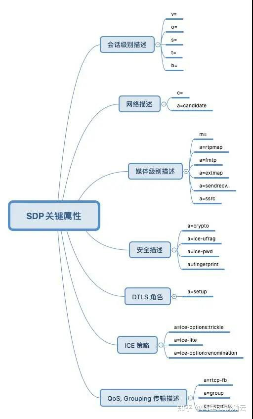
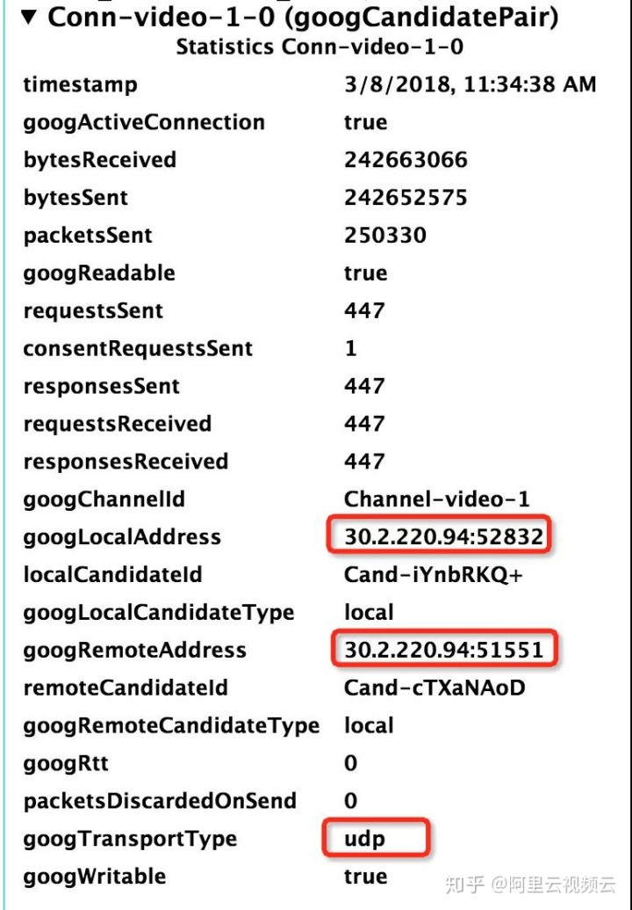
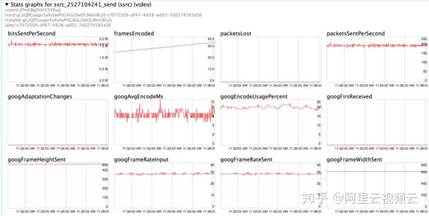
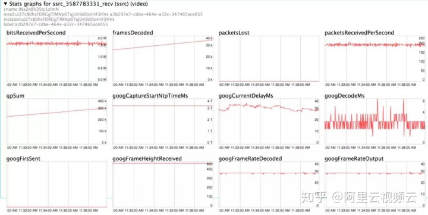
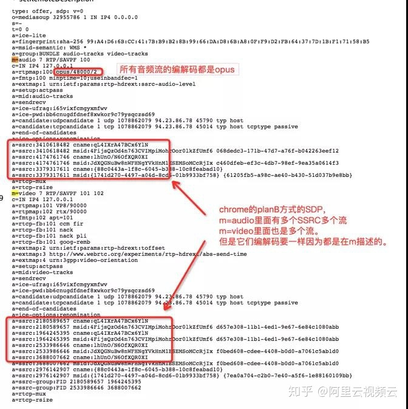
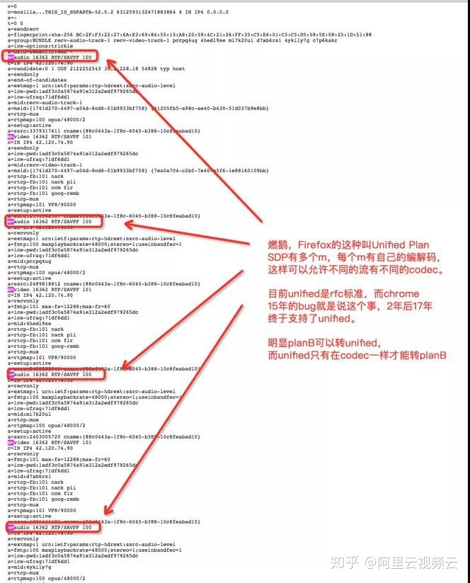
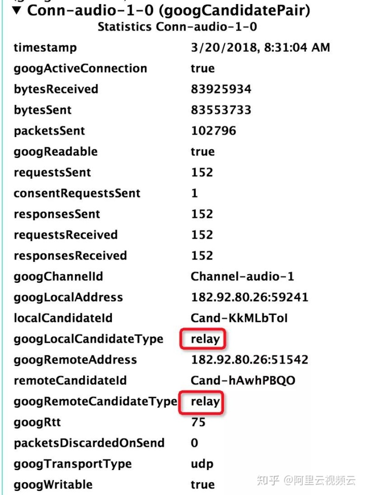
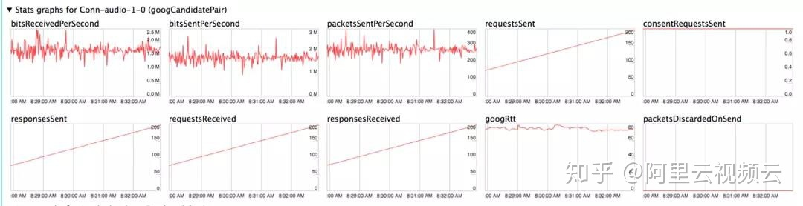
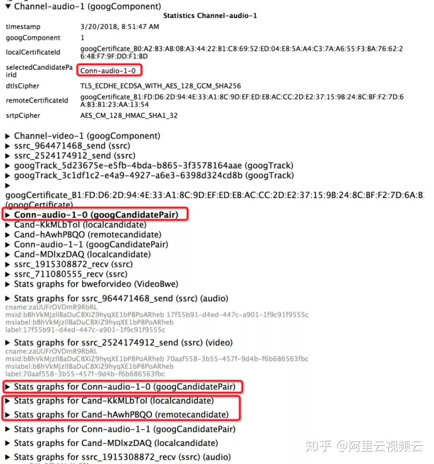
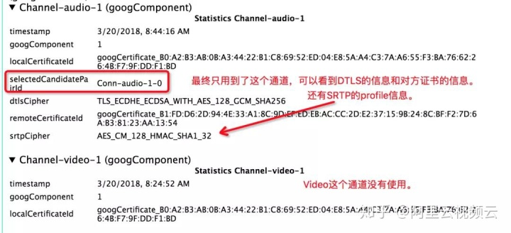

<!--BEGIN_DATA
{
    "create_date": "2020-12-11 19:30", 
    "modify_date": "2020-12-11 19:30", 
    "is_top": "0", 
    "summary": "WebRTC SDP详解和剖析", 
    "tags": "WebRTC、C/C++", 
    "file_name": "WebRTC SDP详解和剖析.md"
}
END_DATA-->

#### <p>原文出处：<a href='https://zhuanlan.zhihu.com/p/296960792' target='blank'>WebRTC SDP详解和剖析</a></p>

WebRTC 是 Web Real-Time Communication，即网页实时通信的缩写，是 RTC 协议的一种Web实现，项目由 Google开源，并和 IETF 和 W3C 制定了行业标准。在国内 WebRTC已经获得了越来越多厂商的支持，应用前景变得更加广阔，所以我们也开设专栏，分享阿里云内部的 WebRTC 研究工作。



### Overview：

  1. Signaling 信令服务器，也就是交换房间和会议的媒体信息，以及会议期间的消息，媒体描述使用的是 SDP 协议，也就是本文剖析的重点。  
  2. ICE 服务器，可以分为帮助两个客户端打洞建立 P2P 连接的 STUN 服务器，还有如果连不通就直接转发的 TURN 服务器。ICE 的信息叫 Candidate，可以通过 SDP 交换，或者通过 Trickle。  
  3. SFU 或 MCU 服务器，如果多个人开会，每个端都向其他参会的端直接发送数据叫 MESH，但是 MESH 明显有局限性，SFU 就是转发可以让客户端只上行一路流转给其他客户端，而 MCU 更强大，可以上下行都只有一路流。  

> _**Note: WebRTC 除了传输，还有一个重要特性就是安全性，也就是 DTLS，而 DTLS 有些信息就是通过 SDP 传递的，后面会有相关的技术文章来介绍 DTLS。**_

下面，我们正式介绍 SDP 协议。

### What's SDP

本文开篇的 SDP 关键属性图，已经帮助我们以全局的视角一窥 SDP 的模样。SDP 描述了媒体会话，网络信息、安全特性、传输策略等，图中的每一个 SDP属性都在不同的应用场景下发挥着不同的作用，不可小觑。

接下来，我们进一步给出 SDP 的官方定义：SDP(Session Description Protocol)是一种会话描述协议，基于文本，其本身并不属于传输协议，需要依赖其它的传输协议（比如 SIP 和 HTTP）来交换必要的媒体信息，用于两个会话实体之间的媒体协商。

WebRTC 的 Offer 和 Answer 包含了 SDP。相关的 RFC 包括：

  1. [1998, RFC2327](https://tools.ietf.org/html/rfc2327%23section-6)  
  2. [2006, RFC4566](https://tools.ietf.org/html/rfc4566%23section-5)

[一个不错的 WebRTC 的 SDP例子分析](https://webrtchacks.com/sdp-anatomy/)

### **Offer and Answer**

WebRTC 使用 Offer-Answer 模型交换 SDP，Offer 中有 SDP，Answer 中也有。例如 Alice 和 Bob 通过WebRTC 通信：


```
// Alice Offer
v=0
o=- 2397106153131073818 2 IN IP4 127.0.0.1
s=-
t=0 0
a=group:BUNDLE video
a=msid-semantic: WMS gLzQPGuagv3xXolwPiiGAULOwOLNItvl8LyS
m=video 9 UDP/TLS/RTP/SAVPF 96 97
c=IN IP4 0.0.0.0
a=rtcp:9 IN IP4 0.0.0.0
a=ice-ufrag:l5KU
a=ice-pwd:+Sxmm3PoJUERpeHYL0HW4/T9
a=ice-options:trickle
a=fingerprint:sha-256 7C:93:85:40:01:07:91:BE:DA:64:A0:37:7E:61:CB:9D:91:9B:44:F6:C9:AC:3B:37:1C:00:15:4C:5A:B5:67:74
a=setup:actpass
a=mid:video
a=sendrecv
a=rtcp-mux
a=rtcp-rsize
a=rtpmap:96 VP8/90000
a=rtcp-fb:96 goog-remb
a=rtcp-fb:96 transport-cc
a=rtcp-fb:96 ccm fir
a=rtcp-fb:96 nack
a=rtcp-fb:96 nack pli
a=rtpmap:97 rtx/90000
a=fmtp:97 apt=96
a=ssrc-group:FID 2527104241
a=ssrc:2527104241 cname:JPmKBgFHH5YVFyaJ
a=ssrc:2527104241 msid:gLzQPGuagv3xXolwPiiGAULOwOLNItvl8LyS c7072509-df47-4828-ad03-7d0274585a56
a=ssrc:2527104241 mslabel:gLzQPGuagv3xXolwPiiGAULOwOLNItvl8LyS
a=ssrc:2527104241 label:c7072509-df47-4828-ad03-7d0274585a56
// Bob Answer
v=0
o=- 5443219974135798586 2 IN IP4 127.0.0.1
s=-
t=0 0
a=group:BUNDLE video
a=msid-semantic: WMS uiZ7cB0hsFDRGgTIMNp6TajUK9dOoHi43HVs
m=video 9 UDP/TLS/RTP/SAVPF 96 97
c=IN IP4 0.0.0.0
a=rtcp:9 IN IP4 0.0.0.0
a=ice-ufrag:MUZf
a=ice-pwd:4QhikLcmGXnCfAzHDB++ZjM5
a=ice-options:trickle
a=fingerprint:sha-256 2A:5A:B8:43:66:05:B3:6A:E9:46:36:DF:DF:20:11:6A:F6:11:EA:D9:4E:26:E3:CE:5A:3A:C6:8D:03:49:7B:DE
a=setup:active
a=mid:video
a=sendrecv
a=rtcp-mux
a=rtcp-rsize
a=rtpmap:96 VP8/90000
a=rtcp-fb:96 goog-remb
a=rtcp-fb:96 transport-cc
a=rtcp-fb:96 ccm fir
a=rtcp-fb:96 nack
a=rtcp-fb:96 nack pli
a=rtpmap:97 rtx/90000
a=fmtp:97 apt=96
a=ssrc-group:FID 3587783331
a=ssrc:3587783331 cname:INxZnBV2Sty1zlmN
a=ssrc:3587783331 msid:uiZ7cB0hsFDRGgTIMNp6TajUK9dOoHi43HVs a3b297e7-cdbe-464e-a32c-347465ace055
a=ssrc:3587783331 mslabel:uiZ7cB0hsFDRGgTIMNp6TajUK9dOoHi43HVs
a=ssrc:3587783331 label:a3b297e7-cdbe-464e-a32c-347465ace055
```

> **_Remark: 用 Chrome 浏览器，先打开 webrtc-internals(chrome://webrtc-internals)，然后打开[Alice](https://ossrs.net/webrtc-web/p2p.initiator.html) 页面点 Share 按钮，接着打开[Bob](https://ossrs.net/webrtc-web/p2p.responder.html) 页面点 Share，看到上面的 Offer 和 Answer。_**

交换完 SDP 后，会交换 Candidate：

```
// Alice Candidate
candidate: candidate:1912876010 1 udp 2122260223 30.2.220.94 52832 typ host generation 0 ufrag l5KU network-id 1 network-cost 10
candidate: candidate:1015535386 1 tcp 1518280447 30.2.220.94 9 typ host tcptype active generation 0 ufrag l5KU network-id 1 network-cost 10

// Bob Candidate
candidate:1912876010 1 udp 2122260223 30.2.220.94 51551 typ host generation 0 ufrag MUZf network-id 1 network-cost 10
```

最后 Alice 和 Bob 通信的 Candidate pair，选择的是 UDP 通道：



Alice 发送的 Video 的信息：



Alice 收到的 (Bob 的) Video信息：



一般来说，推流方先发起 Offer，接收方给 Answer。比如客户端推流到 SFU，客户端发起 Offer 推流，SFU 给客户端 Answer，客户端将流推到 SFU，SFU 再转发给其他客户端。Licode 和 Janus 都是这种做法，这种方式下，如果客户端需要拉取其他的客户端的流，一般需要使用另外的 PeerConnection，接收 SFU 的 Offer，生成Answer 后回应给 SFU。

不过，推流方发起 Offer 不是必须的，接收方也可以给 Offer，推流方Answer。比如 MediaSoup 这种 SFU，客户端先给一个 Offer给 SFU，SFU 只是检查这个 Offer 中的媒体特性，然后 SFU 会生成 Offer（包含会议中的其他客户端的流，如果没有人则没有SSRC）给客户端，客户端发送 Answer 给 SFU。这种方式的好处是其他客户端加入，以及流的变更（比如关闭视频打开视频时），都可以使用Reoffer，也就是统一由 SFU 发起新的 Offer，客户端响应，SFU 和客户端的交互模式只有一种。

### SDP Structure

SDP 描述分为两部分，分别是会话级别的描述（session level）和媒体级别的描述（media level），其具体的组成可参考 [RFC4566](https://tools.ietf.org/html/rfc4566%23section-5)，带星号 (*) 的是可选的。常见的内容如下：


```
Session description（会话级别描述）
            v=  (protocol version)
            o=  (originator and session identifier)
            s=  (session name)
            c=* (connection information -- not required if included in all media)
            One or more Time descriptions ("t=" and "r=" lines; see below)
            a=* (zero or more session attribute lines)
            Zero or more Media descriptions

Time description
            t=  (time the session is active)

Media description（媒体级别描述）, if present
            m=  (media name and transport address)
            c=* (connection information -- optional if included at session level)
            a=* (zero or more media attribute lines)
```

对照 Alice 的 Offer（只包含了视频没有开启音频）：

```
// Session description
v=0
o=- 2397106153131073818 2 IN IP4 127.0.0.1
s=-
c=IN IP4 0.0.0.0

// Time description
t=0 0

// Session Attributes
a=group:BUNDLE video
a=msid-semantic: WMS gLzQPGuagv3xXolwPiiGAULOwOLNItvl8LyS

// Media description
m=video 9 UDP/TLS/RTP/SAVPF 96 97
c=IN IP4 0.0.0.0
a=rtcp:9 IN IP4 0.0.0.0
a=ice-ufrag:l5KU
a=ice-pwd:+Sxmm3PoJUERpeHYL0HW4/T9
a=ice-options:trickle
a=fingerprint:sha-256 7C:93:85:40:01:07:91:BE:DA:64:A0:37:7E:61:CB:9D:91:9B:44:F6:C9:AC:3B:37:1C:00:15:4C:5A:B5:67:74
a=setup:actpass
a=mid:video
a=sendrecv
a=rtcp-mux
a=rtcp-rsize
a=rtpmap:96 VP8/90000
a=rtcp-fb:96 goog-remb
a=rtcp-fb:96 transport-cc
a=rtcp-fb:96 ccm fir
a=rtcp-fb:96 nack
a=rtcp-fb:96 nack pli
a=rtpmap:97 rtx/90000
a=fmtp:97 apt=96
a=ssrc-group:FID 2527104241
a=ssrc:2527104241 cname:JPmKBgFHH5YVFyaJ
a=ssrc:2527104241 msid:gLzQPGuagv3xXolwPiiGAULOwOLNItvl8LyS c7072509-df47-4828-ad03-7d0274585a56
a=ssrc:2527104241 mslabel:gLzQPGuagv3xXolwPiiGAULOwOLNItvl8LyS
a=ssrc:2527104241 label:c7072509-df47-4828-ad03-7d0274585a56
```

SDP Line 是顺序相关的，比如 `a=rtpmap:96` 后面的都是它相关的设置，直到下一行是 `a=rtpmap`或者其他属性。

SDP Line 没有统一的 Schema 描述，也就是没有一个固定的规则能解析所有 Line，[SDP Grammer](https://tools.ietf.org/html/rfc4566%23section-9) 只是描述了 SDP 相关的属性，具体每个属性的表达需要根据属性定义。

定义在 [RFC 4566](https://tools.ietf.org/html/rfc4566%23section-6) 例如：

```
a=rtpmap:<payload type> <encoding name>/<clock rate> [/<encoding parameters>]
```

SDP 解析时，每个 SDP Line 都是以`key=...` 形式，解析出 key 是 a 后，可能有两种方式。

可参考 [RFC4566](https://tools.ietf.org/html/rfc4566%23section-5.13) ：
    
```
a=<attribute>
a=<attribute>:<value>    
```

比如 c=IN IP4 0.0.0.0，key 为 c。

比如 a=rtcp-mux，key 为 a，attribute 为 rtcp-mux，没有 value。

比如 a=rtpmap:96 VP8/90000，key 为 a，attribute 为 rtpmap，value=96 VP8/90000。

有时候并非冒号 (:) 就一定是 `<attribute>:<value>`:，实际上 value 里面也会有冒号，比如：

```
a=fingerprint:sha-256 7C:93:85:40:01:07:91:BE
a=extmap:2 urn:ietf:params:rtp-hdrext:toffset
a=extmap:3 http://www.webrtc.org/experiments/rtp-hdrext/abs-send-time
a=ssrc:2527104241 msid:gLzQPGuagv3xXolwPiiGAULOwOLNItvl8LyS
```

### **Session Level Field**

会话级别的 SDP 描述字段包括：v、o、s、c、b、t。

  * v(version) 

SDP 协议版本，值固定为 0。

  * o(origin) 

代表会话的发起者。

  * s(session name)  

会话的名称，每个 SDP 中有且仅能有一个 s 描述，其值不能为空。

  * c(connection data)  

携带了会话的连接信息，其实就是 IP 地址。  
SDP 的会话级别描述可以包含该字段，每一个媒体级别的描述也可以包含该字段，如果会话级别和媒体级别都有 c line，那么以媒体级别的 c line为准。因为 WebRTC 使用 ICE candidate 交换地址信息，所以不会用到 c line，不过这并不代表 c line 没有用，在 SIP视频会议场景中，c line 就必不可少了，文末会再次介绍该字段。

  * b (bandwidth)  

表示会话或媒体使用的建议带宽。

  * t(timing)  

指定了会话的开始和结束时间，如果开始和结束时间都为 0，那么意味着这次会话是永久的。  

关于会话级别字段的更详细的描述，请参考 [RFC 4566](https://tools.ietf.org/html/rfc4566%23section-5.1)。

### **Media Codecs**

会话级别描述完成后，后面就是零到多个媒体级别描述，比如：


```
// Session Description
v=0
......

// Audio Media Description
m=audio 9 UDP/TLS/RTP/SAVPF 111
......

// Video Media Description
m=video 9 UDP/TLS/RTP/SAVPF 96 97
......
```

这个 SDP 描述了一个音频和一个视频，它的格式参考 [RFC4566](https://tools.ietf.org/html/rfc4566%23section-5.14):

```
m=<media> <port> <proto> <fmt> ...
```

其中，后面的一串数字`111` 和`96 97` 就是 fmt，分别代表音频和视频的 Media Codec，后面会跟着 rtpmap、rtcp-fb、fmtp 这些属性来做进一步的详细的描述。

```
m=audio 9 UDP/TLS/RTP/SAVPF 111
a=mid:audio
a=rtpmap:111 opus/48000/2
a=rtcp-fb:111 transport-cc
a=fmtp:111 minptime=10;useinbandfec=1

m=video 9 UDP/TLS/RTP/SAVPF 96 97
a=mid:video
a=rtpmap:96 VP8/90000
a=rtcp-fb:96 goog-remb
a=rtcp-fb:96 transport-cc
a=rtcp-fb:96 ccm fir
a=rtcp-fb:96 nack
a=rtcp-fb:96 nack pli
a=rtpmap:97 rtx/90000
a=fmtp:97 apt=96
```

> _**Remark: 当然，M line 的类型不是只有 audio 和 video，还有 application(bfcp)、text等媒体类型。**_  
>_**Remark: a=mid 属性可以认为是每个 M 描述的唯一 ID。比如 a=mid:audio，那么 `audio` 这个字符串就是这个 M 描述的 ID。有的时候 mid 属性值也可以用数字表示，比如 a=mid:0，那么 0 也是这个 M 描述的 ID。mid 值一般和 grouping 传输属性的 BUNDLE 策略结合来用，比如 a=group:BUNDLE audio video，代表本次会话将对 mid 为 `audio` 和 `video` 的 M 描述进行复用传输。**_  
>_**Remark: M line 的数字 9 代表该媒体类型的传输端口，在 RTC 场景中都是使用 ICE candidate 的地址信息进行数据传输，所以 M line 的 port 并没有用到。不过，在 SIP 的场景下，M line 的 port 就十分重要了，此时，port 代表 RTP 端口，而且必须是偶数。结合SDP 会话级别描述中的 C line 中的 IP 地址，我们就可以知道 SIP 的这路媒体流的传输地址。**_  
>_**Remark: RTX 表示是重传，比如 video 的 97，就是 apt=96 的重传。也就是说如果用的是 97 这个编码格式，它是在96(VP8) 基础上加了重传功能。**_

而一共有多少媒体流，则是通过 SSRC 指定的：

```
m=audio 9 UDP/TLS/RTP/SAVPF 111 103 104 9 0 8 106 105 13 110 112 113 126
a=ssrc:2582129002 cname:8Y1pmIKBijmWeALu
a=ssrc:2582129002 msid:34fD1qguf2v79436S1khLkth8Nb6LbedcF9H bab38910-40cd-4581-9a20-e3f558abb397
a=ssrc:2582129002 mslabel:34fD1qguf2v79436S1khLkth8Nb6LbedcF9H
a=ssrc:2582129002 label:bab38910-40cd-4581-9a20-e3f558abb397

m=video 9 UDP/TLS/RTP/SAVPF 96 97 98 99 100 101 102 123 127 122 125 107 108 109 124
a=ssrc:565530905 cname:8Y1pmIKBijmWeALu
a=ssrc:565530905 msid:34fD1qguf2v79436S1khLkth8Nb6LbedcF9H 2c533cfe-b6bf-41a8-93f0-1ca031436702
a=ssrc:565530905 mslabel:34fD1qguf2v79436S1khLkth8Nb6LbedcF9H
a=ssrc:565530905 label:2c533cfe-b6bf-41a8-93f0-1ca031436702
```

> **_Remark: SSRC 就包含了需要发送的媒体流，另外 Offer 和 Answer 中都可以包含 SSRC。比如客户端和 MediaSoup通信时，MediaSoup 总是给客户端发 Offer，MediaSoup 的 Offer 包含了 MediaSoup 要发送（转发其他客户端的流给客户端）的媒体流 SSRC，同时客户端的 Answer 中也包含了自己要推送的 SSRC 流，他们的类型都是sendrecv。_** 
> **_Remark: msid 对应了 [NetStream.id](https://developer.mozilla.org/en-US/docs/Web/API/MediaStream/id)，也就是代表了不同的媒体源，这些 SSRC 可以是不同的媒体源。_**

如何确定最后的编码？对方会在 Answer 中给出，比如上面 Offer 给出了多个编码，在 Answer 中会选择一个：

```
m=audio 9 UDP/TLS/RTP/SAVPF 111
m=video 9 UDP/TLS/RTP/SAVPF 100 102 127 125 108 124
a=rtpmap:100 H264/90000
a=rtpmap:102 H264/90000
a=rtpmap:127 H264/90000
a=rtpmap:125 H264/90000
a=rtpmap:108 red/90000
a=rtpmap:124 ulpfec/90000
```

虽然 Video 编码有 100 到 125，但是他们都是 H.264，而 108 和 124 则是 FEC，基于 H.264。

### PlanB and UnifiedPlan

上面的 MediaCodecs 中，没有规定如何指定多条流。实际上 Audio 和 Video 都有多个 SSRC，每个 SSRC的编码可能相同但也可能不同。比如互联网视频会议，用移动端接入时，编码可能都是 H.264，但是和其他终端接入时可能会有其他编码。

如果 SSRC 的编码不相同，那么将这些 SSRC 放在同一个 M 描述就会有问题，这就是 PlanB 和 UnifiedPlan 的关键所在。对于PlanB 只有一个 M(audio) 和 M(video)，他们的编码要相同，当有多路媒体流时，则根据 SSRC 去区分。UnifiedPlan则可以有多个 M(audio) 和 M(video)，每路流都有自己的 M 描述，这样就可以支持不同的编码。

PlanB 和 UnifiedPlan 其实就是 WebRTC 在多路媒体源（multi media source）场景下的两种不同的 SDP协商方式。如果引入 Stream 和 Track 的概念，那么一个 Stream 可能包含 AudioTrack 和 VideoTrack，当有多路Stream 时，就会有更多的 Track，如果每一个 Track 唯一对应一个自己的 M 描述，那么这就是 UnifiedPlan，如果每一个 M line 描述了多个 Track(track id)，那么这就是 Plan B。

> _**Note: 当只有一路音频流和一路视频流时，Plan B 和 UnifiedPlan 的格式是相互兼容的。**_ 
> _**Remark: Chrome 早期支持的是 PlanB，目前最新版本也支持了 UnifiedPlan，参考 [Need to implement WebRTC "Unified Plan" for multistream](https://bugs.chromium.org/p/chromium/issues/detail%3Fid%3D465349)。**_

PlanB 参考下图：



UnifiedPlan 参考下图：



### Candidate

Candidate 就是传输的候选人，客户端会生成多个 Candidate，比如有 host 类型的、有 relay 类型的、有 UDP 和 TCP
的，如下图所示：

```
sdpMid: audio, sdpMLineIndex: 0, candidate:2213672593 1 udp 2122260223 30.2.228.19 51068 typ host
sdpMid: video, sdpMLineIndex: 1, candidate:2213672593 1 udp 2122260223 30.2.228.19 55061 typ host

sdpMid: audio, sdpMLineIndex: 0, candidate:3446803041 1 tcp 1518280447 30.2.228.19 9 typ host
sdpMid: video, sdpMLineIndex: 1, candidate:3446803041 1 tcp 1518280447 30.2.228.19 9 typ host

sdpMid: video, sdpMLineIndex: 1, candidate:150963819 1 udp 41885439 182.92.80.26 54400 typ relay raddr 42.120.74.91 rport 37714
sdpMid: audio, sdpMLineIndex: 0, candidate:150963819 1 udp 41885439 182.92.80.26 59241 typ relay raddr 42.120.74.91 rport 49618
```

> **_​Remark：我们去掉了后面的属性，比如 generation 0 ufrag kce9 network-id 1 network-cost 10，这些属于 Candidate 的描述，和连通性检查等相关。_**

客户端自己生成了 6 个 Candidates，3 个 Audio 和 3 个 Video，2 个 TCP 和 4 个 UDP，4 个 host 和 2 个 relay。当然对方也会有很多 Candidate，接下来就是自己的 Candidates 和对方的 Candidates 匹配连通（ICE Connectivity Checks），形成 CandidatePair 也就是传输通道。Candidate 还附带了网络属性，比如network-cost 会在 ICE Connectivity Checks 时用到。

> _**Remark: 关于 Candidate 的类型，还有 srflx 以及 prflx，关于这两种 Candidate 类型的定义以及区分，后面会在 ICE 相关的技术文章中介绍。**_ 
> _**Remark: 关于 ICE Connectivity Checks 我们会在后面给出详细的分析，涉及到了STUN协议。下面会总结出 ICE 相关的 SDP 信息。**_

SDP 和 Candidate 都是通过信令交换的。如果对方只给了 relay 的 Candidate，例如：

```
sdpMid: audio, sdpMLineIndex: 0, candidate:150963819 1 udp 41885439 182.92.80.26 51542 typ relay raddr 42.120.74.91 rport 56380
```

这种情况下，肯定最后连通的 CandidatePair 是 Relay 对 Relay，如下图所示：





从这个图中能看出来这个传输通道的发送和接收码率、包的个数、RTT 和丢包率等信息。

实际上，由于我们这个客户端还有 host 类型的 Candidate，所以它会尝试直接用 host 的这个 Candidate 和对方的 relay
直接连接：

```
sdpMid: audio, sdpMLineIndex: 0, candidate:2213672593 1 udp 2122260223 30.2.228.19 51068 typ host

Statistics Conn-audio-1-1
googActiveConnection  false
```



当然，由于没有连通所以这个 CandidatePair 就不可用。

> **_Remark: WebRTC 是具备在多个 Candidate 之间切换的能力的，具体在 ICE Connectivity Checks中我们再分析。_**

上面的 Candidates 自己生成了 2 个 Relay 的 Candidates，一个是 audio 的一个是 video 的，为何只用到了audio的呢？这就是下面的 BUNDLE 涉及的了。

### **Bundle and RTCP-MUX**

传输时，可以复用媒体通道，一种是音频和视频的复用，一种是 RTCP 和 RTP 的复用。

RTCP 和 RTP 复用，表示 Sender 使用一个传输通道（单一端口）发送 RTP 和 RTCP：

```
m=audio 9 UDP/TLS/RTP/SAVPF 111 103 104 9 0 8 106 105 13 110 112 113 126
a=rtcp-mux

m=video 9 UDP/TLS/RTP/SAVPF 96 97 98 99 100 101 102 123 127 122 125 107 108 109 124
a=rtcp-mux
```

此时，Receiver 必须准备好在 RTP 端口上接收 RTCP 数据，并需要预留一些资源，比如 RTCP 带宽。

音频和视频复用时，最后只会用一个 Candidate 传输，比如客户端自己的 SDP Offer，和两个 relay 的Candidates：

```
a=group:BUNDLE audio video

m=audio 9 UDP/TLS/RTP/SAVPF 111 103 104 9 0 8 106 105 13 110 112 113 126
a=mid:audio

m=video 9 UDP/TLS/RTP/SAVPF 96 97 98 99 100 101 102 123 127 122 125 107 108 109 124
a=mid:video
```

```
sdpMid: video, sdpMLineIndex: 1, candidate:150963819 1 udp 41885439 182.92.80.26 54400 typ relay raddr 42.120.74.91 rport 37714
sdpMid: audio, sdpMLineIndex: 0, candidate:150963819 1 udp 41885439 182.92.80.26 59241 typ relay raddr 42.120.74.91 rport 49618
```

这表示最终 audio 和 video 尽管可能有独立的 Candidate，但是如果对方也是 BUNDLE，那么最终只会用一个Candidate。例如，如果对方的 Answer 是：

```
a=group:BUNDLE audio video

m=audio 9 UDP/TLS/RTP/SAVPF 111 103 104 9 0 8 106 105 13 110 112 113 126
a=mid:audio

m=video 9 UDP/TLS/RTP/SAVPF 96 97 98 99 100 101 102 123 127 122 125 107 108 109 124
a=mid:video
```

```
sdpMid: audio, sdpMLineIndex: 0, candidate:150963819 1 udp 41885439 182.92.80.26 51542 typ relay raddr 42.120.74.91 rport 56380
```

最后它们只会用一个Candidate 传输。如下图所示：



rtcp-mux 将 RTP 和 RTCP 复用到单一的端口进行传输，这简化了 NAT traversal，而 BUNDLE又将多路媒体流复用到同一端口进行传输，这不仅使 candidate harvesting 等 ICE 相关的 SDP 属性变得简单，而且又进一步简化了NAT traversal。

rtcp-mux 是与 RTC 传输相关的重要的 SDP 属性，关于它的 SDP 协商的原则如下：

  1. 如果 Offer 携带 rtcp-mux 属性，并且 Answer 方希望复用 RTP 和 RTCP 到单一端口，那么 Answer 必须也要携带该属性。  
  2. 如果 Offer 没有携带 rtcp-mux 属性，那么 Answer 也一定不能携带 rtcp-mux 属性，而且 Answer 方禁止 RTP 和 RTCP 复用单一端口。  
  3. rtcp-mux 的协商和使用必须是双向的。

举个例子。客户端去订阅服务器的流，客户端的 Offer 没有携带 rtcp-mux 属性，那么服务器会认为客户端不支持 rtcp-mux，也不会走 rtcp复用的流程。相反，服务器会分别创建 RTP 和 RTCP 两个传输通道，只有当两个通道的 ICE 和 DTLS都成功，才会认为本次订阅的传输通道建立成功，继而向客户端发流。

试想，如果因为你的疏忽导致 Offer 漏掉了 rtcp-mux 属性，那么你将永远等不到服务器 Ready 的那一天。所以，SDP 看似只是一些文本，很简单，但是只有在项目的实战中，多遇到几个坑，才能更深切的体会到 SDP 属性的含义以及这些属性是如何在 RTC 场景中去发挥作用的。

> **_Remark: 关于 rtcp-mux 更详细的协商细节，请参考 [RFC 8035](https://tools.ietf.org/html/rfc8035)。_**  
> **_Remark: 关于 rtcp-mux 场景下如何通过头部字段区分 rtp 和 rtcp，请参考 [RFC 5761](https://tools.ietf.org/html/rfc5761%23section-4)。_**

### ICE Connectivity

这里我们只说明 SDP 中和 ICE Connectivity Checks 相关的信息，具体的过程我们会在其他文章中单独分析。

SDP 中和 ICE 相关的信息包括：

```
m=audio 9 UDP/TLS/RTP/SAVPF 111 103 104 9 0 8 106 105 13 110 112 113 126
a=ice-ufrag:kce9
a=ice-pwd:M31WxfrwmrFvPws4+tPdbsCE
a=ice-options:trickle
​
m=video 9 UDP/TLS/RTP/SAVPF 96 97 98 99 100 101 102 123 127 122 125 107 108 109 124
a=ice-ufrag:kce9
a=ice-pwd:M31WxfrwmrFvPws4+tPdbsCE
a=ice-options:trickle
```

ufrag 和 pwd 就是 ICE short-term 认证算法用到的用户名和密码。而 trickle 说明 SDP 中没有包含 candidate信息，Candidate 是通过信令单独交换的，这样可以做到 Connectivity checks 和 Candidate harvesting并行处理，提高会话建立的速度。

### DTLS

这里我们只说明 SDP 中关于 DTLS 的信息，具体的 DTLS 握手过程会在 DTLS 相关的技术文章中单独分析。

SDP 中和 DTLS 相关的信息包括：

```
m=audio 9 UDP/TLS/RTP/SAVPF 111 103 104 9 0 8 106 105 13 110 112 113 126B0:A2:B3:AB:0B:A3:44:22:B1:C8:69:52:ED:04:E8:5A:A4:C3:7A:A6:55:F3:BA:76:62:26:4B:F7:9F:DD:F1:BD
a=setup:actpass

m=video 9 UDP/TLS/RTP/SAVPF 96 97 98 99 100 101 102 123 127 122 125 107 108 109 124
a=fingerprint:sha-256 B0:A2:B3:AB:0B:A3:44:22:B1:C8:69:52:ED:04:E8:5A:A4:C3:7A:A6:55:F3:BA:76:62:26:4B:F7:9F:DD:F1:BD
a=setup:actpass
```

其中 fingerprint 是 DTLS 过程中的 Certificate 证书的签名，防止客户端和服务器的证书被篡改。

另外，setup 指的是 DTLS 的角色，也就是谁是 DTLS Client(active)，谁是 DTLS Server(passive)，如果自己两个都可以那就是 actpass。这里我们是 actpass，那么就要由对方在 Answer 中确定最终的 DTLS 角色：

```
m=audio 9 UDP/TLS/RTP/SAVPF 111 103 104 9 0 8 106 105 13 110 112 113 126
a=fingerprint:sha-256 B1:FD:D6:2D:94:4E:33:A1:8C:9D:EF:ED:EB:AC:CC:2D:E2:37:15:9B:24:8C:BF:F2:7D:6A:B3:81:23:AA:13:54
a=setup:active
```

对方是 active，也就是 DTLS Client，那么自己就只能是 DTLS Server，会由对方发起 DTLS ClientHello 开始DTLS过程。

### Stream Direction

媒体流的方向有四种，分别是sendonly、recvonly、sendrecv、inactive，它们既可以出现在会话级别描述中也可以出现在媒体级别的描述中。

  * sendonly 表示只发送数据，比如客户端推流到 SFU，那么会在自己的 Offer(or Answer) 中携带 senonly 属性  
  * revonly 表示只接收数据，比如客户端向 SFU 订阅流，那么会在自己的 Offer(or Answer) 中携带 recvonly 属性  
  * sendrecv 表示可以双向传输，比如客户端加入到视频会议中，既要发布自己的流又要订阅别人的流，那么就需要在自己的 Offer(or Answer) 中携带 sendrecv 属性  
  * inactive 表示禁止发送数据，比如在基于 RTP 的视频会议中，主持人暂时禁掉用户 A 的语音，那么用户 A 的关于音频的媒体级别描述应该携带 inactive 属性，表示不能再发送音频数据。

> _**NOTE: [RFC 4566](https://tools.ietf.org/html/rfc4566%23section-6):senonly 和 recvonly 属性仅应用于媒体，不用于媒体控制相关的协议。比如在基于 RTP 的媒体会话中，即使是 recvonly 模式，也仍然要发送 RTCP 包，即使是 senonly 模式，也依然会接收并正常处理 RTCP 包。**_

媒体流方向的四个属性很重要，在组装 SDP 时要仔细校验，保证流方向的正确性。

举个例子，客户端去订阅服务器的流。如果此时客户端的 Offer 携带的属性并不是 recvonly 而是 sendonly，那么即使在信令层面的确是订阅的语义，但是由于某些服务器对 SDP各属性的校验是十分全面和严格的（本该如此），这种场景下，服务器将不会发送媒体流到客户端，而且服务器回复的 Answer 可能根本不会携带 SSRC。

### RTCP Feedback

下面，我们聊一下 rtcp-fb 这个媒体级别的 SDP 属性，它能告诉我们媒体会话能够对哪些 RTCP 消息进行反馈，是一个和 QoS 相关的重要的SDP 属性。

```
m=video 9 UDP/TLS/RTP/SAVPF 96
a=mid:video
a=rtpmap:96 VP8/90000
a=rtcp-fb:96 transport-cc
a=rtcp-fb:96 ccm fir
a=rtcp-fb:96 nack pli
```

如上 SDP 信息，这是一个视频的 M 描述，VP8 编码，payload type 是 96。最后的 3 个 rtcp-fb 属性则说明了对于 96 这个 media codec 来讲，在网络拥塞控制方面支持 twcc；在 ARQ 方面支持 nack 处理，能够重传丢失的 RTP 包；在关键帧方面支持 fir 和 pli 处理，有能力进行关键帧的发送。

在做 SIP 的时候，遇到过一个坑：向某台型号的 SIP 设备发送 PLI 请求后，并没有收到关键帧，经过一番折腾，最后发现，这台设备的 rtcp-fb描述如下：

```
m=video 16402 RTP/AVP  34
a=rtpmap:34 H263/90000
a=fmtp:34 CIF4=1;CIF=1;QCIF=1;SQCIF=1
a=sendrecv
a=rtcp-fb:* ccm tmmbr
a=rtcp-fb:* ccm fir
```

也就是说这台设备只支持 FIR 请求，没有处理 PLI 请求的能力（PS: 为什么没能早一些检查 SDP 的 rtcp 反馈能力，泪目）。在此也想着重强调一下：对于一些很专业严谨的系统或者设备而言，SDP 完全体现了它们所拥有的能力，也可以让我们发现其不具备的能力。SDP 的每一个属性都是有其存在意义的，万万不可忽略。

> **_Note: rtcp-fb 不能用于会话级别的描述中，只能用于媒体级别的描述，而且其 M 描述的 proto 字段一定要指定 AVPF。_**  
> **_Note: 存在这种格式，a=rtcp-fb:* ccm fir，* 是一个通配符，表示该 M 描述下的所有类型的 media codec 都支持 fir 的处理和关键帧的反馈。_**

### Compare with SIP SDP

RTC 场景与 SIP 场景下的 SDP 描述的不同表现在传输、媒体、信令三个层面。

**Transmission Level**

1. 建连流程。RTC 场景下的音视频媒体流建连流程一般是 ICE + DTLS，而 SIP 场景下没有这套建连流程，所以也没有 ICE/DTLS 相关的 SDP 属性，比如 ufrag、pwd、setup、fingerprint 等。
2. 端口复用。RTC 场景下一般都是音视频流以及 RTP/RTCP 复用单一端口，通过 SSRC 区分每一路流，通过数据包的头部字段值来区分RTP/RTCP，而 SIP 场景下不会复用端口，因此没有 rtcp-mux 属性，也没有 grouping 相关的属性，比如 BUNDLE，且音视频的 RTP 和 RTCP 都是独立端口进行传输，共有四个，所以天然可以使用端口来区分流以及 RTP/RTCP，因此也没有 SSRC 属性。
3. 链路探测。RTC 场景下一般通过 ICE 的 STUN 探测环节来发现对端经过 NAT 映射之后的出口地址，称为 srflx，而 SIP 场景下需要自己实现对端地址发现的功能，以获取到 SIP 设备经过 NAT 映射之后的出口地址。
4. 地址信息。RTC 场景下通过 SDP 的 candidate 交换对端地址信息，SIP 场景下通过 C line 的 ip 以及 M line 的端口来交换对端地址信息。

```
// RTC 场景
a=candidate:1 1 udp 2013266431 30.27.136.138 14306 typ host

// SIP 场景
c=IN IP4 30.41.5.131
m=audio 2352 RTP/AVP 107 108 114 104 105 9 18 8 0 101 123
m=video 2374 RTP/AVP 97 126 96 34 123
```

**Media Level**

1. 屏幕共享。SIP 场景下通过 BFCP 协议来进行屏幕共享的协商，通过 a=content 属性来区分主流（main）和共享流 （slides），而RTC 场景下通过外部/业务信令来进行屏幕共享的协商，主流和共享流的 SDP 描述一致，不会区分。
2. Media Codec。目前，RTC 场景下的音视频编码普遍是 Opus + H.264/VP8，SIP 场景下，对于音频编码，有很多 SIP 设备并不支持 Opus，而采用比较古老的音频编码，比如 G722、PCMA、PCMU，对于视频编码，普遍支持 H.264，一般不支持 VP8。

**Signaling Level**

1. SDP 交换。都是 Offer/Answer 模型，RTC 场景下主要通过 HTTP/TCP 协议交换 SDP，一般是在 HTTP body 中携带 SDP 信息。SIP 场景下可以通过 UDP/TCP/TLS 协议交换 SDP，在 INVITE 和 200 OK 中携带 SDP 信息。

### Summary

其实，SDP 文本化的协议格式本身很简单，其难点在于不同的应用场景（比如传统 SIP 视频会议或者 RTC 场景）下扩展出的纷繁复杂的属性及其含义，这些SDP 属性散落在众多的 RFC 以及草案之中，不下一定的功夫是很难做到全面理解与掌握的（PS：每当说到此处，心里总是一万个马奔腾，WebRTC 的 RFC太多了而且互相关联互相引用，看完这些 RFC 要准备好视力下降 0.2 度）。

下一篇，我们会重点讲一下 WebRTC ICE，包括连通性检测、状态切换、trickle 以及 nomination。感谢阅读。
