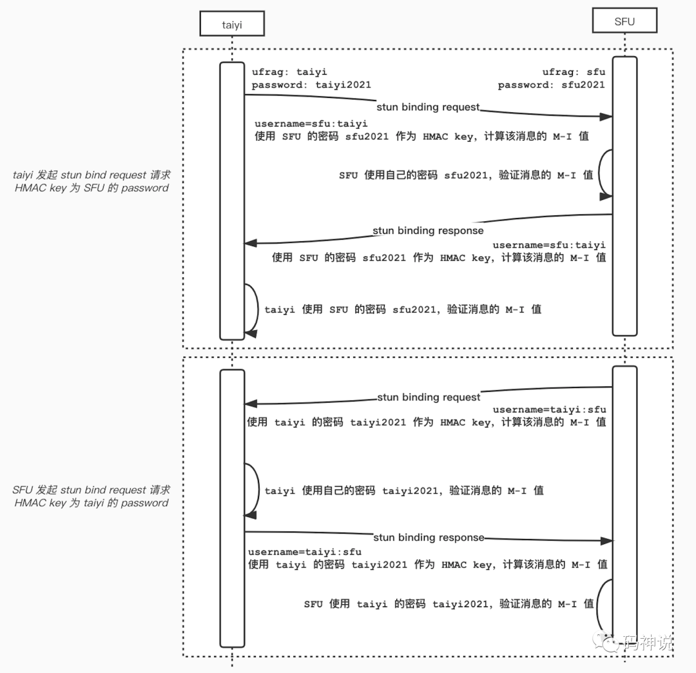
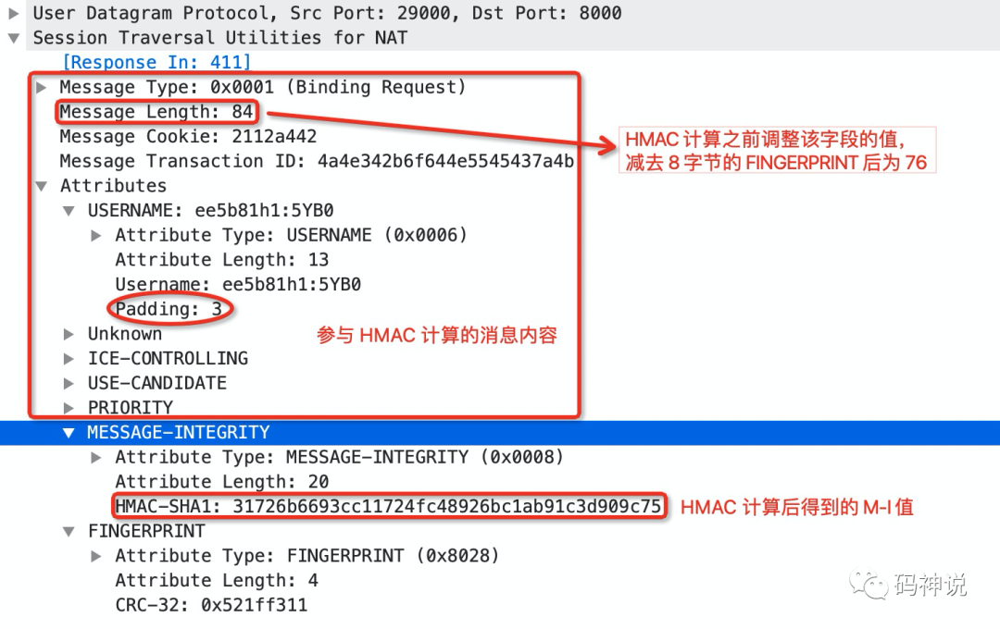
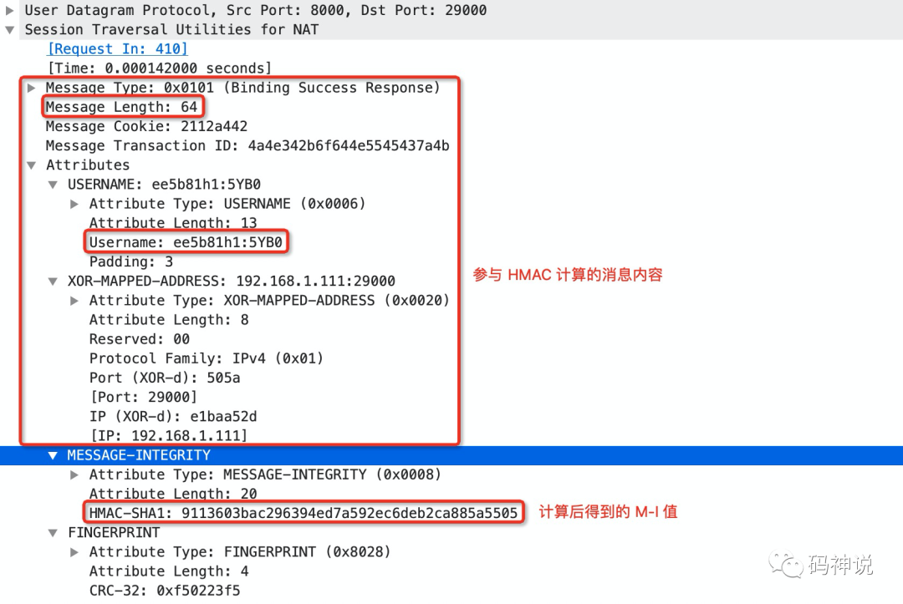
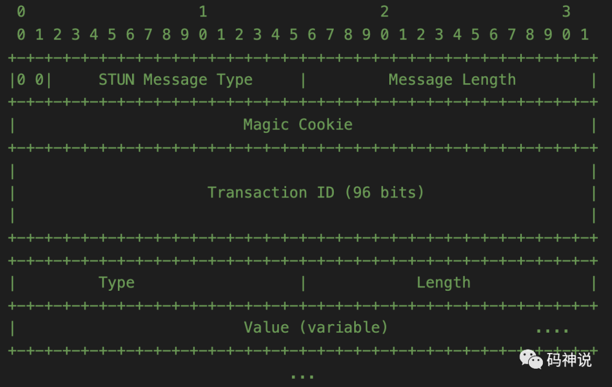
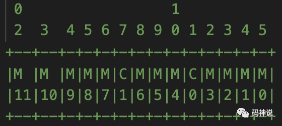
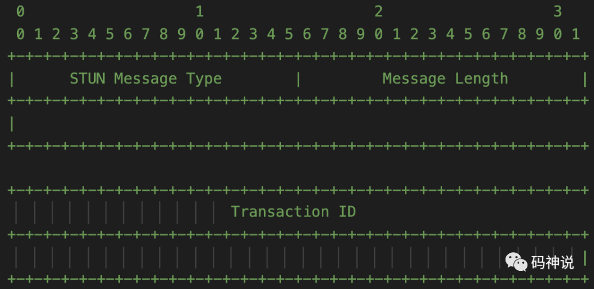
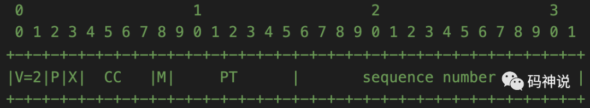
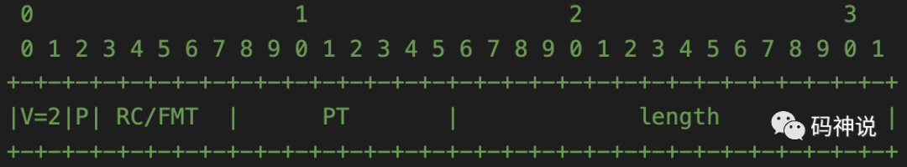
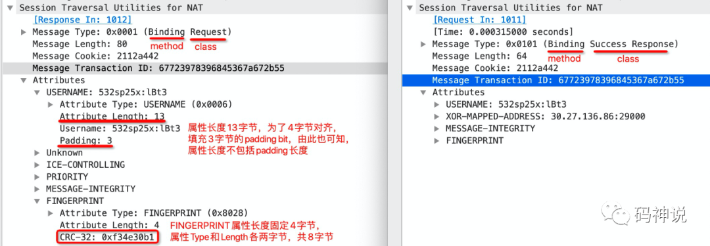
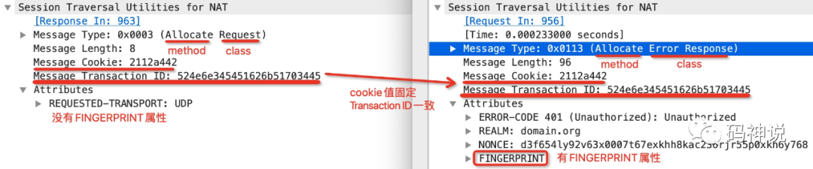

 
<!--BEGIN_DATA
{
    "create_date": "2021-02-28 22:00", 
    "modify_date": "2021-02-28 22:00", 
    "is_top": "0", 
    "summary": "Short-term消息认证<br/>从消息识别的视角理解消息结构", 
    "tags": "WebRTC", 
    "file_name": "WebRTC STUN.md"
}
END_DATA-->

#### <p>原文出处：<a href='https://mp.weixin.qq.com/s?__biz=MzU3MTUyNDUzMA==&mid=2247484193&idx=1&sn=9c2406203f5deb2d2e21acf2fb0fc628&chksm=fcdf97fccba81eeaeca448a924f025d8afb0c7162ed2865ef19ed3caf6c27a03b05cac2ee06a&scene=178&cur_album_id=1345116764509929473#rd' target='blank'>Short-term 消息认证</a></p>

_本文是 STUN 协议系列第 **1** 篇_

  * 导读与 STUN 概览
  * 先谈 HMAC
  * 再看 Short-term Credential Mechanism
  * 计算 Message Integrity
    * HMAC 输入
    * HMAC key
    * 计算过程
  * 源码剖析
    * ValidateMessageIntegrityOfType 函数
    * AddMessageIntegrityOfType 函数
  * 抓包分析
  * 参考

## 导读与 STUN 概览

Session Traversal Utilities  for NAT(STUN) 是一个 `client/server` 协议，支持两种类型的事务，分别是 `request/response` 事务和 `indication` 事务。

STUN 本身并不是一种 NAT 穿越的解决方案，它是协议，作为一个工具或者内部组件，被 NAT 穿越的解决方案（比如 ICE 和 TURN）所使用。

STUN 协议能够帮助处于内网的终端确定 NAT 为其分配的外网 IP 地址和端口（通过 `XOR-MAPPED-ADDRESS` 属性），还可以用于 NAT 绑定的保活（通过 `binding indication` 消息）。

在 ICE 中，STUN 协议用于连通性检查和 ICE 的保活（通过 `binding request/response`），在 TURN 协议中，STUN 协议用于 `Allocation` 的建立，可以作为中继数据的载体（比如 `sendindication` 和 `dataindication`）。也就是说，ICE 和 TURN 是两种不同的 STUN Usage。

正因为 STUN 协议是其他协议或者 NAT 解决方案的基础，所以掌握 STUN 协议是非常关键的。

本文作为 STUN 协议系列的第一篇，将介绍 STUN 协议的 short-term 消息认证机制，并致力于讲清两个点：一个是究竟取 STUN 消息的哪一部分内容参与 HMAC-SHA1 的计算，另一个是 `request/response` 消息究竟使用哪一方的 password 作为 HMAC key 去计算 message integrity。

Let's Go!

## 先谈 HMAC

HMAC，Keyed-Hashing for Message Authentication Code[1] 是一种基于加密哈希函数的消息认证机制，所能提供的消息认证包括两方面：

  1. 消息完整性认证，能够证明消息内容在传送过程中没有被修改。
  2. 信源身份认证，因为通信双方共享了认证的密钥，所以接收方能够认证消息确实是发送方所发。

HMAC 运算利用哈希算法，以一个消息 M 和一个密钥 K 作为输入，生成一个定长的消息摘要作为输出。HMAC 的一个典型应用是用在`挑战/响应（Challenge/Response）` 身份认证中，认证流程这里不做介绍。

## 再看 Short-term Credential Mechanism

短期证书机制 short-term credential mechanism[2] 是一种对 STUN 消息进行完整性保护与认证的机制。使用短期证书机制的前提是：在 STUN 消息传输之前，客户端和服务端已经通过其他协议交换了彼此的证书。比如在 ICE 的应用中，客户端和服务端会通过单独的信令通道来交换彼此的证书，证书在媒体会话期间适用。

证书由 username 和 password 组成，因为是短期证书，所以具有时效性，可以天然的降低重放攻击的风险。证书用于对 STUN 请求与响应消息的完整性检查，而具体的实现机制就是 HMAC，计算出的 HMAC 结果存储在 STUN 的 `MESSAGE-INTEGRITY` 属性中。

## 计算 Message Integrity

STUN 的 `MESSAGE-INTEGRITY` 属性包含了对 STUN 消息进行 HMAC-SHA1 计算之后的 HMAC 值，由于使用 SHA-1哈希函数，所以计算出来的 HMAC 值固定为 20 字节。在后面的介绍中，我会使用缩写 `M-I` 来表示 Message Integrity，并将对 STUN 消息进行 HMAC-SHA1 计算后得到的 HMAC 值称为 M-I 值。

那么在 short-term 机制下，M-I 值是怎样计算的呢？答案是：以 request 消息的发起方的视角为基准，STUN 消息的一部分作为 HMAC 算法的输入，对端的 password 作为 HMAC 算法的 key。

### HMAC 输入

不过，是要用 STUN 消息的哪一部分作为输入呢？RFC8489: MESSAGE-INTEGRITY[3]中给出了答案，但是乍一读，很多人可能会晕掉，所以接下来我会为大家更好的去解释这一段描述。

关于 M-I 值的计算，分为两个大的方向，一个是作为 STUN 消息的发送方，需要在构造 STUN 消息时同时构造 M-I 属性，而构造 M-I 属性，就必然要计算 M-I 值；另一个是作为 STUN 消息的接收方，需要在收到 STUN 消息后验证其 M-I 属性，具体的做法就是比较 M-I 属性的 M-I 值是否和接收方计算出的 M-I 值一致，因此也是要计算 M-I 值。

无论是构造 M-I 属性时计算 M-I 值还是验证 M-I 属性时计算 M-I 值，流程都是完全一样的，只需要理解好三个点：

  1. STUN 消息的 M-I 属性之前的（不包括 M-I），包括头部在内的所有内容作为 HMAC 的输入数据。
  2. STUN 消息的 M-I 属性之前的（不包括 M-I），包括头部在内的所有内容的长度作为 HMAC 的输入长度。
  3. 在 HMAC 计算之前，要调整 STUN 头部字段 `message length` 的值，`message length` 的大小为 M-I 属性之前的（包括 M-I）总的长度。

关于第 3 点，需要注意的是，在构造 M-I 属性时是不需要调整 `message length` 值的，一般是在验证 M-I 属性时调整 `message length` 值。这是因为，对于接收方收到的 STUN 消息，可能在 M-I 属性之后还存在 `FINGERPRINT` 或者 `MESSAGE-INTEGRITY-SHA256` 属性，因此 `message length` 需要去掉这两种属性的长度。

然而，对于发送方，在构造 STUN 消息的 M-I 属性时，还未构造 `FINGERPRINT` 或者 `MESSAGE-INTEGRITY-SHA256` 属性，因此 `message length` 不需要做调整。在下文的源码剖析部分，我们会深刻的理解以上几点，在进入源码剖析之前，还需要再介绍一下作为 HMAC key 的 password 是如何运用的。

### HMAC key

在 short-term 机制下， 对于 request 发起方，HMAC 的 key 使用的是对方的 password，即 SDP 中的 ice-pwd 描述。

> remark: 上文中提到 short-term 证书是由 username 和 password 组成，但是实际上 short-term 只用到了 password，并未用到 username。
> 
> remark: username 的规则是：对方的 ufrag:自己的 ufrag。

举个例子，taiyi 发布自己的流到 SFU。taiyi 和 SFU 的名字与密码信息如下：

> taiyi: ufrag = sLop passwd = GCR3LqC+baeBQ7NxdWb8Q4Oc
> 
> SFU: ufrag = N+vv passwd = da2vlP6ZJrd4VbnSEP/AdjcW

taiyi 发送 STUN BindingRequest 消息给 SFU：

  1. username: `N+vv:sLop`。
  2. short-term 使用的 HMAC key 应该是 SFU 的 password: `da2vlP6ZJrd4VbnSEP/AdjcW`。

SFU 收到来自 taiyi 的 BindingRequest 后，就可以使用自己的 password 计算消息的 M-I 值，以进行消息认证。认证成功后，SFU 回复 BindingResponse 给 taiyi：

  1. username: `N+vv:sLop`。
  2. short-term 使用的 HMAC key  应该是 SFU 的 password: `da2vlP6ZJrd4VbnSEP/AdjcW`。

可以知道，在 taiyi 与 SFU 的这一次 STUN binding request/response 事务中，response 的 username 规则以及使用的 password 与 request 完全一致。

可以记为：**username 与 password 的规则都是以 request 的发起方作为基准，response 向 request 看齐。**

同理，SFU 发送 STUN BindingRequest 消息给 taiyi，taiyi 回复 BindingResponse，此时以 request 发起方 SFU 为准：

  1. username: `sLop:N+vv`
  2. short-term 使用的 HMAC key  应该是 taiyi 的 password: `GCR3LqC+baeBQ7NxdWb8Q4Oc`。

为了能够更深刻的理解上述流程，我画了一张图，如下：



> note: 上图所写的 ufrag 和 password 并非 rfc 规定的标准的格式，仅为了更好的理解。

### 计算过程

下面介绍对 STUN 消息进行完整性验证时的 M-I 值的计算过程。假设 SFU 收到的 STUN binding request 消息如下：

```
// 20 bytes  
[ STUN HEADER ]  
// 12 bytes(2 bytes type, 2 bytes length, 8 bytes username)  
[ USERNAME ]  
// 24 bytes (2 bytes type, 2 bytes length, 20 bytes hmac-sha1)  
[ MESSAGE-INTEGRITY-ATTRIBUTE ]  
// 8 bytes(2 bytes type, 2 bytes length, 4 bytes crc32 value)  
[ FINGERPRINT ]       
```

计算流程对应的伪代码如下：

``` 
// 去掉 8 字节大小的 Fingerprint 属性，  
// 然后将消息序列化为字节，得到 stun_binary，  
// 注意，不要去掉 MessageIntegrity 属性。  
stun_msg = (header,   
  attributes[Username, MessageIntegrity,   
    Fingerprint])  
// 将序列化后的消息去掉最后 24 字节的 M-I 属性，  
// 得到更新后的 stun_binary。  
stun_binary =   
  stun_msg.remove(Fingerprint).marshal_binary()  
stun_binary =   
  stun_binary[0 : len(stun_binary) - 24]  
// 生成 HMAC key。  
key = password  
// 计算 HMAC，得到 20 字节的 M-I 值。  
h = hmac.new(hash.sha1, key);  
h.update(stun_binary);  
mi = h.Sum(null);  
// 比较 mi 是否和消息携带的 M-I 值一致。  
memcmp(  
  stun_msg.attributes.MessageIntegrity.value,   
  mi, 20)  
```

## 源码剖析

参考 WebRTC M88。

STUN 的 short-term 消息认证主要包括：构造 M-I 属性和验证 M-I 值。相关的类和函数如下：

```cpp    
class StunMessage {  
  // Validates that a raw STUN message   
  // has a correct MESSAGE-INTEGRITY value.  
  static bool ValidateMessageIntegrity(  
    const char* data, size_t size,   
    const std::string& password);  
  
  // Adds a MESSAGE-INTEGRITY attribute   
  // that is valid for the current message.  
  bool AddMessageIntegrity(  
    const std::string& password);  
};  
```    

### ValidateMessageIntegrityOfType 函数

该函数用于检验所收到的 STUN 消息的完整性，对消息的来源进行认证。可以结合上文 `HMAC 输入` 这一节中提到的 3 点来理解该函数验证 STUN 消息完整性的流程。

首先，验证消息的大小：

  1. STUN 消息头部大小固定为 `kStunHeaderSize = 20` 字节。
  2. STUN 消息的属性是 4 字节对齐的。
    
```cpp
if ((size % 4) != 0 ||   
  size < kStunHeaderSize) {  
  return false;  
}  
```

因此，消息的长度不能小于 20 且要是 4 的倍数。

接着，从 STUN 消息的头部获取字段 `message length` 的值。

```cpp 
uint16_t msg_length = rtc::GetBE16(&data[2]);  
if (size != (msg_length + kStunHeaderSize)) {  
  return false;  
}  
```

`message length` 字段表示 STUN 消息的属性的长度，不包括 20 字节的 STUN 消息头部。因此，STUN 消息的大小 `size = msg_length + kStunHeaderSize`。

接着，寻找 STUN 消息的 M-I 属性，定位其在整个消息中的位置 `mi_pos`。在遍历寻找 M-I 属性的过程中，如果当前属性不是 M-I 属性，那么就需要跳到下一个属性，如果没有找到 M-I 属性，则返回 false，表示消息完整性校验失败。因为 STUN 消息的属性是按照 4 字节对齐，所以在计算 `current_pos` 的时候可能需要加上填充字节的长度。

> 比如，当前 STUN 消息的属性是 `USERNAME` 属性，属性长度为 5 字节，那么会有 3 字节的值为 0x00 的 padding 填充，从而保证 STUN 属性的 4 字节对齐的原则，此时 `current_pos` 需要再加上 3。

```cpp
size_t current_pos = kStunHeaderSize;  
bool has_message_integrity_attr = false;  
while (current_pos + 4 <= size) {  
  uint16_t attr_type, attr_length;  
  // Getting attribute type and length.  
  attr_type =   
    rtc::GetBE16(&data[current_pos]);  
  attr_length = rtc::GetBE16(  
    &data[current_pos + sizeof(attr_type)]);  
  
  // If M-I, sanity check it, and break out.  
  if (attr_type == mi_attr_type) {  
    if (attr_length != mi_attr_size ||  
      current_pos + sizeof(attr_type) +   
      sizeof(attr_length) + attr_length > size)   
    {  
        return false;  
    }  
    has_message_integrity_attr = true;  
    break;  
  }  
  
  // Otherwise, skip to the next attribute.  
  current_pos += sizeof(attr_type) +   
    sizeof(attr_length) + attr_length;  
  if ((attr_length % 4) != 0) {  
    current_pos += (4 - (attr_length % 4));  
  }  
}  
```  

在找到 M-I 属性，并记录其在消息中的位置 `mi_pos` 之后，开始计算这个 STUN 消息的 M-I 值，用于和这个消息中自带的 M-I 值进行比较。

首先需要判断 STUN 消息的 M-I 属性的后面是否还有其他属性，比如 `FINGERPRINT`。如果有，那么需要调整 STUN 头部字段 `message length` 的值，具体的做法就是减去 M-I 属性之后的所有属性的总长度。

```cpp
size_t mi_pos = current_pos;  
std::unique_ptr<char[]>   
  temp_data(new char[current_pos]);  
memcpy(temp_data.get(), data, current_pos);  
if (size > mi_pos +   
  kStunAttributeHeaderSize + mi_attr_size)   
{  
  // Stun message has other attributes  
  // after message integrity.  
  // Adjust the length parameter in stun   
  // message to calculate HMAC.  
  size_t extra_offset = size -   
    (mi_pos + kStunAttributeHeaderSize   
    + mi_attr_size);  
  size_t new_adjusted_len =   
    size - extra_offset - kStunHeaderSize;  
  
  // Writing new length of the STUN   
  // message @ Message Length in temp buffer.  
  rtc::SetBE16(temp_data.get() + 2,   
    static_cast<uint16_t>(new_adjusted_len));  
}  
```

在将调整后的 `message length` 的值设置到 `temp_data` 之后，开始计算 HMAC-SHA1 值，计算过程可参考 rfc2104。

```cpp 
char hmac[kStunMessageIntegritySize];  
size_t ret = rtc::ComputeHmac(rtc::DIGEST_SHA_1,   
  password.c_str(), password.size(),  
  temp_data.get(), mi_pos, hmac, sizeof(hmac));  
```

> remark: `temp_data` 和 `mi_pos` 分别是参与 HMAC-SHA1 计算的消息内容与长度（不包括 M-I 属性）。

最后，比较计算得到的 M-I 值是否和 STUN 消息中 M-I 属性中的 M-I 值一致。

```cpp 
return memcmp(  
  data + current_pos + kStunAttributeHeaderSize,   
  hmac, mi_attr_size) == 0;  
```

### AddMessageIntegrityOfType 函数

该函数用于在发送 STUN 消息之前构造其 M-I 属性。

首先，增加伪值为 0 的 M-I 属性。

```cpp    
auto msg_integrity_attr_ptr =   
  std::make_unique<StunByteStringAttribute>(  
    attr_type, std::string(attr_size, '0'));  
auto* msg_integrity_attr =   
  msg_integrity_attr_ptr.get();  
AddAttribute(std::move(msg_integrity_attr_ptr));  
```

接着，计算 STUN 消息的 HMAC 值：

  1. 将消息序列化为字节。
  2. 计算参与 HMAC 计算的消息内容长度 `msg_len_for_hmac` ，为消息总长度减去最后 24 字节的 M-I 属性的长度。
  3. `ComputeHmac` 函数计算 M-I 值。
    
```cpp 
ByteBufferWriter buf;  
if (!Write(&buf))  
  return false;  
  
int msg_len_for_hmac = static_cast<int>(  
  buf.Length() -   
  kStunAttributeHeaderSize -   
  msg_integrity_attr->length());  
    
char hmac[kStunMessageIntegritySize];  
size_t ret = rtc::ComputeHmac(  
  rtc::DIGEST_SHA_1, key, keylen,   
  buf.Data(), msg_len_for_hmac,   
  hmac, sizeof(hmac));  
```  

> remark: 计算 HMAC 时的输入内容取 M-I 属性之前的内容，不包括 M-I 本身。

> remark: 此时消息还没有增加 `FINGERPRINT` 等 M-I 之后的属性，因此消息头部的 `message length` 字段不需要调整。

最后，将计算好的 M-I 值替换掉之前的伪值。

```cpp
msg_integrity_attr->CopyBytes(hmac, attr_size);  
```    

## 抓包分析

使用 wireshark 抓取 STUN binding request 消息，如下：



结合上图，可以直观的看到参与 HMAC 计算的内容为 M-I 属性上方的部分，不过在计算前要调整 `message length` 字段值，减去 8 字节的 `FINGERPRINT` 属性。

对应的 STUN binding response 消息如下：



观察 response 消息的 username，和 request 的 username 一致。另外，request 和 response 使用 HMAC-SHA1 计算 M-I 值所使用的 key 都是一样的，全部使用 responser 的 password（以 requester 为基准，对方的 password 作为 key）。

不过双方的 password 并不会出现在 STUN 消息中，一般是在 STUN 消息传输前通过单独的信令通道共享彼此的 password。

最后，我们发现在两个消息的 `USERNAME` 属性中，都有 3 字节的填充，值为 0x00。填充字节不算入 `USERNAME` 属性的长度。

下一篇，将会介绍 STUN 协议的数据包的格式以及如何与其他协议（`DTLS/RTP/RTCP`）的数据包进行区分。感谢阅读。

## 参考

* [1] HMAC: https://tools.ietf.org/html/rfc2104
* [2] Session Traversal Utilities for NAT (STUN): https://tools.ietf.org/html/rfc8489?#section-9.1
* [3] RFC8489: MESSAGE-INTEGRITY: https://tools.ietf.org/html/rfc8489#section-14.5

<hr>

#### <p>原文出处：<a href='https://mp.weixin.qq.com/s?__biz=MzU3MTUyNDUzMA==&mid=2247484271&idx=1&sn=2c0d9d8cd53c44deb35a1efebb159262&chksm=fcdf97b2cba81ea4768200e7d09dac480cc401de62a4d01e0384ffad6bc685ddab9de0652ac4&scene=178&cur_album_id=1345116764509929473#rd' target='blank'>从消息识别的视角理解消息结构</a></p>

_本文是 STUN 协议系列第 **2** 篇_  

  * 导读
  * 消息结构
    * 消息头部
    * 消息属性
  * 消息识别
    * Distinguish 1，消息最高的两位
    * Distinguish 2，消息最后的两位
    * Distinguish 3，固定的 Cookie
    * Distinguish 4，fingerprint 机制
    * 与 RTP/RTCP/DTLS 对比
  * 源码剖析
    * IsStunMethod 函数
    * ValidateFingerprint 函数
    * 小结
  * 抓包分析

## 导读

在 RTC 通信中，媒体传输策略一般是单端口复用，即 `RTP/RTCP/DTLS/STUN` 这些不同协议的数据包都是复用端口进行传输。

假如我们要处理 STUN 事务，那么当端口收到数据之后，首先要做的就是判断这个数据包是不是 STUN 消息，如果是，才会进行下一步的事务处理（比如验证 `FINGERPRINT` 和 `M-I`）。

那么 STUN 消息该如何识别呢？本文介绍识别 STUN 消息的方法，并从消息识别的视角带你理解 STUN 消息的结构。

## 消息结构

所有的 STUN 消息都包含长度固定为 `20` 字节的头部，后面跟着一个或多个属性。

STUN 的头部包含消息类型 `STUN Message Type`、消息长度 `Message Length`、`Magic Cookie` 以及事务 ID `Transaction ID` 这四个字段。STUN 的属性使用 TLV 编码方式。STUN 消息的整体结构，参考下图：



### 消息头部

关于 STUN 消息的头部字段，这里重点讲述 `Message Type` 和 `Transaction ID` 字段，其它字段会在消息识别部分介绍。  

#### Message Type

`Message Type` 决定了 STUN 消息的类别（message class）以及消息的方法（message method）。

消息类别是指 request、success response、error response、indication，共四种。

消息方法则包括大家所熟知的 binding，以及和 TURN 协议相关的方法，比如 allocate/refresh 等。

STUN 消息的 `Message Type` 字段被进一步分解为下图所示的结构：



其中，M11 到 M0 这 12 位编码表示消息方法（message method），C1 和 C0 这 2 位编码表示消息类别（message class）。

```
Class of 0b00 is a request  
Class of 0b01 is an indication  
Class of 0b10 is a success response  
Class of 0b11 is an error response  
```

例如，STUN binding request 消息的类别是 class = 0b00（request），方法是 method = 0b000000000001（Binding），再加上消息的最高的两位（0b00），因此消息头部的前 16 位的 16 进制编码表示为 0x0001。

同理， STUN Binding response 消息的类别是 class = 0b10（success response），方法是 method = 0b000000000001（Binding），再加上消息的最高的两位（0b00），因此消息头部的前 16 位的 16 进制编码表示为 0x0101。

#### Transaction ID

`Transaction ID` 是一个长度为 96-bit 的标识符（在 WebRTC 中，是一个随机生成的 12 字节的字符串），用于唯一标识 STUN 事务。

STUN 协议有两种事务，对于 request/response 事务，`Transaction ID` 由客户端生成，服务端在 response 中回应与 request 一致的事务 ID。对于 indication 事务，`Transaction ID` 由 STUN agent 随机生成，由于 indication 没有响应，因此事务 ID 仅用于辅助 debug。

`Transaction ID` 的主要作用是将 request 和 response 关联起来。

`Transaction ID` 的另一个作用是，可以防止某种特定类型的攻击[1]。

比如，攻击者要在 response 中注入假的 MAPPED-ADDRESS，这要求攻击者能够窃听到从客户端发到服务端的 request。这是因为 STUN 请求头部包含随机的 96-bit 的 `Transaction ID`，服务端会在 response 中回应相同的值，客户端会忽略任何与 request 中的 `Transaction ID` 不匹配的 response。因此，攻击者要想生成一个可以被客户端接受的假的 response，就必须要知道客户端发送的 request 中的 `Transaction ID`。由于 `Transaction ID` 会从 0 到 2**96 - 1 这个区间中随机选择，因此大量的随机性，加上需要知道客户端何时发送 request，排除了攻击者猜测 `Transaction ID` 的可能性。

### 消息属性

STUN 消息属性的类型 `Type` 和长度 `Length` 都是两字节。其中，根据 Type value 的范围，STUN 消息的属性被划分为两种类型 ：comprehension-required 和 comprehension-optional。

Type value 在 0x0000 和 0x7FFF 之间的是 comprehension-required 类型的属性，Type value 在 0x8000 和 0xFFFF 之间的是 comprehension-optional 类型的属性。

对于不理解的 comprehension-optional 属性，STUN agent 可以在处理 STUN 消息时安全的忽略它。但是对于不理解的 comprehension-required 属性，STUN agent 就不能够成功的处理这个 STUN 消息。

由于 STUN 协议要求 STUN 消息属性按照 32-bit 对齐，因此每个属性的内容大小必须是 4 字节的倍数，否则就需要填充 1，2 或者 3 字节的 padding 填充数据，以满足上述 4 字节对齐的原则。

RFC8489[2] 规定：在发送 STUN 消息时，填充数据（padding bits）的值必须设置为 0，而且接收方必须忽略 padding。

> remark: STUN 消息属性 `Length` 字段的值只表示 TLV 中 V(Value) 的长度，既不包括 T(Type) 和 L(length)，又不包括 padding 填充数据的长度。

## 消息识别

在某些 STUN 的应用（比如 ICE 和 SIP）中，STUN 协议必须与其它协议（比如 RTP 协议）多路复用。因此，必须要有一种判断数据包是否是 STUN 消息的方法。

STUN 头部有三处拥有固定值的位和字段，可以用来区分 STUN 消息与其它协议的数据包。如果这还不足以用来识别 STUN 消息，那么 STUN 消息中还可以包含一个 FINGERPRINT  指纹值，可以帮助进一步识别。下面介绍这几种识别 STUN 消息的方法。

### Distinguish 1，消息最高的两位

每一个 STUN 消息的最高的两位一定是 0。

当 STUN 协议与其它协议多路复用相同的端口时，可以通过判断数据包的最高的两位是否为 0 来区分 STUN 消息和其它协议的数据包。

### Distinguish 2，消息最后的两位

STUN 消息头部的 `Message Length` 字段表示除了 20 字节的 STUN 头部之外的整个 STUN 消息的大小（即所有 STUN 消息属性的总大小）。

因为 STUN 属性是 4 字节对齐的，所以 STUN 属性的长度会被填充为 4 的倍数，所以 STUN 消息长度 `Message Length`也是 4 的倍数，所以 `Message Length` 字段的最后两位总是为 0。

当 STUN 协议与其它协议多路复用相同的端口时，可以通过判断数据包中 `Message Length` 字段的最后两位是否为 0 来区分 STUN 消息和其它协议的数据包。

### Distinguish 3，固定的 Cookie

STUN 消息头部的 `Magic Cookie` 字段的值一定是固定的，大小为 `0x2112A442`。

当 STUN 协议与其它协议多路复用相同的端口时，可以通过检测数据包中 `Magic Cookie` 字段的值是否为 `0x2112A442` 来区分 STUN 消息和其它协议的数据包。

另外，在 RFC3489[3] 规范中，STUN 消息的头部格式参考下图：



也就是说在该规范中，`Transaction ID` 是 128-bit，RFC5389[4] 规范以及 RFC8489 规范中 32-bit 的 Magic Cookie 其实是老规范中 `Transaction ID` 的一部分。

> remark: 老的规范 RFC3489 与新的规范 RFC5389（包括最新的 RFC8489）的主要区别就是：新规范中增加了 Magic Cookie 字段以及 Transaction ID 长度减少了。

### Distinguish 4，fingerprint 机制

FINGERPRINT 机制[5] 是 STUN 协议的一种**可选**机制，帮助区分多路复用场景下的 STUN 消息和其它协议的数据包。

当 STUN agent 收到它认为是 STUN 消息的数据包时，除了上面介绍的三种固定值的基本检测外，STUN agent 还会检查数据包是否包含 FINGERPRINT 属性以及该属性是否包含正确的指纹值。这个额外的 FINGERPRINT 的检查可以帮助 STUN agent 检查来自其它协议的看起来像是 STUN 消息的数据包。

当 STUN agent 收到一个（可能会是） STUN 消息时，首先按照前面三种规则去检查该消息：最开始的两位是否是 0？`Magic Cookie` 字段的值是否正确？`Message Length` 长度是否合理（是否是 4 的倍数，是否大于 20 字节的头部长度）？以及是否是 STUN 协议支持的消息方法。

如果消息类别是 `Success Response` 或者 `Error Response`，那么 STUN agent 会检查 `Transaction ID` 是否匹配。如果使用 FINGERPRINT 机制，那么 STUN agent 会检查消息是否携带 FINGERPRINT 属性以及指纹值是否正确。

如果在上述步骤中检测到任何错误，消息默认被丢弃，在 STUN 协议和其它协议多路复用的场景中，检测出现错误则可能表示收到的数据包可能并不是一个 STUN 消息，此时， STUN agent 应该尝试使用其它协议去解析这个数据包。

### 与 RTP/RTCP/DTLS 对比

STUN 消息能够和 RTP/RTCP/DTLS 包区分的两个重要的点是 `Magic Cookie` 和 `Fingerprint`，因为 RTP/RTCP/DTLS 包是没有的。所以一个数据包如果有 `Magic Cookie` 和 `Fingerprint`，那么完全可以认定这是一个 STUN 消息。而开头和最后的 2-bit 是否为 0 只能作为判断 STUN 消息的必要条件。

对于 RTP/RTCP，比如下面两张图分别是 RTP 和 RTCP 的头部，可以看到最开始的 2-bit 是 `Version` 字段，RFC3550 规范中要求 `Version = 0b10 = 2`，因此 RTP 和 RTCP 的最高两位不可能是 0，这就可以和 STUN 消息区分开了。





对于 DTLS，一般是通过第一个字节来判断是不是 DTLS 消息。  

根据 RFC2246[6] 的描述，DTLS 消息类型如下：

```cpp
enum {  
  change_cipher_spec(20),   
  alert(21), handshake(22),  
  application_data(23), (255)  
} ContentType;  
```    

如果第一个字节的值为 20、21、22、23，那么可以判断是 DTLS 消息，不过由于这几种 DTLS 消息的最高 2-bit 也都是 0，所以无法通过最高 2-bit 是否为 0 来识别 STUN 消息。

对于 RTP/RTCP/DTLS 包，它们的长度不满足 4 的倍数这一原则，因此最后 2-bit 有可能是 0 也有可能不是 0，所以不能通过最后 2-bit 是否为 0 来识别 STUN 消息。

## 源码剖析

参考 WebRTC M88 版本。

```cpp    
class StunMessage {  
  static bool IsStunMethod(  
    rtc::ArrayView<int> types,  
    const char* data,  
    size_t size);  
  
  static bool ValidateFingerprint(  
    const char* data, size_t size);  
  
  uint16_t type_;  
  uint16_t length_;  
  std::string transaction_id_;  
  uint32_t reduced_transaction_id_;  
  uint32_t stun_magic_cookie_;  
};  
```

### IsStunMethod 函数

该函数用来验证收到的数据是否是 STUN 消息。输入参数为指向数据的指针 `data`，数据大小 `size` 以及指定好的 STUN 消息类型 `types`。

首先检测消息的长度 `Message Length`，保证是 4 的倍数，且不能小于固定 20 字节的头部大小。

```cpp
if (size % 4 != 0 || size < kStunHeaderSize)  
  return false;  
```

接着检查 `Magic Cookie` 字段的值是否是 `kStunMagicCookie = 0x2112A442`。

```cpp 
const char* magic_cookie = data +   
  kStunTransactionIdOffset -   
  kStunMagicCookieLength;  
  
if (rtc::GetBE32(magic_cookie) !=   
    kStunMagicCookie)  
  return false;  
```  

最后取数据的前 16-bit，即 `Message Type` 字段的值，看是否是在参数 `types` 中指定的消息类型中。

```cpp 
int method = rtc::GetBE16(data);  
for (int m : methods) {  
  if (m == method) {  
    return true;  
  }  
}  
```

如果上述检查全部通过，那么返回 true，认为收到的是 STUN 消息，否则返回 false。

### ValidateFingerprint 函数

该函数在 `IsStunMethod` 函数检查通过后执行，它会检查 STUN 消息是否携带 FINGERPRINT 属性，以及指纹值是否正确。

首先，依然是检查 `Message Length` 和 `Magic Cookie`，和 `IsStunMethod` 函数的实现保持一致。不过在检查 `Message Length` 时有一点差异，要保证消息大小 `size` 不小于 20 字节的头部加上 8 字节的 FINGERPRINT 属性。

```cpp
size_t fingerprint_attr_size =  
  kStunAttributeHeaderSize +   
  StunUInt32Attribute::SIZE;  
  
if (size % 4 != 0 ||   
    size < kStunHeaderSize +   
    fingerprint_attr_size)  
  return false;  
  
const char* magic_cookie = data +   
  kStunTransactionIdOffset -   
  kStunMagicCookieLength;  
  
if (rtc::GetBE32(magic_cookie) !=   
    kStunMagicCookie)  
  return false;  
```

接着，检查 FINGERPRINT 属性的 T(type) 和 L(length)，保证 `type = STUN_ATTR_FINGERPRINT = 0x8028`，因为指纹值是 32-bit，所以 `length = StunUInt32Attribute::SIZE = 4`。

```cpp
const char* fingerprint_attr_data =   
  data + size - fingerprint_attr_size;  
  
if (rtc::GetBE16(fingerprint_attr_data)   
    != STUN_ATTR_FINGERPRINT ||  
    rtc::GetBE16(fingerprint_attr_data   
    + sizeof(uint16_t))   
    != StunUInt32Attribute::SIZE)  
  return false;  
```

最后，检查 FINGERPRINT 属性的 V(value)，是否和我们进行 CRC32 计算得到的结果一致。

```cpp 
uint32_t fingerprint =  
  rtc::GetBE32(fingerprint_attr_data +   
    kStunAttributeHeaderSize);  
      
return ((fingerprint ^ STUN_FINGERPRINT_XOR_VALUE)   
  == rtc::ComputeCrc32(data,   
  size - fingerprint_attr_size));  
```  

需要注意的一点是，CRC32 计算指纹值的输入内容不能包括 FINGERPRINT 属性本身，因此输入长度是 `size - fingerprint_attr_size(8)`

### 小结

综合来看，`IsStunMethod` 函数和 `ValidateFingerprint` 函数使用了 `Distinguish 2、3、4` 中描述的识别 STUN 消息的方法。不过并没有使用 Distinguish 1 中描述的方法，即检查接收数据的最高的 2-bit 是否为 0。其实，我们完全可以自己实现，如下：

```cpp
if ((data[0] & 0xc0) != 0x00) {  
  return false;  
}  
```

## 抓包分析

先看这张图：



左右两侧分别是在 ICE 场景中的一次 STUN request/response 事务中的 Binding 请求和响应。

除了图中的注解外，还可以知道，request 和 response 的 `Transaction ID` 完全相同。

另外，识别 STUN 消息的四种方法也都体现在了图中：观察 `Message Type` 可知消息的前两位是 0，观察 `Message Length` 可知消息的长度是 4 的倍数，消息携带了固定的 cookie 值和 FINGERPRINT 属性。

再看这张图：



左右两侧分别是在 TURN 场景中的一次 STUN request/response 事务中的 Allocate 请求和响应。

观察上图，Request 和 Error Response 是 STUN 消息的类别（class），Allocate 则是 STUN 消息的方法（method）。

另外，发现左侧的 Allocate request 请求没有携带 FINGERPRINT 属性，而右侧则携带了 FINGERPRINT 属性，这里暂不讨论这种做法是否符合规范，我想要强调的是：FINGERPRINT 机制是 STUN 协议的一种可选机制，并不强制要求携带该属性。不过在标准的 ICE 协议中，STUN 消息都会携带 FINGERPRINT 属性。

至此，STUN 协议系列完结。你可能会好奇上图中的 Allocate 类型的 STUN 消息是做什么的，其实它是 TURN 服务器分配 relay candidate 的关键，下一篇将会开启新的 TURN 协议系列，介绍 TURN 这种 STUN Usage。

## 参考资料

* [1]Launching the Attacks: https://tools.ietf.org/html/rfc3489#section-12.2
* [2]RFC8489: https://tools.ietf.org/html/rfc8489#section-5
* [3]RFC3489: https://tools.ietf.org/html/rfc3489
* [4]RFC5389: https://tools.ietf.org/html/rfc5389
* [5]FINGERPRINT 机制: https://tools.ietf.org/html/rfc8489#section-7
* [6]RFC2246: https://tools.ietf.org/html/rfc2246#section-6.2.1