 
<!--BEGIN_DATA
{
    "create_date": "2021-07-15 10:00", 
    "modify_date": "2021-07-15 10:00", 
    "is_top": "0", 
    "summary": "WebRTC Video Receiver(一)-模块创建分析<br/>WebRTC Video Receiver(二)-RTP包接收流程分析<br/>WebRTC Video Receiver(三)-NACK丢包重传原理<br/>WebRTC Video Receiver(四)-组帧原理分析", 
    "tags": "WebRTC", 
    "file_name": "WebRTC Video Receiver 01.md"
}
END_DATA-->

#### <p>原文出处：<a href='https://www.jianshu.com/p/d3071a8f5368' target='blank'>WebRTC Video Receiver(一)-模块创建分析</a></p>

## 1)前言

* 视频接收流模块主要分成几大块。
* 第一是视频接收模块的创建。
* 第二是视频接收模块对RTP流的处理。
* 第三是视频接收模块中NackModule模块丢包判断及请求处理。
* 第四是视频接收模块组包分析并发现有效的帧。
* 第五是视频接收模块解码分析。
* 第六是视频接收模块渲染部分分析。
* 本文着重分析第一部分，分析清楚视频接收模块的创建流程，以及它和其他模块如Call、Rtp、video engine等模块之间的关系

## 2）WebRtcVideoReceiveStream的创建流程

  * 首先、engine模块通过channer_mannager对所有的通道进行管理，而在创建PeerConnection之后，通过调用addTranciver函数创建相应的通道。
  * 其次、而接收流或发送流由通道来进行管理。
  * `WebRtcVideoReceiveStream`类是基于`MediaChannel`管理的，定义在video engine模块，`WebRtcVideoChannel`类中的内部类，它是属于engine层视频接收流的抽象。
  * 在`WebRtcVideoChannel`中定义了一个receive_streams_的集合，该集合以ssrc为key，以`WebRtcVideoReceiveStream`实例为value对该通道的所有的视频接收流进行管理。
  * `WebRtcVideoReceiveStream`的创建流程大致如下：

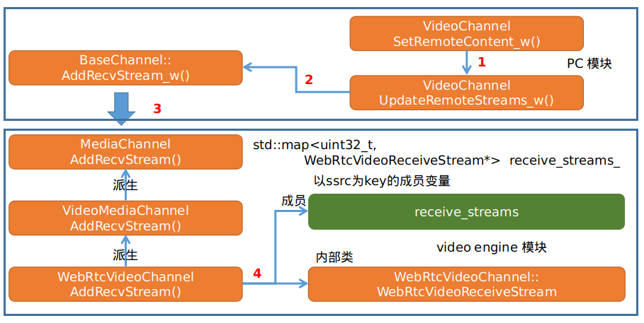

  * 在`WebRtcVideoChannel`模块的AddRecvStream函数中会new `WebRtcVideoReceiveStream`模块。
    
```cpp
bool WebRtcVideoChannel::AddRecvStream(const StreamParams& sp,
                                        bool default_stream) {
  RTC_DCHECK_RUN_ON(&thread_checker_);
  .....
  uint32_t ssrc = sp.first_ssrc();
  ....  
  receive_streams_[ssrc] = new WebRtcVideoReceiveStream(
      this, call_, sp, std::move(config), decoder_factory_, default_stream,
      recv_codecs_, flexfec_config);
  return true;
}
```

  * 通过远程sdp传入的参数，得到对应的ssrc,然后根据ssrc为key创建`WebRtcVideoReceiveStream`,最后将其记录到`receive_streams_`容器当中。

  * 最终`VideoReceiveStream`创建的核心任务落在了`WebRtcVideoReceiveStream`模块的构造函数当中。

  * `WebRtcVideoReceiveStream`模块构造函数中的函数调用栈大致如下：  


  * 由上图的关系可以得出`WebRtcVideoReceiveStream`模块依赖Call模块，最终调用`Call`模块的CreateVideoReceiveStream函数创建webrtc::VideoReceiveStream对象，该对象是真实解码后的数据消费者。

  * 那么`WebRtcVideoReceiveStream`模块又是如何拿到`webrtc::VideoReceiveStream`模块中的数据流的？回到`WebRtcVideoReceiveStream`模块的构造函数。
    
```cpp
WebRtcVideoChannel::WebRtcVideoReceiveStream::WebRtcVideoReceiveStream(
    WebRtcVideoChannel* channel,
    webrtc::Call* call,
    const StreamParams& sp,
    webrtc::VideoReceiveStream::Config config,
    webrtc::VideoDecoderFactory* decoder_factory,
    bool default_stream,
    const std::vector<VideoCodecSettings>& recv_codecs,
    const webrtc::FlexfecReceiveStream::Config& flexfec_config)
    : channel_(channel),
      call_(call),
      stream_params_(sp),
      stream_(NULL),
      default_stream_(default_stream),
      config_(std::move(config)),
      flexfec_config_(flexfec_config),
      flexfec_stream_(nullptr),
      decoder_factory_(decoder_factory),
      sink_(NULL),
      first_frame_timestamp_(-1),
      estimated_remote_start_ntp_time_ms_(0) {
  config_.renderer = this;
  ConfigureCodecs(recv_codecs);
  ConfigureFlexfecCodec(flexfec_config.payload_type);
  MaybeRecreateWebRtcFlexfecStream();
  RecreateWebRtcVideoStream();
}
```   

  * 根据构造函数和上图可知，`WebRtcVideoReceiveStream` 是模块`rtc::VideoSinkInterface<webrtc::VideoFrame>`的派生类，也就是YUV数据的消费者。
  * 同时通过对远端SDP的解析，最终握手完成将匹配的解码器等相关信息都保存到了`config_`成员变量中（该步骤操作通过ConfigureCodecs函数完成）。
  * webrtc::VideoReceiveStream::Config结构中存在一个重要的成员变量`rtc::VideoSinkInterface<VideoFrame>* renderer`该变量在上面构造函数中被初始化成this指针。
  * 就这样`WebRtcVideoReceiveStream`模块通过其onFrame函数监听就能顺利从Call模块中拿到对应解码后的YUV数据。
  * ConfigureCodecs函数的左右就是解析远端SDP拿到codec等信息和local端进行对比然后记录其解码工厂，最后将信息记录到`config_`成员变量中，供Call模块使用。
  * ConfigureCodecs函数主要初始化了`config_`的decoders成员和rtp成员，这些信息都是从远端sdp中得到。
    
```cpp
void WebRtcVideoChannel::WebRtcVideoReceiveStream::ConfigureCodecs(
    const std::vector<VideoCodecSettings>& recv_codecs) {
  RTC_DCHECK(!recv_codecs.empty());
  config_.decoders.clear();
  config_.rtp.rtx_associated_payload_types.clear();
  config_.rtp.raw_payload_types.clear();
  for (const auto& recv_codec : recv_codecs) {
    webrtc::SdpVideoFormat video_format(recv_codec.codec.name,
                                        recv_codec.codec.params);
    webrtc::VideoReceiveStream::Decoder decoder;
    decoder.decoder_factory = decoder_factory_;
    decoder.video_format = video_format;
    decoder.payload_type = recv_codec.codec.id;
    decoder.video_format =
        webrtc::SdpVideoFormat(recv_codec.codec.name, recv_codec.codec.params);
    config_.decoders.push_back(decoder);
    config_.rtp.rtx_associated_payload_types[recv_codec.rtx_payload_type] =
        recv_codec.codec.id;
    if (recv_codec.codec.packetization == kPacketizationParamRaw) {
      config_.rtp.raw_payload_types.insert(recv_codec.codec.id);
    }
  }
  const auto& codec = recv_codecs.front();
  config_.rtp.ulpfec_payload_type = codec.ulpfec.ulpfec_payload_type;
  config_.rtp.red_payload_type = codec.ulpfec.red_payload_type;
  config_.rtp.lntf.enabled = HasLntf(codec.codec);
  config_.rtp.nack.rtp_history_ms = HasNack(codec.codec) ? kNackHistoryMs : 0;
  config_.rtp.rtcp_xr.receiver_reference_time_report = HasRrtr(codec.codec);
  if (codec.ulpfec.red_rtx_payload_type != -1) {
    config_.rtp
        .rtx_associated_payload_types[codec.ulpfec.red_rtx_payload_type] =
        codec.ulpfec.red_payload_type;
  }
}

void WebRtcVideoChannel::WebRtcVideoReceiveStream::ConfigureFlexfecCodec(
    int flexfec_payload_type) {
  flexfec_config_.payload_type = flexfec_payload_type;
}
```

  * 根据远程SDP设置`config_`成员,供后续使用。

## 3）webrtc::VideoReceiveStream 创建及其初始化

```cpp
webrtc::VideoReceiveStream* Call::CreateVideoReceiveStream(
    webrtc::VideoReceiveStream::Config configuration) {
  TRACE_EVENT0("webrtc", "Call::CreateVideoReceiveStream");
  RTC_DCHECK_RUN_ON(&configuration_sequence_checker_);
  //如果支持transport wide cc 则不进行周期发送
  receive_side_cc_.SetSendPeriodicFeedback(
      SendPeriodicFeedback(configuration.rtp.extensions));
  RegisterRateObserver();
  VideoReceiveStream* receive_stream = new VideoReceiveStream(
      task_queue_factory_, &video_receiver_controller_, num_cpu_cores_,
      transport_send_ptr_->packet_router(), std::move(configuration),
      module_process_thread_.get(), call_stats_.get(), clock_);
  const webrtc::VideoReceiveStream::Config& config = receive_stream->config();
  {
    WriteLockScoped write_lock(*receive_crit_);
    if (config.rtp.rtx_ssrc) {
      // We record identical config for the rtx stream as for the main
      // stream. Since the transport_send_cc negotiation is per payload
      // type, we may get an incorrect value for the rtx stream, but
      // that is unlikely to matter in practice.
      receive_rtp_config_.emplace(config.rtp.rtx_ssrc,
                                  ReceiveRtpConfig(config));
    }
    receive_rtp_config_.emplace(config.rtp.remote_ssrc,
                                ReceiveRtpConfig(config));
    video_receive_streams_.insert(receive_stream);
    ConfigureSync(config.sync_group);
  }
  receive_stream->SignalNetworkState(video_network_state_);
  UpdateAggregateNetworkState();
  event_log_->Log(std::make_unique<RtcEventVideoReceiveStreamConfig>(
      CreateRtcLogStreamConfig(config)));
  return receive_stream;
}
```

  * 如果没有向`RtpTransportControllerSend`模块注册TargetTransferRateObserver,目标码率监听则进行注册，Call模块是TargetTransferRateObserver的派生类，这里将Call模块注册到`RtpTransportControllerSend`模块，这样动态码率调节完后Call模块会收到，主要触发OnTargetTransferRate和OnStartRateUpdate。
  * 创建VideoReceiveStream实例，并将其添加到`video_receive_streams_`容器。
  * 最后配置同步，本文不做分析。
  * 在分析VideoReceiveStream的构造函数之前先看一下，`Call`模块是如何对VideoReceiveStream进行管理的，以及`Call`模块收到RTP包后如何将RTP包路由到`VideoReceiveStream`的。  

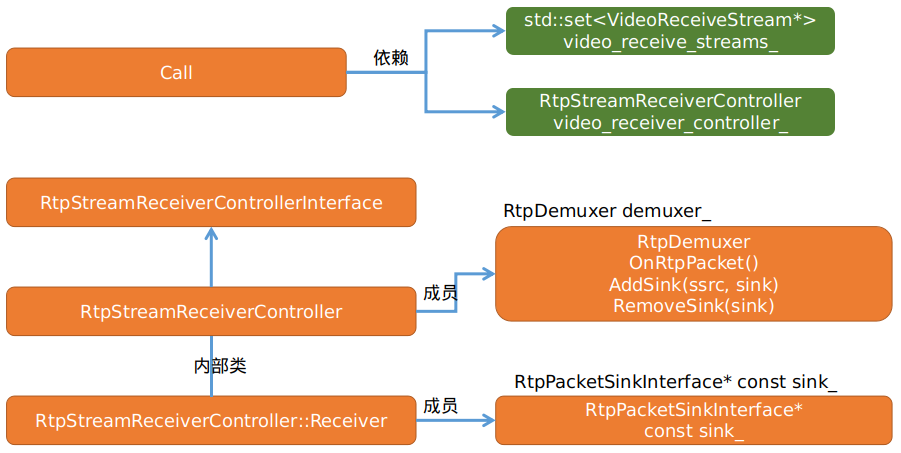

  * `Call`模块维护一个`video_receive_streams_`容器，每一路视频接收流在new 之后都会被添加到该容器中。
  * `Call`模块也维护一个`RtpStreamReceiverController video_receiver_controller_`成员，`RtpStreamReceiverController`模块维护一个`RtpDemuxer demuxer_`成员变量。
  * 在new VideoReceiveStream实例的时候会传入`video_receiver_controller`,那么它做了什么请看其构造函数部分。
    
```cpp
VideoReceiveStream::VideoReceiveStream(
    TaskQueueFactory* task_queue_factory,
    RtpStreamReceiverControllerInterface* receiver_controller,
    int num_cpu_cores,
    PacketRouter* packet_router,
    VideoReceiveStream::Config config,
    ProcessThread* process_thread,
    CallStats* call_stats,
    Clock* clock,
    VCMTiming* timing)
    : task_queue_factory_(task_queue_factory),
      ....
      rtp_video_stream_receiver_(clock_,
                                  &transport_adapter_,
                                  call_stats,
                                  packet_router,
                                  &config_,
                                  rtp_receive_statistics_.get(),
                                  &stats_proxy_,
                                  process_thread_,
                                  this,     // NackSender
                                  nullptr,  // Use default KeyFrameRequestSender
                                  this,     // OnCompleteFrameCallback
                                  config_.frame_decryptor),
        ....  
    ) {
  RTC_LOG(LS_INFO) << "VideoReceiveStream: " << config_.ToString();
  ....
  if (config_.media_transport()) {
    config_.media_transport()->SetReceiveVideoSink(this);
    config_.media_transport()->AddRttObserver(this);
  } else {
    // Register with RtpStreamReceiverController.
    media_receiver_ = receiver_controller->CreateReceiver(
        config_.rtp.remote_ssrc, &rtp_video_stream_receiver_);
    if (config_.rtp.rtx_ssrc) {
      rtx_receive_stream_ = std::make_unique<RtxReceiveStream>(
          &rtp_video_stream_receiver_, config.rtp.rtx_associated_payload_types,
          config_.rtp.remote_ssrc, rtp_receive_statistics_.get());
      rtx_receiver_ = receiver_controller->CreateReceiver(
          config_.rtp.rtx_ssrc, rtx_receive_stream_.get());
    } else {
      rtp_receive_statistics_->EnableRetransmitDetection(config.rtp.remote_ssrc,
                                                          true);
    }
  }
}
```

  * 首先是初始化`RtpVideoStreamReceiver`模块,也就是对应的`rtp_video_stream_receiver_`成员变量，然后以ssrc和`rtp_video_stream_receiver_`成员做为参数调用RtpStreamReceiverController(在`Call`模块中保存)的CreateReceiver函数创建接收者，同时在RtpStreamReceiverController::Receiver的构造函数中会调用对应的AddSink函数以ssrc为key,`rtp_video_stream_receiver`为value将其和RtpDemuxer进行关联。

  * 其流程图如下：

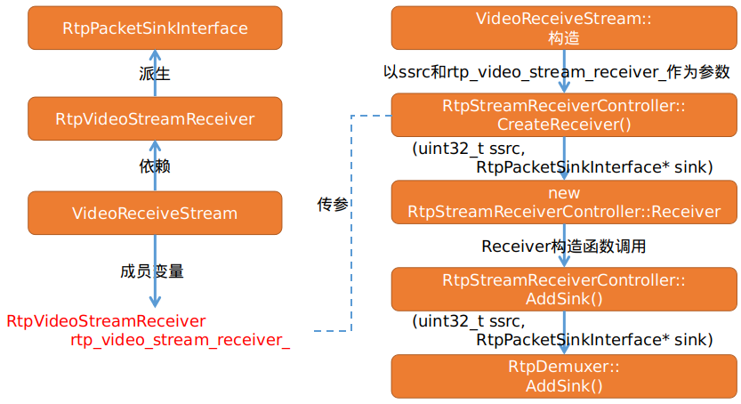

  * `RtpVideoStreamReceiver`模块由`RtpPacketSinkInterface`派生，而`VideoReceiveStream`模块中有一个重要的成员变量`RtpVideoStreamReceiver rtp_video_stream_receiver_`。

  * 经过以上的拆解我们就可以得出，当`Call`模块接收到RTP包后经过其保存的`RtpStreamReceiverController`模块（也就是对应`video_receiver_controller_`成员）的OnRtpPacket函数进行路由。

  * 根据`RtpStreamReceiverController`模块OnRtpPacket函数的实现可以得出最终会将RTP包分发到`VideoReceiveStream`模块所管理`RtpVideoStreamReceiver`模块中（也就是`rtp_video_stream_receiver_`成员）

  * 其大致流程如下：

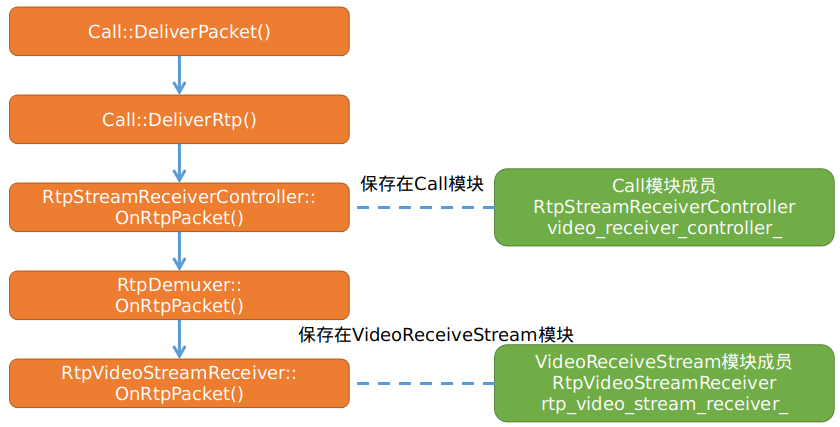

## 4）VideoReceiveStream构造函数分析

```cpp    
VideoReceiveStream::VideoReceiveStream(
    TaskQueueFactory* task_queue_factory,
    RtpStreamReceiverControllerInterface* receiver_controller,
    int num_cpu_cores,
    PacketRouter* packet_router,
    VideoReceiveStream::Config config,
    ProcessThread* process_thread,
    CallStats* call_stats,
    Clock* clock,
    VCMTiming* timing)
    : task_queue_factory_(task_queue_factory),
      transport_adapter_(config.rtcp_send_transport),
      config_(std::move(config)),
      num_cpu_cores_(num_cpu_cores),
      process_thread_(process_thread),
      clock_(clock),
      call_stats_(call_stats),
      source_tracker_(clock_),
      stats_proxy_(&config_, clock_),
      rtp_receive_statistics_(ReceiveStatistics::Create(clock_)),
      timing_(timing),
      video_receiver_(clock_, timing_.get()),
      rtp_video_stream_receiver_(clock_,
                                  &transport_adapter_,
                                  call_stats,
                                  packet_router,
                                  &config_,
                                  rtp_receive_statistics_.get(),
                                  &stats_proxy_,
                                  process_thread_,
                                  this,     // NackSender
                                  nullptr,  // Use default KeyFrameRequestSender
                                  this,     // OnCompleteFrameCallback
                                  config_.frame_decryptor),
      rtp_stream_sync_(this),
      max_wait_for_keyframe_ms_(KeyframeIntervalSettings::ParseFromFieldTrials()
                                    .MaxWaitForKeyframeMs()
                                    .value_or(kMaxWaitForKeyFrameMs)),
      max_wait_for_frame_ms_(KeyframeIntervalSettings::ParseFromFieldTrials()
                                  .MaxWaitForFrameMs()
                                  .value_or(kMaxWaitForFrameMs)),
      decode_queue_(task_queue_factory_->CreateTaskQueue(
          "DecodingQueue",
          TaskQueueFactory::Priority::HIGH)) {
  .....        
  module_process_sequence_checker_.Detach();
  network_sequence_checker_.Detach();
  std::set<int> decoder_payload_types;
  for (const Decoder& decoder : config_.decoders) {
    .....
    decoder_payload_types.insert(decoder.payload_type);
  }
  timing_->set_render_delay(config_.render_delay_ms);
  frame_buffer_.reset(
      new video_coding::FrameBuffer(clock_, timing_.get(), &stats_proxy_));
  process_thread_->RegisterModule(&rtp_stream_sync_, RTC_FROM_HERE);
  if (config_.media_transport()) {
    config_.media_transport()->SetReceiveVideoSink(this);
    config_.media_transport()->AddRttObserver(this);
  } else {
    // Register with RtpStreamReceiverController.
    media_receiver_ = receiver_controller->CreateReceiver(
        config_.rtp.remote_ssrc, &rtp_video_stream_receiver_);
    if (config_.rtp.rtx_ssrc) {
      rtx_receive_stream_ = std::make_unique<RtxReceiveStream>(
          &rtp_video_stream_receiver_, config.rtp.rtx_associated_payload_types,
          config_.rtp.remote_ssrc, rtp_receive_statistics_.get());
      rtx_receiver_ = receiver_controller->CreateReceiver(
          config_.rtp.rtx_ssrc, rtx_receive_stream_.get());
    } else {
      rtp_receive_statistics_->EnableRetransmitDetection(config.rtp.remote_ssrc,
                                                          true);
    }
  }
}
```   

  * 构造函数主要是对其成员函数的一些实例化，其中在构造函数中所涉及到的成员变量主要如下：

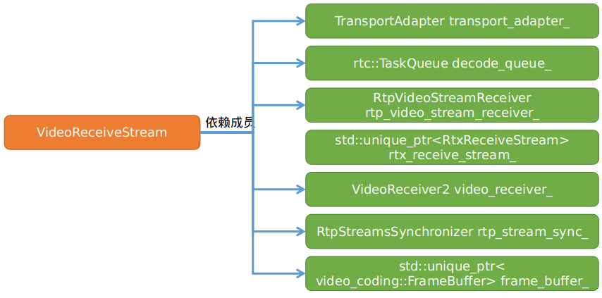

  * VideoReceiveStream`模块的派生关系如下：


  * 在构造函数中对于接收流的控制，首先创建`receiver_controller->CreateReceiver`创建正常接收流，并将`rtp_video_stream_receiver_`绑定到RtpDemuxer。

  * 同时在`config_.rtp.rtx_ssrc`支持的情况下，（也就是重传流使用独立ssrc传输），以`rtp_video_stream_receiver_`为参数创建RtxReceiveStream实例（这也说明了最终的重传流也是交给`rtp_video_stream_receiver_`处理的）,然后再次通过`receiver_controller->CreateReceiver`将其绑定到RtpDemuxer

  * 可通过`TransportAdapter transport_adapter_`成员对该stream开启或者关闭rtp或者rtcp传输功能。

  * `rtc::TaskQueue decode_queue_`成员是解码任务队列，所有待解码的数据包都经过它进行投递。

  * `RtpVideoStreamReceiver rtp_video_stream_receiver_`成员负责从`Call`模块接收RTP数据包，收到后进行响应处理，最后通过解码队列将组帧后的数据送入解码器进行解码。

  * `std::unique_ptr<RtxReceiveStream> rtx_receive_stream_`成员负责处理接收到的重传包，最后重传包会交给`rtp_video_stream_receiver_`进行处理。

  * `RtpStreamsSynchronizer rtp_stream_sync_`成员负责音视频同步工作，其中由VideoReceiveStream派生Syncable并实现其GetPlayoutTimestamp()函数和SetMinimumPlayoutDela()函数，在`RtpStreamsSynchronizer`模块在同步过程中会调用者两个函数，具体的使用后续进行分析。

  * 成员`std::unique_ptr<video_coding::FrameBuffer>frame_buffer_`存储编码数据，也就是RTP解包组帧后的数据buffer,最终通过异步任务队列将它送到解码器，进行解码工作。

  * 由`VideoReceiveStream`从`video_coding::OnCompleteFrameCallback`的派生关系可知，当组帧完后会触发其OnCompleteFrame函数回调，在该函数中会将收到的一帧完整的帧数据插入到`frame_buffer_`当中。

  * 由`VideoReceiveStream`从`NackSender`的派生关系可知，当在`RtpVideoStreamReceiver`模块中收到RTP包由丢包的情况下，会通过`VideoReceiveStream`模块实现的SendNack()函数发送nack丢包重传请求。

  * 由`VideoReceiveStream`从`VideoSinkInterface<VideoFrame>`的派生关系可知,该模块也是一个解码后数据的消费者，最终会触发其OnFrame()函数，在该函数中会通过`config_.renderer->OnFrame(video_frame)`,调用将YUV数据分发到`WebRtcVideoReceiveStream` 模块，`WebRtcVideoReceiveStream` 模块和`VideoReceiveStream`模块的数据接收传递关系是通过`config_`配置信息进行映射的，其映射过过程经过`Call`模块创建`VideoReceiveStream`模块的时候传入`config_`参数而来。

  * 到此视频接收流的创建已经完成，接下来就是启动解码线程。

## 5）VideoReceiveStream启动分析

  * 根据图（1）可知在`WebRtcVideoReceiveStream`模块构造过程中调用RecreateWebRtcVideoStream()函数透过`Call`模块对接收流进行创建，当接收流实例化和初始化完毕后会调用其Start()方法来启动接收流,代码如下：
    
```cpp
void WebRtcVideoChannel::WebRtcVideoReceiveStream::RecreateWebRtcVideoStream() {
  .....
  stream_ = call_->CreateVideoReceiveStream(std::move(config));
  ....
  stream_->Start();
  ....
}
```

  * 根据`webrtc::VideoReceiveStream`子类的派生关系，以及在`Call`模块中真正创建的是属于video模块下的`VideoReceiveStream`实例。
  * 在分析VideoReceiveStream::Start() 函数之前先看看,该函数中涉及到的成员变量


```cpp
void VideoReceiveStream::Start() {
  RTC_DCHECK_RUN_ON(&worker_sequence_checker_);
  if (decoder_running_) {
    return;
  }
  const bool protected_by_fec = config_.rtp.protected_by_flexfec ||
                                rtp_video_stream_receiver_.IsUlpfecEnabled();
  frame_buffer_->Start();
  if (rtp_video_stream_receiver_.IsRetransmissionsEnabled() &&
      protected_by_fec) {
    frame_buffer_->SetProtectionMode(kProtectionNackFEC);
  }
  /*使能RTCP和RTP发送*/
  transport_adapter_.Enable();
  rtc::VideoSinkInterface<VideoFrame>* renderer = nullptr;
  /*enable_prerenderer_smoothing默认为true  
    render_delay_ms默认为10ms,定义在VideoReceiveStream::Stats结构中  
    此时的值应该为0,IncomingVideoStream用于平滑渲染，这里将this指针传入，最终VideoFrame
    会触发到VideoReceiveStream::onFrame()函数
  */
  if (config_.enable_prerenderer_smoothing) {
    incoming_video_stream_.reset(new IncomingVideoStream(
        task_queue_factory_, config_.render_delay_ms, this));
    renderer = incoming_video_stream_.get();
  } else {
    renderer = this;
  }
  for (const Decoder& decoder : config_.decoders) {
    std::unique_ptr<VideoDecoder> video_decoder =
      decoder.decoder_factory->LegacyCreateVideoDecoder(
                    decoder.video_format,config_.stream_id);
    // If we still have no valid decoder, we have to create a "Null" decoder
    // that ignores all calls. The reason we can get into this state is that the
    // old decoder factory interface doesn't have a way to query supported
    // codecs.
    if (!video_decoder) {
      video_decoder = std::make_unique<NullVideoDecoder>();
    }
    video_decoders_.push_back(std::move(video_decoder));
    video_receiver_.RegisterExternalDecoder(video_decoders_.back().get(),
                                            decoder.payload_type);
    VideoCodec codec = CreateDecoderVideoCodec(decoder);
    const bool raw_payload =
        config_.rtp.raw_payload_types.count(codec.plType) > 0;
    rtp_video_stream_receiver_.AddReceiveCodec(
        codec, decoder.video_format.parameters, raw_payload);
    RTC_CHECK_EQ(VCM_OK, video_receiver_.RegisterReceiveCodec(
                              &codec, num_cpu_cores_, false));
  }
  RTC_DCHECK(renderer != nullptr);
  video_stream_decoder_.reset(
      new VideoStreamDecoder(&video_receiver_, &stats_proxy_, renderer));
  // Make sure we register as a stats observer *after* we've prepared the
  // |video_stream_decoder_|.
  call_stats_->RegisterStatsObserver(this);
  // Start decoding on task queue.
  video_receiver_.DecoderThreadStarting();
  stats_proxy_.DecoderThreadStarting();
  decode_queue_.PostTask([this] {
    RTC_DCHECK_RUN_ON(&decode_queue_);
    decoder_stopped_ = false;
    StartNextDecode();
  });
  decoder_running_ = true;
  rtp_video_stream_receiver_.StartReceive();
}
```

  * 调用`frame_buffer_->Start()`开启buffer循环，后续进行分析。
  * 以`config_.render_delay_ms`和this指针为参数实例化成员变量`incoming_video_stream_`,该成员的主要作用是实现平滑渲染，在其内部进行相关平滑逻辑处理，然后再将待渲染的数据回调到当前类的onFrame函数。
  * 循环遍历`config_.decoders`，该成员在`WebRtcVideoReceiveStream::ConfigureCodecs`中进行初始化，依据远端sdp解析而来，调用LegacyCreateVideoDecoder()函数创建解码器，并将其保存到`video_decoders_`，同时使用`VideoReceiver2::RegisterExternalDecoder()`向模块`VideoReceiver2`注册LegacyCreateVideoDecoder()函数创建的解码器。
  * 循环遍历`config_.decoders`，并调用CreateDecoderVideoCodec()函数创建解码器，同时调用`RtpVideoStreamReceiver::AddReceiveCodec()`函数向`RtpVideoStreamReceiver`模块添加创建好的解码器。
  * 循环遍历`config_.decoders`，并调用`VideoReceiver2::RegisterReceiveCodec()`向模块`VideoReceiver2`注册解码器。
  * 以this指针为参数向`CallStats`模块注册监听。
  * 以`video_receiver_`、`stats_proxy_`、`renderer`(也就是IncomingVideoStream)为参数实例化video_stream_decoder_成员，
  * 调用StartNextDecode启动解码线程。
  * 最后调用`rtp_video_stream_receiver_.StartReceive()`开启模块`RtpVideoStreamReceiver`的接收功能,这样`RtpVideoStreamReceiver`模块的OnRtpPacket()函数回调将被处理。  

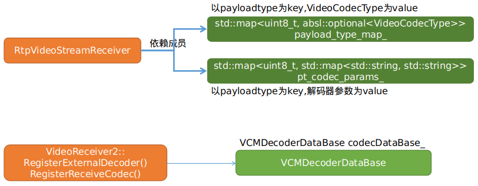

  * 通过图（8）可知通过调用`RtpVideoStreamReceiver::AddReceiveCodec()`函数最终将解码器信息存储到`RtpVideoStreamReceiver`模块的`payload_type_map_`和`pt_codec_params_`容器当中，但是只是存了参数信息和payloadtype等信息，并未存储解码器实例。
  * 通过调用`VideoReceiver2`模块的两大注册函数将解码器实例通过其成员变量`codecDataBase_`将创建好的解码器实例记录到模块`VCMDecoderDataBase`当中，由此可看出后续在RTP包解包并组帧率完成后，最终需要解码应该是从模块`VideoReceiver2`中拿到解码器实例，然后进行解码。具体的流程后续分析解码时再分析。  

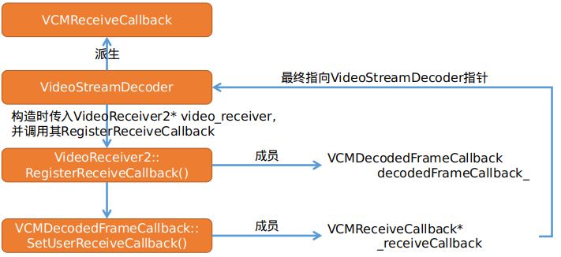

  * 通过图（9）得知，在`VideoReceiveStream`模块的Start()函数中最终会以`VideoReceiver2`模块的实例作为参数来构造`VideoStreamDecoder`模块，而在`VideoStreamDecoder`的构造函数中会调用`VideoReceiver2`模块的RegisterReceiveCallback()函数并传入this指针(VideoStreamDecoder实例)，进而调用`VideoReceiver2`模块的成员变量decodedFrameCallback_，将VideoStreamDecoder指针保存到`VCMDecodedFrameCallback`当中。
  * `VideoStreamDecoder`模块就能够接收`VCMDecodedFrameCallback`模块所回调的信息。
  * 那么记录在`VideoReceiver2`模块中的成员变量`VCMDecodedFrameCallback decodedFrameCallback_ `又在哪里被引用呢？后续进行分析。

## 6）总结

  * 本文着重分析WebRtc 视频接收流的创建流程以及原理，同时分析与之相关模块或类之间的关系。
  * 了解`webrtc::VideoReceiveStream`以及`WebRtcVideoReceiveStream`的创建流程以及创建时机，对后续分析Webrtc 视频接收流rtp包处理流程的分析奠定坚实的基础。
  * 同时为未来对webrtc 框架进行定制化，比如h265解码的支持，可针对peerconnection直接转发encode frame而无需进行解码和渲染做好铺垫。
  * 掌握模块与模块之间的数据回调机制和传递机制十分重要。

<hr>

#### <p>原文出处：<a href='https://www.jianshu.com/p/9014e4aef4f7' target='blank'>WebRtc Video Receiver(二)-RTP包接收流程分析</a></p>

## 1) 前言

* 在[WebRtc Video Receiver(一)-模块创建分析](https://www.jianshu.com/p/d3071a8f5368)一文中主要介绍了Video Reviever Stream的创建流程，以及和其他各模块之间的关系。
* 本文着重介绍Video Stream Receiver接收RTP数据流的业务流程以及处理流程。
* 首先用一副图来描述网络层收到视频RTP包后数据是如何投递到`Call`模块的。  


* 如上图所示在PeerConnection创建通道的时候会创建MediaChannel,将MediaChannel（属于webrtc_video_engine范畴）和PC层的BaseChannel进行关联
* 网络层收到数据后通过信号的方式将数据传递给BaseChannel。
* `BaseChannel`通过worker线程将RTP包传递给`MediaChannel`，由`MediaChannel`的派生关系，数据最终是到达`VideoMediaChannel`模块的。
* 最后在`VideoMediaChannel`模块的OnPacketReceived()函数中通过调用`Call`模块的DeliverPacket()函数对RTP数据进行分发。
* 在介绍`Call`模块将数据分发到`RtpVideoStreamReceiver`之前，先看看`RtpVideoStreamReceiver`类的构造函数，为什么会分发给它，在在[WebRtc Video Stream Receiver原理(一)](https://www.jianshu.com/p/d3071a8f5368)一文中有详细描述。

## 2) RtpVideoStreamReceiver核心成员分析

  * 在分析该构造函数之前，先看看`RtpVideoStreamReceiver`模块的派生关系以及依赖关系。  

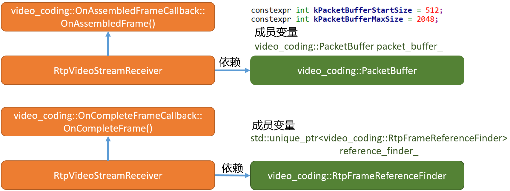

  * 成员`packet_buffer_`负责管理`VCMPacket`数据包， 而当对RTP数据解析完后将其数据部分封装成`VCMPacket`。
  * 同时根据上述的派生关系，当通过`video_coding::PacketBuffer`的插入函数在其内部将`VCMPacket`进行组包，若发现有完整的帧数据时，会触发OnAssembledFrame()函数，从而将一帧数据回传到`RtpVideoStreamReceiver`模块。
  * 成员`reference_finder_`成为rtp帧引用发现者，用于对一帧数据进行管理，当上述的OnAssembledFrame()函数被调用时，在其处理中会使用`reference_finder_`成员对当前帧进行管理和决策，具体作用后续分析。  

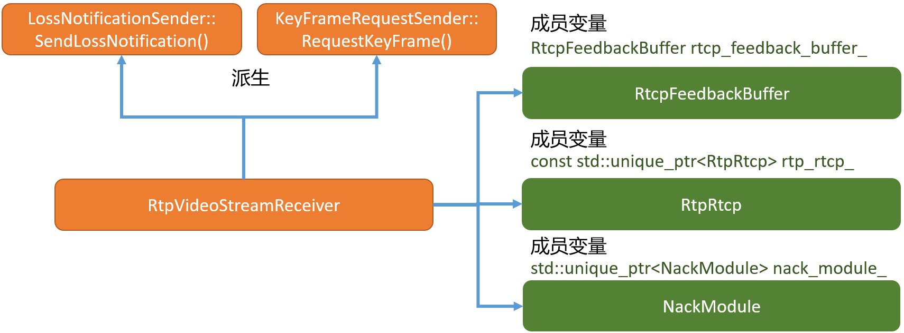

  * 在每个`RtpVideoStreamReceiver`模块中都有一个成员变量`rtp_rtcp_`由此可以看出webrtc每一路流都应该有自己的RTCP控制模块，用于接收对端发送过来的rtcp控制信息和发送rtcp控制请求。
  * 成员`nack_module_`由`Module`派生而来，为一个定时线程，其作用主要是用于监听丢包，已经对丢包列表进行处理。

## 3) RtpVideoStreamReceiver RTP包处理

  * 根据上述前言中的流程图分析，数据最终经过`Call`模块进行分发，最终到达`RtpVideoStreamReceiver`模块，在`RtpVideoStreamReceiver`模块中的核心处理逻辑如下图：  

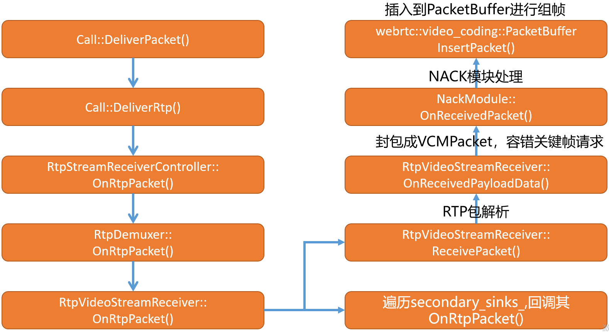

  * 从上图可以看出，`RtpVideoStreamReceiver`模块在处理RTP数据流的过程中，主要涉及三大步骤。
  * 首先是对RTP包进行解析，分离rtp头部等信息，获得`RTPVideoHeader`头，`RTPHeader`,以及`payload_data`等信息。
  * 其次，以`RTPVideoHeader`、`RTPHeader`、`payload_data`等为参数封装`VCMPacket`，并进行容错判断，对于H264如若该包为一帧的首个包，且为IDR包的话判断是否有pps sps等信息的完整性。
  * 通过回调`NackModule::OnReceivedPacket`函数将当前包的seq传入到`NackModule`模块,`NackModule`模块会根据每次接收到seq进行是否连续判断，如果不连续则表示丢包，同时将丢包的seq插入到对应的丢包响应队列，`NackModule`模块利用其模块机制进行丢包重传发送。
  * 最后，如果在未丢包的情况下最终被封装的`VCMPacket`会插入到被`RtpVideoStreamReceiver`模块所管理的`packet_buffer_`成员当中，进行组包操作。
  * 接下来对以上三大流程进行分析，分析其原理。

## 4) RtpVideoStreamReceiver RTP包解析

```cpp    
void RtpVideoStreamReceiver::ReceivePacket(const RtpPacketReceived& packet) {
  if (packet.payload_size() == 0) {
    // Padding or keep-alive packet.
    // TODO(nisse): Could drop empty packets earlier, but need to figure out how
    // they should be counted in stats.
    NotifyReceiverOfEmptyPacket(packet.SequenceNumber());
    return;
  } 
  if (packet.PayloadType() == config_.rtp.red_payload_type) {
    ParseAndHandleEncapsulatingHeader(packet);
    return;
  }
  /*容器大小为1，也就是握手后确定的解码器对应的payloadtype,以H264为例，对应107
    插入流程在原理（一）中有说
  */
  const auto type_it = payload_type_map_.find(packet.PayloadType());
  if (type_it == payload_type_map_.end()) {
    return;
  }
  /*根据payload_type创建解包器*/
  auto depacketizer =
      absl::WrapUnique(RtpDepacketizer::Create(type_it->second));
  if (!depacketizer) {
    RTC_LOG(LS_ERROR) << "Failed to create depacketizer.";
    return;
  }
  RtpDepacketizer::ParsedPayload parsed_payload;
  if (!depacketizer->Parse(&parsed_payload, packet.payload().data(),
                            packet.payload().size())) {
    RTC_LOG(LS_WARNING) << "Failed parsing payload.";
    return;
  }
  RTPHeader rtp_header;
  packet.GetHeader(&rtp_header);
  /*信息封装在RtpDepacketizer当中*/  
  RTPVideoHeader video_header = parsed_payload.video_header();
  ......
  video_header.is_last_packet_in_frame = rtp_header.markerBit;
  video_header.frame_marking.temporal_id = kNoTemporalIdx;
  if (parsed_payload.video_header().codec == kVideoCodecVP9) {
    const RTPVideoHeaderVP9& codec_header = absl::get<RTPVideoHeaderVP9>(
        parsed_payload.video_header().video_type_header);
    video_header.is_last_packet_in_frame |= codec_header.end_of_frame;
    video_header.is_first_packet_in_frame |= codec_header.beginning_of_frame;
  }
  /*解析扩展信息*/
  packet.GetExtension<VideoOrientation>(&video_header.rotation);
  packet.GetExtension<VideoContentTypeExtension>(&video_header.content_type);
  packet.GetExtension<VideoTimingExtension>(&video_header.video_timing);
  /*解析播放延迟限制？*/  
  packet.GetExtension<PlayoutDelayLimits>(&video_header.playout_delay);
  packet.GetExtension<FrameMarkingExtension>(&video_header.frame_marking);
  // Color space should only be transmitted in the last packet of a frame,
  // therefore, neglect it otherwise so that last_color_space_ is not reset by
  // mistake.
  /*颜色空间应该只在帧的最后一个数据包中传输，因此，需要忽略它，
    否则当发生错误的时候使last_color_space_不会被重置,为啥要这样？ */
  if (video_header.is_last_packet_in_frame) {
    video_header.color_space = packet.GetExtension<ColorSpaceExtension>();
    if (video_header.color_space ||
        video_header.frame_type == VideoFrameType::kVideoFrameKey) {
      // Store color space since it's only transmitted when changed or for key
      // frames. Color space will be cleared if a key frame is transmitted
      // without color space information.
      last_color_space_ = video_header.color_space;
    } else if (last_color_space_) {
      video_header.color_space = last_color_space_;
    }
  }
  ......
  OnReceivedPayloadData(parsed_payload.payload, parsed_payload.payload_length,
                        rtp_header, video_header, generic_descriptor_wire,
                        packet.recovered());
}
```

  * 首先判断接收到的packet的`payload_size`是否为0，为0表示padding包，如果是则调用NotifyReceiverOfEmptyPacket()函数将该包信息通过`rtp_rtcp_`将包传递给`NackModule`模块，因为`NackModule`模块需要判断是否有丢包情况，所有判断的依据是seq的连续性。
  * 判断是否为red包，本文不做分析。
  * 从`payload_type_map_`查找是否有对应的payload type,`payload_type_map_`的插入在[原理（一）](https://www.jianshu.com/p/d3071a8f5368)中有详细分析，若不能找到匹配的解码payload type，则立即返回。
  * 根据payload type调用`RtpDepacketizer::Create(type_it->second)`创建对应的rtp分包器。最终的解包操作使用`RtpDepacketizer`调用其Parse()函数来完成，它的实现原理如下图：  

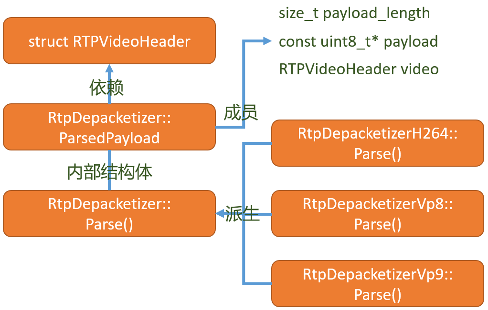

  * 由上图`RtpDepacketizer`的派生关系可看出，不同的解码类型，会有不同的派生类型，调用其Parse()函数后，最后的解析信息会被封装到其类步类`RtpDepacketizer::ParsedPayload`当中，其中记录了`RTPVideoHeader`、palyload、payload_length信息,通过parsed_payload.video_header()可以返回`RTPVideoHeader`结构实例。
  * 同时由上图看出，如果webrtc要支持h265解码，同理需要派生一个h265的解包类，在其内部对H265数据进行解析，最后封装成`ParsedPayload`结构。
  * 到此为止RTP数据包解析提取工作就已经完成，最后调用`RtpVideoStreamReceiver::OnReceivedPayloadData()`函数进入到下一个步骤。

## 5) RtpVideoStreamReceiver VCMPacket封装及关键帧请求

### 5.1) RtpVideoStreamReceiver VCMPacket封装及容错处理

```cpp    
int32_t RtpVideoStreamReceiver::OnReceivedPayloadData(
    const uint8_t* payload_data,
    size_t payload_size,
    const RTPHeader& rtp_header,
    const RTPVideoHeader& video_header,
    const absl::optional<RtpGenericFrameDescriptor>& generic_descriptor,
    bool is_recovered) {
  VCMPacket packet(payload_data, payload_size, rtp_header, video_header,
                    ntp_estimator_.Estimate(rtp_header.timestamp),
                    clock_->TimeInMilliseconds());
  packet.generic_descriptor = generic_descriptor;
  .......
  if (packet.codec() == kVideoCodecH264) {
    // Only when we start to receive packets will we know what payload type
    // that will be used. When we know the payload type insert the correct
    // sps/pps into the tracker.
    if (packet.payloadType != last_payload_type_) {
      last_payload_type_ = packet.payloadType;
      InsertSpsPpsIntoTracker(packet.payloadType);
    }
    switch (tracker_.CopyAndFixBitstream(&packet)) {
      case video_coding::H264SpsPpsTracker::kRequestKeyframe:
        rtcp_feedback_buffer_.RequestKeyFrame();
        rtcp_feedback_buffer_.SendBufferedRtcpFeedback();
        RTC_FALLTHROUGH();
      case video_coding::H264SpsPpsTracker::kDrop:
        return 0;
      case video_coding::H264SpsPpsTracker::kInsert:
        break;
    }
  } 
  ......  
  return 0;
}
```

  * 首先根据传入的`RTPHeader`、`RTPVideoHeader`、`payload_size`打包`VCMPacket`结构。
  * 对H264解码的payload,调用`tracker_.CopyAndFixBitstream(&packet)`对`VCMPacket`进行相应的容错处理和数据赋值。
  * 如果正常情况下会调用`rtcp_feedback_buffer_.SendBufferedRtcpFeedback()`想对端发送feedback。
  * 如果正常情况下最后会将`VCMPacket`插入到`packet_buffer_`。
  * 这里重点分析CopyAndFixBitstream函数。
    
```cpp
H264SpsPpsTracker::PacketAction H264SpsPpsTracker::CopyAndFixBitstream(
    VCMPacket* packet) {
  RTC_DCHECK(packet->codec() == kVideoCodecH264);
  const uint8_t* data = packet->dataPtr;
  const size_t data_size = packet->sizeBytes;
  const RTPVideoHeader& video_header = packet->video_header;
  auto& h264_header =
      absl::get<RTPVideoHeaderH264>(packet->video_header.video_type_header);
  bool append_sps_pps = false;
  auto sps = sps_data_.end();
  auto pps = pps_data_.end();
  for (size_t i = 0; i < h264_header.nalus_length; ++i) {
    const NaluInfo& nalu = h264_header.nalus[i];
    switch (nalu.type) {
      case H264::NaluType::kSps: {
        sps_data_[nalu.sps_id].width = packet->width();
        sps_data_[nalu.sps_id].height = packet->height();
        break;
      }
      case H264::NaluType::kPps: {
        pps_data_[nalu.pps_id].sps_id = nalu.sps_id;
        break;
      }
      case H264::NaluType::kIdr: {
        // If this is the first packet of an IDR, make sure we have the required
        // SPS/PPS and also calculate how much extra space we need in the buffer
        // to prepend the SPS/PPS to the bitstream with start codes.
        if (video_header.is_first_packet_in_frame) {
          if (nalu.pps_id == -1) {
            RTC_LOG(LS_WARNING) << "No PPS id in IDR nalu.";
            return kRequestKeyframe;
          }
          pps = pps_data_.find(nalu.pps_id);
          if (pps == pps_data_.end()) {
            RTC_LOG(LS_WARNING)
                << "No PPS with id << " << nalu.pps_id << " received";
            return kRequestKeyframe;
          }
          sps = sps_data_.find(pps->second.sps_id);
          if (sps == sps_data_.end()) {
            RTC_LOG(LS_WARNING)
                << "No SPS with id << " << pps->second.sps_id << " received";
            return kRequestKeyframe;
          }
          // Since the first packet of every keyframe should have its width and
          // height set we set it here in the case of it being supplied out of
          // band.
          packet->video_header.width = sps->second.width;
          packet->video_header.height = sps->second.height;
          // If the SPS/PPS was supplied out of band then we will have saved
          // the actual bitstream in |data|.
          if (sps->second.data && pps->second.data) {
            RTC_DCHECK_GT(sps->second.size, 0);
            RTC_DCHECK_GT(pps->second.size, 0);
            append_sps_pps = true;
          }
        }
        break;
      }
      default:
        break;
    }
  }
  RTC_CHECK(!append_sps_pps ||
            (sps != sps_data_.end() && pps != pps_data_.end()));
  // Calculate how much space we need for the rest of the bitstream.
  size_t required_size = 0;
  if (append_sps_pps) {
    required_size += sps->second.size + sizeof(start_code_h264);
    required_size += pps->second.size + sizeof(start_code_h264);
  }
    //RTC_LOG(INFO) << "h264_header.packetization_type:" << h264_header.packetization_type;
  if (h264_header.packetization_type == kH264StapA) {
    const uint8_t* nalu_ptr = data + 1;
    while (nalu_ptr < data + data_size) {
      RTC_DCHECK(video_header.is_first_packet_in_frame);
      required_size += sizeof(start_code_h264);
      // The first two bytes describe the length of a segment.
      uint16_t segment_length = nalu_ptr[0] << 8 | nalu_ptr[1];
      nalu_ptr += 2;
      required_size += segment_length;
      nalu_ptr += segment_length;
    }
  } else {//default kH264FuA
    if (h264_header.nalus_length > 0) {
      required_size += sizeof(start_code_h264);
    }
    required_size += data_size;
  }
  // Then we copy to the new buffer.
  uint8_t* buffer = new uint8_t[required_size];
  uint8_t* insert_at = buffer;
  if (append_sps_pps) {
    // Insert SPS.
    memcpy(insert_at, start_code_h264, sizeof(start_code_h264));
    insert_at += sizeof(start_code_h264);
    memcpy(insert_at, sps->second.data.get(), sps->second.size);
    insert_at += sps->second.size;
    // Insert PPS.
    memcpy(insert_at, start_code_h264, sizeof(start_code_h264));
    insert_at += sizeof(start_code_h264);
    memcpy(insert_at, pps->second.data.get(), pps->second.size);
    insert_at += pps->second.size;
    // Update codec header to reflect the newly added SPS and PPS.
    NaluInfo sps_info;
    sps_info.type = H264::NaluType::kSps;
    sps_info.sps_id = sps->first;
    sps_info.pps_id = -1;
    NaluInfo pps_info;
    pps_info.type = H264::NaluType::kPps;
    pps_info.sps_id = sps->first;
    pps_info.pps_id = pps->first;
    if (h264_header.nalus_length + 2 <= kMaxNalusPerPacket) {
      h264_header.nalus[h264_header.nalus_length++] = sps_info;
      h264_header.nalus[h264_header.nalus_length++] = pps_info;
    } else {
      RTC_LOG(LS_WARNING) << "Not enough space in H.264 codec header to insert "
                              "SPS/PPS provided out-of-band.";
    }
  }
  // Copy the rest of the bitstream and insert start codes.
  if (h264_header.packetization_type == kH264StapA) {
    const uint8_t* nalu_ptr = data + 1;
    while (nalu_ptr < data + data_size) {
      memcpy(insert_at, start_code_h264, sizeof(start_code_h264));
      insert_at += sizeof(start_code_h264);
      // The first two bytes describe the length of a segment.
      uint16_t segment_length = nalu_ptr[0] << 8 | nalu_ptr[1];
      nalu_ptr += 2;
      size_t copy_end = nalu_ptr - data + segment_length;
      if (copy_end > data_size) {
        delete[] buffer;
        return kDrop;
      }
      memcpy(insert_at, nalu_ptr, segment_length);
      insert_at += segment_length;
      nalu_ptr += segment_length;
    }
  } else {
    if (h264_header.nalus_length > 0) {
      memcpy(insert_at, start_code_h264, sizeof(start_code_h264));
      insert_at += sizeof(start_code_h264);
    }
    memcpy(insert_at, data, data_size);
  }
  packet->dataPtr = buffer;
  packet->sizeBytes = required_size;
  return kInsert;
}
```

  * 循环遍历该包，一个包中可能有多个NALU单元，如果该NALU为IDR片，并且该包为该帧的首个包，那么按照H264 bit stream的原理，它的前两个NALU一定是SPS和PPS，如下图：


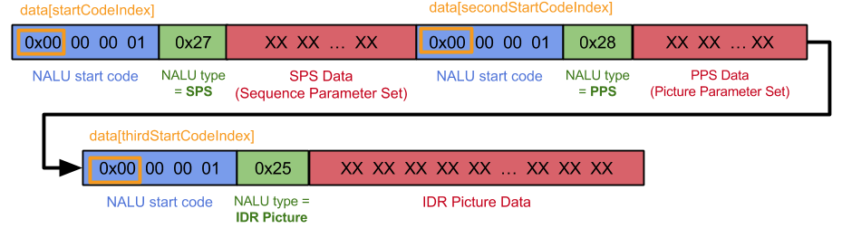

  * 通过上述代码的逻辑也是如果NALU为SPS或PPS直接将其赋值到`sps_data_`和`pps_data_`容器当中。
  * 如果`video_header.is_first_packet_in_frame`并且nalu.type==kIdr,那么此时`sps_data_`和`pps_data_`容器必须有值，如果没有值，则说缺失SPS和PPS信息，该IDR是无法进行解码的，所以直接返回kRequestKeyframe。
  * 进行数据拷贝,在`append_sps_pps`成立也就是`video_header.is_first_packet_in_frame`并且nalu.type==kIdr的情况下按照上图的结构，配合代码不难进行分析。

### 5.2) RtpVideoStreamReceiver 关键帧请求

```cpp    
int32_t RtpVideoStreamReceiver::OnReceivedPayloadData(
    const uint8_t* payload_data,
    size_t payload_size,
    const RTPHeader& rtp_header,
    const RTPVideoHeader& video_header,
    const absl::optional<RtpGenericFrameDescriptor>& generic_descriptor,
    bool is_recovered) {
  VCMPacket packet(payload_data, payload_size, rtp_header, video_header,
                    ntp_estimator_.Estimate(rtp_header.timestamp),
                    clock_->TimeInMilliseconds());
    ....
    switch (tracker_.CopyAndFixBitstream(&packet)) {
      case video_coding::H264SpsPpsTracker::kRequestKeyframe:
        rtcp_feedback_buffer_.RequestKeyFrame();
        rtcp_feedback_buffer_.SendBufferedRtcpFeedback();
        RTC_FALLTHROUGH();
      case video_coding::H264SpsPpsTracker::kDrop:
        return 0;
      case video_coding::H264SpsPpsTracker::kInsert:
        break;
    }
    .....
}
```

  * 如`tracker_.CopyAndFixBitstream`返回kRequestKeyframe，表示该包的I帧参数有问题，需要重新发起关键帧请求。
  * 调用模块`RtpVideoStreamReceiver::RtcpFeedbackBuffer`的RequestKeyFrame()方法将其`request_key_frame_`变量设成true。
  * 最后调用`RtpVideoStreamReceiver::RtcpFeedbackBuffer`的SendBufferedRtcpFeedback()发送请求。
  * 关键帧请求的核心逻辑如下图

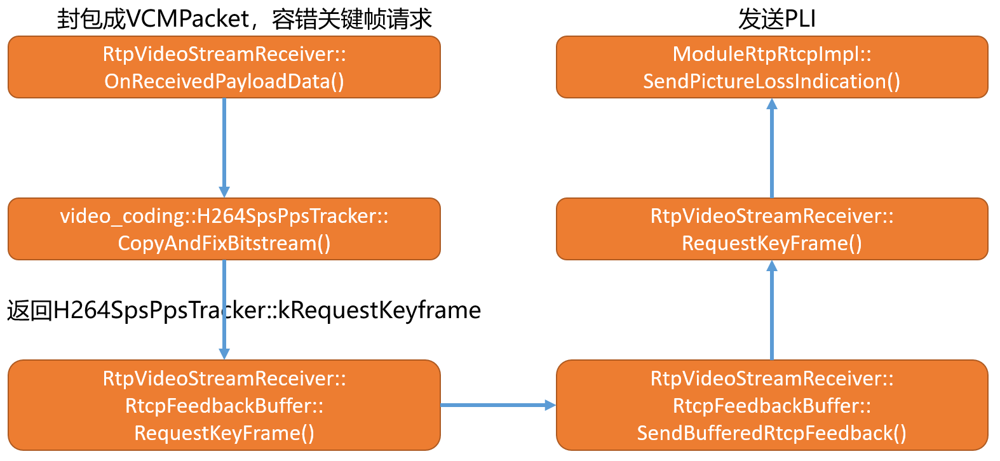

  * `RtpVideoStreamReceiver::RtcpFeedbackBuffer`的RequestKeyFrame()和SendBufferedRtcpFeedback方法实现如下：
    
```cpp
void RtpVideoStreamReceiver::RtcpFeedbackBuffer::RequestKeyFrame() {
  rtc::CritScope lock(&cs_);
  request_key_frame_ = true;
}
```    

  * 设置`request_key_frame_`为true

```cpp
void RtpVideoStreamReceiver::RtcpFeedbackBuffer::SendBufferedRtcpFeedback() {
  bool request_key_frame = false;
  std::vector<uint16_t> nack_sequence_numbers;
  absl::optional<LossNotificationState> lntf_state;
  ....
  {
    rtc::CritScope lock(&cs_);
    std::swap(request_key_frame, request_key_frame_);
  }
  .....
  if (request_key_frame) {
    key_frame_request_sender_->RequestKeyFrame();
  } else if (!nack_sequence_numbers.empty()) {
    nack_sender_->SendNack(nack_sequence_numbers, true);
  }
}
```

  * 由于此时`request_key_frame`为true。
  * `key_frame_request_sender_`为模块`RtpVideoStreamReceiver`指针，在其构造函数中实例化`rtcp_feedback_buffer_`实例化的时候以参数的形式传入。
    
```cpp
void RtpVideoStreamReceiver::RequestKeyFrame() {
  if (keyframe_request_sender_) {//默认为nullptr
    keyframe_request_sender_->RequestKeyFrame();
  } else {
    rtp_rtcp_->SendPictureLossIndication();
  }
}
```

  * `keyframe_request_sender_`默认为nullptr，在`VideoReceiveStream`构造函数初始化其成员变量`rtp_video_stream_receiver_`的时候传入了nullptr。
  * 最终调用rtp_rtcp模块的SendPictureLossIndication函数发送PLI。
  * 本文分析到此结束，剩下的NACK module 以及组包分析放在下文。

<hr>

#### <p>原文出处：<a href='https://www.jianshu.com/p/6413cf2e8aca' target='blank'>WebRTC Video Receiver(三)-NACK丢包重传原理</a></p>

## 1）前言

* 在[WebRtc Video Receiver 创建分析(一)](https://www.jianshu.com/p/d3071a8f5368)一文中分析了Video Stream Receiver流的创建以及各模块之间的关系
* 在[WebRtc Video Receiver RTP包接收分析(二)](https://www.jianshu.com/p/9014e4aef4f7)一文中分析了Video Stream Receiver流回调机制的注册机制，以及对接收到的RTP流进行解码分析。
* 同时在上文中也分析了在解包RTP封装VCMPacket包的时候对RTP包的容错性检测，以及关键帧请求的场景。
* 本文着重分析在对VCMPacket进行组包前，NACK Module模块的运行原理以及在整个过程中对NACK Module丢包判断机制。
* 在webrtc视频接收流框架中每一路流都由独立的NACK 处理模块。
* 首先回顾RTP包接收流程图如下：

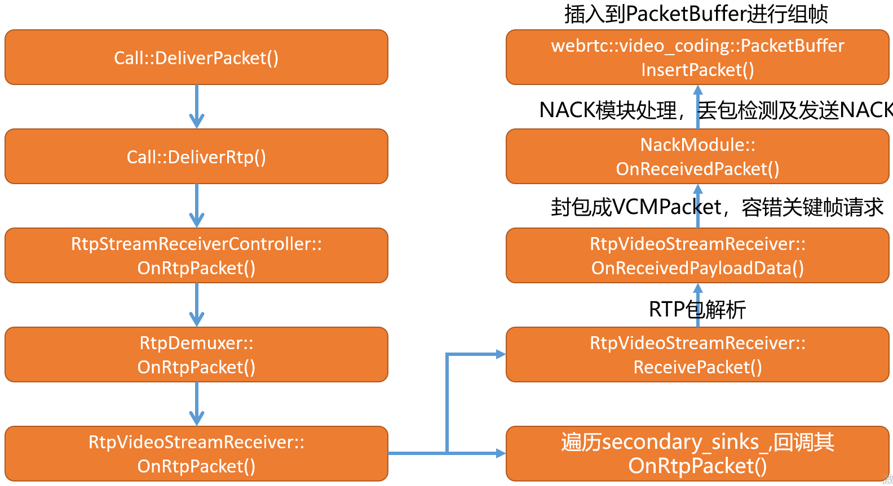

  * 从上图中可以清晰的看出网络框架收到RTP包后，经过`Call`模块将RTP包分发到`RtpVideoStreamReceiver`模块。

## 2）NackModule的工作原理以及和RtpVideoStreamReceiver之间的关系

### 2.1）M79版本

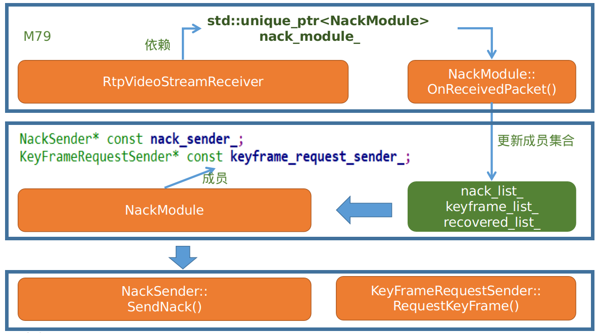

  * 在模块`RtpVideoStreamReceiver`中定义了模块`NackModule`成员变量，并在其构造函数中对成员变量`nack_module`进行实例化。

  * 再由上面的RTP包处理业务流程图，当模块`RtpVideoStreamReceiver`每次对rtp包进行处理的时候都会调用`NackModule::OnReceivedPacket()`主动驱动`NackModule`模块，在该函数中会根据传入的seq number 来判断包的连续性，如果包不连续会生成相应丢包信息，并将丢包信息插入到丢包列表当中，同时发送丢包请求。

  * 发送丢包请求分成两个分之，一个分之是在`NackModule::OnReceivedPacket()`函数中直接发送，另一个分支是由于`NackModule`由`Module`派生而来，实现其Process()方法。通过定时执行Process()方法遍历其内部数据结构，判断是否要发送响应的丢包请求，逻辑如下图：  

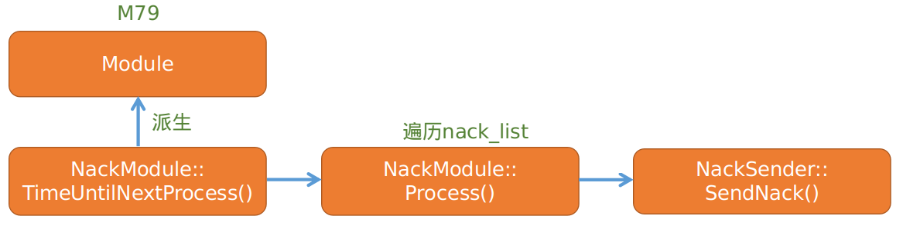

  * `NackModule`模块同时依赖`RtpVideoStreamReceiver::RtcpFeedbackBuffer`模块，在其模块中有`nack_sender_`成员变量和`keyframe_request_sender_`成员变量，在构造`NackModule`模块的时候会通过参数的形式传入并对`nack_sender_`和`keyframe_request_sender_`成员赋值。同时由`RtpVideoStreamReceiver::RtcpFeedbackBuffer`模块的派生关系可知，最终传入的是`RtpVideoStreamReceiver::RtcpFeedbackBuffer`模块指针。

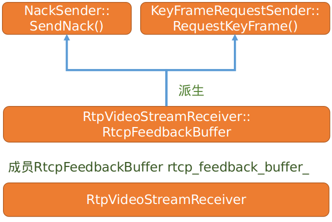

  * 由上图可知最终经过NACK模块的统计和处理，发送丢包请求和关键帧请求都是通过`RtpVideoStreamReceiver`的成员变量rtcp_feedback_buffer_来构建请求包最后发出。

### 2.2）M85版本的变化

  * 主线处理逻辑上没有太大的变化，只是类名发生了变化，由原来的`NackModule`变成了`NackModule2`

  * `NackModule2`不再由Module派生而是改用`RepeatingTaskHandle`来定时重复发送丢包请求。  

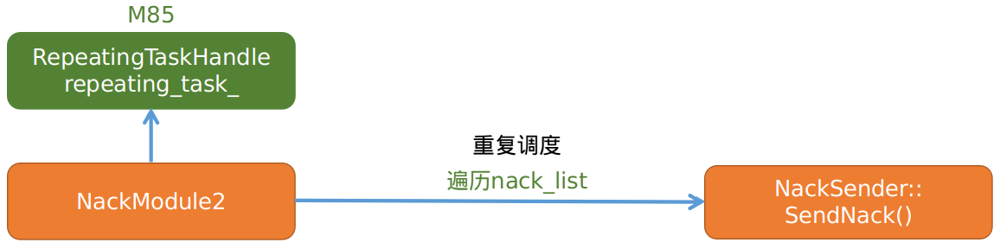

  * 下面简要介绍`NackModule`所管理的数据结构。  

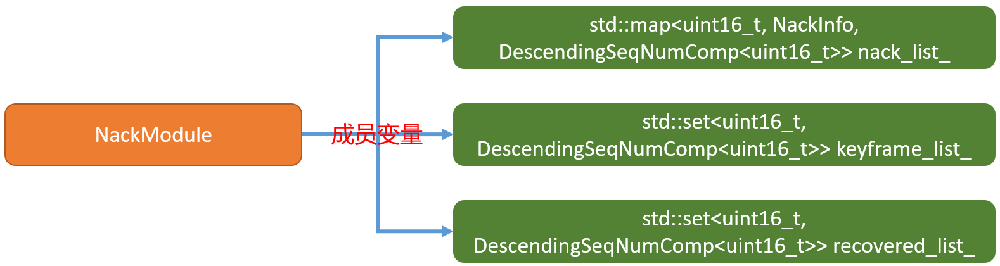

  * `nack_list_`集合主要用于记录已丢包的信息，以seq 为key,以`NackInfo`为value进行管理。

  * `keyframe_list_`用于记录每次回调`OnReceiverPacket`过来的如果是关键帧，则将其插入到该集合。

  * `recovered_list_`用于记录RTX或FEC恢复过来的包。

  * M85版本和M79版本对上述数据结构的管理保持一致。

## 3）NackModule OnReceivedPacket函数工作流程

```cpp
int NackModule2::OnReceivedPacket(uint16_t seq_num,
                                  bool is_keyframe,/*是否为关键帧*/
                                  bool is_recovered/*是否为恢复的包RTX or FEC*/) {
  rtc::CritScope lock(&crit_);
  // TODO(philipel): When the packet includes information whether it is
  //                 retransmitted or not, use that value instead. For
  //                 now set it to true, which will cause the reordering
  //                 statistics to never be updated.
  bool is_retransmitted = true;
  //newest_seq_num_可以理解成截止当前收到的最新的一个seq number
  if (!initialized_) {
    newest_seq_num_ = seq_num;
    if (is_keyframe)
      keyframe_list_.insert(seq_num);
    initialized_ = true;
    return 0;
  }
  // Since the |newest_seq_num_| is a packet we have actually received we know
  // that packet has never been Nacked.
  //seq_num 表示当前刚收到包的序列号，newest_seq_num_表示截止当前收到的最新的一个seq number,怎么理解呢，在seq未环绕的情况下可以理解成最大的一个
  if (seq_num == newest_seq_num_)
    return 0;
  //如果发生了丢包，这里收到重传包则会条件成立seq_num表示当前收到的重传包的序列号
  if (AheadOf(newest_seq_num_, seq_num)) {
    // An out of order packet has been received.
    auto nack_list_it = nack_list_.find(seq_num);
    int nacks_sent_for_packet = 0;
    //如果nack_list_集合中有seq_num则进行清除，同时记录当前包历经了多少次重传再收到  
    if (nack_list_it != nack_list_.end()) {
      nacks_sent_for_packet = nack_list_it->second.retries;
      nack_list_.erase(nack_list_it);
    }
    if (!is_retransmitted)
      UpdateReorderingStatistics(seq_num);
    //返回当前包经历了多少次数，在组包模块中会使用到。  
    return nacks_sent_for_packet;
  }
  // Keep track of new keyframes.
  // 如果当前包为关键帧则插入到keyframe_list_  
  if (is_keyframe)
    keyframe_list_.insert(seq_num);
  // lower_bound(val):返回容器中第一个【大于或等于】val值的元素的iterator位置。
  // And remove old ones so we don't accumulate keyframes.
  auto it = keyframe_list_.lower_bound(seq_num - kMaxPacketAge);
  if (it != keyframe_list_.begin())
    keyframe_list_.erase(keyframe_list_.begin(), it);
  if (is_recovered) {
    recovered_list_.insert(seq_num);
    // Remove old ones so we don't accumulate recovered packets.
    auto it = recovered_list_.lower_bound(seq_num - kMaxPacketAge);
    if (it != recovered_list_.begin())
      recovered_list_.erase(recovered_list_.begin(), it);
    // Do not send nack for packets recovered by FEC or RTX.
    return 0;
  }
  AddPacketsToNack(newest_seq_num_ + 1, seq_num);
  newest_seq_num_ = seq_num;
  // Are there any nacks that are waiting for this seq_num.
  std::vector<uint16_t> nack_batch = GetNackBatch(kSeqNumOnly);
  if (!nack_batch.empty()) {
    // This batch of NACKs is triggered externally; the initiator can
    // batch them with other feedback messages.
    nack_sender_->SendNack(nack_batch, /*buffering_allowed=*/true);
  }
  return 0;
}
```

  * 本文采用最新m85版本对该函数的工作流程进行分析。
  * 如果首次接收包，判断是否为关键帧，如果是将其插入到`keyframe_list_`，然后直接返回。
  * 如果上次和本次的包seq 一样，直接返回,对已经收到的包不做丢包处理。
  * 使用`AheadOf(newest_seq_num_, seq_num)`函数，判断`newest_seq_num_`是否在`seq_num`之前。`AheadOf`函数的核心原理是检测两个包之间的距离，该函数帮助我们做了seq 环绕问题的处理。在没有环绕问题的情况下，假设seq 从0~2^16-1,在这个范围内传输，若在传输过程中出现了丢包，看如下log
    
```cpp
newest_seq_num_:36 seq_num:37 is_keyframe:0 is_recovered: 0 AheadOf(newest_seq_num_, seq_num) : 0
newest_seq_num_:37 seq_num:38 is_keyframe:0 is_recovered: 0 AheadOf(newest_seq_num_, seq_num) : 0
newest_seq_num_:38 seq_num:41 is_keyframe:0 is_recovered: 0 AheadOf(newest_seq_num_, seq_num) : 0
newest_seq_num_:41 seq_num:42 is_keyframe:0 is_recovered: 0 AheadOf(newest_seq_num_, seq_num) : 0
newest_seq_num_:42 seq_num:43 is_keyframe:0 is_recovered: 0 AheadOf(newest_seq_num_, seq_num) : 0
newest_seq_num_:43 seq_num:40 is_keyframe:0 is_recovered: 1 AheadOf(newest_seq_num_, seq_num) : 1
newest_seq_num_:43 seq_num:39 is_keyframe:0 is_recovered: 1 AheadOf(newest_seq_num_, seq_num) : 1
newest_seq_num_:43 seq_num:44 is_keyframe:0 is_recovered: 0 AheadOf(newest_seq_num_, seq_num) : 0    
```

  * 根据上述的调试信息不难看出，假设上一次已经收到了43号包，32号包到44号包之间，丢了39号和40号包，丢了后会发送nack重传或者依据fec进行恢复，如上述log信息,当上一次收到的包为43号包的时候，然后本次收到了40号（前面丢了的）包，此时`AheadOf(43, 40)`将返回true，事实上43号包也是在40号包之前接收到的,可以看出在未有环绕的情况下如果`AheadOf(a, b)`函数当a > b的时候返回true。
  * 当`AheadOf(newest_seq_num_, seq_num)`成立的条件下会根据当前的`seq_num`从`nack_list_`寻找对应的seq,此处表示已经收到了重传包，所以要将其从`nack_list_`容器中进行清除，最后返回该恢复包请求重传或恢复的次数。
  * 如果是正常的包，假设当前传入的是`key_frame`包，会将新关键帧包插入到`keyframe_list_`，同时会删除`keyframe_list_`中旧的包，判断旧包的原则如下：
    
```cpp
newest_seq_num_:5 seq_num:6 is_keyframe:1  keyframe_list_.size():0 recovered_list_.size():0 nack_list_.size():0
newest_seq_num_:6 seq_num:7 is_keyframe:1  keyframe_list_.size():1 recovered_list_.size():0 nack_list_.size():0
newest_seq_num_:7 seq_num:8 is_keyframe:0  keyframe_list_.size():2 recovered_list_.size():0 nack_list_.size():0
newest_seq_num_:8 seq_num:9 is_keyframe:0  keyframe_list_.size():2 recovered_list_.size():0 nack_list_.size():0
```
    
```cpp 
const int kMaxPacketAge = 10000;  
/*这里会返回第一个大于0的位置，也就是6号包的位置*/
auto it = keyframe_list_.lower_bound(seq_num - kMaxPacketAge);/*6-10000*/
if (it != keyframe_list_.begin())
  keyframe_list_.erase(keyframe_list_.begin(), it);
```

  * `keyframe_list_.lower_bound(seq_num - kMaxPacketAge)`这段代码表示返回第一个大于seq_num - kMaxPacketAge的位置，根据上述调试信息可知，当插入7号包的时候返回的是`keyframe_list_.begin()`的位置，所以不会删除6号包。
  * 假设当前`keyframe_list_`已经记录的6号和7号包，然后当前来了10007号包，同样10007号包为`key_frame`,此时上述函数返回的位置为7号包的位置，此时6号包会被删除。
  * 对于H264数据而言，通俗的理解就是`keyframe_list_`容器记录了当前传入过来的P帧所对应的gop。
  * 当前传入的包， `is_recovered`为true时，也就是该包时由RTX或FEC恢复过来的，此时会将该seq插入到`recovered_list_`，同时会删除过期的记录，删除原理和`keyframe_list_`的删除一致。如上述调试，39号和40号包会被记录到`recovered_list_`。
  * 调用AddPacketsToNack函数对seq的连续性进行判断，判断是否丢包，然后记录丢包的序号，将其插入到`nack_list_`，该函数为判断丢包的核心。
  * 更新`newest_seq_num_`为当前包序号（未丢包，也不是恢复的情况下）
  * 若`nack_batch`不为空则表示有丢包，则会直接发起丢包重传请求,由于重传请求也可能会发生丢包的情况，所以需要有定时重复任务的配合。

## 4）NackModule AddPacketsToNack函数丢包判断工作原理

```cpp    
void NackModule::AddPacketsToNack(uint16_t seq_num_start,//newest_seq_num_ + 1
                                  uint16_t seq_num_end//seq_num) {
  // Remove old packets.
  auto it = nack_list_.lower_bound(seq_num_end - kMaxPacketAge);
  nack_list_.erase(nack_list_.begin(), it);
  // If the nack list is too large, remove packets from the nack list until
  // the latest first packet of a keyframe. If the list is still too large,
  // clear it and request a keyframe.
  // 缓存太多丢失的包，进行清除处理  
  uint16_t num_new_nacks = ForwardDiff(seq_num_start, seq_num_end);
  if (nack_list_.size() + num_new_nacks > kMaxNackPackets) {
    while (RemovePacketsUntilKeyFrame() &&
            nack_list_.size() + num_new_nacks > kMaxNackPackets) {
    }
    if (nack_list_.size() + num_new_nacks > kMaxNackPackets) {
      nack_list_.clear();
      RTC_LOG(LS_WARNING) << "NACK list full, clearing NACK"
                              " list and requesting keyframe.";
      keyframe_request_sender_->RequestKeyFrame();
      return;
    }
  }
  /*丢包判断逻辑,如果包连续的话应该是不进for循环的*/
  for (uint16_t seq_num = seq_num_start; seq_num != seq_num_end; ++seq_num) {
    // Do not send nack for packets that are already recovered by FEC or RTX
    if (recovered_list_.find(seq_num) != recovered_list_.end())
      continue;
    /*默认WaitNumberOfPackets(0.5)返回0*/  
    NackInfo nack_info(seq_num, seq_num + WaitNumberOfPackets(0.5),
                        clock_->TimeInMilliseconds());
    RTC_DCHECK(nack_list_.find(seq_num) == nack_list_.end());
    nack_list_[seq_num] = nack_info;
  }
}
```

  * 根据在OnReceivedPacket函数中的调用`seq_num_start=newest_seq_num_ + 1`，而`seq_num_end=seq`(当前传入的seq),以如下丢包的情况序列进行分析。
    
```cpp
newest_seq_num_:38 seq_num:41 is_keyframe:0 is_recovered: 0 
newest_seq_num_:41 seq_num:42 is_keyframe:0 is_recovered: 0 
newest_seq_num_:42 seq_num:43 is_keyframe:0 is_recovered: 0 
```

  * 截止上一次收到的最新包的序列号为38,而当前收到的seq为41很明显，丢了39和40号包，当收到41号包的时候，此时`seq_num_start=38+1=39`，也就是期望值当前传入的应该是39号包，但是实际上当前收到的是41号包
  * 调用ForwardDiff函数判断39号包和41号包之间的距离，这个函数会解决环绕的问题，如果在未环绕的情况下，`num_new_nacks=41-39=2`,也就是算出丢了多少个包。
  * `nack_list_`最多可容纳1000个包，如果`nack_list_`当前大小加上`num_new_nacks`的大小大于或者等于1000个了，那么会调用`RemovePacketsUntilKeyFrame()`函数来移除`nack_list_`中的元素。
  * 要重传的包数量`nack_list_.size()`在进行`RemovePacketsUntilKeyFrame()`操作后若还超过规定大小，就开始清空要重传的数据包列表`nack_list_.clear()`，然后请求关键帧。
  * 使用for 循环进行丢包判断，若包连续for循环的逻辑是不成立的，通过判断`seq_num !=seq_num_end`来进行判断，如果`seq_num !=seq_num_end`，表示`seq_num`是已经丢失的包，同时通过seq_num查找`recovered_list_`，看`recovered_list_`容器中是否已经收到了该丢失的包，
  * 最终如果容器中未找到`seq_num`包，则以`seq_num`、当前时间创建`NackInfo`，并将其记录到`nack_list_`容器当中。
  * 在实际的传输过程中如果网络不好，丢包严重就会导致延迟和马赛克的现象，而合理请求I帧恰好能缓解该问题，`RemovePacketsUntilKeyFrame`函数的原理如下：
    
```cpp
bool NackModule::RemovePacketsUntilKeyFrame() {
  while (!keyframe_list_.empty()) {
    /* 从keyframe_list_中得到第一个值（假设为a），然后以此值为value，找出nack_list_容器中第一个大于等于a的迭代器的位置
      * 将nack_list_的启始位置到对应a值这个seq之间的全部删除，也就是a以前的seq全部移除。
      */
    auto it = nack_list_.lower_bound(*keyframe_list_.begin());
    if (it != nack_list_.begin()) {
      // We have found a keyframe that actually is newer than at least one
      // packet in the nack list.
      nack_list_.erase(nack_list_.begin(), it);
      return true;
    }
    //如果it == nack_list_.begin() 说明这个关键帧也很老了，将其移除掉。
    // If this keyframe is so old it does not remove any packets from the list,
    // remove it from the list of keyframes and try the next keyframe.
    keyframe_list_.erase(keyframe_list_.begin());
  }
  return false;
}
```

  * 这里还是引用上述假设，假设当前缓存的包好为37号包,而此时39和40号包丢了，同时由于丢包严重`nack_list_`集合中前面还缓存了诸多的丢包没有恢复，大小超标了。
  * 以此为例分析`nack_list_.lower_bound(37)`会返回`nack_list_`容器39号包的位置，并不会等于`nack_list_.begin()`，因为该容器中39号包之前可能还有很多没有恢复过来的包，这中情况由于`keyframe_list_`记录的gop和当前已丢失的包的seq比较临近，所以会删除39号以前丢失的包，然后正常发送丢包请求。
  * 另外一种情况是假设发送端i帧间隔比较大的话，那么此时`keyframe_list_`当前记录的gop可能为5号包，那么假设`nack_list_.begin()`刚好缓存了6号丢失的包的话，这个时候就会将`keyframe_list_`中的对应交老的gop删除，此种情况可能会导致`keyframe_list_`为空而`nack_list_`依旧过大，从而会引发`AddPacketsToNack`函数中直接清除所有的丢包列表发送关键帧请求的。
  * 通过查找临近的关键帧的seq（大于等于丢包集合中的首个值），然后将该seq 之前的丢包seq 从`nack_list_`中移除。
  * 在发送端你可以合理设置I帧的的发送间隔，而适当将kMaxNackPackets的大小进行缩小，比如从默认的1000个改成30个，这样的话一旦出现网络抖动的情况，如果丢包超过30个，就会进行I帧请求，来降低延迟。但是这种做法浏览器是无法实现的，因为默认可以缓存1000个丢失的包在该模块的处理中进行I帧请求的概率较低。因为默认假设3秒一个I帧，按照每秒60帧，假设一帧就一个包，那么丢了一个gop区间也就是180个包，它还是会走丢包重传的策略，这样就会导致延迟。

## 5）NackModule NACK发送流程

### 5.1）M79版本

  * NackModule NACK发送流程分两种情况，情况一在每次处理接收到的seq后如果判断有丢包，则会立马发送,(基于kSeqNumOnly)。

  * 另外一种情况是基于NackModule的模块线程驱动，基于kTimeOnly。

  * 这两种情况的驱动都复用一个函数`GetNackBatch()`将要发送的seq 封装成`std::vector<uint16_t>`容器。

  * `GetNackBatch()`函数的实现如下：
    
```cpp
std::vector<uint16_t> NackModule::GetNackBatch(NackFilterOptions options) {
  bool consider_seq_num = options != kTimeOnly;
  bool consider_timestamp = options != kSeqNumOnly;
  int64_t now_ms = clock_->TimeInMilliseconds();
  std::vector<uint16_t> nack_batch;
  auto it = nack_list_.begin();
  while (it != nack_list_.end()) {
    bool delay_timed_out =
        now_ms - it->second.created_at_time >= send_nack_delay_ms_;
    bool nack_on_rtt_passed = now_ms - it->second.sent_at_time >= rtt_ms_;
    /*在创建NackInfo的时候send_at_seq_num和其对应丢包的seq值是相等的，在默认情况下 
    */
    bool nack_on_seq_num_passed =
        it->second.sent_at_time == -1 &&
        AheadOrAt(newest_seq_num_, it->second.send_at_seq_num);
    if (delay_timed_out && ((consider_seq_num && nack_on_seq_num_passed) ||
                            (consider_timestamp && nack_on_rtt_passed))) {
      nack_batch.emplace_back(it->second.seq_num);
      ++it->second.retries;
      it->second.sent_at_time = now_ms;
      if (it->second.retries >= kMaxNackRetries) {
        RTC_LOG(LS_WARNING) << "Sequence number " << it->second.seq_num
                            << " removed from NACK list due to max retries.";
        it = nack_list_.erase(it);
      } else {
        ++it;
      }
      continue;
    }
    ++it;
  }
  return nack_batch;
}
```    

  * `send_nack_delay_ms_`的默认值为0，可以通过配置“WebRTC-SendNackDelayMs/10”作用到FiledTrial属性进行配置。

  * `rtt_ms_`默认值为`kDefaultRttMs=100ms`,该值为动态值通过调用`UpdateRtt`函数进行更新。

  * 条件1：`delay_timed_out`默认情况下都是成立的，因为`it->second.created_at_time`在创建`NackInfo`的时候赋值。

  * 以上分两种情况，情况1是根据`kSeqNumOnly`这种情况下需要判断`nack_on_seq_num_passed`是否成立，由于每次创建`NackInfo`后并将其添加进`nack_list_`的时候，都对`newest_seq_num_ = seq_num`进行赋值操作，所以理论上，每次在判断`nack_on_seq_num_passed`条件的时候`newest_seq_num_`总是先于`send_at_seq_num`的，比如说丢了39号包，但是此时收到的是41号包。

  * 将符合条件的`NackInfo`取出其seq加入到nack_batch容器进行返回。

  * 对于每一个丢失的seq，最多的请求次数为`kMaxNackRetries=10`次。

  * 情况2根据rtt来发送，`rtt_ms_`为动态更新，其更新逻辑如下：

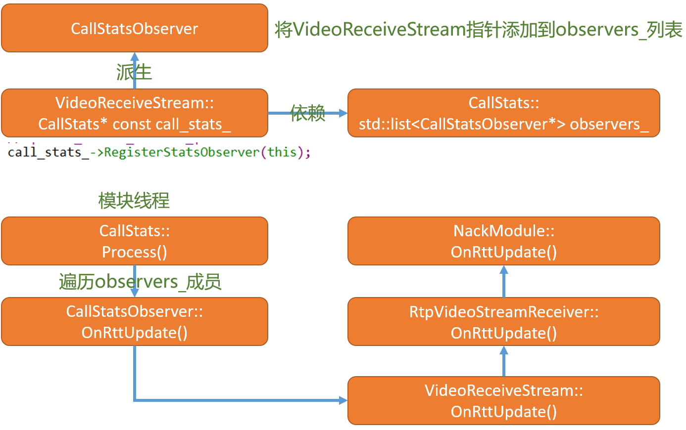

  * `VideoReceiveStream`模块在构造过程中向`CallStats`注册了监听器，只想this指针。

  * 而`VideoReceiveStream`模块为`CallStatsObserver`的派生类，所以重写了OnRttUpdate()方法。

  * 由于`CallStats`由Module派生而来所以它的Process()会定时执行，执行过程中遍历监听者列表，最终如上函数回调流程向`NackModule`模块更新rtt。

### 5.2）M85版本

```cpp    
NackModule2::NackModule2(TaskQueueBase* current_queue,
                          Clock* clock,
                          NackSender* nack_sender,
                          KeyFrameRequestSender* keyframe_request_sender,
                          TimeDelta update_interval /*= kUpdateInterval*/)
    : worker_thread_(current_queue),
      update_interval_(update_interval),
      clock_(clock),
      nack_sender_(nack_sender),
      keyframe_request_sender_(keyframe_request_sender),
      reordering_histogram_(kNumReorderingBuckets, kMaxReorderedPackets),
      initialized_(false),
      rtt_ms_(kDefaultRttMs),
      newest_seq_num_(0),
      send_nack_delay_ms_(GetSendNackDelay()),
      backoff_settings_(BackoffSettings::ParseFromFieldTrials()) {
  repeating_task_ = RepeatingTaskHandle::DelayedStart(
      TaskQueueBase::Current(), update_interval_,
      [this]() {
        RTC_DCHECK_RUN_ON(worker_thread_);
        std::vector<uint16_t> nack_batch = GetNackBatch(kTimeOnly);
        if (!nack_batch.empty()) {
          // This batch of NACKs is triggered externally; there is no external
          // initiator who can batch them with other feedback messages.
          nack_sender_->SendNack(nack_batch, /*buffering_allowed=*/false);
        }
        return update_interval_;
      },
      clock_);
}
```

  * `repeating_task_`重复任务队列以20ms为周期进行重复调度。
  * 其原理和m79版本一致，都是用过`GetNackBatch`函数对`nack_list_`容器进行遍历，找出需要重传包的seq，然后封装成集合，最后调用`SendNack`进行重传请求。

## 6) 总结

  * 本文主要阐述了`NackModule`模块的工作原理，主要描述其判断丢包的核心逻辑，以及发送nack的处理逻辑。
  * `NackModule`模块的核心就是通过维护三个容器来实现对丢包信息的管理。
  * 最终在`NackModule::OnReceivedPacket`函数中如果收到的恢复包它的返回值为非0值，返回的是丢包请求尝试的次数，该值对于`RtpVideoStreamReceiver`模块后续的处理起到了什么作用？在后续进行分析。
  * `Process`以最大10次*每次的时间间隔，假设超过10次放弃该包。
  * 对于m85版本不再使用Module模块来驱动，而是使用重复任务队列以20ms的周期进行调度。
  * 在重传请求过程中如果超过10次请求还没有请求到重传包，则会放弃重传。
  * 在实际的应用的过程中，需要合理的请求I帧，但`NackModule`模块的工作主要是负责丢包的重传，对于I帧的请求只是在丢包及其严重的时候才会发起。

<hr>
#### <p>原文出处：<a href='https://www.jianshu.com/p/f747365a40fb' target='blank'>WebRTC Video Receiver(四)-组帧原理分析</a></p>

## 1）前言

* 经过对[WebRtc Video Receiver 创建分析(一)](https://www.jianshu.com/p/d3071a8f5368)、[WebRtc Video Receiver RTP包接收分析(二)](https://www.jianshu.com/p/9014e4aef4f7)、[以及NACK 模块的工作原理](https://www.jianshu.com/p/6413cf2e8aca)进行了深入的分析。

* 按照在[WebRtc Video Receiver 创建分析(一)](https://www.jianshu.com/p/d3071a8f5368)中所提到的视频接收模块的分块，本文着重讲解视频接收模块组包的实现原理。

* 重新回顾视频接收模块对RTP数据流的处理流程如下图：

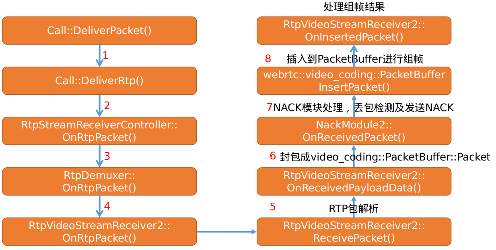

* 首先经过`Call`模块处理将rtp视频数据送到`RtpVideoStreamReceiver::OnRtpPacket`函数,然后将调用`RtpVideoStreamReceiver::ReceivePacket`函数进行RTP包解析。

* 解析完之后的数据,会通过`RtpVideoStreamReceiver::OnReceivedPayloadData`回调,在该函数中会将rtp数据包打包成PacketBuffer::Packet包,然后将PacketBuffer::Packet包插入到`packet_buffer_`,上图第8步。

* 在`PacketBuffer::InsertPacket`函数中插入完后会调用PacketBuffer::FindFrames函数查找有没有合适的帧。

* 最后`PacketBuffer::InsertPacket`函数会返回`struct InsertResult`结构，然后`RtpVideoStreamReceiver2`模块回调`OnInsertedPacket`函数对其进行处理。
    
```cpp
struct InsertResult {
  std::vector<std::unique_ptr<Packet>> packets;
  // Indicates if the packet buffer was cleared, which means that a key
  // frame request should be sent.
  bool buffer_cleared = false;
};
```

  * 如果`buffer_cleared`为true的话，`RtpVideoStreamReceiver2`模块的`OnInsertedPacket`函数会发起关键帧请求处理，此处是和m79版本当中较大的变化。
  * 本文首先分析`PacketBuffer`的数据结构，然后再分析其组帧原理，以及组帧后的触发机制。

## 2）video_coding::PacketBuffer数据结构分析

  * 成员关系如下图：

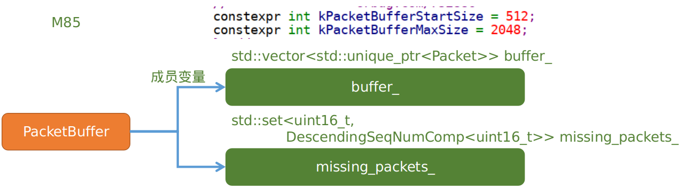

  * `video_coding::PacketBuffer`的数据存储主要依赖于其成员变量`buffer_`当中他的默认大小为512,最大可支持到2048，支持动态扩容，最大扩容到2048每次以512的步进进行扩张，通过调用`PacketBuffer::ExpandBufferSize()`函数来达到目的。
  * 相比m79版本，PacketBuffer中所维护的数据结构变得简单了些。
  * `video_coding::PacketBuffer::Packet`的定义如下
    
```cpp
struct Packet {
  // If all its previous packets have been inserted into the packet buffer.
  // Set and used internally by the PacketBuffer.
  bool continuous = false;
  bool marker_bit = false;
  uint8_t payload_type = 0;
  uint16_t seq_num = 0;
  uint32_t timestamp = 0;
  // NTP time of the capture time in local timebase in milliseconds.
  int64_t ntp_time_ms = -1;
  int times_nacked = -1;
  rtc::CopyOnWriteBuffer video_payload;
  RTPVideoHeader video_header;
  RtpPacketInfo packet_info;
};
```

  * `struct Packet`定义在`PacketBuffer`内部。
  * 根据其注释，若一帧数据全部收到那么该帧对应的各Packet的continuous成员应该都会被成置true
  * 通过`PacketBuffer::PotentialNewFrame(uint16_t seq_num)`根据传入的seq number来查找潜在的帧。
    
```cpp 
bool PacketBuffer::PotentialNewFrame(uint16_t seq_num) const {
  //通过取模运算来获取传入seq numer对赢的Packet在buffer_中的位置索引 
  size_t index = seq_num % buffer_.size();
  //得到前一个包的索引  
  int prev_index = index > 0 ? index - 1 : buffer_.size() - 1;
  //得到seq_number对应的Packet实例引用  
  const auto& entry = buffer_[index];
  //得到seq_number的前一个包对应的Packet实例引用  
  const auto& prev_entry = buffer_[prev_index];
  //如果entry为空说明当前seq_num对应的Packet还没有被插到buffer_中,返回false
  //说明当前seq num还没有潜在的帧存在  
  if (entry == nullptr)
    return false;
  if (entry->seq_num != seq_num)
    return false;
  //如果seq num对应的包是一帧数据的第一个包，则说明前面可能有一帧数据  
  if (entry->is_first_packet_in_frame())
    return true;
  if (prev_entry == nullptr)
    return false;
  //上一个包的seq不等于当前seq num -1 表明丢包  
  if (prev_entry->seq_num != static_cast<uint16_t>(entry->seq_num - 1))
    return false;
  if (prev_entry->timestamp != entry->timestamp)
    return false;
  //如前面所以条件都满足  
  if (prev_entry->continuous)
    return true;
  return false;
}
```

  * 很明显相比m79版本要见多许多。
  * 潜在一帧的条件其一，若传入的seq num 对应的Packet为一帧中的首个包，则表示可能前面有一帧完整的数据
  * 其二、如果seq 连续，并且和前一个包的timestamp不一样，这里充分利用同一帧数据的timestamp一样的条件

## 3）PacketBuffer::InsertPacket 工作流程

```cpp    
PacketBuffer::InsertResult PacketBuffer::InsertPacket(
    std::unique_ptr<PacketBuffer::Packet> packet) {
  PacketBuffer::InsertResult result;
  MutexLock lock(&mutex_);
  uint16_t seq_num = packet->seq_num;
  //计算索引  
  size_t index = seq_num % buffer_.size();
  //首次接收到rtp包，更新first_seq_num_为seq_num
  if (!first_packet_received_) {
    first_seq_num_ = seq_num;
    first_packet_received_ = true;
  } else if (AheadOf(first_seq_num_, seq_num)) {//如果收到重传恢复的包
    // If we have explicitly cleared past this packet then it's old,
    // don't insert it, just silently ignore it.
    if (is_cleared_to_first_seq_num_) {
      return result;
    }
    first_seq_num_ = seq_num;
  }
  if (buffer_[index] != nullptr) {
    // Duplicate packet, just delete the payload.
    if (buffer_[index]->seq_num == packet->seq_num) {
      return result;
    }
    // The packet buffer is full, try to expand the buffer.
    while (ExpandBufferSize() && buffer_[seq_num % buffer_.size()] != nullptr) {
    }
    index = seq_num % buffer_.size();
    //容器已经满了，需要清除buffer
    // Packet buffer is still full since we were unable to expand the buffer.
    if (buffer_[index] != nullptr) {
      // Clear the buffer, delete payload, and return false to signal that a
      // new keyframe is needed.
      RTC_LOG(LS_WARNING) << "Clear PacketBuffer and request key frame.";
      ClearInternal();
      //RtpVideoStreamReceiver2::OnInsertedPacket()函数根据该标识进行关键帧请求  
      result.buffer_cleared = true;
      return result;
    }
  }
  int64_t now_ms = clock_->TimeInMilliseconds();
  last_received_packet_ms_ = now_ms;
  if (packet->video_header.frame_type == VideoFrameType::kVideoFrameKey ||
      last_received_keyframe_rtp_timestamp_ == packet->timestamp) {
    last_received_keyframe_packet_ms_ = now_ms;
    last_received_keyframe_rtp_timestamp_ = packet->timestamp;
  }
  packet->continuous = false;
  buffer_[index] = std::move(packet);
    /*4) 更新丢包容器*/
  UpdateMissingPackets(seq_num);
  /*5) 组帧处理*/
  result.packets = FindFrames(seq_num);
  return result;
}
```

  * `InsertPacket`函数，根据seq 得到索引。
  * 在插包之前，首先会判断，容器是否已经满了，如果满了说明丢包严重，会进行扩容处理，如果扩容后，继续接收包，发现还是丢包严重，buffer_得不到释放，则会清空buffer，并且设置`result.buffer_cleared`为true,这样`RtpVideoStreamReceiver2`模块会根据组帧结果发送关键帧请求。
  * 通过`std::move(packet);`将包插入到`buffer_`对应的位置当中。
  * 调用`UpdateMissingPackets`进行丢包统计。
  * 调用`FindFrames`进行组帧。

## 4) 更新丢包记录

```cpp    
void PacketBuffer::UpdateMissingPackets(uint16_t seq_num) {
  if (!newest_inserted_seq_num_)
    newest_inserted_seq_num_ = seq_num;
  const int kMaxPaddingAge = 1000;
  //如果不丢包的话条件会一直成立  
  if (AheadOf(seq_num, *newest_inserted_seq_num_)) {
    uint16_t old_seq_num = seq_num - kMaxPaddingAge;
    auto erase_to = missing_packets_.lower_bound(old_seq_num);
    missing_packets_.erase(missing_packets_.begin(), erase_to);
    // Guard against inserting a large amount of missing packets if there is a
    // jump in the sequence number.
    if (AheadOf(old_seq_num, *newest_inserted_seq_num_))
      *newest_inserted_seq_num_ = old_seq_num;
    ++*newest_inserted_seq_num_;
    //如果条件成立则表示丢包，missing_packets_插入丢失的包号  
    while (AheadOf(seq_num, *newest_inserted_seq_num_)) {
      missing_packets_.insert(*newest_inserted_seq_num_);
      ++*newest_inserted_seq_num_;
    }
  } else {//收到恢复的包
    missing_packets_.erase(seq_num);
  }
}
```

  * 在`PacketBuffer::InsertPacket`函数每次插入数据后都会调用该函数来刷新`missing_packets_`丢包管理容器。
  * 第一次调用会更新`newest_inserted_seq_num_`，表示最新插入的seq number。
  * 以上分两种情况讨论，其一是如果在插入过程中有被恢复的包被插入（之前丢过的包），假设先插入1434号包，后插入1433号包，此时`newest_inserted_seq_num_`的值为1434，seq_num的值为1433，从而导致`AheadOf(seq_num, *newest_inserted_seq_num_)`的返回值为false，所以会走else分支，在插入恢复包的过程中只是通过`missing_packets_.erase(seq_num);`将对应的1433从丢包记录中进行移除。
  * 其二是在每次插入的过程中通过`AheadOf(seq_num, *newest_inserted_seq_num_)`来判断是否有丢包，从而将丢包的seq 插入到`missing_packets_`容器。
  * `++*newest_inserted_seq_num_`自加操作，此时`newest_inserted_seq_num_`的值为1433,通过`while(AheadOf(seq_num, *newest_inserted_seq_num_))`循环来进行丢包统计，将被丢失包的seq 插入到`missing_packets_`容器。

## 5) PacketBuffer::FindFrames查找合适的帧

```cpp    
std::vector<std::unique_ptr<PacketBuffer::Packet>> PacketBuffer::FindFrames(
  uint16_t seq_num) {
std::vector<std::unique_ptr<PacketBuffer::Packet>> found_frames;
//在for循环条件中根据PotentialNewFrame查找潜在帧  
for (size_t i = 0; i < buffer_.size() && PotentialNewFrame(seq_num); ++i) {
  //得到索引  
  size_t index = seq_num % buffer_.size();
  //能到这里将Packet.continuous设置成true,说明对应当前(之前的帧就不一定了)帧的
  //每一个包是连续的  
  buffer_[index]->continuous = true;
  // If all packets of the frame is continuous, find the first packet of the
  // frame and add all packets of the frame to the returned packets.
  // 如果该seq 对应的包是当前帧的最后一个包再进行实际操作，进行逆向查找。  
  if (buffer_[index]->is_last_packet_in_frame()) {
    uint16_t start_seq_num = seq_num;
    // Find the start index by searching backward until the packet with
    // the |frame_begin| flag is set.
    int start_index = index;
    size_t tested_packets = 0;
    int64_t frame_timestamp = buffer_[start_index]->timestamp;
    // Identify H.264 keyframes by means of SPS, PPS, and IDR.
    bool is_h264 = buffer_[start_index]->codec() == kVideoCodecH264;
    bool has_h264_sps = false;
    bool has_h264_pps = false;
    bool has_h264_idr = false;
    bool is_h264_keyframe = false;
    int idr_width = -1;
    int idr_height = -1;
    //第2部分，以当前seq的包对应的位置为索引进行逆向查找找出当前帧第一个包的位置
    //也就是start_seq_num  
    while (true) {
      ++tested_packets;
      //如果是h264,找到该帧的首个包则跳出该循环,核心就是这一句代码。。
      if (!is_h264 && buffer_[start_index]->is_first_packet_in_frame())
        break;
      //以下操作是对H264数据进行校验
      if (is_h264) {
        const auto* h264_header = absl::get_if<RTPVideoHeaderH264>(
            &buffer_[start_index]->video_header.video_type_header);
        if (!h264_header || h264_header->nalus_length >= kMaxNalusPerPacket)
          return found_frames;
        for (size_t j = 0; j < h264_header->nalus_length; ++j) {
          if (h264_header->nalus[j].type == H264::NaluType::kSps) {
            has_h264_sps = true;
          } else if (h264_header->nalus[j].type == H264::NaluType::kPps) {
            has_h264_pps = true;
          } else if (h264_header->nalus[j].type == H264::NaluType::kIdr) {
            has_h264_idr = true;
          }
        }
          /*通过WebRTC-SpsPpsIdrIsH264Keyframe/Enabled/来开启
            sps_pps_idr_is_h264_keyframe_
          * 表示idr包必须前面有sps pps 等信息，表示当前帧是否为关键帧
        */             
        if ((sps_pps_idr_is_h264_keyframe_ && has_h264_idr && has_h264_sps &&
              has_h264_pps) ||
            (!sps_pps_idr_is_h264_keyframe_ && has_h264_idr)) {
          //判断当前帧是否为关键帧  
          is_h264_keyframe = true;
          // Store the resolution of key frame which is the packet with
          // smallest index and valid resolution; typically its IDR or SPS
          // packet; there may be packet preceeding this packet, IDR's
          // resolution will be applied to them.
          if (buffer_[start_index]->width() > 0 &&
              buffer_[start_index]->height() > 0) {
            idr_width = buffer_[start_index]->width();
            idr_height = buffer_[start_index]->height();
          }
        }
      }
      if (tested_packets == buffer_.size())
        break;
      start_index = start_index > 0 ? start_index - 1 : buffer_.size() - 1;
      // In the case of H264 we don't have a frame_begin bit (yes,
      // |frame_begin| might be set to true but that is a lie). So instead
      // we traverese backwards as long as we have a previous packet and
      // the timestamp of that packet is the same as this one. This may cause
      // the PacketBuffer to hand out incomplete frames.
      // See: https://bugs.chromium.org/p/webrtc/issues/detail?id=7106
      //同一帧数据的timestamp是相等的，如果不相等说明不是同一帧  
      if (is_h264 && (buffer_[start_index] == nullptr ||
                      buffer_[start_index]->timestamp != frame_timestamp)) {
        break;
      }
      --start_seq_num;
    }//while (true)结束，已经得到当前帧的首个包的seq
    //第3部分判断帧的连续性  
    if (is_h264) {
      // Warn if this is an unsafe frame.
      if (has_h264_idr && (!has_h264_sps || !has_h264_pps)) {
        RTC_LOG(LS_WARNING)
            << "Received H.264-IDR frame "
                "(SPS: "
            << has_h264_sps << ", PPS: " << has_h264_pps << "). Treating as "
            << (sps_pps_idr_is_h264_keyframe_ ? "delta" : "key")
            << " frame since WebRTC-SpsPpsIdrIsH264Keyframe is "
            << (sps_pps_idr_is_h264_keyframe_ ? "enabled." : "disabled");
      }
      // Now that we have decided whether to treat this frame as a key frame
      // or delta frame in the frame buffer, we update the field that
      // determines if the RtpFrameObject is a key frame or delta frame.
      // 得到该帧的首个包的在buffer_中的索引。  
      const size_t first_packet_index = start_seq_num % buffer_.size();
      // h264数据，这里解析判断当前帧是否为关键帧，并初始化Packet的  
      // ideo_header.frame_type成员变量  
      if (is_h264_keyframe) {
        buffer_[first_packet_index]->video_header.frame_type =
            VideoFrameType::kVideoFrameKey;
        if (idr_width > 0 && idr_height > 0) {
          // IDR frame was finalized and we have the correct resolution for
          // IDR; update first packet to have same resolution as IDR.
          buffer_[first_packet_index]->video_header.width = idr_width;
          buffer_[first_packet_index]->video_header.height = idr_height;
        }
      } else {
        buffer_[first_packet_index]->video_header.frame_type =
            VideoFrameType::kVideoFrameDelta;
      }
      // If this is not a keyframe, make sure there are no gaps in the packet
      // sequence numbers up until this point.
      // 对于H264数据，若当前组好的帧为P帧那么必须要有前向参考帧才能正常解码， 通过
      // missing_packets_.upper_bound(start_seq_num) 判断missing_packets_容器中
      // 是否有start_seq_num之前的包还没有收到，如果有则直接返回，不再继续组帧了
      if (!is_h264_keyframe && missing_packets_.upper_bound(start_seq_num) !=
                                    missing_packets_.begin()) {
        return found_frames;
      }
      // 举个例子，假设25~27号为一帧完整的数据，到这个地方，程序也发现了，但是由于丢包的
      // 原因假设此时missing_packets_容器中记录的数据为 20 23 30 31，又由于此帧为非
      // 关键帧所以帧不连续，则不再继续进行组帧操作。 
      // 由此也可以看出，对于H264数据，只要是有一帧完整的I帧率到达此处则可以继续往下执行
    }
    // 第4部分将已经发现的帧对应的Packet插入到found_frames容器
    const uint16_t end_seq_num = seq_num + 1;
    // Use uint16_t type to handle sequence number wrap around case.
    uint16_t num_packets = end_seq_num - start_seq_num;
    found_frames.reserve(found_frames.size() + num_packets);
    for (uint16_t i = start_seq_num; i != end_seq_num; ++i) {
      std::unique_ptr<Packet>& packet = buffer_[i % buffer_.size()];
      RTC_DCHECK(packet);
      RTC_DCHECK_EQ(i, packet->seq_num);
      // Ensure frame boundary flags are properly set.
      packet->video_header.is_first_packet_in_frame = (i == start_seq_num);
      packet->video_header.is_last_packet_in_frame = (i == seq_num);
      found_frames.push_back(std::move(packet));
    }
    // 把missing_packets_容器中小于seq的序号进行清除。  
    // 对于H264如果P帧的前向参考帧丢失，那么在之前就会返回，程序运行不到此处。  
    // 程序运行到这里，假设该帧是关键帧率，但是前面有丢失的帧，buffer_还没有被清理,
    // 在该帧进入解码之前会调用ClearTo函数对seq 之前的buffer_进行清除。  
    missing_packets_.erase(missing_packets_.begin(),
                            missing_packets_.upper_bound(seq_num));
  }
  ++seq_num;
}
```

  * 每收到一个包都会调用该函数，分成4部分进行分析。

  * 第1部分是外部for循环，调用`PotentialNewFrame`查找当前传入的seq 是否可能会存在一潜在的帧。

  * 如果第1部分的条件成立，则判断当前seq对应的包是否是一帧中的最后一个包，如果是则执行第2部分逻辑处理，第2部分的核心逻辑是使用while(true)循环以当前seq 进行逆向查找，并得出当前帧的第一个seq包号。

  * 第3部分是判断帧的连续性，对于H264数据，如果发现当前帧不是关键帧并且它的前向参考帧率有丢包情况，则会直接返回，不再进行组帧。

  * 第4部分，每次for 循环如果找到一帧完整的帧，并且符号解码条件，则会将该帧数据插入到`found_frames`容器，如果前面由丢包，则将该帧对应的seq之前的所有记录在`missing_packets_`容器中的包进行清除。

  * 最后将已组好的一帧数据对应的`std::vector<std::unique_ptr<PacketBuffer::Packet>> found_frames`返回。  


  * `RtpVideoStreamReceiver2`模块的`OnInsertedPacket`函数对每一个rtp包首先调用`webrtc::video_coding::PacketBuffer`模块的`InsertPacket()`函数将其插入到`PacketBuffer`当中。

  * 在插入的过程中会对每一个rtp包进行一次组帧查询操作，将查询到的符合一帧并且可以顺利解码的帧数据封装成`std::vector<std::unique_ptr<PacketBuffer::Packet>>`并将其回调回`RtpVideoStreamReceiver2`模块。

  * 接着在`OnInsertedPacket`函数中会调用`OnAssembledFrame`函数对已经组好的一帧数据进行打包操作。

  * 如果在传输的过程出现了严重的丢包现象，导致`PacketBuffer`已经满了，这样会导致`PacketBuffer`被清空，从而引发关键帧请求操作。

  * `OnAssembledFrame`函数的参数为`std::unique_ptr<video_coding::RtpFrameObject> frame`,所以在分析其之前先分析`video_coding::RtpFrameObject`的打包操作。

## 6) OnInsertedPacket组帧处理

  * 在分析`OnInsertedPacket`函数之前首先弄清楚`PacketBuffer`、`RtpFrameObject`、`Packet`、以及`RtpVideoStreamReceiver`之间的关系。  

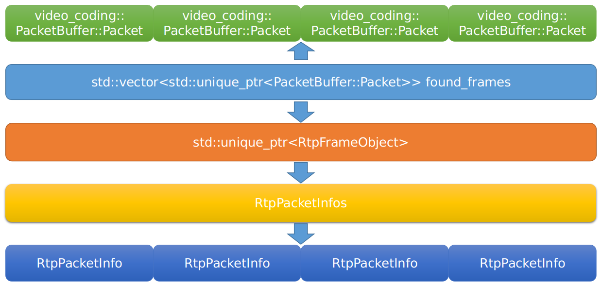

  * `FindFrames`函数最终返回的是一个`video_coding::PacketBuffer::InsertResult`数据结构，而该结构中包含了`std::vector<std::unique_ptr<PacketBuffer::Packet>>`容器，由上图可知，在组包的过程中最终会将已经准备好的包集合打包成`RtpFrameObject`。
  * 最终一帧编码视频数据用`RtpFrameObject`来描述，对应一个`RtpPacketInfos`，其中每个`RtpPacketInfos`对应多个RtpPacketInfo结构，数量对应Packet的数量。
  * 其中`Packet`中就有`RtpPacketInfo`成员变量packet_info，在创建`Packet`的时候对其进行了初始化，`RtpPacketInfo`模块初始化的时候保存了当前包的rtp头部和该包的接收时间。
    
```cpp
void RtpVideoStreamReceiver2::OnInsertedPacket(
    video_coding::PacketBuffer::InsertResult result) {
  RTC_DCHECK_RUN_ON(&worker_task_checker_);
  video_coding::PacketBuffer::Packet* first_packet = nullptr;
  int max_nack_count;
  int64_t min_recv_time;
  int64_t max_recv_time;
  std::vector<rtc::ArrayView<const uint8_t>> payloads;
  RtpPacketInfos::vector_type packet_infos;
  bool frame_boundary = true;
  for (auto& packet : result.packets) {
    // PacketBuffer promisses frame boundaries are correctly set on each
    // packet. Document that assumption with the DCHECKs.
      .... 
    payloads.emplace_back(packet->video_payload);
    packet_infos.push_back(packet->packet_info);
    frame_boundary = packet->is_last_packet_in_frame();
    //遍历到最后一个包后将各个包打包成video_coding::RtpFrameObject结构  
    if (packet->is_last_packet_in_frame()) {
      auto depacketizer_it = payload_type_map_.find(first_packet->payload_type);
      RTC_CHECK(depacketizer_it != payload_type_map_.end());
      rtc::scoped_refptr<EncodedImageBuffer> bitstream =
          depacketizer_it->second->AssembleFrame(payloads);
      if (!bitstream) {
        // Failed to assemble a frame. Discard and continue.
        continue;
      }
      const video_coding::PacketBuffer::Packet& last_packet = *packet;
      OnAssembledFrame(std::make_unique<video_coding::RtpFrameObject>(
          first_packet->seq_num,                    //
          last_packet.seq_num,                      //
          last_packet.marker_bit,                   //
          max_nack_count,                           //
          min_recv_time,                            //
          max_recv_time,                            //
          first_packet->timestamp,                  //
          first_packet->ntp_time_ms,                //
          last_packet.video_header.video_timing,    //
          first_packet->payload_type,               //
          first_packet->codec(),                    //
          last_packet.video_header.rotation,        //
          last_packet.video_header.content_type,    //
          first_packet->video_header,               //
          last_packet.video_header.color_space,     //
          RtpPacketInfos(std::move(packet_infos)),  //
          std::move(bitstream)));
    }
  }
  RTC_DCHECK(frame_boundary);
  if (result.buffer_cleared) {
    RequestKeyFrame();
  }
}
```

  * 首先依据各个数据包构建video_coding::RtpFrameObject。

  * 其次调用`OnAssembledFrame`对组好的聚合包进行投递。

  * 如果在插包的时候清除了`PacketBuffer`，则需要发送关键帧请求。

  * `RtpFrameObject`的派生关系如下：  

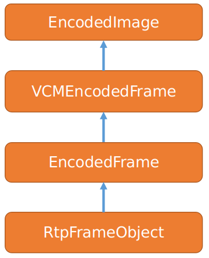

  * 从`RtpFrameObject`的派生关系来看`RtpFrameObject`对应的就是对应编码后的一帧数据。

  * `RtpFrameObject`构造函数这里不做详细分析，其内部包含了`RTPVideoHeader`，播放延迟、first_seq、last_seq等信息。

  * 最终调用`OnAssembledFrame`对当前已组好的聚合帧进行参考帧查找，并对其进行设置。

## 9) 总结

  * 本文着重分析组帧原理，在有这些信息的基础上为后续分析视频帧的解码分析奠定基础。
  * 同时根据本文的分析，我们可以得出，在组帧过程中如果发现当前被组帧的包的前面有丢包存在并且该帧为非关键帧，则会直接返回，等待前面已丢包的信息恢复，这样的话话出现延迟的问题
  * 那么如何优化呢，结合前面文章的分析我们可以在NACK模块中适当的调节其Process模块检测丢失的包延迟了多长时间，如果超过阀值还未收到该包，应该立即清除该丢失的包，然后发送关键帧请求来降低延迟，同时结合上述分析的逻辑，如果出现该种情况，当收到关键帧的时候，然后组包如果发现有一帧关键帧组包完成则会立马将该关键帧送到解码模块进行解码。
  * 留下一个问题，每组完一帧然后就会发送给到解码器进行解码吗？
