 
<!--BEGIN_DATA
{
    "create_date": "2021-07-16 14:00", 
    "modify_date": "2021-07-16 14:00", 
    "is_top": "0", 
    "summary": "WebRTC Video Receiver(五)-设置参考帧<br/>WebRTC Video Receiver(六)-FrameBuffer原理<br/>WebRTC Video Receiver(七)-基于Kalman filter模型的平滑渲染时间估计<br/>WebRTC Video Receiver(八)-基于Kalman filter模型的JitterDelay原理分析", 
    "tags": "WebRTC", 
    "file_name": "WebRTC Video Receiver 02.md"
}
END_DATA-->

#### <p>原文出处：<a href='https://www.jianshu.com/p/219306276769' target='blank'>WebRTC Video Receiver(五)-设置参考帧</a></p>

## 1）前言

* 经过前面4篇文章的分析，针对WebRtc视频接收模块从创建接收模块、到对RTP流接收处理、关键帧请求的时机、丢包判断以及丢包重传、frame组帧等已经有了一定的概念和认识。
* 基于以上本文分析rtp包组包后聚合帧发送给解码器前的处理流程，在将一帧完整的帧发送给解码模块之前需要进行一定的预处理,如需要查找参考帧，本文着重分析解码前的参考帧查找原理。
* 承接上文的分析，rtp包组包成功后会将一帧完整的数据帧投递到`RtpVideoStreamReceiver2`模块由其`OnAssembledFrame`函数来进行接收处理。
* 其实现如下：
    
```cpp
void RtpVideoStreamReceiver2::OnAssembledFrame(
    std::unique_ptr<video_coding::RtpFrameObject> frame) {
  RTC_DCHECK_RUN_ON(&worker_task_checker_);
  RTC_DCHECK(frame);
  .....
  //该模块默认未开启，新特性值得研究，顾名思义为丢包通知控制模块    
  // 可通过WebRTC-RtcpLossNotification/Enable开启，但是默认只支持VP8
  // SDP需要实现goog-lntf feedback    
  if (loss_notification_controller_ && descriptor) {
    loss_notification_controller_->OnAssembledFrame(
        frame->first_seq_num(), descriptor->frame_id,
        absl::c_linear_search(descriptor->decode_target_indications,
                              DecodeTargetIndication::kDiscardable),
        descriptor->dependencies);
  }         
  // If frames arrive before a key frame, they would not be decodable.
  // In that case, request a key frame ASAP.
  if (!has_received_frame_) {
    if (frame->FrameType() != VideoFrameType::kVideoFrameKey) {
      // |loss_notification_controller_|, if present, would have already
      // requested a key frame when the first packet for the non-key frame
      // had arrived, so no need to replicate the request.
      if (!loss_notification_controller_) {
        RequestKeyFrame();
      }
    }
    has_received_frame_ = true;
  }
  // Reset |reference_finder_| if |frame| is new and the codec have changed.
  if (current_codec_) {
    //每帧之间的时间戳不一样，当前帧的时间戳大于前一帧的时间戳(未环绕的情况下)  
    bool frame_is_newer =
        AheadOf(frame->Timestamp(), last_assembled_frame_rtp_timestamp_);
    if (frame->codec_type() != current_codec_) {
      if (frame_is_newer) {
        // When we reset the |reference_finder_| we don't want new picture ids
        // to overlap with old picture ids. To ensure that doesn't happen we
        // start from the |last_completed_picture_id_| and add an offset in case
        // of reordering.
        reference_finder_ =
            std::make_unique<video_coding::RtpFrameReferenceFinder>(
                this, last_completed_picture_id_ +
                          std::numeric_limits<uint16_t>::max());
        current_codec_ = frame->codec_type();
      } else {
        // Old frame from before the codec switch, discard it.
        return;
      }
    }
    if (frame_is_newer) {
      last_assembled_frame_rtp_timestamp_ = frame->Timestamp();
    }
  } else {
    current_codec_ = frame->codec_type();
    last_assembled_frame_rtp_timestamp_ = frame->Timestamp();
  }
  if (buffered_frame_decryptor_ != nullptr) {
    buffered_frame_decryptor_->ManageEncryptedFrame(std::move(frame));
  } else if (frame_transformer_delegate_) {
    frame_transformer_delegate_->TransformFrame(std::move(frame));
  } else {
    reference_finder_->ManageFrame(std::move(frame));
  }
}
```    

  * 首先该函数第一次接收到一帧数据的时候，需要判断是否是在关键帧之前收到，如果在未收到关键帧之前收到的话是不能解码的，所以此时需要发送`关键帧请求`使用`RequestKeyFrame()`函数发送关键帧请求。
  * 其次、根据不同帧之间的时间戳不一样的原则，判断是否为新的一帧，首次接收到一帧之后会实例化`reference_finder_`成员，后续对参考帧的查找处理在未加密的情况下，都基于该实例完成。
  * 如果为新的一帧，每帧数据查找参考帧后都会更新`last_assembled_frame_rtp_timestamp_`。
  * 最后调用根据是否加密选择`reference_finder_`或者`buffered_frame_decryptor_`对视频帧调用`ManageFrame`或者`ManageEncryptedFrame`函数进行参考帧查找处理。
  * 本文的核心就是分析`ManageFrame`函数。

## 2）ManageFrame工作流程

  * 在分析该函数之前先了解`RtpFrameReferenceFinder`，`RtpVideoStreamReceiver2`，`OnCompleteFrameCallback`之间的关系。  

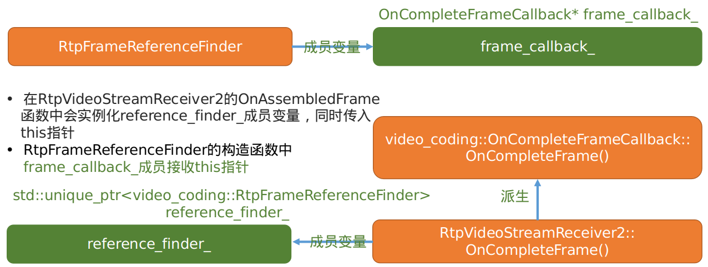

  * 根据上图的关系图，在`RtpFrameReferenceFinder`模块中对`video_coding::RtpFrameObject`数据帧进行处理，如果处理成功最终会生成`video_coding::EncodedFrame`视频帧，接着回调`OnCompleteFrameCallback`的`OnCompleteFrame`函数将视频帧返回到`RtpVideoStreamReceiver2`模块。

  * `ManageFrame()`函数的代码如下：
    
```cpp
void RtpFrameReferenceFinder::ManageFrame(
    std::unique_ptr<RtpFrameObject> frame) {
  // If we have cleared past this frame, drop it.
  if (cleared_to_seq_num_ != -1 &&
      AheadOf<uint16_t>(cleared_to_seq_num_, frame->first_seq_num())) {
    return;
  }
  FrameDecision decision = ManageFrameInternal(frame.get());
  switch (decision) {
    case kStash:
      if (stashed_frames_.size() > kMaxStashedFrames)
        stashed_frames_.pop_back();
      stashed_frames_.push_front(std::move(frame));
      break;
    case kHandOff:
      HandOffFrame(std::move(frame));
      RetryStashedFrames();
      break;
    case kDrop:
      break;
  }
}
```

  * `cleared_to_seq_num_`变量记录的是已经清除的seq,比如说如果一帧数据已经发送到解码模块，或解码完成，那么需要将对应的seq进行清除，在这里的作用就是判断当前待解码的数据帧的首个包的seq和`cleared_to_seq_num_`大小进行比较，在未环绕的情况下，如果`cleared_to_seq_num_`大于`frame->first_seq_num()`则说明该帧数据之前的帧已经解码了，此帧应该放弃解码，所以直接返回。
  * `cleared_to_seq_num_`变量的更新通过调用`ClearTo(uint16_t seq_num)`函数来更新，调用流程后续会分析到。
  * 调用`ManageFrameInternal`函数对当前帧进行决策处理，结果返回三种，`kStash`表示当前帧解码时机未到需要存储、`kHandOff`可以解码、`kDrop`表示放弃该帧。
  * 对于可以解码的决策直接调用`HandOffFrame`函数进行后处理，而`kStash`的决策使用`stashed_frames_`容器将当前帧插入到容器头部，该容器的最大容量为100。
  * `ManageFrameInternal`函数的实现如下：
    
```cpp 
RtpFrameReferenceFinder::FrameDecision
RtpFrameReferenceFinder::ManageFrameInternal(RtpFrameObject* frame) {
  ........
  switch (frame->codec_type()) {
    case kVideoCodecVP8:
      return ManageFrameVp8(frame);
    case kVideoCodecVP9:
      return ManageFrameVp9(frame);
    case kVideoCodecGeneric:
      if (auto* generic_header = absl::get_if<RTPVideoHeaderLegacyGeneric>(
              &frame->GetRtpVideoHeader().video_type_header)) {
        return ManageFramePidOrSeqNum(frame, generic_header->picture_id);
      }
      ABSL_FALLTHROUGH_INTENDED;
    default:
      return ManageFramePidOrSeqNum(frame, kNoPictureId);
  }
}
```

  * 该函数根据当前帧数据的codec类型使用不同的实现来对当前帧进行决策，本文以H264为例进行分析讨论。
  * `ManageFrameH264`函数分成两部分，一部分可以理解成对方是使用硬编编码出来的数据，此时tid=0xff,这种情况把任务交给了`ManageFramePidOrSeqNum`函数。
  * 另一种情况针对openh264软编的数据此时tid不为0xff。
  * 首先对tid=0xff的情况进行分析。
  * 如果要支持H265的话需要在这里新增对H265视频帧的决策处理函数。

## 3）ManageFramePidOrSeqNum设置参考帧

```cpp    
RtpFrameReferenceFinder::FrameDecision RtpFrameReferenceFinder::ManageFrameH264(
    RtpFrameObject* frame) {
  const FrameMarking& rtp_frame_marking = frame->GetFrameMarking();
  uint8_t tid = rtp_frame_marking.temporal_id;
  bool blSync = rtp_frame_marking.base_layer_sync;
  /*android 硬编的情况收到的tid位0xff,传入的kNoPictureId=-1，这是h264的特性*/ 
  if (tid == kNoTemporalIdx)
    return ManageFramePidOrSeqNum(std::move(frame), kNoPictureId);
  ....  
}
```

  * 根据tid=0xff,直接调用ManageFramePidOrSeqNum对当前帧进行参考帧查找处理。

  * 在分析`ManageFramePidOrSeqNum()`函数之前首先介绍编码数据gop的概念。  

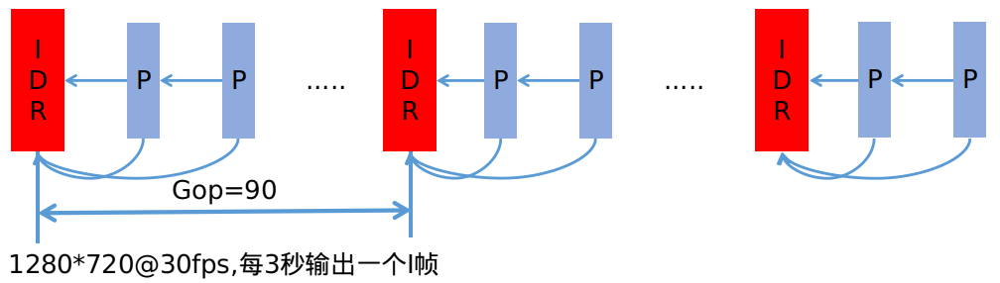

  * 以上以h264为例,在H264数据中idr帧可以单独解码，而P帧需要前向参考，在一个GOP内的帧都需要前向参考帧才能顺利解码。

  * `RtpFrameReferenceFinder`通过`last_seq_num_gop_`容器来维护最近的GOP表，收到P帧后，`RtpFrameReferenceFinder`需要找到P帧所属的GOP，将P帧的参考帧设置为GOP内该帧的上一帧，之后传递给`FrameBuffer`模块。  


  * 该容器是以当前待解码的帧所属的`gop`（由于`IDR`关键帧是`gop`的开始）关键帧的最后一个包的seq位key,以当前帧最后一个包的seq组成的std::pair<seq,seq>为value的容器（当前帧也有可能是padding包。

  * 下面开始分析`ManageFramePidOrSeqNum()`函数原理如下
    
```cpp
RtpFrameReferenceFinder::FrameDecision
RtpFrameReferenceFinder::ManageFramePidOrSeqNum(RtpFrameObject* frame,
                                                int picture_id) {
  // If |picture_id| is specified then we use that to set the frame references,
  // otherwise we use sequence number.
  // 1）确保非h264帧gop内维护的帧的连续性  
  if (picture_id != kNoPictureId) {
    frame->id.picture_id = unwrapper_.Unwrap(picture_id);
    frame->num_references =
        frame->frame_type() == VideoFrameType::kVideoFrameKey ? 0 : 1;
    frame->references[0] = frame->id.picture_id - 1;
    return kHandOff;
  }
  //2）判断是否为关键帧,其中frame_type在组帧的时候进行设置的
  if (frame->frame_type() == VideoFrameType::kVideoFrameKey) {
    last_seq_num_gop_.insert(std::make_pair(
        frame->last_seq_num(),//当前gop最后一个包的seq为key
        std::make_pair(frame->last_seq_num(), frame->last_seq_num())));
  }
  //3）如果到此为止还没有收到一帧关键帧，则存储该帧
  // We have received a frame but not yet a keyframe, stash this frame.
  if (last_seq_num_gop_.empty()) 
    return kStash;
  // Clean up info for old keyframes but make sure to keep info
  // for the last keyframe.
  // 4）清除老的gop frame->last_seq_num() - 100之前的所有都清除掉，但至少确保有一个。
  auto clean_to = last_seq_num_gop_.lower_bound(frame->last_seq_num() - 100);
  for (auto it = last_seq_num_gop_.begin();
        it != clean_to && last_seq_num_gop_.size() > 1;) {
    it = last_seq_num_gop_.erase(it);
  }
  // Find the last sequence number of the last frame for the keyframe
  // that this frame indirectly references.
  // 函数能走到这一步，gop 容器中是一定有存值的  
  //5.1) 如果关键帧的序号是大于该帧的序号的（未环绕的情况），那么该帧需要丢弃掉。  
  // 假设last_seq_num_gop_中存的是34号包，而本次来的帧的序号是10~16（非关键帧）。
  //5.2) 还有一种情况假设当前帧就是关键帧frame->last_seq_num()=34，假设事先last_seq_num_gop_存的是56号seq,由last_seq_num_gop_定义的排序规则，34号包被插入的时候会在头部，最终下面的条件依然成立。  
  auto seq_num_it = last_seq_num_gop_.upper_bound(frame->last_seq_num());
  if (seq_num_it == last_seq_num_gop_.begin()) {
    RTC_LOG(LS_WARNING) << "Generic frame with packet range ["
                        << frame->first_seq_num() << ", "
                        << frame->last_seq_num()
                        << "] has no GoP, dropping frame.";
    return kDrop;
  }
  //如果上述条件不成立这里则返回last_seq_num_gop_最后一个元素对应的迭代器
  //如果当前帧为关键帧的话那么seq_num_it为last_seq_num_gop_.end(),进行--操作后旧对应了最后一个关键帧  
  seq_num_it--;
  // Make sure the packet sequence numbers are continuous, otherwise stash
  // this frame.
  // 6) 该步用来判断该帧和上一帧的连续性 
  // last_picture_id_gop得到的是当前gop所维护的当前帧的上一帧（前向参考帧）的最后一个包的seq。  
  uint16_t last_picture_id_gop = seq_num_it->second.first;
  // last_picture_id_with_padding_gop得到的也是上一帧的最后一个包的seq。
  // 当前GOP的最新包的序列号，可能是last_picture_id_gop, 也可能是填充包.  
  uint16_t last_picture_id_with_padding_gop = seq_num_it->second.second;
  // 非关键帧判断seq连续性，  
  if (frame->frame_type() == VideoFrameType::kVideoFrameDelta) {
    //得到上一帧最后一个包的seq,当前帧的第一个包的seq -1 得到上一帧的最后一个seq  
    uint16_t prev_seq_num = frame->first_seq_num() - 1;
    // 如果不相等说明不连续，如果正常未丢包的情况下是一定会相等的。  
    if (prev_seq_num != last_picture_id_with_padding_gop)
      return kStash;
  }
  //检查当前帧最后一个seq是否大于所属gop 关键帧的最后一个seq
  RTC_DCHECK(AheadOrAt(frame->last_seq_num(), seq_num_it->first));
  // Since keyframes can cause reordering we can't simply assign the
  // picture id according to some incrementing counter.
  //7) 给RtpFrameObject的id.picture_id赋值
  // 如果为关键帧num_references为false,否则为true  
  frame->id.picture_id = frame->last_seq_num();
  frame->num_references =
      frame->frame_type() == VideoFrameType::kVideoFrameDelta;
  //上一帧最后一个包号  
  frame->references[0] = rtp_seq_num_unwrapper_.Unwrap(last_picture_id_gop);
  //这一步确保第6步的逻辑能跑通，否则第6不逻辑是跑不通的last_picture_id_表示的是当前帧的上一个关键帧的最后一个包的seq,frame->id.picture_id为当前帧的最后一个包的seq，正常情况AheadOf函数是会返回true的。  
  if (AheadOf<uint16_t>(frame->id.picture_id, last_picture_id_gop)) {
    //这里修改了容器last_seq_num_gop_对应关键帧的second变量，将当前帧最后一个包号的seq 赋值给他们 
    //正因为有这个操作，第6步才能顺利跑通  
    seq_num_it->second.first = frame->id.picture_id;
    seq_num_it->second.second = frame->id.picture_id;
  }
  last_picture_id_ = frame->id.picture_id;
  //更新填充包状态  
  UpdateLastPictureIdWithPadding(frame->id.picture_id);
  frame->id.picture_id = rtp_seq_num_unwrapper_.Unwrap(frame->id.picture_id);
  return kHandOff;
}
```   

  * 1）确保`gop`内帧的连续性,对于google vpx系列的编码数据，只需要判断picture_id是否连续即可，`num_references`表示参考帧数目，对于IDR关键帧可以单独解码，不需要参考帧，所以`num_references`为0，若`gop`内任一帧丢失则该`gop`内的剩余时间都将处于卡顿状态。
  * 2）判断当前帧是否是关键帧，如果是则直接将其该关键帧的最后一个包的seq 生成相应的键值对插入到`gop`容器`last_seq_num_gop_`，关键帧是`gop`的开始。
  * 3）如果`last_seq_num_gop_`为空表示到此目前为止没收到关键帧，同时当前帧又不是关键帧所以没有参考帧，不能解码，需要缓存该帧。为什么不是直接丢弃？
  * 4）将`last_seq_num_gop_`容器维护的太旧的关键帧清除掉，规则是当前帧最后一个包seq即`[frame->last_seq_num() - 100]`之前的关键帧都清理掉，但是至少保留一个（假设规则之前一共就维护了一个gop那么不清除）。
  * 5）以当前帧的最后一个包的seq使用`last_seq_num_gop_.upper_bound(frame->last_seq_num())`查询，该查询返回`last_seq_num_gop_`容器中第一个大于`frame->last_seq_num()`的位置，假设查出的位置就是`last_seq_num_gop_`的首部，则丢弃该帧,为什么呢？来举个例子，假设`last_seq_num_gop_`此时存在的seq为34而此时传入的包的seq->first_seq_num() = 10，seq->last_seq_num() =16，而且当前传入的帧为非关键帧，这说明什么意思呢？在传输的过程中可能由于10～16号包这一帧数据中有几个包丢了，而又由于丢包重传发送了PLI请求，也或者是对端主动发送了关键帧，该关键帧的的最后一个包的序号恰好是34，在上文的分析中提到了组包流程，如果组包过程中出现了关键帧，它是不管该关键帧前面的帧的死活的，直接会将该关键帧投递到`RtpVideoStreamReceiver2`进行处理，而当该关键帧处理之后10~16号包之间被丢失的包又被恢复了，同理会传递到该函数进行处理，此时上述的假设条件就成立了，那么对于这种情况下，该帧应该丢弃掉，因为他后面的关键帧已经被处理了。
  * 6）根据`last_seq_num_gop_`来判断当前帧和上一帧的连续性，如果不连续(说明没有前向参考帧，不能进行解码)则返回`kStash`，进行缓存操作。
  * 7）设置`picture_id`，对于H264数据用一帧的最后一个seq来作为`picture_id`，设置当前帧的参考帧数目，对于关键帧不需要参考帧所以为0，对于P帧，参考帧数目为1（前向参考）。
  * 更新`gop`容器`last_seq_num_gop_`的value值，它也是一个`std::pair<seq,seq>`，这两个值被设置成当前帧的最后一个包的seq，同时也更新`RtpFrameObject`的id成员，最后返回`kHandOff`。
  * 此处`RtpFrameObject`父类有3个重要的成员变量id、num_references、references[0]被赋值，其中num_references表示的意思应该为当前帧的和上一帧是参考关系，h264的前向参考。  

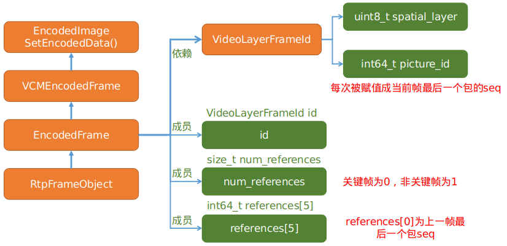

  * 该函数的决策主要是通过判断seq的连续性(是否有参考帧)或者是否是关键帧，来决定当前帧是否要发到解码模块，或者是进行存储，当出现丢帧现象的时候,需要缓存当前帧然后等待丢失的帧重传。
  * 到此为止，`gop`容器`last_seq_num_gop_`的数据成员如下：  

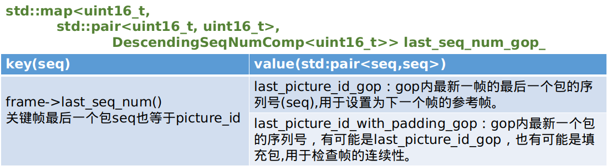

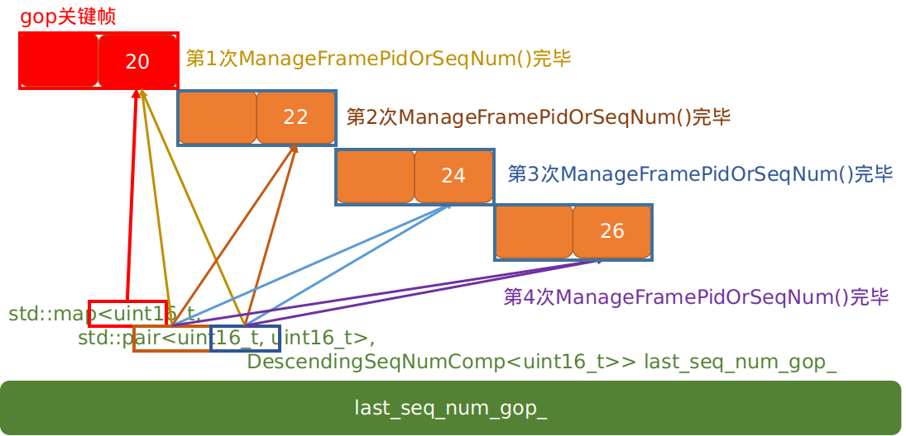

## 4) UpdateLastPictureIdWithPadding更新填充包状态

```cpp    
void RtpFrameReferenceFinder::UpdateLastPictureIdWithPadding(uint16_t seq_num) {
  //取第一个大于seq_num的对应的gop   
  auto gop_seq_num_it = last_seq_num_gop_.upper_bound(seq_num);
  // If this padding packet "belongs" to a group of pictures that we don't track
  // anymore, do nothing.
  if (gop_seq_num_it == last_seq_num_gop_.begin())
    return;
  --gop_seq_num_it;
  // Calculate the next contiuous sequence number and search for it in
  // the padding packets we have stashed.
  uint16_t next_seq_num_with_padding = gop_seq_num_it->second.second + 1;
  auto padding_seq_num_it =
      stashed_padding_.lower_bound(next_seq_num_with_padding);
  // While there still are padding packets and those padding packets are
  // continuous, then advance the "last-picture-id-with-padding" and remove
  // the stashed padding packet.
  while (padding_seq_num_it != stashed_padding_.end() &&
          *padding_seq_num_it == next_seq_num_with_padding) {
    gop_seq_num_it->second.second = next_seq_num_with_padding;
    ++next_seq_num_with_padding;
    padding_seq_num_it = stashed_padding_.erase(padding_seq_num_it);
  }
  // In the case where the stream has been continuous without any new keyframes
  // for a while there is a risk that new frames will appear to be older than
  // the keyframe they belong to due to wrapping sequence number. In order
  // to prevent this we advance the picture id of the keyframe every so often.
  if (ForwardDiff(gop_seq_num_it->first, seq_num) > 10000) {
    auto save = gop_seq_num_it->second;
    last_seq_num_gop_.clear();
    last_seq_num_gop_[seq_num] = save;
  }
}
```

## 5) ManageFrame函数业务处理

```cpp    
void RtpFrameReferenceFinder::ManageFrame(
    std::unique_ptr<RtpFrameObject> frame) {
  .....
  FrameDecision decision = ManageFrameInternal(frame.get());
  switch (decision) {
    case kStash:
      if (stashed_frames_.size() > kMaxStashedFrames)//最大100
        stashed_frames_.pop_back();
      stashed_frames_.push_front(std::move(frame));
      break;
    case kHandOff:
      HandOffFrame(std::move(frame));
      RetryStashedFrames();
      break;
    case kDrop:
      break;
  }
}
```

  * 在2.1中分析了ManageFrameInternal的原理，该函数会返回三种不同的决策。
  * 当返回`kStash`的时候会将当前待解码的帧插入到`stashed_frames_`容器,等待合适的时机获取，如果容器满了先将末尾的清除掉，然后从头部插入，同时根据上面的分析我们可以得知，出现这种情况是要等待前面的帧完整。所以在`kHandOff`的情况下先处理当前帧然后再通过RetryStashedFrames获取`stashed_frames_`中存储的帧进行解码。
  * 当返回`kHandOff`的时候调用HandOffFrame函数进行再处理。
  * 当返回`kDrop`的时候直接丢弃该帧数据。
  * `stashed_frames_`为一个`std::deque<std::unique_ptr<RtpFrameObject>>`队列。
    
```cpp 
void RtpFrameReferenceFinder::HandOffFrame(
    std::unique_ptr<RtpFrameObject> frame) {
  //picture_id_offset_为0  
  frame->id.picture_id += picture_id_offset_;
  for (size_t i = 0; i < frame->num_references; ++i) {
    frame->references[i] += picture_id_offset_;
  }
  frame_callback_->OnCompleteFrame(std::move(frame));
}
```

  * 调用OnCompleteFrame将RtpFrameObject传递到`RtpVideoStreamReceiver`模块当中。
    
```cpp 
void RtpFrameReferenceFinder::RetryStashedFrames() {
  bool complete_frame = false;
  do {
    complete_frame = false;
    for (auto frame_it = stashed_frames_.begin();
          frame_it != stashed_frames_.end();) {
      FrameDecision decision = ManageFrameInternal(frame_it->get());
      switch (decision) {
        case kStash:
          ++frame_it;
          break;
        case kHandOff:
          complete_frame = true;
          HandOffFrame(std::move(*frame_it));
          RTC_FALLTHROUGH();
        case kDrop:
          frame_it = stashed_frames_.erase(frame_it);
      }
    }
  } while (complete_frame);
}
```

  * 对`stashed_frames_`容器进行遍历，重新调用`ManageFrameInternal`进行决策，最后如果决策可解码的话回调`HandOffFrame`进行处理。
  * 如果决策结果为`kDrop`直接释放。

## 6）总结

  * `RtpFrameReferenceFinder`模块的核心作用就是决策当前帧是否要进入到解码模块。
  * 决策的依据依然是根据seq的连续性，以及是否有关键帧等性质。
  * 在决策为`kHandOff`的情况下会通过其成员变量`frame_callback_`将数据重新传递到`RtpVideoStreamReceiver`模块的`OnCompleteFrame`函数。
  * 接下来的处理就是解码前的操作了如将数据放到`jitterbuffer`模块等。

<hr>

#### <p>原文出处：<a href='https://www.jianshu.com/p/854196fec61c' target='blank'>WebRTC Video Receiver(六)-FrameBuffer原理</a></p>

## 1）前言

* 经过前面5篇文章的分析，针对WebRtc视频接收模块从创建接收模块、到对RTP流接收处理、关键帧请求的时机、丢包判断以及丢包重传、frame组帧、组帧后的决策工作（是要发送到解码模块还是继续等待？）等已经有了一定的概念和认识。
* 本文着重分析组帧后并且进行决策后的分析，根据上文的分析，每帧数据经过决策后，如果条件满足，则会回调`RtpFrameReferenceFinder`模块对每帧数据进行设置参考帧，之后通过HandOffFrame函数将一帧数据发送到`RtpVideoStreamReceiver2`模块进行处理。
  
```cpp
void RtpFrameReferenceFinder::HandOffFrame(
    std::unique_ptr<RtpFrameObject> frame) {
  //picture_id_offset_为0  
  frame->id.picture_id += picture_id_offset_;
  for (size_t i = 0; i < frame->num_references; ++i) {
    frame->references[i] += picture_id_offset_;
  }
  frame_callback_->OnCompleteFrame(std::move(frame));
}
```

  * 由`RtpFrameReferenceFinder`模块和`RtpVideoStreamReceiver2`模块的派生关系如下图：  

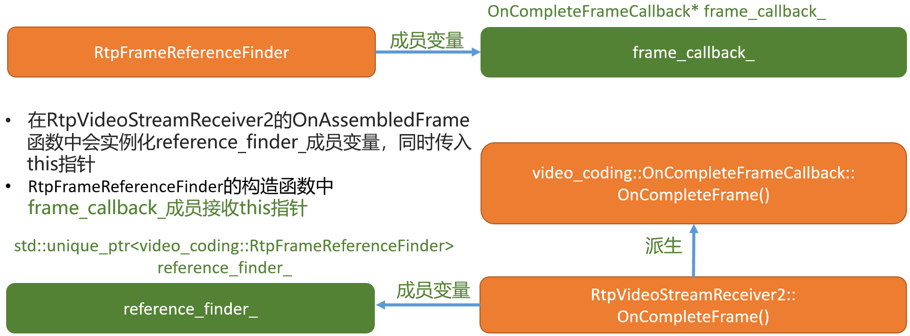

  * 由上图`RtpVideoStreamReceiver2`的派生关系可知，最终会将`RtpFrameObject`编码帧送到`RtpVideoStreamReceiver2`模块的OnCompleteFrame函数进行处理。
    
```cpp
void RtpVideoStreamReceiver2::OnCompleteFrame(
    std::unique_ptr<video_coding::EncodedFrame> frame) {
  RTC_DCHECK_RUN_ON(&worker_task_checker_);
  video_coding::RtpFrameObject* rtp_frame =
      static_cast<video_coding::RtpFrameObject*>(frame.get());
  //由上文可知，picture_id指向当前帧的最后一个包的seq number  
  last_seq_num_for_pic_id_[rtp_frame->id.picture_id] =
      rtp_frame->last_seq_num();
  last_completed_picture_id_ =
      std::max(last_completed_picture_id_, frame->id.picture_id);
  complete_frame_callback_->OnCompleteFrame(std::move(frame));
}
```

  * 经该函数最终将数据由送到`complete_frame_callback_`进行处理，`complete_frame_callback_`由谁实现？请看下图：  

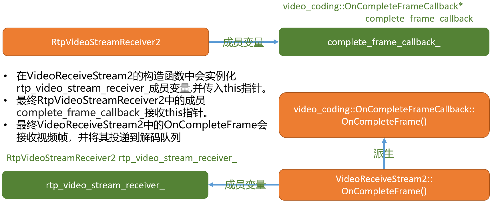

  * 由上图可知最终`video_coding::RtpFrameObject`送给了`VideoReceiveStream2`模块由该模块的OnCompleteFrame进行处理。
    
```cpp
void VideoReceiveStream2::OnCompleteFrame(
    std::unique_ptr<video_coding::EncodedFrame> frame) {
  RTC_DCHECK_RUN_ON(&worker_sequence_checker_);
  // TODO(https://bugs.webrtc.org/9974): Consider removing this workaround.
  /*如果两次插入的视频帧的时间超过10分钟则清除该帧*/  
  int64_t time_now_ms = clock_->TimeInMilliseconds();
  if (last_complete_frame_time_ms_ > 0 &&//10 minutes.
      time_now_ms - last_complete_frame_time_ms_ > kInactiveStreamThresholdMs) {
    frame_buffer_->Clear();
  }
  last_complete_frame_time_ms_ = time_now_ms;
  //获取rtp头部的播放延迟，默认值为{-1,-1},该值得作用为啥？ 
  const PlayoutDelay& playout_delay = frame->EncodedImage().playout_delay_;
  if (playout_delay.min_ms >= 0) {
    frame_minimum_playout_delay_ms_ = playout_delay.min_ms;
    UpdatePlayoutDelays();
  }
  if (playout_delay.max_ms >= 0) {
    frame_maximum_playout_delay_ms_ = playout_delay.max_ms;
    UpdatePlayoutDelays();
  }
  int64_t last_continuous_pid = frame_buffer_->InsertFrame(std::move(frame));
  if (last_continuous_pid != -1)
    rtp_video_stream_receiver_.FrameContinuous(last_continuous_pid);
}
```

  * 最终在`VideoReceiveStream2`模块的OnCompleteFrame函数中将编码帧通过调用`frame_buffer_->InsertFrame(std::move(frame))`将其插入到`video_coding::FrameBuffer`模块。
  * `frame_buffer_`为`VideoReceiveStream2`模块的成员变量，在`VideoReceiveStream2`模块的构造函数中对其进行实例化。
  * 通过调用`UpdatePlayoutDelays`函数来将播放最大和最小延迟作用到`VCMTiming`，该值和`Jitter buffer`配合起来会得到一个合理的播放延迟时间。
  * 如果插入成功则会返回上一帧数据的`picture_id`，最终通过回调`rtp_video_stream_receiver_.FrameContinuous(last_continuous_pid)`将该id作用到`NACK Module`清除重传列表。（清除范围为该picture_id之前的seq 都被清除掉）。
  * 结合上文的分析，从决策到此步骤的大致导致流程如下：

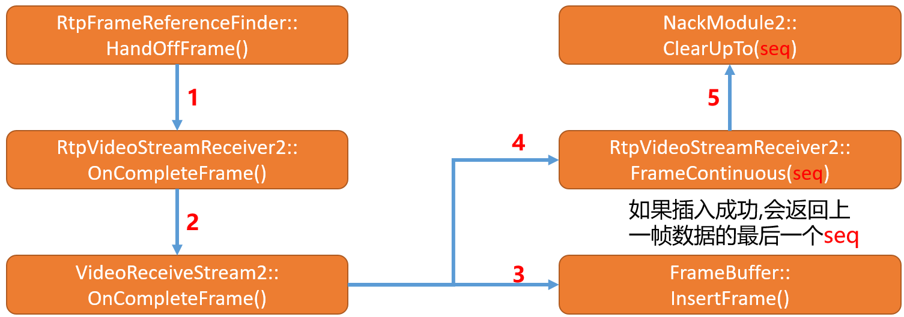

  * 本文的重点是分析`FrameBuffer`的工作原理。

## 2）InsertFrame插入原理

```cpp    
int64_t FrameBuffer::InsertFrame(std::unique_ptr<EncodedFrame> frame) {
  TRACE_EVENT0("webrtc", "FrameBuffer::InsertFrame");
  RTC_DCHECK(frame);
  rtc::CritScope lock(&crit_);
  const VideoLayerFrameId& id = frame->id;
  //得到上一个连续帧的pid  
  int64_t last_continuous_picture_id =
      !last_continuous_frame_ ? -1 : last_continuous_frame_->picture_id;
  //1) 和前向参考帧进行对比，如前向参考帧的seq和当前帧的seq进行比较。
  if (!ValidReferences(*frame)) {
    RTC_LOG(LS_WARNING) << "Frame with (picture_id:spatial_id) ("
                        << id.picture_id << ":"
                        << static_cast<int>(id.spatial_layer)
                        << ") has invalid frame references, dropping frame.";
    //正常情况下前向参考帧的seq比当前的seq肯定是要小的，这里如果发现该帧的seq 比前向参考帧的seq 还小的话直接丢弃。  
    return last_continuous_picture_id;
  }
  //最大800个frame,如果容器已经满了直接丢弃当前帧，若
  if (frames_.size() >= kMaxFramesBuffered) {
    //如果是关键帧这里将decoded_frames_history_中的历史记录清空，后续介绍。
    //同时也清空FrameBuffer所维护的frames_容器，所有待解码的帧先缓存到该容器。  
    if (frame->is_keyframe()) {
      RTC_LOG(LS_WARNING) << "Inserting keyframe (picture_id:spatial_id) ("
                          << id.picture_id << ":"
                          << static_cast<int>(id.spatial_layer)
                          << ") but buffer is full, clearing"
                              " buffer and inserting the frame.";
      ClearFramesAndHistory();
    } else {
      RTC_LOG(LS_WARNING) << "Frame with (picture_id:spatial_id) ("
                          << id.picture_id << ":"
                          << static_cast<int>(id.spatial_layer)
                          << ") could not be inserted due to the frame "
                              "buffer being full, dropping frame.";
      // 非关键帧，如果缓存容器满了的话直接返回上一个连续帧的pid  
      return last_continuous_picture_id;
    }
  }
  //得到最进一个发送到解码队列中的帧的picture_id，对于h264而言是帧最后一个包序列号seq
  auto last_decoded_frame = decoded_frames_history_.GetLastDecodedFrameId();
  //得到最进一个发送到解码队列中的帧的时间戳，该时间戳每一帧是不同的
  auto last_decoded_frame_timestamp =
      decoded_frames_history_.GetLastDecodedFrameTimestamp();
  //如果当前帧的最后一个包的seq(或者picture_id) < 最近解码帧的picture_id，说明有可能是出现乱序，也有可能是序列号环绕所致  
  if (last_decoded_frame && id <= *last_decoded_frame) {
    //如果当前帧的时间戳比上一次已经发送到解码队列的帧的时间戳还要新，可能是编码器重置或者序列号环绕的情况发生，这种情况下如果当前帧是关键帧的话还是可以继续进行解码的。  
    if (AheadOf(frame->Timestamp(), *last_decoded_frame_timestamp) &&
        frame->is_keyframe()) {
      // If this frame has a newer timestamp but an earlier picture id then we
      // assume there has been a jump in the picture id due to some encoder
      // reconfiguration or some other reason. Even though this is not according
      // to spec we can still continue to decode from this frame if it is a
      // keyframe.
      RTC_LOG(LS_WARNING)
          << "A jump in picture id was detected, clearing buffer.";
      //先清空之前缓存的所有帧和历史记录,为啥呢？因为要么编码器已经重置。或者跳帧的现象发生。
      ClearFramesAndHistory();
      last_continuous_picture_id = -1;
    } else {
      // 如果是乱序发生，而且不是关键帧，则丢弃该帧数据。  
      RTC_LOG(LS_WARNING) << "Frame with (picture_id:spatial_id) ("
                          << id.picture_id << ":"
                          << static_cast<int>(id.spatial_layer)
                          << ") inserted after frame ("
                          << last_decoded_frame->picture_id << ":"
                          << static_cast<int>(last_decoded_frame->spatial_layer)
                          << ") was handed off for decoding, dropping frame.";
      return last_continuous_picture_id;
    }
  }
  // Test if inserting this frame would cause the order of the frames to become
  // ambiguous (covering more than half the interval of 2^16). This can happen
  // when the picture id make large jumps mid stream.
  // 如果跳帧较大，清除之前的缓存从该帧开始解码。  
  if (!frames_.empty() && id < frames_.begin()->first &&
      frames_.rbegin()->first < id) {
    RTC_LOG(LS_WARNING)
        << "A jump in picture id was detected, clearing buffer.";
    ClearFramesAndHistory();
    last_continuous_picture_id = -1;
  }
  auto info = frames_.emplace(id, FrameInfo()).first;
  //这表明原先frames_容器中已经有该id的key,本次为重复插入，直接返回上一个连续帧的ID。  
  if (info->second.frame) {
    return last_continuous_picture_id;
  }
  //更新帧信息，如设置帧还未连续的参考帧数量，并建立被参考帧与参考他的帧之间的参考关系，用于当被参考帧有效时，更新参考他的帧的参考帧数量(为0则连续)
  // 以及可解码状态,该函数会更新last_continuous_frame_
  if (!UpdateFrameInfoWithIncomingFrame(*frame, info))
    return last_continuous_picture_id;
    //如果当前帧没有重传包的话，可以用于计算时延，timing_用于计算很多时延指标以及帧的预期渲染时间.
  if (!frame->delayed_by_retransmission())
    timing_->IncomingTimestamp(frame->Timestamp(), frame->ReceivedTime());
  if (stats_callback_ && IsCompleteSuperFrame(*frame)) {
    stats_callback_->OnCompleteFrame(frame->is_keyframe(), frame->size(),
                                      frame->contentType());
  }
  //将当前帧记录到缓存
  info->second.frame = std::move(frame);
  // 如果该帧的未连续的参考帧数量为0，说明当前帧已经连续，如关键帧或者当前P帧参考的上个P帧已经收到，本段代码需要先分析
  // UpdateFrameInfoWithIncomingFrame函数
  if (info->second.num_missing_continuous == 0) {
    info->second.continuous = true;
    //连续性状态传播，后面会分析
    PropagateContinuity(info);//本次插入的时候该函数正常情况下都会正常返回，啥都不做
    last_continuous_picture_id = last_continuous_frame_->picture_id;
    // Since we now have new continuous frames there might be a better frame
    // to return from NextFrame.
    if (callback_queue_) {
      callback_queue_->PostTask([this] {
        rtc::CritScope lock(&crit_);
        if (!callback_task_.Running())
          return;
        RTC_CHECK(frame_handler_);
        callback_task_.Stop();
        //触发解码任务，寻找待解码的帧，并将其发送到解码任务队列，后续会分析  
        StartWaitForNextFrameOnQueue();
      });
    }
  }
  //最终这里返回的是当前帧的picture_id
  return last_continuous_picture_id;
}
```

  * 以上分析中涉及到几个重要的成员变量如下：

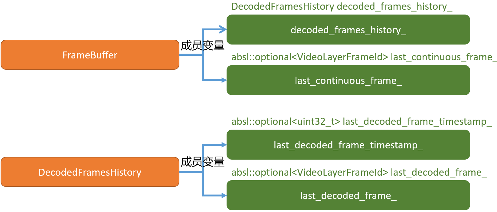

  * `DecodedFramesHistory`主要用于维护已解码的帧历史记录，`FrameBuffer`中维护一个成员变量`decoded_frames_history_`用于已经发送到解码队列的帧记录。
  * 成员变量`last_decoded_frame_`记录了上一次发送到解码队列的frame对应的id。
  * 成员变量`last_decoded_frame_timestamp_`记录上一次发送到解码队列的frame对应的时间戳。该时间戳是rtp时间戳，遵循同一帧数据的时间戳相同的原则。
  * `DecodedFramesHistory`提供两个方法用于获取上述两个成员变量，分别为`GetLastDecodedFrameId()`和`GetLastDecodedFrameTimestamp()`。
  * 这里为何要介绍它们？因为在`FrameBuffer::InsertFrame`函数的处理逻辑中首先会和它们进行比较，根据比较结果判断当前要插入的数据是否是合理的。

### 2.1）UpdateFrameInfoWithIncomingFrame更新参考帧信息

```cpp 
//参数info是表示当前帧在frame_容器中的位置对应的迭代器
bool FrameBuffer::UpdateFrameInfoWithIncomingFrame(const EncodedFrame& frame,
                                                    FrameMap::iterator info) {
  TRACE_EVENT0("webrtc", "FrameBuffer::UpdateFrameInfoWithIncomingFrame");
  const VideoLayerFrameId& id = frame.id;//VideoLayerFrameId
  auto last_decoded_frame = decoded_frames_history_.GetLastDecodedFrameId();
  RTC_DCHECK(!last_decoded_frame || *last_decoded_frame < info->first);
  struct Dependency {
    VideoLayerFrameId id;
    bool continuous;
  };
  //还未填充依赖  
  std::vector<Dependency> not_yet_fulfilled_dependencies;
  // Find all dependencies that have not yet been fulfilled.
  // 根据当前帧的参考帧数目进行遍历，该值在设置参考帧模块里面被设置，对于h264数据而言非关键帧的num_references=1 
  for (size_t i = 0; i < frame.num_references; ++i) {
    //构造零时参考帧id实例。  
    VideoLayerFrameId ref_key(frame.references[i], frame.id.spatial_layer);
    // Does |frame| depend on a frame earlier than the last decoded one?
    // 如果当前帧的参考帧的id等于或者小于最新的解码帧,则有可能是乱序问题，正常情况下，当前帧的参考帧要么已经被解码（等于）要么是还未解码（大于）。
    if (last_decoded_frame && ref_key <= *last_decoded_frame) {
      // Was that frame decoded? If not, this |frame| will never become
      // decodable.
      // 如果这个参考帧还未解码(乱序)，那么这个参考帧将不再有机会被解码, 那么当前帧也无法被解码，
      // 返回失败，反之如果这个参考帧已经被解码了，则属于正常状态。  
      if (!decoded_frames_history_.WasDecoded(ref_key)) {
        int64_t now_ms = clock_->TimeInMilliseconds();
        if (last_log_non_decoded_ms_ + kLogNonDecodedIntervalMs < now_ms) {
          RTC_LOG(LS_WARNING)
              << "Frame with (picture_id:spatial_id) (" << id.picture_id << ":"
              << static_cast<int>(id.spatial_layer)
              << ") depends on a non-decoded frame more previous than"
                  " the last decoded frame, dropping frame.";
          last_log_non_decoded_ms_ = now_ms;
        }
        return false;
      }
    } else { //如果当前帧的参考帧比最新的解码帧的id要大，说明该参考帧可能还未连续，还未发送到解码队列。
      // 查询缓存
      auto ref_info = frames_.find(ref_key);
      //如果ref_info != frames_.end()说明当前帧的参考帧还在缓存当中，这里是判断当前帧的参考帧是否连续。
      //同时满足ref_info != frames_.end()和ref_info->second.continuous则表示该参考帧是联系的  
      bool ref_continuous =
          ref_info != frames_.end() && ref_info->second.continuous;
      // 该参考帧不管连续还是不连续都会插入到not_yet_fulfilled_dependencies临时依赖容器 
      not_yet_fulfilled_dependencies.push_back({ref_key, ref_continuous});
    }
  }// end for loop
  // Does |frame| depend on the lower spatial layer?
  if (frame.inter_layer_predicted) {
    VideoLayerFrameId ref_key(frame.id.picture_id, frame.id.spatial_layer - 1);
    auto ref_info = frames_.find(ref_key);
    bool lower_layer_decoded =
        last_decoded_frame && *last_decoded_frame == ref_key;
    bool lower_layer_continuous =
        lower_layer_decoded ||
        (ref_info != frames_.end() && ref_info->second.continuous);
    if (!lower_layer_continuous || !lower_layer_decoded) {
      not_yet_fulfilled_dependencies.push_back(
          {ref_key, lower_layer_continuous});
    }
  }
  //未连续参考帧计数器，初始值为not_yet_fulfilled_dependencies容器大小
  info->second.num_missing_continuous = not_yet_fulfilled_dependencies.size();
  //未解码参考帧计数器,当前帧还未发送到解码队列的参考帧个数,初始值也未容器大小
  info->second.num_missing_decodable = not_yet_fulfilled_dependencies.size();
  // 遍历not_yet_fulfilled_dependencies容器，根据内部元素的continuous值来更新info->second.num_missing_continuous
  // 的个数,因为在插入not_yet_fulfilled_dependencies容器的值其内部成员的continuous有可能为true也有可能为false  
  for (const Dependency& dep : not_yet_fulfilled_dependencies) {
    // 如果某个参考帧已经连续，则将当前帧记录未连续参考帧的计数减1  
    if (dep.continuous)
      --info->second.num_missing_continuous;
    // 建立参考帧->依赖帧反向关系，用于传播状态,此时的dep.id对应的是参考帧的id,对于H264而言应该就是前向参考帧的ID。
    // 这里是为当前帧的参考帧所管理的dependent_frames填充id,而该id为当前帧的id。  
    frames_[dep.id].dependent_frames.push_back(id);
  }
  return true;
}
```

  * 根据上面的分析以及结合代码，FrameBuffer插入流程所涉及的数据结构如下图：

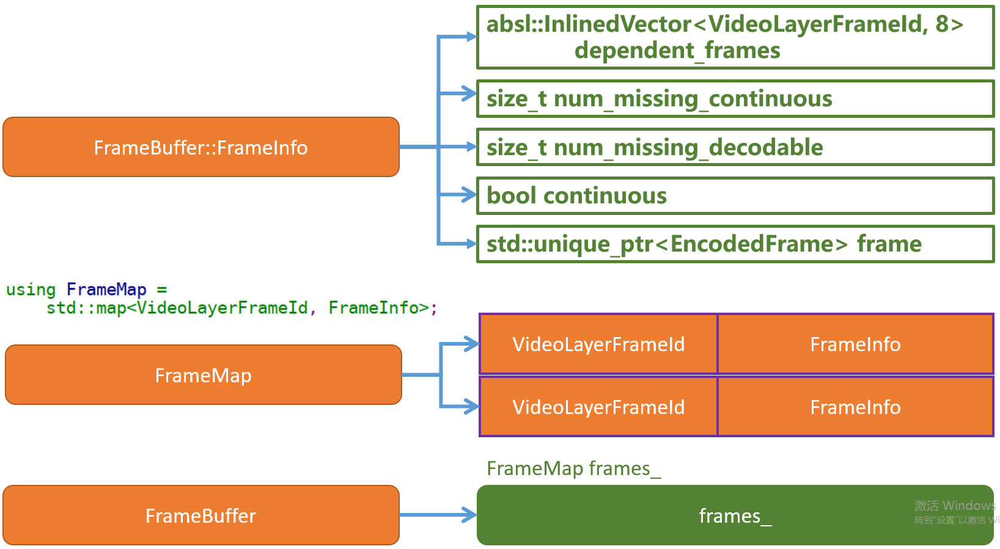

  * 如果插入成功会将当前的视频帧`EncodedFrame`实例，封装成`FrameInfo`结构，插入过程会议当前帧的帧ID做为key，以新实例化的`FrameInfo`为value插入到`frames_`容器。

  * 同时在数据插入的过程中通过调用`UpdateFrameInfoWithIncomingFrame`函数来遍历`EncodedFrame`实例中已经设置的参考帧，来初始化`FrameInfo`成员，主要是统计当前帧的参考帧的连续性，当统计得出如果当前帧的参考帧也是连续的则`FrameInfo`中的成员`continuous`会被设置成true,同时`num_missing_continuous`会被设置成0

  * `EncodedFrame`是被记录到对应`FrameInfo`的成员变量frame。

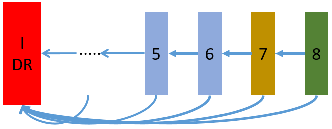

  * 每次插入数据的时候以H264数据为列，前向参考帧为一帧，所以假设本次插入的是第8帧，那么检测的是第8帧和第7帧之间的连续性。同时根据上述`UpdateFrameInfoWithIncomingFrame`函数的最后处理`frames_[dep.id].dependent_frames.push_back(id)`可得知，对于当前帧插入的时候当前帧所对应的`FrameInfo`结构中的`dependents_frames`集合是没有被初始化的，上述的`push_back`操作是将当前帧的`picturd_id`信息插入到当前帧的前向参考帧所对应的`FrameInfo`结构中的`dependents_frames`集合当中，使用这种操作来让参考帧和当前帧之间建立起关系。

### 2.2）PropagateContinuity连续性传播

```cpp    
//参数start是表示当前帧在frame_容器中的位置对应的迭代器
void FrameBuffer::PropagateContinuity(FrameMap::iterator start) {
  TRACE_EVENT0("webrtc", "FrameBuffer::PropagateContinuity");
  RTC_DCHECK(start->second.continuous);
  std::queue<FrameMap::iterator> continuous_frames;
  continuous_frames.push(start);
  // A simple BFS to traverse continuous frames.
  while (!continuous_frames.empty()) {
    auto frame = continuous_frames.front();
    continuous_frames.pop();
    if (!last_continuous_frame_ || *last_continuous_frame_ < frame->first) {
      last_continuous_frame_ = frame->first;
    }
    // Loop through all dependent frames, and if that frame no longer has
    // any unfulfilled dependencies then that frame is continuous as well.
    //   
    for (size_t d = 0; d < frame->second.dependent_frames.size(); ++d) {
      auto frame_ref = frames_.find(frame->second.dependent_frames[d]);
      RTC_DCHECK(frame_ref != frames_.end());
      // TODO(philipel): Look into why we've seen this happen.
      if (frame_ref != frames_.end()) {
        //对于h264数据而言num_missing_continuous的最大值为1
        --frame_ref->second.num_missing_continuous;
        if (frame_ref->second.num_missing_continuous == 0) {
          frame_ref->second.continuous = true;
          continuous_frames.push(frame_ref);
        }
      }
    }
  }
}
```

  * 该函数使用广度优先搜索算法，首先将根节点放入`continuous_frames`搜索队列中(也就是这里假设为第8帧数据)。

  * 从队列中取出第一个节点，并检验它是否为目标。这里的检测原理是根据第8帧数据对应的`FrameInfo`结构所存储的`dependent_frames`集合，通过遍历`dependent_frames`它，而经过上面的分析，对于当前刚插入的帧`frame->second.dependent_frames.size()`默认是等于0的，因为在上面`UpdateFrameInfoWithIncomingFrame`函数中是为当前帧的参考帧设置了`dependent_frames`。

  * 上述函数的主要作用就是更新了`last_continuous_frame_`的值，将该值更新为当前插入帧的id。而对于for循环的函数体似乎没有什么作用，经过调试发现也是一直未执行的，至少对于H264的数据是这样的。

## 3）decode_queue_解码任务队列工作原理

  * 解码任务队列定义在`VideoReceiveStream2`模块当中，通过调用`VideoReceiveStream2`模块的`Start()`函数让解码任务队列工作处于循环模型。
    
```cpp    
void VideoReceiveStream2::Start() {
  RTC_DCHECK_RUN_ON(&worker_sequence_checker_);
  ....
  decode_queue_.PostTask([this] {
    RTC_DCHECK_RUN_ON(&decode_queue_);
    decoder_stopped_ = false;
    StartNextDecode();
  });
  ....  
}
```

  * `VideoReceiveStream2::Start()`函数通过解码任务队列`PostTask`，这样`StartNextDecode`函数会由`decode_queue_`的内部异步线程获取该任务并执行。
    
```cpp 
void VideoReceiveStream2::StartNextDecode() {
  // Running on the decode thread.
  TRACE_EVENT0("webrtc", "VideoReceiveStream2::StartNextDecode");
  frame_buffer_->NextFrame(
      GetMaxWaitMs(), //本次任务执行，最多等待多长时间
      keyframe_required_, //本次任务执行是否需要请求关键帧
      &decode_queue_,//解码任务队列
      /* encoded frame handler */
      [this](std::unique_ptr<EncodedFrame> frame, ReturnReason res) {
        RTC_DCHECK_EQ(frame == nullptr, res == ReturnReason::kTimeout);
        RTC_DCHECK_EQ(frame != nullptr, res == ReturnReason::kFrameFound);
        decode_queue_.PostTask([this, frame = std::move(frame)]() mutable {
          RTC_DCHECK_RUN_ON(&decode_queue_);
          if (decoder_stopped_)
            return;
          if (frame) {
            HandleEncodedFrame(std::move(frame));
          } else {
            int64_t now_ms = clock_->TimeInMilliseconds();
            worker_thread_->PostTask(ToQueuedTask(
                task_safety_, [this, now_ms, wait_ms = GetMaxWaitMs()]() {
                  RTC_DCHECK_RUN_ON(&worker_sequence_checker_);
                  HandleFrameBufferTimeout(now_ms, wait_ms);
                }));
          }
          StartNextDecode();
        });
      });
}
```

  * 该函数通过调用`FrameBuffer::NextFrame`，并传入相应的参数。其中有两个lamda匿名函数，第一个大外部lamda函数会被`FrameBuffer`内部调用。

  * 其中最为重要的就是`lamda`匿名函数,该函数用于处理待解码的视频帧，同时也是使用`decode_queue_`将其放入任务队列，进行异步处理。

  * 该函数的处理分为两类，一类是超时处理（也就是）`NextFrame`函数如果处理超时的话，其二是正常得到待解码的视频帧，通过调用`HandleEncodedFrame`函数对该帧数据进行解码操作。

  * 最后会继续调用`StartNextDecode`函数，向`FrameBuffer`模块获取待解码的视频帧。

  * 该函数此处不做过多的详细分析，首先分析`NextFrame`函数的工作机理。后续再来着重分析解码操作,其大致原理如下：  

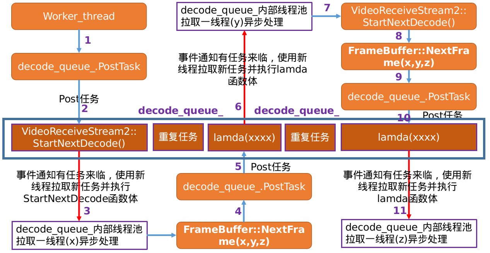

  * 由上图可知，`decode_queue_`解码任务队列会是一种循环模型，其核心是通过`FrameBuffer::NextFrame`函数得到有效的待解码视频帧，然后继续通过`decode_queue_`的Post向`decode_queue_`解码队列投递任务。

## 4）FrameBuffer::NextFrame()函数工作流程

```cpp    
void FrameBuffer::NextFrame(
    int64_t max_wait_time_ms,//本次调度最多等待多少ms就认为是超时。
    bool keyframe_required,
    rtc::TaskQueue* callback_queue,
    std::function<void(std::unique_ptr<EncodedFrame>, ReturnReason)> handler) {
  RTC_DCHECK_RUN_ON(&callback_checker_);
  RTC_DCHECK(callback_queue->IsCurrent());
  TRACE_EVENT0("webrtc", "FrameBuffer::NextFrame");
  //当前时间+最大超时时间的毫秒数得到，本次调度的返回时间。  
  int64_t latest_return_time_ms =
      clock_->TimeInMilliseconds() + max_wait_time_ms;
  rtc::CritScope lock(&crit_);
  if (stopped_) {
    return;
  }
  //保存当前任务最大返回时间的相对时间值。  
  latest_return_time_ms_ = latest_return_time_ms;
  //当前任务是否要请求关键帧  
  keyframe_required_ = keyframe_required;
  //保存函数句柄，对应VideoReceiveStream2::StartNextDecode()函数中定义的外部大lamda匿名函数  
  frame_handler_ = handler;
  //保存解码循环队列指针  
  callback_queue_ = callback_queue;
  StartWaitForNextFrameOnQueue();
}
```

  * `NextFrame`函数记录本次传入的相关变量和指针，然后将任务交给`StartWaitForNextFrameOnQueue`进行获取已经准备好的视频帧数据。
    
```cpp 
void FrameBuffer::StartWaitForNextFrameOnQueue() {
  RTC_DCHECK(callback_queue_);
  RTC_DCHECK(!callback_task_.Running());
  int64_t wait_ms = FindNextFrame(clock_->TimeInMilliseconds());
  callback_task_ = RepeatingTaskHandle::DelayedStart(
      callback_queue_->Get(), TimeDelta::Millis(wait_ms), [this] {
        RTC_DCHECK_RUN_ON(&callback_checker_);
        // If this task has not been cancelled, we did not get any new frames
        // while waiting. Continue with frame delivery.
        rtc::CritScope lock(&crit_);
        if (!frames_to_decode_.empty()) {
          // We have frames, deliver!
          frame_handler_(absl::WrapUnique(GetNextFrame()), kFrameFound);
          CancelCallback();
          return TimeDelta::Zero();  // Ignored.
        } else if (clock_->TimeInMilliseconds() >= latest_return_time_ms_) {
          // We have timed out, signal this and stop repeating.
          frame_handler_(nullptr, kTimeout);
          CancelCallback();
          return TimeDelta::Zero();  // Ignored.
        } else {
          // If there's no frames to decode and there is still time left, it
          // means that the frame buffer was cleared between creation and
          // execution of this task. Continue waiting for the remaining time.
          int64_t wait_ms = FindNextFrame(clock_->TimeInMilliseconds());
          return TimeDelta::Millis(wait_ms);
        }
      });
}
```

  * 该函数首先通过`FindNextFrame`函数从`frames_`中找到满足条件的视频帧，并得到当前待解码帧在`frames_`中的迭代器,并将该迭代器插入到容器`frames_to_decode_`。

  * 其次是构造延迟重复任务，并将该延迟重复任务放到解码任务队列`decode_queue_`中运行，这样看来在上图的`步骤4~6`以及`步骤9~11`之间，需要先执行该重复任务的，然后再该重复任务处理当中，如果检测到`frames_to_decode_`容器不为空，则调用`frame_handler_`也就是`StartNextDecode`函数中传入的外部lamda匿名函数体，最后停止该重复任务，等待下次一解码任务循环调用。

  * 为什么要重复延迟任务？因为异步的原因，在查找视频的时候可能数据还没有插入，那么就需要重复查找？

  * 而该节分析着重分析`FindNextFrame`的原理，分析之前先看一下所涉及到的相关数据结构。  

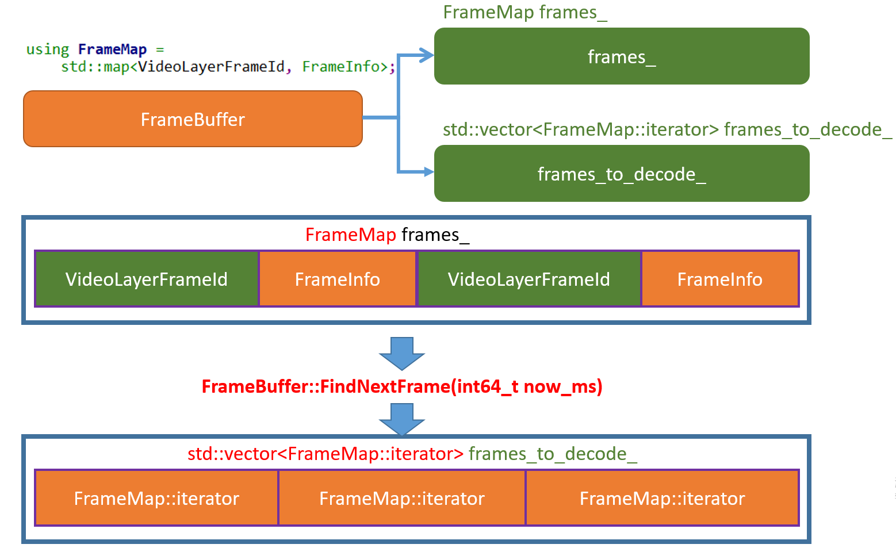

  * `FrameBuffer`模块中对于插入线程，有个`frames_`容器用于缓存数据，而通过`FindNextFrame`函数的处理会从`frames_`容器中查找合适的数据帧，并得到对应数据帧的迭代器，将该迭代器记录到`frames_to_decode_`容器当中。

  * 在延迟重复任务的执行过程当中如果发现`frames_to_decode_`容器不为空则会通过`GetNextFrame()`函数访问`frames_to_decode_`容器，最终得到需要解码的视频帧将其投递到`decode_queue_`任务队列里。

## 5）FrameBuffer::FindNextFrame()函数工作流程

```cpp    
int64_t FrameBuffer::FindNextFrame(int64_t now_ms) {
  //latest_return_time_ms_为本次任务最大的超时时间时间的相对值，这个计算得到最大的等待时间间隔  
  //该值在使用640*480@25fps的屏幕共享调试过程中有3000ms左右，也就是说最大可等待3s如果3秒还没找到合适的帧，那么本次调度就按照超时来算了。  
  int64_t wait_ms = latest_return_time_ms_ - now_ms;
  //首先清空frames_to_decode_,这说明每次是获取一帧数据，然后立马送到解码队列。  
  frames_to_decode_.clear();
  // |last_continuous_frame_| may be empty below, but nullopt is smaller
  // than everything else and loop will immediately terminate as expected.
  //循环遍历frames_集合，从头部到尾部，frame_it->first <= last_continuous_frame_，当前要送到解码队列的数据帧
  // 比上一次插入的数据的id要小或相等。  
  for (auto frame_it = frames_.begin();
        frame_it != frames_.end() && frame_it->first <= last_continuous_frame_;
        ++frame_it) {
    //如果当前一帧的参考帧不连续则重新遍历。++frame_it  
    if (!frame_it->second.continuous ||
        frame_it->second.num_missing_decodable > 0) {
      continue;
    }
    EncodedFrame* frame = frame_it->second.frame.get();
    //如果本次解码任务是要求请求关键帧，但是当前遍历出来的这一帧是P帧，则重新遍历++frame_it  
    if (keyframe_required_ && !frame->is_keyframe())
      continue;
    auto last_decoded_frame_timestamp =
        decoded_frames_history_.GetLastDecodedFrameTimestamp();
    // TODO(https://bugs.webrtc.org/9974): consider removing this check
    // as it may make a stream undecodable after a very long delay between
    // frames.
    // 根据每帧数据的rtp时间戳不相等，并且后一帧的时间戳要比前一帧的时间戳要大的原则，如果 
    // last_decoded_frame_timestamp上一次送到解码队列的一帧的时间戳比当前遍历出的时间戳还要大的话则重新遍历  
    if (last_decoded_frame_timestamp &&
        AheadOf(*last_decoded_frame_timestamp, frame->Timestamp())) {
      continue;
    }
    // Only ever return all parts of a superframe. Therefore skip this
    // frame if it's not a beginning of a superframe.
    // VPX相关处理.  
    if (frame->inter_layer_predicted) {
      continue;
    }
    // Gather all remaining frames for the same superframe.
    std::vector<FrameMap::iterator> current_superframe;
    //尾部插入  
    current_superframe.push_back(frame_it);
    // H264为true只有一层.  
    bool last_layer_completed = frame_it->second.frame->is_last_spatial_layer;
    FrameMap::iterator next_frame_it = frame_it;
    while (true) {
      ++next_frame_it;
      //对于H264这个判断会break;  
      if (next_frame_it == frames_.end() ||
          next_frame_it->first.picture_id != frame->id.picture_id ||
          !next_frame_it->second.continuous) {
        break;
      }
      // Check if the next frame has some undecoded references other than
      // the previous frame in the same superframe.
      size_t num_allowed_undecoded_refs =
          (next_frame_it->second.frame->inter_layer_predicted) ? 1 : 0;
      if (next_frame_it->second.num_missing_decodable >
          num_allowed_undecoded_refs) {
        break;
      }
      // All frames in the superframe should have the same timestamp.
      if (frame->Timestamp() != next_frame_it->second.frame->Timestamp()) {
        RTC_LOG(LS_WARNING) << "Frames in a single superframe have different"
                                " timestamps. Skipping undecodable superframe.";
        break;
      }
      current_superframe.push_back(next_frame_it);
      last_layer_completed = next_frame_it->second.frame->is_last_spatial_layer;
    }
    // Check if the current superframe is complete.
    // TODO(bugs.webrtc.org/10064): consider returning all available to
    // decode frames even if the superframe is not complete yet.
    // 对于h264 last_layer_completed = true  
    if (!last_layer_completed) {
      continue;
    }
    //通过std::move将current_superframe迭代器容器移动到frames_to_decode_
    frames_to_decode_ = std::move(current_superframe);
    //如果未设置渲染时间，则这里设置渲染时间，默认h264数据frame->RenderTime() == -1
    if (frame->RenderTime() == -1) {
      frame->SetRenderTime(timing_->RenderTimeMs(frame->Timestamp(), now_ms));
    }
    //重新获取等待时间，是什么原理？很重要后续会进行深入分析
    wait_ms = timing_->MaxWaitingTime(frame->RenderTime(), now_ms);
    // This will cause the frame buffer to prefer high framerate rather
    // than high resolution in the case of the decoder not decoding fast
    // enough and the stream has multiple spatial and temporal layers.
    // For multiple temporal layers it may cause non-base layer frames to be
    // skipped if they are late.
    // 如果wait_ms小于-5 (kMaxAllowedFrameDelayMs的值为5)，
    // 根据上面的英文注释是表示在高帧率的情况下解码器性能有限，该帧已经来不及渲染了，需要忽略该帧。  
    if (wait_ms < -kMaxAllowedFrameDelayMs)
      continue;
    //到此已经完美的找到了一个待解码帧对应在frames_容器中的迭代器位置了。
    break;
  }
  //更新剩余等待时间，先取最小值，后面和0取最大值，这里返回的是一个时间间隔，任务调度可能最大超时为3秒，经过上述的处理和评估，这里进行重新估计。
  //这个值会作用到哪里？  
  wait_ms = std::min<int64_t>(wait_ms, latest_return_time_ms_ - now_ms);
  wait_ms = std::max<int64_t>(wait_ms, 0);
  return wait_ms;
}
```

  * 本函数首先会进行一系列的校验。
  * 其次、通过遍历`frames_`容器获取待解码的视频帧，并带到它在`frames_`容器中的位置对应的迭代器，将其插入到`frames_to_decode_`容器。
  * 最后会返回一个时间间隔，那么这个时间间隔是干嘛用的，会作用到哪里？根据上述的代码显示该值最终传递到了`RepeatingTaskHandle::DelayedStart`函数，应该是表示，`RepeatingTaskHandle::DelayedStart`这个重复延迟任务经过多少`wait_ms`后会被执行。`那么问题来了，这个延迟就会直接影响到解码和渲染的延迟，所以对于延迟的优化，这个参数是一个优化点`。
  * 同时本节也留下了一个问题`timing_->MaxWaitingTime`函数的原理是什么？

## 6）RepeatingTaskHandle::DelayedStart延迟重复任务工作流程

  * 首先回顾解码队列和延迟任务的配合流程。

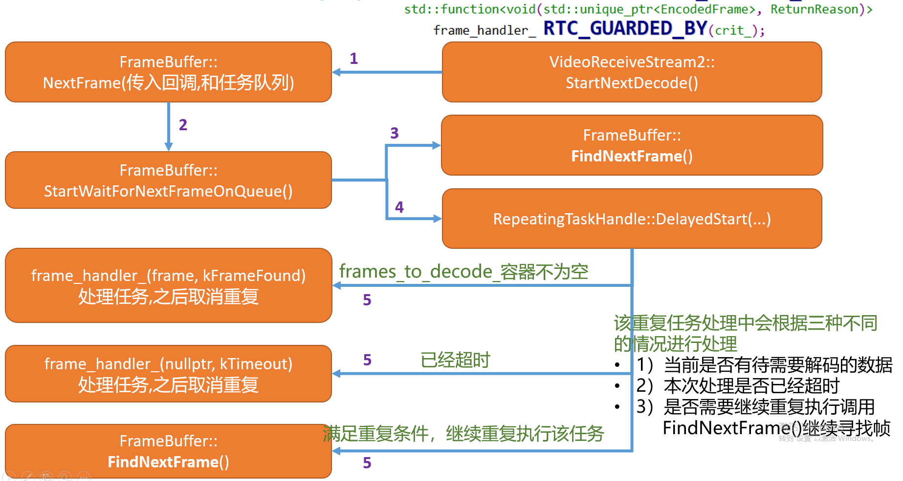

  * 通过`FindNextFrame`函数获取到下一次要进行解码的视频帧后后，该函数会返回一个延迟重复任务执行的延迟时间`wait_ms`（也就是过多长时间后延迟任务会被执行）。

  * 继续回到`StartWaitForNextFrameOnQueue`函数。
    
```cpp    
void FrameBuffer::StartWaitForNextFrameOnQueue() {
  RTC_DCHECK(callback_queue_);
  RTC_DCHECK(!callback_task_.Running());
  int64_t wait_ms = FindNextFrame(clock_->TimeInMilliseconds());
  callback_task_ = RepeatingTaskHandle::DelayedStart(
      callback_queue_->Get(), TimeDelta::Millis(wait_ms), [this] {
        RTC_DCHECK_RUN_ON(&callback_checker_);
        // If this task has not been cancelled, we did not get any new frames
        // while waiting. Continue with frame delivery.
        rtc::CritScope lock(&crit_);
        if (!frames_to_decode_.empty()) {//已经有待解码的帧
          // We have frames, deliver!
          frame_handler_(absl::WrapUnique(GetNextFrame()), kFrameFound);
          CancelCallback();
          return TimeDelta::Zero();  // Ignored.
        } else if (clock_->TimeInMilliseconds() >= latest_return_time_ms_) {//已经超时
          // We have timed out, signal this and stop repeating.
          frame_handler_(nullptr, kTimeout);
          CancelCallback();
          return TimeDelta::Zero();  // Ignored.
        } else {//没找到帧也没有超时
          // If there's no frames to decode and there is still time left, it
          // means that the frame buffer was cleared between creation and
          // execution of this task. Continue waiting for the remaining time.
          int64_t wait_ms = FindNextFrame(clock_->TimeInMilliseconds());
          return TimeDelta::Millis(wait_ms);
        }
      });
}
```

  * 第一种情况为当`frames_to_decode_`不为空，也就是`FindNextFrame`找到了合适的待解码的视频帧，此时首先条用`GetNextFrame()`函数获取该帧，然后通过回调`frame_handler_`也就是在`VideoReceiveStream2`模块执行`StartNextDecode`调度的时候传入的外部lamda匿名函数。
  * 第二种情况，`clock_->TimeInMilliseconds() >= latest_return_time_ms_`说明本次调度已经超时了，当前时间的相对时间值已经大于超时的相对时间值了。
  * 第三种情况，未超时，但是也未找到合适的待解码帧，此时回调`FindNextFrame`进行重复找帧处理。
  * 本节着重分析`GetNextFrame()`函数的原理

### 6.1 ）GetNextFrame()原理

```cpp    
EncodedFrame* FrameBuffer::GetNextFrame() {
  RTC_DCHECK_RUN_ON(&callback_checker_);
  int64_t now_ms = clock_->TimeInMilliseconds();
  // TODO(ilnik): remove |frames_out| use frames_to_decode_ directly.
  std::vector<EncodedFrame*> frames_out;
  RTC_DCHECK(!frames_to_decode_.empty());
  //定义超级帧是否由重传帧
  bool superframe_delayed_by_retransmission = false;
  //定义超级帧的大小
  size_t superframe_size = 0;
  //从头部获取，上面是尾部插入，这里刚好满足先入先出的原则  
  EncodedFrame* first_frame = frames_to_decode_[0]->second.frame.get();
  //得到预期渲染时间，在FindNextFrame函数中设置  
  int64_t render_time_ms = first_frame->RenderTime();
  /* 当前帧数据最后一个包的接收时间。接收时间和渲染时间一相减是不是就得出了当前帧数据
    * 从组帧到解码到渲染之间的延迟了？经过调试发现
    * 延迟在从组帧到解码再到渲染之间的时间确实是比较大的
    *华为mate30 1920*1080@30fps差不多平均有130ms，需要优化
    * 从接收到该帧的最后一个包到当前处理的延迟5～30ms,也就是从解码到渲染起码占100ms
    * 以上为在局域网测试
    * 将这段时间如果能降低到50ms以内，那整个延迟就真的很优秀了。
  */
  int64_t receive_time_ms = first_frame->ReceivedTime();
  // Gracefully handle bad RTP timestamps and render time issues.
  // 检查帧的渲染时间戳或者当前的目标延迟是否有异常，如果是则重置时间处理器，重新获取帧的渲染时间，规则在下面进行分析。
  if (HasBadRenderTiming(*first_frame, now_ms)) {
    jitter_estimator_.Reset();
    timing_->Reset();
    render_time_ms = timing_->RenderTimeMs(first_frame->Timestamp(), now_ms);
  }
  // 遍历所有待解码帧(他们应该有同样的时间戳)，如果由多帧数据最后会封装成一个超级帧
  // 根据实验结果基本上都是一帧  
  for (FrameMap::iterator& frame_it : frames_to_decode_) {
    RTC_DCHECK(frame_it != frames_.end());
    //释放frame_容器中的FrameInfo结构中的frame内存，这里用frame来接收  
    EncodedFrame* frame = frame_it->second.frame.release();
    //每一次调度要送到解码队列中的待解码帧都由相同的渲染时间。
    //为每帧设置渲染时间，最后该集合中的帧会被打包成一个大的frame，送到解码队列  
    frame->SetRenderTime(render_time_ms);
    //每次遍历取或，如果里面有帧数据是属于重传过来的这里将被设置成true
    superframe_delayed_by_retransmission |= frame->delayed_by_retransmission();
    //计算最大接收时间，取最大的假设这个frames_to_decode_有5帧数据那么取时间戳最大的  
    receive_time_ms = std::max(receive_time_ms, frame->ReceivedTime());
    //累加所有帧的大小, 
    superframe_size += frame->size();
    //传播能否解码的连续性。这里要用来干嘛？
    PropagateDecodability(frame_it->second);
    //将即将要发送到解码队列的数据信息插入到历史记录，对已发送到解码队列中的帧进行统计。  
    decoded_frames_history_.InsertDecoded(frame_it->first, frame->Timestamp());
    // Remove decoded frame and all undecoded frames before it.
    // 状态回调，通过std::count_if统计在frame_it之前多少帧数据要被drop掉  
    if (stats_callback_) {
      unsigned int dropped_frames = std::count_if(
          frames_.begin(), frame_it,
          [](const std::pair<const VideoLayerFrameId, FrameInfo>& frame) {
            return frame.second.frame != nullptr;
          });
      if (dropped_frames > 0) {
        stats_callback_->OnDroppedFrames(dropped_frames);
      }
    }
    //将要发送的帧从缓存记录中清除。
    frames_.erase(frames_.begin(), ++frame_it);
    //清除的这一帧数据先存入到frames_out容器，最后会将该集合中的所有帧打包成一个超级帧
    frames_out.push_back(frame);
  }
  //如果上面得出要发送到解码队列的帧集合中有
  if (!superframe_delayed_by_retransmission) {
    int64_t frame_delay;
    //计算延迟
    if (inter_frame_delay_.CalculateDelay(first_frame->Timestamp(),
                                          &frame_delay, receive_time_ms)) {
      //frame_delay的值可能为负值  
      jitter_estimator_.UpdateEstimate(frame_delay, superframe_size);
    }
    //protection_mode_默认为kProtectionNack
    float rtt_mult = protection_mode_ == kProtectionNackFEC ? 0.0 : 1.0;
    absl::optional<float> rtt_mult_add_cap_ms = absl::nullopt;
    //若rtt_mult_settings_有值则获取该值，用于下面作用到JitterDelay
    if (rtt_mult_settings_.has_value()) {
      //可通过类似"WebRTC-RttMult/Enable-0.60,100.0/"来启用或者设置值,默认是没有值的  
      rtt_mult = rtt_mult_settings_->rtt_mult_setting;
      rtt_mult_add_cap_ms = rtt_mult_settings_->rtt_mult_add_cap_ms;
    }
    //设置JitterDelay
    timing_->SetJitterDelay(
        jitter_estimator_.GetJitterEstimate(rtt_mult, rtt_mult_add_cap_ms));
    //更新当前延迟
    timing_->UpdateCurrentDelay(render_time_ms, now_ms);
  } else {
    //如果有重传帧，那么延迟估计根据FrameNacked来更新。
    if (RttMultExperiment::RttMultEnabled() || add_rtt_to_playout_delay_)
      jitter_estimator_.FrameNacked();
  }
  //更新JitterDelay
  UpdateJitterDelay();
  //更新帧率时序信息
  UpdateTimingFrameInfo();
  //如果只有一帧的话则直接返回frames_out[0]
  if (frames_out.size() == 1) {
    return frames_out[0];
  } else {
    //打包超级帧
    return CombineAndDeleteFrames(frames_out);
  }
}
```

  * 该函数的核心原理是首先是通过`HasBadRenderTiming`函数判断待解码帧的时序是否有效
  * 其次是遍历`frames_to_decode_`容器将容器内的所有帧放到临时容器`frames_out`当中，并清理缓存记录
  * 根据`frames_out`中的帧中是否由重传帧存在做不同的时序更新处理。
  * 各种设置JitterDelay以及更新JitterDelay,这些内容在下文进行分析。
  * 最后若`frames_out`中的帧的数量大于一，则将该容器中的帧通过`CombineAndDeleteFrames`打包成一个超级聚合帧。
  * 最终将打包好的帧返回给`frame_handler_`函数句柄进行响应的处理。
  * 上述所涉及到的时延更新是延迟相关的重点，在下文进行深入分析。

### 6.2 ）HasBadRenderTiming()原理

```cpp    
bool FrameBuffer::HasBadRenderTiming(const EncodedFrame& frame,
                                      int64_t now_ms) {
  // Assume that render timing errors are due to changes in the video stream.
  int64_t render_time_ms = frame.RenderTimeMs();
  // Zero render time means render immediately.
  if (render_time_ms == 0) {
    return false;
  }
  if (render_time_ms < 0) {
    return true;
  }
  const int64_t kMaxVideoDelayMs = 10000;
  if (std::abs(render_time_ms - now_ms) > kMaxVideoDelayMs) {
    int frame_delay = static_cast<int>(std::abs(render_time_ms - now_ms));
    RTC_LOG(LS_WARNING)
        << "A frame about to be decoded is out of the configured "
            "delay bounds ("
        << frame_delay << " > " << kMaxVideoDelayMs
        << "). Resetting the video jitter buffer.";
    return true;
  }
  if (static_cast<int>(timing_->TargetVideoDelay()) > kMaxVideoDelayMs) {
    RTC_LOG(LS_WARNING) << "The video target delay has grown larger than "
                        << kMaxVideoDelayMs << " ms.";
    return true;
  }
  return false;
}
```

  * 该函数的核心作用是判断当前帧的渲染时间是否合理。
  * 如果`render_time_ms`等于0表示立即渲染，而frame.RenderTimeMs()的时间是在`FrameBuffer::FindNextFrame()`中被设置。
  * 如果`render_time_ms`小于0，说明当前帧的渲染时间是有问题的。
  * 如果渲染时间和当前时间的差值大于10s说明也有问题。
  * 如果`timing_->TargetVideoDelay()`大于10秒说明有问题。

## 7）总结

  * 本文从视频帧向`Framebuffer`插入流程着手，重点分析了其插入原理，以及`Framebuffer`的数据结构。
  * `Framebuffer`主要维护两大数据结构，其一是`frames_`容器，用于缓存待解码的视频帧。在插入的过程中会判断当前插入帧对应参考帧的连续性，如果当前帧在插入的时候发现前面的参考帧还没有，那么会插入失败。
  * 其二是`frames_to_decode_`该容器是用于缓存待输出到解码队列的视频帧所对应在`frames_`容器中的坐标迭代器。
  * 将视频帧由`frames_`容器取出发送到解码队列使用了解码任务队列驱动，如果`frames_to_decode_`容器中的大小大于1的话最终会将多帧数据打包成一个超级帧，然后发送到解码任务队列进行处理。
  * 同时在分析本文的时候发现，视频帧在接收过程中从收到一帧数据组帧到将其发送到解码队列前的时间基本都可以控制在60~80ms之内的（当然和丢包以及分辨率有关系），但是从实际调试信息来看，期望的渲染时间有点大，有很大的优化空间，那么这个期望的渲染时间是怎么得来的将是下文分析的重点。

<hr>

#### <p>原文出处：<a href='https://www.jianshu.com/p/0bc6a4998b32' target='blank'>WebRTC Video Receiver(七)-基于Kalman filter模型的平滑渲染时间估计</a></p>

## 1）前言

* 前一篇文章分析了`FrameBuffer`模块对视频帧的插入原理，以及出队(送到解码队列)的机制。
* 在出队的过程中涉及到了很多和延迟相关的信息，没有分析，诸如渲染时间的计算、帧延迟的计算、抖动的计算等都未进行相应的分析。
* 同时经过上文的分析，在实际的测试过程中发现，在视频接收的过程中如果不出现丢帧的现象，那么从组帧到送入到`FrameBuffer`的缓存队列的耗时是十分小的，那么实际测试过程中的延迟究竟是怎么来的，经过上文的分析，初步得出，首先是在出队前从缓存列表中获取待解码的帧的时候会根据期望渲染时间计算延迟，这个延迟直接会作用到延迟重复任务的调度时间。
* 其次就是在实际解码过程中不同的硬件平台能力不一样硬件解码器的原理也有区别，比如有些解码器本身就会缓存视频帧也是导致实际播放延迟的一个原因。
* 再者就是音频和视频之间的同步也不会是导致播放延迟的因素之一。
* 通过前面几篇文章的一系列分析，不难看出如`VideoReceiveStream2`模块、`RtpVideoStreamReceiver2`模块、`FrameBuffer`模块在整个工作的过程中都复用了同一个`VCMTiming`模块，在`Call`模块创建`VideoReceiveStream2`模块的时候被实例化，之后在其他模块中被引用。
* 接下来按照实际函数调用栈的流程对视频接收模块涉及到的时序相关信息进行一一阐述。

## 2）PlayoutDelay更新

  * 顾名思义，叫做播放延迟，该值可在发送端通过RTP头扩展进行携带，如果未携带，默认值为{-1，-1}
  * 首先看其定义如下：

```cpp    
#common_types.h
struct PlayoutDelay {
  PlayoutDelay(int min_ms, int max_ms) : min_ms(min_ms), max_ms(max_ms) {}
  int min_ms;//最小播放延迟
  int max_ms;//做到播放延迟
  ....  
}    
```    
    
```cpp 
#rtp_video_header.h
struct RTPVideoHeader {
  ....  
  PlayoutDelay playout_delay = {-1, -1};
  ....
}
```   
    
```cpp 
## encoded_image.h
class RTC_EXPORT EncodedImage {
  public:
  ...  
  // When an application indicates non-zero values here, it is taken as an
  // indication that all future frames will be constrained with those limits
  // until the application indicates a change again.
  PlayoutDelay playout_delay_ = {-1, -1};
  ...
}
```
    
```cpp
RtpFrameObject::RtpFrameObject(
    ......
    : first_seq_num_(first_seq_num),
      last_seq_num_(last_seq_num),
      last_packet_received_time_(last_packet_received_time),
      times_nacked_(times_nacked) {
  // Setting frame's playout delays to the same values
  // as of the first packet's.
  SetPlayoutDelay(rtp_video_header_.playout_delay);
  ...
}
```

  * 在`PacketBuffer`模块组帧过程中，每组帧成功后会执行发现帧的处理，此时会创建对应的`RtpFrameObject`。
  * 而在`RtpFrameObject`的构造函数会通过`SetPlayoutDelay`函数为当前帧设置播放延迟时间，由此可看出如果发送端未扩展该RTP头的话，那么默认值为{-1,-1}。
  * 默认是未扩展的如果需要扩展需要SDP支持如下：
    
    
    "http://www.webrtc.org/experiments/rtp-hdrext/playout-delay"
    

  * 接下来介绍，在何时会将该延迟作用到其他模块。

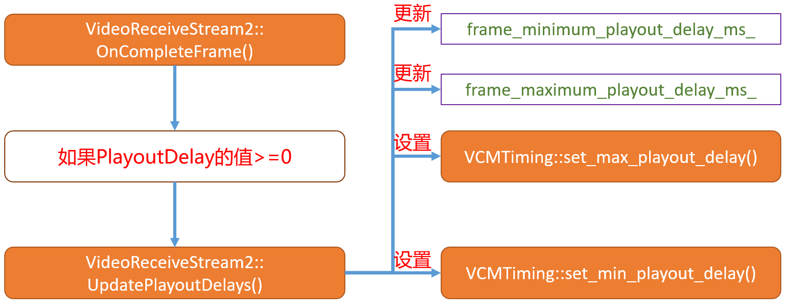

  * 接上文的分析，待解码视频帧的插入驱动是由`VideoReceiveStream2:: OnCompleteFrame()`函数来驱动的，在插入视频帧前首先会将播放延迟信息作用到`VCMTiming`模块，上面有介绍`VideoReceiveStream2`模块、`RtpVideoStreamReceiver2`模块、`FrameBuffer`模块在整个工作的过程中都复用了同一个`VCMTiming`实例(同一路流)。
    
```cpp
void VideoReceiveStream2::OnCompleteFrame(
    std::unique_ptr<video_coding::EncodedFrame> frame) {
  ....
  //拿到PlayoutDelay引用    
  const PlayoutDelay& playout_delay = frame->EncodedImage().playout_delay_;
  if (playout_delay.min_ms >= 0) {
    frame_minimum_playout_delay_ms_ = playout_delay.min_ms;
    UpdatePlayoutDelays();
  }
  if (playout_delay.max_ms >= 0) {
    frame_maximum_playout_delay_ms_ = playout_delay.max_ms;
    UpdatePlayoutDelays();
  }
  ....
}
```

  * 如果`playout_delay.min_ms >= 0`或者`playout_delay.max_ms >= 0`都会调用`UpdatePlayoutDelays`函数将该播放延迟作用到`VCMTiming`模块。
    
```cpp 
void VCMTiming::set_min_playout_delay(int min_playout_delay_ms) {
  rtc::CritScope cs(&crit_sect_);
  min_playout_delay_ms_ = min_playout_delay_ms;
}

void VCMTiming::set_max_playout_delay(int max_playout_delay_ms) {
  rtc::CritScope cs(&crit_sect_);
  max_playout_delay_ms_ = max_playout_delay_ms;
}
```

  * `VCMTiming`模块记录当前帧的`min_playout_delay_ms_`和`max_playout_delay_ms_`供后续延迟估计使用。

## 3）RenderTimeMs设置流程

  * 回顾上文的分析，`FindNextFrame`函数在找待解码帧的时候会通过`VCMTiming`模块获取期望渲染时间。
  * 本节内容着重介绍`RenderTimeMs`的设置业务流程以及大致的原理，涉及到`Kalman filter`的实现原理在第4节内容将进行详细分析。本节涉及的大致流程如下：  

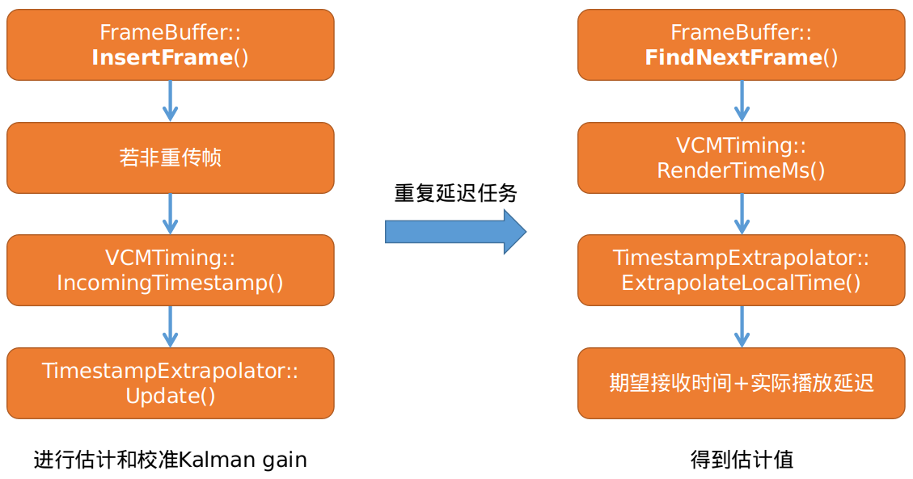

  * 从上图左侧部分可知，在当前帧插入到`frame_`的时候如果当前帧不是重传帧的话，会使用`VCMTiming`模块调用`TimestampExtrapolator`模块的Update()函数依据当前帧的rtp时间戳来估计当前帧的期望接收时间，并对`Kalman gain`进行校准，其原理将在第4节内容进行详细分析。
    
```cpp
int64_t FrameBuffer::FindNextFrame(int64_t now_ms) {
  ....
  //默认该函数调用到这里的时候期望渲染时间都还未赋值的    
  if (frame->RenderTime() == -1) {
      //首先调用VCMTiming获取期望渲染时间,然后将其设置到Frame中，供后续使用
      frame->SetRenderTime(timing_->RenderTimeMs(frame->Timestamp(), now_ms));
  }
  ...  
  //得出最大等待时间    
  wait_ms = timing_->MaxWaitingTime(frame->RenderTime(), now_ms);
  ....
  //取最小时间，如果在一次调度时间（未超时范围内）的话，返回wait_ms    
  wait_ms = std::min<int64_t>(wait_ms, latest_return_time_ms_ - now_ms);
  wait_ms = std::max<int64_t>(wait_ms, 0);  
  return wait_ms;
}    
```

  * 以上函数返回的`wait_ms`值会直接决定重复延迟队列的执行时间（也就是等多节执行），如果`wait_ms`等于0，则说明重复延迟队列会立即执行。优化该值趋向0会节省一定的延迟。

### 3.1）VCMTiming模块获取期望渲染时间

```cpp    
int64_t VCMTiming::RenderTimeMs(uint32_t frame_timestamp,
                                int64_t now_ms) const {
  rtc::CritScope cs(&crit_sect_);
  return RenderTimeMsInternal(frame_timestamp, now_ms);
}
//frame_timestamp为当前帧的时间戳以1/90k为单位,now_ms为当前Clock时间
int64_t VCMTiming::RenderTimeMsInternal(uint32_t frame_timestamp,
                                        int64_t now_ms) const {
  //如果min_playout_delay_ms_=0并且max_playout_delay_ms_=0则表示立即渲染
  // 不建议赋值0，若赋值0的话jitterDelay就失效了
  if (min_playout_delay_ms_ == 0 && max_playout_delay_ms_ == 0) {
    // Render as soon as possible.
    return 0;
  }
  //传入当前帧的时间戳，来得到一个平滑渲染时间，TimestampExtrapolator通过卡尔曼滤波负责期望接收时间的产生
  int64_t estimated_complete_time_ms =
      ts_extrapolator_->ExtrapolateLocalTime(frame_timestamp);
  if (estimated_complete_time_ms == -1) {
    estimated_complete_time_ms = now_ms;
  }
  // Make sure the actual delay stays in the range of |min_playout_delay_ms_|
  // and |max_playout_delay_ms_|.
  // 和min_playout_delay_ms_取最大值,min_playout_delay_ms_默认值-1,  
  int actual_delay = std::max(current_delay_ms_, min_playout_delay_ms_);
  //和max_playout_delay_ms_求最小值，max_playout_delay_ms_默认值-1  
  actual_delay = std::min(actual_delay, max_playout_delay_ms_);
  return estimated_complete_time_ms + actual_delay;
}
```

  * 该函数首先判断`min_playout_delay_ms_`和`max_playout_delay_ms_`是否同时为0，如果同时为0则表示会理解发送到解码队列并解码后后立即渲染。
  * 若上述条件不满足，也就是说什么时候渲染依据系统框架的估计来做。
  * 首先调用`TimestampExtrapolator`模块的`ExtrapolateLocalTime`函数来估计出一个期望接收时间，最后将该时间和`actual_delay`实际延迟相加得到最终的期望渲染时间
  * 其中`actual_delay`的值是通过`VCMTiming::SetJitterDelay`和`VCMTiming::UpdateCurrentDelay`两个函数来进行更新的，这两个函数在下面进行分析。
  * 最终得出视频帧的最终期望渲染时间 = 平滑渲染时间 + 当前实际播放延迟（它的原理有是什么）

### 3.2）VCMTiming模块获取调度等待时间

  * `FrameBuffer`模块的`FindNextFrame`函数通过该函数返回一个最大等待时间，也就是说如果找到了一帧数据，但是`FrameBuffer`模块并不会立即将其发送到解码队列，而是要等待一段时间，再发送到解码器，该函数的作用就是得到等待多长时间发送到解码队列进行解码
    
```cpp    
int64_t VCMTiming::MaxWaitingTime(int64_t render_time_ms,
                                  int64_t now_ms) const {
  rtc::CritScope cs(&crit_sect_);
  const int64_t max_wait_time_ms =
      render_time_ms - now_ms - RequiredDecodeTimeMs() - render_delay_ms_;
  return max_wait_time_ms;
}
```

  * 上述代码显示最大等待时间 （何时发到解码队列）= `期望渲染时间 - 当前时间 - 解码所需要的的时间 - 渲染延迟的时间`。
  * 其中正常情况下`期望渲染时间`是根据卡尔曼滤波理论估计出来的。
  * `render_delay_ms_`默认为10ms,可通过`VCMTiming::set_render_delay`进行设置，默认在初始化阶段实例化`VideoReceiveStream2`模块的时候在其构造函数中有调用该函数，可通过修改`webrtc::VideoReceiveStream::Config::render_delay_ms`变量进行设置。
  * 经过以上的分析最大的困难之处就是平滑渲染时间`estimated_complete_time_ms`的估计过程,在后续将专门分析卡尔曼的原理。
  * 按照正常的流程如果卡尔曼估计出来平滑渲染时间比较大，然后解码所需要的的时间已知的情况下，那么优化就必须放在卡尔曼滤波器的身上。
  * 通过上述的分析，期望渲染时间的延迟会直接影响到`FrameBuffer`模块重复延迟队列的调度，也就决定了当前帧播放的延迟。
  * 用时间轴来描述当前时间，进入解码队列时间，解码延迟时间，渲染等待时间的关系，如下：

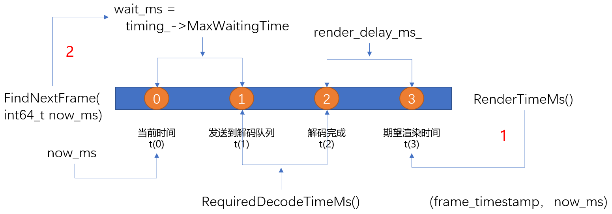

## 4）TimestampExtrapolator Kalman filter期望渲染时间估计

  * 本节内容从四个方面来进行介绍。
  * 首先介绍卡尔曼理论5大公式以及基于rtp时间戳和当前实际接收时间的理论模型
  * 其次基于理论模型建立状态转移方程以及观测方程
  * 再次介绍`TimestampExtrapolator::ExtrapolateLocalTime`函数期望接收时间的计算。
  * 最后结合`TimestampExtrapolator::Update`函数分析状态变量的计算原理和`Kalman Ganin`的更新。

### 4.1）TimestampExtrapolator模块Kalman模型

  * 为后续的方便分析首先介绍卡尔曼滤波的5大核心公式，本文不做理论推导

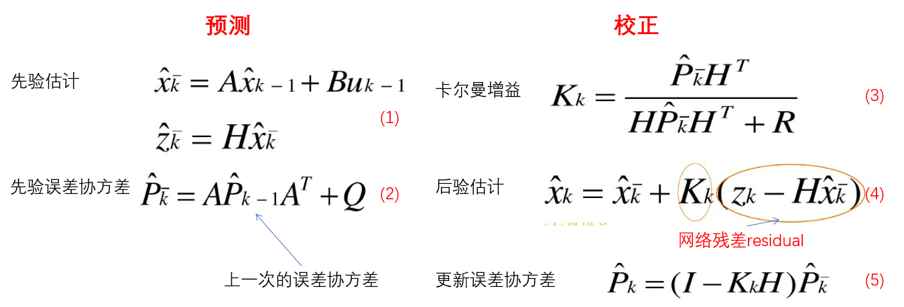

  * 根据卡尔曼滤波的5大核心公式，首先需要建立状态转移方程和观测方程

  * 为建立状态转移方程和观测方程，需要先了解一下rtp time stamp和实际时间的相应关系
    
```cpp    
// Local time in webrtc time base.
int64_t current_time_us = clock_->TimeInMicroseconds();
int64_t current_time_ms = current_time_us / rtc::kNumMicrosecsPerMillisec;
// Capture time may come from clock with an offset and drift from clock_.
int64_t capture_ntp_time_ms = current_time_ms + delta_ntp_internal_ms_;
// Convert NTP time, in ms, to RTP timestamp.
const int kMsToRtpTimestamp = 90;
uint32_t timestamp_rtp =
    kMsToRtpTimestamp * static_cast<uint32_t>(capture_ntp_time_ms);
```

  * webrtc 在发送每一帧视频数据前通过上述代码来设置每帧的rtp时间戳，以90KHZ为采样率，也就是每秒钟被划分成了90000个时间块，假设是60fps每秒的帧率，那么每帧的rtp时间戳理论上是相隔90000 / 60 = 1500个时间块，也就是每帧数据之间RTP时间戳的增量为1500，如果将该时间增量换算成ms数如下：
    
```cpp 
fps = 60fps
samplerate = 90000    
timestampDiff(k) = rtpTimeStamp(k) - rtpTimeStamp(0)          (4.1.1)
timestampDiffToMs(k) = timestampDiff(k) * 1000 / samplerate   (4.1.2)
```

  * `timestampDiff(k)`表示第(k)帧视频和第一帧视频的rtpTimeStamp之差

  * `timestampDiffToMs(k)`表示第(k)帧视频和第一帧视频之间所经历的毫秒数

  * 基于此，建立如下到达传输模型

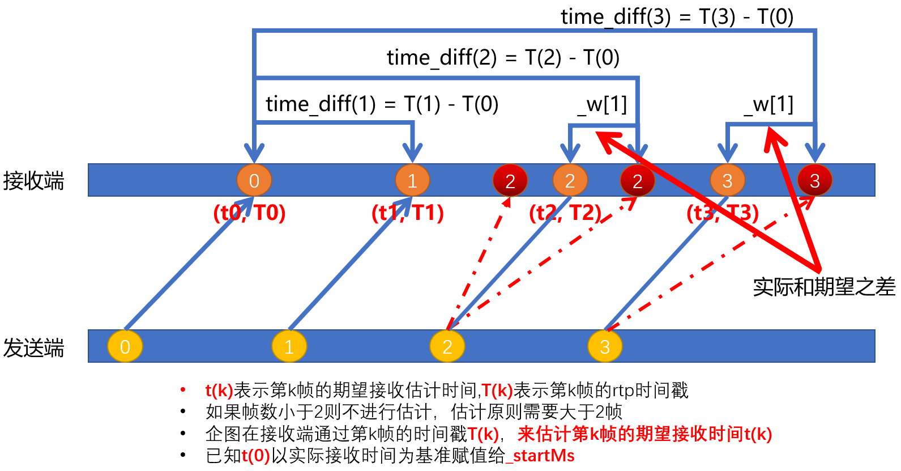

  * 以第一帧(t0,T0)作为基准，来估计接收到第k帧的期望接收时间

  * 假设上述模型没有任何误差和干扰，那么在已知`_startMs`的情况下，上述的传输曲线应该都是蓝色实现所示，并很容易就能得到如下计算
    
```cpp 
t(0) = _startMs
t(k) = timestampDiffToMs(k) + t(0)    (4.1.3)
```

  * 但事实上不上这样，传输过程有很多的不确定性诸如网络延迟抖动等，且由于采集帧率可能也具有误差，也就是`sample_rate`可能大于90KHZ，最终每帧数据的到达模型可能就变成了上述的红色虚线部分所示,这样`timestampDiffToMs(k)`就会比第(k)帧达到接收端实际所经历的时间要大或者要小，从而使得t(k)第(k)帧的接收时间变得不准,这样较为准确的t(k)应该用如下公式来描述
    
```cpp
t(k) = timestampDiffToMs(k) + t(0) + error(k)   (4.1.4)
```    

  * 其中error(k)表示传输过程中采集噪声和网络噪声以及其他噪声的总集合，如果将网络延迟导致的误差和因采集噪声所导致的延迟误差提取出来，就可以将上述公司进行如下变换
    
```cpp
t(k) = (timestampDiff(k) - jitterTimestamp(k))  / sampleratePermillage(k) + t(0)   (4.1.5)
```    

  * 其中`jitterTimestamp(k)`就是因网络波动导致的第(k)帧和第1帧数据之间的rtpTimeStamp时延抖动
  * `sampleratePermillage(k)`表示第k帧的千分之采样率
  * 基于此我们可以建立如下状态转移方程，并使用卡尔曼滤波，通过迭代和更新使得`jitterTimestamp(k)`和`sampleratePermillage(k)`的误差尽可能的小从而使得第(k)帧的期望接收时间更加的准确
    
```cpp
w(k) = w(k-1) + u(k-1)          P(u) ~ (0,Q)    (4.1.6)      
w_bar(k) = [sampleratePermillage(k) jitterTimestamp(k)]^    
```cpp   

  * 定义目标二维向量`w_bar(k)`

  * `u(k-1)`为过程噪声服从正太分布，由于样本`samplerate_permillage(k)`和`jitterTimestamp(k)`完全独立，所以其协方差矩阵Q似乎可以取0

  * 状态转移方程如果用矩阵的表示方式如下：

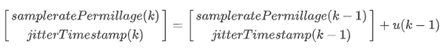

  * 同时建立如下观测方程
    
```cpp
timestampDiff(k) = t_bar(k)^ * w_bar(k) + v(k)          P(v) ~ (0,R)    (4.1.7)
t_bar(k) = [recvTimeMsDiff(k) 1]^    
```cpp   

  * `v(k)`为测量噪声服从正太分布,其协方差矩阵为R,取值为1

  * `t_bar(i)`为第(k)帧观测方程系数矩阵

  * `recvTimeMsDiff(k)`表示第(k)帧和第一帧的本地接收时间之差

  * 观测方程如果用矩阵的表示方式如下：

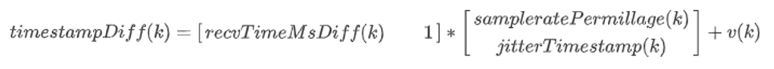

  * 网络残差公式
    
```cpp
residual(k) = timestampDiff(k) - t_bar(k)^ * w_hat(k-1)       (4.1.8)
```    

  * 网络残差体现了噪声的大小，使用第(k)帧的观测值 - 第(k-1)的估计计算值

### 4.2）TimestampExtrapolator模块计算期望接收时间

```cpp
int64_t TimestampExtrapolator::ExtrapolateLocalTime(uint32_t timestamp90khz) {
  ReadLockScoped rl(*_rwLock);
  int64_t localTimeMs = 0;
  CheckForWrapArounds(timestamp90khz);
  double unwrapped_ts90khz =
      static_cast<double>(timestamp90khz) +
      _wrapArounds * ((static_cast<int64_t>(1) << 32) - 1);
  if (_packetCount == 0) {
    localTimeMs = -1;
  } else if (_packetCount < _startUpFilterDelayInPackets) {
    localTimeMs =
        _prevMs +
        static_cast<int64_t>(
            static_cast<double>(unwrapped_ts90khz - _prevUnwrappedTimestamp) /
                90.0 +
            0.5);
  } else {
    if (_w[0] < 1e-3) {
      localTimeMs = _startMs;
    } else {
      double timestampDiff =
          unwrapped_ts90khz - static_cast<double>(_firstTimestamp);
      localTimeMs = static_cast<int64_t>(static_cast<double>(_startMs) +
                                          (timestampDiff - _w[1]) / _w[0] + 0.5);
    }
  }
  return localTimeMs;
}
```

  * 在3.1节中有介绍到获取当前帧的期望渲染时间 = 期望接收时间 + 实际延迟时间
  * `timestampDiff` = （第k帧的rtp时间戳 - 第一帧时间戳 ）
  * `localTimeMs = (timestampDiff - _w[1]) / _w[0] + (第一帧的实际接收时间)`，使用`timestampDiff` (发送端决定的) - 由于网络延迟或波动造成的延迟所对应的rtp时间戳的大小得出第k帧和第一帧最优的时间戳只差
  * `_w[0]` = `sampleratePermillage(k)`表示第(k)帧的千分之采样率
  * `_w[1]` = `jitterTimestamp(k)`表示第(k)帧的抖动rtp timestamp 时延

### 4.3）TimestampExtrapolator模块Kalman预测及校正

  * 对于未接收到的未丢过包的视频帧，每帧数据插入到`FrameBuffer`缓存后，通过当前帧的rtp 时间戳以及接收时间来更新`TimestampExtrapolator`的卡尔曼滤波器，进行迭代和校正
        
```cpp
//参数tMs为当前帧实际接收时间
//参数ts90khz为当前帧的rtp时间戳
void TimestampExtrapolator::Update(int64_t tMs, uint32_t ts90khz) {
    _rwLock->AcquireLockExclusive();
  //1)第一帧初始赋值  
  if (tMs - _prevMs > 10e3) {//第一帧或者10秒钟内未收到任何完整的帧则重置
    // Ten seconds without a complete frame.
    // Reset the extrapolator
    _rwLock->ReleaseLockExclusive();
    Reset(tMs);
    _rwLock->AcquireLockExclusive();
  } else {
    _prevMs = tMs;
  } 
  //2)根据当前帧的本地接收时间计算detalRecvTimeMs(k)  
  // Remove offset to prevent badly scaled matrices
  // 将当前帧接收时间 - 第一帧的接收时间得当前帧和第一帧的本地接收时间差
  // 此处记为detalRecvTimeMs =  tMs - _startMs  
  int64_t recvTimeMsDiff = tMs - _startMs;
  CheckForWrapArounds(ts90khz);
  int64_t unwrapped_ts90khz =
      static_cast<int64_t>(ts90khz) +
      _wrapArounds * ((static_cast<int64_t>(1) << 32) - 1);
  if (_firstAfterReset) {//重置后赋值初值
    // Make an initial guess of the offset,
    // should be almost correct since tMs - _startMs
    // should about zero at this time.
    _w[1] = -_w[0] * tMs;
    _firstTimestamp = unwrapped_ts90khz;
    _firstAfterReset = false;
  }
  /*3)使用上一次最优估计计算网络残差为计算验估计做准备，对应5大核心公式的公式(4) 以及4.1.8
      用当前帧真实的rtp时间戳 - 第一帧的时间戳 - detalRecvTimeMs * _w[0] - _w[1]
      detalRecvTimeMs * _w[0](上一次的最优采样率) 得出detalRtpTimeStamp 
  */  
  double residual = (static_cast<double>(unwrapped_ts90khz) - _firstTimestamp) -
                    static_cast<double>(recvTimeMsDiff) * _w[0] - _w[1];
  if (DelayChangeDetection(residual) &&
      _packetCount >= _startUpFilterDelayInPackets) {
    // A sudden change of average network delay has been detected.
    // Force the filter to adjust its offset parameter by changing
    // the offset uncertainty. Don't do this during startup.
    _pP[1][1] = _pP11;
  }
  if (_prevUnwrappedTimestamp >= 0 &&
      unwrapped_ts90khz < _prevUnwrappedTimestamp) {
    // Drop reordered frames.
    _rwLock->ReleaseLockExclusive();
    return;
  }
  // T = [t(k) 1]';
  // that = T'*w;
  // K = P*T/(lambda + T'*P*T);
  // 4)计算卡尔曼增益  
  double K[2];
  // 对应5大公式,公式3中的分子部分  
  K[0] = _pP[0][0] * recvTimeMsDiff + _pP[0][1];
  K[1] = _pP[1][0] * recvTimeMsDiff + _pP[1][1];
  // 对应5大公式,公式3中的分母部分   
  double TPT = _lambda + recvTimeMsDiff * K[0] + K[1];
  K[0] /= TPT;
  K[1] /= TPT;
  //5) 根据最优卡尔曼因子进行校正，计算后验估计值  
  // w = w + K*(ts(k) - that);
  _w[0] = _w[0] + K[0] * residual;
  _w[1] = _w[1] + K[1] * residual;
  //6)更新误差协方差  
  // P = 1/lambda*(P - K*T'*P);
  double p00 =
      1 / _ * (_pP[0][0] - (K[0] * recvTimeMsDiff * _pP[0][0] + K[0] * _pP[1][0]));
  double p01 =
      1 / _lambda * (_pP[0][1] - (K[0] * recvTimeMsDiff * _pP[0][1] + K[0] * _pP[1][1]));
  _pP[1][0] =
      1 / _lambda * (_pP[1][0] - (K[1] * recvTimeMsDiff * _pP[0][0] + K[1] * _pP[1][0]));
  _pP[1][1] =
      1 / _lambda * (_pP[1][1] - (K[1] * recvTimeMsDiff * _pP[0][1] + K[1] * _pP[1][1]));
  _pP[0][0] = p00;
  _pP[0][1] = p01;
  _prevUnwrappedTimestamp = unwrapped_ts90khz;
  if (_packetCount < _startUpFilterDelayInPackets) {
    _packetCount++;
  }
  _rwLock->ReleaseLockExclusive();
}
```

  * 以上首先是根据图`WebRtc_Video_Stream_Receiver_07_05`中的公式（3）计算卡尔曼增量因子，计算的过程中先求其分子部分，然后再求分母部分
  * 以上观测噪声的协方差R等于lambda,默认为1。
  * 到此就能得出一个期望的接收时间，根据期望接收时间就能得出一个期望渲染时间从而得到期望渲染时间
    
```cpp 
expectRenderTime = expectRecvTime + actual_delay
```

  * 接下来开始分析`actual_delay`是如何求取的？
  * `actual_delay`指的是前面已解码的帧的实际的延迟时间

## 5）计算期望渲染时间

  * 首先再回顾`FrameBuffer`模块取帧和将帧发送到解码队列的流程如下图  

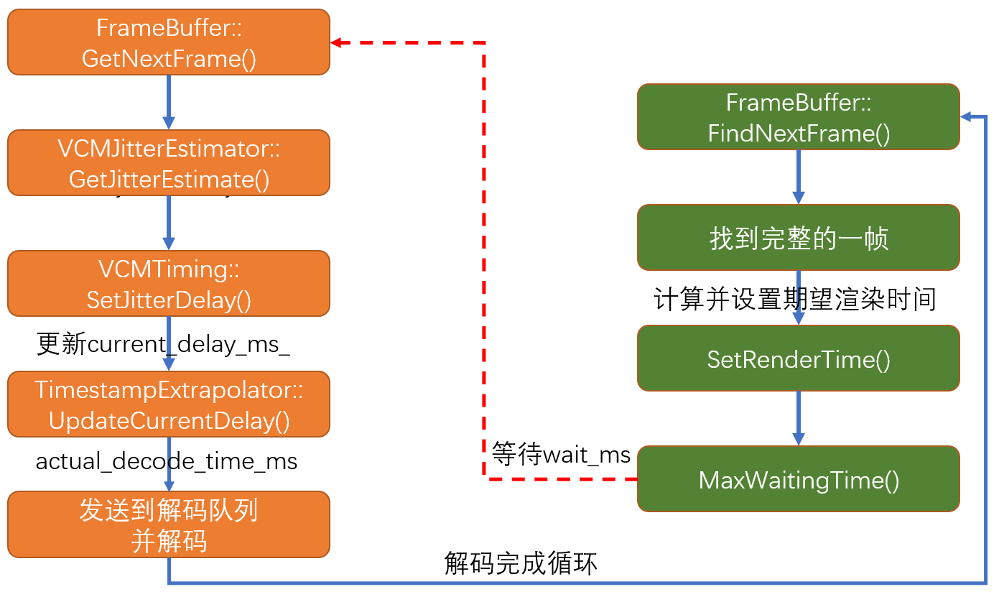

  * 解码任务队列，每次轮询通过`FrameBuffer::FindNextFrame()`找到一帧完整的帧，并为其设置期望最优渲染时间，然后再通过`MaxWaitingTime`函数返回一个延迟时间，告知重复任务队列，让该任务等待`wait_ms`之后开始执行，将该帧数据发送到解码任务队列进行解码，解码完毕后又重新轮询新的帧

  * 其中在计算渲染时间的时候有用到上一帧数据的平滑`actual_delay`，也就是`current_delay_ms_`，基于此开始分析`current_delay_ms_`的计算过程
    
```cpp    
void VCMTiming::SetJitterDelay(int jitter_delay_ms) {
  rtc::CritScope cs(&crit_sect_);
  if (jitter_delay_ms != jitter_delay_ms_) {
    jitter_delay_ms_ = jitter_delay_ms;
    // When in initial state, set current delay to minimum delay.
    if (current_delay_ms_ == 0) {
      current_delay_ms_ = jitter_delay_ms_;
    }
  }
}
```

  * `jitter_delay_ms`是在每一帧数据送到解码队列之前使用`VCMJitterEstimator`模块估计出来的，对于第一帧数据`current_delay_ms_`的值就等于该帧的`jitter_delay_ms_`
    
```cpp 
void VCMTiming::UpdateCurrentDelay(int64_t render_time_ms,
                                    int64_t actual_decode_time_ms) {
  rtc::CritScope cs(&crit_sect_);
  uint32_t target_delay_ms = TargetDelayInternal();//目标延迟
  //计算实际延迟  
  int64_t delayed_ms =
      actual_decode_time_ms -
      (render_time_ms - RequiredDecodeTimeMs() - render_delay_ms_);
  if (delayed_ms < 0) {
    return;
  }
  if (current_delay_ms_ + delayed_ms <= target_delay_ms) {
    current_delay_ms_ += delayed_ms;
  } else {
    current_delay_ms_ = target_delay_ms;
  }
}
```

```cpp 
int VCMTiming::TargetDelayInternal() const {
  //计算出目标延迟 =  jitter_delay_ms_ + 解码耗时 +  渲染延迟
  return std::max(min_playout_delay_ms_,
                  jitter_delay_ms_ + RequiredDecodeTimeMs() + render_delay_ms_);
}
```

  * 以上函数的作用就是在当前帧顺利发送到解码队列之后尽量确保`current_delay_ms_`的值逼近`jitter_delay_ms_ + RequiredDecodeTimeMs() + render_delay_ms_`
  * 然后在后续帧获取期望渲染时间的时候，尽量保证所有帧的延迟间隔趋向于平滑
    
```cpp 
current_delay_ms_ = 帧间抖动延时 + 解码耗时 + 渲染延迟 
```    

  * 最后再回顾3.1）节中的VCMTiming模块获取期望渲染时间
    
```cpp 
expectRenderTime = expectRecvTime + actual_delay
                 = 期望接收时间 + 帧间抖动延时 + 解码耗时 + 渲染延迟 
```

  * 已知默认情况下渲染延迟一般都是默认值10ms

  * 解码耗时依据硬解的性能而定，一般都会比较均匀

  * 然而期望接收时间和帧间抖动延时都会因为网络的千变万化以及发送端的各种不确定性存在一定的波动

  * 其实在调试中发现不管用不用卡尔曼滤波，对于期望接收时间，如果网络不是很差，基本上估计出来的曲线和实际曲线是基本一致的,当然也有可能是我测试的条件比较好

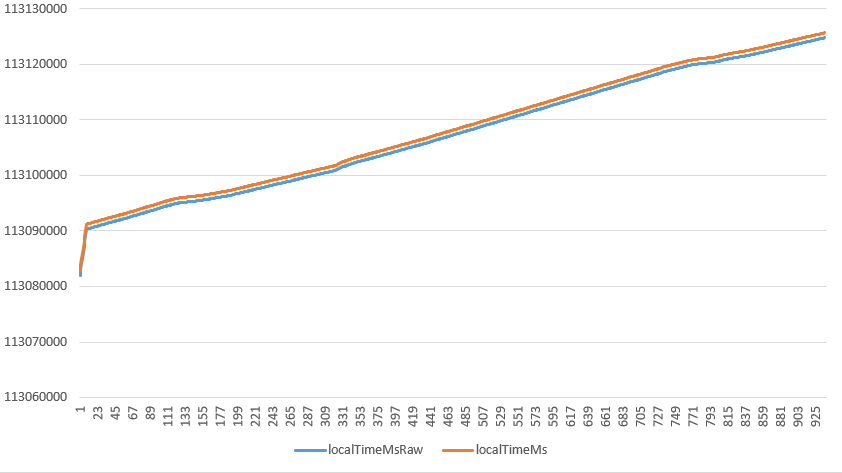

  * 其中蓝色曲线直接试用`timestampDiff / 90 + _startMs`所得，当我设置接收端5%丢包的时候两条曲线完全重合了

#### 6）总结

  * 通过本文的分析，首先明确webrtc视频接收过程中的逻辑处理是十分复杂的，同时通过两大卡尔曼滤波对每帧的期望接收和每帧的帧间抖动进行滤波处理
  * 其中对帧间抖动的滤波可以使得每帧数据进入解码队列的时机变得相对平滑，这样可以有效的缓解因网络丢包等情况导致视频的卡顿等问题
  * 而期望渲染时间的估计使得渲染过程趋向于平滑，同时也明确本文中使用的卡尔曼滤波的作用是为每帧产生一个最优的接收时间，改时间最终决定了该帧的渲染时间，这对音视频的同步是非常有作用的
  * 同时通过学习本文深入学习卡尔曼滤波的应用场景

<hr>

#### <p>原文出处：<a href='https://www.jianshu.com/p/ff4dfcd072ea' target='blank'>WebRTC Video Receiver(八)-基于Kalman filter模型的JitterDelay原理分析</a></p>

## 1）前言

* 前一篇文章分析了`FrameBuffer`模块对视频帧的插入原理，以及出队(送到解码队列)的机制。
* 在出队的过程中涉及到了很多和延迟相关的信息，没有分析，诸如渲染时间的计算、帧延迟的计算、抖动的计算等都未进行相应的分析。
* 其中`FrameBuffer`延迟`JitterDleay`对视频流的单向延迟有重要的影响，很大程度上决定了应用的实时性,本文结合参考文献对`JitterDleay`的计算进行深入原理分析。
* 本文首先介绍gcc算法的Arrival-time model模型
* 其次介绍Arrival-time filter（卡尔曼滤波）的公式推导
* 最后分析结合代码分析卡尔曼滤波在`JitterDleay`中的应用，以及了解jitter delay究竟描述的是个啥东西

## 2）Arrival-time model模型介绍

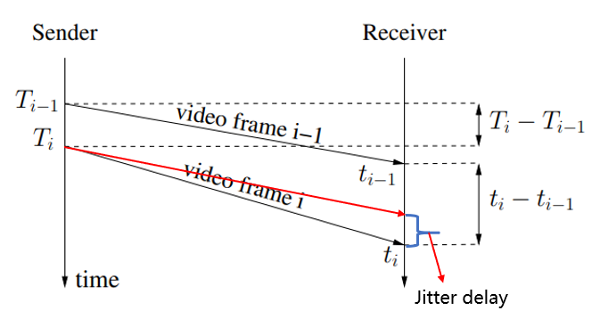

  * 上图为网络传输过程中相邻两帧数据的到达时间模型
  * 已知T(i-1)为第(i-1)帧数据发送时间，T(i)为第(i)帧数据发送时间
  * t(i)为第i帧数据的接收时间，t(i-1)为第(i-1)帧数据的接收时间
  * 理论上若传输过程中无噪声（网络噪声）和其他因素（传输大帧引起的延迟）的影响，第i帧传输曲线应该如上述红色线条（这样jitter delay应该等于0），但正由于网络噪声和传输大帧导致的影响使得第I帧传输的时延迟可能大于第i-1帧，也或者小于第i-1帧，所以就有了jitter delay
  * webrtc的`FrameBuffer`模块中通过获取当前的帧间延迟.来告知解码队列何时解码该帧比较合适，从而来让接收端所接收到的视频帧能够较为平滑的进入到解码器，从而缓解卡顿现象
  * 通过上图可以理论建模如下：
    
```cpp
d(i) = t(i) - t(i-1) - (T(i) - T(i-1))        (2.1.1)
     = L(i)/C(i) - L(i-1)/C(i-1) + w(i)
       L(i)-L(i-1)
     = -------------- + w(i)
           C(i)
     = dL(i)/C(i) + w(i)
```    

  * d(i) 就是最终的帧间延迟
  * 其中`C(i)`为信道传输速率、`L(i)`为每帧数据的数据量，`dL(i)`为两帧数据的数据量的差值，以上假定传输速率恒定
  * 而`w(i)`为是随机过程w的一个样本，它是C(i)、当前发送数据量和当前发送速率的函数，并假定w为高斯白噪声
  * 当传输信道过载发送数据时，w(i)的方差将变大，传输信道空载时w(i)将随之变小，其他情况w(i)为0
  * 若`t(i) - t(i-1) > T(i) - T(i-1)`表示帧I相对帧i-1的延迟大了
  * 若将网络排队延迟`m(i)`从`w(i)`中提取出来使得过程噪声的均值为0，则会得出如下：
    
```cpp
w(i) = m(i) + v(i)
d(i) = dL(i)/C(i) + m(i) + v(i)
```  

  * `m(i)`表示网络排队延迟（如经历路由器的时候的排队延迟），`v(i)`表示测量噪声(如最大帧数据量和平均每帧数据量的计算误差，时间同步等)。
  * 以上就是帧间延迟的基本模型，在该模型中我们实际要求的是利用卡尔曼滤波来求得`C(i)`和`m(i)`
  * 并通过迭代使得`C(i)`和`m(i)`的误差最小，从而得到最优的d(i)帧间延迟

## 3）Kalman filter 建模及理论推导

### 3.1 卡尔曼滤波-建立状态空间方程

```cpp
theta(i) = A * theta(i-1) + u(i-1)        P(u) ~ (0,Q)         
         = theta(i-1) + u(i-1)            (3.1.1)
Q(i) = E{u_bar(i) * u_bar(i)^T}
diag(Q(i)) = [10^-13 10^-3]^T
```    

  * theta(i)为状态空间变量，其中A为状态转移矩阵，该案例取值为二维单位矩阵，u(i-1)为过程噪声(无法测量)，其概率分布服从正太分布,数学期望为0，协方差矩阵为Q,推荐为对角矩阵

  * theta(i)包含两个变量如下
    
```cpp
theta_bar(i) = [1/C(i)  m(i)]^T   
```    

  * `1/C(i)`为信道传输速率的倒数
  * `m(i)`为帧i的网络排队时延(路由器或者交换机处理数据包排队所消耗的时间)
  * `C(i)`和`m(i)`也是我们实际要求得的目标值

### 3.2 卡尔曼滤波-建立观测方程

  * 观测方程如下：
    
```cpp
d(i) = H * theta(i) + v(i)          P(V) ~ (0,R)      (3.2.2)
```

  * 上述观测方程测量的是时间，为一维方程
  * H为观测系数矩阵，其定义如下：
    
```cpp
h_bar(i) = [dL(i)  1]^T
H = h_bar(i)^T = [dL(i)  1]    
```  

  * `dL(i)`为第i帧和第i-1帧的数据量之差`（detal L(i)）`

  * 将其变形为google 官方公式如下：
    
```cpp 
d(i) = h_bar(i)^T * theta_bar(i) + v(i)          (3.2.3)
```

  * v(i)为观测噪声，同样其概率分布服从正太分布，数学期望为0，协方差矩阵为R
    
```cpp
variance var_v = sigma(v,i)^2
R(i) = E{v_bar(i) * v_bar(i)^T}  
     = var_v
```

  * 将`h_bar`向量代入到`(3.2.3)`式中
    
```cpp
d(i) = h_bar(i)^T * theta_bar(i) + v(i)
    = [dL(i)  1] * [1/C(i)  m(i)]^T + v(i)       (3.2.4)
```

  * 有了状态方程和测量方程则可以根据卡尔曼滤波的预测和校正模型进行估计

### 3.3 卡尔曼滤波-预测计算先验估计

  * 综合上述公式可求得先验估计值如下：
  * 预测其实就是使用上一次的最优结果预测当前的值
  * 首先是计算先验估计的误差协方差
    
```cpp
theta_hat^-(i) = theta_hat(i-1) + u(i-1)             (3.3.1)
```    

  * `theta_hat^-(i)`第i帧的先验估计值
  * 其次根据先验估计值计算先验估计的误差协方差

### 3.4 卡尔曼滤波-预测计算先验估计误差协方差

```cpp    
e^-(i) = theta(i) - theta_hat^-(i)                      P(E(i)) ~ (0 , P)   (3.4.1)
P^-(i) = {e^-(i) * e^-(i)^T}
       = E{(theta(i) - theta_hat^-(i)) * (theta(i) - theta_hat^-(i))^T}     (3.4.2)
       = A * P(i-1) * A^T + Q                                               (3.4.3)
       = P(i-1) + Q 
       = E(i-1) + Q                                                         (3.4.4)
```

  * `e^-(i)`表示当前帧的实际值和估计值之间的误差，也就是先验估计的误差
  * `P^-(i)`表示当前帧的先验误差协方差
  * `P(i-1)`为上一次的误差协方差
  * 也就是说先验估计的误差协方差等于上一次的后验估计的误差协方差 + 过程噪声的的误差协方差
  * 有了先验估计的误差协方差之后就是计算当前帧的最优卡尔曼增益为迭代做准备

### 3.5 卡尔曼滤波-校正计算卡尔曼增益

  * 此处不做数学理论推导，直接给出如下公式
        
```cpp
                  P^-(i) * H^T
k_bar(i) = ------------------------------------------------------
              H * P^-(i) * H^T + R                   
                  P^-(i) * h_bar(i)
        = ------------------------------------------------------            (3.5.1)
              h_bar(i)^T * P^-(i) * h_bar(i) + R                   
                ( E(i-1) + Q(i) ) * h_bar(i)
        = ------------------------------------------------------            (3.5.2)
          var_v_hat(i) + h_bar(i)^T * (E(i-1) + Q(i)) * h_bar(i)
```

  * 其中`R = var_v_hat(i)`
  * 在webrtc gcc算法中R表示测量误差协方差，它使用指数平均滤波器，通过如下方法计算R
    
```cpp
The variance var_v(i) = sigma_v(i)^2 is estimated using an exponential averaging filter, modified for variable sampling rate
var_v_hat(i) = max(beta * var_v_hat(i-1) + (1-beta) * z(i)^2, 1)                    (3.5.3)
beta = (1-chi)^(30/(1000 * f_max))                                                  (3.5.4)
```

  * 测量误差协方差最小取值为1
  * z(i)为网络残差(当前测量值 - 上一次估计值）

### 3.6 卡尔曼滤波-校正计算后验估计值

```cpp    
theta_hat(i) = theta_hat^-(i) + k_bar(i) * (d(i) - H * theta_hat^-(i))
             = theta_hat(i-1) + k_bar(i) * (d(i) - H * theta_hat(i-1))              (3.6.1)
             = theta_hat(i-1) + k_bar(i) * d(i) - k_bar(i) * H * theta_hat(i-1)     
             = (1 - k_bar(i) * H) * theta_hat(i-1)  + k_bar(i) * d(i)               (3.6.2)
k_bar(i) ~ [0 ~ 1/H]
```

  * `theta_hat(i)`为第i帧的估计值，叫做后验估计值
  * `k_bar(i)`为当前帧(第i帧)的卡尔曼增益
  * 卡尔曼滤波的目标就是去寻找适当的`k_bar(i)`，使得`theta_hat(i)`的值更加趋向`theta(i)`（也就是实际值），如何去选择值肯定是和误差`v(i)`以及`u(i-1)`息息相关的
  * 当`k_bar(i)`趋近0的时候，更相信算出来的结果（估计值）
  * 当`k_bar(i)`趋近1/H的时候，更相信测量出来的结果
  * 将上述公式进行替换如下
    
```cpp
z(i) = d(i) - h_bar(i)^T * theta_hat(i-1)                                           (3.6.3)
theta_hat(i) = theta_hat(i-1) + z(i) * k_bar(i)                                     (3.6.4)
```

  * `z(i)`也叫网络残差(当前测量值 - 上一次估计值）
  * 上述公式则为google给出的官方公式
  * 结合`(3.6.1)`和`(3.5.2)`可知当`var_v_hat(i)`越大时，说明测量误差较大，此时卡尔曼增益将越小，最终的估计值将更加趋近与一次的估计值

### 3.7 卡尔曼滤波-更新误差协方差

  * 计算后验估计误差协方差

```cpp    
e(i) = theta(i) - theta_hat(i)                      P(E(i)) ~ (0 , P)               (3.7.1)
P(i) = E{e(i) * e(i)^T}                                                             (3.7.2)
     = E{(theta(i) - theta_hat(i)) * (theta(i) - theta_hat(i))^T}                   (3.7.3)
     = E(i)
```

  * `e(i)`表示当前帧的实际值和估计值之间的误差

  * `P(i)`表示当前帧的误差协方差，此处叫做后验误差协方差

  * 综合(3.6.1)、(3.5.1)最后得出
    
```cpp
P(i) = (I - k_bar(i) * H) * P^-(i)                                                 (3.7.4)
     = (I - k_bar(i) * h_bar(i)^T) * (E(i-1) + Q(i))                               (3.7.5)
     = E(i)
```

  * 其中I为2*2的单位矩阵

##### 3.8 卡尔曼滤波-系统模型图

  * 结合公式3.6.2我们可以得出如下模型图

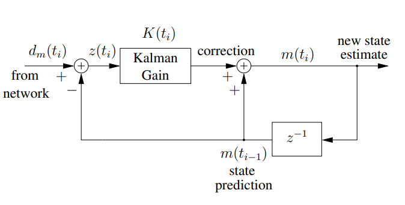

```cpp
m(i) = (1 − K(i)) * m(i−1) + K(i) * (dm(i))
```    

## 4）WebRTC中JitterDelay的计算和迭代过程

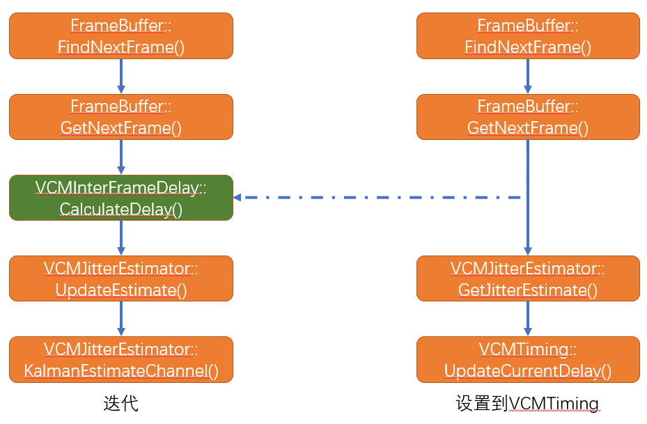

  * 步骤1、在`FrameBuffer`模块中通过`Decode`任务队列，通过重复任务调用`FindNextFrame`和`GetNextFrame`获取待解码的视频帧
  * 步骤2、然后通过`VCMInterFrameDelay模块的CalculateDelay()`函数依据当前找到的帧的rtp时间戳以及接收时间计算帧间延迟得到`frameDelayMS`
  * 步骤3、以`frameDelayMS`和当前帧的`frameSizeBytes`(当前帧的数据大小字节)为参数，调用`VCMJitterEstimator::UpdateEstimate()`函数对卡尔曼滤波器进行迭代，并计算出当前帧的最优`jitterDelay`
  * 步骤4、对卡尔曼滤波进行校准供下一次迭代使用
  * 最后通过`VCMJitterEstimator::GetJitterEstimate()`函数返回最优估计`jitterdelay`并将其作用到`VCMTiming`模块供期望`RenderDelay`的计算
  * 其中步骤2中的`frameDelayMS`的计算对应了第二节的`Arrival-time model`示意图，并将T(i)代表第i帧的发送的rtp时间戳，T(i-1)为第i-1帧的rtp时间戳，t(i)为第i帧的本地接收时间，t(i-1)为第i-1帧的本地接收时间
  * 步骤2的实现代码如下：
        
```cpp
bool VCMInterFrameDelay::CalculateDelay(uint32_t timestamp,
                                        int64_t* delay,
                                        int64_t currentWallClock) {
  .....
  // Compute the compensated timestamp difference and convert it to ms and round
  // it to closest integer.
  _dTS = static_cast<int64_t>(
      (timestamp + wrapAroundsSincePrev * (static_cast<int64_t>(1) << 32) -
        _prevTimestamp) /
          90.0 +
      0.5);\
  // frameDelay is the difference of dT and dTS -- i.e. the difference of the
  // wall clock time difference and the timestamp difference between two
  // following frames.
  *delay = static_cast<int64_t>(currentWallClock - _prevWallClock - _dTS);
  _prevTimestamp = timestamp;
  _prevWallClock = currentWallClock;
  return true;
}
```

  * `_dTS`表示相邻两帧的rtp时间戳
  * `_prevWallClock`为上一帧的本地接收时间
  * `currentWallClock`为当前帧的本地接收时间
  * 接下来首先介绍`JitterDelay`的计算流程，最后分析卡尔曼滤波预测和校正过程

### 4.1）计算JitterDelay

  * 在`FrameBuffer`模块中使用如下函数获取
        
```cpp
int VCMJitterEstimator::GetJitterEstimate(
    double rttMultiplier,
    absl::optional<double> rttMultAddCapMs) {
  //调用CalculateEstimate()计算当前的jitterDelay,OPERATING_SYSTEM_JITTER默认为10ms  
  //这就意味着默认最小的jittterDelay至少是10ms?     
  double jitterMS = CalculateEstimate() + OPERATING_SYSTEM_JITTER;
  uint64_t now = clock_->TimeInMicroseconds();
  //kNackCountTimeoutMs = 60000
  // FrameNacked会更新_latestNackTimestamp单位为微秒  
  //1分钟内若所有帧都未丢包则清除  
  if (now - _latestNackTimestamp > kNackCountTimeoutMs * 1000)
    _nackCount = 0;
  if (_filterJitterEstimate > jitterMS)
    jitterMS = _filterJitterEstimate;
  if (_nackCount >= _nackLimit) {//_nackLimit
    if (rttMultAddCapMs.has_value()) {
      jitterMS +=
          std::min(_rttFilter.RttMs() * rttMultiplier, rttMultAddCapMs.value());
    } else {
      jitterMS += _rttFilter.RttMs() * rttMultiplier;
    }
  }
  ....
  return rtc::checked_cast<int>(std::max(0.0, jitterMS) + 0.5);
}
```

  * `FrameBuffer`只针对未重传过包的帧进行`jitterDelay`的迭代和计算，也就是说假设第i帧数据有丢包，那么该帧是不会计算`JitterDelay`的，该帧的期望渲染时间计算过程中所用到的`jitterDelay`值是上一帧的`jitterDelay`
  * webrtc jitter delay对丢过包的数据帧会在`FrameBuffer::GetNextFrame()`函数中通过`jitter_estimator_.FrameNacked()`函数告知`VCMJitterEstimator`模块，使得`_nackCount`变量自增(前提通过`WebRTC-AddRttToPlayoutDelay/Enable`使能)，超过3会清除
  * 当`_nackCount`大于等于3的时候在时候`jitterDelay`会在后续未丢包的帧中加上一个RTT乘以某个系数
  * 通过参阅网上的一些文摘表示，如果某帧有丢包如果不处理该RTT会很容易造成卡顿
  * 以上函数的核心主要是调用`CalculateEstimate()`函数计算`jitterDelay`
    
```cpp 
// Calculates the current jitter estimate from the filtered estimates.
double VCMJitterEstimator::CalculateEstimate() {
  double ret = _theta[0] * (_maxFrameSize - _avgFrameSize) + NoiseThreshold();
  .......
  _prevEstimate = ret;
  return ret;
}
```

  * `_theta[0]`记录的是信道传输速率的倒数，也就是上述卡尔曼状态方程中的`1/c(i)`
  * `_maxFrameSize`表示自会话开始以来所收到的最大帧大小
  * `_avgFrameSize`表示当前平均帧大小
  * `NoiseThreshold()`计算噪声补偿阀值
    
```cpp 
double VCMJitterEstimator::NoiseThreshold() const {
  double noiseThreshold = _noiseStdDevs * sqrt(_varNoise) - _noiseStdDevOffset;
  if (noiseThreshold < 1.0) {
    noiseThreshold = 1.0;
  }
  return noiseThreshold;
}
```

  * `_noiseStdDevs`表示噪声标准差系数取值2.33
  * `_varNoise`表示测量噪声方差对应公式`(3.2.3)`中的v(i)，默认初始值为4.0
  * `_noiseStdDevOffset`噪声标准差偏移（噪声扣除常数）取值30.0ms

### 4.2）JitterDelay迭代更新机制

  * 通过第4大节中的截图看出，卡尔曼的更新是通过`Framebuffer`模块调用其`UpdateEstimate`函数来实现的
    
```cpp    
// Updates the estimates with the new measurements.
void VCMJitterEstimator::UpdateEstimate(int64_t frameDelayMS,
                                        uint32_t frameSizeBytes,
                                        bool incompleteFrame /* = false */) {
  //1)计算当前帧和上一帧的数据量之差
  int deltaFS = frameSizeBytes - _prevFrameSize;
  //2)计算_avgFrameSize平均每帧数据的大小 
  if (_fsCount < kFsAccuStartupSamples) {
    _fsSum += frameSizeBytes;
    _fsCount++;
  } else if (_fsCount == kFsAccuStartupSamples) {//kFsAccuStartupSamples取值为5超过5帧开始计算平均帧大小
    // Give the frame size filter.
    _avgFrameSize = static_cast<double>(_fsSum) / static_cast<double>(_fsCount);
    _fsCount++;
  }
  /*3）若当前输入帧的大小比平均每帧数据的数据量要大,则对其进行滑动平均处理，比如说如果当前是一个I帧，数据量显然会比较大,
    默认incompleteFrame为false，所以每帧都会计算平均值*/
  if (!incompleteFrame || frameSizeBytes > _avgFrameSize) {
    //滑动平均算法，_phi的取值为0.97，取接近前30帧数据大小的平均值，求得的avgFrameSize值为接近近30帧数据的平均大小  
    double avgFrameSize = _phi * _avgFrameSize + (1 - _phi) * frameSizeBytes;
    //如果I帧数据量会比较大，如下的判断会不成立，偏移太大不计赋值_avgFrameSize   
    if (frameSizeBytes < _avgFrameSize + 2 * sqrt(_varFrameSize)) {
      // Only update the average frame size if this sample wasn't a key frame.
      _avgFrameSize = avgFrameSize;
    }
    // Update the variance anyway since we want to capture cases where we only
    // get key frames.
    //3.1）此处更新平均帧大下的方差，默认方差为100,取其最大值,根据_varFrameSize可以得出在传输过程中每帧数据大小的均匀性
    //    若方差较大则说明帧的大小偏离平均帧大小的程度越大，则均匀性也越差
    _varFrameSize = VCM_MAX(
        _phi * _varFrameSize + (1 - _phi) * (frameSizeBytes - avgFrameSize) *
                                    (frameSizeBytes - avgFrameSize),
        1.0);
  }
  // Update max frameSize estimate.
  //4)计算最大帧数据量  
  _maxFrameSize =
      VCM_MAX(_psi * _maxFrameSize, static_cast<double>(frameSizeBytes));
  if (_prevFrameSize == 0) {
    _prevFrameSize = frameSizeBytes;
    return;
  }
  //赋值上一帧数据大小  
  _prevFrameSize = frameSizeBytes;
  // Cap frameDelayMS based on the current time deviation noise.
  /*5) 根据当前时间偏移噪声求frameDelayMS,_varNoise为噪声方差，默认4.0很显然该值在传输过程中会变化，
      time_deviation_upper_bound_为时间偏移上限值，默认为3.5，所以默认初始值计算出来max_time_deviation_ms
      为7，对于帧率越高，默认输入的frameDelayMS会越小，这里和max_time_deviation_ms去最小值，当噪声的方差越大
      max_time_deviation_ms的值月越大，其取值就会越接近取向传入的frameDelayMS*/ 
  int64_t max_time_deviation_ms =
      static_cast<int64_t>(time_deviation_upper_bound_ * sqrt(_varNoise) + 0.5);
  frameDelayMS = std::max(std::min(frameDelayMS, max_time_deviation_ms),
                          -max_time_deviation_ms);
  /*6）根据得出的延迟时间计算样本与卡尔曼滤波器估计的期望延迟之间的延迟差(反映网络噪声的大小),计算公式为
      frameDelayMS - (_theta[0] * deltaFSBytes + _theta[1])
      当前测量值 - 上一次卡尔曼滤波后的估计值 对应公式3.6.3和3.6.4*/ 
  double deviation = DeviationFromExpectedDelay(frameDelayMS, deltaFS);
  // Only update the Kalman filter if the sample is not considered an extreme
  // outlier. Even if it is an extreme outlier from a delay point of view, if
  // the frame size also is large the deviation is probably due to an incorrect
  // line slope.    
  //根据注释的意思是只有当样本不被认为是极端异常值时才更新卡尔曼滤波器,言外之意就是网络残差值不能超过
  //  _numStdDevDelayOutlier * sqrt(_varNoise) = 30ms 默认值，随_varNoise的大小变化而变化 
  if (fabs(deviation) < _numStdDevDelayOutlier * sqrt(_varNoise) ||
      frameSizeBytes >
          _avgFrameSize + _numStdDevFrameSizeOutlier * sqrt(_varFrameSize)) {
    // Update the variance of the deviation from the line given by the Kalman
    // filter.
    EstimateRandomJitter(deviation, incompleteFrame);
    // Prevent updating with frames which have been congested by a large frame,
    // and therefore arrives almost at the same time as that frame.
    // This can occur when we receive a large frame (key frame) which has been
    // delayed. The next frame is of normal size (delta frame), and thus deltaFS
    // will be << 0. This removes all frame samples which arrives after a key
    // frame.
    if ((!incompleteFrame || deviation >= 0.0) &&
        static_cast<double>(deltaFS) > -0.25 * _maxFrameSize) {
      // Update the Kalman filter with the new data
      KalmanEstimateChannel(frameDelayMS, deltaFS);
    }
  } else {  // 如果网络残差太大，说明噪声偏移太大，需要对测量噪声进行校正，本次不进行卡尔曼预测和校正  
    int nStdDev =
        (deviation >= 0) ? _numStdDevDelayOutlier : -_numStdDevDelayOutlier;
    EstimateRandomJitter(nStdDev * sqrt(_varNoise), incompleteFrame);
  }
  // Post process the total estimated jitter
  //6) 求得当前帧的jitterDelay最优估计值 
  if (_startupCount >= kStartupDelaySamples) {
    PostProcessEstimate();
  } else {
    _startupCount++;
  }
}
```   

  * `_avgFrameSize`表示平均帧大小，使用滑动平均算法
  * `_varFrameSize`表示传输过程中帧大小的方差，象征了传输过程中每帧数据量的均匀性，`_varFrameSize`越大表示均匀性越差，所以在传输过程中，在发送端应当尽量使得每帧数据的数据量尽可能的接近（如尽量减少I帧的发送，按需所取）
  * `_maxFrameSize`表示自会话以来最大帧的数据量大小
  * `deltaFS`表示当前帧和上一帧的数据量只差
  * `deviation`表示网络残差，使用当前测量值减去估计值求得,代码如下：
    
```cpp 
double VCMJitterEstimator::DeviationFromExpectedDelay(
    int64_t frameDelayMS,
    int32_t deltaFSBytes) const {
  return frameDelayMS - (_theta[0] * deltaFSBytes + _theta[1]); 
}
```

  * 以上计算对应公式`3.6.3`和`3.6.4`
  * 上述第5步中根据当前网络残差是否在某范围内来决定是只更新测量噪声的方差还是即更新测量噪声误差也进行预测和校正工作
  * 接下来着重分析`EstimateRandomJitter`测量噪声方差的计算和`KalmanEstimateChannel`函数的预测以及校正分析
  * 同时以上`UpdateEstimate`函数的过程中计算平均帧大小以及平均帧大小方差都使用了移动平均算法如下：
    
```cpp 
double avgFrameSize = _phi * _avgFrameSize + (1 - _phi) * frameSizeBytes;
_varFrameSize = VCM_MAX(
    _phi * _varFrameSize + (1 - _phi) * (frameSizeBytes - avgFrameSize) *
    (frameSizeBytes - avgFrameSize),1.0);
```

  * 使用移动平均算法的原因是让计算出来的值和前面帧的值有关联，确保离散数据的平滑性，当`_phi`取1的时候就不平滑了

### 4.3）更新误差方差

```cpp    
void VCMJitterEstimator::EstimateRandomJitter(double d_dT,
                                              bool incompleteFrame) {
  uint64_t now = clock_->TimeInMicroseconds();
  //1)对帧率进行采样统计  
  if (_lastUpdateT != -1) {
    fps_counter_.AddSample(now - _lastUpdateT);
  }
  _lastUpdateT = now;
  if (_alphaCount == 0) {
    assert(false);
    return;
  }
  //2) alpha = 399  
  double alpha =
      static_cast<double>(_alphaCount - 1) / static_cast<double>(_alphaCount);
  _alphaCount++;
  if (_alphaCount > _alphaCountMax)
    _alphaCount = _alphaCountMax;//_alphaCountMax = 400
  // In order to avoid a low frame rate stream to react slower to changes,
  // scale the alpha weight relative a 30 fps stream.
  double fps = GetFrameRate();
  if (fps > 0.0) {
    double rate_scale = 30.0 / fps;
    // At startup, there can be a lot of noise in the fps estimate.
    // Interpolate rate_scale linearly, from 1.0 at sample #1, to 30.0 / fps
    // at sample #kStartupDelaySamples.
    if (_alphaCount < kStartupDelaySamples) {
      rate_scale =
          (_alphaCount * rate_scale + (kStartupDelaySamples - _alphaCount)) /
          kStartupDelaySamples;//kStartupDelaySamples = 30
    }
    //alpha = pow(399/400,30.0 / fps)  
    alpha = pow(alpha, rate_scale);
  }
  double avgNoise = alpha * _avgNoise + (1 - alpha) * d_dT;
  double varNoise =
      alpha * _varNoise + (1 - alpha) * (d_dT - _avgNoise) * (d_dT - _avgNoise);
  if (!incompleteFrame || varNoise > _varNoise) {
    _avgNoise = avgNoise;
    _varNoise = varNoise;
  }
  if (_varNoise < 1.0) {
    // The variance should never be zero, since we might get stuck and consider
    // all samples as outliers.
    _varNoise = 1.0;
  }
}
```    

  * 测量误差的更新和帧率相关，`alpha`为指数移动平均算法的指数加权系数收帧率大小的影响较大，数学模型为递减指数函数，当fps变低时，rate_scale增大，从而`alpha`会变小，最终`avgNoise`的值会增大，意味着此时噪声增大，实时帧率越接近30fps,效果越理想
  * `_avgNoise`为自会话以来的平均测量噪声，`_varNoise`会噪声方差，变量`d_dT`表示网络残差
  * 噪声方差以及平均噪声的更新都采用指数型移动平均算法求取，其特性是指数式递减加权的移动平均，各数值的加权影响力随时间呈指数式递减，时间越靠近当前时刻的数据加权影响力越大
    
```cpp 
double avgNoise = alpha * _avgNoise + (1 - alpha) * d_dT;
double varNoise =
      alpha * _varNoise + (1 - alpha) * (d_dT - _avgNoise) * (d_dT - _avgNoise);
```

  * 以上计算对应公式`3.5.3`和`3.5.4`
  * 当`_varNoise`较大时，说明此时网络噪声较大，此时后续的卡尔曼增益计算的结果会较小，说明测量误差较大，使得当前帧的jitterDelay更趋近上一次的估计值，从而收当前网络残差的影响更小一些

### 4.4）Kalman Filter 预测及校正

  * 结合第3章界的理论推导，预测首先利用上一次的估计结果求得先验估计误差协方差
  * 在`VCMJitterEstimator`模块中定义如下核心矩阵
        
```cpp
double _thetaCov[2][2];  // Estimate covariance 先验估计误差协方差
double _Qcov[2][2];      // Process noise covariance 过程噪声协方差对应Q向量
```
    
```cpp 
/**
@ frameDelayMS:为测量出来的当前帧和上一帧的帧间抖动延迟
@ deltaFSBytes：当前帧的数据量和上一帧的数据量之差
**/
void VCMJitterEstimator::KalmanEstimateChannel(int64_t frameDelayMS,
                                                int32_t deltaFSBytes) {
  double Mh[2];//P(i) = E[1/c(i) m(i)]
  double hMh_sigma;
  double kalmanGain[2];
  double measureRes;
  double t00, t01;
  // Kalman filtering
  /*1）计算先验估计误差协方差  
      结合公式3.4.1~3.4.4  
    e^-(i) = theta(i) - theta_hat^-(i)                          
    P^-(i) = {e^-(i) * e^-(i)^T}
            = E{(theta(i) - theta_hat^-(i)) * (theta(i) - theta_hat^-(i))^T}     
            = A * P(i-1) * A^T + Q                                               
            = P(i-1) + Q 
            = E(i-1) + Q   
    当前帧(i)的先验估计误差协防差 = 上一帧(i-1)的误差协方差 + 过程噪声协方差        
  */     
  //Prediction
  //M = M + Q = E(i-1) + Q     
  _thetaCov[0][0] += _Qcov[0][0];
  _thetaCov[0][1] += _Qcov[0][1];
  _thetaCov[1][0] += _Qcov[1][0];
  _thetaCov[1][1] += _Qcov[1][1];
  /*  
      2) 校正 根据公式3.5.1~3.5.2计算卡尔曼增益
                        P^-(i) * H^T
      k_bar(i) = ------------------------------------------------------
                    H * P^-(i) * H^T + R                   
                        P^-(i) * h_bar(i)
              = ------------------------------------------------------              (3.5.1)
                    h_bar(i)^T * P^-(i) * h_bar(i) + R                   
                      ( E(i-1) + Q(i) ) * h_bar(i)
              = ------------------------------------------------------              (3.5.2)
                var_v_hat(i) + h_bar(i)^T * (E(i-1) + Q(i)) * h_bar(i)    
  */
  // Kalman gain
  // K = M*h'/(sigma2n + h*M*h') = M*h'/(1 + h*M*h') = M*h'/(var_v_hat(i) + h*M*h')
  // h = [dFS 1] 其中dFS对应的入参deltaFSBytes
  // Mh = M*h' = _thetaCov[2][2] * [dFS 1]^
  // hMh_sigma = h*M*h' + R = h_bar(i)^T * (E(i-1) + Q(i)) * h_bar(i) + R   
  Mh[0] = _thetaCov[0][0] * deltaFSBytes + _thetaCov[0][1];// 对应1/C(i) 信道传输速率的误差协方差
  Mh[1] = _thetaCov[1][0] * deltaFSBytes + _thetaCov[1][1];// 对应网络排队延迟m(i)的误差协方差
  // sigma weights measurements with a small deltaFS as noisy and
  // measurements with large deltaFS as good
  if (_maxFrameSize < 1.0) {
    return;
  }
  //sigma为测量噪声标准差的指数平均滤波，对应的是测量噪声的协方差R
  double sigma = (300.0 * exp(-fabs(static_cast<double>(deltaFSBytes)) /
                              (1e0 * _maxFrameSize)) +
                  1) *
                  sqrt(_varNoise);
  if (sigma < 1.0) {
    sigma = 1.0;
  }
  // hMh_sigma 对应H * P^-(i) * H^T = h_bar(i)^T * (E(i-1) + Q(i)) * h_bar(i) + R 
  // 对应公式(3.5.1)  
  //[dFS 1]^ * Mh  =  dFS * Mh[0] + Mh[1]  
  hMh_sigma = deltaFSBytes * Mh[0] + Mh[1] + sigma;
  if ((hMh_sigma < 1e-9 && hMh_sigma >= 0) ||
      (hMh_sigma > -1e-9 && hMh_sigma <= 0)) {
    assert(false);
    return;
  }
  //计算卡尔曼增益Mh / hMh_sigma  
  kalmanGain[0] = Mh[0] / hMh_sigma;
  kalmanGain[1] = Mh[1] / hMh_sigma;
  /*
  3)根据公式3.6.1~3.6.4校正计算后验估计值
    theta_hat(i) = theta_hat^-(i) + k_bar(i) * (d(i) - H * theta_hat^-(i))
                  = theta_hat(i-1) + k_bar(i) * (d(i) - H * theta_hat(i-1))              (3.6.1)
                  = theta_hat(i-1) + k_bar(i) * d(i) - k_bar(i) * H * theta_hat(i-1)     
                  = (1 - k_bar(i) * H) * theta_hat(i-1)  + k_bar(i) * d(i)               (3.6.2)
    其中k_bar(i) ~ [0 ~ 1/H]  
    z(i) = d(i) - h_bar(i)^T * theta_hat(i-1)                                           (3.6.3)
    theta_hat(i) = theta_hat(i-1) + z(i) * k_bar(i)                                     (3.6.4)  
  */  
  // Correction
  // theta = theta + K*(dT - h*theta)
  // 计算网络残差，得到最优估计值  
  measureRes = frameDelayMS - (deltaFSBytes * _theta[0] + _theta[1]);
  _theta[0] += kalmanGain[0] * measureRes; //公式(3.6.4)  
  _theta[1] += kalmanGain[1] * measureRes; //公式(3.6.4)  
  if (_theta[0] < _thetaLow) {
    _theta[0] = _thetaLow;
  }
  /**
  4)根据公式3.7.1~3.7.4更新误差协方差，为下一次预测提供最优滤波器系数
    e(i) = theta(i) - theta_hat(i)                      P(E(i)) ~ (0 , P)               (3.7.1)
    P(i) = E{e(i) * e(i)^T}                                                             (3.7.2)
          = E{(theta(i) - theta_hat(i)) * (theta(i) - theta_hat(i))^T}                   (3.7.3)
          = (I - k_bar(i) * H) * P^-(i)                                                  (3.7.4)
          = (I - k_bar(i) * h_bar(i)^T) * (E(i-1) + Q(i))                                (3.7.5)
          = E(i)  
  */
  // M = (I - K*h)*M
  t00 = _thetaCov[0][0];
  t01 = _thetaCov[0][1];
  _thetaCov[0][0] = (1 - kalmanGain[0] * deltaFSBytes) * t00 -
                    kalmanGain[0] * _thetaCov[1][0];
  _thetaCov[0][1] = (1 - kalmanGain[0] * deltaFSBytes) * t01 -
                    kalmanGain[0] * _thetaCov[1][1];
  _thetaCov[1][0] = _thetaCov[1][0] * (1 - kalmanGain[1]) -
                    kalmanGain[1] * deltaFSBytes * t00;
  _thetaCov[1][1] = _thetaCov[1][1] * (1 - kalmanGain[1]) -
                    kalmanGain[1] * deltaFSBytes * t01;
  // Covariance matrix, must be positive semi-definite.
  assert(_thetaCov[0][0] + _thetaCov[1][1] >= 0 &&
          _thetaCov[0][0] * _thetaCov[1][1] -
                  _thetaCov[0][1] * _thetaCov[1][0] >=
              0 &&
          _thetaCov[0][0] >= 0);
}
```

  * 以上分成4步完成预测以及校准过程，其中第4步涉及到举证的减法以及乘法的运算

  * 下面给出更新误差协方差的矩阵运算公式

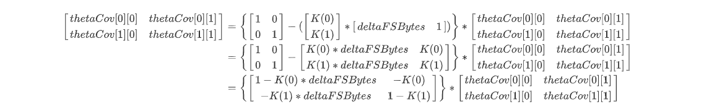

  * 到此为止卡尔曼滤波的一次更新以及迭代完成，总结其过程，卡尔曼滤波主要是为了得到较为准确的信道传输速率的倒数`1/c(i)`以及网络排队延迟`m(i)`

  * 最后通过如下计算`jitterDelay`
    
```cpp 
double noiseThreshold = _noiseStdDevs * sqrt(_varNoise) - _noiseStdDevOffset;
jitterDelay = _theta[0] * (_maxFrameSize - _avgFrameSize) + NoiseThreshold();
```

  * 其中`_varNoise`为测量误差，通过计算当前帧的测量帧间延迟和上一次的卡尔曼最优估计出来的传输速率的倒数`1/c(i)`以及网络排队延迟`m(i)`并计算出估计帧间延迟进行相减，得出网络残差

  * 依据网络残差更新测量误差平均值以及平均方差

  * 最终将最优估计`jitterDelay`作用到`vcmTiming`模块用于计算最优期望渲染时间

  * 至此代码分析完毕

### 4.5）webrtc jitterdelay相关数据测试

  * 通过实际调试，1080P@60fps 线上测试抓得如下数据

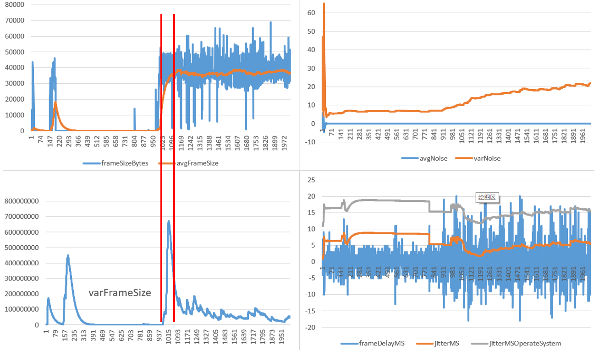

  * 以上一共近2000帧数据，从上图来看，在937帧数据左右，画面从静止编程动画，数据量瞬间增大，此时，平均帧大小的方差也随之增大，从图像右边的测量噪声的方差曲线来看，也发现测量噪声的方差随之增大
  * 右下图显示的是实际测量的`frameDelayMs`、`jitterMs`(估计后)、以及加上10ms操作延迟的变化曲线，由该曲线可以看出kalman filter最终确实能使实际的帧间抖动变得更加平滑，但是从曲线来看，似乎准确性有待提升。
  * 综合分析，`VCMJitterEstimator`模块所得出的`jitterDelay`它的核心作用是给到`vcmTiming`模块用于估计期望渲染时间，为什么要这么做？
  * 在实际的传输过程中若完全不做处理，那么实际的帧间延迟就如上图右下方蓝色曲线所示，如果来一帧数据就送到解码器让解码器做解码并渲染，那么在数据量变化剧烈或突然出现网络波动等一系列导致帧间延迟瞬时变化较大的时候可能会出现卡顿的问题，并且视觉上也会有明显的表象

## 总结

  * 本文通过分析`VCMJitterEstimator`模块的实现，学习卡尔曼滤波的应用场景，并深入分析其滤波步骤等
  * 通过分析`VCMJitterEstimator`模块了解webrtc视频接收流水线中`jitterDelay`的用途以及更新过程，为进一步优化卡顿做铺垫

## 参考文献

* [1].[A Google Congestion Control Algorithm for Real-Time Communication draft-alvestrand-rmcat-congestion-03](https://links.jianshu.com/go?to=https%3A%2F%2Fdatatracker.ietf.org%2Fdoc%2Fhtml%2Fdraft-alvestrand-rmcat-congestion-03)  
* [2].[Analysis and Design of the Google Congestion Control for Web Real-time Communication (WebRTC)](https://links.jianshu.com/go?to=https%3A%2F%2Fwww.researchgate.net%2Fpublication%2F303323771_Analysis_and_design_of_the_google_congestion_control_for_web_real-time_communication_WebRTC)  
* [3].[DR_CAN 卡尔曼滤波视频教程](https://links.jianshu.com/go?to=https%3A%2F%2Fspace.bilibili.com%2F230105574%2Fchannel%2Fdetail%3Fcid%3D139198)  
* [4].[从放弃到精通！卡尔曼滤波从理论到实践](https://links.jianshu.com/go?to=https%3A%2F%2Fwww.bil
ibili.com%2Fvideo%2FBV1Rh41117MT)
