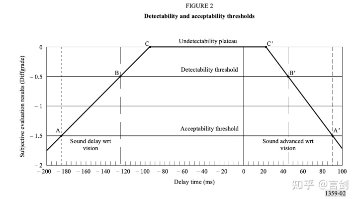
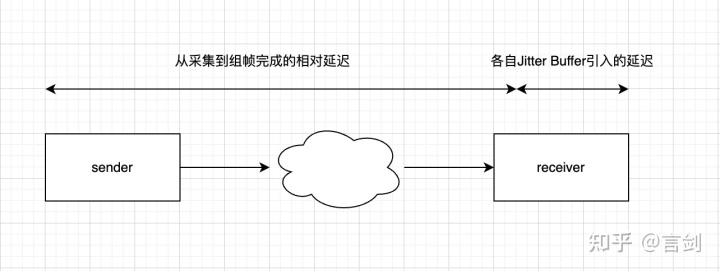
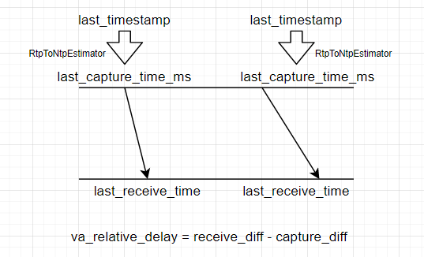
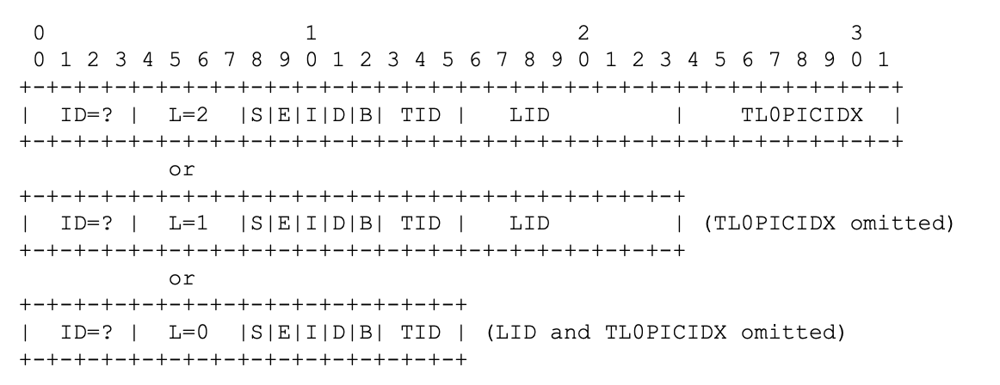
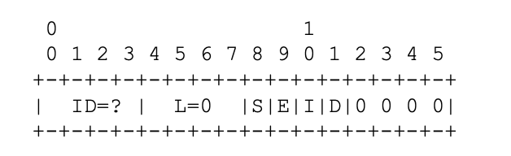
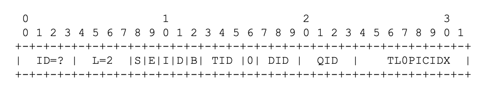
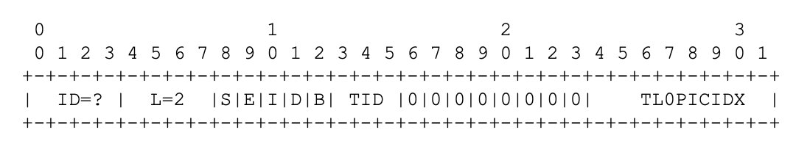
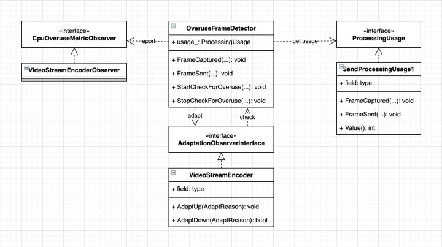

 
<!--BEGIN_DATA
{
    "create_date": "2022-02-25 12:30", 
    "modify_date": "2022-02-25 12:30", 
    "is_top": "0", 
    "summary": "WebRTC Audio Jitter Buffer原理<br/>WebRTC音视频同步<br/>WebRTC Frame Marking介绍<br/>WebRtc性能自适应", 
    "tags": "WebRTC", 
    "file_name": "WebRTC中Audio Jitter与音视频同步与Frame Marking介绍与性能自适应.md"
}
END_DATA-->

#### <p>原文出处：<a href='https://zhuanlan.zhihu.com/p/336489810' target='blank'>WebRTC Audio Jitter Buffer原理</a></p>

> 这是WebRTC NetEQ Jitter Buffer讲解的第一部分，主要介绍NetEQ中Jitter Buffer（以下简称JB）的基本思想。由于NetEQ中Jitter Buffer处理细节比较多，看起来比较复杂，所以这里需要分多个章节。不废话，直接进入正题。 

## 1. 为什么需要Jitter Buffer

丢包、抖动是降低音频质量的其中两个主要根本原因：

### 1.1 丢包

我们虽然已经通过冗余、NACK、FEC等机制去抗丢包了，但是这些做法不是百分百地恢复。这里的丢包我们可以分成两部分：

  * **网络丢包**：报文在网络中被丢掉，通过NACK、FEC、opus Inband FEC无法恢复。一旦出现丢包，对语音肯定存在损伤。这种丢包丢包可以通过丢包隐藏（Packet Loss Concealment）来减轻丢包带来的影响，但是PLC毕竟不能完全恢复语音信号，对语音损伤肯定是有的，特别是连续丢包时听感更明显。PLC原理是NetEQ信号处理的部分，等到后续部分讲解。
  * **报文迟到**：由于网络拥塞可能会导致大量报文迟到，这些报文错过了播放时间，对于音频播放来说就是“丢包”了。合理的Jitter Buffer缓冲长度能够减轻甚至避免过多PLC导致的卡顿。这种丢包可以可以归入抖动的影响中。

### 2.2 抖动

网络中存在抖动会导致接收端收包不均匀、甚至乱序，如果按照收包顺序去播放，肯定会有时快时慢、来不及播放导致卡顿、错音等问题，在比较差的网络场景中语音基本是没法听。因此，一般语音应用都会有buffer的存在，先缓存一定量的数据保证后续均匀播放，可以牺牲一些延迟去抗抖动，抗抖动的能力取决于buffer的大小。

按照抖动的频率，也可以分为：

  * **稳定抖动**：这种抖动是网络和算法固有属性导致的，有一定的统计上稳定性，在一段时间内呈现统计上的稳定性；
  * **突发抖动**：这些抖动是在稳定抖动基础上叠加上突发的抖动尖峰，突发通常没有太大规律，无法找到统计上的规律性。

一般的jitter算法都是尽力去解决稳定抖动，对于突发抖动解决的并不是太好。

## 2. Jitter Buffer分类以及NetEQ中Jitter Buffer

Jitter buffer自语音通话以来一直在发展，一般来说Jitter buffer主要有两种，即静态Jitter Buffer和动态Jitter Buffer：

  * **静态jitter buffer**，jitter buffer深度Depth固定，可以抗Depth以下的抖动。一些固话应用中因为线路稳定，还会会使用静态jitter buffer。这种静态深度方式实现简单，存在固定延迟，在稳定信道中表现不俗，但是一旦抖动超过范围就导致语音有损伤。
  * **动态jitter buffer**，会自动根据网络抖动调整Jitter Buffer深度。一般各家做法中设计都比较简单，会根据当前抖动情况调整jitter buffer深度，检测到更高的抖动后会hold比较长的时间才能降下来，会导致长时间的延迟比较大。

WebRTC NetEQ中也有jitter buffer，但是其设计更复杂，效果也是比普通的静态jitter buffer、动态jitter buffer更好。NetEQ中的jitter buffer和上面说的jitter buffer一样也会动态调整jitter buffer深度，但是调整更精细，还配合了加速、减速、PLC等策略：

  * 和传统jitter buffer类似，可以配置jitter buffer的min buffer、max buffer、start buffer。
  * 从统计上估计当前当前网络jitter，动态调整jitter buffer的深度。
  * 调整jitter buffer深度时同时使用快放、慢放等策略，保障语音质量。
  * 考虑到突发抖动的影响（老代码中存在peak detector检测）。
  * 统计上发现网络变好时调整jitter buffer深度，兼顾语音质量和延迟。

## 3. Jitter Buffer原理

NetEQ主要有两个线程，一个线程往NetEQ中插入报文（InsertPacket），并估计当前网络jitter情况；另外一个线程10ms调度一次，解码处理得到10ms音频（GetAudio）。下面深入下这两个线程操作，逐步剖析NetEQ的jitter buffer原理。

### 3.1 估计当前需要buffer的时间：target delay

这个任务在InsertPacket所在线程完成，主要依靠`DelayManager`中的`直方图`和`DelayPeakDetector`估计当前的jitter，并得到一个合理地延迟时间：target delay。直方图可以估计一个稳定的值，而peak是瞬态的，所以他们分别估计的是稳定抖动和突发抖动。

target delay估计入口如下，需要注意几点：

  * RFC2198冗余已经在此处去掉，只处理主包main packet
  * 如果没有开启`enable_rtx_handling_`，那么则会忽略重传导致的乱序，这个开关对于有重传场景非常重要，如果不开启会导致该场景检测不准

```cpp
// Update statistics.
if ((enable_rtx_handling_ || (int32_t)(main_timestamp - timestamp_) >= 0) &&
    !new_codec_) {
  // Only update statistics if incoming packet is not older than last played
  // out packet or RTX handling is enabled, and if new codec flag is not
  // set.
  delay_manager_->Update(main_sequence_number, main_timestamp, fs_hz_);
}
```

这里的jitter估计是根据相邻包的包间间隔（`IAT，_inter-arrival time_`）来计算的，然后得到直方图，再取95%值作为估计。

直接根据代码来讲解吧！每次update会根据包计算timestamp来更新一个包的长度，这个长度后面用来计算以packet为单位的IAT。

```cpp
// Try calculating packet length from current and previous timestamps.
int packet_len_ms;
if (!IsNewerTimestamp(timestamp, last_timestamp_) ||
    !IsNewerSequenceNumber(sequence_number, last_seq_no_)) {
  // Wrong timestamp or sequence order; use stored value.
  packet_len_ms = packet_len_ms_;
} else {
  // Calculate timestamps per packet and derive packet length in ms.
  int64_t packet_len_samp =
      static_cast<uint32_t>(timestamp - last_timestamp_) /
      static_cast<uint16_t>(sequence_number - last_seq_no_);
  packet_len_ms =
      rtc::saturated_cast<int>(1000 * packet_len_samp / sample_rate_hz);
}
```

计算IAT也比较简单，上次seq到当前seq经历了多长时间，换算成packet为单位。所以IAT就是两次收到seq的间隔。

```cpp
// Cannot update statistics unless |packet_len_ms| is valid.
// Calculate inter-arrival time (IAT) in integer "packet times"
// (rounding down). This is the value used as index to the histogram
// vector |iat_vector_|.
int iat_packets = packet_iat_stopwatch_->ElapsedMs() / packet_len_ms;
```

大部分情况下，这个计算是准确的，但是万一有乱序和丢包呢？对于丢包，需要扣除丢包的gap；对于乱序需要加上乱序的包数。

```cpp
if (IsNewerSequenceNumber(sequence_number, last_seq_no_ + 1)) {
  // Compensate for gap in the sequence numbers. Reduce IAT with the
  // expected extra time due to lost packets, but ensure that the IAT is
  // not negative.
  iat_packets -= static_cast<uint16_t>(sequence_number - last_seq_no_ - 1);
  iat_packets = std::max(iat_packets, 0);
} else if (!IsNewerSequenceNumber(sequence_number, last_seq_no_)) {
  iat_packets += static_cast<uint16_t>(last_seq_no_ + 1 - sequence_number);
  reordered = true;
}
```

通过对丢包和乱序的修正，再将这个数据输入到直方图中。直方图在这里是64个（可以配置）bucket，分别对应IAT 1个包~64个包的个数占比（实际上在代码实现上，采用了稍微复杂的方式，但是这里只说思想哈，大家看代码）。

```cpp
// Saturate IAT at maximum value.
const int max_iat = kMaxIat;
iat_packets = std::min(iat_packets, max_iat);
UpdateHistogram(iat_packets);
// Calculate new |target_level_| based on updated statistics.
target_level_ = CalculateTargetLevel(iat_packets, reordered);
```

直方图取95%值：

```cpp
size_t index = 0;           // Start from the beginning of |iat_vector_|.
int sum = 1 << 30;          // Assign to 1 in Q30.
sum -= iat_vector_[index];  // Ensure that target level is >= 1.

do {
  // Subtract the probabilities one by one until the sum is no longer greater
  // than limit_probability.
  ++index;
  sum -= iat_vector_[index];
} while ((sum > limit_probability) && (index < iat_vector_.size() - 1));
```

再计算peak值，和上面直方图计算的值取大：

```cpp
// Update detector for delay peaks.
bool delay_peak_found =
    peak_detector_.Update(iat_packets, reordered, target_level);
if (delay_peak_found) {
  target_level = std::max(target_level, peak_detector_.MaxPeakHeight());
}
```

DelayPeakDetector是用来检测一些峰值，这些峰值是偶发的，通过有平滑功能的直方图是无法检测出来的。而峰值出现一次意味着后续还回出现，所以出现几次峰值后就必须调整delay。这里大概介绍下峰值计算方法：

  * 峰值认定条件：当前计算出的iat（一般忽略重传导致的乱序）减去上次最终target delay差，超过阈值78ms；或者当前iat超过上次target delay两倍。
  * 第一次检测出peak，不计入
  * 距离上次peak在10s（可配置）内，加入history，并记录距离上次peak间隔
  * 距离上次peak在10s~2*10s内，超时，不计入
  * 距离上次peak超过2*10s，两次peak太长，需要reset，清空history，后续还要从第一次算起
  * peak找到的条件需要满足一下两个条件
    * history中有2个（可配置）及以上peak
    * 当前检查时间距离上次peak间隔小于两倍最大peak间隔，其实肯定是小于2*10s的！

peak检测算法：

```cpp
if (inter_arrival_time > target_level + peak_detection_threshold_ ||
    inter_arrival_time > 2 * target_level) {
  // A delay peak is observed.
  if (!peak_period_stopwatch_) {
    // This is the first peak. Reset the period counter.
    peak_period_stopwatch_ = tick_timer_->GetNewStopwatch();
  } else if (peak_period_stopwatch_->ElapsedMs() > 0) {
    if (peak_period_stopwatch_->ElapsedMs() <= kMaxPeakPeriodMs) {
      // This is not the first peak, and the period is valid.
      // Store peak data in the vector.
      Peak peak_data;
      peak_data.period_ms = peak_period_stopwatch_->ElapsedMs();
      peak_data.peak_height_packets = inter_arrival_time;
      peak_history_.push_back(peak_data);
      while (peak_history_.size() > kMaxNumPeaks) {
        // Delete the oldest data point.
        peak_history_.pop_front();
      }
      peak_period_stopwatch_ = tick_timer_->GetNewStopwatch();
    } else if (peak_period_stopwatch_->ElapsedMs() <= 2 * kMaxPeakPeriodMs) {
      // Invalid peak due to too long period. Reset period counter and start
      // looking for next peak.
      peak_period_stopwatch_ = tick_timer_->GetNewStopwatch();
    } else {
      // More than 2 times the maximum period has elapsed since the last peak
      // was registered. It seams that the network conditions have changed.
      // Reset the peak statistics.
      Reset();
    }
  }
}
```

peak是否找到的检查条件：

```cpp
bool DelayPeakDetector::CheckPeakConditions() {
  size_t s = peak_history_.size();
  if (s >= x &&
      peak_period_stopwatch_->ElapsedMs() <= 2 * MaxPeakPeriod()) {
    peak_found_ = true;
  } else {
    peak_found_ = false;
  }
  return peak_found_;
}
```

直方图计算的target delay和peak detector计算出来的target delay取大，就是最终的target delay。注意下，这里的target delay是以packet（target level）为单位计算的，使用时需要注意下。

### 3.2 根据target delay决策加速、减速、PLC

计算完target delay后，neteq的目标是保证buffer的数据维持在这个target delay左右，太高或者太低都不行。buffer的数据高于target delay很多，需要尽快排空导致加速播放；buffer 的数据低于target delay很多，需要做慢放避免很快排空。

上面所说的buffer数据包含两部分，一个是packet buffer中的数据，一个是sync buffer中的数据（sync buffer中的数据是已经解码可以用于播放的数据）。这个buffer数据长度有做过简单滤波，见BufferLevelFilter类，建议大家看代码了解详细，大概来说就是做一个平滑，平滑系数和当前target level有关，level越高平滑越大。

线程每次从NetEQ中去10ms数据用于播放，并做一些决策。在当前取的数据没有丢的情况下，会根据buffer大小和target delay差距做匀速、加速、减速。

  * 如果buffer数据远小于target delay，说明数据太少，要做减速拖延时间避免无数据播放；
  * 如果buffer数据远大于target delay，说明累积了太多数据，需要加速播放避免累积数据太多延迟太大；
  * 否则不做处理直接播放。
  * 如果取数据发现没有数据可以播放，则做PLC；
  * 如果取数据发现当前的数据和上次数据之间有gap，则做PLC；
  * 如果之前已经做过PLC，当前数据没有丢可以播放，但是buffer低于target delay太多，避免很快排空buffer而导致抗抖动能力低，会继续做PLC。

一个关键的流程看这个地方，对应着没有丢包的加速、减速处理，以及有丢包的（FeaturePacketAvailable）处理：

```cpp
// Check if the required packet is available.
if (target_timestamp == available_timestamp) {
  return ExpectedPacketAvailable(prev_mode, play_dtmf);
} else if (!PacketBuffer::IsObsoleteTimestamp(
               available_timestamp, target_timestamp, five_seconds_samples)) {
  return FuturePacketAvailable(
      sync_buffer, expand, decoder_frame_length, prev_mode, target_timestamp,
      available_timestamp, play_dtmf, generated_noise_samples);
} else {
  // This implies that available_timestamp < target_timestamp, which can
  // happen when a new stream or codec is received. Signal for a reset.
  return kUndefined;
}
```  

规则大概如上面所写，这里只讲基本原理，去掉了一些无关紧要的细节。大家可以再看代码去仔细了解。

## 4. 总结

NetEQ里面jitter buffer算法本身没有太复杂，但是细节比较多，场景也有很多，所以坑还是比较多，比如CNG处理等等。这里只讲大概原理，不涉及太多细节。希望能给大家一些启示。

<hr>

#### <p>原文出处：<a href='https://zhuanlan.zhihu.com/p/346004563' target='blank'>WebRTC音视频同步</a></p>

在音视频通话中，如果声音和画面延迟差距非常大是非常影响用户体验的，为了更佳的音视频体验音视频同步必不可少。音视频同步又叫唇音同步（lip sync），也就是画面和音频在一定范围内处于同步状态。

## 1. 音视频同步的目标

关于音视频同步的目标，我们可以参考标准：

[Rec. ITU-R BT.1359-1](https://link.zhihu.com/?target=https%3A//www.itu.int/dms_pubrec/itu-r/rec/bt/R-REC-BT.1359-1-199811-I)

通过下图，我们可以看到，声音超前45ms或者声音滞后125ms都可以被感知到；声音超前90ms或者声音185ms之内都还可以接收，如果，超过这个范围后将明显影响用户体验：

 Rec. ITU-R BT.1359-1

因此我们的目标就是保证音视频同步在这个范围内。

## 2. 导致不同步的原因

在对不同步建模之前，我们必须要清楚存在不同步的原因。如果不做任何处理，会导致不同步的原因主要包括：

  * 音频和视频的处理耗时不同，视频的处理和编码通常比音频耗时更长
  * 视频帧更大，经过拥塞控制后，传输耗时会更长
  * 音频和视频有各自的jitter buffer，在接收端抗抖动会引入不同的延迟

## 3. 不同步模型的建立

为了能够衡量音频和视频存在不同步，我们引入syncdiff统计量，这个量表示如果不做任何sync，当前的视频播放和音频播放存在多大的“不同步”，即播放时间差 - 采集时间差。

为了简化问题，我们对syncdiff这个量做拆解，包含下面两个部分：

 音视频同步syncdiff模型

即，音视频从采集到组帧完成的相对延迟和各自jitter buffer引入导致的相对延迟。得到：

`不同步 = 采集到接收端组帧完成后的不同步 + JitterBuffer导致不同步`

在WebRTC代码中，对于不同步测量值，被称作`SyncDiff`；从采集到组帧后的不同步被称为相对延迟，`RelativeDelay`。因此，我们可以得到：

`SyncDiff = RelativeDelay + (VideoJitterBufferDelay - AudioJitterBufferDelay)`。

`相对延迟`也就是`接收时间差-采集时间差`，相对延迟是估计音频和视频从采集到进入JitterBuffer之前这段时间内的不同步量。

JitterBuffer的引入的不同步直接用各自当前的JitterBuffer缓冲的level值相减变可以得到。

我们可以看看，在WebRTC中哪些数据可以直接拿到的：

  * 视频接收时间、音频接收时间，接收端有统计，单位ms
  * 视频采集时间、音频采集时间，RTP包中有携带，但是是rtp timestamp，而且是发送端的，如果能转换成发送端的NTP时间，计算相对延迟时也不需要两端时间同步
  * 视频、视频Jitter Buffer延迟，使用各自的jitter buffer current delay。

## 4. 音视频同步的实现

### 4.1 计算video相对audio的相对延迟（RelativeDelay）

这个是我们建立的模型的第一部分。一般视频帧比较大，编码延迟更大，在网络中传输肯定比音频慢，同时视频在接收端组帧也需要耗费一部分时间，因此一般情况下视频帧的延迟比音频要大。

 p1

相对延迟就是`接收时间差`-`采集时间差`。如果视频和音频两帧的采集时间相同，那么其实就是接收时间差。

因为接收时间单位ms，而采集时间目前只能拿到rtp里面的timestamp，并不能直接使用，因此这里需要将这个rtp timestamp转换成发送端的单位为ms的时间。恰好RTCP SR的一个包里面有携带rtp timestamp和对应的NTP时间，SR包按照周期发送，接收端完全可以根据这些SR拟合出RTP timestamp和NTP timestamp的关系。这个转换由`RtpToNtpEstimator`完成。

完成RTP timestamp到NTP timestamp的转换，便可以得到视频和音频帧在发送端对应的NTP时间。因为这里我们计算的是相对延迟，因此并不需要保证发送和接收端NTP时间同步。

`(视频帧接收时间 - 音频帧接收时间) - (视频帧采集时间 - 音频帧采集时间)`

### 4.2 计算video需要的延迟：SyncDiff

最终的延迟包含两个部分，一个部分是`相对延迟`，上面已经介绍，还有部分是`当前播放延迟`（即各自的JitterBuffer引入的延迟）。即最终的SyncDiff：

```cpp
// Calculate the difference between the lowest possible video delay and the
// current audio delay.
// 视频的jitter buffer当前延迟 -音频的jitter buffer当前延迟 + 相对延迟
int current_diff_ms =
    current_video_delay_ms - current_audio_delay_ms + relative_delay_ms;
```

这个就是视频相对音频的总延迟，它包含了两个部分，一个是从采集到接收完成两者的相对延迟，一个是两者的Jitter Buffer引入的延迟差异。

我们的目标在于确保视频播放延迟约等于音频播放延迟，即diff在合理的范围内。

### 4.3 根据这个`current_diff_ms`计算audio和video的播放延迟时间

• 计算得到的delay没有直接使用，需要做平滑，平滑系数为0.25（当前值占比0.25）。

• 延迟在`[-30ms, 30ms]`，差距不是很大，可以暂时不调整

• 控制调整的步长，一次只调整一半，不超过[-80ms, 80ms] ，避免调整过快

• 如果视频相对音频存在播放延迟：如果视频已经存在延迟，减小视频播放延迟，通过快放追上音频；如果视频没有延迟，无法再降低，增加音频延迟，让音频慢放等待视频。

• 如果音频相对视频存在播放延迟：如果音频已经存在延迟，减小音频播放延迟，通过快放追上音频；如果音频没有延迟，无法再降低，增加视频延迟，让视频慢放等待音频。

具体的策略，直接看代码吧：

```cpp
// 调整不会一步到位，需要做平滑
  avg_diff_ms_ =
      ((kFilterLength - 1) * avg_diff_ms_ + current_diff_ms) / kFilterLength;
  // 如果差距很小（30ms内）先不调整
  if (abs(avg_diff_ms_) < kMinDeltaMs) {
    // Don't adjust if the diff is within our margin.
    return false;
  }

  // 控制调整步长，单次不超过80ms
  // Make sure we don't move too fast.
  int diff_ms = avg_diff_ms_ / 2;
  diff_ms = std::min(diff_ms, kMaxChangeMs);
  diff_ms = std::max(diff_ms, -kMaxChangeMs);

  // Reset the average after a move to prevent overshooting reaction.
  avg_diff_ms_ = 0;
  
  if (diff_ms > 0) {
    // The minimum video delay is longer than the current audio delay.
    // We need to decrease extra video delay, or add extra audio delay.
    // 视频相对音频有延迟，降低视频延迟，或者增加音频延迟
    if (video_delay_.extra_ms > base_target_delay_ms_) {
      // We have extra delay added to ViE. Reduce this delay before adding
      // extra delay to VoE.
      // video延迟降低diff_ms，audio延迟不变
      video_delay_.extra_ms -= diff_ms;
      audio_delay_.extra_ms = base_target_delay_ms_;
    } else {  // video_delay_.extra_ms > 0
      // We have no extra video delay to remove, increase the audio delay.
      // audio延迟增加diff_ms，video延迟不变
      audio_delay_.extra_ms += diff_ms;
      video_delay_.extra_ms = base_target_delay_ms_;
    }
  } else {  // if (diff_ms > 0)
    // The video delay is lower than the current audio delay.
    // We need to decrease extra audio delay, or add extra video delay.
    // 音频相对视频有延迟，降低音频延迟或者增加视频延迟
    if (audio_delay_.extra_ms > base_target_delay_ms_) {
      // We have extra delay in VoiceEngine.
      // Start with decreasing the voice delay.
      // Note: diff_ms is negative; add the negative difference.
      audio_delay_.extra_ms += diff_ms;
      video_delay_.extra_ms = base_target_delay_ms_;
    } else {  // audio_delay_.extra_ms > base_target_delay_ms_
      // We have no extra delay in VoiceEngine, increase the video delay.
      // Note: diff_ms is negative; subtract the negative difference.
      video_delay_.extra_ms -= diff_ms;  // X - (-Y) = X + Y.
      audio_delay_.extra_ms = base_target_delay_ms_;
    }
  }

  // Make sure that video is never below our target.
  video_delay_.extra_ms =
      std::max(video_delay_.extra_ms, base_target_delay_ms_);

  int new_video_delay_ms;
  if (video_delay_.extra_ms > base_target_delay_ms_) {
    new_video_delay_ms = video_delay_.extra_ms;
  } else {
    // No change to the extra video delay. We are changing audio and we only
    // allow to change one at the time.
    new_video_delay_ms = video_delay_.last_ms;
  }

  // Make sure that we don't go below the extra video delay.
  new_video_delay_ms = std::max(new_video_delay_ms, video_delay_.extra_ms);

  // Verify we don't go above the maximum allowed video delay.
  new_video_delay_ms =
      std::min(new_video_delay_ms, base_target_delay_ms_ + kMaxDeltaDelayMs);

  int new_audio_delay_ms;
  if (audio_delay_.extra_ms > base_target_delay_ms_) {
    new_audio_delay_ms = audio_delay_.extra_ms;
  } else {
    // No change to the audio delay. We are changing video and we only allow to
    // change one at the time.
    new_audio_delay_ms = audio_delay_.last_ms;
  }

  // Make sure that we don't go below the extra audio delay.
  new_audio_delay_ms = std::max(new_audio_delay_ms, audio_delay_.extra_ms);

  // Verify we don't go above the maximum allowed audio delay.
  new_audio_delay_ms =
      std::min(new_audio_delay_ms, base_target_delay_ms_ + kMaxDeltaDelayMs);

  video_delay_.last_ms = new_video_delay_ms;
  audio_delay_.last_ms = new_audio_delay_ms;

  RTC_LOG(LS_VERBOSE) << "Sync video delay " << new_video_delay_ms
                      << " for video stream " << video_stream_id_
                      << " and audio delay " << audio_delay_.extra_ms
                      << " for audio stream " << audio_stream_id_;

  *total_video_delay_target_ms = new_video_delay_ms;
  *total_audio_delay_target_ms = new_audio_delay_ms;
```

这里的`extra_ms`一开始是0，通过过程中会慢慢收敛。

最终得到，当前audio和video设置给jitter buffer的target delay。

### 4.4 设置延迟时间到audio NetEQ以及video Jitter buffer

首先，设置jitter buffer的最小delay：

```cpp
syncable_audio_->SetMinimumPlayoutDelay(target_audio_delay_ms);
syncable_video_->SetMinimumPlayoutDelay(target_video_delay_ms);
```

## 5. 总结

通过上面的拆解，是不是觉得音视频同步竟然这么简单。实际上里面还有很多细节和坑呢。

<hr>

#### <p>原文出处：<a href='https://zhuanlan.zhihu.com/p/351537710' target='blank'>WebRTC Frame Marking介绍</a></p>

想了解一手资料，请阅读[标准文档](https://link.zhihu.com/?target=https%3A//tools.ietf.org/pdf/draft-ietf-avtext-framemarking-11.pdf)。

## 1. Frame Marking是什么?

Frame Marking是RTP的header extension，用于在RTP头部传输视频帧信息。

SDP协商:

    a=extmap:3 urn:ietf:params:rtp-hdrext:framemarking

## 2. Frame Marking有什么用？

为什么要在RTP扩展头中传输基本信息，RTP的payload中不是已经包含了视频帧信息吗？先举一些应用场景的例子：

  * active spaker切换的时候，视频也需要做相应切换。此时需要找到一个时间点，视频帧可以不依赖之前的数据单独解码。这里需要知道知道视频是否是I帧，参考关系怎么样？
  * 当遇到网络拥塞，server需要进行丢帧。因此需要知道哪些帧是可以丢弃的。
  * SVC中，需要知道转发哪一层的数据。

如果要在server上获取这些信息，以前的做法一般需要解析视频码流，如果存在SRTP还需要解SRTP。使用Frame Marking会让逻辑变得更简单，我们不用解开视频数据就可以得到视频基本信息。这样一个纯转发的server不需要任何处理就能拿到基本信息，直接根据这些信息做流切换、丢帧、转发等。

## 3. Frame marking RTP header extension

### 3.1 用于可伸缩编码流的长扩展

这个RTP扩展有多个格式，因为在一些场景部分字段不需要，是可以省略的，这样可以节省带宽。

 Long Extension Frame Marking

各个字段解释如下：

  * S: Start of Frame (1 bit)，一帧的开始。
  * E: End of Frame (1 bit)，一帧的结束。
  * I: Independent Frame (1 bit)，是否是独立可解码的一帧，如264的IDR。
  * D: Discardable Frame (1 bit)，可以被丢弃的帧，如时域分层中high layer，丢弃后其他帧仍然能正常解码。
  * B: Base Layer Sync (1 bit)，当TID不为0，发送端知道该帧只依赖base layer，则填1，否则填0.
  * TID: Temporal ID (3 bits)，时域分层中的层ID，0表示base layer。短的extension格式中，填0.
  * LID: Layer ID (8 bits)，空域或者质量分层的层ID，0标识base layer。
  * TL0PICIDX: Temporal Layer 0 Picture Index (8 bits)，时域0层picture index。因为只有8个bit，所以是循环计数的。TID=0 LID=0标识该帧ID，TID!=0或者LID!=0标识该帧依赖哪一个picture index。如果不存在时域分层或者计数未知，这个字段可以省略。

所以上述的格式可以描述视频帧分层情况，以及视频帧间依赖情况。

### 3.2 用于非伸缩编码流的短扩展

某些流是不可伸缩的，可以使用短扩展。

 Short Extension Frame Marking

字段含义和上面长扩展相同。

## 4. H.264 SVC和AVC如何填充Frame Marking

SVC：

 SVC Frame Marking

AVC:

 AVC Frame Marking

<hr>

#### <p>原文出处：<a href='https://zhuanlan.zhihu.com/p/352435623' target='blank'>WebRtc性能自适应</a></p>

在WebRTC音视频通话中，难免会遇到设备性能比较差，在开启多个应用的时候CPU占用比较高的问题。因此我们需要根据当前性能情况对当前视频能力做调整，优先调整的对象是对CPU消耗最多的编码。

在WebRTC中评估性能是通过对编码时长的估计，而不是系统的CPU统计，这是为什么呢？一方面是因为在不同平台甚至是统一平台不同系统版本上，CPU统计存在较大差异，另一方面CPU占用和目标能力并无法直接关联上。所以，这里选择了比较直接的指标，即编码时长，一旦编码时长超过了采集间隔，那说明当前编码存在非常大的性能瓶颈。选择合适的编码能力能够确保得到一个合理的编码时长。

## 1. 基本流程

WebRTC中提供了一个根据CPU占用动态调整编码能力的策略，其中CPU占用率没有从系统读取，而是使用编码时长相对采集间隔的占比来估计。主要流程如下：



上述的流程运行于编码线程，由VideoStreamEncoder每隔5s触发一次检查（前3次不做任何处理）。OveruseFrameDetector是一个根据编码时长和采集间隔估计当前性能的管理类，ProcessingUsage是性能估计类，输出编码时长与采集间隔的比值。OveruseFrameDetector检测到overuse或者underuse会回调到VideoStreamEncoder，做AdaptDown或者AdaptUp。

## 2. 编码占用率计算

编码占用率计算接口为OveruseFrameDetector::ProcessingUsage，实现类SendProcessingUsage1。大概原理：占用率=编码时长/采集间隔，通过编码时长估计当期性能，如果编码时长超过采集间隔，那么当前性能肯定存在瓶颈。这里的编码时长和采集间隔使用指数滤波平滑。详细实现可以见源码，这里没有必要过多介绍了。

## 3. Overuse和Underuse的检测

如何获取性能的指标usage_percent我们先按下不表，先看下如何得到overuse和uderuse这两个输出信号。OveruseFrameDetector根据当前编码占用率判断是否为overuse或者underuse，再根据这两个信号AdaptDown或者AdaptUp。

判断为Overuse的条件：

```cpp
bool OveruseFrameDetector::IsOverusing(int usage_percent) {
  // 使用率超过overuse的阈值，一般为90
  if (usage_percent >= options_.high_encode_usage_threshold_percent) {
    ++checks_above_threshold_;
  } else {
    checks_above_threshold_ = 0;
  }
  // 连续2次超过阈值才认为是overuse
  return checks_above_threshold_ >= options_.high_threshold_consecutive_count;
}
```

判断为Underuse的条件：

```cpp
bool OveruseFrameDetector::IsUnderusing(int usage_percent, int64_t time_now) {
  // 当前performance上升(ramp up)，需要超过一定时长，否则不认为已经是underuse
  int delay = in_quick_rampup_ ? kQuickRampUpDelayMs : current_rampup_delay_ms_;
  if (time_now < last_rampup_time_ms_ + delay)
    return false;
  // 低于阈值(一般overuse阈值的一半)就是underuse
  return usage_percent < options_.low_encode_usage_threshold_percent;
}
```

上面uderuse中，ramp up有一个delay，这个delay不是固定不变的，需要根据实际情况调整。这称作overuse退避，为了避免频繁在overuse和underuse之间切换，所以需要对上升做限制，需要满足一定的时长。

  * Quick ramp up时的阈值为kQuickRampUpDelayMs（10s）
  * 非quick ramp up时，需要做退避。
  * overuse->underuse->overuse时，如果距离最后一次ramp up时间小于40s或者连续4次检测overuse，为了避免频繁变换或者避免容易进入overuse，需要对ramp up的时长做x2退避，限制最大ramp up delay为240s。
  * 检测到overuse时，后续ramp up需要做退避；检测到underuse时，后续ramp up做quick ramp up。

退避相关算法如下：

```cpp
bool check_for_backoff = last_rampup_time_ms_ > last_overuse_time_ms_;
if (check_for_backoff) {
  if (now_ms - last_rampup_time_ms_ < kStandardRampUpDelayMs ||
      num_overuse_detections_ > kMaxOverusesBeforeApplyRampupDelay) {
    // Going up was not ok for very long, back off.
    current_rampup_delay_ms_ *= kRampUpBackoffFactor;
    if (current_rampup_delay_ms_ > kMaxRampUpDelayMs)
      current_rampup_delay_ms_ = kMaxRampUpDelayMs;
  } else {
    // Not currently backing off, reset rampup delay.
    current_rampup_delay_ms_ = kStandardRampUpDelayMs;
  }
}
```

另外，overuse、underuser检测阈值可以配置，主要使用CpuOveruseOptions来配置。比如针对单核、双核系统overuse阈值可以降低到20、40，阈值调整到100以上可以disable自适应功能。

## 4. AdaptDown

当性能不足时需要做视频降级，视频降级有几种策略：

  * `BALANCED`，帧率和分辨率之间平衡
  * `MAINTAIN_FRAMERATE`，保帧率，调整分辨率
  * `MAINTAIN_RESOLUTION`，保分辨率，调整帧率

#### 4.1 MAINTAIN_FRAMERATE

这次adapt down的分辨率需要比上次请求的小（否则就是ramp up了），否则不调整。

分辨率选择通过VideoStreamEncoder::VideoSourceProxy::RequestResolutionLowerThan实现：

```cpp
bool RequestResolutionLowerThan(int pixel_count,
                                int min_pixels_per_frame,
                                bool* min_pixels_reached) {
    ...
    // MAINTAIN_FRAMERATE或者BALANCED时才能调整分辨率
    if (!source_ || !IsResolutionScalingEnabled(degradation_preference_)) {
        return false;
    }

    // 根据像素个数来做分辨率选择，像素个数变为原来的3/5
    const int pixels_wanted = (pixel_count * 3) / 5;
    if (pixels_wanted >= sink_wants_.max_pixel_count) {
        return false;
    }

    // 分辨率降低有限制
    if (pixels_wanted < min_pixels_per_frame) {
        *min_pixels_reached = true;
        return false;
    }

    // 更新sink wants到source
    sink_wants_.max_pixel_count = pixels_wanted;
    sink_wants_.target_pixel_count = absl::nullopt;
    source_->AddOrUpdateSink(video_stream_encoder_,
                                GetActiveSinkWantsInternal());
    return true;
}
```

### 4.2 MAINTAIN_RESOLUTION

帧率不能低于降低到2帧以下。

分辨率选择通过VideoStreamEncoder::VideoSourceProxy::RequestFramerateLowerThan实现：

webrtc：

```cpp
int RequestFramerateLowerThan(int fps) {
  // 帧率降低到2/3
  int framerate_wanted = (fps * 2) / 3;
  return RestrictFramerate(framerate_wanted) ? framerate_wanted : -1;
}

bool RestrictFramerate(int fps) {
    ...
    // MAINTAIN_RESOLUTION或BALANCED时才能降低帧率
    if (!source_ || !IsFramerateScalingEnabled(degradation_preference_))
      return false;
    // 帧率不能降低到2fps
    const int fps_wanted = std::max(kMinFramerateFps, fps);
    if (fps_wanted >= sink_wants_.max_framerate_fps)
      return false;
    // 更新sink wants到source
    sink_wants_.max_framerate_fps = fps_wanted;
    source_->AddOrUpdateSink(video_stream_encoder_,
                             GetActiveSinkWantsInternal());
    return true;
}
```

### 4.3 BALANCED

有时候需要在帧率和分辨率之间找一个平衡点（最新的WebRTC代码中使用BalancedDegradationSettings来实现，这里以老代码为例）。balace采取先降帧率，再降分辨率的策略，即先RestrictFramerate，再走MAINTAIN_FRAMERATE逻辑。

先限制帧率：

```cpp
int MinFps(int pixels) {
  if (pixels <= 320 * 240) {
    return 7;
  } else if (pixels <= 480 * 270) {
    return 10;
  } else if (pixels <= 640 * 480) {
    return 15;
  } else {
    return std::numeric_limits<int>::max();
  }
}
```

再走再走`MAINTAIN_FRAMERATE`逻辑调整分辨率。

## 5. AdaptUp

当检测性能处于underuse的时候，视频能力需要升级。和AdaptDown一样，也有三种方式，`BALANCED、MAINTAIN_FRAMERATE、MAINTAIN_RESOLUTION`。

这里对向上调整做了限制，只有向下调整过才能向上调整。

### 5.1 MAINTAIN_FRAMERATE

```cpp
bool RequestHigherResolutionThan(int pixel_count) {
    ...
    // MAINTAIN_FRAMERATE或者BALANCED时才能调整分辨率
    if (!source_ || !IsResolutionScalingEnabled(degradation_preference_)) {
        return false;
    }

    // 像素x4上调
    int max_pixels_wanted = pixel_count;
    if (max_pixels_wanted != std::numeric_limits<int>::max())
        max_pixels_wanted = pixel_count * 4;

    if (max_pixels_wanted <= sink_wants_.max_pixel_count)
        return false;

    sink_wants_.max_pixel_count = max_pixels_wanted;
    if (max_pixels_wanted == std::numeric_limits<int>::max()) {
        // Remove any constraints.
        sink_wants_.target_pixel_count.reset();
    } else {
        sink_wants_.target_pixel_count = GetHigherResolutionThan(pixel_count);
    }

    // 更新sink wants到source
    source_->AddOrUpdateSink(video_stream_encoder_,
                                GetActiveSinkWantsInternal());
    return true;
}
```

### 5.2 MAINTAIN_RESOLUTION

和AdaptUp类似，也是按照固定倍数上调。

```cpp
int RequestHigherFramerateThan(int fps) {
    // 调整速率，down是2/3，up是3/2
    int framerate_wanted = fps;
    if (fps != std::numeric_limits<int>::max())
        framerate_wanted = (fps * 3) / 2;
    return IncreaseFramerate(framerate_wanted) ? framerate_wanted : -1;
}
```

### 5.3 BALANCED

先升分辨率，再升帧率（走`MAINTAIN_FRAMERATE`逻辑）。

```cpp
int MaxFps(int pixels) {
  if (pixels <= 320 * 240) {
    return 10;
  } else if (pixels <= 480 * 270) {
    return 15;
  } else {
    return std::numeric_limits<int>::max();
  }
}
```

## 6. 总结

总结一下，性能自适应代码逻辑也不是很负载，主要的思想也就几点：

  * 采取编码时长占采集间隔的比例得到性能的估计
  * 根据性能估计得到overuse、underuse信号做adapt down和adapt up
  * 从overuse到underuse需要谨慎，避免频繁切换
  * 向上调整和向下调整策略主要有三个：保帧率、保分辨率、帧率和分辨率平衡。

