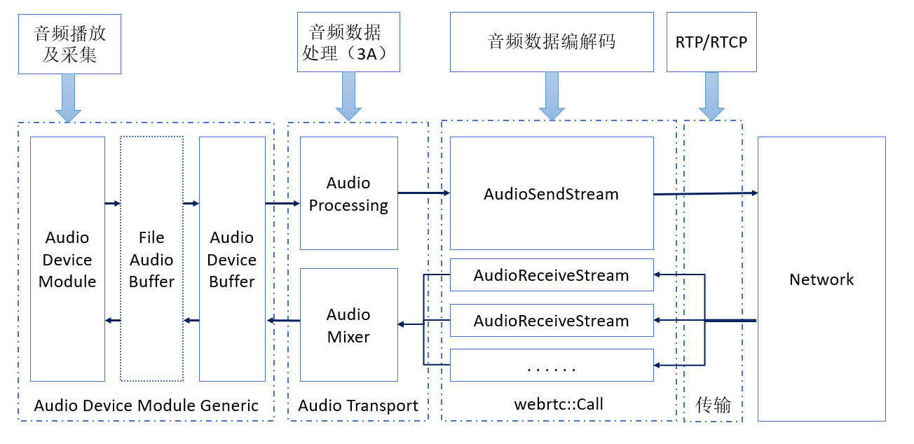
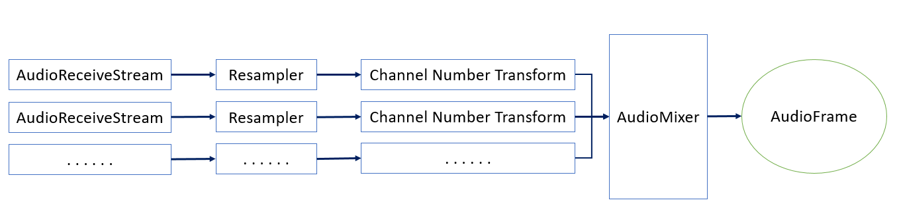
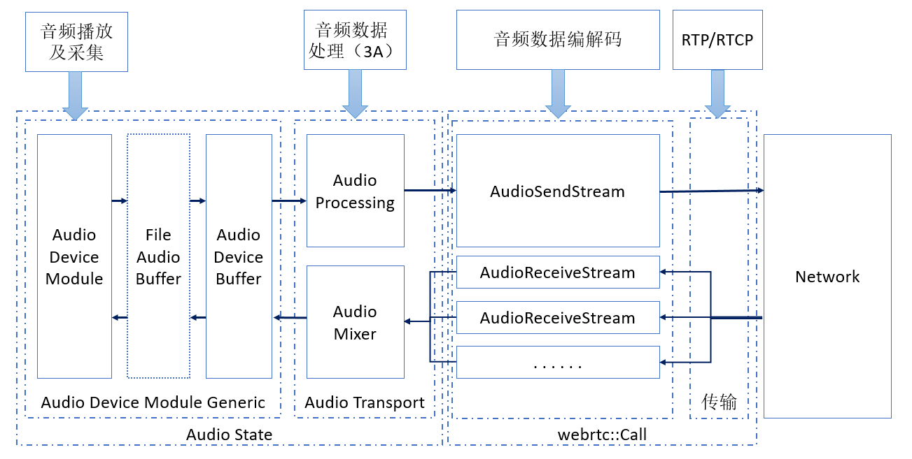

 
<!--BEGIN_DATA
{
    "create_date": "2020-03-30 22:02", 
    "modify_date": "2020-03-30 22:02", 
    "is_top": "0", 
    "summary": "WebRTC中的基本音频处理操作<br>WebRTC的音频处理流水线", 
    "tags": "WebRTC、iOS、C/C++", 
    "file_name": "WebRTC中的基本音频处理操作与处理流水线"
}
END_DATA-->

####<p>原文出处：<a href='https://www.jianshu.com/p/d44f91a30769' target='blank'>WebRTC中的基本音频处理操作</a></p>

* 音频数据的采集及播放。
* 音频数据的处理。主要是对采集录制的音频数据的处理，即所谓的 3A 处理，AEC (Acoustic Echo Cancellation) 回声消除，ANS (Automatic Noise Suppression) 降噪，和 AGC (Automatic Gain Control) 自动增益控制。
* 音效。如变声，混响，均衡等。
* 音频数据的编码和解码。包括音频数据的编码和解码，如 AAC，OPUS，和针对弱网的处理，如 NetEQ。
* 网络传输。一般用 RTP/RTCP 传输编码后的音频数据。
* 整个音频处理流水线的搭建。

WebRTC 的音频处理流水线大体如下图：


Audio Pipeline

除了音效之外，WebRTC 的音频处理流水线包含其它所有的部分，音频数据的采集及播放，音频数据的处理，音频数据的编码和解码，网络传输都有。

在 WebRTC 中，通过 AudioDeviceModule完成音频数据的采集和播放。不同的操作系统平台有着不同的与音频设备通信的方式，因而不同的平台上使用各自平台特有的解决方案实现平台特有的AudioDeviceModule。一些平台上甚至有很多套音频解决方案，如 Linux 有 pulse 和 ALSA，Android 有 framework 提供的 Java 接口、OpenSLES 和 AAudio，Windows 也有多种方案等。

WebRTC 的音频流水线只支持处理 10 ms 的数据，有些操作系统平台提供了支持采集和播放 10 ms 音频数据的接口，如Linux，有些平台则没有，如 Android、iOS 等。AudioDeviceModule 播放和采集的数据，总会通过AudioDeviceBuffer 拿进来或者送出去 10 ms 的音频数据。对于不支持采集和播放 10 ms 音频数据的平台，在平台的AudioDeviceModule 和 AudioDeviceBuffer 还会插入一个 FineAudioBuffer，用于将平台的音频数据格式转换为 10 ms 的 WebRTC 能处理的音频帧。

WebRTC 的 AudioDeviceModule 连接称为 AudioTransport 的模块。对于音频数据的采集发送，AudioTransport 完成音频处理，主要即是 3A 处理。对于音频播放，这里有一个混音器，用于将接收到的多路音频做混音。回声消除主要是将录制的声音中播放的声音的部分消除掉，因而，在从AudioTransport 中拿音频数据播放时，也会将这一部分音频数据送进 APM 中。

AudioTransport 接 AudioSendStream 和 AudioReceiveStream，在 AudioSendStream 和 AudioReceiveStream 中完成音频的编码发送和接收解码，及网络传输。

###WebRTC 的音频基本操作

在 WebRTC 的音频流水线，无论远端发送了多少路音频流，也无论远端发送的各条音频流的采样率和通道数具体是什么，都需要经过重采样，通道数转换和混音，最终转换为系统设备可接受的采样率和通道数的单路音频数据。具体来说，各条音频流需要先重采样和通道数变换转换为某个统一的采样率和通道数，然后做混音；混音之后，再经过重采样以及通道数变换，转变为最终设备可接受的音频数据。（WebRTC 中音频流水线各个节点统一用 16 位整型值表示采样点。）如下面这样：


Mixing

WebRTC 提供了一些音频操作的工具类和函数用来完成上述操作。

####混音如何混？

WebRTC 提供了 `AudioMixer` 接口来抽象混音器，这个接口定义 (位于`webrtc/src/api/audio/audio_mixer.h`) 如下：


    
    namespace webrtc {
    // WORK IN PROGRESS
    // This class is under development and is not yet intended for for use outside
    // of WebRtc/Libjingle.
    class AudioMixer : public rtc::RefCountInterface {

     public:
     
      // A callback class that all mixer participants must inherit from/implement.
      class Source {
       public:
        enum class AudioFrameInfo {
          kNormal,  // The samples in audio_frame are valid and should be used.
          kMuted,   // The samples in audio_frame should not be used, but
                    // should be implicitly interpreted as zero. Other
                    // fields in audio_frame may be read and should
                    // contain meaningful values.
          kError,   // The audio_frame will not be used.
        };

        // Overwrites |audio_frame|. The data_ field is overwritten with
        // 10 ms of new audio (either 1 or 2 interleaved channels) at
        // |sample_rate_hz|. All fields in |audio_frame| must be updated.
        virtual AudioFrameInfo GetAudioFrameWithInfo(int sample_rate_hz,
                                                     AudioFrame* audio_frame) = 0;

        // A way for a mixer implementation to distinguish participants.
        virtual int Ssrc() const = 0;

        // A way for this source to say that GetAudioFrameWithInfo called
        // with this sample rate or higher will not cause quality loss.
        virtual int PreferredSampleRate() const = 0;

        virtual ~Source() {}
      };

      // Returns true if adding was successful. A source is never added
      // twice. Addition and removal can happen on different threads.
      virtual bool AddSource(Source* audio_source) = 0;

      // Removal is never attempted if a source has not been successfully
      // added to the mixer.
      virtual void RemoveSource(Source* audio_source) = 0;

      // Performs mixing by asking registered audio sources for audio. The
      // mixed result is placed in the provided AudioFrame. This method
      // will only be called from a single thread. The channels argument
      // specifies the number of channels of the mix result. The mixer
      // should mix at a rate that doesn't cause quality loss of the
      // sources' audio. The mixing rate is one of the rates listed in
      // AudioProcessing::NativeRate. All fields in
      // |audio_frame_for_mixing| must be updated.
      virtual void Mix(size_t number_of_channels,
                       AudioFrame* audio_frame_for_mixing) = 0;

     protected:
      // Since the mixer is reference counted, the destructor may be
      // called from any thread.
      ~AudioMixer() override {}
    };
    }  // namespace webrtc
    

WebRTC 的 AudioMixer 将 0 个、1 个或多个 Mixer Source 混音为特定通道数的单路音频帧。输出的音频帧的采样率，由AudioMixer 的具体实现根据一定的规则确定。

Mixer Source 为 AudioMixer 提供特定采样率的单声道或立体声的音频帧数据，它有责任将它可以拿到的音频帧数据重采样为 AudioMixer 期待的采样率的音频数据。它还可以提供它倾向的输出采样率的信息，以帮助 AudioMixer 计算合适的输出采样率。Mixer Source 通过 `Ssrc()` 提供一个这一路的 Mixer Source 标识。

WebRTC 提供了一个 AudioMixer 的实现 `AudioMixerImpl` 类，位于`webrtc/src/modules/audio_mixer/`。这个类的定义 (位于`webrtc/src/modules/audio_mixer/audio_mixer_impl.h`) 如下：

    
```
namespace webrtc {
namespace {

struct SourceFrame {
  SourceFrame(AudioMixerImpl::SourceStatus* source_status,
              AudioFrame* audio_frame,
              bool muted)
      : source_status(source_status), audio_frame(audio_frame), muted(muted) {
    RTC_DCHECK(source_status);
    RTC_DCHECK(audio_frame);
    if (!muted) {
      energy = AudioMixerCalculateEnergy(*audio_frame);
    }
  }

  SourceFrame(AudioMixerImpl::SourceStatus* source_status,
              AudioFrame* audio_frame,
              bool muted,
              uint32_t energy)
      : source_status(source_status),
        audio_frame(audio_frame),
        muted(muted),
        energy(energy) {
    RTC_DCHECK(source_status);
    RTC_DCHECK(audio_frame);
  }

  AudioMixerImpl::SourceStatus* source_status = nullptr;
  AudioFrame* audio_frame = nullptr;
  bool muted = true;
  uint32_t energy = 0;
};

// ShouldMixBefore(a, b) is used to select mixer sources.
bool ShouldMixBefore(const SourceFrame& a, const SourceFrame& b) {
  if (a.muted != b.muted) {
    return b.muted;
  }

  const auto a_activity = a.audio_frame->vad_activity_;
  const auto b_activity = b.audio_frame->vad_activity_;

  if (a_activity != b_activity) {
    return a_activity == AudioFrame::kVadActive;
  }

  return a.energy > b.energy;
}

void RampAndUpdateGain(
    const std::vector<SourceFrame>& mixed_sources_and_frames) {
  for (const auto& source_frame : mixed_sources_and_frames) {
    float target_gain = source_frame.source_status->is_mixed ? 1.0f : 0.0f;
    Ramp(source_frame.source_status->gain, target_gain,
         source_frame.audio_frame);
    source_frame.source_status->gain = target_gain;
  }
}

AudioMixerImpl::SourceStatusList::const_iterator FindSourceInList(
    AudioMixerImpl::Source const* audio_source,
    AudioMixerImpl::SourceStatusList const* audio_source_list) {
  return std::find_if(
      audio_source_list->begin(), audio_source_list->end(),
      [audio_source](const std::unique_ptr<AudioMixerImpl::SourceStatus>& p) {
        return p->audio_source == audio_source;
      });
}
}  // namespace

AudioMixerImpl::AudioMixerImpl(
    std::unique_ptr<OutputRateCalculator> output_rate_calculator,
    bool use_limiter)
    : output_rate_calculator_(std::move(output_rate_calculator)),
      output_frequency_(0),
      sample_size_(0),
      audio_source_list_(),
      frame_combiner_(use_limiter) {}

AudioMixerImpl::~AudioMixerImpl() {}

rtc::scoped_refptr<AudioMixerImpl> AudioMixerImpl::Create() {
  return Create(std::unique_ptr<DefaultOutputRateCalculator>(
                    new DefaultOutputRateCalculator()),
                true);
}

rtc::scoped_refptr<AudioMixerImpl> AudioMixerImpl::Create(
    std::unique_ptr<OutputRateCalculator> output_rate_calculator,
    bool use_limiter) {
  return rtc::scoped_refptr<AudioMixerImpl>(
      new rtc::RefCountedObject<AudioMixerImpl>(
          std::move(output_rate_calculator), use_limiter));
}

void AudioMixerImpl::Mix(size_t number_of_channels,
                         AudioFrame* audio_frame_for_mixing) {
  RTC_DCHECK(number_of_channels >= 1);
  RTC_DCHECK_RUNS_SERIALIZED(&race_checker_);

  CalculateOutputFrequency();

  {
    rtc::CritScope lock(&crit_);
    const size_t number_of_streams = audio_source_list_.size();
    frame_combiner_.Combine(GetAudioFromSources(), number_of_channels,
                            OutputFrequency(), number_of_streams,
                            audio_frame_for_mixing);
  }

  return;
}

void AudioMixerImpl::CalculateOutputFrequency() {
  RTC_DCHECK_RUNS_SERIALIZED(&race_checker_);
  rtc::CritScope lock(&crit_);

  std::vector<int> preferred_rates;
  std::transform(audio_source_list_.begin(), audio_source_list_.end(),
                 std::back_inserter(preferred_rates),
                 [&](std::unique_ptr<SourceStatus>& a) {
                   return a->audio_source->PreferredSampleRate();
                 });

  output_frequency_ =
      output_rate_calculator_->CalculateOutputRate(preferred_rates);
  sample_size_ = (output_frequency_ * kFrameDurationInMs) / 1000;
}

int AudioMixerImpl::OutputFrequency() const {
  RTC_DCHECK_RUNS_SERIALIZED(&race_checker_);
  return output_frequency_;
}

bool AudioMixerImpl::AddSource(Source* audio_source) {
  RTC_DCHECK(audio_source);
  rtc::CritScope lock(&crit_);
  RTC_DCHECK(FindSourceInList(audio_source, &audio_source_list_) ==
             audio_source_list_.end())
      << "Source already added to mixer";
  audio_source_list_.emplace_back(new SourceStatus(audio_source, false, 0));
  return true;
}

void AudioMixerImpl::RemoveSource(Source* audio_source) {
  RTC_DCHECK(audio_source);
  rtc::CritScope lock(&crit_);
  const auto iter = FindSourceInList(audio_source, &audio_source_list_);
  RTC_DCHECK(iter != audio_source_list_.end()) << "Source not present in mixer";
  audio_source_list_.erase(iter);
}

AudioFrameList AudioMixerImpl::GetAudioFromSources() {
  RTC_DCHECK_RUNS_SERIALIZED(&race_checker_);
  AudioFrameList result;
  std::vector<SourceFrame> audio_source_mixing_data_list;
  std::vector<SourceFrame> ramp_list;

  // Get audio from the audio sources and put it in the SourceFrame vector.
  for (auto& source_and_status : audio_source_list_) {
    const auto audio_frame_info =
        source_and_status->audio_source->GetAudioFrameWithInfo(
            OutputFrequency(), &source_and_status->audio_frame);

    if (audio_frame_info == Source::AudioFrameInfo::kError) {
      RTC_LOG_F(LS_WARNING) << "failed to GetAudioFrameWithInfo() from source";
      continue;
    }
    audio_source_mixing_data_list.emplace_back(
        source_and_status.get(), &source_and_status->audio_frame,
        audio_frame_info == Source::AudioFrameInfo::kMuted);
  }

  // Sort frames by sorting function.
  std::sort(audio_source_mixing_data_list.begin(),
            audio_source_mixing_data_list.end(), ShouldMixBefore);

  int max_audio_frame_counter = kMaximumAmountOfMixedAudioSources;

  // Go through list in order and put unmuted frames in result list.
  for (const auto& p : audio_source_mixing_data_list) {
    // Filter muted.
    if (p.muted) {
      p.source_status->is_mixed = false;
      continue;
    }

    // Add frame to result vector for mixing.
    bool is_mixed = false;
    if (max_audio_frame_counter > 0) {
      --max_audio_frame_counter;
      result.push_back(p.audio_frame);
      ramp_list.emplace_back(p.source_status, p.audio_frame, false, -1);
      is_mixed = true;
    }
    p.source_status->is_mixed = is_mixed;
  }
  RampAndUpdateGain(ramp_list);
  return result;
}

bool AudioMixerImpl::GetAudioSourceMixabilityStatusForTest(
    AudioMixerImpl::Source* audio_source) const {
  RTC_DCHECK_RUNS_SERIALIZED(&race_checker_);
  rtc::CritScope lock(&crit_);

  const auto iter = FindSourceInList(audio_source, &audio_source_list_);
  if (iter != audio_source_list_.end()) {
    return (*iter)->is_mixed;
  }

  RTC_LOG(LS_ERROR) << "Audio source unknown";
  return false;
}
}  // namespace webrtc
```

不难看出，`AudioMixerImpl` 的 `AddSource(Source* audio_source)` 和 `RemoveSource(Source* audio_source)` 都只是普通的容器操作，但它强制不能添加已经添加的 Mixer Source，也不能移除不存在的 Mixer Source。整个类的中心无疑是 `Mix(size_t number_of_channels, AudioFrame* audio_frame_for_mixing)` 了。

    
    
    void AudioMixerImpl::Mix(size_t number_of_channels,
                             AudioFrame* audio_frame_for_mixing) {
      RTC_DCHECK(number_of_channels >= 1);
      RTC_DCHECK_RUNS_SERIALIZED(&race_checker_);
      CalculateOutputFrequency();
      {
        rtc::CritScope lock(&crit_);
        const size_t number_of_streams = audio_source_list_.size();
        frame_combiner_.Combine(GetAudioFromSources(), number_of_channels,
                                OutputFrequency(), number_of_streams,
                                audio_frame_for_mixing);
      }
      return;
    }
    

`AudioMixerImpl::Mix()` 混音过程大致如下：

  1. 计算输出音频帧的采样率。这也是这个接口不需要指定输出采样率的原因，`AudioMixer` 的实现内部会自己算，通常是根据各个 Mixer Source 的 Preferred 采样率算。
  2. 从所有的 Mixer Source 中获得一个特定采样率的音频帧的列表。`AudioMixer` 并不是简单的从所有的 Mixer Source 中各获得一个音频帧并构造一个列表就完事，它还会对这些音频帧做一些简单变换和取舍。
  3. 通过 `FrameCombiner` 对不同的音频帧做混音。

#####计算输出音频采样率

计算输出音频采样率的过程如下：

    
    
    void AudioMixerImpl::CalculateOutputFrequency() {
      RTC_DCHECK_RUNS_SERIALIZED(&race_checker_);
      rtc::CritScope lock(&crit_);
      std::vector<int> preferred_rates;
      std::transform(audio_source_list_.begin(), audio_source_list_.end(),
                     std::back_inserter(preferred_rates),
                     [&](std::unique_ptr<SourceStatus>& a) {
                       return a->audio_source->PreferredSampleRate();
                     });
      output_frequency_ =
          output_rate_calculator_->CalculateOutputRate(preferred_rates);
      sample_size_ = (output_frequency_ * kFrameDurationInMs) / 1000;
    }
    

`AudioMixerImpl` 首先获得各个 Mixer Source 的 Preferred 的采样率并构造一个列表，然后通过 `OutputRateCalculator` 接口 (位于`webrtc/modules/audio_mixer/output_rate_calculator.h`) 计算输出采样率：

    
    
    class OutputRateCalculator {
     public:
      virtual int CalculateOutputRate(
          const std::vector<int>& preferred_sample_rates) = 0;
      virtual ~OutputRateCalculator() {}
    };
    

WebRTC 提供了一个默认的 `OutputRateCalculator` 接口实现 `DefaultOutputRateCalculator`，类定义(`webrtc/src/modules/audio_mixer/default_output_rate_calculator.h`) 如下：

    
    
    namespace webrtc {
    class DefaultOutputRateCalculator : public OutputRateCalculator {
     public:
      static const int kDefaultFrequency = 48000;
      // Produces the least native rate greater or equal to the preferred
      // sample rates. A native rate is one in
      // AudioProcessing::NativeRate. If |preferred_sample_rates| is
      // empty, returns |kDefaultFrequency|.
      int CalculateOutputRate(
          const std::vector<int>& preferred_sample_rates) override;
      ~DefaultOutputRateCalculator() override {}
    };
    }  // namespace webrtc
    

这个类的定义很简单。默认的 AudioMixer 输出采样率的计算方法如下：

    
    
    namespace webrtc {
    int DefaultOutputRateCalculator::CalculateOutputRate(
        const std::vector<int>& preferred_sample_rates) {
      if (preferred_sample_rates.empty()) {
        return DefaultOutputRateCalculator::kDefaultFrequency;
      }
      using NativeRate = AudioProcessing::NativeRate;
      const int maximal_frequency = *std::max_element(
          preferred_sample_rates.begin(), preferred_sample_rates.end());
      RTC_DCHECK_LE(NativeRate::kSampleRate8kHz, maximal_frequency);
      RTC_DCHECK_GE(NativeRate::kSampleRate48kHz, maximal_frequency);
      static constexpr NativeRate native_rates[] = {
          NativeRate::kSampleRate8kHz, NativeRate::kSampleRate16kHz,
          NativeRate::kSampleRate32kHz, NativeRate::kSampleRate48kHz};
      const auto* rounded_up_index = std::lower_bound(
          std::begin(native_rates), std::end(native_rates), maximal_frequency);
      RTC_DCHECK(rounded_up_index != std::end(native_rates));
      return *rounded_up_index;
    }
    }  // namespace webrtc
    

对于音频，WebRTC 内部支持一些标准的采样率，即 8K，16K，32K 和 48K。`DefaultOutputRateCalculator`获得传入的采样率列表中最大的那个，并在标准采样率列表中找到最小的那个大于等于前面获得的最大采样率的采样率。**_也就是说，如果`AudioMixerImpl` 的所有 Mixer Source 的 Preferred 采样率都大于 48K，计算会失败。_**

#####获得音频帧列表

`AudioMixerImpl::GetAudioFromSources()` 获得音频帧列表：

    
    
    AudioFrameList AudioMixerImpl::GetAudioFromSources() {
      RTC_DCHECK_RUNS_SERIALIZED(&race_checker_);
      AudioFrameList result;
      std::vector<SourceFrame> audio_source_mixing_data_list;
      std::vector<SourceFrame> ramp_list;
      // Get audio from the audio sources and put it in the SourceFrame vector.
      for (auto& source_and_status : audio_source_list_) {
        const auto audio_frame_info =
            source_and_status->audio_source->GetAudioFrameWithInfo(
                OutputFrequency(), &source_and_status->audio_frame);
        if (audio_frame_info == Source::AudioFrameInfo::kError) {
          RTC_LOG_F(LS_WARNING) << "failed to GetAudioFrameWithInfo() from source";
          continue;
        }
        audio_source_mixing_data_list.emplace_back(
            source_and_status.get(), &source_and_status->audio_frame,
            audio_frame_info == Source::AudioFrameInfo::kMuted);
      }

      // Sort frames by sorting function.
      std::sort(audio_source_mixing_data_list.begin(),
                audio_source_mixing_data_list.end(), ShouldMixBefore);
      int max_audio_frame_counter = kMaximumAmountOfMixedAudioSources;
      // Go through list in order and put unmuted frames in result list.
      for (const auto& p : audio_source_mixing_data_list) {
        // Filter muted.
        if (p.muted) {
          p.source_status->is_mixed = false;
          continue;
        }
        // Add frame to result vector for mixing.
        bool is_mixed = false;
        if (max_audio_frame_counter > 0) {
          --max_audio_frame_counter;
          result.push_back(p.audio_frame);
          ramp_list.emplace_back(p.source_status, p.audio_frame, false, -1);
          is_mixed = true;
        }
        p.source_status->is_mixed = is_mixed;
      }

      RampAndUpdateGain(ramp_list);
      return result;
    }
    

  1. `AudioMixerImpl::GetAudioFromSources()` 从各个 Mixer Source 中获得音频帧，并构造 `SourceFrame` 的列表。注意 `SourceFrame` 的构造函数会调用 `AudioMixerCalculateEnergy()` (位于 `webrtc/src/modules/audio_mixer/audio_frame_manipulator.cc`) 计算音频帧的 energy。具体的计算方法如下：
    
    
    uint32_t AudioMixerCalculateEnergy(const AudioFrame& audio_frame) {
      if (audio_frame.muted()) {
        return 0;
      }

      uint32_t energy = 0;
      const int16_t* frame_data = audio_frame.data();
      for (size_t position = 0;
           position < audio_frame.samples_per_channel_ * audio_frame.num_channels_;
           position++) {
        // TODO(aleloi): This can overflow. Convert to floats.
        energy += frame_data[position] * frame_data[position];
      }
      return energy;
    }
    

计算所有采样点数值的平方和。

  2. 然后对获得的音频帧排序，排序的逻辑如下：
    
    
    bool ShouldMixBefore(const SourceFrame& a, const SourceFrame& b) {
      if (a.muted != b.muted) {
        return b.muted;
      }

      const auto a_activity = a.audio_frame->vad_activity_;
      const auto b_activity = b.audio_frame->vad_activity_;
      if (a_activity != b_activity) {
        return a_activity == AudioFrame::kVadActive;
      }
      return a.energy > b.energy;
    }
    

  3. 从排序之后的音频帧列表中选取最多 3 个信号最强的音频帧返回。

  4. 对选择的音频帧信号 Ramp 及更新增益：
    
    
    void RampAndUpdateGain(
        const std::vector<SourceFrame>& mixed_sources_and_frames) {
      for (const auto& source_frame : mixed_sources_and_frames) {
        float target_gain = source_frame.source_status->is_mixed ? 1.0f : 0.0f;
        Ramp(source_frame.source_status->gain, target_gain,
             source_frame.audio_frame);
        source_frame.source_status->gain = target_gain;
      }
    }
    

`Ramp()` 的执行过程 (位于`webrtc/src/modules/audio_mixer/audio_frame_manipulator.cc`) 如下：

    
    
    void Ramp(float start_gain, float target_gain, AudioFrame* audio_frame) {
      RTC_DCHECK(audio_frame);
      RTC_DCHECK_GE(start_gain, 0.0f);
      RTC_DCHECK_GE(target_gain, 0.0f);
      if (start_gain == target_gain || audio_frame->muted()) {
        return;
      }

      size_t samples = audio_frame->samples_per_channel_;
      RTC_DCHECK_LT(0, samples);
      float increment = (target_gain - start_gain) / samples;
      float gain = start_gain;
      int16_t* frame_data = audio_frame->mutable_data();
      for (size_t i = 0; i < samples; ++i) {
        // If the audio is interleaved of several channels, we want to
        // apply the same gain change to the ith sample of every channel.
        for (size_t ch = 0; ch < audio_frame->num_channels_; ++ch) {
          frame_data[audio_frame->num_channels_ * i + ch] *= gain;
        }
        gain += increment;
      }
    }
    

之所以要执行这一步，是因为在混音不同音频帧的特定时刻，同一个音频流的音频帧可能会由于它的音频帧的信号相对强度，被纳入混音或被排除混音，这一步的操作可以使特定某一路音频听上去变化更平滑。

#####`FrameCombiner`

`FrameCombiner` 是混音的最终执行者：

    
    
    void FrameCombiner::Combine(const std::vector<AudioFrame*>& mix_list,
                                size_t number_of_channels,
                                int sample_rate,
                                size_t number_of_streams,
                                AudioFrame* audio_frame_for_mixing) {
      RTC_DCHECK(audio_frame_for_mixing);
      LogMixingStats(mix_list, sample_rate, number_of_streams);
      SetAudioFrameFields(mix_list, number_of_channels, sample_rate,
                          number_of_streams, audio_frame_for_mixing);
      const size_t samples_per_channel = static_cast<size_t>(
          (sample_rate * webrtc::AudioMixerImpl::kFrameDurationInMs) / 1000);
      for (const auto* frame : mix_list) {
        RTC_DCHECK_EQ(samples_per_channel, frame->samples_per_channel_);
        RTC_DCHECK_EQ(sample_rate, frame->sample_rate_hz_);
      }

      // The 'num_channels_' field of frames in 'mix_list' could be
      // different from 'number_of_channels'.
      for (auto* frame : mix_list) {
        RemixFrame(number_of_channels, frame);
      }

      if (number_of_streams <= 1) {
        MixFewFramesWithNoLimiter(mix_list, audio_frame_for_mixing);
        return;
      }

      std::array<OneChannelBuffer, kMaximumAmountOfChannels> mixing_buffer =
          MixToFloatFrame(mix_list, samples_per_channel, number_of_channels);
      // Put float data in an AudioFrameView.
      std::array<float*, kMaximumAmountOfChannels> channel_pointers{};
      for (size_t i = 0; i < number_of_channels; ++i) {
        channel_pointers[i] = &mixing_buffer[i][0];
      }

      AudioFrameView<float> mixing_buffer_view(
          &channel_pointers[0], number_of_channels, samples_per_channel);
      if (use_limiter_) {
        RunLimiter(mixing_buffer_view, &limiter_);
      }

      InterleaveToAudioFrame(mixing_buffer_view, audio_frame_for_mixing);
    }
    

  1. `FrameCombiner` 把各个音频帧的数据的通道数都转换为目标通道数：
    
    
    void RemixFrame(size_t target_number_of_channels, AudioFrame* frame) {
      RTC_DCHECK_GE(target_number_of_channels, 1);
      RTC_DCHECK_LE(target_number_of_channels, 2);
      if (frame->num_channels_ == 1 && target_number_of_channels == 2) {
        AudioFrameOperations::MonoToStereo(frame);
      } else if (frame->num_channels_ == 2 && target_number_of_channels == 1) {
        AudioFrameOperations::StereoToMono(frame);
      }
    }
    

  2. 执行混音
    
    
    std::array<OneChannelBuffer, kMaximumAmountOfChannels> MixToFloatFrame(
        const std::vector<AudioFrame*>& mix_list,
        size_t samples_per_channel,
        size_t number_of_channels) {
      // Convert to FloatS16 and mix.
      using OneChannelBuffer = std::array<float, kMaximumChannelSize>;
      std::array<OneChannelBuffer, kMaximumAmountOfChannels> mixing_buffer{};
      for (size_t i = 0; i < mix_list.size(); ++i) {
        const AudioFrame* const frame = mix_list[i];
        for (size_t j = 0; j < number_of_channels; ++j) {
          for (size_t k = 0; k < samples_per_channel; ++k) {
            mixing_buffer[j][k] += frame->data()[number_of_channels * k + j];
          }
        }
      }
      return mixing_buffer;
    }
    

可以看到，所谓混音，只是把不同音频流的音频帧的样本点数据相加。

  3. RunLimiter  
这一步会通过 AGC，对音频信号做处理。

    
    
    void RunLimiter(AudioFrameView<float> mixing_buffer_view,
                    FixedGainController* limiter) {
      const size_t sample_rate = mixing_buffer_view.samples_per_channel() * 1000 /
                                 AudioMixerImpl::kFrameDurationInMs;
      limiter->SetSampleRate(sample_rate);
      limiter->Process(mixing_buffer_view);
    }
    

  4. 数据格式转换
    
    
    // Both interleaves and rounds.
    void InterleaveToAudioFrame(AudioFrameView<const float> mixing_buffer_view,
                                AudioFrame* audio_frame_for_mixing) {
      const size_t number_of_channels = mixing_buffer_view.num_channels();
      const size_t samples_per_channel = mixing_buffer_view.samples_per_channel();
      // Put data in the result frame.
      for (size_t i = 0; i < number_of_channels; ++i) {
        for (size_t j = 0; j < samples_per_channel; ++j) {
          audio_frame_for_mixing->mutable_data()[number_of_channels * j + i] =
              FloatS16ToS16(mixing_buffer_view.channel(i)[j]);
        }
      }
    }
    

经过前面的处理，得到浮点型的音频采样数据。这一步将浮点型的数据转换为需要的 16 位整型数据。

至此混音结束。

**_结论：混音就是把各个音频流的采样点数据相加。_**

####通道数转换如何完成？

WebRTC 提供了一些 Utility 函数用于完成音频帧单通道、立体声及四通道之间的相互转换，位于 `webrtc/audio/utility/audio_frame_operations.cc`。通过这些函数的实现，我们可以看到音频帧的通道数转换具体是什么含义。

单通道转立体声：

    
    
    void AudioFrameOperations::MonoToStereo(const int16_t* src_audio,
                                            size_t samples_per_channel,
                                            int16_t* dst_audio) {
      for (size_t i = 0; i < samples_per_channel; i++) {
        dst_audio[2 * i] = src_audio[i];
        dst_audio[2 * i + 1] = src_audio[i];
      }
    }

    int AudioFrameOperations::MonoToStereo(AudioFrame* frame) {
      if (frame->num_channels_ != 1) {
        return -1;
      }
      if ((frame->samples_per_channel_ * 2) >= AudioFrame::kMaxDataSizeSamples) {
        // Not enough memory to expand from mono to stereo.
        return -1;
      }
      if (!frame->muted()) {
        // TODO(yujo): this operation can be done in place.
        int16_t data_copy[AudioFrame::kMaxDataSizeSamples];
        memcpy(data_copy, frame->data(),
               sizeof(int16_t) * frame->samples_per_channel_);
        MonoToStereo(data_copy, frame->samples_per_channel_, frame->mutable_data());
      }
      frame->num_channels_ = 2;
      return 0;
    }
    

单通道转立体声，也就是把一个通道的数据复制一份，让两个声道播放相同的音频数据。

立体声转单声道：

    
    
    void AudioFrameOperations::StereoToMono(const int16_t* src_audio,
                                            size_t samples_per_channel,
                                            int16_t* dst_audio) {
      for (size_t i = 0; i < samples_per_channel; i++) {
        dst_audio[i] =
            (static_cast<int32_t>(src_audio[2 * i]) + src_audio[2 * i + 1]) >> 1;
      }
    }

    int AudioFrameOperations::StereoToMono(AudioFrame* frame) {
      if (frame->num_channels_ != 2) {
        return -1;
      }
      RTC_DCHECK_LE(frame->samples_per_channel_ * 2,
                    AudioFrame::kMaxDataSizeSamples);
      if (!frame->muted()) {
        StereoToMono(frame->data(), frame->samples_per_channel_,
                     frame->mutable_data());
      }
      frame->num_channels_ = 1;
      return 0;
    }
    

立体声转单声道是把两个声道的数据相加除以 2，得到一个通道的音频数据。

四声道转立体声：

    
    
    void AudioFrameOperations::QuadToStereo(const int16_t* src_audio,
                                            size_t samples_per_channel,
                                            int16_t* dst_audio) {
      for (size_t i = 0; i < samples_per_channel; i++) {
        dst_audio[i * 2] =
            (static_cast<int32_t>(src_audio[4 * i]) + src_audio[4 * i + 1]) >> 1;
        dst_audio[i * 2 + 1] =
            (static_cast<int32_t>(src_audio[4 * i + 2]) + src_audio[4 * i + 3]) >>
            1;
      }
    }

    int AudioFrameOperations::QuadToStereo(AudioFrame* frame) {
      if (frame->num_channels_ != 4) {
        return -1;
      }
      RTC_DCHECK_LE(frame->samples_per_channel_ * 4,
                    AudioFrame::kMaxDataSizeSamples);
      if (!frame->muted()) {
        QuadToStereo(frame->data(), frame->samples_per_channel_,
                     frame->mutable_data());
      }
      frame->num_channels_ = 2;
      return 0;
    }
    

四声道转立体声，是把 1、2 两个声道的数据相加除以 2 作为一个声道的数据，把 3、4 两个声道的数据相加除以 2 作为另一个声道的数据。

四声道转单声道：

    
    
    void AudioFrameOperations::QuadToMono(const int16_t* src_audio,
                                          size_t samples_per_channel,
                                          int16_t* dst_audio) {
      for (size_t i = 0; i < samples_per_channel; i++) {
        dst_audio[i] =
            (static_cast<int32_t>(src_audio[4 * i]) + src_audio[4 * i + 1] +
             src_audio[4 * i + 2] + src_audio[4 * i + 3]) >>
            2;
      }
    }

    int AudioFrameOperations::QuadToMono(AudioFrame* frame) {
      if (frame->num_channels_ != 4) {
        return -1;
      }
      RTC_DCHECK_LE(frame->samples_per_channel_ * 4,
                    AudioFrame::kMaxDataSizeSamples);
      if (!frame->muted()) {
        QuadToMono(frame->data(), frame->samples_per_channel_,
                   frame->mutable_data());
      }
      frame->num_channels_ = 1;
      return 0;
    }
    

四声道转单声道是把四个声道的数据相加除以四，得到一个声道的数据。

WebRTC 提供的其它音频数据操作具体可以参考 WebRTC 的头文件。

####重采样

重采样可已将某个采样率的音频数据转换为另一个采样率的分辨率。WebRTC 中的重采样主要通过 `PushResampler` 、`PushSincResampler` 和 `SincResampler` 等几个组件完成。如`webrtc/src/audio/audio_transport_impl.cc` 中的 `Resample()`：

    
    
    // Resample audio in |frame| to given sample rate preserving the
    // channel count and place the result in |destination|.
    int Resample(const AudioFrame& frame, const int destination_sample_rate,
                 PushResampler<int16_t>* resampler, int16_t* destination) {
      const int number_of_channels = static_cast<int>(frame.num_channels_);
      const int target_number_of_samples_per_channel =
          destination_sample_rate / 100;
      resampler->InitializeIfNeeded(frame.sample_rate_hz_, destination_sample_rate,
                                    number_of_channels);
      // TODO(yujo): make resampler take an AudioFrame, and add special case
      // handling of muted frames.
      return resampler->Resample(
          frame.data(), frame.samples_per_channel_ * number_of_channels,
          destination, number_of_channels * target_number_of_samples_per_channel);
    }
    

`PushResampler` 是一个模板类，其接口比较简单，类的具体定义 (位于`webrtc/src/common_audio/resampler/include/push_resampler.h`) 如下：

    
    
    namespace webrtc {
    class PushSincResampler;
    // Wraps PushSincResampler to provide stereo support.
    // TODO(ajm): add support for an arbitrary number of channels.
    template <typename T>
    class PushResampler {

     public:
      PushResampler();
      virtual ~PushResampler();
      // Must be called whenever the parameters change. Free to be called at any
      // time as it is a no-op if parameters have not changed since the last call.
      int InitializeIfNeeded(int src_sample_rate_hz,
                             int dst_sample_rate_hz,
                             size_t num_channels);
      // Returns the total number of samples provided in destination (e.g. 32 kHz,
      // 2 channel audio gives 640 samples).
      int Resample(const T* src, size_t src_length, T* dst, size_t dst_capacity);

     private:
      std::unique_ptr<PushSincResampler> sinc_resampler_;
      std::unique_ptr<PushSincResampler> sinc_resampler_right_;
      int src_sample_rate_hz_;
      int dst_sample_rate_hz_;
      size_t num_channels_;
      std::unique_ptr<T[]> src_left_;
      std::unique_ptr<T[]> src_right_;
      std::unique_ptr<T[]> dst_left_;
      std::unique_ptr<T[]> dst_right_;
    };
    }  // namespace webrtc
    

这个类的实现 (位于 `webrtc/src/common_audio/resampler/push_resampler.cc`) 如下：

    
    
    template <typename T>
    PushResampler<T>::PushResampler()
        : src_sample_rate_hz_(0), dst_sample_rate_hz_(0), num_channels_(0) {}
    template <typename T>
    PushResampler<T>::~PushResampler() {}
    template <typename T>
    int PushResampler<T>::InitializeIfNeeded(int src_sample_rate_hz,
                                             int dst_sample_rate_hz,
                                             size_t num_channels) {
      CheckValidInitParams(src_sample_rate_hz, dst_sample_rate_hz, num_channels);
      if (src_sample_rate_hz == src_sample_rate_hz_ &&
          dst_sample_rate_hz == dst_sample_rate_hz_ &&
          num_channels == num_channels_) {
        // No-op if settings haven't changed.
        return 0;
      }
      if (src_sample_rate_hz <= 0 || dst_sample_rate_hz <= 0 || num_channels <= 0 ||
          num_channels > 2) {
        return -1;
      }
      src_sample_rate_hz_ = src_sample_rate_hz;
      dst_sample_rate_hz_ = dst_sample_rate_hz;
      num_channels_ = num_channels;
      const size_t src_size_10ms_mono =
          static_cast<size_t>(src_sample_rate_hz / 100);
      const size_t dst_size_10ms_mono =
          static_cast<size_t>(dst_sample_rate_hz / 100);
      sinc_resampler_.reset(
          new PushSincResampler(src_size_10ms_mono, dst_size_10ms_mono));
      if (num_channels_ == 2) {
        src_left_.reset(new T[src_size_10ms_mono]);
        src_right_.reset(new T[src_size_10ms_mono]);
        dst_left_.reset(new T[dst_size_10ms_mono]);
        dst_right_.reset(new T[dst_size_10ms_mono]);
        sinc_resampler_right_.reset(
            new PushSincResampler(src_size_10ms_mono, dst_size_10ms_mono));
      }
      return 0;
    }

    template <typename T>
    int PushResampler<T>::Resample(const T* src,
                                   size_t src_length,
                                   T* dst,
                                   size_t dst_capacity) {
      CheckExpectedBufferSizes(src_length, dst_capacity, num_channels_,
                               src_sample_rate_hz_, dst_sample_rate_hz_);
      if (src_sample_rate_hz_ == dst_sample_rate_hz_) {
        // The old resampler provides this memcpy facility in the case of matching
        // sample rates, so reproduce it here for the sinc resampler.
        memcpy(dst, src, src_length * sizeof(T));
        return static_cast<int>(src_length);
      }
      if (num_channels_ == 2) {
        const size_t src_length_mono = src_length / num_channels_;
        const size_t dst_capacity_mono = dst_capacity / num_channels_;
        T* deinterleaved[] = {src_left_.get(), src_right_.get()};
        Deinterleave(src, src_length_mono, num_channels_, deinterleaved);
        size_t dst_length_mono = sinc_resampler_->Resample(
            src_left_.get(), src_length_mono, dst_left_.get(), dst_capacity_mono);
        sinc_resampler_right_->Resample(src_right_.get(), src_length_mono,
                                        dst_right_.get(), dst_capacity_mono);
        deinterleaved[0] = dst_left_.get();
        deinterleaved[1] = dst_right_.get();
        Interleave(deinterleaved, dst_length_mono, num_channels_, dst);
        return static_cast<int>(dst_length_mono * num_channels_);
      } else {
        return static_cast<int>(
            sinc_resampler_->Resample(src, src_length, dst, dst_capacity));
      }
    }

    // Explictly generate required instantiations.
    template class PushResampler<int16_t>;
    template class PushResampler<float>;
    

`PushResampler<T>::InitializeIfNeeded()` 函数根据源和目标采样率初始化了一些缓冲区和必要的`PushSincResampler`。

`PushResampler<T>::Resample()` 函数中，通过 `PushSincResampler`完成重采样。`PushSincResampler`执行单个通道的音频数据的重采样。对于立体声的音频数据，`PushResampler<T>::Resample()`函数会先将音频帧的数据，拆开成两个单通道的音频帧数据，然后分别做重采样，最后再合起来。

`webrtc/src/common_audio/include/audio_util.h`中将立体声的音频数据拆开为两个单通道的数据，和将两个单通道的音频数据合并为立体声音频帧数据的具体实现如下：

    
    
    // Deinterleave audio from |interleaved| to the channel buffers pointed to
    // by |deinterleaved|. There must be sufficient space allocated in the
    // |deinterleaved| buffers (|num_channel| buffers with |samples_per_channel|
    // per buffer).
    template <typename T>
    void Deinterleave(const T* interleaved,
                      size_t samples_per_channel,
                      size_t num_channels,
                      T* const* deinterleaved) {
      for (size_t i = 0; i < num_channels; ++i) {
        T* channel = deinterleaved[i];
        size_t interleaved_idx = i;
        for (size_t j = 0; j < samples_per_channel; ++j) {
          channel[j] = interleaved[interleaved_idx];
          interleaved_idx += num_channels;
        }
      }
    }

    // Interleave audio from the channel buffers pointed to by |deinterleaved| to
    // |interleaved|. There must be sufficient space allocated in |interleaved|
    // (|samples_per_channel| * |num_channels|).
    template <typename T>
    void Interleave(const T* const* deinterleaved,
                    size_t samples_per_channel,
                    size_t num_channels,
                    T* interleaved) {
      for (size_t i = 0; i < num_channels; ++i) {
        const T* channel = deinterleaved[i];
        size_t interleaved_idx = i;
        for (size_t j = 0; j < samples_per_channel; ++j) {
          interleaved[interleaved_idx] = channel[j];
          interleaved_idx += num_channels;
        }
      }
    }
    

音频数据的基本操作混音，声道转换，和重采样。


<hr>


####<p>原文出处：<a href='https://www.jianshu.com/p/fdfb22e7a92f' target='blank'>WebRTC的音频处理流水线</a></p>


WebRTC 的音频处理流水线，不是一次性建立起来的，而是分阶段分步骤建立的。整体而言，可以认为这个流水线分两个阶段建立，或者可以认为这个流水线分为两部分：
一部分可称为静态流水线，另一部分可称为动态流水线，或者也可以称为前端和后端。静态流水线，在某个时间点建立一次，随后在整个 WebRTC 通信过程中基本保持不变；动态流水线则在通信过程中，可能出现较为频繁的变动，如本地打开或禁用录制启动发送或停止发送音频数据，远端发送者加入或退出频道等，都会改变动态流水线。

如此，WebRTC 的音频处理流水线大致如下图所示：


Audio Pipeline

WebRTC 音频的静态流水线，建立之后，其相关节点状态由 `AudioState` 维护和管理。WebRTC 音频的静态流水线，主要包括`AudioDeviceModule`，`AudioProcessing`，和 `AudioMixer` 等，其中 `AudioDeviceModule`用于采集和播放音频数据，`AudioProcessing` 主要用于对录制的音频数据做初始处理，如回声消除，降噪等，`AudioMixer`主要用于对远端发送过来的音频数据做混音。

WebRTC 音频的静态流水线在 `WebRtcVoiceEngine` 初始化时建立：

    
    
    void WebRtcVoiceEngine::Init() {
      RTC_DCHECK(worker_thread_checker_.IsCurrent());
      RTC_LOG(LS_INFO) << "WebRtcVoiceEngine::Init";

      // TaskQueue expects to be created/destroyed on the same thread.
      low_priority_worker_queue_.reset(
          new rtc::TaskQueue(task_queue_factory_->CreateTaskQueue(
              "rtc-low-prio", webrtc::TaskQueueFactory::Priority::LOW)));

      // Load our audio codec lists.
      RTC_LOG(LS_INFO) << "Supported send codecs in order of preference:";
      send_codecs_ = CollectCodecs(encoder_factory_->GetSupportedEncoders());
      for (const AudioCodec& codec : send_codecs_) {
        RTC_LOG(LS_INFO) << ToString(codec);
      }

      RTC_LOG(LS_INFO) << "Supported recv codecs in order of preference:";
      recv_codecs_ = CollectCodecs(decoder_factory_->GetSupportedDecoders());
      for (const AudioCodec& codec : recv_codecs_) {
        RTC_LOG(LS_INFO) << ToString(codec);
      }

    #if defined(WEBRTC_INCLUDE_INTERNAL_AUDIO_DEVICE)
      // No ADM supplied? Create a default one.
      if (!adm_) {
        adm_ = webrtc::AudioDeviceModule::Create(
            webrtc::AudioDeviceModule::kPlatformDefaultAudio, task_queue_factory_);
      }
    #endif  // WEBRTC_INCLUDE_INTERNAL_AUDIO_DEVICE
      RTC_CHECK(adm());
      webrtc::adm_helpers::Init(adm());
      webrtc::apm_helpers::Init(apm());

      // Set up AudioState.
      {
        webrtc::AudioState::Config config;
        if (audio_mixer_) {
          config.audio_mixer = audio_mixer_;
        } else {
          config.audio_mixer = webrtc::AudioMixerImpl::Create();
        }
        config.audio_processing = apm_;
        config.audio_device_module = adm_;
        audio_state_ = webrtc::AudioState::Create(config);
      }

      // Connect the ADM to our audio path.
      adm()->RegisterAudioCallback(audio_state()->audio_transport());

      // Set default engine options.
      {
        AudioOptions options;
        options.echo_cancellation = true;
        options.auto_gain_control = true;
        options.noise_suppression = true;
        options.highpass_filter = true;
        options.stereo_swapping = false;
        options.audio_jitter_buffer_max_packets = 200;
        options.audio_jitter_buffer_fast_accelerate = false;
        options.audio_jitter_buffer_min_delay_ms = 0;
        options.audio_jitter_buffer_enable_rtx_handling = false;
        options.typing_detection = true;
        options.experimental_agc = false;
        options.extended_filter_aec = false;
        options.delay_agnostic_aec = false;
        options.experimental_ns = false;
        options.residual_echo_detector = true;
        bool error = ApplyOptions(options);
        RTC_DCHECK(error);
      }

      initialized_ = true;
    }
    

WebRTC 音频静态流水线的几个节点，由外部创建好注入进来，并通过 `AudioState` 创建的 `AudioTransport`连接起来：`WebRtcVoiceEngine::Init()`  
根据需要创建 `AudioDeviceModule`，然后创建 `AudioState`，`AudioState` 用注入的 `AudioMixer` 和`AudioProcessing` 创建 `AudioTransport`，`WebRtcVoiceEngine::Init()` 随后将`AudioState` 创建的 `AudioTransport` 作为 AudioCallback 注册给`AudioDeviceModule`。WebRTC 音频静态流水线在 `WebRtcVoiceEngine::Init()`中建立。动态流水线和静态流水线在 `AudioState` 和 `AudioTransport` 处交汇。

###AudioTransport

`AudioDeviceModule` 在录到音频数据时，将音频数据送给 `AudioTransport`，在播放音频时，也向`AudioTransport` 拿要播放的音频数据。`AudioTransport` 是录制的音频数据和播放的音频数据的交汇点。

`AudioTransport` 接口的定义 (位于`webrtc/src/modules/audio_device/include/audio_device_defines.h`) 如下：

    
    
    class AudioTransport {
     public:
      virtual int32_t RecordedDataIsAvailable(const void* audioSamples,
                                              const size_t nSamples,
                                              const size_t nBytesPerSample,
                                              const size_t nChannels,
                                              const uint32_t samplesPerSec,
                                              const uint32_t totalDelayMS,
                                              const int32_t clockDrift,
                                              const uint32_t currentMicLevel,
                                              const bool keyPressed,
                                              uint32_t& newMicLevel) = 0;  // NOLINT

      // Implementation has to setup safe values for all specified out parameters.
      virtual int32_t NeedMorePlayData(const size_t nSamples,
                                       const size_t nBytesPerSample,
                                       const size_t nChannels,
                                       const uint32_t samplesPerSec,
                                       void* audioSamples,
                                       size_t& nSamplesOut,  // NOLINT
                                       int64_t* elapsed_time_ms,
                                       int64_t* ntp_time_ms) = 0;  // NOLINT

      // Method to pull mixed render audio data from all active VoE channels.
      // The data will not be passed as reference for audio processing internally.
      virtual void PullRenderData(int bits_per_sample,
                                  int sample_rate,
                                  size_t number_of_channels,
                                  size_t number_of_frames,
                                  void* audio_data,
                                  int64_t* elapsed_time_ms,
                                  int64_t* ntp_time_ms) = 0;

     protected:
      virtual ~AudioTransport() {}
    };
    

WebRTC 中的 `AudioTransport` 接口实现 `AudioTransportImpl` 定义 (位于`webrtc/src/audio/audio_transport_impl.h`) 如下：

    
    
    namespace webrtc {
    class AudioSendStream;
    class AudioTransportImpl : public AudioTransport {
     public:
      AudioTransportImpl(AudioMixer* mixer, AudioProcessing* audio_processing);
      ~AudioTransportImpl() override;

      int32_t RecordedDataIsAvailable(const void* audioSamples,
                                      const size_t nSamples,
                                      const size_t nBytesPerSample,
                                      const size_t nChannels,
                                      const uint32_t samplesPerSec,
                                      const uint32_t totalDelayMS,
                                      const int32_t clockDrift,
                                      const uint32_t currentMicLevel,
                                      const bool keyPressed,
                                      uint32_t& newMicLevel) override;

      int32_t NeedMorePlayData(const size_t nSamples,
                               const size_t nBytesPerSample,
                               const size_t nChannels,
                               const uint32_t samplesPerSec,
                               void* audioSamples,
                               size_t& nSamplesOut,
                               int64_t* elapsed_time_ms,
                               int64_t* ntp_time_ms) override;

      void PullRenderData(int bits_per_sample,
                          int sample_rate,
                          size_t number_of_channels,
                          size_t number_of_frames,
                          void* audio_data,
                          int64_t* elapsed_time_ms,
                          int64_t* ntp_time_ms) override;

      void UpdateSendingStreams(std::vector<AudioSendStream*> streams,
                                int send_sample_rate_hz,
                                size_t send_num_channels);

      void SetStereoChannelSwapping(bool enable);
      bool typing_noise_detected() const;
      const voe::AudioLevel& audio_level() const { return audio_level_; }

     private:
      // Shared.
      AudioProcessing* audio_processing_ = nullptr;

      // Capture side.
      rtc::CriticalSection capture_lock_;
      std::vector<AudioSendStream*> sending_streams_ RTC_GUARDED_BY(capture_lock_);
      int send_sample_rate_hz_ RTC_GUARDED_BY(capture_lock_) = 8000;
      size_t send_num_channels_ RTC_GUARDED_BY(capture_lock_) = 1;
      bool typing_noise_detected_ RTC_GUARDED_BY(capture_lock_) = false;
      bool swap_stereo_channels_ RTC_GUARDED_BY(capture_lock_) = false;
      PushResampler<int16_t> capture_resampler_;
      voe::AudioLevel audio_level_;
      TypingDetection typing_detection_;

      // Render side.
      rtc::scoped_refptr<AudioMixer> mixer_;
      AudioFrame mixed_frame_;

      // Converts mixed audio to the audio device output rate.
      PushResampler<int16_t> render_resampler_;

      RTC_DISALLOW_IMPLICIT_CONSTRUCTORS(AudioTransportImpl);
    };
    }  // namespace webrtc
    

`AudioTransportImpl` 实现的 `AudioTransport` 接口的要求的操作：将录制的音频数据送出去，及获取播放的音频数据。

`AudioTransportImpl` 对象创建时保存注入的 `AudioMixer` 和 `AudioProcessing` 对象指针：

    
    
    AudioTransportImpl::AudioTransportImpl(AudioMixer* mixer,
                                           AudioProcessing* audio_processing)
        : audio_processing_(audio_processing), mixer_(mixer) {
      RTC_DCHECK(mixer);
      RTC_DCHECK(audio_processing);
    }

    AudioTransportImpl::~AudioTransportImpl() {}
    

####播放

`AudioDeviceModule` 可以通过 `AudioTransportImpl` 的 `NeedMorePlayData()` 和 `PullRenderData()` 获取用于播放的音频数据：

    
    
    // Resample audio in |frame| to given sample rate preserving the
    // channel count and place the result in |destination|.
    int Resample(const AudioFrame& frame,
                 const int destination_sample_rate,
                 PushResampler<int16_t>* resampler,
                 int16_t* destination) {
      const int number_of_channels = static_cast<int>(frame.num_channels_);
      const int target_number_of_samples_per_channel =
          destination_sample_rate / 100;
      resampler->InitializeIfNeeded(frame.sample_rate_hz_, destination_sample_rate,
                                    number_of_channels);
      // TODO(yujo): make resampler take an AudioFrame, and add special case
      // handling of muted frames.
      return resampler->Resample(
          frame.data(), frame.samples_per_channel_ * number_of_channels,
          destination, number_of_channels * target_number_of_samples_per_channel);
    }
    . . . . . . 
    // Mix all received streams, feed the result to the AudioProcessing module, then
    // resample the result to the requested output rate.
    int32_t AudioTransportImpl::NeedMorePlayData(const size_t nSamples,
                                                 const size_t nBytesPerSample,
                                                 const size_t nChannels,
                                                 const uint32_t samplesPerSec,
                                                 void* audioSamples,
                                                 size_t& nSamplesOut,
                                                 int64_t* elapsed_time_ms,
                                                 int64_t* ntp_time_ms) {
      RTC_DCHECK_EQ(sizeof(int16_t) * nChannels, nBytesPerSample);
      RTC_DCHECK_GE(nChannels, 1);
      RTC_DCHECK_LE(nChannels, 2);
      RTC_DCHECK_GE(
          samplesPerSec,
          static_cast<uint32_t>(AudioProcessing::NativeRate::kSampleRate8kHz));
      // 100 = 1 second / data duration (10 ms).
      RTC_DCHECK_EQ(nSamples * 100, samplesPerSec);
      RTC_DCHECK_LE(nBytesPerSample * nSamples * nChannels,
                    AudioFrame::kMaxDataSizeBytes);
      mixer_->Mix(nChannels, &mixed_frame_);
      *elapsed_time_ms = mixed_frame_.elapsed_time_ms_;
      *ntp_time_ms = mixed_frame_.ntp_time_ms_;
      const auto error = audio_processing_->ProcessReverseStream(&mixed_frame_);
      RTC_DCHECK_EQ(error, AudioProcessing::kNoError);
      nSamplesOut = Resample(mixed_frame_, samplesPerSec, &render_resampler_,
                             static_cast<int16_t*>(audioSamples));
      RTC_DCHECK_EQ(nSamplesOut, nChannels * nSamples);
      return 0;
    }

    // Used by Chromium - same as NeedMorePlayData() but because Chrome has its
    // own APM instance, does not call audio_processing_->ProcessReverseStream().
    void AudioTransportImpl::PullRenderData(int bits_per_sample,
                                            int sample_rate,
                                            size_t number_of_channels,
                                            size_t number_of_frames,
                                            void* audio_data,
                                            int64_t* elapsed_time_ms,
                                            int64_t* ntp_time_ms) {
      RTC_DCHECK_EQ(bits_per_sample, 16);
      RTC_DCHECK_GE(number_of_channels, 1);
      RTC_DCHECK_GE(sample_rate, AudioProcessing::NativeRate::kSampleRate8kHz);
      // 100 = 1 second / data duration (10 ms).
      RTC_DCHECK_EQ(number_of_frames * 100, sample_rate);
      // 8 = bits per byte.
      RTC_DCHECK_LE(bits_per_sample / 8 * number_of_frames * number_of_channels,
                    AudioFrame::kMaxDataSizeBytes);
      mixer_->Mix(number_of_channels, &mixed_frame_);
      *elapsed_time_ms = mixed_frame_.elapsed_time_ms_;
      *ntp_time_ms = mixed_frame_.ntp_time_ms_;
      auto output_samples = Resample(mixed_frame_, sample_rate, &render_resampler_,
                                     static_cast<int16_t*>(audio_data));
      RTC_DCHECK_EQ(output_samples, number_of_channels * number_of_frames);
    }
    

`NeedMorePlayData()` 执行如下操作：

  1. 通过 `AudioMixer` 对远端的音频流做混音。`AudioTransportImpl` 没有直接与 `AudioReceiveStream` 建立连接，但 `AudioMixer` 的 source 实际上是 `AudioReceiveStream`。
  2. 把混音后的音频数据送进 `AudioProcessing`。主要用于回声消除。
  3. 对混音后的音频数据重采样。如我们前面看到的 `AudioMixerImpl` 的实现，它的混音输出采样率有它自己的决定逻辑，可能与 `AudioDeviceModule` 设备需要的不一致，这里需要按照设备的需要，将混音后的数据重采样到设备需要的采样率。
  4. 返回重采样的数据。

`PullRenderData()` 的操作与 `NeedMorePlayData()` 仅有的区别在于，没有上面的第2步。如注释中所说，在某些情况下，混音之后的数据无需送进 `AudioProcessing`。此外，`PullRenderData()`要求调用者只能请求单通道的音频数据，`NeedMorePlayData()` 的调用者则可以请求单通道或立体声的。

重采样和混音的更多细节，这里不再赘述。

####录制

`AudioDeviceModule` 可以通过 `AudioTransport` 的 `RecordedDataIsAvailable()` 把录制的数据送出去：

    
    
    // We want to process at the lowest sample rate and channel count possible
    // without losing information. Choose the lowest native rate at least equal to
    // the minimum of input and codec rates, choose lowest channel count, and
    // configure the audio frame.
    void InitializeCaptureFrame(int input_sample_rate,
                                int send_sample_rate_hz,
                                size_t input_num_channels,
                                size_t send_num_channels,
                                AudioFrame* audio_frame) {
      RTC_DCHECK(audio_frame);
      int min_processing_rate_hz = std::min(input_sample_rate, send_sample_rate_hz);
      for (int native_rate_hz : AudioProcessing::kNativeSampleRatesHz) {
        audio_frame->sample_rate_hz_ = native_rate_hz;
        if (audio_frame->sample_rate_hz_ >= min_processing_rate_hz) {
          break;
        }
      }
      audio_frame->num_channels_ = std::min(input_num_channels, send_num_channels);
    }

    void ProcessCaptureFrame(uint32_t delay_ms,
                             bool key_pressed,
                             bool swap_stereo_channels,
                             AudioProcessing* audio_processing,
                             AudioFrame* audio_frame) {
      RTC_DCHECK(audio_processing);
      RTC_DCHECK(audio_frame);
      audio_processing->set_stream_delay_ms(delay_ms);
      audio_processing->set_stream_key_pressed(key_pressed);
      int error = audio_processing->ProcessStream(audio_frame);
      RTC_DCHECK_EQ(0, error) << "ProcessStream() error: " << error;
      if (swap_stereo_channels) {
        AudioFrameOperations::SwapStereoChannels(audio_frame);
      }
    }
    . . . . . . 

    // Not used in Chromium. Process captured audio and distribute to all sending
    // streams, and try to do this at the lowest possible sample rate.
    int32_t AudioTransportImpl::RecordedDataIsAvailable(
        const void* audio_data,
        const size_t number_of_frames,
        const size_t bytes_per_sample,
        const size_t number_of_channels,
        const uint32_t sample_rate,
        const uint32_t audio_delay_milliseconds,
        const int32_t /*clock_drift*/,
        const uint32_t /*volume*/,
        const bool key_pressed,
        uint32_t& /*new_mic_volume*/) {  // NOLINT: to avoid changing APIs
      RTC_DCHECK(audio_data);
      RTC_DCHECK_GE(number_of_channels, 1);
      RTC_DCHECK_LE(number_of_channels, 2);
      RTC_DCHECK_EQ(2 * number_of_channels, bytes_per_sample);
      RTC_DCHECK_GE(sample_rate, AudioProcessing::NativeRate::kSampleRate8kHz);
      // 100 = 1 second / data duration (10 ms).
      RTC_DCHECK_EQ(number_of_frames * 100, sample_rate);
      RTC_DCHECK_LE(bytes_per_sample * number_of_frames * number_of_channels,
                    AudioFrame::kMaxDataSizeBytes);
      int send_sample_rate_hz = 0;
      size_t send_num_channels = 0;
      bool swap_stereo_channels = false;
      {
        rtc::CritScope lock(&capture_lock_);
        send_sample_rate_hz = send_sample_rate_hz_;
        send_num_channels = send_num_channels_;
        swap_stereo_channels = swap_stereo_channels_;
      }
      std::unique_ptr<AudioFrame> audio_frame(new AudioFrame());
      InitializeCaptureFrame(sample_rate, send_sample_rate_hz, number_of_channels,
                             send_num_channels, audio_frame.get());
      voe::RemixAndResample(static_cast<const int16_t*>(audio_data),
                            number_of_frames, number_of_channels, sample_rate,
                            &capture_resampler_, audio_frame.get());
      ProcessCaptureFrame(audio_delay_milliseconds, key_pressed,
                          swap_stereo_channels, audio_processing_,
                          audio_frame.get());
      // Typing detection (utilizes the APM/VAD decision). We let the VAD determine
      // if we're using this feature or not.
      // TODO(solenberg): GetConfig() takes a lock. Work around that.
      bool typing_detected = false;
      if (audio_processing_->GetConfig().voice_detection.enabled) {
        if (audio_frame->vad_activity_ != AudioFrame::kVadUnknown) {
          bool vad_active = audio_frame->vad_activity_ == AudioFrame::kVadActive;
          typing_detected = typing_detection_.Process(key_pressed, vad_active);
        }
      }
      // Measure audio level of speech after all processing.
      double sample_duration = static_cast<double>(number_of_frames) / sample_rate;
      audio_level_.ComputeLevel(*audio_frame, sample_duration);
      // Copy frame and push to each sending stream. The copy is required since an
      // encoding task will be posted internally to each stream.
      {
        rtc::CritScope lock(&capture_lock_);
        typing_noise_detected_ = typing_detected;
        RTC_DCHECK_GT(audio_frame->samples_per_channel_, 0);
        if (!sending_streams_.empty()) {
          auto it = sending_streams_.begin();
          while (++it != sending_streams_.end()) {
            std::unique_ptr<AudioFrame> audio_frame_copy(new AudioFrame());
            audio_frame_copy->CopyFrom(*audio_frame);
            (*it)->SendAudioData(std::move(audio_frame_copy));
          }
          // Send the original frame to the first stream w/o copying.
          (*sending_streams_.begin())->SendAudioData(std::move(audio_frame));
        }
      }
      return 0;
    }
    . . . . . . 

    void AudioTransportImpl::UpdateSendingStreams(
        std::vector<AudioSendStream*> streams,
        int send_sample_rate_hz,
        size_t send_num_channels) {
      rtc::CritScope lock(&capture_lock_);
      sending_streams_ = std::move(streams);
      send_sample_rate_hz_ = send_sample_rate_hz;
      send_num_channels_ = send_num_channels;
    }
    

`AudioTransportImpl` 的 `RecordedDataIsAvailable()` 拿到录音得到的音频数据，对音频数据执行如下操作：

  1. 重采样。`AudioDeviceModule` 送进来的音频数据的采样率是设备采集的原始采样率，这里需要把采集的音频数据转换为适合 WebRTC 的音频处理模块如降噪和回声消除等模块及编码器处理的采样率。
  2. 对音频数据做回声消除，降噪等处理。
  3. 把音频数据送出去，给注入的 `AudioSendStream`。

###AudioState

`AudioState` 既是 WebRTC 音频流水线节点的容器，也可用于对这些节点做一些管理和控制，以及将不同节点粘起来构成流水线。`AudioState` 接口的定义 (位于`webrtc/src/call/audio_state.h`) 如下：

    
    
    namespace webrtc {

    class AudioTransport;

    // AudioState holds the state which must be shared between multiple instances of
    // webrtc::Call for audio processing purposes.
    class AudioState : public rtc::RefCountInterface {
     public:
      struct Config {
        Config();
        ~Config();

        // The audio mixer connected to active receive streams. One per
        // AudioState.
        rtc::scoped_refptr<AudioMixer> audio_mixer;

        // The audio processing module.
        rtc::scoped_refptr<webrtc::AudioProcessing> audio_processing;

        // TODO(solenberg): Temporary: audio device module.
        rtc::scoped_refptr<webrtc::AudioDeviceModule> audio_device_module;
      };

      struct Stats {
        // Audio peak level (max(abs())), linearly on the interval [0,32767].
        int32_t audio_level = -1;
        // See:
        // https://w3c.github.io/webrtc-stats/#dom-rtcmediastreamtrackstats-totalaudioenergy
        double total_energy = 0.0f;
        double total_duration = 0.0f;
      };

      virtual AudioProcessing* audio_processing() = 0;
      virtual AudioTransport* audio_transport() = 0;

      // Enable/disable playout of the audio channels. Enabled by default.
      // This will stop playout of the underlying audio device but start a task
      // which will poll for audio data every 10ms to ensure that audio processing
      // happens and the audio stats are updated.
      virtual void SetPlayout(bool enabled) = 0;

      // Enable/disable recording of the audio channels. Enabled by default.
      // This will stop recording of the underlying audio device and no audio
      // packets will be encoded or transmitted.
      virtual void SetRecording(bool enabled) = 0;

      virtual Stats GetAudioInputStats() const = 0;
      virtual void SetStereoChannelSwapping(bool enable) = 0;

      static rtc::scoped_refptr<AudioState> Create(
          const AudioState::Config& config);
      
      ~AudioState() override {}
    };
    }  // namespace webrtc
    

作为音频处理流水线的容器，`AudioState` 接口主要包含了 `AudioMixer`、`AudioProcessing` 和 `AudioDeviceModule`。`AudioState` 对象的创建主要通过静态工厂方法完成。

WebRTC 提供了 `AudioState` 接口的实现，该实现的定义 (位于 `webrtc/src/audio/audio_state.h` )如下：

    
    
    namespace webrtc {

    class AudioSendStream;
    class AudioReceiveStream;

    namespace internal {

    class AudioState : public webrtc::AudioState {
     public:
      explicit AudioState(const AudioState::Config& config);
      ~AudioState() override;

      AudioProcessing* audio_processing() override;
      AudioTransport* audio_transport() override;

      void SetPlayout(bool enabled) override;
      void SetRecording(bool enabled) override;

      Stats GetAudioInputStats() const override;
      void SetStereoChannelSwapping(bool enable) override;

      AudioDeviceModule* audio_device_module() {
        RTC_DCHECK(config_.audio_device_module);
        return config_.audio_device_module.get();
      }

      bool typing_noise_detected() const;

      void AddReceivingStream(webrtc::AudioReceiveStream* stream);
      void RemoveReceivingStream(webrtc::AudioReceiveStream* stream);

      void AddSendingStream(webrtc::AudioSendStream* stream,
                            int sample_rate_hz,
                            size_t num_channels);
      void RemoveSendingStream(webrtc::AudioSendStream* stream);

     private:
      void UpdateAudioTransportWithSendingStreams();

      rtc::ThreadChecker thread_checker_;
      rtc::ThreadChecker process_thread_checker_;
      const webrtc::AudioState::Config config_;
      bool recording_enabled_ = true;
      bool playout_enabled_ = true;

      // Transports mixed audio from the mixer to the audio device and
      // recorded audio to the sending streams.
      AudioTransportImpl audio_transport_;

      // Null audio poller is used to continue polling the audio streams if audio
      // playout is disabled so that audio processing still happens and the audio
      // stats are still updated.
      std::unique_ptr<NullAudioPoller> null_audio_poller_;

      std::unordered_set<webrtc::AudioReceiveStream*> receiving_streams_;
      struct StreamProperties {
        int sample_rate_hz = 0;
        size_t num_channels = 0;
      };
      std::map<webrtc::AudioSendStream*, StreamProperties> sending_streams_;

      RTC_DISALLOW_IMPLICIT_CONSTRUCTORS(AudioState);
    };
    }  // namespace internal
    

如上面看到的，`AudioState` 对象在 `WebRtcVoiceEngine::Init()` 创建。`AudioState` 的 `Create()` 函数定义 (位于 `webrtc/src/audio/audio_state.cpp`) 如下：

    
    
    rtc::scoped_refptr<AudioState> AudioState::Create(
        const AudioState::Config& config) {
      return new rtc::RefCountedObject<internal::AudioState>(config);
    }
    

WebRTC 中实际在用的 `AudioState` 对象为 `webrtc::internal::AudioState` 的对象。

`AudioState` 完成的工作主要为：

  1. 音频流水线的节点的 Getter
  2. 管理音频静态流水线和动态流水线的连接，也就是添加和移除 `AudioSendStream` 和 `AudioReceiveStream`：把 `AudioSendStream` 注入给 `AudioTransportImpl` 或从中移除，把 `AudioReceiveStream` 添加到 `AudioMixer` 或从中移除。这些接口主要由 `webrtc::Call` 使用。
  3. 控制播放和录制的启动和停止。

`webrtc::internal::AudioState` 的具体实现 (位于 `webrtc/src/audio/audio_state.cpp`) 如下：

    
    
    namespace webrtc {
    namespace internal {

    AudioState::AudioState(const AudioState::Config& config)
        : config_(config),
          audio_transport_(config_.audio_mixer, config_.audio_processing.get()) {
      process_thread_checker_.Detach();
      RTC_DCHECK(config_.audio_mixer);
      RTC_DCHECK(config_.audio_device_module);
    }

    AudioState::~AudioState() {
      RTC_DCHECK(thread_checker_.IsCurrent());
      RTC_DCHECK(receiving_streams_.empty());
      RTC_DCHECK(sending_streams_.empty());
    }

    AudioProcessing* AudioState::audio_processing() {
      RTC_DCHECK(config_.audio_processing);
      return config_.audio_processing.get();
    }

    AudioTransport* AudioState::audio_transport() {
      return &audio_transport_;
    }

    bool AudioState::typing_noise_detected() const {
      RTC_DCHECK(thread_checker_.IsCurrent());
      return audio_transport_.typing_noise_detected();
    }

    void AudioState::AddReceivingStream(webrtc::AudioReceiveStream* stream) {
      RTC_DCHECK(thread_checker_.IsCurrent());
      RTC_DCHECK_EQ(0, receiving_streams_.count(stream));
      receiving_streams_.insert(stream);
      if (!config_.audio_mixer->AddSource(
              static_cast<internal::AudioReceiveStream*>(stream))) {
        RTC_DLOG(LS_ERROR) << "Failed to add source to mixer.";
      }

      // Make sure playback is initialized; start playing if enabled.
      auto* adm = config_.audio_device_module.get();
      if (!adm->Playing()) {
        if (adm->InitPlayout() == 0) {
          if (playout_enabled_) {
            adm->StartPlayout();
          }
        } else {
          RTC_DLOG_F(LS_ERROR) << "Failed to initialize playout.";
        }
      }
    }

    void AudioState::RemoveReceivingStream(webrtc::AudioReceiveStream* stream) {
      RTC_DCHECK(thread_checker_.IsCurrent());
      auto count = receiving_streams_.erase(stream);
      RTC_DCHECK_EQ(1, count);
      config_.audio_mixer->RemoveSource(
          static_cast<internal::AudioReceiveStream*>(stream));
      if (receiving_streams_.empty()) {
        config_.audio_device_module->StopPlayout();
      }
    }

    void AudioState::AddSendingStream(webrtc::AudioSendStream* stream,
                                      int sample_rate_hz,
                                      size_t num_channels) {
      RTC_DCHECK(thread_checker_.IsCurrent());
      auto& properties = sending_streams_[stream];
      properties.sample_rate_hz = sample_rate_hz;
      properties.num_channels = num_channels;
      UpdateAudioTransportWithSendingStreams();

      // Make sure recording is initialized; start recording if enabled.
      auto* adm = config_.audio_device_module.get();
      if (!adm->Recording()) {
        if (adm->InitRecording() == 0) {
          if (recording_enabled_) {
            adm->StartRecording();
          }
        } else {
          RTC_DLOG_F(LS_ERROR) << "Failed to initialize recording.";
        }
      }
    }

    void AudioState::RemoveSendingStream(webrtc::AudioSendStream* stream) {
      RTC_DCHECK(thread_checker_.IsCurrent());
      auto count = sending_streams_.erase(stream);
      RTC_DCHECK_EQ(1, count);
      UpdateAudioTransportWithSendingStreams();
      if (sending_streams_.empty()) {
        config_.audio_device_module->StopRecording();
      }
    }

    void AudioState::SetPlayout(bool enabled) {
      RTC_LOG(INFO) << "SetPlayout(" << enabled << ")";
      RTC_DCHECK(thread_checker_.IsCurrent());
      if (playout_enabled_ != enabled) {
        playout_enabled_ = enabled;
        if (enabled) {
          null_audio_poller_.reset();
          if (!receiving_streams_.empty()) {
            config_.audio_device_module->StartPlayout();
          }
        } else {
          config_.audio_device_module->StopPlayout();
          null_audio_poller_ =
              absl::make_unique<NullAudioPoller>(&audio_transport_);
        }
      }
    }

    void AudioState::SetRecording(bool enabled) {
      RTC_LOG(INFO) << "SetRecording(" << enabled << ")";
      RTC_DCHECK(thread_checker_.IsCurrent());
      if (recording_enabled_ != enabled) {
        recording_enabled_ = enabled;
        if (enabled) {
          if (!sending_streams_.empty()) {
            config_.audio_device_module->StartRecording();
          }
        } else {
          config_.audio_device_module->StopRecording();
        }
      }
    }

    AudioState::Stats AudioState::GetAudioInputStats() const {
      RTC_DCHECK(thread_checker_.IsCurrent());
      const voe::AudioLevel& audio_level = audio_transport_.audio_level();
      Stats result;
      result.audio_level = audio_level.LevelFullRange();
      RTC_DCHECK_LE(0, result.audio_level);
      RTC_DCHECK_GE(32767, result.audio_level);
      result.total_energy = audio_level.TotalEnergy();
      result.total_duration = audio_level.TotalDuration();
      return result;
    }

    void AudioState::SetStereoChannelSwapping(bool enable) {
      RTC_DCHECK(thread_checker_.IsCurrent());
      audio_transport_.SetStereoChannelSwapping(enable);
    }

    void AudioState::UpdateAudioTransportWithSendingStreams() {
      RTC_DCHECK(thread_checker_.IsCurrent());
      std::vector<webrtc::AudioSendStream*> sending_streams;
      int max_sample_rate_hz = 8000;
      size_t max_num_channels = 1;
      for (const auto& kv : sending_streams_) {
        sending_streams.push_back(kv.first);
        max_sample_rate_hz = std::max(max_sample_rate_hz, kv.second.sample_rate_hz);
        max_num_channels = std::max(max_num_channels, kv.second.num_channels);
      }
      audio_transport_.UpdateSendingStreams(std::move(sending_streams),
                                            max_sample_rate_hz, max_num_channels);
    }
    }  // namespace internal
    

总结一下：

  * `WebRtcVoiceEngine::Init()` 建立了 WebRTC 音频处理的静态流水线。
  * `AudioTransport` 将音频处理静态流水线的各个节点粘起来。
  * `webrtc::Call` 使用 `AudioState` 将音频处理流水线的静态部分和动态部分连接起来。
