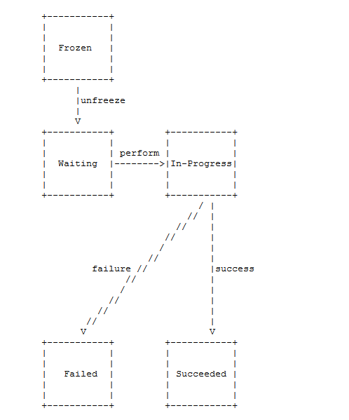

 
<!--BEGIN_DATA
{
    "create_date": "2021-02-10 18:20", 
    "modify_date": "2021-02-10 18:20", 
    "is_top": "0", 
    "summary": "WebRTC之ICE浅谈", 
    "tags": "WebRTC", 
    "file_name": "WebRTC之ICE浅谈.md"
}
END_DATA-->

#### 
原文出处：<a href='https://www.cnblogs.com/wangyiyunxin/p/11155795.html' target='blank'>WebRTC 之ICE浅谈</a>

ICE全称Interactive Connectivity Establishment：交互式连通建立方式。

ICE参照RFC5245建议实现，是一组基于offer/answer模式解决NAT穿越的协议集合。  

它综合利用现有的STUN，TURN等协议，以更有效的方式来建立会话。

客户端侧无需关心所处网络的位置以及NAT类型，并且能够动态的发现最优的传输路径。

## Classic STUN（RFC3489）的劣势:

Classic STUN 有着诸多局限性，例如:

  1. 不能确定获得的公网映射地址能否用于P2P通信
  2. 没有加密方法
  3. 不支持TCP穿越
  4. 不支持对称型NAT的穿越
  5. 不支持IPV6

## STUN（RFC5389）协议

RFC5389是RFC3489的升级版

  1. 支持UDP/TCP/TLS协议
  2. 支持安全认证 

ICE利用STUN（RFC5389） Binding Request和Response，来获取公网映射地址和进行连通性检查。同时扩展了STUN的相关属性:

  1. PRIORITY:在计算candidate pair优先级中使用
  2. USE-CANDIDATE:ICE提名时使用
  3. tie-breaker:在角色冲突时使用

## TURN协议

ICE使用TURN（RFC 5766）协议作为STUN的辅助，在点对点穿越失败的情况下，借助于TURN服务的转发功能，来实现互通。端口与STUN保持一致

TURN消息都遵循 STUN 的消息格式，除了ChannelData消息。

  1. 支持UDP/TCP/TLS协议，适用于UDP被限制的网络。
  2. 支持IPV6。

**TURN的流程:**

l  **创建Allocation：**

client 使用allocation transaction创建relay 端口，并在allocation的响应中回复给client。

当allocation创建后需要使用refresh request来保活，默认lifetime为10分钟。

l  **创建Permission：**

由allocation创建Permission，每个Permission 由 IP 地址 和lifetime组成。

有两种方法来创建和刷新Permission

  1. CreatePermission
  2. ChannelBind

l  **收发数据：**

  1. CreatePermission使用Send and Data indication消息
  2. ChannelBind使用ChannelData消息

## ICE介绍

1. ICE 的角色

分为 controlling和controlled。

Offer 一方为controlling角色，answer一方为controlled角色。

2. ICE的模式

分为FULL ICE和Lite ICE：

FULL ICE:是双方都要进行连通性检查，完成的走一遍流程。

Lite ICE: 在FULL ICE和Lite ICE互通时，只需要FULL ICE一方进行连通性检查，
Lite一方只需回应response消息。这种模式对于部署在公网的设备比较常用。

3. Candidate

媒体传输的候选地址，组成candidate pair做连通性检查，确定传输路径，有如下属性：

**Type**类型有：

Host/Srvflx/Relay/Prflx

**Componet ID**

传输媒体的类型,1代表RTP;2代表 RTCP。

WebRTC采用Rtcp-mux方式，也就是RTP和RTCP在同一通道内传输，减少ICE的协商和通道的保活。

**Priority**

Candidate的优先级。

如果考虑延时，带宽资源，丢包的因素，Type优先级高低一般建议如下顺序：

`_host > srvflx > prflx > relay_`

**Base**

是指candidate 的基础地址。

Srvflx address 的base 是本地host address。

host address和 relayed address 的base 是自身。

4. Candidate pair

由本端和远端candidate组成的pair，有自己的优先级。  

pair优先级的计算是取决candidate的priority。

`priority = 2^32*MIN(G,D) + 2*MAX(G,D) + (G>D?1:0)`

G:controlling candidate 优先级

D:controlled candidate 优先级

ICE选择高优先级的candidate pair。

5. Checklist

由candidate pair生成按优先级排序的链表,用于ICE连通性检查。

6. Validlist

由连通性检查成功的candidate pair按优先级排序的链表,用于ICE提名和选择最终路径。

## ICE过程

1. Gather candidates

根据Componet ID:

获取本机host address.

从STUN服务器获取 srvflx address.

从TURN服务器获取 relay address.

同时生成foundation。

2. 删除重复的candidate

收集地址完成后，需要去掉重复的candidate，如果两个candidate的地址一样，并且Base地址也一样，则删除它。

3. 交换candidates

ICE 使用offer/answer方式，双方通过SDP协商交换candidate信息.

Candidate信息包括type,foundation,base,component id,transport

SDP a行格式如下:

“a=candidate:1 1 UDP 9654321 212.223.223.223 12345 typ srflx raddr 10.216.33.9 rport 54321”

表示 foundation为1，媒体是RTP，采用UDP协议，公网映射地址为212.223.223.223:12345，优先级为9654321，type为srflx，base地址为10.216.33.9:54321

4. 生成candidate pairs

在本端收到远端candidates后，将Component ID和transport protocol相同的candidates组成pair。

修整candidate pair，如果是srvflx地址，则需要用其base地址替换。

对端也是同样的流程。

5. 生成checklist

将candidate pairs按照优先级排序，生成checklist，供连通性检查使用。

6. 连通性检查

Ordinary checks 两端都按照各自checklist分别进行检查。

Triggered checks 收到对端的检查时，也在对应的candidate pair上发起连通性检查，以提高效率

如果checklist里有relay candidate，则必须首先为relay candidate创建permission。

7. 发送连通性检查请求

ICE 使用STUN binding request/response，包含Fingerprint检验校验机制。

如果A收到B的response，则代表连通性检查成功，否则需要进行重传直到超时。

在建立连接时，如果没有响应，则会以RTO时间进行重传，每次翻倍，直到最大重传次数。

STUN请求 采用STUN short-term credential方式认证，

STUN USERNAME属性 ”RemoteUsername：localUsername”

两端在SDP协商时交换ice-pwd和ice-ufrag，以得对端用户名和密码。

STUN 检查请求中需要检查地址的对称性，请求的源地址是响应的目的地址，请求的目的地址是响应的源地址，否则都设置状态为 Failed。

8. 生成validlist

将连通性检查成功的candidate pair并按优先级排序加入validlist，这时本地candidate填写的是公网映射地址，remote candidate填写的是对端发送的STUN binding request地址。

9. 提名candidate pair

由controlling来提名哪对candidate pair为valid pair

提名方式又分为普通提名和进取型提名

普通提名方式会做两次连通性检查，在第一次做连通性检查时不会带上USE-CANDIDATE属性，而是在生成的validlist里选择pair再进行一次连通性检查，这时会带上USE-CANDIDATE属性，并且置位nominated flag。

进取型方式则是每次发送连通性检查时都会带上USE-CANDIDATE属性，并且置位nominated flag，不会再去做第二次连通性检查。

10. 选择最终传输地址

ICE在提名的valid pair里选择优先级最高那对作为本次ICE流程传输地址。

## ICE状态

  1. **Waiting**：还未开始连通性检查，从checklist中选择合适优先级的pair进行检查
  2. **In-Progress**：连通性检查已经开始，但还未结束
  3. **Succeeded**：该pair 连通性检查已经完成并且成功
  4. **Failed**：失败
  5. **Frozen**：连通性检查还未开始

## ICE保活

  1. 对于每个ICE通道，都需要为其会话进行保活。
  2. 采用STUN binding request或者STUN binding indication。
  3. 如果没有收到响应，则会重传，直到最大重传次数。

## ICE角色冲突解决

  1. 当两端角色都为controlling或者controlled角色冲突时，在连通性检查阶段，要求发送binding request消息里必须要带上tie-breaker属性。
  2. 当出现冲突时，比较tie-breaker大小，值比较大的则被认为是controlling，同时回应487错误给对端，对端收到487错误后切换角色。

## 结束语

随着WebRTC的应用越来越普遍，无论是Native端还是Web端，由于广泛的适应能力以及对未来网络的支持，ICE作为一种综合的解决方案将有着非常广阔的应用前景。
