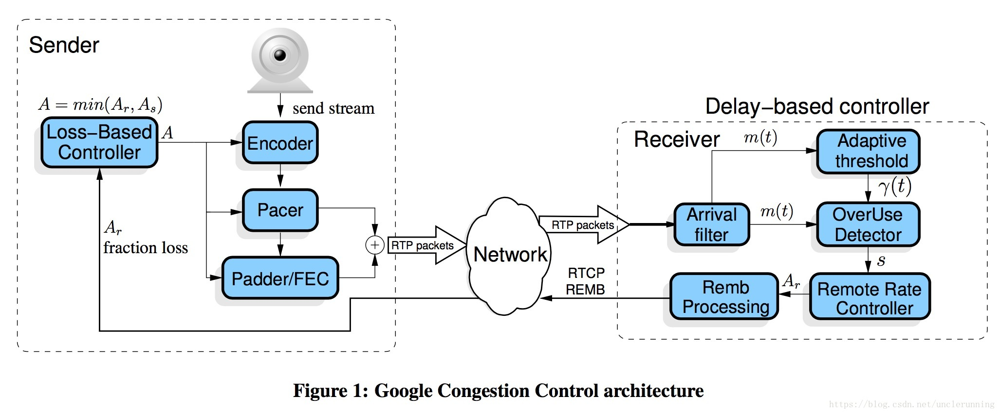

<!--BEGIN_DATA
{
    "create_date": "2021-01-05 13:32", 
    "modify_date": "2021-01-05 13:32", 
    "is_top": "0", 
    "summary": "初始化<br/>发送Call<br/>音频接收流程<br/>音频发送流程<br/>视频接受流程<br/>视频发送流程<br/>发送端Webrtc视频Pipeline", 
    "tags": "WebRTC、C/C++", 
    "file_name": "WebRTC代码流程.md"
}
END_DATA-->

#### <p>原文出处：<a href='https://blog.csdn.net/wanghorse/article/details/44516847' target='blank'>初始化</a></p>

```cpp
new VoiceEngine/VoiceEngine_create
    new VoiceEngineData
        webrtc::VoiceEngine::Create
            GetVoiceEngine
                new VoiceEngineImpl
                    初始化SharedData
                        ProcessThread::CreateProcessThread
                        OutputMixer::Create
                            new OutputMixer
                                AudioConferenceMixer::Create
                                    new AudioConferenceMixerImpl
                                    AudioConferenceMixerImpl::Init
                        TransmitMixer::Create
                            new TransmitMixer
                    初始化VoEAudioProcessingImpl
                    初始化VoECodecImpl
                    初始化VoEDtmfImpl
                    初始化VoENetEqStatsImpl
                    初始化VoENetworkImpl
                    初始化VoERTP_RTCPImpl
                    初始化VoEVideoSyncImpl
                    初始化VoEVolumeControlImpl
                    初始化VoEBaseImpl
VoiceEngine_init
    VoEBaseImpl::Init
        WebRtcSpl_Init          
        ProcessThreadImpl::Start
        AudioDeviceModuleImpl::Create
            AudioDeviceModuleImpl::CreatePlatformSpecificObjects
                new AudioDeviceTemplate
                new AudioDeviceUtilityAndroid
        SharedData::set_audio_device            
        ProcessThreadImpl::RegisterModule（AudioDeviceModuleImpl）    
        AudioDeviceModuleImpl::RegisterEventObserver
        AudioDeviceModuleImpl::RegisterAudioCallback
        AudioDeviceModuleImpl::init
        AudioDeviceModuleImpl::SetPlayoutDevice
        AudioDeviceModuleImpl::InitSpeaker
        AudioDeviceModuleImpl::SetRecordingDevice
        AudioDeviceModuleImpl::InitMicrophone
        AudioDeviceModuleImpl::StereoPlayoutIsAvailable
        AudioDeviceModuleImpl::SetStereoPlayout
        AudioDeviceModuleImpl::SetStereoRecording
        AudioProcessing::Create
            new AudioProcessingImpl
                new audioproc::Event
                new EchoCancellationImpl
                new EchoControlMobileImpl
                new GainControlImpl
                new HighPassFilterImpl
                new LevelEstimatorImpl
                new NoiseSuppressionImpl
                new VoiceDetectionImpl
                new GainControlForNewAgc
VoiceEngine_createChannel
    VoEBaseImpl::CreateChannel
        ChannelManager::CreateChannel
                ChannelManager::CreateChannelInternal
                Channel::CreateChannel
                    new Channel             
        VoEBaseImpl::InitializeChannel
            Channel::SetEngineInformation                   
new VideoEngine
    video_engine_jni.cc:VideoEngine_create
        new VideoEngineData 
            vie(vie_imple.cc:webrtc::VideoEngine::Create())
                new VideoEngineImpl
                    初始化ViEBaseImpl
                        new ViESharedData
                            初始化number_cores_（CpuInfo::DetectNumberOfCores(）
                            channel_manager_(new ViEChannelManager(0, number_cores_, config)),
                                input_manager_(new ViEInputManager(0, config)),
                                render_manager_(new ViERenderManager(0)),
                                module_process_thread_(ProcessThread::CreateProcessThread()),
                                    new ProcessThreadImpl
                                channel_manager_/input_manager_使用module_process_thread_
                                module_process_thread_启动
VideoEngine_init
    ViEBaseImpl::Init
VideoEngine_setVoiceEngine
    ViEBaseImpl::SetVoiceEngine
        ViEChannelManager::SetVoiceEngine   
            ViEChannel::SetVoiceChannel
                ViESyncModule::ConfigureSync
                    new StreamSynchronization
                        new ViESyncDelay
VideoEngine_createChannel       
    VideoEngineData::CreateChannel                      
        ViEBaseImpl::CreateChannel
            ViEChannelManager::CreateChannel
                new ChannelGroup
                    new VieRemb
                    BitrateController::CreateBitrateController
                        BitrateControllerImpl::BitrateControllerImpl
                    new CallStats
                    new EncoderStateFeedback
                    new WrappingBitrateEstimator                            
                    将主要Module注册到ProcessThread
                new ViEEncoder
                    vcm_(*webrtc::VideoCodingModule::Create())
                        new VideoCodingModuleImpl
                            sender_(new vcm::VideoSender(clock, &post_encode_callback_)),
                                new DebugRecorder(媒体写文件)
                            receiver_(new vcm::VideoReceiver(clock, event_factory))
                    vpm_(*webrtc::VideoProcessingModule::Create(channel_id))),
                        new VideoProcessingModuleImpl
                    RtpRtcp::CreateRtpRtcp                                     
                        new ModuleRtpRtcpImpl
                            RTPSender初始化
                                new RTPSenderVideo
                            RTCPSender初始化
                            RTCPReceiver初始化
                            RTCPReceiver::RegisterRtcpObservers
                    new ViEBitrateObserver
                    new ViEPacedSenderCallback
                BitrateControllerImpl::CreateRtcpBandwidthObserver
                ViEEncoder::Init
                    VideoCodingModuleImpl::InitializeSender 
                        VideoSender::InitializeSender
                            VCMCodecDataBase::ResetSender
                    VideoProcessingModuleImpl::EnableTemporalDecimation     
                        VPMFramePreprocessor::EnableTemporalDecimation
                            VPMVideoDecimator::EnableTemporalDecimation
                    VideoProcessingModuleImpl::EnableContentAnalysis        
                        VPMFramePreprocessor::EnableContentAnalysis
                    new QMVideoSettingsCallback
                    VideoCodingModule::Codec
                        VCMCodecDataBase::Codec
                    VideoCodingModuleImpl::RegisterSendCodec
                        VideoSender::RegisterSendCodec
                            VCMCodecDataBase::SetSendCodec
                                CreateEncoder
                                    VP8Encoder::Create
                                        new VP8EncoderImpl
                                    new VCMGenericEncoder
                                VCMGenericEncoder::InitEncode
                                    VP8EncoderImpl::InitEncode
                                VCMGenericEncoder::RegisterEncodeCallback   
                                    VP8EncoderImpl::RegisterEncodeCompleteCallback
                                VCMGenericEncoder::SetPeriodicKeyFrames 
                ViEChannelManager::CreateChannelObject          
                    new ViEChannel
                    ViEChannel::Init
VideoEngine_connectAudioChannel
    ViEBaseImpl::ConnectAudioChannel
        ViEChannelManager::ConnectVoiceChannel
            ViEChannel::SetVoiceChannel
                ProcessThreadImpl::RegisterModule(VoEVideoSync)
                ViESyncModule::ConfigureSync                                        
                    new StreamSynchronization
```

#### <p>原文出处：<a href='https://blog.csdn.net/wanghorse/article/details/44702569' target='blank'>发送Call</a></p>

```cpp
VoiceEngine_startListen
    VoEBaseImpl::StartReceive
        channelPtr->StartReceiving设置channel的receiving的状态
VoiceEngine_startPlayout
    VoEBaseImpl::StartPlayout
        VoEBaseImpl::StartPlayout--没有channelId，涉及到硬件，所以是唯一全局的
            AudioDeviceModuleImpl::InitPlayout      
                AudioDeviceTemplate::InitPlayout
                    OpenSlesOutput::InitPlayout,设置状态
            AudioDeviceModuleImpl::StartPlayout     
                AudioDeviceTemplate::StartPlayout
                    OpenSlesOutput::StartPlayout,创建硬件资源
        Channel::StartPlayout
            OutputMixer::SetMixabilityStatus                
                AudioConferenceMixerImpl::SetMixabilityStatus
                    AudioConferenceMixerImpl::AddParticipantToList加入到混音器中
VoiceEngine_startSend
    VoEBaseImpl::StartSend                      
        VoEBaseImpl::StartSend() --没有channelId，涉及到硬件，所以是唯一全局的
            AudioDeviceModuleImpl::StartRecording
                AudioDeviceTemplate::StartRecording
                    OpenSlesInput::StartRecording，创建硬件资源
            AudioDeviceModuleImpl::InitRecording
                AudioDeviceTemplate::InitRecording
                    OpenSlesInput::InitRecording，配置状态
        Channel::StartSend，设置状态
VideoEngine_addRenderer
    ViERenderImpl::AddRenderer
        ViERenderManager::AddRenderStream
            VideoRender::CreateVideoRender， VideoRender和上层的window一一对应
                new ModuleVideoRenderImpl       
                    new AndroidNativeOpenGl2Renderer
                    AndroidNativeOpenGl2Renderer::Init，和JNI环境关联起来
            加入到render_list,??可以有多个Render吗？
            ViERenderer::CreateViERenderer
                new ViERenderer
                    new ViEExternalRendererImpl,用于回调
                        new VideoFrame
                ViERenderer::Init       
                    ModuleVideoRenderImpl::AddIncomingRenderStream
                        VideoRenderAndroid::AddIncomingRenderStream
                            AndroidNativeOpenGl2Renderer::CreateAndroidRenderChannel
                                new AndroidNativeOpenGl2Channel
                                AndroidNativeOpenGl2Channel::Init， 
                                    和JINI环境关联起来
                                    注册两个Native函数，AndroidNativeOpenGl2Channel::DrawNativeStatic，AndroidNativeOpenGl2Channel::CreateOpenGLNativeStatic
                        streamId和AndroidStream（AndroidNativeOpenGl2Channel）一一对应，可以保存多个                          
                    new IncomingVideoStream
                        new VideoRenderFrames
                    IncomingVideoStream::SetRenderCallback初始化回调函数（AndroidNativeOpenGl2Channel）
                    IncomingVideoStream加入map中？？可以有多个？
VideoEngine_startRender
    ViERenderer::StartRender
        ModuleVideoRenderImpl::StartRender                          
            IncomingVideoStream::Start
                ThreadWrapper::CreateThread，回调是IncomingVideoStream::IncomingVideoStreamProcess
                Thread启动
                EventPosix::StartTimer
            VideoRenderAndroid::StartRender
                ThreadWrapper::CreateThread，回调是VideoRenderAndroid::JavaRenderThreadProcess
                启动线程
VideoEngine_startReceive
    ViEBaseImpl::StartReceive
        ViEChannel::StartReceive
            ViEReceiver::StartReceive,设置状态
VideoEngine_getCaptureDevice
    ViECaptureImpl::GetCaptureDevice
        ViEInputManager::GetDeviceName
            VideoCaptureFactory::CreateDeviceInfo
                new videocapturemodule::DeviceInfoAndroid
                DeviceInfoAndroid::GetDeviceName
VideoEngine_allocateCaptureDevice
    ViECaptureImpl::AllocateCaptureDevice
        ViEInputManager::CreateCaptureDevice
            ViECapturer::CreateViECapture
                new ViECapturer
                    ThreadWrapper::CreateThread,回调函数ViECapturer::ViECaptureProcess
                    new OveruseFrameDetector
                ViECapturer::Init
                    VideoCaptureFactory::Create
                        VideoCaptureImpl::Create
                            new videocapturemodule::VideoCaptureAndroid
                    VideoCaptureAndroid::RegisterCaptureDataCallback注册回调函数ViECapturer
                    在线程中注册Module，videocapturemodule::VideoCaptureAndroid
            保存ID，可以有多个ViECapturer
VideoEngine_connectCaptureDevice
    ViECaptureImpl::ConnectCaptureDevice,链接摄像头和channle
        ViEFrameProviderBase::RegisterFrameCallback，可以有多个callback           
        ViECapturer::FrameCallbackChanged，将ViEEncoder作为回调类放到VieCapturer的回调list中
            VideoCaptureAndroid::CaptureSettings
            VideoCaptureAndroid::StopCapture
            VideoCaptureAndroid::StartCapture，配置JNI环境，获取摄像头参数   
VideoEngine_startCapture
    ViECaptureImpl::StartCapture
        ViECapturer::Start
            ViEFrameProviderBase::GetBestFormat获取最好的尺寸
                ViEEncoder::GetPreferedFrameSettings
            VideoCaptureAndroid::StartCapture，配置JNI环境，获取摄像头参数
VideoEngine_startSend
    ViEBaseImpl::StartSend
        ViEEncoder::Pause，设置状态
        ViEChannel::StartSend
            ModuleRtpRtcpImpl::SetSendingMediaStatus
                RTPSender::SetSendingMediaStatus设置状态为true
            ModuleRtpRtcpImpl::SetSendingStatus
                RTPSender::SetSendingStatus，初始化状态和RTP头
            还能有多个ModuleRtpRtcpImpl？？？
        ViEEncoder::SendKeyFrame
            VideoCodingModuleImpl::IntraFrameRequest
                VideoSender::IntraFrameRequest
                    VCMGenericEncoder::RequestFrame
                        VP8EncoderImpl::Encode
```

#### <p>原文出处：<a href='https://blog.csdn.net/wanghorse/article/details/45175047' target='blank'>音频接收流程</a></p>

```cpp
收到音频包
UdpSocketManagerPosixImpl::Run
    UdpSocketManagerPosixImpl::Process
        UdpSocketPosix::HasIncoming（recvfrom）
            UdpTransportImpl::IncomingRTPCallback
                UdpTransportImpl::IncomingRTPFunction
                    VoiceChannelTransport::IncomingRTPPacket
                        VoENetworkImpl::ReceivedRTPPacket
                            Channel::ReceivedRTPPacket
                                UpdatePlayoutTimestamp
                                    AudioCodingModuleImpl::PlayoutTimestamp
                                        AcmReceiver::GetPlayoutTimestamp
                                            InitialDelayManager::GetPlayoutTimestamp
                                    AudioDeviceModuleImpl::PlayoutDelay
                                        AudioDeviceTemplate::PlayoutDelay
                                            OpenSlesOutput::PlayoutDelay
                                Channel::IsPacketInOrder
                                    ReceiveStatisticsImpl::GetStatistician (这个类应该管理所有的流)
                                    StreamStatisticianImpl::IsPacketInOrder
                                        StreamStatisticianImpl::InOrderPacketInternal （可以学习一下这个判断乱序代码）
                                Channel::IsPacketRetransmitted
                                    StreamStatisticianImpl::IsRetransmitOfOldPacket （可以学习一下这个判断重传代码）
                                ReceiveStatisticsImpl::IncomingPacket       
                                    如果是第一次收到，创建StreamStatisticianImpl                                   
                                    StreamStatisticianImpl::IncomingPacket
                                        StreamStatisticianImpl::UpdateCounters  记录必要的信息， 用于统计，如乱序、重传、jitbuff、计算bitrate
                                        StreamStatisticianImpl::NotifyRtpCallback
                                            ReceiveStatisticsImpl::DataCountersUpdated（没做处理）
                                Channel::ReceivePacket
                                    RtpReceiverImpl::IncomingRtpPacket
                                        check ssrc/play/timestamp
                                        RtpReceiverImpl::CheckSSRCChanged
                                            如果是第一次，则Channel::OnInitializeDecoder
                                                AudioCodingModule::Codec， 选择具体的Codec Inst（数组，一开始已经初始化好所有的）
                                                AudioCodingModuleImpl::RegisterReceiveCodec
                                                    AudioCodingModuleImpl::GetAudioDecoder
                                                        AudioCodingModuleImpl::CreateCodec
                                                            ACMCodecDB::CreateCodecInstance
                                                                new ACMISAC
                                                    AcmReceiver::AddCodec
                                                        NetEq初始化
                                                        NetEqImpl::RegisterExternalDecoder
                                        RTPReceiverAudio::ParseRtpPacket
                                            RTPReceiverAudio::ParseAudioCodecSpecific
                                                判断是不是dtmf、cgn、2833等
                                                Channel::OnReceivedPayloadData
                                                    AudioCodingModuleImpl::IncomingPacket
                                                        AcmReceiver::InsertPacket
                                                            ack
                                                            唇音同步
                                                            NetEqImpl::InsertPacket
                                                                NetEqImpl::InsertPacketInternal
                                                                    ACMISAC::IncomingPacket
                                                        ACMISAC::UpdateDecoderSampFreq
                                                            WebRtcIsac_SetDecSampRate
                                                                DecoderInitUb
                                                    Channel::UpdatePacketDelay
                                                        Channel::GetPlayoutFrequency(
                                                            AudioCodingModuleImpl::PlayoutFrequency()
AudioTrackJni::PlayThreadProcess
    AudioDeviceBuffer::RequestPlayoutData
        VoEBaseImpl::NeedMorePlayData
            VoEBaseImpl::GetPlayoutData
                AudioConferenceMixerImpl::Process
                    AudioConferenceMixerImpl::UpdateToMix
                        所有的与会者Channel::GetAudioFrame
                            AudioCodingModuleImpl::PlayoutData10Ms
                                AcmReceiver::GetAudio
                                    时间判断
                                    可能产生静音包
                                    NetEqImpl::GetAudio
                                        NetEqImpl::GetAudioInternal
                                            NetEqImpl::Decode
                                                ACMISAC::DecodePlc
                                                NetEqImpl::DecodeLoop
                                                    ACMISAC::Decode
                                    NetEqImpl::DecodedRtpInfo
                                    ack的处理
                                    重采样
                            Channel::UpdateRxVadDetection
                                Channel::OnRxVadDetected
                             AudioProcessingImpl::ProcessStream
                                 AudioBuffer::DeinterleaveFrom
                                 AudioBuffer::InterleaveTo
                             必要的音频处理，scale之类的
                        音量判断
                    合成声音                
                OutputMixer::GetMixedAudio  获取合成完的数据
    AudioDeviceBuffer::GetPlayoutData
    复制到java内存
    调用Java程序CallIntMethod(_javaScObj, _javaMidPlayAudio,                                                            
```

#### <p>原文出处：<a href='https://blog.csdn.net/wanghorse/article/details/45271255' target='blank'>音频发送流程</a></p>

```cpp
发送音频
OpenSlesInput::RecorderSimpleBufferQueueCallback
    OpenSlesInput::RecorderSimpleBufferQueueCallbackHandler，保存数据
OpenSlesInput::CbThreadImpl
    AudioDeviceBuffer::SetRecordedBuffer， 复制数据
    AudioDeviceBuffer::SetVQEData
    AudioDeviceBuffer::DeliverRecordedData
        VoEBaseImpl::RecordedDataIsAvailable
            VoEBaseImpl::ProcessRecordedDataWithAPM
                AudioDeviceModuleImpl::MaxMicrophoneVolume
                    AudioDeviceTemplate::MaxMicrophoneVolume
                TransmitMixer::PrepareDemux
                    TransmitMixer::GenerateAudioFrame
                        DownConvertToCodecFormat, 单双转换，重采样
                            PushResampler<T>::Resample
                    TransmitMixer::ProcessAudio，agc、aec、anc
                        AudioProcessingImpl::ProcessStream
                            AudioBuffer::DeinterleaveFrom
                            AudioProcessingImpl::ProcessStreamLocked
                            AudioBuffer::InterleaveTo
                TransmitMixer::DemuxAndMix
                    Channel::Demultiplex 复制数据
                    Channel::PrepareEncodeAndSend， 一些处理，比如添加dtmf
                TransmitMixer::EncodeAndSend()
                    Channel::EncodeAndSend
                        AudioCodingModuleImpl::Add10MsData
                            AudioCodingModuleImpl::PreprocessToAddData 存储数据
                        AudioCodingModuleImpl::Process
                            AudioCodingModuleImpl::ProcessSingleStream
                                ACMGenericCodec::Encode
                                    ACMISAC::InternalEncode
                                Channel::SendData
                                    ModuleRtpRtcpImpl::SendOutgoingData
                                        RTPSender::SendOutgoingData
                                            RTPSenderAudio::SendAudio
                                                RTPSender::BuildRTPheader
                                                    RTPSender::CreateRtpHeader
                                                RTPSender::SendToNetwork
                                                    统计
                                                    RTPSender::SendPacketToNetwork
                                                        Channel::SendPacket
                                                            UdpTransportImpl::SendPacket
```

#### <p>原文出处：<a href='https://blog.csdn.net/wanghorse/article/details/45459397' target='blank'>视频接受流程</a></p>

```cpp
收到视频包
UdpSocketManagerPosixImpl::Run
    UdpSocketManagerPosixImpl::Process
        UdpSocketPosix::HasIncoming（recvfrom）
            UdpTransportImpl::IncomingRTPCallback
                UdpTransportImpl::IncomingRTPFunction       
                    VideoChannelTransport::IncomingRTPPacket
                        ViENetworkImpl::ReceivedRTPPacket
                            ViEChannel::ReceivedRTPPacket
                                ViEReceiver::ReceivedRTPPacket
                                    ViEReceiver::InsertRTPPacket
                                        如果配置了抓包， 可以RtpDumpImpl::DumpPacket
                                        RtpHeaderParserImpl::Parse
                                            RtpHeaderParser::Parse
                                        ViEReceiver::ReceivePacket
                                            RtpReceiverImpl::IncomingRtpPacket
                                                ssrc、payroad等检查
                                                RTPReceiverVideo::ParseRtpPacket
                                                    ViEReceiver::OnReceivedPayloadData
                                                        VideoCodingModuleImpl::IncomingPacket
                                                            VideoReceiver::IncomingPacket
                                                                VCMReceiver::InsertPacket
                                                                    VCMJitterBuffer::InsertPacket
                                                                        VCMJitterBuffer::GetFrame, 完整frame/未完整frame/空frame
                                                                    VCMFrameBuffer::InsertPacket， 组桢
                                                                    如果完成， 插入可解码桢队列（decodable_frames_）
ViEChannel::ChannelDecodeProcess
    VideoCodingModuleImpl::Decode                               
        VideoReceiver::Decode
            VCMReceiver::FrameForDecoding
                VCMJitterBuffer::NextCompleteTimestamp，还未到render时间， 则等待
                VCMJitterBuffer::ExtractAndSetDecode， 取frame
            如果需要，抓图片？（）
            VideoReceiver::Decode
                VCMGenericDecoder::Decode
                    VP8DecoderImpl::Decode
decode完成（VP8是同步的， 直接在Decode中调用）
    VCMDecodedFrameCallback::Decoded            
        ViEChannel::FrameToRender
            图片预处理
            ViEFrameProviderBase::DeliverFrame
                ViERenderer::DeliverFrame
                    IncomingVideoStream::RenderFrame, 复制frame，放入队列
IncomingVideoStream::IncomingVideoStreamThreadFun
    IncomingVideoStream::IncomingVideoStreamProcess                 
        AndroidNativeOpenGl2Channel::RenderFrame， 复制frame
VideoRenderAndroid::JavaRenderThreadProcess     
    AndroidNativeOpenGl2Channel::DeliverFrame       
        调用JAVA层函数
            AndroidNativeOpenGl2Channel::DrawNativeStatic
                VideoRenderOpenGles20::Render
```

#### <p>原文出处：<a href='https://blog.csdn.net/wanghorse/article/details/45566445' target='blank'>视频发送流程</a></p>

```cpp
JNI调用
ProvideCameraFrame
    VideoCaptureAndroid::OnIncomingFrame
        VideoCaptureImpl::IncomingFrame
            申请内存，转换层I420
            VideoCaptureImpl::DeliverCapturedFrame
                计算时间戳
                ViECapturer::OnIncomingCapturedFrame
                    OveruseFrameDetector::FrameCaptured
                    复制frame，为什么？？？
ViECapturer::ViECaptureProcess
    ViECapturer::DeliverI420Frame
        ViEFrameProviderBase::DeliverFrame
            遍历所有注册的观察着
            ViEEncoder::DeliverFrame            
                encode之前的预处理（回调处理）      
                VideoCodingModuleImpl::AddVideoFrame
                    VideoSender::AddVideoFrame
                        VCMGenericEncoder::Encode
                            VP8EncoderImpl::Encode
                                编码
                                VP8EncoderImpl::GetEncodedPartitions
                                    EncodedImageCallbackWrapper::Encoded
                                        VCMEncodedFrameCallback::Encoded
                                            ViEEncoder::SendData
                                                ModuleRtpRtcpImpl::SendOutgoingData
                                                    RTPSender::SendOutgoingData
                                                        RTPSenderVideo::SendVideo
                                                            RTPSenderVideo::Send
                                                                拆包，RTP组包
                                                                RTPSenderVideo::SendVideoPacket
                                                                    RTPSender::SendToNetwork
                                                                    FEC
```

<hr>


#### <p>原文出处：<a href='https://blog.csdn.net/unclerunning/article/details/80512607' target='blank'>发送端Webrtc视频Pipeline</a></p>

从摄像头捕获特定帧率和分辨率的原始[YUV/RGB or MGPEG==>YUV/RGB]视频帧

### 拥塞控制



发送端基于”Loss-based Controller”估算发送端带宽 A<sub>s</sub>，接收端基于”Delay-based controller”估算发送端带宽 A<sub>r</sub>，发送端取两者的最小值作为当前发送端目标带宽，作用于编码器、Pacer以及Padder/FEC。

#### SendSideCongestionController

1、OnTransportFeedback
2、Process
3、**MaybeTriggerOnNetworkChanged**

#### BitrateController

1、OnDelayBasedBweResult
2、OnReceivedEstimatedBitrate
3、GetNetworkParameters

#### SendSideBandwidthEstimation

> 综合发送端带宽估计和接收端带宽估计，得出当前发送端目标带宽。

1、UpdateDelayBasedEstimate
2、UpdateReceiverEstimate
3、UpdateEstimate
4、CapBitrateToThresholds

#### BitrateAllocator

OnNetworkChanged

> 接收SendSideCongestionController::MaybeTriggerOnNetworkChanged回调过来的带宽变化通知。

```cpp
SendSideCongestionController::MaybeTriggerOnNetworkChanged 
==> Call::OnNetworkChanged 
==> Call::OnNetworkChanged 
==> BitrateAllocator::OnNetworkChanged 
==> VideoSendStreamImpl::OnBitrateUpdated 
==> FecController::UpdateFecRates and CalculateOverheadRateBps and ==> VideoStreamEncoder::OnBitrateUpdated 
==> VideoSender::SetChannelParameters 
==> VCMGenericEncoder::SetEncoderParameters 
==> VideoEncoder::SetRateAllocation of different video encoder implementation.
```

### 编码

Rtp打包过程，图片来源:[WebRTC中RTP/RTCP协议实现分析](./image/20210105-133200-2.jpg)

#### VideoStreamEncoder

1、SetSource
2、SetSink
3、ConfigureEncoder
4、OnFrame

> 接收采集端过来的视频帧。

5、EncodeVideoFrame
6、CropAndScaleFrom
7、OnBitrateUpdated

> 调用vcm::VideoSender::SetChannelParameters，将新的带宽码率设置给编码器实例。

#### EncodedImageCallback

> 编码器编码数据回调接口。

#### VCMEncodedFrameCallback

> EncodedImageCallback的wrapper。

#### vcm::VideoSender

> VideoStreamEncoder实现EncodedImageCallback接口，将raw video frame交给vcm::VideoSender去编码，然后从EncodedImageCallback回调接口接收视频编码器编码之后的压缩数据。

1、RegisterExternalEncoder

> 注册发送端编码器实例。

2、RegisterSendCodec

> VideoCodec，用来选择发送端将要使用的视频编码器，参数包括：编码器类型[VP8,VP9,H264…]、rtp payload type、宽、高、起始码率、最大码率、最小码率、目标码率、最大帧率、最大量化参数、不同分辨率的码率个数等。

3、AddVideoFrame

4、SetChannelParameters

> Update the channel parameters based on new rates and rtt. This will also cause an immediate call to VideoEncoder::SetRateAllocation.

#### VideoEncoder

> 视频编码器接口

1、InitEncode

2、RegisterEncodeCompleteCallback

3、Release

4、Encode

5、SetRateAllocation

#### VCMGenericEncoder

> VideoEncoder的wrapper，确保对VideoEncoder各个api的调用是序列化的。

SetEncoderParameters

> 设置参数: target_bitrate，loss_rate，rtt，input_frame_rate。

#### VCMEncoderDataBase

> 视频编码器数据库，因为同一时刻只有一个编码器会被一个VideoSender使用，所以这个数据库其实只有一个视频编码器，使用RegisterExternalEncoder注册。

1、RegisterExternalEncoder
2、SetSendCodec
3、GetEncoder
4、MatchesCurrentResolution
5、DeregisterExternalEncoder

#### EncoderSink

> 继承EncodedImageCallback接口，接收编码后的压缩数据。

#### VideoSendStreamImpl

> VideoSendStreamImpl实现EncoderSink接口，接收VideoStreamEncoder回调过来的编码器编码之后的压缩数据。

1、OnEncodedImage
2、OnBitrateUpdated

> Implements BitrateAllocatorObserver，接收带宽变化通知，并设置到编码器VideoStreamEncoder。

#### PayloadRouter

> PayloadRouter routes outgoing data to the correct sending RTP module, based on the simulcast layer in RTPVideoHeader.

1、OnEncodedImage

### 封包 + FEC + 丢包重传

#### RtpRtcp

1、SendOutgoingData
2、TimeToSendPacket
3、TimeToSendPadding
4、SendRTCP

#### ModuleRtpRtcpImpl

> 实现RtpRtcp接口。

1、SendOutgoingData

> 接收PayloadRouter过来的压缩数据，通过SendOutgoingData继续传递给RTPSender封包。

2、TimeToSendPacket

> 接收从PacedSender回调过来的数据包，通过TimeToSendPacket传递给RTPSender。

#### RTPSender

1、SendOutgoingData

> 处理ModuleRtpRtcpImpl传递过来的压缩数据。

2、TimeToSendPacket

3、SelectiveRetransmissions

4、OnReceivedNack

> 接收到接收端rtcp返回的Nack，调用ReSendPacket进行丢包重传。

5、ReSendPacket

> 在RtpPacketHistory中回溯rtt，查找丢掉的包是否落在这段时间范围内，否则放弃重传；然后检查重传是否会导致“overusing retransmission bitrate”，如果是，则放弃重传。

6、SendToNetwork

> 把报文存储到RTPPacketHistory结构中进行缓存。接下来如果开启PacedSending，则构造Packe发送到PacedSender进行排队，否则直接发送到网络层。

7、SendPacketToNetwork

> 将PaceSender回调过来的数据包，通过SendRtp传递给Transport。

#### RTPSenderVideo

1、SetFecParameters

2、SetSelectiveRetransmissions

3、SendVideo

> RTPSenderVideo处理后，通过SendToNetwork回调给RTPSender，然后，RTPSender将包保存在RtpPacketHistory 中等待RtpPacketSender派发。

4、SendVideoPacketWithFlexfec

> FEC protection.

#### PacedSender

> 继承RtpPacketSender，平滑数据包的发送，通过TimeToSendPacket回调将数据包传递给PacketSender。

1、SetEstimatedBitrate

> 接收SendSideCongestionController::MaybeTriggerOnNetworkChanged回调过来的带宽变化通知。

2、SetSendBitrateLimits

3、SendPacket

由于视频帧数据量大，且在I帧出现时存在非常大的波动梯度，如果大量的数据在瞬间全部发送到网络中，很容易导致网络的拥塞和抖动，造成延迟和丢包。PacedSender的目的就是平滑数据包的发送，使得发送端能够按照估算的发送端带宽码率平缓的发送媒体数据。

##### BitrateProber

> 根据发送码率和发送的数据量估算从当前发送结束到下一次开始发送PacedSender需要等待的时间

##### IntervalBudget

> 根据发送码率和等待间隔计算PacedSender本次剩余可发送的数据量，只有bytes_remaining_ 大于0才允许发送。

#### PacketRouter

> 继承PacketSender，通过TimeToSendPacket回调将PacedSender回调过来的数据包传递给相应的ModuleRtpRtcpImpl。

### 发送

#### Transport

1、SendRtp

2、SendRtcp

### reference

* [WebRTC中RTP/RTCP协议实现分析](https://www.jianshu.com/p/c84be6f3ddf3)  
* [Analysis and Design of the Google Congestion Control for Web Real-time Communication (WebRTC)](https://c3lab.poliba.it/images/6/65/Gcc-analysis.pdf)  
* [Understanding the Dynamic Behaviour of the Google Congestion Control](https://www.academia.edu/5135495Understanding_the_Dynamic_Behaviour_of_the_Google_Congestion_Control?auto=download)
* [Experimental Investigation of the Google Congestion Control for Real-Time Flows](http://conferences.sigcomm.org/sigcomm/2013/papers/fhmn/p21.pdf)  
* [HANDLING PACKET LOSS IN WEBRTC](https://static.googleusercontent.com/media/research.google.com/zh-CN//pubs/archive/41611.pdf)  
* [Understanding the Basis of the Kalman Filter Via a Simple and Intuitive Deriv ation](https://www.cl.cam.ac.uk/~rmf25/papers/Understanding%20the%20Basis%20of%20the%20Kalman%20Filter.pdf)
* [What is RMCAT congestion control, and how will it affect WebRTC?](https://blog.mozilla.org/webrtc/what-is-rmcat-congestion-control/)

