 
<!--BEGIN_DATA
{
    "create_date": "2020-12-06 10:30", 
    "modify_date": "2020-12-06 10:30", 
    "is_top": "0", 
    "summary": "详解WebRTC传输安全机制：一文读懂DTLS协议<br/>WebRTC传输安全机制第二话：深入浅出SRTP协议", 
    "tags": "WebRTC", 
    "file_name": "WebRTC传输安全机制.md"
}
END_DATA-->

#### <p>原文出处：<a href='https://zhuanlan.zhihu.com/p/370406218' target='blank'>详解WebRTC传输安全机制：一文读懂DTLS协议</a></p>

> DTLS(Datagram Transport Layer Security) 是基于 UDP 场景下数据包可能丢失或重新排序的现实情况下，为 UDP 定制和改进的 TLS 协议。在 WebRTC 中使用 DTLS 的地方包括两部分：协商和管理[SRTP](https://tools.ietf.org/html/rfc5764)密钥和为 [DataChannel](http://webrtc-security.github.io/) 提供加密通道。

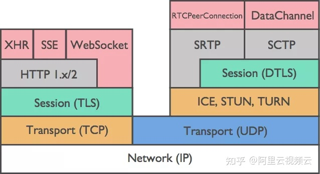

本文结合实际数据包分析 WebRTC 使用 DTLS 进行 SRTP 密钥协商的流程。并对在实际项目中使用 DTLS 遇到的问题进行总结。

### DTLS 协议简介

在分析 DTLS 在 WebRTC 中的应用之前，先介绍下 DTLS 协议的基本原理。

DTLS 协议由两层组成: Record 协议 和 Handshake 协议。

1. Record 协议: 使用对称密钥对传输数据进行加密，并使用 HMAC 对数据进行完整性校验，实现了数据的安全传输。

2. Handshake 协议：使用非对称加密算法，完成 Record 协议使用的对称密钥的协商。

**1. HandShake**

TLS 握手协议流程如下，参考[RFC5246](https://tools.ietf.org/html/rfc5246%23section-7.3)

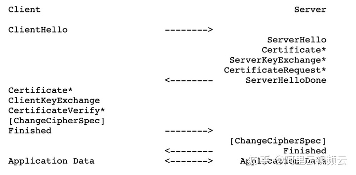

DTLS握手协议流程如下，参考 [RFC6347](https://tools.ietf.org/html/rfc6347%23section-4.2.4)

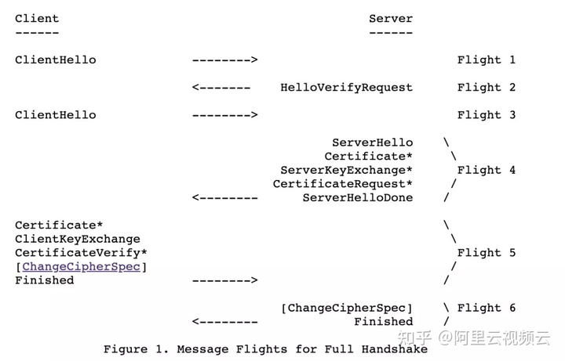

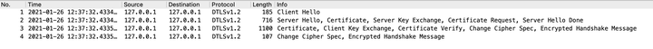

TLS 和 DTLS 的握手过程基本上是一致的，差别以及特别说明如下：

  * DTLS 中 [HelloVerifyRequest](https://tools.ietf.org/html/rfc6347%23section-4.2.1) 是为防止 DoS 攻击增加的消息。
  * TLS 没有发送 [CertificateRequest](https://tools.ietf.org/html/rfc5246%23section-7.4.4)，这个也不是必须的，是反向验证即服务器验证客户端。
  * DTLS 的 RecordLayer 新增了 SequenceNumber 和 Epoch，以及 ClientHello 中新增了 Cookie，以及 Handshake 中新增了 Fragment 信息（防止超过 UDP 的 MTU），都是为了适应 UDP 的丢包以及容易被攻击做的改进。参考 [RFC 6347](https://tools.ietf.org/html/rfc6347%23section-4.2.2)
  * DTLS 最后的 Alert 是将客户端的 Encrypted Alert 消息，解密之后直接响应给客户端的，实际上 Server 应该回应加密的消息，这里我们的服务器回应明文是为了解析客户端加密的那个 Alert 包是什么。

RecordLayer 协议是和 DTLS 传输相关的协议，UDP 之上是 RecordLayer，RecordLayer 之上是 Handshake 或 ChangeCIpherSpec 或 ApplicationData。RecordLayer 协议定义参考 [RFC4347](https://tools.ietf.org/html/rfc4347)，实际上有三种 RecordLayer 的包:

  * `DTLSPlaintext`，DTLS 明文的 RecordLayer。
  * `DTLSCompressed`，压缩的数据，一般不用。
  * `DTLSCiphertext`，加密的数据，在 ChangeCIpherSpec 之后就是这种了。

没有明确的字段说明是哪种消息，不过可以根据上下文以及内容判断。比如 ChangeCIpherSpec 是可以通过类型，它肯定是一个 Plaintext。除了Finished 的其他握手，一般都是 Plaintext。

### SRTP 密钥协商

**1. 角色协商**

在 DTLS 协议，通信的双方有`Client`和`Server`之分。在 WebRTC 中 DTLS 协商的身份是在 SDP 中描述的。描述如下，参考
[SDP-Anatomy](https://webrtchacks.com/sdp-anatomy/) 中 DTLS 参数。

    
    a=setup:active

`setup` 属性在 [RFC4145](https://tools.ietf.org/html/rfc4145%23section-4.1)，

setup:active，作为 client，主动发起协商；

setup:passive, 作为 sever，等待发起协商；

setup:actpass, 作为 client，主动发起协商。作为 server，等待发起协商。

**2. 算法协商-Hello 消息**

ClienHello 和 ServerHello 协商 DTLS 的 Version、CipherSuites、Random、以及 Extensions。

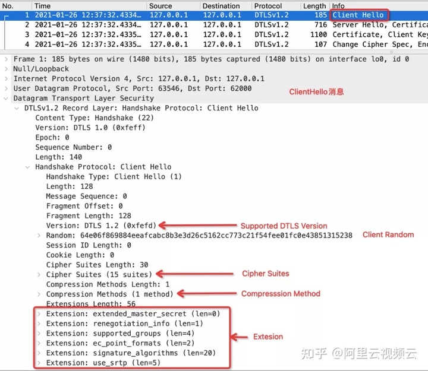

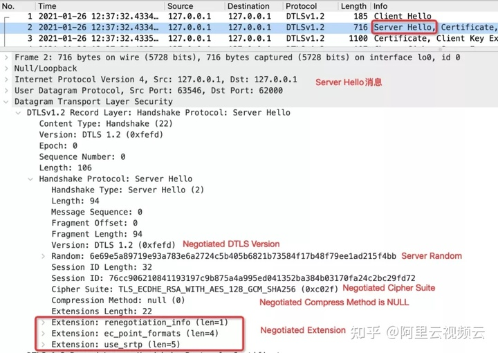


  * `Version`：Client 给出自己能支持的、或者要使用的最高版本，比如 DTLS1.2。Server 收到这个信息后，根据自己能支持的、或者要使用的版本回应，比如 DTLS1.0。最终以协商的版本也就是 DTLS1.0 为准。
  * `CipherSuites`：Client 给出自己能支持的加密套件 CipherSuites，Server 收到后选择自己能支持的回应一个，比如 TLS_ECDHE_RSA_WITH_AES_256_CBC_SHA (0xc014)，加密套件确定了证书的类型、密钥生成算法、摘要算法等。
  * `Random`：双方的随机数，参与到生成 MasterSecret。MasterSecret 会用来生成主密钥，导出共享密匙和 SRTP 密钥。详见 [导出 SRTP 密钥]。
  * `Extensions`：Client 给出自己要使用的扩展协议，Server 可以回应自己支持的。比如 Client 虽然设置了 SessionTicket TLS 这个扩展，但是 Server 没有回应，所以最终并不会使用这个扩展。

#### Cipher Suite

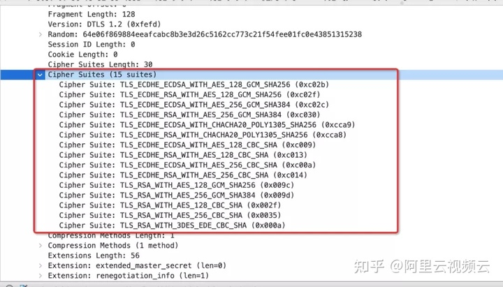


在 Hello 消息中加密套接字使用`IANA`中的注册的名字。IANA 名字由 Protocol，Key Exchange Algorithm，Authentication Algorithm，Encryption Algorithm ，Hash Algorithm 的描述组成。

例如，TLS_ECDHE_RSA_WITH_AES_128_GCM_SHA256 的含义如下：

  * `Protocol`: Transport Layer Security (TLS)
  * `Key Exchange`: Elliptic Curve Diffie-Hellman Ephemeral (ECDHE)
  * `Authentication`: Rivest Shamir Adleman algorithm (RSA)
  * `Encryption`: Advanced Encryption Standard with 128bit key in Galois/Counter mode (AES 128 GCM)
  * `Hash`: Secure Hash Algorithm 256 (SHA256)

> 加密套接字在[ciphersuite.info](http://ciphersuite.info)可以查到。在查到 IANA 名字的同时，也可以查到在 OpenSSL 中的名字。`TLS_ECDHE_RSA_WITH_AES_128_GCM_SHA256`在 OpenSSL 中的名字为 ECDHE-RSA-AES128-GCM-SHA256。   
> Note: 关于 Authentication(认证)、KeyExchange(密钥交换)、Encryption(加密)、MAC(Message Authentication Code) 消息摘要等，可以参考 [RSA密钥协商](https://www.zhihu.com/question/25116415?spm=ata.21736010.0.0.7fe07879zTCDDi)。

#### Extension

DTLS 的扩展协议，是在 ClientHello 和 ServerHello 的 Extensions 信息中指定的，所有的 TLS 扩展参考 [TLS Extensions](https://www.iana.org/assignments
/tls-extensiontype-values/tls-extensiontype-values.xhtml)。下面列出几个 WebRTC 用到的扩展：

  * `use_srtp`: DTLS 握手完成后(Finished)，使用 SRTP 传输数据，DTLS 生成 SRTP 的密钥。 [RFC5764](https://tools.ietf.org/html/rfc5764)。ClientHello 中的扩展信息定义了 [RFC5764 4.1.2. SRTP Protection Profiles](https://tools.ietf.org/html/rfc5764%23page-8)和 [srtp_mki](https://tools.ietf.org/html/rfc5764%23section-4.1.3)。

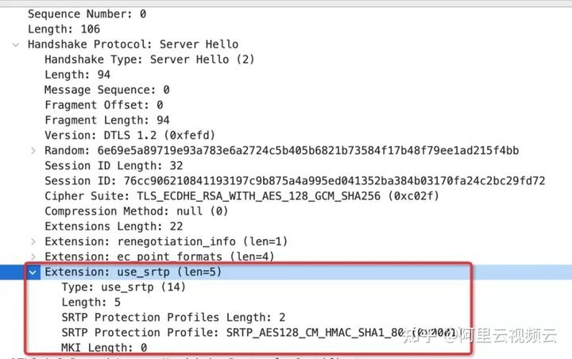

`supported_groups`，原来的名字为`elliptic_curves`，描述支持的 ECC 加密算法，参考 [RFC8422 5.1.1.Supported Elliptic Curves Extension](https://tools.ietf.org/html/rfc8422%23section-5.1.1)，一般用的是 secp256r1。

  * `signature_algorithms`，DTLS1.2 的扩展，指定使用的 Hash 和 Signature 算法，参考 [RFC5246 7.4.1.4.1. Signature Algorithms](https://tools.ietf.org/html/rfc5246%23section-7.4.1.4.1)。DTLS1.0，RSA 用的是 md5sha1 摘要算法，DSA 用的是 sha1 摘要算法。

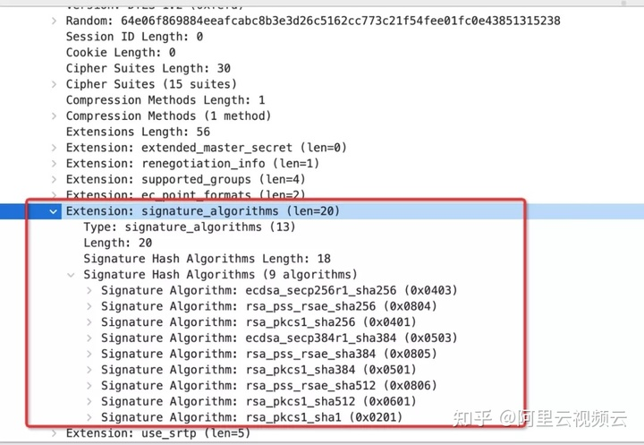

  * `extended_master_secret`，扩展 MasterSecret 的生成方式，参考 [RFC7627](https://tools.ietf.org/html/rfc7627)。在 KeyExchange 中，会加入一些常量来生成 MasterSecret。TLS 定义了扩展方式，如果用这个扩展，DTLS 的方式和 TLS 会有些不同。
  * `renegotiation_info`，参考 [RFC5746](https://tools.ietf.org/html/rfc5746%23section-3.2)。

除了这些扩展协议，和 SRTP 密钥导出相关的还有：

> RFC5705: Keying Material Exporters for Transport Layer Security (TLS)，DTLS 如何从 MasterSecret 导出 Key，比如 SRTP 的 Key。   
> RFC5764: DTLS Extension to Establish Keys for the SRTP，DTLS 的 `use_srtp` 扩展的详细规范，包括 ClientHello 扩展定义、Profile 定义、Key 的计算。

**3. 身份验证-Certificate**

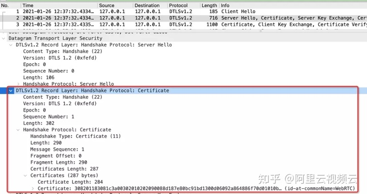

数字证书是由一些公认可信的证书颁发机构签发的，不易伪造。数字证书可以用于接收者验证对端的身份，接收者收到某个对端的证书时，会对签名颁发机构的数字签名进行检查，一般来说，接收者事先就会预先安装很多常用的签名颁发机构的证书（含有公开密钥），利用预先的公开密钥可以对签名进行验证。

Server 端通过 Hello 消息，协商交换密钥的方法后，将 Server 证书发送给 Client，用于 Client 对 Server 的身份进行校验。Server 发送的证书必须适用于协商的 KeyExchange 使用的加密套接字，以及 Hello 消息扩展中描述的 Hash/Signature 算法对。

在 WebRTC 中，通信的双方通常将无法获得由知名根证书颁发机构 (CA) 签名的身份验证证书，自签名证书通常是唯一的选择。[RFC4572](https://tools.ietf.org/html/rfc4572) 定义一种机制，通过在 SDP 中增加自签名证书的安全哈希，称为 " 证书指纹 "，在保证 SDP 安全传输的前提下，如果提供的证书的指纹与 SDP 中的指纹匹配，则可以信任自签名证书。在实际的应用场景中，SDP 在安全的信令通道 (https) 完成交换的，SDP 的安全完整是可以做到的。这样在 DTLS 协商过程中，可以使用证书的指纹，完成通信双方的身份校验。证书指纹在 SDP 中的描述如下，参考 [SDP-Anatomy](https://webrtchacks.com/sdp-anatomy/) 中 DTLS 参数。

    
    a=fingerprint:sha-256 49:66:12:17:0D:1C:91:AE:57:4C:C6:36:DD:D5:97:D2:7D:62:C9:9A:7F:B9:A3:F4:70:03:E7:43:91:73:23:5E

**4. 密钥交换-KeyExchange**

ServerKeyExchange 用来将 Server 端使用的公钥，发送给 Client 端。分为两种情况：

1.`RSA`算法: 如果服务端使用的是 RSA 算法，可以不发送这个消息，因为 RSA 算法使用的公钥已经在 Certificate 中描述。

2.`DH`算法，是根据对方的公钥和自己私钥计算共享密钥。因为 Client 和 Server 都只知道自己的私钥，和对方的公钥；而他们的私钥都不同，根据特殊的数学特性，他们能计算出同样的共享密钥。关于 DH 算法如何计算出共享密钥，参考[DH算法](http://www.voidcn.com/article/p-rgubrwfd-bpg.html)。

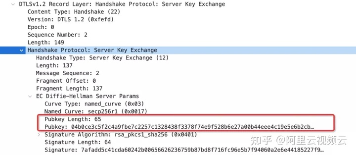

ClientKeyExchange 用来将 Client 使用的公钥，发送给 Server 端。

1.`RSA`算法：如果密钥协商使用的 RSA 算法，发送使用 server 端 RSA 公钥，对 premaster secret 加密发送给 server 端。

2.`DH`算法：如果密钥协商使用的 DH 算法，并且在证书中没有描述，在将客户端使用的 DH 算法公钥发送给 Server 端，以便计算出共享密钥。

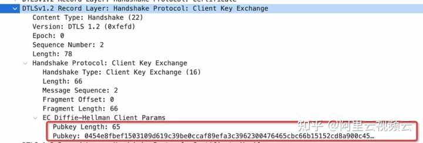

KeyExchange 的结果是，Client 和 Server 获取到了 RSA Key， 或通过 DH 算法计算出共享密钥。详见 [导出 SRTP 密钥] 的过程。

**5. 证书验证-CertificateVerify**

客户端使用 ClientRequest 中描述的 Hash/Signature 算法，对收到和发送的 HandShake 消息签名发送给 Server。Server 端对签名进行校验。

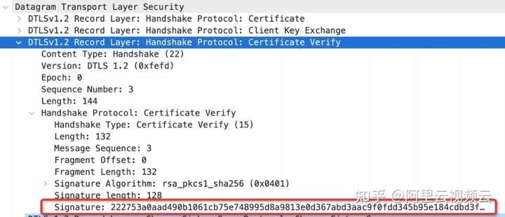

**6. 加密验证-Finished**

当 Server 和 Client 完成对称密钥的交换后，通过`ChangeCipherSpec`通知对端进入加密阶段，epoch 加 1。

随后 Client 使用交换的密钥，对 "client finished" 加密，使用 Finished 消息，发送给服务端。Server 使用交换的密钥，对 "server finished" 进行加密发送给客户端。一旦验证了 finished 消息后，就可以正常通信了。

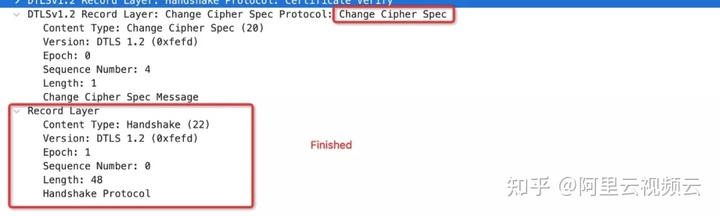

### **导出 SRTP 密钥**

上面介绍了 DTLS 的过程，以下通过结合上面例子给出的实际数据，详细说明 SRTP 密钥的导出步骤。

**1. 协商后的加密算法**

加密套件：TLS_ECDHE_RSA_WITH_AES_128_GCM_SHA256(0xc02f)

椭圆曲线算法为：secp256r1，椭圆曲线的点压缩算法为：uncompressed。

椭圆曲线算法的基础知识的介绍在[ECC椭圆曲线加密算法-ECDH,ECDHE,ECDSA](https://zhuanlan.zhihu.com/p/66794410)，由文档中我们可以知道，确定椭圆曲线加密算法有如下参数：

  * 素数 p，用于确定有限域的范围。  

  * 椭圆曲线方程中的 a，b 参数。  

  * 用于生成子群的的基点 G。  

  * 子群的阶 n。  

  * 子群的辅助因子 h。

定义为`六元组(p,a,b,G,n,h)`

通过在[SECG-SEC2 2.4.2 Recommended Parameters secp256r1](http://www.secg.org/sec2-v2.pdf)中可以查到 secp256r1 对应的参数如下：

```
secp256r1使用的参数如下：
使用的素数p:
p=FFFFFFFF00000001000000000000000000000000FFFFFFFFFFFFFFFFFFFFFFFF
=2224(232−1)+2192+296−1
椭圆曲线E:y^2=x^3+ax+b的参数定义如下：
a=FFFFFFFF00000001000000000000000000000000FFFFFFFFFFFFFFFFFFFFFFFC
b=5AC635D8AA3A93E7B3EBBD55769886BC651D06B0CC53B0F63BCE3C3E27D2604B
基点G的非压缩格式：
G=046B17D1F2E12C4247F8BCE6E563A440F277037D812DEB33A0F4A13945D898C2964FE342E2FE1A7F9B8EE7EB4A7C0F9E162BCE33576B315ECECBB6406837BF51F5
有限域的阶n:
n=FFFFFFFF00000000FFFFFFFFFFFFFFFFBCE6FAADA7179E84F3B9CAC2FC632551
辅助因子h:
h=01
```

**2. 通过 KeyExchange 交换椭圆曲线算法公钥**

ECDH Server Parameter

```    
Pubkey:04b0ce3c5f2c4a9fbe7c2257c1328438f3378f74e9f528b6e27a00b44eee4c19e5e6b2cb6cab09f796bcf8c05102b2a4bcdc753d91cc4f431f558c845a1ba6f1ce
```    

记为 `Spk`

ECDH Client Paramter

``` 
PubKey: 0454e8fbef1503109d619c39be0ccaf89efa3c3962300476465cbc66b15152cd8a900c45d506420f0123e65d8fbb70cb60b497893f81c5c2a0ef2f4bc2da996d9e
```  

记为 `Cpk`

**3. 根据 ECDHE 算法计算共享密钥**钥 `S`(**pre-master-secret)**

假设 Server 的使用的椭圆曲线私钥为 Ds, Client 使用的 Dc，计算共享密钥的如下 , 参考[ECC椭圆曲线加密算法-ECDH,ECDHE,ECDSA](https://zhuanlan.zhihu.com/p/66794410)

S = Ds * Cpk = Dc * Spk

这个共享密钥`S`就是我们在 RFC 文档中看到的`pre-master-secret`

**4. 计算master secret**

计算 `master secret` 过程如下，可参考 [Computing the Master Secret](https://tools.ietf.org/html/rfc5246%23section-8.1)

```
master_secret = PRF(pre_master_secret, "master secret", ClientHello.random + ServerHello.random)[0..47];
```

计算出来的 `master_secret` 为 48 Bytes，其中 `ClientHello.random` 和`ServerHello.random` 在 Hello 消息中给出。`PRF` 是伪随机数函数（pseudorandom function），在协商的加密套件中给出。

**5. 使用 master_secrete 导出 SRTP 加密参数字节序列**

使用 [RFC5705 4. Exporter Definition](https://tools.ietf.org/html/rfc5705%23section-4) 给出的计算方式，使用参数 `master_secret`，`client_random`，`server_random`计算字节序列：

```
key_block = PRF(master_secret, "EXTRACTOR-dtls_srtp", client_random + server_random)[length]
```

在 [DTLS-SRTP 4.2. Key Derivation](https://tools.ietf.org/html/rfc5764%23section-4.2) 中描述了需要的字节序列长度。

```
2 * (SRTPSecurityParams.master_key_len + SRTPSecurityParams.master_salt_len) bytes of data
```    

`master_key_len` 和 `master_salt_len`的值，在 `user_srtp` 描述的profile中定义。我们的实例中使用的 profile 为 `SRTP_AES128_CM_HMAC_SHA1_80`，对应的 profile 配置为：

```
SRTP_AES128_CM_HMAC_SHA1_80
        cipher: AES_128_CM
        cipher_key_length: 128
        cipher_salt_length: 112
        maximum_lifetime: 2^31
        auth_function: HMAC-SHA1
        auth_key_length: 160
        auth_tag_length: 80
```

也就是我们需要 `(128/8+112/8)*2 = 60 bytes` 字节序列。

**6. 导出SRTP密钥**

计算出 SRTP 加密参数字节序列，在 [DTLS-SRTP 4.2. Key Derivation](https://tools.ietf.org/html/rfc5764%23section-4.2) 描述了字节序列的含义：

```
client_write_SRTP_master_key[SRTPSecurityParams.master_key_len]; // 128 bits
server_write_SRTP_master_key[SRTPSecurityParams.master_key_len]; // 128 bits
client_write_SRTP_master_salt[SRTPSecurityParams.master_salt_len]; // 112 bits
server_write_SRTP_master_salt[SRTPSecurityParams.master_salt_len]; // 112 bits
```

至此我们得到了, Client和Server使用的SRTP加密参数：master_key 和 master_salt。

### DTLS 超时重传

DTLS 是基于 UDP 的，不可避免会出现丢包，需要重传。如果处理不当，会导致整个通信双方无法建立会话，通话失败。[RFC6347 4.2.4](https://tools.ietf.org/html/rfc6347%23section-4.2.4) 给出了超时和重传机制。

在处理重传时，以下几点需要注意：

1. 在 DTLS 协议中，为了解决丢包和重传问题，新增了 [message_seq](https://tools.ietf.org/html/rfc6347%23section-4.2.2)。 在发送 DTLS 重传消息时，一定要更新其中的`message_seq`，这样对端将把包识别是一个重传包，响应正确消息。否则，会默默丢弃这些包，不进行响应。

2. 当 server 端收到 client 的 FINISHED 消息，并发送 FINISHED 消息给 client，更新 server状态为协商完成，开始发送 SRTP 数据。此时发送给 client 的 FINISHED 消息，出现丢包。client 收到 SRTP数据后丢弃。同时，再次发送 FINISHED 消息到 server，server 要正确响应。否则，会导致 DTLS 协商完成的假象，通话失败。

3. 使用 openssl 1.1.1 之前版本，无法设置 DTLS 超时重传时间，可以超时重传机制不可用，大家开始转向使用boringssl。openssl 1.1.1 开始版本已经支持设置 DTLS 超时重传，达到和 boringssl 同样的效果。参考 [DTLS_set_timer_cb](https://www.openssl.org/docs/man1.1.1/man3/DTLS_set_timer_cb.html)。

### OpenSSL 的 DTLS 功能

DTLS 是一个庞大的协议体系，其中包括了各种加密，签名，证书，压缩等多种算法。大多数项目是基于 OpenSSL 或 BoringSSL 实现的 DTLS 功能。在实际项目使用 OpenSSL 的 DTLS 功能，与协商有关的接口总结如下。

1. [X509_digest](https://www.openssl.org/docs/man1.1.0/man3/X509_digest.html)，计算证书 fingerprint，用在 SDP 协商中的`fingerprint`属性。

2. [SSL_CTX_set_cipher_list](https://www.openssl.org/docs/manmaster/man3/SSL_CTX_set_cipher_list.html)，设置使用的加密套件，通过设置算法的描述，影响 Hello 消息中的 cipher list。

3. [SSL_CTX_set1_sigalgs_list](https://www.openssl.org/docs/man1.1.0/man3/SSL_CTX_set1_sigalgs_list.html)设置签名算法。通过设置签名算法的描述，影响 hello 消息中 `signature_algorithms` 扩展。`signature_algorithms` 对 DTLS 的`Hello消息`，`KeyExchange`，`CerficateVerify`消息。`signature_algorithms` 设置不正确，会出现 internal error，不容易定位问题。

4. [SSL_CTX_set_verify](https://www.openssl.org/docs/man1.0.2/man3/SSL_CTX_set_verify.html) 设置是否校验对端的证书。由于在 RTC 中大多数据情况下使用自签证书，所以对证书的校验，已校验身份是需要的。

5. [SSL_CTX_set_tlsext_use_srtp](https://www.openssl.org/docs/man1.1.1/man3/SSL_CTX_set_tlsext_use_srtp.html)设置`srtp`扩展。srtp 扩展中的 profile，影响 srtp 加密时使用密钥的协商和提取。

6. [SSL_set_options](https://www.openssl.org/docs/man1.1.0/man3/SSL_set_options.html) 使用`SSL_OP_NO_QUERY_MTU`和 [SSL_set_mtu] 设置 fragment 的大小。默认 OpenSSL 使用 fragment 较小。通过上面两个接口，设置适合网络情况的fragment。

7. [DTLS_set_timer_cb](https://www.openssl.org/docs/man1.1.1/man3/DTLS_set_timer_cb.html)，设置超时重传的 Callback，由 callback 设置更合理的超时重传时间。

在开源项目 [SRS](https://github.com/ossrs/srs)中已经支持了 WebRTC 的基础协议，对 DTLS 协议感兴趣的同学，可以基于 SRS 快速搭建本机环境，通过调试，进一步加深对 DTLS 的理解。

### 总结

本文通过 WebRTC 中 SRTP 密钥的协商过程，来说明 DTLS 在 WebRTC 中的应用。DTLS 协议设计的各个加密算法的知识较多，加上 TLS 消息的在各种应用场景中的扩展，难免有理解和认知不到的地方，还需要进一步深入探索。

### 参考文献

1. [TLS 1.2](https://tools.ietf.org/html/rfc5246)
2. [DTLS 1.2](https://tools.ietf.org/html/rfc6347)
3. [TLS Session Hash Extension](https://tools.ietf.org/html/rfc7627)
4. [TCP-Based Media Transport in the Session Description Protocol](https://tools.ietf.org/html/rfc4145)
5. [TLS Extension](https://www.iana.org/assignments/tls-extensiontype-values/tls-extensiontype-values.xhtml)
6. [SRTP Extension for DTLS ](https://tools.ietf.org/html/rfc5764)
7. [OpenSSL Man](https://www.openssl.org/docs/man1.1.1/man3)
8. [ECC椭圆曲线加密算法-介绍](https://zhuanlan.zhihu.com/p/36326221)
9. [ECC椭圆曲线加密算法-有限域和离散对数](https://zhuanlan.zhihu.com/p/44743146)
10. [ECC椭圆曲线加密算法-ECDH、ECDHE和ECDSA](https://zhuanlan.zhihu.com/p/66794410)

<hr>

#### <p>原文出处：<a href='https://mp.weixin.qq.com/s/8PLkghEt9gCsIkeY9u5e1g' target='blank'>WebRTC传输安全机制第二话：深入浅出SRTP协议</a></p>

> 通过 [DTLS 协商](http://mp.weixin.qq.com/s?__biz=MjM5NTE0NTY3MQ==&mid=2247504729&idx=1&sn=fa618f216b06f738add01769fbc90658&chksm=a6fe61f19189e8e7291baff1511518ff6d94597c5ee2413201815b0c040153eb19b2b2261b9f&scene=21#wechat_redirect)后，RTC 通信的双方完成 `MasterKey` 和 `MasterSalt` 的协商。接下来，我们继续分析在 WebRTC 中，如何使用交换的密钥，来对 RTP 和 RTCP 进行加密，实现数据的安全传输。同时，本文会对 libsrtp 使用中，遇到的问题的进行解答，例如，什么是 ROC，ROC 为什么是 32-bits？为什么会返回 error_code=9, error_code=10？交换的密钥有生命周期吗，如果有是多长时间呢？阅读本篇之前建议阅读[DTLS 协商](http://mp.weixin.qq.com/s?__biz=MjM5NTE0NTY3MQ==&mid=2247504729&idx=1&sn=fa618f216b06f738add01769fbc90658&chksm=a6fe61f19189e8e7291baff1511518ff6d94597c5ee2413201815b0c040153eb19b2b2261b9f&scene=21#wechat_redirect)篇，两者结合，效果更佳哦！

## 01 要解决的问题

`RTP/RTCP` 协议并没有对它的负载数据进行任何保护。因此，如果攻击者通过抓包工具，如Wireshark，将音视频数据抓取到后，通过该工具就可以直接将音视频流播放出来，这是非常恐怖的事情。

在 WebRTC 中，为了防止这类事情发生，没有直接使用 `RTP/RTCP` 协议，而是使用了 `SRTP/SRTCP` 协议 ，即安全的`RTP/RTCP` 协议。WebRTC 使用了非常有名的 libsrtp 库将原来的 `RTP/RTCP` 协议数据转换成 `SRTP/SRTCP`协议数据。

[SRTP]() 要解决的问题：

• 对 `RTP/RTCP` 的负载 (payload) 进行加密，保证数据安全；

• 保证 `RTP/RTCP` 包的完整性，同时防重放攻击。

## 02 SRTP/SRTCP结构

### SRTP 结构

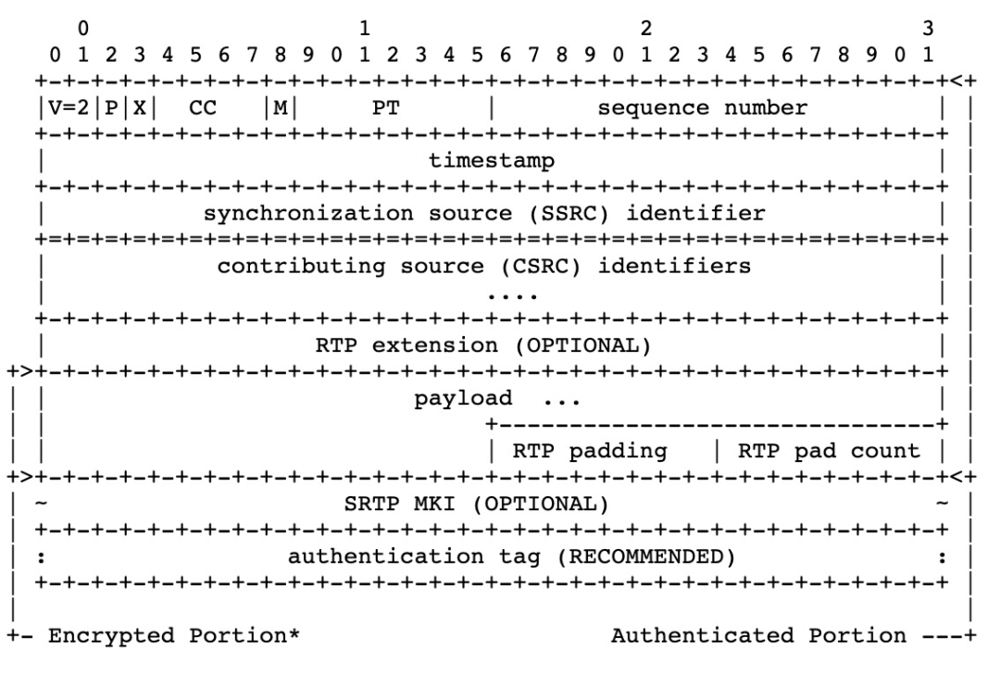

从 SRTP 结构图中可以看到：

1. 加密部分 `Encrypted Portion`，由 `payload`, `RTP padding`和`RTP pad count`部分组成。也就是我们通常所说的仅对 RTP 负载数据加密。
2. 需要校验部分 `Authenticated Portion`，由 `RTP Header`, `RTP Header extension` 和 `Encrypted Portion` 部分组成。

>通常情况下只需要对 RTP 负载数据进行加密，如果需要对 RTP header extension 进行加密，[RFC6904](https://datatracker.ietf.org/doc/html/rfc6904) 给出了详细方案，在libsrtp 中也完成了实现。

### SRTCP 结构

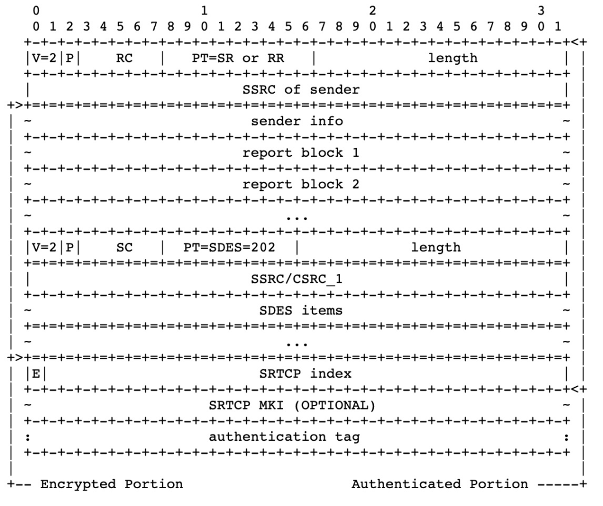  

从 `SRTCP` 结构图中可以看到：

1. 加密部分 `Encrypted Portion`，为 `RTCP Header` 之后的部分，对`Compound RTCP` 也是同样。  
2. E-flag 显式给出了 RTCP 包是否加密。（PS：一个 RTP 包怎么判断是加密的？）  
3. `SRTCP index` 显示给出了 RTCP 包的序列号，用来防重放攻击。（PS：一个 RTP 包的 16-bits的序列号可以防重放攻击吗？）  
4. 待校验部分 `Authenticated Portion`，由 `RTCP Header` 和 `Encrypted Portion` 部分组成。  

在初步认识了 `SRTP` 和 `SRTCP` 的结构后，接下来介绍 `Encrypted Portion` 和 `Authenticated Portion` 如何得到了。  

## 03 Key管理

在 `SRTP/SRTCP` 协议中，使用二元组 `<SRTP目的IP地址，SRTP/SRTCP目的端口>` 的方式来标识一个通信参与者的`SRTP/SRTCP` 会话，称为 `SRTP/SRTCP Session`。

在 `SRTP` 协议中使用三元组 `<SSRC, RTP/RTCP目的地址，RTP/RTCP目的端口>` 来标识一个 stream，一个`SRTP/SRTCP Session` 由多个 stream 组成。对每个 stream 的加解密相关参数的描述，称为 `Cryptographic Context`。

每个 stream 的 `Cryptographic Context`中 中的包含如下参数：

• SSRC: Stream 使用的 SSRC。

• Cipher Parameter：加解密使用的 key, salt，算法描述 (类型，参数等)。

• Authentication Parameter: 完整性使用的 Key, salt，算法描述 (类型，参数等)。

• Anti-Replay Data: 防止重放攻击缓存的数据信息，例如，ROC，最大序号等。

在 `SRTP/SRTCP Session` 中，每个 Stream 都会使用到属于自己的，加解密 Key，Authentication Key。这些Key 都是在同一个 Session 中使用到的，称为 `Session Key`。这些 `Session Key` 是通过对 `Master Key`使用 KDF(Key Derivation Function) 导出的。

`KDF` 是用于导出 `Session Key` 函数，KDF 默认使用是加解密函数。例如，在完成 DTLS 后，协商得到的 SRTP 加密算法的 Profile 为：

```
SRTP_AES128_CM_HMAC_SHA1_80  
        cipher: AES_128_CM  
        cipher_key_length: 128  
        cipher_salt_length: 112  
        maximum_lifetime: 2^31  
        auth_function: HMAC-SHA1  
        auth_key_length: 160  
        auth_tag_length: 80
```
  
对应的 `KDF` 为 `AES128_CM`。`Session Key` 的导出流程如下图所示：  

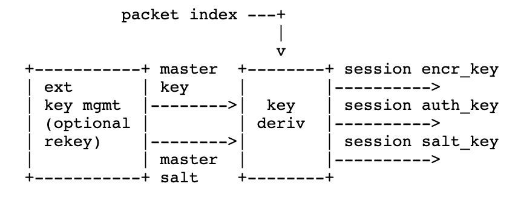  

`Session Key` 的导出依赖于如下参数：• `key_label`: 根据导出的 Key 的类型不同，`key_label` 取值如下：  

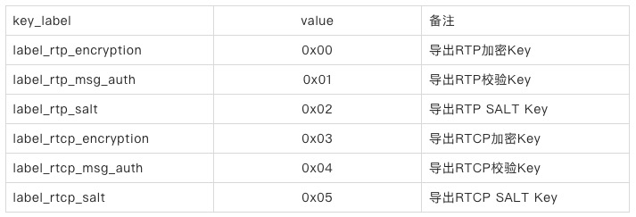  

• `master_key`: DTLS 完成后，协商得到的 Key。

• `master_salt`:  DTLS 完成后，协商得到的 Salt。

• `packet_index`:  RTP/RTCP 的包序号。SRTP 使用 48-bits 的隐式包需要，SRTCP 使用 31-bits包序号。参考[序号管理]()。

• `key_derivation_rate`: key 导出速率 , 记为 kdr。默认取值为 0，执行 1 次 Key 导出。取值范围`{{1,2,4,...,2^24}`。在 `key_derivation_rate>0` 的情况下，在加密之前，执行一次 key 导出，后续在`packet_index/key_derivation_rate` > 0 时，执行 key 导出。

```
r = packet_index / kdr  
key_id = label || r  
x = key_id XOR master_salt  
key = KDF(master_key, x)
```

> '/'：表示整除，B=0时，C = A/B=0。  
> `||`：表示连接的含义。A,B,C使用网络字节序表示，C = A||B, 则C的高字节为A，低字节位为B。  
> `XOR`：是异或运算，计算时按照低字节位对齐。

  
以下使用 `AES128_CM`，举例说明 `Session Key` 的导出过程，假设 `DTLS` 协商得到：  

```  
master_key:  E1F97A0D3E018BE0D64FA32C06DE4139   // 128-bits  
master_salt: 0EC675AD498AFEEBB6960B3AABE6           // 112-bits
```

导出加密 Key(cipher key):

```    
packet_index/kdr:              000000000000  
label:                       00  
master_salt:   0EC675AD498AFEEBB6960B3AABE6  
-----------------------------------------------  
xor:           0EC675AD498AFEEBB6960B3AABE6     (x, KDF input)  
x*2^16:        0EC675AD498AFEEBB6960B3AABE60000 (AES-CM input)  
cipher key:    C61E7A93744F39EE10734AFE3FF7A087 (AES-CM output)
```

导出 SALT Key(cipher salt):

``` 
packet_index/kdr:              000000000000  
label:                       02  
master_salt:   0EC675AD498AFEEBB6960B3AABE6  
----------------------------------------------  
xor:           0EC675AD498AFEE9B6960B3AABE6     (x, KDF input)  
x*2^16:        0EC675AD498AFEE9B6960B3AABE60000 (AES-CM input)  
                30CBBC08863D8C85D49DB34A9AE17AC6 (AES-CM ouptut)  
cipher salt:   30CBBC08863D8C85D49DB34A9AE1
```

导出校验 Key(auth key)，需要 `auth key` 长度为 94 字节：

``` 
packet_index/kdr:                000000000000  
label:                         01  
master salt:     0EC675AD498AFEEBB6960B3AABE6  
-----------------------------------------------  
xor:             0EC675AD498AFEEAB6960B3AABE6     (x, KDF input)  
x*2^16:          0EC675AD498AFEEAB6960B3AABE60000 (AES-CM input)  
    
auth key                           AES input blocks  
CEBE321F6FF7716B6FD4AB49AF256A15   0EC675AD498AFEEAB6960B3AABE60000  
6D38BAA48F0A0ACF3C34E2359E6CDBCE   0EC675AD498AFEEAB6960B3AABE60001  
E049646C43D9327AD175578EF7227098   0EC675AD498AFEEAB6960B3AABE60002  
6371C10C9A369AC2F94A8C5FBCDDDC25   0EC675AD498AFEEAB6960B3AABE60003  
6D6E919A48B610EF17C2041E47403576   0EC675AD498AFEEAB6960B3AABE60004  
6B68642C59BBFC2F34DB60DBDFB2       0EC675AD498AFEEAB6960B3AABE60005
```

AES-CM 的介绍，参考[AES-CM](https://www.rfc-editor.org/rfc/rfc3711.html#appendix-B.3)

  
至此，我们得到了 `SRTP/SRTCP` 加密和认证需要的 `Session Key`：cipher key，auth key，salt key。  

## 04 序列号管理

### SRTP 序列号管理

在 `RTP` 包结构定义中使用 `16-bit` 来描述序列号。考虑到防重放攻击，消息完整性校验，加密数据，导出 SessionKey 的需要，在`SRTP` 协议中，SRTP 包的序列号，使用隐式方式来记录包序列号 `packet_index`，使用 i 标识 `packet_index`。

对于发送端来说，i 的计算方式如下：

```    
i = 2^16 * ROC + SEQ
```
  

其中，SEQ 是 RTP 包中描述的 16-bit 包序号。ROC(rollover  couter) 是 RTP 包序号 (SEQ) 翻转计数，也就是每当`SEQ/2^16=0`, ROC 计数加 1。ROC 初始值为 0。

对于接收端来说，考虑到丢包和乱序因素的影响，除了维护 `ROC`，还需要维护一个当前收到的最大包序号`s_l`，当一个新的包到来时候，接收端需要估计出当前包所对应的实际 SRTP 包的序号。ROC 的初始值为 0，`s_l` 的初始值为收到第一个 SRTP 包的 SEQ。后续通过如下公式，估计接收到的 SRTP 序号 i：

```
i = 2^16 * v + SEQ
```

其中，`v` 可能的取值 `{ ROC-1, ROC, ROC+1 }`，ROC 是接收端本地维护的 ROC，SEQ 是收到 SRTP 的序号。v 分别取 ROC-1，ROC，ROC+1 计算出 i，与 `2^16*ROC + s_l`  进行比较，那个更接近，v 就取对应的值。完成 SRTP 解密和完整性校验后，更新 ROC 和 `s_l`，分如下 3 种情况：

1. v = ROC - 1， ROC 和 `s_l` 不更新。
2. v = ROC，如果 SEQ > `s_1`，则更新 `s_l` = SEQ。
3. v = ROC + 1,  ROC = v = ROC + 1，`s_l` = SEQ。

更直观的代码描述：

```    
if (s_l < 32768)  
    if (SEQ - s_l > 32768)  
        set v to (ROC-1) mod 2^32  
    else  
        set v to ROC  
    endif  
else  
    if (s_l - 32768 > SEQ)  
        set v to (ROC+1) mod 2^32  
    else  
        set v to ROC  
    endif  
endif  
return SEQ + v*65536
```

### SRTCP 序列号管理

`RTCP` 中没有描述序号的字段，`SRTCP` 的序号在 SRTCP 包，使用 `31-bits` 中显示描述，详见[SRTCP格式]()，也就是说在 SRTCP 的最大序列号为 2^31。

### 序列号与通信时长

可以看到 SRTP 的序列号最大值为 2^48, SRTCP 的序列号最大值为 2^16。在大多数应用中（假设每 128000 个 RTP 数据包至少有一个 RTCP 数据包），SRTCP 序号将首先达到上限。以 200 SRTCP 数据包 / 秒的速度， SRTCP 的 2^31 序列号空间足以确保大约 4 个月的通信。

## 05 防重放攻击

攻击者将截获的 SRTP/SRTCP 包保存下来，然后重新发送到网络中，实现了包的重放。SRTP 接收者通过维护一个重放列表 (ReplayList) 来防止这种攻击。理论上 Replay List 应该保存所有接收到并完成校验的包的序列号 index。在实际情况下 ReplayList 使用滑动窗口（sliding window）来实现防重放攻击。使用 `SRTP-WINDOW-SIZE` 来描述滑动窗口的大小。

### SRTP 防重放攻击

在序列号管理部分，我们详述了接收者，根据接收到的 SRTP 包的 SEQ，ROC，`s_l` 估算出 SRTP 包的 `packet_index`的方法。同时，将接收者已经接收到 SRTP 包的最大序列号，记为 `local_packet_index`。计算差值 `delta`：

```
delta =  packet_index - local_packet_index
```

分如下 3 种情况说明：

1. delta > 0：表示收到了新的包。
2. delta < -(SRTP-WINDOW-SIZE - 1) < 0：表示收到的包的序列号，小于重放窗口要求的最小序号。libSRTP收到这样的包时，会返回 `srtp_err_status_replay_old=10`, 表示收到旧的重放包。
3. delta < 0,  delta >= -(SRTP-WINDOW-SIZE - 1): 表示收到了重放窗口之内的包。如果在 ReplayList找到对应的包，则是一个 index 重复的重放包。libSRTP 收到这样的包时，会返回`srtp_err_status_replay_fail=9`。否则表示收到一个乱序包。

下图更加直观说明防重放攻击的三个区域：

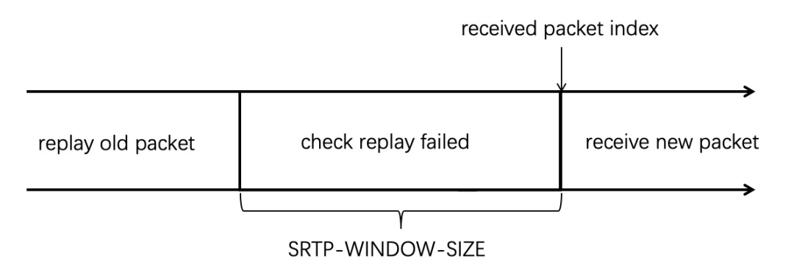

SRTP-WINDOW-SIZE 的取值，最小是 64。应用可以根据需要设置成较大的值，libsrtp 会向上取整为 32 的整数倍。例如，在 WebRTC 中 `SRTP-WINDOW-SIZE` = 1024。使用者可以根据需要进行调整，但要达到防重放攻击的目的。

### SRTCP 防重放攻击

在 SRTCP 中，packet index 显式给出。在 libsrtp 中，SRTCP 的防重放攻击的窗口大小为 128。使用`window_start` 记录防重放攻击的起始序列号。SRTCP 防重放攻击的检查步骤如下：

1. index > window_start + 128: 收到新的 SRTCP 包。  
2. index < window_start: 收到包的序列号在重放窗口的左侧，可以认为我们收到了比较老的包。libsrtp 收到这样的包之后，会返回到`srtp_err_status_replay_old=10`。
3. `replay_list_index = index - windwo_start`：在 ReplayList 中 `replay_list_index` 对应的标识位为 1，表示已经收到包，libsrtp 返回 `srtp_err_status_replay_fail=9`。对应的标识位为0，表示收到乱序包。  

## 06 加密和校验算法

在 SRTP 中，使用了 CTR（Counter mode）模式的 AES 加密算法，CTR模式通过递增一个加密计数器以产生连续的密钥流，计数器可以是任意保证长时间不产生重复输出的密钥。根据计数方式的不同，分为以下两种类型：

• `AES-ICM`:  ICM 模式（Integer Counter Mode，整数计数模式），使用整数计数运算。

• `AES-GCM`: GCM 模式（Galois Counter Mode，基于伽罗瓦域计数模式），计数运算定义在伽罗瓦域。

在 SRTP 中，使用 `AES-ICM` 完成加密算法，同时使用 `HMAC-SHA1` 完成 `MAC` 计算，对数据进行完整性校验，加密和 MAC 计算需要分两步完成。`AES-GCM` 基于 AEAD（Authenticated-Encryption with Associated-Data，关联数据的认证加密）的思想，在对数据进行加密的同时计算 `MAC` 值，实现了一个步骤，完成加密和校验信息的计算。下面分别对这个 `AES-ICM` 和 `AES_GSM` 的用法进行介绍。

### AEC—ICM

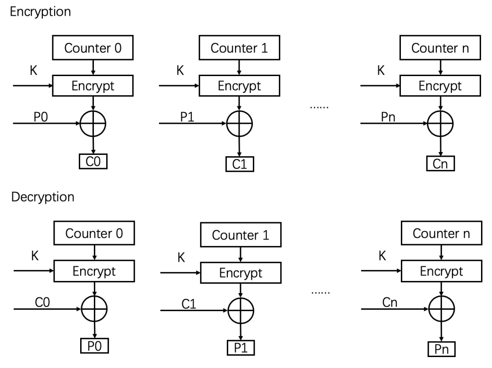  

上图描述了 `AES-ICM` 的加密和解密过程，图中的 K 是通过 KDF 导出的 `SessionKey`。加密和加密都是通过对 Counter 进行加密，与明文 P 异或运算得到加密数据 C，反之，与密文 C 异或运算得到明文数据 P。考虑到安全性，Counter 生成依赖于 `Session Salt`,  包的索引（packet index）和包的 SSRC。Counter 是 128-bits 的计数，生成方式如下定义：  

```
one byte  
<-->  
0  1  2  3  4  5  6  7  8  9  10 11 12 13 14 15  
+--+--+--+--+--+--+--+--+--+--+--+--+--+--+--+--+  
|00|00|00|00|   SSRC    |   packet index  | b_c |---+  
+--+--+--+--+--+--+--+--+--+--+--+--+--+--+--+--+   |  
                                                    |  
+--+--+--+--+--+--+--+--+--+--+--+--+--+--+--+--+   v  
|                  salt (k_s)             |00|00|->(+)  
+--+--+--+--+--+--+--+--+--+--+--+--+--+--+--+--+   |  
                                                    |  
                                                    v  
                                            +-------------+  
                    encryption key (k_e) -> | AES encrypt |  
                                            +-------------+  
                                                    |  
+--+--+--+--+--+--+--+--+--+--+--+--+--+--+--+--+   |  
|                keystream block                |<--+  
+--+--+--+--+--+--+--+--+--+--+--+--+--+--+--+--+
```
  
### HMAC—SHA1

散列消息认证码（Hash-based message authentication code，缩写为 HMAC），是一种通过特别计算方式之后产生的消息认证码（MAC），使用密码散列函数，同时结合一个加密密钥，它可以用来保证数据的完整性，同时可以用来作某个消息的身份验证。HMAC通过一个标准算法，在计算哈希的过程中，把 key 混入计算过程中。HMAC 的加密实现如下：

```
HMAC(K,M) = H ( (K XOR opad ) + H( (K XOR ipad ) + M ) )
```  

• H：hash 算法，比如，MD5，SHA-1，SHA-256。

• B：块字节的长度，块是 hash 操作的基本单位。这里 B=64。

• L：hash 算法计算出来的字节长度。(L=16 for MD5, L=20 for SHA-1)。

• K：共享密钥，K 的长度可以是任意的，但是为了安全考虑，还是推荐 K 的长度>B。

当 K 长度大于 B 时候，会先在 K 上面执行 hash 算法，将得到的 L 长度结果作为新的共享密钥。如果 K 的长度 <B, 那么会在 K 后面填充0x00 一直到等于长度 B。

• M：要认证的内容。

• opad：外部填充常量，是 0x5C 重复 B 次。

• ipad：内部填充常量，是 0x36 重复 B 次。

• XOR：异或运算。

• +：代表 " 连接 " 运算。

计算步骤如下：

1. 将 0x00 填充到 K 的后面，直到其长度等于 B。

2. 将步骤 1 的结果跟 ipad 做异或。

3. 将要加密的信息附在步骤 2 的结果后面。

4. 调用 H 方法。

5. 将步骤 1 的结果跟 opad 做异或。

6. 将步骤 4 的结果附在步骤 5 的结果后面。

7. 调用 H 方法。

`SRTP` 和 `SRTCP` 计算 `Authentication tag`，使用的 `K` 对应 Key 管理部分描述的 `RTP auth key`和 `RTCP auth key`，使用的 Hash 算法为 `SHA-1`，`Authentication tag` 的长度为 80-bits。

在计算 SRTP 的，要认证的内容 M 为：

```    
M = Authenticated Portion + ROC
```

其中，`+` 代表 " 连接 " 运算，`Authenticated Portion` 在 `SRTP` 的结构图中给出。

在计算 `SRTCP` 时，要认证的内容 M 为：

```
M=Authenticated Portion
```

其中，`Authenticated Portion` 在 `SRTCP` 的结构图中给出。

通过使用 `Authenticated Portion` 算法，计算得到 SRTP/SRTCP 的 `Encrypted Portion Portion`部分。

### AES—GCM

`AES-GCM` 使用计数器模式来加密数据，该操作可以有效地流水线化，GCM 身份验证使用的操作特别适合于硬件中的有效实现。在 [GCM-SPEC](https://csrc.nist.rip/groups/ST/toolkit/BCM/documents/proposedmodes/gcm/gcm-spec.pdf)详述了 GCM 的理论知识， [Section4.2 Hardware](https://csrc.nist.rip/groups/ST/toolkit/BCM/documents/proposedmodes/gcm/gcm-spec.pdf)详述了硬件实现。

`AES-GCM` 在 `SRTP` 加密中的应用，在[RFC7714](https://datatracker.ietf.org/doc/html/rfc7714)进行了详细描述。Key 管理和序列号管理与本文中描述的相同，需要注意的是：

1. `AES-GCM` 作为一种 AEAD（Authenticated Encryption with Associated Data）加密算法，输入和输出是什么，对应到 `SRTP/SRTCP` 的包结构中理解。
2. `Counter` 的是计算方式和 AES-ICM 中描述的计算方式不同，需要重点关注。

[libsrtp]() 已经实现了 `AES-GCM`，有兴趣的同学，可以结合代码进行研读。

## 07 libsrtp的使用

[libsrtp](https://github.com/cisco/libsrtp) 是被广泛使用的 SRTP/SRTCP 加密的开源项目。经常用到的 api 如下：

1. `srtp_init`，初始化 srtp 库，初始化内部加密算法，在使用 srtp 前，必须要调用了。

2. `srtp_create`, 创建 `srtp_session`，可以结合本文中介绍的 session，session key 等概念一起理解。

3. `srtp_unprotect/srtp_protect`，RTP 包加解密接口。

4. `srtp_protect_rtcp/srtp_unprotect_rtcp`，RTCP 包的加解密接口。

5. `srtp_set_stream_roc/srtp_get_stream_roc`, 设置和获取 stream 的 ROC，这两个接口在最新的 2.3 版本加入。

重要的结构 `srtp_policy_t`，用来初始化加解密参数，在 `srtp_create` 中使用这个结构。以下参数需要关注：

1. DTLS 协商后得到的 `MasterKey` 和 `MasterSalt` 通过这个结构传递给 libsrtp，用于 session key的生成。
2. `window_size`，对应我们之前描述的 srtp 防重放攻击的窗口大小。
3. `allow_repeat_tx`，是否允许重传相同序号的包。

[SRS](https:/github.com/ossrs/srs)是一个新生代实时通信服务器，对 libsrtp 感兴趣的同学，可以快速在本机搭起调试环境，进行相关测试，更加深入理解相关的算法。

## 08 总结

本文通过对 `SRTP/SRTCP` 相关原理的深入详细解读，对 libsrtp 使用遇到的问题进行解答，希望能够给实时音视频通信的相关领域的同学以帮助。

## 09 参考文献

* [RFC3711:  SRTP](https://www.rfc-editor.org/rfc/rfc3711.html)  
* [RFC6904: Encrypted SRTP Header Extensions](https://datatracker.ietf.org/doc/html/rfc6904)  
* [Integer Counter Mode](https://tools.ietf.org/html/draft-irtf-cfrg-icm-00)  
* [RFC-6188: The Use of AES-192 and AES-256 in Secure RTP](https://tools.ietf.org/html/rfc6188)  
* [RFC7714:  AES-GCM for SRTP](https://datatracker.ietf.org/doc/html/rfc7714)  
* [RFC2104:  HMAC](https://datatracker.ietf.org/doc/html/rfc2104)  
* [RFC2202: Test Cases for HMAC-MD5 and HMAC-SHA-1](https://datatracker.ietf.org/doc/html/rfc2202)  
* [GCM-SPEC:  GCM](https://csrc.nist.rip/groups/ST/toolkit/BCM/documents/proposedmodes/gcm/gcm-spec.pdf)  
