<!--BEGIN_DATA
{
    "create_date": "2021-07-12 18:00", 
    "modify_date": "2021-07-12 18:00", 
    "is_top": "0", 
    "summary": "WebRTC动态码率-AlrDetector原理<br/>WebRTC动态码率-基于丢包的码率估计原理<br/>WebRTC动态码率-基于transport wide cc的延迟码率估计原理<br/>WebRTC动态码率-IntervalBudget发送间隔预算原理", 
    "tags": "WebRTC", 
    "file_name": "WebRTC动态码率.md"
}
END_DATA-->

#### <p>原文出处：<a href='https://www.jianshu.com/p/55e5246f12b9' target='blank'>WebRTC动态码率-AlrDetector原理</a></p>

## 前言

* **AlrDetector**即（应用受限区域探测器，Application limited region detector）模块，该模块利用某段时间值，以及这段时间发送的字节数判断当前输出网络流量是否受限。这些限制主要跟应用程序本身输出网络流量的能力有关，例如编码器性能，不能编码出设置的目标码率

* **WebRTC GCC(Google Congestion Control)** 模块中首先根据rtp包发送评估出一个实际码率（target_bitrate_bps），此时理论上程序会按照该码率进行数据发送，但是在实际的运行过程中，由于网络环境的复杂性，或者硬件的性能等一系列的原因如，编码速度跟不上，假设编码出的数据码率比（target_bitrate_bps）要低，使得数据发送码率低于目标码率，带宽利用率不足，发送码率占最大预算码率值比例低于某个值的话Alr（Application limited region）就会被触发了，恢复到某个值以上，Alr会停止。

## 工作流程

### 1）AlrDetector相关数据结构及其初始化

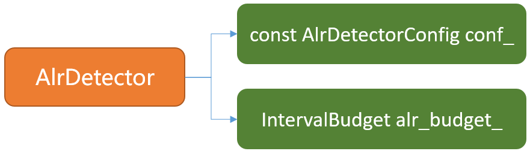

```cpp
struct AlrDetectorConfig {
  // Sent traffic ratio as a function of network capacity used to determine
  // application-limited region. ALR region start when bandwidth usage drops
  // below kAlrStartUsageRatio and ends when it raises above
  // kAlrEndUsageRatio. NOTE: This is intentionally conservative at the moment
  // until BW adjustments of application limited region is fine tuned.
  double bandwidth_usage_ratio = 0.65;
  double start_budget_level_ratio = 0.80;
  double stop_budget_level_ratio = 0.50;
  std::unique_ptr<StructParametersParser> Parser();
};
```

  * 配置结构，根据其注释可得当bandwidth降低到kAlrStartUsageRatio的时候和bandwidth高于kAlrEndUsageRatio的时候会出发ALR。
    
```cpp 
AlrDetector::AlrDetector(AlrDetectorConfig config, RtcEventLog* event_log)
    : conf_(config), alr_budget_(0, true), event_log_(event_log) {}
AlrDetector::AlrDetector(const WebRtcKeyValueConfig* key_value_config)
    : AlrDetector(GetConfigFromTrials(key_value_config), nullptr) {}
AlrDetector::AlrDetector(const WebRtcKeyValueConfig* key_value_config,
                          RtcEventLog* event_log)
    : AlrDetector(GetConfigFromTrials(key_value_config), event_log) {}
```

  * 默认初始化设置 `IntervalBudget`的`can_build_up_underuse_`成员变量为true。
  * `IntervalBudget`根据输入的评估码率，计算当前还能发送多少数据。

### 2）AlrDetector主动函数调用栈及其原理

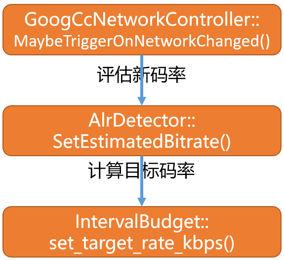

  * 在`GoogCcNetworkController`模块中经过相应的算法处理，判断当前的网络状态，在MaybeTriggerOnNetworkChanged函数中会评估出一个新码率。
  * 将新码率通过`AlrDetector::SetEstimatedBitrate()`函数作用到`AlrDetector`模块,同时计算目标码率。
  * 然后调用`IntervalBudget::set_target_rate_kbps()`将目标码率作用到`IntervalBudget`。
  * 最终`IntervalBudget`会根据目标码率更新预算。
  * 其代码如下：
    
```cpp
void AlrDetector::SetEstimatedBitrate(int bitrate_bps) {
  RTC_DCHECK(bitrate_bps);
  int target_rate_kbps =
      static_cast<double>(bitrate_bps) * conf_.bandwidth_usage_ratio / 1000;
  alr_budget_.set_target_rate_kbps(target_rate_kbps);
}
```

  * 现假设`bitrate_bps`为300kbps，`bandwidth_usage_ratio = 0.8`,`bandwidth_usage_ratio:0.8 start_budget_level_ratio:0.4 stop_budget_level_ratio:-0.6`
  * 经过alr处理评估目标码率为300000 * 0.8 / 1000 = 240kbps
    
```cpp
void IntervalBudget::set_target_rate_kbps(int target_rate_kbps) {
  target_rate_kbps_ = target_rate_kbps;
  max_bytes_in_budget_ = (kWindowMs * target_rate_kbps_) / 8;
  bytes_remaining_ = std::min(std::max(-max_bytes_in_budget_, bytes_remaining_),
                              max_bytes_in_budget_);
}
```

  * 在IntervalBudget中根据目标码率配合时间窗口进行发送预算。
  * 按照上面的假设经计算得出`max_bytes_in_budget_`按照500ms最大时间窗口进行最大预算为15000字节。
  * 计算剩余预算，`bytes_remaining_`首次默认情况下为0，那么经过赋值后本次剩余的预算为0（初始值）。
    
```cpp
namespace {
  constexpr int64_t kWindowMs = 500;
}
```

### 3）AlrDetector函数回调栈及其原理

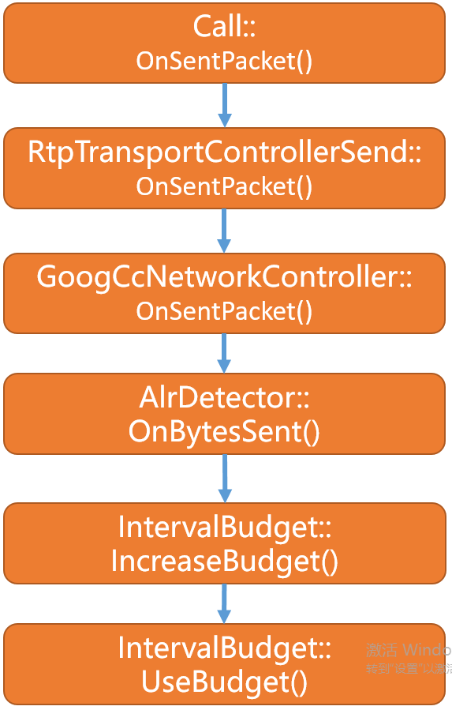

  * 静paced模块发送rtp包时，发送成功后会进行发送成功回调，经call模块最后作用到`GoogCcNetworkController`模块
  * 最后在`AlrDetector`模块中根据本次发送的数据大小进行发送预算代码如下：
    
```cpp
void AlrDetector::OnBytesSent(size_t bytes_sent, int64_t send_time_ms) {
  if (!last_send_time_ms_.has_value()) {
    last_send_time_ms_ = send_time_ms;
    // Since the duration for sending the bytes is unknwon, return without
    // updating alr state.
    return;
  }
  int64_t delta_time_ms = send_time_ms - *last_send_time_ms_;
  last_send_time_ms_ = send_time_ms;
  alr_budget_.UseBudget(bytes_sent);
  alr_budget_.IncreaseBudget(delta_time_ms);
  bool state_changed = false;
  if (alr_budget_.budget_ratio() > conf_.start_budget_level_ratio &&
      !alr_started_time_ms_) {
    alr_started_time_ms_.emplace(rtc::TimeMillis());
    state_changed = true;
  } else if (alr_budget_.budget_ratio() < conf_.stop_budget_level_ratio &&
              alr_started_time_ms_) {
    state_changed = true;
    alr_started_time_ms_.reset();
  }
  if (event_log_ && state_changed) {
    event_log_->Log(
        std::make_unique<RtcEventAlrState>(alr_started_time_ms_.has_value()));
  }
}
```

  * 首先得到时延（当前次发送时间-上一次发送的时间），并更新上次发送时间供下一次使用。
  * 现在假设每隔10ms发送一次数据，并且以带宽利用率的90%进行数据发送，将码率和时间间隔转换成实际发送的字节数如下：
  * `kEstimatedBitrateBps * usage_percentage_ * kTimeStepMs / (8 * 100 * 1000)` ,其中`usage_percentage_`为90，kTimeStepMs 为10ms,kEstimatedBitrateBps为300000bps 得到每隔10ms将发送337字节的数据。
  * 那么首次发送`bytes_sent = 337，delta_time_ms = 10`，后续以该速度进行发送。
  * 调用`alr_budget_.UseBudget(bytes_sent)`对**剩余**要发送的数据量进行更新。
  * 调用`alr_budget_.IncreaseBudget(bytes_sent)`来增加预算。
    
```cpp
void IntervalBudget::UseBudget(size_t bytes) {
  bytes_remaining_ = std::max(bytes_remaining_ - static_cast<int>(bytes),
                              -max_bytes_in_budget_);
}
```

  * 实际本次发送了多少字节，用`bytes_remaining_`和bytes相减然后和最大预算的反值取最大
    
```cpp
void IntervalBudget::IncreaseBudget(int64_t delta_time_ms) {
  int64_t bytes = target_rate_kbps_ * delta_time_ms / 8;
  if (bytes_remaining_ < 0 || can_build_up_underuse_) {
    // We overused last interval, compensate this interval.
    bytes_remaining_ = std::min(bytes_remaining_ + bytes, max_bytes_in_budget_);
  } else {
    // If we underused last interval we can't use it this interval.
    bytes_remaining_ = std::min(bytes, max_bytes_in_budget_);
  }
}
```

  * 按照目标码率（240kbps），上面假设这个目标码率进行预算增加

  * 最后调用`alr_budget_.budget_ratio()`和`start_budget_level_ratio`以及`stop_budget_level_ratio`进行比较
    
```cpp
double IntervalBudget::budget_ratio() const {
  if (max_bytes_in_budget_ == 0)
    return 0.0;
  return static_cast<double>(bytes_remaining_) / max_bytes_in_budget_;
}
```

  * `budget_ratio()`表示**剩余**要发送的数据占最大预算发送数据`max_bytes_in_budget_`的比例。
  * 回到AlrDetector::OnBytesSent（）函数如果`IntervalBudget::budget_ratio()`大于`start_budget_level_ratio`，即剩余数据还有很多，发送码率低了，带宽没充分利用，Alr将被触发，若`IntervalBudget::budget_ratio()`小于`stop_budget_level_ratio`时，`alr_started_time_ms_`将被重置，Alr停止。
  * alr如果被触发则更新`alr_started_time_ms_`为rtc::TimeMillis(),被设置成当前时间。
  * 最终`GoogCcNetworkController`模块会通过调用alr模块的GetApplicationLimitedRegionStartTime()函数来得到受限区域的时间，进而进行新的码率估计。
  * 该函数在`GoogCcNetworkController`模块的三个地方被调用：
    
```cpp
NetworkControlUpdate GoogCcNetworkController::OnProcessInterval(
    ProcessInterval msg) {
    ...
  bandwidth_estimation_->UpdateEstimate(msg.at_time);
  absl::optional<int64_t> start_time_ms =
      alr_detector_->GetApplicationLimitedRegionStartTime();
  probe_controller_->SetAlrStartTimeMs(start_time_ms);    
}
```

```cpp 
NetworkControlUpdate GoogCcNetworkController::OnSentPacket(
    SentPacket sent_packet) {
  alr_detector_->OnBytesSent(sent_packet.size.bytes(),
                              sent_packet.send_time.ms());
  acknowledged_bitrate_estimator_->SetAlr(
      alr_detector_->GetApplicationLimitedRegionStartTime().has_value());
  .....
}
```

```cpp 
NetworkControlUpdate GoogCcNetworkController::OnTransportPacketsFeedback(
    TransportPacketsFeedback report) {
  absl::optional<int64_t> alr_start_time =
      alr_detector_->GetApplicationLimitedRegionStartTime();
}
```

  * 以上分别做了什么？后续进行分析

### 4）总结

  * `AlrDetector`模块的核心作用是根据每次数据的发送的字节数，以500ms为时间窗口，以及实际的发送码率，对当前网络带宽是否被有效利用或是否已经发送过载，进行检测。其最终的产物是一个时间区域的起点（受限区域起点）。
  * 同理`GoogCcNetworkController`模块在其工作流程中会通过调用`AlrDetector`模块的GetApplicationLimitedRegionStartTime()来获取受限时间起点时间是否触发，如果触发则会进行新的码率估计。

<hr>


#### <p>原文出处：<a href='https://www.jianshu.com/p/a3310e5d3768' target='blank'>WebRTC动态码率-基于丢包的码率估计原理</a></p>

## 1）前言

* WebRtc基于发送端的动态码率调控主要分成两大块，其中一部分是基于丢包率的码率控制，另一部分是基于延迟的码率控制。
* 本文主要分析WebRtc中基于丢包率的码率控制。
* WebRtc中基于丢包率的码率控制的实现原理是基于发送端接收对端反馈过来的RR或SR报文，并对报文的发送者报告块进行解析，解析其RTT和丢包率。
* 如果丢包率比较大说明网络状态不大好，将丢包信息和RTT更新到`GoogCcNetworkController`模块，评估新的发送码率。
* 最后在`RtpTransportControllerSend`模块中将新评估出的码率作用到`pacer`模块。

## 2）RTCP报文接收大致流程

  * 在[WebRTC RTP/RTCP协议分析(一)](https://www.jianshu.com/p/f13c9b730658)一文中有分析RTCP报文的接收流程，那篇文章是基于m76版本的分支进行分析的，而本文是基于m79版本进行分析，在分析过程中发现函数调用栈有些出入。
  * 其调用流程大致如下：

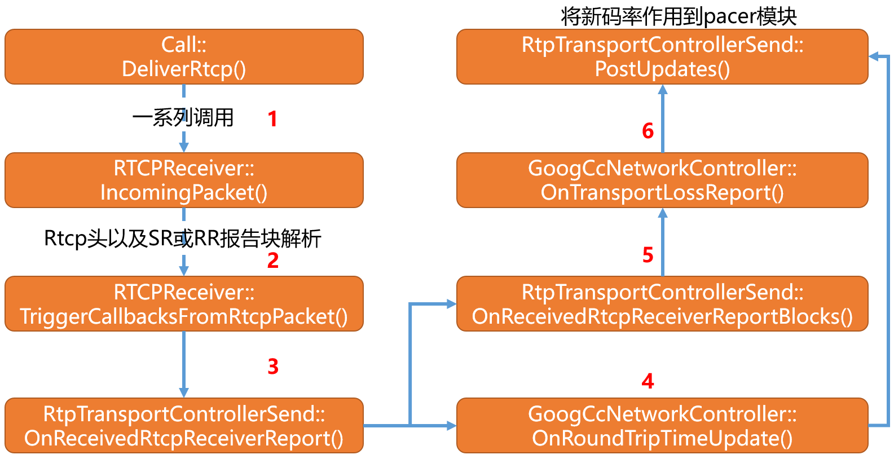

  * 上图忽略从网络部分得到RTCP包的业务逻辑，直接从Call模块说起。
  * 同时在Call模块收到RTCP报文后会进行一系列的处理，本文业务逻辑图也未画出。
  * 对于音频流RTCP报文的处理逻辑在第三步，有一些变化如下图：

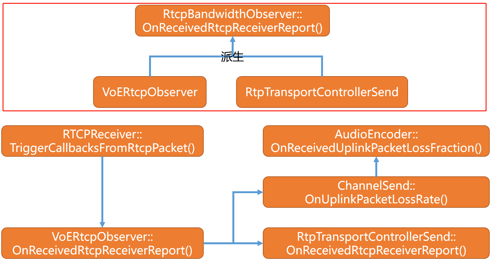

  * 从上图可以看出对于音频流`RCPReceiver`模块在调用TriggerCallbacksFromRtcpPacket函数触发回调的时候首先是将报文送给`VoERtcpObserver`块进行处理。
  * 而根据上图得知`VoERtcpObserver`和`RtpTransportControllerSend`都是`RtcpBandwidthObserver`的子类。
  * 最终在`VoERtcpObserver`中先调用OnReceivedRtcpReceiverReport将报告块作用到`GoogCcNetworkController`模块，后经过相应处理作用到编码器。

## 3）RTCP报文RTT计算和丢包统计

  * SR或RR报文的RTT信息和丢包信息包含在发送者报告块，定义在[RFC3550](https://links.jianshu.com/go?to=https%3A%2F%2Ftools.ietf.org%2Fhtml%2Frfc3550%23section-6.4)中,以RR报文为例，如下：
    
```cpp    
        0                   1                   2                   3
        0 1 2 3 4 5 6 7 8 9 0 1 2 3 4 5 6 7 8 9 0 1 2 3 4 5 6 7 8 9 0 1
        +-+-+-+-+-+-+-+-+-+-+-+-+-+-+-+-+-+-+-+-+-+-+-+-+-+-+-+-+-+-+-+-+
 header |V=2|P|    RC   |   PT=RR=201   |             length            |
        +-+-+-+-+-+-+-+-+-+-+-+-+-+-+-+-+-+-+-+-+-+-+-+-+-+-+-+-+-+-+-+-+
        |                     SSRC of packet sender                     |
        +=+=+=+=+=+=+=+=+=+=+=+=+=+=+=+=+=+=+=+=+=+=+=+=+=+=+=+=+=+=+=+=+
 report |                 SSRC_1 (SSRC of first source)                 |
 block  +-+-+-+-+-+-+-+-+-+-+-+-+-+-+-+-+-+-+-+-+-+-+-+-+-+-+-+-+-+-+-+-+
        1    | fraction lost |       cumulative number of packets lost       |
        +-+-+-+-+-+-+-+-+-+-+-+-+-+-+-+-+-+-+-+-+-+-+-+-+-+-+-+-+-+-+-+-+
        |           extended highest sequence number received           |
        +-+-+-+-+-+-+-+-+-+-+-+-+-+-+-+-+-+-+-+-+-+-+-+-+-+-+-+-+-+-+-+-+
        |                      interarrival jitter                      |
        +-+-+-+-+-+-+-+-+-+-+-+-+-+-+-+-+-+-+-+-+-+-+-+-+-+-+-+-+-+-+-+-+
        |                         last SR (LSR)                         |
        +-+-+-+-+-+-+-+-+-+-+-+-+-+-+-+-+-+-+-+-+-+-+-+-+-+-+-+-+-+-+-+-+
        |                   delay since last SR (DLSR)                  |
        +=+=+=+=+=+=+=+=+=+=+=+=+=+=+=+=+=+=+=+=+=+=+=+=+=+=+=+=+=+=+=+=+
 report |                 SSRC_2 (SSRC of second source)                |
 block  +-+-+-+-+-+-+-+-+-+-+-+-+-+-+-+-+-+-+-+-+-+-+-+-+-+-+-+-+-+-+-+-+
        2    :                               ...                             :
        +=+=+=+=+=+=+=+=+=+=+=+=+=+=+=+=+=+=+=+=+=+=+=+=+=+=+=+=+=+=+=+=+
        |                  profile-specific extensions                  |
        +-+-+-+-+-+-+-+-+-+-+-+-+-+-+-+-+-+-+-+-+-+-+-+-+-+-+-+-+-+-+-+-+
```

  * 报告块的解析代码如下：
    
```cpp 
void RTCPReceiver::HandleReportBlock(const ReportBlock& report_block,
                                      PacketInformation* packet_information,
                                      uint32_t remote_ssrc) {
  // This will be called once per report block in the RTCP packet.
  // We filter out all report blocks that are not for us.
  // Each packet has max 31 RR blocks.
  //
  // We can calc RTT if we send a send report and get a report block back.
  // |report_block.source_ssrc()| is the SSRC identifier of the source to
  // which the information in this reception report block pertains.
  // Filter out all report blocks that are not for us.
  if (registered_ssrcs_.count(report_block.source_ssrc()) == 0)
    return;
  last_received_rb_ms_ = clock_->TimeInMilliseconds();
  ReportBlockData* report_block_data =
      &received_report_blocks_[report_block.source_ssrc()][remote_ssrc];
  RTCPReportBlock rtcp_report_block;
  rtcp_report_block.sender_ssrc = remote_ssrc;
  rtcp_report_block.source_ssrc = report_block.source_ssrc();
  rtcp_report_block.fraction_lost = report_block.fraction_lost();
  rtcp_report_block.packets_lost = report_block.cumulative_lost_signed();
  if (report_block.extended_high_seq_num() >
      report_block_data->report_block().extended_highest_sequence_number) {
    // We have successfully delivered new RTP packets to the remote side after
    // the last RR was sent from the remote side.
    last_increased_sequence_number_ms_ = clock_->TimeInMilliseconds();
  }
  rtcp_report_block.extended_highest_sequence_number =
      report_block.extended_high_seq_num();
  rtcp_report_block.jitter = report_block.jitter();
  rtcp_report_block.delay_since_last_sender_report =
      report_block.delay_since_last_sr();
  rtcp_report_block.last_sender_report_timestamp = report_block.last_sr();
  report_block_data->SetReportBlock(rtcp_report_block, rtc::TimeUTCMicros());
  int64_t rtt_ms = 0;
  uint32_t send_time_ntp = report_block.last_sr();
  // RFC3550, section 6.4.1, LSR field discription states:
  // If no SR has been received yet, the field is set to zero.
  // Receiver rtp_rtcp module is not expected to calculate rtt using
  // Sender Reports even if it accidentally can.
  // TODO(nisse): Use this way to determine the RTT only when |receiver_only_|
  // is false. However, that currently breaks the tests of the
  // googCaptureStartNtpTimeMs stat for audio receive streams. To fix, either
  // delete all dependencies on RTT measurements for audio receive streams, or
  // ensure that audio receive streams that need RTT and stats that depend on it
  // are configured with an associated audio send stream.
  if (send_time_ntp != 0) {
    uint32_t delay_ntp = report_block.delay_since_last_sr();
    // Local NTP time.
    uint32_t receive_time_ntp =
        CompactNtp(TimeMicrosToNtp(clock_->TimeInMicroseconds()));
    // RTT in 1/(2^16) seconds.
    uint32_t rtt_ntp = receive_time_ntp - delay_ntp - send_time_ntp;
    // Convert to 1/1000 seconds (milliseconds).
    rtt_ms = CompactNtpRttToMs(rtt_ntp);
    report_block_data->AddRoundTripTimeSample(rtt_ms);
    packet_information->rtt_ms = rtt_ms;
  }
  packet_information->report_blocks.push_back(
      report_block_data->report_block());
  packet_information->report_block_datas.push_back(*report_block_data);
}
```

  * 该函数的核心的作用是求得RTT时间，单位为1/(2^16) seconds.，计算公式为`receive_time_ntp(当前ntp) - delay_ntp(对端收到SR后发送SR或RR之间的延迟) - send_time_ntp(对端在发送SR或者RR之前收到发送者报告的时间)`。
  * 另外获取上一次和本次之间的丢包率，以及总的丢包数。
  * RTT计算公式如下：
    
```cpp
[10 Nov 1995 11:33:25.125 UTC]       [10 Nov 1995 11:33:36.5 UTC]
    n                 SR(n)              A=b710:8000 (46864.500 s)
    ---------------------------------------------------------------->
                      v                 ^
    ntp_sec =0xb44db705 v               ^ dlsr=0x0005:4000 (    5.250s)
    ntp_frac=0x20000000  v             ^  lsr =0xb705:2000 (46853.125s)
      (3024992005.125 s)  v           ^
    r                      v         ^ RR(n)
    ---------------------------------------------------------------->
                          |<-DLSR->|
                            (5.250 s)
    A     0xb710:8000 (46864.500 s)
    DLSR -0x0005:4000 (    5.250 s)
    LSR  -0xb705:2000 (46853.125 s)
    -------------------------------
    delay 0x0006:2000 (    6.125 s)
```

  * 最后是将信息封装到PacketInformation结构当中，然后调用RTCPReceiver::TriggerCallbacksFromRtcpPacket函数进行回调处理。

## 4）RTCP触发回调

```cpp   
void RTCPReceiver::TriggerCallbacksFromRtcpPacket(
    const PacketInformation& packet_information) {
  ....
  if (rtcp_bandwidth_observer_) {
    RTC_DCHECK(!receiver_only_);
    if ((packet_information.packet_type_flags & kRtcpSr) ||
        (packet_information.packet_type_flags & kRtcpRr)) {
      int64_t now_ms = clock_->TimeInMilliseconds();
      rtcp_bandwidth_observer_->OnReceivedRtcpReceiverReport(
          packet_information.report_blocks, packet_information.rtt_ms, now_ms);
    }
  }
  .....  
  if ((packet_information.packet_type_flags & kRtcpSr) ||
      (packet_information.packet_type_flags & kRtcpRr)) {
    rtp_rtcp_->OnReceivedRtcpReportBlocks(packet_information.report_blocks);
  }
}
```

  * 保留相关的,改函数通过调用`RtcpBandwidthObserver`模块的OnReceivedRtcpReceiverReport函数,来传递信息。
  * 根据上面的业务图,`RtcpBandwidthObserver`模块的最终实现为`RtpTransportControllerSend`，在创建RTCPReceiver实例的时候会实例化`rtcp_bandwidth_observer_`，
    
```cpp
class RTCPReceiver {
  public: 
    .....
  private:
    RtcpBandwidthObserver* const rtcp_bandwidth_observer_;
}
```

  * `RtpTransportControllerSend`模块的OnReceivedRtcpReceiverReport函数对RTCP 反馈信息的处理主要分成两个步骤
  * 其一是调用OnReceivedRtcpReceiverReportBlocks函数封装TransportLossReport结构消息，并最后调用`PostUpdates(controller_->OnTransportLossReport(msg))`，首先将TransportLossReport消息传递给`GoogCcNetworkController`模块进行码率估计，其次是调用PostUpdates来将新估计得码率值作用到pacer模块
  * 其二是封装RoundTripTimeUpdate消息，并调用`PostUpdates(controller_->OnRoundTripTimeUpdate(report));`，`GoogCcNetworkController`模块接收消息后先计算基于RTT时间延迟的码率，最后调用PostUpdates来刷新码率，作用到发送模块

## 5）TransportLossReport和RoundTripTimeUpdate结构封装

```cpp
task_queue_.PostTask([this, report_blocks, now_ms]() {
  RTC_DCHECK_RUN_ON(&task_queue_);
  OnReceivedRtcpReceiverReportBlocks(report_blocks, now_ms);
});

task_queue_.PostTask([this, now_ms, rtt_ms]() {
  RTC_DCHECK_RUN_ON(&task_queue_);
  RoundTripTimeUpdate report;
  report.receive_time = Timestamp::ms(now_ms);
  report.round_trip_time = TimeDelta::ms(rtt_ms);
  report.smoothed = false;
  if (controller_ && !report.round_trip_time.IsZero())
    PostUpdates(controller_->OnRoundTripTimeUpdate(report));
});
```

  * 传递过来的`now_ms`参数为当前ntp时间，也就是收到该rtcp sr或rr报文的时间。
  * 同时这两个步骤使用的是同一个`task_queue_`任务队列，这说明先进行基于丢包的码率估计，然后再进行基于延迟的码率估计。

### 5.1）TransportLossReport封装

  * 通过OnReceivedRtcpReceiverReportBlocks函数对`report_blocks`消息进行再封装，将其封装成TransportLossReport格式，其定义如下
    
```cpp
#network_types.h
struct TransportLossReport {
  /*表示当前接收到该消息的ntp时间*/
  Timestamp receive_time = Timestamp::PlusInfinity();
  /*上一次接收到SR或者RR报文的时间*/
  Timestamp start_time = Timestamp::PlusInfinity();
  /*当前接收到该消息的ntp时间*/  
  Timestamp end_time = Timestamp::PlusInfinity();
  /*在上一次处理和本次处理时间差范围内也就是end_time - start_time 之间的丢包数量*/  
  uint64_t packets_lost_delta = 0;
  /*在上一次处理和本次处理时间差范围内也就是end_time - start_time 之间实际发送成功的包数*/  
  uint64_t packets_received_delta = 0;
};

void RtpTransportControllerSend::OnReceivedRtcpReceiverReportBlocks(
    const ReportBlockList& report_blocks,
    int64_t now_ms) {
  if (report_blocks.empty())
    return;
  int total_packets_lost_delta = 0;
  int total_packets_delta = 0;
  // Compute the packet loss from all report blocks.
  for (const RTCPReportBlock& report_block : report_blocks) {
    auto it = last_report_blocks_.find(report_block.source_ssrc);
    if (it != last_report_blocks_.end()) {
      auto number_of_packets = report_block.extended_highest_sequence_number -
                                it->second.extended_highest_sequence_number;
      total_packets_delta += number_of_packets;
      auto lost_delta = report_block.packets_lost - it->second.packets_lost;
      total_packets_lost_delta += lost_delta;
    }
    last_report_blocks_[report_block.source_ssrc] = report_block;
  }
  // Can only compute delta if there has been previous blocks to compare to. If
  // not, total_packets_delta will be unchanged and there's nothing more to do.
  if (!total_packets_delta)
    return;
  int packets_received_delta = total_packets_delta - total_packets_lost_delta;
  // To detect lost packets, at least one packet has to be received. This check
  // is needed to avoid bandwith detection update in
  // VideoSendStreamTest.SuspendBelowMinBitrate
  if (packets_received_delta < 1)
    return;
  Timestamp now = Timestamp::ms(now_ms);
  TransportLossReport msg;
  msg.packets_lost_delta = total_packets_lost_delta;
  msg.packets_received_delta = packets_received_delta;
  msg.receive_time = now;
  msg.start_time = last_report_block_time_;
  msg.end_time = now;
  if (controller_)
    PostUpdates(controller_->OnTransportLossReport(msg));
  last_report_block_time_ = now;
}
```

  * 首先根据报告块得出，上一次和本次时间戳之内总共的发包数量`number_of_packets`，并对不同SSR进行累加得出`total_packets_delta`。

  * 计算`total_packets_lost_delta`，上一次总丢包数量减去本次总丢包数量，从而可知`total_packets_lost_delta`表示的是`msg.end_time - msg.start_time`时间差之间的丢包数量。

  * 根据`total_packets_delta`计算`packets_received_delta`，使用`total_packets_delta - total_packets_lost_delta`获得，在`msg.end_time - msg.start_time`时间差之间的总发包数量减去本段时间差之内总丢包数，最终得出的就是实际发送成功的包数量。

  * 封装TransportLossReport并触发OnTransportLossReport将TransportLossReport消息传递给`GoogCcNetworkController`模块。

  * 为使分析逻辑清晰，在后面再确切分析`GoogCcNetworkController`模块对TransportLossReport消息的处理和对码率的估计。

### 5.2）RoundTripTimeUpdate封装

```cpp    
struct RoundTripTimeUpdate {
  /*表示当前接收到该消息的ntp时间*/  
  Timestamp receive_time = Timestamp::PlusInfinity();
  /*rtt时间*/  
  TimeDelta round_trip_time = TimeDelta::PlusInfinity();
  bool smoothed = false;
};
```  

  * 封装RoundTripTimeUpdate结构
  * 调用`controller_->OnRoundTripTimeUpdate(report)`，将消息传递给`GoogCcNetworkController`模块，进行码率估计并得出新码率。
  * 调用PostUpdates更新pacer模块的实时发送码率。

## 6）丢包对GoogCcNetworkController模块的影响

```cpp
NetworkControlUpdate GoogCcNetworkController::OnTransportLossReport(
    TransportLossReport msg) {
  if (packet_feedback_only_)//默认为false,这里可以通过配置该变量让码率估计只依据packet_feedback_only_
    return NetworkControlUpdate();
  int64_t total_packets_delta =
      msg.packets_received_delta + msg.packets_lost_delta;
  bandwidth_estimation_->UpdatePacketsLost(
      msg.packets_lost_delta, total_packets_delta, msg.receive_time);
  return NetworkControlUpdate();
}
```

  * `total_packets_delta`为实际发送成功（对端收到的包） + 丢包数 。

  * 调用SendSideBandwidthEstimation::UpdatePacketsLost更新当前时间差范围内的总发包数和丢包信息。

  * 返回NetworkControlUpdate(),从这里可以看出在此时只是直接new 了一个NetworkControlUpdate，并未对其中的成员进行赋值，所以由此可知，经由RR或者SR报文的丢包情况对`GoogCcNetworkController`模块的真实作用是更新了`SendSideBandwidthEstimation`模块中的发包数量和丢包数量，而在`RtpTransportControllerSend`模块该阶段的最后调用栈中调用的PostUpdates函数实际上会直接返回，不会做任何事情。
    
```cpp
void SendSideBandwidthEstimation::UpdatePacketsLost(int packets_lost,
                                                    int number_of_packets,
                                                    Timestamp at_time) {
  last_loss_feedback_ = at_time;
  if (first_report_time_.IsInfinite())
    first_report_time_ = at_time;
  // Check sequence number diff and weight loss report
  if (number_of_packets > 0) {
    // Accumulate reports.
    lost_packets_since_last_loss_update_ += packets_lost;
    expected_packets_since_last_loss_update_ += number_of_packets;
    // Don't generate a loss rate until it can be based on enough packets.
    if (expected_packets_since_last_loss_update_ < kLimitNumPackets)
      return;
    has_decreased_since_last_fraction_loss_ = false;
    int64_t lost_q8 = lost_packets_since_last_loss_update_ << 8;
    int64_t expected = expected_packets_since_last_loss_update_;
    last_fraction_loss_ = std::min<int>(lost_q8 / expected, 255);
    // Reset accumulators.
    lost_packets_since_last_loss_update_ = 0;
    expected_packets_since_last_loss_update_ = 0;
    last_loss_packet_report_ = at_time;
    UpdateEstimate(at_time);
  }
  UpdateUmaStatsPacketsLost(at_time, packets_lost);
}
```

  * `lost_packets_since_last_loss_update_`表示上截止上一次基于丢包的回调的丢包数量，这两将上一次处理RR或者SR报告时的丢包数和本次接收到的丢包数进行累加。
  * `expected_packets_since_last_loss_update_`期望发送成功的总包数，发送多少对方收到多少，这里其实就是自上一次处理基于丢包码率估计到本次处理时间差之间总共的发包数量。
  * 判断`expected_packets_since_last_loss_update_ < kLimitNumPackets`(默认20)，从这可以看出，如果在上一次处理丢包码率估计到本次处理丢包估计之间的时间差内如果总发包数小于20个，则直接返回，如果大于20个则求出`last_fraction_loss_ = 上一次处理到本次处理时间差内的总丢包数 * 256 / 本段时间内总发包数，然后和255 取最小值`。
  * 假设本段时间内丢包率为1，那肯定大于255，理论上丢包率肯定是小于1的，所以这里得到的丢包率是2^8 * 丢包数 / 发包数。
  * 如果发包数大于20的话计算出丢包率后需要进行清除。
  * 由以上可知，这段代码的时间差为 大于发送20个数据包的时间差，可以理解成每相隔20个数据包的时间差会进行一次丢包统计。
  * 调用UpdateEstimate进行码率估计。
    
```cpp
constexpr TimeDelta kBweIncreaseInterval = TimeDelta::Millis<1000>();
constexpr TimeDelta kMaxRtcpFeedbackInterval = TimeDelta::Millis<5000>();
constexpr TimeDelta kBweDecreaseInterval = TimeDelta::Millis<300>();
constexpr float kDefaultLowLossThreshold = 0.02f;
constexpr float kDefaultHighLossThreshold = 0.1f;
constexpr DataRate kDefaultBitrateThreshold = DataRate::Zero();
```

```cpp 
void SendSideBandwidthEstimation::UpdateEstimate(Timestamp at_time) {
    .........
  UpdateMinHistory(at_time);
  .......
  /*是否启用WebRTC-Bwe-LossBasedControl,正常情况除非用户自己配置否则不启用*/
  if (loss_based_bandwidth_estimation_.Enabled()) {
    loss_based_bandwidth_estimation_.Update(
        at_time, min_bitrate_history_.front().second, last_round_trip_time_);
    DataRate new_bitrate = MaybeRampupOrBackoff(current_target_, at_time);
    UpdateTargetBitrate(new_bitrate, at_time);
    return;
  }
  TimeDelta time_since_loss_packet_report = at_time - last_loss_packet_report_;
  if (time_since_loss_packet_report < 1.2 * kMaxRtcpFeedbackInterval) {
    // We only care about loss above a given bitrate threshold.
    //上面分析到last_fraction_loss_位丢包率*2^8
    float loss = last_fraction_loss_ / 256.0f;
    // We only make decisions based on loss when the bitrate is above a
    // threshold. This is a crude way of handling loss which is uncorrelated
    // to congestion.
    if (current_target_ < bitrate_threshold_ || loss <= low_loss_threshold_) {
      // Loss < 2%: Increase rate by 8% of the min bitrate in the last
      // kBweIncreaseInterval.
      // Note that by remembering the bitrate over the last second one can
      // rampup up one second faster than if only allowed to start ramping
      // at 8% per second rate now. E.g.:
      //   If sending a constant 100kbps it can rampup immediately to 108kbps
      //   whenever a receiver report is received with lower packet loss.
      //   If instead one would do: current_bitrate_ *= 1.08^(delta time),
      //   it would take over one second since the lower packet loss to achieve
      //   108kbps.
      DataRate new_bitrate =
          DataRate::bps(min_bitrate_history_.front().second.bps() * 1.08 + 0.5);
      // Add 1 kbps extra, just to make sure that we do not get stuck
      // (gives a little extra increase at low rates, negligible at higher
      // rates).
      new_bitrate += DataRate::bps(1000);
      UpdateTargetBitrate(new_bitrate, at_time);
      return;
    } else if (current_target_ > bitrate_threshold_) {
      if (loss <= high_loss_threshold_) {
        // Loss between 2% - 10%: Do nothing.
      } else {
        // Loss > 10%: Limit the rate decreases to once a kBweDecreaseInterval
        // + rtt.
        if (!has_decreased_since_last_fraction_loss_ &&
            (at_time - time_last_decrease_) >=
                (kBweDecreaseInterval + last_round_trip_time_)) {
          time_last_decrease_ = at_time;
          // Reduce rate:
          //   newRate = rate * (1 - 0.5*lossRate);
          //   where packetLoss = 256*lossRate;
          DataRate new_bitrate =
              DataRate::bps((current_target_.bps() *
                              static_cast<double>(512 - last_fraction_loss_)) /
                            512.0);
          has_decreased_since_last_fraction_loss_ = true;
          UpdateTargetBitrate(new_bitrate, at_time);
          return;
        }
      }
    }
  }
  // TODO(srte): This is likely redundant in most cases.
  ApplyTargetLimits(at_time);
}
```

  * 以上代码删除和TWCC延迟相关部分，保留和基于RR或SR丢包统计相关部分代码。

  * 获取本次处理丢包统计和上次处理丢包统计的时间差`time_since_loss_packet_report = at_time - last_loss_packet_report_;`

  * 首先调用UpdateMinHistory以当前时间做为参数来更新`min_bitrate_history_`集合。
    
```cpp
void SendSideBandwidthEstimation::UpdateMinHistory(Timestamp at_time) {
  // Remove old data points from history.
  // Since history precision is in ms, add one so it is able to increase
  // bitrate if it is off by as little as 0.5ms.
  while (!min_bitrate_history_.empty() &&
          at_time - min_bitrate_history_.front().first + TimeDelta::ms(1) >
              kBweIncreaseInterval) {
    min_bitrate_history_.pop_front();
  }
  // Typical minimum sliding-window algorithm: Pop values higher than current
  // bitrate before pushing it.
  while (!min_bitrate_history_.empty() &&
          current_target_ <= min_bitrate_history_.back().second) {
    min_bitrate_history_.pop_back();
  }
  min_bitrate_history_.push_back(std::make_pair(at_time, current_target_));
}
```
    
```cpp 
std::deque<std::pair<Timestamp, DataRate> > min_bitrate_history_;
```    

  * `min_bitrate_history_`是一个以时间为key,码率为值得一个键值对的容器。

  * 删除历史旧的数据。以当前时间和队列的第一个元素的时间差进行比较，删除1s以前保存的码率。

  * 删除历史旧的数据。以码率为查询条件，如果当前的码率比历史数据中的码率还要小则删除。

  * 以当前时间和当前码率构建`std::make_pair`，将其插入到容器尾部，现假设每次处理的时间间隔为100ms,那么从时间的角度来看，该队列能保存前10个码率。

  * `bitrate_threshold_`默认情况下为0，可以通过“WebRTC-BweLossExperiment”进行配置，`low_loss_threshold_`的默认值为0.02f,`high_loss_threshold_`的默认值为0.1f。

  * 首先判断`time_since_loss_packet_report`也就是两次评估处理的时间间隔小于1.2*5000等于6000ms的情况下，分成两种情况进行码率估计，一种是当前的丢包率小于等于2%的时候，那么会以历史最小码率以8%的幅度进行递增。额外再加上1kbps。

  * 如果当前的丢包率介于2% - 10%之间则维持当前码率。

  * 如果丢包率大于10%，说明网络比较差，需要降低码率，码率下降的公式为 新码率 = (当前码率 * (512 - 256 * 丢包率)) / 512，当然这个计算是有条件的，条件就是（当前时间 - 上一次开始递减的时间） > 上一次的rtt时间 + 300ms ,也就是说得到递减的码率在一定的时间范围内有效。has_decreased_since_last_fraction_loss_的值在UpdatePacketsLost回调中被设置成false,在码率递减后设置成true,每次处理RR或者SR丢包统计时进行置false，在码率递减后设置成true。

  * 最终码率新增或递减得到新码率，调用UpdateTargetBitrate对码率进行更新。从`GoogCcNetworkController`模块到`SendSideBandwidthEstimation`的大致流程如下：

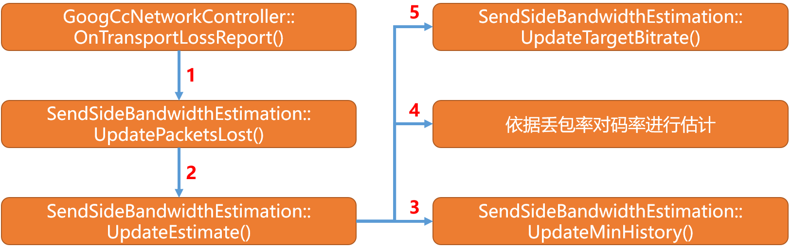

```cpp
void SendSideBandwidthEstimation::UpdateTargetBitrate(DataRate new_bitrate,
                                                      Timestamp at_time) {
  new_bitrate = std::min(new_bitrate, GetUpperLimit());
  if (new_bitrate < min_bitrate_configured_) {
    MaybeLogLowBitrateWarning(new_bitrate, at_time);
    new_bitrate = min_bitrate_configured_;
  }
  current_target_ = new_bitrate;
  MaybeLogLossBasedEvent(at_time);
  link_capacity_.OnRateUpdate(acknowledged_rate_, current_target_, at_time);
}
```

  * 最终记录新码率为`current_target_`。
  * 调用LinkCapacityTracker::OnRateUpdate进行更新，后续进行分析，此文不进行分析。

## 7）RTT对GoogCcNetworkController模块的影响

  * `GoogCcNetworkController`模块在收到rtt的回调后其处理逻辑如下图：


  * 一方面将RTT信息作用到`DelayBasedBwe`模块。
  * 另一方面讲RTT信息作用到`SendSideBandwidthEstimation`模块。
  * 本文主要分析`SendSideBandwidthEstimation`相关的信息。
    
```cpp
void SendSideBandwidthEstimation::UpdateRtt(TimeDelta rtt, Timestamp at_time) {
  // Update RTT if we were able to compute an RTT based on this RTCP.
  // FlexFEC doesn't send RTCP SR, which means we won't be able to compute RTT.
  if (rtt > TimeDelta::Zero())
    last_round_trip_time_ = rtt;
  if (!IsInStartPhase(at_time) && uma_rtt_state_ == kNoUpdate) {
    uma_rtt_state_ = kDone;
    RTC_HISTOGRAM_COUNTS("WebRTC.BWE.InitialRtt", rtt.ms<int>(), 0, 2000, 50);
  }
}
```

  * UpdateRtt的核心作用就是更新`last_round_trip_time_`的值，该值在上面码率递减的分析过程中有用到，其来源就是基于此。

## 8）总结

  * 本文意在分析webrtc基于丢包率的动态码率调控原理和其实现的业务逻辑，包含对应的函数调用栈，以及基于丢包率对码率控制（上调或者下降）的核心算法原理。
  * 根据上文的分析得出，当网络环境良好的情况下，webrtc给出的指标是丢包率小于2%10%之间，当丢包率小于2%的时候可以适当的增加码率，其增加的公式为以码率的8%进行递增同时附加1kbps，而当丢包率在2%10%之间的时候，保持码率平稳不增加也不减少。
  * 当丢包率超过10%的时候，对码率以 (当前码率 * (512 - 256 * 丢包率)) / 512的幅度进行递减，并且确保递减的新码率在一定的时间范围内有效。

<hr>

#### <p>原文出处：<a href='https://www.jianshu.com/p/5d6e802e86ac' target='blank'>WebRTC动态码率-基于transport wide cc的延迟码率估计原理</a></p>

## 1）前言

* WebRtc基于transport wide cc 的延迟动态码率估计主要分成四大部分，如下：
* 第一部分、在发送端，当rtp包扩展transport wide cc 协议在发送过程中，当包发送到网络环境过程中的处理和顺利发送到网络环境后的处理，最后作用到`GoogCcNetworkController`模块。
* 第二部分、接收端接收到带transport wide cc 协议的rtp包后的处理，主要是生成基于transport wide cc 的RTCP报文，并定时将报文发送给发送端。
* 第三部分、发送端收到接收端基于transport wide cc 协议的rtcp 反馈报文，并对其进行解析，解析完成后进行再封装将其作用到`GoogCcNetworkController`模块。
* 第四部分、`GoogCcNetworkController`模块基于延迟模型根据transport wide cc feedback进行码率估计。
* 本文重点分析第一部分，分析其工作流程并结合代码分析其代码数据传递链路，以及其最终对`GoogCcNetworkController`模块的影响。

## 2）工作流程一

  * 如要使用transport-wide-cc-extensions就必须在sdp协议中扩展其协议，按照[transport-wide-cc](https://links.jianshu.com/go?to=https%3A%2F%2Ftools.ietf.org%2Fhtml%2Fdraft-holmer-rmcat-transport-wide-cc-extensions-01%23section-3)协议可得知
    
```   
a=extmap:5 http://www.ietf.org/id/draft-holmer-rmcat-transport-wide-cc-extensions
```    

  * 必须在rtp包头部扩展如上协议。

  * 其大致发送流程如下：

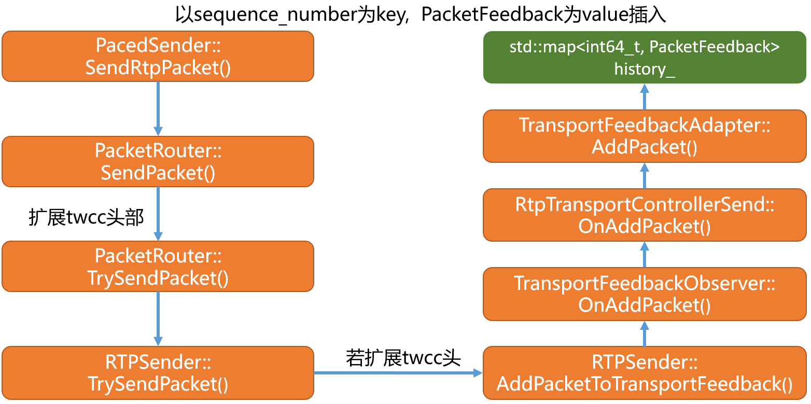

  * 首先在`PacketRouter`模块的SendPacket函数中对跟进transport-wide-cc头扩展支持为rtp包添加TransportSequenceNumber,其实现如下：
    
```cpp
void PacketRouter::SendPacket(std::unique_ptr<RtpPacketToSend> packet,
                              const PacedPacketInfo& cluster_info) {
  rtc::CritScope cs(&modules_crit_);
  // With the new pacer code path, transport sequence numbers are only set here,
  // on the pacer thread. Therefore we don't need atomics/synchronization.
  if (packet->IsExtensionReserved<TransportSequenceNumber>()) {
    packet->SetExtension<TransportSequenceNumber>(AllocateSequenceNumber());
  }
  ......
}
```   

  * 其次在`RTPSender`模块的TrySendPacket函数中会对上述封装的TransportSequenceNumber进行解析，并通过AddPacketToTransportFeedback函数将其传递给`TransportFeedbackObserver`模块，其处理代码如下：
    
```cpp
bool RTPSender::TrySendPacket(RtpPacketToSend* packet,
                              const PacedPacketInfo& pacing_info) {
  RTC_DCHECK(packet);
  .....
  // Downstream code actually uses this flag to distinguish between media and
  // everything else.
  if (auto packet_id = packet->GetExtension<TransportSequenceNumber>()) {
    options.packet_id = *packet_id;
    options.included_in_feedback = true;
    options.included_in_allocation = true;
    AddPacketToTransportFeedback(*packet_id, *packet, pacing_info);
  }
  ......
  return true;
}
```
    
```cpp
void RTPSender::AddPacketToTransportFeedback(
    uint16_t packet_id,
    const RtpPacketToSend& packet,
    const PacedPacketInfo& pacing_info) {
  if (transport_feedback_observer_) {
    size_t packet_size = packet.payload_size() + packet.padding_size();
    if (send_side_bwe_with_overhead_) {
      packet_size = packet.size();
    }
    RtpPacketSendInfo packet_info;
    packet_info.ssrc = SSRC();
    packet_info.transport_sequence_number = packet_id;
    packet_info.has_rtp_sequence_number = true;
    packet_info.rtp_sequence_number = packet.SequenceNumber();
    packet_info.length = packet_size;
    packet_info.pacing_info = pacing_info;
    transport_feedback_observer_->OnAddPacket(packet_info);
  }
}
```   

  * 生成RtpPacketSendInfo结构，记录当前要发送的rtp包的信息，如SequenceNumber、TransportSequenceNumber、包大小等。
  * `TransportFeedbackObserver`模块的派生及其依赖关系如下：  

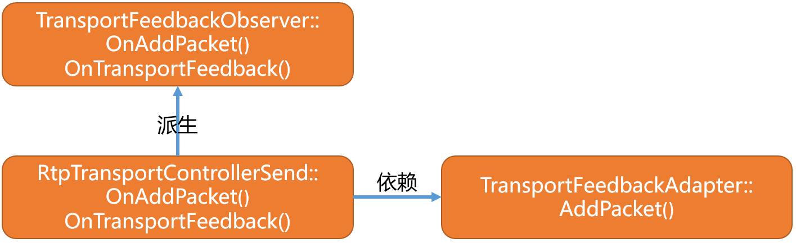

  * `RtpTransportControllerSend`模块的OnAddPacket函数实现如下
    
```cpp
void RtpTransportControllerSend::OnAddPacket(
    const RtpPacketSendInfo& packet_info) {
  transport_feedback_adapter_.AddPacket(
      packet_info,
      send_side_bwe_with_overhead_ ? transport_overhead_bytes_per_packet_.load()
                                    : 0,
      Timestamp::ms(clock_->TimeInMilliseconds()));
}
```   

  * 该函数把任务交给`TransportFeedbackAdapter`模块，它的实现如下：
    
```cpp 
const int64_t kNoTimestamp = -1;
const int64_t kSendTimeHistoryWindowMs = 60000;
```  

```cpp
void TransportFeedbackAdapter::AddPacket(const RtpPacketSendInfo& packet_info,
                                          size_t overhead_bytes,
                                          Timestamp creation_time) {
  {
    rtc::CritScope cs(&lock_);
    PacketFeedback packet(creation_time.ms(),
                          packet_info.transport_sequence_number,
                          packet_info.length + overhead_bytes, local_net_id_,
                          remote_net_id_, packet_info.pacing_info);
    if (packet_info.has_rtp_sequence_number) {
      packet.ssrc = packet_info.ssrc;
      packet.rtp_sequence_number = packet_info.rtp_sequence_number;
    }
    packet.long_sequence_number =
        seq_num_unwrapper_.Unwrap(packet.sequence_number);
    /*历史记录的生命周期是当前时间和PacketFeedback包创建的时间的差值小于60000的窗口，
      也就是，历史记录可以保留6秒以内的待发送包信息？，超过该时间窗口的历史记录将被清除*/
    while (!history_.empty() &&
            creation_time.ms() - history_.begin()->second.creation_time_ms >
                packet_age_limit_ms_) {//默认值为kSendTimeHistoryWindowMs,6s的时间窗口
      // TODO(sprang): Warn if erasing (too many) old items?
      RemoveInFlightPacketBytes(history_.begin()->second);
      history_.erase(history_.begin());
    }
    history_.insert(std::make_pair(packet.long_sequence_number, packet));
  }
  ....
}  
```

  * 该函数的核心作用是，利用RtpPacketSendInfo（包含，`seq,transport_seq`,发送包的大小等）信息创建PacketFeedback实例。
  * 将PacketFeedback实例以rtp transport seq 为key,以PacketFeedback为value插入到`history_容器当中。
  * 此时PacketFeedback记录的信息是创建时间、transport seq、ssrc、本次待发送的rtp包大小等信息。
  * 其中`history_`是一个map集合，它和TransportFeedbackAdapter的关系如下：

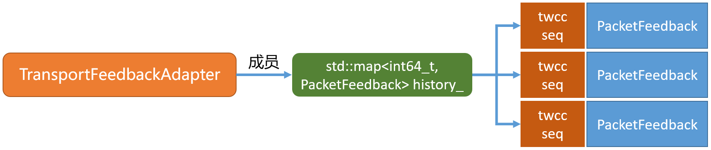

  * 那么这个历史记录有什么作用？接着看下文分析。
  * 以上分析了，RTP包扩展transport seq的发送到网络层前的处理流程，接下来分析当数据发送到网络层socket后的回调流程。

#### 3）工作流程二

  * 首先介绍RTP数据流发送反馈原理，如下图：

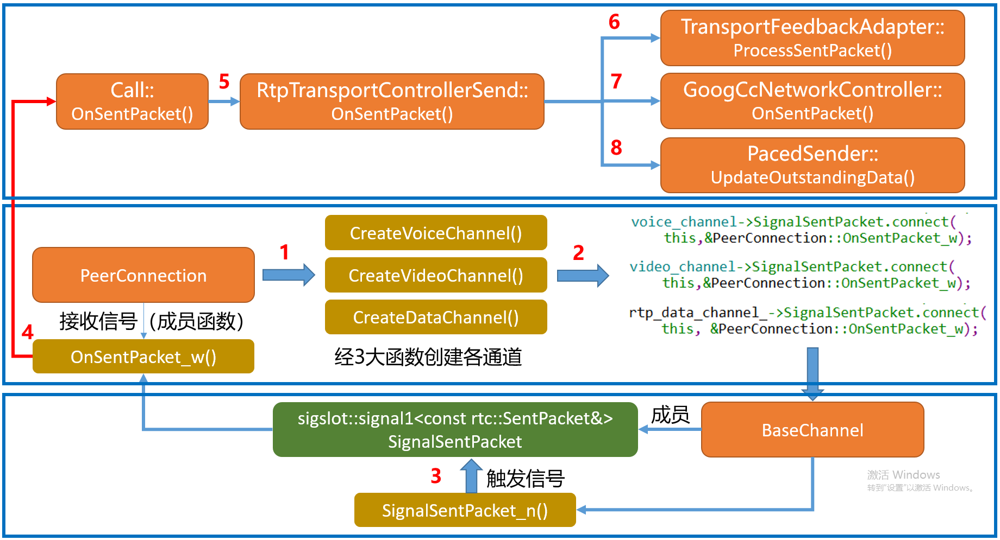

  * 首先，从信号注册说起，PeerConnection在用户添加音频、视频、数据轨的时候在其内部会调用对应的CreatexxChannel函数，在该函数中会为其对应的Media通道注册对应的信号函数。

  * 其次、当RTP包发送到网络层后会通过信号机制将发送信息经过信号将其反馈到BaseChnnel,同时BaseChnnel同样会经过信号将信息通过SignalSentPacket触发`PeerConnection`模块的OnSentPacket_w函数。

  * 最终经过函数回调，消息经Call模块，到达worker线程，最终反馈到`RtpTransportControllerSend`模块。本文从上图的第五步说起，其实现如下:
    
```cpp
void RtpTransportControllerSend::OnSentPacket(
    const rtc::SentPacket& sent_packet) {
  absl::optional<SentPacket> packet_msg =
      transport_feedback_adapter_.ProcessSentPacket(sent_packet);
  if (packet_msg) {
    task_queue_.PostTask([this, packet_msg]() {
      RTC_DCHECK_RUN_ON(&task_queue_);
      if (controller_)
        PostUpdates(controller_->OnSentPacket(*packet_msg));
    });
  }
  pacer()->UpdateOutstandingData(
      transport_feedback_adapter_.GetOutstandingData());
}
```   

  * 该函数的核心业务分成三大成分。
  * 其一是调用`TransportFeedbackAdapter`模块的ProcessSentPacket打包SentPacket消息。
  * 其二是将生成的SentPacket结构消息作用到GoogCcNetworkController模块,同时调用PostUpdates()进行码率更新（如果符合条件的话）。
  * 其三是将当前发送的字节数更新到`pacer`模块，这样pacer模块就知道当前网络中有多少数据正在发送，从而进行拥塞控制。

### 3.1）发送反馈SentPacket包的封装

```cpp    
absl::optional<SentPacket> TransportFeedbackAdapter::ProcessSentPacket(
    const rtc::SentPacket& sent_packet) {
  rtc::CritScope cs(&lock_);
  // TODO(srte): Only use one way to indicate that packet feedback is used.
  if (sent_packet.info.included_in_feedback || sent_packet.packet_id != -1) {
    int64_t unwrapped_seq_num =
        seq_num_unwrapper_.Unwrap(sent_packet.packet_id);
    auto it = history_.find(unwrapped_seq_num);
    if (it != history_.end()) {
      bool packet_retransmit = it->second.send_time_ms >= 0;
      it->second.send_time_ms = sent_packet.send_time_ms;
      last_send_time_ms_ =
          std::max(last_send_time_ms_, sent_packet.send_time_ms);
      // TODO(srte): Don't do this on retransmit.
      if (pending_untracked_size_ > 0) {
        if (sent_packet.send_time_ms < last_untracked_send_time_ms_)
          RTC_LOG(LS_WARNING)
              << "appending acknowledged data for out of order packet. (Diff: "
              << last_untracked_send_time_ms_ - sent_packet.send_time_ms
              << " ms.)";
        it->second.unacknowledged_data += pending_untracked_size_;
        pending_untracked_size_ = 0;
      }
      if (!packet_retransmit) {
        AddInFlightPacketBytes(it->second);
        auto packet = it->second;
        SentPacket msg;
        msg.size = DataSize::bytes(packet.payload_size);
        msg.send_time = Timestamp::ms(packet.send_time_ms);
        msg.sequence_number = packet.long_sequence_number;
        msg.prior_unacked_data = DataSize::bytes(packet.unacknowledged_data);
        msg.data_in_flight = GetOutstandingData();
        return msg;
      }
    }
  } else if (sent_packet.info.included_in_allocation) {
    if (sent_packet.send_time_ms < last_send_time_ms_) {
      RTC_LOG(LS_WARNING) << "ignoring untracked data for out of order packet.";
    }
    pending_untracked_size_ += sent_packet.info.packet_size_bytes;
    last_untracked_send_time_ms_ =
        std::max(last_untracked_send_time_ms_, sent_packet.send_time_ms);
  }
  return absl::nullopt;
}
```

  * 承接上面工作流程一中的分析，有涉及到`history_`容器，此处，根据已发送的包的信息，从该容器中根据seq number进行查询，查询到后，对立面的数据进行更新，主要是更新其发送时间。
  * 同时通过AddInFlightPacketBytes函数将已发送的RTP包中的实际palyload大小，记录到`in_flight_bytes_`容器当中。
  * 生成SentPacket并为其进行初始化，主要包含（实际发送数据的大小、发送时间、transport seq number、以及`data_in_flight`），其中`data_in_flight`表示一共已经发送了多少字节的数据到网络层了（以时间6s为窗口）。
  * `in_flight_bytes_`容器定义在`TransportFeedbackAdapter`模块中，其定义如下：
    
```cpp
using RemoteAndLocalNetworkId = std::pair<uint16_t, uint16_t>;
std::map<RemoteAndLocalNetworkId, size_t> in_flight_bytes_;
```  

  * 通过AddInFlightPacketBytes函数将每次发送了多少字节的数据填入该容器，进行发送字节统计，最终会作用到`pacer`模块。
  * 通过RemoveInFlightPacketBytes函数在每次接收到接收端发送回来的twcc feedback报告后根据收到的seq number 将对应seq number的包的大小计数从`in_flight_bytes_`中进行移除，同时在发送数据包的时候在`TransportFeedbackAdapter`模块AddPacket函数中会判断发送包的生命周期，如果超时（大于6s）进行移除。
    
```cpp
void TransportFeedbackAdapter::AddInFlightPacketBytes(
    const PacketFeedback& packet) {
  ....
  auto it = in_flight_bytes_.find({packet.local_net_id, packet.remote_net_id});
  if (it != in_flight_bytes_.end()) {
    it->second += packet.payload_size;
  } else {
    in_flight_bytes_[{packet.local_net_id, packet.remote_net_id}] =
        packet.payload_size;
  }
}
```

  * 每次发送进行累加。
    
```cpp 
void TransportFeedbackAdapter::RemoveInFlightPacketBytes(
    const PacketFeedback& packet) {
  ....
  auto it = in_flight_bytes_.find({packet.local_net_id, packet.remote_net_id});
  if (it != in_flight_bytes_.end()) {
    it->second -= packet.payload_size;
    if (it->second == 0)
      in_flight_bytes_.erase(it);
  }
}
```

  * 超时或者对应的seq 包已经收到接收端发回来的twcc报告进行移除操作。
    
```cpp 
DataSize TransportFeedbackAdapter::GetOutstandingData() const {
  rtc::CritScope cs(&lock_);
  auto it = in_flight_bytes_.find({local_net_id_, remote_net_id_});
  if (it != in_flight_bytes_.end()) {
    return DataSize::bytes(it->second);
  } else {
    return DataSize::Zero();
  }
}
```

  * 综上所述：**`in_flight_bytes_`容器描述的应当是以6s为最大时间窗口，描述当前总共有多少字节的数据正处于网络发送当中**
  * 返回已发送的总字节数，最终对`pacer`模块有用。
  * 到此为止SentPacket封装完成，主要包含（本次发送了多少字节的数据、本包的seq、本次发送时间、一共有多少字节的数据在发送[最多6s]）

### 3.2）发送反馈SentPacket包作用到GoogCcNetworkController模块

```cpp    
NetworkControlUpdate GoogCcNetworkController::OnSentPacket(
    SentPacket sent_packet) {
  alr_detector_->OnBytesSent(sent_packet.size.bytes(),
                              sent_packet.send_time.ms());
  acknowledged_bitrate_estimator_->SetAlr(
      alr_detector_->GetApplicationLimitedRegionStartTime().has_value());
  if (!first_packet_sent_) {
    first_packet_sent_ = true;
    // Initialize feedback time to send time to allow estimation of RTT until
    // first feedback is received.
    bandwidth_estimation_->UpdatePropagationRtt(sent_packet.send_time,
                                                TimeDelta::Zero());
  }
  bandwidth_estimation_->OnSentPacket(sent_packet);
  if (congestion_window_pushback_controller_) {
    congestion_window_pushback_controller_->UpdateOutstandingData(
        sent_packet.data_in_flight.bytes());
    NetworkControlUpdate update;
    MaybeTriggerOnNetworkChanged(&update, sent_packet.send_time);
    return update;
  } else {
    return NetworkControlUpdate();
  }
}
```

  * 该函数会调用`AlrDetector`模块进行带宽受限区域探测，如果网络受限会导致`AlrDetector`模块中的`alr_started_time_ms_`成员被赋值，也就是受限的起使时间，其原理就是通过理论预设的码率，和预设的带宽利用率，以及每次发送数据的时间间隔，然后配合本次实际发送的字节数，进行比较，比较预算应该发送多少字节的数据和实际发送了多少字节的数据的比例，来判断当前发送到底有没有充分利用好网络带宽。其详细的原理可以参考[WebRTC动态码率-AlrDetector原理](https://www.jianshu.com/p/55e5246f12b9)。

  * 经`AlrDetector`模块受限探测后，将探测结果通过调用`AcknowledgedBitrateEstimator`模块的SetAlr函数设置到该模块，探测结果可能会没有值，假设带宽利用率不错的话。

  * 调用`SendSideBandwidthEstimation`模块的OnSentPacket函数记录本次发送的包信息，为基于丢包的动态码率估计提供入参信息，基于丢包率的动态码率估计可以参考[WebRTC动态码率-基于丢包的码率估计原理](https://www.jianshu.com/p/a3310e5d3768)

  * 最后通过`CongestionWindowPushbackController`模块来触发码率估计，然而截止m79版本CongestionWindowPushbackController模块默认并未开启，用户可以通过配置"WebRTC-CongestionWindow/QueueSize:100,MinBitrate:100000/" FieldTrials来启用，该模块放到后续分析。

  * 在`CongestionWindowPushbackController`模块未开启的情况下，该函数默认返回了一个NetworkControlUpdate实例。

### 3.3）当前发送总字节数作用到pacer模块

  * 回到上图中的步骤8，transport wide cc 发送反馈的最后环节就是将当前统计到的正在网络环境下处于正在发送的总字节数，告诉`pacer`模块。
    
```cpp    
void PacedSender::UpdateOutstandingData(DataSize outstanding_data) {
  rtc::CritScope cs(&critsect_);
  pacing_controller_.UpdateOutstandingData(outstanding_data);
}
```

```cpp
void PacingController::UpdateOutstandingData(DataSize outstanding_data) {
  outstanding_data_ = outstanding_data;
}
```

  * 更新当前网络中时间有多少值在发送。
  * 如何使用该值？
    
```cpp 
bool PacingController::Congested() const {
  if (congestion_window_size_.IsFinite()) {
    /*congestion_window_size_为经过GoogCcNetworkController模块动态码率估计后得出的网络拥塞窗口上限，
      经RtpTransportControllerSend::PostUpdates()函数将拥塞窗口上限配置到pacer模块。
    */  
    return outstanding_data_ >= congestion_window_size_;
  }
  return false;
}
```

  * 通过判断当前网络中实际在发送的字节总数大小和拥塞窗口上限做比较，来得出当前网络是否拥塞。
  * 如果网络拥塞则发送数据的时候会取消本次发送。
  * 逻辑如下：

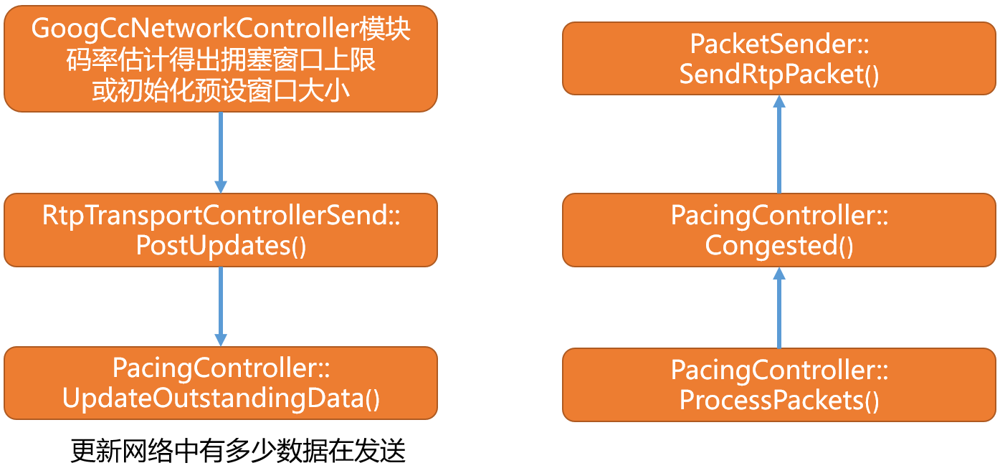

  * 本文到此分析结束

## 4）总结

  * 本文主要介绍基于transport wide cc的rtp数据发送在发送端的预处理逻辑和原理，主要分析了在发送过程中的回调机制。
  * 同时分析在RTP数据发送过程中的消息回调对其他如`AlrDetector`模块和`GoogCcNetworkController`模块和`pacer`模块的影响。
  * 通过本文的分析可以清晰的看出基于transport wide cc的rtp数据发送在发送过程中为后续基于延迟的码率估计和基于丢包的码率估计提供入参，从而可以看出webrtc 动态码率估计得复杂性，同时通过本文的分析对后续分析基于延迟的码率估计奠定基础。

<hr>

#### <p>原文出处：<a href='https://www.jianshu.com/p/117e306fce0b' target='blank'>WebRTC动态码率-IntervalBudget发送间隔预算原理</a></p>

* 作为webrtc pacer发送的重要预算模块被定义为IntervalBudget
* 该模块分成如下四个步骤来完成每此应该发送多少数据量的计算
* pacer模块将连续的时间分成不同时间间隔的时间块，发送一段数据后休息一会，然后再发送一段数据，然后再休息一会
* 假设上次休息的时间到本次发送的时间间隔为`delta_time_ms`
* 那么本次要发送多少数据呢？这里则使用当前的发送速率，配合流逝的`delta_time_ms`进行计算。
* 本文理解每次循环发送表示至少发送`delta_time_ms`的数据量，而每发送成功一包表示本次循环发送中的一次。

## 1）设置目标发送码率

```cpp    
namespace {
  constexpr int64_t kWindowMs = 500;
}

void IntervalBudget::set_target_rate_kbps(int target_rate_kbps) {
  target_rate_kbps_ = target_rate_kbps;
  max_bytes_in_budget_ = (kWindowMs * target_rate_kbps_) / 8;
  bytes_remaining_ = std::min(std::max(-max_bytes_in_budget_, bytes_remaining_),
                              max_bytes_in_budget_);
}
```   

  * 在`IntervalBudget`中根据目标码率配合时间窗口进行每相隔指定的时间范围内应该发送预算多少字节。
  * 按照上面的假设经计算得出`max_bytes_in_budget_`按照500ms最大时间窗口进行最大预算,假设目标发送码率为240kbps则得出本次预算最大发送为15000字节。
  * 计算剩余预算，`bytes_remaining_`首次默认情况下为0，那么经过赋值后本次剩余的预算为0（初始值）。
  * 此函数计算得出当前目标码率下以500ms为时间窗口得出最大的发送预算，也就是500ms内按照该目标发送码率最大可以发送1500字节的数据。

## 2）增加发送预算

```cpp    
void IntervalBudget::IncreaseBudget(int64_t delta_time_ms) {
  int64_t bytes = target_rate_kbps_ * delta_time_ms / 8;
  if (bytes_remaining_ < 0 || can_build_up_underuse_) {
    // We overused last interval, compensate this interval.
    bytes_remaining_ = std::min(bytes_remaining_ + bytes, max_bytes_in_budget_);
  } else {
    // If we underused last interval we can't use it this interval.
    bytes_remaining_ = std::min(bytes, max_bytes_in_budget_);
  }
}
```

  * 以delta时间为单位，假设以30ms的时间进行预算增加。
  * 首先delta时间内根据目标发送码率得出`240kbps * 30 / 1000 / 8`等于`900`字节。
  * 计算`bytes_remaining_`，初始值为0，和最大值进行比较取最小值。
  * 如果已经发送了一些数据，此时`bytes_remaining_`大于0，此时剩余量为上一次的剩余量加上delta时间内要发送的字节数据。
  * 首次调用该函数计算得到`bytes_remaining_`应该为900字节。

## 3）调整剩余预算

```cpp    
void IntervalBudget::UseBudget(size_t bytes) {
  bytes_remaining_ = std::max(bytes_remaining_ - static_cast<int>(bytes),
                              -max_bytes_in_budget_);
}
```

  * 每成功发送一包数据后需要调用该函数对使用预算进行更新。
  * 这里假设在发送数据前调用了`set_target_rate_kbps(240)`,`IncreaseBudget(30)`,也就是目标发送码率240kbps,发送时间为30ms。经上述的计算得出，预算该30ms内可以发送900字节的数据。
  * 假设第一次发送数据发送了200字节，那么发送成功后调用该函数，算出剩余的预算还有900-200=700字节。

## 4）获取剩余预算

```cpp    
size_t IntervalBudget::bytes_remaining() const {
  return rtc::saturated_cast<size_t>(std::max<int64_t>(0, bytes_remaining_));
}
```

## 5）使用案例

```cpp    
void PacingController::ProcessPackets() {
  Timestamp now = CurrentTime();
  Timestamp previous_process_time = last_process_time_;
  TimeDelta elapsed_time = UpdateTimeAndGetElapsed(now);
  if (elapsed_time > TimeDelta::Zero()) {
    ...
    if (mode_ == ProcessMode::kPeriodic) {
      // In periodic processing mode, the IntevalBudget allows positive budget
      // up to (process interval duration) * (target rate), so we only need to
      // update it once before the packet sending loop.
      // 设置当前实时发送速率  
      media_budget_.set_target_rate_kbps(target_rate.kbps());
      // 调用IncreaseBudget进行预算计算，假设 elapsed_time为30ms, taeget rate 为240kbps
      UpdateBudgetWithElapsedTime(elapsed_time);
    } else {
      media_rate_ = target_rate;
    }
  }
  ...
  DataSize data_sent = DataSize::Zero();
  // The paused state is checked in the loop since it leaves the critical
  // section allowing the paused state to be changed from other code.
  // 循环发送数据  
  while (!paused_) {
    // Fetch the next packet, so long as queue is not empty or budget is not
    // exhausted.
    std::unique_ptr<RtpPacketToSend> rtp_packet =
        GetPendingPacket(pacing_info, target_send_time, now);
    RTC_DCHECK(rtp_packet);
    RTC_DCHECK(rtp_packet->packet_type().has_value());
    const RtpPacketMediaType packet_type = *rtp_packet->packet_type();
    DataSize packet_size = DataSize::Bytes(rtp_packet->payload_size() +
                                            rtp_packet->padding_size());
    ...
    packet_sender_->SendPacket(std::move(rtp_packet), pacing_info);
    for (auto& packet : packet_sender_->FetchFec()) {
      EnqueuePacket(std::move(packet));
    }
    data_sent += packet_size;
    // Send done, update send/process time to the target send time.
    // 每成功发送一包数据后需要将当前发送的数据量调用UseBudget来更新本次循环预算的剩余  
    OnPacketSent(packet_type, packet_size, target_send_time);
    // If we are currently probing, we need to stop the send loop when we have
    // reached the send target.
    if (is_probing && data_sent >= recommended_probe_size) {
      break;
    }
  }
  last_process_time_ = std::max(last_process_time_, previous_process_time);
}
```