 
<!--BEGIN_DATA
{
    "create_date": "2019-11-29 10:45", 
    "modify_date": "2019-11-29 10:45", 
    "is_top": "0", 
    "summary": "WebRTC基于GCC的拥塞控制", 
    "tags": "WebRTC、C/C++、网络", 
    "file_name": "WebRTC基于GCC的拥塞控制.md"
}
END_DATA-->

####
原文出处：<a href='https://www.freehacker.cn/media/webrtc-gcc/' target='blank'>WebRTC拥塞控制策略</a>

>你只是看起来很努力。

影响视频会议质量的因素主要在于`视频图像质量`和`传输时延`。视频图像质量对于视频会议的影响不在此赘述。视频会议等实时流媒体应用对于实时性的要求很高，实时性要求我们必须要有较低的时延（`时延敏感`）。影响时延的因素包含：

  * 媒体数据在收发端的处理速度
  * 网络拥塞

网络拥塞是本文的研究重点，TCP协议拥有完善的拥塞控制机制，UDP则没有在拥塞控制方面有所规定。由于目前大多实时流媒体应用都是基于UDP传输，所以高效的拥塞控制算法是保证实时流媒体应用QoS的重要手段。

>基于丢包的TCP协议无法满足实时流媒体应用的低时延需求。

WebRTC里针对拥塞控制，采用了谷歌拥塞控制算法（Google Congestion Control，GCC），该算法包含两部分：发送端基于丢包的码率控制和接收端基于延迟的码率控制。这两种部分都是通过调节数据发送端码率来达到拥塞控制的目的。GCC算法架构如下：

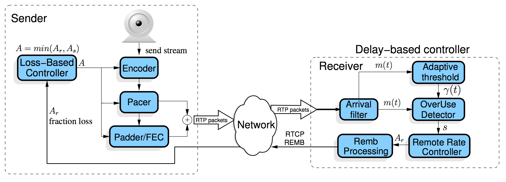

###发送端基于丢包的码率控制

发送端的码率控制是根据丢包率来计算预期的发送码率，丢包率的信息包含在接收到的RTCP报告报文中。计算公式如下，其中$${f}_{l}({t}_{k})$$表示$${t}_{k}$$时刻的丢包率，$${A}_{s}({t}_{k})$$表示$${t}_{k}$$时刻发送端的码率：

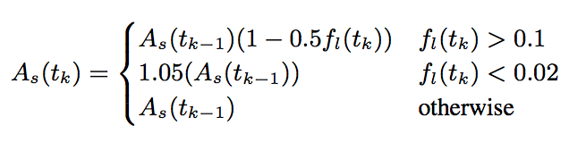

###接收端基于延迟的码率控制

发送端的码率控制是根据延迟来计算预期的发送码率，计算出来的码率信息会通过RTCP REMB报文反馈给发送端。计算公式如下，其中titi表示第ii个视频帧被接收的时间，`η=1.05`，`α=0.85`，$${R}_{r}({t}_{i})$$表示接收端在最近500ms中测量的接收码率：

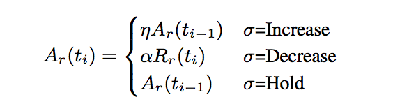

如GCC算法结构图所示，基于延迟的码率控制包含五个模块：Arrival-time Filter、Overuse Detector、Remote Rate Controller、Adaptive Threshold、Remb Processing。GCC论文中给出了这五个模块的关系：

>The remote rate controller is a finite state machine in which the state of $$σ$$ is changed by the signal ss produced by the over-use detector based on the output $$m({t}_{i})$$ of the arrival-time filter. The adaptive threshold block dynamically sets the threshold $$γ({t}_{i})$$ used by the over-use detector. The REMB Processing decides when to send a REMB message based on the value of the rate $${A}_{r}$$. Finally, it is important to notice that rate $${A}_{r}({t}_{i})$$ is upper bounded by rate 1.5$${R}_{r}({t}_{i})$$.

####Arrival-time Filter

Arrival-time Filter模块用来计算网络延迟$$m({t}_{i})$$，GCC算法采用Kalman Filter来估算该值。Kalman Filter采用单程帧间延迟差值$${d}_{m}({t}_{i})$$，单程帧间延迟差值表示两个数据帧到达接收端的延迟差值。如下图所示：

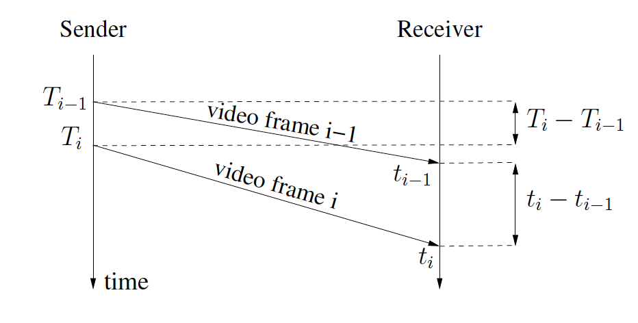

根据该图，我们可以得出$${d}_{m}({t}_{i})$$的计算公式如下：

$${d}_{m}({t}_{i})={t}_{i}-{t}_{i-1})-({T}_{i}-{T}_{i-1})$$

####Overuse Detector

Overuse Detector根据Arrival-time Filter计算出的网络延时$$m({t}_{i})$$以及Adaptive Threshold提供的$$γ({t}_{i})$$值来判断当前网络是否过载，并告知Remote Rate Controller对应的信号ss——`overuse`、`normal`、`underuse`。下图表明Overuse Detector是如何工作的：

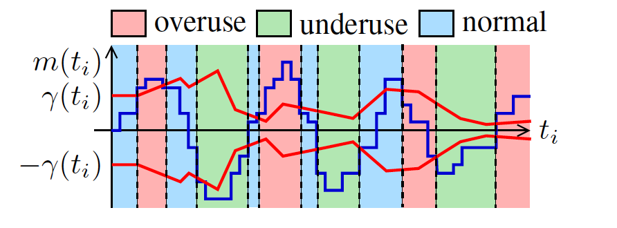

产生`overuse`、`normal`、`underuse`三种信号的条件如下：

  * overuse: $$m({t}_{i})$$ > $$γ({t}_{i})$$ and keep 100ms
  * underuse: $$m({t}_{i})$$ < -$$γ({t}_{i})$$ and keep 100ms
  * normal: -$$γ({t}_{i})$$ < $$m({t}_{i})$$ < $$γ({t}_{i})$$

####Remote Rate Controller

Remote Rate Controller模块根据上文提到的接收端码率计算公式来计算接收端预估码率。该模块是个无线状态机，其状态变动如下图所示：

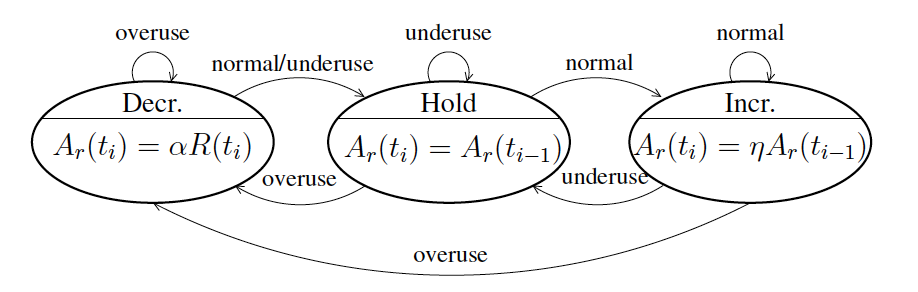

结合上文中的公式，我们可以得出：

  * 当`s=overuse`，预估码率降低为接收码率的85%，处于`decrease`状态;
  * 当`s=underuse`，预估码率保持和上次预估码率一样，处于`hold`状态；
  * 当`s=normal`，预估码率上升为上次预估码率的105%，处于`increase`状态。

####Adaptive Threshold

Adaptive Threshold模块用来使算法适应延迟变化的灵敏性。

####Remb Processing

Remb Processing模块用于通知发送端来自接收端预估的码率。该码率通过RTCP REMB报文反馈给发送端。正常情况下，该报文每隔1s发送一次，但如果$${A}_{r}({t}_{i})$$ < 0.97$${A}_{r}({t}_{i-1})$$，该报文立马发送。

###最终码率计算

一旦发送端接收到RTCP报告报文，或是接收到携带接收端预估码率$${A}_{r}$$的REMB报文，发送端执行对应的码率控制算法——发送端根据发送端预估码率$${A}_{s}({t}_{k})$$、接收端预估$${A}_{r}({t}_{k})$$、最大允许码率$${A}_{max}$$最小允许码率$${A}_{min}$$，计算出最终的发送码率$${R}_{s}({t}_{k})$$。

$${R}_{s}({t}_{k})=max(min(min({A}_{s}({t}_{k}), {A}_{r}({t}_{k})), {A}_{max}), {A}_{min})$$

###WebRTC拥塞控制模块

WebRTC中实现了Google GCC算法，该实现包含发送端和接收端两部分。发送端负责发送端码率预估和计算最终目标码率；接收端负责接收端码率预估和统计丢包信息，并通过REMB报文和RTCP RR反馈给发送端。其总体模块图如下：

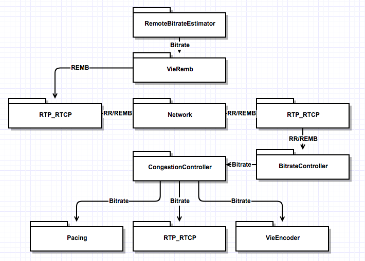

####远端比特率预估模块

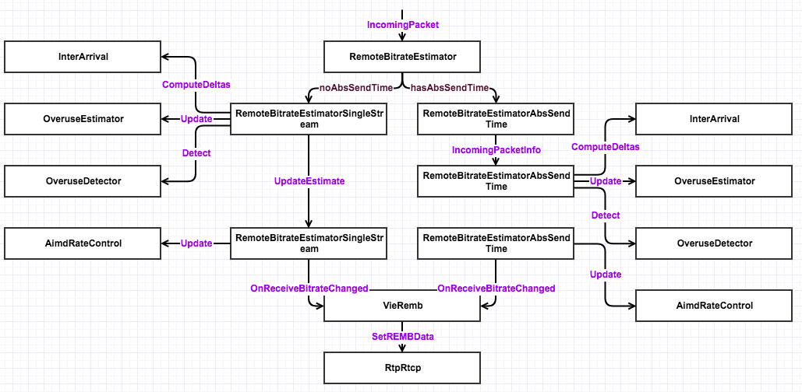

####本地比特率计算模块

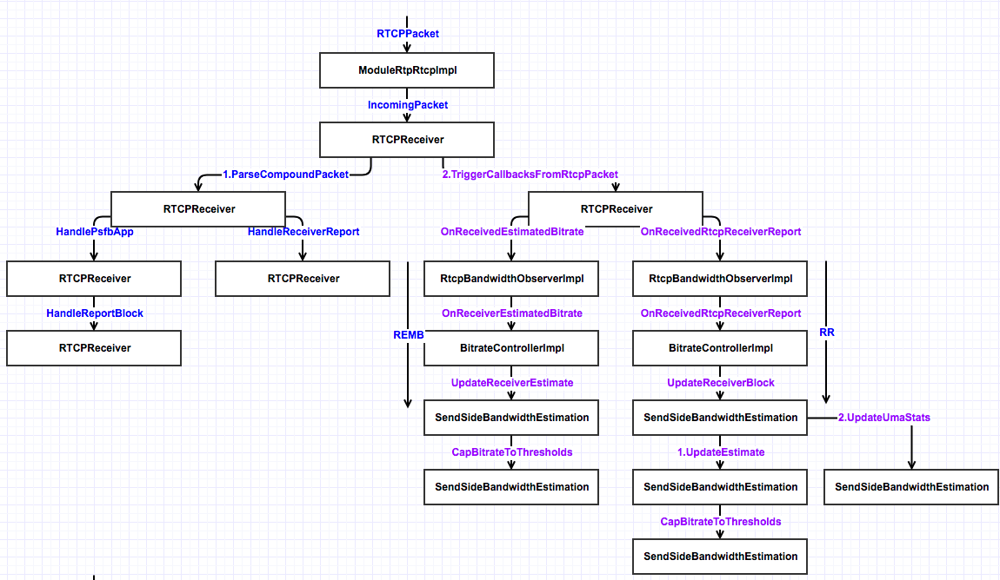

###参考文献

[Analysis and Design of the Google Congestion Control for Web Real-time Communication (WebRTC)](http://c3lab.poliba.it/images/6/65/Gcc-analysis.pdf)

####
原文出处：<a href='http://www.52im.net/thread-513-1-1.html' target='blank'>WebRTC基于GCC的拥塞控制(上)</a>

实时流媒体应用的最大特点是实时性，而延迟是实时性的最大敌人。从媒体收发端来讲，媒体数据的处理速度是造成延迟的重要原因；而从传输角度来讲，网络拥塞则是造成延迟的最主要原因。网络拥塞可能造成数据包丢失，也可能造成数据传输时间变长，延迟增大。

拥塞控制是实时流媒体应用质量保证(QoS)的重要手段之一，它在缓解网络拥堵、减小网络延迟、平滑数据传输等质量保证方面发挥重要作用。WebRTC通控制发送端数据发送码率来达到控制网络拥塞的目的，其采用谷歌提出的拥塞控制算法(Google Congestion Control，简称GCC[1])来控制发送端码率。

本文是关于WebRTC拥塞控制算法GCC的上半部分，主要集中于对算法的理论分析，力图对WebRTC的QoS有一个全面直观的认识。在下半部分，将深入WebRTC源代码内部，仔细分析GCC的实现细节。

####1 GCC算法综述

Google关于GCC的RFC文档在文献[1]，该RFC目前处于草案状态，还没有成为IETF的正式RFC。此外，Google陆续发布了一系列论文[2][3][4]来论述该算法的实现细节，以及其在Google Hangouts、WebRTC等产品中的应用。本文主要根据这些文档资料，从理论上学习GCC算法。

GCC算法分两部分：发送端基于丢包率的码率控制和接收端基于延迟的码率控制。如图1所示。

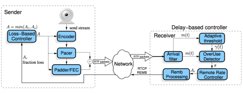  

图1 GCC算法整体结构

基于丢包率的码率控制运行在发送端，依靠RTCP RR报文进行工作。WebRTC在发送端收到来自接收端的RTCP RR报文，根据其Report Block中携带的丢包率信息，动态调整发送端码率As。基于延迟的码率控制运行在接收端，WebRTC根据数据包到达的时间延迟，通过到达时间滤波器，估算出网络延迟m(t)，然后经过过载检测器判断当前网络的拥塞状况，最后在码率控制器根据规则计算出远端估计最大码率Ar。得到Ar之后，通过RTCP REMB报文返回发送端。发送端综合As、Ar和预配置的上下限，计算出最终的目标码率A，该码率会作用到Encoder、RTP和PacedSender等模块，控制发送端的码率。

####2 发送端基于丢包率的码率控制

  
GCC算法在发送端基于丢包率控制发送码率，其基本思想是：丢包率反映网络拥塞状况。如果丢包率很小或者为0，说明网络状况良好，在不超过预设最大码率的情况下，可以增大发送端码率；反之如果丢包率变大，说明网络状况变差，此时应减少发送端码率。在其它情况下，发送端码率保持不变。

GCC使用的丢包率根据接收端RTP接收统计信息计算得到，通过RTCP RR报文中返回给发送端。RTCP RR报文统计接收端RTP接收信息，如Packet Loss，Jitter，DLSR等等，如图2所示：

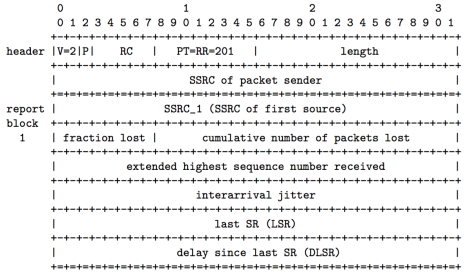  

图2 RTCP RR报文结构[5]

发送端收到RTCP RR报文并解析得到丢包率后，根据图3公式计算发送端码率：当丢包率大于0.1时，说明网络发生拥塞，此时降低发送端码率；当丢包率小于0.02时，说明网络状况良好，此时增大发送端码率；其他情况下，发送端码率保持不变。

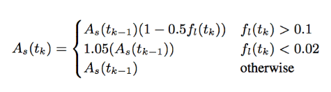  

图3 GCC基于丢包率的码率计算公式[4]

最终码率会作用于Encoder、RTP和PacedSender模块，用以在编码器内部调整码率和平滑发送端发送速率。

####3 接收端基于延迟的码率控制

  
GCC算法在接收端基于数据包到达延迟估计发送码率Ar，然后通过RTCP REMB报文反馈到发送端，发送端把Ar作为最终目标码率的上限值。其基本思想是： RTP数据包的到达时间延迟m(i)反映网络拥塞状况。当延迟很小时，说明网络拥塞不严重，可以适当增大目标码率；当延迟变大时，说明网络拥塞变严重，需要减小目标码率；当延迟维持在一个低水平时，目标码率维持不变。

基于延时的拥塞控制由三个主要模块组成：到达时间滤波器，过载检查器和速率控制器；除此之外还有过载阈值自适应模块和REMB报文生成模块，如图1所示。下面分别论述其工作过程。

#####3.1 到达时间滤波器(Arrival-time Filter)

  
该模块用以计算相邻相邻两个数据包组的网络排队延迟m(i)。数据包组定义为一段时间内连续发送的数据包的集合。一系列数据包短时间里连续发送，这段时间称为突发时间，建议突发时间为5ms。不建议在突发时间内的包间隔时间做度量，而是把它们做为一组来测量。通过相邻两个数据包组的发送时间和到达时间，计算得到组间延迟d(i)。组间延迟示意图及计算公式如图4所示：

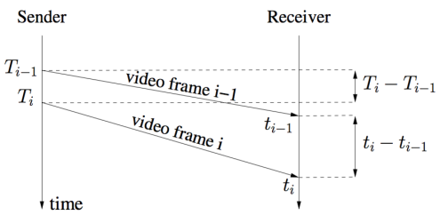  

图4 组间延迟示意图

T(i)是第i个数据包组中第一个数据包的发送时间，t(i)是第i个数据包组中最后一个数据包的到达时间。帧间延迟通过如下公式计算得到：
    
    d(i) = t(i) – t(i-1) – (T(i) – T(i-1))    (3.1.1)

公式1.3.1是d(i)的观测方程。另一方面，d(i)也可由如下状态方程得到：

    
    
    d(i) = dL(i)/C(i) + w(i)                  (3.1.2)
    d(i) = dL(i)/C(i) + m(i) + v(i)           (3.1.3)

其中dL(i)表示相邻两帧的长度差，C(i)表示网络信道容量，m(i)表示网络排队延迟，v(i)表示零均值噪声。m(i)即是我们要求得的网络排队延迟。通过Kalman Filter可以求得该值。具体计算过程请参考文献[1][4][6]。

#####3.2 过载检测器(Over-use Detector)

  
该模块以到达时间滤波器计算得到的网络排队延迟m(i)为输入，结合当前阈值gamma\_1，判断当前网络是否过载。判断算法如图5所示[2]。

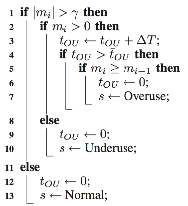  

图5 过载检测器伪代码

算法基于当前网络排队延迟m(i)和当前阈值gamma\_1判断当前网络拥塞状况[2]：当m(i) >
gamma\_1时，算法计算处于当前状态的持续时间t(ou) = t(ou) + delta(t)，如果t(ou)大于设定阈值gamma_2(实际计算中设置为10ms)，并且m(i) > m(i-1)，则发出网络过载信号Overuse，同时重置t(ou)。如果m(i)小于m(i-1)，即使高于阀值gamma\_1也不需要发出过载信号。当m(i) < -gamma\_1时，算法认为当前网络处于空闲状态，发出网络载信号Underuse。当 – gamma\_1 <= m(i) <= gamma\_1是，算法认为当前网络使用率适中，发出保持信号Hold。算法随着时间轴的计算过程可从图6中看到。

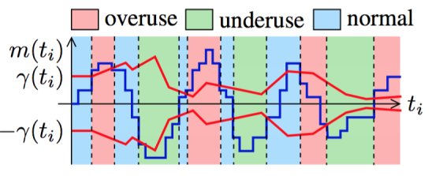  

图6 时间轴上的过载检测过程

需要注意的是，阀值gamma\_1对算法的影响很大，并且阈值gamma\_1是自适应性的。如果其是静态值，会带来一系列问题，详见文献[4]。所以gamma\_1需要动态调整来达到良好的表现。这就是图1中的Adaptive threshould模块。阈值gamma\_1动态更新的公式如下：

    
    
    gamma\_1(i) = gamma\_1(i-1) + (t(i)-t(i-1)) * K(i) * (|m(i)|-gamma\_1(i-1))    (3.2.4)

当|m(i)|>gamma\_1(i-1)时增加gamma\_1(i)，反之减小gamma\_1(i)，而当|m(i)|– gamma\_1(i)
>15，建议gamma\_1(i)不更新。K(i)为更新系数，当|m(i)|<gamma\_1(i-1)时K(i) = K\_d，否则K(i) = K\_u。同时建议gamma\_1(i)控制在[6,600]区间。太小的值会导致探测器过于敏感。建议增加系数要大于减少系数K\_u > K\_d。文献[1]给出的建议值如下：

    
    
    gamma\_1(0) = 12.5 ms
    gamma_2  = 10 ms
    K_u = 0.01
    K_d = 0.00018

#####3.3 速率控制器(Remote Rate Controller)

  
该模块以过载检测器给出的当前网络状态s为输入，首先根据图7所示的有限状态机判断当前码率的变化趋势，然后根据图8所示的公式计算目标码率Ar。

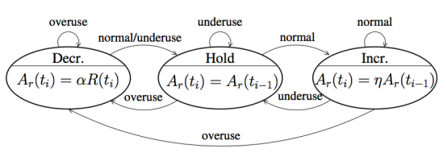  

图7 目标码率Ar变化趋势有限状态机

当前网络过载时，目标码率处于Decrease状态；当前网络低载时，目标码率处于Hold状态；当网络正常时，处于Decrease状态时迁移到Hold状态，处于Hold/Increase状态时都迁移到Increase状态。当判断出码率变化趋势后，根据图8所示公式进行计算目标码率。

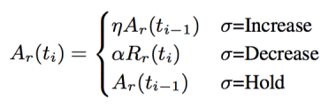  

图8 目标码率Ar计算公式

当码率变化趋势为Increase时，当前码率为上次码率乘上系数1.05；当码率变化趋势为Decrease，当前码率为过去500ms内的最大接收码率乘上系数0.85。当码率变化趋势为Hold时，当前码率保持不变。目标码率Ar计算得到之后，下一步把Ar封装到REMB报文中发送回发送端。在REMB报文中，Ar被表示为Ar = M * 2^Exp，其中M封装在BR Mantissa域，占18位；Exp封装在BR Exp域，占6位。REMB报文是Payload为206的RTCP报文[7]，格式如图9所示。

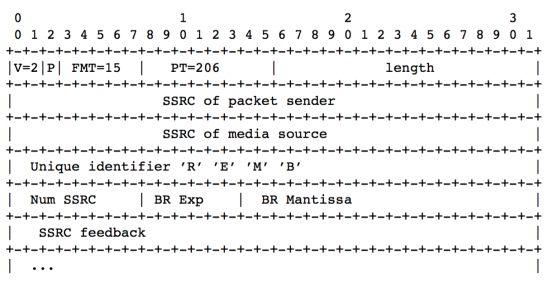  

图9 REMB报文格式

REMB报文每秒发送一次，当Ar(i) < 0.97 * Ar(i-1)时则立即发送。

#####3.4 发送端目标码率的确定

  
发送端最终目标码率的确定结合了基于丢包率计算得到的码率As和基于延迟计算得到的码率Ar。此外，在实际实现中还会配置目标码率的上限值和下限值。综合以上因素，最终目标码率确定如下：
 
    
        target_bitrate = max( min( min(As, Ar), Amax), Amin)        (3.4.1)

目标码率确定之后，分别设置到Encoder模块和PacedSender模块。

####4 总结

  
本文在广泛调研WebRTC GCC算法的相关RFC和论文的基础上，全面深入学习GCC算法的理论分析，以此为契机力图对WebRTC的QoS有一个全面直观的认识。为将来深入WebRTC源代码内部分析GCC的实现细节奠定基础。  
  

####参考文献

  
[1] A Google Congestion Control Algorithm for Real-Time Communication.  
draft-alvestrand-rmcat-congestion-03   
[2] Understanding the Dynamic Behaviour of the Google Congestion Control for RTCWeb.  
[3] Experimental Investigation of the Google Congestion Control for Real-Time Flows.  
[4] Analysis and Design of the Google Congestion Control for Web Real-time Communication (WebRTC). MMSys’16, May 10-13, 2016, Klagenfurt, Austria  
[5] RFC3550: RTP - A Transport Protocol for Real-Time Applications  
[6] WebRTC视频接收缓冲区基于KalmanFilter的延迟模型.  
<http://www.jianshu.com/p/bb34995c549a>  
[7] RTCP message for Receiver Estimated Maximum Bitrate. draft-alvestrand-rmcat-remb-03

 
####
原文出处：<a href='http://www.52im.net/thread-513-1-1.html' target='blank'>WebRTC 基于GCC的拥塞控制(下)</a>

本文在文章[1]的基础上，从源代码实现角度对WebRTC的GCC算法进行分析。主要内容包括： RTCPRR的数据源、报文构造和接收，接收端基于数据包到达延迟的码率估计，发送端码率的计算以及生效于目标模块。

拥塞控制是实时流媒体应用的重要服务质量保证。通过本文和文章[1][2]，从数学基础、算法步骤到实现细节，对WebRTC的拥塞控制GCC算法有一个全面深入的理解，为进一步学习WebRTC奠定良好基础。

####1 GCC算法框架再学习

  
本节内容基本上是文章[1]第1节的复习，目的是再次复习GCC算法的主要框架，梳理其算法流程中的数据流和控制流，以此作为后续章节的行文提纲。GCC算法的数据流和控制流如图1所示。

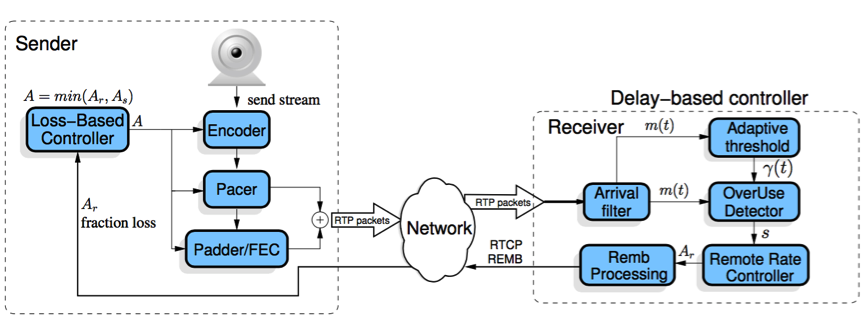  

图1 GCC算法数据流和控制流

对发送端来讲，GCC算法主要负责两件事：

1)接收来自接收端的数据包信息反馈，包括来自RTCP RR报文的丢包率和来自RTCPREMB报文的接收端估计码率，综合本地的码率配置信息，计算得到目标码率A。

2)把目标码率A生效于目标模块，包括PacedSender模块，RTPSender模块和ViEEncoder模块等。

对于接收端来讲，GCC算法主要负责两件事：1）统计RTP数据包的接收信息，包括丢包数、接收RTP数据包的最高序列号等，构造RTCP RR报文，发送回发送端。2）针对每一个到达的RTP数据包，执行基于到达时间延迟的码率估计算法，得到接收端估计码率，构造RTCP REMB报文，发送回发送端。

由此可见，GCC算法由发送端和接收端配合共同实现，接收端负责码率反馈数据的生成，发送端负责根据码率反馈数据计算目标码率，并生效于目标模块。本文接下来基于本节所述的GCC算法的四项子任务，分别详细分析之。

####2 RTCP RR报文构造及收发

  
关于WebRTC上的RTP/RTCP协议的具体实现细节，可参考文章[3]。本节主要从RR报文的数据流角度，对其数据源、报文构造和收发进行分析。其数据源和报文构造如图2所示，报文接收和作用于码率控制模块如图3所示。

在数据接收端，RTP数据包从Network线程到达Worker线程，经过Call对象，VideoReceiveStream对象到达RtpStreamReceiver对象。在该对象中，主要执行三项任务：1)接收端码率估计；2) 转发RTP数据包到VCM模块；3)接收端数据统计。其中1)是下一节的重点，2)是RTP数据包进一步组帧和解码的地方；3)是统计RTP数据包接收信息，作为RTCP RR报文和其他数据统计模块的数据来源，是我们本节重点分析的部分。

在RtpStreamReceiver对象中，RTP数据包经过解析得到头部信息，作为输入参数调用ReceiveStatistianImpl::IncomingPacket()。该函数中分别调用UpdateCounters()和NotifyRtpCallback()，前者用来更新对象内部的统计信息，如接收数据包计数等，后者用来更新RTP回调对象的统计信息，该信息用来作为getStats调用的数据源。

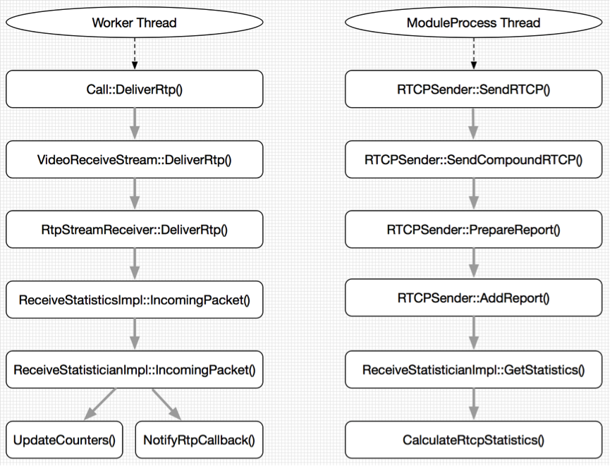  

图2 RTCP RR报文数据源及报文构造

RTCP发送模块在ModuleProcess线程中工作，RTCP报文周期性发送。当线程判断需要发送RTCP报文时，调用SendRTCP()进行发送。接下来调用PrepareReport()准备各类型RTCP报文的数据。对于我们关心的RR报文，会调用AddReportBlock()获取数据源并构造ReportBl
ock对象:该函数首先通过ReceiveStatistianImpl::GetStatistics()拿到类型为RtcpStatistics的数据源，然后以此填充ReportBlock对象。GetStatistics()会调用CalculateRtcpStatistics()计算ReportBlock的每一项数据，包括丢包数、接收数据包最高序列号等。ReportBlock对象会在接下来的报文构造环节通过BuildRR()进行序列化。RTCP报文进行序列化之后，交给Network线程进行网络层发送。

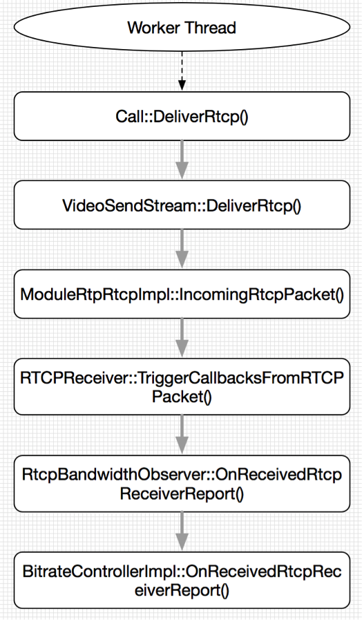  

图3 RTCP RR报文接收及反馈

在发送端(即RTCP报文接收端)，RTCP报文经过Network线程到达Worker线程，最后到达ModuleRtpRtcpImpl模块调用IncomingRtcpPacket()进行报文解析工作。解析完成以后，调用TriggerCallbacksFromRTCPPackets()反馈到回调模块。在码率估计方面，会反馈到BitrateController模块。ReportBlock消息最终会到达BitrateControllerImpl对象，进行下一步的目标码率确定。

至此，关于RTCP RR报文在拥塞控制中的执行流程分析完毕。

####3 接收端基于延迟的码率估计

  
接收端基于数据包到达延迟的码率估计是整个GCC算法最复杂的部分，本节在分析WebRTC代码的基础上，阐述该部分的实现细节。

接收端基于延迟码率估计的基本思想是：RTP数据包的到达时间延迟m(i)反映网络拥塞状况。当延迟很小时，说明网络拥塞不严重，可以适当增大目标码率；当延迟变大时，说明网络拥塞变严重，需要减小目标码率；当延迟维持在一个低水平时，目标码率维持不变。其主要由三个模块组成：到达时间滤波器，过载检查器和速率控制器。

在实现上，WebRTC定义该模块为远端码率估计模块RemoteBitrateEstimator，整个模块的工作流程如图4所示。需要注意的是，该模块需要RTP报文扩展头部abs-send-time的支持，用以记录RTP数据包在发送端的绝对发送时间，详细请参考文献[4]。

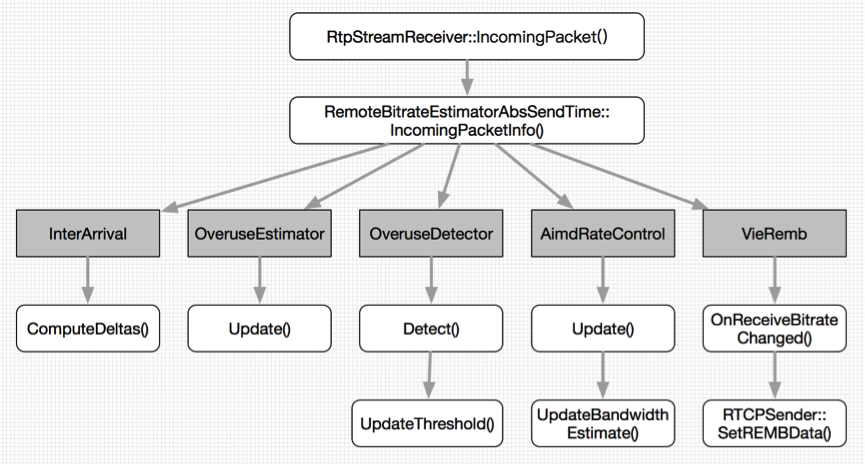  

图4 GCC算法基于延迟的码率估计

接收端收到RTP数据包后，经过一系列调用到RtpStreamReceiver对象，由该对象调用远端码率估计模块的总控对象RemoteBitrateEstimatorAbsSendTime，由该对象的总控函数IncomingPacketInfo()负责整个码率估计流程，如图4所示，算法从左到右依次调用子对象的功能函数。

总控函数首先调用InterArrival::ComputeDeltas()函数，用以计算相邻数据包组的到达时间相对延迟，该部分对应文章[1]的3.1节内容。
在计算到达时间相对延迟时，用到了RTP报文头部扩展abs-send-time。另外，实现细节上要注意数据包组的划分，以及对乱序和突发时间的处理。

接下来算法调用OveruseEstimator::Update()函数，用以估计数据包的网络延迟，该部分对应文章[1]的3.2节内容。对网络延迟的估计用到了Kalman滤波，算法的具体细节请参考文章[2]。Kalman滤波的结果为网络延迟m(i)，作为下一阶段网络状态检测的输入参数。

算法接着调用OveruseDetector::Detect()，用来检测当前网络的拥塞状况，该部分对应文章[1]的3.2节内容。网络状态检测用当前网络延迟m(i)和阈值gamma\_1进行比较，判断出overuse，underuse和normal三种网络状态之一。在算法细节上，要注意overuse的判定相对复杂一些：当m(i) > gamma\_1时，计算处于当前状态的持续时间t(ou)，如果t(ou) > gamma\_2，并且m(i) > m(i-1)，则发出网络过载信号Overuse。如果m(i)小于m(i-1)，即使高于阀值gamma\_1也不需要发出过载信号。在判定网络拥塞状态之后，还要调用UpdateThreshold()更新阈值gamma\_1。

算法接着调用AimdRateControl::Update()和UpdateBandwidthEstimate()函数，用以估计当前网络状态下的目标码率Ar，该部分对应文章[1]的3.3节。算法基于当前网络状态和码率变化趋势有限状态机，采用AIMD(Additive Increase Multiplicative Decrease)方法计算目标码率，具体计算公式请参考文章[1]。需要注意的是，当算法处于开始阶段时，会采用Multiplicative Increase方法快速增加码率，以加快码率估计速度。

此时，我们已经拿到接收端估计的目标码率Ar。接下来以Ar为参数调用VieRemb对象的OnReceiveBitrateChange()函数，发送REMB报文到发送端。REMB报文会推送到RTCP模块，并设置REMB报文发送时间为立即发送。关于REMB报文接下来的发送和接收流程，和第1节描述的RTCP报文一般处理流程是一样的，即经过序列化发送到网络，然后发送端收到以后，反序列化出描述结构，最后通过回调函数到达发送端码率控制模块BitrateControllerImpl。

至此，接收端基于延迟的码率估计过程描述完毕。

####4 发送端码率计算及生效

  
在发送端，目标码率计算和生效是异步进行的，即Worker线程从RTCP接收模块经回调函数拿到丢包率和REMB码率之后，计算得到目标码率A；然后ModuleProcess线程异步把目标码率A生效到目标模块如PacedSender和ViEEncoder等。下面分别描述码率计算和生效过程。

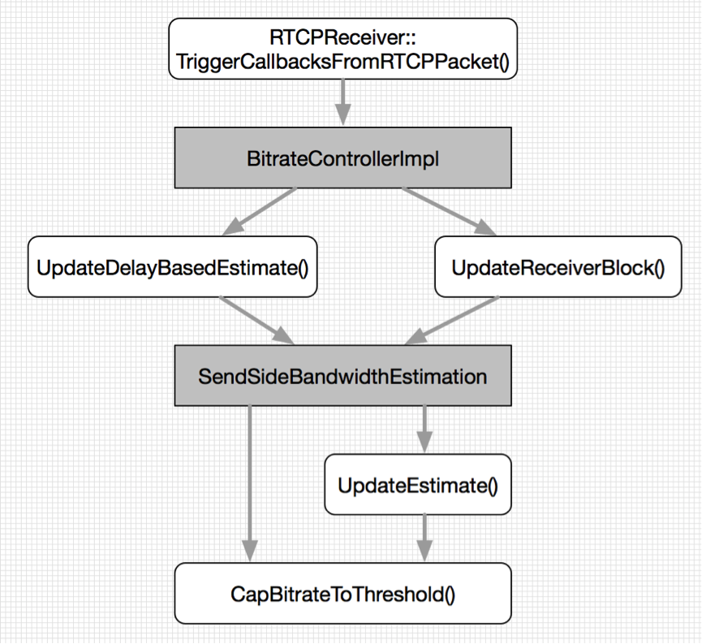  

图5 发送端码率计算过程

码率计算过程如图5所示：Worker线程从RTCPReceiver模块经过回调函数拿到RTCP RR报文和REMB报文的数据，到达BitrateController模块。RR报文中的丢包率会进入Update()函数中计算码率，码率计算公式如文章[1]第2节所述。然后算法流程进入CapBitrateToThreshold()函数，和配置的最大最小码率和远端估计码率进行比较后，确定最终目标码率。而REMB报文的接收端估计码率Ar则直接进入CapBitrateToThreshold()函数参与目标码率的确定。目标码率由文章[1]的3.4节所示公式进行确定。需要注意的是，RR报文和REMB报文一般不在同一个RTCP报文里。

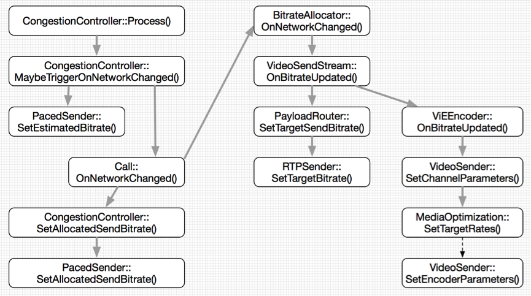  

图6 发送端码率生效过程

发送端码率生效过程如图6所示：ModuleProcess线程调用拥塞控制总控对象CongestionController周期性从码率控制模块BitrateControllerImpl中获取当前最新目标码率A，然后判断目标码率是否有变化。若是，则把最新目标码率设置到相关模块中，主要包括PacedSender模块，RTPSender模块和ViEEncoder模块。

对于PacedSender模块，设置码率主要是为了平滑RTP数据包的发送速率，尽量避免数据包Burst造成码率波动。对于RTPSender模块，设置码率是为了给NACK模块预留码率，如果预留码率过小，则在某些情况下对于NACK报文请求选择不响应。对于ViEEncoder模块，设置码率有两个用途：1)控制发送端丢帧策略，根据设定码率和漏桶算法决定是否丢弃当前帧。2)控制编码器内部码率控制，设定码率作为参数传输到编码器内部，参与内部码率控制过程。

至此，发送端码率计算和生效过程分析完毕。

####5 总结

本文结合文章[1]，深入WebRTC代码内部，详细分析了WebRTC的GCC算法的实现细节。通过本文，对WebRTC的代码结构和拥塞控制实现细节有了更深层次的理解，为进一步学习WebRTC奠定良好基础。

