<!--BEGIN_DATA
{
    "create_date": "2019-12-29 14:23", 
    "modify_date": "2019-12-29 14:23", 
    "is_top": "0", 
    "summary": "WebRTC基于TransportCC和Trendline Filter的发送端码率估计(Sendside-BWE)与WebRTC-GCC两种实现方案对比", 
    "tags": "WebRTC", 
    "file_name": "WebRTC基于TransportCC和Trendline Filter的发送端码率估计(Sendside-BWE).md"
}
END_DATA-->

####
原文出处：<a href='https://www.jianshu.com/p/ab32a8a3552f' target='blank'>WebRTC基于TransportCC和Trendline Filter的发送端码率估计(Sendside-BWE)</a>

**1 引言**

众所周知，WebRTC的拥塞控制和码率估计算法采用GCC算法[1]。该算法充分考虑了网络丢包和网络延迟对码率估计的不同影响，分别基于丢包率和网络延迟进行码率估计，最后综合这另种码率得出最优值。在算法实现上，基于丢包率的码率估计在发送端进行，基于网络延迟的码率估计在接收端进行。最后在发送端计算出最优值，作用于Codec和PacedSender模块。GCC算法能够较好地基于网络实时状况估计网络带宽，为网络实时通信应用打下坚实基础[2][3][4]。

然而，随着时间推移，在实际测试中发现GCC算法逐渐显出一些弊端，比如不能适应所有网络模型，应对网络峰值能力差，等等。为此，Google官方从M55版本引进最新的拥塞控制算法Sendside-BWE，把所有码率计算模块都移到发送端进行，并采用全新的Trendline滤波器取代之前的Kalman滤波器[5]。实测表明，新的算法实现能够更好更快地进行码率估计和网络过载恢复。

本文基于WebRTC的M66版本和相关RFC，深度分析学习最新Sendside-BWE算法的实现。

**2 GCC算法回顾**

关于GCC算法已经有很多分析和论述[6][7]，本文只回顾其算法框架，并分析其在实际应用中存在的问题。

图1 GCC算法整体结构

GCC算法分两部分：发送端基于丢包率的码率控制和接收端基于延迟的码率控制。基于丢包率的码率控制运行在发送端，依靠RTCPRR报文进行工作。WebRTC在发送端收到来自接收端的RTCP RR报文，根据其Report Block中携带的丢包率信息，动态调整发送端码率As。基于延迟的码率控制运行在接收端，WebRTC根据数据包到达的时间延迟，通过到达时间滤波器，估算出网络延迟m(t)，然后经过过载检测器判断当前网络的拥塞状况，最后在码率控制器根据规则计算出远端估计最大码率Ar。得到Ar之后，通过RTCP REMB报文返回发送端。发送端综合As、Ar和预配置的上下限，计算出最终的目标码率A，该码率会作用到Encoder、RTP和PacedSender等模块，控制发送端的码率。

发送端基于丢包率的码率估计计算公式：

图2 GCC发送端基于丢包率的码率估计

接收端基于延迟的码率估计计算公式：

图3 GCC接收端基于延迟的码率估计

GCC算法充分考虑丢包率和延迟对码率的影响，在实时通讯应用(如视频会议)中能够发挥良好效果。然而，在某些特定应用场景下(比如实时在线编辑)，GCC算法的表现不太让人满意，主要体现在它应对峰值流量的能力上，具体表现在：1）算法一开始基于Increase状态增加码率，当检测到Decrease状态时调用Ar[t(i)] = Alpha * Rr[t(i)]，这个时候实时码率Rr(ti)可能远小于Ar[t(i-1)]，这样在后续过程中Ar处于较低水平；此时若有视频关键帧冲击，则数据包大量在PacedSender的队列中排队，造成较大排队延迟。2）基于1）中论述的情况，码率估计模块反馈给Codec的编码码率很低，但编码器需要编码关键帧时，内部的码率控制模块控制出的最小码率仍然大于反馈码率。这两种情况都会造成较大的发送端排队延迟，进而在接收端造成较大的JitterBuffer延迟，最终导致端到端延迟到达500ms的水平，这在实时在线编辑应用中是无法容忍的。

基于此，Google官方从WebRTC M55开始引入新的码率估计算法，把所有码率计算模块都移动到发送端，并采用全新的Trendline滤波器，基于码率探测机制快速准确地估计出实时码率。

**3 Sendside-BWE算法框架**

从本节开始系统分析Sendside-BWE算法的框架和实现，图4显示该算法的基本实现框架，以及和GCC算法的对比。

图4 Sendside-BWE算法和GCC算法的实现和对比[8]

图4中棕色线是Sendside-BWE算法的数据控制流回路：发送端在发送RTP数据包时，在RTP头部扩展中设置传输层序列号TransportSequenceNumber；数据包到达接收端后记录该序列号和包到达时间，然后接收端基于此构造TransportCC报文返回到发送端；发送端解析该报文，并执行Sendside-BWE算法，计算得到基于延迟的码率Ar；最终Ar和基于丢包率的码率As进行比较得到最终目标码率，作用到PacedSender和Codec模块，形成一个完整的反馈回路。图4中红色线是GCC算法的数据控制流回路：发送端在发送RTP数据包时，在RTP头部扩展中设置绝对发送时间AbsSendTime；数据包到达接收端后记录该绝对到达时间，然后基于此执行GCC算法得到Ar，最后构造REMB报文把Ar发送回发送端；发送端基于Ar和As得到最终目标码率，作用到PacedSender和Codec模块，形成一个完整的反馈回路。

从中可以看出，Sendside-BWE算法充分复用GCC算法的框架和实现，整个反馈回路基本类似：发送端在RTP头部扩展中记录码率估计元数据，码率估计模块基于此元数据估计出码率As，在发送端基于丢包率计算Ar，发送端综合As和Ar得到最终目标码率，并作用于Codec和PacedSender模块。所不同的是：对于GCC算法，RTP报文头部添加AbsSendTime扩展，在接收端执行基于延迟的码率估计，网络延迟滤波器采用KalmanFilter，返回给发送端的是REMB报文；对于Sendside-BWE算法，RTP报文头部添加TransportSequenceNumber扩展，在发送端执行基于延迟的码率估计，网络延迟滤波器采用Trandline，返回给发送端的是TransportCC报文。表5总结出GCC算法和Sendside-BWE算法的异同。

表5 GCC和Sendside-BWE关键模块异同

需要注意的是，从WebRTC M55开始启用Sendside-BWE后，其GCC算法就只做前向兼容而没有进一步的功能开发、性能优化和bug修正。因此，GCC是过去，Sendside-BWE是未来。

**4 Sendside-BWE算法实现**

本节论述Sendside-BWE算法的实现细节，在论述上力求不过度注释代码，以免陷入细节无法自拔。本节按照如下顺序论述Sendside-BWE的实现细节：SDP协商，发送端发送RTP报文，接收端接受RTP报文及信息存储，接收端构造TransportCC报文，发送端解析TransportCC报文，发送端码率估计。

**4.1 Sendside-BWE在SDP层协商**

TransportCC和remb一样都是Codec的feedback params的一部分。为支持TransportCC，Codec在收集feedback params时需添加额外一条：

    codec->AddFeedbackParam(FeedbackParam(kRtcpFbParamTransportCc, kParamValueEmpty));

其中，TransportCC在最终生成的SDP中体现为如下一条attribute：

a=extmap:5 <http://www.ietf.org/id/draft-holmer-rmcat-transport-wide-cc-extensions-01>

然后，SDP协商过程按照常规操作进行。

**4.2 发送端发送RTP报文**

发送端在发送RTP报文时，需要在RTP头部添加新的扩展TransportSequenceNumber，该扩展格式如图6所示。

图6 TransportSequenceNumber扩展格式

注意这里的传输层序列号，和RTP报文格式中的媒体层序列号不是同一个东西。传输层序列号关注数据的传输特性，主要作用是码率估计；媒体曾序列号关注数据的媒体特性，主要作用是组帧和抗丢包。它们的初始值不一样，赋值点也不一样，其中媒体层序列号在RTPSender::AssignSequenceNumber()处赋值，而传输层序列号在RTPSender::UpdateTransportSequenceNumber()处赋值。RTP报文在发送时构造该头部扩展的函数调用栈如下：

=> RTPSender::TimeToSendPacket();  
 => RTPSender::PrepareAndSendPacket();  
  => RTPSender::UpdateTransportSequenceNumber();  
   => RTPSender::AddPacketToTransportFeedback();s  
    => SendSideCongestionController::AddPacket();

然后RTP报文走正常的构造发送路径发送到网络。

**4.3 接收端接收RTP并构造TransportCC报文**

接收端worker线程在收到RTP报文后，解析并检查其头部扩展，根据其是否有TransportSN扩展，决定采用Sendside-BWE还是GCC，注意这两种拥塞控制器是互斥的。对于Sendside-BWE，接收端代理解析扩展拿到传输层序列号，并记录RTP报文的到达时间，构造(transport-sn，arrival_time_ms)键值对，存储在队列中。整个过程的函数调用栈如下：

=> Call::DeliverRtp();  
 => NotifyBweOfReceivedPacket();  
 => RtpPacketReceived::GetHeader();  
 => ReceiveSideCongestionController::OnReceivedPacket();  
  => RemoteEstimatorProxy::IncomingPacket();  
   => OnPacketArrival(transport-sn, arrival_time_ms)：  
      Packet_arrival_times_[seq] = arrival_time;

RemoteEstimatorProxy作为Sendside-BWE在接收端的代理，其实现遵从WebRTC的模块机制，在Process线程以100ms为发送周期发送TransportCC报文[9]，发送周期会根据当前码率动态调整，其取值范围在[50ms, 250ms]之间，其本身可用的发送码率为当前可用码率的5%。TransportFeedback报文是一种RTP传输层feedback报文(pt=205)，FMT为15。其格式如图7所示：

图7 TransportCC报文格式

TransportCC报文采用base + bitmap的思想，其各个字段的具体解释请参考文献[9]，一个TransportCC报文能最多携带16个RTP报文的有效信息，每个RTP报文信息包括其传输层序列号和包到达时间。TransportCC报文在发送端构造和发送的函数调用栈如下：

=> RemoteEstimatorProxy::Process();  
 => RemoteEstimatorProxy::BuildFeedbackPacket();  
  => TransportFeedback::AddReceivedPacket()  
   => PacketRouter::SendTransportFeedback(fbpacket);  
    => RTCPSender::SendFeedbackPacket(fbpacket);

然后按照常规RTCP报文流程发送到发送端。

**4.4 发送端接收TransportCC报文并解析**

接收端接收操作就是常规的RTCP接收、解析并回调的流程，在worker线程中：

=> WebRtcVideoChannel::OnRtcpReceived();  
 => Call::DeliverRtcp();  
  => RTCPReceiver::HandleTransportFeedback();  
   => RTCPReceiver::TriggerCallbacksFromRtcpPacket();  
    => TransportFeedbackObserver::OnTransportFeedback();  
     => SendSideCongestionController::OnTransportFeedback();

然后就是Send-side BWE算法在发送端的核心实现。

**4.5 SendSideCongestionController码率估计**

SendSideCongestionController是Sendside-BWE算法在发送端的核心实现，关于其的分析全部是细节描述。本节限于篇幅，仅勾勒出其大致的函数调用栈和流程说明。

 => SendSideCongestionController::OnTransportFeedback();  
 => AcknowledBitrateEstimator::IncomingPacketFeedbackVector();  
 => DelayBasedBwe::IncomingPacketFeedbackVector();  
 => BitrateControllerImpl::OnDelayBasedBweResult();  
 => SendSideCongestionController::MaybeTriggerOnNetworkChanged();  
 => ProbeController::RequestProbe();

在SendSideCongestionController的OnTransportFeedback()函数中，首先调用ALR码率估计器得到一个实时码率，然后以此为参数调用DelayBasedBwe计算得到最新的估计码率Ar，把Ar经过BitrateController对象和As综合，得到最新的目标码率。最后通过函数MaybeTriggerOnNetworkChanged()把最新目标码率作用到Codec和PacedSender模块。如果本次码率估计从网络过载中恢复，则调用ProbeController对象发起下一次码率探测。

DelayBasedBwe对象是真正实现码率估计的地方，其内部调用函数栈如下：

=> DelayBasedBwe::IncomingPacketFeedbackVector();  
=> DelayBasedBwe::IncomingPacketFeedback();  
 => InterArrival::ComputeDeltas();  
 => TrendlineEstimator::Update();  
=> DelayBasedBwe::MaybeUpdateEstimate();  
 => ProbeBitrateEstimator::FetchAndResetLastEstimatedBitrateBps();  
 => AimdRateControl::SetEstimator();

DelayBasedBwe首先调用IncomingPacketFeedback针对每个RTP报文信息进行码率估计，其内部逻辑和GCC算法的相关步骤一致，在此不再赘述。需要注意的是，其内部网络延迟滤波器采用TrendlineEstimator。然后DelayBasedBwe调用MaybeUpdateEstimate()根据本次判定的网络状态计算得到最终的Ar，如GCC算法一样。

Trendline滤波器的原理就是最小二乘法线性回归求得网络延迟波动的斜率，每个散列点表示为(arrival_time, smoothed_delay)，其中arrival_time为RTP包到达时间，smoothed_delay为平滑后的发送接收相对延迟。最后根据当前散列点集合，采用最小二乘法线性回归计算得到本次估计的网络延迟m(i)。其计算过程调用如下：

=> TrendlineEstimator::Update();  
 => LinearFitSlope();  
 => TrendlineEstimator::Detect();  
  => TrendlineEstimator::UpdateThreshold();

至此，关于Sendside-BWE算法的实现初步分析完毕。

**5 Sendside-BWE实测数据**

实际测试表明，和GCC算法相比，SendsideBWE算法在快速码率估计、码率估计准确性、抗网络抖动等方面都具有非常大改善。由于保密原因，此处不能发布内部测试数据，仅贴出一组公开渠道获得的快速码率估计比较图[10]。

图8 Sendside-BWE和GCC算法对比

该图表明，Sendside-BWE算法能够在第一次TransportCC报文返回时即估计出实时网络带宽，相比GCC算法更快速更准确。

**6 总结**

本文在总结对比GCC和Sendside-BWE算法基础上，深入学习Sendside-BWE算法的框架和实现细节，为进一步学习WebRTC拥塞控制算法和优化算法细节打下坚实基础。  

**参考文献**

[1] A Google Congestion Control Algorithm for Real-Time Communication. draft-alvestrand-rmcat-congestion-03  
[2] Understanding the Dynamic Behaviour of the Google Congestion Control for RTCWeb.  
[3] Experimental Investigation of the Google Congestion Control for Real-Time Flows.  
[4] Analysis and Design of the Google Congestion Control for Web Real-time Communication (WebRTC). MMSys’16, May 10-13, 2016, Klagenfurt, Austria  
[5] WebRTC视频接收缓冲区基于KalmanFilter的延迟模型.[http://www.jianshu.com/p/bb34995c549a](https://www.jianshu.com/p/bb34995c549a)  
[6] WebRTC基于GCC的拥塞控制(上) - 算法分析 <https://www.jianshu.com/p/0f7ee0e0b3be>  
[7] WebRTC基于GCC的拥塞控制(下) - 实现分析 <https://www.jianshu.com/p/5259a8659112>  
[8] WebRTC的拥塞控制和带宽策略 <https://mp.weixin.qq.com/s/Ej63-FTe5-2pkxyXoXBUTw>  
[9] RTP Extensions for Transport-wide Congestion Control draft-holmer-rmcat-transport-wide-cc-extensions-01  
[10] Bandwidth Estimation in WebRTC (and the new Sender Side BWE) <http://www.rtcbits.com/2017/01/bandwidth-estimation-in-webrtc-and-new.html>

####
原文出处：<a href='https://www.freehacker.cn/media/tcc-vs-gcc/' target='blank'>WebRTC-GCC两种实现方案对比</a>

WebRTC为了防止网络拥塞结合了Loss-based BWE和Delay-based BWE两种算法，其中Loss-based BWE算法较为复杂。WebRTC中提出了两种方案来处理Loss-based BWE：

  * Recv-side Delay-based BWE：REMB-based GCC
  * Send-side Delay-based BWE：TransportFB-based GCC

本文着重于两种方案的不同点，并分析二者的区别，进而确定在实际应用中应该选择哪一种方案。同时本文也会通过仿真结果，来给出GCC算法的性能分析。

> 本文按照其实现机制称：REMB-based GCC为REMB、TransportFB-based GCC为TCC。

####BWE Evolution

带宽预估算法的演进经过两个阶段：

* Loss-based BWE
* Delay-based BWE

Loss-based BWE通过RTCP-RR报文来检测丢包率，然后根据丢包率来调整对应的带宽。Delay-based BWE通过分析包之间的延时来预测拥塞，在路由器丢弃数据包之前尝试降低带宽。

Loss-based BWE和Delay-based BWE的可行性都是基于网络路由器的特性：

  * Loss-based BWE：当网络发生拥塞时，路由器缓冲区被填满，后续的数据包会被丢弃。
  * Delay-based BWE：当网络开始出现拥塞时，路由器缓冲区数据逐渐增加，数据包之间的延迟变化加剧。

相对于Loss-based BWE，Delay-based BWE能够更早的发现网络的拥塞状况，进而提前调整码率，防止拥塞加重。

因此，在WebRTC中使用Loss-based BWE来适应丢包情况和探测带宽，而使用Delay-based BWE来提前发现网络拥塞，降低队列延迟，提高实时音视频通信的质量。

####Send-side Delay-based BWE

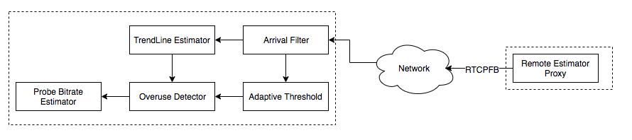

Transport-CC将接收端的延迟信息通过RTCP-TCC反馈给发送端，然后在发送端进行Delay-based BWE。WebRTC通过以下两步来实现该方案：

  * **Transport wide sequence numbers header extension**

x所有的RTP包额外的增加一个头部扩展项，该扩展项用来表示发送序列号。通过SDP来协商是否打开该扩展项：
    
  a=extmap:5 http://www.ietf.org/id/draft-holmer-rmcat-transport-wide-cc-extensions-01

  * **Transport Feedback**

接收方向媒体发送方定期发送反馈，提供有关接收到的数据包的信息以及它们之间的延迟。反馈信息通过RTCP-Transport-FB反馈给发送端。通过SDP来协商是否启用：

  a=rtcp-fb:100 transport-cc

RTCP-Transport-FB默认发送频率1time/100ms，同时其动态适应使用5％的可用带宽，最大频率值为1time/50ms、最小频率值为1time/250ms。以1time/100ms的频率发送，其最大需要耗费16kbps带宽。

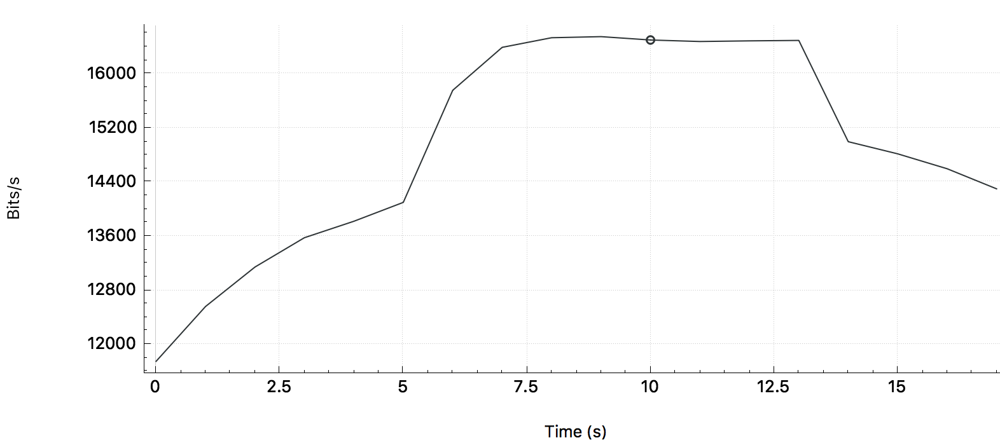

####Recv-side Delay-based BWE

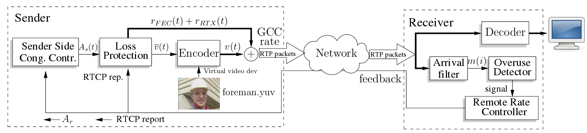

Recv-side Delay-based BWE在接收端计算预估码率结果，并通过RTCP-REMB反馈给发送端。实现Recv-side Delay-based BWE需要两步：

  * **Transport with Absolute Send Time**

绝对发送时间用于表示发送端发送该包的时间，在RTP报头的扩展中发送。需要在SDP中协商是否启用该扩展：

  a=extmap:3 http://www.webrtc.org/experiments/rtp-hdrext/abs-send-time

  * **REMB Feedback**

接收端通过RTCP-REMB反馈预估的码率值，需要在SDP中协商是否启动该反馈：

  a=rtcp-fb:<payload type> goog-remb

在REMB方案中，其他厂商也给出了一些优化思路：

  * WebRTC Gateway反馈的REMB码率结果需要综合考虑同一个会议中其他用户的下行带宽和丢包。
  * 在REMB方案中引入TCC方案中的一些优点，譬如线性滤波器。

####Comparison

#####方案对比

WebRTC实现了两种滤波器来进行延迟增长趋势的评估。Send-side Delay-based BWE采用Trendline Filter，而Recv-side Delay-based BWE采用了Kalman Filter。

#####效果对比

暂未发现效果对比的论文或博客，后续会自行研究对比。

####Pros and Cons

TCC的优点在于无需依赖于两个端点——方便BWE算法测试，更易改进算法。发送端知道其使用了何种算法，进而按照场景的不同，切换BEW算法。来自Google Group的讨论：

* Easier to roll out improvements if the logic is located on one side and the other side is kept dumb.

* Having the logic on the send-side means you know more about what has been sent. For instance, you know if the source is very bursty (screencasts) which can help us make better decisions.

TCC的缺点在于浪费了一定的带宽，同时Firefox目前还不支持TCC。

REMB的优点在于码率的控制权在服务端（接收端），没有额外的带宽浪费。

REMB的缺点在于调试起来不方便，需要同时关注两个端，同时WebRTC已经不对REMB提供支持——这意味着当下的REMB实现版本可能存在不少BUG，同时BWE的新特性也不会加入到当前的REMB实现。

> Google从Chrome55开始支持Send-side Delay-based BWE。查了下WebRTC的代码提交，REMB方案几乎没有实质性修改，而TCC针对性做了优化。

在采用TCC方案后，接收也可以利用REMB来通知发送端码率发送上限。

#####Which One?

从优缺点可以明显的看出，我们应该选择TCC。但这里还是要结合场景，如果服务端对码率的控制权十分重要，还是有必要使用REMB的，只是后续的BUG只能自己解了。

####Performance

TCC和GCC本质上都是使用了GCC算法。GCC算法的设计目的是为了达到：

  * 最大化利用可利用的带宽
  * 带宽瓶颈时能够公平共享带宽（TCP流、GCC流）
  * 最小化队列延迟

本节引用了多篇研究论文的结果，试图挖掘GCC方案的性能优点和漏洞。其中一些变量的含义如下：

> Channel Utilization：[Math Processing Error]U=R/b，R为预估码率

Good Channel Utilization：[Math Processing Error]G=v/b，v为rtp发送码率

Loss Ratio：[Math Processing Error]l=(lostbytes)/(receivedbytes)

Number of Delay-based Decrease Events：[Math Processing Error]ndd，降低码率的REMB包数量

#####Single GCC Flow with Constant Avaliable Bandwidth

设置[Math Processing Error]RTTm=50ms，可利用带宽为[Math Processing Error]b(t)=2000kbps，仿真结果如下：

从仿真结果可以看出：

  * GCC预估码率从300kbps上升到2000kbps需要30s左右
  * GCC预估码率在带宽阈值时波动严重，波动幅值最大可达1000Mpbs
  * GCC预估码率会经常超过带宽阈值进而导致严重丢包
  * GCC出现严重带宽时会大大提高FEC的比例，最大可达50%
  * 当码率接近带宽上限时，RTT增大导致REMB发送频率增加，进而降低码率

设置[Math Processing Error]RTTm,j∈{30,50,80,120}ms，可利用带宽[Math Processing Error]bi∈{500,1000,1500,2000}kbps，仿真结果如下：

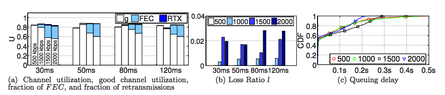

从仿真结果可以看出：

  * 信道利用率几乎不受带宽和延迟影响，维持在80%左右
  * 丢包率并不受RTR变化的影响，丢包率随着带宽的增加而增加，最高达到2.8%
  * 随着带宽的增加，丢包率随着增加，进而导致FEC的比例逐步增加，最高达到20%
  * 采用GCC算法后，队列延迟中位数近似于0，90%样本值小于0.25m

#####Single GCC Flow with Variable Available Bandwidth

设置[Math Processing Error]RTTm=50ms，可利用带宽先阶梯递增后阶梯递减，增减可选值为[Math Processing Error]bi∈{500,1000,1500,2000}kbps，仿真结果如下：

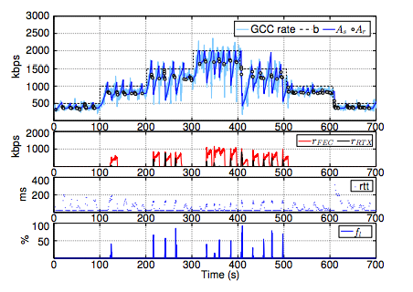

从仿真结果可以看出：

  * 随着码率阶梯递增或递减，GCC预估码率能够随之快速递增递减
  * 码率增长到较高码率时，码率波动明显增加，FEC比例随着增加
  * 码率从高位下降时，瞬间丢包率增加，会导致发送端码率严重下降，远低于接收端预估码率

#####Multiple GCC Flow

设置[Math Processing Error]RTTm=50ms，可利用带宽[Math Processing Error]bi=1000kbps，仿真结果如下：

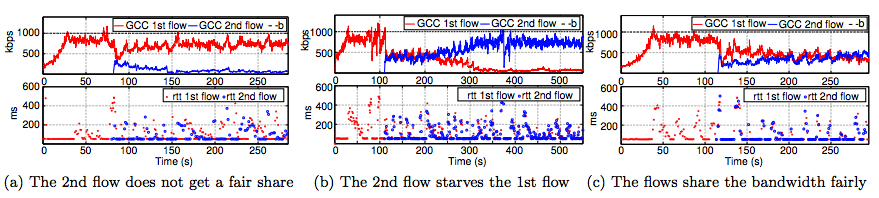

从仿真结果可以看出：

  * 两个GCC流之间的码率竞争呈现无规律性

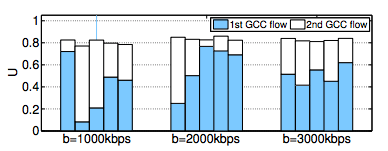

从上图可以看出：

  * 在1000kbps和2000kbps时，码率分配十分不公平
  * 在3000kbps时，码率分配相对公平，但先启动的GCC流仍然分配较多的码率

#####Single GCC Flow and Single TCP Flow

设置[Math Processing Error]RTTm=50ms，可利用带宽[Math Processing Error]bi={1000,2000,3000}kbps，考虑两种场景：先启动GCC流，100s后启动TCP流、先启动TCP流，100s后启动GCC流，仿真结果如下：

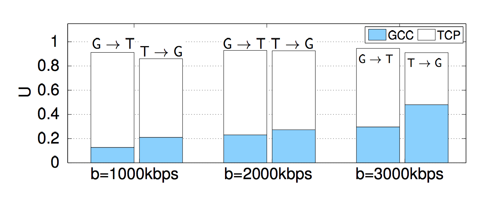

从仿真结果可以看出：

  * GCC流的信道利用率随着带宽的增加而增加，且普遍低于TCP流的带宽占用率
  * GCC流后启动能够帮助GCC流获取到更高的带宽占用率

将先启动TCP流后启动GCC流这种场景抽出来分析，考虑可利用带宽为[Math Processing Error]b(t)=1000kbps和[Math Processing Error]b(t)=3000kbps两种情况，仿真结果如下：

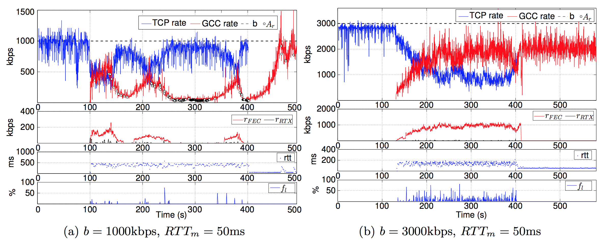

从仿真结果可以看出：

  * 在较低带宽时，GCC流会出现饥饿现象，无法上升到较高的码率
  * GCC流启动后一开始能够和TCP公平分配带宽，后续一直收到REMB包进而限制了带宽上升
  * 若没有REMB包的影响，GCC流的带宽增长会比TCP流更加激进（图b）

#####Conclusion

GCC算法能够较好的处理单个GCC流，但是一旦和其他GCC流或TCP流共存时，GCC算法无法提供公平的带宽分配。

####Improvement

如何解决与TCP流共存时的饥饿问题是后续的优化关键。有研究表明：GCC流与TCP流共存时的饥饿问题，是由于GCC算法的自适应门限机制导致的。

当GCC算法采用较小的阈值时，Delay-based BWE优于Loss-based BWE。然而当GCC流和TCP流码率达到瓶颈时，较小的阈值会导致GCC流出现饥饿问题。

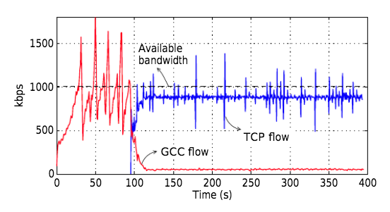

下图给出了自适应门限值对单个GCC流的影响：

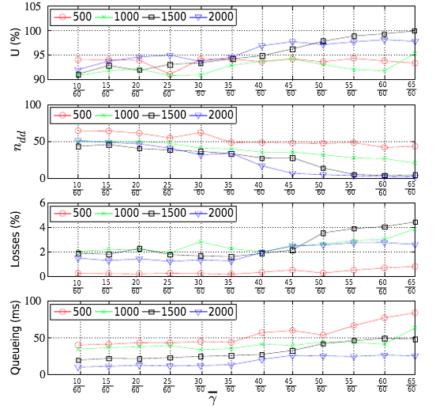

从仿真结果可以看出：

  * 随着门限值的增加，[Math Processing Error]ndd数量减少，这是因为较大的门限值，导致在不触发**OVERUSE**信号的情况下，允许更大的[Math Processing Error]m(ti)变化。
  * 随着门限值的增加，GCC算法偏向于Loss-based BWE，进而带宽占用率逐渐增加，其后果是更大的丢包率和队列延迟。
  * 随着带宽的增加，带宽占用率逐渐增加，Delay-based-Decrease REMB逐渐减少，队列延时逐渐减小。

从上图中展示Loss信息的图标，可以看出带宽的增加会导致更大的丢包率，这是为何？假设队列大小为[Math Processing Error]q(t)，带宽为[Math Processing Error]b(t)，那么我们可以将队列延迟抽象为如下模型：

[Math Processing Error]Tq(t)=q(t)b(t)

当[Math Processing Error]b(t)较小时，譬如500kbps，那么队列延迟变化变大；当[Math Processing Error]b(t)较大时，譬如2000kbps，那么队列延迟变化变小。因此对于较高带宽，Delay-based-Decrease REMB较少，而对于较低带宽，Delay-based-Decrease REMB较多。当带宽较高时，以Loss-based BWE为主，带宽的调整主要是依据丢包信息，因此此时势必会触发更高的丢包率。

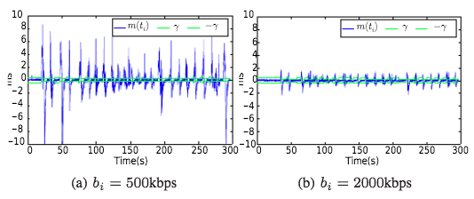

下图给出了自适应门限值对GCC流和TCP流并发时的影响：

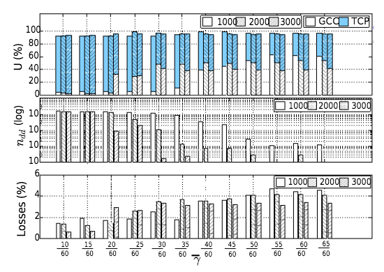

从仿真结果可以看出：

  * 随着门限值的增加，GCC流的带宽占用率逐步增加
  * 随着门限值的增加，[Math Processing Error]ndd数量减少，相对于单个GCC流，此时的[Math Processing Error]ndd数量不在一个数量级

对比单GCC流和并发GCC/TCP流可以看出：

  * 当单GCC流时，较小的门限值能够提供更好的带宽占用率，同时维持较低的丢包率和延迟
  * 当并发GCC/TCP流时，较小的门限值会导致Delay-based BWE占主导地位，进而导致GCC流饥饿。

因此针对于不同的场景，我们必须要针对性的调整门限值。

本节主要分析了TCP流和GCC共存时的饥饿问题，两个GCC流共存时的无规律性也需要进一步研究。现阶段未找到相关资料，后续深入后继续撰写。

###Reference

  * [RTP Extensions for Transport-wide Congestion Control draft-holmer-rmcat-transport-wide-cc-extensions-01](https://tools.ietf.org/html/draft-holmer-rmcat-transport-wide-cc-extensions-01)
  * [Bandwidth Estimation in WebRTC (and the new Sender Side BWE)](http://www.rtcbits.com/2017/01/bandwidth-estimation-in-webrtc-and-new.html)
  * [A Google Congestion Control Algorithm for Real-Time Communication draft-ietf-rmcat-gcc-03](https://tools.ietf.org/html/draft-alvestrand-rmcat-congestion-03)
  * [Congestion Control for Real-time Communication](https://c3lab.poliba.it/MultimediaCC)
  * [Analysis and Design of the Google Congestion Control for Web Real-time Communication (WebRTC)](http://c3lab.poliba.it/images/6/65/Gcc-analysis.pdf)
  * [An Experimental Investigation of the Congestion Control Used by Skype VoIP](https://c3lab.poliba.it/images/d/d2/Skype_wwic07.pdf)
  * [Understanding the Dynamic Behaviour of the Google Congestion Control for RTCWeb](https://www.researchgate.net/publication/260200748_Understanding_the_Dynamic_Behaviour_of_the_Google_Congestion_Control_for_RTCWeb)
  * [Experimental Investigation of the Google Congestion Control for Real-Time Flows](http://conferences.sigcomm.org/sigcomm/2013/papers/fhmn/p21.pdf)
  * [Skype Video congestion control: An experimental investigation](https://www.sciencedirect.com/science/article/pii/S1389128610002914)
  * [A Mathematical Model of the Skype VoIP Congestion Control Algorithm](https://c3lab.poliba.it/images/7/73/Cdc08_slides.pdf)
  * [Video Telephony for End-consumers: Measurement Study of Google+, iChat, and Skype](http://eeweb.poly.edu/faculty/yongliu/docs/imc12tech.pdf)

