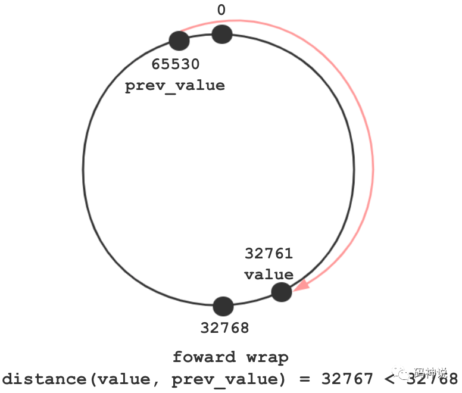
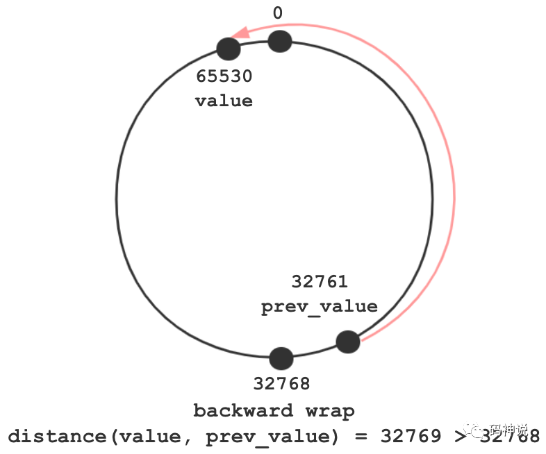
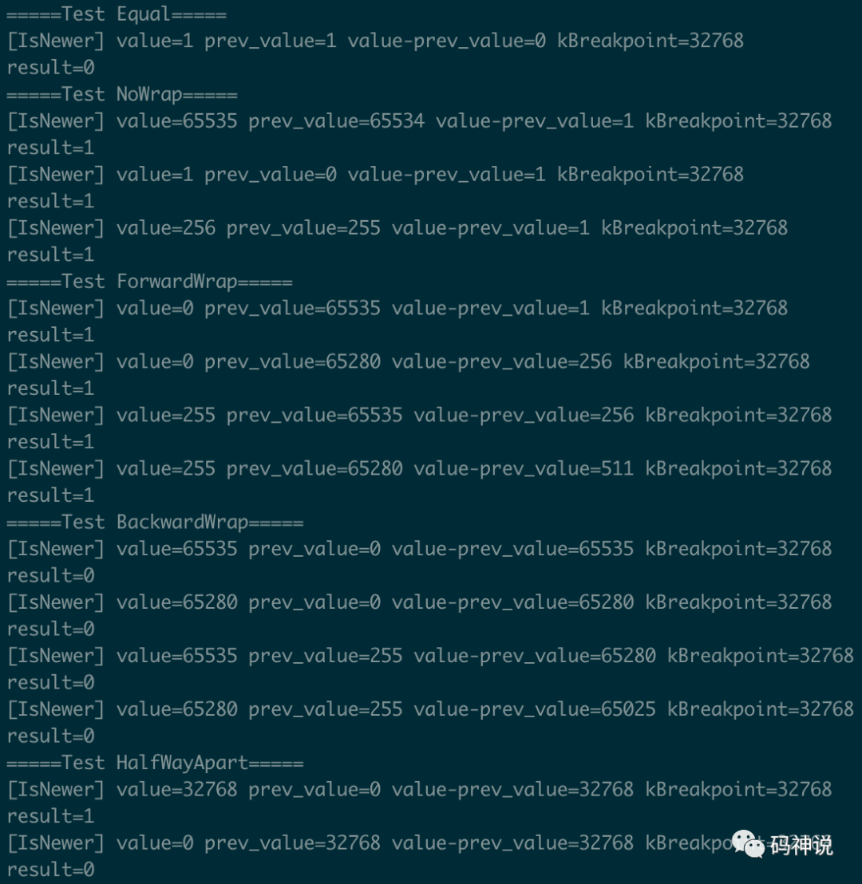
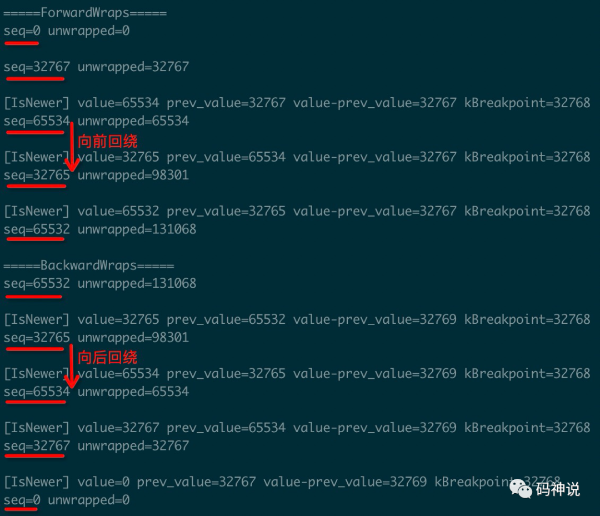

 
<!--BEGIN_DATA
{
    "create_date": "2020-10-16 08:45", 
    "modify_date": "2020-10-16 08:45", 
    "is_top": "0", 
    "summary": "WebRTC 基础技术 | RTP 包序列号的回绕处理", 
    "tags": "WebRTC、C/C++", 
    "file_name": "WebRTC基础技术.md"
}
END_DATA-->

#### <p>原文出处：<a href='https://mp.weixin.qq.com/s?__biz=MzU3MTUyNDUzMA==&mid=2247483912&idx=1&sn=6e428962c804a2eb369cd8520fcdbfbb&chksm=fcdf96d5cba81fc3a8e6b53f7034b4ae1a857e81ca76a5a68c1d69b5a168a3ecb2d22c5d2456&scene=178&cur_album_id=1345116764509929473#rd' target='blank'>WebRTC 基础技术 | RTP 包序列号的回绕处理</a></p>

> 本文是 `WebRTC 基础技术` 第 _**1**_ 篇

  * 导读
  * 序列号回绕
    * ForwardWrap
    * BackwardWrap
  * 源码分析
    * IsNewer 函数
    * Unwrap 函数
  * 测试用例
    * 测试 1
    * 测试 2
  * 总结

### 导读

在诸多的网络通信协议中，都会有序列号字段 `sequence number` ，这个字段主要用于丢包、乱序的处理。比如， RTP 包的头部序列号字段长度为 16 bits，取值范围为 [0, 65535]。

现在有这样一个问题：对于两个 RTP 包，如何比较哪一个包才是最新的包？

比如，序列号为 0 的包一定比序列号为 65535 的包小，是旧的包吗？再如，序列号为 65535 的包一定比序列号为 255 的包大，是最新的包吗？

当然不是这样，因为在判断序列号的连续性时要考虑回绕问题，不能直接根据数学意义上的大小进行比较。本篇将介绍 WebRTC 中与序列号回绕处理相关的算法。

### 序列号回绕

序列号的回绕方式有两种，分别是向前回绕和向后回绕。

#### ForwardWrap

向前回绕发生时，有如下特点：

  1. 包号呈向前递增趋势。
  2. 当前的包号很小，而前一个包号很大。
  3. 从上一个包号向前跨越包号 0 到当前的包号。
  4. 包号之间的**距离**小于包号类型能表示的数字个数的一半。
  5. 认为当前的包号是更大的包号，即当前包是更新的包。

下图展现了向前回绕的这些特点：



#### BackwardWrap

向后回绕发生时，有如下特点：

  1. 包号呈向后递减趋势。
  2. 当前的包号很大，而前一个包号很小。
  3. 从上一个包号向后跨越包号 0 到当前的包号。
  4. 包号之间的**距离**大于包号类型能表示的数字个数的一半。
  5. 一般情况下，认为当前的包号是更小的包号，即当前包是旧的包。

下图展现了向后回绕的这些特点：



### 源码分析

基于 WebRTC M71 版本。

#### IsNewer 函数

该函数实现了数字（序列号、时间戳）的比较算法。输入当前数字和之前的数字，如果当前数字是更新的数字则返回 `true`，否则返回 `false`。

注意，**执行该算法的数字的类型必须是无符号类型**。

    
```c++
template <typename U>  
inline bool IsNewer(U value, U prev_value) {  
  constexpr U kBreakpoint =  
    (std::numeric_limits<U>::max() >> 1) + 1;  
  
  if (value - prev_value == kBreakpoint)  
    return value > prev_value;  
  
  return value != prev_value &&  
    static_cast<U>(value - prev_value)  
      < kBreakpoint;  
}  
```

假设有两个 `U` 类型的无符号数字：`value` 和 `prev_value`，那么，该数字比较算法的原理如下：

  1. 定义常量 `kBreakpoint` 为 `U` 类型可表示的数字数量值的一半。

比如，对于 `uint16_t` 类型，`kBreakpoint` 为 0x8000，对于 `uint32_t` 类型，`kBreakpoint` 为 0x80000000。

在 RFC 1982: Serial Number Arithmetic[1] 中定义了 `2^(SERIAL_BITS - 1)`，即为 `kBreakpoint`。

  2. 当 value = prev_value 时，认为 value 不是更新（更大）的数字。
  3. 当 value != prev_value 时，有如下两种情况：
  * 当 value > prev_value 且 value - prev_value 等于 kBreakpoint，认为 value 是更新（更大）的数字。
  * 当 value 和 prev_value 之间的距离小于 kBreakpoint，认为 value 是更新（更大）的数字，距离用代码表示如下：
    
```c++
distance(value, pre_value) =  
  static_cast<U>(value - prev_value);  
```

#### Unwrap 函数

该函数用于展开回绕的数字，得到更大类型的真正的数字，其核心逻辑通过调用 `UnwrapWithoutUpdate` 函数实现。

`Unwrap` 函数相较于 `UnwrapWithoutUpdate` 函数的唯一区别是：`Unwrap` 函数会更新 `last_value_` 值，这个变量记录了上一次展开回绕后的数字的值。

在实际的流媒体场景中，包号或者时间戳所代表的的数字都是连续的，而且会发生回绕。如果有特殊的应用场景，需要得到回绕展开后的包号或者时间戳，则可以使用该函数。

    
```c++
template <typename U>  
class Unwrapper {  
public:  
  int64_t Unwrap(U value);  
  int64_t UnwrapWithoutUpdate(U value) const;  
private:  
  absl::optional<int64_t> last_value_;  
};  
```

下面讲一下该函数展开回绕数字的原理：

  * 计算当前数字与之前数字的差值 delta。

计算 `value` 和 `last_value_` 的差值 delta 以及比较二者的大小时，二者的类型需要保持一致。

即输入的数字 `value` 的类型为 `U`，那么同样要将 `last_value_`  转换为 `U` 类型值，得到截断值`cropped_last`。

    
```c++
U cropped_last =  
  static_cast<U>(*last_value_);  
int64_t delta = value - cropped_last;  
```

  * 调用 `IsNewer` 函数处理向前回绕与向后回绕，更新 delta 值
    
```c++
if (IsNewer(value, cropped_last)) {  
  if (delta < 0)  
    delta += kMaxPlusOne;  
} else if (delta > 0 &&  
  (*last_value_ + delta - kMaxPlusOne) >= 0) {  
    delta -= kMaxPlusOne;  
}  
```

  1. 如果 `value` 是更新的数字，且 delta < 0，那么需要处理向前回绕，delta 值加上 kMaxPlusOne。
  2. 否则，`value` 是旧的数字，如果此时 delta > 0，那么需要处理向后回绕，delta 值减去 kMaxPlusOne。

`kMaxPlusOne` 是 `U` 类型能表示的最大值再加上 1。比如对于 `uin16_t` 类型，`kMaxPlusOne` = 65536。

  * 返回展开回绕后的数字
    
```c++
return *last_value_ + delta;  
```

### 测试用例

下面以类型为 `uint16_t` 的 RTP 序列号作为数字样本进行测试。

#### 测试 1

本测试使用 `IsNewerSequenceNumber` 函数判断当前包是否是最新的 RTP 包。

该测试覆盖了包号相等、包号无回绕、包号向前回绕、包号向后回绕、包号距离为临界值（32768）这五种场景，测试输出如下：



其中，`value-prev_value` 代表包号之间的距离，`kBreakpoint` 为比较算法中包号距离的临界值。result = 1 表示包号为 value 的包是新的包，result = 0 表示包号为 value 的包是旧的包。

结合上文对于序列号比较算法以及向前回绕、向后回绕的特点的描述，这几组序列号的比较应该不是难事。

#### 测试 2

本测试使用 `Unwrapper` 类展开回绕的序列号。该测试覆盖了包号向前回绕、包号向后回绕这两种场景，测试输出如下：



在向前回绕的测试中，包号从 0 开始向前增长，直至为 131068。当包号从 65534 跨越 0 并增长到 32765 时，发生了向前回绕。此时 32765 是新的包，展开回绕后的包号是 32765 + 65536 = 98301。

在向后回绕的测试中，包号从 131068 开始向后回退，直至为 0。当包号从 32765 跨越 0 并回退到 65534 时，发生了向后回绕。此时 65534 不是新的包而是旧的包，展开回绕后，包号从 98301 减小到 65534。

### 总结

通过上面的介绍，我们知道了如何比较两个数字的大小，也知道了如何展开回绕的数字。

其实，无论是序列号 `sequence number` 还是时间戳`timestamp`，它们都是数字。只要是数字，便都适用于上述比较算法和回绕展开算法。因此，时间戳的回绕处理与序列号的回绕处理原理一致，这里不再赘述。

最后，上文介绍的 RTP 包序列号的回绕处理函数，在 WebRTC 中有以下应用场景：

  1. 应用于 jitter buffer 模块的丢包处理。

保存上一次收到的最新的 RTP 包号，并确保当前 RTP 包是最新的包，而不是重传包或者乱序包。

  2. 应用于 send-side BWE 中接收端缓存 RTP 包的到达时间。

RTP 扩展头部携带的 transport-wide sequence number 的取值范围是 [1, 65535]，接收端需要对 transport-wide sequence number 进行解回绕处理，得到 `int64_t` 类型的包号，与到达时间一并存储到 map 中。

至此，WebRTC 中与 RTP 序列号回绕处理相关的算法就介绍完了，感谢阅读。

#### 参考资料

[1]Serial Number Arithmetic: _https://tools.ietf.org/html/rfc1982_
