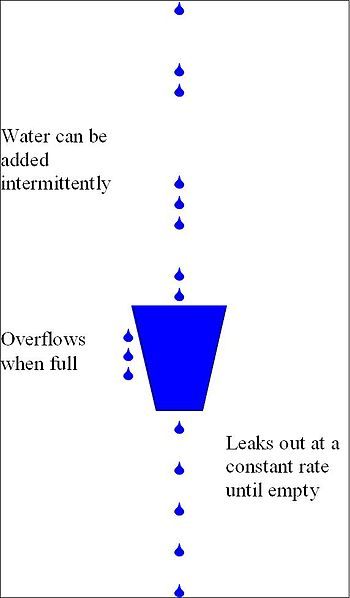

 
<!--BEGIN_DATA
{
    "create_date": "2020-01-03 16:13", 
    "modify_date": "2020-01-03 16:13", 
    "is_top": "0", 
    "summary": "WebRTC帧率调整策略", 
    "tags": "WebRTC、C/C++", 
    "file_name": "WebRTC帧率调整策略.md"
}
END_DATA-->

####
原文出处：<a href='https://www.freehacker.cn/media/webrtc-frame/' target='blank'>WebRTC帧率调整策略</a>

与实时视频相关参数包含：帧率、码率、时延、抖动等。帧率体现了视频的流畅性，要想达到较好的流畅性体验要求——网络视频帧率不低于24帧，视频会议帧率不低于15帧。在实际开发中，我们遇到了不少问题，主要包括：

  * 发送端帧率较低
  * 接收端帧率较低
  * 帧率波动较大

本文主要研究WebRTC中的帧率调整策略，解决上述实际开发中帧率较低的问题，以期达到较好的流畅性体验。

###帧率计算方法

帧率并非恒定值，帧率大小反映的是每秒多少视频帧的统计值。在视频会议中，同一路视频流发送端的帧率和接收端的帧率并不相同。对于发送端帧率，我们需要明确：**发送端输出帧率不等于摄像头采集帧率，编码器实际输入帧率不等于摄像头采集帧率，发送端帧率为编码器输出帧率**。

####发送端帧率

摄像头采集帧率决定了发送端输入帧率的最大值。当采集的视频数据传送到编码器时，受制于编码器性能和系统硬件性能，编码器的实际输入帧率并不等于摄像头的采集帧率。摄像头采集帧率和编码器输入帧率共同决定了发送端的帧率。在WebRTC中的统计信息展现的是摄像头的采集帧率（作为输入帧率）和编码器的输出帧率（作为输出帧率）。

**1、发送端输入帧率计算**

WebRTC在_“webrtc/video/vie_encoder.cc”_文件**EncodeTask**类中统计了摄像头的采集帧率——发送端输入帧率：

    
    bool Run() override {
      vie_encoder_->stats_proxy_->OnIncomingFrame(frame_.width(),frame_.height());
      return true;
    }

**2、编码器输入帧率计算**

为了计算编码器的实际输入帧率，WebRTC维持了一个大小为kFrameCountHistorySize的数组$$T_f$$，该数组用于保存最新的FrameCountHistorySize个帧放入数组的时间戳信息。帧率计算fps公式如下：

$$fps=\frac{N_f\times 1000.0f}{T_f[0]-T_f[N_f]}  \qquad {N_f:\ max(T_{now}-T_f[N_f]) < kFrameHistoryWinMs}$$

其中，

  * kFrameCountHistorySize一般取值为90，kFrameCountHistorySize 一般取值为2000；
  * $$N_f$$是使$$N_f:\ max(T_{now}-T_f[N_f]) < kFrameHistoryWinMs$$成立的最大序列号；
  * $$T_{now}$$为当前时间，$$T_f[0]=T_{now}$$是数组内newest帧的时间戳，$$T_f[kFrameCountHistorySize]$$为数组内现存oldest帧的时间戳；
  * 当$$N_f==0$$时，不执行该公式，帧率保持上一次计算的结果。

在WebRTC中，上述公式在“webrtc/modules/video\_coding/media\_optimization.cc”文件**MediaOptimization**类中实现。

    void ProcessIncomingFrameRate(int64_t now) {
      int32_t num = 0, nr_of_frames = 0;
      for (num = 1; num < (kFrameCountHistorySize - 1); ++num) {
        if (incoming_frame_times_[num] <= 0 ||
            /* don't use data older than 2 s */
            now - incoming_frame_times_[num] > kFrameHistoryWinMs) {
          break;
        } else {
          nr_of_frames++;
        }
      }
      if (num > 1) {
        const int64_t diff =
            incoming_frame_times_[0] - incoming_frame_times_[num - 1];
        incoming_frame_rate_ = 0.0;  /* No frame rate estimate available. */
        if (diff > 0) {
          incoming_frame_rate_ = nr_of_frames * 1000.0f / static_cast<float>(diff);
        }
      }
    }

**3、编码器输出帧率计算**

为了计算编码器的实际输出帧率，WebRTC维护了一个kBitrateAverageWinMs时间段内的已编码帧的数组$$T_f$$，依据下列公式来计算实际码率：

$$
fps=\frac{90000 \times (sizeof(T_f)-1) + \frac{T_{diff}}{2}}{T_{diff}}
$$

其中，

  * $$T_{diff}=T_f[back]-T_f[front]$$，表示数组$$T_f$$最大的时间间隔，当$$T_{diff}<0$$时，$$fps=sizeof(T_f)$$；
  * $$sizeof(T_f)$$表示数组$$T_f$$的大小，当$$sizeof(T_f)<=1$$时，$$fps=sizeof(T_f)$$。

在WebRTC中，上述公式在“webrtc/modules/video\_coding/media\_optimization.cc”文件**MediaOptimization**类中实现。

    void MediaOptimization::PurgeOldFrameSamples(int64_t now_ms) {
      while (!encoded_frame_samples_.empty()) {
        if (now_ms - encoded_frame_samples_.front().time_complete_ms >
            kBitrateAverageWinMs) {
          encoded_frame_samples_.pop_front();
        } else {
          break;
        }
      }
    }

    void MediaOptimization::UpdateSentFramerate() {
      if (encoded_frame_samples_.size() <= 1) {
        avg_sent_framerate_ = encoded_frame_samples_.size();
        return;
      }
      int denom = encoded_frame_samples_.back().timestamp -
                  encoded_frame_samples_.front().timestamp;
      if (denom > 0) {
        avg_sent_framerate_ =
            (90000 * (encoded_frame_samples_.size() - 1) + denom / 2) / denom;
      } else {
        avg_sent_framerate_ = encoded_frame_samples_.size();
      }
    }    

####接收端帧率

在WebRTC中，将接收端帧率分为了三种：网络接收帧率——接收端输入帧率、解码器输出帧率、视频渲染帧率。

**1、网络接收帧率**

网络接收帧率统计的是接收端接收到网络发送过来的视频帧帧率。在完整接收到一帧数据后，由**FrameBuffer**类调用ReceiveStatisticsProxy::OnCompleteFrame()来统计。具体代码如下：

    void OnCompleteFrame(bool is_keyframe,
                        size_t size_bytes) {
      int64_t now_ms = clock_->TimeInMilliseconds();
      frame_window_.insert(std::make_pair(now_ms, size_bytes));
      int64_t old_frames_ms = now_ms - kRateStatisticsWindowSizeMs;
      while (!frame_window_.empty() &&
            frame_window_.begin()->first < old_frames_ms) {
        frame_window_accumulated_bytes_ -= frame_window_.begin()->second;
        frame_window_.erase(frame_window_.begin());
      }
      size_t framerate =
          (frame_window_.size() * 1000 + 500) / kRateStatisticsWindowSizeMs;
      stats_.network_frame_rate = static_cast<int>(framerate);
    }

**2、解码器输出帧率**

WebRTC实现了**RateStatistics**来统计解码器输出帧率，在编码结束后由**VideoReceiveStream**调用ReceiveStatisticsProxy::OnDecodedFrame()来统计。具体代码如下：

    void OnDecodedFrame() {
      uint64_t now = clock_->TimeInMilliseconds();
      rtc::CritScope lock(&crit_);
      ++stats_.frames_decoded;
      decode_fps_estimator_.Update(1, now);
      stats_.decode_frame_rate = decode_fps_estimator_.Rate(now).value_or(0);
    } 
   
**3、视频渲染帧率**

WebRTC实现了**RateStatistics**来统计视频渲染帧率，在视频渲染结束后由**VideoReceiveStream**调用ReceiveStatisticsProxy::OnRenderedFrame()来统计。具体代码如下：

    void OnRenderedFrame(const VideoFrame& frame) {
      uint64_t now = clock_->TimeInMilliseconds();
      rtc::CritScope lock(&crit_);
      renders_fps_estimator_.Update(1, now);
      stats_.render_frame_rate = renders_fps_estimator_.Rate(now).value_or(0);
      ++stats_.frames_rendered;
    } 
   
###发送端帧率策略

影响发送端帧率的主要因素包含：视频采集（摄像头/桌面）帧率、编码器性能。

####视频采集帧率策略

摄像头是视频采集的来源，其帧率决定了视频会议帧率的上限。与摄像头采集相关的参数包含：像素格式、帧率和分辨率。下表列出了ThinkPadT440P自带摄像头支持的部分视频格式：

<table>
<thead>
<tr>
<th style="text-align:center">格式</th>
<th style="text-align:center">分辨率</th>
<th style="text-align:center">帧率</th>
</tr>
</thead>
<tbody>
<tr>
<td style="text-align:center">MJPG</td>
<td style="text-align:center">1280x720</td>
<td style="text-align:center">30</td>
</tr>
<tr>
<td style="text-align:center">MJPG</td>
<td style="text-align:center">640x360</td>
<td style="text-align:center">30</td>
</tr>
<tr>
<td style="text-align:center">YUY2</td>
<td style="text-align:center">1280x720</td>
<td style="text-align:center">10</td>
</tr>
<tr>
<td style="text-align:center">YUY2</td>
<td style="text-align:center">640x360</td>
<td style="text-align:center">30</td>
</tr>
</tbody>
</table>

可以看出对于YUY2格式，1280x720的帧率仅为10帧，要想达到30帧必须要采用MJPG格式。这是因为，同样是1280x720分辨率，30帧YUY2和MJPG格式需要传输的数据量分别为：

  * YUY2：1280x720x30x2x8=421Mbps
  * MJPG：1280x720x30x3x8/20=32Mbps

YUY2需要的传输带宽过大，所以很多摄像头对于RGB、YUV等格式1280x720仅支持10帧。然而10帧是远远不能够满足视频会议的帧率需求的，因此在选择视频采集规格时，需要注意像素格式、帧率和分辨率的权衡。在实际应用中，我们可以采集MJPG格式1280x720x30视频规格，然后在应用层转换为YUV格式。WebRTC在“webrtc/modules/video\_capture/video\_capture\_impl.cc”的**VideoCaptureImpl**类中实现了转换：

    
    if (frameInfo.codecType == kVideoCodecUnknown) {
      /* Not encoded, convert to I420. */
      const VideoType commonVideoType =
                RawVideoTypeToCommonVideoVideoType(frameInfo.rawType);
      if (frameInfo.rawType != kVideoMJPEG && CalcBufferSize(commonVideoType, width,
                                      abs(height)) != videoFrameLength) {
        return -1;
      }
      int stride_y = width, stride_uv = (width + 1) / 2;
      int target_width = width, target_height = height;
      rtc::scoped_refptr<I420Buffer> buffer = I420Buffer::Create(
          target_width, abs(target_height), stride_y, stride_uv, stride_uv);
      const int conversionResult = ConvertToI420(
          commonVideoType, videoFrame, 0, 0, width, height, videoFrameLength,
          apply_rotation ? _rotateFrame : kVideoRotation_0, buffer.get());
    }    

最终得到的YUV格式的视频数据会被送到编码器中被编码，需要注意：不是所有的视频数据都会被编码器编码，详细内容将在下一节介绍。

####采集编码丢帧策略

受限于系统硬件性能和编码器性能，视频采集图片的速度有可能比编码器编码速度快，这将导致多余的图片帧在编码器任务队列中累积。由于视频会议需要较低的时延，编码器必须要及时处理最新的帧，此时WebRTC采取丢帧策略——**当有多个帧在编码器任务队列时，只编码最新的一帧**。WebRTC在“webrtc/video/vie\_encoder.cc”文件**EncodeTask**类中实现了该策略：

    
    bool Run() override {
      ++vie_encoder_->captured_frame_count_;
      if (--vie_encoder_->posted_frames_waiting_for_encode_ == 0) {
        vie_encoder_->EncodeVideoFrame(frame_, time_when_posted_us_);
      } else {
        /* There is a newer frame in flight. Do not encode this frame. */
        LOG(LS_VERBOSE) << "Incoming frame dropped due to that the encoder is blocked.";
        ++vie_encoder_->dropped_frame_count_;
      }
      return true;
    }

可以看出，由于编码器是阻塞的，如果编码器性能或系统硬件性能较差，编码器会丢掉因阻塞而累积的帧，进而导致发送端帧率降低。在具体使用场景中，这往往会导致两种现象：

  * 接收端黑屏：如果发送端一开始就卡死在编码器中，接收端会一直黑屏，直到第一个帧编码完成；
  * 接收端卡顿：如果发送端运行后经常阻塞在编码器中，接收端会卡顿，严重影响视频质量。

因此，摄像头采集帧率并不等于编码器的实际输入帧率，**MediaOptimization**类中得到的编码器实际输入帧率，需要在下次编码前设置为编码器的输入帧率。

####恒定码率丢帧策略

除了上文所述的采集编码丢帧策略，WebRTC还实现了一种漏桶算法的变体，用于跟踪何时应该主动丢帧，以避免编码器无法保持其比特率时，产生过高的比特率。[漏桶算法](https://en.wikipedia.org/wiki/Leaky_bucket)的示意图如下：

[漏桶算法](https://en.wikipedia.org/wiki/Leaky_bucket)的实现位于“webrtc/modules/video\_coding/frame\_dropper.cc”中的**FrameDropper**类，其实现了三个关键方法：

  * Fill()
  * Leak()
  * DropFrame()

从字面上可以看出，这三个方法对应于上图所示漏桶算法的三个操作。这三个方法都在**MediaOptimization**类被调用。

首先，来看看**FrameDropper**类的核心参数：

  * 漏桶容积：accumulator\_max\_，其值为target-bps×kLeakyBucketSizeSeconds，随目标码率改变而改变；
  * 漏桶累积：accumulator\_，其表示漏桶累积的字节数，每次Fill()时增加，每次Leak()时减少，其最大值为target-bps×kAccumulatorCapBufferSizeSecs；
  * 丢帧率：drop\_ratio\_，其为一个指数滤波器，使丢帧率保持一个平滑的变化过程，每次Leak()后更新丢帧率；
  * 关键帧率：key\_frame\_ratio\_，其为一个指数滤波器，使关键帧率保持一个平滑的变化过程，每次Fill()后更新；
  * 差分帧码率：delta\_frame\_size\_avg\_kbits\_，其为一个指数滤波器，使关键帧率保持一个平滑的变化过程，每次Fill()后更新。

其次，为了防止关键帧和较大的差分帧立即溢出，进而导致后续较小的帧出现较高丢帧，关键帧和较大的差分帧是不会被立即在桶中累计。相反，这些较大的帧会在漏桶中累计前，会分成若干小块，进而在_Leak()_操作中逐次累计这些小块，来防止较关键帧和较大的差分帧立即溢出。**FrameDropper**类增加了额外的几个参数来实现该策略：

  * large\_frame\_accumulation\_spread\_：大帧最大拆分块数，四舍五入取整；
  * large\_frame\_accumulation\_count\_：大帧剩余拆分块数，四舍五入取整；
  * large\_frame\_accumulation\_chunk\_size\_：单个块尺寸，其值为framesize/large\_frame\_accumulation\_count\_。

最后，来看看**FrameDropper**类的核心操作：

**1、Fill()**

当视频帧被编码后，**MediaOptimization**类会调用Fill()方法来填充漏桶。调用顺序很简单，主要关注Fill()方法的实现——将大帧拆分为large\_frame\_accumulation\_count\_个小块，并不累加accumulator\_；将小帧直接累计accumulator\_。Fill()方法同时需要更新key\_frame\_ratio\_和delta\_frame\_size\_avg\_kbits\_，用以计算大帧拆分块数和大帧判断。具体实现如下：

        
    void Fill(size_t framesize_bytes, bool delta_frame) {
      float framesize_kbits = 8.0f * static_cast<float>(framesize_bytes) / 1000.0f;
      if (!delta_frame) {
        if (large_frame_accumulation_count_ == 0) {
          if (key_frame_ratio_.filtered() > 1e-5 &&
              1 / key_frame_ratio_.filtered() < large_frame_accumulation_spread_) {
            large_frame_accumulation_count_ =
                static_cast<int32_t>(1 / key_frame_ratio_.filtered() + 0.5);
          } else {
            large_frame_accumulation_count_ =
                static_cast<int32_t>(large_frame_accumulation_spread_ + 0.5);
          }
          large_frame_accumulation_chunk_size_ =
              framesize_kbits / large_frame_accumulation_count_;
          framesize_kbits = 0;
        }
      } else {
        if (delta_frame_size_avg_kbits_.filtered() != -1 &&
            (framesize_kbits >
            kLargeDeltaFactor * delta_frame_size_avg_kbits_.filtered()) &&
            large_frame_accumulation_count_ == 0) {
          large_frame_accumulation_count_ =
              static_cast<int32_t>(large_frame_accumulation_spread_ + 0.5);
          large_frame_accumulation_chunk_size_ =
              framesize_kbits / large_frame_accumulation_count_;
          framesize_kbits = 0;
        } else {
          delta_frame_size_avg_kbits_.Apply(1, framesize_kbits);
        }
        key_frame_ratio_.Apply(1.0, 0.0);
      }
      accumulator_ += framesize_kbits;
      CapAccumulator();
    }

**2、Leak()**

Leak()操作按照编码器输入帧率的频率来执行，每次**Leak**的大小为target\_bps/input\_fps，每次**Leak**时需要判断是否需要累计Fill()方法拆分的块，进而更新drop\_ratio\_。drop\_ratio\_的更新遵循下列原则：

  * 当accumulator\_ > 1.3f  accumulator\_max\_，drop\_ratio\_基数调整为0.8f*，提高丢帧率调整加速度；
  * 当accumulator\_ < 1.3f  accumulator\_max\_，drop\_ratio\_基数调整为0.9f*，降低丢帧率调整加速度。

实现代码如下：

    void Leak(uint32_t input_framerate) {
      float expected_bits_per_frame = target_bitrate_ / input_framerate;
      if (large_frame_accumulation_count_ > 0) {
        expected_bits_per_frame -= large_frame_accumulation_chunk_size_;
        --large_frame_accumulation_count_;
      }
      accumulator_ -= expected_bits_per_frame;
      if (accumulator_ < 0.0f) {
        accumulator_ = 0.0f;
      }
      
      if (accumulator_ > 1.3f * accumulator_max_) {
        /* Too far above accumulator max, react faster */
        drop_ratio_.UpdateBase(0.8f);
      } else {
        /* Go back to normal reaction */
        drop_ratio_.UpdateBase(0.9f);
      }
      if (accumulator_ > accumulator_max_) {
        /* We are above accumulator max, and should ideally
        * drop a frame. Increase the dropRatio and drop
        * the frame later.
        */
        if (was_below_max_) {
          drop_next_ = true;
        }
        drop_ratio_.Apply(1.0f, 1.0f);
        drop_ratio_.UpdateBase(0.9f);
      } else {
        drop_ratio_.Apply(1.0f, 0.0f);
      }
      was_below_max_ = accumulator_ < accumulator_max_;
    }

**3、DropFrame()**

DropFrame()操作用来判断是否需要将输入到编码器的这一帧丢弃，其利用drop\_ratio\_来使丢帧率保持一个平滑的变化过程。当drop\_ratio\_.filtered() >= 0.5f时，表明连续丢弃多个帧（至少一个帧）；当0.0f < drop\_ratio\_.filtered() < 0.5f_时，表明多个帧才会丢弃一个帧。具体的丢帧策略见实现：

        
    bool FrameDropper::DropFrame() {
      if (drop_ratio_.filtered() >= 0.5f) {
        float denom = 1.0f - drop_ratio_.filtered();
        if (denom < 1e-5) {
          denom = 1e-5f;
        }
        int32_t limit = static_cast<int32_t>(1.0f / denom - 1.0f + 0.5f);
        int max_limit = static_cast<int>(incoming_frame_rate_ * max_drop_duration_secs_);
        if (limit > max_limit) {
          limit = max_limit;
        }
        if (drop_count_ < 0) {
          drop_count_ = -drop_count_;
        }
        if (drop_count_ < limit) {
          drop_count_++;
          return true;
        } else {
          drop_count_ = 0;
          return false;
        }
      } else if (drop_ratio_.filtered() > 0.0f && drop_ratio_.filtered() < 0.5f) {
        float denom = drop_ratio_.filtered();
        if (denom < 1e-5) {
          denom = 1e-5f;
        }
        int32_t limit = -static_cast<int32_t>(1.0f / denom - 1.0f + 0.5f);
        if (drop_count_ > 0) {
          drop_count_ = -drop_count_;
        }
        if (drop_count_ > limit) {
          if (drop_count_ == 0) {
            drop_count_--;
            return true;
          } else {
            drop_count_--;
            return false;
          }
        } else {
          drop_count_ = 0;
          return false;
        }
      }
      drop_count_ = 0;
      return false;
    }    

###接收端帧率策略

影响接收端帧率的主要因素包含：网络状况、解码器性能、渲染速度。

####网络状况导致丢帧

网络因素对实时视频流的影响十分严重，当网络出现拥塞，导致较高的丢包率，明显的现象就是视频接收端帧率降到很低。比较严重时，接收端接收帧率可能只有几帧，导致无法进行正常的视频通话。WebRTC在_“webrtc/modules/video_coding/packet\_buffer.cc”_的**PacketBuffer**中，将接收到的RTP包组合成一个完整的视频帧。之后，该完整的帧会被送到“webrtc/modules/video_coding/rtp\_frame\_reference\_finder.cc”_的**RtpFrameReferenceFinder**中。一个完整的帧可能是关键帧，也可能是参考帧，**RtpFrameReferenceFinder**类中关键帧直接送到解码器中处理。而对于参考帧，会判断其是否连续，若不连续会一直暂存在队列中，直到连续——送到解码器，或者下一个关键帧来了——从队列中删除。两个类相应的操作见下面两个函数：

    
    bool PacketBuffer::InsertPacket(VCMPacket* packet) {
    }
    void RtpFrameReferenceFinder::ManageFrameGeneric(std::unique_ptr<RtpFrameObject> frame,
                                                    int picture_id) {
    }    

视频会议软件通常会采用NACK和FEC等手段来降低丢包对视频通话质量的影响。同时，解码器一定时间内，没有收到可解码数据，会向发送端请求I帧，这也就在一定程度上保证帧率不会过于低。这部分代码实现与“webrtc/video/video\_receive\_stream.cc”的**VideoReceiveStream**类中：

    
    void VideoReceiveStream::Decode() {
      static const int kMaxWaitForFrameMs = 3000;
      std::unique_ptr<video_coding::FrameObject> frame;
      video_coding::FrameBuffer::ReturnReason res =
          frame_buffer_->NextFrame(kMaxWaitForFrameMs, &frame);
      if (res == video_coding::FrameBuffer::ReturnReason::kStopped)
        return;
      if (frame) {
        if (video_receiver_.Decode(frame.get()) == VCM_OK)
          rtp_stream_receiver_.FrameDecoded(frame->picture_id);
      } else {
        RequestKeyFrame();
      }
    }

####解码导致丢帧

看一下WebRTC内调用解码模块的代码，就可以看出WebRTC解码导致失败的可能原因。这部分代码位于“webrtc/modules/video\_coding/video\_receiver.cc”，实现如下：

    
    int32_t Decode(const VCMEncodedFrame& frame) {
      /* Decode a frame */
      int32_t ret = _decoder->Decode(frame, clock_->TimeInMilliseconds());
      /* Check for failed decoding, run frame type request callback if needed. */
      bool request_key_frame = false;
      if (ret < 0) {
        if (ret == VCM_ERROR_REQUEST_SLI) {
          return RequestSliceLossIndication(
              _decodedFrameCallback.LastReceivedPictureID() + 1);
        } else {
          request_key_frame = true;
        }
      } else if (ret == VCM_REQUEST_SLI) {
        ret = RequestSliceLossIndication(
            _decodedFrameCallback.LastReceivedPictureID() + 1);
      }
      if (!frame.Complete() || frame.MissingFrame()) {
        request_key_frame = true;
        ret = VCM_OK;
      }
      if (request_key_frame) {
        rtc::CritScope cs(&process_crit_);
        _scheduleKeyRequest = true;
      }
      return ret;
    }

通过上面代码可以看出，如果解码器无法将接收到的数据解码，要么发送SLI要么发送PLI，请求重新发送关键帧。从SLI/PLI发出到收到可解码的关键帧这个时间间隔内，接收端的帧率会比正常情况低。

####渲染导致丢帧

在实际应用中，经过WebRTC处理后显示的帧率较大，但最终的显示效果却比较差，能够感觉到明显的卡顿。这就和应用软件的渲染有关。研究不深，暂不撰写。
