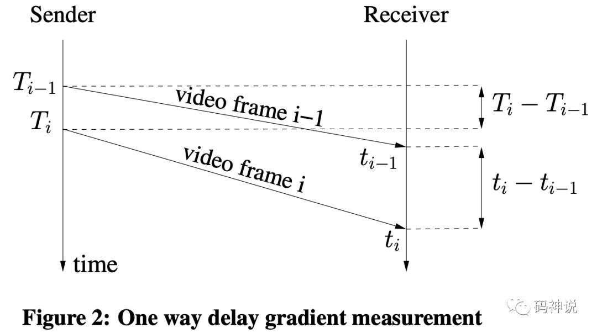
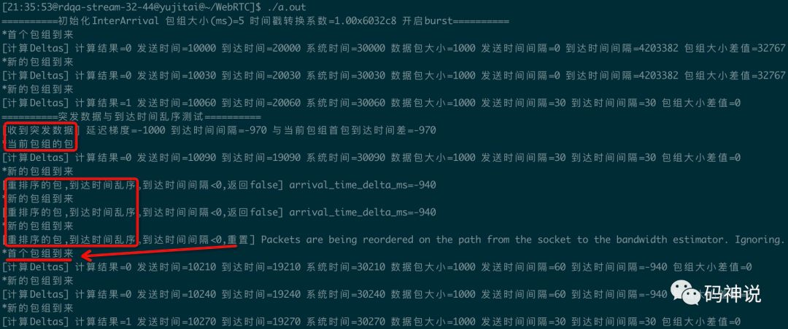
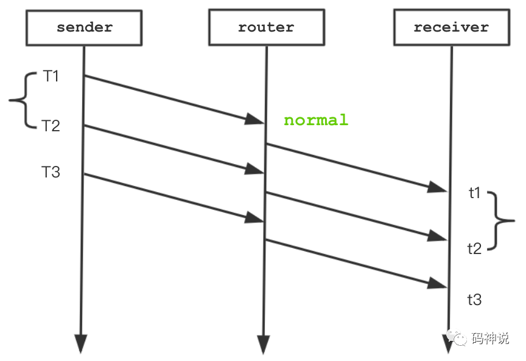
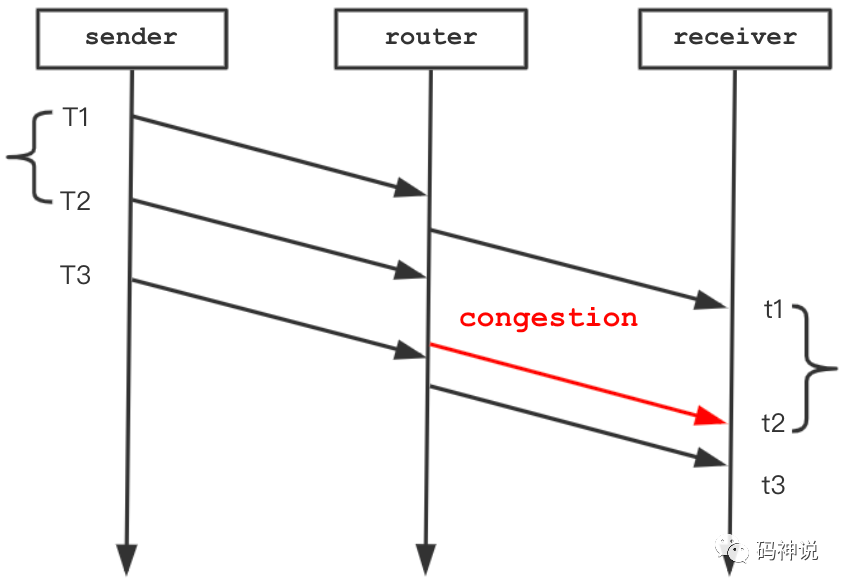
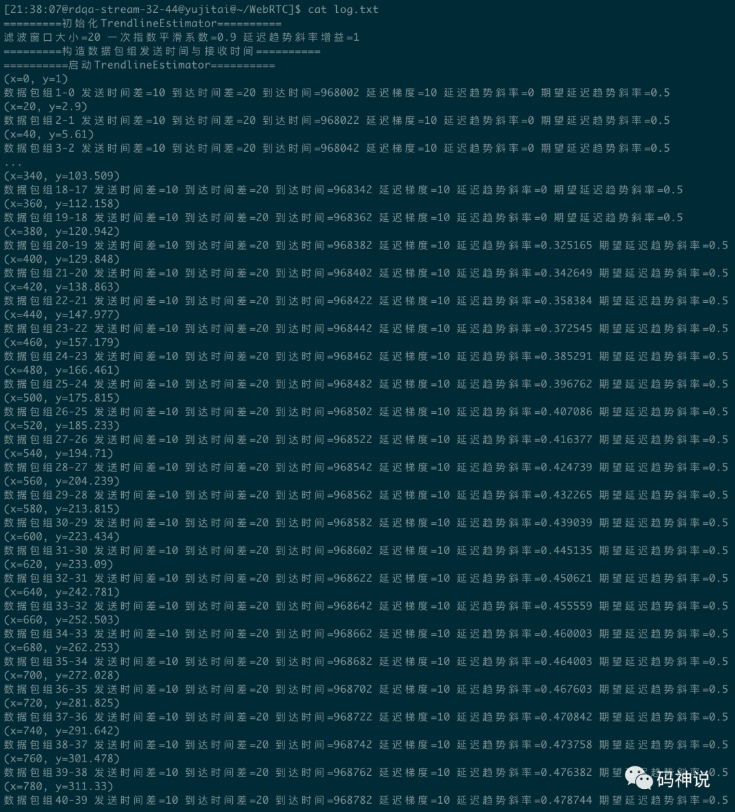
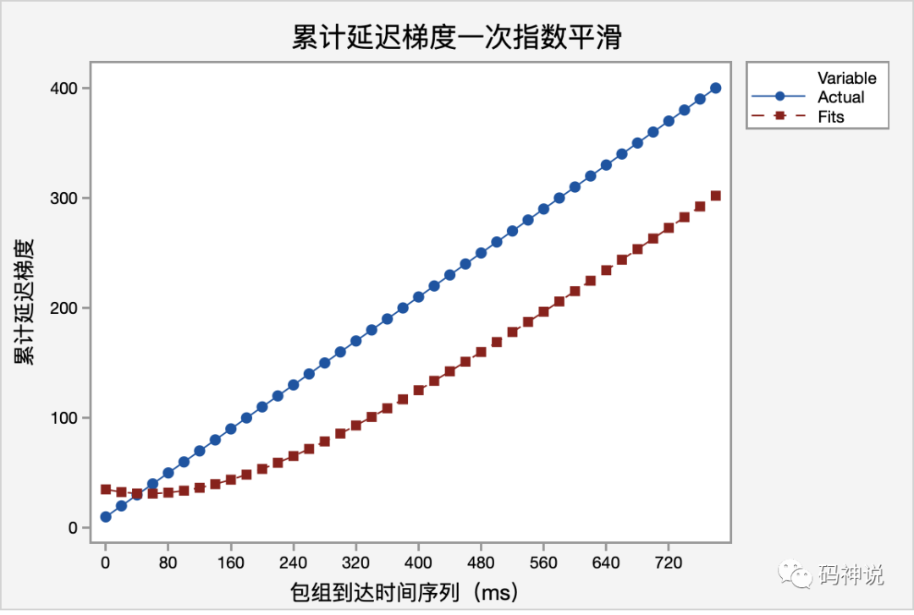
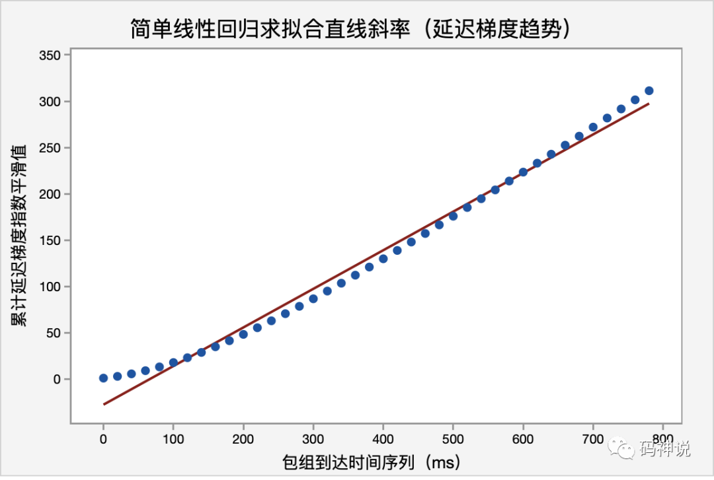
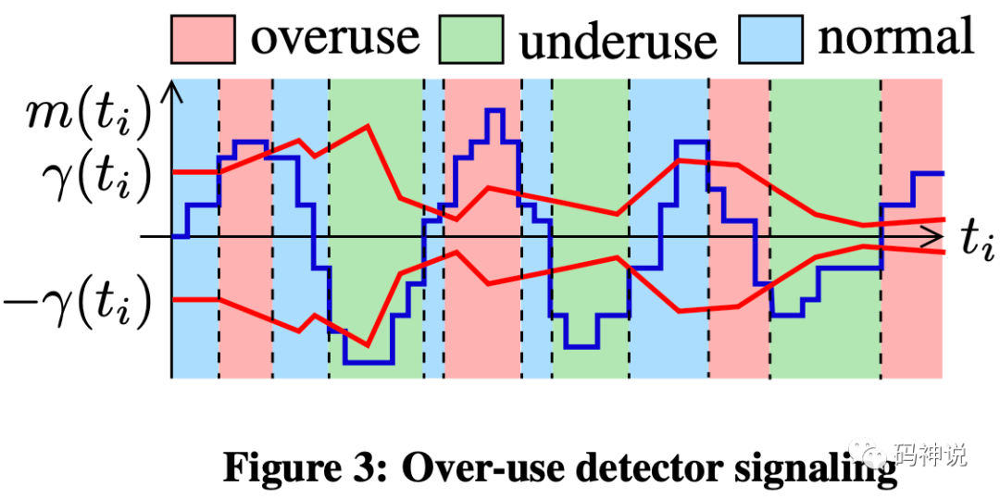
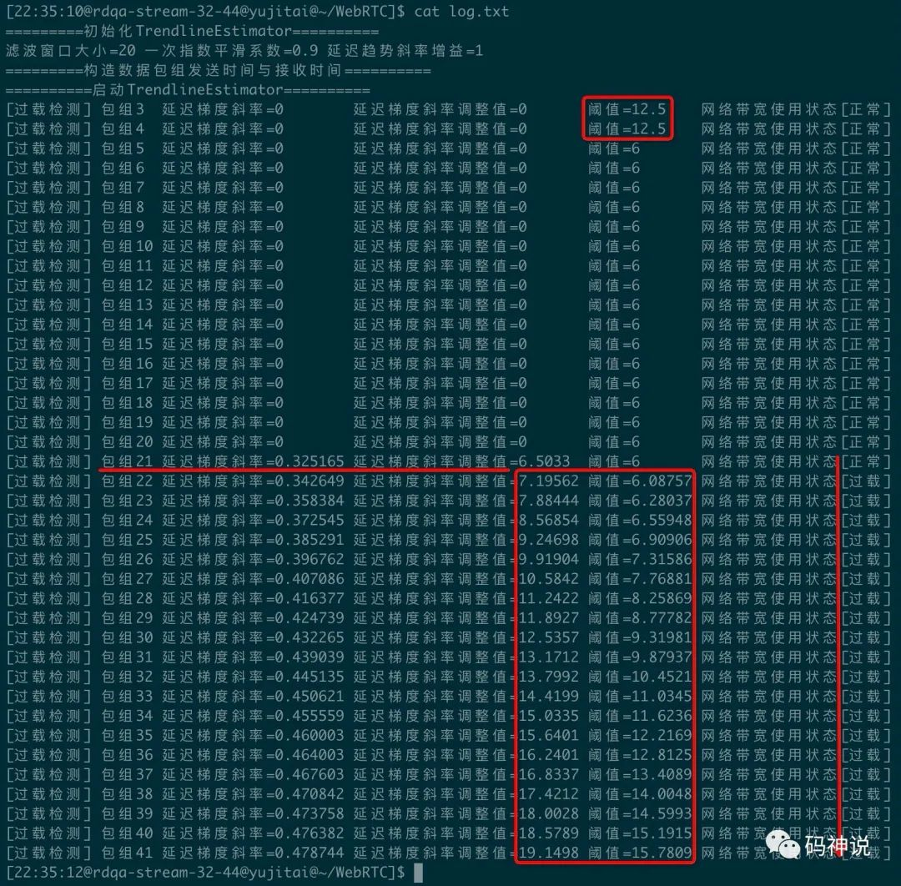

<!--BEGIN_DATA
{
    "create_date": "2020-10-15 22:41", 
    "modify_date": "2020-10-15 22:41", 
    "is_top": "0", 
    "summary": "WebRTC 拥塞控制 | 计算包组时间差-InterArrival</br>WebRTC 拥塞控制 | Trendline 滤波器</br>WebRTC 拥塞控制 | 网络带宽过载检测</br>", 
    "tags": "WebRTC、C/C++", 
    "file_name": "WebRTC拥塞控制01.md"
}
END_DATA-->

#### <p>原文出处：<a href='https://mp.weixin.qq.com/s?__biz=MzU3MTUyNDUzMA==&mid=2247483861&idx=1&sn=dda20ebd8af7837f106fb085bd8d8cd7&chksm=fcdf9508cba81c1e09be3307172d93fc6b17acbf33ecd270ef69fc6f24890e92b67bb8e483ef&scene=178&cur_album_id=1345116764509929473#rd' target='blank'>WebRTC 拥塞控制 | 计算包组时间差-InterArrival</a></p>

> 本文是 `WebRTC 拥塞控制` 第 _**1**_ 篇


  * 导读
  * 延迟梯度与包组
  * Pre-filtering
  * 源码分析
    * ComputeDeltas 函数
    * PacketInOrder 函数
    * BelongsToBurst 函数
    * NewTimestampGroup 函数
  * 测试用例

### 导读

GCC（Google Congestion Control）包含两种拥塞控制算法：一种是基于丢包的，一种是基于延迟的。GCC最后综合这两种算法得到一个目标码率，基于延迟的拥塞控制算法相较于基于丢包的拥塞控制算法更为复杂。本篇是 WebRTC 拥塞控制算法讲解第一篇，主要介绍**包组**和**延迟梯度**等一些基本理论，并深入源码介绍包组间的时间差值的计算过程。

### 延迟梯度与包组

延迟梯度描述了从发送端到目的地的包所经历的端到端的延迟变化**趋势**。GCC算法正是使用延迟梯度来推断网络拥塞，以动态的限制发送速率。在基于接收端的拥塞控制算法中，使用卡尔曼滤波器计算延迟梯度，而在基于发送端的拥塞控制算法中，则使用`Trendline` 滤波器计算延迟梯度。下面是维基百科对于延迟[1]（或称队列延迟、排队延迟）的描述：

> 这个术语最常用于路由器。当数据包到达路由器时，必须对它们进行处理和传输。路由器一次只能处理一个包。
>
> 如果数据包到达的速度比路由器处理它们的速度快（例如在突发数据传输中），路由器就会把它们放入队列（也称为网络缓冲区），直到路由器可以开始传输它们。
>
> 延迟也会因分组的不同而不同，因此在测量和评估排队延迟时通常会生成平均值和统计数据。

计算延迟梯度需要了解包组的概念，在 WebRTC 中，延迟不是一个个包来计算的，而是通过将包分组，然后计算这些包组之间的延迟，这样做可以减少计算次数，同时减少误差。包组根据包的发送时间的差值来划分。判断新包组的方法是：如果当前包的发送时间与当前包组的第一个包的发送时间的差值大于`5ms`，那么认为这个包属于新的包组。为什么是 5ms 呢？GCC 草案[2]里的一段话回答了这个问题：

> The Pacer sends a group of packets to the network every burst_time interval. RECOMMENDED value for burst_time is 5 ms.

接下来，再引出两个概念：包组间的发送时间差 `inter-departure` 与到达时间差 `inter-arrival`。



如上图所示，`video frame i-1` 与 `video frame i` 代表相邻的两个包组，`T(i)` 代表包组 i 最后一个包的发送时间，`t(i)` 代表包组的最后一个包的到达时间，那么有：


```c++
inter-depature = T(i) - T(i-1)  
inter-arrival = t(i) - t(i-1)  
inter-group delay variation =  
  d(i) = inter-arrival - inter-depature  
```

`inter-group delay variation` 是两个包组之间的延迟变化，显然，如果这个值很大，那么网络很可能发生了拥塞。WebRTC Trendline 滤波器会对这个值进行**最小二乘法线性回归**得到最终的延迟梯度值，并与动态的阈值进行比较，从而进行拥塞控制，下一篇将会介绍这个过程。

### Pre-filtering

在计算包组间的时间差值的时候，并不是简单的将包组两两之间的 inter-arrival delta time 和 inter-depature delta time 计算出来就了事。这个过程还需要对包进行过滤，比如对突发数据的处理、对包的发送时间乱序的处理、对包的到达时间乱序或者跳变的处理，这些处理过程称为**预过滤**。

注意，GCC 草案对于预过滤的定义是：旨在处理因为网络信道中断等非网络拥塞原因被排队滞留在网络缓冲区的数据包在网络恢复后以突发的方式进行发送的场景，也就是说，预过滤的目的是处理突发的数据包。GCC 草案的详细描述如下，其中，对于突发数据包的判断在下文会提到。

> The pre-filtering aims at handling delay transients caused by channel outages.
>
> During an outage, packets being queued in network buffers, for reasons unrelated to congestion, are delivered in a burst when the outage ends.
>
> The pre-filtering merges together groups of packets that arrive in a burst. Packets are merged in the same group if one of these two conditions holds:
>
>   * A sequence of packets which are sent within a burst_time interval constitute a group.
>   * A Packet which has an inter-arrival time less than burst_time and an inter-group delay variation d(i) less than 0 is considered being part of the current group of packets.

### 源码分析

基于 WebRTC  M71 版本。

#### ComputeDeltas 函数

WebRTC 的 `InterArrival` 类实现了包组的时间差值计算，其对外接口为`ComputeDeltas`。输入每个包的发送时间、到达时间、系统时间、包大小，输出包组的发送时间间隔、到达时间间隔、包组大小差值，供`Trendline` 滤波器计算延迟梯度。整个时间差值计算的子过程包括：包的有序性判断、新包组的判断、突发数据的判断。这些函数的声明如下所示：


```c++
class InterArrival {  
  public:  
  bool ComputeDeltas(  
    uint32_t timestamp,  
    int64_t arrival_time_ms,  
    int64_t system_time_ms,  
    size_t packet_size,  
    uint32_t* timestamp_delta,  
    int64_t* arrival_time_delta_ms,  
    int* packet_size_delta);  
  private:  
  bool PacketInOrder(  
    uint32_t timestamp);  
  bool NewTimestampGroup(  
    int64_t arrival_time_ms,  
    uint32_t timestamp) const;  
  bool BelongsToBurst(  
    int64_t arrival_time_ms,  
    uint32_t timestamp) const;  
};  
```

`ComputeDeltas` 函数整体计算流程如下：

  1. 如果是首个包，存储包组信息，返回 false
  2. 如果包不是有序发送，丢弃，返回 false。
  3. 如果是当前包组的包，更新包组信息，返回 false。
  4. 如果是突发数据，认为是当前包组的包，更新包组信息，返回 false。
  5. 如果是新的包组到来，根据当前包组和上一个包组的信息计算时间差值，返回 true。

下面详细介绍步骤 5 的计算过程：当到来的数据包属于新的包组时，开始计算之前的两个包组的发送时间差与到达时间差。

注意，发送时间差和到达时间差都是根据包组的最后一个包的发送时间和到达时间进行计算，核心代码如下：

```c++
*timestamp_delta =  
  current_timestamp_group_.timestamp -  
  prev_timestamp_group_.timestamp;  
*arrival_time_delta_ms =  
  current_timestamp_group_.complete_time_ms -  
  prev_timestamp_group_.complete_time_ms;  
```


之后，要对计算出来的到达时间间隔进行异常处理，我称之为预过滤。

  * 到达时间与系统时钟的偏差是否存在不成比例的跳变？

正常情况下，二者基本一致。若偏差 > kArrivalTimeOffsetThresholdMs(3000ms)，重置。


```c++
int64_t system_time_delta_ms =  
  current_timestamp_group_.last_system_time_ms -  
  prev_timestamp_group_.last_system_time_ms;  
if (*arrival_time_delta_ms - system_time_delta_ms >=  
    kArrivalTimeOffsetThresholdMs) {  
  Reset();  
  return false;  
}
```

  * 包在 socket 接收到 BWE 这段路径中是否被重新排序？

如果 inter-arrival time delta < 0，说明包组在收到本地到达时间戳后被重新排序（可能是乱序到达的包被重新排序），连续超过kReorderedResetThreshold(3) 次，重置。


```c++
if (*arrival_time_delta_ms < 0) {  
  ++num_consecutive_reordered_packets_;  
  if (num_consecutive_reordered_packets_ >=  
    kReorderedResetThreshold) {  
    Reset();  
  }  
  return false;  
} else {  
  num_consecutive_reordered_packets_ = 0;  
}  
```

至此，新包组到来时计算包组时间差值的过程就讲述完毕了。

关于步骤 2、4、5 中，如何判断包发送有序？如何判断突发数据？如何判断到来的包是否属于新的包组？下面将依次解答。

#### PacketInOrder 函数

该函数用来判断包是否有序发送。根据包的发送时间与当前包组第一个包的发送时间的差值，即时间戳是否增长来判断是否是乱序包。


```c++
// Assume that a diff which is  
// bigger than half the timestamp  
// interval (32 bits) must be due to  
// reordering.  
uint32_t timestamp_diff = timestamp -  
  current_timestamp_group_.first_timestamp;  
return timestamp_diff < 0x80000000;  
```

解释一下差值为什么要和 0x80000000 进行比较：时间戳变量的类型都是 `uin32_t`，而无符号数小减大会得到一个特别大的数字，这个数字比 0x80000000 大得多。当包的发送时间戳降序，timestamp_diff < 0x80000000 自然不成立，函数返回 false。这里涉及到 WebRTC 中判断最新的包序号和时间戳的算法，实现在 `module_common_types_public.h` 文件中。

另外，需要注意的是：比较的基准时间是当前包组的**首包**的发送时间，如果一组包的发送时间降序，但都大于首包的发送时间，那么也认为是有序的，并会用于包组时间差的计算：更新当前包组的到达时间以及**最新**的发送时间而不是最后一个包的发送时间。

#### BelongsToBurst 函数

该函数用于判断是否是突发数据。


```c++
int propagation_delta_ms =  
  arrival_time_delta_ms -  
  ts_delta_ms;  
if (propagation_delta_ms < 0 &&  
    arrival_time_delta_ms <=  
      kBurstDeltaThresholdMs &&  
    arrival_time_ms -  
      current_timestamp_group_.first_arrival_ms <  
      kMaxBurstDurationMs)  
  return true;  
```

由上面代码可知，满足以下条件，认为是突发数据包：

  1. 延迟梯度 < 0
  2. 到达时间间隔 <= kBurstDeltaThresholdMs(5ms)
  3. 与当前包组的首包到达时间的差值 < kMaxBurstDurationMs(100ms)

突发数据包将被归为当前的包组。

#### NewTimestampGroup 函数

该函数用于判断是否属于新的包组。


```c++
bool InterArrival::NewTimestampGroup(  
  int64_t arrival_time_ms,  
  uint32_t timestamp) const {  
  if (current_timestamp_group_.IsFirstPacket()) {  
    return false;  
  } else if (BelongsToBurst(arrival_time_ms, timestamp)) {  
    return false;  
  } else {  
    uint32_t timestamp_diff = timestamp -  
      current_timestamp_group_.first_timestamp;  
    return timestamp_diff >  
      kTimestampGroupLengthTicks;  
  }  
}  
```

由上面代码可知，满足以下条件，认为是新的包组：

  1. 不是首包
  2. 不是突发数据包
  3. 新包的发送时间与当前包组的第一个包的发送时间的差值 > kTimestampGroupLengthTicks(5ms)

只有当新的包组到来且在这之前已经有了两个包组，才会（对这两个包组）进行时间差值的计算。

### 测试用例

为了能够更好地掌握包组时间差值的计算过程，我对 WebRTC 的 `inter_arrival_unittest.cc`测试文件进行了修改，并加入了一些关键日志帮助理解。下图是其中一个测试函数的输出：



该测试函数对正常累加、突发数据、到达时间乱序这三种收包场景进行了测试。

一共测试了 10 个包组：前 3 个包组正常到达，在收到第 3 个包组时，对前面 2 个包组进行时间差计算；在第 4 个包组发送前，使其到达时间减少1000ms，之后，第 4 个包组检测为突发数据包，认为是当前包组的包；第 5~7 个包被检测为到达时间乱序包，并被重置；经过前面的重置，最后 3 个包恢复了正常的计算逻辑。

测试函数的源码以及完整的测试用例，在我的 github 仓库中。

源码地址：https://github.com/yujitai/WebRTC-Research

您也可以访问我的知乎或者个人网站，找到这篇文章直接跳转到源码地址。  

下一篇，将介绍 WebRTC 的 Trendline 滤波器。本文至此结束，感谢收看。

#### 参考资料

[1]队列延迟: _https://en.wikipedia.org/wiki/Queuing_delay_

[2]谷歌拥塞控制算法草案: _https://tools.ietf.org/html/draft-ietf-rmcat-gcc-02_

<hr>

#### <p>原文出处：<a href='https://mp.weixin.qq.com/s?__biz=MzU3MTUyNDUzMA==&mid=2247483869&idx=1&sn=3f2d15cafed26ce21bf440f3378749d1&chksm=fcdf9500cba81c1658a561dfc57bb9fb3f5e217cbcdebbc1300dc1b2d750849ef4a96bbf05fc&scene=178&cur_album_id=1345116764509929473#rd' target='blank'>WebRTC 拥塞控制 | Trendline 滤波器</a></p>

> 本文是 `WebRTC 拥塞控制` 第 _**2**_ 篇

  * 导读
  * 指数平滑
    * 一次指数平滑法（Single Exponential Smoothing）
    * 指数平滑系数（Smoothing Coeff）
  * 最小二乘法求解线性回归
    * 线性回归（Linear Regression）
    * 最小二乘法（Least Square）
  * 源码分析
    * Trendline 滤波器参数
    * LinearFitSlope 函数
    * Update 函数
  * 测试用例

### 导读

上一篇介绍了包组时间差的相关概念与计算过程，在 `ComputeDeltas` 函数中，我们最终得到了包组的发送时间差 `send_delta_ms`和到达时间差 `arrival_delta_ms`。

本篇将介绍 WebRTC 的 `Trendline`滤波器如何根据计算出来的发送时间差与到达时间差去评估最终的延迟梯度的趋势值，在此之前，需要了解指数平滑与线性回归的相关概念。

### 指数平滑

#### 一次指数平滑法（Single Exponential Smoothing）

**指数平滑法（Exponential Smoothing）** 是在移动平均法基础上发展起来的一种时间序列分析预测法，它是通过计算指数平滑值，配合一定的时间序列预测模型对现象的未来进行预测。其原理是任一期的指数平滑值都是本期实际观察值与前一期指数平滑值的加权平均，因此也是一种特殊的加权平均法。一次指数平滑法**预测**公式如下：

<section role="presentation" data-formula="\begin{equation}
S_{t+1} = \alpha y_t + (1-\alpha) S_t
\label{eq:sample}
\end{equation}" data-formula-type="block-equation" style="text-align: center;overflow: auto;display: block;"><svg xmlns="http://www.w3.org/2000/svg" role="img" focusable="false" aria-hidden="true" style="-webkit-overflow-scrolling: touch;vertical-align: -0.566ex;min-width: 31.737ex;width: 100%;height: 2.262ex;max-width: 300% !important;"><g stroke="currentColor" fill="currentColor" stroke-width="0" transform="matrix(1 0 0 -1 0 0) scale(0.0181) translate(0, -750)"><g data-mml-node="math"><g data-mml-node="mtable" transform="translate(2078, 0) translate(-2078, 0)"><g transform="translate(0, 750) matrix(1 0 0 -1 0 0) scale(55.25)"><svg data-table="true" preserveAspectRatio="xMidYMid" viewBox="-2078 -750 14027.9 1000" style="-webkit-overflow-scrolling: touch;max-width: 300% !important;"><g transform="matrix(1 0 0 -1 0 0)"><g data-mml-node="mlabeledtr"><g data-mml-node="mtd"><g data-mml-node="msub"><g data-mml-node="mi"><path data-c="53" d="M308 24Q367 24 416 76T466 197Q466 260 414 284Q308 311 278 321T236 341Q176 383 176 462Q176 523 208 573T273 648Q302 673 343 688T407 704H418H425Q521 704 564 640Q565 640 577 653T603 682T623 704Q624 704 627 704T632 705Q645 705 645 698T617 577T585 459T569 456Q549 456 549 465Q549 471 550 475Q550 478 551 494T553 520Q553 554 544 579T526 616T501 641Q465 662 419 662Q362 662 313 616T263 510Q263 480 278 458T319 427Q323 425 389 408T456 390Q490 379 522 342T554 242Q554 216 546 186Q541 164 528 137T492 78T426 18T332 -20Q320 -22 298 -22Q199 -22 144 33L134 44L106 13Q83 -14 78 -18T65 -22Q52 -22 52 -14Q52 -11 110 221Q112 227 130 227H143Q149 221 149 216Q149 214 148 207T144 186T142 153Q144 114 160 87T203 47T255 29T308 24Z"></path></g><g data-mml-node="TeXAtom" transform="translate(613, -150) scale(0.707)" data-mjx-texclass="ORD"><g data-mml-node="mi"><path data-c="74" d="M26 385Q19 392 19 395Q19 399 22 411T27 425Q29 430 36 430T87 431H140L159 511Q162 522 166 540T173 566T179 586T187 603T197 615T211 624T229 626Q247 625 254 615T261 596Q261 589 252 549T232 470L222 433Q222 431 272 431H323Q330 424 330 420Q330 398 317 385H210L174 240Q135 80 135 68Q135 26 162 26Q197 26 230 60T283 144Q285 150 288 151T303 153H307Q322 153 322 145Q322 142 319 133Q314 117 301 95T267 48T216 6T155 -11Q125 -11 98 4T59 56Q57 64 57 83V101L92 241Q127 382 128 383Q128 385 77 385H26Z"></path></g><g data-mml-node="mo" transform="translate(361, 0)"><path data-c="2B" d="M56 237T56 250T70 270H369V420L370 570Q380 583 389 583Q402 583 409 568V270H707Q722 262 722 250T707 230H409V-68Q401 -82 391 -82H389H387Q375 -82 369 -68V230H70Q56 237 56 250Z"></path></g><g data-mml-node="mn" transform="translate(1139, 0)"><path data-c="31" d="M213 578L200 573Q186 568 160 563T102 556H83V602H102Q149 604 189 617T245 641T273 663Q275 666 285 666Q294 666 302 660V361L303 61Q310 54 315 52T339 48T401 46H427V0H416Q395 3 257 3Q121 3 100 0H88V46H114Q136 46 152 46T177 47T193 50T201 52T207 57T213 61V578Z"></path></g></g></g><g data-mml-node="mo" transform="translate(2099.7, 0)"><path data-c="3D" d="M56 347Q56 360 70 367H707Q722 359 722 347Q722 336 708 328L390 327H72Q56 332 56 347ZM56 153Q56 168 72 173H708Q722 163 722 153Q722 140 707 133H70Q56 140 56 153Z"></path></g><g data-mml-node="mi" transform="translate(3155.5, 0)"><path data-c="3B1" d="M34 156Q34 270 120 356T309 442Q379 442 421 402T478 304Q484 275 485 237V208Q534 282 560 374Q564 388 566 390T582 393Q603 393 603 385Q603 376 594 346T558 261T497 161L486 147L487 123Q489 67 495 47T514 26Q528 28 540 37T557 60Q559 67 562 68T577 70Q597 70 597 62Q597 56 591 43Q579 19 556 5T512 -10H505Q438 -10 414 62L411 69L400 61Q390 53 370 41T325 18T267 -2T203 -11Q124 -11 79 39T34 156ZM208 26Q257 26 306 47T379 90L403 112Q401 255 396 290Q382 405 304 405Q235 405 183 332Q156 292 139 224T121 120Q121 71 146 49T208 26Z"></path></g><g data-mml-node="msub" transform="translate(3795.5, 0)"><g data-mml-node="mi"><path data-c="79" d="M21 287Q21 301 36 335T84 406T158 442Q199 442 224 419T250 355Q248 336 247 334Q247 331 231 288T198 191T182 105Q182 62 196 45T238 27Q261 27 281 38T312 61T339 94Q339 95 344 114T358 173T377 247Q415 397 419 404Q432 431 462 431Q475 431 483 424T494 412T496 403Q496 390 447 193T391 -23Q363 -106 294 -155T156 -205Q111 -205 77 -183T43 -117Q43 -95 50 -80T69 -58T89 -48T106 -45Q150 -45 150 -87Q150 -107 138 -122T115 -142T102 -147L99 -148Q101 -153 118 -160T152 -167H160Q177 -167 186 -165Q219 -156 247 -127T290 -65T313 -9T321 21L315 17Q309 13 296 6T270 -6Q250 -11 231 -11Q185 -11 150 11T104 82Q103 89 103 113Q103 170 138 262T173 379Q173 380 173 381Q173 390 173 393T169 400T158 404H154Q131 404 112 385T82 344T65 302T57 280Q55 278 41 278H27Q21 284 21 287Z"></path></g><g data-mml-node="mi" transform="translate(490, -150) scale(0.707)"><path data-c="74" d="M26 385Q19 392 19 395Q19 399 22 411T27 425Q29 430 36 430T87 431H140L159 511Q162 522 166 540T173 566T179 586T187 603T197 615T211 624T229 626Q247 625 254 615T261 596Q261 589 252 549T232 470L222 433Q222 431 272 431H323Q330 424 330 420Q330 398 317 385H210L174 240Q135 80 135 68Q135 26 162 26Q197 26 230 60T283 144Q285 150 288 151T303 153H307Q322 153 322 145Q322 142 319 133Q314 117 301 95T267 48T216 6T155 -11Q125 -11 98 4T59 56Q57 64 57 83V101L92 241Q127 382 128 383Q128 385 77 385H26Z"></path></g></g><g data-mml-node="mo" transform="translate(4813, 0)"><path data-c="2B" d="M56 237T56 250T70 270H369V420L370 570Q380 583 389 583Q402 583 409 568V270H707Q722 262 722 250T707 230H409V-68Q401 -82 391 -82H389H387Q375 -82 369 -68V230H70Q56 237 56 250Z"></path></g><g data-mml-node="mo" transform="translate(5813.2, 0)"><path data-c="28" d="M94 250Q94 319 104 381T127 488T164 576T202 643T244 695T277 729T302 750H315H319Q333 750 333 741Q333 738 316 720T275 667T226 581T184 443T167 250T184 58T225 -81T274 -167T316 -220T333 -241Q333 -250 318 -250H315H302L274 -226Q180 -141 137 -14T94 250Z"></path></g><g data-mml-node="mn" transform="translate(6202.2, 0)"><path data-c="31" d="M213 578L200 573Q186 568 160 563T102 556H83V602H102Q149 604 189 617T245 641T273 663Q275 666 285 666Q294 666 302 660V361L303 61Q310 54 315 52T339 48T401 46H427V0H416Q395 3 257 3Q121 3 100 0H88V46H114Q136 46 152 46T177 47T193 50T201 52T207 57T213 61V578Z"></path></g><g data-mml-node="mo" transform="translate(6924.4, 0)"><path data-c="2212" d="M84 237T84 250T98 270H679Q694 262 694 250T679 230H98Q84 237 84 250Z"></path></g><g data-mml-node="mi" transform="translate(7924.7, 0)"><path data-c="3B1" d="M34 156Q34 270 120 356T309 442Q379 442 421 402T478 304Q484 275 485 237V208Q534 282 560 374Q564 388 566 390T582 393Q603 393 603 385Q603 376 594 346T558 261T497 161L486 147L487 123Q489 67 495 47T514 26Q528 28 540 37T557 60Q559 67 562 68T577 70Q597 70 597 62Q597 56 591 43Q579 19 556 5T512 -10H505Q438 -10 414 62L411 69L400 61Q390 53 370 41T325 18T267 -2T203 -11Q124 -11 79 39T34 156ZM208 26Q257 26 306 47T379 90L403 112Q401 255 396 290Q382 405 304 405Q235 405 183 332Q156 292 139 224T121 120Q121 71 146 49T208 26Z"></path></g><g data-mml-node="mo" transform="translate(8564.7, 0)"><path data-c="29" d="M60 749L64 750Q69 750 74 750H86L114 726Q208 641 251 514T294 250Q294 182 284 119T261 12T224 -76T186 -143T145 -194T113 -227T90 -246Q87 -249 86 -250H74Q66 -250 63 -250T58 -247T55 -238Q56 -237 66 -225Q221 -64 221 250T66 725Q56 737 55 738Q55 746 60 749Z"></path></g><g data-mml-node="msub" transform="translate(8953.7, 0)"><g data-mml-node="mi"><path data-c="53" d="M308 24Q367 24 416 76T466 197Q466 260 414 284Q308 311 278 321T236 341Q176 383 176 462Q176 523 208 573T273 648Q302 673 343 688T407 704H418H425Q521 704 564 640Q565 640 577 653T603 682T623 704Q624 704 627 704T632 705Q645 705 645 698T617 577T585 459T569 456Q549 456 549 465Q549 471 550 475Q550 478 551 494T553 520Q553 554 544 579T526 616T501 641Q465 662 419 662Q362 662 313 616T263 510Q263 480 278 458T319 427Q323 425 389 408T456 390Q490 379 522 342T554 242Q554 216 546 186Q541 164 528 137T492 78T426 18T332 -20Q320 -22 298 -22Q199 -22 144 33L134 44L106 13Q83 -14 78 -18T65 -22Q52 -22 52 -14Q52 -11 110 221Q112 227 130 227H143Q149 221 149 216Q149 214 148 207T144 186T142 153Q144 114 160 87T203 47T255 29T308 24Z"></path></g><g data-mml-node="mi" transform="translate(613, -150) scale(0.707)"><path data-c="74" d="M26 385Q19 392 19 395Q19 399 22 411T27 425Q29 430 36 430T87 431H140L159 511Q162 522 166 540T173 566T179 586T187 603T197 615T211 624T229 626Q247 625 254 615T261 596Q261 589 252 549T232 470L222 433Q222 431 272 431H323Q330 424 330 420Q330 398 317 385H210L174 240Q135 80 135 68Q135 26 162 26Q197 26 230 60T283 144Q285 150 288 151T303 153H307Q322 153 322 145Q322 142 319 133Q314 117 301 95T267 48T216 6T155 -11Q125 -11 98 4T59 56Q57 64 57 83V101L92 241Q127 382 128 383Q128 385 77 385H26Z"></path></g></g></g></g></g></svg><svg data-labels="true" preserveAspectRatio="xMaxYMid" viewBox="0 -750 1278 1000" style="-webkit-overflow-scrolling: touch;max-width: 300% !important;"><g data-labels="true" transform="matrix(1 0 0 -1 0 0)"><g data-mml-node="mtd"><g data-mml-node="mtext"><path data-c="28" d="M94 250Q94 319 104 381T127 488T164 576T202 643T244 695T277 729T302 750H315H319Q333 750 333 741Q333 738 316 720T275 667T226 581T184 443T167 250T184 58T225 -81T274 -167T316 -220T333 -241Q333 -250 318 -250H315H302L274 -226Q180 -141 137 -14T94 250Z"></path><path data-c="31" d="M213 578L200 573Q186 568 160 563T102 556H83V602H102Q149 604 189 617T245 641T273 663Q275 666 285 666Q294 666 302 660V361L303 61Q310 54 315 52T339 48T401 46H427V0H416Q395 3 257 3Q121 3 100 0H88V46H114Q136 46 152 46T177 47T193 50T201 52T207 57T213 61V578Z" transform="translate(389, 0)"></path><path data-c="29" d="M60 749L64 750Q69 750 74 750H86L114 726Q208 641 251 514T294 250Q294 182 284 119T261 12T224 -76T186 -143T145 -194T113 -227T90 -246Q87 -249 86 -250H74Q66 -250 63 -250T58 -247T55 -238Q56 -237 66 -225Q221 -64 221 250T66 725Q56 737 55 738Q55 746 60 749Z" transform="translate(889, 0)"></path></g></g></g></svg></g></g></g></g></svg></section>

  * 为 t+1 时刻的一次指数平滑趋势预测值
  * 为 t 时刻的一次指数平滑趋势预测值
  * 为 t 时刻的实际观察值
  * 为权重系数，也称为指数平滑系数

再来看百度百科对指数平滑法[1]的一段描述：

> 简单的全期平均法是对时间数列的过去数据一个不漏地全部加以同等利用；移动平均法则不考虑较远期的数据，并在加权移动平均法中给予近期数据更大的权重；而指数平滑法则兼容了全期平均和移动平均所长，不舍弃过去的数据，但是仅给予逐渐减弱的影响程度，即随着数据的远离，赋予逐渐收敛为零的权数。

为了加深对上面这段话的理解，我们把一次指数平滑公式进行变形：公式 (1) 中，最后的  表示如下：

<section role="presentation" data-formula="\begin{equation}
S_t = \alpha y_{t-1} + (1-\alpha) S_{t-1}
\label{eq:sample2}
\end{equation}" data-formula-type="block-equation" style="text-align: center;overflow: auto;display: block;"><svg xmlns="http://www.w3.org/2000/svg" role="img" focusable="false" aria-hidden="true" style="-webkit-overflow-scrolling: touch;vertical-align: -0.566ex;min-width: 33.782ex;width: 100%;height: 2.262ex;max-width: 300% !important;"><g stroke="currentColor" fill="currentColor" stroke-width="0" transform="matrix(1 0 0 -1 0 0) scale(0.0181) translate(0, -750)"><g data-mml-node="math"><g data-mml-node="mtable" transform="translate(2078, 0) translate(-2078, 0)"><g transform="translate(0, 750) matrix(1 0 0 -1 0 0) scale(55.25)"><svg data-table="true" preserveAspectRatio="xMidYMid" viewBox="-2078 -750 14931.6 1000" style="-webkit-overflow-scrolling: touch;max-width: 300% !important;"><g transform="matrix(1 0 0 -1 0 0)"><g data-mml-node="mlabeledtr"><g data-mml-node="mtd"><g data-mml-node="msub"><g data-mml-node="mi"><path data-c="53" d="M308 24Q367 24 416 76T466 197Q466 260 414 284Q308 311 278 321T236 341Q176 383 176 462Q176 523 208 573T273 648Q302 673 343 688T407 704H418H425Q521 704 564 640Q565 640 577 653T603 682T623 704Q624 704 627 704T632 705Q645 705 645 698T617 577T585 459T569 456Q549 456 549 465Q549 471 550 475Q550 478 551 494T553 520Q553 554 544 579T526 616T501 641Q465 662 419 662Q362 662 313 616T263 510Q263 480 278 458T319 427Q323 425 389 408T456 390Q490 379 522 342T554 242Q554 216 546 186Q541 164 528 137T492 78T426 18T332 -20Q320 -22 298 -22Q199 -22 144 33L134 44L106 13Q83 -14 78 -18T65 -22Q52 -22 52 -14Q52 -11 110 221Q112 227 130 227H143Q149 221 149 216Q149 214 148 207T144 186T142 153Q144 114 160 87T203 47T255 29T308 24Z"></path></g><g data-mml-node="mi" transform="translate(613, -150) scale(0.707)"><path data-c="74" d="M26 385Q19 392 19 395Q19 399 22 411T27 425Q29 430 36 430T87 431H140L159 511Q162 522 166 540T173 566T179 586T187 603T197 615T211 624T229 626Q247 625 254 615T261 596Q261 589 252 549T232 470L222 433Q222 431 272 431H323Q330 424 330 420Q330 398 317 385H210L174 240Q135 80 135 68Q135 26 162 26Q197 26 230 60T283 144Q285 150 288 151T303 153H307Q322 153 322 145Q322 142 319 133Q314 117 301 95T267 48T216 6T155 -11Q125 -11 98 4T59 56Q57 64 57 83V101L92 241Q127 382 128 383Q128 385 77 385H26Z"></path></g></g><g data-mml-node="mo" transform="translate(1196, 0)"><path data-c="3D" d="M56 347Q56 360 70 367H707Q722 359 722 347Q722 336 708 328L390 327H72Q56 332 56 347ZM56 153Q56 168 72 173H708Q722 163 722 153Q722 140 707 133H70Q56 140 56 153Z"></path></g><g data-mml-node="mi" transform="translate(2251.8, 0)"><path data-c="3B1" d="M34 156Q34 270 120 356T309 442Q379 442 421 402T478 304Q484 275 485 237V208Q534 282 560 374Q564 388 566 390T582 393Q603 393 603 385Q603 376 594 346T558 261T497 161L486 147L487 123Q489 67 495 47T514 26Q528 28 540 37T557 60Q559 67 562 68T577 70Q597 70 597 62Q597 56 591 43Q579 19 556 5T512 -10H505Q438 -10 414 62L411 69L400 61Q390 53 370 41T325 18T267 -2T203 -11Q124 -11 79 39T34 156ZM208 26Q257 26 306 47T379 90L403 112Q401 255 396 290Q382 405 304 405Q235 405 183 332Q156 292 139 224T121 120Q121 71 146 49T208 26Z"></path></g><g data-mml-node="msub" transform="translate(2891.8, 0)"><g data-mml-node="mi"><path data-c="79" d="M21 287Q21 301 36 335T84 406T158 442Q199 442 224 419T250 355Q248 336 247 334Q247 331 231 288T198 191T182 105Q182 62 196 45T238 27Q261 27 281 38T312 61T339 94Q339 95 344 114T358 173T377 247Q415 397 419 404Q432 431 462 431Q475 431 483 424T494 412T496 403Q496 390 447 193T391 -23Q363 -106 294 -155T156 -205Q111 -205 77 -183T43 -117Q43 -95 50 -80T69 -58T89 -48T106 -45Q150 -45 150 -87Q150 -107 138 -122T115 -142T102 -147L99 -148Q101 -153 118 -160T152 -167H160Q177 -167 186 -165Q219 -156 247 -127T290 -65T313 -9T321 21L315 17Q309 13 296 6T270 -6Q250 -11 231 -11Q185 -11 150 11T104 82Q103 89 103 113Q103 170 138 262T173 379Q173 380 173 381Q173 390 173 393T169 400T158 404H154Q131 404 112 385T82 344T65 302T57 280Q55 278 41 278H27Q21 284 21 287Z"></path></g><g data-mml-node="TeXAtom" transform="translate(490, -150) scale(0.707)" data-mjx-texclass="ORD"><g data-mml-node="mi"><path data-c="74" d="M26 385Q19 392 19 395Q19 399 22 411T27 425Q29 430 36 430T87 431H140L159 511Q162 522 166 540T173 566T179 586T187 603T197 615T211 624T229 626Q247 625 254 615T261 596Q261 589 252 549T232 470L222 433Q222 431 272 431H323Q330 424 330 420Q330 398 317 385H210L174 240Q135 80 135 68Q135 26 162 26Q197 26 230 60T283 144Q285 150 288 151T303 153H307Q322 153 322 145Q322 142 319 133Q314 117 301 95T267 48T216 6T155 -11Q125 -11 98 4T59 56Q57 64 57 83V101L92 241Q127 382 128 383Q128 385 77 385H26Z"></path></g><g data-mml-node="mo" transform="translate(361, 0)"><path data-c="2212" d="M84 237T84 250T98 270H679Q694 262 694 250T679 230H98Q84 237 84 250Z"></path></g><g data-mml-node="mn" transform="translate(1139, 0)"><path data-c="31" d="M213 578L200 573Q186 568 160 563T102 556H83V602H102Q149 604 189 617T245 641T273 663Q275 666 285 666Q294 666 302 660V361L303 61Q310 54 315 52T339 48T401 46H427V0H416Q395 3 257 3Q121 3 100 0H88V46H114Q136 46 152 46T177 47T193 50T201 52T207 57T213 61V578Z"></path></g></g></g><g data-mml-node="mo" transform="translate(4813, 0)"><path data-c="2B" d="M56 237T56 250T70 270H369V420L370 570Q380 583 389 583Q402 583 409 568V270H707Q722 262 722 250T707 230H409V-68Q401 -82 391 -82H389H387Q375 -82 369 -68V230H70Q56 237 56 250Z"></path></g><g data-mml-node="mo" transform="translate(5813.2, 0)"><path data-c="28" d="M94 250Q94 319 104 381T127 488T164 576T202 643T244 695T277 729T302 750H315H319Q333 750 333 741Q333 738 316 720T275 667T226 581T184 443T167 250T184 58T225 -81T274 -167T316 -220T333 -241Q333 -250 318 -250H315H302L274 -226Q180 -141 137 -14T94 250Z"></path></g><g data-mml-node="mn" transform="translate(6202.2, 0)"><path data-c="31" d="M213 578L200 573Q186 568 160 563T102 556H83V602H102Q149 604 189 617T245 641T273 663Q275 666 285 666Q294 666 302 660V361L303 61Q310 54 315 52T339 48T401 46H427V0H416Q395 3 257 3Q121 3 100 0H88V46H114Q136 46 152 46T177 47T193 50T201 52T207 57T213 61V578Z"></path></g><g data-mml-node="mo" transform="translate(6924.4, 0)"><path data-c="2212" d="M84 237T84 250T98 270H679Q694 262 694 250T679 230H98Q84 237 84 250Z"></path></g><g data-mml-node="mi" transform="translate(7924.7, 0)"><path data-c="3B1" d="M34 156Q34 270 120 356T309 442Q379 442 421 402T478 304Q484 275 485 237V208Q534 282 560 374Q564 388 566 390T582 393Q603 393 603 385Q603 376 594 346T558 261T497 161L486 147L487 123Q489 67 495 47T514 26Q528 28 540 37T557 60Q559 67 562 68T577 70Q597 70 597 62Q597 56 591 43Q579 19 556 5T512 -10H505Q438 -10 414 62L411 69L400 61Q390 53 370 41T325 18T267 -2T203 -11Q124 -11 79 39T34 156ZM208 26Q257 26 306 47T379 90L403 112Q401 255 396 290Q382 405 304 405Q235 405 183 332Q156 292 139 224T121 120Q121 71 146 49T208 26Z"></path></g><g data-mml-node="mo" transform="translate(8564.7, 0)"><path data-c="29" d="M60 749L64 750Q69 750 74 750H86L114 726Q208 641 251 514T294 250Q294 182 284 119T261 12T224 -76T186 -143T145 -194T113 -227T90 -246Q87 -249 86 -250H74Q66 -250 63 -250T58 -247T55 -238Q56 -237 66 -225Q221 -64 221 250T66 725Q56 737 55 738Q55 746 60 749Z"></path></g><g data-mml-node="msub" transform="translate(8953.7, 0)"><g data-mml-node="mi"><path data-c="53" d="M308 24Q367 24 416 76T466 197Q466 260 414 284Q308 311 278 321T236 341Q176 383 176 462Q176 523 208 573T273 648Q302 673 343 688T407 704H418H425Q521 704 564 640Q565 640 577 653T603 682T623 704Q624 704 627 704T632 705Q645 705 645 698T617 577T585 459T569 456Q549 456 549 465Q549 471 550 475Q550 478 551 494T553 520Q553 554 544 579T526 616T501 641Q465 662 419 662Q362 662 313 616T263 510Q263 480 278 458T319 427Q323 425 389 408T456 390Q490 379 522 342T554 242Q554 216 546 186Q541 164 528 137T492 78T426 18T332 -20Q320 -22 298 -22Q199 -22 144 33L134 44L106 13Q83 -14 78 -18T65 -22Q52 -22 52 -14Q52 -11 110 221Q112 227 130 227H143Q149 221 149 216Q149 214 148 207T144 186T142 153Q144 114 160 87T203 47T255 29T308 24Z"></path></g><g data-mml-node="TeXAtom" transform="translate(613, -150) scale(0.707)" data-mjx-texclass="ORD"><g data-mml-node="mi"><path data-c="74" d="M26 385Q19 392 19 395Q19 399 22 411T27 425Q29 430 36 430T87 431H140L159 511Q162 522 166 540T173 566T179 586T187 603T197 615T211 624T229 626Q247 625 254 615T261 596Q261 589 252 549T232 470L222 433Q222 431 272 431H323Q330 424 330 420Q330 398 317 385H210L174 240Q135 80 135 68Q135 26 162 26Q197 26 230 60T283 144Q285 150 288 151T303 153H307Q322 153 322 145Q322 142 319 133Q314 117 301 95T267 48T216 6T155 -11Q125 -11 98 4T59 56Q57 64 57 83V101L92 241Q127 382 128 383Q128 385 77 385H26Z"></path></g><g data-mml-node="mo" transform="translate(361, 0)"><path data-c="2212" d="M84 237T84 250T98 270H679Q694 262 694 250T679 230H98Q84 237 84 250Z"></path></g><g data-mml-node="mn" transform="translate(1139, 0)"><path data-c="31" d="M213 578L200 573Q186 568 160 563T102 556H83V602H102Q149 604 189 617T245 641T273 663Q275 666 285 666Q294 666 302 660V361L303 61Q310 54 315 52T339 48T401 46H427V0H416Q395 3 257 3Q121 3 100 0H88V46H114Q136 46 152 46T177 47T193 50T201 52T207 57T213 61V578Z"></path></g></g></g></g></g></g></svg><svg data-labels="true" preserveAspectRatio="xMaxYMid" viewBox="0 -750 1278 1000" style="-webkit-overflow-scrolling: touch;max-width: 300% !important;"><g data-labels="true" transform="matrix(1 0 0 -1 0 0)"><g data-mml-node="mtd"><g data-mml-node="mtext"><path data-c="28" d="M94 250Q94 319 104 381T127 488T164 576T202 643T244 695T277 729T302 750H315H319Q333 750 333 741Q333 738 316 720T275 667T226 581T184 443T167 250T184 58T225 -81T274 -167T316 -220T333 -241Q333 -250 318 -250H315H302L274 -226Q180 -141 137 -14T94 250Z"></path><path data-c="32" d="M109 429Q82 429 66 447T50 491Q50 562 103 614T235 666Q326 666 387 610T449 465Q449 422 429 383T381 315T301 241Q265 210 201 149L142 93L218 92Q375 92 385 97Q392 99 409 186V189H449V186Q448 183 436 95T421 3V0H50V19V31Q50 38 56 46T86 81Q115 113 136 137Q145 147 170 174T204 211T233 244T261 278T284 308T305 340T320 369T333 401T340 431T343 464Q343 527 309 573T212 619Q179 619 154 602T119 569T109 550Q109 549 114 549Q132 549 151 535T170 489Q170 464 154 447T109 429Z" transform="translate(389, 0)"></path><path data-c="29" d="M60 749L64 750Q69 750 74 750H86L114 726Q208 641 251 514T294 250Q294 182 284 119T261 12T224 -76T186 -143T145 -194T113 -227T90 -246Q87 -249 86 -250H74Q66 -250 63 -250T58 -247T55 -238Q56 -237 66 -225Q221 -64 221 250T66 725Q56 737 55 738Q55 746 60 749Z" transform="translate(889, 0)"></path></g></g></g></svg></g></g></g></g></svg></section>

将公式 (2) 代入公式 (1)，整理得：

<section role="presentation" data-formula="\begin{equation}
S_{t+1} = \alpha y_t + \alpha (1-\alpha)  y_{t-1} + (1-\alpha)^2 S_{t-1}
\label{eq:sample3}
\end{equation}" data-formula-type="block-equation" style="text-align: center;overflow: auto;display: block;"><svg xmlns="http://www.w3.org/2000/svg" role="img" focusable="false" aria-hidden="true" style="-webkit-overflow-scrolling: touch;vertical-align: -0.717ex;min-width: 49.857ex;width: 100%;height: 2.565ex;max-width: 300% !important;"><g stroke="currentColor" fill="currentColor" stroke-width="0" transform="matrix(1 0 0 -1 0 0) scale(0.0181) translate(0, -817)"><g data-mml-node="math"><g data-mml-node="mtable" transform="translate(2078, 0) translate(-2078, 0)"><g transform="translate(0, 817) matrix(1 0 0 -1 0 0) scale(55.25)"><svg data-table="true" preserveAspectRatio="xMidYMid" viewBox="-2078 -817 22037 1133.9" style="-webkit-overflow-scrolling: touch;max-width: 300% !important;"><g transform="matrix(1 0 0 -1 0 0)"><g data-mml-node="mlabeledtr" transform="translate(0, -67)"><g data-mml-node="mtd"><g data-mml-node="msub"><g data-mml-node="mi"><path data-c="53" d="M308 24Q367 24 416 76T466 197Q466 260 414 284Q308 311 278 321T236 341Q176 383 176 462Q176 523 208 573T273 648Q302 673 343 688T407 704H418H425Q521 704 564 640Q565 640 577 653T603 682T623 704Q624 704 627 704T632 705Q645 705 645 698T617 577T585 459T569 456Q549 456 549 465Q549 471 550 475Q550 478 551 494T553 520Q553 554 544 579T526 616T501 641Q465 662 419 662Q362 662 313 616T263 510Q263 480 278 458T319 427Q323 425 389 408T456 390Q490 379 522 342T554 242Q554 216 546 186Q541 164 528 137T492 78T426 18T332 -20Q320 -22 298 -22Q199 -22 144 33L134 44L106 13Q83 -14 78 -18T65 -22Q52 -22 52 -14Q52 -11 110 221Q112 227 130 227H143Q149 221 149 216Q149 214 148 207T144 186T142 153Q144 114 160 87T203 47T255 29T308 24Z"></path></g><g data-mml-node="TeXAtom" transform="translate(613, -150) scale(0.707)" data-mjx-texclass="ORD"><g data-mml-node="mi"><path data-c="74" d="M26 385Q19 392 19 395Q19 399 22 411T27 425Q29 430 36 430T87 431H140L159 511Q162 522 166 540T173 566T179 586T187 603T197 615T211 624T229 626Q247 625 254 615T261 596Q261 589 252 549T232 470L222 433Q222 431 272 431H323Q330 424 330 420Q330 398 317 385H210L174 240Q135 80 135 68Q135 26 162 26Q197 26 230 60T283 144Q285 150 288 151T303 153H307Q322 153 322 145Q322 142 319 133Q314 117 301 95T267 48T216 6T155 -11Q125 -11 98 4T59 56Q57 64 57 83V101L92 241Q127 382 128 383Q128 385 77 385H26Z"></path></g><g data-mml-node="mo" transform="translate(361, 0)"><path data-c="2B" d="M56 237T56 250T70 270H369V420L370 570Q380 583 389 583Q402 583 409 568V270H707Q722 262 722 250T707 230H409V-68Q401 -82 391 -82H389H387Q375 -82 369 -68V230H70Q56 237 56 250Z"></path></g><g data-mml-node="mn" transform="translate(1139, 0)"><path data-c="31" d="M213 578L200 573Q186 568 160 563T102 556H83V602H102Q149 604 189 617T245 641T273 663Q275 666 285 666Q294 666 302 660V361L303 61Q310 54 315 52T339 48T401 46H427V0H416Q395 3 257 3Q121 3 100 0H88V46H114Q136 46 152 46T177 47T193 50T201 52T207 57T213 61V578Z"></path></g></g></g><g data-mml-node="mo" transform="translate(2099.7, 0)"><path data-c="3D" d="M56 347Q56 360 70 367H707Q722 359 722 347Q722 336 708 328L390 327H72Q56 332 56 347ZM56 153Q56 168 72 173H708Q722 163 722 153Q722 140 707 133H70Q56 140 56 153Z"></path></g><g data-mml-node="mi" transform="translate(3155.5, 0)"><path data-c="3B1" d="M34 156Q34 270 120 356T309 442Q379 442 421 402T478 304Q484 275 485 237V208Q534 282 560 374Q564 388 566 390T582 393Q603 393 603 385Q603 376 594 346T558 261T497 161L486 147L487 123Q489 67 495 47T514 26Q528 28 540 37T557 60Q559 67 562 68T577 70Q597 70 597 62Q597 56 591 43Q579 19 556 5T512 -10H505Q438 -10 414 62L411 69L400 61Q390 53 370 41T325 18T267 -2T203 -11Q124 -11 79 39T34 156ZM208 26Q257 26 306 47T379 90L403 112Q401 255 396 290Q382 405 304 405Q235 405 183 332Q156 292 139 224T121 120Q121 71 146 49T208 26Z"></path></g><g data-mml-node="msub" transform="translate(3795.5, 0)"><g data-mml-node="mi"><path data-c="79" d="M21 287Q21 301 36 335T84 406T158 442Q199 442 224 419T250 355Q248 336 247 334Q247 331 231 288T198 191T182 105Q182 62 196 45T238 27Q261 27 281 38T312 61T339 94Q339 95 344 114T358 173T377 247Q415 397 419 404Q432 431 462 431Q475 431 483 424T494 412T496 403Q496 390 447 193T391 -23Q363 -106 294 -155T156 -205Q111 -205 77 -183T43 -117Q43 -95 50 -80T69 -58T89 -48T106 -45Q150 -45 150 -87Q150 -107 138 -122T115 -142T102 -147L99 -148Q101 -153 118 -160T152 -167H160Q177 -167 186 -165Q219 -156 247 -127T290 -65T313 -9T321 21L315 17Q309 13 296 6T270 -6Q250 -11 231 -11Q185 -11 150 11T104 82Q103 89 103 113Q103 170 138 262T173 379Q173 380 173 381Q173 390 173 393T169 400T158 404H154Q131 404 112 385T82 344T65 302T57 280Q55 278 41 278H27Q21 284 21 287Z"></path></g><g data-mml-node="mi" transform="translate(490, -150) scale(0.707)"><path data-c="74" d="M26 385Q19 392 19 395Q19 399 22 411T27 425Q29 430 36 430T87 431H140L159 511Q162 522 166 540T173 566T179 586T187 603T197 615T211 624T229 626Q247 625 254 615T261 596Q261 589 252 549T232 470L222 433Q222 431 272 431H323Q330 424 330 420Q330 398 317 385H210L174 240Q135 80 135 68Q135 26 162 26Q197 26 230 60T283 144Q285 150 288 151T303 153H307Q322 153 322 145Q322 142 319 133Q314 117 301 95T267 48T216 6T155 -11Q125 -11 98 4T59 56Q57 64 57 83V101L92 241Q127 382 128 383Q128 385 77 385H26Z"></path></g></g><g data-mml-node="mo" transform="translate(4813, 0)"><path data-c="2B" d="M56 237T56 250T70 270H369V420L370 570Q380 583 389 583Q402 583 409 568V270H707Q722 262 722 250T707 230H409V-68Q401 -82 391 -82H389H387Q375 -82 369 -68V230H70Q56 237 56 250Z"></path></g><g data-mml-node="mi" transform="translate(5813.2, 0)"><path data-c="3B1" d="M34 156Q34 270 120 356T309 442Q379 442 421 402T478 304Q484 275 485 237V208Q534 282 560 374Q564 388 566 390T582 393Q603 393 603 385Q603 376 594 346T558 261T497 161L486 147L487 123Q489 67 495 47T514 26Q528 28 540 37T557 60Q559 67 562 68T577 70Q597 70 597 62Q597 56 591 43Q579 19 556 5T512 -10H505Q438 -10 414 62L411 69L400 61Q390 53 370 41T325 18T267 -2T203 -11Q124 -11 79 39T34 156ZM208 26Q257 26 306 47T379 90L403 112Q401 255 396 290Q382 405 304 405Q235 405 183 332Q156 292 139 224T121 120Q121 71 146 49T208 26Z"></path></g><g data-mml-node="mo" transform="translate(6453.2, 0)"><path data-c="28" d="M94 250Q94 319 104 381T127 488T164 576T202 643T244 695T277 729T302 750H315H319Q333 750 333 741Q333 738 316 720T275 667T226 581T184 443T167 250T184 58T225 -81T274 -167T316 -220T333 -241Q333 -250 318 -250H315H302L274 -226Q180 -141 137 -14T94 250Z"></path></g><g data-mml-node="mn" transform="translate(6842.2, 0)"><path data-c="31" d="M213 578L200 573Q186 568 160 563T102 556H83V602H102Q149 604 189 617T245 641T273 663Q275 666 285 666Q294 666 302 660V361L303 61Q310 54 315 52T339 48T401 46H427V0H416Q395 3 257 3Q121 3 100 0H88V46H114Q136 46 152 46T177 47T193 50T201 52T207 57T213 61V578Z"></path></g><g data-mml-node="mo" transform="translate(7564.4, 0)"><path data-c="2212" d="M84 237T84 250T98 270H679Q694 262 694 250T679 230H98Q84 237 84 250Z"></path></g><g data-mml-node="mi" transform="translate(8564.7, 0)"><path data-c="3B1" d="M34 156Q34 270 120 356T309 442Q379 442 421 402T478 304Q484 275 485 237V208Q534 282 560 374Q564 388 566 390T582 393Q603 393 603 385Q603 376 594 346T558 261T497 161L486 147L487 123Q489 67 495 47T514 26Q528 28 540 37T557 60Q559 67 562 68T577 70Q597 70 597 62Q597 56 591 43Q579 19 556 5T512 -10H505Q438 -10 414 62L411 69L400 61Q390 53 370 41T325 18T267 -2T203 -11Q124 -11 79 39T34 156ZM208 26Q257 26 306 47T379 90L403 112Q401 255 396 290Q382 405 304 405Q235 405 183 332Q156 292 139 224T121 120Q121 71 146 49T208 26Z"></path></g><g data-mml-node="mo" transform="translate(9204.7, 0)"><path data-c="29" d="M60 749L64 750Q69 750 74 750H86L114 726Q208 641 251 514T294 250Q294 182 284 119T261 12T224 -76T186 -143T145 -194T113 -227T90 -246Q87 -249 86 -250H74Q66 -250 63 -250T58 -247T55 -238Q56 -237 66 -225Q221 -64 221 250T66 725Q56 737 55 738Q55 746 60 749Z"></path></g><g data-mml-node="msub" transform="translate(9593.7, 0)"><g data-mml-node="mi"><path data-c="79" d="M21 287Q21 301 36 335T84 406T158 442Q199 442 224 419T250 355Q248 336 247 334Q247 331 231 288T198 191T182 105Q182 62 196 45T238 27Q261 27 281 38T312 61T339 94Q339 95 344 114T358 173T377 247Q415 397 419 404Q432 431 462 431Q475 431 483 424T494 412T496 403Q496 390 447 193T391 -23Q363 -106 294 -155T156 -205Q111 -205 77 -183T43 -117Q43 -95 50 -80T69 -58T89 -48T106 -45Q150 -45 150 -87Q150 -107 138 -122T115 -142T102 -147L99 -148Q101 -153 118 -160T152 -167H160Q177 -167 186 -165Q219 -156 247 -127T290 -65T313 -9T321 21L315 17Q309 13 296 6T270 -6Q250 -11 231 -11Q185 -11 150 11T104 82Q103 89 103 113Q103 170 138 262T173 379Q173 380 173 381Q173 390 173 393T169 400T158 404H154Q131 404 112 385T82 344T65 302T57 280Q55 278 41 278H27Q21 284 21 287Z"></path></g><g data-mml-node="TeXAtom" transform="translate(490, -150) scale(0.707)" data-mjx-texclass="ORD"><g data-mml-node="mi"><path data-c="74" d="M26 385Q19 392 19 395Q19 399 22 411T27 425Q29 430 36 430T87 431H140L159 511Q162 522 166 540T173 566T179 586T187 603T197 615T211 624T229 626Q247 625 254 615T261 596Q261 589 252 549T232 470L222 433Q222 431 272 431H323Q330 424 330 420Q330 398 317 385H210L174 240Q135 80 135 68Q135 26 162 26Q197 26 230 60T283 144Q285 150 288 151T303 153H307Q322 153 322 145Q322 142 319 133Q314 117 301 95T267 48T216 6T155 -11Q125 -11 98 4T59 56Q57 64 57 83V101L92 241Q127 382 128 383Q128 385 77 385H26Z"></path></g><g data-mml-node="mo" transform="translate(361, 0)"><path data-c="2212" d="M84 237T84 250T98 270H679Q694 262 694 250T679 230H98Q84 237 84 250Z"></path></g><g data-mml-node="mn" transform="translate(1139, 0)"><path data-c="31" d="M213 578L200 573Q186 568 160 563T102 556H83V602H102Q149 604 189 617T245 641T273 663Q275 666 285 666Q294 666 302 660V361L303 61Q310 54 315 52T339 48T401 46H427V0H416Q395 3 257 3Q121 3 100 0H88V46H114Q136 46 152 46T177 47T193 50T201 52T207 57T213 61V578Z"></path></g></g></g><g data-mml-node="mo" transform="translate(11514.8, 0)"><path data-c="2B" d="M56 237T56 250T70 270H369V420L370 570Q380 583 389 583Q402 583 409 568V270H707Q722 262 722 250T707 230H409V-68Q401 -82 391 -82H389H387Q375 -82 369 -68V230H70Q56 237 56 250Z"></path></g><g data-mml-node="mo" transform="translate(12515.1, 0)"><path data-c="28" d="M94 250Q94 319 104 381T127 488T164 576T202 643T244 695T277 729T302 750H315H319Q333 750 333 741Q333 738 316 720T275 667T226 581T184 443T167 250T184 58T225 -81T274 -167T316 -220T333 -241Q333 -250 318 -250H315H302L274 -226Q180 -141 137 -14T94 250Z"></path></g><g data-mml-node="mn" transform="translate(12904.1, 0)"><path data-c="31" d="M213 578L200 573Q186 568 160 563T102 556H83V602H102Q149 604 189 617T245 641T273 663Q275 666 285 666Q294 666 302 660V361L303 61Q310 54 315 52T339 48T401 46H427V0H416Q395 3 257 3Q121 3 100 0H88V46H114Q136 46 152 46T177 47T193 50T201 52T207 57T213 61V578Z"></path></g><g data-mml-node="mo" transform="translate(13626.3, 0)"><path data-c="2212" d="M84 237T84 250T98 270H679Q694 262 694 250T679 230H98Q84 237 84 250Z"></path></g><g data-mml-node="mi" transform="translate(14626.5, 0)"><path data-c="3B1" d="M34 156Q34 270 120 356T309 442Q379 442 421 402T478 304Q484 275 485 237V208Q534 282 560 374Q564 388 566 390T582 393Q603 393 603 385Q603 376 594 346T558 261T497 161L486 147L487 123Q489 67 495 47T514 26Q528 28 540 37T557 60Q559 67 562 68T577 70Q597 70 597 62Q597 56 591 43Q579 19 556 5T512 -10H505Q438 -10 414 62L411 69L400 61Q390 53 370 41T325 18T267 -2T203 -11Q124 -11 79 39T34 156ZM208 26Q257 26 306 47T379 90L403 112Q401 255 396 290Q382 405 304 405Q235 405 183 332Q156 292 139 224T121 120Q121 71 146 49T208 26Z"></path></g><g data-mml-node="msup" transform="translate(15266.5, 0)"><g data-mml-node="mo"><path data-c="29" d="M60 749L64 750Q69 750 74 750H86L114 726Q208 641 251 514T294 250Q294 182 284 119T261 12T224 -76T186 -143T145 -194T113 -227T90 -246Q87 -249 86 -250H74Q66 -250 63 -250T58 -247T55 -238Q56 -237 66 -225Q221 -64 221 250T66 725Q56 737 55 738Q55 746 60 749Z"></path></g><g data-mml-node="mn" transform="translate(389, 413) scale(0.707)"><path data-c="32" d="M109 429Q82 429 66 447T50 491Q50 562 103 614T235 666Q326 666 387 610T449 465Q449 422 429 383T381 315T301 241Q265 210 201 149L142 93L218 92Q375 92 385 97Q392 99 409 186V189H449V186Q448 183 436 95T421 3V0H50V19V31Q50 38 56 46T86 81Q115 113 136 137Q145 147 170 174T204 211T233 244T261 278T284 308T305 340T320 369T333 401T340 431T343 464Q343 527 309 573T212 619Q179 619 154 602T119 569T109 550Q109 549 114 549Q132 549 151 535T170 489Q170 464 154 447T109 429Z"></path></g></g><g data-mml-node="msub" transform="translate(16059, 0)"><g data-mml-node="mi"><path data-c="53" d="M308 24Q367 24 416 76T466 197Q466 260 414 284Q308 311 278 321T236 341Q176 383 176 462Q176 523 208 573T273 648Q302 673 343 688T407 704H418H425Q521 704 564 640Q565 640 577 653T603 682T623 704Q624 704 627 704T632 705Q645 705 645 698T617 577T585 459T569 456Q549 456 549 465Q549 471 550 475Q550 478 551 494T553 520Q553 554 544 579T526 616T501 641Q465 662 419 662Q362 662 313 616T263 510Q263 480 278 458T319 427Q323 425 389 408T456 390Q490 379 522 342T554 242Q554 216 546 186Q541 164 528 137T492 78T426 18T332 -20Q320 -22 298 -22Q199 -22 144 33L134 44L106 13Q83 -14 78 -18T65 -22Q52 -22 52 -14Q52 -11 110 221Q112 227 130 227H143Q149 221 149 216Q149 214 148 207T144 186T142 153Q144 114 160 87T203 47T255 29T308 24Z"></path></g><g data-mml-node="TeXAtom" transform="translate(613, -150) scale(0.707)" data-mjx-texclass="ORD"><g data-mml-node="mi"><path data-c="74" d="M26 385Q19 392 19 395Q19 399 22 411T27 425Q29 430 36 430T87 431H140L159 511Q162 522 166 540T173 566T179 586T187 603T197 615T211 624T229 626Q247 625 254 615T261 596Q261 589 252 549T232 470L222 433Q222 431 272 431H323Q330 424 330 420Q330 398 317 385H210L174 240Q135 80 135 68Q135 26 162 26Q197 26 230 60T283 144Q285 150 288 151T303 153H307Q322 153 322 145Q322 142 319 133Q314 117 301 95T267 48T216 6T155 -11Q125 -11 98 4T59 56Q57 64 57 83V101L92 241Q127 382 128 383Q128 385 77 385H26Z"></path></g><g data-mml-node="mo" transform="translate(361, 0)"><path data-c="2212" d="M84 237T84 250T98 270H679Q694 262 694 250T679 230H98Q84 237 84 250Z"></path></g><g data-mml-node="mn" transform="translate(1139, 0)"><path data-c="31" d="M213 578L200 573Q186 568 160 563T102 556H83V602H102Q149 604 189 617T245 641T273 663Q275 666 285 666Q294 666 302 660V361L303 61Q310 54 315 52T339 48T401 46H427V0H416Q395 3 257 3Q121 3 100 0H88V46H114Q136 46 152 46T177 47T193 50T201 52T207 57T213 61V578Z"></path></g></g></g></g></g></g></svg><svg data-labels="true" preserveAspectRatio="xMaxYMid" viewBox="0 -817 1278 1133.9" style="-webkit-overflow-scrolling: touch;max-width: 300% !important;"><g data-labels="true" transform="matrix(1 0 0 -1 0 0)"><g data-mml-node="mtd" transform="translate(0, -67)"><g data-mml-node="mtext"><path data-c="28" d="M94 250Q94 319 104 381T127 488T164 576T202 643T244 695T277 729T302 750H315H319Q333 750 333 741Q333 738 316 720T275 667T226 581T184 443T167 250T184 58T225 -81T274 -167T316 -220T333 -241Q333 -250 318 -250H315H302L274 -226Q180 -141 137 -14T94 250Z"></path><path data-c="33" d="M127 463Q100 463 85 480T69 524Q69 579 117 622T233 665Q268 665 277 664Q351 652 390 611T430 522Q430 470 396 421T302 350L299 348Q299 347 308 345T337 336T375 315Q457 262 457 175Q457 96 395 37T238 -22Q158 -22 100 21T42 130Q42 158 60 175T105 193Q133 193 151 175T169 130Q169 119 166 110T159 94T148 82T136 74T126 70T118 67L114 66Q165 21 238 21Q293 21 321 74Q338 107 338 175V195Q338 290 274 322Q259 328 213 329L171 330L168 332Q166 335 166 348Q166 366 174 366Q202 366 232 371Q266 376 294 413T322 525V533Q322 590 287 612Q265 626 240 626Q208 626 181 615T143 592T132 580H135Q138 579 143 578T153 573T165 566T175 555T183 540T186 520Q186 498 172 481T127 463Z" transform="translate(389, 0)"></path><path data-c="29" d="M60 749L64 750Q69 750 74 750H86L114 726Q208 641 251 514T294 250Q294 182 284 119T261 12T224 -76T186 -143T145 -194T113 -227T90 -246Q87 -249 86 -250H74Q66 -250 63 -250T58 -247T55 -238Q56 -237 66 -225Q221 -64 221 250T66 725Q56 737 55 738Q55 746 60 749Z" transform="translate(889, 0)"></path></g></g></g></svg></g></g></g></g></svg></section>

同理，可以将  的表示代入公式 (3)，最后得到的通用公式如下：

<section role="presentation" data-formula="\begin{equation}
S_{t+1} = \alpha y_t + \alpha (1-\alpha)  y_{t-1} + \alpha (1-\alpha)^2 y_{t-2} + \alpha (1-\alpha)^3 y_{t-3} + ... + \alpha (1-\alpha)^n y_{t-n} + ... + (1-\alpha)^t S_1
\label{eq:sample4}
\end{equation}" data-formula-type="block-equation" style="text-align: center;overflow: auto;display: block;"><svg xmlns="http://www.w3.org/2000/svg" role="img" focusable="false" aria-hidden="true" style="-webkit-overflow-scrolling: touch;vertical-align: -0.717ex;min-width: 103.905ex;width: 100%;height: 2.565ex;max-width: 300% !important;"><g stroke="currentColor" fill="currentColor" stroke-width="0" transform="matrix(1 0 0 -1 0 0) scale(0.0181) translate(0, -817)"><g data-mml-node="math"><g data-mml-node="mtable" transform="translate(2078, 0) translate(-2078, 0)"><g transform="translate(0, 817) matrix(1 0 0 -1 0 0) scale(55.25)"><svg data-table="true" preserveAspectRatio="xMidYMid" viewBox="-2078 -817 45926 1133.9" style="-webkit-overflow-scrolling: touch;max-width: 300% !important;"><g transform="matrix(1 0 0 -1 0 0)"><g data-mml-node="mlabeledtr" transform="translate(0, -67)"><g data-mml-node="mtd"><g data-mml-node="msub"><g data-mml-node="mi"><path data-c="53" d="M308 24Q367 24 416 76T466 197Q466 260 414 284Q308 311 278 321T236 341Q176 383 176 462Q176 523 208 573T273 648Q302 673 343 688T407 704H418H425Q521 704 564 640Q565 640 577 653T603 682T623 704Q624 704 627 704T632 705Q645 705 645 698T617 577T585 459T569 456Q549 456 549 465Q549 471 550 475Q550 478 551 494T553 520Q553 554 544 579T526 616T501 641Q465 662 419 662Q362 662 313 616T263 510Q263 480 278 458T319 427Q323 425 389 408T456 390Q490 379 522 342T554 242Q554 216 546 186Q541 164 528 137T492 78T426 18T332 -20Q320 -22 298 -22Q199 -22 144 33L134 44L106 13Q83 -14 78 -18T65 -22Q52 -22 52 -14Q52 -11 110 221Q112 227 130 227H143Q149 221 149 216Q149 214 148 207T144 186T142 153Q144 114 160 87T203 47T255 29T308 24Z"></path></g><g data-mml-node="TeXAtom" transform="translate(613, -150) scale(0.707)" data-mjx-texclass="ORD"><g data-mml-node="mi"><path data-c="74" d="M26 385Q19 392 19 395Q19 399 22 411T27 425Q29 430 36 430T87 431H140L159 511Q162 522 166 540T173 566T179 586T187 603T197 615T211 624T229 626Q247 625 254 615T261 596Q261 589 252 549T232 470L222 433Q222 431 272 431H323Q330 424 330 420Q330 398 317 385H210L174 240Q135 80 135 68Q135 26 162 26Q197 26 230 60T283 144Q285 150 288 151T303 153H307Q322 153 322 145Q322 142 319 133Q314 117 301 95T267 48T216 6T155 -11Q125 -11 98 4T59 56Q57 64 57 83V101L92 241Q127 382 128 383Q128 385 77 385H26Z"></path></g><g data-mml-node="mo" transform="translate(361, 0)"><path data-c="2B" d="M56 237T56 250T70 270H369V420L370 570Q380 583 389 583Q402 583 409 568V270H707Q722 262 722 250T707 230H409V-68Q401 -82 391 -82H389H387Q375 -82 369 -68V230H70Q56 237 56 250Z"></path></g><g data-mml-node="mn" transform="translate(1139, 0)"><path data-c="31" d="M213 578L200 573Q186 568 160 563T102 556H83V602H102Q149 604 189 617T245 641T273 663Q275 666 285 666Q294 666 302 660V361L303 61Q310 54 315 52T339 48T401 46H427V0H416Q395 3 257 3Q121 3 100 0H88V46H114Q136 46 152 46T177 47T193 50T201 52T207 57T213 61V578Z"></path></g></g></g><g data-mml-node="mo" transform="translate(2099.7, 0)"><path data-c="3D" d="M56 347Q56 360 70 367H707Q722 359 722 347Q722 336 708 328L390 327H72Q56 332 56 347ZM56 153Q56 168 72 173H708Q722 163 722 153Q722 140 707 133H70Q56 140 56 153Z"></path></g><g data-mml-node="mi" transform="translate(3155.5, 0)"><path data-c="3B1" d="M34 156Q34 270 120 356T309 442Q379 442 421 402T478 304Q484 275 485 237V208Q534 282 560 374Q564 388 566 390T582 393Q603 393 603 385Q603 376 594 346T558 261T497 161L486 147L487 123Q489 67 495 47T514 26Q528 28 540 37T557 60Q559 67 562 68T577 70Q597 70 597 62Q597 56 591 43Q579 19 556 5T512 -10H505Q438 -10 414 62L411 69L400 61Q390 53 370 41T325 18T267 -2T203 -11Q124 -11 79 39T34 156ZM208 26Q257 26 306 47T379 90L403 112Q401 255 396 290Q382 405 304 405Q235 405 183 332Q156 292 139 224T121 120Q121 71 146 49T208 26Z"></path></g><g data-mml-node="msub" transform="translate(3795.5, 0)"><g data-mml-node="mi"><path data-c="79" d="M21 287Q21 301 36 335T84 406T158 442Q199 442 224 419T250 355Q248 336 247 334Q247 331 231 288T198 191T182 105Q182 62 196 45T238 27Q261 27 281 38T312 61T339 94Q339 95 344 114T358 173T377 247Q415 397 419 404Q432 431 462 431Q475 431 483 424T494 412T496 403Q496 390 447 193T391 -23Q363 -106 294 -155T156 -205Q111 -205 77 -183T43 -117Q43 -95 50 -80T69 -58T89 -48T106 -45Q150 -45 150 -87Q150 -107 138 -122T115 -142T102 -147L99 -148Q101 -153 118 -160T152 -167H160Q177 -167 186 -165Q219 -156 247 -127T290 -65T313 -9T321 21L315 17Q309 13 296 6T270 -6Q250 -11 231 -11Q185 -11 150 11T104 82Q103 89 103 113Q103 170 138 262T173 379Q173 380 173 381Q173 390 173 393T169 400T158 404H154Q131 404 112 385T82 344T65 302T57 280Q55 278 41 278H27Q21 284 21 287Z"></path></g><g data-mml-node="mi" transform="translate(490, -150) scale(0.707)"><path data-c="74" d="M26 385Q19 392 19 395Q19 399 22 411T27 425Q29 430 36 430T87 431H140L159 511Q162 522 166 540T173 566T179 586T187 603T197 615T211 624T229 626Q247 625 254 615T261 596Q261 589 252 549T232 470L222 433Q222 431 272 431H323Q330 424 330 420Q330 398 317 385H210L174 240Q135 80 135 68Q135 26 162 26Q197 26 230 60T283 144Q285 150 288 151T303 153H307Q322 153 322 145Q322 142 319 133Q314 117 301 95T267 48T216 6T155 -11Q125 -11 98 4T59 56Q57 64 57 83V101L92 241Q127 382 128 383Q128 385 77 385H26Z"></path></g></g><g data-mml-node="mo" transform="translate(4813, 0)"><path data-c="2B" d="M56 237T56 250T70 270H369V420L370 570Q380 583 389 583Q402 583 409 568V270H707Q722 262 722 250T707 230H409V-68Q401 -82 391 -82H389H387Q375 -82 369 -68V230H70Q56 237 56 250Z"></path></g><g data-mml-node="mi" transform="translate(5813.2, 0)"><path data-c="3B1" d="M34 156Q34 270 120 356T309 442Q379 442 421 402T478 304Q484 275 485 237V208Q534 282 560 374Q564 388 566 390T582 393Q603 393 603 385Q603 376 594 346T558 261T497 161L486 147L487 123Q489 67 495 47T514 26Q528 28 540 37T557 60Q559 67 562 68T577 70Q597 70 597 62Q597 56 591 43Q579 19 556 5T512 -10H505Q438 -10 414 62L411 69L400 61Q390 53 370 41T325 18T267 -2T203 -11Q124 -11 79 39T34 156ZM208 26Q257 26 306 47T379 90L403 112Q401 255 396 290Q382 405 304 405Q235 405 183 332Q156 292 139 224T121 120Q121 71 146 49T208 26Z"></path></g><g data-mml-node="mo" transform="translate(6453.2, 0)"><path data-c="28" d="M94 250Q94 319 104 381T127 488T164 576T202 643T244 695T277 729T302 750H315H319Q333 750 333 741Q333 738 316 720T275 667T226 581T184 443T167 250T184 58T225 -81T274 -167T316 -220T333 -241Q333 -250 318 -250H315H302L274 -226Q180 -141 137 -14T94 250Z"></path></g><g data-mml-node="mn" transform="translate(6842.2, 0)"><path data-c="31" d="M213 578L200 573Q186 568 160 563T102 556H83V602H102Q149 604 189 617T245 641T273 663Q275 666 285 666Q294 666 302 660V361L303 61Q310 54 315 52T339 48T401 46H427V0H416Q395 3 257 3Q121 3 100 0H88V46H114Q136 46 152 46T177 47T193 50T201 52T207 57T213 61V578Z"></path></g><g data-mml-node="mo" transform="translate(7564.4, 0)"><path data-c="2212" d="M84 237T84 250T98 270H679Q694 262 694 250T679 230H98Q84 237 84 250Z"></path></g><g data-mml-node="mi" transform="translate(8564.7, 0)"><path data-c="3B1" d="M34 156Q34 270 120 356T309 442Q379 442 421 402T478 304Q484 275 485 237V208Q534 282 560 374Q564 388 566 390T582 393Q603 393 603 385Q603 376 594 346T558 261T497 161L486 147L487 123Q489 67 495 47T514 26Q528 28 540 37T557 60Q559 67 562 68T577 70Q597 70 597 62Q597 56 591 43Q579 19 556 5T512 -10H505Q438 -10 414 62L411 69L400 61Q390 53 370 41T325 18T267 -2T203 -11Q124 -11 79 39T34 156ZM208 26Q257 26 306 47T379 90L403 112Q401 255 396 290Q382 405 304 405Q235 405 183 332Q156 292 139 224T121 120Q121 71 146 49T208 26Z"></path></g><g data-mml-node="mo" transform="translate(9204.7, 0)"><path data-c="29" d="M60 749L64 750Q69 750 74 750H86L114 726Q208 641 251 514T294 250Q294 182 284 119T261 12T224 -76T186 -143T145 -194T113 -227T90 -246Q87 -249 86 -250H74Q66 -250 63 -250T58 -247T55 -238Q56 -237 66 -225Q221 -64 221 250T66 725Q56 737 55 738Q55 746 60 749Z"></path></g><g data-mml-node="msub" transform="translate(9593.7, 0)"><g data-mml-node="mi"><path data-c="79" d="M21 287Q21 301 36 335T84 406T158 442Q199 442 224 419T250 355Q248 336 247 334Q247 331 231 288T198 191T182 105Q182 62 196 45T238 27Q261 27 281 38T312 61T339 94Q339 95 344 114T358 173T377 247Q415 397 419 404Q432 431 462 431Q475 431 483 424T494 412T496 403Q496 390 447 193T391 -23Q363 -106 294 -155T156 -205Q111 -205 77 -183T43 -117Q43 -95 50 -80T69 -58T89 -48T106 -45Q150 -45 150 -87Q150 -107 138 -122T115 -142T102 -147L99 -148Q101 -153 118 -160T152 -167H160Q177 -167 186 -165Q219 -156 247 -127T290 -65T313 -9T321 21L315 17Q309 13 296 6T270 -6Q250 -11 231 -11Q185 -11 150 11T104 82Q103 89 103 113Q103 170 138 262T173 379Q173 380 173 381Q173 390 173 393T169 400T158 404H154Q131 404 112 385T82 344T65 302T57 280Q55 278 41 278H27Q21 284 21 287Z"></path></g><g data-mml-node="TeXAtom" transform="translate(490, -150) scale(0.707)" data-mjx-texclass="ORD"><g data-mml-node="mi"><path data-c="74" d="M26 385Q19 392 19 395Q19 399 22 411T27 425Q29 430 36 430T87 431H140L159 511Q162 522 166 540T173 566T179 586T187 603T197 615T211 624T229 626Q247 625 254 615T261 596Q261 589 252 549T232 470L222 433Q222 431 272 431H323Q330 424 330 420Q330 398 317 385H210L174 240Q135 80 135 68Q135 26 162 26Q197 26 230 60T283 144Q285 150 288 151T303 153H307Q322 153 322 145Q322 142 319 133Q314 117 301 95T267 48T216 6T155 -11Q125 -11 98 4T59 56Q57 64 57 83V101L92 241Q127 382 128 383Q128 385 77 385H26Z"></path></g><g data-mml-node="mo" transform="translate(361, 0)"><path data-c="2212" d="M84 237T84 250T98 270H679Q694 262 694 250T679 230H98Q84 237 84 250Z"></path></g><g data-mml-node="mn" transform="translate(1139, 0)"><path data-c="31" d="M213 578L200 573Q186 568 160 563T102 556H83V602H102Q149 604 189 617T245 641T273 663Q275 666 285 666Q294 666 302 660V361L303 61Q310 54 315 52T339 48T401 46H427V0H416Q395 3 257 3Q121 3 100 0H88V46H114Q136 46 152 46T177 47T193 50T201 52T207 57T213 61V578Z"></path></g></g></g><g data-mml-node="mo" transform="translate(11514.8, 0)"><path data-c="2B" d="M56 237T56 250T70 270H369V420L370 570Q380 583 389 583Q402 583 409 568V270H707Q722 262 722 250T707 230H409V-68Q401 -82 391 -82H389H387Q375 -82 369 -68V230H70Q56 237 56 250Z"></path></g><g data-mml-node="mi" transform="translate(12515.1, 0)"><path data-c="3B1" d="M34 156Q34 270 120 356T309 442Q379 442 421 402T478 304Q484 275 485 237V208Q534 282 560 374Q564 388 566 390T582 393Q603 393 603 385Q603 376 594 346T558 261T497 161L486 147L487 123Q489 67 495 47T514 26Q528 28 540 37T557 60Q559 67 562 68T577 70Q597 70 597 62Q597 56 591 43Q579 19 556 5T512 -10H505Q438 -10 414 62L411 69L400 61Q390 53 370 41T325 18T267 -2T203 -11Q124 -11 79 39T34 156ZM208 26Q257 26 306 47T379 90L403 112Q401 255 396 290Q382 405 304 405Q235 405 183 332Q156 292 139 224T121 120Q121 71 146 49T208 26Z"></path></g><g data-mml-node="mo" transform="translate(13155.1, 0)"><path data-c="28" d="M94 250Q94 319 104 381T127 488T164 576T202 643T244 695T277 729T302 750H315H319Q333 750 333 741Q333 738 316 720T275 667T226 581T184 443T167 250T184 58T225 -81T274 -167T316 -220T333 -241Q333 -250 318 -250H315H302L274 -226Q180 -141 137 -14T94 250Z"></path></g><g data-mml-node="mn" transform="translate(13544.1, 0)"><path data-c="31" d="M213 578L200 573Q186 568 160 563T102 556H83V602H102Q149 604 189 617T245 641T273 663Q275 666 285 666Q294 666 302 660V361L303 61Q310 54 315 52T339 48T401 46H427V0H416Q395 3 257 3Q121 3 100 0H88V46H114Q136 46 152 46T177 47T193 50T201 52T207 57T213 61V578Z"></path></g><g data-mml-node="mo" transform="translate(14266.3, 0)"><path data-c="2212" d="M84 237T84 250T98 270H679Q694 262 694 250T679 230H98Q84 237 84 250Z"></path></g><g data-mml-node="mi" transform="translate(15266.5, 0)"><path data-c="3B1" d="M34 156Q34 270 120 356T309 442Q379 442 421 402T478 304Q484 275 485 237V208Q534 282 560 374Q564 388 566 390T582 393Q603 393 603 385Q603 376 594 346T558 261T497 161L486 147L487 123Q489 67 495 47T514 26Q528 28 540 37T557 60Q559 67 562 68T577 70Q597 70 597 62Q597 56 591 43Q579 19 556 5T512 -10H505Q438 -10 414 62L411 69L400 61Q390 53 370 41T325 18T267 -2T203 -11Q124 -11 79 39T34 156ZM208 26Q257 26 306 47T379 90L403 112Q401 255 396 290Q382 405 304 405Q235 405 183 332Q156 292 139 224T121 120Q121 71 146 49T208 26Z"></path></g><g data-mml-node="msup" transform="translate(15906.5, 0)"><g data-mml-node="mo"><path data-c="29" d="M60 749L64 750Q69 750 74 750H86L114 726Q208 641 251 514T294 250Q294 182 284 119T261 12T224 -76T186 -143T145 -194T113 -227T90 -246Q87 -249 86 -250H74Q66 -250 63 -250T58 -247T55 -238Q56 -237 66 -225Q221 -64 221 250T66 725Q56 737 55 738Q55 746 60 749Z"></path></g><g data-mml-node="mn" transform="translate(389, 413) scale(0.707)"><path data-c="32" d="M109 429Q82 429 66 447T50 491Q50 562 103 614T235 666Q326 666 387 610T449 465Q449 422 429 383T381 315T301 241Q265 210 201 149L142 93L218 92Q375 92 385 97Q392 99 409 186V189H449V186Q448 183 436 95T421 3V0H50V19V31Q50 38 56 46T86 81Q115 113 136 137Q145 147 170 174T204 211T233 244T261 278T284 308T305 340T320 369T333 401T340 431T343 464Q343 527 309 573T212 619Q179 619 154 602T119 569T109 550Q109 549 114 549Q132 549 151 535T170 489Q170 464 154 447T109 429Z"></path></g></g><g data-mml-node="msub" transform="translate(16699, 0)"><g data-mml-node="mi"><path data-c="79" d="M21 287Q21 301 36 335T84 406T158 442Q199 442 224 419T250 355Q248 336 247 334Q247 331 231 288T198 191T182 105Q182 62 196 45T238 27Q261 27 281 38T312 61T339 94Q339 95 344 114T358 173T377 247Q415 397 419 404Q432 431 462 431Q475 431 483 424T494 412T496 403Q496 390 447 193T391 -23Q363 -106 294 -155T156 -205Q111 -205 77 -183T43 -117Q43 -95 50 -80T69 -58T89 -48T106 -45Q150 -45 150 -87Q150 -107 138 -122T115 -142T102 -147L99 -148Q101 -153 118 -160T152 -167H160Q177 -167 186 -165Q219 -156 247 -127T290 -65T313 -9T321 21L315 17Q309 13 296 6T270 -6Q250 -11 231 -11Q185 -11 150 11T104 82Q103 89 103 113Q103 170 138 262T173 379Q173 380 173 381Q173 390 173 393T169 400T158 404H154Q131 404 112 385T82 344T65 302T57 280Q55 278 41 278H27Q21 284 21 287Z"></path></g><g data-mml-node="TeXAtom" transform="translate(490, -150) scale(0.707)" data-mjx-texclass="ORD"><g data-mml-node="mi"><path data-c="74" d="M26 385Q19 392 19 395Q19 399 22 411T27 425Q29 430 36 430T87 431H140L159 511Q162 522 166 540T173 566T179 586T187 603T197 615T211 624T229 626Q247 625 254 615T261 596Q261 589 252 549T232 470L222 433Q222 431 272 431H323Q330 424 330 420Q330 398 317 385H210L174 240Q135 80 135 68Q135 26 162 26Q197 26 230 60T283 144Q285 150 288 151T303 153H307Q322 153 322 145Q322 142 319 133Q314 117 301 95T267 48T216 6T155 -11Q125 -11 98 4T59 56Q57 64 57 83V101L92 241Q127 382 128 383Q128 385 77 385H26Z"></path></g><g data-mml-node="mo" transform="translate(361, 0)"><path data-c="2212" d="M84 237T84 250T98 270H679Q694 262 694 250T679 230H98Q84 237 84 250Z"></path></g><g data-mml-node="mn" transform="translate(1139, 0)"><path data-c="32" d="M109 429Q82 429 66 447T50 491Q50 562 103 614T235 666Q326 666 387 610T449 465Q449 422 429 383T381 315T301 241Q265 210 201 149L142 93L218 92Q375 92 385 97Q392 99 409 186V189H449V186Q448 183 436 95T421 3V0H50V19V31Q50 38 56 46T86 81Q115 113 136 137Q145 147 170 174T204 211T233 244T261 278T284 308T305 340T320 369T333 401T340 431T343 464Q343 527 309 573T212 619Q179 619 154 602T119 569T109 550Q109 549 114 549Q132 549 151 535T170 489Q170 464 154 447T109 429Z"></path></g></g></g><g data-mml-node="mo" transform="translate(18620.2, 0)"><path data-c="2B" d="M56 237T56 250T70 270H369V420L370 570Q380 583 389 583Q402 583 409 568V270H707Q722 262 722 250T707 230H409V-68Q401 -82 391 -82H389H387Q375 -82 369 -68V230H70Q56 237 56 250Z"></path></g><g data-mml-node="mi" transform="translate(19620.4, 0)"><path data-c="3B1" d="M34 156Q34 270 120 356T309 442Q379 442 421 402T478 304Q484 275 485 237V208Q534 282 560 374Q564 388 566 390T582 393Q603 393 603 385Q603 376 594 346T558 261T497 161L486 147L487 123Q489 67 495 47T514 26Q528 28 540 37T557 60Q559 67 562 68T577 70Q597 70 597 62Q597 56 591 43Q579 19 556 5T512 -10H505Q438 -10 414 62L411 69L400 61Q390 53 370 41T325 18T267 -2T203 -11Q124 -11 79 39T34 156ZM208 26Q257 26 306 47T379 90L403 112Q401 255 396 290Q382 405 304 405Q235 405 183 332Q156 292 139 224T121 120Q121 71 146 49T208 26Z"></path></g><g data-mml-node="mo" transform="translate(20260.4, 0)"><path data-c="28" d="M94 250Q94 319 104 381T127 488T164 576T202 643T244 695T277 729T302 750H315H319Q333 750 333 741Q333 738 316 720T275 667T226 581T184 443T167 250T184 58T225 -81T274 -167T316 -220T333 -241Q333 -250 318 -250H315H302L274 -226Q180 -141 137 -14T94 250Z"></path></g><g data-mml-node="mn" transform="translate(20649.4, 0)"><path data-c="31" d="M213 578L200 573Q186 568 160 563T102 556H83V602H102Q149 604 189 617T245 641T273 663Q275 666 285 666Q294 666 302 660V361L303 61Q310 54 315 52T339 48T401 46H427V0H416Q395 3 257 3Q121 3 100 0H88V46H114Q136 46 152 46T177 47T193 50T201 52T207 57T213 61V578Z"></path></g><g data-mml-node="mo" transform="translate(21371.7, 0)"><path data-c="2212" d="M84 237T84 250T98 270H679Q694 262 694 250T679 230H98Q84 237 84 250Z"></path></g><g data-mml-node="mi" transform="translate(22371.9, 0)"><path data-c="3B1" d="M34 156Q34 270 120 356T309 442Q379 442 421 402T478 304Q484 275 485 237V208Q534 282 560 374Q564 388 566 390T582 393Q603 393 603 385Q603 376 594 346T558 261T497 161L486 147L487 123Q489 67 495 47T514 26Q528 28 540 37T557 60Q559 67 562 68T577 70Q597 70 597 62Q597 56 591 43Q579 19 556 5T512 -10H505Q438 -10 414 62L411 69L400 61Q390 53 370 41T325 18T267 -2T203 -11Q124 -11 79 39T34 156ZM208 26Q257 26 306 47T379 90L403 112Q401 255 396 290Q382 405 304 405Q235 405 183 332Q156 292 139 224T121 120Q121 71 146 49T208 26Z"></path></g><g data-mml-node="msup" transform="translate(23011.9, 0)"><g data-mml-node="mo"><path data-c="29" d="M60 749L64 750Q69 750 74 750H86L114 726Q208 641 251 514T294 250Q294 182 284 119T261 12T224 -76T186 -143T145 -194T113 -227T90 -246Q87 -249 86 -250H74Q66 -250 63 -250T58 -247T55 -238Q56 -237 66 -225Q221 -64 221 250T66 725Q56 737 55 738Q55 746 60 749Z"></path></g><g data-mml-node="mn" transform="translate(389, 413) scale(0.707)"><path data-c="33" d="M127 463Q100 463 85 480T69 524Q69 579 117 622T233 665Q268 665 277 664Q351 652 390 611T430 522Q430 470 396 421T302 350L299 348Q299 347 308 345T337 336T375 315Q457 262 457 175Q457 96 395 37T238 -22Q158 -22 100 21T42 130Q42 158 60 175T105 193Q133 193 151 175T169 130Q169 119 166 110T159 94T148 82T136 74T126 70T118 67L114 66Q165 21 238 21Q293 21 321 74Q338 107 338 175V195Q338 290 274 322Q259 328 213 329L171 330L168 332Q166 335 166 348Q166 366 174 366Q202 366 232 371Q266 376 294 413T322 525V533Q322 590 287 612Q265 626 240 626Q208 626 181 615T143 592T132 580H135Q138 579 143 578T153 573T165 566T175 555T183 540T186 520Q186 498 172 481T127 463Z"></path></g></g><g data-mml-node="msub" transform="translate(23804.4, 0)"><g data-mml-node="mi"><path data-c="79" d="M21 287Q21 301 36 335T84 406T158 442Q199 442 224 419T250 355Q248 336 247 334Q247 331 231 288T198 191T182 105Q182 62 196 45T238 27Q261 27 281 38T312 61T339 94Q339 95 344 114T358 173T377 247Q415 397 419 404Q432 431 462 431Q475 431 483 424T494 412T496 403Q496 390 447 193T391 -23Q363 -106 294 -155T156 -205Q111 -205 77 -183T43 -117Q43 -95 50 -80T69 -58T89 -48T106 -45Q150 -45 150 -87Q150 -107 138 -122T115 -142T102 -147L99 -148Q101 -153 118 -160T152 -167H160Q177 -167 186 -165Q219 -156 247 -127T290 -65T313 -9T321 21L315 17Q309 13 296 6T270 -6Q250 -11 231 -11Q185 -11 150 11T104 82Q103 89 103 113Q103 170 138 262T173 379Q173 380 173 381Q173 390 173 393T169 400T158 404H154Q131 404 112 385T82 344T65 302T57 280Q55 278 41 278H27Q21 284 21 287Z"></path></g><g data-mml-node="TeXAtom" transform="translate(490, -150) scale(0.707)" data-mjx-texclass="ORD"><g data-mml-node="mi"><path data-c="74" d="M26 385Q19 392 19 395Q19 399 22 411T27 425Q29 430 36 430T87 431H140L159 511Q162 522 166 540T173 566T179 586T187 603T197 615T211 624T229 626Q247 625 254 615T261 596Q261 589 252 549T232 470L222 433Q222 431 272 431H323Q330 424 330 420Q330 398 317 385H210L174 240Q135 80 135 68Q135 26 162 26Q197 26 230 60T283 144Q285 150 288 151T303 153H307Q322 153 322 145Q322 142 319 133Q314 117 301 95T267 48T216 6T155 -11Q125 -11 98 4T59 56Q57 64 57 83V101L92 241Q127 382 128 383Q128 385 77 385H26Z"></path></g><g data-mml-node="mo" transform="translate(361, 0)"><path data-c="2212" d="M84 237T84 250T98 270H679Q694 262 694 250T679 230H98Q84 237 84 250Z"></path></g><g data-mml-node="mn" transform="translate(1139, 0)"><path data-c="33" d="M127 463Q100 463 85 480T69 524Q69 579 117 622T233 665Q268 665 277 664Q351 652 390 611T430 522Q430 470 396 421T302 350L299 348Q299 347 308 345T337 336T375 315Q457 262 457 175Q457 96 395 37T238 -22Q158 -22 100 21T42 130Q42 158 60 175T105 193Q133 193 151 175T169 130Q169 119 166 110T159 94T148 82T136 74T126 70T118 67L114 66Q165 21 238 21Q293 21 321 74Q338 107 338 175V195Q338 290 274 322Q259 328 213 329L171 330L168 332Q166 335 166 348Q166 366 174 366Q202 366 232 371Q266 376 294 413T322 525V533Q322 590 287 612Q265 626 240 626Q208 626 181 615T143 592T132 580H135Q138 579 143 578T153 573T165 566T175 555T183 540T186 520Q186 498 172 481T127 463Z"></path></g></g></g><g data-mml-node="mo" transform="translate(25503.4, 0)"><path data-c="2B" d="M56 237T56 250T70 270H369V420L370 570Q380 583 389 583Q402 583 409 568V270H707Q722 262 722 250T707 230H409V-68Q401 -82 391 -82H389H387Q375 -82 369 -68V230H70Q56 237 56 250Z"></path></g><g data-mml-node="mo" transform="translate(26281.4, 0)"><path data-c="2E" d="M78 60Q78 84 95 102T138 120Q162 120 180 104T199 61Q199 36 182 18T139 0T96 17T78 60Z"></path></g><g data-mml-node="mo" transform="translate(26726.1, 0)"><path data-c="2E" d="M78 60Q78 84 95 102T138 120Q162 120 180 104T199 61Q199 36 182 18T139 0T96 17T78 60Z"></path></g><g data-mml-node="mo" transform="translate(27170.7, 0)"><path data-c="2E" d="M78 60Q78 84 95 102T138 120Q162 120 180 104T199 61Q199 36 182 18T139 0T96 17T78 60Z"></path></g><g data-mml-node="mo" transform="translate(27615.4, 0)"><path data-c="2B" d="M56 237T56 250T70 270H369V420L370 570Q380 583 389 583Q402 583 409 568V270H707Q722 262 722 250T707 230H409V-68Q401 -82 391 -82H389H387Q375 -82 369 -68V230H70Q56 237 56 250Z"></path></g><g data-mml-node="mi" transform="translate(28393.4, 0)"><path data-c="3B1" d="M34 156Q34 270 120 356T309 442Q379 442 421 402T478 304Q484 275 485 237V208Q534 282 560 374Q564 388 566 390T582 393Q603 393 603 385Q603 376 594 346T558 261T497 161L486 147L487 123Q489 67 495 47T514 26Q528 28 540 37T557 60Q559 67 562 68T577 70Q597 70 597 62Q597 56 591 43Q579 19 556 5T512 -10H505Q438 -10 414 62L411 69L400 61Q390 53 370 41T325 18T267 -2T203 -11Q124 -11 79 39T34 156ZM208 26Q257 26 306 47T379 90L403 112Q401 255 396 290Q382 405 304 405Q235 405 183 332Q156 292 139 224T121 120Q121 71 146 49T208 26Z"></path></g><g data-mml-node="mo" transform="translate(29033.4, 0)"><path data-c="28" d="M94 250Q94 319 104 381T127 488T164 576T202 643T244 695T277 729T302 750H315H319Q333 750 333 741Q333 738 316 720T275 667T226 581T184 443T167 250T184 58T225 -81T274 -167T316 -220T333 -241Q333 -250 318 -250H315H302L274 -226Q180 -141 137 -14T94 250Z"></path></g><g data-mml-node="mn" transform="translate(29422.4, 0)"><path data-c="31" d="M213 578L200 573Q186 568 160 563T102 556H83V602H102Q149 604 189 617T245 641T273 663Q275 666 285 666Q294 666 302 660V361L303 61Q310 54 315 52T339 48T401 46H427V0H416Q395 3 257 3Q121 3 100 0H88V46H114Q136 46 152 46T177 47T193 50T201 52T207 57T213 61V578Z"></path></g><g data-mml-node="mo" transform="translate(30144.6, 0)"><path data-c="2212" d="M84 237T84 250T98 270H679Q694 262 694 250T679 230H98Q84 237 84 250Z"></path></g><g data-mml-node="mi" transform="translate(31144.8, 0)"><path data-c="3B1" d="M34 156Q34 270 120 356T309 442Q379 442 421 402T478 304Q484 275 485 237V208Q534 282 560 374Q564 388 566 390T582 393Q603 393 603 385Q603 376 594 346T558 261T497 161L486 147L487 123Q489 67 495 47T514 26Q528 28 540 37T557 60Q559 67 562 68T577 70Q597 70 597 62Q597 56 591 43Q579 19 556 5T512 -10H505Q438 -10 414 62L411 69L400 61Q390 53 370 41T325 18T267 -2T203 -11Q124 -11 79 39T34 156ZM208 26Q257 26 306 47T379 90L403 112Q401 255 396 290Q382 405 304 405Q235 405 183 332Q156 292 139 224T121 120Q121 71 146 49T208 26Z"></path></g><g data-mml-node="msup" transform="translate(31784.8, 0)"><g data-mml-node="mo"><path data-c="29" d="M60 749L64 750Q69 750 74 750H86L114 726Q208 641 251 514T294 250Q294 182 284 119T261 12T224 -76T186 -143T145 -194T113 -227T90 -246Q87 -249 86 -250H74Q66 -250 63 -250T58 -247T55 -238Q56 -237 66 -225Q221 -64 221 250T66 725Q56 737 55 738Q55 746 60 749Z"></path></g><g data-mml-node="mi" transform="translate(389, 413) scale(0.707)"><path data-c="6E" d="M21 287Q22 293 24 303T36 341T56 388T89 425T135 442Q171 442 195 424T225 390T231 369Q231 367 232 367L243 378Q304 442 382 442Q436 442 469 415T503 336T465 179T427 52Q427 26 444 26Q450 26 453 27Q482 32 505 65T540 145Q542 153 560 153Q580 153 580 145Q580 144 576 130Q568 101 554 73T508 17T439 -10Q392 -10 371 17T350 73Q350 92 386 193T423 345Q423 404 379 404H374Q288 404 229 303L222 291L189 157Q156 26 151 16Q138 -11 108 -11Q95 -11 87 -5T76 7T74 17Q74 30 112 180T152 343Q153 348 153 366Q153 405 129 405Q91 405 66 305Q60 285 60 284Q58 278 41 278H27Q21 284 21 287Z"></path></g></g><g data-mml-node="msub" transform="translate(32648.1, 0)"><g data-mml-node="mi"><path data-c="79" d="M21 287Q21 301 36 335T84 406T158 442Q199 442 224 419T250 355Q248 336 247 334Q247 331 231 288T198 191T182 105Q182 62 196 45T238 27Q261 27 281 38T312 61T339 94Q339 95 344 114T358 173T377 247Q415 397 419 404Q432 431 462 431Q475 431 483 424T494 412T496 403Q496 390 447 193T391 -23Q363 -106 294 -155T156 -205Q111 -205 77 -183T43 -117Q43 -95 50 -80T69 -58T89 -48T106 -45Q150 -45 150 -87Q150 -107 138 -122T115 -142T102 -147L99 -148Q101 -153 118 -160T152 -167H160Q177 -167 186 -165Q219 -156 247 -127T290 -65T313 -9T321 21L315 17Q309 13 296 6T270 -6Q250 -11 231 -11Q185 -11 150 11T104 82Q103 89 103 113Q103 170 138 262T173 379Q173 380 173 381Q173 390 173 393T169 400T158 404H154Q131 404 112 385T82 344T65 302T57 280Q55 278 41 278H27Q21 284 21 287Z"></path></g><g data-mml-node="TeXAtom" transform="translate(490, -150) scale(0.707)" data-mjx-texclass="ORD"><g data-mml-node="mi"><path data-c="74" d="M26 385Q19 392 19 395Q19 399 22 411T27 425Q29 430 36 430T87 431H140L159 511Q162 522 166 540T173 566T179 586T187 603T197 615T211 624T229 626Q247 625 254 615T261 596Q261 589 252 549T232 470L222 433Q222 431 272 431H323Q330 424 330 420Q330 398 317 385H210L174 240Q135 80 135 68Q135 26 162 26Q197 26 230 60T283 144Q285 150 288 151T303 153H307Q322 153 322 145Q322 142 319 133Q314 117 301 95T267 48T216 6T155 -11Q125 -11 98 4T59 56Q57 64 57 83V101L92 241Q127 382 128 383Q128 385 77 385H26Z"></path></g><g data-mml-node="mo" transform="translate(361, 0)"><path data-c="2212" d="M84 237T84 250T98 270H679Q694 262 694 250T679 230H98Q84 237 84 250Z"></path></g><g data-mml-node="mi" transform="translate(1139, 0)"><path data-c="6E" d="M21 287Q22 293 24 303T36 341T56 388T89 425T135 442Q171 442 195 424T225 390T231 369Q231 367 232 367L243 378Q304 442 382 442Q436 442 469 415T503 336T465 179T427 52Q427 26 444 26Q450 26 453 27Q482 32 505 65T540 145Q542 153 560 153Q580 153 580 145Q580 144 576 130Q568 101 554 73T508 17T439 -10Q392 -10 371 17T350 73Q350 92 386 193T423 345Q423 404 379 404H374Q288 404 229 303L222 291L189 157Q156 26 151 16Q138 -11 108 -11Q95 -11 87 -5T76 7T74 17Q74 30 112 180T152 343Q153 348 153 366Q153 405 129 405Q91 405 66 305Q60 285 60 284Q58 278 41 278H27Q21 284 21 287Z"></path></g></g></g><g data-mml-node="mo" transform="translate(34417.8, 0)"><path data-c="2B" d="M56 237T56 250T70 270H369V420L370 570Q380 583 389 583Q402 583 409 568V270H707Q722 262 722 250T707 230H409V-68Q401 -82 391 -82H389H387Q375 -82 369 -68V230H70Q56 237 56 250Z"></path></g><g data-mml-node="mo" transform="translate(35195.8, 0)"><path data-c="2E" d="M78 60Q78 84 95 102T138 120Q162 120 180 104T199 61Q199 36 182 18T139 0T96 17T78 60Z"></path></g><g data-mml-node="mo" transform="translate(35640.4, 0)"><path data-c="2E" d="M78 60Q78 84 95 102T138 120Q162 120 180 104T199 61Q199 36 182 18T139 0T96 17T78 60Z"></path></g><g data-mml-node="mo" transform="translate(36085.1, 0)"><path data-c="2E" d="M78 60Q78 84 95 102T138 120Q162 120 180 104T199 61Q199 36 182 18T139 0T96 17T78 60Z"></path></g><g data-mml-node="mo" transform="translate(36529.8, 0)"><path data-c="2B" d="M56 237T56 250T70 270H369V420L370 570Q380 583 389 583Q402 583 409 568V270H707Q722 262 722 250T707 230H409V-68Q401 -82 391 -82H389H387Q375 -82 369 -68V230H70Q56 237 56 250Z"></path></g><g data-mml-node="mo" transform="translate(37307.8, 0)"><path data-c="28" d="M94 250Q94 319 104 381T127 488T164 576T202 643T244 695T277 729T302 750H315H319Q333 750 333 741Q333 738 316 720T275 667T226 581T184 443T167 250T184 58T225 -81T274 -167T316 -220T333 -241Q333 -250 318 -250H315H302L274 -226Q180 -141 137 -14T94 250Z"></path></g><g data-mml-node="mn" transform="translate(37696.8, 0)"><path data-c="31" d="M213 578L200 573Q186 568 160 563T102 556H83V602H102Q149 604 189 617T245 641T273 663Q275 666 285 666Q294 666 302 660V361L303 61Q310 54 315 52T339 48T401 46H427V0H416Q395 3 257 3Q121 3 100 0H88V46H114Q136 46 152 46T177 47T193 50T201 52T207 57T213 61V578Z"></path></g><g data-mml-node="mo" transform="translate(38419, 0)"><path data-c="2212" d="M84 237T84 250T98 270H679Q694 262 694 250T679 230H98Q84 237 84 250Z"></path></g><g data-mml-node="mi" transform="translate(39419.2, 0)"><path data-c="3B1" d="M34 156Q34 270 120 356T309 442Q379 442 421 402T478 304Q484 275 485 237V208Q534 282 560 374Q564 388 566 390T582 393Q603 393 603 385Q603 376 594 346T558 261T497 161L486 147L487 123Q489 67 495 47T514 26Q528 28 540 37T557 60Q559 67 562 68T577 70Q597 70 597 62Q597 56 591 43Q579 19 556 5T512 -10H505Q438 -10 414 62L411 69L400 61Q390 53 370 41T325 18T267 -2T203 -11Q124 -11 79 39T34 156ZM208 26Q257 26 306 47T379 90L403 112Q401 255 396 290Q382 405 304 405Q235 405 183 332Q156 292 139 224T121 120Q121 71 146 49T208 26Z"></path></g><g data-mml-node="msup" transform="translate(40059.2, 0)"><g data-mml-node="mo"><path data-c="29" d="M60 749L64 750Q69 750 74 750H86L114 726Q208 641 251 514T294 250Q294 182 284 119T261 12T224 -76T186 -143T145 -194T113 -227T90 -246Q87 -249 86 -250H74Q66 -250 63 -250T58 -247T55 -238Q56 -237 66 -225Q221 -64 221 250T66 725Q56 737 55 738Q55 746 60 749Z"></path></g><g data-mml-node="mi" transform="translate(389, 413) scale(0.707)"><path data-c="74" d="M26 385Q19 392 19 395Q19 399 22 411T27 425Q29 430 36 430T87 431H140L159 511Q162 522 166 540T173 566T179 586T187 603T197 615T211 624T229 626Q247 625 254 615T261 596Q261 589 252 549T232 470L222 433Q222 431 272 431H323Q330 424 330 420Q330 398 317 385H210L174 240Q135 80 135 68Q135 26 162 26Q197 26 230 60T283 144Q285 150 288 151T303 153H307Q322 153 322 145Q322 142 319 133Q314 117 301 95T267 48T216 6T155 -11Q125 -11 98 4T59 56Q57 64 57 83V101L92 241Q127 382 128 383Q128 385 77 385H26Z"></path></g></g><g data-mml-node="msub" transform="translate(40753.5, 0)"><g data-mml-node="mi"><path data-c="53" d="M308 24Q367 24 416 76T466 197Q466 260 414 284Q308 311 278 321T236 341Q176 383 176 462Q176 523 208 573T273 648Q302 673 343 688T407 704H418H425Q521 704 564 640Q565 640 577 653T603 682T623 704Q624 704 627 704T632 705Q645 705 645 698T617 577T585 459T569 456Q549 456 549 465Q549 471 550 475Q550 478 551 494T553 520Q553 554 544 579T526 616T501 641Q465 662 419 662Q362 662 313 616T263 510Q263 480 278 458T319 427Q323 425 389 408T456 390Q490 379 522 342T554 242Q554 216 546 186Q541 164 528 137T492 78T426 18T332 -20Q320 -22 298 -22Q199 -22 144 33L134 44L106 13Q83 -14 78 -18T65 -22Q52 -22 52 -14Q52 -11 110 221Q112 227 130 227H143Q149 221 149 216Q149 214 148 207T144 186T142 153Q144 114 160 87T203 47T255 29T308 24Z"></path></g><g data-mml-node="mn" transform="translate(613, -150) scale(0.707)"><path data-c="31" d="M213 578L200 573Q186 568 160 563T102 556H83V602H102Q149 604 189 617T245 641T273 663Q275 666 285 666Q294 666 302 660V361L303 61Q310 54 315 52T339 48T401 46H427V0H416Q395 3 257 3Q121 3 100 0H88V46H114Q136 46 152 46T177 47T193 50T201 52T207 57T213 61V578Z"></path></g></g></g></g></g></svg><svg data-labels="true" preserveAspectRatio="xMaxYMid" viewBox="0 -817 1278 1133.9" style="-webkit-overflow-scrolling: touch;max-width: 300% !important;"><g data-labels="true" transform="matrix(1 0 0 -1 0 0)"><g data-mml-node="mtd" transform="translate(0, -67)"><g data-mml-node="mtext"><path data-c="28" d="M94 250Q94 319 104 381T127 488T164 576T202 643T244 695T277 729T302 750H315H319Q333 750 333 741Q333 738 316 720T275 667T226 581T184 443T167 250T184 58T225 -81T274 -167T316 -220T333 -241Q333 -250 318 -250H315H302L274 -226Q180 -141 137 -14T94 250Z"></path><path data-c="34" d="M462 0Q444 3 333 3Q217 3 199 0H190V46H221Q241 46 248 46T265 48T279 53T286 61Q287 63 287 115V165H28V211L179 442Q332 674 334 675Q336 677 355 677H373L379 671V211H471V165H379V114Q379 73 379 66T385 54Q393 47 442 46H471V0H462ZM293 211V545L74 212L183 211H293Z" transform="translate(389, 0)"></path><path data-c="29" d="M60 749L64 750Q69 750 74 750H86L114 726Q208 641 251 514T294 250Q294 182 284 119T261 12T224 -76T186 -143T145 -194T113 -227T90 -246Q87 -249 86 -250H74Q66 -250 63 -250T58 -247T55 -238Q56 -237 66 -225Q221 -64 221 250T66 725Q56 737 55 738Q55 746 60 749Z" transform="translate(889, 0)"></path></g></g></g></svg></g></g></g></g></svg></section>

观察公式 (4)，可知：

  1. 权重系数按等比级数减少，公比为 ，这便是指数平滑法中 `指数` 的意义所在。
  2. 在 0 到 1 之间，所以  的值会越来越小，也就是说，距离 t+1 时刻越久远的实际观察值，对 t+1 时刻的预测值的影响就越小。

#### 指数平滑系数（Smoothing Coeff）

指数平滑系数的选择的原则如下：

  1. 如果时间序列波动不大，比较平稳，则平滑系数应取小一点，以减少修正幅度，使预测模型能包含较长时间序列的信息。
  2. 如果时间序列具有迅速且明显的变动倾向，则平滑系数应取大一点，以使预测模型灵敏度高些，以便迅速跟上数据的变化。

在 WebRTC 发送端基于延迟的拥塞控制中，累计延迟梯度的指数平滑系数为 0.9。

### 最小二乘法求解线性回归

#### 线性回归（Linear Regression）

如果预测的变量是**连续**的，我们称其为**回归**。回归分析中，如果只包括一个自变量和一个因变量，且二者的关系可用一条直线近似表示，这种回归分析称为**一元线性回归**或者简单线性回归。线性回归过程主要解决的就是如何**通过样本来获取最佳的拟合线**。

#### 最小二乘法（Least Square）

也称最小平方法[2]，是一种数学优化技术。它通过**最小化误差的平方和**寻找数据的最佳函数匹配。

简单线性回归最常用的方法便是最小二乘法，其数学推导过程如下：

<ol data-tool="mdnice编辑器" style="margin-top: 8px;margin-bottom: 8px;padding-left: 25px;color: black;list-style-type: decimal;" class="list-paddingleft-2"><li><section style="margin-top: 5px;margin-bottom: 5px;line-height: 26px;text-align: left;color: rgb(1,1,1);font-weight: 500;"><p style="font-size: 16px;padding-top: 8px;padding-bottom: 8px;margin: 0px;line-height: 26px;color: black;">假设拟合直线为&nbsp;<span role="presentation" data-formula=" y = ax + b " data-formula-type="inline-equation" style=""><svg xmlns="http://www.w3.org/2000/svg" role="img" focusable="false" viewBox="0 -694 4576 899" aria-hidden="true" style="vertical-align: -0.464ex;width: 10.353ex;height: 2.034ex;"><g stroke="currentColor" fill="currentColor" stroke-width="0" transform="matrix(1 0 0 -1 0 0)"><g data-mml-node="math"><g data-mml-node="mi"><path data-c="79" d="M21 287Q21 301 36 335T84 406T158 442Q199 442 224 419T250 355Q248 336 247 334Q247 331 231 288T198 191T182 105Q182 62 196 45T238 27Q261 27 281 38T312 61T339 94Q339 95 344 114T358 173T377 247Q415 397 419 404Q432 431 462 431Q475 431 483 424T494 412T496 403Q496 390 447 193T391 -23Q363 -106 294 -155T156 -205Q111 -205 77 -183T43 -117Q43 -95 50 -80T69 -58T89 -48T106 -45Q150 -45 150 -87Q150 -107 138 -122T115 -142T102 -147L99 -148Q101 -153 118 -160T152 -167H160Q177 -167 186 -165Q219 -156 247 -127T290 -65T313 -9T321 21L315 17Q309 13 296 6T270 -6Q250 -11 231 -11Q185 -11 150 11T104 82Q103 89 103 113Q103 170 138 262T173 379Q173 380 173 381Q173 390 173 393T169 400T158 404H154Q131 404 112 385T82 344T65 302T57 280Q55 278 41 278H27Q21 284 21 287Z"></path></g><g data-mml-node="mo" transform="translate(767.8, 0)"><path data-c="3D" d="M56 347Q56 360 70 367H707Q722 359 722 347Q722 336 708 328L390 327H72Q56 332 56 347ZM56 153Q56 168 72 173H708Q722 163 722 153Q722 140 707 133H70Q56 140 56 153Z"></path></g><g data-mml-node="mi" transform="translate(1823.6, 0)"><path data-c="61" d="M33 157Q33 258 109 349T280 441Q331 441 370 392Q386 422 416 422Q429 422 439 414T449 394Q449 381 412 234T374 68Q374 43 381 35T402 26Q411 27 422 35Q443 55 463 131Q469 151 473 152Q475 153 483 153H487Q506 153 506 144Q506 138 501 117T481 63T449 13Q436 0 417 -8Q409 -10 393 -10Q359 -10 336 5T306 36L300 51Q299 52 296 50Q294 48 292 46Q233 -10 172 -10Q117 -10 75 30T33 157ZM351 328Q351 334 346 350T323 385T277 405Q242 405 210 374T160 293Q131 214 119 129Q119 126 119 118T118 106Q118 61 136 44T179 26Q217 26 254 59T298 110Q300 114 325 217T351 328Z"></path></g><g data-mml-node="mi" transform="translate(2352.6, 0)"><path data-c="78" d="M52 289Q59 331 106 386T222 442Q257 442 286 424T329 379Q371 442 430 442Q467 442 494 420T522 361Q522 332 508 314T481 292T458 288Q439 288 427 299T415 328Q415 374 465 391Q454 404 425 404Q412 404 406 402Q368 386 350 336Q290 115 290 78Q290 50 306 38T341 26Q378 26 414 59T463 140Q466 150 469 151T485 153H489Q504 153 504 145Q504 144 502 134Q486 77 440 33T333 -11Q263 -11 227 52Q186 -10 133 -10H127Q78 -10 57 16T35 71Q35 103 54 123T99 143Q142 143 142 101Q142 81 130 66T107 46T94 41L91 40Q91 39 97 36T113 29T132 26Q168 26 194 71Q203 87 217 139T245 247T261 313Q266 340 266 352Q266 380 251 392T217 404Q177 404 142 372T93 290Q91 281 88 280T72 278H58Q52 284 52 289Z"></path></g><g data-mml-node="mo" transform="translate(3146.8, 0)"><path data-c="2B" d="M56 237T56 250T70 270H369V420L370 570Q380 583 389 583Q402 583 409 568V270H707Q722 262 722 250T707 230H409V-68Q401 -82 391 -82H389H387Q375 -82 369 -68V230H70Q56 237 56 250Z"></path></g><g data-mml-node="mi" transform="translate(4147, 0)"><path data-c="62" d="M73 647Q73 657 77 670T89 683Q90 683 161 688T234 694Q246 694 246 685T212 542Q204 508 195 472T180 418L176 399Q176 396 182 402Q231 442 283 442Q345 442 383 396T422 280Q422 169 343 79T173 -11Q123 -11 82 27T40 150V159Q40 180 48 217T97 414Q147 611 147 623T109 637Q104 637 101 637H96Q86 637 83 637T76 640T73 647ZM336 325V331Q336 405 275 405Q258 405 240 397T207 376T181 352T163 330L157 322L136 236Q114 150 114 114Q114 66 138 42Q154 26 178 26Q211 26 245 58Q270 81 285 114T318 219Q336 291 336 325Z"></path></g></g></g></svg></span></p></section></li><li><section style="margin-top: 5px;margin-bottom: 5px;line-height: 26px;text-align: left;color: rgb(1,1,1);font-weight: 500;"><p style="font-size: 16px;padding-top: 8px;padding-bottom: 8px;margin: 0px;line-height: 26px;color: black;">对任意样本点&nbsp;<span role="presentation" data-formula=" (x_i, y_i) " data-formula-type="inline-equation" style=""><svg xmlns="http://www.w3.org/2000/svg" role="img" focusable="false" viewBox="0 -750 2872.6 1000" aria-hidden="true" style="vertical-align: -0.566ex;width: 6.499ex;height: 2.262ex;"><g stroke="currentColor" fill="currentColor" stroke-width="0" transform="matrix(1 0 0 -1 0 0)"><g data-mml-node="math"><g data-mml-node="mo"><path data-c="28" d="M94 250Q94 319 104 381T127 488T164 576T202 643T244 695T277 729T302 750H315H319Q333 750 333 741Q333 738 316 720T275 667T226 581T184 443T167 250T184 58T225 -81T274 -167T316 -220T333 -241Q333 -250 318 -250H315H302L274 -226Q180 -141 137 -14T94 250Z"></path></g><g data-mml-node="msub" transform="translate(389, 0)"><g data-mml-node="mi"><path data-c="78" d="M52 289Q59 331 106 386T222 442Q257 442 286 424T329 379Q371 442 430 442Q467 442 494 420T522 361Q522 332 508 314T481 292T458 288Q439 288 427 299T415 328Q415 374 465 391Q454 404 425 404Q412 404 406 402Q368 386 350 336Q290 115 290 78Q290 50 306 38T341 26Q378 26 414 59T463 140Q466 150 469 151T485 153H489Q504 153 504 145Q504 144 502 134Q486 77 440 33T333 -11Q263 -11 227 52Q186 -10 133 -10H127Q78 -10 57 16T35 71Q35 103 54 123T99 143Q142 143 142 101Q142 81 130 66T107 46T94 41L91 40Q91 39 97 36T113 29T132 26Q168 26 194 71Q203 87 217 139T245 247T261 313Q266 340 266 352Q266 380 251 392T217 404Q177 404 142 372T93 290Q91 281 88 280T72 278H58Q52 284 52 289Z"></path></g><g data-mml-node="mi" transform="translate(572, -150) scale(0.707)"><path data-c="69" d="M184 600Q184 624 203 642T247 661Q265 661 277 649T290 619Q290 596 270 577T226 557Q211 557 198 567T184 600ZM21 287Q21 295 30 318T54 369T98 420T158 442Q197 442 223 419T250 357Q250 340 236 301T196 196T154 83Q149 61 149 51Q149 26 166 26Q175 26 185 29T208 43T235 78T260 137Q263 149 265 151T282 153Q302 153 302 143Q302 135 293 112T268 61T223 11T161 -11Q129 -11 102 10T74 74Q74 91 79 106T122 220Q160 321 166 341T173 380Q173 404 156 404H154Q124 404 99 371T61 287Q60 286 59 284T58 281T56 279T53 278T49 278T41 278H27Q21 284 21 287Z"></path></g></g><g data-mml-node="mo" transform="translate(1255, 0)"><path data-c="2C" d="M78 35T78 60T94 103T137 121Q165 121 187 96T210 8Q210 -27 201 -60T180 -117T154 -158T130 -185T117 -194Q113 -194 104 -185T95 -172Q95 -168 106 -156T131 -126T157 -76T173 -3V9L172 8Q170 7 167 6T161 3T152 1T140 0Q113 0 96 17Z"></path></g><g data-mml-node="msub" transform="translate(1699.6, 0)"><g data-mml-node="mi"><path data-c="79" d="M21 287Q21 301 36 335T84 406T158 442Q199 442 224 419T250 355Q248 336 247 334Q247 331 231 288T198 191T182 105Q182 62 196 45T238 27Q261 27 281 38T312 61T339 94Q339 95 344 114T358 173T377 247Q415 397 419 404Q432 431 462 431Q475 431 483 424T494 412T496 403Q496 390 447 193T391 -23Q363 -106 294 -155T156 -205Q111 -205 77 -183T43 -117Q43 -95 50 -80T69 -58T89 -48T106 -45Q150 -45 150 -87Q150 -107 138 -122T115 -142T102 -147L99 -148Q101 -153 118 -160T152 -167H160Q177 -167 186 -165Q219 -156 247 -127T290 -65T313 -9T321 21L315 17Q309 13 296 6T270 -6Q250 -11 231 -11Q185 -11 150 11T104 82Q103 89 103 113Q103 170 138 262T173 379Q173 380 173 381Q173 390 173 393T169 400T158 404H154Q131 404 112 385T82 344T65 302T57 280Q55 278 41 278H27Q21 284 21 287Z"></path></g><g data-mml-node="mi" transform="translate(490, -150) scale(0.707)"><path data-c="69" d="M184 600Q184 624 203 642T247 661Q265 661 277 649T290 619Q290 596 270 577T226 557Q211 557 198 567T184 600ZM21 287Q21 295 30 318T54 369T98 420T158 442Q197 442 223 419T250 357Q250 340 236 301T196 196T154 83Q149 61 149 51Q149 26 166 26Q175 26 185 29T208 43T235 78T260 137Q263 149 265 151T282 153Q302 153 302 143Q302 135 293 112T268 61T223 11T161 -11Q129 -11 102 10T74 74Q74 91 79 106T122 220Q160 321 166 341T173 380Q173 404 156 404H154Q124 404 99 371T61 287Q60 286 59 284T58 281T56 279T53 278T49 278T41 278H27Q21 284 21 287Z"></path></g></g><g data-mml-node="mo" transform="translate(2483.6, 0)"><path data-c="29" d="M60 749L64 750Q69 750 74 750H86L114 726Q208 641 251 514T294 250Q294 182 284 119T261 12T224 -76T186 -143T145 -194T113 -227T90 -246Q87 -249 86 -250H74Q66 -250 63 -250T58 -247T55 -238Q56 -237 66 -225Q221 -64 221 250T66 725Q56 737 55 738Q55 746 60 749Z"></path></g></g></g></svg></span>，误差为&nbsp;<span role="presentation" data-formula=" e = y_i - (ax_i + b) " data-formula-type="inline-equation" style=""><svg xmlns="http://www.w3.org/2000/svg" role="img" focusable="false" viewBox="0 -750 7630.3 1000" aria-hidden="true" style="vertical-align: -0.566ex;width: 17.263ex;height: 2.262ex;"><g stroke="currentColor" fill="currentColor" stroke-width="0" transform="matrix(1 0 0 -1 0 0)"><g data-mml-node="math"><g data-mml-node="mi"><path data-c="65" d="M39 168Q39 225 58 272T107 350T174 402T244 433T307 442H310Q355 442 388 420T421 355Q421 265 310 237Q261 224 176 223Q139 223 138 221Q138 219 132 186T125 128Q125 81 146 54T209 26T302 45T394 111Q403 121 406 121Q410 121 419 112T429 98T420 82T390 55T344 24T281 -1T205 -11Q126 -11 83 42T39 168ZM373 353Q367 405 305 405Q272 405 244 391T199 357T170 316T154 280T149 261Q149 260 169 260Q282 260 327 284T373 353Z"></path></g><g data-mml-node="mo" transform="translate(743.8, 0)"><path data-c="3D" d="M56 347Q56 360 70 367H707Q722 359 722 347Q722 336 708 328L390 327H72Q56 332 56 347ZM56 153Q56 168 72 173H708Q722 163 722 153Q722 140 707 133H70Q56 140 56 153Z"></path></g><g data-mml-node="msub" transform="translate(1799.6, 0)"><g data-mml-node="mi"><path data-c="79" d="M21 287Q21 301 36 335T84 406T158 442Q199 442 224 419T250 355Q248 336 247 334Q247 331 231 288T198 191T182 105Q182 62 196 45T238 27Q261 27 281 38T312 61T339 94Q339 95 344 114T358 173T377 247Q415 397 419 404Q432 431 462 431Q475 431 483 424T494 412T496 403Q496 390 447 193T391 -23Q363 -106 294 -155T156 -205Q111 -205 77 -183T43 -117Q43 -95 50 -80T69 -58T89 -48T106 -45Q150 -45 150 -87Q150 -107 138 -122T115 -142T102 -147L99 -148Q101 -153 118 -160T152 -167H160Q177 -167 186 -165Q219 -156 247 -127T290 -65T313 -9T321 21L315 17Q309 13 296 6T270 -6Q250 -11 231 -11Q185 -11 150 11T104 82Q103 89 103 113Q103 170 138 262T173 379Q173 380 173 381Q173 390 173 393T169 400T158 404H154Q131 404 112 385T82 344T65 302T57 280Q55 278 41 278H27Q21 284 21 287Z"></path></g><g data-mml-node="mi" transform="translate(490, -150) scale(0.707)"><path data-c="69" d="M184 600Q184 624 203 642T247 661Q265 661 277 649T290 619Q290 596 270 577T226 557Q211 557 198 567T184 600ZM21 287Q21 295 30 318T54 369T98 420T158 442Q197 442 223 419T250 357Q250 340 236 301T196 196T154 83Q149 61 149 51Q149 26 166 26Q175 26 185 29T208 43T235 78T260 137Q263 149 265 151T282 153Q302 153 302 143Q302 135 293 112T268 61T223 11T161 -11Q129 -11 102 10T74 74Q74 91 79 106T122 220Q160 321 166 341T173 380Q173 404 156 404H154Q124 404 99 371T61 287Q60 286 59 284T58 281T56 279T53 278T49 278T41 278H27Q21 284 21 287Z"></path></g></g><g data-mml-node="mo" transform="translate(2805.7, 0)"><path data-c="2212" d="M84 237T84 250T98 270H679Q694 262 694 250T679 230H98Q84 237 84 250Z"></path></g><g data-mml-node="mo" transform="translate(3806, 0)"><path data-c="28" d="M94 250Q94 319 104 381T127 488T164 576T202 643T244 695T277 729T302 750H315H319Q333 750 333 741Q333 738 316 720T275 667T226 581T184 443T167 250T184 58T225 -81T274 -167T316 -220T333 -241Q333 -250 318 -250H315H302L274 -226Q180 -141 137 -14T94 250Z"></path></g><g data-mml-node="mi" transform="translate(4195, 0)"><path data-c="61" d="M33 157Q33 258 109 349T280 441Q331 441 370 392Q386 422 416 422Q429 422 439 414T449 394Q449 381 412 234T374 68Q374 43 381 35T402 26Q411 27 422 35Q443 55 463 131Q469 151 473 152Q475 153 483 153H487Q506 153 506 144Q506 138 501 117T481 63T449 13Q436 0 417 -8Q409 -10 393 -10Q359 -10 336 5T306 36L300 51Q299 52 296 50Q294 48 292 46Q233 -10 172 -10Q117 -10 75 30T33 157ZM351 328Q351 334 346 350T323 385T277 405Q242 405 210 374T160 293Q131 214 119 129Q119 126 119 118T118 106Q118 61 136 44T179 26Q217 26 254 59T298 110Q300 114 325 217T351 328Z"></path></g><g data-mml-node="msub" transform="translate(4724, 0)"><g data-mml-node="mi"><path data-c="78" d="M52 289Q59 331 106 386T222 442Q257 442 286 424T329 379Q371 442 430 442Q467 442 494 420T522 361Q522 332 508 314T481 292T458 288Q439 288 427 299T415 328Q415 374 465 391Q454 404 425 404Q412 404 406 402Q368 386 350 336Q290 115 290 78Q290 50 306 38T341 26Q378 26 414 59T463 140Q466 150 469 151T485 153H489Q504 153 504 145Q504 144 502 134Q486 77 440 33T333 -11Q263 -11 227 52Q186 -10 133 -10H127Q78 -10 57 16T35 71Q35 103 54 123T99 143Q142 143 142 101Q142 81 130 66T107 46T94 41L91 40Q91 39 97 36T113 29T132 26Q168 26 194 71Q203 87 217 139T245 247T261 313Q266 340 266 352Q266 380 251 392T217 404Q177 404 142 372T93 290Q91 281 88 280T72 278H58Q52 284 52 289Z"></path></g><g data-mml-node="mi" transform="translate(572, -150) scale(0.707)"><path data-c="69" d="M184 600Q184 624 203 642T247 661Q265 661 277 649T290 619Q290 596 270 577T226 557Q211 557 198 567T184 600ZM21 287Q21 295 30 318T54 369T98 420T158 442Q197 442 223 419T250 357Q250 340 236 301T196 196T154 83Q149 61 149 51Q149 26 166 26Q175 26 185 29T208 43T235 78T260 137Q263 149 265 151T282 153Q302 153 302 143Q302 135 293 112T268 61T223 11T161 -11Q129 -11 102 10T74 74Q74 91 79 106T122 220Q160 321 166 341T173 380Q173 404 156 404H154Q124 404 99 371T61 287Q60 286 59 284T58 281T56 279T53 278T49 278T41 278H27Q21 284 21 287Z"></path></g></g><g data-mml-node="mo" transform="translate(5812.1, 0)"><path data-c="2B" d="M56 237T56 250T70 270H369V420L370 570Q380 583 389 583Q402 583 409 568V270H707Q722 262 722 250T707 230H409V-68Q401 -82 391 -82H389H387Q375 -82 369 -68V230H70Q56 237 56 250Z"></path></g><g data-mml-node="mi" transform="translate(6812.3, 0)"><path data-c="62" d="M73 647Q73 657 77 670T89 683Q90 683 161 688T234 694Q246 694 246 685T212 542Q204 508 195 472T180 418L176 399Q176 396 182 402Q231 442 283 442Q345 442 383 396T422 280Q422 169 343 79T173 -11Q123 -11 82 27T40 150V159Q40 180 48 217T97 414Q147 611 147 623T109 637Q104 637 101 637H96Q86 637 83 637T76 640T73 647ZM336 325V331Q336 405 275 405Q258 405 240 397T207 376T181 352T163 330L157 322L136 236Q114 150 114 114Q114 66 138 42Q154 26 178 26Q211 26 245 58Q270 81 285 114T318 219Q336 291 336 325Z"></path></g><g data-mml-node="mo" transform="translate(7241.3, 0)"><path data-c="29" d="M60 749L64 750Q69 750 74 750H86L114 726Q208 641 251 514T294 250Q294 182 284 119T261 12T224 -76T186 -143T145 -194T113 -227T90 -246Q87 -249 86 -250H74Q66 -250 63 -250T58 -247T55 -238Q56 -237 66 -225Q221 -64 221 250T66 725Q56 737 55 738Q55 746 60 749Z"></path></g></g></g></svg></span></p></section></li><li><section style="margin-top: 5px;margin-bottom: 5px;line-height: 26px;text-align: left;color: rgb(1,1,1);font-weight: 500;"><p style="font-size: 16px;padding-top: 8px;padding-bottom: 8px;margin: 0px;line-height: 26px;color: black;">当&nbsp;<span role="presentation" data-formula=" S =  \sum_{i=1}^{n} {e_i^2} =  \sum_{i=1}^{n} {(y_i - ax_i -b)^2} " data-formula-type="inline-equation" style=""><svg xmlns="http://www.w3.org/2000/svg" role="img" focusable="false" viewBox="0 -833.9 15256.6 1177.3" aria-hidden="true" style="vertical-align: -0.777ex;width: 34.517ex;height: 2.664ex;"><g stroke="currentColor" fill="currentColor" stroke-width="0" transform="matrix(1 0 0 -1 0 0)"><g data-mml-node="math"><g data-mml-node="mi"><path data-c="53" d="M308 24Q367 24 416 76T466 197Q466 260 414 284Q308 311 278 321T236 341Q176 383 176 462Q176 523 208 573T273 648Q302 673 343 688T407 704H418H425Q521 704 564 640Q565 640 577 653T603 682T623 704Q624 704 627 704T632 705Q645 705 645 698T617 577T585 459T569 456Q549 456 549 465Q549 471 550 475Q550 478 551 494T553 520Q553 554 544 579T526 616T501 641Q465 662 419 662Q362 662 313 616T263 510Q263 480 278 458T319 427Q323 425 389 408T456 390Q490 379 522 342T554 242Q554 216 546 186Q541 164 528 137T492 78T426 18T332 -20Q320 -22 298 -22Q199 -22 144 33L134 44L106 13Q83 -14 78 -18T65 -22Q52 -22 52 -14Q52 -11 110 221Q112 227 130 227H143Q149 221 149 216Q149 214 148 207T144 186T142 153Q144 114 160 87T203 47T255 29T308 24Z"></path></g><g data-mml-node="mo" transform="translate(922.8, 0)"><path data-c="3D" d="M56 347Q56 360 70 367H707Q722 359 722 347Q722 336 708 328L390 327H72Q56 332 56 347ZM56 153Q56 168 72 173H708Q722 163 722 153Q722 140 707 133H70Q56 140 56 153Z"></path></g><g data-mml-node="munderover" transform="translate(1978.6, 0)"><g data-mml-node="mo"><path data-c="2211" d="M61 748Q64 750 489 750H913L954 640Q965 609 976 579T993 533T999 516H979L959 517Q936 579 886 621T777 682Q724 700 655 705T436 710H319Q183 710 183 709Q186 706 348 484T511 259Q517 250 513 244L490 216Q466 188 420 134T330 27L149 -187Q149 -188 362 -188Q388 -188 436 -188T506 -189Q679 -189 778 -162T936 -43Q946 -27 959 6H999L913 -249L489 -250Q65 -250 62 -248Q56 -246 56 -239Q56 -234 118 -161Q186 -81 245 -11L428 206Q428 207 242 462L57 717L56 728Q56 744 61 748Z"></path></g><g data-mml-node="TeXAtom" transform="translate(1056, 477.1) scale(0.707)" data-mjx-texclass="ORD"><g data-mml-node="mi"><path data-c="6E" d="M21 287Q22 293 24 303T36 341T56 388T89 425T135 442Q171 442 195 424T225 390T231 369Q231 367 232 367L243 378Q304 442 382 442Q436 442 469 415T503 336T465 179T427 52Q427 26 444 26Q450 26 453 27Q482 32 505 65T540 145Q542 153 560 153Q580 153 580 145Q580 144 576 130Q568 101 554 73T508 17T439 -10Q392 -10 371 17T350 73Q350 92 386 193T423 345Q423 404 379 404H374Q288 404 229 303L222 291L189 157Q156 26 151 16Q138 -11 108 -11Q95 -11 87 -5T76 7T74 17Q74 30 112 180T152 343Q153 348 153 366Q153 405 129 405Q91 405 66 305Q60 285 60 284Q58 278 41 278H27Q21 284 21 287Z"></path></g></g><g data-mml-node="TeXAtom" transform="translate(1056, -285.4) scale(0.707)" data-mjx-texclass="ORD"><g data-mml-node="mi"><path data-c="69" d="M184 600Q184 624 203 642T247 661Q265 661 277 649T290 619Q290 596 270 577T226 557Q211 557 198 567T184 600ZM21 287Q21 295 30 318T54 369T98 420T158 442Q197 442 223 419T250 357Q250 340 236 301T196 196T154 83Q149 61 149 51Q149 26 166 26Q175 26 185 29T208 43T235 78T260 137Q263 149 265 151T282 153Q302 153 302 143Q302 135 293 112T268 61T223 11T161 -11Q129 -11 102 10T74 74Q74 91 79 106T122 220Q160 321 166 341T173 380Q173 404 156 404H154Q124 404 99 371T61 287Q60 286 59 284T58 281T56 279T53 278T49 278T41 278H27Q21 284 21 287Z"></path></g><g data-mml-node="mo" transform="translate(345, 0)"><path data-c="3D" d="M56 347Q56 360 70 367H707Q722 359 722 347Q722 336 708 328L390 327H72Q56 332 56 347ZM56 153Q56 168 72 173H708Q722 163 722 153Q722 140 707 133H70Q56 140 56 153Z"></path></g><g data-mml-node="mn" transform="translate(1123, 0)"><path data-c="31" d="M213 578L200 573Q186 568 160 563T102 556H83V602H102Q149 604 189 617T245 641T273 663Q275 666 285 666Q294 666 302 660V361L303 61Q310 54 315 52T339 48T401 46H427V0H416Q395 3 257 3Q121 3 100 0H88V46H114Q136 46 152 46T177 47T193 50T201 52T207 57T213 61V578Z"></path></g></g></g><g data-mml-node="TeXAtom" data-mjx-texclass="ORD" transform="translate(4398.9, 0)"><g data-mml-node="msubsup"><g data-mml-node="mi"><path data-c="65" d="M39 168Q39 225 58 272T107 350T174 402T244 433T307 442H310Q355 442 388 420T421 355Q421 265 310 237Q261 224 176 223Q139 223 138 221Q138 219 132 186T125 128Q125 81 146 54T209 26T302 45T394 111Q403 121 406 121Q410 121 419 112T429 98T420 82T390 55T344 24T281 -1T205 -11Q126 -11 83 42T39 168ZM373 353Q367 405 305 405Q272 405 244 391T199 357T170 316T154 280T149 261Q149 260 169 260Q282 260 327 284T373 353Z"></path></g><g data-mml-node="mn" transform="translate(466, 363) scale(0.707)"><path data-c="32" d="M109 429Q82 429 66 447T50 491Q50 562 103 614T235 666Q326 666 387 610T449 465Q449 422 429 383T381 315T301 241Q265 210 201 149L142 93L218 92Q375 92 385 97Q392 99 409 186V189H449V186Q448 183 436 95T421 3V0H50V19V31Q50 38 56 46T86 81Q115 113 136 137Q145 147 170 174T204 211T233 244T261 278T284 308T305 340T320 369T333 401T340 431T343 464Q343 527 309 573T212 619Q179 619 154 602T119 569T109 550Q109 549 114 549Q132 549 151 535T170 489Q170 464 154 447T109 429Z"></path></g><g data-mml-node="mi" transform="translate(466, -284.4) scale(0.707)"><path data-c="69" d="M184 600Q184 624 203 642T247 661Q265 661 277 649T290 619Q290 596 270 577T226 557Q211 557 198 567T184 600ZM21 287Q21 295 30 318T54 369T98 420T158 442Q197 442 223 419T250 357Q250 340 236 301T196 196T154 83Q149 61 149 51Q149 26 166 26Q175 26 185 29T208 43T235 78T260 137Q263 149 265 151T282 153Q302 153 302 143Q302 135 293 112T268 61T223 11T161 -11Q129 -11 102 10T74 74Q74 91 79 106T122 220Q160 321 166 341T173 380Q173 404 156 404H154Q124 404 99 371T61 287Q60 286 59 284T58 281T56 279T53 278T49 278T41 278H27Q21 284 21 287Z"></path></g></g></g><g data-mml-node="mo" transform="translate(5546.2, 0)"><path data-c="3D" d="M56 347Q56 360 70 367H707Q722 359 722 347Q722 336 708 328L390 327H72Q56 332 56 347ZM56 153Q56 168 72 173H708Q722 163 722 153Q722 140 707 133H70Q56 140 56 153Z"></path></g><g data-mml-node="munderover" transform="translate(6602, 0)"><g data-mml-node="mo"><path data-c="2211" d="M61 748Q64 750 489 750H913L954 640Q965 609 976 579T993 533T999 516H979L959 517Q936 579 886 621T777 682Q724 700 655 705T436 710H319Q183 710 183 709Q186 706 348 484T511 259Q517 250 513 244L490 216Q466 188 420 134T330 27L149 -187Q149 -188 362 -188Q388 -188 436 -188T506 -189Q679 -189 778 -162T936 -43Q946 -27 959 6H999L913 -249L489 -250Q65 -250 62 -248Q56 -246 56 -239Q56 -234 118 -161Q186 -81 245 -11L428 206Q428 207 242 462L57 717L56 728Q56 744 61 748Z"></path></g><g data-mml-node="TeXAtom" transform="translate(1056, 477.1) scale(0.707)" data-mjx-texclass="ORD"><g data-mml-node="mi"><path data-c="6E" d="M21 287Q22 293 24 303T36 341T56 388T89 425T135 442Q171 442 195 424T225 390T231 369Q231 367 232 367L243 378Q304 442 382 442Q436 442 469 415T503 336T465 179T427 52Q427 26 444 26Q450 26 453 27Q482 32 505 65T540 145Q542 153 560 153Q580 153 580 145Q580 144 576 130Q568 101 554 73T508 17T439 -10Q392 -10 371 17T350 73Q350 92 386 193T423 345Q423 404 379 404H374Q288 404 229 303L222 291L189 157Q156 26 151 16Q138 -11 108 -11Q95 -11 87 -5T76 7T74 17Q74 30 112 180T152 343Q153 348 153 366Q153 405 129 405Q91 405 66 305Q60 285 60 284Q58 278 41 278H27Q21 284 21 287Z"></path></g></g><g data-mml-node="TeXAtom" transform="translate(1056, -285.4) scale(0.707)" data-mjx-texclass="ORD"><g data-mml-node="mi"><path data-c="69" d="M184 600Q184 624 203 642T247 661Q265 661 277 649T290 619Q290 596 270 577T226 557Q211 557 198 567T184 600ZM21 287Q21 295 30 318T54 369T98 420T158 442Q197 442 223 419T250 357Q250 340 236 301T196 196T154 83Q149 61 149 51Q149 26 166 26Q175 26 185 29T208 43T235 78T260 137Q263 149 265 151T282 153Q302 153 302 143Q302 135 293 112T268 61T223 11T161 -11Q129 -11 102 10T74 74Q74 91 79 106T122 220Q160 321 166 341T173 380Q173 404 156 404H154Q124 404 99 371T61 287Q60 286 59 284T58 281T56 279T53 278T49 278T41 278H27Q21 284 21 287Z"></path></g><g data-mml-node="mo" transform="translate(345, 0)"><path data-c="3D" d="M56 347Q56 360 70 367H707Q722 359 722 347Q722 336 708 328L390 327H72Q56 332 56 347ZM56 153Q56 168 72 173H708Q722 163 722 153Q722 140 707 133H70Q56 140 56 153Z"></path></g><g data-mml-node="mn" transform="translate(1123, 0)"><path data-c="31" d="M213 578L200 573Q186 568 160 563T102 556H83V602H102Q149 604 189 617T245 641T273 663Q275 666 285 666Q294 666 302 660V361L303 61Q310 54 315 52T339 48T401 46H427V0H416Q395 3 257 3Q121 3 100 0H88V46H114Q136 46 152 46T177 47T193 50T201 52T207 57T213 61V578Z"></path></g></g></g><g data-mml-node="TeXAtom" data-mjx-texclass="ORD" transform="translate(9022.3, 0)"><g data-mml-node="mo"><path data-c="28" d="M94 250Q94 319 104 381T127 488T164 576T202 643T244 695T277 729T302 750H315H319Q333 750 333 741Q333 738 316 720T275 667T226 581T184 443T167 250T184 58T225 -81T274 -167T316 -220T333 -241Q333 -250 318 -250H315H302L274 -226Q180 -141 137 -14T94 250Z"></path></g><g data-mml-node="msub" transform="translate(389, 0)"><g data-mml-node="mi"><path data-c="79" d="M21 287Q21 301 36 335T84 406T158 442Q199 442 224 419T250 355Q248 336 247 334Q247 331 231 288T198 191T182 105Q182 62 196 45T238 27Q261 27 281 38T312 61T339 94Q339 95 344 114T358 173T377 247Q415 397 419 404Q432 431 462 431Q475 431 483 424T494 412T496 403Q496 390 447 193T391 -23Q363 -106 294 -155T156 -205Q111 -205 77 -183T43 -117Q43 -95 50 -80T69 -58T89 -48T106 -45Q150 -45 150 -87Q150 -107 138 -122T115 -142T102 -147L99 -148Q101 -153 118 -160T152 -167H160Q177 -167 186 -165Q219 -156 247 -127T290 -65T313 -9T321 21L315 17Q309 13 296 6T270 -6Q250 -11 231 -11Q185 -11 150 11T104 82Q103 89 103 113Q103 170 138 262T173 379Q173 380 173 381Q173 390 173 393T169 400T158 404H154Q131 404 112 385T82 344T65 302T57 280Q55 278 41 278H27Q21 284 21 287Z"></path></g><g data-mml-node="mi" transform="translate(490, -150) scale(0.707)"><path data-c="69" d="M184 600Q184 624 203 642T247 661Q265 661 277 649T290 619Q290 596 270 577T226 557Q211 557 198 567T184 600ZM21 287Q21 295 30 318T54 369T98 420T158 442Q197 442 223 419T250 357Q250 340 236 301T196 196T154 83Q149 61 149 51Q149 26 166 26Q175 26 185 29T208 43T235 78T260 137Q263 149 265 151T282 153Q302 153 302 143Q302 135 293 112T268 61T223 11T161 -11Q129 -11 102 10T74 74Q74 91 79 106T122 220Q160 321 166 341T173 380Q173 404 156 404H154Q124 404 99 371T61 287Q60 286 59 284T58 281T56 279T53 278T49 278T41 278H27Q21 284 21 287Z"></path></g></g><g data-mml-node="mo" transform="translate(1395.2, 0)"><path data-c="2212" d="M84 237T84 250T98 270H679Q694 262 694 250T679 230H98Q84 237 84 250Z"></path></g><g data-mml-node="mi" transform="translate(2395.4, 0)"><path data-c="61" d="M33 157Q33 258 109 349T280 441Q331 441 370 392Q386 422 416 422Q429 422 439 414T449 394Q449 381 412 234T374 68Q374 43 381 35T402 26Q411 27 422 35Q443 55 463 131Q469 151 473 152Q475 153 483 153H487Q506 153 506 144Q506 138 501 117T481 63T449 13Q436 0 417 -8Q409 -10 393 -10Q359 -10 336 5T306 36L300 51Q299 52 296 50Q294 48 292 46Q233 -10 172 -10Q117 -10 75 30T33 157ZM351 328Q351 334 346 350T323 385T277 405Q242 405 210 374T160 293Q131 214 119 129Q119 126 119 118T118 106Q118 61 136 44T179 26Q217 26 254 59T298 110Q300 114 325 217T351 328Z"></path></g><g data-mml-node="msub" transform="translate(2924.4, 0)"><g data-mml-node="mi"><path data-c="78" d="M52 289Q59 331 106 386T222 442Q257 442 286 424T329 379Q371 442 430 442Q467 442 494 420T522 361Q522 332 508 314T481 292T458 288Q439 288 427 299T415 328Q415 374 465 391Q454 404 425 404Q412 404 406 402Q368 386 350 336Q290 115 290 78Q290 50 306 38T341 26Q378 26 414 59T463 140Q466 150 469 151T485 153H489Q504 153 504 145Q504 144 502 134Q486 77 440 33T333 -11Q263 -11 227 52Q186 -10 133 -10H127Q78 -10 57 16T35 71Q35 103 54 123T99 143Q142 143 142 101Q142 81 130 66T107 46T94 41L91 40Q91 39 97 36T113 29T132 26Q168 26 194 71Q203 87 217 139T245 247T261 313Q266 340 266 352Q266 380 251 392T217 404Q177 404 142 372T93 290Q91 281 88 280T72 278H58Q52 284 52 289Z"></path></g><g data-mml-node="mi" transform="translate(572, -150) scale(0.707)"><path data-c="69" d="M184 600Q184 624 203 642T247 661Q265 661 277 649T290 619Q290 596 270 577T226 557Q211 557 198 567T184 600ZM21 287Q21 295 30 318T54 369T98 420T158 442Q197 442 223 419T250 357Q250 340 236 301T196 196T154 83Q149 61 149 51Q149 26 166 26Q175 26 185 29T208 43T235 78T260 137Q263 149 265 151T282 153Q302 153 302 143Q302 135 293 112T268 61T223 11T161 -11Q129 -11 102 10T74 74Q74 91 79 106T122 220Q160 321 166 341T173 380Q173 404 156 404H154Q124 404 99 371T61 287Q60 286 59 284T58 281T56 279T53 278T49 278T41 278H27Q21 284 21 287Z"></path></g></g><g data-mml-node="mo" transform="translate(4012.6, 0)"><path data-c="2212" d="M84 237T84 250T98 270H679Q694 262 694 250T679 230H98Q84 237 84 250Z"></path></g><g data-mml-node="mi" transform="translate(5012.8, 0)"><path data-c="62" d="M73 647Q73 657 77 670T89 683Q90 683 161 688T234 694Q246 694 246 685T212 542Q204 508 195 472T180 418L176 399Q176 396 182 402Q231 442 283 442Q345 442 383 396T422 280Q422 169 343 79T173 -11Q123 -11 82 27T40 150V159Q40 180 48 217T97 414Q147 611 147 623T109 637Q104 637 101 637H96Q86 637 83 637T76 640T73 647ZM336 325V331Q336 405 275 405Q258 405 240 397T207 376T181 352T163 330L157 322L136 236Q114 150 114 114Q114 66 138 42Q154 26 178 26Q211 26 245 58Q270 81 285 114T318 219Q336 291 336 325Z"></path></g><g data-mml-node="msup" transform="translate(5441.8, 0)"><g data-mml-node="mo"><path data-c="29" d="M60 749L64 750Q69 750 74 750H86L114 726Q208 641 251 514T294 250Q294 182 284 119T261 12T224 -76T186 -143T145 -194T113 -227T90 -246Q87 -249 86 -250H74Q66 -250 63 -250T58 -247T55 -238Q56 -237 66 -225Q221 -64 221 250T66 725Q56 737 55 738Q55 746 60 749Z"></path></g><g data-mml-node="mn" transform="translate(389, 363) scale(0.707)"><path data-c="32" d="M109 429Q82 429 66 447T50 491Q50 562 103 614T235 666Q326 666 387 610T449 465Q449 422 429 383T381 315T301 241Q265 210 201 149L142 93L218 92Q375 92 385 97Q392 99 409 186V189H449V186Q448 183 436 95T421 3V0H50V19V31Q50 38 56 46T86 81Q115 113 136 137Q145 147 170 174T204 211T233 244T261 278T284 308T305 340T320 369T333 401T340 431T343 464Q343 527 309 573T212 619Q179 619 154 602T119 569T109 550Q109 549 114 549Q132 549 151 535T170 489Q170 464 154 447T109 429Z"></path></g></g></g></g></g></svg></span> 为最小时拟合度最高</p></section></li><li><section style="margin-top: 5px;margin-bottom: 5px;line-height: 26px;text-align: left;color: rgb(1,1,1);font-weight: 500;"><p style="font-size: 16px;padding-top: 8px;padding-bottom: 8px;margin: 0px;line-height: 26px;color: black;">对 a 和 b 分别求一阶偏导，得：</p><section role="presentation" data-formula="\begin{equation}
\frac{\partial S} {\partial b} = -2(\sum_{i=1}^n y_i - a\sum_{i=1}^n x_i - nb)
\label{eq:sample5}
\end{equation}" data-formula-type="block-equation" style="margin-top: 5px;margin-bottom: 5px;line-height: 26px;color: rgb(1, 1, 1);font-weight: 500;text-align: center;overflow: auto;display: block;"><svg xmlns="http://www.w3.org/2000/svg" role="img" focusable="false" aria-hidden="true" style="-webkit-overflow-scrolling: touch;vertical-align: -2.611ex;min-width: 41.261ex;width: 100%;height: 6.354ex;max-width: 300% !important;"><g stroke="currentColor" fill="currentColor" stroke-width="0" transform="matrix(1 0 0 -1 0 0) scale(0.0181) translate(0, -1654.2)"><g data-mml-node="math"><g data-mml-node="mtable" transform="translate(2078, 0) translate(-2078, 0)"><g transform="translate(0, 1654.2) matrix(1 0 0 -1 0 0) scale(55.25)"><svg data-table="true" preserveAspectRatio="xMidYMid" viewBox="-2078 -1654.2 18237.3 2808.5" style="-webkit-overflow-scrolling: touch;max-width: 300% !important;"><g transform="matrix(1 0 0 -1 0 0)"><g data-mml-node="mlabeledtr" transform="translate(0, 91.7)"><g data-mml-node="mtd"><g data-mml-node="mfrac"><g data-mml-node="mrow" transform="translate(220, 676)"><g data-mml-node="mi"><path data-c="2202" d="M202 508Q179 508 169 520T158 547Q158 557 164 577T185 624T230 675T301 710L333 715H345Q378 715 384 714Q447 703 489 661T549 568T566 457Q566 362 519 240T402 53Q321 -22 223 -22Q123 -22 73 56Q42 102 42 148V159Q42 276 129 370T322 465Q383 465 414 434T455 367L458 378Q478 461 478 515Q478 603 437 639T344 676Q266 676 223 612Q264 606 264 572Q264 547 246 528T202 508ZM430 306Q430 372 401 400T333 428Q270 428 222 382Q197 354 183 323T150 221Q132 149 132 116Q132 21 232 21Q244 21 250 22Q327 35 374 112Q389 137 409 196T430 306Z"></path></g><g data-mml-node="mi" transform="translate(566, 0)"><path data-c="53" d="M308 24Q367 24 416 76T466 197Q466 260 414 284Q308 311 278 321T236 341Q176 383 176 462Q176 523 208 573T273 648Q302 673 343 688T407 704H418H425Q521 704 564 640Q565 640 577 653T603 682T623 704Q624 704 627 704T632 705Q645 705 645 698T617 577T585 459T569 456Q549 456 549 465Q549 471 550 475Q550 478 551 494T553 520Q553 554 544 579T526 616T501 641Q465 662 419 662Q362 662 313 616T263 510Q263 480 278 458T319 427Q323 425 389 408T456 390Q490 379 522 342T554 242Q554 216 546 186Q541 164 528 137T492 78T426 18T332 -20Q320 -22 298 -22Q199 -22 144 33L134 44L106 13Q83 -14 78 -18T65 -22Q52 -22 52 -14Q52 -11 110 221Q112 227 130 227H143Q149 221 149 216Q149 214 148 207T144 186T142 153Q144 114 160 87T203 47T255 29T308 24Z"></path></g></g><g data-mml-node="mrow" transform="translate(328, -686)"><g data-mml-node="mi"><path data-c="2202" d="M202 508Q179 508 169 520T158 547Q158 557 164 577T185 624T230 675T301 710L333 715H345Q378 715 384 714Q447 703 489 661T549 568T566 457Q566 362 519 240T402 53Q321 -22 223 -22Q123 -22 73 56Q42 102 42 148V159Q42 276 129 370T322 465Q383 465 414 434T455 367L458 378Q478 461 478 515Q478 603 437 639T344 676Q266 676 223 612Q264 606 264 572Q264 547 246 528T202 508ZM430 306Q430 372 401 400T333 428Q270 428 222 382Q197 354 183 323T150 221Q132 149 132 116Q132 21 232 21Q244 21 250 22Q327 35 374 112Q389 137 409 196T430 306Z"></path></g><g data-mml-node="mi" transform="translate(566, 0)"><path data-c="62" d="M73 647Q73 657 77 670T89 683Q90 683 161 688T234 694Q246 694 246 685T212 542Q204 508 195 472T180 418L176 399Q176 396 182 402Q231 442 283 442Q345 442 383 396T422 280Q422 169 343 79T173 -11Q123 -11 82 27T40 150V159Q40 180 48 217T97 414Q147 611 147 623T109 637Q104 637 101 637H96Q86 637 83 637T76 640T73 647ZM336 325V331Q336 405 275 405Q258 405 240 397T207 376T181 352T163 330L157 322L136 236Q114 150 114 114Q114 66 138 42Q154 26 178 26Q211 26 245 58Q270 81 285 114T318 219Q336 291 336 325Z"></path></g></g><rect width="1411" height="60" x="120" y="220"></rect></g><g data-mml-node="mo" transform="translate(1928.8, 0)"><path data-c="3D" d="M56 347Q56 360 70 367H707Q722 359 722 347Q722 336 708 328L390 327H72Q56 332 56 347ZM56 153Q56 168 72 173H708Q722 163 722 153Q722 140 707 133H70Q56 140 56 153Z"></path></g><g data-mml-node="mo" transform="translate(2984.6, 0)"><path data-c="2212" d="M84 237T84 250T98 270H679Q694 262 694 250T679 230H98Q84 237 84 250Z"></path></g><g data-mml-node="mn" transform="translate(3762.6, 0)"><path data-c="32" d="M109 429Q82 429 66 447T50 491Q50 562 103 614T235 666Q326 666 387 610T449 465Q449 422 429 383T381 315T301 241Q265 210 201 149L142 93L218 92Q375 92 385 97Q392 99 409 186V189H449V186Q448 183 436 95T421 3V0H50V19V31Q50 38 56 46T86 81Q115 113 136 137Q145 147 170 174T204 211T233 244T261 278T284 308T305 340T320 369T333 401T340 431T343 464Q343 527 309 573T212 619Q179 619 154 602T119 569T109 550Q109 549 114 549Q132 549 151 535T170 489Q170 464 154 447T109 429Z"></path></g><g data-mml-node="mo" transform="translate(4262.6, 0)"><path data-c="28" d="M94 250Q94 319 104 381T127 488T164 576T202 643T244 695T277 729T302 750H315H319Q333 750 333 741Q333 738 316 720T275 667T226 581T184 443T167 250T184 58T225 -81T274 -167T316 -220T333 -241Q333 -250 318 -250H315H302L274 -226Q180 -141 137 -14T94 250Z"></path></g><g data-mml-node="munderover" transform="translate(4651.6, 0)"><g data-mml-node="mo"><path data-c="2211" d="M60 948Q63 950 665 950H1267L1325 815Q1384 677 1388 669H1348L1341 683Q1320 724 1285 761Q1235 809 1174 838T1033 881T882 898T699 902H574H543H251L259 891Q722 258 724 252Q725 250 724 246Q721 243 460 -56L196 -356Q196 -357 407 -357Q459 -357 548 -357T676 -358Q812 -358 896 -353T1063 -332T1204 -283T1307 -196Q1328 -170 1348 -124H1388Q1388 -125 1381 -145T1356 -210T1325 -294L1267 -449L666 -450Q64 -450 61 -448Q55 -446 55 -439Q55 -437 57 -433L590 177Q590 178 557 222T452 366T322 544L56 909L55 924Q55 945 60 948Z"></path></g><g data-mml-node="TeXAtom" transform="translate(148.2, -1087.9) scale(0.707)" data-mjx-texclass="ORD"><g data-mml-node="mi"><path data-c="69" d="M184 600Q184 624 203 642T247 661Q265 661 277 649T290 619Q290 596 270 577T226 557Q211 557 198 567T184 600ZM21 287Q21 295 30 318T54 369T98 420T158 442Q197 442 223 419T250 357Q250 340 236 301T196 196T154 83Q149 61 149 51Q149 26 166 26Q175 26 185 29T208 43T235 78T260 137Q263 149 265 151T282 153Q302 153 302 143Q302 135 293 112T268 61T223 11T161 -11Q129 -11 102 10T74 74Q74 91 79 106T122 220Q160 321 166 341T173 380Q173 404 156 404H154Q124 404 99 371T61 287Q60 286 59 284T58 281T56 279T53 278T49 278T41 278H27Q21 284 21 287Z"></path></g><g data-mml-node="mo" transform="translate(345, 0)"><path data-c="3D" d="M56 347Q56 360 70 367H707Q722 359 722 347Q722 336 708 328L390 327H72Q56 332 56 347ZM56 153Q56 168 72 173H708Q722 163 722 153Q722 140 707 133H70Q56 140 56 153Z"></path></g><g data-mml-node="mn" transform="translate(1123, 0)"><path data-c="31" d="M213 578L200 573Q186 568 160 563T102 556H83V602H102Q149 604 189 617T245 641T273 663Q275 666 285 666Q294 666 302 660V361L303 61Q310 54 315 52T339 48T401 46H427V0H416Q395 3 257 3Q121 3 100 0H88V46H114Q136 46 152 46T177 47T193 50T201 52T207 57T213 61V578Z"></path></g></g><g data-mml-node="mi" transform="translate(509.9, 1150) scale(0.707)"><path data-c="6E" d="M21 287Q22 293 24 303T36 341T56 388T89 425T135 442Q171 442 195 424T225 390T231 369Q231 367 232 367L243 378Q304 442 382 442Q436 442 469 415T503 336T465 179T427 52Q427 26 444 26Q450 26 453 27Q482 32 505 65T540 145Q542 153 560 153Q580 153 580 145Q580 144 576 130Q568 101 554 73T508 17T439 -10Q392 -10 371 17T350 73Q350 92 386 193T423 345Q423 404 379 404H374Q288 404 229 303L222 291L189 157Q156 26 151 16Q138 -11 108 -11Q95 -11 87 -5T76 7T74 17Q74 30 112 180T152 343Q153 348 153 366Q153 405 129 405Q91 405 66 305Q60 285 60 284Q58 278 41 278H27Q21 284 21 287Z"></path></g></g><g data-mml-node="msub" transform="translate(6262.2, 0)"><g data-mml-node="mi"><path data-c="79" d="M21 287Q21 301 36 335T84 406T158 442Q199 442 224 419T250 355Q248 336 247 334Q247 331 231 288T198 191T182 105Q182 62 196 45T238 27Q261 27 281 38T312 61T339 94Q339 95 344 114T358 173T377 247Q415 397 419 404Q432 431 462 431Q475 431 483 424T494 412T496 403Q496 390 447 193T391 -23Q363 -106 294 -155T156 -205Q111 -205 77 -183T43 -117Q43 -95 50 -80T69 -58T89 -48T106 -45Q150 -45 150 -87Q150 -107 138 -122T115 -142T102 -147L99 -148Q101 -153 118 -160T152 -167H160Q177 -167 186 -165Q219 -156 247 -127T290 -65T313 -9T321 21L315 17Q309 13 296 6T270 -6Q250 -11 231 -11Q185 -11 150 11T104 82Q103 89 103 113Q103 170 138 262T173 379Q173 380 173 381Q173 390 173 393T169 400T158 404H154Q131 404 112 385T82 344T65 302T57 280Q55 278 41 278H27Q21 284 21 287Z"></path></g><g data-mml-node="mi" transform="translate(490, -150) scale(0.707)"><path data-c="69" d="M184 600Q184 624 203 642T247 661Q265 661 277 649T290 619Q290 596 270 577T226 557Q211 557 198 567T184 600ZM21 287Q21 295 30 318T54 369T98 420T158 442Q197 442 223 419T250 357Q250 340 236 301T196 196T154 83Q149 61 149 51Q149 26 166 26Q175 26 185 29T208 43T235 78T260 137Q263 149 265 151T282 153Q302 153 302 143Q302 135 293 112T268 61T223 11T161 -11Q129 -11 102 10T74 74Q74 91 79 106T122 220Q160 321 166 341T173 380Q173 404 156 404H154Q124 404 99 371T61 287Q60 286 59 284T58 281T56 279T53 278T49 278T41 278H27Q21 284 21 287Z"></path></g></g><g data-mml-node="mo" transform="translate(7268.4, 0)"><path data-c="2212" d="M84 237T84 250T98 270H679Q694 262 694 250T679 230H98Q84 237 84 250Z"></path></g><g data-mml-node="mi" transform="translate(8268.6, 0)"><path data-c="61" d="M33 157Q33 258 109 349T280 441Q331 441 370 392Q386 422 416 422Q429 422 439 414T449 394Q449 381 412 234T374 68Q374 43 381 35T402 26Q411 27 422 35Q443 55 463 131Q469 151 473 152Q475 153 483 153H487Q506 153 506 144Q506 138 501 117T481 63T449 13Q436 0 417 -8Q409 -10 393 -10Q359 -10 336 5T306 36L300 51Q299 52 296 50Q294 48 292 46Q233 -10 172 -10Q117 -10 75 30T33 157ZM351 328Q351 334 346 350T323 385T277 405Q242 405 210 374T160 293Q131 214 119 129Q119 126 119 118T118 106Q118 61 136 44T179 26Q217 26 254 59T298 110Q300 114 325 217T351 328Z"></path></g><g data-mml-node="munderover" transform="translate(8964.3, 0)"><g data-mml-node="mo"><path data-c="2211" d="M60 948Q63 950 665 950H1267L1325 815Q1384 677 1388 669H1348L1341 683Q1320 724 1285 761Q1235 809 1174 838T1033 881T882 898T699 902H574H543H251L259 891Q722 258 724 252Q725 250 724 246Q721 243 460 -56L196 -356Q196 -357 407 -357Q459 -357 548 -357T676 -358Q812 -358 896 -353T1063 -332T1204 -283T1307 -196Q1328 -170 1348 -124H1388Q1388 -125 1381 -145T1356 -210T1325 -294L1267 -449L666 -450Q64 -450 61 -448Q55 -446 55 -439Q55 -437 57 -433L590 177Q590 178 557 222T452 366T322 544L56 909L55 924Q55 945 60 948Z"></path></g><g data-mml-node="TeXAtom" transform="translate(148.2, -1087.9) scale(0.707)" data-mjx-texclass="ORD"><g data-mml-node="mi"><path data-c="69" d="M184 600Q184 624 203 642T247 661Q265 661 277 649T290 619Q290 596 270 577T226 557Q211 557 198 567T184 600ZM21 287Q21 295 30 318T54 369T98 420T158 442Q197 442 223 419T250 357Q250 340 236 301T196 196T154 83Q149 61 149 51Q149 26 166 26Q175 26 185 29T208 43T235 78T260 137Q263 149 265 151T282 153Q302 153 302 143Q302 135 293 112T268 61T223 11T161 -11Q129 -11 102 10T74 74Q74 91 79 106T122 220Q160 321 166 341T173 380Q173 404 156 404H154Q124 404 99 371T61 287Q60 286 59 284T58 281T56 279T53 278T49 278T41 278H27Q21 284 21 287Z"></path></g><g data-mml-node="mo" transform="translate(345, 0)"><path data-c="3D" d="M56 347Q56 360 70 367H707Q722 359 722 347Q722 336 708 328L390 327H72Q56 332 56 347ZM56 153Q56 168 72 173H708Q722 163 722 153Q722 140 707 133H70Q56 140 56 153Z"></path></g><g data-mml-node="mn" transform="translate(1123, 0)"><path data-c="31" d="M213 578L200 573Q186 568 160 563T102 556H83V602H102Q149 604 189 617T245 641T273 663Q275 666 285 666Q294 666 302 660V361L303 61Q310 54 315 52T339 48T401 46H427V0H416Q395 3 257 3Q121 3 100 0H88V46H114Q136 46 152 46T177 47T193 50T201 52T207 57T213 61V578Z"></path></g></g><g data-mml-node="mi" transform="translate(509.9, 1150) scale(0.707)"><path data-c="6E" d="M21 287Q22 293 24 303T36 341T56 388T89 425T135 442Q171 442 195 424T225 390T231 369Q231 367 232 367L243 378Q304 442 382 442Q436 442 469 415T503 336T465 179T427 52Q427 26 444 26Q450 26 453 27Q482 32 505 65T540 145Q542 153 560 153Q580 153 580 145Q580 144 576 130Q568 101 554 73T508 17T439 -10Q392 -10 371 17T350 73Q350 92 386 193T423 345Q423 404 379 404H374Q288 404 229 303L222 291L189 157Q156 26 151 16Q138 -11 108 -11Q95 -11 87 -5T76 7T74 17Q74 30 112 180T152 343Q153 348 153 366Q153 405 129 405Q91 405 66 305Q60 285 60 284Q58 278 41 278H27Q21 284 21 287Z"></path></g></g><g data-mml-node="msub" transform="translate(10575, 0)"><g data-mml-node="mi"><path data-c="78" d="M52 289Q59 331 106 386T222 442Q257 442 286 424T329 379Q371 442 430 442Q467 442 494 420T522 361Q522 332 508 314T481 292T458 288Q439 288 427 299T415 328Q415 374 465 391Q454 404 425 404Q412 404 406 402Q368 386 350 336Q290 115 290 78Q290 50 306 38T341 26Q378 26 414 59T463 140Q466 150 469 151T485 153H489Q504 153 504 145Q504 144 502 134Q486 77 440 33T333 -11Q263 -11 227 52Q186 -10 133 -10H127Q78 -10 57 16T35 71Q35 103 54 123T99 143Q142 143 142 101Q142 81 130 66T107 46T94 41L91 40Q91 39 97 36T113 29T132 26Q168 26 194 71Q203 87 217 139T245 247T261 313Q266 340 266 352Q266 380 251 392T217 404Q177 404 142 372T93 290Q91 281 88 280T72 278H58Q52 284 52 289Z"></path></g><g data-mml-node="mi" transform="translate(572, -150) scale(0.707)"><path data-c="69" d="M184 600Q184 624 203 642T247 661Q265 661 277 649T290 619Q290 596 270 577T226 557Q211 557 198 567T184 600ZM21 287Q21 295 30 318T54 369T98 420T158 442Q197 442 223 419T250 357Q250 340 236 301T196 196T154 83Q149 61 149 51Q149 26 166 26Q175 26 185 29T208 43T235 78T260 137Q263 149 265 151T282 153Q302 153 302 143Q302 135 293 112T268 61T223 11T161 -11Q129 -11 102 10T74 74Q74 91 79 106T122 220Q160 321 166 341T173 380Q173 404 156 404H154Q124 404 99 371T61 287Q60 286 59 284T58 281T56 279T53 278T49 278T41 278H27Q21 284 21 287Z"></path></g></g><g data-mml-node="mo" transform="translate(11663.1, 0)"><path data-c="2212" d="M84 237T84 250T98 270H679Q694 262 694 250T679 230H98Q84 237 84 250Z"></path></g><g data-mml-node="mi" transform="translate(12663.3, 0)"><path data-c="6E" d="M21 287Q22 293 24 303T36 341T56 388T89 425T135 442Q171 442 195 424T225 390T231 369Q231 367 232 367L243 378Q304 442 382 442Q436 442 469 415T503 336T465 179T427 52Q427 26 444 26Q450 26 453 27Q482 32 505 65T540 145Q542 153 560 153Q580 153 580 145Q580 144 576 130Q568 101 554 73T508 17T439 -10Q392 -10 371 17T350 73Q350 92 386 193T423 345Q423 404 379 404H374Q288 404 229 303L222 291L189 157Q156 26 151 16Q138 -11 108 -11Q95 -11 87 -5T76 7T74 17Q74 30 112 180T152 343Q153 348 153 366Q153 405 129 405Q91 405 66 305Q60 285 60 284Q58 278 41 278H27Q21 284 21 287Z"></path></g><g data-mml-node="mi" transform="translate(13263.3, 0)"><path data-c="62" d="M73 647Q73 657 77 670T89 683Q90 683 161 688T234 694Q246 694 246 685T212 542Q204 508 195 472T180 418L176 399Q176 396 182 402Q231 442 283 442Q345 442 383 396T422 280Q422 169 343 79T173 -11Q123 -11 82 27T40 150V159Q40 180 48 217T97 414Q147 611 147 623T109 637Q104 637 101 637H96Q86 637 83 637T76 640T73 647ZM336 325V331Q336 405 275 405Q258 405 240 397T207 376T181 352T163 330L157 322L136 236Q114 150 114 114Q114 66 138 42Q154 26 178 26Q211 26 245 58Q270 81 285 114T318 219Q336 291 336 325Z"></path></g><g data-mml-node="mo" transform="translate(13692.3, 0)"><path data-c="29" d="M60 749L64 750Q69 750 74 750H86L114 726Q208 641 251 514T294 250Q294 182 284 119T261 12T224 -76T186 -143T145 -194T113 -227T90 -246Q87 -249 86 -250H74Q66 -250 63 -250T58 -247T55 -238Q56 -237 66 -225Q221 -64 221 250T66 725Q56 737 55 738Q55 746 60 749Z"></path></g></g></g></g></svg><svg data-labels="true" preserveAspectRatio="xMaxYMid" viewBox="0 -1654.2 1278 2808.5" style="-webkit-overflow-scrolling: touch;max-width: 300% !important;"><g data-labels="true" transform="matrix(1 0 0 -1 0 0)"><g data-mml-node="mtd" transform="translate(0, 91.7)"><g data-mml-node="mtext"><path data-c="28" d="M94 250Q94 319 104 381T127 488T164 576T202 643T244 695T277 729T302 750H315H319Q333 750 333 741Q333 738 316 720T275 667T226 581T184 443T167 250T184 58T225 -81T274 -167T316 -220T333 -241Q333 -250 318 -250H315H302L274 -226Q180 -141 137 -14T94 250Z"></path><path data-c="35" d="M164 157Q164 133 148 117T109 101H102Q148 22 224 22Q294 22 326 82Q345 115 345 210Q345 313 318 349Q292 382 260 382H254Q176 382 136 314Q132 307 129 306T114 304Q97 304 95 310Q93 314 93 485V614Q93 664 98 664Q100 666 102 666Q103 666 123 658T178 642T253 634Q324 634 389 662Q397 666 402 666Q410 666 410 648V635Q328 538 205 538Q174 538 149 544L139 546V374Q158 388 169 396T205 412T256 420Q337 420 393 355T449 201Q449 109 385 44T229 -22Q148 -22 99 32T50 154Q50 178 61 192T84 210T107 214Q132 214 148 197T164 157Z" transform="translate(389, 0)"></path><path data-c="29" d="M60 749L64 750Q69 750 74 750H86L114 726Q208 641 251 514T294 250Q294 182 284 119T261 12T224 -76T186 -143T145 -194T113 -227T90 -246Q87 -249 86 -250H74Q66 -250 63 -250T58 -247T55 -238Q56 -237 66 -225Q221 -64 221 250T66 725Q56 737 55 738Q55 746 60 749Z" transform="translate(889, 0)"></path></g></g></g></svg></g></g></g></g></svg></section><section role="presentation" data-formula="\begin{equation}
\frac{\partial S} {\partial a} = -2(\sum_{i=1}^n x_i y_i - a\sum_{i=1}^n x_i^2 - b\sum_{i=1}^nx_i)
\label{eq:sample6}
\end{equation}" data-formula-type="block-equation" style="margin-top: 5px;margin-bottom: 5px;line-height: 26px;color: rgb(1, 1, 1);font-weight: 500;text-align: center;overflow: auto;display: block;"><svg xmlns="http://www.w3.org/2000/svg" role="img" focusable="false" aria-hidden="true" style="-webkit-overflow-scrolling: touch;vertical-align: -2.611ex;min-width: 48.091ex;width: 100%;height: 6.354ex;max-width: 300% !important;"><g stroke="currentColor" fill="currentColor" stroke-width="0" transform="matrix(1 0 0 -1 0 0) scale(0.0181) translate(0, -1654.2)"><g data-mml-node="math"><g data-mml-node="mtable" transform="translate(2078, 0) translate(-2078, 0)"><g transform="translate(0, 1654.2) matrix(1 0 0 -1 0 0) scale(55.25)"><svg data-table="true" preserveAspectRatio="xMidYMid" viewBox="-2078 -1654.2 21256.2 2808.5" style="-webkit-overflow-scrolling: touch;max-width: 300% !important;"><g transform="matrix(1 0 0 -1 0 0)"><g data-mml-node="mlabeledtr" transform="translate(0, 91.7)"><g data-mml-node="mtd"><g data-mml-node="mfrac"><g data-mml-node="mrow" transform="translate(220, 676)"><g data-mml-node="mi"><path data-c="2202" d="M202 508Q179 508 169 520T158 547Q158 557 164 577T185 624T230 675T301 710L333 715H345Q378 715 384 714Q447 703 489 661T549 568T566 457Q566 362 519 240T402 53Q321 -22 223 -22Q123 -22 73 56Q42 102 42 148V159Q42 276 129 370T322 465Q383 465 414 434T455 367L458 378Q478 461 478 515Q478 603 437 639T344 676Q266 676 223 612Q264 606 264 572Q264 547 246 528T202 508ZM430 306Q430 372 401 400T333 428Q270 428 222 382Q197 354 183 323T150 221Q132 149 132 116Q132 21 232 21Q244 21 250 22Q327 35 374 112Q389 137 409 196T430 306Z"></path></g><g data-mml-node="mi" transform="translate(566, 0)"><path data-c="53" d="M308 24Q367 24 416 76T466 197Q466 260 414 284Q308 311 278 321T236 341Q176 383 176 462Q176 523 208 573T273 648Q302 673 343 688T407 704H418H425Q521 704 564 640Q565 640 577 653T603 682T623 704Q624 704 627 704T632 705Q645 705 645 698T617 577T585 459T569 456Q549 456 549 465Q549 471 550 475Q550 478 551 494T553 520Q553 554 544 579T526 616T501 641Q465 662 419 662Q362 662 313 616T263 510Q263 480 278 458T319 427Q323 425 389 408T456 390Q490 379 522 342T554 242Q554 216 546 186Q541 164 528 137T492 78T426 18T332 -20Q320 -22 298 -22Q199 -22 144 33L134 44L106 13Q83 -14 78 -18T65 -22Q52 -22 52 -14Q52 -11 110 221Q112 227 130 227H143Q149 221 149 216Q149 214 148 207T144 186T142 153Q144 114 160 87T203 47T255 29T308 24Z"></path></g></g><g data-mml-node="mrow" transform="translate(278, -686)"><g data-mml-node="mi"><path data-c="2202" d="M202 508Q179 508 169 520T158 547Q158 557 164 577T185 624T230 675T301 710L333 715H345Q378 715 384 714Q447 703 489 661T549 568T566 457Q566 362 519 240T402 53Q321 -22 223 -22Q123 -22 73 56Q42 102 42 148V159Q42 276 129 370T322 465Q383 465 414 434T455 367L458 378Q478 461 478 515Q478 603 437 639T344 676Q266 676 223 612Q264 606 264 572Q264 547 246 528T202 508ZM430 306Q430 372 401 400T333 428Q270 428 222 382Q197 354 183 323T150 221Q132 149 132 116Q132 21 232 21Q244 21 250 22Q327 35 374 112Q389 137 409 196T430 306Z"></path></g><g data-mml-node="mi" transform="translate(566, 0)"><path data-c="61" d="M33 157Q33 258 109 349T280 441Q331 441 370 392Q386 422 416 422Q429 422 439 414T449 394Q449 381 412 234T374 68Q374 43 381 35T402 26Q411 27 422 35Q443 55 463 131Q469 151 473 152Q475 153 483 153H487Q506 153 506 144Q506 138 501 117T481 63T449 13Q436 0 417 -8Q409 -10 393 -10Q359 -10 336 5T306 36L300 51Q299 52 296 50Q294 48 292 46Q233 -10 172 -10Q117 -10 75 30T33 157ZM351 328Q351 334 346 350T323 385T277 405Q242 405 210 374T160 293Q131 214 119 129Q119 126 119 118T118 106Q118 61 136 44T179 26Q217 26 254 59T298 110Q300 114 325 217T351 328Z"></path></g></g><rect width="1411" height="60" x="120" y="220"></rect></g><g data-mml-node="mo" transform="translate(1928.8, 0)"><path data-c="3D" d="M56 347Q56 360 70 367H707Q722 359 722 347Q722 336 708 328L390 327H72Q56 332 56 347ZM56 153Q56 168 72 173H708Q722 163 722 153Q722 140 707 133H70Q56 140 56 153Z"></path></g><g data-mml-node="mo" transform="translate(2984.6, 0)"><path data-c="2212" d="M84 237T84 250T98 270H679Q694 262 694 250T679 230H98Q84 237 84 250Z"></path></g><g data-mml-node="mn" transform="translate(3762.6, 0)"><path data-c="32" d="M109 429Q82 429 66 447T50 491Q50 562 103 614T235 666Q326 666 387 610T449 465Q449 422 429 383T381 315T301 241Q265 210 201 149L142 93L218 92Q375 92 385 97Q392 99 409 186V189H449V186Q448 183 436 95T421 3V0H50V19V31Q50 38 56 46T86 81Q115 113 136 137Q145 147 170 174T204 211T233 244T261 278T284 308T305 340T320 369T333 401T340 431T343 464Q343 527 309 573T212 619Q179 619 154 602T119 569T109 550Q109 549 114 549Q132 549 151 535T170 489Q170 464 154 447T109 429Z"></path></g><g data-mml-node="mo" transform="translate(4262.6, 0)"><path data-c="28" d="M94 250Q94 319 104 381T127 488T164 576T202 643T244 695T277 729T302 750H315H319Q333 750 333 741Q333 738 316 720T275 667T226 581T184 443T167 250T184 58T225 -81T274 -167T316 -220T333 -241Q333 -250 318 -250H315H302L274 -226Q180 -141 137 -14T94 250Z"></path></g><g data-mml-node="munderover" transform="translate(4651.6, 0)"><g data-mml-node="mo"><path data-c="2211" d="M60 948Q63 950 665 950H1267L1325 815Q1384 677 1388 669H1348L1341 683Q1320 724 1285 761Q1235 809 1174 838T1033 881T882 898T699 902H574H543H251L259 891Q722 258 724 252Q725 250 724 246Q721 243 460 -56L196 -356Q196 -357 407 -357Q459 -357 548 -357T676 -358Q812 -358 896 -353T1063 -332T1204 -283T1307 -196Q1328 -170 1348 -124H1388Q1388 -125 1381 -145T1356 -210T1325 -294L1267 -449L666 -450Q64 -450 61 -448Q55 -446 55 -439Q55 -437 57 -433L590 177Q590 178 557 222T452 366T322 544L56 909L55 924Q55 945 60 948Z"></path></g><g data-mml-node="TeXAtom" transform="translate(148.2, -1087.9) scale(0.707)" data-mjx-texclass="ORD"><g data-mml-node="mi"><path data-c="69" d="M184 600Q184 624 203 642T247 661Q265 661 277 649T290 619Q290 596 270 577T226 557Q211 557 198 567T184 600ZM21 287Q21 295 30 318T54 369T98 420T158 442Q197 442 223 419T250 357Q250 340 236 301T196 196T154 83Q149 61 149 51Q149 26 166 26Q175 26 185 29T208 43T235 78T260 137Q263 149 265 151T282 153Q302 153 302 143Q302 135 293 112T268 61T223 11T161 -11Q129 -11 102 10T74 74Q74 91 79 106T122 220Q160 321 166 341T173 380Q173 404 156 404H154Q124 404 99 371T61 287Q60 286 59 284T58 281T56 279T53 278T49 278T41 278H27Q21 284 21 287Z"></path></g><g data-mml-node="mo" transform="translate(345, 0)"><path data-c="3D" d="M56 347Q56 360 70 367H707Q722 359 722 347Q722 336 708 328L390 327H72Q56 332 56 347ZM56 153Q56 168 72 173H708Q722 163 722 153Q722 140 707 133H70Q56 140 56 153Z"></path></g><g data-mml-node="mn" transform="translate(1123, 0)"><path data-c="31" d="M213 578L200 573Q186 568 160 563T102 556H83V602H102Q149 604 189 617T245 641T273 663Q275 666 285 666Q294 666 302 660V361L303 61Q310 54 315 52T339 48T401 46H427V0H416Q395 3 257 3Q121 3 100 0H88V46H114Q136 46 152 46T177 47T193 50T201 52T207 57T213 61V578Z"></path></g></g><g data-mml-node="mi" transform="translate(509.9, 1150) scale(0.707)"><path data-c="6E" d="M21 287Q22 293 24 303T36 341T56 388T89 425T135 442Q171 442 195 424T225 390T231 369Q231 367 232 367L243 378Q304 442 382 442Q436 442 469 415T503 336T465 179T427 52Q427 26 444 26Q450 26 453 27Q482 32 505 65T540 145Q542 153 560 153Q580 153 580 145Q580 144 576 130Q568 101 554 73T508 17T439 -10Q392 -10 371 17T350 73Q350 92 386 193T423 345Q423 404 379 404H374Q288 404 229 303L222 291L189 157Q156 26 151 16Q138 -11 108 -11Q95 -11 87 -5T76 7T74 17Q74 30 112 180T152 343Q153 348 153 366Q153 405 129 405Q91 405 66 305Q60 285 60 284Q58 278 41 278H27Q21 284 21 287Z"></path></g></g><g data-mml-node="msub" transform="translate(6262.2, 0)"><g data-mml-node="mi"><path data-c="78" d="M52 289Q59 331 106 386T222 442Q257 442 286 424T329 379Q371 442 430 442Q467 442 494 420T522 361Q522 332 508 314T481 292T458 288Q439 288 427 299T415 328Q415 374 465 391Q454 404 425 404Q412 404 406 402Q368 386 350 336Q290 115 290 78Q290 50 306 38T341 26Q378 26 414 59T463 140Q466 150 469 151T485 153H489Q504 153 504 145Q504 144 502 134Q486 77 440 33T333 -11Q263 -11 227 52Q186 -10 133 -10H127Q78 -10 57 16T35 71Q35 103 54 123T99 143Q142 143 142 101Q142 81 130 66T107 46T94 41L91 40Q91 39 97 36T113 29T132 26Q168 26 194 71Q203 87 217 139T245 247T261 313Q266 340 266 352Q266 380 251 392T217 404Q177 404 142 372T93 290Q91 281 88 280T72 278H58Q52 284 52 289Z"></path></g><g data-mml-node="mi" transform="translate(572, -150) scale(0.707)"><path data-c="69" d="M184 600Q184 624 203 642T247 661Q265 661 277 649T290 619Q290 596 270 577T226 557Q211 557 198 567T184 600ZM21 287Q21 295 30 318T54 369T98 420T158 442Q197 442 223 419T250 357Q250 340 236 301T196 196T154 83Q149 61 149 51Q149 26 166 26Q175 26 185 29T208 43T235 78T260 137Q263 149 265 151T282 153Q302 153 302 143Q302 135 293 112T268 61T223 11T161 -11Q129 -11 102 10T74 74Q74 91 79 106T122 220Q160 321 166 341T173 380Q173 404 156 404H154Q124 404 99 371T61 287Q60 286 59 284T58 281T56 279T53 278T49 278T41 278H27Q21 284 21 287Z"></path></g></g><g data-mml-node="msub" transform="translate(7128.2, 0)"><g data-mml-node="mi"><path data-c="79" d="M21 287Q21 301 36 335T84 406T158 442Q199 442 224 419T250 355Q248 336 247 334Q247 331 231 288T198 191T182 105Q182 62 196 45T238 27Q261 27 281 38T312 61T339 94Q339 95 344 114T358 173T377 247Q415 397 419 404Q432 431 462 431Q475 431 483 424T494 412T496 403Q496 390 447 193T391 -23Q363 -106 294 -155T156 -205Q111 -205 77 -183T43 -117Q43 -95 50 -80T69 -58T89 -48T106 -45Q150 -45 150 -87Q150 -107 138 -122T115 -142T102 -147L99 -148Q101 -153 118 -160T152 -167H160Q177 -167 186 -165Q219 -156 247 -127T290 -65T313 -9T321 21L315 17Q309 13 296 6T270 -6Q250 -11 231 -11Q185 -11 150 11T104 82Q103 89 103 113Q103 170 138 262T173 379Q173 380 173 381Q173 390 173 393T169 400T158 404H154Q131 404 112 385T82 344T65 302T57 280Q55 278 41 278H27Q21 284 21 287Z"></path></g><g data-mml-node="mi" transform="translate(490, -150) scale(0.707)"><path data-c="69" d="M184 600Q184 624 203 642T247 661Q265 661 277 649T290 619Q290 596 270 577T226 557Q211 557 198 567T184 600ZM21 287Q21 295 30 318T54 369T98 420T158 442Q197 442 223 419T250 357Q250 340 236 301T196 196T154 83Q149 61 149 51Q149 26 166 26Q175 26 185 29T208 43T235 78T260 137Q263 149 265 151T282 153Q302 153 302 143Q302 135 293 112T268 61T223 11T161 -11Q129 -11 102 10T74 74Q74 91 79 106T122 220Q160 321 166 341T173 380Q173 404 156 404H154Q124 404 99 371T61 287Q60 286 59 284T58 281T56 279T53 278T49 278T41 278H27Q21 284 21 287Z"></path></g></g><g data-mml-node="mo" transform="translate(8134.3, 0)"><path data-c="2212" d="M84 237T84 250T98 270H679Q694 262 694 250T679 230H98Q84 237 84 250Z"></path></g><g data-mml-node="mi" transform="translate(9134.6, 0)"><path data-c="61" d="M33 157Q33 258 109 349T280 441Q331 441 370 392Q386 422 416 422Q429 422 439 414T449 394Q449 381 412 234T374 68Q374 43 381 35T402 26Q411 27 422 35Q443 55 463 131Q469 151 473 152Q475 153 483 153H487Q506 153 506 144Q506 138 501 117T481 63T449 13Q436 0 417 -8Q409 -10 393 -10Q359 -10 336 5T306 36L300 51Q299 52 296 50Q294 48 292 46Q233 -10 172 -10Q117 -10 75 30T33 157ZM351 328Q351 334 346 350T323 385T277 405Q242 405 210 374T160 293Q131 214 119 129Q119 126 119 118T118 106Q118 61 136 44T179 26Q217 26 254 59T298 110Q300 114 325 217T351 328Z"></path></g><g data-mml-node="munderover" transform="translate(9830.2, 0)"><g data-mml-node="mo"><path data-c="2211" d="M60 948Q63 950 665 950H1267L1325 815Q1384 677 1388 669H1348L1341 683Q1320 724 1285 761Q1235 809 1174 838T1033 881T882 898T699 902H574H543H251L259 891Q722 258 724 252Q725 250 724 246Q721 243 460 -56L196 -356Q196 -357 407 -357Q459 -357 548 -357T676 -358Q812 -358 896 -353T1063 -332T1204 -283T1307 -196Q1328 -170 1348 -124H1388Q1388 -125 1381 -145T1356 -210T1325 -294L1267 -449L666 -450Q64 -450 61 -448Q55 -446 55 -439Q55 -437 57 -433L590 177Q590 178 557 222T452 366T322 544L56 909L55 924Q55 945 60 948Z"></path></g><g data-mml-node="TeXAtom" transform="translate(148.2, -1087.9) scale(0.707)" data-mjx-texclass="ORD"><g data-mml-node="mi"><path data-c="69" d="M184 600Q184 624 203 642T247 661Q265 661 277 649T290 619Q290 596 270 577T226 557Q211 557 198 567T184 600ZM21 287Q21 295 30 318T54 369T98 420T158 442Q197 442 223 419T250 357Q250 340 236 301T196 196T154 83Q149 61 149 51Q149 26 166 26Q175 26 185 29T208 43T235 78T260 137Q263 149 265 151T282 153Q302 153 302 143Q302 135 293 112T268 61T223 11T161 -11Q129 -11 102 10T74 74Q74 91 79 106T122 220Q160 321 166 341T173 380Q173 404 156 404H154Q124 404 99 371T61 287Q60 286 59 284T58 281T56 279T53 278T49 278T41 278H27Q21 284 21 287Z"></path></g><g data-mml-node="mo" transform="translate(345, 0)"><path data-c="3D" d="M56 347Q56 360 70 367H707Q722 359 722 347Q722 336 708 328L390 327H72Q56 332 56 347ZM56 153Q56 168 72 173H708Q722 163 722 153Q722 140 707 133H70Q56 140 56 153Z"></path></g><g data-mml-node="mn" transform="translate(1123, 0)"><path data-c="31" d="M213 578L200 573Q186 568 160 563T102 556H83V602H102Q149 604 189 617T245 641T273 663Q275 666 285 666Q294 666 302 660V361L303 61Q310 54 315 52T339 48T401 46H427V0H416Q395 3 257 3Q121 3 100 0H88V46H114Q136 46 152 46T177 47T193 50T201 52T207 57T213 61V578Z"></path></g></g><g data-mml-node="mi" transform="translate(509.9, 1150) scale(0.707)"><path data-c="6E" d="M21 287Q22 293 24 303T36 341T56 388T89 425T135 442Q171 442 195 424T225 390T231 369Q231 367 232 367L243 378Q304 442 382 442Q436 442 469 415T503 336T465 179T427 52Q427 26 444 26Q450 26 453 27Q482 32 505 65T540 145Q542 153 560 153Q580 153 580 145Q580 144 576 130Q568 101 554 73T508 17T439 -10Q392 -10 371 17T350 73Q350 92 386 193T423 345Q423 404 379 404H374Q288 404 229 303L222 291L189 157Q156 26 151 16Q138 -11 108 -11Q95 -11 87 -5T76 7T74 17Q74 30 112 180T152 343Q153 348 153 366Q153 405 129 405Q91 405 66 305Q60 285 60 284Q58 278 41 278H27Q21 284 21 287Z"></path></g></g><g data-mml-node="msubsup" transform="translate(11440.9, 0)"><g data-mml-node="mi"><path data-c="78" d="M52 289Q59 331 106 386T222 442Q257 442 286 424T329 379Q371 442 430 442Q467 442 494 420T522 361Q522 332 508 314T481 292T458 288Q439 288 427 299T415 328Q415 374 465 391Q454 404 425 404Q412 404 406 402Q368 386 350 336Q290 115 290 78Q290 50 306 38T341 26Q378 26 414 59T463 140Q466 150 469 151T485 153H489Q504 153 504 145Q504 144 502 134Q486 77 440 33T333 -11Q263 -11 227 52Q186 -10 133 -10H127Q78 -10 57 16T35 71Q35 103 54 123T99 143Q142 143 142 101Q142 81 130 66T107 46T94 41L91 40Q91 39 97 36T113 29T132 26Q168 26 194 71Q203 87 217 139T245 247T261 313Q266 340 266 352Q266 380 251 392T217 404Q177 404 142 372T93 290Q91 281 88 280T72 278H58Q52 284 52 289Z"></path></g><g data-mml-node="mn" transform="translate(572, 413) scale(0.707)"><path data-c="32" d="M109 429Q82 429 66 447T50 491Q50 562 103 614T235 666Q326 666 387 610T449 465Q449 422 429 383T381 315T301 241Q265 210 201 149L142 93L218 92Q375 92 385 97Q392 99 409 186V189H449V186Q448 183 436 95T421 3V0H50V19V31Q50 38 56 46T86 81Q115 113 136 137Q145 147 170 174T204 211T233 244T261 278T284 308T305 340T320 369T333 401T340 431T343 464Q343 527 309 573T212 619Q179 619 154 602T119 569T109 550Q109 549 114 549Q132 549 151 535T170 489Q170 464 154 447T109 429Z"></path></g><g data-mml-node="mi" transform="translate(572, -247) scale(0.707)"><path data-c="69" d="M184 600Q184 624 203 642T247 661Q265 661 277 649T290 619Q290 596 270 577T226 557Q211 557 198 567T184 600ZM21 287Q21 295 30 318T54 369T98 420T158 442Q197 442 223 419T250 357Q250 340 236 301T196 196T154 83Q149 61 149 51Q149 26 166 26Q175 26 185 29T208 43T235 78T260 137Q263 149 265 151T282 153Q302 153 302 143Q302 135 293 112T268 61T223 11T161 -11Q129 -11 102 10T74 74Q74 91 79 106T122 220Q160 321 166 341T173 380Q173 404 156 404H154Q124 404 99 371T61 287Q60 286 59 284T58 281T56 279T53 278T49 278T41 278H27Q21 284 21 287Z"></path></g></g><g data-mml-node="mo" transform="translate(12638.7, 0)"><path data-c="2212" d="M84 237T84 250T98 270H679Q694 262 694 250T679 230H98Q84 237 84 250Z"></path></g><g data-mml-node="mi" transform="translate(13638.9, 0)"><path data-c="62" d="M73 647Q73 657 77 670T89 683Q90 683 161 688T234 694Q246 694 246 685T212 542Q204 508 195 472T180 418L176 399Q176 396 182 402Q231 442 283 442Q345 442 383 396T422 280Q422 169 343 79T173 -11Q123 -11 82 27T40 150V159Q40 180 48 217T97 414Q147 611 147 623T109 637Q104 637 101 637H96Q86 637 83 637T76 640T73 647ZM336 325V331Q336 405 275 405Q258 405 240 397T207 376T181 352T163 330L157 322L136 236Q114 150 114 114Q114 66 138 42Q154 26 178 26Q211 26 245 58Q270 81 285 114T318 219Q336 291 336 325Z"></path></g><g data-mml-node="munderover" transform="translate(14234.6, 0)"><g data-mml-node="mo"><path data-c="2211" d="M60 948Q63 950 665 950H1267L1325 815Q1384 677 1388 669H1348L1341 683Q1320 724 1285 761Q1235 809 1174 838T1033 881T882 898T699 902H574H543H251L259 891Q722 258 724 252Q725 250 724 246Q721 243 460 -56L196 -356Q196 -357 407 -357Q459 -357 548 -357T676 -358Q812 -358 896 -353T1063 -332T1204 -283T1307 -196Q1328 -170 1348 -124H1388Q1388 -125 1381 -145T1356 -210T1325 -294L1267 -449L666 -450Q64 -450 61 -448Q55 -446 55 -439Q55 -437 57 -433L590 177Q590 178 557 222T452 366T322 544L56 909L55 924Q55 945 60 948Z"></path></g><g data-mml-node="TeXAtom" transform="translate(148.2, -1087.9) scale(0.707)" data-mjx-texclass="ORD"><g data-mml-node="mi"><path data-c="69" d="M184 600Q184 624 203 642T247 661Q265 661 277 649T290 619Q290 596 270 577T226 557Q211 557 198 567T184 600ZM21 287Q21 295 30 318T54 369T98 420T158 442Q197 442 223 419T250 357Q250 340 236 301T196 196T154 83Q149 61 149 51Q149 26 166 26Q175 26 185 29T208 43T235 78T260 137Q263 149 265 151T282 153Q302 153 302 143Q302 135 293 112T268 61T223 11T161 -11Q129 -11 102 10T74 74Q74 91 79 106T122 220Q160 321 166 341T173 380Q173 404 156 404H154Q124 404 99 371T61 287Q60 286 59 284T58 281T56 279T53 278T49 278T41 278H27Q21 284 21 287Z"></path></g><g data-mml-node="mo" transform="translate(345, 0)"><path data-c="3D" d="M56 347Q56 360 70 367H707Q722 359 722 347Q722 336 708 328L390 327H72Q56 332 56 347ZM56 153Q56 168 72 173H708Q722 163 722 153Q722 140 707 133H70Q56 140 56 153Z"></path></g><g data-mml-node="mn" transform="translate(1123, 0)"><path data-c="31" d="M213 578L200 573Q186 568 160 563T102 556H83V602H102Q149 604 189 617T245 641T273 663Q275 666 285 666Q294 666 302 660V361L303 61Q310 54 315 52T339 48T401 46H427V0H416Q395 3 257 3Q121 3 100 0H88V46H114Q136 46 152 46T177 47T193 50T201 52T207 57T213 61V578Z"></path></g></g><g data-mml-node="mi" transform="translate(509.9, 1150) scale(0.707)"><path data-c="6E" d="M21 287Q22 293 24 303T36 341T56 388T89 425T135 442Q171 442 195 424T225 390T231 369Q231 367 232 367L243 378Q304 442 382 442Q436 442 469 415T503 336T465 179T427 52Q427 26 444 26Q450 26 453 27Q482 32 505 65T540 145Q542 153 560 153Q580 153 580 145Q580 144 576 130Q568 101 554 73T508 17T439 -10Q392 -10 371 17T350 73Q350 92 386 193T423 345Q423 404 379 404H374Q288 404 229 303L222 291L189 157Q156 26 151 16Q138 -11 108 -11Q95 -11 87 -5T76 7T74 17Q74 30 112 180T152 343Q153 348 153 366Q153 405 129 405Q91 405 66 305Q60 285 60 284Q58 278 41 278H27Q21 284 21 287Z"></path></g></g><g data-mml-node="msub" transform="translate(15845.2, 0)"><g data-mml-node="mi"><path data-c="78" d="M52 289Q59 331 106 386T222 442Q257 442 286 424T329 379Q371 442 430 442Q467 442 494 420T522 361Q522 332 508 314T481 292T458 288Q439 288 427 299T415 328Q415 374 465 391Q454 404 425 404Q412 404 406 402Q368 386 350 336Q290 115 290 78Q290 50 306 38T341 26Q378 26 414 59T463 140Q466 150 469 151T485 153H489Q504 153 504 145Q504 144 502 134Q486 77 440 33T333 -11Q263 -11 227 52Q186 -10 133 -10H127Q78 -10 57 16T35 71Q35 103 54 123T99 143Q142 143 142 101Q142 81 130 66T107 46T94 41L91 40Q91 39 97 36T113 29T132 26Q168 26 194 71Q203 87 217 139T245 247T261 313Q266 340 266 352Q266 380 251 392T217 404Q177 404 142 372T93 290Q91 281 88 280T72 278H58Q52 284 52 289Z"></path></g><g data-mml-node="mi" transform="translate(572, -150) scale(0.707)"><path data-c="69" d="M184 600Q184 624 203 642T247 661Q265 661 277 649T290 619Q290 596 270 577T226 557Q211 557 198 567T184 600ZM21 287Q21 295 30 318T54 369T98 420T158 442Q197 442 223 419T250 357Q250 340 236 301T196 196T154 83Q149 61 149 51Q149 26 166 26Q175 26 185 29T208 43T235 78T260 137Q263 149 265 151T282 153Q302 153 302 143Q302 135 293 112T268 61T223 11T161 -11Q129 -11 102 10T74 74Q74 91 79 106T122 220Q160 321 166 341T173 380Q173 404 156 404H154Q124 404 99 371T61 287Q60 286 59 284T58 281T56 279T53 278T49 278T41 278H27Q21 284 21 287Z"></path></g></g><g data-mml-node="mo" transform="translate(16711.2, 0)"><path data-c="29" d="M60 749L64 750Q69 750 74 750H86L114 726Q208 641 251 514T294 250Q294 182 284 119T261 12T224 -76T186 -143T145 -194T113 -227T90 -246Q87 -249 86 -250H74Q66 -250 63 -250T58 -247T55 -238Q56 -237 66 -225Q221 -64 221 250T66 725Q56 737 55 738Q55 746 60 749Z"></path></g></g></g></g></svg><svg data-labels="true" preserveAspectRatio="xMaxYMid" viewBox="0 -1654.2 1278 2808.5" style="-webkit-overflow-scrolling: touch;max-width: 300% !important;"><g data-labels="true" transform="matrix(1 0 0 -1 0 0)"><g data-mml-node="mtd" transform="translate(0, 91.7)"><g data-mml-node="mtext"><path data-c="28" d="M94 250Q94 319 104 381T127 488T164 576T202 643T244 695T277 729T302 750H315H319Q333 750 333 741Q333 738 316 720T275 667T226 581T184 443T167 250T184 58T225 -81T274 -167T316 -220T333 -241Q333 -250 318 -250H315H302L274 -226Q180 -141 137 -14T94 250Z"></path><path data-c="36" d="M42 313Q42 476 123 571T303 666Q372 666 402 630T432 550Q432 525 418 510T379 495Q356 495 341 509T326 548Q326 592 373 601Q351 623 311 626Q240 626 194 566Q147 500 147 364L148 360Q153 366 156 373Q197 433 263 433H267Q313 433 348 414Q372 400 396 374T435 317Q456 268 456 210V192Q456 169 451 149Q440 90 387 34T253 -22Q225 -22 199 -14T143 16T92 75T56 172T42 313ZM257 397Q227 397 205 380T171 335T154 278T148 216Q148 133 160 97T198 39Q222 21 251 21Q302 21 329 59Q342 77 347 104T352 209Q352 289 347 316T329 361Q302 397 257 397Z" transform="translate(389, 0)"></path><path data-c="29" d="M60 749L64 750Q69 750 74 750H86L114 726Q208 641 251 514T294 250Q294 182 284 119T261 12T224 -76T186 -143T145 -194T113 -227T90 -246Q87 -249 86 -250H74Q66 -250 63 -250T58 -247T55 -238Q56 -237 66 -225Q221 -64 221 250T66 725Q56 737 55 738Q55 746 60 749Z" transform="translate(889, 0)"></path></g></g></g></svg></g></g></g></g></svg></section><p><br></p></section></li><li><section style="margin-top: 5px;margin-bottom: 5px;line-height: 26px;text-align: left;color: rgb(1,1,1);font-weight: 500;"><p style="font-size: 16px;padding-top: 8px;padding-bottom: 8px;margin: 0px;line-height: 26px;color: black;">令公式 (5) 和公式 (6) 等于 0，并且有：<span role="presentation" data-formula=" n\overline{x} = \sum_{i=1}^nx_i " data-formula-type="inline-equation" style=""><svg xmlns="http://www.w3.org/2000/svg" role="img" focusable="false" viewBox="0 -789.6 5791.8 1132.9" aria-hidden="true" style="vertical-align: -0.777ex;width: 13.104ex;height: 2.563ex;"><g stroke="currentColor" fill="currentColor" stroke-width="0" transform="matrix(1 0 0 -1 0 0)"><g data-mml-node="math"><g data-mml-node="mi"><path data-c="6E" d="M21 287Q22 293 24 303T36 341T56 388T89 425T135 442Q171 442 195 424T225 390T231 369Q231 367 232 367L243 378Q304 442 382 442Q436 442 469 415T503 336T465 179T427 52Q427 26 444 26Q450 26 453 27Q482 32 505 65T540 145Q542 153 560 153Q580 153 580 145Q580 144 576 130Q568 101 554 73T508 17T439 -10Q392 -10 371 17T350 73Q350 92 386 193T423 345Q423 404 379 404H374Q288 404 229 303L222 291L189 157Q156 26 151 16Q138 -11 108 -11Q95 -11 87 -5T76 7T74 17Q74 30 112 180T152 343Q153 348 153 366Q153 405 129 405Q91 405 66 305Q60 285 60 284Q58 278 41 278H27Q21 284 21 287Z"></path></g><g data-mml-node="mover" transform="translate(600, 0)"><g data-mml-node="mi"><path data-c="78" d="M52 289Q59 331 106 386T222 442Q257 442 286 424T329 379Q371 442 430 442Q467 442 494 420T522 361Q522 332 508 314T481 292T458 288Q439 288 427 299T415 328Q415 374 465 391Q454 404 425 404Q412 404 406 402Q368 386 350 336Q290 115 290 78Q290 50 306 38T341 26Q378 26 414 59T463 140Q466 150 469 151T485 153H489Q504 153 504 145Q504 144 502 134Q486 77 440 33T333 -11Q263 -11 227 52Q186 -10 133 -10H127Q78 -10 57 16T35 71Q35 103 54 123T99 143Q142 143 142 101Q142 81 130 66T107 46T94 41L91 40Q91 39 97 36T113 29T132 26Q168 26 194 71Q203 87 217 139T245 247T261 313Q266 340 266 352Q266 380 251 392T217 404Q177 404 142 372T93 290Q91 281 88 280T72 278H58Q52 284 52 289Z"></path></g><g data-mml-node="mo" transform="translate(0, 257.3) scale(0.707)"><svg width="808.9" height="246" x="0" y="444" viewBox="202.2 444 808.9 246"><path data-c="AF" d="M69 544V590H430V544H69Z" transform="scale(2.427, 1)"></path></svg></g></g><g data-mml-node="mo" transform="translate(1449.8, 0)"><path data-c="3D" d="M56 347Q56 360 70 367H707Q722 359 722 347Q722 336 708 328L390 327H72Q56 332 56 347ZM56 153Q56 168 72 173H708Q722 163 722 153Q722 140 707 133H70Q56 140 56 153Z"></path></g><g data-mml-node="munderover" transform="translate(2505.6, 0)"><g data-mml-node="mo"><path data-c="2211" d="M61 748Q64 750 489 750H913L954 640Q965 609 976 579T993 533T999 516H979L959 517Q936 579 886 621T777 682Q724 700 655 705T436 710H319Q183 710 183 709Q186 706 348 484T511 259Q517 250 513 244L490 216Q466 188 420 134T330 27L149 -187Q149 -188 362 -188Q388 -188 436 -188T506 -189Q679 -189 778 -162T936 -43Q946 -27 959 6H999L913 -249L489 -250Q65 -250 62 -248Q56 -246 56 -239Q56 -234 118 -161Q186 -81 245 -11L428 206Q428 207 242 462L57 717L56 728Q56 744 61 748Z"></path></g><g data-mml-node="mi" transform="translate(1056, 477.1) scale(0.707)"><path data-c="6E" d="M21 287Q22 293 24 303T36 341T56 388T89 425T135 442Q171 442 195 424T225 390T231 369Q231 367 232 367L243 378Q304 442 382 442Q436 442 469 415T503 336T465 179T427 52Q427 26 444 26Q450 26 453 27Q482 32 505 65T540 145Q542 153 560 153Q580 153 580 145Q580 144 576 130Q568 101 554 73T508 17T439 -10Q392 -10 371 17T350 73Q350 92 386 193T423 345Q423 404 379 404H374Q288 404 229 303L222 291L189 157Q156 26 151 16Q138 -11 108 -11Q95 -11 87 -5T76 7T74 17Q74 30 112 180T152 343Q153 348 153 366Q153 405 129 405Q91 405 66 305Q60 285 60 284Q58 278 41 278H27Q21 284 21 287Z"></path></g><g data-mml-node="TeXAtom" transform="translate(1056, -285.4) scale(0.707)" data-mjx-texclass="ORD"><g data-mml-node="mi"><path data-c="69" d="M184 600Q184 624 203 642T247 661Q265 661 277 649T290 619Q290 596 270 577T226 557Q211 557 198 567T184 600ZM21 287Q21 295 30 318T54 369T98 420T158 442Q197 442 223 419T250 357Q250 340 236 301T196 196T154 83Q149 61 149 51Q149 26 166 26Q175 26 185 29T208 43T235 78T260 137Q263 149 265 151T282 153Q302 153 302 143Q302 135 293 112T268 61T223 11T161 -11Q129 -11 102 10T74 74Q74 91 79 106T122 220Q160 321 166 341T173 380Q173 404 156 404H154Q124 404 99 371T61 287Q60 286 59 284T58 281T56 279T53 278T49 278T41 278H27Q21 284 21 287Z"></path></g><g data-mml-node="mo" transform="translate(345, 0)"><path data-c="3D" d="M56 347Q56 360 70 367H707Q722 359 722 347Q722 336 708 328L390 327H72Q56 332 56 347ZM56 153Q56 168 72 173H708Q722 163 722 153Q722 140 707 133H70Q56 140 56 153Z"></path></g><g data-mml-node="mn" transform="translate(1123, 0)"><path data-c="31" d="M213 578L200 573Q186 568 160 563T102 556H83V602H102Q149 604 189 617T245 641T273 663Q275 666 285 666Q294 666 302 660V361L303 61Q310 54 315 52T339 48T401 46H427V0H416Q395 3 257 3Q121 3 100 0H88V46H114Q136 46 152 46T177 47T193 50T201 52T207 57T213 61V578Z"></path></g></g></g><g data-mml-node="msub" transform="translate(4925.9, 0)"><g data-mml-node="mi"><path data-c="78" d="M52 289Q59 331 106 386T222 442Q257 442 286 424T329 379Q371 442 430 442Q467 442 494 420T522 361Q522 332 508 314T481 292T458 288Q439 288 427 299T415 328Q415 374 465 391Q454 404 425 404Q412 404 406 402Q368 386 350 336Q290 115 290 78Q290 50 306 38T341 26Q378 26 414 59T463 140Q466 150 469 151T485 153H489Q504 153 504 145Q504 144 502 134Q486 77 440 33T333 -11Q263 -11 227 52Q186 -10 133 -10H127Q78 -10 57 16T35 71Q35 103 54 123T99 143Q142 143 142 101Q142 81 130 66T107 46T94 41L91 40Q91 39 97 36T113 29T132 26Q168 26 194 71Q203 87 217 139T245 247T261 313Q266 340 266 352Q266 380 251 392T217 404Q177 404 142 372T93 290Q91 281 88 280T72 278H58Q52 284 52 289Z"></path></g><g data-mml-node="mi" transform="translate(572, -150) scale(0.707)"><path data-c="69" d="M184 600Q184 624 203 642T247 661Q265 661 277 649T290 619Q290 596 270 577T226 557Q211 557 198 567T184 600ZM21 287Q21 295 30 318T54 369T98 420T158 442Q197 442 223 419T250 357Q250 340 236 301T196 196T154 83Q149 61 149 51Q149 26 166 26Q175 26 185 29T208 43T235 78T260 137Q263 149 265 151T282 153Q302 153 302 143Q302 135 293 112T268 61T223 11T161 -11Q129 -11 102 10T74 74Q74 91 79 106T122 220Q160 321 166 341T173 380Q173 404 156 404H154Q124 404 99 371T61 287Q60 286 59 284T58 281T56 279T53 278T49 278T41 278H27Q21 284 21 287Z"></path></g></g></g></g></svg></span>，<span role="presentation" data-formula=" n\overline{y} = \sum_{i=1}^ny_i " data-formula-type="inline-equation" style=""><svg xmlns="http://www.w3.org/2000/svg" role="img" focusable="false" viewBox="0 -789.6 5627.8 1132.9" aria-hidden="true" style="vertical-align: -0.777ex;width: 12.733ex;height: 2.563ex;"><g stroke="currentColor" fill="currentColor" stroke-width="0" transform="matrix(1 0 0 -1 0 0)"><g data-mml-node="math"><g data-mml-node="mi"><path data-c="6E" d="M21 287Q22 293 24 303T36 341T56 388T89 425T135 442Q171 442 195 424T225 390T231 369Q231 367 232 367L243 378Q304 442 382 442Q436 442 469 415T503 336T465 179T427 52Q427 26 444 26Q450 26 453 27Q482 32 505 65T540 145Q542 153 560 153Q580 153 580 145Q580 144 576 130Q568 101 554 73T508 17T439 -10Q392 -10 371 17T350 73Q350 92 386 193T423 345Q423 404 379 404H374Q288 404 229 303L222 291L189 157Q156 26 151 16Q138 -11 108 -11Q95 -11 87 -5T76 7T74 17Q74 30 112 180T152 343Q153 348 153 366Q153 405 129 405Q91 405 66 305Q60 285 60 284Q58 278 41 278H27Q21 284 21 287Z"></path></g><g data-mml-node="mover" transform="translate(600, 0)"><g data-mml-node="mi" transform="translate(0, 0)"><path data-c="79" d="M21 287Q21 301 36 335T84 406T158 442Q199 442 224 419T250 355Q248 336 247 334Q247 331 231 288T198 191T182 105Q182 62 196 45T238 27Q261 27 281 38T312 61T339 94Q339 95 344 114T358 173T377 247Q415 397 419 404Q432 431 462 431Q475 431 483 424T494 412T496 403Q496 390 447 193T391 -23Q363 -106 294 -155T156 -205Q111 -205 77 -183T43 -117Q43 -95 50 -80T69 -58T89 -48T106 -45Q150 -45 150 -87Q150 -107 138 -122T115 -142T102 -147L99 -148Q101 -153 118 -160T152 -167H160Q177 -167 186 -165Q219 -156 247 -127T290 -65T313 -9T321 21L315 17Q309 13 296 6T270 -6Q250 -11 231 -11Q185 -11 150 11T104 82Q103 89 103 113Q103 170 138 262T173 379Q173 380 173 381Q173 390 173 393T169 400T158 404H154Q131 404 112 385T82 344T65 302T57 280Q55 278 41 278H27Q21 284 21 287Z"></path></g><g data-mml-node="mo" transform="translate(0, 257.3) scale(0.707)"><svg width="693" height="246" x="0" y="444" viewBox="173.2 444 693 246"><path data-c="AF" d="M69 544V590H430V544H69Z" transform="scale(2.079, 1)"></path></svg></g></g><g data-mml-node="mo" transform="translate(1367.8, 0)"><path data-c="3D" d="M56 347Q56 360 70 367H707Q722 359 722 347Q722 336 708 328L390 327H72Q56 332 56 347ZM56 153Q56 168 72 173H708Q722 163 722 153Q722 140 707 133H70Q56 140 56 153Z"></path></g><g data-mml-node="munderover" transform="translate(2423.6, 0)"><g data-mml-node="mo"><path data-c="2211" d="M61 748Q64 750 489 750H913L954 640Q965 609 976 579T993 533T999 516H979L959 517Q936 579 886 621T777 682Q724 700 655 705T436 710H319Q183 710 183 709Q186 706 348 484T511 259Q517 250 513 244L490 216Q466 188 420 134T330 27L149 -187Q149 -188 362 -188Q388 -188 436 -188T506 -189Q679 -189 778 -162T936 -43Q946 -27 959 6H999L913 -249L489 -250Q65 -250 62 -248Q56 -246 56 -239Q56 -234 118 -161Q186 -81 245 -11L428 206Q428 207 242 462L57 717L56 728Q56 744 61 748Z"></path></g><g data-mml-node="mi" transform="translate(1056, 477.1) scale(0.707)"><path data-c="6E" d="M21 287Q22 293 24 303T36 341T56 388T89 425T135 442Q171 442 195 424T225 390T231 369Q231 367 232 367L243 378Q304 442 382 442Q436 442 469 415T503 336T465 179T427 52Q427 26 444 26Q450 26 453 27Q482 32 505 65T540 145Q542 153 560 153Q580 153 580 145Q580 144 576 130Q568 101 554 73T508 17T439 -10Q392 -10 371 17T350 73Q350 92 386 193T423 345Q423 404 379 404H374Q288 404 229 303L222 291L189 157Q156 26 151 16Q138 -11 108 -11Q95 -11 87 -5T76 7T74 17Q74 30 112 180T152 343Q153 348 153 366Q153 405 129 405Q91 405 66 305Q60 285 60 284Q58 278 41 278H27Q21 284 21 287Z"></path></g><g data-mml-node="TeXAtom" transform="translate(1056, -285.4) scale(0.707)" data-mjx-texclass="ORD"><g data-mml-node="mi"><path data-c="69" d="M184 600Q184 624 203 642T247 661Q265 661 277 649T290 619Q290 596 270 577T226 557Q211 557 198 567T184 600ZM21 287Q21 295 30 318T54 369T98 420T158 442Q197 442 223 419T250 357Q250 340 236 301T196 196T154 83Q149 61 149 51Q149 26 166 26Q175 26 185 29T208 43T235 78T260 137Q263 149 265 151T282 153Q302 153 302 143Q302 135 293 112T268 61T223 11T161 -11Q129 -11 102 10T74 74Q74 91 79 106T122 220Q160 321 166 341T173 380Q173 404 156 404H154Q124 404 99 371T61 287Q60 286 59 284T58 281T56 279T53 278T49 278T41 278H27Q21 284 21 287Z"></path></g><g data-mml-node="mo" transform="translate(345, 0)"><path data-c="3D" d="M56 347Q56 360 70 367H707Q722 359 722 347Q722 336 708 328L390 327H72Q56 332 56 347ZM56 153Q56 168 72 173H708Q722 163 722 153Q722 140 707 133H70Q56 140 56 153Z"></path></g><g data-mml-node="mn" transform="translate(1123, 0)"><path data-c="31" d="M213 578L200 573Q186 568 160 563T102 556H83V602H102Q149 604 189 617T245 641T273 663Q275 666 285 666Q294 666 302 660V361L303 61Q310 54 315 52T339 48T401 46H427V0H416Q395 3 257 3Q121 3 100 0H88V46H114Q136 46 152 46T177 47T193 50T201 52T207 57T213 61V578Z"></path></g></g></g><g data-mml-node="msub" transform="translate(4843.9, 0)"><g data-mml-node="mi"><path data-c="79" d="M21 287Q21 301 36 335T84 406T158 442Q199 442 224 419T250 355Q248 336 247 334Q247 331 231 288T198 191T182 105Q182 62 196 45T238 27Q261 27 281 38T312 61T339 94Q339 95 344 114T358 173T377 247Q415 397 419 404Q432 431 462 431Q475 431 483 424T494 412T496 403Q496 390 447 193T391 -23Q363 -106 294 -155T156 -205Q111 -205 77 -183T43 -117Q43 -95 50 -80T69 -58T89 -48T106 -45Q150 -45 150 -87Q150 -107 138 -122T115 -142T102 -147L99 -148Q101 -153 118 -160T152 -167H160Q177 -167 186 -165Q219 -156 247 -127T290 -65T313 -9T321 21L315 17Q309 13 296 6T270 -6Q250 -11 231 -11Q185 -11 150 11T104 82Q103 89 103 113Q103 170 138 262T173 379Q173 380 173 381Q173 390 173 393T169 400T158 404H154Q131 404 112 385T82 344T65 302T57 280Q55 278 41 278H27Q21 284 21 287Z"></path></g><g data-mml-node="mi" transform="translate(490, -150) scale(0.707)"><path data-c="69" d="M184 600Q184 624 203 642T247 661Q265 661 277 649T290 619Q290 596 270 577T226 557Q211 557 198 567T184 600ZM21 287Q21 295 30 318T54 369T98 420T158 442Q197 442 223 419T250 357Q250 340 236 301T196 196T154 83Q149 61 149 51Q149 26 166 26Q175 26 185 29T208 43T235 78T260 137Q263 149 265 151T282 153Q302 153 302 143Q302 135 293 112T268 61T223 11T161 -11Q129 -11 102 10T74 74Q74 91 79 106T122 220Q160 321 166 341T173 380Q173 404 156 404H154Q124 404 99 371T61 287Q60 286 59 284T58 281T56 279T53 278T49 278T41 278H27Q21 284 21 287Z"></path></g></g></g></g></svg></span>，得到最终解：</p><section role="presentation" data-formula="\begin{equation}
a = \frac{ \sum_{i=1}^n(x_i - \overline{x}) (y_i - \overline{y}) } { \sum_{i=1}^n(x_i - \overline{x})^2 }，斜率公式
\label{eq:sample7}
\end{equation}" data-formula-type="block-equation" style="margin-top: 5px;margin-bottom: 5px;line-height: 26px;color: rgb(1, 1, 1);font-weight: 500;text-align: center;overflow: auto;display: block;"><svg xmlns="http://www.w3.org/2000/svg" role="img" focusable="false" aria-hidden="true" style="-webkit-overflow-scrolling: touch;vertical-align: -2.523ex;min-width: 46.095ex;width: 100%;height: 6.177ex;max-width: 300% !important;"><g stroke="currentColor" fill="currentColor" stroke-width="0" transform="matrix(1 0 0 -1 0 0) scale(0.0181) translate(0, -1615.1)"><g data-mml-node="math"><g data-mml-node="mtable" transform="translate(2078, 0) translate(-2078, 0)"><g transform="translate(0, 1615.1) matrix(1 0 0 -1 0 0) scale(55.25)"><svg data-table="true" preserveAspectRatio="xMidYMid" viewBox="-2078 -1615.1 20374.2 2730.2" style="-webkit-overflow-scrolling: touch;max-width: 300% !important;"><g transform="matrix(1 0 0 -1 0 0)"><g data-mml-node="mlabeledtr" transform="translate(0, 22.2)"><g data-mml-node="mtd"><g data-mml-node="mi"><path data-c="61" d="M33 157Q33 258 109 349T280 441Q331 441 370 392Q386 422 416 422Q429 422 439 414T449 394Q449 381 412 234T374 68Q374 43 381 35T402 26Q411 27 422 35Q443 55 463 131Q469 151 473 152Q475 153 483 153H487Q506 153 506 144Q506 138 501 117T481 63T449 13Q436 0 417 -8Q409 -10 393 -10Q359 -10 336 5T306 36L300 51Q299 52 296 50Q294 48 292 46Q233 -10 172 -10Q117 -10 75 30T33 157ZM351 328Q351 334 346 350T323 385T277 405Q242 405 210 374T160 293Q131 214 119 129Q119 126 119 118T118 106Q118 61 136 44T179 26Q217 26 254 59T298 110Q300 114 325 217T351 328Z"></path></g><g data-mml-node="mo" transform="translate(806.8, 0)"><path data-c="3D" d="M56 347Q56 360 70 367H707Q722 359 722 347Q722 336 708 328L390 327H72Q56 332 56 347ZM56 153Q56 168 72 173H708Q722 163 722 153Q722 140 707 133H70Q56 140 56 153Z"></path></g><g data-mml-node="mfrac" transform="translate(1862.6, 0)"><g data-mml-node="mrow" transform="translate(220, 803.3)"><g data-mml-node="munderover"><g data-mml-node="mo"><path data-c="2211" d="M61 748Q64 750 489 750H913L954 640Q965 609 976 579T993 533T999 516H979L959 517Q936 579 886 621T777 682Q724 700 655 705T436 710H319Q183 710 183 709Q186 706 348 484T511 259Q517 250 513 244L490 216Q466 188 420 134T330 27L149 -187Q149 -188 362 -188Q388 -188 436 -188T506 -189Q679 -189 778 -162T936 -43Q946 -27 959 6H999L913 -249L489 -250Q65 -250 62 -248Q56 -246 56 -239Q56 -234 118 -161Q186 -81 245 -11L428 206Q428 207 242 462L57 717L56 728Q56 744 61 748Z"></path></g><g data-mml-node="mi" transform="translate(1056, 477.1) scale(0.707)"><path data-c="6E" d="M21 287Q22 293 24 303T36 341T56 388T89 425T135 442Q171 442 195 424T225 390T231 369Q231 367 232 367L243 378Q304 442 382 442Q436 442 469 415T503 336T465 179T427 52Q427 26 444 26Q450 26 453 27Q482 32 505 65T540 145Q542 153 560 153Q580 153 580 145Q580 144 576 130Q568 101 554 73T508 17T439 -10Q392 -10 371 17T350 73Q350 92 386 193T423 345Q423 404 379 404H374Q288 404 229 303L222 291L189 157Q156 26 151 16Q138 -11 108 -11Q95 -11 87 -5T76 7T74 17Q74 30 112 180T152 343Q153 348 153 366Q153 405 129 405Q91 405 66 305Q60 285 60 284Q58 278 41 278H27Q21 284 21 287Z"></path></g><g data-mml-node="TeXAtom" transform="translate(1056, -285.4) scale(0.707)" data-mjx-texclass="ORD"><g data-mml-node="mi"><path data-c="69" d="M184 600Q184 624 203 642T247 661Q265 661 277 649T290 619Q290 596 270 577T226 557Q211 557 198 567T184 600ZM21 287Q21 295 30 318T54 369T98 420T158 442Q197 442 223 419T250 357Q250 340 236 301T196 196T154 83Q149 61 149 51Q149 26 166 26Q175 26 185 29T208 43T235 78T260 137Q263 149 265 151T282 153Q302 153 302 143Q302 135 293 112T268 61T223 11T161 -11Q129 -11 102 10T74 74Q74 91 79 106T122 220Q160 321 166 341T173 380Q173 404 156 404H154Q124 404 99 371T61 287Q60 286 59 284T58 281T56 279T53 278T49 278T41 278H27Q21 284 21 287Z"></path></g><g data-mml-node="mo" transform="translate(345, 0)"><path data-c="3D" d="M56 347Q56 360 70 367H707Q722 359 722 347Q722 336 708 328L390 327H72Q56 332 56 347ZM56 153Q56 168 72 173H708Q722 163 722 153Q722 140 707 133H70Q56 140 56 153Z"></path></g><g data-mml-node="mn" transform="translate(1123, 0)"><path data-c="31" d="M213 578L200 573Q186 568 160 563T102 556H83V602H102Q149 604 189 617T245 641T273 663Q275 666 285 666Q294 666 302 660V361L303 61Q310 54 315 52T339 48T401 46H427V0H416Q395 3 257 3Q121 3 100 0H88V46H114Q136 46 152 46T177 47T193 50T201 52T207 57T213 61V578Z"></path></g></g></g><g data-mml-node="mo" transform="translate(2253.6, 0)"><path data-c="28" d="M94 250Q94 319 104 381T127 488T164 576T202 643T244 695T277 729T302 750H315H319Q333 750 333 741Q333 738 316 720T275 667T226 581T184 443T167 250T184 58T225 -81T274 -167T316 -220T333 -241Q333 -250 318 -250H315H302L274 -226Q180 -141 137 -14T94 250Z"></path></g><g data-mml-node="msub" transform="translate(2642.6, 0)"><g data-mml-node="mi"><path data-c="78" d="M52 289Q59 331 106 386T222 442Q257 442 286 424T329 379Q371 442 430 442Q467 442 494 420T522 361Q522 332 508 314T481 292T458 288Q439 288 427 299T415 328Q415 374 465 391Q454 404 425 404Q412 404 406 402Q368 386 350 336Q290 115 290 78Q290 50 306 38T341 26Q378 26 414 59T463 140Q466 150 469 151T485 153H489Q504 153 504 145Q504 144 502 134Q486 77 440 33T333 -11Q263 -11 227 52Q186 -10 133 -10H127Q78 -10 57 16T35 71Q35 103 54 123T99 143Q142 143 142 101Q142 81 130 66T107 46T94 41L91 40Q91 39 97 36T113 29T132 26Q168 26 194 71Q203 87 217 139T245 247T261 313Q266 340 266 352Q266 380 251 392T217 404Q177 404 142 372T93 290Q91 281 88 280T72 278H58Q52 284 52 289Z"></path></g><g data-mml-node="mi" transform="translate(572, -150) scale(0.707)"><path data-c="69" d="M184 600Q184 624 203 642T247 661Q265 661 277 649T290 619Q290 596 270 577T226 557Q211 557 198 567T184 600ZM21 287Q21 295 30 318T54 369T98 420T158 442Q197 442 223 419T250 357Q250 340 236 301T196 196T154 83Q149 61 149 51Q149 26 166 26Q175 26 185 29T208 43T235 78T260 137Q263 149 265 151T282 153Q302 153 302 143Q302 135 293 112T268 61T223 11T161 -11Q129 -11 102 10T74 74Q74 91 79 106T122 220Q160 321 166 341T173 380Q173 404 156 404H154Q124 404 99 371T61 287Q60 286 59 284T58 281T56 279T53 278T49 278T41 278H27Q21 284 21 287Z"></path></g></g><g data-mml-node="mo" transform="translate(3730.8, 0)"><path data-c="2212" d="M84 237T84 250T98 270H679Q694 262 694 250T679 230H98Q84 237 84 250Z"></path></g><g data-mml-node="mover" transform="translate(4731, 0)"><g data-mml-node="mi"><path data-c="78" d="M52 289Q59 331 106 386T222 442Q257 442 286 424T329 379Q371 442 430 442Q467 442 494 420T522 361Q522 332 508 314T481 292T458 288Q439 288 427 299T415 328Q415 374 465 391Q454 404 425 404Q412 404 406 402Q368 386 350 336Q290 115 290 78Q290 50 306 38T341 26Q378 26 414 59T463 140Q466 150 469 151T485 153H489Q504 153 504 145Q504 144 502 134Q486 77 440 33T333 -11Q263 -11 227 52Q186 -10 133 -10H127Q78 -10 57 16T35 71Q35 103 54 123T99 143Q142 143 142 101Q142 81 130 66T107 46T94 41L91 40Q91 39 97 36T113 29T132 26Q168 26 194 71Q203 87 217 139T245 247T261 313Q266 340 266 352Q266 380 251 392T217 404Q177 404 142 372T93 290Q91 281 88 280T72 278H58Q52 284 52 289Z"></path></g><g data-mml-node="mo" transform="translate(0, 257.3) scale(0.707)"><svg width="808.9" height="246" x="0" y="444" viewBox="202.2 444 808.9 246" style="-webkit-overflow-scrolling: touch;max-width: 300% !important;"><path data-c="AF" d="M69 544V590H430V544H69Z" transform="scale(2.427, 1)"></path></svg></g></g><g data-mml-node="mo" transform="translate(5303, 0)"><path data-c="29" d="M60 749L64 750Q69 750 74 750H86L114 726Q208 641 251 514T294 250Q294 182 284 119T261 12T224 -76T186 -143T145 -194T113 -227T90 -246Q87 -249 86 -250H74Q66 -250 63 -250T58 -247T55 -238Q56 -237 66 -225Q221 -64 221 250T66 725Q56 737 55 738Q55 746 60 749Z"></path></g><g data-mml-node="mo" transform="translate(5692, 0)"><path data-c="28" d="M94 250Q94 319 104 381T127 488T164 576T202 643T244 695T277 729T302 750H315H319Q333 750 333 741Q333 738 316 720T275 667T226 581T184 443T167 250T184 58T225 -81T274 -167T316 -220T333 -241Q333 -250 318 -250H315H302L274 -226Q180 -141 137 -14T94 250Z"></path></g><g data-mml-node="msub" transform="translate(6081, 0)"><g data-mml-node="mi"><path data-c="79" d="M21 287Q21 301 36 335T84 406T158 442Q199 442 224 419T250 355Q248 336 247 334Q247 331 231 288T198 191T182 105Q182 62 196 45T238 27Q261 27 281 38T312 61T339 94Q339 95 344 114T358 173T377 247Q415 397 419 404Q432 431 462 431Q475 431 483 424T494 412T496 403Q496 390 447 193T391 -23Q363 -106 294 -155T156 -205Q111 -205 77 -183T43 -117Q43 -95 50 -80T69 -58T89 -48T106 -45Q150 -45 150 -87Q150 -107 138 -122T115 -142T102 -147L99 -148Q101 -153 118 -160T152 -167H160Q177 -167 186 -165Q219 -156 247 -127T290 -65T313 -9T321 21L315 17Q309 13 296 6T270 -6Q250 -11 231 -11Q185 -11 150 11T104 82Q103 89 103 113Q103 170 138 262T173 379Q173 380 173 381Q173 390 173 393T169 400T158 404H154Q131 404 112 385T82 344T65 302T57 280Q55 278 41 278H27Q21 284 21 287Z"></path></g><g data-mml-node="mi" transform="translate(490, -150) scale(0.707)"><path data-c="69" d="M184 600Q184 624 203 642T247 661Q265 661 277 649T290 619Q290 596 270 577T226 557Q211 557 198 567T184 600ZM21 287Q21 295 30 318T54 369T98 420T158 442Q197 442 223 419T250 357Q250 340 236 301T196 196T154 83Q149 61 149 51Q149 26 166 26Q175 26 185 29T208 43T235 78T260 137Q263 149 265 151T282 153Q302 153 302 143Q302 135 293 112T268 61T223 11T161 -11Q129 -11 102 10T74 74Q74 91 79 106T122 220Q160 321 166 341T173 380Q173 404 156 404H154Q124 404 99 371T61 287Q60 286 59 284T58 281T56 279T53 278T49 278T41 278H27Q21 284 21 287Z"></path></g></g><g data-mml-node="mo" transform="translate(7087.2, 0)"><path data-c="2212" d="M84 237T84 250T98 270H679Q694 262 694 250T679 230H98Q84 237 84 250Z"></path></g><g data-mml-node="mover" transform="translate(8087.4, 0)"><g data-mml-node="mi" transform="translate(0, 0)"><path data-c="79" d="M21 287Q21 301 36 335T84 406T158 442Q199 442 224 419T250 355Q248 336 247 334Q247 331 231 288T198 191T182 105Q182 62 196 45T238 27Q261 27 281 38T312 61T339 94Q339 95 344 114T358 173T377 247Q415 397 419 404Q432 431 462 431Q475 431 483 424T494 412T496 403Q496 390 447 193T391 -23Q363 -106 294 -155T156 -205Q111 -205 77 -183T43 -117Q43 -95 50 -80T69 -58T89 -48T106 -45Q150 -45 150 -87Q150 -107 138 -122T115 -142T102 -147L99 -148Q101 -153 118 -160T152 -167H160Q177 -167 186 -165Q219 -156 247 -127T290 -65T313 -9T321 21L315 17Q309 13 296 6T270 -6Q250 -11 231 -11Q185 -11 150 11T104 82Q103 89 103 113Q103 170 138 262T173 379Q173 380 173 381Q173 390 173 393T169 400T158 404H154Q131 404 112 385T82 344T65 302T57 280Q55 278 41 278H27Q21 284 21 287Z"></path></g><g data-mml-node="mo" transform="translate(0, 257.3) scale(0.707)"><svg width="693" height="246" x="0" y="444" viewBox="173.2 444 693 246" style="-webkit-overflow-scrolling: touch;max-width: 300% !important;"><path data-c="AF" d="M69 544V590H430V544H69Z" transform="scale(2.079, 1)"></path></svg></g></g><g data-mml-node="mo" transform="translate(8577.4, 0)"><path data-c="29" d="M60 749L64 750Q69 750 74 750H86L114 726Q208 641 251 514T294 250Q294 182 284 119T261 12T224 -76T186 -143T145 -194T113 -227T90 -246Q87 -249 86 -250H74Q66 -250 63 -250T58 -247T55 -238Q56 -237 66 -225Q221 -64 221 250T66 725Q56 737 55 738Q55 746 60 749Z"></path></g></g><g data-mml-node="mrow" transform="translate(1655.4, -793.9)"><g data-mml-node="munderover"><g data-mml-node="mo"><path data-c="2211" d="M61 748Q64 750 489 750H913L954 640Q965 609 976 579T993 533T999 516H979L959 517Q936 579 886 621T777 682Q724 700 655 705T436 710H319Q183 710 183 709Q186 706 348 484T511 259Q517 250 513 244L490 216Q466 188 420 134T330 27L149 -187Q149 -188 362 -188Q388 -188 436 -188T506 -189Q679 -189 778 -162T936 -43Q946 -27 959 6H999L913 -249L489 -250Q65 -250 62 -248Q56 -246 56 -239Q56 -234 118 -161Q186 -81 245 -11L428 206Q428 207 242 462L57 717L56 728Q56 744 61 748Z"></path></g><g data-mml-node="mi" transform="translate(1056, 477.1) scale(0.707)"><path data-c="6E" d="M21 287Q22 293 24 303T36 341T56 388T89 425T135 442Q171 442 195 424T225 390T231 369Q231 367 232 367L243 378Q304 442 382 442Q436 442 469 415T503 336T465 179T427 52Q427 26 444 26Q450 26 453 27Q482 32 505 65T540 145Q542 153 560 153Q580 153 580 145Q580 144 576 130Q568 101 554 73T508 17T439 -10Q392 -10 371 17T350 73Q350 92 386 193T423 345Q423 404 379 404H374Q288 404 229 303L222 291L189 157Q156 26 151 16Q138 -11 108 -11Q95 -11 87 -5T76 7T74 17Q74 30 112 180T152 343Q153 348 153 366Q153 405 129 405Q91 405 66 305Q60 285 60 284Q58 278 41 278H27Q21 284 21 287Z"></path></g><g data-mml-node="TeXAtom" transform="translate(1056, -285.4) scale(0.707)" data-mjx-texclass="ORD"><g data-mml-node="mi"><path data-c="69" d="M184 600Q184 624 203 642T247 661Q265 661 277 649T290 619Q290 596 270 577T226 557Q211 557 198 567T184 600ZM21 287Q21 295 30 318T54 369T98 420T158 442Q197 442 223 419T250 357Q250 340 236 301T196 196T154 83Q149 61 149 51Q149 26 166 26Q175 26 185 29T208 43T235 78T260 137Q263 149 265 151T282 153Q302 153 302 143Q302 135 293 112T268 61T223 11T161 -11Q129 -11 102 10T74 74Q74 91 79 106T122 220Q160 321 166 341T173 380Q173 404 156 404H154Q124 404 99 371T61 287Q60 286 59 284T58 281T56 279T53 278T49 278T41 278H27Q21 284 21 287Z"></path></g><g data-mml-node="mo" transform="translate(345, 0)"><path data-c="3D" d="M56 347Q56 360 70 367H707Q722 359 722 347Q722 336 708 328L390 327H72Q56 332 56 347ZM56 153Q56 168 72 173H708Q722 163 722 153Q722 140 707 133H70Q56 140 56 153Z"></path></g><g data-mml-node="mn" transform="translate(1123, 0)"><path data-c="31" d="M213 578L200 573Q186 568 160 563T102 556H83V602H102Q149 604 189 617T245 641T273 663Q275 666 285 666Q294 666 302 660V361L303 61Q310 54 315 52T339 48T401 46H427V0H416Q395 3 257 3Q121 3 100 0H88V46H114Q136 46 152 46T177 47T193 50T201 52T207 57T213 61V578Z"></path></g></g></g><g data-mml-node="mo" transform="translate(2253.6, 0)"><path data-c="28" d="M94 250Q94 319 104 381T127 488T164 576T202 643T244 695T277 729T302 750H315H319Q333 750 333 741Q333 738 316 720T275 667T226 581T184 443T167 250T184 58T225 -81T274 -167T316 -220T333 -241Q333 -250 318 -250H315H302L274 -226Q180 -141 137 -14T94 250Z"></path></g><g data-mml-node="msub" transform="translate(2642.6, 0)"><g data-mml-node="mi"><path data-c="78" d="M52 289Q59 331 106 386T222 442Q257 442 286 424T329 379Q371 442 430 442Q467 442 494 420T522 361Q522 332 508 314T481 292T458 288Q439 288 427 299T415 328Q415 374 465 391Q454 404 425 404Q412 404 406 402Q368 386 350 336Q290 115 290 78Q290 50 306 38T341 26Q378 26 414 59T463 140Q466 150 469 151T485 153H489Q504 153 504 145Q504 144 502 134Q486 77 440 33T333 -11Q263 -11 227 52Q186 -10 133 -10H127Q78 -10 57 16T35 71Q35 103 54 123T99 143Q142 143 142 101Q142 81 130 66T107 46T94 41L91 40Q91 39 97 36T113 29T132 26Q168 26 194 71Q203 87 217 139T245 247T261 313Q266 340 266 352Q266 380 251 392T217 404Q177 404 142 372T93 290Q91 281 88 280T72 278H58Q52 284 52 289Z"></path></g><g data-mml-node="mi" transform="translate(572, -150) scale(0.707)"><path data-c="69" d="M184 600Q184 624 203 642T247 661Q265 661 277 649T290 619Q290 596 270 577T226 557Q211 557 198 567T184 600ZM21 287Q21 295 30 318T54 369T98 420T158 442Q197 442 223 419T250 357Q250 340 236 301T196 196T154 83Q149 61 149 51Q149 26 166 26Q175 26 185 29T208 43T235 78T260 137Q263 149 265 151T282 153Q302 153 302 143Q302 135 293 112T268 61T223 11T161 -11Q129 -11 102 10T74 74Q74 91 79 106T122 220Q160 321 166 341T173 380Q173 404 156 404H154Q124 404 99 371T61 287Q60 286 59 284T58 281T56 279T53 278T49 278T41 278H27Q21 284 21 287Z"></path></g></g><g data-mml-node="mo" transform="translate(3730.8, 0)"><path data-c="2212" d="M84 237T84 250T98 270H679Q694 262 694 250T679 230H98Q84 237 84 250Z"></path></g><g data-mml-node="mover" transform="translate(4731, 0)"><g data-mml-node="mi"><path data-c="78" d="M52 289Q59 331 106 386T222 442Q257 442 286 424T329 379Q371 442 430 442Q467 442 494 420T522 361Q522 332 508 314T481 292T458 288Q439 288 427 299T415 328Q415 374 465 391Q454 404 425 404Q412 404 406 402Q368 386 350 336Q290 115 290 78Q290 50 306 38T341 26Q378 26 414 59T463 140Q466 150 469 151T485 153H489Q504 153 504 145Q504 144 502 134Q486 77 440 33T333 -11Q263 -11 227 52Q186 -10 133 -10H127Q78 -10 57 16T35 71Q35 103 54 123T99 143Q142 143 142 101Q142 81 130 66T107 46T94 41L91 40Q91 39 97 36T113 29T132 26Q168 26 194 71Q203 87 217 139T245 247T261 313Q266 340 266 352Q266 380 251 392T217 404Q177 404 142 372T93 290Q91 281 88 280T72 278H58Q52 284 52 289Z"></path></g><g data-mml-node="mo" transform="translate(0, 257.3) scale(0.707)"><svg width="808.9" height="246" x="0" y="444" viewBox="202.2 444 808.9 246" style="-webkit-overflow-scrolling: touch;max-width: 300% !important;"><path data-c="AF" d="M69 544V590H430V544H69Z" transform="scale(2.427, 1)"></path></svg></g></g><g data-mml-node="msup" transform="translate(5303, 0)"><g data-mml-node="mo"><path data-c="29" d="M60 749L64 750Q69 750 74 750H86L114 726Q208 641 251 514T294 250Q294 182 284 119T261 12T224 -76T186 -143T145 -194T113 -227T90 -246Q87 -249 86 -250H74Q66 -250 63 -250T58 -247T55 -238Q56 -237 66 -225Q221 -64 221 250T66 725Q56 737 55 738Q55 746 60 749Z"></path></g><g data-mml-node="mn" transform="translate(389, 363) scale(0.707)"><path data-c="32" d="M109 429Q82 429 66 447T50 491Q50 562 103 614T235 666Q326 666 387 610T449 465Q449 422 429 383T381 315T301 241Q265 210 201 149L142 93L218 92Q375 92 385 97Q392 99 409 186V189H449V186Q448 183 436 95T421 3V0H50V19V31Q50 38 56 46T86 81Q115 113 136 137Q145 147 170 174T204 211T233 244T261 278T284 308T305 340T320 369T333 401T340 431T343 464Q343 527 309 573T212 619Q179 619 154 602T119 569T109 550Q109 549 114 549Q132 549 151 535T170 489Q170 464 154 447T109 429Z"></path></g></g></g><rect width="9166.4" height="60" x="120" y="220"></rect></g><g data-mml-node="mo" transform="translate(11546.8, 0)"><text data-variant="normal" transform="matrix(1 0 0 -1 0 0)" font-size="884px" font-family="serif">，</text><text data-variant="normal" transform="translate(934.3, 0) matrix(1 0 0 -1 0 0)" font-size="884px" font-family="serif">斜</text><text data-variant="normal" transform="translate(1868.6, 0) matrix(1 0 0 -1 0 0)" font-size="884px" font-family="serif">率</text><text data-variant="normal" transform="translate(2802.8, 0) matrix(1 0 0 -1 0 0)" font-size="884px" font-family="serif">公</text><text data-variant="normal" transform="translate(3737.1, 0) matrix(1 0 0 -1 0 0)" font-size="884px" font-family="serif">式</text></g></g></g></g></svg><svg data-labels="true" preserveAspectRatio="xMaxYMid" viewBox="0 -1615.1 1278 2730.2" style="-webkit-overflow-scrolling: touch;max-width: 300% !important;"><g data-labels="true" transform="matrix(1 0 0 -1 0 0)"><g data-mml-node="mtd" transform="translate(0, 22.2)"><g data-mml-node="mtext"><path data-c="28" d="M94 250Q94 319 104 381T127 488T164 576T202 643T244 695T277 729T302 750H315H319Q333 750 333 741Q333 738 316 720T275 667T226 581T184 443T167 250T184 58T225 -81T274 -167T316 -220T333 -241Q333 -250 318 -250H315H302L274 -226Q180 -141 137 -14T94 250Z"></path><path data-c="37" d="M55 458Q56 460 72 567L88 674Q88 676 108 676H128V672Q128 662 143 655T195 646T364 644H485V605L417 512Q408 500 387 472T360 435T339 403T319 367T305 330T292 284T284 230T278 162T275 80Q275 66 275 52T274 28V19Q270 2 255 -10T221 -22Q210 -22 200 -19T179 0T168 40Q168 198 265 368Q285 400 349 489L395 552H302Q128 552 119 546Q113 543 108 522T98 479L95 458V455H55V458Z" transform="translate(389, 0)"></path><path data-c="29" d="M60 749L64 750Q69 750 74 750H86L114 726Q208 641 251 514T294 250Q294 182 284 119T261 12T224 -76T186 -143T145 -194T113 -227T90 -246Q87 -249 86 -250H74Q66 -250 63 -250T58 -247T55 -238Q56 -237 66 -225Q221 -64 221 250T66 725Q56 737 55 738Q55 746 60 749Z" transform="translate(889, 0)"></path></g></g></g></svg></g></g></g></g></svg></section><section role="presentation" data-formula="\begin{equation}
b = \overline{y} - a\overline{x}，截距公式
\label{eq:sample8}
\end{equation}" data-formula-type="block-equation" style="margin-top: 5px;margin-bottom: 5px;line-height: 26px;color: rgb(1, 1, 1);font-weight: 500;text-align: center;overflow: auto;display: block;"><svg xmlns="http://www.w3.org/2000/svg" role="img" focusable="false" aria-hidden="true" style="-webkit-overflow-scrolling: touch;vertical-align: -0.593ex;min-width: 30.953ex;width: 100%;height: 2.318ex;max-width: 300% !important;"><g stroke="currentColor" fill="currentColor" stroke-width="0" transform="matrix(1 0 0 -1 0 0) scale(0.0181) translate(0, -762.3)"><g data-mml-node="math"><g data-mml-node="mtable" transform="translate(2078, 0) translate(-2078, 0)"><g transform="translate(0, 762.3) matrix(1 0 0 -1 0 0) scale(55.25)"><svg data-table="true" preserveAspectRatio="xMidYMid" viewBox="-2078 -762.3 13681.2 1024.5" style="-webkit-overflow-scrolling: touch;max-width: 300% !important;"><g transform="matrix(1 0 0 -1 0 0)"><g data-mml-node="mlabeledtr" transform="translate(0, -12.3)"><g data-mml-node="mtd"><g data-mml-node="mi"><path data-c="62" d="M73 647Q73 657 77 670T89 683Q90 683 161 688T234 694Q246 694 246 685T212 542Q204 508 195 472T180 418L176 399Q176 396 182 402Q231 442 283 442Q345 442 383 396T422 280Q422 169 343 79T173 -11Q123 -11 82 27T40 150V159Q40 180 48 217T97 414Q147 611 147 623T109 637Q104 637 101 637H96Q86 637 83 637T76 640T73 647ZM336 325V331Q336 405 275 405Q258 405 240 397T207 376T181 352T163 330L157 322L136 236Q114 150 114 114Q114 66 138 42Q154 26 178 26Q211 26 245 58Q270 81 285 114T318 219Q336 291 336 325Z"></path></g><g data-mml-node="mo" transform="translate(706.8, 0)"><path data-c="3D" d="M56 347Q56 360 70 367H707Q722 359 722 347Q722 336 708 328L390 327H72Q56 332 56 347ZM56 153Q56 168 72 173H708Q722 163 722 153Q722 140 707 133H70Q56 140 56 153Z"></path></g><g data-mml-node="mover" transform="translate(1762.6, 0)"><g data-mml-node="mi" transform="translate(0, 0)"><path data-c="79" d="M21 287Q21 301 36 335T84 406T158 442Q199 442 224 419T250 355Q248 336 247 334Q247 331 231 288T198 191T182 105Q182 62 196 45T238 27Q261 27 281 38T312 61T339 94Q339 95 344 114T358 173T377 247Q415 397 419 404Q432 431 462 431Q475 431 483 424T494 412T496 403Q496 390 447 193T391 -23Q363 -106 294 -155T156 -205Q111 -205 77 -183T43 -117Q43 -95 50 -80T69 -58T89 -48T106 -45Q150 -45 150 -87Q150 -107 138 -122T115 -142T102 -147L99 -148Q101 -153 118 -160T152 -167H160Q177 -167 186 -165Q219 -156 247 -127T290 -65T313 -9T321 21L315 17Q309 13 296 6T270 -6Q250 -11 231 -11Q185 -11 150 11T104 82Q103 89 103 113Q103 170 138 262T173 379Q173 380 173 381Q173 390 173 393T169 400T158 404H154Q131 404 112 385T82 344T65 302T57 280Q55 278 41 278H27Q21 284 21 287Z"></path></g><g data-mml-node="mo" transform="translate(0, 257.3) scale(0.707)"><svg width="693" height="246" x="0" y="444" viewBox="173.2 444 693 246" style="-webkit-overflow-scrolling: touch;max-width: 300% !important;"><path data-c="AF" d="M69 544V590H430V544H69Z" transform="scale(2.079, 1)"></path></svg></g></g><g data-mml-node="mo" transform="translate(2474.8, 0)"><path data-c="2212" d="M84 237T84 250T98 270H679Q694 262 694 250T679 230H98Q84 237 84 250Z"></path></g><g data-mml-node="mi" transform="translate(3475, 0)"><path data-c="61" d="M33 157Q33 258 109 349T280 441Q331 441 370 392Q386 422 416 422Q429 422 439 414T449 394Q449 381 412 234T374 68Q374 43 381 35T402 26Q411 27 422 35Q443 55 463 131Q469 151 473 152Q475 153 483 153H487Q506 153 506 144Q506 138 501 117T481 63T449 13Q436 0 417 -8Q409 -10 393 -10Q359 -10 336 5T306 36L300 51Q299 52 296 50Q294 48 292 46Q233 -10 172 -10Q117 -10 75 30T33 157ZM351 328Q351 334 346 350T323 385T277 405Q242 405 210 374T160 293Q131 214 119 129Q119 126 119 118T118 106Q118 61 136 44T179 26Q217 26 254 59T298 110Q300 114 325 217T351 328Z"></path></g><g data-mml-node="mover" transform="translate(4004, 0)"><g data-mml-node="mi"><path data-c="78" d="M52 289Q59 331 106 386T222 442Q257 442 286 424T329 379Q371 442 430 442Q467 442 494 420T522 361Q522 332 508 314T481 292T458 288Q439 288 427 299T415 328Q415 374 465 391Q454 404 425 404Q412 404 406 402Q368 386 350 336Q290 115 290 78Q290 50 306 38T341 26Q378 26 414 59T463 140Q466 150 469 151T485 153H489Q504 153 504 145Q504 144 502 134Q486 77 440 33T333 -11Q263 -11 227 52Q186 -10 133 -10H127Q78 -10 57 16T35 71Q35 103 54 123T99 143Q142 143 142 101Q142 81 130 66T107 46T94 41L91 40Q91 39 97 36T113 29T132 26Q168 26 194 71Q203 87 217 139T245 247T261 313Q266 340 266 352Q266 380 251 392T217 404Q177 404 142 372T93 290Q91 281 88 280T72 278H58Q52 284 52 289Z"></path></g><g data-mml-node="mo" transform="translate(0, 257.3) scale(0.707)"><svg width="808.9" height="246" x="0" y="444" viewBox="202.2 444 808.9 246" style="-webkit-overflow-scrolling: touch;max-width: 300% !important;"><path data-c="AF" d="M69 544V590H430V544H69Z" transform="scale(2.427, 1)"></path></svg></g></g><g data-mml-node="mo" transform="translate(4853.8, 0)"><text data-variant="normal" transform="matrix(1 0 0 -1 0 0)" font-size="884px" font-family="serif">，</text><text data-variant="normal" transform="translate(934.3, 0) matrix(1 0 0 -1 0 0)" font-size="884px" font-family="serif">截</text><text data-variant="normal" transform="translate(1868.6, 0) matrix(1 0 0 -1 0 0)" font-size="884px" font-family="serif">距</text><text data-variant="normal" transform="translate(2802.8, 0) matrix(1 0 0 -1 0 0)" font-size="884px" font-family="serif">公</text><text data-variant="normal" transform="translate(3737.1, 0) matrix(1 0 0 -1 0 0)" font-size="884px" font-family="serif">式</text></g></g></g></g></svg><svg data-labels="true" preserveAspectRatio="xMaxYMid" viewBox="0 -762.3 1278 1024.5" style="-webkit-overflow-scrolling: touch;max-width: 300% !important;"><g data-labels="true" transform="matrix(1 0 0 -1 0 0)"><g data-mml-node="mtd" transform="translate(0, -12.3)"><g data-mml-node="mtext"><path data-c="28" d="M94 250Q94 319 104 381T127 488T164 576T202 643T244 695T277 729T302 750H315H319Q333 750 333 741Q333 738 316 720T275 667T226 581T184 443T167 250T184 58T225 -81T274 -167T316 -220T333 -241Q333 -250 318 -250H315H302L274 -226Q180 -141 137 -14T94 250Z"></path><path data-c="38" d="M70 417T70 494T124 618T248 666Q319 666 374 624T429 515Q429 485 418 459T392 417T361 389T335 371T324 363L338 354Q352 344 366 334T382 323Q457 264 457 174Q457 95 399 37T249 -22Q159 -22 101 29T43 155Q43 263 172 335L154 348Q133 361 127 368Q70 417 70 494ZM286 386L292 390Q298 394 301 396T311 403T323 413T334 425T345 438T355 454T364 471T369 491T371 513Q371 556 342 586T275 624Q268 625 242 625Q201 625 165 599T128 534Q128 511 141 492T167 463T217 431Q224 426 228 424L286 386ZM250 21Q308 21 350 55T392 137Q392 154 387 169T375 194T353 216T330 234T301 253T274 270Q260 279 244 289T218 306L210 311Q204 311 181 294T133 239T107 157Q107 98 150 60T250 21Z" transform="translate(389, 0)"></path><path data-c="29" d="M60 749L64 750Q69 750 74 750H86L114 726Q208 641 251 514T294 250Q294 182 284 119T261 12T224 -76T186 -143T145 -194T113 -227T90 -246Q87 -249 86 -250H74Q66 -250 63 -250T58 -247T55 -238Q56 -237 66 -225Q221 -64 221 250T66 725Q56 737 55 738Q55 746 60 749Z" transform="translate(889, 0)"></path></g></g></g></svg></g></g></g></g></svg></section><p><br></p></section></li></ol>

### 源码分析

基于 WebRTC M71 版本。

#### Trendline 滤波器参数

Trendline 滤波器的三个重要参数分别是：窗口大小、平滑系数、延迟梯度趋势的增益。

窗口大小决定收到多少包组之后开始计算延迟梯度趋势；平滑系数用于累计延迟梯度的一次指数平滑计算；对累计延迟梯度平滑值进行最小二乘法线性回归之后求得延迟梯度趋势，会乘以增益并和阈值作比较，以检测带宽使用状态。下面是 WebRTC 中这三个参数的默认值。


```c++
constexprsize_t
  kDefaultTrendlineWindowSize = 20;
constexprdouble
  kDefaultTrendlineSmoothingCoeff = 0.9;
constexprdouble
  kDefaultTrendlineThresholdGain = 4.0;
```

#### LinearFitSlope 函数

该函数使用最小二乘法求解线性回归，输入 `window_size_` 个样本点（arrival_time_ms, smoothed_delay），输出延迟梯度变化趋势的拟合直线斜率 trendline_slope。


```c++
absl::optional<double> LinearFitSlope(  
  const std::deque<std::pair<double, double>>& points);  
```

求解过程完全参照公式 (7)。

#### Update 函数

该函数输入包组间到达时间差与发送时间差以及包组的到达时间，并估计延迟梯度的趋势。


```c++
class TrendlineEstimator {
public:
  void Update(
    double recv_delta_ms,
    double send_delta_ms,
    int64_t arrival_time_ms);
}; 
```

该函数是 Trendline 滤波器的核心实现，包括：

  1. 计算延迟梯度
  2. 计算累计延迟梯度的一次指数平滑值
  3. 最小二乘法线性回归求延迟梯度趋势斜率
  4. 检测带宽使用状态，比如是否过载
  5. 更新延迟梯度趋势动态阈值

本篇介绍前 3 个实现过程。

  * 计算延迟梯度
    
```c++
const double delta_ms =  
   recv_delta_ms - send_delta_ms;  
```

上一篇已经介绍过延迟梯度的计算公式：


```c++
d(i) = inter-arrival - inter-depature  
```

那么延迟梯度为何能作为网络拥塞的标志呢？

_当网络没有拥塞_，延迟梯度：t2 - t1- (T2 - T1) = 0，如下图所示。



_当网络存在拥塞_，数据包经过 router 节点时经历排队等待，导致到达时间比原本要晚，延迟梯度：t2 - t1- (T2 - T1) >
0，如下图所示。



因此，延迟梯度可以作为网络拥塞的指示。把一段时间内的数据包组的延迟梯度**累加**、**平滑**、**回归**，最终得到延迟梯度的趋势，这就是
Trendline 滤波器要做的事情。

  * 累计延迟梯度一次指数平滑
    
```c++
// Exponential backoff filter.
accumulated_delay_ += delta_ms;
smoothed_delay_ = smoothing_coef_ * smoothed_delay_ +
  (1 - smoothing_coef_) * accumulated_delay_;
```

注意，计算一次指数平滑值的公式为 ，实际观测值前面的系数为 。而上述源码的计算公式的实际观测值 `accumulated_delay_` 的平滑系数为，形式不一，但本质不变。

`smoothing_coef_` 取 0.9，那么 `accumulated_delay_` 前的平滑系数为0.1，这意味着新的延迟梯度观测值的变化对平滑值的影响较小，减少了修正幅度。

上面提到的指数平滑系数的选择的原则：当时间序列波动不大，比较平稳的时候会选择较小的系数。

  * 最小二乘法线性回归求延迟梯度趋势斜率

累计延迟梯度平滑值 `smoothed_delay_` 计算出来之后将作为 y 轴的数据与作为 x 轴数据的到达时间序列存入队列。当样本点的数量达到滤波器的窗口大小，开始使用最小二乘法求解线性回归，`LinearFitSlope` 函数实现了这个过程。


```c++
// Simple linear regression.
// Update trend_ if it is possible to fit a line to the data. The delay
// trend can be seen as an estimate of (send_rate - capacity)/capacity.
delay_hist_.push_back(std::make_pair(
  static_cast<double>(arrival_time_ms - first_arrival_time_ms_),
  smoothed_delay_));
trend = LinearFitSlope(delay_hist_).value_or(trend);
```

最终得到了线性回归的解：延迟梯度的变化趋势 trend，其实就是很多离散的样本点的拟合直线斜率。这个预测的斜率值 `trend`可以表征网络的拥塞程度（网络缓冲区，即路由器数据包排队的消涨情况）：

  1. 0 < trend < 1，数据包延迟不断加大，路由器缓冲队列长度持续增加，直到网络缓冲区被填满。
  2. trend == 0，数据包延迟恒定，路由器缓冲区队列长度不变。
  3. trend < 0，数据包延迟不断减少，路由器缓冲区队列长度不断减少，直到队列为空。

### 测试用例

下面进行简单的测试，将 Trendline 滤波器窗口设置为 20，平滑系数设置为 0.9，增益设置为 1。按照 slope = 0.5的期望延迟梯度趋势斜率构造了 41 个包组，测试输出如下：



当样本点到达窗口大小 20 时，开始线性回归求解延迟梯度趋势斜率，x 代表包组到达时间与首个包组到达时间的差值，y
代表延迟梯度平滑值。可以看到，随着样本数量增多，斜率值逼近期望值 0.5。

为了有更直观的认识，我将测试数据导入 Minitab Express，进行一次指数平滑计算，如下图：



可以看到，一次指数平滑法进行预测，预测趋势与实际变动趋势一致，但预测值比实际值**滞后**，这是指数平滑法的一个缺点。一次指数平滑法优点在于它在计算中将所有
的观察值考虑在内，对各期按时期的远近赋予不同的权重，使预测值更接近实际观察值。

继续对计算完成的延迟梯度的平滑值进行简单的线性回归，如下图：



回归公式（Regression Equation）：C3 = − 27.641 + 0.416902C1，求得的拟合直线的斜率为0.416902，加大样本的数据量，线性回归模型的预测会更加接近 0.5。

至此，延迟梯度趋势的计算过程介绍完毕，这个趋势值要与动态阈值进行比较，以检测网络带宽使用是否过载，下一篇会介绍这个过程，感谢阅读。

#### 参考资料

[1]指数平滑法: _https://baike.baidu.com/item/指数平滑法_

[2]最小二乘法: _https://baike.baidu.com/item/最小二乘法/2522346?fr=aladdin_

<hr>


#### <p>原文出处：<a href='https://mp.weixin.qq.com/s?__biz=MzU3MTUyNDUzMA==&mid=2247483902&idx=1&sn=bce05d18dae0680d63b08f75d2e6c119&chksm=fcdf9523cba81c35faa1e383c01f117f7acf214e2466a0fdc88785997a5bad0365e637ec2be9&scene=178&cur_album_id=1345116764509929473#rd' target='blank'>WebRTC 拥塞控制 | 网络带宽过载检测</a></p>

> 本文是 `WebRTC 拥塞控制` 第 _**3**_ 篇

  * 导读
  * 网络带宽使用状态
  * 自适应阈值的设计
    * 为什么要动态自适应？
    * 阈值自适应算法
  * 源码分析
    * Detect 函数
    * UpdateThreshold 函数
  * 测试用例

### 导读

上一篇介绍了 Trendline 滤波器计算延迟梯度趋势的过程，求得了最终值 `trendline_slope`。接下来，就要用这个斜率值与阈值进行比较，从而检测网络带宽的使用状态，比如是否过载。实际的带宽检测过程涉及到：调整延迟梯度斜率值、过载触发条件、阈值自适应，本篇将介绍这个过程。

### 网络带宽使用状态

WebRTC 定义了三种网络带宽的使用状态：Normal、Underuse、Overuse，即正常、低载、过载。


```c++
enum class BandwidthUsage {  
  kBwNormal = 0,  
  kBwUnderusing = 1,  
  kBwOverusing = 2,  
};  
```

<p data-tool="mdnice编辑器" style="font-size: 16px;padding-top: 8px;padding-bottom: 8px;margin: 0px;line-height: 26px;color: black;">下图展示了过载检测中三种信号的产生机制，其中，上下两条红色曲线表示动态阈值&nbsp;<span role="presentation" data-formula="\gamma(t_i)" data-formula-type="inline-equation" style=""><svg xmlns="http://www.w3.org/2000/svg" role="img" focusable="false" viewBox="0 -750 1976 1000" aria-hidden="true" style="vertical-align: -0.566ex;width: 4.47ex;height: 2.262ex;"><g stroke="currentColor" fill="currentColor" stroke-width="0" transform="matrix(1 0 0 -1 0 0)"><g data-mml-node="math"><g data-mml-node="mi"><path data-c="3B3" d="M31 249Q11 249 11 258Q11 275 26 304T66 365T129 418T206 441Q233 441 239 440Q287 429 318 386T371 255Q385 195 385 170Q385 166 386 166L398 193Q418 244 443 300T486 391T508 430Q510 431 524 431H537Q543 425 543 422Q543 418 522 378T463 251T391 71Q385 55 378 6T357 -100Q341 -165 330 -190T303 -216Q286 -216 286 -188Q286 -138 340 32L346 51L347 69Q348 79 348 100Q348 257 291 317Q251 355 196 355Q148 355 108 329T51 260Q49 251 47 251Q45 249 31 249Z"></path></g><g data-mml-node="mo" transform="translate(543, 0)"><path data-c="28" d="M94 250Q94 319 104 381T127 488T164 576T202 643T244 695T277 729T302 750H315H319Q333 750 333 741Q333 738 316 720T275 667T226 581T184 443T167 250T184 58T225 -81T274 -167T316 -220T333 -241Q333 -250 318 -250H315H302L274 -226Q180 -141 137 -14T94 250Z"></path></g><g data-mml-node="msub" transform="translate(932, 0)"><g data-mml-node="mi"><path data-c="74" d="M26 385Q19 392 19 395Q19 399 22 411T27 425Q29 430 36 430T87 431H140L159 511Q162 522 166 540T173 566T179 586T187 603T197 615T211 624T229 626Q247 625 254 615T261 596Q261 589 252 549T232 470L222 433Q222 431 272 431H323Q330 424 330 420Q330 398 317 385H210L174 240Q135 80 135 68Q135 26 162 26Q197 26 230 60T283 144Q285 150 288 151T303 153H307Q322 153 322 145Q322 142 319 133Q314 117 301 95T267 48T216 6T155 -11Q125 -11 98 4T59 56Q57 64 57 83V101L92 241Q127 382 128 383Q128 385 77 385H26Z"></path></g><g data-mml-node="mi" transform="translate(361, -150) scale(0.707)"><path data-c="69" d="M184 600Q184 624 203 642T247 661Q265 661 277 649T290 619Q290 596 270 577T226 557Q211 557 198 567T184 600ZM21 287Q21 295 30 318T54 369T98 420T158 442Q197 442 223 419T250 357Q250 340 236 301T196 196T154 83Q149 61 149 51Q149 26 166 26Q175 26 185 29T208 43T235 78T260 137Q263 149 265 151T282 153Q302 153 302 143Q302 135 293 112T268 61T223 11T161 -11Q129 -11 102 10T74 74Q74 91 79 106T122 220Q160 321 166 341T173 380Q173 404 156 404H154Q124 404 99 371T61 287Q60 286 59 284T58 281T56 279T53 278T49 278T41 278H27Q21 284 21 287Z"></path></g></g><g data-mml-node="mo" transform="translate(1587, 0)"><path data-c="29" d="M60 749L64 750Q69 750 74 750H86L114 726Q208 641 251 514T294 250Q294 182 284 119T261 12T224 -76T186 -143T145 -194T113 -227T90 -246Q87 -249 86 -250H74Q66 -250 63 -250T58 -247T55 -238Q56 -237 66 -225Q221 -64 221 250T66 725Q56 737 55 738Q55 746 60 749Z"></path></g></g></g></svg></span>，蓝色曲线表示<strong style="font-weight: bold;color: black;">调整后</strong>的延迟梯度斜率值&nbsp;<span role="presentation" data-formula="m(t_i)" data-formula-type="inline-equation" style=""><svg xmlns="http://www.w3.org/2000/svg" role="img" focusable="false" viewBox="0 -750 2311 1000" aria-hidden="true" style="vertical-align: -0.566ex;width: 5.228ex;height: 2.262ex;"><g stroke="currentColor" fill="currentColor" stroke-width="0" transform="matrix(1 0 0 -1 0 0)"><g data-mml-node="math"><g data-mml-node="mi"><path data-c="6D" d="M21 287Q22 293 24 303T36 341T56 388T88 425T132 442T175 435T205 417T221 395T229 376L231 369Q231 367 232 367L243 378Q303 442 384 442Q401 442 415 440T441 433T460 423T475 411T485 398T493 385T497 373T500 364T502 357L510 367Q573 442 659 442Q713 442 746 415T780 336Q780 285 742 178T704 50Q705 36 709 31T724 26Q752 26 776 56T815 138Q818 149 821 151T837 153Q857 153 857 145Q857 144 853 130Q845 101 831 73T785 17T716 -10Q669 -10 648 17T627 73Q627 92 663 193T700 345Q700 404 656 404H651Q565 404 506 303L499 291L466 157Q433 26 428 16Q415 -11 385 -11Q372 -11 364 -4T353 8T350 18Q350 29 384 161L420 307Q423 322 423 345Q423 404 379 404H374Q288 404 229 303L222 291L189 157Q156 26 151 16Q138 -11 108 -11Q95 -11 87 -5T76 7T74 17Q74 30 112 181Q151 335 151 342Q154 357 154 369Q154 405 129 405Q107 405 92 377T69 316T57 280Q55 278 41 278H27Q21 284 21 287Z"></path></g><g data-mml-node="mo" transform="translate(878, 0)"><path data-c="28" d="M94 250Q94 319 104 381T127 488T164 576T202 643T244 695T277 729T302 750H315H319Q333 750 333 741Q333 738 316 720T275 667T226 581T184 443T167 250T184 58T225 -81T274 -167T316 -220T333 -241Q333 -250 318 -250H315H302L274 -226Q180 -141 137 -14T94 250Z"></path></g><g data-mml-node="msub" transform="translate(1267, 0)"><g data-mml-node="mi"><path data-c="74" d="M26 385Q19 392 19 395Q19 399 22 411T27 425Q29 430 36 430T87 431H140L159 511Q162 522 166 540T173 566T179 586T187 603T197 615T211 624T229 626Q247 625 254 615T261 596Q261 589 252 549T232 470L222 433Q222 431 272 431H323Q330 424 330 420Q330 398 317 385H210L174 240Q135 80 135 68Q135 26 162 26Q197 26 230 60T283 144Q285 150 288 151T303 153H307Q322 153 322 145Q322 142 319 133Q314 117 301 95T267 48T216 6T155 -11Q125 -11 98 4T59 56Q57 64 57 83V101L92 241Q127 382 128 383Q128 385 77 385H26Z"></path></g><g data-mml-node="mi" transform="translate(361, -150) scale(0.707)"><path data-c="69" d="M184 600Q184 624 203 642T247 661Q265 661 277 649T290 619Q290 596 270 577T226 557Q211 557 198 567T184 600ZM21 287Q21 295 30 318T54 369T98 420T158 442Q197 442 223 419T250 357Q250 340 236 301T196 196T154 83Q149 61 149 51Q149 26 166 26Q175 26 185 29T208 43T235 78T260 137Q263 149 265 151T282 153Q302 153 302 143Q302 135 293 112T268 61T223 11T161 -11Q129 -11 102 10T74 74Q74 91 79 106T122 220Q160 321 166 341T173 380Q173 404 156 404H154Q124 404 99 371T61 287Q60 286 59 284T58 281T56 279T53 278T49 278T41 278H27Q21 284 21 287Z"></path></g></g><g data-mml-node="mo" transform="translate(1922, 0)"><path data-c="29" d="M60 749L64 750Q69 750 74 750H86L114 726Q208 641 251 514T294 250Q294 182 284 119T261 12T224 -76T186 -143T145 -194T113 -227T90 -246Q87 -249 86 -250H74Q66 -250 63 -250T58 -247T55 -238Q56 -237 66 -225Q221 -64 221 250T66 725Q56 737 55 738Q55 746 60 749Z"></path></g></g></g></svg></span>。</p>



可知，网络带宽使用状态的判定方法为：

<ul data-tool="mdnice编辑器" style="margin-top: 8px;margin-bottom: 8px;padding-left: 25px;color: black;list-style-type: disc;" class="list-paddingleft-2"><li><section style="margin-top: 5px;margin-bottom: 5px;line-height: 26px;text-align: left;color: rgb(1, 1, 1);font-weight: 500;"><span role="presentation" data-formula="m(t_i)" data-formula-type="inline-equation" style=""><svg xmlns="http://www.w3.org/2000/svg" role="img" focusable="false" viewBox="0 -750 2311 1000" aria-hidden="true" style="vertical-align: -0.566ex;width: 5.228ex;height: 2.262ex;"><g stroke="currentColor" fill="currentColor" stroke-width="0" transform="matrix(1 0 0 -1 0 0)"><g data-mml-node="math"><g data-mml-node="mi"><path data-c="6D" d="M21 287Q22 293 24 303T36 341T56 388T88 425T132 442T175 435T205 417T221 395T229 376L231 369Q231 367 232 367L243 378Q303 442 384 442Q401 442 415 440T441 433T460 423T475 411T485 398T493 385T497 373T500 364T502 357L510 367Q573 442 659 442Q713 442 746 415T780 336Q780 285 742 178T704 50Q705 36 709 31T724 26Q752 26 776 56T815 138Q818 149 821 151T837 153Q857 153 857 145Q857 144 853 130Q845 101 831 73T785 17T716 -10Q669 -10 648 17T627 73Q627 92 663 193T700 345Q700 404 656 404H651Q565 404 506 303L499 291L466 157Q433 26 428 16Q415 -11 385 -11Q372 -11 364 -4T353 8T350 18Q350 29 384 161L420 307Q423 322 423 345Q423 404 379 404H374Q288 404 229 303L222 291L189 157Q156 26 151 16Q138 -11 108 -11Q95 -11 87 -5T76 7T74 17Q74 30 112 181Q151 335 151 342Q154 357 154 369Q154 405 129 405Q107 405 92 377T69 316T57 280Q55 278 41 278H27Q21 284 21 287Z"></path></g><g data-mml-node="mo" transform="translate(878, 0)"><path data-c="28" d="M94 250Q94 319 104 381T127 488T164 576T202 643T244 695T277 729T302 750H315H319Q333 750 333 741Q333 738 316 720T275 667T226 581T184 443T167 250T184 58T225 -81T274 -167T316 -220T333 -241Q333 -250 318 -250H315H302L274 -226Q180 -141 137 -14T94 250Z"></path></g><g data-mml-node="msub" transform="translate(1267, 0)"><g data-mml-node="mi"><path data-c="74" d="M26 385Q19 392 19 395Q19 399 22 411T27 425Q29 430 36 430T87 431H140L159 511Q162 522 166 540T173 566T179 586T187 603T197 615T211 624T229 626Q247 625 254 615T261 596Q261 589 252 549T232 470L222 433Q222 431 272 431H323Q330 424 330 420Q330 398 317 385H210L174 240Q135 80 135 68Q135 26 162 26Q197 26 230 60T283 144Q285 150 288 151T303 153H307Q322 153 322 145Q322 142 319 133Q314 117 301 95T267 48T216 6T155 -11Q125 -11 98 4T59 56Q57 64 57 83V101L92 241Q127 382 128 383Q128 385 77 385H26Z"></path></g><g data-mml-node="mi" transform="translate(361, -150) scale(0.707)"><path data-c="69" d="M184 600Q184 624 203 642T247 661Q265 661 277 649T290 619Q290 596 270 577T226 557Q211 557 198 567T184 600ZM21 287Q21 295 30 318T54 369T98 420T158 442Q197 442 223 419T250 357Q250 340 236 301T196 196T154 83Q149 61 149 51Q149 26 166 26Q175 26 185 29T208 43T235 78T260 137Q263 149 265 151T282 153Q302 153 302 143Q302 135 293 112T268 61T223 11T161 -11Q129 -11 102 10T74 74Q74 91 79 106T122 220Q160 321 166 341T173 380Q173 404 156 404H154Q124 404 99 371T61 287Q60 286 59 284T58 281T56 279T53 278T49 278T41 278H27Q21 284 21 287Z"></path></g></g><g data-mml-node="mo" transform="translate(1922, 0)"><path data-c="29" d="M60 749L64 750Q69 750 74 750H86L114 726Q208 641 251 514T294 250Q294 182 284 119T261 12T224 -76T186 -143T145 -194T113 -227T90 -246Q87 -249 86 -250H74Q66 -250 63 -250T58 -247T55 -238Q56 -237 66 -225Q221 -64 221 250T66 725Q56 737 55 738Q55 746 60 749Z"></path></g></g></g></svg></span> &gt;&nbsp;<span role="presentation" data-formula="\gamma(t_i)" data-formula-type="inline-equation" style=""><svg xmlns="http://www.w3.org/2000/svg" role="img" focusable="false" viewBox="0 -750 1976 1000" aria-hidden="true" style="vertical-align: -0.566ex;width: 4.47ex;height: 2.262ex;"><g stroke="currentColor" fill="currentColor" stroke-width="0" transform="matrix(1 0 0 -1 0 0)"><g data-mml-node="math"><g data-mml-node="mi"><path data-c="3B3" d="M31 249Q11 249 11 258Q11 275 26 304T66 365T129 418T206 441Q233 441 239 440Q287 429 318 386T371 255Q385 195 385 170Q385 166 386 166L398 193Q418 244 443 300T486 391T508 430Q510 431 524 431H537Q543 425 543 422Q543 418 522 378T463 251T391 71Q385 55 378 6T357 -100Q341 -165 330 -190T303 -216Q286 -216 286 -188Q286 -138 340 32L346 51L347 69Q348 79 348 100Q348 257 291 317Q251 355 196 355Q148 355 108 329T51 260Q49 251 47 251Q45 249 31 249Z"></path></g><g data-mml-node="mo" transform="translate(543, 0)"><path data-c="28" d="M94 250Q94 319 104 381T127 488T164 576T202 643T244 695T277 729T302 750H315H319Q333 750 333 741Q333 738 316 720T275 667T226 581T184 443T167 250T184 58T225 -81T274 -167T316 -220T333 -241Q333 -250 318 -250H315H302L274 -226Q180 -141 137 -14T94 250Z"></path></g><g data-mml-node="msub" transform="translate(932, 0)"><g data-mml-node="mi"><path data-c="74" d="M26 385Q19 392 19 395Q19 399 22 411T27 425Q29 430 36 430T87 431H140L159 511Q162 522 166 540T173 566T179 586T187 603T197 615T211 624T229 626Q247 625 254 615T261 596Q261 589 252 549T232 470L222 433Q222 431 272 431H323Q330 424 330 420Q330 398 317 385H210L174 240Q135 80 135 68Q135 26 162 26Q197 26 230 60T283 144Q285 150 288 151T303 153H307Q322 153 322 145Q322 142 319 133Q314 117 301 95T267 48T216 6T155 -11Q125 -11 98 4T59 56Q57 64 57 83V101L92 241Q127 382 128 383Q128 385 77 385H26Z"></path></g><g data-mml-node="mi" transform="translate(361, -150) scale(0.707)"><path data-c="69" d="M184 600Q184 624 203 642T247 661Q265 661 277 649T290 619Q290 596 270 577T226 557Q211 557 198 567T184 600ZM21 287Q21 295 30 318T54 369T98 420T158 442Q197 442 223 419T250 357Q250 340 236 301T196 196T154 83Q149 61 149 51Q149 26 166 26Q175 26 185 29T208 43T235 78T260 137Q263 149 265 151T282 153Q302 153 302 143Q302 135 293 112T268 61T223 11T161 -11Q129 -11 102 10T74 74Q74 91 79 106T122 220Q160 321 166 341T173 380Q173 404 156 404H154Q124 404 99 371T61 287Q60 286 59 284T58 281T56 279T53 278T49 278T41 278H27Q21 284 21 287Z"></path></g></g><g data-mml-node="mo" transform="translate(1587, 0)"><path data-c="29" d="M60 749L64 750Q69 750 74 750H86L114 726Q208 641 251 514T294 250Q294 182 284 119T261 12T224 -76T186 -143T145 -194T113 -227T90 -246Q87 -249 86 -250H74Q66 -250 63 -250T58 -247T55 -238Q56 -237 66 -225Q221 -64 221 250T66 725Q56 737 55 738Q55 746 60 749Z"></path></g></g></g></svg></span>，overuse</section></li><li><section style="margin-top: 5px;margin-bottom: 5px;line-height: 26px;text-align: left;color: rgb(1, 1, 1);font-weight: 500;"><span role="presentation" data-formula="m(t_i)" data-formula-type="inline-equation" style=""><svg xmlns="http://www.w3.org/2000/svg" role="img" focusable="false" viewBox="0 -750 2311 1000" aria-hidden="true" style="vertical-align: -0.566ex;width: 5.228ex;height: 2.262ex;"><g stroke="currentColor" fill="currentColor" stroke-width="0" transform="matrix(1 0 0 -1 0 0)"><g data-mml-node="math"><g data-mml-node="mi"><path data-c="6D" d="M21 287Q22 293 24 303T36 341T56 388T88 425T132 442T175 435T205 417T221 395T229 376L231 369Q231 367 232 367L243 378Q303 442 384 442Q401 442 415 440T441 433T460 423T475 411T485 398T493 385T497 373T500 364T502 357L510 367Q573 442 659 442Q713 442 746 415T780 336Q780 285 742 178T704 50Q705 36 709 31T724 26Q752 26 776 56T815 138Q818 149 821 151T837 153Q857 153 857 145Q857 144 853 130Q845 101 831 73T785 17T716 -10Q669 -10 648 17T627 73Q627 92 663 193T700 345Q700 404 656 404H651Q565 404 506 303L499 291L466 157Q433 26 428 16Q415 -11 385 -11Q372 -11 364 -4T353 8T350 18Q350 29 384 161L420 307Q423 322 423 345Q423 404 379 404H374Q288 404 229 303L222 291L189 157Q156 26 151 16Q138 -11 108 -11Q95 -11 87 -5T76 7T74 17Q74 30 112 181Q151 335 151 342Q154 357 154 369Q154 405 129 405Q107 405 92 377T69 316T57 280Q55 278 41 278H27Q21 284 21 287Z"></path></g><g data-mml-node="mo" transform="translate(878, 0)"><path data-c="28" d="M94 250Q94 319 104 381T127 488T164 576T202 643T244 695T277 729T302 750H315H319Q333 750 333 741Q333 738 316 720T275 667T226 581T184 443T167 250T184 58T225 -81T274 -167T316 -220T333 -241Q333 -250 318 -250H315H302L274 -226Q180 -141 137 -14T94 250Z"></path></g><g data-mml-node="msub" transform="translate(1267, 0)"><g data-mml-node="mi"><path data-c="74" d="M26 385Q19 392 19 395Q19 399 22 411T27 425Q29 430 36 430T87 431H140L159 511Q162 522 166 540T173 566T179 586T187 603T197 615T211 624T229 626Q247 625 254 615T261 596Q261 589 252 549T232 470L222 433Q222 431 272 431H323Q330 424 330 420Q330 398 317 385H210L174 240Q135 80 135 68Q135 26 162 26Q197 26 230 60T283 144Q285 150 288 151T303 153H307Q322 153 322 145Q322 142 319 133Q314 117 301 95T267 48T216 6T155 -11Q125 -11 98 4T59 56Q57 64 57 83V101L92 241Q127 382 128 383Q128 385 77 385H26Z"></path></g><g data-mml-node="mi" transform="translate(361, -150) scale(0.707)"><path data-c="69" d="M184 600Q184 624 203 642T247 661Q265 661 277 649T290 619Q290 596 270 577T226 557Q211 557 198 567T184 600ZM21 287Q21 295 30 318T54 369T98 420T158 442Q197 442 223 419T250 357Q250 340 236 301T196 196T154 83Q149 61 149 51Q149 26 166 26Q175 26 185 29T208 43T235 78T260 137Q263 149 265 151T282 153Q302 153 302 143Q302 135 293 112T268 61T223 11T161 -11Q129 -11 102 10T74 74Q74 91 79 106T122 220Q160 321 166 341T173 380Q173 404 156 404H154Q124 404 99 371T61 287Q60 286 59 284T58 281T56 279T53 278T49 278T41 278H27Q21 284 21 287Z"></path></g></g><g data-mml-node="mo" transform="translate(1922, 0)"><path data-c="29" d="M60 749L64 750Q69 750 74 750H86L114 726Q208 641 251 514T294 250Q294 182 284 119T261 12T224 -76T186 -143T145 -194T113 -227T90 -246Q87 -249 86 -250H74Q66 -250 63 -250T58 -247T55 -238Q56 -237 66 -225Q221 -64 221 250T66 725Q56 737 55 738Q55 746 60 749Z"></path></g></g></g></svg></span> &lt; -<span role="presentation" data-formula="\gamma(t_i)" data-formula-type="inline-equation" style=""><svg xmlns="http://www.w3.org/2000/svg" role="img" focusable="false" viewBox="0 -750 1976 1000" aria-hidden="true" style="vertical-align: -0.566ex;width: 4.47ex;height: 2.262ex;"><g stroke="currentColor" fill="currentColor" stroke-width="0" transform="matrix(1 0 0 -1 0 0)"><g data-mml-node="math"><g data-mml-node="mi"><path data-c="3B3" d="M31 249Q11 249 11 258Q11 275 26 304T66 365T129 418T206 441Q233 441 239 440Q287 429 318 386T371 255Q385 195 385 170Q385 166 386 166L398 193Q418 244 443 300T486 391T508 430Q510 431 524 431H537Q543 425 543 422Q543 418 522 378T463 251T391 71Q385 55 378 6T357 -100Q341 -165 330 -190T303 -216Q286 -216 286 -188Q286 -138 340 32L346 51L347 69Q348 79 348 100Q348 257 291 317Q251 355 196 355Q148 355 108 329T51 260Q49 251 47 251Q45 249 31 249Z"></path></g><g data-mml-node="mo" transform="translate(543, 0)"><path data-c="28" d="M94 250Q94 319 104 381T127 488T164 576T202 643T244 695T277 729T302 750H315H319Q333 750 333 741Q333 738 316 720T275 667T226 581T184 443T167 250T184 58T225 -81T274 -167T316 -220T333 -241Q333 -250 318 -250H315H302L274 -226Q180 -141 137 -14T94 250Z"></path></g><g data-mml-node="msub" transform="translate(932, 0)"><g data-mml-node="mi"><path data-c="74" d="M26 385Q19 392 19 395Q19 399 22 411T27 425Q29 430 36 430T87 431H140L159 511Q162 522 166 540T173 566T179 586T187 603T197 615T211 624T229 626Q247 625 254 615T261 596Q261 589 252 549T232 470L222 433Q222 431 272 431H323Q330 424 330 420Q330 398 317 385H210L174 240Q135 80 135 68Q135 26 162 26Q197 26 230 60T283 144Q285 150 288 151T303 153H307Q322 153 322 145Q322 142 319 133Q314 117 301 95T267 48T216 6T155 -11Q125 -11 98 4T59 56Q57 64 57 83V101L92 241Q127 382 128 383Q128 385 77 385H26Z"></path></g><g data-mml-node="mi" transform="translate(361, -150) scale(0.707)"><path data-c="69" d="M184 600Q184 624 203 642T247 661Q265 661 277 649T290 619Q290 596 270 577T226 557Q211 557 198 567T184 600ZM21 287Q21 295 30 318T54 369T98 420T158 442Q197 442 223 419T250 357Q250 340 236 301T196 196T154 83Q149 61 149 51Q149 26 166 26Q175 26 185 29T208 43T235 78T260 137Q263 149 265 151T282 153Q302 153 302 143Q302 135 293 112T268 61T223 11T161 -11Q129 -11 102 10T74 74Q74 91 79 106T122 220Q160 321 166 341T173 380Q173 404 156 404H154Q124 404 99 371T61 287Q60 286 59 284T58 281T56 279T53 278T49 278T41 278H27Q21 284 21 287Z"></path></g></g><g data-mml-node="mo" transform="translate(1587, 0)"><path data-c="29" d="M60 749L64 750Q69 750 74 750H86L114 726Q208 641 251 514T294 250Q294 182 284 119T261 12T224 -76T186 -143T145 -194T113 -227T90 -246Q87 -249 86 -250H74Q66 -250 63 -250T58 -247T55 -238Q56 -237 66 -225Q221 -64 221 250T66 725Q56 737 55 738Q55 746 60 749Z"></path></g></g></g></svg></span>，underuse</section></li><li><section style="margin-top: 5px;margin-bottom: 5px;line-height: 26px;text-align: left;color: rgb(1, 1, 1);font-weight: 500;"><span role="presentation" data-formula="\gamma(t_i) \leq m(t_i) \leq" data-formula-type="inline-equation" style=""><svg xmlns="http://www.w3.org/2000/svg" role="img" focusable="false" viewBox="0 -750 6676.2 1000" aria-hidden="true" style="vertical-align: -0.566ex;width: 15.105ex;height: 2.262ex;"><g stroke="currentColor" fill="currentColor" stroke-width="0" transform="matrix(1 0 0 -1 0 0)"><g data-mml-node="math"><g data-mml-node="mi"><path data-c="3B3" d="M31 249Q11 249 11 258Q11 275 26 304T66 365T129 418T206 441Q233 441 239 440Q287 429 318 386T371 255Q385 195 385 170Q385 166 386 166L398 193Q418 244 443 300T486 391T508 430Q510 431 524 431H537Q543 425 543 422Q543 418 522 378T463 251T391 71Q385 55 378 6T357 -100Q341 -165 330 -190T303 -216Q286 -216 286 -188Q286 -138 340 32L346 51L347 69Q348 79 348 100Q348 257 291 317Q251 355 196 355Q148 355 108 329T51 260Q49 251 47 251Q45 249 31 249Z"></path></g><g data-mml-node="mo" transform="translate(543, 0)"><path data-c="28" d="M94 250Q94 319 104 381T127 488T164 576T202 643T244 695T277 729T302 750H315H319Q333 750 333 741Q333 738 316 720T275 667T226 581T184 443T167 250T184 58T225 -81T274 -167T316 -220T333 -241Q333 -250 318 -250H315H302L274 -226Q180 -141 137 -14T94 250Z"></path></g><g data-mml-node="msub" transform="translate(932, 0)"><g data-mml-node="mi"><path data-c="74" d="M26 385Q19 392 19 395Q19 399 22 411T27 425Q29 430 36 430T87 431H140L159 511Q162 522 166 540T173 566T179 586T187 603T197 615T211 624T229 626Q247 625 254 615T261 596Q261 589 252 549T232 470L222 433Q222 431 272 431H323Q330 424 330 420Q330 398 317 385H210L174 240Q135 80 135 68Q135 26 162 26Q197 26 230 60T283 144Q285 150 288 151T303 153H307Q322 153 322 145Q322 142 319 133Q314 117 301 95T267 48T216 6T155 -11Q125 -11 98 4T59 56Q57 64 57 83V101L92 241Q127 382 128 383Q128 385 77 385H26Z"></path></g><g data-mml-node="mi" transform="translate(361, -150) scale(0.707)"><path data-c="69" d="M184 600Q184 624 203 642T247 661Q265 661 277 649T290 619Q290 596 270 577T226 557Q211 557 198 567T184 600ZM21 287Q21 295 30 318T54 369T98 420T158 442Q197 442 223 419T250 357Q250 340 236 301T196 196T154 83Q149 61 149 51Q149 26 166 26Q175 26 185 29T208 43T235 78T260 137Q263 149 265 151T282 153Q302 153 302 143Q302 135 293 112T268 61T223 11T161 -11Q129 -11 102 10T74 74Q74 91 79 106T122 220Q160 321 166 341T173 380Q173 404 156 404H154Q124 404 99 371T61 287Q60 286 59 284T58 281T56 279T53 278T49 278T41 278H27Q21 284 21 287Z"></path></g></g><g data-mml-node="mo" transform="translate(1587, 0)"><path data-c="29" d="M60 749L64 750Q69 750 74 750H86L114 726Q208 641 251 514T294 250Q294 182 284 119T261 12T224 -76T186 -143T145 -194T113 -227T90 -246Q87 -249 86 -250H74Q66 -250 63 -250T58 -247T55 -238Q56 -237 66 -225Q221 -64 221 250T66 725Q56 737 55 738Q55 746 60 749Z"></path></g><g data-mml-node="mo" transform="translate(2253.7, 0)"><path data-c="2264" d="M674 636Q682 636 688 630T694 615T687 601Q686 600 417 472L151 346L399 228Q687 92 691 87Q694 81 694 76Q694 58 676 56H670L382 192Q92 329 90 331Q83 336 83 348Q84 359 96 365Q104 369 382 500T665 634Q669 636 674 636ZM84 -118Q84 -108 99 -98H678Q694 -104 694 -118Q694 -130 679 -138H98Q84 -131 84 -118Z"></path></g><g data-mml-node="mi" transform="translate(3309.5, 0)"><path data-c="6D" d="M21 287Q22 293 24 303T36 341T56 388T88 425T132 442T175 435T205 417T221 395T229 376L231 369Q231 367 232 367L243 378Q303 442 384 442Q401 442 415 440T441 433T460 423T475 411T485 398T493 385T497 373T500 364T502 357L510 367Q573 442 659 442Q713 442 746 415T780 336Q780 285 742 178T704 50Q705 36 709 31T724 26Q752 26 776 56T815 138Q818 149 821 151T837 153Q857 153 857 145Q857 144 853 130Q845 101 831 73T785 17T716 -10Q669 -10 648 17T627 73Q627 92 663 193T700 345Q700 404 656 404H651Q565 404 506 303L499 291L466 157Q433 26 428 16Q415 -11 385 -11Q372 -11 364 -4T353 8T350 18Q350 29 384 161L420 307Q423 322 423 345Q423 404 379 404H374Q288 404 229 303L222 291L189 157Q156 26 151 16Q138 -11 108 -11Q95 -11 87 -5T76 7T74 17Q74 30 112 181Q151 335 151 342Q154 357 154 369Q154 405 129 405Q107 405 92 377T69 316T57 280Q55 278 41 278H27Q21 284 21 287Z"></path></g><g data-mml-node="mo" transform="translate(4187.5, 0)"><path data-c="28" d="M94 250Q94 319 104 381T127 488T164 576T202 643T244 695T277 729T302 750H315H319Q333 750 333 741Q333 738 316 720T275 667T226 581T184 443T167 250T184 58T225 -81T274 -167T316 -220T333 -241Q333 -250 318 -250H315H302L274 -226Q180 -141 137 -14T94 250Z"></path></g><g data-mml-node="msub" transform="translate(4576.5, 0)"><g data-mml-node="mi"><path data-c="74" d="M26 385Q19 392 19 395Q19 399 22 411T27 425Q29 430 36 430T87 431H140L159 511Q162 522 166 540T173 566T179 586T187 603T197 615T211 624T229 626Q247 625 254 615T261 596Q261 589 252 549T232 470L222 433Q222 431 272 431H323Q330 424 330 420Q330 398 317 385H210L174 240Q135 80 135 68Q135 26 162 26Q197 26 230 60T283 144Q285 150 288 151T303 153H307Q322 153 322 145Q322 142 319 133Q314 117 301 95T267 48T216 6T155 -11Q125 -11 98 4T59 56Q57 64 57 83V101L92 241Q127 382 128 383Q128 385 77 385H26Z"></path></g><g data-mml-node="mi" transform="translate(361, -150) scale(0.707)"><path data-c="69" d="M184 600Q184 624 203 642T247 661Q265 661 277 649T290 619Q290 596 270 577T226 557Q211 557 198 567T184 600ZM21 287Q21 295 30 318T54 369T98 420T158 442Q197 442 223 419T250 357Q250 340 236 301T196 196T154 83Q149 61 149 51Q149 26 166 26Q175 26 185 29T208 43T235 78T260 137Q263 149 265 151T282 153Q302 153 302 143Q302 135 293 112T268 61T223 11T161 -11Q129 -11 102 10T74 74Q74 91 79 106T122 220Q160 321 166 341T173 380Q173 404 156 404H154Q124 404 99 371T61 287Q60 286 59 284T58 281T56 279T53 278T49 278T41 278H27Q21 284 21 287Z"></path></g></g><g data-mml-node="mo" transform="translate(5231.5, 0)"><path data-c="29" d="M60 749L64 750Q69 750 74 750H86L114 726Q208 641 251 514T294 250Q294 182 284 119T261 12T224 -76T186 -143T145 -194T113 -227T90 -246Q87 -249 86 -250H74Q66 -250 63 -250T58 -247T55 -238Q56 -237 66 -225Q221 -64 221 250T66 725Q56 737 55 738Q55 746 60 749Z"></path></g><g data-mml-node="mo" transform="translate(5898.2, 0)"><path data-c="2264" d="M674 636Q682 636 688 630T694 615T687 601Q686 600 417 472L151 346L399 228Q687 92 691 87Q694 81 694 76Q694 58 676 56H670L382 192Q92 329 90 331Q83 336 83 348Q84 359 96 365Q104 369 382 500T665 634Q669 636 674 636ZM84 -118Q84 -108 99 -98H678Q694 -104 694 -118Q694 -130 679 -138H98Q84 -131 84 -118Z"></path></g></g></g></svg></span> -<span role="presentation" data-formula="\gamma(t_i)" data-formula-type="inline-equation" style=""><svg xmlns="http://www.w3.org/2000/svg" role="img" focusable="false" viewBox="0 -750 1976 1000" aria-hidden="true" style="vertical-align: -0.566ex;width: 4.47ex;height: 2.262ex;"><g stroke="currentColor" fill="currentColor" stroke-width="0" transform="matrix(1 0 0 -1 0 0)"><g data-mml-node="math"><g data-mml-node="mi"><path data-c="3B3" d="M31 249Q11 249 11 258Q11 275 26 304T66 365T129 418T206 441Q233 441 239 440Q287 429 318 386T371 255Q385 195 385 170Q385 166 386 166L398 193Q418 244 443 300T486 391T508 430Q510 431 524 431H537Q543 425 543 422Q543 418 522 378T463 251T391 71Q385 55 378 6T357 -100Q341 -165 330 -190T303 -216Q286 -216 286 -188Q286 -138 340 32L346 51L347 69Q348 79 348 100Q348 257 291 317Q251 355 196 355Q148 355 108 329T51 260Q49 251 47 251Q45 249 31 249Z"></path></g><g data-mml-node="mo" transform="translate(543, 0)"><path data-c="28" d="M94 250Q94 319 104 381T127 488T164 576T202 643T244 695T277 729T302 750H315H319Q333 750 333 741Q333 738 316 720T275 667T226 581T184 443T167 250T184 58T225 -81T274 -167T316 -220T333 -241Q333 -250 318 -250H315H302L274 -226Q180 -141 137 -14T94 250Z"></path></g><g data-mml-node="msub" transform="translate(932, 0)"><g data-mml-node="mi"><path data-c="74" d="M26 385Q19 392 19 395Q19 399 22 411T27 425Q29 430 36 430T87 431H140L159 511Q162 522 166 540T173 566T179 586T187 603T197 615T211 624T229 626Q247 625 254 615T261 596Q261 589 252 549T232 470L222 433Q222 431 272 431H323Q330 424 330 420Q330 398 317 385H210L174 240Q135 80 135 68Q135 26 162 26Q197 26 230 60T283 144Q285 150 288 151T303 153H307Q322 153 322 145Q322 142 319 133Q314 117 301 95T267 48T216 6T155 -11Q125 -11 98 4T59 56Q57 64 57 83V101L92 241Q127 382 128 383Q128 385 77 385H26Z"></path></g><g data-mml-node="mi" transform="translate(361, -150) scale(0.707)"><path data-c="69" d="M184 600Q184 624 203 642T247 661Q265 661 277 649T290 619Q290 596 270 577T226 557Q211 557 198 567T184 600ZM21 287Q21 295 30 318T54 369T98 420T158 442Q197 442 223 419T250 357Q250 340 236 301T196 196T154 83Q149 61 149 51Q149 26 166 26Q175 26 185 29T208 43T235 78T260 137Q263 149 265 151T282 153Q302 153 302 143Q302 135 293 112T268 61T223 11T161 -11Q129 -11 102 10T74 74Q74 91 79 106T122 220Q160 321 166 341T173 380Q173 404 156 404H154Q124 404 99 371T61 287Q60 286 59 284T58 281T56 279T53 278T49 278T41 278H27Q21 284 21 287Z"></path></g></g><g data-mml-node="mo" transform="translate(1587, 0)"><path data-c="29" d="M60 749L64 750Q69 750 74 750H86L114 726Q208 641 251 514T294 250Q294 182 284 119T261 12T224 -76T186 -143T145 -194T113 -227T90 -246Q87 -249 86 -250H74Q66 -250 63 -250T58 -247T55 -238Q56 -237 66 -225Q221 -64 221 250T66 725Q56 737 55 738Q55 746 60 749Z"></path></g></g></g></svg></span>，normal</section></li></ul>

### 自适应阈值的设计

#### 为什么要动态自适应？

  1. 使用太大的阈值 ，那么当检测到过载信号时队列延迟可能已经很大了，或者根本检测不到网络拥塞，算法不够灵敏。
  2. 使用太小的阈值 ，对于很小的延迟梯度趋势  的增长，可能会被判定为网络带宽过载，使得发送码率降低，算法过于敏感。
  3. 固定的阈值会导致与 TCP（采用基于丢包的拥塞控制）的竞争中被饿死，要保证内部协议公平性（Intra-protocol fairness）。

比如，在 GCC 流与 TCP 流共存的场景下，延迟梯度 ，如果 ，那么 GCC 流会受到 TCP 流的过高的延迟梯度的影响，连续触发过载信号，降低自己的发送码率，导致 GCC 流的接收者被 "饿死"。Gcc Analysis[1] 解释了这个问题：

> adaptive threshold is able to solve the starvation issue and allows the GCC flow to share the bottleneck fairly with the concurrent TCP flow，**γ(t) follows m(t) with a smaller time constant** which avoids the generation of a large number of consecutive overuse signals and prevents the starvation of the GCC flow.

理想的网络环境中，延迟梯度为 0，而在实际的网络环境中，延迟梯度则是不断变化的，让阈值跟随延迟梯度的变化而进行动态调整，可以降低 GCC 算法对延迟梯度变化的敏感度。

#### 阈值自适应算法

GCC 提出的阈值自适应算法公式如下：

<section role="presentation" data-formula="\begin{equation}
\gamma(t_i)=\gamma(t_{i-1}) + \Delta T \cdot k_\gamma(t_i)(\mid m(t_i) \mid -\gamma(t_{i-1}))
\label{eq:sample1}
\end{equation}" data-formula-type="block-equation" style="text-align: center;overflow: auto;display: block;"><svg xmlns="http://www.w3.org/2000/svg" role="img" focusable="false" aria-hidden="true" style="-webkit-overflow-scrolling: touch;vertical-align: -0.625ex;min-width: 55.092ex;width: 100%;height: 2.382ex;max-width: 300% !important;"><g stroke="currentColor" fill="currentColor" stroke-width="0" transform="matrix(1 0 0 -1 0 0) scale(0.017157) translate(0, -776.4)"><g data-mml-node="math"><g data-mml-node="mtable" transform="translate(2078, 0) translate(-2078, 0)"><g transform="translate(0, 776.4) matrix(1 0 0 -1 0 0) scale(58.29)"><svg data-table="true" preserveAspectRatio="xMidYMid" viewBox="-2078 -776.4 24350.9 1052.7" style="-webkit-overflow-scrolling: touch;max-width: 300% !important;"><g transform="matrix(1 0 0 -1 0 0)"><g data-mml-node="mlabeledtr" transform="translate(0, 26.4)"><g data-mml-node="mtd"><g data-mml-node="mi"><path data-c="3B3" d="M31 249Q11 249 11 258Q11 275 26 304T66 365T129 418T206 441Q233 441 239 440Q287 429 318 386T371 255Q385 195 385 170Q385 166 386 166L398 193Q418 244 443 300T486 391T508 430Q510 431 524 431H537Q543 425 543 422Q543 418 522 378T463 251T391 71Q385 55 378 6T357 -100Q341 -165 330 -190T303 -216Q286 -216 286 -188Q286 -138 340 32L346 51L347 69Q348 79 348 100Q348 257 291 317Q251 355 196 355Q148 355 108 329T51 260Q49 251 47 251Q45 249 31 249Z"></path></g><g data-mml-node="mo" transform="translate(543, 0)"><path data-c="28" d="M94 250Q94 319 104 381T127 488T164 576T202 643T244 695T277 729T302 750H315H319Q333 750 333 741Q333 738 316 720T275 667T226 581T184 443T167 250T184 58T225 -81T274 -167T316 -220T333 -241Q333 -250 318 -250H315H302L274 -226Q180 -141 137 -14T94 250Z"></path></g><g data-mml-node="msub" transform="translate(932, 0)"><g data-mml-node="mi"><path data-c="74" d="M26 385Q19 392 19 395Q19 399 22 411T27 425Q29 430 36 430T87 431H140L159 511Q162 522 166 540T173 566T179 586T187 603T197 615T211 624T229 626Q247 625 254 615T261 596Q261 589 252 549T232 470L222 433Q222 431 272 431H323Q330 424 330 420Q330 398 317 385H210L174 240Q135 80 135 68Q135 26 162 26Q197 26 230 60T283 144Q285 150 288 151T303 153H307Q322 153 322 145Q322 142 319 133Q314 117 301 95T267 48T216 6T155 -11Q125 -11 98 4T59 56Q57 64 57 83V101L92 241Q127 382 128 383Q128 385 77 385H26Z"></path></g><g data-mml-node="mi" transform="translate(361, -150) scale(0.707)"><path data-c="69" d="M184 600Q184 624 203 642T247 661Q265 661 277 649T290 619Q290 596 270 577T226 557Q211 557 198 567T184 600ZM21 287Q21 295 30 318T54 369T98 420T158 442Q197 442 223 419T250 357Q250 340 236 301T196 196T154 83Q149 61 149 51Q149 26 166 26Q175 26 185 29T208 43T235 78T260 137Q263 149 265 151T282 153Q302 153 302 143Q302 135 293 112T268 61T223 11T161 -11Q129 -11 102 10T74 74Q74 91 79 106T122 220Q160 321 166 341T173 380Q173 404 156 404H154Q124 404 99 371T61 287Q60 286 59 284T58 281T56 279T53 278T49 278T41 278H27Q21 284 21 287Z"></path></g></g><g data-mml-node="mo" transform="translate(1587, 0)"><path data-c="29" d="M60 749L64 750Q69 750 74 750H86L114 726Q208 641 251 514T294 250Q294 182 284 119T261 12T224 -76T186 -143T145 -194T113 -227T90 -246Q87 -249 86 -250H74Q66 -250 63 -250T58 -247T55 -238Q56 -237 66 -225Q221 -64 221 250T66 725Q56 737 55 738Q55 746 60 749Z"></path></g><g data-mml-node="mo" transform="translate(2253.7, 0)"><path data-c="3D" d="M56 347Q56 360 70 367H707Q722 359 722 347Q722 336 708 328L390 327H72Q56 332 56 347ZM56 153Q56 168 72 173H708Q722 163 722 153Q722 140 707 133H70Q56 140 56 153Z"></path></g><g data-mml-node="mi" transform="translate(3309.5, 0)"><path data-c="3B3" d="M31 249Q11 249 11 258Q11 275 26 304T66 365T129 418T206 441Q233 441 239 440Q287 429 318 386T371 255Q385 195 385 170Q385 166 386 166L398 193Q418 244 443 300T486 391T508 430Q510 431 524 431H537Q543 425 543 422Q543 418 522 378T463 251T391 71Q385 55 378 6T357 -100Q341 -165 330 -190T303 -216Q286 -216 286 -188Q286 -138 340 32L346 51L347 69Q348 79 348 100Q348 257 291 317Q251 355 196 355Q148 355 108 329T51 260Q49 251 47 251Q45 249 31 249Z"></path></g><g data-mml-node="mo" transform="translate(3852.5, 0)"><path data-c="28" d="M94 250Q94 319 104 381T127 488T164 576T202 643T244 695T277 729T302 750H315H319Q333 750 333 741Q333 738 316 720T275 667T226 581T184 443T167 250T184 58T225 -81T274 -167T316 -220T333 -241Q333 -250 318 -250H315H302L274 -226Q180 -141 137 -14T94 250Z"></path></g><g data-mml-node="msub" transform="translate(4241.5, 0)"><g data-mml-node="mi"><path data-c="74" d="M26 385Q19 392 19 395Q19 399 22 411T27 425Q29 430 36 430T87 431H140L159 511Q162 522 166 540T173 566T179 586T187 603T197 615T211 624T229 626Q247 625 254 615T261 596Q261 589 252 549T232 470L222 433Q222 431 272 431H323Q330 424 330 420Q330 398 317 385H210L174 240Q135 80 135 68Q135 26 162 26Q197 26 230 60T283 144Q285 150 288 151T303 153H307Q322 153 322 145Q322 142 319 133Q314 117 301 95T267 48T216 6T155 -11Q125 -11 98 4T59 56Q57 64 57 83V101L92 241Q127 382 128 383Q128 385 77 385H26Z"></path></g><g data-mml-node="TeXAtom" transform="translate(361, -150) scale(0.707)" data-mjx-texclass="ORD"><g data-mml-node="mi"><path data-c="69" d="M184 600Q184 624 203 642T247 661Q265 661 277 649T290 619Q290 596 270 577T226 557Q211 557 198 567T184 600ZM21 287Q21 295 30 318T54 369T98 420T158 442Q197 442 223 419T250 357Q250 340 236 301T196 196T154 83Q149 61 149 51Q149 26 166 26Q175 26 185 29T208 43T235 78T260 137Q263 149 265 151T282 153Q302 153 302 143Q302 135 293 112T268 61T223 11T161 -11Q129 -11 102 10T74 74Q74 91 79 106T122 220Q160 321 166 341T173 380Q173 404 156 404H154Q124 404 99 371T61 287Q60 286 59 284T58 281T56 279T53 278T49 278T41 278H27Q21 284 21 287Z"></path></g><g data-mml-node="mo" transform="translate(345, 0)"><path data-c="2212" d="M84 237T84 250T98 270H679Q694 262 694 250T679 230H98Q84 237 84 250Z"></path></g><g data-mml-node="mn" transform="translate(1123, 0)"><path data-c="31" d="M213 578L200 573Q186 568 160 563T102 556H83V602H102Q149 604 189 617T245 641T273 663Q275 666 285 666Q294 666 302 660V361L303 61Q310 54 315 52T339 48T401 46H427V0H416Q395 3 257 3Q121 3 100 0H88V46H114Q136 46 152 46T177 47T193 50T201 52T207 57T213 61V578Z"></path></g></g></g><g data-mml-node="mo" transform="translate(5800.1, 0)"><path data-c="29" d="M60 749L64 750Q69 750 74 750H86L114 726Q208 641 251 514T294 250Q294 182 284 119T261 12T224 -76T186 -143T145 -194T113 -227T90 -246Q87 -249 86 -250H74Q66 -250 63 -250T58 -247T55 -238Q56 -237 66 -225Q221 -64 221 250T66 725Q56 737 55 738Q55 746 60 749Z"></path></g><g data-mml-node="mo" transform="translate(6411.4, 0)"><path data-c="2B" d="M56 237T56 250T70 270H369V420L370 570Q380 583 389 583Q402 583 409 568V270H707Q722 262 722 250T707 230H409V-68Q401 -82 391 -82H389H387Q375 -82 369 -68V230H70Q56 237 56 250Z"></path></g><g data-mml-node="mi" transform="translate(7411.6, 0)"><path data-c="394" d="M51 0Q46 4 46 7Q46 9 215 357T388 709Q391 716 416 716Q439 716 444 709Q447 705 616 357T786 7Q786 4 781 0H51ZM507 344L384 596L137 92L383 91H630Q630 93 507 344Z"></path></g><g data-mml-node="mi" transform="translate(8244.6, 0)"><path data-c="54" d="M40 437Q21 437 21 445Q21 450 37 501T71 602L88 651Q93 669 101 677H569H659Q691 677 697 676T704 667Q704 661 687 553T668 444Q668 437 649 437Q640 437 637 437T631 442L629 445Q629 451 635 490T641 551Q641 586 628 604T573 629Q568 630 515 631Q469 631 457 630T439 622Q438 621 368 343T298 60Q298 48 386 46Q418 46 427 45T436 36Q436 31 433 22Q429 4 424 1L422 0Q419 0 415 0Q410 0 363 1T228 2Q99 2 64 0H49Q43 6 43 9T45 27Q49 40 55 46H83H94Q174 46 189 55Q190 56 191 56Q196 59 201 76T241 233Q258 301 269 344Q339 619 339 625Q339 630 310 630H279Q212 630 191 624Q146 614 121 583T67 467Q60 445 57 441T43 437H40Z"></path></g><g data-mml-node="mo" transform="translate(9170.8, 0)"><path data-c="22C5" d="M78 250Q78 274 95 292T138 310Q162 310 180 294T199 251Q199 226 182 208T139 190T96 207T78 250Z"></path></g><g data-mml-node="msub" transform="translate(9671, 0)"><g data-mml-node="mi"><path data-c="6B" d="M121 647Q121 657 125 670T137 683Q138 683 209 688T282 694Q294 694 294 686Q294 679 244 477Q194 279 194 272Q213 282 223 291Q247 309 292 354T362 415Q402 442 438 442Q468 442 485 423T503 369Q503 344 496 327T477 302T456 291T438 288Q418 288 406 299T394 328Q394 353 410 369T442 390L458 393Q446 405 434 405H430Q398 402 367 380T294 316T228 255Q230 254 243 252T267 246T293 238T320 224T342 206T359 180T365 147Q365 130 360 106T354 66Q354 26 381 26Q429 26 459 145Q461 153 479 153H483Q499 153 499 144Q499 139 496 130Q455 -11 378 -11Q333 -11 305 15T277 90Q277 108 280 121T283 145Q283 167 269 183T234 206T200 217T182 220H180Q168 178 159 139T145 81T136 44T129 20T122 7T111 -2Q98 -11 83 -11Q66 -11 57 -1T48 16Q48 26 85 176T158 471L195 616Q196 629 188 632T149 637H144Q134 637 131 637T124 640T121 647Z"></path></g><g data-mml-node="mi" transform="translate(521, -150) scale(0.707)"><path data-c="3B3" d="M31 249Q11 249 11 258Q11 275 26 304T66 365T129 418T206 441Q233 441 239 440Q287 429 318 386T371 255Q385 195 385 170Q385 166 386 166L398 193Q418 244 443 300T486 391T508 430Q510 431 524 431H537Q543 425 543 422Q543 418 522 378T463 251T391 71Q385 55 378 6T357 -100Q341 -165 330 -190T303 -216Q286 -216 286 -188Q286 -138 340 32L346 51L347 69Q348 79 348 100Q348 257 291 317Q251 355 196 355Q148 355 108 329T51 260Q49 251 47 251Q45 249 31 249Z"></path></g></g><g data-mml-node="mo" transform="translate(10626, 0)"><path data-c="28" d="M94 250Q94 319 104 381T127 488T164 576T202 643T244 695T277 729T302 750H315H319Q333 750 333 741Q333 738 316 720T275 667T226 581T184 443T167 250T184 58T225 -81T274 -167T316 -220T333 -241Q333 -250 318 -250H315H302L274 -226Q180 -141 137 -14T94 250Z"></path></g><g data-mml-node="msub" transform="translate(11015, 0)"><g data-mml-node="mi"><path data-c="74" d="M26 385Q19 392 19 395Q19 399 22 411T27 425Q29 430 36 430T87 431H140L159 511Q162 522 166 540T173 566T179 586T187 603T197 615T211 624T229 626Q247 625 254 615T261 596Q261 589 252 549T232 470L222 433Q222 431 272 431H323Q330 424 330 420Q330 398 317 385H210L174 240Q135 80 135 68Q135 26 162 26Q197 26 230 60T283 144Q285 150 288 151T303 153H307Q322 153 322 145Q322 142 319 133Q314 117 301 95T267 48T216 6T155 -11Q125 -11 98 4T59 56Q57 64 57 83V101L92 241Q127 382 128 383Q128 385 77 385H26Z"></path></g><g data-mml-node="mi" transform="translate(361, -150) scale(0.707)"><path data-c="69" d="M184 600Q184 624 203 642T247 661Q265 661 277 649T290 619Q290 596 270 577T226 557Q211 557 198 567T184 600ZM21 287Q21 295 30 318T54 369T98 420T158 442Q197 442 223 419T250 357Q250 340 236 301T196 196T154 83Q149 61 149 51Q149 26 166 26Q175 26 185 29T208 43T235 78T260 137Q263 149 265 151T282 153Q302 153 302 143Q302 135 293 112T268 61T223 11T161 -11Q129 -11 102 10T74 74Q74 91 79 106T122 220Q160 321 166 341T173 380Q173 404 156 404H154Q124 404 99 371T61 287Q60 286 59 284T58 281T56 279T53 278T49 278T41 278H27Q21 284 21 287Z"></path></g></g><g data-mml-node="mo" transform="translate(11669.9, 0)"><path data-c="29" d="M60 749L64 750Q69 750 74 750H86L114 726Q208 641 251 514T294 250Q294 182 284 119T261 12T224 -76T186 -143T145 -194T113 -227T90 -246Q87 -249 86 -250H74Q66 -250 63 -250T58 -247T55 -238Q56 -237 66 -225Q221 -64 221 250T66 725Q56 737 55 738Q55 746 60 749Z"></path></g><g data-mml-node="mo" transform="translate(12058.9, 0)"><path data-c="28" d="M94 250Q94 319 104 381T127 488T164 576T202 643T244 695T277 729T302 750H315H319Q333 750 333 741Q333 738 316 720T275 667T226 581T184 443T167 250T184 58T225 -81T274 -167T316 -220T333 -241Q333 -250 318 -250H315H302L274 -226Q180 -141 137 -14T94 250Z"></path></g><g data-mml-node="mo" transform="translate(12447.9, 0)"><path data-c="2223" d="M139 -249H137Q125 -249 119 -235V251L120 737Q130 750 139 750Q152 750 159 735V-235Q151 -249 141 -249H139Z"></path></g><g data-mml-node="mi" transform="translate(13003.7, 0)"><path data-c="6D" d="M21 287Q22 293 24 303T36 341T56 388T88 425T132 442T175 435T205 417T221 395T229 376L231 369Q231 367 232 367L243 378Q303 442 384 442Q401 442 415 440T441 433T460 423T475 411T485 398T493 385T497 373T500 364T502 357L510 367Q573 442 659 442Q713 442 746 415T780 336Q780 285 742 178T704 50Q705 36 709 31T724 26Q752 26 776 56T815 138Q818 149 821 151T837 153Q857 153 857 145Q857 144 853 130Q845 101 831 73T785 17T716 -10Q669 -10 648 17T627 73Q627 92 663 193T700 345Q700 404 656 404H651Q565 404 506 303L499 291L466 157Q433 26 428 16Q415 -11 385 -11Q372 -11 364 -4T353 8T350 18Q350 29 384 161L420 307Q423 322 423 345Q423 404 379 404H374Q288 404 229 303L222 291L189 157Q156 26 151 16Q138 -11 108 -11Q95 -11 87 -5T76 7T74 17Q74 30 112 181Q151 335 151 342Q154 357 154 369Q154 405 129 405Q107 405 92 377T69 316T57 280Q55 278 41 278H27Q21 284 21 287Z"></path></g><g data-mml-node="mo" transform="translate(13881.7, 0)"><path data-c="28" d="M94 250Q94 319 104 381T127 488T164 576T202 643T244 695T277 729T302 750H315H319Q333 750 333 741Q333 738 316 720T275 667T226 581T184 443T167 250T184 58T225 -81T274 -167T316 -220T333 -241Q333 -250 318 -250H315H302L274 -226Q180 -141 137 -14T94 250Z"></path></g><g data-mml-node="msub" transform="translate(14270.7, 0)"><g data-mml-node="mi"><path data-c="74" d="M26 385Q19 392 19 395Q19 399 22 411T27 425Q29 430 36 430T87 431H140L159 511Q162 522 166 540T173 566T179 586T187 603T197 615T211 624T229 626Q247 625 254 615T261 596Q261 589 252 549T232 470L222 433Q222 431 272 431H323Q330 424 330 420Q330 398 317 385H210L174 240Q135 80 135 68Q135 26 162 26Q197 26 230 60T283 144Q285 150 288 151T303 153H307Q322 153 322 145Q322 142 319 133Q314 117 301 95T267 48T216 6T155 -11Q125 -11 98 4T59 56Q57 64 57 83V101L92 241Q127 382 128 383Q128 385 77 385H26Z"></path></g><g data-mml-node="mi" transform="translate(361, -150) scale(0.707)"><path data-c="69" d="M184 600Q184 624 203 642T247 661Q265 661 277 649T290 619Q290 596 270 577T226 557Q211 557 198 567T184 600ZM21 287Q21 295 30 318T54 369T98 420T158 442Q197 442 223 419T250 357Q250 340 236 301T196 196T154 83Q149 61 149 51Q149 26 166 26Q175 26 185 29T208 43T235 78T260 137Q263 149 265 151T282 153Q302 153 302 143Q302 135 293 112T268 61T223 11T161 -11Q129 -11 102 10T74 74Q74 91 79 106T122 220Q160 321 166 341T173 380Q173 404 156 404H154Q124 404 99 371T61 287Q60 286 59 284T58 281T56 279T53 278T49 278T41 278H27Q21 284 21 287Z"></path></g></g><g data-mml-node="mo" transform="translate(14925.7, 0)"><path data-c="29" d="M60 749L64 750Q69 750 74 750H86L114 726Q208 641 251 514T294 250Q294 182 284 119T261 12T224 -76T186 -143T145 -194T113 -227T90 -246Q87 -249 86 -250H74Q66 -250 63 -250T58 -247T55 -238Q56 -237 66 -225Q221 -64 221 250T66 725Q56 737 55 738Q55 746 60 749Z"></path></g><g data-mml-node="mo" transform="translate(15592.4, 0)"><path data-c="2223" d="M139 -249H137Q125 -249 119 -235V251L120 737Q130 750 139 750Q152 750 159 735V-235Q151 -249 141 -249H139Z"></path></g><g data-mml-node="mo" transform="translate(16148.2, 0)"><path data-c="2212" d="M84 237T84 250T98 270H679Q694 262 694 250T679 230H98Q84 237 84 250Z"></path></g><g data-mml-node="mi" transform="translate(16926.2, 0)"><path data-c="3B3" d="M31 249Q11 249 11 258Q11 275 26 304T66 365T129 418T206 441Q233 441 239 440Q287 429 318 386T371 255Q385 195 385 170Q385 166 386 166L398 193Q418 244 443 300T486 391T508 430Q510 431 524 431H537Q543 425 543 422Q543 418 522 378T463 251T391 71Q385 55 378 6T357 -100Q341 -165 330 -190T303 -216Q286 -216 286 -188Q286 -138 340 32L346 51L347 69Q348 79 348 100Q348 257 291 317Q251 355 196 355Q148 355 108 329T51 260Q49 251 47 251Q45 249 31 249Z"></path></g><g data-mml-node="mo" transform="translate(17469.2, 0)"><path data-c="28" d="M94 250Q94 319 104 381T127 488T164 576T202 643T244 695T277 729T302 750H315H319Q333 750 333 741Q333 738 316 720T275 667T226 581T184 443T167 250T184 58T225 -81T274 -167T316 -220T333 -241Q333 -250 318 -250H315H302L274 -226Q180 -141 137 -14T94 250Z"></path></g><g data-mml-node="msub" transform="translate(17858.2, 0)"><g data-mml-node="mi"><path data-c="74" d="M26 385Q19 392 19 395Q19 399 22 411T27 425Q29 430 36 430T87 431H140L159 511Q162 522 166 540T173 566T179 586T187 603T197 615T211 624T229 626Q247 625 254 615T261 596Q261 589 252 549T232 470L222 433Q222 431 272 431H323Q330 424 330 420Q330 398 317 385H210L174 240Q135 80 135 68Q135 26 162 26Q197 26 230 60T283 144Q285 150 288 151T303 153H307Q322 153 322 145Q322 142 319 133Q314 117 301 95T267 48T216 6T155 -11Q125 -11 98 4T59 56Q57 64 57 83V101L92 241Q127 382 128 383Q128 385 77 385H26Z"></path></g><g data-mml-node="TeXAtom" transform="translate(361, -150) scale(0.707)" data-mjx-texclass="ORD"><g data-mml-node="mi"><path data-c="69" d="M184 600Q184 624 203 642T247 661Q265 661 277 649T290 619Q290 596 270 577T226 557Q211 557 198 567T184 600ZM21 287Q21 295 30 318T54 369T98 420T158 442Q197 442 223 419T250 357Q250 340 236 301T196 196T154 83Q149 61 149 51Q149 26 166 26Q175 26 185 29T208 43T235 78T260 137Q263 149 265 151T282 153Q302 153 302 143Q302 135 293 112T268 61T223 11T161 -11Q129 -11 102 10T74 74Q74 91 79 106T122 220Q160 321 166 341T173 380Q173 404 156 404H154Q124 404 99 371T61 287Q60 286 59 284T58 281T56 279T53 278T49 278T41 278H27Q21 284 21 287Z"></path></g><g data-mml-node="mo" transform="translate(345, 0)"><path data-c="2212" d="M84 237T84 250T98 270H679Q694 262 694 250T679 230H98Q84 237 84 250Z"></path></g><g data-mml-node="mn" transform="translate(1123, 0)"><path data-c="31" d="M213 578L200 573Q186 568 160 563T102 556H83V602H102Q149 604 189 617T245 641T273 663Q275 666 285 666Q294 666 302 660V361L303 61Q310 54 315 52T339 48T401 46H427V0H416Q395 3 257 3Q121 3 100 0H88V46H114Q136 46 152 46T177 47T193 50T201 52T207 57T213 61V578Z"></path></g></g></g><g data-mml-node="mo" transform="translate(19416.9, 0)"><path data-c="29" d="M60 749L64 750Q69 750 74 750H86L114 726Q208 641 251 514T294 250Q294 182 284 119T261 12T224 -76T186 -143T145 -194T113 -227T90 -246Q87 -249 86 -250H74Q66 -250 63 -250T58 -247T55 -238Q56 -237 66 -225Q221 -64 221 250T66 725Q56 737 55 738Q55 746 60 749Z"></path></g><g data-mml-node="mo" transform="translate(19805.9, 0)"><path data-c="29" d="M60 749L64 750Q69 750 74 750H86L114 726Q208 641 251 514T294 250Q294 182 284 119T261 12T224 -76T186 -143T145 -194T113 -227T90 -246Q87 -249 86 -250H74Q66 -250 63 -250T58 -247T55 -238Q56 -237 66 -225Q221 -64 221 250T66 725Q56 737 55 738Q55 746 60 749Z"></path></g></g></g></g></svg><svg data-labels="true" preserveAspectRatio="xMaxYMid" viewBox="0 -776.4 1278 1052.7" style="-webkit-overflow-scrolling: touch;max-width: 300% !important;"><g data-labels="true" transform="matrix(1 0 0 -1 0 0)"><g data-mml-node="mtd" transform="translate(0, 26.4)"><g data-mml-node="mtext"><path data-c="28" d="M94 250Q94 319 104 381T127 488T164 576T202 643T244 695T277 729T302 750H315H319Q333 750 333 741Q333 738 316 720T275 667T226 581T184 443T167 250T184 58T225 -81T274 -167T316 -220T333 -241Q333 -250 318 -250H315H302L274 -226Q180 -141 137 -14T94 250Z"></path><path data-c="31" d="M213 578L200 573Q186 568 160 563T102 556H83V602H102Q149 604 189 617T245 641T273 663Q275 666 285 666Q294 666 302 660V361L303 61Q310 54 315 52T339 48T401 46H427V0H416Q395 3 257 3Q121 3 100 0H88V46H114Q136 46 152 46T177 47T193 50T201 52T207 57T213 61V578Z" transform="translate(389, 0)"></path><path data-c="29" d="M60 749L64 750Q69 750 74 750H86L114 726Q208 641 251 514T294 250Q294 182 284 119T261 12T224 -76T186 -143T145 -194T113 -227T90 -246Q87 -249 86 -250H74Q66 -250 63 -250T58 -247T55 -238Q56 -237 66 -225Q221 -64 221 250T66 725Q56 737 55 738Q55 746 60 749Z" transform="translate(889, 0)"></path></g></g></g></svg></g></g></g></g></svg></section>

<p data-tool="mdnice编辑器" style="font-size: 16px;padding-top: 8px;padding-bottom: 8px;margin: 0px;line-height: 26px;color: black;">其中，<span role="presentation" data-formula="\Delta T = t_i - t_{i-1}" data-formula-type="inline-equation" style=""><svg xmlns="http://www.w3.org/2000/svg" role="img" focusable="false" viewBox="0 -716 6306.6 924" aria-hidden="true" style="vertical-align: -0.471ex;width: 14.268ex;height: 2.09ex;"><g stroke="currentColor" fill="currentColor" stroke-width="0" transform="matrix(1 0 0 -1 0 0)"><g data-mml-node="math"><g data-mml-node="mi"><path data-c="394" d="M51 0Q46 4 46 7Q46 9 215 357T388 709Q391 716 416 716Q439 716 444 709Q447 705 616 357T786 7Q786 4 781 0H51ZM507 344L384 596L137 92L383 91H630Q630 93 507 344Z"></path></g><g data-mml-node="mi" transform="translate(833, 0)"><path data-c="54" d="M40 437Q21 437 21 445Q21 450 37 501T71 602L88 651Q93 669 101 677H569H659Q691 677 697 676T704 667Q704 661 687 553T668 444Q668 437 649 437Q640 437 637 437T631 442L629 445Q629 451 635 490T641 551Q641 586 628 604T573 629Q568 630 515 631Q469 631 457 630T439 622Q438 621 368 343T298 60Q298 48 386 46Q418 46 427 45T436 36Q436 31 433 22Q429 4 424 1L422 0Q419 0 415 0Q410 0 363 1T228 2Q99 2 64 0H49Q43 6 43 9T45 27Q49 40 55 46H83H94Q174 46 189 55Q190 56 191 56Q196 59 201 76T241 233Q258 301 269 344Q339 619 339 625Q339 630 310 630H279Q212 630 191 624Q146 614 121 583T67 467Q60 445 57 441T43 437H40Z"></path></g><g data-mml-node="mo" transform="translate(1814.8, 0)"><path data-c="3D" d="M56 347Q56 360 70 367H707Q722 359 722 347Q722 336 708 328L390 327H72Q56 332 56 347ZM56 153Q56 168 72 173H708Q722 163 722 153Q722 140 707 133H70Q56 140 56 153Z"></path></g><g data-mml-node="msub" transform="translate(2870.6, 0)"><g data-mml-node="mi"><path data-c="74" d="M26 385Q19 392 19 395Q19 399 22 411T27 425Q29 430 36 430T87 431H140L159 511Q162 522 166 540T173 566T179 586T187 603T197 615T211 624T229 626Q247 625 254 615T261 596Q261 589 252 549T232 470L222 433Q222 431 272 431H323Q330 424 330 420Q330 398 317 385H210L174 240Q135 80 135 68Q135 26 162 26Q197 26 230 60T283 144Q285 150 288 151T303 153H307Q322 153 322 145Q322 142 319 133Q314 117 301 95T267 48T216 6T155 -11Q125 -11 98 4T59 56Q57 64 57 83V101L92 241Q127 382 128 383Q128 385 77 385H26Z"></path></g><g data-mml-node="mi" transform="translate(361, -150) scale(0.707)"><path data-c="69" d="M184 600Q184 624 203 642T247 661Q265 661 277 649T290 619Q290 596 270 577T226 557Q211 557 198 567T184 600ZM21 287Q21 295 30 318T54 369T98 420T158 442Q197 442 223 419T250 357Q250 340 236 301T196 196T154 83Q149 61 149 51Q149 26 166 26Q175 26 185 29T208 43T235 78T260 137Q263 149 265 151T282 153Q302 153 302 143Q302 135 293 112T268 61T223 11T161 -11Q129 -11 102 10T74 74Q74 91 79 106T122 220Q160 321 166 341T173 380Q173 404 156 404H154Q124 404 99 371T61 287Q60 286 59 284T58 281T56 279T53 278T49 278T41 278H27Q21 284 21 287Z"></path></g></g><g data-mml-node="mo" transform="translate(3747.7, 0)"><path data-c="2212" d="M84 237T84 250T98 270H679Q694 262 694 250T679 230H98Q84 237 84 250Z"></path></g><g data-mml-node="msub" transform="translate(4748, 0)"><g data-mml-node="mi"><path data-c="74" d="M26 385Q19 392 19 395Q19 399 22 411T27 425Q29 430 36 430T87 431H140L159 511Q162 522 166 540T173 566T179 586T187 603T197 615T211 624T229 626Q247 625 254 615T261 596Q261 589 252 549T232 470L222 433Q222 431 272 431H323Q330 424 330 420Q330 398 317 385H210L174 240Q135 80 135 68Q135 26 162 26Q197 26 230 60T283 144Q285 150 288 151T303 153H307Q322 153 322 145Q322 142 319 133Q314 117 301 95T267 48T216 6T155 -11Q125 -11 98 4T59 56Q57 64 57 83V101L92 241Q127 382 128 383Q128 385 77 385H26Z"></path></g><g data-mml-node="TeXAtom" transform="translate(361, -150) scale(0.707)" data-mjx-texclass="ORD"><g data-mml-node="mi"><path data-c="69" d="M184 600Q184 624 203 642T247 661Q265 661 277 649T290 619Q290 596 270 577T226 557Q211 557 198 567T184 600ZM21 287Q21 295 30 318T54 369T98 420T158 442Q197 442 223 419T250 357Q250 340 236 301T196 196T154 83Q149 61 149 51Q149 26 166 26Q175 26 185 29T208 43T235 78T260 137Q263 149 265 151T282 153Q302 153 302 143Q302 135 293 112T268 61T223 11T161 -11Q129 -11 102 10T74 74Q74 91 79 106T122 220Q160 321 166 341T173 380Q173 404 156 404H154Q124 404 99 371T61 287Q60 286 59 284T58 281T56 279T53 278T49 278T41 278H27Q21 284 21 287Z"></path></g><g data-mml-node="mo" transform="translate(345, 0)"><path data-c="2212" d="M84 237T84 250T98 270H679Q694 262 694 250T679 230H98Q84 237 84 250Z"></path></g><g data-mml-node="mn" transform="translate(1123, 0)"><path data-c="31" d="M213 578L200 573Q186 568 160 563T102 556H83V602H102Q149 604 189 617T245 641T273 663Q275 666 285 666Q294 666 302 660V361L303 61Q310 54 315 52T339 48T401 46H427V0H416Q395 3 257 3Q121 3 100 0H88V46H114Q136 46 152 46T177 47T193 50T201 52T207 57T213 61V578Z"></path></g></g></g></g></g></svg></span>，代表包组到达时间差，即距上一次阈值更新的时间差。&nbsp;<span role="presentation" data-formula="k_\gamma(t_i)" data-formula-type="inline-equation" style=""><svg xmlns="http://www.w3.org/2000/svg" role="img" focusable="false" viewBox="0 -750 2387.9 1052.7" aria-hidden="true" style="vertical-align: -0.685ex;width: 5.403ex;height: 2.382ex;"><g stroke="currentColor" fill="currentColor" stroke-width="0" transform="matrix(1 0 0 -1 0 0)"><g data-mml-node="math"><g data-mml-node="msub"><g data-mml-node="mi"><path data-c="6B" d="M121 647Q121 657 125 670T137 683Q138 683 209 688T282 694Q294 694 294 686Q294 679 244 477Q194 279 194 272Q213 282 223 291Q247 309 292 354T362 415Q402 442 438 442Q468 442 485 423T503 369Q503 344 496 327T477 302T456 291T438 288Q418 288 406 299T394 328Q394 353 410 369T442 390L458 393Q446 405 434 405H430Q398 402 367 380T294 316T228 255Q230 254 243 252T267 246T293 238T320 224T342 206T359 180T365 147Q365 130 360 106T354 66Q354 26 381 26Q429 26 459 145Q461 153 479 153H483Q499 153 499 144Q499 139 496 130Q455 -11 378 -11Q333 -11 305 15T277 90Q277 108 280 121T283 145Q283 167 269 183T234 206T200 217T182 220H180Q168 178 159 139T145 81T136 44T129 20T122 7T111 -2Q98 -11 83 -11Q66 -11 57 -1T48 16Q48 26 85 176T158 471L195 616Q196 629 188 632T149 637H144Q134 637 131 637T124 640T121 647Z"></path></g><g data-mml-node="mi" transform="translate(521, -150) scale(0.707)"><path data-c="3B3" d="M31 249Q11 249 11 258Q11 275 26 304T66 365T129 418T206 441Q233 441 239 440Q287 429 318 386T371 255Q385 195 385 170Q385 166 386 166L398 193Q418 244 443 300T486 391T508 430Q510 431 524 431H537Q543 425 543 422Q543 418 522 378T463 251T391 71Q385 55 378 6T357 -100Q341 -165 330 -190T303 -216Q286 -216 286 -188Q286 -138 340 32L346 51L347 69Q348 79 348 100Q348 257 291 317Q251 355 196 355Q148 355 108 329T51 260Q49 251 47 251Q45 249 31 249Z"></path></g></g><g data-mml-node="mo" transform="translate(955, 0)"><path data-c="28" d="M94 250Q94 319 104 381T127 488T164 576T202 643T244 695T277 729T302 750H315H319Q333 750 333 741Q333 738 316 720T275 667T226 581T184 443T167 250T184 58T225 -81T274 -167T316 -220T333 -241Q333 -250 318 -250H315H302L274 -226Q180 -141 137 -14T94 250Z"></path></g><g data-mml-node="msub" transform="translate(1344, 0)"><g data-mml-node="mi"><path data-c="74" d="M26 385Q19 392 19 395Q19 399 22 411T27 425Q29 430 36 430T87 431H140L159 511Q162 522 166 540T173 566T179 586T187 603T197 615T211 624T229 626Q247 625 254 615T261 596Q261 589 252 549T232 470L222 433Q222 431 272 431H323Q330 424 330 420Q330 398 317 385H210L174 240Q135 80 135 68Q135 26 162 26Q197 26 230 60T283 144Q285 150 288 151T303 153H307Q322 153 322 145Q322 142 319 133Q314 117 301 95T267 48T216 6T155 -11Q125 -11 98 4T59 56Q57 64 57 83V101L92 241Q127 382 128 383Q128 385 77 385H26Z"></path></g><g data-mml-node="mi" transform="translate(361, -150) scale(0.707)"><path data-c="69" d="M184 600Q184 624 203 642T247 661Q265 661 277 649T290 619Q290 596 270 577T226 557Q211 557 198 567T184 600ZM21 287Q21 295 30 318T54 369T98 420T158 442Q197 442 223 419T250 357Q250 340 236 301T196 196T154 83Q149 61 149 51Q149 26 166 26Q175 26 185 29T208 43T235 78T260 137Q263 149 265 151T282 153Q302 153 302 143Q302 135 293 112T268 61T223 11T161 -11Q129 -11 102 10T74 74Q74 91 79 106T122 220Q160 321 166 341T173 380Q173 404 156 404H154Q124 404 99 371T61 287Q60 286 59 284T58 281T56 279T53 278T49 278T41 278H27Q21 284 21 287Z"></path></g></g><g data-mml-node="mo" transform="translate(1998.9, 0)"><path data-c="29" d="M60 749L64 750Q69 750 74 750H86L114 726Q208 641 251 514T294 250Q294 182 284 119T261 12T224 -76T186 -143T145 -194T113 -227T90 -246Q87 -249 86 -250H74Q66 -250 63 -250T58 -247T55 -238Q56 -237 66 -225Q221 -64 221 250T66 725Q56 737 55 738Q55 746 60 749Z"></path></g></g></g></svg></span> 代表阈值的增长率（有可能负增长），增长的基准值是当前<strong style="font-weight: bold;color: black;">调整后</strong>的延迟梯度趋势值与当前阈值的差&nbsp;<span role="presentation" data-formula="\mid m(t_i) \mid" data-formula-type="inline-equation" style=""><svg xmlns="http://www.w3.org/2000/svg" role="img" focusable="false" viewBox="0 -750 2867 1000" aria-hidden="true" style="vertical-align: -0.566ex;width: 6.486ex;height: 2.262ex;"><g stroke="currentColor" fill="currentColor" stroke-width="0" transform="matrix(1 0 0 -1 0 0)"><g data-mml-node="math"><g data-mml-node="mo"><path data-c="2223" d="M139 -249H137Q125 -249 119 -235V251L120 737Q130 750 139 750Q152 750 159 735V-235Q151 -249 141 -249H139Z"></path></g><g data-mml-node="mi" transform="translate(278, 0)"><path data-c="6D" d="M21 287Q22 293 24 303T36 341T56 388T88 425T132 442T175 435T205 417T221 395T229 376L231 369Q231 367 232 367L243 378Q303 442 384 442Q401 442 415 440T441 433T460 423T475 411T485 398T493 385T497 373T500 364T502 357L510 367Q573 442 659 442Q713 442 746 415T780 336Q780 285 742 178T704 50Q705 36 709 31T724 26Q752 26 776 56T815 138Q818 149 821 151T837 153Q857 153 857 145Q857 144 853 130Q845 101 831 73T785 17T716 -10Q669 -10 648 17T627 73Q627 92 663 193T700 345Q700 404 656 404H651Q565 404 506 303L499 291L466 157Q433 26 428 16Q415 -11 385 -11Q372 -11 364 -4T353 8T350 18Q350 29 384 161L420 307Q423 322 423 345Q423 404 379 404H374Q288 404 229 303L222 291L189 157Q156 26 151 16Q138 -11 108 -11Q95 -11 87 -5T76 7T74 17Q74 30 112 181Q151 335 151 342Q154 357 154 369Q154 405 129 405Q107 405 92 377T69 316T57 280Q55 278 41 278H27Q21 284 21 287Z"></path></g><g data-mml-node="mo" transform="translate(1156, 0)"><path data-c="28" d="M94 250Q94 319 104 381T127 488T164 576T202 643T244 695T277 729T302 750H315H319Q333 750 333 741Q333 738 316 720T275 667T226 581T184 443T167 250T184 58T225 -81T274 -167T316 -220T333 -241Q333 -250 318 -250H315H302L274 -226Q180 -141 137 -14T94 250Z"></path></g><g data-mml-node="msub" transform="translate(1545, 0)"><g data-mml-node="mi"><path data-c="74" d="M26 385Q19 392 19 395Q19 399 22 411T27 425Q29 430 36 430T87 431H140L159 511Q162 522 166 540T173 566T179 586T187 603T197 615T211 624T229 626Q247 625 254 615T261 596Q261 589 252 549T232 470L222 433Q222 431 272 431H323Q330 424 330 420Q330 398 317 385H210L174 240Q135 80 135 68Q135 26 162 26Q197 26 230 60T283 144Q285 150 288 151T303 153H307Q322 153 322 145Q322 142 319 133Q314 117 301 95T267 48T216 6T155 -11Q125 -11 98 4T59 56Q57 64 57 83V101L92 241Q127 382 128 383Q128 385 77 385H26Z"></path></g><g data-mml-node="mi" transform="translate(361, -150) scale(0.707)"><path data-c="69" d="M184 600Q184 624 203 642T247 661Q265 661 277 649T290 619Q290 596 270 577T226 557Q211 557 198 567T184 600ZM21 287Q21 295 30 318T54 369T98 420T158 442Q197 442 223 419T250 357Q250 340 236 301T196 196T154 83Q149 61 149 51Q149 26 166 26Q175 26 185 29T208 43T235 78T260 137Q263 149 265 151T282 153Q302 153 302 143Q302 135 293 112T268 61T223 11T161 -11Q129 -11 102 10T74 74Q74 91 79 106T122 220Q160 321 166 341T173 380Q173 404 156 404H154Q124 404 99 371T61 287Q60 286 59 284T58 281T56 279T53 278T49 278T41 278H27Q21 284 21 287Z"></path></g></g><g data-mml-node="mo" transform="translate(2200, 0)"><path data-c="29" d="M60 749L64 750Q69 750 74 750H86L114 726Q208 641 251 514T294 250Q294 182 284 119T261 12T224 -76T186 -143T145 -194T113 -227T90 -246Q87 -249 86 -250H74Q66 -250 63 -250T58 -247T55 -238Q56 -237 66 -225Q221 -64 221 250T66 725Q56 737 55 738Q55 746 60 749Z"></path></g><g data-mml-node="mo" transform="translate(2589, 0)"><path data-c="2223" d="M139 -249H137Q125 -249 119 -235V251L120 737Q130 750 139 750Q152 750 159 735V-235Q151 -249 141 -249H139Z"></path></g></g></g></svg></span> -&nbsp;<span role="presentation" data-formula="\gamma(t_{i-1})" data-formula-type="inline-equation" style=""><svg xmlns="http://www.w3.org/2000/svg" role="img" focusable="false" viewBox="0 -750 2879.6 1000" aria-hidden="true" style="vertical-align: -0.566ex;width: 6.515ex;height: 2.262ex;"><g stroke="currentColor" fill="currentColor" stroke-width="0" transform="matrix(1 0 0 -1 0 0)"><g data-mml-node="math"><g data-mml-node="mi"><path data-c="3B3" d="M31 249Q11 249 11 258Q11 275 26 304T66 365T129 418T206 441Q233 441 239 440Q287 429 318 386T371 255Q385 195 385 170Q385 166 386 166L398 193Q418 244 443 300T486 391T508 430Q510 431 524 431H537Q543 425 543 422Q543 418 522 378T463 251T391 71Q385 55 378 6T357 -100Q341 -165 330 -190T303 -216Q286 -216 286 -188Q286 -138 340 32L346 51L347 69Q348 79 348 100Q348 257 291 317Q251 355 196 355Q148 355 108 329T51 260Q49 251 47 251Q45 249 31 249Z"></path></g><g data-mml-node="mo" transform="translate(543, 0)"><path data-c="28" d="M94 250Q94 319 104 381T127 488T164 576T202 643T244 695T277 729T302 750H315H319Q333 750 333 741Q333 738 316 720T275 667T226 581T184 443T167 250T184 58T225 -81T274 -167T316 -220T333 -241Q333 -250 318 -250H315H302L274 -226Q180 -141 137 -14T94 250Z"></path></g><g data-mml-node="msub" transform="translate(932, 0)"><g data-mml-node="mi"><path data-c="74" d="M26 385Q19 392 19 395Q19 399 22 411T27 425Q29 430 36 430T87 431H140L159 511Q162 522 166 540T173 566T179 586T187 603T197 615T211 624T229 626Q247 625 254 615T261 596Q261 589 252 549T232 470L222 433Q222 431 272 431H323Q330 424 330 420Q330 398 317 385H210L174 240Q135 80 135 68Q135 26 162 26Q197 26 230 60T283 144Q285 150 288 151T303 153H307Q322 153 322 145Q322 142 319 133Q314 117 301 95T267 48T216 6T155 -11Q125 -11 98 4T59 56Q57 64 57 83V101L92 241Q127 382 128 383Q128 385 77 385H26Z"></path></g><g data-mml-node="TeXAtom" transform="translate(361, -150) scale(0.707)" data-mjx-texclass="ORD"><g data-mml-node="mi"><path data-c="69" d="M184 600Q184 624 203 642T247 661Q265 661 277 649T290 619Q290 596 270 577T226 557Q211 557 198 567T184 600ZM21 287Q21 295 30 318T54 369T98 420T158 442Q197 442 223 419T250 357Q250 340 236 301T196 196T154 83Q149 61 149 51Q149 26 166 26Q175 26 185 29T208 43T235 78T260 137Q263 149 265 151T282 153Q302 153 302 143Q302 135 293 112T268 61T223 11T161 -11Q129 -11 102 10T74 74Q74 91 79 106T122 220Q160 321 166 341T173 380Q173 404 156 404H154Q124 404 99 371T61 287Q60 286 59 284T58 281T56 279T53 278T49 278T41 278H27Q21 284 21 287Z"></path></g><g data-mml-node="mo" transform="translate(345, 0)"><path data-c="2212" d="M84 237T84 250T98 270H679Q694 262 694 250T679 230H98Q84 237 84 250Z"></path></g><g data-mml-node="mn" transform="translate(1123, 0)"><path data-c="31" d="M213 578L200 573Q186 568 160 563T102 556H83V602H102Q149 604 189 617T245 641T273 663Q275 666 285 666Q294 666 302 660V361L303 61Q310 54 315 52T339 48T401 46H427V0H416Q395 3 257 3Q121 3 100 0H88V46H114Q136 46 152 46T177 47T193 50T201 52T207 57T213 61V578Z"></path></g></g></g><g data-mml-node="mo" transform="translate(2490.6, 0)"><path data-c="29" d="M60 749L64 750Q69 750 74 750H86L114 726Q208 641 251 514T294 250Q294 182 284 119T261 12T224 -76T186 -143T145 -194T113 -227T90 -246Q87 -249 86 -250H74Q66 -250 63 -250T58 -247T55 -238Q56 -237 66 -225Q221 -64 221 250T66 725Q56 737 55 738Q55 746 60 749Z"></path></g></g></g></svg></span>。</p>

<p data-tool="mdnice编辑器" style="font-size: 16px;padding-top: 8px;padding-bottom: 8px;margin: 0px;line-height: 26px;color: black;"><span role="presentation" data-formula="k_\gamma(t_i)" data-formula-type="inline-equation" style=""><svg xmlns="http://www.w3.org/2000/svg" role="img" focusable="false" viewBox="0 -750 2387.9 1052.7" aria-hidden="true" style="vertical-align: -0.685ex;width: 5.403ex;height: 2.382ex;"><g stroke="currentColor" fill="currentColor" stroke-width="0" transform="matrix(1 0 0 -1 0 0)"><g data-mml-node="math"><g data-mml-node="msub"><g data-mml-node="mi"><path data-c="6B" d="M121 647Q121 657 125 670T137 683Q138 683 209 688T282 694Q294 694 294 686Q294 679 244 477Q194 279 194 272Q213 282 223 291Q247 309 292 354T362 415Q402 442 438 442Q468 442 485 423T503 369Q503 344 496 327T477 302T456 291T438 288Q418 288 406 299T394 328Q394 353 410 369T442 390L458 393Q446 405 434 405H430Q398 402 367 380T294 316T228 255Q230 254 243 252T267 246T293 238T320 224T342 206T359 180T365 147Q365 130 360 106T354 66Q354 26 381 26Q429 26 459 145Q461 153 479 153H483Q499 153 499 144Q499 139 496 130Q455 -11 378 -11Q333 -11 305 15T277 90Q277 108 280 121T283 145Q283 167 269 183T234 206T200 217T182 220H180Q168 178 159 139T145 81T136 44T129 20T122 7T111 -2Q98 -11 83 -11Q66 -11 57 -1T48 16Q48 26 85 176T158 471L195 616Q196 629 188 632T149 637H144Q134 637 131 637T124 640T121 647Z"></path></g><g data-mml-node="mi" transform="translate(521, -150) scale(0.707)"><path data-c="3B3" d="M31 249Q11 249 11 258Q11 275 26 304T66 365T129 418T206 441Q233 441 239 440Q287 429 318 386T371 255Q385 195 385 170Q385 166 386 166L398 193Q418 244 443 300T486 391T508 430Q510 431 524 431H537Q543 425 543 422Q543 418 522 378T463 251T391 71Q385 55 378 6T357 -100Q341 -165 330 -190T303 -216Q286 -216 286 -188Q286 -138 340 32L346 51L347 69Q348 79 348 100Q348 257 291 317Q251 355 196 355Q148 355 108 329T51 260Q49 251 47 251Q45 249 31 249Z"></path></g></g><g data-mml-node="mo" transform="translate(955, 0)"><path data-c="28" d="M94 250Q94 319 104 381T127 488T164 576T202 643T244 695T277 729T302 750H315H319Q333 750 333 741Q333 738 316 720T275 667T226 581T184 443T167 250T184 58T225 -81T274 -167T316 -220T333 -241Q333 -250 318 -250H315H302L274 -226Q180 -141 137 -14T94 250Z"></path></g><g data-mml-node="msub" transform="translate(1344, 0)"><g data-mml-node="mi"><path data-c="74" d="M26 385Q19 392 19 395Q19 399 22 411T27 425Q29 430 36 430T87 431H140L159 511Q162 522 166 540T173 566T179 586T187 603T197 615T211 624T229 626Q247 625 254 615T261 596Q261 589 252 549T232 470L222 433Q222 431 272 431H323Q330 424 330 420Q330 398 317 385H210L174 240Q135 80 135 68Q135 26 162 26Q197 26 230 60T283 144Q285 150 288 151T303 153H307Q322 153 322 145Q322 142 319 133Q314 117 301 95T267 48T216 6T155 -11Q125 -11 98 4T59 56Q57 64 57 83V101L92 241Q127 382 128 383Q128 385 77 385H26Z"></path></g><g data-mml-node="mi" transform="translate(361, -150) scale(0.707)"><path data-c="69" d="M184 600Q184 624 203 642T247 661Q265 661 277 649T290 619Q290 596 270 577T226 557Q211 557 198 567T184 600ZM21 287Q21 295 30 318T54 369T98 420T158 442Q197 442 223 419T250 357Q250 340 236 301T196 196T154 83Q149 61 149 51Q149 26 166 26Q175 26 185 29T208 43T235 78T260 137Q263 149 265 151T282 153Q302 153 302 143Q302 135 293 112T268 61T223 11T161 -11Q129 -11 102 10T74 74Q74 91 79 106T122 220Q160 321 166 341T173 380Q173 404 156 404H154Q124 404 99 371T61 287Q60 286 59 284T58 281T56 279T53 278T49 278T41 278H27Q21 284 21 287Z"></path></g></g><g data-mml-node="mo" transform="translate(1998.9, 0)"><path data-c="29" d="M60 749L64 750Q69 750 74 750H86L114 726Q208 641 251 514T294 250Q294 182 284 119T261 12T224 -76T186 -143T145 -194T113 -227T90 -246Q87 -249 86 -250H74Q66 -250 63 -250T58 -247T55 -238Q56 -237 66 -225Q221 -64 221 250T66 725Q56 737 55 738Q55 746 60 749Z"></path></g></g></g></svg></span> 系数按如下公式取值：</p>

<section role="presentation" data-formula="\begin{equation}
k_\gamma(t_i)=\begin{cases} k_d &amp; \text {$\mid m(t_i) \mid$ < $\gamma(t_{i-1})$} \\ k_u &amp; \text{otherwise} \end{cases}
\label{eq:sample2}
\end{equation}" data-formula-type="block-equation" style="text-align: center;overflow: auto;display: block;"><svg xmlns="http://www.w3.org/2000/svg" role="img" focusable="false" aria-hidden="true" style="-webkit-overflow-scrolling: touch;vertical-align: -2.148ex;min-width: 39.881ex;width: 100%;height: 5.428ex;max-width: 300% !important;"><g stroke="currentColor" fill="currentColor" stroke-width="0" transform="matrix(1 0 0 -1 0 0) scale(0.017119) translate(0, -1449.5)"><g data-mml-node="math"><g data-mml-node="mtable" transform="translate(2078, 0) translate(-2078, 0)"><g transform="translate(0, 1449.5) matrix(1 0 0 -1 0 0) scale(58.41)"><svg data-table="true" preserveAspectRatio="xMidYMid" viewBox="-2078 -1449.5 17627.5 2399" style="-webkit-overflow-scrolling: touch;max-width: 300% !important;"><g transform="matrix(1 0 0 -1 0 0)"><g data-mml-node="mlabeledtr"><g data-mml-node="mtd"><g data-mml-node="msub"><g data-mml-node="mi"><path data-c="6B" d="M121 647Q121 657 125 670T137 683Q138 683 209 688T282 694Q294 694 294 686Q294 679 244 477Q194 279 194 272Q213 282 223 291Q247 309 292 354T362 415Q402 442 438 442Q468 442 485 423T503 369Q503 344 496 327T477 302T456 291T438 288Q418 288 406 299T394 328Q394 353 410 369T442 390L458 393Q446 405 434 405H430Q398 402 367 380T294 316T228 255Q230 254 243 252T267 246T293 238T320 224T342 206T359 180T365 147Q365 130 360 106T354 66Q354 26 381 26Q429 26 459 145Q461 153 479 153H483Q499 153 499 144Q499 139 496 130Q455 -11 378 -11Q333 -11 305 15T277 90Q277 108 280 121T283 145Q283 167 269 183T234 206T200 217T182 220H180Q168 178 159 139T145 81T136 44T129 20T122 7T111 -2Q98 -11 83 -11Q66 -11 57 -1T48 16Q48 26 85 176T158 471L195 616Q196 629 188 632T149 637H144Q134 637 131 637T124 640T121 647Z"></path></g><g data-mml-node="mi" transform="translate(521, -150) scale(0.707)"><path data-c="3B3" d="M31 249Q11 249 11 258Q11 275 26 304T66 365T129 418T206 441Q233 441 239 440Q287 429 318 386T371 255Q385 195 385 170Q385 166 386 166L398 193Q418 244 443 300T486 391T508 430Q510 431 524 431H537Q543 425 543 422Q543 418 522 378T463 251T391 71Q385 55 378 6T357 -100Q341 -165 330 -190T303 -216Q286 -216 286 -188Q286 -138 340 32L346 51L347 69Q348 79 348 100Q348 257 291 317Q251 355 196 355Q148 355 108 329T51 260Q49 251 47 251Q45 249 31 249Z"></path></g></g><g data-mml-node="mo" transform="translate(955, 0)"><path data-c="28" d="M94 250Q94 319 104 381T127 488T164 576T202 643T244 695T277 729T302 750H315H319Q333 750 333 741Q333 738 316 720T275 667T226 581T184 443T167 250T184 58T225 -81T274 -167T316 -220T333 -241Q333 -250 318 -250H315H302L274 -226Q180 -141 137 -14T94 250Z"></path></g><g data-mml-node="msub" transform="translate(1344, 0)"><g data-mml-node="mi"><path data-c="74" d="M26 385Q19 392 19 395Q19 399 22 411T27 425Q29 430 36 430T87 431H140L159 511Q162 522 166 540T173 566T179 586T187 603T197 615T211 624T229 626Q247 625 254 615T261 596Q261 589 252 549T232 470L222 433Q222 431 272 431H323Q330 424 330 420Q330 398 317 385H210L174 240Q135 80 135 68Q135 26 162 26Q197 26 230 60T283 144Q285 150 288 151T303 153H307Q322 153 322 145Q322 142 319 133Q314 117 301 95T267 48T216 6T155 -11Q125 -11 98 4T59 56Q57 64 57 83V101L92 241Q127 382 128 383Q128 385 77 385H26Z"></path></g><g data-mml-node="mi" transform="translate(361, -150) scale(0.707)"><path data-c="69" d="M184 600Q184 624 203 642T247 661Q265 661 277 649T290 619Q290 596 270 577T226 557Q211 557 198 567T184 600ZM21 287Q21 295 30 318T54 369T98 420T158 442Q197 442 223 419T250 357Q250 340 236 301T196 196T154 83Q149 61 149 51Q149 26 166 26Q175 26 185 29T208 43T235 78T260 137Q263 149 265 151T282 153Q302 153 302 143Q302 135 293 112T268 61T223 11T161 -11Q129 -11 102 10T74 74Q74 91 79 106T122 220Q160 321 166 341T173 380Q173 404 156 404H154Q124 404 99 371T61 287Q60 286 59 284T58 281T56 279T53 278T49 278T41 278H27Q21 284 21 287Z"></path></g></g><g data-mml-node="mo" transform="translate(1998.9, 0)"><path data-c="29" d="M60 749L64 750Q69 750 74 750H86L114 726Q208 641 251 514T294 250Q294 182 284 119T261 12T224 -76T186 -143T145 -194T113 -227T90 -246Q87 -249 86 -250H74Q66 -250 63 -250T58 -247T55 -238Q56 -237 66 -225Q221 -64 221 250T66 725Q56 737 55 738Q55 746 60 749Z"></path></g><g data-mml-node="mo" transform="translate(2665.7, 0)"><path data-c="3D" d="M56 347Q56 360 70 367H707Q722 359 722 347Q722 336 708 328L390 327H72Q56 332 56 347ZM56 153Q56 168 72 173H708Q722 163 722 153Q722 140 707 133H70Q56 140 56 153Z"></path></g><g data-mml-node="mrow" transform="translate(3721.5, 0)"><g data-mml-node="mo"><path data-c="7B" d="M618 -943L612 -949H582L568 -943Q472 -903 411 -841T332 -703Q327 -682 327 -653T325 -350Q324 -28 323 -18Q317 24 301 61T264 124T221 171T179 205T147 225T132 234Q130 238 130 250Q130 255 130 258T131 264T132 267T134 269T139 272T144 275Q207 308 256 367Q310 436 323 519Q324 529 325 851Q326 1124 326 1154T332 1205Q369 1358 566 1443L582 1450H612L618 1444V1429Q618 1413 616 1411L608 1406Q599 1402 585 1393T552 1372T515 1343T479 1305T449 1257T429 1200Q425 1180 425 1152T423 851Q422 579 422 549T416 498Q407 459 388 424T346 364T297 318T250 284T214 264T197 254L188 251L205 242Q290 200 345 138T416 3Q421 -18 421 -48T423 -349Q423 -397 423 -472Q424 -677 428 -694Q429 -697 429 -699Q434 -722 443 -743T465 -782T491 -816T519 -845T548 -868T574 -886T595 -899T610 -908L616 -910Q618 -912 618 -928V-943Z"></path></g><g data-mml-node="mtable" transform="translate(750, 0)"><g data-mml-node="mtr" transform="translate(0, 600)"><g data-mml-node="mtd"><g data-mml-node="msub"><g data-mml-node="mi"><path data-c="6B" d="M121 647Q121 657 125 670T137 683Q138 683 209 688T282 694Q294 694 294 686Q294 679 244 477Q194 279 194 272Q213 282 223 291Q247 309 292 354T362 415Q402 442 438 442Q468 442 485 423T503 369Q503 344 496 327T477 302T456 291T438 288Q418 288 406 299T394 328Q394 353 410 369T442 390L458 393Q446 405 434 405H430Q398 402 367 380T294 316T228 255Q230 254 243 252T267 246T293 238T320 224T342 206T359 180T365 147Q365 130 360 106T354 66Q354 26 381 26Q429 26 459 145Q461 153 479 153H483Q499 153 499 144Q499 139 496 130Q455 -11 378 -11Q333 -11 305 15T277 90Q277 108 280 121T283 145Q283 167 269 183T234 206T200 217T182 220H180Q168 178 159 139T145 81T136 44T129 20T122 7T111 -2Q98 -11 83 -11Q66 -11 57 -1T48 16Q48 26 85 176T158 471L195 616Q196 629 188 632T149 637H144Q134 637 131 637T124 640T121 647Z"></path></g><g data-mml-node="mi" transform="translate(521, -150) scale(0.707)"><path data-c="64" d="M366 683Q367 683 438 688T511 694Q523 694 523 686Q523 679 450 384T375 83T374 68Q374 26 402 26Q411 27 422 35Q443 55 463 131Q469 151 473 152Q475 153 483 153H487H491Q506 153 506 145Q506 140 503 129Q490 79 473 48T445 8T417 -8Q409 -10 393 -10Q359 -10 336 5T306 36L300 51Q299 52 296 50Q294 48 292 46Q233 -10 172 -10Q117 -10 75 30T33 157Q33 205 53 255T101 341Q148 398 195 420T280 442Q336 442 364 400Q369 394 369 396Q370 400 396 505T424 616Q424 629 417 632T378 637H357Q351 643 351 645T353 664Q358 683 366 683ZM352 326Q329 405 277 405Q242 405 210 374T160 293Q131 214 119 129Q119 126 119 118T118 106Q118 61 136 44T179 26Q233 26 290 98L298 109L352 326Z"></path></g></g></g><g data-mml-node="mtd" transform="translate(1975.5, 0)"><g data-mml-node="mrow"><g data-mml-node="TeXAtom" data-mjx-texclass="ORD"><g data-mml-node="mo"><path data-c="2223" d="M139 -249H137Q125 -249 119 -235V251L120 737Q130 750 139 750Q152 750 159 735V-235Q151 -249 141 -249H139Z"></path></g><g data-mml-node="mi" transform="translate(278, 0)"><path data-c="6D" d="M21 287Q22 293 24 303T36 341T56 388T88 425T132 442T175 435T205 417T221 395T229 376L231 369Q231 367 232 367L243 378Q303 442 384 442Q401 442 415 440T441 433T460 423T475 411T485 398T493 385T497 373T500 364T502 357L510 367Q573 442 659 442Q713 442 746 415T780 336Q780 285 742 178T704 50Q705 36 709 31T724 26Q752 26 776 56T815 138Q818 149 821 151T837 153Q857 153 857 145Q857 144 853 130Q845 101 831 73T785 17T716 -10Q669 -10 648 17T627 73Q627 92 663 193T700 345Q700 404 656 404H651Q565 404 506 303L499 291L466 157Q433 26 428 16Q415 -11 385 -11Q372 -11 364 -4T353 8T350 18Q350 29 384 161L420 307Q423 322 423 345Q423 404 379 404H374Q288 404 229 303L222 291L189 157Q156 26 151 16Q138 -11 108 -11Q95 -11 87 -5T76 7T74 17Q74 30 112 181Q151 335 151 342Q154 357 154 369Q154 405 129 405Q107 405 92 377T69 316T57 280Q55 278 41 278H27Q21 284 21 287Z"></path></g><g data-mml-node="mo" transform="translate(1156, 0)"><path data-c="28" d="M94 250Q94 319 104 381T127 488T164 576T202 643T244 695T277 729T302 750H315H319Q333 750 333 741Q333 738 316 720T275 667T226 581T184 443T167 250T184 58T225 -81T274 -167T316 -220T333 -241Q333 -250 318 -250H315H302L274 -226Q180 -141 137 -14T94 250Z"></path></g><g data-mml-node="msub" transform="translate(1545, 0)"><g data-mml-node="mi"><path data-c="74" d="M26 385Q19 392 19 395Q19 399 22 411T27 425Q29 430 36 430T87 431H140L159 511Q162 522 166 540T173 566T179 586T187 603T197 615T211 624T229 626Q247 625 254 615T261 596Q261 589 252 549T232 470L222 433Q222 431 272 431H323Q330 424 330 420Q330 398 317 385H210L174 240Q135 80 135 68Q135 26 162 26Q197 26 230 60T283 144Q285 150 288 151T303 153H307Q322 153 322 145Q322 142 319 133Q314 117 301 95T267 48T216 6T155 -11Q125 -11 98 4T59 56Q57 64 57 83V101L92 241Q127 382 128 383Q128 385 77 385H26Z"></path></g><g data-mml-node="mi" transform="translate(361, -150) scale(0.707)"><path data-c="69" d="M184 600Q184 624 203 642T247 661Q265 661 277 649T290 619Q290 596 270 577T226 557Q211 557 198 567T184 600ZM21 287Q21 295 30 318T54 369T98 420T158 442Q197 442 223 419T250 357Q250 340 236 301T196 196T154 83Q149 61 149 51Q149 26 166 26Q175 26 185 29T208 43T235 78T260 137Q263 149 265 151T282 153Q302 153 302 143Q302 135 293 112T268 61T223 11T161 -11Q129 -11 102 10T74 74Q74 91 79 106T122 220Q160 321 166 341T173 380Q173 404 156 404H154Q124 404 99 371T61 287Q60 286 59 284T58 281T56 279T53 278T49 278T41 278H27Q21 284 21 287Z"></path></g></g><g data-mml-node="mo" transform="translate(2200, 0)"><path data-c="29" d="M60 749L64 750Q69 750 74 750H86L114 726Q208 641 251 514T294 250Q294 182 284 119T261 12T224 -76T186 -143T145 -194T113 -227T90 -246Q87 -249 86 -250H74Q66 -250 63 -250T58 -247T55 -238Q56 -237 66 -225Q221 -64 221 250T66 725Q56 737 55 738Q55 746 60 749Z"></path></g><g data-mml-node="mo" transform="translate(2589, 0)"><path data-c="2223" d="M139 -249H137Q125 -249 119 -235V251L120 737Q130 750 139 750Q152 750 159 735V-235Q151 -249 141 -249H139Z"></path></g></g><g data-mml-node="mtext" transform="translate(2867, 0)"><path data-c="A0" d=""></path><path data-c="3C" d="M694 -11T694 -19T688 -33T678 -40Q671 -40 524 29T234 166L90 235Q83 240 83 250Q83 261 91 266Q664 540 678 540Q681 540 687 534T694 519T687 505Q686 504 417 376L151 250L417 124Q686 -4 687 -5Q694 -11 694 -19Z" transform="translate(250, 0)"></path><path data-c="A0" d="" transform="translate(1028, 0)"></path></g><g data-mml-node="TeXAtom" data-mjx-texclass="ORD" transform="translate(4145, 0)"><g data-mml-node="mi"><path data-c="3B3" d="M31 249Q11 249 11 258Q11 275 26 304T66 365T129 418T206 441Q233 441 239 440Q287 429 318 386T371 255Q385 195 385 170Q385 166 386 166L398 193Q418 244 443 300T486 391T508 430Q510 431 524 431H537Q543 425 543 422Q543 418 522 378T463 251T391 71Q385 55 378 6T357 -100Q341 -165 330 -190T303 -216Q286 -216 286 -188Q286 -138 340 32L346 51L347 69Q348 79 348 100Q348 257 291 317Q251 355 196 355Q148 355 108 329T51 260Q49 251 47 251Q45 249 31 249Z"></path></g><g data-mml-node="mo" transform="translate(543, 0)"><path data-c="28" d="M94 250Q94 319 104 381T127 488T164 576T202 643T244 695T277 729T302 750H315H319Q333 750 333 741Q333 738 316 720T275 667T226 581T184 443T167 250T184 58T225 -81T274 -167T316 -220T333 -241Q333 -250 318 -250H315H302L274 -226Q180 -141 137 -14T94 250Z"></path></g><g data-mml-node="msub" transform="translate(932, 0)"><g data-mml-node="mi"><path data-c="74" d="M26 385Q19 392 19 395Q19 399 22 411T27 425Q29 430 36 430T87 431H140L159 511Q162 522 166 540T173 566T179 586T187 603T197 615T211 624T229 626Q247 625 254 615T261 596Q261 589 252 549T232 470L222 433Q222 431 272 431H323Q330 424 330 420Q330 398 317 385H210L174 240Q135 80 135 68Q135 26 162 26Q197 26 230 60T283 144Q285 150 288 151T303 153H307Q322 153 322 145Q322 142 319 133Q314 117 301 95T267 48T216 6T155 -11Q125 -11 98 4T59 56Q57 64 57 83V101L92 241Q127 382 128 383Q128 385 77 385H26Z"></path></g><g data-mml-node="TeXAtom" transform="translate(361, -150) scale(0.707)" data-mjx-texclass="ORD"><g data-mml-node="mi"><path data-c="69" d="M184 600Q184 624 203 642T247 661Q265 661 277 649T290 619Q290 596 270 577T226 557Q211 557 198 567T184 600ZM21 287Q21 295 30 318T54 369T98 420T158 442Q197 442 223 419T250 357Q250 340 236 301T196 196T154 83Q149 61 149 51Q149 26 166 26Q175 26 185 29T208 43T235 78T260 137Q263 149 265 151T282 153Q302 153 302 143Q302 135 293 112T268 61T223 11T161 -11Q129 -11 102 10T74 74Q74 91 79 106T122 220Q160 321 166 341T173 380Q173 404 156 404H154Q124 404 99 371T61 287Q60 286 59 284T58 281T56 279T53 278T49 278T41 278H27Q21 284 21 287Z"></path></g><g data-mml-node="mo" transform="translate(345, 0)"><path data-c="2212" d="M84 237T84 250T98 270H679Q694 262 694 250T679 230H98Q84 237 84 250Z"></path></g><g data-mml-node="mn" transform="translate(1123, 0)"><path data-c="31" d="M213 578L200 573Q186 568 160 563T102 556H83V602H102Q149 604 189 617T245 641T273 663Q275 666 285 666Q294 666 302 660V361L303 61Q310 54 315 52T339 48T401 46H427V0H416Q395 3 257 3Q121 3 100 0H88V46H114Q136 46 152 46T177 47T193 50T201 52T207 57T213 61V578Z"></path></g></g></g><g data-mml-node="mo" transform="translate(2490.6, 0)"><path data-c="29" d="M60 749L64 750Q69 750 74 750H86L114 726Q208 641 251 514T294 250Q294 182 284 119T261 12T224 -76T186 -143T145 -194T113 -227T90 -246Q87 -249 86 -250H74Q66 -250 63 -250T58 -247T55 -238Q56 -237 66 -225Q221 -64 221 250T66 725Q56 737 55 738Q55 746 60 749Z"></path></g></g></g></g></g><g data-mml-node="mtr" transform="translate(0, -600)"><g data-mml-node="mtd"><g data-mml-node="msub"><g data-mml-node="mi"><path data-c="6B" d="M121 647Q121 657 125 670T137 683Q138 683 209 688T282 694Q294 694 294 686Q294 679 244 477Q194 279 194 272Q213 282 223 291Q247 309 292 354T362 415Q402 442 438 442Q468 442 485 423T503 369Q503 344 496 327T477 302T456 291T438 288Q418 288 406 299T394 328Q394 353 410 369T442 390L458 393Q446 405 434 405H430Q398 402 367 380T294 316T228 255Q230 254 243 252T267 246T293 238T320 224T342 206T359 180T365 147Q365 130 360 106T354 66Q354 26 381 26Q429 26 459 145Q461 153 479 153H483Q499 153 499 144Q499 139 496 130Q455 -11 378 -11Q333 -11 305 15T277 90Q277 108 280 121T283 145Q283 167 269 183T234 206T200 217T182 220H180Q168 178 159 139T145 81T136 44T129 20T122 7T111 -2Q98 -11 83 -11Q66 -11 57 -1T48 16Q48 26 85 176T158 471L195 616Q196 629 188 632T149 637H144Q134 637 131 637T124 640T121 647Z"></path></g><g data-mml-node="mi" transform="translate(521, -150) scale(0.707)"><path data-c="75" d="M21 287Q21 295 30 318T55 370T99 420T158 442Q204 442 227 417T250 358Q250 340 216 246T182 105Q182 62 196 45T238 27T291 44T328 78L339 95Q341 99 377 247Q407 367 413 387T427 416Q444 431 463 431Q480 431 488 421T496 402L420 84Q419 79 419 68Q419 43 426 35T447 26Q469 29 482 57T512 145Q514 153 532 153Q551 153 551 144Q550 139 549 130T540 98T523 55T498 17T462 -8Q454 -10 438 -10Q372 -10 347 46Q345 45 336 36T318 21T296 6T267 -6T233 -11Q189 -11 155 7Q103 38 103 113Q103 170 138 262T173 379Q173 380 173 381Q173 390 173 393T169 400T158 404H154Q131 404 112 385T82 344T65 302T57 280Q55 278 41 278H27Q21 284 21 287Z"></path></g></g></g><g data-mml-node="mtd" transform="translate(1975.5, 0)"><g data-mml-node="mtext"><path data-c="6F" d="M28 214Q28 309 93 378T250 448Q340 448 405 380T471 215Q471 120 407 55T250 -10Q153 -10 91 57T28 214ZM250 30Q372 30 372 193V225V250Q372 272 371 288T364 326T348 362T317 390T268 410Q263 411 252 411Q222 411 195 399Q152 377 139 338T126 246V226Q126 130 145 91Q177 30 250 30Z"></path><path data-c="74" d="M27 422Q80 426 109 478T141 600V615H181V431H316V385H181V241Q182 116 182 100T189 68Q203 29 238 29Q282 29 292 100Q293 108 293 146V181H333V146V134Q333 57 291 17Q264 -10 221 -10Q187 -10 162 2T124 33T105 68T98 100Q97 107 97 248V385H18V422H27Z" transform="translate(500, 0)"></path><path data-c="68" d="M41 46H55Q94 46 102 60V68Q102 77 102 91T102 124T102 167T103 217T103 272T103 329Q103 366 103 407T103 482T102 542T102 586T102 603Q99 622 88 628T43 637H25V660Q25 683 27 683L37 684Q47 685 66 686T103 688Q120 689 140 690T170 693T181 694H184V367Q244 442 328 442Q451 442 463 329Q464 322 464 190V104Q464 66 466 59T477 49Q498 46 526 46H542V0H534L510 1Q487 2 460 2T422 3Q319 3 310 0H302V46H318Q379 46 379 62Q380 64 380 200Q379 335 378 343Q372 371 358 385T334 402T308 404Q263 404 229 370Q202 343 195 315T187 232V168V108Q187 78 188 68T191 55T200 49Q221 46 249 46H265V0H257L234 1Q210 2 183 2T145 3Q42 3 33 0H25V46H41Z" transform="translate(889, 0)"></path><path data-c="65" d="M28 218Q28 273 48 318T98 391T163 433T229 448Q282 448 320 430T378 380T406 316T415 245Q415 238 408 231H126V216Q126 68 226 36Q246 30 270 30Q312 30 342 62Q359 79 369 104L379 128Q382 131 395 131H398Q415 131 415 121Q415 117 412 108Q393 53 349 21T250 -11Q155 -11 92 58T28 218ZM333 275Q322 403 238 411H236Q228 411 220 410T195 402T166 381T143 340T127 274V267H333V275Z" transform="translate(1445, 0)"></path><path data-c="72" d="M36 46H50Q89 46 97 60V68Q97 77 97 91T98 122T98 161T98 203Q98 234 98 269T98 328L97 351Q94 370 83 376T38 385H20V408Q20 431 22 431L32 432Q42 433 60 434T96 436Q112 437 131 438T160 441T171 442H174V373Q213 441 271 441H277Q322 441 343 419T364 373Q364 352 351 337T313 322Q288 322 276 338T263 372Q263 381 265 388T270 400T273 405Q271 407 250 401Q234 393 226 386Q179 341 179 207V154Q179 141 179 127T179 101T180 81T180 66V61Q181 59 183 57T188 54T193 51T200 49T207 48T216 47T225 47T235 46T245 46H276V0H267Q249 3 140 3Q37 3 28 0H20V46H36Z" transform="translate(1889, 0)"></path><path data-c="77" d="M90 368Q84 378 76 380T40 385H18V431H24L43 430Q62 430 84 429T116 428Q206 428 221 431H229V385H215Q177 383 177 368Q177 367 221 239L265 113L339 328L333 345Q323 374 316 379Q308 384 278 385H258V431H264Q270 428 348 428Q439 428 454 431H461V385H452Q404 385 404 369Q404 366 418 324T449 234T481 143L496 100L537 219Q579 341 579 347Q579 363 564 373T530 385H522V431H529Q541 428 624 428Q692 428 698 431H703V385H697Q696 385 691 385T682 384Q635 377 619 334L559 161Q546 124 528 71Q508 12 503 1T487 -11H479Q460 -11 456 -4Q455 -3 407 133L361 267Q359 263 266 -4Q261 -11 243 -11H238Q225 -11 220 -3L90 368Z" transform="translate(2281, 0)"></path><path data-c="69" d="M69 609Q69 637 87 653T131 669Q154 667 171 652T188 609Q188 579 171 564T129 549Q104 549 87 564T69 609ZM247 0Q232 3 143 3Q132 3 106 3T56 1L34 0H26V46H42Q70 46 91 49Q100 53 102 60T104 102V205V293Q104 345 102 359T88 378Q74 385 41 385H30V408Q30 431 32 431L42 432Q52 433 70 434T106 436Q123 437 142 438T171 441T182 442H185V62Q190 52 197 50T232 46H255V0H247Z" transform="translate(3003, 0)"></path><path data-c="73" d="M295 316Q295 356 268 385T190 414Q154 414 128 401Q98 382 98 349Q97 344 98 336T114 312T157 287Q175 282 201 278T245 269T277 256Q294 248 310 236T342 195T359 133Q359 71 321 31T198 -10H190Q138 -10 94 26L86 19L77 10Q71 4 65 -1L54 -11H46H42Q39 -11 33 -5V74V132Q33 153 35 157T45 162H54Q66 162 70 158T75 146T82 119T101 77Q136 26 198 26Q295 26 295 104Q295 133 277 151Q257 175 194 187T111 210Q75 227 54 256T33 318Q33 357 50 384T93 424T143 442T187 447H198Q238 447 268 432L283 424L292 431Q302 440 314 448H322H326Q329 448 335 442V310L329 304H301Q295 310 295 316Z" transform="translate(3281, 0)"></path><path data-c="65" d="M28 218Q28 273 48 318T98 391T163 433T229 448Q282 448 320 430T378 380T406 316T415 245Q415 238 408 231H126V216Q126 68 226 36Q246 30 270 30Q312 30 342 62Q359 79 369 104L379 128Q382 131 395 131H398Q415 131 415 121Q415 117 412 108Q393 53 349 21T250 -11Q155 -11 92 58T28 218ZM333 275Q322 403 238 411H236Q228 411 220 410T195 402T166 381T143 340T127 274V267H333V275Z" transform="translate(3675, 0)"></path></g></g></g></g><g data-mml-node="mo" transform="translate(9750.1, 0)"></g></g></g></g></g></svg><svg data-labels="true" preserveAspectRatio="xMaxYMid" viewBox="0 -1449.5 1278 2399" style="-webkit-overflow-scrolling: touch;max-width: 300% !important;"><g data-labels="true" transform="matrix(1 0 0 -1 0 0)"><g data-mml-node="mtd"><g data-mml-node="mtext"><path data-c="28" d="M94 250Q94 319 104 381T127 488T164 576T202 643T244 695T277 729T302 750H315H319Q333 750 333 741Q333 738 316 720T275 667T226 581T184 443T167 250T184 58T225 -81T274 -167T316 -220T333 -241Q333 -250 318 -250H315H302L274 -226Q180 -141 137 -14T94 250Z"></path><path data-c="32" d="M109 429Q82 429 66 447T50 491Q50 562 103 614T235 666Q326 666 387 610T449 465Q449 422 429 383T381 315T301 241Q265 210 201 149L142 93L218 92Q375 92 385 97Q392 99 409 186V189H449V186Q448 183 436 95T421 3V0H50V19V31Q50 38 56 46T86 81Q115 113 136 137Q145 147 170 174T204 211T233 244T261 278T284 308T305 340T320 369T333 401T340 431T343 464Q343 527 309 573T212 619Q179 619 154 602T119 569T109 550Q109 549 114 549Q132 549 151 535T170 489Q170 464 154 447T109 429Z" transform="translate(389, 0)"></path><path data-c="29" d="M60 749L64 750Q69 750 74 750H86L114 726Q208 641 251 514T294 250Q294 182 284 119T261 12T224 -76T186 -143T145 -194T113 -227T90 -246Q87 -249 86 -250H74Q66 -250 63 -250T58 -247T55 -238Q56 -237 66 -225Q221 -64 221 250T66 725Q56 737 55 738Q55 746 60 749Z" transform="translate(889, 0)"></path></g></g></g></svg></g></g></g></g></svg></section>

<p data-tool="mdnice编辑器" style="font-size: 16px;padding-top: 8px;padding-bottom: 8px;margin: 0px;line-height: 26px;color: black;"><span role="presentation" data-formula="k_d" data-formula-type="inline-equation" style=""><svg xmlns="http://www.w3.org/2000/svg" role="img" focusable="false" viewBox="0 -694 938.7 851.1" aria-hidden="true" style="vertical-align: -0.355ex;width: 2.124ex;height: 1.926ex;"><g stroke="currentColor" fill="currentColor" stroke-width="0" transform="matrix(1 0 0 -1 0 0)"><g data-mml-node="math"><g data-mml-node="msub"><g data-mml-node="mi"><path data-c="6B" d="M121 647Q121 657 125 670T137 683Q138 683 209 688T282 694Q294 694 294 686Q294 679 244 477Q194 279 194 272Q213 282 223 291Q247 309 292 354T362 415Q402 442 438 442Q468 442 485 423T503 369Q503 344 496 327T477 302T456 291T438 288Q418 288 406 299T394 328Q394 353 410 369T442 390L458 393Q446 405 434 405H430Q398 402 367 380T294 316T228 255Q230 254 243 252T267 246T293 238T320 224T342 206T359 180T365 147Q365 130 360 106T354 66Q354 26 381 26Q429 26 459 145Q461 153 479 153H483Q499 153 499 144Q499 139 496 130Q455 -11 378 -11Q333 -11 305 15T277 90Q277 108 280 121T283 145Q283 167 269 183T234 206T200 217T182 220H180Q168 178 159 139T145 81T136 44T129 20T122 7T111 -2Q98 -11 83 -11Q66 -11 57 -1T48 16Q48 26 85 176T158 471L195 616Q196 629 188 632T149 637H144Q134 637 131 637T124 640T121 647Z"></path></g><g data-mml-node="mi" transform="translate(521, -150) scale(0.707)"><path data-c="64" d="M366 683Q367 683 438 688T511 694Q523 694 523 686Q523 679 450 384T375 83T374 68Q374 26 402 26Q411 27 422 35Q443 55 463 131Q469 151 473 152Q475 153 483 153H487H491Q506 153 506 145Q506 140 503 129Q490 79 473 48T445 8T417 -8Q409 -10 393 -10Q359 -10 336 5T306 36L300 51Q299 52 296 50Q294 48 292 46Q233 -10 172 -10Q117 -10 75 30T33 157Q33 205 53 255T101 341Q148 398 195 420T280 442Q336 442 364 400Q369 394 369 396Q370 400 396 505T424 616Q424 629 417 632T378 637H357Q351 643 351 645T353 664Q358 683 366 683ZM352 326Q329 405 277 405Q242 405 210 374T160 293Q131 214 119 129Q119 126 119 118T118 106Q118 61 136 44T179 26Q233 26 290 98L298 109L352 326Z"></path></g></g></g></g></svg></span> 和&nbsp;<span role="presentation" data-formula="k_u" data-formula-type="inline-equation" style=""><svg xmlns="http://www.w3.org/2000/svg" role="img" focusable="false" viewBox="0 -694 975.5 851.8" aria-hidden="true" style="vertical-align: -0.357ex;width: 2.207ex;height: 1.927ex;"><g stroke="currentColor" fill="currentColor" stroke-width="0" transform="matrix(1 0 0 -1 0 0)"><g data-mml-node="math"><g data-mml-node="msub"><g data-mml-node="mi"><path data-c="6B" d="M121 647Q121 657 125 670T137 683Q138 683 209 688T282 694Q294 694 294 686Q294 679 244 477Q194 279 194 272Q213 282 223 291Q247 309 292 354T362 415Q402 442 438 442Q468 442 485 423T503 369Q503 344 496 327T477 302T456 291T438 288Q418 288 406 299T394 328Q394 353 410 369T442 390L458 393Q446 405 434 405H430Q398 402 367 380T294 316T228 255Q230 254 243 252T267 246T293 238T320 224T342 206T359 180T365 147Q365 130 360 106T354 66Q354 26 381 26Q429 26 459 145Q461 153 479 153H483Q499 153 499 144Q499 139 496 130Q455 -11 378 -11Q333 -11 305 15T277 90Q277 108 280 121T283 145Q283 167 269 183T234 206T200 217T182 220H180Q168 178 159 139T145 81T136 44T129 20T122 7T111 -2Q98 -11 83 -11Q66 -11 57 -1T48 16Q48 26 85 176T158 471L195 616Q196 629 188 632T149 637H144Q134 637 131 637T124 640T121 647Z"></path></g><g data-mml-node="mi" transform="translate(521, -150) scale(0.707)"><path data-c="75" d="M21 287Q21 295 30 318T55 370T99 420T158 442Q204 442 227 417T250 358Q250 340 216 246T182 105Q182 62 196 45T238 27T291 44T328 78L339 95Q341 99 377 247Q407 367 413 387T427 416Q444 431 463 431Q480 431 488 421T496 402L420 84Q419 79 419 68Q419 43 426 35T447 26Q469 29 482 57T512 145Q514 153 532 153Q551 153 551 144Q550 139 549 130T540 98T523 55T498 17T462 -8Q454 -10 438 -10Q372 -10 347 46Q345 45 336 36T318 21T296 6T267 -6T233 -11Q189 -11 155 7Q103 38 103 113Q103 170 138 262T173 379Q173 380 173 381Q173 390 173 393T169 400T158 404H154Q131 404 112 385T82 344T65 302T57 280Q55 278 41 278H27Q21 284 21 287Z"></path></g></g></g></g></svg></span> 决定了阈值的减少和增加的速度。当延迟梯度斜率值&nbsp;<span role="presentation" data-formula="m(t_i)" data-formula-type="inline-equation" style=""><svg xmlns="http://www.w3.org/2000/svg" role="img" focusable="false" viewBox="0 -750 2311 1000" aria-hidden="true" style="vertical-align: -0.566ex;width: 5.228ex;height: 2.262ex;"><g stroke="currentColor" fill="currentColor" stroke-width="0" transform="matrix(1 0 0 -1 0 0)"><g data-mml-node="math"><g data-mml-node="mi"><path data-c="6D" d="M21 287Q22 293 24 303T36 341T56 388T88 425T132 442T175 435T205 417T221 395T229 376L231 369Q231 367 232 367L243 378Q303 442 384 442Q401 442 415 440T441 433T460 423T475 411T485 398T493 385T497 373T500 364T502 357L510 367Q573 442 659 442Q713 442 746 415T780 336Q780 285 742 178T704 50Q705 36 709 31T724 26Q752 26 776 56T815 138Q818 149 821 151T837 153Q857 153 857 145Q857 144 853 130Q845 101 831 73T785 17T716 -10Q669 -10 648 17T627 73Q627 92 663 193T700 345Q700 404 656 404H651Q565 404 506 303L499 291L466 157Q433 26 428 16Q415 -11 385 -11Q372 -11 364 -4T353 8T350 18Q350 29 384 161L420 307Q423 322 423 345Q423 404 379 404H374Q288 404 229 303L222 291L189 157Q156 26 151 16Q138 -11 108 -11Q95 -11 87 -5T76 7T74 17Q74 30 112 181Q151 335 151 342Q154 357 154 369Q154 405 129 405Q107 405 92 377T69 316T57 280Q55 278 41 278H27Q21 284 21 287Z"></path></g><g data-mml-node="mo" transform="translate(878, 0)"><path data-c="28" d="M94 250Q94 319 104 381T127 488T164 576T202 643T244 695T277 729T302 750H315H319Q333 750 333 741Q333 738 316 720T275 667T226 581T184 443T167 250T184 58T225 -81T274 -167T316 -220T333 -241Q333 -250 318 -250H315H302L274 -226Q180 -141 137 -14T94 250Z"></path></g><g data-mml-node="msub" transform="translate(1267, 0)"><g data-mml-node="mi"><path data-c="74" d="M26 385Q19 392 19 395Q19 399 22 411T27 425Q29 430 36 430T87 431H140L159 511Q162 522 166 540T173 566T179 586T187 603T197 615T211 624T229 626Q247 625 254 615T261 596Q261 589 252 549T232 470L222 433Q222 431 272 431H323Q330 424 330 420Q330 398 317 385H210L174 240Q135 80 135 68Q135 26 162 26Q197 26 230 60T283 144Q285 150 288 151T303 153H307Q322 153 322 145Q322 142 319 133Q314 117 301 95T267 48T216 6T155 -11Q125 -11 98 4T59 56Q57 64 57 83V101L92 241Q127 382 128 383Q128 385 77 385H26Z"></path></g><g data-mml-node="mi" transform="translate(361, -150) scale(0.707)"><path data-c="69" d="M184 600Q184 624 203 642T247 661Q265 661 277 649T290 619Q290 596 270 577T226 557Q211 557 198 567T184 600ZM21 287Q21 295 30 318T54 369T98 420T158 442Q197 442 223 419T250 357Q250 340 236 301T196 196T154 83Q149 61 149 51Q149 26 166 26Q175 26 185 29T208 43T235 78T260 137Q263 149 265 151T282 153Q302 153 302 143Q302 135 293 112T268 61T223 11T161 -11Q129 -11 102 10T74 74Q74 91 79 106T122 220Q160 321 166 341T173 380Q173 404 156 404H154Q124 404 99 371T61 287Q60 286 59 284T58 281T56 279T53 278T49 278T41 278H27Q21 284 21 287Z"></path></g></g><g data-mml-node="mo" transform="translate(1922, 0)"><path data-c="29" d="M60 749L64 750Q69 750 74 750H86L114 726Q208 641 251 514T294 250Q294 182 284 119T261 12T224 -76T186 -143T145 -194T113 -227T90 -246Q87 -249 86 -250H74Q66 -250 63 -250T58 -247T55 -238Q56 -237 66 -225Q221 -64 221 250T66 725Q56 737 55 738Q55 746 60 749Z"></path></g></g></g></svg></span> 在阈值范围&nbsp;<span role="presentation" data-formula="(-\gamma(t_i), \gamma(t_i))" data-formula-type="inline-equation" style=""><svg xmlns="http://www.w3.org/2000/svg" role="img" focusable="false" viewBox="0 -750 5952.6 1000" aria-hidden="true" style="vertical-align: -0.566ex;width: 13.467ex;height: 2.262ex;"><g stroke="currentColor" fill="currentColor" stroke-width="0" transform="matrix(1 0 0 -1 0 0)"><g data-mml-node="math"><g data-mml-node="mo"><path data-c="28" d="M94 250Q94 319 104 381T127 488T164 576T202 643T244 695T277 729T302 750H315H319Q333 750 333 741Q333 738 316 720T275 667T226 581T184 443T167 250T184 58T225 -81T274 -167T316 -220T333 -241Q333 -250 318 -250H315H302L274 -226Q180 -141 137 -14T94 250Z"></path></g><g data-mml-node="mo" transform="translate(389, 0)"><path data-c="2212" d="M84 237T84 250T98 270H679Q694 262 694 250T679 230H98Q84 237 84 250Z"></path></g><g data-mml-node="mi" transform="translate(1167, 0)"><path data-c="3B3" d="M31 249Q11 249 11 258Q11 275 26 304T66 365T129 418T206 441Q233 441 239 440Q287 429 318 386T371 255Q385 195 385 170Q385 166 386 166L398 193Q418 244 443 300T486 391T508 430Q510 431 524 431H537Q543 425 543 422Q543 418 522 378T463 251T391 71Q385 55 378 6T357 -100Q341 -165 330 -190T303 -216Q286 -216 286 -188Q286 -138 340 32L346 51L347 69Q348 79 348 100Q348 257 291 317Q251 355 196 355Q148 355 108 329T51 260Q49 251 47 251Q45 249 31 249Z"></path></g><g data-mml-node="mo" transform="translate(1710, 0)"><path data-c="28" d="M94 250Q94 319 104 381T127 488T164 576T202 643T244 695T277 729T302 750H315H319Q333 750 333 741Q333 738 316 720T275 667T226 581T184 443T167 250T184 58T225 -81T274 -167T316 -220T333 -241Q333 -250 318 -250H315H302L274 -226Q180 -141 137 -14T94 250Z"></path></g><g data-mml-node="msub" transform="translate(2099, 0)"><g data-mml-node="mi"><path data-c="74" d="M26 385Q19 392 19 395Q19 399 22 411T27 425Q29 430 36 430T87 431H140L159 511Q162 522 166 540T173 566T179 586T187 603T197 615T211 624T229 626Q247 625 254 615T261 596Q261 589 252 549T232 470L222 433Q222 431 272 431H323Q330 424 330 420Q330 398 317 385H210L174 240Q135 80 135 68Q135 26 162 26Q197 26 230 60T283 144Q285 150 288 151T303 153H307Q322 153 322 145Q322 142 319 133Q314 117 301 95T267 48T216 6T155 -11Q125 -11 98 4T59 56Q57 64 57 83V101L92 241Q127 382 128 383Q128 385 77 385H26Z"></path></g><g data-mml-node="mi" transform="translate(361, -150) scale(0.707)"><path data-c="69" d="M184 600Q184 624 203 642T247 661Q265 661 277 649T290 619Q290 596 270 577T226 557Q211 557 198 567T184 600ZM21 287Q21 295 30 318T54 369T98 420T158 442Q197 442 223 419T250 357Q250 340 236 301T196 196T154 83Q149 61 149 51Q149 26 166 26Q175 26 185 29T208 43T235 78T260 137Q263 149 265 151T282 153Q302 153 302 143Q302 135 293 112T268 61T223 11T161 -11Q129 -11 102 10T74 74Q74 91 79 106T122 220Q160 321 166 341T173 380Q173 404 156 404H154Q124 404 99 371T61 287Q60 286 59 284T58 281T56 279T53 278T49 278T41 278H27Q21 284 21 287Z"></path></g></g><g data-mml-node="mo" transform="translate(2754, 0)"><path data-c="29" d="M60 749L64 750Q69 750 74 750H86L114 726Q208 641 251 514T294 250Q294 182 284 119T261 12T224 -76T186 -143T145 -194T113 -227T90 -246Q87 -249 86 -250H74Q66 -250 63 -250T58 -247T55 -238Q56 -237 66 -225Q221 -64 221 250T66 725Q56 737 55 738Q55 746 60 749Z"></path></g><g data-mml-node="mo" transform="translate(3143, 0)"><path data-c="2C" d="M78 35T78 60T94 103T137 121Q165 121 187 96T210 8Q210 -27 201 -60T180 -117T154 -158T130 -185T117 -194Q113 -194 104 -185T95 -172Q95 -168 106 -156T131 -126T157 -76T173 -3V9L172 8Q170 7 167 6T161 3T152 1T140 0Q113 0 96 17Z"></path></g><g data-mml-node="mi" transform="translate(3587.6, 0)"><path data-c="3B3" d="M31 249Q11 249 11 258Q11 275 26 304T66 365T129 418T206 441Q233 441 239 440Q287 429 318 386T371 255Q385 195 385 170Q385 166 386 166L398 193Q418 244 443 300T486 391T508 430Q510 431 524 431H537Q543 425 543 422Q543 418 522 378T463 251T391 71Q385 55 378 6T357 -100Q341 -165 330 -190T303 -216Q286 -216 286 -188Q286 -138 340 32L346 51L347 69Q348 79 348 100Q348 257 291 317Q251 355 196 355Q148 355 108 329T51 260Q49 251 47 251Q45 249 31 249Z"></path></g><g data-mml-node="mo" transform="translate(4130.6, 0)"><path data-c="28" d="M94 250Q94 319 104 381T127 488T164 576T202 643T244 695T277 729T302 750H315H319Q333 750 333 741Q333 738 316 720T275 667T226 581T184 443T167 250T184 58T225 -81T274 -167T316 -220T333 -241Q333 -250 318 -250H315H302L274 -226Q180 -141 137 -14T94 250Z"></path></g><g data-mml-node="msub" transform="translate(4519.6, 0)"><g data-mml-node="mi"><path data-c="74" d="M26 385Q19 392 19 395Q19 399 22 411T27 425Q29 430 36 430T87 431H140L159 511Q162 522 166 540T173 566T179 586T187 603T197 615T211 624T229 626Q247 625 254 615T261 596Q261 589 252 549T232 470L222 433Q222 431 272 431H323Q330 424 330 420Q330 398 317 385H210L174 240Q135 80 135 68Q135 26 162 26Q197 26 230 60T283 144Q285 150 288 151T303 153H307Q322 153 322 145Q322 142 319 133Q314 117 301 95T267 48T216 6T155 -11Q125 -11 98 4T59 56Q57 64 57 83V101L92 241Q127 382 128 383Q128 385 77 385H26Z"></path></g><g data-mml-node="mi" transform="translate(361, -150) scale(0.707)"><path data-c="69" d="M184 600Q184 624 203 642T247 661Q265 661 277 649T290 619Q290 596 270 577T226 557Q211 557 198 567T184 600ZM21 287Q21 295 30 318T54 369T98 420T158 442Q197 442 223 419T250 357Q250 340 236 301T196 196T154 83Q149 61 149 51Q149 26 166 26Q175 26 185 29T208 43T235 78T260 137Q263 149 265 151T282 153Q302 153 302 143Q302 135 293 112T268 61T223 11T161 -11Q129 -11 102 10T74 74Q74 91 79 106T122 220Q160 321 166 341T173 380Q173 404 156 404H154Q124 404 99 371T61 287Q60 286 59 284T58 281T56 279T53 278T49 278T41 278H27Q21 284 21 287Z"></path></g></g><g data-mml-node="mo" transform="translate(5174.6, 0)"><path data-c="29" d="M60 749L64 750Q69 750 74 750H86L114 726Q208 641 251 514T294 250Q294 182 284 119T261 12T224 -76T186 -143T145 -194T113 -227T90 -246Q87 -249 86 -250H74Q66 -250 63 -250T58 -247T55 -238Q56 -237 66 -225Q221 -64 221 250T66 725Q56 737 55 738Q55 746 60 749Z"></path></g><g data-mml-node="mo" transform="translate(5563.6, 0)"><path data-c="29" d="M60 749L64 750Q69 750 74 750H86L114 726Q208 641 251 514T294 250Q294 182 284 119T261 12T224 -76T186 -143T145 -194T113 -227T90 -246Q87 -249 86 -250H74Q66 -250 63 -250T58 -247T55 -238Q56 -237 66 -225Q221 -64 221 250T66 725Q56 737 55 738Q55 746 60 749Z"></path></g></g></g></svg></span> 内时，要降低阈值，否则，要升高阈值。总之，阈值动态调整的原则是：<strong style="font-weight: bold;color: black;"><span role="presentation" data-formula="\gamma(t_i)" data-formula-type="inline-equation" style=""><svg xmlns="http://www.w3.org/2000/svg" role="img" focusable="false" viewBox="0 -750 1976 1000" aria-hidden="true" style="vertical-align: -0.566ex;width: 4.47ex;height: 2.262ex;"><g stroke="currentColor" fill="currentColor" stroke-width="0" transform="matrix(1 0 0 -1 0 0)"><g data-mml-node="math"><g data-mml-node="mi"><path data-c="3B3" d="M31 249Q11 249 11 258Q11 275 26 304T66 365T129 418T206 441Q233 441 239 440Q287 429 318 386T371 255Q385 195 385 170Q385 166 386 166L398 193Q418 244 443 300T486 391T508 430Q510 431 524 431H537Q543 425 543 422Q543 418 522 378T463 251T391 71Q385 55 378 6T357 -100Q341 -165 330 -190T303 -216Q286 -216 286 -188Q286 -138 340 32L346 51L347 69Q348 79 348 100Q348 257 291 317Q251 355 196 355Q148 355 108 329T51 260Q49 251 47 251Q45 249 31 249Z"></path></g><g data-mml-node="mo" transform="translate(543, 0)"><path data-c="28" d="M94 250Q94 319 104 381T127 488T164 576T202 643T244 695T277 729T302 750H315H319Q333 750 333 741Q333 738 316 720T275 667T226 581T184 443T167 250T184 58T225 -81T274 -167T316 -220T333 -241Q333 -250 318 -250H315H302L274 -226Q180 -141 137 -14T94 250Z"></path></g><g data-mml-node="msub" transform="translate(932, 0)"><g data-mml-node="mi"><path data-c="74" d="M26 385Q19 392 19 395Q19 399 22 411T27 425Q29 430 36 430T87 431H140L159 511Q162 522 166 540T173 566T179 586T187 603T197 615T211 624T229 626Q247 625 254 615T261 596Q261 589 252 549T232 470L222 433Q222 431 272 431H323Q330 424 330 420Q330 398 317 385H210L174 240Q135 80 135 68Q135 26 162 26Q197 26 230 60T283 144Q285 150 288 151T303 153H307Q322 153 322 145Q322 142 319 133Q314 117 301 95T267 48T216 6T155 -11Q125 -11 98 4T59 56Q57 64 57 83V101L92 241Q127 382 128 383Q128 385 77 385H26Z"></path></g><g data-mml-node="mi" transform="translate(361, -150) scale(0.707)"><path data-c="69" d="M184 600Q184 624 203 642T247 661Q265 661 277 649T290 619Q290 596 270 577T226 557Q211 557 198 567T184 600ZM21 287Q21 295 30 318T54 369T98 420T158 442Q197 442 223 419T250 357Q250 340 236 301T196 196T154 83Q149 61 149 51Q149 26 166 26Q175 26 185 29T208 43T235 78T260 137Q263 149 265 151T282 153Q302 153 302 143Q302 135 293 112T268 61T223 11T161 -11Q129 -11 102 10T74 74Q74 91 79 106T122 220Q160 321 166 341T173 380Q173 404 156 404H154Q124 404 99 371T61 287Q60 286 59 284T58 281T56 279T53 278T49 278T41 278H27Q21 284 21 287Z"></path></g></g><g data-mml-node="mo" transform="translate(1587, 0)"><path data-c="29" d="M60 749L64 750Q69 750 74 750H86L114 726Q208 641 251 514T294 250Q294 182 284 119T261 12T224 -76T186 -143T145 -194T113 -227T90 -246Q87 -249 86 -250H74Q66 -250 63 -250T58 -247T55 -238Q56 -237 66 -225Q221 -64 221 250T66 725Q56 737 55 738Q55 746 60 749Z"></path></g></g></g></svg></span> 随&nbsp;<span role="presentation" data-formula="m(t_i)" data-formula-type="inline-equation" style=""><svg xmlns="http://www.w3.org/2000/svg" role="img" focusable="false" viewBox="0 -750 2311 1000" aria-hidden="true" style="vertical-align: -0.566ex;width: 5.228ex;height: 2.262ex;"><g stroke="currentColor" fill="currentColor" stroke-width="0" transform="matrix(1 0 0 -1 0 0)"><g data-mml-node="math"><g data-mml-node="mi"><path data-c="6D" d="M21 287Q22 293 24 303T36 341T56 388T88 425T132 442T175 435T205 417T221 395T229 376L231 369Q231 367 232 367L243 378Q303 442 384 442Q401 442 415 440T441 433T460 423T475 411T485 398T493 385T497 373T500 364T502 357L510 367Q573 442 659 442Q713 442 746 415T780 336Q780 285 742 178T704 50Q705 36 709 31T724 26Q752 26 776 56T815 138Q818 149 821 151T837 153Q857 153 857 145Q857 144 853 130Q845 101 831 73T785 17T716 -10Q669 -10 648 17T627 73Q627 92 663 193T700 345Q700 404 656 404H651Q565 404 506 303L499 291L466 157Q433 26 428 16Q415 -11 385 -11Q372 -11 364 -4T353 8T350 18Q350 29 384 161L420 307Q423 322 423 345Q423 404 379 404H374Q288 404 229 303L222 291L189 157Q156 26 151 16Q138 -11 108 -11Q95 -11 87 -5T76 7T74 17Q74 30 112 181Q151 335 151 342Q154 357 154 369Q154 405 129 405Q107 405 92 377T69 316T57 280Q55 278 41 278H27Q21 284 21 287Z"></path></g><g data-mml-node="mo" transform="translate(878, 0)"><path data-c="28" d="M94 250Q94 319 104 381T127 488T164 576T202 643T244 695T277 729T302 750H315H319Q333 750 333 741Q333 738 316 720T275 667T226 581T184 443T167 250T184 58T225 -81T274 -167T316 -220T333 -241Q333 -250 318 -250H315H302L274 -226Q180 -141 137 -14T94 250Z"></path></g><g data-mml-node="msub" transform="translate(1267, 0)"><g data-mml-node="mi"><path data-c="74" d="M26 385Q19 392 19 395Q19 399 22 411T27 425Q29 430 36 430T87 431H140L159 511Q162 522 166 540T173 566T179 586T187 603T197 615T211 624T229 626Q247 625 254 615T261 596Q261 589 252 549T232 470L222 433Q222 431 272 431H323Q330 424 330 420Q330 398 317 385H210L174 240Q135 80 135 68Q135 26 162 26Q197 26 230 60T283 144Q285 150 288 151T303 153H307Q322 153 322 145Q322 142 319 133Q314 117 301 95T267 48T216 6T155 -11Q125 -11 98 4T59 56Q57 64 57 83V101L92 241Q127 382 128 383Q128 385 77 385H26Z"></path></g><g data-mml-node="mi" transform="translate(361, -150) scale(0.707)"><path data-c="69" d="M184 600Q184 624 203 642T247 661Q265 661 277 649T290 619Q290 596 270 577T226 557Q211 557 198 567T184 600ZM21 287Q21 295 30 318T54 369T98 420T158 442Q197 442 223 419T250 357Q250 340 236 301T196 196T154 83Q149 61 149 51Q149 26 166 26Q175 26 185 29T208 43T235 78T260 137Q263 149 265 151T282 153Q302 153 302 143Q302 135 293 112T268 61T223 11T161 -11Q129 -11 102 10T74 74Q74 91 79 106T122 220Q160 321 166 341T173 380Q173 404 156 404H154Q124 404 99 371T61 287Q60 286 59 284T58 281T56 279T53 278T49 278T41 278H27Q21 284 21 287Z"></path></g></g><g data-mml-node="mo" transform="translate(1922, 0)"><path data-c="29" d="M60 749L64 750Q69 750 74 750H86L114 726Q208 641 251 514T294 250Q294 182 284 119T261 12T224 -76T186 -143T145 -194T113 -227T90 -246Q87 -249 86 -250H74Q66 -250 63 -250T58 -247T55 -238Q56 -237 66 -225Q221 -64 221 250T66 725Q56 737 55 738Q55 746 60 749Z"></path></g></g></g></svg></span> 而动</strong>。</p>

GCC 草案[2] 建议  和  的取值分别是 0.00018 和 0.01，即阈值的增长速率要大于阈值的降低速率。上文已经解释了这样做的目的：降低过载检测算法的敏感度，保证在和 TCP 的竞争中的公平性。

### 源码分析

基于 WebRTC 71 版本。

网络带宽的过载检测与动态阈值的更新也是在 `TrendlineEstimator` 类中实现的，函数声明如下：


```c++
class TrendlineEstimator {  
private:  
  void Detect(double trend,  
    double ts_delta,  
    int64_t now_ms);  
  
  void UpdateThreshold(  
    double modified_trend,  
    int64_t now_ms);  
};  
```

每个数据包组（除了首个包组）的到来都会触发过载检测和阈值的动态更新。

#### Detect 函数

该函数输入延迟梯度趋势的值、包组的发送时间差、包组的到达时间，从而评估网络带宽的使用状态，比如是否过载？

  * 对延迟梯度趋势斜率值  进行调整。
    
```c++
constexpr int kMinNumDeltas = 60;  
const double modified_trend =  
  std::min(num_of_deltas_, kMinNumDeltas) *  
  trend * threshold_gain_;  
```

`num_of_deltas_` 表示包组间延迟梯度计算的次数，取值范围是 [2, 60]，`threshold_gain_` 是 Trendline 滤波器的增益参数，其默认值为 4，这两个变量都会对延迟梯度趋势值进行放大。

<p data-tool="mdnice编辑器" style="font-size: 16px;padding-top: 8px;padding-bottom: 8px;margin: 0px;line-height: 26px;color: black;">这里的关键就在于为何要放大&nbsp;<span role="presentation" data-formula=" m(t_i) " data-formula-type="inline-equation" style=""><svg xmlns="http://www.w3.org/2000/svg" role="img" focusable="false" viewBox="0 -750 2311 1000" aria-hidden="true" style="vertical-align: -0.566ex;width: 5.228ex;height: 2.262ex;"><g stroke="currentColor" fill="currentColor" stroke-width="0" transform="matrix(1 0 0 -1 0 0)"><g data-mml-node="math"><g data-mml-node="mi"><path data-c="6D" d="M21 287Q22 293 24 303T36 341T56 388T88 425T132 442T175 435T205 417T221 395T229 376L231 369Q231 367 232 367L243 378Q303 442 384 442Q401 442 415 440T441 433T460 423T475 411T485 398T493 385T497 373T500 364T502 357L510 367Q573 442 659 442Q713 442 746 415T780 336Q780 285 742 178T704 50Q705 36 709 31T724 26Q752 26 776 56T815 138Q818 149 821 151T837 153Q857 153 857 145Q857 144 853 130Q845 101 831 73T785 17T716 -10Q669 -10 648 17T627 73Q627 92 663 193T700 345Q700 404 656 404H651Q565 404 506 303L499 291L466 157Q433 26 428 16Q415 -11 385 -11Q372 -11 364 -4T353 8T350 18Q350 29 384 161L420 307Q423 322 423 345Q423 404 379 404H374Q288 404 229 303L222 291L189 157Q156 26 151 16Q138 -11 108 -11Q95 -11 87 -5T76 7T74 17Q74 30 112 181Q151 335 151 342Q154 357 154 369Q154 405 129 405Q107 405 92 377T69 316T57 280Q55 278 41 278H27Q21 284 21 287Z"></path></g><g data-mml-node="mo" transform="translate(878, 0)"><path data-c="28" d="M94 250Q94 319 104 381T127 488T164 576T202 643T244 695T277 729T302 750H315H319Q333 750 333 741Q333 738 316 720T275 667T226 581T184 443T167 250T184 58T225 -81T274 -167T316 -220T333 -241Q333 -250 318 -250H315H302L274 -226Q180 -141 137 -14T94 250Z"></path></g><g data-mml-node="msub" transform="translate(1267, 0)"><g data-mml-node="mi"><path data-c="74" d="M26 385Q19 392 19 395Q19 399 22 411T27 425Q29 430 36 430T87 431H140L159 511Q162 522 166 540T173 566T179 586T187 603T197 615T211 624T229 626Q247 625 254 615T261 596Q261 589 252 549T232 470L222 433Q222 431 272 431H323Q330 424 330 420Q330 398 317 385H210L174 240Q135 80 135 68Q135 26 162 26Q197 26 230 60T283 144Q285 150 288 151T303 153H307Q322 153 322 145Q322 142 319 133Q314 117 301 95T267 48T216 6T155 -11Q125 -11 98 4T59 56Q57 64 57 83V101L92 241Q127 382 128 383Q128 385 77 385H26Z"></path></g><g data-mml-node="mi" transform="translate(361, -150) scale(0.707)"><path data-c="69" d="M184 600Q184 624 203 642T247 661Q265 661 277 649T290 619Q290 596 270 577T226 557Q211 557 198 567T184 600ZM21 287Q21 295 30 318T54 369T98 420T158 442Q197 442 223 419T250 357Q250 340 236 301T196 196T154 83Q149 61 149 51Q149 26 166 26Q175 26 185 29T208 43T235 78T260 137Q263 149 265 151T282 153Q302 153 302 143Q302 135 293 112T268 61T223 11T161 -11Q129 -11 102 10T74 74Q74 91 79 106T122 220Q160 321 166 341T173 380Q173 404 156 404H154Q124 404 99 371T61 287Q60 286 59 284T58 281T56 279T53 278T49 278T41 278H27Q21 284 21 287Z"></path></g></g><g data-mml-node="mo" transform="translate(1922, 0)"><path data-c="29" d="M60 749L64 750Q69 750 74 750H86L114 726Q208 641 251 514T294 250Q294 182 284 119T261 12T224 -76T186 -143T145 -194T113 -227T90 -246Q87 -249 86 -250H74Q66 -250 63 -250T58 -247T55 -238Q56 -237 66 -225Q221 -64 221 250T66 725Q56 737 55 738Q55 746 60 749Z"></path></g></g></g></svg></span>？</p>

<p data-tool="mdnice编辑器" style="font-size: 16px;padding-top: 8px;padding-bottom: 8px;margin: 0px;line-height: 26px;color: black;"><span role="presentation" data-formula=" m(t_i) " data-formula-type="inline-equation" style=""><svg xmlns="http://www.w3.org/2000/svg" role="img" focusable="false" viewBox="0 -750 2311 1000" aria-hidden="true" style="vertical-align: -0.566ex;width: 5.228ex;height: 2.262ex;"><g stroke="currentColor" fill="currentColor" stroke-width="0" transform="matrix(1 0 0 -1 0 0)"><g data-mml-node="math"><g data-mml-node="mi"><path data-c="6D" d="M21 287Q22 293 24 303T36 341T56 388T88 425T132 442T175 435T205 417T221 395T229 376L231 369Q231 367 232 367L243 378Q303 442 384 442Q401 442 415 440T441 433T460 423T475 411T485 398T493 385T497 373T500 364T502 357L510 367Q573 442 659 442Q713 442 746 415T780 336Q780 285 742 178T704 50Q705 36 709 31T724 26Q752 26 776 56T815 138Q818 149 821 151T837 153Q857 153 857 145Q857 144 853 130Q845 101 831 73T785 17T716 -10Q669 -10 648 17T627 73Q627 92 663 193T700 345Q700 404 656 404H651Q565 404 506 303L499 291L466 157Q433 26 428 16Q415 -11 385 -11Q372 -11 364 -4T353 8T350 18Q350 29 384 161L420 307Q423 322 423 345Q423 404 379 404H374Q288 404 229 303L222 291L189 157Q156 26 151 16Q138 -11 108 -11Q95 -11 87 -5T76 7T74 17Q74 30 112 181Q151 335 151 342Q154 357 154 369Q154 405 129 405Q107 405 92 377T69 316T57 280Q55 278 41 278H27Q21 284 21 287Z"></path></g><g data-mml-node="mo" transform="translate(878, 0)"><path data-c="28" d="M94 250Q94 319 104 381T127 488T164 576T202 643T244 695T277 729T302 750H315H319Q333 750 333 741Q333 738 316 720T275 667T226 581T184 443T167 250T184 58T225 -81T274 -167T316 -220T333 -241Q333 -250 318 -250H315H302L274 -226Q180 -141 137 -14T94 250Z"></path></g><g data-mml-node="msub" transform="translate(1267, 0)"><g data-mml-node="mi"><path data-c="74" d="M26 385Q19 392 19 395Q19 399 22 411T27 425Q29 430 36 430T87 431H140L159 511Q162 522 166 540T173 566T179 586T187 603T197 615T211 624T229 626Q247 625 254 615T261 596Q261 589 252 549T232 470L222 433Q222 431 272 431H323Q330 424 330 420Q330 398 317 385H210L174 240Q135 80 135 68Q135 26 162 26Q197 26 230 60T283 144Q285 150 288 151T303 153H307Q322 153 322 145Q322 142 319 133Q314 117 301 95T267 48T216 6T155 -11Q125 -11 98 4T59 56Q57 64 57 83V101L92 241Q127 382 128 383Q128 385 77 385H26Z"></path></g><g data-mml-node="mi" transform="translate(361, -150) scale(0.707)"><path data-c="69" d="M184 600Q184 624 203 642T247 661Q265 661 277 649T290 619Q290 596 270 577T226 557Q211 557 198 567T184 600ZM21 287Q21 295 30 318T54 369T98 420T158 442Q197 442 223 419T250 357Q250 340 236 301T196 196T154 83Q149 61 149 51Q149 26 166 26Q175 26 185 29T208 43T235 78T260 137Q263 149 265 151T282 153Q302 153 302 143Q302 135 293 112T268 61T223 11T161 -11Q129 -11 102 10T74 74Q74 91 79 106T122 220Q160 321 166 341T173 380Q173 404 156 404H154Q124 404 99 371T61 287Q60 286 59 284T58 281T56 279T53 278T49 278T41 278H27Q21 284 21 287Z"></path></g></g><g data-mml-node="mo" transform="translate(1922, 0)"><path data-c="29" d="M60 749L64 750Q69 750 74 750H86L114 726Q208 641 251 514T294 250Q294 182 284 119T261 12T224 -76T186 -143T145 -194T113 -227T90 -246Q87 -249 86 -250H74Q66 -250 63 -250T58 -247T55 -238Q56 -237 66 -225Q221 -64 221 250T66 725Q56 737 55 738Q55 746 60 749Z"></path></g></g></g></svg></span> 是一个斜率值，取值范围 (-1, 1)，这个值很小，而阈值&nbsp;<span role="presentation" data-formula=" \gamma(t_i)" data-formula-type="inline-equation" style=""><svg xmlns="http://www.w3.org/2000/svg" role="img" focusable="false" viewBox="0 -750 1976 1000" aria-hidden="true" style="vertical-align: -0.566ex;width: 4.47ex;height: 2.262ex;"><g stroke="currentColor" fill="currentColor" stroke-width="0" transform="matrix(1 0 0 -1 0 0)"><g data-mml-node="math"><g data-mml-node="mi"><path data-c="3B3" d="M31 249Q11 249 11 258Q11 275 26 304T66 365T129 418T206 441Q233 441 239 440Q287 429 318 386T371 255Q385 195 385 170Q385 166 386 166L398 193Q418 244 443 300T486 391T508 430Q510 431 524 431H537Q543 425 543 422Q543 418 522 378T463 251T391 71Q385 55 378 6T357 -100Q341 -165 330 -190T303 -216Q286 -216 286 -188Q286 -138 340 32L346 51L347 69Q348 79 348 100Q348 257 291 317Q251 355 196 355Q148 355 108 329T51 260Q49 251 47 251Q45 249 31 249Z"></path></g><g data-mml-node="mo" transform="translate(543, 0)"><path data-c="28" d="M94 250Q94 319 104 381T127 488T164 576T202 643T244 695T277 729T302 750H315H319Q333 750 333 741Q333 738 316 720T275 667T226 581T184 443T167 250T184 58T225 -81T274 -167T316 -220T333 -241Q333 -250 318 -250H315H302L274 -226Q180 -141 137 -14T94 250Z"></path></g><g data-mml-node="msub" transform="translate(932, 0)"><g data-mml-node="mi"><path data-c="74" d="M26 385Q19 392 19 395Q19 399 22 411T27 425Q29 430 36 430T87 431H140L159 511Q162 522 166 540T173 566T179 586T187 603T197 615T211 624T229 626Q247 625 254 615T261 596Q261 589 252 549T232 470L222 433Q222 431 272 431H323Q330 424 330 420Q330 398 317 385H210L174 240Q135 80 135 68Q135 26 162 26Q197 26 230 60T283 144Q285 150 288 151T303 153H307Q322 153 322 145Q322 142 319 133Q314 117 301 95T267 48T216 6T155 -11Q125 -11 98 4T59 56Q57 64 57 83V101L92 241Q127 382 128 383Q128 385 77 385H26Z"></path></g><g data-mml-node="mi" transform="translate(361, -150) scale(0.707)"><path data-c="69" d="M184 600Q184 624 203 642T247 661Q265 661 277 649T290 619Q290 596 270 577T226 557Q211 557 198 567T184 600ZM21 287Q21 295 30 318T54 369T98 420T158 442Q197 442 223 419T250 357Q250 340 236 301T196 196T154 83Q149 61 149 51Q149 26 166 26Q175 26 185 29T208 43T235 78T260 137Q263 149 265 151T282 153Q302 153 302 143Q302 135 293 112T268 61T223 11T161 -11Q129 -11 102 10T74 74Q74 91 79 106T122 220Q160 321 166 341T173 380Q173 404 156 404H154Q124 404 99 371T61 287Q60 286 59 284T58 281T56 279T53 278T49 278T41 278H27Q21 284 21 287Z"></path></g></g><g data-mml-node="mo" transform="translate(1587, 0)"><path data-c="29" d="M60 749L64 750Q69 750 74 750H86L114 726Q208 641 251 514T294 250Q294 182 284 119T261 12T224 -76T186 -143T145 -194T113 -227T90 -246Q87 -249 86 -250H74Q66 -250 63 -250T58 -247T55 -238Q56 -237 66 -225Q221 -64 221 250T66 725Q56 737 55 738Q55 746 60 749Z"></path></g></g></g></svg></span> 要跟随&nbsp;<span role="presentation" data-formula=" m(t_i) " data-formula-type="inline-equation" style=""><svg xmlns="http://www.w3.org/2000/svg" role="img" focusable="false" viewBox="0 -750 2311 1000" aria-hidden="true" style="vertical-align: -0.566ex;width: 5.228ex;height: 2.262ex;"><g stroke="currentColor" fill="currentColor" stroke-width="0" transform="matrix(1 0 0 -1 0 0)"><g data-mml-node="math"><g data-mml-node="mi"><path data-c="6D" d="M21 287Q22 293 24 303T36 341T56 388T88 425T132 442T175 435T205 417T221 395T229 376L231 369Q231 367 232 367L243 378Q303 442 384 442Q401 442 415 440T441 433T460 423T475 411T485 398T493 385T497 373T500 364T502 357L510 367Q573 442 659 442Q713 442 746 415T780 336Q780 285 742 178T704 50Q705 36 709 31T724 26Q752 26 776 56T815 138Q818 149 821 151T837 153Q857 153 857 145Q857 144 853 130Q845 101 831 73T785 17T716 -10Q669 -10 648 17T627 73Q627 92 663 193T700 345Q700 404 656 404H651Q565 404 506 303L499 291L466 157Q433 26 428 16Q415 -11 385 -11Q372 -11 364 -4T353 8T350 18Q350 29 384 161L420 307Q423 322 423 345Q423 404 379 404H374Q288 404 229 303L222 291L189 157Q156 26 151 16Q138 -11 108 -11Q95 -11 87 -5T76 7T74 17Q74 30 112 181Q151 335 151 342Q154 357 154 369Q154 405 129 405Q107 405 92 377T69 316T57 280Q55 278 41 278H27Q21 284 21 287Z"></path></g><g data-mml-node="mo" transform="translate(878, 0)"><path data-c="28" d="M94 250Q94 319 104 381T127 488T164 576T202 643T244 695T277 729T302 750H315H319Q333 750 333 741Q333 738 316 720T275 667T226 581T184 443T167 250T184 58T225 -81T274 -167T316 -220T333 -241Q333 -250 318 -250H315H302L274 -226Q180 -141 137 -14T94 250Z"></path></g><g data-mml-node="msub" transform="translate(1267, 0)"><g data-mml-node="mi"><path data-c="74" d="M26 385Q19 392 19 395Q19 399 22 411T27 425Q29 430 36 430T87 431H140L159 511Q162 522 166 540T173 566T179 586T187 603T197 615T211 624T229 626Q247 625 254 615T261 596Q261 589 252 549T232 470L222 433Q222 431 272 431H323Q330 424 330 420Q330 398 317 385H210L174 240Q135 80 135 68Q135 26 162 26Q197 26 230 60T283 144Q285 150 288 151T303 153H307Q322 153 322 145Q322 142 319 133Q314 117 301 95T267 48T216 6T155 -11Q125 -11 98 4T59 56Q57 64 57 83V101L92 241Q127 382 128 383Q128 385 77 385H26Z"></path></g><g data-mml-node="mi" transform="translate(361, -150) scale(0.707)"><path data-c="69" d="M184 600Q184 624 203 642T247 661Q265 661 277 649T290 619Q290 596 270 577T226 557Q211 557 198 567T184 600ZM21 287Q21 295 30 318T54 369T98 420T158 442Q197 442 223 419T250 357Q250 340 236 301T196 196T154 83Q149 61 149 51Q149 26 166 26Q175 26 185 29T208 43T235 78T260 137Q263 149 265 151T282 153Q302 153 302 143Q302 135 293 112T268 61T223 11T161 -11Q129 -11 102 10T74 74Q74 91 79 106T122 220Q160 321 166 341T173 380Q173 404 156 404H154Q124 404 99 371T61 287Q60 286 59 284T58 281T56 279T53 278T49 278T41 278H27Q21 284 21 287Z"></path></g></g><g data-mml-node="mo" transform="translate(1922, 0)"><path data-c="29" d="M60 749L64 750Q69 750 74 750H86L114 726Q208 641 251 514T294 250Q294 182 284 119T261 12T224 -76T186 -143T145 -194T113 -227T90 -246Q87 -249 86 -250H74Q66 -250 63 -250T58 -247T55 -238Q56 -237 66 -225Q221 -64 221 250T66 725Q56 737 55 738Q55 746 60 749Z"></path></g></g></g></svg></span> 的变化而变化，这可能导致&nbsp;<span role="presentation" data-formula=" m(t_i) " data-formula-type="inline-equation" style=""><svg xmlns="http://www.w3.org/2000/svg" role="img" focusable="false" viewBox="0 -750 2311 1000" aria-hidden="true" style="vertical-align: -0.566ex;width: 5.228ex;height: 2.262ex;"><g stroke="currentColor" fill="currentColor" stroke-width="0" transform="matrix(1 0 0 -1 0 0)"><g data-mml-node="math"><g data-mml-node="mi"><path data-c="6D" d="M21 287Q22 293 24 303T36 341T56 388T88 425T132 442T175 435T205 417T221 395T229 376L231 369Q231 367 232 367L243 378Q303 442 384 442Q401 442 415 440T441 433T460 423T475 411T485 398T493 385T497 373T500 364T502 357L510 367Q573 442 659 442Q713 442 746 415T780 336Q780 285 742 178T704 50Q705 36 709 31T724 26Q752 26 776 56T815 138Q818 149 821 151T837 153Q857 153 857 145Q857 144 853 130Q845 101 831 73T785 17T716 -10Q669 -10 648 17T627 73Q627 92 663 193T700 345Q700 404 656 404H651Q565 404 506 303L499 291L466 157Q433 26 428 16Q415 -11 385 -11Q372 -11 364 -4T353 8T350 18Q350 29 384 161L420 307Q423 322 423 345Q423 404 379 404H374Q288 404 229 303L222 291L189 157Q156 26 151 16Q138 -11 108 -11Q95 -11 87 -5T76 7T74 17Q74 30 112 181Q151 335 151 342Q154 357 154 369Q154 405 129 405Q107 405 92 377T69 316T57 280Q55 278 41 278H27Q21 284 21 287Z"></path></g><g data-mml-node="mo" transform="translate(878, 0)"><path data-c="28" d="M94 250Q94 319 104 381T127 488T164 576T202 643T244 695T277 729T302 750H315H319Q333 750 333 741Q333 738 316 720T275 667T226 581T184 443T167 250T184 58T225 -81T274 -167T316 -220T333 -241Q333 -250 318 -250H315H302L274 -226Q180 -141 137 -14T94 250Z"></path></g><g data-mml-node="msub" transform="translate(1267, 0)"><g data-mml-node="mi"><path data-c="74" d="M26 385Q19 392 19 395Q19 399 22 411T27 425Q29 430 36 430T87 431H140L159 511Q162 522 166 540T173 566T179 586T187 603T197 615T211 624T229 626Q247 625 254 615T261 596Q261 589 252 549T232 470L222 433Q222 431 272 431H323Q330 424 330 420Q330 398 317 385H210L174 240Q135 80 135 68Q135 26 162 26Q197 26 230 60T283 144Q285 150 288 151T303 153H307Q322 153 322 145Q322 142 319 133Q314 117 301 95T267 48T216 6T155 -11Q125 -11 98 4T59 56Q57 64 57 83V101L92 241Q127 382 128 383Q128 385 77 385H26Z"></path></g><g data-mml-node="mi" transform="translate(361, -150) scale(0.707)"><path data-c="69" d="M184 600Q184 624 203 642T247 661Q265 661 277 649T290 619Q290 596 270 577T226 557Q211 557 198 567T184 600ZM21 287Q21 295 30 318T54 369T98 420T158 442Q197 442 223 419T250 357Q250 340 236 301T196 196T154 83Q149 61 149 51Q149 26 166 26Q175 26 185 29T208 43T235 78T260 137Q263 149 265 151T282 153Q302 153 302 143Q302 135 293 112T268 61T223 11T161 -11Q129 -11 102 10T74 74Q74 91 79 106T122 220Q160 321 166 341T173 380Q173 404 156 404H154Q124 404 99 371T61 287Q60 286 59 284T58 281T56 279T53 278T49 278T41 278H27Q21 284 21 287Z"></path></g></g><g data-mml-node="mo" transform="translate(1922, 0)"><path data-c="29" d="M60 749L64 750Q69 750 74 750H86L114 726Q208 641 251 514T294 250Q294 182 284 119T261 12T224 -76T186 -143T145 -194T113 -227T90 -246Q87 -249 86 -250H74Q66 -250 63 -250T58 -247T55 -238Q56 -237 66 -225Q221 -64 221 250T66 725Q56 737 55 738Q55 746 60 749Z"></path></g></g></g></svg></span> 很容易的超过&nbsp;<span role="presentation" data-formula=" \gamma(t_i)" data-formula-type="inline-equation" style=""><svg xmlns="http://www.w3.org/2000/svg" role="img" focusable="false" viewBox="0 -750 1976 1000" aria-hidden="true" style="vertical-align: -0.566ex;width: 4.47ex;height: 2.262ex;"><g stroke="currentColor" fill="currentColor" stroke-width="0" transform="matrix(1 0 0 -1 0 0)"><g data-mml-node="math"><g data-mml-node="mi"><path data-c="3B3" d="M31 249Q11 249 11 258Q11 275 26 304T66 365T129 418T206 441Q233 441 239 440Q287 429 318 386T371 255Q385 195 385 170Q385 166 386 166L398 193Q418 244 443 300T486 391T508 430Q510 431 524 431H537Q543 425 543 422Q543 418 522 378T463 251T391 71Q385 55 378 6T357 -100Q341 -165 330 -190T303 -216Q286 -216 286 -188Q286 -138 340 32L346 51L347 69Q348 79 348 100Q348 257 291 317Q251 355 196 355Q148 355 108 329T51 260Q49 251 47 251Q45 249 31 249Z"></path></g><g data-mml-node="mo" transform="translate(543, 0)"><path data-c="28" d="M94 250Q94 319 104 381T127 488T164 576T202 643T244 695T277 729T302 750H315H319Q333 750 333 741Q333 738 316 720T275 667T226 581T184 443T167 250T184 58T225 -81T274 -167T316 -220T333 -241Q333 -250 318 -250H315H302L274 -226Q180 -141 137 -14T94 250Z"></path></g><g data-mml-node="msub" transform="translate(932, 0)"><g data-mml-node="mi"><path data-c="74" d="M26 385Q19 392 19 395Q19 399 22 411T27 425Q29 430 36 430T87 431H140L159 511Q162 522 166 540T173 566T179 586T187 603T197 615T211 624T229 626Q247 625 254 615T261 596Q261 589 252 549T232 470L222 433Q222 431 272 431H323Q330 424 330 420Q330 398 317 385H210L174 240Q135 80 135 68Q135 26 162 26Q197 26 230 60T283 144Q285 150 288 151T303 153H307Q322 153 322 145Q322 142 319 133Q314 117 301 95T267 48T216 6T155 -11Q125 -11 98 4T59 56Q57 64 57 83V101L92 241Q127 382 128 383Q128 385 77 385H26Z"></path></g><g data-mml-node="mi" transform="translate(361, -150) scale(0.707)"><path data-c="69" d="M184 600Q184 624 203 642T247 661Q265 661 277 649T290 619Q290 596 270 577T226 557Q211 557 198 567T184 600ZM21 287Q21 295 30 318T54 369T98 420T158 442Q197 442 223 419T250 357Q250 340 236 301T196 196T154 83Q149 61 149 51Q149 26 166 26Q175 26 185 29T208 43T235 78T260 137Q263 149 265 151T282 153Q302 153 302 143Q302 135 293 112T268 61T223 11T161 -11Q129 -11 102 10T74 74Q74 91 79 106T122 220Q160 321 166 341T173 380Q173 404 156 404H154Q124 404 99 371T61 287Q60 286 59 284T58 281T56 279T53 278T49 278T41 278H27Q21 284 21 287Z"></path></g></g><g data-mml-node="mo" transform="translate(1587, 0)"><path data-c="29" d="M60 749L64 750Q69 750 74 750H86L114 726Q208 641 251 514T294 250Q294 182 284 119T261 12T224 -76T186 -143T145 -194T113 -227T90 -246Q87 -249 86 -250H74Q66 -250 63 -250T58 -247T55 -238Q56 -237 66 -225Q221 -64 221 250T66 725Q56 737 55 738Q55 746 60 749Z"></path></g></g></g></svg></span> 从而触发连续的过载信号。放大&nbsp;<span role="presentation" data-formula=" m(t_i) " data-formula-type="inline-equation" style=""><svg xmlns="http://www.w3.org/2000/svg" role="img" focusable="false" viewBox="0 -750 2311 1000" aria-hidden="true" style="vertical-align: -0.566ex;width: 5.228ex;height: 2.262ex;"><g stroke="currentColor" fill="currentColor" stroke-width="0" transform="matrix(1 0 0 -1 0 0)"><g data-mml-node="math"><g data-mml-node="mi"><path data-c="6D" d="M21 287Q22 293 24 303T36 341T56 388T88 425T132 442T175 435T205 417T221 395T229 376L231 369Q231 367 232 367L243 378Q303 442 384 442Q401 442 415 440T441 433T460 423T475 411T485 398T493 385T497 373T500 364T502 357L510 367Q573 442 659 442Q713 442 746 415T780 336Q780 285 742 178T704 50Q705 36 709 31T724 26Q752 26 776 56T815 138Q818 149 821 151T837 153Q857 153 857 145Q857 144 853 130Q845 101 831 73T785 17T716 -10Q669 -10 648 17T627 73Q627 92 663 193T700 345Q700 404 656 404H651Q565 404 506 303L499 291L466 157Q433 26 428 16Q415 -11 385 -11Q372 -11 364 -4T353 8T350 18Q350 29 384 161L420 307Q423 322 423 345Q423 404 379 404H374Q288 404 229 303L222 291L189 157Q156 26 151 16Q138 -11 108 -11Q95 -11 87 -5T76 7T74 17Q74 30 112 181Q151 335 151 342Q154 357 154 369Q154 405 129 405Q107 405 92 377T69 316T57 280Q55 278 41 278H27Q21 284 21 287Z"></path></g><g data-mml-node="mo" transform="translate(878, 0)"><path data-c="28" d="M94 250Q94 319 104 381T127 488T164 576T202 643T244 695T277 729T302 750H315H319Q333 750 333 741Q333 738 316 720T275 667T226 581T184 443T167 250T184 58T225 -81T274 -167T316 -220T333 -241Q333 -250 318 -250H315H302L274 -226Q180 -141 137 -14T94 250Z"></path></g><g data-mml-node="msub" transform="translate(1267, 0)"><g data-mml-node="mi"><path data-c="74" d="M26 385Q19 392 19 395Q19 399 22 411T27 425Q29 430 36 430T87 431H140L159 511Q162 522 166 540T173 566T179 586T187 603T197 615T211 624T229 626Q247 625 254 615T261 596Q261 589 252 549T232 470L222 433Q222 431 272 431H323Q330 424 330 420Q330 398 317 385H210L174 240Q135 80 135 68Q135 26 162 26Q197 26 230 60T283 144Q285 150 288 151T303 153H307Q322 153 322 145Q322 142 319 133Q314 117 301 95T267 48T216 6T155 -11Q125 -11 98 4T59 56Q57 64 57 83V101L92 241Q127 382 128 383Q128 385 77 385H26Z"></path></g><g data-mml-node="mi" transform="translate(361, -150) scale(0.707)"><path data-c="69" d="M184 600Q184 624 203 642T247 661Q265 661 277 649T290 619Q290 596 270 577T226 557Q211 557 198 567T184 600ZM21 287Q21 295 30 318T54 369T98 420T158 442Q197 442 223 419T250 357Q250 340 236 301T196 196T154 83Q149 61 149 51Q149 26 166 26Q175 26 185 29T208 43T235 78T260 137Q263 149 265 151T282 153Q302 153 302 143Q302 135 293 112T268 61T223 11T161 -11Q129 -11 102 10T74 74Q74 91 79 106T122 220Q160 321 166 341T173 380Q173 404 156 404H154Q124 404 99 371T61 287Q60 286 59 284T58 281T56 279T53 278T49 278T41 278H27Q21 284 21 287Z"></path></g></g><g data-mml-node="mo" transform="translate(1922, 0)"><path data-c="29" d="M60 749L64 750Q69 750 74 750H86L114 726Q208 641 251 514T294 250Q294 182 284 119T261 12T224 -76T186 -143T145 -194T113 -227T90 -246Q87 -249 86 -250H74Q66 -250 63 -250T58 -247T55 -238Q56 -237 66 -225Q221 -64 221 250T66 725Q56 737 55 738Q55 746 60 749Z"></path></g></g></g></svg></span> 可以使得算法不会因为&nbsp;<span role="presentation" data-formula=" m(t_i) " data-formula-type="inline-equation" style=""><svg xmlns="http://www.w3.org/2000/svg" role="img" focusable="false" viewBox="0 -750 2311 1000" aria-hidden="true" style="vertical-align: -0.566ex;width: 5.228ex;height: 2.262ex;"><g stroke="currentColor" fill="currentColor" stroke-width="0" transform="matrix(1 0 0 -1 0 0)"><g data-mml-node="math"><g data-mml-node="mi"><path data-c="6D" d="M21 287Q22 293 24 303T36 341T56 388T88 425T132 442T175 435T205 417T221 395T229 376L231 369Q231 367 232 367L243 378Q303 442 384 442Q401 442 415 440T441 433T460 423T475 411T485 398T493 385T497 373T500 364T502 357L510 367Q573 442 659 442Q713 442 746 415T780 336Q780 285 742 178T704 50Q705 36 709 31T724 26Q752 26 776 56T815 138Q818 149 821 151T837 153Q857 153 857 145Q857 144 853 130Q845 101 831 73T785 17T716 -10Q669 -10 648 17T627 73Q627 92 663 193T700 345Q700 404 656 404H651Q565 404 506 303L499 291L466 157Q433 26 428 16Q415 -11 385 -11Q372 -11 364 -4T353 8T350 18Q350 29 384 161L420 307Q423 322 423 345Q423 404 379 404H374Q288 404 229 303L222 291L189 157Q156 26 151 16Q138 -11 108 -11Q95 -11 87 -5T76 7T74 17Q74 30 112 181Q151 335 151 342Q154 357 154 369Q154 405 129 405Q107 405 92 377T69 316T57 280Q55 278 41 278H27Q21 284 21 287Z"></path></g><g data-mml-node="mo" transform="translate(878, 0)"><path data-c="28" d="M94 250Q94 319 104 381T127 488T164 576T202 643T244 695T277 729T302 750H315H319Q333 750 333 741Q333 738 316 720T275 667T226 581T184 443T167 250T184 58T225 -81T274 -167T316 -220T333 -241Q333 -250 318 -250H315H302L274 -226Q180 -141 137 -14T94 250Z"></path></g><g data-mml-node="msub" transform="translate(1267, 0)"><g data-mml-node="mi"><path data-c="74" d="M26 385Q19 392 19 395Q19 399 22 411T27 425Q29 430 36 430T87 431H140L159 511Q162 522 166 540T173 566T179 586T187 603T197 615T211 624T229 626Q247 625 254 615T261 596Q261 589 252 549T232 470L222 433Q222 431 272 431H323Q330 424 330 420Q330 398 317 385H210L174 240Q135 80 135 68Q135 26 162 26Q197 26 230 60T283 144Q285 150 288 151T303 153H307Q322 153 322 145Q322 142 319 133Q314 117 301 95T267 48T216 6T155 -11Q125 -11 98 4T59 56Q57 64 57 83V101L92 241Q127 382 128 383Q128 385 77 385H26Z"></path></g><g data-mml-node="mi" transform="translate(361, -150) scale(0.707)"><path data-c="69" d="M184 600Q184 624 203 642T247 661Q265 661 277 649T290 619Q290 596 270 577T226 557Q211 557 198 567T184 600ZM21 287Q21 295 30 318T54 369T98 420T158 442Q197 442 223 419T250 357Q250 340 236 301T196 196T154 83Q149 61 149 51Q149 26 166 26Q175 26 185 29T208 43T235 78T260 137Q263 149 265 151T282 153Q302 153 302 143Q302 135 293 112T268 61T223 11T161 -11Q129 -11 102 10T74 74Q74 91 79 106T122 220Q160 321 166 341T173 380Q173 404 156 404H154Q124 404 99 371T61 287Q60 286 59 284T58 281T56 279T53 278T49 278T41 278H27Q21 284 21 287Z"></path></g></g><g data-mml-node="mo" transform="translate(1922, 0)"><path data-c="29" d="M60 749L64 750Q69 750 74 750H86L114 726Q208 641 251 514T294 250Q294 182 284 119T261 12T224 -76T186 -143T145 -194T113 -227T90 -246Q87 -249 86 -250H74Q66 -250 63 -250T58 -247T55 -238Q56 -237 66 -225Q221 -64 221 250T66 725Q56 737 55 738Q55 746 60 749Z"></path></g></g></g></svg></span> 的波动而过于敏感。</p>

  * 过载信号触发条件

  1. 延迟梯度斜率值 > 当前阈值
  2. 过载总时长 > kOverUsingTimeThreshold(10ms)
  3. 过载次数  >= 1
  4. 当前延迟梯度斜率值 > 上一次的延迟梯度斜率值，即延迟在不断恶化。


```c++
if (modified_trend > threshold_) {  
  if (time_over_using_ == -1) {  
    time_over_using_ = ts_delta / 2;  
  } else {  
    time_over_using_ += ts_delta;  
  }  
  overuse_counter_++;  
  if (time_over_using_ >  
      overusing_time_threshold_ &&  
      overuse_counter_ > 1) {  
    if (trend >= prev_trend_) {  
      time_over_using_ = 0;  
      overuse_counter_ = 0;  
      hypothesis_ =  
        BandwidthUsage::kBwOverusing;  
    }  
  }  
}  
```

值得一提的是，源码关于过载时间的计算是：过载时长等于包组发送时间差值`send_delta_ms`的累加。但是在首次检测到过载时，过载时长会初始化为包组发送时间差的一半，我把这个做法理解为一种类似于 TCP 的慢启动策略。注意，在满足所有条件触发过载信号后，过载时长与过载次数这两个变量要重置为 0。

#### UpdateThreshold 函数

该函数动态更新延迟梯度趋势的阈值。

当延迟梯度斜率和阈值的差值大于 kMaxAdaptOffsetMs(15) 时，不更新阈值。


```c++
if (fabs(modified_trend) > threshold_ +  
  kMaxAdaptOffsetMs) {  
    last_update_ms_ = now_ms;  
    return;  
}  
```

这种情况可能发生在这样的场景：因为某些原因，网络链路的容量突然降低，导致延迟梯度瞬间急剧增长。

<p data-tool="mdnice编辑器" style="font-size: 16px;padding-top: 8px;padding-bottom: 8px;margin: 0px;line-height: 26px;color: black;">接下来就是新阈值的计算过程了，完全参考公式 (1)。<span style="letter-spacing: 0px;">注意，WebRTC 对&nbsp;</span><span role="presentation" data-formula=" k_u " data-formula-type="inline-equation" style="letter-spacing: 0px;"><svg xmlns="http://www.w3.org/2000/svg" role="img" focusable="false" viewBox="0 -694 975.5 851.8" aria-hidden="true" style="vertical-align: -0.357ex;width: 2.207ex;height: 1.927ex;"><g stroke="currentColor" fill="currentColor" stroke-width="0" transform="matrix(1 0 0 -1 0 0)"><g data-mml-node="math"><g data-mml-node="msub"><g data-mml-node="mi"><path data-c="6B" d="M121 647Q121 657 125 670T137 683Q138 683 209 688T282 694Q294 694 294 686Q294 679 244 477Q194 279 194 272Q213 282 223 291Q247 309 292 354T362 415Q402 442 438 442Q468 442 485 423T503 369Q503 344 496 327T477 302T456 291T438 288Q418 288 406 299T394 328Q394 353 410 369T442 390L458 393Q446 405 434 405H430Q398 402 367 380T294 316T228 255Q230 254 243 252T267 246T293 238T320 224T342 206T359 180T365 147Q365 130 360 106T354 66Q354 26 381 26Q429 26 459 145Q461 153 479 153H483Q499 153 499 144Q499 139 496 130Q455 -11 378 -11Q333 -11 305 15T277 90Q277 108 280 121T283 145Q283 167 269 183T234 206T200 217T182 220H180Q168 178 159 139T145 81T136 44T129 20T122 7T111 -2Q98 -11 83 -11Q66 -11 57 -1T48 16Q48 26 85 176T158 471L195 616Q196 629 188 632T149 637H144Q134 637 131 637T124 640T121 647Z"></path></g><g data-mml-node="mi" transform="translate(521, -150) scale(0.707)"><path data-c="75" d="M21 287Q21 295 30 318T55 370T99 420T158 442Q204 442 227 417T250 358Q250 340 216 246T182 105Q182 62 196 45T238 27T291 44T328 78L339 95Q341 99 377 247Q407 367 413 387T427 416Q444 431 463 431Q480 431 488 421T496 402L420 84Q419 79 419 68Q419 43 426 35T447 26Q469 29 482 57T512 145Q514 153 532 153Q551 153 551 144Q550 139 549 130T540 98T523 55T498 17T462 -8Q454 -10 438 -10Q372 -10 347 46Q345 45 336 36T318 21T296 6T267 -6T233 -11Q189 -11 155 7Q103 38 103 113Q103 170 138 262T173 379Q173 380 173 381Q173 390 173 393T169 400T158 404H154Q131 404 112 385T82 344T65 302T57 280Q55 278 41 278H27Q21 284 21 287Z"></path></g></g></g></g></svg></span><span style="letter-spacing: 0px;"> 和&nbsp;</span><span role="presentation" data-formula=" k_d " data-formula-type="inline-equation" style="letter-spacing: 0px;"><svg xmlns="http://www.w3.org/2000/svg" role="img" focusable="false" viewBox="0 -694 938.7 851.1" aria-hidden="true" style="vertical-align: -0.355ex;width: 2.124ex;height: 1.926ex;"><g stroke="currentColor" fill="currentColor" stroke-width="0" transform="matrix(1 0 0 -1 0 0)"><g data-mml-node="math"><g data-mml-node="msub"><g data-mml-node="mi"><path data-c="6B" d="M121 647Q121 657 125 670T137 683Q138 683 209 688T282 694Q294 694 294 686Q294 679 244 477Q194 279 194 272Q213 282 223 291Q247 309 292 354T362 415Q402 442 438 442Q468 442 485 423T503 369Q503 344 496 327T477 302T456 291T438 288Q418 288 406 299T394 328Q394 353 410 369T442 390L458 393Q446 405 434 405H430Q398 402 367 380T294 316T228 255Q230 254 243 252T267 246T293 238T320 224T342 206T359 180T365 147Q365 130 360 106T354 66Q354 26 381 26Q429 26 459 145Q461 153 479 153H483Q499 153 499 144Q499 139 496 130Q455 -11 378 -11Q333 -11 305 15T277 90Q277 108 280 121T283 145Q283 167 269 183T234 206T200 217T182 220H180Q168 178 159 139T145 81T136 44T129 20T122 7T111 -2Q98 -11 83 -11Q66 -11 57 -1T48 16Q48 26 85 176T158 471L195 616Q196 629 188 632T149 637H144Q134 637 131 637T124 640T121 647Z"></path></g><g data-mml-node="mi" transform="translate(521, -150) scale(0.707)"><path data-c="64" d="M366 683Q367 683 438 688T511 694Q523 694 523 686Q523 679 450 384T375 83T374 68Q374 26 402 26Q411 27 422 35Q443 55 463 131Q469 151 473 152Q475 153 483 153H487H491Q506 153 506 145Q506 140 503 129Q490 79 473 48T445 8T417 -8Q409 -10 393 -10Q359 -10 336 5T306 36L300 51Q299 52 296 50Q294 48 292 46Q233 -10 172 -10Q117 -10 75 30T33 157Q33 205 53 255T101 341Q148 398 195 420T280 442Q336 442 364 400Q369 394 369 396Q370 400 396 505T424 616Q424 629 417 632T378 637H357Q351 643 351 645T353 664Q358 683 366 683ZM352 326Q329 405 277 405Q242 405 210 374T160 293Q131 214 119 129Q119 126 119 118T118 106Q118 61 136 44T179 26Q233 26 290 98L298 109L352 326Z"></path></g></g></g></g></svg></span><span style="letter-spacing: 0px;"> 的取值分别是 0.0087 和 0.039，并非 GCC 草案的建议值。</span></p>


```c++
int64_t time_delta_ms = std::min(now_ms - last_update_ms_, kMaxTimeDeltaMs);  
threshold_ += k * (fabs(modified_trend) - threshold_) * time_delta_ms;  
threshold_ = rtc::SafeClamp(threshold_, 6.f, 600.f);  
```

还有两点值得一提：

  1. 阈值计算公式中的 `time_delta_ms` 指的是包组的到达时间差`arrival_delta_ms`，而上文中过载时长则是根据包组的发送时间差`send_delta_ms`来计算。
  2. 初始阈值设置为 12.5，计算后的阈值需要控制到 [6, 600] 这个区间内。GCC 草案解释了这么做的原因：

> since a too small del_var_th(i) can cause the detector to become overly sensitive.

### 测试用例

继续使用了上篇的测试用例，一共构造了 41 个包组，来模拟过载检测的过程，输出如下：



观察日志输出，有几个比较关键的点：

  1. 初始的延迟梯度阈值设置为 12.5，随后开始动态自适应，一直调整到了 GCC 草案建议的阈值范围的最小值 6，在包组 21 到来并开始计算延迟梯度斜率之前，保持不变。
  2. 包组 21 到来之前，样本点数量未达到窗口大小，虽然不会进行延迟梯度斜率的计算，但是会执行过载检测和动态阈值更新，由于斜率初始化为 0，小于阈值 6，故认为网络状态正常。
  3. 包组 21 到来之后，样本点达到窗口大小 20，开始计算延迟梯度斜率，可以看出，阈值跟随斜率而变动，但由于斜率一直大于阈值，故网络一直处于过载状态。

至此，网络带宽过载检测的内容介绍完毕。下一篇将介绍三种网络带宽使用状态的信号（normal、overuse、underuse）如何驱动 AIMD 码率控制器工作，从而有效的进行拥塞控制，感谢阅读。

#### 参考资料

[1] Gcc Analysis: _https://c3lab.poliba.it/images/6/65/Gcc-analysis.pdf_

[2]GCC 草案: _https://tools.ietf.org/html/draft-ietf-rmcat-gcc-02#section-5.4_
