 
<!--BEGIN_DATA
{
    "create_date": "2020-10-15 23:40", 
    "modify_date": "2020-10-15 23:40", 
    "is_top": "0", 
    "summary": "WebRTC 拥塞控制 | AIMD 码率控制<br>WebRTC 拥塞控制 | Transport-CC 之 RTP 头部扩展与 RTCP Feedback 报文", 
    "tags": "WebRTC、C/C++", 
    "file_name": "WebRTC拥塞控制02.md"
}
END_DATA-->

#### <p>原文出处：<a href='https://mp.weixin.qq.com/s?__biz=MzU3MTUyNDUzMA==&mid=2247483907&idx=1&sn=a93b69973ddbcd0eefea9e90507ca421&chksm=fcdf96decba81fc86d36ccb8f4df21f1791c1d23acc11ca1d47b950481c5f8fb9997d3a97ffe&scene=178&cur_album_id=1345116764509929473#rd' target='blank'>WebRTC 拥塞控制 | AIMD 码率控制</a></p>

> 本文是 `WebRTC 拥塞控制` 第 _**4**_ 篇

  * 导读
  * 指数移动均值、方差、标准差、归一化
  * AIMD 码率控制概述
    * 状态切换
    * 控制算法
  * 源码分析
    * Update 函数
    * ChangeBitrate  函数
    * ChangeState 函数
    * AdditiveRateIncrease 函数
    * GetNearMaxIncreaseRateBps 函数
    * MultiplicativeRateIncrease 函数
    * UpdateMaxThroughputEstimate 函数
    * 再谈 ChangeBitrate 函数
  * 测试用例

### 导读

上一篇介绍了网络带宽的检测过程以及在该过程中产生的三种信号：overuse、normal、underuse。

本篇将介绍这三种信号如何驱动码率控制器工作，这个过程涉及到：三种码率控制状态（increase、decrease、hold）的切换、增加码率的算法（加性增大与乘性增大）、减少码率的算法（指数回退，即乘性减小）、最大码率方差的计算。

### 指数移动均值、方差、标准差、归一化

在介绍 WebRTC 码率控制算法之前，先来了解几个与统计学相关的概念。

  * 方差（Variance）

统计中的方差是每个样本值与样本均值之差的平方值的平均数。

  * 标准差（Standard Deviation）

标准差是方差的算术平方根，反映一个数据集的离散程度。

  * 归一化（Normalize）

把数据经过处理后使之限定在一定的范围内。

  * 指数平滑移动均值 （Exponential Moving Average）

EMA 是以指数式递减加权的移动平均，它是一种趋向类指标，其原理是一阶滞后滤波法。EMA 可以降低周期的性干扰，在波动频率较高的场景中有很好的效果。

在 WebRTC 拥塞控制 | Trendline 滤波器[1] 一文中，较为详细的介绍了指数平滑法，可移步阅读。

### AIMD 码率控制概述

`AIMD` 是 TCP 拥塞控制中码率调节的概念。在 计算机网络[2] 一书中，对 `AIMD` 算法做了如下描述：

> 在拥塞避免阶段，拥塞窗口是按照线性规律增大的，这常称为**加法增大** AI（Additive Increase）。而一旦出现超时或 3 个重复的确认，就要把门限值设置为当前拥塞窗口值的一半，并大大减小拥塞窗口的数值。这常称为**乘法减小** MD（Multiplicative Decrease）。二者合在一起就是所谓的 AIMD 算法。

#### 状态切换

GCC 草案[3]  定义了三种码率控制状态：

> The rate control subsystem has 3 states: Increase, Decrease and Hold. "Increase" is the state when no congestion is detected; "Decrease" is the state where congestion is detected,  and "Hold" is a state that waits until built-up queues have drained before going to "increase" state.

三种状态在 WebRTC 中表示如下：

    
```c++    
enum RateControlState {  
  kRcHold, kRcIncrease, kRcDecrease  
};  
```

码率控制状态之间的切换，如下图所示：

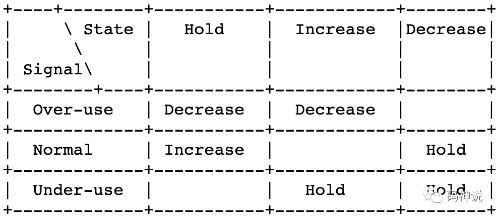

  1. 收到 overuse 信号，码率控制器总是进入 decrease 状态。
  2. 收到 underuse 信号，码率控制器总是进入 hold 状态。
  3. 收到 normal 信号，码率控制器提升当前状态。
  * 当前在 hold 状态，提升到 increase 状态。
  * 当前在 decrease 状态，提升到 hold 状态。

关于码率控制状态切换，有两点个人理解：

  * 收到过载信号，将码率降低，这很好理解，但是收到低载信号，为何进入码率保持状态？

我的理解是，收到 underuse 信号，说明网络上传输的流量很少，网络链路容量完全可以承载当前发送码率，不需要做任何改变，保持该码率即可。

  * 收到正常信号，hold 状态提升到 increase 状态很好理解，但是 decrease 状态为何要提升到 hold 状态？

我的理解是，在网络正常的情况下，原来的码率处于 decrease 状态，说明码率已经降低到适应当前网络状况了，所以转向 hold 状态。

#### 控制算法

WebRTC 借鉴 `AIMD` 这种码率调节思想，设计了一套自己的算法：

<section role="presentation" data-formula="\begin{equation}
A_r(t_i)=\begin{cases} \eta A_r(t_{i-1}) &amp; \text {$\sigma=Increase$} \\ \alpha R_r(t_i) &amp; \text{$\sigma=Decrease$} \\ A_r(t_{i-1}) &amp; \text{$\sigma=Hold$} \end{cases}
\label{eq:sample}
\end{equation}" data-formula-type="block-equation" style="text-align: center;overflow: auto;display: block;"><svg xmlns="http://www.w3.org/2000/svg" role="img" focusable="false" aria-hidden="true" style="-webkit-overflow-scrolling: touch;vertical-align: -3.281ex;min-width: 45.012ex;width: 100%;height: 7.692ex;max-width: 300% !important;"><g stroke="currentColor" fill="currentColor" stroke-width="0" transform="matrix(1 0 0 -1 0 0) scale(0.0181) translate(0, -1950)"><g data-mml-node="math"><g data-mml-node="mtable" transform="translate(2078, 0) translate(-2078, 0)"><g transform="translate(0, 1950) matrix(1 0 0 -1 0 0) scale(55.25)"><svg data-table="true" preserveAspectRatio="xMidYMid" viewBox="-2078 -1950 19895.5 3400" style="-webkit-overflow-scrolling: touch;max-width: 300% !important;"><g transform="matrix(1 0 0 -1 0 0)"><g data-mml-node="mlabeledtr"><g data-mml-node="mtd"><g data-mml-node="msub"><g data-mml-node="mi"><path data-c="41" d="M208 74Q208 50 254 46Q272 46 272 35Q272 34 270 22Q267 8 264 4T251 0Q249 0 239 0T205 1T141 2Q70 2 50 0H42Q35 7 35 11Q37 38 48 46H62Q132 49 164 96Q170 102 345 401T523 704Q530 716 547 716H555H572Q578 707 578 706L606 383Q634 60 636 57Q641 46 701 46Q726 46 726 36Q726 34 723 22Q720 7 718 4T704 0Q701 0 690 0T651 1T578 2Q484 2 455 0H443Q437 6 437 9T439 27Q443 40 445 43L449 46H469Q523 49 533 63L521 213H283L249 155Q208 86 208 74ZM516 260Q516 271 504 416T490 562L463 519Q447 492 400 412L310 260L413 259Q516 259 516 260Z"></path></g><g data-mml-node="mi" transform="translate(750, -150) scale(0.707)"><path data-c="72" d="M21 287Q22 290 23 295T28 317T38 348T53 381T73 411T99 433T132 442Q161 442 183 430T214 408T225 388Q227 382 228 382T236 389Q284 441 347 441H350Q398 441 422 400Q430 381 430 363Q430 333 417 315T391 292T366 288Q346 288 334 299T322 328Q322 376 378 392Q356 405 342 405Q286 405 239 331Q229 315 224 298T190 165Q156 25 151 16Q138 -11 108 -11Q95 -11 87 -5T76 7T74 17Q74 30 114 189T154 366Q154 405 128 405Q107 405 92 377T68 316T57 280Q55 278 41 278H27Q21 284 21 287Z"></path></g></g><g data-mml-node="mo" transform="translate(1118.9, 0)"><path data-c="28" d="M94 250Q94 319 104 381T127 488T164 576T202 643T244 695T277 729T302 750H315H319Q333 750 333 741Q333 738 316 720T275 667T226 581T184 443T167 250T184 58T225 -81T274 -167T316 -220T333 -241Q333 -250 318 -250H315H302L274 -226Q180 -141 137 -14T94 250Z"></path></g><g data-mml-node="msub" transform="translate(1507.9, 0)"><g data-mml-node="mi"><path data-c="74" d="M26 385Q19 392 19 395Q19 399 22 411T27 425Q29 430 36 430T87 431H140L159 511Q162 522 166 540T173 566T179 586T187 603T197 615T211 624T229 626Q247 625 254 615T261 596Q261 589 252 549T232 470L222 433Q222 431 272 431H323Q330 424 330 420Q330 398 317 385H210L174 240Q135 80 135 68Q135 26 162 26Q197 26 230 60T283 144Q285 150 288 151T303 153H307Q322 153 322 145Q322 142 319 133Q314 117 301 95T267 48T216 6T155 -11Q125 -11 98 4T59 56Q57 64 57 83V101L92 241Q127 382 128 383Q128 385 77 385H26Z"></path></g><g data-mml-node="mi" transform="translate(361, -150) scale(0.707)"><path data-c="69" d="M184 600Q184 624 203 642T247 661Q265 661 277 649T290 619Q290 596 270 577T226 557Q211 557 198 567T184 600ZM21 287Q21 295 30 318T54 369T98 420T158 442Q197 442 223 419T250 357Q250 340 236 301T196 196T154 83Q149 61 149 51Q149 26 166 26Q175 26 185 29T208 43T235 78T260 137Q263 149 265 151T282 153Q302 153 302 143Q302 135 293 112T268 61T223 11T161 -11Q129 -11 102 10T74 74Q74 91 79 106T122 220Q160 321 166 341T173 380Q173 404 156 404H154Q124 404 99 371T61 287Q60 286 59 284T58 281T56 279T53 278T49 278T41 278H27Q21 284 21 287Z"></path></g></g><g data-mml-node="mo" transform="translate(2162.9, 0)"><path data-c="29" d="M60 749L64 750Q69 750 74 750H86L114 726Q208 641 251 514T294 250Q294 182 284 119T261 12T224 -76T186 -143T145 -194T113 -227T90 -246Q87 -249 86 -250H74Q66 -250 63 -250T58 -247T55 -238Q56 -237 66 -225Q221 -64 221 250T66 725Q56 737 55 738Q55 746 60 749Z"></path></g><g data-mml-node="mo" transform="translate(2829.6, 0)"><path data-c="3D" d="M56 347Q56 360 70 367H707Q722 359 722 347Q722 336 708 328L390 327H72Q56 332 56 347ZM56 153Q56 168 72 173H708Q722 163 722 153Q722 140 707 133H70Q56 140 56 153Z"></path></g><g data-mml-node="mrow" transform="translate(3885.4, 0)"><g data-mml-node="mo"><path data-c="23A7" d="M712 899L718 893V876V865Q718 854 704 846Q627 793 577 710T510 525Q510 524 509 521Q505 493 504 349Q504 345 504 334Q504 277 504 240Q504 -2 503 -4Q502 -8 494 -9T444 -10Q392 -10 390 -9Q387 -8 386 -5Q384 5 384 230Q384 262 384 312T383 382Q383 481 392 535T434 656Q510 806 664 892L677 899H712Z" transform="translate(0, 1051)"></path><path data-c="23A9" d="M718 -893L712 -899H677L666 -893Q542 -825 468 -714T385 -476Q384 -466 384 -282Q384 3 385 5L389 9Q392 10 444 10Q486 10 494 9T503 4Q504 2 504 -239V-310V-366Q504 -470 508 -513T530 -609Q546 -657 569 -698T617 -767T661 -812T699 -843T717 -856T718 -876V-893Z" transform="translate(0, -551)"></path><path data-c="23A8" d="M389 1159Q391 1160 455 1160Q496 1160 498 1159Q501 1158 502 1155Q504 1145 504 924Q504 691 503 682Q494 549 425 439T243 259L229 250L243 241Q349 175 421 66T503 -182Q504 -191 504 -424Q504 -600 504 -629T499 -659H498Q496 -660 444 -660T390 -659Q387 -658 386 -655Q384 -645 384 -425V-282Q384 -176 377 -116T342 10Q325 54 301 92T255 155T214 196T183 222T171 232Q170 233 170 250T171 268Q171 269 191 284T240 331T300 407T354 524T383 679Q384 691 384 925Q384 1152 385 1155L389 1159Z" transform="translate(0, 0)"></path><svg width="889" height="81" y="1060" x="0" viewBox="0 14.3 889 81" style="-webkit-overflow-scrolling: touch;max-width: 300% !important;"><path data-c="23AA" d="M384 150V266Q384 304 389 309Q391 310 455 310Q496 310 498 309Q502 308 503 298Q504 283 504 150Q504 32 504 12T499 -9H498Q496 -10 444 -10T390 -9Q386 -8 385 2Q384 17 384 150Z" transform="scale(1, 0.398)"></path></svg><svg width="889" height="81" y="-641" x="0" viewBox="0 14.3 889 81" style="-webkit-overflow-scrolling: touch;max-width: 300% !important;"><path data-c="23AA" d="M384 150V266Q384 304 389 309Q391 310 455 310Q496 310 498 309Q502 308 503 298Q504 283 504 150Q504 32 504 12T499 -9H498Q496 -10 444 -10T390 -9Q386 -8 385 2Q384 17 384 150Z" transform="scale(1, 0.398)"></path></svg></g><g data-mml-node="mtable" transform="translate(889, 0)"><g data-mml-node="mtr" transform="translate(0, 1200)"><g data-mml-node="mtd"><g data-mml-node="mi"><path data-c="3B7" d="M21 287Q22 290 23 295T28 317T38 348T53 381T73 411T99 433T132 442Q156 442 175 435T205 417T221 395T229 376L231 369Q231 367 232 367L243 378Q304 442 382 442Q436 442 469 415T503 336V326Q503 302 439 53Q381 -182 377 -189Q364 -216 332 -216Q319 -216 310 -208T299 -186Q299 -177 358 57L420 307Q423 322 423 345Q423 404 379 404H374Q288 404 229 303L222 291L189 157Q156 26 151 16Q138 -11 108 -11Q95 -11 87 -5T76 7T74 17Q74 30 114 189T154 366Q154 405 128 405Q107 405 92 377T68 316T57 280Q55 278 41 278H27Q21 284 21 287Z"></path></g><g data-mml-node="msub" transform="translate(497, 0)"><g data-mml-node="mi"><path data-c="41" d="M208 74Q208 50 254 46Q272 46 272 35Q272 34 270 22Q267 8 264 4T251 0Q249 0 239 0T205 1T141 2Q70 2 50 0H42Q35 7 35 11Q37 38 48 46H62Q132 49 164 96Q170 102 345 401T523 704Q530 716 547 716H555H572Q578 707 578 706L606 383Q634 60 636 57Q641 46 701 46Q726 46 726 36Q726 34 723 22Q720 7 718 4T704 0Q701 0 690 0T651 1T578 2Q484 2 455 0H443Q437 6 437 9T439 27Q443 40 445 43L449 46H469Q523 49 533 63L521 213H283L249 155Q208 86 208 74ZM516 260Q516 271 504 416T490 562L463 519Q447 492 400 412L310 260L413 259Q516 259 516 260Z"></path></g><g data-mml-node="mi" transform="translate(750, -150) scale(0.707)"><path data-c="72" d="M21 287Q22 290 23 295T28 317T38 348T53 381T73 411T99 433T132 442Q161 442 183 430T214 408T225 388Q227 382 228 382T236 389Q284 441 347 441H350Q398 441 422 400Q430 381 430 363Q430 333 417 315T391 292T366 288Q346 288 334 299T322 328Q322 376 378 392Q356 405 342 405Q286 405 239 331Q229 315 224 298T190 165Q156 25 151 16Q138 -11 108 -11Q95 -11 87 -5T76 7T74 17Q74 30 114 189T154 366Q154 405 128 405Q107 405 92 377T68 316T57 280Q55 278 41 278H27Q21 284 21 287Z"></path></g></g><g data-mml-node="mo" transform="translate(1615.9, 0)"><path data-c="28" d="M94 250Q94 319 104 381T127 488T164 576T202 643T244 695T277 729T302 750H315H319Q333 750 333 741Q333 738 316 720T275 667T226 581T184 443T167 250T184 58T225 -81T274 -167T316 -220T333 -241Q333 -250 318 -250H315H302L274 -226Q180 -141 137 -14T94 250Z"></path></g><g data-mml-node="msub" transform="translate(2004.9, 0)"><g data-mml-node="mi"><path data-c="74" d="M26 385Q19 392 19 395Q19 399 22 411T27 425Q29 430 36 430T87 431H140L159 511Q162 522 166 540T173 566T179 586T187 603T197 615T211 624T229 626Q247 625 254 615T261 596Q261 589 252 549T232 470L222 433Q222 431 272 431H323Q330 424 330 420Q330 398 317 385H210L174 240Q135 80 135 68Q135 26 162 26Q197 26 230 60T283 144Q285 150 288 151T303 153H307Q322 153 322 145Q322 142 319 133Q314 117 301 95T267 48T216 6T155 -11Q125 -11 98 4T59 56Q57 64 57 83V101L92 241Q127 382 128 383Q128 385 77 385H26Z"></path></g><g data-mml-node="TeXAtom" transform="translate(361, -150) scale(0.707)" data-mjx-texclass="ORD"><g data-mml-node="mi"><path data-c="69" d="M184 600Q184 624 203 642T247 661Q265 661 277 649T290 619Q290 596 270 577T226 557Q211 557 198 567T184 600ZM21 287Q21 295 30 318T54 369T98 420T158 442Q197 442 223 419T250 357Q250 340 236 301T196 196T154 83Q149 61 149 51Q149 26 166 26Q175 26 185 29T208 43T235 78T260 137Q263 149 265 151T282 153Q302 153 302 143Q302 135 293 112T268 61T223 11T161 -11Q129 -11 102 10T74 74Q74 91 79 106T122 220Q160 321 166 341T173 380Q173 404 156 404H154Q124 404 99 371T61 287Q60 286 59 284T58 281T56 279T53 278T49 278T41 278H27Q21 284 21 287Z"></path></g><g data-mml-node="mo" transform="translate(345, 0)"><path data-c="2212" d="M84 237T84 250T98 270H679Q694 262 694 250T679 230H98Q84 237 84 250Z"></path></g><g data-mml-node="mn" transform="translate(1123, 0)"><path data-c="31" d="M213 578L200 573Q186 568 160 563T102 556H83V602H102Q149 604 189 617T245 641T273 663Q275 666 285 666Q294 666 302 660V361L303 61Q310 54 315 52T339 48T401 46H427V0H416Q395 3 257 3Q121 3 100 0H88V46H114Q136 46 152 46T177 47T193 50T201 52T207 57T213 61V578Z"></path></g></g></g><g data-mml-node="mo" transform="translate(3563.5, 0)"><path data-c="29" d="M60 749L64 750Q69 750 74 750H86L114 726Q208 641 251 514T294 250Q294 182 284 119T261 12T224 -76T186 -143T145 -194T113 -227T90 -246Q87 -249 86 -250H74Q66 -250 63 -250T58 -247T55 -238Q56 -237 66 -225Q221 -64 221 250T66 725Q56 737 55 738Q55 746 60 749Z"></path></g></g><g data-mml-node="mtd" transform="translate(4952.5, 0)"><g data-mml-node="TeXAtom" data-mjx-texclass="ORD"><g data-mml-node="mi"><path data-c="3C3" d="M184 -11Q116 -11 74 34T31 147Q31 247 104 333T274 430Q275 431 414 431H552Q553 430 555 429T559 427T562 425T565 422T567 420T569 416T570 412T571 407T572 401Q572 357 507 357Q500 357 490 357T476 358H416L421 348Q439 310 439 263Q439 153 359 71T184 -11ZM361 278Q361 358 276 358Q152 358 115 184Q114 180 114 178Q106 141 106 117Q106 67 131 47T188 26Q242 26 287 73Q316 103 334 153T356 233T361 278Z"></path></g><g data-mml-node="mo" transform="translate(848.8, 0)"><path data-c="3D" d="M56 347Q56 360 70 367H707Q722 359 722 347Q722 336 708 328L390 327H72Q56 332 56 347ZM56 153Q56 168 72 173H708Q722 163 722 153Q722 140 707 133H70Q56 140 56 153Z"></path></g><g data-mml-node="mi" transform="translate(1904.6, 0)"><path data-c="49" d="M43 1Q26 1 26 10Q26 12 29 24Q34 43 39 45Q42 46 54 46H60Q120 46 136 53Q137 53 138 54Q143 56 149 77T198 273Q210 318 216 344Q286 624 286 626Q284 630 284 631Q274 637 213 637H193Q184 643 189 662Q193 677 195 680T209 683H213Q285 681 359 681Q481 681 487 683H497Q504 676 504 672T501 655T494 639Q491 637 471 637Q440 637 407 634Q393 631 388 623Q381 609 337 432Q326 385 315 341Q245 65 245 59Q245 52 255 50T307 46H339Q345 38 345 37T342 19Q338 6 332 0H316Q279 2 179 2Q143 2 113 2T65 2T43 1Z"></path></g><g data-mml-node="mi" transform="translate(2408.6, 0)"><path data-c="6E" d="M21 287Q22 293 24 303T36 341T56 388T89 425T135 442Q171 442 195 424T225 390T231 369Q231 367 232 367L243 378Q304 442 382 442Q436 442 469 415T503 336T465 179T427 52Q427 26 444 26Q450 26 453 27Q482 32 505 65T540 145Q542 153 560 153Q580 153 580 145Q580 144 576 130Q568 101 554 73T508 17T439 -10Q392 -10 371 17T350 73Q350 92 386 193T423 345Q423 404 379 404H374Q288 404 229 303L222 291L189 157Q156 26 151 16Q138 -11 108 -11Q95 -11 87 -5T76 7T74 17Q74 30 112 180T152 343Q153 348 153 366Q153 405 129 405Q91 405 66 305Q60 285 60 284Q58 278 41 278H27Q21 284 21 287Z"></path></g><g data-mml-node="mi" transform="translate(3008.6, 0)"><path data-c="63" d="M34 159Q34 268 120 355T306 442Q362 442 394 418T427 355Q427 326 408 306T360 285Q341 285 330 295T319 325T330 359T352 380T366 386H367Q367 388 361 392T340 400T306 404Q276 404 249 390Q228 381 206 359Q162 315 142 235T121 119Q121 73 147 50Q169 26 205 26H209Q321 26 394 111Q403 121 406 121Q410 121 419 112T429 98T420 83T391 55T346 25T282 0T202 -11Q127 -11 81 37T34 159Z"></path></g><g data-mml-node="mi" transform="translate(3441.6, 0)"><path data-c="72" d="M21 287Q22 290 23 295T28 317T38 348T53 381T73 411T99 433T132 442Q161 442 183 430T214 408T225 388Q227 382 228 382T236 389Q284 441 347 441H350Q398 441 422 400Q430 381 430 363Q430 333 417 315T391 292T366 288Q346 288 334 299T322 328Q322 376 378 392Q356 405 342 405Q286 405 239 331Q229 315 224 298T190 165Q156 25 151 16Q138 -11 108 -11Q95 -11 87 -5T76 7T74 17Q74 30 114 189T154 366Q154 405 128 405Q107 405 92 377T68 316T57 280Q55 278 41 278H27Q21 284 21 287Z"></path></g><g data-mml-node="mi" transform="translate(3892.6, 0)"><path data-c="65" d="M39 168Q39 225 58 272T107 350T174 402T244 433T307 442H310Q355 442 388 420T421 355Q421 265 310 237Q261 224 176 223Q139 223 138 221Q138 219 132 186T125 128Q125 81 146 54T209 26T302 45T394 111Q403 121 406 121Q410 121 419 112T429 98T420 82T390 55T344 24T281 -1T205 -11Q126 -11 83 42T39 168ZM373 353Q367 405 305 405Q272 405 244 391T199 357T170 316T154 280T149 261Q149 260 169 260Q282 260 327 284T373 353Z"></path></g><g data-mml-node="mi" transform="translate(4358.6, 0)"><path data-c="61" d="M33 157Q33 258 109 349T280 441Q331 441 370 392Q386 422 416 422Q429 422 439 414T449 394Q449 381 412 234T374 68Q374 43 381 35T402 26Q411 27 422 35Q443 55 463 131Q469 151 473 152Q475 153 483 153H487Q506 153 506 144Q506 138 501 117T481 63T449 13Q436 0 417 -8Q409 -10 393 -10Q359 -10 336 5T306 36L300 51Q299 52 296 50Q294 48 292 46Q233 -10 172 -10Q117 -10 75 30T33 157ZM351 328Q351 334 346 350T323 385T277 405Q242 405 210 374T160 293Q131 214 119 129Q119 126 119 118T118 106Q118 61 136 44T179 26Q217 26 254 59T298 110Q300 114 325 217T351 328Z"></path></g><g data-mml-node="mi" transform="translate(4887.6, 0)"><path data-c="73" d="M131 289Q131 321 147 354T203 415T300 442Q362 442 390 415T419 355Q419 323 402 308T364 292Q351 292 340 300T328 326Q328 342 337 354T354 372T367 378Q368 378 368 379Q368 382 361 388T336 399T297 405Q249 405 227 379T204 326Q204 301 223 291T278 274T330 259Q396 230 396 163Q396 135 385 107T352 51T289 7T195 -10Q118 -10 86 19T53 87Q53 126 74 143T118 160Q133 160 146 151T160 120Q160 94 142 76T111 58Q109 57 108 57T107 55Q108 52 115 47T146 34T201 27Q237 27 263 38T301 66T318 97T323 122Q323 150 302 164T254 181T195 196T148 231Q131 256 131 289Z"></path></g><g data-mml-node="mi" transform="translate(5356.6, 0)"><path data-c="65" d="M39 168Q39 225 58 272T107 350T174 402T244 433T307 442H310Q355 442 388 420T421 355Q421 265 310 237Q261 224 176 223Q139 223 138 221Q138 219 132 186T125 128Q125 81 146 54T209 26T302 45T394 111Q403 121 406 121Q410 121 419 112T429 98T420 82T390 55T344 24T281 -1T205 -11Q126 -11 83 42T39 168ZM373 353Q367 405 305 405Q272 405 244 391T199 357T170 316T154 280T149 261Q149 260 169 260Q282 260 327 284T373 353Z"></path></g></g></g></g><g data-mml-node="mtr" transform="translate(0, 0)"><g data-mml-node="mtd"><g data-mml-node="mi"><path data-c="3B1" d="M34 156Q34 270 120 356T309 442Q379 442 421 402T478 304Q484 275 485 237V208Q534 282 560 374Q564 388 566 390T582 393Q603 393 603 385Q603 376 594 346T558 261T497 161L486 147L487 123Q489 67 495 47T514 26Q528 28 540 37T557 60Q559 67 562 68T577 70Q597 70 597 62Q597 56 591 43Q579 19 556 5T512 -10H505Q438 -10 414 62L411 69L400 61Q390 53 370 41T325 18T267 -2T203 -11Q124 -11 79 39T34 156ZM208 26Q257 26 306 47T379 90L403 112Q401 255 396 290Q382 405 304 405Q235 405 183 332Q156 292 139 224T121 120Q121 71 146 49T208 26Z"></path></g><g data-mml-node="msub" transform="translate(640, 0)"><g data-mml-node="mi"><path data-c="52" d="M230 637Q203 637 198 638T193 649Q193 676 204 682Q206 683 378 683Q550 682 564 680Q620 672 658 652T712 606T733 563T739 529Q739 484 710 445T643 385T576 351T538 338L545 333Q612 295 612 223Q612 212 607 162T602 80V71Q602 53 603 43T614 25T640 16Q668 16 686 38T712 85Q717 99 720 102T735 105Q755 105 755 93Q755 75 731 36Q693 -21 641 -21H632Q571 -21 531 4T487 82Q487 109 502 166T517 239Q517 290 474 313Q459 320 449 321T378 323H309L277 193Q244 61 244 59Q244 55 245 54T252 50T269 48T302 46H333Q339 38 339 37T336 19Q332 6 326 0H311Q275 2 180 2Q146 2 117 2T71 2T50 1Q33 1 33 10Q33 12 36 24Q41 43 46 45Q50 46 61 46H67Q94 46 127 49Q141 52 146 61Q149 65 218 339T287 628Q287 635 230 637ZM630 554Q630 586 609 608T523 636Q521 636 500 636T462 637H440Q393 637 386 627Q385 624 352 494T319 361Q319 360 388 360Q466 361 492 367Q556 377 592 426Q608 449 619 486T630 554Z"></path></g><g data-mml-node="mi" transform="translate(759, -150) scale(0.707)"><path data-c="72" d="M21 287Q22 290 23 295T28 317T38 348T53 381T73 411T99 433T132 442Q161 442 183 430T214 408T225 388Q227 382 228 382T236 389Q284 441 347 441H350Q398 441 422 400Q430 381 430 363Q430 333 417 315T391 292T366 288Q346 288 334 299T322 328Q322 376 378 392Q356 405 342 405Q286 405 239 331Q229 315 224 298T190 165Q156 25 151 16Q138 -11 108 -11Q95 -11 87 -5T76 7T74 17Q74 30 114 189T154 366Q154 405 128 405Q107 405 92 377T68 316T57 280Q55 278 41 278H27Q21 284 21 287Z"></path></g></g><g data-mml-node="mo" transform="translate(1767.9, 0)"><path data-c="28" d="M94 250Q94 319 104 381T127 488T164 576T202 643T244 695T277 729T302 750H315H319Q333 750 333 741Q333 738 316 720T275 667T226 581T184 443T167 250T184 58T225 -81T274 -167T316 -220T333 -241Q333 -250 318 -250H315H302L274 -226Q180 -141 137 -14T94 250Z"></path></g><g data-mml-node="msub" transform="translate(2156.9, 0)"><g data-mml-node="mi"><path data-c="74" d="M26 385Q19 392 19 395Q19 399 22 411T27 425Q29 430 36 430T87 431H140L159 511Q162 522 166 540T173 566T179 586T187 603T197 615T211 624T229 626Q247 625 254 615T261 596Q261 589 252 549T232 470L222 433Q222 431 272 431H323Q330 424 330 420Q330 398 317 385H210L174 240Q135 80 135 68Q135 26 162 26Q197 26 230 60T283 144Q285 150 288 151T303 153H307Q322 153 322 145Q322 142 319 133Q314 117 301 95T267 48T216 6T155 -11Q125 -11 98 4T59 56Q57 64 57 83V101L92 241Q127 382 128 383Q128 385 77 385H26Z"></path></g><g data-mml-node="mi" transform="translate(361, -150) scale(0.707)"><path data-c="69" d="M184 600Q184 624 203 642T247 661Q265 661 277 649T290 619Q290 596 270 577T226 557Q211 557 198 567T184 600ZM21 287Q21 295 30 318T54 369T98 420T158 442Q197 442 223 419T250 357Q250 340 236 301T196 196T154 83Q149 61 149 51Q149 26 166 26Q175 26 185 29T208 43T235 78T260 137Q263 149 265 151T282 153Q302 153 302 143Q302 135 293 112T268 61T223 11T161 -11Q129 -11 102 10T74 74Q74 91 79 106T122 220Q160 321 166 341T173 380Q173 404 156 404H154Q124 404 99 371T61 287Q60 286 59 284T58 281T56 279T53 278T49 278T41 278H27Q21 284 21 287Z"></path></g></g><g data-mml-node="mo" transform="translate(2811.9, 0)"><path data-c="29" d="M60 749L64 750Q69 750 74 750H86L114 726Q208 641 251 514T294 250Q294 182 284 119T261 12T224 -76T186 -143T145 -194T113 -227T90 -246Q87 -249 86 -250H74Q66 -250 63 -250T58 -247T55 -238Q56 -237 66 -225Q221 -64 221 250T66 725Q56 737 55 738Q55 746 60 749Z"></path></g></g><g data-mml-node="mtd" transform="translate(4952.5, 0)"><g data-mml-node="TeXAtom" data-mjx-texclass="ORD"><g data-mml-node="mi"><path data-c="3C3" d="M184 -11Q116 -11 74 34T31 147Q31 247 104 333T274 430Q275 431 414 431H552Q553 430 555 429T559 427T562 425T565 422T567 420T569 416T570 412T571 407T572 401Q572 357 507 357Q500 357 490 357T476 358H416L421 348Q439 310 439 263Q439 153 359 71T184 -11ZM361 278Q361 358 276 358Q152 358 115 184Q114 180 114 178Q106 141 106 117Q106 67 131 47T188 26Q242 26 287 73Q316 103 334 153T356 233T361 278Z"></path></g><g data-mml-node="mo" transform="translate(848.8, 0)"><path data-c="3D" d="M56 347Q56 360 70 367H707Q722 359 722 347Q722 336 708 328L390 327H72Q56 332 56 347ZM56 153Q56 168 72 173H708Q722 163 722 153Q722 140 707 133H70Q56 140 56 153Z"></path></g><g data-mml-node="mi" transform="translate(1904.6, 0)"><path data-c="44" d="M287 628Q287 635 230 637Q207 637 200 638T193 647Q193 655 197 667T204 682Q206 683 403 683Q570 682 590 682T630 676Q702 659 752 597T803 431Q803 275 696 151T444 3L430 1L236 0H125H72Q48 0 41 2T33 11Q33 13 36 25Q40 41 44 43T67 46Q94 46 127 49Q141 52 146 61Q149 65 218 339T287 628ZM703 469Q703 507 692 537T666 584T629 613T590 629T555 636Q553 636 541 636T512 636T479 637H436Q392 637 386 627Q384 623 313 339T242 52Q242 48 253 48T330 47Q335 47 349 47T373 46Q499 46 581 128Q617 164 640 212T683 339T703 469Z"></path></g><g data-mml-node="mi" transform="translate(2732.6, 0)"><path data-c="65" d="M39 168Q39 225 58 272T107 350T174 402T244 433T307 442H310Q355 442 388 420T421 355Q421 265 310 237Q261 224 176 223Q139 223 138 221Q138 219 132 186T125 128Q125 81 146 54T209 26T302 45T394 111Q403 121 406 121Q410 121 419 112T429 98T420 82T390 55T344 24T281 -1T205 -11Q126 -11 83 42T39 168ZM373 353Q367 405 305 405Q272 405 244 391T199 357T170 316T154 280T149 261Q149 260 169 260Q282 260 327 284T373 353Z"></path></g><g data-mml-node="mi" transform="translate(3198.6, 0)"><path data-c="63" d="M34 159Q34 268 120 355T306 442Q362 442 394 418T427 355Q427 326 408 306T360 285Q341 285 330 295T319 325T330 359T352 380T366 386H367Q367 388 361 392T340 400T306 404Q276 404 249 390Q228 381 206 359Q162 315 142 235T121 119Q121 73 147 50Q169 26 205 26H209Q321 26 394 111Q403 121 406 121Q410 121 419 112T429 98T420 83T391 55T346 25T282 0T202 -11Q127 -11 81 37T34 159Z"></path></g><g data-mml-node="mi" transform="translate(3631.6, 0)"><path data-c="72" d="M21 287Q22 290 23 295T28 317T38 348T53 381T73 411T99 433T132 442Q161 442 183 430T214 408T225 388Q227 382 228 382T236 389Q284 441 347 441H350Q398 441 422 400Q430 381 430 363Q430 333 417 315T391 292T366 288Q346 288 334 299T322 328Q322 376 378 392Q356 405 342 405Q286 405 239 331Q229 315 224 298T190 165Q156 25 151 16Q138 -11 108 -11Q95 -11 87 -5T76 7T74 17Q74 30 114 189T154 366Q154 405 128 405Q107 405 92 377T68 316T57 280Q55 278 41 278H27Q21 284 21 287Z"></path></g><g data-mml-node="mi" transform="translate(4082.6, 0)"><path data-c="65" d="M39 168Q39 225 58 272T107 350T174 402T244 433T307 442H310Q355 442 388 420T421 355Q421 265 310 237Q261 224 176 223Q139 223 138 221Q138 219 132 186T125 128Q125 81 146 54T209 26T302 45T394 111Q403 121 406 121Q410 121 419 112T429 98T420 82T390 55T344 24T281 -1T205 -11Q126 -11 83 42T39 168ZM373 353Q367 405 305 405Q272 405 244 391T199 357T170 316T154 280T149 261Q149 260 169 260Q282 260 327 284T373 353Z"></path></g><g data-mml-node="mi" transform="translate(4548.6, 0)"><path data-c="61" d="M33 157Q33 258 109 349T280 441Q331 441 370 392Q386 422 416 422Q429 422 439 414T449 394Q449 381 412 234T374 68Q374 43 381 35T402 26Q411 27 422 35Q443 55 463 131Q469 151 473 152Q475 153 483 153H487Q506 153 506 144Q506 138 501 117T481 63T449 13Q436 0 417 -8Q409 -10 393 -10Q359 -10 336 5T306 36L300 51Q299 52 296 50Q294 48 292 46Q233 -10 172 -10Q117 -10 75 30T33 157ZM351 328Q351 334 346 350T323 385T277 405Q242 405 210 374T160 293Q131 214 119 129Q119 126 119 118T118 106Q118 61 136 44T179 26Q217 26 254 59T298 110Q300 114 325 217T351 328Z"></path></g><g data-mml-node="mi" transform="translate(5077.6, 0)"><path data-c="73" d="M131 289Q131 321 147 354T203 415T300 442Q362 442 390 415T419 355Q419 323 402 308T364 292Q351 292 340 300T328 326Q328 342 337 354T354 372T367 378Q368 378 368 379Q368 382 361 388T336 399T297 405Q249 405 227 379T204 326Q204 301 223 291T278 274T330 259Q396 230 396 163Q396 135 385 107T352 51T289 7T195 -10Q118 -10 86 19T53 87Q53 126 74 143T118 160Q133 160 146 151T160 120Q160 94 142 76T111 58Q109 57 108 57T107 55Q108 52 115 47T146 34T201 27Q237 27 263 38T301 66T318 97T323 122Q323 150 302 164T254 181T195 196T148 231Q131 256 131 289Z"></path></g><g data-mml-node="mi" transform="translate(5546.6, 0)"><path data-c="65" d="M39 168Q39 225 58 272T107 350T174 402T244 433T307 442H310Q355 442 388 420T421 355Q421 265 310 237Q261 224 176 223Q139 223 138 221Q138 219 132 186T125 128Q125 81 146 54T209 26T302 45T394 111Q403 121 406 121Q410 121 419 112T429 98T420 82T390 55T344 24T281 -1T205 -11Q126 -11 83 42T39 168ZM373 353Q367 405 305 405Q272 405 244 391T199 357T170 316T154 280T149 261Q149 260 169 260Q282 260 327 284T373 353Z"></path></g></g></g></g><g data-mml-node="mtr" transform="translate(0, -1200)"><g data-mml-node="mtd"><g data-mml-node="msub"><g data-mml-node="mi"><path data-c="41" d="M208 74Q208 50 254 46Q272 46 272 35Q272 34 270 22Q267 8 264 4T251 0Q249 0 239 0T205 1T141 2Q70 2 50 0H42Q35 7 35 11Q37 38 48 46H62Q132 49 164 96Q170 102 345 401T523 704Q530 716 547 716H555H572Q578 707 578 706L606 383Q634 60 636 57Q641 46 701 46Q726 46 726 36Q726 34 723 22Q720 7 718 4T704 0Q701 0 690 0T651 1T578 2Q484 2 455 0H443Q437 6 437 9T439 27Q443 40 445 43L449 46H469Q523 49 533 63L521 213H283L249 155Q208 86 208 74ZM516 260Q516 271 504 416T490 562L463 519Q447 492 400 412L310 260L413 259Q516 259 516 260Z"></path></g><g data-mml-node="mi" transform="translate(750, -150) scale(0.707)"><path data-c="72" d="M21 287Q22 290 23 295T28 317T38 348T53 381T73 411T99 433T132 442Q161 442 183 430T214 408T225 388Q227 382 228 382T236 389Q284 441 347 441H350Q398 441 422 400Q430 381 430 363Q430 333 417 315T391 292T366 288Q346 288 334 299T322 328Q322 376 378 392Q356 405 342 405Q286 405 239 331Q229 315 224 298T190 165Q156 25 151 16Q138 -11 108 -11Q95 -11 87 -5T76 7T74 17Q74 30 114 189T154 366Q154 405 128 405Q107 405 92 377T68 316T57 280Q55 278 41 278H27Q21 284 21 287Z"></path></g></g><g data-mml-node="mo" transform="translate(1118.9, 0)"><path data-c="28" d="M94 250Q94 319 104 381T127 488T164 576T202 643T244 695T277 729T302 750H315H319Q333 750 333 741Q333 738 316 720T275 667T226 581T184 443T167 250T184 58T225 -81T274 -167T316 -220T333 -241Q333 -250 318 -250H315H302L274 -226Q180 -141 137 -14T94 250Z"></path></g><g data-mml-node="msub" transform="translate(1507.9, 0)"><g data-mml-node="mi"><path data-c="74" d="M26 385Q19 392 19 395Q19 399 22 411T27 425Q29 430 36 430T87 431H140L159 511Q162 522 166 540T173 566T179 586T187 603T197 615T211 624T229 626Q247 625 254 615T261 596Q261 589 252 549T232 470L222 433Q222 431 272 431H323Q330 424 330 420Q330 398 317 385H210L174 240Q135 80 135 68Q135 26 162 26Q197 26 230 60T283 144Q285 150 288 151T303 153H307Q322 153 322 145Q322 142 319 133Q314 117 301 95T267 48T216 6T155 -11Q125 -11 98 4T59 56Q57 64 57 83V101L92 241Q127 382 128 383Q128 385 77 385H26Z"></path></g><g data-mml-node="TeXAtom" transform="translate(361, -150) scale(0.707)" data-mjx-texclass="ORD"><g data-mml-node="mi"><path data-c="69" d="M184 600Q184 624 203 642T247 661Q265 661 277 649T290 619Q290 596 270 577T226 557Q211 557 198 567T184 600ZM21 287Q21 295 30 318T54 369T98 420T158 442Q197 442 223 419T250 357Q250 340 236 301T196 196T154 83Q149 61 149 51Q149 26 166 26Q175 26 185 29T208 43T235 78T260 137Q263 149 265 151T282 153Q302 153 302 143Q302 135 293 112T268 61T223 11T161 -11Q129 -11 102 10T74 74Q74 91 79 106T122 220Q160 321 166 341T173 380Q173 404 156 404H154Q124 404 99 371T61 287Q60 286 59 284T58 281T56 279T53 278T49 278T41 278H27Q21 284 21 287Z"></path></g><g data-mml-node="mo" transform="translate(345, 0)"><path data-c="2212" d="M84 237T84 250T98 270H679Q694 262 694 250T679 230H98Q84 237 84 250Z"></path></g><g data-mml-node="mn" transform="translate(1123, 0)"><path data-c="31" d="M213 578L200 573Q186 568 160 563T102 556H83V602H102Q149 604 189 617T245 641T273 663Q275 666 285 666Q294 666 302 660V361L303 61Q310 54 315 52T339 48T401 46H427V0H416Q395 3 257 3Q121 3 100 0H88V46H114Q136 46 152 46T177 47T193 50T201 52T207 57T213 61V578Z"></path></g></g></g><g data-mml-node="mo" transform="translate(3066.5, 0)"><path data-c="29" d="M60 749L64 750Q69 750 74 750H86L114 726Q208 641 251 514T294 250Q294 182 284 119T261 12T224 -76T186 -143T145 -194T113 -227T90 -246Q87 -249 86 -250H74Q66 -250 63 -250T58 -247T55 -238Q56 -237 66 -225Q221 -64 221 250T66 725Q56 737 55 738Q55 746 60 749Z"></path></g></g><g data-mml-node="mtd" transform="translate(4952.5, 0)"><g data-mml-node="TeXAtom" data-mjx-texclass="ORD"><g data-mml-node="mi"><path data-c="3C3" d="M184 -11Q116 -11 74 34T31 147Q31 247 104 333T274 430Q275 431 414 431H552Q553 430 555 429T559 427T562 425T565 422T567 420T569 416T570 412T571 407T572 401Q572 357 507 357Q500 357 490 357T476 358H416L421 348Q439 310 439 263Q439 153 359 71T184 -11ZM361 278Q361 358 276 358Q152 358 115 184Q114 180 114 178Q106 141 106 117Q106 67 131 47T188 26Q242 26 287 73Q316 103 334 153T356 233T361 278Z"></path></g><g data-mml-node="mo" transform="translate(848.8, 0)"><path data-c="3D" d="M56 347Q56 360 70 367H707Q722 359 722 347Q722 336 708 328L390 327H72Q56 332 56 347ZM56 153Q56 168 72 173H708Q722 163 722 153Q722 140 707 133H70Q56 140 56 153Z"></path></g><g data-mml-node="mi" transform="translate(1904.6, 0)"><path data-c="48" d="M228 637Q194 637 192 641Q191 643 191 649Q191 673 202 682Q204 683 219 683Q260 681 355 681Q389 681 418 681T463 682T483 682Q499 682 499 672Q499 670 497 658Q492 641 487 638H485Q483 638 480 638T473 638T464 637T455 637Q416 636 405 634T387 623Q384 619 355 500Q348 474 340 442T328 395L324 380Q324 378 469 378H614L615 381Q615 384 646 504Q674 619 674 627T617 637Q594 637 587 639T580 648Q580 650 582 660Q586 677 588 679T604 682Q609 682 646 681T740 680Q802 680 835 681T871 682Q888 682 888 672Q888 645 876 638H874Q872 638 869 638T862 638T853 637T844 637Q805 636 794 634T776 623Q773 618 704 340T634 58Q634 51 638 51Q646 48 692 46H723Q729 38 729 37T726 19Q722 6 716 0H701Q664 2 567 2Q533 2 504 2T458 2T437 1Q420 1 420 10Q420 15 423 24Q428 43 433 45Q437 46 448 46H454Q481 46 514 49Q520 50 522 50T528 55T534 64T540 82T547 110T558 153Q565 181 569 198Q602 330 602 331T457 332H312L279 197Q245 63 245 58Q245 51 253 49T303 46H334Q340 38 340 37T337 19Q333 6 327 0H312Q275 2 178 2Q144 2 115 2T69 2T48 1Q31 1 31 10Q31 12 34 24Q39 43 44 45Q48 46 59 46H65Q92 46 125 49Q139 52 144 61Q147 65 216 339T285 628Q285 635 228 637Z"></path></g><g data-mml-node="mi" transform="translate(2792.6, 0)"><path data-c="6F" d="M201 -11Q126 -11 80 38T34 156Q34 221 64 279T146 380Q222 441 301 441Q333 441 341 440Q354 437 367 433T402 417T438 387T464 338T476 268Q476 161 390 75T201 -11ZM121 120Q121 70 147 48T206 26Q250 26 289 58T351 142Q360 163 374 216T388 308Q388 352 370 375Q346 405 306 405Q243 405 195 347Q158 303 140 230T121 120Z"></path></g><g data-mml-node="mi" transform="translate(3277.6, 0)"><path data-c="6C" d="M117 59Q117 26 142 26Q179 26 205 131Q211 151 215 152Q217 153 225 153H229Q238 153 241 153T246 151T248 144Q247 138 245 128T234 90T214 43T183 6T137 -11Q101 -11 70 11T38 85Q38 97 39 102L104 360Q167 615 167 623Q167 626 166 628T162 632T157 634T149 635T141 636T132 637T122 637Q112 637 109 637T101 638T95 641T94 647Q94 649 96 661Q101 680 107 682T179 688Q194 689 213 690T243 693T254 694Q266 694 266 686Q266 675 193 386T118 83Q118 81 118 75T117 65V59Z"></path></g><g data-mml-node="mi" transform="translate(3575.6, 0)"><path data-c="64" d="M366 683Q367 683 438 688T511 694Q523 694 523 686Q523 679 450 384T375 83T374 68Q374 26 402 26Q411 27 422 35Q443 55 463 131Q469 151 473 152Q475 153 483 153H487H491Q506 153 506 145Q506 140 503 129Q490 79 473 48T445 8T417 -8Q409 -10 393 -10Q359 -10 336 5T306 36L300 51Q299 52 296 50Q294 48 292 46Q233 -10 172 -10Q117 -10 75 30T33 157Q33 205 53 255T101 341Q148 398 195 420T280 442Q336 442 364 400Q369 394 369 396Q370 400 396 505T424 616Q424 629 417 632T378 637H357Q351 643 351 645T353 664Q358 683 366 683ZM352 326Q329 405 277 405Q242 405 210 374T160 293Q131 214 119 129Q119 126 119 118T118 106Q118 61 136 44T179 26Q233 26 290 98L298 109L352 326Z"></path></g></g></g></g></g><g data-mml-node="mo" transform="translate(11854.1, 0)"></g></g></g></g></g></svg><svg data-labels="true" preserveAspectRatio="xMaxYMid" viewBox="0 -1950 1278 3400" style="-webkit-overflow-scrolling: touch;max-width: 300% !important;"><g data-labels="true" transform="matrix(1 0 0 -1 0 0)"><g data-mml-node="mtd"><g data-mml-node="mtext"><path data-c="28" d="M94 250Q94 319 104 381T127 488T164 576T202 643T244 695T277 729T302 750H315H319Q333 750 333 741Q333 738 316 720T275 667T226 581T184 443T167 250T184 58T225 -81T274 -167T316 -220T333 -241Q333 -250 318 -250H315H302L274 -226Q180 -141 137 -14T94 250Z"></path><path data-c="31" d="M213 578L200 573Q186 568 160 563T102 556H83V602H102Q149 604 189 617T245 641T273 663Q275 666 285 666Q294 666 302 660V361L303 61Q310 54 315 52T339 48T401 46H427V0H416Q395 3 257 3Q121 3 100 0H88V46H114Q136 46 152 46T177 47T193 50T201 52T207 57T213 61V578Z" transform="translate(389, 0)"></path><path data-c="29" d="M60 749L64 750Q69 750 74 750H86L114 726Q208 641 251 514T294 250Q294 182 284 119T261 12T224 -76T186 -143T145 -194T113 -227T90 -246Q87 -249 86 -250H74Q66 -250 63 -250T58 -247T55 -238Q56 -237 66 -225Q221 -64 221 250T66 725Q56 737 55 738Q55 746 60 749Z" transform="translate(889, 0)"></path></g></g></g></svg></g></g></g></g></svg></section>

注意，上面的码率调节算法最初用于 Receive-side BWE，在 WebRTC 最新的 Send-side BWE 中复用了该算法。

结合三种码率状态之间的切换与调节算法，下面的图应该不难理解，具体的码率调节过程下文会详细介绍。

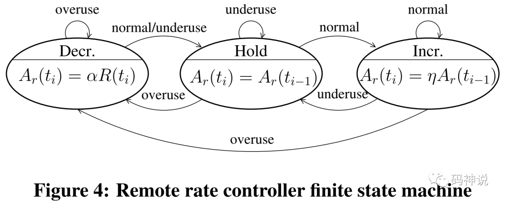

### 源码分析

基于 WebRTC M71 版本

码率控制在 `AimdRateControl` 类中实现，该类的重要的成员函数如下：

    
```c++
class AimdRateControl {    
public:  
  uint32_t Update(  
    const RateControlInput* input,  
    int64_t now_ms);  
  int GetNearMaxIncreaseRateBps() const;  
private:  
  void ChangeState(  
    const RateControlInput& input,  
    int64_t now_ms);  
  uint32_t ChangeBitrate(  
    uint32_t current_bitrate,  
    const RateControlInput& input,  
    int64_t now_ms);  
  uint32_t MultiplicativeRateIncrease(  
    int64_t now_ms,  
    int64_t last_ms,  
    uint32_t current_bitrate_bps) const;  
  uint32_t AdditiveRateIncrease(  
    int64_t now_ms,  
    int64_t last_ms) const;  
  void UpdateMaxThroughputEstimate(  
    float estimated_throughput_kbps);  
};  
```

#### Update 函数

该函数为驱动 `AimdRateControl` 工作的外部接口函数，其内部调用私有成员函数 `ChangeBitrate`。

#### ChangeBitrate  函数

该函数为整个码率控制算法的核心实现函数，主要流程包括：

  1. 根据输入的带宽检测信号，更新码率控制状态，在 `ChangeState` 函数中实现。
  2. 根据新的码率控制状态和**最大码率的标准差**，进行相应的码率控制，计算新的码率。
  * 如果码率控制状态为 hold，码率保持不变。
  * 如果码率控制状态为 increase，根据当前码率是否接近网络链路容量对其进行 _加性增大_ 或者 _乘性增大_。
  * 如果码率控制状态为 decrease，对码率进行 _乘性减小_，并**更新当前网络链路容量估计值的方差**，即最大码率的方差。
  3. 控制新的码率值在一定范围内。

当码率控制算法计算出的新的码率值过大，超过发送端的发送能力，则需要将新的码率值限制到一定区间内，这也避免了发送端码率增长过快。

关于 2 中详细的码率控制过程，在源码分析的最后会继续介绍。

#### ChangeState 函数

该函数输入带宽检测信号，从而对码率控制状态进行切换。

    
```c++
switch (input.bw_state) {  
  case BandwidthUsage::kBwNormal:  
    if (rate_control_state_ == kRcHold) {  
      rate_control_state_ = kRcIncrease;  
    }  
    break;  
  case BandwidthUsage::kBwOverusing:  
    if (rate_control_state_ != kRcDecrease) {  
      rate_control_state_ = kRcDecrease;  
    }  
    break;  
  case BandwidthUsage::kBwUnderusing:  
    rate_control_state_ = kRcHold;  
    break;  
}  
```

关于状态切换，有一点 WebRTC 源码并未体现：当收到 normal 信号时，如果当前状态是 decrease，应该提升到 hold 状态。

除此之外，码率控制状态的切换过程与上文描述的一致。

#### AdditiveRateIncrease 函数

该函数执行加性增大算法，输入当前时间和上次码率被更新的时间，返回增加的码率大小。

    
```c++
return static_cast<uint32_t>(  
  (now_ms - last_ms) *  
  GetNearMaxIncreaseRateBps() / 1000);  
```

根据源码可知：加性增大的码率大小 = 距上次码率更新所经历的时间(秒) * 每秒应该增加的码率大小。所以，真正的加性增大算法在`GetNearMaxIncreaseRateBps` 函数中实现。

注意，`GetNearMaxIncreaseRateBps` 函数名告诉我们，在码率接近网络链路容量时，进行加性增大。

#### GetNearMaxIncreaseRateBps 函数

该函数会计算在当前码率下执行加性增大算法后增加的码率值。

计算当前码率下每帧的大小，假设帧率为 30fps。

    
```c++
double bits_per_frame =  
  static_cast<double>(current_bitrate_bps_) / 30.0;  
```

计算每帧的包数，假设每包大小为 1200B。

    
```c++
double packets_per_frame =  
  std::ceil(bits_per_frame / (8.0 * 1200.0));  
```

注意，每帧的包数向上取整，至少为 1，也就是说，如果每帧大小小于单个包大小 1200 bytes，也会认为每帧含有一个包。

计算当前码率下每个包实际的大小。

    
```c++
double avg_packet_size_bits =  
  bits_per_frame / packets_per_frame;  
```

计算 `response_time`，其大小为 rtt 加上 100 ms 的发送端 BWE 延迟，rtt 默认值为 200ms。

    
```c++
const int64_t response_time = in_experiment_ ?  
    (rtt_ + 100) * 2 : rtt_ + 100;  
```

加性增大的原则应该是：**每一个 `response_time` 增加一个包的大小**。

那么，每秒包含 （1000 / response_time） 个 response_time interval，则每秒应该增加 （1000 / response_time）个包的大小，于是，加性增大的码率值就计算出来了。

    
```c++
constexpr double kMinIncreaseRateBps = 4000;  
return static_cast<int>(std::max(  
  kMinIncreaseRateBps,  
  (avg_packet_size_bits * 1000) / response_time));  
```

有两点需要注意：

  1. 加性增大的码率值至少为 4Kbps，比如在低码率场景下，加性增大的码率值可能小于 4Kbps。
  2. GCC 草案规定每一个 response_time interval，码率增加至多半个包的大小，而非 WebRTC 源码中一个包的大小。

#### MultiplicativeRateIncrease 函数

该函数执行乘性增大算法，输入当前时间和上次码率被更新的时间，返回增加的码率大小。

    
```c++
double alpha = 1.08;  
if (last_ms > -1) {  
  auto time_since_last_update_ms =  
    rtc::SafeMin<int64_t>(now_ms - last_ms, 1000);  
  alpha = pow(alpha, time_since_last_update_ms / 1000.0);  
}  
uint32_t multiplicative_increase_bps =  
  std::max(current_bitrate_bps * (alpha - 1.0), 1000.0);  
```

将距上次码率更新所经过的时间作为指数，计算增长系数 alpha。alpha 初值取 1.08，最大值也为 1.08，也就是说，乘性增大的码率值最大不会超过当前码率的 8%。

#### UpdateMaxThroughputEstimate 函数

该函数输入网络带宽过载状态下的码率估计值 `estimated_throughput_kbps`，计算**网络链路容量**的方差。

注意，该函数只有在收到过载信号降低码率时才会被调用，这是因为：一旦检测到过载并准备降低码率时，说明当前网络链路已经达到了最大吞吐量（带宽），此时的码率估计值才能代表网络链路容量 ，从而作为样本并计算其方差。

可以认为，网络链路容量 `link capacity` 代表了网络吞吐量 `throughput`，也即带宽 `bandwidth`。

也可以认为，过载状态下的码率估计值 `estimated_throughput_kbps` 即为最大码率，计算网络链路容量的方差就是计算最大码率的方差。

  * 一次指数平滑法计算最大码率的指数移动均值

`estimated_throughput_kbps` 为接近 link capacity 的最大码率估计值，即样本值。

`avg_max_bitrate_kbps_` 为最大码率的估计值 `estimated_throughput_kbps` 的均值，即样本均值。

    
```c++
const float alpha = 0.05f;  
avg_max_bitrate_kbps_ =  
  (1 - alpha) * avg_max_bitrate_kbps_ +  
  alpha *estimated_throughput_kbps;  
```

  * 一次指数平滑法计算最大码率的方差

这里求最大码率的方差并不是进行简单平均，而是也采用了指数移动平均求取方差，并使用最大码率均值对方差进行归一化。

    
```c++
const float norm =  
  std::max(avg_max_bitrate_kbps_, 1.0f);  
var_max_bitrate_kbps_ =  
  (1 - alpha) * var_max_bitrate_kbps_ +  
  alpha *  
  (avg_max_bitrate_kbps_ -  
  estimated_throughput_kbps) *  
  (avg_max_bitrate_kbps_ -  
  estimated_throughput_kbps) / norm;  
```

对于求取最大码率均值与方差时的指数平滑系数，GCC 草案的建议值为 0.95。

  * 将归一化后的方差控制到 [0.4, 2.5] 区间范围之内。
    

```c++
// 0.4 ~= 14 kbit/s at 500 kbit/s  
if (var_max_bitrate_kbps_ < 0.4f) {  
  var_max_bitrate_kbps_ = 0.4f;  
}  
// 2.5f ~= 35 kbit/s at 500 kbit/s  
if (var_max_bitrate_kbps_ > 2.5f) {  
  var_max_bitrate_kbps_ = 2.5f;  
}  
```

#### 再谈 ChangeBitrate 函数

在了解了码率控制状态如何切换、加性增大与乘性增大算法以及如何计算最大码率方差之后，我们再来看一下码率增加或者减少的详细过程。

  * 计算最大码率标准差

`UpdateMaxThroughputEstimate` 函数计算出了最大码率的方差，只需要对其开根号，就可以得到标准差。

    
```c++
const float std_max_bit_rate =  
  sqrt(var_max_bitrate_kbps_ *  
        avg_max_bitrate_kbps_);  
```

注意，因为这个方差使用了最大码率均值进行归一化，所以开根号之前要乘以最大码率均值，还原真正的方差值。

最大码率标准差表征了链路容量 link capacity 的估计值相对于均值的波动程度。

  * 增加码率

关于码率增加是选择加性增大还是乘性增大，GCC 草案规定如下：

> The system does a multiplicative increase if the current bandwidth estimate appears to be far from convergence, while it does an additive increase if it
appears to be closer to convergence. "Close" is defined as three standard deviations around this average.

如果 `rate_control_region_ == kRcNearMax`，即当前码率接近 link capacity，此时增长需放慢，选择加性增大。

如果 `rate_control_region_ == kRcMaxUnknown`，即当前码率远未达到 link capacity，此时可放手增大，选择乘性增大。

`rate_control_region_` 初始化为 `kRcMaxUnknown`，也就是说，WebRTC码率控制模块以增加码率（乘性增大）的状态启动。

    
```c++
case kRcIncrease:  
  if (avg_max_bitrate_kbps_ >= 0 &&  
    estimated_throughput_kbps >  
      avg_max_bitrate_kbps_ +  
      3 * std_max_bit_rate)  
  {  
      rate_control_region_ = kRcMaxUnknown;  
      avg_max_bitrate_kbps_ = -1.0;  
  }  
  if (rate_control_region_ == kRcNearMax)  
  {  
    uint32_t additive_increase_bps =  
      AdditiveRateIncrease(now_ms,  
        time_last_bitrate_change_);  
          
      new_bitrate_bps +=  
        additive_increase_bps;  
  } else   
  {  
    uint32_t multiplicative_increase_bps =  
      MultiplicativeRateIncrease(now_ms,  
        time_last_bitrate_change_,  
        new_bitrate_bps);  
          
      new_bitrate_bps +=  
        multiplicative_increase_bps;  
  }  
  time_last_bitrate_change_ = now_ms;  
  break;  
```

如果当前网络吞吐量的评估值与最大码率均值的差大于最大码率标准差的 3 倍。认为最大码率均值不可靠，丢弃之前的码率评估数据，复位并重新计算。

同时，认为当前的 link capacity 是未知的，设置 `rate_control_region_` 为 `kRcMaxUnknown`，乘性增大码率以探索 link capacity，即最大码率。

  * 降低码率

根据公式 1，码率的降低以接收端反馈后的码率估计值 `estimated_throughput_bps` 为基准，而非当前码率，回退系数为 0.85。

如果回退后的码率大于当前发送码率（当 `estimated_throughput_bps` 出现较大波动时可能会出现这种情况），则以最大码率均值`avg_max_bitrate_kbps_` 为基准进行回退。

总之，码率降低的原则是：**降低后的新的码率必须保证小于等于当前的发送码率**。

码率降低后将 `rate_control_region_` 设置为 `kRcNearMax`，说明此时码率已经接近 link capacity，之后如果收到normal 信号需要增大码率，只能选择加性增大。

    
```c++
new_bitrate_bps =  
  static_cast<uint32_t>(beta_ *  
    estimated_throughput_bps + 0.5);  
  
if (new_bitrate_bps > current_bitrate_bps_)  
{  
  if (rate_control_region_ != kRcMaxUnknown)  
  {  
    new_bitrate_bps =  
      static_cast<uint32_t>(beta_ *  
      avg_max_bitrate_kbps_ * 1000 + 0.5f);  
  }  
  new_bitrate_bps = std::min(  
    new_bitrate_bps,  
    current_bitrate_bps_);  
}  
rate_control_region_ = kRcNearMax;  
```

下面要判断网络是否发生退化：即降低后的码率值是否小于当前码率与回退系数以及网络退化系数的乘积。其中，回退系数依然为 0.85，网络退化系数为 0.9。

如果码率降低的过多，那么这次降低的值 `last_decrease_` 将视为无效，不会用于 BWE 周期的计算。

    
```c++
constexpr float kDegradationFactor = 0.9f;  
if (smoothing_experiment_ &&  
    new_bitrate_bps <  
    kDegradationFactor * beta_ *  
    current_bitrate_bps_) {  
  last_decrease_ = absl::nullopt;  
} else {  
  last_decrease_ =  
    current_bitrate_bps_ - new_bitrate_bps;  
}  
```

接下来，判断本次最大码率评估值（样本值）相对于最大码率均值（样本均值）的离散程度是否在合理范围内。

如果差值小于 3 个标准差，认为最大码率均值不可靠，复位。

    
```c++
if (estimated_throughput_kbps <  
    avg_max_bitrate_kbps_ -  
    3 * std_max_bit_rate) {  
  avg_max_bitrate_kbps_ = -1.0f;  
}  
```

接下来，更新最大码率均值与方差，将码率控制状态设置为 hold，直到网络链路缓冲区队列清空。

如果码率降低后，网络依然拥塞，那么会继续触发 overuse 信号降低码率。

    
```c++
UpdateMaxThroughputEstimate(  
  estimated_throughput_kbps);  
// Stay on hold until the pipes are cleared.  
rate_control_state_ = kRcHold;  
break;  
```

最后，将新的码率控制到区间 [min_configured_bitrate_bps_, 1.5f * estimated_throughput_bps + 10000] 之内。

最大限制码率是 `estimated_throughput_bps` 的线性函数，限制码率的原因上文已经做过解释，不再赘述。

### 测试用例

  * 测试 1

为了更深刻的理解加性增大算法的计算过程，我对 `GetNearMaxIncreaseRateBps` 函数进行了测试，测试代码很简单：

    
```c++
constexpr int kBitrate = 90000;  
aimd_rate_control->SetEstimate(kBitrate,  
  simulated_clock.TimeInMilliseconds());  
aimd_rate_control->GetNearMaxIncreaseRateBps();  
```

设置码率控制器初始码率为 90000bps，计算在该码率下，执行加性增大算法后增大的码率值（每秒）是多少，测试输出如下图所示：

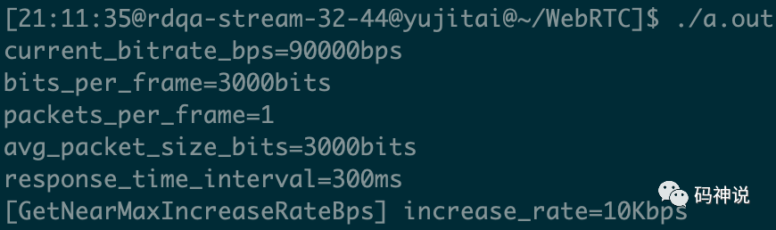

  * 测试 2

为了进一步理解过载信号被触发后码率降低的流程，进行如下测试：

    
```c++
constexpr int kInitialBitrate = 50000000;  
aimd_rate_control->SetEstimate(  
  kInitialBitrate,  
  simulated_clock.TimeInMilliseconds());  
    
constexpr int kAckedBitrate =  
  40000000 / kFractionAfterOveruse;  
RateControlInput input(  
  BandwidthUsage::kBwOverusing,  
  kAckedBitrate);  
aimd_rate_control->Update(&input,  
  simulated_clock.TimeInMilliseconds());  
```

设置码率控制器初始码率为 50Mbps，接下来输入过载信号以及发送端的码率估计值 `kAckedBitrate`（根据接收端反馈的 transport feedback 报文估计码率）。

测试输出如下图所示，可知，带宽过载后的新的码率值为 40 Mbps，在 `kAckedBitrate` 的基础上回退了 0.85 倍，与上一次的码率相比下降了 10Mbps。

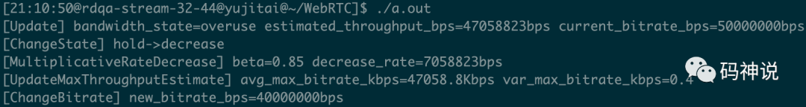

  * 测试 3

最后，看一下在网络正常的情况下码率乘性增大的过程。

    
```c++
constexpr int kAckedBitrate = 10000;  
aimd_rate_control->SetEstimate(  
  kAckedBitrate,  
  simulated_clock.TimeInMilliseconds());  
    
while (simulated_clock.TimeInMilliseconds() -  
  kClockInitialTime < 20000) {  
  RateControlInput input(  
    BandwidthUsage::kBwNormal,  
    kAckedBitrate);  
  aimd_rate_control->Update(  
    &input,  
    simulated_clock.TimeInMilliseconds());  
  simulated_clock.AdvanceTimeMilliseconds(1000);  
}  
```
    

设置码率控制器初始码率为 10000bps，每隔 1 秒进行一次 Update，每次的输入信号皆为 normal，每次的输入码率估计值均为10000bps，观察 20 秒内的码率变化，测试输出如下：

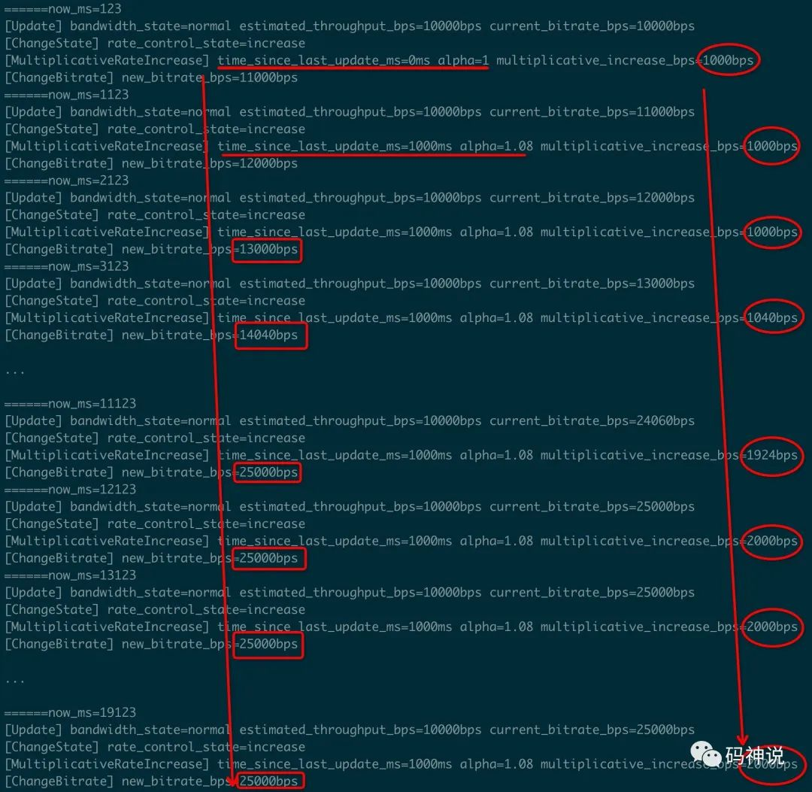

观察测试输出，可知：

  1. 在首次计算时，乘性增大系数 alpha 的时间指数为 0，因此 alpha 的值为 1 而非 1.08，理论上增加的码率值为 0，但是 WebRTC 规定了码率乘性增大的最小值 1000bps。
  2. 之后，由于我们每隔一秒 Update 一次，因此 alpha 的时间指数为 1，alpha 值为 1.08。从第四次计算开始，每次增加的码率超过了 1000bps。
  3. 因为每次输入的码率估计值为 10000 bps，因此可知码率最大值不能超过 1.5 * 10000 + 10000 = 25000bps。因此最终码率值增大到 25Kbps 后保持不变。

至此，WebRTC 的码率控制模块就讲完了，加上前面的三篇，大概脉络如下：

  1. 计算包组时间差
  2. trendline 滤波器计算延迟梯度
  3. 过载检测
  4. 码率控制

那么问题来了，发送端是如何知道发送的报文到达接收端的时间的呢？这可是计算包组时间差必不可少的条件，更是发送端 BWE 的一切之源头。

其实这个源头的秘密就在于接收端会反馈 transport feedback rtcp 报文到发送端，下一篇会介绍这个特殊的 rtcp 报文，感谢阅读。

#### 参考资料

[1]指数平滑法: _https://mp.weixin.qq.com/s?__biz=MzU3MTUyNDUzMA==&mid=2247483869&idx=1&sn=3f2d15cafed26ce21bf440f3378749d1&chksm=fcdf9500cba81c1658a561dfc57bb9fb3f5e217cbcdebbc1300dc1b2d750849ef4a96bbf05fc&token=926771124&lang=zh_CN#rd_

[2]AIMD 算法: _计算机网络第7版_

[3]GCC 草案: _https://tools.ietf.org/html/draft-ietf-rmcat-gcc-02#section-5.5_

<hr>

#### <p>原文出处：<a href='https://mp.weixin.qq.com/s?__biz=MzU3MTUyNDUzMA==&mid=2247483998&idx=1&sn=c1c9d26bc0fefe67b893790449015139&chksm=fcdf9683cba81f9573cab9ced0e271d6b1db4a0fbb04d12325bfdccf0e00dd32cdaa5bdff18d&scene=178&cur_album_id=1345116764509929473#rd' target='blank'>WebRTC 拥塞控制 | Transport-CC 之 RTP 头部扩展与 RTCP Feedback 报文</a></p>

> 本文是 `WebRTC 拥塞控制` 第 _**5**_ 篇

  * 导读
  * RTP 头部扩展
    * 扩展格式
    * 三问 transport-wide sequence number
  * TransportFeedback 报文
    * 格式总览
    * 记录 RTP 包到达状态之 Packet Chunk
    * 记录 RTP 包到达时间之 Receive Delta
    * 抓包分析

### 导读

在 WebRTC 的 Send-side BWE 中，大多数拥塞控制逻辑被放到了发送端，这样做除了方便维护，也增加了相关算法的灵活性，而这一切正是基于Transport-CC（Transport-wide Congestion Control）。

为了使用 `Transport-CC`，WebRTC 做了两件事：一是针对于发送端，增加 RTP 头部扩展 `Transport-wide Sequence Number`，二是针对于接收端，增加新的 RTCP 反馈报文 `TransportFeedback` 。

Transport-CC 的大致逻辑为：**发送端发送带有 Transport-wide Sequence Number 头部扩展的 RTP 包，接收端接收这些 RTP 包，缓存它们的到达时间并构造 `TransportFeedback` 报文反馈给发送端，发送端进行最终的网络拥塞控制。**

从本篇开始，将围绕 TransportFeedback 报文，介绍其格式以及 Send-side BWE 在接收端以及发送端的拥塞控制策略。

### RTP 头部扩展

#### 扩展格式

RTP 头部 Transport-wide Sequence Number 扩展格式定义如下：

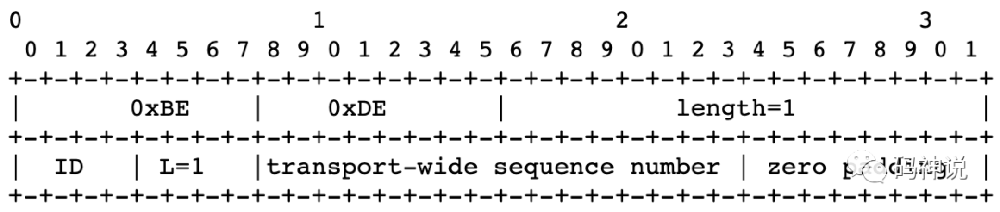

该扩展以 0xBEDE 开头，transport-wide sequence number 字段占用两个字节，从 1 开始递增到 65535 后会向前回绕到1。

使用 wireshark 对带有 transport-wide sequence number 扩展的 RTP 流进行抓包，结果如下图：

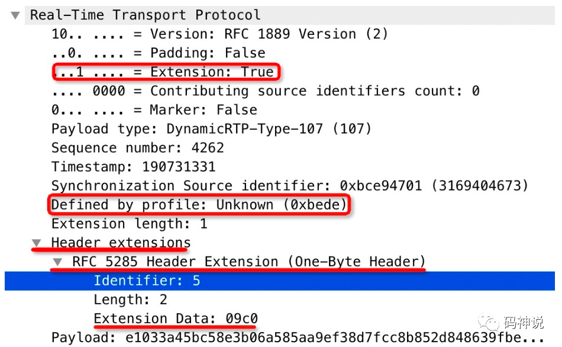

可以看到，该 RTP 包的 transport-wide sequence number 为 0x09c0（2496）。

#### 三问 transport-wide sequence number

  * 什么是 transport-wide sequence number？

transport-wide sequence number 对经由同一个 `PeerConnection`（亦或 `socket`）发送出去的 RTP 包进行计数，是**网络传输层**的数据包的 sequence number。

  * 为什么要使用 transport-wide sequence number？

我们知道，RTP 包头部已经含有 sequence number 字段用于记录 RTP 包的序列号，那么为何还要增加 transport-wide sequence number 呢？

这是因为，RTP 包头部的 sequence number 字段是针对**单路媒体流**（MediaStream）进行计数，并不能对某个`PeerConnection` 通道进行计数，从而估计该 PeerConnection 通道的带宽使用情况。

一般情况下，一个 `PeerConnection` 只会包含一路流（无论是用于推流还是拉流），此时 RTP 包头部的 sequence number 可以满足需求。但是，一个 `PeerConnection` 也可能会包含多路流。比如在视频连麦中， 用户既要推自己的流又要拉对方的流，这就是所谓的**PeerConnection 多路复用**。

由于 RTP 包头部的 sequence number 针对每一路流单独计数，此时便不再满足需求。因此，为了能对某个 `PeerConnection` 通道进行带宽估计，在 RTP 头部增加一个网络传输层扩展  transport-wide sequence number，使用统一的计数器对该通道下所有的视频流进行计数。

举个例子，假设同一个 PeerConnection 下传输两个视频流 A 与 B，它们的 RTP 包记为 Ra(n, m)，Rb(n, m)，n 表示 sequence number，m 表示 transport-wide sequence number，这样，同一个 `PeerConnection`下，视频流按如下形式传输：Ra(1, 1)、Ra(2, 2)、Rb(1, 3)、Rb(2, 4)、Ra(3, 5)、Ra(4, 6)、Rb(3, 7)、Rb(4, 8)。

总结一下，正如 transport-wide-cc 草案[1] 说得那样，使用 transport-wide sequence number 的好处有两点：

  1. 更适用于拥塞控制。

因为拥塞控制算法不是在媒体流上运行，而是在传输层的数据包流上运行。

  2. 更快速的丢包检测与恢复。

比如两路流 A 和 B，当 stream A 发生丢包，则不必等到 stream A 的下一个包到来再触发丢包检测机制，从而进行 nack 请求。来自stream B 的包也同样可以触发丢包检测机制，因为两路流使用统一的 transport-wide sequence number 进行计数。

  * 如何使用 transport-wide sequence number？

Send-side BWE 启动的关键在于开启 RTP 头部扩展 transport-wide sequence number，这样，接收端才能反馈TransportFeedback 报文。开启头部扩展的方式很简单，只需要在 sdp 信息中加入相应的 `extmap` 属性，如下：

> a=extmap:5 http://www.ietf.org/id/draft-holmer-rmcat-transport-wide-cc-extensions-01

相应的，WebRTC 在获取视频引擎能力的函数中开启 transport-cc RTP 头部扩展，代码如下：


```c++
RtpCapabilities GetCapabilities() const {  
  RtpCapabilities capabilities;  
  capabilities.header_extensions.push_back(webrtc::RtpExtension(  
    webrtc::RtpExtension::kTransportSequenceNumberUri,  
    webrtc::RtpExtension::kTransportSequenceNumberDefaultId));  
}  
```

### TransportFeedback 报文

正如 `Remb` 作为 Receive-side BWE 的关键 RTCP 报文，`Transport Feedback` 则作为 Send-side BWE 的关键 RTCP 报文，它们是拥塞控制算法架在发送端与接收端之间的一座桥梁。

这两种与拥塞控制相关的 RTCP 报文的类型如下表所示：

<table data-tool="mdnice编辑器" style="display: table;text-align: left;"><thead><tr style="border-width: 1px 0px 0px;border-right-style: initial;border-bottom-style: initial;border-left-style: initial;border-right-color: initial;border-bottom-color: initial;border-left-color: initial;border-top-style: solid;border-top-color: rgb(204, 204, 204);background-color: white;"><th style="font-size: 16px;border-width: 1px;border-style: solid;border-color: rgb(204, 204, 204);padding: 5px 10px;font-weight: bold;background-color: rgb(240, 240, 240);text-align: center;">rtcp</th><th style="font-size: 16px;border-width: 1px;border-style: solid;border-color: rgb(204, 204, 204);padding: 5px 10px;font-weight: bold;background-color: rgb(240, 240, 240);text-align: center;">packet type</th><th style="font-size: 16px;border-width: 1px;border-style: solid;border-color: rgb(204, 204, 204);padding: 5px 10px;font-weight: bold;background-color: rgb(240, 240, 240);text-align: center;">feedback message type</th></tr></thead><tbody style="border-width: 0px;border-style: initial;border-color: initial;"><tr style="border-width: 1px 0px 0px;border-right-style: initial;border-bottom-style: initial;border-left-style: initial;border-right-color: initial;border-bottom-color: initial;border-left-color: initial;border-top-style: solid;border-top-color: rgb(204, 204, 204);background-color: white;"><td style="font-size: 16px;border-width: 1px;border-style: solid;border-color: rgb(204, 204, 204);padding: 5px 10px;text-align: center;">remb</td><td style="font-size: 16px;border-width: 1px;border-style: solid;border-color: rgb(204, 204, 204);padding: 5px 10px;text-align: center;">206 &nbsp;(psfb)</td><td style="font-size: 16px;border-width: 1px;border-style: solid;border-color: rgb(204, 204, 204);padding: 5px 10px;text-align: center;">15</td></tr><tr style="border-width: 1px 0px 0px;border-right-style: initial;border-bottom-style: initial;border-left-style: initial;border-right-color: initial;border-bottom-color: initial;border-left-color: initial;border-top-style: solid;border-top-color: rgb(204, 204, 204);background-color: rgb(248, 248, 248);"><td style="font-size: 16px;border-width: 1px;border-style: solid;border-color: rgb(204, 204, 204);padding: 5px 10px;text-align: center;">transport feedback</td><td style="font-size: 16px;border-width: 1px;border-style: solid;border-color: rgb(204, 204, 204);padding: 5px 10px;text-align: center;">205 &nbsp;(rtpfb)</td><td style="font-size: 16px;border-width: 1px;border-style: solid;border-color: rgb(204, 204, 204);padding: 5px 10px;text-align: center;">15</td></tr></tbody></table>

在 WebRTC 中，接收端发送 `TransportFeedback` 报文的时间间隔是一个动态值（50ms ~ 250ms）。发送间隔会根据码率值的 5% 进行计算，也就是说 `TransportFeedback` 报文至多占用总带宽的 5%。

同理，开启 transport-cc 的 `TransportFeedback` 报文反馈，需要在 sdp 中增加 `rtcp-fb` 属性。

> a=rtcp-fb:107 transport-cc

WebRTC 视频编解码器默认开启 transport-cc 的 `rtcp-fb` 属性，代码如下：


```c++
void AddDefaultFeedbackParams(VideoCodec* codec) {  
  codec->AddFeedbackParam(FeedbackParam(  
    kRtcpFbParamTransportCc,  
    kParamValueEmpty));  
}  
```

#### 格式总览

先整体看下 TransportFeedback 包的格式：

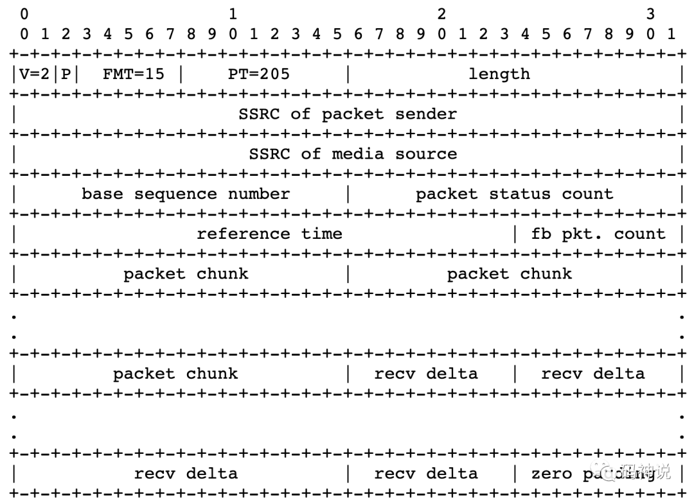

整体格式为：4 字节 RTCP 固定头部 + 8 字节 ssrc 信息 + 真正的 TransportFeedback 报文的反馈信息 `Feedback Control Info`。

  * packet status count

2 字节，表示这个 TransportFeedback 包记录了多少个 RTP 包的到达信息。

  * base sequence number

2 字节，TransportFeedback 包中记录的第一个 RTP 包的 transport-wide sequence number。

一般情况下，当前 TransportFeedback 包的 base sequence number 加上 packet status count 等于下一个 TransportFeedback 包的 base sequence number。

但是注意，在反馈的各个 TransportFeedback 包中，base sequence number 不一定是递增的，也有可能比之前的小。在 RTP 包乱序到达的场景下会发生这种情况，这会导致之前已经被反馈的 RTP 包的到达信息再次被反馈。

  * feedback packet count

1 字节，每发送一个 TransportFeedback 包计数器都会加 1，相当于 RTCP 的 sequence number，用于检测 TransportFeedback 包的丢包情况，取值范围 [0, 255]

  * reference time

3 字节，表示参考时间，**单位为 64ms**，TransportFeedback 包记录的 RTP 包的到达时间以它作为基准进行计算。

  * packet chunk

2 字节，记录 RTP 包的到达状态。注意，本文所指的 RTP 包的到达状态包括包到达和包未到达。

  * recv delta

1 字节或者 2 字节，记录 RTP 包之间的到达时间偏移。

#### 记录 RTP 包到达状态之 Packet Chunk

##### Packet Status Symbols

在介绍 packet chunk 之前，我们先来看一下 RTP 包的三种到达状态（ Packet Status Symbols）。

  * 00 Packet not received

到达状态为包未到达，无到达时间偏移。

  * 01 Packet received, small delta

到达状态为包到达，到达时间偏移小。

  * 10 Packet received, large or negative delta

到达状态为包到达，到达时间偏移大或者为负值。

  * 11 [Reserved]

保留，目前不处理这种情况。

在网络质量高的情况下，RTP 包的到达时间偏移一般很小，属于 `small delta`。

注意，在 RTP 包乱序的场景下，比如，下一个期望接收的包号是 3，结果来的是 5，对于 4 号包的处理，WebRTC 的做法是：将其到达状态标记为`Packet not received` ，设置其到达时间偏移为 0，即没有 recv delta。不过，4 号包不一定真的丢失，如果接下来 4 号包到达，那么依然会被标记为 `Packet received` 状态并以 `TransportFeedback` RTCP 报文的形式反馈给发送端。

接下来介绍 packet chunk。

packet chunk有两种类型，`Run length chunk`（行程长度编码数据块）与 `Status vector chunk`（状态矢量编码数据块），对应 packet chunk 结构的两种编码方式。

两种类型的 chunk 的长度都是 2 字节，数据包状态以 chunk 块的形式描述。

##### Run Length Chunk（行程长度编码数据块）

先来了解下 Run Length（行程长度）编码。

> Run Length 编码是一种简单的数据压缩算法，其基本思想是将重复且连续出现多次的字符使用 `连续出现次数+字符` 来描述。例如：aaabbbcdddd 通过 Run Length 编码就可以压缩为 3a3bc4d。Run Length Chunk 中就使用了 Run Length 编码标识连续多个相同状态的包。

Run length chunk 第一个 bit 为 0，后面跟着包的到达状态 packet status symbol 以及具有该到达状态的包的数量
run length，格式如下：

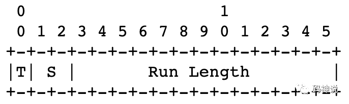

  * chunk type (T)

1 bit，值为 0。

  * packet status symbol (S)

2 bits，标识包的到达状态（00、01、10）。

  * run length (L) 

13 bits，行程长度，标识有多少个连续包具有相同的到达状态。

下面举个例子说明。

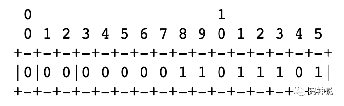

chunk type 为 0 ，可知为 RLE chunk。

packet status symbol 为 00，可知包的到达状态为 `Packet not received`。

run length 为 0000011011101，即 221，可知有 221 个连续的包的到达状态为 `Packet not received`。

##### Status Vector Chunk（状态矢量编码数据块）

Status vector chunk 第一个 bit 为 1，后面跟着 1 bit symbol size，决定 symbol list 的大小为 7
还是 14，格式如下：

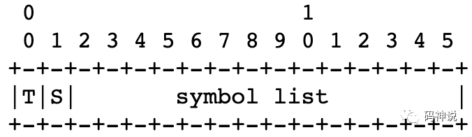

  * chunk type (T)

1 bit，值为 1。

  * symbol list

14 bits，packet status symbol list，标识一系列包的到达状态，根据 symbol size 值的不同，具有不同的编码方式，总共能标识 7 或 14 个包的到达状态。

  * symbol size (S)

注意，这个 S 并不是 packet status symbol，而是 packet status symbol size，它决定包的到达状态的编码方式，即packet status symbol 用  1 个 bit 表示还是用 2 个 bit 表示。

S=0，表示每 1 个 bit 表示 1 个包的到达状态，1 bit 可表示的状态只有 packet not received(00) 与 packet received(01) 两种，此时 symbol list 可以标识 14 个包的到达状态。

S=1，表示每 2 个 bit 表示 1 个包的到达状态，2 bit 可表示目前已定义的全部状态：packet not received(00)、packet received(01)、和 packet received(10)，此时 symbol list 可以标识 7 个包的到达状态。

可以看出，这样极致的利用每一个 bit，是为了尽可能用更小的空间表示更多的包的到达状态。

下面举个例子说明。

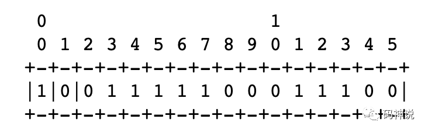

chunk type 为 1 ，可知为 Status Vector chunk。

symbol size 为 0，可知包的到达状态用 1 bit 来表示，一共可以标识 14 个包的到达状态。

symbol list 标识的包的到达状态依次是：

1x `packet not received`

5x `packet received`

3x `packet not received`

3x `packet received`

2x `packet not received`

#### 记录 RTP 包到达时间之 Receive Delta

到达时间偏移，表示 RTP 包到达时间与前面一个 RTP 包到达时间的间隔，单位是 **250us（0.25ms）**。

对于当前 TransportFeedback 包中记录的第一个 RTP 包，虽然它的前面没有 RTP 包，但是也会计算它的到达时间偏移。不过该包的到达时间偏移是相对于 `reference time` 的，至于这样做的原因，我猜测可能是为了统一处理的逻辑吧。

packet chunk 用到了不同编码方式，对于收到的 RTP 包才添加到达时间信息，而且是通过时间间隔的方式记录到达时间。

  * 如果在 packet chunk 中记录了一个 `Packet received, small delta` 状态的包，那么会在 receive delta 列表中添加一个 8-bit unsigned 长度的 receive delta ，取值范围为 `[0, 255]`。由于 receive delta 单位为 0.25ms，所以此时 receive delta，即到达时间偏移量的取值范围为 `[0ms, 63.75ms]`。
  * 如果在 packet chunk 中记录了一个 `Packet received, large or negative delta` 状态的包，那么会在 receive delta 列表中添加一个 16-bit signed 长度的 receive delta ，取值范围为 `[-32768, 32767]`。由于 receive delta 单位为 0.25ms，所以此时 receive delta，即到达时间偏移量的取值范围为 `[-8192.0ms, 8191.75ms]`。
  * 如果到达时间偏移超过了最大限制，那么会构建一个新的 TransportFeedback RTCP 包，由于 `reference time `长度为 **3** 字节，所以目前的包中 3 字节长度能够覆盖很大范围了。

我们发现，`packet chunk` 中包的三种到达状态：0（未到达，可能丢失）、1（到达，小的到达时间偏移）、2（到达，大的到达时间偏移） ，恰好对应`receive delta` 的三种不同的长度：0 字节，1 字节，2 字节。因此，总结一下：对于每一个到达状态为 `Packet received` 的 RTP 包：

  * 如果到达状态为 01，即到达时间偏移小，那么 receive delta 使用 1 字节表示。
  * 如果到达状态为 10，即到达时间偏移大，那么 receive delta 使用 2 字节表示。
  * 如果到达时间偏移已经超出了最大限制，另起新的 TransportFeedback 包。

对于到达状态为 `Packet not received` 的 RTP 包，因为根本未到达，所以不需要 receive delta 标识。在 WebRTC 的实现中执行 `AddDeltaSize(0)` 函数，来标记这是一个未到达的包。

可以看出，对于不同大小的到达时间偏移，receive delta 占用的字节长度也不同，与 packet chunk 不同的编码方式一样，这样做的目的是**尽可能减小 TransportFeedback 包的大小，尽量降低 TransportFeedback 反馈报文的带宽占用**。

最后，对于 `Packet received, small delta` 状态的包来说：

  * receive delta 最大值为 63.75ms，这意味着 1 秒时间跨度最少能标识 1000/63.75~=16 个包，如果包大小为 1200 bytes，那么码率可达 150 Kbps。
  * receive delta 时间单位为 0.25ms，这意味着 1 秒时间跨度最多能标识 1000/0.25 = 4000 个包，如果包大小为 1200 bytes，那么码率可达 38.4 Mbps。

#### 抓包分析

下面，我们抓包来实际看下 `TransportFeedback` 报文的格式，如下图：

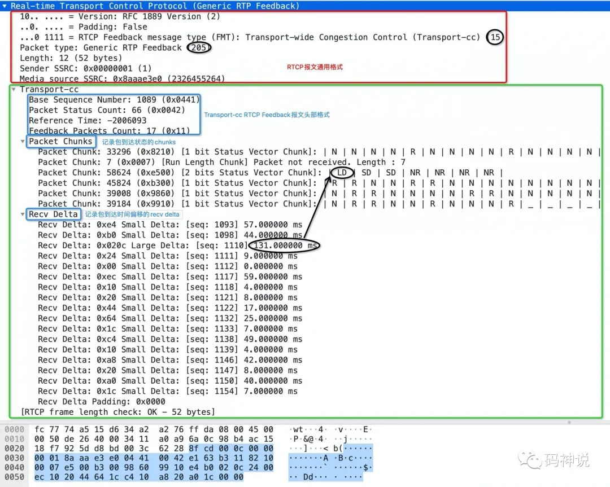

红色方框中的部分是 RTCP 报文的通用格式，其中，前 8 个字节（固定4 字节头部和 sender ssrc 字段）是所有 RTCP 报文所共有的，而有没有 media source ssrc 字段则要视具体的 RTCP 报文而定。

比如 Nack、Pli、TransportFeedback 报文就有这个字段，Sender report、Receiver report 则没有这个字段，而Fir、Remb 报文虽然有这个字段但是却设置为 unused 状态（值为 0）。

绿色方框中的部分是真正的 `TransportFeedback` 报文的格式，总体分为三大部分：头部、记录包到达状态的 chunk 以及记录包到达时间偏移的recv delta。

观察上图，我总结了几个比较重要的点以帮助你更好的理解这个报文：

  1. 该报文 `base sequence number` 为 1089，packet status count 为 66，那么下一个要发送的 TransportFeedback 报文的 base sequence number 为 1089 + 66 = 1155。

  2. 该报文携带了全部三种不同编码方式的 chunks。对于 1 bit status vector chunk，N 代表 `packet not received`，R 代表 `packet received，small delta`，对于 2 bit status vector chunk，NR 代表 `packet not received`，SD(small delta) 代表 `packet received，small delta`，LD(large delta) 代表  `packet received，large delta`。

  3. 到达状态为 `packet not received` 的包没有 recv delta。观察上图，packet status count 值为 66，不妨数一下 chunks 记录的包的到达状态的数量，为 14 + 7 + 7 + 14 + 14 + 10 = 66，二者一致。然而 recv delta 的数量却只有 17，因为只有真正收到了包，才会记录其到达时间偏移，这应该很好理解。

  4. small delta 的取值范围是 `[0ms, 63.75ms]`，观察 recv delta，存在一个 large delta 为 131ms，已经超出了 63.75ms，其他的 small delta 都是在 63.75ms 之内。

至此，我们了解了 `transport-cc` 的关键策略：增加 RTP 头部扩展和 RTCP Feedback 报文，本篇着重介绍了它们的格式。下一篇将围绕着 `TransportFeedback` 报文，深入源码，介绍 transport-cc在接收端以及发送端的逻辑框架，感谢阅读。

#### 参考资料

[1]transport-wide-cc 草案: _https://tools.ietf.org/html/draft-holmer-rmcat-transport-wide-cc-extensions-01_
