 
<!--BEGIN_DATA
{
    "create_date": "2020-09-12 19:50", 
    "modify_date": "2020-09-12 19:50", 
    "is_top": "0", 
    "summary": "WebRTC源码分析-DataChannel及其相关类", 
    "tags": "WebRTC", 
    "file_name": "WebRTC源码分析-DataChannel及其相关类.md"
}
END_DATA-->

#### <p>原文出处：<a href='https://blog.csdn.net/ice_ly000/article/details/106129811' target='blank'>WebRTC源码分析-DataChannel及其相关类</a></p>

## 1. 引言

我们在文章 [WebRTC源码分析-呼叫建立过程之四（下）(创建数据通道DataChannel)](https://blog.csdn.net/ice_ly000/article/details/105967584) 中分析了DataChannel的创建过程，但是也遗留了一些问题留待需要解答：

  1. DataChannelController这个对象是什么时候创建的呢？
  2. SCTP底层传输对象DataChannelTransportInterface到底实体类是哪个？什么时候创建的？
  3. DataChannelController与DataChannelTransportInterface是如何建立关联，又是在何时建立的关联？

本文将在分析DataChannel相关的几个类的基础上来一一解答上述问题。另外由于SCTP是DataChannel主流的底层传输方式，RTP类别的底层传输是未来要弃用的，因此，本文将只针对SCTP进行分析。

## 2. DataChannelController

DataChannelController类是WebRTC数据通道的聚合器，保存着所有数据通道的上层对象DataChannel，也保存着数据通道的底层传输——实现DataChannelTransportInterface接口的对象（RTP协议是RtpDataChannel，后续将略过不再提）。同时，它起着桥梁作用，将上层DataChannel要发送的数据，传递给底层通道DataChannelTransportInterface进行网络数据包发送，同时又将底层通道的状态以及接收到的数据回传给上层DataChannel。

  

PC、DataChannelController、DataChannel、DataChannelTransport的关系如上图所示。如果，在更新的代码中DataChannelController不存在了也不用惊讶，它所有的功能都迁移到PC中了。

### 2.1 DataChannelController继承结构

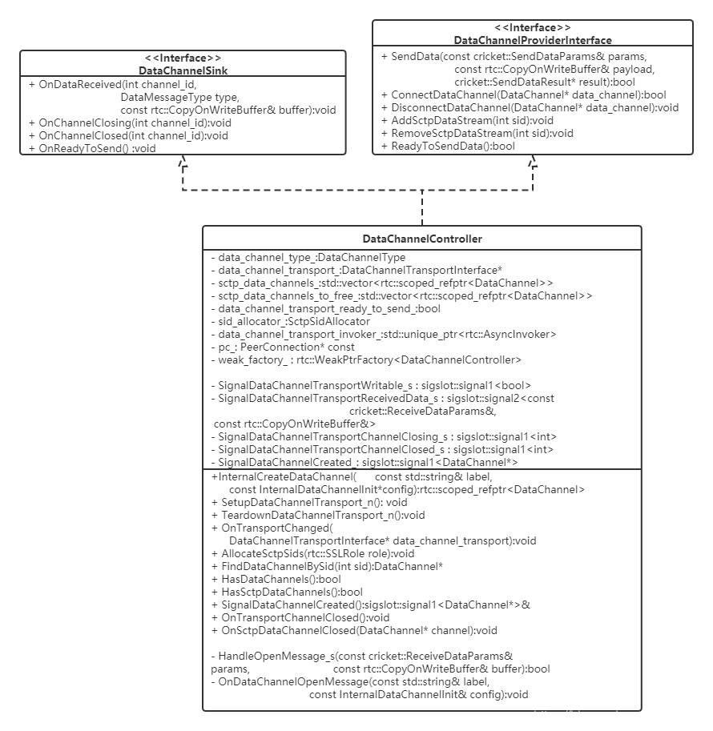

上图是DataChannelController的继承结构图，对于DataChannelController类我省略了如下几个部分的东西：

  * RTP相关的成员与方法
  * 成员的getter/setter方法
  * 对接口DataChannelSink && DataChannelProviderInterface的方法实现

### 2.2 数据和通道状态上行

* **DataChannelTransportInterface——>DataChannelController：** DataChannelController实现接口DataChannelSink，通`data_channel_transport_.SetDataSink`方法将自已以Sink概念注入到底层的传输通道对象中，以此实现`DataChannelControllerdata_channel_transport_`获取对端传来的数据，并观察底层传输通道状态。假如`data_channel_transport_`的实体类SctpDataChannelTransport，那么数据的向DataChannelController传递如下图所示：  

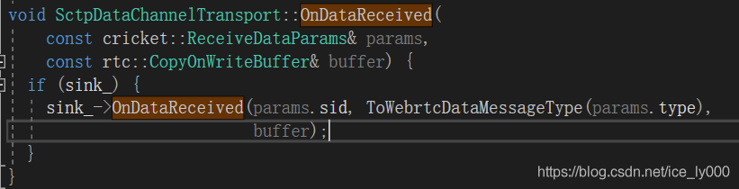

另DataChannelController实现DataChannelSink接口时，以实现数据接收方法OnDataReceived为例：稍微做了下参数转换后，然后异步方式投递DataChannelController的信号`SignalDataChannelTransportReceivedData_s`。**注意：OnDataReceived是提供给底层的回调，底层的收发包是在网络线程中进行的，因此，OnDataReceived也是在network线程中执行。而更上层的数据处理必须代理到信令线程执行**  

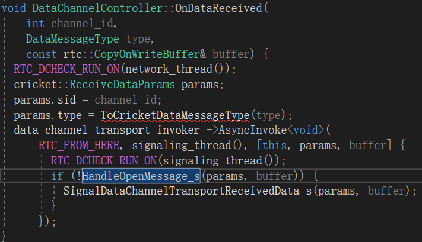

* **DataChannelController——>DataChannel：** 在文章 [WebRTC源码分析-呼叫建立过程之四（下）(创建数据通道DataChannel)](https://blog.csdn.net/ice_ly000/article/details/105967584) 中，我们已经知道创建DataChannel时，DataChannel会关联DataChannelController的信号：由此，数据到达信号`SignalDataChannelTransportReceivedData_s`会触发DataChannel::OnDataReceived方法，完成数据传导到DataChannel。  

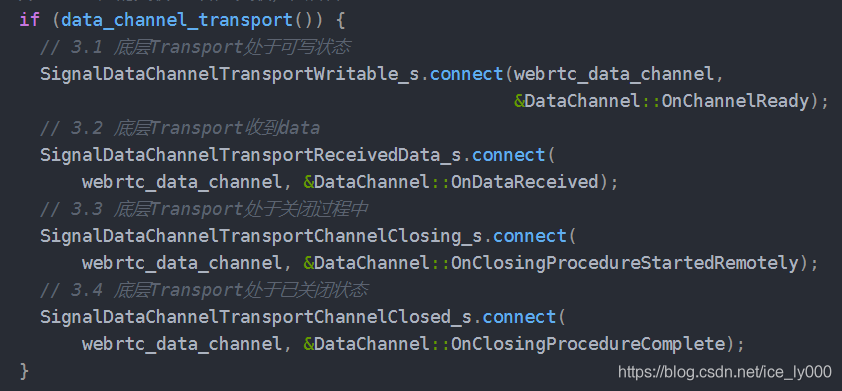

* **DataChannel——>应用层：** DataChannel中会保存它的观察者对象成员`DataChannelObserver* observer_`，当数据到达时，通过调用`observer_->OnMessage()`方法传导数据到应用层。

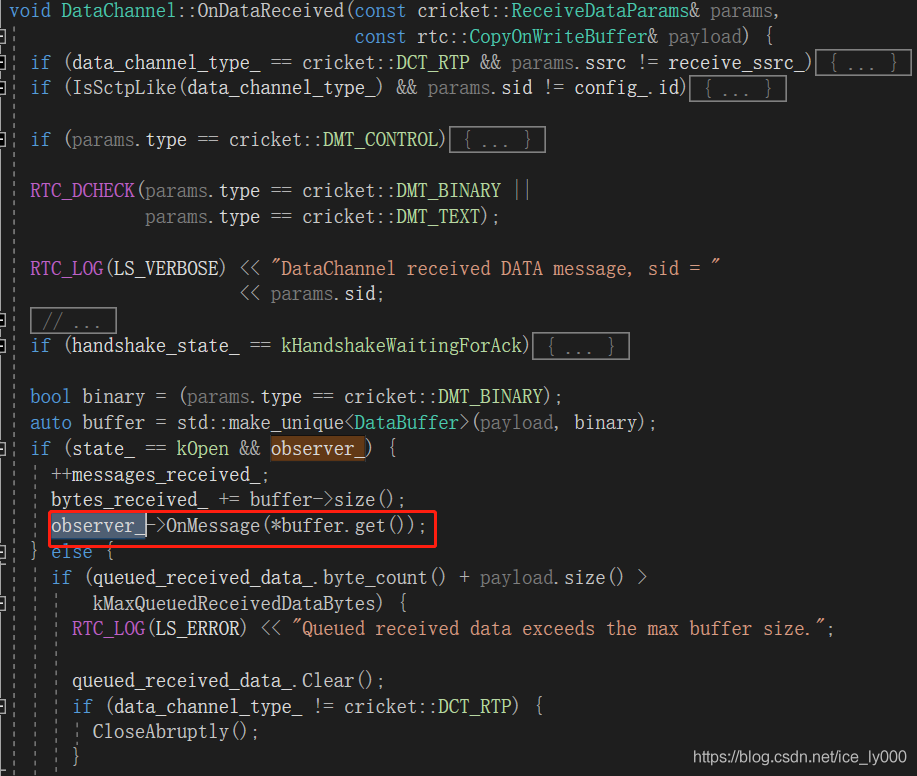

### 2.3 数据下行

* **应用层——>DataChannel：** DataChannel向底层发送数据有两大类：一类是应用数据，具体还分为二进制数据和文本数据；一类是控制信令，用于SCTP的握手状态协商。

**发送应用数据的时机** 当应用层调用DataChannel::Send方法时，将向投底层投递应用数据，当底层未处于可发送状态时，数据会在DataChannel的·PacketQueue queued_send_data_·成员中进行排队，如下图调用QueueSendDataMessage方法。底层处于可发送状态时，将向底层发送数据，如下图调用SendDataMessage方法。

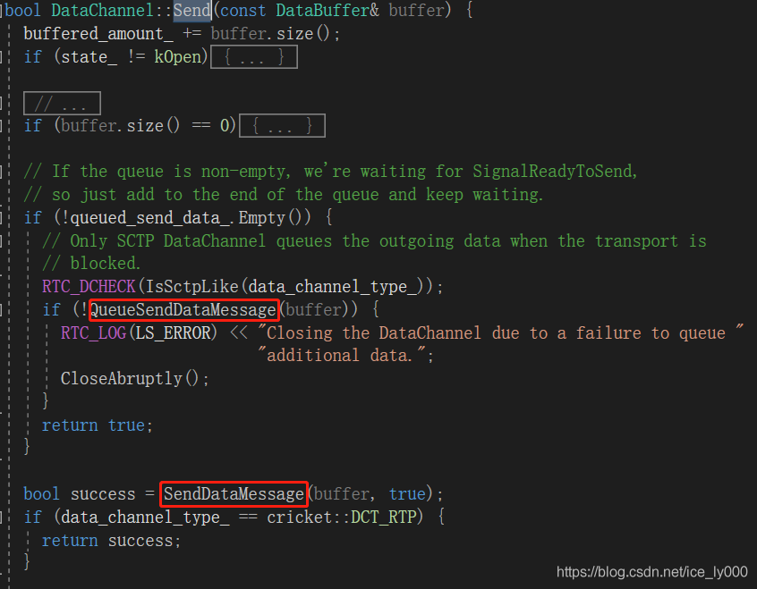

**发送控制信令的时机** DataChannel保存着该层状态DataState，新创建的DataChannel处于kConnecting状态，处于该状态时，DataChannel不能发送应用数据，只能发送握手控制信令。 

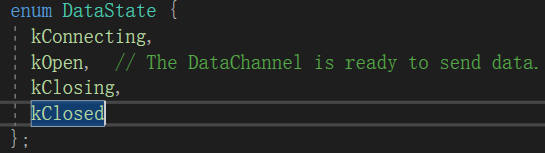  

当底层通道准备好时(如上分析，状态会上行到DataChannel)，调用DataChannel的UpdateState方法，通过判断当时的DataChannel状态值 && 握手角色来构造合适的握手控制信令，并向底层投递，如下图调用SendControlMessage()方法

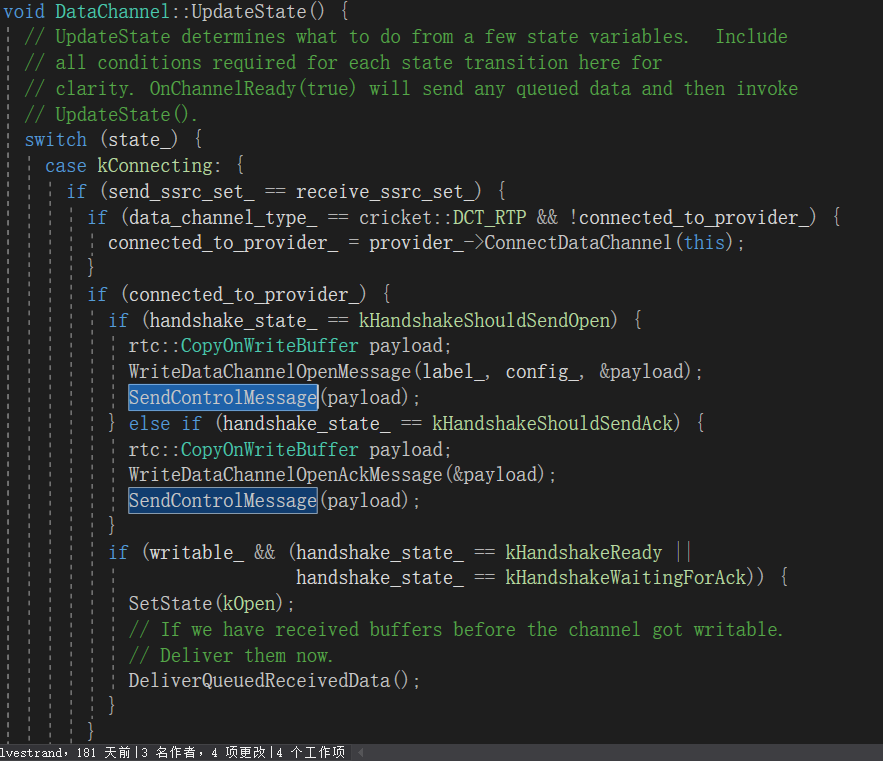

* **DataChannel——>DataChannelController：** 当构造DataChannel时，我们知道DataChannelController会被存储到DataChannel中，作为provider存在。而DataChannelController通过实现DataChannelProviderInterface接口，提供了发送数据的方法SendData()。DataChannel不论是调用SendDataMessage()方法发送应用层数据也好，还是调用SendControlMessage()发送握手控制信令也好，最终都是通过调用provider->SendData()完成数据下发，从而数据传到到DataChannelController。

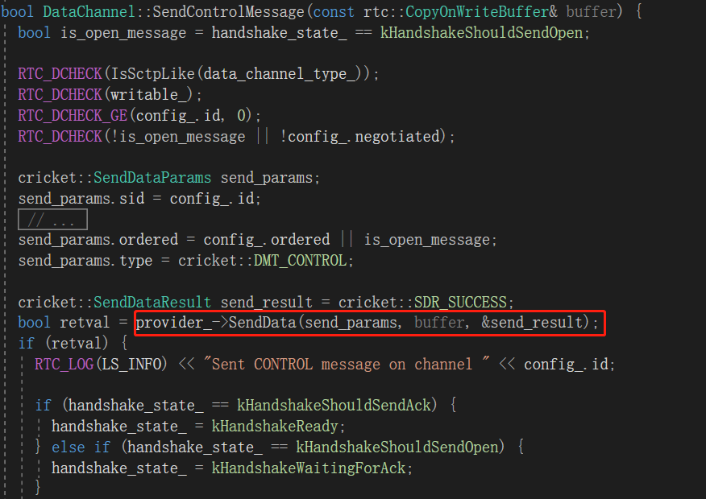

* **DataChannelController——>DataChannelTransportInterface：** DataChannelController的SendData方法中会同步调用DataChannelTransportInterface的SendData方法，该方法是在network线程中执行，并返回结果  

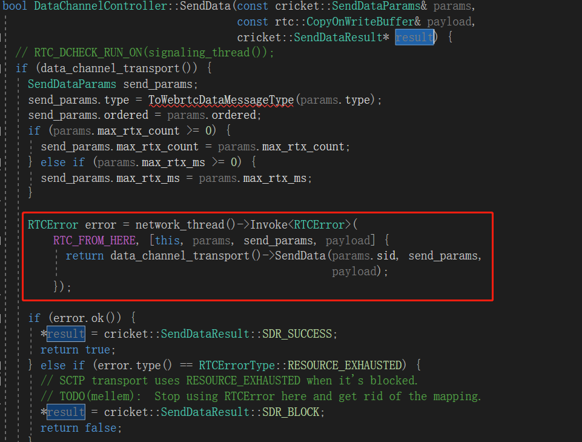

PS: 通过上述分析，底层传输通道工作在network线程中，上层DataChannel层工作在信令线程中，DataChannelController在数据/状态传递过程中还需要进行线程之间的转换。向上传递时，通过成员`std::unique_ptr<rtc::AsyncInvoker> data_channel_transport_invoker_`的AsyncInvoker方法进行转换；向下转换时，通过网络线程的Invoke方法同步调用底层通道的方法。

### 2.4 DataChannelController什么时候创建的？

现在，回答引言中的第一个问题：DataChannelController什么时候创建的？由于DataChannelController作为PC的成员变量，不是以指针形式存在，因此，在创建PC时，DataChannelController就已经被创建

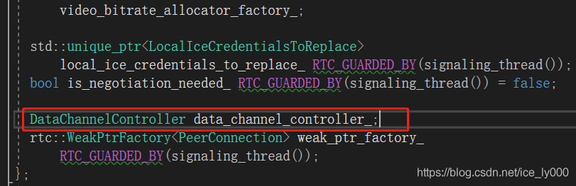

## 3. DataChannelTransportInterface

DataChannelTransportInterface接口代表了数据通道的底层传输，其声明如下：

```cpp
class DataChannelTransportInterface {
  public:
  virtual ~DataChannelTransportInterface() = default;
  // Opens a data |channel_id| for sending.  May return an error if the
  // specified |channel_id| is unusable.  Must be called before |SendData|.
  virtual RTCError OpenChannel(int channel_id) = 0;
  // Sends a data buffer to the remote endpoint using the given send parameters.
  // |buffer| may not be larger than 256 KiB. Returns an error if the send
  // fails.
  virtual RTCError SendData(int channel_id,
                            const SendDataParams& params,
                            const rtc::CopyOnWriteBuffer& buffer) = 0;
  // Closes |channel_id| gracefully.  Returns an error if |channel_id| is not
  // open.  Data sent after the closing procedure begins will not be
  // transmitted. The channel becomes closed after pending data is transmitted.
  virtual RTCError CloseChannel(int channel_id) = 0;
  // Sets a sink for data messages and channel state callbacks. Before media
  // transport is destroyed, the sink must be unregistered by setting it to
  // nullptr.
  virtual void SetDataSink(DataChannelSink* sink) = 0;
  // Returns whether this data channel transport is ready to send.
  // Note: the default implementation always returns false (as it assumes no one
  // has implemented the interface).  This default implementation is temporary.
  virtual bool IsReadyToSend() const = 0;
};
```  

  * OpenChannel && CloseChannel：由于上层的多个DataChannel是共享同一个底层传输通道的，因此，需要将上层DataChannel以其标识值sid作为`channel_id`注册进入底层传输通道中；
  * SendData：提供了数据向网络层传送的接口；
  * SetDataSink: 如前文所述，以回调的形式提供了数据/状态上报；
  * IsReadyToSend：提供状态查询接口。

现在，我们回答引言中的第二个问题：SCTP底层传输对象DataChannelTransportInterface到底实体类是哪个？什么时候创建的？

### 3.1 DataChannelTransportInterface创建时机追踪

搜索整个WebRTC工程，可以看到有四个类实现了DataChannelTransportInterface，那么，什么时候，什么条件下创建哪个实体类？  

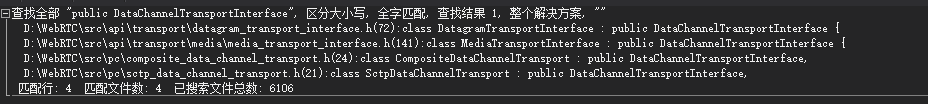

采用倒推法：首先，DataChannelController提供了DataChannelTransportInterface的setter方法`set_data_channel_transport`，并且DataChannelController是PC的一个成员，因此，很可能是PC的一个方法中调用的。去PC的实现文件中查看，果然如此：就在PC的`SetupDataChannelTransport_n`中

#### 3.1.1 PeerConnection::SetupDataChannelTransport_n

```cpp
bool PeerConnection::SetupDataChannelTransport_n(const std::string& mid) {
  // 1. 根据DataChannel的mid值获取底层的Transport
  DataChannelTransportInterface* transport =
      transport_controller_->GetDataChannelTransport(mid);
  if (!transport) {
    RTC_LOG(LS_ERROR)
        << "Data channel transport is not available for data channels, mid="
        << mid;
    return false;
  }
  RTC_LOG(LS_INFO) << "Setting up data channel transport for mid=" << mid;
  // 2. data_channel_controller_设置底层传输通道成员
  //    2.1 设置DataChannelController的成员data_channel_transport_
  data_channel_controller_.set_data_channel_transport(transport);
  //    2.2 设置底层向上层传递数据/状态时，进行network——>signal线程转换的辅助类成员
  //        std::unique_ptr\<rtc::AsyncInvoker> data_channel_transport_invoker_
  data_channel_controller_.SetupDataChannelTransport_n();
  // 3. mid为SDP中mLine的mid值，由于sctp_mid_只是单个值，所以反映出使用SCTP
  //    传输多路DataChannel时，只有一个Transport，也只对应SDP中一个mLine。
  sctp_mid_ = mid;
  // 4. 设置DataChannelController为底层Transport的DataSink
  // Note: setting the data sink and checking initial state must be done last,
  // after setting up the data channel.  Setting the data sink may trigger
  // callbacks to PeerConnection which require the transport to be completely
  // set up (eg. OnReadyToSend()).
  transport->SetDataSink(&data_channel_controller_);
  return true;
}
```

**划重点：** `SetupDataChannelTransport_n`方法的作用是打通了底层Transport与DataChannelController之间的通路

DataChannelTransportInterface是从PC的`std::unique_ptr<JsepTransportController> transport_controller_`成员中根据mid获取的，想必`transport_controller_`中保存了所有Transport（音频、视频、数据)，很可能DataChannelTransportInterface就是在`transport_controller_`中创建的，但暂且先放下`transport_controller_`的研究，先看看下面这个问题。

问题：SetupDataChannelTransport_n何时被调用？全局搜索源码，只有在PC的CreateDataChannel方法中被调用，注意PC有两个CreateDataChannel方法，此处的CreateDataChannel非上篇文章中的那个

#### 3.1.2 PeerConnection::CreateDataChannel

```cpp
bool PeerConnection::CreateDataChannel(const std::string& mid) {
  switch (data_channel_type()) {
    case cricket::DCT_SCTP:
    case cricket::DCT_DATA_CHANNEL_TRANSPORT_SCTP:
    case cricket::DCT_DATA_CHANNEL_TRANSPORT:
      // 1. 在网络线程中执行PeerConnection::SetupDataChannelTransport_n方法
      //    该方法使得底层Transport与DataChannelController关联上。
      if (!network_thread()->Invoke<bool>(
              RTC_FROM_HERE,
              rtc::Bind(&PeerConnection::SetupDataChannelTransport_n, this,
                        mid))) {
        return false;
      }
      // 2. 调用sctp_data_channels_中所有的DataChannel的OnTransportChannelCreated
      //    方法，该方法使得DataChannel与DataChannelController关联上，同时将通道sid值
      //    注册到底层Transport中。
      // All non-RTP data channels must initialize |sctp_data_channels_|.
      for (const auto& channel :
            *data_channel_controller_.sctp_data_channels()) {
        channel->OnTransportChannelCreated();
      }
      return true;
    case cricket::DCT_RTP:
    default:
      // 此处省略了RTP通道处理代码
      return true;
  }
  return false;
}
```   

**划重点：** CreateDataChannel通过调用`SetupDataChannelTransport_n`方法，将底层Transport与DataChannelController关联上；再挨个调用DataChannel::OnTransportChannelCreated，将DataChannel与DataChannelController关联上，并将表征DataChannel的sid值注册到底层的Transport中。至此，Transport——DataChannelController——DataChannel的任督二脉被打通了。

继续跟踪CreateDataChannel的调用，发现其在两个方法中被调用，一个是PeerConnection::UpdateDataChannel；一个是PeerConnection::CreateChannels。

搜索CreateChannels方法调用，发现该方法在PeerConnection::ApplyLocalDescription && PeerConnection::ApplyRemoteDescription中被调用，但是位置都在这样一个分支中，如下图源码所示：表明CreateChannels只有在Plan B这种SDP格式中才会被调用，而该方式将会被淘汰，因此，我们就不再关注该路径了。后续只考虑UpdateDataChannel这条路径。

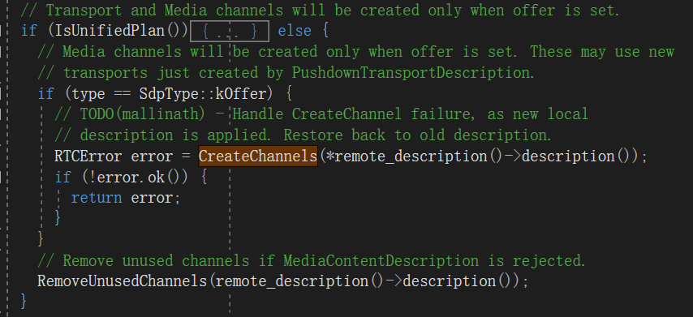

#### 3.1.3 PeerConnection::UpdateDataChannel

```cpp
RTCError PeerConnection::UpdateDataChannel(
    cricket::ContentSource source,
    const cricket::ContentInfo& content,
    const cricket::ContentGroup* bundle_group) {
  // 1. 如果数据通道类别为DCT_NONE，表示不允许创建DataChanel的，说明DataChannel是不存在的
  //    直接返回OK即可
  if (data_channel_type() == cricket::DCT_NONE) {
    // If data channels are disabled, ignore this media section. CreateAnswer
    // will take care of rejecting it.
    return RTCError::OK();
  }
  // 2. 如果数据通道对应的mLine是被拒绝了，则进入销毁程序。
  //    Transport——DataChannelController——DataChannel关联线路要断开连接，
  //    并销毁已创建的底层数据通道以及DataChannel
  if (content.rejected) {
    RTC_LOG(LS_INFO) << "Rejected data channel, mid=" << content.mid();
    DestroyDataChannelTransport();
  // 3. content内容是被接受的，我们更新下数据通道相关的内容
  } else {
    // 3.1 SCTP的数据通道处理，调用CreateDataChannel来实现数据通道上下几个层次
    //     的对象的关联。如果底层Transport已经设置过了，那么不重复调用
    if (!data_channel_controller_.rtp_data_channel() &&
        !data_channel_controller_.data_channel_transport()) {
      RTC_LOG(LS_INFO) << "Creating data channel, mid=" << content.mid();
      if (!CreateDataChannel(content.name)) {
        LOG_AND_RETURN_ERROR(RTCErrorType::INTERNAL_ERROR,
                              "Failed to create data channel.");
      }
    }
    // 3.2 RTP的数据通道处理，略过不提
    if (source == cricket::CS_REMOTE) {
      const MediaContentDescription* data_desc = content.media_description();
      if (data_desc && cricket::IsRtpProtocol(data_desc->protocol())) {
        data_channel_controller_.UpdateRemoteRtpDataChannels(
            GetActiveStreams(data_desc));
      }
    }
  }
  return RTCError::OK();
}
```   

**划重点：** UpdateDataChannel方法通过入参ContentInfo提供的信息来更新数据通道，如果content.rejected为真，则说明对方或者己方拒绝使用数据通道，那么进入数据通道的销毁程序DestroyDataChannelTransport；如果content.rejected为假，说明目前数据通道是被认可接受的，那么进入数据通道的创建程序CreateDataChannel。我们要知道ContentInfo结构对应于SDP中的一个m Section（即mLine），其name属性表示的是该Section的mid（也许后续该属性名会被改为mid），详细信息见文章 [WebRTC源码分析——ContentInfo && ContentInfo && ContentSource](https://blog.csdn.net/ice_ly000/article/details/106167501)

继续跟踪UpdateDataChannel的调用，只在PeerConnection::UpdateTransceiversAndDataChannels中被调用。那么继续跟踪UpdateTransceiversAndDataChannels方法。

#### 3.1.4 PeerConnection::UpdateTransceiversAndDataChannels

```cpp
RTCError PeerConnection::UpdateTransceiversAndDataChannels(
    cricket::ContentSource source,
    const SessionDescriptionInterface& new_session,
    const SessionDescriptionInterface* old_local_description,
    const SessionDescriptionInterface* old_remote_description) {
  // 1. 只有Unified Plan才能调用该方法
  RTC_DCHECK(IsUnifiedPlan());
  // 2. 获取新sdp结构中的ContentGroup
  const cricket::ContentGroup* bundle_group = nullptr;
  if (new_session.GetType() == SdpType::kOffer) {
    auto bundle_group_or_error =
        GetEarlyBundleGroup(*new_session.description());
    if (!bundle_group_or_error.ok()) {
      return bundle_group_or_error.MoveError();
    }
    bundle_group = bundle_group_or_error.MoveValue();
  }
  // 3. 遍历新SDP结构体中的所有ContentInfo，依据新ContentInfo与旧ContentInfo来
  //    更新Transceivers（存储了VideoTrack、AudioTrack）与底层传输通道的关系，
  //    更新DataChannel与底层传输通道的关系。
  const ContentInfos& new_contents = new_session.description()->contents();
  for (size_t i = 0; i < new_contents.size(); ++i) {
    const cricket::ContentInfo& new_content = new_contents[i];
    cricket::MediaType media_type = new_content.media_description()->type();
    mid_generator_.AddKnownId(new_content.name);
    // 3.1 音频、视频类别的处理，此处不解析
    if (media_type == cricket::MEDIA_TYPE_AUDIO ||
        media_type == cricket::MEDIA_TYPE_VIDEO) {
        ...//省略了video audio的处理，因为内容过长，且与当前讨论内容无关
    // 3.2 应用数据
    } else if (media_type == cricket::MEDIA_TYPE_DATA) {
      // 3.2.1 GetDataMid()返回的是sctp_mid_值，若sctp_mid_存在，且与ContentInfo中
      //       的mid不相同，则忽略。 这样处理，造成只有第一个应用数据类型的ContentInfo
      //       (mLine)才会往后处理，进行通道数据更新。因此，只有第一个ContentInfo是有效的
      if (GetDataMid() && new_content.name != *GetDataMid()) {
        // Ignore all but the first data section.
        RTC_LOG(LS_INFO) << "Ignoring data media section with MID="
                          << new_content.name;
        continue;
      }
      // 3.2.2 调用UpdateDataChannel进行数据通道更新
      RTCError error = UpdateDataChannel(source, new_content, bundle_group);
      if (!error.ok()) {
        return error;
      }
    } else {
      LOG_AND_RETURN_ERROR(RTCErrorType::INTERNAL_ERROR,
                            "Unknown section type.");
    }
  }
  return RTCError::OK();
}
```   

**划重点：** UpdateTransceiversAndDataChannels方法在处理数据通道时，就是遍历了新的SDP中所有数据类型的ContentInfo结构，确保只有第一个数据结构的ContentInfo得到有效的处理，其他数据ContentInfo将都被忽略。

继续跟踪UpdateTransceiversAndDataChannels方法调用，发现该方法会在PeerConnection::ApplyRemoteDescription && PeerConnection::ApplyLocalDescription中被调用，而这两个方法处理过程基本是一致的。因此，只对ApplyRemoteDescription做一个基础介绍。

#### 3.1.5 PeerConnection::ApplyRemoteDescription

```cpp
RTCError PeerConnection::ApplyLocalDescription(
    std::unique_ptr<SessionDescriptionInterface> desc) {
  // 1. 检查
  //   1.1 信令线程执行该方法
  RTC_DCHECK_RUN_ON(signaling_thread());
  //   1.2 入参不可为空
  RTC_DCHECK(desc);
  // 2. 更新统计，以便获取最新的统计信息，有些流可能因更新会话导致被移除了
  // Update stats here so that we have the most recent stats for tracks and
  // streams that might be removed by updating the session description.
  stats_->UpdateStats(kStatsOutputLevelStandard);
  // 3. 使用old_local_description保存旧的本地SDP结构，以便与新的本地SDP结构进行对比。
  //    当设置新的本地SDP时，需要将拿到将要被替换的SDP结构的拥有权（通过move语义），
  //    要被替换的SDP结构可能会与old_local_description是同一个SDP结构，使得该
  //    SDP在本方法内一直是有效的，不会被销毁。
  // Take a reference to the old local description since it's used below to
  // compare against the new local description. When setting the new local
  // description, grab ownership of the replaced session description in case it
  // is the same as |old_local_description|, to keep it alive for the duration
  // of the method.
  // 3.1 使用临时变量old_local_description保存当前本地SDP结构
  //     也即pending_local_description_ && current_local_description_中的一个
  //     优先是pending_local_description_，why？
  const SessionDescriptionInterface* old_local_description =
      local_description();
  // 3.2 replaced_local_description用来获取将被替换的SDP结构的拥有权
  std::unique_ptr<SessionDescriptionInterface> replaced_local_description;
  // 3.3 根据新本地sdp类别做不同处理
  SdpType type = desc->GetType();
  // 3.3.1 若本地sdp类别是kAnswer，意味着本端协商已经结束。
  if (type == SdpType::kAnswer) {
    // 保存被替换的SDP结构
    replaced_local_description = pending_local_description_
                                      ? std::move(pending_local_description_)
                                      : std::move(current_local_description_);
    // 当前本地SDP设置为新SDP
    current_local_description_ = std::move(desc);
    // 当前本地pending sdp设置为空即可，因为已经是协商结束了，没必要pending了
    pending_local_description_ = nullptr;
    // 当前远端SDP设置为远端pending sdp，同样是因为已经是协商结束了，需要将pending
    // sdp应用上了
    current_remote_description_ = std::move(pending_remote_description_);
  // 3.3.2 若本地sdp类别是其他，意味着本端协商还未完毕。
  } else {
    // 由于协商还未完成，因此，被替换的只可能是本地pending sdp
    replaced_local_description = std::move(pending_local_description_);
    // 由于协商还未完成，pending当前新的本地sdp即可
    pending_local_description_ = std::move(desc);
  }
  // 3.4 此时，新的sdp要么是存储在pending_local_description_，
  ///    要么是current_local_description_
  // The session description to apply now must be accessed by
  // |local_description()|.
  RTC_DCHECK(local_description());
  // 4. 报告联播simulcast信息统计
  // Report statistics about any use of simulcast.
  ReportSimulcastApiVersion(kSimulcastVersionApplyLocalDescription,
                            *local_description()->description());
  // 5. 确定本端是呼叫方Caller，还是被叫方Callee 
  if (!is_caller_) {
    // 如果远端SDP存在，说明远端SDP先被设置，因此，本端是被叫方Calle
    if (remote_description()) {
      // Remote description was applied first, so this PC is the callee.
      is_caller_ = false;
    // 近端SDP先被设置，因此，本端是呼叫方Caller
    } else {
      // Local description is applied first, so this PC is the caller.
      is_caller_ = true;
    }
  }
  // 6. 应用SDP到底层传输，根据mid以及相关描述信息创建底层传输Transport
  RTCError error = PushdownTransportDescription(cricket::CS_LOCAL, type);
  if (!error.ok()) {
    return error;
  }
  // 7. Unifiled plan
  //    更新上层Transceiver && DataChannel
  if (IsUnifiedPlan()) {
    RTCError error = UpdateTransceiversAndDataChannels(
        cricket::CS_LOCAL, *local_description(), old_local_description,
        remote_description());
    if (!error.ok()) {
      return error;
    }
  ....
  }
  ....
  return RTCError::OK();
}
```

**划重点：** ApplyLocalDescription方法在步骤6，PushdownTransportDescription方法将新的sdp应用到底层——Transport层，用来创建对应于上层结构的传输层对象，这是我们之前一直苦苦追寻的结果，即：我们会在何时创建DataChannel对应的底层传输DataChannelTransportInterface接口的实体对象。另外在步骤7，会调用UpdateTransceiversAndDataChannels()来更新数据通道，建立起上下几层对象的连接，正如前文所述。

如果顺着ApplyLocalDescription的调用关系往上翻，我们可以知道在建立会话主流程的SetLocalDesciption方法中是最终触发这一系列动作的时机。SetLocalDesciption——>DoSetLocalDesciption——>ApplyLocalDescription。同理，设置远端会话同样做了类似的事。由于后续会专门写文章去阐述SetLocalDesciption的细节，因此，此处就此打住不再向上追溯。我们把重点放在PushdownTransportDescription方法上，一路向下追溯，看看底层Transport创建过程，探个究竟。

#### 3.1.6 PeerConnection::PushdownTransportDescription

```cpp
RTCError PeerConnection::PushdownTransportDescription(
    cricket::ContentSource source,
    SdpType type) {
  RTC_DCHECK_RUN_ON(signaling_thread());
  if (source == cricket::CS_LOCAL) {
    const SessionDescriptionInterface* sdesc = local_description();
    RTC_DCHECK(sdesc);
    return transport_controller_->SetLocalDescription(type,
                                                      sdesc->description());
  } else {
    const SessionDescriptionInterface* sdesc = remote_description();
    RTC_DCHECK(sdesc);
    return transport_controller_->SetRemoteDescription(type,
                                                        sdesc->description());
  }
}
```

由源码可知，根据SDP是远端还是近端的，按条件调用JsepTransportController的SetLocalDescription或者是SetRemoteDescription，由于二者几乎工作性质相同，只需先分析SetLocalDescription即可。

#### 3.1.6 JsepTransportController::SetLocalDescription

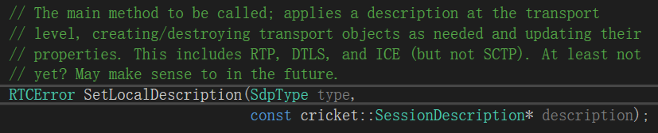

上图是该方法的描述，是JsepTransportController的主要方法。将SDP应用到底层传输层，按需创建/销毁传输层对象，更新他们的属性。源码如下：

```cpp
RTCError JsepTransportController::SetLocalDescription(
    SdpType type,
    const cricket::SessionDescription* description) {
  // 1. 传输层的方法都工作在network线程，包括SetLocalDescription也需要
  //    在网络线程中执行
  if (!network_thread_->IsCurrent()) {
    return network_thread_->Invoke<RTCError>(
        RTC_FROM_HERE, [=] { return SetLocalDescription(type, description); });
  }
  // 2. 设置ICE控制角色，本端是协商的主导者，还是对端是主导者
  if (!initial_offerer_.has_value()) {
    initial_offerer_.emplace(type == SdpType::kOffer);
    if (*initial_offerer_) {
      SetIceRole_n(cricket::ICEROLE_CONTROLLING);
    } else {
      SetIceRole_n(cricket::ICEROLE_CONTROLLED);
    }
  }
  // 3. 调用ApplyDescription_n
  return ApplyDescription_n(/*local=*/true, type, description);
}
```   

#### 3.1.7 JsepTransportController::ApplyDescription_n

```cpp 
RTCError JsepTransportController::ApplyDescription_n(
    bool local,
    SdpType type,
    const cricket::SessionDescription* description) {
  ...
  // 遍历sdp中所有ContentInfo
  for (const cricket::ContentInfo& content_info : description->contents()) {
    // 被拒绝的content是无效的，因此，我们不应该为其创建Transport；
    // 如果Content属于一个bundle，却又不是该bundle的第一个content，那么我们应该也要
    // 忽略该content，因为属于一个bundle的content共享一个Transport进行传输，在遍历
    // 该bundle的第一个content时会去创建这个共享的Transport。
    // Don't create transports for rejected m-lines and bundled m-lines."
    if (content_info.rejected ||
        (IsBundled(content_info.name) && content_info.name != *bundled_mid())) {
      continue;
    }
    // 创建JsepTransport
    error = MaybeCreateJsepTransport(local, content_info, *description);
    if (!error.ok()) {
      return error;
    }
  }
  ...
  return RTCError::OK();
}

bool IsBundled(const std::string& mid) const {
  return bundle_group_ && bundle_group_->HasContentName(mid);
}
absl::optional<std::string> bundled_mid() const {
  absl::optional<std::string> bundled_mid;
  if (bundle_group_ && bundle_group_->FirstContentName()) {
    bundled_mid = *(bundle_group_->FirstContentName());
  }
  return bundled_mid;
}
```

我删除了与Transport不相关的代码，留待以后分析。只保留重要的代码段如上源码所示。`ApplyDescription_n`方法中会遍历SDP中所有的ContentInfo，也即m Section的表征。根据源码上所述的方式来调用 MaybeCreateJsepTransport()方法来创建JsepTransport。

由`JsepTransportController.bundle_group_`成员可知，实际应用中，SDP中一般只有一个bundle group。绝大多数情况下都是采用bundle形式进行传输，此时，这样可以减少底层Transport的数量，因此，也能减少需要分配的端口数。如下SDP的示例，4个mline都属于一个group，这个group的名字为默认的BUNDLE，其中0 1 2 3为4个mid值。这4个m section所代表的媒体将采用同一个JsepTransport

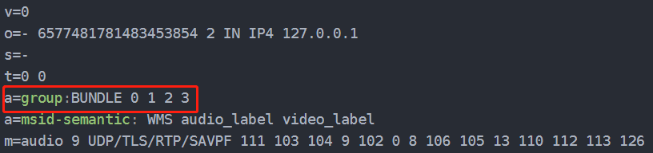

#### 3.1.8 JsepTransportController::MaybeCreateJsepTransport

```cpp
RTCError JsepTransportController::MaybeCreateJsepTransport(
    bool local,
    const cricket::ContentInfo& content_info,
    const cricket::SessionDescription& description) {
  // 1. 必须网络线程中执行
  RTC_DCHECK(network_thread_->IsCurrent());
  // 2. 如果对应的JsepTransport已经存在则返回就好了
  cricket::JsepTransport* transport = GetJsepTransportByName(content_info.name);
  if (transport) {
    return RTCError::OK();
  }
  // 3. 判断Content中的媒体描述中是否存在加密参数，这些参数是给SDES使用的
  //    而JsepTransportController.certificate_是给DTLS-SRTP使用的
  //    二者不可同时存在，因此，需要做下判断。
  const cricket::MediaContentDescription* content_desc =
      content_info.media_description();
  if (certificate_ && !content_desc->cryptos().empty()) {
    return RTCError(RTCErrorType::INVALID_PARAMETER,
                    "SDES and DTLS-SRTP cannot be enabled at the same time.");
  }
  // 4. 创建ice层的传输对象—>负责管理Candidates，联通性检测，收发数据包
  //    注意，使用的是共享智能指针保存的。
  rtc::scoped_refptr<webrtc::IceTransportInterface> ice =
      CreateIceTransport(content_info.name, /*rtcp=*/false);
  RTC_DCHECK(ice);
  // 5. 如果外界配置了使用DatagramTransport来传输（实质上采用QUIC协议）
  //    则会创建DatagramTransport。
  //    注意DatagramTransport层内置了ice层的传输对象，也就是说ice层的传输对象
  //    是其底层对象
  std::unique_ptr<DatagramTransportInterface> datagram_transport =
      MaybeCreateDatagramTransport(content_info, description, local);
  if (datagram_transport) {
    datagram_transport->Connect(ice->internal());
  }
  // 6. 创建dtls层的传输对象——>提供Dtls握手逻辑，密钥交换。
  //    注意其dtls内置了ice层的传输对象，其层次与DatagramTransport是平行关系
  std::unique_ptr<cricket::DtlsTransportInternal> rtp_dtls_transport =
      CreateDtlsTransport(content_info, ice->internal(), nullptr);
  std::unique_ptr<cricket::DtlsTransportInternal> rtcp_dtls_transport;
  std::unique_ptr<RtpTransport> unencrypted_rtp_transport;
  std::unique_ptr<SrtpTransport> sdes_transport;
  std::unique_ptr<DtlsSrtpTransport> dtls_srtp_transport;
  std::unique_ptr<RtpTransportInternal> datagram_rtp_transport;
  // 7. 如果RTCP与RTP不复用，并且媒体是使用RTP协议传输的，则需要创建属于传输RTCP的
  //    ice层的传输对象，以及dtls层的传输对象
  rtc::scoped_refptr<webrtc::IceTransportInterface> rtcp_ice;
  if (config_.rtcp_mux_policy !=
          PeerConnectionInterface::kRtcpMuxPolicyRequire &&
      content_info.type == cricket::MediaProtocolType::kRtp) {
    RTC_DCHECK(datagram_transport == nullptr);
    rtcp_ice = CreateIceTransport(content_info.name, /*rtcp=*/true);
    rtcp_dtls_transport =
        CreateDtlsTransport(content_info, rtcp_ice->internal(),
                            /*datagram_transport=*/nullptr);
  }
  // 8. 如果允许采用quic协议
  //    创建rtp层传输对象——>DatagramRtpTransport
  //    该对象使用dtls同层次的DatagramTransport来传输（基于quic协议）
  // Only create a datagram RTP transport if the datagram transport should be
  // used for RTP.
  if (datagram_transport && config_.use_datagram_transport) {
    // TODO(sukhanov): We use unencrypted RTP transport over DatagramTransport,
    // because MediaTransport encrypts. In the future we may want to
    // implement our own version of RtpTransport over MediaTransport, because
    // it will give us more control over things like:
    // - Fusing
    // - Rtp header compression
    // - Handling Rtcp feedback.
    RTC_LOG(LS_INFO) << "Creating UnencryptedRtpTransport, because datagram "
                        "transport is used.";
    RTC_DCHECK(!rtcp_dtls_transport);
    datagram_rtp_transport = std::make_unique<DatagramRtpTransport>(
        content_info.media_description()->rtp_header_extensions(),
        ice->internal(), datagram_transport.get());
  }
  // 9. 根据是否使用加密以及加密手段，来创建RTP层不同的传输对象
  // 9.1 不使用加密，则创建不使用加密手段的rtp层传输对象——>RtpTransport
  //    注意：仍然传递了dtls层的传输对象，但该对象可以不进行加密，直接将上层的
  //         包传递给ice层传输对象。
  if (config_.disable_encryption) {
    RTC_LOG(LS_INFO)
        << "Creating UnencryptedRtpTransport, becayse encryption is disabled.";
    unencrypted_rtp_transport = CreateUnencryptedRtpTransport(
        content_info.name, rtp_dtls_transport.get(), rtcp_dtls_transport.get());
  // 9.2 使用SDES加密，因为sdp中包含了加密参数
  //     创建使用SDES加密的rtp层传输对象——>SrtpTransport
  //     注意：传递了dtls层的传输对象，rtp层传输对象是其上层，但不使用dtls层的传输对象
  //          的握手，可以提高媒体建立链路的速度。
  } else if (!content_desc->cryptos().empty()) {
    sdes_transport = CreateSdesTransport(
        content_info.name, rtp_dtls_transport.get(), rtcp_dtls_transport.get());
    RTC_LOG(LS_INFO) << "Creating SdesTransport.";
  // 9.3 使用dtls加密
  //     创建使用dtls加密手段的rtp层传输对象——>DtlsSrtpTransport
  //     注意：传递了dtls层的传输对象，rtp层传输对象是其上层，使用dtls层的传输对象提供的
  //          握手和加密，建立安全通信速度慢。
  } else {
    RTC_LOG(LS_INFO) << "Creating DtlsSrtpTransport.";
    dtls_srtp_transport = CreateDtlsSrtpTransport(
        content_info.name, rtp_dtls_transport.get(), rtcp_dtls_transport.get());
  }
  // 10. 创建SCTP通道用于传输应用数据——>SctpTransport
  //     注意，其底层dtls层传输对象，使用dtls加密传输
  std::unique_ptr<cricket::SctpTransportInternal> sctp_transport;
  if (config_.sctp_factory) {
    sctp_transport =
        config_.sctp_factory->CreateSctpTransport(rtp_dtls_transport.get());
  }
  // 11. 如果使用datagram_transport来传输应用数据
  //     则data_channel_transport设置为其子类对象datagram_transport
  DataChannelTransportInterface* data_channel_transport = nullptr;
  if (config_.use_datagram_transport_for_data_channels) {
    data_channel_transport = datagram_transport.get();
  }
  // 12. 创建JsepTransport对象，来容纳之前创建的各层对象
  //     ice层：两个传输对象ice、rtcp_ice；
  //     dtls层/datagram层：rtp_dtls_transport、rtcp_dtls_transport/datagram_transport
  //     基于dtls层的rtp层：unencrypted_rtp_transport、sdes_transport、dtls_srtp_transport
  //     基于datagram层的rtp层：datagram_rtp_transport
  //     基于dtls层的应用数据传输层：sctp_transport
  //     基于datagram层的应用数据传输层：data_channel_transport
  std::unique_ptr<cricket::JsepTransport> jsep_transport =
      std::make_unique<cricket::JsepTransport>(
          content_info.name, certificate_, std::move(ice), std::move(rtcp_ice),
          std::move(unencrypted_rtp_transport), std::move(sdes_transport),
          std::move(dtls_srtp_transport), std::move(datagram_rtp_transport),
          std::move(rtp_dtls_transport), std::move(rtcp_dtls_transport),
          std::move(sctp_transport), std::move(datagram_transport),
          data_channel_transport);
  // 13. 绑定JsepTransport信号-JsepTransportController槽
  jsep_transport->rtp_transport()->SignalRtcpPacketReceived.connect(
      this, &JsepTransportController::OnRtcpPacketReceived_n);
  jsep_transport->SignalRtcpMuxActive.connect(
      this, &JsepTransportController::UpdateAggregateStates_n);
  jsep_transport->SignalDataChannelTransportNegotiated.connect(
      this, &JsepTransportController::OnDataChannelTransportNegotiated_n);
  // 14. 将创建的JsepTransport添加到JsepTransportController的成员上
  // 14.1 添加到mid_to_transport_
  SetTransportForMid(content_info.name, jsep_transport.get());
  // 14.2 添加到jsep_transports_by_name_
  jsep_transports_by_name_[content_info.name] = std::move(jsep_transport);
  // 15. 更新状态，进行ICE
  UpdateAggregateStates_n();
  return RTCError::OK();
}
```

通过对MaybeCreateJsepTransport方法的详尽分析，我们可以知道底层创建了三类用于传输应用数据的底层传输对象：

  * SctpTransportInternal：基于SCTP/DTLS的传输；
  * DatagramTransportInterface：基于QUIC协议的传输；
  * DtlsSrtpTransport：基于RTP/DTLS的传输；

到此，我们已经知道创建数据传输的底层传输对象的时机了，但是确切会使用哪个，并且最终实现DataChannelTransportInterface类是哪个？还无法明确。因为：

  * 只有DatagramTransportInterface这个接口是继承DataChannelTransportInterface接口的，实体类由外部提供的MediaTransportFactory来产生。
  * SctpTransportInternal并非是继承DataChannelTransportInterface接口的实体类，因此，提供给DataChannel直接使用的肯定不是该类。

那么，我们何去何从呢？我看看JsepTransport这个方法的构造 以及之前出现过的获取DataChannelTransportInterface的`data_channel_transport`方法。

#### 3.1.8 JsepTransport::JsepTransport

```cpp
JsepTransport::JsepTransport(...)
    : ...
      // 1. 创建SctpDataChannelTransport对象，利用SctpTransportInternal对象来实现
      //    DataChannelTransportInterface接口功能。
      sctp_data_channel_transport_(
          sctp_transport ? std::make_unique<webrtc::SctpDataChannelTransport>(
                                sctp_transport.get())
                          : nullptr),
                          ...) {
  // 2. 参数检查
  // 2.1 基础层——ice层和dtls层不可缺少                      
  RTC_DCHECK(ice_transport_);
  RTC_DCHECK(rtp_dtls_transport_);
  // 2.2 基础层——提供给rtcp的ice层和dtls层必须同时存在或者不存在
  // |rtcp_ice_transport_| must be present iff |rtcp_dtls_transport_| is
  // present.
  RTC_DCHECK_EQ((rtcp_ice_transport_ != nullptr),
                (rtcp_dtls_transport_ != nullptr));
  // 2.3 rtp层根据加密手段，三者只能存一
  // Verify the "only one out of these three can be set" invariant.
  if (unencrypted_rtp_transport_) {
    RTC_DCHECK(!sdes_transport);
    RTC_DCHECK(!dtls_srtp_transport);
  } else if (sdes_transport_) {
    RTC_DCHECK(!unencrypted_rtp_transport);
    RTC_DCHECK(!dtls_srtp_transport);
  } else {
    RTC_DCHECK(dtls_srtp_transport_);
    RTC_DCHECK(!unencrypted_rtp_transport);
    RTC_DCHECK(!sdes_transport);
  }
  // 3. 给sctp层传输配上dtls层传输对象
  if (sctp_transport_) {
    sctp_transport_->SetDtlsTransport(rtp_dtls_transport_);
  }
  // 4. 如果提供了基于Datagram的rtp层传输，并且也有默认的rtp传输(即上面三者之一)
  //    那么先创建组合了二者的CompositeRtpTransport，相当于是双核。
  //    
  if (datagram_rtp_transport_ && default_rtp_transport()) {
    composite_rtp_transport_ = std::make_unique<webrtc::CompositeRtpTransport>(
        std::vector<webrtc::RtpTransportInternal*>{
            datagram_rtp_transport_.get(), default_rtp_transport()});
  }
  // 5. 如果提供了
  if (data_channel_transport_ && sctp_data_channel_transport_) {
    composite_data_channel_transport_ =
        std::make_unique<webrtc::CompositeDataChannelTransport>(
            std::vector<webrtc::DataChannelTransportInterface*>{
                data_channel_transport_, sctp_data_channel_transport_.get()});
  }
}
```

**划重点：**

  * 构造函数省略直接给成员赋值的部分，只留有一个：使用SctpTransportInternal来构建SctpDataChannelTransport类别的成员`sctp_data_channel_transport_`，SctpDataChannelTransport是实现了DataChannelTransportInterface接口实体类。
  * 如果提供了基于Datagram的rtp层传输，并且也有默认的rtp传输(即非加密，sdes加密，dtls加密三者之一)， 那么先创建组合了二者的CompositeRtpTransport，相当于是双核。
  * 如果提供了基于Datagram的sctp层传输，并且默认的sctp传输方式也存在，那么先创建组合了二者的CompositeDataChannelTransport，双核。

**PS1:** CompositeRtpTransport的说明很重要

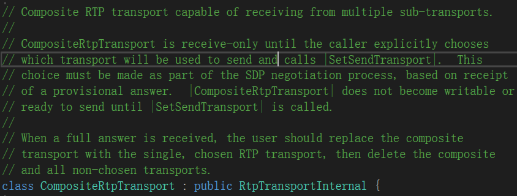

**PS2：** CompositeDataChannelTransport的说明很重要

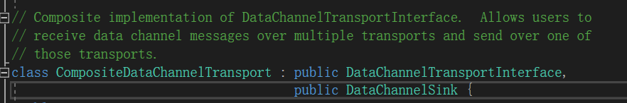  

当JsepTransport向外提供数据传输通道时，可以看看是如何做的——`data_channel_transport`方法

#### 3.1.9 JsepTransport::data_channel_transport

```cpp
webrtc::DataChannelTransportInterface* data_channel_transport() const {
  rtc::CritScope scope(&accessor_lock_);
  if (composite_data_channel_transport_) {
    return composite_data_channel_transport_.get();
  } else if (sctp_data_channel_transport_) {
    return sctp_data_channel_transport_.get();
  }
  return data_channel_transport_;
}
```

顺序是：

  1. 选用组合类型的传输CompositeDataChannelTransport存在时，选用组合类型（有可能在协商结束后，确定了使用哪种传输，将CompositeDataChannelTransport删除的情况）
  2. 当sctp-dtls存在时，使用SctpDataChannelTransport。
  3. 当sctp-dtls不存在，基于datagram的，由外部提供的MediaTransportFactory创建的，实现了DatagramTransportInterface接口的实体类（一般而言是实现了quic协议的传输）

到此，我们确认了最终提供给DataChanel使用的，实现了DataChannelTransportInterface接口的底层传输类（CompositeDataChannelTransport、SctpDataChannelTransport、由MediaTransportFactory创建的实现了DatagramTransportInterface接口的实体类），何时创建的它们（在PC调用SetLocalDescription && SetRemoteDescription时）。

### 3.2 作图以做总结

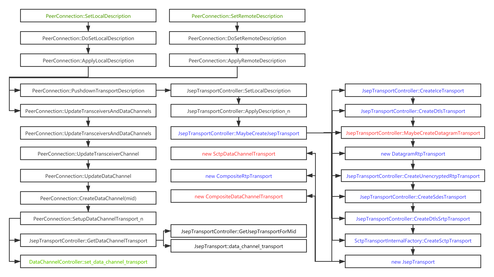

  * 绿色为两个起点和一个终点：启动Transport创建的两个顶层API，给DataChanel设置Transport的终点站。
  * 红色的部分为创建DataChannel可使用的Transport实体类的地方；
  * 蓝色部分主要体现在方法JsepTransportController::MaybeCreateJsepTransport中，该方法创建了WebRTC中Transport的所有类别，每个蓝色和红色部分都在创建不同层次的一个Transport。

## 4. DataChannel

DataChannelController与DataChannel的关系如下图所示：  

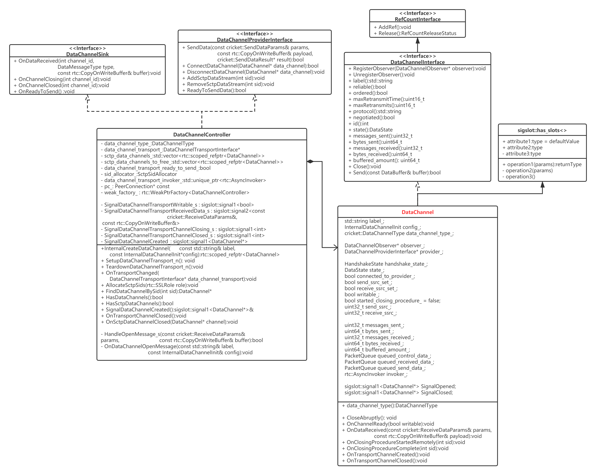

### 4.1 DataChannel的成员变量

* 控制数据上下行成员：

```cpp
DataChannelObserver* observer_  
DataChannelProviderInterface* provider_
```

* 通道属性成员：  

```cpp
std::string label_;  
InternalDataChannelInit config_;  
cricket::DataChannelType data_channel_type_;
```

* 通道状态相关成员：  

```cpp
DataState state_;  
HandshakeState handshake_state_;  
bool connected_to_provider_;  
bool send_ssrc_set_;  
bool receive_ssrc_set_;  
uint32_t send_ssrc_;  
uint32_t receive_ssrc_  
bool writable_;  
bool started_closing_procedure_ = false;
```

* 数据发送接收统计 && 存储  

```cpp
uint32_t messages_sent_;  
uint64_t bytes_sent_;  
uint32_t messages_received_;  
uint64_t bytes_received_;  
uint64_t buffered_amount_;  
PacketQueue queued_control_data_;  
PacketQueue queued_received_data_;  
PacketQueue queued_send_data_;
```

* 状态信号

```cpp
sigslot::signal1<DataChannel*> SignalOpened;  
sigslot::signal1<DataChannel*> SignalClosed;
```

后续以成员变量为线索，来分析DataChannel的功能，前文实际上已对 “控制数据上下行成员” 和 “通道属性成员”的作用作过描述，因此，后续将不再赘述。

### 4.2 DataChannel的状态流转

DataChannel在该层维护了数据通道的状态：`DataState state_`;

```cpp
enum DataState {
  kConnecting,
  kOpen,  // The DataChannel is ready to send data.
  kClosing,
  kClosed
};
```

* kConnecting：当DataChannel被创建出来时，就是kConnecting状态。此刻，DataChannel还不能发送数据。数据通道在发送应用层数据前（也即进入kOpen状态前），还需要经历握手阶段，涉及到另外一个成员`HandshakeState handshake_state_`。 如果握手协商是带外协商，那么`handshake_state_`默为kHandshakeReady，也即握手已完成。此时，不论是DataChannel的主动打开方，还是被动打开方，只要底层DataChannelTransport创建成功，并且处于数据可写状态，那么DataChannel会被更新为kOpen状态，可以发送应用层数据；若采用带内协商，刚创建完的DataChannel视其为主动创建方，还是被动打开方握手状态分别为 kHandshakeShouldSendOpen or kHandshakeShouldSendAck。主动打开方在底层DataChannelTransport创建成功，并且处于数据可写状态时，DataChannel会向对方发送Open Message控制命令，并更新自己的握手状态为kHandshakeWaitingForAck。而对方，DataChannel还未创建，只是在收到Open Message时才会临时创建出DataChannel对象，此时其就处于kConnecting状态，握手状态为kHandshakeShouldSendAck，由于底层DataChannelTransport已经打通(不然Open Message咋收到的呢~~)，因此，会直接回复Ack Message，并更新自己的握手状态为kHandshakeReady，连接状态更新为kOpen。而主动打开方也会在收到Ack Message后更新自己的握手状态为kHandshakeReady，连接状态更新为kOpen。

```cpp
enum HandshakeState {
  kHandshakeInit,
  kHandshakeShouldSendOpen,
  kHandshakeShouldSendAck,
  kHandshakeWaitingForAck,
  kHandshakeReady
};
```

* kOpen：该状态是DataChannel能正常发送接收数据的状态，数据发送接收见4.3分析
* kClosing：有三种情况可以由kOpen状态进入kClosing状态，这是关闭中的状态。**一种**是本端主动调用Close方法关闭DataChannel，设置kClosing状态后，由于此时底层的Transport还是正常工作的，因此，可以等待正在排队的应用层数据都发送后，再真正关闭通道进入kClosed状态；**第二种**是对端主动调用Close方法，本端收到底层Transport的进入开始关闭流程的信号，DataChannel在槽函数OnClosingProcedureStartedRemotely()中进行相应处理，此时会直接清除正在排队的应用层数据和控制数据（底层都要关闭了，不允许继续发送数据了），设置状态为kClosing；**最后一种**是异常情况下的紧急处理调用CloseAbruptly()来关闭通道，这些紧急情况有：发送数据时，发送数据失败，原因并非是底层Transport处于阻塞状态 or 排队的数据超出了最大排队限度（因为底层阻塞没有及时发送出去）；接收数据时，排队的数据超出了最大排队限度（因为上层业务阻塞没有及时取走数据）；还有就是协商时mline被对方拒绝 or DTLS通道关闭，底层Transport抛出信号，DataChannel在槽OnTransportChannelClosed()中调用CloseAbruptly()来响应这种情况。
* kClosed：代表关闭状态，进入kClosing状态的DataChannel跟着会进入kClosed状态，不过由于进入kClosing状态的路径不一样，那么进入kClosed状态的过程也就不太一样。**一种**是本端主动调用Close方法关闭DataChannel，设置kClosing状态后调用UpdateState()。若是无排队的数据要发送，那么直接调用DataChannelController的RemoveSctpDataStream，这样会触发底层Transport关闭通道，并已信号形式告知DataChannel，DataChannel在槽函数OnClosingProcedureComplete响应该信号，并将状态设置为kClosed。若是有数据发送呢？需要等待底层通道告知数据可写，触发DataChannel的槽OnChannelReady，在该方法中阻塞的将排队数据都发送出去，然后调用UpdateState()，这样就进入了前面的状况。**第二种**是对端主动调用Close方法时，本端依次会收到底层Transport的进入开始关闭流程的信号、关闭流程已完成的信号，DataChannel依次在槽函数OnClosingProcedureStartedRemotely、OnClosingProcedureComplete中将状态设置为kClosing、kClosed。**最后一种**是异常情况下的紧急处理调用CloseAbruptly()来关闭通道，之前讨论过这些异常情况，该方法中会清理DataChannel，并依次将状态设置为kClosing、kClosed。

### 4.3 DataChannel数据发送、接收、缓存 、统计

数据的发送分两个触发点：一个是用户主动调用DataChannel::Send方法发送数据；一个是底层Transport由Block阻塞状态进入可发送状态，DataChannelTransport以信号方式通知DataChannel数据可发送，DataChannel响应该信号进行数据发送。

#### 4.3.1 用户主动发送数据

当用户层通过调用DataChannel::Send方法发送数据，调用流程如下图所示：

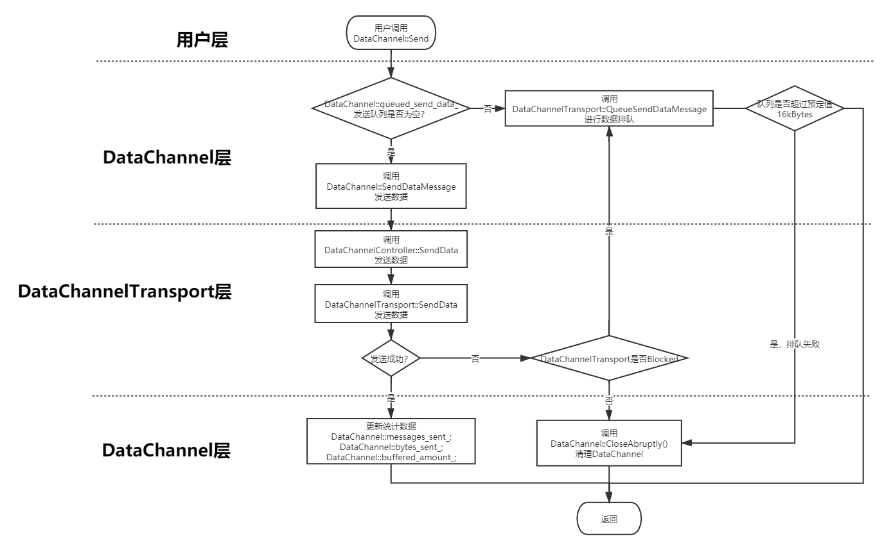

需要重点提出来的几点列举如下：

  * 先判断DataChannel层的发送队列是否为空，不为空意味着底层Transport处于block状态，即便继续调用底层发送函数也无用，最终还是得排队，因此，还不如就此排队返回。
  * 调用底层Transport进行发送时，失败的原因大致分两种，一种是底层Transport 阻塞住了，这种状态是不会主动告知DataChannel，只有当发送数据时，从返回值得知，这种状态是可恢复到正常可写状态的，一旦底层数据正常发送出去，不繁忙时即可通告DataChannel；一种是其他原因，比如通道已经被关闭等其他原因，这种是不可恢复的，因此，直接调用CloseAbruptly()去关闭，清理上层通道。
  * 当上层排队数据超过16k，也会触发CloseAbruptly()去关闭，清理上层通道。

#### 4.3.2 底层Transport由block变为可写——>发送排队数据

DataChannel可能发送的数据一方面是应用层用户要发送的数据；另一方面是前文所述的，在进行带内协商的情况下，kConnecting状态时发送握手控制信令。因此，需要排队的数据有这两类，DataChannel用了两个数据队列成员 和 两组数据排队、发送方法。这两组成员和方法作用是对称类似的。

当底层Transport由阻塞状态变为可写状态时，将以信号-槽的形式通知DataChannel层进行处理。处理的方式就是调用对应的方法，将已排队的数据发送出去。需要注意的一点是：图中省略排队的控制信令的处理，并且控制信令往往需要先发送。也即，在调用DataChannel::SendQueuedDataMessages发送用户数据之前，需要调用DataChannel::SendQueuedControlMessages发送排队的控制信令。二者处理流程是一模一样的，因此图中省略该部分。

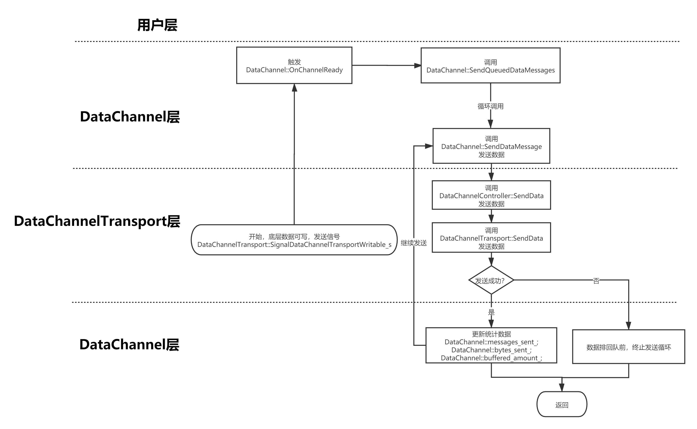

#### 4.3.3 接收数据

当收到底层Transport传递上来的数据后，处理流程如下图所示：

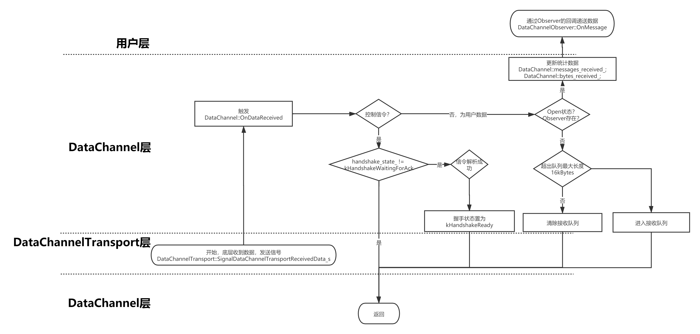

需要再次强调的是：

  * 用于握手的控制信令数据 和 用户应用数据从同一处传递上来，通过数据的类别字段进行区分
  * 不要期待能收到Open这个信令，作为被动打开方，收到Open信令时，DataChannel才会被DataChannelController创建，因此，DataChannel层是不会收到Open信令的。只有主动打开方的DataChannel会收到Ack信令。
  * 接收用户会有两个出处：一个是当DataChannel已经处于kOpen状态，并且也存在通道的观察者DataChannelObserver，那么数据会立马递送给DataChannelObserver进行用户层处理；否则，数据会进入接收队列。
  * 接收队列中的数据何时会被递送到DataChannelObserver？一种情况是当DataChannel注册Observer时，会执行一次DeliverQueuedReceivedData()方法，将可能的已接收的数据一次性递送上去；一种情况是当DataChannel更新其状态到kOpen时，也会执行一次DeliverQueuedReceivedData()方法，将可能的已接收的数据一次性递送上去。

#### 4.3.3 数据的缓存

如上所述，DataChannel使用了三个队列，分别缓存发送的用户层数据，发送的握手控制信令，接收的用户层数据。这三个队列使用的类如下所示，封装了标准模板库中的双端队列。

```cpp
class PacketQueue final {
  public:
  size_t byte_count() const { return byte_count_; }
  bool Empty() const;
  std::unique_ptr<DataBuffer> PopFront();
  void PushFront(std::unique_ptr<DataBuffer> packet);
  void PushBack(std::unique_ptr<DataBuffer> packet);
  void Clear();
  void Swap(PacketQueue* other);
  private:
  std::deque<std::unique_ptr<DataBuffer>> packets_;
  size_t byte_count_ = 0;
};

void DataChannel::PacketQueue::PushFront(std::unique_ptr<DataBuffer> packet) {
  byte_count_ += packet->size();
  packets_.push_front(std::move(packet));
}
```

值得注意得是：队列中存储的是DataBuffer的只能指针，也即存储进入PacketQueue中的包，实际上被PacketQueue所拥有，正如上述源码给出的PushFront方法实现，需要使用std::move来实现移动语义，转移所有权。

另外，DataBuffer实际由"写时复制"的buffer类CopyOnWriteBuffer构成，如下源码所示，具体分析将另写一篇文章来分析：[WebRTC源码分析——写时复制缓存CopyOnWriteBuffer](https://blog.csdn.net/ice_ly000/article/details/106720359)

```cpp
struct DataBuffer {
  DataBuffer(const rtc::CopyOnWriteBuffer& data, bool binary)
      : data(data), binary(binary) {}
  // For convenience for unit tests.
  explicit DataBuffer(const std::string& text)
      : data(text.data(), text.length()), binary(false) {}
  size_t size() const { return data.size(); }
  rtc::CopyOnWriteBuffer data;
  // Indicates if the received data contains UTF-8 or binary data.
  // Note that the upper layers are left to verify the UTF-8 encoding.
  // TODO(jiayl): prefer to use an enum instead of a bool.
  bool binary;
};
```

## 5. 总结

行文至此，DataChannel及其相关的类DataChannelController && DataChannelTransport就介绍完了。三者的关系如下所示，后续捡要点总结下：  

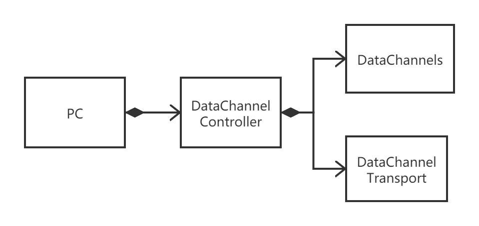

  * WebRTC的数据通道大致可分为用户层DataChannel、底层DataChannelTransport两层；DataChannelController作为夹在二者之间的连接层而存在。
  * DataChannelController作为中间连接层，所起到的作用就是存储DataChannel、DataChannelTransport对象；建立DataChannel、DataChannelTransport对象之间的关联(信号-槽机制，以及直接的函数嵌套调用)；做线程之间的转换（由于DataChannelTransport工作与network线程，而DataChannel工作与signal线程），确保DataChannel、DataChannelTransport的方法在正确的线程上执行。
  * 本文花了很大篇幅追踪了底层DataChannelTransport是何时被创建，创建的是哪个类别的对象，如何与DataChannel建立关联的，可以在详细捋一遍
  * DataChannel层发送，接收数据都有排队逻辑，实现方式非常优雅高效，感兴趣的可以详细的进一步研究
