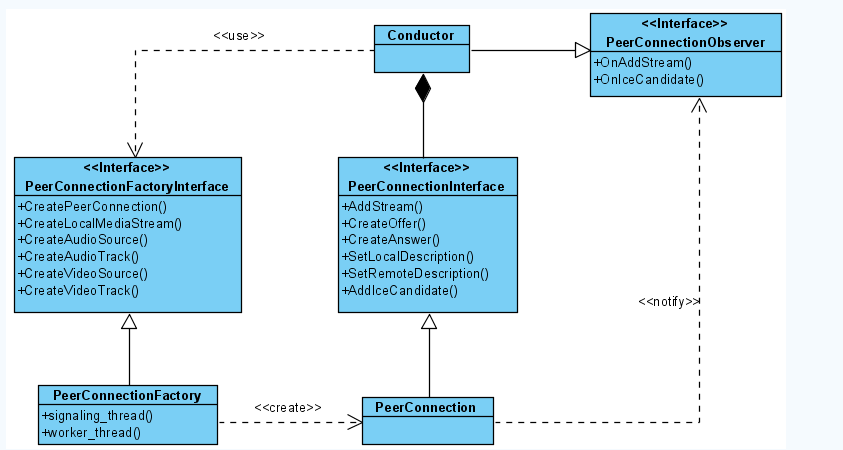
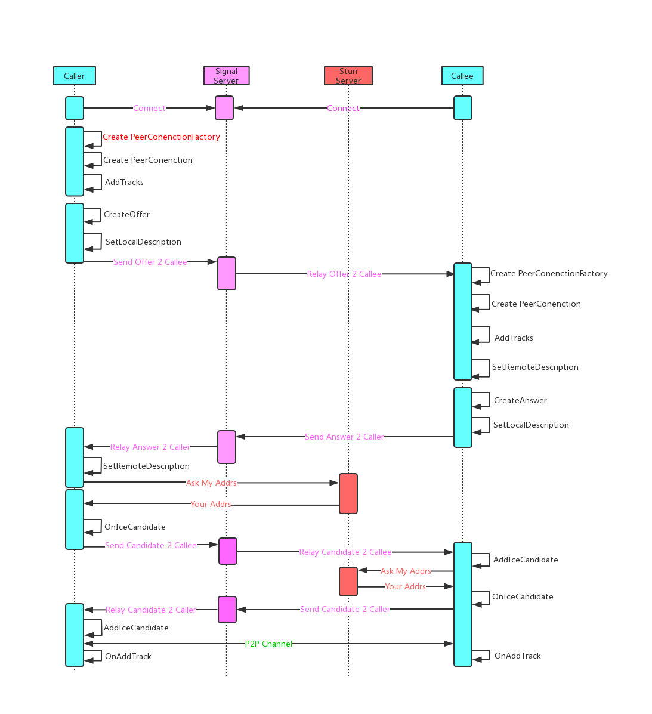
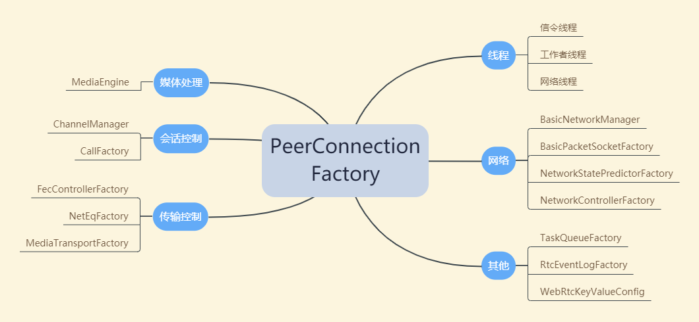
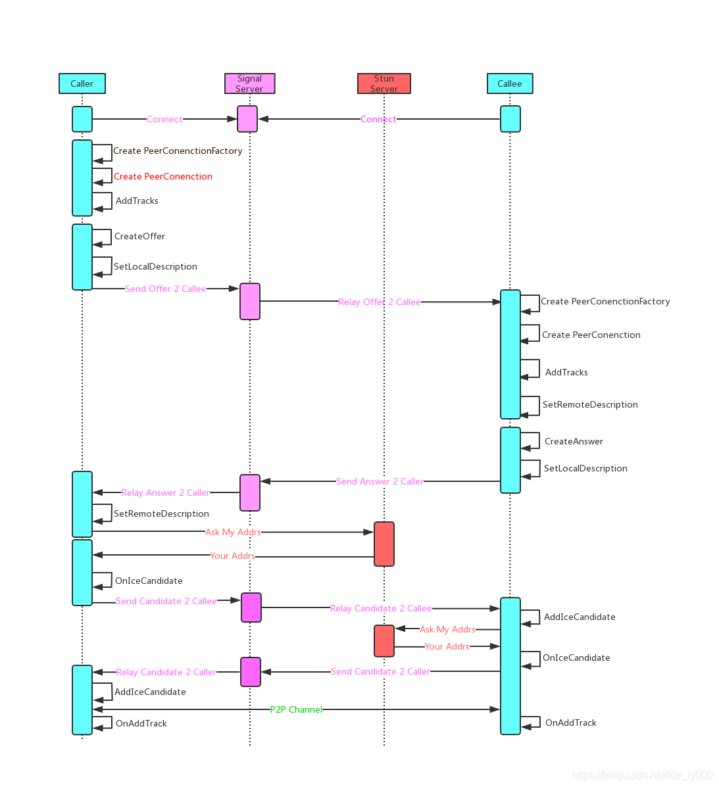
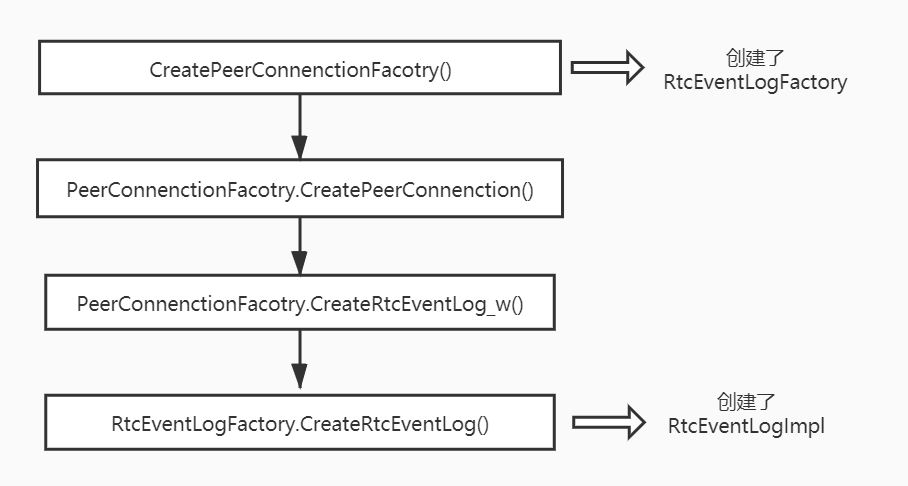
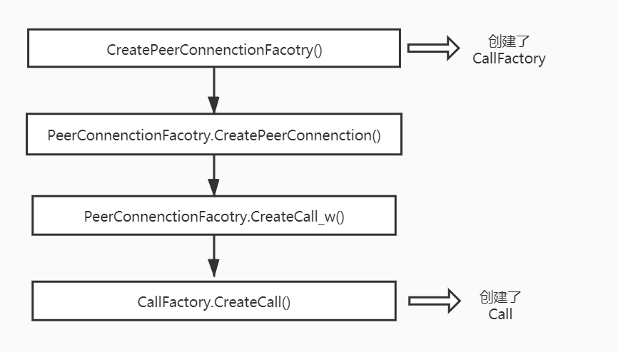

<!--BEGIN_DATA
{
    "create_date": "2020-09-12 17:40", 
    "modify_date": "2020-09-12 17:40", 
    "is_top": "0", 
    "summary": "WebRTC源码分析-呼叫建立过程之一(综述)<br/>WebRTC源码分析----呼叫建立过程之二(创建PeerConnectionFactory)<br/>WebRTC源码分析----呼叫建立过程之三(创建PeerConnection)", 
    "tags": "WebRTC、C/C++", 
    "file_name": "WebRTC源码分析-呼叫建立过程1.md"
}
END_DATA-->

#### <p>原文出处：<a href='https://blog.csdn.net/ice_ly000/article/details/103162838' target='blank'>WebRTC源码分析-呼叫建立过程之一(综述)</a></p>

#### 前言

基于WebRTC源码下`example/peerconnect_client`，`example/peerconnect_server`工程打算写一个典型的呼叫建立过程的源码分析系列文章，本文是一个序章。`example/peerconnect_client`与`，`example/peerconnect_server`实现了一个Demo性质的P2P音视频会话程序，其中有3个主要的类：MainWnd类进行界面显示，视频渲染；PeerConnectionClient类负责与信令服务器`peerconnect_server`进行Http信令交互；Conductor类是核心业务类，持有MainWnd与PeerConnectionClient对象，整个WebRTC的使用都浓缩在这个类中。  

  

对这两个工程的叙述就说到此，整体的架构实现不再多讲。刚入坑WebRTC的同学可以以此为学习的入口点，查看源码或者参考以下几篇博客来分析。

  * [peerconnection_client分析笔记](https://www.cnblogs.com/CoderTian/p/7868328.html)
  * [WebRTC手记之框架与接口](https://www.cnblogs.com/fangkm/p/4370492.html)
  * [WebRTC中peerconnection示例工程结构分析](https://blog.csdn.net/thinkerleo1997/article/details/81050240)

本文省略工程中信令交互部分（信令交互只在UML时序图中体现），直接从PeerConnectionFactory对象的创建开描述建立一个典型p2p WebRTC呼叫建立过程。

#### 呼叫建立过程时序

如下所示为P2P建立过程详细的UML时序图，为了便于识别以不同的颜色来表示不同的对象，对象之间的消息传递也以不同颜色区分。

  * 天蓝色背景表示两个需要建立P2P通信的两个端点，端上运行着`peerconnect_client`程序。其中呼叫端成为Caller，被呼叫端为Callee。在端上执行的步骤均以黑色字体展现。
  * 粉色背景表示的是信令服务器，运行着`peerconnect_server`程序。端与服务器的信令交互过程也以粉色字体展示。
  * 橘红背景表示的是STUN服务器，运行着STUN服务器程序。工程中以谷歌提供的STUN服务器作为STUN测试服务器，地址为"stun:stun.l.google.com:19302"。端与STUN服务器的交互也以橘红色的字体展示。
  * 以绿色字体展示端与端之间的音视频传输。


在WebRTC的源码`api/peer_connection_interface.h`中，有很长一段注释，分别从呼叫方和被呼方的视角说明了整个流程。此处直接粘贴过来，不做翻译了，因为很容易理解。

  * 以下是呼叫方的视角
```
// The following steps are needed to setup a typical call using WebRTC:
//
// 1. Create a PeerConnectionFactoryInterface. Check constructors for more
// information about input parameters.
//
// 2. Create a PeerConnection object. Provide a configuration struct which
// points to STUN and/or TURN servers used to generate ICE candidates, and
// provide an object that implements the PeerConnectionObserver interface,
// which is used to receive callbacks from the PeerConnection.
//
// 3. Create local MediaStreamTracks using the PeerConnectionFactory and add
// them to PeerConnection by calling AddTrack (or legacy method, AddStream).
//
// 4. Create an offer, call SetLocalDescription with it, serialize it, and send
// it to the remote peer
//
// 5. Once an ICE candidate has been gathered, the PeerConnection will call the
// observer function OnIceCandidate. The candidates must also be serialized and
// sent to the remote peer.
//
// 6. Once an answer is received from the remote peer, call
// SetRemoteDescription with the remote answer.
//
// 7. Once a remote candidate is received from the remote peer, provide it to
// the PeerConnection by calling AddIceCandidate.
```

  * 以下是被呼方的视角
```
// The receiver of a call (assuming the application is "call"-based) can decide
// to accept or reject the call; this decision will be taken by the application,
// not the PeerConnection.
//
// If the application decides to accept the call, it should:
//
// 1. Create PeerConnectionFactoryInterface if it doesn't exist.
//
// 2. Create a new PeerConnection.
//
// 3. Provide the remote offer to the new PeerConnection object by calling
// SetRemoteDescription.
//
// 4. Generate an answer to the remote offer by calling CreateAnswer and send it
// back to the remote peer.
//
// 5. Provide the local answer to the new PeerConnection by calling
// SetLocalDescription with the answer.
//
// 6. Provide the remote ICE candidates by calling AddIceCandidate.
//
// 7. Once a candidate has been gathered, the PeerConnection will call the
// observer function OnIceCandidate. Send these candidates to the remote peer.
```


<hr/>

#### <p>原文出处：<a href='https://blog.csdn.net/ice_ly000/article/details/103168181' target='blank'>WebRTC源码分析——呼叫建立过程之二(创建PeerConnectionFactory)</a></p>

#### 目录

  * 1. 引言
  * 2 PeerConnectionFactory对象的创建
  *     * 2.1 CreatePeerConnectionFactory方法解析
    *       * 2.1.1 创建媒体引擎MediaEngine——CreateMediaEngine方法
      * 2.1.2 创建实体类PeerConnectionFactory——CreateModularPeerConnectionFactory方法
      *         * 1）PeerConnectionFactory的创建——构造
        * 2）PeerConnectionFactory初始化——Initialize方法
        * 3）PeerConnectionFactoryProxy代理的创建与返回——防止线程乱入
  * 3 PeerConnectionFactory对象简析
  *     * 3.1 PeerConnectionFactory拥有的资源——私有成员
    * 3.1 PeerConnectionFactory提供的能力——公有方法
  * 4 总结

## 1. 引言

当WebRTC的端与信令服务器建立连接之后，可以通过与服务器的信令交互获知对等端点的存在，进一步通过信令向对端发起呼叫。在发起呼叫之前，发起方需要在本地做一些初始化工作，创建两个重要的对象：PeerConnectionFactory和PeerConnection，这两个C++对象提供了建立WebRTC会话的API（注意：在JS层，没有PeerConnectionFactory，只有PeerConnection，是基于C++ API层的全局方法以及PeerConnectionFactory和PeerConnection对象的进一步封装）。

本文将重点介绍PeerConnectionFactory对象详细的创建过程及其提供的能力，典型的WebRTC p2p会话建立过程如下图所示，其中红色标注了PeerConnectionFactory创建的位置。 



## 2.PeerConnectionFactory对象的创建

在`example/peerconnection_client`工程中，发起方调用如下代码来创建PeerConnectionFactory对象。


```
peer_connection_factory_ = webrtc::CreatePeerConnectionFactory(
      nullptr /* network_thread */, nullptr /* worker_thread */,
      nullptr /* signaling_thread */, nullptr /* default_adm */,
      webrtc::CreateBuiltinAudioEncoderFactory(),
      webrtc::CreateBuiltinAudioDecoderFactory(),
      webrtc::CreateBuiltinVideoEncoderFactory(),
      webrtc::CreateBuiltinVideoDecoderFactory(), nullptr /* audio_mixer */,
      nullptr /* audio_processing */);
```


### 2.1 CreatePeerConnectionFactory方法解析

关于该方法，有以下几点需要注意：

**首先，** 该方法位于源码的API层，是一个全局方法。头文件为`api/create_peerconnection_factory.h`；源文件为`api/create_peerconnection_factory.cc`。对于应用层而言，对WebRTC可调用的方法，要么是API层的全局方法，要么是PeerConnectionFactory和PeerConnection这两个对象的公有方法，比如JS层API就是基于WebRTC的C++ API层来进行封装的。当然，也不能排除第三方的RTC SDK使用别的方式封装，而没有基于API层的PeerConnection

**其次，** 该方法有10个入参，其中3个是WebRTC最重要的线程（WebRTC是个多线程架构，而非多进程架构），7个是音视频多媒体引擎相关对象。

* 3个重要线程： 

  - `Thread* signaling_thread`：信令线程，示例工程中为UI主线程（当然也可以不是主线程）；
  - `Thread* worker_thread`：工作者线程，负责耗时操作；
  - `Thread* network_thread`：网络线程，处理网络相关的操作；


* 7个音视频相关对象（5个音频相关，2个视频相关），用于创建多媒体引擎： 

  - `scoped_refptr<AudioDeviceModule> default_adm`：音频设备模块adm；
  - `scoped_refptr<AudioEncoderFactory> audio_encoder_factory`：音频编码器工厂；
  - `scoped_refptr<AudioDecoderFactory> audio_decoder_factory`：音频解码器工厂；
  - `scoped_refptr<AudioMixer> audio_mixer`：混音器；
  - `scoped_refptr<AudioProcessing> audio_processing`：音频处理器；
  - `unique_ptr<VideoEncoderFactory> video_encoder_factory`：视频编码器工厂；
  - `unique_ptr<VideoDecoderFactory> video_decoder_factory`：视频解码器工厂；

**最后，** 该方法的返回是PeerConnectionFactoryInterface对象，我们会发现WebRTC的API层暴露的都是某某Interface，指向一个具体实现类，具体实现类是WebRTC内部其他层的internal class，不对外暴露，这符合C++封装的一般思想，对外只暴露必要的接口，隐藏内部实现。我们可以大胆猜测，该方法返回的是PeerConnectionFactory这个类实例，该实体类位于`pc/peer_connection_factory.h`和`pc/peer_connection_factory.cc`中。果然如此嘛？先卖个关子，继续往后看

**源码如下：**

```
rtc::scoped_refptr<PeerConnectionFactoryInterface> CreatePeerConnectionFactory(
    rtc::Thread* network_thread,
    rtc::Thread* worker_thread,
    rtc::Thread* signaling_thread,
    rtc::scoped_refptr<AudioDeviceModule> default_adm,
    rtc::scoped_refptr<AudioEncoderFactory> audio_encoder_factory,
    rtc::scoped_refptr<AudioDecoderFactory> audio_decoder_factory,
    std::unique_ptr<VideoEncoderFactory> video_encoder_factory,
    std::unique_ptr<VideoDecoderFactory> video_decoder_factory,
    rtc::scoped_refptr<AudioMixer> audio_mixer,
    rtc::scoped_refptr<AudioProcessing> audio_processing) {

  PeerConnectionFactoryDependencies dependencies;
  dependencies.network_thread = network_thread;
  dependencies.worker_thread = worker_thread;
  dependencies.signaling_thread = signaling_thread;
  dependencies.task_queue_factory = CreateDefaultTaskQueueFactory();
  dependencies.call_factory = CreateCallFactory();
  dependencies.event_log_factory = std::make_unique<RtcEventLogFactory>(
      dependencies.task_queue_factory.get());

  cricket::MediaEngineDependencies media_dependencies;
  media_dependencies.task_queue_factory = dependencies.task_queue_factory.get();
  media_dependencies.adm = std::move(default_adm);
  media_dependencies.audio_encoder_factory = std::move(audio_encoder_factory);
  media_dependencies.audio_decoder_factory = std::move(audio_decoder_factory);
  if (audio_processing) {
    media_dependencies.audio_processing = std::move(audio_processing);
  } else {
    media_dependencies.audio_processing = AudioProcessingBuilder().Create();
  }
  media_dependencies.audio_mixer = std::move(audio_mixer);
  media_dependencies.video_encoder_factory = std::move(video_encoder_factory);
  media_dependencies.video_decoder_factory = std::move(video_decoder_factory);
  dependencies.media_engine =
      cricket::CreateMediaEngine(std::move(media_dependencies));

  return CreateModularPeerConnectionFactory(std::move(dependencies));
}
```

该方法中大致创建了两个Struct对象，调用了两个Create方法来最终创建PeerConnectionFactoryInterface实体对象。

为了调用CreateModularPeerConnectionFactory方法来实际创建PeerConnectionFactoryInterface对象，需要先构造其入参——结构体PeerConnectionFactoryDependencies对象。我们发现最初传入的三个线程对象传递给了PeerConnectionFactoryDependencies；另外，还为其提供了三个工厂类对象TaskQueueFactory、CallFactory、RtcEventLogFactory；最后，还需要MediaEngine对象。实际上，如果查看PeerConnectionFactoryDependencies结构体，发现其他依赖成员不止如此，不过，要么是为空亦可，要么在后续的过程中会继续创建一个内部默认的，而绝大多数是后者。

为了给PeerConnectionFactoryDependencies对象提供多媒体引擎对象MediaEngine，调用了CreateMediaEngine方法，当然需要先构造其入参——结构体MediaEngineDependencies。我们发现最初传入的7个音视频相关对象都是构建MediaEngine的依赖项，这为我们提供了一个思路或者途径：如果我们不想使用WebRTC内置的音视频编解码器，我们可以自行提供。比如，WebRTC内置音频处理不支持AAC，那么可以自己引入AAC的编解码器，构造自己的工厂类，通过该方法传入。另外，再传递这7个音视频相关对象时，使用了C++11的std::move语义，进行了所属权的转移（应用层–>WebRTC内部），使得应用层无法再次通过这几个对象的指针来访问他们，只能通过API层既定的接口来间接访问，从而提高安全性。另外，别忘了，MediaEngineDependencies还使用了与PeerConnectionFactoryDependencies相同的任务队列工厂TaskQueueFactory。

接下来，我们具体看看媒体引擎MediaEngine的方法CreateMediaEngine和具体创建PeerConnectionFactoryInterface的方法CreateModularPeerConnectionFactory是如何工作的。

#### 2.1.1 创建媒体引擎MediaEngine——CreateMediaEngine方法

CreateMediaEngine方法比较简单，但是也有这么几点需要注意：

  * 首先，CreateMediaEngine是位于media层的导出方法，方法前使用了RTC_EXPORT进行了修饰。正如方法前的注释所言，CreateMediaEngine可以在任意线程中被调用，MediaEngine本身可以在任意线程中创建，但是需要注意的是MediaEngine相关的一些方法只能在"worker thread"中被调用，包括MediaEngine本身的init方法，也包括VoiceEngine和VideoEngine相关的方法。

  * 其次，CreateMediaEngine中分别创建了音频引擎对象WebRtcVoiceEngine和视频引擎对象WebRtcVideoEngine，创建过程中进一步的将外部传入的7个视频对象通过std::move语义转移到各自归属的引擎对象

  * 最后，CreateMediaEngine最终构建的是CompositeMediaEngine对象实例，它通过sdt::move将上面创建的音频引擎和视频引擎转移到其内部持有，也即告知这么一个实事：想要访问音频、视频相关的编解码功能，音频处理，音频混音等功能来找我MediaEngine吧，只有我能提供，无他处可寻。

  * 另外，MediaEngine只处理音频和视频，对于Data它是不管的，WebRTC数据通道是由专门的RtpDataEngine来处理的。
```
// CreateMediaEngine may be called on any thread, though the engine is
// only expected to be used on one thread, internally called the "worker
// thread". This is the thread Init must be called on.
std::unique_ptr<MediaEngineInterface> CreateMediaEngine(
    MediaEngineDependencies dependencies) {
  auto audio_engine = std::make_unique<WebRtcVoiceEngine>(
      dependencies.task_queue_factory, std::move(dependencies.adm),
      std::move(dependencies.audio_encoder_factory),
      std::move(dependencies.audio_decoder_factory),
      std::move(dependencies.audio_mixer),
      std::move(dependencies.audio_processing));
#ifdef HAVE_WEBRTC_VIDEO
  auto video_engine = std::make_unique<WebRtcVideoEngine>(
      std::move(dependencies.video_encoder_factory),
      std::move(dependencies.video_decoder_factory));
#else
  auto video_engine = std::make_unique<NullWebRtcVideoEngine>();
#endif
  return std::make_unique<CompositeMediaEngine>(std::move(audio_engine),
                                                std::move(video_engine));
}
```

#### 2.1.2 创建实体类PeerConnectionFactory——CreateModularPeerConnectionFactory方法

改方法大致做了三件事：

  1. 创建了一个PeerConnectionFactory实体对象；
  2. 在信令线程上同步调用PeerConnectionFactory的Initialize方法，使其在信令线程上进行初始化；
  3. 创建PeerConnectionFactoryProxy对象，并返回该对象。

看到这儿，令人疑惑的点就出来了，原来最终返给应用层使用的实体对象居然不是PeerConnectionFactory，而是PeerConnectionFactoryProxy，为什么？跟着源码继续分析。


```
rtc::scoped_refptr<PeerConnectionFactoryInterface>
CreateModularPeerConnectionFactory(
    PeerConnectionFactoryDependencies dependencies) {
  // 创建PeerConnectionFactory对象
  rtc::scoped_refptr<PeerConnectionFactory> pc_factory(
      new rtc::RefCountedObject<PeerConnectionFactory>(
          std::move(dependencies)));
          
  // 在信令线程上同步调用PeerConnectionFactory的Initialize方法
  // Call Initialize synchronously but make sure it is executed on
  // |signaling_thread|.
  MethodCall0<PeerConnectionFactory, bool> call(
      pc_factory.get(), &PeerConnectionFactory::Initialize);
  bool result = call.Marshal(RTC_FROM_HERE, pc_factory->signaling_thread());
  if (!result) {
    return nullptr;
  }

  // 创建PeerConnectionFactoryProxy代理对象，并返回该对象
  return PeerConnectionFactoryProxy::Create(pc_factory->signaling_thread(),
                                            pc_factory);
}
```

#### 1）PeerConnectionFactory的创建——构造

首先，我们看到在创建PeerConnectionFactory对象时，使用了引用计数对象rtc::RefCountedObject，并且将创建的带引用计数的PeerConnectionFactory传递给了WebRTC中的智能指针对象`rtc::scoped_refptr pc_factory`。WebRTC中的`rtc::scoped_refptr`类似于C++11中的共享指针`std::shared_ptr`的作用。关于WebRTC中的引用计数以及共享指针分别在另外两篇文
章中分析：

  * [WebRTC源码分析——引用计数rtc::RefCountedObject](https://blog.csdn.net/ice_ly000/article/details/105311993)
  * [WebRTC源码分析——共享智能指针rtc::scoped_refptr](https://blog.csdn.net/ice_ly000/article/details/105312268)

其次，PeerConnectionFactory构造方法源码如下(省略了成员赋值)。一方面，在成员赋值时，仍然按照std:move的移动语义，将PeerConnectionFactoryDependencies成员所有权继续移动到PeerConnectionFactory中，由于代码过长，所以省略。另一方面，构造函数中主要处理WebRTC中的3个重要线程对象：`network_thread_`，`worker_thread_`，`signaling_thread_`。有以下几点需要注意：

  * `network_thread_`，`worker_thread_`的创建：如果应用层未提供这两个线程的实例，那么此处将创建二者的实例。 使用Thread::CreateWithSocketServer()方法来创建`network_thread_`，意味着`network_thread_`可以处理网络IO，可以处理线程间消息投递；使用Thread::Create()方法创建`worker_thread_`，意味着`worker_thread_`无法处理网络IO，但可以处理线程间消息投递；
  * `network_thread_`，`worker_thread_`的赋值：创建的实例赋值给C++11的智能指针`std::unique_ptr<rtc::Thread>`，表示这两个线程的所有权为我所有，两个线程的生命周期归我管理，也即销毁的事让我智能指针来干吧。
  * `network_thread_`，`worker_thread_`的启动：调用线程rtc::Thread的Start()方法，将启动两个线程的消息循环。关于WebRTC的线程及其消息循环工作原理，可以参见 [WebRTC源码分析-线程基础之消息循环，消息投递](https://blog.csdn.net/ice_ly000/article/details/103178695) 以及 [WebRTC源码分析-线程基础之线程基本功能](https://blog.csdn.net/ice_ly000/article/details/103178692)
  * `signaling_thread_`有所不同，此处并不会创建新的线程对象给`signaling_thread_`，而是指向当前线程所关联的Thread对象，如无Thread对象与当前线程关联，那么将Wrap当前线程。而当前线程就是调用CreateModularPeerConnectionFactory()方法的线程，在示例工程中为UI主线程，注意该线程与前两者的不同，该线程没有运行自己Thread对象带来的消息循环，但对于信令线程来说，消息循环是必不可少的。正如示例工程examples/peerconnection，UI主线程总是运行着消息循环，这个消息循环代理了`signaling_thread_`对象消息投递和处理。

```
PeerConnectionFactory::PeerConnectionFactory(PeerConnectionFactoryDependencies dependencies) {
  if (!network_thread_) {
    owned_network_thread_ = rtc::Thread::CreateWithSocketServer();
    owned_network_thread_->SetName("pc_network_thread", nullptr);
    owned_network_thread_->Start();
    network_thread_ = owned_network_thread_.get();
  }

  if (!worker_thread_) {
    owned_worker_thread_ = rtc::Thread::Create();
    owned_worker_thread_->SetName("pc_worker_thread", nullptr);
    owned_worker_thread_->Start();
    worker_thread_ = owned_worker_thread_.get();
  }

  if (!signaling_thread_) {
    signaling_thread_ = rtc::Thread::Current();
    if (!signaling_thread_) {
      // If this thread isn't already wrapped by an rtc::Thread, create a
      // wrapper and own it in this class.
      signaling_thread_ = rtc::ThreadManager::Instance()->WrapCurrentThread();
      wraps_current_thread_ = true;
    }
  }
}
```

##### 2）PeerConnectionFactory初始化——Initialize方法

创建PeerConnectionFactory之后紧接着就是调用PeerConnectionFactory的初始化函数Initialize。不过这儿看起来稍微有点复杂，原因在于PeerConnectionFactory的Initialize必须在`signaling_thread_`线程上执行，并且此处还需要阻塞的获取执行结果，以便根据结果确定是否要执行后续的代码。

为了实现上述意图：即在signaling_thread_线程上同步调用PeerConnectionFactory的Initialize()方法，并获取方法的执行结果。此处利用了MethodCall0类的能力来实现该功能，具体是如何实现的，可以参考该文：[WebRTCWebRTC源码分析-跨线程同步MethodCall](https://blog.csdn.net/ice_ly000/article/details/103189878)。

回归正题，如下是Initialize()方法的源码，此处不做深究，只要知道在PeerConnectionFactory的初始化时，根据当前时间提供了初始的随机数，创建了网络管理对象BasicNetworkManager，创建了默认的Socket工厂类对象BasicPacketSocketFactory，创建了通道管理类ChannelManager并初始化。至于这几个对象是提供什么功能，如何工作的， 待后续分析到相关功能时，我们再来分析。


```
bool PeerConnectionFactory::Initialize() {
  // 断言，本函数只能在signaling_thread_线程上执行
  RTC_DCHECK(signaling_thread_->IsCurrent());
  // 初始化随机数
  rtc::InitRandom(rtc::Time32());
  // 创建网络管理类BasicNetworkManager
  default_network_manager_.reset(new rtc::BasicNetworkManager());
  if (!default_network_manager_) {
    return false;
  }
  // 创建BasicPacketSocketFactory
  default_socket_factory_.reset(
      new rtc::BasicPacketSocketFactory(network_thread_));
  if (!default_socket_factory_) {
    return false;
  }
  // 创建通道管理类ChannelManager，并初始化
  channel_manager_ = absl::make_unique<cricket::ChannelManager>(
      std::move(media_engine_), absl::make_unique<cricket::RtpDataEngine>(),
      worker_thread_, network_thread_);
  channel_manager_->SetVideoRtxEnabled(true);
  if (!channel_manager_->Init()) {
    return false;
  }
  return true;
}
```

##### 3）PeerConnectionFactoryProxy代理的创建与返回——防止线程乱入

也许，PeerConnectionFactoryProxy代理创建及其作用才是本文最需要重点阐述的地方。随着代码分析我们发现最初的猜想，即：CreatePeerConnectionFactory()方法返回给应用层的实例对象并非是PeerConnectionFactory对象。而是调用`PeerConnectionFactoryProxy::Create(pc_factory->signaling_thread(),pc_factory)`创建了一个PeerConnectionFactoryProxy对象，并返回了该对象。

**为什么如此设计？如果不这么做会有什么问题？**

**线程乱入问题：**

由于WebRTC中存在着信令线程、工作者线程、网络线程，为了让他们各司其职（从性能和安全性上考虑），WebRTC内部实现各个模块时，会明确某些模块的某些部分必须在某个线程中执行。比如， PeerConnectionFactory的方法必须在`signaling_thread_`线程上执行。为了确保这点，PeerConnectionFactory对象的几乎所有公有方法内部第一句就是类似于`RTC_DCHECK(signaling_thread_->IsCurrent())`; 这样的一个断言。 同样，有这样的需求的对象有很多，不止PeerConnectionFactory一个。并且，对象的某些方法要求在signaling线程上执行，其他方法可能是要求在worker线程上执行，这种现象也不少见。为了确保这点，方法内部也是类似的断言。

断言确保了代码在正确的线程上执行这点，否则触发断言，程序中断，这说明程序写得有BUG，必须调试消除BUG。断言本身的做法是没问题的，但是，如果我们直接如此使用的话会带来很多的不便。

考虑当前的情形：如果WebRTC对外返回了PeerConnectionFactory对象，势必使用方得很清楚PeerConnectionFactory的哪些方法得在哪个线程上执行。一方面，要么使用方记得所有方法该如何正确调用，要么有非常详细的接口文档，小心翼翼的按照文档来做；另一方面，即便你记忆高超，记得所有方法的使用方式，但也会遇到使用上的不便，因为在某个别的线程上需要调用PeerConnectionFactory的某个方法时，方法调用处不一定能够得着对应线程（持有对应线程的引用）。

**线程乱入解决：**

WebRTC中使用代理完美的解决了上述线程安全问题（有的地方被成为线程乱入问题）。

正如CreatePeerConnectionFactory()方法所做这样，对应用层返回的不是PeerConnectionFactory对象，而是对应的代理对象PeerConnectionFactoryProxy。对于应用层，我们想调用PeerConnectionFactory的某个方法时，实际上都是调用代理类PeerConnectionFactoryProxy的对应方法（那是当然，因为应用层是拿不到PeerConnectionFactory对象的，拿到的是PeerConnectionFactoryProxy对象，真正的PeerConnectionFactory对象被封装在此代理对象之中，使用者只是不自知而已），然后这个方法内部代理地调用PeerConnectionFactory对应方法，并且是在指定的`signaling_thread`中执行。通过这层代理，可以让用户侧可以非常容易地、安全地使用接口，达到预期目标。

那么，神奇的PeerConnectionFactoryProxy是如何做到这点的？详细分析见[WebRTCWebRTC源码分析-线程安全之Proxy，防止线程乱入](https://blog.csdn.net/ice_ly000/article/details/103191668)

#### 3 PeerConnectionFactory对象简析

PeerConnectionFactory对象创建过程已经分析完毕，虽然出现了Proxy层，最终的实际功能仍然由PeerConnectionFactory对象提供。那么，PeerConnectionFactory对象到底提供了哪些能力呢？其实，从该类的名称上就很容易了解到：作为PeerConnection的工厂类存在，必然可以用来创建PeerConnection对象。也不止如此，它还能做其他事。先看看该对象持有哪些成员吧，毕竟，它提供的能力需要得到其成员的支持。

### 3.1 PeerConnectionFactory拥有的资源——私有成员

我们用一张图来展示PeerConnectionFactory所持有的成员：  



### 3.1 PeerConnectionFactory提供的能力——公有方法

PeerConnectionFactory提供的能力并不太多，重要的有以下几点：

  * 创建PeerConnection：CreatePeerConnection();
  * 创建音频源：CreateAudioSource()，为创建音频Track提供参数；
  * 创建视频轨：CreateVideoTrack()；
  * 创建音频轨：CreateAudioTrack()；
  * 获取ChannelManager：channel_manager()；

其他的不太常用：

  * 获取发送的媒体类型相关的RTP能力RtpCapabilities：GetRtpSenderCapabilities(); 这些能力包含对应媒体所支持的编解码器类型，RTP头扩展以及支持的前向纠错算法FEC。
  * 获取接收的媒体类型星官的RTP能力RtpCapabilities：GetRtpReceiverCapabilities();
  * 创建媒体流：CreateLocalMediaStream()，目前C++层很少使用MediaStream，一般都是直接使用AudioTrack和VideoTrack。
  * dump前向纠错包到文件：StartAecDump() && StopAecDump();

## 4 总结

至此，PeerConnectionFactory对象的创建过程已经阐述完毕，PeerConnectionFactory对象提供的能力也做了基本的介绍。简单回顾下整个源码分析过程，有这么几点提炼出来以作最后的总结：

  * 创建PeerConnectionFactory时，外部提供对象的所有权会被转移到WebRTC内部对象中，C++11的std::move转移语义在这个过程中起着关键作用
  * 除了PeerConnectionFactory，我们在源码分析过程中还重点关注了MediaEngine对象的创建，该对象由WebRtcVoiceEngine和WebRtcVideoEngine构成，传入的那7个音视频相关参数分别用来构建音频引擎和视频引擎。音视频编码、音频处理、音频混音等相关的功能的入口可以从该类为顶层线索来查找。
  * WebRTC是个多线程架构的程序，有3个基础的线程：信令线程，工作者线程，网络线程。三者各司其职，WebRTC内部很多对象的方法都必须在规定的线程中执行，否则会触发断言。
  * 本文最重要的点也许是WebRTC代理模式的使用，对于应用层而言，得到的实体对象是一个Proxy对象，也即在用户和实际提供功能的类之间插入了一层代理层。代理层能正确地将用户侧的功能调用代理到目标线程中去执行目标类的目标方法，从而使得用户侧不必了解细节地使用API层接口，方便又安全。也即，代理模式解决了线程乱入问题，保证了线程安全。
  * PeerConnectionFactory提供的重要的功能比较少：创建PeerConnection，创建音频源CreateAudioSource，创建音频轨CreateAudioTrack，创建视频轨CreateVideoTrack。


<hr/>

#### <p>原文出处：<a href='https://blog.csdn.net/ice_ly000/article/details/103204327' target='blank'>WebRTC源码分析——呼叫建立过程之三(创建PeerConnection)</a></p>

#### 目录

  * 1 引言
  * 2 PeerConnection对象的创建
  *     * 2.1 CreatePeerConnection方法参数解析
    *       * 2.1.1 PeerConnectionDependencies依赖
      *         * 2.1.1.1 强制性依赖PeerConnectionObserver
      * 2.1.2 RTCConfiguration配置参数
      *         * 2.1.2.1 ICE服务器信息列表 IceServers
        * 2.1.2.2 IceTransportsType type
        * 2.1.2.3 BundlePolicy bundle_policy
        * 2.1.2.4 RtcpMuxPolicy rtcp_mux_policy
        * 2.1.2.5 证书RTCCertificate
        * 2.1.2.6 候选项池大小ice_candidate_pool_size
        * 2.1.2.7 SDP语法 SdpSemantics
    * 2.2 CreatePeerConnection方法的实现
    *       * 2.2.1 创建RtcEventLog对象
      * 2.2.2 创建Call对象
  * 3 PeerConnection简介
  *     * 3.1 PeerConnection构造
    *       * 3.1.1 CNAME
    * 3.2 PeerConnection初始化
    *       * 3.2.1 会话ID——Session ID
  * 4 总结

## 1 引言

当WebRTC的端与信令服务器建立连接之后，可以通过与服务器的信令交互获知对等端点的存在，进一步通过信令向对端发起呼叫。在发起呼叫之前，发起方需要在本地做一些初始化工作，创建两个重要的对象：PeerConnectionFactory和PeerConnection，这两个C++对象提供了建立WebRTC会话的API（注意：在JS层，没有PeerConnectionFactory，只有PeerConnection，是基于C++API层的全局方法以及PeerConnectionFactory和PeerConnection对象的进一步封装）。

在 [WebRTC源码分析-呼叫建立过程之二(创建PeerConnectionFactory)](https://blog.csdn.net/ice_ly000/article/details/103168181) 文中已经对PeerConnectionFactory的创建及其功能进行了详尽的分析。
本文将对PeerConnection的创建及其功能进行分析，创建的时机如图中红色字体所示。  



## 2 PeerConnection对象的创建

在`example/peerconnection_client`工程中，发起方调用如下代码来创建PeerConnection对象。


```    
webrtc::PeerConnectionInterface::RTCConfiguration config;
config.sdp_semantics = webrtc::SdpSemantics::kUnifiedPlan;
config.enable_dtls_srtp = dtls;
webrtc::PeerConnectionInterface::IceServer server;
server.uri = "stun:stun.l.google.com:19302";
config.servers.push_back(server);

peer_connection_ = peer_connection_factory_->CreatePeerConnection(
    config, nullptr, nullptr, this);
```

### 2.1 CreatePeerConnection方法参数解析

WebRTC中PeerConnectionFactory提供了两个重载的CreatePeerConnection方法，其声明如下：


```
rtc::scoped_refptr<PeerConnectionInterface> CreatePeerConnection(
    const PeerConnectionInterface::RTCConfiguration& configuration,
    std::unique_ptr<cricket::PortAllocator> allocator,
    std::unique_ptr<rtc::RTCCertificateGeneratorInterface> cert_generator,
    PeerConnectionObserver* observer) override;

rtc::scoped_refptr<PeerConnectionInterface> CreatePeerConnection(
    const PeerConnectionInterface::RTCConfiguration& configuration,
    PeerConnectionDependencies dependencies) override;
```

实际上，第一个方法的后三个参数用于填充PeerConnectionDependencies结构体，然后作为了第二个方法的入参。因此，可以将CreatePeerConnection的参数分为两类：

  * RTCConfiguration： 表征PeerConnection的全局配置项。全局配置项是提供给WebRTC内部使用的参数信息，可以通过参数来控制WebRTC的内部逻辑、行为方式；
  * PeerConnectionDependencies：表征PeerConnection的依赖项。依赖定义了由用户提供的可执行代码，用于执行用户定义的逻辑，其中最重要的就是PeerConnectionObserver，是PeerConnection的事件回调，应用层通过实现这些回调方法来作出自己想要实现的逻辑。

#### 2.1.1 PeerConnectionDependencies依赖

PeerConnectionDependencies声明的源码如下：


``` 
struct PeerConnectionDependencies final {
  explicit PeerConnectionDependencies(PeerConnectionObserver* observer_in);
  // This object is not copyable or assignable.
  PeerConnectionDependencies(const PeerConnectionDependencies&) = delete;
  PeerConnectionDependencies& operator=(const PeerConnectionDependencies&) =
      delete;
  // This object is only moveable.
  PeerConnectionDependencies(PeerConnectionDependencies&&);
  PeerConnectionDependencies& operator=(PeerConnectionDependencies&&) = default;
  ~PeerConnectionDependencies();
  // Mandatory dependencies
  PeerConnectionObserver* observer = nullptr;
  // Optional dependencies
  std::unique_ptr<cricket::PortAllocator> allocator;
  std::unique_ptr<webrtc::AsyncResolverFactory> async_resolver_factory;
  std::unique_ptr<rtc::RTCCertificateGeneratorInterface> cert_generator;
  std::unique_ptr<rtc::SSLCertificateVerifier> tls_cert_verifier;
};
```

有如下几点需要注意：

  * PeerConnectionDependencies被final修饰，不可以被继承，如果有新的依赖，那么只能修改PeerConnectionDependencies结构本身，并将该依赖以unique_ptr来引入，就如可选依赖那样。这样使得依赖能被PeerConnection持有(将使用move语义)，从而可以控制这些依赖的生命周期，使得依赖注入比较安全；
  * PeerConnectionDependencies对象不可以复制或者赋值，只可以被移动。
  * Mandatory dependencies（强制性依赖）：只有一个强制性依赖，不可为空，那就是**PeerConnectionObserver**对象，给应用层提供了介入WebRTC执行逻辑的回调方法，用来监听PeerConnection的所有事件，并执行用户逻辑。
  * Optional dependencies（可选性依赖）：可选依赖是外部传入参数可以为空，如果为空，内部将创建默认的；这些参数包括PortAllocator端口分配器，AsyncResolverFactory异步地址解析器，RTCCertificateGenerator证书产生器，SSLCertificateVerifier证书验证器。

##### 2.1.1.1 强制性依赖PeerConnectionObserver

PeerConnectionObserver是PeerConnection的回调接口，应用层可以必须提供回调接口的实现，以便响应PeerConnection的事件。这些接口大致分为如下几类：

**几个状态相关回调：**

  * OnSignalingChange：信令状态改变。
  * OnConnectionChange：PeerConnection状态改变。

**远端流或者轨道的添加或者移出：**

  * OnAddStream：收到远端Peer的一个新stream。
  * OnRemoveStream：收到远端Peer移出一个stream。
  * OnAddTrack：当一个receiver和它的track被创建时。Plan B 和 Unified Plan语法下都会被调用，但是Unified Plan语法下更建议使用OnTrack回调，OnAddTrack只是为了兼容之前的Plan B遗留的接口，二者在同样的情况下被回调。
  * OnTrack：该方法在收到的信令指示一个transceiver将从远端接收媒体时被调用，实际就是在调用SetRemoteDescription时被触发。该接收track可以通过transceiver->receiver()->track()方法被访问到，其关联的streams可以通过transceiver->receiver()->streams()获取。只有在Unified Plan语法下，该回调方法才会被触发。
  * OnRemoveTrack：该方法在收到的信令指示某个track中将不再收到媒体数据时触发。Plan B语法下，对应的receiver将被从PeerConnection中移出，并且对应track将被设置为muted状态；Unified Plan语法下, 对应的receiver将被保留，对应的transceiver将改变direction为仅发送sendonly 或者非活动inactive状态

**ICE过程相关：**

  * OnRenegotiationNeeded：需要重新协商时触发，比如重启ICE时。
  * OnIceCandidate：收集到一个新的ICE候选项时触发。
  * OnIceCandidateError：收集ICE选项时出错。
  * OnIceCandidatesRemoved：当候选项被移除时触发。
  * OnStandardizedIceConnectionChange：符合标准的ICE连接状态改变。
  * OnIceGatheringChange：ICE收集状态改变。
  * OnIceConnectionReceivingChange：ICE连接接收状态改变。
  * OnIceSelectedCandidatePairChanged：ICE连接所采用的候选者对改变。

**DataChannel相关：**

  * OnDataChannel：当远端打开data channel通道时触发。

#### 2.1.2 RTCConfiguration配置参数

RTCConfiguration声明的源码如下，由于源码太长，此处删减了RTCConfiguration的构造函数，删减了RTCConfiguration的getter和setter方法。参数罗列如下，分四类：

  * 静态参数3个；
  * 标准参数6个：与W3C标准提供RTCConfiguration参数一致https://w3c.github.io/webrtc-pc/#rtcconfiguration-dictionary，是最常用的控制参数。
  * Deprecated参数8个：提供给约束使用；
  * 非标准参数31个：涉及到ICE过程相关的参数，音频jitterbuffer的参数，Sdp语法设置等等，这些给与Native开发提供更多的定制化选项。
```
 struct RTC_EXPORT RTCConfiguration {
 	// 静态参数
    static const int kUndefined = -1;
    // Default maximum number of packets in the audio jitter buffer.
    static const int kAudioJitterBufferMaxPackets = 50;
    // ICE connection receiving timeout for aggressive configuration.
    static const int kAggressiveIceConnectionReceivingTimeout = 1000;
    
    // 标准参数
    IceServers servers;
    IceTransportsType type = kAll;
    BundlePolicy bundle_policy = kBundlePolicyBalanced;
    RtcpMuxPolicy rtcp_mux_policy = kRtcpMuxPolicyRequire;
    std::vector<rtc::scoped_refptr<rtc::RTCCertificate>> certificates;
    int ice_candidate_pool_size = 0;
		
	// 提供给约束使用的参数，已被放弃
    bool disable_ipv6 = false;
    bool disable_ipv6_on_wifi = false;
    int max_ipv6_networks = cricket::kDefaultMaxIPv6Networks;
    bool disable_link_local_networks = false;
    bool enable_rtp_data_channel = false;
    absl::optional<int> screencast_min_bitrate;
    absl::optional<bool> combined_audio_video_bwe;
    absl::optional<bool> enable_dtls_srtp;

	// 非标准参数
    TcpCandidatePolicy tcp_candidate_policy = kTcpCandidatePolicyEnabled;
    CandidateNetworkPolicy candidate_network_policy =
        kCandidateNetworkPolicyAll;
    int audio_jitter_buffer_max_packets = kAudioJitterBufferMaxPackets;
    bool audio_jitter_buffer_fast_accelerate = false;
    int audio_jitter_buffer_min_delay_ms = 0;
    bool audio_jitter_buffer_enable_rtx_handling = false;
    int ice_connection_receiving_timeout = kUndefined;
    int ice_backup_candidate_pair_ping_interval = kUndefined;
    ContinualGatheringPolicy continual_gathering_policy = GATHER_ONCE;
    bool prioritize_most_likely_ice_candidate_pairs = false;
    struct cricket::MediaConfig media_config;
    bool prune_turn_ports = false;
    bool presume_writable_when_fully_relayed = false;
    bool enable_ice_renomination = false;
    bool redetermine_role_on_ice_restart = true;
    absl::optional<int> ice_check_interval_strong_connectivity;
    absl::optional<int> ice_check_interval_weak_connectivity;
    absl::optional<int> ice_check_min_interval;
    absl::optional<int> ice_unwritable_timeout;
    absl::optional<int> ice_unwritable_min_checks;
    absl::optional<int> ice_inactive_timeout;
    absl::optional<int> stun_candidate_keepalive_interval;
    absl::optional<rtc::IntervalRange> ice_regather_interval_range;
    webrtc::TurnCustomizer* turn_customizer = nullptr;
    absl::optional<rtc::AdapterType> network_preference;
    SdpSemantics sdp_semantics = SdpSemantics::kPlanB;
    bool active_reset_srtp_params = false;
    bool use_media_transport = false;
    bool use_media_transport_for_data_channels = false;
    absl::optional<CryptoOptions> crypto_options;
    bool offer_extmap_allow_mixed = false;
```


更多的关于RTCConfiguration 将于以后学习到各个参数所起作用再详述，本章只介绍与W3C标准一致的选项信息。

##### 2.1.2.1 ICE服务器信息列表 IceServers

IceServers servers是一个IceServer的列表，每一个列表项IceServer用于存储一个STUN or TURN服务器信息，Peer可以向STUN或者TURN服务器查询候选ip地址。


```
struct IceServer {
  std::string uri;
  std::vector<std::string> urls;
  std::string username;
  std::string password;
  std::string hostname;
  TlsCertPolicy tls_cert_policy = kTlsCertPolicySecure;
  std::vector<std::string> tls_alpn_protocols;
  std::vector<std::string> tls_elliptic_curves;
};
```


  * uri: server的地址，可以存储多个与服务器相关的地址，其格式定义在RFC7064和RFC7065中，单个地址如文章开头的示例所示：“stun:stun.l.google.com:19302”；
  * urls：server的地址列表，用于替代uri；
  * username， password：用于服务器进行用户验证；
  * hostname：当uri或者是urls为直接ip地址时，该字段用来存储hostname；
  * `tls_alpn_protocols`: TLS的扩展，用于支持应用层协商；
  * `tls_elliptic_curves`: TLS扩展，椭圆曲线加密算法；
  * `tls_cert_policy`：TLS证书策略，如下源码和注释。

```    
// TLS certificate policy.
enum TlsCertPolicy {
  // 对于基于TLS的协议，确保不会绕过证书验证
  kTlsCertPolicySecure,
  // 对于基于TLS协议，跳过证书验证忽略安全性检查
  kTlsCertPolicyInsecureNoCheck,
};
```

##### 2.1.2.2 IceTransportsType type

这是一个枚举，决定了ICE过程中需要收集哪些候选地址，并且只使用这些地址进行联通性检测。候选地址分为如下几类：主机地址、反射地址、replay中继地址。默认收集所有地址，即kAll，这种方式可以显著的减小使用TurnServer的资源，因为会优先使用host和反射地址。可以通过修改该参数来改变默认行为。


```    
enum IceTransportsType {
  kNone,    // 不收集ICE候选地址
  kRelay,   // 只收集relay地址
  kNoHost,  // 不收集主机地址
  kAll      // 收集所有地址
};
```

##### 2.1.2.3 BundlePolicy bundle_policy

这是一个枚举，决定了音频轨，视频轨等是否绑定传输，以及如何绑定传输的。参数的详细分析以及如何影响SDP参数的，见<https://tools.ietf.org/html/draft-ietf-rtcweb-jsep-24#section-4.1.1>。默认多路音频和多路视频按照媒体类型分别绑定到各自的传输通道，即kBundlePolicyBalanced。


```    
enum BundlePolicy {
  kBundlePolicyBalanced,   // 多路音频，多路视频按照媒体类型分别绑定传输
  kBundlePolicyMaxBundle,  // 多路音频，多路视频都绑定到一个传输通道
  kBundlePolicyMaxCompat   // 每路音频，每路视频都分开传输。
};
```

  * kBundlePolicyBalanced：SDP中每种媒体类型(音频、视频、应用数据)第一个m=段(mLine)将包含传输参数。同一种媒体类型的第二个mLine（对于kUnifiedPlan的SDP语法而言）或者是同一媒体类型子序列的mLine（对于kPlanB的SDP语法而言）将被标记为bundle-only。这将导致如果有N个不同的媒体类型，那么候选项将被收集用来产生N个媒体传输流。这个策略平衡了多路复用需求和仍旧可以使用历史遗留接口来协商基本音频和视频的需求。当被呼叫端收到的offer sdp中没有bundle group的信息，那么实现将拒绝所有其他的mLine，只接受每种媒体类型的第一个mLine。
  * kBundlePolicyMaxBundle：仅第一个mLine包含传输参数；所有的其他的的流（除去第一个mLine描述的）将被标记为bundle-only。这个策略目标在于：最小化候选项的收集和最大化的传输通道复用，但是与遗留端点不兼容。当接受端收到这个offer sdp时，实现将只接受第一个mLine和与第一个mLine同属一个bundle group的mLine，其他mLine将被拒绝。
  * kBundlePolicyMaxCompat：所有mLine将包含传输参数，所有mLine将不会标记为bundle-only。这个传输策略允许所有流被“非绑定感知”的端所接收，但对于每个流都需要收集单独的候选项，也即每个流都采用单独的传输通道。

##### 2.1.2.4 RtcpMuxPolicy rtcp_mux_policy

这是一个枚举，决定了RTP和RTCP是否复用同一个传输通道。当不复用时，比如RTP采用传输端口8000，那么对应的RTCP端口一般采用8001。参数的详细分
析以及如何影响SDP参数的，见 <https://tools.ietf.org/html/draft-ietf-rtcweb-jsep-24#section-4.1.1>


```
enum RtcpMuxPolicy {
  kRtcpMuxPolicyNegotiate,  // 双方协商决定
  kRtcpMuxPolicyRequire,    // 必须复用同一个通道
};
```

  * kRtcpMuxPolicyNegotiate：实现将收集RTP和RTCP的候选项，并且同时会在offer中提供"a=rtcp-mux"这样的属性，这样可以允许接收端点可以选择是采取RTP/RTCP复用还是不复用同一个传输通道。
  * kRtcpMuxPolicyRequire：实现将只收集RTP的候选项，并且同时会在offer中为每个mLine提供"a=rtcp-mux-only"这样的属性，这样将减半需要收集的候选项。应用一个sdp，该sdp中存在mLine没有"a=rtcp-mux"属性，将导致错误并返回。

##### 2.1.2.5 证书RTCCertificate

这是一个证书列表std::vector<rtc::scoped_refptr<**rtc::RTCCertificate**>>certificates，对于每个传输通道都需要一个证书，用于建立连接时进行安全性验证。

##### 2.1.2.6 候选项池大小ice_candidate_pool_size

一个典型的WebRTC应用一般在调用setLocalDescription方法后才开始进行ICE过程，开启候选者收集，因为setLocalDescription得到得本地SDP信息中指示了需要的ICE组件个数（跟需要建立的传输通道数相同，而传输通道数与媒体轨道个数、媒体轨道的绑定策略BundlePolicy、RTP/RTCP的通道复用策略RtcpMuxPolicy都有关系）以及哪些候选项（与IceTransportsType参数有关）需要被收集。然而，为了加速媒体通道建立，一些应用如果提前知道需要的ICE组件个数，那么它可以提前（在调用setLocalDescription之前就开始）收集一个池子的ICE候选项来帮助快速的建立媒体通道。

当setLocalDescription被调用时，开始收集需要的ICE候选者，首先要检查候选项池中是否已经有可用的候选项了。如果候选池中已经有可用的，应该立马通过ICE候选项事件来回调告知应用层已经收集到可用的候选项。如果候选池将耗尽，或者是需要使用的ICE组件个数比预期的要大，或者是候选池没有足够的时间去收集完候选项，那么剩余的候选项将在调用setLocalDescription时照常收集。这个只会出现在首次的offer/answer交换过程中，这个过程结束后候选池将被清空不再被使用。

举个列子：比如一个应用在不久将来的某个时间点有来电呼叫，并希望尽可能减少建立连接所需要的时间。通过预收集候选项到候选池，使得可以在接收到来电呼叫时，可以立马交换候选项并进行联通性检测。注意持有这些预收集的候选项，并保持这些候选项的有效性，应用将占用STUN/TURN资源。

该配置选项影响到上述候选池的大小。默认候选池大小为0，也即不进行预收集候选项。

##### 2.1.2.7 SDP语法 SdpSemantics

该配置不属于标准配置，但是非常重要，`SdpSemantics sdp_semantics`，该参数影响到了整个SDP数据的格式。有两种类型的语法：kPlanB 和 kUnifiedPlan


```    
// For users who wish to send multiple audio/video streams and need to stay
// interoperable with legacy WebRTC implementations or use legacy APIs,
// specify kPlanB.
//
// For all other users, specify kUnifiedPlan.
enum class SdpSemantics { kPlanB, kUnifiedPlan };
```

  * WebRTC 1.0 规范必须使用kUnifiedPlan；
  * RtpTransceiver相关的API也只能使用kUnifiedPlan；
  * kPlanB会引发PeerConnection在创建Off或者创建answer的时候，最多一个音频mLine和一个视频mLine。然后，每个mLine中的a=ssrc个数决定了将创建多少个RtpSenders或者RtpReceivers。并且kPlanB会引发PeerConnection忽略SDP中每种媒体类型中的除第一个mLine之外的其他mLine。
  * kUnifiedPlan会引发PeerConnection在创建Off或者创建answer的时候，每一个媒体Track一个mLine。多个mLine映射到一个RtpSender和RtpReceiver(也即一个RtpTransceiver)，要么每个都是音频，要么都是视频。 并且kUnifiedPlan会引发PeerConnection忽略每个mLine中除了第一个a=ssrc之外的其他a=ssrc。
  * 只有在希望发送多个音频/视频流并且需要与旧版WebRTC实现保持互操作性或使用旧版API的用户时，才需要指定为kPlanB，其他情况，必须指定为kUnifiedPlan

### 2.2 CreatePeerConnection方法的实现

PeerConnectionFactory.CreatePeerConnection位于`pc/peer_connection_factory.cc`中。源码如下所示：


```
rtc::scoped_refptr<PeerConnectionInterface>
PeerConnectionFactory::CreatePeerConnection(
    const PeerConnectionInterface::RTCConfiguration& configuration,
    PeerConnectionDependencies dependencies) {
  // 1 断言：改方法必须在信令线程上执行；
  //        外部传入的PortAllocator与PacketSocketFactory只能有其一
  RTC_DCHECK(signaling_thread_->IsCurrent());
  RTC_DCHECK(!(dependencies.allocator && dependencies.packet_socket_factory))
      << "You can't set both allocator and packet_socket_factory; "
         "the former is going away (see bugs.webrtc.org/7447";

  // 2 可选依赖为空，此处来创建
  // 2.1 创建证书生成器RTCCertificateGenerator
  if (!dependencies.cert_generator) {
    dependencies.cert_generator =
        std::make_unique<rtc::RTCCertificateGenerator>(signaling_thread_,
                                                       network_thread_);
  }
  // 2.2 创建端口分配器PortAllocator，PortAllocator需要在网络线程中创建，
  //     PacketSocketFactory是构造PortAllocator的参数
  if (!dependencies.allocator) {
    rtc::PacketSocketFactory* packet_socket_factory;
    if (dependencies.packet_socket_factory)
      packet_socket_factory = dependencies.packet_socket_factory.get();
    else
      packet_socket_factory = default_socket_factory_.get();

    network_thread_->Invoke<void>(RTC_FROM_HERE, [this, &configuration,
                                                  &dependencies,
                                                  &packet_socket_factory]() {
      dependencies.allocator = std::make_unique<cricket::BasicPortAllocator>(
          default_network_manager_.get(), packet_socket_factory,
          configuration.turn_customizer);
    });
  }
  // 2.3 创建ICE传输工厂
  if (!dependencies.ice_transport_factory) {
    dependencies.ice_transport_factory =
        std::make_unique<DefaultIceTransportFactory>();
  }

 // 3. 做一些初始化工作
 // 3.1 在网络线程上执行PortAllocator.SetNetworkIgnoreMask方法，使得端口分配器在进行操作时忽略特定类型的网络。
 //     默认情况network_ignore_mask为ADAPTER_TYPE_LOOPBACK，也即默认情况下忽略回环地址
 //     网络类型有如下几类：
 //         ADAPTER_TYPE_ETHERNET：以太网
 //         ADAPTER_TYPE_WIFI：无线WIFI网络
 //         ADAPTER_TYPE_CELLULAR：蜂窝网络(2g,3g,4g,5g)
 //         ADAPTER_TYPE_VPN：VPN
 //         ADAPTER_TYPE_LOOPBACK：回环地址
  network_thread_->Invoke<void>(
      RTC_FROM_HERE,
      rtc::Bind(&cricket::PortAllocator::SetNetworkIgnoreMask,
                dependencies.allocator.get(), options_.network_ignore_mask));
  // 3.2 在工作线程上调用PeerConnectionFactory.CreateRtcEventLog_w来创建RtcEventLog对象。
  //     该对象能提供什么功能暂且不提，但注意跟RTC中的一般日志是区别的，RTC_LOG宏与RtcEventLog
  //     是两个不相干的系统。
  std::unique_ptr<RtcEventLog> event_log =
      worker_thread_->Invoke<std::unique_ptr<RtcEventLog>>(
          RTC_FROM_HERE,
          rtc::Bind(&PeerConnectionFactory::CreateRtcEventLog_w, this));
  // 3.3 在工作线程上调用PeerConnectionFactory.CreateCall_w创建Call对象。
  //     Call对象提供了创建AudioReceiveStream/AudioSendStream
  //     /VideoSendStream/VideoReceiveStream的功能
  std::unique_ptr<Call> call = worker_thread_->Invoke<std::unique_ptr<Call>>(
      RTC_FROM_HERE,
      rtc::Bind(&PeerConnectionFactory::CreateCall_w, this, event_log.get()));

  // 4. 创建并初始化PeerConnection对象
  // 4.1 构造PeerConnection对象：传入之前创建的RtcEventLog和Call对象
  rtc::scoped_refptr<PeerConnection> pc(
      new rtc::RefCountedObject<PeerConnection>(this, std::move(event_log),
                                                std::move(call)));
  // 4.2 测试用：在构造PeerConnection对象与初始化PeerConnection对象之间塞入测试代码
  //     该方法为虚方法，{}中无具体代码，因此，什么也不干。测试时，可以继承并实现该方法
  //     以达测试的目的。
  ActionsBeforeInitializeForTesting(pc);
  // 4.3 初始化PeerConnection对象：外部传入的全局配置参数和依赖参数用来初始化PeerConnection
  if (!pc->Initialize(configuration, std::move(dependencies))) {
    return nullptr;
  }
  
  // 5. 创建并返回PeerConnectionProxy对象。
  return PeerConnectionProxy::Create(signaling_thread(), pc);
}
```

CreatePeerConnection创建PeerConnection过程大致分为5步，如源码以及注释所示，此处不再赘述。仍有如下几点需要注意。

  * 在步骤3中 PortAllocator设置需要忽略网络类型，以及创建RtcEventLog、Call对象时，都需要在特定的线程上去执行。此时，是通过Thread.Invoke方法提供的这样的能力，该方法的原理分析见文章 [WebRTC源码分析-线程基础之消息循环，消息投递](https://blog.csdn.net/ice_ly000/article/details/103178695)
  * 最后 CreatePeerConnection方法最终返回给应用层的是PeerConnectionProxy对象，而非PeerConnection对象。正如上一篇介绍PeerConnectionFactory文章作用一样，PeerConnectionProxy可以使得应用层调用的公有方法，都被代理到PeerConnection对象上执行对应的方法，并且是在恰当的线程中执行。这个是WebRTC中防止线程乱入的通用操作，详细分析见[WebRTC源码分析-线程安全之Proxy，防止线程乱入](https://blog.csdn.net/ice_ly000/article/details/103191668)

#### 2.2.1 创建RtcEventLog对象

RtcEventLog对象的创建直接依赖于工厂对象RtcEventLogFactory。创建过程如下图所示  

  

需要留意的有如下几点：

  * RtcEventLogFactory在创建PeerConnectionFactory时被创建出来，并被PeerConnectionFactory持有。
  * RtcEventLog对象在创建PeerConnection时被创建出来，并被PeerConnection持有。
  * RtcEventLog类只是Interface，实体类是RtcEventLogImpl，因此，想要详细了解RtcEventLog工作原理，需要进一步对RtcEventLogImpl类进行剖析。
  * PeerConnection持有RtcEventLog类，通过RtcEventLog实现并对外暴露运行事件日志系统、记录事件日志、停止事件日志系统的几个接口。

RtcEventLog作为WebRTC中的重要模块，将单独列一篇文章来分析 [WebRTC源码分析——RtcEventLog事件日志](https://blog.csdn.net/ice_ly000/article/details/105573323) 。

#### 2.2.2 创建Call对象

Call对象的创建直接依赖于工厂对象CallFactory。创建过程如下图所示：  

  

需要留意的有如下几点：

  * CallFactory在创建PeerConnectionFactory时被创建出来，并被PeerConnectionFactory持有。
  * Call对象在创建PeerConnection时被创建出来，并被PeerConnection持有。
  * PeerConnection持有Call，并利用Call对应用层提供了发送码率设置（包含最大码率、最小码率、初始码率，初始码率作为编码器的初始参数以及带宽估计的先验值）；提供获取传输统计数据途径（包含估算的可用发送带宽、估算的可用接收带宽、平滑发送引入的延迟、RTT估计值、累计的最大填充bit）；提供获取所有发送的数据包回调；另外其还持有PacketReceiver对象，因此，所有接收到RTP/RTCP数据包，也将经过Call。
  * Call对象可以包含多个发送/接收流，且这些流对应同一个远端端点，并共享码率估计等。其对内部还提供了其他重要的功能，最重要的莫过于创建AudioReceiveStream、AudioSendStream、VideoSendStream、VideoReceiveStream的功能。

Call模块是WebRTC会话中的特别重要的模块，将单列一篇文章来分析[WebRTC源码分析——Call模块](https://editor.csdn.net/md/?articleId=105602167)

## 3 PeerConnection简介

PeerConnection对象是WebRTC对应用层暴露的重要的API对象，其持有了大量的低层次内部对象，并提供了相当多的功能。一篇文章是不可能尽述的，因此，本文只做粗浅的分析，并着重分析CreatePeerConnection方法中调用的PeerConnection构造函数以及PeerConnection初始化函数Initialize。

PeerConnection实体类的位于`pc/peer_connection.h`和`pc/peer_connection.cc`中，其声明如下：


```    
// PeerConnection is the implementation of the PeerConnection object as defined
// by the PeerConnectionInterface API surface.
// The class currently is solely responsible for the following:
// - Managing the session state machine (signaling state).
// - Creating and initializing lower-level objects, like PortAllocator and
//   BaseChannels.
// - Owning and managing the life cycle of the RtpSender/RtpReceiver and track
//   objects.
// - Tracking the current and pending local/remote session descriptions.
// The class currently is jointly responsible for the following:
// - Parsing and interpreting SDP.
// - Generating offers and answers based on the current state.
// - The ICE state machine.
// - Generating stats.
class PeerConnection : public PeerConnectionInternal,
                        public JsepTransportController::Observer,
                        public RtpSenderBase::SetStreamsObserver,
                        public rtc::MessageHandler,
                        public sigslot::has_slots<> {
                        ...
}
```

PeerConnection继承了PeerConnectionInternal、JsepTransportController::Observer、RtpSenderBase::SetStreamsObserver、rtc::MessageHandler、sigslot::has_slots<>，从继承中获取了不少的功能，同时其本身自带了很多功能。尤其注意sigslot::has_slots<>所带来的信号-槽机制，可以让PeerConnection对象接收低层次对象所发射的信号，以获知某个事态的发生、状态的改变，并在自己的方法中对信号进行响应处理。比如后续将要提到的JsepTransportController对象会发射一些列的连接状态，ICE状态相关的信号SignalXxx，PeerConnection将以OnXxx的方法予以绑定信号，响应并处理。

这些功能大致可以从两方面简要说明（正如PeerConnection英文注释告知的那样）：

一方面PeerConnection单独提供如下功能：

  * 管理WebRTC的会话状态（信令状态）；
  * 创建和初始化WebRTC内部的低层次对象，比如PortAllocator、BaseChannels；
  * 持有RtpSender/RtpReceiver、track对象，并管理它们的生命周期；
  * 跟踪当前的local/remote sdp。

一方面PeerConnection与其他对象一起提供如下功能：

  * 解析sdp；
  * 根据当前状态生成offer sdp和answer sdp；
  * 管理ICE状态机；
  * 产生统计数据。

### 3.1 PeerConnection构造

源码如下：


```    
PeerConnection::PeerConnection(PeerConnectionFactory* factory,
                                std::unique_ptr<RtcEventLog> event_log,
                                std::unique_ptr<Call> call)
    : factory_(factory),
      event_log_(std::move(event_log)),
      event_log_ptr_(event_log_.get()),
      operations_chain_(rtc::OperationsChain::Create()),
      datagram_transport_config_(
          field_trial::FindFullName(kDatagramTransportFieldTrial)),
      datagram_transport_data_channel_config_(
          field_trial::FindFullName(kDatagramTransportDataChannelFieldTrial)),
      rtcp_cname_(GenerateRtcpCname()),
      local_streams_(StreamCollection::Create()),
      remote_streams_(StreamCollection::Create()),
      call_(std::move(call)),
      call_ptr_(call_.get()),
      local_ice_credentials_to_replace_(new LocalIceCredentialsToReplace()),
      data_channel_controller_(this),
      weak_ptr_factory_(this) {}
```

PeerConnection的构造无非就是给成员赋值，虽然简单，但也给我们提供了一些值得注意的信息，其中想要重点说明的是`rtcp_cname_`这个成员，接下来的一小节对RTCP CNAME进行比较详细的介绍。

#### 3.1.1 CNAME

一个PeerConnection仅有一个RTCP CNAME成员rtcp_cname_，该成员是一个长达16字符的随机字符串，随着PeerConnection的创建，由GenerateRtcpCname()方法创建这个字符串。ietf的RTC规范中详细的描述了RTCPCNAME的作用：<https://tools.ietf.org/html/draft-ietf-rtcweb-rtp-usage-26#section-4.9>

以下是对规范中关于RTCP CNAME介绍的一个翻译，有可能解释的不够清楚，请查看上述英文原文：

RTCP规范名称(CNAME) 为一个RTP端点提供了持久的传输层次的唯一标识。RTP端点的SSRC标识可能会因为检测到和其他RTP端点的SSRC冲突或者当RTP应用重启时发生更改，但是CNAME是不会更改的，只要RTCPeerConnection对象没有更改。因此，RTP端点可以很容易的在相关RTP会话集合中识别出与其相关流的RTP包

一个RTP端点必须至少有一个CNAME，并且在RTCPeerConnection中是唯一的。CNAME可以标识一个特别的同步上下文，所有与这个CNAME关联的SSRCs共享同一个参考时钟。如果一个端点有多个SSRCs，它们关联多个不同步的参考时钟，因此，是不同的同步上下文。那么就需要不同的CNAMEs，每个同步上下文一个CNAME。

一个WebRTC端点在单个RTCPeerConnection中有且仅有一个CNAME用于属于RTCPeerConnection的多个RTP会话（因为一个RTCPeerConnection就是一个同步上下文）。 RTP middleboxes可能会产生关联不同CANME的多个流，这样就可以避免来自不同端点的多方RTP会话对这些流进行媒体时钟重新同步。

### 3.2 PeerConnection初始化

源码及分析如下：


```
bool PeerConnection::Initialize(
    const PeerConnectionInterface::RTCConfiguration& configuration,
    PeerConnectionDependencies dependencies) {
  // 1. 确保初始化是在信令线程中 
  RTC_DCHECK_RUN_ON(signaling_thread());
  TRACE_EVENT0("webrtc", "PeerConnection::Initialize");

  // 2. 检查全局参数配置的有效性
  RTCError config_error = ValidateConfiguration(configuration);
  if (!config_error.ok()) {
    RTC_LOG(LS_ERROR) << "Invalid configuration: " << config_error.message();
    return false;
  }

  // 3. 依赖参数——PortAllocator和PeerConnectionObserver不可为空
  if (!dependencies.allocator) {
    RTC_LOG(LS_ERROR)
        << "PeerConnection initialized without a PortAllocator? "
           "This shouldn't happen if using PeerConnectionFactory.";
    return false;
  }
  if (!dependencies.observer) {
    // TODO(deadbeef): Why do we do this?
    RTC_LOG(LS_ERROR) << "PeerConnection initialized without a "
                         "PeerConnectionObserver";
    return false;
  }

  // 4. 成员赋值
  observer_ = dependencies.observer;
  async_resolver_factory_ = std::move(dependencies.async_resolver_factory);
  port_allocator_ = std::move(dependencies.allocator);
  ice_transport_factory_ = std::move(dependencies.ice_transport_factory);
  tls_cert_verifier_ = std::move(dependencies.tls_cert_verifier);

  // 5. 处理STUN server和TURN server
  // 5.1 解析并获取stun_servers和turn_servers
  cricket::ServerAddresses stun_servers;
  std::vector<cricket::RelayServerConfig> turn_servers;
  RTCErrorType parse_error =
      ParseIceServers(configuration.servers, &stun_servers, &turn_servers);
  if (parse_error != RTCErrorType::NONE) {
    return false;
  }
  // 5.2 给所有的turn_server配置日志id
  // Add the turn logging id to all turn servers
  for (cricket::RelayServerConfig& turn_server : turn_servers) {
    turn_server.turn_logging_id = configuration.turn_logging_id;
  }
  // 5.3 给stun_servers和turn_servers进行端口分配器的初始化
  // The port allocator lives on the network thread and should be initialized
  // there.
  const auto pa_result =
      network_thread()->Invoke<InitializePortAllocatorResult>(
          RTC_FROM_HERE,
          rtc::Bind(&PeerConnection::InitializePortAllocator_n, this,
                    stun_servers, turn_servers, configuration));
  // 5.4 通知STUN_SERVER和TURN_SERVER被使用
  // If initialization was successful, note if STUN or TURN servers
  // were supplied.
  if (!stun_servers.empty()) {
    NoteUsageEvent(UsageEvent::STUN_SERVER_ADDED);
  }
  if (!turn_servers.empty()) {
    NoteUsageEvent(UsageEvent::TURN_SERVER_ADDED);
  }

  // 6. 发送IPV4/IPv6状态
  // Send information about IPv4/IPv6 status.
  PeerConnectionAddressFamilyCounter address_family;
  if (pa_result.enable_ipv6) {
    address_family = kPeerConnection_IPv6;
  } else {
    address_family = kPeerConnection_IPv4;
  }
  RTC_HISTOGRAM_ENUMERATION("WebRTC.PeerConnection.IPMetrics", address_family,
                            kPeerConnectionAddressFamilyCounter_Max);

  const PeerConnectionFactoryInterface::Options& options = factory_->options();

  // 7. 创建64位有符号整型会话id
  // RFC 3264: The numeric value of the session id and version in the
  // o line MUST be representable with a "64 bit signed integer".
  // Due to this constraint session id |session_id_| is max limited to
  // LLONG_MAX.
  session_id_ = rtc::ToString(rtc::CreateRandomId64() & LLONG_MAX);

  // 8. 1) 填充JSEP传输控制的参数
  //    2) 并创建JsepTransportController，
  //    3) 关联JsepTransportController的信号与PeerConnection的槽方法
  // 8.1.1 创建JSEP的参数结构体JsepTransportController::Config
  JsepTransportController::Config config;
  // 8.1.2 用应用层传入的全局配置参数来填充JSEP传输控制的参数
  config.redetermine_role_on_ice_restart =
      configuration.redetermine_role_on_ice_restart;
  config.ssl_max_version = factory_->options().ssl_max_version;
  config.disable_encryption = options.disable_encryption;
  config.bundle_policy = configuration.bundle_policy;
  config.rtcp_mux_policy = configuration.rtcp_mux_policy;
  // TODO(bugs.webrtc.org/9891) - Remove options.crypto_options then remove this
  // stub.
  config.crypto_options = configuration.crypto_options.has_value()
                              ? *configuration.crypto_options
                              : options.crypto_options;
  config.transport_observer = this;
  // It's safe to pass |this| and using |rtcp_invoker_| and the |call_| pointer
  // since the  JsepTransportController instance is owned by this PeerConnection
  // instance and is destroyed before both |rtcp_invoker_| and the |call_|
  // pointer.
  config.rtcp_handler = [this](const rtc::CopyOnWriteBuffer& packet,
                               int64_t packet_time_us) {
    RTC_DCHECK_RUN_ON(network_thread());
    rtcp_invoker_.AsyncInvoke<void>(
        RTC_FROM_HERE, worker_thread(), [this, packet, packet_time_us] {
          RTC_DCHECK_RUN_ON(worker_thread());
          // |call_| is reset on the worker thread in the PeerConnection
          // destructor, so we check that it's still valid before propagating
          // the packet.
          if (call_) {
            call_->Receiver()->DeliverPacket(MediaType::ANY, packet,
                                             packet_time_us);
          }
        });
  };
  config.event_log = event_log_ptr_;
#if defined(ENABLE_EXTERNAL_AUTH)
  config.enable_external_auth = true;
#endif
  config.active_reset_srtp_params = configuration.active_reset_srtp_params;
  // 8.1.3 外部应该提供MediaTransportFactory时，WebRTC内部应该使用使用DatagramTransport接口取代dtls。
  //       此处填充相关的4个参数。
  use_datagram_transport_ = datagram_transport_config_.enabled &&
                            configuration.use_datagram_transport.value_or(
                                datagram_transport_config_.default_value);
  use_datagram_transport_for_data_channels_ =
      datagram_transport_data_channel_config_.enabled &&
      configuration.use_datagram_transport_for_data_channels.value_or(
          datagram_transport_data_channel_config_.default_value);
  use_datagram_transport_for_data_channels_receive_only_ =
      configuration.use_datagram_transport_for_data_channels_receive_only
          .value_or(datagram_transport_data_channel_config_.receive_only);
  if (use_datagram_transport_ || use_datagram_transport_for_data_channels_) {
    if (!factory_->media_transport_factory()) {
      RTC_DCHECK(false)
          << "PeerConnecton is initialized with use_datagram_transport = true "
             "or use_datagram_transport_for_data_channels = true "
          << "but media transport factory is not set in PeerConnectionFactory";
      return false;
    }

    config.use_datagram_transport = use_datagram_transport_;
    config.use_datagram_transport_for_data_channels =
        use_datagram_transport_for_data_channels_;
    config.use_datagram_transport_for_data_channels_receive_only =
        use_datagram_transport_for_data_channels_receive_only_;
    config.media_transport_factory = factory_->media_transport_factory();
  }
  // 8.1.4 判断DataChannel传输方式，使用SCTP则填充sctp_factory
  //     首先，根据根据证书是否存在，证书生成器是否存在，是否允许加密来判断是不是dtls使能
  //     然后，确定datachannel传输数据的协议：
  //          DCT_DATA_CHANNEL_TRANSPORT：使用UDP传输，无dtls
  //          DCT_DATA_CHANNEL_TRANSPORT_SCTP：使用UDP传输，失败可以回退到使用SCTP
  //          DCT_RTP：使用RTP传输
  //          DCT_SCTP：使用SCTP传输
  //     最后，在DCT_DATA_CHANNEL_TRANSPORT_SCTP和DCT_SCTP情况下需要填充sctp_factory
  // Obtain a certificate from RTCConfiguration if any were provided (optional).
  rtc::scoped_refptr<rtc::RTCCertificate> certificate;
  if (!configuration.certificates.empty()) {
    // TODO(hbos,torbjorng): Decide on certificate-selection strategy instead of
    // just picking the first one. The decision should be made based on the DTLS
    // handshake. The DTLS negotiations need to know about all certificates.
    certificate = configuration.certificates[0];
  }
  if (options.disable_encryption) {
    dtls_enabled_ = false;
  } else {
    // Enable DTLS by default if we have an identity store or a certificate.
    dtls_enabled_ = (dependencies.cert_generator || certificate);
    // |configuration| can override the default |dtls_enabled_| value.
    if (configuration.enable_dtls_srtp) {
      dtls_enabled_ = *(configuration.enable_dtls_srtp);
    }
  }
  sctp_factory_ = factory_->CreateSctpTransportInternalFactory();
  if (use_datagram_transport_for_data_channels_) {
    if (configuration.enable_rtp_data_channel) {
      RTC_LOG(LS_ERROR) << "enable_rtp_data_channel and "
                           "use_datagram_transport_for_data_channels are "
                           "incompatible and cannot both be set to true";
      return false;
    }
    if (configuration.enable_dtls_srtp && !*configuration.enable_dtls_srtp) {
      RTC_LOG(LS_INFO) << "Using data channel transport with no fallback";
      data_channel_controller_.set_data_channel_type(
          cricket::DCT_DATA_CHANNEL_TRANSPORT);
    } else {
      RTC_LOG(LS_INFO) << "Using data channel transport with fallback to SCTP";
      data_channel_controller_.set_data_channel_type(
          cricket::DCT_DATA_CHANNEL_TRANSPORT_SCTP);
      config.sctp_factory = sctp_factory_.get();
    }
  } else if (configuration.enable_rtp_data_channel) {
    // Enable creation of RTP data channels if the kEnableRtpDataChannels is
    // set. It takes precendence over the disable_sctp_data_channels
    // PeerConnectionFactoryInterface::Options.
    data_channel_controller_.set_data_channel_type(cricket::DCT_RTP);
  } else {
    // DTLS has to be enabled to use SCTP.
    if (!options.disable_sctp_data_channels && dtls_enabled_) {
      data_channel_controller_.set_data_channel_type(cricket::DCT_SCTP);
      config.sctp_factory = sctp_factory_.get();
    }
  }
  // 8.1.5 填充ICE传输工厂
  config.ice_transport_factory = ice_transport_factory_.get();
  // 8.2 创建JsepTransportController
  transport_controller_.reset(new JsepTransportController(
      signaling_thread(), network_thread(), port_allocator_.get(),
      async_resolver_factory_.get(), config));
  // 8.3 绑定JsepTransportController的信号与PeerConnection相应的槽函数
  //     让PeerConnection能够响应JsepTransportController状态的改变
  transport_controller_->SignalIceConnectionState.connect(
      this, &PeerConnection::OnTransportControllerConnectionState);
  transport_controller_->SignalStandardizedIceConnectionState.connect(
      this, &PeerConnection::SetStandardizedIceConnectionState);
  transport_controller_->SignalConnectionState.connect(
      this, &PeerConnection::SetConnectionState);
  transport_controller_->SignalIceGatheringState.connect(
      this, &PeerConnection::OnTransportControllerGatheringState);
  transport_controller_->SignalIceCandidatesGathered.connect(
      this, &PeerConnection::OnTransportControllerCandidatesGathered);
  transport_controller_->SignalIceCandidateError.connect(
      this, &PeerConnection::OnTransportControllerCandidateError);
  transport_controller_->SignalIceCandidatesRemoved.connect(
      this, &PeerConnection::OnTransportControllerCandidatesRemoved);
  transport_controller_->SignalDtlsHandshakeError.connect(
      this, &PeerConnection::OnTransportControllerDtlsHandshakeError);
  transport_controller_->SignalIceCandidatePairChanged.connect(
      this, &PeerConnection::OnTransportControllerCandidateChanged);

  // 9. 初始化两个数据统计收集器
  stats_.reset(new StatsCollector(this));
  stats_collector_ = RTCStatsCollector::Create(this);

  // 10. 保存全局的配置参数
  configuration_ = configuration;

  // 11. 从全局配置参数中抽取ICE相关的参数，并设置到JsepTransportController中
  transport_controller_->SetIceConfig(ParseIceConfig(configuration));

  // 12. 设置音视频相关的网络传输相关参数
  video_options_.screencast_min_bitrate_kbps =
      configuration.screencast_min_bitrate;
  audio_options_.combined_audio_video_bwe =
      configuration.combined_audio_video_bwe;
  audio_options_.audio_jitter_buffer_max_packets =
      configuration.audio_jitter_buffer_max_packets;
  audio_options_.audio_jitter_buffer_fast_accelerate =
      configuration.audio_jitter_buffer_fast_accelerate;
  audio_options_.audio_jitter_buffer_min_delay_ms =
      configuration.audio_jitter_buffer_min_delay_ms;
  audio_options_.audio_jitter_buffer_enable_rtx_handling =
      configuration.audio_jitter_buffer_enable_rtx_handling;

  // 13. 1）创建WebRtcSessionDescriptionFactory对象
  //     2）绑定WebRtcSessionDescriptionFactory信号与PeerConnection的槽
  //     3）WebRtcSessionDescriptionFactory参数赋值
  // 13.1 创建WebRtcSessionDescriptionFactory对象
  // Whether the certificate generator/certificate is null or not determines
  // what PeerConnectionDescriptionFactory will do, so make sure that we give it
  // the right instructions by clearing the variables if needed.
  if (!dtls_enabled_) {
    dependencies.cert_generator.reset();
    certificate = nullptr;
  } else if (certificate) {
    // Favor generated certificate over the certificate generator.
    dependencies.cert_generator.reset();
  }
  webrtc_session_desc_factory_.reset(new WebRtcSessionDescriptionFactory(
      signaling_thread(), channel_manager(), this, session_id(),
      std::move(dependencies.cert_generator), certificate, &ssrc_generator_));
  // 13.2 绑定WebRtcSessionDescriptionFactory信号与PeerConnection的槽
  webrtc_session_desc_factory_->SignalCertificateReady.connect(
      this, &PeerConnection::OnCertificateReady);
  // 13.3 WebRtcSessionDescriptionFactory参数赋值
  if (options.disable_encryption) {
    webrtc_session_desc_factory_->SetSdesPolicy(cricket::SEC_DISABLED);
  }
  webrtc_session_desc_factory_->set_enable_encrypted_rtp_header_extensions(
      GetCryptoOptions().srtp.enable_encrypted_rtp_header_extensions);
  webrtc_session_desc_factory_->set_is_unified_plan(IsUnifiedPlan());

  // 14 Plan B SDP下，添加默认的音视频transceivers
  // Add default audio/video transceivers for Plan B SDP.
  if (!IsUnifiedPlan()) {
    transceivers_.push_back(
        RtpTransceiverProxyWithInternal<RtpTransceiver>::Create(
            signaling_thread(), new RtpTransceiver(cricket::MEDIA_TYPE_AUDIO)));
    transceivers_.push_back(
        RtpTransceiverProxyWithInternal<RtpTransceiver>::Create(
            signaling_thread(), new RtpTransceiver(cricket::MEDIA_TYPE_VIDEO)));
  }
  int delay_ms =
      return_histogram_very_quickly_ ? 0 : REPORT_USAGE_PATTERN_DELAY_MS;
  signaling_thread()->PostDelayed(RTC_FROM_HERE, delay_ms, this,
                                  MSG_REPORT_USAGE_PATTERN, nullptr);

  // 15 创建视频比特分配器工厂
  if (dependencies.video_bitrate_allocator_factory) {
    video_bitrate_allocator_factory_ =
        std::move(dependencies.video_bitrate_allocator_factory);
  } else {
    video_bitrate_allocator_factory_ =
        CreateBuiltinVideoBitrateAllocatorFactory();
  }
  return true;
}
```

关于PeerConnection初始化过程如源码注释，分了15个部分进行分割阐述。其中比较重要或者复杂的是

  * 处理STUN server和TURN server；
  * 64位有符号整型会话id的创建；
  * JsepTransportController会话传输控制器的创建、信号-槽绑定。这个过程中比较重要的是：外部是否提供MediaTransportFactory，这个会影响到媒体传输方式；DataChannel传输方式的确定，可以是直接的UDP传输，带fallback的UDP传输(fallback到stcp)，RTP传输，SCTP传输；JsepTransportController——PeerConnection的信号-槽绑定。
  * SDP工厂类WebRtcSessionDescriptionFactory的创建，信号-槽绑定，参数设置等。

#### 3.2.1 会话ID——Session ID

如上对PeerConnection.Initialize方法的分析过程得知：此处会创建 “64位有符号整型"的Session ID。使用的是`rtc_base/helpers.cc`中随机数生成函数CreateRandomId64()来产生。WebRTC中的随机值生成系统的分析可见另外的文章——[WebRTC源码分析——随机值(数、字符串)生成模块](https://blog.csdn.net/ice_ly000/article/details/105612909)。

会话id将会出现在SDP的o line中，如下一个简单的Offser SDP：


    v=0
    o=alice 2890844526 2890844526 IN IP4 host.anywhere.com
    s=
    c=IN IP4 host.anywhere.com
    t=0 0
    m=audio 49170 RTP/AVP 0
    a=rtpmap:0 PCMU/8000
    m=video 51372 RTP/AVP 31
    a=rtpmap:31 H261/90000
    m=video 53000 RTP/AVP 32
    a=rtpmap:32 MPV/90000


o line格式如下


    o=<username> <sess-id> <sess-version> <nettype> <addrtype> <unicast-address>


各字段含义如下：

  * username：发起者的用户名，不允许存在空格，如果应用不支持用户名，则为-。
  * sess-id：会话id，由应用自行定义，规范的建议是NTP(Network Time Protocol)时间戳。
  * sess-version：会话版本，用途由应用自行定义，只要会话数据发生变化时（比如编码），sess-version随着递增就行。同样的，规范的建议是NTP时间戳。
  * nettype：网络类型，比如IN表示Internet。
  * addrtype：地址类型，比如IP4、IV6
  * unicast-address：域名，或者IP地址。

示例中的2890844526就是取得Session ID值。

## 4 总结

至此，PeerConnection对象的创建过程已经阐述完毕，也对PeerConnection对象提供的能力也做了基本的介绍。简单回顾下整个源码分析过程，有这么几点提炼出来以作最后的总结：

  * PeerConnection的创建需要两方面的数据：依赖项参数 和 全局配置项参数
  * 依赖项参数PeerConnectionDependencies是应用层提供的源码级别的内容，要么作为某个功能模块提供给WebRTC内部调用来影响WebRTC的行为，比如PortAllocator；要么是作为PeerConnection的事件回调，监听PeerConnection的状态，在应用层来做出某些响应，比如PeerConnectionObserver。
  * 全局配置项参数RTCConfiguration是应用层提供给WebRTC全局参数，WebRTC内部通过检查这些参数值做出不同的行为。其中比较重要的参数为SdpSemantics 、IceServers 、IceTransportsType 、BundlePolicy 、RtcpMuxPolicy 、ice_candidate_pool_size等。
  * 与PeerConnectionFactory的创建一样，对于应用层，返回的并非是PeerConnection实体对象，而是PeerConnectionProxy。通过代理方式使得应用层可以安全、方便的使用PeerConnection所带来的功能
  * 注意CNAME的概念与作用。