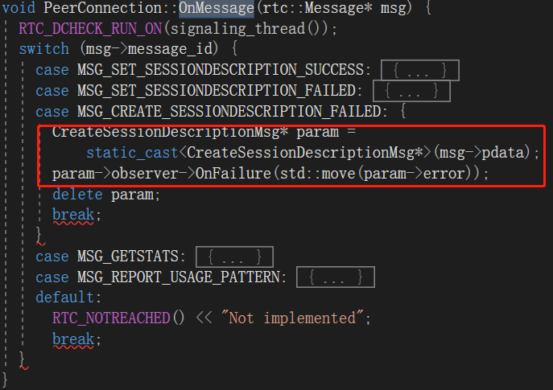
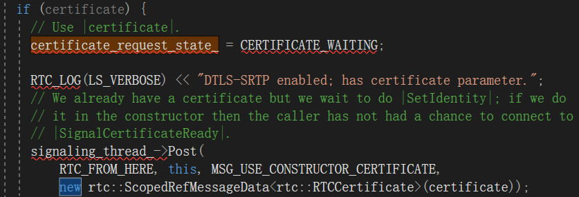
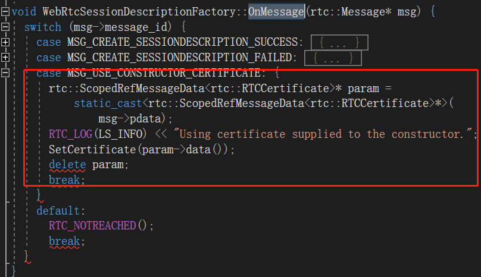
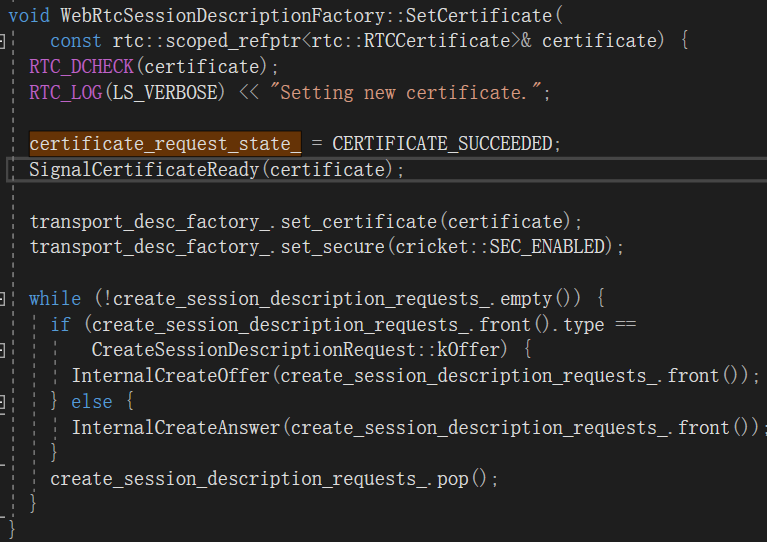
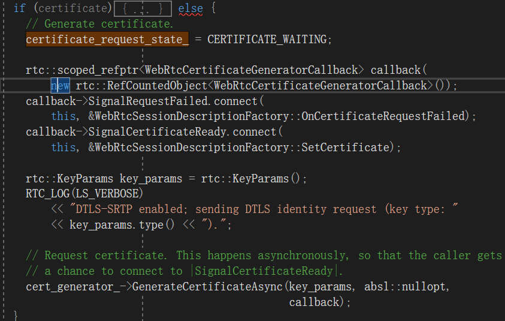
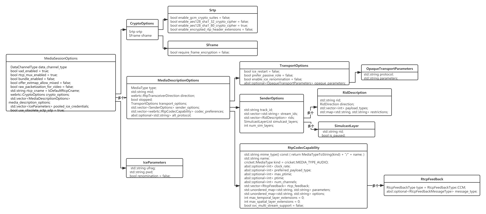

<!--BEGIN_DATA
{
    "create_date": "2020-09-12 19:44", 
    "modify_date": "2020-09-12 19:44", 
    "is_top": "0", 
    "summary": "WebRTC源码分析-呼叫建立过程之五(创建Offer，CreateOffer，上篇)<br/>待续", 
    "tags": "WebRTC、C/C++", 
    "file_name": "WebRTC源码分析-呼叫建立过程3.md"
}
END_DATA-->

#### <p>原文出处：<a href='https://blog.csdn.net/ice_ly000/article/details/105763753' target='blank'>WebRTC源码分析-呼叫建立过程之五(创建Offer，CreateOffer，上篇)</a></p>

#### 目录

  * 1. 引言
  * 2 CreateOffer声明 && 两个参数
  *     * 2.1 CreateOffer声明
    * 2.2 参数CreateSessionDescriptionObserver
    * 2.3 参数RTCOfferAnswerOptions
  * 3 PeerConnection::CreateOffer
  *     * 3.1 PeerConnection::DoCreateOffer
    *       * 3.1.1 PeerConnection::PostCreateSessionDescriptionFailure
      * 3.1.2 PeerConnection::HandleLegacyOfferOptions
      * 3.1.3 PeerConnection::GetOptionsForOffer
      *         * 3.1.3.1 MediaSessionOptions
        * 3.1.3.2 ExtractSharedMediaSessionOptions
        * 3.1.3.3 GetOptionsForUnifiedPlanOffer
    * 3.2 WebRtcSessionDescriptionFactory::CreateOffer
    *       * 3.2.1 WebRtcSessionDescriptionFactory::InternalCreateOffer
      *         * 3.2.1.1 MediaSessionDescriptionFactory::CreateOffer
  * 4 总结
  *     * 4.1 CreateOffer总体流程图
    * 4.2 重要结构体 && 类的关系图
    *       * 4.2.1 信息——MediaSessionOptions
      * 4.2.2 目标——JsepSessionDescription

## 1. 引言

创建完PeerConnectionFactory 和 PeerConnection这两个API层的操盘对象之后；紧接着需要初始化本地的媒体，也即创建本地的音频轨、视频轨、数据通道，并将这些本地的媒体轨道添加到PeerConnection对象中。然后即可调用PeerConnection::CreateOffer()创建本地SDP对象。

本文将详细描述PeerConnection::CreateOffer()过程，相关的知识点。如下图


## 2 CreateOffer声明 && 两个参数

### 2.1 CreateOffer声明


​    
​      void CreateOffer(CreateSessionDescriptionObserver* observer,
​                       const RTCOfferAnswerOptions& options) override;


### 2.2 参数CreateSessionDescriptionObserver


​    
​    class RTC_EXPORT CreateSessionDescriptionObserver
​        : public rtc::RefCountInterface {
​     public:
​      virtual void OnSuccess(SessionDescriptionInterface* desc) = 0;
​      virtual void OnFailure(RTCError error);
​      virtual void OnFailure(const std::string& error);
​     protected:
​      ~CreateSessionDescriptionObserver() override = default;
​    };


注意：CreateSessionDescriptionObserver只是一个接口，没有具体实现。一般用户层需要继承，并实现CreateSessionDescriptionObserver的方法，以便用户侧感知CreateOffer状态。

另外，WebRTC内部提供了两个实现了CreateSessionDescriptionObserver接口的类，ImplicitCreateSessionDescriptionObserver && CreateSessionDescriptionObserverOperationWrapper。在后续分析过程中再来聊聊这两个实现所起的作用。

### 2.3 参数RTCOfferAnswerOptions

RTCOfferAnswerOptions源码如下（省略了构造函数）：

```cpp
struct RTCOfferAnswerOptions {
  static const int kUndefined = -1;
  static const int kMaxOfferToReceiveMedia = 1;
  // The default value for constraint offerToReceiveX:true.
  static const int kOfferToReceiveMediaTrue = 1;

  // These options are left as backwards compatibility for clients who need
  // "Plan B" semantics. Clients who have switched to "Unified Plan" semantics
  // should use the RtpTransceiver API (AddTransceiver) instead.
  //
  // offer_to_receive_X set to 1 will cause a media description to be
  // generated in the offer, even if no tracks of that type have been added.
  // Values greater than 1 are treated the same.
  //
  // If set to 0, the generated directional attribute will not include the
  // "recv" direction (meaning it will be "sendonly" or "inactive".
  int offer_to_receive_video = kUndefined;
  int offer_to_receive_audio = kUndefined;

  bool voice_activity_detection = true;
  bool ice_restart = false;

  // If true, will offer to BUNDLE audio/video/data together. Not to be
  // confused with RTCP mux (multiplexing RTP and RTCP together).
  bool use_rtp_mux = true;

  // If true, "a=packetization:<payload_type> raw" attribute will be offered
  // in the SDP for all video payload and accepted in the answer if offered.
  bool raw_packetization_for_video = false;

  // This will apply to all video tracks with a Plan B SDP offer/answer.
  int num_simulcast_layers = 1;

  // If true: Use SDP format from draft-ietf-mmusic-scdp-sdp-03
  // If false: Use SDP format from draft-ietf-mmusic-sdp-sdp-26 or later
  bool use_obsolete_sctp_sdp = false;
};
```

RTCOfferAnswerOptions提供的参数，英文注释写得非常清楚，此处就不多赘述。特别值得注意的是**`use_rtp_mux`默认为真，使得所有媒体都集合到一个Bundle group，复用底层的同一个传输通道DTLS Transport。**

## 3 PeerConnection::CreateOffer

接下来，我们来抽丝剥茧，一步步分析CreateOffer的整个流程。


```cpp
void PeerConnection::CreateOffer(CreateSessionDescriptionObserver* observer,
                                 const RTCOfferAnswerOptions& options) {
  // 1. 信令线程执行                               
  RTC_DCHECK_RUN_ON(signaling_thread());

  // 2. 排队执行
  // Chain this operation. If asynchronous operations are pending on the chain,
  // this operation will be queued to be invoked, otherwise the contents of the
  // lambda will execute immediately.
  operations_chain_->ChainOperation(
      [this_weak_ptr = weak_ptr_factory_.GetWeakPtr(),
       observer_refptr =
           rtc::scoped_refptr<CreateSessionDescriptionObserver>(observer),
       options](std::function<void()> operations_chain_callback) {
        // 2.1 如果this_weak_ptr为空，意味着当前PC已经不存在，会话被关闭
        // Abort early if |this_weak_ptr| is no longer valid.
        if (!this_weak_ptr) {
          // 2.1.1 通知用户侧CreateOffer失败及失败原因
          observer_refptr->OnFailure(
              RTCError(RTCErrorType::INTERNAL_ERROR,
                       "CreateOffer failed because the session was shut down"));
          // 2.1.2 执行操作结束的回调，通知执行下一个Operation
          operations_chain_callback();
          return;
        }
        
        // 2.2 执行真正的DoCreateOffer
        // The operation completes asynchronously when the wrapper is invoked.
        // 2.2.1 创建入参Observer的一个Wrapper对象，该对象还封装了操作回调函数的指针，
        //     使得CreatOffer结束后，能够调用回调函数，通知执行下一个Operation，同时能够通知
        //     用户侧本次CreatOffer的结果。
        rtc::scoped_refptr<CreateSessionDescriptionObserverOperationWrapper>
            observer_wrapper(new rtc::RefCountedObject<
                             CreateSessionDescriptionObserverOperationWrapper>(
                std::move(observer_refptr),
                std::move(operations_chain_callback)));
        // 2.2.2 调用DoCreateOffer进一步去创建Offer
        this_weak_ptr->DoCreateOffer(options, observer_wrapper);
      });
}
```


CreateOffer方法执行过程是比较明朗的，也有必要将涉及的基本观念、设计方式交代下：

  * WebRTC中将CreateOffer、CreateAnswer、SetLocalDescription、SetRemoteDescription、AddIceCandidate这5个与SDP会话相关的API认为是一个Operation，这些Operation必须是挨个执行，不能乱序，不能同时有两个交互执行。因此，设计了一套操作链的接口，由OperationsChain类提供此功能。当链入一个操作时，如果队列中没有其他操作，那么该操作会被立马执行；若是操作链中存在操作，那么本操作就入队操作链，等待上一个操作执行完成之后，以回调的形式（即上述代码中的operations_chain_callback回调方法）来告知执行下一步操作。具体实现可见文章：[WebRTC源码分析——操作链实现OperationsChain](https://blog.csdn.net/ice_ly000/article/details/106756695)
  * CreateSessionDescriptionObserverOperationWrapper相当于一个封装了 "Offer操作结果回调 + 操作链操作完成回调"的一个对象，一直沿着CreateOffer调用链往下传，直到能够判断是否能成功创建Offer的地方，创建Offer这个操作完成的地方，然后去触发其承载的回调函数，以便告知上层操作结果，然后触发下一个操作。具体见源码
    

```cpp
// Wraps a CreateSessionDescriptionObserver and an OperationsChain operation
// complete callback. When the observer is invoked, the wrapped observer is
// invoked followed by invoking the completion callback.
class CreateSessionDescriptionObserverOperationWrapper
   : public CreateSessionDescriptionObserver {
public:
 CreateSessionDescriptionObserverOperationWrapper(
     rtc::scoped_refptr<CreateSessionDescriptionObserver> observer,
     std::function<void()> operation_complete_callback)
     : observer_(std::move(observer)),
       operation_complete_callback_(std::move(operation_complete_callback)) {
   RTC_DCHECK(observer_);
 }
 ~CreateSessionDescriptionObserverOperationWrapper() override {
   RTC_DCHECK(was_called_);
 }

 void OnSuccess(SessionDescriptionInterface* desc) override {
   RTC_DCHECK(!was_called_);
#ifdef RTC_DCHECK_IS_ON
   was_called_ = true;
#endif  // RTC_DCHECK_IS_ON
   // Completing the operation before invoking the observer allows the observer
   // to execute SetLocalDescription() without delay.
   operation_complete_callback_();
   observer_->OnSuccess(desc);
 }

 void OnFailure(RTCError error) override {
   RTC_DCHECK(!was_called_);
#ifdef RTC_DCHECK_IS_ON
   was_called_ = true;
#endif  // RTC_DCHECK_IS_ON
   operation_complete_callback_();
   observer_->OnFailure(std::move(error));
 }

private:
#ifdef RTC_DCHECK_IS_ON
 bool was_called_ = false;
#endif  // RTC_DCHECK_IS_ON
 rtc::scoped_refptr<CreateSessionDescriptionObserver> observer_;
 std::function<void()> operation_complete_callback_;
};
```


  * rtc::WeakPtrFactory<PeerConnection> weak_ptr_factory_：在构造PeerConnection时，传入了this指针。当从weak_ptr_factory_获取弱指针this_weak_ptr不存在时，意味着PC已经不存在了，也即当前会话已被关闭。这样的功能是由rtc::WeakPtrFactory && WeakPtr带来的，详见 [WebRTC源码分析——弱指针WeakPtrFactory && WeakPtr](https://blog.csdn.net/ice_ly000/article/details/106780336)。要注意的是weak_ptr_factory_必须声明在PC的最后，这样是为了：
    

```cpp    
// |weak_ptr_factory_| must be declared last to make sure all WeakPtr's are
// invalidated before any other members are destroyed.
```

### 3.1 PeerConnection::DoCreateOffer


```cpp
void PeerConnection::DoCreateOffer(
    const RTCOfferAnswerOptions& options,
    rtc::scoped_refptr<CreateSessionDescriptionObserver> observer) {
  // 1. 状态判断
  // 1.1 运行在信令线程
  RTC_DCHECK_RUN_ON(signaling_thread());
  TRACE_EVENT0("webrtc", "PeerConnection::DoCreateOffer");
  // 1.2 观察者不能为空
  if (!observer) {
    RTC_LOG(LS_ERROR) << "CreateOffer - observer is NULL.";
    return;
  }
  // 1.3 PC的信令状态不能是已关闭状态——kClose
  //     信令状态：  enum SignalingState {
  //                   kStable,
  //                   kHaveLocalOffer,
  //                   kHaveLocalPrAnswer,
  //                   kHaveRemoteOffer,
  //                   kHaveRemotePrAnswer,
  //                   kClosed,};
  //    PC创建时默认为kStable状态，只有PC调用Close方法时，会使得其处于kClosed状态               
  if (IsClosed()) {
    std::string error = "CreateOffer called when PeerConnection is closed.";
    RTC_LOG(LS_ERROR) << error;
    PostCreateSessionDescriptionFailure(
        observer, RTCError(RTCErrorType::INVALID_STATE, std::move(error)));
    return;
  }
  // 1.4 会话状态判断
  // If a session error has occurred the PeerConnection is in a possibly
  // inconsistent state so fail right away.
  if (session_error() != SessionError::kNone) {
    std::string error_message = GetSessionErrorMsg();
    RTC_LOG(LS_ERROR) << "CreateOffer: " << error_message;
    PostCreateSessionDescriptionFailure(
        observer,
        RTCError(RTCErrorType::INTERNAL_ERROR, std::move(error_message)));
    return;
  }
  // 1.5 验证options的合法性
  //     实际就是判断offer_to_receive_audio && offer_to_receive_video
  //     这两个参数是否合法(取值在kUndefined~kMaxOfferToReceiveMedia之间)
  //     默认二者皆为kUndefined。
  if (!ValidateOfferAnswerOptions(options)) {
    std::string error = "CreateOffer called with invalid options.";
    RTC_LOG(LS_ERROR) << error;
    PostCreateSessionDescriptionFailure(
        observer, RTCError(RTCErrorType::INVALID_PARAMETER, std::move(error)));
    return;
  }
  // 1.6 如果是Unified Plan，处理options中遗留的字段
  // Legacy handling for offer_to_receive_audio and offer_to_receive_video.
  // Specified in WebRTC section 4.4.3.2 "Legacy configuration extensions".
  if (IsUnifiedPlan()) {
    RTCError error = HandleLegacyOfferOptions(options);
    if (!error.ok()) {
      PostCreateSessionDescriptionFailure(observer, std::move(error));
      return;
    }
  }

  // 2 获取MediaSessionOptions信息，为创建Offer提供信息
  //   MediaSessionOptions包含了创建Offer时对每个mline都适用的公共规则，并且为每个mLine
  //   都准备了一个MediaDescriptionOptions
  cricket::MediaSessionOptions session_options;
  GetOptionsForOffer(options, &session_options);
  
  // 3 执行WebRtcSessionDescriptionFactory::CreateOffer来创建Offer
  webrtc_session_desc_factory_->CreateOffer(observer, options, session_options);
}
```


DoCreateOffer大致分两个部分，第一个部分是对入参和当前状态的一些判断（如源码所示共6点），若这些条件和状态不对，则PostCreateSessionDescriptionFailure方法将错误信息post出去，并且不再继续创建Offer的后续动作；第二个部分是获取MediaSessionOptions信息，然后调用WebRtcSessionDescriptionFactory::CreateOffer来实际创建Offer.

#### 3.1.1 PeerConnection::PostCreateSessionDescriptionFailure


```cpp
void PeerConnection::PostCreateSessionDescriptionFailure(
    CreateSessionDescriptionObserver* observer,
    RTCError error) {
  RTC_DCHECK(!error.ok());
  CreateSessionDescriptionMsg* msg = new CreateSessionDescriptionMsg(observer);
  msg->error = std::move(error);
  signaling_thread()->Post(RTC_FROM_HERE, this,
                           MSG_CREATE_SESSIONDESCRIPTION_FAILED, msg);
}

struct CreateSessionDescriptionMsg : public rtc::MessageData {
  explicit CreateSessionDescriptionMsg(
      webrtc::CreateSessionDescriptionObserver* observer)
      : observer(observer) {}

  rtc::scoped_refptr<webrtc::CreateSessionDescriptionObserver> observer;
  RTCError error;
};
```


我们可以看到实际上，PostCreateSessionDescriptionFailure方法是将observer，error打包到自定义的消息对象CreateSessionDescriptionMsg中，该消息继承于MessageData，从而可以通过rtc::Thread的Post方法投递到信令线程的消息队列中。注意：投递时，消息的接收方是this，也即PC对象；另外MessageData和`MSG_CREATE_SESSIONDESCRIPTION_FAILED`在Thread::Post方法中进一步被封装为rtc::Message对象，前者成为其pdata成员，后者成为其`message_id`成员。在之前的文章中我们提到过PC是继承了MessageHandler的，投递出去的消息，将在PC::OnMessage方法中得到处理：  

  

前文，我们分析过创建Offer这个过程不论成功与否，最终都需要进行两个操作：一个是通知用户侧传入的Observer获知创建Offer是否成功，一个是调用操作链的回调函数，告知本次操作已完毕，进而执行下一个操作。上图红线框中的代码正是做了这点：通过执行CreateSessionDescriptionObserverOperationWrapper::OnFailure方法（如后文第4部分所示）。

#### 3.1.2 PeerConnection::HandleLegacyOfferOptions


```cpp
RTCError PeerConnection::HandleLegacyOfferOptions(
    const RTCOfferAnswerOptions& options) {
  RTC_DCHECK(IsUnifiedPlan());
  
 // 1. 处理音频（offer_to_receive_audio）
 // 1.1 为0，不接受音频流，遍历移除
  if (options.offer_to_receive_audio == 0) {
    RemoveRecvDirectionFromReceivingTransceiversOfType(
        cricket::MEDIA_TYPE_AUDIO);
 // 1.2  为1，接受音频流，遍历添加
  } else if (options.offer_to_receive_audio == 1) {
    AddUpToOneReceivingTransceiverOfType(cricket::MEDIA_TYPE_AUDIO);
  // 1.3  >1，参数错误
  } else if (options.offer_to_receive_audio > 1) {
    LOG_AND_RETURN_ERROR(RTCErrorType::UNSUPPORTED_PARAMETER,
                         "offer_to_receive_audio > 1 is not supported.");
  }

  // 2. 处理视频（offer_to_receive_video）
  // 2.1 为0，不接受视频流，遍历移除
  if (options.offer_to_receive_video == 0) {
    RemoveRecvDirectionFromReceivingTransceiversOfType(
        cricket::MEDIA_TYPE_VIDEO);
 // 2.2 为1，接受视频流，遍历添加
  } else if (options.offer_to_receive_video == 1) {
    AddUpToOneReceivingTransceiverOfType(cricket::MEDIA_TYPE_VIDEO);
  // 2.3 >1，参数错误
  } else if (options.offer_to_receive_video > 1) {
    LOG_AND_RETURN_ERROR(RTCErrorType::UNSUPPORTED_PARAMETER,
                         "offer_to_receive_video > 1 is not supported.");
  }

  return RTCError::OK();
}
```

当采用Unified Plan时，需要针对options的`offer_to_receive_audio`和`offer_to_receive_audio`进行处理，当`offer_to_receive_xxx`为0表示本端不接收对应的流，`offer_to_receive_xxx`为1表示接收。需要对PC所持有的`transceivers_`进行遍历处理。

1）当不接收流时RemoveRecvDirectionFromReceivingTransceiversOfType进行处理：


```cpp    
void PeerConnection::RemoveRecvDirectionFromReceivingTransceiversOfType(
    cricket::MediaType media_type) {
  // 通过GetReceivingTransceiversOfType遍历transceivers_，获取所有对应媒体类型的、
  // 传输方向包含recv的的Transceivers。然后再遍历这些符合条件的Transceivers。
  for (const auto& transceiver : GetReceivingTransceiversOfType(media_type)) {
    // 通过RtpTransceiverDirectionWithRecvSet方法获取新方向，新的方向中应保留
    // 旧方向中的Send（旧方向中若存在的话）。
    RtpTransceiverDirection new_direction =
        RtpTransceiverDirectionWithRecvSet(transceiver->direction(), false);
    // 若新方向与旧方向是不一致的，因此，有改变，调用transceiver的set_direction
    // 设置为新方向。
    if (new_direction != transceiver->direction()) {
      // 打印日志
      RTC_LOG(LS_INFO) << "Changing " << cricket::MediaTypeToString(media_type)
                       << " transceiver (MID="
                       << transceiver->mid().value_or("<not set>") << ") from "
                       << RtpTransceiverDirectionToString(
                              transceiver->direction())
                       << " to "
                       << RtpTransceiverDirectionToString(new_direction)
                       << " since CreateOffer specified offer_to_receive=0";
      // 更改方向Transceiver方向
      transceiver->internal()->set_direction(new_direction);
    }
  }
}

// Sets the intended direction for this transceiver. Intended to be used
// internally over SetDirection since this does not trigger a negotiation
// needed callback.
void set_direction(RtpTransceiverDirection direction) {
  direction_ = direction;
}
```

注意：GetReceivingTransceiversOfType返回的是`std::vector<rtc::scoped_refptr<RtpTransceiverProxyWithInternal<RtpTransceiver>>>`，而不是直接承载RtpTransceiver的vector。这样做的好处是使得对RtpTransceiver的操作都能通过RtpTransceiverProxyWithInternal被代理到对应的线程上去执行。最终，简单的只是修改了`RtpTransceiver的direction_`属性。

2）当接收流时AddUpToOneReceivingTransceiverOfType进行处理：


```cpp
void PeerConnection::AddUpToOneReceivingTransceiverOfType(
    cricket::MediaType media_type) {
  RTC_DCHECK_RUN_ON(signaling_thread());
  // 遍历PC::transceivers_，若所有的该媒体类型的transceiver都不接收流
  // 则创建一个新的transceiver，该transceiver的方向为kRecvOnly
  if (GetReceivingTransceiversOfType(media_type).empty()) {
    RTC_LOG(LS_INFO)
        << "Adding one recvonly " << cricket::MediaTypeToString(media_type)
        << " transceiver since CreateOffer specified offer_to_receive=1";
    RtpTransceiverInit init;
    init.direction = RtpTransceiverDirection::kRecvOnly;
    AddTransceiver(media_type, nullptr, init,
                    /*update_negotiation_needed=*/false);
  }
}
​```cpp

注意：与上面的处理并不对称，并不会去修改已存在的Transceiver的方向。

#### 3.1.3 PeerConnection::GetOptionsForOffer

MediaSessionOptions提供了一个应该如何生成mLine的机制。一方面，MediaSessionOptions提供了适用于所有mLine的参数；另一方面，MediaSessionOptions对于每个具体的mLine，有差异性的参数使用`std::vector<MediaDescriptionOptions> media_description_options`中的对应的那个MediaDescriptionOptions所提供的规则，注意`media_description_options`的下标和mLine在sdp中的顺序是一致的。

    
​```cpp
void PeerConnection::GetOptionsForOffer(
    const PeerConnectionInterface::RTCOfferAnswerOptions& offer_answer_options,
    cricket::MediaSessionOptions* session_options) {
  // 1. 从offer_answer_options抽取构建SDP时，所有mline共享的信息，放到session_options
  //    的公共字段，此方法从offer_answer_options拷贝的公共字段有：
  //      vad_enabled：是否使用静音检测
  //      bundle_enabled: 是否所有媒体数据都成为一个Bundle Gruop，从而复用一个底层传输通道
  //      raw_packetization_for_video：对sdp中所有video负载将产生
  //                    "a=packetization:<payload_type> raw"这样的属性描述。      
  ExtractSharedMediaSessionOptions(offer_answer_options, session_options);

  // 2. 为每个mline，创建MediaDescriptionOptions存入MediaSessionOptions
  if (IsUnifiedPlan()) {
    GetOptionsForUnifiedPlanOffer(offer_answer_options, session_options);
  } else {
    GetOptionsForPlanBOffer(offer_answer_options, session_options);
  }

  // 3. 数据通道data_channel_type类型赋值
  if (data_channel_controller_.HasRtpDataChannels() ||
      data_channel_type() != cricket::DCT_RTP) {
    session_options->data_channel_type = data_channel_type();
  }

  // 4. 复制ICE restart标识，
  //    并将ice restart标识和renomination标识赋值到每个mline对应的MediaDescriptionOptions
  bool ice_restart = offer_answer_options.ice_restart ||
                     local_ice_credentials_to_replace_->HasIceCredentials();
  for (auto& options : session_options->media_description_options) {
    options.transport_options.ice_restart = ice_restart;
    options.transport_options.enable_ice_renomination =
        configuration_.enable_ice_renomination;
  }

  // 5. 复制cname，加密算法选项，加密证书，extmap-allow-mixed属性
  session_options->rtcp_cname = rtcp_cname_;
  session_options->crypto_options = GetCryptoOptions();
  session_options->pooled_ice_credentials =
      network_thread()->Invoke<std::vector<cricket::IceParameters>>(
          RTC_FROM_HERE,
          rtc::Bind(&cricket::PortAllocator::GetPooledIceCredentials,
                    port_allocator_.get()));
  session_options->offer_extmap_allow_mixed =
      configuration_.offer_extmap_allow_mixed;

  // 6. 如果使用外部提供的数据传输通道，添加相应的传输参数到使用该数据传输通道的mLine
  //    的MediaDescriptionOptions
  // If datagram transport is in use, add opaque transport parameters.
  if (use_datagram_transport_ || use_datagram_transport_for_data_channels_) {
    for (auto& options : session_options->media_description_options) {
      absl::optional<cricket::OpaqueTransportParameters> params =
          transport_controller_->GetTransportParameters(options.mid);
      if (!params) {
        continue;
      }
      options.transport_options.opaque_parameters = params;
      if ((use_datagram_transport_ &&
           (options.type == cricket::MEDIA_TYPE_AUDIO ||
            options.type == cricket::MEDIA_TYPE_VIDEO)) ||
          (use_datagram_transport_for_data_channels_ &&
           options.type == cricket::MEDIA_TYPE_DATA)) {
        options.alt_protocol = params->protocol;
      }
    }
  }

  // 是否允许回退到使用过时的sctp sdp
  session_options->use_obsolete_sctp_sdp =
      offer_answer_options.use_obsolete_sctp_sdp;
}
```

##### 3.1.3.1 MediaSessionOptions

MediaSessionOptions提供了一个应该如何生成mLine的机制。一方面，MediaSessionOptions提供了适用于所有mLine的参数——共享参数；另一方面，MediaSessionOptions对于每个具体的mLine，有差异性的参数使用`std::vector<MediaDescriptionOptions> media_description_options`中的对应的那个MediaDescriptionOptions——独享参数，注意`media_description_options`的下标和mLine在sdp中的顺序是一致的。


```cpp
struct MediaSessionOptions {
  MediaSessionOptions() {}

  bool has_audio() const { return HasMediaDescription(MEDIA_TYPE_AUDIO); }
  bool has_video() const { return HasMediaDescription(MEDIA_TYPE_VIDEO); }
  bool has_data() const { return HasMediaDescription(MEDIA_TYPE_DATA); }

  bool HasMediaDescription(MediaType type) const;

  DataChannelType data_channel_type = DCT_NONE;
  bool vad_enabled = true;  // When disabled, removes all CN codecs from SDP.
  bool rtcp_mux_enabled = true;
  bool bundle_enabled = false;
  bool offer_extmap_allow_mixed = false;
  bool raw_packetization_for_video = false;
  std::string rtcp_cname = kDefaultRtcpCname;
  webrtc::CryptoOptions crypto_options;
  // List of media description options in the same order that the media
  // descriptions will be generated.
  std::vector<MediaDescriptionOptions> media_description_options;
  std::vector<IceParameters> pooled_ice_credentials;

  // Use the draft-ietf-mmusic-sctp-sdp-03 obsolete syntax for SCTP
  // datachannels.
  // Default is true for backwards compatibility with clients that use
  // this internal interface.
  bool use_obsolete_sctp_sdp = true;
};
```

##### 3.1.3.2 ExtractSharedMediaSessionOptions

获取部分共享的公共参数。


```cpp
void ExtractSharedMediaSessionOptions(
    const PeerConnectionInterface::RTCOfferAnswerOptions& rtc_options,
    cricket::MediaSessionOptions* session_options) {
  session_options->vad_enabled = rtc_options.voice_activity_detection;
  session_options->bundle_enabled = rtc_options.use_rtp_mux;
  session_options->raw_packetization_for_video =
      rtc_options.raw_packetization_for_video;
}
```

##### 3.1.3.3 GetOptionsForUnifiedPlanOffer

获取每个mline独享的参数MediaDescriptionOptions。该方法中的代码比较冗长，如果知道它的目的，再看的时候会容易得多。本质上，每个mline的MediaDescriptionOptions信息可以从 transceiver 和 为其分配的mid 二者得来，调用一个GetMediaDescriptionOptionsForTransceiver方法即可搞定。但为啥本方法会如此复杂呢？因为要考虑复用，之前可能已经进行过协商，但是没有达成一致，此时，就需要考虑这么样的情况：比方说，之前offer中包含3路流（1、2、3），协商时，2被自己或者对方拒绝。一方面，本地或者远端的SessionDescription对象中2所对应的内容被标记为rejected，另一方面transcervers_中的第二个transcerver会变成stopped，此时2处于可复用的状态。若不添加新流的情况下，再次协商，则只有1、3两路流是有效的，为了保持与前面的协商顺序一致，即之前的1、3仍位于1、3的位置，2会设置为inactive。若添加了新的轨道，再次协商时，之前的1、3仍位于1、3，2则会被新的轨道所在的transcerver复用。 因此，本方法中的处理流程大致如下：

  * 搜索本地和远端sdp，对于之前已经存在的media section进行判断，若是可回收复用的（即对应的ContentInfo被标记为rejected，transceiver标记为stopped），则构造一个默认的、被拒绝的media section，仍占用之前的index；若是仍有效的，则使用GetMediaDescriptionOptionsForTransceiver根据transceiver和之前的mid来构造media section，仍占用之前的index。
  * 遍历新增加的transceiver，为每个新增加的transceiver调用`mid_generator_()`来产生新的mid，然后调用GetMediaDescriptionOptionsForTransceiver来生成media section。首先查看第1步中是否存在可复用的index，有则替换之前生成的默认的、被拒绝的media section；不存在可复用的，则直接在后面append即可。
  * 最后，处理DataChannel的media section，其永远是在最后一个mLine。
  * 源码如下：可以根据上面的分析详细了解
    
    
```cpp
void PeerConnection::GetOptionsForUnifiedPlanOffer(
    const RTCOfferAnswerOptions& offer_answer_options,
    cricket::MediaSessionOptions* session_options) {
  // Rules for generating an offer are dictated by JSEP sections 5.2.1 (Initial
  // Offers) and 5.2.2 (Subsequent Offers).
  RTC_DCHECK_EQ(session_options->media_description_options.size(), 0);
   
  // 1
  const ContentInfos no_infos;
  const ContentInfos& local_contents =
      (local_description() ? local_description()->description()->contents()
                           : no_infos);
  const ContentInfos& remote_contents =
      (remote_description() ? remote_description()->description()->contents()
                            : no_infos);
  // The mline indices that can be recycled. New transceivers should reuse these
  // slots first.
  std::queue<size_t> recycleable_mline_indices;
  // First, go through each media section that exists in either the local or
  // remote description and generate a media section in this offer for the
  // associated transceiver. If a media section can be recycled, generate a
  // default, rejected media section here that can be later overwritten.
  for (size_t i = 0;
       i < std::max(local_contents.size(), remote_contents.size()); ++i) {
    // Either |local_content| or |remote_content| is non-null.
    const ContentInfo* local_content =
        (i < local_contents.size() ? &local_contents[i] : nullptr);
    const ContentInfo* current_local_content =
        GetContentByIndex(current_local_description(), i);
    const ContentInfo* remote_content =
        (i < remote_contents.size() ? &remote_contents[i] : nullptr);
    const ContentInfo* current_remote_content =
        GetContentByIndex(current_remote_description(), i);
    bool had_been_rejected =
        (current_local_content && current_local_content->rejected) ||
        (current_remote_content && current_remote_content->rejected);
    const std::string& mid =
        (local_content ? local_content->name : remote_content->name);
    cricket::MediaType media_type =
        (local_content ? local_content->media_description()->type()
                       : remote_content->media_description()->type());
    if (media_type == cricket::MEDIA_TYPE_AUDIO ||
        media_type == cricket::MEDIA_TYPE_VIDEO) {
      auto transceiver = GetAssociatedTransceiver(mid);
      RTC_CHECK(transceiver);
      // A media section is considered eligible for recycling if it is marked as
      // rejected in either the current local or current remote description.
      if (had_been_rejected && transceiver->stopped()) {
        session_options->media_description_options.push_back(
            cricket::MediaDescriptionOptions(transceiver->media_type(), mid,
                                             RtpTransceiverDirection::kInactive,
                                             /*stopped=*/true));
        recycleable_mline_indices.push(i);
      } else {
        session_options->media_description_options.push_back(
            GetMediaDescriptionOptionsForTransceiver(transceiver, mid));
        // CreateOffer shouldn't really cause any state changes in
        // PeerConnection, but we need a way to match new transceivers to new
        // media sections in SetLocalDescription and JSEP specifies this is done
        // by recording the index of the media section generated for the
        // transceiver in the offer.
        transceiver->internal()->set_mline_index(i);
      }
    } else {
      RTC_CHECK_EQ(cricket::MEDIA_TYPE_DATA, media_type);
      RTC_CHECK(GetDataMid());
      if (had_been_rejected || mid != *GetDataMid()) {
        session_options->media_description_options.push_back(
            GetMediaDescriptionOptionsForRejectedData(mid));
      } else {
        session_options->media_description_options.push_back(
            GetMediaDescriptionOptionsForActiveData(mid));
      }
    }
  }

  // 2
  // Next, look for transceivers that are newly added (that is, are not stopped
  // and not associated). Reuse media sections marked as recyclable first,
  // otherwise append to the end of the offer. New media sections should be
  // added in the order they were added to the PeerConnection.
  for (const auto& transceiver : transceivers_) {
    if (transceiver->mid() || transceiver->stopped()) {
      continue;
    }
    size_t mline_index;
    if (!recycleable_mline_indices.empty()) {
      mline_index = recycleable_mline_indices.front();
      recycleable_mline_indices.pop();
      session_options->media_description_options[mline_index] =
          GetMediaDescriptionOptionsForTransceiver(transceiver,
                                                   mid_generator_());
    } else {
      mline_index = session_options->media_description_options.size();
      session_options->media_description_options.push_back(
          GetMediaDescriptionOptionsForTransceiver(transceiver,
                                                   mid_generator_()));
    }
    // See comment above for why CreateOffer changes the transceiver's state.
    transceiver->internal()->set_mline_index(mline_index);
  }
  
  // 3
  // Lastly, add a m-section if we have local data channels and an m section
  // does not already exist.
  if (!GetDataMid() && data_channel_controller_.HasDataChannels()) {
    session_options->media_description_options.push_back(
        GetMediaDescriptionOptionsForActiveData(mid_generator_()));
  }
}
```

### 3.2 WebRtcSessionDescriptionFactory::CreateOffer


```cpp
void WebRtcSessionDescriptionFactory::CreateOffer(
    CreateSessionDescriptionObserver* observer,
    const PeerConnectionInterface::RTCOfferAnswerOptions& options,
    const cricket::MediaSessionOptions& session_options) {
  // 1. certificate_request_state_状态为CERTIFICATE_FAILED
  //    出错处理
  std::string error = "CreateOffer";
  if (certificate_request_state_ == CERTIFICATE_FAILED) {
    error += kFailedDueToIdentityFailed;
    RTC_LOG(LS_ERROR) << error;
    PostCreateSessionDescriptionFailed(observer, error);
    return;
  }
  // 2. 验证MediaSessionOptions的正确性，实际上是检验
  //    每个sender的id是不是都是唯一的
  if (!ValidMediaSessionOptions(session_options)) {
    error += " called with invalid session options";
    RTC_LOG(LS_ERROR) << error;
    PostCreateSessionDescriptionFailed(observer, error);
    return;
  }
  
  // 3. 构造创建Offer的请求，根据情况排队执行，或者直接执行
  // 3.1 构造创建Offer的请求
  CreateSessionDescriptionRequest request(
      CreateSessionDescriptionRequest::kOffer, observer, session_options);
  // 3.2 若证书请求状态是CERTIFICATE_WAITING，则请求入队，等待执行
  if (certificate_request_state_ == CERTIFICATE_WAITING) {
    create_session_description_requests_.push(request);

  // 3.2 若证书请求状态是CERTIFICATE_SUCCEEDED已经成功状态或者CERTIFICATE_NOT_NEEDED
  //     不需要证书状态 ，则直接调用InternalCreateOffer来处理生成Offer的请求
  } else {
    RTC_DCHECK(certificate_request_state_ == CERTIFICATE_SUCCEEDED ||
               certificate_request_state_ == CERTIFICATE_NOT_NEEDED);
    InternalCreateOffer(request);
  }
}
```

`WebRtcSessionDescriptionFactory::certificate_request_state_`成员的取值影响了整个流程处理。那么`certificate_request_state_`取值是如何变化的呢？想要详细了解可以根据以下描述、配合源码来理解。

  * 首先，在WebRtcSessionDescriptionFactory构造时，`certificate_request_state_`默认初始化为`CERTIFICATE_NOT_NEEDED`。
  * 其次，若构造函数中外部传入了certificate（若追根究底，这个certificate是在创建PC时由其配置参数带入的，并且在PC的初始化函数中构建了WebRtcSessionDescriptionFactory，并将该certificate传递进来），那么`certificate_request_state_`会被设置为`CERTIFICATE_WAITING`状态，并在信令线程Post一个包含有该certificate的消息（为什么要采用异步方式？是为了让PC能够绑定WebRtcSessionDescriptionFactory信号SignalCertificateReady，从而在后续该异步操作结束时能响应该信号），因此，会在WebRtcSessionDescriptionFactory的OnMesaage方法中得到异步处理，如下红框中所示。最终是在SetCertificate完成证书的设置，状态更新为`CERTIFICATE_SUCCEEDED`，并发送SignalCertificateReady信号，由于`CERTIFICATE_WAITING`状态下，创建Offer的请求会排队，在SetCertificate中还会将排队的请求pop出来，调用InternalCreateOffer进行处理。  






  * 再次，若构造函数中没有传入外部的certificate，则通过证书生成器来异步产生证书，并以信号-槽方式来通知WebRtcSessionDescriptionFactory证书生成情况，若成功则触发SetCertificate来完成证书设置；若失败则触发OnCertificateRequestFailed，将`certificate_request_state_`更新为`CERTIFICATE_FAILED`。  



#### 3.2.1 WebRtcSessionDescriptionFactory::InternalCreateOffer


```cpp
void WebRtcSessionDescriptionFactory::InternalCreateOffer(
    CreateSessionDescriptionRequest request) {
  // 1. 如果存在旧的本地sdp，那么底层通道可能已经打通过，对于每个mline是否还需要重启
  //    ICE过程，可以通过PC::NeedsIceRestart方法进行判断
  if (pc_->local_description()) {
    // If the needs-ice-restart flag is set as described by JSEP, we should
    // generate an offer with a new ufrag/password to trigger an ICE restart.
    for (cricket::MediaDescriptionOptions& options :
         request.options.media_description_options) {
      if (pc_->NeedsIceRestart(options.mid)) {
        options.transport_options.ice_restart = true;
      }
    }
  }

  // 2. 创建SessionDescription对象
  // 2.1 使用MediaSessionDescriptionFactory::CreateOffer来创建   
  std::unique_ptr<cricket::SessionDescription> desc =
      session_desc_factory_.CreateOffer(
          request.options, pc_->local_description()
                               ? pc_->local_description()->description()
                               : nullptr);
  // 2.2 创建失败处理                             
  if (!desc) {
    PostCreateSessionDescriptionFailed(request.observer,
                                       "Failed to initialize the offer.");
    return;
  }

  // 3. 构造最终的Offer SDP对象JsepSessionDescription
  // 3.1 每次创建Offer，会话版本session_version_需要自增1。必须确保
  //     session_version_ 自增后比之前大，即不发生数据溢出，session_version_
  //     被定义为uint64_t
  RTC_DCHECK(session_version_ + 1 > session_version_);
  auto offer = std::make_unique<JsepSessionDescription>(
      SdpType::kOffer, std::move(desc), session_id_,
      rtc::ToString(session_version_++));
  // 3.2 根据每个mline是否需要重启ICE过程，若不需要重启，那么必须得拷贝
  //     之前得ICE过程收集的候选项到新的Offer中
  if (pc_->local_description()) {
    for (const cricket::MediaDescriptionOptions& options :
         request.options.media_description_options) {
      if (!options.transport_options.ice_restart) {
        CopyCandidatesFromSessionDescription(pc_->local_description(),
                                             options.mid, offer.get());
      }
    }
  }
  // 3.3 创建成功的最终处理
  PostCreateSessionDescriptionSucceeded(request.observer, std::move(offer));
}
```

本函数创建了最终的Offer SDP对象，并通过PostCreateSessionDescriptionSucceeded方法触发了用户侧回调 以及操作链进入下一步操作。最终的Offer SDP是JsepSessionDescription类对象，该对象实现了SessionDescriptionInterface接口。在整个过程中，需要先由MediaSessionDescriptionFactory::CreateOffer来创建SessionDescription对象，它是JsepSessionDescription的一部分，后面着重分析SessionDescription创建过程。

##### 3.2.1.1 MediaSessionDescriptionFactory::CreateOffer

方法分四部分：

  * 从已被应用的offer 和 当前MediaSessionOptions中抽取一些信息，以便后续为每个mLine创建对应的新的ContentInfo结构体。这些信息包括：IceParameters（用于ICE过程的ufrag、pwd等信息）、StreamParams（每个媒体源的参数，包括`id(即track id)、ssrcs、ssrc_groups、cname等）`、音视频数据的编码器信息（编码器的id、name、时钟clockrate、编码参数表params、反馈参数feedback_params）、Rtp扩展头信息（uri、id、encrypt）等。
  * 创建SessionDescription，利用上面步骤提供的信息 && MediaSessionOptions提供的信息为每个mline创建对应的ContentInfo，添加到SessionDescription。
  * 处理所有ContentInfo的bundle关系，Bundle the contents together。创建一个BUNDLE，将所有ContentInfo加入bundle并更新bundle的底层传输信息、加密信息。
  * 更新offer的其他信息：msid、`extmap_allow_mixed`等（行文至此，目前还不清楚这两个起什么作用，后续清楚了，再来更新）。

具体详情可见如下代码分析。另外，由于本文已经很长，打算另起一篇文章来对本函数的细节进行打磨，追根究底：[WebRTC源码分析-呼叫建立过程之五(创建Offer，CreateOffer，下篇)](https://blog.csdn.net/ice_ly000/article/details/106848921)


```cpp
std::unique_ptr<SessionDescription> MediaSessionDescriptionFactory::CreateOffer(
    const MediaSessionOptions& session_options,
    const SessionDescription* current_description) const {
  // 1. 从已被应用的offer 和 当前MediaSessionOptions中抽取一些信息，
  //    以便后续为每个mLine创建对应的新的ContentInfo结构体
  // 1.1 当前已被应用的offer sdp中的mlinege个数必须比    
  //    MediaSessionOptions.media_description_options要少或者等于。
  //    实际上回顾GetOptionsForUnifiedPlanOffer方法搜集MediaSessionOptions
  //    中的media_description_options过程，就保证了这点。
  // Must have options for each existing section.
  if (current_description) {
    RTC_DCHECK_LE(current_description->contents().size(),
                  session_options.media_description_options.size());
  }

  // 1.2 获取ice的凭证：ice credential即是ice parameter，包含
  //    ufrag，pwd，renomination三个参数
  IceCredentialsIterator ice_credentials(
      session_options.pooled_ice_credentials);

  // 1.3 从已被应用的当前offer中，获取活动的ContentInfo
  //    判断是否是活动的ContentInfo，必须是ContentInfo.rejected=fasle
  //    并且对应的session_options.media_options的stopped=false
  std::vector<const ContentInfo*> current_active_contents;
  if (current_description) {
    current_active_contents =
        GetActiveContents(*current_description, session_options);
  }

  // 1.4 从活动的ContentInfo获取mLine的StreamParams，
  //    注意一个mLine对应一个ContentInfo，一个ContentInfo可能含有多个StreamParams
  StreamParamsVec current_streams =
      GetCurrentStreamParams(current_active_contents);

  // 1.5 从活动的ContentInfo中获取媒体编码器信息
  // 1.5.1 获取编码器信息
  AudioCodecs offer_audio_codecs;
  VideoCodecs offer_video_codecs;
  RtpDataCodecs offer_rtp_data_codecs;
  GetCodecsForOffer(current_active_contents, &offer_audio_codecs,
                    &offer_video_codecs, &offer_rtp_data_codecs);
  // 1.5.2 根据session_options的信息对编码器进行过滤处理
  if (!session_options.vad_enabled) {
    // If application doesn't want CN codecs in offer.
    StripCNCodecs(&offer_audio_codecs);
  }
  FilterDataCodecs(&offer_rtp_data_codecs,
                   session_options.data_channel_type == DCT_SCTP);

  // 1.6 获取Rtp扩展头信息
  RtpHeaderExtensions audio_rtp_extensions;
  RtpHeaderExtensions video_rtp_extensions;
  GetRtpHdrExtsToOffer(current_active_contents,
                       session_options.offer_extmap_allow_mixed,
                       &audio_rtp_extensions, &video_rtp_extensions);

  // 2. 为每个mline创建对应的ContentInfo，添加到SessionDescription
  // 2.1 创建SessionDescription对象
  auto offer = std::make_unique<SessionDescription>();
  // 2.2 迭代MediaSessionOptions中的每个MediaDescriptionOptions，创建Conteninfo，并添加到
  //     新建SessionDescription对象
  // Iterate through the media description options, matching with existing media
  // descriptions in |current_description|.
  // 2.2.1 循环迭代
  size_t msection_index = 0;
  for (const MediaDescriptionOptions& media_description_options :
       session_options.media_description_options) {
    // 2.2.2 获取当前ContentInfo
    //       要么存在于当前的offer sdp中，则从当前的offer sdp中获取即可
    //       要么是新加入的媒体，还没有ContentInfo，因此为空
    const ContentInfo* current_content = nullptr;
    if (current_description &&
        msection_index < current_description->contents().size()) {
      current_content = &current_description->contents()[msection_index];
      // Media type must match unless this media section is being recycled.
      RTC_DCHECK(current_content->name != media_description_options.mid ||
                 IsMediaContentOfType(current_content,
                                      media_description_options.type));
    }
    // 2.2.3 根据媒体类别，分别调用不同的方法创建ContentInfo，并添加到SessionDescription
    switch (media_description_options.type) {
      case MEDIA_TYPE_AUDIO:
        if (!AddAudioContentForOffer(
                media_description_options, session_options, current_content,
                current_description, audio_rtp_extensions, offer_audio_codecs,
                &current_streams, offer.get(), &ice_credentials)) {
          return nullptr;
        }
        break;
      case MEDIA_TYPE_VIDEO:
        if (!AddVideoContentForOffer(
                media_description_options, session_options, current_content,
                current_description, video_rtp_extensions, offer_video_codecs,
                &current_streams, offer.get(), &ice_credentials)) {
          return nullptr;
        }
        break;
      case MEDIA_TYPE_DATA:
        if (!AddDataContentForOffer(media_description_options, session_options,
                                    current_content, current_description,
                                    offer_rtp_data_codecs, &current_streams,
                                    offer.get(), &ice_credentials)) {
          return nullptr;
        }
        break;
      default:
        RTC_NOTREACHED();
    }
    ++msection_index;
  }
  
  // 3. 处理Bundle，如果session_options.bundle_enabled为真（默认为真），则需要将所有的
  //    ContentInfo全都进入一个ContentGroup，同一个ContentGroup是复用同一个底层传输的
  // Bundle the contents together, if we've been asked to do so, and update any
  // parameters that need to be tweaked for BUNDLE.
  if (session_options.bundle_enabled) {
    // 3.1 创建ContentGroup，并将每个有效的(活动的)ContentInfo添加到ContentGroup
    ContentGroup offer_bundle(GROUP_TYPE_BUNDLE);
    for (const ContentInfo& content : offer->contents()) {
      if (content.rejected) {
        continue;
      }
      // TODO(deadbeef): There are conditions that make bundling two media
      // descriptions together illegal. For example, they use the same payload
      // type to represent different codecs, or same IDs for different header
      // extensions. We need to detect this and not try to bundle those media
      // descriptions together.
      offer_bundle.AddContentName(content.name);
    }
    // 3.2 添加bundle到offer并更新bundle的传输通道信息、加密参数信息
    if (!offer_bundle.content_names().empty()) {
      offer->AddGroup(offer_bundle);
      if (!UpdateTransportInfoForBundle(offer_bundle, offer.get())) {
        RTC_LOG(LS_ERROR)
            << "CreateOffer failed to UpdateTransportInfoForBundle.";
        return nullptr;
      }
      if (!UpdateCryptoParamsForBundle(offer_bundle, offer.get())) {
        RTC_LOG(LS_ERROR)
            << "CreateOffer failed to UpdateCryptoParamsForBundle.";
        return nullptr;
      }
    }
  }

  // 4. 设置一些其他信息
  // 4.1 设置msid信息
  // The following determines how to signal MSIDs to ensure compatibility with
  // older endpoints (in particular, older Plan B endpoints).
  if (is_unified_plan_) {
    // Be conservative and signal using both a=msid and a=ssrc lines. Unified
    // Plan answerers will look at a=msid and Plan B answerers will look at the
    // a=ssrc MSID line.
    offer->set_msid_signaling(cricket::kMsidSignalingMediaSection |
                              cricket::kMsidSignalingSsrcAttribute);
  } else {
    // Plan B always signals MSID using a=ssrc lines.
    offer->set_msid_signaling(cricket::kMsidSignalingSsrcAttribute);
  }
  // 4.2 
  offer->set_extmap_allow_mixed(session_options.offer_extmap_allow_mixed);

  return offer;
}
```

## 4 总结

行文至此，若不追究MediaSessionDescriptionFactory::CreateOffer创建的细节（留待另外一篇文章来详细描述），那么Offer整体上创建过程就介绍完毕了，我们重新梳理下整个过程的要点，并作几个图来总结下。

  * 总体来看，CreateOffer是一个不断搜集信息、然后形成offer、通告结果的过程。
  * 搜集信息：实际上是形成结构体MediaSessionOptions，并不断填充该结构体的过程。这些信息来源于PeerConnection::CreateOffer的入参RTCOfferAnswerOptions、当前的已被应用的Offer、PeerConnection.transceivers_成员。主要集中在PeerConnection::GetOptionsForOffer实现填充过程。
  * 形成Offer：实际上是根据搜集的信息MediaSessionOptions，经过一系列的函数调用来构建Offer对象的过程。Offer SDP实质上是JsepSessionDescription对象，不过该对象中重要的成员SessionDescription承载了绝大多数信息。
  * 通告结果：不论Offer创建成功，还是失败，最终需要做两件事。一件是通告用户侧Offer创建成功还是失败；一件是触发操作链的下一个操作。这个是通过CreateSessionDescriptionObserverOperationWrapper对象封装创建Offer回调接口、封装操作链操作完成回调，并在CreateOffer过程中一直往下传递，直到创建失败或者成功的地方被触发，来实现的。
  * 此外：不论是搜集信息，还是形成Offer都需要参考当前已被应用的Offer中的信息，以便复用部分信息，并使得两次Offer中同样的mLine处于同样的位置。

### 4.1 CreateOffer总体流程图

CreateOffer整个过程始于PeerConnection::CreateOffer，终于WebRtcSessionDescriptionFactory::InternalCreateOffer。我们要知道最终创建的Offer SDP是类JsepSessionDescription对象，它包含了一个非常重要的成员SessionDescription，该成员包含了SDP中的绝大多数信息，它由方法MediaSessionDescriptionFactory::Cr
eateOffer创建。


### 4.2 重要结构体 && 类的关系图

创建Offer过程，由两类数据，一类是收集的信息，以MediaSessionOptions为代表；另一类就是Offer相关的类，以JsepSessionDescription类为代表。

#### 4.2.1 信息——MediaSessionOptions



#### 4.2.2 目标——JsepSessionDescription


<hr/>


## 待续

<ul>
<li> <p><a href="https://blog.csdn.net/ice_ly000/article/details/105763787">WebRTC源码分析-呼叫建立过程之六(设置本地SDP，SetLocalDescription)</a></p> </li>
<li> <p><a href="https://blog.csdn.net/ice_ly000/article/details/105763807">WebRTC源码分析-呼叫建立过程之七(设置远端SDP，SetRemoteDescription)</a></p> </li>
<li> <p><a href="https://blog.csdn.net/ice_ly000/article/details/105763828">WebRTC源码分析-呼叫建立过程之八(创建Answer，CreateAnswer)</a></p> </li>
<li> <p><a href="https://blog.csdn.net/ice_ly000/article/details/105763849">WebRTC源码分析-呼叫建立过程之九(候选项获取，AddIceCandidate)</a></p> </li>
<li> <p><a href="https://blog.csdn.net/ice_ly000/article/details/105763869">WebRTC源码分析-呼叫建立过程之十(获取远端流，OnAddTrack)</a></p> </li>
</ul>