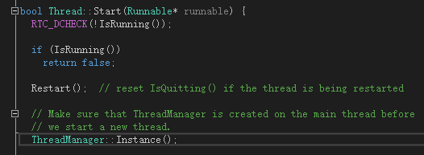
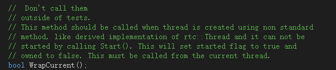
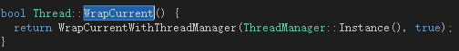
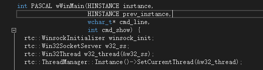
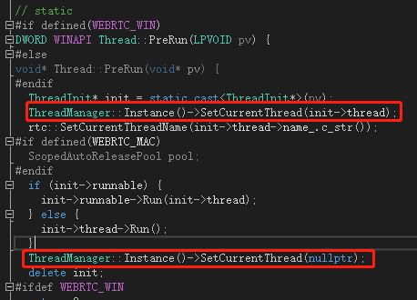

<!--BEGIN_DATA
{
    "create_date": "2020-09-12 22:28", 
    "modify_date": "2020-09-12 22:28", 
    "is_top": "0", 
    "summary": "WebRTC源码分析-线程基础概述<br/>WebRTC源码分析-线程基础之线程管理<br/>WebRTC源码分析-线程基础之线程基本功能", 
    "tags": "WebRTC、C/C++", 
    "file_name": "WebRTC源码分析-线程基础1.md"
}
END_DATA-->

#### <p>原文出处：<a href='https://blog.csdn.net/ice_ly000/article/details/103178702' target='blank'>WebRTC源码分析-线程基础概述</a></p>

WebRTC实现了跨平台(Windows，MacOS，Linux，IOS，Android)的线程类rtc::Thread，WebRTC内部的`network_thread`，`worker_thread`，`signaling_thread`均是该类的实例。该类的源码位于rtc_base目录下的thread.h与thread.cc中。

#### 基础功能

rtc:: Thread及其相关类，ThreadManager、MessageQueue，Runnable等等一起提供了如下的基础功能：

  * 线程的管理：通过ThreadManager单例对象，可以管理所有的Thread实例；
  * 线程的常规基本功能：rtc:: Thread提供创建线程对象，设置线程名称，启动线程去执行用户代码；
  * 消息循环，消息投递：rtc:: Thread通过继承MessageQueue类，提供了内部消息循环，并提供了线程间异步，同步投递消息的功能；
  * 跨线程执行方法：提供了跨线程执行方法，并返回执行结果的功能。该功能非常强大，因为WebRTC在某些功能模块的使用上，有要求其必需在指定的线程中才能调用的基本要求，比如音频模块：ADM 的创建必须要在 WebRTC 的 worker thread 中进行；
  * 多路分离器：通过持有SocketServer对象，实现了多路分离器的功能，能处理网络IO；


<hr/>

#### <p>原文出处：<a href='https://blog.csdn.net/ice_ly000/article/details/103178691' target='blank'>WebRTC源码分析-线程基础之线程管理</a></p>

### 前言

WebRTC中的线程管理是通过ThreadManager对象来实施的，该类起着牧羊者的作用，rtc::Thread类对象就是羊群。其通过什么样的技术来实现对rtc::Thread管理的？在不同的系统平台下如何实现？下文将进行阐述。

该类的声明和定义与Thread类一样，位于rtc_base目录下的thread.h与thread.cc文件中。先看其类的声明：


```cpp 
class  ThreadManager {
public:
    static  const  int kForever = -1;
    static  ThreadManager* Instance();
    Thread* CurrentThread();
    void SetCurrentThread(Thread* thread);
    Thread* WrapCurrentThread();
    void UnwrapCurrentThread();
    bool IsMainThread();
private:
    ThreadManager();
    ~ThreadManager();
#if  defined(WEBRTC_POSIX)
    pthread_key_t key_;
#endif
#if  defined(WEBRTC_WIN)
    const  DWORD key_;
#endif
    const  PlatformThreadRef main_thread_ref_;
RTC_DISALLOW_COPY_AND_ASSIGN(ThreadManager);
};
```

### ThreadManager的构造

ThreadManager实现为单例模式，通过静态方法Instance()来获取唯一的实例。其构造与 析构函数均声明为private。

**先看静态方法Instance的实现：**

```cpp
ThreadManager* ThreadManager::Instance() {
      static  ThreadManager* const thread_manager = new  ThreadManager();
      return thread_manager;
}
```

该方法很简单，但是注意这个方法不是线程安全的，那么在WebRTC的多线程环境下是如何保证ThreadManager对象被安全的构造？WebRTC通过一定机制确保了Instance()方法第一次的调用肯定是在单线程的环境下，也即在主线程中被调用，因此是线程安全的。如何实现这点？

1. WebRTC中启动新线程的标准方法是通过创建Thread对象，然后调用Thread.Start()方法来启用新的线程，而该方法的内部会直接调用一次Insance()，如下截图：



2. WebRTC启动新线程的非标准方法，即用户继承了Thread对象，并且不能通过Thread.Start()方法来启用新线程。此时，WebRTC中是如何保证这点的？如下截图，Thread的WrapCurrent()方法的说明以及其实现说明了此种情况：



继承Thread的类，如果不能通过Thread.Start()来启动线程时，应该在构造中调用WrapCurrent()方法，该方法如下图所示，首先就会调用ThreadManager::Instance()来获取ThreadManager的单例对象。



至此，WebRTC通过上述的方式确保了ThreadManager对象被安全的构造。

**private构造函数的实现：**
    

```cpp
#if  defined(WEBRTC_POSIX)
      ThreadManager::ThreadManager() : main_thread_ref_(CurrentThreadRef()) {
#if  defined(WEBRTC_MAC)
              InitCocoaMultiThreading();
  #endif
            pthread_key_create(&key_, nullptr);
      }
#endif

#if  defined(WEBRTC_WIN)
  ThreadManager::ThreadManager()
        : key_(TlsAlloc()), main_thread_ref_(CurrentThreadRef()) {}
#endif
```

我们可以看到在Windows和类Unix系统中实现进行了区分，`WEBRTC_POSIX`宏表征该系统是类Unix系统，而`WEBRTC_WIN`宏表征是Windows系统。虽然实现稍微有些许不同，在MAC下还需要调用InitCocoaMultiThreading()方法来初始化多线程库。但是两个构造函数均初始化了成员`key_`与`main_thread_ref_`(我们可以看到WebRTC中的私有成员均以下划线`_`结尾)。其中`key_`是线程管理的关键。

`_key_`的初始化：在Windows平台上，`key_`被声明为DWORD类型，赋值为TlsAlloc()函数的返回值，TlsAlloc()函数是Windows的系统API，Tls表示的是线程局部存储Thread Local Storage的缩写，其为每个可能的线程分配了一个线程局部变量的槽位，该槽位用来存储WebRTC的Thread线程对象指针。如果不了解相关概念，可以看微软的官方文档，或者[TLS--线程局部存储](https://links.jianshu.com/go?to=https%3A%2F%2Fwww.cnblogs.com%2Fstli%2Farchive%2F2010%2F11%2F03%2F1867852.html)这篇博客来了解。在类Unix系统上，`key_`被声明`pthread_key_t`类型，使用方法`pthread_key_create(&key_, nullptr)`;赋值。实质是类Unix系统上的线程局部存储实现，隶属于线程库pthread，因此方法与变量均以pthread开头。总之，在ThreadManager的构造之初，WebRTC就为各个线程所对应的Thread对象制造了一个线程局部变量的槽位，成为多线程管理的关键。

`_main_thread_ref_`的初始化：该成员为PlatformThreadRef类型的对象，赋值为CurrentThreadRef()方法的返回值，如下源码所示：在Windows系统下，取值为WinAPI GetCurrentThreadId()返回的当前线程描述符，DWORD类型；在FUCHSIA系统下(该系统是Google新开发的操作系统，像Android还是基于Linux内核属于类Unix范畴，遵循POSIX规范，但FUCHSIA是基于新内核zircon开发的)，返回`zx_thread_self()`，`zx_handle_t`类型；在类Unix系统下，通过pthread库的`pthread_self()`返回，`pthread_t`类型。总之，如前文所述，这部分代码肯定是在主线程中所运行，因此，`main_thread_ref_`存储了主线程TID在不同平台下的不同表示。


```cpp    
PlatformThreadRef CurrentThreadRef() {
#if  defined(WEBRTC_WIN)
        return GetCurrentThreadId();
#elif  defined(WEBRTC_FUCHSIA)
        return zx_thread_self();
#elif  defined(WEBRTC_POSIX)
        return pthread_self();
#endif
}
```

**private析构函数的实现：**


```cpp
ThreadManager::~ThreadManager() {
  // By above RTC_DEFINE_STATIC_LOCAL.
  RTC_NOTREACHED() <<  "ThreadManager should never be destructed.";
}
```

根据日志，我们看到ThreadManager单例对象的析构函数是永不会被调用的，直到整个进程结束自动去释放该对象所占用的空间。否则，会触发断言，在标准错误输出上述错误日志后，调用系统的abort()函数。后续会对RTC_NOTREACHED宏进行展开描述，看看其究竟是如何处理的。

### 获取，设置当前线程关联的Thread对象


```cpp
#if  defined(WEBRTC_WIN)
      Thread* ThreadManager::CurrentThread() {
             return  static_cast<Thread*>(TlsGetValue(key_));
      }
 
      void  ThreadManager::SetCurrentThread(Thread* thread) {
             RTC_DCHECK(!CurrentThread() || !thread);
             TlsSetValue(key_, thread);
      }
#endif
 
#if  defined(WEBRTC_POSIX)
      Thread* ThreadManager::CurrentThread() {
            return  static_cast<Thread*>(pthread_getspecific(key_));
      }
 
      void ThreadManager::SetCurrentThread(Thread* thread) {
#if RTC_DLOG_IS_ON
             if (CurrentThread() && thread) {
                    RTC_DLOG(LS_ERROR) << "SetCurrentThread: Overwriting an existing value?";
             }
 #endif  // RTC_DLOG_IS_ON
            pthread_setspecific(key_, thread);
    }
#endif
```

如前文所述，不论是何种平台，在ThreadManager的构造之初就为Thread指针分配了线程局部存储的槽位key_，通过不同平台的get，set方法就可
以将当前线程所关联的Thread对象指针从该槽位取出或设置进去。但是，有这么几个点需要注意：

  * Thread是用户层线程的表征，可以通过其来访问，操作该线程在内核中的数据结构。但用户层和内核层的线程表征，二者并非是共存关系。以主线程来说，进程一运行起来其线程内核结构就存在，但是用户层主线程的表征Thread对象是不存在的，因此，在程序入口main()函数开头调用ThreadManager::CurrentThread()方法，得到的必然是空指针。如果想要将主线程纳入管理，必然要先创建一个Thread对象，然后调用ThreadManager::SetCurrentThread(Thread* thread)设置到当前线程的线程局部存储的槽位中。正如example目录下的`peerconnection_client`示例工程那样做的，其中Win32Thread就是Thread类的子类。



  * 对于非主线程，如何纳入管理？由前文所说，主线程外，WebRTC的其他线程以Thread.Start()来启动，新的线程中会执行Thread.PreRun()方法。该方法中就调用了ThreadManager::SetCurrentThread(Thread* thread)方法将新的线程纳入ThreadManager的管理，在线程结束后，调用ThreadManager::SetCurrentThread(nullptr)解除管理。



### 包装当前线程为Thread对象，当前线程去包装


```cpp
Thread* ThreadManager::WrapCurrentThread() {
    Thread* result = CurrentThread();
    if (nullptr == result) {
          result = new  Thread(SocketServer::CreateDefault());
          result->WrapCurrentWithThreadManager(this, true);
    }
    return result;
}
```

如果已经有Thread对象与当前线程关联，那么直接返回该对象。否则构造一个新的Thread对象，并通过该对象的WrapCurrentWithThreadManager()方法将新建的Thread对象纳入ThreadManager的管理之中：


```cpp
bool  Thread::WrapCurrentWithThreadManager(ThreadManager* thread_manager,
                                                          bool  need_synchronize_access) {
          RTC_DCHECK(!IsRunning());
#if  defined(WEBRTC_WIN)
          if (need_synchronize_access) {
                    // We explicitly ask for no rights other than synchronization.
                    // This gives us the best chance of succeeding.
                    thread_ = OpenThread(SYNCHRONIZE, FALSE, GetCurrentThreadId());
                    if (!thread_) {
                              RTC_LOG_GLE(LS_ERROR) <<  "Unable to get handle to thread.";
                              return  false;
                    }
                    thread_id_ = GetCurrentThreadId();
          }
#elif  defined(WEBRTC_POSIX)
          thread_ = pthread_self();
#endif
          owned_ = false;
          thread_manager->SetCurrentThread(this);
          return  true;
}
```

在Windows系统与类Unix系统下的差别一点在于`Thread.thread_`的赋值方式。Windows系统上，使用OpenThread()来打开当前已存在的线程，获取其句柄，此处注明只获取该线程的同步操作权限，也即在该线程进行Wait等操作，这样能提高该方法的成功率；而类Unix系统上，使用pthread库的`pthread_self()`方法来获取当前线程`pthread_t`对象。另外将`Thread.owned_`标志位置位false，表示该线程对象是通过wrap而来，而非调用Thread.Start的标准方式而来。最后使用 ThreadManager.SetCurrentThread方法将新创建的Thread对象纳入管理。


```cpp
void  ThreadManager::UnwrapCurrentThread() {
          Thread* t = CurrentThread();
          if (t && !(t->IsOwned())) {
                  t->UnwrapCurrent();
                delete t;
          }
}
```

对于线程的unwrap操作，会根据该线程是不是wrap而来，即`owned_`是否为false，来决定是否进行正真的unwrap操作。如果是的话，就调用Thread.UnwrapCurrent方法进行实际操作，并最后删除Thread对象。


```cpp
void  Thread::UnwrapCurrent() {
        // Clears the platform-specific thread-specific storage.
        ThreadManager::Instance()->SetCurrentThread(nullptr);
#if  defined(WEBRTC_WIN)
        if (thread_ != nullptr) {
                if (!CloseHandle(thread_)) {
                        RTC_LOG_GLE(LS_ERROR)
                                <<  "When unwrapping thread, failed to close handle.";
                }
                thread_ = nullptr;
                thread_id_ = 0;
        }
#elif  defined(WEBRTC_POSIX)
        thread_ = 0;
#endif
}
```

unwrap操作首先需要将当前线程对象所占的槽位置空，即调用ThreadManager::Instance()->SetCurrentThread(nullptr); 来完成。其次是销毁线程的句柄，在Windows下需要先调用`CloseHandle(thread_)`销毁句柄，然后句柄置空，类Unix系统下直接将成员`thread_`置空即可。

### 判断当前线程是否为主线程


```cpp
bool  ThreadManager::IsMainThread() {
          return IsThreadRefEqual(CurrentThreadRef(), main_thread_ref_);
}

bool IsThreadRefEqual(const  PlatformThreadRef& a, const  PlatformThreadRef& b) {
#if  defined(WEBRTC_WIN) || defined(WEBRTC_FUCHSIA)
        return  a == b;
#elif  defined(WEBRTC_POSIX)
        return pthread_equal(a, b);
#endif
}
```

没有太多要说明的，注意类Unix系统下使用pthread库中的`pthread_equal()`方法进行判断。

### 总结

  * WebRTC中ThreadManager类扮演者牧羊者的角色，通过线程局部存储(TLS，Thread Local Storage)的技术提供了对Thread管理，而这种管理其实就是为每个线程包装一个与其相关联的rtc::Thread类对象，并将该对象的地址存储在线程本身的局部存储的某个槽中。
  * 不同平台的TLS实现API是不一样的，在Windows上通过Windows API TlsAlloc()来分配槽位(即key值)，对应于类Unix系统使用pthread库中的`pthread_key_create()`来分配；为获取或者设置槽位中的值(即Thread对象地址)，在Windows上使用TlsGetValue()和TlsSetValue()，对应于类Unix系统使用`pthread_getspecific()`与`pthread_setspecific()`
  * ThreadManager类对象是个单例，但是一个非线程安全的实现，如何保证ThreadManager对象的在WebRTC的多线程环境下安全的初始化？  


<hr/>


#### <p>原文出处：<a href='https://blog.csdn.net/ice_ly000/article/details/103178692' target='blank'>WebRTC源码分析-线程基础之线程基本功能</a></p>

### 前言

如之前的总述文章所述，rtc::Thread类封装了WebRTC中线程的一般功能，比如设置线程名称，启动线程执行用户代码，线程的join，sleep，run，stop等方法；同时也提供了线程内部的消息循环，以及线程之间以同步、异步方式投递消息，同步方式在目标线程执行方法并返回结果等线程之间交互的方式；另外，每个线程均持有SocketServer类成员对象，该类实现了IO多路复用功能。

本文将针对rtc::Thread类所提供的基础线程功能来进行介绍，Thread类在rtc_base目录下的thread.h中声明，如下（删除了其他非线程基础功能的API，其他的API将于另外的文章中分析）：


```cpp
class RTC_LOCKABLE Thread : public MessageQueue {
public:
  // 线程的构造，析构
  Thread();
  explicit Thread(SocketServer* ss);
  explicit Thread(std::unique_ptr<SocketServer> ss);
  Thread(SocketServer* ss, bool do_init);
  Thread(std::unique_ptr<SocketServer> ss, bool do_init);
  ~Thread() override;
  static std::unique_ptr<Thread> CreateWithSocketServer();
  static std::unique_ptr<Thread> Create();
 
  // 线程的名字
  const std::string& name() const { return name_; }
  bool SetName(const std::string& name, const void* obj);
 
  // 当前线程
  static Thread* Current();
  bool IsCurrent() const;
 
  // 阻塞权限
  bool SetAllowBlockingCalls(bool allow);
  static void AssertBlockingIsAllowedOnCurrentThread();
 
  // 休眠
  static bool SleepMs(int millis);
 
  // 线程的启动与停止
  bool Start(Runnable* runnable = nullptr);
  virtual void Stop();
  virtual void Run();
 
  // 线程的Wrap
  bool IsOwned();
  bool WrapCurrent();
  void UnwrapCurrent();
 
 protected:
  void SafeWrapCurrent();
 
  // 等待线程结束
  void Join();
 
 private:
#if defined(WEBRTC_WIN)
  static DWORD WINAPI PreRun(LPVOID context);
#else
  static void* PreRun(void* pv);
#endif
 
  bool WrapCurrentWithThreadManager(ThreadManager* thread_manager,
                                    bool need_synchronize_access);
  bool IsRunning();
 
  std::string name_;
 
#if defined(WEBRTC_POSIX)
  pthread_t thread_ = 0;
#endif
#if defined(WEBRTC_WIN)
  HANDLE thread_ = nullptr;
  DWORD thread_id_ = 0;
#endif
  bool owned_ = true;
 
  friend class ThreadManager;
 
  RTC_DISALLOW_COPY_AND_ASSIGN(Thread);
};
```

### Thread对象的创建

创建Thread对象的构造方法有5个，如下源码所示：


```cpp
// DEPRECATED.
Thread::Thread() : Thread(SocketServer::CreateDefault()) {}
 
Thread::Thread(SocketServer* ss) : Thread(ss, /*do_init=*/true) {}
 
Thread::Thread(std::unique_ptr<SocketServer> ss)
    : Thread(std::move(ss), /*do_init=*/true) {}
 
Thread::Thread(SocketServer* ss, bool do_init)
    : MessageQueue(ss, /*do_init=*/false) {
  SetName("Thread", this);  // default name
  if (do_init) {
    DoInit();
  }
}
 
Thread::Thread(std::unique_ptr<SocketServer> ss, bool do_init)
    : MessageQueue(std::move(ss), false) {
  SetName("Thread", this);  // default name
  if (do_init) {
    DoInit();
  }
}
```

需要注意的是：

  1. 默认构造函数Thread()被标注为DEPRECATED，原因是其对外隐藏了一个事实，即Thread对象是否与一个SocketServer对象绑定。实际上该默认构造会创建一个SocketServer对象绑定到Thread对象，而大多数的应用场景下Thread对象不需要SocketServer。因此，源码的注释中告知使用Create*的两个静态方法来创建Thread对象。

  2. 两个explicit声明的单个入参的构造函数，分别会调用含有两个入参的构造函数，唯一的区别在于入参是SocketServer*指针还是智能指针`std::unique_ptr<SocketServer>`类型。如果是后者那么需要使用std::move来转移SocketServer的拥有权(std::move是一个c++11的语法糖，实现了移动语义，详细的分析可以见博客[C++11 std::move和std::forward](https://www.jianshu.com/p/b90d1091a4ff))。但无论是哪个构造函数，都需要做以下三件事：  

1） **构造父对象MQ**。由于Thread继承于MessageQueue对象，因此首先构造MQ父对象，调用MQ的构造函数，传入SocketServer对象指针以及布尔值false。此处传入的SocketServer不允许为空，否则触发断言；此处传入布尔值false，告知MQ的构造函数“DoInit()方法你就不要调用了，我会在外面调用的”。  

2） **调用DoInit()**，该方法应该在Thread构造中调用，而非在MQ的构造中调用，为什么要这么做？该方法源码如下：我们会发现该方法将MQ的初始化标志置为true，并且将自身纳入MQ管理类的管理列表中。如果DoInit在MQ构造中调用，意味着MQ构造后，Thread对象的指针已经暴露于外（被MQ管理类对象持有），此时Thread对象并未完全构建完成，其虚表vtable还未完全建立。这势必会导致Thread的对象还未构造完成时，就可能会被外部使用(在别的线程中通过MessageQueueManager访问该对象)的风险。为了规避这样的竞太条件，因此，需要给MQ的构造传入false，并在Thread构造中调用DoInit()。


```cpp
void MessageQueue::DoInit() {
  if (fInitialized_) {
    return;
  }

  fInitialized_ = true;
  MessageQueueManager::Add(this);
}
```

3）调用SetName()方法为Thread对象命名。源码如下，需要明白的一点是，该方法的执行必须在线程启动之前，否则会触发断言。并且，由于是在线程启动之前执行，该方法仅仅是给用户层的Thread对象成员`name_`赋值而已，系统内核中线程相关的结构体还未建立，因此，也就无法将该名称设置到内核。只有当线程启动后，才能进一步的将`name_`设置到线程的内核结构体中去。一般默认名称形如"Thread 0x04EFF758"。


```cpp
bool Thread::SetName(const std::string& name, const void* obj) {
  RTC_DCHECK(!IsRunning());
 
  name_ = name;
  if (obj) {
    // The %p specifier typically produce at most 16 hex digits, possibly with a
    // 0x prefix. But format is implementation defined, so add some margin.
    char buf[30];
    snprintf(buf, sizeof(buf), " 0x%p", obj);
    name_ += buf;
  }
  return true;
}
```

**两个静态Create*方法来创建Thread对象。**

  * Thread::Create()：给Thread构造传入的是NullSocketServer对象，该对象不持有真正的Socket，使得创建的Thread无法处理网络IO，但可以运行消息循环，可以处理线程间消息投递。WebRTC中工作线程**worker_thread_**默认使用该方法创建；
  * Thread::CreateWithSocketServer()：给Thread构造传入PhysicalSocketServer对象，该对象持有平台相关的Socket对象，使得Thread能处理网络IO，当然，也可以处理线程间消息投递。WebRTC中网络线程**network_thread_**默认使用该方法创建。


```cpp
std::unique_ptr<Thread> Thread::CreateWithSocketServer() {
  return std::unique_ptr<Thread>(new Thread(SocketServer::CreateDefault()));
}

std::unique_ptr<Thread> Thread::Create() {
  return std::unique_ptr<Thread>(
      new Thread(std::unique_ptr<SocketServer>(new NullSocketServer())));
}
```

### 线程的启动

线程启动相关的API为Start()，IsRunnning()，PreRun()，结构体ThreadInit，类Runable，平台相关的线程启动函数CreateThread()以及pthread_create()。

  * **Start()** 方法是WebRTC中线程启动的标准方法，算法流程如下：断言，判断线程是否已经启动-->复位底层消息循环停止标志位-->确保ThreadManager对象的创建-->赋值结构体ThreadInit->平台相关的线程启动。
    
```cpp
bool Thread::Start(Runnable* runnable) {
  // 测试环境下的断言，当前线程必须处于非运行状态，否则触发Fatal Error
  RTC_DCHECK(!IsRunning());
 
  // 如果线程处于运行状态则Start返回false
  if (IsRunning())
    return false;
 
  // 复位消息循环stop标志位
  Restart();  // reset IsQuitting() if the thread is being restarted
 
  // Make sure that ThreadManager is created on the main thread before
  // we start a new thread.
  // 确保ThreadManager在主线程中构建
  ThreadManager::Instance();
  
  // 线程对象Thread不是Wrap而来
  owned_ = true;
 
  // 赋值结构体ThreadInit
  ThreadInit* init = new ThreadInit;
  init->thread = this;
  init->runnable = runnable;
 
  // 平台相关代码，Windows系统下启动线程，使用CreateThread API
#if defined(WEBRTC_WIN)
  thread_ = CreateThread(nullptr, 0, PreRun, init, 0, &thread_id_);
  if (!thread_) {
    return false;
  }
  // 类Unix系统下启动线程，使用pthread库
#elif defined(WEBRTC_POSIX)
  pthread_attr_t attr;
  pthread_attr_init(&attr);
  int error_code = pthread_create(&thread_, &attr, PreRun, init);
  if (0 != error_code) {
    RTC_LOG(LS_ERROR) << "Unable to create pthread, error " << error_code;
    thread_ = 0;
    return false;
  }
  RTC_DCHECK(thread_);
#endif
 
  return true;
}
```

  * **RTC_DCHECK** 宏在debug模式下，被定义为RTC_CHECK，起到断言的作用（具体会专门写一篇文章来分析WebRTC中的断言）；在非debug模式下，`RTC_DCHECK`被定义为`RTC_EAT_STREAM_PARAMETERS`，不论condition（ignored）是true or false，该宏定义的最后两行断言代码都不会被执行，而宏定义的第二行(true ? true : ((void)(ignored), true))是为了不让编译器报ignored未被使用的警告。
    

```cpp
// The RTC_DCHECK macro is equivalent to RTC_CHECK except that it only generates
// code in debug builds. It does reference the condition parameter in all cases,
// though, so callers won't risk getting warnings about unused variables.
#if RTC_DCHECK_IS_ON
#define RTC_DCHECK(condition) RTC_CHECK(condition)
#else
#define RTC_DCHECK(condition) RTC_EAT_STREAM_PARAMETERS(condition)
#endif
 
#define RTC_EAT_STREAM_PARAMETERS(ignored)                        \
  (true ? true : ((void)(ignored), true))                         \
      ? static_cast<void>(0)                                      \
      : rtc::webrtc_checks_impl::FatalLogCall<false>("", 0, "") & \
            rtc::webrtc_checks_impl::LogStreamer<>()
```

  * **IsRunning()** 代码如下。在Thread类声明中，Windows环境下有两个值来表征线程，句柄类型的`HWND thread_`被初始化为nullptr，整数类型的`DWORD thread_id_`被初始化为0； 类Unix系统中只有`pthread_t thread_`一个变量来表征线程，初始化为0。判断线程是否为Running状态，只要判断`thread_`是否为有效值即可，因为在Start()方法中启动线程时，会调用平台相关的方法给该参数赋有效值。
    
```cpp
bool Thread::IsRunning() {
#if defined(WEBRTC_WIN)
  return thread_ != nullptr;
#elif defined(WEBRTC_POSIX)
  return thread_ != 0;
#endif
}
```

  * **Restart()** 是父类MQ的方法， 作用是原子操作将stop_置为0，表征该MQ未停止。
    
```cpp
void MessageQueue::Restart() {
  AtomicOps::ReleaseStore(&stop_, 0);
}
```

  * **初始化ThreadManager** 此处即调用ThreadManager::instance()方法，确保ThreadManager在主线程中初始化。另外`owned_`设置为true，表征Thread对象是常规的Start()方法启用的，而非Wrap而来。
  * **ThreadInit** 结构体用于平台相关的启动线程函数的入参，定义如下：
    
```cpp
struct ThreadInit {
  Thread* thread;
  Runnable* runnable;
};
```

其中Runnable用来承载用户需要执行的代码，用于继承Runnable并实现Run方法即可。

```cpp
class Runnable {
  public:
  virtual ~Runnable() {}
  virtual void Run(Thread* thread) = 0;
  protected:
  Runnable() {}
  private:
  RTC_DISALLOW_COPY_AND_ASSIGN(Runnable);
};
```

  * **启动线程：**  
在Windows上调用CreateThread API来启动线程，当该方法执行成功时，将返回线程的句柄给`thread_`，线程的id给`thread_id_`，并在该线程上执行PreRun()方法，init为上述ThreadInit对象，其作为入参传递给PreRun()方法。

```cpp
#if defined(WEBRTC_WIN)
thread_ = CreateThread(nullptr, 0, PreRun, init, 0, &thread_id_);
if (!thread_) {
  return false;
}
```

在类Unix系统上，使用pthread库的`pthread_create()`API来启用线程，方法执行成功对`pthread thread_`的成员赋值，类似的将在新线程上执行PreRun()方法，并将ThreadInit结构的对象init作为其入参传入。

```cpp
#elif defined(WEBRTC_POSIX)
  pthread_attr_t attr;
  pthread_attr_init(&attr);
  int error_code = pthread_create(&thread_, &attr, PreRun, init);
  if (0 != error_code) {
    RTC_LOG(LS_ERROR) << "Unable to create pthread, error " << error_code;
    thread_ = 0;
    return false;
  }
  RTC_DCHECK(thread_);
#endif
```

  * **PreRun()** 方法是在新启用的线程上执行的代码，不同平台下该函数声明上略有差别，实质上入参是相同的ThreadInit对象。**本函数是本文最重要的地方，涉及到了ThreadManager管理Thread类的秘密，涉及到了用户代码如何在新线程上被执行，线程内部的消息循环是如何被运行起来的。**  

  函数内部的执行逻辑写在代码注释上，特殊需要拆解的地方后续说明，源码如下：


```cpp
#if defined(WEBRTC_WIN)
DWORD WINAPI Thread::PreRun(LPVOID pv) {
#else
void* Thread::PreRun(void* pv) {
#endif
  // 如前文所述，ThreadInit作为入参传给PreRun方法。
  ThreadInit* init = static_cast<ThreadInit*>(pv);
  // 将新创建的Thread对象纳入管理，与当前线程进行绑定。
  ThreadManager::Instance()->SetCurrentThread(init->thread);
  // 为线程设置名称，该方法会调用平台相关的API给线程内核结构体赋值上该线程的名称。
  rtc::SetCurrentThreadName(init->thread->name_.c_str());
  // 如果是MAC系统，通过pool对象的创建和析构来使用oc的自动释放池技术，进行内存回收。
#if defined(WEBRTC_MAC)
  ScopedAutoReleasePool pool;
#endif
  // 如果用户需要执行自己的代码，那么就会继承Runnable并实现Run方法，此时，正是执行
  // 用户代码的时刻；否则，将执行Thread的默认Run方法。
  if (init->runnable) {
    init->runnable->Run(init->thread);
  } else {
    init->thread->Run();
  }
  // 到此，线程主要的活儿已干完，以下做清理工作
  // 将线程对象与当前线程解绑
  ThreadManager::Instance()->SetCurrentThread(nullptr);
  // 释放ThreadInit对象
  delete init;
  // 返回，记得pool局部对象的释放会触发MAC系统下的自动释放池进行内存回收。
#ifdef WEBRTC_WIN
  return 0;
#else
  return nullptr;
#endif
}
```


上述代码需要特殊关注点在于：

1）新线程上PreRun()方法执行起来后，ThreadManager立马将当前线程与该Thread对象关联起来，纳入管理之中，当PreRun()方法要执行完毕了，又将当前线程与Thread对象解绑，毕竟该方法退出后，线程就会停止。  

2）为当前线程设置名称：前文已经知道在Thread对象构造时，会给Thread的命名字段`name_`赋值形如"Thread 0x04EFF758"的名称，但并未调用系统相关的API给线程内核对象相关的字段赋值，因为那个时候线程还未启动，线程在系统内核中还没有相应的对象存在呢。此时，需要做这个工作。如下就是`rtc::SetCurrentThreadName(init->thread->name_.c_str())`方法的源码：


```cpp
void SetCurrentThreadName(const char* name) {
#if defined(WEBRTC_WIN)
  struct {
    DWORD dwType;
    LPCSTR szName;
    DWORD dwThreadID;
    DWORD dwFlags;
  } threadname_info = {0x1000, name, static_cast<DWORD>(-1), 0};
 
  __try {
    ::RaiseException(0x406D1388, 0, sizeof(threadname_info) / sizeof(DWORD),
                     reinterpret_cast<ULONG_PTR*>(&threadname_info));
  } __except (EXCEPTION_EXECUTE_HANDLER) {  // NOLINT
  }
#elif defined(WEBRTC_LINUX) || defined(WEBRTC_ANDROID)
  prctl(PR_SET_NAME, reinterpret_cast<unsigned long>(name));  // NOLINT
#elif defined(WEBRTC_MAC) || defined(WEBRTC_IOS)
  pthread_setname_np(name);
#endif
}
```

3）作为Mac系统上的特例，使用了objc的自动释放池技术来管理内存，实际上就是通过局部变量ScopedAutoReleasePool pool的构造以及PreRun函数结束时该对象的析构来调用objc的`objc_autoreleasePoolPush()`和`objc_autoreleasePoolPop()`进行内存释放。至于其原理嘛，可以看此篇博客：[自动释放池的前世今生 ---- 深入解析Autoreleasepool](https://www.jianshu.com/p/32265cbb2a26)


```cpp
#if defined(WEBRTC_MAC)
#include "rtc_base/system/cocoa_threading.h"

extern "C" {
void* objc_autoreleasePoolPush(void);
void objc_autoreleasePoolPop(void* pool);
}

class ScopedAutoReleasePool {
  public:
  ScopedAutoReleasePool() : pool_(objc_autoreleasePoolPush()) {}
  ~ScopedAutoReleasePool() { objc_autoreleasePoolPop(pool_); }
  private:
  void* const pool_;
};
#endif
```

4）如果用户并不想执行自己的代码，即不给Start方法传入Runnabel对象，那么Thread对象提供了默认的Run()方法在新线程上执行，该方法源码如下。本文不展开去叙述ProcessMessages(kForever)是如何运作的，因为这属于消息循环的内容，会在下一篇文章中分析，此处只要知道，如果用户不运行自己的代码干自己的活，那么默认的方式就是启动了一个消息循环不停地在此执行。


```cpp
void Thread::Run() {
  ProcessMessages(kForever);
}
 
bool Thread::ProcessMessages(int cmsLoop) {
  // Using ProcessMessages with a custom clock for testing and a time greater
  // than 0 doesn't work, since it's not guaranteed to advance the custom
  // clock's time, and may get stuck in an infinite loop.
  RTC_DCHECK(GetClockForTesting() == nullptr || cmsLoop == 0 ||
             cmsLoop == kForever);
  int64_t msEnd = (kForever == cmsLoop) ? 0 : TimeAfter(cmsLoop);
  int cmsNext = cmsLoop;
 
  while (true) {
#if defined(WEBRTC_MAC)
    ScopedAutoReleasePool pool;
#endif
    Message msg;
    if (!Get(&msg, cmsNext))
      return !IsQuitting();
    Dispatch(&msg);
 
    if (cmsLoop != kForever) {
      cmsNext = static_cast<int>(TimeUntil(msEnd));
      if (cmsNext < 0)
        return true;
    }
  }
}
```

### 线程的终止

停止一个线程，可以通过调用线程的Thread.Stop()方法来实施，但千万不能在当前线程上调用该方法来终止自己。MQ的Quit()方法会在介绍消息循环时来详细解释，此处作用就是停止线程消息循环。Join()方法在后面介绍，此处作用是阻塞地等待目标线程终止，因此，Stop函数一般会阻塞当前线程。


```cpp
void Thread::Stop() {
  MessageQueue::Quit();
  Join();
}
```

### 线程的sleep，join以及阻塞权限

Thread类中`bool blocking_calls_allowed_`字段控制着在该线程是否可以运行阻塞，等待操作，比如静态方法SleepMs，线程的Join。  

-**SleepMs()** 方法提供了线程休眠功能，方法中先对当前线程是否允许阻塞进行断言，然后在Windows上调用Windows API Sleep()方法对当前线程休眠，类Unix系统上使用nanosleep()系统调用进行休眠。
    
```cpp
    bool Thread::SleepMs(int milliseconds) {
      // 断言当前线程是否允许阻塞
      AssertBlockingIsAllowedOnCurrentThread();
     //调用不同平台下的线程休眠函数进行休眠
    #if defined(WEBRTC_WIN)
      ::Sleep(milliseconds);
      return true;
    #else
      // POSIX has both a usleep() and a nanosleep(), but the former is deprecated,
      // so we use nanosleep() even though it has greater precision than necessary.
      struct timespec ts;
      ts.tv_sec = milliseconds / 1000;
      ts.tv_nsec = (milliseconds % 1000) * 1000000;
      int ret = nanosleep(&ts, nullptr);
      if (ret != 0) {
        RTC_LOG_ERR(LS_WARNING) << "nanosleep() returning early";
        return false;
      }
      return true;
    #endif
    }
```

此处我们看一下这个是否允许阻塞的函数实现，该方法由NDEBUG宏来控制，意味着在debug模式下才会起作用，而非debug模式下，该函数什么也不做。在debug模式，如果当前线程关联了Thread对象，并且其`Thread.blocking_calls_allowed_`字段设置为false，表示不允许该线程阻塞的情况下，就会触发断言。即在此Thread所关联的线程中调用SleepMs()方法会触发断言，从而终止程序的运行。


```cpp
// static
void Thread::AssertBlockingIsAllowedOnCurrentThread() {
#if !defined(NDEBUG)
  Thread* current = Thread::Current();
  RTC_DCHECK(!current || current->blocking_calls_allowed_);
#endif
}
```

另外，Thread也提供了一个可以设置`blocking_calls_allowed_`字段的方法SetAllowBlockingCalls()


```cpp
    bool Thread::SetAllowBlockingCalls(bool allow) {
      RTC_DCHECK(IsCurrent());
      bool previous = blocking_calls_allowed_;
      blocking_calls_allowed_ = allow;
      return previous;
    }
```

  * **Join()**  

该方法用于某个线程中等待另外一个Thread所表征的线程停止。算法流程如源码注释：


```cpp
void Thread::Join() {
  // 判断等待的线程对象Thread所表征的线程是否已经停止，若已停止了，那么就不需要等待了，直接返回吧
  if (!IsRunning())
    return;
  // 断言是否是在当前线程调用自己的Join造成自己等待自己
  RTC_DCHECK(!IsCurrent());
  // 判断当前线程是否具有阻塞权限，如无，则打印警告，但是并没有进行断言
  if (Current() && !Current()->blocking_calls_allowed_) {
    RTC_LOG(LS_WARNING) << "Waiting for the thread to join, "
                        << "but blocking calls have been disallowed";
  }
 
  // 平台相关的实现
 
  // Windows平台下调用WaitForSingleObject() API进行等待
#if defined(WEBRTC_WIN)
  RTC_DCHECK(thread_ != nullptr);
  // 等待目标线程终止 
  WaitForSingleObject(thread_, INFINITE);
  // 关闭线程句柄
  CloseHandle(thread_);
  // 成员复位
  thread_ = nullptr;
  thread_id_ = 0;
 
  // 类Unix系统下调用pthread库的pthread_join()方法进行等待
#elif defined(WEBRTC_POSIX)
  // 等待目标线程终止 
  pthread_join(thread_, nullptr);
  // 成员复位
  thread_ = 0;
#endif
}
```

### 获取当前线程对象 && 判断是否是当前线程

获取当前线程Thread对象的方式直接复用了ThreadManager的CurrentThread()方法，若当前线程没有关联相关的Thread对象，那么返回空指针，若当前线程是创建ThreadManager对象的线程，也即主线程，那么如果主线程没有关联Thread对象，且没有定义`NO_MAIN_THREAD_WRAPPING`，则会给主线程Wrap一个Thread对象。


```cpp
Thread* Thread::Current() {
  ThreadManager* manager = ThreadManager::Instance();
  Thread* thread = manager->CurrentThread();
#ifndef NO_MAIN_THREAD_WRAPPING
  // Only autowrap the thread which instantiated the ThreadManager.
  if (!thread && manager->IsMainThread()) {
    thread = new Thread(SocketServer::CreateDefault());
    thread->WrapCurrentWithThreadManager(manager, true);
  }
#endif
  return thread;
}
```

判断Thread对象是否是当前线程关联的Thread，也很简单，源码如下：

```cpp
bool Thread::IsCurrent() const {
  return ThreadManager::Instance()->CurrentThread() == this;
}
```

### 线程的Wrap

Thread中Wrap相关的API有4个，如下源码所示。在[WebRTC源码分析-线程基础之线程管理](https://www.jianshu.com/u/53464f4826f2)一文中已经解析过Wrap相关的函数，此处不再展开表述。Wrap函数主要用于如下情形：线程启动不是由标准的WebRTC启动方式实施，即不是通过调用Thread.Start()方法启动。那么，此刻线程没有与一个Thread对象相关联，那么Wrap就是干这个事，将一个线程与一个Thread对象关联起来。具体而言，有如下3件事需要做：

  * 获取当前线程的句柄，并赋值给Thread.thread_成员；
  * 将Thread.owned_成员设置为false，表示该线程对象是Wrap而来；
  * 将Thread对象与当前线程关联起来，纳入ThreadManager的管理之中。
    
```cpp
bool WrapCurrent();
void UnwrapCurrent();
void SafeWrapCurrent();
bool WrapCurrentWithThreadManager(ThreadManager* thread_manager,
                                    bool need_synchronize_access);
```

### 总结

本文阐述了rtc::Thread类所提供的基础线程功能，分别从Thread对象的创建，新线程的启动与终止，线程阻塞权限以及线程阻塞相关的函数SleepMs、Join，获取当前线程、如何判断代码是否在当前线程中执行，线程的Wrap等几个方面进行了分析。以下是需要再重点回顾的几个点：

  * Thread类中线程相关的功能是在封装了平台相关API的基础上实现的，在Windows系统上是通过Windows API提供，在类Unix系统上是通过pthread库提供。比如Win上创建线程CreateThread()，类Unix上相应为`pthread_create()`；Win上休眠Sleep()，类Unix上是nanosleep()系统调用，非pthread库功能；Win上线程join使用WaitForSingleObject()，类Unix上使用pthread库的`pthread_join()`；
  * Thread对象的构造时有个需要注意的点，那就是DoInit()方法需要Thread构造函数中被调用，否则会引发竞太条件。
  * Thread.Start()方法以及Thread.PreRun()方法是本文重点，是WebRTC中启动线程的标准流程。
  * Thread类提供了线程是否允许阻塞的权限设置，由成员`Thread.blocking_calls_allowed_`来控制，Thread中引发线程阻塞的函数，如SleepMs，Join，Send等都会先进行权限检查，要么打印警告日志，要么触发断言。
  * Thread类的Wrap函数族提供了非标准方式启动的线程纳入ThreadManager管理的额外方式。
