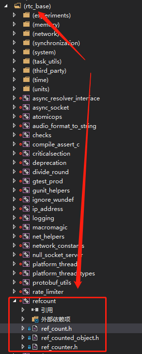
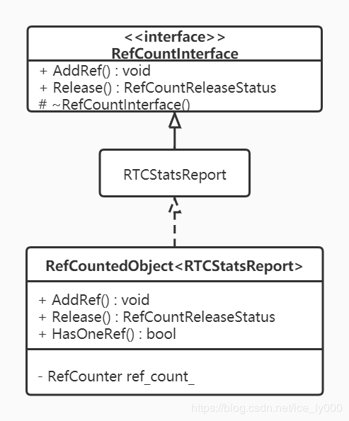
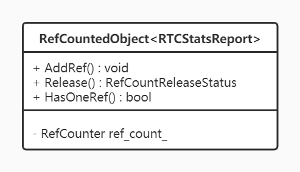

<!--BEGIN_DATA
{
    "create_date": "2020-09-13 11:20", 
    "modify_date": "2020-09-13 11:20", 
    "is_top": "0", 
    "summary": "WebRTC源码分析----引用计数系统<br/>WebRTC源码分析----写时复制缓存CopyOnWriteBuffer", 
    "tags": "WebRTC、C/C++", 
    "file_name": "WebRTC源码分析----引用计数系统与写时复制缓存CopyOnWriteBuffer.md"
}
END_DATA-->

#### <p>原文出处：<a href='https://blog.csdn.net/ice_ly000/article/details/105629297' target='blank'>WebRTC源码分析——引用计数系统</a></p>

#### 目录

1. 引言
2. RefCountInterface——引用计数抽象接口
3. RefCounter——引用计数
4. RefCountedObject——引用计数对象
5. rtc::scoped_refptr——智能指针
6. 使用举例
     * 6.1 使用示例一
     * 6.2 使用示例二
7. 总结

## 1. 引言

WebRTC中自己实现了一套引用计数系统，在其基础库模块`rtc_base/refcount`中提供了相关实现，如下图所示：  

  

主要由四个类RefCountInterface、RefCounter、RefCountedObject、`scoped_refptr`一起构建起WebRTC中的引用计数系统。

## 2. RefCountInterface——引用计数抽象接口

RefCountInterface是一个抽象接口类，位于`rtc_base/ref_count.h`目录下。源码如下：


```cpp
enum class RefCountReleaseStatus { kDroppedLastRef, kOtherRefsRemained };

// Interfaces where refcounting is part of the public api should
// inherit this abstract interface. The implementation of these
// methods is usually provided by the RefCountedObject template class,
// applied as a leaf in the inheritance tree.
class RefCountInterface {
  public:
  virtual void AddRef() const = 0;
  virtual RefCountReleaseStatus Release() const = 0;

  // Non-public destructor, because Release() has exclusive responsibility for
  // destroying the object.
  protected:
  virtual ~RefCountInterface() {}
};
```

正如该类的英文注释所说那样：需要使用引用计数的公共接口类需要继承RefCountInterface这个抽象接口。但公共接口类并不直接实现RefCountInterface的纯虚方法AddRef() && Release()。这两个方法由后文的模板对象RefCountedObject对象来提供具体的实现。

比如WebRTC中的类RTCStatsReport，它继承了RefCountInterface，但是RTCStatsReport类并没有实现AddRef()和Release()这两个纯虚方法，也即RTCStatsReport仍然是个抽象类。而使用该类时，不能直接new RTCStatsReport（因为它是抽象类）。 一般会如此使用：


```cpp
rtc::scoped_refptr<RTCStatsReport> statsReport = new RefCountedObject<RTCStatsReport>(...);
```

RefCountedObject<RTCStatsReport>这个类继承了RTCStatsReport，并为AddRef()和Release()两个纯虚方法提供了实现。

如此设计后，这三个类的继承关系就变为：（RefCountInterface就是继承链上的叶子节点）



  * AddRef()：将对象的引用计数线+1
  * Release()：将对象的引用计数-1，若引用计数为0，即kDroppedLastRef。那么对象将在Release()中被delete。

## 3. RefCounter——引用计数

RefCounter是实现引用计数的核心类，代码位于`rtc_base/ref_counter.h`文件中。该类的对象用来保存被引用对象的计数值。


```cpp
class RefCounter {
 public:
  explicit RefCounter(int ref_count) : ref_count_(ref_count) {}
  RefCounter() = delete;

  void IncRef() {
    ref_count_.fetch_add(1, std::memory_order_relaxed);
  }
  
  rtc::RefCountReleaseStatus DecRef() {
    int ref_count_after_subtract =
        ref_count_.fetch_sub(1, std::memory_order_acq_rel) - 1;
    return ref_count_after_subtract == 0
               ? rtc::RefCountReleaseStatus::kDroppedLastRef
               : rtc::RefCountReleaseStatus::kOtherRefsRemained;
  }

  bool HasOneRef() const {
    return ref_count_.load(std::memory_order_acquire) == 1;
  }

 private:
  std::atomic<int> ref_count_;
};
```

正如上述源码可知，实际上该类使用了c++标准库的原子操作类std::atomic<int>来保存引用计数：

  * 利用std::atomic<int>a类的`fetch_add()`方法来实现+1的操作函数IncRef()；
  * 利用std::atomic<int>类的`fetch_sub()`方法来实现-1的操作函数DecRef()；
  * 利用std::atomic<int>类的`load()`方法来实现是否刚好引用计数为1的操作函数HasOneRef()；
  * `fetch_add()`、`fetch_sub()` 、`load()`方法都传入了指示CPU指令中插入内存屏障，防止某种指令重排序的参数，详细解释请查看 <https://zh.cppreference.com/w/cpp/atomic/memory_order>

## 4. RefCountedObject——引用计数对象

RefCountedObject<T>模板类是正真实现应用计数增减方法 AddRef 和 Release的地方，实质上是通过持有成员RefCounter来实现的。那么RefCountedObject<T>——>利用RefCounter——>利用`std::atomic<int>ref_count_`来进行计数的。该类的UML类图如下所示  

  

该类的源码如下：


```cpp
template <class T>
class RefCountedObject : public T {
 public:
  RefCountedObject() {}

  template <class P0>
  explicit RefCountedObject(P0&& p0) : T(std::forward<P0>(p0)) {}

  template <class P0, class P1, class... Args>
  RefCountedObject(P0&& p0, P1&& p1, Args&&... args)
      : T(std::forward<P0>(p0),
          std::forward<P1>(p1),
          std::forward<Args>(args)...) {}

  virtual void AddRef() const { ref_count_.IncRef(); }

  virtual RefCountReleaseStatus Release() const {
    const auto status = ref_count_.DecRef();
    if (status == RefCountReleaseStatus::kDroppedLastRef) {
      delete this;
    }
    return status;
  }
  virtual bool HasOneRef() const { return ref_count_.HasOneRef(); }

 protected:
  virtual ~RefCountedObject() {}

  mutable webrtc::webrtc_impl::RefCounter ref_count_{0};

  RTC_DISALLOW_COPY_AND_ASSIGN(RefCountedObject);
};
```

代码实现简单，也容易理解，有这么几点需要重点强调下：

  * RefCountedObject<T>是继承T的，是T的子类；
  * RefCountedObject的构造函数使用了c++11中的右值引用&& 以及完美转发std::forward来提高效率；
  * Release()函数的实现，当引用计数为0时，将delete掉自己！！！
  * `ref_count_`成员被初始化为0，并且声明为mutable，表示该成员是可变的，将不受子类可能出现的const修饰符的影响；
  * 最后，`RTC_DISALLOW_COPY_AND_ASSIGN(RefCountedObject)`对 RefCountedObject进行了修饰，表示RefCountedObject<T>不允许赋值和拷贝。注意`RTC_DISALLOW_COPY_AND_ASSIGN`所放位置是RefCountedObject<T>声明的内部

**PS1:** 完美转发std:forward作用：在模板内，如果我们需要将一组参数原封不动的传递给另外一个参数，在没有完美转发的情况下，考虑参数会有多种类型的重载，因此在没有完美转发的情况下，重载函数个数将会达到2^n个，多么庞大的人工量。当使用std::forward辅以模板参数推导规则以保持参数属性不变，实现完美转发节省了大量的工作。std::forward分析可见：[详解C++11中移动语义(std::move)和完美转发(std::forward)](http://shaoyuan1943.github.io/2016/03/26/explain-move-forward/)

**PS2:** `RTC_DISALLOW_COPY_AND_ASSIGN(RefCountedObject)`宏展开后相当于两个语句：即移除了默认的拷贝构造和赋值运算符。
    
```cpp
RefCountedObject(const RefCountedObject&) = delete;
RefCountedObject& operator=(const RefCountedObject&) = delete
```

## 5. rtc::scoped_refptr——智能指针

`rtc::scoped_refptr<T>`是RTC中为了使用引用计数对象的智能指针，实现位于api层的`api/scoped_refptr.h`中。

使用智能指针，避免直接使用引用计数对象、手动调用引用计数对象的AddRef()、Release()。可以有效防止忘记Release一个对象所引发的内存泄漏。


```cpp
template <class T>
class scoped_refptr {
 public:
  typedef T element_type;

  // 1. 6个构造函数
  // 1.1 默认构造，传入空的引用计数对象
  scoped_refptr() : ptr_(nullptr) {}
  // 1.2 构造，传入引用计数对象p的指针，调用其AddRef()方法，引用计数+1。
  scoped_refptr(T* p) : ptr_(p) {  // NOLINT(runtime/explicit)
    if (ptr_)
      ptr_->AddRef();
  }
  // 1.3 拷贝构造，对应的引用计数+1，调用引用计数对象的AddRef()方法。
  scoped_refptr(const scoped_refptr<T>& r) : ptr_(r.ptr_) {
    if (ptr_)
      ptr_->AddRef();
  }
  // 1.4 拷贝构造，U必须是T的子类，同1.3
  template <typename U>
  scoped_refptr(const scoped_refptr<U>& r) : ptr_(r.get()) {
    if (ptr_)
      ptr_->AddRef();
  }
  // 1.5 移动构造(右值引用)，表示对象的转移，亦即使用同一个对象，因此，需要保持
  //     对引用计数对象的引用次数不变。所以，此处调用scoped_refptr<T>的release()
  //     方法，将原来的scoped_refptr<T>对象内部引用计数指针置空，新的scoped_refptr<T>
  //     对象来保存引用计数对象，以达到转移的目的。   
  scoped_refptr(scoped_refptr<T>&& r) noexcept : ptr_(r.release()) {}
  // 1.6 移动构造，U必须是T的子类，同1.5
  template <typename U>
  scoped_refptr(scoped_refptr<U>&& r) noexcept : ptr_(r.release()) {}

  // 2 析构函数，调用引用计数对象Release()，引用计数-1
  ~scoped_refptr() {
    if (ptr_)
      ptr_->Release();
  }

  // 3. get、release、()、->()方法
  T* get() const { return ptr_; }
  operator T*() const { return ptr_; }
  T* operator->() const { return ptr_; }
  T* release() {
    T* retVal = ptr_;
    ptr_ = nullptr;
    return retVal;
  }

  // 4. 重载赋值运算符
  // 4.1 赋值新的引用计数对象的指针，新引用计数对象的引用计数+1，原来的-1
  scoped_refptr<T>& operator=(T* p) {
    // AddRef first so that self assignment should work
    // 先增加引用，再减小原来的引用，这样可以使得自赋值能正常工作
    if (p)
      p->AddRef();
    if (ptr_)
      ptr_->Release();
    ptr_ = p;
    return *this;
  }
  // 4.2 赋值智能指针，新引用计数对象的引用计数+1，原来的-1
  scoped_refptr<T>& operator=(const scoped_refptr<T>& r) {
  	// 取出智能指针的内部引用计数的指针，利用4.1的功能实现赋值
    return *this = r.ptr_;
  }
  // 4.3 赋值T的子类U的智能指针，新引用计数对象的引用计数+1，原来的-1
  //     具体使用过程中，这个赋值方法用得最多。
  template <typename U>
  scoped_refptr<T>& operator=(const scoped_refptr<U>& r) {
    // 使用get()方法取出智能指针的内部引用计数的指针，利用4.1的功能实现赋值
    return *this = r.get();
  }
  // 4.4 移动赋值右值智能指针，新引用计数对象的引用计数不变，原来引用计数对象的引用计数不变
  scoped_refptr<T>& operator=(scoped_refptr<T>&& r) noexcept {
    // 使用移动语义std::move + 移动构造 + swap进行引用计数对象的地址交换
    scoped_refptr<T>(std::move(r)).swap(*this);
    return *this;
  }
  // 4.5 移动赋值T的子类U的右值智能指针，新引用计数对象的引用计数不变，原来引用计数对象的引用计数不变
  template <typename U>
  scoped_refptr<T>& operator=(scoped_refptr<U>&& r) noexcept {
    // 使用移动语义std::move + 移动构造 + swap进行引用计数对象的地址交换
    scoped_refptr<T>(std::move(r)).swap(*this);
    return *this;
  }

  // 5 地址交换函数
  // 5.1 引用计数对象的地址交换
  void swap(T** pp) noexcept {
    T* p = ptr_;
    ptr_ = *pp;
    *pp = p;
  }
  // 5.2 智能智能内部的引用计数对象的地址交换，利用5.1
  void swap(scoped_refptr<T>& r) noexcept { swap(&r.ptr_); }

 protected:
  T* ptr_;
};
```

`rtc::scoped_refptr<T>`的成员方法大致按照源码的注释所述，分为5类。具体就不再详述，见注释即可。需要引起重视的有如下几个观点：

  * `rtc::scoped_refptr<T>`的构造 和 赋值 将调用引用计数对象的AddRef()方法，使得引用计数+1；
  * `rtc::scoped_refptr<T>`的析构 将调用引用计数对象的Release()方法，使得引用计数-1，引用计数减少为0，则引用计数对象将再Release()方法中被delete。
  * `rtc::scoped_refptr<T>`移动构造 和 移动赋值 将不会增加引用计数对象的计数，只会交换智能指针内部保存的引用计数对象的地址，右值引用的内部引用计数对象指针将被赋值为nullptr。
  * 小写的release()方法不可轻易调用，需要在理解其作用的条件下谨慎使用。因为，release()方法会使智能指针内部存储的`ptr_`为空，失去对引用计数对象的引用，而引用计数没有-1。

## 6. 使用举例

在此，举两个WebRTC源码中介绍`rtc::scoped_refptr<T>`时的小示例：

### 6.1 使用示例一

源码如下：


```cpp
class MyFoo : public RefCountInterface {
...
};

void some_function() {
	scoped_refptr<MyFoo> foo = new RefCountedObject<MyFoo>();
	foo->Method(param);
	//|foo| is released when this function returns
}

void some_other_function() {
	scoped_refptr<MyFoo> foo = new RefCountedObject<MyFoo>();
	...
	foo = nullptr;  // explicitly releases |foo|
	...
	if (foo)
		foo->Method(param);
}
```

上面的示例演示了`scoped_refptr<T>`如何表现得像T*

### 6.2 使用示例二

续 6.1


```cpp
{
  scoped_refptr<MyFoo> a = new RefCountedObject<MyFoo>();
  scoped_refptr<MyFoo> b;
  b.swap(a);
  // now, |b| references the MyFoo object, and |a| references null.
}

{
  scoped_refptr<MyFoo> a = new RefCountedObject<MyFoo>();
  scoped_refptr<MyFoo> b;
  b = a;
  // now, |a| and |b| each own a reference to the same MyFoo object.
}
```

第一个{…}演示了两个智能指针对象之间如何交换底层保存的引用计数对象。通过swap()，最终b引用了a之间保存的引用计数对象，而a则引用nullptr，因为b之前就是引用nullptr。

第二个{…}演示了如何让智能指针b和a引用同一个引用计数对象，简单的赋值即可。上述示例将使得b也引用了之前a保存的引用计数对象，引用计数为2。若是语句b = a 改为 a = b，那么a和b都将引用空对象nullptr，之前a保存的引用计数对象RefCountedObject<MyFoo>的引用计数将被减为0，从而被delete掉。

## 7. 总结

行文至此，大致对WebRTC源码中引用计数系统实现以及使用方式做了简要的介绍，现在回顾下要点

  * `rtc_base`中的RefCountInterface、RefCounter、RefCountedObject三个类构建起了引用计数系统。注意文章中所画的继承关系图，对理解引用计数系统的实现至关重要。
  * 引用计数的本身是利用c++的原子操作类atomic<int>的特性来实现的。
  * 引用计数系统的使用需要配合智能指针`rtc::scoped_refptr<T>`。一般不要直接使用引用计数对象的AddRef() 和 Release()，因为这种手动操作可能会由于人为编程失误引发内存泄漏。而应该通过`rtc::scoped_refptr<T>`来保存、使用"引用计数对象"。
  * `rtc::scoped_refptr<T>`的代码值得反复看几遍，实现方式是非常优雅的。


<hr/>


#### <p>原文出处：<a href='https://blog.csdn.net/ice_ly000/article/details/106720359' target='blank'>WebRTC源码分析——写时复制缓存CopyOnWriteBuffer</a></p>

#### 目录

1. 引言
2. 什么是写时复制
3. CopyOnWriteBuffer实现
     3.1 CopyOnWriteBuffer的成员变量
     3.2 CopyOnWriteBuffer的成员方法
     3.2.1 CopyOnWriteBuffer的构造
     3.2.2 CopyOnWriteBuffer的读方法
     3.2.3 CopyOnWriteBuffer的写方法
4. 总结

## 1. 引言

在WebRTC中，不论是发送接收数据通道的数据、还是发送接收音视频数据，数据本身都存储于一个临时的Buffer中，这个Buffer的实现类为CopyOnWriteBuffer。顾名思义，该Buffer实现了 **“写时复制”** 的技术。那么什么是写时复制？写时复制带来了什么好处？

## 2. 什么是写时复制

写入时复制（Copy-on-write，简称COW）是一种计算机程序设计领域的优化策略。其核心思想是，如果有多个调用者（callers）同时请求相同资源（如内存或磁盘上的数据存储），他们会共同获取相同的指针指向相同的资源，直到某个调用者试图修改资源的内容时，系统才会真正复制一份专用副本（private copy）给该调用者，而其他调用者所见到的最初的资源仍然保持不变。这过程对其他的调用者都是透明的（transparently），也即调用者无法感知的。此作法主要的优点是如果调用者没有修改该资源，就不会有副本（private copy）被创建，因此多个调用者只是读取操作时可以共享同一份资源。

计算机技术中哪些地方使用了写时复制呢？举一些例子：

  * 虚拟内存管理中的写时复制：一般把被共享访问的页面标记为只读。当一个task试图向内存中写入数据时，内存管理单元（MMU）抛出一个异常，内核处理该异常时为该task分配一份物理内存并复制数据到此内存，重新向MMU发出执行该task的写操作。
  * 数据存储中的写时复制：Linux等的文件管理系统使用了写时复制策略。数据库服务器也一般采用了写时复制策略，为用户提供一份snapshot。
  * 软件应用中的写时复制：C++标准程序库中的std::string类，在C++98/C++03标准中是允许写时复制策略。但在C++11标准中为了提高并行性取消了这一策略。

## 3. CopyOnWriteBuffer实现

根据写时拷贝的概念，CopyOnWriteBuffer提供一种机制，可以存在多个CopyOnWriteBuffer的实例引用同一块存储。

  * 当从进行复制操作时，产生新的CopyOnWriteBuffer也会引用原始的存储；
  * 某个CopyOnWriteBuffer实例的读操作不会引发创建新的底层存储；
  * 某个CopyOnWriteBuffer实例的写操作会触发该实例创建新的底层存储。  
接下来我们看看CopyOnWriteBuffer的具体实现。

### 3.1 CopyOnWriteBuffer的成员变量

CopyOnWriteBuffer提供了3个成员以支撑它所提供的特性：

  * `scoped_refptr<RefCountedObject<Buffer>> buffer_`：共享智能指针`buffer_`，相当于C++11中的`std::shared_ptr<buffer>`，实现方式详见 [WebRTC源码分析——引用计数系统](https://blog.csdn.net/ice_ly000/article/details/105629297)。该成员提供共享式的存储资源，是写时复制的实现基础。
  * `size_t offset_ && size_t size_`：为支撑CopyOnWriteBuffer的分片功能，让CopyOnWriteBuffer可以是原始存储`buffer_`的一个分片，即`buffer_`的一部分数据。`offset_`表示为`buffer_`的偏移，`size_`为该分片的大小。

### 3.2 CopyOnWriteBuffer的成员方法

正如前文所述，CopyOnWriteBuffer实现COW，必须保证在进行复制操作时，共享“别的”CopyOnWriteBuffer的实际存储；在进行读操作时，不更改（生成新的）底层的实际存储；在进行写操作时，开辟新的底层实际存储，复制原来实际存储的内容，并根据写操作写入新的内存。后文从上述三个方面来阐述CopyOnWriteBuffer的构造、读方法、写方法的实现。

#### 3.2.1 CopyOnWriteBuffer的构造

我们知道C++的构造方法有很多种，站在CopyOnWriteBuffer实现COW技术的角度上来看，可以分成三类：

1、一般参数的构造(包括默认构造)——初始化一个全新的、与别的CopyOnWriteBuffer不相干的CopyOnWriteBuffer对象。这些构造有：


```cpp
// An empty buffer.
CopyOnWriteBuffer::CopyOnWriteBuffer() : offset_(0), size_(0) {
RTC_DCHECK(IsConsistent());
}
// Construct a buffer from a string, convenient for unittests.
CopyOnWriteBuffer::CopyOnWriteBuffer(const std::string& s)
    : CopyOnWriteBuffer(s.data(), s.length()) {}
// Construct a buffer with the specified number of uninitialized bytes.
CopyOnWriteBuffer::CopyOnWriteBuffer(size_t size)
    : buffer_(size > 0 ? new RefCountedObject<Buffer>(size) : nullptr),
      offset_(0),
      size_(size) {
  RTC_DCHECK(IsConsistent());
}
CopyOnWriteBuffer::CopyOnWriteBuffer(size_t size, size_t capacity)
    : buffer_(size > 0 || capacity > 0
                  ? new RefCountedObject<Buffer>(size, capacity)
                  : nullptr),
      offset_(0),
      size_(size) {
  RTC_DCHECK(IsConsistent());
}
// Construct a buffer and copy the specified number of bytes into it. The
// source array may be (const) uint8_t*, int8_t*, or char*.
template <typename T,
          typename std::enable_if<
              internal::BufferCompat<uint8_t, T>::value>::type* = nullptr>
CopyOnWriteBuffer(const T* data, size_t size)
    : CopyOnWriteBuffer(data, size, size) {}
template <typename T,
          typename std::enable_if<
              internal::BufferCompat<uint8_t, T>::value>::type* = nullptr>
CopyOnWriteBuffer(const T* data, size_t size, size_t capacity)
    : CopyOnWriteBuffer(size, capacity) {
  if (buffer_) {
    std::memcpy(buffer_->data(), data, size);
    offset_ = 0;
    size_ = size;
  }
}
// Construct a buffer from the contents of an array.
template <typename T,
          size_t N,
          typename std::enable_if<
              internal::BufferCompat<uint8_t, T>::value>::type* = nullptr>
CopyOnWriteBuffer(const T (&array)[N])  // NOLINT: runtime/explicit
    : CopyOnWriteBuffer(array, N) {}
```

注意：底层的存储`scoped_refptr<RefCountedObject<Buffer>> buffer_`成员Buffer类中用来存储数据的是`uint8_t[]`数组。当我们以外部数据来初始化CopyOnWriteBuffer时，支持`uint8_t*`, `int8_t*`, `char*`数组，它们的基础单位都是一个字节，被认为是“兼容的”（`internal::BufferCompat<uint8_t, T>::value`为真），此时，使用 `std::memcpy(buffer_->data(), data, size)`;直接进行内存拷贝。

2、移动构造——实现转移语义，偷取别的CopyOnWriteBuffer的实际存储，从而得到一个新的CopyOnWriteBuffer，由于“别的”CopyOnWriteBuffer实际存储被偷，从而使得实际的存储资源并没有增多，但“别的”CopyOnWriteBuffer再也无法访问它原来的存储了。源码如下：


```cpp
CopyOnWriteBuffer::CopyOnWriteBuffer(CopyOnWriteBuffer&& buf)
    : buffer_(std::move(buf.buffer_)), offset_(buf.offset_), size_(buf.size_) {
  buf.offset_ = 0;
  buf.size_ = 0;
  RTC_DCHECK(IsConsistent());
}

CopyOnWriteBuffer& operator=(CopyOnWriteBuffer&& buf) {
  RTC_DCHECK(IsConsistent());
  RTC_DCHECK(buf.IsConsistent());
  buffer_ = std::move(buf.buffer_);
  offset_ = buf.offset_;
  size_ = buf.size_;
  buf.offset_ = 0;
  buf.size_ = 0;
  return *this;
}
```

3、拷贝构造(包括赋值操作、拷贝构造)——实现拷贝语义，由于COW机制，实际上不进行实质上的拷贝，“新的”CopyOnWriteBuffer对象与“别的”CopyOnWriteBuffer共享存储。源码如下：buf的成员`buffer_`的引用计数将+1


```cpp
CopyOnWriteBuffer::CopyOnWriteBuffer(const CopyOnWriteBuffer& buf)
    : buffer_(buf.buffer_), offset_(buf.offset_), size_(buf.size_) {}
    
CopyOnWriteBuffer& operator=(const CopyOnWriteBuffer& buf) {
  RTC_DCHECK(IsConsistent());
  RTC_DCHECK(buf.IsConsistent());
  if (&buf != this) {
    buffer_ = buf.buffer_;
    offset_ = buf.offset_;
    size_ = buf.size_;
  }
  return *this;
}
```

#### 3.2.2 CopyOnWriteBuffer的读方法

访问CopyOnWriteBuffer中数据的方式如下源码所示：


```cpp
// Get a pointer to the data. Just .data() will give you a (const) uint8_t*,
// but you may also use .data<int8_t>() and .data<char>().
template <typename T = uint8_t,
          typename std::enable_if<
              internal::BufferCompat<uint8_t, T>::value>::type* = nullptr>
const T* data() const {
  return cdata<T>();
}

// Get const pointer to the data. This will not create a copy of the
// underlying data if it is shared with other buffers.
template <typename T = uint8_t,
          typename std::enable_if<
              internal::BufferCompat<uint8_t, T>::value>::type* = nullptr>
const T* cdata() const {
  RTC_DCHECK(IsConsistent());
  if (!buffer_) {
    return nullptr;
  }
  return buffer_->data<T>() + offset_;
}
  
uint8_t operator[](size_t index) const {
 RTC_DCHECK_LT(index, size());
 return cdata()[index];
}
```

可以看到不论是通过data() 还是 cdata()访问，最终得到是内部存储的直接地址，不过加了修饰符const使得无法通过该指针来修改存储内容，不会另外创建一个新的Buffer。另外，实现了[]运算符，以便读取某个位置的单个元素值，由于以const修饰，因此，也不会修改存储内容。

#### 3.2.3 CopyOnWriteBuffer的写方法

修改CopyOnWriteBuffer的方式有好几种：

1、通过内部存储的直接地址修改：CopyOnWriteBuffer不仅提供了const修饰的data()方法，以便只读；也提供了非const修饰的data()方法，以便通过地址直接修改。


```cpp
// Get writable pointer to the data. This will create a copy of the underlying
// data if it is shared with other buffers.
template <typename T = uint8_t,
          typename std::enable_if<
              internal::BufferCompat<uint8_t, T>::value>::type* = nullptr>
T* data() {
  RTC_DCHECK(IsConsistent());
  if (!buffer_) {
    return nullptr;
  }
  UnshareAndEnsureCapacity(capacity());
  return buffer_->data<T>() + offset_;
}

void CopyOnWriteBuffer::UnshareAndEnsureCapacity(size_t new_capacity) {
  if (buffer_->HasOneRef() && new_capacity <= capacity()) {
    return;
  }

  buffer_ = new RefCountedObject<Buffer>(buffer_->data() + offset_, size_,
                                         new_capacity);
  offset_ = 0;
  RTC_DCHECK(IsConsistent());
}
```

需要注意一点：当底层buffer的引用计数只有一个时，不会创建新的底层存储，引为没有必要。当有多个CopyOnWriteBuffer共享了底层存储，则会创建一个新的。

2、通过单个元素的引用来修改：调用了上述的data()方法。


```cpp
uint8_t& operator[](size_t index) {
  RTC_DCHECK_LT(index, size());
  return data()[index];
}
```

3、通过SetData方法设置底层存储中的数据：由于代码比较简单，因此，不需要多说。但特别注意一点，当以另外一个CopyOnWriteBuffer对象引用为参数时，并不会创建新的底层存储，而是将`buffer_`指向了传入对象的底层存储，这比新建一个存储，复制数据要来得高效。


```cpp
// Replace the contents of the buffer. Accepts the same types as the
// constructors.
template <typename T,
          typename std::enable_if<
              internal::BufferCompat<uint8_t, T>::value>::type* = nullptr>
void SetData(const T* data, size_t size) {
  RTC_DCHECK(IsConsistent());
  if (!buffer_) {
    buffer_ = size > 0 ? new RefCountedObject<Buffer>(data, size) : nullptr;
  } else if (!buffer_->HasOneRef()) {
    buffer_ = new RefCountedObject<Buffer>(data, size, capacity());
  } else {
    buffer_->SetData(data, size);
  }
  offset_ = 0;
  size_ = size;

  RTC_DCHECK(IsConsistent());
}

template <typename T,
          size_t N,
          typename std::enable_if<
              internal::BufferCompat<uint8_t, T>::value>::type* = nullptr>
void SetData(const T (&array)[N]) {
  SetData(array, N);
}

void SetData(const CopyOnWriteBuffer& buf) {
  RTC_DCHECK(IsConsistent());
  RTC_DCHECK(buf.IsConsistent());
  if (&buf != this) {
    buffer_ = buf.buffer_;
    offset_ = buf.offset_;
    size_ = buf.size_;
  }
}
```

4、使用AppendData追加数据：


```cpp
// Append data to the buffer. Accepts the same types as the constructors.
template <typename T,
          typename std::enable_if<
              internal::BufferCompat<uint8_t, T>::value>::type* = nullptr>
void AppendData(const T* data, size_t size) {
  RTC_DCHECK(IsConsistent());
  if (!buffer_) {
    buffer_ = new RefCountedObject<Buffer>(data, size);
    offset_ = 0;
    size_ = size;
    RTC_DCHECK(IsConsistent());
    return;
  }

  UnshareAndEnsureCapacity(std::max(capacity(), size_ + size));

  buffer_->SetSize(offset_ +
                   size_);  // Remove data to the right of the slice.
  buffer_->AppendData(data, size);
  size_ += size;

  RTC_DCHECK(IsConsistent());
}

template <typename T,
          size_t N,
          typename std::enable_if<
              internal::BufferCompat<uint8_t, T>::value>::type* = nullptr>
void AppendData(const T (&array)[N]) {
  AppendData(array, N);
}

void AppendData(const CopyOnWriteBuffer& buf) {
  AppendData(buf.data(), buf.size());
}
```

## 4. 总结

通过上述分析，我们发现CopyOnWriteBuffer的写时复制机制实现方式其实非常简单，主要就是利用共享智能指针来实现多个CopyOnWriteBuffer来实现“写时复制”技术——读时共享、写时复制。
