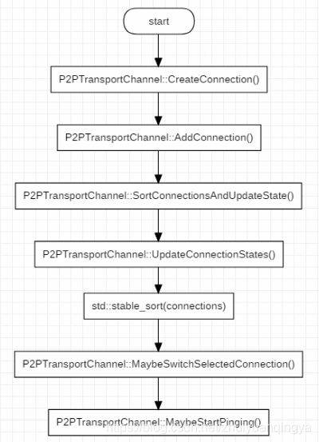
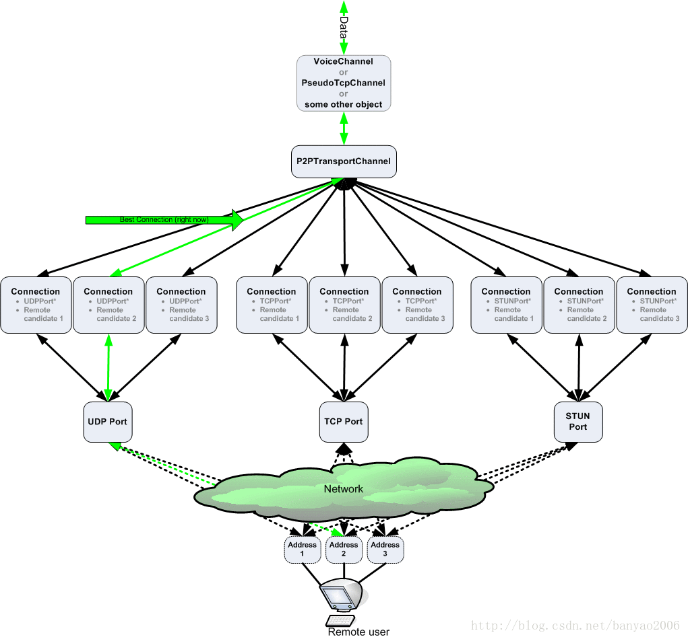
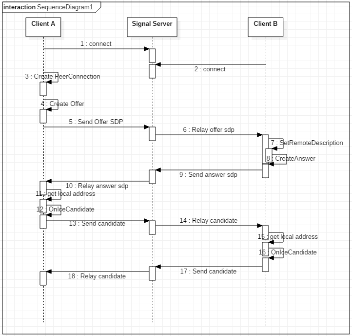
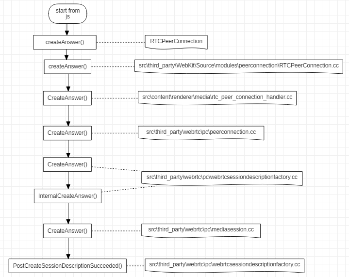
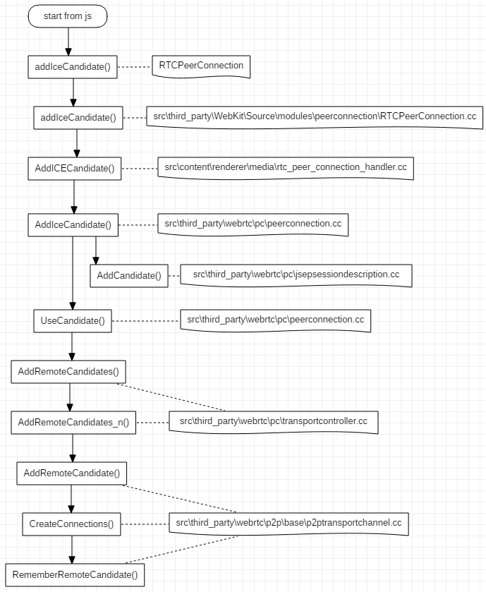
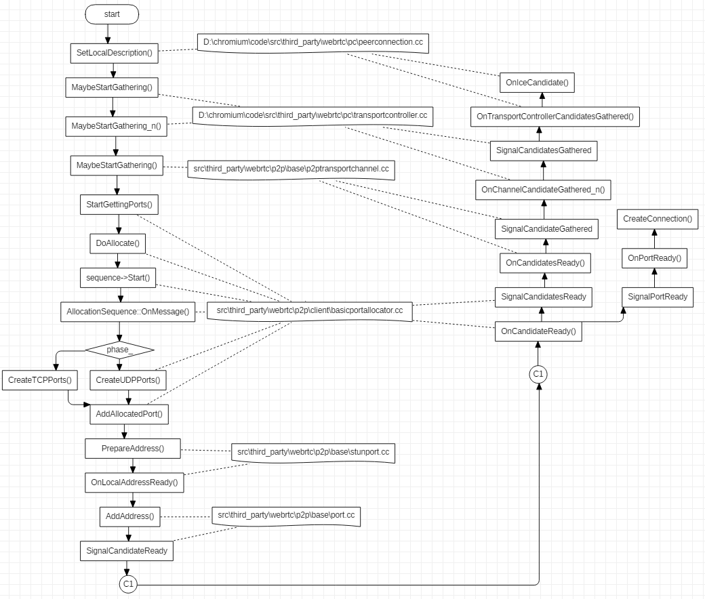
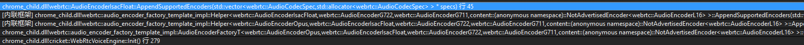

<!--BEGIN_DATA
{
    "create_date": "2021-01-10 13:50", 
    "modify_date": "2021-01-10 13:50", 
    "is_top": "0", 
    "summary": "WebRTC的connection管理<br>WebRTC点对点会话建立过程分析<br>WebRTC的CreateOffer", 
    "tags": "WebRTC、C/C++", 
    "file_name": "WebRTC的connection管理.md"
}
END_DATA-->

#### <p>原文出处：<a href='https://blog.csdn.net/zhuiyuanqingya/article/details/84182385' target='blank'>WebRTC的connection管理</a></p>

webrtc connection 的管理，是建立 p2p 连接的关键，关于 webrtc 的 connection 有几个问题需要弄清楚，下面记录下来，以加深理解。webrtc 粗略的 connection 管理流程如下图所示：  
  

connection 的管理，从connection 的创建开始，经历更新 connection 集合，到最后选择一个最优的 connection 来传输数据。以及在传输数据的过程中，仍然要按照某种规则来对 connection 集合执行 ping，以应对网络状况的变化，动态的选择最优的 connection 来传输数据。

## 1. connection 相关的概念

### 1.1 connection 的概念以及属性

Connection 代表了本地客户端的端口和远端客户端的端口之间建立的通信链路。源码中的解释如下：

> // Represents a communication link between a port on the local client and a port on the remote client.

类原型部分方法和属性如下：

```cpp
class Connection : public CandidatePairInterface,
                    public rtc::MessageHandler,
                    public sigslot::has_slots<> {
  public:
  // Implementation of virtual methods in CandidatePairInterface.
  // Returns the description of the local port
  const Candidate& local_candidate() const override;
  // Returns the description of the remote port to which we communicate.
  const Candidate& remote_candidate() const override;
  // The connection can send and receive packets asynchronously.  This matches
  // the interface of AsyncPacketSocket, which may use UDP or TCP under the
  // covers.
  virtual int Send(const void* data, size_t size,
                    const rtc::PacketOptions& options) = 0;
  // Called when a packet is received on this connection.
  void OnReadPacket(const char* data, size_t size,
                    const rtc::PacketTime& packet_time);
```

上面给出的函数原型能够很好的代表一个 connectin 的两端以及发送和接收数据的能力，更具体的信息，可以查看源码。connection 还有很多属性参数，代表了这个链接能否 ping 通，超时时间、平均往返时间以及丢包率等各种信息，因为太多就不列出来了。

### 1.2 connection 状态

#### 1.2.1 pingable

一个 connection 能否被选中用于传递数据，需要进行大量的检查和试探，connection 支持的检查状态如下：

```cpp
enum class IceCandidatePairState {
  WAITING = 0,  // Check has not been performed, Waiting pair on CL.
  IN_PROGRESS,  // Check has been sent, transaction is in progress.
  SUCCEEDED,    // Check already done, produced a successful result.
  FAILED,       // Check for this connection failed.
  // According to spec there should also be a frozen state, but nothing is ever
  // frozen because we have not implemented ICE freezing logic.
};
```

1. 一个 connection 被创建的时候，检查状态置为 `IceCandidatePairState::WAITING`，也就是处于等待被检查的状态；  
2. 当我们对一个 connection 执行 `Ping()` 动作时，检查状态被置为`IceCandidatePairState::IN_PROGRESS` ，表示正在被检查；  
3. 当我们发出的 ping 消息成功收到响应后，检查状态被置为`IceCandidatePairState::SUCCEEDED`；如果超时没有收到响应，检查状态被置为`IceCandidatePairState::FAILED`；  

一个 connection 只有调用 `IsPingable()` 返回 `true` 的条件下，才会执行 `Ping()` ，而 `Pingable` 的判断条件比较多，其中一条就是如果检查状态为 `IceCandidatePairState::FAILED` ，那么 `IsPingable()` 将返回`false`。

#### 1.2.2 writable

一个 connection 是否能够执行 Ping ，与其当前所处的写入状态有关。connection 支持的写入状态如下：

```cpp
enum WriteState {
  STATE_WRITABLE          = 0,  // we have received ping responses recently
  STATE_WRITE_UNRELIABLE  = 1,  // we have had a few ping failures
  STATE_WRITE_INIT        = 2,  // we have yet to receive a ping response
  STATE_WRITE_TIMEOUT     = 3,  // we have had a large number of ping failures
};
```

1. 当一个 connection 被创建时，其写入状态被初始化为 `STATE_WRITE_INIT`；  
2. 如果一个 connection 因为某些原因被剪枝(prune)，其装态被设置为 `STATE_WRITE_TIMEOUT`；  
3. 如果一个 connection 之前处于 `STATE_WRITABLE`，而之后 ping 失败的次数太多且很长时间没有收到响应，其状态被设置为`STATE_WRITE_UNRELIABLE`；  
4. 如果一个 connection 在 ping 之后成功收到响应，那么其状态被设置为 `STATE_WRITABLE`。

#### 1.2.3 prune

在 webrtc 需要建立连接的每一端，都可能会有多个网卡，并且每一端还有 TCP 和 UDP 端口，因此在 webrtc 的两端会创建较多的 connection。这些 connection 良莠不齐，有的网络稳定延时小，而有的根本走不通，因此增加新的 connection 时，会执行剪枝动作，将那些较差的 connection 标志位 pruned。剪枝的具体依据，可以看`P2PTransportChannel::PruneConnections()`。

#### 1.2.4 ICE_ROLE

在看 webrtc 代码的过程中，会频繁看到 `ice_role_` 身影，这是一个枚举变量，用来决定建立连接的两端谁掌握主动权。其定义如下：

```cpp    
// Whether our side of the call is driving the negotiation, or the other side.
enum IceRole {
  ICEROLE_CONTROLLING = 0,
  ICEROLE_CONTROLLED,
  ICEROLE_UNKNOWN
};
```

如果一端的` ice_role_` 值为 `ICEROLE_CONTROLLING` ，表示该端掌握会话协商的主动权，否则，表示这一端属于被控制的。  

offer/answer 和 controlling/controlled 是否存在某种关联呢？根据代码中的注释，两者之间并没有关联关系。下面给出位于`src\third_party\webrtc\pc\[transportcontroller.cc](http://transportcontroller.cc)`中的一段注释：

> // The initial offer side may use ICE Lite, in which case, per RFC5245 Section 5.1.1, the answer side should take the controlling role if it is in the full ICE mode. 
> // 
> // When both sides use ICE Lite, the initial offer side must take the controlling role, and this is the default logic implemented in SetLocalDescription in PeerConnection.

根据注释，如果 offer 端采用了精简模式的 ICE，那么 answer 端将担任 controlling 角色，如果两端都采用精简模式的 ICE ，那么PeerConnection 的默认实现逻辑是让 offer 端担任 controlling 角色。

## 2. 创建 connection

**（1）CreateConnection**  

在已经获得了远端的 `Candidates` 和本地的 `Candidate` 后，那这两者是怎么关联起来的呢？  

这里就要提到 `SignalPortReady`了，当本地的 `Candidate` 准备好之后，就会发送这个信号。在`P2PTransportChannel` 中，有对应的信号响应函数 `P2PTransportChannel::OnPortReady()`，部分代码如下：

```cpp
// A new port is available, attempt to make connections for it
void P2PTransportChannel::OnPortReady(PortAllocatorSession *session,
                                      PortInterface* port) {
  ...
  // Attempt to create a connection from this new port to all of the remote
  // candidates that we were given so far.
  std::vector<RemoteCandidate>::iterator iter;
  for (iter = remote_candidates_.begin(); iter != remote_candidates_.end();
        ++iter) {
    CreateConnection(port, *iter, iter->origin_port());
  }
  SortConnectionsAndUpdateState();
}
```

`remote_candidates_` 成员变量保存了所有的远端 `Candidates` ，其中的值是在 `AddIceCandidate`时保存下来的，针对本地创建的 Port ( Candidate 是从 Port 创建的，具有对应的关系)，循环遍历 `remote_candidates_`，用 Port 与每一个远端 Candidate 建立一个 Connection 。

**（2）AddConnection**  

创建 connection 之后，会将其保存到 P2PTransportChannel 的`connections_`，`unpinged_connections_`两个成员中，并且给这个 connection 添加很多信号处理函数。

```cpp
void P2PTransportChannel::AddConnection(Connection* connection) {
  connections_.push_back(connection);
  unpinged_connections_.insert(connection);
  connection->set_remote_ice_mode(remote_ice_mode_);
  connection->set_receiving_timeout(config_.receiving_timeout);
  connection->SignalReadPacket.connect(
      this, &P2PTransportChannel::OnReadPacket);
...
  had_connection_ = true;
}
```

## 3. 选择合适的 connection

### 3.1 P2PTransportChannel 与 connection 之间的关系

一个 P2PTransportChannel 管理着很多的 connection，在传输数据时，需要根据各个 connection 的状态来选择其中最好的connection 来使用。P2PTransportChannel 与 connection 之间的关系见下图：  

  

图片来自：[libjingle翻译之《Important Concepts（重要概念）之Transports, Channels, and Connecti ons（传输、通道、链接）》](https://blog.csdn.net/banyao2006/article/details/9320513)

### 3.2 如何选择合适的 connection

在前面创建 connection 的过程中提到本地的端口创建完毕后，会调用 `P2PTransportChannel::OnPortReady()`这个方法来针对这个端口创建 connection，在 connection 创建完毕后会调用`SortConnectionsAndUpdateState()` ，来对所有的 connection 进行排序并更新状态，以找到最合适的 connection 来传递音视频数据。

#### 3.2.1 比较两个 connection

当存在多个 connection 时，如何比较 connection（其中一个为 a，另一个为 b） 的优劣呢，下面给出`P2PTransportChannel::CompareConnections()` 中两个 connection 之间的比较逻辑。  

（1）比较两个 connection 之间的状态：

  * 如果两者之间一个可写一个不可写，那么可写的那个胜出；
  * 如果两者都可写或不可写，那么再比较两者的具体状态（可写包括几种子状态），可写的状态值越小表明可写度越高，可写值较小的那个胜出；
  * 如果上面两步还是无法分出胜负，那么接下来比较接收状态，如果一个接收过数据而另一个没有接收过数据，那么接收过数据的胜出；
  * 如果是TCP 类型的 connection ，那么会比较其是否处于 connected() 状态，处于连接状态的好于断开状态的，对于 UDP 类型的 connection ， connected() 始终返回 true；

（2）经过（1）中的比较还是无法分出哪个 connection 比较好，进一步判断如果这一端是 controlled 的（参见前面介绍的`ICE_ROLE`）：

  * 如果 controlling 端给这个 connection 分配的提名值（remote_nomination）越高，那么这个 connection 就较好；
  * 还是无法比较，那么判断两个 connection 最近收到数据的时刻，越晚（表示越临近当前时刻）收到数据的越好；

（3）经过（1）和（2）还是无法区分，那么进行下一步比较：

  * 两个 connection 中网络代价低的胜出，网络代价比较很简单，有线网和环回网络代价最低，蜂窝网络代价最高；
  * 还是无法区分，则进一步比较连接两端的 generation 标识之和，generation 标识之和越大表明这个 connection 越新，越新的越好；
  * 还是无法区分，则比较 connection 的两端端口是否有被剪枝，一个 connection 的任何一端被剪枝，都表明这个 connection 较差，没有被剪枝的 connection 好于被剪枝过的 connection；

（4）如果经过上面的一系列比较还是无法区分，则比较两个 connection 的 RTT（平均往返时间），RTT 小的胜出。

上面的步骤就是比较 connection 的全部流程。

#### 3.2.2 是否切换选中的 connection

在 `SortConnectionsAndUpdateState()` 后会执行 `MaybeSwitchSelectedConnection()` 以在可以切换 `selected_connection_` 时进行切换。判断是否切换的流程如下：  

1. 如果对 `new_connection` 调用 ReadyToSend() 返回 false，或者 `new_connection` 等于`selected_connection_` 时，不执行切换；  
2. 如果 `selected_connection_` 为空，那么执行切换动作；  
3. 如果 `new_connection` 的网络代价比 `selected_connection_` 更大，并且 `new_connection` 还没有收到响应，那么不执行切换；  
4. 如果通过调用 `CompareConnections()` 比较两个 connection，如果 `new_connection` 比 `selected_connection_` 更好，那么执行切换；  
5. 如果 `new_connection` 的 RTT 相比 `selected_connection_` 要小，且差值达到 10ms，就执行切换。

如果因为从上一次收到响应数据到当前的时间长度超过阈值导致无法切换，那么会抛出一个延时任务，过一段时间后再重新执行
`SortConnectionsAndUpdateState()` ，以进一步判断是否需要切换。

#### 3.2.3 如何选择下一步执行 ping 的 connection

在执行 `P2PTransportChannel::MaybeStartPinging()` 时，会抛出一个消息 `MSG_CHECK_AND_PING`，这个消息的处理函数 `P2PTransportChannel::OnCheckAndPing()` 在距离上一次 ping 的间隔达到一定时间后会选择一个 connection 来执行下一次 ping。关于如何选择执行下一次 ping 的 connection，流程如下：  

1. 如果 `selected_connection_` 不为空，并且 connected() 函数返回 true，`selected_connection_`是可写的，距离上一次在该 connection 上执行 ping 的时间间隔大于阈值，那么 `selected_connection_` 将被选择作为下次执行 ping 的 connection；  
2. 如果 P2PTransportChannel 是 weak 的（`selected_connection_` 为空或者`selected_connection_` 是 weak 的），那么会针对每一个网络（可能多个网卡多个网络）选出一个最好的并且可写的 connection 集合 A，进一步选出其中距离该 connection 上次 ping 的时间间隔超过一个阈值的集合 B，最后从集合 B 中选择距离上一次 ping 过去最长时间的 connection 作为下一次 ping 的执行对象；  
3. 第二步可能无法找到可以执行 ping 的 connection，因此进入第三步，接下来从所有接收到 ping 但是还没有发送 ping（`last_ping_received > last_ping_sent`）的 connection 集合中选择 `last_ping_received` 最小的 connection，也就是从上一次接收到 ping 到现在过去最久的，优先执行 ping；  
4. 所有 pingable 但还没有 ping 过的 connection 集合优先于已经 ping 过的集合，如果还没有 ping 过的集合都是不可 ping 的，那么将所有 ping 过的集合加入到没有 ping 过的集合中，进行统一筛选；  
5. 从第（4）步中得到的没有 ping 过的集合中选出 pingable 的集合，再将集合按照 `MorePingable()` 进行排序，选出其中最 pingable 的 connection；  
6. 如果经过前面几步还是无法找到一个合适的 connection ，那么返回 nullptr。

两个 connection ，谁更加 pingable，会经过如下的比较流程：  

1. 如果 `config_.prioritize_most_likely_candidate_pairs` 被设置为 true（默认为false），那么首先会比较 connection 两端的端口类型，如果一个 connection 的两端端口类型都是`cricket::RELAY_PORT_TYPE` ，而另一个不是，那么前者是 more pingable，如果两个 connection 的两端端口类型都是 `cricket::RELAY_PORT_TYPE` ，那么 UDP 类型的 connection 将 more pingable；  
2. 如果第（1）步无法比较，那么判断 connection 的 last_ping_sent 时间，也就是上一次发送 ping 的时间戳，时间戳越小越 pingable；  
3. 在初始状态下，还没有任何一个 connection 被 ping 过，上面几步的比较没有意义，因此进入第（3）步，两个 connection 在有序（参考3.2.1 比较两个 connection）的 `connections_` 中越靠前的越 pingable。

## 4. 小结

webrtc 中的 connection 管理，属于 webrtc 中比较重要的模块，通过分析 connection 管理过程，能够比较好的了解 webrtc 如何选择最优的 connection ，以及如何应对网络变化动态切换 connection 等。

<hr>

#### <p>原文出处：<a href='https://blog.csdn.net/zhuiyuanqingya/article/details/84108763' target='blank'>WebRTC点对点会话建立过程分析</a></p>

关于 webrtc 建立点对点连接的文章很多，其中都提到了如何利用 stun 服务器获取本机的公网地址，本文侧重**局域网**(两台设备之间可以直接
ping 通)下webrtc 点对点连接建立问题分析。

## 1.局域网内连接建立过程

了解过 webrtc 的都知道，要在公网上使用 webrtc 建立 p2p 连接，必须要有 stun 服务器的支持才行，但在局域网内使用 webrtc 建立 p2p 连接，可以不需要 stun 服务器，但是信令服务器还是必须的。在局域网内，要获取 IceCandidate，只需要获取本机的地址和端口即可。除此之外，与在公网上建立 p2p 连接没有什么区别。  



本文是通过 chromium 浏览器中的前端应用，来调起浏览器中内嵌的 webrtc，所以在分析过程中，会有涉及 chromium 和 webrtc 两部分的代码。接下来会对 CreateAnswer 和 OnIceCandidate 的流程进行分析。

## 2. webrtc 信号机制

webrtc 中大量采用了信号机制，类似 QT
的信号槽。后面的代码分析中不会显示指出调用是否由信号串起流程，所以这里会先介绍信号机制，后面很多地方都有用到。信号机制举例如下：  

* （1）定义信号

> `D:\chromium\code\src\third_party\webrtc\p2p\base\portallocator.h`

```cpp
sigslot::signal2<PortAllocatorSession*,
                    const std::vector<Candidate>&> SignalCandidatesReady;
```

* （2）绑定信号  

执行 SignalCandidatesReady.connect() 会将信号和指定的处理函数进行绑定，当接收到信号时，就会调用对应的处理函数。

> `D:\chromium\code\src\third_party\webrtc\p2p\base\[p2ptransportchannel.cc](http://p2ptransportchannel.cc)`


```cpp
void P2PTransportChannel::AddAllocatorSession(
    std::unique_ptr<PortAllocatorSession> session) {
...
  session->SignalCandidatesReady.connect(
      this, &P2PTransportChannel::OnCandidatesReady);
  ...
  }
  allocator_sessions_.push_back(std::move(session));
  // We now only want to apply new candidates that we receive to the ports
  // created by this new session because these are replacing those of the
  // previous sessions.
  PruneAllPorts();
}
```

在这个函数中声明了 SignalCandidatesReady 的处理函数为 P2PTransportChannel::OnCandidatesReady()。当然，一个信号可以有多个处理函数，也就是可以在多处进行绑定，一旦发送信号，多处的处理函数都会被调起。  

* （3）发送信号  

在需要发送信号时，调用 `SignalCandidatesReady(this, candidates);`即可，需要传入信号处理函数需要的参数。

> `D:\chromium\code\src\third_party\webrtc\p2p\client\[basicportallocator.cc](http://basicportallocator.cc)`

```cpp
void BasicPortAllocatorSession::OnCandidateReady(
    Port* port, const Candidate& c) {
...
  if (data->ready() && CheckCandidateFilter(c)) {
    std::vector<Candidate> candidates;
    candidates.push_back(SanitizeRelatedAddress(c));
    SignalCandidatesReady(this, candidates);
  } else {
    RTC_LOG(LS_INFO) << "Discarding candidate because it doesn't match filter.";
  }
...
}
```

## 3. CreateAnswer 流程

CreateAnswer 这个动作是应答端执行，用于生成该端的会话描述信息，会话描述信息主要包括：媒体类型、编解码器、带宽等元数据，下面给出一个 SDP 的示例：

```c
v=0
o=- 6220557467521116672 2 IN IP4 127.0.0.1
s=-
t=0 0
a=group:BUNDLE audio video
a=msid-semantic: WMS
m=audio 9 UDP/TLS/RTP/SAVPF 111 103 104 9 0 8 106 105 13 110 112 113 126
c=IN IP4 0.0.0.0
a=rtcp:9 IN IP4 0.0.0.0
a=ice-ufrag:LjWt
a=ice-pwd:1/eNkEa0sLVOz0wm0krK7sot
a=ice-options:trickle
a=fingerprint:sha-256 85:2D:B2:69:9C:85:26:82:96:D5:87:C6:40:4B:DE:C5:CB:47:4E:06:57:20:88:1F:11:C4:B9:5A:7B:EB:D3:9A
a=setup:active
a=mid:audio
a=extmap:1 urn:ietf:params:rtp-hdrext:ssrc-audio-level
a=recvonly
a=rtcp-mux
a=rtpmap:111 opus/48000/2
a=rtcp-fb:111 transport-cc
a=fmtp:111 minptime=10;useinbandfec=1
a=rtpmap:103 ISAC/16000
a=rtpmap:104 ISAC/32000
a=rtpmap:9 G722/8000
a=rtpmap:0 PCMU/8000
a=rtpmap:8 PCMA/8000
a=rtpmap:106 CN/32000
a=rtpmap:105 CN/16000
a=rtpmap:13 CN/8000
a=rtpmap:110 telephone-event/48000
a=rtpmap:112 telephone-event/32000
a=rtpmap:113 telephone-event/16000
a=rtpmap:126 telephone-event/8000
m=video 9 UDP/TLS/RTP/SAVPF 96 97 98 99 100 101 127 123 125
c=IN IP4 0.0.0.0
a=rtcp:9 IN IP4 0.0.0.0
a=ice-ufrag:LjWt
a=ice-pwd:1/eNkEa0sLVOz0wm0krK7sot
a=ice-options:trickle
a=fingerprint:sha-256 85:2D:B2:69:9C:85:26:82:96:D5:87:C6:40:4B:DE:C5:CB:47:4E:06:57:20:88:1F:11:C4:B9:5A:7B:EB:D3:9A
a=setup:active
a=mid:video
a=extmap:2 urn:ietf:params:rtp-hdrext:toffset
a=extmap:3 http://www.webrtc.org/experiments/rtp-hdrext/abs-send-time
a=extmap:4 urn:3gpp:video-orientation
a=extmap:5 http://www.ietf.org/id/draft-holmer-rmcat-transport-wide-cc-extensions-01
a=extmap:6 http://www.webrtc.org/experiments/rtp-hdrext/playout-delay
a=extmap:7 http://www.webrtc.org/experiments/rtp-hdrext/video-content-type
a=extmap:8 http://www.webrtc.org/experiments/rtp-hdrext/video-timing
a=recvonly
a=rtcp-mux
a=rtcp-rsize
a=rtpmap:96 VP8/90000
a=rtcp-fb:96 goog-remb
a=rtcp-fb:96 transport-cc
a=rtcp-fb:96 ccm fir
a=rtcp-fb:96 nack
a=rtcp-fb:96 nack pli
a=rtpmap:97 rtx/90000
a=fmtp:97 apt=96
a=rtpmap:98 VP9/90000
a=rtcp-fb:98 goog-remb
a=rtcp-fb:98 transport-cc
a=rtcp-fb:98 ccm fir
a=rtcp-fb:98 nack
a=rtcp-fb:98 nack pli
a=rtpmap:99 rtx/90000
a=fmtp:99 apt=98
a=rtpmap:100 H264/90000
a=rtcp-fb:100 goog-remb
a=rtcp-fb:100 transport-cc
a=rtcp-fb:100 ccm fir
a=rtcp-fb:100 nack
a=rtcp-fb:100 nack pli
a=fmtp:100 level-asymmetry-allowed=1;packetization-mode=1;profile-level-id=420032
a=rtpmap:101 rtx/90000
a=fmtp:101 apt=100
a=rtpmap:127 red/90000
a=rtpmap:123 rtx/90000
a=fmtp:123 apt=127
a=rtpmap:125 ulpfec/90000
```

CreateAnswer 生成会话描述信息的流程如下图所示：  

  

从流程可以看出， CreateAnswer 是由 js 代码发起的，其中 RTCPeerConnection 是浏览器提供的前端 api，之后传入 webkit 处理，再进入浏览器的 renderer 进程处理，最后还是到了 webrtc 代码中执行真正的生成 SDP 的动作。在`src\third_party\webrtc\pc\[mediasession.cc](http://mediasession.cc)`这个文件的 CreateAnswer 函数中，会确定本地支持的音视频编解码等具体信息。  
CreateOffer 执行的流程与上图类似。  

关于 SDP 可以参考: [WebRTC SDP协议](https://blog.csdn.net/qq_21358401/article/details/79341031)

## 4. AddIceCandidate 流程

AddIceCandidate 是在对端发来了 Candidate 后，本地来添加保存这些 candidate，candidate 信息主要包括 IP 和端口号，以及所采用的协议类型等。Candidate 从前端发起添加流程到真正被保存，这个过程的流程图如下：  

 

整个流程很长，最终远端传来的 Candidate 被保存 P2PTransportChannel 中。

## 5. OnIceCandidate 流程

OnIceCandidate 代表收集本地 Candidate 的过程，起始于`PeerConnection::SetLocalDescription()` 函数，具体启动代码如下：

```cpp
transport_controller_->MaybeStartGathering();
```

收集本地 Candidate 的执行流程如下，过程比较长，其中有些环节比较难以连贯起来，对这些环节后面会做简单介绍。  



在函数 `UDPPort::OnLocalAddressReady()` 中，会执行函数`UDPPort::MaybePrepareStunCandidate()`，这个函数会尝试获取 STUN 类型的 candidates，具体代码如下：

```cpp
void UDPPort::MaybePrepareStunCandidate() {
  // Sending binding request to the STUN server if address is available to
  // prepare STUN candidate.
  if (!server_addresses_.empty()) {
    SendStunBindingRequests();
  } else {
    // Port is done allocating candidates.
    MaybeSetPortCompleteOrError();
  }
}
```

函数 `UDPPort::SendStunBindingRequests()` 执行具体的发送 stun 请求的过程，如果设置了 stun server 地址，那么就会发送请求，否则就会跳过请求 stun 地址的步骤：

```cpp
void UDPPort::SendStunBindingRequests() {
  // We will keep pinging the stun server to make sure our NAT pin-hole stays
  // open until the deadline (specified in SendStunBindingRequest).
  RTC_DCHECK(requests_.empty());
  for (ServerAddresses::const_iterator it = server_addresses_.begin();
        it != server_addresses_.end(); ++it) {
    SendStunBindingRequest(*it);
  }
}
```

**分配端口**

> `src\third_party\webrtc\p2p\client\[basicportallocator.cc](http://basicportallocator.cc)`

在 `void BasicPortAllocatorSession::DoAllocate()` 中的 sequence->Start() 这句代码启动针对某个网卡的 Candidate 进行收集，Start() 函数如下：

```cpp
void AllocationSequence::Start() {
  state_ = kRunning;
  session_->network_thread()->Post(RTC_FROM_HERE, this, MSG_ALLOCATION_PHASE);
  // Take a snapshot of the best IP, so that when DisableEquivalentPhases is
  // called next time, we enable all phases if the best IP has since changed.
  previous_best_ip_ = network_->GetBestIP();
}
```

其中post 的原型位于文件 `src\jingle\glue\thread_wrapper.cc` ：

```cpp  
void JingleThreadWrapper::Post(const rtc::Location& posted_from,
                                rtc::MessageHandler* handler,
                                uint32_t message_id,
                                rtc::MessageData* data,
                                bool time_sensitive)
```

在 `AllocationSequence::Start()` 中调用 Post 设置的 MessageHandler 为 this 指针，也就是AllocationSequence 对象本身，因此调用会进入到 `AllocationSequence::OnMessage()`函数中，AllocationSequence 的 phase_ 成员在对象创建时初始化为 0， 等于 PHASE_UDP ，所以首先会进入`PHASE_UDP`的处理过程，在处理完毕后，会调用：

```cpp
if (state() == kRunning) {
  ++phase_;
  session_->network_thread()->PostDelayed(RTC_FROM_HERE,
                                          session_->allocator()->step_delay(),
                                          this, MSG_ALLOCATION_PHASE);
} 
```

之后，会进入下一个 phase，也就是 PHASE_RELAY 。

上面的流程执行到最后，会一路回调 `OnIceCandidate()` ，最终通过 webkit 传递到前端代码中。

## 6.小结

本文对 webrtc 建立连接过程中的一些步骤进行了具体分析，但还有较多的东西没有弄清楚，例如，两端协商 sdp 的过程等，后续再补充吧。

<hr>

#### <p>原文出处：<a href='https://blog.csdn.net/zhuiyuanqingya/article/details/84314487' target='blank'>WebRTC的CreateOffer</a></p>

通过[webrtc 点对点会话建立过程分析](https://blog.csdn.net/zhuiyuanqingya/article/details/84108763)可以知道 CreateOffer 的具体实现位置在`src\third_party\webrtc\pc\[mediasession.cc](http://mediasession.cc) `，但是 CreateOffer 执行过程中具体经历了什么，还没有进行介绍，接下来将介绍 CreateOffer 究竟创建了什么内容。

## 1. 总体介绍

在 CreateOffer 中，会获取本地所支持的音视频编码格式，以及传输相关参数信息。函数原型如下：

```cpp
SessionDescription* MediaSessionDescriptionFactory::CreateOffer(
    const MediaSessionOptions& session_options,
    const SessionDescription* current_description) const;
```

参数 `session_options` 是上层传入的约束，譬如，是否需要音频描述，以及是否加密等。`current_description` 是当前的会话描述内容，如果是第一次 CreateOffer ，这个值为 nullptr，如果中途因为某些原因需要再次协商会话描述信息，这个值就是有意义的。

## 2.获取编码参数

### 2.1 获取编码的总流程

在 CreateOffer 的过程中，我们需要获取本地支持的编码格式，以传递给对端进行协商。获取编码格式的代码如下：

```cpp
AudioCodecs offer_audio_codecs;
VideoCodecs offer_video_codecs;
DataCodecs offer_data_codecs;
GetCodecsForOffer(current_description, &offer_audio_codecs,
                  &offer_video_codecs, &offer_data_codecs);
```    

GetCodecsForOffer 的具体实现如下：

```cpp 
void MediaSessionDescriptionFactory::GetCodecsForOffer(
    const SessionDescription* current_description,
    AudioCodecs* audio_codecs,
    VideoCodecs* video_codecs,
    DataCodecs* data_codecs) const {
  UsedPayloadTypes used_pltypes;
  audio_codecs->clear();
  video_codecs->clear();
  data_codecs->clear();
  // First - get all codecs from the current description if the media type
  // is used. Add them to |used_pltypes| so the payload type is not reused if a
  // new media type is added.
  if (current_description) {
    MergeCodecsFromDescription(current_description, audio_codecs, video_codecs,
                                data_codecs, &used_pltypes);
  }
  // Add our codecs that are not in |current_description|.
  MergeCodecs<AudioCodec>(all_audio_codecs_, audio_codecs, &used_pltypes);
  MergeCodecs<VideoCodec>(video_codecs_, video_codecs, &used_pltypes);
  MergeCodecs<DataCodec>(data_codecs_, data_codecs, &used_pltypes);
}
```

第一步，执行 `clear()` 的动作，避免指针指向了无效数据；  

第二步，如果 `current_description` 不为空，也就是不是第一次执行 CreateOffer ，那么执行`MergeCodecsFromDescription` ，将`current_description` 中记录的编码信息存入`offer_xxx_codecs`；

第三步，执行 `MergeCodecs`，将本地支持的编码格式存入`offer_xxx_codecs`。

### 2.2 获取本地支持的编码格式

上面提到本地支持的编码格式，那么这些信息是如何获取的呢？下面会按照调用堆栈的思路来介绍，一直到获取编码格式的源头。  

* （1）在构建 `MediaSessionDescriptionFactory` 对象时，会获取本地支持的编码格式：

```cpp  
MediaSessionDescriptionFactory::MediaSessionDescriptionFactory(
    ChannelManager* channel_manager,
    const TransportDescriptionFactory* transport_desc_factory)
    : transport_desc_factory_(transport_desc_factory) {
  channel_manager->GetSupportedAudioSendCodecs(&audio_send_codecs_);
  channel_manager->GetSupportedAudioReceiveCodecs(&audio_recv_codecs_);
  channel_manager->GetSupportedAudioRtpHeaderExtensions(&audio_rtp_extensions_);
  channel_manager->GetSupportedVideoCodecs(&video_codecs_);
  channel_manager->GetSupportedVideoRtpHeaderExtensions(&video_rtp_extensions_);
  channel_manager->GetSupportedDataCodecs(&data_codecs_);
  ComputeAudioCodecsIntersectionAndUnion();
}
```

这里获取了`audio_send_codecs_`，`audio_recv_codecs_`，`video_codecs_`，`data_codecs_`，然而并没有`all_audio_codecs_`，这个参数是 `audio_send_codecs_` 和 `audio_recv_codecs_` 的并集，通过函数`MediaSessionDescriptionFactory::ComputeAudioCodecsIntersectionAndUnion()`求取的，这个函数用于求取`audio_send_codecs_`和`audio_recv_codecs_`的交集和并集。

* （2）MediaSessionDescriptionFactory 的`channel_manager`参数来自哪里呢

```cpp
WebRtcSessionDescriptionFactory::WebRtcSessionDescriptionFactory(
    rtc::Thread* signaling_thread,
    cricket::ChannelManager* channel_manager,
    PeerConnection* pc,
    const std::string& session_id,
    std::unique_ptr<rtc::RTCCertificateGeneratorInterface> cert_generator,
    const rtc::scoped_refptr<rtc::RTCCertificate>& certificate)
    : signaling_thread_(signaling_thread),
      session_desc_factory_(channel_manager, &transport_desc_factory_),
```

`session_desc_factory_` 是 `MediaSessionDescriptionFactory` 的实例，其构造用的`channel_manager` 来自 `WebRtcSessionDescriptionFactory` 的构造函数参数。在`PeerConnection::Initialize()` 函数中，执行了以下代码：

```cpp
webrtc_session_desc_factory_.reset(new WebRtcSessionDescriptionFactory(
    signaling_thread(), channel_manager(), this, session_id(),
    std::move(cert_generator), certificate));
```

`channel_manager()`函数的原型如下：

```cpp
cricket::ChannelManager* PeerConnection::channel_manager() const {
  return factory_->channel_manager();
}
```

`factory_` 是 `PeerConnectionFactory` 的类实例，在`PeerConnectionFactory::Initialize()` 函数内部，有如下代码：

```cpp
channel_manager_ = rtc::MakeUnique<cricket::ChannelManager>(
    std::move(media_engine_), rtc::MakeUnique<cricket::RtpDataEngine>(),
    worker_thread_, network_thread_);
```

到此为止，我们已经看到了 `ChannelManager` 的构造位置，接下来分析其获取编码参数的代码。  

* （3）音频、视频和数据获取编码参数的方法类似，因此以音频为例：

```cpp  
void ChannelManager::GetSupportedAudioSendCodecs(
    std::vector<AudioCodec>* codecs) const {
  if (!media_engine_) {
    return;
  }
  *codecs = media_engine_->audio_send_codecs();
}
```

可以看到是通过 `media_engine_` 这个变量来获取编码参数的，接下来分析这个变量。`media_engine_`是`MediaEngineInterface` 类型的智能指针，`MediaEngineInterface` 是一个纯虚类，根据代码搜索只有`CompositeMediaEngine` 继承了这个类，所以`media_engine_`的真实类型必然是`CompositeMediaEngine`。

```cpp
MediaEngineInterface* CreateWebRtcMediaEngine(...
...
return new CompositeMediaEngine<WebRtcVoiceEngine, VideoEngine>(
      std::forward_as_tuple(adm, audio_encoder_factory, audio_decoder_factory,
                            audio_mixer, audio_processing),
      std::move(video_args));
```

`CompositeMediaEngine`是一个类模板，需要传入音频引擎和视频引擎才能成为成为可以构造对象的类，`std::pair<VOICE, VIDEO>` 分别记录了对应的音频和视频引擎。

```cpp
virtual const std::vector<AudioCodec>& audio_send_codecs() {
  return voice().send_codecs();
}
VOICE& voice() { return engines_.first; }
```

所以最终是通过音频引擎来执行 `send_codecs()` 来获取对应的编码参数。  

* （4）音频引擎  

从上面给出的代码得知，音频引擎是 `WebRtcVoiceEngine` ，该类的 `send_codecs()`函数返回的 `send_codecs_`获取如下：

```cpp
send_codecs_ = CollectCodecs(encoder_factory_->GetSupportedEncoders());
```

其中，`encoder_factory_->GetSupportedEncoders()` 的调用堆栈如图：  



`encoder_factory_`依次获取每一个音频编码格式的编码器，其中获取 ISAC 编码器参数的代码如下：

```cpp
void AudioEncoderIsacFloat::AppendSupportedEncoders(
    std::vector<AudioCodecSpec>* specs) {
  for (int sample_rate_hz : {16000, 32000}) {
    const SdpAudioFormat fmt = {"ISAC", sample_rate_hz, 1};
    const AudioCodecInfo info = QueryAudioEncoder(*SdpToConfig(fmt));
    specs->push_back({fmt, info});
  }
}

AudioCodecInfo AudioEncoderIsacFloat::QueryAudioEncoder(
    const AudioEncoderIsacFloat::Config& config) {
  RTC_DCHECK(config.IsOk());
  constexpr int min_bitrate = 10000;
  const int max_bitrate = config.sample_rate_hz == 16000 ? 32000 : 56000;
  const int default_bitrate = max_bitrate;
  return {config.sample_rate_hz, 1, default_bitrate, min_bitrate, max_bitrate};
}
```

* （5）CollectCodecs  

将 `encoder_factory_->GetSupportedEncoders()`获取得到的 AudioCodecSpec 信息，转换成对应的音频编码器，然后会根据音频 AudioCodecSpec 信息，对编码器做一些设置，然后将编码器保存起来。

```cpp
for (const auto& spec : specs) {
  // We need to do some extra stuff before adding the main codecs to out.
  rtc::Optional<AudioCodec> opt_codec = map_format(spec.format, nullptr);
  ...
    out.push_back(codec);
  }
}
```

将舒适噪声(Comfort Noise) 编码添加到普通音频编码之后。

```cpp 
// Add CN codecs after "proper" audio codecs.
for (const auto& cn : generate_cn) {
  if (cn.second) {
    map_format({kCnCodecName, cn.first, 1}, &out);
  }
}
```

将电话事件的编码放在音频编码的最后。

```cpp 
// Add telephone-event codecs last.
for (const auto& dtmf : generate_dtmf) {
  if (dtmf.second) {
    map_format({kDtmfCodecName, dtmf.first, 1}, &out);
  }
}
```

到这里，本端所有的音频发送编码信息就收集完毕了。

### 2.3 编码信息的后续处理

到这一步，就完成了本地支持的音频发送编码的收集工作。收集完后，CreateOffer 还有对编码的进一步处理。

```cpp 
if (!session_options.vad_enabled) {
  // If application doesn't want CN codecs in offer.
  StripCNCodecs(&offer_audio_codecs);
}

FilterDataCodecs(&offer_data_codecs, session_options.data_channel_type == DCT_SCTP);
```

上面的代码在应用不需要舒适噪声编码时，会将其从 `offer_audio_codecs` 中删除。  

如果 `session_options.data_channel_type` 的类型为 DCT_SCTP 则从 `offer_data_codecs`中过滤删除 名字为kGoogleRtpDataCodecName 的编码，否则删除编码名字为 kGoogleSctpDataCodecName 的编码。

## 3.获取 RTP 包头的扩展选项

RTP 头扩展信息也是在 `MediaSessionDescriptionFactory`对象的构造过程中获取的，具体过程类似音频编码的获取，这里就不再赘述了。音频的 RTP 头扩展信息构造如下：

```cpp
RtpCapabilities WebRtcVoiceEngine::GetCapabilities() const {
  RTC_DCHECK(signal_thread_checker_.CalledOnValidThread());
  RtpCapabilities capabilities;
  capabilities.header_extensions.push_back(
      webrtc::RtpExtension(webrtc::RtpExtension::kAudioLevelUri, webrtc::RtpExtension::kAudioLevelDefaultId));
  if (webrtc::field_trial::IsEnabled("WebRTC-Audio-SendSideBwe")) {
    capabilities.header_extensions.push_back(webrtc::RtpExtension(
        webrtc::RtpExtension::kTransportSequenceNumberUri, webrtc::RtpExtension::kTransportSequenceNumberDefaultId));
  }
  return capabilities;
}

const char RtpExtension::kAudioLevelUri[] = "urn:ietf:params:rtp-hdrext:ssrc-audio-level";
const int RtpExtension::kAudioLevelDefaultId = 1;
const char RtpExtension::kTransportSequenceNumberUri[] = "http://www.ietf.org/id/draft-holmer-rmcat-transport-wide-cc-extensions-01";
const int RtpExtension::kTransportSequenceNumberDefaultId = 5;
```

视频部分的 RTP 头扩展信息构造如下：

```cpp    
RtpCapabilities WebRtcVideoEngine::GetCapabilities() const {
  RtpCapabilities capabilities;
  capabilities.header_extensions.push_back(
      webrtc::RtpExtension(webrtc::RtpExtension::kTimestampOffsetUri,  webrtc::RtpExtension::kTimestampOffsetDefaultId));
  capabilities.header_extensions.push_back(
      webrtc::RtpExtension(webrtc::RtpExtension::kAbsSendTimeUri, webrtc::RtpExtension::kAbsSendTimeDefaultId));
  capabilities.header_extensions.push_back(
      webrtc::RtpExtension(webrtc::RtpExtension::kVideoRotationUri, webrtc::RtpExtension::kVideoRotationDefaultId));
  capabilities.header_extensions.push_back(webrtc::RtpExtension(
      webrtc::RtpExtension::kTransportSequenceNumberUri, webrtc::RtpExtension::kTransportSequenceNumberDefaultId));
  capabilities.header_extensions.push_back(
      webrtc::RtpExtension(webrtc::RtpExtension::kPlayoutDelayUri, webrtc::RtpExtension::kPlayoutDelayDefaultId));
  capabilities.header_extensions.push_back(
      webrtc::RtpExtension(webrtc::RtpExtension::kVideoContentTypeUri, webrtc::RtpExtension::kVideoContentTypeDefaultId));
  capabilities.header_extensions.push_back(
        webrtc::RtpExtension(webrtc::RtpExtension::kVideoTimingUri, webrtc::RtpExtension::kVideoTimingDefaultId));
  return capabilities;
}
```

在 MediaSessionDescriptionFactory::CreateOffer() 函数中，GetRtpHdrExtsToOffer()获取音频和视频 RTP 头扩展信息，作为 offer 端会话描述 的一部分。

## 4.为offer sdp 添加音视频内容

接下来将所有与音频、视频和数据相关的描述信息添加到 offer 端会话描述中。下面以 `AddAudioContentForOffer()` 为例分析：

```cpp
bool MediaSessionDescriptionFactory::AddAudioContentForOffer(
    const MediaDescriptionOptions& media_description_options,
    const MediaSessionOptions& session_options,
    const ContentInfo* current_content,
    const SessionDescription* current_description,
    const RtpHeaderExtensions& audio_rtp_extensions,
    const AudioCodecs& audio_codecs,
    StreamParamsVec* current_streams,
    SessionDescription* desc) const;
```

函数执行步骤大致如下：  

（1）`GetAudioCodecsForOffer()` 函数根据接收还是发送的方向信息，返回音频发送编码或是音频接收编码，或者两者的并集；  

（2）根据 `current_content` 和 `supported_audio_codecs` 来对 `audio_codecs` 进行过滤，将`audio_codecs` 中同时匹配前面两个条件的音频编码存入 `filtered_codecs`；

（3）获取支持的音频会话描述加密套件名字，`GetSupportedAudioSdesCryptoSuiteNames()`;

```cpp    
void GetSupportedAudioSdesCryptoSuites(const rtc::CryptoOptions& crypto_options,
                                        std::vector<int>* crypto_suites) {
  if (crypto_options.enable_gcm_crypto_suites) {
    crypto_suites->push_back(rtc::SRTP_AEAD_AES_256_GCM);
    crypto_suites->push_back(rtc::SRTP_AEAD_AES_128_GCM);
  }
  crypto_suites->push_back(rtc::SRTP_AES128_CM_SHA1_32);
  crypto_suites->push_back(rtc::SRTP_AES128_CM_SHA1_80);
}
```

（4）将前面过滤得到的 `filtered_codecs` 、加密套件名字以及其他信息，通过 `CreateMediaContentOffer()` 组装到`AudioContentDescription` 对象中；  

（5）通过 `desc->AddContent()` 将`AudioContentDescription` 对象添加到 SessionDescription对象 desc 中；  

（6）通过 `AddTransportOffer()` 将传输相关的描述信息加入到 offer端的描述信息中，其中核心函数是`TransportDescriptionFactory::CreateOffer()`，具体代码如下：

```cpp
TransportDescription* TransportDescriptionFactory::CreateOffer(
    const TransportOptions& options,
    const TransportDescription* current_description) const {
  std::unique_ptr<TransportDescription> desc(new TransportDescription());
  // Generate the ICE credentials if we don't already have them.
  if (!current_description || options.ice_restart) {
    desc->ice_ufrag = rtc::CreateRandomString(ICE_UFRAG_LENGTH);
    desc->ice_pwd = rtc::CreateRandomString(ICE_PWD_LENGTH);
  } else {
    desc->ice_ufrag = current_description->ice_ufrag;
    desc->ice_pwd = current_description->ice_pwd;
  }
  desc->AddOption(ICE_OPTION_TRICKLE);
  if (options.enable_ice_renomination) {
    desc->AddOption(ICE_OPTION_RENOMINATION);
  }
  // If we are trying to establish a secure transport, add a fingerprint.
  if (secure_ == SEC_ENABLED || secure_ == SEC_REQUIRED) {
    // Fail if we can't create the fingerprint.
    // If we are the initiator set role to "actpass".
    if (!SetSecurityInfo(desc.get(), CONNECTIONROLE_ACTPASS)) {
      return NULL;
    }
  }
  return desc.release();
}
```

到这里就把所有音频相关的会话描述信息添加到 offer 端的会话描述信息里了。

## 5.更新传输参数

如果 `session_options.bundle_enabled` 为 true，通过 `UpdateTransportInfoForBundle()`和 `UpdateCryptoParamsForBundle()`更新传输描述信息。所谓 bundle 就是将多条信息捆绑起来，也可以理解成合并。

```cpp
static bool UpdateTransportInfoForBundle(const ContentGroup& bundle_group, SessionDescription* sdesc);
```  

这个函数所做的工作就是，根据 `bundle_group` 更新 sdesc 中的 transport infos 。更新规则是：如果 transport info 的 content name 属于 `bundle_group`，那么这个 transport info 的 ufrag, pwd and DTLS role 信息需要被修改为 `bundle_group` 第一个元素对应的sdesc 中的 transport info 的对应值。

简单来说，就是将多组 ufrag, pwd and DTLS role 信息根据 bundle_group 合并到一组，部分 transport info 的 ufrag, pwd and DTLS role 信息会被选定 transport info 的信息覆盖。

至此，offer 端的会话描述信息就已经全部创建完毕。

## 6.小结

会话描述信息的收集过程比较繁杂，前面介绍了发送端会话描述信息创建的大致过程，其中有些细节被忽略了，有疏漏的地方以后再完善。

