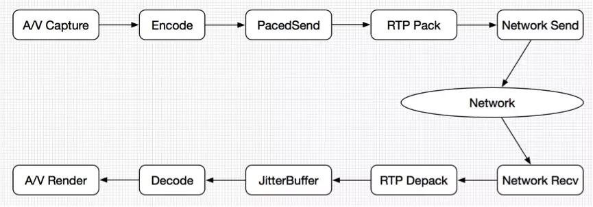
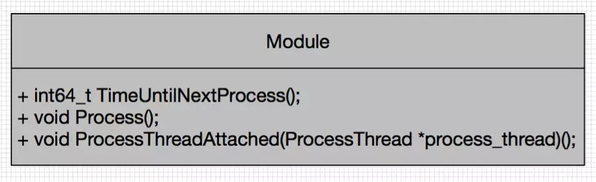
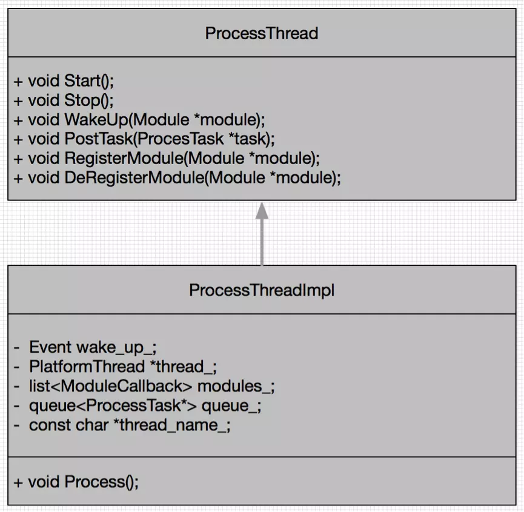
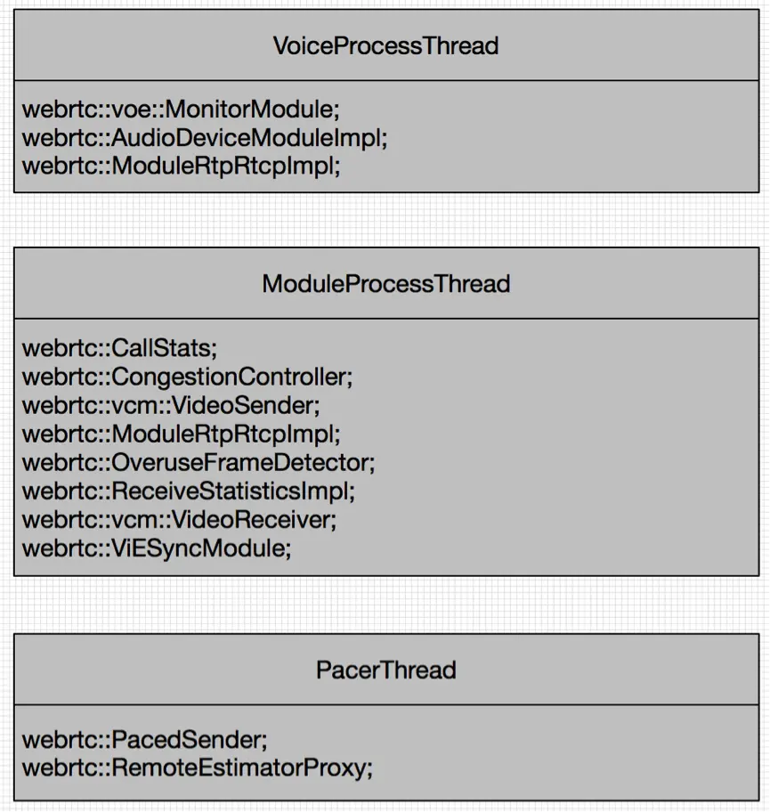
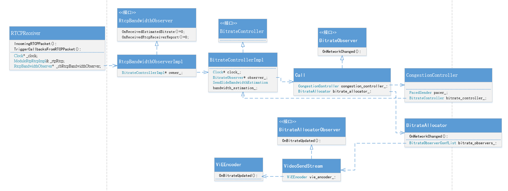
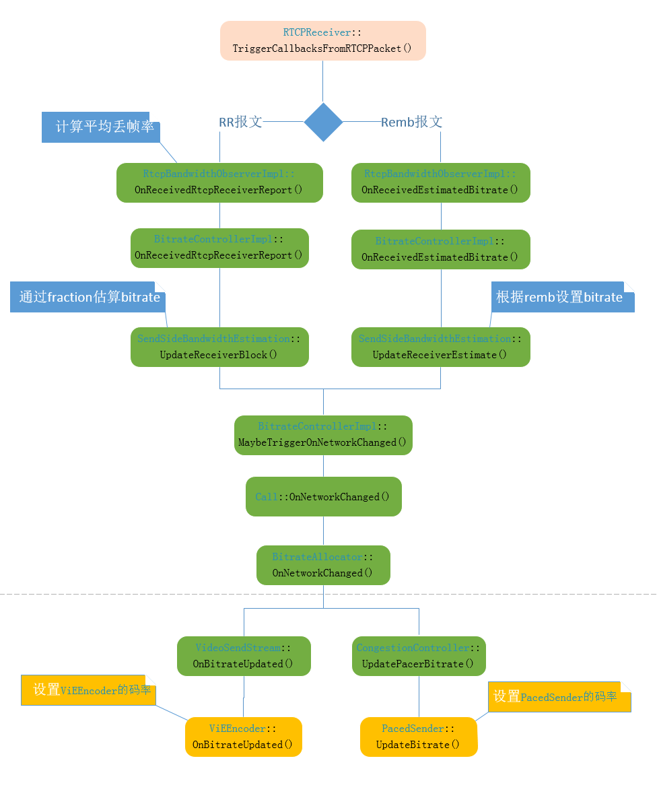
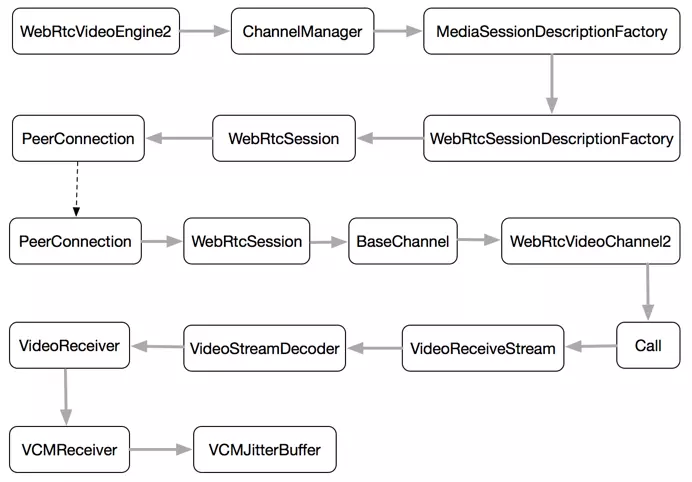
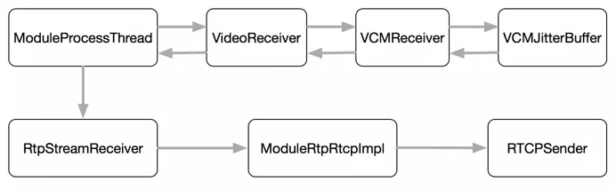
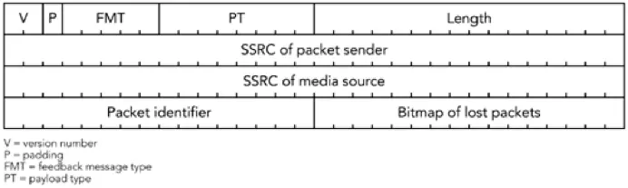
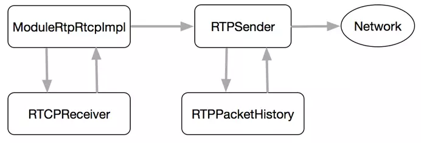

<!--BEGIN_DATA
{
    "create_date": "2019-12-06 17:19", 
    "modify_date": "2019-12-06 17:19", 
    "is_top": "0", 
    "summary": "WebRTC的模块处理机制 RTCP码率控制反馈流程 WebRTC中丢包重传NACK实现分析", 
    "tags": "WebRTC、C/C++、网络", 
    "file_name": "WebRTC的模块处理机制及丢包重传NACK实现分析.md"
}
END_DATA-->

#### 
原文出处：<a href='https://www.jianshu.com/p/9f4d4a725efb' target='blank'>WebRTC的模块处理机制</a>

对于实时音视频应用来讲，媒体数据从采集到渲染，在数据流水线上依次完成一系列处理。流水线由不同的功能模块组成，彼此分工协作：数据采集模块负责从摄像头/麦克风采集音视频数据，编解码模块负责对数据进行编解码，RTP模块负责数据打包和解包。数据流水线上的数据处理速度是影响应用实时性的最重要因素。与此同时，从服务质量保证角度讲，应用需要知道数据流水线的运行状态，如视频采集模块的实时帧率、当前网络的实时速率、接收端的数据丢包率，等等。各个功能模块可以基于这些运行状态信息作相应调整，从而在质量、速度等方面优化数据流水线的运行，实现更快、更好的用户体验。

WebRTC采用模块机制，把数据流水线上功能相对独立的处理点定义为模块，每个模块专注于自己的任务，模块之间基于数据流进行通信。与此同时，专有线程收集和处理模块内部的运行状态信息，并把这些信息反馈到目标模块，实现模块运行状态监控和服务质量保证。本文在深入分析WebRTC源代码基础上，学习研究其模块处理机制的实现细节，从另一个角度理解WebRTC的技术原理。

#### 1 WebRTC数据流水线

我们可以把WebRTC看作是一个专注于实时音视频通信的SDK。其对外的API主要负责PeerConnection建立、MediaStream创建、NAT穿透、SDP协商等工作，对内则主要集中于音视频数据的处理，从数据采集到渲染的整个处理过程可以用一个数据流水线来描述，如图1所示。

图1 WebRTC音视频数据流水线

音视频数据首先从采集端进行采集，一般来说音频数据来自麦克风，视频数据来自摄像头。在某些应用场景下，音频数据来自扬声器，视频数据来自桌面共享。采集端的输出是音视频Raw Data。然后Raw Data到达编码模块，数据被编码器编码成符合语法规则的NAL单元，到达发送端缓冲区PacedSender处。接下来PacedSender把NAL单元发送到RTP模块打包为RTP数据包，最后经过网络模块发送到网络。

在接收端，RTP数据包经过网络模块接收后进行解包得到NAL单元，接下来NAL单元到达接收端缓冲区(JitterBuffer或者NetEQ)进行乱序重排和组帧。一帧完整的数据接收并组帧之后，调用解码模块进行解码，得到该帧数据的Raw Data。最后Raw Data交给渲染模块进行播放/显示。

在数据流水线上，还有一系列模块负责服务质量监控，如丢帧策略，丢包策略，编码器过度使用保护，码率估计，前向纠错，丢包重传，等等。

WebRTC数据流水线上的功能单元被定义为模块，每个模块从上游模块获取输入数据，在本模块进行加工后得到输出数据，交给下游模块进行下一步处理。WebRTC的模块处理机制包括模块和模块处理线程，前者把WebRTC数据流水线上的功能部件封装为模块，后者驱动模块内部状态更新和模块之间状态传递。模块一般挂载到模块处理线程上，由处理线程驱动模块的处理函数。下面分别描述之。

#### 2 WebRTC模块

WebRTC模块虚基类Module定义在webrtc/modules/include/modue.h中，如图2所示。

图2 模块虚基类Module定义

Module虚基类对外提供三个函数作为API：TimeUntilNextProcess()用来计算距下次调用处理函数Process()的时间间隔；Process()是模块的处理函数，负责模块内部运行监控、状态更新和模块间通信；ProcessThreadAttached()用来把模块挂载到模块处理线程，或者从模块处理线程分离出来，实际实现中这个函数暂时没有被用到。

Module的派生类分布在WebRTC数据流水线上的不同部分，各自承担自己的数据处理和服务质量保证任务。

#### 3 WebRTC模块处理线程

WebRTC模块处理线程是模块处理机制的驱动器，它的核心作用是对所有挂载在本线程下的模块，周期性调用其Process()处理函数处理模块内部事务，并处理异步任务。其虚基类ProcessThread和派生类ProcessThreadImpl如图3所示。

图3 模块处理线程虚基类ProcessThread及派生类ProcessThreadImpl

ProcessThread基类提供一系列API完成线程功能：Start()/Stop()函数用来启动和结束线程；WakeUp()函数用来唤醒挂载在本线程下的某个模块，使得该模块有机会马上执行其Process()处理函数；PostTask()函数用来邮递一个任务给本线程；RegisterModule()和DeRegisterModule()用来向线程注册/注销模块。

WebRTC基于ProcessThread线程实现派生类ProcessThreadImpl，如图3所示。在成员变量方面，`wake_up_`用来唤醒处于等待状态的线程；`thread_`是平台相关的线程实现如POSIX线程；`modules_`是注册在本线程下的模块集合；`queue_`是邮递给本线程的任务集合；`thread_name_`是线程名字。在成员函数方面，Process()完成ProcessThread的核心任务，其伪代码如下所示。

    bool ProcessThreadImpl::Process() {
        for (ModuleCallback& m : modules_) {
          if (m.next_callback == 0)
            m.next_callback = GetNextCallbackTime(m.module, now);
          if (m.next_callback <= now || m.next_callback == kCallProcessImmediately) {
            m.module->Process();
            m.next_callback = GetNextCallbackTime(m.module, rtc::TimeMillis(););
          }
          if (m.next_callback < next_checkpoint)
            next_checkpoint = m.next_callback;
        }
        while (!queue_.empty()) {
          ProcessTask* task = queue_.front();
          queue_.pop();
          task->Run();
          delete task;
        }
      }
      int64_t time_to_wait = next_checkpoint - rtc::TimeMillis();
      if (time_to_wait > 0)
        wake_up_->Wait(static_cast<unsigned long>(time_to_wait));
      return true;
    }

Process()函数首先处理挂载在本线程下的模块，这也是模块处理线程的核心任务：针对每个模块，计算其下次调用模块Process()处理函数的时刻(调用该模块的TimeUntilNextProcess()函数)。如果时刻是当前时刻，则调用模块的Process()处理函数，并更新下次调用时刻。需要注意，不同模块的执行频率不一样，线程在本轮调用末尾的等待时间和本线程下所有模块的最近下次调用时刻相关。

接下来线程Process()函数处理ProcessTask队列中的异步任务，针对每个任务调用Run()函数，然后任务出队列并销毁。等模块调用和任务都处理完后，则把本次时间片的剩余时间等待完毕，然后返回。如果在等待期间其他线程向本线程Wakeup模块或者邮递一个任务，则线程被立即唤醒并返回，进行下一轮时间片的执行。

至此，关于WebRTC的模块和模块处理线程的基本实现分析完毕，下一节将对WebRTC SDK内模块实例和模块处理线程实例进行详细分析。

#### 4 WebRTC模块处理线程实例

WebRTC关于模块和处理线程的实现在webrtc/modules目录下，该目录汇集了所有派生类模块和模块处理线程的实现及实例分布。本节对这些内容进行总结。

WebRTC目前创建三个ProcessThreadImpl线程实例，分别是负责处理音频的VoiceProcessTread，负责处理视频和音视频同步的ModuleProcessThread，以及负责数据平滑发送的PacerThread。这三个线程和挂载在线程下的模块如图4所示。

图4 模块处理线程实例

VoiceProcessThread线程由Worker线程在创建VoiceEngine时创建，负责音频端模块的处理。挂载在该线程下的模块如图4所示，其中MonitorModule负责对音频数据混音处理过程中产生的警告和错误进行处理，AudioDeviceModuleImpl负责对音频设备采集和播放音频数据时产生的警告和错误进行处理，ModuleRtpRtcpImpl负责音频RTP数据包发送过程中的码率计算、RTT更新、RTCP报文发送等内容。

ModuleProcessThread线程由Worker线程在创建VideoChannel时创建，负责视频端模块的处理。挂载在该线程下的模块如图4所示，其中CallStats负责Call对象统计数据(如RTT)的更新，CongestionController负责拥塞控制[1][2]，VideoSender负责视频发送端统计数据的更新，VideoReceiver负责视频接收端统计数据更新和处理状态反馈(如请求关键帧)，ModuleRtpRtcpImpl负责视频RTP数据包发送过程中的码率计算、RTT更新、RTCP报文发送等内容，OveruseFrameDetector负责视频帧采集端过载监控，ReceiveStatisticsImpl负责由接收端统计数据触发的码率更新过程，ViESyncModule负责音视频同步。

PacerThread线程由Worker线程在创建VideoChannel时创建，负责数据平滑发送。挂载在该线程下的PacedSender负责发送端数据平滑发送；RemoteEstimatorProxy派生自RemoteBitrateEstimator，负责在启用发送端码率估计的情况下把接收端收集到的反馈信息发送回发送端。

由以上分析可知，WebRTC创建的模块处理线程实例基本上涵盖了音视频数据从采集到渲染过程中的大部分数据操作。但还有一些模块不依赖于模块线程工作，这部分模块是少数，本文不展开具体的描述。

#### 5 总结

本文在深入分析WebRTC源代码基础上，学习研究其模块处理机制的实现细节，为进一步全面理解WebRTC的技术原理奠定基础。

#### 
原文出处：<a href='https://blog.csdn.net/qq_24283329/article/details/72886916' target='blank'>RTCP码率控制反馈流程</a>

前面的分析我们知道，RR报文中主要包含丢帧率fraction loss, 通过它估算出目标发送码率，然后更新编码器和PacedSender, 本节记录一下它们的类图，以及总流程：  
类图：  

流程图：  

#### 
原文出处：<a href='https://www.jianshu.com/p/a7f6ec0c9273' target='blank'>WebRTC中丢包重传NACK实现分析</a>

在WebRTC中，前向纠错(FEC)和丢包重传(NACK)是抵抗网络错误的重要手段。FEC在发送端将数据包添加冗余纠错码，纠错码连同数据包一起发送到接收端；
接收端根据纠错码对数据进行检查和纠正。RFC5109[1]定义FEC数据包的格式。NACK则在接收端检测到数据丢包后，发送NACK报文到发送端；发送端根据NACK报文中的序列号，在发送缓冲区找到对应的数据包，重新发送到接收端。NACK需要发送端发送缓冲区的支持，RFC5104[2]定义NACK数据包的格式。

本文在研究WebRTC源代码的基础上，以Video数据包的发送和接收为例，深入分析ANCK丢包重传机制的实现。主要内容包括：SDP协商NACK，接收端丢包判定，NACK报文构造、发送、接收和解析，RTP数据包重传。下面分别详细论述之。

#### 1 SDP协商NACK

NACK作为RTP层反馈参数，和Video Codec联系在一起。WebRTC在初始化阶段，创建PeerConnectionFactory对象，在该对象中创建MediaEngine，其中的VideoEngine为WebRtcVideoEngine2。该对象在构造时，会收集本端支持的所有Video Codec，NACK作为Codec的属性被一起收集。在接下来的SDP协商过程中，NACK属性被协商到Offer/Answer中，如图1所示。

图1 SDP协商NACK及作用于Video JitterBuffer

PeerConnection在CreateOffer时，收集本端的会话控制信息、音视频Codec信息和网络信息等内容。视频Codec信息从WebRtcVideoEngine2中获取。最后本端Offer形成SDP报文，经过PeerConnection对象发送到网络。

接收端在收到Offer之后，首先调用SetRemoteDescription，根据本地配置信息向下创建VideoReceiveStream对象，本地NACK配置信息会最终到达VCMJitterBuffer。接着PeerConnection调用CreateAnswer，生成Answer；根据Offer中的Codec信息和本端支持的Codec信息，最终选定双方都支持的Codec集合。最后用生成的Answer作为参数调用SetLocalDescription，根据Answer中的Video Codec信息向下重新创建VideoReceiveStream对象。NACK信息向下传递最终到达VCMJitterBuffer，在这里设置NACK相关参数。这些参数在接收RTP数据包过程中发挥作用，比如判断丢包、是否发送NACK报文等。Answer发回发送端时，发送端调用SetRemoteDescription执行同样的设置流程。

####2 接收端丢包判定

Video接收端丢包判定在Worker线程中进行。RTP数据包到达接收端后，经过RTP模块到达VCM模块的JitterBuffer对象，最终调用VCMJitterBuffer的InsertPacket函数对数据包进行缓存和重排。

VCMJitterBuffer把丢失RTP数据包的序列号存储在集合missing_seq_nums中。对于本次从RTP模块到来的数据包，标记其序列号为seq1，而上次到达数据包的序列号为seq2。如果seq1 > seq2，则表示seq1顺序到达，标记(seqnum2, seqnum1)区间内的数据包为丢失状态，将其存储到missing_seq_nums集合中。注意这里的丢失状态是暂时的，如果下个数据包到达时有seq1 < seq2，则表示数据包乱序到达，则把missing\_seq\_nums中小于seq1的序列号都删除掉。

在更新missing_seq_nums集合时，如果集合中存储的序列号超过预设的容量，则通过调用RecycleFramesUntilKeyFrame()不断丢包来减少集合中的序列号，直到集合中的序列号总数低于预设容量值。

####3 NACK报文发送和接收

接收端的NACK报文构造和发送工作在ModuleProcessThread线程中周期性完成。过程如图2所示。

图2 NACK报文构造和发送

  

ModuleProcessThread线程周期性调用VideoReceiver::process函数，该函数通过VCMReceiver调用VCMJitterBuffer::GetNackList，从missing_seq_nums集合中得到过去一段时间内丢失RTP数据包的序列号。然后调用RtpStreamReceiver::ResendPackets函数。调用流程最终会到达RTCPSender::SendRTCP，发送类型为NACK的RTCP报文。

NACK报文是类型为205的RTCP 扩展反馈报文，在RFC4585中定义[4]。具体格式如图3所示：

图3 NACK报文格式

其中PT = 205，FMT = 1，Packet identifier(PID)即为丢失RTP数据包的序列号，Bitmao of Lost Packets(BLP)指示从PID开始接下来16个RTP数据包的丢失情况。一个NACK报文可以携带多个RTP序列号，NACK接收端对这些序列号逐个处理。

NACK报文构造完成以后，发送到网络层。NACK报文是RTCP报文的一种，因此其发送、接收和分析遵循RTCP报文处理的一般流程。这部分内容可参考文档[3]。

####4 RTP数据包重传

接收端在接收和解析NACK报文后，通过回调机制处理各种类型的RTCP报文，对于NACK报文，会调用RTPSender重新发送RTP数据包，如图4所示：

图4 发送端数据包重传

  

RTCPReceiver在解析RTCP之后，得到RTCP报文的描述结构，然后通过回调进行报文语义处理。NACK报文会被发送到RTPSender进行处理。RTPSender根据NACK报文中包含的序列号，到RTPPacketHistory缓存中查找对应的RTP数据包。如果找到，则把数据包发送到网络。

至此，一个完整的NACK报文回路完成，丢失的RTP数据包会重新发送到接收端。

#### 5 总结

本文深入分析了WebRTC内部关于丢包重传(NACK)的实现细节，对NACK的SDP协商、丢包判定和重传进行深入研究，为继续学习掌握WebRTC的QoS机制奠定基础。  

#### 参考文献

[1] RFC5109 - RTP Payload Format for Generic Forward Error Correction.  
[2] RFC5104 - RFC 5104 - Codec Control Messages in the RTP Audio-Visual
Profile with Feedback (AVPF)   
[3] WebRTC中RTP/RTCP协议实现分析 - [http://www.jianshu.com/p/c84be6f3ddf3](https://www.jianshu.com/p/c84be6f3ddf3)   
[4] RFC4585 - Extended RTP Profile for Real-time Transport Control Protocol (RTCP)-Based Feedback (RTP/AVPF)

