 
<!--BEGIN_DATA
{
    "create_date": "2021-02-14 18:20", 
    "modify_date": "2021-02-14 18:20", 
    "is_top": "0", 
    "summary": "WebRTC系列之音频的那些事<br/>基于WebRTC实现自定义编码分辨率发送<br/>移动端硬解关键流程梳理", 
    "tags": "WebRTC", 
    "file_name": "WebRTC系列之音频与视频.md"
}
END_DATA-->

#### <p>原文出处：<a href='https://www.cnblogs.com/wangyiyunxin/p/13261226.html' target='blank'>WebRTC系列之音频的那些事</a></p>

年初因为工作需要，开始学习WebRTC，就被其复杂的编译环境和巨大的代码量所折服，注定是一块难啃的骨头。俗话说万事开头难，坚持一个恒心，终究能学习到WebRTC的设计精髓。今天和大家聊聊WebRTC中音频的那些事。WebRTC由语音引擎，视频引擎和网络传输三大模块组成，其中语音引擎是WebRTC中最具价值的技术之一，实现了音频数据的采集、前处理、编码、发送、接受、解码、混音、后处理、播放等一系列处理流程。

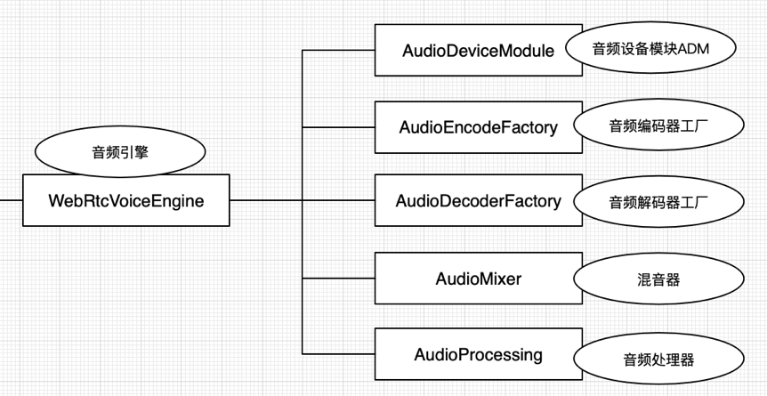

音频引擎主要包含：音频设备模块ADM、音频编码器工厂、音频解码器工厂、混音器Mixer、音频前处理APM。

## 音频工作机制

想要系统的了解音频引擎，首先需要了解核心的实现类和音频数据流向，接下来我们将简单的分析一下。

**音频引擎核心类图：**

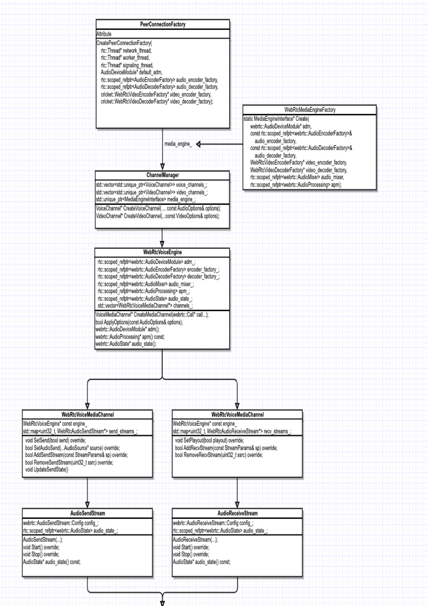

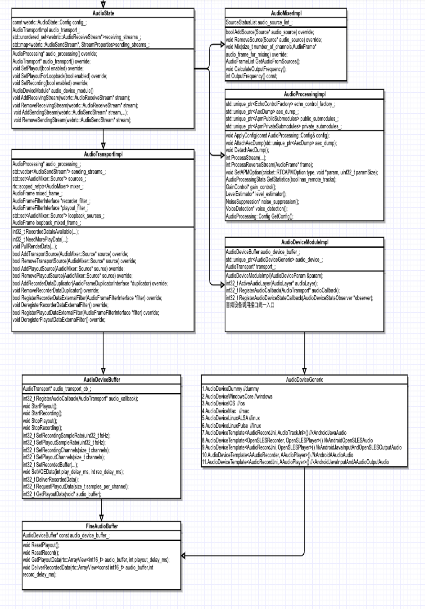

音频引擎WebrtcVoiceEngine主要包含音频设备模块AudioDeviceModule、音频混音器AudioMixer、音频3A处理器AudioProcessing、音频管理类AudioState、音频编码器工厂AudioEncodeFactory、音频解码器工厂AudioDecodeFactory、语音媒体通道包含发送和接受等。

1. 音频设备模块AudioDeviceModule主要负责硬件设备层，包括音频数据的采集和播放，以及硬件设备的相关操作。

2. 音频混音器AudioMixer主要负责音频发送数据的混音（设备采集和伴音的混音）、音频播放数据的混音（多路接受音频和伴音的混音）。

3. 音频3A处理器AudioProcessing主要负责音频采集数据的前处理，包含回声消除AEC、自动增益控制AGC、噪声抑制NS。APM分为两个流，一个近端流，一个远端流。近端（Near-end）流是指从麦克风进入的数据；远端（Far-end）流是指接收到的数据。

4. 音频管理类AudioState包含音频设备模块ADM、音频前处理模块APM、音频混音器Mixer以及数据流转中心AudioTransportImpl。

5. 音频编码器工厂AudioEncodeFactory包含了Opus、iSAC、G711、G722、iLBC、L16等codec。

6. 音频解码器工厂AudioDecodeFactory包含了Opus、iSAC、G711、G722、iLBC、L16等codec

**音频的工作流程图：**

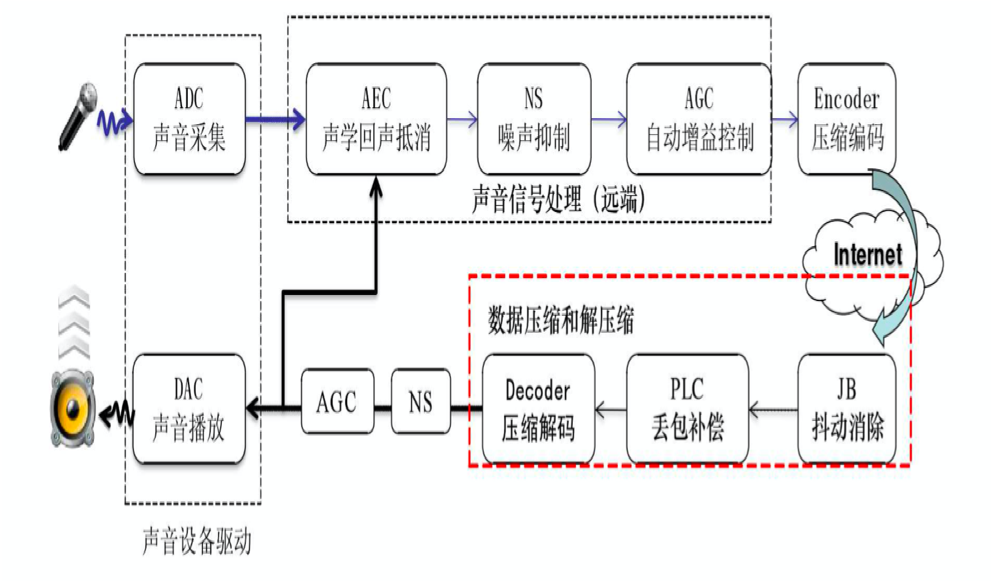

1.发起端通过麦克风进行声音采集

2.发起端将采集到的声音信号输送给APM模块，进行回声消除AEC，噪音抑制NS，自动增益控制处理AGC

3.发起端将处理之后的数据输送给编码器进行语音压缩编码

4.发起端将编码后的数据通过RtpRtcp传输模块发送，通过Internet网路传输到接收端

5.接收端接受网络传输过来的音频数据，先输送给NetEQ模块进行抖动消除，丢包隐藏解码等操作

6.接收端将处理过后的音频数据送入声卡设备进行播放

**NetEQ模块是Webrtc语音引擎中的核心模块**

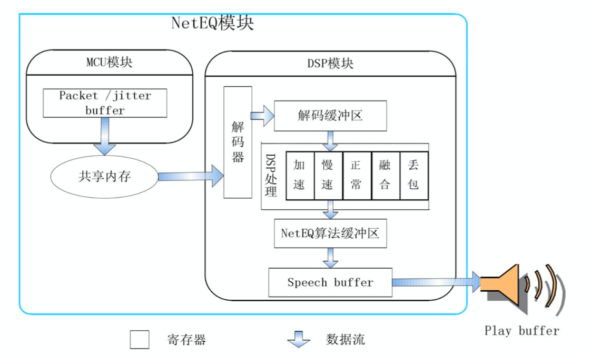

在 NetEQ 模块中，又被大致分为 MCU模块和 DSP 模块。MCU 主要负责做延时及抖动的计算统计，并生成对应的控制命令。而 DSP模块负责接收并根据 MCU 的控制命令进行对应的数据包处理，并传输给下一个环节.

音频数据流向  
  
根据上面介绍的音频工作流程图，我们将继续细化一下音频的数据流向。将会重点介绍一下数据流转中心AudioTransportImpl在整个环节中扮演的重要角色。

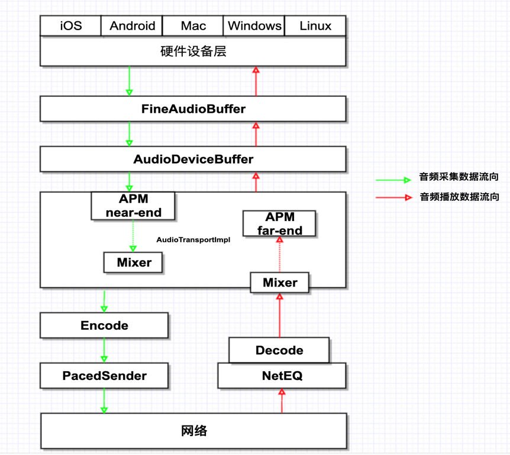

数据流转中心AudioTransportImpl实现了采集数据处理接口RecordDataIsAvailbale和播放数据处理接口NeedMorePlayData。RecordDataIsAvailbale负责采集音频数据的处理和将其分发到所有的发送Streams。NeedMorePlayData负责混音所有接收到的Streams，然后输送给APM作为一路参考信号处理，最后将其重采样到请求输出的采样率。

RecordDataIsAvailbale内部主要流程：

1. 由硬件采集过来的音频数据，直接重采样到发送采样率

2. 由音频前处理针对重采样之后的音频数据进行3A处理

3. VAD处理

4. 数字增益调整采集音量

5. 音频数据回调外部进行外部前处理

6. 混音发送端所有需要发送的音频数据，包括采集的数据和伴音的数据

7. 计算音频数据的能量值

8. 将其分发到所有的发送Streams

NeedMorePlayData内部主要流程：

1. 混音所有接收到的Streams的音频数据

   1.1 计算输出采样率CalculateOutputFrequency()
   1.2 从Source收集音频数据GetAudioFromSources(),选取没有mute，且能量最大的三路进行混音
   1.3 执行混音操作FrameCombiner::Combine()

2. 特定条件下，进行噪声注入，用于采集侧作为参考信号

3. 对本地伴音进行混音操作

4. 数字增益调整播放音量

5. 音频数据回调外部进行外部前处理

6. 计算音频数据的能量值

7. 将音频重采样到请求输出的采样率

8. 将音频数据输送给APM作为一路参考信号处理

由上图的数据流向发现，为什么需要FineAudioBuffer和AudioDeviceBuffer？因为WebRTC 的音频流水线只支持处理 10 ms 的数据，不同的操作系统平台提供了不同的采集和播放时长的音频数据，不同的采样率也会提供不同时长的数据。例如iOS上，16K采样率会提供8ms的音频数据128帧；8K采样率会提供16ms的音频数据128帧；48K采样率会提供10.67ms的音频数据512帧.

AudioDeviceModule 播放和采集的数据，总会通过 AudioDeviceBuffer 拿进来或者送出去 10 ms 的音频数据。对于不支持采集和播放 10 ms 音频数据的平台，在平台的 AudioDeviceModule 和 AudioDeviceBuffer还会插入一个 FineAudioBuffer，用于将平台的音频数据格式转换为 10 ms 的 WebRTC 能处理的音频帧。在AudioDeviceBuffer中，还会10s定时统计一下当前硬件设备过来的音频数据对应的采样点个数和采样率，可以用于检测当前硬件的一个工作状态。

## 音频相关改动

1. 音频Profile的实现，支持Voip和Music 2种场景，实现了采样率、编码码率、编码模式、声道数的综合性技术策略。

iOS实现了采集和播放线程的分离，支持双声道的播放。

2. 音频3A参数的兼容性下发适配方案。

3. 耳机场景的适配，蓝牙耳机和普通耳机的适配，动态3A切换适配。

4. Noise_Injection噪声注入算法，作为一路参考信号，在耳机场景的回声消除中的作用特别明显。

5. 支持本地伴音文件file和网络伴音文件http&https。

6. Audio Nack的实现，提高音频的抗丢包能力，目前正在进行In-band FEC。

7. 音频处理在单讲和双讲方面的优化。

8. iOS在Built-In AGC方面的研究：

> 1. Built-In AGC对于Speech和Music有效，对于noise和环境底噪不会产生作用。
> 2. 不同机型的麦克风硬件的增益不同，iPhone 7 Plus > iPhone 8 > iPhoneX;因此会在软件AGC和硬件AGC都关闭的情况下，远端听到的声音大小表现不一样。
> 3. iOS除了提供的可开关的AGC以外，还有一个AGC会一直工作，对信号的level进行微调；猜想这个一直工作的AGC是iOS自带的analog AGC，可能和硬件有关，且没有API可以开关，而可开关的AGC是一个digital AGC。
> 4. 在大部分iOS机型上，外放模式“耳机再次插入后”，input的音量会变小。当前的解决方案是在耳机再次插入后，增加一个preGain来把输入的音量拉回正常值。

## 音频问题排查

和大家分享一下音频最常见的一些现象以及原因：

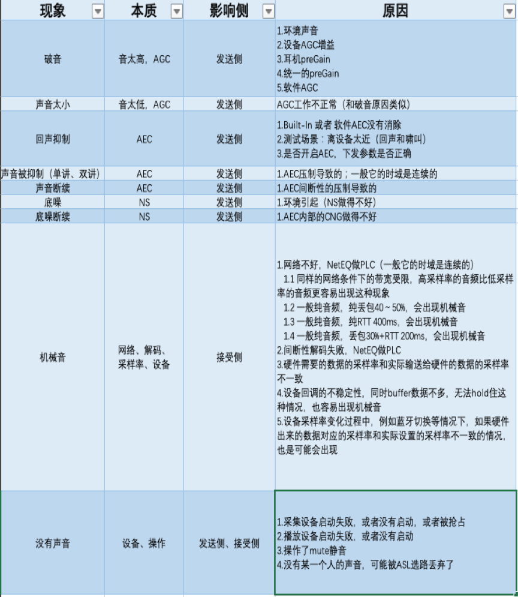

<hr>

#### <p>原文出处：<a href='https://www.cnblogs.com/wangyiyunxin/p/14313238.html' target='blank'>基于WebRTC实现自定义编码分辨率发送</a></p>

2020年如果问什么技术领域最火？毫无疑问：音视频，视频会议、在线教学、娱乐直播等都是音视频的典型应用场景。本文将针对分辨率，分享基于 WebRTC如何实现编码分辨率的配置。

2020年如果问什么技术领域最火？毫无疑问：**音视频**。2020年远程办公和在线教育的强势发展，都离不开音视频的身影，视频会议、在线教学、娱乐直播等都是音视频的典型应用场景。

更加丰富的使用场景更需要我们考虑**如何提供更多的可配置能力项，**比如分辨率、帧率、码率等**，以实现更好的用户体验**。本文将主要从“**分辨率**”展开具体分享。

## 如何实现自定义编码分辨率

我们先来看看“分辨率”的定义。**分辨率：**是度量图像内像素数据量多少的一个参数，是**衡量一帧图像或视频质量的关键指标**。分辨率越高，图像体积（字节数）越大，画质越好。对于一个YUV i420 格式、分辨率 1080p 的视频流来说，一帧图像的体积为1920x1080x1.5x8/1024/1024≈23.73Mbit，帧率 30，则 1s 的大小是 30x23.73≈711.9Mbit。可见数据量之大，对码率要求之高，所以在实际传输过程中就需要对视频进行压缩编码。因此，视频采集设备采集出的原始数据分辨率我们称**采集分辨率，**实际送进编码器的数据分辨率我们就称之为**编码分辨率**。

视频画面是否清晰、比例是否合适，这些都会直接影响用户体验。摄像头采集分辨率的选择是有限的，有时我们想要的分辨率并不能直接通过摄像头采集到。那么，根据场景配置合适编码分辨率的能力就至关重要了。**如何将采集到的视频转换成我们想要的编码分辨率去发送？**这就是我们今天的主要分享的内容。

WebRTC 是 Google 开源的，功能强大的实时音视频项目，市面上大多开发者都是基于 WebRTC 构建实时音视频通信的解决方案。在 WebRTC中各个模块都有很好的抽象解耦处理, 对我们进行二次开发非常友好。在我们构建实时音视频通信解决方案时，需要去了解和学习 WebRTC 的设计思想及代码模块，并具备二次开发和扩展的能力。本文我们基于 WebRTC Release 72 版本，聊聊如何实现自定义编码分辨率。

首先，我们思考下面几个问题：

  * 视频数据从采集到编码发送，其 Pipeline 是怎样的？
  * 怎么根据设置的编码分辨率选择合适的采集分辨率？
  * 怎么能得到想要的编码分辨率？

本文内容也将从以上三点展开具体分享。

## 视频数据的 Pipeline

首先，我们来了解一下视频数据的 Pipeline。视频数据由 VideoCapturer 产生，VideoCapturer 采集数据后经过VideoAdapter 处理，然后经由 VideoSource 的 VideoBroadcaster 分发给注册的 VideoSink，VideoSink 即编码器 Encoder Sink 和本地预览 Preview Sink。

对视频分辨率来说，流程是：将想要的分辨率设置给 VideoCapturer，VideoCapturer 选择合适的分辨率去采集，原始的采集分辨率数据再经过VideoAdapter 计算，不符合预期后再进行缩放裁剪得到编码分辨率的视频数据，将数据再送进编码器编码后发送。

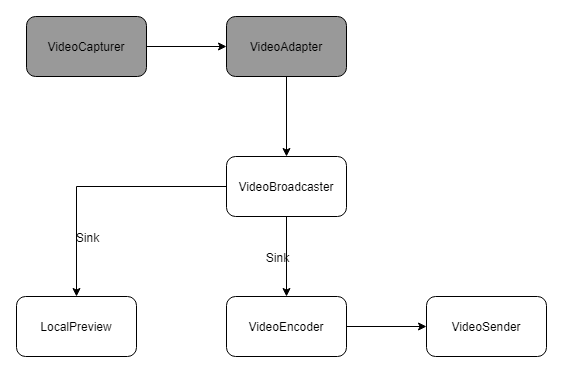

这里就有两个关键性问题：

  * VideoCapturer 如何选择合适的采集分辨率？
  * VideoAdapter 如何将采集分辨率转换成编码分辨率？

## 如何选择合适的采集分辨率

### 采集分辨率的选择

WebRTC 中对视频采集抽象出一个 Base 类：videocapturer.cc，我们把抽象称为 VideoCapturer，在VideoCapturer 中设置参数属性，比如视频分辨率、帧率、支持的像素格式等，VideoCapturer将根据设置的参数，计算出最佳的采集格式，再用这个采集格式去调用各个平台的 VDM（Video Device Module，视频硬件设备模块）。具体的设置如下：

代码摘自 WebRTC 中 src/media/base/videocapturer.h

```cpp
VideoCapturer.h
bool GetBestCaptureFormat(const VideoFormat& desired, VideoFormat* best_format);//内部遍历设备支持的所有采集格式调用GetFormatDistance()计算出每个格式的distance，选出distance最小的那个格式
int64_t GetFormatDistance(const VideoFormat& desired, const VideoFormat& supported);//根据算法计算出设备支持的格式与我们想要的采集格式的差距，distance为0即刚好满足我们的设置
void SetSupportedFormats(const std::vector<VideoFormat>& formats);//设置采集设备支持的格式fps，resolution，NV12， I420，MJPEG等       
```    

根据设置的参数，有时 GetBestCaptureFormat()并不能得到比较符合我们设置的采集格式，因为不同的设备采集能力不同，iOS、Android、PC、Mac 原生的摄像采集和外置 USB 摄像采集对分辨率的支持是不同的，尤其外置 USB 摄像采集能力参差不齐。因此，我们需要对 GetFormatDistance()稍作调整以满足我们的需求，下面我们就来聊聊具体应该如何进行代码调整以满足需求。

### 选择策略源码分析

我们先分析一下 GetFormatDistance() 的源码，摘取部分代码：

代码摘自 WebRTC 中 src/media/base/videocapturer.cc

```cpp    
// Get the distance between the supported and desired formats.
int64_t VideoCapturer::GetFormatDistance(const VideoFormat& desired,
                                          const VideoFormat& supported) {
  //....省略部分代码
  // Check resolution and fps.
  int desired_width = desired.width;//编码分辨率宽
  int desired_height = desired.height;//编码分辨率高
  int64_t delta_w = supported.width - desired_width;//宽的差
  float supported_fps = VideoFormat::IntervalToFpsFloat(supported.interval);//采集设备支持的帧率
  float delta_fps = supported_fps - VideoFormat::IntervalToFpsFloat(desired.interval);//帧率差
  int64_t aspect_h = desired_width
                          ? supported.width * desired_height / desired_width
                          : desired_height;//计算出设置的宽高比的高，采集设备的分辨率支持一般宽>高
  int64_t delta_h = supported.height - aspect_h;//高的差
  int64_t delta_fourcc;//设置的支持像素格式优先顺序，比如优先设置了NV12，同样分辨率和帧率的情况优先使用NV12格式采集
  //....省略部分降级策略代码，主要针对设备支持的分辨率和帧率不满足设置后的降级策略
  int64_t distance = 0;
  distance |=
      (delta_w << 28) | (delta_h << 16) | (delta_fps << 8) | delta_fourcc;
  return distance;
}
```   

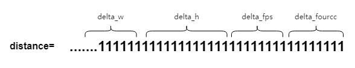

我们主要关注 Distance 这个参数。Distance 是 WebRTC 中的概念，它是设置的采集格式与设备支持的采集格式按照一定算法策略计算出的差值，差值越小代表设备支持的采集格式与设置想要的格式越接近，为 0 即刚好匹配。

Distance 由四部分组成 `delta_w`，`delta_h`，`delta_fps`，`delta_fourcc`，其中 `delta_w`（分辨率宽）权重最重，`delta_h`（分辨率高） 其次，`delta_fps`（帧率） 再次，`delta_fourcc`（像素格式） 最后。这样导致的问题是宽的比重太高,高的比重太低，无法匹配到比较精确支持的分辨率。

Example:

以 iPhone xs Max 800x800 fps:10 为例，我们摘取部分采集格式的 distance, 原生的GetFormatDistance() 的算法是不满足需求的，想要的是 800x800，可以从下图看出结果 Best 是960x540，不符合预期：

```cpp
Supported NV12 192x144x10 distance 489635708928
Supported NV12 352x288x10 distance 360789835776
Supported NV12 480x360x10 distance 257721630720
Supported NV12 640x480x10 distance 128880476160
Supported NV12 960x540x10 distance 43032248320
Supported NV12 1024x768x10 distance 60179873792
Supported NV12 1280x720x10 distance 128959119360
Supported NV12 1440x1080x10 distance 171869470720
Supported NV12 1920x1080x10 distance 300812861440
Supported NV12 1920x1440x10 distance 300742082560
Supported NV12 3088x2316x10 distance 614332104704
Best NV12 960x540x10 distance 43032248320
```

### 选择策略调整

为了获取我们想要的分辨率，按照我们分析，需要明确调整 GetFormatDisctance()的算法，将分辨率的权重调整为最高，帧率其次，在没有指定像素格式的情况下，像素格式最后，那么修改情况如下：

```cpp
int64_t VideoCapturer::GetFormatDistance(const VideoFormat& desired,
const VideoFormat& supported) {
  //....省略部分代码
  // Check resolution and fps.
int desired_width = desired.width; //编码分辨率宽
int desired_height = desired.height; //编码分辨率高
  int64_t delta_w = supported.width - desired_width;
  int64_t delta_h = supported.height - desired_height;
  int64_t delta_fps = supported.framerate() - desired.framerate();
  distance = std::abs(delta_w) + std::abs(delta_h);
  //....省略降级策略, 比如设置了1080p，但是摄像采集设备最高支持720p，需要降级
  distance = (distance << 16 | std::abs(delta_fps) << 8 | delta_fourcc);
return distance;
}
```


修改后：Distance 由三部分组成分辨率 (`delta_w+delta_h`)，帧率 `delta_fps`，像素 `delta_fourcc`，其中(`delta_w+delta_h`) 比重最高，`delta_fps` 其次，`delta_fourcc` 最后。

Example:

还是以 iPhone xs Max 800x800 fps:10 为例，我们摘取部分采集格式的 Distance, GetFormatDistance()修改后, 我们想要的是 800x800, 选择的 Best 是1440x1080, 我们可以通过缩放裁剪得到 800x800, 符合预期（对分辨率要求不是特别精确的情况下，可以调整降级策略，选择1024x768）：

```cpp
Supported NV12 192x144x10 distance 828375040
Supported NV12 352x288x10 distance 629145600
Supported NV12 480x360x10 distance 498073600
Supported NV12 640x480x10 distance 314572800
Supported NV12 960x540x10 distance 275251200
Supported NV12 1024x768x10 distance 167772160
Supported NV12 1280x720x10 distance 367001600
Supported NV12 1440x1080x10 distance 60293120
Supported NV12 1920x1080x10 distance 91750400
Supported NV12 1920x1440x10 distance 115343360
Supported NV12 3088x2316x10 distance 249298944
Best NV12 1440x1080x10 distance 60293120
```

## 如何实现采集分辨率到编码分辨率

视频数据采集完成后，会经过 VideoAdapter (WebRTC中的抽象) 处理再分发到对应的 Sink (WebRTC中的抽象)。我们在VideoAdapter 中稍作调整以计算出缩放裁剪所需的参数，再把视频数据用 LibYUV缩放再裁剪到编码分辨率（为了尽可能保留多的画面图像信息，先用缩放处理，宽高比不一致时再裁剪多余的像素信息）。这里我们重点分析两个问题：

  * 还是选用上面的例子，我们想要的分辨率为 800x800 ，但是我们得到的最佳采集分辨率为 1440x1080，那么，如何从 1440x1080 采集分辨率得到设置的编码分辨率 800x800 呢？
  * 在视频数据从 VideoCapture 流到 VideoSink 的过程中会经过 VideoAdapter 的处理，VideoAdapter 具体做了哪些事呢？

下面我们就这两个问题展开具体的分析，我们先了解一下 VideoAdapter 是什么。

### VideoAdapter 介绍

WebRTC 中对 VideoAdapter 是这样描述的：

> VideoAdapter adapts an input video frame to an output frame based on the specified input and output formats. The adaptation includes dropping frames to reduce frame rate and scaling frames.VideoAdapter is   thread safe.

我们可以理解为：VideoAdapter 是数据输入输出控制的模块，可以对帧率、分辨率做对应的帧率控制和分辨率降级。在 VQC（Video Quality Control）视频质量控制模块里，通过对 VideoAdapter 的配置，可以做到在低带宽、高 CPU 情况下对帧率进行动态降帧，对分辨率进行动态缩放，以保证视频的流畅性，从而提高用户体验。

摘自 src/media/base/videoadapter.h

```cpp
VideoAdapter.h
bool AdaptFrameResolution(int in_width,
int in_height,
                            int64_t in_timestamp_ns,
int* cropped_width,
int* cropped_height,
int* out_width,
int* out_height);
void OnOutputFormatRequest(
const absl::optional<std::pair<int, int>>& target_aspect_ratio,
const absl::optional<int>& max_pixel_count,
const absl::optional<int>& max_fps);
void OnOutputFormatRequest(const absl::optional<VideoFormat>& format);
```  

### VideoAdapter 源码分析

VideoAdapter 中根据设置的 `desried_format`，调用AdaptFrameResolution()，可以计算出采集分辨率到编码分辨率应该缩放和裁剪的 `cropped_width`, `cropped_height`,
`out_width`, `out_height` 参数, WebRTC 原生的 adaptFrameResolution是根据计算像素面积计算缩放参数，而不能得到精确的宽&高：

摘自src/media/base/videoadapter.cc

```cpp
bool VideoAdapter::AdaptFrameResolution(int in_width,
int in_height,
                                        int64_t in_timestamp_ns,
int* cropped_width,
int* cropped_height,
int* out_width,
int* out_height) {
//.....省略部分代码
// Calculate how the input should be cropped.
if (!target_aspect_ratio || target_aspect_ratio->first <= 0 ||
        target_aspect_ratio->second <= 0) {
      *cropped_width = in_width;
      *cropped_height = in_height;
    } else {
const float requested_aspect =
          target_aspect_ratio->first /
static_cast<float>(target_aspect_ratio->second);
      *cropped_width =
          std::min(in_width, static_cast<int>(in_height * requested_aspect));
      *cropped_height =
          std::min(in_height, static_cast<int>(in_width / requested_aspect));
    }
const Fraction scale;//vqc 缩放系数 ....省略代码
    // Calculate final output size.
    *out_width = *cropped_width / scale.denominator * scale.numerator;
    *out_height = *cropped_height / scale.denominator * scale.numerator;
  }
```

Example：

以 iPhone xs Max 800x800 fps:10 为例，设置编码分辨率为 800x800，采集分辨率是1440x1080，根据原生的算法，计算得到的新的分辨率为 720x720, 不符合预期。

### VideoAdapter 调整

VideoAdapter 是 VQC（视频质量控制模块）中对视频质量做调整的重要部分，VQC 之所以可以完成帧率控制、分辨率缩放等操作，主要依赖于VideoAdapter，因此修改需要考虑对 VQC 的影响。

为了能精确获得想要的分辨率，且不影响 VQC 模块对分辨率的控制，我们对 AdaptFrameResolution() 做以下调整：

```cpp
bool VideoAdapter::AdaptFrameResolution(int in_width,
int in_height,
                                        int64_t in_timestamp_ns,
int* cropped_width,
int* cropped_height,
int* out_width,
int* out_height) {
  //....省略部分代码
bool in_more =
        (static_cast<float>(in_width) / static_cast<float>(in_height)) >=
        (static_cast<float>(desired_width_) /
static_cast<float>(desired_height_));
if (in_more) {
        *cropped_height = in_height;
        *cropped_width = *cropped_height * desired_width_ / desired_height_;
    } else {
      *cropped_width = in_width;
      *cropped_height = *cropped_width * desired_height_ / desired_width_;
    }
    *out_width = desired_width_;
    *out_height = desired_height_;
    //....省略部分代码
return true;
}
```

Example：

同样以 iPhone xs Max 800x800 fps:10 为例，设置编码分辨率为 800x800，采集分辨率是1440x1080，根据调整后的算法，计算得到的编码分辨率为 800x800, 符合预期。

## 总结

本文主要介绍了基于 WebRTC 如何实现编码分辨率的配置。当我们要对视频编码分辨率进行修改时，就需要去了解视频数据的采集、传递、处理、编码等整个流程，这里也再对今天分享几个关键步骤进行归纳，当我们要实现自定义编码分辨率发送时：

  * 首先，设置想要的编码分辨率；
  * 修改 VideoCapturer.cc，根据编码分辨率选择合适的采集分辨率；
  * 修改 VideoAdapter.cc，计算出采集分辨率缩放和裁剪到编码分辨率所需的参数；
  * 根据缩放和裁剪参数使用 libyuv 将原始数据缩放裁剪到编码分辨率；
  * 再将新数据送进编码器编码并发送；
  * 最后，Done。

<hr>

#### <p>原文出处：<a href='https://www.cnblogs.com/wangyiyunxin/p/11157520.html' target='blank'>移动端硬解关键流程梳理</a></p>

介绍移动端Android/iOS硬解用法的文章有很多，本文将以笔者在实际开发工作中的经验为基础，抽出几个比较关键的部分来跟大家分享，旨在解决实际工作中可能遇到的花屏、（半边）绿屏、播放不完整等问题。

本文将以目前广泛应用的H.264编码的视频为例来说明，主要包含：H.264码流数据结构说明、解码器的初始化、seek、前后台切换、无缝分辨率切换、播放结束时的处理以及iOS如何避免下半部分绿屏的问题。

## 一、H.264码流数据结构说明

### 1. 理解码流数据结构的重要性

我们讲支持硬解，提高硬解兼容性，实际上就是对码流数据的结构进行处理以符合平台硬解要求，因此对码流数据结构的理解是必不可少的。

### 2. SPS/PPS与IDR帧

SPS(Sequence Parameter Set)序列参数集、PPS(Picture Parameter Set)图像参数集，包含了图像编码的各种参数信息，是作为解码器初始化所必须的参数信息。

IDR(Instantaneous Decoding Refresh)帧，也就是即时解码刷新帧，直观意思就是解码器在接收到IDR帧后会刷新参考帧缓存。IDR 帧前后的视频帧不会有任何参考关系，解码器可以从任何一个IDR帧开始解码。

### 3. H.264的NAL单元

NALU结构图示：

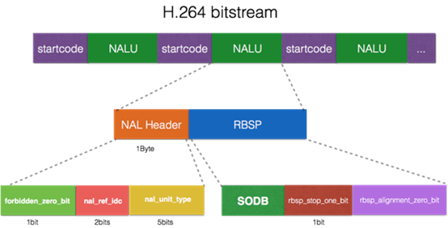

H.264标准中，视频流是由NAL(Network Abstraction Layer)单元组成的（简称NALU），每个NALU中可能是IDR图像、SPS、PPS、non-IDR图像等。

上图中示意的NALU单元是以startcode方式分割的，关于NALU的分割方式将在后面说明。另外，NALU内容中添加了防竞争字节，也就是说在一个NALU中，我们不可能再找到匹配的startcode.

H.264流的NALU组成图示


从上图可以看到，一个视频帧中可能可能包含多个NALU, 此时可以称该视频帧为多slice视频帧（一个NALU中包含该视频帧的一个slice）。

NAL Header的结构说明

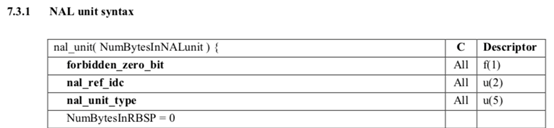

其中`nal_unit_type`是我们关心的字段，该字段标识了当前NALU的类型，我们可以通过将NALU中第一个字节&0x1F的方式来得到NALU类型。NALU类型的具体定义如下图所示：

NALU类型定义

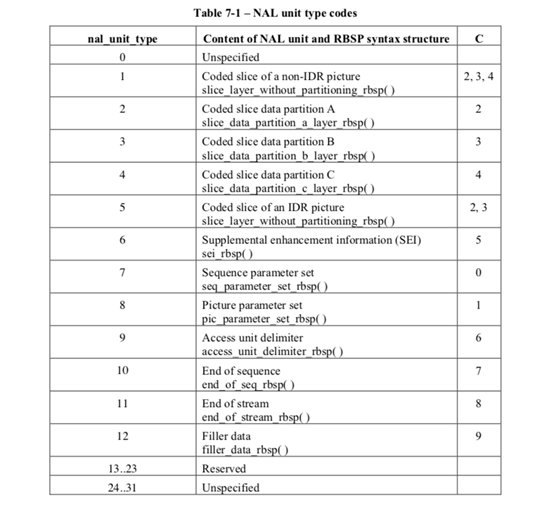

其中5代表上面提到的IDR帧数据，7、8分别代表SPS/PPS数据。

### 4. AVCC与Annex-B

H.264码流分为AVCC与Annex-B两种组织格式。

  *  AVCC格式 也叫AVC1格式，MPEG-4格式，字节对齐，因此也叫Byte-Stream Format。用于mp4/flv/mkv等封装中。 
  * Annex-B格式 也叫MPEG-2 transport stream format格式（ts格式）, ElementaryStream格式。用于TS流中（以及使用TS作为切片的hls格式中）。

这两种格式的区别有两点：

（1）NALU的分割方式不同；

（2）SPS/PPS的数据结构不同。

  * AVCC格式使用NALU长度（固定字节，字节数由extradata中的信息给定）进行分割，在封装文件或者直播流的头部包含extradata信息（非NALU），extradata中包含NALU长度的字节数以及SPS/PPS信息。
  * Annex-B格式使用start code进行分割，start code为0x000001或0x00000001，SPS/PPS作为一般NALU单元以start code作为分隔符的方式放在文件或者直播流的头部。

AVCC格式的extradata格式定义在`“ISO_IEC_14496-15"`文档中，Annex-B格式的SPS/PPS定义可以在`"ISO_IEC_14496-10"`文档中找到。

**MediaCodec与VideoToolBox使用的数据格式**

Android的硬解码接口MediaCodec只能接收Annex-B格式的H.264数据，而iOS平台的VideoToolBox则相反，只支持AVCC格式。

这就导致：

  * 在Android平台硬解播放flv/mp4/mkv等封装的视频时，需要将AVCC格式的extradata以及NALU数据转为Annex-B格式；
  * 在iOS平台播放ts或ts切片的hls视频时，需要将Annex-B格式的SPS/PPS NALU转为AVCC格式的extradata，以及将其他以size方式分割的NALU转为start code方式。

## 二、解码器的初始化及数据输入

初始化解码器，除了配置输入视频流的的编码格式、宽高以及输出格式之外，还需要配置一些额外的信息。对于H.264视频，需要填充的就是我们前面提到的SPS/PPS信息。

### 1. Android平台MediaCodec的初始化

我们需要将Annex-B格式的两个SPS/PPS NALU单元通过setByteBuffer方法，以"csd-0"为名称（或SPS设为"csd-0",PPS设为"csd-1"）设置到MediaFormat对象中，并调用configure接口配置到MediaCodec中去。

MediaCodec设置SPS/PPS信息的示例代码

```
MediaCodec mediaCodec = MediaCodec.createDecoderByType("video/avc");
MediaFormat mediaFormat = MediaFormat.createVideoFormat("video/avc", width, height);
// extradata中是Annex-B格式的SPS、PPS NALU数据
mediaFormat.setByteBuffer("csd-0", extradata);
// ...
mediaCodec.configure(mediaFormat, surface, 0, 0);
// ...
```

如上节所述，对于mp4/flv/mkv等封装，我们得到的是AVCC格式的extradata，需要先将该extradata转换为Annex-B格式的两个NALU, 然后用startcode进行分割。

 Android平台在配置解码方式时，最好使用MediaCodec直接渲染到Surface的方式，一是可以避免不同硬件平台繁杂的YUV格式兼容，二是在解码渲染高分辨率的视频时可以有非常明显的效率提升。

### 2. iOS平台VideoToolBox接口的初始化

VideoToolBox针对AVCC格式和Annex-B格式的SPS/PPS信息设置，分别提供了两个方法：

  * CMVideoFormatDescriptionCreate: 可以设置AVCC格式的extradata信
  * CMVideoFormatDescriptionCreateFromH264ParameterSets: 用来设置Annex-B格式的SPS/PPS NALU信息（需要去掉startcode）

需要注意，iOS平台不支持隔行H.264视频的解码，需要在创建videoToolBox前从SPS中判断当前视频是否隔行编码。

### 3. 数据格式的转换

如前所述，Android平台只接受Annex-B格式以startcode分割的H.264 NALU；iOS平台则相反，只接受AVCC格式以size分割的NALU. 在原视频流格式不匹配时需要进行相应的转换。

iOS还有以下的一些限制需要留意：

（1）如果源视频流本身已经是AVCC格式，但NALU size的大小是3个字节，而非4字节时，需要转为4字节格式。具体的话，需要先更改extradata中标识NALU size的字段，然后每个视频帧中的NALU size都要改成4个字节。

（2）如果一个视频帧内有多个NALU（多slice），那必须将这些NALU打包到一个CMSampleBuffer中，一次性送给解码器。

## 三、seek时的处理

编码后的视频帧之间存在着参考关系，我们无法直接从任意一帧开始解码，只能从可随机访问帧开始，在H.264中就是IDR帧。

### 1. 从IDR帧开始解码

对于点播视频，mp4/flv/mkv的头信息中都会保存整个视频的IDR帧索引，seek时需要定位到原seek位置附近的IDR帧再送数据给解码器。如果要实现短视频中的精确seek逻辑，可以先seek到离目标位置最近的上一个IDR帧开始解码，但不输出图像，直到目标位置的视频被解码出来。

### 2. 刷新解码器

进行seek操作时，除了要保证从IDR帧开始之外，还需要在送新的IDR帧数据前对解码器进行刷新操作。

  * Android平台可以通过调用MediaCodec的flush()接口来实现。
  * iOS平台则需要重新创建videoToolBox.

## 四、前后台切换

对Android、iOS平台，都存在App切后台，播放器渲染View被销毁而导致解码出错的情况。

### 1. 切回前台的处理

App切到后台时，iOS的videoToolBox session会失效，切回前台后原session也不能继续使用，需重新创建videoToolBox实例；Android平台在配置了Surface的情况下，如果Surface被销毁，则在切回前台时也需要配置新的Surface来重新创建并初始化MediaCodec.

如果我们要提高用户体验，实现前后台切换时的无缝播放，而不是重新拉流，那么可以在用户切后台的时候暂停播放，切回前台时重新创建解码器，继续从原位置开始播放。

不过参考前面seek章节的说明，我们恢复播放的位置很可能不是IDR帧，这种情况下就会出现切回前台后画面会先黑一段时间，直到下一个IDR帧被解码。黑屏的时间会跟视频流的IDR帧间隔有关，最差情况下黑屏时间接近IDR帧间隔。为了尽量避免黑屏现象的出现，我们可以参考前面精确seek的处理，在解码过程中一直缓存当前GOP(Group Of Picture)的视频帧数据，在恢复时从当前GOP的IDR帧开始解码但不输出图像，直到恢复点。

不过上述方案也无法100%解决黑屏问题，解码恢复点前的视频数据本身会有时间消耗，GOP越大，解码恢复可能需要的时间也就越长，黑屏时间也就会越长。

### 2. Android平台使用TextureView避免Surface被销毁

对Android平台，我们也可以通过使用TextureView渲染来尽量避免Surface被销毁。

具体实现上，可以：

（1）在TextureView的onSurfaceTextureAvailable回调中保存当前创建的SurfaceTexture;

（2）App切后台时，TextureView的onSurfaceTextureDestroyed回调中返回false，不让系统销毁当前的SurfaceTex ture;

（3）在下一次App切回前台，onSurfaceTextureAvailable回调中，将前面保存的SurfaceTexture通过setSurfaceTexture接口设置给TextureView，并销毁回调参数中传回的surfaceTexture;

（4）播放器销毁时，需要销毁保存的surfaceTexture.

## 五、无缝分辨率切换的处理

考虑到用户网络的差异性，以及不同时间段的拥堵状况不同，为了兼顾拉流清晰度与流畅度，我们可以通过实时检测用户的网络情况，并动态切换视频的分辨率、码率来提高播放体验。

rtmp直播，http/flv直播，hls直播以及hls点播可以支持动态分辨率切换。

**分辨率切换时需要拿到新的SPS/PPS并重启解码器**

  * 对于rtmp, http/flv直播，以及mp4分片的hls视频，分辨率切换时我们能够拿到新的AVCC格式的extradata(使用ffmpeg解封装时这个信息是在AVPacket的sidedata中), 此时需要用新的extradata数据重新创建解码器，所需的分辨率信息可以从extradata中解析出来。
  * 而对于ts切片的hls直播点播视频，SPS/PPS信息是以Annex-B格式保存在正常的NALU中，而且每个IDR帧前都会有SPS/PPS的NALU。对此，我们需要监控每个收到的视频包，获取其NALU类型，如果是SPS/PPS, 则从中解析出分辨率等信息，如果有变化，则用新的SPS/PPS重新创建解码器。

## 六、播放完成时避免遗漏最后几帧

前面我们提到过，编码后的视频帧之间存在着参考关系，而且存在双向参考帧（B帧）的视频流其解码输出顺序和输入的顺序是不同的，同时解码器在异步模式下也不会立即返回解码后的视频帧，这就导致我们在输入最后一帧数据给解码器后，可能还会有一些视频帧没有输出。

为了避免遗漏最后几帧的情况，我们需要做一些处理：

  * Android平台需要给MediaCodec送入一个带有BUFFER_FLAG_END_OF_STREAM标记的buffer数据（可以是空buffer），然后等待MediaCodec输出带有该标记的内容，再销毁解码器，结束播放。
  * iOS平台需要在送完最后一帧数据后，调用VTDecompressionSessionWaitForAsynchronousFrames接口，该接口会等待所有未输出的视频帧输出结束后再返回。

## 七、VideoToolBox兼容不标准的多slice视频

在iOS平台的硬解的实践中，我们可能会遇到如下图的这种情况（上面一部分有画面，下面部分是绿屏）：


这种现象实际上就是多slice视频的组织格式不符合VideoToolBox的要求引起的。

以上图的视频为例，该视频流的每一帧是由3个slice构成的，对于VideoToolBox可以正常解码的组织格式应该如下图所示：


而该视频的帧组织方式则如下图所示：

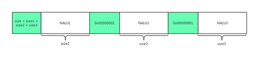

可以看出，该视频混用了AVCC与Annex-B格式的分隔符，导致iOS VideoToolBox只能解码第一个slice单元，从而出现下半部分绿屏的情况。

  * 对于这类问题视频的处理： 如果是源视频流可控，可以调整源视频流的打包方式，按第一种图示的方式打包。
  * 对于不可控的场景，播放器也可以做下兼容：因为一个NALU中的内容一定是不包含startcode的，所以如果在一个NALU中找到了startcode，就可以将其处理成第一种图示中的格式。
