<!--BEGIN_DATA
{
    "create_date": "2021-01-24 21:40", 
    "modify_date": "2021-01-24 21:40", 
    "is_top": "0", 
    "summary": "WebRTC QOS方法（汇总篇）<br/>WebRTC QOS方法一（NACK实现）<br/>WebRTC QOS方法一.1（RTT时间获取及在NACK FEC应用）<br/>WebRTC QOS方法一.2（接收端NACK流程实现）<br/>WebRTC QOS方法二.1（FEC原理）<br/>WebRTC QOS方法二.2（ulpfec rfc5109简介）<br/>WerbRTC QOS方法二.3（FEC冗余度配置）<br/>WebRTC QOS方法三（SVC实现）<br/>WebRTC QOS方法四（Sender Side BWE）<br/>WebRTC QOS方法四.1（Sender Side BWE函数实现调用关系图）<br/><br/>", 
    "tags": "WebRTC、C/C++", 
    "file_name": "WebRTC视频QOS方法汇总1.md"
}
END_DATA-->

#### <p>原文出处：<a href='https://blog.csdn.net/CrystalShaw/article/details/80432267' target='blank'>WebRTC QOS方法（汇总篇）</a></p>

## WebRTC QOS方法（汇总篇）

目前总结出webrtc用于提升QOS的方法有：

NACK、FEC、SVC、JitterBuffer、IDR Request、PACER、Sender Side BWE、VFR（动态帧率调整策略）。

这几种方法在webrtc架构分布如下：

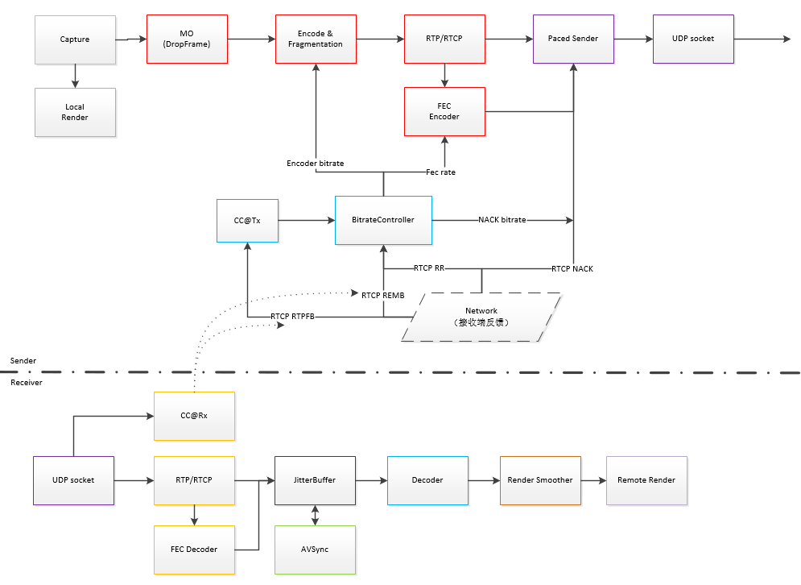

具体实现原理如下：

### 一、NACK

与NACK对应的是ACK，ACK是到达通知技术。以TCP为例，他可靠因为接收方在收到数据后会给发送方返回一个“已收到数据”的消息（ACK），告诉发送方“我已经收到了”，确保消息的可靠。NACK也是一种通知技术，只是触发通知的条件刚好的ACK相反，在未收到消息时，通知发送方“我未收到消息”，即通知未达。

NACK是在接收端检测到数据丢包后，发送NACK报文到发送端；发送端根据NACK报文中的序列号，在发送缓冲区找到对应的数据包，重新发送到接收端。NACK需要发送端发送缓冲区的支持，RFC5104定义NACK数据包的格式。若在JB缓冲时间内接收端收到发送端重传的报文，就可以解决丢包问题。对应上图发送端的RTCP RTPFB

具体请参考<https://blog.csdn.net/CrystalShaw/article/details/81218394>

### 二、FEC

FEC是发送端在发送报文的时候，将之前的旧包也打包到新包里面，若接收端有丢包，就用新包里面冗余的旧包恢复数据。

webrtc实现该冗余功能，有三种方式：

1、RED就是RFC2198冗余。将前面的报文直接打入到新包里面，在接收端解析主包和冗余包。

2、ULPFEC，目前webrtc仅将SVC编码的Level 0视频帧打包成FEC。其余层有丢包，就逐步将帧率，保证视频相对流畅。用到的协议是：RFC5109。

3、FLEXFEC较ULPFEC，增加纵向OXR运算。增加网络抗丢包能力。

具体请参考<https://blog.csdn.net/CrystalShaw/article/details/83413772>

### 三、SVC

webrtc的VPX用到的是时间可适性（Temporal Scalability）算法。通过改变一个GOP内帧的线性参考关系。防止网络丢包对视频传输造成的影响。

具体请参考：<https://blog.csdn.net/crystalshaw/article/details/81184531>

webrtc使用NACK+FEC+SVC作为QOS的解决方案。参考链接：<https://ieeexplore.ieee.org/document/6738383/>

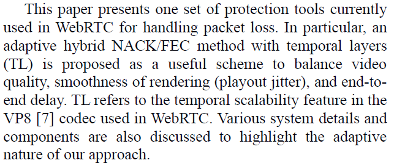

### 四、JitterBuffer

JitterBuffer实现原理是，在收到网络上的RTP报文后，不直接进行解码，需要缓存一定个数的RTP报文，按照时间戳或者seq的顺序进行重排，消除报文的乱序和抖动问题。JitterBuffer分动态JitterBuffer和静态JitterBuffer两种模式。静态JitterBuffer缓存报文个数固定。

动态JitterBuffer是根据网络环路延时的情况，动态调整缓存报文个数。

具体请参考<https://blog.csdn.net/CrystalShaw/article/details/100769388>

### 五、IDR Request

关键帧也叫做即时刷新帧，简称IDR帧。对视频来说，IDR帧的解码无需参考之前的帧，因此在丢包严重时可以通过发送关键帧请求进行画面的恢复。关键帧的请求方式分为三种：RTCP FIR反馈（Full intra frame request）、RTCP PLI 反馈（Picture Loss Indictor）或SIP Info消息，具体使用哪种可通过协商确定。

### 六、PACER

PACER，是网络报文平滑策略。一个视频帧有可能分别封装在几个RTP报文，若这个视频帧的RTP报文一起发送到网络上，必然会导致网络瞬间拥塞。以25fps为例，若这帧视频的RTP报文，能够在40ms之内发送给接收端，接收端既可以正常工作，也缓冲了网络拥塞的压力。PACER就是实现把RTP同一时刻生产的若干包，周期性的发送，防止上行流量激增导致拥塞。

具体请参考<https://blog.csdn.net/CrystalShaw/article/details/112567720>介绍

### 七、Sender Side BWE或REMB（Receiver Estimated Maximum Bitrate）

这个算法的思路是根据接收端的丢包率或延时情况维护一个状态机。以根据丢包率为例，在判断为overuse时，就根据一定的系数减少当前发送端的码率值，当判断为underuse时又根据增加系数来增加发送端的码率值；然后将这个值通过rtcp包发送给发送端，发送端根据该值来动态的调整码率。

具体请参考<https://blog.csdn.net/CrystalShaw/article/details/82981183>介绍

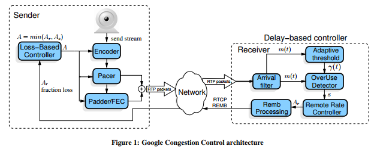

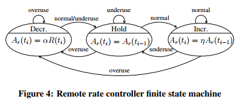

### 八、动态帧率调整策略

视频发送端根据Sender Side BWE或REMB等参数调整出一组比较合适的码率值，当网络条件好的时候，码率值会比较大，当网络条件比较差的时候，码率值会比较低。但是若是发送端仅调整码率，不调整帧率，当网络条件比较好的时候，仅仅提升了视频质量，没有充分利用网络条件，提升实时性。当网络条件比较差的时候，码率降的比较低，若不降低帧率，视频质量会大幅度下降。所以需要增加一种机制，根据发送端的码率值，动态调整发送端的帧率值。

具体请参考<https://blog.csdn.net/CrystalShaw/article/details/83340323>

<hr>

#### <p>原文出处：<a href='https://blog.csdn.net/CrystalShaw/article/details/81218394' target='blank'>WebRTC QOS方法一（NACK实现）</a></p>

## WebRTC QOS方法一（NACK实现）

### 一、概念

与NACK对应的是ACK，ACK是到达通知技术。以TCP为例，他可靠因为接收方在收到数据后会给发送方返回一个“已收到数据”的消息（ACK），告诉发送方“我已经收到了”，确保消息的可靠。

NACK也是一种通知技术，只是触发通知的条件刚好的ACK相反，在未收到消息时，通知发送方“我未收到消息”，即通知未达。

在rfc4585协议中定义可重传未到达数据的类型有二种：

1）RTPFB：rtp报文丢失重传。

2）PSFB：指定净荷重传，指定净荷重传里面又分如下三种：  

1. PLI    (Picture Loss Indication) 视频帧丢失重传。  
2. SLI    (Slice Loss Indication)    slice丢失重转。  
3. RPSI (Reference Picture Selection Indication)参考帧丢失重传。

在创建视频连接的SDP协议里面，会协商以上述哪种类型进行NACK重转。以webrtc为例，会协商两种NACK，一个rtp报文丢包重传的nack（nack后面不带参数，默认RTPFB）、PLI 视频帧丢失重传的nack。

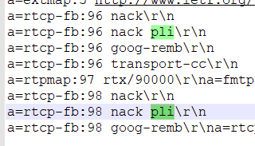

### 二、定义

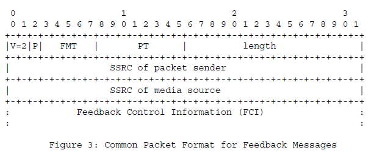

```
V：     2bit 目前固定为2  
P：     1bit padding  
FMT：5bit Feedback message type。
```

RTP FP模式下定义值为：  

```
0:unassigned  
1:Generic NACK  
2-30:unassigned  
31:reserved for future expansion of the identifier number space
```

PS FP模式下定义值为：

```
0:     unassigned  
1:     Picture Loss Indication (PLI)  
2:     Slice Loss Indication (SLI)  
3:     Reference Picture Selection Indication (RPSI)  
4-14:  unassigned  
15:    Application layer FB (AFB) message  
16-30: unassigned  
31:    reserved for future expansion of the sequence number space
```

PT:   8bit Payload type。

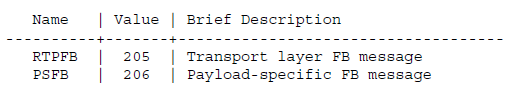

FCI：变长 Feedback Control Information。

#### 1、RTPFB

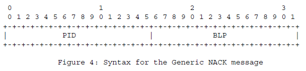

Packet identifier(PID)即为丢失RTP数据包的序列号，Bitmap of Lost Packets(BLP)指示从PID开始接下来16个RTP数据包的丢失情况。一个NACK报文可以携带多个RTP序列号，NACK接收端对这些序列号逐个处理。如下示例：

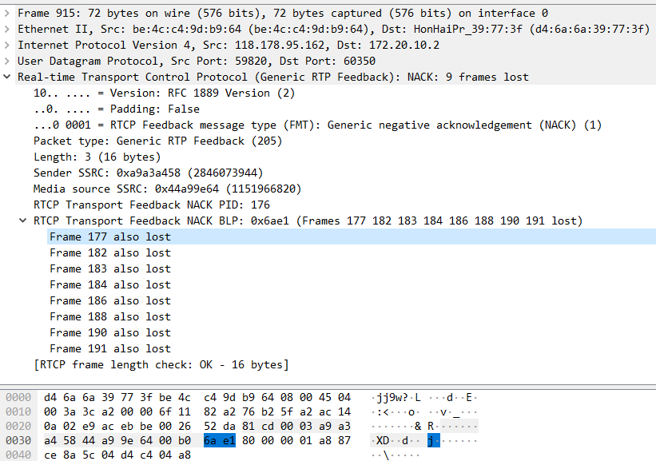

Packet identifier(PID)为176。

Bitmap of Lost Packets(BLP)：0x6ae1。解析的时候需要按照小模式解析，

0x6ae1对应二进制：110101011100001倒过来看1000 0111 0101 0110。

按照1bit是丢包，0bit是没有丢包解析，丢失报文序列号分别是：

177 182 183 184 186 188 190 191与wireshark解析一致。

#### 2、PSFB

##### 1）PLI FB  PT=PSFB FMT=1。

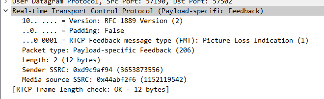

##### 2）SLI FB的PT=PSFB、FMT=2。

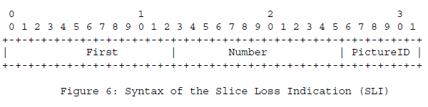

> First: 13 bits The macroblock (MB) address of the first lost macroblock.
>
> Number: 13 bits The number of lost macroblocks, in scan order as discussed above。
>
> PictureID: 6 bits The six least significant bits of the codec-specific identifier that is used to reference the picture in which the loss of the macroblock(s) has occurred. For many video codecs, the PictureID is identical to the Temporal Reference.

##### 3）RPSI FB的PT=PSFB、FMT=3。

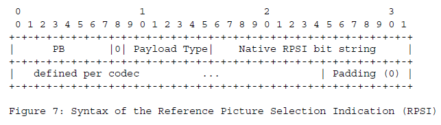

### 三、实现

webrtc支持RTPFB和PLI FB两种重传方式。

AssignPayloadTypesAndAddAssociatedRtxCodecs->AddDefaultFeedbackParams里面将两种方式都填写到SDP命令行里面。

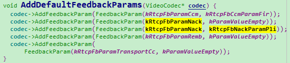

#### 1）RTPFB实现

RTPFB在JB里面实现。通过RTP报文的序列号和时间戳，判断是否出现丢包异常。参考NackTracker类实现。

发送端调用栈参考如下：  

```
PlatformThread::StartThread  
->PlatformThread::Run  
->ProcessThreadImpl::Run  
->ProcessThreadImpl::Process  
->PacedSender::Process  
->PacedSender::SendPacket  
->PacketRouter::TimeToSendPacket  
->ModuleRtpRtcpImpl::TimeToSendPacket  
->RTPSender::TimeToSendPacket  
->RtpPacketHistory::GetPacketAndSetSendTime  
->RtpPacketHistory::GetPacket
```

接收端有两种方式驱动方式NACK

1、收包驱动  

```
DeliverPacket  
->DeliverRtp  
->RtpStreamReceiverController::OnRtpPacket  
->RtpDemuxer::OnRtpPacket  
->RtpVideoStreamReceiver::OnRtpPacket  
->RtpVideoStreamReceiver::ReceivePacket  
->RtpReceiverImpl::IncomingRtpPacket  
->RTPReceiverVideo::ParseRtpPacket  
->RtpVideoStreamReceiver::OnReceivedPayloadData  
->NackModule::OnReceivedPacket  
->VideoReceiveStream::SendNack  
->RtpVideoStreamReceiver::RequestPacketRetransmit  
->ModuleRtpRtcpImpl::SendNack
```

2、定时驱动

```
NackModule::Process
```

#### 2）PLI FB实现

PLI FB在webrtc里面实现的是请求关键帧。当连续出现解码失败，或者长期没有解码输入，就通过RTCP报文发送请求IDR帧命令。参考VideoReceiveStream::Decode、RequestKeyFrame这两个函数实现。

### 四、参考

<https://tools.ietf.org/html/rfc4585>

<hr>

#### <p>原文出处：<a href='https://blog.csdn.net/CrystalShaw/article/details/103242675' target='blank'>WebRTC QOS方法一.1（RTT时间获取及在NACK FEC应用）</a></p>

## WebRTC QOS方法一.1（RTT时间获取及在NACK FEC应用）

### 一、概述

RTT环路延时在webrtc上是一个比较重要的参数：NACK、FEC保护机制的选取、NACK缓存时间的配置、FEC冗余参数的配置都使用了该参数。

### 二、RTT在保护机制的选取应用

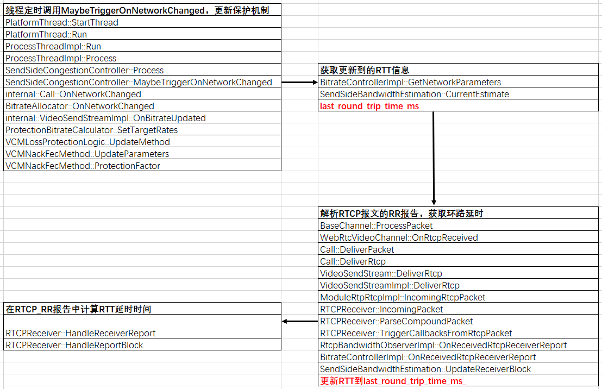

1、RTT延时在NACK和FEC保护机制选取上的影响

参见：VCMNackFecMethod::ProtectionFactor

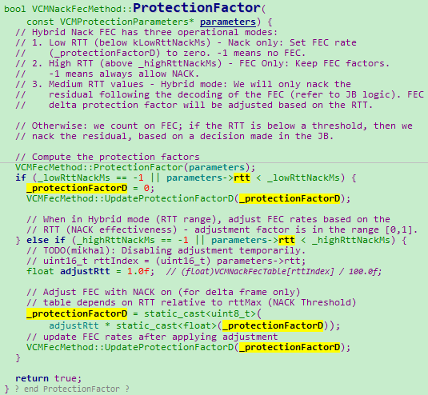

2、RTT延时在FEC最大保护帧数上的影响

参见：VCMNackFecMethod::ComputeMaxFramesFec

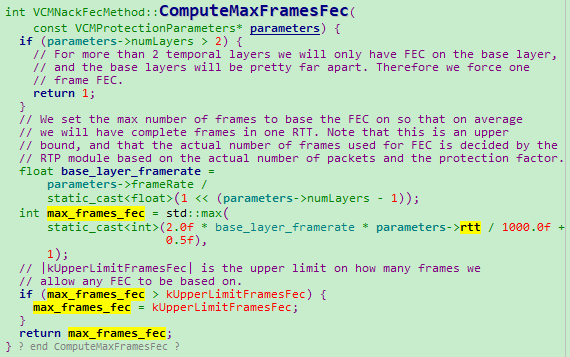

### 三、RTT在NACK缓存时间配置上的应用

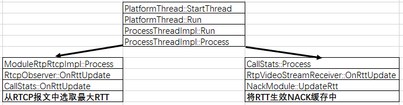

参见NackModule::GetNackBatch函数实现：

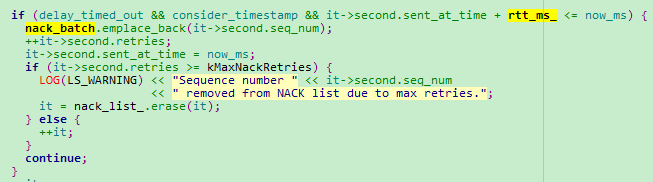

<hr>

#### <p>原文出处：<a href='https://blog.csdn.net/CrystalShaw/article/details/107003142' target='blank'>WebRTC QOS方法一.2（接收端NACK流程实现）</a></p>

## WebRTC QOS方法一.2（接收端NACK流程实现）

### 一、概述

webrtc接收端触发发送NACK报文有两处：

1、接收RTP报文，对序列号进行检测，发现有丢包，立即触发发送NACK报文。

2、定时检查nack_list_队列，发现丢包满足申请重传条件，立即触发发送NACK报文。

### 二、函数实现

#### 1、接收丢包触发函数实现

``` 
NackModule::OnReceivedPacket
->NackModule::GetNackBatch
```

函数里实现，该函数在整个调用栈的位置如下：

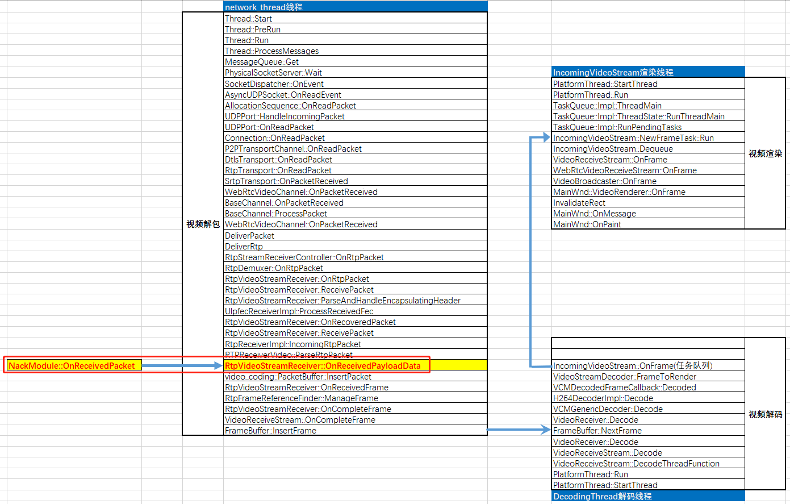

#### 2、定时检查触发函数实现

```   
PlatformThread::StartThread()
->PlatformThread::Run()
->ProcessThreadImpl::Process()
->NackModule::Process()
->NackModule::GetNackBatch
```

其中NackModule::Process是挂载在接收RTP报文线程的一个定时任务。在RtpVideoStreamReceiver::RtpVideoStreamReceiver函数实现挂载。

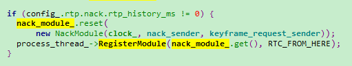

NackModule::Process函数的调度周期是kProcessIntervalMs（默认20ms）

#### 3、核心函数

NackModule::AddPacketsToNack、NackModule::GetNackBatch是NACK核心函数。

##### NackModule::AddPacketsToNack

决定是否将该报文放入NACK队列

```c++
void NackModule::AddPacketsToNack(uint16_t seq_num_start,
                                  uint16_t seq_num_end) {
  // Remove old packets.
  auto it = nack_list_.lower_bound(seq_num_end - kMaxPacketAge);
  nack_list_.erase(nack_list_.begin(), it);
  // If the nack list is too large, remove packets from the nack list until
  // the latest first packet of a keyframe. If the list is still too large,
  // clear it and request a keyframe.
  uint16_t num_new_nacks = ForwardDiff(seq_num_start, seq_num_end);
  if (nack_list_.size() + num_new_nacks > kMaxNackPackets) {
    while (RemovePacketsUntilKeyFrame() &&
            nack_list_.size() + num_new_nacks > kMaxNackPackets) {
    }
    if (nack_list_.size() + num_new_nacks > kMaxNackPackets) {
      nack_list_.clear();
      keyframe_request_sender_->RequestKeyFrame();
      return;
    }
  }
  for (uint16_t seq_num = seq_num_start; seq_num != seq_num_end; ++seq_num) {
    // Do not send nack for packets that are already recovered by FEC or RTX
    if (recovered_list_.find(seq_num) != recovered_list_.end())
      continue;
    NackInfo nack_info(seq_num, seq_num + WaitNumberOfPackets(0.5),
                        clock_->TimeInMilliseconds());
    RTC_DCHECK(nack_list_.find(seq_num) == nack_list_.end());
    nack_list_[seq_num] = nack_info;
  }
}
```

该函数的中心思想是：

1. nack_list的最大长度为kMaxNackPackets，即本次发送的nack包至多可以对kMaxNackPackets个丢失的包进行重传请求。如果丢失的包数量超过kMaxNackPackets，会循环清空`nack_list`中关键帧之前的包，直到其长度小于kMaxNackPackets。也就是说，放弃对关键帧首包之前的包的重传请求，直接而快速的以关键帧首包之后的包号作为重传请求的开始。

2. `nack_list中`包号的距离不能超过kMaxPacketAge个包号。即nack_list中的包号始终保持 [cur_seq_num - kMaxPacketAge, cur_seq_num] 这样的跨度，以保证nack请求列表中不会有太老旧的包号。

##### NackModule::GetNackBatch

决定是否发生NACK请求重传该报文。两种触发方式都是调用这个函数决定是否发送NACK请求重传。

```c++
std::vector<uint16_t> NackModule::GetNackBatch(NackFilterOptions options) {
  bool consider_seq_num = options != kTimeOnly;
  bool consider_timestamp = options != kSeqNumOnly;
  Timestamp now = clock_->CurrentTime();
  std::vector<uint16_t> nack_batch;
  auto it = nack_list_.begin();
  while (it != nack_list_.end()) {
    TimeDelta resend_delay = TimeDelta::Millis(rtt_ms_);
    if (backoff_settings_) {
      resend_delay = std::max(resend_delay, backoff_settings_->min_retry_interval);
      if (it->second.retries > 1) {
        TimeDelta exponential_backoff =
            std::min(TimeDelta::Millis(rtt_ms_), backoff_settings_->max_rtt) *
            std::pow(backoff_settings_->base, it->second.retries - 1);
        resend_delay = std::max(resend_delay, exponential_backoff);
      }
    }
    bool delay_timed_out =
        now.ms() - it->second.created_at_time >= send_nack_delay_ms_;
    bool nack_on_rtt_passed =
        now.ms() - it->second.sent_at_time >= resend_delay.ms();
    bool nack_on_seq_num_passed =
        it->second.sent_at_time == -1 &&
        AheadOrAt(newest_seq_num_, it->second.send_at_seq_num);
    if (delay_timed_out && ((consider_seq_num && nack_on_seq_num_passed) ||
                            (consider_timestamp && nack_on_rtt_passed))) {
      nack_batch.emplace_back(it->second.seq_num);
      ++it->second.retries;
      it->second.sent_at_time = now.ms();
      if (it->second.retries >= kMaxNackRetries) {
        it = nack_list_.erase(it);
      } else {
        ++it;
      }
      continue;
    }
    ++it;
  }
  return nack_batch;
}
```

该函数的中心思想是：

1、因为报文有可能出现乱序抖动情况，不能说检测出丢包就立即重传，需要等待`send_nack_delay_ms_`，当等待时间大于`send_nack_delay_ms_`，申请重传。

2、因为NACK产生的延时主要在RTT环路延时上，所以再次重传的时间一定要大于`rtt_ms_`，当两次发送NACK重传请求时间大于`rtt_ms_`时，才会申请再
次重传。

3、视频会议场景对实时性要求很高，当报文一直处于丢包状态，不能持续申请重传，最大重传次数为kMaxNackRetries，超过最大重传次数，放弃该报文。不再重传。

<hr>

#### <p>原文出处：<a href='https://blog.csdn.net/CrystalShaw/article/details/83413772' target='blank'>WebRTC QOS方法二.1（FEC原理）</a></p>

## webrtc QOS方法二.1（FEC原理）

### 一、概述

webrtc冗余打包方式有三种：Red（rfc2198）、Ulpfec（rfc5109）、Flexfec（草案）。其中Red和Ulpfec要成对使用。

### 二、RedFEC

简单将老报文打包到新包上。如下图所示，冗余度为1时，RFC2198打包情况：


这种方法在音视频领域几乎不使用，因为冗余包只能保护特定一个报文，这种方法带宽占用量很大，恢复能力有限，性价比很低。只是早期的T38传真、RFC2833收号会使用该协议，因为传真和收号的数据量比较小。

webrtc里面说使用了RFC2198冗余，实际上仅仅是借用该协议的封装格式，封装FEC冗余报文。

### 三、UlpFEC

详细介绍可参考：<https://blog.csdn.net/CrystalShaw/article/details/102950002>

将一组M个报文进行异或，生成N（N就是FEC的冗余度）个FEC报文，打包出去。这组报文任意丢其中的N个，都可以通过这组(M-N)个报文+FEC冗余包恢复回来，比简单的RFC2198保护的范围扩大了很多。例如下面示意图：D为媒体包，R为冗余包，该图所示的冗余度为2。

#### 1、发送端打包示意图

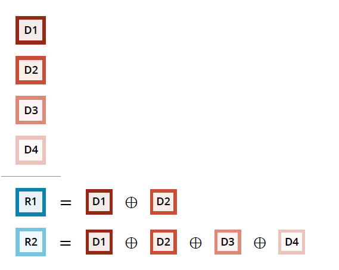

#### 2、网络丢包示意图

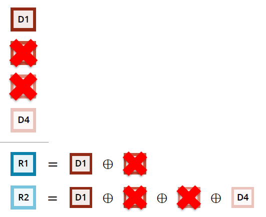

#### 3、丢包恢复示意图

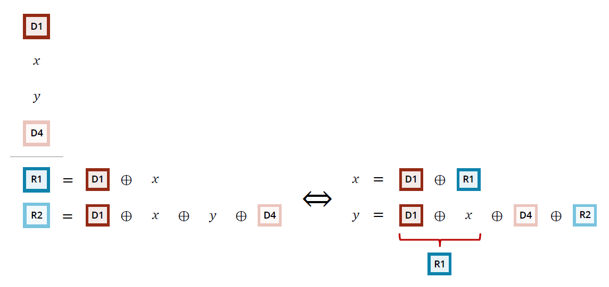

若UlpFEC异或所有报文，带宽占用量也比较大，在实际应用会根据网络情况进行适当取舍。webrtc通过PacketMaskTable表格在选取需要异或的报文。PacketMaskTable表格有连续丢包（kFecMaskBursty、kPacketMaskBurstyTbl）、随机丢包（kFecMaskRandom、kPacketMaskRandomTbl）两种模型。

理论上webrtc可以通过损失程度和乱序情况相关的反馈，自适应选择kFecMaskRandom还是kFecMaskBursty，效果比较好。但是可惜的是，webrtc这块功能缺失，默认使用随机丢包模型。

### 四、FlexFEC

同UlpFEC实现方式，ULPFEC仅在1D行数组上进行异或，FlexFec更灵活，引进了交织算法，可以在1D行、列、2D数组异或。

#### 1、1D行异或

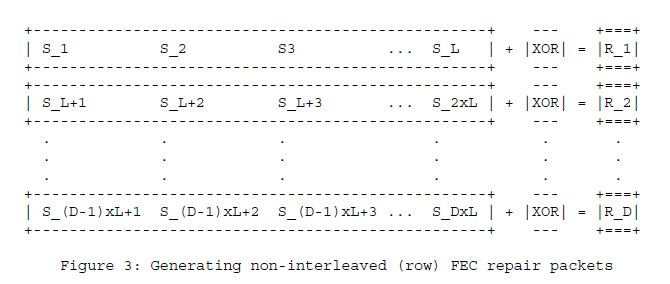

#### 2、1D列异或

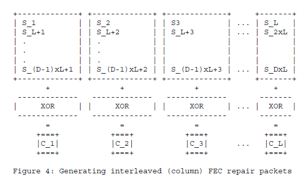

#### 3、2D行列异或

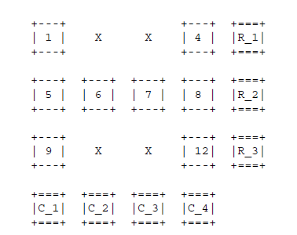

这块还是草案，如何选择异或模式的代码看没深入下去。后续补充。

### 五、FEC算法汇总

FEC是无线传输领域的一个前向纠错的算法。网上搜资料的时候经常把无线的算法看的云里雾里的，研究半天都不知道这个和视频传输有什么关系。

无线传输领域的FEC算法主要有TURBO、LDPC、POLAR这三种。

音视频传输领域的FEC算法有如下几种：


1、webrtc的opus音频使用的是inband FEC和交织编码

2、webrtc的视频ulpfec使用的是异或XOR

3、Reed Solomon算法比较复杂，理论上数据恢复能力比较强。

### 六、webrtc代码分析

#### 1）使能FEC

webrtc默认使能Red+Ulp的FEC。Flex仅在实验阶段，还不能正式使用。

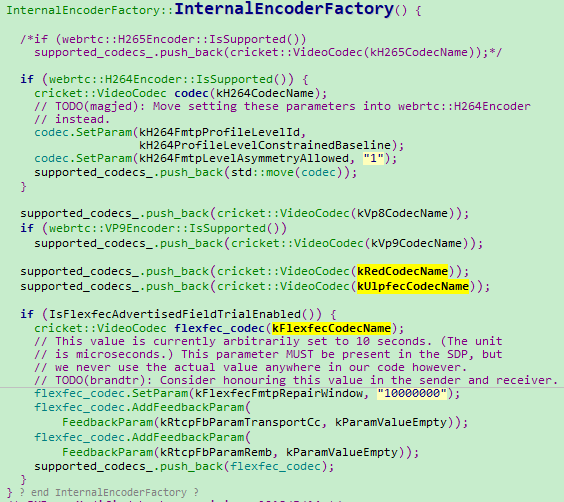

#### 2）封装FEC

  * 发送冗余报文处理

RTPSenderVideo::SendVideo。当编码器支持时间分层，可以仅冗余level 0的视频数据。否则，就要冗余所有视频数据。冗余度是根据丢包率动态调整。

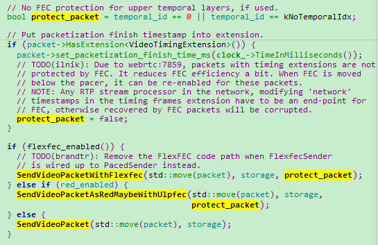

  * 动态调整冗余参数调用栈

```
BitrateAllocator::OnNetworkChanged  
->VideoSendStreamImpl::OnBitrateUpdated  
->ProtectionBitrateCalculator::SetTargetRates  
->media_optimization::VCMLossProtectionLogic::UpdateMethod  
->media_optimization::VCMNackFecMethod::UpdateParameters    
```

  * 最大保护帧数确定

```
VCMNackFecMethod::ComputeMaxFramesFec
```

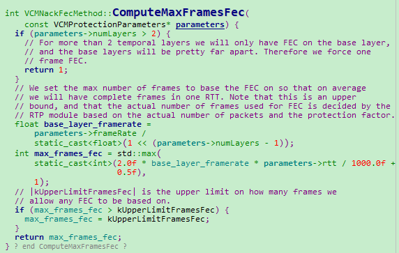

  * 冗余报文个数确定

ForwardErrorCorrection::NumFecPackets 存储媒体报文数*保护因子。

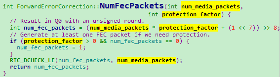

  * 根据丢包率动态调整冗余度

```
VCMFecMethod::ProtectionFactor
```

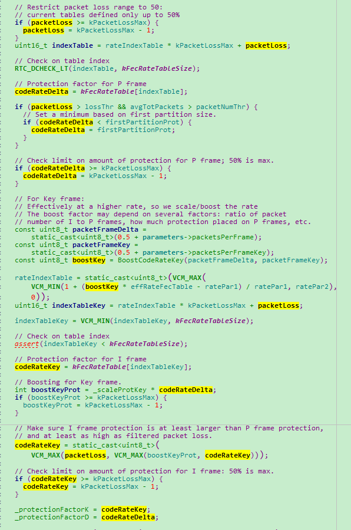

  * 根据丢包模型原则要冗余的报文

```
ForwardErrorCorrection::EncodeFec
```

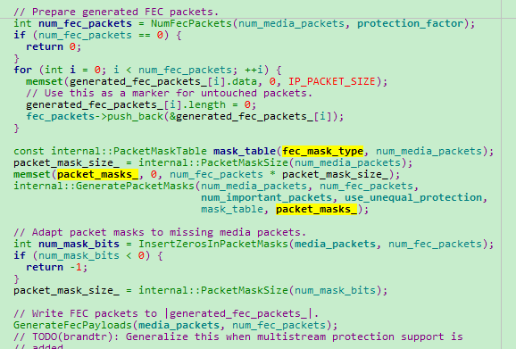

```
ForwardErrorCorrection::GenerateFecPayloads
```

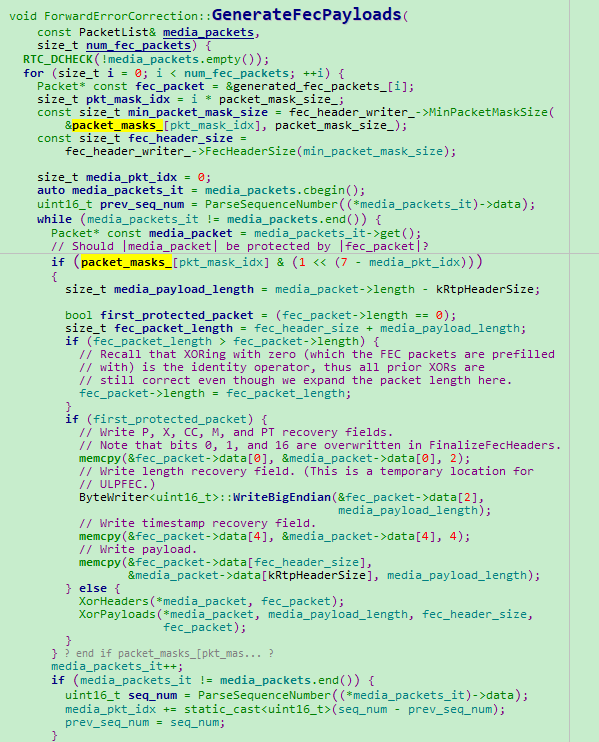

### 参考

* <https://webrtcglossary.com/red/>
* <https://webrtcglossary.com/ulpfec/>
* <https://www.cnblogs.com/x_wukong/p/8193290.html>
* <https://blog.csdn.net/u010178611/article/details/82656838>
* <https://blog.csdn.net/qq_16135205/article/details/89843062>（介绍冗余度和冗余Mask参数）

<hr>

#### <p>原文出处：<a href='https://blog.csdn.net/CrystalShaw/article/details/102950002' target='blank'>WebRTC QOS方法二.2（ulpfec rfc5109简介）</a></p>

## WebRTC QOS方法二.2（ulpfec rfc5109简介）

### 一、RTP报文结构

#### 1）概览

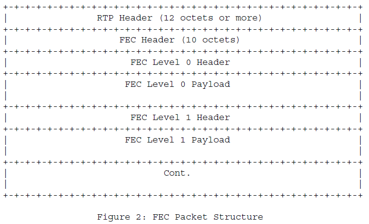

#### 2）RTP Header for FEC Packets（RFC 3550）

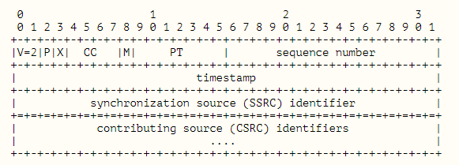

#### 3）FEC Header for FEC Packets

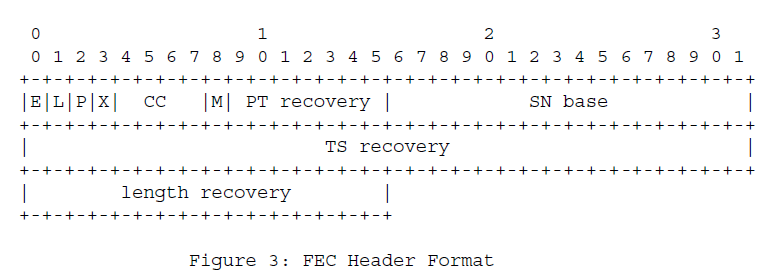

FEC头部为10字节，包含内容如下：  

```
E flag：扩展位，供将来使用，当前设置为0。  
L flag：指示长偏移掩码是否使用，0表示偏移掩码为16位，1表示为48位。  
P/X/CC/M/PT recovery field：由本FEC包所保护的所有媒体数据包的RTP头部的P/X/CC/M/PT flag位经XOR操作后得到。  
SN base：本FEC包所保护的媒体数据包的RTP报文的序列号最小值。  
TS recovery field: 由本FEC包所保护的所有媒体数据包的RTP头部中的Timestamp字段经XOR操作后得到。  
Length recovery field:
由本FEC包所保护的所有媒体数据包的负载长度(包括CSRC、RTP头部扩展、负载和padding的长度之和，以16位无符号网络序表示)经XOR操作后得到。
```

#### 4）FEC Level Header for FEC Packets

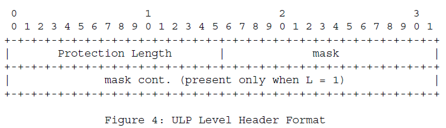

根据FEC Header for FEC Packets中L bit，确定FEC level header长度为4字节或8字节。  

Protection length：2字节，表示本级别所保护的媒体数据的长度  

mask：2字节(若L flag设置则为6字节)表示偏移掩码，指示本级别所保护的媒体数据包的分布情况。如果偏移掩码的第i位置为1，则表示第N＋i个媒体数据包在本级别中受保护，其中N为FEC Header for FEC Packets中的媒体数据基准序列号（SN base）。

### 二、保护规则

a）媒体数据包在高于0级别的等级中只能被保护一次，但是可以在0级别中被多个FEC包保护，只要这些FEC包在0级别的保护长度相等。  

b）如果媒体数据包在p级别被保护，那么它也必须在p-1级别被保护。注意保护p级别的FEC包和保护p-1级别的FEC包可能不是同一个。  

c）如果FEC包包含p级别保护，那么它也必须包含p-1级别保护。注意p级别保护的数据包可能和p-1级别保护的数据包不是同一个。

规则a)把多重保护限定在0级别，高于0级别的多重保护会减小保护效果并且增大接收端恢复数据的复杂度。规则b)限定媒体数据包受保护的连续性，即不存在中间某段数据不受保护的媒体数据包。规则c)限定FEC数据包保护级别的连续性，即不存在中间某个级别不保护数据的FEC数据包。

### 三、实现简介

#### 1）数据保护实现简介

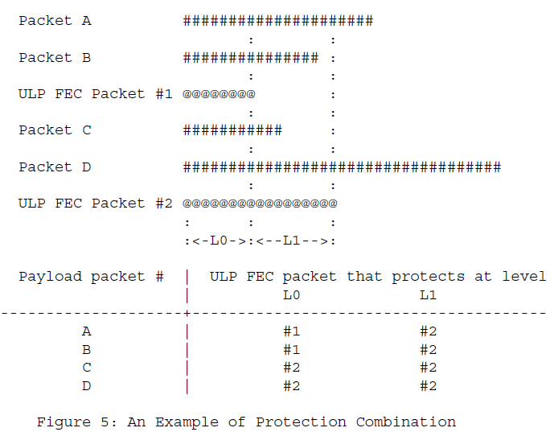

FEC包1在0级别保护了数据包A、B，

FEC包2在0级别保护了数据包C、D，同时在1级别保护了数据包A、B、C、D。

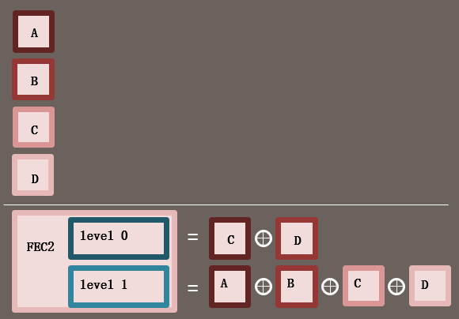

#### 2）FEC Level Header for FEC之mask

FEC Level Header里面的mask

根据RFC5109定义，一个媒体数据包可以被多个FEC包保护，一个FEC包可以多保护多个媒体数据包。

假设m个媒体数据包需要n个FEC数据包保护，则可以定义一个如下图所示的二维的m * n零一矩阵来描述媒体数据包在fec包中的保护分布情况：

1）矩阵中元素m[i, j]置1表示第j个媒体数据包需要第i个FEC包保护。

2）从行角度来看，第i行元素表示第i个FEC包保护的媒体数据包的集合；

3）从列角度讲，第j列元素表示保护第j个媒体数据包的FEC包的集合。

由于该矩阵是零一矩阵，因此在存储上可以采用掩码来存储。这个掩码也就是FEC Level Header中所定义的mask掩码。

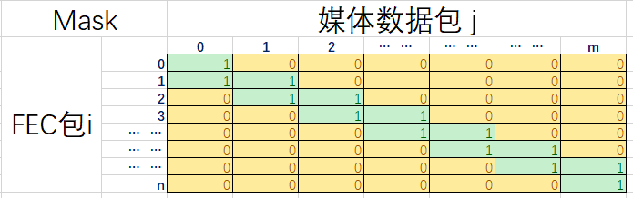

那么掩码中的0、1如何分布？现实世界中网络丢包分为随机丢包、突发丢包两种情况，FEC包需要能够针对这两种情况对媒体数据包进行保护。WebRTC预先构造两个掩码表kPacketMaskRandomTbl和kPacketMaskBurstyTbl，以模拟在随机情况和突发情况下媒体数据包在FEC包中的保护分配情况。

假设在随机丢包场景下，对于m * n的情况，我们只需要从kPacketMaskRandomTbl[m][n]就可以获取FEC包所需要的全部掩码，然后该掩码为基础，构造FEC数据包。

#### 3）备注

UlpfecGenerator::AddRtpPacketAndGenerateFec函数中可以看到，webrtc仅使用了MaskRandomTbl和MaskBurstyTbl两个掩码表，进行冗余。

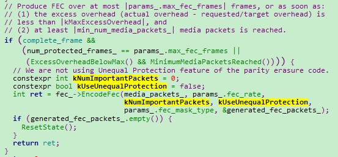

void GeneratePacketMasks：

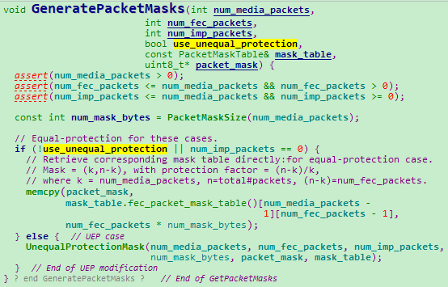

但是里面还保留了一套UnequalProtectionMask接口，这套接口里面有三种掩码模式：NoOverlap、Overlap、BiasFirstPacket

非对称保护思想是，FEC包对媒体数据包集合中的不同数据包实施不同的保护力度。某些场景下，一帧视频数据编码后生成的一系列RTP数据包，重要性不一样，比如开始几个RTP包包含PPS、SPS等信息，重要性会大一些。因此，在构造FEC包的掩码时，有均匀保护和非均匀保护两种策略。

均匀保护：所有RTP包重要性一样，FEC包对他们进行平等均匀保护。对于m * n，FEC包使用掩码MaskRandomTbl[m][n]。

非均匀保护：RTP包集合分重要数据包集合S1、普通数据包集合S2，分配较多个FEC包保护S1，较少个FEC包保护S2。WebRTC定义三种模式针对实现非均匀
保护：

1. kModeNoOverlap：非叠加保护，保护S1的掩码和S2的掩码相互分离。  
2. kModeOverlap：叠加保护，保护S1的掩码和S2的掩码叠加在一起。  
3. kModeBiasFirstPacket：在均匀保护的基础上，所有FEC包都保护第一个包。

假设保护场景为(m, n)，其中重要数据包为前k个，分配给重要数据包的FEC包个数为t，掩码表为mask_table。则三种场景下最终掩码的确定如下：

1. kModeNoOverlap：`mask_table[k][t]`和`mask_table[m-k][n-t]`的移位组合。  
2. kModeOverlap： `mask_table[k][t]`和`mask_table[m][n-t]`的拼接。  
3. kModeBiasFirstPacket：`mask_table[m][n]`，再第一列全部置1。

不过目前webrtc的编码器使用单Slice编码，视频RTP报文重要程度无大差别，所以就没有使用这个功能。

### 四、参考

* 《rfc5109》
* [《ULPFEC在WebRTC中的实现》](https://www.jianshu.com/p/06a27ebacec7)

<hr>

#### <p>原文出处：<a href='https://blog.csdn.net/CrystalShaw/article/details/103183607' target='blank'>WerbRTC QOS方法二.3（FEC冗余度配置）</a></p>

## WerbRTC QOS方法二.3（FEC冗余度配置）

### 一、概述

webrtc的FEC冗余度配置整体思想是：

1、接收端根据收到报文情况计算一个丢包率，通过RTCP_RR报文反馈给发送端。

接收端丢包率计算代码走读请参见：《[webrtc代码走读十一（RTCP丢包率、环路延时计算）](https://blog.csdn.net/CrystalShaw/article/details/80361919)》

2、发送端解析RTCP_RR报文，获取丢包率信息。然后使用一种算法，根据历史丢包率，预估未来一段窗口期的丢包率。

3、发送端使用预估的丢包率，查表计算I帧、P帧的冗余度。

4、FEC模块根据冗余度信息，封包FEC报文。

### 二、解析丢包率计算冗余度流程

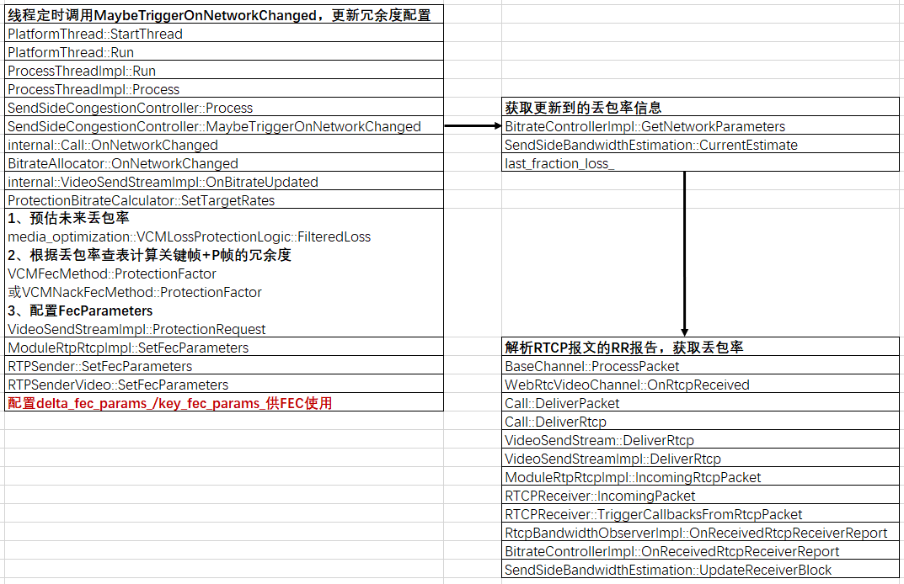

这里仅描述了定时调用SendSideCongestionController::MaybeTriggerOnNetworkChanged函数流程，其实还有很多场景调用改函数，更新FEC冗余度参数。

### 三、根据冗余度参数封装FEC报文

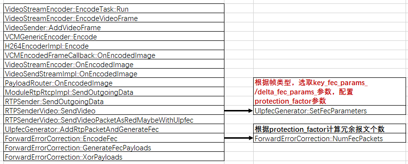

### 四、预估未来丢包率算法

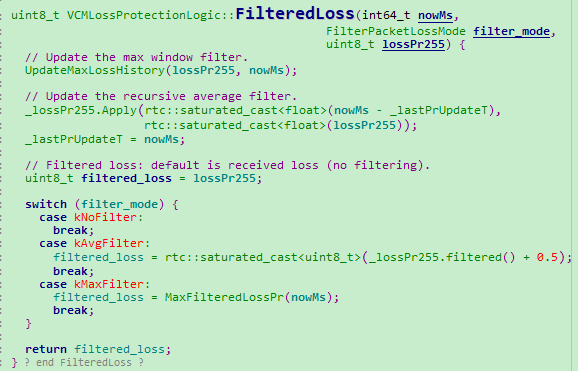

webrtc提供三种预估未来时间窗丢包率算法：

1、使用当前丢包率

2、使用一阶指数平滑算法，预测丢包率。

  * 使用公式：                      

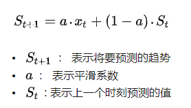

  * 实现代码

参见：float ExpFilter::Apply

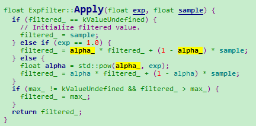

  * 基本思想

预测值是以前观测值的加权和，且对不同的数据给予不同的权，新数据给较大的权，旧数据给较小的权。

3、使用一段窗口期内的最大丢包率

  * 丢包率入队

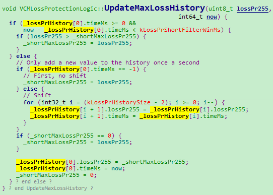

  * 选取窗口期内最大值

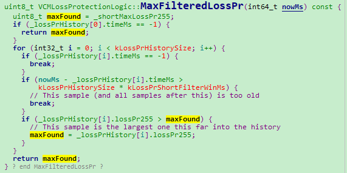

<hr>

#### <p>原文出处：<a href='https://blog.csdn.net/CrystalShaw/article/details/81184531' target='blank'>WebRTC QOS方法三（SVC实现）</a></p>

## WebRTC QOS方法三（SVC实现）

### 一、概念

SVC（可适性视频编码或可分级视频编码）是传统H.264/MPEG-4 AVC编码的延伸，可提升更大的编码弹性，并具有时间可适性（Temporal Scalability）、空间可适性（Spatial Scalability）及质量可适性（SNR/Quality/Fidelity scalability）三大特性，使视频传输更能适应在异质的网络带宽。

### 二、概述

SVC以AVC视频编解码器标准为基础，利用了AVC编解码器的各种高效算法工具，在编码产生的编码视频时间上（帧率）、空间上（分辨率）、视频质量方面的可扩展，产生不同帧速率、分辨率、质量等级的解码视频。

  * 时间可适性（Temporal Scalability）：由于一般视频压缩都会利用运动补偿的手段，纪录位移向量（motion vector）。在某些系统的应用上，可以跳过某几帧用其邻近帧的位移向量内插出该被跳过帧的结果。在解码端同样利用运动补偿算回该被跳过帧。

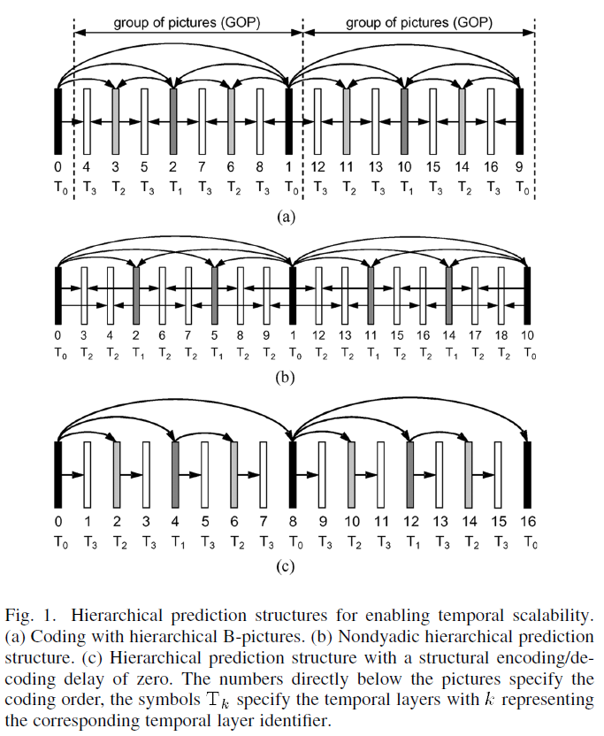

这张图表示在时间维度上的可伸缩性视频编码。观察预测箭头的组织方式。在这个例子中，定义了四个不同的层（T0到T3）。

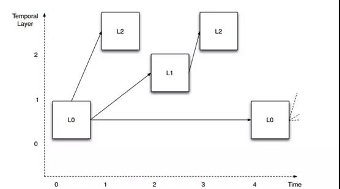

为了更直观描述算法实现，这张图中的图片是垂直偏移的，视觉上分离三层。每一层都需要依赖较低层才能被解码，但不需要任何较高层。这允许从顶层开始移除图片，而不影响剩余图片的可解码性。例如，我们假设图例中显示的图层以30 fps的帧速率显示。如果我们移除所有L2层的图片，剩下层（L0和L1）仍然可以成功解码，并且产生一个15fps的视频。如果我们进一步删除所有的L1图像，那么剩下的L0层依然可以被解码并产生一个7.5fps的视频。

  * 空间可适性（Spatial Scalability）：图形（或视频压缩中的一帧）在压缩编码的时候即存下了多重大小（或分辨率）的结果。让解码端得以视需求解码回所需的图片大小（或分辨率），可能以较小的结果换取解码的效率。通常较小的图片即带有大图片一部分的特性，大图的存储上不需要重复记录这些重复的部分。

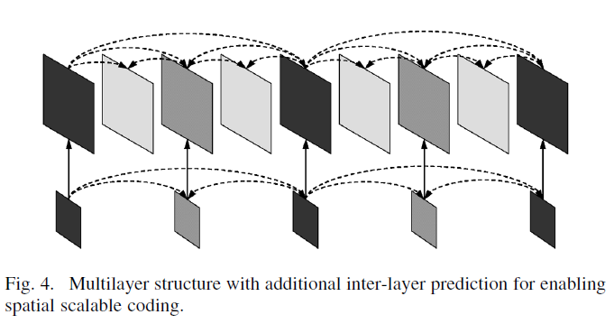

与时间可适性原理类似，L0基层为分辨率最小编码数据，级别越高，分辨率越高。当实际应用中需要较低分辨率时，只需丢弃高Level层级数据进行解码。

  * 质量可适性（SNR/Quality/Fidelity scalability）：在压缩编码的时候将多重品质（qualities）的结果都存下来。让解码端得以视需求解码回所需的图片品质，可能以较低的品质换取解码的效率。通常品质较差的图片仍有一定的代表性，品质较佳的结果在存储上不需要重复记录重复的信息。

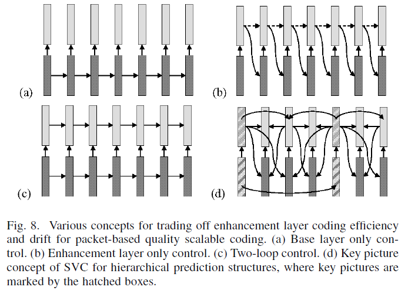

  * 联合可适性（Combined scalability）：结合上述三个扩展性。

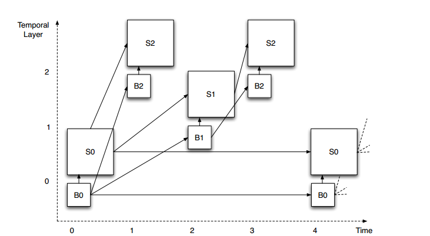

上图为空间和时间的可伸缩性示例。我们可以通过扩展时间可伸缩性结构同时实现空间可伸缩性编码。每个图片现在有两部分：基础层分辨率图片的B部分和空间增强层的S部分，这两个部分结合则可生成全分辨率图像。空间增强层一般为水平和垂直方向上基底分辨率的1.5倍或者2倍。这为不同分辨率的视频在进行空间可缩放性编码时提供了便利，例如VGA和QVGA（比率为2）以及1080p和720p（比率为1.5），都可以进行空间可伸缩性编码。空间可伸缩性可以与时间可伸缩性（和SNR）以完全独立的方式相结合。假设在图示例子的全速率和分辨率分别为30fps下的HD高清分辨率（720p），那么我们可以在分辨率（HD、1/4HD）和帧速率（30fps、15fps、7.5 fps）之间进行任意组合。

### 三、应用

#### 1）监控视频应用场景

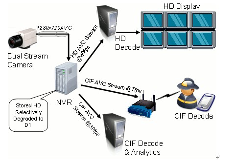

监控视频不同的终端支持视频的分辨率不同。传统的方式需要一个服务器编码出不同分辨率视频数据给各个终端。但是增加Spatial Scalability后。


视频采集端，仅需要Spatial Scalability一次编码，就可以提供360p、720p、1080p的数据。大大提升编码效率，降低服务器性能消耗。

另外监控视频流存储的时候一般需要2路，1路质量好的用于存储，1路用于预览。用quality
scalability编码可以产生2层的分级码流，1个基本层用于预览，1个增强层保证存储的图像质量是较高的。

#### 2）多人会议应用场景


视频会议终端利用SVC编出多分辨率、分层质量。会议的中心点替代传统MCU二次编解码方法改为视频路由分解转发。在云视讯领域SVC有很大的应用空间。

#### 3）抗网络丢包应用场景

正如《Overview_SVC_IEEE07》第二章描述，虽然看上去Spatial Scalability和quality scalability，给视频会议和监控视频提供了很好的解决方案，但是由于这种方案会增加传输码率，降低编解码器性能、提高编解码器的复杂度、在一些场景下还需要服务器支持SVC层级过滤。这使得SVC的Spatial Scalability和quality scalability到目前为止还没有大规模应用。但是Temporal Scalability可以在不稳定网络视频传输上被使用。

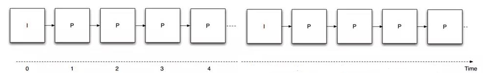

以不可缩放的方式进行视频编码传输时。只有第一张图片的I帧，可独立编码，无需参考其他任何图片。其他所有的图片P帧，都需要参考前面的帧画面进行预测然后编码。两个I帧之间的数据也叫一组GOP。可以看出当一个GOP内的一帧丢失，严重时会导致整个GOP无法解码。

但是增加Temporal Scalability后，我们仅需要通过FEC+NACK方式保护T0层的数据完整性，若其余层的视频帧有丢失，就通过逐级降帧率方案（丢弃Tn-T1之间的数据），还能保证视频通话整体的流畅性。并且Temporal Scalability可以做到后向兼容性，不需要解码器做特殊处理。

### 四、实现

#### 1）编码

目前在OpenH264的开源代码中已经支持SVC视频编码，但是解码尚未支持。编码参数配置如下：

`encoder_data_tables.cpp`参数配置表

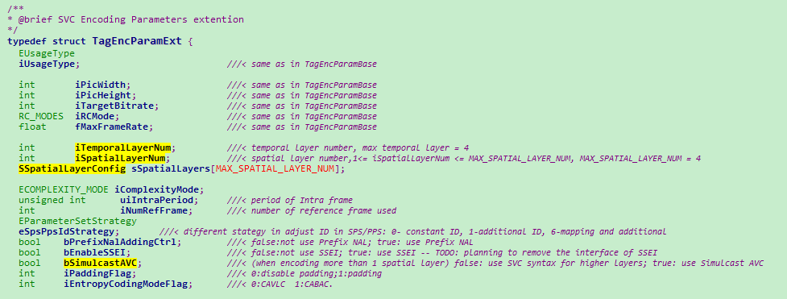

#### 2）解码

目前仅知道Open SVC Decoder的开源代码支持SVC解码。但是没有深入研究，不太了解实现细节及性能情况。

#### 3）VPX对SVC的实现

根据《HANDLING PACKET LOSS IN WEBRTC》这篇文章可以看出，VP8已经实现SVC设计，并将TL（temporal layers）+ NACK + FEC联合作为QOS的一个方法。


### 五、协议

SVC算法实现原理，在《Overview_SVC_IEEE07》文档有描述。

SVC与H264协议结合，在《T-REC-H.264-201704-I!!PDF-E》H.264标准的附录G有定义。

SVC的RTP打包及SDP协商，在《rfc6190》有定义。

### 六、参考

* <http://ip.hhi.de/imagecom_G1/assets/pdfs/Overview_SVC_IEEE07.pdf>
* <https://www.itu.int/rec/T-REC-H.264-201704-I>
* <https://tools.ietf.org/html/rfc6190>
* <https://en.wikipedia.org/wiki/Scalable_Video_Coding>
* <https://zh.wikipedia.org/wiki/%E5%8F%AF%E9%81%A9%E6%80%A7%E8%A6%96%E8%A8%8A%E7%B7%A8%E7%A2%BC>
* <https://www.jianshu.com/p/2f97027c5088>
* <https://ieeexplore.ieee.org/document/6738383/>

<hr>

#### <p>原文出处：<a href='https://blog.csdn.net/CrystalShaw/article/details/82981183' target='blank'>WebRTC QOS方法四（Sender Side BWE）</a></p>

## WebRTC QOS方法四（Sender Side BWE）

### 背景介绍

BWE（Bandwidth Estimation）可能是WebRTC视频引擎中最关键的模块了。BWE模块决定视频通讯中可以发送多大码率视频不会使网络拥塞，防止视频通讯质量下降。

早期的带宽评估算法比较简单，大多是基于丢包来估计，基本的策略是逐步增加发送的数据量，直到检测到丢包为止。为了让发送端获悉网络上的丢包信息，可以使用标准的RTCP的RR来发送周期性的报告。

现代的带宽评估算法则可以在网络链路发生丢包以前就监测到网络拥塞，它可以通过侦测数据包接收的时延来预测未来可能的拥塞。它是基于链路上的路由器都有一定的缓存，在数据包开始被丢弃之前，先发生数据在缓存里堆积的事件，所以时延相比于丢包，对拥塞的反应更加灵敏。

最新版本webrtc使用trendline算法实现网络拥塞预估，早期版本使用KalmanFilter算法。两种算法都是基于接收端的网络延迟进行码率估计。早期的KalmanFilter算法是在接收端根据网络延时，计算出合适的带宽，通过REMB RTCP报文反馈给发送端，让发送端按照该码率发送视频数据。trendline算法对此进行了优化，在发送端根据网络延时，计算合适的带宽。

### 实现原理

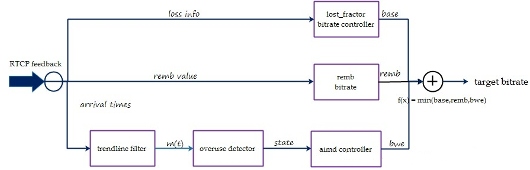

发送端码控模块结构，如上图所示。

### 一、remb bitrate

仅做向下兼容使用。兼容老版本的KalmanFilter算法。

### 二、基于丢包拥塞控制

发送端基于丢包率控制发送码率，其基本思想是：丢包率反映网络拥塞状况。如果丢包率很小或者为0，说明网络状况良好，在不超过预设最大码率的情况下，可以增大发送端码率；反之如果丢包率变大，说明网络状况变差，此时应减少发送端码率。在其它情况下，发送端码率保持不变。

webrtc中发送端收到RTCP RR报文并解析得到丢包率后，根据下图公式计算发送端码率：当丢包率大于0.1时，说明网络发生拥塞，此时降低发送端码率；当丢包率小于0.02时，说明网络状况良好，此时增大发送端码率；其他情况下，发送端码率保持不变。

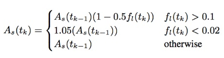

### 三、基于延时拥塞控制

基于延迟的拥塞控制是通过每组包的到达时间的延迟差(delta delay)的增长趋势来判断网络是否过载，如果过载进行码率下调，如果处于平衡范围维持当前码率，如果是网络承载不饱满进行码率上调。这里有几个关键技术：包组延迟评估（_InterArrival_）、滤波器趋势判断（_TrendlineEstimator_）、过载检测（_OveruseDetector_）和码率调节（_AimdRateControl_）。

#### 1、组包延时

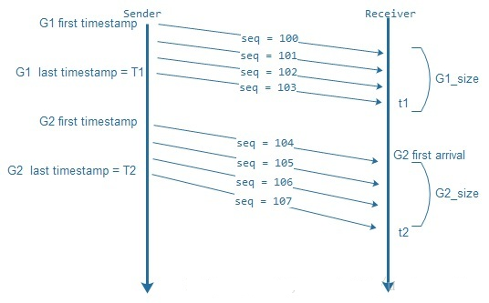

音频报文发送的时间间隔是按照一帧的打包时长发送的，但是视频却不能按照实际帧率发送，因为一帧视频有可能分别封装在几个RTP报文，若这个视频帧的RTP报文一起发送到网络上，必然会导致网络瞬间拥塞。以25fps为例，若这帧视频的RTP报文，能够在40ms之内发送给接收端，接收端既可以正常工作，也缓冲了网络拥塞的压力。所以计算视频的包延时，不能用单包计算，需要按照一组包（一帧视频）计算。_Trendline_滤波器需要的三个参数：发送时刻差值（`delta_timestamp`）、到达时刻差值(`delta_arrival`)和包组数据大小差值(`delta_size`)。从上图可以得出：

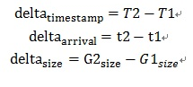

#### 2、_Trendline_滤波趋势判断

如果平稳网速下传输数据的延迟时间就是数据大小除以速度，如果这数据块很大，超过恒定网速下延迟上限，这意味着要它要占用其他后续数据块的传输时间，那么如此往复，网
络就产生了延迟和拥塞。Trendline filter通过到达时间差、发送时间差和数据大小来得到一个趋势增长值，如果这个值越大说明网络延迟越来越严重，如果这个值越小，说明延迟逐步下降。计算公式如下：

先计算单个包组传输增长的延迟，可以记作：

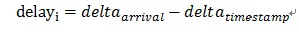

然后做每个包组的叠加延迟,可以记作：

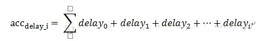

在通过累积延迟计算一个均衡平滑延迟值，alpha=0.9可以记作：

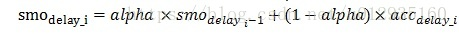

然后统一对累计延迟和均衡平滑延迟再求平均，分别记作：

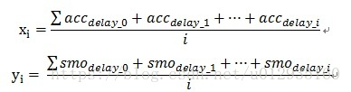

我们将第i个包组的传输持续时间记作：

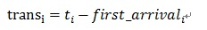

趋势斜率分子值为：

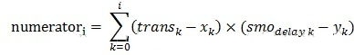

趋势斜率分母值为：

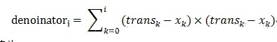

最终的趋势值为：

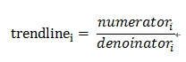

#### 3、过载检测

在计算得到trendline值后WebRTC通过动态阈值gamma_1进行判断拥塞程度，trendline乘以周期包组个数就是m_i,以下是判断拥塞程度的伪代码：

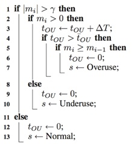

通过以上伪代码就可以判断出当前网络负载状态是否发生了过载，如果发生过载，WebRTC是通过一个有限状态机来进行网络状态迁徙，关于状态机细节可以参看下图：

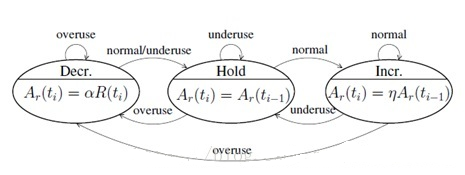

从上图可以看出，网络状态机的状态迁徙是由于网络过载状态发生了变化，所以状态迁徙作为了aimd带宽调节的触发事件，aimd根据当前所处的网络状态进行带宽调节，其过程是处于Hold状态表示维持当前码率，处于Decr状态表示需要进行码率递减，处于Incr状态需要进行码率递增。那他们是怎么递增和递减的呢？WebRTC引入了aimd算法解决这个问题。

#### 4、AIMD码率调节

aimd的全称是Additive Increase Multiplicative Decrease，意思是：和式增加，积式减少。aimd controller是TCP底层的码率调节概念，但是WebRTC并没有完全照搬TCP的机制，而是设计了套自己的算法，用公式表示为：

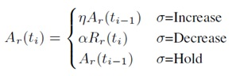

如果处于Incr状态，增加码率的方式分为两种：一种是通信会话刚刚开始，相当于TCP慢启动，它会进行一个倍数增加，当前使用的码率乘以系数，系数是1.08；如果是持续在通信状态，其增加的码率值是当前码率在一个RTT时间周期所能传输的数据速率。  

如果处于Decrease状态，递减原则是:过去500ms时间窗内的最大acked bitrate乘上系数0.85,acked bitrate通过feedback反馈过来的报文序号查找本地发送列表就可以得到。  

aimd根据上面的规则最终计算到的码率就是基于延迟拥塞评估到的bwe bitrate码率。

### webrtc具体实现

#### 一、基于延时拥塞控制

```
BaseChannel::ProcessPacket  
->WebRtcVideoChannel::OnRtcpReceived  
->Call::DeliverPacket  
->Call::DeliverRtcp  
->VideoSendStream::DeliverRtcp  
->VideoSendStreamImpl::DeliverRtcp  
->ModuleRtpRtcpImpl::IncomingRtcpPacket  
->RTCPReceiver::IncomingPacket  
->RTCPReceiver::TriggerCallbacksFromRtcpPacket  
->SendSideCongestionController::OnTransportFeedback
```

result = `delay_based_bwe_->IncomingPacketFeedbackVector`更新接收端时延信息到DelayBasedBwe类。  

该类使用InterArrival、TrendlineEstimator、OveruseDetector、AimdRateControl等类计算BWE值。详细实现，请参见：

```
Delay_based_bwe.cc  
inter_arrival.cc  
trendline_estimator.cc  
overuse_detector.cc  
Aimd_rate_control.cc
```

`bitrate_controller_->OnDelayBasedBweResult`生效rendline计算BWE值，到SendSideBandwidth Estimation。函数调用栈如下：

```
BitrateControllerImpl::OnDelayBasedBweResult  
->SendSideBandwidthEstimation::UpdateDelayBasedEstimate  
->SendSideBandwidthEstimation::CapBitrateToThresholds
```

#### 二、基于丢包拥塞控制

```
BaseChannel::ProcessPacket  
->WebRtcVideoChannel::OnRtcpReceived  
->Call::DeliverPacket  
->Call::DeliverRtcp  
->VideoSendStream::DeliverRtcp       
->VideoSendStreamImpl::DeliverRtcp  
->ModuleRtpRtcpImpl::IncomingRtcpPacket  
->RTCPReceiver::IncomingPacket  
->RTCPReceiver::TriggerCallbacksFromRtcpPacket  
->BitrateControllerImpl::RtcpBandwidthObserverImpl::OnReceivedRtcpReceiverReport  
->BitrateControllerImpl::OnReceivedRtcpReceiverReport  
->SendSideBandwidthEstimation::UpdateReceiverBlock  
->SendSideBandwidthEstimation::UpdateEstimate
```

具体调整函数如下：

```
low_loss_threshold_ =  kDefaultLowLossThreshold = 0.02f;  
high_loss_threshold_ =  kDefaultHighLossThreshold = 0.1f;
```

```cpp 
void SendSideBandwidthEstimation::UpdateEstimate(int64_t now_ms) {
  uint32_t new_bitrate = current_bitrate_bps_;
  // We trust the REMB and/or delay-based estimate during the first 2 seconds if
  // we haven't had any packet loss reported, to allow startup bitrate probing.
  if (last_fraction_loss_ == 0 && IsInStartPhase(now_ms)) {
    new_bitrate = std::max(bwe_incoming_, new_bitrate);
    new_bitrate = std::max(delay_based_bitrate_bps_, new_bitrate);
    if (new_bitrate != current_bitrate_bps_) {
      min_bitrate_history_.clear();
      min_bitrate_history_.push_back(
          std::make_pair(now_ms, current_bitrate_bps_));
      CapBitrateToThresholds(now_ms, new_bitrate);
      return;
    }
  }
  UpdateMinHistory(now_ms);
  if (last_packet_report_ms_ == -1) {
    // No feedback received.
    CapBitrateToThresholds(now_ms, current_bitrate_bps_);
    return;
  }
  int64_t time_since_packet_report_ms = now_ms - last_packet_report_ms_;
  int64_t time_since_feedback_ms = now_ms - last_feedback_ms_;
  if (time_since_packet_report_ms < 1.2 * kFeedbackIntervalMs) {
    // We only care about loss above a given bitrate threshold.
    float loss = last_fraction_loss_ / 256.0f;
    // We only make decisions based on loss when the bitrate is above a
    // threshold. This is a crude way of handling loss which is uncorrelated
    // to congestion.
    if (current_bitrate_bps_ < bitrate_threshold_bps_ ||
        loss <= low_loss_threshold_) {
      // Loss < 2%: Increase rate by 8% of the min bitrate in the last
      // kBweIncreaseIntervalMs.
      // Note that by remembering the bitrate over the last second one can
      // rampup up one second faster than if only allowed to start ramping
      // at 8% per second rate now. E.g.:
      //   If sending a constant 100kbps it can rampup immediatly to 108kbps
      //   whenever a receiver report is received with lower packet loss.
      //   If instead one would do: current_bitrate_bps_ *= 1.08^(delta time),
      //   it would take over one second since the lower packet loss to achieve
      //   108kbps.
      new_bitrate = static_cast<uint32_t>(
          min_bitrate_history_.front().second * 1.08 + 0.5);
      // Add 1 kbps extra, just to make sure that we do not get stuck
      // (gives a little extra increase at low rates, negligible at higher
      // rates).
      new_bitrate += 1000;
    } else if (current_bitrate_bps_ > bitrate_threshold_bps_) {
      if (loss <= high_loss_threshold_) {
        // Loss between 2% - 10%: Do nothing.
      } else {
        // Loss > 10%: Limit the rate decreases to once a kBweDecreaseIntervalMs
        // + rtt.
        if (!has_decreased_since_last_fraction_loss_ &&
            (now_ms - time_last_decrease_ms_) >=
                (kBweDecreaseIntervalMs + last_round_trip_time_ms_)) {
          time_last_decrease_ms_ = now_ms;
          // Reduce rate:
          //   newRate = rate * (1 - 0.5*lossRate);
          //   where packetLoss = 256*lossRate;
          new_bitrate = static_cast<uint32_t>(
              (current_bitrate_bps_ *
                static_cast<double>(512 - last_fraction_loss_)) /
              512.0);
          has_decreased_since_last_fraction_loss_ = true;
        }
      }
    }
  } else if (time_since_feedback_ms >
                  kFeedbackTimeoutIntervals * kFeedbackIntervalMs &&
              (last_timeout_ms_ == -1 ||
              now_ms - last_timeout_ms_ > kTimeoutIntervalMs)) {
    if (in_timeout_experiment_) {
      LOG(LS_WARNING) << "Feedback timed out (" << time_since_feedback_ms
                      << " ms), reducing bitrate.";
      new_bitrate *= 0.8;
      // Reset accumulators since we've already acted on missing feedback and
      // shouldn't to act again on these old lost packets.
      lost_packets_since_last_loss_update_Q8_ = 0;
      expected_packets_since_last_loss_update_ = 0;
      last_timeout_ms_ = now_ms;
    }
  }
  CapBitrateToThresholds(now_ms, new_bitrate);
}
```

#### 三、最终确定Send Side BWE值

```cpp   
void SendSideBandwidthEstimation::CapBitrateToThresholds(int64_t now_ms,
                                                          uint32_t bitrate_bps) {
  if (bwe_incoming_ > 0 && bitrate_bps > bwe_incoming_) {
    bitrate_bps = bwe_incoming_;
  }
  if (delay_based_bitrate_bps_ > 0 && bitrate_bps > delay_based_bitrate_bps_) {
    bitrate_bps = delay_based_bitrate_bps_;
  }
  if (bitrate_bps > max_bitrate_configured_) {
    bitrate_bps = max_bitrate_configured_;
  }
  if (bitrate_bps < min_bitrate_configured_) {
    if (last_low_bitrate_log_ms_ == -1 ||
        now_ms - last_low_bitrate_log_ms_ > kLowBitrateLogPeriodMs) {
      LOG(LS_WARNING) << "Estimated available bandwidth " << bitrate_bps / 1000
                      << " kbps is below configured min bitrate "
                      << min_bitrate_configured_ / 1000 << " kbps.";
      last_low_bitrate_log_ms_ = now_ms;
    }
    bitrate_bps = min_bitrate_configured_;
  }
  if (bitrate_bps != current_bitrate_bps_ ||
      last_fraction_loss_ != last_logged_fraction_loss_ ||
      now_ms - last_rtc_event_log_ms_ > kRtcEventLogPeriodMs) {
    event_log_->LogLossBasedBweUpdate(bitrate_bps, last_fraction_loss_,
                                      expected_packets_since_last_loss_update_);
    last_logged_fraction_loss_ = last_fraction_loss_;
    last_rtc_event_log_ms_ = now_ms;
  }
  current_bitrate_bps_ = bitrate_bps;
}
```

#### 四、更新码率值到pacer、fec、encode模块

```cpp   
void SendSideCongestionController::MaybeTriggerOnNetworkChanged() {
  uint32_t bitrate_bps;
  uint8_t fraction_loss;
  int64_t rtt;
  bool estimate_changed = bitrate_controller_->GetNetworkParameters(
      &bitrate_bps, &fraction_loss, &rtt);
  if (estimate_changed) {
    pacer_->SetEstimatedBitrate(bitrate_bps);
    probe_controller_->SetEstimatedBitrate(bitrate_bps);
    retransmission_rate_limiter_->SetMaxRate(bitrate_bps);
  }
  bitrate_bps = IsNetworkDown() || IsSendQueueFull() ? 0 : bitrate_bps;
  if (HasNetworkParametersToReportChanged(bitrate_bps, fraction_loss, rtt)) {
    int64_t probing_interval_ms;
    {
      rtc::CritScope cs(&bwe_lock_);
      probing_interval_ms = delay_based_bwe_->GetExpectedBwePeriodMs();
    }
    {
      rtc::CritScope cs(&observer_lock_);
      if (observer_) {
        observer_->OnNetworkChanged(bitrate_bps, fraction_loss, rtt,
                                    probing_interval_ms);
      }
    }
  }
}
```

函数详细调用关系，可以参考《[webrtc QOS方法四.1（Sender Side BWE函数实现调用关系图）](https://blog.csdn.net/CrystalShaw/article/details/111573233)》

### 附录

#### 一、概念说明

由于webrtc里面包含GCC、Sendside-BWE两种拥塞控制算法。M55之前用的是GCC，M55之后用的是Sendside-BWE。里面有很多概念梳理如下，以免混淆，不方便理解代码。

<table cellspacing="0" style="width:447pt;"><tbody><tr><td style="vertical-align:middle;width:112pt;"><span style="color:#000000;">　</span></td><td style="vertical-align:middle;width:191pt;"><span style="color:#002060;"><strong>GCC</strong></span></td><td style="vertical-align:middle;width:144pt;"><span style="color:#002060;"><strong>Sendside-BWE</strong></span></td></tr><tr><td style="vertical-align:middle;"><span style="color:#002060;"><strong>码控计算模块</strong></span></td><td style="vertical-align:middle;"><span style="color:#002060;">接收端</span></td><td style="vertical-align:middle;"><span style="color:#002060;">发送端</span></td></tr><tr><td style="vertical-align:middle;"><span style="color:#002060;"><strong>RTP头部扩展</strong></span></td><td style="vertical-align:middle;"><span style="color:#002060;">AbsSendTime</span></td><td style="vertical-align:middle;"><span style="color:#002060;">TransportSequenceNumber</span></td></tr><tr><td style="vertical-align:middle;"><span style="color:#002060;"><strong>接收端关键对象</strong></span></td><td style="vertical-align:middle;"><span style="color:#002060;">RemoteBitrateEstimatorAbsSendTime</span></td><td style="vertical-align:middle;"><span style="color:#002060;">RemoteEstimatorProxy</span></td></tr><tr><td style="vertical-align:middle;"><span style="color:#002060;"><strong>网络延时滤波器</strong></span></td><td style="vertical-align:middle;"><span style="color:#002060;">Kalman Filter</span></td><td style="vertical-align:middle;"><span style="color:#002060;">Trendline Filter</span></td></tr><tr><td style="vertical-align:middle;"><span style="color:#002060;"><strong>接收端反馈RTCP报文</strong></span></td><td style="vertical-align:middle;"><span style="color:#002060;">REMB</span></td><td style="vertical-align:middle;"><span style="color:#002060;">TransportCC</span></td></tr></tbody></table>

#### 二、BWE三个典型的算法

* [Google Congest Control](https://tools.ietf.org/html/draft-ietf-rmcat-gcc-02)
* [爱立信的SCEAM](https://github.com/EricssonResearch/scream)
* [MIT的SPROUT](http://aim.nms.lcs.mit.edu/papers/nsdi13-sprout.pdf)
* [Mozilla的这篇文章讲述了拥塞控制算法演变的历史](https://blog.mozilla.org/webrtc/what-is-rmcat-congestion-control/)

### 参考

* [http://www.freehacker.cn/media/tcc-vs-gcc/?utm_source=tuicool&utm_medium=referral](http://www.freehacker.cn/media/tcc-vs-gcc/?utm_source=tuicool&utm_medium=referral)

<hr>

#### <p>原文出处：<a href='https://blog.csdn.net/CrystalShaw/article/details/82981183' target='blank'>WebRTC QOS方法四.1（Sender Side BWE函数实现调用关系图）</a></p>

## WebRTC QOS方法四.1（Sender Side BWE函数实现调用关系图）

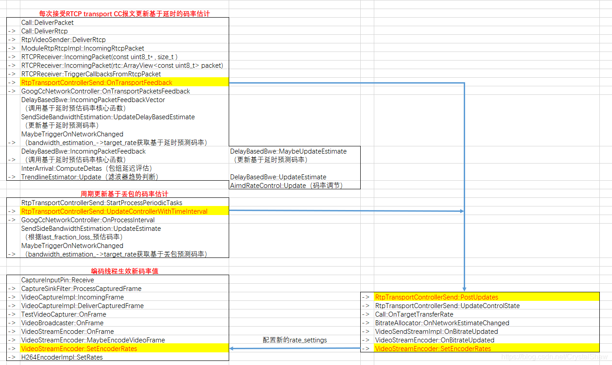

<hr>

#### <p>原文出处：<a href='https://blog.csdn.net/CrystalShaw/article/details/107196906' target='blank'>WebRTC QOS方法四.2(拥塞算法学习)</a></p>

## WebRTC QOS方法四.2(拥塞算法学习)

### 一、网图简介

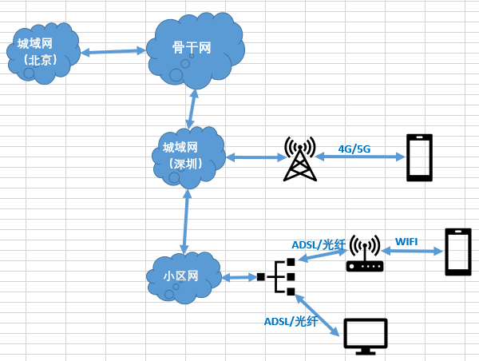

现在我们接入网络的方式有三种：手机4G/5G、WIFI、网线。三种接入方式在网络中的位置如上图所示。引起网络质量差的原因也有很多，比方说4G/5G、WIFI信号弱、wifi信道竞争、云营商限速、跨运营商节点带宽竞争、终端设备应用程序抢占带宽等。

其中跨运营商节点带宽竞争可以使用BGP网络解决，其他目前都没有一个完美的解决方案。

### 二、拥塞算法思想

拥塞算法实际上是解决不了上述所有的问题的，它的思想是假设我们所有设备都正常运行情况下，只是由于发送数据量不合理，导致路由缓冲区变大，网络延时升高，更严重的缓冲区满异常，造成丢包。

所以拥塞算法的中心思想是通过调节发送数据量，改善网络延时、丢包质量。那么理想情况下发送多大数据量是合理的呢？这里引入一个带宽时延积BDP参数。BDP参数想要探测的是独享网络情况下，RTT延时最小（路由器缓存数据量最小）时，能发送的最大带宽。如下图所示：

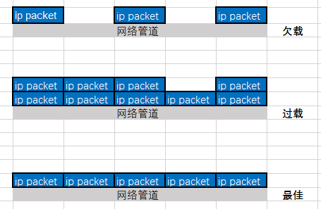

数据量不能太小，否则带宽利用率不高；数据量也不能太大，否则路由缓存区变大，RTT延时变高。第三个图，是BDP的最佳状态。也就是说BDP是将链路填满而不造成中间设备缓存数据包最大数据容量。再多的数据包进来，只能被路由设备给缓存起来延迟投递。延迟投递会造成RTT升高，而投递成功率（Dilivery Rate)却没法上升(投递效率的上限是瓶颈带宽BtlBw）。吞吐率到达BDP才是链路的最优工作点。

但是实际应用中，我们是无法同时探测出最大带宽和最小延时两个参数的。

### 三、典型拥塞算法比较

<table border="1" cellpadding="1" cellspacing="1"><tbody><tr><td style="width:132px;">拥塞算法</td><td style="width:184px;">检测方法</td><td style="width:183px;">控制方法</td><td style="width:183px;">缺点</td></tr><tr><td style="width:132px;">cubic</td><td style="width:184px;">丢包检测</td><td style="width:183px;">通过丢包检测，检测网络是否拥塞，调整发送码率</td><td style="width:183px;">Cubic是Loss-Based拥塞控制算法，要等到链路的Buffer填满后发生丢包才会降窗退避缓解拥塞，更要命的是，随机偶发性的丢包（如中间的路由故障切换到备份设备导致部分包丢失等）也会被误判成“拥塞”造成窗口减半，传输速率的急剧下降。</td></tr><tr><td style="width:132px;">gcc</td><td style="width:184px;">丢包+延时检测</td><td style="width:183px;">通过丢包和延时检测网络是否拥塞，调整发送码率</td><td style="width:183px;">同样存在滞后性，并且在wifi信道竞争、APP内置程序抢占带宽场景下，持续避让，不是好的解决方案。</td></tr><tr><td style="width:132px;">bbr</td><td style="width:184px;"> <p>分别探测：最大带宽、最小RTT延时</p> </td><td style="width:183px;">BBR寻求工作于这个最优点：寻求在不排队的情况下，以瓶颈带宽的速率持续发包，保持数据包排满管道，以求获取最大的吞吐率BDP。</td><td style="width:183px;">BBR属于抢占带宽模式，若是其他程序都使用cubic或者gcc这种退让机制，BBR很给力。但是当大家都使用BBR，网络就会持续惨烈。（目前这样理解，后续细啃算法，再更新）</td></tr></tbody></table>

目前没有哪种拥塞算法能解决所有网络问题，需要程序探测目前网络属于哪种丢包模型，选择比较合适的应对措施。

### 四、参考

cubic：

* <https://allen-kevin.github.io/2017/12/21/TCP%E6%8B%A5%E5%A1%9E%E6%8E%A7%E5%88%B6%E4%B9%8BCUBIC/>

BBR：

* <https://cloud.tencent.com/developer/article/1482633>
* <https://blog.csdn.net/dog250/article/details/52830576>
* <https://www.jianshu.com/p/4c9360f265e7>
