 
<!--BEGIN_DATA
{
    "create_date": "2021-01-24 23:35", 
    "modify_date": "2021-01-24 23:35", 
    "is_top": "0", 
    "summary": "WebRTC QOS方法五.1（帧率调整）<br/>WebRTC QOS方法五.2（发送端帧率调整原理及实现流程）<br/>WebRTC QOS方法六（花屏问题解决方法）<br/>WebRTC QOS方法七（摄像头采集帧率调整）<br/>WebRTC QOS方法八（JitterBuffer）<br/>WebRTC QOS方法九（VideoFrame.ntp_time_ms含义）<br/>WebRTC QOS方法九（VideoFrame.ntp_time_ms含义）<br/>WebRTC QOS方法十一（音视频同步AVSyn实现）", 
    "tags": "WebRTC、C/C++", 
    "file_name": "WebRTC视频QOS方法汇总2.md"
}
END_DATA-->

#### <p>原文出处：<a href='https://blog.csdn.net/CrystalShaw/article/details/83340323' target='blank'>WebRTC QOS方法五.1（帧率调整）</a></p>

## WebRTC QOS方法五.1（帧率调整）

### 一、框架图

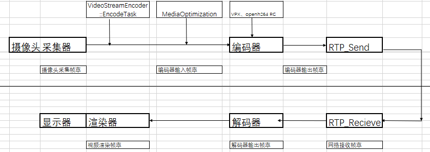

### 二、帧率调控算法

根据上图所示，发送端有三个模块会对帧率进行调整：

1、当视频采集帧率大于编码器输出帧率，会直接掉帧。在VideoStreamEncoder::EncodeTask类中的Run函数里实现。

2、编码器输出码率是否超过目标码率，超过时会在编码前进行掉帧。在MediaOptimization->DropFrame漏桶算法里实现。

3、webrtc的VPX、openh264编码器，码控模块有接口配置是否掉帧调节码率功能。参见VideoCodecVPX/VideoCodecH264的frameDroppingOn定义。

详细实现流程，请参考《[webrtc QOS方法五.2（发送端帧率调整原理及实现流程）](https://blog.csdn.net/CrystalShaw/article/details/105965190)》

### 三、webrtc的帧率

如上框架图，webrtc的帧率从左到右，帧率是持递减状态的。摄像头的采集帧率是发送端帧率的极限值。

#### 1、摄像头采集帧率

视频采集卡帧率能力集，可以通过potplay工具查看。打开->设备设置->摄像头

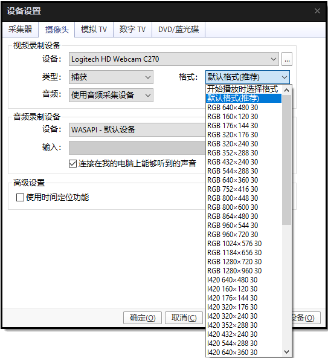

摄像头能采集的帧率与摄像头的型号、视频分辨率有关。他能提供的帧率，决定发送端视频帧率的最大值。

但是摄像头实际采集帧率，可能受实际环境光强影响，具体请参见：《[webrtc QOS方法七（摄像头采集帧率调整）](https://blog.csdn.net/CrystalShaw/article/details/87875177)》

#### 2、编码器输入帧率

理论上编码器的输入帧率小于等于视频采集的帧率。编码器编码的性能+视频采集帧率决定编码器的输入帧率。

若摄像头的`640*480`的采集帧率是30fps，若编码器的`640*480`的编码性能是60fps，那么编码器的输入帧率为`640*480` 30fps。

若编码器性能比较差，`640*480`的编码性能是25fps，那么编码器的输入帧率为`640*480 25fps`。

当采集帧率大于编码帧率，会在VideoStreamEncoder::EncodeTask::Run函数进行掉帧处理。没有使用平滑算法，仅仅判断当前编码器是否空闲，空闲可以正常编码，不会丢帧，否则就会丢弃当前帧。

#### 3、编码器输出帧率

输入到编码器的视频帧，不一定全部被编码。如前面Send Side BWE介绍，当网络出现延时或者丢包的情况下，码率会持续下调。但是帧率不变的情况下，码率持续下调必然会导致视频质量快速下降。MediaOptimization大概思路就是在编码前通过降帧率的方法，降低码率。这样单帧的视频质量不会下降的特别明显。

详细实现参见：`VideoSender->VideoSender::AddVideoFrame->_mediaOpt.DropFrame()`

另外VP8、VP9、openH264都有一个EnableFrameSkip选项，开启该功能后，当视频编码输出的码率无法压缩到指定的目标码率，编码器的码控模块，也会通过掉帧的方式调节。导致实际输出编码器的帧数小于等于输入编码器的帧数。

#### 4、网络接收帧率

同一帧视频的不同RTP的报文时间戳是相同的，一帧视频结束的最后一包的RTP报文头的MARK位为1。所以在网络测，判断一帧视频是否接收完全，同一个时间戳的报文
的序列号是否连续，改时间戳的RTP报文是否收到MARK为1的包。

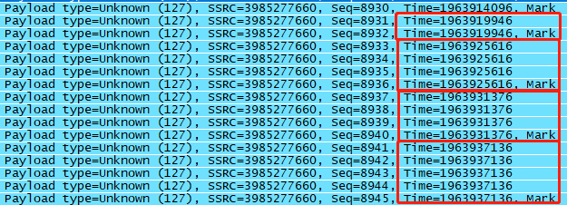

由于网络丢包延时等影响，网络接收到的数据帧若不完全，是不需要传递给解码器的，否则解码器也会解出花屏的数据。或者网络接收模块没有判断出数据有缺失，但是解码器判断异常，出现无法正常解码的情况。这样就会出现网络接收帧率大于等于解码器输出帧率的现象。

#### 5、解码器输出帧率

如第四小节描述，这里仅统计完整正确能解码出视频帧的帧率。

#### 6、视频渲染帧率

这是最终将第一小节的视频采集卡视频显示给用户的界面。可能出现个别终端的渲染器性能比较差，解码出来的全部数据不一定能及时渲染出来。目前webrtc在这里没有增加特殊处理，要是渲染不及时就会累积，出现视频延时的现象。

### 四、总结

可以看出webrtc只有在发送端会有主动丢帧降帧率。其余的地方是由于网络丢包延时、编码性能、渲染性能导致被丢帧。

### 五、参考

* <https://blog.csdn.net/chinabinlang/article/details/79654852>
* <http://www.enkichen.com/2017/07/29/webrtc-drop-frame/>

<hr>
 
#### <p>原文出处：<a href='https://blog.csdn.net/CrystalShaw/article/details/105965190' target='blank'>WebRTC QOS方法五.2（发送端帧率调整原理及实现流程）</a></p>

## WebRTC QOS方法五.2（发送端帧率调整原理及实现流程）

视频采集帧率是发送端能够发送的最大帧率，但是当码率太高冲击上行带宽时，或者编码性能跟不上采集帧率，发送端都会通过降帧率方式缓解这些问题。

当码率太高冲击上行带宽时，通过MediaOptimization类调节帧率进而平滑码率；另外若使用webrtc自带VPX、openh264编码器，在编码器码控模块有接口配置是否掉帧调节码率功能。参见VideoCodecVP8/VideoCodecVP9/VideoCodecH264的frameDroppingOn参数定义。

当编码性能跟不上采集帧率时，webrtc是通过直接掉帧方式解决，参见下面第三节《采集速度大于编码速度掉帧处理》描述。

### 一、MediaOptimization作用

MediaOptimization类作用是调节发送端码率，使用两种方式调节：

1、配置编码器输入帧率调整码率：编码器根据输入帧率和码率计算分配给每一帧的字节数。所以实时调节帧率，会调整码率。

2、编码前判断是否掉帧调整码率：实时监控编码后数据量，当检测到码率过高，通过主动掉帧方式降低码率，缓解网络冲击。

函数调用关系图如下：

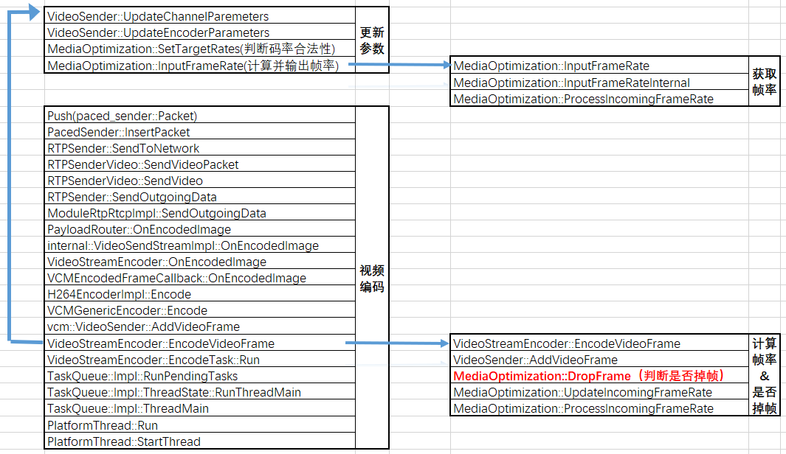

### 二、MediaOptimization实现

#### 1）计算编码帧率

  * 计算帧率

每次编码前，调用MediaOptimization::DropFrame->MediaOptimization::ProcessIncomingFrameRate函数，将当前系统时间加入incoming_frame_times_队列。然后根据一段时间接收到的帧数和持续时间，计算输入视频的帧率。

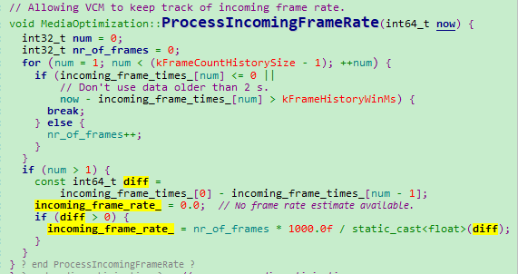

  * 获取帧率

每次编码前，调用VideoSender::UpdateEncoderParameters->MediaOptimization::InputFrameRate函数，更新`encoder_params_`，获取当前编码帧率，配置到编码器中。

#### 2）判断是否掉帧

判断是否掉帧在FrameDropper类里面实现。

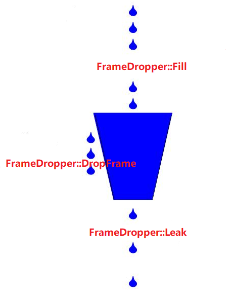

  * 核心参数

`ccumulator_max_`：漏桶容积，其值为`targetbps*kLeakyBucketSizeSeconds`，随目标码率改变而改变；  
`accumulator_`：漏桶累积，漏桶累积字节数，Fill增加，Leak减少，最大值为`targetbps*kAccumulatorCapBufferSizeSecs`；  
`drop_ratio_`：丢帧率，指数滤波器，使丢帧率保持一个平滑的变化过程，每次Leak()后更新丢帧率；  
`key_frame_ratio_`：关键帧率，指数滤波器，使关键帧率保持一个平滑的变化过程，每次Fill()后更新；  
`delta_frame_size_avg_kbits_`：差分帧码率，指数滤波器，使关键帧率保持一个平滑的变化过程，每次Fill()后更新。

  * 核心函数

FrameDropper::Fill

```    
H264EncoderImpl::Encode
->VCMEncodedFrameCallback::OnEncodedImage
->MediaOptimization::UpdateWithEncodedData
->FrameDropper::Fill
```

当视频帧被编码后，MediaOptimization类会调用Fill()方法来填充漏桶。

1、将大帧拆分为`large_frame_accumulation_count_`个小块，并不累加`accumulator_`；

2、将小帧直接累计`accumulator_`。

Fill()方法同时更新`key_frame_ratio_`和`delta_frame_size_avg_kbits_`，用以计算大帧拆分块数和大帧判断。

FrameDropper::Leak

```    
VideoStreamEncoder::EncodeVideoFrame
->VideoSender::AddVideoFrame
->MediaOptimization::DropFrame
->FrameDropper::Leak
```    

Leak()操作按照编码器输入帧率的频率来执行，每次Leak的大小为`targetbps/input_fps`，每次Leak时需要判断是否需要累计Fill()方法拆分的块，进而更新`drop_ratio_`。`drop_ratio_`的更新遵循下列原则：  

当`accumulator_ > 1.3f*accumulator_max_`，`drop_ratio_`基数调整为`0.8f*`，提高丢帧率调整加速度；  
当`accumulator_ < 1.3f*accumulator_max_`，`drop_ratio_`基数调整为`0.9f*`，降低丢帧率调整加速度。

FrameDropper::DropFrame

```    
VideoStreamEncoder::EncodeVideoFrame
->VideoSender::AddVideoFrame
->MediaOptimization::DropFrame
->FrameDropper::DropFrame
```

DropFrame()操作用来判断是否需要将输入到编码器的这一帧丢弃，其利用`drop_ratio_`来使丢帧率保持一个平滑的变化过程。

当`drop_ratio_.filtered() >= 0.5f`时，表明连续丢弃多个帧（至少一个帧）

当`0.0f < drop_ratio_.filtered() < 0.5f`时，表明多个帧才会丢弃一个帧。

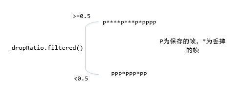

### 三、采集速度大于编码速度掉帧处理

发送端若出现采集帧率大于编码帧率也会主动掉帧，这个掉帧在VideoStreamEncoder::EncodeTask::Run函数处理。

没有使用平滑算法，仅仅判断当前编码器是否空闲，空闲可以正常编码，不会丢帧，否则就会丢弃当前帧。

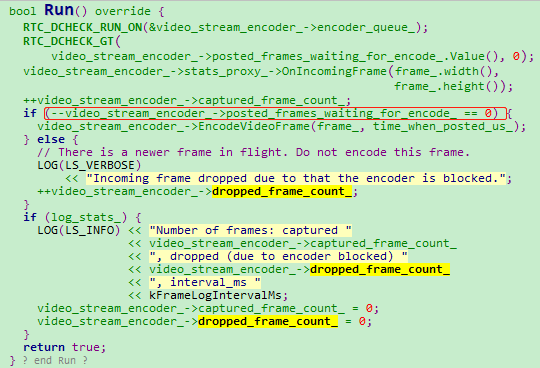

### 四、参考

* https://www.jianshu.com/p/e2a9740b9877  
* http://www.enkichen.com/2017/07/29/webrtc-drop-frame/  
* https://www.freehacker.cn/media/webrtc-frame/

<hr>

#### <p>原文出处：<a href='https://blog.csdn.net/CrystalShaw/article/details/86673313' target='blank'>WebRTC QOS方法六（花屏问题解决方法）</a></p>

## WebRTC QOS方法六（花屏问题解决方法）

做过视频会议都清楚，当网络出现丢包异常后，经常会导致视频出现长时间花屏问题。严重降低用户体验。测试webrtc发现，视频无论在什么环境，都没有出现花屏现象。若出现丢包，通过掉帧方式解决该问题。最坏的情况就是视频出现卡顿，但是也不会出现花屏。我们都知道视频解码器只管数据解码，不会判断是否是花屏，这个丢包导致花屏问题，只能在调度侧解决，解码器是不处理该异常的。

webrtc在收包送到解码器这块流程，会处理三件事：

1、判断当前收到是视频帧是否完整，若不是完整帧，通过FEC+NACK请求丢失数据，若当解码器要数据的时候，还不是完整视频帧，直接丢弃该视频帧。

2、在将视频帧送到解码器的时候，会判断该视频帧的参考帧是否都存在，若不存在直接丢弃该帧。

3、视频解码器检测，当连续指定时间没有收到视频帧，会通过RTCP-FIR报文向发送端发送IDR帧请求命令。

### 一、视频帧完整性判断方法

以H264为例，在RTP净荷的FU Header，有个S字段，表示是否是一帧的起始；一帧的最后一包，RTP的mark字段为1。

通过这两个字段就可以获取到一帧的起始和结束报文。中间报文只要保证RTP头的序列号连续，就可以保证一帧的完整性。

#### 1）视频帧起始S字段获取

RtpDepacketizerH264::ParseFuaNalu

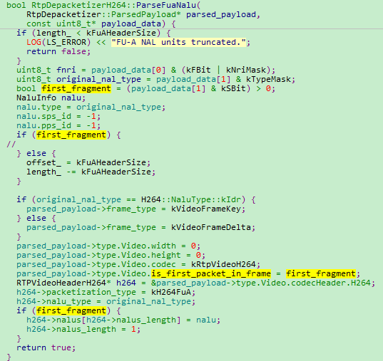

#### 2）视频帧结束mark字段

Packet::GetHeader

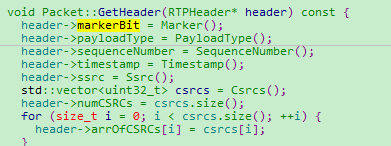

#### 3）报文连续性判断

PacketBuffer::UpdateMissingPackets

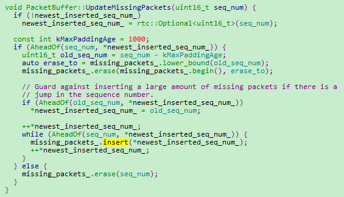

### 二、参考帧完整性判读方法

在视频会议中，GOP的帧结构中只有IDR、I、P帧，没有B帧。并且GOP的类型为close gop。跨GOP的帧不会互相参考。

所以参考帧判断比较简单。以收到IDR帧为起点，后续收到的帧全部默认参考前一帧，若前一帧不存在，则丢弃当前帧。

#### 1）设置帧间参考关系

```
RtpFrameReferenceFinder::ManageFrame
->RtpFrameReferenceFinder::ManageFrameInternal
->RtpFrameReferenceFinder::ManageFrameGeneric
```

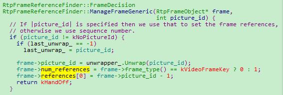

这个是最简单的示例，这样实现的效果是在一个GOP中，从开始丢包处，就一致卡顿，直到下一个GOP到来。

H264、VP8、VP9有SVC。当配置TemporalScalability，参考关系需要根据LayerSync字段判断。这样实现的效果是一个GOP中根据参考关系选择性丢包。缓解长时间卡顿问题。

#### 2）判断参考帧是否缺失

FrameBuffer::UpdateFrameInfoWithIncomingFrame

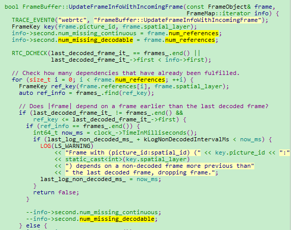

#### 3)丢弃无参考帧视频数据

FrameBuffer::ReturnReason FrameBuffer::NextFrame

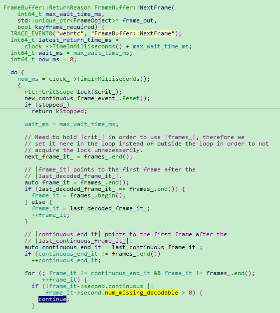

若参考帧不全，就一直不解码，当最新帧被解码，老帧就会被删除。

FrameBuffer::AdvanceLastDecodedFrame

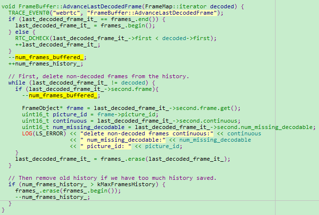

### 三、IDR帧请求流程

当解码器连续一段时间，没有收到视频帧，需要向视频发送端发送RTCP-FIR请求。目前webrtc配置的是3秒。

VideoReceiveStream::Decode

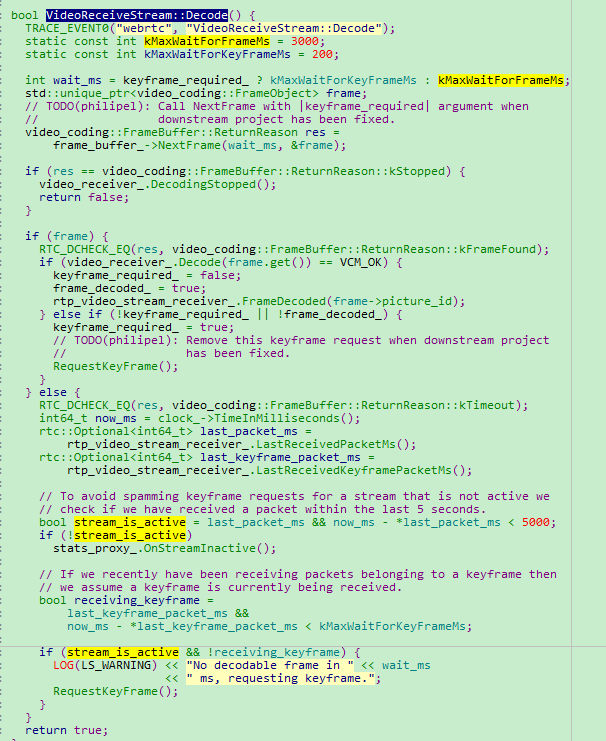

<hr>

#### <p>原文出处：<a href='https://blog.csdn.net/CrystalShaw/article/details/87875177' target='blank'>WebRTC QOS方法七（摄像头采集帧率调整）</a></p>

## WebRTC QOS方法七（摄像头采集帧率调整）

### 一、发现问题

使用罗技C270摄像头，进行webrtc视频通话QOS测评时发现，在网络0延时，0丢包时，GetStats打印摄像头采集到的帧率一直持续在15-17fps，无法达到摄像头标注的30fps的采集能力。在17fps下视频通话，视频质量有轻微的顿挫感，流畅性不好。

检查CPU占有率、编码解码时间，都没有异常。按理来说性能是可以达到30fps的实时通讯能力的。

### 二、分析问题

1、首先确认到底是不是摄像头采集出来的帧率就低，还是系统调度慢，导致采集帧率低。

使用ffmpeg/potplay/amcap多个视频采集软件，打开本地摄像头，查看采集帧率的打印，发现摄像头采集帧率真的就这么低。

ffmpeg的命令行如下：

```
ffmpeg -list_devices true -f dshow -i dummy （显示要采集摄像头设备名称）
ffmpeg -f dshow -i video="Logitech C270" -r 30 -vcodec libx264 -acodec copy -preset:v ultrafast -tune:v zerolatency out.ts
```

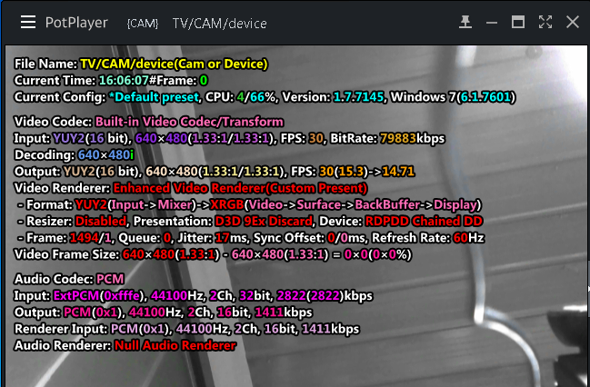

2、确认是摄像头问题后 ，就头脑风暴了一把，怀疑摄像头采集的是场编码，不是帧编码，但是确认摄像头是按帧采集，视频帧率还是升不上来。

3、没办法，只能梳理摄像头成像及采集原理。

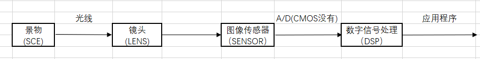

从视频采集到视频成像，里面有很多概念+原理。其中有个光圈、快门、自动曝光，这个过程有可能影响视频采集帧率。

摄像头一般会开启AE（自动曝光）功能，当开启这个功能后，这三个参数需要符合下面这个关系式：（APEX[(The Additive System of Photographic Exposure)](https://en.wikipedia.org/wiki/APEX_system)，它是由美国国家标准机构ASA，为了方便计算胶片机的曝光参数，提出的一个经验公式，也称为曝光方程）

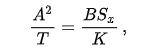

其中，T表示曝光时间，A表示光圈值(即常说的F-number)，B表示环境光平均亮度，S表示是相机感度。K是任意常数，一般由相机厂商决定，它和相机厂商所认为的正确曝光有关，现在一般将K取值为12.5。

可以看出，B平均亮度值会影响A光圈和T曝光时间。而曝光时间，理论上可以影响视频采集帧率。

### 三、验证问题

#### 1）验证不同光强度下帧率大小

既然怀疑是摄像头开启AE功能，摄像头根据场景平均亮度动态调整光圈和曝光时间导致，使用potplay打开本地摄像头，观察不同强度光下的摄像头视频帧率。验证是不是这么回事。

1、遮挡摄像头，无光下摄像头采集帧率16fps。

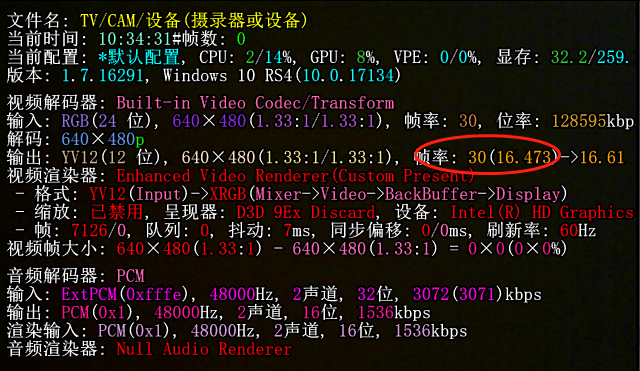

2、用手电筒照射摄像头，强光下摄像头采集帧率，30fps。

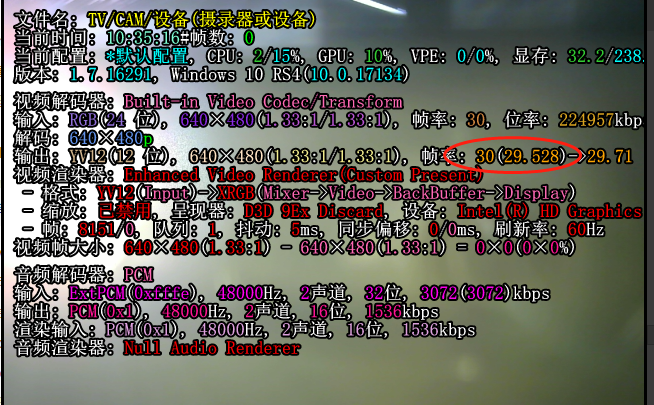

3、建立视频连接，使用GetStats打印不同光强度下，视频通话的帧率，发现确实强光下，为30fps，无光下为17fps。

```
delay:0 ms lost:0%,{send kbps:1742, frame:145, cap rate:28, send rate:30
delay:0 ms lost:0%,{send kbps:1724, frame:148, cap rate:30, send rate:30
delay:0 ms lost:0%,{send kbps:1683, frame:147, cap rate:29, send rate:30
delay:0 ms lost:0%,{send kbps:1673, frame:145, cap rate:30, send rate:30
delay:0 ms lost:0%,{send kbps:1688, frame:149, cap rate:30, send rate:30
delay:0 ms lost:0%,{send kbps:1625, frame:132, cap rate:25, send rate:25
delay:0 ms lost:0%,{send kbps:1561, frame:112, cap rate:17, send rate:22
delay:0 ms lost:0%,{send kbps:1607, frame: 81, cap rate:17, send rate:17
delay:0 ms lost:0%,{send kbps:1693, frame: 82, cap rate:16, send rate:17
delay:0 ms lost:0%,{send kbps:1837, frame: 97, cap rate:25, send rate:25
delay:0 ms lost:0%,{send kbps:1418, frame:124, cap rate:25, send rate:25
delay:0 ms lost:0%,{send kbps:1005, frame:123, cap rate:24, send rate:25
delay:0 ms lost:0%,{send kbps:1392, frame:125, cap rate:25, send rate:25
delay:0 ms lost:0%,{send kbps:1557, frame:125, cap rate:25, send rate:25
delay:0 ms lost:0%,{send kbps:1251, frame:125, cap rate:25, send rate:25
```

#### 2）验证关闭AE功能，不同光强度下帧率大小

既然确认是开启摄像头的AE（自动曝光）功能导致该问题。若想提高视频采集帧率，可以关闭该功能，调整exposure参数，可提升视频采集帧率。

1、关闭AE功能。

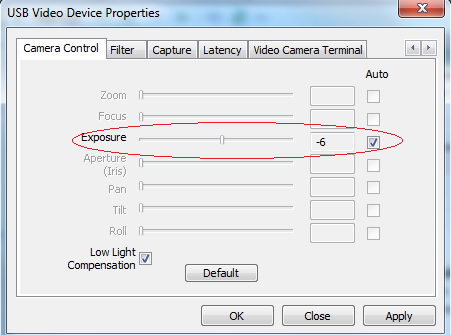

2、遮挡摄像头，无光下摄像头采集帧率15fps。

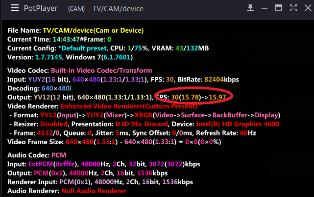

3、用手电筒照射摄像头，强光下摄像头采集帧率，15fps。

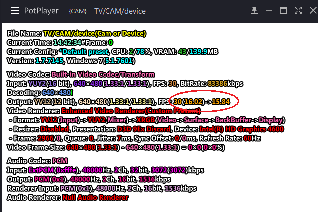

### 四、解决问题

#### 1）方法一

关闭AE功能，调整exposure参数，保证视频帧率恒定在30fps。

exposure取值范围在0到-13之间，越靠近0，帧率越小。实测配置在-5左右 ，可以保证30fps帧率。

但是该方法视频在不同光源下，不能自适应调整光圈和快门，成像质量有风险。

#### 2）方法二

物理方法，尽量增大环境的光强^_^

### 六、参考

* <https://blog.csdn.net/shiyimin1/article/details/81409218>
* <https://zhidao.baidu.com/question/1987221778804625147.html>
* <https://blog.csdn.net/u011776903/article/details/78783975>
* <https://blog.csdn.net/bingqingsuimeng/article/details/61193241>
* <https://blog.csdn.net/wang714818/article/details/78088424>

<hr>

#### <p>原文出处：<a href='https://blog.csdn.net/CrystalShaw/article/details/100769388' target='blank'>WebRTC QOS方法八（JitterBuffer）</a></p>

## WebRTC QOS方法八（JitterBuffer）

### 一、前言

网上看到很多webrtc的JitterBuffer处理流程，都是介绍VCMJitterBuffer类的实现流程，不过手里的这个2019年的版本，发现webrtc已经不用这个机制了。原因还不清楚。

VCMJitterBuffer类的调用关系如下图，但是，VideoCodingModuleImpl、VideoReceiveStream、VideoStreamDecoder三个类，都没有调用VCMJitterBuffer的InsertPacket关键函数。

```
VCMJitterBuffer
->VCMReceiver
->VideoReceiver
->VideoCodingModuleImpl  
    VideoReceiveStream  
    VideoStreamDecoder
```

### 二、实现简介

走读最新的webrtc的JitterBuffer代码，发现实现的大概思想是，视频按照RTP报入队一个全局buffer，按照计算的一个jitter时间，pop一帧视频，送进解码器。

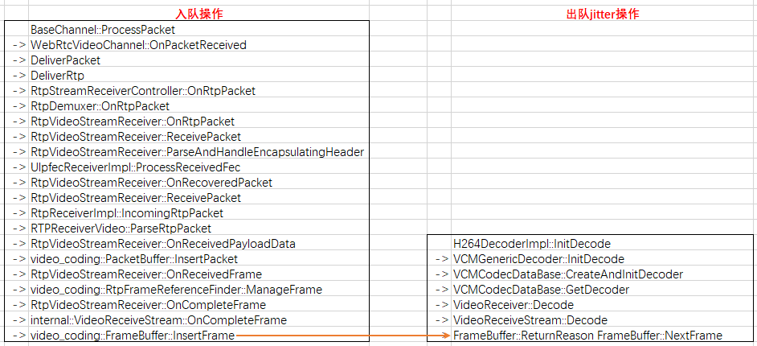

### 三、RTP入队流程

入队的核心函数如下：

->`video_coding::PacketBuffer::InsertPacket`
-------------------------将RTP报文缓存在`data_buffer_`中。

->RtpVideoStreamReceiver::OnReceivedFrame  
-------------------------判断首帧是否是IDR，不是丢弃帧；是，调用ManageFrame。

->`video_coding::RtpFrameReferenceFinder::ManageFrame`
-------------------------判断帧间参考关系。若当前帧的参考帧没到，继续等。

->RtpVideoStreamReceiver::OnCompleteFrame  
-------------------------继续传VideoReceiveStream::OnCompleteFrame

->internal::VideoReceiveStream::OnCompleteFrame  
-------------------------继续传FrameBuffer::InsertFrame

->video_coding::FrameBuffer::InsertFrame  
--------------------------对当前帧的参考关系、时间戳进行合法性判断。合法帧发送信号量，知会解码器取数据。

### 四、视频帧出队流程

出队的核心函数为：

->bool VideoReceiveStream::Decode
-------------------------解码器找frame_buffer要数据。配置等待超时时间kMaxWaitForFrameMs或kMaxWaitForKeyFrameMs

->FrameBuffer::ReturnReason FrameBuffer::NextFrame
-------------------------若当前帧OK，直接送给解码器。若当前帧不全，需要等`wait_ms`，超过`wait_ms`，直接跳下一帧。

->VCMTiming::MaxWaitingTime
--------------------------计算当前帧解码时间是否到，到就出帧，否则就等待。

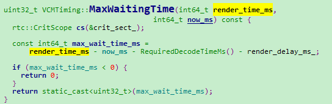

等待时间=当前帧预计渲染时间-解码消耗时间-渲染模块耗时

因为这里是解码前，所以要把后面的解码+渲染时间扣除。

### 五、render_time_ms计算

VCMTiming::RenderTimeMs函数实现视频帧渲染时间的计算。

VCMTiming::RenderTimeMs
->VCMTiming::RenderTimeMsInternal

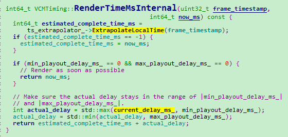

->VCMTiming::TargetDelayInternal

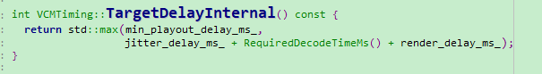

一帧视频的预期渲染时间是发送端发送时间+网络延时时间+解码时间+渲染模块耗时时间

发送端发送时间：可以根据发送报文的时间戳+接收第一帧视频的系统时间推算出来。

网络延时时间：可以参考《[webrtc代码走读十六（Jitter延时的计算）](https://blog.csdn.net/CrystalShaw/article/details/100763301)》

解码时间：使用KalmanFilter算法，计算每帧视频解码时间。

渲染时间：根据硬件配置，是固定值。

#### 1）发送端发送时间计算函数

TimestampExtrapolator::ExtrapolateLocalTime

#### 2）网络延时时间计算函数

VCMJitterEstimator::GetJitterEstimate

#### 3）解码时间计算函数

VCMCodecTimer::RequiredDecodeTimeMs

#### 4）渲染时间

VideoReceiveStream::VideoReceiveStream函数

`video_receiver_.SetRenderDelay`(`config_.render_delay_ms`)代码配置固定值

### 六、渲染前判断wait_time

IncomingVideoStream::OnFrame

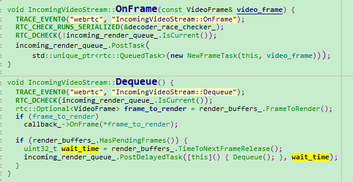

VideoRenderFrames::FrameToRender

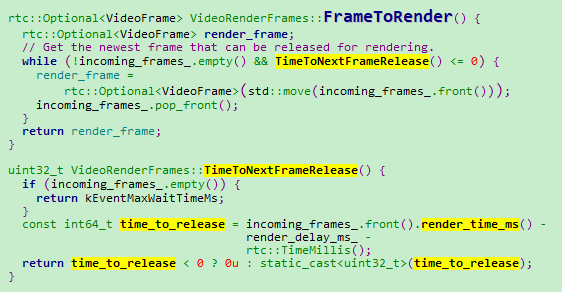

<hr>

#### <p>原文出处：<a href='https://blog.csdn.net/CrystalShaw/article/details/80483402' target='blank'>WebRTC QOS方法九（VideoFrame.ntp_time_ms含义）</a></p>

## WebRTC QOS方法九（VideoFrame.ntp_time_ms含义）

webrtc远端视频渲染的时候，VideoFrame携带时间参数有三个：timestamp_rtp_、ntp_time_ms_、timestamp_us_。

这里先描述一下`ntp_time_ms_`计算和传递过程。

WebRTC视频接收端延迟包括三部分：缓冲区延迟JitterDelay，解码延迟DecodeDelay和渲染延迟RenderDelay。其中DecodeDelay和RenderDelay相对比较稳定，而JitterDelay受发送端码率和网络状况影响较大。JitterDelay也是造成接收端延迟的最大因素。

缓冲区延迟JitterDelay由两部分延迟构成：传输大尺寸视频帧造成码率burst引起的延迟和网络噪声引起的延迟。

`ntp_time_ms_`就是缓冲区延迟JitterDelay。

### 一、传递过程

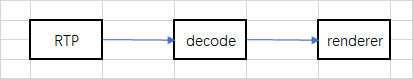

#### 1）rtp->decode过程

webrtc的rtp报文里面会携带一个该报文发送端的NTP时间戳。接收端根据这个时间戳，就可以知道该报文的发送时间。

RtpVideoStreamReceiver::OnReceivedPayloadData

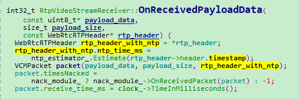

RemoteNtpTimeEstimator::Estimate

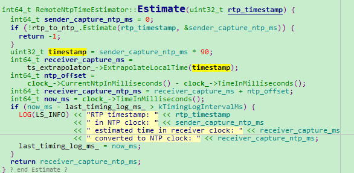

`VCMPacket::VCMPacket`

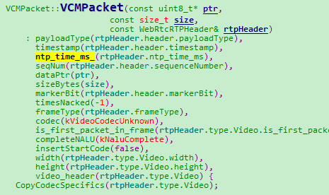

#### 2）decode->renderer过程

VP8DecoderImpl::Decode

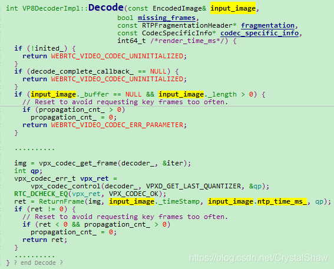

`input_image`是解码前的数据，需要将`input_image`里面保存的`ntp_time_ms_`传递到 解码后的YUV帧信息里面。

VP8DecoderImpl::ReturnFrame

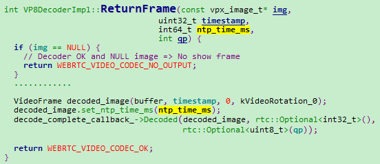

这里只是把该时间戳送入渲染模块，但是从解码后到渲染后之间的延时，`ntp_time_ms_`没有包含。

### 二、计算原理

webrtc的BWE模块用Trendline算法评估网络延时，计算原理是根据报文发送时间与接收时间差，计算网络延时。在RTP报文的extension字段中会携带该报文的发送时间。所以我们这里获取到的`ntp_time_ms`就是该报文发送时的系统时间。

我们可以使用这个时间精确计算出一帧视频从发送端发送出来到接收端的总延时时间。

### 三、参考

* <https://blog.csdn.net/CrystalShaw/article/details/82981183>

<hr>

#### <p>原文出处：<a href='https://blog.csdn.net/CrystalShaw/article/details/112567720' target='blank'>WebRTC QOS方法十（pacer实现）</a></p>

## WebRTC QOS方法十（pacer实现）

### 1  背景介绍

若仅仅发送音频数据，不需要PACER模块：

1）一帧音频数据本身不大，不会超过以太网的最大报文长度。一个RTP报文可以搞定，按照打包时长的节奏发送就可以。但视频数据不能按照音频数据的思路发送，一帧视频可能很大，远大于以太网的1500byte，需要分别封装在几个RTP报文中，若这些视频帧RTP报文一起发送到网络上，必然会导致网络瞬间拥塞。产生丢包抖动等异常。

2）大多数编解码格式下，一帧音频数据长度固定，音频码率持续平稳。码率不会出现忽高忽低现象。但是一帧视频数据长度受内容影响严重。I、P、B帧间的长度相差非常大。直接发送网络波动幅度很大。尤其是WIFI环境下，受限WIFI的调度机制，媒体数据能否平稳发送，对弱网的WiFi环境对通话质量影响很大。

PACER的目的就是让视频数据按照评估码率均匀的在各个时间片发送出去。如下图所示：

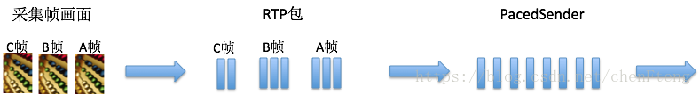

### 2  实现原理

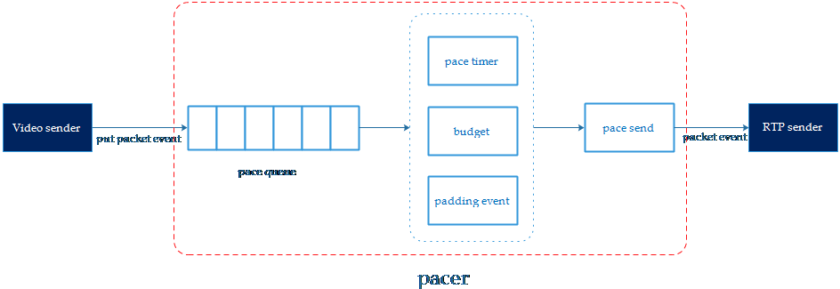

#### 2.1  设计PACER模块主要解决三个问题

##### 2.1.1  怎么发

音频，视频、NACK、FEC，PADDING报文都要统一从PACER模块发送。若不区分报文优先级，势必会对系统延时产生很大的影响。

所以音视频数据编码和RTP切分打包后，首先将RTP报文存在pace queue队列，并将报文元数据(packet id, size, timestamp,重传标示)送到pacer queue进行排队等待发送，插入队列的元数据会进行优先级排序。

pace queue是一个基于优先级排序的多维链表，它并不是一个先进先出的fifo,而是一个按优先级排序的list。报文优先级规则是：

  * 优先级高的报文排在fifo的前面，低的排在后面。
  * 首先判断报文的priority等级，等级越小的优先级越高（priority等级根据报文类型进行分类）。
  * 然后判断重发标示，重发的报文比普通报文的优先级更高
  * 最后是判断视频帧timestamp，越早的视频帧优先级更高。

pacer每次触发发送事件时是先从queue的最前面取出优先级最高的报文进行发送，这样做的目的是让视频在传输的过程中延迟尽量小，重传的报文尽快能到达防止等待卡顿。pace queue还可以设置最大延迟，如果超过最大延迟，会计算queue中数据发送所需要的码率，并且会把这个码率替代target bitrate作为budget参考码率来加速发送（最大延时详细处理流程在2.2小节有介绍）

根据报文类型确定数据优先级处理函数如下：

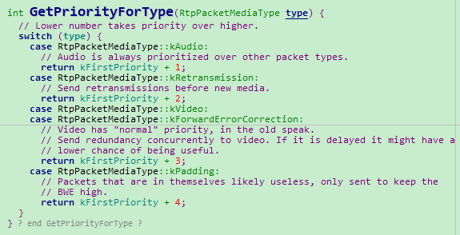

按照优先级POP数据处理函数如下：

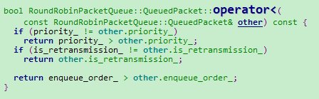

##### 2.1.2  什么时候发

PacingController::NextSendTime、PacingController::ProcessPackets是PACER模块两个核心函数，PacingController::ProcessPackets按照PacingController::NextSendTime控制的节奏周期调用。完成PACER平滑发送功能。

PacingController::NextSendTime在控制发送节奏上，有两种模式kPeriodic、kDynamic。kDynamic还没理解透，这里先记录kPeriodic实现方式。

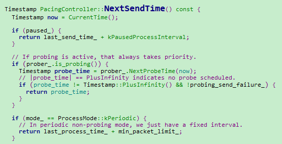

kPeriodic模式下，固定每隔5ms调用一次发送报文任务。

##### 2.1.3  发多少

PacingController::ProcessPackets被定时触发后，会计算当前时间和上次被调用时间的时间差，然后将时间差参数传入`media_budget_`，`media_budget_`算出当前时间片网络可以发送多少数据，然后从pacer queue当中取出报文元数据进行网络发送。

`media_budget_`根据评估出来的参考码率计算这次定时事件能发送多少字节的公式如下：


delta time：上次检查时间点和这次检查时间点的时间差。

target bitrate：pacer的参考码率，是由estimator根据网络状态评估出来的。

remain_bytes：每次触发发包时会减去发送报文的长度size,如果`remain_bytes > 0`，继续从pace queue中取下一个报文进行发送，直到`remain_bytes <=0` 或者 pace queue没有更多的报文。

如果pacer queue没有更多待发送的报文，但`media_budget_`计算出还可以发送更多的数据，这个时候pacer会进行padding报文补充。

#### 2.2  PACER模块引入延时问题规避方法

##### 2.2.1 max_pacing_delay

PACER模块定量计算发送网络报文数据量，相当于cache等待发送，必然会引起延迟。为了保证实时性，PACER模块有个`max_pacing_delay`全局变量，配置最大缓冲发送延时时间上限，若最大缓冲延时大于该值，就要重新调整PACER模块的目标码率，保证当前数据都能及时发送出去。

  * `max_pacing_delay`生效流程如下：

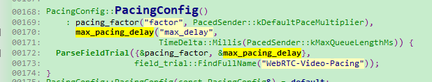 
配置max_pacing_delay参数

  * VideoSendStreamImpl::VideoSendStreamImpl配置到transport->SetQueueTimeLimit

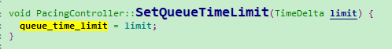

  * PacingController::ProcessPackets

会实时计算当前处理方式会引入的系统延时，当延时大于设定目标上限值，需要及时调整PACER目标码率，保证PACER模块引入延时时间可控。

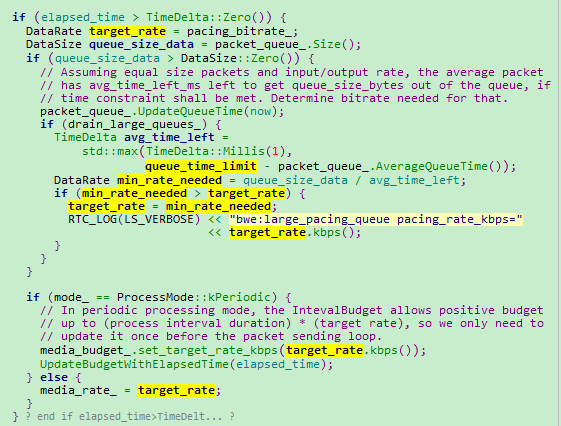

很明显这仅仅是一个迫不得己的规避方法，实际应用中，这种方法会出现码率梯度上升现象。

##### 2.2.2  编码算法码控模块配合

PACER模块实现不复杂，但是要想真正做好PACER功能，仅仅靠一个PACER模块是玩不转的，需要与视频编码器的码控模块配合：

1、首先探测模块配置码率给编码器，编码器一定要保证在可控周期内码率收敛到配置的码率参数值以内，否则会给PACER模块造成的累计延时越来越大压力。

2、另外IP帧rate也要在合理范围内。若I帧超大，势必导致关键帧传输延时变大，影响端到端系统延时。

这些参数都要根据自己的实际应用场景进行调优。

### 三、参考

* <https://mp.weixin.qq.com/s/Ej63-FTe5-2pkxyXoXBUTw>
* <https://blog.csdn.net/chenFteng/article/details/79818075>
* <https://blog.csdn.net/chenFteng/article/details/79805875> 
* <https://blog.csdn.net/u010643777/article/details/80362277>  
* <https://blog.csdn.net/u010643777/article/details/78739758>

<hr>

#### <p>原文出处：<a href='https://blog.csdn.net/CrystalShaw/article/details/114820274' target='blank'>WebRTC QOS方法十一（音视频同步AVSyn实现）</a></p>

## WebRTC QOS方法十一（音视频同步AVSyn实现）

### 一、背景介绍

由于音视频处理的系统路径不同，并且音视频媒体流是分开以RTP over UDP报文形式传输，UDP报文对网络丢包延时敏感，若不进行特殊平滑处理，会导致实际播放时音视频的渲染相对延时与采集延时有偏差，这样就容易产生音视频不同步现象。

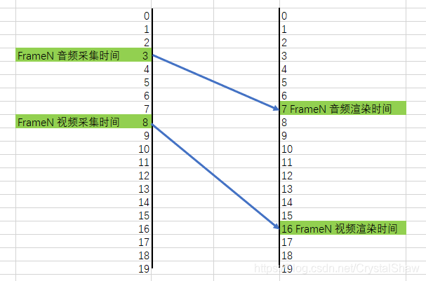

音视频同步的基本思想是，在接收端渲染前，对音视频分别进行不同长度的适当缓冲，尽量保证音视频渲染different time = 音视频采集different time。保证音视频同步。

从上图可以看出，要处理音视频同步，接收端要，需要做好三件事：获取接收端音视频数据绝对时间NTP差、获取发送端音视频采集绝对时间NTP差、计算音视频渲染缓冲时间delaytime。

### 二、实现原理

#### 1）获取接收端音视频数据绝对时间差

接收端音视频数据绝对时间NTP记录比较简单，在每次收报的时候，实时更新该时间戳对应的系统NTP时间即可。

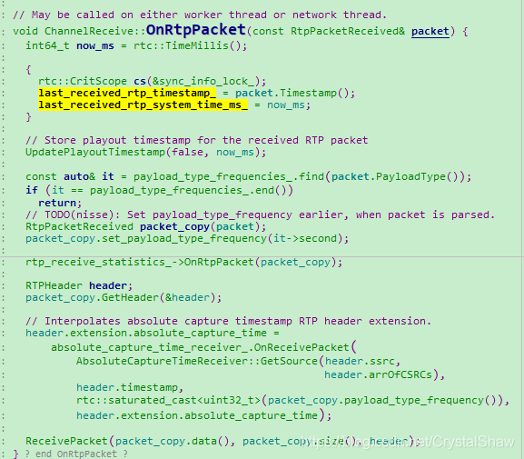

#### 2）获取发送端音视频采集绝对时间差

因为很多场景下，音视频不是同时采集，有时先有音频后有视频，有时先有视频后有音频，所以采集绝对时间差，不一定是0。

另外音频打包时长比较固定，10ms、20ms、40ms等，但是视频打包时长不固定，之前有一篇博客也写了，[摄像头采集帧率受光线影响明显](https://blog.csdn.net/CrystalShaw/article/details/87875177)，同一次通话中，视频帧率也可能一直变化。

所以音视频数据采集的NTP绝对时间差也不恒定，需要实时更新计算。在接收端计算发送端音视频采集时间差的整体思想是：通过音视频的RTP报文时间戳和发送端发送SR报文中的NTPtime计算。

1、在RTCP的SR报告中，有当前一帧媒体流采集时间和媒体时间戳的对应关系。

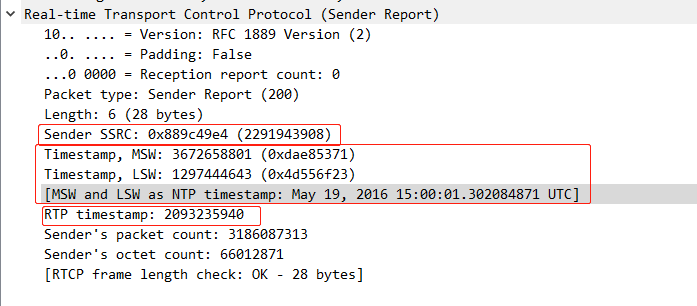

2、视频帧率虽然可能动态变化，但是通话过程中采样率不会变，也就是说单位时间戳差值代表的绝对时间差值不变，所以当连续收到同一个SSRC报文的两个SR报告，就能确定NTP time与时间戳的一次线程方程的系数，后续任意收到一个时间戳，都可以根据这个一次线性方程（）计算出音视频采集的NTP绝对时间。其中slope的物理意义是音视频采样率（视频固定采样率为90K，音频根据不同编解码参数，有8K、16K、48K等），offset是音视频时间戳的起始偏移（为防止网络报文异常攻击篡改，RTP报文时间戳都不是以0开始，系统启动的时候，会获取一个随机数，作为时间戳的起始值）。

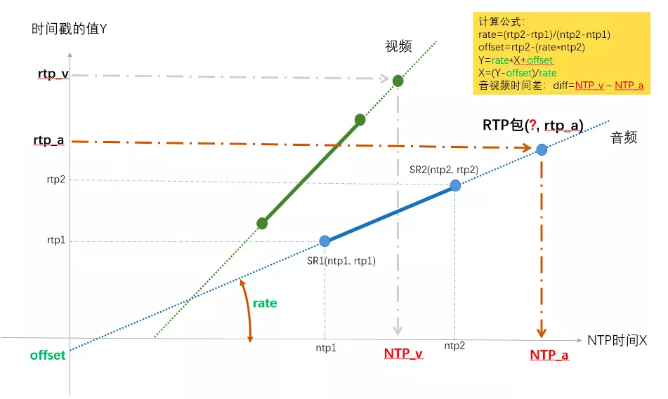

功能具体实现在RtpToNtpEstimator类中实现。核心函数是RtpToNtpEstimator::UpdateMeasurements和RtpToNtpEstimator::Estimate。

RtpToNtpEstimator::UpdateParameters通过push进来的SR报告，计算媒体的slope采样率和offset起始偏移。

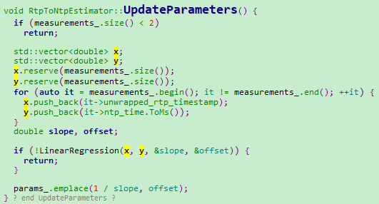

RtpToNtpEstimator::Estimate：根据UpdateParameters计算出来的媒体采样帧率和起始偏移，和新进入的媒体时间戳，计算新进入帧的视频采集绝对时间。

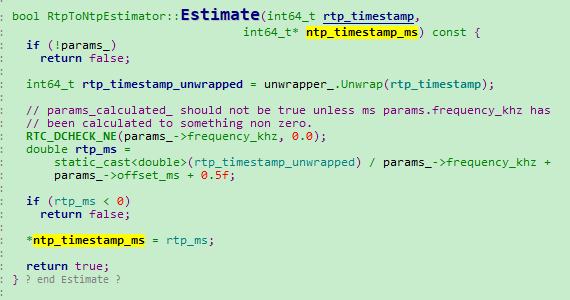

#### 3）计算音视频渲染缓冲时间delaytime

核心函数是StreamSynchronization类里面的ComputeRelativeDelay和ComputeDelays。

StreamSynchronization::ComputeRelativeDelay用来计算（音视频渲染different time- 音视频采集different time）

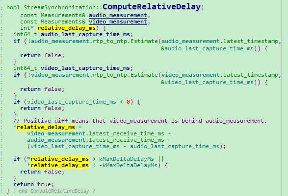

StreamSynchronization::ComputeDelays用来计算音视频渲染缓冲延时时间（计算公式后续补充）。

RtpStreamsSynchronizer::Process函数生效计算出来的音视频目标延时。

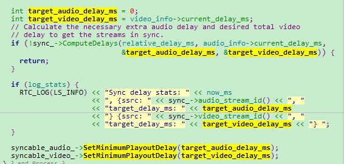

### 三、参考

* <https://www.jianshu.com/p/3a4d24a71091>
* <https://my.oschina.net/u/4713941/blog/4974741>
* <https://my.oschina.net/u/4312833/blog/4405326>
* <https://zhuanlan.zhihu.com/p/346004563>


