<!--BEGIN_DATA
{
    "create_date": "2020-12-05 18:33", 
    "modify_date": "2020-12-05 18:33", 
    "is_top": "0", 
    "summary": "WebRTC视频jitterbuffer原理机制(描述版)<br/>WebRTC视频JitterBuffer详解<br/>WebRTC视频jitterbuffer原理机制（一）<br/>WebRTC视频jitterbuffer原理机制（二）", 
    "tags": "WebRTC、C/C++", 
    "file_name": "WebRTC视频jitterbuffer原理.md"
}
END_DATA-->

#### <p>原文出处：<a href='https://www.jianshu.com/p/bd10d60cebcd' target='blank'>WebRTC视频jitterbuffer原理机制(描述版)</a></p>

如果网络是理想的，即无丢包，无抖动，低延时，那么接收到一帧完整数据就直接播放，效果也一定会非常好。但是实际的网络总是复杂的，尤其无线网络。如果还是这样直接播放，网络稍微变差，视频就会卡顿，出现马赛克等。所以，在接收端对接收的数据做一个缓冲是很有必要的。  

缓冲一定是以延时作为代价的，延时越大，对抖动的过滤效果越好。一个优秀的视频jitterbuffer，不仅要能够对丢包、乱序、延时到达等异常情况做处理，而且还要能够让视频平稳的播放，尽可能的避免出现明显的加速播放和缓慢播放。  

主流的实时音视频框架基本都会实现jitterbuffer功能，诸如webrtc、doubango等。webrtc的jitterbuffer相当优秀，按照功能分类的话，可以分为jitter和buffer。buffer主要对丢包、乱序、延时到达等异常情况做处理，还会和NACK、FEC、FIR等QOS相互配合。jitter主要根据当前帧的大小和延时评估出jitter delay，再结合decode delay、render delay以及音视频同步延时，得到render time，来控制平稳的渲染视频帧。

下面将分别对jitter和buffer做介绍。

### buffer

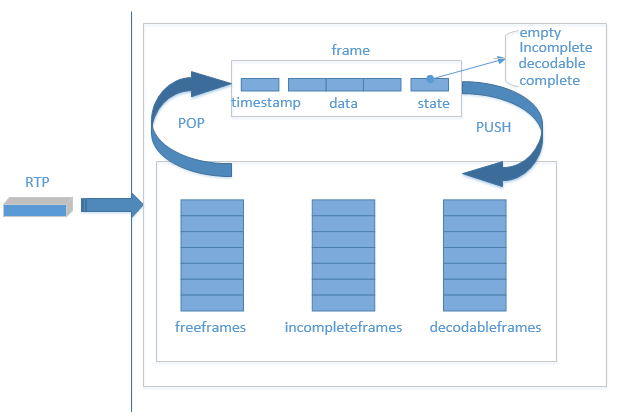

#### buffer对接收到的rtp包的处理流程如下：


* 第一次接收到一个视频包，从freeframes队列中弹出一个空frame块，用来放置这个包。
* 之后每次接收到一个RTP包，根据时间戳在incompleteframes和decodableframes中寻找，看是否已经接收到过相同时间戳的包，如果找到，则弹出该frame块，否则，从freeframes弹出一个空frame。
* 根据包的序列号，找到应该插入frame的位置，并更新state。其中state有empty、incomplete、decodable和complete，empty为没有数据的状态，incomplete为至少有一个包的状态，decodable为可解码状态，complete为这一帧所有数据都已经到齐。decodable会根据decode_error_mode 有不同的规则，QOS的不同策略会设置不同的decode_error_mode ，包含kNoErrors、kSelectiveErrors以及kWithErrors。decode_error_mode 就决定了解码线程从buffer中取出来的帧是否包含错误，即当前帧是否有丢包。
* 根据不同的state将frame帧 push回到队列中去。其中state为incomplete时，push到incompleteframes队列，decodable和complete状态的frame，push回到decodableframes队列中。
* freeframes队列有初始size，freeframes队列为空时，会增加队列size，但有最大值。也会定期从incompleteframes和decodable队列中清除一些过时的frame，push到freeframes队列。
* 解码线程取出frame,解码完成之后，push回freeframes队列。

jitterbuffer与QOS策略联系紧密，比如，incompleteframes和decodable队列清除一些frame之后，需要FIR（关键帧请求），根据包序号检测到丢包之后要NACK（丢包重传）等。

### jitter

所谓jitter就是一种抖动。具体如何解释呢？从源地址发送到目标地址，会发生不一样的延迟，这样的延迟变动就是jitter。  

jitter会带来什么影响？jitter会让音视频的播放不平稳，如音频的颤音，视频的忽快忽慢。那么如何对抗jitter呢？增加延时。需要增加一个因为jitter而存在的delay，即jitterdelay。

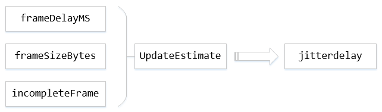

其中，frameDelayMS指的是一帧数据因为分包和网络传输所造成的延时总和,帧间延迟。具体如下图，即RTP1和RTP2到达Receiver的时间差。

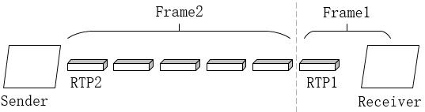

framesizeBytes指当前帧数据大小，incompleteFrame指是否为完整的帧，UpdateEstimate为根据这三个参数来更新jitte rdelay的模块，这个模块为核心模块，其中会用到卡尔曼滤波对帧间延迟进行滤波。

```cpp
JitterDelay = theta[0] * (MaxFS – AvgFS) + [noiseStdDevs * sqrt(varNoise) – noiseStdDevOffset]
```

其中theta[0]是信道传输速率的倒数，MaxFS是自会话开始以来所收到的最大帧大小，AvgFS表示平均帧大小。noiseStdDevs表示噪声系数2.33，varNoise表示噪声方差，noiseStdDevOffset是噪声扣除常数30。UpdateEstimate会不断地对varNoise等进行更新。

在得到jitterdelay之后，通过jitterdelay+ decodedelay + renderdelay，再确保大于音视频同步的延时，加上当前系统时间得到rendertime，这样就可以控制播放时间。控制播放，也就间接控制了buffer的大小。

### 取帧，解码播放

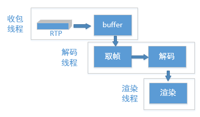

本文只介绍jitterbuffer相关内容，所以这里只详细介绍取帧这一步。  

解码线程会一直从buffer中寻找期望的数据，这里说的期望的分为必须完整的和可以不完整的。如果期望的是完整的，那就要从decodableframes队列取出状态为complete的frame，如果期望的数据可以是不完整的，就要从decodableframes和incompleteframes队列取出数据。取数据之前，总是先去找到数据的时间戳，然后计算完jitterdelay和渲染时间，再经过一段时间的延时（这个延时为渲染时间减去当前时间、decode delay和render delay）之后再去取得数据，传递到解码，渲染。  

取完整的帧时，有一个最大等待时间，即当前buffer中没有完整的帧，那么可以等待一段时间，以期望在这段时间里，可以出现完整的帧。

### 后记

从上述原理可以看出，webrtc中的接收buffer并非是固定的，而是根据网络波动等因素随时变化的。jitter则是为了对抗网络波动造成的抖动，使得视频能够平稳播放。  

那么，jitterbuffer是否存在可以优化的空间呢？jitterbuffer已经较为优秀，但我们可以通过调整里面的一些策略，来使的视频质量更好。比如，增大缓冲区，因为jitterbuffer是动态的，直接增大freeframes的size是无效的，只能通过调整延时，来增大缓冲区。再比如，调整等待时间，以期望获得更多完整的帧。再如，配合NACK，FIR、FEC等QOS策略，来对抗丢包。  

当然，这都是以牺牲延时为代价的。总之，要在延时和丢包、抖动之间做出平衡。

<hr>

#### <p>原文出处：<a href='https://blog.csdn.net/sonysuqin/article/details/106629343' target='blank'>WebRTC视频JitterBuffer详解</a></p>

### 1 WebRTC版本

m74。

### 2 概要

旧版的视频JitterBuffer实现在VCMJitterBuffer类中，目前已经不用，新版的JitterBuffer的功能被分散到多个模块中，主要包括：

  * PacketBuffer：负责帧的完整性，保证组成帧的每个包序列号连续，并且有一个包标识帧的开始，有一个包标识帧的结束；
  * RtpFrameReferenceFinder：负责给每个帧设置好参考帧，同时兼顾GOP内各帧的连续性；
  * FrameBuffer：负责帧的连续性和可解码性，这里帧的连续性是指某帧的所有参考帧都已经收到，帧的可解码性是指某帧的所有参考帧都已经被解码；
  * VCMJitterEstimator：计算抖动(googJitterbufferMS)，用于计算目标延迟(googTargetDelayMs)，用于音视频同步；
  * VCMTiming：计算当前延迟(googCurrentDelayMs)，用于计算渲染时间。

本文对照代码描述上述模块的主要工作过程。

### 3 JitterBuffer结构和基本流程

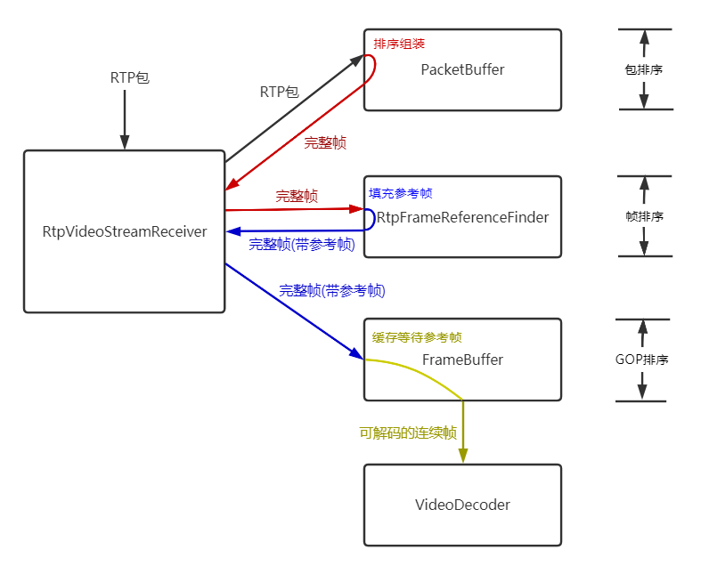

RtpVideoStreamReceiver类收到RTP包后，交给PacketBuffer类缓存、排序，PacketBuffer收集满1个完整的帧后，交还给RtpVideoStreamReceiver类，RtpVideoStreamReceiver类将一个完整的帧交给RtpFrameReferenceFinder，RtpFrameReferenceFinder类缓存最近的GOP，每个完整帧落在一个GOP中会填充好该帧的参考帧，交还给RtpVideoStreamReceiver，RtpVideoStreamReceiver将填充好参考帧的完整帧交给FrameBuffer，FrameBuffer判断某帧的所有参考帧都收到认为该帧连续，在某帧的所有参考帧都解码后认为该帧可以解码，从而可以交给解码器。

可以认为JitterBuffer的这些模块分三个层次分别做了RTP包的排序、GOP内帧的排序、GOP之间的排序：

  * 包的排序：PacketBuffer；
  * 帧的排序：RtpFrameReferenceFinder；
  * GOP的排序：FrameBuffer。

### 4 帧完整性 - PacketBuffer

#### 4.1 包缓存

PacketBuffer类有两个类型的包缓存：

  * std::vector `data_buffer_`，数据缓存，保存包原始数据，用于拼接整帧原始数据；
  * std::vector `sequence_buffer_`，排序缓存，保存包连续性信息，用于缓存包序列号等信息并排序成完整的帧。

连续性信息：

```cpp
struct ContinuityInfo {
    // 包序列号.
    uint16_t seq_num = 0;
    // 是否为帧的第一个包.
    bool frame_begin = false;
    // 是否为帧的最后一个包.
    bool frame_end = false;
    // 这个槽是否已经被使用.
    bool used = false;
    // 标识当前包之前的所有包是否都已经被插入包缓存，也就是当前包之前的所有包是否连续.
    bool continuous = false;
    // 当前包是否已经用于创建一个帧.
    bool frame_created = false;
  };
```

#### 4.2 帧的开始和结束

在packet_buffer.cc:348有一段注释：
    
```cpp
// In the case of H264 we don't have a frame_begin bit (yes,
// |frame_begin| might be set to true but that is a lie). So instead
// we traverese backwards as long as we have a previous packet and
// the timestamp of that packet is the same as this one. This may cause
// the PacketBuffer to hand out incomplete frames.
// See: https://bugs.chromium.org/p/webrtc/issues/detail?id=7106
```

这个注释意为H264的RTP包并没有一个可信的帧开始标识，并贴上一个[7106问题链接](https://bugs.chromium.org/p/webrtc/issues/detail?id=7106)，打开这个链接，可以看到问题在2017年的原有描述是在RTP分包方式FUA下，本该设置的帧开始标识S并没有被正确置位，但是在2018年4月该问题被修改成可以通过first_mb_in_slice来代替FUA S位。  

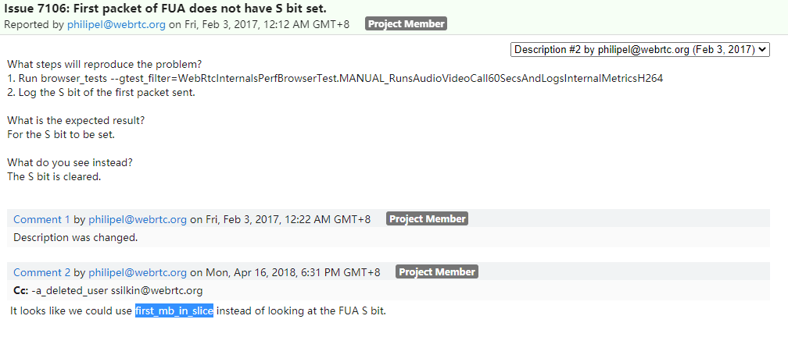  

但是实际上即使是到目前master的最新版本代码(13788025c81712df7e5535931a0b1d7931da6c2d )仍然还是使用FUAS位来标识FUA分包模式下一帧的第一个包，并且我测试过的多个版本(57，64，74)都没有出现FUAS位未正常置位的情况，可能已经在17年后的版本中被修复。
    
```cpp
bool RtpDepacketizerH264::ParseFuaNalu(
    RtpDepacketizer::ParsedPayload* parsed_payload,
    const uint8_t* payload_data) {
  ……
  bool first_fragment = (payload_data[1] & kSBit) > 0;
```

在这里重点强调一帧第一个包的标识是因为该标识对判断帧的完整性有重要作用，另外，一帧的最后一个包就是简单根据RTP头中的marker位来标识，只有在第一个包、最后一个包都取到并且中间的所有包都连续的情况下，才认为是一个完整的帧。

#### 4.3 插入RTP数据包 - PacketBuffer::InsertPacket

数据缓存、排序缓存这两个包缓存都是初始长度为`size_`(512)的数组，一旦缓存满会倍增容量，直到达到最大长度`max_size_`(2048)。

插入包的过程就是把数据填入这两个缓存的过程，同时会判断是否出现丢包，如果出现丢包则等待，在没有出现丢包的情况下，会判断是否已经获得了完整的帧，如果已经组装好了若干完整的帧，则通过OnAssembledFrame回调通知RtpVideoStreamReceiver。

```cpp
bool PacketBuffer::InsertPacket(VCMPacket* packet) {
  std::vector<std::unique_ptr<RtpFrameObject>> found_frames;
  {
    rtc::CritScope lock(&crit_);
	// 当前包序列号
    uint16_t seq_num = packet->seqNum;
    // 当前包在包缓存(包括数据缓存和排序缓存)中的索引
    size_t index = seq_num % size_;

	// 如果是第一个包
    if (!first_packet_received_) {
      // 保存第一个包序列号
      first_seq_num_ = seq_num;
      // 接收到了第一个包状态置位
      first_packet_received_ = true;
    } else if (AheadOf(first_seq_num_, seq_num)) {  // 如果当前包比之前记录的第一个包first_seq_num_还老
      // 并且之前已经清理过第一个包序列号，说明已经至少成功解码过一帧，RtpVideoStreamReceiver::FrameDecoded
      // 会调用PacketBuffer::ClearTo(seq_num)，清理first_seq_num_之前的所有缓存，这个时候还来一个比first_seq_num_还
      // 老的包，就没有必要再留着了。
      if (is_cleared_to_first_seq_num_) {
        delete[] packet->dataPtr;
        packet->dataPtr = nullptr;
        return false;
      }
	  
	  // 相反如果没有被清理过，则是有必要保留成第一个包的，比如发生了乱序。
      first_seq_num_ = seq_num;
    }

	// 如果这个槽被占用了
    if (sequence_buffer_[index].used) {
      // 如果序列号相等，则为重复包，删除负载并丢弃。
      if (data_buffer_[index].seqNum == packet->seqNum) {
        delete[] packet->dataPtr;
        packet->dataPtr = nullptr;
        return true;
      }

      // 如果槽被占但是输入包和对应槽的包序列号不等，说明缓存满了，需要扩容。
      while (ExpandBufferSize() && sequence_buffer_[seq_num % size_].used) {
      }
      // 重新计算输入包索引.
      index = seq_num % size_;
	  // 如果对应的槽还是被占用了，还是满，已经不行了，致命错误.
      if (sequence_buffer_[index].used) {
        delete[] packet->dataPtr;
        packet->dataPtr = nullptr;
        return false;
      }
    }
    // 如果没有错误，在index对应槽位填入当前包的信息
    sequence_buffer_[index].frame_begin = packet->is_first_packet_in_frame();  // 第一个包标识
    sequence_buffer_[index].frame_end = packet->is_last_packet_in_frame();	   // 最后一个包标识
    sequence_buffer_[index].seq_num = packet->seqNum;						   // 序列号
    sequence_buffer_[index].continuous = false;								   // 之前的包是否连续，这里初始为false，在FindFrames中置位
    sequence_buffer_[index].frame_created = false;							   // 是否已经用于创建一个帧，在FindFrames中置位
    sequence_buffer_[index].used = true;                                       // 槽位已经被占
    data_buffer_[index] = *packet;                                             // 存入数据缓存
    packet->dataPtr = nullptr;												   // 转移了指针的所有者

    // 更新丢包信息，检查收到当前包后是否有丢包导致的空洞，也就是不连续.
    UpdateMissingPackets(packet->seqNum);

    // 更新时间戳
    int64_t now_ms = clock_->TimeInMilliseconds();
    last_received_packet_ms_ = now_ms;
    if (packet->frameType == kVideoFrameKey)
      last_received_keyframe_packet_ms_ = now_ms;
    // 分析排序缓存，检查是否能够组装出完整的帧并返回.
    found_frames = FindFrames(seq_num);
  }

  // 如果有完整的帧则通过回调OnAssembledFrame上报RtpVideoStreamReceiver.
  for (std::unique_ptr<RtpFrameObject>& frame : found_frames)
    assembled_frame_callback_->OnAssembledFrame(std::move(frame));

  return true;
}
```

#### 4.4 处理RTP填充包 - PacketBuffer::PaddingReceived

发送端可能在编码器输出码率不足的情况下为保证发送码率填充空包，空包不会进入排序缓存和数据缓存，但是会触发丢包检测和完整帧的检测。


```cpp
void PacketBuffer::PaddingReceived(uint16_t seq_num) {
  std::vector<std::unique_ptr<RtpFrameObject>> found_frames;
  {
    rtc::CritScope lock(&crit_);
    // 更新丢包信息，检查收到当前包后是否有丢包导致的空洞，也就是不连续.
    UpdateMissingPackets(seq_num);
    // 分析排序缓存，检查是否能够组装出完整的帧并返回.
    found_frames = FindFrames(static_cast<uint16_t>(seq_num + 1));
  }

  // 如果有完整的帧则通过回调OnAssembledFrame上报RtpVideoStreamReceiver.
  for (std::unique_ptr<RtpFrameObject>& frame : found_frames)
    assembled_frame_callback_->OnAssembledFrame(std::move(frame));
}
```

#### 4.5 丢包检测 - PacketBuffer::UpdateMissingPackets

PacketBuffer维护一个丢包缓存`missing_packets_`，主要用于在PacketBuffer::FindFrames中判断某个已经完整的P帧前面是否有未完整的帧，如果有，该帧可能是I帧，也可能是P帧，这里并不会立刻把这个完整的P帧向后传递给RtpFrameReferenceFinder，而是暂时清除状态，等待前面的所有帧完整后才重复检测操作，所以这里实际上也发生了帧的排序，并产生了一定的帧间依赖。


```cpp
void PacketBuffer::UpdateMissingPackets(uint16_t seq_num) {
  // 如果最新插入的包序列号还未设置过，这里直接设置一次.
  if (!newest_inserted_seq_num_)
    newest_inserted_seq_num_ = seq_num;

  const int kMaxPaddingAge = 1000;
  // 如果当前包的序列号新于之前的最新包序列号，没有发生乱序
  if (AheadOf(seq_num, *newest_inserted_seq_num_)) {
    // 丢包缓存missing_packets_最大保存1000个包，这里得到当前包1000个包以前的序列号，
    // 也就差不多是丢包缓存里应该保存的最老的包.
    uint16_t old_seq_num = seq_num - kMaxPaddingAge;
    // 第一个>= old_seq_num的包的位置
    auto erase_to = missing_packets_.lower_bound(old_seq_num);
    // 删除丢包缓存里所有1000个包之前的所有包(如果有的话)
    missing_packets_.erase(missing_packets_.begin(), erase_to);

    // 如果最老的包的序列号都比当前最新包序列号新，那么更新一下当前最新包序列号
    if (AheadOf(old_seq_num, *newest_inserted_seq_num_))
      *newest_inserted_seq_num_ = old_seq_num;

    // 因为seq_num > newest_inserted_seq_num_，这里开始统计(newest_inserted_seq_num_, sum)之间的空洞.
    ++*newest_inserted_seq_num_;
    // 从newest_inserted_seq_num_开始，每个小于当前seq_num的包都进入丢包缓存，
    // 直到newest_inserted_seq_num_ == seq_num，也就是最新包的序列号变成了当前seq_num.
    while (AheadOf(seq_num, *newest_inserted_seq_num_)) {
      missing_packets_.insert(*newest_inserted_seq_num_);
      ++*newest_inserted_seq_num_;
    }
  } else {
    // 如果当前收到的包的序列号小于当前收到的最新包序列号，则从丢包缓存中删除(之前应该已经进入丢包缓存)
    missing_packets_.erase(seq_num);
  }
}
```

#### 4.6 连续包检测 - PacketBuffer::PotentialNewFrame

PacketBuffer::PotentialNewFrame(uint16_tseq_num)函数用于检测seq_num前的所有包是连续的，只有包连续，才进入完整帧的检测，所以叫“潜在的新帧检测”。


```cpp
bool PacketBuffer::PotentialNewFrame(uint16_t seq_num) const {
  // 通过序列号获取缓存索引
  size_t index = seq_num % size_;
  // 上个包的索引
  int prev_index = index > 0 ? index - 1 : size_ - 1;
  // 如果当前包的槽位没有被占用，那么该包之前没有处理过，不连续.
  if (!sequence_buffer_[index].used)
    return false;
  // 如果当前包的槽位的序列号和当前包序列号不一致，不连续.
  if (sequence_buffer_[index].seq_num != seq_num)
    return false;
  // 如果当前包已经用于创建一个帧，不连续.
  if (sequence_buffer_[index].frame_created)
    return false;
  // 如果当前包的帧开始标识frame_begin为true，那么该包是帧第一个包，连续.
  if (sequence_buffer_[index].frame_begin)
    return true;
  // 如果上个包的槽位没有被占用，那么上个包之前没有处理过，不连续.
  if (!sequence_buffer_[prev_index].used)
    return false;
  // 如果上个包已经用于创建一个帧，不连续.  
  if (sequence_buffer_[prev_index].frame_created)
    return false;
  // 如果上个包和当前包的序列号不连续，不连续.
  if (sequence_buffer_[prev_index].seq_num !=
      static_cast<uint16_t>(sequence_buffer_[index].seq_num - 1)) {
    return false;
  }
  // 如果上个包的时间戳和当前包的时间戳不相等，不连续.
  if (data_buffer_[prev_index].timestamp != data_buffer_[index].timestamp)
    return false;
  // 排除掉以上所有错误后，如果上个包连续，则可以认为当前包连续.
  if (sequence_buffer_[prev_index].continuous)
    return true;
  // 如果上个包不连续或者有其他错误，就返回不连续.
  return false;
}
```

从函数代码可以看出，一个帧的第一个包当且仅当帧开始标识frame_begin == true才返回连续，而第二个包以后是否返回连续依赖于上个包是否连续，这个连续性的延展保证只要判定某个序列号连续，其之前的所有包都连续。

frame_begin在FUA分包模式下是由FUA头的S位来设置的，所以上文说到这个标识的正确性很重要，如果S位没有正确设置则在FUA模式下(大帧分包)会出现错误，所幸这个应该不会发生。

#### 4.7 帧完整性检测 - PacketBuffer::FindFrames

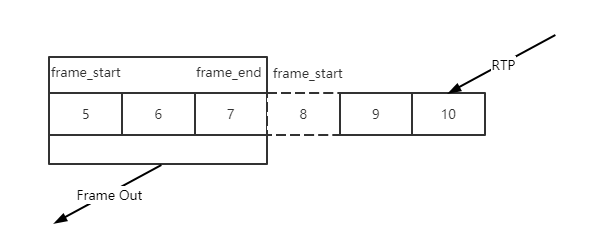  

PacketBuffer::FindFrames函数会遍历排序缓存中连续的包，检查一帧的边界，但是这里对VPX和H264的处理做了区分：

  * 对VPX，这个函数认为包的frame_begin可信，这样VPX的完整一帧就完全依赖于检测到frame_begin和frame_end这两个包；
  * 对H264，这个函数认为包的frame_begin不可信，并不依赖frame_begin来判断帧的开始，但是frame_end仍然是可信的，具体说H264的开始标识是通过从frame_end标识的一帧最后一个包向前追溯，直到找到一个时间戳不一样的断层，认为找到了完整的一个H264的帧。

另外这里对H264的P帧做了一些特殊处理，虽然P帧可能已经完整，但是如果该P帧前面仍然有丢包空洞，不会立刻向后传递，会等待直到所有空洞被填满，因为P帧必须有
参考帧才能正确解码。  

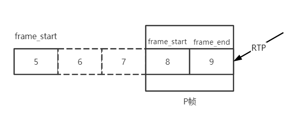


```cpp
std::vector<std::unique_ptr<RtpFrameObject>> PacketBuffer::FindFrames(
    uint16_t seq_num) {
  std::vector<std::unique_ptr<RtpFrameObject>> found_frames;
  // 基本算法：遍历所有连续包，先找到带有frame_end标识的帧最后一个包，然后向前回溯，
  // 找到帧的第一个包(VPX是frame_begin, H264是时间戳不连续)，组成完整一帧，
  
  // PotentialNewFrame(seq_num)检测seq_num之前的所有包是否连续.
  for (size_t i = 0; i < size_ && PotentialNewFrame(seq_num); ++i) {
    // 当前包的缓存索引
    size_t index = seq_num % size_;
    // 如果seq_num之前所有包连续，那么seq_num自己也连续.
    sequence_buffer_[index].continuous = true;

    // 找到了帧的最后一个包.
    if (sequence_buffer_[index].frame_end) {
      size_t frame_size = 0;
      int max_nack_count = -1;
      // 帧开始序列号，从帧尾部开始.
      uint16_t start_seq_num = seq_num;
      // 帧的最小接收时间，基本是帧第一个包的接收时间.
      int64_t min_recv_time = data_buffer_[index].receive_time_ms;
      // 帧的最大接收时间，基本是最后一个包的接收时间.
      int64_t max_recv_time = data_buffer_[index].receive_time_ms;

      // 开始向前回溯，找帧的第一个包.
      // 帧开始的索引，从帧尾部开始.
      int start_index = index;
      // 已经测试的包数.
      size_t tested_packets = 0;
      // 当前包的时间戳.
      int64_t frame_timestamp = data_buffer_[start_index].timestamp;

      // Identify H.264 keyframes by means of SPS, PPS, and IDR.
      bool is_h264 = data_buffer_[start_index].codec() == kVideoCodecH264;
      bool has_h264_sps = false;
      bool has_h264_pps = false;
      bool has_h264_idr = false;
      bool is_h264_keyframe = false;

      // 从帧尾部的包开始回溯.
      while (true) {
        // 测试包数++
        ++tested_packets;
        // 累加帧大小
        frame_size += data_buffer_[start_index].sizeBytes;
        // 获取最大重传数
        max_nack_count =
            std::max(max_nack_count, data_buffer_[start_index].timesNacked);
        // 当前包现在被标识为已经用于创建一个帧.
        sequence_buffer_[start_index].frame_created = true;
        // 获取最小接收时间
        min_recv_time =
            std::min(min_recv_time, data_buffer_[start_index].receive_time_ms);
        // 获取最大接收时间
        max_recv_time =
            std::max(max_recv_time, data_buffer_[start_index].receive_time_ms);
        // 如果是VPX，并且找到了frame_begin标识的第一个包，一帧完整，回溯结束.
        if (!is_h264 && sequence_buffer_[start_index].frame_begin)
          break;
        // 如果是H264.
        if (is_h264 && !is_h264_keyframe) {
          // 先检测是否关键帧，从数据缓存获取H264头.
          const auto* h264_header = absl::get_if<RTPVideoHeaderH264>(
              &data_buffer_[start_index].video_header.video_type_header);
          if (!h264_header || h264_header->nalus_length >= kMaxNalusPerPacket)
            return found_frames;
          // 遍历所有NALU，注意WebRTC所有IDR帧前面都会带SPS、PPS.
          for (size_t j = 0; j < h264_header->nalus_length; ++j) {
            if (h264_header->nalus[j].type == H264::NaluType::kSps) {
              has_h264_sps = true;  // 找到了SPS
            } else if (h264_header->nalus[j].type == H264::NaluType::kPps) {
              has_h264_pps = true;  // 找到了PPS
            } else if (h264_header->nalus[j].type == H264::NaluType::kIdr) {
              has_h264_idr = true;  // 找到了IDR
            }
          }
          // 默认sps_pps_idr_is_h264_keyframe_为false，也就是说只需要有IDR帧就认为是关键帧，
          // 而不需要等待SPS、PPS完整.
          if ((sps_pps_idr_is_h264_keyframe_ && has_h264_idr && has_h264_sps &&
               has_h264_pps) ||
              (!sps_pps_idr_is_h264_keyframe_ && has_h264_idr)) {
            is_h264_keyframe = true;
          }
        }
		// 如果检测包数已经达到缓存容量，中止.
        if (tested_packets == size_)
          break;
        // 搜索指针向前移动一个包.
        start_index = start_index > 0 ? start_index - 1 : size_ - 1;

        // In the case of H264 we don't have a frame_begin bit (yes,
        // |frame_begin| might be set to true but that is a lie). So instead
        // we traverese backwards as long as we have a previous packet and
        // the timestamp of that packet is the same as this one. This may cause
        // the PacketBuffer to hand out incomplete frames.
        // See: https://bugs.chromium.org/p/webrtc/issues/detail?id=7106
        // 这里保留了注释，可以看看H264不使用frame_begin的原因，实际上应该也可以.
        if (is_h264 &&													 // 如果是H264
            (!sequence_buffer_[start_index].used ||						 // 如果该槽位未被占用，发现断层.
             data_buffer_[start_index].timestamp != frame_timestamp)) {  // 如果时间戳不一致，发现断层.
          break;														 // 结束回溯.	
        }
        // 如果仍然在一帧内，开始包序列号--.
        --start_seq_num;
      }
      // 到这里帧的开始和结束位置已经搜索完毕，可以开始组帧.
      // 但是对H264 P帧，需要做另外的特殊处理，虽然P帧可能已经完整，
      // 但是如果该P帧前面仍然有丢包空洞，不会立刻向后传递，会等待直到所有空洞被填满，
      // 因为P帧必须有参考帧才能正确解码。
      if (is_h264) {
        // Warn if this is an unsafe frame.
        if (has_h264_idr && (!has_h264_sps || !has_h264_pps)) {
          RTC_LOG(LS_WARNING)
              << "Received H.264-IDR frame "
              << "(SPS: " << has_h264_sps << ", PPS: " << has_h264_pps
              << "). Treating as "
              << (sps_pps_idr_is_h264_keyframe_ ? "delta" : "key")
              << " frame since WebRTC-SpsPpsIdrIsH264Keyframe is "
              << (sps_pps_idr_is_h264_keyframe_ ? "enabled." : "disabled");
        }
		// 设置数据缓存中的关键帧标识.
        const size_t first_packet_index = start_seq_num % size_;
        RTC_CHECK_LT(first_packet_index, size_);
        if (is_h264_keyframe) {
          data_buffer_[first_packet_index].frameType = kVideoFrameKey;
        } else {
          data_buffer_[first_packet_index].frameType = kVideoFrameDelta;
        }

        // missing_packets_.upper_bound(start_seq_num) != missing_packets_.begin()
        // 这个条件是说在丢包的列表里搜索>start_seq_num(帧开始序列号)的第一个位置，
        // 发现其不等于丢包列表的开头, 有些丢的包序列号小于start_seq_num, 也就是说P帧前面有丢包空洞, 
        // 举例1：
        // missing_packets_ = { 3, 4, 6}, start_seq_num = 5, missing_packets_.upper_bound(start_seq_num)==6
        // 作为一帧开始位置的序列号5，前面还有3、4这两个包还未收到，那么对P帧来说，虽然完整，但是向后传递也可能是没有意义的, 
        // 所以这里又清除了frame_created状态，先继续缓存，等待丢包的空洞填满.
        // 举例2：
        // missing_packets_ = { 10, 16, 17}, start_seq_num = 3, missing_packets_.upper_bound(start_seq_num)==10
        // 作为一帧开始位置的序列号3，前面并没有丢包，并且帧完整，那么可以向后传递.
        if (!is_h264_keyframe && missing_packets_.upper_bound(start_seq_num) !=
                                     missing_packets_.begin()) {
          uint16_t stop_index = (index + 1) % size_;
          while (start_index != stop_index) {
            sequence_buffer_[start_index].frame_created = false;
            start_index = (start_index + 1) % size_;
          }
          // 返回找到的所有完整帧.
          return found_frames;
        }
      }
      // 马上要组帧了，清除丢包列表中到帧开始位置之前的丢包.
      // 对H264 P帧来说，如果P帧前面有空洞不会运行到这里，在上面已经解释.
      // 对I帧来说，可以丢弃前面的丢包信息(?).
      missing_packets_.erase(missing_packets_.begin(),
                             missing_packets_.upper_bound(seq_num));
      // 组一个帧.
      found_frames.emplace_back(
          new RtpFrameObject(this, start_seq_num, seq_num, frame_size,
                             max_nack_count, min_recv_time, max_recv_time));
    }  // if (sequence_buffer_[index].frame_end)
    
    // 向后扩大搜索的范围，假设丢包、乱序，当前包的seq_num刚好填补了之前的一个空洞，
    // 该包并不能检测出一个完整帧，需要这里向后移动指针到frame_end再进行回溯，直到检测出完整帧，
    // 这里会继续检测之前缓存的因为前面有空洞而没有向后传递的P帧。
    ++seq_num;
  }
  // 返回找到的所有完整帧.
  return found_frames;
}
```

#### 4.8 总结

  * PacketBuffer::InsertPacket向包缓存插入RTP数据，并触发帧完整性检查；
  * PacketBuffer::PaddingReceived处理空包，并触发帧完整性检查；
  * PacketBuffer::UpdateMissingPackets，更新丢包信息，用于检查P帧前面的空洞；
  * PacketBuffer::PotentialNewFrame，判断包的连续性，只有连续的包才检查帧完整性；
  * PacketBuffer::FindFrames，帧完整性检查，如果得到完整帧，则通过OnAssembledFrame回调上报。

### 5 查找参考帧 - RtpFrameReferenceFinder

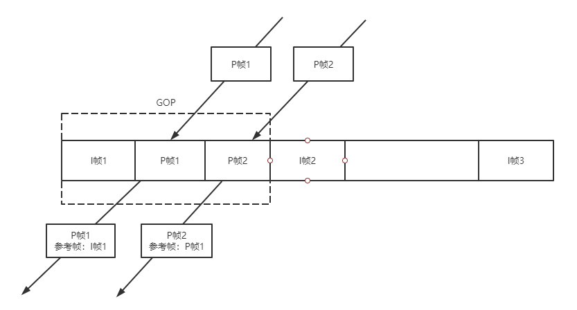  

上图描述了RtpFrameReferenceFinder的基本工作原理，顾名思义，RtpFrameReferenceFinder就是要找到每个帧的参考帧。I帧是GOP起始帧自参考，后续GOP内每个帧都要参考上一帧。

RtpFrameReferenceFinder维护最近的GOP表，收到P帧后，RtpFrameReferenceFinder找到P帧所属的GOP，将P帧的参考帧设置为GOP内该帧的上一帧，之后传递给FrameBuffer。

RtpFrameReferenceFinder还保证GOP内帧的输出连续，对H264来说，每收到一帧都判断该帧的第一个包的序列号是否与之前GOP收到的最后一个包序列号连续，是则输出连续帧，否则缓存等待直到连续；对VPX，只需要简单判断PID是否连续即可。这种连续传递的依赖关系会导致GOP内任一帧丢失则GOP内的剩余时间都处于卡顿状态。

#### 5.1 图像ID - PID

PID(Picture ID)是每帧图像的唯一标识，VPX定义了PID，但是H264没有这个概念，RtpFrameReferenceFinder使用每帧的最后一个包的序列号作为H264帧的PID。

在一个GOP内，除了I帧、P帧之外，可能还有WebRTC为补偿发送码率填充的空包，也会占用一个序列号。I帧是GOP的开始，没有连续性问题，但是要判断当前收到的P帧是否连续则需要判断该P帧的第一个包序列号-1是否等于该GOP当前收到的最后一个包序列号，可能是上一帧的最后一个包，也可能是一个填充包。

RtpFrameReferenceFinder定义的的GOP表结构：

<table><tbody><tr><td>key</td><td>value</td></tr><tr><td rowspan="2" align="left">last_seq_num：I帧最后一个包序列号，PID</td><td align="left">last_picture_id_gop：GOP内最新的一个帧的最后一个包的序列号， 用于设置为下一个帧的参考帧。</td></tr><tr><td align="left">last_picture_id_with_padding_gop：GOP内最新一个包的序列号，有可能是last_picture_id_gop，也有可能是填充包，用于检查帧的连续性。</td></tr></tbody></table>

#### 5.2 设置参考帧 - RtpFrameReferenceFinder::ManageFramePidOrSeqNum

该函数用于检查输入帧的连续性，并且设置其参考帧。

```cpp
RtpFrameReferenceFinder::FrameDecision
RtpFrameReferenceFinder::ManageFramePidOrSeqNum(RtpFrameObject* frame,
                                                int picture_id) {
  // 对H264，在没有开启generic的情况下，picture_id肯定是kNoPictureId.
  if (picture_id != kNoPictureId) {
    frame->id.picture_id = unwrapper_.Unwrap(picture_id);                   // 设置PID
    frame->num_references = frame->frame_type() == kVideoFrameKey ? 0 : 1;  // I帧自参考，P帧参考上一帧
    frame->references[0] = frame->id.picture_id - 1;                        // 参考帧是上一帧
    return kHandOff;
  }

  // 如果是关键帧，插入GOP表，key是last_seq_num，初始value是{last_seq_num, last_seq_num}
  if (frame->frame_type() == kVideoFrameKey) {
    last_seq_num_gop_.insert(std::make_pair(
        frame->last_seq_num(),
        std::make_pair(frame->last_seq_num(), frame->last_seq_num())));
  }

  // 如果GOP表空，那么就不可能找到参考帧，先缓存.
  if (last_seq_num_gop_.empty())
    return kStash;

  // 删除较老的关键帧(PID小于last_seq_num - 100), 但是至少保留一个。
  auto clean_to = last_seq_num_gop_.lower_bound(frame->last_seq_num() - 100);
  for (auto it = last_seq_num_gop_.begin();
       it != clean_to && last_seq_num_gop_.size() > 1;) {
    it = last_seq_num_gop_.erase(it);
  }

  // 在GOP表中搜索第一个比当前帧新的关键帧。
  auto seq_num_it = last_seq_num_gop_.upper_bound(frame->last_seq_num());
  // 如果搜索到的关键帧是最老的，说明当前帧比最老的关键帧还老，无法设置参考帧，丢弃.
  if (seq_num_it == last_seq_num_gop_.begin()) {
    RTC_LOG(LS_WARNING) << "Generic frame with packet range ["
                        << frame->first_seq_num() << ", "
                        << frame->last_seq_num()
                        << "] has no GoP, dropping frame.";
    return kDrop;
  }
  
  // 如果搜索到的关键帧不是最老的，那么搜索到的关键帧的上一个关键帧所在的GOP里应该可以找到参考帧，
  // 如果当前帧是关键帧，seq_num_it为end(), seq_num_it--则为最后一个关键帧.
  seq_num_it--;

  // 保证帧的连续，不连续则先缓存.
  // 当前GOP的最新一个帧的最后一个包的序列号.
  uint16_t last_picture_id_gop = seq_num_it->second.first;
  // 当前GOP的最新包的序列号，可能是last_picture_id_gop, 也可能是填充包.
  uint16_t last_picture_id_with_padding_gop = seq_num_it->second.second;
  // P帧的连续性检查.
  if (frame->frame_type() == kVideoFrameDelta) {
    // 获得P帧第一个包的上个包的序列号.
    uint16_t prev_seq_num = frame->first_seq_num() - 1;
    // 如果P帧第一个包的上个包的序列号与当前GOP的最新包的序列号不等，说明不连续，先缓存.
    if (prev_seq_num != last_picture_id_with_padding_gop)
      return kStash;
  }
  // 现在这个帧是连续的了.
  RTC_DCHECK(AheadOrAt(frame->last_seq_num(), seq_num_it->first));
  // 获得当前帧的最后一个包的序列号，设置为初始PID，后面还会设置一次Unwrap.
  frame->id.picture_id = frame->last_seq_num();
  // 设置帧的参考帧数，P帧才需要1个参考帧.
  frame->num_references = frame->frame_type() == kVideoFrameDelta;
  // 设置参考帧为当前GOP的最新一个帧的最后一个包的序列号，
  // 既然该帧是连续的，那么其参考帧自然也就是上个帧.
  frame->references[0] = rtp_seq_num_unwrapper_.Unwrap(last_picture_id_gop);
  // 如果当前帧比当前GOP的最新一个帧的最后一个包还新，则更新GOP的最新一个帧的最后一个包(first)
  // 以及GOP的最新包(second).
  if (AheadOf<uint16_t>(frame->id.picture_id, last_picture_id_gop)) {
    seq_num_it->second.first = frame->id.picture_id;   // 更新GOP的最新一个帧的最后一个包
    seq_num_it->second.second = frame->id.picture_id;  // 更新GOP的最新包，可能被填充包更新.
  }
  // 更新最新PID，H264无用.
  last_picture_id_ = frame->id.picture_id;
  // 更新填充包状态.
  UpdateLastPictureIdWithPadding(frame->id.picture_id);
  // 设置当前帧的PID为Unwrap形式.
  frame->id.picture_id = rtp_seq_num_unwrapper_.Unwrap(frame->id.picture_id);
  // 该包已经设置了参考帧且连续，可以向后传递了.
  return kHandOff;
}
```

#### 5.3 处理填充包 - RtpFrameReferenceFinder::PaddingReceived

该函数缓存填充包，并更新填充包状态，假如该填充包刚好填补了当前GOP的序列号空洞，则有可能有缓存的P帧进入连续状态，所以尝试处理一次缓存的P帧。

```cpp
void RtpFrameReferenceFinder::PaddingReceived(uint16_t seq_num) {
  rtc::CritScope lock(&crit_);
  // 只保留最近100个填充包.
  auto clean_padding_to =
      stashed_padding_.lower_bound(seq_num - kMaxPaddingAge);
  stashed_padding_.erase(stashed_padding_.begin(), clean_padding_to);
  // 缓存填充包.
  stashed_padding_.insert(seq_num);
  // 更新填充包状态.
  UpdateLastPictureIdWithPadding(seq_num);
  // 尝试处理一次缓存的P帧，有可能序列号连续了.
  RetryStashedFrames();
}

```

#### 5.3 更新填充包状态 - RtpFrameReferenceFinder::UpdateLastPictureIdWithPadding

该函数检查填充包缓存中的填充包，如果在GOP内连续则更新GOP表的last_picture_id_with_padding_gop字段，保证GOP的最新包序列号为最新的填充包序列号，以保证帧的连续性检查能够正确运行下去。

```cpp
void RtpFrameReferenceFinder::UpdateLastPictureIdWithPadding(uint16_t seq_num) {
  // 获取GOP表第一个比seq_num新的I帧.
  auto gop_seq_num_it = last_seq_num_gop_.upper_bound(seq_num);

  // 如果第一个比seq_num新的I帧在GOP表首，说明seq_num已经很老了，不处理.
  if (gop_seq_num_it == last_seq_num_gop_.begin())
    return;

  // 获取seq_num所在的GOP.
  --gop_seq_num_it;

  // 计算GOP最新包的下一个连续的序列号，看看是否可以在缓存的填充包中查到。
  uint16_t next_seq_num_with_padding = gop_seq_num_it->second.second + 1;
  // 查找填充包缓存中第一个大于等于next_seq_num_with_padding的位置.
  auto padding_seq_num_it =
      stashed_padding_.lower_bound(next_seq_num_with_padding);

  // 如果连续的序列号都能在缓存的填充包中查到，更新GOP最新包序列号，并从填充包缓存中清除.
  while (padding_seq_num_it != stashed_padding_.end() &&
         *padding_seq_num_it == next_seq_num_with_padding) {
    // 更新GOP最新包的序列号为连续的填充包序列号.
    gop_seq_num_it->second.second = next_seq_num_with_padding;
    // 下个连续的填充包序列号.
    ++next_seq_num_with_padding;
    // 删除填充包缓存的当前项，指向下一个.
    padding_seq_num_it = stashed_padding_.erase(padding_seq_num_it);
  }

  // 在某种情况下，这个流长时间连续但是没有获得新的关键帧，当前的帧可能比上个关键帧
  // 更老(例如发生了序列号wrapping), 为防止这种情况不时的更新这个关键帧的PID。
  // 如果该GOP的关键帧的最后一个包的序列号(PID)早于当前包10000，更新该关键帧PID.
  if (ForwardDiff(gop_seq_num_it->first, seq_num) > 10000) {
    RTC_DCHECK_EQ(1ul, last_seq_num_gop_.size());
    // 设置新的PID为当前帧seq_num.
    last_seq_num_gop_[seq_num] = gop_seq_num_it->second;
    // 删除旧的项.
    last_seq_num_gop_.erase(gop_seq_num_it);
  }
}
```

#### 5.4 处理缓存的包 - RtpFrameReferenceFinder::RetryStashedFrames

有两种情况可以尝试处理缓存的帧，持续的输出带参考帧的连续的帧。

  * 在输出完一个连续的带参考帧的帧后，帧缓存`stashed_frames_`中可能还可以输出下一个连续的带参考帧的帧；
  * 收到一个乱序的填充包，导致GOP中的某个P帧连续。
    
```cpp
void RtpFrameReferenceFinder::RetryStashedFrames() {
  bool complete_frame = false;
  do {
    complete_frame = false;
    // 遍历缓存的帧
    for (auto frame_it = stashed_frames_.begin();
         frame_it != stashed_frames_.end();) {
      // 调用ManageFramePidOrSeqNum来处理一个缓存帧，检查是否可以输出带参考帧的连续的帧.
      FrameDecision decision = ManageFrameInternal(frame_it->get());
      // 检查处理结果
      switch (decision) {
        case kStash:    // 仍然不连续，或者没有参考帧.
          ++frame_it;   // 检查下一个缓存帧.
          break;
        case kHandOff:  // 找到了一个带参考帧的连续的帧.
          complete_frame = true;
          // 通过OnCompleteFrame回调输出.
          frame_callback_->OnCompleteFrame(std::move(*frame_it));
          RTC_FALLTHROUGH();
        case kDrop:    // 无论kHandOff、kDrop都可以从缓存中删除了.
          frame_it = stashed_frames_.erase(frame_it);  // 删除并检查下一个缓存帧.
      }
    }
  } while (complete_frame);  // 如果能持续找到带参考帧的连续的帧则继续.
}
```

#### 5.5 总结

RtpFrameReferenceFinder缓存GOP信息，每个帧(以及填充包)进入GOP排序，如果某个帧连续，则设置其参考帧为GOP内上一帧并输出，I帧不需要参考帧，P帧需要参考帧。

### 6 有序输出 - FrameBuffer

上节的RtpFrameReferenceFinder为了设置P帧的参考帧为上一帧，保证了GOP内帧的有序，但是不保证GOP输出的有序，这个保证是由FrameBuffer来实现。  

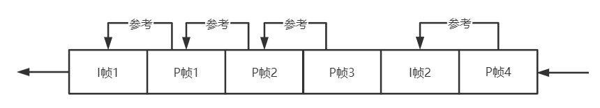  

如上图所示，FrameBuffer按照帧的先后顺序向解码器输出帧。FrameBuffer按顺序输出“可解码”的帧，这里的“可解码”意思是某帧“连续”、并且其所有参考帧都已经被解码，这里“连续”的意思是指某个帧的所有参考帧都已经收到。I帧是自参考的，所以直接是可解码的，但是P帧则需要等待所有参考帧，也就是上一帧被收到。

这样，因为PacketBuffer、RtpFrameReferenceFinder这两个类只是保证帧的完整、GOP内帧的有序，一旦当前GOP的P帧还未完整，下个GOP的I帧提前进入FrameBuffer，则会直接丢弃当前GOP的所有后续P帧。

#### 6.1 插入帧 - FrameBuffer::InsertFrame

该函数将当前帧插入帧缓存，如果该帧的所有参考帧都已经收到，那么认为该帧是连续的，那么通过同步事件通知解码线程取待解码帧，同时通知参考该帧的所有帧，检查他们的未连续参考帧数量是否已经为0，是则连续。


```cpp
int64_t FrameBuffer::InsertFrame(std::unique_ptr<EncodedFrame> frame) {
  const VideoLayerFrameId& id = frame->id;

  rtc::CritScope lock(&crit_);
  // 上一个连续的帧的PID
  int64_t last_continuous_picture_id =
      !last_continuous_frame_ ? -1 : last_continuous_frame_->picture_id;
  // 检查参考帧是否合法，不合法则返回.
  if (!ValidReferences(*frame)) {
    RTC_LOG(LS_WARNING) << "Frame with (picture_id:spatial_id) ("
                        << id.picture_id << ":"
                        << static_cast<int>(id.spatial_layer)
                        << ") has invalid frame references, dropping frame.";
    return last_continuous_picture_id;
  }
  // 如果帧缓存溢出了.
  if (frames_.size() >= kMaxFramesBuffered) {
    // 如果是关键帧.
    if (frame->is_keyframe()) {
      RTC_LOG(LS_WARNING) << "Inserting keyframe (picture_id:spatial_id) ("
                          << id.picture_id << ":"
                          << static_cast<int>(id.spatial_layer)
                          << ") but buffer is full, clearing"
                          << " buffer and inserting the frame.";
      // 清理一下，继续从当前帧开始解码.
      ClearFramesAndHistory();
    } else {
      // 如果不是关键帧就返回.
      RTC_LOG(LS_WARNING) << "Frame with (picture_id:spatial_id) ("
                          << id.picture_id << ":"
                          << static_cast<int>(id.spatial_layer)
                          << ") could not be inserted due to the frame "
                          << "buffer being full, dropping frame.";
      return last_continuous_picture_id;
    }
  }
  // 最近解码的帧PID(H264是帧最后一个包序列号).
  auto last_decoded_frame = decoded_frames_history_.GetLastDecodedFrameId();
  // 最近解码的帧时间戳.
  auto last_decoded_frame_timestamp =
      decoded_frames_history_.GetLastDecodedFrameTimestamp();
  // 如果当前帧的PID < 最近解码帧的PID，有可能是乱序，也有可能是序列号wrapping.
  if (last_decoded_frame && id <= *last_decoded_frame) {
    // 虽然PID更小，但是时间戳更加新，可能是编码器重置或者序列号wrapping，
    // 假如是关键帧的话还是可以继续处理的.
    if (AheadOf(frame->Timestamp(), *last_decoded_frame_timestamp) &&
        frame->is_keyframe()) {
      // If this frame has a newer timestamp but an earlier picture id then we
      // assume there has been a jump in the picture id due to some encoder
      // reconfiguration or some other reason. Even though this is not according
      // to spec we can still continue to decode from this frame if it is a
      // keyframe.
      RTC_LOG(LS_WARNING)
          << "A jump in picture id was detected, clearing buffer.";
      // 清理一下，继续从当前帧开始解码.
      ClearFramesAndHistory();
      last_continuous_picture_id = -1;
    } else {
      // 如果是真的乱序，而且不是关键帧，丢弃.
      RTC_LOG(LS_WARNING) << "Frame with (picture_id:spatial_id) ("
                          << id.picture_id << ":"
                          << static_cast<int>(id.spatial_layer)
                          << ") inserted after frame ("
                          << last_decoded_frame->picture_id << ":"
                          << static_cast<int>(last_decoded_frame->spatial_layer)
                          << ") was handed off for decoding, dropping frame.";
      return last_continuous_picture_id;
    }
  }

  // 假如序列号发生了很大跳动，清理.
  if (!frames_.empty() && id < frames_.begin()->first &&
      frames_.rbegin()->first < id) {
    RTC_LOG(LS_WARNING)
        << "A jump in picture id was detected, clearing buffer.";
    // 清理一下，继续从当前帧开始解码.
    ClearFramesAndHistory();
    last_continuous_picture_id = -1;
  }
  // 尝试申请帧缓存的槽位.
  auto info = frames_.emplace(id, FrameInfo()).first;
  // 如果是重复帧，返回.
  if (info->second.frame) {
    RTC_LOG(LS_WARNING) << "Frame with (picture_id:spatial_id) ("
                        << id.picture_id << ":"
                        << static_cast<int>(id.spatial_layer)
                        << ") already inserted, dropping frame.";
    return last_continuous_picture_id;
  }
  // 更新帧信息，主要是设置帧的还未连续的参考帧数量，并建立被参考帧与参考他的帧之间的参考关系，
  // 用于当被参考帧有效时，更新参考他的帧的参考帧数量(为0则连续)以及可解码状态.
  if (!UpdateFrameInfoWithIncomingFrame(*frame, info))
    return last_continuous_picture_id;
  // 如果不是被重传的，可以用于计算时延.
  // timing_用于计算很多时延指标以及帧的预期渲染时间.
  if (!frame->delayed_by_retransmission())
    timing_->IncomingTimestamp(frame->Timestamp(), frame->ReceivedTime());
  // 保存帧到帧缓存
  info->second.frame = std::move(frame);
  // 如果该帧的未连续的参考帧数量为0，那么他本身已经连续，例如I帧，或者当前P帧参考的上个P帧已经收到.
  if (info->second.num_missing_continuous == 0) {
    // 设置"连续"状态
    info->second.continuous = true;
    // 传播"连续"状态，也就是遍历参考当前帧的所有帧，让他们num_missing_continuous--
    PropagateContinuity(info);
    // 返回的最后连续帧PID
    last_continuous_picture_id = last_continuous_frame_->picture_id;
    // 现在肯定有"连续"帧，通知解码线程干活.
    new_continuous_frame_event_.Set();
  }
  // 返回最后连续帧PID
  return last_continuous_picture_id;
}
```

#### 6.2 更新参考帧信息 - FrameBuffer::UpdateFrameInfoWithIncomingFrame

该函数检查某帧的参考帧是否已经连续，初始化未连续参考帧计数器num_missing_continuous、未解码参考帧计数器num_missing_decodable，同时反向建立被参考帧与依赖帧之间的关系，方便状态(连续、可解码)传播。

```cpp
bool FrameBuffer::UpdateFrameInfoWithIncomingFrame(const EncodedFrame& frame,
                                                   FrameMap::iterator info) {
  TRACE_EVENT0("webrtc", "FrameBuffer::UpdateFrameInfoWithIncomingFrame");
  const VideoLayerFrameId& id = frame.id;
  // 最新解码的帧.
  auto last_decoded_frame = decoded_frames_history_.GetLastDecodedFrameId();
  RTC_DCHECK(!last_decoded_frame || *last_decoded_frame < info->first);

  struct Dependency {
    VideoLayerFrameId id;  // PID
    bool continuous;       // 只有未连续参考帧数量为0，才为“连续”
  };
  std::vector<Dependency> not_yet_fulfilled_dependencies;

  // 遍历当前帧的所有参考帧
  for (size_t i = 0; i < frame.num_references; ++i) {
    // 参考帧
    VideoLayerFrameId ref_key(frame.references[i], frame.id.spatial_layer);
    // 如果当前帧的参考帧与最新的解码帧比相等或者更早，可能是被解过码，也有可能是乱序。
    if (last_decoded_frame && ref_key <= *last_decoded_frame) {
      // 如果这个参考帧还未解码(乱序)，那么这个参考帧将不再有机会被解码, 那么当前帧也无法被解码，
      // 返回失败，反之如果这个参考帧已经被解码了，则属于正常状态。
      if (!decoded_frames_history_.WasDecoded(ref_key)) {
        int64_t now_ms = clock_->TimeInMilliseconds();
        if (last_log_non_decoded_ms_ + kLogNonDecodedIntervalMs < now_ms) {
          RTC_LOG(LS_WARNING)
              << "Frame with (picture_id:spatial_id) (" << id.picture_id << ":"
              << static_cast<int>(id.spatial_layer)
              << ") depends on a non-decoded frame more previous than"
              << " the last decoded frame, dropping frame.";
          last_log_non_decoded_ms_ = now_ms;
        }
        return false;
      }
    } else {
      // 如果如果当前帧的参考帧比最新的解码帧更晚，那么该参考帧可能还未连续.
      auto ref_info = frames_.find(ref_key);
      // 检查一下该参考帧是否已经连续.
      bool ref_continuous =
          ref_info != frames_.end() && ref_info->second.continuous;
      // 该参考帧填入当前帧还未满足的依赖表.
      not_yet_fulfilled_dependencies.push_back({ref_key, ref_continuous});
    }
  }
  // 未连续参考帧计数器，初始化为当前帧还未满足的依赖表大小.
  info->second.num_missing_continuous = not_yet_fulfilled_dependencies.size();
  // 未解码参考帧计数器，初始化为当前帧还未满足的依赖表大小.
  info->second.num_missing_decodable = not_yet_fulfilled_dependencies.size();

  // 遍历当前帧还未满足的依赖表
  for (const Dependency& dep : not_yet_fulfilled_dependencies) {
    // 如果某个参考帧已经连续
    if (dep.continuous)
      // 未连续参考帧计数器-1
      --info->second.num_missing_continuous;
    // 建立参考帧->依赖帧反向关系，用于传播状态.
    frames_[dep.id].dependent_frames.push_back(id);
  }

  return true;
}
```

#### 6.3 取解码帧 - FrameBuffer::NextFrame

该函数从帧缓存中获取一个可以解码的帧，该帧必须是连续的(所有参考帧都已经收到)，并且其所有参考帧都已经被解码。对I帧来说本身是连续的且自参考，可以直接被取走，P帧则需要依赖参考帧的连续、解码状态。

```cpp
FrameBuffer::ReturnReason FrameBuffer::NextFrame(
    int64_t max_wait_time_ms,
    std::unique_ptr<EncodedFrame>* frame_out,
    bool keyframe_required) {
  TRACE_EVENT0("webrtc", "FrameBuffer::NextFrame");
  // max_wait_time_ms为最大等待时间间隔，latest_return_time_ms为最晚返回的绝对时间。
  int64_t latest_return_time_ms =
      clock_->TimeInMilliseconds() + max_wait_time_ms;
  int64_t wait_ms = max_wait_time_ms;
  int64_t now_ms = 0;

  do {
    // 当前时间
    now_ms = clock_->TimeInMilliseconds();
    {
      rtc::CritScope lock(&crit_);
      // 清除事件状态
      new_continuous_frame_event_.Reset();
      if (stopped_)
        return kStopped;

      wait_ms = max_wait_time_ms;

      // 清除待解码帧列表
      frames_to_decode_.clear();

      // 遍历所有已经连续的帧.
      for (auto frame_it = frames_.begin();
           frame_it != frames_.end() &&
           frame_it->first <= last_continuous_frame_;
           ++frame_it) {
        // 如果帧还未连续，或者其有参考帧还未解码，忽略.
        if (!frame_it->second.continuous ||
            frame_it->second.num_missing_decodable > 0) {
          continue;
        }
        // 如果可以解码，取到待解码帧.
        EncodedFrame* frame = frame_it->second.frame.get();
        // 如果需要关键帧，但当前帧不是关键帧(默认keyframe_required=false), 忽略.
        if (keyframe_required && !frame->is_keyframe())
          continue;
        // 之前最新解码的帧时间戳.
        auto last_decoded_frame_timestamp =
            decoded_frames_history_.GetLastDecodedFrameTimestamp();

        // 如果待解码帧早于之前最新解码的帧时间戳，乱序，不处理.
        if (last_decoded_frame_timestamp &&
            AheadOf(*last_decoded_frame_timestamp, frame->Timestamp())) {
          continue;
        }

        // VPX，不处理.
        if (frame->inter_layer_predicted) {
          continue;
        }

        // 收集超帧，H264只有一个完整帧，current_superframe.size()为1.
        std::vector<FrameMap::iterator> current_superframe;
        current_superframe.push_back(frame_it);
        // H264为true，只有一层.
        bool last_layer_completed =
            frame_it->second.frame->is_last_spatial_layer;
        FrameMap::iterator next_frame_it = frame_it;
        while (true) {
          // 这里面是VPX的逻辑，忽略.
          ++next_frame_it;
          if (next_frame_it == frames_.end() ||
              next_frame_it->first.picture_id != frame->id.picture_id ||
              !next_frame_it->second.continuous) {
            break;
          }
          // Check if the next frame has some undecoded references other than
          // the previous frame in the same superframe.
          size_t num_allowed_undecoded_refs =
              (next_frame_it->second.frame->inter_layer_predicted) ? 1 : 0;
          if (next_frame_it->second.num_missing_decodable >
              num_allowed_undecoded_refs) {
            break;
          }
          // All frames in the superframe should have the same timestamp.
          if (frame->Timestamp() != next_frame_it->second.frame->Timestamp()) {
            RTC_LOG(LS_WARNING)
                << "Frames in a single superframe have different"
                   " timestamps. Skipping undecodable superframe.";
            break;
          }
          current_superframe.push_back(next_frame_it);
          last_layer_completed =
              next_frame_it->second.frame->is_last_spatial_layer;
        }
        // Check if the current superframe is complete.
        // TODO(bugs.webrtc.org/10064): consider returning all available to
        // decode frames even if the superframe is not complete yet.
        if (!last_layer_completed) {
          continue;
        }
        // 待解码帧列表只有1个.
        frames_to_decode_ = std::move(current_superframe);
        // 如果未设置过渲染时间则设置渲染时间.
        if (frame->RenderTime() == -1) {
          frame->SetRenderTime(
              timing_->RenderTimeMs(frame->Timestamp(), now_ms));
        }
        // 检查可以继续等待的剩余时间.
        wait_ms = timing_->MaxWaitingTime(frame->RenderTime(), now_ms);

        // wait_ms = frame->RenderTime() - now_ms - 渲染时间 - 解码时间
        // 如果wait_ms < -kMaxAllowedFrameDelayMs，说明可能解码性能不够，
        // 解码时间过长，该帧已经来不及渲染了，忽略该帧.
        if (wait_ms < -kMaxAllowedFrameDelayMs)
          continue;
        // 已经获得了待解码帧，退出搜索.
        break;
      }
    }  // rtc::Critscope lock(&crit_);
    // 更新剩余等待时间
    wait_ms = std::min<int64_t>(wait_ms, latest_return_time_ms - now_ms);
    wait_ms = std::max<int64_t>(wait_ms, 0);
  } while (new_continuous_frame_event_.Wait(wait_ms));  // 阻塞等待

  {
    rtc::CritScope lock(&crit_);
    now_ms = clock_->TimeInMilliseconds();
    // TODO(ilnik): remove |frames_out| use frames_to_decode_ directly.
    std::vector<EncodedFrame*> frames_out;
    // 如果获得了可解码帧
    if (!frames_to_decode_.empty()) {
      bool superframe_delayed_by_retransmission = false;
      size_t superframe_size = 0;
      EncodedFrame* first_frame = frames_to_decode_[0]->second.frame.get();
      int64_t render_time_ms = first_frame->RenderTime();     // 预期渲染时间
      int64_t receive_time_ms = first_frame->ReceivedTime();  // 接收时间
      // 检查帧的渲染时间戳或者当前的目标延迟是否有异常，如果是则重置时间处理器，
      // 重新获取帧的渲染时间.
      if (HasBadRenderTiming(*first_frame, now_ms)) {
        jitter_estimator_->Reset();
        timing_->Reset();
        render_time_ms =
            timing_->RenderTimeMs(first_frame->Timestamp(), now_ms);
      }
      // 遍历所有待解码超帧(他们应该有同样的时间戳)
      for (FrameMap::iterator& frame_it : frames_to_decode_) {
        RTC_DCHECK(frame_it != frames_.end());
        EncodedFrame* frame = frame_it->second.frame.release();
		// 重置预期渲染时间.
        frame->SetRenderTime(render_time_ms);
        // 超帧是否经过了重传.
        superframe_delayed_by_retransmission |=
            frame->delayed_by_retransmission();
        // 更新接收时间.
        receive_time_ms = std::max(receive_time_ms, frame->ReceivedTime());
        // 更新超帧总大小.
        superframe_size += frame->size();
		// 传播可解码性，当前帧可解码，通知参考他的帧检查其参考帧是否都已经被解码，
		// 如果是则也可以进入可解码状态.
        PropagateDecodability(frame_it->second);
        // 当前可解码帧进入已解码帧历史列表(实际上没有真的被解码，而是即将被解码)，
        // 早于历史解码帧的帧将被丢弃.
        decoded_frames_history_.InsertDecoded(frame_it->first,
                                              frame->Timestamp());

        // 删除帧缓存开始位置到当前解码帧位置的所有帧(因为已经没有必要保存)
        frames_.erase(frames_.begin(), ++frame_it);
	    // 输出帧.
        frames_out.push_back(frame);
      }
      // 如果没有被重传，则可以处理延迟.
      if (!superframe_delayed_by_retransmission) {
        int64_t frame_delay;
        // 到达时间滤波器计算帧间延迟.
        if (inter_frame_delay_.CalculateDelay(first_frame->Timestamp(),
                                              &frame_delay, receive_time_ms)) {
          // 卡尔曼滤波器计算抖动，输入观测帧间延迟，输出最优帧间延迟，也就是抖动.
          jitter_estimator_->UpdateEstimate(frame_delay, superframe_size);
        }
        float rtt_mult = protection_mode_ == kProtectionNackFEC ? 0.0 : 1.0;
        if (RttMultExperiment::RttMultEnabled()) {
          rtt_mult = RttMultExperiment::GetRttMultValue();
        }
        // 获取抖动，并设置到timing_中，如果是初始状态，当前延迟(googCurrentDelayMs)被设置成抖动.
        timing_->SetJitterDelay(jitter_estimator_->GetJitterEstimate(rtt_mult));
        // 更新当前延迟(googCurrentDelayMs)，逼近googTargetDelayMs.
        timing_->UpdateCurrentDelay(render_time_ms, now_ms);
      } else {
        // 更新jitter_estimator_重传的次数，会影响其获取抖动的结果.
        if (RttMultExperiment::RttMultEnabled() || add_rtt_to_playout_delay_)
          jitter_estimator_->FrameNacked();
      }
      // 获取详细时间信息通知Observer.
      UpdateJitterDelay();
      UpdateTimingFrameInfo();
    }
    // 输出待解码帧.
    if (!frames_out.empty()) {
      if (frames_out.size() == 1) {
        frame_out->reset(frames_out[0]);
      } else {
        frame_out->reset(CombineAndDeleteFrames(frames_out));
      }
      return kFrameFound;
    }
  }  // rtc::Critscope lock(&crit_)
  //  如果还有剩余时间还没有获得可解码帧，可以再尝试等一等.
  if (latest_return_time_ms - now_ms > 0) {
    // If |next_frame_it_ == frames_.end()| and there is still time left, it
    // means that the frame buffer was cleared as the thread in this function
    // was waiting to acquire |crit_| in order to return. Wait for the
    // remaining time and then return.
    return NextFrame(latest_return_time_ms - now_ms, frame_out);
  }
  return kTimeout;
}
```

#### 6.4 状态传播 - FrameBuffer::PropagateContinuity/FrameBuffer::PropagateDecodability

进入FrameBuffer的帧都带有参考帧的信息，FrameBuffer反向建立依赖表，在每个参考帧中填入依赖帧的信息，在参考帧进入连续状态、可解码状态后可以直接进行通知。

连续性传播：

```cpp
void FrameBuffer::PropagateContinuity(FrameMap::iterator start) {
  std::queue<FrameMap::iterator> continuous_frames;
  // start是连续的，先入队
  continuous_frames.push(start);

  // 广度优先搜索传播帧连续性.
  // 广度优先搜索的基本方法：待处理数据入队，数据出队处理后获得的中间数据再次入队，
  // 迭代搜索直到处理完所有的数据，也就是迭代处理邻接的节点，直到遍历整张图.
  while (!continuous_frames.empty()) {
    // 连续帧出队.
    auto frame = continuous_frames.front();
    continuous_frames.pop();
    // 如果最新的连续帧还未设置，或者当前连续帧比之前的最新连续帧还新，那么更新最新连续帧,
    // 用于NextFrame中限制遍历帧缓存的边界.
    if (!last_continuous_frame_ || *last_continuous_frame_ < frame->first) {
      last_continuous_frame_ = frame->first;
    }

    // 遍历当前连续帧的所有依赖帧(依赖该连续帧的帧，这些帧的参考帧就是当前连续帧)
    for (size_t d = 0; d < frame->second.dependent_frames.size(); ++d) {
      // 检查该依赖帧是否在帧缓存中
      auto frame_ref = frames_.find(frame->second.dependent_frames[d]);
      RTC_DCHECK(frame_ref != frames_.end());

      // 如果该依赖帧还在帧缓存中则检查帧连续性，否则有可能退出广度优先搜索.
      if (frame_ref != frames_.end()) {
        // 其未连续参考帧计数器--
        --frame_ref->second.num_missing_continuous;
        // 如果未连续参考帧计数器到0，说明所有参考帧都收到了.
        if (frame_ref->second.num_missing_continuous == 0) {
          // 该依赖帧也连续了.
          frame_ref->second.continuous = true;
          // 该依赖帧入队，在下次迭代继续搜索其依赖帧(参考他的帧)的连续性.
          continuous_frames.push(frame_ref);
        }
      }
    }
  }
}
```

可解码性传播：

```cpp
void FrameBuffer::PropagateDecodability(const FrameInfo& info) {
  // 遍历所有依赖帧.
  for (size_t d = 0; d < info.dependent_frames.size(); ++d) {
    // 检查依赖帧是否还在帧缓存中.
    auto ref_info = frames_.find(info.dependent_frames[d]);
    RTC_DCHECK(ref_info != frames_.end());
    // TODO(philipel): Look into why we've seen this happen.
    if (ref_info != frames_.end()) {
      // 如果依赖帧还在帧缓存中，未解码参考帧计数器--,
      // 一个帧只有在连续(num_missing_continuous==0),
      // 并且其所有参考帧已经被解码(num_missing_decodable==0)的情况下，
      // 才能进入可解码状态(即将被解码)，该状态在解码线程中调用NextFrame时设置，
      // 所以这里不再使用广度优先搜索传播可解码性，而只是递减未解码参考帧计数器.
      RTC_DCHECK_GT(ref_info->second.num_missing_decodable, 0U);
      --ref_info->second.num_missing_decodable;
    }
  }
}
```

#### 6.6 总结

FrameBuffer缓存即将进入解码器的帧，按照顺序向解码器输出连续的、所有参考帧都已经被解码的帧。

### 7 抖动与延迟

JitterBuffer包含Jitter与Buffer，上面几节讲了Buffer，主要用于缓存、排序、组帧、有序输出，起到抗抖动的作用。但是网络的具体抖动指标是多少，网络的延迟是多少，需要其他的一些工具计算。

#### 7.1 抖动计算

  * VCMInterFrameDelay：计算帧间延迟 = 两帧的接收时间差 - 两帧的发送时间差；
  * VCMJitterEstimator：通过VCMInterFrameDelay计算的帧间延迟计算出最优抖动值。

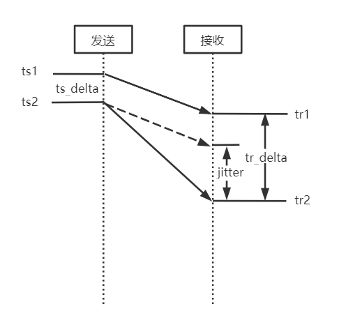  

上图描述了帧间延迟(抖动)观测值的计算方法：jitter = tr_delta - ts_delta = (tr2 - tr1) - (ts2 -ts1)，也就是两帧的接收时间差 - 两帧的发送时间差。

计算最优抖动的算法和GCC中使用到达时间滤波器(InterArrival)计算到达时间增量、使用过载估计器(OveruseEstimator)计算最优的到达间隔增量的算法基本一样，都是利用卡尔曼滤波器，综合帧间延迟的观测值、预测值，获得最优的帧间延迟(也就是网络抖动)，只是数据采样的形式不太相同，GCC使用5ms的包簇(也可以称为帧)，这里直接使用视频帧，这里不再详述。

#### 7.2 延迟 - VCMTiming

VCMTiming可以输出接收端的以下参数，这些参数可以在使用浏览器拉流时在chrome://webrtc-internals页面中看到。

<table><thead><tr><th align="left">名字</th><th align="left">含义</th></tr></thead><tbody><tr><td align="left">googDecodeMs</td><td align="left">最近一次解码耗时.</td></tr><tr><td align="left">googMaxDecodeMs</td><td align="left">最大解码耗时，实际上是第95百分位数，也就是大于采样集合95%的解码延迟.</td></tr><tr><td align="left">googRenderDelayMs</td><td align="left">渲染耗时，固定为10ms.</td></tr><tr><td align="left">googJitterBufferMs</td><td align="left">网络抖动，见上节.</td></tr><tr><td align="left">googMinPlayoutDelayMs</td><td align="left">最小播放时延，音视频同步器输出的视频帧播放应该延迟的时长.</td></tr><tr><td align="left">googTargetDelayMs</td><td align="left">目标时延，googCurrentDelayMs会逼近目标延迟.</td></tr><tr><td align="left">googCurrentDelayMs</td><td align="left">当前时延，用于计算视频帧渲染时间.</td></tr></tbody></table>

##### 7.2.1 目标延迟 - googTargetDelayMs

```cpp
int VCMTiming::TargetDelayInternal() const {
  return std::max(min_playout_delay_ms_,
                  jitter_delay_ms_ + RequiredDecodeTimeMs() + render_delay_ms_);
}
```

很明显，目标延迟基本上就是抖动+解码时间+渲染时间，与播放延迟的最大者，也就是播放当前帧总体的期望延迟，作为当前延迟googCurrentDelayMs的参考值，并最终用于音视频同步。

##### 7.2.2 当前延迟 - googCurrentDelayMs

FrameBuffer每获得一个可解码帧会调用一次，更新当前延迟，最终用于计算渲染时间。

```cpp
void VCMTiming::UpdateCurrentDelay(int64_t render_time_ms,
                                    int64_t actual_decode_time_ms) {
  rtc::CritScope cs(&crit_sect_);
  // 获得目标延迟. 
  uint32_t target_delay_ms = TargetDelayInternal();
  // render_time_ms：期望渲染时间
  // 期望解码时间 = 帧期望渲染时间 - 解码耗时 - 渲染耗时
  // 实际产生的延迟delayed_ms = 实际解码时间actual_decode_time_ms - 期望解码时间
  int64_t delayed_ms =
      actual_decode_time_ms -
      (render_time_ms - RequiredDecodeTimeMs() - render_delay_ms_);
  // 如果没有发生延迟，退出.
  if (delayed_ms < 0) {
    return;
  }
  // 如果有延迟，上个时刻的当前延迟 + 实际产生的延迟仍然<=目标延迟
  if (current_delay_ms_ + delayed_ms <= target_delay_ms) {
    // 更新当前延迟，逼近目标延迟.
    current_delay_ms_ += delayed_ms;
  } else {
    // 如果上个时刻的当前延迟 + 实际产生的延迟仍然超过目标延迟，以目标延迟为上限.
    current_delay_ms_ = target_delay_ms;
  }
}
```

#### 7.3 平滑渲染时间 - TimestampExtrapolator

FrameBuffer每获得一个可解码帧，都要更新其渲染时间，渲染时间通过TimestampExtrapolator类获得。TimestampExtrapolator也是一个卡尔曼滤波器，其输入为输入帧的时间戳，TimestampExtrapolator会根据输入帧的时间戳的间隔计算输出渲染时间，目标是平滑输出帧的时间间隔。

视频帧的最终渲染时间 = 帧平滑时间 + 当前延迟。

```cpp
int64_t VCMTiming::RenderTimeMsInternal(uint32_t frame_timestamp,
                                        int64_t now_ms) const {
  // 如果这两个播放延迟都是0，要求立刻渲染.
  if (min_playout_delay_ms_ == 0 && max_playout_delay_ms_ == 0) {
    // Render as soon as possible.
    return 0;
  }
  // 使用卡尔曼滤波器估算帧平滑时间.
  int64_t estimated_complete_time_ms =
      ts_extrapolator_->ExtrapolateLocalTime(frame_timestamp);
  if (estimated_complete_time_ms == -1) {
    estimated_complete_time_ms = now_ms;
  }
  // 当前延迟限定在(min_playout_delay_ms_, max_playout_delay_ms_)范围内
  int actual_delay = std::max(current_delay_ms_, min_playout_delay_ms_);
  actual_delay = std::min(actual_delay, max_playout_delay_ms_);
  // 视频帧的最终渲染时间 = 帧平滑时间 + 当前延迟
  return estimated_complete_time_ms + actual_delay;
}
```

### 8 总结

RTP包进入JitterBuffer后，最终输出了完整、连续、可解码的视频帧，并携带了可用于最终播放的渲染时间。

<hr>


#### <p>原文出处：<a href='https://www.jianshu.com/p/30ef9af47d6b' target='blank'>WebRTC视频jitterbuffer原理机制（一）</a></p>

先检查是否存在完整的帧，存在则取出，若不存在，则检查不完整的帧，满足条件则取出，不满足则不取出。 

```cpp
bool ViEChannel::ChannelDecodeProcess()
->int32_t Decode(uint16_t maxWaitTimeMs)
->int32_t VideoReceiver::Decode(uint16_t maxWaitTimeMs)
->VCMEncodedFrame* VCMReceiver::FrameForDecoding
```

先检查是否存在完整的帧，存在则取出，若不存在，则检查不完整的帧，满足条件则取出，不满足则不取出。

```cpp
bool found_frame = jitter_buffer_.NextCompleteTimestamp(
    max_wait_time_ms, &frame_timestamp);
if (!found_frame)
  found_frame = jitter_buffer_.NextMaybeIncompleteTimestamp(&frame_timestamp);
```

在上一步取出frame_timestamp，再用frame_timestamp从jitterbuffer中取出帧数据

```cpp
VCMEncodedFrame* frame = jitter_buffer_.ExtractAndSetDecode(frame_timestamp);
```

### 接收到包，将包插入jitterbuffer

接收到包，将包插入jitterbuffer代码流程

```cpp
void UdpTransportImpl::IncomingRTPCallback
->void UdpTransportImpl::IncomingRTPFunction
->void VideoChannelTransport::IncomingRTPPacket
->int ViENetworkImpl::ReceivedRTPPacket
->int32_t ViEChannel::ReceivedRTPPacket
->int ViEReceiver::ReceivedRTPPacket
->int ViEReceiver::InsertRTPPacket
->bool ViEReceiver::ReceivePacket
->bool RtpReceiverImpl::IncomingRtpPacket
->int32_t RTPReceiverVideo::ParseRtpPacket
->int32_t ViEReceiver::OnReceivedPayloadData
->int32_t IncomingPacket
->int32_t VideoReceiver::IncomingPacket
->int32_t VCMReceiver::InsertPacket
->VCMFrameBufferEnum VCMJitterBuffer::InsertPacket
```

`decodable_frames_`，`incomplete_frames_`，`free_frames_decodable_frames_`，`incomplete_frames_`，`free_frames_`的处理，主要在VCMFrameBuffer类中，其中包含的VCMSessionInfo `_sessionInfo`;为主要处理成员。

对于每一次收到的包，根据时间戳找到，当前帧在哪个队列中，在`decodable_frames_`或`incomplete_frames_`队列中，若不存在，则从`free_frames_`队列中给出一个空帧。

```cpp 
VCMFrameBuffer* frame;
  FrameList* frame_list;
  const VCMFrameBufferEnum error = GetFrame(packet, &frame, &frame_list);
```

```cpp
// Gets frame to use for this timestamp. If no match, get empty frame.
VCMFrameBufferEnum VCMJitterBuffer::GetFrame(const VCMPacket& packet,
                                             VCMFrameBuffer** frame,
                                             FrameList** frame_list) {
  *frame = incomplete_frames_.PopFrame(packet.timestamp);
  if (*frame != NULL) {
    *frame_list = &incomplete_frames_;
    return kNoError;
  }
  *frame = decodable_frames_.PopFrame(packet.timestamp);
  if (*frame != NULL) {
    *frame_list = &decodable_frames_;
    return kNoError;
  }

  *frame_list = NULL;
  // No match, return empty frame.
  *frame = GetEmptyFrame();
  if (*frame == NULL) {
    // No free frame! Try to reclaim some...
    LOG(LS_WARNING) << "Unable to get empty frame; Recycling.";
    bool found_key_frame = RecycleFramesUntilKeyFrame();
    *frame = GetEmptyFrame();
    assert(*frame);
    if (!found_key_frame) {
      free_frames_.push_back(*frame);
      return kFlushIndicator;
    }
  }
  (*frame)->Reset();
  return kNoError;
}
```

对于VCMSessionInfo中  `complete_`和`decodable_`的判定，每一次插入一个包，都要进行UpdateCompleteSession();对于帧的完整性进行检查。

```cpp
size_t returnLength = InsertBuffer(frame_buffer, packet_list_it);
UpdateCompleteSession();
if (decode_error_mode == kWithErrors)
  decodable_ = true;
else if (decode_error_mode == kSelectiveErrors)
  UpdateDecodableSession(frame_data);
return static_cast<int>(returnLength);
```

UpdateCompleteSession();检查是否有第一个包和最后一个包，并且都是按序的，即没有丢包，若满足这些条件，则判定为`complete_` = true;

```cpp
void VCMSessionInfo::UpdateCompleteSession() {
  if (HaveFirstPacket() && HaveLastPacket()) {
    // Do we have all the packets in this session?
    bool complete_session = true;
    PacketIterator it = packets_.begin();
    PacketIterator prev_it = it;
    ++it;
    for (; it != packets_.end(); ++it) {
      if (!InSequence(it, prev_it)) {
        complete_session = false;
        break;
      }
      prev_it = it;
    }
    complete_ = complete_session;
  }
}
```

下面则是对于`decodable_` 的判定，如果`decode_error_mode` 为kWithErrors模式，则有一个包`decodable_` 即可以为ture。如果`decode_error_mode` 为kSelectiveErrors，则根据rtt,帧类型，已经有的包数等条件来综合得出`decodable_`。

具体条件则为：rtt<100，或者为关键帧，或者已经收到的包数在`0.2*rolling_average_packets_per_frame`和`0.8*rolling_average_packets_per_frame`之间时，则`decodable_`不去改变，否则为true。`rolling_average_packets_per_frame`为平均每帧所含的包数。

```cpp
void VCMSessionInfo::UpdateDecodableSession(const FrameData& frame_data) {
  // Irrelevant if session is already complete or decodable
  if (complete_ || decodable_)
    return;
  // TODO(agalusza): Account for bursty loss.
  // TODO(agalusza): Refine these values to better approximate optimal ones.
  // Do not decode frames if the RTT is lower than this.
  const int64_t kRttThreshold = 100;
  // Do not decode frames if the number of packets is between these two
  // thresholds.
  const float kLowPacketPercentageThreshold = 0.2f;
  const float kHighPacketPercentageThreshold = 0.8f;
  if (frame_data.rtt_ms < kRttThreshold
      || frame_type_ == kVideoFrameKey
      || !HaveFirstPacket()
      || (NumPackets() <= kHighPacketPercentageThreshold
                          * frame_data.rolling_average_packets_per_frame
          && NumPackets() > kLowPacketPercentageThreshold
                            * frame_data.rolling_average_packets_per_frame))
    return;

  decodable_ = true;
}
```

PS：
1、如果`rolling_average_packets_per_frame`>5,
`kLowPacketPercentageThreshold * frame_data.rolling_average_packets_per_frame`>1
那么来一个包就判定  `decodable_` = true;这个是否合理？
2、 rtt很小的时候，不判定为true，是希望能够`complete_` ，至于kRttThreshold = 100是否合理，有待验证。
3、可见，关键帧都是完整的，不完整，不会 设置`decodable_` = true;则一直为kIncomplete。

对于VCMFrameBuffer中的kCompleteSession和kDecodableSession分别对应VCMSessionInfo中的`complete_` 和`decodable_`。若既不是`complete_`，也不是`decodable_`，则对应kIncomplete。

```cpp
if (_sessionInfo.complete()) {
  SetState(kStateComplete);
  return kCompleteSession;
} else if (_sessionInfo.decodable()) {
  SetState(kStateDecodable);
  return kDecodableSession;
}
return kIncomplete;
```

对于上面提到的`decode_error_mode`，通过如下流程进行设置。

```cpp
int Conductor::VideoCreateStream
->int ViEBaseImpl::CreateChannel
->int ViEBaseImpl::CreateChannel
->int ViEChannelManager::CreateChannel
->bool ChannelGroup::CreateSendChannel
->bool ChannelGroup::CreateChannel
->int32_t ViEChannel::Init
->int32_t SetVideoProtection
->int32_t VideoReceiver::SetVideoProtection
->void VCMReceiver::SetDecodeErrorMode
->void VCMJitterBuffer::SetDecodeErrorMode
```

这里根据NACK和FEC的使用情况，来设置decode_error_mode。

```cpp
// Enable or disable a video protection method.
// Note: This API should be deprecated, as it does not offer a distinction
// between the protection method and decoding with or without errors. If such a
// behavior is desired, use the following API: SetReceiverRobustnessMode.
int32_t VideoReceiver::SetVideoProtection(VCMVideoProtection videoProtection,
                                          bool enable) {
  // By default, do not decode with errors.
  _receiver.SetDecodeErrorMode(kNoErrors);
  switch (videoProtection) {
    case kProtectionNack:
    case kProtectionNackReceiver: {
      CriticalSectionScoped cs(_receiveCritSect);
      if (enable) {
        // Enable NACK and always wait for retransmits.
        _receiver.SetNackMode(kNack, -1, -1);
      } else {
        _receiver.SetNackMode(kNoNack, -1, -1);
      }
      break;
    }

    case kProtectionKeyOnLoss: {
      CriticalSectionScoped cs(_receiveCritSect);
      if (enable) {
        _keyRequestMode = kKeyOnLoss;
        _receiver.SetDecodeErrorMode(kWithErrors);
      } else if (_keyRequestMode == kKeyOnLoss) {
        _keyRequestMode = kKeyOnError;  // default mode
      } else {
        return VCM_PARAMETER_ERROR;
      }
      break;
    }

    case kProtectionKeyOnKeyLoss: {
      CriticalSectionScoped cs(_receiveCritSect);
      if (enable) {
        _keyRequestMode = kKeyOnKeyLoss;
      } else if (_keyRequestMode == kKeyOnKeyLoss) {
        _keyRequestMode = kKeyOnError;  // default mode
      } else {
        return VCM_PARAMETER_ERROR;
      }
      break;
    }

    case kProtectionNackFEC: {
      CriticalSectionScoped cs(_receiveCritSect);
      if (enable) {
        // Enable hybrid NACK/FEC. Always wait for retransmissions
        // and don't add extra delay when RTT is above
        // kLowRttNackMs.
        _receiver.SetNackMode(kNack, media_optimization::kLowRttNackMs, -1);
        _receiver.SetDecodeErrorMode(kNoErrors);
        _receiver.SetDecodeErrorMode(kNoErrors);
      } else {
        _receiver.SetNackMode(kNoNack, -1, -1);
      }
      break;
    }
    case kProtectionNackSender:
    case kProtectionFEC:
    case kProtectionPeriodicKeyFrames:
      // Ignore encoder modes.
      return VCM_OK;
  }
  return VCM_OK;
}
```

下面则介绍本文的核心，`decodable_frames_`，`incomplete_frames_`，`free_frames_`的处理。

```cpp
// Is the frame already in the decodable list?
bool continuous = IsContinuous(*frame);
switch (buffer_state) {
  case kGeneralError:
  case kTimeStampError:
  case kSizeError: {
    free_frames_.push_back(frame);
    break;
  }
  case kCompleteSession: {
    if (previous_state != kStateDecodable &&
        previous_state != kStateComplete) {
      CountFrame(*frame);
      if (continuous) {
        // Signal that we have a complete session.
        frame_event_->Set();
      }
    }
    FALLTHROUGH();
  }
  // Note: There is no break here - continuing to kDecodableSession.
  case kDecodableSession: {
    *retransmitted = (frame->GetNackCount() > 0);
    if (continuous) {
      decodable_frames_.InsertFrame(frame);
      FindAndInsertContinuousFrames(*frame);
    } else {
      incomplete_frames_.InsertFrame(frame);
    }
    break;
  }
  case kIncomplete: {
    if (frame->GetState() == kStateEmpty &&
        last_decoded_state_.UpdateEmptyFrame(frame)) {
      free_frames_.push_back(frame);
      return kNoError;
    } else {
      incomplete_frames_.InsertFrame(frame);
    }
    break;
  }
  case kNoError:
  case kOutOfBoundsPacket:
  case kDuplicatePacket: {
    // Put back the frame where it came from.
    if (frame_list != NULL) {
      frame_list->InsertFrame(frame);
    } else {
      free_frames_.push_back(frame);
    }
    ++num_duplicated_packets_;
    break;
  }
  case kFlushIndicator:
    free_frames_.push_back(frame);
    return kFlushIndicator;
  default: assert(false);
}
```

其中第一句 `bool continuous = IsContinuous(*frame)`;主要是判断当前收到帧和上一个解码帧是不是连续的。其中还有一些特殊情况，如`decode_error_mode_` == kWithErrors，或者frame->FrameType() == kVideoFrameKey等均判断为连续的。由于不加FEC和NACK时，`decode_error_mode_` = kWithErrors，所以，一直continuous 为true。

只有kCompleteSession时，才触发事件`frame_event_->Set()`;等待事件在bool VCMJitterBuffer::NextCompleteTimestamp中，即取帧的函数中。

注意：kCompleteSession情况，后面没有break,则将完成的帧也插入`decodable_frames_`队列。所以，对于VCMSessionInfo中的`complete_`和`decodable_`，都将插入`decodable_frames_`队列。

### 再回头看从jitterbuffer取出frame

```cpp
// Returns immediately or a |max_wait_time_ms| ms event hang waiting for a
// complete frame, |max_wait_time_ms| decided by caller.
bool VCMJitterBuffer::NextCompleteTimestamp(
    uint32_t max_wait_time_ms, uint32_t* timestamp) {
  crit_sect_->Enter();
  if (!running_) {
    crit_sect_->Leave();
    return false;
  }
  CleanUpOldOrEmptyFrames();

  if (decodable_frames_.empty() ||
      decodable_frames_.Front()->GetState() != kStateComplete) 
  {
    const int64_t end_wait_time_ms = clock_->TimeInMilliseconds() +
        max_wait_time_ms;
    int64_t wait_time_ms = max_wait_time_ms;
    while (wait_time_ms > 0) {
      crit_sect_->Leave();
      const EventTypeWrapper ret =
        frame_event_->Wait(static_cast<uint32_t>(wait_time_ms));
      crit_sect_->Enter();
      if (ret == kEventSignaled) {
        // Are we shutting down the jitter buffer?
        if (!running_) {
          crit_sect_->Leave();
          return false;
        }
        // Finding oldest frame ready for decoder.
        CleanUpOldOrEmptyFrames();
        if (decodable_frames_.empty() ||
            decodable_frames_.Front()->GetState() != kStateComplete) {
          wait_time_ms = end_wait_time_ms - clock_->TimeInMilliseconds();
        } else {
          break;
        }
      } else {
        break;
      }
    }
  }
  if (decodable_frames_.empty() ||
      decodable_frames_.Front()->GetState() != kStateComplete) {
    crit_sect_->Leave();
    return false;
  }
  *timestamp = decodable_frames_.Front()->TimeStamp();
  crit_sect_->Leave();
  return true;
}
```

1、其中`decodable_frames_.Front()->GetState()`取得的`_state`，有下列情况赋值：

```cpp
if (packet.frameType != kFrameEmpty) {
    // first media packet
    SetState(kStateIncomplete);
}
```

```cpp
if (_sessionInfo.complete()) {
  SetState(kStateComplete);
  return kCompleteSession;
} else if (_sessionInfo.decodable()) {
  SetState(kStateDecodable);
  return kDecodableSession;
}
```

可见，`_state`还是可以标记这一帧数据的完成情况的，即完成时，为kStateComplete；未完成时，为kStateDecodable或kStateIncomplete，只有一个包时，为kStateIncomplete。凡是没有从kStateIncomplete升为kStateDecodable，则依然为kStateIncomplete。

2、其中条件`decodable_frames_.Front()->GetState() != kStateComplete`可见，必须是完整的帧才能够从NextCompleteTimestamp函数中取出来。

再看取出不完整的帧：

```cpp
bool VCMJitterBuffer::NextMaybeIncompleteTimestamp(uint32_t* timestamp) {
  CriticalSectionScoped cs(crit_sect_);
  if (!running_) {
    return false;
  }
  if (decode_error_mode_ == kNoErrors) {
    // No point to continue, as we are not decoding with errors.
    return false;
  }

  CleanUpOldOrEmptyFrames();

  VCMFrameBuffer* oldest_frame;
  if (decodable_frames_.empty()) {
    if (nack_mode_ != kNoNack || incomplete_frames_.size() <= 1) {
      return false;
    }
    oldest_frame = incomplete_frames_.Front();
    // Frame will only be removed from buffer if it is complete (or decodable).
    if (oldest_frame->GetState() < kStateComplete) {
      return false;
    }
  } else {
    oldest_frame = decodable_frames_.Front();
    // If we have exactly one frame in the buffer, release it only if it is
    // complete. We know decodable_frames_ is  not empty due to the previous
    // check.
    if (decodable_frames_.size() == 1 && incomplete_frames_.empty() &&
        oldest_frame->GetState() != kStateComplete) {
      return false;
    }
  }

  *timestamp = oldest_frame->TimeStamp();
  return true;
}
```

从条件中可以看出：

1、`decodable_frames_`为空时`incomplete_frames_.Front()->GetState()`为kStateEmpty或者kStateIncomplete，则取不出帧，否则可以取出。
2、`decodable_frames_`不空时`decodable_frames_.size() == 1 && incomplete_frames_.empty() && oldest_frame->GetState() != kStateComplete`时，取不出帧。否则取出`decodable_frames_`中不完整的数据帧。

### 总结：

至此，jitterbuffer对于包、帧的处理，已经比较清晰。所有组包的帧都存在于`decodable_frames_`，`incomplete_frames_`队列中，而`decodable_frames_`又根据状态分为完整的帧和不完整的帧，`incomplete_frames_`主要保存状态为kIncomplete的帧，也是不完整的，但有包数据。而在取帧数据的时候先取完整的帧，取不到，则取一定条件下不完整的帧数据，不是有不完整的帧数据就去取。所以，如果你不想取出丢包的帧，则只调用NextCompleteTimestamp去取完整的帧即可。因为每次来的包，放入帧中之后，都是插入到`decodable_frames_`或者`incomplete_frames_`的最前面，所以不存在一直取不出来帧数据的情况。另外一个方法，就是设置`decode_error_mode_`为kNoErrors。但是，不取出丢包的帧 ，不等于不存在马赛克。因为丢帧，所以解码的时候，可能会存在参考帧的问题。

### 追加--如何杜绝马赛克

由上述对于马赛克存在的讨论中可知，丢包是主要原因，如果只取出完整的帧，也会因为参考帧问题，导致马赛克。如果，丢包以后，就把整个GOP都删除，直到下一个关键帧，同时，发现丢包就去请求关键帧，这样就完全可以杜绝马赛克了。但是这样会导致在丢包时，流畅度更加不好。

<hr>

#### <p>原文出处：<a href='https://www.jianshu.com/p/bcbfdf065684' target='blank'>WebRTC视频jitterbuffer原理机制（二）</a></p>

```cpp
// Calculates the delay of a frame with the given timestamp.
// This method is called when the frame is complete.
bool
VCMInterFrameDelay::CalculateDelay(uint32_t timestamp,
                                int64_t *delay,
                                int64_t currentWallClock)
{
    if (_prevWallClock == 0)
    {
        // First set of data, initialization, wait for next frame
        _prevWallClock = currentWallClock;
        _prevTimestamp = timestamp;
        *delay = 0;
        return true;
    }
    int32_t prevWrapArounds = _wrapArounds;
    CheckForWrapArounds(timestamp);
    // This will be -1 for backward wrap arounds and +1 for forward wrap arounds
    int32_t wrapAroundsSincePrev = _wrapArounds - prevWrapArounds;
    // Account for reordering in jitter variance estimate in the future?
    // Note that this also captures incomplete frames which are grabbed
    // for decoding after a later frame has been complete, i.e. real
    // packet losses.
    if ((wrapAroundsSincePrev == 0 && timestamp < _prevTimestamp) || wrapAroundsSincePrev < 0)
    {
        *delay = 0;
        return false;
    }
    // Compute the compensated timestamp difference and convert it to ms and
    // round it to closest integer.
    _dTS = static_cast<int64_t>((timestamp + wrapAroundsSincePrev *
                (static_cast<int64_t>(1)<<32) - _prevTimestamp) / 90.0 + 0.5);
    // frameDelay is the difference of dT and dTS -- i.e. the difference of
    // the wall clock time difference and the timestamp difference between
    // two following frames.
    *delay = static_cast<int64_t>(currentWallClock - _prevWallClock - _dTS);
    _prevTimestamp = timestamp;
    _prevWallClock = currentWallClock;
    return true;
}
```

currentWallClock: 此帧最后一个包到达时间戳  
`_prevWallClock`：前一帧最后一个包到达时间戳  
timestamp：当前帧时间戳  
`_prevTimestamp`：前一帧时间戳  
`_wrapArounds`：表示时间戳有没有从2^32-1跳到1，即一个循环。  
可以看出，CalculateDelay()这个函数主要目标是计算出上一帧最後一個包到当前帧最后一个包的时间差。即相当于传输当前帧所耗费的時間。


```cpp
// Updates the estimates with the new measurements
void
VCMJitterEstimator::UpdateEstimate(int64_t frameDelayMS, uint32_t frameSizeBytes,
                                            bool incompleteFrame /* = false */)
{
    if (frameSizeBytes == 0)
    {
        return;
    }
    int deltaFS = frameSizeBytes - _prevFrameSize;
    if (_fsCount < kFsAccuStartupSamples)
    {
        _fsSum += frameSizeBytes;
        _fsCount++;
    }
    else if (_fsCount == kFsAccuStartupSamples)
    {
        // Give the frame size filter
        _avgFrameSize = static_cast<double>(_fsSum) /
                        static_cast<double>(_fsCount);
        _fsCount++;
    }
    if (!incompleteFrame || frameSizeBytes > _avgFrameSize)
    {
        double avgFrameSize = _phi * _avgFrameSize +
                              (1 - _phi) * frameSizeBytes;
        if (frameSizeBytes < _avgFrameSize + 2 * sqrt(_varFrameSize))
        {
            // Only update the average frame size if this sample wasn't a
            // key frame
            _avgFrameSize = avgFrameSize;
        }
        // Update the variance anyway since we want to capture cases where we only get
        // key frames.
        _varFrameSize = VCM_MAX(_phi * _varFrameSize + (1 - _phi) *
                                (frameSizeBytes - avgFrameSize) *
                                (frameSizeBytes - avgFrameSize), 1.0);
    }
    // Update max frameSize estimate
    _maxFrameSize = VCM_MAX(_psi * _maxFrameSize, static_cast<double>(frameSizeBytes));
    if (_prevFrameSize == 0)
    {
        _prevFrameSize = frameSizeBytes;
        return;
    }
    _prevFrameSize = frameSizeBytes;
    // Only update the Kalman filter if the sample is not considered
    // an extreme outlier. Even if it is an extreme outlier from a
    // delay point of view, if the frame size also is large the
    // deviation is probably due to an incorrect line slope.
    double deviation = DeviationFromExpectedDelay(frameDelayMS, deltaFS);
    if (fabs(deviation) < _numStdDevDelayOutlier * sqrt(_varNoise) ||
        frameSizeBytes > _avgFrameSize + _numStdDevFrameSizeOutlier * sqrt(_varFrameSize))
    {
        // Update the variance of the deviation from the
        // line given by the Kalman filter
        EstimateRandomJitter(deviation, incompleteFrame);
        // Prevent updating with frames which have been congested by a large
        // frame, and therefore arrives almost at the same time as that frame.
        // This can occur when we receive a large frame (key frame) which
        // has been delayed. The next frame is of normal size (delta frame),
        // and thus deltaFS will be << 0. This removes all frame samples
        // which arrives after a key frame.
        if ((!incompleteFrame || deviation >= 0.0) &&
            static_cast<double>(deltaFS) > - 0.25 * _maxFrameSize)
        {
            // Update the Kalman filter with the new data
            KalmanEstimateChannel(frameDelayMS, deltaFS);
        }
    }
    else
    {
        int nStdDev = (deviation >= 0) ? _numStdDevDelayOutlier : -_numStdDevDelayOutlier;
        EstimateRandomJitter(nStdDev * sqrt(_varNoise), incompleteFrame);
    }
    // Post process the total estimated jitter
    if (_startupCount >= kStartupDelaySamples)
    {
        PostProcessEstimate();
    }
    else
    {
        _startupCount++;
    }
}
```

获得jitterMS，并设置到渲染，以使得平稳的显示。


```cpp
bool ViEChannel::ChannelDecodeProcess()
  int32_t Decode(uint16_t maxWaitTimeMs)
int32_t VideoReceiver::Decode
VCMEncodedFrame* VCMReceiver::FrameForDecoding
uint32_t VCMJitterBuffer::EstimatedJitterMs()
int VCMJitterEstimator::GetJitterEstimate(double rttMultiplier)

// We have a frame - Set timing and render timestamp.
timing_->SetJitterDelay(jitter_buffer_.EstimatedJitterMs());

bool ViEChannel::ChannelDecodeProcess()
int32_t Decode(uint16_t maxWaitTimeMs)
int32_t VideoReceiver::Decode(uint16_t maxWaitTimeMs)
void VCMTiming::UpdateCurrentDelay


void VCMTiming::UpdateCurrentDelay(int64_t render_time_ms,
                                    int64_t actual_decode_time_ms) {
  CriticalSectionScoped cs(crit_sect_);
  uint32_t target_delay_ms = TargetDelayInternal();
  int64_t delayed_ms = actual_decode_time_ms -
      (render_time_ms - MaxDecodeTimeMs() - render_delay_ms_);
  if (delayed_ms < 0) {
    return;
  }
  if (current_delay_ms_ + delayed_ms <= target_delay_ms) {
    current_delay_ms_ += static_cast<uint32_t>(delayed_ms);
  } else {
    current_delay_ms_ = target_delay_ms;
  }
}

uint32_t VCMTiming::TargetDelayInternal() const {
  return std::max(min_playout_delay_ms_,
      jitter_delay_ms_ + MaxDecodeTimeMs() + render_delay_ms_);
}
```

这里通过计算`wait_time_ms`，得出取出下一帧需要等待的时间。

```cpp
uint32_t wait_time_ms = timing_->MaxWaitingTime(
    next_render_time_ms, clock_->TimeInMilliseconds());
```

```cpp
uint32_t VCMTiming::MaxWaitingTime(int64_t render_time_ms, int64_t now_ms)
    const {
  CriticalSectionScoped cs(crit_sect_);
  const int64_t max_wait_time_ms = render_time_ms - now_ms -
      MaxDecodeTimeMs() - render_delay_ms_;
  if (max_wait_time_ms < 0) {
    return 0;
  }
  return static_cast<uint32_t>(max_wait_time_ms);
}
```

获得`next_render_time_ms`，这里综合考虑了jitter_delay+decode_delay+render_delay

```cpp
next_render_time_ms = timing_->RenderTimeMs(frame_timestamp, now_ms);
```

```cpp
int64_t VCMTiming::RenderTimeMs(uint32_t frame_timestamp, int64_t now_ms)
    const {
  CriticalSectionScoped cs(crit_sect_);
  const int64_t render_time_ms = RenderTimeMsInternal(frame_timestamp, now_ms);
  return render_time_ms;
}
```

```cpp
int64_t VCMTiming::RenderTimeMsInternal(uint32_t frame_timestamp,
                                        int64_t now_ms) const {
  int64_t estimated_complete_time_ms =
    ts_extrapolator_->ExtrapolateLocalTime(frame_timestamp);
  if (estimated_complete_time_ms == -1) {
    estimated_complete_time_ms = now_ms;
  }
  // Make sure that we have at least the playout delay.
  uint32_t actual_delay = std::max(current_delay_ms_, min_playout_delay_ms_);
  return estimated_complete_time_ms + actual_delay;
}
```
