 
<!--BEGIN_DATA
{
    "create_date": "2020-12-14 15:15", 
    "modify_date": "2020-12-14 15:15", 
    "is_top": "0", 
    "summary": "WebRTC视频数据统计之延时、抖动与丢包<br/>音视频通讯的抗丢包与带宽自适应原理(RTC.Blacker)", 
    "tags": "WebRTC、C/C++", 
    "file_name": "WebRTC视频延时、抖动与丢包.md"
}
END_DATA-->

#### <p>原文出处：<a href='https://blog.csdn.net/chengzi_comm/article/details/89526935' target='blank'>WebRTC视频数据统计之延时、抖动与丢包</a></p>

### 一、前言

> 这篇文章主要想说明的是WebRTC内部对视频`上下行延时、抖动、丢包`如何更新，上层又怎么获取到这些统计信息的。对应的`WebRTC版本：63`。

### 二、背景

> 最近在内网情况下测试视频会议，视频下行延时很大，很多时候超过`100ms`。另外，视频的上下行抖动总是稳定在`30~40ms`这个区间。这些统计在内网环境下是不正常的，于是决定看看是哪里导致这些问题的。
>
> 在解决这些问题的过程中，也对WebRTC内部视频统计数据做了一次梳理。
> 阅读这篇文章之前，最好对RTP、RTCP、SR、RR有一些了解。这里就不过多展开，可以参考以下文章：

* [RTP Data Transfer Protocol][<https://tools.ietf.org/html/rfc3550#section-5>]  
* [RTP Control Protocol – RTCP][<https://tools.ietf.org/html/rfc3550#section-6>]  
* [RTP/RTSP/RTCP有什么区别][<https://www.zhihu.com/question/20278635/answer/14590945>]

### 三、综述

下图是WebRTC内部获取视频统计信息和统计信息如何被更新的流程图：（其中的箭头代表函数调用）  

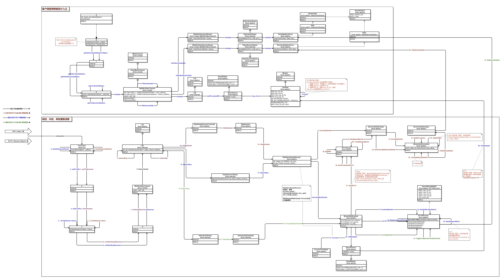

上图中的类A~G属于公司内部代码，不便公开，还请见谅。总体共有两个大的模块，**如何取**和**如何更新**：  
（**`ps: 下文关于流程图细节部分都取自于该图，读者可根据相关文字在总图中找到对应的位置`** 在这里下载上图的电子版： [webrtc-statistics.gliffy](https://download.csdn.net/download/chengzi_comm/11144373)）

#### 1. 如何取

上面部分“客户端视频数据统计入口”中，左下角的`WebRtcVideoChannel::GetStats`是WebRTC对外暴露的获取统计信息的入口，视频的上下行统计数据最终分别使用右上角`SendStatisticsProxy::stats_`、`ReceiveStatisticsProxy::stats_`和`CallStats::avg_rtt_ms_`来填充返回。

#### 2. 如何更新

下面部分“延时、抖动、丢包更新流程”部分，从网络接收到RTP/RTCP之后，使用三个不同颜色代表三种统计信息的更新流程，比如红色代表下行抖动/丢包更新流程、蓝色代表RTT的更新流程等。

统计信息大多不是由一条调用流程完成的（这就是下文会说到的“阶段”），会有几次类似缓冲区的“中转”，然后由另外的线程或函数继续做统计信息的整理，最终达到上一步的`SendStatisticsProxy::stats_`、`ReceiveStatisticsProxy::stats_`和`CallStats::avg_rtt_ms_`，等待上层获取。

### 四、几个统计信息详细介绍

#### 1、延时

> 这里统计的延时指的是往返延时 rtt。`WebRTC使用SR/RR来计算rtt`。

##### (1) 延时的计算

###### 1) SR和RR报文格式

Sender Report RTCP PacketReceiver Report RTCP Packet

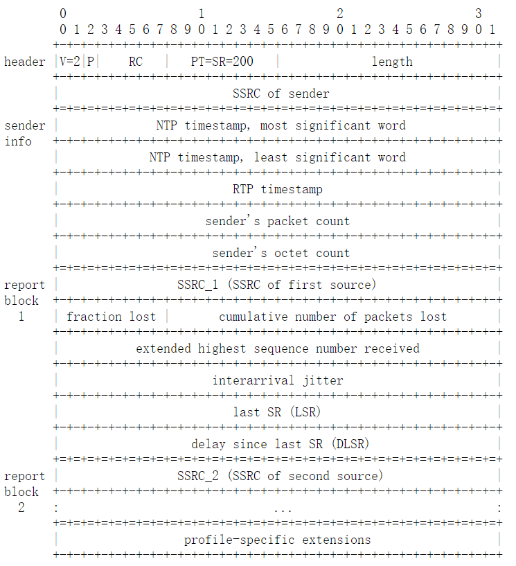

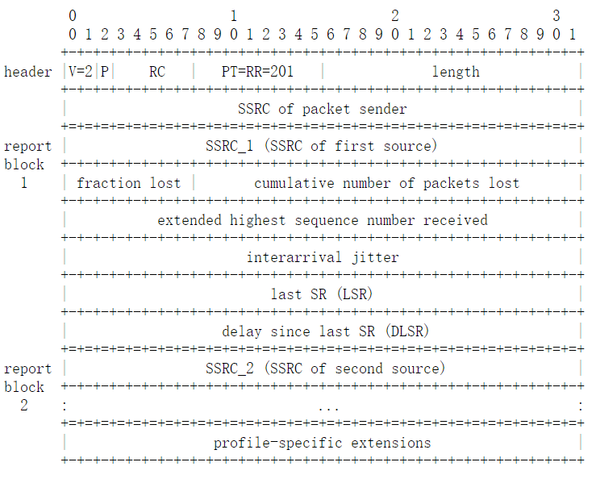

###### 2) 计算rtt

> 以下流程通过结合SR/RR包报文格式，浏览`RTCPReceiver::HandleReceiverReport`、`RTCPReceiver::HandleReportBlock`、`ModuleRtpRtcpImpl::SendCompoundRTCP`、`RTCPSender::BuildSR`、`RTCPSender::BuildRR`函数。前面2个函数是接收端计算rtt，后面3个函数是对端在构造RR时LSR/DLSR如何设置的。

  * 首先，发送端构造SR时，`sender info`部分的NTP字段被设置为当前ntp时间戳；
  * 接收端收到最新的SR之后，使用`last_received_sr_ntp_`字段记录当前ntp时间戳；
  * 接收端构造RR时，设置RR的DLSR字段为`当前ntp时间戳 - last_received_sr_ntp_`，之后发出RR包；
  * 发送端在接收到RR包之后，记录RR包到达时间`A`；
  * 使用公式 `A - LSR - DLSR` 计算rtt。

###### 3) 用一个图描述上述RTT计算流程

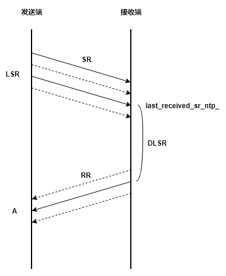

> SR与RR的个数并不完全相同，因为RR并不是对SR的回应，它们的发送各自独立；另外丢包也会导致一部分SR/RR没有被对方接收。因此上图中，SR和RR传输中，实线代表发了一次SR/RR，并且被被对方接收了。这里想说明的是：**即便SR或RR丢失一部分，只要发送端收到了RR，它总能计算出rtt，因为RR中使用的LSR和DLSR字段都是从最近一次收到的SR中取到的。**

##### (2) 延时的更新流程

> 下文所说的第一阶段、第二阶段等，都是指 **数据从一个位置转移到另一个位置的过程，或者说是一次`推`或`拉`模式**。比如：F1函数把数据从A点转移到B点就返回了，F2函数把数据从B点转移到C点就返回了，那A->B就是第一阶段，B->C就是第二阶段。如下：

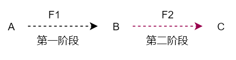

###### 1) rtt统计第一阶段

由上文可知：从RR可以计算出往返延时rtt，这个rtt最终保存在`RTCPReceiver::received_report_blocks_`。 

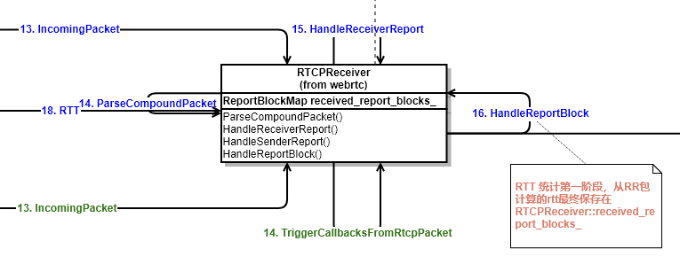

###### 2) rtt统计第二阶段

`ModuleRtpRtcpImpl::Process`会定时把rtt从`RTCPReceiver::received_report_blocks_`更新到`CallStats::reports_`，这个更新过程，`CallStats::reports_`中每个rtt都会与一个更新时间戳绑定。参考`CallStats::OnRttUpdate` 函数。  

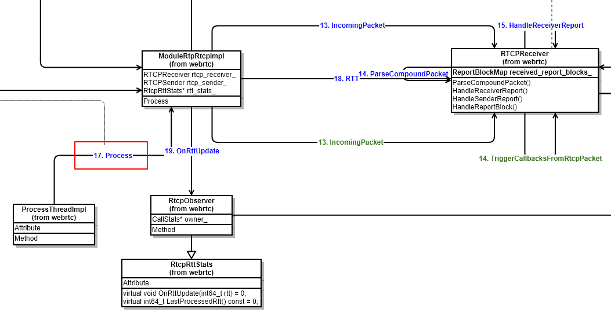

###### 3) rtt统计第三阶段

`CallStats`继承`Module`，`CallStats::Process`函数会定时做以下三个步骤：

  * 根据第二阶段绑定的时间戳，清理掉 reports_ 中距当前时间1.5s以前的rtt；
  * 计算1.5s内的平均rtt；
  * 使用平均rtt，更新 avg_rtt_ms_ 成员；

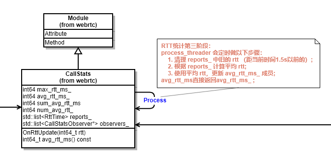

##### (3) 获取延时

调用`CallStats::avg_rtt_ms`函数获取rtt时，直接返回avg_rtt_ms_ ;

#### 2、下行抖动和丢包

> 下行抖动和丢包，通过在接收端根据收到的RTP包来计算和更新。

##### (1) 抖动和丢包的计算

###### 1) 抖动定义

抖动被定义为：一对数据包在接收端与发送端的数据包时间间距之差。如下： 

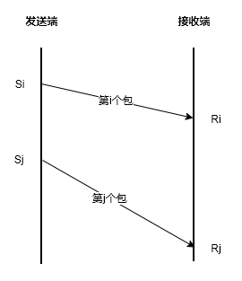  

如果Si代表第i个包的发送时间戳，Ri代表第i个包的接收时间戳。Sj、Rj同理。  

`抖动(i, j)` = `|(Rj - Ri) - (Sj - Si)|` = `|(Rj - Sj) - (Ri - Si)|`

WebRTC为了统一抖动，并且为了很好的降噪、降低突发抖动的影响，把上面的`抖动(i, j)`定义为`D(i, j)`，`抖动J(i)`定义为:  

`J(i) = J(i-1) + (|D(i-1, i)| - J(i - 1)) / 16`

我虽然看不出J(i)和D(i)的关系，但是`D(i-1, j)`是唯一引起`J(i)`变化的因素，是需要重点关注的。

###### 2) 抖动计算存在的问题：

RTP报文头部，有timestamp字段，该字段用来表示该RTP包所属帧的`capture time`。接收RTP包时如果记录接收时间戳，再根据头部的`timestamp`字段，D(i, j)就可以计算出来，J也就有了。（事实上webrtc原本也是这样干的，而且这种方式计算的抖动还对外暴露，可以参考`StreamStatisticianImpl::UpdateJitter`函数）

但是这样计算抖动是存在问题的：**每一帧的视频数据放进多个RTP包之后，这些RTP包的头部timestamp字段都是一样的（都是帧的capture time），但是实际发送时间不一样，到达时间也不同。**

###### 3) 如何正确计算抖动：

计算D(i, j)时，Si不能只使用RTP timestamp，而是应该使用该RTP实际发送到网络的时间戳。这种抖动被命名为`jitter_q4_transmission_time_offset`，意为考虑了transmission_time_offset的jitter。

  * **a. transmission_time_offset是什么?**

> transmission_time_offset是一段时间间隔，该时间间隔代表属于同一帧的RTP的`实际发送时间`距离帧的`capture time`的**偏移量** 。下图是对transmission_offset_time的解释：

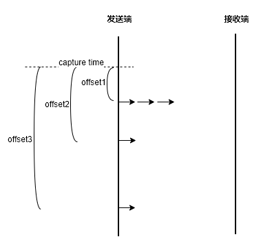

> 其中，箭头代表一个RTP，发送端的竖线代表时间轴，虚线代表帧的capture time。
>
> 最开始三个RTP包在距离capture time `offset1`时间之后发送到网络，因此这三个RTP包的transmission_time_offset应该是offset1。同理第四个RTP包的transmission_time_offset应该是offset2，第五个RTP包的transmission_time_offset应该是offset3。

  * **b. transmission_time_offset在RTP包的哪里放着?**

transmission_time_offset存在于RTP的扩展头部，设置该扩展头可以参考`RTPSender::SendToNetwork`函数，但使用之前该扩展头之前需要注册，否则在设置transmission_time_offset扩展头会失败。

下面的代码段是WebRTC中`D(i, j)`的计算：

```cpp
// Extended jitter report, RFC 5450.
// Actual network jitter, excluding the source-introduced jitter.
int32_t time_diff_samples_ext =
  (receive_time_rtp - last_receive_time_rtp) -
  ((header.timestamp +
    header.extension.transmissionTimeOffset) -
    (last_received_timestamp_ +
    last_received_transmission_time_offset_));
```

其中：

>   * `receive_time_rtp` 代表当前RTP的到达时间戳；
>   * `last_receive_time_rtp` 是上一个RTP到达时记录的时间戳；
>   * `header.timestamp + header.extension.transmissionTimeOffset` 前者是capture time，后者是对应的transmission time offset，两者相加代表该RTP实际发送到网络的时间戳；
>   * `last_received_timestamp_ + last_received_transmission_time_offset_`含义同上，但是代表的是**上一个**RTP的实际发送到网络的时间戳；

##### (2) 下行抖动的更新流程

###### 1) 抖动统计第一阶段

接收端收到的RTP包，会经过`StreamStatisticianImpl::UpdateJitter`函数，该函数内部会计算经过这个RTP包之后的抖动值，并更新到成员`jitter_q4_transmission_time_offset_`成员中。  

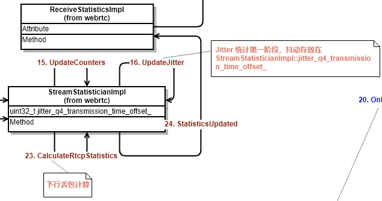

###### 2) 抖动统计第二阶段

`ModuleRtpRtcpImpl::Process`会定时发送RR，在构建RR的Report Block时，会搜集本地接收报告并把第一阶段保存的`jitter_q4_transmission_time_offset_`信息更新到`ReceiveStatisticsProxy::stats_` 。

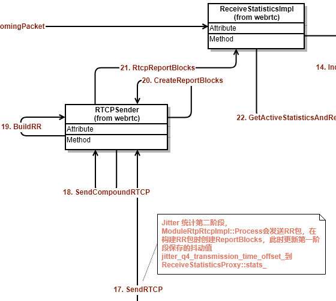

##### (3) 下行丢包的更新流程

###### 1) 丢包统计第一阶段

接收端收到的RTP包，会经过`StreamStatisticianImpl::UpdateCounters`函数，在该函数内部，会累加接收到的RTP包的个数和重传包的个数，以及当前收到的最大的sequence。

###### 2) 丢包统计第二阶段

下图是WebRTC内部计算`下行丢包`：  

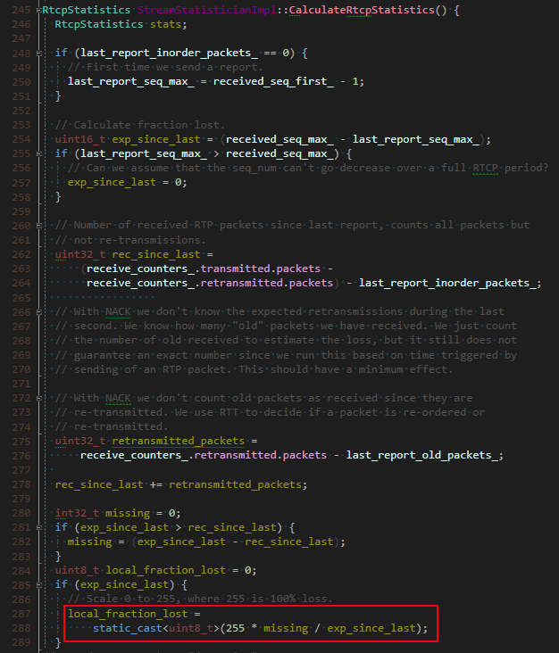

丢包率更新的周期是发送一次RR，在发送RR时，会根据第一阶段记录的数据统计丢包，丢包根据下面的公式：

`fraction_lost` = `RTP包丢失个数` / `期望接收的RTP包个数`

> 其中：
>
> `包丢失个数` = `期望接收的RTP包个数` \- `实际收到的RTP包个数`
>
> `期望接收的RTP包个数` = `当前最大sequence` \- `上次最大sequence`
>
> `实际收到的RTP包个数` = `正常有序RTP包` + `重传包`

计算出来的丢包，连同抖动一起被更新到`ReceiveStatisticsProxy::stats_`。  


##### (3) 获取下行抖动和丢包

下行抖动和丢包最终会从`ReceiveStatisticsProxy::stats_` 获取。

#### 3、上行抖动和丢包

> 下行抖动和丢包，从对方发来的RR包中获取。RR包格式参考上文链接。

##### (1) 上行抖动和丢包的更新流程

本地上行抖动和丢包，就是对端下行抖动和丢包，对端按照上面介绍的方式计算下行抖动和丢包，然后通过RR返回。

从RR获取抖动和丢包，没有太多阶段，只有一次`推`过程。接收端在收到RR之后，就把内部的抖动和丢包更新到`SendStatisticsProxy::stats_`中，这里就是客户端主动获取上行抖动和丢包时最终的数据源。

##### (2) 获取上行抖动和丢包

上行抖动和丢包最终会从`SendStatisticsProxy::stats_` 获取。

### 五、最后

以上是最近对WebRTC视频统计数据的了解，希望能对有需要的人有所帮助。如有不对的地方，欢迎指正！！

<hr>


#### <p>原文出处：<a href='https://www.cnblogs.com/lingyunhu/p/rtc55.html' target='blank'>音视频通讯的抗丢包与带宽自适应原理</a></p>

本文主要分析webrtc中的抗丢包与带宽自适应原理，文章来自博客园RTC.Blacker，欢迎关注微信公众号blacker，更多详见[www.rtc.help](http://www.rtc.help)

文章内容主要来自中国电信北京研究院丁博士在上周六的技术交流会上的演讲内容，之前我们有在公众号上介绍过这个技术交流会，详见：[演讲内容](http://mp.weixin.qq.com/s?__biz=MzA5ODMzMjE1NQ==&mid=401152241&idx=1&sn=38dd10e369d3f8e308a6086e84984072&scene=23&srcid=1219MtQx3dqOaQZo9L2emdBH#rd)  

从结果来看这种技术交流会还是挺有料的，主要是技术人员在分享技术，所以我们后面会将其他演讲嘉宾的资料也一并整理好发上来。

实时通讯中为了保证传输速度我们的通讯协议一般采用udp，但是这样会带来丢包的问题，加上实际网络状况的复杂性，都会带来丢包，这样严重影响了音视频通话质量，如果保证在这种不稳定的网络状况到得到较好的通话质量呢？这就是本文主要介绍的三种技术：NACK，FEC和网络带宽自适应。

先看这三个术语的名词解释：

* FEC：前向纠错也叫前向[纠错码](http://baike.baidu.com/view/126214.htm)(Forward Error Correction简称FEC)，是增加[数据通讯](http://baike.baidu.com/view/1474554.htm)可信度的方法。在单向通讯信道中，一旦错误被发现，其接收器将无权再请求传输。FEC 是利用数据进行传输冗余信息的方法，当传输中出现错误，将允许接收器再建数据。

* NACK：a negative-acknowledge character (NAK or NACK)

> In telecommunications, NACK is a transmission control character sent by a station as a negative response to the station with which the connection has been set up.
>
> In Binary Synchronous Communications protocol, the NAK is used to indicate that a transmission error was detected in the previously received block and that the receiver is ready to accept retransmission of that block.
>
> In multipoint systems, the NAK is used as the not-ready reply to a poll.

* 网络带宽自适应：这个比较好理解，按照一定的算法根据网络带宽状况，动态调整码率，以保持良好通话质量！

以下截图来自博士的pdf文档，由kelly进行整理：


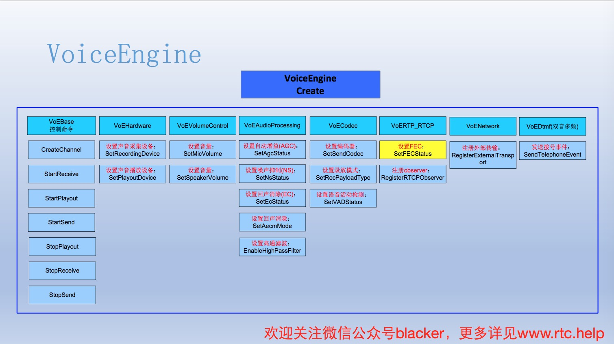

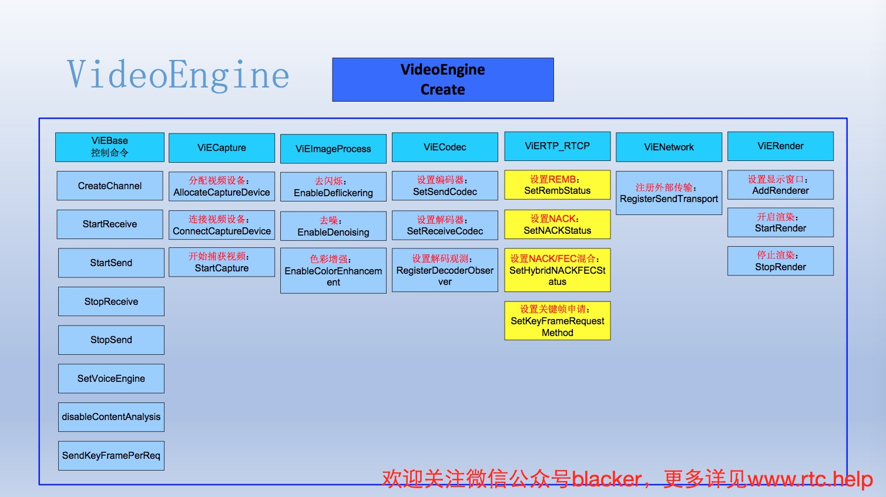

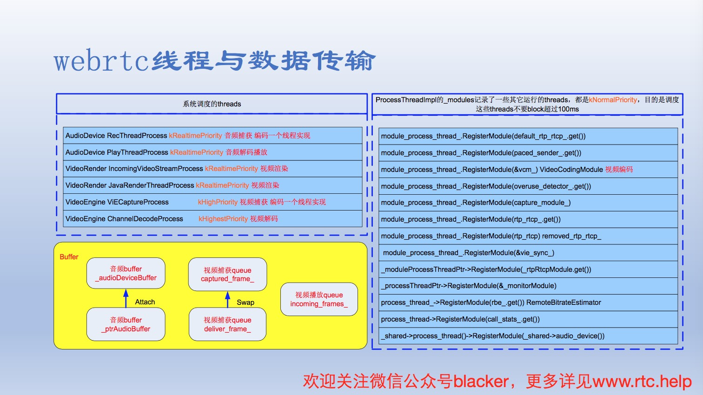

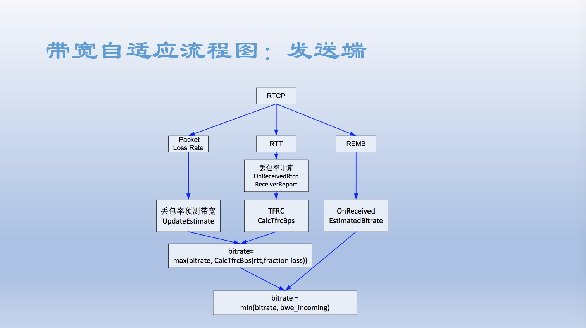


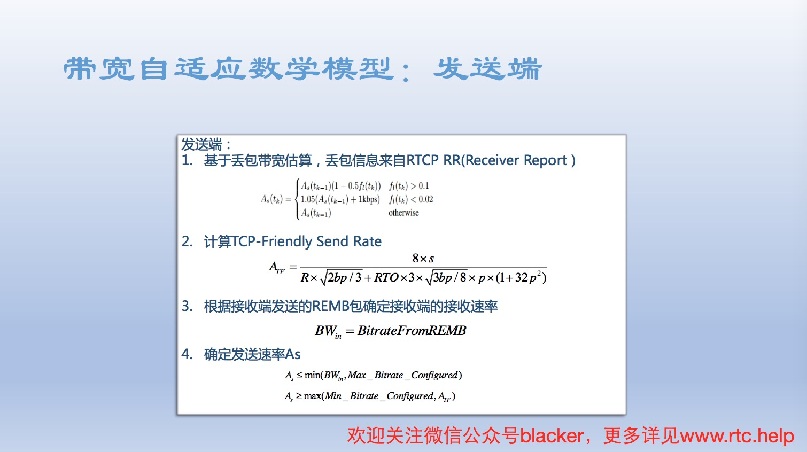

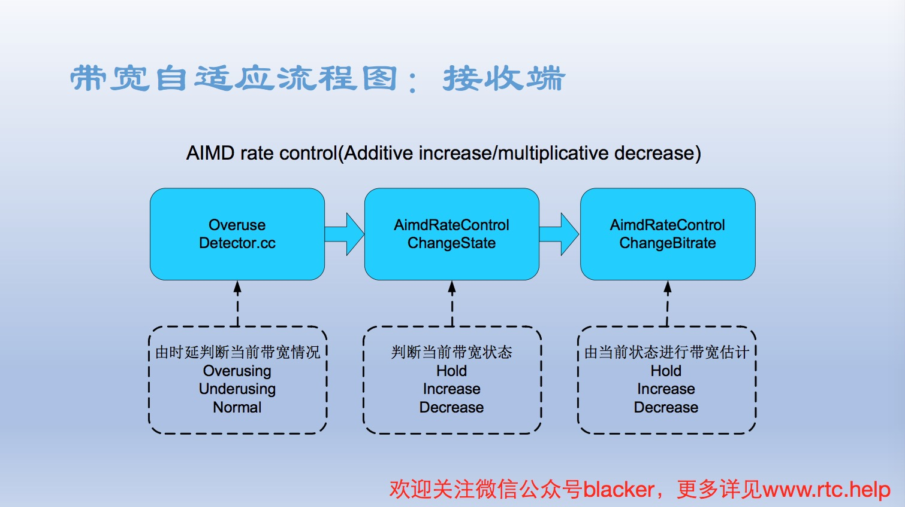

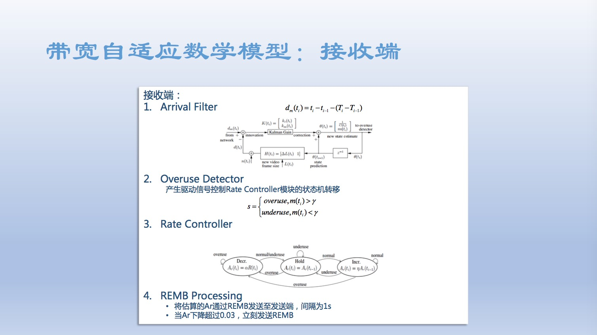

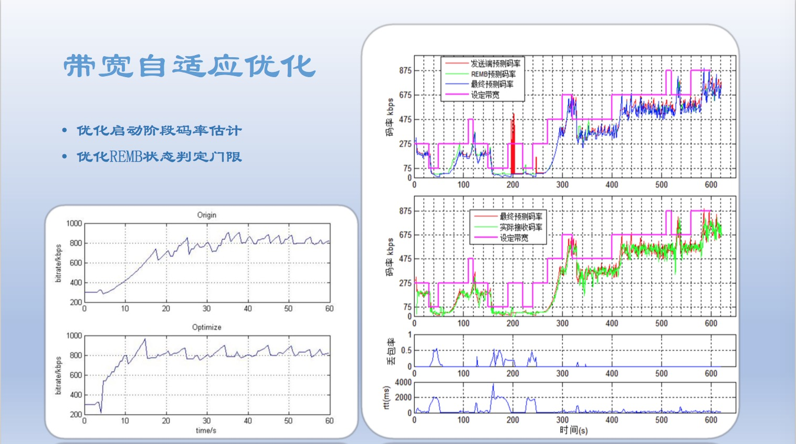

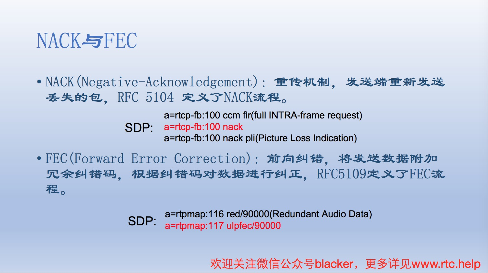


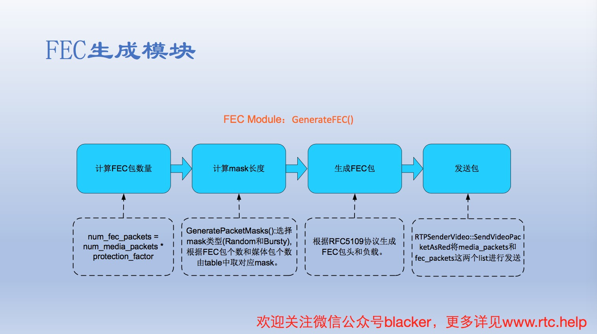

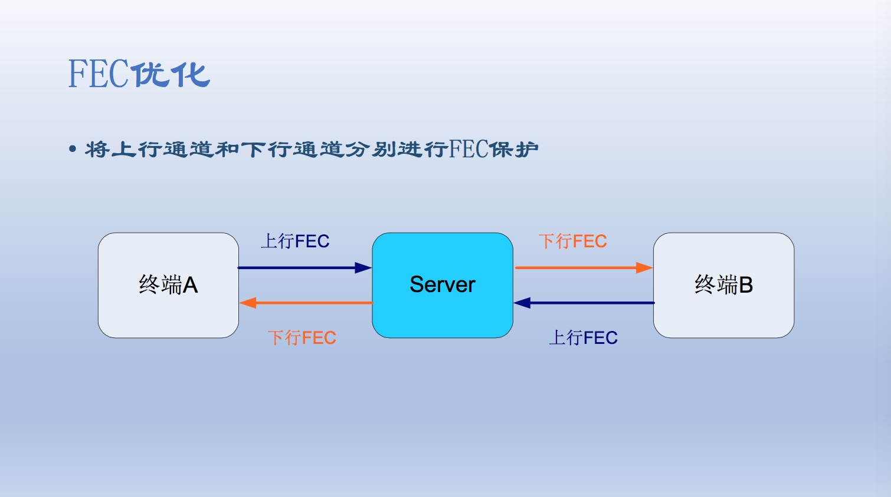


